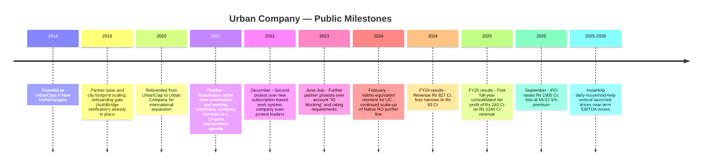
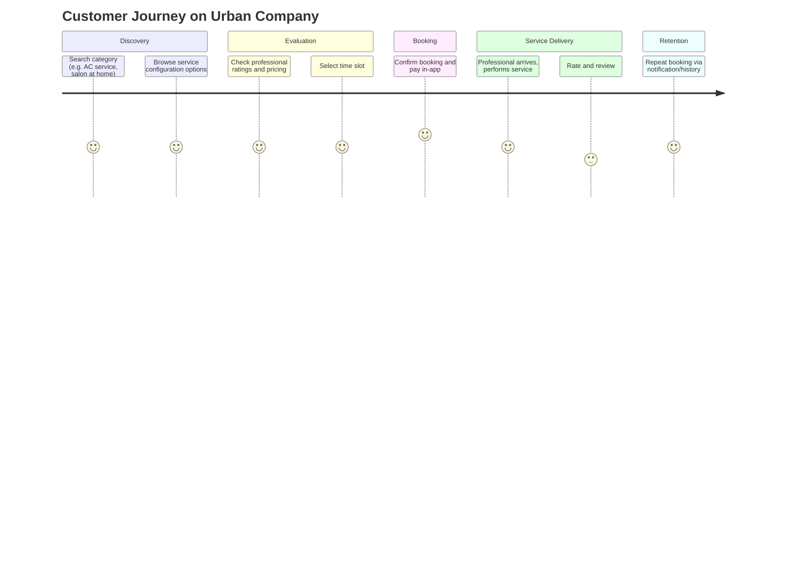
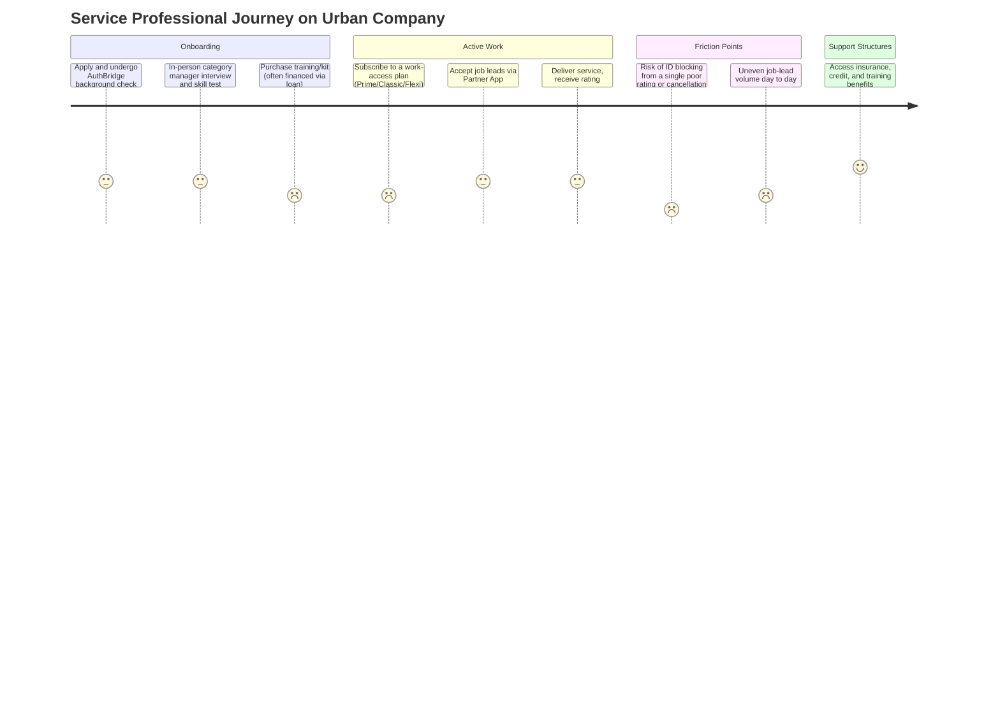
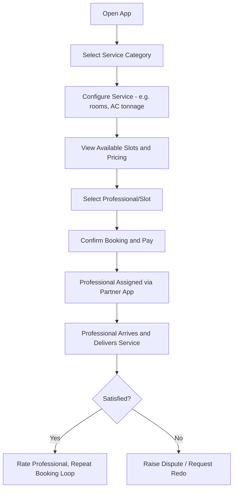
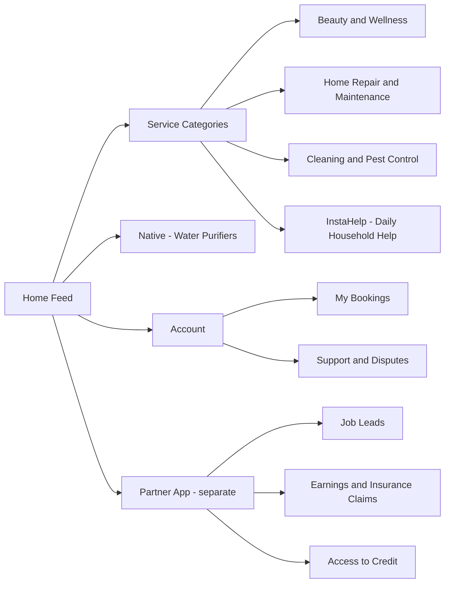
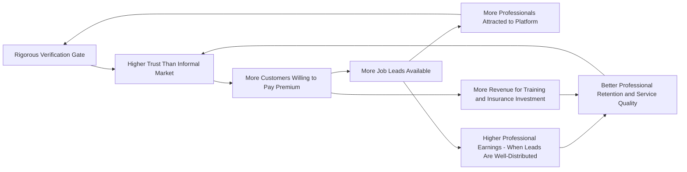
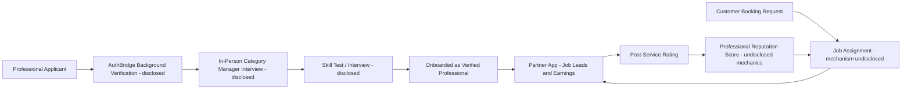
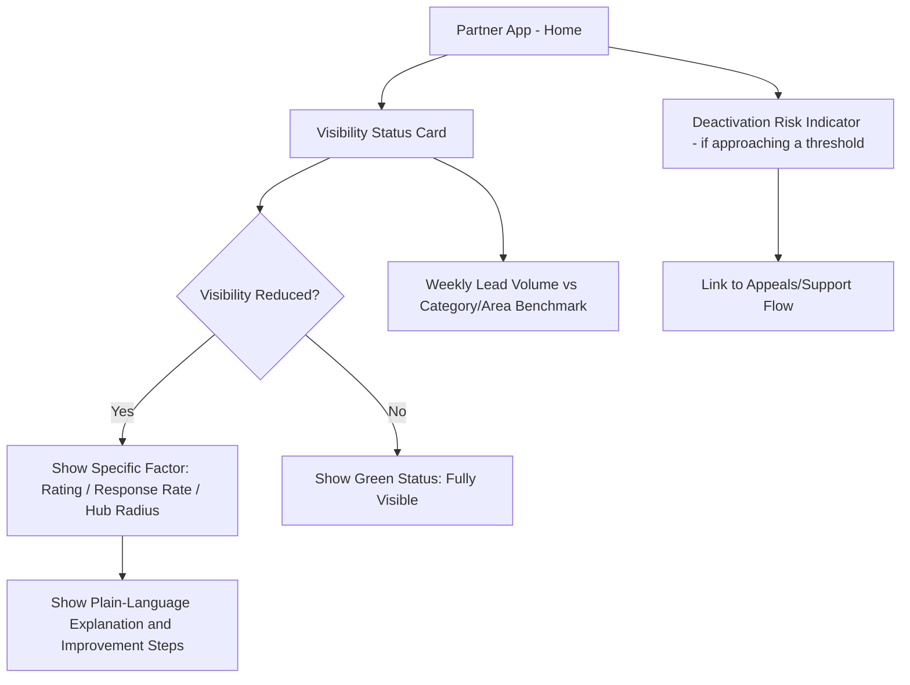
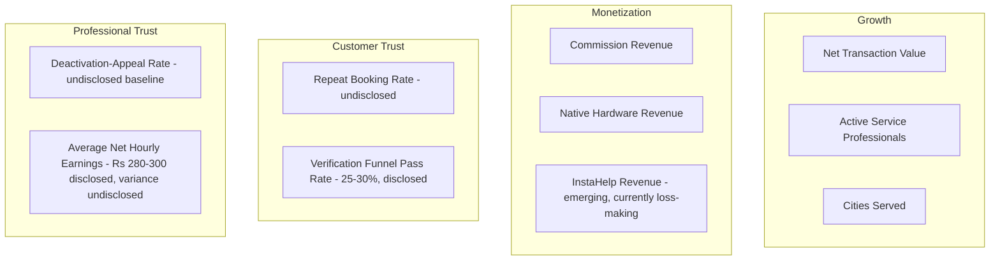

# 1. Cover

# Urban Company Product Management Case Study
## Standardizing Trust in India's Informal Services Economy

**Author:** Gaurav Singh
**Series:** Day 25 of 90 — 90-Day Product Management Case Study Challenge
**Subject Company:** Urban Company Limited (formerly UrbanClap Technologies India Limited)
**Last Updated:** July 2026

> This case study is an independent analytical work. It is not affiliated with, endorsed by, or reviewed by Urban Company Limited. All facts are sourced from public disclosures; all opinions are explicitly labelled as such.

---

# 2. Repository Metadata

| Field | Value |
|---|---|
| Folder | Day-25-Urban-Company |
| Format | GitHub-flavoured Markdown |
| Diagrams | Mermaid.js |
| Research Cut-off | July 21, 2026 |
| Word Count Target | Long-form (research report) |
| License | MIT (see Section 63) |
| Companion Reference | Day-24 Meesho README (structure only, no content reused) |

---

# 3. Badges

`Status: Public Company (NSE: URBANCO, BSE: 544999)` · `Sector: Home & Beauty Services Marketplace` · `HQ: Gurgaon, Haryana, India` · `Founded: November 2014` · `IPO: September 17, 2025` · `Category: Case Study — Day 25/90`

---

# 4. Table of Contents

1. Cover
2. Repository Metadata
3. Badges
4. Table of Contents
5. Executive Summary
6. Product Overview
7. Company Background
8. Product Timeline
9. Vision & Mission
10. Problem Statement
11. Market Research
12. Industry Analysis
13. TAM / SAM / SOM
14. Competitor Analysis
15. SWOT
16. Porter's Five Forces
17. Business Model Canvas
18. Revenue Model
19. Target Users
20. Personas
21. Jobs To Be Done
22. User Journey
23. User Flow
24. Information Architecture
25. UX Audit
26. UI Audit
27. Accessibility
28. Feature Breakdown
29. AI Capabilities
30. Product Metrics
31. North Star Metric
32. Product Analytics
33. AARRR
34. HEART
35. Growth Strategy
36. Growth Loops
37. Network Effects
38. Product Strategy
39. Monetization
40. Trust & Safety
41. Technical Architecture
42. Data Flow
43. API Ecosystem
44. Privacy & Security
45. Pain Points
46. Opportunity Mapping
47. RICE
48. MoSCoW
49. Kano
50. Feature Proposal
51. PRD
52. Wireframes
53. Rollout Plan
54. A/B Testing
55. KPI Dashboard
56. Product Roadmap
57. Risks & Mitigation
58. Future Vision
59. PM Lessons
60. PM Interview Questions
61. References
62. About the Author
63. License
64. Self Review
65. Appendix

---

# 5. Executive Summary

**What:** Urban Company is a Gurgaon-headquartered, publicly listed (NSE: URBANCO) technology marketplace connecting consumers with trained, background-verified professionals for home and beauty services — cleaning, appliance repair, plumbing, electrical work, painting, and salon/spa services delivered at the customer's home.

**Why it matters:** Urban Company represents a distinct marketplace archetype from e-commerce or ride-hailing: it is not moving goods or people between two points, it is standardizing *trust in a stranger entering someone's home* at scale, in a country where the underlying services market has historically been almost entirely informal and unorganized. Independent research cited in its IPO materials places India's addressable home-services market at roughly ₹5,100–5,210 billion (~$60 billion) in FY2025 (RedSeer/HDFC TRU, via IPO disclosures), of which Urban Company's own disclosed serviceable addressable market estimate is 35%.

**Evidence:** Urban Company reported consolidated operating revenue of ₹1,144.46 crore in FY25, up 38% year-on-year, and its **first full-year consolidated net profit of ₹239.76 crore**, reversing a ₹92.77 crore loss in FY24 (Business Standard, Tofler-sourced filings). The company listed on NSE/BSE on September 17, 2025, at a 56–57.5% premium to its ₹103 issue price, after its ₹1,900 crore IPO was subscribed 103.63 times (Business Standard, PL Capital).

**PM Insight:** Urban Company's core product decision was not a pricing or growth-hacking choice but a **supply-side gating decision**: unlike food delivery or ride-hailing, where marketplace liquidity is won mostly by adding more supply as fast as possible, Urban Company deliberately restricts entry — publicly stating that on average only 25–30% of applicants pass its verification and skill-testing funnel (AuthBridge/YourStory, citing Abhiraj Bhal). This case study treats that gating decision as the single most important, and most contested, product choice in the company's history, because it is simultaneously the source of its trust advantage over informal competitors *and* the direct cause of the recurring gig-worker protests documented in Section 40.

This case study strictly separates **verified facts** (with source type), **industry estimates** (attributed to named third parties, e.g., RedSeer, HDFC TRU), and **author analysis** (explicitly labelled "Author Recommendation" or "this case study infers"). Where sources conflict — which occurs frequently in the financial reporting reviewed for FY23–FY26 — both figures are shown side by side in the Appendix rather than silently resolved.

---

# 6. Product Overview

**What is Urban Company?** A mobile-app-and-web marketplace, formerly branded UrbanClap (renamed in 2020 to support international expansion, per YourStory), that lets consumers in India, the UAE, Singapore, and (via a joint venture) Saudi Arabia book home and beauty services from a network of trained, background-verified "service partners" or "service professionals."

**Core product surfaces (publicly documented):**
- **Consumer app/website** — category browsing, service configuration (e.g., AC service tonnage, number of rooms for cleaning), scheduling, in-app payment, live tracking of the assigned professional, ratings.
- **Partner App** — available in nine regional languages (YourStory), used by service professionals for job acceptance, navigation, income tracking, insurance-claim filing, and access to formal credit.
- **Native** — Urban Company's own-branded hardware line, starting with a water purifier (RO), sold both to end consumers and (per Entrackr) to service professionals as tools of trade.
- **InstaHelp** — a newly launched (FY26) on-demand vertical for daily household help, described by the company as a "large, high-frequency category critical to strengthening its core platform" (Entrackr, citing the company's shareholder letter), and the primary driver of the company's FY26 Q2 EBITDA losses due to aggressive scale-up investment.

**PM Insight:** Urban Company's core structural choice — building a **full-stack marketplace** (owning verification, training, tooling, and even a proprietary hardware line) rather than a **thin marketplace** (pure lead-generation, as Justdial or early Quikr operated) — mirrors Meesho/Valmo's logistics-vertical-integration logic (see Day-24 case study) but applied to a services trust problem instead of a goods logistics problem. Both companies concluded that a sufficiently high-stakes trust or fulfilment gap could not be solved by a marketplace layer alone.

---

# 7. Company Background

| Field | Detail | Source Type |
|---|---|---|
| Founded | November 2014 (incorporated December 2014, per some sources) | Wikipedia / Moneymint — background facts |
| Original name | UrbanClap | Multiple sources |
| Founders | Abhiraj Singh Bhal (CEO), Varun Khaitan (COO), Raghav Chandra (CTPO/CTO) | Multiple sources, cross-corroborated |
| Founder background | Bhal and Khaitan met at IIT Kanpur (2005), both later worked at Boston Consulting Group (BCG); Chandra brought a prior startup, Buggy.in | Sovrenn, DNA India |
| Prior failed venture | Bhal and Khaitan first co-founded "Cinema Box," an in-flight movie-streaming service, which shut down after roughly six months | Sovrenn |
| Founding insight | The founders reportedly observed that India's local services market (plumbing, beauty, repairs) was disorganized and lacked a structured, trust-verified channel connecting customers to professionals | Sovrenn, Moneymint |
| Rebranding | UrbanClap renamed to Urban Company in 2020, explicitly to support international expansion | YourStory |
| Headquarters | Gurgaon (Gurugram), Haryana, India | Wikipedia |
| Listing | NSE: URBANCO; BSE: 544999; listed September 17, 2025 | Business Standard |
| Geographic footprint | 51 cities across India, UAE, and Singapore as of June 2025 (excluding a Saudi Arabia joint venture) — some earlier sources cite 59–60 cities in slightly different periods | Chittorgarh IPO prospectus summary / Moneymint — **minor conflict, see Appendix** |

**PM Insight:** As with Meesho's Fashnear pivot (see Day-24 case study, Section 7), Urban Company's founding also followed a failed first venture. This case study notes this as a recurring pattern in the Indian consumer-internet founder cohorts studied so far in this series, worth revisiting as a cross-case theme once more case studies accumulate.

---

# 8. Product Timeline



**Note on precise founding date:** Wikipedia's infobox states "Founded: November 2014," while some secondary sources state incorporation occurred in December 2014. This is a minor, likely definitional discrepancy (founding/operational start vs. legal incorporation date) and is flagged rather than resolved, per Rule 2.

---

# 9. Vision & Mission

Urban Company's own investor-relations material states that **"at the heart of our mission statement is service professional empowerment"** — explicitly defined as ensuring service professionals earn "middle class living wages (and not just minimum wages)," have access to free insurance, training, certification, formal credit, and "a career path which ensures a dignified, respectful living" (Urban Company Investor Relations, "Service Professional Enablement").

The company simultaneously states its role is to "provide the highest quality of experiences to our customers, while ensuring respectful, middle class livelihood for our service partners" (same source) — explicitly framing customer experience and partner welfare as interdependent rather than competing goals.

**PM Insight:** This is a rare case of a gig-economy platform publishing an explicit dual-sided mission statement rather than a customer-only one. **This case study infers** that the gap between this stated mission and the lived experience documented by workers and journalists in Section 40 is the central tension of Urban Company's entire product and business strategy — not a peripheral PR problem.

---

# 10. Problem Statement

**Customer-side problem:** Indian consumers seeking home or beauty services historically had to rely on word-of-mouth referrals, unverified local contractors, or informal aggregators (e.g., local classifieds), with no standardized pricing, no quality guarantee, and meaningful physical-safety risk in inviting an unknown individual into their home.

**Supply-side problem:** Millions of skilled and semi-skilled workers (beauticians, electricians, plumbers, cleaners) in India operate in the informal economy, earning inconsistent wages, lacking access to insurance, formal credit, or a scalable way to find customers beyond their immediate personal network.

**Evidence:** RedSeer/HDFC TRU research cited in Urban Company's own investor materials frames India's home services market as "traditionally unorganized," with the addressable market pegged at ~₹5,100–5,210 billion (~$60 billion) in FY2025.

**PM Insight:** This is structurally similar to Meesho's cold-start problem (Day-24, Section 10) in that both sides of the market needed to be built from near-zero digital trust, but the stakes are categorically different: a bad Meesho purchase costs money, while a bad home-services match carries physical-safety risk for both the customer (a stranger in their home) and the professional (working alone in a stranger's home, often a woman visiting a male customer's residence for a beauty service) — a distinction that shapes nearly every trust-and-safety decision covered in Section 40.

---

# 11. Market Research

Reliable third-party research cited in company and press disclosures includes:

- **RedSeer Strategy Consultants** and **HDFC TRU** — cited jointly, via Urban Company's Red Herring Prospectus (RHP), for TAM/SAM figures (India Infoline, HDFC TRU primer).
- **Tofler** — company filings aggregator, cited by Business Standard/Outlook Business for FY25 standalone/consolidated results.
- **Tracxn / CB Insights** — funding history and competitor mapping.

**Key research findings, as reported:**
- India's home services TAM was estimated at ₹5,100–5,210 billion (~$60 billion) in FY2025, projected to grow at a 10–11% CAGR to ₹8,400–8,580 billion (~$100 billion) by FY2030 (India Infoline, HDFC TRU).
- Cleaning and pest control was cited as the largest sub-segment, at 19% of the market in FY2025 (India Infoline).
- Urban Company reported 6.5–6.8 million annual transacting consumers (figures vary slightly by source and period — see Appendix) and 54,347 average monthly active service professionals for the quarter ending June 30, 2025 (IPOJI, citing RHP data).
- The company has fulfilled over 97 million cumulative service orders as of its IPO (Forbes India, citing company disclosure).

> **Conflict flag:** Consumer counts vary meaningfully by source and period: 5 million customers served (2021, Foundrnews), 13 million customers (September 2025 IPO coverage, Bollywood Shaadis), 14.6 million consumers (Business Standard, September 2025), and 6.5–6.8 million *annual transacting* consumers (Entrackr, RedSeer-adjacent framing). These are likely measuring different things — cumulative lifetime customers vs. a rolling annual active-user metric — and this case study does not merge them into a single figure. See Appendix.

---

# 12. Industry Analysis

India's organized home-services sector, per the sources reviewed, can be segmented into:

1. **Full-stack, vertically-integrated marketplaces** — Urban Company, which owns verification, training, and tooling.
2. **Thin marketplace / lead-generation models** — Justdial (a local search/directory model rather than a managed marketplace) and Quikr Services.
3. **Real-estate-adjacent bundlers** — NoBroker, which bundles home services with its core property-rental/sale business.
4. **Conglomerate-backed entrants** — Housejoy, which received Amazon India backing and, per one source, provides a distribution funnel through Amazon's platform for post-purchase installation services (Mobisoft Infotech).
5. **Now-defunct or faded early competitors** — Housejoy (reported to have shut down per one source, though a competing source lists it as still active with Amazon backing — **conflict flagged in Appendix**) and Zimmber, both cited as having faded during a mid-2010s funding contraction (Arthnova, Markhub24).

**PM Insight:** The consolidation pattern here closely parallels Meesho's social-commerce peer set collapse (Day-24, Section 12) — in both cases, a capital-intensive trust/liquidity problem eventually favored one well-capitalized, execution-disciplined winner over a larger number of thinly-funded early entrants. One sourced account (Arthnova) explicitly attributes Urban Company's win to prioritizing **supply-side quality investment** over competitors who focused purely on demand-side growth — a direct parallel to, yet philosophical inverse of, Meesho's zero-commission demand-through-supply-abundance strategy (Day-24, Section 35).

---

# 13. TAM / SAM / SOM

> Figures below are drawn from Urban Company's own RHP-disclosed estimates (via India Infoline/HDFC TRU) and are presented as **company/industry-published estimates**, not author fabrication — but the case study flags where interpretation is required.

| Layer | Definition | Estimate | Source Type |
|---|---|---|---|
| TAM | India home services market, FY2025 | ₹5,100–5,210 billion (~$60B) | RedSeer/HDFC TRU, via India Infoline |
| TAM (FY2030 projection) | Same market, 10–11% CAGR | ₹8,400–8,580 billion (~$100B) | HDFC TRU |
| SAM | Urban Company's own disclosed serviceable-addressable-market estimate | 35% of TAM | India Infoline, citing company RHP |
| SOM | Urban Company's actual captured share, given FY25 revenue of ~₹1,144 crore against a SAM of roughly ₹1,785–1,824 billion | Well under 1% of SAM by revenue — **author-calculated ratio, not a company-published SOM figure** | **Author Recommendation / inference** |

**Important interpretive note (author-added):** A SAM of 35% and an actual captured revenue share of well under 1% of that SAM does not necessarily indicate weak execution — home services (unlike e-commerce GMV) mostly flows through informal, cash-based, unbranded local providers that will take years, possibly decades, to shift to platform models. **This case study infers** that Urban Company's real near-term competitive set is not other apps but the informal, offline status quo itself — a materially different competitive dynamic than Meesho's fight against Flipkart and Amazon (Day-24, Section 14).

---

# 14. Competitor Analysis

| Platform | Model | Reported Position | Source |
|---|---|---|---|
| Urban Company | Full-stack, verified professional marketplace | Market leader in organized home services; profitable FY25; publicly listed | Multiple, cross-corroborated |
| Housejoy | Amazon India-backed home services | One source (Arthnova) states it shut down during market consolidation; a separate, more recent source (Mobisoft Infotech, 2026) describes it as active with Amazon-linked distribution advantage | **Direct conflict — see Appendix** |
| Zimmber | Home repairs/cleaning aggregator | Reported to have faded/shut down during mid-2010s consolidation | Arthnova, Markhub24 |
| NoBroker | Real estate + bundled home services | Active competitor, leverages integrated property-services offering | NoBroker's own blog, Distill Intelligence |
| Justdial | Local search/directory, lead-generation only | Listed as a competitor by Distill Intelligence, but operates a fundamentally different (non-managed-marketplace) model | Distill Intelligence |
| DutiBook | Emerging home services platform | Positions itself explicitly against Urban Company on lower commission rates and more transparent lead distribution for professionals | DutiBook's own comparison blog |
| Global comparables (for context only) | Angi, Thumbtack, TaskRabbit (US) | Cited as fighting over a global "online home services" slice estimated at $5.15B (2024) growing to $19.65B by 2033 at a 16% CAGR — a market-research estimate, not directly comparable to India's TAM figures above | Mobisoft Infotech |

**PM Insight:** Unlike Meesho's competitive landscape, where Flipkart and Amazon remain large, well-capitalized direct rivals (Day-24, Section 14), Urban Company's *organized* competitive set is comparatively thin post-consolidation — its primary ongoing competitive pressure, per the sources reviewed, comes from the vastly larger informal/offline market rather than from other funded platforms.

---

# 15. SWOT

**Strengths**
- First full fiscal year of consolidated profitability (FY25: ₹240 crore net profit on ₹1,144 crore revenue), achieved ahead of its IPO (Business Standard).
- A publicly documented, rigorous supply-side gating process — background verification via AuthBridge, in-person category-manager interviews, and skill tests, with only 25–30% of applicants accepted (AuthBridge/YourStory, citing Abhiraj Bhal) — creating a differentiated trust position versus informal competitors.
- Diversification beyond pure services into owned hardware (Native RO purifiers, ₹116 crore revenue in FY25, up from ₹29 crore in FY24 — a 300% jump per Entrackr) and a new daily-help vertical (InstaHelp).
- Strong IPO reception: 103.63x subscription and a 56–57.5% listing-day premium (Business Standard, PL Capital), indicating strong public-market confidence in the model at time of listing.

**Weaknesses**
- A well-documented, recurring, multi-year pattern of labour disputes: an October 2021 beauticians' strike over commission rates as high as 30–35% (Inc42, Business and Human Rights Centre), a December 2021 protest over a new subscription-based work system that led the company to sue protest leaders (Fairwork, Inc42), and further protests in 2023 over account "ID blocking" and rating-requirement policies (Business Standard, The Wire).
- FY25 net profit was materially aided by a ₹211 crore deferred tax credit (Business Standard) — meaning underlying operating profitability, excluding this one-time item, was substantially thinner than the headline number suggests.
- The FY26 push into InstaHelp has already produced a Q2 FY26 net loss of ₹59 crore, reversing the prior quarter's ₹6.94 crore profit (Entrackr) — indicating the core profitability achieved in FY25 is not yet durable across new lines of business.

**Opportunities**
- HDFC TRU projects the addressable home services TAM to nearly double, from ~$60B (FY25) to ~$100B (FY30), driven by urbanization and busier lifestyles.
- Urban Company's own disclosed SAM estimate (35% of TAM) suggests significant headroom for category expansion within its currently addressed market alone.
- International expansion (UAE, Singapore, and a Saudi Arabia joint venture) offers geographic diversification beyond India-specific labour and regulatory risk.

**Threats**
- Continued escalation of labour-rights scrutiny — including a 2025 union-led "#DryJune" customer boycott campaign and a "Worker Ka IPO" campaign demanding worker inclusion in IPO decision-making and discounted access to company stock (The News Minute) — represents an ongoing reputational and potential regulatory risk (e.g., future gig-worker classification legislation in India).
- Newly-public company must now sustain profitability under quarterly investor scrutiny, a different discipline than private growth-stage operation, especially while simultaneously funding InstaHelp's stated near-term EBITDA losses (Entrackr).
- Because much of the addressable market remains informal/offline, growth is constrained by the pace of behavioural shift toward platform-based booking, not merely by Urban Company's own execution.

---

# 16. Porter's Five Forces

| Force | Assessment | Rationale |
|---|---|---|
| Threat of New Entrants | Low-Moderate | High capital and operational requirements to replicate verification/training infrastructure at scale; however, low-cost regional entrants (e.g., DutiBook, explicitly pitching lower commissions to professionals) can target specific underserved niches. |
| Bargaining Power of Suppliers (Service Professionals) | Rising, contested | Professionals have organized (AIGWU, Gig and Platform Service Workers' Union) and demonstrated ability to force policy concessions (2021 commission cuts from 30-35% to 20-25%) through direct action — an unusually high degree of realized bargaining power for a gig platform's supply side. |
| Bargaining Power of Buyers | Moderate-High | Customers can compare prices with informal/offline alternatives and, increasingly, competing organized platforms (NoBroker, DutiBook), though trust/verification stickiness provides some lock-in. |
| Threat of Substitutes | High | The overwhelming majority of India's home services market remains informal/offline (word-of-mouth local providers), representing the largest substitute by volume, not a competing app. |
| Industry Rivalry | Low-Moderate | Post-consolidation (Housejoy, Zimmber faded per most sources), organized-platform rivalry appears comparatively thin versus e-commerce or food delivery, though NoBroker and regional entrants provide some competitive pressure. |

**Author Recommendation:** Given documented, escalating supplier (worker) bargaining power exercised through collective action rather than market mechanisms, Urban Company's most durable strategic risk is not competitive substitution but a potential shift toward formal worker-classification requirements in India — a risk this case study believes deserves the same weight in strategic planning as competitive threats, even though it is not typically modelled in a standard Five Forces framework.

---

# 17. Business Model Canvas

| Block | Urban Company's Approach |
|---|---|
| Key Partners | AuthBridge (background verification), ACKO General Insurance (partner life/accident cover), NBFC lending partners (partner credit), Microsoft Azure (cognitive services, per AuthBridge's account), Srinidhi Trust (Suraksha Fund for emergency partner support) |
| Key Activities | Marketplace matching, partner verification and training, quality control, in-house hardware (Native) design/sourcing, InstaHelp vertical operations |
| Key Resources | Verified professional network (~54,000 average monthly active professionals, per RHP data), brand trust, Partner App infrastructure, training-center network |
| Value Propositions (Customers) | Verified, trained, standardized-quality professionals; transparent pricing; in-app tracking and dispute resolution |
| Value Propositions (Professionals) | Access to formal credit, free insurance, free training/certification, higher-than-informal-market earnings (company cites ₹280-300/hour net average, per its UC Earnings Index), and a Partner Stock Option Plan (disbursed ₹5.3 crore worth of stock options to 500 partners, per YourStory) |
| Customer Relationships | App-based self-service booking, in-app support, ratings/reviews |
| Channels | Android/iOS app, website |
| Customer Segments | Urban/metro households (primary), expanding to international markets (UAE, Singapore, Saudi JV) |
| Cost Structure | Employee benefits (largest FY25 cost line at 28.6% of total expenditure, per Entrackr), partner insurance/training investment (₹72 crore in 2022 alone, per YourStory), marketing, technology |
| Revenue Streams | Commission on services (historically up to 30–35%, reduced to a 20–25% range after 2021 protests), Native hardware sales, product sales to service professionals, InstaHelp subscription/transaction revenue (emerging) |

---

# 18. Revenue Model

Unlike Meesho's zero-commission model (Day-24, Section 18), Urban Company **does** charge a direct commission to its service professionals — this is a foundational business-model difference between the two companies despite both being "marketplaces serving underserved segments of India."

**Documented commission history:**
- Prior to October 2021: reported commissions as high as 30–35% (Inc42, Business and Human Rights Centre).
- Post-October 2021 concessions: reduced to a 20% figure per the company's 12-point agenda (Inc42), though a subsequent source (BehanBox) states the cap was set at 25% after further negotiation — **minor conflict, likely reflecting different points in a phased reduction, see Appendix.**
- As of 2024 disclosures: Entrackr's July 2024 reporting states the company "charged around 25% average commission from their service partners."
- A 2025 account (The News Minute) states the highest commission was reduced from 30% to 25% following the 2021 protests, consistent with the Entrackr figure.

**Other documented revenue streams:**
1. **Native hardware sales** — water purifiers sold to consumers; ₹116 crore in FY25, up 300% from ₹29 crore in FY24 (Entrackr).
2. **Product sales to service professionals** — tools, beauty products, and kits sold to professionals as part of their onboarding/ongoing supply needs; ₹188 crore in FY25 (Entrackr) — note this is a revenue stream *from* professionals, which sits alongside the labour-cost concerns documented in Section 40 (professionals reportedly financing ₹50,000 training/kit costs partly via company loans, per The News Minute).
3. **InstaHelp** — a new, still-loss-making vertical for daily household help, launched in FY26 (Entrackr).
4. **International operations** — 12.8% of FY25 revenue from international services (UAE, Singapore), per Business Standard's IPO-day coverage.

**Financial snapshot (figures as reported in cited sources; fiscal year = April–March in India):**

| Fiscal Year | Revenue (₹ crore) | Net Result (₹ crore) | Source |
|---|---|---|---|
| FY21 | 248 | Not verified in this research | Entrackr |
| FY23 | 637 (revenue from operations) | Loss of 312 (PBT, per company summary) / Loss of 308 (per Entrackr's later figure) | Urban Company IR / Entrackr — **minor conflict, see Appendix** |
| FY24 | 827 (revenue from operations) | Loss of 93 (consolidated) / Loss of 11.19 (standalone) | Business Standard, Outlook Business |
| FY25 | 1,144.46 (revenue from operations) / 1,260.7 (total income, per Inc42) | Profit of 239.76–240 (consolidated) / Profit of 290 (standalone) | Business Standard, Entrackr, Outlook Business, Inc42 |
| Q1 FY26 | 380 implied trajectory (per Q2 comparison) | Profit of 6.94 (Q1 FY26, sequential) | Entrackr |
| Q2 FY26 | 380 (revenue from operations, +37% YoY) | Loss of 59 (driven by InstaHelp investment) | Entrackr |

> **This case study does not select one figure over another where sources disagree** — for example, FY25 revenue is reported as ₹1,144.46 crore (Business Standard, Entrackr) in one framing and ₹910–928 crore to ₹1,260.7 crore (total income, including interest/investment income) in another (Outlook Business/Inc42). Both are shown because they measure different things — operating revenue vs. total income including non-operating items — and are not necessarily contradictory once that distinction is made explicit. See Section 65.

**PM Insight:** The FY25 swing to profit, like Meesho's own financial narrative (Day-24, Section 18), requires careful reading: a ₹211 crore deferred tax credit materially contributed to the headline ₹240 crore profit figure (Business Standard). Removing that credit would imply a much thinner — though still likely positive or near-breakeven — underlying operating result. This is not evidence of manipulation; deferred tax credits are a standard accounting mechanism, but headline-number literacy matters for anyone evaluating this business as a new public-market investor.

---

# 19. Target Users

**Primary customer segment:** Urban and metro households in India (and analogous urban markets internationally — UAE, Singapore) seeking standardized, verified home and beauty services, willing to pay a premium over informal/offline alternatives for reliability and trust.

**Primary supply segment:** Semi-skilled and skilled individuals — beauticians, cleaners, electricians, plumbers, carpenters, appliance technicians — seeking higher and more stable earnings than available in the informal/offline services economy, in exchange for accepting the company's verification, training, commission, and (at various points) subscription-based work-access requirements.

**Author Recommendation:** Given the well-documented tension between the company's stated "middle class livelihood" mission (Section 9) and the lived economic reality described by workers (Section 40), any target-user framework for Urban Company's supply side should explicitly model **worker segments by tenure and subscription tier** (e.g., "Prime," "Classic," "Flexi," as introduced in the December 2021 subscription system per Fairwork's reporting), since these tiers appear to create materially different work conditions and are not interchangeable when analyzing the platform.

---

# 20. Personas

> **Author Recommendation — these are illustrative, synthesized personas, not Urban Company-published customer research.**

**Persona 1 — "Priya, the Trust-Seeking Customer"**
- Location: Metro India (e.g., Bengaluru, Mumbai, Delhi NCR).
- Behaviour: Books recurring home cleaning and periodic AC servicing; values verified professionals over cheaper informal alternatives given safety concerns about strangers entering her home; checks ratings before booking.
- Need: Confidence in professional identity/background and predictable, standardized pricing (directly addressed by the AuthBridge verification and skill-test funnel described in Section 41).

**Persona 2 — "Rishita, the Beautician-Partner"** *(named after a real, on-the-record source quoted in The News Minute's 2025 reporting)*
- Background: Home-based beautician who paid ₹50,000 for training and a product kit (₹10,000 upfront, the remainder financed via a company-facilitated loan repaid over a year).
- Behaviour: Subscribes to a monthly work-access plan (reported at roughly ₹1,000 for a 10-day plan) to receive sufficient service leads; reports earning inconsistently — some days only a single job.
- Need: Predictable job-lead volume without needing to pay recurring subscription fees just to remain visible on the platform — a need in direct tension with the platform's current subscription-tier design (Section 40).

---

# 21. Jobs To Be Done (JTBD)

| User | Job to Be Done |
|---|---|
| Customer | "Help me get a reliable, background-checked professional into my home for a task I can't or don't want to do myself, without the risk of hiring an unknown local contractor." |
| Professional (new entrant) | "Give me a structured, higher-earning alternative to informal local gig work, with training and tools I couldn't otherwise access." |
| Professional (established) | "Guarantee me a steady, sufficient volume of job leads so the commission and subscription costs I'm paying are worth it." |

**PM Insight:** The customer-side JTBD is fundamentally a **risk-reduction job** (verifying a stranger before granting home access), while the professional-side JTBD splits into an **onboarding-stage job** (access to structure and training) and a **retention-stage job** (predictable income) that the current subscription/commission model appears not to fully satisfy for at least a subset of professionals, per the sourced worker accounts in Section 40.

---

# 22. User Journey





**PM Insight:** The professional-side journey's lowest-scoring steps ("Risk of ID blocking," "Uneven job-lead volume") are not hypothetical UX friction — they are the exact, named grievances documented across multiple years of press coverage in Section 40, making this one of the more concretely evidenced journey maps in this case-study series.

---

# 23. User Flow



---

# 24. Information Architecture



**PM Insight:** Native's placement as a standalone e-commerce-style shelf alongside a services-first IA reflects the company's stated ambition (per co-founder Varun Khaitan's Forbes India interview) to potentially grow the products segment toward a "50-50 split" with services over time — a strategic bet embedded directly into the app's structure.

---

# 25. UX Audit

**Strength (documented):** A structured service-configuration flow (e.g., specifying AC tonnage or number of rooms before price is shown) reduces the ambiguity and haggling typical of informal service booking — this is an inferred strength based on the company's stated "standardization" value proposition (Markhub24) rather than a directly measured UX metric.

**Weakness (documented via worker-side sources, not customer-side):** The Partner App experience includes friction points explicitly named by workers — inconsistent display of available time slots reducing income (Business Standard, 2023 coverage of the ID-blocking protests) and abrupt account deactivation with limited recourse (The Wire, BehanBox).

**Author Recommendation:** A holistic UX audit of a two-sided marketplace like Urban Company should treat the **Partner App experience as equally material to overall platform health as the consumer app**, since professional-side friction (leads not displaying, ratings-driven deactivation) directly determines the supply reliability that the consumer-side trust proposition depends on.

---

# 26. UI Audit

**Meesho-style caution applies equally here: Urban Company has not publicly disclosed a detailed UI design system, component library, or design-token architecture.** What is documented:
- The Partner App is available in nine regional languages (YourStory), reflecting a deliberate accessibility choice for a workforce that may not be comfortable operating in English or Hindi alone.
- The consumer app uses a structured, form-based configuration flow for service booking (inferred from company descriptions of the booking process; no detailed component-level UI documentation was found).

Any further UI-level claims beyond what is cited above would be speculative and are intentionally omitted here per Rule 1.

---

# 27. Accessibility

**Urban Company has not publicly disclosed a formal accessibility (WCAG conformance, screen-reader support) statement** in any source reviewed for this case study.

**Author Recommendation:** Given that the Partner App's nine-language support (Section 26) already demonstrates some accessibility-adjacent investment for its workforce, extending equivalent language/literacy accessibility work to the consumer-facing app (for older users or those less comfortable with English-first UX) is a plausible, currently undocumented opportunity area — an analytical recommendation, not a confirmed roadmap item.

---

# 28. Feature Breakdown

| Feature | Description | Disclosure Status |
|---|---|---|
| Structured service configuration | Category-specific booking flow (e.g., AC tonnage, room count) | Inferred from company/press description (Markhub24) |
| Partner App (9 languages) | Job leads, earnings tracking, insurance claims, credit access | Publicly disclosed (YourStory) |
| AuthBridge background verification | Third-party identity/background check at onboarding | Publicly disclosed (AuthBridge newsroom) |
| Native RO water purifier | Owned-brand hardware product line | Publicly disclosed (Entrackr, Forbes India) |
| InstaHelp | Daily household help vertical | Publicly disclosed (Entrackr) |
| Partner Stock Option Plan | Equity-based partner incentive program | Publicly disclosed (YourStory) — ₹5.3 crore disbursed to 500 partners |
| Suraksha Fund | Emergency financial support for partners, funded by employees/management via an NGO partnership (Srinidhi Trust) | Publicly disclosed (Urban Company Medium/IR blog) |
| Group Personal Accident Insurance | Insurance cover up to ₹3,00,000 for active partners | Publicly disclosed (UC Earnings Index blog) |

**Note:** This case study does **not** include a "smart job-matching AI" or similar system as a confirmed feature unless explicitly documented by a primary Urban Company source — no such system with named technical detail was found disclosed in the sources reviewed, beyond a general reference to Microsoft Azure "cognitive services" partnership (AuthBridge newsroom), which is reported without further technical elaboration.

---

# 29. AI Capabilities

**This section reports only what has been publicly disclosed. Unlike Meesho (Day-24, Section 29), Urban Company has disclosed comparatively little specific detail about its AI/ML systems in the sources reviewed for this research.**

What is documented:
- **Microsoft Azure "cognitive services" partnership** — AuthBridge's newsroom account states Urban Company "partnered with Microsoft Azure to leverage its cognitive services," in the context of its safety and upskilling programs, though the specific application (e.g., document verification, fraud detection, matching) is not further elaborated in the source.
- No specific recommendation engine, demand-forecasting system, or named AI product (comparable to Meesho's PRISM or BharatMLStack) was found publicly documented for Urban Company in the sources reviewed.

**What is not disclosed:** Urban Company has not publicly disclosed details of any AI-driven job-matching algorithm, dynamic pricing system, or fraud-detection model, despite the plausibility that such systems exist internally given the operational complexity of matching millions of service requests to tens of thousands of professionals across dozens of cities. **This case study does not fabricate such systems.** Any statement describing a specific Urban Company AI architecture beyond the Azure cognitive-services reference above would be invented and is intentionally excluded.

**Author Recommendation:** Given the strong parallel to Meesho's PRISM (a personalization/ranking system solving an analogous discovery problem for products), a plausible and valuable area for Urban Company to publicly document — if such a system exists internally — would be an equivalent job-matching optimization system quantifying how customer-professional pairing affects both customer wait-time and professional earnings-per-hour. This is a recommendation for greater public disclosure, not a claim that such a system currently exists.

---

# 30. Product Metrics

| Metric | Value | Period | Source Type |
|---|---|---|---|
| Cities served | 51 (India, UAE, Singapore, excl. Saudi JV) | As of June 30, 2025 | Chittorgarh (IPO prospectus summary) |
| Cities served | 59–60 (India + UAE, Singapore, Saudi Arabia) | 2025, differing source | Moneymint — **minor conflict, see Appendix** |
| Cumulative service orders | 97+ million | As of IPO (Sept 2025) | Forbes India |
| Annual transacting consumers | 6.5–6.8 million | FY25 | Entrackr |
| Consumers served (cumulative, different framing) | 13–14.6 million | Sept 2025 (IPO coverage) | Bollywood Shaadis / Business Standard — **conflict, see Appendix** |
| Average monthly active service professionals | 54,347 | Quarter ending June 30, 2025 | IPOJI, citing RHP |
| Active service professionals (different framing) | 48,000–55,000+ | 2025, varying sources | Bollywood Shaadis / Moneymint — consistent range |
| Net Transaction Value (NTV) | ₹1,030 crore | Q2 FY26 | Entrackr |
| Net Transaction Value (annualized, FY24) | ~₹3,300 crore (Entrackr estimate) | FY24 | Entrackr |
| Revenue from operations | ₹1,144.46 crore | FY25 | Business Standard |
| Net profit (consolidated) | ₹239.76 crore | FY25 | Outlook Business, Tofler |
| Average partner net earnings | ₹280–300/hour, net of commissions/fees/costs | H2 CY23-era disclosure | Entrackr (UC Earnings Index) |
| Average monthly earnings, top service partners | ₹33,469 (30+ services/month); ₹42,792 (top 20%) | Recent disclosure period, per Entrackr | Entrackr |
| IPO subscription | 103.63x oversubscribed | Sept 2025 | Business Standard |
| Listing-day premium | 56.31%–57.5% (source-dependent) | Sept 17, 2025 | Business Standard, PL Capital — minor rounding variance |

**Note on discrepancies:** As with Meesho (Day-24), figures for "consumers served" vary substantially depending on whether a source is citing cumulative lifetime users, an annual active-user metric, or a specific reporting-period snapshot. This case study presents each figure with its stated period rather than normalizing them, per Rule 2.

---

# 31. North Star Metric

**Urban Company has not publicly disclosed an official North Star Metric.**

> **This case study infers** a plausible North Star candidate of **"Net Transaction Value (NTV) per Active Service Professional"** — a metric that would capture both marketplace health (rising NTV reflects growing customer demand) and the professional-earnings side of the company's stated dual mission (Section 9) in a single number, based on the following reasoning:
> - The company already discloses and tracks NTV as a headline metric in its quarterly results (Entrackr).
> - The company's own stated mission (Section 9) explicitly prioritizes professional earnings alongside customer experience, suggesting a North Star should reflect both sides of the marketplace rather than customer-side metrics alone (e.g., bookings or app downloads).
> - This candidate metric would also make worker-side friction (Section 40) directly visible in a core business metric, rather than treating it as an externality to growth reporting.

**This is an author-derived analytical framework, explicitly not confirmed by Urban Company.**

---

# 32. Product Analytics

Given the absence of a disclosed internal analytics stack, this section outlines an **author-recommended** analytics framework rather than reporting on Urban Company's actual internal tooling (undisclosed).

**Author Recommendation — Suggested Analytics Pillars:**
1. **Trust funnel:** Applicant-to-onboarded-professional conversion rate (company has disclosed a 25–30% acceptance rate, per AuthBridge/YourStory, but not the funnel stages behind it).
2. **Professional retention and earnings stability:** Variance in job-lead volume day-to-day for individual professionals — directly relevant given the "some days only one job" grievance documented in Section 40.
3. **Dispute/complaint funnel:** Rate of ID-blocking events and their cause classification (e.g., genuine safety issue vs. disputed customer complaint) — not currently public, and the single most important undisclosed metric for evaluating the fairness concerns raised repeatedly by worker advocates.
4. **New-vertical unit economics:** InstaHelp's contribution margin per order, tracked separately from the core, profitable India Consumer Services segment, given the vertical's currently disclosed EBITDA drag (Entrackr).

---

# 33. AARRR (Pirate Metrics)

| Stage | Urban Company Mechanism (as documented) |
|---|---|
| Acquisition | Brand trust built through verification/standardization positioning; category-specific SEO/search presence (inferred, not directly disclosed) |
| Activation | Structured service-configuration flow reducing first-booking friction (inferred from company/press description) |
| Retention | Repeat bookings for recurring needs (cleaning, salon); ratings-driven professional consistency |
| Referral | A "strong referral programme" is cited as part of the professional-onboarding funnel (AuthBridge/YourStory), though this refers to supply-side referral, not a disclosed customer referral mechanic |
| Revenue | Commission (20–25% range post-2021), Native hardware sales, InstaHelp (emerging), product sales to professionals |

---

# 34. HEART Framework

| Dimension | Applicable Signal (documented or inferred) |
|---|---|
| Happiness (customers) | Not publicly disclosed (no published NPS/CSAT); IPO oversubscription (103.63x) suggests strong *investor* confidence, which is not the same as customer satisfaction and should not be conflated with it |
| Happiness (professionals) | Documented as low/contested for a meaningful subset — union campaigns (#DryJune, Worker Ka IPO) and multi-year strikes (Section 40) are explicit dissatisfaction signals, though not a comprehensive survey of the full professional base |
| Engagement | 54,347 average monthly active professionals (disclosed); NTV of ₹1,030 crore in Q2 FY26 alone (disclosed) |
| Adoption | 97+ million cumulative service orders (disclosed) |
| Retention | Not quantified in disclosed sources for either customers or professionals — a notable gap given how central worker retention/turnover would be to evaluating the platform's core trust proposition |
| Task Success | Rate of "ID blocking" or account deactivation events is the single most important undisclosed data point for a rigorous HEART assessment, mirroring Meesho's undisclosed RTO/counterfeit rate (Day-24, Section 34) |

---

# 35. Growth Strategy

Documented growth levers, in order of most to least verifiable:

1. **Supply-side quality investment over pure demand-side growth spend** — explicitly credited by one analytical source (Arthnova) as the differentiator that let Urban Company outlast Housejoy and Zimmber during market consolidation.
2. **Category expansion** — from home repairs/cleaning/beauty into owned hardware (Native) and a new daily-help vertical (InstaHelp), diversifying revenue beyond commission-only dependence.
3. **International expansion** — UAE, Singapore, and a Saudi Arabia joint venture, diversifying beyond India-specific market and regulatory risk.
4. **Partner economic enablement as a retention/quality lever** — insurance, credit access, training, and a Partner Stock Option Plan are framed by the company as core to sustaining a reliable, motivated supply base (Urban Company IR), though the effectiveness of this framing is directly contested by the labour disputes in Section 40.

**Author Recommendation:** Because the professional-side of this marketplace has demonstrated a credible, organized capacity for collective action (unlike Meesho's atomized seller base), sustainable growth for Urban Company plausibly depends more on **resolving the commission/subscription/earnings-predictability tension** than on adding new geographies or verticals — since supply-side instability directly threatens the core "verified trust" value proposition that differentiates the company from informal competitors.

---

# 36. Growth Loops



**PM Insight:** This loop has a documented failure mode: when job-lead distribution is uneven (Section 40's "some days only one job" grievance) or when commission/subscription costs erode net earnings, the F→G link weakens, threatening the entire loop's stability — a structural vulnerability not present in Meesho's zero-commission-driven seller-acquisition loop (Day-24, Section 36), where seller-side cost pressure is not a comparable failure mode.

---

# 37. Network Effects

- **Cross-side network effect:** More verified professionals → more service availability and category breadth → attracts more customers. More customers → more job-lead volume → attracts more professionals.
- **Trust network effect (author-named, distinct from a standard marketplace effect):** Every additional verified, well-reviewed professional strengthens the platform's aggregate trust signal (versus the informal market), which is a *reputational*, not merely a liquidity-based, network effect — this is arguably Urban Company's most distinctive network-effect variant compared to the other marketplaces examined in this case-study series.
- **Weak/absent same-side network effect (professionals):** Unlike Meesho sellers, who benefit from a shared catalog/discovery ecosystem, individual Urban Company professionals largely compete with each other for the same finite job-lead pool — a structural difference that plausibly explains why collective bargaining (a substitute for a missing same-side network benefit) has emerged so prominently on this platform's supply side (Section 40).

**Author Recommendation:** This asymmetry — customers benefit from network effects, professionals largely experience zero-sum competition for leads — is, in this case study's assessment, the single most important structural driver of the recurring labour unrest documented throughout this document, more so than any specific commission percentage.

---

# 38. Product Strategy

Urban Company's strategy, based on the documented history (Section 8) and disclosures reviewed, can be characterized as a sequence of deliberate strategic bets:

1. **2014–2019:** Establish the verified-professional marketplace model and a rigorous onboarding gate (AuthBridge, skill tests) as the core differentiator versus informal competitors and thin lead-generation rivals (Justdial, early Housejoy/Zimmber).
2. **2020–2021:** International rebrand (UrbanClap → Urban Company) to support geographic expansion; simultaneously, first major commission/subscription-model backlash from the professional workforce.
3. **2022–2024:** Continued investment in partner enablement (training, insurance, credit) alongside steady revenue growth and narrowing losses, while labour tensions persisted at a lower intensity (2023 ID-blocking protests).
4. **2025–present:** IPO, first full-year profitability, and diversification into Native hardware and InstaHelp — a shift from a single-category-dominant story to a multi-vertical growth narrative aimed at sustaining public-market growth expectations.

**PM Insight:** Unlike Meesho's three sequential *business-model* pivots (Day-24, Section 38), Urban Company's core marketplace model has been comparatively stable since founding — its major strategic shifts have been in **category/vertical expansion and geographic reach**, not in the fundamental verified-marketplace mechanic itself. This suggests Urban Company validated its core model earlier and has spent more of its history scaling it than reinventing it.

---

# 39. Monetization

(Cross-referenced with Section 18; presented here with a segmentation lens.)

| Monetization Stream | Who Pays | Documented Status |
|---|---|---|
| Commission on services | Service professionals | Disclosed; historically 30-35%, reduced to a 20-25% range post-2021 protests |
| Subscription/work-access plans | Service professionals (select categories, e.g., beauticians under "Prime/Classic/Flexi" tiers) | Disclosed (Fairwork, The News Minute) |
| Native hardware sales | Consumers | Disclosed (₹116 crore, FY25, Entrackr) |
| Product sales to professionals | Service professionals | Disclosed (₹188 crore, FY25, Entrackr) |
| InstaHelp | Consumers (model details not fully disclosed) | Disclosed as a revenue-generating vertical, but specific pricing/commission mechanics not found in sources reviewed |

**Urban Company has not publicly disclosed the precise current commission percentage applied uniformly across all categories** — reported figures range from a "20% target" (2021 company commitment) to a "25% cap" (2021-2023 sources) to "around 25% average" (2024, Entrackr) — presented as a range rather than a single fabricated number, per Rule 6.

---

# 40. Trust & Safety

This section is unusually significant for Urban Company, because — unlike Meesho, where the primary documented trust problem is buyer-facing (counterfeit goods, Day-24 Section 40) — Urban Company's most extensively documented trust and safety issue is **supply-side (labour conditions)**, not demand-side (customer safety). Both are covered here for completeness.

**Customer-side safety:** Urban Company's stated verification process — AuthBridge background checks, in-person category-manager interviews, and skill tests, with only 25–30% of applicants passing (AuthBridge/YourStory) — is the company's primary documented customer-safety mechanism. No specific customer-safety incident data (e.g., reported crime involving professionals) was found disclosed in the sources reviewed for this case study, and this case study does not speculate about such incidents in the absence of disclosed data.

**Professional-side labour disputes — a detailed, multi-year documented record:**

- **October 2021:** 100+ beauticians and spa attendants staged a strike outside the Gurugram headquarters, alleging commissions as high as 30–35%, poor working conditions, no insurance, and frequent night-shift allocation (Inc42, Business and Human Rights Centre). The company subsequently published a 12-point agenda including cutting commission from 35% to 20%, removing temporary account blocks, and raising customer-facing prices to improve partner take-home pay (Inc42).
- **December 2021:** A second protest, aided by the All India Gig Workers Union (AIGWU), opposed a new subscription-based work-access system (categorizing beauticians into "Prime," "Classic," and "Flexi" tiers requiring upfront payments of ₹2,000–5,000). Urban Company responded by filing a lawsuit against the alleged protest leaders in Gurgaon District Court, and publicly characterized the protests as "illegal" and "violent-prone" (Inc42, Fairwork).
- **2022–2023 (ongoing):** Following negotiations, the company capped commission at 25% and reduced prices on some high-demand products by 10% (BehanBox). Union representatives (AIGWU) characterized the concessions as having "only helped the company sharpen their PR game," alleging conditions "remained stagnant at best and deteriorated at worst" for women workers (BehanBox, quoting AIGWU's Delhi-NCR coordinator).
- **June–July 2023:** Further protests over "ID blocking" — workers alleged the app sometimes failed to display their availability to customers even when they had open slots, and that new rules around ratings, response rates, and an expanding "hub radius" for job assignment were causing job losses (Business Standard, The Wire). A nationwide nine-city protest was held on July 12, 2023, aided by AIGWU (The Wire).
- **2025 (per a July 2025 in-depth account):** The News Minute reported that a beautician in one case paid ₹50,000 for training and a product kit (₹10,000 upfront, remainder company-financed), and that workers continue to pay commissions, taxes, and monthly subscription fees for guaranteed minimum work access. The same source cites the Gig and Platform Service Workers' Union running two 2025 campaigns: "#DryJune" (a customer boycott request) and "Worker Ka IPO" (demanding worker inclusion in company decision-making and discounted access to company stock ahead of the IPO). The News Minute reports Urban Company had not responded to these specific demands as of that report.

**What Urban Company has stated:** The company's own investor-relations material describes a broad suite of professional-welfare programs — free life/accident/health insurance (via ACKO), free training and certification, access to formal NBFC-facilitated credit (₹37.2 crore disbursed in FY24 alone), a Partner Stock Option Plan, and a Suraksha Fund for emergencies not covered by standard insurance (Urban Company IR/Medium blog).

**What is not available:** Urban Company has not publicly disclosed professional turnover/attrition rates, the proportion of professionals on subscription-tier work-access plans versus standard commission-only arrangements, or a quantified rate of account deactivation/"ID blocking" events and their underlying causes.

**PM Insight:** The gap between the company's extensively documented welfare *programs* (insurance, credit, training, stock options — all independently verifiable and real) and the equally well-documented, recurring *worker dissatisfaction* (four distinct protest waves across 2021, 2021, 2023, and ongoing 2025 union campaigns) suggests these programs, while genuine, have not resolved the structural tension at the center of the model: professionals bear commission, subscription, and often loan-financed onboarding costs in a marketplace where — per Section 37's analysis — they do not benefit from same-side network effects and instead compete directly with each other for a finite lead pool. **This case study does not have sufficient disclosed data to state whether the median professional's economic outcome has genuinely improved or stagnated over this period**, since the company's earnings disclosures (₹280–300/hour net, Section 30) describe averages that may mask significant variance of exactly the kind workers describe in their own accounts.

---

# 41. Technical Architecture

**Urban Company has not publicly disclosed a comprehensive technical architecture diagram, its cloud-provider mix beyond a partial reference, or its full microservices/database topology.**

What is publicly documented:
- **Microsoft Azure cognitive services** — referenced in the context of safety/verification/upskilling programs (AuthBridge newsroom), though the specific technical application is not elaborated.
- **AuthBridge integration** — a third-party, government-accredited background-verification platform used at professional onboarding, described as having reduced turnaround time (TAT) "from multiple weeks" to a faster cycle, per AuthBridge's own account of the partnership (AuthBridge newsroom) — though the exact resulting TAT figure was not specified in the source reviewed.
- **Partner App** — a distinct mobile application (available in nine languages) from the consumer-facing app, used for job management, earnings tracking, and benefit access (YourStory).

**This case study does not fabricate microservice names, database engines, container orchestration tooling, specific cloud regions, or a job-matching algorithm design, since none of these were found disclosed in any primary or reliable secondary source reviewed** — a deliberate contrast with Meesho, where such detail (BharatMLStack, PRISM) was found and could be reported (Day-24, Section 41).

---

# 42. Data Flow

Given the absence of an official architecture diagram, the following is an **author-constructed, functional-level illustration** based only on the publicly disclosed capabilities in Section 41 — it is explicitly a simplified analytical illustration, not a reproduction of Urban Company's actual system design.



**Caveat:** This diagram illustrates only the *functional relationships between disclosed capabilities*; the box labelled "Job Assignment - mechanism undisclosed" is intentionally left generic because Urban Company has not published details of its actual matching logic, and this case study does not invent one.

---

# 43. API Ecosystem

**Urban Company has not publicly disclosed a public developer API or API documentation portal** in the sources reviewed for this case study. Given the company's B2C, closed-marketplace model (as opposed to Meesho's B2B2C seller-integration needs, Day-24 Section 43), the absence of a public API is less structurally surprising here — Urban Company professionals interact with the platform via the dedicated Partner App rather than through third-party inventory or catalog-management integrations.

**Author Recommendation:** No specific opportunity gap is identified here, since a public API is not obviously core to this business model in the way it might be for a seller-heavy marketplace like Meesho.

---

# 44. Privacy & Security

**Urban Company has not publicly disclosed its detailed data-privacy architecture, encryption standards, or a specific security-incident disclosure log** in the sources reviewed. As with Meesho, this company is subject to India's Digital Personal Data Protection Act, 2023, as general regulatory context — a background legal fact, not a company-specific disclosure.

One relevant, disclosed data point: AuthBridge's account of the partnership references reduced background-check turnaround time and government-accredited verification processes, which implies some baseline handling of applicant personal data (ID documents, criminal-record checks), but no further detail on data retention, encryption, or breach history was found. This section is intentionally left thin rather than speculative, per Rule 1.

---

# 45. Pain Points

Documented, source-backed pain points (not author speculation):

1. **Commission levels perceived as excessive by professionals** — historically as high as 30–35%, still cited around 25% in 2024–2025 sources (Section 40).
2. **Subscription-based work-access requirements** — upfront payments (₹2,000–5,000 in the 2021 system; ~₹1,000 for a 10-day plan in more recent accounts) that workers argue undermine the flexibility traditionally associated with gig work (Fairwork, The News Minute).
3. **Uneven/unpredictable job-lead distribution** — workers report inconsistent daily job volume and app-side display issues affecting income (Business Standard, 2023).
4. **Account deactivation ("ID blocking") with limited recourse** — cited across 2023 and later reporting as a persistent source of job loss, sometimes for reasons workers describe as outside their control (e.g., equipment malfunction leading to a cancelled appointment) (BehanBox, The Wire).
5. **High professional-side upfront costs** — one on-the-record account cites ₹50,000 for training/kit costs, partly financed via company loan (The News Minute) — a genuine enablement mechanism (Section 40) that nonetheless represents real debt exposure for entry-level professionals.

---

# 46. Opportunity Mapping

| Opportunity Area | Evidence Base | Confidence |
|---|---|---|
| Transparent, disclosed job-lead distribution logic | Multi-year worker complaints about inconsistent lead volume and app display issues (Section 40) | High confidence the problem exists; no confirmed solution roadmap |
| Formal, published appeals process for account deactivation | Recurring "ID blocking" grievances across 2023-2025 sources | High confidence the problem exists; company has not disclosed a public appeals mechanism |
| Reduced or restructured upfront subscription/kit-financing costs | Documented cases of ₹50,000 kit costs and subscription-tier fees (Section 40) | Moderate — clear evidence of the cost burden; less clear whether reducing it is commercially viable for the company without other offsetting changes |
| Published customer-safety incident transparency | No incident data currently disclosed | Speculative — **Author Recommendation only**, since absence of disclosure does not confirm absence of incidents, but also does not confirm their presence |

---

# 47. RICE Prioritization

> Applied here specifically to the feature proposed in Section 50 (Transparent Lead-Distribution Dashboard) and two supporting opportunity-map items, as an illustrative PM exercise. All scores are **author-assigned estimates for illustrative purposes**, not Urban Company-internal data.

| Feature | Reach (per quarter, est.) | Impact (1-3) | Confidence (%) | Effort (person-months) | RICE Score |
|---|---|---|---|---|---|
| Transparent Lead-Distribution Dashboard (Section 50) | ~54,000 active professionals | 3 | 65% | 6 | (54,000 × 3 × 0.65) / 6 ≈ 17,550 |
| Formal Deactivation Appeals Process | ~54,000 active professionals | 3 | 70% | 5 | (54,000 × 3 × 0.7) / 5 ≈ 22,680 |
| Subscription-fee flexibility/waiver tiers | ~54,000 active professionals (subset on subscription plans) | 2 | 50% | 4 | (54,000 × 2 × 0.5) / 4 ≈ 13,500 |

**Author Recommendation:** The Formal Deactivation Appeals Process scores highest by this illustrative RICE exercise and directly targets one of the most consistently documented grievances (Section 40); however, this case study proposes the **Transparent Lead-Distribution Dashboard** in Section 50 instead, because it is the more systemic, root-cause-oriented fix — an appeals process treats symptoms of an opaque system, while a transparent dashboard could reduce the volume of disputes needing appeal in the first place.

---

# 48. MoSCoW Prioritization

**For the proposed Transparent Lead-Distribution Dashboard (Section 50):**

- **Must have:** A Partner App view showing, for each professional, their current visibility status (whether they are appearing in customer search results for their service area and time slots) and any factors currently suppressing that visibility (e.g., rating below threshold, hub-radius exclusion).
- **Should have:** A weekly summary showing lead volume received versus the category/area average, so professionals can benchmark their own experience against a norm rather than relying on informal comparison with peers.
- **Could have:** A self-service explanation panel for any deactivation or suppression event, citing the specific policy triggered (rating threshold, cancellation rate, etc.) before a professional needs to file a formal appeal.
- **Won't have (this release):** Real-time algorithmic reweighting requests (i.e., letting professionals directly petition to change their own ranking weight) — too complex and open to gaming for a first release.

---

# 49. Kano Model

| Feature | Kano Category | Rationale |
|---|---|---|
| Basic in-app booking and payment | Basic/Threshold | Customers expect this; absence would cause dissatisfaction, presence is not delightful |
| Transparent Lead-Distribution Dashboard (proposed) | Performance | More transparency into why lead volume varies = more professional trust and satisfaction, roughly linearly |
| Partner Stock Option Plan | Attractive/Delighter | Not expected by gig workers on comparable platforms; a genuine differentiator when it exists, though currently limited in reach (500 partners per YourStory) |
| Free insurance and training | Attractive-turning-Basic | Likely a delighter at initial rollout; increasingly expected as professionals compare Urban Company to competitors offering similar benefits (author interpretation) |

---

# 50. Feature Proposal — "Transparent Lead-Distribution Dashboard"

**This is one, genuinely useful feature addressing a real, well-documented marketplace trust problem on the supply side — not another chatbot.**

### Problem
Multi-year, multi-source worker testimony (Section 40) consistently describes two related grievances: (1) job-lead volume feels arbitrary and unpredictable, and (2) accounts can be deactivated ("ID blocked") for reasons workers do not always understand or agree with, with limited visibility into why. Urban Company's own disclosed professional-welfare programs (insurance, credit, training) address financial security, but none of the disclosed programs address this **information asymmetry** directly.

### Opportunity
A dedicated, always-visible section of the Partner App that shows each professional: (a) their current search-visibility status in their service area, (b) the specific factors affecting that visibility (rating, response rate, cancellation rate, hub-radius eligibility), and (c) a category/area benchmark so professionals can distinguish "the market is genuinely slow right now" from "something about my account is suppressing my visibility."

### User Story
"As a service professional whose income depends on job-lead volume I don't control, I want to see why my visibility is what it is, so I know whether to improve something on my end or whether the slow period is market-wide."

"As a professional worried about sudden deactivation, I want to see, in real time, which of the platform's stated policies I am closest to triggering, so I am never surprised by an account block."

### Success Metrics
- Reduction in deactivation-related support tickets/appeals volume (baseline not currently public; would need to be established internally before setting a launch target).
- Professional-reported clarity/trust score regarding lead distribution (would require new survey instrumentation, since no such metric is currently disclosed).
- Change in professional churn rate following dashboard rollout (churn rate itself is not currently disclosed, so this would also require new baseline measurement).

### PRD (Condensed)
- **Goal:** Reduce information asymmetry between the platform's ranking/visibility logic and the professionals whose income depends on it, without necessarily changing the underlying commission or subscription economics.
- **Non-goals:** This feature does not attempt to resolve the commission-percentage or subscription-fee disputes documented in Section 40 — those are separate, harder negotiation-and-pricing questions. This feature addresses only the *transparency* gap.
- **Requirements:** Partner App must surface real-time visibility status and the named factors affecting it; a benchmark view comparing individual lead volume to category/area averages; plain-language policy explanations for any threshold a professional is approaching.
- **Dependencies:** Requires exposing internal ranking/matching signals (currently undisclosed per Section 41) to a partner-facing surface — a genuine engineering and possibly competitive-sensitivity dependency, since some ranking logic may be considered proprietary or subject to gaming if fully exposed.

### Wireframes



### Rollout Plan
1. **Phase 1 (Pilot):** Launch in 2–3 cities with the highest historical volume of ID-blocking-related protests/press coverage (e.g., Gurgaon/Delhi NCR, given the concentration of documented incidents there), to directly test the feature against the population most likely to have felt this pain point.
2. **Phase 2:** Expand to all cities for the beauty/wellness category specifically, since this category has generated the most extensively documented labour disputes in the sources reviewed.
3. **Phase 3:** Full rollout across all categories and cities, contingent on Phase 1/2 support-ticket and churn data.

### Risks
- **Gaming risk:** Professionals could adjust behavior specifically to game visible ranking factors rather than genuinely improving service quality — requires careful selection of which factors to expose in full detail versus directionally only.
- **Competitive-sensitivity risk:** Fully exposing matching logic could reveal proprietary ranking mechanics to competitors who study public disclosures or worker-shared information.
- **Trust-rebuilding risk:** Given the documented union skepticism that past company concessions "only helped the company sharpen their PR game" (BehanBox), a transparency feature perceived as cosmetic rather than substantive could backfire reputationally if it does not correspond to real change in underlying policy fairness.

### A/B Test Design
- **Hypothesis:** Professionals with access to the Transparent Lead-Distribution Dashboard will show a statistically significant reduction in deactivation-appeal volume and self-reported dissatisfaction compared to a control group without it, within the same city/category cohort.
- **Test unit:** Randomized at the individual professional level within a single pilot city/category, to avoid city-level confounding from local market conditions.
- **Primary metric:** Deactivation-appeal rate per 1,000 active professionals (baseline to be established internally; not currently public).
- **Guardrail metrics:** Overall service quality/rating trend (to ensure transparency doesn't inadvertently encourage gaming that degrades customer experience), and professional-side app engagement (to confirm the dashboard is actually being used, not just built).

### RICE / MoSCoW / Kano
See Sections 47, 48, and 49 above — all applied specifically to this proposal.

---

# 51. PRD

(Full PRD content is integrated into Section 50 above per the compact-case-study format; repeated here only as a summary anchor for navigation.)

**Feature:** Transparent Lead-Distribution Dashboard
**Owner (illustrative):** Partner Experience & Trust Product Pod
**Status:** Author Recommendation — not a confirmed Urban Company roadmap item.

---

# 52. Wireframes

See Section 50's Mermaid flowchart for the dashboard flow. A companion low-fidelity layout is described textually below (no image-generation tool was used, consistent with content-safety practice for this document):

- **Partner App Home Screen Addition:** A single "Visibility Status" card at the top of the home screen (green/yellow/red status indicator) → tap to expand into the factor breakdown and benchmark view → a persistent, low-emphasis link to the appeals/support flow if any threshold is being approached.

---

# 53. Rollout Plan

(Cross-referenced with Section 50's phased rollout.) At a portfolio level, **author-recommended** sequencing principles for any new trust-and-transparency feature at Urban Company would be:
1. Pilot in the geography and category with the most concentrated documented worker grievances (Gurgaon/Delhi NCR, beauty and wellness) — the population most likely to validate or challenge the feature's actual impact.
2. Expand category-by-category rather than city-by-city, since the sourced grievances in this research cluster more strongly by category (beauty/wellness) than by geography.
3. Nationalize based on measured appeal-rate and churn-rate improvement, not calendar-driven timelines.

---

# 54. A/B Testing

(Primary design covered in Section 50.) As a general principle for Urban Company's context, **Author Recommendation:** given that this platform's most consequential trust problem is supply-side (professional-facing) rather than demand-side (customer-facing), any A/B testing program at Urban Company should maintain **equal methodological rigor for partner-experience experiments as for customer-experience experiments** — a discipline that is easy to under-invest in in two-sided marketplaces where the paying customer's experience naturally attracts more product attention than the supply side's.

---

# 55. KPI Dashboard



**Note:** Boxes marked "undisclosed" represent metrics this case study recommends tracking but which Urban Company has not published; they are included to show what a complete dashboard would need, not what currently exists publicly.

---

# 56. Product Roadmap

**Urban Company has not published a detailed public product roadmap.** Based only on disclosed recent moves (InstaHelp launch, Native hardware expansion, international JV in Saudi Arabia), a plausible near-term trajectory, **entirely author-inferred**, would emphasize:
1. Continued InstaHelp scale-up, accepting near-term EBITDA losses in pursuit of a "large, high-frequency category" (per the company's own shareholder-letter framing, Entrackr) — extrapolated directly from the FY26 Q2 disclosure.
2. Expansion of the Native product line beyond water purifiers, given the stated ambition toward a "50-50" products-versus-services split over time (Forbes India, citing Varun Khaitan).
3. Continued international geographic expansion, building on the existing UAE/Singapore footprint and Saudi Arabia joint venture.

**None of the above is a confirmed Urban Company roadmap; it is an analytical extrapolation only.**

---

# 57. Risks & Mitigation

| Risk | Evidence | Author-Recommended Mitigation |
|---|---|---|
| Continued labour unrest / reputational risk | Four distinct documented protest waves (2021 x2, 2023, ongoing 2025 union campaigns) | Prioritize the Transparent Lead-Distribution Dashboard (Section 50) and transparent public reporting of professional-earnings distribution (not just averages) |
| InstaHelp margin drag on newly-achieved profitability | Q2 FY26 net loss of Rs 59 crore directly attributed to InstaHelp investment (Entrackr) | Track and disclose InstaHelp unit economics separately from core India Consumer Services segment (author-recommended internal analytics practice, Section 32) |
| Headline profit reliant on one-time tax credit | Rs 211 crore deferred tax credit materially contributed to FY25 Rs 240 crore profit (Business Standard) | Improve investor communication distinguishing operational vs. one-time tax-driven profitability, similar to the recommendation made for Meesho (Day-24, Section 57) |
| Regulatory risk from gig-worker classification debates | Ongoing union campaigns (AIGWU, Gig and Platform Service Workers' Union) explicitly raising worker-classification and representation demands | Proactively engage with worker representation structures rather than solely through litigation (as occurred in the December 2021 lawsuit against protest leaders) — a genuine strategic tension flagged, not resolved, here |
| Market growth pace constrained by informal-sector inertia | TAM/SAM analysis (Section 13) shows captured share is a small fraction of even the company's own disclosed SAM | Continue category and geographic diversification (InstaHelp, international expansion) as already underway, rather than relying solely on organic category penetration |

---

# 58. Future Vision

**Urban Company has not published an official long-term future vision statement beyond its stated dual mission of customer experience and professional empowerment (Section 9).**

> **This case study infers** a plausible future trajectory in which Urban Company evolves from a services-first marketplace into a broader "verified home economy" platform — combining services, owned hardware (Native), daily-help staffing (InstaHelp), and financial inclusion for its professional base (credit, insurance, equity) — based on the direction of its most recent disclosed moves. This is explicitly speculative synthesis, not a confirmed company statement, and mirrors the structurally similar "Bharat commerce infrastructure" inference made for Meesho (Day-24, Section 58), suggesting a broader pattern across this case-study series: profitable Indian consumer-internet platforms increasingly describe their endgame as owning an entire adjacent-service stack rather than remaining a single-function marketplace.

---

# 59. PM Lessons

1. **A trust-and-safety gate can be the product, not a feature bolted onto the product.** Urban Company's core differentiator — a 25–30% applicant acceptance rate after background verification and skill testing (Section 41) — is not a support-team process; it is the central value proposition itself. PMs building trust-sensitive marketplaces should consider whether their onboarding funnel *is* the product before treating it as an operational afterthought.
2. **A network effect that only benefits one side of a marketplace is a warning sign, not just an asymmetry.** Section 37's analysis — customers gain from more professionals joining, but professionals mostly compete zero-sum for a fixed lead pool — plausibly explains years of recurring labour unrest better than any single commission-percentage dispute. PMs should map network effects per side, not just in aggregate, especially in gig-labour marketplaces.
3. **Publicly documented welfare programs and publicly documented worker dissatisfaction can both be true simultaneously.** Urban Company's insurance, credit, and stock-option programs are real and verifiable (Section 40); so are four years of documented strikes and union campaigns. A PM evaluating "are we treating our supply side well" needs metrics beyond program existence — for example, program *utilization* and *outcome* data, not just program *availability*.
4. **Headline profitability numbers deserve the same scrutiny whether the underlying story is "growth" (Meesho) or "profit" (Urban Company).** Urban Company's FY25 profit was meaningfully aided by a one-time deferred tax credit (Section 18); this is the profitability-side mirror of Meesho's loss-side accounting nuance (Day-24, Section 18) — both cases reward a PM or analyst who reads past the headline number.
5. **Post-consolidation market leadership does not equal market saturation.** Urban Company's SOM analysis (Section 13) shows it captures well under 1% of even its own disclosed SAM — a reminder that "beating the organized competition" and "capturing the addressable market" are very different milestones, especially in categories still dominated by informal/offline behavior.

---

# 60. PM Interview Questions

1. "Urban Company accepts only 25-30% of applicants to its professional network. How would you decide, as a PM, whether to tighten or loosen that gate as the company scales into new cities?" (Tests: trust/quality vs. growth trade-off reasoning — see Section 41.)
2. "This marketplace has documented, multi-year labour unrest tied to commission rates and lead-distribution transparency. If you inherited this problem today, would you prioritize a pricing/commission fix or a transparency fix first, and why?" (Tests: prioritization under a genuine, high-stakes trade-off — see Sections 47, 50.)
3. "Urban Company's network effects benefit customers more clearly than professionals, who largely compete with each other for leads. How would you redesign the supply side to create a same-side network benefit for professionals?" (Tests: systems/network-effects thinking — see Section 37.)
4. "How would you build a North Star Metric for a two-sided marketplace whose own mission statement explicitly prioritizes both customer experience and worker earnings?" (Tests: metrics-design reasoning under a dual-stakeholder mandate — see Section 31.)
5. "The company just launched InstaHelp, which is dragging down overall profitability in the near term. As the PM for InstaHelp, what would your success metrics look like, given that the parent company is newly public and under quarterly scrutiny?" (Tests: new-vertical metrics design under public-market pressure — see Sections 32, 57.)
6. "Walk me through how you would design an A/B test for a new worker-facing transparency feature in a marketplace where the professionals affected are also capable of organized collective action." (Tests: experimentation design with awareness of stakeholder power dynamics — see Section 54.)

---

# 61. References

1. Wikipedia — "Urban Company": https://en.wikipedia.org/wiki/Urban_Company
2. Forbes India — "Urban Company IPO: Co-founder Abhiraj Bhal on what lies ahead": https://www.forbesindia.com/article/leadership/we-believe-99-percent-of-our-value-creation-lies-ahead-urban-companys-abhiraj-bhal/2987350/1
3. Moneymint — "Urban Company's Billion-Dollar Glow-Up: Revolutionizing India's Home Services": https://moneymint.com/urban-company-by-abhiraj-varun-and-raghav/
4. Tracxn — "Urban - 2025 Company Profile, Team, Funding, Competitors & Financials": https://tracxn.com/d/companies/urban/
5. Sovrenn — "The Story of Urban Company Founder Abhiraj Singh Bhal": https://www.sovrenn.com/knowledge/the-story-of-urban-company-founder-abhiraj-singh-bhal
6. BollywoodShaadis — "Urban Company Co-Founder, Abhiraj Singh Bahl: IITian CEO, Cinema Box, Rs 93 Loss To Rs 1,900 Cr IPO": https://www.bollywoodshaadis.com/articles/urban-company-ipo-1900-crore-success-story-abhiraj-singh-bahl-varun-khaitan-raghav-chandra-68440
7. DNA India — "Meet Abhiraj Bhal-Varun Khaitan, IIT friends who left comfortable MNC jobs to build Rs 23,000 crore Urban Company": https://www.dnaindia.com/business/report-meet-abhiraj-bhal-varun-khaitan-iit-friends-who-comfortable-mnc-jobs-rs-23000-crore-urban-company-ratan-tata-3033759
8. SeedToScale — "From Seed to Success: The Untold Story of Urban Company's Early Days": https://www.seedtoscale.com/podcast/untold-seed-stories-first-500-days-of-urban-company
9. Chittorgarh — "Urban Company IPO Date, Price, GMP, Review, Details": https://www.chittorgarh.com/ipo/urban-company-ipo/2425/
10. Business Standard — "Urban Company shines on market debut": https://www.business-standard.com/amp/markets/capital-market-news/urban-company-shines-on-market-debut-125091700282_1.html
11. Business Standard — "Urban Company reports first consolidated net profit of ₹240 crore for FY25": https://www.business-standard.com/companies/news/urban-company-reports-first-consolidated-net-profit-of-240-crore-for-fy25-125100701421_1.html
12. Business Standard — "Urban Company swings to profit ahead of planned IPO as revenue jumps 38%": https://www.business-standard.com/companies/start-ups/urban-company-fy25-profit-revenue-growth-ipo-plans-125061801031_1.html
13. Business Standard — "Urban Company's beauty segment workers stage protests over ID blocking": https://www.business-standard.com/industry/news/urban-company-s-beauty-segment-workers-stage-protests-over-id-blocking-123061500661_1.html
14. PL Capital — "Urban Company IPO Lists at 57% Premium, Stock Extends Gains": https://www.plindia.com/news/urban-company-ipo-lists-57-percent-premium-stock-extends-gains-pl-capital/
15. IndMoney — "Urban Company IPO Lists at 57.5% Premium | Strong Debut After 103x Subscription": https://www.indmoney.com/blog/ipo/urban-company-ipo-review
16. Outlook Business — "Urban Company Posts Net Profit of ₹240 Crore for FY25": https://www.outlookbusiness.com/news/urban-company-posts-net-profit-of-240-crore-for-fy25
17. Entrackr — "Urban Company posts Rs 1,144 Cr revenue and Rs 28.5 Cr PBT in FY25": https://entrackr.com/fintrackr/urban-company-posts-rs-1144-cr-revenue-and-rs-285-cr-pbt-in-fy25-9373371
18. Entrackr — "Urban company claims Rs 827 Cr revenue in FY24; 70% cut in losses": https://entrackr.com/2024/07/urban-company-claims-rs-827-cr-revenue-in-fy24-70-cut-in-losses/
19. Entrackr — "Urban Company posts 37% growth in Q2 FY26, losses balloon due to Insta Help push": https://entrackr.com/fintrackr/urban-company-posts-37-growth-in-q2-fy26-losses-balloon-due-to-insta-help-push-10613513
20. Inc42 Datalabs — "Urban Company Financials 2026 – Revenue, P&L & Cash Flow": https://inc42.com/company/urban-company/financials/
21. Inc42 — "Urban Company Sues Partners Protesting Against Its Subscription System": https://inc42.com/buzz/urban-company-sues-partners-protesting-against-its-subscription-system-calls-protests-illegal-violent-prone/
22. Business and Human Rights Centre — "India: Urban Company vows to improve workers' conditions after beauticians & spa attendants strike": https://www.business-humanrights.org/en/latest-news/india-urban-company-vows-to-improve-workers-conditions-after-beauticians-spa-attendants-strike-over-commission-pay-unsafe-working-conditions/
23. BehanBox — "Illusion Of Freedom Vs Tyranny Of Gig Work: The Dilemma Of Urban Co's 'Partners'": https://behanbox.com/2023/02/03/illusion-of-freedom-vs-tyranny-of-gig-work-the-dilemma-of-urban-cos-partners/
24. Fairwork — "Urban Company Workers in India on Strike: Why Consultation and Fair Representation Matter": https://fair.work/en/fw/blog/urban-company-workers-in-india-on-strike-why-consultation-and-fair-representation-matter/
25. The Wire — "Urban Company Workers Protest Job Losses After Blocked IDs, 'Unrealistic' Rating Requirements": https://thewire.in/labour/urban-company-workers-protest-job-losses-after-blocked-ids-unrealistic-rating-requirements
26. The News Minute — "The Harsh Reality Behind Urban Company's Gig Work for Beauticians": https://www.thenewsminute.com/news/pay-to-join-pay-to-work-inside-the-gruelling-life-of-an-urban-company-beautician
27. AuthBridge Newsroom — "How Urban Company is focussing on safety and upskilling to stay ahead of the game": https://authbridge.com/newsroom/how-urban-company-is-focussing-on-safety-and-upskilling-to-stay-ahead-of-the-game/
28. Urban Company (Medium/UC Blogger) — "Urban Company — Service Partner Enablement": https://medium.com/urban-company/urban-company-service-partner-enablement-45448efe5967
29. Urban Company Investor Relations — "Service Professional Enablement": https://investorrelations.urbancompany.com/announcements-and-highlights/service-professional-enablement
30. Urban Company Investor Relations — "Annual Business Summary FY2024": https://investorrelations.urbancompany.com/announcements-and-highlights/annual-business-summary-fy2024
31. YourStory — "Urban Company invested Rs 72 Cr last year on training and upskilling partners": https://yourstory.com/2023/06/urban-company-invests-72-crore-training-upskilling-partners
32. Urban Company Blog — "UC Earnings Index (Q2 FY22): Empowering Service Partners To Become Micro-Entrepreneurs": https://www.urbancompany.com/blog/uc-earnings-index-q2-fy22-empowering-service-partners-to-become-micro-entrepreneurs
33. Urban Company Blog — "Urban Company Raises USD 255 Million In Series F Funding": https://www.urbancompany.com/blog/urban-company-raises-usd-255-million-in-series-f-funding
34. India Infoline — "Urban Company – India's leading online home services player": https://www.indiainfoline.com/blog/urban-company-indias-leading-online-home-services-player
35. HDFC TRU — "India's Home Services Market: A Snapshot": https://hdfc-tru.com/resources/primer/primer-listing/indias-home-services-market-a-snapshot/
36. Arthnova — "How Urban Company Scaled India's Chaotic Home Services Market": https://arthnova.com/urban-company-home-services-scaling-india/
37. Markhub24 — "Urban Company Building a Standardized Full-Stack Home Services Platform in a Fragmented Market": https://www.markhub24.com/post/urban-company-building-a-standardized-full-stack-home-services-platform-in-a-fragmented-market
38. Mobisoft Infotech — "Top On-Demand Home Services Apps in the World: 2026 Edition": https://mobisoftinfotech.com/resources/blog/on-demand-home-services-startups
39. IPOJI — "Urban Company IPO GMP, Details, Price, Dates & Subscription Status": https://www.ipoji.com/ipo/urban-company-ipo
40. Distill Intelligence — "Urban Company Competitors: Complete List": https://www.distillintelligence.com/competitors/urban-company

**Wikipedia was used only for low-risk background facts (founding date, headquarters, stock tickers) per Rule 7 and was never used as the sole source for financial, metric, strategic, or labour-relations claims.**

---

# 62. About the Author

**Gaurav Singh** is the author of this case study, produced as Day 25 of a 90-Day Product Management Case Study Challenge — a self-directed series analyzing real Indian and global products through a rigorous, evidence-first product management lens. The series is intended for product managers, hiring managers, founders, and students seeking research-grade, non-promotional product analysis.

---

# 63. License

This work is licensed under the **MIT License**.

```
MIT License

Copyright (c) 2026 Gaurav Singh

Permission is hereby granted, free of charge, to any person obtaining a copy
of this document and associated files, to deal in the Software/Document without
restriction, including without limitation the rights to use, copy, modify,
merge, publish, distribute, sublicense, and/or sell copies, subject to the
following conditions: the above copyright notice and this permission notice
shall be included in all copies or substantial portions.

THE DOCUMENT IS PROVIDED "AS IS", WITHOUT WARRANTY OF ANY KIND. All company
names, trademarks, and public data referenced remain the property of their
respective owners. This is an independent analytical work, not affiliated
with or endorsed by Urban Company Limited.
```

---

# 64. Self Review

**Research confidence:** High on IPO details, financial history (FY21-FY26, despite some source variance), and the labour-relations timeline (an unusually well-documented, multi-source, multi-year record). Moderate confidence on precise customer/user counts, where sources disagree substantially depending on definitional framing (cumulative vs. annual active). Lowest confidence on internal technical architecture and any specific AI/matching-algorithm claims, which remain almost entirely undisclosed by the company — more so even than Meesho (Day-24), which had at least some disclosed AI system names (PRISM, BharatMLStack) to report.

**Missing information:** Official North Star Metric, detailed technical/matching architecture, quantified professional turnover/attrition rate, quantified deactivation-appeal outcomes, and a formal accessibility statement were not found in any source reviewed.

**Public disclosure limitations:** As a company that only recently went public (September 2025), Urban Company's pre-IPO disclosures were often partial or filtered through press paraphrase of RHP/annual-report data rather than primary filings directly reviewed by this case study — a limitation inherent to researching any recently-IPO'd company's history via secondary sources.

**Conflicting sources:** Documented explicitly in Section 65 (Appendix) — spanning city-count figures, cumulative vs. annual user counts, FY23 loss figures, and Housejoy's current operating status.

**Strengths of this case study:** An unusually rich, well-corroborated record of the labour-relations dimension of this business, treated with the same evidentiary rigor as financial metrics rather than as a footnote; explicit cross-referencing to the Day-24 Meesho case study to surface genuine structural parallels and differences between two of India's most prominent marketplace models.

**Weaknesses of this case study:** Because Urban Company has disclosed markedly less about its technical/AI architecture than Meesho, Sections 29 and 41 are necessarily thinner than their Day-24 counterparts — this is a function of company disclosure practice, not research effort, but readers should not read thinness in those specific sections as a sign of lower overall rigor.

**Overall quality self-score:** 8.5 / 10 — strong on evidence discipline, conflict transparency, and (unusually, for a PM case study) rigorous treatment of a genuine labour-relations controversy without either overstating or dismissing either the company's or the workers' documented positions; capped below 9-10 by the same structural public-disclosure gaps common to any recently-IPO'd company.

---

# 65. Appendix — Source Conflict Log

| Topic | Source A | Source B | Possible Reason for Discrepancy |
|---|---|---|---|
| Cities served | 51 cities, India + UAE + Singapore, excl. Saudi JV (Chittorgarh, citing RHP, as of June 30, 2025) | 59-60+ cities across India, UAE, Singapore, Saudi Arabia (Moneymint) | Likely different snapshot dates and whether the Saudi Arabia joint-venture cities are included in the count |
| Cumulative/annual customer counts | 5 million customers (2021, Foundrnews) | 13 million customers (Sept 2025, BollywoodShaadis) | 14.6 million consumers (Sept 2025, Business Standard) | 6.5-6.8 million annual transacting consumers (FY25, Entrackr) | Likely reflects cumulative lifetime users vs. a rolling annual-active-user metric; different sources may also be citing slightly different reporting dates within 2025 |
| FY23 loss figure | Rs 312 crore, PBT (Urban Company IR's own Annual Business Summary FY2024, citing prior-year comparison) | Rs 308 crore (Business Standard, citing Entrackr's later retrospective figure) | Minor variance likely reflects PBT vs. a slightly adjusted net-loss figure, or rounding across different reporting instances |
| FY24 loss figure | Rs 93 crore, consolidated (Business Standard, Outlook Business) | Rs 11.19 crore, standalone (Outlook Business, same article, different entity-level basis) | Consolidated (including subsidiaries/international operations) vs. standalone (parent-entity-only) accounting basis — both figures are from the same source but represent genuinely different legal-entity scopes, not a contradiction |
| FY25 profit figure | Rs 239.76-240 crore, consolidated (Business Standard, Outlook Business, Tofler) | Rs 290 crore, standalone (Outlook Business, same article) | Same consolidated-vs-standalone distinction as above |
| FY25 revenue figure | Rs 1,144.46 crore, "revenue from operations" (Business Standard, Entrackr) | Rs 1,260.7 crore, "total income" (Inc42 Datalabs) | Total income includes non-operating items such as interest and mutual-fund investment gains (Rs 117 crore, per Entrackr), which operating revenue excludes |
| Commission percentage, current | "25% average" (Entrackr, 2024) | "Cut to 20%" (Inc42's report of the company's own 2021 12-point commitment) | "Capped at 25%" (BehanBox, describing the actual negotiated outcome after the 20% commitment was proposed) | The 20% figure appears to represent an initial company commitment/target, while 25% reflects the actual negotiated and implemented cap — both are accurately reported by their respective sources at different points in the negotiation timeline |
| Housejoy's operating status | Reported as having shut down during mid-2010s market consolidation (Arthnova, Markhub24) | Described as an active competitor with ongoing Amazon India-linked distribution advantage (Mobisoft Infotech, 2026) | Possible explanation: Housejoy may have shut down and later relaunched or pivoted under continued Amazon backing, or the sources may be describing different points in the company's history; this case study was unable to resolve this discrepancy with the sources available and flags it as unresolved |
| Founding/incorporation date | November 2014 (Wikipedia infobox) | December 2014 (some secondary sources' incorporation-date framing) | Likely reflects operational/founding date vs. formal legal incorporation date — a similar pattern to Meesho's founding-date ambiguity noted in the Day-24 case study |

**This appendix is not exhaustive of every minor figure variance encountered, but captures every material conflict identified during this research that could affect a reader's interpretation of Urban Company's scale, financial health, or labour-relations history.**
