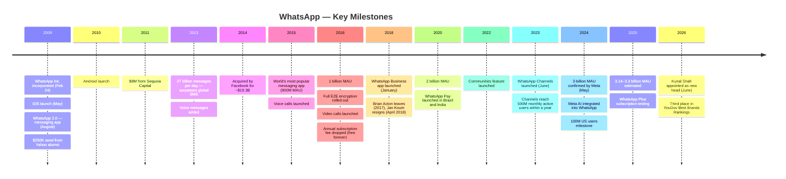
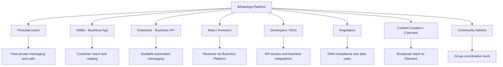
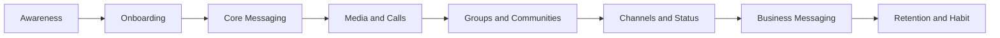
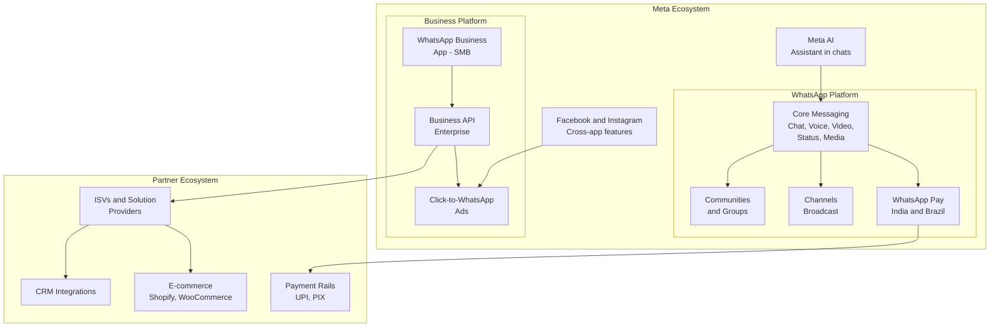
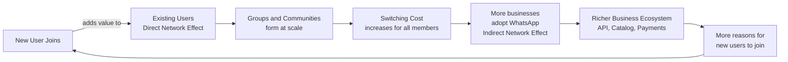
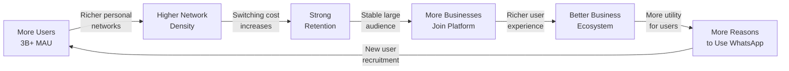
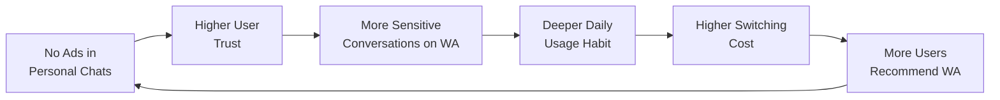
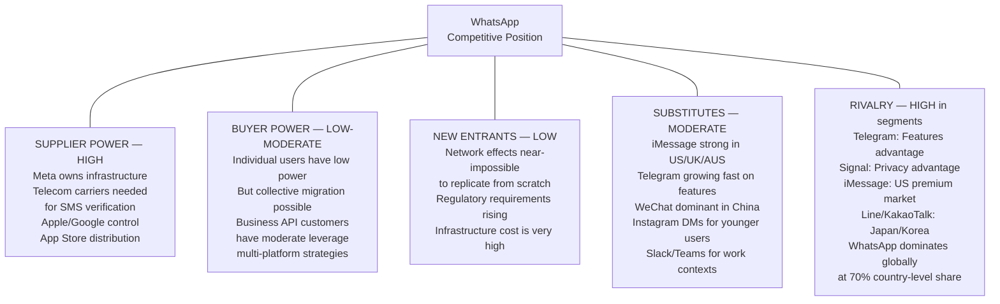

# Day 03 — WhatsApp Product Management Case Study

> **90 Days of Product Management Case Studies**

[](https://linkedin.com/in/gaurav-singh-986b40197/)
[](https://github.com/gaurav-product/product-management-case-studies)
[](https://whatsapp.com)
[](https://github.com/gaurav-product/product-management-case-studies)
[](https://github.com/gaurav-product/product-management-case-studies)
[](https://github.com/gaurav-product/product-management-case-studies)

---


> *Cover image: WhatsApp green gradient background (#25D366) with the app icon centered. Subtitle: "3 Billion Users. Zero Ads. One Conversation at a Time." Communicates scale, simplicity, and trust. White typography. 16:9 aspect ratio.*

---

## Table of Contents

1. [Executive Summary](#1-executive-summary)
2. [About WhatsApp](#2-about-whatsapp)
3. [Industry Overview](#3-industry-overview)
4. [Problem Statement](#4-problem-statement)
5. [Product Vision](#5-product-vision)
6. [Product Strategy](#6-product-strategy)
7. [Product Philosophy](#7-product-philosophy)
8. [Stakeholders](#8-stakeholders)
9. [Market Analysis](#9-market-analysis)
10. [User Segmentation](#10-user-segmentation)
11. [User Personas](#11-user-personas)
12. [Jobs To Be Done](#12-jobs-to-be-done)
13. [Customer Journey](#13-customer-journey)
14. [Customer Empathy Map](#14-customer-empathy-map)
15. [Product Ecosystem](#15-product-ecosystem)
16. [Information Architecture](#16-information-architecture)
17. [Core Features](#17-core-features)
18. [Network Effects](#18-network-effects)
19. [Business Model](#19-business-model)
20. [Revenue Strategy](#20-revenue-strategy)
21. [Business Model Canvas](#21-business-model-canvas)
22. [Product Flywheel](#22-product-flywheel)
23. [Product Metrics](#23-product-metrics)
24. [SWOT Analysis](#24-swot-analysis)
25. [Porter's Five Forces](#25-porters-five-forces)
26. [Competitor Analysis](#26-competitor-analysis)
27. [UX Audit](#27-ux-audit)
28. [Product Opportunities](#28-product-opportunities)
29. [Feature Prioritization — RICE Framework](#29-feature-prioritization--rice-framework)
30. [12-Month Product Roadmap](#30-12-month-product-roadmap)
31. [Risks & Mitigation](#31-risks--mitigation)
32. [My Product Recommendations](#32-my-product-recommendations)
33. [Product Management Lessons](#33-product-management-lessons)
34. [Personal Reflection](#34-personal-reflection)
35. [Conclusion](#35-conclusion)
36. [References](#36-references)

---

## 1. Executive Summary

WhatsApp is the most widely used messaging application on the planet. Founded in 2009 by Jan Koum and Brian Acton — both former Yahoo employees — it began as a simple status-sharing tool and evolved into a global communication infrastructure used by over 3 billion monthly active users across 180+ countries as of mid-2025.

In February 2014, Facebook (now Meta) acquired WhatsApp for approximately $19.3 billion — the largest acquisition of a venture-backed company in history at the time. The acquisition preserved WhatsApp's operating independence initially, but over time the platform became a central pillar of Meta's family of apps strategy, with Meta's business monetization plan depending heavily on WhatsApp's business messaging infrastructure.

What makes WhatsApp genuinely interesting as a product case study is a tension that runs through every major decision it has ever made: the founders built it to be simple, private, and ad-free. Meta acquired it because it was enormously valuable. These two worldviews have never fully resolved, and the product decisions that followed — Communities, Channels, Meta AI integration, WhatsApp Business API, Click-to-WhatsApp ads — all reflect this fundamental tension between user trust and platform monetization.

I chose WhatsApp for Day 03 of this series because it sits at the intersection of problems I find most interesting as a product thinker: how do you scale communication without destroying intimacy? How do you monetize trust without compromising it? How do you serve 3 billion people simultaneously across wildly different cultural, economic, and connectivity contexts?

These are questions I'm actively working through with Aaroh — my AI-powered health navigator. Health communication has many of the same dynamics: personal, high-stakes, high-trust, and extremely difficult to monetize without feeling invasive.

---

## 2. About WhatsApp

### Founding Story

The origin story of WhatsApp is worth paying close attention to, because the founders' personal experiences shaped every major product decision that followed.

Jan Koum was born near Kyiv in Soviet Ukraine in 1976. He grew up in an environment where telephone calls were monitored by the government and communication carried real risk. His family immigrated to Mountain View, California in 1992 when he was sixteen, relying on social assistance for their first apartment.

Koum's personal relationship with government surveillance, economic precarity, and the cost of international communication directly informed his convictions about building a private, ad-free messaging product. This is not background noise — it's the reason WhatsApp made the product decisions it did.

Brian Acton was a Stanford-educated programmer who met Koum while both were working at Yahoo in the late 1990s. Both left Yahoo in 2007. Both applied to Facebook in 2009 and were rejected — an irony that became famous when Facebook later paid $19 billion for their product.

Koum incorporated WhatsApp Inc. on February 24, 2009. The original concept was a status-sharing app — displaying a user's availability next to their name in a phone contacts list. When Apple introduced push notifications in June 2009, Koum realized the mechanism could be used to ping contacts instantly. Users started treating status updates as messages. WhatsApp 2.0, launched in August 2009, formalized this into a messaging application.

### Mission (Embedded in Product Decisions)

WhatsApp's founders never articulated a traditional mission statement. Their mission was embedded in product decisions: **private, reliable, simple messaging with no ads.** Jan Koum's own words capture it best: *"No ads. No games. No gimmicks."*

### Timeline


> *Timeline image: Horizontal scrolling layout with WhatsApp green (#25D366). Key milestones marked with icons. Clean sans-serif typography. 16:5 aspect ratio.*



### Growth and Global Reach

WhatsApp's growth is one of the most significant in technology history:

- **2014** (acquisition): ~465 million MAU
- **2016**: 1 billion MAU
- **2020**: 2 billion MAU
- **May 2025**: 3+ billion MAU (confirmed by Meta)
- **2026**: Estimated 3.14–3.3 billion MAU

WhatsApp is the #1 messaging app in 70% of countries globally. Dominant markets: India (~596M MAU in 2024 — largest user base), Brazil (91% of internet users), Germany, Spain, South Africa, Saudi Arabia, Indonesia, and Nigeria.

**Key platform statistics (2025–2026, public sources):**
- 150+ billion messages exchanged daily
- 7+ billion voice notes sent daily
- 2+ billion voice and video calls daily
- 220+ million businesses using WhatsApp Business
- 175 million people message a business account daily
- Users spend approximately 38 minutes per day on WhatsApp

### Interesting Facts

- Both founders applied to Facebook and were rejected — before building the product Facebook paid $19 billion to acquire.
- Brian Acton left $850 million in unvested Facebook stock on the table when he walked away over privacy disagreements, then used his proceeds to fund Signal — a direct WhatsApp competitor.
- WhatsApp had only 55 employees when acquired for $19.3 billion.
- In Israel, WhatsApp was installed on 92% of all smartphones by 2013.
- WhatsApp's original business model charged a $0.99 annual subscription fee, abandoned in 2016.

---

## 3. Industry Overview

### Messaging Industry

The global messaging market has undergone a structural shift: SMS is declining, OTT messaging platforms dominate. WhatsApp processes more messages per day than the entire global SMS network did at its peak. The competitive landscape is simultaneously concentrated (WhatsApp, WeChat, iMessage dominate globally) and deeply regional (KakaoTalk in South Korea, LINE in Japan, Telegram growing in MENA).

### Business Messaging

WhatsApp's primary commercial opportunity lies here. The global business messaging market — transactional messages, customer service, marketing broadcasts — is a rapidly growing multi-billion dollar segment. WhatsApp's Business API is increasingly the preferred channel for businesses in emerging markets where WhatsApp is the primary consumer communication channel.

### Communication Platforms

WhatsApp now competes with video calling platforms (Zoom, Google Meet), social networks, community tools (Slack, Discord), broadcast platforms (Telegram Channels), and payment apps. The product's ambition has expanded far beyond its origins.

### Digital Payments

WhatsApp Pay is live in India and Brazil. India's UPI processes hundreds of millions of transactions monthly. Even modest WhatsApp Pay penetration relative to PhonePe or Google Pay represents a significant revenue stream.

### Future Trends

- **Conversational commerce**: Customers discovering and purchasing within chat interfaces
- **AI-native messaging**: Meta AI integration signals messaging becoming an AI interface
- **Business messaging as infrastructure**: For many SMBs in emerging markets, WhatsApp is the primary CRM, customer service tool, and sales channel
- **Privacy regulation**: EU's Digital Markets Act requiring messaging interoperability
- **Community communication**: The shift from one-to-one to structured many-to-many communities is still early

---

## 4. Problem Statement

### What problem existed before WhatsApp?

Before WhatsApp, cross-border, cross-platform personal messaging was expensive, fragmented, and unreliable. SMS costs were carrier-dependent and prohibitively expensive for international communication. iPhone and Android users were on different messaging systems. The alternatives (BlackBerry Messenger, AIM, MSN Messenger) were platform-locked and didn't survive the mobile transition.

### What user pain points did it solve at launch?

- **Cost of SMS**: Eliminated per-message charges for domestic and international messaging
- **Cross-platform messaging**: iPhone and Android users on one platform
- **International communication**: Immigrants, travelers, and anyone with family abroad could communicate freely
- **Simplicity**: Phone number as identity. Install, verify your number, see which contacts use WhatsApp. Start messaging.

### What problems does WhatsApp solve today?

- Personal communication at global scale with privacy guarantees (E2E encryption)
- Family coordination across generations and geographies
- Community organization (Communities feature)
- Broadcast communication without social network noise (Channels)
- Business-to-customer communication at scale (Business API)
- Customer discovery and commerce in emerging markets
- Free voice and video calling as alternative to carrier calls

### Why these problems matter

In many countries — India, Brazil, Nigeria, Indonesia, Germany — WhatsApp *is* the communications infrastructure. Small businesses run entirely on it. Families communicate through it. Medical consultations happen on it. When WhatsApp makes a product decision, it affects a significant portion of the world's ability to communicate.

---

## 5. Product Vision

WhatsApp's product vision — never formally stated but observable through product decisions — is:

> **Be the private, reliable, universal communication layer between people and between people and businesses, available to everyone on any phone, anywhere in the world.**

The emphasis on *private* distinguishes it from Facebook and Instagram. The emphasis on *universal* reflects cross-platform, cross-carrier, cross-country reach. The inclusion of *businesses* signals commercial ambition. *Any phone, anywhere* reflects a genuine commitment to accessibility that shaped technical decisions — WhatsApp works well on low-end Android devices with limited data.

Post-acquisition, Meta's vision appears broader: make WhatsApp the super-app of the Western and emerging market world — the WeChat-equivalent outside China. Whether that's achievable without destroying what users love is the central strategic question.

---

## 6. Product Strategy

### Value Proposition by Segment

| Segment | Core Value Proposition |
|---|---|
| **Personal Users** | Private, reliable, free messaging and calling across any device and country |
| **Family Groups** | Shared space for coordination across generations and geographies |
| **SMBs (WhatsApp Business)** | Free customer communication tool with catalog, quick replies, and broadcast |
| **Enterprise (Business API)** | Scalable, automated customer messaging integrated with CRM and e-commerce |
| **Communities** | Organized group communication for schools, NGOs, local organizations |
| **Channels** | One-way broadcast to large follower bases for creators and organizations |

### Competitive Advantages

**Phone number as identity**: No username required. The contact list becomes the social graph. This design decision lowered the onboarding barrier dramatically and remains unique among major platforms.

**End-to-end encryption as default**: Not an opt-in privacy feature — a foundational architectural choice. Builds trust that competitors cannot easily match without rebuilding.

**Network density in key markets**: Being the dominant platform in India, Brazil, and large parts of Europe and Africa means switching costs are extremely high. Coordinating a group switch to Telegram requires every member to agree — a collective action problem that protects WhatsApp.

**Works on low-end hardware and slow connections**: Technical investment in low-bandwidth performance is a deliberate strategy to maintain dominance in emerging markets.

**Trust legacy**: Despite privacy policy controversies, E2E encryption and no-ads-in-personal-chats gives WhatsApp a trust advantage over Meta's other products.

### Moat

WhatsApp's moat has three layers:

1. **Network effects**: Every new user makes WhatsApp more valuable. At 3+ billion users, this is nearly impossible to unwind.
2. **Switching costs**: Leaving WhatsApp means losing contact networks, group histories, and community memberships. The cost is social, not financial.
3. **Data infrastructure**: The social graph and behavioral data Meta has accumulated — even without reading message content — is extraordinarily valuable.

---

## 7. Product Philosophy

WhatsApp's product philosophy is unusual in consumer tech and explains why the product looks the way it does.

### No Ads in Personal Chats

This is WhatsApp's most significant product constraint. WhatsApp's chat inventory is arguably the most engaged advertising surface that exists — yet personal chats remain ad-free. The decision is both ideological (rooted in Koum's original vision) and strategic (it's the primary reason users trust WhatsApp more than Messenger or Instagram).

### End-to-End Encryption

WhatsApp introduced E2E encryption for all messages in 2016 using the Signal Protocol — not as a regulatory requirement, but as a product decision. Even Meta cannot read message content. This creates trust but also creates challenges: spam moderation, misinformation detection, and AI features require workarounds that don't compromise the encryption layer.

The tension between E2E encryption and AI-powered features (message summaries, smart replies, Meta AI) is one of the most interesting product design challenges WhatsApp faces.

### Minimal UI

WhatsApp's interface has changed relatively little since 2014. This is intentional. The user base includes elderly users on basic smartphones, factory workers in Brazil with low-end Android devices, and teenagers managing multiple social lives. A minimal UI serves all of these users better than a feature-rich interface. Simplicity is a form of global accessibility.

### Fast Messaging and Reliability

WhatsApp is architecturally optimized for speed and reliability over feature richness. Messages deliver under poor network conditions where other platforms fail. In markets where connectivity is unreliable, being the app that *always* delivers is a massive moat.

### Trust as a Product Feature

Everything above — no ads, encryption, simplicity, reliability — feeds into a single value: trust. WhatsApp's user relationships survive controversies because the core experience remains trustworthy.

---

## 8. Stakeholders



| Stakeholder | What They Get | Key Tension |
|---|---|---|
| **Personal Users** | Free, private, reliable global communication | Privacy vs. Meta's data ambitions |
| **SMBs (Business App)** | Free customer tool — catalog, quick replies, status | Limited automation compared to API |
| **Enterprise (Business API)** | Scalable messaging, CRM integration, automation | Pay-per-conversation pricing model |
| **Meta / Shareholders** | Business API revenue, ad attribution via Click-to-WhatsApp | Monetization without killing trust |
| **Developers / ISVs** | Build on Business API; create WhatsApp-native commerce | API complexity and cost |
| **Advertisers** | Click-to-WhatsApp ads drive conversations from Meta ads | Cannot advertise inside WhatsApp chats |
| **Creators / Channels** | One-way broadcast to large audiences | Not E2E encrypted; limited interactivity |
| **Community Admins** | Organized group structure for large organizations | Moderation burden; limited admin tools |
| **Regulators** | Platform compliance with local data and communication laws | Encryption vs. lawful intercept demands |

---

## 9. Market Analysis

> **Note**: WhatsApp does not report standalone revenue publicly. Market size figures come from publicly available industry reports and third-party estimates.

### TAM — Total Addressable Market

- **Global business messaging market**: Estimated at tens of billions of dollars annually as conversational commerce grows
- **Global digital advertising market**: Hundreds of billions of dollars — the market Click-to-WhatsApp ads address at the edge
- **Global digital payments**: Trillions in transaction volume across markets where WhatsApp Pay operates

### SAM — Serviceable Addressable Market

Defined by countries where WhatsApp is active (excluding China, North Korea, and countries with VoIP restrictions), markets where Business API has commercial traction (India, Brazil, Germany, Mexico, Indonesia, MENA), and markets where WhatsApp Pay infrastructure exists (primarily India and Brazil).

### SOM — Serviceable Obtainable Market

WhatsApp has already obtained a remarkably large share of the personal messaging SAM. Obtainable growth is now primarily in:
- **Business messaging revenue**: ~$1.78 billion in 2024 (third-party estimate) with significant growth runway
- **Payments transaction fees**: Early-stage; PhonePe and Google Pay dominate in India
- **Premium subscription (WhatsApp Plus)**: Just launched in 2026; contribution not yet significant

---

## 10. User Segmentation

| Segment | Description | Platform Behavior |
|---|---|---|
| **Daily Communicators** | Personal use for family, friends, relationships | Multiple daily opens; group chats; media sharing |
| **Business Owners (SMB)** | WhatsApp Business for customer service and sales | Catalog usage; broadcast lists; quick replies |
| **Community Organizers** | Admins of school, neighborhood, or professional groups | Manage Communities; announcement groups |
| **International Communicators** | Diaspora, travelers, international families | Heavy free calling; media sharing across borders |
| **Enterprise Users** | Business API for customer communication at scale | Automated messaging; chatbots; CRM integration |
| **Content Creators (Channels)** | One-way broadcast to follower bases | Publish updates to Channel followers |
| **Older Users** | Family communication; primary messaging app | Voice notes; basic messaging |
| **Emerging Market Mobile-First** | Low-end devices; WhatsApp as primary internet experience | Data-efficient usage; voice notes; payments |

---

## 11. User Personas


> *Five card-based personas in a grid. Each with illustration (no real photos), name, role, key quote, and pain points/goals in 3-4 bullets. WhatsApp green and white. 16:9 aspect ratio.*

### Persona 1 — Priya, 34, Working Mother in Pune

**Background**: Schoolteacher managing household through WhatsApp — family group, school parent-teacher group, housing society group, friends circle, and student assignment submissions.

**Goals**: Coordinate family logistics. Receive school updates without missing anything. Share photos with family in another city. Not feel overwhelmed.

**Pain Points**: Notification overload from multiple groups. Finding a specific message or photo shared weeks ago. Repeated forwarded misinformation from relatives.

**Technology Usage**: Mid-range Android. Solid home WiFi. Opens WhatsApp 20+ times daily. Instagram casual; WhatsApp is primary communication tool.

**Quote**: *"I can't leave the housing society group because I'll miss important updates, but I also can't take the constant noise."*

**PM Insight**: Notification intelligence — differentiating urgent family messages from 50-person group forwards — is the biggest UX improvement for this persona.

---

### Persona 2 — Carlos, 41, Restaurant Owner in São Paulo

**Background**: Runs a family restaurant using WhatsApp Business as primary customer communication. Sends menu updates as broadcast, receives orders over chat, confirms reservations via WhatsApp. WhatsApp is his CRM.

**Goals**: Reach customers with daily specials. Handle orders without a third-party app. Build a loyal customer base.

**Pain Points**: Broadcast limit is restrictive. Can't automate order confirmations. Misses messages when busy cooking.

**Technology Usage**: iPhone. Uses WhatsApp Business 6–8 hours daily. Avoids delivery platform fees.

**Quote**: *"WhatsApp is cheaper than having a website, more personal than email, and faster than any tool. The problem is when it's busy, I'm cooking and can't reply to ten messages."*

**PM Insight**: A simple chatbot for FAQ and order acknowledgment — not requiring API setup — would transform this persona's experience. The gap between the free Business app and full API is too large for SMBs.

---

### Persona 3 — Ahmed, 28, Software Engineer in Berlin (Egyptian origin)

**Background**: Moved to Germany three years ago. Entire family communicates via WhatsApp. Uses it to stay connected to his Egyptian community in Berlin.

**Goals**: Stay connected with family in Egypt without expensive international calls. Participate in diaspora community. Share his life without Instagram's performance pressure.

**Pain Points**: Video call quality drops due to rural Egypt connectivity. Notification overload when family group sends 50 messages during client meetings. Wants to separate personal and work life on one device.

**Technology Usage**: High-end Android. Uses WhatsApp across phone and PC. Also uses Signal for sensitive conversations.

**Quote**: *"WhatsApp is how I stay Egyptian while living in Germany. But I sometimes wonder how much of my family's conversations Meta is seeing."*

**PM Insight**: Transparency around data handling — what Meta can and cannot see — matters for privacy-aware users like Ahmed. The dual-account feature addresses part of this.

---

### Persona 4 — Meena, 67, Retired Teacher in Chennai

**Background**: Introduced to WhatsApp by her son five years ago. Communicates with children and grandchildren, exchanges photos, receives community updates. WhatsApp is her only digital communication tool.

**Goals**: See photos of grandchildren in real time. Participate in temple community group. Send voice notes when typing is difficult.

**Pain Points**: Interface occasionally confuses her. Accidentally archives chats. Doesn't understand what Channels are. Shares forwarded content unknowingly without verifying.

**Technology Usage**: Entry-level Android. Limited mobile data — uses home WiFi for photos. Opens WhatsApp 5–10 times per day.

**Quote**: *"My children don't call as much, but they send me photos every day on WhatsApp. That's enough for me."*

**PM Insight**: Meena represents a massive underserved segment. WhatsApp's simple interface is appropriate, but misinformation propagation and unexplained UI changes (Channels tab appearing without explanation) create confusion and trust risks.

---

### Persona 5 — Rohan, 26, Startup Founder in Bengaluru

**Background**: Manages his 12-person startup team primarily through WhatsApp groups. Uses WhatsApp to communicate with suppliers, investors, and customers. Aware Slack exists, but his entire network is on WhatsApp.

**Goals**: Coordinate team tasks without switching tools no one will adopt. Maintain supplier relationships via their preferred channel. Close deals faster by reaching leads where they already are.

**Pain Points**: No task management. File sharing has no folder organization; hard to search. Can't see message read status per individual in a large group. No integration with Notion, Google Sheets.

**Technology Usage**: iPhone and MacBook. Heavy WhatsApp usage — 50+ messages daily for business. Uses WhatsApp Web constantly.

**Quote**: *"WhatsApp is my biggest productivity tool and my biggest productivity problem simultaneously."*

**PM Insight**: WhatsApp is being used as a business operating system by millions of startups in emerging markets. The gap between what users need and what WhatsApp provides for business coordination is enormous.

---

## 12. Jobs To Be Done

### Functional Jobs

- "Let me message anyone in my contact list instantly without worrying about their carrier."
- "Let me make free voice and video calls to my family abroad."
- "Let me coordinate a group event with multiple people at once."
- "Let me send a document, photo, or video file quickly."
- "Let me communicate with a business about my order or appointment."
- "Let me broadcast an update to all my customers at once."
- "Let me record and send a voice note when typing is inconvenient."

### Emotional Jobs

- "Help me feel close to my family even though we're far apart."
- "Make me feel like my private conversations are actually private."
- "Let me participate in my community without feeling like I'm on social media."
- "Make me feel like a real business, not someone texting from a personal phone."

### Social Jobs

- "Help me coordinate my group without anyone needing to switch apps."
- "Let me share moments from my life with specific people, not the whole internet."
- "Give my community a shared space where everyone can stay informed."

### Business Jobs

- "Help me reach customers where they already spend their time."
- "Let me confirm bookings, send updates, and resolve complaints without email."
- "Help me scale customer communication without hiring a large support team."
- "Give me a catalog my customers can browse without visiting my website."

---

## 13. Customer Journey


> *Horizontal swimlane diagram. Stages across the top: Awareness → Onboarding → Messaging → Media and Calls → Groups and Communities → Channels and Status → Business Messaging → Retention. Four rows: Goals, Pain Points, Product Opportunities, PM Insights. WhatsApp green and white. 16:9 landscape.*



### Stage 1 — Awareness

**Goals**: Discover that WhatsApp exists and understand why it's worth downloading.

**Main Driver**: Network pull — a contact, family member, or colleague who already uses WhatsApp asks you to join. WhatsApp grows almost entirely through this organic, contact-driven awareness. Minimal traditional advertising.

**Pain Points**: In markets dominated by iMessage (US) or WeChat (China), awareness-to-install conversion is lower.

**Product Opportunities**: "Join your contacts on WhatsApp" prompt showing the count of existing contacts before install.

**PM Insight**: WhatsApp doesn't need advertising because the network effect *is* the acquisition strategy.

---

### Stage 2 — Onboarding

**Goals**: Register and immediately see value — existing contacts are already there.

**Experience**: Phone number verification → contact sync → see which contacts use WhatsApp → immediately able to message. Zero account creation friction.

**Pain Points**: Privacy-conscious users uncomfortable with contact list sync. Permission request feels intrusive on first launch.

**Product Opportunities**: Granular contact sync controls. Clearer explanation of what contact sync does and doesn't do.

**PM Insight**: WhatsApp's onboarding is one of the best in consumer tech. The cold-start problem is essentially zero if any contacts already use WhatsApp.

---

### Stage 3 — Core Messaging

**Goals**: Natural, real-time conversations with contacts.

**Pain Points**: Read receipts (blue ticks) create social pressure. Notification overload in high-traffic group chats.

**Product Opportunities**: Smart notification grouping by priority. Message summary for long-unread group chats.

**PM Insight**: The blue tick is one of the most psychologically loaded product decisions in consumer tech. It creates accountability but also anxiety. The ability to turn it off exists but most users don't know.

---

### Stage 4 — Media Sharing and Calling

**Goals**: Share photos, videos, documents, and voice notes. Make free voice and video calls.

**Pain Points**: Media compression degrades quality. Storage fills quickly from group chat media. Finding a specific photo sent weeks ago requires extensive scrolling.

**Product Opportunities**: Cloud media library with searchable archive. "Best moments" summary from shared media.

**PM Insight**: 7 billion voice notes daily. Voice notes serve users with low typing literacy, multilingual users, and users in high-ambient-noise environments. This is a genuinely differentiated format.

---

### Stage 5 — Groups and Communities

**Goals**: Coordinate family, friend groups, professional teams, or organizations.

**Pain Points**: Group notification management is blunt. No threading in group chats. Groups degrade in usefulness above ~20 people. Misinformation spreads rapidly through group networks.

**Product Opportunities**: AI-powered group summary. Threaded discussion within groups. Smarter notification defaults based on message type and sender relationship.

**PM Insight**: WhatsApp Communities attempted to address the "too many groups" problem. Adoption is growing but the feature is not yet intuitive for most users.

---

### Stage 6 — Channels and Status

**Goals**: Follow updates from organizations and creators. Share temporary updates with contacts.

**Pain Points**: Channels are not E2E encrypted — a significant departure many users don't realize. Status discovery is poor. Channel discovery is difficult.

**Product Opportunities**: Clearer in-product communication about what is and isn't encrypted. Interest-based Channel discovery. Status reply threading.

**PM Insight**: 500 million daily active Status users (as of 2026) — an enormous engagement surface that is currently undermonetized.

---

### Stage 7 — Business Messaging

**Goals**: Communicate with a business about orders, support, appointments, or product inquiries.

**Pain Points**: Many business "accounts" are just personal phones with no real business infrastructure. Spam from fake business accounts is growing.

**Product Opportunities**: Verified business badge trust signals. AI-powered response assistant for small businesses.

**PM Insight**: The gap between "using WhatsApp for business" (personal phone + informal messaging) and "using WhatsApp Business API" (enterprise integration) is enormous. Most small businesses fall in the middle.

---

### Stage 8 — Retention and Habit

**Goals**: WhatsApp becomes the default communication choice — not an explicit decision.

**How it works**: WhatsApp becomes habitual through network density. Once your family, friends, and colleagues all use it, switching requires everyone to move simultaneously — a collective action problem that rarely resolves.

**PM Insight**: WhatsApp's retention is the strongest in consumer tech because it's not product-dependent — it's network-dependent. A competitor needs to solve the collective switch problem, not just build a better product.

---

## 14. Customer Empathy Map


> *Four-quadrant design (Thinks, Feels, Says, Does) with central "WhatsApp User" circle. WhatsApp green for quadrant headers. A5 landscape format.*

```
┌───────────────────────────────────────────────────────────────────┐
│                        WHATSAPP USER                              │
├────────────────────────────┬──────────────────────────────────────┤
│           THINKS           │               FEELS                  │
│                            │                                      │
│ "Is my family chat         │ Comfort when a family message        │
│  actually private or is    │ arrives instantly across borders.    │
│  Meta reading it?"         │                                      │
│                            │ Anxiety about blue ticks and the    │
│ "Why are there so many     │ social obligation to reply fast.     │
│  groups I can never leave  │                                      │
│  without drama?"           │ Frustration when a group chat       │
│                            │ becomes unmanageable noise.          │
│ "I wish I could find that  │                                      │
│  document Carlos sent me   │ Trust — more than any other app,    │
│  three weeks ago."         │ because it doesn't show ads.         │
├────────────────────────────┼──────────────────────────────────────┤
│            SAYS            │               DOES                   │
│                            │                                      │
│ "Just WhatsApp me."        │ Opens WhatsApp 20+ times per day.   │
│                            │                                      │
│ "I'm muting that group     │ Records voice notes while walking   │
│  forever."                 │ or driving.                          │
│                            │                                      │
│ "Did you see the message   │ Forwards news and videos to family  │
│  Grandma forwarded? Is     │ groups without verifying them.       │
│  that real?"               │                                      │
│                            │ Uses WhatsApp Business catalog to   │
│ "WhatsApp is for family,   │ browse products from local vendors.  │
│  Instagram is for          │                                      │
│  showing off."             │ Screenshots important messages       │
│                            │ because search is unreliable.        │
├────────────────────────────┴──────────────────────────────────────┤
│           PAIN POINTS                     GAINS                   │
│  - Notification overload           - Free global calling          │
│  - Misinformation in groups        - Family connection            │
│  - Poor media/file search          - No ads in personal chats     │
│  - Blue tick social pressure       - Voice notes ease             │
│  - Privacy uncertainty with Meta   - Reliable delivery            │
│  - Can't find old documents        - Business catalog access      │
└───────────────────────────────────────────────────────────────────┘
```

---

## 15. Product Ecosystem


> *Concentric circle design. WhatsApp at center. Rings: Core Product Layer, Platform Layer, Meta Integration Layer, Partner Layer. Green gradient from center outward.*



---

## 16. Information Architecture


> *Hierarchical tree diagram showing the WhatsApp app navigation structure. Four main tabs branching into sub-sections. Green lines on white background.*

```
WHATSAPP APP
│
├── Chats (Primary Tab)
│   ├── Individual Chats
│   │   ├── Messages (text, voice, media, docs)
│   │   ├── Voice and Video Calls
│   │   ├── View Once Messages
│   │   ├── Disappearing Messages
│   │   └── Contact Info
│   ├── Group Chats
│   │   ├── Messages and Mentions
│   │   ├── Group Info (Members, Media, Links)
│   │   ├── Group Calls (up to 32)
│   │   ├── Admin Controls
│   │   └── Polls
│   ├── Archived Chats
│   ├── Starred Messages
│   └── New Chat / New Group
│
├── Updates Tab
│   ├── Status
│   │   ├── My Status
│   │   ├── Recent Updates (Contacts)
│   │   └── Viewed Updates
│   └── Channels
│       ├── Following
│       ├── Discover Channels
│       └── Channel Updates Feed
│
├── Communities Tab
│   ├── My Communities
│   │   ├── Announcement Group
│   │   ├── Sub-Groups (up to 50)
│   │   └── Community Info
│   └── Create Community
│
├── Calls Tab
│   ├── Recent Calls
│   ├── New Call
│   └── Create Call Link
│
├── Meta AI (Floating, accessible from search)
│   ├── AI Chat Interface
│   └── AI in Group Chats - @Meta AI
│
└── Settings
    ├── Account (Privacy, Security, Two-step)
    ├── Privacy (Last Seen, Read Receipts, Online)
    ├── Notifications
    ├── Storage and Data
    ├── Chats (Wallpaper, Backup, Language)
    ├── Linked Devices
    └── Help
```

---

## 17. Core Features

### Chats (Personal and Group)

**Purpose**: Real-time text, media, voice note, and document exchange between individuals or groups up to 1,024 members.

**User Value**: Instant, reliable, cross-platform communication at no cost. The core reason WhatsApp exists.

**Business Value**: Chat volume drives daily active usage, which drives platform data value and creates the audience for business messaging products.

**Success Metrics**: Messages sent per DAU; delivery success rate; session frequency per day; group chat creation rate.

---

### Communities

**Purpose**: Hierarchical group structure — a parent Community containing up to 50 sub-groups and up to 5,000 total members — for organizations (schools, workplaces, neighborhoods, religious groups).

**User Value**: Replaces the chaos of managing 15 separate groups for the same organization with one organized structure.

**Business Value**: Increases WhatsApp's relevance for organizational communication, competing with Slack, Discord, and Microsoft Teams.

**Success Metrics**: Communities created; active community members per month; sub-group engagement rate; admin retention.

---

### Channels

**Purpose**: One-way broadcast from an admin to an unlimited number of followers. Designed for creators, organizations, and public figures.

**User Value**: Followers receive updates from trusted accounts without the noise of two-way group chats. Not E2E encrypted.

**Business Value**: Reached 500 million monthly active users within one year of launch. Potential future monetization through promoted Channels.

**Success Metrics**: Channels created; monthly active followers; content update frequency; follower growth rate; open rate on updates.

---

### Status

**Purpose**: 24-hour disappearing photo, video, text, or voice note updates shared with contacts.

**User Value**: Share moments with your WhatsApp contact network without the permanence or public pressure of social media.

**Business Value**: 500 million daily active Status users as of 2026. Significant engagement surface that has been undermonetized.

**Success Metrics**: Daily Status creators; daily Status viewers; average views per Status; reply rate.

---

### Voice and Video Calls

**Purpose**: Free VoIP calls supporting 1-to-1 and group calls (up to 32 participants in video). Screen sharing available.

**User Value**: Eliminates international calling costs. Works on WiFi and mobile data.

**Business Value**: Calls increase session depth and daily active use. Establishes WhatsApp as a full communication platform.

**Success Metrics**: Calls initiated per DAU; average call duration; call success rate; international call volume.

---

### Voice Notes

**Purpose**: Short audio recordings sent within a chat.

**User Value**: Faster than typing for complex or emotional communication. Accessible to users with low typing literacy. Enables communication while multitasking.

**Business Value**: Over 7 billion voice notes sent daily. Differentiates WhatsApp from pure-text messaging competitors.

**Success Metrics**: Voice notes sent per DAU; average duration; user overlap between voice note senders and low-text-engagement users.

---

### Disappearing Messages

**Purpose**: Messages that automatically delete after 24 hours, 7 days, or 90 days.

**User Value**: Reduces the permanence of casual conversation. Valued by privacy-conscious users.

**Business Value**: Reduces storage pressure and enhances trust positioning.

**Success Metrics**: Percentage of chats with disappearing messages enabled; opt-in rate over time.

---

### End-to-End Encryption

**Purpose**: Every personal chat, group chat, voice call, and video call is E2E encrypted using the Signal Protocol.

**User Value**: Even WhatsApp/Meta cannot read message content. Foundation of user trust.

**Business Value**: The single most important trust differentiator. Without E2E encryption, WhatsApp's value proposition collapses for privacy-conscious users.

**Success Metrics**: Percentage of messages that are E2E encrypted (should be 100% of personal chats); user awareness of encryption (survey-based).

---

### WhatsApp Business App

**Purpose**: Free app for small businesses — business profile, product catalog, quick replies, broadcast lists, and basic analytics.

**User Value (for business)**: Professionalizes customer communication without requiring technical setup or cost.

**Business Value**: 220+ million businesses use WhatsApp Business. Top-of-funnel for Business API.

**Success Metrics**: Business accounts monthly active; catalog listings; message open rates; broadcast delivery rate.

---

### WhatsApp Business API (Business Platform)

**Purpose**: Enterprise-grade messaging integration — automated customer communication, CRM integration, chatbots, scalable message delivery.

**User Value (for enterprise)**: Handle thousands of simultaneous customer conversations with automation and analytics.

**Business Value**: WhatsApp's primary revenue source. Pay-per-conversation pricing. Majority of WhatsApp's estimated ~$1.78B 2024 revenue.

**Success Metrics**: API-connected businesses; conversations initiated per month; conversation completion rate; revenue per conversation.

---

### WhatsApp Pay

**Purpose**: In-app payment transfer between contacts (UPI in India; PIX in Brazil).

**User Value**: Send money within the same interface you use to communicate — no app switch required.

**Business Value**: If WhatsApp achieves meaningful payments market share, it unlocks transaction fee revenue and deepens user lock-in.

**Success Metrics**: Payment transactions per month; active Pay users as percentage of MAU; payment volume.

---

### Multi-Device and Desktop

**Purpose**: Use WhatsApp on multiple devices simultaneously — phone, tablet, PC — without the phone needing to be online.

**User Value**: Particularly valuable for business users who work on desktops. Removed a major friction point of earlier WhatsApp.

**Business Value**: Increases session time and business use cases by enabling desktop-native workflows.

**Success Metrics**: Percentage of users with linked devices; messages sent per platform split; desktop DAU.

---

## 18. Network Effects


> *Concentric rings diagram showing how network effects compound. Center: Individual User → Ring 1: Direct (contact network) → Ring 2: Community (group density) → Ring 3: Business (API ecosystem) → Ring 4: Platform (Meta advertising). Radial design with green intensity increasing toward center.*



### Direct Network Effects

Every user who joins WhatsApp makes WhatsApp more valuable for their existing contacts. At 3+ billion users, the direct network effect now acts as a defensive moat more than a growth driver.

### Indirect Network Effects

More users attract more businesses to the Business Platform. More businesses create more reasons for users to prefer WhatsApp. This two-sided marketplace dynamic is the primary driver of future platform value.

### Community Effects

Communities and Groups create sub-network effects. A school Community on WhatsApp creates switching costs for every member of that school simultaneously. The school would need to collectively migrate to another platform — a coordination problem that almost never resolves.

### Business Effects

Each business integrating WhatsApp via the API becomes a structural dependency in its own operations. Migrating requires updating every customer communication flow, database integration, and chatbot — a process most businesses won't undertake unless forced.

---

## 19. Business Model

WhatsApp's business model is fundamentally different from Meta's other products. It does not rely on advertising within the product. Instead, it monetizes through:

**1. Business Platform (Primary)**: WhatsApp Business API charges businesses per-conversation. A "conversation" is a 24-hour messaging session. Marketing, utility, and authentication conversations are all billed categories.

**2. Click-to-WhatsApp Ads (Adjacent)**: Ads on Facebook and Instagram that open a WhatsApp chat when clicked. These are Meta ads — revenue accrues to Meta's advertising segment. But they drive WhatsApp Business adoption and generate ecosystem value.

**3. WhatsApp Pay (Emerging)**: Transaction fees on payments in India and Brazil. Very early stage.

**4. WhatsApp Plus Subscription (2026)**: Optional subscription for cosmetic and organizational features. Very early.

The business model is notable because WhatsApp chose to make the product free for users — subsidized by Meta's overall profitability — to maximize user trust and adoption. Revenue comes from the business layer, not the consumer layer.

---

## 20. Revenue Strategy

| Revenue Stream | Mechanism | Status | Growth Potential |
|---|---|---|---|
| **Business API (Conversations)** | Per-conversation billing for business-initiated messages | Active; primary revenue | High — growing with conversational commerce |
| **Click-to-WhatsApp Ads** | Meta ads that launch WhatsApp conversations | Active; growing rapidly | High — Meta ad revenue increasingly WhatsApp-attributed |
| **WhatsApp Pay (Fees)** | Transaction fees on in-app payments | Active; limited scale | Very High — if adoption grows in India/Brazil |
| **WhatsApp Plus Subscription** | Optional subscription for cosmetic/organizational features | Launched May 2026 | Low-Medium — niche adoption expected |
| **Enterprise Messaging Tools** | Advanced API features, analytics, SLA support | Active; growing | Medium — smaller market but higher ARPU |

*Note: WhatsApp's estimated 2024 revenue was ~$1.78 billion based on third-party estimates. Meta does not report WhatsApp revenue publicly.*

---

## 21. Business Model Canvas


> *Standard 9-block Business Model Canvas. WhatsApp green headers, white fill. A3 landscape format.*

| Component | Details |
|---|---|
| **Key Partners** | Meta Platforms (infrastructure, AI); Telecom carriers (number verification); Payment rails (UPI in India, PIX in Brazil); ISVs and solution providers; CRM platforms (Salesforce, HubSpot) |
| **Key Activities** | Messaging infrastructure at scale; E2E encryption and security; Business API platform development; Regulatory compliance; Spam and abuse prevention; AI feature development |
| **Key Resources** | Global messaging infrastructure; Signal Protocol encryption; 3B+ user network; Business API platform; Meta's AI infrastructure; Developer ecosystem |
| **Value Propositions** | Users: Free, private, reliable global communication. Businesses: Direct channel to customers at scale. Enterprise: Automated, integrated customer messaging. Advertisers: Click-to-WhatsApp performance marketing. |
| **Customer Relationships** | Personal users: Habitual, ambient — WhatsApp is always-on. Business users: Platform-tool relationship. Enterprise: Commercial/SLA relationship. |
| **Channels** | Mobile app (iOS/Android); Desktop app and WhatsApp Web; Business API (via ISVs); Meta ad ecosystem; Word-of-mouth (primary consumer acquisition) |
| **Customer Segments** | Personal users (3B+ MAU); SMBs on WhatsApp Business (220M+); Enterprise API clients; Advertisers (via Meta); Content creators on Channels; Community administrators |
| **Cost Structure** | Messaging infrastructure and bandwidth; Security and encryption R&D; Trust and Safety / spam prevention; Regulatory and legal compliance; AI development; Business API platform |
| **Revenue Streams** | Business API per-conversation billing (primary); Click-to-WhatsApp ad ecosystem; WhatsApp Pay transaction fees; WhatsApp Plus subscription |

---

## 22. Product Flywheel


> *Circular flywheel diagram with 6 nodes connected by curved arrows spinning clockwise. WhatsApp green gradient. 1:1 square format.*



**The Trust Flywheel (Second Loop)**



---

## 23. Product Metrics


> *Dark-background dashboard with metric cards by category. WhatsApp green accents on dark background. Large display text with trend arrows. 16:9 format.*

### North Star Metric

**Messages Sent Per Day** — not just daily active users, but actual messages sent. A user who opens WhatsApp but sends no messages contributes nothing to the network. Daily message volume also correlates with business API usage and overall platform health.

---

### Acquisition

| Metric | Why It Matters |
|---|---|
| New account activations per day | Top-of-funnel growth in new markets |
| % of new users who send first message within 1 hour | Immediate activation — did the user find value instantly? |
| Contact density at first open | % of contacts already on WhatsApp — predicts retention |
| Referral rate | Measures organic network-driven growth |

### Engagement

| Metric | Why It Matters |
|---|---|
| **DAU / MAU (Stickiness)** | WhatsApp's ratio is reportedly ~80%+. Measures habit depth. |
| Messages sent per DAU | Core engagement intensity |
| Session frequency per day | How many times per day users open the app |
| Voice notes sent per DAU | Captures non-text users who are heavily engaged |
| Voice and video call minutes per DAU | Depth of communication relationship |
| Group chat participation rate | Community engagement depth |
| Status views per creator | Broadcast engagement |

### Business Metrics

| Metric | Why It Matters |
|---|---|
| Business API conversations initiated per month | Primary revenue driver |
| Conversation completion rate (user responded) | Quality of business messaging experience |
| Click-to-WhatsApp ad conversion rate | Ad product effectiveness |
| WhatsApp Pay transaction volume | Payments adoption |
| Business account monthly active rate | Business platform health |
| % of users who message a business weekly | Business ecosystem engagement |

### Retention and Health

| Metric | Why It Matters |
|---|---|
| 30-day retention rate | Habit formation after first week |
| 90-day retention rate | Are habits solidifying? |
| Churn rate by region | Identifies competitive threats early |
| Spam report rate | Platform health — increasing spam = trust degradation |
| Misinformation forward rate | Ecosystem health signal |
| User-reported block rate | If blocking increases, experience is degrading |

---

## 24. SWOT Analysis


> *Four equal quadrants, color-coded: green (Strengths), blue (Weaknesses), yellow (Opportunities), red (Threats). Logo in center. 1:1 square format.*

| | **Positive** | **Negative** |
|---|---|---|
| **Internal** | **STRENGTHS** | **WEAKNESSES** |
| | 3B+ MAU — largest messaging platform globally | Monetization is indirect; relies on Meta's ad ecosystem |
| | E2E encryption as default builds deep trust | Cannot serve personalized ads in personal chats |
| | Phone-number-as-identity creates frictionless onboarding | 2021 privacy policy controversy damaged trust in some markets |
| | Works reliably on low-end devices and poor connections | Spam and misinformation propagation through forwards |
| | Dominant in 70% of countries by messaging share | User confusion: what is and isn't encrypted (Channels ≠ E2E) |
| | Free for users — eliminates price barrier | Community feature not yet intuitive for many users |
| | Strong SMB ecosystem through WhatsApp Business | File/media search is poor — finding older content is difficult |
| **External** | **OPPORTUNITIES** | **THREATS** |
| | Business messaging market growing rapidly | Telegram gaining users on features (larger file sharing, bots, channels) |
| | Conversational commerce in India and Brazil | Signal growing in privacy-conscious markets |
| | Communities can replace Slack/Discord for non-tech organizations | EU regulatory pressure — DMA interoperability requirements |
| | WhatsApp Status (500M DAU) remains undermonetized | Government bans and VoIP restrictions in Middle East/Asia |
| | AI-powered features increase utility | iMessage dominance limits WhatsApp's Western growth ceiling |
| | WhatsApp Plus subscription can grow ARPU | AI-generated spam and phishing attacks scaling with AI tools |
| | Interoperability (EU DMA) may bring new users | Privacy regulations (GDPR, India DPDP Act) increasing compliance costs |

---

## 25. Porter's Five Forces



**Key insight**: WhatsApp's competitive position is extremely strong at the platform level but faces meaningful competitive threats in specific segments — US premium users (iMessage), privacy advocates (Signal), feature seekers (Telegram). The real strategic risk is not a direct competitor displacing WhatsApp globally but segment-by-segment erosion that gradually reduces the platform's universality.

---

## 26. Competitor Analysis


> *Feature matrix table with WhatsApp, Telegram, Signal, iMessage, Messenger, WeChat as columns. Key features as rows. Color-coded cells: green = strong, yellow = partial, red = weak/absent. 16:9.*

### Market Position Overview

| Platform | Monthly Active Users | Primary Market | Business Model |
|---|---|---|---|
| **WhatsApp** | 3B+ MAU | Global (70% of countries) | Business API, Click-to-WA ads |
| **WeChat** | 1.41B MAU | China + diaspora | Super app: payments, mini-programs, ads |
| **Facebook Messenger** | 1.01B MAU | US, Europe, Southeast Asia | Meta ads |
| **Telegram** | 1B MAU | Global, strong in CIS/MENA | Premium subscription, ads in public channels |
| **iMessage** | ~1.3B active (est.) | US, UK, Australia, Canada | Device-bundled; no separate revenue |
| **Signal** | Not publicly disclosed | Privacy-conscious segment globally | Non-profit; donations |

### Feature Comparison Matrix

| Feature | WhatsApp | Telegram | Signal | iMessage | Messenger | WeChat |
|---|---|---|---|---|---|---|
| **E2E Encryption (Default)** | ✅ All chats | ❌ Not in groups/channels | ✅ All | ✅ iMessage | ❌ | ❌ |
| **File Sharing Size Limit** | 2GB | 4GB | 100MB | Via iCloud | 25MB | 100MB |
| **Max Group Size** | 1,024 | 200,000 | 1,000 | N/A | Unlimited | 500 |
| **Channels / Broadcast** | ✅ not E2E | ✅ large; not E2E | ❌ | ❌ | ✅ | ✅ |
| **Voice / Video Calls** | ✅ | ✅ | ✅ | ✅ | ✅ | ✅ |
| **Desktop App** | ✅ | ✅ | ✅ | ✅ Mac | ✅ | ✅ |
| **Bots / Automation** | Limited via API | ✅ native bot API | ❌ | ❌ | ✅ | ✅ |
| **Business Platform** | ✅ strong | ❌ | ❌ | ❌ | ✅ limited | ✅ strong |
| **In-App Payments** | ✅ India, Brazil | ❌ | ❌ | ✅ Apple Pay | ❌ | ✅ dominant |
| **Communities** | ✅ | ❌ | ❌ | ❌ | ✅ limited | ❌ |
| **Scheduled Messages** | ❌ | ✅ | ❌ | ❌ | ❌ | ✅ |
| **Username — no phone** | ❌ | ✅ | ❌ | ❌ Apple ID | ❌ | ✅ |
| **Message Editing** | ✅ 15 min | ✅ | ❌ | ✅ | ❌ | ✅ |
| **Polls** | ✅ | ✅ | ❌ | ❌ | ❌ | ✅ |

### Key Observations

**Telegram's biggest advantages**: Much larger group sizes (200K vs 1,024), username-based identity, native bot ecosystem, larger file transfers, scheduled messages. For power users and large communities, Telegram is meaningfully superior on features.

**Signal's only real advantage**: Purer privacy implementation. Signal is non-commercial and collects minimal metadata. Serves a genuine use case but won't achieve mass scale.

**iMessage's structural advantage**: Default on iPhone. In the US, UK, and Australia where iPhone market share is very high, iMessage requires zero effort to use. WhatsApp must be actively chosen. This makes WhatsApp's US growth harder than elsewhere.

**WeChat's irreplicable advantage**: Not a messaging app — a super-app with payments, mini-programs, social media, gaming, and commerce integrated. This is what Meta hopes WhatsApp becomes. WeChat shows the end state; WhatsApp shows how far Western and emerging markets are from it.

---

## 27. UX Audit

*Evaluated using Nielsen's 10 Usability Heuristics.*

### Onboarding

**Strength**: Phone number as identity eliminates account creation friction entirely. Seeing existing contacts already on WhatsApp creates immediate value. (Nielsen #1: Visibility of System Status)

**Gap**: Contact sync permission request is explained poorly. Privacy-conscious users feel they're making a blind consent choice.

**Opportunity**: Explain exactly what contact sync does and doesn't do.

---

### Navigation

**Strength**: Four tabs (Chats, Updates, Communities, Calls) cover primary use cases cleanly. Bottom navigation follows platform conventions. (Nielsen #4: Consistency and Standards)

**Gap**: Communities tab appears empty and purposeless for users who've never been added to a Community. (Nielsen #10: Help and Documentation violated)

**Opportunity**: Empty-state design for Communities that explains value and offers to create or discover one.

---

### Messaging

**Strength**: Real-time delivery, read receipts, and typing indicator provide excellent system status feedback. (Nielsen #1)

**Gap**: Finding a specific message in a long chat requires extensive manual scrolling. Search doesn't always navigate to message context. (Nielsen #6: Recognition over Recall)

**Opportunity**: Smart search with AI-powered semantic understanding.

---

### Groups and Communities

**Strength**: Group creation is straightforward. Admin controls allow basic moderation.

**Gap**: Large groups (100+ members) are noisy and difficult to manage. No native threading for conversations within a group chat. Notification settings require too many taps.

**Opportunity**: Optional threaded replies in group chats. AI-generated group summary for long-unread groups.

---

### Status

**Strength**: Easy to post. Privacy controls are well-implemented.

**Gap**: Status discovery is poor — scrolling through 30+ contact statuses is inefficient.

**Opportunity**: Status highlights (pinned status). Interest-based story feeds for Channels.

---

### Calls

**Strength**: Call quality is strong. Group calls up to 32 participants. Screen sharing available.

**Gap**: No call scheduling feature. WhatsApp requires synchronous arrangement through messages.

**Opportunity**: Schedule a video call and send an invite link within WhatsApp.

---

### Settings and Privacy

**Strength**: Granular privacy controls (Last Seen, Profile Photo, Status, Read Receipts, Online Status) give meaningful control.

**Gap**: Two-step verification is opt-in and not explained during onboarding. Most users don't enable it.

**Opportunity**: Security setup prompt after onboarding. Settings search bar.

---

### Business Experience

**Strength**: Business profiles, catalog, and quick replies provide a reasonable basic tool.

**Gap**: User experience interacting with a business via WhatsApp Business is inconsistent. Verified business badge is not prominently featured.

**Opportunity**: Standardized business response time display. Clear distinction between automated and human responses.

---

### Accessibility

**Gap**: Font size customization is limited. Voice message transcription is inconsistently available. Limited screen reader optimization in regional languages.

**Opportunity**: Universal voice note transcription. Better screen reader compatibility across all supported languages.

---

## 28. Product Opportunities

### Opportunity 1 — AI-Powered Notification Intelligence

**Problem**: Users receive notifications from dozens of groups simultaneously. Every message triggers the same notification type regardless of urgency or content.

**Evidence**: Priya's persona describes this vividly. A message from your mother should not feel the same as a meme in a 200-person group.

**Reasoning**: WhatsApp's AI can analyze message patterns, sender relationships, and content type using metadata and behavioral signals — without reading E2E content — to predict notification priority.

**Trade-offs**: ML investment required. Privacy-sensitive. Users who expect all notifications may resist filtering.

**Impact**: Reduction in group notification-related mutes; improved daily engagement for high-group users; reduced churn among overwhelmed users.

**Success Metrics**: Notification interaction rate; muted group reduction; daily open rate comparison between AI-notification users vs. control.

---

### Opportunity 2 — Smart Message and Media Search

**Problem**: Finding a specific document, photo, or message shared weeks ago requires manual scrolling. WhatsApp's search is keyword-based and doesn't understand context.

**Evidence**: Rohan's and Priya's personas both cite inability to find specific content as a recurring frustration. This is one of the most commonly cited user pain points in public forums.

**Reasoning**: Modern on-device AI makes semantic search possible without compromising E2E encryption — the search index stays on device. Apple's Spotlight search demonstrates this is technically viable.

**Trade-offs**: Older/lower-end devices may not support on-device AI. Privacy risk if not implemented carefully.

**Impact**: Significant reduction in copy-paste-to-notes behavior. Increased document usefulness. Higher engagement for business users.

**Success Metrics**: Search-to-find success rate; search sessions per DAU; reduction in screenshots as workaround.

---

### Opportunity 3 — SMB Chat Assistant (Between Free App and Full API)

**Problem**: The gap between WhatsApp Business (free; basic) and Business API (enterprise; complex and costly) leaves millions of small businesses without adequate tools.

**Evidence**: Carlos's persona represents this exactly. 220+ million businesses use WhatsApp Business. Most are SMBs who need more than quick replies but can't access full API.

**Reasoning**: A native AI assistant within WhatsApp Business that handles common queries without requiring API integration would serve this massive underserved segment.

**Trade-offs**: Could cannibalize Business API revenue if too capable. Must be positioned as an entry level.

**Impact**: Dramatically better business messaging quality for SMBs. New conversion path to API. Competitive defense against Telegram and Instagram for business use cases.

**Success Metrics**: SMB response time improvement; query completion rate; API conversion rate from SMB assistant users.

---

### Opportunity 4 — Group Chat AI Summaries

**Problem**: Users who haven't checked a group chat for 24–48 hours face a wall of 100+ messages. Reading all of them is impractical. Most users scroll past or abandon.

**Evidence**: 41–57% of total WhatsApp message volume originates from group chats. The ability to catch up efficiently is a genuine need.

**Reasoning**: AI summarization of group chats can work on a per-device basis using on-device AI — without reading E2E content on servers. A "What did I miss?" button would dramatically improve group usability.

**Trade-offs**: On-device implementation required to preserve E2E. Summary quality must be high. Summary errors could cause misunderstandings.

**Impact**: Improved group chat usability; retention of users who disengage from large groups; higher daily open rate.

**Success Metrics**: Group chat re-engagement rate; time-to-first-message after long absence; group mute rate reduction.

---

### Opportunity 5 — Misinformation Forward Warning

**Problem**: WhatsApp is a primary vector for misinformation spread, particularly in India, Brazil, and Southeast Asia. Content shared within trusted group networks gains false credibility.

**Evidence**: WhatsApp implemented a "Frequently Forwarded" label in 2020 and a five-forward limit. Both helped but didn't solve the problem.

**Reasoning**: AI-powered fact-check suggestions at the point of forward — a soft prompt before forwarding — could significantly reduce spread without WhatsApp censoring or reading content.

**Trade-offs**: E2E encryption limits server-side analysis. Must be implemented client-side. False positives could frustrate users. Political sensitivity around "misinformation" definitions.

**Impact**: Measurable reduction in harmful content spread. Regulatory goodwill. Trust improvement.

**Success Metrics**: Forwarding rate of flagged content; user engagement with fact-check prompts.

---

### Opportunity 6 — Voice Note Transcription (Global, Multilingual)

**Problem**: 7+ billion voice notes sent daily. But they're inaccessible in noisy environments, for users with hearing impairments, or for users who speak different languages.

**Evidence**: Meta AI on-device transcription capability exists. WhatsApp has begun rolling out transcription in some markets.

**Reasoning**: Expand universal transcription to all languages — regional Indian languages, Arabic, Portuguese, Swahili. Include translation alongside transcription for cross-language group chats.

**Trade-offs**: On-device models for regional languages are less mature than for English. Staged rollout required.

**Impact**: Major accessibility improvement. New use cases in multilingual contexts. Cross-language message comprehension.

**Success Metrics**: Transcription feature adoption; voice note read rate vs. played rate; accessibility complaint reduction.

---

### Opportunity 7 — Scheduled Messages and Call Scheduling

**Problem**: No native way to schedule a message in WhatsApp. Scheduling a call requires switching to Calendar or a third-party app.

**Evidence**: Telegram has offered scheduled messages for years. WhatsApp users use workarounds. Carlos's persona would use call scheduling for customer appointments.

**Reasoning**: Scheduled messages and call scheduling are low-risk, high-demand features serving both personal users (birthday wishes) and business users (appointment confirmations, follow-up messages).

**Trade-offs**: Scheduled messages from business accounts could increase spam if abused. Requires rate limits per account type.

**Impact**: Improved business messaging quality; new use case for personal users; competitive parity with Telegram.

**Success Metrics**: Scheduled message creation rate; business account scheduling adoption; call scheduling conversion rate.

---

### Opportunity 8 — Community Discovery and Joining

**Problem**: WhatsApp Communities are completely private and undiscoverable. You can only join if invited or given a link. There is no way to find relevant Communities.

**Evidence**: Communities show strong usage where adopted, but adoption is limited by the discoverability problem.

**Reasoning**: A Community Discovery feature — searchable public Communities that opt in to visibility — would dramatically accelerate adoption.

**Trade-offs**: Public discoverability changes the privacy model. Must be strictly opt-in by admin. Spam Communities would appear without moderation.

**Impact**: Accelerated Communities adoption; competitive response to Discord and Telegram for community use cases.

**Success Metrics**: Communities created with public discovery enabled; new member joins via discovery; Community DAU after discovery-join vs. invite-join.

---

### Opportunity 9 — WhatsApp for Healthcare Communication

**Problem**: Healthcare providers in India, Brazil, and emerging markets already use WhatsApp informally for patient communication. This creates a massive use case and a significant patient privacy risk simultaneously.

**Evidence**: In India, doctors routinely share reports and prescriptions via WhatsApp. Hospitals use WhatsApp groups for patient family updates.

**Reasoning**: A WhatsApp Healthcare Mode — with consent management, data retention controls, and verified healthcare provider accounts — would formalize and secure an already-prevalent use case.

**Trade-offs**: HIPAA and equivalent regulations create significant compliance requirements. Requires deep healthcare domain expertise. Long development timeline.

**Impact**: Massive institutional adoption; competitive moat in healthcare communication; significant revenue from enterprise healthcare accounts.

**Success Metrics**: Healthcare provider verifications; beta user CSAT; compliance incident rate.

*Personal note: This resonates directly with Aaroh. If WhatsApp creates a healthcare communication layer, it could become a distribution channel for health-oriented products. The potential is significant.*

---

### Opportunity 10 — Smarter Business API Pricing for SMBs

**Problem**: The current pay-per-conversation API pricing creates an unpredictable cost model for small businesses. Many SMBs who could benefit don't adopt it.

**Evidence**: Carlos's persona shows the gap between what SMBs need and what they can practically access. 220 million businesses use the free Business app but can't access API.

**Reasoning**: A simplified SMB tier of the Business API — flat monthly fee, up to X conversations, no technical setup required, accessible from the WhatsApp Business app — would unlock an enormous mid-market segment.

**Trade-offs**: Risk of cannibalizing full API revenue. Must be positioned clearly as an entry tier.

**Impact**: Massive expansion of API adoption; new recurring revenue stream; competitive defense against Telegram for business messaging.

**Success Metrics**: SMB API tier subscriptions; conversation volume on SMB tier; upgrade rate to full API; revenue per SMB account.

---

## 29. Feature Prioritization — RICE Framework


> *Horizontal bar chart showing RICE scores sorted highest to lowest. Color-code by category. Show Reach, Impact, Confidence, Effort breakdown in companion table. 16:9 landscape.*

| Initiative | Reach | Impact (1–5) | Confidence (%) | Effort (months) | RICE Score |
|---|---|---|---|---|---|
| Scheduled Messages | 3B MAU | 3 | 85% | 2 | **382,500** |
| Voice Note Transcription Global | 3B MAU | 4 | 85% | 3 | **340,000** |
| SMB API Pricing Simplification | 220M business accounts | 5 | 80% | 3 | **293,333** |
| Smart Message and Media Search | 3B MAU | 4 | 80% | 6 | **160,000** |
| AI Notification Intelligence | 2B+ daily users | 4 | 70% | 4 | **140,000** |
| SMB Chat Assistant | 220M business accounts | 5 | 70% | 6 | **128,333** |
| Group Chat AI Summary | 2B group users | 4 | 75% | 5 | **120,000** |
| Misinformation Forward Warning | 2B+ in affected markets | 3 | 65% | 4 | **97,500** |
| Community Discovery | 500M Communities users | 3 | 75% | 4 | **28,125** |
| WhatsApp for Healthcare | 50M healthcare adjacent | 4 | 50% | 18 | **5,556** |

*RICE = (Reach × Impact × Confidence) / Effort. Scores are illustrative; actual scoring requires internal data.*

**Priority by RICE**: Scheduled Messages → Voice Note Transcription → SMB API Pricing → Smart Search → AI Notification Intelligence → SMB Chat Assistant → Group AI Summary → Misinformation Warning → Community Discovery → Healthcare Mode

*Strategic note: WhatsApp Healthcare ranks low on RICE due to high effort, but belongs in any 18–24 month strategic roadmap for its long-term impact.*

---

## 30. 12-Month Product Roadmap


> *Horizontal timeline with four quarterly columns. Each shows 3-4 initiatives with status indicators. Color-code by track. 16:5 wide landscape format.*

```mermaid
gantt
    title WhatsApp 12-Month Product Roadmap
    dateFormat  YYYY-MM
    section Q1 Foundation and Accessibility
    Scheduled Messages Personal and Business :q1a, 2026-07, 2026-09
    Voice Note Transcription Global Rollout :q1b, 2026-07, 2026-10
    Settings Reorganization and Search :q1c, 2026-07, 2026-08
    section Q2 AI and Intelligence
    AI Notification Priority Engine :q2a, 2026-10, 2026-12
    Smart Message and Media Search On-Device :q2b, 2026-10, 2027-01
    Group Chat AI Summary Beta :q2c, 2026-11, 2027-01
    section Q3 Business Platform
    SMB API Simplified Pricing Tier :q3a, 2027-01, 2027-03
    SMB Chat AI Assistant No-Code :q3b, 2027-01, 2027-04
    Call Scheduling Feature :q3c, 2027-02, 2027-03
    section Q4 Community and Trust
    Community Discovery Public Opt-in :q4a, 2027-04, 2027-06
    Misinformation Forward Warning AI :q4b, 2027-04, 2027-06
    Healthcare Communication Mode Beta :q4c, 2027-05, 2027-07
```

### Q1 — Foundation and Accessibility

**Objective**: Close the most widely cited user experience gaps. Ship high-RICE, low-effort features.

| Initiative | Description | Success Metrics |
|---|---|---|
| Scheduled Messages | Native scheduling for personal and business messages. Birthday reminders, appointment confirmations. | Scheduled message creation rate; business adoption |
| Voice Note Transcription — Global | On-device transcription in Hindi, Arabic, Portuguese, Swahili, Bengali, and other major languages. | Transcription adoption rate; voice note read rate vs. played rate |
| Settings Reorganization | Add settings search bar. Reorganize into logical categories. Security setup prompt at first login. | Time-to-find setting; two-step verification opt-in rate |

---

### Q2 — AI and Intelligence

**Objective**: Use on-device AI to make WhatsApp smarter without compromising encryption.

| Initiative | Description | Success Metrics |
|---|---|---|
| AI Notification Priority | ML-powered notification sorting — urgent direct messages vs. low-priority large group forwards. | Notification interaction rate; daily open rate; group mute rate |
| Smart Message and Media Search | Semantic on-device search across chat history. Find documents and photos by context. | Search success rate; screenshot-as-workaround reduction |
| Group Chat AI Summary (Beta) | "What did I miss?" button for unread group chats. On-device AI generates a digest. | Group re-engagement rate; summary accuracy (user rating) |

---

### Q3 — Business Platform Expansion

**Objective**: Close the SMB gap between the free Business app and the full API.

| Initiative | Description | Success Metrics |
|---|---|---|
| SMB API Simplified Pricing | Flat-fee SMB tier — up to 2,000 conversations/month, accessible from within the Business app. | SMB API subscriptions; revenue per account; API upgrade rate |
| SMB Chat AI Assistant | No-code FAQ bot for WhatsApp Business. Business owner sets up questions; AI handles them. | Bot creation rate; response time improvement; customer CSAT |
| Call Scheduling | Schedule voice and video calls within WhatsApp. Send calendar invites to contacts. | Call scheduling rate; acceptance rate; appointment usage |

---

### Q4 — Community, Trust, and Long-Term Bets

**Objective**: Expand Communities use cases and address the misinformation problem systematically.

| Initiative | Description | Success Metrics |
|---|---|---|
| Community Discovery | Public-opt-in Community directory. Interest-based browsing. Verified organization badges. | Discovery-driven join rate; community creation growth |
| Misinformation Forward Warning | AI-powered fact-check prompt before forwarding frequently forwarded content. | Forwarding rate of flagged content; prompt engagement rate |
| Healthcare Communication Mode (Beta) | Verified healthcare provider accounts, consent management, clinical templates. 5 partner health systems. | Provider verifications; beta CSAT; compliance incident rate |

---

## 31. Risks & Mitigation

### Competition Risks

**Telegram feature advantage**: Larger groups, native bots, scheduled messages, usernames — features WhatsApp lacks.

*Mitigation*: Prioritize shipping scheduled messages and group improvements. The moat is network density, not feature parity.

**iMessage in the US**: iPhone-default messaging creates a structural barrier to WhatsApp adoption among US premium users.

*Mitigation*: Focus US growth on Hispanic and immigrant communities. Build cross-platform features that make WhatsApp better when used alongside iMessage.

---

### AI and Technology Risks

**AI spam at scale**: Generative AI makes human-like spam, phishing, and scam messages trivially easy to create. WhatsApp's encrypted model makes detection harder.

*Mitigation*: Behavioral signal-based spam detection (message frequency, unusual contact patterns) without reading content. User-reported block and spam rates as early warning signals.

**Meta AI integration privacy questions**: Users skeptical about Meta AI having access to chat context.

*Mitigation*: Crystal-clear communication: what Meta AI can see (only content shared directly with it), what it cannot see (E2E encrypted private chats). Opt-in, not opt-out, for AI features in personal chats.

---

### Privacy and Regulatory Risks

**EU DMA interoperability**: Requirement for WhatsApp to interoperate with third-party messaging services creates technical complexity and potential security vulnerabilities.

*Mitigation*: Implement interoperability with minimum viable surface area required by regulation. Maintain E2E encryption for cross-platform messages where technically possible.

**India DPDP Act**: India's Digital Personal Data Protection Act increases compliance requirements for ~600M Indian WhatsApp users.

*Mitigation*: Dedicated privacy compliance engineering for India. Transparent user data controls accessible within the India-locale app.

---

### Platform Abuse Risks

**Misinformation propagation**: WhatsApp groups remain a primary vector for health misinformation, political manipulation, and financial fraud.

*Mitigation*: Forward warning AI. Continued investment in local fact-checking partnerships. Limit forwarding to reduce viral spread.

**Scam business accounts**: Fraudulent businesses using verified-looking profiles to scam users.

*Mitigation*: Strengthen business account verification. Prominent verified badge display. Machine learning detection of suspicious patterns.

---

### Monetization Risks

**User backlash to monetization features**: Any monetization perceived as compromising the no-ads-in-personal-chats promise would cause significant trust damage.

*Mitigation*: Maintain the personal chat ad-free boundary as an absolute constraint. All monetization through the business layer. Communicate monetization strategy transparently.

---

## 32. My Product Recommendations

*If I were joining WhatsApp as an Associate Product Manager, these are the ten initiatives I would prioritize. This is my honest read after researching the product thoroughly — not a definitive opinion, but a starting point.*

---

### Recommendation 1 — Ship Scheduled Messages Immediately

**Problem**: One of the most frequently requested features globally. Telegram has had it for years. Business users need appointment reminders and follow-up messages.

**Reasoning**: Low technical complexity. High user demand. Directly competitive with Telegram for the business user segment. Quick win with high visibility.

**Trade-offs**: Spam prevention guardrails needed for business accounts.

**Impact**: Significant user satisfaction improvement; meaningful business user retention.

**Success Metrics**: Scheduled message creation rate; business account adoption; CSAT improvement.

---

### Recommendation 2 — Universal Voice Note Transcription in Regional Languages

**Problem**: 7 billion voice notes sent daily, but they're inaccessible in noisy environments, for hearing-impaired users, or across language barriers.

**Reasoning**: Voice note transcription across regional languages (Hindi, Tamil, Arabic, Portuguese, Bengali) serves massive populations who are heavy voice note users. Accessibility win that compounds into engagement.

**Trade-offs**: On-device ML for regional languages is harder. Rollout must be staged by language.

**Impact**: Accessibility improvement; new use cases in multilingual contexts.

**Success Metrics**: Voice note play rate vs. transcription-read rate; regional language adoption; accessibility complaint reduction.

---

### Recommendation 3 — Build the SMB API Middle Tier

**Problem**: 220 million businesses use the free Business app. A meaningful percentage need more automation but can't access or afford full API integration.

**Reasoning**: A flat-fee SMB tier — $20–50/month for up to 2,000 conversations, accessible from the Business app with simple setup — would convert a portion of the SMB base into paying customers.

**Trade-offs**: Must not cannibalize full API revenue. Requires clear positioning and a sensible conversation limit.

**Impact**: New recurring revenue stream; improved business messaging quality; new conversion pipeline to full API.

**Success Metrics**: SMB tier subscriptions in first 6 months; revenue per account; conversion rate to full API after 12 months.

---

### Recommendation 4 — On-Device AI Notification Priority

**Problem**: Notification overload is WhatsApp's most significant engagement risk. Users who mute everything miss important messages.

**Reasoning**: ML-based notification priority can differentiate between a direct message from a close contact and a forward in a 300-person group — without reading message content. Behavioral signals make this technically feasible.

**Trade-offs**: Users may resist algorithmic filtering. Must have a clear override option. Getting the model wrong creates significant negative impact.

**Impact**: Reduction in muted groups; higher notification engagement; reduced churn among overwhelmed users.

**Success Metrics**: Notification interaction rate; daily open rate; group mute reduction.

---

### Recommendation 5 — On-Device Smart Search

**Problem**: "Find the photo Rohan sent three months ago" is impossible to do efficiently. This drives users to copy-paste content elsewhere or take screenshots.

**Reasoning**: On-device semantic search preserves E2E encryption while delivering a dramatically better search experience. Apple's on-device intelligence for Photos and Messages proves this is feasible.

**Trade-offs**: Requires device capability. Staged rollout by device generation needed.

**Impact**: Major improvement for business users managing client communication in WhatsApp.

**Success Metrics**: Search session success rate; screenshot workaround reduction; business user satisfaction.

---

### Recommendation 6 — Group Chat AI Summary

**Problem**: When you haven't read a group for 24–48 hours, catching up is impractical. Most users scroll past or disengage entirely.

**Reasoning**: On-device AI summarization — without sending content to servers — would dramatically improve large group usability. A "What did I miss?" button is a concrete implementation.

**Trade-offs**: Summary quality matters enormously. A bad summary is worse than no summary.

**Impact**: Re-engagement of group chat users who currently disengage; reduction in group exits from information overload.

**Success Metrics**: Group re-engagement rate; time-to-first-message after group absence; group exit rate reduction.

---

### Recommendation 7 — Misinformation Forward Warning (AI-Powered)

**Problem**: WhatsApp is a primary vector for health misinformation, political manipulation, and scam propagation in India, Brazil, and Southeast Asia.

**Reasoning**: A client-side AI that analyzes forwarded links against fact-checking databases and presents a soft friction prompt before forwarding would reduce harmful spread without censoring or reading content.

**Trade-offs**: Political sensitivity. High rate of false positives would frustrate users. International content moderation partnerships are expensive.

**Impact**: Measurable reduction in harmful content; regulatory goodwill; trust improvement in high-risk markets.

**Success Metrics**: Forwarding rate of flagged content; prompt engagement rate; reduction in WhatsApp-linked misinformation incidents.

---

### Recommendation 8 — Call Scheduling

**Problem**: No native way to schedule a call or send an invite within WhatsApp. Businesses use WhatsApp for appointments but have no scheduling tool.

**Reasoning**: Low complexity. Very high demand. Directly serves personal (family call scheduling across time zones) and business use cases.

**Trade-offs**: Minimal. Calendar permission required.

**Impact**: New use case for family coordination; significant improvement for business users.

**Success Metrics**: Call scheduling adoption; business appointment confirmation usage; scheduled vs. impromptu call completion rate.

---

### Recommendation 9 — Community Discovery with Opt-in Public Listings

**Problem**: Communities exist but no one can find them. Discoverability is a fundamental barrier to broad adoption.

**Reasoning**: An opt-in public directory — communities choosing to make themselves discoverable with interest-based browsing — would accelerate Communities adoption significantly.

**Trade-offs**: Strong spam community detection required. Admin permissions for public Communities need careful design.

**Impact**: Accelerated Communities adoption; competitive response to Discord and Telegram.

**Success Metrics**: Community creation rate; discovery-driven join rate vs. invite-join rate; Community monthly active rate.

---

### Recommendation 10 — Healthcare Communication Mode (Long-term Bet)

**Problem**: Informal WhatsApp-based healthcare communication is happening at massive scale in India, Brazil, and other markets — unstructured, unverified, and presenting patient privacy risks.

**Reasoning**: WhatsApp is uniquely positioned to build a privacy-respecting, verified healthcare communication layer because healthcare providers and patients are *already using it*. Formalizing with consent management, verified provider badges, and clinical message templates creates massive institutional value.

**Trade-offs**: High regulatory complexity. Long development timeline. Requires deep healthcare domain expertise.

**Impact**: New enterprise revenue category; massive positive health impact; competitive moat in emerging market healthcare communication.

**Success Metrics**: Healthcare provider verifications; beta partnership health systems; patient consent form submissions.

*Personal connection: This recommendation is the one I find most personally compelling. Building Aaroh, I think about healthcare communication constantly. WhatsApp is already the informal channel for millions of healthcare interactions. A product manager who could formalize and improve that experience would create extraordinary impact.*

---

## 33. Product Management Lessons

**Platform strategy is about defaults, not features.** WhatsApp's dominance wasn't built by having the most features — Telegram has more on almost every dimension. WhatsApp's dominance came from being the *default choice* when anyone wanted to message someone in their contact list. Default is the most powerful position in platform strategy.

**Trust is a product feature.** WhatsApp's no-ads-in-personal-chats decision costs real money. It costs Meta advertising revenue from the most engaged messaging audience on the planet. But it earns trust that makes every other product decision more viable. Trust, in a consumer product, should be on the feature roadmap, measured, and protected as deliberately as any other capability.

**Network effects don't protect you from segment erosion.** WhatsApp is safe at the platform level but vulnerable at the segment level. Journalists use Signal. Power users in some markets use Telegram. None of these are individually existential — but collectively, a pattern of "WhatsApp for casual chat, other app for serious use" would gradually reduce WhatsApp's share of high-value communication.

**Phone number as identity is a design decision with trade-offs.** It eliminated onboarding friction and solved the cold-start problem brilliantly. But it also means WhatsApp can't serve users without phone numbers. Telegram's username-as-identity is a different design choice with different trade-offs. Neither is wrong — they reflect different product priorities.

**Monetizing a trust-based product requires indirect revenue models.** WhatsApp's Business API model (revenue from businesses, not users) is right for a product whose core value is user trust. Products that monetize users directly always risk destroying the trust that made them valuable.

**Simplicity is a product decision that requires constant defense.** WhatsApp's interface has remained relatively simple over 15 years not because no one tried to add features, but because product leadership made explicit decisions to resist feature bloat. Without active defense, successful products naturally drift toward complexity.

**55 employees and $19 billion is a lesson in talent density.** WhatsApp had 55 employees and 450 million users when acquired. Small, highly focused engineering teams with deep conviction can build products of extraordinary scale. Focus and conviction sometimes outperform resources and team size.

---

## 34. Personal Reflection

I picked WhatsApp for Day 03 because I thought I knew it well. I use it every day. I've used it for over ten years. I thought this case study would be mostly a documentation exercise.

I was wrong.

**The founder backstory changed how I see the product.** Jan Koum's upbringing in Soviet Ukraine — where communication was monitored and privacy was not guaranteed — is not just biographical context. It's the product specification. The no-ads, E2E encryption, minimal UI decisions are the product expression of a person who experienced what happens when those values are absent. Understanding this changed how I read every feature decision WhatsApp has made.

**The monetization tension is more interesting than I realized.** I knew WhatsApp didn't run ads. I didn't fully understand how hard it must be for Meta to maintain that constraint while WhatsApp represents such an obviously enormous advertising opportunity. The Business API model is elegant precisely because it monetizes *businesses* for access to a platform users trust, rather than monetizing users directly. This is a pattern I want to apply to Aaroh.

**The gap between the Business app and Business API is a genuine product failure.** There are hundreds of millions of small businesses using WhatsApp informally who need more than quick replies but less than enterprise API integration. Building the right product for that segment would be meaningful work.

**The healthcare opportunity surprised me most.** I didn't anticipate how much of what's already happening on WhatsApp in healthcare is informal, unstructured, and at-risk. Doctors sharing reports with patients over group chats. Hospitals coordinating with family groups. This is real. And it's exactly the kind of unstructured, privacy-sensitive, health-adjacent communication problem I think about when building Aaroh.

**For Aaroh specifically**, I'm taking three things from this case study:

1. **Phone number simplicity as onboarding model** — reducing identity friction to the minimum. Aaroh needs a comparably frictionless entry, especially for users who aren't technically sophisticated.

2. **Trust as a primary feature** — the no-ads decision defines everything else. Aaroh's relationship with users' health data needs an equivalent principle: *the data is yours, we use it only to help you*.

3. **Voice as a format** — 7 billion voice notes daily tells me that audio is an underrated interface for personal and emotional communication. Aaroh might need voice-first input for logging health experiences rather than text-first.

---

## 35. Conclusion

WhatsApp is simultaneously one of the most successful products ever built and one of the most complicated case studies in consumer product management. A simple idea — free messaging, no ads, phone number as identity — scaled to 3 billion users in 15 years while navigating a major acquisition, founder departures, privacy controversies, regulatory battles, and an ambitious expansion into business messaging and AI.

The product decisions that made WhatsApp dominant — E2E encryption, no ads in personal chats, minimal UI, reliable performance on low-end devices — are under constant pressure from Meta's monetization needs, competitors' feature expansions, and regulators' interoperability requirements. Each of these pressures, managed poorly, could erode the trust that makes the product valuable.

What I find most instructive about WhatsApp is the demonstration that product philosophy — a genuine point of view about what a product should and shouldn't do — can be a competitive advantage that survives acquisition, leadership changes, and platform evolution. Jan Koum and Brian Acton embedded their values into WhatsApp's architecture, not just its marketing.

That's a lesson worth carrying into any product you build.

For me personally, this case study reinforced something I want to build into Aaroh from day one: the values of the product should be structural constraints, not guidelines. Privacy-first. User trust above monetization. Simplicity as a product decision that requires constant defense.

Day 04 will look at a different product. But I'll be thinking about WhatsApp's trust flywheel for a long time.

---

## 36. References

All references are publicly available sources. No fabricated citations.

| Source | URL |
|---|---|
| WhatsApp Wikipedia | https://en.wikipedia.org/wiki/WhatsApp |
| Britannica — WhatsApp History | https://www.britannica.com/topic/WhatsApp |
| Jan Koum Wikipedia | https://en.wikipedia.org/wiki/Jan_Koum |
| Who Owns WhatsApp — Untaylored | https://www.untaylored.com/post/who-owns-whatsapp |
| Zoko — History of WhatsApp | https://www.zoko.io/post/the-history-of-whatsapp |
| Backlinko — WhatsApp User Statistics 2026 | https://backlinko.com/whatsapp-users |
| Infobip — WhatsApp Statistics 2026 | https://www.infobip.com/blog/whatsapp-statistics |
| SQ Magazine — WhatsApp Statistics 2026 | https://sqmagazine.co.uk/whatsapp-statistics/ |
| Rasayel — WhatsApp Business Statistics | https://learn.rasayel.io/en/blog/whatsapp-user-statistics/ |
| Digital Web Solutions — WhatsApp Statistics | https://www.digitalwebsolutions.com/blog/whatsapp-statistics/ |
| ResourceRA — WhatsApp Statistics | https://resourcera.com/data/social/whatsapp-statistics/ |
| YCloud — WhatsApp Statistics for Business | https://www.ycloud.com/blog/whatsapp-statistics-for-businesses |
| Omnichat — WhatsApp New Features 2026 | https://blog.omnichat.ai/whatsapp-features/ |
| The Coders Blog — Ultimate Guide to WhatsApp 2025 | https://thecodersblog.com/ultimate-guide-whatsapp-2025-features-business-security-communities/ |
| Leaders.com — Jan Koum Profile | https://leaders.com/articles/leaders-stories/jan-koum/ |
| Companies History — Who Owns WhatsApp | https://www.companieshistory.com/who-owns-whatsapp/ |
| Beebom — Who Owns WhatsApp | https://gadgets.beebom.com/guides/who-owns-whatsapp-explained |

---

*This case study is part of my 90 Days of Product Management Case Studies initiative. I am publicly documenting my product thinking as I transition from healthcare research into product management. Everything here is my own analysis — not presented as expert PM work, but as genuine product learning in progress.*

*— Gaurav Kumar Singh, June 2026*

[](https://linkedin.com/in/gaurav-singh-986b40197/)
[](https://github.com/gaurav-product/product-management-case-studies)

---

> **Built with curiosity, not credentials.**
