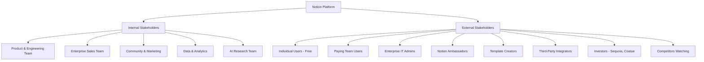
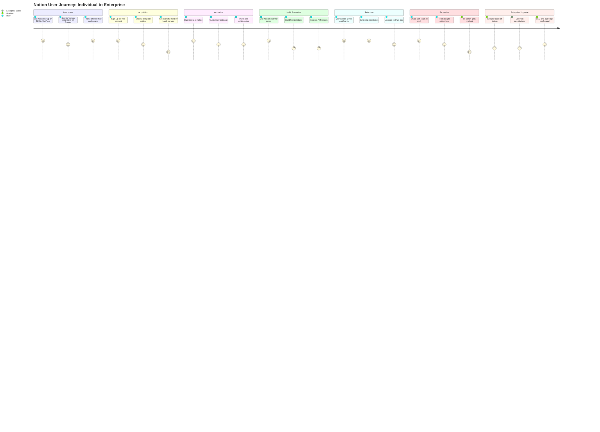
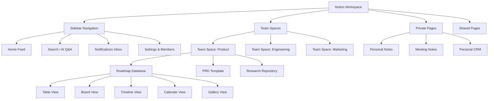
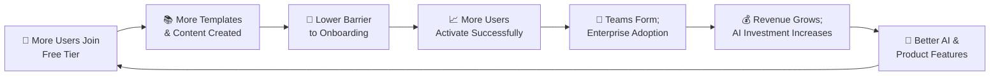
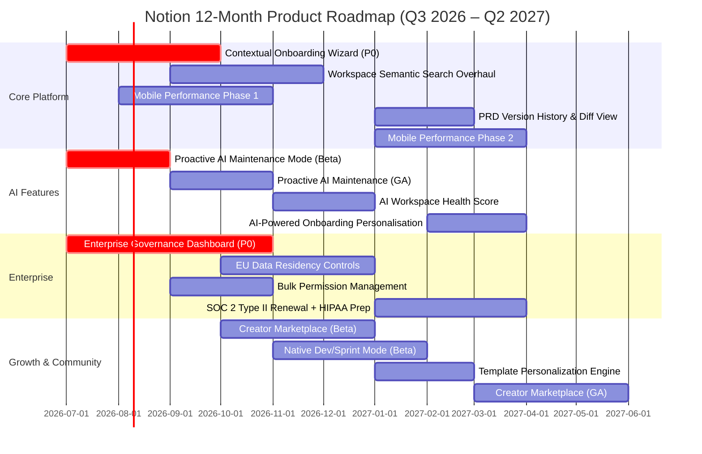

# Notion: A Product Management Case Study


> *Cover Banner: A clean, minimal header image showing Notion's logo on a dark or neutral background, with the tagline "The Connected Workspace." Suggested source: Notion's official press kit at notion.so/about or their media resources page. This image sets the professional tone for the portfolio document.*

---

**Author:** Gaurav Kumar Singh
**Background:** Healthcare Research · Psychology · Integrative Medicine
**Career Goal:** Transition into Product Management
**Current Project:** [Aaroh](https://github.com/gauravksingh) — An AI-powered Root Cause Health Navigator
**Repository Purpose:** Deepening product thinking by analyzing world-class products

---

## Table of Contents

1. [Executive Summary](#1-executive-summary)
2. [Company Overview](#2-company-overview)
3. [Product Evolution](#3-product-evolution)
4. [Industry Analysis](#4-industry-analysis)
5. [Problem Statement](#5-problem-statement)
6. [Product Vision](#6-product-vision)
7. [Product Strategy](#7-product-strategy)
8. [Market Analysis](#8-market-analysis)
9. [Stakeholder Analysis](#9-stakeholder-analysis)
10. [User Segmentation](#10-user-segmentation)
11. [Five Detailed User Personas](#11-five-detailed-user-personas)
12. [Jobs To Be Done (JTBD)](#12-jobs-to-be-done-jtbd)
13. [Customer Journey](#13-customer-journey)
14. [Empathy Map](#14-empathy-map)
15. [Product Ecosystem](#15-product-ecosystem)
16. [Information Architecture](#16-information-architecture)
17. [Core Features](#17-core-features)
18. [Business Model](#18-business-model)
19. [Revenue Streams](#19-revenue-streams)
20. [Business Model Canvas](#20-business-model-canvas)
21. [Product Flywheel](#21-product-flywheel)
22. [Network Effects](#22-network-effects)
23. [Product Metrics](#23-product-metrics)
24. [North Star Metric](#24-north-star-metric)
25. [AARRR Metrics](#25-aarrr-metrics)
26. [SWOT Analysis](#26-swot-analysis)
27. [Porter's Five Forces](#27-porters-five-forces)
28. [Competitor Analysis](#28-competitor-analysis)
29. [UX Audit](#29-ux-audit)
30. [Product Opportunities](#30-product-opportunities)
31. [Feature Prioritization (RICE)](#31-feature-prioritization-rice)
32. [12-Month Product Roadmap](#32-12-month-product-roadmap)
33. [Risks & Mitigation](#33-risks--mitigation)
34. [Product Recommendations](#34-product-recommendations)
35. [Product Management Lessons](#35-product-management-lessons)
36. [Personal Reflection](#36-personal-reflection)
37. [Conclusion](#37-conclusion)
38. [References](#38-references)

---

## 1. Executive Summary

Notion began as a near-failed startup rebuilding itself in a Kyoto apartment on instant noodles and borrowed money. By 2024, it had crossed 100 million users globally, generated an estimated $400 million in annual revenue, and earned a $10 billion valuation — making it one of the most compelling product stories in modern SaaS.

What makes Notion genuinely interesting is not the feature list. It's the underlying philosophy: that users should be able to build their own systems, not adapt to someone else's. In a market saturated with specialised tools — Trello for tasks, Confluence for wikis, Google Docs for writing, Airtable for databases — Notion made a contrarian bet. It built the primitives (blocks) and let users assemble whatever they needed. That bet worked. It attracted students, solo founders, creative teams, enterprise engineering departments, and Fortune 500 companies simultaneously.

This case study examines why Notion won, what it's getting wrong, and where I believe its biggest product opportunities lie over the next 12 months. It draws entirely on publicly available research and my own analytical framework developed through building Aaroh, a health-tech product that faces many of the same tension points: balancing flexibility with guidance, retaining users who arrived curious but leave confused, and monetising a free-heavy user base.

**Key Findings:**
- Notion's core moat is not its features — it's the switching cost created when users build entire personal and team systems inside it.
- The move upmarket toward enterprise is the right strategic direction but carries significant UX and governance debt.
- Notion AI, while promising, has been poorly communicated as a value proposition — many users don't know what it can do for them.
- The single biggest untapped opportunity is onboarding: a 40% confusion rate among new users suggests the blank canvas problem remains unsolved.

---

## 2. Company Overview

| Attribute | Details |
|---|---|
| **Company Name** | Notion Labs, Inc. |
| **Founded** | 2013 |
| **Founders** | Ivan Zhao (CEO), Simon Last (CTO) |
| **Headquarters** | San Francisco, California, USA |
| **Valuation** | $10 billion (2021 Series D) |
| **Total Funding** | ~$343–352 million |
| **Annual Revenue (2024)** | ~$400 million (estimated) |
| **Total Users** | 100 million+ (as of 2024) |
| **Paying Customers** | 4 million+ |
| **Employees** | ~800–1,000 (as of 2025) |
| **Fortune 500 Penetration** | 50%+ |
| **Key Investors** | Sequoia Capital, Coatue Management, Index Ventures |

**Mission (as stated by Notion):** "To make it possible for anyone to tailor their tools to their needs."

**What Notion sells:** Notion is an all-in-one workspace that combines documents, databases, wikis, calendars, project management, and AI assistance into a single, modular environment. Its users range from students organising lecture notes to product teams running company operating systems.

**Why this matters structurally:** Notion doesn't compete in one category. It sits at the intersection of knowledge management, project management, and team collaboration — a deliberate positioning choice that makes it hard to benchmark and harder to replace.

---

## 3. Product Evolution


> *This image should be a clean horizontal timeline spanning 2013–2025, marking key product milestones. Design it in Notion's signature minimal aesthetic — white background, dark text, subtle colour accents. Could be created in Figma or Notion's own Canvas feature.*

### Timeline

| Year | Milestone |
|---|---|
| **2013** | Notion Labs Inc. founded by Ivan Zhao and Simon Last in San Francisco. Initial concept: a "meta-tool" for building custom productivity apps using modular blocks. Raised ~$2M seed from angel investors. |
| **2015** | Near-bankruptcy. Wrong tech stack, product too complex. Zhao and Last fire the team, sublet the SF office, move to Kyoto, Japan. Survive on instant noodles and a $150K loan from Ivan's mother. |
| **2016** | Notion 1.0 launches on Product Hunt — #1 Product of the Day, Week, and Month. Core pivot: from "app builder" to collaborative document and wiki tool using blocks. |
| **2017** | Windows and iOS apps launch. Community begins forming organically. |
| **2018** | Notion 2.0 launches. Again #1 on Product Hunt. Wall Street Journal calls it "the only app you need for work-life productivity." Fewer than 10 employees at this point. |
| **2019** | Hits 1 million users. Revenue estimated at ~$3 million. Notion Ambassadors program launches — community evangelism formalised. |
| **2020** | COVID remote work surge. Raises $50M at $2B valuation (Index Ventures). Free plan expanded to unlimited pages — critical growth lever. TikTok "Notion setups" go viral, overwhelming servers. |
| **2021** | Raises $275M Series C (Coatue + Sequoia), valuation hits $10B. 20 million users. Acquires Automate.io (workflow integrations). 95% organic growth. |
| **2022** | Reaches 20 million users (confirmed). Acquires Cron (calendar app) and Flowdash (workflow builder). API launched publicly, enabling third-party ecosystem. |
| **2023** | Notion AI launches globally in February — summarisation, drafting, Q&A. Revenue jumps from ~$67M to ~$250M. Enterprise ratio shifts from 10% to 50% of customers. |
| **2024** | Notion Calendar launches (January). Forms, Layouts, Automation with Formulas introduced. Acquires Skiff (February). Crosses 100M users. Revenue reaches ~$400M. |
| **2025** | Notion Mail launches (April) — AI-powered Gmail client. Notion 3.0 launches (September) with AI agent features. Featured on Forbes AI 50 list. |
| **2026** | Notion Developer Platform launches (May) — Workers (cloud code sandbox), database sync for live external data. Platform positioning accelerates. |

### What the Timeline Reveals

Three distinct eras are visible in retrospect:

**Era 1 (2013–2018): Survival and Foundation.** Notion nearly died twice. The pivot from "build your own app" to "write with blocks" was the product insight that made everything possible. Ivan Zhao's decision to simplify — to build a great text editor with database capabilities — rather than maintain an overly flexible builder was a critical PM lesson: users don't want power, they want outcomes.

**Era 2 (2019–2022): Community-Led Hypergrowth.** Notion grew from 1M to 20M+ users primarily through community content, Ambassador programs, templates, and TikTok virality. This era demonstrated that the best GTM strategy is sometimes a great product shared by passionate users.

**Era 3 (2023–present): AI-Native Enterprise Platform.** Notion is transitioning from a bottom-up productivity tool to an AI-first enterprise platform. Notion AI, Calendar, Mail, and the Developer Platform all signal an ambition to own the full work context — not just documents and databases, but time, communication, and code execution.

---

## 4. Industry Analysis

### Market Definition

Notion competes across three overlapping markets:

| Market | 2024 Value | Projected 2030/2032 Value | CAGR |
|---|---|---|---|
| Productivity Software | $77–81 billion | $190–265 billion | ~14% |
| Collaboration Tools | $41 billion | $116 billion | ~11% |
| Knowledge Management Software | ~$15–20 billion | ~$40 billion | ~13% |

### Macro Tailwinds

**Remote and hybrid work is permanent.** As of 2025, 88% of executives managing hybrid or remote teams reported no plans to mandate full office returns. Remote work accounted for 28% of workdays in early 2023, up from 6% pre-pandemic. This structural shift directly increases demand for collaborative knowledge tools.

**SaaS tool sprawl creates the consolidation problem Notion solves.** US companies spent an average of $4,800 per employee on SaaS subscriptions in 2025, managing an average of 275 applications. Employees context-switch between nearly 10 different applications per day. Notion's all-in-one pitch is structurally aligned with enterprises wanting to reduce this fragmentation.

**AI is redefining the productivity layer.** The integration of generative AI into knowledge tools is no longer optional — it's table stakes. Notion's early move with Notion AI in early 2023 positioned it ahead of many competitors, though the pricing and feature communication remain areas of friction.

**Enterprise is the growth engine.** The ratio of individual to company customers on Notion shifted from 90:10 to 50:50 by 2023. Enterprise SaaS contracts carry higher ACVs, lower churn, and more predictable revenue — making this shift financially meaningful.

### Macro Headwinds

**Microsoft Loop's distribution advantage is dangerous.** Microsoft 365 reaches 3.7 million companies globally. Loop, Microsoft's Notion-like flexible workspace, is bundled into existing subscriptions. The playbook is familiar: Teams surpassed Slack in DAUs within three years despite launching later. Notion cannot out-distribute Microsoft.

**AI commoditisation is compressing differentiation.** As every competitor integrates LLMs into their tools, Notion AI's early advantage is eroding. The question is whether Notion can layer deeper context (workspace-level knowledge) to stay differentiated.

**Enterprise security concerns persist.** CISOs at regulated industries (healthcare, finance, government) remain cautious about Notion. A verified concern: users have inadvertently set pages with sensitive data to "Public to the web." Confluence's enterprise-grade audit trails and granular permissions are a structural advantage in regulated markets.

---

## 5. Problem Statement

### The Core Problem Notion Solves

Knowledge workers in the 2020s face a fragmentation problem. Their work is distributed across:

- Notes and documents (Google Docs, Word, Evernote)
- Project management (Asana, Trello, Jira)
- Team wikis (Confluence, Tettra)
- Databases (Airtable, Excel)
- Calendar and scheduling (Google Calendar, Calendly)
- Communication (Slack, email)

The result is context-switching overhead, duplicated information, inconsistent formatting standards, and lost institutional knowledge. Teams spend time finding information rather than using it.

> "The best people can do is duct-tape everything together — previously with emails, nowadays with Slack."
> — Ivan Zhao, Notion CEO (2016, Hacker News)

### The Specific Gaps Notion Identified

1. **Rigidity vs. flexibility:** Tools were either too rigid (forms + a table + some buttons, as Zhao described enterprise SaaS) or too generic (Google Docs, "multiplayer WordPerfect").
2. **Silo problem:** Knowledge and workflows were trapped in disconnected tools with no common fabric.
3. **Non-technical user exclusion:** Customising workflows required developers. Notion democratised that through blocks and templates.
4. **Loss of institutional knowledge:** When someone leaves a company, their knowledge leaves with them, scattered across email threads and personal notes.

### What Notion Does NOT Solve Well (Yet)

- **Complex project management:** Power users still need Jira or Asana for sophisticated task workflows, sprint tracking, and engineering project management.
- **Communication:** Email and Slack remain necessary. Notion Mail is early.
- **Offline and mobile:** Limited offline capabilities frustrate users who need access without connectivity.
- **Governance in regulated industries:** Healthcare, finance, and legal teams need compliance features that Notion's current enterprise tier only partially addresses.

---

## 6. Product Vision

**Notion's stated ambition** (from Ivan Zhao and Akshay Kothari, publicly): To build a "connected workspace" that is the single space where individuals and teams think, write, and plan — eliminating the need to switch between fragmented tools.

The longer-term vision, increasingly visible through product moves, is to become the **operating system for knowledge work** — the foundational layer on which teams run their entire operations, not just their documentation.

### My Reading of Where This Vision Is Heading

The Developer Platform (May 2026), with Workers (cloud code sandbox) and live database sync, signals Notion's real ambition: **become a platform for building internal tools**, not just a document system. This would pit Notion directly against Retool, Notion's own Flowdash acquisition, and low-code platforms — a significant expansion of scope.

If Notion executes this, it becomes more like a business operating system and less like a note-taking app. That's a fundamentally different product — and a fundamentally different sales motion.

---

## 7. Product Strategy

Notion's strategy can be decomposed into five pillars:

### Pillar 1: Bottom-Up Growth → Enterprise Expansion
Notion entered through individual users and small teams, not enterprise procurement. This is the classic PLG (Product-Led Growth) motion: make the product so good that individuals adopt it personally, bring it to work, and create bottom-up demand. Then layer enterprise controls and pricing on top.

The evidence of this working: enterprise customers grew ~400% over three years; revenue jumped from $67M (2022) to $400M (2024).

### Pillar 2: Community as Distribution
Rather than paid acquisition, Notion invested in Ambassador programs, template galleries, and community content. When TikTok users created "Notion setups" videos that went viral in January 2021 and overwhelmed Notion's servers — that was the payoff of this strategy. 95% organic growth to 20M users is the outcome.

### Pillar 3: AI as Platform Layer
Notion AI launched in 2023 not as a standalone product but deeply integrated into the workspace. The 2025 shift — moving AI from an $8/month add-on to being bundled into the Business tier — signals that AI is now core infrastructure, not a premium feature. Over 50% of paying customers were reportedly using AI features by 2025.

### Pillar 4: Horizontal Expansion (Calendar, Mail, Developer Platform)
Rather than going deeper in one category, Notion is expanding horizontally to own more of the work day. Calendar (time), Mail (communication), and the Developer Platform (custom code) extend Notion's surface area and increase switching costs.

### Pillar 5: Block Architecture as Durable Moat
The block-based architecture is not just a UX paradigm — it's a structural decision that makes Notion's content portable, composable, and extensible in ways that traditional document editors cannot replicate without a full rebuild.

---

## 8. Market Analysis

### TAM / SAM / SOM

| Segment | Size | Rationale |
|---|---|---|
| **TAM** | ~$200B+ | Total global productivity and knowledge software market |
| **SAM** | ~$40–50B | Collaboration + knowledge management tools for knowledge workers |
| **SOM** | ~$5–8B (achievable near-term) | Notion's current addressable segment based on user base and ARPU growth |

### User Demographics (Publicly Available Data)

- **Geographic split:** US accounts for ~22% of users; UK ~7%; Canada ~5.7%; India ~5%. Over 80% of users are outside the United States.
- **Age profile:** Predominantly 17–35 years old — students to early-career professionals.
- **Enterprise penetration:** 50%+ of Fortune 500 companies use Notion as of 2024.

### Key Geographic Opportunities

India (5% of users) and Brazil represent significant untapped growth. Both markets have large young professional populations, growing tech ecosystems, and established habits of using free productivity tools. Localised pricing and language support are Notion's levers here.

---

## 9. Stakeholder Analysis


> *A stakeholder influence-interest matrix showing internal stakeholders (engineering, design, growth, enterprise sales, data science) and external stakeholders (individual users, enterprise IT admins, template creators, investors, third-party integrators). Use a 2×2 grid with "Influence" on the Y-axis and "Interest" on the X-axis. Suggested tool: Figma or draw.io.*



### Stakeholder Interest vs. Influence

| Stakeholder | Primary Interest | Influence on Product | Key Tension |
|---|---|---|---|
| **Individual Free Users** | Flexibility, cost-free | Medium (drives viral growth) | Want features without paying |
| **Paying Team Users** | Collaboration, productivity | High (revenue source) | Need reliability over new features |
| **Enterprise IT Admins** | Security, compliance, SSO | High (procurement gate) | Friction with Notion's consumer-first UX |
| **Notion Ambassadors** | Recognition, community status | Medium (brand amplification) | May lose influence as Notion goes enterprise |
| **Template Creators** | Discoverability, monetisation | Low-Medium | No direct monetisation path — creates churn risk |
| **Investors** | Revenue growth, path to IPO | High (capital allocation) | Pressure to monetise faster |
| **Third-Party Integrators** | API stability, ecosystem value | Medium | Developer Platform changes affect them |

---

## 10. User Segmentation

Notion's 100M user base is not homogeneous. The product serves fundamentally different use cases, and the UX must serve all of them without collapsing into confusion.

| Segment | Description | Size (Estimated) | Monetisation |
|---|---|---|---|
| **Students** | University students using Notion for notes, study systems, reading lists | 25–30M | Primarily free; education plan |
| **Individual Professionals** | Solo workers, freelancers, consultants building personal operating systems | 20–25M | Mix of free and Plus plan |
| **Creative Professionals** | Writers, designers, content creators, YouTubers documenting workflows | 10–15M | Plus to Business plan |
| **Startups & SMBs** | Small teams (2–50 people) running wikis, roadmaps, hiring pipelines | 15–20M | Business plan primary |
| **Enterprise Teams** | Large organisations with SSO, audit logs, compliance requirements | 5–10M (but high ACV) | Enterprise plan; primary revenue |

---

## 11. Five Detailed User Personas

### Persona 1: Priya — The Overwhelmed Graduate Student


> *A thoughtfully designed persona card. Minimal illustration of a young woman at a desk with multiple tabs open, surrounded by textbooks. Notion-style typography: clean serif headings, sans-serif body. Do NOT use a photo of a real person.*

**Background:**
- 23 years old. MSc in Public Health, Delhi University.
- Uses Notion to organise lecture notes, research papers, thesis planning, and reading lists.
- Discovered Notion through a YouTube video in 2022. Set up a "study dashboard" from a template.

**Goals:**
- Centralise all academic material in one place.
- Build a thesis outline she can share with her supervisor.
- Not lose notes to device failures (happened before with local files).

**Frustrations:**
- Mobile app is slow; she often gives up trying to edit on her phone.
- Offline mode feels unreliable — campus WiFi drops and she loses work.
- When she tried to set up a relational database for her literature review, she spent two hours watching tutorials and still didn't fully understand it.
- Free plan limitations feel arbitrary.

**Behaviours:**
- Visits Notion daily but mostly reads, rarely edits after initial setup.
- Shares her Notion study dashboard on Instagram and LinkedIn — organic evangelist.
- Will likely remain a free user unless she enters the workforce and a company pays.

**JTBD:** *When I have scattered academic information across platforms, I want a single system I trust so I can focus on actually studying rather than managing my notes.*

**PM Implication:** Priya represents Notion's largest segment and its weakest monetisation. She drives virality but generates minimal revenue. The play here is to create a compelling student-to-professional upgrade path at graduation — the moment her intent shifts.

---

### Persona 2: Arjun — The Startup Co-Founder

**Background:**
- 31 years old. Co-founder of a 12-person B2B SaaS startup in Bengaluru.
- Uses Notion as the company's operating system: product roadmap, OKRs, hiring tracker, customer research, investor updates, and team wiki.
- Paying Business plan. Has been using Notion for 3 years.

**Goals:**
- Keep the whole company aligned without daily standups.
- Create a single source of truth for product decisions.
- Onboard new team members without lengthy knowledge transfer sessions.

**Frustrations:**
- Performance degrades as the workspace grows. Pages with many databases load slowly.
- Permissions management is not granular enough — can't restrict sections within a page.
- Notion AI sometimes generates confident but wrong answers when used as a Q&A for internal docs.
- No native time tracking or sprint view that matches what engineering teams actually need.

**Behaviours:**
- Deeply invested in Notion. Has spent months building company processes in it.
- High switching cost — would cost significant time to migrate 3 years of company knowledge.
- Actively advocates Notion in founder communities and WhatsApp groups.

**JTBD:** *When my team is scattered and growing fast, I want a tool that holds our collective knowledge so anyone can find what they need without asking me.*

**PM Implication:** Arjun is Notion's ideal Business tier customer. His high switching cost and deep workspace investment are exactly the retention moat Notion relies on. The risk: if Notion's performance degrades significantly, he has the technical sophistication to explore and migrate to alternatives.

---

### Persona 3: Sarah — The Enterprise IT Administrator

**Background:**
- 44 years old. IT Director at a 3,000-person financial services company in London.
- Notion was adopted bottom-up by product teams and is now used across 200+ employees.
- She didn't choose Notion. She inherited it. Now she's trying to govern it.

**Goals:**
- Ensure sensitive financial data isn't accidentally exposed publicly.
- Have audit logs of who accessed what.
- Meet GDPR and FCA data residency requirements.
- Integrate Notion with their SAML-based SSO provider.

**Frustrations:**
- Notion's permission model is confusing at enterprise scale — there's no clear data governance layer.
- Support response times from Notion's enterprise team are inconsistent.
- Several instances of team members sharing pages publicly without realising it.
- Can't easily enforce organisation-wide templates or content standards.
- Data residency is not EU-only — a compliance concern for regulated data.

**Behaviours:**
- Attending Notion Enterprise webinars. Reading the admin documentation closely.
- Evaluating Confluence as a fallback — structured, predictable, audit-ready.
- The primary decision-maker for whether Notion stays or gets replaced at enterprise scale.

**JTBD:** *When I'm responsible for 3,000 employees' data, I want control and visibility so I can demonstrate compliance without spending hours manually auditing permissions.*

**PM Implication:** Sarah is the reason Notion needs to invest heavily in its enterprise governance layer. She is a veto holder. Lose her confidence and the entire enterprise contract is at risk — even if 200 employees love using Notion.

---

### Persona 4: Marcus — The Independent Creator

**Background:**
- 27 years old. Full-time YouTuber and content creator based in Berlin, 180K subscribers.
- Uses Notion to manage his content calendar, video scripts, brand deal pipeline, and audience research.
- Paying Plus plan. Found Notion through the creator community.

**Goals:**
- Systematise content creation so he can be consistent even during travel.
- Track brand deal negotiations without an external CRM.
- Build a template he can sell to other creators as a product.

**Frustrations:**
- Can't publish a beautiful external-facing page for his template store without third-party tools (like Super.so or simple.ink).
- Notion AI is useful for first drafts but requires significant editing — it doesn't know his voice.
- No native way to collect payments for his templates.
- The mobile editing experience is still subpar for someone working from a phone during travel.

**Behaviours:**
- Has publicly documented his Notion system on YouTube. Drives significant top-of-funnel for Notion.
- Explores alternatives like Craft for document aesthetics.
- Would benefit from a Notion creator monetisation layer — doesn't currently exist.

**JTBD:** *When I'm trying to run my business systematically, I want one place that holds my content pipeline and workflows so I can focus on creating rather than coordinating.*

**PM Implication:** Marcus represents a creator economy opportunity Notion has not yet monetised. A creator-to-monetisation pipeline (template marketplace with revenue sharing, Notion Sites with custom domains, native payment integration) could unlock a new segment and significant revenue.

---

### Persona 5: Deepa — The Product Manager in a Mid-Size Tech Company

**Background:**
- 35 years old. Senior Product Manager at a 400-person tech company in Mumbai.
- Uses Notion for PRDs, product roadmaps, user research repositories, meeting notes, and competitive analysis.
- Her team of 6 PMs all use Notion. The company pays Business plan.

**Goals:**
- Write PRDs that are easy for engineering to reference and comment on.
- Build a research repository that doesn't become a dumping ground.
- Run quarterly roadmap reviews with leadership without duplicating content across Slides.

**Frustrations:**
- Notion doesn't have native version control for documents — hard to track what changed in a PRD.
- The database views (board, timeline, table) are useful but inconsistent in how they handle filters.
- When she pins a comment on a specific word in a document, she sometimes can't find it later.
- Exporting to PDF for stakeholder presentations loses formatting.

**Behaviours:**
- Power user. Has built a custom PM workspace with templates for every PM activity.
- Writes about Notion workflows on LinkedIn. Recommends Notion to her PM community.
- Would switch if a tool natively handled PRD versioning and research repositories better.

**JTBD:** *When I'm managing complex product work across a distributed team, I want a system that keeps everyone aligned and gives me confidence that decisions are documented and findable.*

**PM Implication:** Deepa is the archetype of Notion's highest-value individual user — a Business plan customer who is both a power user and an internal advocate. Losing her to Linear or Productboard for specific PM workflows is a real risk. A native "PM Mode" with PRD templates, version history, and research repository structure would lock her in.

---

## 12. Jobs To Be Done (JTBD)

The JTBD framework asks: what is the underlying progress someone is trying to make when they "hire" a product?

| Segment | Job Statement | Competing Solutions "Fired" |
|---|---|---|
| **Student** | When I have scattered academic content, help me centralise it so I can study instead of organising. | Evernote, Google Docs, physical notebooks |
| **Startup Team** | When we're growing fast, help us build institutional knowledge so new hires can onboard without hand-holding. | Confluence, Notion-as-Google-Doc, internal wikis |
| **Freelancer** | When I'm managing multiple clients, help me track everything in one place so I don't miss commitments. | Trello, spreadsheets, Asana |
| **Enterprise Team** | When we need to document processes and decisions, help us create a system anyone can search and trust. | Confluence, SharePoint, internal wikis |
| **Creator** | When I'm building a content business, help me systematise my workflows so I can scale without chaos. | Airtable, ClickUp, spreadsheets |
| **PM** | When I'm managing product development, help me communicate clearly so engineering and design stay aligned. | Linear, Productboard, Confluence |

### Functional vs. Emotional vs. Social JTBD

| Layer | What Users Really Want |
|---|---|
| **Functional** | A single place where all information lives, searchable and reliable |
| **Emotional** | The feeling of being organised and in control of their work and life |
| **Social** | The identity signal of being a "systems person" — someone who has their life together |

The social dimension of Notion is underappreciated. "Sharing my Notion setup" became a genre of content. Users post their dashboards on social media not just for utility but because a beautiful Notion workspace is a statement about who they are. This identity attachment is a powerful retention mechanism — and it's largely unintentional product design.

---

## 13. Customer Journey


> *A horizontal swim-lane diagram showing the journey from Awareness → Activation → Value Realisation → Team Expansion → Enterprise Upgrade. Each lane should show user actions, feelings, and pain points. Suggest warm Notion colour palette (off-white, dark text, coral/amber accents). Create in Figma or FigJam.*



### Key Moments of Truth

| Stage | Moment of Truth | Risk |
|---|---|---|
| **Activation** | The blank canvas moment — user opens Notion for the first time and doesn't know where to start | 40% of new users report initial confusion |
| **Habit Formation** | First time a user builds something from scratch (not a template) — true product ownership | Many users never get here |
| **Expansion** | First time a user invites a collaborator — this is when Notion's value multiplies | Often delayed; users treat Notion as personal first |
| **Enterprise** | IT admin's first security review — this can block enterprise adoption entirely | Governance gaps create friction |

---

## 14. Empathy Map

For the core user: **The Overwhelmed Knowledge Worker**

```
╔═══════════════════════════════════════════════════════════════════════╗
║                         EMPATHY MAP                                   ║
║                  Target: Knowledge Worker (25-40)                     ║
╠══════════════════╦════════════════════╦═════════════════════════════╣
║    THINKS        ║    FEELS           ║    SEES                       ║
║                  ║                    ║                               ║
║ "My information  ║ Overwhelmed by     ║ Colleagues using 8+ apps      ║
║  is everywhere   ║ tool sprawl        ║ simultaneously                ║
║  and nowhere"    ║                    ║                               ║
║                  ║ Frustrated when    ║ YouTube videos of beautiful   ║
║ "I waste time    ║ they can't find    ║ Notion dashboards             ║
║  searching for   ║ what they built    ║                               ║
║  things I've     ║ last month         ║ Slack messages asking         ║
║  already written"║                    ║ "where is the doc for X?"     ║
║                  ║ Satisfied when     ║                               ║
║ "If I had a      ║ a system works     ║ New productivity tools        ║
║  better system   ║ smoothly for more  ║ launching constantly          ║
║  I'd be more     ║ than a week        ║                               ║
║  productive"     ║                    ║                               ║
╠══════════════════╬════════════════════╬═════════════════════════════╣
║    SAYS          ║    DOES            ║    PAIN / GAIN                ║
║                  ║                    ║                               ║
║ "I keep trying   ║ Tries new tools    ║ PAIN: Blank canvas anxiety    ║
║  to get          ║ every few months   ║ PAIN: Mobile experience       ║
║  organised"      ║                    ║ PAIN: Slow load on large      ║
║                  ║ Builds elaborate   ║       databases               ║
║ "Notion is       ║ systems then       ║ PAIN: Fear of losing work     ║
║  perfect but     ║ abandons them      ║       in a failed SaaS        ║
║  I'm not using   ║                    ║                               ║
║  it right"       ║ Watches tutorials  ║ GAIN: Feeling organised       ║
║                  ║ for 2h per feature ║ GAIN: One source of truth     ║
║ "I recommended   ║                    ║ GAIN: Identity as "systems    ║
║  Notion to my    ║ Shares workspace   ║       person"                 ║
║  whole team"     ║ screenshots online ║ GAIN: Team alignment          ║
╚══════════════════╩════════════════════╩═════════════════════════════╝
```

### What the Empathy Map Tells a PM

The most important insight here is the **gap between aspiration and behaviour.** Users think they want to be organised. They feel satisfied when a system works. But they repeatedly build systems and abandon them. The product's job is not just to give them blocks — it's to reduce the effort of maintaining a system over time. Notion AI's most defensible use case is system maintenance: proactively organising, summarising, and surfacing content so users don't have to.

---

## 15. Product Ecosystem


> *A concentric circle diagram with Notion Core at the centre, first-party products (Calendar, Mail, AI, Sites) in the middle ring, and third-party integrations (Slack, GitHub, Google Drive, Figma, Zapier, etc.) in the outer ring. Use Notion's visual language — minimal, geometric, dark-on-light.*

```mermaid
graph LR
    subgraph Core["🧠 Notion Core"]
        DOCS[Documents & Blocks]
        DB[Databases & Views]
        WIKI[Team Wiki]
        PAGES[Pages & Nested Hierarchy]
    end

    subgraph First["🔧 First-Party Surface"]
        AI[Notion AI]
        CAL[Notion Calendar]
        MAIL[Notion Mail]
        SITES[Notion Sites]
        FORMS[Notion Forms]
        DEV[Developer Platform / Workers]
    end

    subgraph Third["🔗 Third-Party Ecosystem"]
        SLACK[Slack]
        GITHUB[GitHub]
        GDRIVE[Google Drive]
        FIGMA[Figma]
        ZAPIER[Zapier / Make]
        ASANA[Asana]
        JIRA[Jira]
        LOOM[Loom]
        STRIPE[Stripe via integrations]
    end

    subgraph Community["👥 Community Layer"]
        TMPL[Template Gallery]
        AMB[Notion Ambassadors]
        CREATORS[Creator Ecosystem]
        API[Public API]
    end

    Core --> First
    Core --> Third
    Core --> Community
    First --> Third
```



### Ecosystem Analysis

The ecosystem diagram reveals a deliberate strategy: Notion's core is the block-based document and database engine. Everything else is a surface layer built on top of it. Calendar, Mail, Sites, and Forms are not standalone products — they are extensions of the same foundational architecture.

This is a strength (coherent architecture) and a risk (each new surface must integrate seamlessly or feels bolted on). Notion Mail, for example, must feel native to Notion users, not like a Gmail clone living inside a different product.

---

## 16. Information Architecture



### IA Observations

Notion's information architecture is intentionally non-prescriptive. There is no forced hierarchy beyond workspace → pages → subpages. This is both its greatest strength (maximum flexibility) and its biggest onboarding problem (no guidance for new users).

The introduction of Team Spaces in 2022 was a significant IA improvement — it created a natural container for different team contexts without forcing a rigid folder structure. But the coexistence of Team Spaces, Shared Pages, and Private Pages creates navigational ambiguity for new enterprise users.

**Key IA Gaps I Identified:**
1. **Search is still weak for large workspaces.** Users report difficulty finding content across hundreds of nested pages.
2. **No standard templates enforced organisation-wide.** Enterprise admins cannot push a default page structure.
3. **Notification model is weak.** The inbox mixes comments, mentions, and system notifications without clear prioritisation.

---

## 17. Core Features

| Feature | Description | Primary User Value | Differentiation |
|---|---|---|---|
| **Block Editor** | Every piece of content (text, image, database, embed) is a block. Blocks can be reordered, nested, or converted between types. | Infinite flexibility; feels like LEGO for content | Core architecture; hard to replicate without full rebuild |
| **Databases & Views** | Relational databases with six views: Table, Board, Calendar, Gallery, Timeline, List. Properties, filters, sorts, and formulas. | Turns Notion into a flexible data layer for any team | More flexible than Confluence; more document-friendly than Airtable |
| **Nested Pages** | Pages can contain infinite sub-pages, creating a hierarchical knowledge structure. | Mirrors how humans organise information in folders | Simple but powerful; Confluence's equivalent is clumsier |
| **Real-Time Collaboration** | Multiple users can edit simultaneously. Comments, @mentions, and reactions. | Team knowledge becomes live and social | Standard now, but Notion's implementation is clean |
| **Templates Gallery** | Thousands of community and official templates covering every use case. | Eliminates blank canvas anxiety for new users | Community-generated templates are a distribution flywheel |
| **Notion AI** | Summarise, draft, edit, Q&A across the workspace, fill database properties. Integrated into every block type. | Reduces manual knowledge work; surfaces buried content | Workspace-context awareness is a genuine differentiator vs generic AI tools |
| **Notion Calendar** | Calendar that syncs with Google Calendar and Notion databases. Scheduling tool built-in (Calendly alternative). | Connects time to work context | Launched January 2024; integration with databases is differentiated |
| **Notion Mail** | AI-powered Gmail client. Drafts replies, schedules meetings, searches across messages. | Brings communication into the Notion context | Very early; competing against deeply embedded Gmail/Outlook habits |
| **Notion Sites** | Publish Notion pages as public websites. Custom domains, SEO settings. | Converts internal wikis to external knowledge bases | Reduces reliance on third-party tools like Super.so |
| **Notion Forms** | Collect structured input into Notion databases. | Eliminates need for Google Forms → Notion import workflow | Native integration with databases is key |
| **API & Developer Platform** | Public API for integrations. Workers for custom cloud code. Database sync for live external data. | Enables Notion to power custom internal tools | Positions Notion as a platform, not just an app |

---

## 18. Business Model

Notion operates a **freemium SaaS model with product-led growth as the primary acquisition channel.**

The free tier is intentionally generous — unlimited pages and blocks for individuals — because it serves as the top of a wide funnel. The conversion event is almost always either a team need (collaboration, permissions, version history) or an enterprise requirement (SSO, audit logs, advanced admin controls).

### Pricing Tiers (as of 2025)

| Plan | Price | Key Features | Target User |
|---|---|---|---|
| **Free** | $0 | Unlimited pages, 7-day page history, 10 guest collaborators | Individual users, students |
| **Plus** | $10/user/month (annual) / $12 (monthly) | Unlimited history, unlimited guests, 5MB file uploads | Small teams, freelancers |
| **Business** | $20/user/month (annual) / $24 (monthly) | SAML SSO, private teamspaces, bulk PDF export, AI included | Growing teams, companies |
| **Enterprise** | Custom pricing | Advanced security, audit logs, workspace analytics, dedicated CSM | Large organisations |

**Key 2025 Pricing Change:** Notion eliminated the standalone Notion AI add-on ($8/user/month) and moved all AI features exclusively into the Business tier. This move increased ARPU for the Business tier but created friction for Plus plan users who had been using AI as an add-on.

---

## 19. Revenue Streams

| Revenue Stream | Mechanism | Estimated Contribution |
|---|---|---|
| **Subscription Revenue** | Monthly/annual SaaS subscriptions across Free, Plus, Business, Enterprise | Primary (~85%+) |
| **Enterprise Contracts** | Custom pricing with dedicated support, compliance features, volume licensing | Growing (enterprise now ~50% of customers) |
| **Notion AI (bundled)** | AI features now included in Business tier, driving ARPU uplift | Significant growth driver |
| **Education Plans** | Discounted or free plans for students and educators — funnel investment | Indirect (future conversion) |
| **Template Marketplace** (nascent) | Currently community-driven; no native creator monetisation yet | Minimal; significant future opportunity |

### Revenue Growth Trajectory

| Year | Estimated Revenue |
|---|---|
| 2019 | ~$3M |
| 2022 | ~$67M |
| 2023 | ~$250M |
| 2024 | ~$400M |
| 2025 (projected) | ~$500M+ |

The jump from $67M to $250M in one year (2022 → 2023) aligns with Notion AI's beta launch and the aggressive enterprise push. This is the clearest evidence that AI monetisation accelerated the business significantly.

---

## 20. Business Model Canvas


> *A standard 9-box Business Model Canvas. Use Notion's design language: clean, minimal, dark typography on a white or off-white background. Each box should have an icon and concise bullet points. Create in Figma, Miro, or Canva — cite Notion's official brand assets if using their visual style.*

| Canvas Element | Details |
|---|---|
| **Key Partners** | Sequoia, Coatue (capital); AWS (infrastructure); Slack, GitHub, Google, Figma (integrations); Notion Ambassadors (community); Super.so, simple.ink (third-party publishers) |
| **Key Activities** | Product engineering; AI model integration; community building; enterprise sales; content creation (templates); developer platform maintenance |
| **Key Resources** | Block architecture (proprietary); 100M user base; community and Ambassador network; Notion AI (trained on workspace patterns); brand |
| **Value Propositions** | All-in-one workspace replacing 5+ tools; AI-powered knowledge surfacing; maximum customisation without code; community templates reducing setup friction |
| **Customer Relationships** | Self-serve onboarding; community forums and Ambassadors; enterprise CSM; in-app AI assistance |
| **Channels** | Organic search and SEO; Product Hunt launches; TikTok and YouTube creator ecosystem; word-of-mouth; Notion Ambassadors; enterprise sales team |
| **Customer Segments** | Students; individual professionals; startups and SMBs; creative professionals; enterprise teams |
| **Cost Structure** | Cloud infrastructure (AWS); R&D (largest cost); AI compute; enterprise sales team; community programs; support |
| **Revenue Streams** | Subscriptions (Plus, Business, Enterprise); AI-bundled ARPU uplift; education plans (funnel investment) |

---

## 21. Product Flywheel


> *A circular flywheel diagram with 6 stages, each with an arrow connecting to the next. Use a dark background with white text and Notion's amber/coral accent colour for the arrows. Design in Figma or draw.io. The diagram should visually communicate momentum — the flywheel accelerating as each stage feeds the next.*



### Flywheel Breakdown

| Stage | Mechanism | Why It Compounds |
|---|---|---|
| **More users join (free)** | Low friction free tier + viral content | Each new user is a potential advocate |
| **More templates and content created** | Community creates "how I use Notion" content; template gallery grows | Network effect: value increases with more content |
| **Lower onboarding barrier** | Templates solve blank canvas anxiety | More users can activate successfully |
| **More users activate** | Template + guided setup → first "aha moment" | Higher activation → higher eventual conversion |
| **Teams form; enterprise adoption** | Individuals bring Notion to work | Team adoption → Business/Enterprise upsell |
| **Revenue grows; AI investment increases** | Enterprise contracts fund AI R&D | AI improvements create new value propositions |
| **Better AI and product features** | Workspace-aware AI, Calendar, Mail, Developer Platform | Better product → more users → flywheel restarts |

**The strongest stage of this flywheel is the community content loop.** TikTok videos, YouTube tutorials, Reddit posts, and shared templates are Notion's most powerful acquisition channel — and they cost Notion almost nothing. The Ambassador program formalised this, but the organic content existed before any formal program.

---

## 22. Network Effects

Notion's network effects are primarily **within-company** (team network effects) rather than cross-network (social network effects like Facebook).

| Network Effect Type | How It Works | Strength |
|---|---|---|
| **Team Network Effect** | Value increases as more teammates use the same workspace — shared pages, comments, and databases become more useful | High — primary retention mechanism |
| **Data Network Effect** | Notion AI trained on workspace patterns improves as more content is created | Medium — benefit is indirect to the individual user |
| **Template Network Effect** | More users → more templates → better onboarding for new users → more users | High — compounds the top-of-funnel |
| **Ecosystem Network Effect** | More Notion users → more integrations built → more third-party tools plug into Notion | Medium — API ecosystem is growing |
| **Social/Identity Network Effect** | Sharing Notion setups builds the "Notion person" identity, attracting more users seeking that identity | Medium — driven by creator ecosystem |

**Critical Observation:** Notion's network effects are weaker than platforms like Slack or LinkedIn because the core value (documents and databases) can exist for a single user. The network effects kick in at the team level, which is why Notion's PLG motion — get individuals hooked, then convert teams — is the right strategic sequence.

---

## 23. Product Metrics

### Metric Framework

Notion as a B2B2C product (serving both individuals and teams) needs a two-layer metrics framework:

**Individual Layer (Acquisition → Habit)**
- New signups per week
- D7 / D30 retention of new users
- First action completion rate (did they create a page? Use a template?)
- Time to first "aha moment" (defined as: creating a database or inviting a collaborator)

**Team Layer (Expansion → Revenue)**
- Workspaces with 3+ active members
- Team activation rate (first collaborative edit)
- Free → Plus conversion rate
- Plus → Business conversion rate
- Enterprise contract renewal rate
- Notion AI adoption rate within Business tier

### Key Benchmarks (Estimates Based on Public Data)

| Metric | Estimated Value | Notes |
|---|---|---|
| Total users | 100M+ | Crossed in 2024; publicly confirmed |
| Paying users | 4M+ | ~4% free-to-paid conversion |
| Fortune 500 penetration | 50%+ | Publicly stated |
| Revenue per paying user (ARPU) | ~$100/year avg. | $400M / 4M paying users |
| Revenue growth (2022→2024) | ~500% in 2 years | $67M → $400M |
| Organic growth (2021) | 95% | Publicly documented |

---

## 24. North Star Metric

### Proposed North Star: **Weekly Active Collaborative Workspaces**

**Definition:** The number of workspaces with 2+ members where at least one collaborative action (comment, edit by second member, database update) occurred in the past 7 days.

**Why this metric?**
- It captures Notion's core value creation moment — when knowledge work becomes *collaborative*.
- A single user editing their personal notes is valuable, but Notion's monetisation and retention are driven by team usage.
- "Weekly" ensures it's a measure of consistent habit, not sporadic usage.
- It correlates directly with the Business plan upgrade path — once teams are collaborating, they hit free-tier limits and convert.

**What this metric is NOT:**
- It's not "total registered users" — vanity metric, says nothing about value.
- It's not "daily active users" — individual usage without collaboration doesn't drive revenue.
- It's not "pages created" — creation without collaboration or revisiting is also not value.

### Supporting Metrics

| Metric | Purpose |
|---|---|
| Week-2 retention of activated users | Health of habit formation |
| Template adoption rate at signup | Proxy for onboarding success |
| AI feature adoption within Business tier | Value of AI investment |
| Enterprise NRR (Net Revenue Retention) | Quality of enterprise relationships |
| Time from signup to first collaborative edit | Speed of reaching core value |

---

## 25. AARRR Metrics

| Stage | Notion's Mechanism | Key Metric | Current Strength |
|---|---|---|---|
| **Acquisition** | Organic search, TikTok/YouTube content, word-of-mouth, Product Hunt, Ambassadors | New signups per week | Very strong — 95% organic in 2021 |
| **Activation** | Template gallery, guided first page creation, Notion AI onboarding | % users who create/edit a page in first session | Moderate — 40% new user confusion rate is a red flag |
| **Retention** | Daily note-taking habit, team wikis, high switching cost from built systems | D30 / D90 retention, weekly active collaborative workspaces | Strong for power users; weak for casual users |
| **Revenue** | Free → Plus → Business → Enterprise upgrade; AI bundled in Business | MRR growth, conversion rates per tier | Strong — $400M revenue, 500% growth in 2 years |
| **Referral** | "Share my Notion" content, Ambassador program, template sharing | Viral coefficient, template shares | Very strong — unique strength compared to competitors |

### Where Notion Is Underperforming

The **Activation** stage is Notion's most significant AARRR weakness. A product with 100M users and a 40% confusion rate among new users has a leaky funnel. The blank canvas is powerful for power users but alienating for everyone else. The template gallery partially solves this, but the onboarding flow doesn't systematically guide users to the right template for their specific use case.

---

## 26. SWOT Analysis


> *A clean 2×2 SWOT matrix. Use a white background with four quadrants in distinct, muted colours (light green for Strengths, light blue for Opportunities, light orange for Weaknesses, light red for Threats). Minimal typography. Design in Figma, Canva, or Notion's own Canvas tool.*

### Strengths

| Strength | Why It Matters |
|---|---|
| **Block architecture** | Structural differentiation — enables infinite flexibility that document-first tools cannot replicate |
| **Community and flywheel** | 95% organic growth; template ecosystem reduces CAC to near-zero |
| **Brand identity** | "Notion person" has become an identity badge — users advocate enthusiastically and publicly |
| **Switching costs** | Years of built systems create deep lock-in; migration is psychologically and practically costly |
| **Breadth of use cases** | One product serves students, startups, and Fortune 500s — unusual horizontal product-market fit |
| **Notion AI context** | AI with workspace-level context is more useful than generic AI tools for existing users |

### Weaknesses

| Weakness | Why It Matters |
|---|---|
| **Blank canvas problem** | 40% of new users report initial confusion; activation rate suffers |
| **Mobile experience** | Slow, inconsistent, frustrating — loses users who are mobile-first |
| **Performance at scale** | Large workspaces load slowly; databases with thousands of entries degrade |
| **Offline mode** | "Fake" offline mode (post-August 2025) — doesn't support all block types, no new database creation offline |
| **Enterprise governance** | Permissions model is insufficient for regulated industries; data residency concerns |
| **Customer support** | Reports of slow response times and AI-generated generic replies — problematic at enterprise scale |
| **Version control** | No native document version history comparable to Google Docs |

### Opportunities

| Opportunity | Strategic Potential |
|---|---|
| **Enterprise governance layer** | Deep investment in RBAC, data residency, compliance tools could unlock regulated industries (healthcare, finance, legal) |
| **Creator economy monetisation** | Template marketplace with revenue sharing; paid Notion Sites; creator-to-audience tools |
| **AI as proactive system manager** | AI that organises, archives, and surfaces content without user prompting — solving the "maintenance" problem |
| **Developer platform expansion** | Workers + database sync positions Notion as an internal tool builder — new category, significant ACV |
| **India and emerging markets** | 5% of users are in India; significant professional class growth + localised pricing opportunity |
| **Education → Enterprise pipeline** | 25M+ students; graduation is a natural conversion event if Notion maintains relevance |

### Threats

| Threat | Risk Level |
|---|---|
| **Microsoft Loop** | High — same philosophy, bundled into M365 which serves 3.7M companies globally |
| **AI commoditisation** | High — as every tool integrates LLMs, Notion AI's differentiation erodes unless workspace context deepens |
| **Atlassian Confluence + Jira** | Medium — enterprise standard for engineering teams; hard to displace in regulated enterprise |
| **Google Workspace AI improvements** | Medium — slow burn threat; Google has the distribution and trust infrastructure |
| **Open-source alternatives (Obsidian, AppFlowy)** | Low-Medium — growing appeal among privacy-conscious and technically sophisticated users |
| **Pricing backlash** | Medium — 2025 AI pricing restructure drew user criticism; further monetisation missteps could drive churn |

---

## 27. Porter's Five Forces

### Analysis

**1. Threat of New Entrants — Medium**
The productivity software market has low technical barriers to entry (cloud infrastructure is commoditised, LLMs are accessible via API). New entrants like Anytype, AppFlowy, and Capacities emerge regularly. However, Notion's 100M user base, community network effects, and 3-year head start on workspace-level AI create meaningful moats. The real barrier to entry is not technology — it's community and switching cost.

**2. Bargaining Power of Suppliers — Low**
Notion's primary supplier is AWS (cloud infrastructure). While AWS has pricing power, Notion could theoretically migrate to another cloud provider. AI model costs (inference) represent an emerging supplier risk — if OpenAI or Anthropic model pricing increases significantly, Notion's AI features become more expensive to deliver.

**3. Bargaining Power of Buyers — Medium (and Increasing)**
Individual users have near-zero switching cost emotionally but high switching cost practically (built systems). Enterprise buyers, however, have significant bargaining power — they can negotiate pricing, require custom SLAs, and create RFPs that pit Notion against Confluence and Microsoft Loop. As enterprise becomes a larger share of Notion's revenue, buyer power increases.

**4. Threat of Substitutes — High**
This is Notion's most pressing competitive dimension. The risk isn't a single substitute — it's fragmentation. Users may use Notion for docs, Linear for project management, Obsidian for personal notes, and Slack for communication. The all-in-one promise fails if users don't consolidate into Notion. Microsoft Loop threatens with a genuine all-in-one substitute built on existing enterprise relationships.

**5. Competitive Rivalry — High**
The collaboration and productivity tools market has intense rivalry. Key players: Atlassian (Confluence + Jira), Microsoft (Loop + Teams), Coda, Airtable, ClickUp, Monday.com, Asana. Each occupies slightly different positioning but all compete for the same knowledge worker's daily attention. The rivalry is intensifying as AI becomes standard across all platforms.

| Force | Intensity | Key Driver |
|---|---|---|
| New Entrants | Medium | Low tech barriers; high community barriers |
| Supplier Power | Low | AWS dependency manageable; AI cost is emerging risk |
| Buyer Power | Medium → High | Individual: low; Enterprise: growing |
| Substitute Threat | High | Microsoft Loop, fragmentation risk, Obsidian for privacy users |
| Competitive Rivalry | High | Multiple well-funded competitors; AI commoditising feature differentiation |

---

## 28. Competitor Analysis

| Dimension | Notion | Confluence | Coda | Microsoft Loop | Obsidian | ClickUp |
|---|---|---|---|---|---|---|
| **Primary Use Case** | All-in-one workspace | Team wiki & docs | Doc-as-app builder | Collaborative workspace (M365) | Local-first knowledge base | Project management |
| **Flexibility** | Very High | Low | High | Medium | Very High (with plugins) | High |
| **Collaboration** | Strong | Strong | Strong | Very Strong (Teams integration) | Weak (individual-first) | Strong |
| **AI Integration** | Strong (workspace-aware) | Medium (Rovo AI) | Medium | Strong (Copilot) | Plugin-dependent | Medium |
| **Enterprise Governance** | Improving | Very Strong | Medium | Very Strong | N/A | Medium |
| **Mobile Experience** | Weak | Medium | Medium | Medium | Medium | Strong |
| **Offline Access** | Limited | Limited | Limited | Limited | Full (local files) | Limited |
| **Pricing (Team)** | $20/user/month (Business) | ~$5.16/user/month | $10/doc maker/month | Included in M365 | Free (personal) | $7/user/month |
| **Target Segment** | B2C + B2B | B2B (engineering-heavy) | B2B (technical teams) | B2B (M365 enterprises) | B2C (individuals) | B2B (project-heavy) |
| **Primary Strength** | Flexibility + community | Jira integration + compliance | Formula power + automation | Distribution (M365 install base) | Data ownership + speed | Task management depth |
| **Primary Weakness** | Mobile + enterprise governance | UX + search quality | Acquired by Grammarly (uncertainty) | Notion-like but less mature | No team collaboration | Complexity overwhelm |

### Competitive Insight

The most important observation: **no competitor offers Notion's combination of flexibility + community + AI context awareness at the individual-through-enterprise spectrum.** But that breadth is also a liability — Notion can always be beaten on depth by a specialist tool.

The strategic risk is Microsoft Loop. It's not better than Notion today. But Microsoft doesn't need to be better — it just needs to be "good enough" within an existing M365 contract. Friction of adopting a new paid tool vs. using something already bundled is a powerful force.

---

## 29. UX Audit

### Methodology

This audit is based on publicly documented user feedback (Reddit, G2, Product Hunt reviews, published user research from third parties), feature documentation analysis, and my own product thinking framework.

### Heuristic Evaluation

| Heuristic | Finding | Severity |
|---|---|---|
| **Visibility of system status** | Users don't always know if their changes have synced, especially offline or on slow connections | Medium |
| **Match between system and real world** | "Databases," "views," "properties" — terminology is Notion-specific and requires learning | Medium |
| **User control and freedom** | No reliable undo for database operations; deleted pages go to trash but recovery is time-limited | High |
| **Consistency and standards** | Block behaviour inconsistent across contexts (e.g., text formatting in database cells vs. pages) | Medium |
| **Error prevention** | Easy to accidentally make a page "Public to web" — critical for enterprise | High |
| **Recognition over recall** | Template gallery helps; but blank canvas with no contextual guidance requires recall of features | High |
| **Flexibility and efficiency** | Keyboard shortcuts and slash commands are powerful — power users love them | Low (Strength) |
| **Aesthetic and minimal design** | Notion's visual design is genuinely beautiful and has set a standard for the category | Low (Strength) |
| **Help users recover from errors** | Error messages are generic; version history is now available but was lacking historically | Medium |
| **Help and documentation** | Notion's help docs are good; in-product contextual help is weak for complex features | Medium |

### Critical UX Issues

**Issue 1: The Blank Canvas Problem (Severity: High)**
When users open Notion for the first time, they see a blank page with a blinking cursor. For power users, this is freedom. For everyone else, it's paralysis. A 2024 feedback thread found ~40% of newer users reported feeling confused at first. Competitors like ClickUp and Monday.com use structured onboarding wizards that guide users through setup. Notion's template gallery partially addresses this but doesn't proactively suggest templates based on user role or goal.

**Recommendation:** Implement a contextual onboarding wizard that asks 3 questions (role, team size, primary use case) and recommends a starting template with a guided walkthrough. This is the highest-leverage UX intervention in the product.

**Issue 2: Mobile Experience (Severity: High)**
Mobile load times are consistently cited as a major frustration. For users in emerging markets (India, Brazil, Southeast Asia) with variable connectivity, this is a growth blocker. The mobile app is described as functional but slow — particularly when opening large databases or pages with many embeds.

**Issue 3: Permission Complexity at Scale (Severity: High for Enterprise)**
Notion's permission model was designed for small teams. As workspaces grow to thousands of pages and hundreds of users, the lack of granular permission inheritance (setting permissions at a section level within a page, for example) creates both UX confusion and security risk.

**Issue 4: Search Quality (Severity: Medium-High)**
Users with large workspaces report difficulty finding content through search. Notion AI's Q&A feature partially compensates, but users shouldn't need to prompt an AI to find a document they created last week. Full-text search with semantic understanding across the entire workspace is a foundational need.

---

## 30. Product Opportunities

Based on the research, audit, and framework analysis, I've identified five significant product opportunities:

### Opportunity 1: Intelligent Contextual Onboarding
**Problem:** 40% confusion rate among new users; blank canvas is a retention killer.
**Opportunity:** Role-based onboarding that asks 3 questions and auto-populates a starting workspace with relevant templates, sample pages, and a guided first-week checklist. Notion AI could generate a personalised workspace scaffold based on user intent.
**Estimated Impact:** 20–30% improvement in D7 retention; faster time to first collaborative edit.

### Opportunity 2: Creator Economy Monetisation Layer
**Problem:** Creators producing templates drive significant acquisition but receive no direct revenue from Notion. The informal market (selling templates on Gumroad) exists outside Notion's ecosystem.
**Opportunity:** Native template marketplace with revenue sharing (e.g., Notion takes 15-20%, creator keeps 80-85%). Paired with Notion Sites (custom domain + SEO), this could position Notion as a platform for creator-led knowledge products.
**Estimated Impact:** New revenue stream; higher creator retention; accelerated top-of-funnel from creator marketing.

### Opportunity 3: Enterprise Governance Dashboard
**Problem:** IT admins cannot effectively govern large Notion workspaces. No visual overview of public pages, cross-workspace permissions, or data residency controls.
**Opportunity:** A dedicated Admin Control Center with: overview of all pages with their permission states (private, team, public), bulk permission management, org-wide template enforcement, data residency toggles, and an anomaly alert system ("5 pages were set to Public this week — review?").
**Estimated Impact:** Unlock regulated industry enterprise contracts; reduce churn from compliance-blocked renewals.

### Opportunity 4: Proactive AI System Maintenance
**Problem:** Users build systems in Notion and then abandon them because maintenance is manual and tedious. Stale pages, outdated databases, and orphaned content reduce trust in the workspace.
**Opportunity:** "Notion AI Maintenance Mode" — proactively identifies stale content (not edited in 90+ days), suggests archiving or updating, auto-generates summaries for long pages, and surfaces recently-created content the user hasn't read. This turns AI from a reactive tool (user prompts it) to a proactive system manager (it surfaces what matters).
**Estimated Impact:** Significant D90 retention improvement; creates a new value proposition for Notion AI that is clearly differentiated from generic LLM tools.

### Opportunity 5: Native Sprint and Engineering PM Mode
**Problem:** Engineering teams that want Notion as their single tool still use Jira or Linear for sprint management because Notion lacks native sprint planning, velocity tracking, and GitHub integration at the task level.
**Opportunity:** A "Dev Mode" database template with native sprint views, story point tracking, GitHub PR linking, and burndown charts. This doesn't need to be as powerful as Jira — it needs to be good enough that a 10-30 person startup team doesn't need Jira *and* Notion.
**Estimated Impact:** Reduce competitive threat from Linear; increase Business plan adoption in startups.

---

## 31. Feature Prioritization (RICE)

**RICE Formula:**
```
RICE Score = (Reach × Impact × Confidence) / Effort
```

| Feature | Reach (1-10) | Impact (1-3) | Confidence (%) | Effort (person-weeks) | RICE Score | Priority |
|---|---|---|---|---|---|---|
| **Contextual Onboarding Wizard** | 9 | 3 | 90% | 8 | 30.4 | 🔴 P0 |
| **Enterprise Governance Dashboard** | 5 | 3 | 85% | 16 | 7.97 | 🔴 P0 |
| **Proactive AI System Maintenance** | 7 | 3 | 75% | 20 | 7.88 | 🟡 P1 |
| **Creator Marketplace** | 4 | 2 | 70% | 24 | 2.33 | 🟡 P1 |
| **Native Sprint / Dev Mode** | 4 | 2 | 65% | 20 | 2.6 | 🟡 P1 |
| **Mobile Performance Overhaul** | 8 | 2 | 80% | 30 | 4.27 | 🟡 P1 |
| **PRD Version History & Diff View** | 3 | 2 | 80% | 10 | 4.8 | 🟢 P2 |
| **Workspace Search (Semantic)** | 8 | 2 | 75% | 25 | 4.8 | 🟢 P2 |
| **Notion Sites Custom Domain + SEO** | 3 | 1 | 85% | 6 | 4.25 | 🟢 P2 |
| **Offline Mode Overhaul** | 5 | 2 | 65% | 35 | 1.86 | 🔵 P3 |

### RICE Rationale

**Contextual Onboarding Wizard scores highest** because it addresses the single highest-leverage problem in the product: new user activation. The reach is enormous (every new signup experiences onboarding), the impact on retention is direct, and the engineering effort is relatively contained compared to infrastructure-level changes.

**Enterprise Governance Dashboard** scores second because the business case is clear — enterprise contracts have the highest ACV and enterprise churn is driven by compliance concerns. A single unlocked enterprise contract can generate more revenue than thousands of individual Plus plan upgrades.

**Mobile Performance** has high reach (mobile-first users in emerging markets are a significant growth vector) but high effort — a platform-level performance overhaul is a quarter-long or more initiative.

---

## 32. 12-Month Product Roadmap


> *A Gantt-style or swimlane roadmap spanning Q3 2026–Q2 2027. Four swim lanes: Core Platform, AI Features, Enterprise, Growth & Community. Use Notion's colour palette: dark background, amber highlights for P0 initiatives, muted tones for P1/P2. Create in Figma, Miro, or directly in Notion's Timeline view.*



### Roadmap Quarter-by-Quarter

**Q3 2026 (Jul–Sep 2026): Foundation**
- Launch Contextual Onboarding Wizard (P0)
- Launch Proactive AI Maintenance Mode in Beta (targeted rollout to Business tier)
- Begin Enterprise Governance Dashboard development
- Kick off Mobile Performance Phase 1

**Q4 2026 (Oct–Dec 2026): Enterprise & Growth**
- Enterprise Governance Dashboard GA
- Bulk Permission Management and data residency controls
- Creator Marketplace Beta (invite-only)
- Begin Semantic Search Overhaul

**Q1 2027 (Jan–Mar 2027): Depth & Intelligence**
- Mobile Performance Phase 2 (emerging market focus)
- PRD Version History & Diff View (for PM users)
- AI Workspace Health Score (aggregate workspace quality signal)
- EU Data Residency Controls GA

**Q2 2027 (Apr–Jun 2027): Platform Expansion**
- Creator Marketplace GA with revenue sharing
- Native Dev/Sprint Mode GA
- AI-Powered Onboarding Personalisation (uses AI to adapt first experience)
- Template Personalisation Engine (ML-powered "recommended templates" at signup)

---

## 33. Risks & Mitigation

| Risk | Probability | Impact | Mitigation Strategy |
|---|---|---|---|
| **Microsoft Loop aggressive bundling** | High | High | Deepen AI workspace context (impossible to replicate without the data); invest in community moat; accelerate enterprise governance to close the only Loop advantage |
| **AI feature commoditisation** | High | Medium | Shift AI from "generic writing assistant" to "proactive workspace manager" — a use case that requires Notion's proprietary workspace context |
| **Enterprise compliance failure** | Medium | Very High | Invest in SOC 2, HIPAA, and GDPR tooling; hire dedicated compliance engineer; build Admin Governance Dashboard as P0 |
| **Performance degradation at scale** | Medium | High | Dedicated performance engineering team; database pagination improvements; mobile performance as multi-quarter initiative |
| **Pricing backlash from restructuring** | Medium | Medium | Communication-first approach to any pricing changes; grandfather existing AI add-on users; offer annual plan discounts at tier changes |
| **Key talent attrition (AI/product)** | Medium | High | Equity retention; publish engineering blog content to attract AI talent; celebrate product team publicly |
| **Creator ecosystem migrates elsewhere** | Low-Medium | Medium | Launch creator marketplace with revenue sharing before a competitor does; creator grants program |
| **Data breach / public page exposure** | Low | Very High | Build automatic alerts for pages newly set to Public; mandatory admin review for Enterprise accounts |

---

## 34. Product Recommendations

Based on this full analysis, here are my five highest-conviction recommendations for Notion's product team:

### Recommendation 1: Solve Onboarding Before Building More Features

The data is clear: ~40% of new users find Notion confusing at first. Notion has 100 million registered users but only 4 million paying users — a 4% conversion rate. Even a 1% improvement in activation-to-retention would have massive revenue impact.

**What I'd do:** Build a 3-question onboarding wizard (role, team size, goal) that generates a personalised starting workspace using Notion AI. The first session should end with the user having *something* in their workspace that feels like it was built for them — not a blank page.

**Trade-off:** This requires product and engineering investment in a feature that's "invisible" — users won't talk about onboarding. But the retention metrics will move.

### Recommendation 2: Make Enterprise Governance a Product Line, Not a Feature

Notion treats enterprise security as a features checklist (SSO ✓, Audit Logs ✓). The opportunity is to make it a *workflow* — a dedicated Admin Control Center that proactively surfaces risks, enables bulk operations, and gives IT admins the visibility they need to confidently govern Notion at scale.

**What I'd do:** Build a standalone Admin experience (separate from the main Notion product) with: permission health scores, bulk page management, anomaly detection, and a data governance audit report that admins can share with their CISOs.

**Trade-off:** Requires significant investment in a user segment (IT admins) who don't use the core product. The payoff is unlocking regulated industries worth 10x the ACV of individual users.

### Recommendation 3: Build Proactive AI, Not Reactive AI

Notion AI today is a command-line: you prompt it, it responds. The next paradigm is proactive AI — a system that notices when your workspace is getting cluttered, surfaces content you've forgotten about, and maintains your system without you asking.

**What I'd do:** Launch "AI Workspace Health" — a weekly digest that shows users: pages not edited in 90+ days (suggested for archiving or updating), unread pages shared with you, a summary of what your team created this week, and suggested connections between recently created pages and older content.

**Trade-off:** Proactive AI requires careful design — intrusive notifications kill the product. The key is surfacing insights in a non-interruptive way (a weekly email or a dedicated "Health" tab in the sidebar).

### Recommendation 4: Create an Economic Engine for Creators

Template creators are Notion's most valuable unpaid employees. They produce content that reduces Notion's CAC to near-zero and creates a viral loop. Yet they receive nothing from Notion directly — they monetise through Gumroad, their own websites, or not at all.

**What I'd do:** Build a native Template Marketplace inside Notion with a 15% revenue share to Notion and 85% to creators. Pair with Notion Sites (professional custom domains) and a Creator Dashboard (analytics on template installations, page views, referrals). This creates a self-sustaining creator economy inside Notion's ecosystem — and aligns creator incentives with platform growth.

**Trade-off:** Marketplace moderation, payment infrastructure, and creator support are non-trivial to build. The risk is quality control — surfacing low-quality templates could harm the new user experience.

### Recommendation 5: Invest in Mobile as a First-Class Experience

Notion's mobile experience is described as functional but slow. For the 80%+ of users outside the United States — many of whom are mobile-first — this is a growth blocker and a retention risk.

**What I'd do:** Dedicate a dedicated mobile-first engineering team (not a platform team that also does mobile) for 6–12 months. Define a set of "Mobile Core Jobs": daily note capture, viewing databases, commenting, checking the inbox. Make these 5 jobs fast, offline-capable, and friction-free on mobile. Not every feature needs to be mobile-first. But these core jobs do.

**Trade-off:** Mobile performance is an infrastructure and architectural challenge, not a design challenge. It requires platform-level work that is expensive, time-consuming, and invisible to most users (until it's fixed).

---

## 35. Product Management Lessons

Studying Notion revealed a set of product principles I'm bringing directly into my work on Aaroh:

### Lesson 1: Product Philosophy Creates Defensibility — Not Features
Notion's "blocks" are not just a UX pattern. They're an ideology — a statement that users should build their own systems, not use someone else's. This philosophical clarity meant that even when Notion lacked features that competitors had, users stayed because the underlying idea resonated. When building Aaroh, I need to ask: what is the *idea* at the centre of this product that users will rally around?

### Lesson 2: Community Is the Best Product Feature You Can't Ship
The TikTok virality, the Ambassador program, the Reddit templates — none of this was Notion's product team's work. It was the result of users who believed in the product so much they evangelised it for free. The PM's job in this case isn't to "build community" — it's to build a product so useful and so personal that users *want* to share it. Aaroh's health data is deeply personal. If I design the experience such that users feel ownership over their health insights, they will share them.

### Lesson 3: The Blank Canvas Problem is Universal
Notion's biggest UX failure is the blank canvas — infinite possibility that creates paralysis. This is not unique to Notion. Every powerful, flexible tool has this problem. The solution isn't to remove flexibility — it's to offer a guided path *into* the flexibility. Starting with constraints (a template, a question, a pre-filled example) reduces anxiety and increases the chance of reaching the "aha moment." This is directly relevant to Aaroh's onboarding.

### Lesson 4: Measure the Moment of Value, Not Activity
Notion's North Star should not be "pages created" or "daily active users" — it should be "collaborative workspaces." The lesson: define the specific moment when your product delivers its core value, and measure proximity to that moment. For Aaroh, the moment of value is not "entered health data" — it's "understood a connection between their stress and their sleep pattern for the first time."

### Lesson 5: Bottom-Up Growth Has a Ceiling — Know When to Add the Sales Layer
Notion grew from 0 to $250M revenue primarily through PLG. But the jump from $250M to $500M+ required adding an enterprise sales motion. The product-led and sales-led motions are not opposites — they are sequential. Build the product until it sells itself to individuals; add a sales layer when the signal appears in enterprise (bottom-up adoption inside large companies). Timing this transition is one of the hardest calls in B2B SaaS.

### Lesson 6: Acquisitions Are Product Strategy, Not Just Business Strategy
Cron (→ Notion Calendar), Skiff (→ Notion Mail), Automate.io (→ Integrations), Flowdash (→ Developer Platform). Each acquisition maps directly to a product gap Notion wanted to fill. This is how Notion moved faster than its small team size would suggest. As a first-time PM, I need to think about partnerships and ecosystem integrations as product strategy levers — not just internal builds.

---

## 36. Personal Reflection

I chose Notion for this case study because it sits at the intersection of everything I care about: the relationship between systems and human cognition, the challenge of building flexible tools that don't overwhelm, and the question of how a product earns daily relevance in someone's life.

Coming from healthcare research and psychology, I'm drawn to Notion's implicit insight: human knowledge is not linear. We don't think in spreadsheets or folders. We think in associative networks — an idea connects to a memory connects to a task connects to a question. Notion's block architecture, at its best, allows information to be organised the way thinking actually works: fluidly, contextually, and non-hierarchically.

What I find genuinely difficult about Notion, and what I think is underappreciated in product circles, is the **maintenance problem.** I've built multiple Notion systems for myself. Each time, the initial build is energising — the system feels like it will change everything. Three months later, the pages are stale, the databases have wrong entries, and the system has become another thing to manage rather than something that manages things for me. This is not a Notion problem specifically — it's a knowledge management problem. But it's the problem that Notion is best positioned to solve, and I don't think they've solved it yet.

Building Aaroh has given me direct empathy for the challenge of turning user intent into lasting habit. Healthcare data, like knowledge management, suffers from the same paradox: the users who need it most are the least likely to maintain the discipline to enter and review it consistently. The insight I'm taking from Notion's journey is that the answer isn't more features — it's AI that reduces the cognitive overhead of maintenance.

If I were a PM at Notion tomorrow, my first question would be: *what would it look like if Notion required zero maintenance from the user to stay organised?* That's the problem worth solving.

---

## 37. Conclusion

Notion's journey from a nearly-bankrupt startup in a Kyoto apartment to a $10 billion company with 100 million users is one of the most instructive product stories of the past decade. It didn't win by having the most features. It won by having the most coherent *idea* — that users should be the architects of their own systems.

But the next chapter of Notion's story is harder. The easy growth (students, creators, small startups) has largely been captured. The growth that remains — deep enterprise contracts, regulated industries, global mobile-first markets — requires building capabilities that are fundamentally different from what made Notion great: tight governance, performance at scale, offline-first architecture, and enterprise trust.

The tension at the centre of Notion's product strategy is also the tension at the centre of all great productivity software: **how do you give users maximum flexibility without overwhelming them?** Notion hasn't fully solved this yet — the 40% new user confusion rate is evidence of that. But it's closer to solving it than any competitor I can find.

For me personally, studying Notion has clarified something about what makes a great product. It's not the feature list. It's whether the product has a clear answer to the question: *what kind of person does this product help you become?* Notion's answer is: someone who has a system, who is in control of their knowledge, who thinks clearly. That's a powerful aspiration. And aspirations, it turns out, are worth building products around.

---

## 38. References

All references are publicly available sources. No proprietary or internal Notion data has been used.

| Source | Type | URL |
|---|---|---|
| Notion Official Website | Primary | https://www.notion.so |
| Wikipedia — Notion (productivity software) | Secondary | https://en.wikipedia.org/wiki/Notion_(productivity_software) |
| Contrary Research — Notion Business Breakdown | Industry Analysis | https://research.contrary.com/company/notion |
| Medium — Notion: From Near Collapse to $10B (Xiayi Sun) | Secondary | https://medium.com/@sherrysun/notion-from-near-collapse-to-a-10b-all-in-one-workspace-unicorn |
| Product Coalition — Evolution of Notion | Secondary | https://medium.productcoalition.com/the-evolution-of-notion |
| Taskade — What Is Notion AI? History & Workspace Guide | Secondary | https://www.taskade.com/blog/notion-ai-history |
| Notion Elevation — Notion Productivity Statistics 2025 | Data | https://notionelevation.com/notion-productivity-statistics-2025 |
| Bloggervoice — Notion Statistics & Market Analysis 2025 | Data | https://bloggervoice.com/notion-statistics |
| TapTwice Digital — Notion Statistics 2025 | Data | https://taptwicedigital.com/stats/notion |
| 21notion.com — Notion 10-Year History (FLO.W) | Analysis | https://21notion.com/en/blog/notion-10-year-history |
| Bullet.so — History of Notion | Secondary | https://bullet.so/blog/history-of-notion |
| Sparkco.ai — In-Depth Profile of Notion | Analysis | https://sparkco.ai/blog/notion |
| Glitter AI — Best Notion Alternatives 2026 | Competitive Analysis | https://www.glitter.io/blog/knowledge-sharing/best-notion-alternatives |
| Best AI Project Hub — MS Loop vs Notion vs Coda vs Confluence | Competitive Analysis | https://bestaiprojecthub.com/execution-collaboration/ms-loop-alternatives-competitors |
| Jessica Lin (Medium) — Notion Has 100 Million Users | Analysis | https://jess-writes-about-tech.medium.com/notion-has-100-million-users |
| Zapier — Best Notion Alternatives 2026 | Competitive Analysis | https://zapier.com/blog/best-notion-alternatives |
| Taskrhino — 10 Best Notion Alternatives | Competitive Analysis | https://www.taskrhino.ca/blog/notion-alternatives |
| Jackki Ashgrove (Medium) — Notion vs Confluence | Comparative Analysis | https://mrsproductivity.medium.com/notion-vs-confluence |
| Notion Avenue — Notion Story | Founder History | https://www.notionavenue.co/post/notion-story |
| BusinessModelCanvasTemplate — Notion Brief History | Company History | https://businessmodelcanvastemplate.com/blogs/brief-history/notion-brief-history |

---

### Image Guide Summary

| Image Placeholder | Purpose | How to Create |
|---|---|---|
| `images/cover-banner.png` | Professional header for the README | Download from Notion's official press kit (notion.so/about); or create in Figma with Notion's logo and typography |
| `images/product-evolution.png` | Visual timeline 2013–2026 | Build in Figma or Canva using milestone data from this document |
| `images/stakeholder-map.png` | Influence-Interest 2×2 matrix | Create in FigJam, Miro, or draw.io |
| `images/customer-journey.png` | Horizontal swim-lane journey map | Create in FigJam or Figma; use the Mermaid journey diagram in this doc as the base |
| `images/business-model-canvas.png` | 9-box BMC | Create in Canva Business Model Canvas template; use Notion colour palette |
| `images/product-flywheel.png` | Circular flywheel diagram | Create in Figma; use the Mermaid diagram in this doc as the base |
| `images/product-ecosystem.png` | Concentric circle ecosystem map | Create in Figma or draw.io; use the Mermaid graph as the base |
| `images/swot-analysis.png` | 2×2 SWOT matrix | Create in Canva or Figma with muted quadrant colours |
| `images/product-roadmap.png` | Gantt/swimlane roadmap | Create in Notion's own Timeline view or export from Miro; use the Mermaid Gantt as the base |
| `images/persona-priya.png` | Persona card for Priya | Create in Figma using a persona template; use a custom illustration, not a stock photo |

---

*This case study was conducted independently as part of a personal product management learning portfolio. I am not affiliated with Notion Labs, Inc. All data cited is from publicly available sources as of June 2026. Revenue and user figures are third-party estimates; Notion is a private company and does not publish audited financials.*

*Built by Gaurav Kumar Singh · [LinkedIn](#) · [Aaroh Project](#) · [GitHub Portfolio](#)*
