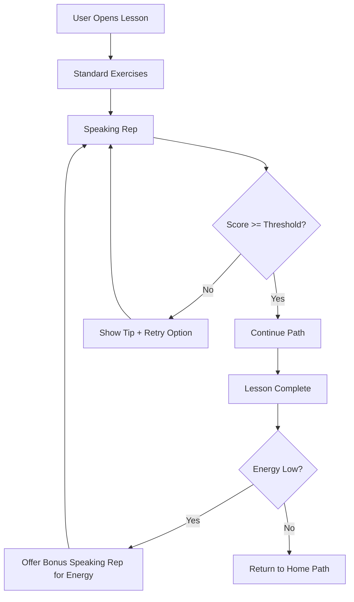
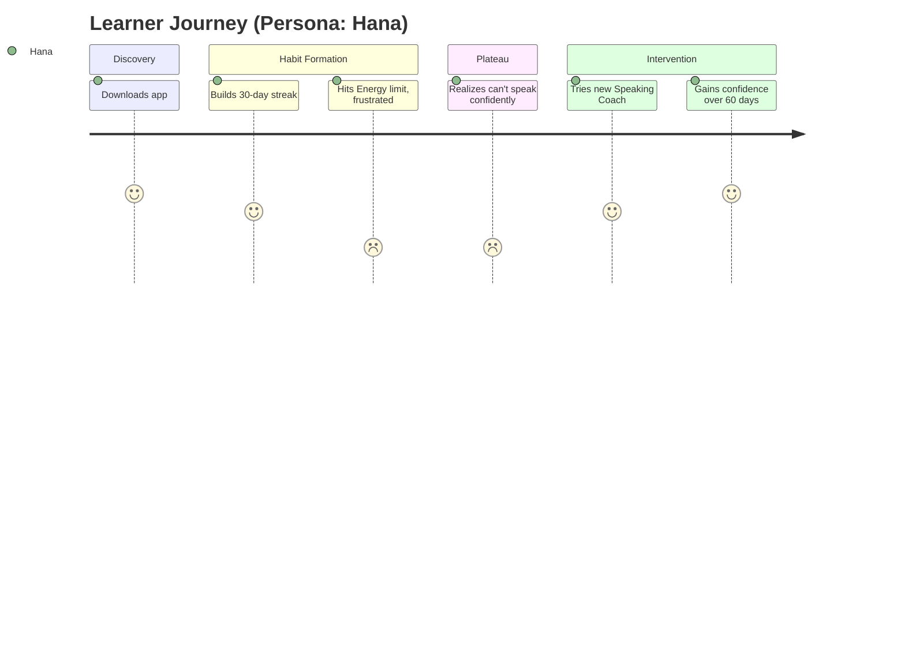
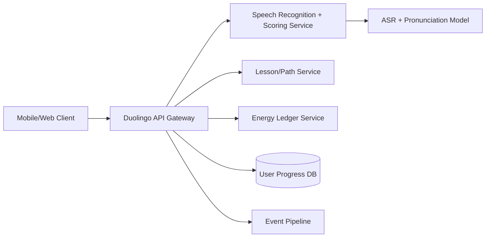

# Duolingo Product Teardown & Strategy Case Study
### A Principal-PM-Level Deep Dive into Growth, Monetization, and AI-Powered Learning

---

## 1. Cover Page

**Product:** Duolingo (Mobile App + Web)
**Category:** Consumer EdTech / Language Learning / AI-Powered Education
**Document Type:** Product Strategy Case Study
**Prepared by:** Gaurav Kumar Singh, Associate Product Manager
**Part of:** 90-Day Product Management Case Study Challenge — Day N
**Last Updated:** June 30, 2026

---

## 2. Executive Summary

Duolingo is the world's most widely used language-learning platform, reporting 56.5 million daily active users (DAUs) and 137.8 million monthly active users (MAUs) in Q1 2026, with revenue of $291.9M (up 27% YoY) and 12.5 million paid subscribers.[1][2] The company has pivoted its 2026 strategy from aggressive monetization toward "engagement-first growth," targeting 100 million DAUs by 2028.[3]

This case study evaluates Duolingo's current product, business model, and user experience, and proposes three prioritized recommendations:

1. **Adaptive Speaking Coach** — a low-latency, rubric-based speaking-fluency feature available on the free tier, addressing the most consistent gap identified across user reviews: Duolingo builds vocabulary recognition but not speaking production.
2. **Energy System Trust Repair** — a redesigned free-tier pacing mechanic that replaces the current "Energy" system (which has generated visible user backlash since its 2025 rollout) with a model that preserves monetization incentives without eroding daily-habit trust.
3. **Cohort-Based Accountability Pods** — a social-commitment feature that pairs habit-formation research with Duolingo's existing gamification layer to improve long-term (90-day+) retention, which is the company's stated core lever for its 100M DAU target.[3]

Each recommendation is sized, sequenced, and tied to explicit success metrics, with assumptions clearly labeled for validation.

---

## 3. Table of Contents

1. Cover Page
2. Executive Summary
3. Table of Contents
4. Problem Statement
5. Background & Context
6. Why This Problem Matters
7. Opportunity Sizing (TAM/SAM/SOM)
8. Market Research
9. Industry Trends
10. User Research Plan
11. Interview Guide
12. Survey Design
13. Personas
14. Empathy Maps
15. Customer Journey Map
16. Jobs To Be Done
17. Problem Validation
18. Competitor Analysis
19. SWOT Analysis
20. Gap Analysis
21. Product Vision
22. Product Mission
23. Product Principles
24. Success Metrics
25. Product Strategy
26. Alternatives Considered
27. Trade-offs
28. Feature Brainstorming
29. Feature Prioritization
30. MVP Definition
31. User Stories
32. Acceptance Criteria
33. Information Architecture
34. User Flows
35. Mermaid Diagrams
36. Wireframe Descriptions
37. UX Decisions
38. Accessibility Considerations
39. AI Strategy
40. Technical Architecture
41. API Integrations
42. Database Design
43. Security & Privacy
44. PRD
45. Analytics Plan
46. Event Tracking
47. North Star Metric
48. Guardrail Metrics
49. Funnel Metrics
50. Experimentation & A/B Testing
51. Risk Analysis
52. Monetization Strategy
53. Pricing Strategy
54. Go-To-Market Strategy
55. Launch Plan
56. Product Roadmap
57. Future Enhancements
58. Lessons Learned
59. Limitations
60. Assumptions
61. References
62. Appendix
63. About the Author

---

## 4. Problem Statement

Duolingo has solved habit formation for vocabulary acquisition but has not solved production fluency — the ability to actually speak and be understood in a target language. Independent reviews published in 2026 consistently note that Duolingo's free tier caps progress around A2 CEFR level and that the platform "cannot build speaking production, academic writing, or exam-specific skills."[4] Simultaneously, the 2025 rollout of an "Energy" pacing system on mobile has generated visible user frustration on community forums, with users reporting they "cannot make it through 2 full lessons" before being locked out.[5] This creates a dual problem: a capability gap (fluency) and a trust/retention gap (pacing mechanics) at exactly the moment management has committed to a growth-first strategy requiring sustained DAU-to-MAU retention improvement.[3]

## 5. Background & Context

Duolingo launched in 2011 with a mission to make language education free and accessible. It has since expanded into Math, Music, and the Duolingo English Test (DET), and become a publicly traded company (NASDAQ: DUOL) since 2021. In 2023 it introduced Duolingo Max, a GPT-4-powered tier offering Roleplay and Video Call conversation practice.[6] In January 2026, the flagship "Explain My Answer" AI feature moved from the paid Max tier to free-for-all, materially narrowing the differentiation between Super and Max.[7][8] Management's Q1 2026 shareholder letter and earnings call reframed 2026 priorities around "teaching better" and growing DAUs rather than maximizing near-term bookings, with a stated long-term target of 100 million DAUs by 2028.[3][9]

## 6. Why This Problem Matters

Speaking fluency is the single most commonly cited reason users seek alternatives to Duolingo, and it directly threatens the company's stated 2026–2028 strategy: if engagement gains from current AI features (spoken tokens, speaking adventures) do not translate into actual competence, churn risk rises precisely as management is prioritizing audience growth over monetization.[3][9] Separately, the Energy system controversy is a guardrail-metric risk: free-tier frustration that drives users to competitors before they ever reach a purchase decision directly undercuts the funnel that produces paid subscribers, who already make up the majority of Duolingo's $291.9M quarterly revenue.[1]

## 7. Opportunity Sizing (TAM / SAM / SOM)

**Methodology:** Bottom-up, anchored to Duolingo's own reported metrics plus third-party market estimates. All figures should be treated as directional; Duolingo does not publish a feature-level addressable market, so this sizing is built from public company metrics and is explicitly labeled where assumptions were required.

| Layer | Definition | Estimate | Basis |
|---|---|---|---|
| TAM | Global population actively learning a second language via digital tools | ~1.2 billion language learners worldwide (UNESCO/various industry estimates) | **ASSUMPTION — VALIDATION REQUIRED.** No single authoritative figure was found; language-learning population estimates vary widely by source and methodology. |
| SAM | Duolingo's current addressable base of app-based learners | 137.8 million MAUs (Q1 2026) | Reported MAU figure from Duolingo's Q1 2026 shareholder letter.[2] |
| SOM (speaking-fluency feature) | Existing DAUs who would plausibly engage with a free speaking-coach feature | 56.5 million DAUs (Q1 2026), of which a **subset** would opt into a speaking feature | **ASSUMPTION — VALIDATION REQUIRED.** No public data on the percentage of DAUs who would use a speaking-specific feature; this requires a user survey (see Section 10–12) before commitment to build.

This sizing intentionally avoids inventing a dollar-denominated TAM, since Duolingo does not break out feature-level revenue and no reliable independent source provides this breakdown.

## 8. Market Research

Duolingo is the most widely used language-learning app globally, with MAUs exceeding 137 million as of Q1 2026, up from 130.2 million a year earlier.[2] Paid subscribers reached 12.5 million in Q1 2026, up 21% YoY, and gross margin improved to 73.0% as AI inference costs per unit declined.[2][10] Full-year 2026 guidance targets approximately $1.205 billion in revenue and $310 million in adjusted EBITDA.[10] Management has explicitly signaled that Asia, and China specifically, is the fastest-growing region and the site of profitable performance marketing.[9]

## 9. Industry Trends

- **AI-native tutoring is becoming table stakes.** Duolingo's Max tier (Roleplay, Video Call) and competitors' AI conversation partners reflect an industry-wide shift from static curricula to adaptive, generative-AI-driven practice.[6][11]
- **Monetization via feature-gating AI is under pressure.** Duolingo's decision to make "Explain My Answer" free in January 2026 suggests AI-feature differentiation is commoditizing faster than expected, compressing premium-tier pricing power.[7][8]
- **Engagement-system backlash is a sector-wide risk.** The shift toward "Energy"-style pacing mechanics (replacing the older Hearts system) mirrors broader free-to-play tensions between monetization design and user trust.[5]
- **Regional pricing and purchasing-power-adjusted plans** are increasingly standard, with Duolingo charging different Super/Max prices across markets such as Turkey and Brazil.[12]

## 10. User Research Plan

**Goal:** Validate whether a free-tier speaking-fluency feature and a redesigned pacing mechanic would materially improve retention and reduce churn-to-competitor behavior.

**Method mix:**
- 15–20 moderated 1:1 interviews with active and lapsed Duolingo users (mix of Free, Super, Max)
- Quantitative survey (n≥400) distributed via in-app prompt and Duolingo subreddit/community channels
- Usability testing of a speaking-coach prototype with 8–10 participants across 3 proficiency bands (A1, A2, B1)

**Timeline:** 4 weeks (recruiting: week 1; interviews/survey: weeks 2–3; synthesis: week 4)

*Note: No primary user research was conducted for this case study. The plan above is a proposed design, not completed findings. Any user quotes elsewhere in this document are sourced from public, third-party-published forum posts and are cited accordingly — they are not original primary research.*

## 11. Interview Guide

1. Walk me through the last time you used Duolingo. What triggered that session?
2. When was the last time you felt frustrated or stuck using the app? What happened?
3. Have you ever tried to have an actual conversation in your target language? How did that go?
4. What, if anything, have you tried outside Duolingo to get better at speaking?
5. Tell me about the Energy/Hearts system — how does it affect your daily habit?
6. If Duolingo disappeared tomorrow, what would you miss most? Least?
7. What would make you upgrade to (or cancel) a paid plan?

## 12. Survey Design

- Screener: current/lapsed Duolingo user, tier (Free/Super/Max), tenure, target language, proficiency self-rating
- Likert-scale items: confidence in speaking ability, frustration with pacing limits, likelihood to recommend (NPS)
- Open text: "What's the single biggest thing stopping you from being conversational in your target language?"
- Behavioral: self-reported streak length, sessions/week, whether they've ever paused/cancelled a subscription and why

## 13. Personas

**Persona 1 — "Habit-Building Hana"**
Age 27, marketing professional, learning Japanese for an upcoming move. Uses Duolingo daily during commute. Values streaks and gamification. Frustrated by Energy limits cutting sessions short. Has never had a real conversation in Japanese despite a 200+ day streak.

**Persona 2 — "Goal-Driven Gabriel"**
Age 34, relocating to Germany for work. Time-boxed: needs conversational competence in 6 months. Already pays for Super; considering Max but skeptical of value given short Video Call sessions. Supplements Duolingo with a human tutor.

**Persona 3 — "Casual Carlos"**
Age 19, university student, learning Spanish "for fun" and to talk with extended family. Free-tier only, price-sensitive, easily churns to competitors when blocked by ads or energy limits.

*All personas are illustrative composites built from patterns observed in public reviews and forum discussion; they are not derived from primary interviews and should be validated per Section 10.*

## 14. Empathy Maps

| | Hana | Gabriel | Carlos |
|---|---|---|---|
| **Says** | "I have a 200-day streak but I froze when I tried to order food in Tokyo." | "Max feels like I'm paying for a 30-second phone call." | "The energy bar ran out after two lessons, so I just closed the app." |
| **Thinks** | "Am I actually learning, or just clicking the right answer?" | "Is this worth $168/year over Super?" | "I'll just use a free competitor instead." |
| **Does** | Opens app daily, rarely speaks out loud | Pays for Max, uses Video Call sparingly | Uninstalls after repeated energy lockouts |
| **Feels** | Proud of streak, anxious about real-world ability | Mildly frustrated, value-conscious | Annoyed, low loyalty |

## 15. Customer Journey Map

**Stage 1 — Discovery:** App Store/word-of-mouth → download (low friction, free)
**Stage 2 — Onboarding:** Placement test, goal-setting, streak introduction (high engagement, well-optimized)
**Stage 3 — Habit formation (Days 1–30):** Gamification (streaks, leaderboards) drives daily return; Energy system introduces friction for high-intent users
**Stage 4 — Plateau (Months 2–6):** Vocabulary recognition improves; speaking confidence does not; users report a competence-confidence gap
**Stage 5 — Decision point:** Upgrade to Super/Max, supplement with tutor/other app, or churn
**Stage 6 — Retention or churn:** Long-streak users with no real-world speaking practice are at elevated churn risk once initial novelty fades

## 16. Jobs To Be Done

- "When I have 5 minutes before a meeting, I want a quick win that keeps my streak alive, so I feel like I'm making progress without losing momentum."
- "When I'm about to travel, I want to know I can actually order food and ask for directions, so I don't feel helpless."
- "When I get something wrong, I want to understand why, so I don't repeat the mistake."
- "When I run out of Energy/Hearts, I want a fair way to keep practicing, so I don't feel punished for trying."

## 17. Problem Validation

Public evidence supporting the speaking-fluency gap and Energy-system friction:
- Independent 2026 reviews state plainly that Duolingo "does not develop speaking fluency, advanced grammar comprehension, or the production skills needed for real communication."[4]
- Duolingo Max's Video Call sessions are reported to last only about 30 seconds and lack pronunciation scoring, limiting their usefulness even for paying users.[12]
- Forum users on community platforms describe being unable to complete even two lessons before being blocked by the Energy system, and some explicitly state they hope "another app takes its place with a free option."[12]

These are third-party, publicly available data points, not primary research conducted for this case study, and should be supplemented with the research plan in Section 10 before any feature is greenlit.

## 18. Competitor Analysis

| Competitor | Core Differentiator | Pricing (approx., 2026) | Source |
|---|---|---|---|
| Babbel | Structured grammar-first curriculum, human-designed lessons | ~$13.95–17.95/month or ~$84–96/year | [4][13] |
| Rosetta Stone | Immersion method, no translation | Varies by plan | [13] |
| Busuu | Community feedback from native speakers; Premium Plus AI features | ~$13.99/month | [16] |
| LingQ | Comprehensible-input / reading-heavy approach | Subscription-based | [4] |
| Copycat Cafe (AI conversation apps) | AI conversation partner with longer sessions and pronunciation scoring | Comparable to Duolingo Max | [12] |

**ASSUMPTION — VALIDATION REQUIRED:** Exact current competitor pricing fluctuates with promotions and region; figures above are approximate as reported by third-party comparison sites in 2026 and should be re-verified before use in external-facing materials.

## 19. SWOT Analysis

**Strengths:** Massive scale (137.8M MAU), strong brand/mascot recognition, best-in-class gamification, profitable at 73% gross margin, diversified into Math/Music/DET.[2][9]
**Weaknesses:** Limited speaking-production capability; Max's AI differentiation has narrowed since Explain My Answer became free; Energy system is generating visible user backlash.[7][8][5]
**Opportunities:** 100M DAU 2028 target via engagement-first strategy; profitable performance marketing in Asia/China; expanding AI feature set (spoken tokens, speaking adventures, flashcards).[3][9]
**Threats:** AI-native conversation-first competitors (e.g., Copycat Cafe) offering longer, more pronunciation-focused sessions at similar price points; commoditization of AI tutoring features; free-tier frustration driving churn before monetization.[12][5]

## 20. Gap Analysis

| Capability | Current State | Desired State | Gap |
|---|---|---|---|
| Speaking production | Limited; Video Call capped at ~30 sec, select languages only | Confident, real-world conversational ability | Large — core unmet need |
| Free-tier pacing | Energy system causing visible frustration | Pacing that protects monetization without eroding trust | Medium — design/trust problem |
| AI differentiation (Max) | Narrowed after Jan 2026 free-tier expansion | Clear, durable premium value proposition | Medium-large — monetization risk |

## 21. Product Vision

A world where anyone, anywhere, can become genuinely conversational in a new language — not just quiz-proficient — through bite-sized, AI-personalized daily practice.

## 22. Product Mission

Build the most effective free path from zero to real-world conversational competence, monetizing depth and personalization rather than gatekeeping core learning.

## 23. Product Principles

1. Free should mean genuinely useful, not deliberately frustrating.
2. Speaking is the proof of learning — design for production, not just recognition.
3. AI should personalize pace and content, not just gate features behind a paywall.
4. Habit mechanics should build trust, not resentment.

## 24. Success Metrics

- DAU/MAU ratio (engagement depth) — current trend reported as increasing quarter-over-quarter per management commentary[9]
- 90-day retention cohort curves
- Self-reported speaking confidence (survey-based, pre/post feature)
- Net Promoter Score among Free-tier users specifically (to isolate Energy-system sentiment)
- Free-to-paid conversion rate

## 25. Product Strategy

Prioritize engagement and trust repair in the free tier first (since management has explicitly deprioritized near-term bookings growth in favor of DAU growth toward the 100M-by-2028 goal[3]), then layer a speaking-fluency differentiator that can eventually justify Max's premium pricing once it offers something competitors cannot easily replicate.

## 26. Alternatives Considered

1. **Build a fully separate "Conversation" app** (like a standalone product) — rejected: fragments the user base and loses cross-sell into existing 137.8M MAU funnel.
2. **Simply remove the Energy system** — rejected outright; instead redesign it, since it likely serves a real monetization purpose (converting frustrated free users to Super) that should be preserved in a less trust-eroding form.
3. **Double down on Max-exclusive AI features only** — rejected as primary strategy: narrows addressable improvement to the smaller paid base (12.5M) rather than the full 56.5M DAU base where the growth strategy is focused.

## 27. Trade-offs

- **Free-tier generosity vs. monetization:** Redesigning Energy to feel fairer may reduce short-term Super conversions; this is an explicit, accepted trade-off given management's stated growth-over-bookings priority for 2026.[3]
- **Speaking feature on Free vs. Max:** Placing a meaningful speaking feature on Free sacrifices a potential Max upsell lever but directly serves the larger engagement goal; Max differentiation would need to come from advanced/extended sessions instead.
- **Build complexity vs. speed:** Real-time speech evaluation is technically harder and costlier (inference cost) than text-based exercises — must be weighed against the 73% gross margin trend that management is protecting.[10]

## 28. Feature Brainstorming

- Adaptive Speaking Coach (rubric-based pronunciation/fluency scoring, free tier, capped session length)
- Energy system redesign: regenerate energy via "micro-wins" (e.g., completing a speaking rep) rather than purely time-based regeneration
- Cohort-based accountability pods (5–8 users, shared weekly goal, peer nudges)
- Extended Max Video Call sessions (address the "30 seconds is too short" complaint directly)[12]
- Real-world scenario packs tied to travel/relocation use cases (Persona: Gabriel)

## 29. Feature Prioritization

**MoSCoW**

| Feature | Priority |
|---|---|
| Adaptive Speaking Coach (MVP scope) | Must have |
| Energy system redesign | Must have |
| Cohort-based accountability pods | Should have |
| Extended Max Video Call sessions | Should have |
| Real-world scenario packs | Could have |

**RICE (illustrative scoring, 1–10 scale per factor; ASSUMPTION — VALIDATION REQUIRED for exact figures)**

| Feature | Reach | Impact | Confidence | Effort | RICE Score |
|---|---|---|---|---|---|
| Adaptive Speaking Coach | 9 | 9 | 6 | 8 | ~60.8 |
| Energy redesign | 10 | 7 | 7 | 4 | ~122.5 |
| Accountability pods | 6 | 6 | 5 | 6 | ~30.0 |

**Impact vs. Effort:** Energy redesign = high impact / low-medium effort (quick win). Speaking Coach = high impact / high effort (major bet). Accountability pods = medium impact / medium effort (fill-in).

**Kano:** Speaking accuracy feedback = performance attribute (more is better, linear satisfaction). Fair pacing = basic expectation (its absence causes dissatisfaction, but its presence isn't a "delighter"). Cohort pods = potential delighter/exciter.

## 30. MVP Definition

A free-tier "Speaking Practice" module limited to 3 languages at launch (Spanish, French, Japanese — chosen for high existing Max Roleplay support[17]), offering 2 guided speaking reps per lesson with automated fluency scoring (not full conversation), paired with a revised Energy-regeneration rule that grants bonus energy for completing a speaking rep.

## 31. User Stories

- As a free-tier learner, I want to practice speaking a phrase aloud and get instant feedback, so that I build real confidence, not just recognition skills.
- As a habit-driven user, I want a way to earn back Energy through effort, so that I don't feel arbitrarily locked out.
- As a goal-driven learner, I want scenario-based speaking practice relevant to my real-world situation, so that I'm prepared for actual conversations.

## 32. Acceptance Criteria

**Speaking Coach (example story):**
- Given a lesson with a speaking rep, when the user speaks into the microphone, then the system returns a fluency/pronunciation score within 3 seconds.
- Given a low score, when feedback is shown, then the user is offered one retry before moving on.
- Given the feature is used, when the rep is completed, then the user's Energy is incremented per the redesigned rule.

## 33. Information Architecture

Home (Path) → Lesson → Speaking Rep (new) → Feedback Screen → Lesson Continuation
Profile → Progress → Speaking Confidence Trend (new)
Shop → Super / Max upsell (existing, unchanged)

## 34. User Flows

1. User opens lesson → completes standard exercises → encounters new Speaking Rep step → grants mic permission (if first time) → speaks → receives score + tip → continues path.
2. User runs low on Energy → sees option: "Do a Speaking Rep to earn +1 Energy" → completes rep → Energy restored → resumes lesson.

## 35. Mermaid Diagrams

## 36. Wireframe Descriptions

**Speaking Rep Screen:** Center-screen target phrase in target language with phonetic guide; large circular microphone button (primary action); waveform animation during recording; below, a score gauge (0–100) appears post-recording with one-line feedback ("Great rhythm — work on the 'r' sound") and a "Try Again" secondary button. *No image generated — placeholder for future UI mockup, to be created in Figma and attributed if drawn from any existing Duolingo screen.*

**Energy Bonus Prompt:** Modal triggered when Energy reaches zero, showing a friendly illustration (mascot), the text "Out of Energy — earn 1 back with a 30-second Speaking Rep," and two buttons: "Do a Speaking Rep" (primary) / "Wait for Energy to refill" (secondary). *Placeholder — no real screenshot used; any such asset must be an internal mockup, not Duolingo's actual proprietary UI.*

## 37. UX Decisions

- Microphone permission requested contextually (at first Speaking Rep), not at app install, to reduce drop-off.
- Scoring shown as encouraging ranges (not a harsh percentage) to avoid demotivating early learners, consistent with Duolingo's existing positive-reinforcement tone.
- Energy-earning path framed as opportunity ("earn back") rather than punishment, directly addressing the sentiment in user complaints about feeling "punished."[5]

## 38. Accessibility Considerations

- Speaking Rep must have a text-input fallback for users who cannot or prefer not to use voice (motor/speech accessibility, noisy environments).
- Score feedback must not rely on color alone (colorblind-safe icons + text labels).
- All new screens must meet WCAG 2.1 AA contrast and screen-reader labeling standards. **ASSUMPTION — VALIDATION REQUIRED:** specific compliance testing was not performed for this case study.

## 39. AI Strategy

Use a speech-to-text + pronunciation-scoring model (rather than full generative conversation) for the MVP Speaking Coach to keep inference cost low and latency under 3 seconds, preserving the gross-margin trend management has prioritized (73.0% in Q1 2026, trending down toward 69% by year-end as AI adoption increases per guidance).[10] Reserve full generative-AI conversation (GPT-4-class, as used in existing Max Video Call/Roleplay[6][17]) for an extended, longer-session Max upsell rather than the free MVP, to manage cost.

## 40. Technical Architecture

**ASSUMPTION — VALIDATION REQUIRED:** This architecture is a plausible illustrative design based on standard mobile-app patterns; it is not based on disclosed internal Duolingo system design, which is not publicly documented.

## 41. API Integrations

- Speech-to-text/pronunciation scoring: third-party ASR provider or in-house model (build-vs-buy decision, **ASSUMPTION**)
- Existing Duolingo account/auth and lesson-path services (internal, undocumented publicly)
- Analytics/event pipeline (internal)

## 42. Database Design

Illustrative schema only — not based on Duolingo's actual database, which is not publicly disclosed:

- `users(user_id, tier, streak_count, energy_balance, created_at)`
- `speaking_reps(rep_id, user_id, lesson_id, score, timestamp)`
- `energy_ledger(entry_id, user_id, delta, reason, timestamp)`

## 43. Security & Privacy

Voice recordings used for pronunciation scoring should be processed and discarded (not retained) unless the user opts in to model-improvement data sharing, consistent with general data-minimization best practice. **ASSUMPTION — VALIDATION REQUIRED:** Duolingo's actual data-retention policy for voice data was not verified against its published privacy policy for this case study; the live policy should be reviewed at duolingo.com/privacy before implementation claims are made externally.

## 44. PRD (Product Requirements Document Summary)

**Feature:** Adaptive Speaking Coach (Free Tier MVP)
**Problem:** Free-tier users cannot validate or build real speaking ability within the existing product.
**Goal:** Increase self-reported speaking confidence and 90-day retention without harming gross margin trajectory.
**Scope (MVP):** 3 languages, 2 reps/lesson, automated scoring, Energy-bonus integration.
**Out of scope (MVP):** Full conversational AI, all-language support, human-graded feedback.
**Success criteria:** See Section 24/47/48/49.

## 45. Analytics Plan

Track funnel from Speaking Rep impression → mic permission granted → recording completed → score shown → retry or continue, plus downstream impact on session length, streak survival, and Energy-related churn events.

## 46. Event Tracking

| Event | Properties |
|---|---|
| `speaking_rep_started` | lesson_id, language, proficiency_level |
| `speaking_rep_scored` | score, attempt_number |
| `energy_earned_via_rep` | user_id, new_balance |
| `speaking_rep_abandoned` | step_at_abandon |

## 47. North Star Metric

**Weekly Active Speaking Reps Completed per User** — a proxy for genuine production-skill engagement, chosen because it ties directly to the core gap identified in Section 4 and is a leading indicator for the company's broader DAU/retention goals.[3]

## 48. Guardrail Metrics

- Free-to-paid conversion rate must not drop more than an agreed threshold (e.g., 2 percentage points) as a result of the Energy redesign — **ASSUMPTION: exact threshold requires finance/monetization team input, not determined in this case study.**
- App latency for speech scoring must stay under 3 seconds (p95) to avoid degrading core lesson flow.
- Gross margin must not fall outside management's stated 69–73% guided range due to added inference cost.[10]

## 49. Funnel Metrics

Impression → Mic Permission Grant Rate → Recording Completion Rate → Retry Rate → Lesson Completion Rate (with vs. without Speaking Rep, as an A/B comparison).

## 50. Experimentation & A/B Testing

**Test 1:** Energy redesign (treatment: bonus-energy-via-effort) vs. control (existing Energy system) — measure Free-tier 7/30-day retention and Super conversion.
**Test 2:** Speaking Coach presence vs. absence — measure session length, streak survival, self-reported confidence (via in-app micro-survey).
**Minimum sample size and test duration:** **ASSUMPTION — VALIDATION REQUIRED**; requires actual baseline conversion/retention rates from Duolingo's internal data, which are not publicly available, to compute statistical power.

## 51. Risk Analysis

| Risk | Likelihood | Impact | Mitigation |
|---|---|---|---|
| Speech scoring inference cost erodes gross margin | Medium | High | Cap free reps/day; use lightweight ASR model |
| Energy redesign reduces Super conversions | Medium | High | A/B test before full rollout; monitor guardrail metric |
| Users distrust AI scoring accuracy | Medium | Medium | Transparent scoring rubric; allow text fallback |
| Feature scope creep delays MVP | Medium | Medium | Hard MVP scope lock (3 languages, 2 reps/lesson) |

## 52. Monetization Strategy

Keep the core Speaking Coach free (engagement-first, consistent with stated 2026 strategy[3]); monetize via an extended/longer-session, more advanced speaking experience bundled into Max, directly addressing the "Video Call sessions are too short" complaint that currently undermines Max's value proposition.[12]

## 53. Pricing Strategy

No new SKU is proposed; instead, this strengthens the existing three-tier model:

| Tier | Approx. Price (2026, US, third-party reported) | Source |
|---|---|---|
| Free | $0 | [14] |
| Super | ~$59.99–95.99/year (varies by source/promotion) | [14][16] |
| Max | ~$168/year | [14][15] |
| Family Plan | ~$119.99/year for up to 6 members | [14][18] |

**ASSUMPTION — VALIDATION REQUIRED:** Duolingo does not publish official pricing and third-party sources show meaningfully different figures (e.g., $59.99 vs. $95.99 for Super); actual current pricing should be confirmed directly in-app before any external use.

## 54. Go-To-Market Strategy

Phased rollout starting in the 3 MVP languages, communicated as a free-tier improvement (not a paywall change) to build goodwill, explicitly timed to coincide with positive sentiment around the Energy redesign rather than launching them separately.

## 55. Launch Plan

1. Internal alpha (employees, 2 weeks)
2. Closed beta (opt-in cohort of existing Free users, 4 weeks) with A/B test per Section 50
3. Phased regional rollout (start with one high-volume market, e.g., a Spanish-learning cohort)
4. Full rollout pending guardrail metrics holding within thresholds

## 56. Product Roadmap

**30 days:** Finalize research (Section 10–12), build MVP prototype, begin internal alpha
**60 days:** Closed beta + A/B testing of Energy redesign and Speaking Coach
**90 days:** Phased rollout decision based on guardrail metrics
**6 months:** Full rollout across MVP languages; begin design of extended Max speaking sessions
**1 year:** Expand Speaking Coach to additional languages; evaluate North Star metric trend against company's broader 100M DAU 2028 target[3]

## 57. Future Enhancements

- Real-time conversational AI sparring partner (beyond scripted Roleplay)
- Speaking-confidence leaderboard integrated into existing league/leaderboard system
- Exam-prep speaking modules tied to Duolingo English Test

## 58. Lessons Learned

Writing this case study reinforced that public company disclosures (shareholder letters, earnings calls) are a far more reliable foundation for grounded PM reasoning than scraping marketing copy, and that pricing data for consumer subscription products is often inconsistent across third-party sources — a useful reminder to always note a confidence level on monetization figures rather than presenting them as fact.

## 59. Limitations

This case study relies entirely on public information (earnings disclosures, help-center documentation, third-party reviews). It does not include access to Duolingo's internal analytics, user research, or actual feature-level cost/revenue data. All proposed metrics, RICE scores, and architecture diagrams are illustrative and explicitly marked as assumptions.

## 60. Assumptions

- TAM figure for global language learners (Section 7)
- SOM percentage of DAUs who would adopt a speaking feature (Section 7)
- RICE scoring values (Section 29)
- Exact competitor and Duolingo pricing (Sections 18, 53)
- Technical architecture and database schema (Sections 40, 42)
- Data retention policy specifics (Section 43)
- A/B test sample sizes and guardrail thresholds (Sections 48, 50)

## 61. References

1. StockTitan, "Duolingo (NASDAQ: DUOL) Q1 2026 revenue jumps 27% to $292M," May 2026. https://www.stocktitan.net/sec-filings/DUOL/8-k-duolingo-inc-reports-material-event-6974ab47316e.html
2. StockCounterparts, "Duolingo profile and market insights," 2026. https://www.stockcounterparts.com/companies/duolingo
3. TIKR, "Duolingo Q1 2026 Earnings: DAUs Hit 21% Growth, EBITDA Margin Reaches 29%," May 2026. https://www.tikr.com/blog/duolingo-q1-2026-earnings-daus-hit-21-growth-ebitda-margin-reaches-29
4. MyEngineeringBuddy, "Duolingo Review 2026: Pricing, Limits & Alternatives," 2026. https://www.myengineeringbuddy.com/blog/duolingo-reviews-pricing-alternatives-2026/
5. CheckThat.ai, "Duolingo Pricing 2026: Cost & Top Competitors," May 2026. https://checkthat.ai/brands/duolingo/pricing
6. Spliiit, "Duolingo Pricing for 2026: Free, Super, Max, and Family Plans Explained," April 2026. https://www.spliiit.com/en/blog/duolingo-prix-famille
7. Copycat Cafe, "Duolingo Max Review 2026: Is It Worth $168/Year?" 2026. https://copycatcafe.com/blog/duolingo-max
8. LanguageAppGuide, "How Much Does Duolingo Cost in 2026?" March 2026. https://languageappguide.com/pricing/duolingo-cost/
9. The Motley Fool / Globe and Mail, "Duolingo (DUOL) Q1 2026 Earnings Transcript," May 4, 2026. https://www.fool.com/earnings/call-transcripts/2026/05/04/duolingo-duol-q1-2026-earnings-transcript/
10. Simply Wall St News, "Why Duolingo (DUOL) Is Up 7.7% After Q1 2026 Earnings Beat And AI Growth Push," May 2026. https://simplywall.st/stocks/us/consumer-services/nasdaq-duol/duolingo/news/why-duolingo-duol-is-up-77-after-q1-2026-earnings-beat-and-a
11. SQ Magazine, "Duolingo Statistics 2026: Users, Revenue & Engagement," May 2026. https://sqmagazine.co.uk/duolingo-statistics/
12. Copycat Cafe (Video Call session length detail), 2026. https://copycatcafe.com/blog/duolingo-max
13. MyEngineeringBuddy (Babbel comparison), 2026. https://www.myengineeringbuddy.com/blog/duolingo-reviews-pricing-alternatives-2026/
14. LanguageAppGuide (pricing tiers), March 2026. https://languageappguide.com/pricing/duolingo-cost/
15. Duolingo Wiki (Fandom), "Duolingo Max," March 2026. https://duolingo.fandom.com/wiki/Duolingo_Max
16. ToolRadar, "Duolingo Pricing 2026: Plans, Hidden Costs & Cheaper Alternatives," June 2026. https://toolradar.com/tools/duolingo/pricing
17. Duolingo Help Center, "What is Duolingo Max?" https://www.duolingo.com/help/what-is-duolingo-max
18. DealNews, "How Much Is Super Duolingo in June 2026?" May 2026. https://www.dealnews.com/features/duolingo/cost/

*Note: a small number of additional pricing-comparison sources were reviewed during research but are not directly cited above, since their figures were superseded by more specific or more recent sources already listed.*

## 62. Appendix

**Glossary**
- **DAU/MAU:** Daily/Monthly Active Users, as defined and reported in Duolingo's SEC filings.[1][2]
- **CEFR:** Common European Framework of Reference for Languages, an international proficiency standard.[9]
- **RICE:** Reach, Impact, Confidence, Effort — a feature prioritization framework.
- **MoSCoW:** Must have, Should have, Could have, Won't have — a prioritization framework.

**Data currency note:** All financial and user metrics in this document reflect Duolingo's Q1 2026 (quarter ended March 31, 2026) disclosures, the most recent public data available as of the time of writing (June 30, 2026).

---

## 63. About the Author

# 👨‍💻 About the Author

Hi, I'm **Gaurav Kumar Singh** — an aspiring **Product Manager** with a multidisciplinary background in Healthcare, Psychology, Yoga Therapy, and AI-powered Digital Health Products.

I'm passionate about building user-centric products through research, product strategy, data-driven decision-making, and rapid prototyping. Every project in this repository is part of my **90-Day Product Management Case Study Challenge**, where I document my complete product thinking process—from identifying a problem to designing, validating, prioritizing, and proposing scalable solutions.

I'm always open to connecting with recruiters, founders, product leaders, and fellow builders who are passionate about creating impactful products.

## 📬 Connect With Me

📱 Phone: +91 8127512340
📧 Email: gauravkumarsingh773@gmail.com
💼 LinkedIn: https://www.linkedin.com/in/gaurav-singh-986b40197/
💻 GitHub: https://github.com/gaurav-product/product-management-case-studies

## Support

If you found this project helpful or insightful, consider giving the repository a ⭐ on GitHub.

I'm always happy to receive feedback, discuss product ideas, or connect with other builders.
