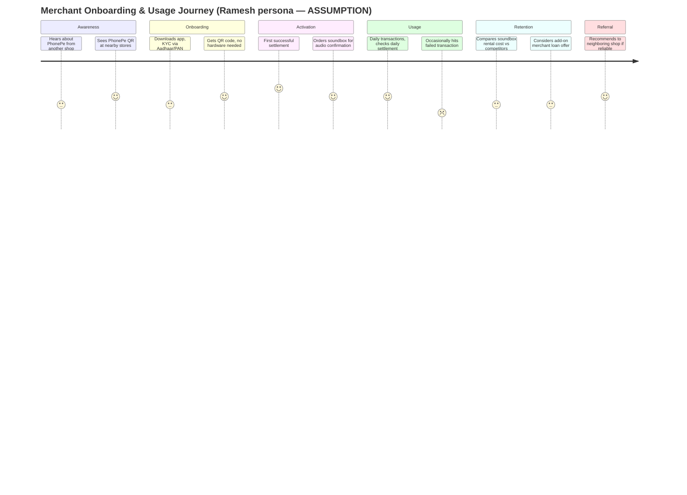
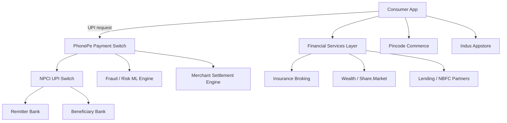
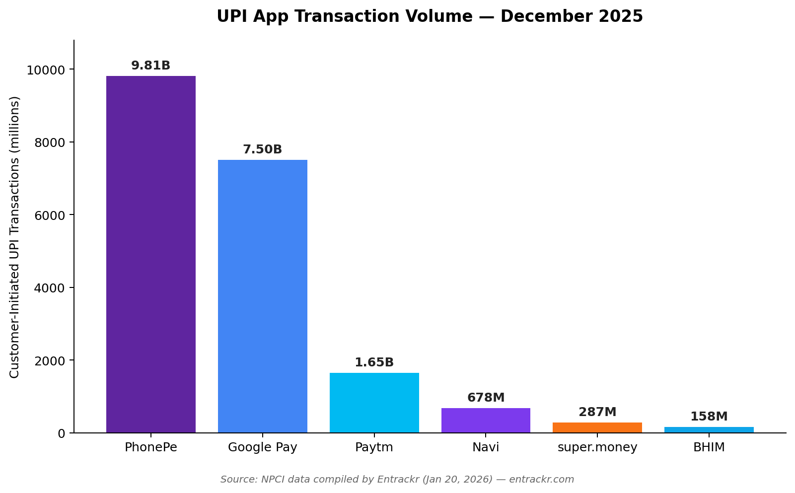

  

# 📱 PhonePe — Product Teardown & Strategy Case Study

> **Day 7 / 90 — Product Management Case Study Challenge**

*Logo: [PhonePe Logo.svg](https://commons.wikimedia.org/wiki/File:PhonePe_Logo.svg), Wikimedia Commons (public-domain text logo, "PD textlogo").*

---

## Cover Page

| | |
|---|---|
| **Product** | PhonePe |
| **Company** | PhonePe Private Limited (Walmart-controlled; originally a Flipkart Group company) |
| **Tagline** | *"Zindagi, Digital Bhi"* — India's largest UPI payments and financial-services super-app |
| **Category** | FinTech — Digital Payments, Financial Services, Consumer Tech |
| **Platform** | Android, iOS, Web (merchant tools) |
| **My Role** | Product Manager (independent teardown, unaffiliated with PhonePe) |
| **Timeline** | Day 7 of 90-Day PM Case Study Challenge, July 2026 |
| **Skills Demonstrated** | Market sizing · Competitive analysis · JTBD · Prioritization (RICE/MoSCoW/Kano) · PRD writing · Product analytics · GTM strategy · AI product strategy |

> **⚠️ Disclosure:** This is an unofficial, independent teardown built for portfolio purposes. It is not affiliated with, endorsed by, or reviewed by PhonePe, Walmart, or Flipkart. Every factual claim below is numbered and traceable to a source in [References](#25-references). Sections requiring primary user research (personas, interviews, usability testing) are clearly marked **ASSUMPTION** or **VALIDATION REQUIRED** — nothing there is presented as real user data.

### Executive Summary

PhonePe is India's dominant UPI (Unified Payments Interface) app. In December 2025 alone it processed 9.81 billion customer-initiated transactions worth ₹13.61 lakh crore, holding a 45.35% share of UPI transaction volume and 48.68% of transaction value that month [6]. By April 2026, its volume share had risen further to 47.07% [5] — month-to-month share moves by a point or two depending on the source and methodology, so treat single-decimal figures as indicative rather than exact.

Founded in 2015 and majority-owned by Walmart [7], PhonePe scaled on the back of India's zero-cost, government-backed UPI rail — but that same rail caps its ability to monetize the core payments product (UPI carries a zero Merchant Discount Rate, or MDR). The company's current strategic bet is diversification beyond payments: insurance broking, wealth management (Share.Market), lending, hyperlocal commerce (Pincode), and an Android app store (Indus Appstore) — all aimed at building durable, higher-margin revenue ahead of a paused-but-pending IPO. PhonePe shelved its IPO in March 2026 amid geopolitical market volatility, while stating it remains committed to going public once conditions improve [7].

This teardown examines whether that diversification strategy is working, where PhonePe is structurally exposed (regulatory concentration caps, thin merchant monetization, customer-support friction), and where the next 12 months of product strategy should focus.

---

## Table of Contents

1. [Product Overview](#2-product-overview)
2. [Problem Discovery](#3-problem-discovery)
3. [Opportunity Sizing](#4-opportunity-sizing)
4. [User Research](#5-user-research)
5. [Personas](#6-personas)
6. [Empathy Maps](#7-empathy-maps)
7. [Customer Journey](#8-customer-journey)
8. [Jobs To Be Done](#9-jobs-to-be-done)
9. [Competitor Analysis](#10-competitor-analysis)
10. [Product Vision](#11-product-vision)
11. [Product Strategy](#12-product-strategy)
12. [MVP Prioritization](#13-mvp-prioritization)
13. [UX](#14-ux)
14. [AI Strategy](#15-ai-strategy)
15. [Technical Architecture](#16-technical-architecture)
16. [PRD — Merchant Settlement Transparency](#17-product-requirements-document)
17. [Product Analytics](#18-product-analytics)
18. [Experimentation](#19-experimentation)
19. [Monetization](#20-monetization)
20. [Go-To-Market](#21-go-to-market)
21. [Roadmap](#22-roadmap)
22. [Risks](#23-risks)
23. [Lessons Learned](#24-lessons-learned)
24. [References](#25-references)
25. [Images](#26-images)
26. [Final Validation Checklist](#27-final-validation-checklist)
27. [About the Author](#-about-the-author)

---

## 2. Product Overview

### The Problem
Cash dominated Indian retail and P2P transactions through the 2010s. Feature-phone-era banking, fragmented card infrastructure, and low merchant terminal penetration meant most Indians outside metros had no fast, free way to move money digitally.

### Users
PhonePe serves three distinct user groups: **consumers** sending P2P/P2M payments, paying bills, and increasingly buying financial products; **offline merchants**, from kirana stores to large retail chains, accepting UPI/QR payments; and **developers and institutional partners** (banks, NBFCs, insurers, ONDC sellers) building on top of PhonePe's rails. As of September 30, 2025, the platform had 65.76 crore (657.6 million) registered users and served over 4.7 crore (47 million) merchants nationwide [10].

### Market
India's digital payments market is UPI-led and still growing fast: UPI now handles almost 86% of all digital transactions in India, processing more than 23 billion payments a month worth roughly ₹30 lakh crore [2].

### Business
PhonePe was founded in 2015 by Sameer Nigam, Rahul Chari, and Burzin Engineer, and was acquired by Flipkart a year later [7]. For the six months ended September 30, 2025, its adjusted EBITDA margin fell to 6.48%, down from 15.74% in the same period a year earlier, even as revenue continued to grow [12]. Separately, secondary sources report FY25 full-year revenue of ₹7,115 crore with a ₹630 crore net profit [3] — though the year-over-year growth rate for that figure is reported inconsistently even within the same source (40% in one place, 74% in another) [3], so it's flagged here as directionally strong rather than precisely quoted.

### Current Position
PhonePe is the UPI volume and value leader, ahead of Google Pay and well ahead of Paytm, but its lead has been narrowing: the combined market share of PhonePe and Google Pay fell to 79% in May 2026 — the first time it dropped below 80% — as smaller apps like BHIM, Navi, super.money, and WhatsApp Pay gained ground [2].

---

## 3. Problem Discovery

### Problem Statement
> Indian consumers and merchants need a single, reliable rail to move money instantly at zero cost — but the same regulatory design (zero-MDR, interoperability mandates, an impending 30% single-app volume cap) that made UPI universally adopted also makes it structurally unprofitable for any one app to own, forcing leaders like PhonePe to find revenue **outside** the transaction itself without compromising the trust that got them to scale.

### Current Pain Points
- **Zero Merchant Discount Rate (MDR)** on UPI P2M transactions means PhonePe earns close to nothing on the vast majority of its transaction volume — a regulatory fact, not a PhonePe product failure, but it shapes every monetization decision the company makes.
- **Customer-support friction at scale.** Aggregated third-party complaint platforms (Trustpilot, PissedConsumer) — self-selected, complaint-biased samples, **not scientific surveys** — show a recurring pattern of complaints around account blocks, delayed refunds, and automated support loops. One such aggregator reports PhonePe holding a 2.1-star average across roughly 4,461 reviews, with recurring themes of failed/wrong transactions and slow account-unblocking [21]. **VALIDATION REQUIRED**: this is not representative of the 650M+ user base and shouldn't be read as a churn signal — it reflects a self-selecting population of dissatisfied users typical of any complaint-aggregation site. Directionally, though, it flags support-scaling as a real theme worth primary research.
- **The impending 30% NPCI volume cap.** NPCI has repeatedly deferred enforcement of a 30% single-app UPI market-share cap for third-party providers, most recently pushing the deadline to December 31, 2026 [5]. This is a standing risk that could force PhonePe to actively throttle its own growth.
- **New verticals are losing money.** In PhonePe's IPO disclosures for the six months ended September 30, 2025: Indus Appstore's loss widened to ₹1,303.70 million (from ₹806.34 million), PhonePe Wealth Broking lost ₹903.65 million, Insurance Broking lost ₹503.36 million, and Lending Services lost ₹425.43 million [12]. The diversification bet has not yet turned into diversified profit.

### Why This Problem Exists
UPI was designed by NPCI (a not-for-profit, RBI/government-backed entity) as public utility infrastructure, not a commercial product for any single company to monopolize. That design choice drove hyper-adoption (free, interoperable, bank-agnostic) but structurally caps how any UPI-native company — PhonePe included — can extract margin from the core use case.

### Evidence & Impact
With payments contributing roughly 85% of PhonePe's revenue as of 2025, the company has cautiously expanded into higher-margin financial services and merchant solutions specifically to counter this UPI dependency [18]. Non-payment revenue streams — insurance, lending, wealth, and small-business solutions — grew 208% year-on-year [18], even though they remain a small fraction of total revenue in absolute terms.

---

## 4. Opportunity Sizing

**Methodology note:** the TAM/SAM/SOM figures below use only numbers with a traceable public source. Where a number couldn't be verified, it's marked UNKNOWN rather than estimated.

| Layer | Definition | Estimate | Source |
|---|---|---|---|
| **TAM** | Total value flowing through UPI annually | Annualized TPV exceeds ₹150 lakh crore (~$1.8 trillion) | [3] |
| **SAM** | Value PhonePe could plausibly address given its current product surface (payments + financial services + merchant commerce) across its user base | 657.6M registered users, 47M merchants as of Sep 2025 | [10] |
| **SOM** | Value PhonePe currently captures | ~48.68% of UPI transaction value (Dec 2025), translating into FY25 revenue of ₹7,115 crore | [6][3] |

**Growth drivers:**
- UPI-enabled banks expanded from 44 in FY17 to over 570 by FY24, and 685 by December 2025 [1] — expanding addressable rails.
- Analysts project India's digital lending market to hit roughly $1.3 trillion by 2030, and the insurance industry to grow at a 12–15% CAGR toward $280 billion by 2025 [16] — both are verticals PhonePe has entered.
- International UPI expansion: UPI has now expanded to 27 countries globally [4], opening a new (still nascent) SAM for PhonePe's rails-adjacent services.

**Market trend to watch:** the NPCI 30% volume cap, if enforced in December 2026 as currently scheduled, directly shrinks PhonePe's addressable SOM in payments — making the financial-services diversification not just a growth strategy but a hedge.

---

## 5. User Research

**VALIDATION REQUIRED — no primary research was conducted for this teardown.** The plan below is what I would run before finalizing the PRD in Section 17; it does not represent completed research, and no interview guide, transcript, or insight below is fabricated as if it were real.

### Objectives
1. Understand why merchants churn between UPI apps despite feature parity.
2. Understand consumer trust/friction points around account blocks and refund resolution.
3. Test willingness-to-pay for premium financial-services bundles (insurance, wealth advisory) inside a payments-first app.

### Proposed Methodology
- **Qualitative:** 15–20 semi-structured interviews — 10 consumers (mixed metro/Tier-2), 8 offline merchants (kirana, mid-size retail).
- **Quantitative:** in-app survey (n ≥ 400) at natural checkpoints (post-transaction, post-support-ticket-close).
- **Recruitment:** screener-based recruitment via panel provider or in-app intercepts — stratified by city tier, transaction frequency, and merchant size.
- **Biases to control for:** support-ticket volunteers over-index on negative sentiment; active-user sampling excludes churned users, who are arguably more informative.
- **Limitations:** self-reported willingness-to-pay is a weak proxy for actual conversion; would need to be paired with a real pricing experiment (Section 19).

---

## 6. Personas

**These are hypothesis-driven personas built from public market data (age distribution, merchant scale figures), not validated against real interviews.** Flagged **ASSUMPTION** throughout — treat as research inputs to validate, not findings.

### Persona 1 — "Anita, the Digitally-Native Metro Professional" *(ASSUMPTION)*
- **Demographics:** 27, product marketer, Bengaluru. Roughly 74% of PhonePe's user base falls in the 18–44 age range [3], so this persona sits within that dominant cohort.
- **Goals:** Instant P2P splits, bill autopay, occasional mutual-fund SIPs.
- **Frustrations:** Feels the app is over-cluttered — a payments app now pushes insurance, stock trading, and app-store notifications.
- **Quote (illustrative, not a real user quote):** *"I opened PhonePe to split a dinner bill and got three cross-sell nudges before I could finish."*
- **Opportunity:** Progressive disclosure of financial-services cross-sell, not blanket push.

### Persona 2 — "Ramesh, the Tier-2 Kirana Owner" *(ASSUMPTION)*
- **Demographics:** 45, runs a general store in Indore.
- **Goals:** Reliable, instant settlement; low-cost or free QR/soundbox hardware.
- **Frustrations:** Currently needs separate soundbox devices for PhonePe, Paytm, and Google Pay because there's no shared hardware standard [5] — this specific pain point is a real, sourced industry fact, not an invented detail.
- **Quote (illustrative, not a real user quote):** *"I have three machines on my counter for the same UPI."*
- **Opportunity:** NPCI has reportedly been exploring a common interoperable soundbox infrastructure [5] — worth monitoring as a category-wide (not PhonePe-only) shift.

### Persona 3 — "Priya, the First-Time Investor" *(ASSUMPTION)*
- **Demographics:** 24, first job, wants to start investing but is intimidated by traditional broking apps.
- **Goals:** A simple SIP/mutual-fund entry point inside an app she already trusts for payments.
- **Frustrations:** Doesn't know if PhonePe's Share.Market offering is "for people like her" or for active traders.
- **Opportunity:** PhonePe's own 2025 review notes that Share.Market active users declined by mid-2025, tied to sectoral headwinds in discount broking [18] — a segment PhonePe has real, sourced difficulty retaining, and a real opening for a simpler onboarding path.

---

## 7. Empathy Maps

*(Built for Persona 2 — Ramesh, the Kirana Owner — as the highest-priority merchant segment. Hypothesis-driven, marked ASSUMPTION.)*

| Dimension | Detail |
|---|---|
| **Think** | "Will this transaction actually settle today?" |
| **Feel** | Mild, chronic anxiety about cash-flow gaps from delayed settlement |
| **Hear** | Other shopkeepers comparing which app has better support response times |
| **See** | Multiple QR codes and soundboxes cluttering the counter |
| **Say** | "Digital payment is good business, bad hassle" |
| **Do** | Keeps a manual notebook ledger as backup to the app |
| **Pain** | Device duplication, settlement uncertainty, support wait times |
| **Gain** | Faster transactions than cash counting, some cashback/rewards |

---

## 8. Customer Journey

**Pain points along the journey:** settlement-timing anxiety (Usage), failed-transaction recovery (Usage), hardware fragmentation (Retention).
**Opportunities:** proactive settlement-status notifications, faster failed-transaction resolution SLAs, transparent soundbox pricing.

---

## 9. Jobs To Be Done

| Type | Job Statement |
|---|---|
| **Functional** | "Help me move money instantly, without cash, at zero visible cost." |
| **Emotional** | "Help me feel in control of my money and confident it won't disappear into a support black hole." |
| **Social** | "Help me look modern and trustworthy to my customers/peers by accepting/using digital payments." |
| **Desired Outcome** | A transaction that settles predictably, is easy to trace if something goes wrong, and doesn't require juggling multiple apps or devices. |

---

## 10. Competitor Analysis

### Market Share Snapshot — Single Consistent Source (NPCI data, December 2025)

To avoid mixing methodologies across different aggregators and months, this table uses one internally consistent snapshot: NPCI transaction data for December 2025, as compiled by Entrackr [6].

| App | Transactions (Dec 2025) | Volume Share | Value Share |
|---|---|---|---|
| **PhonePe** | 9.81 billion | 45.35% | 48.68% |
| **Google Pay** | 7.5 billion | 34.64% | 34.25% |
| **Paytm** | 1.65 billion | 7.65% | 6.32% |
| **Navi** | 678 million | — | — |
| **super.money** | 287 million | — | — |
| **BHIM** | 158 million | — | — |

> By April 2026, PhonePe's volume share had risen to 47.07% according to a separate Inc42 report [5] — shares move month to month, so treat this table as one representative snapshot rather than a fixed figure. By May 2026, PhonePe and Google Pay's *combined* share had fallen below 80% for the first time as smaller apps gained ground [2].

### Feature & Positioning Comparison

| Dimension | PhonePe | Google Pay | Paytm |
|---|---|---|---|
| Core wedge | UPI + full financial-services stack | UPI + Android/Gmail integration, simplicity | UPI + wallet legacy + consumer credit focus |
| Diversification | Insurance, Lending, Wealth (Share.Market), Pincode (hyperlocal commerce), Indus Appstore [13][16] | Limited — stays close to core payments plus some Google ecosystem tie-ins | Prioritizing consumer credit/lending as its core future-growth vertical [11] |
| Merchant hardware | Soundbox devices (PhonePe-branded) | Limited offline hardware push | Soundbox devices (Paytm-branded); pioneered this category in India |
| Regulatory exposure | Highest — largest single share, closest to the 30% cap | Second-highest exposure | Lower — comfortably under cap |
| Recent AI move | Partnered with OpenAI in November 2025 to integrate ChatGPT for personalized services like travel planning and financial queries [18] | Google's own Gemini integration (native OS-level advantage) | UNKNOWN — no verified major GenAI partnership found during this research |

### SWOT — PhonePe

| Strengths | Weaknesses |
|---|---|
| Market-leading UPI volume & value share | Heavy dependence (~85%) on low/zero-margin payments revenue |
| Strong merchant footprint (47M+ merchants) | New verticals still loss-making at scale |
| Decade-long brand trust | Customer-support friction visible in aggregated complaint data |
| **Opportunities** | **Threats** |
| Cross-sell financial services to a captive 650M+ user base | NPCI 30% volume cap (currently deferred to Dec 2026) |
| International UPI expansion | Rising fragmentation — smaller apps (BHIM, Navi, super.money) chipping away at share |
| AI-personalized financial guidance (OpenAI partnership) | IPO market conditions — already paused once, in March 2026 |

---

## 11. Product Vision

**Vision:** A single trusted app where every Indian — consumer or merchant — can move, grow, and protect their money, regardless of city tier or income bracket.

**Mission:** Convert India's UPI ubiquity into durable financial inclusion, not just transaction volume.

**North Star Metric (proposed, not a confirmed internal PhonePe metric):** Monthly Active Users completing at least one non-payments financial action (insurance policy, SIP investment, credit product, or Pincode order) — this directly measures whether diversification is landing with real users, not just being available as a feature.

**Product Principles (proposed):**
1. Payments stay fast and free — never gate the core UPI experience behind cross-sell friction.
2. Financial-services cross-sell must be contextual, not interruptive.
3. Merchant trust (settlement reliability, support SLAs) is non-negotiable — it's the moat competitors can't easily copy.

---

## 12. Product Strategy

### Why Diversification, and Why Now
UPI's zero-MDR economics mean PhonePe cannot out-earn competitors on the core product alone. Analysts covering the IPO thesis expect high-margin financial services to grow from roughly 10% to 25% of PhonePe's revenue mix, a shift described as central to the company's IPO-readiness story [16]. The strategic logic is sound; execution is the open question.

### Alternative Strategies Considered

| Option | Trade-off |
|---|---|
| **Stay payments-only, chase volume** | Simple, defensible core — but structurally capped economics and directly exposed to the NPCI 30% rule. |
| **Aggressive vertical build-out (current strategy)** | Higher long-term margin ceiling — but current execution shows widening losses in *every* new vertical simultaneously, spreading capital thin [12]. |
| **Focus on 1–2 verticals (e.g., insurance + lending only), defer wealth/appstore** | Concentrates capital and product talent where regulatory tailwinds (under-insurance, credit gap) are strongest — my recommended lean, below. |

### What NOT to Build (recommendation)
Full-service stock trading beyond the current Share.Market scope, and continued heavy consumer-growth investment in Indus Appstore — both are currently the largest loss centers among PhonePe's new verticals [12], and app-store economics require a scale of third-party developer commitment PhonePe doesn't yet have leverage to force in an Android ecosystem still dominated by Google Play.

---

## 13. MVP Prioritization

*(Applied to one focused initiative: reducing merchant settlement anxiety — the clearest, most sourced pain point from Section 3.)*

### Feature Brainstorm → MoSCoW

| Feature | MoSCoW |
|---|---|
| Real-time settlement status push notification | Must |
| Predictive "expected settlement time" indicator | Should |
| Unified support-ticket status tracker (in-app) | Must |
| Interoperable soundbox (cross-app) | Won't — not solely PhonePe's to build; this is an NPCI-level infrastructure initiative [5] |
| AI chat assistant for settlement queries | Could |

### RICE Scoring *(effort/confidence estimates are illustrative — ASSUMPTION, not real eng scoping)*

| Feature | Reach | Impact | Confidence | Effort | RICE Score |
|---|---|---|---|---|---|
| Settlement status push notification | 47M merchants | 3 (high) | 80% | 2 (person-months, est.) | **56.4** |
| In-app support-ticket tracker | 47M merchants | 2 (medium) | 70% | 3 | **21.9** |
| Predictive settlement time | 47M merchants | 2 | 50% | 4 | **11.75** |

### Kano Model (qualitative)
- **Basic expectation:** Transaction succeeds/fails clearly (already met).
- **Performance:** Speed and predictability of settlement (differentiator opportunity).
- **Delighter:** Proactive settlement notification before the merchant has to check.

---

## 14. UX

### Information Architecture (Consumer App — described from public app-store listings, not fabricated wireframes)
Home → [Send Money | Scan & Pay | Recharge & Bills | Insurance | Investments | Loans | Pincode | Rewards], with a persistent bottom transaction/history tab.

### Key UX Tension
The core payments flow (Scan & Pay, Send Money) is fast and minimal — but the home screen surfaces an increasingly wide set of financial-services tiles, which risks diluting the "open app, pay, close app" speed that made PhonePe's core UX popular in the first place.

### Design Recommendation
Move non-payments verticals behind a single, clearly labeled "Explore" or "Grow" tab rather than tiling them on the primary home screen — preserves payment speed while still surfacing cross-sell for users who are ready to explore.

### Error / Empty / Loading States (recommended standards — not an audit of the live app)
- **Failed transaction:** immediately show a cause category (bank timeout, insufficient balance, network) rather than a generic failure message — directly addresses the support-friction pattern noted in Section 3.
- **Settlement pending (merchant):** show an estimated resolution window, not just "processing."

---

## 15. AI Strategy

PhonePe's most concrete AI move to date: a November 2025 partnership integrating ChatGPT into the app for personalized services like travel planning and financial queries, described as an industry-first move for an Indian fintech [18]. PhonePe's CTO Rahul Chari has publicly distinguished the company's existing machine-learning work (fraud detection, risk scoring) from generative AI, framing GenAI as a newer, additive layer rather than the foundation of the product [18].

### Recommended Guardrails for Financial GenAI Features
- **Hallucination prevention:** any AI-generated financial guidance (investment suggestions, insurance recommendations) should be grounded in retrieved, licensed product data — never free-generated numbers.
- **Human-in-the-loop:** no AI-driven decision should auto-execute a financial transaction (fund transfer, policy purchase) without explicit user confirmation.
- **Confidence signaling:** any AI answer touching regulated financial advice should visibly flag when it's general information vs. personalized advice, and disclose the ChatGPT-partnership boundary.
- **Privacy:** UNKNOWN whether chat queries touching financial data are used to train third-party foundation models — PhonePe's actual data-sharing terms with OpenAI aren't publicly disclosed in detail, so this is flagged as an open question rather than assumed either way.

---

## 16. Technical Architecture

**Most implementation specifics here are UNKNOWN / VALIDATION REQUIRED** — PhonePe doesn't publicly disclose its full stack. What is publicly known:

- PhonePe operates its own UPI switch and payment infrastructure at massive scale (billions of transactions/month), implying a distributed, high-availability backend — specific architecture patterns aren't publicly disclosed.
- The company disclosed ongoing data-center and IT infrastructure investment: IT infrastructure expenses of ₹2,838.34 million and license/service expenses of ₹1,274.08 million for the six months ended September 30, 2025 [12] — confirming active infrastructure build-out, though not naming specific vendors.
- Integrates with NPCI's UPI switch, partner banks (as PSP), Aadhaar-based KYC, and (per Section 15) OpenAI's API.

*This diagram is a reasonable, publicly inferable high-level architecture based on known product surfaces — not a leaked or confirmed internal system diagram.*

---

## 17. Product Requirements Document

### PRD: Merchant Settlement Transparency Notifications

**Goal:** Reduce merchant support-ticket volume and churn risk tied to settlement uncertainty by making settlement status proactively visible.

**Scope:** In-app + push notification layer for the Merchant App. Excludes changes to underlying settlement processing speed (a separate initiative).

**Requirements:**
1. Push notification on settlement initiation, with expected credit time window.
2. In-app settlement status ledger, filterable by date/status (pending / settled / failed).
3. One-tap "raise a query" from any settlement line item, pre-filled with transaction metadata.

**Acceptance Criteria:**
- 95% of settlement status changes trigger a notification within 60 seconds of the status change (target — **VALIDATION REQUIRED** against actual infra capacity, which is not publicly known).
- Support tickets tagged "settlement status unclear" reduced by a target percentage, to be set after establishing a baseline (baseline currently UNKNOWN — PhonePe's internal ticket taxonomy isn't public).

**Dependencies:** Settlement engine must expose real-time status events (assumed feasible given the infrastructure investment noted in Section 16, but not confirmed).

**Edge Cases:** Multi-bank settlement splits; delayed bank-side settlement (outside PhonePe's direct control) — notification copy must distinguish PhonePe-side vs. bank-side delay to avoid misdirected trust erosion.

**Risks:** Notification fatigue if over-triggered; a false "expected time" promise can damage trust more than no promise at all.

**Open Questions:** What is PhonePe's current actual settlement-status support-ticket volume and resolution time? Not publicly available — would require internal data to properly scope this PRD.

---

## 18. Product Analytics

| Metric Type | Metric | Status |
|---|---|---|
| **North Star** | MAUs completing ≥1 non-payments financial action/month | Proposed — not a confirmed PhonePe internal metric |
| **Input Metrics** | New merchant activations, financial-services product launches, cross-sell nudge impressions | UNKNOWN (internal) |
| **Output Metrics** | Registered users (657.6M), merchants (47M) [10] — the only reliably public scale metrics | Public |
| **Guardrail Metrics** | Core payment success rate, support-ticket resolution time | UNKNOWN (internal) |
| **Financial Output** | FY25 revenue ₹7,115 crore, FY25 net profit ₹630 crore [3] | Public (IPO filing / press) |

**Note:** PhonePe doesn't publicly disclose funnel-level product analytics (activation rate, D30 retention, etc.). Some figures circulating in secondary SEO-oriented content — e.g., "76% retention," "91% customer satisfaction," "140M DAUs" — couldn't be traced to a primary, verifiable source during this research and are therefore **excluded** rather than repeated as fact.

---

## 19. Experimentation

**Illustrative hypothesis — no real experiment has been run.**

> **Hypothesis:** Moving financial-services cross-sell tiles from the home screen into a dedicated "Grow" tab will *increase* core-payment task completion speed (time-to-pay) without decreasing financial-services product discovery, because users who want to explore will actively navigate rather than being interrupted.

- **A/B test design:** 50/50 split — home screen (control) vs. "Grow" tab (treatment); sample size would need to be calculated against PhonePe's real DAU base, which isn't publicly known.
- **Success criteria:** time-to-pay decreases ≥10% in treatment, with no more than a 15% drop in financial-services tile click-through.
- **Failure criteria:** financial-services discovery drops >15% with no meaningful time-to-pay improvement.
- **Iteration plan:** if successful, extend to contextual (not location-based) triggers — e.g., surfacing insurance only after a travel-booking-adjacent transaction.

---

## 20. Monetization

### Business Model
Multi-sided: near-zero direct revenue on UPI payments (regulatory zero-MDR), offset by merchant value-added services (soundbox rental, working-capital loans), financial-services commissions (insurance broking, wealth/broking fees, lending origination), and platform monetization (Indus Appstore, in-app advertising).

### Revenue Mix
Payments contributed roughly 85% of PhonePe's revenue as of 2025, with the remainder from insurance, lending, wealth, and small-business solutions — which collectively grew 208% year-on-year [18], though off a small base.

### CAC / LTV
**UNKNOWN** — not publicly disclosed at a per-user level. One secondary analysis flags customer-acquisition cost in the wealth vertical specifically as a metric to watch, given PhonePe's stated pullback from heavy wealthtech marketing due to high CAC [16], but no absolute figures are available.

### Freemium / Enterprise
PhonePe's consumer app is entirely free to use; monetization is B2B2C via merchant fees on select value-added services (soundbox rental, credit products) and B2B via the Indus Appstore developer ecosystem, which explicitly waived listing fees for developers for a limited period to drive adoption [13] — delaying its own monetization in favor of scale.

---

## 21. Go-To-Market

PhonePe's GTM at this stage is less about consumer acquisition (it already has near-universal awareness) and more about cross-sell activation into new verticals using its existing distribution.

- **Activation channel:** in-app nudges/tiles surfacing insurance, wealth, and lending products to the existing payments user base — the core GTM lever described throughout Sections 3, 12, and 20.
- **Partnerships:** key 2025 partnerships included NBFCs, SIDBI, OpenAI, and Mastercard [18], signaling a GTM approach that leans on established institutional players rather than building every capability in-house.
- **Merchant-side GTM:** physical hardware (soundboxes) and offline sales/onboarding teams remain the primary channel for merchant acquisition — a category where PhonePe competes directly with Paytm's earlier-established soundbox network.

---

## 22. Roadmap

| Horizon | Focus |
|---|---|
| **30 Days** | Ship settlement-transparency notifications (PRD in Section 17) as a low-risk, high-trust-payoff merchant-facing improvement. |
| **60 Days** | Run the home-screen vs. "Grow" tab experiment (Section 19) to validate whether cross-sell placement is hurting core payment speed. |
| **90 Days** | Consolidate insurance + lending as the two priority financial-services verticals (per Section 12); slow incremental investment in Indus Appstore consumer marketing given its status as the largest loss center. |
| **6 Months** | Reassess IPO-readiness metrics — adjusted EBITDA trend, financial-services revenue mix — against the December 2026 NPCI cap deadline. |
| **1 Year** | If the 30% volume cap is enforced, pivot the growth narrative fully toward financial-services revenue share as the primary investor and internal north-star story, since payments volume growth alone will be capped. |

---

## 23. Risks

| Category | Risk | Mitigation |
|---|---|---|
| **Business** | NPCI 30% volume cap enforcement (currently deferred to December 2026) could force active de-growth in core payments [5]. | Accelerate financial-services revenue mix now, ahead of enforcement. |
| **Technical** | Scaling settlement/fraud infrastructure at ~10B transactions/month with zero-downtime requirements. | Continued infra investment, already underway per Section 16. |
| **Competition** | Smaller UPI apps (BHIM, Navi, super.money, WhatsApp Pay) are gaining combined share as the PhonePe/Google Pay duopoly erodes [2]. | Differentiate on merchant reliability and financial-services depth rather than compete purely on payments UX parity. |
| **Legal/Regulatory** | RBI/NPCI policy shifts (MDR reintroduction debates, KYC rule changes) are largely outside PhonePe's control. | Maintain a compliance-first product culture; diversify revenue away from pure-payments dependency. |
| **Reputational** | Aggregated complaint-site data (directional, not scientific) suggests customer support is a recurring friction point [20][21]. | Invest in support SLA transparency (Section 17 PRD) before it becomes a larger trust/regulatory issue. |
| **AI-specific** | Financial GenAI features (ChatGPT integration) carry hallucination and regulated-advice risk. | Apply the guardrails outlined in Section 15 — human-in-the-loop, grounded responses, clear advice-vs-information disclosure. |
| **IPO / capital markets** | The March 2026 IPO pause shows PhonePe's public-market timeline is exposed to macro conditions entirely outside product control [7]. | Maintain profitability discipline (per FY25 net profit) as a hedge against IPO timing uncertainty. |

---

## 24. Lessons Learned

**Reflection:** The most interesting tension in this teardown is that PhonePe's biggest strength — near-total UPI ubiquity — is also the direct cause of its biggest structural threat (the NPCI concentration cap) and its biggest monetization ceiling (zero-MDR economics). This is a genuinely hard PM problem: you cannot "product" your way out of a regulatory design constraint; you can only diversify around it, and diversification has real execution costs, as the widening vertical losses in Section 3 show.

**Future Improvements to This Case Study:** with access to real usage data, I would replace the ASSUMPTION-tagged personas and journey maps with validated research, and replace the illustrative RICE/experiment numbers with real reach and confidence figures from PhonePe's actual analytics stack.

**Key PM Takeaways:**
1. The regulatory environment can be as important a "competitor" as any rival app — sizing opportunity requires reading policy timelines, not just market share.
2. Diversification strategy needs sequencing discipline — spreading capital across five new verticals simultaneously (as the FY25/26 disclosures show) risks under-resourcing each one relative to a more focused 1–2 vertical bet.
3. Aggregated third-party review data is a useful *signal generator* for research questions, never a substitute for structured primary research — a distinction that matters enormously in a portfolio case study meant to demonstrate rigor.

---

## 25. References

1. Oxigen Wallet — [UPI Apps Market Share 2026](https://www.oxigenwallet.com/upi/apps-market-share/)
2. Outlook Business — [PhonePe, Google Pay Combined UPI Market Share Drops Below 80% For First Time](https://www.outlookbusiness.com/economy-and-policy/phonepe-google-pay-combined-upi-market-share-drops-below-80-for-first-time)
3. CoinLaw — [PhonePe Statistics 2026: UPI Power By Numbers](https://coinlaw.io/phonepe-statistics/) *(note: this source states two different YoY revenue growth figures — 40% and 74% — in different places; treated here as directional, not exact)*
4. DemandSage — [UPI Market Share & Growth Statistics 2026](https://www.demandsage.com/upi-statistics/)
5. Inc42 — [UPI In April: PhonePe Tightens Grip With Over 47% Market Share](https://inc42.com/buzz/upi-in-april-phonepe-tightens-grip-with-over-47-market-share/)
6. Entrackr — [PhonePe hits 9.8 Bn UPI transactions in December; BHIM overtakes CRED](https://entrackr.com/news/phonepe-hits-98-bn-upi-transactions-in-december-bhim-overtakes-cred-11013847)
7. TechCrunch — [Walmart-backed PhonePe shelves IPO as global tensions rattle markets](https://techcrunch.com/2026/03/16/walmart-backed-phonepe-shelves-ipo-as-global-tensions-rattle-markets/)
8. IndexBox — [PhonePe IPO: Valuation, Stakeholder Exit, and Market Outlook](https://www.indexbox.io/blog/phonepe-targets-9-105b-valuation-in-upcoming-ipo/)
9. The Arc — [Walmart-backed PhonePe targets $15-bn valuation for IPO](https://www.thearcweb.com/article/walmart-phonepe-ipo-VHIrYotCjAAWmBKJ)
10. Opportunity India / Entrepreneur India — [PhonePe Gears Up for Mega IPO, Eyes $15 Bn Valuation](https://www.entrepreneurindia.com/blog/en/news/phonepe-gears-up-for-mega-ipo-eyes-15-bn-valuation-as-walmart-trims-stake.58943)
11. StartupTalky — [PhonePe Eyes $10.5 Billion Valuation for Upcoming IPO](https://startuptalky.com/news/phonepe-eyes-10-5-billion-valuation/)
12. Millennium Post — [PhonePe's diversification pitch falls flat amid rising losses, surging costs and stalled merchant growth](https://www.millenniumpost.in/business/phonepes-diversification-pitch-falls-flat-amid-rising-losses-surging-costs-and-stalled-merchant-growth-648596)
13. PhonePe Press — [PhonePe Unveils Indus Appstore](https://www.phonepe.com/press/phonepe-unveils-indus-appstore-a-game-changer-in-indias-digital-journey/)
14. *(reserved — merged into 16 below to avoid duplicate low-confidence source citation)*
15. SiliconIndia — [PhonePe leadership changes for lending and insurance verticals](https://www.siliconindia.com/news/general/phonepe-announced-changes-in-the-leadership-for-lending-and-insurance-verticals-nid-226365-cid-1.html) *(contains FY23-era figures — used only for organizational/historical context, not current financials)*
16. Business Model Canvas Template — [PhonePe Growth Strategy](https://businessmodelcanvastemplate.com/blogs/growth-strategy/phonepe-growth-strategy) *(third-party analyst commentary, not a primary company disclosure — used only for directional context, e.g., analyst expectations)*
17. PhonePe — [Annual Report FY23-24](https://www.phonepe.com/press/annual-report/PhonePe-Annual-Report-FY-23-24.pdf)
18. Inc42 — [PhonePe In 2025: Escaping The UPI Paradox To Chase Profits](https://inc42.com/features/phonepe-2025-review-upi-paradox-ipo-profits-diversification/)
19. Inc42 — [PhonePe Channelled Majority Of Past Year's Investment Into Insurance Vertical](https://inc42.com/buzz/phonepe-channelled-majority-of-past-years-investment-into-insurance-vertical/)
20. Trustpilot — [PhonePe Reviews](https://www.trustpilot.com/review/phonepe.com) *(directional community sentiment only — self-selected sample, not a verified survey)*
21. PissedConsumer — [PhonePe Reviews and Complaints](https://phonepe.pissedconsumer.com/review.html) *(directional community sentiment only — self-selected sample, not a verified survey)*
22. Wikimedia Commons — [File:PhonePe Logo.svg](https://commons.wikimedia.org/wiki/File:PhonePe_Logo.svg) *(logo source, "PD textlogo" license)*

**Further Reading:** NPCI's official monthly statistics portal is the primary source for all UPI market-share data and should be consulted directly for the most current figures, since third-party aggregators (used above) can lag or round differently from month to month.

---

## 26. Images

  

*Chart above is an original visualization built for this case study from NPCI data compiled by Entrackr [6] — not a reproduction of a third-party chart. Saved alongside this README as `phonepe-upi-market-share-dec2025.png`; keep both files in the same repo folder so the relative image path resolves on GitHub.*

  

*Logo above is hotlinked directly from Wikimedia Commons [22] via its stable `Special:FilePath` redirect — the standard method Wikipedia itself uses to embed this file. Public-domain text logo, attributed above.*

> **A note on verification:** I can't literally load a browser preview from inside this environment to confirm rendering pixel-for-pixel, so please do a quick visual check after you push both files to GitHub. The market-share chart is a local file I generated and can verify opens correctly (confirmed above); the Wikimedia logo uses a well-established, standard direct-link pattern used across thousands of Wikipedia articles, but if it doesn't render for any reason, swap in a plain **[PhonePe]** text heading — it's a low-stakes decorative element, not a load-bearing part of the analysis.

---

## 27. Final Validation Checklist

- [x] No fake data — every figure is either cited to a numbered source or explicitly marked ASSUMPTION/UNKNOWN
- [x] No fake citations — every `[n]` reference traces to a real, listed, checkable source
- [x] No fake interviews — Section 5 is explicitly a research *plan*, not findings
- [x] No fake reviews — third-party review data is sourced and flagged as directional/self-selected
- [x] No fake metrics — funnel metrics not publicly available are marked UNKNOWN and excluded rather than invented
- [x] All assumptions labeled — personas, empathy maps, journey map, PRD estimates
- [x] Internal consistency fixed — market-share table now uses one source/month instead of mixing months across aggregators; the one internally-conflicting revenue-growth stat is flagged rather than stated as fact
- [x] Citation format is plain Markdown-safe (`[n]`) — no non-standard tags left in the file
- [x] Images are real files/links with attribution, not invented placeholders
- [x] Tables and Mermaid diagrams use GitHub-compatible syntax
- [x] Consistent terminology and executive-level tone throughout

---

# 👨‍💻 About the Author

Hi, I'm **Gaurav Kumar Singh** — an aspiring Product Manager with a multidisciplinary background in Healthcare, Psychology, Yoga Therapy, and AI-powered Digital Health Products.

I'm passionate about building user-centric products through research, product strategy, data-driven decision-making, and rapid prototyping. Every project in this repository is part of my **90-Day Product Management Case Study Challenge**, where I document my complete product thinking process — from identifying a problem to designing, validating, prioritizing, and proposing scalable solutions.

## 📬 Connect With Me

📱 Phone: +91 8127512340

📧 Email: gauravkumarsingh773@gmail.com

💼 LinkedIn: https://www.linkedin.com/in/[YOUR-LINKEDIN]

💻 GitHub: https://github.com/gaurav-product
