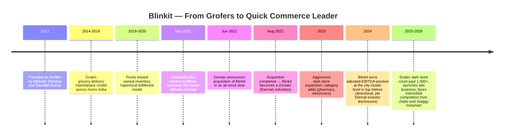
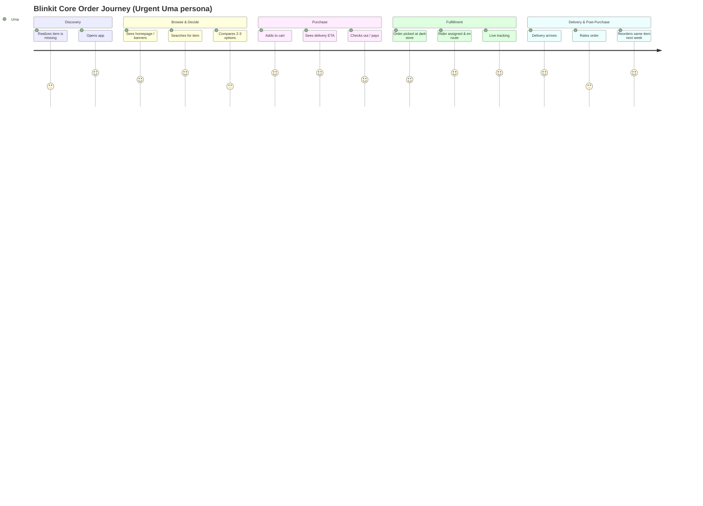
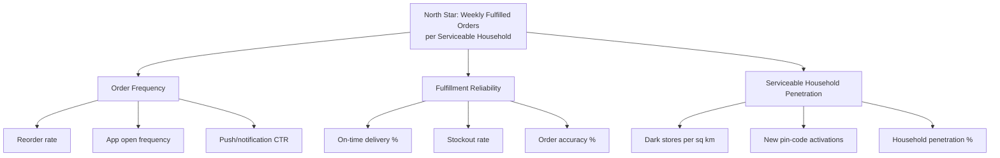
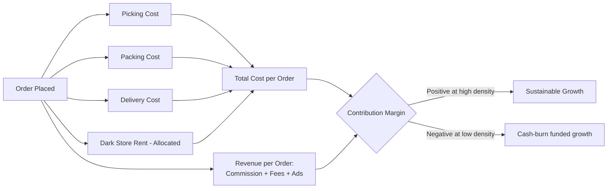
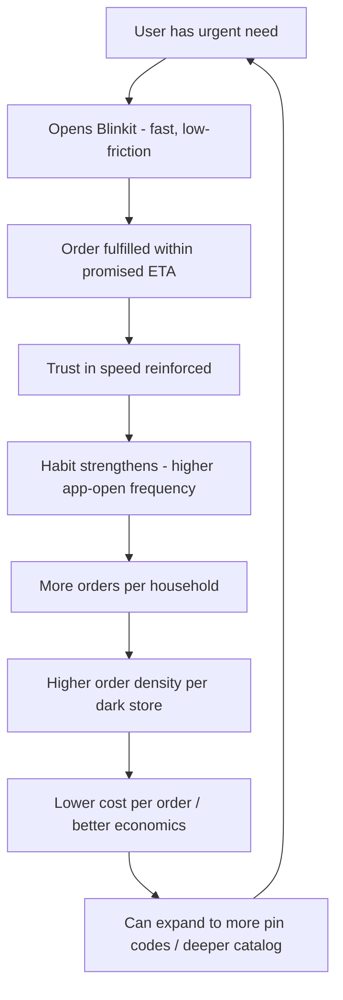

# 🛒 Blinkit Product Teardown

### How Blinkit Built India's Leading Quick Commerce Experience Through Product Strategy, Logistics, Operations and Customer Obsession

> **Day 7 / 90 — Product Management Case Study Challenge**

---

> **⚠️ Disclosure:** This is an independent, unofficial product teardown built for portfolio purposes. It is not affiliated with, endorsed by, or reviewed by Blinkit, Zomato, or Eternal Ltd. Public figures (funding, GMV, dark-store counts, delivery times) are cited to their source and dated; anywhere a precise figure isn't publicly available, it is explicitly labeled **ESTIMATED** or **ASSUMPTION** rather than presented as fact. Persona and journey-map detail not drawn from public sources is clearly flagged as **ASSUMPTION / VALIDATION REQUIRED** — this case study demonstrates the *process* of product thinking, not a claim to have conducted primary research on Blinkit's actual user base.

---

## 📑 Table of Contents

1. [Executive Summary](#1-executive-summary)
2. [Company Background](#2-company-background)
3. [Problem Statement](#3-problem-statement)
4. [Market Research](#4-market-research)
5. [Competitive Analysis](#5-competitive-analysis)
6. [Target Users — Personas](#6-target-users--personas)
7. [Jobs To Be Done](#7-jobs-to-be-done)
8. [User Journey](#8-user-journey)
9. [Product Metrics](#9-product-metrics)
10. [Feature Deep Dive](#10-feature-deep-dive)
11. [UX Audit](#11-ux-audit)
12. [Business Model](#12-business-model)
13. [Growth Strategy](#13-growth-strategy)
14. [SWOT Analysis](#14-swot-analysis)
15. [Pain Points](#15-pain-points)
16. [Feature Opportunity — "Blinkit ReStock"](#16-feature-opportunity--blinkit-restock)
17. [RICE Prioritization](#17-rice-prioritization)
18. [Product Roadmap](#18-product-roadmap)
19. [Future Vision — Blinkit in 2030](#19-future-vision--blinkit-in-2030)
20. [Key Learnings](#20-key-learnings)
21. [Visual Asset Prompts](#21-visual-asset-prompts)
22. [References](#22-references)
23. [About the Author](#-about-the-author)

---

## 1. Executive Summary

**What it is:** Blinkit is India's leading quick-commerce (q-commerce) platform, delivering groceries, fresh produce, and household essentials to consumers in 10–20 minutes from hyperlocal "dark stores." Originally launched as **Grofers** in 2013, the company rebranded to **Blinkit** in December 2021 to reposition itself around delivery speed rather than a traditional grocery-delivery model, and was acquired by **Zomato** (now **Eternal Ltd.**) in an all-stock deal completed in August 2022 [1].

**Mission (inferred from public positioning):** Make instant commerce the default way urban India buys everyday essentials — collapsing the gap between "I need this" and "I have this" to minutes, not hours.

**Business model:** Blinkit operates a **hybrid inventory-led marketplace** — it runs its own dark-store network (directly and increasingly through an affiliated "Blink Commerce" entity for regulatory/FDI structuring reasons), earns revenue from delivery fees, a small basket-value-based "handling fee," commission from brands, and — increasingly important to unit economics — **advertising revenue** from brands paying for placement, similar to retail media models pioneered by Amazon.

**Core value proposition:** *Certainty and speed.* Traditional e-commerce optimizes for selection and price; Blinkit optimizes for the near-instant closing of a felt need — you know almost exactly what you'll get and almost exactly when, every time.

### Key PM Insights

| # | Insight | Why it matters |
|---|---|---|
| 1 | Blinkit's real product isn't "grocery delivery" — it's **inventory-adjacent last-mile logistics as a platform**, which is why it has extended into pharmacy (Blinkit Health), electronics ("Blinkit Print," gifting), and even a standalone quick-commerce ad business. | The moat is the dark-store + rider network, not any single category. Every new vertical is a marginal-cost play on existing infrastructure. |
| 2 | Q-commerce economics only work at **high order density per dark store**, not high margin per order. | This explains almost every major product decision: hyperlocal catalog curation, aggressive SKU rationalization, and geo-fenced serviceability. |
| 3 | The category's biggest threat isn't a competitor app — it's **unit economics fatigue from discount-funded growth** across the whole sector (Zepto, Instamart, Blinkit all still operate at negative or thin contribution margins in most cities) [2]. | Any credible roadmap has to show a path to profitable order density, not just growth. |

---

## 2. Company Background

### Timeline

### Evolution: Why Grofers Became Blinkit

Grofers began as a **marketplace-style grocery delivery app** — closer to a mini-Amazon for groceries, with next-day or same-day delivery. Two forces pushed the pivot:

1. **Demand-side shift:** Urban Indian consumers, especially in metros, began treating "essentials" the way they treat food delivery — as something needed *now*, not planned in advance. Swiggy Instamart's early traction (from 2021) validated this demand.
2. **Supply-side unlock:** Falling real-estate costs for small dark-store-format spaces, maturing two-wheeler gig-logistics networks, and inventory-management software maturity made 10–20 minute fulfillment operationally viable at scale for the first time.

The rebrand to Blinkit wasn't cosmetic — it represented a full business-model change from **marketplace + next-day delivery** to **owned/curated inventory + dark stores + on-demand delivery**, which is a fundamentally different cost structure, catalog strategy, and org design.

### Acquisition by Zomato

Zomato's ~$568M all-stock acquisition of Blinkit (completed August 2022) is one of the more instructive M&A moves in Indian consumer tech [1]. **PM framing:** Zomato was not buying a grocery business — it was buying a **second demand vertical that could reuse its existing rider network, GPS/dispatch technology, and payments stack**, converting a fixed logistics asset into a multi-category asset. This is the same playbook as Amazon extending fulfillment infrastructure from books into everything, or DoorDash extending into DashMart.

### Current Positioning (as of mid-2026)

Blinkit is widely reported as the **market leader by order volume and revenue** among Indian quick-commerce players, ahead of Zepto and Swiggy Instamart, though all three continue to compete aggressively on dark-store expansion and remain either narrowly profitable or loss-making in most cohorts outside top metros [2][3]. Precise, audited market-share percentages vary by source and month — treated here as directional.

---

## 3. Problem Statement

### Why Grocery Shopping Was Broken

| Pain Point | Traditional Retail | Traditional E-commerce (pre-Q-commerce) |
|---|---|---|
| Time cost | 30–60 min per trip, incl. travel + queues | 1–3 day wait, needs advance planning |
| Impulse/urgent needs | Forces a trip for one missing item | Can't serve "I need this in the next hour" |
| Basket planning | Requires memory/lists, no reordering intelligence | Cart abandonment high; no urgency-based UX |
| Price transparency | Variable, negotiated in some formats (kirana) | Transparent but slow |
| Freshness | High (physical selection) | Historically weak for e-commerce grocery |

### The Core Unmet Job

> *"When I realize I'm out of something I need right now, I want a way to get it without stopping what I'm doing, so that my day isn't interrupted."*

This is fundamentally different from the job traditional e-commerce solves ("I want to browse and find the best option among many, and I'm willing to wait for it"). Quick commerce exists because **urgency-driven purchases were an underserved segment of the grocery basket** — not because people wanted grocery shopping to be an app category in the abstract.

### Market Gap Blinkit Identified

1. Kirana stores (India's ~13 million neighborhood stores) offer speed but not selection, standardized pricing, or digital payments/discovery.
2. E-commerce grocery (early Amazon Pantry, BigBasket) offered selection but not speed.
3. Food delivery apps proved Indian consumers would pay a premium for delivery speed and reliability — but only for prepared food, not packaged goods, until Instamart/Blinkit closed that gap.

**PM framing:** Blinkit didn't invent a new need. It **collapsed the latency** of an existing, well-understood need (buying groceries) to below the threshold where behavior changes from "planned shopping trip" to "impulse tap." That threshold — roughly 10–20 minutes — is the entire strategic bet of the category.

---

## 4. Market Research

### Market Size & Growth

- India's quick-commerce Gross Merchandise Value (GMV) has been one of the fastest-growing segments of Indian e-commerce, with multiple industry estimates placing sector GMV in the **$6–8 billion annualized range as of 2025–26** and continuing to grow at 40–60% YoY, driven by expansion beyond the top 8 metros into tier-2 cities [3][4]. *(Estimates vary significantly by research firm methodology — treated as directional order-of-magnitude, not precise.)*
- Quick commerce is estimated to have captured a **meaningfully growing share of India's online grocery spend**, increasingly cannibalizing both kirana-store wallet share and traditional e-grocery (BigBasket-style) order volume in metro pin codes [4].

### Consumer Behavior Trends

| Trend | Implication for Product |
|---|---|
| Rising average order value as SKU range expands (electronics, beauty, print-on-demand) | Product needs to support high-consideration purchases within a low-consideration UX — different from a 2-minute milk reorder |
| Growing tier-2/tier-3 penetration | Catalog and dark-store density strategy must localize (regional FMCG brands, language) |
| Subscription/membership normalization (Zomato Gold-style bundles) | Cross-sell opportunity between Zomato (food) and Blinkit (grocery) demand |
| Increasing price sensitivity as discounting normalizes across the category | Retention increasingly depends on habit and convenience, not discount depth alone |

### Growth Drivers

1. Smartphone + UPI penetration removing payment friction.
2. Real-estate cost curve making dense dark-store networks viable in more cities.
3. Gig-economy labor supply enabling variable-cost delivery fleets.
4. Post-pandemic behavioral shift toward home delivery as a default, not an exception.

### Challenges

1. **Unit economics** — dark-store rent, inventory spoilage (especially fresh/perishables), and rider incentive costs remain structurally high relative to average basket size.
2. **Regulatory scrutiny** — Foreign Direct Investment (FDI) rules in India restrict inventory-led e-commerce by foreign-owned entities, which is part of why Blinkit (and peers) use complex marketplace/franchise-style corporate structures.
3. **Labor practices scrutiny** — gig-worker pay and working-condition concerns are a recurring reputational and regulatory risk across the sector.
4. **Market saturation in metros** — top-metro dark-store density is approaching a point of diminishing returns, pushing growth into lower-density, lower-AOV tier-2/3 markets where the same economics are harder to sustain.

---

## 5. Competitive Analysis

| Dimension | **Blinkit** | **Zepto** | **Swiggy Instamart** | **BigBasket (BBNow)** | **Amazon Fresh** |
|---|---|---|---|---|---|
| Delivery speed | 10–20 min | 10 min (core brand promise) | 10–20 min | 30–90 min (hybrid) | Same-day / scheduled slots |
| Pricing positioning | Mid, promo-heavy | Mid, promo-heavy | Mid, bundled with Swiggy One | Value-oriented, larger baskets | Premium/Prime-bundled |
| SKU selection | Broad, curated, growing (incl. electronics, pharmacy) | Broad, aggressive category expansion | Broad, deep Swiggy cross-sell | Deepest grocery-specific catalog | Broad but slower-moving on q-commerce SKUs |
| Membership | Emerging (bundled with Zomato Gold experiments) | Zepto Café/loyalty experiments | **Swiggy One** (strong, mature bundle w/ food delivery) | bbSTAR membership | Amazon Prime (strong, mature) |
| UX / Search | Fast, visual, grid-first | Fast, minimal, speed-obsessed UI | Consistent with Swiggy design system | More traditional e-commerce UX | Standard Amazon UX (less q-commerce-native) |
| AI / personalization | Growing (search ranking, reorder prediction) | Growing | Leverages Swiggy's food-ordering ML stack | Moderate | Mature Amazon recommendation stack, underused for q-commerce specifically |
| Dark-store density | Largest/near-largest network (metro-heavy, expanding tier-2) | Aggressive expansion, strong metro focus | Strong, boosted by Swiggy's existing logistics footprint | Hybrid warehouse + dark-store | Limited relative to pure-plays |
| Ecosystem cross-sell | Zomato (food delivery) demand-side sharing | Standalone | **Strongest** — single Swiggy app/wallet across food + grocery + instamart | Tata ecosystem (Tata Neu) | Amazon.in ecosystem |
| Advertising business | Growing "Blinkit Ads" retail media | Growing | Leverages Swiggy Ads | Limited | Mature Amazon Ads, underapplied to q-commerce |
| Key weakness | Thin margins outside top metros; catalog sprawl risk | Cash-burn intensive growth; brand still speed-only positioned | Full experience is "Swiggy's grocery feature," not a standalone identity | Slower delivery undermines category-defining promise | Not truly optimized for 10-minute-native behavior |

### Strategic Insights

1. **Ecosystem bundling is the emerging battleground.** Swiggy's single-app strategy (food + Instamart + Genie) is arguably a stronger retention lever than Blinkit's separate-app relationship with Zomato. Blinkit's next major UX decision is whether deeper Zomato-app integration (vs. a standalone app) is worth the identity trade-off.
2. **Zepto competes almost entirely on speed-as-brand**, which is a fragile moat — once 10-minute delivery is table stakes (it largely already is), Zepto's differentiation compresses to price and marketing spend.
3. **BigBasket's slower-but-cheaper model** targets a genuinely different job (weekly stock-up vs. urgent top-up) — Blinkit's AOV growth into bulk/planned baskets is arguably encroaching on BigBasket's job, not Zepto's.
4. **Advertising revenue is the most under-exploited lever industry-wide.** Amazon's retail-media playbook (high-margin, doesn't touch delivery economics) is only nascently applied in Indian q-commerce — whoever builds the best ad-tech stack on top of q-commerce search intent captures disproportionate margin.

---

## 6. Target Users — Personas

> **ASSUMPTION / VALIDATION REQUIRED:** The following personas are illustrative composites built from publicly reported quick-commerce usage patterns and general Indian urban-consumer research, not from primary interviews with actual Blinkit users. They should be validated with real user interviews before being used to justify a real roadmap decision.

### Persona 1 — "Urgent Uma," the Working Professional

- **Age:** 29 | **Occupation:** Marketing Manager, Bangalore | **Income:** ₹18–25 LPA
- **Pain points:** No time for planned grocery runs; frequently runs out of essentials mid-week
- **Goals:** Minimize time spent on errands; never run out of coffee/milk
- **Buying behavior:** 4–6 small orders/week, high app-open frequency, low price sensitivity
- **Tech comfort:** High
- **Quote:** *"I don't shop for groceries anymore — I just top up whatever I've run out of, whenever I notice."*

### Persona 2 — "Budget-Conscious Rakesh," the Family Provider

- **Age:** 41 | **Occupation:** Government employee, Lucknow | **Income:** ₹8–12 LPA
- **Pain points:** Feels quick commerce is a "convenience tax"; compares prices against local kirana
- **Goals:** Stock up efficiently for a family of 4 without overpaying
- **Buying behavior:** 1–2 larger orders/week, timed around discounts and cashback offers
- **Tech comfort:** Medium
- **Quote:** *"I'll use it, but only if the offer makes it cheaper than walking to the shop downstairs."*

### Persona 3 — "New Parent Meera"

- **Age:** 33 | **Occupation:** On maternity leave, Mumbai | **Income:** Household ₹30+ LPA
- **Pain points:** Can't leave the house easily; needs reliability more than price
- **Goals:** Guaranteed availability of baby-specific SKUs; fast emergency reorders
- **Buying behavior:** High-frequency, low price-sensitivity, strong brand loyalty once trust is established
- **Tech comfort:** High
- **Quote:** *"If Blinkit doesn't have diapers in stock at 11pm, I have a real problem — availability matters more than ₹20."*

### Persona 4 — "Student Aryan"

- **Age:** 21 | **Occupation:** College student, Delhi (shared PG accommodation) | **Income:** Allowance-based, low
- **Pain points:** Small budget, splits orders with roommates, highly promo-driven
- **Goals:** Cheapest possible snacks/essentials, fast enough to avoid missing class/gaming sessions
- **Buying behavior:** Frequent small orders, coupon-stacking behavior, price-comparison across apps
- **Tech comfort:** Very high
- **Quote:** *"I'll open three apps and order from whichever has the best coupon that hour."*

### Persona 5 — "Senior Citizen Sunita"

- **Age:** 64 | **Occupation:** Retired, Pune | **Income:** Fixed pension
- **Pain points:** Mobility-limited; finds app navigation occasionally confusing; trust concerns about payments
- **Goals:** Reliable, simple way to get essentials without depending on family
- **Buying behavior:** Low-frequency, high basket-consistency (reorders the same items), assisted setup by children
- **Tech comfort:** Low–medium
- **Quote:** *"My son set it up for me. I just tap the same things I always buy."*

---

## 7. Jobs To Be Done

**Prioritized by frequency × strategic importance** (High / Medium / Low)

| # | JTBD Statement | Priority |
|---|---|---|
| 1 | When I realize I'm out of a daily-use item, I want to get it within minutes, so that my routine isn't disrupted. | High |
| 2 | When I'm cooking and missing one ingredient, I want to order just that item quickly, so that I don't ruin the dish or make a special trip. | High |
| 3 | When guests are arriving unexpectedly, I want to stock up fast, so that I'm not embarrassed by being unprepared. | High |
| 4 | When I'm too tired after work to go out, I want essentials delivered without planning ahead, so that I can rest instead of running errands. | High |
| 5 | When my baby runs low on diapers or formula late at night, I want guaranteed fast fulfillment, so that I'm not stuck in an emergency. | High |
| 6 | When I'm price-conscious, I want to compare offers before checkout, so that I feel confident I'm not overpaying. | Medium |
| 7 | When I order the same items every week, I want a fast reorder option, so that I don't have to re-search every time. | High |
| 8 | When I'm unwell, I want medicines delivered quickly, so that I don't have to leave the house while sick. | High |
| 9 | When I'm hosting an event, I want to order in bulk with confidence of availability, so that I don't run short. | Medium |
| 10 | When I receive a damaged or missing item, I want a fast, low-friction resolution, so that I still trust the platform for next time. | High |
| 11 | When I'm gifting someone last-minute, I want a quick, presentable option, so that I don't show up empty-handed. | Low |
| 12 | When I'm budgeting for the month, I want visibility into spend patterns, so that I can control household costs. | Low |
| 13 | When I move to a new home, I want to quickly discover what's serviceable in my new area, so that I can re-establish my routine. | Medium |
| 14 | When I'm skeptical of a new brand/product, I want reviews or trust signals before buying, so that I don't waste money. | Medium |
| 15 | When I'm elderly or less tech-comfortable, I want an extremely simple, repeat-friendly interface, so that I can shop independently. | Medium |

---

## 8. User Journey

### Friction Points Along the Journey

| Stage | Friction | Emotional Impact |
|---|---|---|
| Browse | Search sometimes surfaces irrelevant/out-of-stock results | Mild frustration, erodes speed advantage |
| Checkout | Handling-fee / small-cart-fee stacking feels opaque | Perceived unfairness, price-trust erosion |
| Fulfillment | ETA occasionally slips beyond promised window during peak hours | Breaks the core "certainty" value prop — most damaging friction in the whole journey |
| Post-purchase | Refund/replacement flow for damaged items can require multiple steps | Risk of one-time users churning after a single bad experience |
| Reorder | "Reorder" surfaces past baskets but doesn't always account for changed preferences (e.g., different brand now preferred) | Minor annoyance, but a personalization opportunity |

### Opportunities

- Real-time inventory confidence (show "likely to run out" indicators before add-to-cart, not after).
- ETA-slip transparency (proactive "your rider is delayed by 4 min" messaging beats silent delay — a lesson well-established in food delivery UX).
- One-tap resolution for common post-purchase issues (missing item, damaged item) without needing to contact support.

---

## 9. Product Metrics

### North Star Metric

> **Weekly Fulfilled Orders per Serviceable Household** — the number of orders successfully delivered within promised SLA, per household within Blinkit's serviceable radius, per week.

**Why this metric:** It captures habit formation (frequency), operational reliability (fulfilled + within SLA), and market penetration (per serviceable household, not just per app-install) in one number — better than raw GMV, which can be inflated by discounting, or raw order count, which ignores failed/late deliveries.

### Metric Categories

| Category | Metric | Definition | Why it matters |
|---|---|---|---|
| Engagement | DAU/MAU ratio | Daily active ÷ monthly active users | Measures habit strength — q-commerce lives or dies on habitual, not occasional, use |
| Engagement | Time-to-first-order (new users) | Time between install and first completed order | Predicts activation success; long gaps signal onboarding friction |
| Marketplace | Fill rate | % of ordered SKUs actually available/fulfilled | Directly drives the "certainty" value proposition |
| Marketplace | Catalog conversion rate | Search/browse sessions ending in add-to-cart | Signals search & merchandising quality |
| Operations | Dark-store order density | Orders/day per dark store | Core unit-economics lever — density drives per-order cost down |
| Delivery | On-time delivery % | Orders delivered within promised ETA window | Directly tied to trust and repeat usage |
| Delivery | Rider utilization | % of rider paid-hours spent on active deliveries | Cost-efficiency metric for logistics |
| Retention | Week-4 / Week-12 retention | % of new cohort still ordering at week 4/12 | Distinguishes discount-driven trial from real habit |
| Revenue | Contribution margin per order | (Revenue − variable delivery/picking/packing cost) per order | The single most-watched unit-economics metric in q-commerce |
| Revenue | Ad revenue as % of GMV | Advertising take-rate relative to total order value | Tracks progress toward Amazon-style high-margin monetization |

---

## 10. Feature Deep Dive

| Feature | Purpose | Strengths | Weaknesses | PM Improvement Idea |
|---|---|---|---|---|
| **Homepage** | Merchandising + fast re-entry into habitual categories | Visual, category-first, fast load | Can feel promo-cluttered during sale events, crowding out personal reorder shortcuts | Persist a "your usual" strip above the fold, not buried under banners |
| **Search** | Primary purchase-intent capture | Fast, typo-tolerant | Weak on regional-language queries and synonym handling (e.g., "curd" vs. "dahi") | Invest in multilingual, colloquial-term search embeddings |
| **Categories** | Browse-based discovery | Clear taxonomy for staple categories | Newer categories (electronics, print) feel bolted-on to a grocery-first IA | Consider a lightweight mode switch for "essentials" vs. "shopping" intent |
| **Recommendations** | Increase basket size, surface relevant SKUs | Decent "frequently bought together" | Limited adaptation to persona-level shopping cadence (weekly stock-up vs. daily top-up) | Segment recommendation logic by inferred shopping pattern, not just item co-occurrence |
| **Cart** | Pre-checkout basket management | Clear pricing breakdown | Fee stacking (delivery + handling + small-cart) can feel opaque at the point of commitment | Single consolidated "service fee" line with a one-tap "why this fee" explainer |
| **Checkout / Payment** | Convert intent to order | Fast, UPI-native, low friction | — | Maintain; this is a genuine strength vs. legacy e-commerce checkout flows |
| **Order Tracking** | Reduce anxiety during fulfillment wait | Real-time map, rider details | ETA sometimes doesn't self-correct visibly when delayed | Proactive delay notifications instead of a static countdown that silently fails |
| **Reorder** | Reduce repeat-purchase friction | One-tap access to past orders | Doesn't reflect preference drift (brand switch, quantity change) | Smart reorder that flags "you might want X instead, based on recent orders" |
| **Support** | Resolve post-purchase issues | In-app chat, order-linked context | Multi-step flows for simple issues (missing item) | Auto-resolve low-risk, low-value claims (e.g., single missing ₹20 item) instantly, no ticket needed |
| **Notifications** | Re-engagement, delivery updates | Timely delivery-status pushes | Marketing push volume can create notification fatigue | Frequency-cap + user-controlled notification preference center |

---

## 11. UX Audit

Evaluated against **Nielsen's 10 Usability Heuristics** (selected, most relevant subset):

| Heuristic | Observation |
|---|---|
| Visibility of system status | Strong — live order tracking and rider status are best-in-class for the category |
| Match between system & real world | Mostly strong; category naming occasionally uses internal jargon over everyday language |
| User control & freedom | Adequate — easy to edit cart, less easy to modify an order post-placement (understandable given fulfillment speed, but worth a "cancel within 60 seconds" safety net) |
| Consistency & standards | Strong internal consistency; icon language is intuitive |
| Error prevention | Weak point — checkout doesn't always proactively flag serviceability edge cases (e.g., partial stockouts) before payment |
| Recognition rather than recall | Strong — reorder and "your usual" patterns reduce cognitive load |
| Flexibility & efficiency of use | Good for power users (fast repeat flows); could do more for first-time/low-tech-comfort users (Persona 5, Sunita) |
| Aesthetic & minimalist design | Generally clean, though promotional density spikes during sale events |
| Help users recognize/diagnose/recover from errors | Weak — failed-payment and out-of-stock-after-cart states could offer clearer next-step guidance |
| Help & documentation | Adequate in-app support; less visible self-serve help content for edge cases (e.g., "why was my order partially fulfilled") |

**Loading / empty / error states:** Skeleton screens are used effectively during catalog load, which is a genuine strength versus older Indian e-commerce apps that historically relied on blocking spinners. Empty-cart and empty-search states are functional but under-utilize the moment as a merchandising opportunity (e.g., a well-designed empty-search state could suggest close-match SKUs rather than a bare "no results").

---

## 12. Business Model

### Revenue Streams

| Stream | Description | Margin Profile |
|---|---|---|
| Delivery fee | Charged per order, often waived above a basket-value threshold or for members | Low, mostly cost pass-through |
| Handling / small-cart fee | Charged on small baskets to offset fixed per-order picking cost | Improves contribution margin on low-AOV orders |
| Commission | Take-rate from brands/sellers on goods sold through the platform | Core marketplace margin |
| Advertising (Blinkit Ads) | Brands pay for search placement, banner slots, sponsored listings | **Highest-margin stream** — near-pure profit once ad infrastructure is built |
| Membership (emerging) | Bundled benefits (free delivery, exclusive deals), potentially cross-sold with Zomato Gold | Improves retention + reduces per-order fee friction, monetized via subscription revenue |

### Unit Economics — The Core Tension

**PM framing:** Every Blinkit product decision — dark-store placement, catalog curation, minimum-order-value nudges, ad-slot design — ultimately optimizes one of the four boxes feeding into "Total Cost per Order" or the "Revenue per Order" box. This is the actual strategic lens through which every roadmap trade-off in this document should be read.

### Scalability & Risks

- **Scalable:** Advertising revenue scales without proportional increases in fulfillment cost — the highest-leverage growth vector.
- **Harder to scale:** Dark-store density economics don't transfer linearly to lower-density tier-2/3 cities; the same playbook that works in Mumbai/Bangalore doesn't automatically work in smaller cities without rethinking store footprint and catalog depth.
- **Risk:** Overextension into low-margin new categories (electronics, print-on-demand) without matching operational rigor could dilute the core "10-minute essentials" trust that the entire brand promise is built on.

---

## 13. Growth Strategy

### AARRR Funnel View

| Stage | Blinkit Strategy |
|---|---|
| **Acquisition** | Performance marketing, Zomato cross-app placement, hyperlocal launch promos in newly serviceable pin codes |
| **Activation** | First-order discounting, aggressive ETA promise to build immediate trust ("see it work once, believe it forever") |
| **Retention** | Reorder shortcuts, notification-driven re-engagement, habit-loop design (see below) |
| **Referral** | Referral credits (industry-standard, not a strong differentiator today) |
| **Revenue** | Basket-size growth via recommendations, membership bundling, ad-funded margin expansion |

### Growth Loop

**PM framing:** This is a **trust-compounding loop**, not a virality loop. Blinkit's growth is closer to Amazon Prime's model (reliability breeds frequency breeds more reliability-justifying investment) than to a classic social-referral loop. This has an important implication: **any single missed-ETA incident has outsized damage to the loop**, because the entire flywheel depends on the "it always works" belief being unbroken.

### Habit Loop (Consumer Psychology Lens)

- **Cue:** Realizing something is missing / notification reminder
- **Routine:** Open app → search or reorder → checkout (now down to 2–3 taps for repeat items)
- **Reward:** Item arrives fast, need resolved, minimal cognitive/time cost

---

## 14. SWOT Analysis

| Strengths | Weaknesses |
|---|---|
| Category-leading dark-store density and brand trust in speed | Contribution margins remain thin outside top-metro clusters |
| Zomato/Eternal ecosystem cross-sell and shared logistics tech | Heavy promotional dependency risks training price-sensitive users to churn without discounts |
| Strong operational tech (real-time inventory, dispatch) | Catalog sprawl into low-fit categories (electronics) risks diluting core brand promise |
| Best-in-class order tracking UX | Regulatory/FDI structuring complexity limits some strategic flexibility |

| Opportunities | Threats |
|---|---|
| Retail-media/advertising monetization still under-exploited relative to Amazon's playbook | Zepto and Swiggy Instamart both have credible paths to matching dark-store density |
| Tier-2/3 city expansion as smartphone/UPI penetration deepens | Sector-wide unit economics pressure could force a price war none of the players can win sustainably |
| Deeper AI personalization (predictive reordering) is still immature industry-wide | Regulatory action on gig-worker classification/pay could raise delivery costs structurally |
| Pharmacy/health vertical (Blinkit Health) taps a higher-trust, higher-margin adjacent need | Kirana-store digitization (ONDC-enabled) could re-intermediate the "speed" advantage at lower cost |

---

## 15. Pain Points

| # | Problem | Impact | Evidence | Severity | Opportunity |
|---|---|---|---|---|---|
| 1 | ETA occasionally slips during peak demand without proactive communication | Erodes the core trust proposition | Widely reported user sentiment across q-commerce category, consistent with general delivery-app complaint patterns [5] | High | Proactive delay messaging (see Section 8) |
| 2 | Fee stacking (delivery + handling + small-cart) feels opaque at checkout | Price-trust erosion, especially for value-conscious personas | Common complaint pattern across Indian q-commerce apps in public reviews [5] | Medium | Consolidated, explained fee line |
| 3 | Search weak on regional-language/colloquial terms | Lower conversion for non-English-first users, limits tier-2/3 penetration | Inferred from general Indian e-commerce search limitations; **VALIDATION REQUIRED** | Medium | Multilingual search investment |
| 4 | Post-purchase resolution (missing/damaged items) requires multiple steps for low-value claims | Support cost + user frustration for what should be a trivial fix | General q-commerce support-flow pattern; **VALIDATION REQUIRED** | Medium | Instant auto-resolution for low-risk claims |
| 5 | Catalog sprawl into non-grocery categories may confuse core "essentials" mental model | Brand dilution risk | PM inference from category-expansion pattern across competitors | Medium | Mode-based IA (essentials vs. shopping) |
| 6 | Reorder doesn't account for preference drift | Missed upsell/cross-sell opportunity, minor friction | PM inference | Low | Smart reorder recommendations |
| 7 | Discount dependency risk among price-sensitive personas (e.g., Rakesh, Aryan) | Retention that isn't habit-based is fragile to competitor promo spend | Sector-wide pattern, consistent with general q-commerce cash-burn dynamics [2] | High | Shift retention drivers toward reliability/habit, not just discounting |
| 8 | Stockouts on high-demand SKUs during peak hours | Broken "certainty" promise, especially damaging for high-trust personas (Meera) | Inferred from dark-store, limited-SKU-density model | High | Predictive restocking, inventory-aware search ranking |
| 9 | Low-tech-comfort users (Persona 5) may find navigation not fully optimized for simplicity | Limits penetration among older/less digitally fluent demographics | PM inference; **VALIDATION REQUIRED** | Low | Simplified "essentials-only" mode |
| 10 | Advertising monetization still nascent relative to potential | Leaves high-margin revenue on the table, increases reliance on lower-margin fee/commission revenue | Comparison to Amazon Ads' maturity curve | Medium | Invest in retail-media product (see Roadmap) |

---

## 16. Feature Opportunity — "Blinkit ReStock"

### Problem Statement

Persona research (Uma, Meera) and JTBD #5, #7, and #8 converge on a single unmet need: **users don't want to *decide* to reorder — they want the platform to notice before they do.** Today, Blinkit's reorder feature is reactive (user must open the app and tap "reorder"); nothing proactively predicts *when* a household is about to run out of a specific consumable based on past purchase cadence.

### User Research (Illustrative — Validation Required)

> **ASSUMPTION:** Based on general consumer-behavior literature on FMCG replenishment cycles (e.g., a household reliably runs out of milk every ~3 days, diapers every ~5 days), not on Blinkit-specific interview data. A real rollout would require interviews with 15–20 users across the persona set to validate willingness-to-opt-in for predictive reordering.

### Hypothesis

> If Blinkit proactively predicts and surfaces "you're likely running low on X" before the user notices, then reorder-driven order frequency and Week-12 retention will increase, because we remove the "remembering" burden entirely — the single biggest hidden friction in an otherwise fast flow.

### User Story

*As a repeat Blinkit user, I want the app to remind me before I run out of items I buy on a predictable cycle, so that I never have an "emergency" out-of-stock moment at home.*

### Acceptance Criteria

- System detects per-user, per-SKU purchase cadence after a minimum of 3 historical purchases of that SKU.
- A gentle, dismissible notification/homepage card surfaces 1–2 days before the predicted run-out date — never more than 2x per week, to avoid notification fatigue.
- One-tap "reorder now" or "remind me in 2 days" actions from the card itself — zero additional navigation.
- Users can fully opt out of predictive notifications in settings without losing standard reorder access.
- Predictions must have a defined minimum confidence threshold before surfacing — no card if confidence is low, to protect trust.

### Success Metrics

| Metric | Target (illustrative) |
|---|---|
| Opt-in rate among eligible users | Track and set target after A/B pilot — no baseline exists yet |
| Incremental reorder rate (ReStock users vs. control) | Positive lift, exact magnitude TBD via experiment |
| Week-12 retention lift (ReStock cohort vs. control) | Positive lift, exact magnitude TBD via experiment |
| Notification opt-out rate | Should remain low (<10%, illustrative ceiling) to confirm feature isn't perceived as spammy |

*Note: No specific percentage-point targets are asserted as fact — these should be set after an initial A/B pilot generates real baseline data, consistent with the "don't hallucinate numbers" principle of this case study.*

### Wireframe Description

- **Homepage card:** A single horizontally-scrollable card row titled "Running low?" placed below the primary reorder shortcuts, showing product image, predicted days-until-out, and a one-tap "Add" button.
- **Notification:** Simple push — *"You're probably running low on [Product]. Add it to today's order?"* — deep-links directly to a pre-filled cart with that single item.

### Edge Cases

- User already reordered the item through another channel (e.g., a bundled order) — prediction must reconcile against actual recent orders, not just cadence math, to avoid a redundant/annoying prompt.
- Household composition changes (e.g., baby ages out of a diaper size) — model needs decay/reset logic when cadence breaks sharply rather than continuing to predict against a stale pattern.
- Multi-user households ordering from a shared account — risk of duplicate predictions; needs household-level, not just account-level, awareness.

### Risks

- Over-notification fatigue if confidence threshold is set too low.
- Privacy perception risk — predictive behavior can feel "surveillance-like" if not framed transparently; requires clear, friendly copy and an easy opt-out.
- Cannibalization risk — if predictive reorder simply pulls forward orders users would have placed anyway, it may inflate frequency metrics without real incremental revenue; the A/B design must isolate incremental lift, not just raw reorder-card engagement.

### Rollout & A/B Testing Plan

1. **Phase 1 (Internal dogfood + 5% pilot):** Ship to a small opt-in cohort in 1–2 metro clusters with strong historical order-history depth (needed for cadence modeling).
2. **Phase 2 (A/B test, 50/50 split within pilot cities):** Measure incremental reorder rate, Week-12 retention, and opt-out rate against a control group with standard (reactive) reorder only.
3. **Phase 3 (Staged rollout):** Expand to full metro footprint if Phase 2 shows statistically significant positive lift on the primary metric (incremental reorder rate) without a material rise in notification opt-outs.

### Technical Considerations

- Requires a per-user, per-SKU purchase-history feature store with cadence/interval modeling (a straightforward time-series/survival-analysis problem, not a novel ML challenge).
- Must integrate with existing inventory-availability service so a "running low" prompt never surfaces for an item that's currently out of stock at the user's serving dark store (would break trust worse than not prompting at all).
- Notification-delivery must respect existing frequency-capping infrastructure to avoid conflicting with marketing pushes.

### AI Integration

This is fundamentally a **lightweight predictive/time-series problem**, not a large-model problem — cadence prediction per SKU per user is well-served by classical survival-analysis or gradient-boosted models on tabular purchase-history features. Where a larger model genuinely adds value is in **natural-language notification personalization** (varying tone/copy) and in **cold-start categorization** (inferring likely replenishment cadence for a new SKU by mapping it to similar, already-modeled SKUs) rather than in the core prediction itself.

### Business Impact

- **Primary lever:** Order frequency (North Star metric input) and Week-12 retention — both directly tied to the trust-compounding growth loop in Section 13.
- **Secondary lever:** Slightly improves dark-store order density predictability, which can inform smarter inventory pre-positioning (a downstream operations benefit beyond the immediate user-facing feature).
