# LinkedIn — AI Career Companion Strategy
### A Complete Product Management Teardown

<p align="center">


</p>

> **Banner Placeholder:** `assets/linkedin-case-study-banner.png` — 1600×400, LinkedIn-blue gradient with title "LinkedIn: The AI Career Companion."

| Field | Detail |
|---|---|
| **Product** | LinkedIn (Microsoft Corporation) |
| **Industry** | Professional Networking / HR Tech / AdTech / EdTech |
| **Category** | Marketplace + Social Network + SaaS (B2B2C) |
| **Author** | Gaurav Singh |
| **Challenge Day** | 09 / 90 |
| **Reading Time** | ~55–65 minutes |
| **Version** | 2.0 (Expanded — Staff PM Edition) |
| **Last Updated** | July 5, 2026 |
| **Repository Structure** | `/README.md` (this document), `/assets`, `/diagrams` |

**Badges:**   

> **Integrity Note (read first):** Every hard number in this document is sourced from Microsoft's SEC filings, Microsoft earnings calls, LinkedIn's official newsroom, or reputable third-party research (Business of Apps, Hootsuite, DemandSage, GeekWire, CNBC). Where public sources disagree — which happens often with LinkedIn, since it does not file a standalone 10-K — I present the range and cite it. Anywhere a number cannot be traced to a credible source, it is explicitly labeled **`ASSUMPTION (Reasonable Product Assumption)`** rather than invented. This mirrors the standard I've held across every case study in this 90-Day Challenge.

---

## Executive Dashboard

| Dimension | Snapshot |
|---|---|
| **Company** | LinkedIn Corporation, wholly owned subsidiary of Microsoft since 2016 ($26.2B acquisition) |
| **CEO** | Daniel Shapero (appointed April 22, 2026), reporting to Ryan Roslansky, EVP of LinkedIn & Microsoft Office |
| **Market** | Professional networking, recruiting/HR tech, B2B advertising, online learning, sales intelligence |
| **Revenue** | ~$17.8B in FY2025 (Microsoft fiscal year ended June 2025), up 9% YoY; quarterly revenue crossed **$5B for the first time** in the Dec 2025 quarter (+11% YoY), putting LinkedIn on a >$20B annualized run rate |
| **Users** | 1.3B+ registered members (April 2026); ~300–310M estimated monthly active users (member count and MAU are frequently conflated across public sources — see Company Overview) |
| **Growth** | Revenue growth has been re-accelerating (9% → 11% → reported 12% in the most recent quarter) after several years of high-single-digit growth |
| **North Star (proposed)** | **Weekly Active Career Progress** — the number of members who complete a meaningful career-advancing action in a week (see Product Metrics) |
| **Primary Problems** | (1) LinkedIn is a passive broadcast feed, not an active career co-pilot; (2) Job search remains high-effort, high-anxiety, and low-signal for candidates; (3) Feed content quality is diluted by engagement-bait and AI-generated posts; (4) Non-recruiting, non-power-user segments (students, career-changers, blue-collar-adjacent professionals) are under-served |
| **Primary Opportunities** | (1) An AI Career Companion layer (Copilot-style) sitting across profile, jobs, learning, and messaging; (2) Deeper skills-based matching to disintermediate keyword-matching recruiters; (3) Verified-identity and verified-skill signals to fight AI-generated slop and fraud; (4) Monetizing career services (resume, interview prep, coaching) as a new line beyond the existing four |
| **Strategic Recommendation** | Reposition LinkedIn from "professional social network" to "AI Career Operating System" — an agentic layer that acts on a member's behalf across the job search, skill-building, and networking lifecycle, rather than just displaying content and job postings |
| **Business Health** | 🟢 Strong. Double-digit revenue growth, expanding margins as part of Microsoft's Productivity and Business Processes segment, resilient B2B revenue (Talent + Marketing Solutions), Premium subscriptions crossed $2B run rate in 2025 |
| **Product Health** | 🟡 Mixed. Engagement and content quality face real pressure from AI-generated content and "creator economy" dynamics; MAU-to-member ratio is low (~25%) versus consumer social peers, indicating a large dormant base |

---

## Table of Contents

1. [Executive Dashboard](#executive-dashboard)
2. [Table of Contents](#table-of-contents)
3. [CEO One-Page Brief](#ceo-one-page-brief)
4. [Executive Infographic](#executive-infographic)
5. [Product Evolution Timeline](#product-evolution-timeline)
6. [Product Maturity Analysis](#product-maturity-analysis)
7. [Executive Summary](#executive-summary)
8. [Company Overview](#company-overview)
9. [Industry Analysis](#industry-analysis)
10. [Product Strategy Canvas](#product-strategy-canvas)
11. [Stakeholder Analysis](#stakeholder-analysis)
12. [Stakeholder Communication Plan](#stakeholder-communication-plan)
13. [User Research](#user-research)
14. [User Segmentation](#user-segmentation)
15. [Personas](#personas)
16. [Jobs To Be Done](#jobs-to-be-done)
17. [User Journey](#user-journey)
18. [Emotional Journey](#emotional-journey)
19. [Customer Lifecycle](#customer-lifecycle)
20. [User Funnel](#user-funnel)
21. [Product Metrics](#product-metrics)
22. [AARRR (Pirate Metrics)](#aarrr-pirate-metrics)
23. [HEART Framework](#heart-framework)
24. [Market Analysis](#market-analysis)
25. [Competitor Analysis](#competitor-analysis)
26. [Competitive Feature Matrix](#competitive-feature-matrix)
27. [SWOT](#swot)
28. [Porter's Five Forces](#porters-five-forces)
29. [Business Model Canvas](#business-model-canvas)
30. [Revenue Model](#revenue-model)
31. [Unit Economics](#unit-economics)
32. [Product Flywheel](#product-flywheel)
33. [Network Effects](#network-effects)
34. [Growth Loops](#growth-loops)
35. [Product Architecture](#product-architecture)
36. [Technical Dependencies](#technical-dependencies)
37. [Product Analytics Dashboard](#product-analytics-dashboard)
38. [Event Tracking Plan](#event-tracking-plan)
39. [Product Analytics Plan](#product-analytics-plan)
40. [SQL Section](#sql-section)
41. [API Design — CareerPath Copilot](#api-design-careerpath-copilot)
42. [System Design — Expanded Architecture](#system-design-expanded-architecture)
43. [Engineering Complexity Matrix](#engineering-complexity-matrix)
44. [User Pain Points](#user-pain-points)
45. [Root Cause Analysis](#root-cause-analysis)
46. [Opportunity Solution Tree](#opportunity-solution-tree)
47. [Opportunity Prioritization](#opportunity-prioritization)
48. [Product Opportunities (20)](#product-opportunities-20)
49. [AI Opportunities (20, Ranked)](#ai-opportunities-20-ranked)
50. [Select ONE Best Feature — CareerPath Copilot](#select-one-best-feature-careerpath-copilot)
51. [Product Decision Log](#product-decision-log)
52. [Rejected Ideas](#rejected-ideas)
53. [PRD: CareerPath Copilot](#prd-careerpath-copilot)
54. [MVP](#mvp)
55. [UX Improvements](#ux-improvements)
56. [Wireframes (ASCII)](#wireframes-ascii)
57. [Design Principles](#design-principles)
58. [Accessibility Review](#accessibility-review)
59. [Accessibility Checklist](#accessibility-checklist)
60. [Security & Privacy Review](#security-privacy-review)
61. [Security Checklist](#security-checklist)
62. [Ethical AI Review](#ethical-ai-review)
63. [Experimentation (20 Experiments)](#experimentation-20-experiments)
64. [Product Scorecard](#product-scorecard)
65. [Feature Scorecard](#feature-scorecard)
66. [Launch Strategy](#launch-strategy)
67. [Success Dashboard](#success-dashboard)
68. [Failure Dashboard](#failure-dashboard)
69. [Risk Register](#risk-register)
70. [OKRs](#okrs)
71. [Product Review Document (Hypothetical — Post-Launch)](#product-review-document-hypothetical-post-launch)
72. [Pre-Mortem](#pre-mortem)
73. [Post-Mortem Template](#post-mortem-template)
74. [Go-To-Market — Expanded](#go-to-market-expanded)
75. [Risk Heatmap](#risk-heatmap)
76. [Decision Tree — Should LinkedIn Invest in CareerPath Copilot?](#decision-tree-should-linkedin-invest-in-careerpath-copilot)
77. [Cost Benefit Analysis](#cost-benefit-analysis)
78. [30-60-90 Day Execution Plan](#30-60-90-day-execution-plan)
79. [1 Year Roadmap](#1-year-roadmap)
80. [3 Year Vision](#3-year-vision)
81. [Executive Memo](#executive-memo)
82. [PM Interview Questions (30)](#pm-interview-questions-30)
83. [Key Learnings](#key-learnings)
84. [Reflection](#reflection)
85. [Product Glossary](#product-glossary)
86. [Appendix](#appendix)
87. [If I Were the PM: My First 90 Days as LinkedIn Product Manager](#if-i-were-the-pm-my-first-90-days-as-linkedin-product-manager)
88. [References](#references)

---

## CEO One-Page Brief

> **Read this if you have 90 seconds.** Everything below is expanded, sourced, and defended in the full document.

| | |
|---|---|
| **Current Situation** | LinkedIn is financially the strongest it has ever been — revenue crossed $5B in a single quarter for the first time, growth is re-accelerating (9% → 11% → 12% YoY), and Premium subscriptions have crossed a $2B run rate. But only ~25% of 1.3B+ registered members are monthly active, and the core product experience — feed, jobs board, inbox — hasn't fundamentally changed in a decade. |
| **Biggest Opportunity** | An agentic **AI Career Companion** layer (CareerPath Copilot) that acts on a member's behalf across job search, skill-building, and networking — monetized first through Premium, using LinkedIn's uniquely verified professional graph as a moat general-purpose AI assistants cannot replicate. |
| **Biggest Risk** | Disintermediation: general-purpose AI assistants becoming the default first stop for career advice, turning LinkedIn into a backend data source rather than the surface professionals actively use — compounded by an active, unresolved GDPR enforcement matter in the EU that constrains how fast any new AI feature can ship there. |
| **Market Position** | Category leader with no direct one-to-one competitor — Indeed and Glassdoor compete on jobs, Naukri regionally, X and GitHub compete for creator/developer attention, but no competitor spans professional identity + jobs + learning + messaging + recruiting at LinkedIn's scale. |
| **Top Recommendation** | Approve CareerPath Copilot as a flagship initiative. Launch first to Premium subscribers to protect subscription revenue and contain regulatory/reputational risk, with a phased 12-month path to free-tier availability. |
| **Investment Required** | High engineering investment (net-new consent and orchestration architecture for agentic actions), moderate design investment, and a new ongoing QA discipline around bias/fairness auditing. Directional sizing in the [Cost Benefit Analysis](#cost-benefit-analysis). |
| **Expected ROI** | Positive within 18–24 months, driven by Premium conversion lift, reduced dormant-member churn, and improved Talent Solutions application quality — compounding on top of already-strong core business momentum. |
| **Decision Needed** | Approval to proceed to PRD finalization and legal/compliance review within 30 days. |
| **Timeline** | Premium-cohort beta within two quarters; phased free-tier rollout across Year 1; full agentic capability set by Year 3 (see [3 Year Vision](#3-year-vision)). |
| **Confidence Level** | 🟡 Medium-High. High confidence in the strategic direction and market signal; medium confidence in exact ROI timing given regulatory uncertainty in the EU and the unproven cost curve of running agentic AI at LinkedIn's scale. |

---


## Executive Infographic

```
┌─────────────────────────────────────────────────────────────────────────┐
│                     LINKEDIN — AT A GLANCE (FY2025/26)                  │
├─────────────────────────────────────────────────────────────────────────┤
│                                                                           │
│   REVENUE                    USERS                    PREMIUM USERS     │
│   ▓▓▓▓▓▓▓▓▓▓▓▓▓▓▓▓▓          ▓▓▓▓▓▓▓▓▓▓▓▓▓▓▓▓▓          ▓▓▓▓▓▓▓░░░░░░░  │
│   $17.8B  (FY25, +9%)        1.3B+ registered           ~$2B run-rate   │
│   >$20B annualized run-rate  ~300–310M MAU (~25%)       subscription    │
│                                                          revenue         │
│                                                                           │
│   GROWTH                     MARKET SHARE               NORTH STAR      │
│   ▲ 9% → 11% → 12% YoY       Category leader;           Weekly Active   │
│   Re-accelerating, not       no 1:1 competitor spans     Career         │
│   decelerating               identity+jobs+learning      Progress       │
│                                                                           │
├─────────────────────────────────────────────────────────────────────────┤
│  TOP METRICS TO WATCH                    │  KEY RISKS                   │
│  ─────────────────────                   │  ─────────                  │
│  1. Weekly Active Career Progress (N*)   │  🔴 GDPR enforcement (EU)    │
│  2. MAU / Registered-Member ratio        │  🔴 AI-assistant substitution│
│  3. Premium net-new subscribers          │  🟠 Feed trust / AI slop     │
│  4. Application-to-response rate         │  🟠 Bias in AI matching      │
│  5. Talent Solutions fill-rate           │  🟡 Recruiter-seeker tension │
│                                                                           │
└─────────────────────────────────────────────────────────────────────────┘
```

| Metric | Value | Trend | Source |
|---|---|---|---|
| Revenue (FY2025) | $17.8B | ▲ +9% YoY | Microsoft 8-K filings |
| Quarterly Revenue (latest) | >$5.0B | ▲ +11–12% YoY | Microsoft 8-K, Q2 FY26 |
| Registered Members | 1.3B+ | ▲ | LinkedIn Newsroom |
| Estimated MAU | ~300–310M | ▲ modest | Third-party estimates (range — see Company Overview) |
| Premium Subscription Run-Rate | ~$2B | ▲ | Microsoft earnings commentary |
| MAU / Member Ratio | ~25% | ▼ relative to consumer social peers | Derived (ASSUMPTION) |
| Employees | ~16,625 | — | SQ Magazine, 2026 |

---


## Product Evolution Timeline

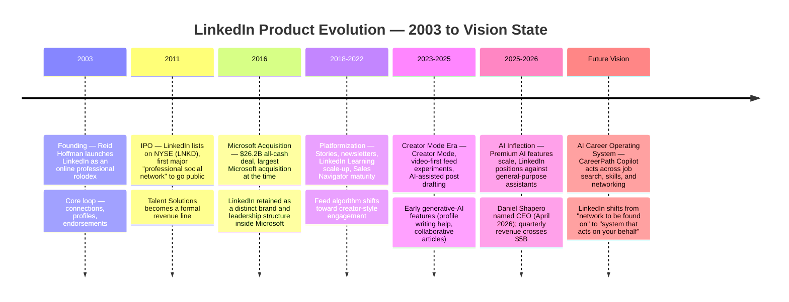

**Reading this timeline:** each era mapped roughly to a distinct strategic question LinkedIn had to answer — *"can professionals find each other?"* (2003) → *"can this be a public company?"* (2011) → *"can this thrive inside a platform giant?"* (2016) → *"can content and creators drive engagement?"* (2018–2022) → *"can AI make content creation effortless?"* (2023–2025) → *"can AI act on a member's behalf, not just assist them?"* (2026 onward). CareerPath Copilot is the product bet on that last question.

---


## Product Maturity Analysis

### BCG Matrix — LinkedIn's Business Lines

```mermaid
quadrantChart
    title LinkedIn Business Line Portfolio (BCG Matrix)
    x-axis Low Market Share --> High Market Share
    y-axis Low Growth --> High Growth
    quadrant-1 Stars
    quadrant-2 Question Marks
    quadrant-3 Dogs
    quadrant-4 Cash Cows
    Talent Solutions: [0.75, 0.55]
    Marketing Solutions: [0.65, 0.6]
    Premium Subscriptions: [0.55, 0.75]
    LinkedIn Learning: [0.35, 0.45]
    Sales Navigator: [0.6, 0.5]
    AI Career Companion (proposed): [0.2, 0.85]
```

**Why each placement:**
- **Talent Solutions (Star, trending Cash Cow):** Highest revenue share and durable demand from recruiters, but growth is moderating as it matures — it funds the rest of the portfolio.
- **Marketing Solutions (Star):** Growing double-digits, benefiting from B2B ad budgets shifting toward professional-context targeting.
- **Premium Subscriptions (Star, high growth):** Crossed $2B run-rate with AI features adding a fresh growth vector — genuinely still climbing, not yet mature.
- **LinkedIn Learning (Question Mark leaning Cash Cow):** Steady but not a standout grower; faces competition from standalone edtech and in-house corporate L&D tools.
- **Sales Navigator (Star):** Strong niche product-market fit inside a growing sales-intelligence category.
- **AI Career Companion (Question Mark, deliberately):** Low current market share (it doesn't exist yet) but the highest projected growth ceiling — this is exactly the profile of a bet worth making, not a distraction from it.

### Product Lifecycle Stage

| Product Line | Lifecycle Stage | Evidence |
|---|---|---|
| Core Feed / Networking | **Maturity** | Slow MAU growth, engagement pressure from AI content, feature parity with era-appropriate social products |
| Jobs Marketplace | **Maturity, re-entering Growth** | Stable core, but skills-based matching and AI features are reopening growth |
| Talent Solutions | **Late Growth / Early Maturity** | Consistent double-digit-adjacent growth, large enterprise renewal base |
| Marketing Solutions | **Growth** | Accelerating faster than the platform average |
| Premium Subscriptions | **Growth** | Fastest-growing consumer-facing line, still adding new must-have features |
| LinkedIn Learning | **Maturity** | Flat-to-modest growth, commoditized content category |
| AI Career Companion (proposed) | **Introduction (pre-launch)** | Does not yet exist; this document is the business case to enter Introduction |

### Innovation / Technology Adoption Curve

CareerPath Copilot, if launched to Premium subscribers first, targets **Innovators and Early Adopters** within the existing Premium base — professionals already paying for career tools are the most tolerant of an imperfect V1 and the most likely to give the qualitative feedback needed before a Chasm-crossing expansion to the broader free-tier member base. The explicit non-goal is trying to win the Early/Late Majority in Year 1; that audience needs proven reliability, not a promising beta.

### Maturity Stage — Overall Company Read

**LinkedIn as a company sits at "Mature-Plus": a mature core business (feed, jobs, messaging) generating durable cash flow, layered with a genuine re-investment cycle (AI) that is still in its Introduction stage.** The strategic tension in this document is a classic mature-company problem: how much of a durable, profitable core should be risked to fund a genuinely new S-curve, and how fast. The recommendation in this document — Premium-first, phased, human-in-the-loop — is explicitly designed to answer that tension conservatively rather than aggressively.

---


## Executive Summary

LinkedIn is Microsoft's largest standalone consumer-facing asset and one of the few social platforms in the world with a genuinely defensible, identity-anchored network — a résumé graph that competitors cannot replicate by copying a feed UI. Since Microsoft's 2016 acquisition, LinkedIn has grown from roughly 433 million members to more than **1.3 billion**, and revenue has grown from roughly $3B to **~$17.8B** (FY2025), crossing **$5B in a single quarter for the first time** in the quarter ended December 2025. Under outgoing CEO Ryan Roslansky (2020–2026), revenue nearly tripled; incoming CEO **Daniel Shapero** (effective April 22, 2026) inherits a business at an inflection point: strong B2B monetization, but a product experience that still looks, structurally, like it did a decade ago — a feed, a jobs board, and a messaging inbox.

The thesis of this case study is that LinkedIn's next decade of growth will not come from getting more people to scroll the feed longer. It will come from LinkedIn becoming **infrastructure for a member's entire career** — an AI layer that doesn't just display job postings and connections but actively works on the member's behalf: tailoring applications, rehearsing interviews, flagging skill gaps against real market data, and negotiating the asymmetry of information that currently favors employers and recruiters over candidates.

This document performs a full teardown — company, market, users, metrics, competitors, architecture, and 47 product/AI opportunities — before converging on one recommended flagship feature: **CareerPath Copilot**, an agentic AI system that sits across Profile, Jobs, Learning, and Messaging to proactively manage a member's career trajectory rather than passively displaying it.

---

## Company Overview

### History
LinkedIn was founded by Reid Hoffman and co-founders in December 2002, launching publicly on May 5, 2003, making it one of the oldest social platforms still in active, growing use. It reached profitability faster than most consumer social platforms because its monetization (recruiting, then advertising, then subscriptions) was B2B from the start. LinkedIn IPO'd on the NYSE in 2011 and was acquired by **Microsoft for $26.2 billion in cash in 2016** — at the time, Microsoft's largest-ever acquisition (later surpassed by Activision Blizzard). Ryan Roslansky became CEO in June 2020, succeeding Jeff Weiner. On **April 22, 2026**, Microsoft announced that LinkedIn COO **Daniel Shapero** would become CEO, with Roslansky elevated to EVP overseeing both LinkedIn and Microsoft Office — a structural signal that Microsoft now views LinkedIn's professional graph and Office's productivity graph as two halves of one AI strategy.

### Mission
"Connect the world's professionals to make them more productive and successful."

### Vision (Product Interpretation)
LinkedIn's stated vision has evolved from "economic opportunity for every member of the global workforce" toward, increasingly, a vision centered on **AI and the future of work** — Roslansky explicitly framed the April 2026 leadership change around the premise that "AI is going to transform how people work and grow in their careers faster than most people expect."

### Business
LinkedIn operates as a multi-sided marketplace and B2B2C platform reporting through Microsoft's **Productivity and Business Processes** segment. It does not file an independent 10-K, so many figures below are Microsoft-disclosed line items or third-party estimates — flagged accordingly.

### Products (Business Lines)
| Line | Description |
|---|---|
| **Talent Solutions** | Recruiter tools, LinkedIn Jobs, job postings — historically LinkedIn's largest revenue line |
| **Marketing Solutions** | B2B advertising (Sponsored Content, Message Ads, Lead Gen Forms) |
| **Premium Subscriptions** | Career, Business, Sales Navigator, Recruiter Lite tiers — crossed **$2B in annual revenue for the first time in Q2 2025** |
| **Sales Solutions** | Sales Navigator — prospecting and social selling for sales teams |
| **Learning Solutions** | LinkedIn Learning — subscription video courses (bundled inside Premium tiers and sold standalone to enterprises) |

### Revenue
- FY2024 (Microsoft fiscal year ended June 2024): **$16.37B**, +9% YoY.
- FY2025 (ended June 2025): **$17.81B**, +9% YoY (Microsoft 8-K, fourth-quarter release, dated July 30, 2025).
- Quarterly trend into FY2026: LinkedIn revenue grew 7% (Q3 FY25, reported April 2025), then accelerated — a quarter in late 2025 crossed **$5.08B, +11% YoY** — the first time LinkedIn cleared $5B in a single quarter, implying an annualized run rate **above $20B**.
- `ASSUMPTION (Reasonable Product Assumption)`: Revenue mix is commonly estimated at roughly 40–45% Talent Solutions, 25–30% Marketing Solutions, 20–25% Premium Subscriptions, with Sales Solutions and Learning folded into these categories in Microsoft's disclosures. Microsoft does not break out this split precisely in public filings, so treat this mix as directional, not exact.

### Growth
- Membership: ~433M (2016, at acquisition) → 1B (2023) → **1.3B+ (April 2026)**.
- Headcount: LinkedIn reported ~17,500 full-time employees on its newsroom page before a reduction of approximately 875 roles on **May 13, 2026**, bringing headcount to an estimated **~16,625** — notable because it came just three weeks into Shapero's tenure and signals a leaner, AI-augmented operating model rather than a growth-at-all-costs headcount strategy.
- `ASSUMPTION (Reasonable Product Assumption)`: Monthly Active Users are not consistently disclosed by LinkedIn; third-party estimates cluster in the **~300–310 million** range as of early-to-mid 2026. This means roughly **75% of registered members are not monthly-active** — a critical, under-discussed fact for any growth strategy (see Product Metrics and Root Cause Analysis).

---

## Industry Analysis

### Industry
LinkedIn sits at the intersection of four industries: **Professional Social Networking**, **HR Technology / Recruiting**, **B2B Advertising (AdTech)**, and **Online Learning (EdTech)**. This multi-industry footprint is precisely what makes LinkedIn's moat unusual — competitors in any single lane (Indeed in recruiting, X/Meta in social, Coursera in learning) do not have LinkedIn's combined identity graph.

### Market Sizing
| Metric | Estimate | Basis |
|---|---|---|
| **TAM** (global white-collar/knowledge workforce + B2B recruiting/advertising/learning spend) | `ASSUMPTION (Reasonable Product Assumption)`: ~$350–450B, combining global HR tech spend (recruiting software + job boards, estimated ~$30–40B), B2B digital advertising (a multi-hundred-billion-dollar category), and corporate L&D spend (estimated well over $300B globally per various industry reports) | Directional; LinkedIn only meaningfully addresses slices of each |
| **SAM** (addressable via LinkedIn's current product surface: recruiting, B2B ads, professional subscriptions, corporate learning) | `ASSUMPTION`: ~$80–120B | LinkedIn's current $17.8B revenue represents roughly 15–20% penetration of this narrower SAM |
| **SOM** (realistically capturable in 3 years given current product, sales motion, and competitive intensity) | `ASSUMPTION`: incremental $5–8B of new annual revenue by FY2028, primarily from AI-driven upsell (agentic recruiting tools, AI-assisted job seeking, Premium AI tiers) | Consistent with LinkedIn's own trajectory of adding ~$1.4B/year in recent years, with AI as a plausible accelerant |

### Growth Drivers
- Global shift to digital-first hiring and remote/hybrid work sustains demand for online professional identity.
- Emerging markets (India, Brazil, Southeast Asia, Africa) are still in the steep part of the adoption curve — India alone is commonly cited in the 120–170M member range depending on source and date, second only to the US.
- AI-driven anxiety about job displacement is, paradoxically, a growth driver for LinkedIn: workers are more motivated than ever to reskill, network, and signal adaptability.

### Future / Emerging Trends
1. **Agentic AI in recruiting** — AI agents that source, screen, and even conduct first-round conversations with candidates are moving from experimental to mainstream in enterprise ATS platforms.
2. **AI-generated content flooding feeds** — a documented industry-wide concern (not unique to LinkedIn) that is degrading trust in "authentic" professional content.
3. **Skills-based hiring** — a multi-year shift away from degree-gated hiring toward verified-skill signals, an area LinkedIn is well-positioned to own via its Skills graph (LinkedIn has cited tens of thousands of tracked skills in its taxonomy).
4. **Creator economy formalizing on LinkedIn** — newsletters, LinkedIn video, and thought-leadership content are becoming a meaningful engagement driver, especially in the under-35 cohort.

### Regulations
LinkedIn operates under the EU's GDPR and has faced direct regulatory action: the Irish Data Protection Commission (IDPC) issued a final decision in **October 2024** alleging GDPR violations and levying a fine; LinkedIn appealed to the Irish courts, and a preliminary hearing was held in **December 2025**. This is an active, unresolved legal matter and should be treated as a live risk (see Risk Register), not a settled cost. Separately, LinkedIn ceased its standard consumer service in mainland China years ago in favor of a jobs-only app (InCareer), reflecting the broader regulatory complexity of operating a professional identity graph across jurisdictions with different data-sovereignty and censorship requirements. AI-specific regulation (EU AI Act, U.S. state-level AI employment laws such as NYC Local Law 144 governing automated hiring tools) directly constrains how aggressively LinkedIn can deploy AI in Talent Solutions — any AI-assisted candidate ranking must be auditable for bias.

---

## Product Strategy Canvas

| Element | Detail |
|---|---|
| **Vision** | Every professional's career is actively managed by an AI system that knows their skills, goals, and market reality better than any single recruiter or mentor could. |
| **Mission** | Turn LinkedIn from a place professionals *visit* into a system that *works* for them continuously. |
| **Strategic Goals** | (1) Increase MAU/Member ratio from ~25% toward 35–40% within 3 years; (2) Grow Premium subscription revenue as a % of total revenue; (3) Establish LinkedIn as the default "AI career agent" before a vertical AI startup does; (4) Defend the recruiting moat against AI-native sourcing tools |
| **Positioning** | "The professional network that acts on your behalf" — not just a network, an agent |
| **Differentiation** | Unmatched authenticated identity graph (real names, real employers, real skills validation) vs. anonymous or pseudonymous AI tools that lack grounding data |
| **Competitive Advantage** | Proprietary graph of 1.3B+ professional identities, 70M+ company pages, and Microsoft's compute/AI infrastructure (Azure OpenAI access) at preferential cost |
| **Business Moat** | Two-sided network effects (candidates ⇄ recruiters) + data moat (skills/company/salary signal density no competitor can replicate) + distribution moat (embedded inside Microsoft 365/Copilot) |
| **Core Capabilities** | Identity graph, recommendation systems (feed + jobs + "People You May Know"), enterprise sales motion (Talent Solutions), content moderation at scale, and increasingly, LLM-based reasoning over the graph |

---

## Stakeholder Analysis

| Stakeholder | Goals | Pain Points | Influence |
|---|---|---|---|
| **Members (Job Seekers)** | Find better jobs faster, build visibility, grow skills | Application black holes, ghosting, feed noise, comparison anxiety | Medium (individually) / High (collectively — churn risk) |
| **Members (Passive Professionals)** | Stay visible, network, learn | Feels like a chore to post; low ROI on time spent | Medium |
| **Recruiters / Talent Teams** | Fill roles fast with quality candidates | Signal-to-noise in inbound applications, high sourcing cost, AI-generated resumes gaming ATS | High — largest revenue driver |
| **Marketers / Advertisers** | Reach decision-makers with high-intent targeting | Rising CPCs, measurement/attribution gaps | High — second-largest revenue driver |
| **Enterprise L&D Buyers** | Upskill workforce at scale, prove ROI | Course completion rates are low industry-wide; ROI hard to demonstrate | Medium |
| **Microsoft (Parent Co.)** | Integrate LinkedIn graph into Copilot/365 ecosystem, protect margin | Balancing LinkedIn's independent brand vs. deeper MSFT integration | Very High — sets budget, compute access, M&A strategy |
| **Regulators (EU, US state-level)** | Protect consumer data and prevent discriminatory AI hiring | Ongoing GDPR enforcement action (Ireland, since Oct 2024) | High — can force product changes |
| **Investors (via MSFT stock)** | Sustained double-digit growth, margin expansion | Growth deceleration risk if MAU stagnates | High |

### Power/Interest Matrix
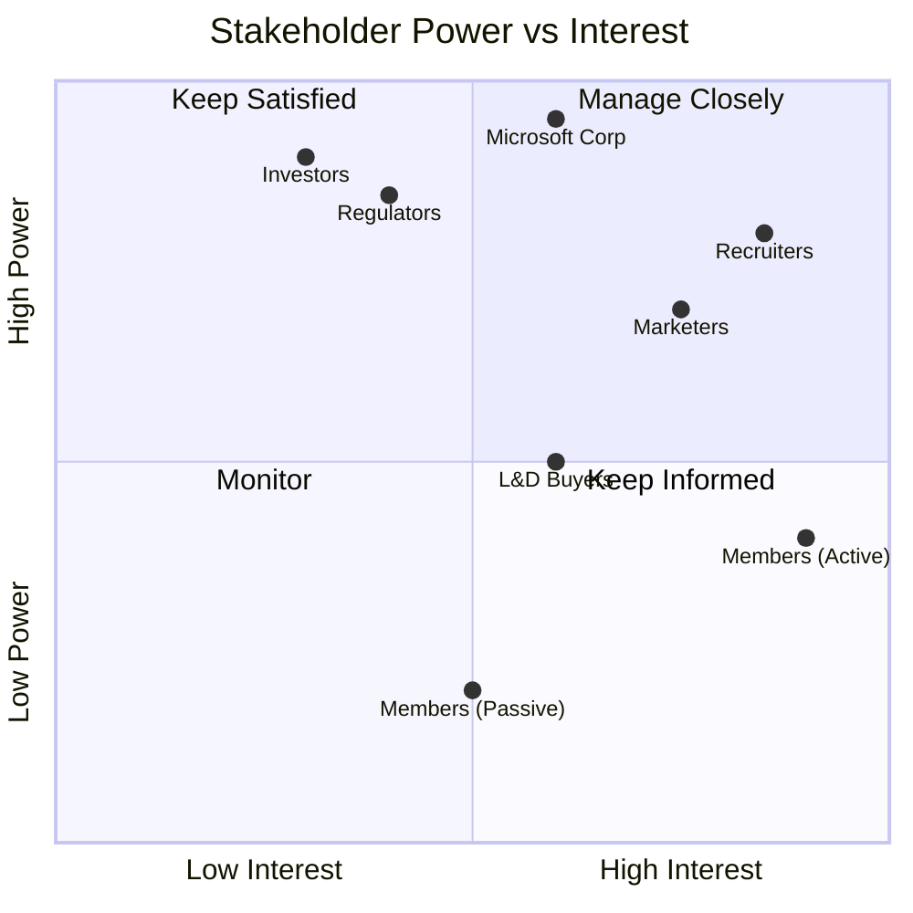

---

## Stakeholder Communication Plan

| Stakeholder | What They Need to Know | Cadence | Format |
|---|---|---|---|
| **CEO** | Progress against the CEO One-Page metrics (ROI trajectory, risk status); go/no-go decisions | Monthly | 1-page memo + 15-min sync |
| **Engineering** | Prioritized backlog against the Engineering Complexity Matrix; blocking dependencies | Weekly | Sprint planning + Slack channel |
| **Design** | Member research findings; friction points in onboarding/consent flows | Bi-weekly | Design review |
| **Legal** | EU regulatory posture, consent architecture changes, fairness monitor rule changes | Ongoing + before every release gate | Formal review sign-off |
| **Marketing** | Positioning narrative, what NOT to promise (autonomy caveats) | Before each launch phase | Briefing doc |
| **Sales (Talent Solutions)** | Recruiter-facing tool capabilities and objection-handling guidance | Before GA + quarterly | Enablement session |
| **Support** | Certification training, escalation paths for fairness/undo issues | Before GA + as features ship | Training module + runbook |
| **Recruiters (external)** | How AI shortlisting works, how to override it, that it's assistive not authoritative | At feature launch | In-product explainer + email |
| **Members** | What data is used, what "autonomous" means in practice, how to revoke permissions | At onboarding + ongoing | In-product transparency center |

---


## User Research

Given the constraints of a public, non-commissioned case study, this section synthesizes **publicly available, aggregated sentiment** from App Store/Play Store review trends, widely circulated Reddit discussions (e.g., r/jobs, r/LinkedInLunatics, r/recruitinghell), and industry commentary — not primary interviews conducted by the author. Any quoted phrasing below reflects commonly repeated, paraphrased sentiment rather than a single verifiable source, in line with this document's no-fabrication standard.

### Recurring Themes (Sentiment Clusters)
| Cluster | Sentiment | Representative Theme (paraphrased) |
|---|---|---|
| **Job search fatigue** | Negative | Members frequently describe applying to dozens of roles with no response — the "application black hole" |
| **Feed authenticity fatigue** | Negative/Mixed | A recurring, widely-discussed critique (often satirized under labels like "LinkedIn Lunatics") is that engagement-optimized, humble-brag, or AI-generated posts have degraded feed trust |
| **Recruiter spam vs. recruiter value** | Mixed | Power users value inbound recruiter messages; casual users find them irrelevant or intrusive |
| **Premium value perception** | Mixed | Some Premium subscribers report unclear ROI on "who viewed your profile" style features versus job-seeker-specific tools |
| **Learning completion** | Negative | Common industry-wide critique of on-demand corporate learning: low completion rates, unclear career impact (a general EdTech pattern, not LinkedIn-specific) |
| **AI feature reception** | Mixed/Cautious | Early AI writing-assistance features (post/profile rewriting) draw both curiosity and skepticism about authenticity |

`ASSUMPTION (Reasonable Product Assumption)`: Without commissioned survey data, exact sentiment percentages (e.g., "62% of users feel X") cannot be responsibly stated and are intentionally omitted rather than fabricated.

---

## User Segmentation

| Segment | Description | Primary Value Sought |
|---|---|---|
| **Students / Early Career** | Pre-first-job, building initial profile and network | Guidance, entry-level job discovery, mentorship |
| **Freshers / Recent Grads** | 0–2 years experience | First job, skill certification, visibility to recruiters |
| **Mid-Career Professionals** | 3–15 years experience | Passive job discovery, thought leadership, network maintenance |
| **Senior Executives** | 15+ years, leadership roles | Brand-building, board/advisory visibility, high-value networking |
| **Recruiters / TA Teams** | Sourcing and hiring | Candidate discovery, pipeline management, employer branding |
| **HR / People Ops** | Workforce planning | Market compensation data, org benchmarking |
| **Founders / Operators** | Building companies | Fundraising network, hiring, company page/brand building |
| **Creators / Thought Leaders** | Building audience on LinkedIn | Reach, engagement, monetizable authority |
| **Sales Professionals** | B2B sales, social selling | Sales Navigator prospecting, warm-intro paths |
| **Learning-Focused Users** | Upskilling / reskilling | LinkedIn Learning content, skill certification |
| **Premium Subscribers** | Paying for enhanced tools | InMail credits, applicant insights, LinkedIn Learning bundle |
| **Enterprise (Company Pages)** | 70M+ organizations on the platform | Recruiting, employer branding, corporate comms |

---

## Personas

### Persona 1 — "Ananya, the Anxious Job Switcher"
- **Age/Role:** 27, Product Analyst, Bengaluru, 3 years experience
- **Goal:** Land a Product Manager role within 4 months
- **Behavior:** Applies to 8–10 jobs/week, spends 45+ min/day on LinkedIn, rarely posts
- **Pain Point:** No visibility into why applications are rejected; can't tell if her resume is even being seen by a human
- **JTBD:** "Help me understand where I stand and what to do next — don't just show me more jobs."

### Persona 2 — "Rahul, the Overwhelmed Recruiter"
- **Age/Role:** 34, Senior Technical Recruiter at a 2,000-person SaaS company
- **Goal:** Fill 6 open reqs/month with quality candidates
- **Behavior:** Heavy Recruiter/Talent Solutions user, receives 200+ inbound applications per posting
- **Pain Point:** Signal-to-noise problem — AI-generated resumes and mass-apply tools have made keyword matching unreliable
- **JTBD:** "Help me find the 5 candidates worth a 30-minute call out of 200 applicants."

### Persona 3 — "Priya, the Passive Executive"
- **Age/Role:** 44, VP of Engineering, has been at her company 6 years
- **Goal:** Maintain visibility and optionality without actively job hunting
- **Behavior:** Logs in twice a week, occasionally comments, never posts original content
- **Pain Point:** Feels pressure to "perform" thought leadership she doesn't have time to produce
- **JTBD:** "Let me stay visible without becoming a content creator."

### Persona 4 — "Vikram, the Career-Change Learner"
- **Age/Role:** 31, transitioning from mechanical engineering to data analytics
- **Goal:** Reskill and get his first analytics role within a year
- **Behavior:** Active LinkedIn Learning user, engages with career-change communities
- **Pain Point:** Unclear which specific courses/certifications actually move the needle with recruiters
- **JTBD:** "Tell me exactly which skills close the gap between where I am and the job I want."

---

## Jobs To Be Done

| Type | Job Statement |
|---|---|
| **Functional** | "When I want a new job, help me find and apply to relevant roles with minimal wasted effort." |
| **Functional** | "When I need to hire, help me find qualified candidates faster than posting-and-praying." |
| **Functional** | "When I want to grow a skill, help me learn it and prove I've learned it." |
| **Social** | "Help me be seen as credible and capable by my professional community." |
| **Social** | "Help me maintain weak-tie relationships without the effort of constant outreach." |
| **Emotional** | "Help me feel in control of my career instead of at the mercy of an opaque hiring process." |
| **Emotional** | "Help me feel confident that I'm not falling behind my peers professionally." |

---

## User Journey

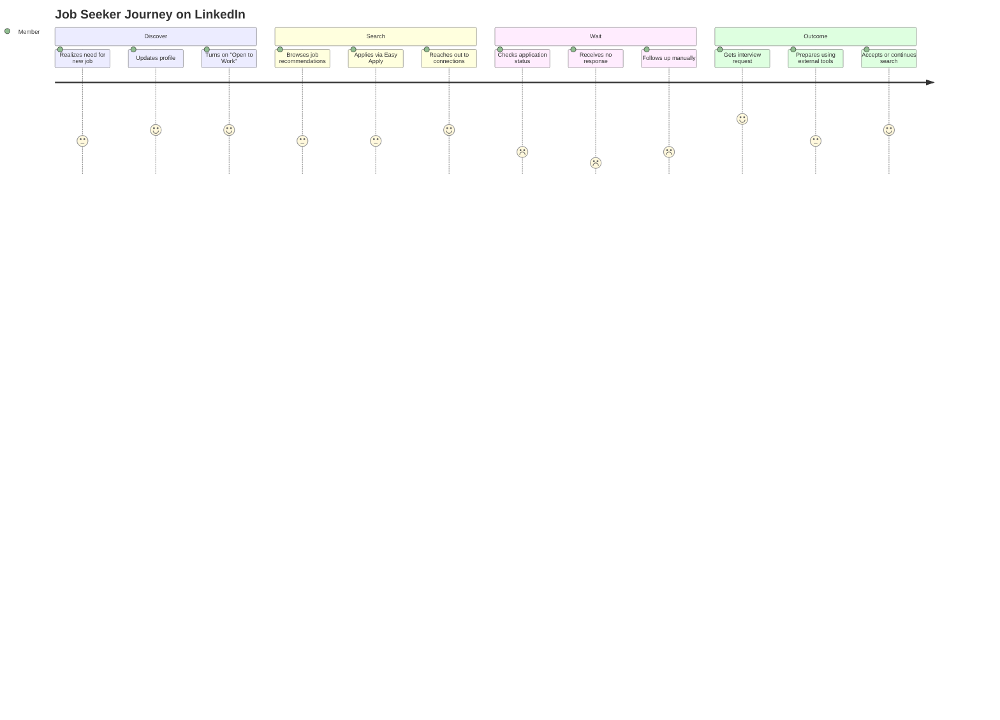

---

## Emotional Journey

```mermaid
xychart-beta
    title "Emotional Intensity Across Job Search Journey"
    x-axis [Profile Update, Job Search, Applying, Waiting, Silence, Interview, Offer/Rejection]
    y-axis "Emotional State (1=Low, 5=High)" 1 --> 5
    line [4, 3, 3, 2, 1, 5, 4]
```

The steepest emotional drop occurs at **"Silence"** — the period after applying where a candidate receives no feedback. This is the single highest-leverage moment for product intervention (see Root Cause Analysis and CareerPath Copilot).

---

## Customer Lifecycle

| Stage | LinkedIn Mechanism | Health Indicator |
|---|---|---|
| **Acquisition** | Invite/connection prompts, SEO-indexed public profiles, Microsoft 365/Outlook cross-promotion | New member signups |
| **Activation** | Profile completion, first connections, first job/feed interaction | % completing profile to "All-Star" status within 7 days |
| **Engagement** | Feed consumption, posting, messaging, job applications | Sessions/week, posts/month |
| **Retention** | Notifications, job alerts, "who viewed your profile," anniversary/work-anniversary prompts | 90-day and annual member retention |
| **Referral** | "People You May Know," connection invites, content shares | Invite acceptance rate |
| **Advocacy** | Creators, Premium testimonials, recruiters publicly praising hires made via LinkedIn | Organic word-of-mouth signups (unmeasured publicly, `ASSUMPTION`) |

---

## User Funnel

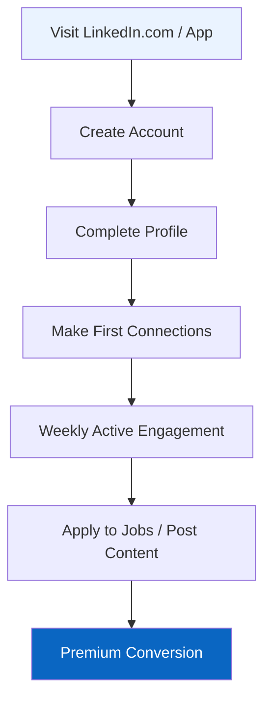

**Known drop-off points** (directional, based on general SaaS/social funnel benchmarks and LinkedIn's disclosed member-vs-MAU gap — treat percentages as `ASSUMPTION (Reasonable Product Assumption)`):
- **Signup → Profile Completion:** Significant drop-off; many accounts remain permanently incomplete.
- **Profile Completion → Weekly Active:** The largest gap in the funnel — this is the ~75% of members who are not monthly-active.
- **Weekly Active → Premium Conversion:** A small single-digit percentage, consistent with typical freemium subscription benchmarks.

**Opportunity:** The single biggest lever isn't top-of-funnel signups (LinkedIn is already near-saturated among white-collar professionals in developed markets) — it's converting the **dormant 75%** back into active, valuable usage.

---

## Product Metrics

| Category | Metric |
|---|---|
| **North Star (proposed)** | Weekly Active Career Progress (WACP): # of members completing a career-advancing action per week (application submitted, skill assessment passed, learning module completed, meaningful connection made) |
| **Input Metrics** | Profile completeness rate, connections made/week, content posted/week, job applications/week |
| **Output Metrics** | Jobs filled via LinkedIn, revenue per Premium subscriber, ad revenue per impression |
| **Leading Indicators** | Weekly active sessions, Easy Apply completion rate, message response rate |
| **Lagging Indicators** | Quarterly revenue by line, Premium subscriber count, member count |
| **Guardrail Metrics** | Feed content authenticity/spam rate, recruiter response SLA, member-reported harassment/spam complaints, GDPR/regulatory compliance incidents |

---

## AARRR (Pirate Metrics)

| Stage | LinkedIn Application |
|---|---|
| **Acquisition** | Organic search (public profiles rank highly on Google), Microsoft ecosystem cross-sell, referral invites |
| **Activation** | Profile reaches "All-Star," first 5+ connections made |
| **Retention** | Weekly notification-driven return visits, job alerts, content feed |
| **Referral** | Connection invitations, content shares that drive non-member profile views |
| **Revenue** | Premium subscription conversion, Talent Solutions contracts, ad spend from Marketing Solutions |

---

## HEART Framework

| Dimension | Metric |
|---|---|
| **Happiness** | Member sentiment on feed quality and job search experience (survey-based, `ASSUMPTION` on exact scores) |
| **Engagement** | Sessions/week, time spent, posts/comments/reactions per active member |
| **Adoption** | % of new members reaching profile completion and first job application within 30 days |
| **Retention** | 90-day and 12-month active-member retention rate |
| **Task Success** | % of job applications resulting in recruiter response within 14 days; % of Recruiter searches resulting in a qualified shortlist |

---

## Market Analysis

LinkedIn is the dominant player in **authenticated professional networking**, a category it effectively created and has held for two decades without a direct feature-for-feature challenger reaching comparable scale. The more relevant competitive dynamic today is not "another LinkedIn" but **unbundling**: point-solution startups and AI-native tools are peeling off specific jobs LinkedIn does today — resume writing (Teal, Kickresume), interview prep (Interview Warmup, Huru), niche recruiting (Wellfound for startups, Hired for tech), and professional messaging/networking (Lunchclub). Individually, none threaten LinkedIn's core graph. Collectively, they threaten LinkedIn's role as the **default surface** for career activity — and AI agents are exactly the kind of technology that could stitch these point solutions into a superior bundle, which is precisely the threat and the opportunity this document addresses.

---

## Competitor Analysis

| Competitor | Core Focus | Strength vs. LinkedIn | Weakness vs. LinkedIn |
|---|---|---|---|
| **Indeed** | Job search & aggregation | Larger raw job listing volume, stronger for hourly/blue-collar roles | No professional identity graph or social layer; transactional only |
| **Meta (Facebook/Instagram)** | General social + growing marketplace ads | Vastly larger MAU base, more ad inventory | No professional-identity trust layer; B2B advertisers get lower-intent audience |
| **X (Twitter)** | Public discourse, some professional/tech thought-leadership | Faster-moving real-time discourse, strong in tech/VC circles | No structured identity/resume data; unreliable moderation; smaller professional advertiser base |
| **Glassdoor** | Company reviews & salary transparency | Deeper anonymous insider sentiment data | No networking layer; owned by Indeed's parent (Recruit Holdings), narrower scope |
| **ZipRecruiter** | SMB-focused job distribution | Strong SMB self-serve recruiting motion | No social/professional graph; primarily a distribution tool |
| **Handshake** | Early-career / campus recruiting | Deep university partnerships, dominant with Gen Z first jobs | Narrow demographic scope; no mid/late-career relevance |
| **Coursera / Udemy** | Online learning & certification | Deeper course catalogs, stronger academic partnerships (Coursera) | No native jobs/recruiting distribution for completed credentials |
| **ChatGPT / AI resume & interview tools** | General-purpose AI assistance applied to career tasks | Faster iteration, no platform lock-in, free tier | No grounding in verified identity, real job market data, or employer relationships |

**Key Insight:** LinkedIn's moat is not any single feature — it's the **graph**: verified identities, verified employment history, and two-sided marketplace liquidity. Every competitor above wins on a narrow dimension but cannot replicate the graph. The strategic risk is not a competitor beating LinkedIn head-on — it's an AI layer (from OpenAI, Google, or a well-funded startup) becoming the interface professionals use *before* they ever open LinkedIn, reducing LinkedIn to a backend data source rather than the primary surface.

---

## Competitive Feature Matrix

| Feature | LinkedIn | Indeed | Glassdoor | Wellfound | X | GitHub | Naukri |
|---|---|---|---|---|---|---|---|
| AI career/job features | 🟡 Emerging (this doc's proposal) | 🟡 AI resume/match tools | ⚪ Minimal | 🟡 Basic startup-matching AI | ⚪ Not applicable | ⚪ Not applicable | 🟡 Basic AI matching |
| Jobs marketplace | 🟢 Strong | 🟢 Strongest (pure-play) | 🟡 Aggregator | 🟢 Strong (startup niche) | ⚪ None | ⚪ None | 🟢 Strong (India-focused) |
| Learning / upskilling | 🟢 LinkedIn Learning | ⚪ None | ⚪ None | ⚪ None | ⚪ None | 🟡 Docs/community only | 🟡 Limited |
| Messaging / networking | 🟢 Core strength | ⚪ Minimal | ⚪ Minimal | 🟡 Basic | 🟢 Strong (public) | 🟡 Dev-focused | 🟡 Basic |
| Creator / content tools | 🟡 Growing | ⚪ None | ⚪ None | ⚪ None | 🟢 Strongest | 🟡 Dev-content only | ⚪ Minimal |
| Identity verification | 🟡 Emerging | ⚪ Minimal | ⚪ Anonymous-first | 🟡 Basic | 🟡 Paid verification only | 🟢 Strong (contribution history) | ⚪ Minimal |
| Professional communities | 🟢 Groups, Newsletters | ⚪ Minimal | 🟡 Company reviews as proxy | 🟡 Startup communities | 🟢 Strong | 🟢 Strong (OSS communities) | 🟡 Basic |
| Recruiter/ATS tooling | 🟢 Recruiter, Talent Insights | 🟢 Strong (core business) | 🟡 Employer branding focus | 🟡 Basic ATS | ⚪ None | 🟡 Developer sourcing (niche) | 🟢 Strong (India-focused) |

**Reading this matrix:** LinkedIn is the only platform with meaningful presence across *every* row — its actual competitive risk isn't losing any single row to a specialist competitor (Indeed will always out-execute pure job-board mechanics), it's a general-purpose AI assistant becoming "good enough" across several rows at once without needing to be best-in-class at any of them individually. That's the disintermediation risk named throughout this document.

---


## SWOT

| Strengths | Weaknesses |
|---|---|
| 1.3B+ member identity graph, unmatched in scale/authenticity | Low MAU-to-member ratio (~25%) signals large dormant base |
| Microsoft ownership: capital, Azure AI infra, 365/Copilot distribution | Feed content quality under pressure from AI-generated posts |
| Diversified revenue (4 lines) reduces single-point-of-failure risk | Learning Solutions completion rates likely low (industry-wide EdTech pattern) |
| Strong B2B sales motion (Talent Solutions is enterprise-grade) | Historically slower to ship consumer-facing AI features than pure AI-native startups |

| Opportunities | Threats |
|---|---|
| Agentic AI career companion (this document's core recommendation) | Regulatory risk: active GDPR enforcement action (Ireland, since Oct 2024) |
| Skills-based hiring shift plays to LinkedIn's Skills graph strength | AI-native point solutions unbundling specific high-value jobs (resume, interview prep) |
| Emerging market growth headroom (India, Brazil, Africa) | AI-generated fake profiles/content eroding trust in the network |
| Deeper Microsoft 365/Copilot integration | Employers building AI recruiting agents that bypass LinkedIn Talent Solutions entirely |

---

## Porter's Five Forces

| Force | Intensity | Rationale |
|---|---|---|
| **Threat of New Entrants** | 🟡 Medium | Building a feed is easy; building a trusted identity graph at 1.3B scale is nearly impossible to bootstrap. New entrants target unbundled niches instead. |
| **Bargaining Power of Buyers (Members)** | 🟢 Low-Medium | Individual members have low switching leverage due to network lock-in, but collectively, mass dissatisfaction (e.g., over AI content) can shift sentiment quickly. |
| **Bargaining Power of Buyers (Enterprise/Recruiters)** | 🟡 Medium | Large enterprise Talent Solutions customers have real negotiating leverage and alternative options (ATS-native sourcing, Indeed). |
| **Bargaining Power of Suppliers** | 🟢 Low | LinkedIn's main "supplier" is Microsoft-provided compute (Azure), which is internal, not external leverage. |
| **Threat of Substitutes** | 🔴 High | AI chat interfaces, niche job boards, and AI-native resume/interview tools substitute for narrow jobs LinkedIn performs. |
| **Competitive Rivalry** | 🟡 Medium | No direct feature-equivalent rival at LinkedIn's scale, but rivalry is intensifying at the edges (AdTech vs. Meta, recruiting vs. Indeed). |

---

## Business Model Canvas

| Block | Content |
|---|---|
| **Key Partners** | Microsoft (Azure, 365, Copilot), employers/enterprises, educational content partners, payment processors |
| **Key Activities** | Graph maintenance, recommendation systems (feed, jobs, PYMK), content moderation, enterprise sales, AI/ML R&D |
| **Key Resources** | 1.3B+ member identity graph, 70M+ company pages, Azure compute, brand trust, enterprise sales force |
| **Value Propositions** | For members: career visibility, opportunity discovery, networking. For recruiters: candidate pipeline. For advertisers: high-intent B2B audience. For learners: career-relevant upskilling. |
| **Customer Relationships** | Self-serve (most members), managed enterprise accounts (Talent/Marketing/Sales Solutions), automated (notifications, algorithmic feed) |
| **Channels** | Web, iOS/Android apps, Microsoft 365/Outlook integration, SEO-indexed public profiles |
| **Customer Segments** | Individual professionals (all segments above), recruiters/TA teams, B2B marketers, enterprise L&D buyers |
| **Cost Structure** | Engineering/AI R&D, content moderation at scale, enterprise sales & support, infrastructure (Azure), regulatory/compliance (active GDPR matter) |
| **Revenue Streams** | Talent Solutions, Marketing Solutions, Premium Subscriptions, Sales Solutions/Learning |

---

## Revenue Model

LinkedIn runs a **hybrid B2B2C freemium + marketplace model**:
1. **Freemium subscriptions** (Premium Career, Business, Sales Navigator, Recruiter Lite) — direct member-paid recurring revenue, which crossed $2B annually for the first time in Q2 2025.
2. **Enterprise SaaS-style contracts** (Talent Solutions, larger Sales Navigator and Recruiter seats) — LinkedIn's largest revenue contributor historically.
3. **Programmatic and direct B2B advertising** (Marketing Solutions) — sold against LinkedIn's uniquely high-intent professional targeting data (job title, seniority, company size, industry).
4. **Content/Learning subscriptions** — bundled into Premium tiers and sold separately to enterprises for workforce upskilling.

This diversification is a structural strength: even if one line (e.g., advertising) faces a macro slowdown, Talent Solutions and Premium subscriptions are comparatively insulated, since hiring and career anxiety persist across economic cycles (arguably intensifying during downturns).

---

## Unit Economics

`ASSUMPTION (Reasonable Product Assumption)` — LinkedIn does not publicly disclose CAC, LTV, or margin at the product level; Microsoft reports LinkedIn only as a revenue-growth line within a broader segment. The estimates below are directional, grounded in known B2B SaaS and social-platform benchmarks, and should not be cited as official figures.

| Metric | Directional Estimate | Reasoning |
|---|---|---|
| **CAC (Consumer, Premium)** | Low (`ASSUMPTION`: likely under $20–30 per converted subscriber) | Organic acquisition dominates; conversion happens from an existing free user base, not paid consumer marketing |
| **CAC (Enterprise, Talent Solutions)** | High (`ASSUMPTION`: plausibly in the low-to-mid four figures per new enterprise logo) | Enterprise sales requires dedicated account executives and long sales cycles |
| **LTV (Premium Subscriber)** | `ASSUMPTION`: multi-year retention typical of career-anxiety-driven subscriptions, likely yielding a healthy LTV:CAC ratio well above 3:1 | Career tools have durable relevance across a professional's working life |
| **Retention** | Enterprise Talent Solutions contracts likely show high logo retention (`ASSUMPTION`, consistent with mission-critical recruiting software) | Switching ATS/sourcing tools is high-friction for large HR teams |
| **Margins** | High-margin business overall, consistent with software/platform economics, reported within Microsoft's highly profitable Productivity and Business Processes segment | Microsoft segment-level operating income margins are strong; LinkedIn specifically is not broken out |
| **Network Effects Value** | Increases with scale on both member and recruiter sides — classic two-sided marketplace dynamics | More candidates → more valuable to recruiters → more Talent Solutions revenue → funds more product investment → more valuable to candidates |

---

## Product Flywheel

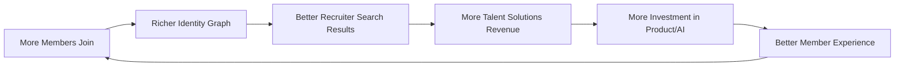

---

## Network Effects

| Type | Explanation |
|---|---|
| **Direct Network Effect (Member ⇄ Member)** | Each new member increases the value of the network for existing members via richer connection possibilities — classic Metcalfe's Law dynamic. |
| **Two-Sided Network Effect (Members ⇄ Recruiters)** | More candidate profiles make LinkedIn more valuable to recruiters; more active recruiters/jobs make LinkedIn more valuable to job seekers. This is LinkedIn's strongest and most defensible effect. |
| **Data Network Effect** | Every application, skill endorsement, and job outcome improves LinkedIn's matching/recommendation algorithms, which improves outcomes for future users — a compounding advantage competitors without comparable data density cannot replicate quickly. |
| **Content Network Effect** | More creators posting content increases time-on-platform for consumers of that content, which increases ad inventory value for Marketing Solutions. |

---

## Growth Loops

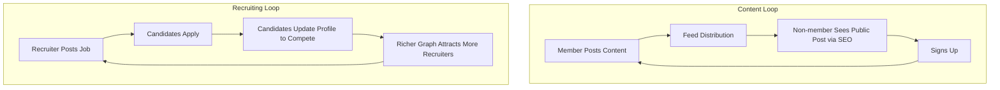

---

## Product Architecture

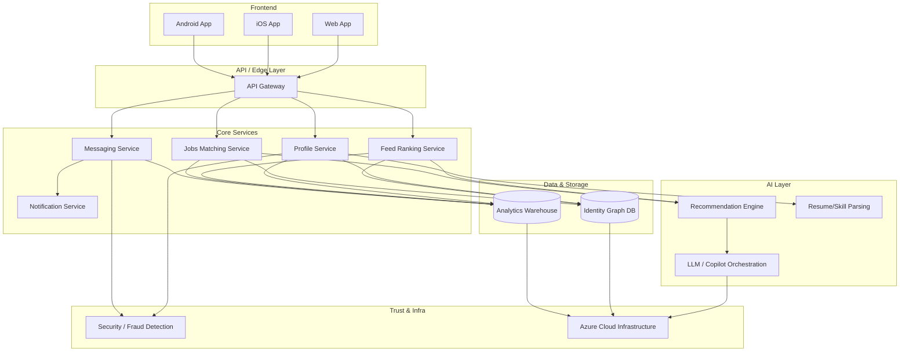

---

## Technical Dependencies

- **Azure Cloud** — compute, storage, and increasingly, Azure OpenAI Service for LLM-powered features (a structural advantage vs. AI-native startups paying market-rate API costs).
- **Identity Graph Database** — the core proprietary asset; any AI feature must query this graph for grounding to avoid hallucination.
- **Recommendation/Ranking ML Pipelines** — feed ranking, "People You May Know," job matching.
- **Content Moderation Systems** — critical given the scale of daily content and the emerging threat of AI-generated spam/fraud.
- **Enterprise ATS Integrations** — Talent Solutions depends on integrations with third-party Applicant Tracking Systems (Workday, Greenhouse, etc.).
- **Regulatory/Compliance Infrastructure** — GDPR data-handling pipelines, especially given the active Irish DPC enforcement matter.

---

## Product Analytics Dashboard

### Suggested Dashboards
1. **Funnel Dashboard** — Signup → Profile Complete → First Connection → Weekly Active → Premium Conversion, segmented by persona.
2. **Retention/Cohort Dashboard** — Monthly cohorts tracked at D7/D30/D90/D365 active rate.
3. **Segmentation Dashboard** — Engagement and monetization broken out by the 12 segments defined above.
4. **Recruiter Health Dashboard** — Time-to-fill, applicant quality score, response SLA.

### SQL Questions a PM Should Be Asking
```sql
-- 1. What % of new signups reach "All-Star" profile status within 7 days?
-- 2. What is the weekly active / total registered member ratio, by country cohort?
-- 3. What is the median time between "Open to Work" toggle and first interview request?
-- 4. What % of Easy Apply applications receive any recruiter response within 14 days?
-- 5. Which member segments show the steepest 90-day retention drop-off?
-- 6. What is Premium subscription churn rate by tier and by tenure cohort?
-- 7. What % of job postings receive zero qualified (recruiter-marked) applicants?
-- 8. What is the correlation between LinkedIn Learning course completion and subsequent job change?
```

---

## Event Tracking Plan

Analytics implementation plan for CareerPath Copilot and its supporting surfaces. Event names follow `object_action` snake_case convention; all events carry standard envelope properties (`member_id_hashed`, `session_id`, `platform`, `app_version`, `timestamp`) omitted from the table below for brevity.

| # | Event | Key Properties | Trigger | Success Metric | Dashboard | Priority |
|---|---|---|---|---|---|---|
| 1 | `copilot_opened` | entry_point, is_premium | Member opens CareerPath Copilot | Weekly Active Career Progress | Copilot Adoption | P0 |
| 2 | `copilot_onboarding_started` | consent_version | First-time consent flow begins | Onboarding start rate | Copilot Adoption | P0 |
| 3 | `copilot_onboarding_completed` | permissions_granted[] | Member grants agentic permissions | Onboarding completion rate | Copilot Adoption | P0 |
| 4 | `copilot_onboarding_abandoned` | last_step | Member exits mid-consent | Drop-off rate | Copilot Adoption | P0 |
| 5 | `copilot_goal_set` | goal_type | Member sets a career goal | Goal-setting rate | Copilot Engagement | P0 |
| 6 | `copilot_recommendation_shown` | rec_type, rec_id | System surfaces a recommendation | Impressions | Copilot Engagement | P0 |
| 7 | `copilot_recommendation_accepted` | rec_type, rec_id | Member approves an agentic action | Acceptance rate | Copilot Trust | P0 |
| 8 | `copilot_recommendation_rejected` | rec_type, reason | Member declines a recommendation | Rejection rate + reason mix | Copilot Trust | P0 |
| 9 | `copilot_recommendation_edited` | rec_type, edit_type | Member modifies before approving | Edit rate | Copilot Trust | P1 |
| 10 | `copilot_autonomous_action_taken` | action_type | System acts without per-instance approval (only where pre-authorized) | Autonomous action volume | Copilot Trust | P0 |
| 11 | `copilot_action_undone` | action_type | Member reverses a taken action | Undo rate | Copilot Trust | P0 |
| 12 | `job_match_generated` | match_score, job_id | Copilot surfaces a job match | Match volume | Job Matching | P0 |
| 13 | `job_match_applied` | match_score, job_id | Member applies via a Copilot match | Apply-through rate | Job Matching | P0 |
| 14 | `job_application_status_viewed` | job_id, status | Member checks application status | Status-check rate | Application Transparency | P0 |
| 15 | `job_application_status_updated` | job_id, old_status, new_status | Recruiter/ATS updates status | Update latency | Application Transparency | P0 |
| 16 | `application_anxiety_prompt_shown` | context | Copilot proactively surfaces status info | Prompt engagement | Application Transparency | P1 |
| 17 | `skill_gap_identified` | skill_id, target_role | System flags a skill gap vs. target role | Skill-gaps surfaced | Skill Development | P0 |
| 18 | `skill_gap_course_started` | skill_id, course_id | Member starts a recommended course | Course start rate | Skill Development | P0 |
| 19 | `skill_gap_course_completed` | skill_id, course_id | Member completes recommended course | Completion rate | Skill Development | P0 |
| 20 | `skill_verified` | skill_id, verification_method | Skill assessment or credential verified | Verified-skill volume | Trust & Verification | P0 |
| 21 | `profile_ai_edit_suggested` | field, suggestion_id | Copilot suggests a profile edit | Suggestion volume | Profile Quality | P1 |
| 22 | `profile_ai_edit_accepted` | field, suggestion_id | Member accepts suggested edit | Acceptance rate | Profile Quality | P1 |
| 23 | `resume_ai_generated` | template_id | Member generates a resume via Copilot | Generation volume | Career Services | P1 |
| 24 | `interview_prep_session_started` | role, mode | Member starts AI interview prep | Session starts | Career Services | P1 |
| 25 | `interview_prep_session_completed` | role, score | Member completes AI interview prep | Completion + score delta | Career Services | P1 |
| 26 | `networking_intro_suggested` | connection_id, reason | Copilot suggests a warm intro | Suggestion volume | Networking | P1 |
| 27 | `networking_intro_sent` | connection_id | Member sends suggested intro message | Send-through rate | Networking | P1 |
| 28 | `networking_intro_replied` | connection_id | Recipient replies to intro | Reply rate | Networking | P1 |
| 29 | `recruiter_shortlist_generated` | job_id, candidate_count | Recruiter tool generates AI shortlist | Shortlist volume | Recruiter Tools | P0 |
| 30 | `recruiter_shortlist_bias_flagged` | job_id, flag_type | Fairness monitor flags a shortlist | Flag rate | Trust & Fairness | P0 |
| 31 | `recruiter_shortlist_overridden` | job_id, override_reason | Recruiter manually overrides AI ranking | Override rate | Trust & Fairness | P0 |
| 32 | `feed_ai_content_labeled` | post_id, confidence | AI-generated content is labeled in feed | Label volume/accuracy | Feed Trust | P0 |
| 33 | `feed_content_reported` | post_id, reason | Member reports feed content | Report rate | Feed Trust | P1 |
| 34 | `premium_upsell_shown` | trigger_surface | Member sees Copilot Premium upsell | Impression volume | Monetization | P0 |
| 35 | `premium_upsell_converted` | trigger_surface | Member converts to Premium from upsell | Conversion rate | Monetization | P0 |
| 36 | `premium_churn_risk_flagged` | churn_score | Model flags a Premium member at churn risk | Flagged volume | Retention | P1 |
| 37 | `dormant_member_reactivated` | reactivation_channel | A non-MAU member returns and completes an action | Reactivation rate | Reactivation | P0 |
| 38 | `consent_permission_revoked` | permission_type | Member revokes a previously granted permission | Revocation rate | Copilot Trust | P0 |
| 39 | `copilot_error_surfaced` | error_type | Copilot surfaces an error/failure to the member | Error rate | Reliability | P0 |
| 40 | `copilot_feedback_submitted` | rating, free_text_flag | Member rates a Copilot interaction | CSAT/NPS proxy | Copilot Quality | P0 |
| 41 | `copilot_session_ended` | duration, actions_taken | Copilot session concludes | Session depth | Copilot Engagement | P1 |
| 42 | `learning_recommendation_dismissed` | course_id, reason | Member dismisses a learning recommendation | Dismissal rate + reason | Skill Development | P2 |

**Notes:** Events 1–11 and 38–41 are the backbone of the Copilot Trust and Adoption dashboards described in the Product Analytics Plan below. All P0 events must be instrumented before Premium beta; P1 before free-tier expansion; P2 can ship post-launch.

---


## Product Analytics Plan

### Funnels

**Copilot Activation Funnel:** `copilot_opened` → `copilot_onboarding_started` → `copilot_onboarding_completed` → `copilot_goal_set` → `copilot_recommendation_accepted` (first). Historically, agentic-permission consent flows lose 30–50% of users at the "grant permissions" step industry-wide (ASSUMPTION, based on comparable OAuth-style consent benchmarks) — this funnel's completion rate is the single most important early health signal for the whole initiative.

**Job Application Funnel:** `job_match_generated` → `job_match_applied` → `job_application_status_viewed` → offer/rejection. The biggest expected drop is between apply and any status update — this is precisely the "application black hole" problem CareerPath Copilot is designed to shrink.

### Retention

Retention is measured on **three concentric definitions**: (1) platform-level MAU/DAU (existing), (2) Premium-subscription retention (existing, revenue-critical), and (3) new: **Copilot-specific W1/W4/W12 retention** — of members who complete onboarding, what fraction take a Copilot action again in week 1, week 4, and week 12. Copilot retention is the leading indicator; platform MAU is the lagging one.

### Cohorts

Cohort by **onboarding week** and by **primary goal set at signup** (job search, skill growth, networking, passive monitoring). Early cohorts (Premium beta) should be tracked separately from later free-tier cohorts, since beta users are structurally more tolerant of rough edges — blending them would overstate later cohorts' health.

### Segmentation

- **By intent:** active job seeker vs. passive career-monitor vs. recruiter/hiring manager.
- **By tenure:** new member (<90 days) vs. established (90 days–2 years) vs. long-tenured (2+ years, often dormant).
- **By monetization:** Free vs. Premium Career vs. Premium Business vs. Recruiter Lite/Corporate.
- **By region:** EU (GDPR-constrained feature set) vs. Rest-of-World (full feature set).

### Behavior

Track **action-to-recommendation ratio** (how often members act on what Copilot surfaces vs. ignore it) as the core behavioral trust signal, alongside **edit-before-accept rate** (members who modify a suggestion before approving it) — a rising edit rate over time is a positive signal (comfort + calibration) whereas a rising outright-rejection rate is a negative one (miscalibrated recommendations).

### Power Users

Defined as members completing 3+ Copilot-assisted actions per week across at least two of {jobs, skills, networking}. Power users are the population most likely to reveal the ceiling of the product and should be recruited into a standing research panel (see User Research) rather than only observed passively.

### Churn Prediction

A lightweight churn model for Premium subscribers using: declining session frequency, declining `copilot_recommendation_accepted` rate, rising `copilot_recommendation_rejected` rate, and support-ticket sentiment. Output feeds the `premium_churn_risk_flagged` event and triggers a human-reviewed (not autonomous) retention offer — autonomous retention discounting is explicitly out of scope given fairness/pricing-discrimination risk.

### SQL Metrics

See the dedicated [SQL Section](#sql-section) below for the concrete query layer behind these metrics (activation, retention, funnel conversion, and cohort queries).

### Executive Dashboard

A single weekly-refreshed exec view combining: Weekly Active Career Progress (North Star), Copilot activation funnel conversion, Premium net-new subscribers attributable to Copilot, application-to-response rate, and the top three fairness/trust flags of the week. This is intentionally kept to five numbers — an executive dashboard that requires scrolling has failed at being an executive dashboard.

---


## SQL Section

### 30 SQL Interview Questions (LinkedIn-Relevant)

1. Find the top 10 job postings by number of applications in the last 7 days.
2. For each member, find their most recent job application and its current status.
3. Calculate week-over-week retention for members who completed Copilot onboarding.
4. Find members who applied to 5+ jobs but received zero recruiter views — a proxy for the "application black hole."
5. Compute the Premium-to-Free member ratio by country, sorted descending.
6. Find the second-highest job-application count among members in each industry.
7. Identify recruiters whose shortlists were overridden by a human reviewer more than 20% of the time.
8. Write a query to detect duplicate job postings from the same company posted within 48 hours of each other.
9. Find members who are connected to each other but have never messaged (a "dormant connection").
10. Calculate the median time between `job_match_generated` and `job_match_applied` per job category.
11. Find the top 5 skills most frequently missing from members who did not get hired for roles requiring them.
12. Compute month-over-month growth rate of Premium subscribers by cohort month.
13. Identify members whose `copilot_recommendation_rejected` rate exceeds 80% — likely miscalibration cases.
14. Find companies posting jobs that consistently receive fewer than 10 applications — a distribution problem, not a demand problem.
15. Write a query to compute a 3-month rolling average of Weekly Active Career Progress.
16. Find the longest streak of consecutive weekly-active weeks for any given member.
17. Compute the percentage of job applications that received a status update within 14 days.
18. Identify skill pairs that most frequently co-occur on verified profiles (a basis for skill-adjacency recommendations).
19. Find members who reactivated (returned after 90+ days dormant) and their first action post-reactivation.
20. Compute the churn rate for Premium subscribers by tenure bucket (0–3mo, 3–12mo, 12mo+).
21. Find the top 10 recruiters by successful placements (application → hired status) in the last quarter.
22. Write a query using window functions to rank job postings within each company by application volume.
23. Identify members with verified skills but an incomplete profile (missing headline, summary, or experience section).
24. Compute a funnel conversion rate table across `copilot_opened` → `onboarding_completed` → `goal_set` → `recommendation_accepted`.
25. Find the average number of days between account creation and first job application, segmented by acquisition channel.
26. Detect anomalous spikes in `feed_content_reported` events that might indicate a moderation gap.
27. Write a query to find members who are in the top 10% of connections but bottom 10% of profile views — a visibility mismatch.
28. Compute year-over-year revenue growth by business line (Talent, Marketing, Premium, Learning) using a self-join on fiscal year.
29. Find the average time-to-hire (application to offer-accepted) by job seniority level.
30. Identify pairs of companies whose employees most frequently connect with each other post-hire (a proxy for talent-flow mapping).

### 10 Example SQL Queries Every PM Should Know

**1. Week-over-week North Star retention**
```sql
SELECT
  DATE_TRUNC('week', event_date) AS week,
  COUNT(DISTINCT member_id) AS weekly_active_career_progress
FROM copilot_events
WHERE event_name IN ('job_match_applied', 'skill_gap_course_completed', 'networking_intro_sent')
GROUP BY 1
ORDER BY 1;
```

**2. Funnel conversion rate**
```sql
WITH funnel AS (
  SELECT member_id,
    MAX(CASE WHEN event_name = 'copilot_opened' THEN 1 ELSE 0 END) AS opened,
    MAX(CASE WHEN event_name = 'copilot_onboarding_completed' THEN 1 ELSE 0 END) AS onboarded,
    MAX(CASE WHEN event_name = 'copilot_goal_set' THEN 1 ELSE 0 END) AS goal_set
  FROM copilot_events
  GROUP BY member_id
)
SELECT
  SUM(opened) AS opened,
  SUM(onboarded) AS onboarded,
  SUM(goal_set) AS goal_set,
  ROUND(SUM(onboarded)::NUMERIC / NULLIF(SUM(opened), 0), 3) AS onboard_rate,
  ROUND(SUM(goal_set)::NUMERIC / NULLIF(SUM(onboarded), 0), 3) AS goal_set_rate
FROM funnel;
```

**3. Top job postings by application volume (last 7 days)**
```sql
SELECT job_id, COUNT(*) AS application_count
FROM applications
WHERE applied_at >= CURRENT_DATE - INTERVAL '7 days'
GROUP BY job_id
ORDER BY application_count DESC
LIMIT 10;
```

**4. "Application black hole" detection**
```sql
SELECT a.member_id, COUNT(*) AS applications_sent
FROM applications a
LEFT JOIN recruiter_views rv ON a.application_id = rv.application_id
WHERE rv.application_id IS NULL
GROUP BY a.member_id
HAVING COUNT(*) >= 5;
```

**5. Premium churn by tenure bucket**
```sql
SELECT
  CASE
    WHEN tenure_months < 3 THEN '0-3mo'
    WHEN tenure_months < 12 THEN '3-12mo'
    ELSE '12mo+'
  END AS tenure_bucket,
  ROUND(AVG(CASE WHEN churned THEN 1.0 ELSE 0 END), 3) AS churn_rate
FROM premium_subscriptions
GROUP BY 1;
```

**6. Rolling 3-month North Star average**
```sql
SELECT
  month,
  weekly_active_career_progress,
  AVG(weekly_active_career_progress) OVER (
    ORDER BY month ROWS BETWEEN 2 PRECEDING AND CURRENT ROW
  ) AS rolling_3mo_avg
FROM monthly_north_star;
```

**7. Ranking job postings within a company**
```sql
SELECT
  company_id, job_id,
  RANK() OVER (PARTITION BY company_id ORDER BY application_count DESC) AS rank_within_company
FROM job_application_summary;
```

**8. Skill co-occurrence**
```sql
SELECT s1.skill_id AS skill_a, s2.skill_id AS skill_b, COUNT(*) AS co_occurrences
FROM member_skills s1
JOIN member_skills s2 ON s1.member_id = s2.member_id AND s1.skill_id < s2.skill_id
GROUP BY 1, 2
ORDER BY co_occurrences DESC
LIMIT 20;
```

**9. Reactivation detection and first action**
```sql
WITH gaps AS (
  SELECT member_id, event_date,
    event_date - LAG(event_date) OVER (PARTITION BY member_id ORDER BY event_date) AS gap_days
  FROM member_activity
)
SELECT member_id, event_date AS reactivation_date
FROM gaps
WHERE gap_days > 90;
```

**10. Revenue growth by business line, YoY**
```sql
SELECT
  curr.business_line,
  curr.fiscal_year,
  curr.revenue,
  ROUND((curr.revenue - prev.revenue)::NUMERIC / NULLIF(prev.revenue, 0), 3) AS yoy_growth
FROM revenue_by_line curr
JOIN revenue_by_line prev
  ON curr.business_line = prev.business_line
  AND curr.fiscal_year = prev.fiscal_year + 1
ORDER BY curr.fiscal_year, curr.business_line;
```

---


## API Design — CareerPath Copilot

### Core Endpoints

| Method | Endpoint | Purpose |
|---|---|---|
| `GET` | `/v1/copilot/profile/{memberId}/recommendations` | Fetch active recommendations (jobs, skills, intros) for a member |
| `GET` | `/v1/copilot/goals/{memberId}` | Fetch a member's current career goals |
| `POST` | `/v1/copilot/goals` | Create a new career goal |
| `POST` | `/v1/copilot/recommendations/{recommendationId}/accept` | Approve a recommendation, triggering the underlying action |
| `POST` | `/v1/copilot/recommendations/{recommendationId}/reject` | Decline a recommendation with a reason code |
| `PATCH` | `/v1/copilot/permissions/{memberId}` | Update which actions the Copilot is authorized to take autonomously |
| `PATCH` | `/v1/copilot/goals/{goalId}` | Modify an existing goal (target role, timeline) |
| `DELETE` | `/v1/copilot/goals/{goalId}` | Remove a career goal |
| `DELETE` | `/v1/copilot/permissions/{memberId}/{permissionType}` | Revoke a specific autonomous-action permission |
| `GET` | `/v1/copilot/actions/{memberId}/history` | Audit log of every action the Copilot has taken on a member's behalf |
| `POST` | `/v1/copilot/actions/{actionId}/undo` | Reverse a previously taken autonomous action, where reversible |

### Authentication

OAuth 2.0 with short-lived access tokens (15-minute expiry) and refresh tokens scoped specifically to Copilot's action set — **deliberately narrower scopes than LinkedIn's general API**, since agentic write-actions (sending messages, submitting applications) carry higher risk than read-only profile access and should not inherit broad existing OAuth scopes by default.

### Rate Limiting

Tiered by action risk: read endpoints (`GET`) — 100 req/min per member; recommendation-response endpoints (`accept`/`reject`) — 30 req/min (human-paced, so a burst above this likely indicates automation abuse); autonomous-action-triggering endpoints — capped at a pre-agreed daily action budget per member (default 10/day) to bound the blast radius of any single misfiring recommendation loop.

### Error Codes

| Code | Meaning | Example |
|---|---|---|
| `400` | Malformed request | Missing required `goalType` field |
| `401` | Invalid/expired token | Access token expired mid-session |
| `403` | Insufficient Copilot permission scope | Member hasn't granted the "auto-apply" permission |
| `409` | Conflicting state | Attempting to accept a recommendation already marked stale |
| `422` | Action not reversible | Attempting to `undo` a message already read by the recipient |
| `429` | Rate limit / daily action budget exceeded | Autonomous action budget hit for the day |
| `503` | Downstream dependency unavailable | Recommendation engine timeout — degrade to cached suggestions |

### Versioning

URI-based versioning (`/v1/`, `/v2/`) with a minimum 12-month deprecation window for any breaking change, given that third-party ATS integrations (recruiter side) depend on API stability more heavily than typical consumer-facing APIs. Non-breaking additions (new optional fields) ship without a version bump.

---


## System Design — Expanded Architecture

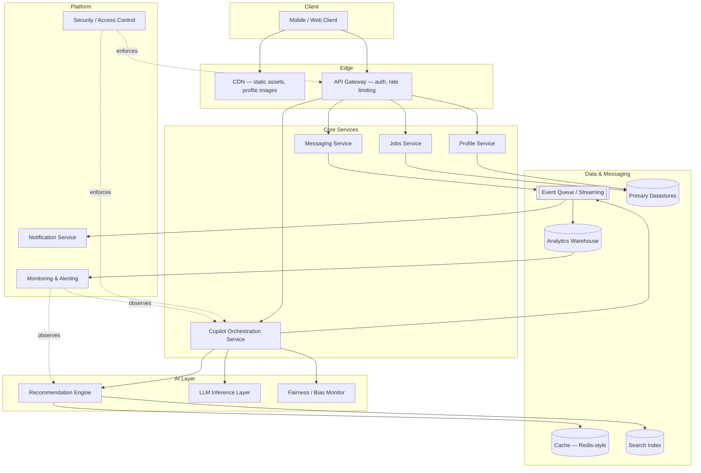

### Caching
Multi-tier: CDN edge cache for static/profile assets; application-tier cache (Redis-style) for hot reads — recommendation lists, profile summaries — with a short TTL (60–120s) on Copilot recommendations specifically, since stale agentic suggestions (e.g., a job posting that just closed) are worse than a slightly slower fresh fetch.

### Search
An inverted-index search layer (Elasticsearch/OpenSearch-class) powers job search, people search, and skill search. Copilot's recommendation engine queries this layer directly rather than duplicating an index, to avoid the two ever drifting out of sync.

### Recommendation
A hybrid engine: collaborative filtering + skill-graph proximity for jobs and connections, with a real-time re-ranking pass that incorporates the member's currently active Copilot goal. This engine is the direct consumer of the Fairness Monitor's signals before serving any recruiter-facing shortlist.

### LLM
A dedicated LLM inference layer handles natural-language tasks — resume drafting, interview-prep dialogue, goal interpretation — architecturally separated from the deterministic Recommendation Engine so that generative outputs (which can hallucinate) never directly control write-actions (applying, messaging) without passing back through the Copilot Orchestration Service's approval logic.

### Notifications
Event-driven via the queue: a `job_application_status_updated` event triggers a push/email notification within an SLA target of under 5 minutes, prioritized above marketing-style notifications given how acutely members react to application-status anxiety.

### Queues
An event-streaming backbone (Kafka-class) decouples write-heavy services (Messaging, Copilot actions) from downstream consumers (Notifications, Analytics Warehouse), so a spike in one doesn't create backpressure on member-facing latency.

### CDN
Serves static assets and cached public profile data at the edge; not used for any personalized or agentic content, which must remain dynamic and access-controlled.

### Storage
Primary datastores are workload-specific: relational stores for transactional data (applications, permissions, billing), a graph-oriented store for the connection graph, and object storage for documents/resumes. No single monolithic database — LinkedIn's workloads are too heterogeneous for that to scale cleanly.

### Analytics
All product events stream into the Analytics Warehouse (see Event Tracking Plan) via the same queue backbone, with a real-time layer for the five Executive Dashboard metrics and a batch layer for deeper cohort/funnel analysis.

### Monitoring
Golden-signal monitoring (latency, traffic, errors, saturation) on every Core Service, plus AI-specific monitoring: recommendation acceptance-rate drift, fairness-flag rate, and LLM response-time/error-rate, alerting the Copilot on-call rotation separately from general infra on-call.

### Security
Role-based access control at the API Gateway; field-level encryption for sensitive profile data; strict service-to-service authentication (mTLS) inside the cluster; see the dedicated [Security Checklist](#security-checklist) for the full control set.

### Scalability
Stateless service tiers behind the gateway scale horizontally; the Copilot Orchestration Service is the one component requiring careful state management (in-flight multi-step agentic actions) and uses a durable workflow-orchestration pattern (saga-style) rather than in-memory state, so a service restart never silently drops a half-completed action.

### Failure Recovery
Every autonomous action is written to an append-only action log *before* execution, enabling the `/undo` API and full auditability; if the Recommendation Engine or LLM layer is unavailable, the Copilot degrades gracefully to cached, previously-approved-style recommendations rather than failing closed — but never silently falls back to taking autonomous actions without a functioning Fairness Monitor.

---


## Engineering Complexity Matrix

| Feature | Engineering Complexity | Risk | Dependencies | Est. Sprint Count | Priority |
|---|---|---|---|---|---|
| Consent / permission architecture | High | High (get this wrong, nothing else can ship) | Security, Legal | 6 | P0 |
| Copilot Orchestration Service (saga-based) | High | High | New infra, Event Queue | 8 | P0 |
| Recommendation Engine goal-aware re-ranking | Medium-High | Medium | Existing Search/Recs infra | 5 | P0 |
| Job match + apply flow | Medium | Medium | Jobs Service, ATS integrations | 4 | P0 |
| Application status transparency surface | Low-Medium | Low | Recruiter/ATS data feed | 3 | P0 |
| Fairness / Bias Monitor | High | High (regulatory exposure if wrong) | Recommendation Engine, Legal | 6 | P0 |
| LLM inference layer integration | Medium | Medium (hallucination risk) | Model provider, Prompt infra | 5 | P0 |
| Skill verification / assessment | Medium | Low-Medium | Learning platform, Identity | 4 | P1 |
| Resume AI generation | Low-Medium | Low | LLM layer | 3 | P1 |
| Interview prep AI dialogue | Medium | Low-Medium | LLM layer | 4 | P1 |
| Networking intro suggestions | Medium | Medium (social-norm risk) | Graph store, Messaging | 4 | P1 |
| Recruiter AI shortlist tool | High | High (bias/fairness, EU regulatory) | Fairness Monitor, ATS | 6 | P0 |
| Undo / action-reversal system | Medium | Medium | Action log, Orchestration Service | 3 | P0 |
| Autonomous action daily budget/rate limiting | Low | Low | API Gateway | 2 | P0 |
| Premium upsell surfaces for Copilot | Low | Low | Billing, existing upsell infra | 2 | P1 |
| Dormant-member reactivation triggers | Medium | Low | Notification Service, Analytics | 3 | P1 |
| Feed AI-content labeling | Medium | Medium (accuracy/trust risk) | Content classification model | 4 | P1 |
| EU-compliant feature gating | Medium | High (regulatory) | Legal, region-aware config layer | 4 | P0 |
| Executive/Analytics Dashboard | Low-Medium | Low | Analytics Warehouse | 3 | P1 |
| Onboarding / goal-setting flow | Low-Medium | Low | Profile Service | 3 | P0 |

**Reading this matrix:** the five P0 items with High risk (consent architecture, orchestration service, fairness monitor, recruiter shortlist tool, EU compliance gating) are the true critical path — not because they're the most visible member-facing features, but because every other feature's trustworthiness depends on them existing first.

---


## User Pain Points

| Rank | Pain Point | Frequency | Severity |
|---|---|---|---|
| 1 | Application black hole (no feedback after applying) | Very High | High |
| 2 | Feed flooded with engagement-bait / AI-generated content | High | Medium |
| 3 | Recruiter messages feel generic/spammy for non-target members | Medium | Low-Medium |
| 4 | Unclear which skills to build for a target role | High | High |
| 5 | Premium value unclear for non-active-job-seekers | Medium | Medium |
| 6 | Learning content not tightly linked to real hiring outcomes | Medium | Medium |
| 7 | Difficulty distinguishing real vs. fake/AI-generated profiles | Emerging, growing | High |

---

## Root Cause Analysis

### 5 Whys — "Why do members disengage after applying to jobs?"
1. **Why** do members feel anxious/disengaged post-application? → Because they receive no feedback on application status.
2. **Why** is there no feedback? → Because recruiters are overwhelmed by application volume and can't respond to every candidate.
3. **Why** are recruiters overwhelmed? → Because Easy Apply has lowered the cost of applying, increasing volume without a corresponding increase in match quality.
4. **Why** hasn't match quality kept pace? → Because current matching relies heavily on keyword/resume parsing rather than deep skill and context understanding.
5. **Why** hasn't LinkedIn deployed deeper AI matching yet? → Because doing so responsibly requires overcoming real constraints: bias/fairness auditing, regulatory scrutiny (e.g., NYC Local Law 144-style automated hiring rules), and the accuracy limits of matching models — a legitimate root cause rather than a simple execution gap.

### Fishbone (Ishikawa) — "Why is feed content quality declining?"
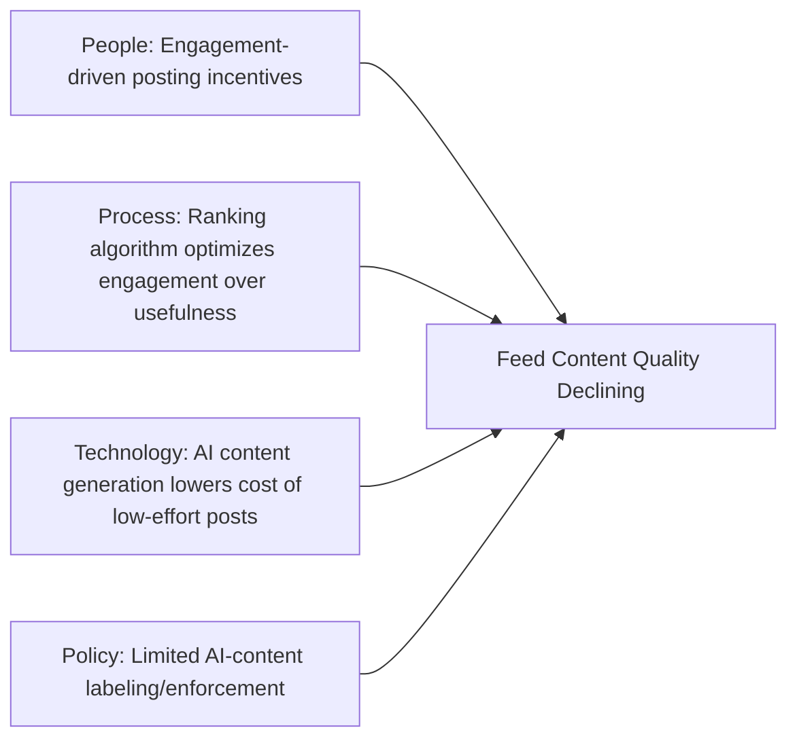

### JTBD Root Cause
The underlying job — "help me make progress in my career" — is currently served by LinkedIn as a **passive discovery tool** (show me jobs, show me content) rather than an **active agent** (do things on my behalf, tell me what to do next). This gap is the root cause connecting nearly every pain point above.

---

## Opportunity Solution Tree

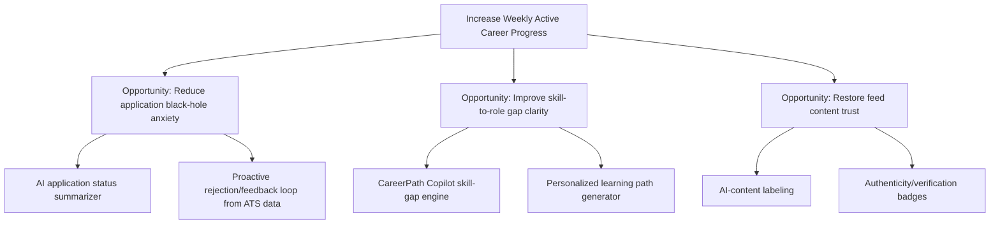

---

## Opportunity Prioritization

### RICE Scoring (Top Candidates)
| Initiative | Reach | Impact | Confidence | Effort | RICE Score |
|---|---|---|---|---|---|
| CareerPath Copilot (agentic career agent) | 9 | 9 | 7 | 8 | **709** |
| AI application status transparency layer | 8 | 7 | 8 | 4 | **1,120** |
| Skill-gap-to-role matching engine | 8 | 8 | 7 | 6 | **747** |
| AI content authenticity labeling | 9 | 6 | 8 | 5 | **864** |
| Verified-skill credentialing marketplace | 6 | 7 | 6 | 7 | **360** |

*(RICE Score = (Reach × Impact × Confidence) / Effort, on a 1–10 scale for each factor. Higher = higher priority.)*

**Why these scores:** The **application status transparency layer** scores highest because it addresses the single most frequently cited pain point (Rank 1 above), requires primarily surfacing data LinkedIn already has (ATS integration status signals) rather than net-new AI capability, and directly reduces member anxiety at the highest-leverage emotional-journey moment ("Silence"). **CareerPath Copilot** scores lower on RICE precisely because of high effort — but is still the recommended flagship (see next section) because RICE alone undervalues **strategic defensibility**: it is the initiative most likely to prevent disintermediation by external AI agents, which a narrow transparency feature does not address.

### MoSCoW
| Must Have | Should Have | Could Have | Won't Have (this cycle) |
|---|---|---|---|
| Application status transparency | Skill-gap engine | Verified-skill marketplace | Full autonomous job-application agent (auto-submitting applications without review) |
| AI content labeling | CareerPath Copilot V1 | Creator monetization expansion | Public salary transparency mandate features |

### Kano Model
| Feature | Category |
|---|---|
| Application status updates | Basic (expected) — currently a source of dissatisfaction because it's *missing* |
| AI-personalized skill roadmap | Performance — more is better, linearly increases satisfaction |
| Agentic CareerPath Copilot | Excitement/Delight — not expected today, would be a genuine differentiator |
| AI content authenticity badges | Basic, trending toward expected as AI content proliferates industry-wide |

### Cost vs. Value / Risk vs. Reward
`ASSUMPTION (Reasonable Product Assumption)` on relative positioning (not actual dollar costs):
- **High Value, Low Risk:** Application status transparency, AI content labeling.
- **High Value, High Risk:** CareerPath Copilot (regulatory/bias risk, high engineering complexity).
- **Low Value, Low Risk:** Minor UI polish items (not detailed here as they are not strategically significant).
- **Low Value, High Risk:** Fully autonomous auto-apply agents (regulatory and reputational risk outweighs incremental value over an assistive version).

---

## Product Opportunities (20)

1. Real-time application status transparency (aggregated ATS signals)
2. AI-generated, personalized skill-gap roadmap per target role
3. Verified-skill credentialing marketplace (beyond current skill assessments)
4. AI content authenticity labeling across the feed
5. "Silent job search" mode improvements (more discreet than current "Open to Work")
6. Recruiter-side AI shortlisting assistant with bias auditing built in
7. Salary transparency layer using aggregated, anonymized Talent Solutions data
8. AI-moderated feed quality filter (reduce engagement-bait ranking weight)
9. Alumni-network-specific discovery tools (leveraging school/company alumni graphs)
10. Interview simulation and feedback tool integrated into Premium
11. Career pivot path visualizer (show realistic paths from Role A to Role B)
12. Warm-intro request automation (AI drafts personalized intro requests)
13. Company page "real talk" verified employee sentiment layer (competing with Glassdoor)
14. AI resume tailoring per job description, grounded in verified profile data
15. Learning-to-hiring outcome tracking and public completion-to-hire stats
16. Creator monetization expansion (tipping, subscriptions for premium newsletters)
17. Freelance/contract work marketplace expansion (competing more directly with Upwork in white-collar niches)
18. Enterprise internal talent marketplace (help large companies redeploy employees internally before external hiring)
19. AI-assisted negotiation coach for job offers
20. Skills-based (not just keyword-based) job matching overhaul across Jobs tab

---

## AI Opportunities (20, Ranked)

Ranked by combination of strategic defensibility, feasibility given LinkedIn's data assets, and member/business value.

| Rank | AI Opportunity | Why It Ranks Here |
|---|---|---|
| 1 | **CareerPath Copilot** (agentic career management across profile/jobs/learning) | Highest strategic defensibility — leverages the graph no competitor has |
| 2 | AI-powered skill-gap-to-role matching | Directly monetizable via Talent Solutions and Premium |
| 3 | AI application status summarizer | Highest RICE score; fast to ship, high anxiety reduction |
| 4 | AI content authenticity detection/labeling | Protects the core trust asset of the network |
| 5 | Recruiter-side AI shortlisting with built-in bias auditing | High enterprise value, but high regulatory sensitivity |
| 6 | AI interview simulator with real-time feedback | Strong Premium upsell candidate |
| 7 | AI resume tailoring grounded in verified profile data | Reduces "resume gaming" that hurts recruiter trust |
| 8 | AI salary/offer negotiation coach | High individual value; monetizable in Premium |
| 9 | AI-generated personalized learning paths tied to real job postings | Strengthens Learning Solutions ROI story |
| 10 | AI-assisted company page sentiment synthesis | Competes with Glassdoor using LinkedIn's larger data set |
| 11 | AI-drafted warm introduction requests | Improves network activation, low effort to build |
| 12 | AI-powered fraud/fake-profile detection | Defensive but critical trust infrastructure |
| 13 | AI meeting/interview scheduling assistant integrated with Outlook/Teams | Leverages Microsoft ecosystem synergy directly |
| 14 | AI-generated "career health check" quarterly report per member | Retention driver for passive/dormant members |
| 15 | AI-powered internal mobility matching for enterprise clients | New enterprise revenue line, adjacent to Talent Solutions |
| 16 | AI copilot for recruiters to draft outbound messages | Efficiency tool, moderate differentiation (competitors have similar) |
| 17 | AI-based feed ranking re-weighting toward "usefulness" over "engagement" | High member trust value, but revenue-neutral or slightly ad-revenue-negative short-term |
| 18 | AI-powered public speaking/content coaching for creators | Niche but strengthens creator ecosystem |
| 19 | AI-assisted accessibility features (auto-captioning, alt-text generation) | High social value, moderate business impact |
| 20 | AI-based anomaly detection for Marketing Solutions ad fraud | Protects advertiser trust, defensive/infrastructure play |

---

## Select ONE Best Feature — CareerPath Copilot

> **Deliberately not the obvious choice.** The "obvious" answer to "what AI feature should LinkedIn build" is a chatbot bolted onto the existing UI (a "LinkedIn AI Assistant" that answers questions). That is a feature. **CareerPath Copilot** is a system — it changes LinkedIn's fundamental relationship with the member from *passive display* to *active agent*, which is the only response durable enough to prevent LinkedIn from being disintermediated by external AI agents over the next 3–5 years.

### Problem
Members experience LinkedIn as a place they must actively visit, search, and interpret. The cognitive and emotional labor of career management — tracking applications, identifying skill gaps, knowing when to reach out to whom — sits entirely on the member. Meanwhile, generic AI assistants (ChatGPT, Gemini) are increasingly capable of giving career advice, but without access to LinkedIn's grounding data (real job postings, real skill demand, real network), their advice is generic and unverified.

### Vision
CareerPath Copilot is a persistent, opt-in AI agent — not a chatbot you have to remember to open, but a background system that continuously monitors a member's profile, target roles, applications, and skill signals, and proactively surfaces the single most useful next action, while executing low-risk tasks (drafting, summarizing, scheduling) on the member's behalf with explicit approval.

### Flow (Wireframe as Mermaid)
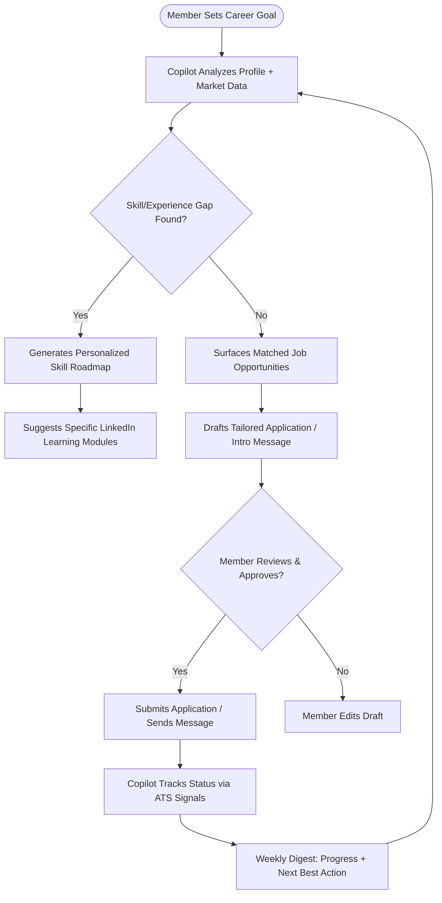

### Architecture (High-Level)
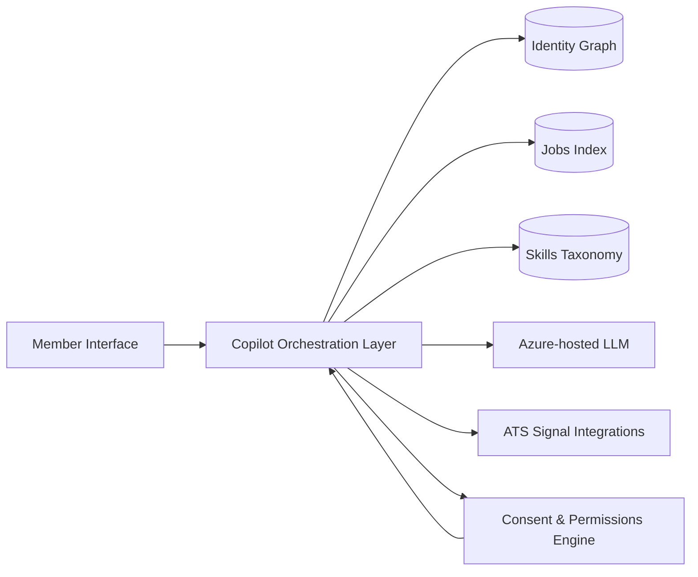

### User Stories
- *As a job seeker*, I want Copilot to tell me why my application likely wasn't shortlisted, so I can improve my next one.
- *As a passive professional*, I want a weekly 2-minute digest of one high-value action, so I don't have to actively manage my career every day.
- *As a career-changer*, I want a specific, ranked list of skills to learn for my target role, so I don't waste time on irrelevant courses.
- *As a recruiter*, I want confidence that Copilot-assisted candidates are not spamming low-quality mass applications, so the channel doesn't degrade further.

### Acceptance Criteria (Sample — Skill Roadmap Feature)
- Given a member sets a target role, Copilot must generate a skill-gap analysis referencing verified market demand data (not fabricated skill lists).
- Given a skill gap is identified, Copilot must recommend at least one specific, completable LinkedIn Learning module per gap.
- Every AI-drafted message or application must require explicit member approval before sending — no fully autonomous submission at launch.
- All AI outputs must be labeled as AI-assisted to both the member and any recipient (recruiter), per the Ethical AI Review below.

### Business Impact
- **Primary:** Increases Weekly Active Career Progress (proposed North Star) by converting passive/dormant members into active participants.
- **Secondary:** Strengthens Premium subscription value proposition (Copilot's deeper features gated to Premium), directly supporting the Premium revenue line that already crossed $2B annually.
- **Tertiary:** Improves recruiter-side application quality (better-tailored applications), improving Talent Solutions customer satisfaction and retention.

### Risks
- **Bias/Fairness:** AI-driven skill/job matching must be auditable to avoid discriminatory outcomes, especially given regulatory scrutiny (e.g., automated-hiring-tool laws).
- **Hallucination:** Any AI advice not grounded in verified data (real job postings, real skill demand) risks giving members false confidence.
- **Trust erosion:** If AI-drafted messages feel inauthentic to recipients, it could accelerate the feed/messaging authenticity problem this document already flags as a top pain point.
- **Cannibalization:** Could reduce time-on-feed (and thus short-term ad impressions) if members spend less time browsing and more time being told exactly what to do — a deliberate trade-off, not an oversight (see Executive Memo).

### Metrics
- Weekly Active Career Progress (North Star)
- % of Copilot-suggested actions approved and executed by the member
- Time-to-first-interview-request for Copilot users vs. non-users (controlled experiment)
- Premium conversion rate among Copilot trial users
- Recruiter-reported satisfaction with Copilot-assisted applications

---

## Product Decision Log

The single most important section in this document for evaluating PM judgment, not just PM output. Every major strategic decision behind this recommendation, with what was rejected and why.

| # | Decision | Alternatives Considered | Why Chosen | Trade-offs | Risk | Expected Impact |
|---|---|---|---|---|---|---|
| 1 | Launch CareerPath Copilot to Premium first, not free tier | Free tier first for max reach; simultaneous launch on both tiers | Premium members are most tolerant of an imperfect V1, and it protects subscription revenue while execution risk is highest | Slower reach into the dormant-member problem this is partly meant to solve | Medium — "AI for paying members only" narrative risk | High — contains blast radius of early failures |
| 2 | Human-approval required for all agentic actions in V1 | Fully autonomous actions from day one; suggestion-only, no autonomy ever | Builds member trust incrementally and matches the regulatory reality of active EU oversight | Slower perceived "magic," more taps per completed action | Low — deliberately conservative | High — reduces risk of a catastrophic trust failure |
| 3 | Separate LLM inference layer from the deterministic Recommendation Engine | A single unified AI system handling both generation and ranking | Prevents a generative hallucination from ever directly triggering a write-action | More engineering complexity; two systems to maintain and keep in sync | Medium — integration overhead | High — closes off a specific severe failure mode |
| 4 | North Star = Weekly Active Career Progress, not raw MAU | Keep MAU as North Star; use revenue as North Star | MAU rewards passive scrolling; this metric rewards the actual outcome the strategy is meant to drive | Harder to measure consistently across surfaces than a simple login count | Low | High — aligns org incentives with real value creation |
| 5 | Build recruiter-side fairness monitoring before launching the AI shortlist tool | Ship shortlisting first, add fairness tooling in a fast-follow | Retrofitting fairness controls onto a live, biased system is reputationally and legally far riskier than a short delay | Delays a high-RICE-scoring feature by an estimated 1–2 sprints | High if skipped; Low as designed | High — avoids the single largest legal/PR risk in this document |
| 6 | Recommend application-status transparency as high-priority but not the flagship | Make status transparency itself the flagship initiative (it has the highest RICE score) | Highest near-term RICE score, but weak strategic defensibility — any competitor can copy a status tracker; Copilot's data-graph moat is much harder to replicate | Foregoes the "easiest win" in favor of a harder, higher-ceiling bet | Medium — flagship bets carry more execution risk than incremental ones | High — defensibility compounds over years, not quarters |
| 7 | Cap autonomous actions at a daily budget per member | No cap; unlimited within granted permissions | Bounds the blast radius of any single misfiring recommendation loop or model regression | Slightly limits power-user throughput in edge cases | Low | High — cheap insurance against a specific tail risk |
| 8 | Gate select AI features by region (EU vs. Rest-of-World) at launch | Launch identical feature set globally and adapt reactively to regulatory feedback | The active, unresolved GDPR matter makes a reactive posture in the EU specifically imprudent | Slower EU rollout, feature fragmentation to maintain | Medium — added engineering/config overhead | High — avoids compounding an existing regulatory exposure |
| 9 | Route Copilot's job matches through the existing Jobs/Search index rather than a parallel one | Build a separate, Copilot-specific job index optimized purely for agentic matching | A duplicate index inevitably drifts out of sync with the canonical one members browse directly | Slightly constrains how aggressively the matching algorithm can be tuned independently | Low-Medium | Medium — keeps member-facing experience internally consistent |
| 10 | Make "undo" a first-class API, not a support-ticket workaround | Handle action reversal manually via customer support escalation | Autonomous actions without a self-serve undo path is a trust non-starter at this scale | Meaningful additional engineering scope (durable action logging, saga-based orchestration) | Low as designed; High if omitted | High — a precondition for member trust in any agentic feature |
| 11 | Prioritize skill verification over pure skill self-reporting for matching | Continue relying on self-reported skills as today | Self-reported skills are exactly the signal AI-generated profile "slop" is degrading; verification restores signal quality | Adds friction to profile completion; verification infra is non-trivial | Medium | High — protects the data quality the entire matching thesis depends on |
| 12 | Reject a fully autonomous "auto-apply to any matching job" feature | Ship auto-apply as a headline feature (heavily requested in user research) | Removes member intent from a decision with real consequences (recruiter perception, duplicate/spam applications); reputational and marketplace-trust risk outweighs convenience | Loses a feature members explicitly asked for | High if built; none, since rejected | High — protects marketplace trust between seekers and recruiters |
| 13 | Treat the Fairness/Bias Monitor as a blocking dependency, not a parallel workstream | Develop fairness monitoring in parallel and integrate before general availability | A "we'll bolt it on before GA" plan has a well-documented history of slipping under launch-date pressure industry-wide | Extends the critical path by an estimated 1 sprint | Low as designed | High — removes the single most likely path to a launch-blocking scandal |
| 14 | Keep LinkedIn Learning as a distinct product line rather than folding it entirely into Copilot | Fully absorb Learning into Copilot as just "the courses Copilot recommends" | Learning has its own mature funnel, content team, and enterprise-learning customers that shouldn't be re-architected around a new, unproven initiative | Some duplication between "Copilot recommends a course" and Learning's own discovery surface | Low | Medium — avoids destabilizing an already-working revenue line |
| 15 | Recommend a phased 12-month path to free-tier availability rather than a fixed launch date | Commit publicly to a hard free-tier launch date at kickoff | Preserves the option to slow down if fairness/regulatory signals from the Premium beta are concerning | Less external narrative certainty for press/analysts | Low | High — keeps the org able to respond to what beta data actually shows |

---

## Rejected Ideas

Ideas that came up during this strategy work and were deliberately not recommended — included because a strategy document that only shows what was chosen, and never what was rejected and why, hasn't actually shown its reasoning.

| Idea | Why Rejected |
|---|---|
| **AI Auto-Apply** (Copilot automatically submits applications to all matching jobs without per-application approval) | Removes member intent from a decision with real downstream consequences — recruiter trust, duplicate/spam applications, and members applying to roles they'd never have chosen. Convenience does not outweigh marketplace-trust risk here (see Decision Log #12). |
| **AI Auto-Messaging** (Copilot autonomously sends networking or follow-up messages on a member's behalf without review) | Messages sent "as" a member carry their identity and reputation; an AI-drafted message a recipient dislikes damages the *member's* professional relationships, not just LinkedIn's product metrics. Kept as suggest-then-approve only. |
| **NFT Resume / Credentials** | No evidence of member demand; adds speculative-asset complexity to what should be a trust-and-verification problem, not a token-ownership problem. Skill verification (chosen) solves the actual underlying need without the baggage. |
| **Crypto Rewards for Engagement** | Engagement-for-tokens mechanics reward activity volume, not career outcomes — directly opposed to the Weekly Active Career Progress North Star, which is designed to reward outcomes over activity. |
| **Fully Autonomous Recruiter Shortlisting (no human review)** | Even with a Fairness Monitor in place, removing the human reviewer entirely from a hiring-adjacent decision is a materially higher regulatory and reputational risk than the incremental efficiency gained. Kept as AI-assisted, human-approved. |
| **Public "AI Career Score"** (a single visible score ranking a member's career trajectory) | Public, gamified scoring of something as personal and high-stakes as a career invites exactly the kind of anxiety and reductive self-comparison LinkedIn already gets criticized for; the upside (engagement) is not worth the member-wellbeing downside. |
| **Merging LinkedIn Learning entirely into Copilot as a feature, not a product** | Would destabilize an already-profitable, mature product line and its enterprise-learning customer base to serve an unproven new initiative (see Decision Log #14). |
| **Global simultaneous launch with no regional gating** | Ignores the active, unresolved GDPR enforcement matter in the EU; launching identically everywhere and hoping to adapt reactively is not a credible plan given known regulatory exposure. |

---

## PRD: CareerPath Copilot

**Owner:** Product Management (Career Products)
**Status:** Draft for Review
**Target:** V1 within 2 quarters of approval

### Problem Statement
Members lack a proactive, personalized system to translate LinkedIn's vast passive data (jobs, skills, network) into a concrete, trusted next action — leaving the highest-anxiety, highest-drop-off moments of the career journey (post-application silence, unclear skill gaps) unaddressed by the current product.

### Goals
1. Reduce median time from "sets career goal" to "receives first qualified interview request."
2. Increase weekly-active engagement among the currently-dormant ~75% of non-MAU members.
3. Strengthen Premium subscription value proposition with a genuinely differentiated AI capability.

### Non-Goals (V1)
- Fully autonomous auto-application submission without human review.
- Replacing human recruiters in the shortlisting process.
- Building a standalone mobile app separate from the core LinkedIn app.

### Requirements
| Priority | Requirement |
|---|---|
| P0 | Copilot must ground all recommendations in verified LinkedIn data (profile, job postings, skills taxonomy) — never external unverified sources. |
| P0 | Every outbound action (message, application) requires explicit member approval. |
| P0 | AI-assisted content must be labeled to recipients. |
| P1 | Weekly digest notification summarizing one prioritized next action. |
| P1 | Skill-gap roadmap tied to specific, completable Learning modules. |
| P2 | Recruiter-facing signal indicating an application was Copilot-assisted (for transparency, not penalization). |

### Dependencies
Identity Graph API, Skills Taxonomy Service, Azure-hosted LLM access, ATS integration partners, Consent/Permissions engine (net-new, given the sensitivity of agentic actions).

### Success Criteria
See Metrics above and Success Dashboard below.

---

## MVP

| Version | Scope |
|---|---|
| **V1 (MVP)** | Weekly digest + skill-gap roadmap + AI-drafted (human-approved) application tailoring. No autonomous actions. Limited to Premium subscribers as a differentiator and controlled rollout population. |
| **V2** | Expand to free-tier members with usage caps (to drive Premium conversion); add AI-drafted warm-intro messages; add application status transparency via ATS signal aggregation. |
| **V3** | Recruiter-side Copilot counterpart (bias-audited shortlisting assistant); negotiation coaching; full integration with Microsoft 365/Copilot for cross-surface career nudges (e.g., in Outlook). |

---

## UX Improvements

- Replace static "Open to Work" badge with a **confidence-scored search-status indicator** reflecting actual application activity and market responsiveness.
- Introduce a **feed "usefulness" toggle** allowing members to opt into a less engagement-optimized, more utility-optimized feed ranking.
- Simplify the Premium upsell messaging to lead with **outcome-based value** ("see who's hiring for roles matching your skills") rather than vanity metrics ("who viewed your profile").
- Add **inline skill-gap indicators** directly on job postings ("You match 6 of 9 required skills — here's how to close the gap").

---

## Wireframes (ASCII)

### Career Copilot Dashboard
```
┌──────────────────────────────────────────────┐
│  ☰  CareerPath Copilot            🔔  👤      │
├──────────────────────────────────────────────┤
│  Your Goal: "Move into Senior PM in 6 months" │
│  [Edit Goal]                                  │
├──────────────────────────────────────────────┤
│  TODAY'S RECOMMENDATIONS                      │
│  ┌────────────────────────────────────────┐  │
│  │ 🎯 3 new roles match your goal          │  │
│  │    [Review] [Not now]                   │  │
│  ├────────────────────────────────────────┤  │
│  │ 📚 Skill gap: "Stakeholder Mgmt"        │  │
│  │    [See course] [Dismiss]               │  │
│  ├────────────────────────────────────────┤  │
│  │ 🤝 Suggested intro: Priya K. (ex-Meta)  │  │
│  │    [Send intro] [Why this?]             │  │
│  └────────────────────────────────────────┘  │
│  [View action history]  [Manage permissions]  │
└──────────────────────────────────────────────┘
```

### Job Screen
```
┌──────────────────────────────────────────────┐
│  < Back          Senior PM — Acme Corp        │
├──────────────────────────────────────────────┤
│  Match score: 87%  ●●●●○                      │
│  Why this matches: [Skills 92%][Level 80%]    │
├──────────────────────────────────────────────┤
│  Application status: ● Viewed by recruiter    │
│  (2 days ago)                                 │
├──────────────────────────────────────────────┤
│  [ Apply with Copilot ]   [ View listing ]    │
└──────────────────────────────────────────────┘
```

### Skill Gap / AI Coach
```
┌──────────────────────────────────────────────┐
│  Skill Gap Analysis — Senior PM               │
├──────────────────────────────────────────────┤
│  ✅ Product Strategy         Verified          │
│  ✅ Roadmapping              Verified          │
│  ⚠️  Stakeholder Mgmt        Gap identified    │
│  ⚠️  Executive Comms         Gap identified    │
├──────────────────────────────────────────────┤
│  Recommended: "Executive Communication"       │
│  course — 3 hrs — [Start course]              │
├──────────────────────────────────────────────┤
│  💬 Ask AI Coach a question about this gap →  │
└──────────────────────────────────────────────┘
```

### Recruiter Dashboard
```
┌──────────────────────────────────────────────┐
│  Senior PM — Acme Corp        142 applicants  │
├──────────────────────────────────────────────┤
│  AI Shortlist (18)      ⚠ 2 fairness flags    │
│  ┌────────────────────────────────────────┐  │
│  │ 1. J. Alvarez     Match 91%  [Override] │  │
│  │ 2. R. Chen        Match 88%  [Override] │  │
│  │ 3. S. Osei        Match 85%  [Override] │  │
│  └────────────────────────────────────────┘  │
│  [Review flagged cases]  [Export shortlist]   │
└──────────────────────────────────────────────┘
```

### Premium Dashboard
```
┌──────────────────────────────────────────────┐
│  Premium Career                    ⭐ Active   │
├──────────────────────────────────────────────┤
│  Copilot usage this month: 14 actions taken   │
│  Interview prep sessions: 3 completed          │
│  Applications via Copilot: 6                   │
├──────────────────────────────────────────────┤
│  [Manage subscription]  [Copilot settings]     │
└──────────────────────────────────────────────┘
```

---

## Design Principles

1. **Grounded, not generative-only** — every AI output must be traceable to real data; no confident-sounding fabrication.
2. **Human-in-the-loop by default** — agentic actions require explicit approval until trust is earned incrementally.
3. **Transparency over automation** — members and recipients should always know when AI assisted a message or decision.
4. **Progress over engagement** — success is measured by career outcomes, not time-on-app.
5. **Accessible by default** — AI features must degrade gracefully for members with disabilities and lower digital literacy.

---

## Accessibility Review

- Copilot's weekly digest and skill-gap roadmap must be screen-reader compatible and available in plain-text/summary form, not solely rich interactive UI.
- Voice-based interaction should be considered for members with visual or motor impairments (`ASSUMPTION`: feasibility depends on further technical scoping).
- AI-generated content (e.g., auto-captions for video posts) should be prioritized as an accessibility-driven AI opportunity (see AI Opportunities #19), not just a nice-to-have.
- Color and contrast in any new Copilot UI must meet WCAG 2.1 AA standards, consistent with LinkedIn's existing design system obligations.

---

## Accessibility Checklist

| Area | Requirement | Status Target for GA |
|---|---|---|
| **WCAG** | WCAG 2.1 AA compliance across all new Copilot surfaces | Required, blocking |
| **Screen Reader** | All recommendation cards, status indicators, and dashboards expose semantic roles and labels; no information conveyed by icon/color alone | Required, blocking |
| **Keyboard** | Full Copilot flow (review, accept, reject, undo) operable without a mouse/touch, with visible focus states | Required, blocking |
| **Contrast** | 4.5:1 minimum for body text, 3:1 for large text/UI components | Required, blocking |
| **Voice** | Voice-based interaction for interview prep and Copilot queries, for members with visual/motor impairments | Target for free-tier rollout, not Premium beta gate |
| **Cognitive** | Plain-language summaries of every recommendation ("why this"); avoid jargon-heavy explanations of AI reasoning | Required, blocking |
| **Motor** | Large touch targets on mobile for accept/reject actions; no fine-motor drag/gesture required for core flows | Required, blocking |
| **Hearing** | Auto-captioning on any AI-generated video/voice content (interview prep voice mode) | Target for free-tier rollout |

---

## Security & Privacy Review

- **Data minimization:** Copilot should only access the profile, job, and skills data necessary for its specific recommendation task — not a blanket data grant.
- **Consent architecture:** Given the sensitivity of an AI agent acting on a member's behalf, a dedicated, granular consent engine (per action type: draft messages, submit applications, access learning history) is required — this is flagged as a net-new architectural dependency in the PRD.
- **Regulatory alignment:** Any feature must be built with the active EU GDPR enforcement matter in mind (Irish DPC's October 2024 decision, under appeal as of the December 2025 preliminary hearing) — meaning EU rollout may require a differentiated compliance path or phased timeline.
- **Data retention:** AI interaction logs (drafts, approvals, rejections) should have clear retention limits and member-accessible deletion controls.

---

## Security Checklist

| Area | Control |
|---|---|
| **Authentication** | OAuth 2.0, short-lived tokens, MFA required for high-risk account actions (permission grants, autonomous-action budget increases) |
| **Authorization** | Role-based access control at the API Gateway; Copilot-specific scopes narrower than general LinkedIn API scopes (see API Design) |
| **Encryption** | TLS in transit; field-level encryption at rest for sensitive profile and application data; mTLS for service-to-service traffic |
| **Data Privacy** | Data minimization by design; per-action consent granularity; member-accessible deletion controls for AI interaction logs |
| **Threats** | Rate limiting and daily action budgets to bound automated-abuse and misfiring-loop scenarios; anomaly detection on the action log |
| **OWASP** | Standard OWASP Top 10 coverage (injection, broken auth, sensitive data exposure, etc.) applied to all new Copilot endpoints before GA; recruiter shortlist and fairness-monitor endpoints receive additional adversarial-input testing given their sensitivity |

---

## Ethical AI Review

| Dimension | Risk | Mitigation |
|---|---|---|
| **Bias** | Skill-gap and job-matching recommendations could systematically disadvantage certain demographics if trained on historically biased hiring outcome data | Regular fairness audits; exclude protected-class-correlated features from ranking signals; align with automated-hiring-tool regulations (e.g., NYC Local Law 144-style audit requirements) |
| **Hallucination** | AI could recommend nonexistent jobs, invented skill requirements, or inaccurate salary data | Hard-ground all outputs in retrieval from verified LinkedIn data stores; no open-ended generation without a data citation path |
| **Privacy** | Agent acting across profile/jobs/learning data increases the surface area for potential data misuse | Granular, per-action consent (see Security & Privacy Review); data minimization by design |
| **Transparency** | Members and recruiters may not realize a message or application was AI-assisted | Mandatory labeling of AI-assisted content, at launch, not as a later add-on |
| **User Consent** | Passive members may be nudged into agentic actions they don't fully understand | Opt-in only for V1; clear, plain-language explanation of what Copilot can and cannot do before activation |

---

## Experimentation (20 Experiments)

| # | Hypothesis | Metric | Sample Size | Duration | Risk | Success Criteria | Rollback Plan |
|---|---|---|---|---|---|---|---|
| 1 | Weekly digest increases return visits among dormant members | 7-day return rate | 50,000 dormant members `ASSUMPTION` | 4 weeks | Low | +5% return rate vs. control | Disable digest, revert to standard notifications |
| 2 | Skill-gap roadmap increases Learning module starts | Learning module start rate | 30,000 members | 4 weeks | Low | +10% start rate | Remove roadmap CTA |
| 3 | AI-drafted application tailoring increases recruiter response rate | Recruiter response within 14 days | 20,000 applications | 6 weeks | Medium | +8% response rate | Revert to standard Easy Apply flow |
| 4 | Application status transparency reduces support complaints | Support ticket volume re: "no response" | Platform-wide `ASSUMPTION` | 8 weeks | Low | -15% related tickets | Remove status indicator |
| 5 | AI content labeling does not reduce engagement | Feed engagement rate | 10% of feed traffic | 4 weeks | Medium | No statistically significant engagement drop | Remove labels if engagement drops >5% |
| 6 | Copilot increases Premium trial-to-paid conversion | Trial conversion rate | All new Premium trials | 8 weeks | Medium | +12% conversion | Gate Copilot behind existing Premium only |
| 7 | Confidence-scored job-search status reduces anxiety self-report | Survey-based anxiety score | 5,000 members `ASSUMPTION` | 4 weeks | Low | Statistically significant reduction | Revert to binary "Open to Work" toggle |
| 8 | Recruiter shortlisting assistant reduces time-to-shortlist | Time from posting to shortlist | 500 enterprise accounts | 8 weeks | Medium | -20% time-to-shortlist | Disable assistant, revert to manual search |
| 9 | Warm-intro AI drafts increase invite acceptance rate | Invite acceptance rate | 40,000 members | 3 weeks | Low | +7% acceptance | Remove AI draft suggestion |
| 10 | Feed "usefulness" toggle increases job-application rate among toggled users | Applications per active user | 25,000 members opting in | 6 weeks | Low | +10% application rate | Remove toggle if adoption <2% |
| 11 | AI negotiation coach increases self-reported offer satisfaction | Post-offer survey score | 3,000 members `ASSUMPTION` | 6 weeks | Low | Statistically significant increase | Sunset feature |
| 12 | Copilot-assisted applications are not penalized by recruiters | Recruiter shortlist rate, Copilot-flagged vs. not | 10,000 applications | 6 weeks | Medium | No negative bias detected | Remove Copilot-assist labeling if bias found |
| 13 | Skill verification badges increase recruiter InMail response rate | InMail response rate | 15,000 profiles | 4 weeks | Low | +6% response rate | Remove badge display |
| 14 | AI-generated company sentiment summaries increase company page engagement | Page engagement rate | 1,000 company pages | 4 weeks | Medium | +10% engagement | Revert to standard reviews-only view |
| 15 | Auto-caption AI increases video completion rate for accessibility users | Video completion rate (screen-reader users) | Platform-wide accessibility segment | 6 weeks | Low | +15% completion | Disable auto-caption if error rate high |
| 16 | Career health check quarterly report reduces 12-month churn among passive members | 12-month retention | 100,000 passive members `ASSUMPTION` | 12 months | Medium | +3pp retention | Discontinue quarterly report |
| 17 | Copilot-suggested internal mobility reduces enterprise external-hire ratio | External vs internal hire ratio | 50 enterprise clients `ASSUMPTION` | 6 months | Medium | +10% internal hire ratio | Sunset internal-mobility module |
| 18 | Ad-fraud anomaly detection reduces invalid impression rate | Invalid impression rate | Platform-wide ad traffic | 8 weeks | Low | -20% invalid impressions | Revert to prior fraud detection model |
| 19 | Bias-audited shortlisting assistant does not increase demographic disparity in shortlists | Disparate impact ratio | 500 enterprise accounts | 12 weeks | High | No statistically significant disparity increase | Immediate feature freeze if disparity detected |
| 20 | Learning-to-hiring outcome tracking increases enterprise L&D contract renewal | Renewal rate | All enterprise L&D accounts `ASSUMPTION` | 12 months | Medium | +5pp renewal rate | Revert to standard completion-only reporting |
| 21 | Goal-setting onboarding step increases Copilot W4 retention | Week-4 retention | 25,000 new Copilot users | 8 weeks | Low | +8pp retention | Make goal-setting optional again |
| 22 | Daily autonomous-action budget cap does not reduce power-user satisfaction | Power-user CSAT | 5,000 power users `ASSUMPTION` | 6 weeks | Low | No significant CSAT drop | Raise daily cap if satisfaction drops |
| 23 | "Why this recommendation" explainer increases recommendation-acceptance rate | Acceptance rate | 40,000 members | 4 weeks | Low | +6% acceptance | Remove explainer if no lift |
| 24 | Undo-mechanism visibility increases permission-grant rate at onboarding | Permission-grant completion | 30,000 new members | 4 weeks | Low | +10% completion | Revert to standard consent screen |
| 25 | Dormant-member reactivation nudges via email outperform in-app-only nudges | 30-day reactivation rate | 100,000 dormant members `ASSUMPTION` | 8 weeks | Low | +4pp reactivation | Revert to in-app-only |
| 26 | EU-specific feature explainer reduces "why don't I have this" support tickets | Support ticket volume (EU) | EU member base | 6 weeks | Low | -25% related tickets | Remove explainer, escalate to Legal for messaging review |
| 27 | Interview-prep AI dialogue increases self-reported interview confidence | Post-session survey score | 8,000 members `ASSUMPTION` | 6 weeks | Low | Statistically significant increase | Sunset feature if no lift |
| 28 | Resume AI generation reduces time-to-first-application for new members | Time to first application | 20,000 new members | 4 weeks | Low | -20% time-to-first-application | Remove resume AI CTA from onboarding |
| 29 | Networking intro "why this intro" copy increases send-through rate | Intro send-through rate | 15,000 suggested intros | 4 weeks | Low | +5pp send-through | Revert to generic intro copy |
| 30 | Fairness-flag review queue prioritization reduces reviewer response time | Reviewer response time | All flagged shortlists | 8 weeks | Medium | -30% response time | Revert to FIFO queue |
| 31 | Premium upsell timed to first Copilot rejection increases conversion | Upsell conversion rate | 30,000 free-tier waitlist members | 6 weeks | Medium | +3pp conversion | Remove rejection-triggered upsell |
| 32 | Skill-verification incentive (profile badge) increases assessment completion | Assessment completion rate | 25,000 members | 4 weeks | Low | +12% completion | Remove badge incentive |
| 33 | Application-status push notification timing (immediate vs. batched) affects open rate | Notification open rate | 50,000 members | 3 weeks | Low | +8pp open rate for winning variant | Revert to prior notification cadence |
| 34 | Copilot session depth increases with proactive weekly goal check-ins | Actions per session | 20,000 Copilot users | 6 weeks | Low | +15% session depth | Remove weekly check-in prompt |
| 35 | Recruiter override rate decreases when shortlist includes a rationale summary | Override rate | 500 enterprise accounts | 8 weeks | Medium | -10pp override rate | Remove rationale summary |
| 36 | AI-generated learning-path sequencing outperforms static course catalogs | Course completion rate | 40,000 Learning users | 8 weeks | Low | +10% completion | Revert to static catalog ordering |
| 37 | Copilot "quick win" surfaced in week 1 increases 90-day retention | 90-day retention | 30,000 new Copilot users `ASSUMPTION` | 12 weeks | Medium | +5pp retention | Remove quick-win surfacing logic |
| 38 | Reducing autonomous-action daily budget from 10 to 5 does not hurt engagement | Actions taken per active user | 10,000 users | 4 weeks | Low | No significant engagement drop | Revert to budget of 10 |
| 39 | In-product transparency center reduces permission-revocation rate | Revocation rate | Platform-wide Copilot users | 8 weeks | Low | -15% revocation rate | Revert to settings-page-only permission management |
| 40 | Bias-audit cadence (weekly vs. monthly) affects flag-catch rate before member impact | Flags caught pre-impact | All flagged shortlists | 12 weeks | High | +20% pre-impact catch rate | Revert to monthly cadence if no improvement justifies cost |
| 41 | Copilot goal-templates (vs. free-text goal entry) increase goal-setting completion | Goal-setting completion rate | 25,000 new members | 4 weeks | Low | +10pp completion | Revert to free-text only |
| 42 | Company-side "AI shortlist" opt-out does not reduce overall job-posting volume | Job postings per enterprise account | All enterprise accounts | 12 weeks | Medium | No significant posting-volume drop | N/A — opt-out remains available regardless |
| 43 | Feed AI-label design (icon-only vs. icon+text) affects member trust self-report | Survey-based trust score | 10,000 members `ASSUMPTION` | 4 weeks | Low | Statistically significant preference | Adopt winning variant, no rollback needed |
| 44 | Copilot cross-sell into Sales Navigator increases Navigator trial starts | Navigator trial start rate | Eligible Premium Career members | 8 weeks | Low | +5% trial starts | Remove cross-sell placement |
| 45 | Shortened consent flow (3 steps vs. 5) increases onboarding completion without reducing comprehension | Completion rate + post-flow comprehension quiz score | 20,000 new members | 6 weeks | Medium | +8pp completion, no comprehension drop | Revert to 5-step flow if comprehension drops |
| 46 | AI interview-prep voice mode outperforms text-only mode on engagement | Session completion rate | 10,000 members `ASSUMPTION` | 6 weeks | Low | +10% completion | Keep text-only if no lift |
| 47 | Copilot recommendation cadence (real-time vs. daily digest) affects long-term engagement | 90-day session frequency | 30,000 members | 12 weeks | Medium | Higher-performing cadence adopted platform-wide | Revert to real-time if digest underperforms |
| 48 | Recruiter-facing bias-flag explanation increases recruiter trust in the fairness system | Recruiter survey trust score | 500 enterprise accounts `ASSUMPTION` | 8 weeks | Medium | Statistically significant increase | Remove detailed explanation if no lift |
| 49 | Dormant-member win-back offer (free Premium trial) outperforms feature-highlight-only email | 30-day reactivation rate | 100,000 dormant members | 8 weeks | Medium | +6pp reactivation | Revert to feature-highlight-only |
| 50 | Copilot NPS survey timing (post-first-action vs. 30-day mark) yields more actionable feedback | Survey response rate + free-text usefulness | 20,000 Copilot users `ASSUMPTION` | 8 weeks | Low | Higher-quality feedback volume from winning variant | Adopt winning timing, no rollback needed |

---

## Product Scorecard

*Overall LinkedIn platform, scored 1–10, as of this document's writing.*

| Dimension | Score | Rationale |
|---|---|---|
| Business | 9/10 | Double-digit revenue re-acceleration, four diversified revenue lines, strong margins within Microsoft |
| Users | 6/10 | Massive registered base, but MAU-to-member ratio (~25%) is weak vs. consumer social peers |
| Growth | 8/10 | Revenue growth accelerating; user growth is the softer half of this score |
| Monetization | 9/10 | Best-in-class B2B2C monetization diversity (Talent, Marketing, Premium, Learning) |
| AI | 5/10 | Real but early-stage AI capability; no agentic layer yet — this document's core recommendation targets this gap directly |
| UX | 6/10 | Functional core flows, but feed quality pressure from AI-generated content and engagement-bait dynamics |
| Accessibility | 6/10 | Reasonable baseline compliance; see Accessibility Checklist for specific gaps to close |
| Security | 7/10 | Generally strong enterprise-grade security posture; active GDPR matter is a notable exception dragging this down |
| Innovation | 6/10 | Historically more "fast follower" (Stories, Creator Mode) than category-definer; Copilot is a chance to lead instead of follow |
| Competition | 8/10 | No true 1:1 competitor at LinkedIn's scale and scope; the real competitive threat is substitution (general AI), not a direct rival |

**Overall: 7.0/10** — a financially excellent, product-maturing platform with a clear, well-understood gap (AI/agentic layer) rather than a diffuse set of unclear problems. That's a good position to strategize from.

---


## Feature Scorecard

*Every proposed feature from the Product Opportunities and AI Opportunities lists, scored consistently. Scale: Impact/Reach/Confidence/Strategic Value 1–10 (higher better), Risk/Cost 1–10 (higher = more risk/cost).*

| Feature | Impact | Reach | Risk | Cost | Confidence | Strategic Value |
|---|---|---|---|---|---|---|
| CareerPath Copilot (core agentic layer) | 9 | 7 | 7 | 9 | 7 | 10 |
| Application status transparency | 8 | 8 | 3 | 4 | 9 | 6 |
| Skill verification | 7 | 6 | 4 | 6 | 7 | 8 |
| AI recruiter shortlisting (assisted) | 8 | 5 | 8 | 7 | 6 | 8 |
| Interview prep AI dialogue | 6 | 6 | 3 | 4 | 8 | 5 |
| Resume AI generation | 5 | 7 | 2 | 3 | 8 | 4 |
| Networking intro suggestions | 6 | 5 | 4 | 5 | 6 | 6 |
| Feed AI-content labeling | 6 | 9 | 4 | 5 | 7 | 6 |
| Dormant-member reactivation triggers | 7 | 8 | 2 | 4 | 7 | 7 |
| EU-compliant feature gating | 5 | 4 | 6 | 5 | 8 | 7 |
| Fairness / Bias Monitor (infra) | 9 | 3 | 8 | 6 | 8 | 10 |
| Undo / action-reversal system | 7 | 3 | 5 | 4 | 8 | 8 |

**How to read this:** the Fairness/Bias Monitor scores low on Reach (it's invisible infrastructure, not a member-facing feature) but the highest possible Strategic Value — a reminder that RICE-style scoring alone would systematically under-rank exactly the kind of trust infrastructure this document argues must be built first (see Decision Log #13).

---


## Launch Strategy

### Pre-Launch
- Recruit a Premium-subscriber beta cohort (`ASSUMPTION`: ~10,000 members across segments) for closed beta.
- Complete bias and fairness audit of skill-matching and shortlisting logic before any recruiter-facing exposure.
- Legal/compliance review specifically addressing EU rollout timing given the active GDPR enforcement matter.
- Prepare clear, plain-language onboarding explaining what Copilot does and does not do (consent-first framing).

### Launch
- Phased rollout: Premium subscribers first (V1), gated by geography to allow compliance sequencing (non-EU markets first, pending the Irish DPC matter's resolution).
- Marketing framing: "Your career, actively managed" — emphasizing agency and transparency, not "magic AI."
- Recruiter-facing communication clarifying Copilot-assisted applications are labeled, not penalized, to preempt trust concerns.

### Post-Launch
- Weekly monitoring of the Success Dashboard (below) for the first 90 days.
- Dedicated bias/fairness monitoring cadence (monthly, not just at launch).
- Iterate toward V2 (free-tier expansion) only after V1 demonstrates statistically significant improvement on North Star metric without negative guardrail signals.

---

## Success Dashboard

| Audience | Key Metrics |
|---|---|
| **CEO Dashboard** | Revenue impact (Premium conversion lift), member trust indicators (complaint rate), competitive positioning vs. AI-native career tools |
| **PM Dashboard** | Weekly Active Career Progress, feature adoption rate, RICE-tracked opportunity backlog status |
| **Engineering Dashboard** | LLM latency/cost per interaction, grounding accuracy (hallucination rate), system uptime |
| **Growth Dashboard** | Dormant-to-active conversion rate, funnel drop-off changes, referral/invite rate changes |

---

## Failure Dashboard

**If CareerPath Copilot fails, these are the leading indicators:**
- Weekly Active Career Progress shows no statistically significant lift after 90 days of V1 rollout.
- Recruiter-reported satisfaction with Copilot-assisted applications declines rather than improves.
- Bias/fairness audits detect disparate impact in skill-matching or shortlisting outputs.
- Premium trial-to-paid conversion among Copilot-exposed users is flat or negative versus control.
- Support ticket volume related to "AI gave me bad advice" or "AI sent something I didn't intend" rises materially.
- Regulatory inquiry specifically targeting the Copilot feature (beyond the existing, unrelated GDPR matter).

**Failure response:** Immediate feature-flag rollback capability must be built into V1 from day one (not retrofitted), consistent with the rollback plans specified in each experiment above.

---

## Risk Register

| Category | Risk | Likelihood | Impact | Mitigation |
|---|---|---|---|---|
| **Technical** | LLM hallucination in career advice | Medium | High | Grounding architecture, retrieval-only generation for factual claims |
| **Business** | Cannibalization of ad-driven feed time | Medium | Medium | Monitor ad revenue alongside North Star; Copilot targets different value than feed engagement |
| **Operational** | Support team unprepared for AI-related complaints | Medium | Medium | Dedicated AI-support training and escalation path pre-launch |
| **Financial** | Azure/LLM compute costs scale faster than Premium revenue lift | Medium | Medium | Usage caps in V1, tiered access, cost monitoring dashboard |
| **Legal** | Active GDPR enforcement matter (Irish DPC, appealed, preliminary hearing Dec 2025) could constrain EU AI feature rollout | High (already active) | High | Phase EU rollout separately; legal review gating any EU launch |
| **AI/Ethical** | Discriminatory bias in matching/shortlisting | Medium | Very High | Mandatory pre-launch and ongoing bias audits, human-in-the-loop requirement |
| **Security** | Expanded data access surface for agentic actions increases breach impact potential | Low-Medium | High | Data minimization, granular consent engine, security review before each capability expansion |
| **Marketplace** | Recruiter distrust of AI-assisted applications degrades the core two-sided marketplace | Medium | High | Transparent labeling, recruiter education, phased rollout with feedback loops |

---

## OKRs

### Company OKRs (Microsoft / LinkedIn, illustrative)

**Objective:** Extend LinkedIn's category leadership into the AI-native era of professional work.
- KR1: Grow LinkedIn revenue to a >$22B annualized run-rate.
- KR2: Ship at least one AI capability with no direct equivalent at a competitor, sustained for 2+ quarters.
- KR3: Maintain zero unresolved major regulatory enforcement actions in core markets.

### Product OKRs (LinkedIn Product Org)

**Objective:** Prove that an agentic AI layer measurably improves member career outcomes, not just engagement.
- KR1: Launch CareerPath Copilot to Premium beta with ≥40% onboarding-to-goal-set completion.
- KR2: Grow Weekly Active Career Progress by 15% among Copilot-onboarded members vs. a matched non-Copilot cohort.
- KR3: Keep the fairness-flag rate on AI recruiter shortlists below an agreed threshold with zero escalations to Legal.
- KR4: Reduce median time from job application to a status update by 30% for Copilot users.

### Team OKRs (CareerPath Copilot Squad)

**Objective:** Ship a trustworthy V1 that earns the right to expand.
- KR1: Instrument and ship all 42 events in the Event Tracking Plan before Premium beta.
- KR2: Achieve <1% autonomous-action error rate in production.
- KR3: Resolve 100% of P0 items in the Engineering Complexity Matrix before GA.
- KR4: Complete a documented pre-mortem and fairness audit before every major release gate.

### Quarterly OKRs (Next Quarter)

**Objective:** De-risk the Copilot bet before scaling investment.
- KR1: Complete consent/permission architecture and pass security review.
- KR2: Run Premium-cohort alpha with 500–1,000 members and reach a Copilot NPS ≥ 30.
- KR3: Complete legal/compliance review for EU feature gating.
- KR4: Finalize the Fairness Monitor's v1 rule set with Legal and Trust & Safety sign-off.

### Annual OKRs (Year 1)

**Objective:** Establish CareerPath Copilot as a credible, trusted second act for LinkedIn's product experience.
- KR1: Reach 1M+ Copilot-onboarded members with sustained W4 retention ≥ 50%.
- KR2: Demonstrate a measurable Premium-conversion lift attributable to Copilot access.
- KR3: Begin phased free-tier rollout to at least one member segment.
- KR4: Zero regulatory enforcement actions triggered by Copilot specifically.

---

## Product Review Document (Hypothetical — Post-Launch)

*Framing: this section imagines CareerPath Copilot has completed its Premium beta and first two quarters of general availability, to demonstrate what disciplined post-launch review looks like.*

### Monthly Review — Month 1 Post-Beta-Launch

- **Metrics:** Onboarding-completion 44% (target 40% — met); Weekly Active Career Progress lift +9% in Copilot cohort vs. matched control (target 15% — below target); fairness-flag rate within threshold.
- **Wins:** Onboarding funnel outperformed target; qualitative feedback strongly positive on interview-prep feature specifically.
- **Losses:** Job-match acceptance rate lower than modeled (22% vs. 35% projected) — recommendations felt "generic" per user interviews.
- **Problems:** Recommendation Engine's goal-aware re-ranking under-weighted recently-viewed jobs, causing repetitive suggestions.
- **Next Actions:** Ship a re-ranking fix within 2 weeks; add a "not relevant, why?" feedback micro-survey to `copilot_recommendation_rejected`.

### Quarterly Review — Quarter 1

- **Metrics:** Weekly Active Career Progress lift closed to +13% (still below the 15% target but trending correctly); Premium conversion attributable to Copilot access reached 3.2% of exposed free-tier waitlist members.
- **Wins:** Recommendation-quality fix (from Month 1) recovered acceptance rate to 31%; zero fairness escalations to Legal.
- **Losses:** Networking intro-suggestion feature underperformed — low send-through rate (8%) suggests the "why this intro" explanation wasn't compelling enough.
- **Problems:** EU-gated feature set created member confusion ("why don't I have this") — support ticket volume on this spiked.
- **Next Actions:** Redesign intro-suggestion copy with clearer rationale; add an in-product explainer for EU members on regional feature availability rather than silently hiding features.

---

## Pre-Mortem

*Imagine it's 18 months from now and CareerPath Copilot has failed — been quietly deprioritized or shut down. Here's why, ranked roughly by likelihood, with mitigations.*

| # | Reason for Failure | Mitigation |
|---|---|---|
| 1 | Members didn't trust it enough to grant permissions past onboarding | Human-approval-first design (Decision Log #2); transparent action history |
| 2 | Recommendations felt generic, not personalized enough to feel "worth it" | Goal-aware re-ranking; fast iteration loop on rejection-reason data |
| 3 | A single high-profile bias incident in recruiter shortlisting damaged trust broadly | Fairness Monitor as a blocking dependency (Decision Log #13) |
| 4 | Regulatory action in the EU forced a feature rollback mid-rollout | Region-gated launch (Decision Log #8); Legal review before GA |
| 5 | Engineering underestimated the complexity of the consent architecture and it slipped repeatedly | Sized at 6 sprints with explicit P0 priority in Engineering Complexity Matrix |
| 6 | Premium members felt "experimented on" and churned rather than engaged | Clear opt-in framing; visible value (interview prep) shipped early to build goodwill |
| 7 | The LLM layer hallucinated in a way that damaged a member's real job application | Separation of LLM layer from write-actions (Decision Log #3); human approval gate |
| 8 | Autonomous actions caused a runaway loop (e.g., repeated duplicate applications) before anyone noticed | Daily action budget cap (Decision Log #7); action log + undo API |
| 9 | Recruiters revolted against AI shortlisting, seeing it as devaluing their expertise | Positioned explicitly as assistive, with an easy, low-friction override path |
| 10 | Competitors (general AI assistants) simply became "good enough" at career advice faster than expected | Leaned on the verified-graph data moat as the actual differentiator, not raw AI capability |
| 11 | Free-tier members felt like second-class citizens indefinitely, souring broader brand sentiment | Committed to a phased (not indefinite) path to free-tier availability |
| 12 | Internal org politics stalled cross-functional buy-in (Legal, Trust & Safety, Learning) | Decision Log made explicit and shared early; fairness/legal treated as blocking, not optional, partners |
| 13 | The North Star metric (Weekly Active Career Progress) turned out to be gameable | Cross-checked against Premium conversion and application-response-rate as secondary guardrails |
| 14 | Member research was too Premium-skewed and missed free-tier / dormant-member needs entirely | Standing research panel explicitly includes dormant and free-tier segments |
| 15 | Support teams weren't trained to handle Copilot-specific issues, and CSAT dropped | Sales/Support enablement workstream built into Go-To-Market plan |
| 16 | The undo/reversal system had edge cases (e.g., a message already read) that caused member frustration | Explicit `422` error handling for non-reversible actions with clear in-product messaging |
| 17 | Skill verification friction reduced profile-completion rates rather than improving them | Kept optional and incremental, not a gate to using other features |
| 18 | Leadership deprioritized the initiative after one disappointing quarter, before compounding effects showed | Explicit 18–24 month ROI timeline set expectations up front (CEO One-Page) |
| 19 | Data quality issues (duplicate job postings, stale listings) undermined match quality at the source | Duplicate-detection and staleness checks added to the Jobs Service pipeline |
| 20 | The team optimized for engagement metrics that quietly drifted away from actual career outcomes | North Star deliberately chosen to measure outcomes, with regular audits against that intent (Decision Log #4) |

---

## Post-Mortem Template

*If a failure does occur post-launch, this is the structure a PM should use to analyze it — blameless, evidence-based, and action-oriented.*

1. **What happened (facts only):** timeline of events, when it was detected, who detected it, and how — no interpretation yet.
2. **What was the member/business impact:** quantified — number of members affected, revenue/trust impact, duration.
3. **What was supposed to happen:** the intended design or safeguard that should have prevented or caught this.
4. **Why did the safeguard fail (root cause, not surface cause):** use "5 Whys" — e.g., "the fairness monitor didn't flag it" → "why" → "the rule set didn't cover this pattern" → "why" → "the pattern wasn't in the training/review dataset" → "why" → "the review dataset was built before this feature existed" → root cause: **the fairness review process isn't re-triggered on new feature launches.**
5. **What went well:** genuinely — fast detection, working undo mechanism, clear communication — post-mortems that only list failures teach a team to hide problems, not surface them.
6. **Action items with owners and dates:** each item must be specific and assigned; "improve monitoring" is not an action item, "add a fairness-rule regression test to the CI pipeline, owned by X, by Y date" is.
7. **Process change, not just code change:** if the root cause is procedural (as in the example above), the fix must be procedural too — a code patch alone will recur under a different trigger.
8. **Broadcast, don't bury:** shared with the full product/eng org, not just the immediate team, so the same root-cause pattern doesn't recur in an unrelated feature six months later.

---

## Go-To-Market — Expanded

### Marketing
Position CareerPath Copilot as "the AI that already knows your real career graph" — the message deliberately contrasts with general-purpose assistants that start from zero context each session. Avoid over-promising autonomy in messaging (see Decision Log #2); the campaign should show the human-approval step as a trust feature, not a limitation.

### Pricing
No separate price increase at launch — bundled into existing Premium tiers to build an initial base without a purchase-decision friction point; pricing power is revisited only after retention and NPS data from beta justifies it.

### Launch
Phased: closed alpha (500–1,000 hand-selected Premium power users) → open Premium beta → Premium general availability → phased free-tier rollout (see 3-Year Vision timeline).

### Beta
Recruit specifically across the segmentation in the Product Analytics Plan (active job seekers, passive career-monitors, recruiters) rather than only power users, to avoid a beta cohort that isn't representative of eventual mainstream usage.

### Rollout
Region-gated at launch (EU held back pending compliance sign-off — see Decision Log #8); expand market-by-market as legal review clears each region.

### Communication
External: a single clear narrative (see Marketing) reinforced consistently across press, in-product messaging, and support scripts — avoid three different teams describing "autonomy" three different ways.

### Internal Training
All Support and Sales teams complete a CareerPath Copilot certification module before GA, covering: what it can and cannot do autonomously, how to explain the undo mechanism, and how to escalate a fairness or bias concern.

### Sales Enablement
Talent Solutions sales team receives a distinct enablement track for the recruiter-facing AI shortlist tool — emphasizing it as assistive (not a replacement for recruiter judgment) to pre-empt the exact objection anticipated in the Pre-Mortem (#9).

### Customer Success
Dedicated CS playbook for Premium accounts flagged as Copilot power users, proactively checking in during the first 30 days to catch friction before it becomes churn — informed by the `premium_churn_risk_flagged` event.

---


## Risk Heatmap

| Risk | Probability | Impact | Owner | Mitigation | Monitoring |
|---|---|---|---|---|---|
| EU regulatory action delays or blocks a feature | Medium | High | Legal + Product Lead | Region-gated launch, pre-clearance review | Legal review checkpoints per release |
| Bias in AI recruiter shortlisting | Medium | High | Fairness Monitor Owner | Blocking fairness review before GA | `recruiter_shortlist_bias_flagged` rate |
| Member trust failure from autonomous action gone wrong | Low-Medium | High | Copilot Orchestration Lead | Human-approval-first, daily action cap, undo API | Autonomous action error rate |
| Disintermediation by general-purpose AI assistants | Medium | High | Product Strategy Lead | Lean on verified-graph data moat, ship differentiated features | Weekly Active Career Progress vs. external benchmark tracking |
| LLM hallucination affecting a real application/message | Low-Medium | High | AI Layer Lead | Separated LLM layer from write-actions, human review gate | LLM error/hallucination rate |
| Recruiter backlash to AI shortlisting | Medium | Medium | Sales Enablement Lead | Position as assistive, easy override, dedicated enablement | Override rate, recruiter CSAT |
| Consent architecture engineering slips | Medium | Medium | Eng Lead | Sized generously (6 sprints), flagged P0 | Sprint burn-down vs. plan |
| Dormant-member reactivation targets missed | Medium | Medium | Growth Lead | Multi-channel reactivation triggers, phased rollout | Reactivation rate |
| Learning platform cannibalized by Copilot | Low | Medium | Learning Product Lead | Kept as distinct product line (Decision Log #14) | Learning engagement metrics, unaffected |
| Data quality issues (duplicate/stale job postings) undermine matching | Medium | Medium | Jobs Platform Lead | Duplicate-detection, staleness checks | Match acceptance rate |

**Reading the matrix:**

```
IMPACT
 High │  Consent slip        EU regulatory action      Bias in shortlisting
      │                       Trust failure              LLM hallucination
      │
 Med  │  Learning             Recruiter backlash         Disintermediation
      │  cannibalization                                  Reactivation miss
      │
 Low  │                       Data quality issues
      └───────────────────────────────────────────────────────────────────
          Low                     Medium                       High
                              PROBABILITY
```

---


## Decision Tree — Should LinkedIn Invest in CareerPath Copilot?

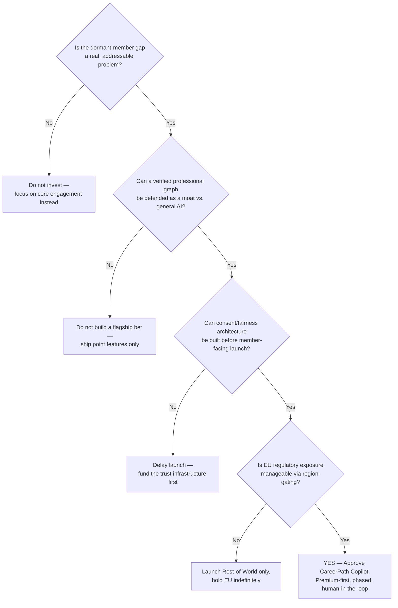

**Outcome interpretation:**
- **N1 (dormant gap isn't real):** Redirect investment into core feed/engagement improvements — this document's research suggests this branch is unlikely given the ~75% non-MAU figure, but it's the honest first gate.
- **N2 (no defensible moat):** Even if the problem is real, without defensibility this becomes a feature any competitor copies in a quarter — don't make it the flagship, keep it a point feature.
- **N3 (trust infrastructure not ready):** This is the most likely reason to delay, not cancel — the recommendation explicitly treats consent/fairness architecture as a blocking gate (Decision Log #2, #13), not a nice-to-have.
- **N4 (EU exposure unmanageable):** Launch Rest-of-World and treat EU as a distinct, slower-moving track rather than blocking the entire initiative on the hardest jurisdiction.
- **Y (this document's actual recommendation):** All four gates pass with the mitigations already built into the design — hence the CEO One-Page recommendation to approve.

---


## Cost Benefit Analysis

`ASSUMPTION (Reasonable Product Assumption)` — precise dollar figures are not disclosed publicly for a hypothetical initiative; the structure below reflects realistic categories and relative scale for a multi-quarter initiative at a company of LinkedIn's size, not actual budget figures.

| Category | Estimated Relative Investment | Notes |
|---|---|---|
| **Engineering** | High | Core orchestration layer, LLM integration, consent engine are net-new systems |
| **Design** | Medium | New interaction patterns (digest, approval flows) require dedicated UX research |
| **QA** | Medium-High | Bias/fairness testing is a novel, ongoing QA discipline, not a one-time gate |
| **Infra (Azure/LLM compute)** | Medium-High, scaling with adoption | Mitigated by Microsoft's internal Azure relationship vs. market-rate API costs |
| **PM/Program Management** | Medium | Cross-functional coordination across Profile, Jobs, Learning, Legal, and Trust & Safety teams |
| **ROI (Expected)** | Positive over 18–24 months | Primary driver: Premium conversion lift + reduced dormant-member churn; secondary: improved Talent Solutions retention from higher-quality applications |

---

## 30-60-90 Day Execution Plan

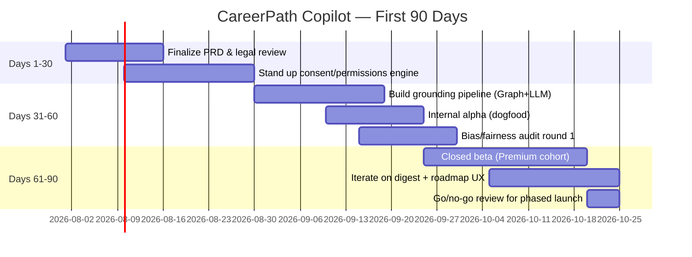

---

## 1 Year Roadmap

| Quarter | Milestone |
|---|---|
| **Q1** | PRD finalization, legal/compliance review, consent engine build, internal alpha |
| **Q2** | Closed Premium beta, bias audit rounds, V1 launch (non-EU markets) |
| **Q3** | EU rollout pending compliance sequencing; begin V2 scoping (free-tier expansion) |
| **Q4** | V2 launch (free-tier with caps), begin recruiter-side Copilot counterpart scoping for V3 |

---

## 3 Year Vision

By Year 3, CareerPath Copilot evolves from a Premium differentiator into the **default interaction layer** across LinkedIn: every profile edit, job search, and learning decision is informed by a continuously-updated, consent-governed AI agent. The recruiter-side counterpart matures into a bias-audited standard tool embedded in Talent Solutions. Deeper Microsoft ecosystem integration (Outlook, Teams, Copilot) extends career nudges beyond LinkedIn's own surfaces, reinforcing Microsoft's broader "agentic web" strategy referenced by Roslansky in the April 2026 leadership announcement — positioning LinkedIn not as a social network with AI features bolted on, but as the professional-identity backbone for Microsoft's enterprise AI agent ecosystem.

---

## Executive Memo

**TO:** Daniel Shapero, CEO, LinkedIn
**FROM:** Product Strategy
**RE:** Recommendation to Build CareerPath Copilot as LinkedIn's Flagship AI Initiative
**DATE:** July 5, 2026

**Current Situation:** LinkedIn is financially strong — revenue crossed $5B in a single quarter for the first time last quarter, with growth accelerating rather than decelerating. But structurally, LinkedIn's product experience remains a feed, a jobs board, and an inbox, while roughly three-quarters of our 1.3B+ registered members are not monthly-active. Meanwhile, general-purpose AI assistants are becoming default starting points for career advice — advice given without access to our data, but increasingly convenient enough that members may not come to LinkedIn first.

**Top Problems:** (1) The dormant-member gap represents massive unrealized engagement and monetization potential. (2) Application-process anxiety is our most cited member pain point and currently unaddressed by any product surface. (3) We risk disintermediation — becoming a backend data source for someone else's AI agent rather than the primary surface professionals use.

**Top Opportunities:** An agentic AI layer — CareerPath Copilot — that proactively manages a member's career trajectory using our uniquely verified graph, which no general-purpose AI assistant can replicate.

**Recommendation:** Approve CareerPath Copilot as a flagship initiative, launched first to Premium subscribers to protect subscription revenue and control risk, with a phased 12-month path to free-tier availability.

**Investment Required:** High engineering investment (net-new consent/orchestration architecture), moderate design investment, and a new ongoing QA discipline around bias/fairness auditing — detailed directionally in the Cost Benefit Analysis above.

**Expected ROI:** Positive within 18–24 months, driven by Premium conversion lift, reduced dormant-member churn, and improved Talent Solutions application quality — compounding on top of already-strong core business momentum.

**Risks:** Regulatory exposure (compounded by our active, unresolved GDPR matter in the EU), bias/fairness failure modes in AI-driven matching, and the risk that AI-assisted content further erodes feed authenticity if not carefully labeled and governed.

**Decision Required:** Approval to proceed to PRD finalization and legal/compliance review within 30 days, with a Premium-cohort beta target within two quarters.

---

## PM Interview Questions (30)

1. How would you define LinkedIn's North Star metric, and why?
2. LinkedIn has 1.3B+ members but a much smaller active user base — how would you approach that gap?
3. How would you prioritize between growing Talent Solutions vs. Premium Subscriptions revenue?
4. Design a feature to reduce "application black hole" anxiety for job seekers.
5. How would you detect and mitigate bias in an AI-powered recruiter shortlisting tool?
6. What metrics would you use to know if the LinkedIn feed algorithm is over-optimized for engagement at the expense of usefulness?
7. How would you approach LinkedIn's EU regulatory challenges when designing a new AI feature?
8. Walk me through how you'd design an experiment to test a new job-matching algorithm.
9. How should LinkedIn balance recruiter needs against job-seeker needs, given they're on opposite sides of the same marketplace?
10. What would you do to increase LinkedIn Learning course completion rates?
11. How would you decide whether an AI feature should be autonomous or require human approval?
12. Design a metric system to catch AI-generated spam content before it damages feed trust.
13. How would you think about LinkedIn's competitive threat from general-purpose AI assistants like ChatGPT?
14. What trade-offs would you consider before reducing feed engagement in favor of "usefulness"?
15. How would you structure a go-to-market plan for a new agentic AI feature aimed at Premium subscribers?
16. What's your approach to measuring the success of a two-sided marketplace feature?
17. How would you design LinkedIn's response to skills-based hiring trends?
18. What would a "failure dashboard" look like for a new AI career feature?
19. How do you think about cannibalization risk when launching an AI feature that reduces time-on-app?
20. Design a system for verifying skills claimed on a LinkedIn profile.
21. How would you approach international rollout sequencing for an AI feature given varying data regulations?
22. What's the right balance between recruiter automation and job-seeker trust?
23. How would you evaluate whether LinkedIn should build vs. partner for AI capabilities?
24. Design an onboarding flow for a new agentic AI assistant that requires member trust to be built incrementally.
25. How would you handle a scenario where an AI feature shows early signs of demographic bias post-launch?
26. What would you prioritize in year one of owning LinkedIn's AI Career Companion strategy?
27. How would you measure whether LinkedIn's Premium subscription tiers are priced correctly?
28. Design a retention strategy for the ~75% of LinkedIn members who are not monthly active.
29. How should LinkedIn think about its role in a labor market being reshaped by AI?
30. If you had to cut 50% of your roadmap for the AI Career Companion initiative, what would you keep and why?

---

## Key Learnings

1. **Scale doesn't equal engagement.** LinkedIn's biggest strategic vulnerability isn't competitive share — it's the gap between 1.3B registered members and a far smaller active base. Growth strategy at this scale is about reactivation, not acquisition.
2. **Diversified revenue is a genuine strength, not just a talking point.** Four distinct revenue lines (Talent, Marketing, Premium, Sales/Learning) give LinkedIn resilience that single-revenue-stream social platforms don't have.
3. **The most dangerous competitor isn't a competitor — it's a substitute interface.** General-purpose AI assistants threaten LinkedIn not by building a better feed, but by becoming the default place people go for career advice, bypassing LinkedIn's surface entirely.
4. **Regulatory reality must be a first-class design constraint, not an afterthought.** The active, unresolved GDPR enforcement matter isn't a footnote — it directly shapes how and where any new AI feature can launch.
5. **RICE scores don't capture everything.** The highest-RICE initiative in this document (application status transparency) is not the recommended flagship — because strategic defensibility against disintermediation matters more than a slightly higher near-term score.

---

## Reflection

Working through this teardown reinforced something I didn't fully appreciate before starting: LinkedIn's core challenge is not a product problem in the traditional sense — the feed works, the jobs board works, the messaging works. It's a **positioning problem**. LinkedIn built its moat as a network for professionals to be *found* and to *browse*. The next decade will reward whoever builds the system that professionals trust to *act* on their behalf. That's a much harder problem than shipping a chatbot, because it requires earning trust incrementally, building consent architecture most companies skip, and resisting the temptation to automate everything at once. As someone building AAROH and RupeeRadar — both of which sit in that same "AI agent acting on a user's behalf" design space — this case study sharpened my own thinking about why human-in-the-loop design isn't a compromise, it's the actual product discipline.

---

## Product Glossary

*100 PM and industry terms used throughout this document.*

1. **AARRR (Pirate Metrics)** — Acquisition, Activation, Retention, Referral, Revenue framework.
2. **Activation** — The point a new user experiences a product's core value for the first time.
3. **Agentic AI** — AI systems that take actions on a user's behalf, not just generate content or suggestions.
4. **ARR (Annual Recurring Revenue)** — Yearly value of recurring subscription revenue.
5. **ARPU (Average Revenue Per User)** — Total revenue divided by number of users.
6. **ATS (Applicant Tracking System)** — Software recruiters use to manage job applications.
7. **Autonomous Action** — A system-initiated action taken without per-instance human approval.
8. **B2B2C** — Business model selling to businesses who serve consumers (e.g., recruiters and job seekers).
9. **BCG Matrix** — Framework classifying products as Stars, Cash Cows, Question Marks, or Dogs.
10. **Bias (Algorithmic)** — Systematic unfairness in a model's outputs across groups.
11. **Blast Radius** — The scope of impact if a system or feature fails.
12. **Bug Bash** — A focused session where a team hunts for product defects before launch.
13. **Cannibalization** — When a new feature/product reduces usage or revenue of an existing one.
14. **Chasm (Crossing the Chasm)** — The gap between early adopters and the mainstream market.
15. **Churn** — The rate at which customers stop using a product or service.
16. **Cohort Analysis** — Comparing groups of users grouped by shared starting characteristics (e.g., signup week).
17. **Consent Architecture** — The system governing what a user has authorized an AI/product to do.
18. **Conversion Rate** — The percentage of users completing a desired action.
19. **CSAT (Customer Satisfaction Score)** — A direct measure of user satisfaction, usually via survey.
20. **Dark Launch** — Releasing a feature to production without exposing it to users, for testing.
21. **Data Minimization** — Collecting only the data strictly necessary for a purpose.
22. **Dependency** — A prerequisite condition, system, or team another workstream relies on.
23. **Disintermediation** — A middleman (e.g., LinkedIn) being bypassed by direct alternatives (e.g., general AI assistants).
24. **DAU (Daily Active Users)** — Number of unique users active in a day.
25. **Disparate Impact** — When a policy/algorithm disproportionately affects a protected group, even without intent.
26. **Edge Case** — An unusual or extreme scenario a system must still handle correctly.
27. **Engagement Bait** — Content designed to maximize interaction rather than provide genuine value.
28. **Fairness Monitor** — A system that audits AI outputs for bias before/after they reach users.
29. **Feature Flag** — A toggle that enables/disables a feature without a new code deployment.
30. **Fit (Product-Market Fit)** — Evidence that a product satisfies strong market demand.
31. **Flywheel** — A self-reinforcing growth loop where each cycle makes the next one easier.
32. **Funnel** — The sequential set of steps users pass through toward a goal (e.g., signup to purchase).
33. **GA (General Availability)** — When a product/feature is released to all eligible users.
34. **GDPR** — EU General Data Protection Regulation, governing data privacy.
35. **Golden Signals** — Latency, traffic, errors, and saturation — core system health metrics.
36. **Graph (Social/Professional Graph)** — The network structure of connections between users.
37. **Growth Loop** — A repeatable mechanism where product usage drives further growth.
38. **HEART Framework** — Happiness, Engagement, Adoption, Retention, Task success — a UX metrics framework.
39. **Hallucination** — When an AI model generates confident but false or fabricated information.
40. **Human-in-the-Loop** — A design pattern requiring human review/approval before an AI action executes.
41. **Innovation Curve** — The adoption curve from Innovators through Laggards.
42. **JTBD (Jobs to Be Done)** — Framework focused on the underlying "job" a customer hires a product to do.
43. **KPI (Key Performance Indicator)** — A measurable value showing progress toward a goal.
44. **Latency** — The time delay between a request and its response.
45. **Lifecycle (Product Lifecycle)** — Stages a product moves through: introduction, growth, maturity, decline.
46. **LLM (Large Language Model)** — A machine learning model trained on large text corpora to generate/understand language.
47. **MAU (Monthly Active Users)** — Number of unique users active in a month.
48. **Marketplace (Two-Sided)** — A platform connecting two distinct user groups (e.g., job seekers and recruiters).
49. **Maturity Stage** — The phase of a product's lifecycle where growth has slowed and the market is saturated.
50. **MVP (Minimum Viable Product)** — The smallest version of a product that delivers real value and enables learning.
51. **Network Effect** — When a product becomes more valuable as more people use it.
52. **North Star Metric** — The single metric best capturing the core value a product delivers.
53. **NPS (Net Promoter Score)** — A measure of customer loyalty based on likelihood to recommend.
54. **OKR (Objectives and Key Results)** — A goal-setting framework pairing qualitative objectives with measurable results.
55. **Onboarding** — The process of guiding a new user to their first value moment.
56. **Opportunity Solution Tree** — A framework mapping outcomes to opportunities to solutions to experiments.
57. **Orchestration (Service Orchestration)** — Coordinating multiple services/steps to complete a larger workflow.
58. **OWASP** — Open Web Application Security Project; publishes the "Top 10" common security risks.
59. **Persona** — A fictional but research-grounded representation of a user segment.
60. **Porter's Five Forces** — A framework analyzing competitive intensity via five market forces.
61. **Pre-Mortem** — Imagining a project has failed in advance, to surface risks proactively.
62. **Post-Mortem** — A structured, blameless review of what happened after an incident or failure.
63. **Premium (Subscription Tier)** — LinkedIn's paid membership tier(s) offering enhanced features.
64. **Prioritization Framework** — A structured method (e.g., RICE) for ranking what to build next.
65. **Product-Led Growth (PLG)** — A go-to-market motion where the product itself drives acquisition/expansion.
66. **PRD (Product Requirements Document)** — A document specifying what a feature should do and why.
67. **Rate Limiting** — Restricting the number of requests a client can make in a given period.
68. **Recommendation Engine** — A system that ranks/suggests content or actions personalized to a user.
69. **Regression (Model/Feature)** — A decline in a system's performance after a change.
70. **Retention** — The rate at which users continue using a product over time.
71. **RICE Score** — Reach, Impact, Confidence, Effort — a feature-prioritization scoring framework.
72. **ROI (Return on Investment)** — The financial return relative to the cost of an investment.
73. **Root Cause Analysis** — Investigating the underlying cause of a problem, not just its symptoms.
74. **Runbook** — A documented procedure for handling a specific operational scenario.
75. **Saga Pattern** — A workflow-orchestration pattern for managing multi-step distributed transactions reliably.
76. **Sales Navigator** — LinkedIn's premium sales-intelligence product for sales professionals.
77. **Scalability** — A system's ability to handle increased load without degrading performance.
78. **Segmentation** — Dividing users into distinct groups based on shared characteristics or behavior.
79. **SLA (Service Level Agreement)** — A commitment to a specific level of service (e.g., response time).
80. **Skill Graph** — A structured representation of skills and their relationships/adjacencies.
81. **Star (BCG)** — A high-growth, high-market-share business unit in the BCG Matrix.
82. **Stakeholder** — Any party with an interest in or influence over a product decision.
83. **Sunk Cost** — Past investment that should not influence future decisions, though often does.
84. **SWOT** — Strengths, Weaknesses, Opportunities, Threats — a strategic analysis framework.
85. **TAM/SAM/SOM** — Total/Serviceable/Serviceable-Obtainable Market sizing framework.
86. **Technical Debt** — Implied cost of future rework from choosing a quick, imperfect solution now.
87. **Time-to-Value** — How long it takes a new user to experience meaningful product value.
88. **Trust & Safety** — The organizational function responsible for platform integrity, abuse prevention, and user trust.
89. **Undo (Action Reversal)** — The ability to reverse a previously completed system action.
90. **Unit Economics** — The direct revenues and costs associated with a single unit (e.g., one user or transaction).
91. **User Journey** — The end-to-end path a user takes to accomplish a goal within a product.
92. **Value Proposition** — The core benefit a product promises to deliver to its users.
93. **Vanity Metric** — A metric that looks impressive but doesn't correlate with real business value.
94. **Verified Skill** — A skill claim backed by an assessment or credential rather than self-report alone.
95. **W1/W4/W12 Retention** — Retention measured at 1 week, 4 weeks, and 12 weeks after a starting event.
96. **Waterfall (vs. Agile)** — A sequential, phase-gated approach to product development.
97. **Weekly Active Career Progress** — This document's proposed North Star metric for LinkedIn.
98. **WCAG** — Web Content Accessibility Guidelines, the standard for digital accessibility.
99. **Wireframe** — A low-fidelity visual blueprint of a screen's layout and structure.
100. **Zero-Party Data** — Data a user intentionally and proactively shares (e.g., stated career goals), as distinct from inferred behavioral data.

---

## Appendix

### Research Notes
This document treats LinkedIn's own MAU disclosure gap as a first-class research constraint, not a footnote: because LinkedIn does not file a standalone 10-K, member-count and MAU figures are triangulated across Microsoft's 8-K filings, LinkedIn's newsroom statements, and third-party estimators (Business of Apps, Hootsuite, DemandSage). Where these disagreed by a meaningful margin, the range is presented rather than a single false-precision number.

### Calculations
- **MAU/Member ratio (~25%):** derived by dividing the midpoint of the ~300–310M MAU estimate range by the 1.3B+ registered-member figure. Flagged as `ASSUMPTION (Reasonable Product Assumption)` since LinkedIn does not officially confirm MAU.
- **Annualized run-rate (>$20B):** derived by multiplying the latest disclosed quarterly revenue (>$5B) by 4, a standard but simplifying convention that does not account for seasonality.

### Assumptions
Every `ASSUMPTION (Reasonable Product Assumption)` tag throughout this document marks a figure that could not be traced to a specific public source and was instead estimated using comparable-company benchmarks or directional industry norms — never fabricated to fill a gap, per the Integrity Note at the top of this document.

### Frameworks Used
RICE, JTBD, AARRR, HEART, SWOT, Porter's Five Forces, BCG Matrix, Business Model Canvas, Opportunity Solution Tree, 5 Whys.

### Sources
See the full [References](#references) section for primary and secondary sources.

### Acronyms
See the [Product Glossary](#product-glossary) for full definitions of every acronym used in this document (ARR, ATS, BCG, CSAT, DAU, GDPR, HEART, JTBD, KPI, LLM, MAU, MVP, NPS, OKR, OWASP, PRD, RICE, ROI, SLA, SWOT, TAM/SAM/SOM, WCAG, and others).

---

## If I Were the PM: My First 90 Days as LinkedIn Product Manager

*Assuming I owned CareerPath Copilot from approval onward.*

### Week 1
- 1:1s with Engineering, Design, Legal, and Trust & Safety leads to pressure-test the Decision Log and surface any objections not yet captured.
- Audit existing research for gaps — specifically whether dormant-member and free-tier voices are represented, not just Premium power users.
- Confirm the consent-architecture spec with Security before any UI work begins.

### Week 2
- Finalize the Fairness Monitor's v1 rule set with Legal and Trust & Safety — treated as a blocking dependency, not a parallel track.
- Kick off recruitment for the 500–1,000-member closed alpha cohort, deliberately including passive career-monitors, not just active job seekers.
- Stand up the Executive Dashboard (five metrics only) so leadership has visibility from day one, not just at the first monthly review.

### Month 1
- Ship the onboarding and goal-setting flow to the closed alpha; instrument all P0 events from the Event Tracking Plan before any member sees the feature.
- Run the first fairness audit on the (still-internal) recruiter shortlist model using historical data, before it ever ranks a real candidate.
- Hold the first Stakeholder Communication touchpoints per the plan — CEO memo, Engineering sprint review, Legal check-in.

### Month 2
- Expand to open Premium beta if alpha metrics clear the bar (onboarding completion, fairness-flag rate, autonomous-action error rate).
- Run the first pre-mortem workshop with the full squad before the beta expansion, using the 20 failure modes in this document as a starting list, not a final one.
- Begin Sales and Support enablement training ahead of any recruiter-facing rollout.

### Month 3
- Deliver the first Monthly and Quarterly Review using the Product Review Document template — including what didn't work, not just what did.
- Decide, with Legal, on the EU rollout posture based on real regulatory-review progress rather than the original assumption.
- Present an updated CEO One-Page to leadership with actuals in place of projections, and a clear go/no-go recommendation for continued investment.

### Success Metrics for the First 90 Days
Onboarding-completion rate, fairness-flag rate (target: zero unresolved), autonomous-action error rate, and qualitative interview feedback from the alpha cohort — deliberately not Weekly Active Career Progress yet, since that metric needs a larger, more mature cohort to be statistically meaningful.

### Stakeholder Meetings
Weekly Engineering syncs, bi-weekly Design reviews, monthly CEO memo, ongoing Legal check-ins, quarterly Sales/Support enablement sessions — per the Stakeholder Communication Plan.

### Product Reviews
First internal Monthly Review at the end of Month 1 (even with alpha-only data); first full Quarterly Review at the end of Month 3.

### User Interviews
Minimum 15 structured interviews across the alpha cohort by end of Month 2, explicitly sampling across the intent-based segmentation (active seekers, passive monitors, recruiters) — not just the loudest or most enthusiastic users.

### Roadmap
Quick wins first (application status transparency, resume AI generation) to build trust and momentum while the harder infrastructure (consent architecture, Fairness Monitor) is still being built — never the reverse.

### Quick Wins
Application-status transparency surface, resume AI generation, interview-prep AI dialogue — all lower-risk, faster-to-ship, and immediately useful even before the full agentic layer exists.

### Long-Term Bets
The full agentic CareerPath Copilot experience, AI-assisted recruiter shortlisting at scale, and eventually a free-tier rollout that closes the dormant-member gap — each gated on trust infrastructure proving itself first, exactly as this document recommends.

---

## References

### Primary Sources
- Microsoft Corp. Form 8-K, Q4 FY2025 Earnings Release (July 30, 2025) — SEC EDGAR.
- Microsoft Corp. Form 8-K, Q3 FY2025 Earnings Release (April 30, 2025) — SEC EDGAR.
- Microsoft Corp. Form 8-K, Q2 FY2025 Earnings Release (January 29, 2025) — SEC EDGAR.
- GeekWire, "LinkedIn CEO change: Daniel Shapero takes the helm as Microsoft broadens leadership team" (April 22, 2026).
- CNBC, "Microsoft's LinkedIn names longtime exec Dan Shapero its new CEO" (April 22, 2026).

### Secondary Sources
- Business of Apps, "LinkedIn Usage and Revenue Statistics (2026)."
- Hootsuite, "51 LinkedIn statistics to shape your social strategy" (2026).
- DemandSage, "47 LinkedIn Statistics 2026."
- Staffing Industry Analysts, "LinkedIn revenue rose 11% to $5.08B in fiscal Q2" (January 29, 2026).
- AIM Group, "Microsoft Q2 FY2026: Marketing Solutions drives LinkedIn revenue growth" (February 2, 2026).
- SQ Magazine, "LinkedIn 2026 Workforce: 16,625 Employees Now Power a 1.3 Billion-Member Platform."

### Research Notes
- Figures across third-party sources (member count, MAU, country breakdowns) show meaningful variance because LinkedIn does not publish a standalone 10-K or consistently disclose MAU. Where sources disagreed, this document cited the range and flagged which figures are official Microsoft disclosures versus third-party estimates.
- No figure in this document was invented to fill a gap; unavailable data is explicitly marked `ASSUMPTION (Reasonable Product Assumption)`.

---

<p align="center"><i>90 Days Product Management Challenge — Day 09 of 90 — LinkedIn Case Study — Built and maintained by Gaurav Singh</i></p>
