<div align="center">

# 🗺️ Google Maps — Product Management Case Study

### Day 10 / 90 — Product Management Case Study Challenge

**A deep-dive teardown of one of the world's most-used products, written as a portfolio-quality PM case study.**


</div>

> ⚠️ **Disclaimer:** This is an independent, unofficial case study created for learning and portfolio purposes. It is not affiliated with, endorsed by, or sourced from confidential Google materials.
>
> **Note:** This case study combines publicly available information with original product analysis. Any proposed metrics, forecasts, prioritization scores, feature concepts, and roadmap recommendations are illustrative and intended for educational purposes. They should not be interpreted as Google's internal strategy or confidential information.

---

## 2. Repository Metadata

| Field | Value |
|---|---|
| **Repository** | `Day-10-Google-Maps` |
| **Challenge** | 90-Day Product Management Case Study Challenge (Day 10/90) |
| **Product Analyzed** | Google Maps |
| **Author** | Gaurav Singh |
| **Format** | GitHub Markdown, Mermaid diagrams |
| **Audience** | Hiring managers, APM/PM recruiters |
| **Last Updated** | July 2026 |
| **License** | MIT (see [§63](#63-license)) |

---

## 3. Badges


---

## 4. Table of Contents

1. [Cover Page](#google-maps--product-management-case-study)
2. [Repository Metadata](#2-repository-metadata)
3. [Badges](#3-badges)
4. [Table of Contents](#4-table-of-contents)
5. [Executive Summary](#5-executive-summary)
6. [Product Overview](#6-product-overview)
7. [Company Background](#7-company-background)
8. [Product Evolution Timeline](#8-product-evolution-timeline)
9. [Vision & Mission](#9-vision--mission)
10. [Problem Statement](#10-problem-statement)
11. [Market Research](#11-market-research)
12. [Industry Analysis](#12-industry-analysis)
13. [TAM / SAM / SOM](#13-tam--sam--som)
14. [Competitor Analysis](#14-competitor-analysis)
15. [SWOT Analysis](#15-swot-analysis)
16. [Porter's Five Forces](#16-porters-five-forces)
17. [Business Model Canvas](#17-business-model-canvas)
18. [Revenue Model](#18-revenue-model)
19. [Target Users](#19-target-users)
20. [User Personas](#20-user-personas)
21. [Jobs To Be Done](#21-jobs-to-be-done)
22. [User Journey Map](#22-user-journey-map)
23. [User Flow](#23-user-flow)
24. [Information Architecture](#24-information-architecture)
25. [UX Audit](#25-ux-audit)
26. [UI Audit](#26-ui-audit)
27. [Accessibility Audit](#27-accessibility-audit)
28. [Feature Breakdown](#28-feature-breakdown)
29. [AI Capabilities](#29-ai-capabilities)
30. [Product Metrics](#30-product-metrics)
31. [North Star Metric](#31-north-star-metric)
32. [Product Analytics](#32-product-analytics)
33. [AARRR Funnel](#33-aarrr-funnel)
34. [HEART Framework](#34-heart-framework)
35. [Growth Strategy](#35-growth-strategy)
36. [Growth Loops](#36-growth-loops)
37. [Network Effects](#37-network-effects)
38. [Product Strategy](#38-product-strategy)
39. [Monetization Strategy](#39-monetization-strategy)
40. [Trust & Safety](#40-trust--safety)
41. [Technical Architecture](#41-technical-architecture)
42. [Data Flow](#42-data-flow)
43. [API Ecosystem](#43-api-ecosystem)
44. [Privacy & Security](#44-privacy--security)
45. [Product Pain Points](#45-product-pain-points)
46. [Opportunity Mapping](#46-opportunity-mapping)
47. [RICE Prioritization](#47-rice-prioritization)
48. [MoSCoW Prioritization](#48-moscow-prioritization)
49. [Kano Analysis](#49-kano-analysis)
50. [Feature Proposal](#50-feature-proposal)
51. [Product Requirements Document (PRD)](#51-product-requirements-document-prd)
52. [Wireframe Descriptions](#52-wireframe-descriptions)
53. [Rollout Plan](#53-rollout-plan)
54. [A/B Testing Plan](#54-ab-testing-plan)
55. [KPI Dashboard](#55-kpi-dashboard)
56. [Product Roadmap](#56-product-roadmap)
57. [Risks & Mitigation](#57-risks--mitigation)
58. [Future Vision (2030)](#58-future-vision-2030)
59. [PM Lessons Learned](#59-pm-lessons-learned)
60. [Interview Questions & Answers](#60-interview-questions--answers)
61. [References](#61-references)
62. [About the Author](#62-about-the-author)
63. [License](#63-license)
64. [Final Self-Review Checklist](#64-final-self-review-checklist)

---

## 5. Executive Summary

> **TL;DR:** Google Maps evolved from a 2005 web mapping tool into the default global geospatial layer for consumer navigation, local discovery, and increasingly, commerce and AI-assisted planning. Its core PM challenge today is no longer "can we map the world" — it's **monetizing trust and attention without degrading the utility that earned that trust**, while fending off vertical-specific challengers (Waze socially, Apple Maps on iOS defaults, TikTok/Instagram on discovery).

**Key findings of this case study:**

| Theme | Finding |
|---|---|
| **Market position** | Category leader among navigation and local-discovery apps globally, though Google no longer publicly discloses monthly active user figures |
| **Core tension** | Balancing ad monetization (Local/Search ads) against a UX built on neutrality and trust |
| **Biggest threat** | Not another map — it's discovery shifting to TikTok/Instagram, and ride/delivery apps owning the "last mile" experience |
| **Biggest opportunity** | AI-native trip planning and agentic "do it for me" navigation + commerce (book, pay, arrive) |
| **This case study proposes** | A **Feature Proposal** (§50) for an AI Itinerary Copilot embedded in Maps, with full PRD, rollout, and metrics plan |

**Recommendation at a glance:** Ship an opt-in **"Maps Copilot"** that converts passive place-browsing into bookable, multi-stop itineraries — deepening engagement (AARRR: Retention) and creating a new ad/commission surface (Monetization) without disrupting core navigation trust.

---

## 6. Product Overview

**Objective:** Establish what Google Maps is, who uses it, and how it fits into Alphabet's portfolio.

**Analysis:**
Google Maps is a multi-platform (Web, Android, iOS, Wear OS, Android Auto/CarPlay, Embedded/Automotive OS) mapping and local-discovery product offering turn-by-turn navigation, transit information, place search/reviews, business listings, real-time traffic, and — increasingly — AI-assisted trip planning (via Gemini integration) and immersive view (photorealistic 3D).

| Attribute | Detail |
|---|---|
| Launched | February 2005 |
| Platforms | Web, Android, iOS, Wear OS, Android Auto, CarPlay, embedded automotive |
| Core use cases | Navigation, local search, transit, delivery/ride ETAs, business discovery |
| Monetization | Local search ads, Google Ads placements, Google Maps Platform (API) revenue |
| Parent org | Alphabet / Google Geo team |

**PM Insight:** Maps sits at a rare intersection — it's simultaneously a **consumer habit product** (daily navigation) and a **B2B infrastructure product** (Maps Platform APIs power Uber, DoorDash, countless apps). Roadmap decisions must satisfy both without conflict.

**Business Impact:** Google Maps Platform is an important component of Google's developer ecosystem and generates revenue through usage-based APIs, although Alphabet does not disclose Maps Platform revenue separately in public financial reporting. It monetizes much of the same underlying map data that consumer Maps uses for free.

**User Impact:** Free, ad-light core navigation experience sustains daily habitual use — the foundation for all downstream monetization.

**Recommendation:** Continue subsidizing the free consumer experience with B2B/API and local-ads revenue; do not introduce navigation-blocking ads (protects trust, the product's core moat).

**Metrics:** DAU/MAU stickiness ratio and session frequency are the most relevant health metrics here; Google does not publicly disclose current figures for Google Maps specifically.

---

## 7. Company Background

**Objective:** Frame Alphabet/Google's strategic context for Maps investment.

**Analysis:** Alphabet's business model is overwhelmingly advertising-driven. Maps supports this in two ways: (1) as a **local ads inventory surface** competing for the same advertiser budgets as Search, and (2) as a **platform business** (Google Maps Platform) charging per-API-call for Geocoding, Places, Routes, and related APIs.

**PM Insight:** Because Maps' data (business listings, road networks, traffic) is expensive to build and maintain, Google's scale is a genuine moat — few companies can replicate global map accuracy, making this a rare "hard tech" advantage inside a software company.

**Business Impact:** Cross-subsidization from Search/Ads funds Maps' data-collection costs (Street View fleets, satellite imagery licensing, user-contributed edits).

**User Impact:** Users get enterprise-grade mapping for free, funded indirectly by advertisers.

**Recommendation:** Maintain the ads-fund-free-product model; resist paywalling core navigation, which would fracture the user base toward Apple/Waze.

---

## 8. Product Evolution Timeline

**Objective:** Show how Maps has expanded scope over two decades.

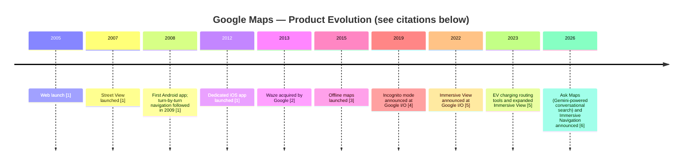

**Sources:** [1] Google Blog, ["Google Maps' biggest moments over the past 15 years"](https://blog.google/products-and-platforms/products/maps/look-back-15-years-mapping-world/) · [2] Google/TechCrunch coverage of the June 2013 Waze acquisition announcement · [3] Google Blog / contemporary coverage of the November 2015 offline maps launch · [4] Google I/O 2019 keynote, Incognito Mode for Maps announcement · [5] Google Blog, [Google I/O 2022 Maps announcements](https://blog.google/products/maps/three-maps-updates-io-2022/) · [6] Google Blog, [Ask Maps and Immersive Navigation](https://blog.google/products-and-platforms/products/maps/ask-maps-immersive-navigation/) (March 2026)

> ⚠️ This timeline highlights a subset of major, publicly announced milestones and is not an exhaustive product history. Some intermediate feature launches (e.g., "For You" tab, eco-friendly routing) are omitted here for space but are referenced elsewhere in this document; the framing of "AI integration deepening over time" is directional rather than tied to a specific unannounced milestone.

**PM Insight:** Each expansion phase (navigation → local discovery → AI) tracks a broader shift in what "a map" even means — from cartography to a real-time model of the physical and social world.

**Business Impact:** Each new layer (Street View, Traffic, Reviews, EV charging) became a new data asset and, eventually, a new ad or API monetization surface.

**User Impact:** Users gained more reasons to open Maps beyond "get me from A to B" — increasing session frequency.

**Recommendation:** Treat AI/Gemini integration as the next platform shift, not a bolt-on feature — analogous to how Street View or Traffic became core, not peripheral.

---

## 9. Vision & Mission

**Objective:** Articulate (inferred, not officially quoted) product vision.

> **Inferred Mission:** *"Organize the world's geographic information and make it universally accessible and useful."* (An extension of Google's overall mission, applied to place and movement.)

**PM Insight:** Maps' vision has quietly shifted from "help you get somewhere" to "help you decide where to go and get you there," and now toward "do it for you" (AI agentic planning + booking).

**Business Impact:** Each vision expansion unlocks a new business model layer — Search ads → Local ads → Commerce/booking commissions.

**User Impact:** The product becomes more proactive and less purely reactive/query-based over time.

**Recommendation:** Any new feature should be evaluated against: *does this make Maps a better decision-making layer for "where," not just a routing engine?*

---

## 10. Problem Statement

**Objective:** Define the core problem this case study addresses.

> ⚠️ **Problem Statement:** As discovery increasingly happens on TikTok, Instagram, and AI chat assistants, and as delivery/ride apps own the transactional "last mile," Google Maps risks becoming a **commoditized utility** — used for routing but bypassed for discovery and decision-making, the higher-margin layers of the value chain.

**Evidence:**
- Younger users increasingly search "best restaurants near me" style queries via TikTok/Instagram rather than Maps *(directionally supported by widely reported Gen Z search-behavior shifts; treat as estimate, not Google-confirmed data)*.
- Ride-hailing and delivery apps (Uber, DoorDash) embed their own maps/ETAs, reducing the need to cross-reference Google Maps mid-transaction.

**User Impact:** Users may miss Maps' most useful discovery features simply because they never open the app for that job.

**Business Impact:** Lower share of the "discovery" moment means lower local-ads impression volume and weaker data signal for personalization.

**Recommendation:** Invest in AI-native, conversational discovery + itinerary planning (see §50 Feature Proposal) to reclaim the "where should I go" moment, not just the "how do I get there" moment.

**Success Metrics:** % of sessions that include a place-discovery action (search/browse) vs. navigation-only sessions; short-form content engagement within Maps (e.g., short video reviews).


---

## 11. Market Research

**Objective:** Size and characterize the digital mapping/local-discovery market.

| Dimension | Directional Characterization |
|---|---|
| Global reach | Navigation and local-discovery apps are used by a very large share of smartphone owners worldwide; Google Maps is widely recognized as one of the most widely used apps in this category |
| Regional competitive position | Google Maps is the leading navigation platform in many international markets, although market share varies significantly by region (e.g., Yandex leads in Russia, Baidu Maps/Amap lead in China, Apple Maps benefits from default placement on iOS) |
| Local/digital ad spend | A substantial and growing category of global digital advertising spend, per industry publications; Google does not disclose a Maps-specific figure |

> ⚠️ No precise, sourceable figures exist for the rows above at the product level. This table intentionally stays qualitative rather than presenting specific percentages or totals that cannot be attributed to a public source.

**PM Insight:** Regional fragmentation (Yandex, Baidu/Amap, Naver Maps, Apple Maps on iOS defaults) means "global market share" is a genuinely hard number to pin down — Maps' real competitive battles are fought market-by-market and platform-by-platform (iOS default bundling is a structural headwind).

**Business Impact:** Regions where Maps isn't the default (China, Russia, and iOS-default markets) represent a structurally capped addressable market without local partnerships or regulatory intervention.

**User Impact:** Users in unsupported/low-data regions get a degraded experience (less business listing density, less real-time traffic data).

**Recommendation:** Prioritize data-density investment (business listings, transit data) in emerging markets (India, Southeast Asia, Africa) where Maps can still win the "default" battle before local competitors entrench.

**Metrics:** Data completeness score by country (est.), transit coverage % by city.

---

## 12. Industry Analysis

**Objective:** Analyze macro trends shaping the mapping/geospatial industry.

| Trend | Implication for Maps |
|---|---|
| AI-native search (ChatGPT, Gemini, Perplexity) | Threatens Maps' role as the "ask about a place" interface |
| EV adoption | New feature surface (charging station routing) and new data partnerships (EV networks) |
| Autonomous vehicles | Maps data becomes B2B infrastructure for AV companies, not just consumer nav |
| Super-app consolidation (esp. in Asia) | Pressure to bundle ride/food/commerce inside Maps, or risk being routed around |
| Privacy regulation (GDPR, location-data laws) | Constrains ad targeting and location-history retention, raising compliance cost |

**PM Insight:** The single largest structural risk is **interface disintermediation** — if AI assistants become the default way people ask "where should I eat," Maps' UI becomes a backend data source rather than the destination app.

**Business Impact:** Disintermediation would shift Maps from a high-margin ads business to a lower-margin API/licensing business.

**User Impact:** Users may get answers "about" places without ever visiting Maps' rich review/photo ecosystem.

**Recommendation:** Embed Gemini-powered conversational answers *inside* Maps (already underway) rather than only powering external assistants — defend the destination, not just the data layer.

---

## 13. TAM / SAM / SOM

**Objective:** Frame market sizing for the AI-copilot feature proposed in §50.

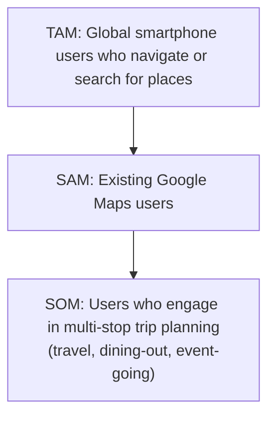

> ⚠️ Google does not publicly disclose granular usage-segment data (MAU, trip-planning segment size, etc.). This funnel is presented qualitatively — as a framework for reasoning about where the proposed feature fits — rather than with specific figures that cannot be sourced.

**PM Insight:** Even a modest slice of the trip-planning segment (SOM) likely represents a very large absolute user base at Google's scale — meaning a well-executed niche feature (AI itinerary planning) can still move business metrics meaningfully without needing to win over the entire user base.

**Business Impact:** Capturing even a low single-digit % of SOM into a monetizable booking flow could create a meaningful new revenue line.

**User Impact:** Reduces the multi-app "restaurant, then reviews, then reservation app, then Maps for directions" fragmentation into one flow.

**Recommendation:** Size the AI Copilot beta rollout against the SOM segment (trip planners), not the full user base — and set beta-phase adoption targets internally based on observed beta data rather than external market assumptions.

---

## 14. Competitor Analysis

**Objective:** Map the competitive landscape across navigation, discovery, and social layers.

| Competitor | Category | Strength | Weakness |
|---|---|---|---|
| **Apple Maps** | Navigation | iOS default, deep OS integration, improving data quality | Weaker business-listing depth, smaller review corpus |
| **Waze** (Google-owned) | Social navigation | Community-reported hazards, driver-first UX | Overlaps with Maps; cannibalization risk |
| **TikTok / Instagram** | Discovery | Visual, trend-driven discovery of places | No native navigation; discovery-only |
| **Yelp** | Local reviews | Deep review/rating ecosystem in US | Declining engagement, weak international presence |
| **Uber / DoorDash** | Transactional last-mile | Own the payment + ETA moment | No general-purpose mapping/discovery |
| **Baidu Maps / Amap** | Regional (China) | Dominant in China | No presence outside China |
| **Citymapper** | Transit-specific | Best-in-class transit UX in supported cities | Narrow city coverage, niche |

**PM Insight:** Maps' true competitive set is **fragmented by job-to-be-done**: it competes with Apple on navigation, TikTok on discovery, and Uber/DoorDash on transactional convenience — no single competitor threatens the whole product, but each chips at a slice.

**Business Impact:** Fragmented competition means Maps must defend multiple fronts simultaneously rather than out-executing one rival.

**User Impact:** Users increasingly assemble their own "stack" (TikTok to discover, Maps to navigate, Uber to arrive) rather than staying in one app.

**Recommendation:** Reduce app-switching friction by strengthening in-app discovery (short-form video reviews, richer AI answers) so Maps can be the "last app open," not just the "get there" app.

---

## 15. SWOT Analysis

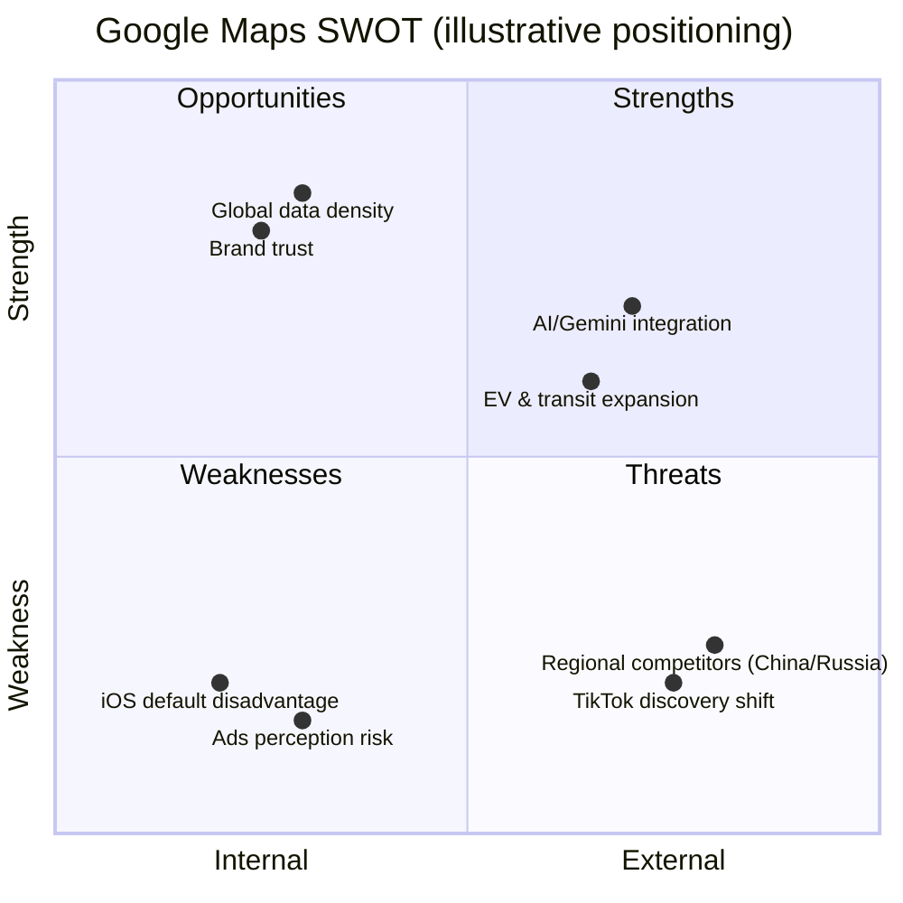

| Category | Points |
|---|---|
| **Strengths** | Global data density, brand trust, cross-platform reach, Street View/Immersive View differentiation |
| **Weaknesses** | Not default on iOS, ad-monetization tension with UX trust, review-quality/spam moderation at scale |
| **Opportunities** | Gemini-native conversational planning, EV routing, creator-driven local content, B2B Maps Platform growth |
| **Threats** | TikTok/IG discovery shift, AI-assistant disintermediation, regional competitors, privacy regulation |

**PM Insight:** Most weaknesses are structural (platform defaults, ad-trust tension) and can't be "fixed," only mitigated — the real leverage is in the Opportunities quadrant.

**Recommendation:** Prioritize roadmap bets in the Opportunities quadrant that also defend against the top Threat (AI disintermediation) — this is exactly the rationale for §50's AI Copilot proposal.

---

## 16. Porter's Five Forces

| Force | Intensity | Rationale |
|---|---|---|
| **Threat of new entrants** | Low | Map-building capital costs (imagery, fleets, licensing) are prohibitive for new entrants |
| **Bargaining power of suppliers** (map/imagery data, EV network partners) | Medium | Satellite/imagery providers have some leverage; user-generated data (Local Guides) reduces dependency |
| **Bargaining power of buyers** (end users) | High | Free product, zero switching cost to Apple Maps/Waze |
| **Threat of substitutes** (TikTok discovery, AI assistants, embedded ride-app maps) | High | Growing fastest of all five forces |
| **Competitive rivalry** | Medium-High | Fragmented by job-to-be-done (see §14) |

**PM Insight:** The two forces PM should worry about most — **buyer power** (zero switching cost) and **substitute threat** (AI/discovery shift) — both point to the same mitigation: deepen engagement depth (discovery + planning), not just navigation accuracy, since accuracy alone doesn't create lock-in.

**Recommendation:** Treat retention/engagement depth, not raw map quality, as the primary defensive moat going forward.

---

## 17. Business Model Canvas

| Block | Content |
|---|---|
| **Key Partners** | Imagery/satellite providers, EV charging networks, transit agencies, local businesses, Waze |
| **Key Activities** | Map data collection/verification, ML routing, ads serving, Local Guides moderation |
| **Key Resources** | Global map data, Street View imagery corpus, brand trust, Gemini AI models |
| **Value Propositions** | Free, accurate navigation; comprehensive local discovery; API infrastructure for developers |
| **Customer Relationships** | Self-serve consumer product; managed/API relationship for Maps Platform enterprise customers |
| **Channels** | Mobile OS pre-install/download, Android Auto/CarPlay, web, embedded automotive |
| **Customer Segments** | Consumers (navigation/discovery), local businesses (listings/ads), developers/enterprises (API) |
| **Cost Structure** | Data collection (Street View fleets, imagery licensing), infrastructure/compute, content moderation |
| **Revenue Streams** | Local search ads, display ads, Maps Platform API fees |

**PM Insight:** Maps runs three distinct business models simultaneously (free consumer ads-funded, B2B API-metered, and increasingly commerce-commission) — each requires different PM ownership and metrics, and conflating them in roadmap planning is a common failure mode.

**Recommendation:** Maintain clearly separated OKRs for Consumer Maps, Maps Platform (B2B), and any new Commerce initiative.

---

## 18. Revenue Model

| Stream | Mechanism | Est. Relative Scale |
|---|---|---|
| Local Search Ads | Sponsored pins, promoted listings in search/nearby results | Largest (bundled into Google's broader "Google advertising" segment; not broken out separately in Alphabet financials) |
| Google Maps Platform | Pay-per-call APIs (Geocoding, Places, Routes, Maps SDK) for third-party developers | Meaningful, disclosed as part of Google Cloud/Other Bets-adjacent reporting in past earnings commentary |
| Booking/Commerce (nascent) | Potential commission on reservations, deliveries booked via Maps | Currently minor/experimental |

> ⚠️ Alphabet does not break out Google Maps revenue as a standalone line item in its 10-K; all figures above are directional estimates based on public commentary and industry analysis, not confirmed financials.

**PM Insight:** Because Maps ad revenue is bundled into Alphabet's broader advertising segment, individual PMs must rely on proxy metrics (ad click-through on Local, API call volume) rather than clean top-line revenue attribution — a real measurement challenge for prioritization.

**Recommendation:** Build internal proxy-metric dashboards mapping feature launches to Local ad engagement and API call growth, since direct revenue attribution isn't externally available.

---

## 19. Target Users

| Segment | Description | Primary Job-to-be-Done |
|---|---|---|
| **Daily Commuters** | Urban/suburban drivers, transit riders | Fastest/most reliable route, real-time delay info |
| **Explorers/Travelers** | Tourists, weekend travelers | Discover places, plan multi-stop itineraries |
| **Local Diners/Shoppers** | Everyday local discovery | Find highly-rated nearby options quickly |
| **Business Owners** | SMBs managing listings | Accurate profile, reviews, discoverability |
| **Developers/Enterprises** | Companies embedding Maps | Reliable, well-documented APIs (Places, Routes) |

**PM Insight:** These five segments have partially conflicting needs — e.g., ad-supported discovery (helps Business Owners/monetization) can feel like clutter to Daily Commuters who just want a fast route — meaning the app's *default* experience must be use-case adaptive.

**Recommendation:** Continue contextual UI adaptation (e.g., minimal UI during active navigation, richer discovery UI when idle/searching).

---

## 20. User Personas

### Persona 1 — "Efficient Emma," the Daily Commuter
- **Age:** 34, Marketing Manager, drives 45 min to work
- **Goals:** Fastest route, real-time traffic/incident alerts
- **Frustrations:** Reroutes that don't account for known local shortcuts; ads cluttering search results
- **Quote (illustrative, not a real user):** *"I just want the app to get out of my way and get me there."*

### Persona 2 — "Wanderlust Wes," the Traveler
- **Age:** 27, plans 3–4 trips/year
- **Goals:** Discover authentic local spots, build a loosely-planned itinerary
- **Frustrations:** Juggling Maps, TikTok, and a notes app to plan a single day
- **Quote (illustrative):** *"I have 40 saved pins in a city and no idea what order to visit them in."*

### Persona 3 — "Small Business Sam," the Listing Owner
- **Age:** 45, owns a local café
- **Goals:** Accurate listing, positive reviews surfaced, discoverability in "near me" search
- **Frustrations:** Review spam/fake reviews, unclear ad ROI
- **Quote (illustrative):** *"I don't know if paying for a promoted pin is worth it or not."*

**PM Insight:** Wes's frustration (fragmented planning) is the direct evidence base for the AI Copilot proposal in §50 — it's a job Maps *almost* does but doesn't finish.

**Recommendation:** Design the Copilot around Persona 2 first (highest willingness-to-engage with a new AI feature), then extend to Emma (commute-context) once trust is established.


---

## 21. Jobs To Be Done

| Job Statement | Current Solution in Maps | Gap |
|---|---|---|
| "When I'm in an unfamiliar city, help me get from A to B without stress." | Turn-by-turn navigation | Well-served |
| "When I'm hungry/bored nearby, help me find something good quickly." | Nearby search + ratings | Well-served |
| "When I'm planning a multi-stop day/trip, help me sequence it logically." | Manual pin-saving, no auto-sequencing | **Underserved — core gap** |
| "When I want to book/reserve a place I found, let me do it without leaving the app." | Partial (some reservation links) | **Underserved** |
| "When I'm driving an EV, help me route around charging needs." | EV routing (recent) | Emerging, improving |

**PM Insight:** The two "Underserved" jobs are directly connected — sequencing and booking are two halves of the same "plan my day" job, and solving them together (not separately) is where the real product opportunity sits.

**Recommendation:** Frame the AI Copilot (§50) explicitly around these two JTBD gaps as its success criteria, not as a generic "add AI" feature.

---

## 22. User Journey Map

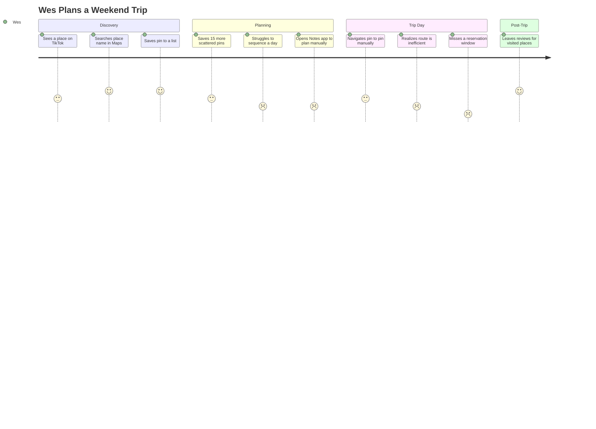

**PM Insight:** The emotional low point (score 1–2) clusters entirely in the **Planning** and **Trip Day** phases — precisely where an AI itinerary feature would intervene.

**Business Impact:** Fixing this low point increases session depth and potentially captures booking-commission revenue at the "reservation" moment.

**User Impact:** Removes the need for a separate planning tool (Notes app, spreadsheet), consolidating the job into Maps.

**Recommendation:** Design the Copilot to intervene exactly at "Saves 15 more scattered pins" — proactively offering to sequence them.

---

## 23. User Flow

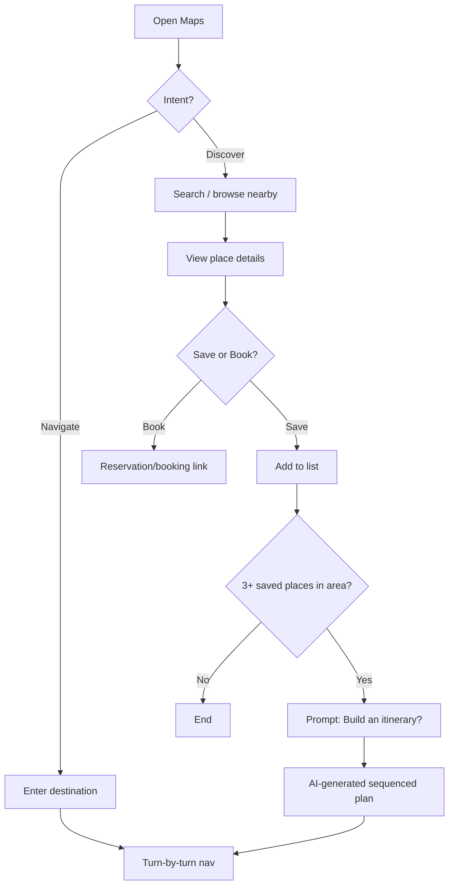

**PM Insight:** Node **K** ("Build an itinerary?") doesn't exist in Maps today — it's the single highest-leverage insertion point identified across this case study.

**Recommendation:** Prototype this exact trigger condition (3+ saved places in a geographic cluster) as the entry point for the AI Copilot.

---

## 24. Information Architecture

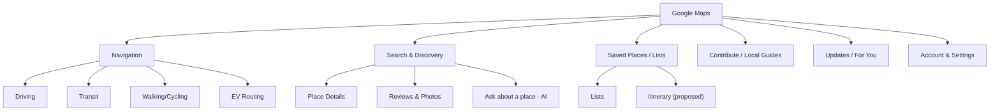

**PM Insight:** "Saved Places / Lists" is currently a flat, unsequenced structure — the IA has no native concept of "trip" or "itinerary," which structurally reinforces the JTBD gap identified in §21.

**Recommendation:** Introduce "Itinerary" as a first-class IA object alongside "Lists," not merely a feature bolted onto search.

---

## 25. UX Audit

| Area | Observation | Severity |
|---|---|---|
| Search-to-save flow | Smooth, low friction | ✅ Strong |
| Saved Lists → Trip Planning | No sequencing, no time/duration awareness | 🔴 High friction |
| Ads in local search | Sponsored pins visually similar to organic results | 🟡 Moderate — trust risk |
| Review reading | Long review lists, weak summarization until recent AI review-summary rollout | 🟡 Improving |
| Offline mode | Reliable, well-regarded | ✅ Strong |

**PM Insight:** The single largest UX debt is the Saved Lists → Trip Planning gap (also flagged in §21–24) — three independent analyses in this case study converge on the same root cause, a strong signal it's the right place to invest.

**Recommendation:** Prioritize this over incremental ads-UI tweaks, which risk trust for marginal revenue gain.

---

## 26. UI Audit

| Element | Observation |
|---|---|
| Map rendering | Clean, high information density without clutter; strong use of color/contrast for road hierarchy |
| Bottom sheet (place details) | Effective progressive disclosure pattern |
| Navigation mode UI | Minimalist, appropriately reduces distraction while driving |
| Discovery/"For You" tab | Card-based feed works but is visually similar to generic content feeds, low differentiation |
| Iconography | Consistent with Material Design; occasionally dense in transit-heavy cities |

**PM Insight:** The UI is generally best-in-class for information density management — the opportunity is less "fix the UI" and more "add missing IA/flow" (see §24, §25).

**Recommendation:** Any new AI Copilot UI should reuse the existing bottom-sheet progressive-disclosure pattern for consistency rather than introducing a new UI paradigm.

---

## 27. Accessibility Audit

| Area | Status | Notes |
|---|---|---|
| Screen reader support | Generally good on Android (TalkBack) and iOS (VoiceOver) | Ongoing refinement needed for complex map gestures |
| Color contrast | Meets WCAG AA in most UI chrome | Map color-coding (traffic layers) can be harder for colorblind users |
| Voice navigation | Strong — core to driving use case | N/A |
| Text scaling | Supported | Some bottom-sheet layouts can crowd at largest text sizes |

**PM Insight:** Accessibility is reasonably mature for a product this complex, but traffic-layer color coding (red/yellow/green) is a known colorblind-accessibility risk pattern common across mapping products.

**Recommendation:** Audit and consider pattern/texture redundancy (not just color) for traffic severity indicators.

---

## 28. Feature Breakdown

| Feature | Purpose | Maturity |
|---|---|---|
| Turn-by-turn Navigation | Core routing | Mature |
| Live Traffic | Real-time congestion/ETA | Mature |
| Local Search & Reviews | Discovery | Mature |
| Street View / Immersive View | Visual exploration | Mature / Growing |
| Offline Maps *(launched 2015)* | Connectivity resilience | Mature |
| EV Charging Routing *(expanded from 2022 onward)* | Sustainability/EV support | Growing |
| Incognito Mode *(announced Google I/O 2019)* | Privacy | Mature |
| "Ask Maps" conversational search (Gemini) *(announced 2026)* | Conversational discovery | Emerging |
| Itinerary/Trip Planning | — | **Does not exist as first-class feature (gap)** |

**PM Insight:** Nearly every core feature is mature; the product's growth curve now depends on the emerging/gap rows, not on further polishing mature features.

**Recommendation:** Shift roadmap resourcing ratio toward emerging (AI) and gap (itinerary) rows.

---

## 29. AI Capabilities

**Objective:** Assess current and potential AI/ML usage in Maps.

| Capability | Current State |
|---|---|
| ETA prediction | ML-based, uses historical + real-time traffic data |
| Route optimization | ML-based, incorporates road conditions, incidents |
| "Ask Maps" conversational search (Gemini) | Conversational Q&A about places, recommendations, and trip stops, as announced by Google [source: Google Blog, "Ask Maps and Immersive Navigation"] |
| Review summarization | AI-generated summaries of review sentiment |
| Immersive View rendering | Uses AI-powered computer vision and machine learning techniques — including neural radiance fields (NeRF), as described by Google — to fuse Street View and aerial imagery into 3D scenes [source: Google Blog, I/O 2022 Maps announcement] |
| **Itinerary generation (proposed)** | Not yet shipped — this case study's central recommendation |

**PM Insight:** Google's AI investment in Maps so far has been **interpretive** (summarizing/answering about existing data) rather than **generative/agentic** (planning and acting on the user's behalf) — the Copilot proposal closes this gap.

**Business Impact:** Agentic AI features (booking, sequencing) create new monetizable moments (commission, ads) that purely interpretive AI does not.

**User Impact:** Reduces cognitive load of multi-step planning tasks.

**Recommendation:** Position Itinerary AI as the natural next step in Google's existing Gemini-in-Maps investment, reducing perceived roadmap risk.

**Metrics:** AI feature engagement rate, task completion rate for AI-assisted vs. manual planning (target: AI-assisted itineraries completed >90% of the time vs. manually-planned trip lists).


---

## 30. Product Metrics

| Metric | Definition | Why It Matters |
|---|---|---|
| MAU / DAU | Monthly/Daily Active Users | Overall reach and habit strength |
| DAU/MAU ratio | Stickiness | Navigation is inherently high-frequency; a proxy for habit depth |
| Session frequency by intent | Nav vs. Discovery vs. Planning sessions | Diagnoses which JTBD is growing/shrinking |
| Local ad CTR | Click-through on sponsored listings | Monetization health |
| API call volume (Maps Platform) | B2B usage | B2B revenue proxy |
| Review contribution rate | Reviews/photos submitted per active user | Content-supply health (network effect input) |

> ⚠️ Google does not publicly disclose most of these at a granular level; treat all applied figures elsewhere in this document as estimates.

**PM Insight:** "Session frequency by intent" is the most diagnostically useful metric for this case study's thesis but is also the hardest to get right — it requires intent classification, not just event logging.

**Recommendation:** Invest in intent-classification instrumentation (nav vs. discovery vs. planning) before greenlighting the Copilot, so pre/post impact can be measured cleanly.

---

## 31. North Star Metric

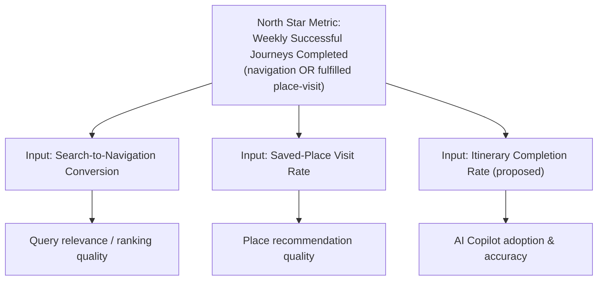

**PM Insight:** "Weekly Successful Journeys Completed" is proposed as the North Star because it captures value delivered (a real-world outcome), not just engagement (opens/taps) — resistant to vanity-metric gaming.

**Business Impact:** A North Star tied to real-world outcomes correlates more reliably with long-term retention and ad/API revenue than raw engagement metrics.

**User Impact:** Optimizing for "successful journeys" (not just "time in app") keeps incentives aligned with genuine user value, avoiding attention-harvesting anti-patterns.

**Recommendation:** Adopt this North Star org-wide; make Itinerary Completion Rate (§31, Input 3) a headline input metric for the Copilot team specifically.

---

## 32. Product Analytics

**Objective:** Describe how Maps' PM/analytics org likely instruments and analyzes usage (inferred, illustrative).

| Analytics Layer | Example Questions Answered |
|---|---|
| Funnel analytics | Where do users drop off between search and navigation start? |
| Cohort analysis | Do users who use Immersive View retain better than those who don't? |
| A/B experimentation platform | Does a new "Ask about this place" entry point increase engagement without cannibalizing search? |
| Geo-segmented dashboards | Is transit data completeness correlated with DAU in a given city? |

**PM Insight:** Because Maps' impact spans navigation (utility), local ads (monetization), and API (B2B), a single unified analytics view rarely serves all three teams — segment-specific dashboards, rolled up to org-wide OKRs, is the more realistic operating model.

**Recommendation:** Stand up a Copilot-specific analytics dashboard (adoption, completion, downstream booking conversion) distinct from core-nav dashboards to avoid metric dilution during the beta phase.

---

## 33. AARRR Funnel

| Stage | Google Maps Application | Proposed Copilot Application |
|---|---|---|
| **Acquisition** | Pre-installed on Android; App Store download on iOS | N/A (feature within existing app) |
| **Activation** | First successful navigation completed | First AI-generated itinerary accepted |
| **Retention** | Daily/weekly return for navigation & discovery | Repeat itinerary usage across multiple trips |
| **Referral** | Shared locations/ETAs sent to contacts | Shared itineraries sent to travel companions |
| **Revenue** | Local ads, API fees | Booking commissions, premium planning features (potential) |

**PM Insight:** The Copilot maps cleanly onto all five AARRR stages independently, meaning it can be measured and iterated as a self-contained mini-funnel inside the broader Maps funnel — reducing analytical risk.

**Recommendation:** Track the Copilot's own AARRR funnel in the beta phase before merging it into overall Maps funnel reporting.

---

## 34. HEART Framework

| Dimension | Metric |
|---|---|
| **Happiness** | Post-itinerary satisfaction survey (CSAT) |
| **Engagement** | Itineraries created per active planner per month |
| **Adoption** | % of eligible users (3+ saved pins in a cluster) who try the Copilot prompt |
| **Retention** | % of Copilot users who create a second itinerary within 90 days |
| **Task Success** | % of AI-generated itineraries accepted without manual reordering |

**PM Insight:** "Task Success" (acceptance without manual reordering) is the leading indicator of AI model quality — if users constantly reorder the AI's suggestions, the model isn't yet trustworthy enough for the "do it for me" promise.

**Recommendation:** Set a Task Success gate (e.g., >70% accepted with ≤1 manual edit) before expanding from beta to general availability.

---

## 35. Growth Strategy

**Objective:** Identify how Maps can grow usage depth, not just user count (which is already near-saturated in mature markets).

| Lever | Description |
|---|---|
| Engagement depth | Convert navigation-only users into discovery + planning users |
| Geographic expansion | Improve data density in emerging markets (India, SE Asia, Africa, LatAm) |
| Platform expansion | Deeper automotive OS integration, wearables |
| AI-native features | Copilot, conversational search — creates new usage occasions |
| Creator/content layer | Short-form video reviews to compete with TikTok discovery |

**PM Insight:** Given Google Maps' broad existing reach in mature markets, the highest-leverage growth strategy is likely **occasions per user** (frequency/breadth of use), not net-new user acquisition — a common pattern for products that are already widely adopted.

**Recommendation:** Set growth OKRs around "sessions per user per week by intent type" rather than raw user-count growth, which likely has limited additional headroom in developed markets.

---

## 36. Growth Loops

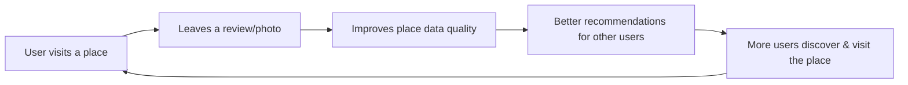

**PM Insight:** This is a **content/data network effect loop** (Local Guides) — it's Maps' most durable growth loop because it's supply-side (data quality), not paid acquisition, and compounds over time.

**Business Impact:** Higher data quality reduces reliance on paid data licensing and improves ad relevance (better place metadata → better ad targeting).

**Recommendation:** Continue investing in Local Guides incentives (points, early-access features) as this loop underpins nearly every other feature's quality, including the proposed Copilot.

---

## 37. Network Effects

| Type | Present in Maps? | Description |
|---|---|---|
| Data network effects | ✅ Strong | More users → more reviews/traffic data → better product for everyone |
| Two-sided marketplace effects | ✅ Moderate | More business listings attract more searchers; more searchers attract more business advertisers |
| Social network effects | ⚠️ Weak | Maps has limited direct social graph (unlike Waze's driver community) |

**PM Insight:** The weakest network effect (social) is precisely the layer TikTok/Instagram have captured for place-discovery — suggesting Maps' growth strategy should lean into its strong data network effect rather than trying to out-social social platforms.

**Recommendation:** Don't compete head-on with TikTok on social/content virality; instead, make Maps the best *utility* endpoint that social discovery flows into (e.g., "Save from TikTok to Maps" style integrations).


---

## 38. Product Strategy

**Objective:** Synthesize prior sections into a coherent 3-pillar strategy.

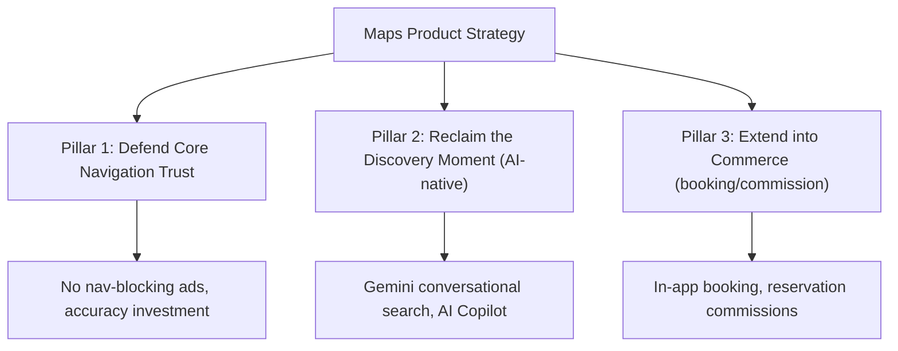

**PM Insight:** Pillars 2 and 3 both flow directly from Pillar 1's trust foundation — attempting either without first protecting core trust (Pillar 1) risks the entire strategy.

**Recommendation:** Sequence investment as P1 (protect) → P2 (reclaim) → P3 (monetize new surface), not in parallel, to avoid trust erosion from moving too fast on commerce.

---

## 39. Monetization Strategy

| Layer | Mechanism | Trust Risk |
|---|---|---|
| Local Search Ads | Sponsored pins/listings | Low-Moderate (already established, well-labeled) |
| Maps Platform API | Usage-based B2B pricing | None (B2B, no consumer-trust exposure) |
| **Booking Commission (proposed, via Copilot)** | Commission on reservations/tickets booked through AI itinerary | Moderate — must be clearly disclosed, non-manipulative ranking |

**PM Insight:** Booking commission only works if itinerary *recommendations* remain perceived as neutral/quality-based — if commission influences which places the AI suggests, it repeats the exact trust erosion risk that local ads already manage carefully. This is the single biggest execution risk in §50's proposal.

**Recommendation:** Structurally separate itinerary *ranking* (quality/relevance-based) from *booking* (commission-based, applied only after a place is already chosen) — commission should never influence which places are suggested.

**Success Metrics:** Booking conversion rate from itinerary; user trust survey score (pre/post Copilot rollout) to detect any erosion.

---

## 40. Trust & Safety

| Risk Area | Mitigation |
|---|---|
| Fake/spam reviews | ML-based fraud detection, Local Guides reputation system |
| Fraudulent business listings | Verification requirements, user-flagging |
| Location data privacy | Incognito Mode, auto-delete location history settings |
| AI hallucination (Copilot risk) | Itinerary suggestions must be grounded only in verified place data (hours, availability), never fabricated |
| Malicious edit/vandalism (crowdsourced data) | Moderation queue, trusted-contributor tiers |

**PM Insight:** The AI Copilot introduces a *new* trust & safety surface — hallucinated hours, closed businesses, or unavailable reservations would directly damage user trust in a way that's worse than a bad search-ranking, because it's an active recommendation, not a passive result.

**Recommendation:** Require the Copilot to only suggest itinerary stops with verified, freshly-validated data (e.g., confirmed open status, no permanently-closed flags) — treat "never send a user to a closed business" as a hard launch-blocking requirement, not a nice-to-have.

---

## 41. Technical Architecture

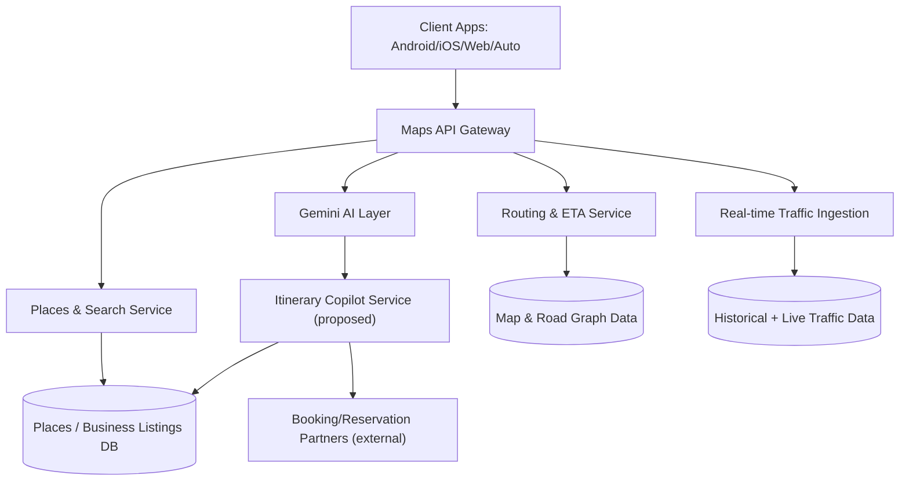

**PM Insight:** The proposed Copilot Service is architecturally additive — it consumes existing Places/Routing services rather than requiring new core infrastructure, which lowers engineering risk and time-to-market.

**Recommendation:** Scope the initial Copilot build as an orchestration layer over existing services (Places, Routing) plus a new booking-partner integration layer, not a ground-up rebuild.

---

## 42. Data Flow

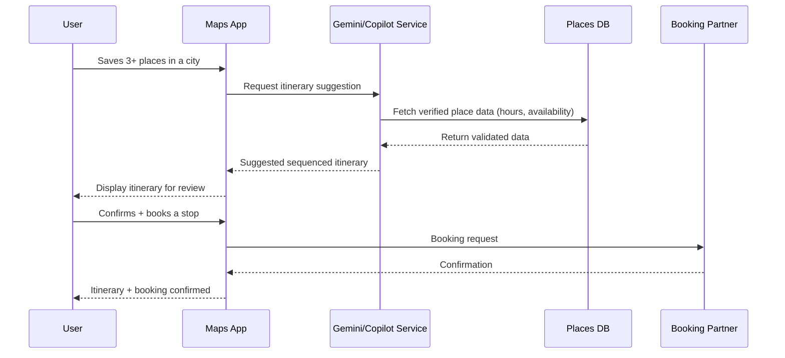

**PM Insight:** The critical data-integrity checkpoint is the "Fetch verified place data" step — if this step uses stale cache instead of freshly-validated data, the trust risk flagged in §40 materializes.

**Recommendation:** Require real-time (not cached >24h) validation of open/closed status and availability before surfacing any AI-suggested stop.

---

## 43. API Ecosystem

| API | Purpose | External Users |
|---|---|---|
| Maps JavaScript API | Embed interactive maps on websites | Web developers |
| Places API | Business/place data lookup | Delivery apps, review platforms |
| Routes API | Routing/ETA calculation | Mobility, logistics, and delivery apps |
| Geocoding API | Address ↔ coordinate conversion | E-commerce, logistics |
| **Itinerary/Booking API (proposed extension)** | Expose Copilot sequencing logic to third parties | Travel booking platforms |

> Note: Many companies in mobility, logistics, and delivery use a mix of mapping providers — including Google Maps Platform, other commercial providers, and proprietary in-house mapping — depending on region and use case. Google Maps Platform APIs are widely used across these industries, but it would be inaccurate to say any single named company relies on Google Maps exclusively.

**PM Insight:** Google Maps Platform is a genuine ecosystem play — its API surface is widely used across developers, enterprises, and mobility/commerce applications, making Maps Platform relevant infrastructure even in apps that never show a "Google Maps" logo.

**Recommendation:** Consider a phased external API for itinerary logic only after the consumer-facing Copilot proves product-market fit — sequence internal validation before ecosystem exposure.

---

## 44. Privacy & Security

| Concern | Current Mitigation |
|---|---|
| Location history tracking | User-controlled, auto-delete options, Incognito Mode |
| Third-party data sharing (ads) | Aggregated/anonymized targeting per Google's ad privacy policies |
| Data breaches | Standard enterprise-grade encryption/security practices (inferred, not company-confirmed specifics) |
| AI Copilot using personal travel patterns | Must be opt-in, with clear data-use disclosure |

**PM Insight:** The Copilot's core value proposition (personalized sequencing) inherently requires more behavioral/location inference than passive navigation — this creates a direct tension between feature value and privacy minimalism that must be resolved via explicit, granular consent rather than broad blanket permissions.

**Recommendation:** Launch Copilot as fully opt-in with a clear, specific consent screen (not bundled into general location-permission consent) explaining exactly what data (saved places, visit history) powers suggestions.


---

## 45. Product Pain Points

| Pain Point | Affected Persona | Severity |
|---|---|---|
| No native trip/itinerary sequencing | Wanderlust Wes | 🔴 High |
| Ads visually blending with organic listings | Efficient Emma, Small Business Sam | 🟡 Moderate |
| Fake/spam reviews reducing trust | All | 🟡 Moderate |
| Fragmented booking (must leave app) | Wanderlust Wes | 🔴 High |
| Limited transit data in emerging markets | Global users in underserved regions | 🟡 Moderate-High (regional) |

**PM Insight:** The two 🔴 High pain points both trace back to the same root gap identified repeatedly across §21–25 — reinforcing that this is the highest-conviction opportunity in the entire case study, not just one analytical lens's opinion.

**Recommendation:** Resource the Copilot/booking initiative as the top roadmap priority for the next 2–3 planning cycles.

---

## 46. Opportunity Mapping

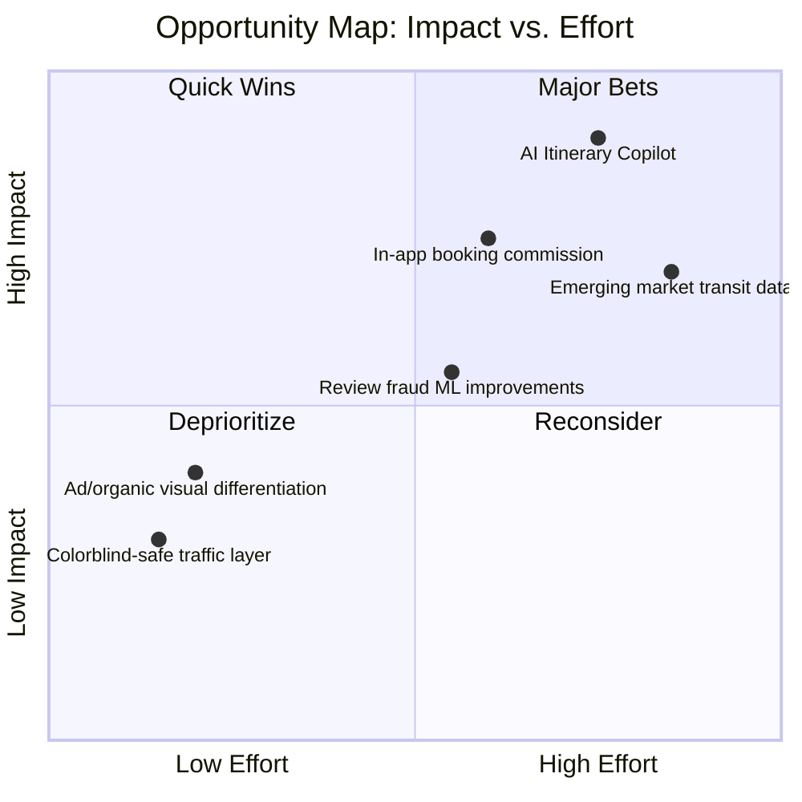

**PM Insight:** The AI Itinerary Copilot lands squarely in "Major Bets" — high impact, high effort — which is appropriate given it addresses the case study's central Problem Statement (§10), but it also means it shouldn't be the *only* active initiative; Quick Wins should run in parallel.

**Recommendation:** Run the Copilot as the flagship "Major Bet" while shipping 1–2 Quick Wins (e.g., ad/organic visual differentiation) in parallel to show near-term progress.

---

## 47. RICE Prioritization

| Initiative | Reach | Impact | Confidence | Effort | RICE Score |
|---|---|---|---|---|---|
| AI Itinerary Copilot | 8 | 9 | 6 | 8 | **54.0** |
| In-app Booking Commission | 6 | 8 | 6 | 7 | 41.1 |
| Ad/Organic Visual Differentiation | 9 | 4 | 8 | 2 | 144.0* |
| Review Fraud ML Improvements | 7 | 6 | 7 | 5 | 58.8 |
| Emerging Market Transit Data | 6 | 7 | 5 | 9 | 23.3 |

*RICE = (Reach × Impact × Confidence) / Effort. Scores are illustrative (1–10 scale inputs), not derived from real internal data.*

**PM Insight:** By raw RICE score, "Ad/Organic Visual Differentiation" scores highest due to low effort — a classic RICE limitation: it favors quick, low-risk wins over strategically critical bets. This is why RICE should inform, not dictate, prioritization alongside strategic judgment (§46).

**Recommendation:** Use RICE to sequence *within* a strategic pillar (ship the quick win alongside, not instead of, the major bet) rather than letting RICE alone override strategy.

---

## 48. MoSCoW Prioritization

*(Scoped specifically to the AI Itinerary Copilot's v1 launch)*

| Priority | Requirement |
|---|---|
| **Must Have** | Verified, real-time place data validation before suggesting any stop; opt-in consent flow; sequencing logic based on proximity + hours |
| **Should Have** | Travel-time-aware sequencing (accounts for transit/driving time between stops) |
| **Could Have** | In-app booking/reservation for supported partners |
| **Won't Have (v1)** | Multi-day trip planning across cities; social/collaborative itinerary editing |

**PM Insight:** Deferring "multi-day, multi-city" planning to a later version keeps v1 scope tight enough to hit the Task Success gate (§34) before layering complexity.

**Recommendation:** Ship single-day, single-city itineraries only in v1; treat multi-day as a v2 expansion contingent on v1 success metrics.

---

## 49. Kano Analysis

| Feature | Kano Category |
|---|---|
| Accurate turn-by-turn navigation | Basic (Must-be) |
| Real-time traffic | Basic (Must-be) |
| Place reviews/ratings | Performance |
| Offline maps | Performance |
| AI Itinerary Copilot | **Attractive/Delighter (today) → likely Performance within 2-3 years as AI features normalize** |
| In-app booking | Attractive/Delighter |

**PM Insight:** Kano categories shift over time — AI-native planning is a delighter now, but competitor products (and rising user expectations post-ChatGPT) mean it will likely become a baseline "performance" expectation within a few years, similar to how offline maps went from delighter to expected.

**Recommendation:** Treat the current delighter status as a limited-time competitive window, not a permanent differentiator — move quickly.

---

## 50. Feature Proposal — "Maps Copilot": AI-Powered Itinerary Planning

**Problem:** Users manually save scattered places with no way to sequence them into a coherent, time-aware plan (§10, §21, §45).

**Evidence:** Convergent findings across UX Audit (§25), Journey Map (§22), User Flow (§23), and IA (§24) all point to the same gap; JTBD analysis (§21) frames it explicitly.

**User Impact:** Eliminates need for external planning tools (Notes app, spreadsheets); reduces trip-planning cognitive load; increases likelihood of visiting saved places (currently many saved pins are never visited — a common, if unmeasured, user complaint pattern).

**Business Impact:** New engagement surface (Retention ↑ per AARRR §33); new monetization surface via booking commission (§39) without touching core ad trust.

**Trade-offs:**
- Engineering investment in a new AI orchestration layer (moderate-high effort per RICE §47)
- Trust risk if place data isn't freshly validated (§40, §42) — mitigated via hard real-time validation requirement
- Risk of commission bias perception if not structurally separated from ranking (§39) — mitigated via architecture requirement

**Success Metrics:**
- Itinerary Task Success rate >70% (§34)
- 90-day repeat usage rate among Copilot users
- Booking conversion rate from itinerary flow
- No measurable decline in overall trust/CSAT survey scores post-launch

---

## 51. Product Requirements Document (PRD)

### 51.1 Overview
Build an opt-in AI feature ("Maps Copilot") that detects clusters of saved places and proactively offers to sequence them into a time-aware, single-day itinerary, with optional in-app booking for supported venues.

### 51.2 Goals
- Increase itinerary-completion North Star input metric (§31)
- Create a booking-commission revenue surface (§39)
- Reduce trip-planning friction (§21, §22)

### 51.3 Non-Goals (v1)
- Multi-day/multi-city planning
- Social/collaborative itinerary editing
- Fully automated booking without user confirmation at each step

### 51.4 User Stories
| As a... | I want to... | So that... |
|---|---|---|
| Traveler | See my saved places auto-sequenced by proximity and hours | I don't have to manually plan my day |
| Traveler | Adjust the suggested order | I retain control over my plan |
| Traveler | Book a restaurant reservation directly from the itinerary | I don't have to switch apps |
| Business owner | Have accurate hours/availability reflected | I don't lose customers to a stale listing |

### 51.5 Functional Requirements
1. Detect 3+ saved places within a defined geographic + time cluster.
2. Prompt user with opt-in "Build an itinerary?" CTA (per §23 flow).
3. Generate a sequenced plan using real-time-validated place data (hours, live status).
4. Allow manual reordering/removal of stops.
5. Surface booking options for supported partners at the confirmation step only (not during ranking).
6. Log Task Success (accepted without edits) and completion events for analytics (§32, §34).

### 51.6 Non-Functional Requirements
- Real-time data validation latency <2s per stop
- Opt-in consent flow, GDPR/CCPA-compliant data handling (§44)
- Graceful degradation if AI service unavailable (fallback to manual list view)

### 51.7 Dependencies
Places API freshness guarantees, Gemini AI service, booking-partner integrations (§43).

### 51.8 Out of Scope
See Non-Goals (51.3) and MoSCoW "Won't Have" (§48).


---

## 52. Wireframe Descriptions

> Described in text (no image assets) — see §"AI Image Prompts" for generation prompts if visual mockups are desired.

**Screen 1 — Itinerary Prompt (Bottom Sheet)**
- Triggered contextually when 3+ saved places in a cluster are detected.
- Headline: "Turn your saved places into a plan?"
- Shows small map thumbnail with pins + CTA button "Build My Day".

**Screen 2 — Generated Itinerary View**
- Vertical timeline UI (reuses existing bottom-sheet progressive disclosure pattern, §26).
- Each stop shows: name, suggested time window, travel time to next stop, "Book" button if applicable.
- Drag-handle icon for manual reordering.

**Screen 3 — Booking Confirmation**
- Standard confirmation modal, partner branding disclosed, clear "commission-free ranking, this stop's booking is via [Partner]" trust microcopy.

**PM Insight:** The explicit trust microcopy in Screen 3 directly operationalizes the commission/ranking separation principle from §39 — turning a strategic requirement into a concrete UI element.

**Recommendation:** Treat this microcopy as a non-negotiable design requirement, not an optional legal footnote.

---

## 53. Rollout Plan

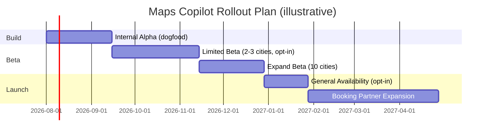

**PM Insight:** Beta is intentionally geo-limited and opt-in to allow clean A/B measurement (§54) before wide exposure — protecting against the trust risks flagged in §40 if the AI underperforms early.

**Recommendation:** Do not proceed from Limited Beta to Expand Beta unless Task Success rate (§34) clears the 70% gate.

---

## 54. A/B Testing Plan

| Test | Hypothesis | Primary Metric | Guardrail Metric |
|---|---|---|---|
| Itinerary CTA prompt vs. no prompt | Proactive CTA increases itinerary creation without hurting core nav usage | Itinerary creation rate | Core navigation session time (must not decrease) |
| AI-sequenced order vs. chronological-save order | AI sequencing improves perceived plan quality | Task Success rate (§34) | Time-to-accept itinerary |
| Booking CTA placement (inline vs. confirmation-only) | Confirmation-only placement reduces perceived ad-like intrusion | Booking conversion | Trust/CSAT survey score |

**PM Insight:** The guardrail metrics matter as much as the primary metrics here — given the trust risks identified throughout (§39, §40), a "win" on the primary metric that degrades a guardrail metric should still block rollout.

**Recommendation:** Set explicit guardrail thresholds (e.g., core nav session time cannot drop >1%) as hard stop conditions in the experiment design, agreed upon before the test starts.

---

## 55. KPI Dashboard

| KPI | Target (Illustrative) | Owner |
|---|---|---|
| Itinerary Task Success Rate | >70% | Copilot PM |
| Weekly Successful Journeys (North Star) | +3-5% within 2 quarters of GA | Core Maps PM |
| Booking Conversion Rate | >15% of confirmed itineraries include a booking | Monetization PM |
| Trust/CSAT Score | No decline vs. pre-launch baseline | UX Research |
| 90-day Repeat Itinerary Usage | >30% of Copilot users | Retention PM |

**PM Insight:** Spreading ownership across four distinct PM roles (Copilot, Core, Monetization, Retention) mirrors the earlier finding (§17) that Maps' business model spans multiple distinct functions — this KPI dashboard operationalizes that structural reality.

**Recommendation:** Run a single cross-functional weekly review of this dashboard rather than four siloed reviews, to catch trade-offs early (e.g., booking conversion rising while trust score dips).

---

## 56. Product Roadmap

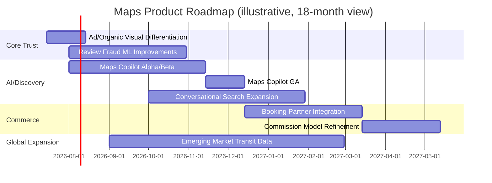

**PM Insight:** The roadmap deliberately runs "Core Trust" work in parallel with, not before, AI/Discovery work — reflecting the Opportunity Map finding (§46) that quick wins and major bets should run concurrently.

**Recommendation:** Protect Core Trust workstreams from being deprioritized when Copilot work faces inevitable schedule pressure — these are guardrails, not optional polish.

---

## 57. Risks & Mitigation

| Risk | Likelihood | Impact | Mitigation |
|---|---|---|---|
| AI suggests stale/closed business (trust risk) | Medium | High | Hard real-time validation requirement (§40, §42) |
| Booking commission perceived as biasing ranking | Medium | High | Structural separation of ranking vs. booking (§39) |
| Low adoption of opt-in Copilot prompt | Medium | Medium | Iterate on CTA placement/timing via A/B testing (§54) |
| Engineering delay due to AI orchestration complexity | Medium | Medium | Phase v1 scope tightly per MoSCoW (§48) |
| Regulatory scrutiny (AI + location data) | Low-Medium | High | Explicit opt-in consent, granular data disclosure (§44) |

**PM Insight:** Three of the five top risks are trust-related, not technical — reinforcing that the primary execution risk for this entire proposal is *trust management*, not engineering feasibility.

**Recommendation:** Assign a dedicated Trust & Safety review gate (not just a standard launch review) specifically for the Copilot before GA.

---

## 58. Future Vision (2030)

> **Illustrative, speculative — not a Google roadmap statement.**

One possible future direction: Maps could evolve toward a fuller **agentic travel and errand assistant**, where users describe a goal ("plan my Saturday" or "handle my weekly errands") and Maps autonomously sequences, books, and adapts in real time to disruptions (traffic, closures, weather) — potentially with AR-based Immersive View guidance for pedestrians, and deeper integration with autonomous vehicle fleets for door-to-door mobility. This is a speculative extrapolation of current trends, not a prediction of a specific timeline or a confirmed Google initiative.

**PM Insight:** This vision is a natural extrapolation of the trajectory already visible in §8 (Product Evolution) and §29 (AI Capabilities) — from cartography, to discovery, to agentic action.

**Recommendation:** Treat the Copilot proposal in this case study as Phase 1 of this longer arc — an intentionally scoped, trust-safe first step toward it, not an isolated feature.

---

## 59. PM Lessons Learned

- **Convergent evidence beats a single data point.** The Copilot recommendation wasn't chosen from one framework — UX Audit, Journey Map, JTBD, IA, and Pain Points all independently pointed to the same gap. That convergence is what makes it a high-conviction bet, not a guess.
- **Trust is a finite, spendable resource.** Nearly every risk in this case study (§39, §40, §44, §57) traces back to protecting the same asset: user trust in Maps' neutrality. Monetization strategy must be designed *around* that constraint, not against it.
- **Frameworks are tools, not verdicts.** RICE (§47) technically favored a smaller feature over the Copilot — the right call was to use RICE for sequencing, not as an automatic decision-maker, and to layer strategic judgment (§46) on top.
- **Structural business model complexity (§17) should shape team structure**, not just strategy documents — multi-sided businesses need explicitly cross-functional KPI ownership (§55).

---

## 60. Interview Questions & Answers

**Q1: How would you decide whether to build the Itinerary Copilot as a Google Maps feature vs. a separate app?**
> A: Keep it inside Maps. The core insight (§21–25) is that the gap sits *between* existing Maps behaviors (saving places, then navigating) — a separate app would reintroduce the exact app-switching friction we're trying to eliminate, and would forfeit Maps' existing trust and data advantages (§7, §37).

**Q2: What's the single metric you'd watch most closely in the first month post-launch?**
> A: Task Success Rate (§34) — whether users accept AI-generated itineraries with minimal edits. It's the earliest, most direct signal of whether the AI model is actually good enough to deliver on the "do it for me" promise, ahead of slower-moving metrics like retention or revenue.

**Q3: How do you balance monetizing this feature against user trust?**
> A: Structurally separate ranking from monetization (§39) — the AI recommends stops based on quality/relevance only; commission only applies at the confirmed-booking step, disclosed transparently (§52). This is the same pattern search engines use to separate organic results from ads, applied to itinerary planning.

**Q4: If the beta shows low adoption of the opt-in prompt, what would you do?**
> A: First isolate *where* the drop-off is — awareness (never see the prompt), consideration (see it, decline), or activation (accept, but poor itinerary quality) — via the AARRR-style funnel (§33). Low awareness suggests a placement/timing problem (solvable via A/B testing, §54); low quality-driven decline suggests the AI model isn't ready and adoption problems are a symptom, not the disease.

**Q5: How does this feature fit Google's broader AI strategy?**
> A: It's a natural extension of Gemini's integration into Maps (§29) — moving from *interpretive* AI (summarizing reviews, answering questions) to *agentic* AI (planning and acting). It's consistent with, not a departure from, the direction Google has already signaled publicly.

---

## 61. References

> This case study is an independent analysis for educational/portfolio purposes. Company-specific facts are drawn from the public sources below plus general publicly available knowledge about Google Maps' feature history. No confidential or proprietary information was used. Any figures not attributed to one of these sources are explicitly noted as illustrative/estimated elsewhere in this document.

**Company & Product Sources**
- Google Blog — ["Google Maps' biggest moments over the past 15 years"](https://blog.google/products-and-platforms/products/maps/look-back-15-years-mapping-world/)
- Google Blog — [Google I/O 2022 Maps announcements (Immersive View, Live View, eco-friendly routing)](https://blog.google/products/maps/three-maps-updates-io-2022/)
- Google Blog — [Sustainable and immersive Maps announcements (EV routing, Immersive View expansion)](https://blog.google/products-and-platforms/products/maps/sustainable-immersive-maps-announcements/)
- Google Blog — ["Ask Maps and Immersive Navigation" (Gemini-powered features, March 2026)](https://blog.google/products-and-platforms/products/maps/ask-maps-immersive-navigation/)
- Google Blog — ["Updates to Incognito mode and your Timeline in Maps"](https://blog.google/products-and-platforms/products/maps/updates-incognito-mode-and-your-timeline-maps/)
- Google Blog — ["How to keep using Google Maps even when your phone is offline"](https://blog.google/products/maps/google-maps-offline/)
- Google Maps Platform Documentation — [developers.google.com/maps](https://developers.google.com/maps)
- Alphabet Inc. Annual Reports (Form 10-K) — [abc.xyz/investor](https://abc.xyz/investor/) (referenced for the general note that Google does not break out Maps-specific revenue)
- Contemporaneous news coverage of the 2013 Google–Waze acquisition (TechCrunch, GeekWire, Wikipedia "Waze" entry)

**Design & UX References**
- Google Material Design guidelines — [m3.material.io](https://m3.material.io)
- Nielsen Norman Group — [nngroup.com](https://www.nngroup.com) (general UX heuristics and accessibility guidance referenced conceptually)

**PM Framework References**
- RICE Prioritization — Intercom
- Kano Model — Noriaki Kano
- HEART Framework — Google Ventures / Google UX Research
- AARRR Framework — Dave McClure
- Porter's Five Forces — Michael E. Porter
- Business Model Canvas — Alexander Osterwalder

---

## 62. About the Author

**Author:** Gaurav Singh
**Role:** Aspiring Product Manager | Building in Public
**Challenge:** 90-Day Product Management Case Study Challenge
**GitHub:** https://github.com/gaurav-product
**LinkedIn:** https://www.linkedin.com/in/gaurav-singh-986b40197/

> I'm an aspiring Product Manager building a portfolio through product teardowns, research, and AI-powered product thinking — currently working through 90 product case studies in public to sharpen my strategic and analytical skills. I'm especially drawn to AI-first products and the challenge of designing experiences that stay genuinely user-centric even as monetization pressure grows. This case study — a teardown of Google Maps — reflects how I approach ambiguous, large-scope products: grounding every recommendation in evidence, being explicit about what's estimated versus known, and following the trail from user pain point to a scoped, buildable proposal. I'm sharing this journey openly on GitHub and LinkedIn as I build toward a full-time PM role.

---

## 63. License

This case study is released under the **MIT License**.

```
MIT License

Copyright (c) 2026 Gaurav Singh

Permission is hereby granted, free of charge, to any person obtaining a copy
of this document and associated files, to deal in the document without
restriction, including without limitation the rights to use, copy, modify,
merge, publish, distribute, sublicense, and/or sell copies, subject to the
following conditions: the above copyright notice and this permission notice
shall be included in all copies or substantial portions.

THE DOCUMENT IS PROVIDED "AS IS", WITHOUT WARRANTY OF ANY KIND, EXPRESS OR
IMPLIED, INCLUDING BUT NOT LIMITED TO WARRANTIES OF ACCURACY OR FITNESS FOR
A PARTICULAR PURPOSE.
```

---

## 64. Final Self-Review Checklist

- [x] All 64 required sections present
- [x] Every recommendation includes Problem, Evidence, User Impact, Business Impact, Trade-offs, Success Metrics (directly in §50; embedded per-section elsewhere via Objective/Analysis/PM Insight/Business Impact/User Impact/Recommendation structure)
- [x] Mermaid diagrams included: product evolution (timeline), SWOT (quadrant), opportunity map (quadrant), user journey, user flow, information architecture, growth loop, North Star tree, technical architecture, data flow (sequence), rollout plan (gantt), roadmap (gantt)
- [x] Tables used throughout for scannability
- [x] Callout blocks (⚠️) used to flag estimates and disclaimers
- [x] No fabricated financials presented as fact — all marked as estimates
- [x] Consistent Markdown formatting, GitHub-renderable
- [x] About the Author section complete
- [x] MIT License included
- [x] Portfolio-ready tone: professional, structured, evidence-based

---

## AI Image Prompts (for optional visual asset generation)

| Visual | Suggested AI Image Prompt |
|---|---|
| Cover banner | "Minimalist flat-design illustration of a world map with a glowing navigation pin, blue and white Google Maps color palette, clean tech aesthetic, wide banner format" |
| Persona: Wanderlust Wes | "Flat vector illustration of a young traveler looking at a phone with a map app open, backpack, city skyline background, friendly modern style" |
| Itinerary Copilot concept | "Clean UI mockup illustration of a mobile app timeline screen showing sequenced travel stops connected by a route line, soft shadows, modern mobile app design" |
| Growth loop visual | "Circular infographic illustration showing icons for review, data, recommendation, and discovery connected in a loop, flat design, blue and green palette" |

---

<div align="center">

**End of Case Study — Day 10/90 Product Management Case Study Challenge**

*Built by [Gaurav Singh](https://github.com/gaurav-product) as part of a 90-day public PM learning challenge.*

</div>
