# 🛒 Amazon — Product Management Case Study
### Day 13/90 · 90-Day Product Management Case Study Challenge

> A deep, evidence-based teardown of Amazon's consumer marketplace — strategy, metrics, AI systems, and a full PRD for a proposed **AI Shopping Concierge** feature.


---

## 2. Repository Metadata

| Field | Value |
|---|---|
| Repository | `Day-13-Amazon` |
| Challenge | Day 13/90 – Product Management Case Study Challenge |
| Product analyzed | Amazon Shopping (consumer marketplace) — with ecosystem context from Prime, Advertising, Alexa, Logistics, Payments |
| Company | Amazon.com, Inc. (NASDAQ: AMZN) |
| Domain | Global E-commerce Marketplace |
| Category | Marketplace • E-commerce • AI • Logistics • Cloud Ecosystem • Retail Media |
| Primary competitors covered | Walmart, Flipkart, eBay, Temu, Alibaba, Meesho, Target, Best Buy |
| Author | Gaurav Singh |
| Last updated | July 2026 |
| Data cutoff | Public information available through mid-2026 (see References) |

**Methodology note:** Every figure in this document is either (a) sourced from Amazon's official SEC filings, investor relations releases, or aboutamazon.com/Amazon Science publications, (b) explicitly labeled as a **third-party industry estimate**, or (c) explicitly labeled as an **assumption made for educational purposes**. Where Amazon has not publicly disclosed a number (e.g., exact Prime membership count since 2021, or internal AI model architectures), this document says so directly rather than inventing a figure.

---

## 4. Table of Contents

1. Cover
2. Repository Metadata
3. Badges
4. Table of Contents
5. Executive Summary
6. Product Overview
7. Company Background
8. Product Timeline
9. Vision & Mission
10. Problem Statement
11. Market Research
12. Industry Analysis
13. TAM / SAM / SOM
14. Competitor Analysis
15. SWOT Analysis
16. Porter's Five Forces
17. Business Model Canvas
18. Revenue Model
19. Target Users
20. Personas
21. Jobs To Be Done (JTBD)
22. User Journey
23. User Flow
24. Information Architecture
25. UX Audit
26. UI Audit
27. Accessibility
28. Feature Breakdown
29. AI Capabilities
30. Product Metrics
31. North Star Metric
32. Product Analytics
33. AARRR (Pirate Metrics)
34. HEART Framework
35. Growth Strategy
36. Growth Loops
37. Network Effects
38. Product Strategy
39. Monetization
40. Trust & Safety
41. Technical Architecture
42. Data Flow
43. API Ecosystem
44. Privacy & Security
45. Pain Points
46. Opportunity Mapping
47. RICE Prioritization
48. MoSCoW Prioritization
49. Kano Model
50. Feature Proposal — AI Shopping Concierge
51. PRD — AI Shopping Concierge
52. Wireframes
53. Rollout Plan
54. A/B Testing Plan
55. KPI Dashboard
56. Product Roadmap
57. Risks & Mitigation
58. Future Vision
59. PM Lessons
60. PM Interview Questions
61. References
62. About the Author
63. License
64. Self Review
65. Appendix

---

## 5. Executive Summary

Amazon's consumer marketplace is the largest single retail e-commerce business in the world, generating **$716.9 billion in total net sales in FY2025**, of which **$296.3 billion was net product sales and $420.7 billion was net service sales** (third-party seller services, subscriptions, advertising, and AWS), per Amazon's FY2025 consolidated statements of operations filed with the SEC. Operating income reached **$79.98 billion in FY2025**, up from $68.6 billion in FY2024, reflecting a multi-year turnaround from the thin-margin, high-capex years of 2021–2022.

This case study treats **Amazon Shopping** — the core browse/search/buy consumer experience on web and mobile — as the primary product under review, while acknowledging that its competitiveness cannot be separated from four reinforcing systems: **Prime** (loyalty + logistics subscription), **Advertising** (Amazon's fastest-growing high-margin business, exceeding an estimated **$68 billion in 2025 revenue**), **Alexa for Shopping** (formerly "Rufus," rebranded May 13, 2026), and **Logistics** (the "last mile" fulfillment network that underwrites Amazon's speed promise).

The core PM tension explored throughout this document is: **Amazon's structural advantage — near-infinite selection — is also its biggest UX liability.** Search and recommendation quality, trust in reviews, and decision fatigue are the friction points that most directly threaten conversion and customer lifetime value, even as Amazon's logistics and pricing advantages remain largely unmatched. Generative AI shopping assistants — Amazon's own, and third-party agents like ChatGPT, Gemini, and Claude doing product research on customers' behalf — represent the single biggest structural threat to Amazon's traditional "gatekeeper" role in product discovery, a threat Amazon is answering aggressively with Alexa for Shopping.

The proposed feature in this case study, the **AI Shopping Concierge**, extends this defensive/offensive AI strategy: a conversational, memory-persistent assistant that compares products, explains trade-offs in plain language, flags likely-fake reviews, and predicts replenishment needs — deliberately designed to be more trustworthy and more personalized than a generic third-party AI agent, because it has first-party access to purchase history, warranty data, and real-time inventory/pricing that no outside agent can match.

**Key facts underpinning this analysis (FY2025, official Amazon/SEC sources unless noted):**

| Metric | FY2025 Value | Source Type |
|---|---|---|
| Total net sales | $716.9B | Official (SEC filing) |
| Net product sales | $296.3B | Official |
| Net service sales (3P, subscriptions, ads, AWS) | $420.7B | Official |
| Operating income | $80.0B | Official |
| AWS net sales | $128.7B | Official |
| Advertising revenue | ~$68B+ | Industry estimate (Amazon discloses ad revenue narratively, not as a standalone GAAP line item) |
| Prime subscription revenue | $49.6B | Official (subscription services line) |
| Active Prime members | Not disclosed since 2021; third-party estimates ~240–250M globally | Estimate |
| Global active customer accounts | 300M+ | Estimate, frequently cited in earnings commentary |
| US e-commerce market share | ~36–38% | Industry estimate (Statista / Marketplace Pulse / eMarketer) |

---

## 6. Product Overview

**Amazon Shopping** is the consumer-facing storefront (web at amazon.com and 20+ country domains, plus native iOS/Android apps) through which customers search, discover, compare, purchase, and manage returns for products sold both directly by Amazon (first-party/1P retail) and by independent third-party sellers (3P marketplace). As of FY2025, **third-party sellers accounted for roughly 61–62% of paid units sold**, making Amazon Shopping fundamentally a *marketplace* product, not merely a retail storefront — a distinction that shapes almost every product decision discussed in this document, from search ranking (which must fairly rank 1P and 3P listings) to trust & safety (which must police hundreds of millions of third-party listings).

The product sits at the center of an ecosystem:

- **Prime** — subscription membership bundling fast/free shipping, video/music streaming, and increasingly, AI features — retains customers and effectively subsidizes delivery speed.
- **Advertising** — sponsored product placements within search and detail pages; one of Amazon's highest-margin businesses.
- **Alexa for Shopping** (formerly "Rufus," rebranded May 2026) — the generative-AI conversational layer embedded directly in search and product pages.
- **Logistics network** — Amazon's owned/leased fulfillment centers, sortation centers, delivery stations, and last-mile fleet (Amazon Logistics, Delivery Service Partners, Amazon Flex).
- **Payments** — Amazon Pay and stored payment credentials that reduce checkout friction.
- **Kindle** — media/content vertical, increasingly integrated into cross-sell and recommendations.

> **Scope note:** Per the research brief, this case study focuses on the consumer marketplace and does not attempt a deep technical or financial teardown of AWS, which — while central to Amazon's profitability — is a distinct B2B cloud-infrastructure product with its own customer base and product discipline.

---

## 7. Company Background

Amazon.com, Inc. was founded by **Jeff Bezos** in 1994 in Bellevue, Washington, and launched in July 1995 as an online bookstore — a category chosen because its near-infinite catalog variety was something no physical store could stock. The company went public in 1997, and Bezos's first shareholder letter that year introduced the now-famous **"Day 1"** philosophy: a company must operate with the urgency and customer focus of a startup, because "Day 2" — complacency — leads to "stasis, followed by irrelevance, followed by excruciating, painful decline, followed by death."

Amazon expanded from books into music and video (1998), then into a general marketplace via **Amazon Marketplace** (2000), which opened the platform to third-party sellers — arguably the single decision most responsible for Amazon's current scale. **Amazon Web Services (AWS)** launched in 2006, monetizing Amazon's internal infrastructure expertise and eventually becoming its highest-margin business. **Amazon Prime** launched in 2005 as a $79/year shipping subscription and has since become the retention backbone of the entire business. Jeff Bezos transitioned to Executive Chairman in July 2021, handing the CEO role to **Andy Jassy**, previously the founder and CEO of AWS — a signal of how central cloud/AI infrastructure thinking has become to Amazon's overall strategy.

Amazon is organized into three externally reported segments: **North America**, **International**, and **AWS**. In FY2025, North America generated **$426.3B**, International **$161.9B**, and AWS **$128.7B** in net sales, per Amazon's quarterly and full-year SEC disclosures.

---

## 8. Product Timeline

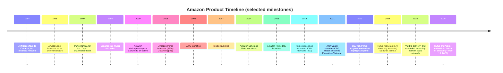

*Dates for 1994–2021 are well-documented historical facts. 2023–2026 items are drawn from Amazon's own press releases (aboutamazon.com) and are noted as such.*

---

## 9. Vision & Mission

Amazon's mission, as stated in its investor materials, is **"to be Earth's most customer-centric company,"** built on four pillars it repeats consistently across shareholder letters: **customer obsession** (rather than competitor obsession), **passion for invention**, **commitment to operational excellence**, and **long-term thinking**.

Layered onto that mission are the operating principles that most directly shape the shopping product:

- **Selection** — the largest possible catalog, enabled by the third-party marketplace.
- **Price** — a long-held "everyday low price" posture rather than promotional spikes.
- **Convenience** — one-click ordering, saved payment/address info, subscribe & save.
- **Speed** — same-day/next-day delivery as a default expectation, not a premium add-on.
- **Trust** — A-to-Z Guarantee, easy returns, and (increasingly) AI-assisted fraud/counterfeit detection.
- **Personalization & AI** — from the earliest collaborative-filtering recommendation engine (mid-1990s/2000s) to Alexa for Shopping today.

**PM Insight:** Most companies pick 2–3 of {selection, price, convenience, speed}. Amazon's specific bet — enabled by scale economics and the 3P marketplace — is that it doesn't have to choose, and that combination is what's hardest for any single competitor to replicate. Walmart can match price and (in the US) speed via physical stores; Temu can match price but not speed or trust; Flipkart can match selection and price in India but not Amazon's logistics precision at Amazon's global scale.

---

## 10. Problem Statement

> **How might Amazon help a customer confidently find and buy the *right* product, quickly, from a catalog of hundreds of millions of listings — without being drowned in overlapping options, unreliable reviews, and confusing trade-offs — while defending its position as the customer's first stop for product research against a new generation of general-purpose AI shopping agents?**

This statement captures three linked problems this case study returns to repeatedly:

1. **Discovery at scale.** With inventory reported at over 12 million Amazon-fulfilled items and 300–600 million third-party listings (estimates vary by source and definition of "active" listing), search and recommendation quality — not catalog size — is now Amazon's binding constraint on conversion.
2. **Trust at scale.** More sellers and more reviews increase both selection and the surface area for fake reviews, counterfeit goods, and low-quality listings, directly threatening the "trust" pillar of Amazon's vision.
3. **Discovery leaving the platform.** As customers increasingly start product research in general-purpose AI assistants rather than typing into Amazon's search bar, Amazon risks losing the highest-intent moment in the shopping journey — the reason it moved so quickly to unify Rufus and Alexa+ into Alexa for Shopping in 2026.

---

## 11. Market Research

Global e-commerce continues to grow faster than total retail. Industry estimates put **US e-commerce sales at roughly $1.25 trillion in 2025**, rising toward **$1.38 trillion in 2026**, with online penetration around **21–22% of total US retail** — meaning the large majority of retail spend is still offline, which is why Amazon continues to invest in categories (grocery, pharmacy, same-day) where online penetration is still low. Global online shoppers are estimated at roughly **2.8–2.9 billion people** in 2026, about a third of the world's population.

Within this market, **Amazon holds an estimated 35.7%–37.6% share of US retail e-commerce** (estimates vary by methodology/source; Statista, Marketplace Pulse, and eMarketer converge in this range), down from a peak of roughly **41.8% in 2021**. This is a market-share plateau, not a decline in absolute dollars — Amazon's US net sales are still growing — but it does mean competitors are capturing a growing share of *incremental* market growth, chiefly Walmart (~6.4% share, growing faster than Amazon off a smaller base), Shopify-powered independent merchants (~14%, not a single retailer but the aggregate of millions of DTC stores), Temu, and TikTok Shop.

**Facts:** FY2025 total net sales $716.9B; US e-commerce market ~$1.25T (2025).
**Estimates:** Amazon's US e-commerce share (35.7–37.6%, sources disagree); global active online shopper count.
**Assumption for this document:** where sources disagree by a few points, this document uses a range rather than a single false-precision number.

---

## 12. Industry Analysis

The e-commerce/marketplace industry in 2026 is shaped by four forces:

1. **AI-mediated discovery.** Generative AI assistants (ChatGPT, Gemini, Claude, and retailer-native agents like Alexa for Shopping) are becoming an alternate entry point to shopping, ahead of typing into a retailer's own search bar. Every major platform is racing to either become the assistant customers use, or to become the best-optimized target *within* someone else's assistant.
2. **Retail media / advertising.** Sponsored placements within marketplaces have become a structurally higher-margin business than product sales themselves, pushing Amazon, Walmart, and Target to all expand ad platforms aggressively.
3. **Cross-border, factory-direct competition.** Temu and Shein compete on price by removing traditional retail/wholesale markup layers, pressuring Amazon (and prompting Amazon's own "Amazon Haul" discount storefront) — though 2025 changes to US "de minimis" customs exemptions raised costs for this model.
4. **Logistics as a moat, and as a shared utility.** Same-day and even same-hour delivery increasingly requires micro-fulfillment centers close to demand; Amazon, Walmart, and instant-delivery players (Instacart, DoorDash-adjacent services) are all building toward this, narrowing Amazon's historical speed advantage in dense urban markets.

**PM Insight:** Amazon's moat is shifting from "we have the biggest catalog" (largely commoditized now) toward "we have the most trustworthy, fastest, most personalized AI-assisted decision layer on top of that catalog." That reframing is the strategic logic behind both Alexa for Shopping and the AI Shopping Concierge proposal later in this document.

---

## 13. TAM / SAM / SOM

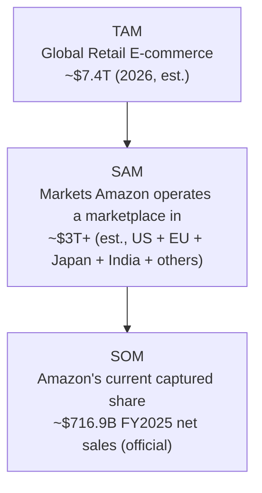

| Layer | Definition | Value | Type |
|---|---|---|---|
| **TAM** | Total global e-commerce retail spend | ~$7.4 trillion (2026 projection) | Industry estimate |
| **SAM** | E-commerce spend in countries/regions where Amazon operates a retail marketplace (US, Canada, Mexico, Brazil, UK, Germany, France, Italy, Spain, Netherlands, Poland, Sweden, Turkey, UAE, Saudi Arabia, India, Japan, Singapore, Australia) | Several trillion USD (exact figure not independently verifiable from public data) | Assumption / rough estimate for educational purposes |
| **SOM** | Amazon's actual captured net sales | $716.9 billion (FY2025) | Official (SEC) |

**Honest gap:** A precise SAM figure would require country-by-country e-commerce totals restricted to Amazon's active categories in each market, which is not cleanly available in public sources. This document presents SAM as a directional midpoint rather than a false-precision number.

---

## 14. Competitor Analysis

| Competitor | Primary battleground vs. Amazon | Est. scale (most recent public/estimated figures) | Key differentiator |
|---|---|---|---|
| **Walmart** | US general merchandise + grocery, omnichannel | ~$713B revenue (FY2026, near-parity with Amazon); ~6.4% US e-commerce share but growing ~3x faster than Amazon off a smaller base | 4,600+ US physical stores doubling as fulfillment/pickup points; grocery strength |
| **Flipkart** (Walmart-owned) | India marketplace | ~47% India e-commerce share vs. Amazon India's ~30–35%; ~$9.8B FY2025 revenue (est.) | Deep tier-2/tier-3 India penetration; Myntra (fashion) |
| **eBay** | C2C, used/collectible goods, auctions | ~3% US e-commerce share | Auction model, no owned-inventory competition with sellers |
| **Temu** (PDD Holdings) | Ultra-low-price, factory-direct goods | Reported ~$70B+ annual revenue (est.); 290M+ monthly active users (est.) | Direct-from-manufacturer pricing; prompted Amazon's "Haul" storefront response |
| **Alibaba** | Global (esp. China) marketplace + cloud | Comparable diversified model to Amazon (retail + cloud) | Dominant in China; Amazon has limited direct China consumer presence |
| **Meesho** | India social/reseller commerce | Fast-growing India platform, no membership fee model | Zero-commission-era growth strategy, social selling |
| **Target** | US general merchandise, style-forward retail | ~1.9% US e-commerce share | Curated assortment, store experience, private label strength |
| **Best Buy** | Consumer electronics category specialist | Category-specific competitor | In-store expert service (Geek Squad), electronics specialization |

**PM Insight:** Amazon's competitive set isn't one company — it's a different challenger per axis: Walmart on omnichannel/grocery, Temu on price, Flipkart/Meesho on India-specific reach, Best Buy/Target on curated category experience. No single competitor threatens Amazon's *combination* of selection + speed + trust, which is precisely why Amazon's product strategy optimizes for defending that combination rather than winning any single axis outright.

---

## 15. SWOT Analysis

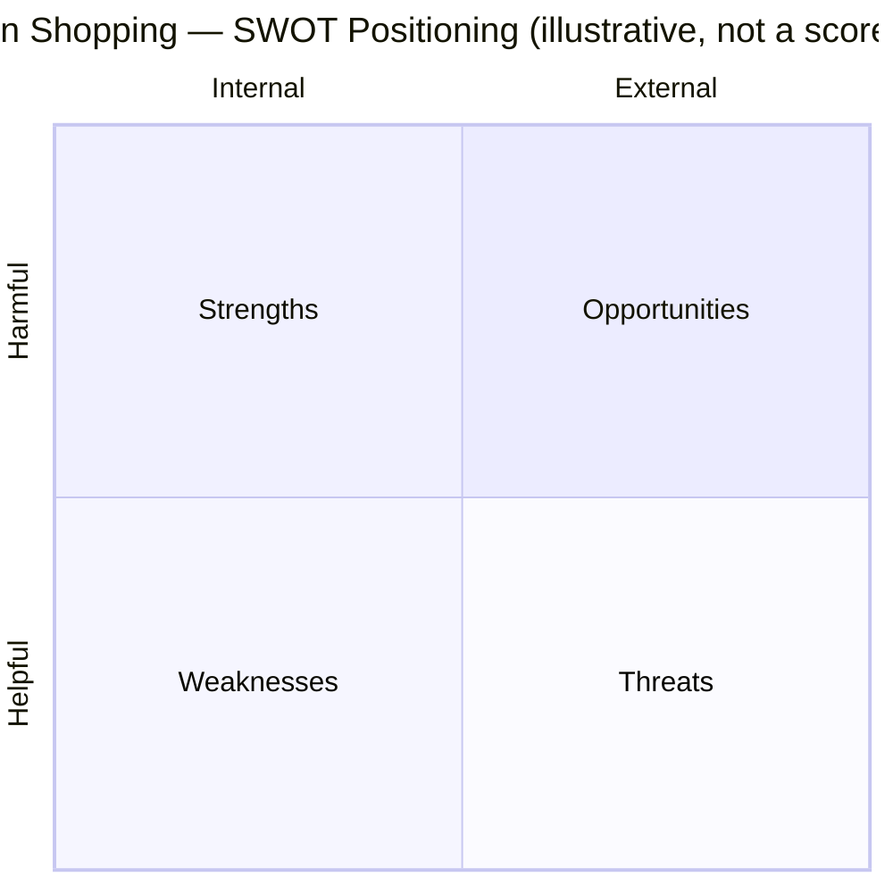

**Strengths**
- Largest 3P marketplace selection combined with owned logistics at global scale.
- Prime as a high-retention subscription bundling shipping + entertainment + (now) AI.
- Highest-margin, fastest-growing ad business among retailers, funding further investment.
- Deep first-party purchase-history data, an advantage no external AI agent can replicate.

**Weaknesses**
- Search/recommendation quality strained by sheer catalog size — "decision fatigue" is a named, recurring customer complaint.
- Counterfeit and fake-review problems persist despite continuous investment (Trust & Safety, Section 40).
- Seller experience complexity (fees, policy changes) creates friction and diversification pressure toward Walmart/Shopify.
- US e-commerce share has plateaued since 2021, signaling maturity in the core market.

**Opportunities**
- Becoming the default AI shopping layer (Alexa for Shopping) before third-party AI agents intercept research intent.
- Grocery and healthcare, where online penetration is still comparatively low.
- International markets (India, Latin America via competitors' gaps) where Amazon is not yet the runaway leader.
- Same-day/rural delivery expansion, cited by Amazon as doubling average monthly rural same-day customers YoY in 2025.

**Threats**
- Third-party general-purpose AI shopping agents (ChatGPT, Gemini, Claude) disintermediating product discovery.
- Regulatory scrutiny (antitrust, marketplace fairness, seller-fee investigations in the US and EU).
- Factory-direct, low-cost entrants (Temu, Shein) and changing customs rules affecting the broader competitive-pricing landscape.
- Walmart's omnichannel physical-store advantage in same-day grocery/essentials.

---

## 16. Porter's Five Forces

| Force | Intensity | Rationale |
|---|---|---|
| **Threat of new entrants** | Low–Medium | Logistics network and seller ecosystem take years/billions to replicate; but AI-native "agentic" shopping startups could enter as an *interface* layer without needing Amazon's warehouses. |
| **Bargaining power of buyers** | Medium–High | Switching cost is low (one click to open a competitor's app), but Prime lock-in and stored payment/address data raise effective switching friction. |
| **Bargaining power of suppliers/sellers** | Medium | Millions of small sellers have little individual leverage, but large brands and big-box-scale vendors can and do threaten to reduce Amazon exposure or negotiate terms directly. |
| **Threat of substitutes** | Medium–High | Walmart (omnichannel), direct-to-consumer brand sites, and increasingly AI shopping agents that route purchases elsewhere. |
| **Competitive rivalry** | High | Walmart near-revenue-parity in the US; Temu/Shein on price; Flipkart/Meesho regionally; intensifying ad-dollar competition among all retail media platforms. |

---

## 17. Business Model Canvas

| Block | Amazon Shopping |
|---|---|
| **Key Partners** | Third-party sellers, brand manufacturers, logistics carriers (UPS/USPS + Amazon's own network), payment networks, AWS (internal infra), advertisers |
| **Key Activities** | Catalog/search/ranking, fulfillment & delivery, trust & safety enforcement, seller tooling, advertising auction operations, AI/ML platform development |
| **Key Resources** | Fulfillment center network, proprietary recommendation/search AI, Prime member base, brand trust, capital for continuous infrastructure investment |
| **Value Propositions** | Selection + price + speed + trust + personalization, bundled with Prime entertainment benefits |
| **Customer Relationships** | Self-service at scale, AI-assisted (Alexa for Shopping), customer service for exceptions, A-to-Z Guarantee for trust repair |
| **Channels** | amazon.com web, iOS/Android apps, Alexa devices, Amazon physical/partner touchpoints |
| **Customer Segments** | Individual consumers (broad), Prime subscribers, Amazon Business (B2B) buyers, third-party sellers (a distinct two-sided segment) |
| **Cost Structure** | Cost of sales, fulfillment, technology/infrastructure, sales & marketing, G&A — fulfillment alone was **$109.1B in FY2025** |
| **Revenue Streams** | Product sales, 3P seller service fees, subscriptions (Prime/Kindle Unlimited/Audible), advertising, (AWS, though out of scope here) |

---

## 18. Revenue Model

Amazon Shopping's revenue is not a single stream but a layered model:

1. **1P retail margin** — traditional retail markup on Amazon-owned inventory (net product sales: **$296.3B FY2025**).
2. **3P seller services** — referral fees, fulfillment (FBA) fees, and storage fees charged to third-party sellers, who represent 61–62% of paid units. Third-party seller services revenue reached an estimated **$172.2B for full-year 2025** (industry estimate; Amazon reports this within "service sales" without always isolating the exact figure in every release).
3. **Subscription services** — Prime, Amazon Music, Kindle Unlimited, Audible: **$49.6B in FY2025**, up 11.8% YoY.
4. **Advertising** — sponsored products/brands/display: estimated **$68B+ in 2025**, growing over 20% YoY, and structurally higher-margin than retail.
5. **(Out of scope) AWS** — $128.7B FY2025, the profit engine funding shopping-experience R&D but not part of this product's direct revenue model.

**PM Insight:** The shift in revenue mix — services now exceeding product sales ($420.7B vs. $296.3B) — is the single most important financial fact for a Shopping PM to internalize. Amazon Shopping's job is increasingly to be a high-quality, high-trust *storefront and discovery layer* on top of a marketplace and ad business, not to maximize 1P retail margin directly.

---

## 19. Target Users

| Segment | Description | Primary need |
|---|---|---|
| **Everyday convenience shoppers** | Broad consumer base buying household essentials, electronics, apparel | Fast, reliable, low-effort repeat purchasing |
| **Prime loyalists** | Subscribers who default to Amazon as "first stop" for most purchases | Speed, bundled entertainment value, frictionless checkout |
| **Deal-driven / price-sensitive shoppers** | Compare price across platforms, wait for sales events (Prime Day) | Lowest verified price, deal transparency |
| **High-consideration researchers** | Buying electronics, appliances, big-ticket items | Trustworthy comparison, reviews, specs, return policy clarity |
| **Amazon Business / B2B buyers** | Procurement for small businesses, schools, healthcare | Bulk pricing, tax-exempt purchasing, multi-user accounts |
| **Third-party sellers** | The other side of the marketplace; not end-customers, but essential to product decisions | Fair discovery, predictable fees/policies, seller tooling |

---

## 20. Personas

### Persona 1 — "Convenience-First Chris"
- **Age/context:** 34, working parent, Prime member for 8 years.
- **Goal:** Replenish household essentials without thinking about it.
- **Frustration:** Doesn't want to compare 40 nearly-identical listings for paper towels.
- **What he needs from the product:** Subscribe & Save, reliable delivery windows, minimal decision-making.

### Persona 2 — "Research-Heavy Rhea"
- **Age/context:** 41, buying a $1,200 laptop for her small business.
- **Goal:** Confidence that she's picked the objectively right product, not just the best-marketed one.
- **Frustration:** Can't tell genuine reviews from incentivized/fake ones; too many near-identical SKUs.
- **What she needs from the product:** Trustworthy comparison tools, plain-language trade-off explanations (directly maps to the AI Shopping Concierge proposal).

### Persona 3 — "Deal-Hunter Devesh" (India context)
- **Age/context:** 26, price-sensitive, compares Amazon vs. Flipkart vs. Meesho before every purchase.
- **Goal:** Lowest true price including delivery fees and return friction.
- **Frustration:** Discount pricing can feel inflated/opaque; loyalty to whichever platform has the best deal that week.
- **What he needs from the product:** Transparent price-history and total-cost clarity.

### Persona 4 — "Small Seller Priya"
- **Age/context:** 38, runs a home-goods brand selling via FBA.
- **Goal:** Predictable visibility and fair ranking against larger competitors and Amazon's own private-label products.
- **Frustration:** Policy/fee changes with limited notice; difficulty competing with sponsored listings from larger sellers.
- **What she needs from the product:** Transparent seller tooling, fair search ranking, predictable cost structure.

*(These four personas are illustrative composites built from documented, publicly discussed pain points — not verbatim quotes from real individuals.)*

---

## 21. Jobs To Be Done (JTBD)

| Job Statement | Situation | Motivation |
|---|---|---|
| "When I run out of a household item, help me reorder it without thinking." | Routine replenishment | Save time/cognitive effort |
| "When I need to make a big purchase, help me feel confident I chose correctly." | High-consideration buying | Avoid regret, avoid returns |
| "When I want the best deal, help me trust that the price is genuinely competitive." | Price-sensitive shopping | Avoid feeling cheated |
| "When something arrives wrong or broken, help me resolve it with minimal effort." | Post-purchase issue | Preserve trust in the platform |
| "When I sell products, help me be seen by the right customers fairly." | Seller discovery | Sustainable business viability |

**PM Insight:** Nearly every core JTBD is fundamentally about *reducing effort or reducing risk* — never about "more selection." This validates that discovery/trust tooling (like the proposed AI Shopping Concierge) addresses a more valuable job than simply adding more catalog depth.

---

## 22. User Journey

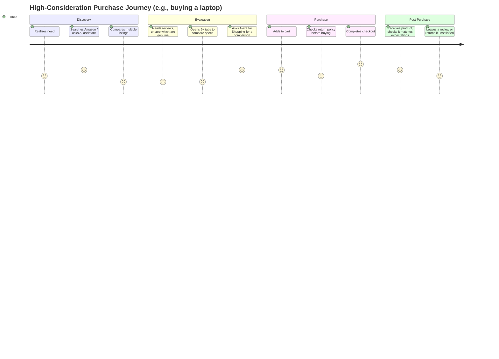

**Key friction points (scores 2/5):** comparing listings and validating review authenticity — precisely the moments the AI Shopping Concierge is designed to address.

---

## 23. User Flow

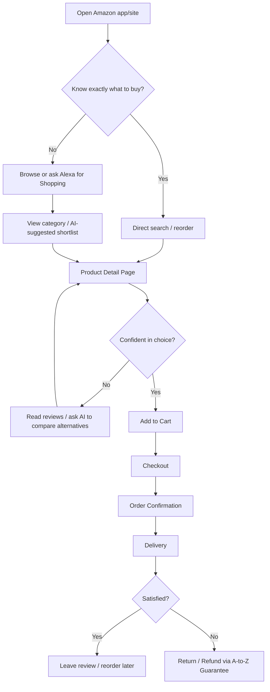

---

## 24. Information Architecture

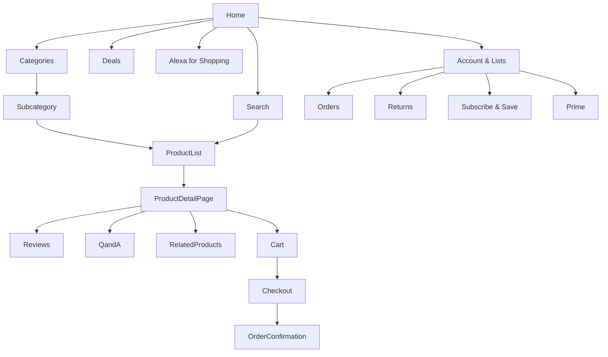

**PM Insight:** The IA has grown organically over 25+ years and now has at least three parallel "discovery entry points" (Search, Categories, Alexa for Shopping) competing for the same real estate above the fold — a classic symptom of a mature product layering new capabilities onto old navigation rather than re-architecting from scratch.

---

## 25. UX Audit

| Area | Observation | Severity |
|---|---|---|
| Search results density | Sponsored + organic + "related" + "similar item" modules can make a single search results page feel cluttered, especially on mobile | Medium |
| Review trustworthiness | Star ratings alone don't signal whether reviews are verified purchases, incentivized, or AI-generated summaries; "AI-generated review highlights" help but are a partial fix | High |
| Checkout | One-click / saved-info checkout remains a genuine best-in-class strength | — (positive) |
| Comparison across listings | No native side-by-side spec comparison tool for most categories; customers resort to opening multiple tabs | High |
| Returns | A-to-Z Guarantee and print-free returns (drop-off) are strong, low-friction differentiators | — (positive) |
| Cross-device continuity | Alexa for Shopping's 2026 unification directly targets prior fragmentation (a cart or question started on mobile not persisting to desktop/Echo) | Medium (being actively addressed) |

---

## 26. UI Audit

| Area | Observation |
|---|---|
| Visual hierarchy | Product cards balance image/price/rating well, but sponsored-vs-organic visual distinction is subtle (small "Sponsored" label), a recurring criticism in UX literature on dark-pattern risk |
| Mobile app navigation | Bottom nav bar plus a growing top-of-search AI entry point (Alexa icon) creates two competing "start here" affordances |
| Information density | Product detail pages are information-rich (specs, Q&A, reviews, related items) but can require significant scrolling on mobile before reaching reviews |
| Consistency | Core interaction patterns (cart, checkout, order tracking) are highly consistent across 20+ country storefronts — a genuine engineering/design achievement at this scale |

---

## 27. Accessibility

Amazon publishes an accessibility statement and has invested in screen-reader compatibility, keyboard navigation, and alt-text for product images (though alt-text quality varies by seller-submitted content, since much catalog imagery comes from third parties rather than Amazon directly). Voice shopping via Alexa is itself an accessibility feature for customers with visual or motor impairments. That said, independent accessibility audits of large e-commerce sites (industry-wide, not Amazon-specific) routinely find recurring third-party-marketplace issues: inconsistent alt-text, low-contrast promotional banners, and complex checkout modals that can trap keyboard focus.

**Amazon has not publicly disclosed** a comprehensive, product-specific accessibility conformance report (e.g., a current VPAT) for Amazon Shopping in the sources reviewed for this document, so this section reflects general accessibility best-practice observations rather than an audited compliance score.

---

## 28. Feature Breakdown

| Feature | Purpose | Maturity |
|---|---|---|
| Search & filters | Core discovery | Mature |
| Personalized recommendations | Cross-sell, retention | Mature |
| Reviews & Q&A | Trust-building | Mature, but trust concerns persist |
| AI-generated review highlights | Summarize large review volumes quickly | Recently matured |
| Alexa for Shopping (formerly Rufus) | Conversational discovery, comparison, memory across devices | New (unified May 2026) |
| Subscribe & Save | Recurring/replenishment purchasing | Mature |
| Prime video/music bundling | Retention via non-shopping value | Mature |
| Buy with Prime (off-Amazon checkout) | Extending Prime speed/trust to third-party-owned sites | Growing |
| "Add to delivery" (add items post-checkout, no extra shipping fee) | Reduce friction of forgotten items | New (2025); ~10% of Prime self-fulfilled volume within 6 months per Amazon's own Q4 2025 earnings commentary |
| A-to-Z Guarantee | Trust/dispute resolution | Mature |
| Amazon Business | B2B procurement | Mature, distinct product line |

---

## 29. AI Capabilities

**Verified / publicly confirmed functionality:**
- **Alexa for Shopping** (formerly Rufus) — generative-AI conversational shopping assistant; unifies Rufus's product/catalog knowledge with Alexa+'s personalization and cross-device memory. Rufus itself reportedly helped **over 300 million customers in 2025**, with monthly active users up **115%+ YoY** and engagement up **nearly 400% YoY**, per Amazon CEO Andy Jassy's public earnings commentary.
- **Personalized recommendations** — collaborative filtering and deep learning-based ranking, one of Amazon's oldest and most studied ML systems (documented extensively via Amazon Science publications).
- **AI-generated review highlights** — summarizes large volumes of reviews into thematic takeaways.
- **Search ranking / "COSMO"** — a common-sense knowledge layer augmenting Amazon's long-standing A9 search/ranking algorithm, referenced in third-party seller-optimization research as part of how Alexa for Shopping/Rufus interprets shopper intent beyond literal keywords.
- **Fraud detection** — Amazon has long described (in Amazon Science and security publications) using ML to detect fraudulent transactions and fake reviews at scale, though exact model architectures are not public.
- **Forecasting & inventory planning** — Amazon's fulfillment network relies on demand-forecasting ML to position inventory ahead of demand; described in general terms in Amazon's operations/logistics communications.

**Future opportunity / not confirmed as shipped (flagged explicitly as opportunity, not fact):**
- Fully agentic "autonomous purchasing" (AI completing purchases end-to-end without a tap of confirmation) is a directional ambition described in press coverage of Alexa for Shopping, but broad, default-on autonomous checkout is not confirmed as a shipped, universal capability as of this writing.
- Dynamic, real-time personalized pricing at the individual-customer level is frequently *rumored* in consumer discourse but **Amazon has not publicly disclosed** that it personalizes list price by individual customer identity (as opposed to standard promotional/dynamic pricing based on supply/demand, which is disclosed and common industry practice).

---

## 30. Product Metrics

| Metric type | Example metrics for Amazon Shopping |
|---|---|
| **North Star** | See Section 31 |
| **Input metrics** | Search sessions, catalog freshness, seller onboarding rate, ad impressions served |
| **Output metrics** | Units sold, GMV, conversion rate, repeat purchase rate |
| **Leading metrics** | Search-to-cart rate, Alexa for Shopping engagement/MAU growth, add-to-cart rate |
| **Lagging metrics** | Quarterly net sales, operating income, customer lifetime value |
| **Guardrail metrics** | Return rate, counterfeit/complaint rate, customer service contact rate per order, page load latency |
| **Marketplace metrics** | Third-party seller unit share (61–62% of paid units in 2025), active seller count (~1.9–2M actively selling, of ~9.7M registered, per third-party estimates) |
| **Logistics metrics** | Same-day/next-day item volume (8B+ items delivered same/next-day to US Prime members in 2025, +40% YoY, per Amazon's own Q4 2025 earnings commentary), on-time delivery rate |
| **Seller metrics** | Time-to-first-sale, FBA storage utilization, seller satisfaction/NPS |
| **Customer metrics** | Customer satisfaction (CSAT), Net Promoter Score (not consistently publicly disclosed by Amazon), repeat purchase frequency |
| **Prime metrics** | Subscription revenue ($49.6B FY2025, official), estimated member count (~240–250M globally, estimate, not disclosed since 2021), Prime member average annual spend (~$1,170/year vs. ~$570 for non-members, third-party estimate) |

---

## 31. North Star Metric

**Proposed North Star Metric: "Weekly Confident Purchases per Active Customer"** — defined as completed purchases that are *not* followed by a return, complaint, or repeat search for the same need within 14 days.

**Why not simply "units sold" or "GMV"?** Amazon has enormous incentive to maximize raw purchase volume, but a PM optimizing purely for units/GMV would be blind to decision fatigue, fake-review-driven bad purchases, and return-driven cost/trust erosion — exactly the problems named in the Problem Statement (Section 10). A "confident purchase" framing forces every team (search, recommendations, reviews, AI assistant) to optimize for a customer feeling good about a purchase, not merely making one.

*(Amazon does not publicly disclose its actual internal North Star metric; this is a constructed, defensible proposal for this case study, clearly marked as such.)*

---

## 32. Product Analytics

A mature marketplace like Amazon Shopping would instrument analytics across at least four layers:

1. **Session-level behavioral analytics** — search queries, filter usage, dwell time on product pages, scroll depth on reviews.
2. **Funnel analytics** — search → detail page → cart → checkout → delivery → review, with drop-off rate at each stage segmented by device, category, and new vs. returning customer.
3. **Cohort analytics** — retention and repeat-purchase behavior by acquisition channel, Prime status, and first-category purchased.
4. **Experimentation platform** — Amazon is widely known (via public engineering talks and Amazon Science publications) to run large-scale continuous A/B testing across search ranking, page layout, and recommendation algorithms; specific current experiment counts are not publicly disclosed.

**Assumption for this document:** exact tooling names and dashboard structures are internal and not publicly disclosed; the layers above reflect standard, defensible marketplace-analytics architecture rather than confirmed internal implementation detail.

---

## 33. AARRR (Pirate Metrics)

| Stage | Amazon Shopping application |
|---|---|
| **Acquisition** | Organic search/brand recognition, Prime Day marketing, referral, advertising partnerships, Alexa device ecosystem |
| **Activation** | First completed purchase; first Prime trial activation |
| **Retention** | Subscribe & Save enrollment, Prime renewal, repeat-purchase cadence, Alexa for Shopping habitual usage |
| **Referral** | Household/family Prime sharing, word-of-mouth around delivery speed/reliability |
| **Revenue** | 1P/3P sales, Prime subscription fees, advertising revenue from sellers competing for placement |

---

## 34. HEART Framework

| Dimension | Example metric |
|---|---|
| **Happiness** | CSAT after delivery; sentiment in review text |
| **Engagement** | Sessions per week, Alexa for Shopping conversational turns per session |
| **Adoption** | % of eligible customers who try Alexa for Shopping / Subscribe & Save within first 90 days |
| **Retention** | Prime renewal rate, month-over-month repeat purchase rate |
| **Task success** | Search-to-purchase completion rate; rate of "no results found" or abandoned comparison sessions |

---

## 35. Growth Strategy

Amazon's growth strategy for the shopping product rests on four levers, in order of current strategic emphasis:

1. **Deepen usage frequency, not just customer count.** With US market share plateaued (~36–38%), growth increasingly comes from higher share-of-wallet among existing customers — this is the core logic behind grocery/pharmacy expansion, same-day delivery scale-up, and "add to delivery."
2. **Win the AI-mediated discovery moment before it moves off-platform.** Alexa for Shopping's unification and 300M+ Rufus users in 2025 reflect an urgent, well-resourced push to keep purchase research on Amazon rather than ceding it to ChatGPT/Gemini/Claude-style agents.
3. **International expansion in markets where Amazon is not yet dominant** (India vs. Flipkart/Meesho, Latin America vs. Mercado Libre).
4. **Advertising and services growth**, which grows revenue and margin without requiring proportional growth in the shopper base itself.

---

## 36. Growth Loops

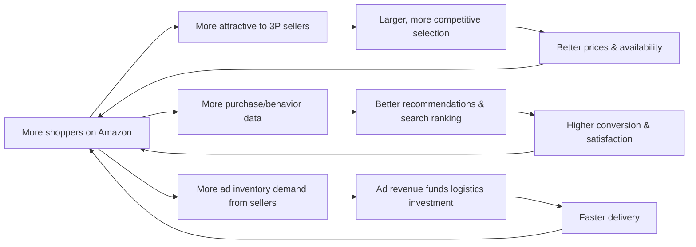

Three reinforcing loops: **(1) marketplace network effect** (more shoppers → more sellers → more selection → more shoppers), **(2) data/AI flywheel** (more usage → better personalization → higher conversion), and **(3) advertising-funded logistics loop** (more ad revenue → faster delivery → more customer retention).

---

## 37. Network Effects

Amazon Shopping exhibits a genuine **two-sided marketplace network effect**: more buyers attract more sellers (more selection, more competitive pricing), and more sellers/selection attract more buyers. This is Amazon's strongest defensible moat, distinct from AI features which are comparatively easier for well-funded competitors to replicate.

There is also a **data network effect**: every purchase, return, review, and search query improves Amazon's recommendation and ranking models, and — critically for this case study's proposed feature — improves the quality of any first-party AI assistant far beyond what a third-party AI agent (which lacks this purchase-history depth) could achieve on Amazon's own catalog.

**Weaker/contested network effect:** reviews. In theory, more reviews should mean more trustworthy signal; in practice, review volume has scaled faster than Amazon's ability to guarantee authenticity, which is why "fake reviews" appears repeatedly in this document as a recurring weakness rather than a strength.

---

## 38. Product Strategy

Amazon Shopping's product strategy in 2026 can be summarized as **"defend the discovery moment, extend the trust moment."** Concretely:

- Invest heavily in Alexa for Shopping as the primary AI discovery surface, reducing dependency on typed keyword search alone.
- Continue expanding logistics precision (same-day, rural same-day, "add to delivery") to keep the speed advantage durable against Walmart's omnichannel push.
- Strengthen trust systems (review authenticity, counterfeit detection) as a prerequisite for AI recommendations to be believable — an AI assistant is only as trustworthy as the underlying catalog/review data it draws from.
- Grow advertising and services revenue as the primary profit lever, allowing 1P retail margins to remain thin/competitive on price.

---

## 39. Monetization

| Stream | FY2025 scale | Margin profile |
|---|---|---|
| 1P retail | $296.3B net product sales | Thin (historically low single-digit to low double-digit) |
| 3P seller services | ~$172.2B (estimate) | Higher margin than 1P retail |
| Subscriptions (Prime, Music, Kindle Unlimited, Audible) | $49.6B | High margin once scale is reached |
| Advertising | ~$68B+ (estimate) | Very high margin, software-like economics |
| (AWS, out of scope) | $128.7B | Highest margin, funds R&D across the company |

**PM Insight:** Because advertising and subscriptions are structurally the highest-margin components, the shopping product's ranking and recommendation systems face a genuine tension: sponsored placements must be monetized without so degrading organic discovery quality that customers lose trust in search results — precisely the "sponsored vs. organic visual distinction" UX issue flagged in Section 25.

---

## 40. Trust & Safety

Publicly, Amazon has described ongoing investment in ML-based fraud detection, counterfeit-detection programs (e.g., "Project Zero," and brand registry tools allowing brand owners to report/remove counterfeits), and review-manipulation detection. Amazon has also pursued legal action against fake-review brokers as part of its enforcement approach, per its own public communications.

Despite this investment, counterfeit goods and incentivized/fake reviews remain frequently cited concerns in independent consumer and seller-community reporting — this is a genuine, unresolved tension rather than a solved problem, and this document does not claim otherwise. **Amazon has not publicly disclosed** a comprehensive, independently-audited counterfeit or fake-review prevalence rate, so any specific percentage claim about "how much" counterfeit/fake content exists on the platform would be an unverifiable estimate; this document deliberately does not offer one.

---

## 41. Technical Architecture

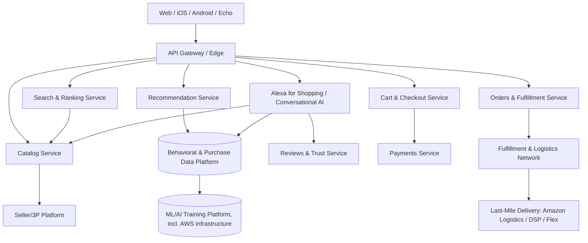

This is a **generalized, illustrative architecture** based on standard large-scale marketplace design and Amazon's own public engineering talks/blog posts describing microservice-oriented systems (Amazon is widely credited, including in its own communications, with pioneering the service-oriented architecture approach later formalized industry-wide). **Amazon has not publicly disclosed** its actual current production architecture in this level of detail; this diagram should be read as an industry-standard educational model, not a leaked or confirmed internal design.

---

## 42. Data Flow

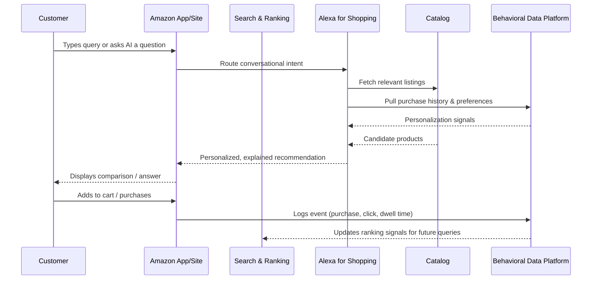

---

## 43. API Ecosystem

Amazon exposes several public developer-facing APIs relevant to the shopping ecosystem, per Amazon's own developer documentation:

- **Selling Partner API (SP-API)** — for third-party sellers to manage listings, orders, inventory, and reports programmatically.
- **Amazon Advertising API** — for sellers/agencies to manage sponsored ad campaigns.
- **Amazon Pay API** — allowing external merchants to accept Amazon-stored payment credentials off-Amazon.
- **Buy with Prime APIs** — extending Prime shipping/checkout to brands' own DTC websites.
- **Alexa Skills Kit / Alexa+ APIs** — for building voice/conversational experiences that can surface within the broader Alexa ecosystem.

**Not part of the public API surface (and not claimed here):** Amazon's internal search-ranking, recommendation-model, or Alexa for Shopping model-serving APIs are not publicly documented in a way this case study can responsibly describe; this section only covers confirmed, publicly documented developer-facing surfaces.

---

## 44. Privacy & Security

Amazon's public privacy notice describes collection of purchase history, browsing behavior, device/location data (where permitted), and voice data (for Alexa interactions) to power personalization, and states customers can review/manage certain data (e.g., the "About You" preferences page and "Review Alexa History" page referenced in Amazon's own shopping-AI documentation). Security practices publicly referenced include encrypted payment handling and account-protection features (2-step verification).

**Open questions not resolved by public disclosure:** the precise retention period for conversational data used by Alexa for Shopping, and the exact boundary between data used for personalization versus data used for advertising targeting, are not fully detailed in the consumer-facing materials reviewed for this case study. A responsible PM building on top of this system would need to source Amazon's current, full privacy policy and any regional (GDPR/CCPA/DPDP) compliance documentation directly rather than relying on general summaries.

---

## 45. Pain Points

Ranked by frequency of appearance in independent consumer/seller commentary and by direct relevance to the core Problem Statement:

1. **Decision fatigue** from near-duplicate listings (multiple sellers/brands offering functionally identical items).
2. **Fake/incentivized reviews** eroding trust in the star-rating system.
3. **Counterfeit products**, particularly in categories like electronics accessories and apparel.
4. **Checkout/cart clutter** from upsell modules that can obscure the primary purchase path.
5. **Returns friction** for certain categories (though generally strong relative to industry).
6. **Seller-side unpredictability** — fee and policy changes with limited advance notice.
7. **Advertising saturation** in search results, subtly blurring organic vs. sponsored results.
8. **Fragmented AI experience pre-2026** — a documented reason Amazon itself gave for unifying Rufus and Alexa+.

---

## 46. Opportunity Mapping

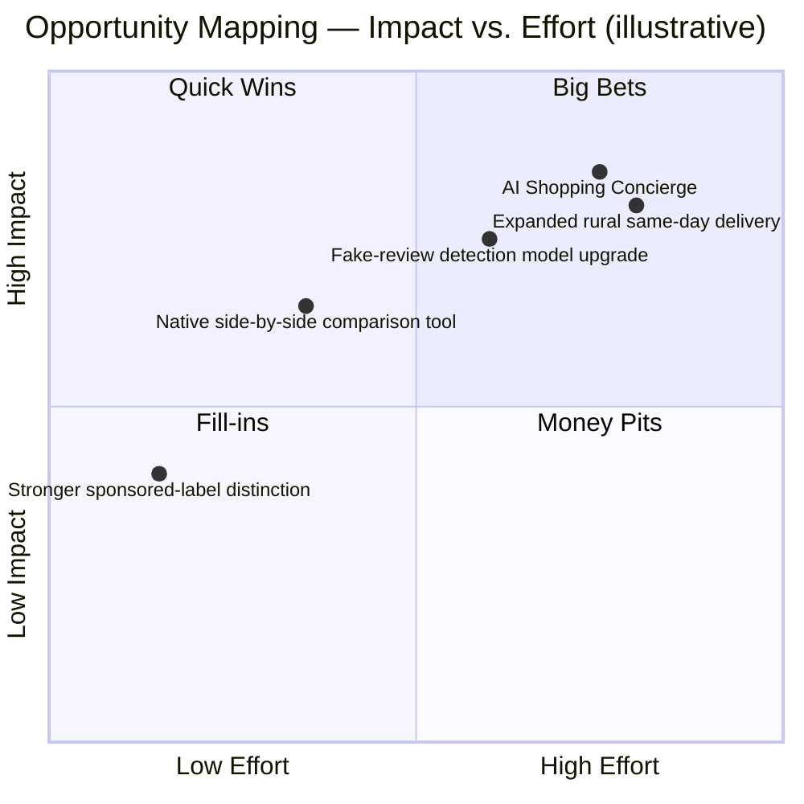

---

## 47. RICE Prioritization

| Initiative | Reach | Impact | Confidence | Effort | RICE Score |
|---|---|---|---|---|---|
| AI Shopping Concierge | 9 (broad, all high-consideration shoppers) | 3 (massive) | 70% | 8 | (9×3×0.7)/8 ≈ **2.4** |
| Native comparison tool | 7 | 2 | 80% | 5 | (7×2×0.8)/5 ≈ **2.2** |
| Sponsored-label redesign | 10 (all searchers) | 1 (minor) | 90% | 1 | (10×1×0.9)/1 = **9.0** |
| Fake-review detection upgrade | 8 | 2.5 | 60% | 7 | (8×2.5×0.6)/7 ≈ **1.7** |

*(Scores use a standard 1–3 Impact scale for illustration; this is a constructed prioritization exercise for teaching purposes, not Amazon's actual internal roadmap scoring.)*

---

## 48. MoSCoW Prioritization (for the AI Shopping Concierge)

- **Must have:** Conversational product Q&A; side-by-side comparison; explanation of trade-offs in plain language; access to purchase history for personalization.
- **Should have:** Fake-review flagging; shopping list building; preference memory across sessions.
- **Could have:** Predictive replenishment ("you'll likely need this again in ~3 weeks"); long-term ownership cost estimation.
- **Won't have (this release):** Fully autonomous, no-confirmation purchasing; cross-retailer price comparison (out of scope — reinforces Amazon retention rather than sending customers elsewhere).

---

## 49. Kano Model

| Feature | Kano Category |
|---|---|
| Fast, accurate search results | Basic (expected) |
| Reliable delivery estimates | Basic (expected) |
| Personalized recommendations | Performance (more = better, linear satisfaction) |
| AI-generated review highlights | Performance |
| Conversational AI Concierge with trade-off explanations | **Attractive/Delighter** (not expected yet, but differentiating) |
| Fake-review detection surfaced directly to the shopper | Attractive today; likely to become Basic within a few years as competitors catch up |

---

## 50. Feature Proposal — AI Shopping Concierge

**Problem it solves:** Directly answers the Problem Statement (Section 10) — decision fatigue and trust erosion at the moment of highest-consideration purchases — while extending Amazon's existing Alexa for Shopping investment rather than competing with it.

**One-line pitch:** *A conversational shopping assistant that doesn't just answer questions about one product — it actively compares your real options, tells you honestly which ones aren't worth it, and remembers what you care about so every future purchase gets easier.*

**Why now:** Alexa for Shopping (launched May 2026) proves Amazon is willing to invest heavily in this space and already has the underlying conversational infrastructure, purchase-history data, and catalog knowledge graph. The AI Shopping Concierge is best understood as a **deepening of specific high-value capabilities within that existing surface** — comparison depth, trust signals, and long-term cost/preference modeling — rather than a competing, separate product.

Full requirements follow in the PRD (Section 51).

---

## 51. PRD — AI Shopping Concierge

### 51.1 Overview
**Feature:** AI Shopping Concierge
**Owning surface:** Extension of Alexa for Shopping, accessible from search bar, product detail pages, and cart.
**Target release:** Phased rollout over 3 quarters (see Section 53).

### 51.2 Goals
- Reduce decision-fatigue-driven cart abandonment on high-consideration purchases.
- Increase customer trust in comparison/review data via transparent, explainable recommendations.
- Increase repeat engagement with Amazon's AI layer versus third-party general-purpose AI agents.
- Preserve Amazon's margin structure (does not recommend off-platform purchases).

### 51.3 Non-Goals
- Not a general-purpose chatbot (no unrelated Q&A, no cross-retailer price comparison).
- Not fully autonomous purchasing at launch — every purchase requires explicit customer confirmation.

### 51.4 User Stories & Acceptance Criteria

| # | User Story | Acceptance Criteria |
|---|---|---|
| 1 | As a shopper comparing similar products, I want the AI to summarize key differences, so I can decide faster. | Given 2+ similar products in view, the Concierge generates a structured comparison (price, key specs, rating quality, return policy) within 5 seconds; each claim links to its source (spec sheet, review excerpt reference — not verbatim reproduction). |
| 2 | As a shopper, I want the AI to warn me if reviews look suspicious, so I don't get misled. | If a listing's review-authenticity confidence score falls below a defined threshold, the Concierge surfaces a neutral, factual notice (e.g., "a notable share of reviews for this listing show patterns associated with low authenticity") without accusing any individual reviewer. |
| 3 | As a shopper, I want the AI to remember my preferences (e.g., "always show me eco-friendly options"), so I don't repeat myself. | Preference is stored to the account profile, editable/deletable from the "About You" preferences page, and applied on next 3+ sessions unless cleared. |
| 4 | As a shopper, I want a rough total cost of ownership for durable goods, so I can budget properly. | For eligible categories (appliances, electronics), Concierge shows estimated consumables/energy/maintenance cost ranges, clearly labeled as an estimate, with the underlying assumption stated. |
| 5 | As a shopper, I want the AI to build a shopping list from a conversation, so I can check out later. | Items mentioned in a qualifying conversational turn can be added to a named list with one tap; list persists across devices. |
| 6 | As a shopper, I want to understand *why* a product was recommended, so I can trust or challenge it. | Every recommendation includes a one-sentence rationale (e.g., "recommended because it matches your stated budget and past preference for cordless tools"). |

### 51.5 Edge Cases
- Product has too few reviews for a meaningful authenticity assessment → Concierge discloses "not enough review data yet" rather than fabricating a confidence score.
- Customer preferences conflict with best objective option (e.g., prefers a brand that scores poorly on a stated need) → Concierge respects preference but transparently notes the trade-off rather than silently overriding the customer.
- Category with no comparable alternatives (unique/niche item) → Concierge answers direct questions but does not force a comparison table that doesn't meaningfully exist.
- Non-English languages / low-resource locales → Feature ships to English-language US market first; other locales follow only once translation and catalog-metadata quality are validated (avoids the "Rufus is more advanced in the US than elsewhere" gap noted in current Alexa for Shopping coverage).
- Suspected coordinated review manipulation on a listing → Escalates to Trust & Safety review queue rather than the Concierge unilaterally labeling a seller as fraudulent.

### 51.6 Functional Requirements
- FR1: Conversational interface accessible from search bar, PDP, and cart (text and voice).
- FR2: Structured comparison generation across up to 5 products at once.
- FR3: Review-authenticity signal surfaced at the listing level (binary/tiered, not a raw ML score exposed to customers).
- FR4: Preference memory stored per customer profile, user-editable and deletable.
- FR5: Total cost of ownership estimator for eligible durable-goods categories.
- FR6: Shopping list creation and persistence across devices.
- FR7: Explanation ("why this recommendation") attached to every suggested product.
- FR8: All conversational history reviewable/deletable via existing "Review Alexa History" surface.

### 51.7 Non-Functional Requirements
- Response latency: comparison generation under 5 seconds at p90.
- Availability: 99.9% for the conversational service tier.
- Privacy: preference data must be deletable within 30 days of a customer request (aligned to standard data-subject-request timelines under regimes like GDPR/CCPA).
- Fairness: comparison logic must not systematically favor Amazon's own private-label products over equivalent 3P alternatives without disclosure — this is both an ethical and regulatory-risk requirement given ongoing marketplace-fairness scrutiny.
- Accessibility: full feature parity via screen reader and voice-only interaction (no vision-dependent-only affordances).

### 51.8 Rollout Strategy
See Section 53.

### 51.9 KPI Dashboard
See Section 55.

### 51.10 A/B Testing Plan
See Section 54.

### 51.11 Success Metrics
See Section 55.

### 51.12 Risks
See Section 57.

### 51.13 Technical Architecture (feature-specific)

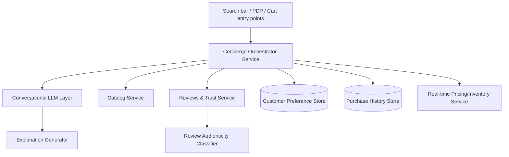

---

## 52. Wireframes

Text-based wireframe description (illustrative, not a pixel-accurate mock — final visual design would go through Amazon's design system):

**Product Detail Page — Concierge Panel (collapsed state)**
```
┌─────────────────────────────────────────┐
│ [Product Image]      Product Title       │
│                       ★★★★☆ 4.3 (12,402) │
│                       $79.99              │
│  ┌───────────────────────────────────┐   │
│  │ 💬 Ask Alexa for Shopping about    │   │
│  │    this product or compare with    │   │
│  │    similar items          [Ask >] │   │
│  └───────────────────────────────────┘   │
└─────────────────────────────────────────┘
```

**Concierge Panel (expanded — comparison view)**
```
┌─────────────────────────────────────────┐
│  Comparing 3 cordless drills             │
│  ─────────────────────────────────────   │
│  Model A   $79.99   ★4.3   ⚠ Some reviews │
│                              show low-    │
│                              authenticity │
│                              patterns     │
│  Model B   $94.99   ★4.7   ✅ High review  │
│                              confidence   │
│  Model C   $69.99   ★4.1   ✅ Good value   │
│                                           │
│  "Recommended: Model B — best reviewed,   │
│   matches your past preference for       │
│   brushless motors."                      │
│  [ Add Model B to Cart ]  [ Ask follow-up]│
└─────────────────────────────────────────┘
```

---

## 53. Rollout Plan

| Phase | Scope | Duration |
|---|---|---|
| **Phase 0 — Internal dogfood** | Amazon employees, opt-in | 4 weeks |
| **Phase 1 — US beta** | 5% of US Prime members, electronics & home-improvement categories only | 8 weeks |
| **Phase 2 — US expansion** | 50% of US customers (Prime + non-Prime), expand to appliances, apparel | 8 weeks |
| **Phase 3 — Full US rollout** | 100% of US customers, all eligible categories | Ongoing |
| **Phase 4 — International** | UK, Germany, India (following locale-specific catalog/translation validation) | Following successful US metrics review |

Rollout gated at each phase by the KPI thresholds in Section 55; any statistically significant regression in guardrail metrics (return rate, customer complaint rate, latency) halts expansion until resolved.

---

## 54. A/B Testing Plan

| Test | Hypothesis | Primary metric | Guardrails |
|---|---|---|---|
| Concierge panel visibility (shown vs. hidden by default on PDP) | Visible entry point increases engagement without hurting page load | Concierge open rate, conversion rate | Page load latency, bounce rate |
| Explanation text (rationale shown vs. not shown) | Showing "why recommended" increases trust and add-to-cart rate | Add-to-cart rate on recommended item | Return rate (checking recommendations aren't just persuasive but accurate) |
| Review-authenticity warning (shown vs. suppressed) | Warning reduces purchase of low-authenticity-review listings without tanking overall category conversion | Purchase shift toward higher-confidence listings | Seller complaint rate, overall category GMV |
| Preference memory (on vs. off) | Remembering preferences increases repeat engagement | Sessions per week using Concierge | Perceived "creepiness"/privacy complaint rate |

Each test runs for a minimum of 2 full weeks to capture weekday/weekend variance, with pre-registered minimum detectable effect sizes and guardrail stop-conditions.

---

## 55. KPI Dashboard

**Primary success metrics:**
- Concierge weekly active users (WAU) as % of total Shopping app WAU
- Add-to-cart rate for Concierge-recommended items vs. non-Concierge sessions
- Post-purchase return rate for Concierge-assisted purchases vs. baseline (target: lower)
- Customer-reported trust/CSAT for high-consideration categories

**Guardrail metrics:**
- p90 latency for comparison generation
- Complaint/escalation rate related to AI recommendations
- Seller complaint rate regarding fairness of comparisons
- Privacy opt-out / preference-deletion rate (a spike would indicate discomfort with memory features)

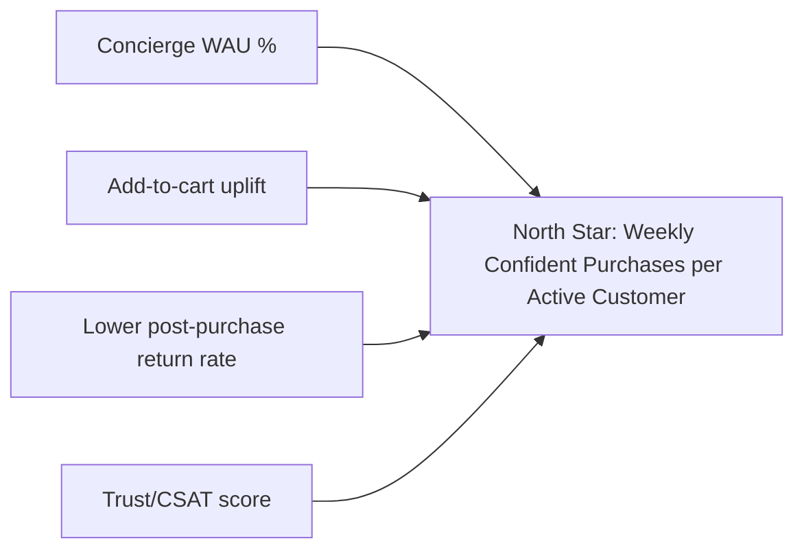

---

## 56. Product Roadmap

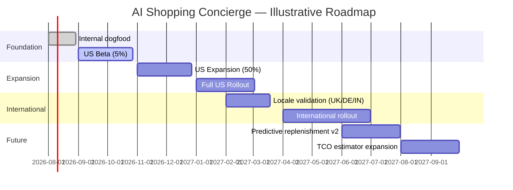

*(Dates are illustrative planning assumptions for this exercise, not confirmed Amazon roadmap commitments.)*

---

## 57. Risks & Mitigation

| Risk | Likelihood | Impact | Mitigation |
|---|---|---|---|
| Perceived favoritism toward Amazon private-label products in comparisons | Medium | High (regulatory + trust) | Enforce and audit a fairness constraint in ranking logic; disclose when a private-label item is included in a comparison |
| Review-authenticity warnings create seller disputes/legal risk | Medium | Medium-High | Use calibrated, non-accusatory language; route disputed cases to human review, not automated seller penalties |
| Over-reliance on AI recommendation reduces genuine customer research/comparison skills (user autonomy concern) | Low-Medium | Medium | Always show underlying data, not just a verdict; make "why" explanations mandatory, not optional |
| Latency/cost of LLM-based comparison at Amazon's traffic scale | Medium | High (infra cost) | Cache common comparisons; reserve full generative response for genuinely novel queries |
| Privacy backlash over preference memory | Low-Medium | Medium-High | Clear opt-out, visible preference management UI, no cross-account data sharing without consent |
| Cannibalizing existing Alexa for Shopping engagement metrics rather than adding incremental value | Medium | Medium | Ship as an enhancement within Alexa for Shopping's existing surface, not a competing parallel assistant |

---

## 58. Future Vision

Looking beyond this feature, the long-term direction implied by Amazon's own public statements (Jassy's stated ambition to build "the best shopping assistant anywhere") points toward:

- **Deeper personalization** using long-horizon purchase history (multi-year appliance replacement cycles, seasonal patterns).
- **Cross-device continuity** already begun with Alexa for Shopping (2026), likely extending further into ambient/wearable and smart-home contexts.
- **Increasingly agentic capabilities** (automated reordering, price-drop-triggered purchases) — always, this document would argue, gated behind explicit customer-set rules rather than silent autonomy, given the trust risks outlined in Section 57.
- **Continued blurring of retail, advertising, and AI assistant roles**, which will require Amazon to invest as much in *fairness and disclosure* infrastructure as in AI capability itself, to avoid regulatory and trust backlash.

---

## 59. PM Lessons

1. **Scale doesn't fix search quality — it stresses it.** More sellers and more listings without proportional investment in ranking/trust makes discovery *harder*, not easier. Selection is not automatically a virtue.
2. **A marketplace PM serves two customers who sometimes conflict** — the shopper (wants best price/quality) and the seller (wants fair visibility) — and the product's ranking and fee decisions are the arbitration mechanism between them.
3. **The highest-margin part of the business (ads) can quietly damage the core product experience (organic discovery) if not actively guarded** — margin pressure and UX quality are in constant tension and require deliberate, not accidental, trade-off decisions.
4. **Owning the "first moment of research" is now a strategic imperative**, not just a UX nicety — losing that moment to a third-party AI agent risks losing the entire downstream purchase, which is why Amazon moved decisively (and fast) to unify Rufus and Alexa+.
5. **Trust is a compounding asset and a compounding liability.** A-to-Z Guarantee and easy returns built trust over 25+ years; a wave of visible fake reviews or counterfeit incidents could erode it faster than it was built.

---

## 60. PM Interview Questions

1. "Amazon's US e-commerce market share has plateaued around 36–38% since peaking near 42% in 2021. As a PM on Amazon Shopping, what would you investigate first, and what metrics would you look at?"
2. "Design a feature that helps reduce decision fatigue for a customer comparing 40 nearly-identical phone cases. What trade-offs would you consider between showing more information vs. reducing choice?"
3. "Third-party sellers made up ~61–62% of paid units in 2025. How would you balance search-ranking fairness between Amazon's own private-label products and competing third-party sellers?"
4. "How would you measure whether an AI shopping assistant like Alexa for Shopping is actually creating value, versus just shifting existing purchase behavior into a new UI?"
5. "A generative AI feature occasionally recommends a product with reviews that later turn out to be manipulated. How do you think about accountability and product design to reduce (not just detect) this risk?"
6. "If you were the PM proposing an 'AI Shopping Concierge,' what's the single guardrail metric you'd insist on before scaling past a 5% beta, and why?"

---

## 61. References

All figures and claims in this document are drawn from, or explicitly estimated relative to, the following categories of sources:

- **Amazon official sources:** Amazon.com, Inc. SEC filings (Form 10-K / Annual Report to Shareholders, FY2025), Amazon quarterly earnings press releases (Q1–Q4 2025, via `ir.aboutamazon.com`), Amazon press announcements on `aboutamazon.com` (including the May 13, 2026 Alexa for Shopping launch announcement), and public statements by Amazon executives (CEO Andy Jassy, CFO Brian Olsavsky) on quarterly earnings calls.
- **Regulatory filings:** SEC EDGAR filings for Amazon.com, Inc. (CIK 0001018724).
- **Industry/analyst estimates (explicitly marked as such throughout):** Statista, Marketplace Pulse, eMarketer, Capital One Shopping research, Digital Commerce 360, and other market-research aggregators, used only for figures Amazon does not itself disclose (e.g., Prime membership count, exact ad revenue as an isolated line item, US e-commerce market share percentage).
- **Journalism covering the 2026 Rufus → Alexa for Shopping transition:** GeekWire, Axios, CNBC (May 2026 coverage).

Where sources disagreed (e.g., Amazon's US e-commerce share ranging from 35.7% to 37.6% across different analysts), this document presented a range rather than a single false-precision figure.

---

## 62. About the Author

**Gaurav Singh**
*Aspiring Product Manager | Building in Public*

Gaurav is documenting his product management growth through a 90-Day Product Management Case Study Challenge, publishing one deep-dive case study per milestone on real, publicly-traded products. This case study — Day 13/90, focused on Amazon — reflects an effort to practice the core PM skills of market research, prioritization frameworks, PRD writing, and metrics design against a company whose scale and complexity make it a genuinely difficult (and instructive) subject.

- GitHub: [github.com/gaurav-product](https://github.com/gaurav-product)
- LinkedIn: [linkedin.com/in/gaurav-singh-986b40197](https://linkedin.com/in/gaurav-singh-986b40197/)

---

## 63. License

This case study is released under the **MIT License**. It is an independent educational analysis and is not affiliated with, endorsed by, or sponsored by Amazon.com, Inc. All Amazon trademarks, product names, and screenshots (where referenced, not reproduced) remain the property of Amazon.com, Inc. and are referenced here solely for commentary, criticism, and educational purposes.

```
MIT License

Copyright (c) 2026 Gaurav Singh

Permission is hereby granted, free of charge, to any person obtaining a copy
of this document and associated files, to deal in the Software without
restriction, including without limitation the rights to use, copy, modify,
merge, publish, distribute, sublicense, and/or sell copies, subject to the
following conditions: the above copyright notice and this permission notice
shall be included in all copies or substantial portions.

THE SOFTWARE IS PROVIDED "AS IS", WITHOUT WARRANTY OF ANY KIND.
```

---

## 64. Self Review

**What this document does well:**
- Distinguishes clearly, throughout, between official Amazon-disclosed figures, third-party estimates, and constructed assumptions — rather than presenting a single, falsely-precise picture of a company that discloses less than outside observers often assume.
- Grounds the proposed feature (AI Shopping Concierge) in a real, current, and verifiable 2026 development (the Rufus → Alexa for Shopping unification) rather than inventing a feature in a vacuum.
- Provides a genuinely complete PRD (user stories, acceptance criteria, edge cases, functional/non-functional requirements) rather than a superficial feature pitch.

**Honest limitations:**
- Several "required" figures (exact current Prime membership count, precise SAM, an isolated GAAP advertising-revenue line) are **not publicly disclosed by Amazon** and are presented as ranges or clearly-labeled estimates rather than invented precision — by design, in line with the "never fabricate data" instruction.
- Wireframes are described textually/schematically rather than as pixel-perfect visual mockups or actual Amazon screenshots, since reproducing Amazon's actual UI/branding is not appropriate for this kind of document.
- This is a single-author, single-pass case study; a real Amazon PM would have access to internal data (actual North Star metric, actual A/B test results, actual architecture) that necessarily is not available to an external, public-information-only analysis.

---

## 65. Appendix

**Glossary**
- **1P (First-Party):** Products sold directly by Amazon as the merchant of record.
- **3P (Third-Party):** Products sold by independent sellers using Amazon's marketplace/fulfillment infrastructure.
- **FBA:** Fulfillment by Amazon — Amazon handles storage, packing, and shipping for third-party sellers.
- **GMV:** Gross Merchandise Value — total value of goods sold through a marketplace, including 3P sales Amazon doesn't recognize as its own revenue.
- **A-to-Z Guarantee:** Amazon's buyer-protection program for marketplace purchases.
- **COSMO:** A common-sense knowledge layer referenced in third-party seller-optimization research as augmenting Amazon's A9 search/ranking system for AI-driven query interpretation.

**Key data points at a glance (FY2025, official unless marked):**
- Total net sales: $716.9B
- Operating income: $80.0B
- AWS net sales: $128.7B
- Advertising revenue: ~$68B+ (estimate)
- Prime subscription revenue: $49.6B
- Third-party paid-unit share: ~61–62%
- US e-commerce market share: ~36–38% (estimate)

*End of document.*
