# 🎨 Canva — Product Management Case Study
### Day 14/90 · 90-Day Product Management Case Study Challenge

> A deep, evidence-based teardown of Canva's visual-communication platform — strategy, AI systems, monetization, and a full PRD for a proposed **Magic Brand Guardian** feature.


---

## 2. Repository Metadata

| Field | Value |
|---|---|
| Repository | `Day-14-Canva` |
| Challenge | Day 14/90 – Product Management Case Study Challenge |
| Product analyzed | Canva (core design editor + Visual Suite: Docs, Whiteboards, Sheets, Video, Websites) — with ecosystem context from Magic Studio (AI), Canva for Teams/Enterprise, Canva for Education, and Affinity |
| Company | Canva Pty Ltd (private company, Sydney, Australia) |
| Domain | Visual Communication / No-Code Design Software / AI-Assisted Content Creation |
| Category | SaaS • Design • AI • Productivity • Creator Economy |
| Primary competitors covered | Adobe Express, Figma, Microsoft Designer, Adobe Creative Cloud, CapCut |
| Author | Gaurav Singh |
| Last updated | July 2026 |
| Data cutoff | Public information available through mid-2026 (see References) |

**Methodology note:** Every figure in this document is either (a) sourced from Canva's own newsroom, official pricing/policy pages, or on-the-record statements by Canva executives (e.g., co-founder Cliff Obrecht), (b) explicitly labeled as a **third-party industry estimate** (Canva is a private company and does not file public financial statements), or (c) explicitly labeled as an **assumption made for educational purposes**. Where sources disagree — which happens often here, since Canva does not publish audited financials — this document presents a range rather than a single false-precision number, and says so explicitly.

---

## 3. Badges


-yellow)
-informational)

---

## 4. Table of Contents

1. Cover
2. Repository Metadata
3. Badges
4. Table of Contents
5. Executive Summary
6. Product Overview
7. Company Background
8. Product Timeline
9. Vision & Mission
10. Problem Statement
11. Market Research
12. Industry Analysis
13. TAM / SAM / SOM
14. Competitor Analysis
15. SWOT Analysis
16. Porter's Five Forces
17. Business Model Canvas
18. Revenue Model
19. Target Users
20. Personas
21. Jobs To Be Done (JTBD)
22. User Journey
23. User Flow
24. Information Architecture
25. UX Audit
26. UI Audit
27. Accessibility
28. Feature Breakdown
29. AI Capabilities
30. Product Metrics
31. North Star Metric
32. Product Analytics
33. AARRR (Pirate Metrics)
34. HEART Framework
35. Growth Strategy
36. Growth Loops
37. Network Effects
38. Product Strategy
39. Monetization
40. Trust & Safety
41. Technical Architecture
42. Data Flow
43. API Ecosystem
44. Privacy & Security
45. Pain Points
46. Opportunity Mapping
47. RICE Prioritization
48. MoSCoW Prioritization
49. Kano Model
50. Feature Proposal — Magic Brand Guardian
51. PRD — Magic Brand Guardian
52. Wireframes
53. Rollout Plan
54. A/B Testing Plan
55. KPI Dashboard
56. Product Roadmap
57. Risks & Mitigation
58. Future Vision
59. PM Lessons
60. PM Interview Questions
61. References
62. About the Author
63. License
64. Self Review
65. Appendix

---

## 5. Executive Summary

Canva is a Sydney-headquartered, privately held visual-communication platform that has grown from a 2013 online design tool into what it now calls a "Visual Suite" — spanning presentations, documents, whiteboards, video, websites, and print, unified by a generative-AI layer called **Magic Studio**. Canva reports it ended 2025 with **more than 265 million monthly active users** and **31 million+ paying subscribers**, up from roughly 220 million MAU a year earlier — figures reported in press coverage of company statements, since Canva does not publish audited user metrics. Co-founder **Cliff Obrecht** has stated publicly that Canva's annualized revenue would close 2025 "very close if not at $4 billion," building on previously reported **$3.5 billion in annualized revenue** (~35% YoY growth), with the company describing itself as profitable for eight consecutive years. Following an **August 2025 employee share tender**, Canva was valued at approximately **$42 billion**, in the same broad range as its 2021 peak (reported between $40–54.5 billion across different 2021 rounds), after a multi-year plateau widely discussed in the press as a "flat-to-down" period for the company's valuation between 2022 and 2024.

This case study treats **Canva's core Visual Suite** as the primary product under review, while acknowledging it cannot be separated from **Magic Studio** (the AI layer now reportedly used **800 million times per month**, up 700% year-over-year), **Canva for Teams/Enterprise** (the fastest-growing segment, reportedly reaching **$500 million in ARR** at 100% growth), **Canva for Education** (free for verified K-12 teachers/students, reportedly used by 60 million students and teachers), and **Affinity** (the professional design suite Canva acquired in 2024 and made fully free in 2026).

The core PM tension explored throughout this document is: **the same generative-AI capability that made Canva radically more accessible (anyone can now produce a "good enough" design in seconds) is now producing content faster than any human brand, legal, or design-review process can keep up with.** Canva already sells a partial answer to this — Brand Hub, template locking, and approval workflows inside Canva Teams — but that tooling was built for a world of manual design, not one where a single Marketing team can generate hundreds of AI drafts an hour. The proposed feature in this case study, **Magic Brand Guardian**, extends Canva's existing Brand Hub investment with an AI reviewer that checks every design — AI-generated or human-made — against brand rules *before* it is exported or shared, rather than relying on manual review that cannot scale to Magic Studio's growth curve.

**Key facts underpinning this analysis (unless noted, as reported by Canva or in company-confirmed press coverage; Canva is privately held and does not publish audited financials):**

| Metric | Value | Source Type |
|---|---|---|
| Monthly active users (end of 2025) | 265M+ | Company-reported (via press) |
| Paid subscribers | 31M+ | Company-reported (via press) |
| Annualized revenue (2025) | ~$3.5B, trending toward ~$4B | Company-reported (co-founder statement) |
| YoY revenue growth | ~35% | Company-reported (via press) |
| Valuation (August 2025 tender) | ~$42B | Reported (employee share sale, third-party financial press) |
| Total disclosed funding raised | ~$612M | Third-party estimate (private company) |
| Enterprise/Teams (25+ seats) ARR | ~$500M, +100% YoY | Company-reported (via press) |
| Magic Studio monthly AI uses (2026) | ~800M, +700% YoY | Company-reported (via press) |
| Total designs created since 2013 | 35B+ | Company-reported |
| Employees | ~5,300–5,500 globally | Third-party estimate |
| Countries reached | 190 | Company-reported |
| Fortune 500 usage | 95% | Company-reported |

---

## 6. Product Overview

**Canva** is a browser- and app-based visual-communication platform (web, iOS, Android, desktop apps) built around a drag-and-drop editor, a library of over 1.6 million templates, and (as of the 2025 "Visual Suite 2.0" launch) a unified canvas that spans presentations, documents ("Docs"), whiteboards, spreadsheets ("Sheets"), video, websites, social graphics, and print — all built from the same underlying design object model, so a chart built in Sheets can be dropped directly into a Doc or a Whiteboard without exporting/re-importing.

Layered on top of that editor is **Magic Studio**, Canva's generative-AI product line, which as of 2026 includes a conversational chat interface (type or speak a request; receive an editable Canva design, not a flattened image), **Magic Charts** (data → interactive chart), **Magic Insights** (data → written trend summary), **Dream Lab** (AI image generation, including a 2026 "Style Transfer" feature), and **Canva Code** (an AI code-generation surface). The product also now includes **Affinity**, the professional-grade vector/raster/publishing suite Canva acquired in 2024 and made fully free to all users in 2026 — extending Canva's reach from "quick social graphic" use cases into professional print and illustration workflows previously the exclusive territory of Adobe's desktop applications.

The product sits at the center of an ecosystem:

- **Canva for Teams / Enterprise** — paid collaboration tier adding Brand Hub (brand kits, locked templates, approval workflows), the fastest-growing part of the business.
- **Canva for Education** — free for verified K-12 teachers and students, a major top-of-funnel acquisition channel.
- **Canva for Nonprofits** — free Pro/Teams access for verified nonprofits (up to 50 seats).
- **Canva Creators / Marketplace** — third-party template and asset creators, plus a **$200 million Creator Compensation Program** paying creators who opt in to having their content used for AI model training.
- **Affinity** — the professional design suite (formerly Serif's Affinity Designer/Photo/Publisher), acquired 2024.

> **Scope note:** Per the research brief, this case study focuses on Canva's core visual-content product and its AI layer, and does not attempt a standalone deep-dive into Affinity's desktop application architecture or Canva's internal infrastructure, which are distinct engineering surfaces with their own product discipline.

---

## 7. Company Background

Canva Pty Ltd was co-founded in **2012–2013** by **Melanie Perkins** (CEO), **Cliff Obrecht** (COO), and **Cameron Adams** (Chief Product Officer, a former Google designer who joined as the third co-founder). Perkins and Obrecht had earlier built **Fusion Books**, a web-based yearbook-design tool used by schools — a business that served as the initial proof of concept for a broader, easier design platform. Perkins famously pitched the idea to more than 100 investors before securing early funding; the company launched publicly in **2013**.

Canva reached **unicorn status ($1B valuation) in 2018**, then climbed through **$6B (2020)** to **$40B in April 2021**, with some 2021 secondary reporting citing valuations as high as **$54.5B** later that year — figures that vary because Canva is privately held and these numbers come from individual funding rounds and press reporting rather than any single audited source. The company's valuation was widely reported as flat-to-declining through 2022–2024 (part of the broader late-2022 tech valuation reset), before an **August 2025 employee stock/tender sale** reportedly valued the company at **~$42 billion** — roughly back to its 2021 peak range. Canva has raised an estimated **$612 million in total disclosed funding** and, as of this writing, **remains a private company**; an IPO has been widely rumored and discussed in financial press as a possibility for **2026**, but **Canva has not publicly confirmed IPO plans or a timeline**, so this document treats any specific IPO date as an unconfirmed rumor, not a fact.

Canva is headquartered in **Sydney, Australia** (Surry Hills), where it employs the largest share of its estimated **5,300–5,500 global employees** (third-party estimate; Canva does not publicly disclose a precise headcount); the company has announced plans for a new, larger Sydney campus to open in 2027.

---

## 8. Product Timeline

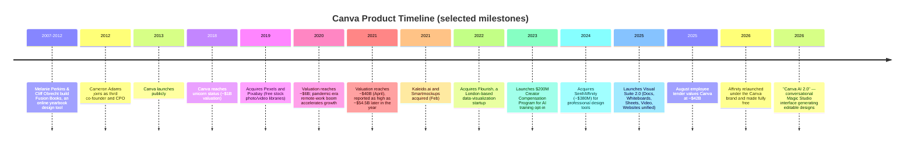

*2007–2024 milestones are well-documented in company and press sources. 2025–2026 items are drawn from Canva's own newsroom and contemporaneous press coverage, noted as such throughout this document.*

---

## 9. Vision & Mission

Canva's stated mission, consistent across its official careers and "About" pages, is **"to empower the whole world to design."** The company frames this as a belief that good design and visual communication tools should be accessible to everyone "regardless of their income, where they live, or their prior experience" — not gated behind expensive professional software or years of training.

Operating principles that most directly shape the product:

- **Simplicity over power** — a drag-and-drop, template-first editor designed for non-designers, deliberately trading some professional-grade control (compared to Adobe's desktop tools) for approachability.
- **Free-first access** — a genuinely capable free tier (1.6M+ templates, 5GB storage, real-time collaboration) rather than a crippled trial, used as the primary top-of-funnel growth mechanism.
- **One platform, every format** — the Visual Suite thesis: presentations, docs, video, websites, and print should live in one tool with one design-object model, not a portfolio of disconnected apps.
- **AI as an accelerant, not a gate** — Magic Studio features are layered into free and paid tiers alike (with usage limits), reflecting a strategy of using AI to widen the top of the funnel rather than reserving it purely as a premium upsell.

**PM Insight:** Canva's mission ("empower the whole world") is a genuine strategic constraint, not just marketing language — it explains why the company has repeatedly chosen "make Affinity free" and "keep a generous free tier" even as AI compute costs rise, rather than aggressively gating capability behind paywalls the way many AI-feature launches elsewhere in the industry have. The tension this creates — monetizing a mission built on giving things away for free — is a recurring theme in this document's Monetization (Section 39) and Trust & Safety (Section 40) sections.

---

## 10. Problem Statement

> **How might Canva help anyone — regardless of design skill — communicate visually with confidence, at the speed generative AI now makes possible, without that same speed producing off-brand, inconsistent, or legally risky content faster than any human can review it?**

This statement captures three linked problems this case study returns to repeatedly:

1. **Democratization creates a floor, not a ceiling.** Canva's core promise — anyone can make a "good enough" design in minutes — is well-solved for individuals, but scaling that promise to an organization of hundreds of employees, all now AI-assisted, raises a new problem: consistency and brand integrity at volume.
2. **AI has removed the natural rate-limiter on content volume.** When design required manual effort, a company's brand/legal review process could reasonably keep pace with output. With Magic Studio generating a reported 800 million monthly AI-assisted actions in 2026, that assumption no longer holds — review capacity is now the binding constraint, not creation capacity.
3. **Trust is now a prerequisite for AI adoption, not an afterthought.** Between copyright/IP concerns around AI training data and the risk of AI-generated content misusing a brand's own trademarked assets, Canva's ability to keep scaling Magic Studio depends on convincingly answering "is this safe, compliant, and on-brand" for both individual creators and enterprise customers.

---

## 11. Market Research

The market Canva competes in can be defined narrowly or broadly, and the two definitions produce very different numbers — a fact this document treats explicitly rather than picking whichever figure is most flattering. Industry estimates for the **"graphic design software"** market alone (desktop and cloud tools) range from roughly **$10.1–12.0 billion in 2026**, growing at a 9–12% CAGR depending on the source and scope. A broader **"graphic design market"** definition — one that includes design *services* alongside software — is estimated at **~$56.9 billion in 2026**, growing more slowly (~5.4% CAGR) toward roughly $62 billion by 2035, per Mordor Intelligence and Business Research Insights estimates.

Within this market, Canva has built a position distinct from either pure "design software" (Adobe's traditional category) or pure "productivity software" (Microsoft/Google's category) — it sits at the intersection, competing partly against Adobe Express and Microsoft Designer for casual/AI-assisted content creation, and increasingly (via Visual Suite 2.0's Docs/Whiteboards/Sheets) against parts of the Microsoft 365/Google Workspace productivity stack as well.

**Facts:** Canva reports 265M+ MAU and ~$3.5B+ annualized revenue (company-reported, via press). **Estimates:** total addressable design-software market ($10–12B narrow, ~$57B broad) — sources disagree by definition, not just methodology. **Assumption for this document:** where a figure could reasonably be read multiple ways (e.g., "the design software market"), this document states which definition it is using rather than implying false precision.

---

## 12. Industry Analysis

The visual-content-creation industry in 2026 is shaped by four forces:

1. **Generative AI collapsing the skill floor further.** Where Canva's original insight (2013) was "make design accessible via templates," the 2024–2026 insight across the whole industry (Canva, Adobe Express, Microsoft Designer, and general-purpose tools like ChatGPT/Gemini image generation) is "make design accessible via natural-language prompts" — a second, AI-driven wave of the same democratization thesis Canva was originally built on.
2. **Consolidation of the "visual workspace."** Canva's Visual Suite 2.0, Adobe's bundling of Express/Firefly/Acrobat, and Microsoft's bundling of Designer into Microsoft 365 Copilot all reflect the same bet: no single design surface wins alone anymore; the winner bundles design into a broader daily-work surface.
3. **AI training-data trust as a competitive and legal battleground.** The U.S. Copyright Office's May 2025 guidance suggesting some AI training practices may not qualify as fair use has intensified scrutiny industry-wide; Canva's response (Canva Shield, the $200M Creator Compensation Program) is both a genuine trust investment and a competitive differentiator versus platforms offering less transparency about training-data provenance.
4. **Professional/casual convergence.** Canva's acquisition and "make free" strategy for Affinity signals an industry-wide blurring between "casual, templated design" (historically Canva's territory) and "professional, precision design" (historically Adobe's) — with AI increasingly closing the quality gap between the two.

**PM Insight:** Canva's moat is shifting from "easiest templated editor" (increasingly commoditized as every competitor adds AI-assisted templates) toward "most trusted, most integrated AI-assisted visual workspace for teams" — which is precisely the strategic logic behind both Visual Suite 2.0 and the Magic Brand Guardian proposal later in this document.

---

## 13. TAM / SAM / SOM

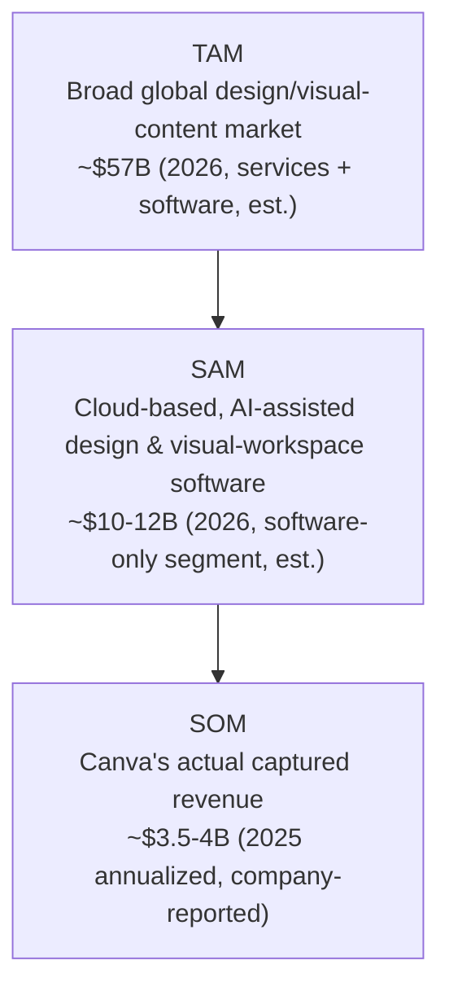

| Layer | Definition | Value | Type |
|---|---|---|---|
| **TAM** | Global design market including services + software | ~$57 billion (2026 est.) | Industry estimate |
| **SAM** | Cloud/no-code design software specifically (Canva's actual competitive category) | ~$10–12 billion (2026 est.) | Industry estimate |
| **SOM** | Canva's actual annualized revenue | ~$3.5–4 billion (2025) | Company-reported (via press) |

**Honest gap:** Canva does not publish a defined addressable-market figure of its own, and — because Visual Suite 2.0 pulls Canva partly into productivity-software territory (competing for some of the same budget as Microsoft 365/Google Workspace) — any SAM figure understates the market Canva is now reaching toward. This document uses the narrower, more defensible "design software" SAM rather than inflating it with a share of the multi-hundred-billion-dollar productivity-software market Canva has only recently begun to touch.

---

## 14. Competitor Analysis

| Competitor | Primary battleground vs. Canva | Est. scale (most recent public/estimated figures) | Key differentiator |
|---|---|---|---|
| **Adobe Express** | Closest direct freemium/templated-design competitor | Backed by Adobe's ~$21B+ FY revenue base and Creative Cloud ecosystem (Adobe is public; Express itself is not separately broken out) | Deep integration with Adobe Firefly and Creative Cloud assets; trusted brand among design professionals |
| **Figma** | Professional product/UI design and (via FigJam/Figma Slides) some overlap with whiteboards/presentations | Reported ~86% adoption among professional design teams (industry survey estimate) | Purpose-built for collaborative product/UI design, not templated content marketing |
| **Microsoft Designer** | AI-generated graphics bundled into Microsoft 365/Copilot | Distribution advantage via Microsoft 365's installed base (hundreds of millions of seats) | Native bundling into the productivity suite most enterprises already pay for |
| **Adobe Creative Cloud** (Photoshop/Illustrator/InDesign) | Professional-grade precision design — the category Canva's Affinity acquisition targets | Long-established industry standard for professional creative work | Deeper, more precise creative control; steeper learning curve |
| **CapCut** (ByteDance) | Short-form video editing, a growing share of "visual content" budget | Large-scale consumer video editing usage (exact figures not independently verified for this document) | Purpose-built for short-form/social video, TikTok/ByteDance ecosystem integration |

**PM Insight:** Canva's competitive set splits cleanly along two axes: casual/templated (Adobe Express, Microsoft Designer — where Canva's biggest risk is distribution, since both competitors are bundled into ecosystems Canva doesn't own) and professional/precision (Figma, Adobe Creative Cloud — where Canva's Affinity acquisition is a direct, deliberate response). No single competitor yet matches Canva's combination of a genuinely generous free tier, an AI layer embedded across the whole suite, and (as of 2026) a professional design suite included at no extra cost.

---

## 15. SWOT Analysis

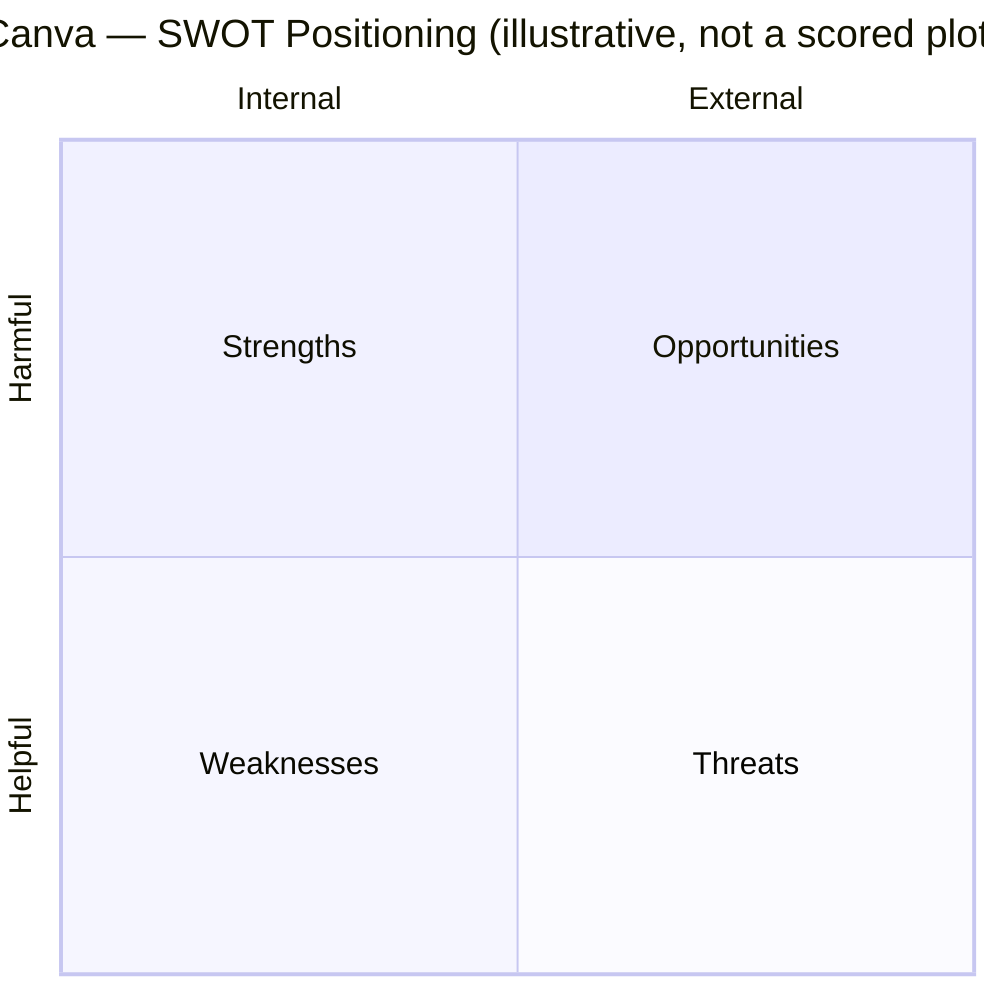

**Strengths**
- Massive, still-growing free-tier user base (265M+ MAU) functioning as a low-cost acquisition funnel for paid conversion.
- Genuinely differentiated AI investment (Magic Studio) embedded across the entire product, not gated to a single premium feature.
- Strong enterprise momentum (Teams/Enterprise ARR reportedly +100% YoY) diversifying revenue beyond the historically consumer-heavy Pro tier.
- Trust infrastructure (Canva Shield, Creator Compensation Program) that is ahead of many AI-feature competitors on transparency.

**Weaknesses**
- No public financial statements (private company), which limits investor/enterprise-buyer confidence relative to publicly audited competitors like Adobe.
- Brand/approval tooling (Brand Hub) was built for a lower-volume, pre-generative-AI content world and has not been shown to scale to Magic Studio's growth curve (the exact gap the proposed feature in this document addresses).
- Historically weaker at precision/professional-grade design work than Adobe's desktop tools — only partially addressed by the still-maturing Affinity integration.
- Valuation volatility (reported swings from ~$40B to ~$54.5B to a multi-year plateau and back to ~$42B) signals investor uncertainty about durable growth versus a pandemic-era demand spike.

**Opportunities**
- Visual Suite 2.0 positions Canva to capture productivity-software budget (Docs, Sheets, Whiteboards) historically owned by Microsoft/Google.
- A potential 2026 IPO (rumored, unconfirmed) could provide capital for further AI infrastructure investment and M&A.
- Deeper enterprise/regulated-industry penetration, where trust and governance tooling (like the proposed Magic Brand Guardian) is the primary blocker to larger contracts.
- International/education expansion in the 190 countries Canva already reaches, particularly in markets where the free tier is the primary on-ramp.

**Threats**
- Microsoft Designer and Adobe Express's bundled distribution (Microsoft 365, Adobe Creative Cloud) could out-pace Canva's standalone growth, especially in enterprise accounts already paying for those suites.
- Ongoing AI-copyright legal/regulatory uncertainty (e.g., the U.S. Copyright Office's May 2025 guidance) could raise Canva's compliance costs or restrict training-data practices industry-wide.
- General-purpose AI assistants (ChatGPT, Gemini, Claude) generating usable graphics directly could disintermediate simple design requests that once required opening Canva at all.
- Rapid feature parity from well-capitalized competitors narrows any single AI feature's differentiation window.

---

## 16. Porter's Five Forces

| Force | Intensity | Rationale |
|---|---|---|
| **Threat of new entrants** | Medium | Building a competent AI-assisted design editor is now achievable by well-funded startups; but Canva's template/asset library, brand-kit ecosystem, and 265M+ user base are not trivially replicable. |
| **Bargaining power of buyers** | Medium–High | Individual users face near-zero switching cost (Canva's own free tier makes trial-and-switch trivial for competitors too); enterprise buyers face moderate switching cost once Brand Hub/approval workflows and brand assets are embedded. |
| **Bargaining power of suppliers** | Medium | Canva Creators (template/asset contributors) have some individual leverage but are fragmented; cloud infrastructure and AI-model providers (where Canva does not build every underlying model itself) hold more concentrated leverage. |
| **Threat of substitutes** | High | Adobe Express and Microsoft Designer offer close substitutes bundled into ecosystems many buyers already pay for; general-purpose AI chat assistants are an emerging, less direct substitute for simple requests. |
| **Competitive rivalry** | High | Adobe (Express + Creative Cloud), Figma, and Microsoft Designer are all well-capitalized and actively investing in overlapping AI-assisted design capability. |

---

## 17. Business Model Canvas

| Block | Canva |
|---|---|
| **Key Partners** | Canva Creators (template/asset contributors), stock content sources (Pexels/Pixabay, now owned), cloud infrastructure providers, enterprise resellers/channel partners |
| **Key Activities** | Editor/platform development, Magic Studio AI R&D, template/asset curation, Brand Hub/governance tooling, enterprise sales, trust & safety (Canva Shield) |
| **Key Resources** | 1.6M+ template library, proprietary and licensed AI models, brand/customer data, Canva Creators ecosystem, engineering talent (Sydney-centered) |
| **Value Propositions** | "Design anything, publish anywhere" — a free-to-start, AI-accelerated visual workspace spanning casual and (via Affinity) professional design |
| **Customer Relationships** | Self-service freemium at consumer scale, dedicated enterprise sales/success for Teams/Enterprise, Canva for Education partnerships with schools/districts |
| **Channels** | canva.com web app, iOS/Android/desktop apps, Canva for Education institutional rollout, Canva Creators marketplace |
| **Customer Segments** | Individual/casual creators, small businesses, marketing teams, large enterprises (Teams/Enterprise), K-12 students/teachers, template/asset creators (two-sided) |
| **Cost Structure** | AI compute/inference costs (rising with Magic Studio's 700% YoY usage growth), engineering headcount (~5,300–5,500 employees, est.), Creator Compensation Program payouts ($200M over 3 years), content licensing |
| **Revenue Streams** | Pro subscriptions, Teams/Enterprise seat licensing, Canva Print/merchandise, marketplace transaction fees on premium templates/assets |

---

## 18. Revenue Model

Canva's revenue is not a single stream but a layered subscription model:

1. **Canva Pro** — individual subscription (~$15/month or ~$120/year) unlocking Brand Kit, Magic Studio AI tools, Background Remover, and premium content — historically the company's largest revenue contributor.
2. **Canva Teams / Business** — per-seat pricing (~$10/user/month at 3+ seats, matching Pro's effective annual rate) adding Brand Hub, template locking, and approval workflows — this is the segment reportedly growing fastest, with **Teams/Enterprise (25+ seats) ARR reaching an estimated ~$500M, +100% YoY**, representing roughly **12.5% of total revenue**.
3. **Canva Enterprise** — custom pricing (industry estimates suggest $8–20/user/month, with annual contracts commonly in the $20,000–$50,000 range) for large organizations needing governance, security, and support beyond Teams.
4. **Canva Print / merchandise** — physical product fulfillment (business cards, apparel, signage) printed from Canva designs.
5. **Marketplace commissions** — a share of revenue from premium templates, fonts, and stock content sold through Canva Creators.

Canva reports being **profitable for eight consecutive years**, an unusual claim among venture-backed software companies of its scale, and reportedly closed 2025 at **~$3.5B+ annualized revenue, trending toward ~$4B**, at roughly **35% YoY growth** (company-reported, via press; not an audited/GAAP figure).

**PM Insight:** The fact that Teams/Enterprise ARR is growing roughly 3x faster than the overall business (100% YoY vs. ~35% blended) is the single most important financial signal for a Canva PM to internalize — the company's medium-term growth increasingly depends on winning larger organizational accounts, which is precisely the segment most sensitive to the brand-governance gap this case study's proposed feature addresses.

---

## 19. Target Users

| Segment | Description | Primary need |
|---|---|---|
| **Individual/casual creators** | Freelancers, students, hobbyists making social posts, resumes, invitations | Fast, free, no-skill-required design |
| **Small business owners** | Solo or small-team operators handling their own marketing | Professional-looking output without hiring a designer |
| **Marketing teams / content creators** | In-house marketers producing high-volume social/campaign content | Speed and volume without sacrificing brand consistency |
| **Enterprise brand/design teams** | Central teams governing brand use across large organizations | Consistency, compliance, and approval control at scale |
| **Educators & students** | K-12 teachers/students using Canva for Education | Free access, classroom-appropriate templates, easy sharing |
| **Template/asset creators** | Canva Creators marketplace contributors | Fair compensation, discoverability, control over AI-training use of their content |

---

## 20. Personas

### Persona 1 — "Solopreneur Sam"
- **Context:** Runs a small online store, no design background.
- **Goal:** Produce professional-looking social posts and product graphics quickly.
- **Frustration:** Limited time; needs templates that "just work" without steep learning curve.
- **What he needs from the product:** Fast templates, Magic Studio AI shortcuts, affordable Pro subscription.

### Persona 2 — "Brand-Conscious Priya"
- **Age/context:** 36, brand manager at a mid-size company with 300+ employees using Canva Teams.
- **Goal:** Ensure every piece of content leaving the company — whether human-made or AI-generated — matches brand guidelines.
- **Frustration:** Cannot manually review hundreds of AI-assisted drafts a day; existing Brand Hub locking helps but doesn't catch every violation automatically.
- **What she needs from the product:** Automated, AI-native brand compliance checking before publish (directly maps to the Magic Brand Guardian proposal).

### Persona 3 — "Classroom Creator Carlos"
- **Age/context:** 41, high school teacher using Canva for Education.
- **Goal:** Build engaging lesson materials and presentations without paying out of pocket.
- **Frustration:** District-level content policies aren't always easy to enforce across student accounts.
- **What he needs from the product:** Free, reliable access; simple sharing with students; age-appropriate content controls.

### Persona 4 — "Cross-Tool Chris"
- **Age/context:** 29, freelance designer using both Canva (fast social content) and Affinity (precision print/vector work).
- **Goal:** Move fluidly between quick templated work and professional-grade output without switching platforms entirely.
- **Frustration:** Historically had to leave Canva for anything requiring fine control; the Affinity integration is still maturing.
- **What he needs from the product:** Seamless handoff between Canva's templated editor and Affinity's professional tools.

*(These four personas are illustrative composites built from documented, publicly discussed use cases and pain points — not verbatim quotes from real individuals.)*

---

## 21. Jobs To Be Done (JTBD)

| Job Statement | Situation | Motivation |
|---|---|---|
| "When I need a social post right now, help me make it look professional without design skills." | Time-pressured, no design background | Look credible, save time |
| "When my whole team is now AI-assisted, help me keep everything on-brand without reviewing every file myself." | Enterprise brand governance | Reduce risk, preserve trust in the brand |
| "When I'm teaching a class, help me create materials for free, reliably." | Budget-constrained educator | Access without cost barrier |
| "When I need professional-grade precision, help me get there without leaving the ecosystem I already know." | Freelancer/agency work | Avoid re-learning an entirely new tool |
| "When I contribute templates/assets, help me understand and control how AI uses my work." | Canva Creator | Fair compensation, consent, transparency |

**PM Insight:** The JTBD set spans from "reduce effort" (casual users) to "reduce risk" (enterprise brand teams) to "preserve trust" (Creators worried about AI training). This validates that governance/trust tooling (like the proposed Magic Brand Guardian) addresses a job at least as valuable as adding more templates or AI generation speed.

---

## 22. User Journey

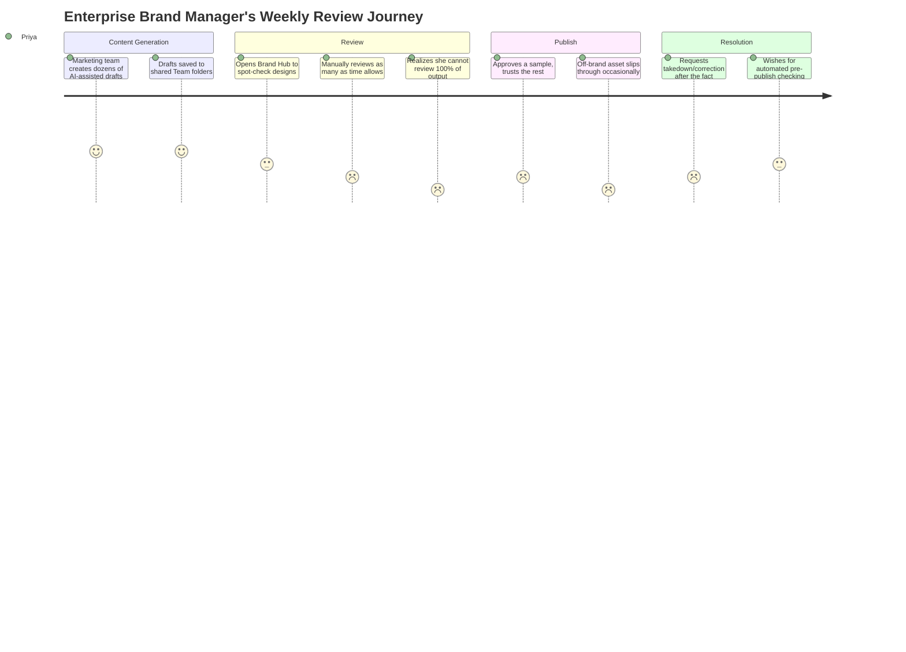

**Key friction points (scores 1/5):** the inability to review 100% of AI-generated output, and discovering brand violations only after publication — precisely the moments the Magic Brand Guardian is designed to address.

---

## 23. User Flow

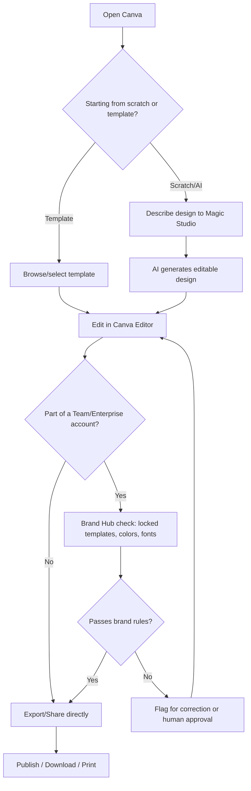

---

## 24. Information Architecture

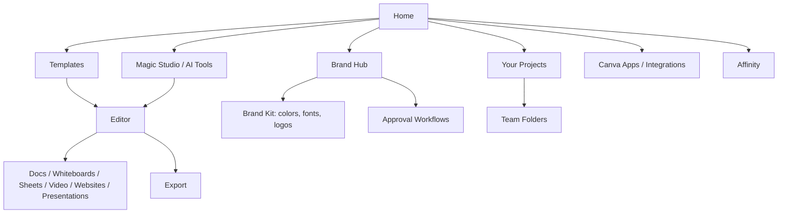

**PM Insight:** Brand Hub and the core Editor are architecturally parallel systems today — a design can be created and exported without ever touching Brand Hub's rules unless a Team admin has locked that specific template. This is the structural gap the Magic Brand Guardian proposal closes: making brand-rule checking a property of the export/publish action itself, not a separate, optional destination in the IA.

---

## 25. UX Audit

| Area | Observation | Severity |
|---|---|---|
| Onboarding | Template-first onboarding remains a genuine best-in-class strength for non-designers | — (positive) |
| Magic Studio discoverability | AI entry points are prominent, but the sheer number of AI tools (Magic Charts, Magic Insights, Dream Lab, Canva Code, conversational chat) risks feature sprawl and user confusion about which tool to use for a given task | Medium |
| Brand consistency enforcement | Template locking exists but is opt-in per template, not applied automatically to freeform AI-generated content | High |
| Visual Suite continuity | Moving between Docs, Whiteboards, and the core editor is smoother than competitors' disconnected app suites | — (positive) |
| Affinity integration | Still presents as a somewhat separate experience from the core Canva editor rather than a fully unified surface | Medium |

---

## 26. UI Audit

| Area | Observation |
|---|---|
| Visual hierarchy | Editor UI balances a large template/asset panel with a clean canvas; consistent across web and mobile |
| AI entry points | Multiple AI affordances (chat bar, right-click "Magic" menu, dedicated Magic Studio hub) create some redundancy in how a user starts an AI-assisted task |
| Mobile app | Simplified feature set relative to web, appropriate for on-the-go editing but requires desktop for advanced Brand Hub administration |
| Consistency | Core interaction patterns (drag-drop, resize, template swap) are highly consistent across design types, a genuine strength of the unified Visual Suite object model |

---

## 27. Accessibility

Canva publishes accessibility-related guidance for creating accessible designs (alt text, color contrast checking tools within the editor) and the platform itself supports standard web accessibility patterns (keyboard navigation, screen-reader compatibility on core flows). Canva for Education's free access to visual tools is itself a meaningful accessibility/equity feature for students who could not otherwise afford design software.

**Canva has not publicly disclosed** a comprehensive, platform-wide, independently audited accessibility conformance report (e.g., a current VPAT) in the sources reviewed for this document, so this section reflects general accessibility-related product features rather than an audited compliance score.

---

## 28. Feature Breakdown

| Feature | Purpose | Maturity |
|---|---|---|
| Template library & editor | Core design creation | Mature |
| Magic Studio (chat interface) | Conversational AI design generation | New (2026) |
| Magic Charts / Magic Insights | Data → visualization / data → narrative summary | New (2026) |
| Dream Lab (incl. Style Transfer) | AI image generation | Growing |
| Canva Code | AI code generation surface | New (2026) |
| Visual Suite (Docs, Whiteboards, Sheets, Video, Websites) | Unified productivity + design workspace | Recently matured (2025 launch) |
| Brand Hub | Brand kits, template locking, approval workflows | Mature, but not fully automated against AI-generated content |
| Affinity (free, 2026) | Professional-grade vector/raster/publishing design | Growing integration |
| Canva Print | Physical product fulfillment | Mature |
| Canva Creators marketplace | Third-party template/asset ecosystem | Mature |

---

## 29. AI Capabilities

**Verified / publicly confirmed functionality:**
- **Magic Studio conversational interface (2026)** — text or voice prompt generates a fully editable native Canva design (not a flattened image), reported to take roughly 8–12 seconds per generation, per Canva's own product communications and contemporaneous reviews.
- **Magic Charts** — selects data, infers appropriate chart type, and produces a real-time-updating visualization.
- **Magic Insights** — analyzes supplied data and generates a written summary of notable trends plus suggested charts.
- **Dream Lab / Style Transfer** — AI image generation, including a 2026 feature that generates new images matching the aesthetic/palette/composition of a user-uploaded reference image.
- **Background Remover, Magic Resize, Magic Write** — earlier-generation Magic Studio tools (pre-2026) for image editing, format resizing, and AI text drafting, foundational to Magic Studio's broader adoption.
- **Canva Shield** — a stated framework for "safe, fair, and secure AI," including copyright indemnification for AI-generated content for paying customers, per Canva's own newsroom announcement.

**Future opportunity / not confirmed as shipped (flagged explicitly as opportunity, not fact):**
- Fully automated, always-on brand-compliance checking of AI-generated content before publish is **not confirmed as an existing Canva feature** as of this writing — this is precisely the gap the Magic Brand Guardian proposal (Section 50) is built to fill, and this document does not claim Canva has already shipped it.
- Deeper cross-surface AI memory (e.g., an AI assistant that recalls a specific brand's full history across every design type) is a directional extension of current Magic Studio capability, not a confirmed shipped feature.

---

## 30. Product Metrics

| Metric type | Example metrics for Canva |
|---|---|
| **North Star** | See Section 31 |
| **Input metrics** | New sign-ups (free tier), template/asset library growth, Magic Studio feature releases |
| **Output metrics** | Designs created (35B+ cumulative, company-reported), Magic Studio monthly AI actions (~800M, company-reported) |
| **Leading metrics** | Free-to-Pro conversion rate, Teams seat expansion within existing accounts, Magic Studio adoption rate among free users |
| **Lagging metrics** | Annualized revenue (~$3.5–4B), Enterprise/Teams ARR (~$500M) |
| **Guardrail metrics** | Off-brand/policy-violation incident rate (not publicly disclosed), customer support contact rate, AI generation latency |
| **Enterprise metrics** | Teams/Enterprise ARR growth (+100% YoY, company-reported), average seats per enterprise account |
| **Creator metrics** | Number of active Canva Creators, Creator Compensation Program payouts against the $200M three-year commitment |
| **Education metrics** | Students/teachers using Canva for Education (60M, company-reported) |

---

## 31. North Star Metric

**Proposed North Star Metric: "Weekly Trusted Publishes per Active Team"** — defined as designs exported, shared, or published from a Team/Enterprise account that pass brand-compliance checks without requiring post-publish correction.

**Why not simply "designs created" or "Magic Studio uses"?** Canva has enormous incentive to maximize raw AI usage volume (the 700% YoY Magic Studio growth is presented as an unambiguous success metric today), but a PM optimizing purely for generation volume would be blind to the exact risk named in the Problem Statement (Section 10): more AI output without proportional trust/compliance investment. A "trusted publish" framing forces the Brand Hub, Magic Studio, and enterprise-sales teams to optimize jointly for content that is both fast *and* safe to ship, rather than treating governance as someone else's problem.

*(Canva does not publicly disclose its actual internal North Star metric; this is a constructed, defensible proposal for this case study, clearly marked as such.)*

---

## 32. Product Analytics

A platform at Canva's scale would plausibly instrument analytics across at least four layers:

1. **Session-level behavioral analytics** — template searches, AI prompt patterns, time-to-first-export.
2. **Funnel analytics** — sign-up → first design → first export → Pro conversion → Teams upgrade, segmented by acquisition channel (organic, Education, paid).
3. **Cohort analytics** — retention and upgrade behavior by first-use-case (social media vs. presentations vs. print), and by Magic Studio adoption within the first 30 days.
4. **Experimentation platform** — Canva is understood, based on its scale and continuous feature releases, to run large-scale A/B testing across template ranking, AI feature placement, and pricing pages; specific tooling and experiment counts are not publicly disclosed.

**Assumption for this document:** exact tooling names, dashboard structures, and internal metric definitions are not publicly disclosed; the layers above reflect standard, defensible product-analytics architecture for a platform of Canva's scale rather than confirmed internal implementation detail.

---

## 33. AARRR (Pirate Metrics)

| Stage | Canva application |
|---|---|
| **Acquisition** | Organic/word-of-mouth, Canva for Education institutional rollout, SEO-driven template pages, social sharing of designs |
| **Activation** | First completed design and export |
| **Retention** | Recurring design creation, Magic Studio habitual use, Brand Hub adoption within Teams |
| **Referral** | Shared designs carrying a "Made with Canva" watermark/link (on free tier), team invites within Teams/Enterprise accounts |
| **Revenue** | Pro subscriptions, Teams/Enterprise seat expansion, Canva Print purchases, marketplace commissions |

---

## 34. HEART Framework

| Dimension | Example metric |
|---|---|
| **Happiness** | User satisfaction with AI-generated design quality; CSAT after Magic Studio use |
| **Engagement** | Designs created per active user per week, Magic Studio prompts per session |
| **Adoption** | % of free users who try at least one Magic Studio feature within first 7 days |
| **Retention** | Month-over-month active usage, Teams seat renewal rate |
| **Task success** | Prompt-to-usable-design completion rate (no major manual rework needed) |

---

## 35. Growth Strategy

Canva's growth strategy rests on four levers, in order of current strategic emphasis:

1. **Deepen enterprise penetration.** With Teams/Enterprise ARR reportedly growing ~3x faster than the overall business, expanding seat count within existing large accounts — and winning net-new enterprise logos — is the clearest path to outsized revenue growth.
2. **Convert AI usage growth into paid conversion.** Magic Studio's reported 700% YoY usage growth is a leading indicator Canva can convert into Pro/Teams upgrades if usage limits and premium AI features are tuned correctly.
3. **Expand the Visual Suite's productivity-software footprint.** Docs, Sheets, and Whiteboards position Canva to capture budget and daily-active-usage historically owned by Microsoft 365/Google Workspace, rather than competing only for "design" budget.
4. **Deepen Education and emerging-market reach**, using the free tier as a long-horizon brand-loyalty investment that converts to paid usage as students become working professionals.

---

## 36. Growth Loops

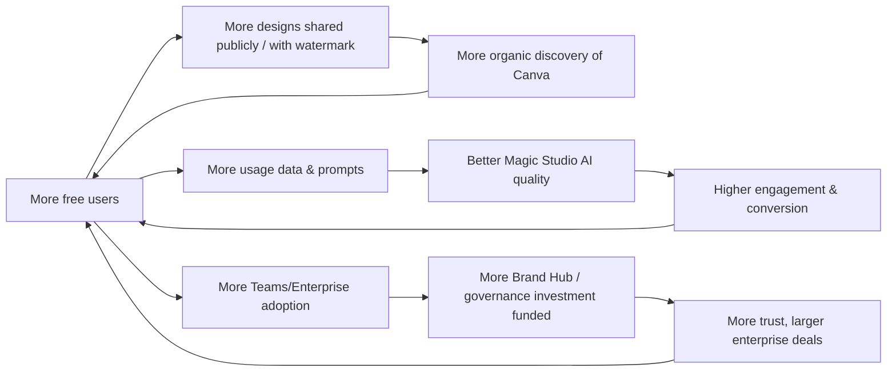

Three reinforcing loops: **(1) viral sharing loop** (more users → more shared/watermarked designs → more organic discovery), **(2) AI data flywheel** (more usage → better AI models → higher engagement/conversion), and **(3) enterprise trust loop** (more Teams adoption → more governance investment → larger, more durable enterprise contracts).

---

## 37. Network Effects

Canva exhibits a **modest content-network effect**: free-tier designs shared publicly (often carrying a "Made with Canva" watermark or attribution) function as organic advertising, drawing new users in — though this is weaker than a true two-sided marketplace effect, since most Canva usage is single-player design creation rather than multiplayer exchange.

There is a stronger **data/AI flywheel effect**: every Magic Studio prompt and every template interaction improves Canva's underlying AI models and template-ranking systems, compounding quality advantages over time in a way a new entrant cannot easily replicate without a comparable usage base.

**Weaker/contested effect:** the Canva Creators marketplace has some two-sided marketplace dynamics (more creators → more templates → more users → more demand for creator content), but Canva's own first-party template library is large enough that this effect is a meaningful contributor, not the platform's primary moat.

---

## 38. Product Strategy

Canva's product strategy in 2026 can be summarized as **"win the AI-assisted content moment, then earn the enterprise's trust to scale it."** Concretely:

- Continue embedding Magic Studio across every design type in the Visual Suite, rather than treating AI as a single bolt-on feature.
- Use Affinity (now free) to close the professional/precision gap with Adobe, widening Canva's addressable use cases upmarket.
- Grow Teams/Enterprise revenue disproportionately, since it is both the fastest-growing segment and the segment most dependent on trust/governance tooling actually working at scale.
- Invest in AI trust infrastructure (Canva Shield, Creator Compensation Program) as a prerequisite for continued AI feature adoption — an AI feature is only adoptable at enterprise scale if the underlying content/training practices are defensible.

---

## 39. Monetization

| Stream | Scale (est./reported) | Margin profile |
|---|---|---|
| Canva Pro (individual) | Majority of historical revenue base | Software-like margins once AI compute cost is managed |
| Canva Teams/Enterprise | ~$500M ARR, +100% YoY (reported) | Higher revenue per account; growing fastest |
| Canva Print/merchandise | Physical fulfillment, smaller share of revenue | Lower margin (physical goods logistics) |
| Marketplace commissions | Revenue share from Creators marketplace | Moderate margin; partially offset by Creator Compensation payouts |

**PM Insight:** Because Magic Studio usage has grown ~700% YoY, AI inference cost is very likely rising faster than blended revenue growth (~35% YoY) — a tension this document flags as a reasonable inference from the disclosed growth-rate gap, not a confirmed internal cost figure Canva has disclosed. Managing this gap (through pricing, usage limits, or infrastructure efficiency) is a first-order strategic question for Canva's product and finance leadership, even though the company has not publicly detailed its approach.

---

## 40. Trust & Safety

Canva has publicly described **Canva Shield**, a stated framework for "safe, fair, and secure AI," which includes copyright indemnification for AI-generated content produced by paying customers, per Canva's own newsroom announcement. Separately, Canva established a **$200 million Creator Compensation Program** (announced 2023, running over three years) that pays Canva Creators who consent to having their templates/content used to train Canva's proprietary AI models, with creators able to opt out at any time; payments reportedly include both an initial bonus and ongoing monthly payments tied to usage and contribution level.

This sits within a broader industry controversy: in May 2025, the U.S. Copyright Office released guidance suggesting some AI training practices may not qualify as fair use when they compete with markets for original human creative work — a live legal and policy debate affecting every major generative-AI platform, not a claim specific to Canva. **Canva has not publicly disclosed** the specific contents or training-data provenance of its proprietary AI models in enough technical detail for this document to make any claim beyond what is stated above, so this section deliberately does not speculate further.

---

## 41. Technical Architecture

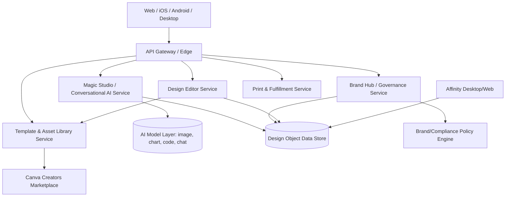

This is a **generalized, illustrative architecture** based on standard large-scale SaaS design-platform patterns and Canva's own public product communications describing a unified design-object model across its Visual Suite. **Canva has not publicly disclosed** its actual current production architecture in this level of detail; this diagram should be read as an industry-standard educational model, not a leaked or confirmed internal design.

---

## 42. Data Flow

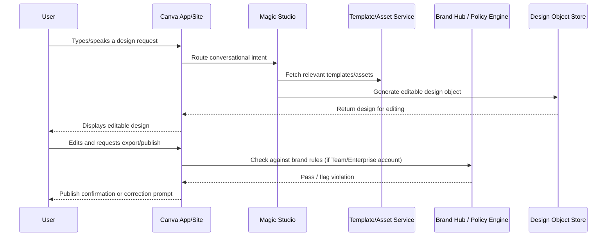

---

## 43. API Ecosystem

Canva exposes a public **Canva Developer Platform**, per Canva's own developer documentation, including:

- **Connect APIs** — allowing third-party applications to create, edit, and export Canva designs programmatically.
- **Canva Apps SDK** — for building custom apps/integrations that run inside the Canva editor itself.
- **Brand Template APIs** — enabling programmatic generation of on-brand designs from templates for integration into external marketing/CMS platforms.

**Not part of the public API surface (and not claimed here):** Canva's internal Magic Studio model-serving infrastructure, ranking algorithms for template discovery, and any internal brand-compliance/policy engine are not publicly documented in a way this case study can responsibly describe; this section only covers confirmed, publicly documented developer-facing surfaces.

---

## 44. Privacy & Security

Canva's public privacy policy describes collection of account, usage, and content data to power personalization, template recommendations, and (subject to user consent/opt-in via the Creator Compensation Program) AI model training. Canva Shield is publicly described as covering copyright indemnification for AI-generated content for paying customers.

**Open questions not resolved by public disclosure:** the precise data-retention period for content processed by Magic Studio, and the exact boundary between data used for personalization versus AI model training for non-Creator users, are not fully detailed in the consumer-facing materials reviewed for this case study. A PM or engineer building on top of Canva's platform would need to consult Canva's current, full privacy policy and any regional (GDPR/CCPA) compliance documentation directly rather than relying on general summaries like this one.

---

## 45. Pain Points

Ranked by relevance to the core Problem Statement and by frequency of appearance in independent commentary/reviews:

1. **Brand consistency at AI scale** — Brand Hub's manual/opt-in template locking cannot keep pace with hundreds of millions of monthly AI-assisted generations.
2. **Feature sprawl within Magic Studio** — a growing list of distinctly named AI tools (Magic Charts, Magic Insights, Dream Lab, Canva Code, conversational chat) creates discoverability/mental-model friction for new users.
3. **Trust/provenance concerns** — creators and enterprise customers alike want clearer, ongoing assurance about how AI training data is sourced and compensated.
4. **Professional/precision gap** — Affinity integration is still maturing; power users may still context-switch between Canva and dedicated professional tools.
5. **Private-company financial opacity** — the absence of audited public financials makes some enterprise procurement/vendor-risk processes harder relative to publicly traded competitors like Adobe.
6. **AI compute cost pressure** — Magic Studio's usage growth (700% YoY) plausibly outpaces revenue growth (35% YoY), an inferred (not disclosed) margin risk.

---

## 46. Opportunity Mapping

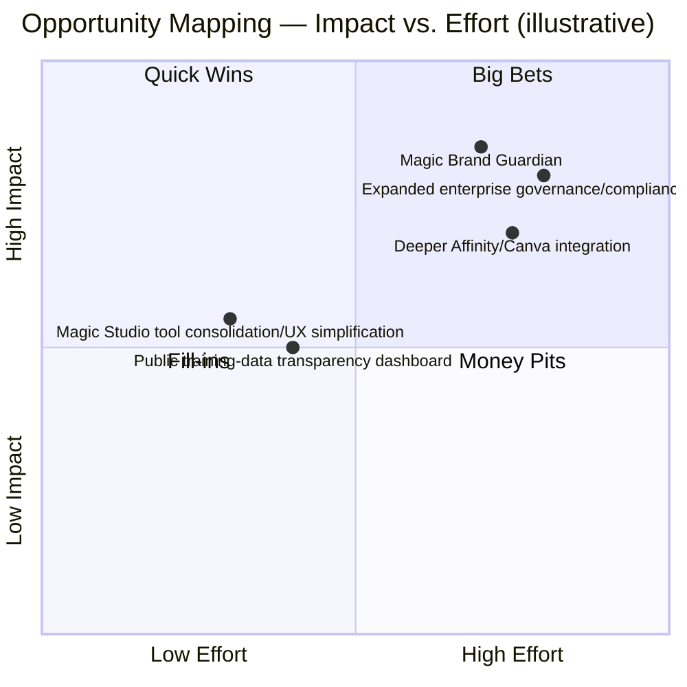

---

## 47. RICE Prioritization

| Initiative | Reach | Impact | Confidence | Effort | RICE Score |
|---|---|---|---|---|---|
| Magic Brand Guardian | 8 (all Teams/Enterprise accounts) | 3 (massive) | 70% | 8 | (8×3×0.7)/8 = **2.1** |
| Magic Studio UX consolidation | 9 (all active users) | 2 | 80% | 4 | (9×2×0.8)/4 = **3.6** |
| Deeper Affinity/Canva integration | 5 (professional-tier users) | 2.5 | 65% | 8 | (5×2.5×0.65)/8 ≈ **1.0** |
| Training-data transparency dashboard | 6 (Creators + enterprise buyers) | 2 | 75% | 3 | (6×2×0.75)/3 = **3.0** |

*(Scores use a standard 1–3 Impact scale for illustration; this is a constructed prioritization exercise for teaching purposes, not Canva's actual internal roadmap scoring.)*

---

## 48. MoSCoW Prioritization (for Magic Brand Guardian)

- **Must have:** Automated pre-publish brand-rule checking (colors, fonts, logo usage) for both AI-generated and human-made designs; clear violation flagging with specific fix suggestions.
- **Should have:** Integration with existing Brand Hub approval workflows; audit log of flagged/corrected designs for compliance reporting.
- **Could have:** Configurable severity levels (hard-block vs. warn-only) per brand rule; trend reporting on common violation types for brand-team insight.
- **Won't have (this release):** Fully autonomous auto-correction of designs without human confirmation; cross-organization brand-rule sharing (out of scope — each organization's brand rules remain private).

---

## 49. Kano Model

| Feature | Kano Category |
|---|---|
| Fast template-based design creation | Basic (expected) |
| Free tier with real collaboration | Basic (expected) |
| Magic Studio AI generation | Performance (more capability = better, roughly linear satisfaction) |
| Automated pre-publish brand compliance (Magic Brand Guardian) | **Attractive/Delighter** today; likely to become Basic within enterprise SaaS as AI-content volume grows industry-wide |
| Fully free professional-grade tools (Affinity) | Attractive/Delighter, a genuine differentiator versus paid-only professional suites |

---

## 50. Feature Proposal — Magic Brand Guardian

**Problem it solves:** Directly answers the Problem Statement (Section 10) — AI has removed the natural rate-limiter on content volume, and Canva's existing Brand Hub tooling (template locking, manual approval workflows) was not designed for a world where a single Teams account might generate hundreds of AI-assisted drafts per day.

**One-line pitch:** *An AI reviewer that checks every design — whether typed by a human or generated by Magic Studio — against your organization's brand rules before it's exported or shared, so brand consistency scales at the same speed AI now lets you create.*

**Why now:** Canva already sells the two building blocks this feature needs — Brand Hub (colors, fonts, logo rules, locked templates) and Magic Studio (an AI layer already embedded across the editor). Magic Brand Guardian is best understood as **connecting two things Canva has already built**, rather than inventing new infrastructure from scratch, which meaningfully de-risks the proposal.

Full requirements follow in the PRD (Section 51).

---

## 51. PRD — Magic Brand Guardian

### 51.1 Overview
**Feature:** Magic Brand Guardian
**Owning surface:** Extension of Brand Hub, triggered automatically at export/share/publish time within Canva Teams and Canva Enterprise accounts.
**Target release:** Phased rollout over 3 quarters (see Section 53).

### 51.2 Goals
- Reduce off-brand or non-compliant content reaching external audiences from Teams/Enterprise accounts.
- Preserve Magic Studio's speed advantage — checking should not meaningfully slow down the export/publish flow.
- Increase enterprise buyer confidence in adopting AI-generated content at scale (a stated blocker to larger contracts, per Section 45).
- Reduce manual review burden on brand/design teams, freeing them for higher-value creative review rather than compliance policing.

### 51.3 Non-Goals
- Not a general content-moderation system (no unrelated policy enforcement beyond brand/compliance rules the organization itself has configured).
- Not fully autonomous auto-correction at launch — every flagged design requires human confirmation before automatic edits are applied.

### 51.4 User Stories & Acceptance Criteria

| # | User Story | Acceptance Criteria |
|---|---|---|
| 1 | As a brand manager, I want every design checked against our brand kit before it's exported, so nothing off-brand slips through. | Given a Teams/Enterprise account with a configured Brand Kit, every export/share/publish action triggers an automated compliance check within 3 seconds at p90. |
| 2 | As a content creator, I want to know exactly what's wrong and how to fix it, so I don't have to guess. | Each flagged violation names the specific rule broken (e.g., "logo color does not match approved brand palette") and suggests a concrete fix. |
| 3 | As a brand manager, I want an audit trail of what was flagged and corrected, so I can report on compliance over time. | Every flagged design and its resolution (corrected, approved-with-exception, or overridden) is logged and viewable in a Brand Hub compliance dashboard. |
| 4 | As an admin, I want to configure which rules are hard-blocking versus warning-only, so I can tune strictness to our organization's risk tolerance. | Admins can set severity per rule category (color, font, logo, locked-template deviation) in Brand Hub settings. |
| 5 | As a creator, I want to request an exception when a flagged design is intentional, so I'm not blocked by false positives. | A one-click "request exception" flow routes the design to a designated approver rather than silently blocking or silently allowing. |

### 51.5 Edge Cases
- Brand Kit not yet configured for the account → Magic Brand Guardian is inactive and clearly labeled as "not yet set up," rather than silently passing every design as compliant.
- Design combines elements from multiple brand kits (e.g., agency managing multiple clients) → checks apply per-folder/per-brand-kit assignment, not globally.
- False positive on an intentional off-brand design (e.g., a co-branded partner asset) → exception request flow (User Story 5) handles this without requiring a permanent rule change.
- High-volume burst usage (e.g., hundreds of exports in a short window during a campaign launch) → checks queue and process asynchronously with a visible "pending review" state rather than blocking the export entirely.

### 51.6 Functional Requirements
- FR1: Automated compliance check triggered on export, share, and publish actions for Teams/Enterprise accounts with a configured Brand Kit.
- FR2: Rule categories covering color palette, typography, logo usage/placement, and locked-template deviation.
- FR3: Violation flagging with specific, actionable fix suggestions (not just a pass/fail flag).
- FR4: Configurable severity (hard-block vs. warn-only) per rule category, set by account admins.
- FR5: Exception-request workflow routing flagged-but-intentional designs to a designated approver.
- FR6: Compliance audit log/dashboard within Brand Hub, viewable by admins.

### 51.7 Non-Functional Requirements
- Response latency: compliance check completes within 3 seconds at p90 for a single design.
- Availability: 99.9% for the compliance-check service tier (should not become a publish-blocking single point of failure).
- Privacy: compliance-check processing uses only the organization's own Brand Kit data — no cross-organization data sharing.
- Fairness: rule enforcement must be transparent and explainable (every flag names the specific rule), not a black-box score.

### 51.8 Rollout Strategy
See Section 53.

### 51.9 KPI Dashboard
See Section 55.

### 51.10 A/B Testing Plan
See Section 54.

### 51.11 Success Metrics
See Section 55.

### 51.12 Risks
See Section 57.

### 51.13 Technical Architecture (feature-specific)

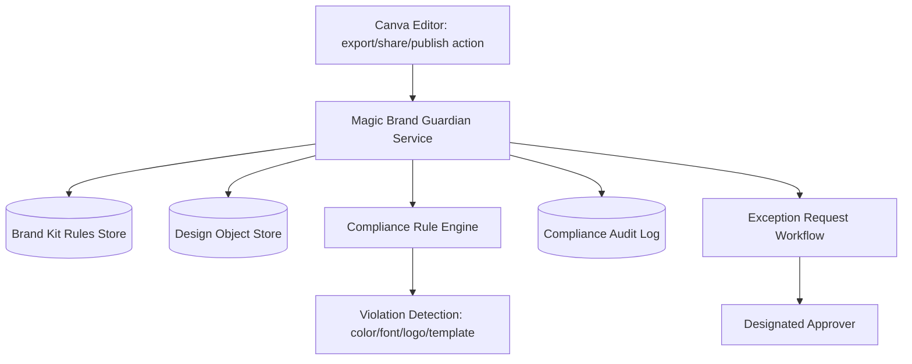

---

## 52. Wireframes

Text-based wireframe description (illustrative, not a pixel-accurate mock — final visual design would go through Canva's design system):

**Export flow — Brand Guardian check (in progress)**
```
┌─────────────────────────────────────────┐
│  Checking brand compliance...            │
│  ⏳ Reviewing colors, fonts, logo usage   │
└─────────────────────────────────────────┘
```

**Export flow — violation flagged**
```
┌─────────────────────────────────────────┐
│  ⚠ 2 brand issues found                  │
│  ─────────────────────────────────────   │
│  • Logo color doesn't match approved     │
│    palette  [ Fix automatically ]        │
│  • Font "Comic Neue" isn't in your       │
│    brand kit  [ Replace with Poppins ]   │
│                                           │
│  [ Fix All ]  [ Request Exception ]      │
└─────────────────────────────────────────┘
```

**Brand Hub — compliance dashboard (admin view)**
```
┌─────────────────────────────────────────┐
│  This week: 412 designs checked          │
│  38 flagged · 31 auto-corrected ·        │
│  5 exceptions approved · 2 pending       │
│  Most common issue: off-palette color    │
│  [ View full audit log ]                 │
└─────────────────────────────────────────┘
```

---

## 53. Rollout Plan

| Phase | Scope | Duration |
|---|---|---|
| **Phase 0 — Internal dogfood** | Canva employees, opt-in | 3 weeks |
| **Phase 1 — Enterprise beta** | 5% of Canva Enterprise accounts, warn-only mode | 6 weeks |
| **Phase 2 — Teams + Enterprise expansion** | 50% of Teams/Enterprise accounts, hard-block mode available | 8 weeks |
| **Phase 3 — Full rollout** | 100% of Teams/Enterprise accounts | Ongoing |
| **Phase 4 — Education/Nonprofit consideration** | Evaluate simplified version for Canva for Education institutional accounts | Following successful Enterprise metrics review |

Rollout gated at each phase by the KPI thresholds in Section 55; any statistically significant increase in false-positive rate or export-latency regression halts expansion until resolved.

---

## 54. A/B Testing Plan

| Test | Hypothesis | Primary metric | Guardrails |
|---|---|---|---|
| Warn-only vs. hard-block default | Hard-block reduces violations more but may increase user frustration/override rate | Violation rate at time of publish | Export abandonment rate, support ticket volume |
| Fix suggestion specificity (generic vs. specific) | Specific, actionable suggestions increase self-service correction rate | % of flagged designs corrected without escalation | Time-to-correct |
| Exception-request flow (one-click vs. multi-step) | One-click exception request reduces approver bottleneck without increasing improper overrides | Exception request completion rate | Rate of exceptions later found non-compliant |

Each test runs for a minimum of 2 full weeks to capture weekday/weekend campaign-cycle variance, with pre-registered guardrail stop-conditions.

---

## 55. KPI Dashboard

**Primary success metrics:**
- % reduction in post-publish brand-violation corrections among Teams/Enterprise accounts using Magic Brand Guardian
- Self-service correction rate (flagged designs fixed without approver escalation)
- Enterprise sales team-reported reduction in "brand governance" as a stated deal blocker

**Guardrail metrics:**
- p90 latency added to the export/publish flow
- False-positive rate (designs flagged that a human approver later confirms were compliant)
- Support ticket volume related to Brand Guardian

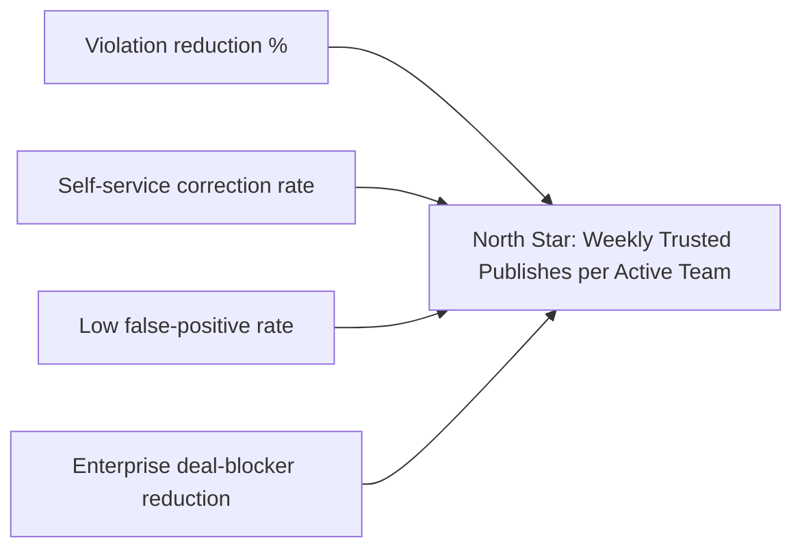

---

## 56. Product Roadmap

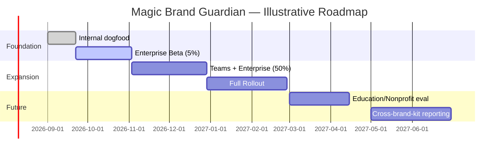

*(Dates are illustrative planning assumptions for this exercise, not confirmed Canva roadmap commitments.)*

---

## 57. Risks & Mitigation

| Risk | Likelihood | Impact | Mitigation |
|---|---|---|---|
| High false-positive rate erodes trust in the feature | Medium | High | Start in warn-only mode; tune rule sensitivity using beta feedback before enabling hard-block by default |
| Added latency slows down the export/publish flow | Low–Medium | Medium | Asynchronous processing with a visible "pending" state for high-volume bursts; strict p90 latency budget |
| Feature perceived as surveillance/restrictive by individual creators | Low–Medium | Medium | Scope to Teams/Enterprise accounts only (opt-in brand governance context), never applied to individual/free-tier accounts |
| Over-reliance on automated checking reduces human design-review diligence | Low | Medium | Position explicitly as an assistant to, not a replacement for, human brand review; audit log preserves human decision points |
| Rule configuration complexity discourages adoption | Medium | Medium | Ship sensible default rule templates derived from an account's existing Brand Kit, rather than requiring manual rule-authoring from scratch |

---

## 58. Future Vision

Looking beyond this feature, the long-term direction implied by Canva's own public strategy (Visual Suite 2.0, Magic Studio's rapid AI expansion, and Affinity's "free for everyone" move) points toward:

- **Deeper cross-surface brand intelligence** — brand rules that apply consistently across Docs, Whiteboards, Video, and Websites, not just static image exports.
- **Proactive (not just reactive) brand guidance** — surfacing brand-consistent suggestions *while* a user is still creating, rather than only checking at export time.
- **Expanding governance tooling into compliance-adjacent domains** (accessibility checks, regulated-industry disclosure requirements) as Canva pushes further into enterprise verticals.
- **Continued blurring of "design tool" and "productivity suite"**, which will require Canva to invest as much in trust/governance infrastructure as in raw AI generation capability, to sustain enterprise trust at scale.

---

## 59. PM Lessons

1. **Democratization has a second wave, and it changes the bottleneck.** Canva's first wave (2013) removed the *design-skill* bottleneck; its AI wave (2024–2026) removes the *design-effort* bottleneck — and each wave creates a new downstream constraint (first "can I make this," now "can I trust what was made").
2. **A feature that only needs to connect two things you've already built is a stronger bet than one that requires new infrastructure.** Magic Brand Guardian is deliberately scoped as Brand Hub + Magic Studio working together, not a new system — a discipline worth carrying into any feature proposal.
3. **The fastest-growing segment of a business is usually also its most trust-sensitive one.** Canva's Teams/Enterprise ARR growing ~3x faster than the blended average is exactly why governance tooling, not more AI horsepower, is this case study's highest-leverage recommendation.
4. **Being private doesn't mean unaccountable — it means the PM has to work harder to source facts.** Building this case study required explicitly separating "Canva said this in its newsroom," "a journalist reported this," and "an industry analyst estimated this," because no 10-K exists to shortcut the process.
5. **A generous free tier is a strategic asset, not just a cost center — but only if monetization is deliberately engineered elsewhere.** Canva's mission-driven "give the core product away free" strategy only works because Teams/Enterprise/Print/marketplace revenue is deliberately built to carry the business.

---

## 60. PM Interview Questions

1. "Canva's Magic Studio usage reportedly grew 700% year-over-year while overall revenue grew about 35%. As a PM, how would you investigate whether this usage growth is actually translating into durable revenue, and what would concern you if it wasn't?"
2. "Design a feature that helps an enterprise brand team keep hundreds of AI-generated drafts on-brand without reviewing every single one manually. What trade-offs would you consider between blocking non-compliant content versus simply flagging it?"
3. "Canva's Teams/Enterprise segment is growing roughly 3x faster than the company overall. How would you prioritize product investment between that segment and the much larger free/Pro consumer base?"
4. "How would you measure whether an AI feature like Magic Studio's conversational interface is creating genuinely new value, versus just making existing design tasks marginally faster?"
5. "Canva has publicly committed $200M to a Creator Compensation Program for AI training data. How would you design a metric to know whether that program is actually succeeding at building creator trust, rather than just being a one-time PR commitment?"
6. "If you were the PM proposing a 'Magic Brand Guardian' feature, what's the single guardrail metric you'd insist on before scaling past a 5% enterprise beta, and why?"

---

## 61. References

All figures and claims in this document are drawn from, or explicitly estimated relative to, the following categories of sources:

- **Canva official sources:** Canva Newsroom announcements (including the Magic Studio launch, the Affinity acquisition announcement, Canva Shield, and Visual Suite 2.0/Canva Create event coverage at `canva.com/newsroom`), Canva's official pricing page (`canva.com/pricing`), Canva Careers/`lifeatcanva.com`, and on-the-record statements by Canva co-founder Cliff Obrecht reported in financial press.
- **Financial/valuation press (private-company reporting, explicitly marked as estimates throughout):** TSG Invest, PitchBook, Sacra, and other private-market research aggregators, used only for figures Canva itself does not publish as audited numbers (valuation, total funding raised, precise employee count).
- **Statistics aggregators (explicitly marked as third-party estimates):** Backlinko, Demandsage, Music Ally, and similar sources for MAU/paid-subscriber figures reported from Canva's own year-end disclosures via press coverage.
- **Industry/market-research estimates:** Business Research Insights, Coherent Market Insights, Mordor Intelligence, and The Business Research Company for graphic-design software/market-size figures.
- **Legal/policy context:** U.S. Copyright Office May 2025 guidance on AI training and fair use, as reported by Copyright Alliance and IPWatchdog.

Where sources disagreed (e.g., Canva's MAU ranging from ~220M to ~265M depending on the reporting date, or valuation estimates ranging from ~$32B to ~$65B depending on the source and year), this document presented a range or cited the most recent, best-corroborated figure rather than a single false-precision number.

---

## 62. About the Author

**Gaurav Singh**
*Aspiring Product Manager | Building in Public*

Gaurav is documenting his product management growth through a 90-Day Product Management Case Study Challenge, publishing one deep-dive case study per milestone on real, publicly known products. This case study — Day 14/90, focused on Canva — reflects an effort to practice the core PM skills of market research, prioritization frameworks, PRD writing, and metrics design against a company that, unlike many prior subjects in this series, is privately held and requires extra diligence to separate company-disclosed fact from third-party estimate.

- GitHub: [github.com/gaurav-product](https://github.com/gaurav-product)
- LinkedIn: [linkedin.com/in/gaurav-singh-986b40197](https://linkedin.com/in/gaurav-singh-986b40197/)

---

## 63. License

This case study is released under the **MIT License**. It is an independent educational analysis and is not affiliated with, endorsed by, or sponsored by Canva Pty Ltd. All Canva trademarks, product names, and screenshots (where referenced, not reproduced) remain the property of Canva Pty Ltd and are referenced here solely for commentary, criticism, and educational purposes.

```
MIT License

Copyright (c) 2026 Gaurav Singh

Permission is hereby granted, free of charge, to any person obtaining a copy
of this document and associated files, to deal in the Software without
restriction, including without limitation the rights to use, copy, modify,
merge, publish, distribute, sublicense, and/or sell copies, subject to the
following conditions: the above copyright notice and this permission notice
shall be included in all copies or substantial portions.

THE SOFTWARE IS PROVIDED "AS IS", WITHOUT WARRANTY OF ANY KIND.
```

---

## 64. Self Review

**What this document does well:**
- Distinguishes clearly, throughout, between Canva-disclosed facts (via its newsroom and executive statements), third-party financial-press estimates, and constructed assumptions — an especially important discipline for a privately held company with no audited public filings to anchor against.
- Grounds the proposed feature (Magic Brand Guardian) in a real, documented tension — Brand Hub's manual review model versus Magic Studio's 700% YoY usage growth — rather than inventing a feature disconnected from Canva's actual product surface.
- Provides a genuinely complete PRD (user stories, acceptance criteria, edge cases, functional/non-functional requirements) rather than a superficial feature pitch.

**Honest limitations:**
- Several headline figures (precise MAU, exact valuation, total employee count) vary meaningfully across sources because Canva is private and does not publish audited numbers — this document presents ranges and cites the most recent, best-corroborated figures rather than inventing false precision.
- Wireframes are described textually/schematically rather than as pixel-perfect visual mockups or actual Canva screenshots, since reproducing Canva's actual UI/branding is not appropriate for this kind of document.
- This is a single-author, single-pass case study; a real Canva PM would have access to internal data (actual North Star metric, actual usage/violation rates, actual AI infrastructure cost) that necessarily is not available to an external, public-information-only analysis.

---

## 65. Appendix

**Glossary**
- **Magic Studio:** Canva's generative-AI product line spanning image generation, chart/data visualization, code generation, and conversational design creation.
- **Visual Suite:** Canva's unified workspace spanning presentations, documents, whiteboards, sheets, video, websites, and print, built on a shared design-object model.
- **Brand Hub:** Canva Teams/Enterprise feature providing brand kits, template locking, and approval workflows.
- **Canva Creators:** Third-party contributors to Canva's template/asset marketplace.
- **ARR:** Annual Recurring Revenue — a standard SaaS metric approximating a company's subscription revenue run rate.
- **Canva Shield:** Canva's stated framework for AI safety, fairness, and copyright indemnification.

**Key data points at a glance (as reported by Canva or corroborated in company-confirmed press, unless marked otherwise):**
- Monthly active users (end of 2025): 265M+
- Paid subscribers: 31M+
- Annualized revenue (2025): ~$3.5B, trending toward ~$4B
- Valuation (August 2025 tender): ~$42B (estimate)
- Enterprise/Teams ARR: ~$500M, +100% YoY
- Magic Studio monthly AI uses (2026): ~800M, +700% YoY
- Total designs created since 2013: 35B+
- Countries reached: 190

*End of document.*
