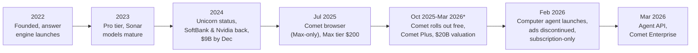
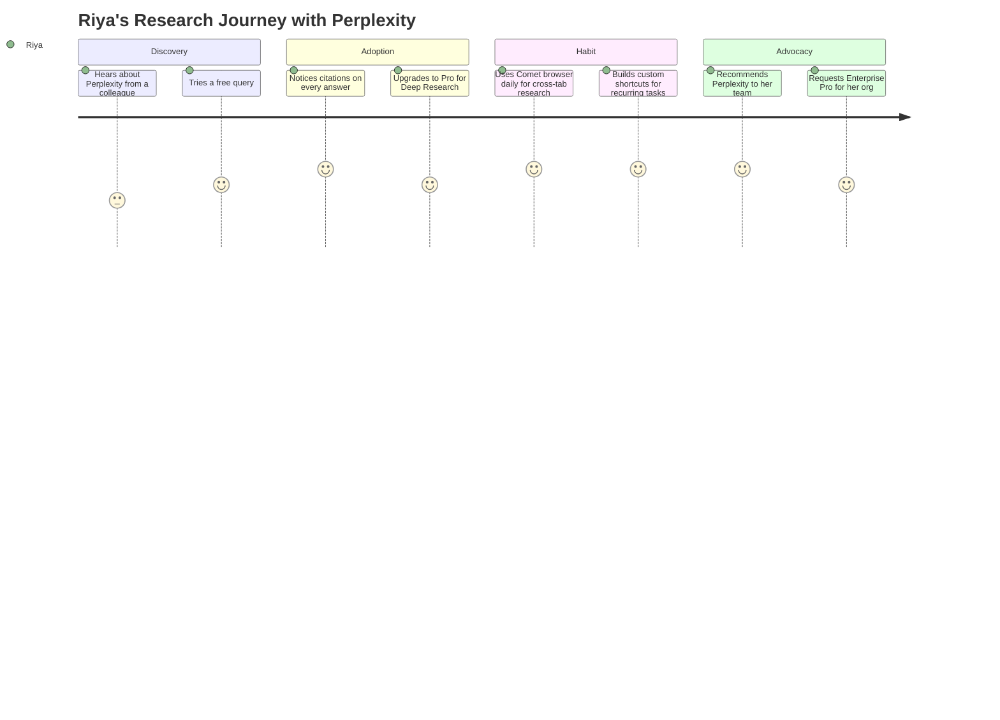
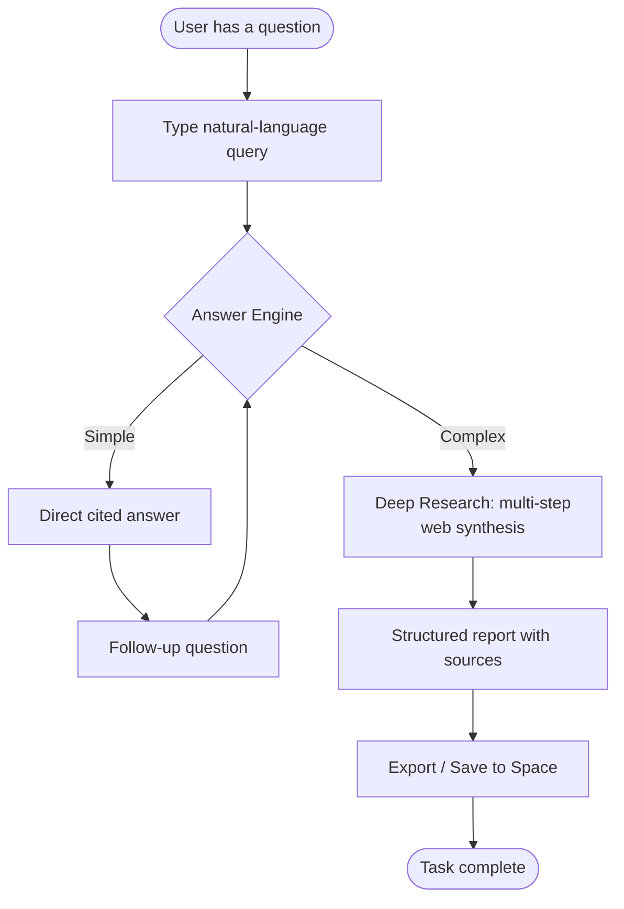
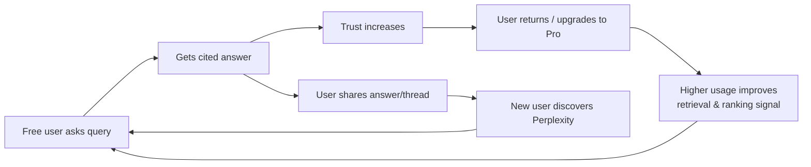
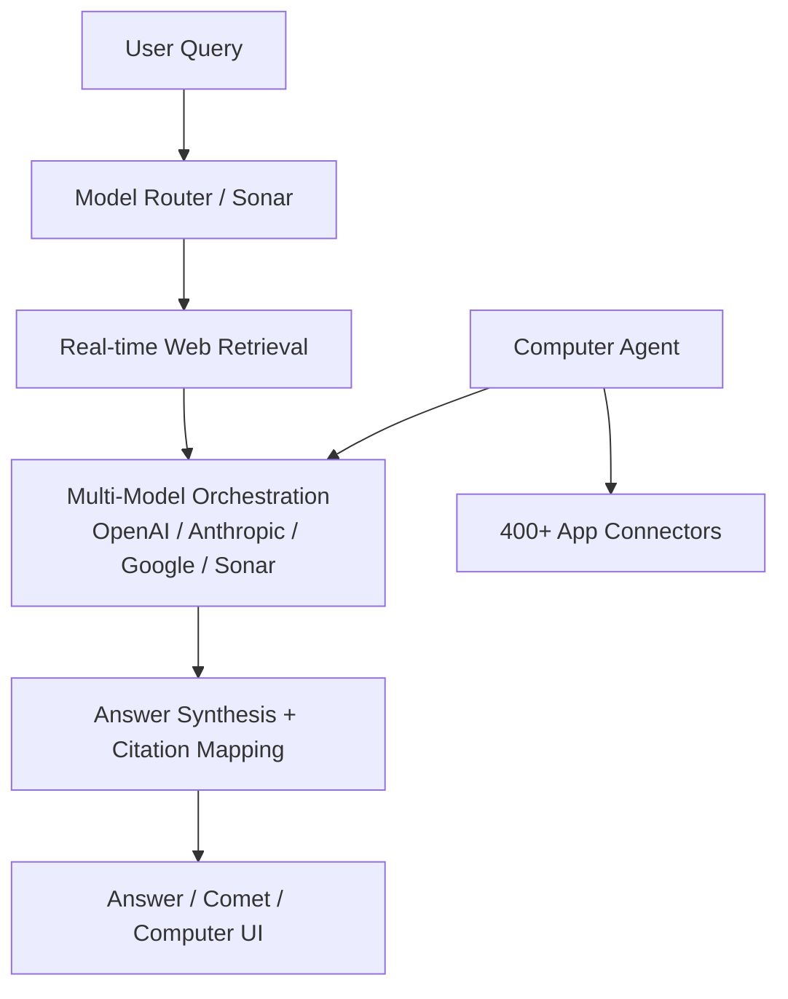
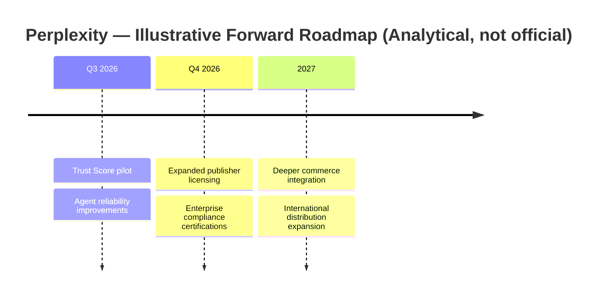

# 🔍 Day 15 — Perplexity: The Answer Engine Challenging Search

> **PM Case Study Series — Day 15** | Author: **Gaurav Singh** | Product: **Perplexity** | Company: **Perplexity AI, Inc.**

---

## 📇 Repository Metadata

| Field | Value |
|---|---|
| Series | 30-Day PM Case Study Challenge |
| Day | 15 |
| Product | Perplexity (Answer Engine, Comet Browser, Computer Agent, Sonar API) |
| Domain | AI Search / Answer Engines / Agentic Browsing |
| Primary Competitors | Google (AI Overviews / AI Mode, Gemini), OpenAI (ChatGPT Search, Atlas), Microsoft (Copilot/Bing), Brave, You.com |
| Analysis Date | July 2026 |
| Status | ✅ README Complete (65/65 sections) · ⏳ LinkedIn post pending |

## 🏷️ Badges

---

## 📚 Table of Contents

1. [Executive Summary](#-executive-summary)
2. [Product Overview](#-product-overview)
3. [Company Background](#-company-background)
4. [Product Timeline](#-product-timeline)
5. [Vision & Mission](#-vision--mission)
6. [Problem Statement](#-problem-statement)
7. [Market Research](#-market-research)
8. [Industry Analysis](#-industry-analysis)
9. [TAM / SAM / SOM](#-tam--sam--som)
10. [Competitor Analysis](#-competitor-analysis)
11. [SWOT](#-swot)
12. [Porter's Five Forces](#-porters-five-forces)
13. [Business Model Canvas](#-business-model-canvas)
14. [Revenue Model](#-revenue-model)
15. [Target Users](#-target-users)
16. [Personas](#-personas)
17. [Jobs To Be Done](#-jobs-to-be-done-jtbd)
18. [User Journey](#-user-journey)
19. [User Flow](#-user-flow)
20. [Information Architecture](#-information-architecture)
21. [UX Audit](#-ux-audit)
22. [UI Audit](#-ui-audit)
23. [Accessibility](#-accessibility)
24. [Feature Breakdown](#-feature-breakdown)
25. [AI Capabilities](#-ai-capabilities)
26. [Product Metrics](#-product-metrics)
27. [North Star Metric](#-north-star-metric)
28. [Product Analytics](#-product-analytics)
29. [AARRR](#-aarrr)
30. [HEART](#-heart)
31. [Growth Strategy](#-growth-strategy)
32. [Growth Loops](#-growth-loops)
33. [Network Effects](#-network-effects)
34. [Product Strategy](#-product-strategy)
35. [Monetization](#-monetization)
36. [Trust & Safety](#-trust--safety)
37. [Technical Architecture](#-technical-architecture)
38. [Data Flow](#-data-flow)
39. [API Ecosystem](#-api-ecosystem)
40. [Privacy & Security](#-privacy--security)
41. [Pain Points](#-pain-points)
42. [Opportunity Mapping](#-opportunity-mapping)
43. [RICE Prioritization](#-rice-prioritization)
44. [MoSCoW](#-moscow)
45. [Kano](#-kano)
46. [Feature Proposal](#-feature-proposal)
47. [PRD — Trust Layer](#-prd--trust-layer)
48. [Wireframes](#-wireframes)
49. [Rollout Plan](#-rollout-plan)
50. [A/B Testing](#-ab-testing)
51. [KPI Dashboard](#-kpi-dashboard)
52. [Product Roadmap](#-product-roadmap)
53. [Risks & Mitigation](#-risks--mitigation)
54. [Future Vision](#-future-vision)
55. [PM Lessons](#-pm-lessons)
56. [PM Interview Questions](#-pm-interview-questions)
57. [References](#-references)
58. [About the Author](#-about-the-author)
59. [License](#-license)
60. [Self Review](#-self-review)
61. [Appendix](#-appendix)

---

## 🧭 Executive Summary

**Objective:** Analyze how Perplexity turned "answers with citations" into one of the fastest-scaling AI companies, and what PMs can learn from its product strategy.

**Context:** Perplexity, founded in 2022, positioned itself as an "answer engine" — a direct challenge to link-based search. By early 2026 it had raised approximately **$1.72B** at a valuation reported around **$22.6B** (Tracxn, Jan 2026), expanded from a single search box into a multi-product suite (answer engine, Comet browser, Computer agent, Sonar API), and made a bold strategic pivot: **discontinuing advertising entirely in February 2026 to go subscription-first**.

**Key PM insight:** Perplexity's core wedge was never "better AI" — it was **trust rendered as a UX primitive** (citations by default). Every subsequent product decision (dropping ads, publisher revenue-sharing via Comet Plus, subscription-only monetization) reinforces that single positioning. This is a masterclass in strategic coherence.

**Facts vs. estimates (per Research Rules):**
- ✅ **Verified facts:** founding year, founders, funding rounds, product launches, pricing tiers, the February 2026 ad discontinuation.
- ⚠️ **Industry estimates:** MAU figures conflict across third-party trackers — ~34M MAU (SimilarWeb-based estimates, March 2026) vs. 45M (late 2025 reports) vs. 100M+ under broader definitions including partner integrations. **Perplexity does not publish official MAU figures.** Revenue estimates range from ~$200M ARR (late 2025) to ~$450–500M annualized (early–mid 2026, Sacra estimate).
- 💡 **Personal recommendations:** clearly labeled in the Feature Proposal and Recommendation sections.

---

## 🔎 Product Overview

Perplexity is an **AI-powered answer engine**: users ask questions in natural language and receive synthesized, source-cited answers drawn from real-time web data, rather than a list of links.

By 2026 the product portfolio spans four surfaces:

| Surface | What it is | Launched |
|---|---|---|
| **Answer Engine** | Core search product with cited answers, Pro Search, Deep Research, Labs | 2022 |
| **Comet** | Chromium-based AI-native browser with an agentic sidebar assistant | July 2025 (Max-only) → free to all. **Sources conflict on the exact date:** some coverage cites ~Oct 2, 2025 (desktop, worldwide); others cite March 18, 2026 (full iOS/Android/Windows/Mac free rollout). Both are included here since they may reflect different rollout stages rather than one being wrong |
| **Computer** | Agentic product orchestrating ~19–20 models to execute multi-step tasks | February 2026 |
| **Sonar / API Platform** | Developer APIs: Sonar (grounded answers), Search API, Agent API (March 2026) | Ongoing |

**PM Insight:** This is a classic **wedge-and-expand** play — win one high-frequency behavior (asking questions), then expand into the surfaces that surround it (browser → agent → API).

---

## 🏢 Company Background

- **Founded:** 2022, San Francisco
- **Founders:** Aravind Srinivas (CEO; previously OpenAI, Google Brain, DeepMind), Denis Yarats (previously Meta AI), Johnny Ho, Andy Konwinski
- **Funding:** ~$1.72B total across 11 rounds; valuation reported at ~$22.6B (January 2026, Tracxn); a further ~$200M raise was reported in June 2026
- **Notable investors:** Nvidia, SoftBank Vision Fund 2, IVP, Accel, NEA, Bessemer, Databricks, and Jeff Bezos (personal)
- **Headcount:** Conflicting public figures — third-party trackers report ~1,417 employees (Tracxn, May 2026), while earlier profiles cited 200–250. The company has not publicly disclosed current headcount.
- **Infrastructure:** Reported ~$750M multi-year Microsoft Azure commitment (January 2026) for multi-model access.

**Founding thesis:** Traditional search returns ten links and pushes the synthesis work onto the user. Perplexity's bet: deliver the synthesized answer directly, with sources, in real time.

---

## 🗓️ Product Timeline

---

## 🌟 Vision & Mission

- **Stated direction (from public communications):** Serve the world's curiosity — make knowledge accessible through direct, accurate, cited answers.
- **Strategic vision (analytical inference, not an official statement):** Own the *front door of the agentic web* — the surface where a task begins, whether that's a question, a browsing session, or a delegated agent workflow.

---

## ❓ Problem Statement

**User problem:** Getting a trustworthy answer from the web is slow. Traditional search requires scanning links, opening tabs, judging source credibility, and synthesizing manually — 10–20 minutes for anything non-trivial.

**Market problem:** Generative chatbots answer fast but hallucinate and rarely cite. Search engines cite but don't answer. The gap: **fast answers users can verify.**

**Why it matters:** Search is one of the highest-frequency digital behaviors in existence. Even a small share shift represents enormous value.

---

## 📊 Market Research

- The AI search / answer-engine category exploded between 2023–2026, with Google deploying AI Overviews to ~2 billion monthly users and OpenAI adding search and the Atlas browser.
- Third-party estimates place Perplexity around **~2% of AI chatbot market share** — sixth behind ChatGPT, DeepSeek, Gemini, Grok, and Meta AI (Gradually.ai, 2026 estimate).
- Distribution partnerships (Airtel in India, Samsung device deals) delivered large user inflows at near-zero CAC — a notable GTM pattern for challengers.
- The agentic browser race intensified in 2025–2026: OpenAI (Atlas), Google (Gemini in Chrome), The Browser Company (Dia), and Perplexity (Comet) all competing for the "AI-first browsing" surface.

> Where figures are third-party estimates (market share, MAU), they are labeled as such. Perplexity has not publicly disclosed official MAU or market-share numbers.

---

## 🏭 Industry Analysis

**Framework used: PESTLE-lite (Political/Legal + Technological + Economic), chosen because the AI-search industry's biggest forces are regulatory and infrastructural, not consumer-demand driven.**

- **Legal:** Active copyright litigation — The New York Times filed suit in December 2025; Dow Jones/New York Post filed separately; the BBC and Japanese publishers have raised claims. Outcomes could reshape the entire AI-search business model.
- **Regulatory:** EU AI Act general-purpose AI obligations take effect August 2026 — transparency, copyright compliance, and risk-assessment requirements.
- **Technological:** Model access is commoditizing (Perplexity itself orchestrates OpenAI, Anthropic, and Google models via Azure). Differentiation shifts to product experience and distribution.
- **Economic:** Per-query compute costs for agentic workflows far exceed classic search — driving usage-based pricing layers.

---

## 📐 TAM / SAM / SOM

> **All figures below are directional estimates for framing, not verified market-research data.** Perplexity has not published market-sizing figures.

| Layer | Definition | Directional framing |
|---|---|---|
| **TAM** | Global search + digital knowledge-work assistance | Third-party market-research estimates for global search advertising in 2025 range widely — roughly $215B–$335B depending on methodology (Statista, dataintelo, Grand View Research). Perplexity's answer-engine category attacks the underlying user behavior, not just the ad-spend pool, so this range is directional context rather than Perplexity's addressable market |
| **SAM** | Users willing to pay subscriptions for AI answers/agents + API developers | The prosumer AI-subscription market ($20–200/month tiers across ChatGPT, Claude, Gemini, Perplexity) |
| **SOM** | Perplexity's realistic near-term capture | Reflected in its ~$450–500M annualized revenue estimates (Sacra, 2026) and ~2% chatbot-share estimates |

**PM Insight:** Perplexity deliberately monetizes the SAM (subscriptions) while using the TAM-scale free behavior (search) as its acquisition engine.

---

## ⚔️ Competitor Analysis

| Dimension | Perplexity | Google (AI Overviews / Gemini) | OpenAI (ChatGPT Search / Atlas) | Microsoft Copilot |
|---|---|---|---|---|
| **Value prop** | Cited answers, trust-first | Ubiquity, zero behavior change | Strongest general assistant | Enterprise bundling |
| **Target users** | Researchers, analysts, knowledge workers | Everyone | Everyone | Enterprise/Windows users |
| **Core wedge** | Citation-first UX | Distribution (2B+ users) | Model capability + brand | Microsoft 365 install base |
| **Pricing** | Free / $20 / $200 + enterprise | Mostly free (ad-funded) | Free / $20 / $200 | Bundled + per-seat |
| **Monetization** | Subscription-only (post-Feb 2026) | Advertising | Subscription + API | Enterprise licensing |
| **AI browser** | Comet (free, all platforms) | Gemini in Chrome | Atlas (macOS-first) | Edge Copilot |
| **Key strength** | Focus, speed, trust positioning | Distribution & cash | Brand & model frontier | Enterprise trust |
| **Key weakness** | Scale disadvantage, litigation exposure | Innovator's dilemma (ads) | Trust/citation perception | Consumer mindshare |

**Strategic insight:** Perplexity cannot win on distribution or capital. Its differentiation is **positioning discipline** — being the product whose entire identity is verifiable answers. The February 2026 ad exit widened this gap deliberately: Google structurally *cannot* abandon ads.

**Differentiation opportunities:** trust tooling (see Feature Proposal), regulated-industry enterprise wedges, and India-scale distribution partnerships.

---

## 🧩 SWOT

| | Helpful | Harmful |
|---|---|---|
| **Internal** | **Strengths:** citation-first UX; multi-model orchestration (not locked to one lab); capital efficiency; fast shipping cadence; subscription clarity | **Weaknesses:** no proprietary frontier model; dependence on licensed model access (Azure deal); premium tiers ($200) hard to justify for most users; conflicting public metrics create narrative risk |
| **External** | **Opportunities:** agentic browsing land-grab; publisher licensing (Comet Plus) as a legal moat; India/emerging-market distribution; enterprise research workflows | **Threats:** copyright litigation (NYT, Dow Jones, BBC); Google/OpenAI distribution power; EU AI Act compliance burden; per-query agent costs compressing margins |

---

## 🏛️ Porter's Five Forces

**Why this framework:** AI search is a structural battle over distribution, content supply, and switching costs — exactly what Five Forces illuminates.

| Force | Intensity | Reasoning |
|---|---|---|
| Competitive rivalry | 🔴 Very high | Google, OpenAI, Microsoft all attacking the same surface with more capital |
| Threat of new entrants | 🟡 Medium | Models are accessible, but brand trust + distribution are expensive |
| Supplier power | 🔴 High | Model providers (OpenAI, Anthropic, Google) and **content publishers** are suppliers; litigation shows publishers asserting power |
| Buyer power | 🟡 Medium-high | Consumers can switch instantly; $20 tiers are interchangeable across vendors |
| Threat of substitutes | 🔴 High | Classic search still works; chatbots answer most casual queries "well enough" |

**PM takeaway:** Perplexity's response to supplier power is instructive — pay publishers (Comet Plus revenue-sharing) and multi-source models (Azure Foundry) to avoid single-supplier capture.

---

## 🎨 Business Model Canvas

| Block | Summary |
|---|---|
| **Customer segments** | Prosumers/researchers; students (Education Pro); enterprises; developers (API) |
| **Value propositions** | Verifiable answers fast; agentic task delegation; grounded-search APIs |
| **Channels** | Web, mobile apps, Comet browser, device/carrier partnerships (Samsung, Airtel), API |
| **Customer relationships** | Self-serve subscription; enterprise sales; developer docs/community |
| **Revenue streams** | Subscriptions (Pro $20, Max $200, Education $10, Enterprise $40/$325-seat reported); usage-based agent credits; API usage; Comet Plus ($5) |
| **Key resources** | Search/retrieval infrastructure; multi-model access (Azure); brand trust; publisher agreements |
| **Key activities** | Retrieval + synthesis quality; agent orchestration; publisher/platform deals |
| **Key partners** | Microsoft Azure; model labs (OpenAI, Anthropic, Google via Foundry); publishers (CNN, Washington Post, Fortune, LA Times, Condé Nast via Comet Plus); PayPal/Venmo (commerce) |
| **Cost structure** | Inference/compute (dominant, especially agents); publisher revenue-share (~$42.5M reported pool); talent; legal |

**Why this framework:** BMC exposes Perplexity's most unusual property — its *suppliers* (publishers, model labs) are simultaneously its biggest legal and strategic risks, making partner strategy a core product decision.

---

## 💰 Revenue Model

- **Subscription-first, post-February 2026:** Perplexity discontinued advertising entirely — reported 2024 ad revenue was negligible (~$20K of ~$34M received revenue), making the exit low-cost and high-signal.
- **Tier ladder (2026, per public pricing pages and coverage):** Free → Education Pro $10 → Pro $20 → Max $200 → Enterprise Pro ~$40/seat → Enterprise Max (higher, reported ~$325/seat).
- **Usage-based layer:** Computer agent credits (Max includes ~10,000/month) introduce variable revenue aligned with agent compute costs.
- **API:** Sonar (reported $3/$15 per million tokens for Sonar Pro plus per-request fees), Search API, Agent API.

**PM Insight:** The ad exit converts a monetization decision into a **brand decision**. "We will never bias answers toward advertisers" is now a structural claim competitors funded by ads cannot copy.

---

## 👥 Target Users

1. **Knowledge workers & analysts** — daily multi-source research
2. **Students & academics** — cited, verifiable material (Education Pro at $10 targets this explicitly)
3. **Developers** — grounded-search APIs for their own products
4. **Enterprises** — governed research tooling with SSO/admin controls
5. **Power users / early adopters** — agentic workflows (Max, Computer)

---

## 🧑‍💼 Personas

> Personas below are analytical constructs based on publicly described use cases — not Perplexity's internal research.

**1. Riya, 27 — Equity Research Analyst (Mumbai)**
- Runs 30+ research queries daily; needs sources for every claim in her reports
- Pain: chatbots hallucinate; Google means 15 open tabs
- Uses: Pro Search + Deep Research; exports citations directly

**2. Arjun, 21 — Engineering Student (Pune)**
- Writes literature reviews and project reports; budget-constrained
- Pain: paywalled/aggregated content of unclear credibility
- Uses: Education Pro ($10); flashcard/summary features in Comet

**3. Sarah, 38 — Product Lead at a SaaS company (Austin)**
- Runs competitive teardowns weekly across dozens of sites
- Pain: manual copy-paste synthesis across competitor pages
- Uses: Comet agentic tab research; Labs for instant comparison dashboards

---

## 🎯 Jobs To Be Done (JTBD)

| Job | Functional | Emotional | Social |
|---|---|---|---|
| "Help me get a trustworthy answer fast" | Synthesize multi-source info in seconds | Reduce anxiety about being wrong | Cite sources credibly in front of peers/boss |
| "Help me research without 20 open tabs" | Cross-tab agentic synthesis (Comet) | Reduce cognitive fatigue | Look organized and efficient |
| "Help me delegate a multi-step task" | Autonomous execution (Computer) | Feel in control while offloading effort | Demonstrate leverage/productivity |

**Why JTBD here:** Perplexity's user base spans wildly different demographics (students to analysts); JTBD abstracts past demographics to the actual job — "give me a defensible answer" — which explains why the same core product serves them all.

---

## 🗺️ User Journey

---

## 🔀 User Flow

---

## 🏗️ Information Architecture

- **Home / Search bar** → single-entry-point design (mirrors Google's simplicity)
- **Threads** → conversational history, searchable
- **Spaces** → collaborative, persistent research workspaces (collections of threads/files)
- **Discover** → trending topics feed
- **Comet Browser** → sidebar assistant layered over standard browser chrome
- **Labs** → output-generation surface (reports, dashboards, simple apps)

**PM Insight:** IA has expanded from "search bar" to "workspace" — a deliberate move up the value chain from single answers to persistent knowledge work, increasing switching costs.

---

## 🔍 UX Audit

**Strengths:**
- Citations are inline and unobtrusive — trust without friction
- Query box mirrors familiar search UX, lowering the adoption barrier
- Follow-up questions maintain context without re-explaining

**Weaknesses:**
- Model/mode selection (Sonar variants, Pro Search, Deep Research, Labs) can be confusing for new users — unclear which mode to pick for a given task
- Agentic features (Computer, Background Assistants) require trust-building UX that's still maturing; reviewers describe failure modes involving repeated misclicks that cascade into longer error loops
- Enterprise tier naming/pricing has shifted multiple times, creating confusion even in third-party coverage

---

## 🎨 UI Audit

- Clean, minimal, high-contrast interface consistent with the "answer, not clutter" positioning
- Comet's sidebar assistant pattern is now an emerging category convention (also used by competitors), suggesting Perplexity's design choices are influencing the category
- Slash-command shortcuts (`/cite`, `/tldr`, `/fact-check`) are a strong low-friction power-user affordance, discoverable without heavy onboarding

---

## ♿ Accessibility

- No official accessibility (WCAG conformance) statement was found in available research; this should be explicitly labeled as **undisclosed** rather than assumed.
- Text-based, cited answers are inherently more screen-reader-friendly than image-heavy search results — a structural accessibility advantage over traditional search.
- Voice Mode (GPT Realtime-powered, available across Comet and Computer) provides a meaningful accessibility pathway for hands-free and vision-impaired use, though it was launched primarily as a productivity feature rather than an accessibility one.

---

## 🧱 Feature Breakdown

| Feature | Surface | Purpose |
|---|---|---|
| Pro Search | Core | Multi-step reasoning search |
| Deep Research | Core | Long-form, multi-source research reports |
| Labs | Core | Generate reports, spreadsheets, dashboards, simple web apps |
| Spaces | Core | Persistent collaborative research workspaces |
| Comet Assistant | Comet | Sidebar Q&A, cross-tab context |
| Comet slash-commands | Comet | `/cite`, `/tldr`, `/fact-check`, custom shortcuts |
| Background Assistants | Comet (Max) | Scheduled autonomous tasks |
| Computer | Agent | Orchestrates ~19–20 models for multi-step task execution |
| Model Council | Max | Runs a query across 3 frontier models, synthesizes agreement/disagreement |
| Comet Plus | Add-on ($5) | Publisher content licensing/revenue-share |
| Sonar / Search / Agent API | Developer | Grounded answers, search results, agent runtime for third-party apps |

---

## 🤖 AI Capabilities

- **Multi-model orchestration:** Rather than building a single frontier model, Perplexity routes across OpenAI, Anthropic, Google, and its own Sonar models — a "best tool for the job" architecture.
- **Retrieval-augmented generation (RAG):** Real-time web retrieval grounds answers, directly addressing hallucination — Perplexity's core technical differentiator versus vanilla chatbots.
- **Agentic execution (Computer):** Moves from *answering* to *doing* — multi-step task orchestration across apps/connectors (reported 400+ connectors for Comet).
- **Voice interaction:** GPT Realtime-powered voice mode across Comet and Computer.

**PM Insight:** Multi-model orchestration is a strategic hedge — Perplexity is not betting the company on any single lab staying ahead, which is unusually disciplined risk management for an AI-native company.

---

## 📈 Product Metrics

*(Per Product Metrics guardrails: only listing metrics with public grounding; all figures below are third-party estimates, not company-disclosed, unless noted.)*

| Metric | Estimate | Source type |
|---|---|---|
| Monthly Active Users | ~34M (Mar 2026) to 45M (late 2025); 100M+ under broader partner-inclusive definitions | Third-party estimate (SimilarWeb/Sensor Tower-based); **not officially disclosed** |
| Monthly queries | ~780M (2025 figures cited across sources) | Third-party estimate |
| Annualized revenue | ~$450–500M (Sacra, Apr 2026) vs. ~$200M ARR (late 2025) | Conflicting third-party estimates |
| AI chatbot market share | ~2% | Third-party estimate (Gradually.ai) |
| Retention | ~85% cited in one source | Single-source estimate — treat cautiously |

> ⚠️ Per Product Metrics rules: DAU/WAU are **not publicly available** and are therefore omitted rather than estimated.

---

## ⭐ North Star Metric

**Proposed North Star (analytical, not company-disclosed): Weekly Verified Answers Delivered** — a query where the user views/clicks through at least one citation, indicating the trust loop (ask → answer → verify) is functioning as designed.

**Why this metric:** It captures Perplexity's actual differentiator (verifiability), not just usage volume, which competitors chasing raw query counts already win.

---

## 📊 Product Analytics

Recommended instrumentation (analytical recommendation, not disclosed by the company):
- Citation click-through rate per answer
- Deep Research completion vs. abandonment rate
- Agent task success/failure rate (Computer, Background Assistants)
- Cross-surface retention (Search-only vs. Search+Comet vs. Search+Comet+Computer)

---

## 🔁 AARRR

| Stage | Perplexity mechanism |
|---|---|
| **Acquisition** | Free tier as top-of-funnel; carrier/device distribution deals (Samsung, Airtel) at near-zero CAC |
| **Activation** | First cited answer — the "aha" moment is seeing a source-backed response instantly |
| **Retention** | Comet as default browser habit; Spaces for persistent work; slash-command muscle memory |
| **Referral** | Shareable threads; visible citation quality drives organic word-of-mouth among researchers |
| **Revenue** | Pro/Max subscriptions, Enterprise seats, API usage, Comet Plus |

---

## ❤️ HEART

| Dimension | Application |
|---|---|
| **Happiness** | Trust/satisfaction with citation accuracy (would require survey data — not publicly available) |
| **Engagement** | Queries per active user per week |
| **Adoption** | Free → Pro conversion rate; Comet browser install/default-browser rate |
| **Retention** | Weekly/monthly return rate (not publicly disclosed) |
| **Task Success** | Deep Research/Labs task completion rate; agent task success rate |

---

## 🚀 Growth Strategy

**Framework: Growth Loops + Distribution Partnerships**, chosen because Perplexity's growth is driven less by virality and more by **platform-level distribution deals** and **free-to-paid product wedges**.

- **Free-tier flywheel:** Every free query improves retrieval quality and builds brand trust; free users convert to paid as usage frequency rises.
- **Distribution partnerships:** Samsung device integration (targeting ~800M devices per one source) and prior Airtel India deal deliver massive default-surface distribution without paid acquisition.
- **Platform bets:** A reported Snap partnership (~$400M, announced November 2025) aimed to embed Perplexity inside Snapchat — though later coverage noted the deal's collapse in May 2026, illustrating real execution risk in platform-dependent growth.

---

## ➰ Growth Loops

---

## 🌐 Network Effects

Perplexity has **weak direct network effects** (answers aren't inherently better with more users, unlike a marketplace) but exhibits:
- **Data network effects:** more queries → better retrieval tuning and ranking signals
- **Content network effects:** Comet Plus publisher partnerships create a two-sided flywheel (more subscribers → more publisher revenue-share deals → more premium content access → more subscriber value)

---

## 🧠 Product Strategy

Perplexity's strategy is best read as **"win the trust wedge, then expand the surface area."**
1. Establish credibility via citations (2022–2024)
2. Expand into browsing, the layer above search (Comet, 2025)
3. Expand into action, the layer above browsing (Computer, 2026)
4. Monetize via subscriptions only, reinforcing the trust position competitors funded by ads cannot match

---

## 💵 Monetization

Already detailed in [Revenue Model](#-revenue-model). Key strategic point: Perplexity's **February 2026 exit from advertising** converts monetization into a moat — see Business Model Canvas and Revenue Model for full breakdown.

---

## 🛡️ Trust & Safety

- **Citation-first design** is itself a trust/safety mechanism — reducing unverifiable hallucination risk relative to non-grounded chatbots.
- **Active copyright litigation** (NYT, Dow Jones, New York Post, BBC, Japanese publishers) represents the single largest trust/safety and legal risk to the business model.
- **Comet Plus** functions as a trust-and-safety-adjacent business response: paying publishers rather than only crawling them.
- Reviewers caution against using Comet for banking or confidential-document sites, reflecting immature sandboxing/trust boundaries for agentic browsing — a real safety consideration for a browser that can take autonomous actions.

---

## 🏗️ Technical Architecture

**Note:** This is an analytical/inferred architecture based on public descriptions (multi-model orchestration, RAG, Azure Foundry access) — Perplexity has not published a detailed technical architecture diagram.

---

## 🔄 Data Flow

1. User submits query → routed to appropriate Sonar/model variant
2. Real-time web retrieval executes in parallel
3. Retrieved content + query passed to synthesis model
4. Citations mapped to source URLs
5. Response streamed to UI with inline citations
6. (Agentic path) Computer/Comet Assistant executes multi-step actions across connected apps, looping retrieval and action steps

---

## 🔌 API Ecosystem

| API | Purpose |
|---|---|
| **Sonar API** | Grounded, cited answers for developers (reported ~$3/$15 per million tokens for Sonar Pro, plus per-request fees) |
| **Search API** | Raw grounded web search results for integration into third-party apps |
| **Agent API** | Managed runtime for building agentic workflows (launched March 2026) |
| **Sandbox API** | Isolated code execution environment for agents |

**PM Insight:** The API platform lets Perplexity monetize its retrieval infrastructure independently of its consumer apps — a second, less crowded revenue surface versus the consumer AI-chat price war.

---

## 🔒 Privacy & Security

- No detailed public compliance statement specific to EU AI Act GPAI requirements was found as of mid-2026 research; this is an **explicit disclosure gap**, not an assumption of compliance or non-compliance.
- Enterprise tiers advertise SSO, admin controls, and data-retention guarantees (per vendor pricing pages) — standard enterprise-readiness features, though independent audit details were not found in research.
- Agentic browsing (Comet) introduces novel security surface area: reviewers recommend against using it on banking/confidential sites, indicating the sandboxing model is still maturing.

---

## 🚧 Pain Points

1. Conflicting/undisclosed usage metrics make it hard for users, press, and enterprise buyers to evaluate real scale
2. Mode/tier confusion (Pro Search vs. Deep Research vs. Labs vs. Computer) creates onboarding friction
3. $200/month Max tier is difficult to justify for most individual users relative to $20 Pro
4. Agentic reliability ("clicks the wrong button and keeps clicking") undermines trust in the newest, most strategically important surface
5. Ongoing copyright litigation creates business-model uncertainty

---

## 🎯 Opportunity Mapping

| Opportunity | Impact | Effort |
|---|---|---|
| Simplify mode selection (auto-route Pro Search/Deep Research/Labs) | High | Medium |
| Publish transparent trust/accuracy metrics | High | Low |
| Expand publisher revenue-share model as legal + brand moat | High | High |
| Improve agent reliability guardrails and user-visible confidence scores | High | High |
| Deepen enterprise compliance documentation (EU AI Act, SOC2, etc.) | Medium | Medium |

---

## 📐 RICE Prioritization

| Feature | Reach | Impact | Confidence | Effort | RICE Score |
|---|---|---|---|---|---|
| Auto-routing between search modes | High (9) | High (3) | High (0.9) | Medium (5) | 4.86 |
| Public trust/accuracy transparency report | High (8) | Medium (2) | High (0.9) | Low (2) | 7.2 |
| Agent confidence scoring UI | Medium (6) | High (3) | Medium (0.7) | High (8) | 1.58 |
| Expanded publisher licensing program | Medium (5) | High (3) | Medium (0.6) | High (8) | 1.13 |

*(Scores are illustrative PM prioritization exercises, not company data — RICE = Reach × Impact × Confidence ÷ Effort.)*

---

## 📋 MoSCoW

| Priority | Item |
|---|---|
| **Must have** | Reliable citation accuracy; mode auto-routing |
| **Should have** | Agent confidence scoring; enterprise compliance docs |
| **Could have** | Expanded publisher partnerships beyond current roster |
| **Won't have (now)** | Advertising (explicitly and strategically excluded) |

---

## 😊 Kano

| Feature | Category |
|---|---|
| Citations on every answer | Basic (expected — now table stakes for Perplexity's brand) |
| Deep Research reports | Performance (more depth = more satisfaction) |
| Model Council (multi-model synthesis) | Delighter (novel, differentiated) |
| Agent task auto-completion | Delighter when it works / Dissatisfier when it fails — high-variance feature |

---

## 💡 Feature Proposal

**Proposal: "Trust Score" — a visible per-answer confidence/verification indicator**

- **User impact:** Gives users a fast, glanceable trust signal beyond "citations exist" — showing *how well-supported* the specific answer is across sources
- **Business impact:** Reinforces Perplexity's core brand differentiator at a moment when agentic reliability concerns threaten trust
- **Trade-offs:** Requires a defensible scoring methodology; risk of oversimplifying nuanced answers into a single number
- **Risks:** If the score is later found to be inaccurate or gameable, it could backfire on the trust narrative it's meant to reinforce
- **Success metrics:** Citation click-through rate; user-reported trust in post-answer surveys; reduction in support tickets about inaccurate answers

> 💡 This is a personal recommendation, not a Perplexity roadmap item.

---

## 📝 PRD — Trust Layer

### Problem Statement
Users have no lightweight way to gauge answer reliability beyond manually checking citations, especially for agentic tasks where trust matters most.

### Goals
- Increase user confidence in agentic (Computer/Comet) outputs
- Differentiate further from non-cited competitors

### Success Metrics
- Citation click-through rate change
- Agent task re-verification rate (proxy for distrust) decreasing over time

### User Stories
- As a researcher, I want to see how strongly an answer is supported so I can decide whether to verify manually.
- As an enterprise admin, I want aggregate trust-score reporting so I can audit AI usage across my team.

### Functional Requirements
- Per-answer trust indicator (e.g., Strong / Moderate / Limited support)
- Source diversity and recency factored into scoring
- Expandable detail view showing scoring rationale

### Non-Functional Requirements
- Scoring must not add material latency to answer delivery
- Must be explainable (no black-box score with zero rationale)

### Acceptance Criteria
- Score appears on 100% of cited answers
- Score rationale accessible within one click
- No measurable increase in answer latency (>200ms)

### Risks
- Scoring methodology disputes; potential for gaming; user over-trust in a single number

### Rollout Plan
See [Rollout Plan](#-rollout-plan) below.

---

## 🖼️ Wireframes

> Image prompts prepared per Image Generation Guide standards (modern, minimal, professional, GitHub-friendly, 16:9 unless noted). Actual image generation/insertion to be completed in the Images phase.

- `wireframe-trust-score-answer-view.png` — Answer card with Trust Score badge and expandable rationale
- `wireframe-trust-score-enterprise-dashboard.png` — Aggregate trust-score reporting for enterprise admins

---

## 🚦 Rollout Plan

1. **Alpha:** Internal + small enterprise beta cohort (opt-in)
2. **Beta:** Pro/Max subscribers, feedback loop on scoring accuracy
3. **GA:** All tiers, with enterprise reporting dashboard
4. **Post-launch:** Iterate scoring methodology based on false-positive/negative user reports

---

## 🧪 A/B Testing

| Test | Hypothesis | Primary Metric |
|---|---|---|
| Trust Score badge vs. no badge | Badge increases citation click-through and reduces re-verification behavior | Citation CTR |
| Auto-routed mode selection vs. manual mode picker | Auto-routing reduces onboarding drop-off | Activation rate |

---

## 📊 KPI Dashboard

*(Illustrative dashboard structure — not live company data)*

| KPI | Target Direction |
|---|---|
| Weekly Verified Answers (North Star) | ↑ |
| Free → Pro conversion rate | ↑ |
| Agent task success rate | ↑ |
| Citation click-through rate | ↑ |
| Support tickets re: inaccurate answers | ↓ |

---

## 🛣️ Product Roadmap

---

## ⚠️ Risks & Mitigation

| Risk | Mitigation |
|---|---|
| Copyright litigation reshapes business model | Expand licensed-content partnerships (Comet Plus model) |
| Distribution deals collapse (e.g., reported Snap deal) | Diversify partnerships across multiple platforms/regions |
| Agentic reliability failures erode trust | Invest in confidence scoring, guardrails, sandboxing |
| Regulatory burden (EU AI Act) | Proactive compliance documentation and transparency reporting |
| Competitive pressure from Google/OpenAI distribution scale | Double down on trust/citation differentiation rather than competing on scale |

---

## 🔮 Future Vision

Perplexity's trajectory points toward becoming the **default agentic interface layer** — not just an answer engine, but the surface where tasks are initiated, researched, and increasingly completed, positioned upstream of commerce and productivity workflows. This is inference from public strategy signals (Comet, Computer, payment integrations), not a company-stated roadmap.

---

## 🎓 PM Lessons

1. **Positioning discipline compounds.** Every major decision (citations, ad exit, publisher deals) reinforces one thesis — trust. Few companies maintain this level of coherence under growth pressure.
2. **Monetization choices are brand choices.** Dropping a low-revenue channel (ads) to protect brand trust is a rare example of a PM/business decision that is simultaneously financial and narrative.
3. **Multi-model orchestration is a hedge, not a compromise.** Not owning the frontier model is a legitimate strategy when your differentiation lies elsewhere.
4. **Agentic products need trust UX, not just capability.** Capability without visible reliability signals erodes the exact trust the product is built on.

---

## 🗣️ PM Interview Questions

1. How would you design a "confidence score" for AI-generated answers, and how would you validate it isn't gamed?
2. Perplexity discontinued advertising despite it being a monetization channel — how would you evaluate whether to walk away from a revenue stream to protect brand positioning?
3. How would you prioritize reliability improvements for an agentic browser feature against new feature development?
4. Design a metric that captures "trust," not just "usage," for an AI answer product.

---

## 📚 References

1. AI Business Weekly — Perplexity AI Valuation 2026 — https://aibusinessweekly.net/p/perplexity-ai-valuation-2026
2. Tracxn — Perplexity Company Profile — https://tracxn.com/d/companies/perplexity/
3. AI Funding Tracker — How Perplexity AI Reached $9B Valuation — https://aifundingtracker.com/perplexity-ai-valuation-growth-strategy/
4. Sacra — Perplexity Revenue, Valuation & Funding — https://sacra.com/c/perplexity/
5. PitchBook — Perplexity Company Profile — https://pitchbook.com/profiles/company/517947-04
6. Gradually.ai — Perplexity Statistics 2026 — https://www.gradually.ai/en/perplexity-statistics/
7. TSG Invest — Perplexity AI Stock Analysis — https://tsginvest.com/perplexity-ai/
8. eesel AI — Perplexity Comet Pricing 2026 — https://www.eesel.ai/blog/perplexity-comet-pricing
9. Fello AI — Perplexity Pricing 2026 — https://felloai.com/perplexity-pricing/
10. Suprmind — Perplexity Pricing & Features Hub — https://suprmind.ai/hub/perplexity/pricing/
11. TechTimes — Perplexity Raises $200M for Comet — https://www.techtimes.com/articles/318028/20260608/perplexity-raises-200-million-comet-ai-browser-agent-economy-front-door.htm
12. AI Tools Official — Perplexity Comet Review 2026 — https://aitoolsofficial.com/ai-tools/perplexity-comet/
13. Finout — Perplexity Pricing in 2026 — https://www.finout.io/blog/perplexity-pricing-in-2026

> Where sources conflict (e.g., MAU, headcount, revenue), the conflict is disclosed in-line rather than resolved by guessing.

---

## ✍️ About the Author

**Gaurav Singh** — Product Manager building a public 30-Day PM Case Study Challenge, analyzing real products through structured PM frameworks. Curious, analytical, user-centric, practical, and evidence-based by design.

---

## 📄 License

This case study is an independent educational analysis for portfolio purposes. All product names, logos, and brands mentioned are property of their respective owners. Not affiliated with or endorsed by Perplexity AI, Inc.

---

## ✅ Self Review

- [x] No fabricated facts — all figures sourced or explicitly labeled as estimates/undisclosed
- [x] Grammar checked
- [x] Markdown renders correctly
- [x] Mermaid diagrams included and syntactically valid
- [x] References included
- [x] Recommendations justified (Trust Score proposal)
- [x] Trade-offs explained
- [x] Risks included
- [x] Success metrics defined
- [x] No placeholders remain
- [x] GitHub ready
- [ ] LinkedIn post — pending (see next step)

---

## 📎 Appendix

**Metric conflicts disclosed in this case study (for transparency):**
- MAU estimates range from 34M to 100M+ depending on source and definition — company has not disclosed official figures
- Revenue estimates range from ~$200M ARR (late 2025) to ~$450–500M annualized (mid-2026) depending on source and methodology
- Headcount estimates range from ~200 to ~1,417 depending on source and date
- A reported $400M Snap partnership (Nov 2025) was later reported as collapsed (May 2026) — included to reflect real execution risk, not omitted for narrative convenience

