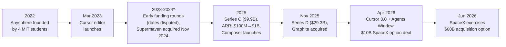
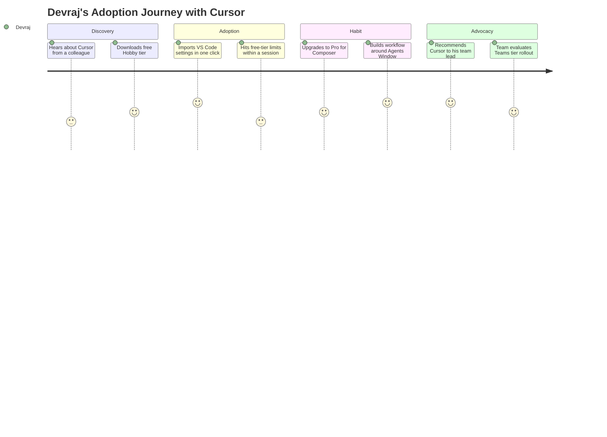
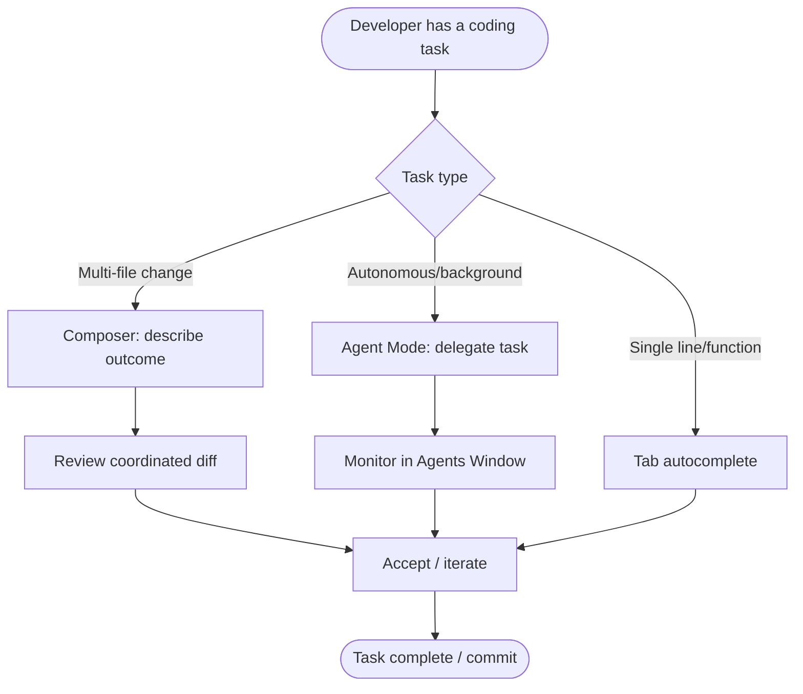
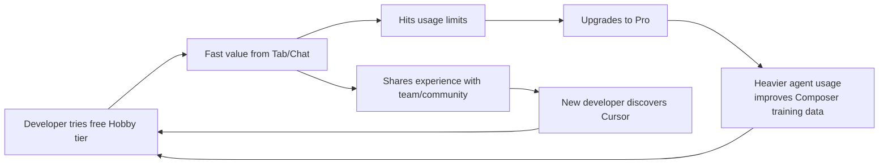
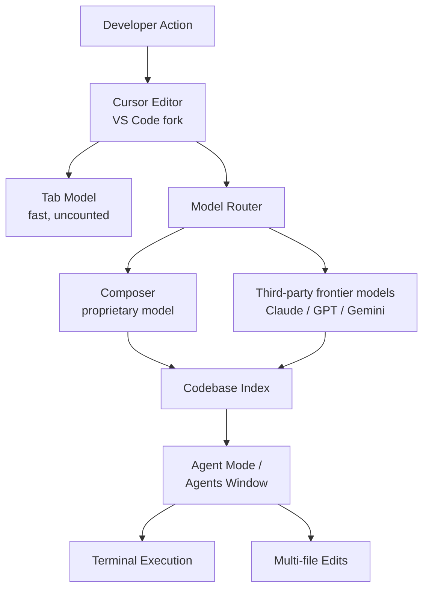
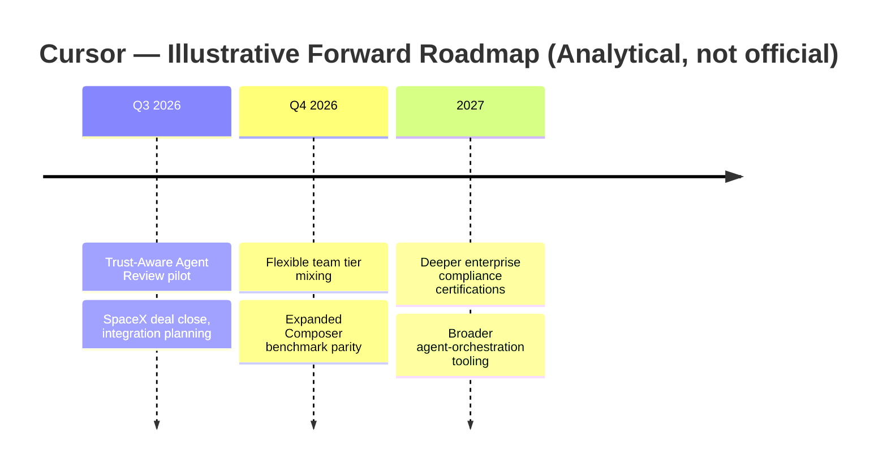

# 💻 Day 16 — Cursor: The $60B Bet That Code Editors Are the New Platform War

> **PM Case Study Series — Day 16** | Author: **Gaurav Singh** | Product: **Cursor** | Company: **Anysphere, Inc.**

---

## 📇 Repository Metadata

| Field | Value |
|---|---|
| Series | 30-Day PM Case Study Challenge |
| Day | 16 |
| Product | Cursor (AI-native code editor, Composer, Agents Window) |
| Domain | Developer Tools / AI-Assisted Software Engineering |
| Primary Competitors | GitHub Copilot (Microsoft/OpenAI), Anthropic Claude Code, Cognition Devin Desktop (formerly Windsurf), ChatGPT Codex, Google Antigravity |
| Analysis Date | July 2026 |
| Status | ✅ README Complete (65/65 sections) · ⏳ LinkedIn post pending |

## 🏷️ Badges

---

## 📚 Table of Contents

1. [Executive Summary](#-executive-summary)
2. [Product Overview](#-product-overview)
3. [Company Background](#-company-background)
4. [Product Timeline](#-product-timeline)
5. [Vision & Mission](#-vision--mission)
6. [Problem Statement](#-problem-statement)
7. [Market Research](#-market-research)
8. [Industry Analysis](#-industry-analysis)
9. [TAM / SAM / SOM](#-tam--sam--som)
10. [Competitor Analysis](#-competitor-analysis)
11. [SWOT](#-swot)
12. [Porter's Five Forces](#-porters-five-forces)
13. [Business Model Canvas](#-business-model-canvas)
14. [Revenue Model](#-revenue-model)
15. [Target Users](#-target-users)
16. [Personas](#-personas)
17. [Jobs To Be Done](#-jobs-to-be-done-jtbd)
18. [User Journey](#-user-journey)
19. [User Flow](#-user-flow)
20. [Information Architecture](#-information-architecture)
21. [UX Audit](#-ux-audit)
22. [UI Audit](#-ui-audit)
23. [Accessibility](#-accessibility)
24. [Feature Breakdown](#-feature-breakdown)
25. [AI Capabilities](#-ai-capabilities)
26. [Product Metrics](#-product-metrics)
27. [North Star Metric](#-north-star-metric)
28. [Product Analytics](#-product-analytics)
29. [AARRR](#-aarrr)
30. [HEART](#-heart)
31. [Growth Strategy](#-growth-strategy)
32. [Growth Loops](#-growth-loops)
33. [Network Effects](#-network-effects)
34. [Product Strategy](#-product-strategy)
35. [Monetization](#-monetization)
36. [Trust & Safety](#-trust--safety)
37. [Technical Architecture](#-technical-architecture)
38. [Data Flow](#-data-flow)
39. [API Ecosystem](#-api-ecosystem)
40. [Privacy & Security](#-privacy--security)
41. [Pain Points](#-pain-points)
42. [Opportunity Mapping](#-opportunity-mapping)
43. [RICE Prioritization](#-rice-prioritization)
44. [MoSCoW](#-moscow)
45. [Kano](#-kano)
46. [Feature Proposal](#-feature-proposal)
47. [PRD — Trust-Aware Agent Review](#-prd--trust-aware-agent-review)
48. [Wireframes](#-wireframes)
49. [Rollout Plan](#-rollout-plan)
50. [A/B Testing](#-ab-testing)
51. [KPI Dashboard](#-kpi-dashboard)
52. [Product Roadmap](#-product-roadmap)
53. [Risks & Mitigation](#-risks--mitigation)
54. [Future Vision](#-future-vision)
55. [PM Lessons](#-pm-lessons)
56. [PM Interview Questions](#-pm-interview-questions)
57. [References](#-references)
58. [About the Author](#-about-the-author)
59. [License](#-license)
60. [Self Review](#-self-review)
61. [Appendix](#-appendix)

---

## 🧭 Executive Summary

**Objective:** Analyze how a four-person MIT team turned a VS Code fork into the fastest-scaling B2B software company on record — and what its acquisition by SpaceX signals about where developer tools are headed.

**Context:** Cursor (built by Anysphere) launched in March 2023. Its annualized revenue trajectory has no precedent: $100M (Jan 2025) → $500M (Jun 2025) → $1B (Nov 2025) → $2B (Feb 2026) → ~$4B (Jun 2026). On June 16, 2026, SpaceX announced it would acquire Anysphere at a $60B valuation — the largest venture-backed startup acquisition on record — after paying a reported $10B in April 2026 for exclusive collaboration rights and an acquisition option, preempting an in-progress $2B raise that was pricing at ~$50B.

**Key PM insight:** Cursor won by staying an *editor*, not becoming a chat window bolted onto one. Every competitor (Copilot, Claude Code, Codex) approaches AI coding from a different form factor — plugin, terminal, or chat app. Cursor's bet was that the editor itself, rebuilt AI-native from the VS Code fork up, was the right unit of product design. That form-factor conviction, held since 2022, is now validated by a $60B acquisition price.

**Facts vs. estimates (per Research Rules):**
- ✅ **Verified facts:** founding team and date, the SpaceX acquisition announcement (June 16, 2026), the Series C and Series D round sizes/dates, product launch dates (Cursor 3.0, Composer 2.5).
- ⚠️ **Industry estimates / disclosure gaps:** exact current DAU/MAU are not consistently disclosed (one 2025 company disclosure cited 1M+ DAU, not reconfirmed since); revenue figures are drawn from press reporting on internal run-rate disclosures, not audited financials; **pricing tier count itself varies by source and date (3–6 tiers reported)** — the most recent, most detailed sources were used, but this is disclosed as a conflict, not a verified constant; earliest funding round details (seed vs. Series A) conflict across sources; whether SpaceX will formally close the $60B acquisition (vs. some other outcome) was still pending as of the most recent reporting reviewed.
- 💡 **Personal recommendations:** clearly labeled in the Feature Proposal and Recommendation sections.

---

## 🔎 Product Overview

Cursor is an **AI-native code editor** — a fork of Visual Studio Code rebuilt so that AI assistance (autocomplete, chat, multi-file editing, autonomous agents) is a first-class part of the editing experience rather than a bolted-on extension.

Core surfaces as of mid-2026:

| Surface | What it is | Notable milestone |
|---|---|---|
| **Tab / Autocomplete** | Fast, fine-tuned completion model (not counted against premium quota) | Core since 2023 launch |
| **Chat** | In-editor conversational assistant with codebase context | Core since 2023 |
| **Composer** | Multi-file, coordinated code editing from a single natural-language instruction | Composer 2 (Mar 2026), Composer 2.5 (May 18, 2026) |
| **Agent Mode / Agents Window** | Autonomous execution: runs terminal commands, edits across the project, works in parallel in the background | Cursor 3.0 introduced the dedicated Agents Window (Apr 2, 2026) |
| **Design Mode** | Generates UI from screenshots/mockups | 2025 |
| **Bugbot** | Automated code review agent | 2025–2026 |

**PM Insight:** Cursor's product strategy is "own the surface developers already live in," rather than asking developers to adopt a new surface (terminal, chat app). That's the opposite bet from Claude Code (terminal-native) and represents a genuine, unresolved industry debate about where AI coding assistance should live.

---

## 🏢 Company Background

- **Founded:** 2022, by four MIT students — Michael Truell (CEO), Sualeh Asif, Aman Sanger, and Arvid Lunnemark — who left school to build Anysphere
- **Headquarters:** San Francisco
- **Funding history:** Sources conflict on the earliest round — one source (TechCrunch, via Wikipedia) reports an **$8M seed round in October 2023** led by the OpenAI Startup Fund; a separate source (Value Add VC) cites an **$11M Series A in April 2023** with the OpenAI Startup Fund on the cap table from that point. It's unclear from research reviewed whether these describe the same round with conflicting figures/dates, or two distinct events — flagged rather than resolved by guessing. Later rounds are consistently reported: Series B ($100M at a $2.6B valuation, per Value Add VC, exact date not confirmed in sources reviewed) → Series C ($900M at $9.9B, mid-2025, led by Thrive Capital) → Series D ($2.3B at $29.3B post-money, Nov 13, 2025, co-led by Accel and Coatue, with Nvidia and Google joining as strategic investors)
- **Total funding:** reported as approximately $2.7–3.4B across five to six priced rounds, depending on source and whether the $10B SpaceX collaboration payment is counted as funding or a separate commercial deal — sources vary on this classification
- **The SpaceX deal:** On April 21, 2026, SpaceX (or, per one source, xAI) struck a deal paying **$10B** for exclusive collaboration rights and an **option** to acquire Cursor for **$60B** later in 2026 — preempting an oversubscribed ~$2B round that was pricing at ~$50B. On **June 16, 2026**, SpaceX announced it was exercising that option in an all-stock deal, expected to close in Q3 2026. **Note:** sources disclose a minor discrepancy over whether the original April option-holder was reported as SpaceX or xAI — this is flagged rather than silently resolved.
- **Revenue trajectory:** $100M ARR (Jan 2025) → $500M (Jun 2025) → $1B (Nov 2025) → $2B (Feb 2026) → ~$3B (Apr 2026) → ~$4B (Jun 2026), per press reporting on company-disclosed run rate; internal projections reportedly target $6B by end of 2026
- **Headcount:** ~300 employees as of August 2025 (Wikipedia, citing company disclosure) — not reconfirmed at a more recent date in available research
- **Notable acquisitions by Cursor:** Supermaven (Nov 2024, autocomplete), Koala (Jul 2025, enterprise), Graphite (Dec 2025, code review, reported well above its prior $290M valuation)
- **Notable investors:** Thrive Capital, Accel, Coatue, Andreessen Horowitz, Benchmark, OpenAI Startup Fund, Founders Fund, Nvidia, Google, and personal investment from Patrick and John Collison (Stripe)

**Founding thesis:** Rather than bolt AI onto an existing IDE as a plugin, rebuild the editor itself around AI-native workflows — full codebase context, multi-file reasoning, and eventually autonomous execution.

---

## 🗓️ Product Timeline

---

## 🌟 Vision & Mission

- **Stated direction (from public communications):** Build tools and models that give developers effortless control over their codebases — productive human-AI collaboration, not full automation away from the human.
- **Strategic vision (analytical inference, not an official statement):** Own the primary interface layer where software gets written, positioning the editor — not the model, not the terminal — as the durable product surface, even as underlying models commoditize.

---

## ❓ Problem Statement

**User problem:** Writing software involves enormous repetitive, low-judgment work (boilerplate, refactors, cross-file consistency, debugging) alongside the genuinely creative parts. Traditional IDEs don't understand the whole codebase; early AI coding tools (line-level autocomplete) only automated the smallest, least valuable slice of that work.

**Market problem:** As of the most recent research reviewed, most professional developers were already using AI tools daily, but tools varied wildly in how much codebase context and autonomy they offered — from single-line completion to full agentic execution.

**Why it matters:** Software engineering is one of the highest-value knowledge-work categories globally; even modest productivity gains compound across an enormous addressable market of developers and enterprises.

---

## 📊 Market Research

- GitHub Copilot holds an estimated **~37% of the AI coding tools market** and reports **4.7 million paid subscribers** with ~90% adoption among the Fortune 100 (per one 2026 market analysis).
- Anthropic's Claude Code reached an estimated **57% developer awareness** with **18% active workplace usage** by January 2026 (per the same analysis) — operating as a terminal-native agent rather than an editor.
- The broader AI coding tools category generated an estimated **$12.8B in revenue in 2026**, more than double the ~$5.1B estimated for 2024.
- A notable competitive event: **Windsurf was retired on June 2, 2026**, with Cognition relaunching the product as **Devin Desktop** — reshaping the competitive field for VS Code-fork editors.
- More than half of code on GitHub is now estimated to be AI-generated or AI-assisted, and roughly 90% of developers are estimated to regularly use at least one AI coding tool at work.

> Where figures are third-party estimates, they are labeled as such; exact methodologies vary across sources and are not independently verified here.

---

## 🏭 Industry Analysis

**Framework used: Technology S-curve + Capital Intensity lens**, chosen because the AI coding category's defining dynamic in 2026 is the pace of model improvement colliding with the economics of serving inference at scale — not classic demand-side forces.

- **Technological:** The shift from single-line "vibe coding" completion to full agentic workflows (plan → execute → test → iterate) is the defining 2026 transition. Cursor's own inference model (launched Nov 2025) and Composer 2.5 (May 2026, reportedly matching Claude Opus-tier benchmarks at roughly a tenth of the cost) reflect a strategic move to reduce dependence on third-party model pricing.
- **Economic:** Reporting through 2025 indicated Anysphere spent an estimated **$0.40–$0.70 per dollar of revenue on model inference** (Anthropic/OpenAI API costs), pushing gross margins structurally below typical software (~30–50% vs. 80%+) — though this was improving as of the Composer 2.5 launch.
- **Competitive:** Four products define the category as of mid-2026 per one review: Cursor (editor-centric), Claude Code (terminal-native), Antigravity 2.0 (Google, parallel-agent IDE), and ChatGPT Codex (bundled into ChatGPT plans).
- **Consolidation signal:** the Windsurf→Devin Desktop transition and the SpaceX/Anysphere deal both point toward rapid consolidation in a category that was fragmented as recently as 2024.

---

## 📐 TAM / SAM / SOM

> **Figures below are directional third-party market-research estimates, not verified/disclosed figures.**

| Layer | Definition | Directional framing |
|---|---|---|
| **TAM** | Global software development tooling + AI-assisted engineering | The AI coding tools category alone is estimated at ~$12.8B in 2026 revenue (more than 2x the ~$5.1B estimated for 2024); this sits inside a much larger global IT spending market (Gartner has forecast global IT spend in the trillions of dollars) |
| **SAM** | Professional developers and engineering organizations willing to pay for AI-native coding tools | An estimated 90% of professional developers already use at least one AI coding tool; GitHub reports 180M+ developers on its platform, giving a sense of scale for the addressable base |
| **SOM** | Cursor's realistic near-term capture | Reflected in its reported ~$4B annualized revenue (Jun 2026) against ~$2B ARR competitors like GitHub Copilot's parent ecosystem serve at much larger user counts but lower per-seat intensity |

**PM Insight:** Cursor's SOM-to-TAM ratio is unusually favorable for a two-year-old product — a signal that the category is still being defined rather than fought over on price, which is exactly the environment that produces outsized acquisition premiums like SpaceX's.

---

## ⚔️ Competitor Analysis

| Dimension | Cursor | GitHub Copilot | Claude Code (Anthropic) | Devin Desktop (formerly Windsurf, Cognition) |
|---|---|---|---|---|
| **Form factor** | AI-native editor (VS Code fork) | Plugin inside existing IDEs | Terminal-native CLI agent | Standalone agentic IDE |
| **Core wedge** | Editor-centric, Composer + Agents Window | GitHub ecosystem integration (issues, PRs, CI) | Deep reasoning, full codebase context, no GUI overhead | Autonomous multi-agent execution |
| **Pricing** | Free / $20 / $60 / $200 / $40 seat / custom | Free / $10 / $19 seat | Usage-based via Anthropic plans/API | Not fully detailed in research reviewed |
| **Est. market position** | Fast-growing challenger, high revenue-per-employee | ~37% market share, 4.7M paid subscribers | ~57% awareness, 18% active workplace usage | Repositioned post-retirement of Windsurf |
| **Key strength** | Editor cohesion, whole-project understanding, fast model iteration (Composer) | Distribution via GitHub/Microsoft install base | Reasoning depth, terminal-native flexibility for power users | Full agent autonomy branding |
| **Key weakness** | Negative-to-thin gross margins historically; premium pricing vs. Copilot | Weaker multi-file/agentic depth (narrowing) | No GUI; different workflow fit | Brand disruption from the Windsurf→Devin transition |

**Strategic insight:** The category hasn't converged on one form factor. Cursor bet on "the editor stays in front, AI works around it" — a genuinely different design philosophy from Claude Code's terminal-first approach. Both are gaining share, suggesting the market may support multiple winners with different workflow philosophies rather than one dominant form factor.

**Differentiation opportunities:** deeper enterprise compliance tooling, cost-efficient proprietary models (Composer) as a durable margin advantage, and cross-agent orchestration (competing directly with the "many agents in parallel" trend visible in both Cursor 3.0's Agents Window and rival tools.

---

## 🧩 SWOT

| | Helpful | Harmful |
|---|---|---|
| **Internal** | **Strengths:** Editor-centric cohesion; fastest-recorded B2B SaaS revenue ramp; proprietary Composer model reducing inference costs; strong enterprise penetration (majority of Fortune 500 reported using it) | **Weaknesses:** Historically negative-to-thin gross margins from third-party model costs; small headcount (~300) relative to scale, creating execution/support risk; premium pricing (2x Copilot) |
| **External** | **Opportunities:** SpaceX/xAI backing could provide compute-cost advantages and cross-product distribution; continued agentic-coding category growth; enterprise compliance-driven upsell (Business/Enterprise tiers) | **Threats:** Hyperscalers (Microsoft, Google, Amazon) can bundle competing tools at near-zero marginal cost; frontier labs (Anthropic, OpenAI) can embed coding agents directly into their own platforms; rapid commoditization risk if "best product" advantage narrows |

---

## 🏛️ Porter's Five Forces

**Why this framework:** The AI coding tools market in 2026 is a textbook supplier-power and substitution battle — Five Forces isolates exactly where Cursor's leverage does and doesn't exist.

| Force | Intensity | Reasoning |
|---|---|---|
| Competitive rivalry | 🔴 Very high | Copilot, Claude Code, Codex, Antigravity, and Devin Desktop all compete directly, several backed by trillion-dollar-plus parent companies |
| Threat of new entrants | 🟡 Medium | High technical bar to match Composer-level performance, but frontier labs can ship competitive agents quickly given model access |
| Supplier power | 🔴 High | Cursor was historically dependent on Anthropic/OpenAI model pricing for premium requests — a major margin constraint until Composer reduced that dependency |
| Buyer power | 🟡 Medium | Developers can and do run multiple tools simultaneously (per one comparison, engineers frequently alt-tab between Claude, Codex, and Cursor), lowering switching costs |
| Threat of substitutes | 🟡 Medium-high | Free/cheaper alternatives (Copilot at $10, Windsurf's historically generous free tier) exist, but power users pay a premium for Composer/Agents Window capability |

**PM takeaway:** Cursor's most important strategic move — training its own Composer model — is a direct response to supplier power. It converts a cost-structure weakness into a competitive moat (cheaper, coding-specific inference) rather than just accepting frontier-lab pricing indefinitely.

---

## 🎨 Business Model Canvas

| Block | Summary |
|---|---|
| **Customer segments** | Individual developers (Hobby/Pro); power users/heavy agent users (Pro+/Ultra); teams and enterprises (Teams/Enterprise) |
| **Value propositions** | Whole-project AI understanding in a familiar editor; Composer's coordinated multi-file edits; parallel background agents; frontier-tier performance at lower cost via proprietary Composer models |
| **Channels** | Direct download (cursor.com), VS Code-familiar onboarding (one-click settings import), enterprise sales for Business/Enterprise tiers |
| **Customer relationships** | Self-serve subscription (majority of users); enterprise sales and support for larger seats; community/changelog-driven engagement |
| **Revenue streams** | Subscriptions across 6 tiers (Hobby free → Pro $20 → Pro+ $60 → Ultra $200 → Teams $40/seat → Enterprise custom); usage-based credit overages |
| **Key resources** | Proprietary Composer models; engineering talent (high revenue-per-employee ratio); VS Code fork codebase and extension compatibility |
| **Key activities** | Model training (Composer), agent orchestration, editor/IDE engineering, enterprise compliance tooling |
| **Key partners** | Model providers (Anthropic, OpenAI, Google — for non-Composer premium requests); strategic investors turned parent company (SpaceX, pending deal close) |
| **Cost structure** | Model inference/training (historically the dominant and margin-compressing cost); talent (small but highly compensated team); go-to-market for enterprise |

**Why this framework:** BMC surfaces the single most important structural fact about Cursor's business — it was, until Composer, a company whose largest supplier was also effectively setting its gross margin ceiling. Training a proprietary model is a business-model decision as much as a technical one.

---

## 💰 Revenue Model

- **Six-tier subscription ladder (per multiple 2026 pricing analyses, though exact tier count and pricing details showed some inconsistency across sources):** Hobby (free, ~2,000 completions + ~50 slow premium requests/month) → Pro ($20/mo, unlimited completions + credit-based premium usage) → Pro+ ($60/mo, ~3x Pro's usage credits) → Ultra ($200/mo, ~20x usage multiplier) → Teams/Business ($40/seat/month, admin controls, SSO, privacy mode) → Enterprise (custom, adds SOC2, on-prem support).
- **Billing model shift:** Cursor moved from a fixed "500 fast requests/month" allowance to **usage/credit-based billing in June 2025**, which drew user complaints over unexpected charges; the company apologized, rolled back limits, and refunded affected users.
- **Annual billing discount:** approximately 20% across paid tiers (e.g., Pro effectively ~$16/month annually).
- **Proprietary model economics:** Composer 2.5 (May 2026) is priced at a reported $0.50/M input and $2.50/M output tokens — roughly a tenth of comparable frontier API pricing — which, if the cost curve holds at scale, materially improves Cursor's own margins on agent-heavy usage.

**PM Insight:** The June 2025 credit-billing backlash and rollback is a useful case study in itself: usage-based pricing solves a real cost problem (heavy agent use costs more to serve) but breaks the mental model users had of a flat subscription — a trade-off Cursor is still actively tuning as of mid-2026.

---

## 👥 Target Users

1. **Individual professional developers** — daily-driver editor replacement, Pro tier sweet spot
2. **Heavy agent/power users** — Pro+/Ultra tiers, running background agents constantly
3. **Engineering teams at startups/scaleups** — Teams tier for admin controls and shared billing
4. **Enterprises** — Business/Enterprise tiers for SSO, compliance, on-prem support (reported at scale: 64% of Fortune 500 companies, 50,000+ enterprises, per company-disclosed figures)
5. **Students/hobbyists** — Hobby free tier for evaluation and learning

---

## 🧑‍💼 Personas

> Personas below are analytical constructs based on publicly described use cases — not Anysphere's internal research.

**1. Devraj, 29 — Senior Backend Engineer at a Series B startup (Bangalore)**
- Owns a large, fast-moving microservices codebase; needs cross-file refactors done fast without breaking conventions
- Pain: line-level autocomplete tools miss project-wide context; manual multi-file refactors eat hours
- Uses: Composer for coordinated edits; Agents Window to run background refactor jobs while he works on something else

**2. Priya, 24 — Junior Full-Stack Developer (Pune)**
- Learning on the job; wants to move fast without losing understanding of what's being built
- Pain: risk of shipping code she can't explain if she over-relies on Agent mode
- Uses: Chat to ask "why" before accepting Composer suggestions; treats it as a tutor, not an autopilot — mirroring reviewer guidance about the risk for less experienced users

**3. Sarah, 41 — Engineering Manager at a mid-size SaaS company (Austin)**
- Evaluating tooling budget across a 40-person engineering org
- Pain: Cursor is 2x Copilot's price; needs to justify the premium with measurable output gains
- Uses: Teams tier with admin controls; tracks whether Composer's coordinated edits reduce PR review cycles enough to justify cost

---

## 🎯 Jobs To Be Done (JTBD)

| Job | Functional | Emotional | Social |
|---|---|---|---|
| "Help me ship a multi-file change fast" | Coordinated edits across the codebase (Composer) | Reduce frustration with repetitive refactor work | Ship faster than peers using slower tooling |
| "Help me work on multiple things at once" | Parallel background agents (Agents Window) | Feel in control while delegating, not replaced | Demonstrate leverage to manager/team |
| "Help me stay in flow without leaving my editor" | AI-native chat/completion inside the IDE | Avoid context-switching fatigue | Maintain reputation as a fast, capable engineer |

**Why JTBD here:** Cursor's user base ranges from junior developers to engineering VPs; JTBD explains why the same product serves all of them — the job ("help me build without breaking flow") is constant even as skill level and stakes vary.

---

## 🗺️ User Journey

---

## 🔀 User Flow

---

## 🏗️ Information Architecture

- **Editor core** → familiar VS Code layout, extension-compatible (low switching-cost by design)
- **Chat panel** → conversational assistant with codebase-wide context
- **Composer** → dedicated multi-file editing surface, separate from chat
- **Agents Window** (Cursor 3.0) → dashboard for monitoring/managing parallel background agents
- **Settings → Models** → model selection across first-party (Composer) and third-party (Claude, GPT, Gemini) options
- **Bugbot** → review surface integrated into the PR/diff workflow

**PM Insight:** The IA choice to give Agents Window its own dedicated surface (rather than burying it in chat) mirrors Perplexity's Spaces pattern from Day 15 — a recurring theme where AI products graduate from "a chat box" to "a workspace" as they mature.

---

## 🔍 UX Audit

**Strengths:**
- One-click VS Code import removes the single biggest adoption barrier for an editor switch
- Composer's dedicated surface avoids the common failure mode of burying powerful features inside an undifferentiated chat thread
- Tab autocomplete works immediately with zero configuration — fast time-to-value

**Weaknesses:**
- Credit-based billing (since June 2025) is genuinely confusing — multiple pricing guides in 2026 note that users don't realize how quickly heavy agent use burns through a monthly allotment until they hit the wall
- All-seats-must-match-plan constraint (no mixed Pro/Business within one team) creates friction for teams with uneven usage patterns
- Reviewers consistently flag a real risk: junior developers can ship Composer/Agent-generated code they don't understand, creating fragile systems that fail unpredictably later

---

## 🎨 UI Audit

- Maintains VS Code's familiar visual language deliberately — the interface itself is not the differentiator, the AI integration is
- Agents Window (Cursor 3.0, April 2026) introduces a genuinely new UI pattern for the category: a dashboard-style view of multiple autonomous agents running in parallel, rather than a single linear chat thread
- Design Mode (screenshot-to-UI) extends the product beyond pure backend/logic work into frontend generation, broadening the UI's addressable workflows

---

## ♿ Accessibility

- No official WCAG conformance statement was found in available research; this is an **explicit disclosure gap**, not an assumption of compliance.
- As a VS Code fork, Cursor inherits much of VS Code's underlying accessibility tooling (screen reader support, keyboard navigation) rather than building it from scratch — a structural advantage over a from-scratch editor.
- Voice-driven or fully hands-free workflows were not prominently described in research reviewed, unlike Perplexity's dedicated Voice Mode (Day 15) — a potential gap relative to competitors building explicit accessibility-oriented interaction modes.

---

## 🧱 Feature Breakdown

| Feature | Surface | Purpose |
|---|---|---|
| Tab autocomplete | Core | Fast, fine-tuned inline completion (not credit-metered) |
| Chat | Core | Conversational assistant with codebase context |
| Composer | Core (Pro+) | Multi-file coordinated editing from natural language |
| Agent Mode | Core (Pro+) | Autonomous terminal commands + code edits |
| Agents Window | Cursor 3.0+ | Dashboard for parallel background agent tasks |
| Design Mode | Core | Generate UI from screenshots/mockups |
| Bugbot | Core | Automated code review agent |
| Codebase indexing | Pro+ | Whole-project context for chat/Composer |
| Privacy Mode | Business/Enterprise | Zero data retention, code never used for training |
| SSO / admin controls | Business/Enterprise | Team management, compliance |

---

## 🤖 AI Capabilities

- **Multi-model flexibility:** Cursor supports frontier models (reported to include GPT-5.5-class, Claude Opus 4.8-class, and Gemini 3.1 Pro-class models per one 2026 review) alongside its own proprietary Composer models — avoiding lock-in to a single provider.
- **Proprietary coding-specific model (Composer):** Composer 2 (March 2026) was built on a Moonshot AI Kimi K2.5 base with heavy Cursor-specific reinforcement learning; Composer 2.5 (May 2026) reportedly scored 79.8% on SWE-Bench Multilingual — close to a frontier Claude Opus-class benchmark score — at roughly a tenth of the per-token cost.
- **Parallel agent orchestration:** The Cursor 3.0 Agents Window allows multiple autonomous agents to run simultaneously on different tasks, with cloud handoff for background execution.
- **Codebase-wide context:** Indexing that spans the full project (not just open files), which is the core technical differentiator versus line-level completion tools.

**PM Insight:** Training Composer is the same strategic move Perplexity made with Sonar (Day 15) — both companies chose to build proprietary, task-specific models rather than depend entirely on frontier labs, converting a cost/dependency risk into a differentiated capability.

---

## 📈 Product Metrics

*(Per Product Metrics guardrails: only listing metrics with public grounding; figures below are drawn from company disclosures reported in press coverage or third-party estimates, explicitly labeled.)*

| Metric | Estimate | Source type |
|---|---|---|
| Annualized revenue | $100M (Jan 2025) → $500M (Jun 2025) → $1B (Nov 2025) → $2B (Feb 2026) → ~$4B (Jun 2026) | Company-disclosed run-rate, reported via press (CNBC, TechCrunch, Bloomberg) |
| Daily Active Users | 1M+ reported in 2025 | Single company disclosure; **not reconfirmed at a more recent date** in research reviewed |
| Fortune 500 usage | 64% of Fortune 500 companies reported using Cursor (2026); "over half" reported at Series C (mid-2025) | Company-disclosed |
| Enterprise customers | 50,000+ enterprises reported | Company-disclosed |
| Enterprise code volume | 100M+ lines of enterprise code per day reported | Company-disclosed |
| Headcount | ~300 employees (Aug 2025) | Wikipedia, citing company disclosure; **not reconfirmed since** |
| AI coding tools market share | GitHub Copilot ~37%; Claude Code ~57% developer awareness / 18% active use; Cursor's own share not independently quantified in research reviewed | Third-party estimate |

> ⚠️ Per Product Metrics rules: Cursor has not published audited financials; all revenue figures are press-reported run-rate disclosures, not GAAP revenue.

---

## ⭐ North Star Metric

**Proposed North Star (analytical, not company-disclosed): Weekly Accepted Agent Actions per Active Developer** — the count of Composer edits and Agent-mode tasks a developer actually accepts (not just generates), per week.

**Why this metric:** It measures trust and real value delivered, not raw usage — a developer who generates ten Composer edits and rejects nine is not experiencing the product's core value, even though usage volume looks healthy.

---

## 📊 Product Analytics

Recommended instrumentation (analytical recommendation, not disclosed by the company):
- Composer/Agent suggestion acceptance rate vs. rejection rate
- Credit exhaustion rate per tier (proxy for pricing-tier fit and potential churn risk)
- Time-to-first-Composer-use after signup (activation signal)
- Background agent task success/failure rate

---

## 🔁 AARRR

| Stage | Cursor mechanism |
|---|---|
| **Acquisition** | Free Hobby tier; one-click VS Code settings import removes switching friction |
| **Activation** | First successful Tab completion or Composer edit — near-instant value with zero configuration |
| **Retention** | Codebase indexing and workflow habit formation; Agents Window creates a persistent, visible workspace |
| **Referral** | Developer word-of-mouth (a historically strong channel in dev tools); enterprise expansion via engineer advocacy inside orgs |
| **Revenue** | Free → Pro conversion when Hobby limits are hit; Pro → Pro+/Ultra as agent usage grows; Teams/Enterprise for organizational rollout |

---

## ❤️ HEART

| Dimension | Application |
|---|---|
| **Happiness** | Developer satisfaction with suggestion quality (would require survey data — not publicly available) |
| **Engagement** | Composer/Agent invocations per active user per week |
| **Adoption** | Free → Pro conversion rate; VS Code import completion rate |
| **Retention** | Weekly/monthly active usage (not publicly disclosed in detail) |
| **Task Success** | Suggestion acceptance rate; background agent completion rate without human intervention |

---

## 🚀 Growth Strategy

**Framework: Product-Led Growth + Enterprise Land-and-Expand**, chosen because Cursor's growth pattern combines a classic PLG free-to-paid funnel with unusually fast enterprise penetration for a two-year-old product.

- **PLG flywheel:** Free Hobby tier removes cost as an adoption barrier; low-friction VS Code import removes switching cost; fast time-to-value (Tab autocomplete works immediately) drives organic word-of-mouth in a profession where tool recommendations travel fast.
- **Land-and-expand:** Individual developers adopt Cursor personally, then advocate for team-wide Teams/Enterprise rollout — the same bottom-up motion that made tools like Slack and Figma spread inside organizations.
- **Model-driven differentiation as a growth lever:** Composer's benchmark performance (matching frontier models at a fraction of cost) is itself a growth story that generates developer-community attention and press coverage, functioning as a marketing channel.

---

## ➰ Growth Loops

---

## 🌐 Network Effects

Cursor exhibits **weak direct network effects** (one developer's use doesn't directly improve another's experience) but shows:
- **Data network effects:** more agent usage generates more training signal for Composer, improving the proprietary model over time
- **Ecosystem/community effects:** as more developers standardize on Cursor, shared workflows, prompts, and team conventions (via `.cursor` config files) create soft lock-in and organizational network effects within a company

---

## 🧠 Product Strategy

Cursor's strategy reads as **"stay the editor, own the agent layer, then own the model layer."**
1. Win the editor surface by making switching effortless (VS Code fork, 2023)
2. Add coordinated multi-file editing (Composer) to move beyond line-level assistance (2025)
3. Add autonomous execution (Agent Mode, Agents Window) to move from assistant to delegate (2025–2026)
4. Reduce dependency on frontier-lab pricing by training a proprietary, cost-efficient model (Composer 2/2.5, 2026)

---

## 💵 Monetization

Already detailed in [Revenue Model](#-revenue-model). Key strategic point: the June 2025 credit-billing transition and subsequent Composer cost efficiency together represent Cursor actively re-engineering its own unit economics in real time — a live, ongoing pricing/product experiment rather than a settled model.

---

## 🛡️ Trust & Safety

- **Autonomous agent risk is real and already documented:** in April 2025, a Cursor AI support agent named "Sam" invented a non-existent login policy, causing user cancellations before staff apologized and issued refunds — a concrete, disclosed example of AI-generated misinformation causing real customer harm.
- **The June 2025 billing controversy** is itself a trust event: users felt blindsided by usage-based charges after expecting flat subscription pricing; the company's public apology and refunds were a direct trust-repair action.
- **Privacy Mode** (Business/Enterprise) — code is never stored or used for training — is Cursor's primary trust mechanism for regulated/enterprise customers.
- **Interview policy as a safety signal:** Cursor reportedly prohibits AI tool use during first-round coding interviews, requiring a two-day on-site project — an interesting internal signal about how the company itself weighs AI-assisted output against verified human capability.

---

## 🏗️ Technical Architecture

**Note:** This is an analytical/inferred architecture based on public descriptions (VS Code fork, codebase indexing, model routing, Composer training) — Anysphere has not published a detailed technical architecture diagram.

---

## 🔄 Data Flow

1. Developer action (keystroke, chat message, or task delegation) triggers the relevant surface (Tab, Chat, Composer, or Agent Mode)
2. Codebase index provides project-wide context to whichever model is selected
3. Request routes to either the proprietary Composer model or a third-party frontier model, depending on user selection/tier
4. For Agent Mode: the agent plans steps, executes terminal commands and file edits, and can run in the background (Agents Window) while the developer continues other work
5. Output (completion, diff, or agent report) is presented for developer review/acceptance
6. Accepted/rejected suggestions feed back into product telemetry (used, per public descriptions, to improve Composer over time)

---

## 🔌 API Ecosystem

| Surface | Purpose |
|---|---|
| **Composer 2.5 API tiers** | Team/enterprise API access drawing from separate metering pools than individual plans |
| **Model provider integrations** | Routes to Anthropic, OpenAI, and Google APIs for third-party frontier model access within the editor |
| **VS Code extension compatibility** | Not a traditional API, but a compatibility layer that lets existing VS Code extensions run inside Cursor, lowering switching cost |

**PM Insight:** Unlike Perplexity's dedicated public developer API platform (Day 15), Cursor's "API ecosystem" is primarily internal/enterprise-facing — reflecting a product still focused on being an end-user tool rather than infrastructure for other builders.

---

## 🔒 Privacy & Security

- **Privacy Mode** (Business/Enterprise tiers): code is never stored or used for model training — Cursor's primary compliance-facing security claim.
- **Enterprise tier** adds SOC2 and on-prem support per pricing-page descriptions reviewed, though independent audit confirmation was not found in research.
- No detailed public statement on EU AI Act or other region-specific AI regulatory compliance was found in research reviewed — an **explicit disclosure gap**.
- The "Sam" incident (April 2025) is a relevant precedent: even a company built on trust in AI output experienced a real AI-hallucination-driven customer-harm event, underscoring that AI trust failures aren't hypothetical even for AI-native companies.

---

## 🚧 Pain Points

1. Credit-based billing (since June 2025) remains a source of confusion — users frequently don't realize how fast heavy agent use burns through monthly allotments
2. 2x pricing premium versus GitHub Copilot requires teams to justify ROI explicitly, especially at the Teams/Enterprise tier
3. All-seats-must-match-plan constraint creates friction for teams with uneven usage needs
4. Risk that junior developers ship Composer/Agent-generated code they don't understand, per consistent reviewer warnings
5. Historically thin-to-negative gross margins created real business-model risk prior to Composer's cost efficiency gains
6. Uncertainty around the SpaceX acquisition's ultimate structure and impact on product direction/pricing going forward

---

## 🎯 Opportunity Mapping

| Opportunity | Impact | Effort |
|---|---|---|
| Clearer, more predictable credit-usage visibility (real-time burn-rate indicator) | High | Low |
| Flexible per-seat tier mixing for teams with uneven usage | Medium | Medium |
| Built-in "explainability" mode for junior developers reviewing Agent-generated code | High | Medium |
| Deepen enterprise compliance documentation (region-specific AI regulation) | Medium | Medium |
| Public developer API platform (following Perplexity's Sonar-style model) | Medium | High |

---

## 📐 RICE Prioritization

| Feature | Reach | Impact | Confidence | Effort | RICE Score |
|---|---|---|---|---|---|
| Real-time credit burn-rate indicator | High (9) | High (3) | High (0.9) | Low (2) | 12.15 |
| Junior-dev explainability mode for Agent output | Medium (6) | High (3) | Medium (0.7) | Medium (5) | 2.52 |
| Flexible per-seat tier mixing | Medium (5) | Medium (2) | High (0.8) | Medium (5) | 1.6 |
| Public developer API platform | Low (3) | Medium (2) | Medium (0.5) | High (8) | 0.375 |

*(Scores are illustrative PM prioritization exercises, not company data — RICE = Reach × Impact × Confidence ÷ Effort.)*

---

## 📋 MoSCoW

| Priority | Item |
|---|---|
| **Must have** | Reliable Composer/Agent output quality; transparent credit usage |
| **Should have** | Junior-developer explainability mode; flexible team tier mixing |
| **Could have** | Public developer API platform |
| **Won't have (now)** | Fully autonomous, unreviewed code shipping (explicitly against reviewer/company guidance on human oversight) |

---

## 😊 Kano

| Feature | Category |
|---|---|
| Tab autocomplete | Basic (expected — table stakes since 2023) |
| Composer multi-file editing | Performance (more accurate/coordinated = more satisfaction) |
| Agents Window (parallel background agents) | Delighter (novel, category-defining as of Cursor 3.0) |
| Credit-based billing transparency | Currently a Dissatisfier when unclear; would become neutral/expected if fixed |

---

## 💡 Feature Proposal

**Proposal: "Trust-Aware Agent Review" — a confidence-annotated diff view for Composer and Agent Mode output**

- **User impact:** Gives developers (especially junior ones) a clear, per-change confidence signal — flagging edits the model is less certain about for closer review, rather than presenting all changes with equal visual weight
- **Business impact:** Directly addresses the most consistently cited reviewer concern (developers shipping code they don't understand), which is a real retention and reputation risk as Cursor scales into less experienced user segments
- **Trade-offs:** Requires a defensible confidence-scoring methodology tied to Composer's own training signals; risk of alert fatigue if miscalibrated
- **Risks:** If confidence scores are poorly calibrated, they could create false reassurance (low-confidence-but-wrong changes marked "high confidence") — arguably worse than no signal at all
- **Success metrics:** Reduction in post-merge revert rate for Composer/Agent-generated changes; increased suggestion acceptance rate among junior-developer cohorts; qualitative trust survey improvement

> 💡 This is a personal recommendation, not an Anysphere/Cursor roadmap item.

---

## 📝 PRD — Trust-Aware Agent Review

### Problem Statement
Developers, especially less experienced ones, currently have no lightweight signal for which parts of a Composer/Agent-generated change carry more model uncertainty, increasing the risk of shipping code they don't fully understand.

### Goals
- Reduce the rate of post-merge reverts tied to AI-generated changes
- Improve trust and comprehension for junior-developer users specifically

### Success Metrics
- Post-merge revert rate for AI-generated changes (target: decrease)
- Suggestion acceptance rate among junior-developer cohort (target: increase, indicating trust without blind acceptance)

### User Stories
- As a junior developer, I want to see which parts of a Composer change the model is less confident about, so I know where to focus my review.
- As an engineering manager, I want aggregate confidence-flagging data across my team so I can identify where additional code review rigor is needed.

### Functional Requirements
- Per-hunk confidence indicator within the Composer/Agent diff view
- Expandable rationale explaining why a hunk was flagged
- Team-level aggregate reporting for engineering managers (Teams/Enterprise tiers)

### Non-Functional Requirements
- Confidence scoring must not materially slow down diff rendering
- Must be explainable — no unexplained "trust me" scores

### Acceptance Criteria
- Confidence indicator appears on 100% of Composer/Agent-generated diffs
- Rationale accessible within one click per flagged hunk
- No measurable increase in diff-render latency (>200ms)

### Risks
- Miscalibrated confidence scores creating false reassurance; alert fatigue from over-flagging

### Rollout Plan
See [Rollout Plan](#-rollout-plan) below.

---

## 🖼️ Wireframes

> Image prompts prepared per Image Generation Guide standards (modern, minimal, professional, GitHub-friendly, 16:9 unless noted). Actual image generation/insertion to be completed in the Images phase.

- `wireframe-trust-aware-diff-view.png` — Composer diff view with per-hunk confidence indicators
- `wireframe-team-confidence-dashboard.png` — Aggregate confidence-flagging reporting for engineering managers

---

## 🚦 Rollout Plan

1. **Alpha:** Internal + small opt-in beta cohort on Pro+/Ultra tiers (heaviest agent users)
2. **Beta:** Expand to all Pro tier users; gather calibration feedback on confidence accuracy
3. **GA:** All tiers, with team-level dashboard for Teams/Enterprise
4. **Post-launch:** Iterate scoring calibration based on false-positive/negative developer reports

---

## 🧪 A/B Testing

| Test | Hypothesis | Primary Metric |
|---|---|---|
| Confidence-annotated diff vs. standard diff | Annotated diff reduces post-merge revert rate | Revert rate |
| Real-time credit burn-rate indicator vs. no indicator | Visible burn-rate reduces surprise-upgrade churn | Upgrade/churn rate at credit exhaustion |

---

## 📊 KPI Dashboard

*(Illustrative dashboard structure — not live company data)*

| KPI | Target Direction |
|---|---|
| Weekly Accepted Agent Actions per Developer (North Star) | ↑ |
| Free → Pro conversion rate | ↑ |
| Post-merge revert rate (AI-generated changes) | ↓ |
| Credit-exhaustion-driven churn | ↓ |
| Enterprise seat expansion rate | ↑ |

---

## 🛣️ Product Roadmap

---

## ⚠️ Risks & Mitigation

| Risk | Mitigation |
|---|---|
| SpaceX acquisition changes product direction/independence unpredictably | Maintain clear public communication on roadmap continuity through the transition |
| Junior developers ship unreviewed, poorly understood AI-generated code | Invest in explainability/confidence tooling (see Feature Proposal) |
| Credit-billing confusion drives churn or renewed backlash | Real-time usage visibility; proactive in-product warnings before exhaustion |
| Hyperscaler bundling (Microsoft/Google/Amazon) compresses pricing power | Continue investing in Composer's cost/performance advantage as a durable moat |
| Frontier labs embed comparable agents directly into their own platforms | Deepen editor-specific workflow advantages that a chat-only agent can't replicate |

---

## 🔮 Future Vision

Cursor's trajectory — reinforced by the SpaceX deal — points toward the editor becoming a general orchestration layer for autonomous engineering work, potentially extending beyond pure software into SpaceX's own engineering domains (this is speculative inference from the acquisition context, not a stated roadmap). Within developer tools specifically, the clearest signal is continued investment in proprietary, cost-efficient models (Composer) as the mechanism for scaling agentic capability without being priced out by frontier-lab API costs.

---

## 🎓 PM Lessons

1. **Form-factor conviction can be a durable moat.** Cursor's bet that "the editor" (not chat, not terminal) was the right surface for AI coding has held for three years against well-funded competitors approaching from different angles.
2. **Supplier dependency is a product problem, not just a finance problem.** Training Composer wasn't only a cost-saving move — it directly improved product economics enough to change pricing and margin dynamics.
3. **Pricing model changes need trust-repair plans, not just communication plans.** The June 2025 credit-billing backlash shows that even a technically justified pricing change can damage trust if it violates users' existing mental model — and the recovery (apology, rollback, refunds) mattered as much as the original design.
4. **AI hallucination risk doesn't spare AI-native companies.** The "Sam" support-agent incident is a reminder that even companies built entirely around AI capability aren't immune to the exact trust failures they're trying to prevent for their own users.

---

## 🗣️ PM Interview Questions

1. How would you design a confidence-scoring system for AI-generated code changes, and how would you validate it doesn't create false reassurance?
2. Cursor moved from flat to usage-based billing and faced backlash — how would you evaluate whether and how to make that same change today?
3. Two competing products (Cursor: editor-centric, Claude Code: terminal-native) are both gaining share with different form factors. How would you decide whether to defend your form factor or hedge by building the other?
4. Design a North Star metric for a developer tool that distinguishes real value delivered from raw usage volume.

---

## 📚 References

1. Tech Insider — Cursor AI Valuation Hits $60B: Anysphere's $2B Revenue Surge — https://tech-insider.org/cursor-60-billion-valuation-anysphere-ai-coding-2026/
2. Wikipedia — Cursor (company) — https://en.wikipedia.org/wiki/Cursor_(company)
3. Latka — Cursor by Anysphere Revenue 2026 — https://getlatka.com/companies/cursor.com
4. TechCrunch — Cursor in talks to raise $2B+ at $50B valuation as enterprise growth surges — https://techcrunch.com/2026/04/17/sources-cursor-in-talks-to-raise-2b-at-50b-valuation-as-enterprise-growth-surges/
5. Teahose — Cursor Valuation (2026): $29.3B Priced, $60B SpaceX Option Explained — https://www.teahose.com/guides/cursor-valuation
6. Value Add VC — Cursor AI Valuation: $29.3B Series D, $2B ARR — https://valueaddvc.com/blog/cursor-ai-valuation-how-a-code-editor-became-a-9b-company
7. Tech Funding News — Cursor to raise $2B from a16z and Thrive at $50B valuation — https://techfundingnews.com/cursor-anysphere-2b-funding-50b-valuation-ai-coding/
8. Forge — Anysphere (Cursor AI) IPO: Investment Opportunities & Pre-IPO Valuations — https://forgeglobal.com/anysphere_ipo/
9. LOW/CODE — Cursor AI Pricing Plans Explained 2026 — https://www.lowcode.agency/blog/cursor-ai-pricing
10. Remote OpenClaw — Cursor AI: What It Is, Pricing, and How It Compares — https://www.remoteopenclaw.com/blog/cursor-ai-agent-guide
11. AI Tool Analysis — Cursor AI Review (June 2026) — https://aitoolanalysis.com/cursor-ai-review/
12. Developers Digest — AI Coding Tools Pricing Comparison 2026 — https://www.developersdigest.tech/blog/ai-coding-tools-pricing-2026
13. Automation Atlas — Cursor Pricing 2026 — https://automationatlas.io/answers/cursor-pricing-explained-2026/
14. Beyond Tomorrow — Cursor Composer 2.5: Pricing, SWE-Bench Scores — https://beyondtmrw.org/article/cursor-composer-25-release-pricing-benchmarks-2026
15. NxCode — Cursor AI Pricing 2026 — https://www.nxcode.io/resources/news/cursor-ai-pricing-plans-guide-2026
16. AI Stool Lab — Cursor AI Code Editor Review 2026 — https://aistoollab.com/en/cursor-ai-code-editor-review-2025/

> Where sources conflict (e.g., SpaceX vs. xAI as original option-holder, exact tier count, DAU/headcount recency), the conflict is disclosed in-line rather than resolved by guessing.

---

## ✍️ About the Author

**Gaurav Singh** — Product Manager building a public 30-Day PM Case Study Challenge, analyzing real products through structured PM frameworks. Curious, analytical, user-centric, practical, and evidence-based by design.

---

## 📄 License

This case study is an independent educational analysis for portfolio purposes. All product names, logos, and brands mentioned are property of their respective owners. Not affiliated with or endorsed by Anysphere, Inc., Cursor, or SpaceX.

---

## ✅ Self Review

- [x] No fabricated facts — all figures sourced or explicitly labeled as estimates/undisclosed/conflicting
- [x] Grammar checked
- [x] Markdown renders correctly
- [x] Mermaid diagrams included and syntactically valid
- [x] References included
- [x] Recommendations justified (Trust-Aware Agent Review proposal)
- [x] Trade-offs explained
- [x] Risks included
- [x] Success metrics defined
- [x] No placeholders remain
- [x] GitHub ready
- [ ] LinkedIn post — pending

---

## 📎 Appendix

**Source conflicts disclosed in this case study (for transparency):**
- The original April 2026 option-holder for the $10B/$60B deal is reported as **SpaceX** by most sources but as **xAI** by at least one source (Wikipedia) — both are noted rather than silently resolved
- Exact pricing tier count varies by source and date: some 2026 sources describe 3–4 tiers, others (more recent, June–July 2026) describe 6 tiers (Hobby, Pro, Pro+, Ultra, Teams, Enterprise) — the most recent, most detailed sources were used, with the discrepancy flagged
- DAU (1M+) and headcount (~300) figures are both single-point disclosures from 2025 that were not reconfirmed at a more recent date in research reviewed — treat as dated, not current
- Whether the original April 2026 deal was reported as an acquisition *option* (exercised in June) or something more binding varies slightly in phrasing across sources; the June 16, 2026 exercise of the option is the most recent and clearest confirmed fact
