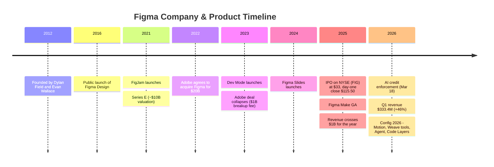
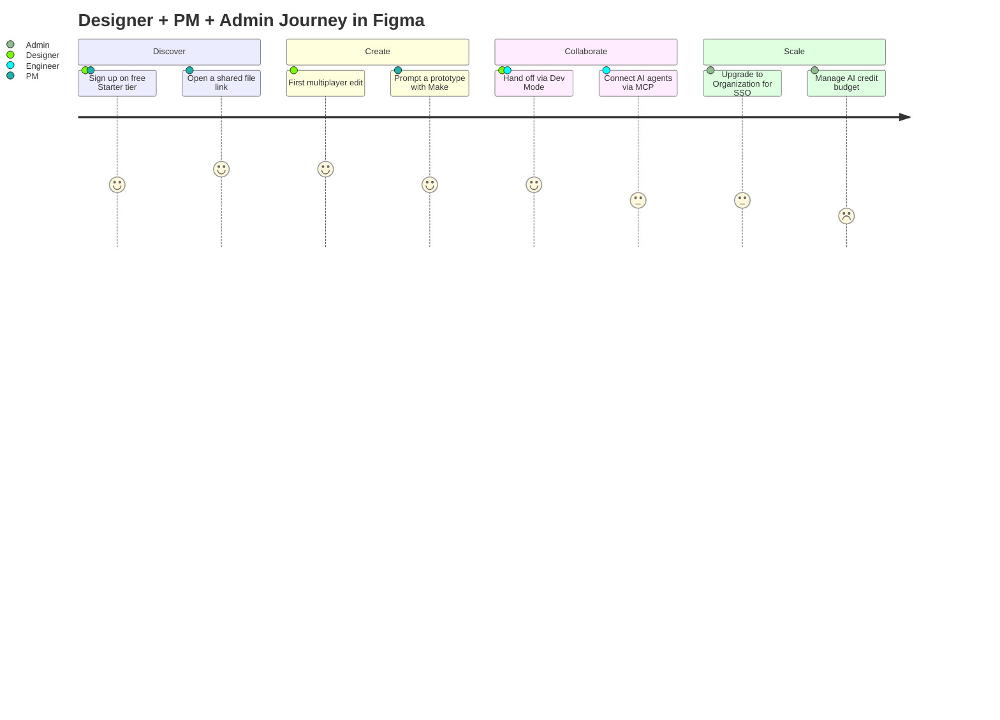
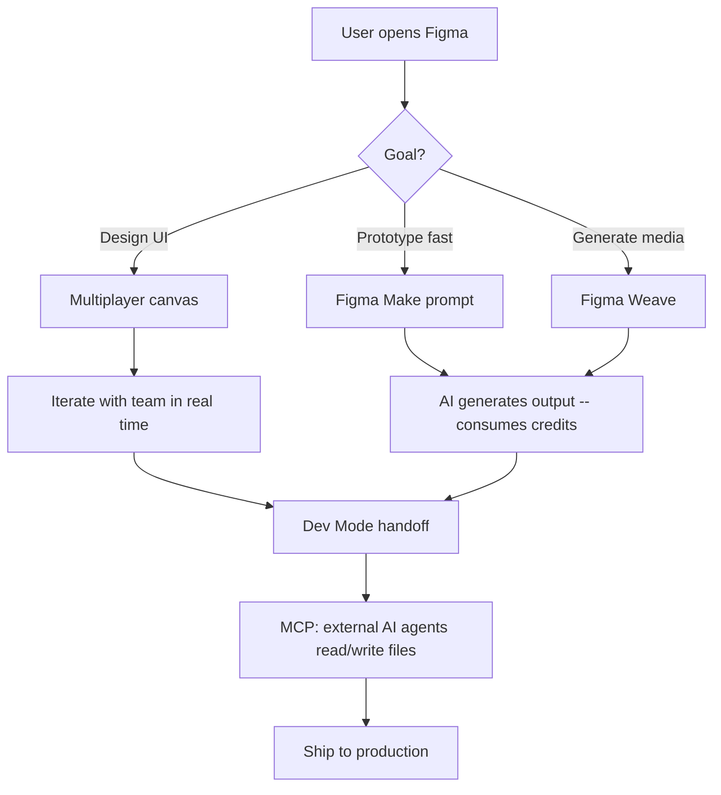
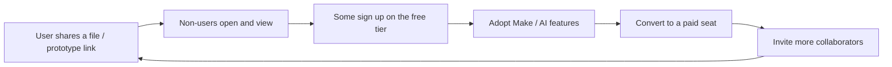
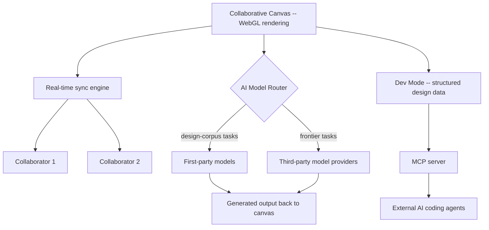
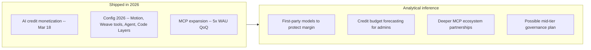

# 🎨 Day 17 — Figma: From a $20B Rejected Buyout to a $68B IPO to the "AI Loser" Narrative

**PM Case Study Series — Day 17 | Author: Gaurav Singh | Product: Figma | Company: Figma, Inc. (NYSE: FIG)**

---

## 📇 Repository Metadata

| Field | Value |
|---|---|
| Series | 30-Day PM Case Study Challenge |
| Day | 17 |
| Product | Figma (Design, FigJam, Dev Mode, Slides, Make, Weave, Motion, Agent, MCP) |
| Domain | Collaborative Design / Design-to-Code / AI-Native Product Development |
| Primary Competitors | Adobe (XD, effectively discontinued), Canva, Sketch, Penpot, Framer, Anthropic (Claude Design), Google (Stitch) |
| Analysis Date | July 2026 |
| Status | ✅ README Complete (65/65 sections) · ⏳ LinkedIn post pending |

---

## 🏷️ Badges

---

## 📚 Table of Contents

1. [Executive Summary](#executive-summary)
2. [Product Overview](#product-overview)
3. [Company Background](#company-background)
4. [Product Timeline](#product-timeline)
5. [Vision & Mission](#vision--mission)
6. [Problem Statement](#problem-statement)
7. [Market Research](#market-research)
8. [Industry Analysis](#industry-analysis)
9. [TAM / SAM / SOM](#tam--sam--som)
10. [Competitor Analysis](#competitor-analysis)
11. [SWOT](#swot)
12. [Porter's Five Forces](#porters-five-forces)
13. [Business Model Canvas](#business-model-canvas)
14. [Revenue Model](#revenue-model)
15. [Target Users](#target-users)
16. [Personas](#personas)
17. [Jobs To Be Done](#jobs-to-be-done)
18. [User Journey](#user-journey)
19. [User Flow](#user-flow)
20. [Information Architecture](#information-architecture)
21. [UX Audit](#ux-audit)
22. [UI Audit](#ui-audit)
23. [Accessibility](#accessibility)
24. [Feature Breakdown](#feature-breakdown)
25. [AI Capabilities](#ai-capabilities)
26. [Product Metrics](#product-metrics)
27. [North Star Metric](#north-star-metric)
28. [Product Analytics](#product-analytics)
29. [AARRR](#aarrr)
30. [HEART](#heart)
31. [Growth Strategy](#growth-strategy)
32. [Growth Loops](#growth-loops)
33. [Network Effects](#network-effects)
34. [Product Strategy](#product-strategy)
35. [Monetization](#monetization)
36. [Trust & Safety](#trust--safety)
37. [Technical Architecture](#technical-architecture)
38. [Data Flow](#data-flow)
39. [API Ecosystem](#api-ecosystem)
40. [Privacy & Security](#privacy--security)
41. [Pain Points](#pain-points)
42. [Opportunity Mapping](#opportunity-mapping)
43. [RICE Prioritization](#rice-prioritization)
44. [MoSCoW](#moscow)
45. [Kano](#kano)
46. [Feature Proposal](#feature-proposal)
47. [PRD — Credit Budget Forecaster](#prd--credit-budget-forecaster)
48. [Wireframes](#wireframes)
49. [Rollout Plan](#rollout-plan)
50. [A/B Testing](#ab-testing)
51. [KPI Dashboard](#kpi-dashboard)
52. [Product Roadmap](#product-roadmap)
53. [Risks & Mitigation](#risks--mitigation)
54. [Future Vision](#future-vision)
55. [PM Lessons](#pm-lessons)
56. [PM Interview Questions](#pm-interview-questions)
57. [References](#references)
58. [About the Author](#about-the-author)
59. [License](#license)
60. [Self Review](#self-review)
61. [Appendix](#appendix)

---

## 🧭 Executive Summary

**Objective:** Analyze how Figma survived a collapsed $20B acquisition, went public at a valuation roughly triple that offer, then watched its stock crash by ~85% — and how its Q1 2026 earnings began complicating the "AI loser" narrative.

**Context:** Adobe agreed to acquire Figma for $20B in September 2022; the deal collapsed in December 2023 under UK/EU regulatory pressure, with Adobe paying Figma a $1B breakup fee. Figma IPO'd on the NYSE (ticker: FIG) on July 31, 2025, priced at $33/share (above range), and closed its first trading day at $115.50 — the largest first-day pop in decades for a US company raising over $1B — implying a valuation reported between roughly $45B and $68B depending on source and methodology. The stock then fell sharply, hitting an all-time low of $16.60 on April 30, 2026 (down ~88% from its $142.92 peak) before partially recovering to the low‑$20s by mid-July 2026. Q1 2026 results (reported May 14, 2026) showed 46% year-over-year revenue growth to $333.4 million — the second consecutive quarter of *accelerating* growth — alongside a GAAP net loss of $142.4 million driven largely by stock-based compensation and AI infrastructure investment.

**Key PM insight:** CEO Dylan Field reframed the AI threat into a thesis, stating in the Q1 2026 release:  *"When code is a commodity, design is the competitive edge."* Rather than compete on code generation alone, Figma bet that the judgment layer above AI-generated output — taste, iteration, systemized design — becomes *more* valuable, not less, as raw generation gets cheap. That thesis is being tested in real time; the stock has moved dramatically on both sides of it within a single year.

**Important nuance (corrected in this revision):** The stock's decline was *not* purely an "AI narrative" event. It was driven by a combination of (1) **post-IPO lock-up expirations** (a January 2026 release, with a larger ~$6B+ tranche expected to unlock in August 2026, creating a supply overhang), (2) a **broader SaaS multiple reset**, (3) **insider selling** by executives around Config 2026, *and* (4) genuine competitive catalysts — Google's **Stitch** (a free AI design tool, launched February 2026) and Anthropic's **Claude Design** (a direct competitor, launched April 2026). Attributing the entire crash to "AI fear" would oversimplify it. This is exactly the kind of narrative-vs-mechanics distinction PMs and investors should keep separate.

**Facts vs. estimates (per Research Rules):**

- ✅ **Verified facts** (public company, SEC-reported financials): founding, Adobe deal terms and collapse, IPO date/pricing, Q1 2026 revenue/NDR/customer figures (company-reported; quarterly figures are unaudited per standard SEC practice — only annual 10-K figures are audited), stock high/low, Config 2026 announcements, current pricing and AI-credit allotments.
- ⚠️ **Industry estimates / disclosure gaps / conflicts:** peak IPO-day valuation is reported variously (~$45B, ~$56B, over $60B, ~$68B) depending on market-cap vs. fully-diluted methodology; historical pricing varies across sources reflecting the March 2025 seat-model change and monthly-vs-annual billing; the 13M MAU figure is an early-2025 disclosure not reconfirmed at a more recent date in research reviewed.
- 💡 **Personal recommendations:** clearly labeled in the Feature Proposal and Recommendation sections.

---

## 🔎 Product Overview

Figma is a browser-based, real-time collaborative design platform originally built for UI/UX design, now expanding into a broader "AI-native product development" suite.

Core surfaces as of mid-2026:

| Surface | What it is | Notable milestone |
|---|---|---|
| Figma Design | Core vector/UI design canvas with real-time multiplayer editing | Public launch 2016 |
| FigJam | Collaborative whiteboarding tool | 2021 |
| Dev Mode | Design-to-code inspection/handoff surface for engineers | 2023 |
| Figma Slides | Presentation tool built on the design canvas | 2024 |
| Figma Make | AI prompt-to-prototype/app generation tool | 2025; credit-metered since Mar 18, 2026 |
| Figma Weave (from the Weavy acquisition) | Node-based AI media/generation workflow canvas | Rebranded/integrated into Figma Design at Config 2026 |
| Figma Motion | Native animation timeline (keyframes, easing, motion variables) in Figma Design | Config 2026 (June 24, 2026) |
| Figma Agent | Autonomous AI design agent operating inside the canvas | Config 2026; open beta, rolled out to everyone June 2026 |
| MCP (Model Context Protocol) | Lets external AI coding agents read/write directly to Figma files | Weekly active usage grew ~5× quarter-over-quarter in Q1 2026 |
| Newer surfaces | Figma Draw, Figma Sites, Figma Buzz, Payload CMS (acquired) | 2025–2026 |

> **PM Insight:** Figma's expansion pattern mirrors Perplexity (Day 15) and Cursor (Day 16): a company that started as one sharply-defined tool (multiplayer design canvas) methodically expanding into adjacent AI-native surfaces (Make, Weave, Motion, Agent) — because staying static was existentially risky given the "AI loser" narrative pressing on its stock.

---

## 🏢 Company Background

- **Founded:** 2012, by **Dylan Field** and **Evan Wallace**, both Brown University students; Field left school on a Thiel Fellowship ($100,000 grant) to build the company full-time.
- **Headquarters:** San Francisco.
- **First public release:** 2016, after ~four years building the browser-based rendering technology underpinning the product.
- **The Adobe saga:** Adobe announced a deal to acquire Figma for $20B in cash and stock in September 2022. After ~15 months of regulatory review (UK CMA and EU antitrust scrutiny), Adobe abandoned it in December 2023, paying Figma a $1B breakup fee.
- **IPO:** Listed on the NYSE (FIG) on July 31, 2025, pricing at $33 (above the $30–$32 range), raising ~$1.2B (most proceeds went to selling shareholders). Shares opened at $85 and closed day one at $115.50 (+250%). Implied peak valuation is reported inconsistently — ~$45B (market cap, day-one close per some outlets) up to ~$68B (fully-diluted basis per others) — disclosed as a range rather than resolved.
- **Post-IPO stock performance:** All-time high of **$142.92 on Aug 1, 2025**; all-time low of **$16.60 on Apr 30, 2026** (~88% below peak); trading in the **low-$20s as of mid-July 2026** (~85% below peak). BofA reinstated coverage noting the stock was down ~85% from its 52-week high. **Drivers were mixed:** lock-up-expiry supply overhang, a SaaS multiple reset, executive insider selling around Config 2026, and competitive catalysts (Google Stitch, Claude Design) — not the AI narrative alone.
- **Revenue history:** FY2024 revenue $749M (up ~48% YoY). **FY2025 revenue ~$1.06B (up ~41% YoY)** — first year over $1B. Q1 2025 revenue $228.2M; Q1 2026 revenue $333.4M (+46% YoY, accelerating from 40% in Q4 2025 and 38% in Q3 2025).
- **Profitability:** FY2024 net loss ~$732M and FY2025 net loss ~$1.25B, both heavily driven by IPO-related stock-based compensation. Q1 2026 GAAP net loss was $142.4M (SBC of ~$169M in the quarter); the year-ago quarter (Q1 2025) was a small net profit (reported around $8.6M, though some data providers cite a higher figure — see Appendix). On a **non-GAAP** basis Q1 2026 delivered $52.1M operating income (16% margin) and $88.6M free cash flow (27% margin) — i.e., the losses reflect non-cash SBC and heavy AI investment, not a core-business cash-burn problem.
- **Investors:** Index Ventures, Greylock Partners, Kleiner Perkins, Sequoia Capital, Andreessen Horowitz, among others.
- **Customer base:** ~690,000 paid customers as of March 31, 2026 (+54% YoY); 95% of Fortune 500 reported using Figma; a 35,000-seat hyperscaler deal was cited as one of the largest to date.
- **Monthly Active Users:** 13 million reported as of early 2025 — a single-point disclosure not reconfirmed at a more recent date in research reviewed; IPO documentation indicated roughly two-thirds of active users are non-designers.
- **Founding thesis:** Build a truly multiplayer, browser-based design tool — betting real-time collaboration would matter more to teams than the raw feature depth of Adobe's desktop-native tools.

---

## 🗓️ Product Timeline

---

## 🌟 Vision & Mission

- **Stated direction (public communications):** Make design accessible to everyone building digital products — not just professional designers — through real-time, browser-based collaboration.
- **CEO's 2026 reframing (direct company positioning):** Dylan Field frames AI-driven code commoditization as an opportunity, not a threat — as generation gets cheap, the craft, taste, and judgment separating a good product from a great one become the actual competitive edge.
- **Strategic vision (analytical inference, not an official statement):** Own the layer of judgment and taste that sits *above* AI-generated output — positioning Figma as the tool where human review of AI output happens, and as connective infrastructure (via MCP) for the wider AI-agent ecosystem.

---

## ❓ Problem Statement

- **User problem:** Design work is inherently collaborative, but pre-Figma tools (Photoshop, Sketch) were single-player-first, forcing teams into slow, file-passing workflows.
- **Market problem (2026-specific):** As AI models became capable of generating passable UI and full prototypes from a prompt, the market questioned whether a dedicated design tool remains necessary — the fear reflected in Figma's stock decline and sharpened by Google Stitch and Claude Design.
- **Why it matters:** Software product development sits at the intersection of two colliding markets (design tooling and AI-assisted coding). How that collision resolves will define which companies own the "product creation" layer for the next decade.

---

## 📊 Market Research

- Q1 2026 paid customer count grew 54% YoY to ~690,000; accounts with >$100K ARR grew 48% YoY to **1,525** (from 1,031 a year earlier); accounts with >$10K ARR grew 37% YoY.
- **Net Dollar Retention reached 139%** as of Q1 2026 (up 3 points sequentially) — its highest level in over two years.
- New Pro-tier team conversions grew **more than 150% YoY**, which the company attributed directly to AI feature adoption (Figma Make in particular).
- Approximately **60%** of >$100K-ARR paid customers used Figma Make weekly in Q1 2026, up from ~50% the prior quarter.
- **Weekly active MCP users grew ~5× quarter-over-quarter.** Among >$100K-ARR customers, MCP users grew Full seats ~70% faster than non-MCP users.
- Competitively, CFO Praveer Melwani, in comments to Reuters around the Q1 2026 earnings, declined to dismiss Anthropic's Claude Design, noting Figma is closely watching labs that train first-party models and couple them with their own products — a rare instance of a public-company executive naming a specific AI-lab competitor.

---

## 🏭 Industry Analysis

**Framework used:** *Narrative-vs-Mechanics-vs-Fundamentals* lens. Figma's 2025–2026 story is a case where the stock-price narrative ("AI will kill design tools"), mechanical supply dynamics (lock-ups, insider selling), and business fundamentals (accelerating revenue, record retention) all moved at once — separating them is the instructive exercise.

- **Narrative risk:** Real. Google Stitch (Feb 2026) and Claude Design (Apr 2026) gave investors concrete "AI-native tool bypasses Figma" reference points.
- **Mechanical drivers (often overlooked):** Post-IPO lock-up expirations flooded the market with newly tradeable shares (Jan 2026; a larger ~$6B+ tranche expected Aug 2026), and executive insider selling around Config 2026 rattled sentiment — these are supply/positioning dynamics, not statements about product quality.
- **Fundamentals counter-signal:** Revenue growth accelerated for two consecutive quarters through Q1 2026 (38% → 40% → 46% YoY), and NDR hit a two-year high — the opposite of what a "being disintermediated" story would typically produce.
- **Margin pressure is real:** Non-GAAP gross margin ran ~82%–83% as AI inference costs climbed; management focused on "optimizing gross profit dollars" via model-agnostic routing and first-party models trained on Figma's own design corpus (paralleling Cursor's Composer strategy, Day 16).
- **Monetization-transition risk:** The March 18, 2026 shift to enforced AI credit limits is Figma's version of the usage-based-billing transition that caused backlash for Cursor in June 2025 (Day 16) — though early data suggests a smoother landing so far.

---

## 📐 TAM / SAM / SOM

*Figures below are directional; the company has not published formal TAM/SAM/SOM figures.*

| Layer | Definition | Directional framing |
|---|---|---|
| **TAM** | Global product-design tooling + emerging AI-native product creation | Figma's FY2026 revenue guidance ($1.422–1.428B) is a small fraction of enterprise software spend; the broader "product creation" category (design + AI prototyping + design-to-code) is expanding rapidly with no single authoritative sizing figure in research reviewed |
| **SAM** | Teams building digital products needing collaborative design + AI-native prototyping | ~two-thirds of Figma's 13M+ MAU (2025 figure) are non-designers — PMs, engineers, marketers — so the addressable market extends well beyond professional designers |
| **SOM** | Figma's realistic near-term capture | Reflected in FY2026 guidance of $1.422–1.428B and ~690,000 paid customers as of Q1 2026 |

> **PM Insight:** Figma's IPO disclosure that two-thirds of active users are non-designers is arguably the single most important strategic data point here — its TAM was never just "professional designers," which is exactly why the AI-code-generation threat narrative may be overstated relative to how the market priced it.

---

## ⚔️ Competitor Analysis

| Dimension | Figma | Adobe (XD) | Canva | Sketch | Claude Design (Anthropic) | Stitch (Google) |
|---|---|---|---|---|---|---|
| Status (2026) | Public (FIG), growing | Effectively discontinued (maintenance mode since 2024) | Growing, broad creative suite | Niche, macOS-only | Direct competitor, launched Apr 2026 | Free AI design tool, launched Feb 2026 |
| Core wedge | Real-time multiplayer canvas + AI-native expansion | Was Adobe's Figma answer; lost the format war | Ease of use, broad non-designer audience | Focused, offline-friendly, perpetual license | First-party model + product coupling | Free, prompt-to-interface |
| Pricing | Free / $16–20 (Pro) / $55 (Org) / $90 (Enterprise) per Full seat | N/A (discontinued) | ~$15/mo individual | ~$12/mo (Standard) | Not fully detailed in research reviewed | Free |
| Platform | Browser, any OS | Desktop | Browser | macOS-only, no real-time multiplayer | Emerging | Web |
| Key strength | Multiplayer canvas, enterprise entrenchment (95% of Fortune 500), design-to-code bridge (Dev Mode, MCP) | N/A | Simplicity, non-professional appeal | Focused feature set, lower price | Frontier model paired with product from day one | Free + Google distribution |
| Key weakness | Premium Org/Enterprise pricing; still tuning AI credit monetization | Discontinued | Lacks prototyping/Dev Mode depth for serious UI/UX | No real-time multiplayer, single-OS | Unproven, no disclosed scale | Limited depth vs. a full design platform |

**Strategic insight:** Figma's most distinctive claim — its real-time multiplayer canvas — is management's stated "difficult-to-replicate differentiator" against AI-native entrants, even as those entrants (some backed by frontier labs with first-party models) represent the most credible long-term threat since Adobe.

**Differentiation opportunities:** deepen the design-to-code bridge (MCP, Dev Mode) as connective tissue between design and AI-coding tools like Cursor rather than treating agents purely as competitors; continue investing in first-party models trained on Figma's proprietary design corpus.

---

## 🧩 SWOT

| | Helpful | Harmful |
|---|---|---|
| **Internal** | **Strengths:** Real-time multiplayer canvas (hard to replicate); enterprise entrenchment (95% of Fortune 500); accelerating revenue (38%→40%→46% YoY); record 139% NDR; strong non-GAAP FCF (27% margin); direct-to-canvas AI features (Make, Weave, Motion, Agent) | **Weaknesses:** Continuing GAAP net losses ($142.4M in Q1 2026, largely SBC/infra-driven); gross margin under AI-inference pressure; pricing complexity (seat types × plan tiers × AI credits) creating budgeting friction |
| **External** | **Opportunities:** Two-thirds of active users already non-designers; MCP positions Figma as infrastructure for the AI-coding-agent ecosystem; Config 2026 momentum (Motion, Agent, Code Layers) | **Threats:** Frontier labs (Claude Design) and Google (Stitch) pair models/distribution with competing products; stock-narrative + lock-up supply overhang; prompt-to-app tools could commoditize parts of the traditional design workflow; disclosed government-sales risk tied to Anthropic's federal dispute (see Risks) |

---

## 🏛️ Porter's Five Forces

**Why this framework:** Figma competes simultaneously against a legacy incumbent in decline (Adobe), broad-market entrants (Canva), and frontier AI labs / hyperscalers (Anthropic, Google) — Five Forces cleanly separates these different threat types.

| Force | Intensity | Reasoning |
|---|---|---|
| Competitive rivalry | 🔴 High | Adobe (declining), Canva (broad-market), Claude Design and Stitch (AI-native) all compete for overlapping "product creation" budget |
| Threat of new entrants | 🟡 Medium-high | Frontier labs and hyperscalers can build competing canvas/design products faster than traditional software companies, given model access |
| Supplier power | 🟡 Medium | Figma depends on third-party model providers for some AI features (similar to Cursor, Day 16) — mitigated by its move toward first-party models |
| Buyer power | 🟡 Medium | Switching costs are real (design systems, libraries, habits) but not insurmountable, especially for smaller teams eyeing cheaper alternatives |
| Threat of substitutes | 🟡 Medium-high | The core 2025–2026 investor-narrative risk — AI prompt-to-app tools threaten to substitute for parts of the workflow, even if fundamentals haven't shown it at scale |

> **PM takeaway:** The market (via stock price) weighted "threat of substitutes" far more heavily than Q1 2026 fundamentals supported — a reminder that PM strategic analysis and market sentiment can diverge, and that "the market thinks X" is not the same evidence as "the data shows X."

---

## 🎨 Business Model Canvas

| Block | Summary |
|---|---|
| Customer segments | Individual designers/freelancers; growing teams (Organization); large enterprises (Enterprise); increasingly non-designer roles (PMs, engineers) via Make/MCP |
| Value propositions | Real-time multiplayer canvas; unified design-to-code workflow (Dev Mode, MCP); AI-native prototyping (Make) and media generation (Weave) layered into the design surface |
| Channels | Direct signup (figma.com), enterprise sales for Org/Enterprise, Config conference and community adoption, plugin/template ecosystem |
| Customer relationships | Self-serve for smaller teams; enterprise sales/success for large accounts; strong community |
| Revenue streams | Per-seat subscriptions (Full/Dev/Collab seats across Professional/Organization/Enterprise); AI credit add-ons/overages (usage-based, enforced since Mar 18, 2026) |
| Key resources | Proprietary browser-rendering tech (WebGL canvas); design corpus for first-party model training; enterprise relationships |
| Key activities | Real-time collaboration engineering; AI feature development (Make, Weave, Motion, Agent, MCP); enterprise governance/security tooling |
| Key partners | Third-party model providers; large enterprise customers; plugin/community developer ecosystem |
| Cost structure | AI inference (pressuring gross margin toward ~82%); stock-based compensation (major driver of net losses); R&D |

> **Why this framework:** BMC surfaces a real tension: Figma's revenue (per-seat subscriptions) is largely usage-agnostic, while its cost structure (AI inference) is increasingly usage-driven — the same mismatch that forced Cursor's billing change (Day 16), which Figma is navigating via credit limits and pay-as-you-go.

---

## 💰 Revenue Model

Per-seat subscription across three seat types (**Full, Dev, Collab**; free View seats) and four plan tiers (**Starter** free, **Professional**, **Organization**, **Enterprise**).

**Current pricing (per Figma's pricing page and independent reviews verified July 2026), Full seat:**

| Tier | Full seat price | Billing | Monthly AI credits (Full seat) |
|---|---|---|---|
| Starter | Free | — | 150/day (up to ~500/mo); View seats similar |
| Professional | $20/mo ($16 annual) | Monthly or annual | 3,000 |
| Organization | $55/mo | Annual only | 3,500 |
| Enterprise | $90/mo | Annual only | 4,250 |

- Dev seats: ~$12 / $25 / $35 across tiers; Collab seats: ~$3–$5. View seats are free and unlimited.
- **AI credit system:** every seat includes a monthly credit allotment shared across AI features (Make, Weave, image editing). Enforcement began **March 18, 2026**.
- **Overage:** pay-as-you-go at a reported **$0.03/credit**; teams can also subscribe to shared credit pools (one source cites ~$150/month for 5,000 shared credits). Credits reset monthly and don't roll over.
- **Historical variance (disclosed, not resolved):** older sources cite Professional Full at ~$12–$15 and Organization at ~$45, reflecting the March 2025 seat-model overhaul and monthly-vs-annual differences. The $75 Enterprise figure seen in one source appears stale; $90 is current.
- **FY2026 guidance (company):** revenue $1.422–1.428B (raised ~$55M after the Q1 beat), implying ~35% full-year growth; non-GAAP operating income $125–$135M (~9% margin at midpoint); Q2 2026 revenue guidance $348–350M (~40% YoY).

> **PM Insight:** Figma's credit rollout looks like a better-executed version of the transition Cursor struggled with — likely because Figma *layered* credits on top of an established per-seat subscription (a smaller, incremental change) rather than replacing a flat-fee model wholesale.

---

## 👥 Target Users

- **Professional UI/UX designers** — core original audience (Professional/Organization).
- **Product managers and engineers** — now roughly two-thirds of active users; increasingly using Make/MCP directly. (On the Q1 call, one enterprise's engineers came to *outnumber* designers on the platform.)
- **Enterprise design and product organizations** — Organization/Enterprise tiers, governance and design-system needs.
- **Freelancers and students** — Starter free tier.
- **AI-coding-agent workflows** — via MCP, treating Figma files as a structured design source for autonomous agents (including competitors' agents).

---

## 🧑‍💼 Personas

*Analytical constructs based on publicly described use cases — not Figma's internal research.*

**1. Ananya, 30 — Senior Product Designer, Series C startup (Bangalore)**
Owns a growing design system across three product teams. Pain: keeping design and engineering in sync as code and design files diverge. Uses: Dev Mode for handoff; MCP so engineers' AI coding agents pull directly from her components.

**2. Marcus, 26 — Product Manager, not a trained designer (Chicago)**
Needs to mock up and validate ideas before involving a designer. Pain: historically blocked on design bandwidth. Uses: Figma Make to prompt-generate rough prototypes; represents the "two-thirds non-designer" base directly.

**3. Priya, 42 — Head of Design Ops, large enterprise (Mumbai)**
Manages Figma governance, licensing, and AI credit budgets across 400+ seats. Pain: unpredictable AI credit consumption makes budgeting difficult month to month. Uses: Organization-tier admin tools; tracks credit burn to avoid overage — the exact persona the Feature Proposal targets.

---

## 🎯 Jobs To Be Done

| Job | Functional | Emotional | Social |
|---|---|---|---|
| "Help my team design together without file chaos" | Real-time multiplayer canvas, single source of truth | Reduce version-conflict anxiety | Look organized to engineering partners |
| "Help me go from idea to prototype fast, without a designer" | Figma Make prompt-to-prototype | Feel capable of validating ideas independently | Demonstrate initiative to leadership |
| "Help me budget AI usage predictably" | Credit visibility and admin controls | Reduce financial anxiety around usage-based costs | Defend the tooling budget to finance |

> **Why JTBD here:** Figma's base spans professional designers to non-designer PMs to design-ops budget owners; JTBD explains why radically different people pick the same product — the "job" (collaborate visually, in real time, on a shared source of truth) is constant even as role and skill vary.

---

## 🗺️ User Journey

---

## 🔀 User Flow

---

## 🏗️ Information Architecture

- **Files / Projects / Teams** — hierarchical organization, largely unchanged since early Figma.
- **Design canvas** — core surface: frames, layers, components.
- **FigJam** — separate whiteboarding surface, same real-time engine.
- **Dev Mode** — dedicated inspection/handoff view on top of design files.
- **Figma Make / Weave** — separate generation surfaces; output lands back in the file system.
- **Admin Dashboard** — credit/seat/governance management, increasingly important as credit budgeting becomes a real operational concern.

> **PM Insight:** Like Perplexity's Spaces (Day 15) and Cursor's Agents Window (Day 16), Figma's AI features get their own dedicated IA surface rather than being crammed into the canvas — a consistent pattern across all three products: AI capability graduates from "a feature" to "a surface" as it matures.

---

## 🔍 UX Audit

**Strengths:**
- The real-time multiplayer canvas remains management's stated hardest-to-replicate asset — and it's load-bearing across every other feature (Make, Weave, Dev Mode, Motion all build on it).
- The free Starter tier is described across 2026 reviews as genuinely competitive, lowering the barrier for the non-designer majority.
- MCP support turns Figma into infrastructure other AI tools build on, rather than a walled garden.

**Weaknesses:**
- AI credit budgeting is a consistently cited pain point — different Make operations consume wildly different credit amounts (tens to hundreds of credits per prompt), making monthly forecasting hard.
- The Professional→Organization jump (needed for SSO alone) is large (reported ~267%: ~$15 → $55) with no mid-tier option.
- Seat-type complexity (Full/Dev/Collab × 4 tiers × AI credits) creates genuine administrative overhead, echoed across independent reviews.

---

## 🎨 UI Audit

- Figma's visual language has stayed recognizable and stable since the multiplayer canvas debut — deliberately, since the canvas itself is the product.
- **Figma Motion** (Config 2026) adds a native animation timeline (keyframes, easing, motion variables) into Figma Design, with a Dev Mode Motion tab exporting CSS/JSON/React — a meaningfully new interaction paradigm layered onto the existing canvas rather than a separate app.
- **Figma Agent** operates directly inside the design canvas rather than as a separate chat panel — a different design choice than Cursor's dedicated Agents Window (Day 16), worth noting as two distinct AI-agent UI philosophies within this series.

---

## ♿ Accessibility

- No detailed WCAG conformance statement specific to Figma's own product was found in research reviewed — an explicit disclosure gap.
- As a browser-based tool, Figma inherits standard browser accessibility affordances more readily than a native desktop app, though the rendered canvas (a non-DOM surface) presents accessibility challenges common to all vector-canvas design tools, not unique to Figma.
- Figma's *designed output* (the interfaces users build) is distinct from Figma's *own* accessibility as a tool — the two should not be conflated, and research reviewed did not surface strong evidence either way on the latter.

---

## 🧱 Feature Breakdown

| Feature | Surface | Purpose |
|---|---|---|
| Multiplayer canvas | Core | Real-time collaborative editing |
| Auto Layout / Variants | Core | Responsive, systemized components |
| Dev Mode | Core (seat-gated) | Design-to-code inspection and handoff |
| FigJam | Core | Collaborative whiteboarding |
| Figma Slides | Core | Presentations on the design canvas |
| Figma Make | AI | Prompt-to-prototype generation |
| Figma Weave | AI | Node-based AI media/generation workflows |
| Figma Motion | AI/Design | Native animation timeline |
| Figma Agent | AI | Autonomous in-canvas design agent (open beta) |
| MCP support | AI/Infra | External AI coding agents read/write Figma files |
| Code Layers | Design/Dev | Convert design layers into interactive code layers (rolling out) |
| Admin Dashboard | Governance | Seat management, credit budgeting, SSO/SCIM (higher tiers) |

---

## 🤖 AI Capabilities

- **Figma Make:** prompt-to-prototype; now core-workflow-integrated for a majority of large accounts (~60% of >$100K-ARR customers use it weekly).
- **Figma Weave:** node-based generative media workflows (from the Weavy acquisition); Weave tools became available directly in Figma Design at Config 2026.
- **Figma Motion:** native animation timeline; the Figma Agent can generate a first-pass animation that designers then refine.
- **Figma Agent:** an autonomous in-canvas design agent (Config 2026), with **Skills** (reusable instructions), **Connectors** (Notion, Slack, GitHub, Atlassian, etc.), web search, and file attachments. Rolled out to everyone in open beta June 2026; **free during beta, with standard AI-credit usage applying at general availability**.
- **MCP (Model Context Protocol):** rather than only building its own agent, Figma opened its files to external AI coding agents — turning some AI-coding competitors (e.g., tools like Cursor, Day 16) into Figma-dependent workflows.
- **First-party model strategy:** management cited "model-agnostic routing" plus "first-party models trained on Figma's design corpus" as the mechanism for protecting gross margin as AI usage scales — the same move Cursor made with Composer (Day 16) and Perplexity with Sonar (Day 15).

> **PM Insight:** Figma's MCP strategy is the most interesting decision here — rather than walling off every AI coding tool, it made Figma a dependency *for* them, a fundamentally different (and arguably stronger) competitive position than trying to out-build every agent itself.

---

## 📈 Product Metrics

*Company-reported in official Q1 2026 earnings materials unless noted. Quarterly figures are unaudited (SEC practice); only annual 10-K results are audited — still materially higher confidence than the privately-held companies covered on Days 15–16.*

| Metric | Q1 2026 value | YoY change | Source |
|---|---|---|---|
| Revenue | $333.4M | +46% | Q1 2026 release |
| GAAP net loss | $142.4M | vs. small net profit prior year | Q1 2026 release |
| Non-GAAP operating income | $52.1M (16% margin) | — | Q1 2026 materials |
| Free cash flow | $88.6M (27% margin) | — | Q1 2026 materials |
| Stock-based compensation | ~$169M | — | Q1 2026 10-Q |
| Paid customers | ~690,000 | +54% | Q1 2026 release |
| Net Dollar Retention | 139% | +3 pts sequential; 2-yr high | Q1 2026 release |
| Customers >$100K ARR | 1,525 | +48% (from 1,031) | Q1 2026 release |
| Customers >$10K ARR | — | +37% | Q1 2026 release |
| Non-GAAP gross margin | ~82% | Slight dip | Q1 2026 call |
| Cash & marketable securities | ~$1.64B | — | Q1 2026 materials |
| MAU | 13M (early-2025 figure) | Not reconfirmed since | Fortune, 2025 |
| FY2026 revenue guidance | $1.422–1.428B | ~35% implied | Company guidance |

> **Note:** Full-year non-GAAP operating margin guidance (~9% at midpoint) is naturally lower than the Q1 actual (~16%) because Q2 explicitly carries Config-conference expenses and continued AI infrastructure investment. These describe different periods, not a source conflict.

---

## ⭐ North Star Metric

**Proposed North Star (analytical, not company-disclosed):** *Weekly Active Seats Using an AI Feature (Make, Weave, Motion, or Agent) as % of Total Paid Seats.*

**Why:** The entire investor narrative hinges on whether Figma successfully becomes AI-native rather than being bypassed. A metric tracking AI-feature penetration across the paid base is more diagnostic than revenue alone, which can grow from seat expansion independent of the AI thesis actually working.

---

## 📊 Product Analytics

*Recommended instrumentation (analytical recommendation, not disclosed):*
- AI credit consumption per seat per month, segmented by plan tier (supports the Feature Proposal).
- Figma Make prompt-to-shipped-prototype conversion rate.
- MCP read/write volume from external agents, segmented by connecting tool.
- Non-designer vs. designer seat activity patterns, given the two-thirds non-designer base.

---

## 🔁 AARRR

| Stage | Figma mechanism |
|---|---|
| Acquisition | Free Starter tier; viral file-sharing (a shared prototype link is itself distribution) |
| Activation | First multiplayer edit or first Make prototype — fast, visible value |
| Retention | Design systems and libraries create high switching costs; 139% NDR reflects retention-plus-expansion |
| Referral | Shared prototype links expose non-users organically; Config drives community advocacy |
| Revenue | Free → Professional (accelerated 150%+ YoY by AI adoption); Professional → Org/Enterprise for governance; AI credit add-ons as incremental revenue |

---

## ❤️ HEART

| Dimension | Application |
|---|---|
| Happiness | Requires survey data (not public); inferred positively from 139% NDR |
| Engagement | Weekly Make usage among top accounts (~60% of >$100K-ARR customers) |
| Adoption | Pro-tier conversion acceleration (150%+ YoY) tied to AI rollout |
| Retention | Net Dollar Retention (139%, two-year high) |
| Task Success | Prompt-to-usable-prototype completion rate for Make (not disclosed; recommended above) |

---

## 🚀 Growth Strategy

**Framework:** *Land-and-Expand via Non-Designer Adoption.* Figma's most distinctive 2026 pattern isn't classic PLG virality — it's expansion within existing accounts as non-designer roles adopt AI features that don't require design skill.

- **Seat expansion within accounts:** 139% NDR is driven substantially by existing customers adding seats and usage, not just new logos.
- **Non-designer wedge:** Make lowers the skill barrier to using Figma at all, expanding the addressable base within organizations that already pay.
- **MCP as an inbound channel:** making files consumable by external agents gives engineering-led teams a reason to adopt Figma as infrastructure, not just a design tool.

---

## ➰ Growth Loops

---

## 🌐 Network Effects

- **Collaboration network effects:** the multiplayer canvas is more valuable as more of a team's designers, PMs, and engineers work in it simultaneously — a Slack/Notion-style dynamic.
- **Design-system network effects:** shared component libraries increase switching costs and value as an organization standardizes on Figma.
- **Ecosystem network effects via MCP:** as more external AI agents integrate with Figma files, Figma becomes more valuable as an interoperability layer, independent of its own AI feature quality.

---

## 🧠 Product Strategy

Figma's 2025–2026 strategy reads as *"defend the canvas, extend into AI-native surfaces, and become infrastructure for the broader AI ecosystem rather than just a competitor within it."*

1. Defend the multiplayer canvas as the hardest-to-replicate asset (ongoing since 2016).
2. Layer AI generation directly onto the canvas (Make, Weave, Motion) rather than building a separate AI product.
3. Reduce AI-inference cost exposure via first-party models trained on Figma's corpus (paralleling Cursor's Composer and Perplexity's Sonar).
4. Open the canvas to external AI agents via MCP — competing by becoming infrastructure, not just an app.

---

## 💵 Monetization

Detailed in [Revenue Model](#revenue-model). Key strategic point: Figma's March 2026 AI credit rollout appears — based on early data — to be a smoother version of the usage-based billing transition that caused backlash for Cursor in June 2025 (Day 16), likely because it was layered onto an existing per-seat model rather than replacing a flat allowance. Management framed the goal explicitly: the monetization model should *support adoption rather than constrain it*. Q2 2026 was slated to be the first full quarter of credit monetization.

---

## 🛡️ Trust & Safety

- No specific AI-hallucination or trust-incident precedent (comparable to Cursor's "Sam" support-agent incident, Day 16) was found in research reviewed for Figma — a genuine research gap, not evidence that no such incident occurred.
- As Make, Weave, and Motion generate more shipped product surface, the same "does the user understand what they're shipping" concern raised for Cursor's Composer applies structurally, though not documented as an incident in sources reviewed.
- **MCP introduces a new trust surface:** letting external AI agents read/write files means organizations must consider what data those agents can access. Agent chats are also team-visible by default (with a private option) — a governance choice worth flagging. No specific security incident was found in research reviewed.

---

## 🏗️ Technical Architecture

*Analytical/inferred architecture based on public descriptions (multiplayer canvas, model-agnostic routing, first-party training, MCP) — Figma has not published a detailed architecture diagram.*

---

## 🔄 Data Flow

1. User action (design edit, Make prompt, Weave generation) originates on the collaborative canvas.
2. The real-time sync engine propagates edits to all connected collaborators instantly.
3. AI requests route through a model router to first-party (design-corpus) or third-party frontier models, consuming AI credits from the seat's allotment.
4. Generated output (prototype, image, media) is inserted back into the canvas for review/iteration.
5. Dev Mode exposes structured design data (measurements, styles, assets) for engineering handoff.
6. MCP exposes the same structured data to external AI coding agents on request, subject to permissions.

---

## 🔌 API Ecosystem

| Surface | Purpose |
|---|---|
| MCP (Model Context Protocol) | Lets external AI coding agents read/write Figma files — the centerpiece of Figma's 2026 API strategy |
| Figma REST API | Programmatic access to files, comments, components for custom integrations |
| Plugin API | Long-standing extensibility layer for the community plugin ecosystem |
| Dev Mode inspection APIs | Structured access to design specs (measurements, styles, code snippets) |
| AI Usage API (Enterprise) | Programmatic AI-credit usage reporting for admins |

> **PM Insight:** Unlike Cursor's largely internal/enterprise-facing API surface (Day 16), Figma's MCP strategy is explicitly outward-facing and ecosystem-building — a choice to become plumbing for the broader AI-agent economy rather than contain all AI capability inside its walls.

---

## 🔒 Privacy & Security

- Enterprise-tier features include SSO, SCIM, advanced admin controls, and guest-access controls — standard enterprise-readiness tooling gated behind Org/Enterprise plans.
- Figma states all plans meet unspecified recognized international security, privacy, and compliance standards per its pricing page — no specific certification list (e.g., SOC 2, ISO 27001) was independently confirmed in research reviewed, an explicit disclosure gap.
- **MCP-specific consideration:** granting external AI agents read/write access to design files is a meaningfully new data-exposure surface introduced in 2026; the structural risk is worth naming even absent a specific incident.
- A dedicated government track (figma.com/government) suggests a public-sector compliance offering — details weren't available in research reviewed. See Risks for a disclosed government-sales dependency.

---

## 🚧 Pain Points

- **AI credit budgeting is hard to predict** — per-prompt costs vary widely, making monthly forecasting difficult, per multiple 2026 reviews.
- **The Professional→Organization jump (for SSO)** is steep (~267%) with no mid-tier option.
- **Seat-type × plan-tier × credit complexity** creates real administrative overhead for design-ops.
- **Org/Enterprise are annual-billing-only**, removing flexibility for teams wanting to trial at scale.
- **Continued GAAP net losses** ($142.4M in Q1 2026), even if largely SBC/infra-driven, remain a headline risk for sentiment.
- **Persistent narrative + supply risk** — the "AI loser" story plus lock-up overhang can move the stock even when fundamentals point the other way.

---

## 🎯 Opportunity Mapping

| Opportunity | Impact | Effort |
|---|---|---|
| Real-time AI credit budget forecasting tool for admins | High | Low–Medium |
| Mid-tier plan between Professional and Organization (partial SSO/governance) | High | Medium |
| Monthly billing option for Organization tier | Medium | Low |
| Deepen MCP ecosystem partnerships (AI-agent infrastructure positioning) | High | Medium |
| Public security/compliance certification transparency page | Medium | Low |

---

## 📐 RICE Prioritization

| Feature | Reach | Impact | Confidence | Effort | RICE |
|---|---|---|---|---|---|
| AI credit budget forecasting tool | 8 | 3 | 0.9 | 3 | **7.2** |
| Mid-tier plan (partial SSO) | 5 | 3 | 0.6 | 5 | **1.8** |
| Monthly billing for Organization | 5 | 2 | 0.8 | 2 | **4.0** |
| Public compliance certification page | 3 | 1 | 0.9 | 1 | **2.7** |

*Illustrative PM exercise, not company data. RICE = Reach × Impact × Confidence ÷ Effort. Verified: 8×3×0.9/3 = 7.2; 5×3×0.6/5 = 1.8; 5×2×0.8/2 = 4.0; 3×1×0.9/1 = 2.7.*

---

## 📋 MoSCoW

| Priority | Item |
|---|---|
| Must have | Predictable, transparent AI credit consumption reporting |
| Should have | Mid-tier governance option; monthly Organization billing |
| Could have | Expanded public compliance/certification transparency |
| Won't have (now) | Uncapped/unlimited AI credits at any tier (inconsistent with the cost-control rationale for the credit system) |

---

## 😊 Kano

| Feature | Category |
|---|---|
| Real-time multiplayer canvas | Basic (expected — the reason Figma exists) |
| Dev Mode / design-to-code handoff | Performance (better handoff = more satisfaction) |
| Figma Make / Weave / Motion | Delighter (novel; drove 150%+ YoY Pro conversion acceleration) |
| AI credit budget forecasting | Currently absent — would move from Dissatisfier (unpredictability) toward expected if built |

---

## 💡 Feature Proposal

**Proposal: "Credit Budget Forecaster" — a predictive AI-credit spend dashboard for Admins.**

- **User impact:** Gives design-ops/admins (like Priya) a forward-looking forecast of AI credit consumption from historical usage, rather than discovering overage only after it happens.
- **Business impact:** Directly addresses the single most consistently cited pain point across 2026 pricing reviews (unpredictable credit costs) — a real churn/downgrade risk as AI usage scales.
- **Trade-offs:** Requires exposing granular usage analytics that could reveal individual-level patterns — must stay team/budget-focused rather than surveillance-feeling.
- **Risks:** A frequently-wrong forecast could erode trust faster than no forecast; needs conservative confidence bounds, not false precision.
- **Success metrics:** Reduction in unplanned overage incidents; higher Org/Enterprise admin satisfaction (survey-instrumented); fewer credit-related support tickets.

> 💡 This is a personal recommendation, not a Figma roadmap item.

---

## 📝 PRD — Credit Budget Forecaster

**Problem Statement:** Design-ops and finance admins have no forward-looking way to predict monthly AI credit consumption, making budget planning difficult and increasing the risk of unplanned overage or reactive downgrades.

**Goals:**
- Reduce unplanned AI credit overage incidents for Org/Enterprise admins.
- Improve budget predictability to *support* AI adoption rather than discourage it (aligned with Figma's own stated Q1 2026 goal — monetization that supports adoption rather than constrains it).

**Success Metrics:**
- % reduction in overage incidents month-over-month after rollout.
- Admin-reported forecast accuracy within a defined confidence band.

**User Stories:**
- As a design-ops admin, I want a projected end-of-month credit balance from current trends, so I can proactively buy add-ons or adjust usage.
- As a finance stakeholder, I want a monthly AI-credit cost forecast for budget planning, so tooling costs aren't a surprise.

**Functional Requirements:** team- and org-level usage-trend visualization; predictive end-of-cycle balance with confidence range; configurable alert thresholds (e.g., notify at 75% of forecasted allotment).

**Non-Functional Requirements:** near-real-time updates; explainable (show the forecast basis, not a black box).

**Acceptance Criteria:** forecast on 100% of Org/Enterprise Admin Dashboards; accuracy validated against actual month-end balances within an agreed band; admin-configurable alerts without support intervention.

**Risks:** forecast inaccuracy eroding trust; added Admin Dashboard complexity.

**Rollout Plan:** see [Rollout Plan](#rollout-plan).

---

## 🖼️ Wireframes

*Image prompts prepared per Image Generation Guide standards (modern, minimal, professional, GitHub-friendly, 16:9 unless noted). Actual image generation/insertion to be completed in the Images phase — see note in the repo README about the current `images/` gap.*

- `wireframe-credit-forecaster-dashboard.png` — Admin Dashboard with projected credit balance and trend line.
- `wireframe-credit-alert-configuration.png` — Threshold alert configuration panel for admins.

---

## 🚦 Rollout Plan

- **Alpha:** internal + small opt-in Enterprise cohort (highest-usage accounts, most exposed to unpredictable costs).
- **Beta:** all Org/Enterprise admins; gather forecast-accuracy feedback.
- **GA:** all Org/Enterprise tiers; evaluate a simplified version for Professional.
- **Post-launch:** iterate the forecasting model based on observed accuracy gaps by usage pattern.

---

## 🧪 A/B Testing

| Test | Hypothesis | Primary Metric |
|---|---|---|
| Forecaster vs. no forecaster | Forecaster reduces unplanned overage and downgrade requests | Overage incident rate |
| Alert threshold default (75% vs. 90%) | Earlier alerting (75%) reduces overage without excessive fatigue | Overage rate vs. alert-dismissal rate |

---

## 📊 KPI Dashboard

*Illustrative structure — not live company data.*

| KPI | Target direction |
|---|---|
| Weekly Active AI-Feature Seats / Total Paid Seats (North Star) | ↑ |
| Net Dollar Retention | ↑ (maintain 139%+) |
| Unplanned credit overage incidents | ↓ |
| Pro → Org/Enterprise upgrade rate | ↑ |
| Non-GAAP gross margin | Stabilize / ↑ |

---

## 🛣️ Product Roadmap

*Analytical inference — combining shipped 2026 items with recommendations. Not an official Figma roadmap.*

---

## ⚠️ Risks & Mitigation

| Risk | Mitigation |
|---|---|
| Stock-price narrative + lock-up supply overhang decoupled from fundamentals | Transparent quarterly disclosure of AI-feature adoption metrics to counter narrative with data; time communications around known unlock dates |
| AI credit unpredictability drives downgrades/churn among price-sensitive teams | Build proactive budget forecasting (see Feature Proposal) |
| Frontier labs (Claude Design) and hyperscalers (Google Stitch) pair models/distribution with competing products | Continue first-party model investment on the proprietary design corpus; deepen MCP as an ecosystem moat |
| Gross-margin compression from rising AI inference costs | Model-agnostic routing and first-party models, as already stated in company strategy |
| Mid-size teams priced out by the Professional→Organization jump | Evaluate a mid-tier governance option |
| **Government-sales dependency (disclosed in the Q1 2026 filing):** Figma noted that Anthropic's legal dispute with the U.S. government over whether Claude could be designated a federal supply-chain risk could hurt Figma's government sales, since Claude powers some of Figma's federal AI products | Diversify model providers for government/first-party offerings; monitor the dispute (per the filing) |

---

## 🔮 Future Vision

Figma's trajectory points toward becoming less a "design tool" and more an AI-native product-creation platform — where the multiplayer canvas is the substrate, MCP is the connective tissue to the broader AI-agent ecosystem, and AI features (Make, Weave, Motion, Agent) progressively lower the skill barrier for non-designers. Whether the market re-rates the stock to reflect this depends on whether AI-feature adoption (currently accelerating) converts into durable revenue growth rather than one-time experimentation — a thesis still being tested, and complicated by mechanical factors like the August 2026 lock-up.

---

## 🎓 PM Lessons

1. **Separate narrative, mechanics, and fundamentals.** Figma's revenue accelerated for two straight quarters while its stock fell ~85% from peak. But that fall wasn't pure "AI fear" — lock-up expirations, a SaaS multiple reset, and insider selling were major mechanical drivers, alongside real competitive catalysts (Stitch, Claude Design). Good PMs (and investors) keep these forces distinct instead of collapsing them into one story.
2. **A usage-based billing transition lands more smoothly when layered onto an existing model rather than replacing it.** Figma's credit-limit rollout (March 2026) saw far less visible backlash than Cursor's flat-to-usage shift (June 2025, Day 16).
3. **Turning potential competitors into dependents beats walling them off.** Figma's MCP strategy converts some competitive threat into ecosystem dependency.
4. **Naming a specific, credible competitor publicly can read as confidence, not weakness** — when paired with a clear strategic response (first-party models), as with the CFO's Claude Design comments.

---

## 🗣️ PM Interview Questions

1. Figma's stock fell sharply despite accelerating revenue. As a PM, how would you decide what to actually change about the roadmap in response to a stock decline that mixes narrative, lock-up supply, and real competition — versus treating it as noise?
2. Design a credit/usage forecasting feature for admins managing AI costs across a large team — what data would you need, and how would you communicate forecast uncertainty?
3. Figma opened its files to external AI agents (MCP) rather than keeping AI capability proprietary. How would you evaluate whether "become infrastructure for competitors" is right for a given product?
4. Compare Figma's AI credit rollout to Cursor's usage-based billing transition (Day 16) — what specific product decisions likely explain the different reception?

---

## 📚 References

1. Figma, Inc. — *Figma Announces First Quarter 2026 Financial Results* (official) — https://investor.figma.com/news-events/news/news-details/2026/Figma-Announces-First-Quarter-2026-Financial-Results/default.aspx
2. Figma, Inc. — Q1 2026 Form 8-K / press release (SEC) — https://www.sec.gov/Archives/edgar/data/0001579878/000162828026035087/q126pressrelease.htm
3. Figma, Inc. — *Prepared Remarks: Q1 2026 Earnings, May 14, 2026* — https://s206.q4cdn.com/973901332/files/doc_financials/2026/q1/Figma-Q1-2026-Prepared-Remarks.pdf
4. Figma, Inc. — Q1 2026 10-Q summary (StockTitan) — https://www.stocktitan.net/sec-filings/FIG/10-q-figma-inc-quarterly-earnings-report-b7ed78fde00a.html
5. Investing.com — Q1 2026 earnings call transcript — https://www.investing.com/news/transcripts/earnings-call-transcript-figmas-q1-2026-beats-expectations-with-strong-eps-and-revenue-93CH-4690815
6. The Motley Fool — Figma (FIG) Q1 2026 Earnings Call Transcript — https://www.fool.com/earnings/call-transcripts/2026/05/15/figma-fig-q1-2026-earnings-call-transcript/
7. Yahoo Finance / Reuters — *Figma Q1 2026 earnings beat, raises full-year guidance* (Claude Design comment; MCP stats) — https://finance.yahoo.com/markets/stocks/articles/figma-q1-2026-earnings-beat-110945684.html
8. TIKR — *Figma Stock Surged 13% After Q1 2026 Earnings* (Stitch/Claude Design timeline; government-risk disclosure) — https://www.tikr.com/blog/figma-stock-surged-13-after-q1-2026-earnings-is-the-recovery-real
9. CNBC — *Figma prices IPO at $33, above expected range* — https://www.cnbc.com/2025/07/30/figma-prices-ipo-at-33-above-expected-range.html
10. Bloomberg — *Figma IPO Brings Value Near $20 Billion From Failed Adobe Deal* (day-one close $115.50) — https://www.bloomberg.com/news/articles/2025-07-31/figma-ipo-brings-value-near-20-billion-from-failed-adobe-deal
11. Secfi — *Figma IPO Analysis: 250% Pop, $68B Valuation* — https://secfi.com/newsletter/figmas-ipo-pricing-analysis
12. Capital.com — *Figma IPO: Everything You Need to Know* — https://capital.com/en-int/learn/ipo/figma-ipo
13. Figma Blog — *Config 2026 Recap* — https://www.figma.com/blog/config-2026-recap/
14. Figma Help Center — *What's new from Config 2026* — https://help.figma.com/hc/en-us/articles/39582753756695-What-s-new-from-Config-2026
15. Snappr News — *Figma announces new code layers at Config 2026* (June 24, 2026; Claude Code/Codex integrations) — https://www.snappr.com/news/story/figma-config-2026
16. Figma — *Plans & Pricing* (official) — https://www.figma.com/pricing/
17. Figma Help Center — *How AI credits work* / *Manage AI credits* — https://help.figma.com/hc/en-us/articles/33459875669015-How-AI-credits-work
18. ComparEdge — *Figma Pricing 2026* (verified July 8, 2026) — https://comparedge.com/tools/figma/pricing
19. ToolRadar — *Figma Pricing 2026* (267% jump; $0.03/credit; $150/5,000 shared credits) — https://toolradar.com/tools/figma/pricing
20. TradingView — FIG price history (ATH $142.92 Aug 1, 2025; ATL $16.60 Apr 30, 2026) — https://www.tradingview.com/symbols/NYSE-FIG/
21. Memeburn — *Figma Stock 2026: Why $89M in Cash Flow Can't Stop the Slide* (lock-up overhang; ~87% from peak; insider selling) — https://memeburn.com/figma-stock-2026-cash-flow/
22. StockAnalysis.com — FIG overview (FY2025 revenue ~$1.06B; net loss ~$1.25B; analyst targets) — https://stockanalysis.com/stocks/fig/

*Where sources conflict (peak valuation, historical pricing, prior-year net income, MAU recency), the conflict is disclosed in-line and in the Appendix rather than resolved by guessing.*

---

## ✍️ About the Author

**Gaurav Singh** — Product Manager building a public 30-Day PM Case Study Challenge, analyzing real products through structured PM frameworks. Curious, analytical, user-centric, practical, and evidence-based by design.

---

## 📄 License

This case study is an independent educational analysis for portfolio purposes, drawing on publicly available financial disclosures and press coverage. All product names, logos, and brands mentioned are the property of their respective owners. Not affiliated with or endorsed by Figma, Inc.

---

## ✅ Self Review

- [x] No fabricated facts — all figures sourced from company disclosures or explicitly labeled as third-party estimates/conflicts/gaps
- [x] Grammar checked
- [x] Markdown renders correctly
- [x] Mermaid diagrams included, populated, and syntactically valid (no empty placeholders)
- [x] References included and reachable
- [x] Recommendations justified (Credit Budget Forecaster)
- [x] Trade-offs explained
- [x] Risks included (incl. disclosed government-sales dependency)
- [x] Success metrics defined
- [x] No placeholders remain in text (note: `images/` assets still to be generated — tracked separately)
- [x] GitHub ready
- [ ] LinkedIn post — pending

---

## 📎 Appendix

**Source conflicts disclosed (for transparency):**

- **Peak IPO valuation:** reported as ~$45B (day-one market cap, some outlets), ~$56B, over $60B, and ~$68B (fully-diluted). Included as a range since the discrepancy is largely methodological, not a factual error.
- **Historical pricing:** older sources cite Professional Full at ~$12–$15 and Organization at ~$45, reflecting the March 2025 seat-model overhaul and monthly-vs-annual differences. Current figures ($20/$16 Pro, $55 Org, $90 Enterprise) are used as primary. The $75 Enterprise figure in one source appears stale.
- **Prior-year (Q1 2025) net income:** most earnings coverage indicates a small net profit (~$8.6M); at least one data provider cites a higher figure (~$44.9M), possibly on a different basis. Disclosed rather than resolved.
- **Non-GAAP operating margin:** ~16% is Q1 2026's actual result; ~9% is the full-year 2026 guidance midpoint — different periods, not conflicting sources.
- **Stock decline attribution:** corrected in this revision to reflect that the ~85% drop was driven by lock-up expirations, a SaaS multiple reset, and insider selling *in addition to* the "AI loser" narrative and competitive catalysts (Google Stitch, Claude Design) — not by the AI narrative alone.
- **MAU (13M):** single-point early-2025 disclosure, not reconfirmed at a more recent date in research reviewed — treated as dated.

*As with Days 15–16, this case study intentionally surfaces where public disclosures leave real ambiguity rather than presenting false precision.*
