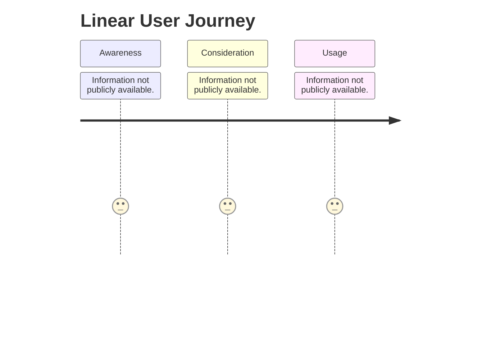
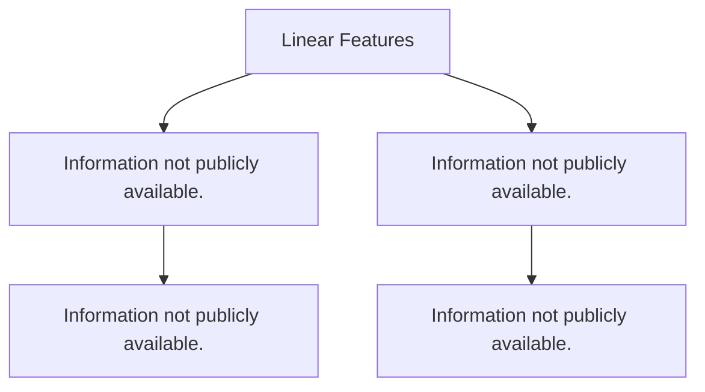
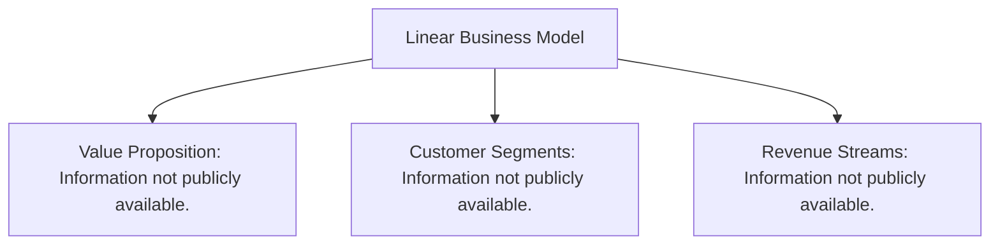
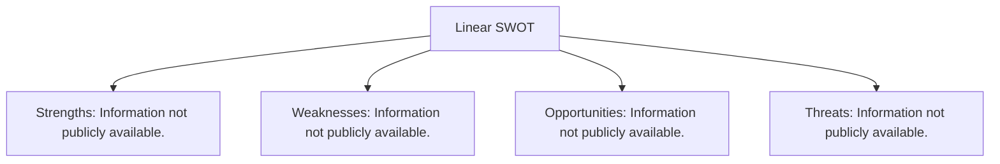
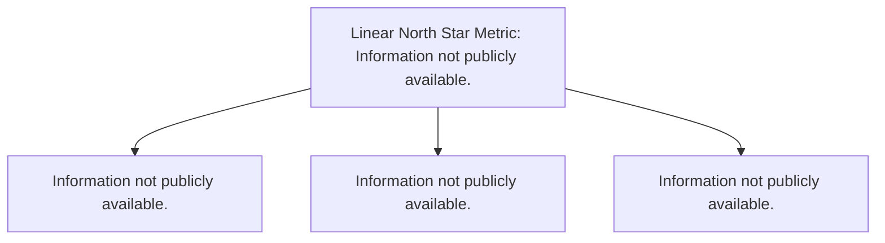
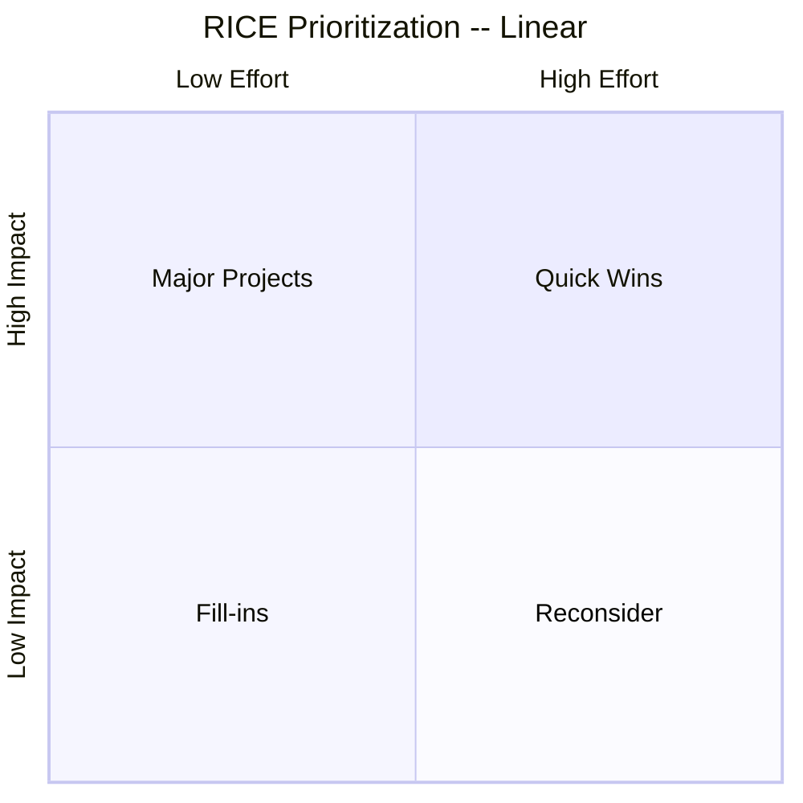
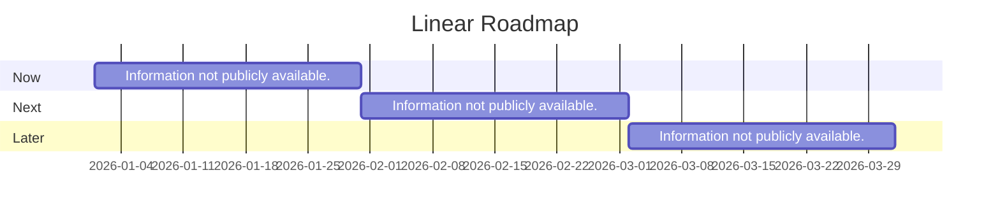

# Linear — Product Management Case Study

> Recruiter-quality PM case study for **Linear**, generated by the PM Automation System's README Generation Engine.

*Image placeholder -- replace with an official screenshot or generated visual before publishing.*

## Table of Contents

1. [Title](#title)
2. [Executive Summary](#executive-summary)
3. [Product Snapshot](#product-snapshot)
4. [Overview](#overview)
5. [Product Summary](#product-summary)
6. [Problem Statement](#problem-statement)
7. [Target Users](#target-users)
8. [User Personas](#user-personas)
9. [Jobs To Be Done](#jobs-to-be-done)
10. [User Journey](#user-journey)
11. [Key Insights](#key-insights)
12. [Feature Analysis](#feature-analysis)
13. [Business Model](#business-model)
14. [Revenue Model](#revenue-model)
15. [Market Analysis](#market-analysis)
16. [Competitor Analysis](#competitor-analysis)
17. [SWOT Analysis](#swot-analysis)
18. [Opportunity Analysis](#opportunity-analysis)
19. [Product Metrics](#product-metrics)
20. [Success Metrics](#success-metrics)
21. [Product Recommendations](#product-recommendations)
22. [Prioritization (RICE / MoSCoW)](#prioritization-rice-moscow)
23. [Product Roadmap](#product-roadmap)
24. [Risks & Trade-offs](#risks-trade-offs)
25. [Key Takeaways](#key-takeaways)
26. [References](#references)

*Analysis generated at: 2026-07-11T18:58:43.593873+00:00*

---

## Executive Summary

This case study synthesizes findings across 8 PM framework(s), producing 83 recorded finding(s) -- **76 grounded in collected evidence** and **7 flagged as assumptions** pending validation.

> **Top priority (High):** Build a mitigation or contingency plan for this threat.

---

## Product Snapshot

| Attribute | Detail |
| --- | --- |
| Value Proposition | "The product development system for teams and agents" -- a fast, minimalist platform that helps software teams plan, build, and ship product work with less noise and higher velocity, purpose-built for workflows shared by humans and AI agents. |
| Business Model | B2B SaaS: per-seat subscription sold self-serve and via sales-assisted enterprise deals. |
| Revenue Model | Tiered per-user monthly/annual subscription revenue (Free, Basic $10/user/mo, Business $16/user/mo, custom-priced Enterprise); annual billing is required to access the published rate for paid tiers, with a premium for monthly billing. |
| Funding Status | Raised an $82M Series C in June 2025 led by Accel at a $1.25B valuation (total disclosed funding ~$134M), following a $35M Series B in September 2023 (led by Accel, with Sequoia and 01Advisors participating) at a roughly $400M valuation. Individual investors include Stewart Butterfield, Dick Costolo, and Claire Hughes Johnson. |
| Target Users | Software engineering, product, and design teams at startups and high-growth tech companies who want a fast, developer-centric alternative to legacy project-management tools; explicitly not aimed at non-technical teams (marketing, sales, HR). |
| North Star Metric (Candidate) | A single metric capturing recurring delivery of the core value proposition ('"The product development system for teams and agents" -- a fast, minimalist platform that helps software teams plan, build, and ship product work with less noise and higher velocity, purpose-built for workflows shared by humans and AI agents.') -- e.g. frequency of the core action per active user. |

---

## Overview

| Field | Detail |
| --- | --- |
| Framework | Business Model Canvas |
| Value Proposition | "The product development system for teams and agents" -- a fast, minimalist platform that helps software teams plan, build, and ship product work with less noise and higher velocity, purpose-built for workflows shared by humans and AI agents. |
| Business Model | B2B SaaS: per-seat subscription sold self-serve and via sales-assisted enterprise deals. |
| Revenue Model | Tiered per-user monthly/annual subscription revenue (Free, Basic $10/user/mo, Business $16/user/mo, custom-priced Enterprise); annual billing is required to access the published rate for paid tiers, with a premium for monthly billing. |
| Funding Status | Raised an $82M Series C in June 2025 led by Accel at a $1.25B valuation (total disclosed funding ~$134M), following a $35M Series B in September 2023 (led by Accel, with Sequoia and 01Advisors participating) at a roughly $400M valuation. Individual investors include Stewart Butterfield, Dick Costolo, and Claire Hughes Johnson. |

**Findings & Recommendations**

| Priority | Insight | Recommended Action | Evidence |
| --- | --- | --- | --- |
| High | Evidence reports revenue model: 'Tiered per-user monthly/annual subscription revenue (Free, Basic $10/user/mo, Business $16/user/mo, custom-priced Enterprise); annual billing is required to access the published rate for paid tiers, with a premium for monthly billing.'. | Stress-test this revenue model against current conversion and retention data. | Verified |
| Medium | Evidence reports core value proposition: '"The product development system for teams and agents" -- a fast, minimalist platform that helps software teams plan, build, and ship product work with less noise and higher velocity, purpose-built for workflows shared by humans and AI agents.'. | Use this value proposition as the litmus test for roadmap and messaging decisions. | Verified |
| Medium | Evidence reports business model: 'B2B SaaS: per-seat subscription sold self-serve and via sales-assisted enterprise deals.'. | Map this business model onto a full Business Model Canvas (key partners, activities, channels) to spot gaps. | Verified |
| Low | Evidence reports funding status: 'Raised an $82M Series C in June 2025 led by Accel at a $1.25B valuation (total disclosed funding ~$134M), following a $35M Series B in September 2023 (led by Accel, with Sequoia and 01Advisors participating) at a roughly $400M valuation. Individual investors include Stewart Butterfield, Dick Costolo, and Claire Hughes Johnson.'. | Calibrate roadmap scope and timeline against this funding status. | Verified |

**Sources:** Apple App Store, Google Play Store, Investor Relations, News & Publications, Official Documentation, Official Website

---

## Product Summary

| Field | Detail |
| --- | --- |
| Framework | Kano Model + MoSCoW Prioritization |
| Shipped Core Features | Issue tracking with rich context, custom fields, and automated workflows, Cycles (sprint planning), Projects with milestones and deadlines, Intake: converts conversations/feedback into routed, labeled, prioritized issues, Initiatives and roadmap planning, Progress dashboards and analytics, Deep GitHub/GitLab and Slack integrations |
| Shipped Premium Features | Private teams, Guest access, Linear Agent (AI-assisted triage and automation), Unlimited teams, SAML/SCIM (Enterprise), Dedicated account management (Enterprise) |
| Requested Features | Mobile board-view support, Inline editing on iOS, Native time tracking, Deeper custom reporting/dashboards |
| MoSCoW | Must Have: Issue tracking with rich context, custom fields, and automated workflows, Cycles (sprint planning), Projects with milestones and deadlines, Intake: converts conversations/feedback into routed, labeled, prioritized issues, Initiatives and roadmap planning, Progress dashboards and analytics, Deep GitHub/GitLab and Slack integrations; Should Have: Private teams, Guest access, Linear Agent (AI-assisted triage and automation), Unlimited teams, SAML/SCIM (Enterprise), Dedicated account management (Enterprise); Could Have: Mobile board-view support, Inline editing on iOS, Native time tracking, Deeper custom reporting/dashboards; Won't Have: _Not available_ |

**Findings & Recommendations**

| Priority | Insight | Recommended Action | Evidence |
| --- | --- | --- | --- |
| Medium | Evidence lists a shipped premium feature: 'Linear Agent (AI-assisted triage and automation)'. | Track adoption and upgrade-conversion tied to this feature to confirm it earns its price tier. | Verified |
| Medium | Evidence lists a shipped premium feature: 'SAML/SCIM (Enterprise)'. | Track adoption and upgrade-conversion tied to this feature to confirm it earns its price tier. | Verified |
| Medium | Evidence lists a requested feature: 'Mobile board-view support'. | Kano-classify via a lightweight satisfaction survey and MoSCoW-prioritize against the current roadmap before committing. | Verified |
| Medium | Evidence lists a requested feature: 'Inline editing on iOS'. | Kano-classify via a lightweight satisfaction survey and MoSCoW-prioritize against the current roadmap before committing. | Verified |
| Medium | Evidence lists a shipped premium feature: 'Private teams'. | Track adoption and upgrade-conversion tied to this feature to confirm it earns its price tier. | Verified |

*+10 additional item(s) not shown above.*

> **Assumption disclosure:** 1 of 15 item(s) above are labeled assumptions -- no evidence was found in the ResearchBundle for that dimension yet. Treat them as hypotheses to validate, not confirmed facts.

**Sources:** Apple App Store, Google Play Store, Investor Relations, News & Publications, Official Documentation, Official Website

---

## Problem Statement

| Field | Detail |
| --- | --- |
| Framework | Jobs To Be Done (JTBD) + Persona Synthesis |
| Target Users | Software engineering, product, and design teams at startups and high-growth tech companies who want a fast, developer-centric alternative to legacy project-management tools; explicitly not aimed at non-technical teams (marketing, sales, HR). |
| Personas | Software engineering, product, design teams at startups, high-growth tech companies who want a fast, developer-centric alternative to legacy project-management tools, explicitly not aimed at non-technical teams (marketing, sales, HR). |
| Friction Signals | Steep drop in mobile feature parity versus desktop, Data-loss concerns on mobile with spotty connectivity, Limited reporting/dashboard depth versus Jira for larger orgs, No Gantt charts or resource-allocation views, Scalability concerns for teams beyond roughly 100 employees managing complex, multi-epic dependencies, Mobile UI differs significantly from desktop, making navigation harder, Missing saved views/filters from desktop, Difficulty filtering by issue labels on mobile, No inline editing on iOS -- requires opening a separate dialog, Lacks list/board view switching on mobile |
| Feature Requests | Mobile board-view support, Inline editing on iOS, Native time tracking, Deeper custom reporting/dashboards |
| Praise Signals | Seamless integration with Slack and GitHub, Described by reviewers as "by far the best issue tracker" they have used, Fast, responsive interface consistent with the desktop product's reputation |

**Findings & Recommendations**

| Priority | Insight | Recommended Action | Evidence |
| --- | --- | --- | --- |
| High | Users report friction: 'Steep drop in mobile feature parity versus desktop'. | Treat this as a candidate job to be done -- design or iterate to remove this friction. | Verified |
| High | Users report friction: 'No Gantt charts or resource-allocation views'. | Treat this as a candidate job to be done -- design or iterate to remove this friction. | Verified |
| High | Users report friction: 'Limited reporting/dashboard depth versus Jira for larger orgs'. | Treat this as a candidate job to be done -- design or iterate to remove this friction. | Verified |
| High | Users report friction: 'Scalability concerns for teams beyond roughly 100 employees managing complex, multi-epic dependencies'. | Treat this as a candidate job to be done -- design or iterate to remove this friction. | Verified |
| High | Users report friction: 'Data-loss concerns on mobile with spotty connectivity'. | Treat this as a candidate job to be done -- design or iterate to remove this friction. | Verified |

*+12 additional item(s) not shown above.*

**Sources:** Apple App Store, Google Play Store, Investor Relations, News & Publications, Official Documentation, Official Website

---

## Target Users

| Field | Detail |
| --- | --- |
| Framework | Jobs To Be Done (JTBD) + Persona Synthesis |
| Target Users | Software engineering, product, and design teams at startups and high-growth tech companies who want a fast, developer-centric alternative to legacy project-management tools; explicitly not aimed at non-technical teams (marketing, sales, HR). |
| Personas | Software engineering, product, design teams at startups, high-growth tech companies who want a fast, developer-centric alternative to legacy project-management tools, explicitly not aimed at non-technical teams (marketing, sales, HR). |
| Friction Signals | Steep drop in mobile feature parity versus desktop, Data-loss concerns on mobile with spotty connectivity, Limited reporting/dashboard depth versus Jira for larger orgs, No Gantt charts or resource-allocation views, Scalability concerns for teams beyond roughly 100 employees managing complex, multi-epic dependencies, Mobile UI differs significantly from desktop, making navigation harder, Missing saved views/filters from desktop, Difficulty filtering by issue labels on mobile, No inline editing on iOS -- requires opening a separate dialog, Lacks list/board view switching on mobile |
| Feature Requests | Mobile board-view support, Inline editing on iOS, Native time tracking, Deeper custom reporting/dashboards |
| Praise Signals | Seamless integration with Slack and GitHub, Described by reviewers as "by far the best issue tracker" they have used, Fast, responsive interface consistent with the desktop product's reputation |

**Findings & Recommendations**

| Priority | Insight | Recommended Action | Evidence |
| --- | --- | --- | --- |
| High | Users report friction: 'Steep drop in mobile feature parity versus desktop'. | Treat this as a candidate job to be done -- design or iterate to remove this friction. | Verified |
| High | Users report friction: 'No Gantt charts or resource-allocation views'. | Treat this as a candidate job to be done -- design or iterate to remove this friction. | Verified |
| High | Users report friction: 'Limited reporting/dashboard depth versus Jira for larger orgs'. | Treat this as a candidate job to be done -- design or iterate to remove this friction. | Verified |
| High | Users report friction: 'Scalability concerns for teams beyond roughly 100 employees managing complex, multi-epic dependencies'. | Treat this as a candidate job to be done -- design or iterate to remove this friction. | Verified |
| High | Users report friction: 'Data-loss concerns on mobile with spotty connectivity'. | Treat this as a candidate job to be done -- design or iterate to remove this friction. | Verified |

*+12 additional item(s) not shown above.*

**Sources:** Apple App Store, Google Play Store, Investor Relations, News & Publications, Official Documentation, Official Website

---

## User Personas

| Field | Detail |
| --- | --- |
| Framework | Jobs To Be Done (JTBD) + Persona Synthesis |
| Target Users | Software engineering, product, and design teams at startups and high-growth tech companies who want a fast, developer-centric alternative to legacy project-management tools; explicitly not aimed at non-technical teams (marketing, sales, HR). |
| Personas | Software engineering, product, design teams at startups, high-growth tech companies who want a fast, developer-centric alternative to legacy project-management tools, explicitly not aimed at non-technical teams (marketing, sales, HR). |
| Friction Signals | Steep drop in mobile feature parity versus desktop, Data-loss concerns on mobile with spotty connectivity, Limited reporting/dashboard depth versus Jira for larger orgs, No Gantt charts or resource-allocation views, Scalability concerns for teams beyond roughly 100 employees managing complex, multi-epic dependencies, Mobile UI differs significantly from desktop, making navigation harder, Missing saved views/filters from desktop, Difficulty filtering by issue labels on mobile, No inline editing on iOS -- requires opening a separate dialog, Lacks list/board view switching on mobile |
| Feature Requests | Mobile board-view support, Inline editing on iOS, Native time tracking, Deeper custom reporting/dashboards |
| Praise Signals | Seamless integration with Slack and GitHub, Described by reviewers as "by far the best issue tracker" they have used, Fast, responsive interface consistent with the desktop product's reputation |

**Findings & Recommendations**

| Priority | Insight | Recommended Action | Evidence |
| --- | --- | --- | --- |
| High | Users report friction: 'Steep drop in mobile feature parity versus desktop'. | Treat this as a candidate job to be done -- design or iterate to remove this friction. | Verified |
| High | Users report friction: 'No Gantt charts or resource-allocation views'. | Treat this as a candidate job to be done -- design or iterate to remove this friction. | Verified |
| High | Users report friction: 'Limited reporting/dashboard depth versus Jira for larger orgs'. | Treat this as a candidate job to be done -- design or iterate to remove this friction. | Verified |
| High | Users report friction: 'Scalability concerns for teams beyond roughly 100 employees managing complex, multi-epic dependencies'. | Treat this as a candidate job to be done -- design or iterate to remove this friction. | Verified |
| High | Users report friction: 'Data-loss concerns on mobile with spotty connectivity'. | Treat this as a candidate job to be done -- design or iterate to remove this friction. | Verified |

*+12 additional item(s) not shown above.*

**Sources:** Apple App Store, Google Play Store, Investor Relations, News & Publications, Official Documentation, Official Website

---

## Jobs To Be Done

| Field | Detail |
| --- | --- |
| Framework | Jobs To Be Done (JTBD) + Persona Synthesis |
| Target Users | Software engineering, product, and design teams at startups and high-growth tech companies who want a fast, developer-centric alternative to legacy project-management tools; explicitly not aimed at non-technical teams (marketing, sales, HR). |
| Personas | Software engineering, product, design teams at startups, high-growth tech companies who want a fast, developer-centric alternative to legacy project-management tools, explicitly not aimed at non-technical teams (marketing, sales, HR). |
| Friction Signals | Steep drop in mobile feature parity versus desktop, Data-loss concerns on mobile with spotty connectivity, Limited reporting/dashboard depth versus Jira for larger orgs, No Gantt charts or resource-allocation views, Scalability concerns for teams beyond roughly 100 employees managing complex, multi-epic dependencies, Mobile UI differs significantly from desktop, making navigation harder, Missing saved views/filters from desktop, Difficulty filtering by issue labels on mobile, No inline editing on iOS -- requires opening a separate dialog, Lacks list/board view switching on mobile |
| Feature Requests | Mobile board-view support, Inline editing on iOS, Native time tracking, Deeper custom reporting/dashboards |
| Praise Signals | Seamless integration with Slack and GitHub, Described by reviewers as "by far the best issue tracker" they have used, Fast, responsive interface consistent with the desktop product's reputation |

**Findings & Recommendations**

| Priority | Insight | Recommended Action | Evidence |
| --- | --- | --- | --- |
| High | Users report friction: 'Steep drop in mobile feature parity versus desktop'. | Treat this as a candidate job to be done -- design or iterate to remove this friction. | Verified |
| High | Users report friction: 'No Gantt charts or resource-allocation views'. | Treat this as a candidate job to be done -- design or iterate to remove this friction. | Verified |
| High | Users report friction: 'Limited reporting/dashboard depth versus Jira for larger orgs'. | Treat this as a candidate job to be done -- design or iterate to remove this friction. | Verified |
| High | Users report friction: 'Scalability concerns for teams beyond roughly 100 employees managing complex, multi-epic dependencies'. | Treat this as a candidate job to be done -- design or iterate to remove this friction. | Verified |
| High | Users report friction: 'Data-loss concerns on mobile with spotty connectivity'. | Treat this as a candidate job to be done -- design or iterate to remove this friction. | Verified |

*+12 additional item(s) not shown above.*

**Sources:** Apple App Store, Google Play Store, Investor Relations, News & Publications, Official Documentation, Official Website

---

## User Journey

Information not publicly available.

---

## Key Insights

1. **Evidence identifies 'Enterprise buyers demanding features (Gantt charts, deep reporting) outside Linear's minimalist philosophy' as a threat.** _(High priority)_ -- Build a mitigation or contingency plan for this threat.
2. **Evidence identifies 'Competitive pressure from Atlassian (Jira) bundling AI features at enterprise scale' as a threat.** _(High priority)_ -- Build a mitigation or contingency plan for this threat.
3. **Evidence identifies 'Opinionated-simplicity philosophy limiting expansion into non-technical/enterprise use cases' as a threat.** _(High priority)_ -- Build a mitigation or contingency plan for this threat.
4. **Evidence identifies a risk: 'Competitive pressure from Atlassian (Jira) bundling AI features at enterprise scale'.** _(High priority)_ -- Sequence a mitigation for this risk into the 'Now' roadmap horizon. Qualitative RICE: Reach is broad (risk is bundle-wide, not user-segment-specific), Impact is high if it materializes, Confidence is bounded by the evidence actually collected, and Effort is left unestimated until scoped.
5. **Evidence identifies a risk: 'Opinionated-simplicity philosophy limiting expansion into non-technical/enterprise use cases'.** _(High priority)_ -- Sequence a mitigation for this risk into the 'Now' roadmap horizon. Qualitative RICE: Reach is broad (risk is bundle-wide, not user-segment-specific), Impact is high if it materializes, Confidence is bounded by the evidence actually collected, and Effort is left unestimated until scoped.

*+78 additional finding(s) covered in the sections above.*

---

## Feature Analysis

| Field | Detail |
| --- | --- |
| Framework | Kano Model + MoSCoW Prioritization |
| Shipped Core Features | Issue tracking with rich context, custom fields, and automated workflows, Cycles (sprint planning), Projects with milestones and deadlines, Intake: converts conversations/feedback into routed, labeled, prioritized issues, Initiatives and roadmap planning, Progress dashboards and analytics, Deep GitHub/GitLab and Slack integrations |
| Shipped Premium Features | Private teams, Guest access, Linear Agent (AI-assisted triage and automation), Unlimited teams, SAML/SCIM (Enterprise), Dedicated account management (Enterprise) |
| Requested Features | Mobile board-view support, Inline editing on iOS, Native time tracking, Deeper custom reporting/dashboards |
| MoSCoW | Must Have: Issue tracking with rich context, custom fields, and automated workflows, Cycles (sprint planning), Projects with milestones and deadlines, Intake: converts conversations/feedback into routed, labeled, prioritized issues, Initiatives and roadmap planning, Progress dashboards and analytics, Deep GitHub/GitLab and Slack integrations; Should Have: Private teams, Guest access, Linear Agent (AI-assisted triage and automation), Unlimited teams, SAML/SCIM (Enterprise), Dedicated account management (Enterprise); Could Have: Mobile board-view support, Inline editing on iOS, Native time tracking, Deeper custom reporting/dashboards; Won't Have: _Not available_ |

**Findings & Recommendations**

| Priority | Insight | Recommended Action | Evidence |
| --- | --- | --- | --- |
| Medium | Evidence lists a shipped premium feature: 'Linear Agent (AI-assisted triage and automation)'. | Track adoption and upgrade-conversion tied to this feature to confirm it earns its price tier. | Verified |
| Medium | Evidence lists a shipped premium feature: 'SAML/SCIM (Enterprise)'. | Track adoption and upgrade-conversion tied to this feature to confirm it earns its price tier. | Verified |
| Medium | Evidence lists a requested feature: 'Mobile board-view support'. | Kano-classify via a lightweight satisfaction survey and MoSCoW-prioritize against the current roadmap before committing. | Verified |
| Medium | Evidence lists a requested feature: 'Inline editing on iOS'. | Kano-classify via a lightweight satisfaction survey and MoSCoW-prioritize against the current roadmap before committing. | Verified |
| Medium | Evidence lists a shipped premium feature: 'Private teams'. | Track adoption and upgrade-conversion tied to this feature to confirm it earns its price tier. | Verified |

*+10 additional item(s) not shown above.*

> **Assumption disclosure:** 1 of 15 item(s) above are labeled assumptions -- no evidence was found in the ResearchBundle for that dimension yet. Treat them as hypotheses to validate, not confirmed facts.

**Sources:** Apple App Store, Google Play Store, Investor Relations, News & Publications, Official Documentation, Official Website

---

## Business Model

| Field | Detail |
| --- | --- |
| Framework | Business Model Canvas |
| Value Proposition | "The product development system for teams and agents" -- a fast, minimalist platform that helps software teams plan, build, and ship product work with less noise and higher velocity, purpose-built for workflows shared by humans and AI agents. |
| Business Model | B2B SaaS: per-seat subscription sold self-serve and via sales-assisted enterprise deals. |
| Revenue Model | Tiered per-user monthly/annual subscription revenue (Free, Basic $10/user/mo, Business $16/user/mo, custom-priced Enterprise); annual billing is required to access the published rate for paid tiers, with a premium for monthly billing. |
| Funding Status | Raised an $82M Series C in June 2025 led by Accel at a $1.25B valuation (total disclosed funding ~$134M), following a $35M Series B in September 2023 (led by Accel, with Sequoia and 01Advisors participating) at a roughly $400M valuation. Individual investors include Stewart Butterfield, Dick Costolo, and Claire Hughes Johnson. |

**Findings & Recommendations**

| Priority | Insight | Recommended Action | Evidence |
| --- | --- | --- | --- |
| High | Evidence reports revenue model: 'Tiered per-user monthly/annual subscription revenue (Free, Basic $10/user/mo, Business $16/user/mo, custom-priced Enterprise); annual billing is required to access the published rate for paid tiers, with a premium for monthly billing.'. | Stress-test this revenue model against current conversion and retention data. | Verified |
| Medium | Evidence reports core value proposition: '"The product development system for teams and agents" -- a fast, minimalist platform that helps software teams plan, build, and ship product work with less noise and higher velocity, purpose-built for workflows shared by humans and AI agents.'. | Use this value proposition as the litmus test for roadmap and messaging decisions. | Verified |
| Medium | Evidence reports business model: 'B2B SaaS: per-seat subscription sold self-serve and via sales-assisted enterprise deals.'. | Map this business model onto a full Business Model Canvas (key partners, activities, channels) to spot gaps. | Verified |
| Low | Evidence reports funding status: 'Raised an $82M Series C in June 2025 led by Accel at a $1.25B valuation (total disclosed funding ~$134M), following a $35M Series B in September 2023 (led by Accel, with Sequoia and 01Advisors participating) at a roughly $400M valuation. Individual investors include Stewart Butterfield, Dick Costolo, and Claire Hughes Johnson.'. | Calibrate roadmap scope and timeline against this funding status. | Verified |

**Sources:** Apple App Store, Google Play Store, Investor Relations, News & Publications, Official Documentation, Official Website

---

## Revenue Model

| Field | Detail |
| --- | --- |
| Framework | Business Model Canvas |
| Value Proposition | "The product development system for teams and agents" -- a fast, minimalist platform that helps software teams plan, build, and ship product work with less noise and higher velocity, purpose-built for workflows shared by humans and AI agents. |
| Business Model | B2B SaaS: per-seat subscription sold self-serve and via sales-assisted enterprise deals. |
| Revenue Model | Tiered per-user monthly/annual subscription revenue (Free, Basic $10/user/mo, Business $16/user/mo, custom-priced Enterprise); annual billing is required to access the published rate for paid tiers, with a premium for monthly billing. |
| Funding Status | Raised an $82M Series C in June 2025 led by Accel at a $1.25B valuation (total disclosed funding ~$134M), following a $35M Series B in September 2023 (led by Accel, with Sequoia and 01Advisors participating) at a roughly $400M valuation. Individual investors include Stewart Butterfield, Dick Costolo, and Claire Hughes Johnson. |

**Findings & Recommendations**

| Priority | Insight | Recommended Action | Evidence |
| --- | --- | --- | --- |
| High | Evidence reports revenue model: 'Tiered per-user monthly/annual subscription revenue (Free, Basic $10/user/mo, Business $16/user/mo, custom-priced Enterprise); annual billing is required to access the published rate for paid tiers, with a premium for monthly billing.'. | Stress-test this revenue model against current conversion and retention data. | Verified |
| Medium | Evidence reports core value proposition: '"The product development system for teams and agents" -- a fast, minimalist platform that helps software teams plan, build, and ship product work with less noise and higher velocity, purpose-built for workflows shared by humans and AI agents.'. | Use this value proposition as the litmus test for roadmap and messaging decisions. | Verified |
| Medium | Evidence reports business model: 'B2B SaaS: per-seat subscription sold self-serve and via sales-assisted enterprise deals.'. | Map this business model onto a full Business Model Canvas (key partners, activities, channels) to spot gaps. | Verified |
| Low | Evidence reports funding status: 'Raised an $82M Series C in June 2025 led by Accel at a $1.25B valuation (total disclosed funding ~$134M), following a $35M Series B in September 2023 (led by Accel, with Sequoia and 01Advisors participating) at a roughly $400M valuation. Individual investors include Stewart Butterfield, Dick Costolo, and Claire Hughes Johnson.'. | Calibrate roadmap scope and timeline against this funding status. | Verified |

**Sources:** Apple App Store, Google Play Store, Investor Relations, News & Publications, Official Documentation, Official Website

---

## Market Analysis

| Field | Detail |
| --- | --- |
| Framework | Porter's Five Forces + Opportunity Mapping |
| Market Size | _Not available_ |
| Positioning | Positions itself as the fast, opinionated, developer-first alternative to highly-configurable legacy tools like Jira -- described in its own marketing as "a new species of product tool" built for speed and human/AI-agent collaboration rather than maximal configurability. |
| Competitors | Jira (Atlassian), Asana, Trello, ClickUp, Monday.com, Shortcut |
| Industry Trends | AI agents increasingly embedded directly into product-development workflows, Developer preference shifting toward fast, opinionated tools over highly configurable legacy suites, Consolidation of issue tracking, roadmapping, and code review into a single workflow surface |
| Opportunity Areas | Expanding Linear Agent (AI teammate) capabilities as agent-assisted development goes mainstream, Growing enterprise footprint (SAML/SCIM) without diluting core simplicity, International/non-English market expansion |
| Opportunity Confidence | Growing enterprise footprint (saml/scim) without diluting core simplicity: 0.69; Expanding linear agent (ai teammate) capabilities as agent Assisted development goes mainstream: 0.57; International/non English market expansion: 0.57 |

**Findings & Recommendations**

| Priority | Insight | Recommended Action | Evidence |
| --- | --- | --- | --- |
| Medium | Evidence reports market positioning: 'Positions itself as the fast, opinionated, developer-first alternative to highly-configurable legacy tools like Jira -- described in its own marketing as "a new species of product tool" built for speed and human/AI-agent collaboration rather than maximal configurability.'. | Audit whether current messaging and roadmap decisions still reinforce this positioning. | Verified |
| Medium | Evidence identifies a opportunity area: 'Growing enterprise footprint (SAML/SCIM) without diluting core simplicity'. | Scope and validate this opportunity as a candidate roadmap item. | Verified |
| Medium | Evidence identifies a competitor: 'Jira (Atlassian)'. | Run a feature/positioning comparison against this competitor to find defensible differentiation. | Verified |
| Medium | Evidence identifies a industry trend: 'Consolidation of issue tracking, roadmapping, and code review into a single workflow surface'. | Assess whether this trend is a tailwind to ride or a threat to defend against. | Verified |
| Medium | Evidence identifies a opportunity area: 'Expanding Linear Agent (AI teammate) capabilities as agent-assisted development goes mainstream'. | Scope and validate this opportunity as a candidate roadmap item. | Verified |

*+8 additional item(s) not shown above.*

> **Assumption disclosure:** 1 of 13 item(s) above are labeled assumptions -- no evidence was found in the ResearchBundle for that dimension yet. Treat them as hypotheses to validate, not confirmed facts.

**Sources:** Apple App Store, Google Play Store, Investor Relations, News & Publications, Official Documentation, Official Website

---

## Competitor Analysis

| Field | Detail |
| --- | --- |
| Framework | Porter's Five Forces + Opportunity Mapping |
| Market Size | _Not available_ |
| Positioning | Positions itself as the fast, opinionated, developer-first alternative to highly-configurable legacy tools like Jira -- described in its own marketing as "a new species of product tool" built for speed and human/AI-agent collaboration rather than maximal configurability. |
| Competitors | Jira (Atlassian), Asana, Trello, ClickUp, Monday.com, Shortcut |
| Industry Trends | AI agents increasingly embedded directly into product-development workflows, Developer preference shifting toward fast, opinionated tools over highly configurable legacy suites, Consolidation of issue tracking, roadmapping, and code review into a single workflow surface |
| Opportunity Areas | Expanding Linear Agent (AI teammate) capabilities as agent-assisted development goes mainstream, Growing enterprise footprint (SAML/SCIM) without diluting core simplicity, International/non-English market expansion |
| Opportunity Confidence | Growing enterprise footprint (saml/scim) without diluting core simplicity: 0.69; Expanding linear agent (ai teammate) capabilities as agent Assisted development goes mainstream: 0.57; International/non English market expansion: 0.57 |

**Findings & Recommendations**

| Priority | Insight | Recommended Action | Evidence |
| --- | --- | --- | --- |
| Medium | Evidence reports market positioning: 'Positions itself as the fast, opinionated, developer-first alternative to highly-configurable legacy tools like Jira -- described in its own marketing as "a new species of product tool" built for speed and human/AI-agent collaboration rather than maximal configurability.'. | Audit whether current messaging and roadmap decisions still reinforce this positioning. | Verified |
| Medium | Evidence identifies a opportunity area: 'Growing enterprise footprint (SAML/SCIM) without diluting core simplicity'. | Scope and validate this opportunity as a candidate roadmap item. | Verified |
| Medium | Evidence identifies a competitor: 'Jira (Atlassian)'. | Run a feature/positioning comparison against this competitor to find defensible differentiation. | Verified |
| Medium | Evidence identifies a industry trend: 'Consolidation of issue tracking, roadmapping, and code review into a single workflow surface'. | Assess whether this trend is a tailwind to ride or a threat to defend against. | Verified |
| Medium | Evidence identifies a opportunity area: 'Expanding Linear Agent (AI teammate) capabilities as agent-assisted development goes mainstream'. | Scope and validate this opportunity as a candidate roadmap item. | Verified |

*+8 additional item(s) not shown above.*

> **Assumption disclosure:** 1 of 13 item(s) above are labeled assumptions -- no evidence was found in the ResearchBundle for that dimension yet. Treat them as hypotheses to validate, not confirmed facts.

**Sources:** Apple App Store, Google Play Store, Investor Relations, News & Publications, Official Documentation, Official Website

---

## SWOT Analysis

| Field | Detail |
| --- | --- |
| Framework | SWOT (Strengths, Weaknesses, Opportunities, Threats) |
| Strengths | Extremely fast, keyboard-shortcut-driven UI praised by developers, Clean, minimalist design reduces tool overhead, Deep GitHub/GitLab integration for developer workflow, Strong product-market fit with startups and high-growth tech companies, Reported to operate profitably while growing |
| Weaknesses | Limited scalability for large/enterprise orgs with complex cross-team dependencies, No Gantt charts or advanced resource-allocation reporting, Mobile experience significantly behind desktop in functionality |
| Opportunities | Expanding Linear Agent (AI teammate) capabilities as agent-assisted development goes mainstream, Growing enterprise footprint (SAML/SCIM) without diluting core simplicity, International/non-English market expansion |
| Threats | Jira and Asana adding comparable speed/UX improvements and AI features, Enterprise buyers demanding features (Gantt charts, deep reporting) outside Linear's minimalist philosophy, New AI-native entrants targeting the same developer-tool niche, Competitive pressure from Atlassian (Jira) bundling AI features at enterprise scale, Opinionated-simplicity philosophy limiting expansion into non-technical/enterprise use cases, Reliance on continued developer-tool market growth |

**Findings & Recommendations**

| Priority | Insight | Recommended Action | Evidence |
| --- | --- | --- | --- |
| High | Evidence identifies 'Enterprise buyers demanding features (Gantt charts, deep reporting) outside Linear's minimalist philosophy' as a threat. | Build a mitigation or contingency plan for this threat. | Verified |
| High | Evidence identifies 'Competitive pressure from Atlassian (Jira) bundling AI features at enterprise scale' as a threat. | Build a mitigation or contingency plan for this threat. | Verified |
| High | Evidence identifies 'Opinionated-simplicity philosophy limiting expansion into non-technical/enterprise use cases' as a threat. | Build a mitigation or contingency plan for this threat. | Verified |
| High | Evidence identifies 'Limited scalability for large/enterprise orgs with complex cross-team dependencies' as a weakness. | Prioritize a fix or mitigation for this weakness on the roadmap. | Verified |
| High | Evidence identifies 'No Gantt charts or advanced resource-allocation reporting' as a weakness. | Prioritize a fix or mitigation for this weakness on the roadmap. | Verified |

*+11 additional item(s) not shown above.*

**Sources:** Apple App Store, Google Play Store, Investor Relations, News & Publications, Official Documentation, Official Website

---

## Opportunity Analysis

| Priority | Opportunity | Suggested Action | Evidence |
| --- | --- | --- | --- |
| High | Evidence identifies 'Enterprise buyers demanding features (Gantt charts, deep reporting) outside Linear's minimalist philosophy' as a threat. | Build a mitigation or contingency plan for this threat. | Verified |
| High | Evidence identifies 'Competitive pressure from Atlassian (Jira) bundling AI features at enterprise scale' as a threat. | Build a mitigation or contingency plan for this threat. | Verified |
| High | Evidence identifies 'Opinionated-simplicity philosophy limiting expansion into non-technical/enterprise use cases' as a threat. | Build a mitigation or contingency plan for this threat. | Verified |
| High | Evidence identifies 'Limited scalability for large/enterprise orgs with complex cross-team dependencies' as a weakness. | Prioritize a fix or mitigation for this weakness on the roadmap. | Verified |
| High | Evidence identifies 'No Gantt charts or advanced resource-allocation reporting' as a weakness. | Prioritize a fix or mitigation for this weakness on the roadmap. | Verified |

> **Assumption disclosure:** 3 of 35 item(s) above are labeled assumptions -- no evidence was found in the ResearchBundle for that dimension yet. Treat them as hypotheses to validate, not confirmed facts.

---

## Product Metrics

| Field | Detail |
| --- | --- |
| Framework | North Star Metric + HEART Framework |
| Downloads | _Not available_ |
| Ratings | Play Store: 4.69/5; App Store: _Not available_ |
| Reviews | Play Store: ~1,000; App Store: _Not available_ |
| Estimated MAU | _Not available_ |
| Retention Signals | _Not available_ |
| HEART | Happiness: Seamless integration with Slack and GitHub; Described by reviewers as "by far the best issue tracker" they have used; Fast, responsive interface consistent with the desktop product's reputation; Engagement: _Not available_; Adoption: _Not available_; Retention: _Not available_; Task Success: Sign up via email or SSO, create a workspace/team, import issues from an existing tool, and start creating issues immediately -- onboarding is deliberately low-configuration and speed-first. |
| North Star Metric Candidate | A single metric capturing recurring delivery of the core value proposition ('"The product development system for teams and agents" -- a fast, minimalist platform that helps software teams plan, build, and ship product work with less noise and higher velocity, purpose-built for workflows shared by humans and AI agents.') -- e.g. frequency of the core action per active user. |

**Findings & Recommendations**

| Priority | Insight | Recommended Action | Evidence |
| --- | --- | --- | --- |
| High | Evidence for the Task Success (HEART) dimension: 'Sign up via email or SSO, create a workspace/team, import issues from an existing tool, and start creating issues immediately -- onboarding is deliberately low-configuration and speed-first.'. | Instrument this flow to measure completion rate and time-to-completion for the core task. | Verified |
| Medium | Evidence for the Happiness (HEART) dimension: 'Seamless integration with Slack and GitHub; Described by reviewers as "by far the best issue tracker" they have used; Fast, responsive interface consistent with the desktop product's reputation'. | Track this sentiment signal over time (e.g. store rating trend, praise-to-complaint ratio) as a leading Happiness indicator. | Verified |
| Medium | The product's stated core value proposition is: '"The product development system for teams and agents" -- a fast, minimalist platform that helps software teams plan, build, and ship product work with less noise and higher velocity, purpose-built for workflows shared by humans and AI agents.'. | Adopt and validate this candidate North Star Metric: A single metric capturing recurring delivery of the core value proposition ('"The product development system for teams and agents" -- a fast, minimalist platform that helps software teams plan, build, and ship product work with less noise and higher velocity, purpose-built for workflows shared by humans and AI agents.') -- e.g. frequency of the core action per active user. | Verified |
| Low | No Engagement (HEART) evidence is present in the ResearchBundle yet. | Collect Engagement-relevant evidence (e.g. store ratings, retention cohorts) for this dimension. | Assumption |
| Low | No Adoption (HEART) evidence is present in the ResearchBundle yet. | Collect Adoption-relevant evidence (e.g. store ratings, retention cohorts) for this dimension. | Assumption |

*+1 additional item(s) not shown above.*

> **Assumption disclosure:** 3 of 6 item(s) above are labeled assumptions -- no evidence was found in the ResearchBundle for that dimension yet. Treat them as hypotheses to validate, not confirmed facts.

**Sources:** Apple App Store, Google Play Store, Investor Relations, News & Publications, Official Documentation, Official Website

---

## Success Metrics

- This risk is either mitigated or explicitly accepted with a documented owner.
- Core task completion rate and time-to-completion.
- Store rating trend and praise-to-complaint ratio in user research.
- A scoped RICE assessment (Reach, Impact, Confidence, Effort) exists for this opportunity.
- Team adoption of this metric in planning and review rituals.

---

## Product Recommendations

| Field | Detail |
| --- | --- |
| Framework | RICE-Informed Product Roadmap |
| Risks | Competitive pressure from Atlassian (Jira) bundling AI features at enterprise scale, Opinionated-simplicity philosophy limiting expansion into non-technical/enterprise use cases, Reliance on continued developer-tool market growth |
| Opportunities | Expanding Linear Agent (AI teammate) capabilities as agent-assisted development goes mainstream, Growing enterprise footprint (SAML/SCIM) without diluting core simplicity, International/non-English market expansion |
| Roadmap | Now: Competitive pressure from Atlassian (Jira) bundling AI features at enterprise scale, Opinionated-simplicity philosophy limiting expansion into non-technical/enterprise use cases, Reliance on continued developer-tool market growth; Next: Expanding Linear Agent (AI teammate) capabilities as agent-assisted development goes mainstream, Growing enterprise footprint (SAML/SCIM) without diluting core simplicity, International/non-English market expansion; Later: _Not available_ |

**Findings & Recommendations**

| Priority | Insight | Recommended Action | Evidence |
| --- | --- | --- | --- |
| High | Evidence identifies a risk: 'Competitive pressure from Atlassian (Jira) bundling AI features at enterprise scale'. | Sequence a mitigation for this risk into the 'Now' roadmap horizon. Qualitative RICE: Reach is broad (risk is bundle-wide, not user-segment-specific), Impact is high if it materializes, Confidence is bounded by the evidence actually collected, and Effort is left unestimated until scoped. | Verified |
| High | Evidence identifies a risk: 'Opinionated-simplicity philosophy limiting expansion into non-technical/enterprise use cases'. | Sequence a mitigation for this risk into the 'Now' roadmap horizon. Qualitative RICE: Reach is broad (risk is bundle-wide, not user-segment-specific), Impact is high if it materializes, Confidence is bounded by the evidence actually collected, and Effort is left unestimated until scoped. | Verified |
| High | Evidence identifies a risk: 'Reliance on continued developer-tool market growth'. | Sequence a mitigation for this risk into the 'Now' roadmap horizon. Qualitative RICE: Reach is broad (risk is bundle-wide, not user-segment-specific), Impact is high if it materializes, Confidence is bounded by the evidence actually collected, and Effort is left unestimated until scoped. | Verified |
| Medium | Evidence identifies an opportunity: 'Growing enterprise footprint (SAML/SCIM) without diluting core simplicity'. | Scope this opportunity for the 'Next' roadmap horizon. Qualitative RICE: Reach and Impact are to be sized during scoping, Confidence is bounded by the evidence actually collected, and Effort is left unestimated until scoped. | Verified |
| Medium | Evidence identifies an opportunity: 'Expanding Linear Agent (AI teammate) capabilities as agent-assisted development goes mainstream'. | Scope this opportunity for the 'Next' roadmap horizon. Qualitative RICE: Reach and Impact are to be sized during scoping, Confidence is bounded by the evidence actually collected, and Effort is left unestimated until scoped. | Verified |

*+1 additional item(s) not shown above.*

**Sources:** Apple App Store, Google Play Store, Investor Relations, News & Publications, Official Documentation, Official Website

---

## Prioritization (RICE / MoSCoW)

| Field | Detail |
| --- | --- |
| Framework | RICE-Informed Product Roadmap |
| Risks | Competitive pressure from Atlassian (Jira) bundling AI features at enterprise scale, Opinionated-simplicity philosophy limiting expansion into non-technical/enterprise use cases, Reliance on continued developer-tool market growth |
| Opportunities | Expanding Linear Agent (AI teammate) capabilities as agent-assisted development goes mainstream, Growing enterprise footprint (SAML/SCIM) without diluting core simplicity, International/non-English market expansion |
| Roadmap | Now: Competitive pressure from Atlassian (Jira) bundling AI features at enterprise scale, Opinionated-simplicity philosophy limiting expansion into non-technical/enterprise use cases, Reliance on continued developer-tool market growth; Next: Expanding Linear Agent (AI teammate) capabilities as agent-assisted development goes mainstream, Growing enterprise footprint (SAML/SCIM) without diluting core simplicity, International/non-English market expansion; Later: _Not available_ |

**Findings & Recommendations**

| Priority | Insight | Recommended Action | Evidence |
| --- | --- | --- | --- |
| High | Evidence identifies a risk: 'Competitive pressure from Atlassian (Jira) bundling AI features at enterprise scale'. | Sequence a mitigation for this risk into the 'Now' roadmap horizon. Qualitative RICE: Reach is broad (risk is bundle-wide, not user-segment-specific), Impact is high if it materializes, Confidence is bounded by the evidence actually collected, and Effort is left unestimated until scoped. | Verified |
| High | Evidence identifies a risk: 'Opinionated-simplicity philosophy limiting expansion into non-technical/enterprise use cases'. | Sequence a mitigation for this risk into the 'Now' roadmap horizon. Qualitative RICE: Reach is broad (risk is bundle-wide, not user-segment-specific), Impact is high if it materializes, Confidence is bounded by the evidence actually collected, and Effort is left unestimated until scoped. | Verified |
| High | Evidence identifies a risk: 'Reliance on continued developer-tool market growth'. | Sequence a mitigation for this risk into the 'Now' roadmap horizon. Qualitative RICE: Reach is broad (risk is bundle-wide, not user-segment-specific), Impact is high if it materializes, Confidence is bounded by the evidence actually collected, and Effort is left unestimated until scoped. | Verified |
| Medium | Evidence identifies an opportunity: 'Growing enterprise footprint (SAML/SCIM) without diluting core simplicity'. | Scope this opportunity for the 'Next' roadmap horizon. Qualitative RICE: Reach and Impact are to be sized during scoping, Confidence is bounded by the evidence actually collected, and Effort is left unestimated until scoped. | Verified |
| Medium | Evidence identifies an opportunity: 'Expanding Linear Agent (AI teammate) capabilities as agent-assisted development goes mainstream'. | Scope this opportunity for the 'Next' roadmap horizon. Qualitative RICE: Reach and Impact are to be sized during scoping, Confidence is bounded by the evidence actually collected, and Effort is left unestimated until scoped. | Verified |

*+1 additional item(s) not shown above.*

**Sources:** Apple App Store, Google Play Store, Investor Relations, News & Publications, Official Documentation, Official Website

| Field | Detail |
| --- | --- |
| Framework | Kano Model + MoSCoW Prioritization |
| Shipped Core Features | Issue tracking with rich context, custom fields, and automated workflows, Cycles (sprint planning), Projects with milestones and deadlines, Intake: converts conversations/feedback into routed, labeled, prioritized issues, Initiatives and roadmap planning, Progress dashboards and analytics, Deep GitHub/GitLab and Slack integrations |
| Shipped Premium Features | Private teams, Guest access, Linear Agent (AI-assisted triage and automation), Unlimited teams, SAML/SCIM (Enterprise), Dedicated account management (Enterprise) |
| Requested Features | Mobile board-view support, Inline editing on iOS, Native time tracking, Deeper custom reporting/dashboards |
| MoSCoW | Must Have: Issue tracking with rich context, custom fields, and automated workflows, Cycles (sprint planning), Projects with milestones and deadlines, Intake: converts conversations/feedback into routed, labeled, prioritized issues, Initiatives and roadmap planning, Progress dashboards and analytics, Deep GitHub/GitLab and Slack integrations; Should Have: Private teams, Guest access, Linear Agent (AI-assisted triage and automation), Unlimited teams, SAML/SCIM (Enterprise), Dedicated account management (Enterprise); Could Have: Mobile board-view support, Inline editing on iOS, Native time tracking, Deeper custom reporting/dashboards; Won't Have: _Not available_ |

**Findings & Recommendations**

| Priority | Insight | Recommended Action | Evidence |
| --- | --- | --- | --- |
| Medium | Evidence lists a shipped premium feature: 'Linear Agent (AI-assisted triage and automation)'. | Track adoption and upgrade-conversion tied to this feature to confirm it earns its price tier. | Verified |
| Medium | Evidence lists a shipped premium feature: 'SAML/SCIM (Enterprise)'. | Track adoption and upgrade-conversion tied to this feature to confirm it earns its price tier. | Verified |
| Medium | Evidence lists a requested feature: 'Mobile board-view support'. | Kano-classify via a lightweight satisfaction survey and MoSCoW-prioritize against the current roadmap before committing. | Verified |
| Medium | Evidence lists a requested feature: 'Inline editing on iOS'. | Kano-classify via a lightweight satisfaction survey and MoSCoW-prioritize against the current roadmap before committing. | Verified |
| Medium | Evidence lists a shipped premium feature: 'Private teams'. | Track adoption and upgrade-conversion tied to this feature to confirm it earns its price tier. | Verified |

*+10 additional item(s) not shown above.*

> **Assumption disclosure:** 1 of 15 item(s) above are labeled assumptions -- no evidence was found in the ResearchBundle for that dimension yet. Treat them as hypotheses to validate, not confirmed facts.

**Sources:** Apple App Store, Google Play Store, Investor Relations, News & Publications, Official Documentation, Official Website

---

## Product Roadmap

| Field | Detail |
| --- | --- |
| Framework | RICE-Informed Product Roadmap |
| Risks | Competitive pressure from Atlassian (Jira) bundling AI features at enterprise scale, Opinionated-simplicity philosophy limiting expansion into non-technical/enterprise use cases, Reliance on continued developer-tool market growth |
| Opportunities | Expanding Linear Agent (AI teammate) capabilities as agent-assisted development goes mainstream, Growing enterprise footprint (SAML/SCIM) without diluting core simplicity, International/non-English market expansion |
| Roadmap | Now: Competitive pressure from Atlassian (Jira) bundling AI features at enterprise scale, Opinionated-simplicity philosophy limiting expansion into non-technical/enterprise use cases, Reliance on continued developer-tool market growth; Next: Expanding Linear Agent (AI teammate) capabilities as agent-assisted development goes mainstream, Growing enterprise footprint (SAML/SCIM) without diluting core simplicity, International/non-English market expansion; Later: _Not available_ |

**Findings & Recommendations**

| Priority | Insight | Recommended Action | Evidence |
| --- | --- | --- | --- |
| High | Evidence identifies a risk: 'Competitive pressure from Atlassian (Jira) bundling AI features at enterprise scale'. | Sequence a mitigation for this risk into the 'Now' roadmap horizon. Qualitative RICE: Reach is broad (risk is bundle-wide, not user-segment-specific), Impact is high if it materializes, Confidence is bounded by the evidence actually collected, and Effort is left unestimated until scoped. | Verified |
| High | Evidence identifies a risk: 'Opinionated-simplicity philosophy limiting expansion into non-technical/enterprise use cases'. | Sequence a mitigation for this risk into the 'Now' roadmap horizon. Qualitative RICE: Reach is broad (risk is bundle-wide, not user-segment-specific), Impact is high if it materializes, Confidence is bounded by the evidence actually collected, and Effort is left unestimated until scoped. | Verified |
| High | Evidence identifies a risk: 'Reliance on continued developer-tool market growth'. | Sequence a mitigation for this risk into the 'Now' roadmap horizon. Qualitative RICE: Reach is broad (risk is bundle-wide, not user-segment-specific), Impact is high if it materializes, Confidence is bounded by the evidence actually collected, and Effort is left unestimated until scoped. | Verified |
| Medium | Evidence identifies an opportunity: 'Growing enterprise footprint (SAML/SCIM) without diluting core simplicity'. | Scope this opportunity for the 'Next' roadmap horizon. Qualitative RICE: Reach and Impact are to be sized during scoping, Confidence is bounded by the evidence actually collected, and Effort is left unestimated until scoped. | Verified |
| Medium | Evidence identifies an opportunity: 'Expanding Linear Agent (AI teammate) capabilities as agent-assisted development goes mainstream'. | Scope this opportunity for the 'Next' roadmap horizon. Qualitative RICE: Reach and Impact are to be sized during scoping, Confidence is bounded by the evidence actually collected, and Effort is left unestimated until scoped. | Verified |

*+1 additional item(s) not shown above.*

**Sources:** Apple App Store, Google Play Store, Investor Relations, News & Publications, Official Documentation, Official Website

---

## Risks & Trade-offs

| Field | Detail |
| --- | --- |
| Framework | RICE-Informed Product Roadmap |
| Risks | Competitive pressure from Atlassian (Jira) bundling AI features at enterprise scale, Opinionated-simplicity philosophy limiting expansion into non-technical/enterprise use cases, Reliance on continued developer-tool market growth |
| Opportunities | Expanding Linear Agent (AI teammate) capabilities as agent-assisted development goes mainstream, Growing enterprise footprint (SAML/SCIM) without diluting core simplicity, International/non-English market expansion |
| Roadmap | Now: Competitive pressure from Atlassian (Jira) bundling AI features at enterprise scale, Opinionated-simplicity philosophy limiting expansion into non-technical/enterprise use cases, Reliance on continued developer-tool market growth; Next: Expanding Linear Agent (AI teammate) capabilities as agent-assisted development goes mainstream, Growing enterprise footprint (SAML/SCIM) without diluting core simplicity, International/non-English market expansion; Later: _Not available_ |

**Findings & Recommendations**

| Priority | Insight | Recommended Action | Evidence |
| --- | --- | --- | --- |
| High | Evidence identifies a risk: 'Competitive pressure from Atlassian (Jira) bundling AI features at enterprise scale'. | Sequence a mitigation for this risk into the 'Now' roadmap horizon. Qualitative RICE: Reach is broad (risk is bundle-wide, not user-segment-specific), Impact is high if it materializes, Confidence is bounded by the evidence actually collected, and Effort is left unestimated until scoped. | Verified |
| High | Evidence identifies a risk: 'Opinionated-simplicity philosophy limiting expansion into non-technical/enterprise use cases'. | Sequence a mitigation for this risk into the 'Now' roadmap horizon. Qualitative RICE: Reach is broad (risk is bundle-wide, not user-segment-specific), Impact is high if it materializes, Confidence is bounded by the evidence actually collected, and Effort is left unestimated until scoped. | Verified |
| High | Evidence identifies a risk: 'Reliance on continued developer-tool market growth'. | Sequence a mitigation for this risk into the 'Now' roadmap horizon. Qualitative RICE: Reach is broad (risk is bundle-wide, not user-segment-specific), Impact is high if it materializes, Confidence is bounded by the evidence actually collected, and Effort is left unestimated until scoped. | Verified |
| Medium | Evidence identifies an opportunity: 'Growing enterprise footprint (SAML/SCIM) without diluting core simplicity'. | Scope this opportunity for the 'Next' roadmap horizon. Qualitative RICE: Reach and Impact are to be sized during scoping, Confidence is bounded by the evidence actually collected, and Effort is left unestimated until scoped. | Verified |
| Medium | Evidence identifies an opportunity: 'Expanding Linear Agent (AI teammate) capabilities as agent-assisted development goes mainstream'. | Scope this opportunity for the 'Next' roadmap horizon. Qualitative RICE: Reach and Impact are to be sized during scoping, Confidence is bounded by the evidence actually collected, and Effort is left unestimated until scoped. | Verified |

*+1 additional item(s) not shown above.*

**Sources:** Apple App Store, Google Play Store, Investor Relations, News & Publications, Official Documentation, Official Website

---

## Key Takeaways

- **Build a mitigation or contingency plan for this threat.** -- expected impact: Reduces downside risk to the business.
- **Build a mitigation or contingency plan for this threat.** -- expected impact: Reduces downside risk to the business.
- **Build a mitigation or contingency plan for this threat.** -- expected impact: Reduces downside risk to the business.
- **Sequence a mitigation for this risk into the 'Now' roadmap horizon. Qualitative RICE: Reach is broad (risk is bundle-wide, not user-segment-specific), Impact is high if it materializes, Confidence is bounded by the evidence actually collected, and Effort is left unestimated until scoped.** -- expected impact: Reduces downside exposure for users and the business.
- **Sequence a mitigation for this risk into the 'Now' roadmap horizon. Qualitative RICE: Reach is broad (risk is bundle-wide, not user-segment-specific), Impact is high if it materializes, Confidence is bounded by the evidence actually collected, and Effort is left unestimated until scoped.** -- expected impact: Reduces downside exposure for users and the business.

> **Assumption disclosure:** 7 of 83 item(s) above are labeled assumptions -- no evidence was found in the ResearchBundle for that dimension yet. Treat them as hypotheses to validate, not confirmed facts.

---

## References

Every finding in this case study traces back to one of the following sources:

- Apple App Store
- Google Play Store
- Investor Relations
- News & Publications
- Official Documentation
- Official Website
