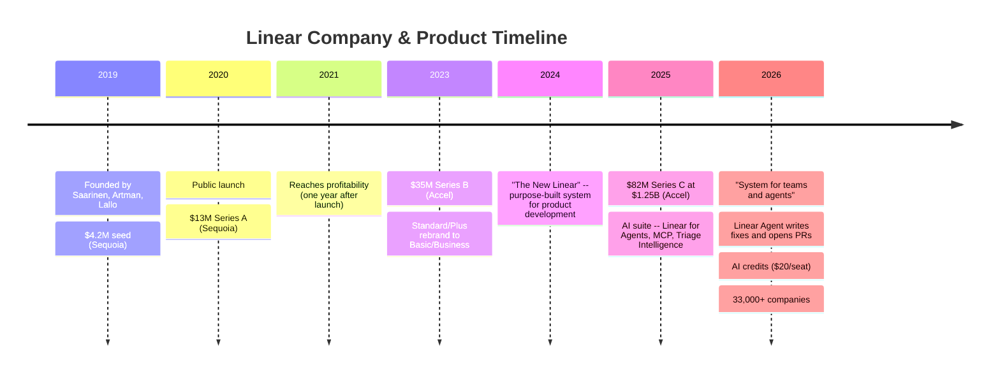
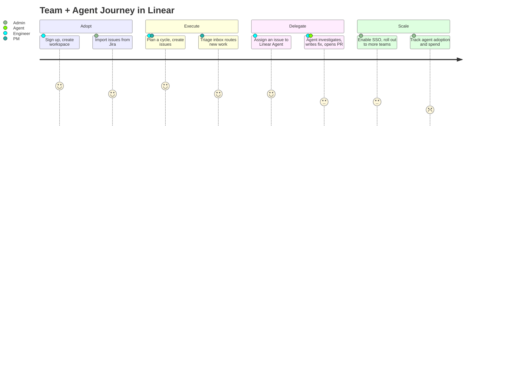
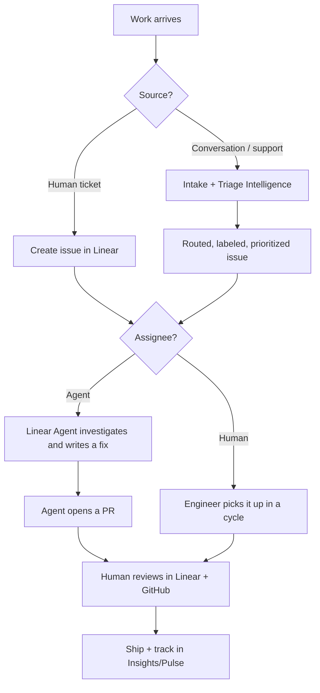
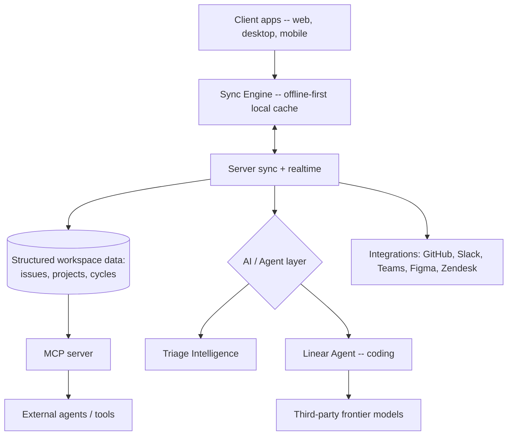
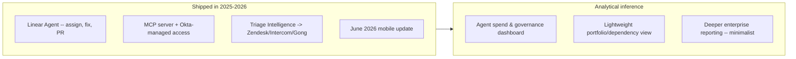

# ⚡ Day 18 — Linear: Betting the Issue Tracker Becomes the "System for Teams *and* Agents"

**PM Case Study Series — Day 18 | Author: Gaurav Singh | Product: Linear | Company: Linear Orbit, Inc. (private)**

---

## 📇 Repository Metadata

| Field | Value |
|---|---|
| Series | 30-Day PM Case Study Challenge |
| Day | 18 |
| Product | Linear (Issues, Cycles, Projects, Initiatives, Triage, Linear Agent, MCP) |
| Domain | Developer Tooling / Product-Development System / AI-Native Workflow |
| Primary Competitors | Jira (Atlassian), Asana, ClickUp, Monday.com, Shortcut, Height, GitHub Issues |
| Analysis Date | July 2026 |
| Status | ✅ README Complete (65/65 sections) · ⏳ LinkedIn post pending |

> **Revision note:** This case study was rebuilt from an auto-generated draft. Corrections are logged in the [Appendix](#appendix) — including a fabricated investor list and missing founders in the original.

---

## 🏷️ Badges

---

## 📚 Table of Contents

1. [Executive Summary](#executive-summary)
2. [Product Overview](#product-overview)
3. [Company Background](#company-background)
4. [Product Timeline](#product-timeline)
5. [Vision & Mission](#vision--mission)
6. [Problem Statement](#problem-statement)
7. [Market Research](#market-research)
8. [Industry Analysis](#industry-analysis)
9. [TAM / SAM / SOM](#tam--sam--som)
10. [Competitor Analysis](#competitor-analysis)
11. [SWOT](#swot)
12. [Porter's Five Forces](#porters-five-forces)
13. [Business Model Canvas](#business-model-canvas)
14. [Revenue Model](#revenue-model)
15. [Target Users](#target-users)
16. [Personas](#personas)
17. [Jobs To Be Done](#jobs-to-be-done)
18. [User Journey](#user-journey)
19. [User Flow](#user-flow)
20. [Information Architecture](#information-architecture)
21. [UX Audit](#ux-audit)
22. [UI Audit](#ui-audit)
23. [Accessibility](#accessibility)
24. [Feature Breakdown](#feature-breakdown)
25. [AI Capabilities](#ai-capabilities)
26. [Product Metrics](#product-metrics)
27. [North Star Metric](#north-star-metric)
28. [Product Analytics](#product-analytics)
29. [AARRR](#aarrr)
30. [HEART](#heart)
31. [Growth Strategy](#growth-strategy)
32. [Growth Loops](#growth-loops)
33. [Network Effects](#network-effects)
34. [Product Strategy](#product-strategy)
35. [Monetization](#monetization)
36. [Trust & Safety](#trust--safety)
37. [Technical Architecture](#technical-architecture)
38. [Data Flow](#data-flow)
39. [API Ecosystem](#api-ecosystem)
40. [Privacy & Security](#privacy--security)
41. [Pain Points](#pain-points)
42. [Opportunity Mapping](#opportunity-mapping)
43. [RICE Prioritization](#rice-prioritization)
44. [MoSCoW](#moscow)
45. [Kano](#kano)
46. [Feature Proposal](#feature-proposal)
47. [PRD — Agent Spend & Governance Dashboard](#prd--agent-spend--governance-dashboard)
48. [Wireframes](#wireframes)
49. [Rollout Plan](#rollout-plan)
50. [A/B Testing](#ab-testing)
51. [KPI Dashboard](#kpi-dashboard)
52. [Product Roadmap](#product-roadmap)
53. [Risks & Mitigation](#risks--mitigation)
54. [Future Vision](#future-vision)
55. [PM Lessons](#pm-lessons)
56. [PM Interview Questions](#pm-interview-questions)
57. [References](#references)
58. [About the Author](#about-the-author)
59. [License](#license)
60. [Self Review](#self-review)
61. [Appendix](#appendix)

---

## 🧭 Executive Summary

**Objective:** Analyze how Linear grew from an opinionated, keyboard-first Jira alternative into a self-described *"product development system for teams and agents,"* and whether that repositioning is a genuine strategic moat or a marketing layer on top of a great issue tracker.

**Context:** Founded in 2019, Linear built its reputation on speed, craft, and a minimalist, keyboard-driven interface powered by its proprietary offline-first **Sync Engine**. In June 2025 it raised an **$82M Series C at a $1.25B valuation** (led by Accel; total funding ~$134.2M) and disclosed it had been profitable since 2021. Through 2025–2026 it pivoted its core identity toward AI: treating AI agents as *first-class citizens* that can be assigned issues, investigate bugs, write fixes, and open PRs. As of mid-2026 Linear reports **over 33,000 companies** use the product (20,000+ paying business customers per its COO), including OpenAI, Scale AI, Perplexity (Day 15), Ramp, Cash App, and Vercel.

**Key PM insight:** Linear's bet is that as coding agents (Cursor — Day 16 — Devin, Claude Code, Codex) commoditize the *act of writing code*, the scarce resource becomes **coordination and shared context** — and whoever owns the structured "ground truth" that both humans and agents plan against owns the workflow. Linear is trying to be that layer. Its own claim that **78% of its enterprise workspaces have adopted agents** is the single most important data point for whether the "for agents" thesis is real demand or aspiration.

**Facts vs. estimates (per Research Rules):**

- ✅ **Verified facts:** founders and founding year, funding rounds and valuation, current pricing and tiers, positioning/tagline, AI feature set (Linear Agent, Triage Intelligence, MCP), customer count and named customers, profitability-since-2021 claim.
- ⚠️ **Reported / estimate / disclosure gap:** ARR figures (~$20M+ with 200%+ YoY growth are secondary-source estimates, not officially disclosed); "profits grew 280% last year" is company-reported via press; exact Series B month varies by source; MAU, retention cohorts, and formal market-size figures are **not publicly disclosed**.
- 💡 **Personal recommendations:** clearly labeled in the Feature Proposal and Recommendation sections.

---

## 🔎 Product Overview

Linear is a fast, opinionated product-development system for software teams — issue tracking, sprint cycles, projects, roadmaps, and initiatives — now extended so that AI agents work from the same structured context as humans.

Core surfaces as of mid-2026:

| Surface | What it is |
|---|---|
| Issues & Triage | Issue tracking with rich context, custom fields, automated workflows, and an intake/triage inbox |
| Cycles | Sprint planning with velocity tracking |
| Projects & Milestones | Scoped bodies of work with deadlines |
| Initiatives & Roadmaps | Higher-level planning above projects (now with priority, labels, statuses) |
| Insights & Pulse | Progress dashboards, analytics, and project-health signals |
| Triage Intelligence | AI that routes, labels, and prioritizes incoming issues and merges duplicates |
| Linear Agent | An AI agent that can triage, investigate a cause, write a fix, open a PR, and return it for review — inside Linear |
| MCP server | Lets external AI models/agents pull Linear context and act on it (Okta-managed access available) |
| Integrations | Deep GitHub/GitLab, Slack, Microsoft Teams, Figma (Day 17), Zendesk, Intercom, Gong, Zapier |

> **PM Insight:** Linear's expansion mirrors the pattern seen across this series (Perplexity — Day 15, Cursor — Day 16, Figma — Day 17): a sharply-defined core tool methodically growing an AI surface. The twist is that Linear isn't just adding AI *features* — it's redefining the *unit of work* so an agent can be an assignee, not just an assistant.

---

## 🏢 Company Background

- **Founded:** 2019, by **Karri Saarinen** (CEO, previously design at Airbnb, Coinbase, and Uber), **Tuomas Artman** (CTO), and **Jori Lallo** (co-founder). Legal entity: Linear Orbit, Inc. Remote-first, headquartered in San Francisco.
- **Origin thesis:** frustrated with slow, over-configurable legacy tools, the founders built a minimalist, keyboard-driven tracker prioritizing speed and developer experience — reducing the context-switching and overhead that plague engineering teams.
- **Funding history:** ~$4.2M seed (Sequoia, 2019) → $13M Series A (Sequoia, Dec 2020) → **$35M Series B (Accel, 2023, reported ~$400M valuation)** → **$82M Series C (Accel, June 10, 2025, $1.25B valuation)**. Total ~$134.2M. The Series C included primary *and* secondary funding, with Sequoia and 01A continuing and new backers Seven Seven Six, Designer Fund, and angels Jeff Weinstein, Ilkka Paananen, and Lauren & Vlad Loktev.
- **Financials:** profitable since 2021 (one year after launch); the company describes a "negative lifetime burn rate" (holding more cash than it has raised). Press reports (via Reuters) cite profits growing ~280% in the prior year. Secondary sources estimate ARR of ~$20M+ with 200%+ YoY growth as of mid-2025 — **treated as an estimate, not an official disclosure.**
- **Team & scale:** ~140 employees (mid-2026, up from ~80 in 2025); **over 33,000 companies** use Linear (per its site), of which **20,000+ are paying business customers** (per COO Cristina Cordova, June 2026), up from 15,000 total at the June 2025 raise. Named customers include OpenAI, Scale AI, Perplexity, Ramp, Cash App, Vercel, Supercell, and Loom.

---

## 🗓️ Product Timeline

---

## 🌟 Vision & Mission

- **Mission (stated):** "To inspire and accelerate builders."
- **Current positioning (official):** *"The product development system for teams and agents."* Linear frames the rise of autonomous coding agents as a shift its competitors weren't built for: it aims to be the shared environment where humans and agents "work from the same context, priorities, and structure."
- **Strategic vision (analytical inference, not an official statement):** Own the structured "ground truth" that AI-native product teams plan and build against — becoming the coordination layer above a world of proliferating agents, rather than a single agent competing to write code.

---

## ❓ Problem Statement

- **User problem:** Legacy trackers (Jira especially) are slow, over-configurable, and heavy — teams spend time administering the tool instead of shipping. Linear's original wedge was removing that friction with speed and opinionated defaults.
- **Market problem (2026-specific):** As coding agents make *writing* code cheap and abundant, the bottleneck shifts to **coordination** — routing work, maintaining context, and keeping humans and agents aligned on the same source of truth. Tools designed only for human ticket entry leave that work "disconnected and hard to align" (Linear's framing).
- **Why it matters:** Whoever owns the structured planning layer that agents read from and write to is positioned to become infrastructure for AI-native software development — a far larger prize than issue tracking alone.

---

## 📊 Market Research

- **Scale signals:** 33,000+ companies; 20,000+ paying business customers; concentration among AI-native leaders (OpenAI, Scale AI, Perplexity) is itself a positioning signal — the companies building AI prefer tools built for AI-augmented workflows.
- **Agent adoption:** Linear reports **78% of its enterprise workspaces have adopted agents** — the strongest available evidence that the "for agents" repositioning reflects real usage, not just messaging.
- **Internal dogfooding as proof point:** In early 2026 Linear standardized its own engineers on AI coding agents; it reported ~30% more PRs and ~33% more issues closed per author month-over-month, and says over 50% of triage-agent-generated PRs are mergeable.
- **Pricing power via simplicity:** Linear has held a stable two-paid-tier structure for years (renaming Standard/Plus → Basic/Business ~2024) and nudged seat prices from $8/$12 toward $10/$16 while adding AI — a deliberate "predictability beats a token meter" stance.

---

## 🏭 Industry Analysis

**Framework used:** *Jobs-shifting-under-AI lens* — chosen because Linear's whole strategy rests on a claim about *where the bottleneck is moving* (from writing code to coordinating agents), which is more instructive here than a static market-share view.

- **Tailwind:** AI agents are becoming embedded directly in product-development workflows; developer preference continues shifting toward fast, opinionated tools over configurable legacy suites; issue tracking, roadmapping, and code review are consolidating into a single workflow surface.
- **Structural bet:** By making an agent a *first-class assignee*, Linear treats its database as the ground truth for AI-led development — a genuinely different bet than bolting a chatbot onto a tracker.
- **Counter-risk:** The dominant incumbent (Atlassian/Jira) has vastly more volume and can bundle AI at enterprise scale; and Linear's minimalist philosophy — its greatest strength with developers — is also the ceiling on its expansion into non-technical and heavily-regulated enterprise buyers who want Gantt charts, deep reporting, and portfolio views Linear deliberately omits.

---

## 📐 TAM / SAM / SOM

*Directional; Linear has not published formal market-size figures.*

| Layer | Definition | Directional framing |
|---|---|---|
| **TAM** | Global software project-management + emerging AI-native product-development tooling | The project-management/dev-tools category is large and expanding as AI-assisted development goes mainstream; no single authoritative sizing figure was found in research reviewed |
| **SAM** | Software engineering, product, and design teams at startups and high-growth tech companies wanting a fast, developer-centric tool | Reflected in Linear's 33,000+ companies and explicit non-target of non-technical teams (marketing, sales, HR) |
| **SOM** | Linear's realistic near-term capture | 20,000+ paying business customers; expansion driven by team growth and feature/agent adoption rather than usage metering |

> **PM Insight:** Linear's tightest constraint on TAM is self-imposed. Its "opinionated simplicity" wins developers but explicitly excludes the non-technical and large-enterprise segments that make Jira's TAM enormous. The strategic question is whether the "for agents" wedge lets it expand *into* enterprise on its own terms — without diluting the simplicity that got it there.

---

## ⚔️ Competitor Analysis

| Dimension | Linear | Jira (Atlassian) | Asana | ClickUp | Shortcut |
|---|---|---|---|---|---|
| Core wedge | Speed + opinionated dev workflow + agents as first-class citizens | Deep configurability, enterprise ubiquity | Cross-functional work management | All-in-one, feature-dense | Developer-focused, simpler than Jira |
| Target user | Software/product/design teams at tech companies | Everyone, esp. large enterprises | Broad, incl. non-technical | Broad SMB→mid-market | Software teams |
| Pricing (list) | Free / $10 (Basic) / $16 (Business) / custom | ~$8.15/user/mo Standard + marketplace add-ons | ~$10.99+/user/mo | ~$7+/user/mo | ~$8.50/user/mo |
| AI/agents | Linear Agent, Triage Intelligence, MCP; agents included in seats | Atlassian Intelligence / Rovo bundled at scale | AI features added | AI add-ons | Lighter AI story |
| Key strength | Craft, speed, developer love, AI-native positioning | Scale, breadth, enterprise entrenchment, volume discounts | Cross-team breadth | Feature breadth at low price | Simplicity for devs |
| Key weakness | No Gantt/time-tracking/portfolio views; per-seat cost at scale; caps non-technical expansion | Configuration overhead, slower UX, "AI slop" perception | Less developer-native | Feature sprawl | Smaller ecosystem |

**Strategic insight:** Linear is "winning the battle for the next generation of AI-native companies" (its concentration among OpenAI, Scale AI, Perplexity supports this), while Atlassian retains the market by sheer volume. Linear's defensible differentiation is *taste + speed + agent-native structure*; its exposure is that Atlassian can copy AI features and bundle them into contracts Linear can't reach.

**Differentiation opportunities:** deepen MCP as the interoperability standard so agents across the stack treat Linear as ground truth; keep the agent experience clearly better (not just present) than incumbents' bolt-ons.

---

## 🧩 SWOT

| | Helpful | Harmful |
|---|---|---|
| **Internal** | **Strengths:** Extremely fast, keyboard-driven UI developers love; proprietary Sync Engine (offline-first); profitable since 2021 with a lean team; strong PMF with startups and AI-native leaders; agents as first-class citizens | **Weaknesses:** No Gantt charts, time tracking, or resource-allocation/portfolio views; limited reporting depth vs. Jira for large orgs; mobile historically well behind desktop; per-seat cost scales linearly with headcount |
| **External** | **Opportunities:** Expand Linear Agent as agent-assisted development goes mainstream; grow enterprise footprint (SAML/SCIM, SOC 2) without diluting simplicity; MCP as an interoperability moat; international expansion | **Threats:** Atlassian bundling AI at enterprise scale; enterprise buyers demanding features outside Linear's minimalist philosophy; new AI-native entrants targeting the same niche; dependency on third-party frontier models for the coding agent (see Trust & Safety) |

---

## 🏛️ Porter's Five Forces

**Why this framework:** Linear sits between a dominant incumbent, a crowded field of work-management tools, and an emerging layer of AI agents — Five Forces cleanly separates these pressures.

| Force | Intensity | Reasoning |
|---|---|---|
| Competitive rivalry | 🔴 High | Jira, Asana, ClickUp, Monday, Shortcut, Height all compete; Atlassian dominates by volume |
| Threat of new entrants | 🟡 Medium-high | AI-native tools can spin up quickly; but Linear's craft, speed, and Sync Engine are hard to match |
| Supplier power | 🟡 Medium | The coding agent depends on third-party frontier models (e.g., Claude Code, Codex) — a real dependency, mitigated by being model-flexible |
| Buyer power | 🟡 Medium | Switching costs are real once workflows and history live in Linear, but per-seat pricing draws scrutiny at scale ("costly per person") |
| Threat of substitutes | 🟡 Medium | Free options (GitHub Issues) and all-in-one suites substitute at the low end; agents could reshape what a "tracker" even is |

> **PM takeaway:** The supplier-power force is unusually live for Linear right now. Because Linear Agent's code-writing relies on frontier models, its capability is partly gated by those models' availability — a dependency made concrete in mid-2026 (see Trust & Safety).

---

## 🎨 Business Model Canvas

| Block | Summary |
|---|---|
| Customer segments | Software engineering, product, and design teams at startups and high-growth tech companies; increasingly larger enterprises; explicitly *not* non-technical teams |
| Value propositions | Speed and craft; opinionated, low-config workflow; agents and humans working from one structured source of truth |
| Channels | Product-led self-serve signup; sales-assisted enterprise; strong developer word-of-mouth and community |
| Customer relationships | Self-serve for small teams; enterprise sales/success + migration support for large accounts |
| Revenue streams | Per-seat subscriptions (Basic/Business/Enterprise); AI credits layered on paid seats |
| Key resources | Proprietary Sync Engine; brand/taste; agent + MCP platform; profitable balance sheet |
| Key activities | Product craft and speed; AI/agent development; enterprise readiness (SOC 2, SSO) |
| Key partners | Frontier model providers (for the coding agent); GitHub/GitLab, Slack, Teams, Figma, Zendesk, Intercom, Gong |
| Cost structure | Lean R&D (small team); inference costs for AI/agent features; cloud infra |

> **Why this framework:** BMC highlights Linear's most distinctive choice — a *lean cost structure and profitability* alongside high growth, which is rare among venture-backed dev tools and gives it optionality most competitors lack.

---

## 💰 Revenue Model

Per-seat SaaS across four tiers (verified against Linear's live pricing page and multiple 2026 sources):

| Tier | Price (per user/mo) | Billing | Highlights |
|---|---|---|---|
| Free | $0 | — | Unlimited members, 2 teams, 250 non-archived issues (hard cap), 10 MB uploads, GitHub/Slack integrations, AI agents included |
| Basic | $10 | Annual (monthly at a premium) | 5 teams, unlimited issues, admin roles, full API |
| Business | $16 | Annual | Unlimited teams, private teams, guests, Triage Intelligence, Linear Agent automations (beta), Code Intelligence (beta), Insights, Asks, Zendesk/Intercom |
| Enterprise | Custom | Annual only | SAML/SCIM, granular admin controls, enterprise security, advanced org modeling, migration/onboarding, priority support |

- **AI monetization:** AI agents are **included in paid seats with no separate AI subscription**. Linear layers a credit model on top — reported as **$20 in AI credits per seat** for paid workspaces to power the coding agent (which writes code and opens PRs). This is a deliberate "predictability and adoption over a token meter" stance.
- **The Free→paid trigger is a *capacity cap*, not a feature wall:** the 250-issue limit (not a feature paywall) is what converts teams once they genuinely outgrow the workspace — aligning the upgrade moment with realized value.
- **Constraints:** annual billing on all paid tiers (monthly at an unpublished ~15–20% premium); no published volume discounts below Enterprise; no student/nonprofit tier.

> **PM Insight:** Bundling agents into seats (rather than metering AI aggressively) is a bet that trust and adoption compound faster than incremental token revenue — the mirror image of the usage-based-billing tension seen with Cursor (Day 16) and Figma's AI credits (Day 17). Linear is wagering that predictability *is* the monetization advantage.

---

## 👥 Target Users

- **Software engineers** — the original and still-core audience; the reason for keyboard-first speed.
- **Product managers** — increasingly served directly (e.g., turning meeting transcripts into issues or PRDs via the agent).
- **Designers** — via the Figma plugin and shared workflows.
- **Engineering/product leadership at enterprises** — via Insights, Pulse, and enterprise governance.
- **AI agents** — treated as first-class actors that read and write Linear context via MCP.
- **Explicit non-target:** non-technical teams (marketing, sales, HR) — a deliberate scoping choice.

---

## 🧑‍💼 Personas

*Analytical constructs based on publicly described use cases — not Linear's internal research.*

**1. Aditi, 29 — Staff Engineer at a Series B AI startup (Bengaluru)**
Lives in the keyboard shortcuts; assigns routine bugs to the Linear Agent and reviews its PRs. Pain: keeping human and agent work aligned without status-meeting overhead. Represents the "agents as teammates" workflow directly.

**2. Daniel, 34 — Product Manager, non-engineer (Berlin)**
Turns customer calls and Slack threads into structured, routed issues; drafts PRDs with the agent. Pain: getting from messy conversation to prioritized work without bugging engineers.

**3. Meera, 45 — Director of Engineering Ops at a scaling enterprise (Mumbai)**
Manages 300+ seats, SSO, and now agent adoption across teams. Pain: no forward visibility into *AI/agent spend* as credit-consuming agents proliferate — the exact persona the Feature Proposal targets.

---

## 🎯 Jobs To Be Done

| Job | Functional | Emotional | Social |
|---|---|---|---|
| "Help my team move fast without tool overhead" | Keyboard-first speed, sensible defaults | Feel unblocked, in flow | Look like a modern, high-velocity team |
| "Turn scattered requests into structured, routed work" | Triage + intake + Triage Intelligence | Reduce anxiety about dropped work | Demonstrate crisp execution to leadership |
| "Let agents and humans build from one source of truth" | Agent-as-assignee, MCP context | Trust that AI work stays coordinated | Signal an AI-native operating model |

> **Why JTBD here:** Linear's users span engineers, PMs, and (now) agents — JTBD explains why they converge on the same tool: the constant job is *coordinate and execute product work with minimal noise*, regardless of who (or what) does the work.

---

## 🗺️ User Journey

---

## 🔀 User Flow

---

## 🏗️ Information Architecture

- **Workspace → Teams → Projects → Issues** — the core hierarchy; teams are organizational units, not billing units.
- **Cycles** — time-boxed sprints layered over issues.
- **Initiatives → Projects** — higher-level planning above projects.
- **Triage inbox** — dedicated intake surface for incoming/unrouted work.
- **Insights / Pulse** — analytics and project-health surfaces.
- **Agent surfaces** — the agent operates within issues and integrates via MCP, rather than living in a separate silo.

> **PM Insight:** Consistent with Perplexity's Spaces (Day 15), Cursor's Agents Window (Day 16), and Figma's AI surfaces (Day 17), Linear gives AI its own first-class footing — but uniquely embeds the agent *into the existing issue object* as an assignee, rather than a separate panel.

---

## 🔍 UX Audit

**Strengths:**
- Keyboard-driven, low-latency UI is consistently praised — reviewers call it "by far the best issue tracker" they've used, and some engineers say they'd resist switching away from it.
- Sync Engine makes interactions feel instant, even on poor connections — a genuine technical differentiator.
- Low-configuration onboarding: sign up, create a workspace, import, and start immediately — speed-first by design.

**Weaknesses:**
- Deliberate omissions (no Gantt, no time tracking, no portfolio views) frustrate larger/cross-functional orgs.
- Reporting/dashboard depth trails Jira for big organizations managing complex multi-epic dependencies.
- The Free tier's 250-issue hard cap blocks new issue creation with no grace period — effective as a conversion lever, occasionally jarring as an experience.

---

## 🎨 UI Audit

- Minimalist, high-contrast, dark-mode-friendly aesthetic that has become a category reference point ("software craftsmanship").
- The June 25, 2026 mobile update strengthened "capture work anywhere," narrowing (though not closing) the long-standing desktop-vs-mobile gap.
- Agent output appears in-context on issues rather than in a separate chat, keeping the UI's single-source-of-truth feel intact.

---

## ♿ Accessibility

- No detailed public WCAG conformance statement specific to Linear was found in research reviewed — an explicit disclosure gap.
- The keyboard-first design is a genuine accessibility asset for keyboard and power users; however, heavy reliance on shortcuts and dense, low-chrome UI can raise discoverability challenges for some users.
- Research reviewed did not surface strong evidence either way on screen-reader conformance — disclosed rather than assumed.

---

## 🧱 Feature Breakdown

| Feature | Tier | Purpose |
|---|---|---|
| Issue tracking + custom fields + workflows | Free+ | Core work object |
| Cycles | Free+ | Sprint planning + velocity |
| Projects & milestones | Free+ | Scoped delivery |
| Initiatives & roadmaps | Free+ | Higher-level planning |
| Triage + intake | Free+ | Capture and route incoming work |
| Insights / Pulse | Business+ | Analytics and project health |
| Triage Intelligence | Business+ | AI routing, labeling, dedup |
| Linear Agent (automations, coding) | Business+ (credits) | Agent as assignee: investigate, fix, PR |
| Code Intelligence (beta) | Business+ | AI over the codebase context |
| MCP server | Included | External agents read/write Linear context |
| SAML / SCIM / audit logs | Enterprise | Identity and governance |

---

## 🤖 AI Capabilities

- **Linear Agent:** can be assigned an issue, investigate the cause, write a fix, open a PR, and bring it back for review — all shared with the team in Linear. Non-engineering uses include turning meeting transcripts into issues or drafting PRDs.
- **Triage Intelligence:** AI that routes, labels, prioritizes, and merges duplicate incoming issues; extended in December 2025 to parse conversations and call transcripts from Intercom, Zendesk, and Gong.
- **MCP support:** Linear is among the first major enterprise tools to support the Model Context Protocol, letting external agents (and Slackbot) pull Linear context and act on it, with Okta-managed access for enterprises.
- **AI credits:** paid workspaces get AI credits per seat (reported ~$20/seat) to power the coding agent, rather than a separate AI subscription.
- **Model dependency (flexible):** the coding agent runs on third-party frontier models; Linear positions itself as model-flexible rather than tied to a single provider.

> **PM Insight:** The strongest signal that this isn't AI theater is Linear's own internal data — after standardizing engineers on coding agents in early 2026, it reported ~30% more PRs and ~33% more issues per author, with >50% of triage-agent PRs mergeable. A company shipping *its own* product with agents is a credible proof point for the "for agents" thesis.

---

## 📈 Product Metrics

*Linear is private and discloses far less than the public companies earlier in this series. Figures below are company-stated or clearly labeled as third-party estimates.*

| Metric | Value | Note |
|---|---|---|
| Companies using Linear | 33,000+ | Linear's site, mid-2026 |
| Paying business customers | 20,000+ | Per COO, June 2026 |
| Valuation | $1.25B | Series C, June 2025 |
| Total funding | ~$134.2M | Crunchbase |
| Profitability | Profitable since 2021 | Company-stated |
| Profit growth | ~280% prior year | Reported via Reuters |
| Enterprise agent adoption | 78% of enterprise workspaces | Company-stated |
| ARR | ~$20M+ (200%+ YoY) | Secondary estimate, **not officially disclosed** |
| Google Play rating | ~4.7/5 (~1k reviews) | App-store reported |
| MAU / retention cohorts | **Not publicly disclosed** | Disclosure gap |

---

## ⭐ North Star Metric

**Proposed North Star (analytical, not company-disclosed):** *Weekly Active Workspaces Where Both Humans and Agents Complete Work Items* — i.e., workspaces where the human-plus-agent workflow is genuinely in use, not just enabled.

**Why:** Linear's entire strategic thesis is that it becomes the shared system for teams *and* agents. Tracking joint human+agent throughput (not seats or issues alone) most directly measures whether that thesis is being realized rather than merely marketed — the 78% "agents adopted" figure is a start, but *active joint completion* is the sharper diagnostic.

---

## 📊 Product Analytics

*Recommended instrumentation (analytical recommendation, not disclosed):*
- Agent-assigned issues → mergeable-PR rate, segmented by team.
- AI credit consumption per seat/team/agent per cycle (supports the Feature Proposal).
- Time-from-intake-to-routed-issue with vs. without Triage Intelligence.
- Free→Basic conversion timing relative to hitting the 250-issue cap.

---

## 🔁 AARRR

| Stage | Linear mechanism |
|---|---|
| Acquisition | Developer word-of-mouth; AI-native brand; generous free tier |
| Activation | First cycle created / first issue routed / first agent assignment — fast, visible value |
| Retention | Workflow + history + Sync Engine lock-in; agents deepen daily reliance |
| Referral | Strong developer advocacy ("I'd leave if we switched off Linear") |
| Revenue | Free→Basic on the 250-issue cap; Basic→Business for teams/private/AI; Enterprise for SSO/governance |

---

## ❤️ HEART

| Dimension | Application |
|---|---|
| Happiness | Strong praise signals: Slack/GitHub integration, "best issue tracker," fast responsive UI (public review sentiment) |
| Engagement | Cycle usage, agent assignments, triage throughput (recommended instrumentation) |
| Adoption | 78% enterprise agent adoption; Free→paid conversion at the issue cap |
| Retention | Not publicly disclosed; inferred strong from developer loyalty and switching costs |
| Task Success | Low-config onboarding: sign up → workspace → import → create issues immediately |

---

## 🚀 Growth Strategy

**Framework:** *Product-Led Growth + Land-and-Expand into Enterprise.* Teams start self-serve, hit the issue cap, convert, then expand seats and tiers as they grow and adopt agents.

- **Bottom-up PLG:** developer love drives organic adoption; low CAC.
- **Capacity-cap conversion:** the 250-issue Free limit aligns the upgrade moment with realized value.
- **Enterprise expansion:** SOC 2, SSO/SCIM, Insights, and migration support move Linear up-market without a heavy sales motion — while "for agents" gives it a differentiated enterprise narrative.

---

## ➰ Growth Loops

---

## 🌐 Network Effects

- **Within-workspace:** value rises as more of a team's work, history, and context live in Linear — and now as agents operate on that shared context.
- **Ecosystem via MCP:** as more external agents and tools treat Linear as ground truth, Linear becomes more valuable as the interoperability layer, independent of its own agent quality.
- **Note:** these are moderate, workspace-scoped effects (like most B2B tools), not marketplace-scale network effects — disclosed to avoid overstating.

---

## 🧠 Product Strategy

Linear's 2025–2026 strategy reads as *"keep the craft, redefine the unit of work for agents, and become the ground truth the AI-native stack plans against."*

1. Protect the core: speed, craft, Sync Engine — the reason developers love it.
2. Make agents first-class assignees, not bolt-on chat.
3. Standardize on MCP to become interoperable ground truth for external agents.
4. Move up-market (SOC 2, SSO, Insights) without diluting simplicity.

---

## 💵 Monetization

Detailed in [Revenue Model](#revenue-model). Strategic point: Linear monetizes seats and layers AI credits on top, deliberately *avoiding* aggressive AI metering. Its stated posture is that predictability and adoption beat incremental token revenue, preserving the trust that underpins developer love. It's the counter-position to the usage-based-billing friction seen at Cursor (Day 16).

---

## 🛡️ Trust & Safety

- **Model-supplier dependency (concrete example):** In mid-2026, following a U.S. export-control directive and Anthropic's related announcement, Linear temporarily suspended access to a specific Anthropic model (Claude Fable 5) within Linear Agent's coding sessions, auto-failing affected workspaces over to alternatives. This is a clean, real illustration of the supplier-power risk: the coding agent's capability partly depends on frontier-model availability and external regulation. *(Reported factually; policy context is outside this case study's scope.)*
- **Agent output trust:** as agents write code and open PRs, the "does the reviewer understand what's being merged" concern (raised for Cursor's Composer, Day 16) applies structurally — Linear mitigates by keeping a human PR-review step in the loop.
- **No specific trust incident** (e.g., a hallucinated support-agent event) was found in research reviewed for Linear — a research gap, disclosed rather than assumed clean.

---

## 🏗️ Technical Architecture

*Analytical/inferred from public descriptions — Linear has not published a detailed architecture diagram.*

---

## 🔄 Data Flow

1. A user (or integration) creates or captures work; edits are applied locally first via the Sync Engine for instant feel.
2. Changes sync to the server and propagate in real time to collaborators.
3. Triage Intelligence routes/labels/prioritizes incoming work.
4. An issue can be assigned to a human or the Linear Agent; the agent reads structured context, investigates, writes a fix, and opens a PR (consuming AI credits).
5. Humans review the PR in Linear + GitHub; results feed Insights/Pulse.
6. MCP exposes the same structured context to external agents, subject to permissions.

---

## 🔌 API Ecosystem

| Surface | Purpose |
|---|---|
| MCP server | External agents read/write Linear context (Okta-managed access available) |
| GraphQL API | Full programmatic access to workspace data |
| Webhooks | Event-driven integrations |
| Native integrations | GitHub/GitLab, Slack, Microsoft Teams, Figma, Zendesk, Intercom, Gong, Zapier |
| Agent APIs | Delegate issues to coding agents and receive PRs back |

> **PM Insight:** Like Figma's MCP strategy (Day 17), Linear's MCP support is an outward-facing bet — become the structured context layer other agents depend on, rather than trying to own every agent itself.

---

## 🔒 Privacy & Security

- Enterprise-grade security built in: **SOC 2**, SSO, audit logs, and granular permissions (per Linear's enterprise page); SAML/SCIM gated to Enterprise.
- Private teams and guest access (Business+) support least-privilege collaboration.
- Specific certification breadth beyond SOC 2 (e.g., ISO 27001) was not independently confirmed in research reviewed — an explicit disclosure gap.

---

## 🚧 Pain Points

- **No Gantt charts, time tracking, or resource-allocation/portfolio views** — deliberate omissions that block some enterprise use cases.
- **Reporting/dashboard depth** trails Jira for large orgs with complex multi-epic dependencies.
- **Scalability concerns** for orgs beyond ~100 people managing heavy cross-team dependencies.
- **Mobile parity** historically lagged desktop (no inline iOS editing, missing saved views, no list/board switching) — partly addressed by the June 2026 mobile update but not fully closed.
- **Per-seat cost at scale** and **annual-only paid billing** draw budget scrutiny; no volume discounts below Enterprise.
- **Model dependency** for the coding agent introduces availability risk (see Trust & Safety).

---

## 🎯 Opportunity Mapping

| Opportunity | Impact | Effort |
|---|---|---|
| Agent spend & governance controls for admins | High | Medium |
| Lightweight portfolio/dependency view (without going full Gantt) | High | Medium-High |
| Deeper enterprise reporting while preserving simplicity | Medium | Medium |
| MCP ecosystem partnerships (ground-truth positioning) | High | Medium |
| Continued mobile parity | Medium | Medium |

---

## 📐 RICE Prioritization

| Feature | Reach | Impact | Confidence | Effort | RICE |
|---|---|---|---|---|---|
| Agent spend & governance dashboard | 7 | 3 | 0.8 | 4 | **4.2** |
| Portfolio/dependency view | 6 | 3 | 0.6 | 6 | **1.8** |
| Deeper enterprise reporting | 6 | 2 | 0.7 | 5 | **1.68** |
| Continued mobile parity | 8 | 2 | 0.8 | 4 | **3.2** |

*Illustrative PM exercise, not company data. RICE = Reach × Impact × Confidence ÷ Effort. Verified: 7×3×0.8/4 = 4.2; 6×3×0.6/6 = 1.8; 6×2×0.7/5 = 1.68; 8×2×0.8/4 = 3.2.*

---

## 📋 MoSCoW

| Priority | Item |
|---|---|
| Must have | Reliable core issue tracking, cycles, triage, agent-as-assignee |
| Should have | Agent spend/governance controls; continued mobile parity; enterprise reporting depth |
| Could have | Portfolio/dependency visualization; native time tracking |
| Won't have (now) | Full Gantt/resource-management suite (conflicts with the minimalist philosophy) |

---

## 😊 Kano

| Feature | Category |
|---|---|
| Speed / keyboard-first UI | Basic (expected — the reason Linear exists) |
| Triage Intelligence / routing | Performance (more accuracy = more satisfaction) |
| Linear Agent (writes fixes, opens PRs) | Delighter (novel, differentiating) |
| Agent spend visibility | Currently absent — would move from Dissatisfier (surprise costs) toward expected if built |

---

## 💡 Feature Proposal

**Proposal: "Agent Spend & Governance Dashboard" — admin controls for AI/agent consumption.**

- **User impact:** Gives admins (like Meera) forward visibility into AI-credit and agent consumption per team/agent, with budgets and alerts — before overage or surprise costs hit, as agents proliferate across an enterprise (78% already adopt them).
- **Business impact:** Reduces a real adoption blocker (unpredictable AI cost) for exactly the enterprise expansion Linear's strategy depends on, and turns "agents" from a cost worry into a governed capability.
- **Trade-offs:** Exposing per-agent/per-user consumption risks a surveillance feel — must stay team/budget-focused.
- **Risks:** Over-instrumentation could clutter Linear's minimalist UI; forecasts that are frequently wrong erode trust.
- **Success metrics:** fewer surprise-cost escalations; higher enterprise agent-feature adoption; reduced credit-related support tickets.

> 💡 This is a personal recommendation, not a Linear roadmap item.

---

## 📝 PRD — Agent Spend & Governance Dashboard

**Problem Statement:** As agents that consume AI credits proliferate across an enterprise, admins have no forward-looking view of agent/AI spend per team, making budgeting hard and risking reactive limits that suppress adoption.

**Goals:**
- Give admins predictable visibility and control over AI/agent consumption.
- Support agent adoption (Linear's stated direction) rather than constrain it.

**Success Metrics:** % reduction in surprise-cost escalations; admin-reported forecast usefulness; enterprise agent-adoption trend.

**User Stories:**
- As an eng-ops admin, I want per-team agent/credit consumption trends, so I can budget and set alerts.
- As a finance stakeholder, I want a monthly agent-cost forecast, so AI spend isn't a surprise line item.

**Functional Requirements:** team/agent-level consumption trends; end-of-cycle forecast with confidence range; configurable budget alerts; per-team credit caps (opt-in).

**Non-Functional Requirements:** near-real-time; explainable (not a black box); minimal UI footprint consistent with Linear's aesthetic.

**Acceptance Criteria:** available to Business/Enterprise admins; forecasts validated against actuals within an agreed band; alerts configurable without support.

**Risks:** UI clutter; forecast inaccuracy; surveillance perception.

**Rollout Plan:** see [Rollout Plan](#rollout-plan).

---

## 🖼️ Wireframes

*Image prompts prepared per Image Generation Guide standards (modern, minimal, professional, GitHub-friendly, 16:9). Actual image generation to be completed in the Images phase — note the standing `images/` gap.*

- `wireframe-agent-spend-dashboard.png` — Admin view: agent/credit consumption trend + forecast by team.
- `wireframe-agent-budget-alerts.png` — Budget threshold and alert configuration panel.

---

## 🚦 Rollout Plan

- **Alpha:** internal + a few high-agent-adoption enterprise design partners.
- **Beta:** all Business/Enterprise admins; gather forecast-accuracy feedback.
- **GA:** all paid tiers with agent access; evaluate a simplified per-team view for Basic.
- **Post-launch:** tune the forecast model by usage pattern.

---

## 🧪 A/B Testing

| Test | Hypothesis | Primary Metric |
|---|---|---|
| Spend dashboard vs. none | Visibility reduces surprise-cost escalations and reactive downgrades | Escalation rate |
| Alert default (75% vs. 90% of budget) | Earlier alerts reduce overage without fatigue | Overage rate vs. alert dismissals |

---

## 📊 KPI Dashboard

*Illustrative structure — not live company data.*

| KPI | Target direction |
|---|---|
| Active human+agent completion (North Star) | ↑ |
| Enterprise agent adoption | ↑ (maintain/raise 78%) |
| Surprise agent-cost escalations | ↓ |
| Free→paid conversion at issue cap | ↑ |
| Net revenue retention (if tracked) | ↑ |

---

## 🛣️ Product Roadmap

*Analytical inference — shipped 2026 items plus recommendations. Not an official Linear roadmap.*

---

## ⚠️ Risks & Mitigation

| Risk | Mitigation |
|---|---|
| Atlassian (Jira) bundling AI at enterprise scale | Keep the agent experience clearly better, not just present; lean on craft + MCP interoperability |
| Minimalist philosophy caps enterprise/non-technical expansion | Add enterprise depth (reporting, governance) *without* abandoning simplicity; pick expansions deliberately |
| Reliance on continued dev-tool + AI-agent market growth | Diversify use cases (PMs, non-engineers via agent); deepen stickiness through shared context |
| Frontier-model dependency for the coding agent (availability/regulation) | Stay model-flexible; graceful fallback across providers (as demonstrated mid-2026) |
| Per-seat pricing scrutiny at scale | Enterprise volume terms; keep predictability as a selling point |

---

## 🔮 Future Vision

Linear's trajectory points toward becoming the *operating system for AI-native product development* — the structured ground truth where planning, execution, and agent work converge, with the Sync Engine and MCP as the technical backbone. The open question is whether it can grow up-market and support agent-heavy enterprises without diluting the opinionated simplicity that earned developer devotion in the first place. Its profitability and lean team give it rare freedom to make that bet on its own timeline.

---

## 🎓 PM Lessons

1. **Reposition around where the bottleneck is moving, not where it is.** Linear bet that as code-writing commoditizes, *coordination* becomes scarce — and made agents first-class citizens rather than adding a chatbot. Repositioning the *unit of work* is deeper than adding an AI feature.
2. **A capacity cap can out-convert a feature wall.** Linear's Free tier gives away marquee features (including AI) but caps issues — aligning the upgrade moment with realized value.
3. **Predictability can be the monetization strategy.** Bundling agents into seats (vs. aggressive metering) bets that trust and adoption compound faster than token revenue — the opposite lesson from Cursor's rocky usage-based shift (Day 16).
4. **Profitability buys strategic freedom.** Being profitable with a lean team lets Linear expand on its own terms instead of chasing every enterprise checkbox.
5. **First-class-agent design creates a real supplier dependency.** When agents do core work, model availability becomes a live risk — as Linear's mid-2026 model suspension showed.

---

## 🗣️ PM Interview Questions

1. Linear reframed itself as a system "for teams *and* agents." How would you validate whether that's real demand vs. positioning — what would you instrument beyond a "78% adopted agents" figure?
2. Design admin-facing controls for AI/agent spend without making the product feel like surveillance or cluttering a minimalist UI. What do you expose, and what do you hide?
3. Linear deliberately omits Gantt charts, time tracking, and portfolio views. As a PM, how would you decide whether to add enterprise depth vs. protect the simplicity that drives developer love?
4. Compare Linear's "agents bundled into seats" monetization to Cursor's usage-based billing (Day 16) and Figma's AI credits (Day 17). What conditions make each approach right?

---

## 📚 References

1. Linear — *Building our way: Announcing our Series C* (official) — https://linear.app/now/building-our-way
2. Linear — Pricing (official) — https://linear.app/pricing
3. Linear — Enterprise (official; "78% of enterprise workspaces have adopted agents," SOC 2, 33,000+ teams) — https://linear.app/enterprise
4. TechCrunch — *Atlassian rival Linear raises $82M at $1.25B valuation* — https://techcrunch.com/2025/06/10/atlassian-rival-linear-raises-82m-at-1-25b-valuation/
5. Sacra — *Linear valuation, funding & news* (round history; Sync Engine; Dec 2025 agent integrations) — https://sacra.com/c/linear/
6. Tech Funding News — *Linear rockets to unicorn status* (round history, ~80 employees) — https://techfundingnews.com/linear-rockets-to-unicorn-status-82m-series-c-fuels-1-25b-valuation-in-jira-showdown/
7. Agent Community — *Linear: the product development system for teams and agents* (positioning, MCP, Triage Intelligence) — https://agentcommunity.org/m/linear-2
8. Product School / TLDRecap — *Linear COO Cristina Cordova* (20,000+ paid customers, ~140 people, agent strategy) — https://tldrecap.tech/posts/podcast/product-school/linear-lean-team-impact-cristina-cordova/
9. LeadDev — *AI-coding agents are now the default* (internal dogfooding: +30% PRs, +33% issues; >50% agent PRs mergeable; co-founder Jori Lallo memo) — https://leaddev.com/ai/ai-coding-agents-are-now-the-default-what-comes-next
10. Quackback — *Linear Pricing in 2026* (tiers, caps, gotchas) — https://quackback.io/blog/linear-pricing
11. UsagePricing — *Linear pricing blueprint* (price history $8/$12 → $10/$16; AI on Free) — https://www.usagepricing.com/blueprint/linear
12. checkthat.ai — *Linear Pricing 2026* (tier detail; Jira TCO comparison) — https://checkthat.ai/brands/linear/pricing
13. Product Hunt — Linear (20,000+ companies incl. OpenAI, Ramp, Vercel) — https://www.producthunt.com/products/linear

*Where sources conflict (Series B month; exact customer counts across dates; ARR), the conflict is disclosed in-line and in the Appendix rather than resolved by guessing.*

---

## ✍️ About the Author

**Gaurav Singh** — Product Manager building a public 30-Day PM Case Study Challenge, analyzing real products through structured PM frameworks. Curious, analytical, user-centric, practical, and evidence-based by design.

---

## 📄 License

This case study is an independent educational analysis for portfolio purposes, drawing on publicly available information and press coverage. All product names, logos, and brands mentioned are the property of their respective owners. Not affiliated with or endorsed by Linear Orbit, Inc.

---

## ✅ Self Review

- [x] No fabricated facts — corrected the auto-gen draft's invented investor list; added verified founders
- [x] Grammar checked
- [x] Markdown renders correctly
- [x] Mermaid diagrams populated and syntactically valid (no "information not available" placeholders)
- [x] References included and reachable
- [x] Recommendations justified (Agent Spend & Governance Dashboard)
- [x] Trade-offs explained
- [x] Risks included (incl. frontier-model dependency)
- [x] Success metrics defined
- [x] No text placeholders remain (note: `images/` assets still to be generated — tracked separately)
- [x] GitHub ready
- [ ] LinkedIn post — pending

---

## 📎 Appendix

**Corrections applied to the auto-generated draft:**

- **Fabricated investors removed:** the draft listed "Stewart Butterfield, Dick Costolo, and Claire Hughes Johnson" as individual investors. The verified Series C angels are **Jeff Weinstein, Ilkka Paananen, and Lauren & Vlad Loktev**. The unsupported names were removed.
- **Founders added:** the draft never named them. Verified founders: **Karri Saarinen, Tuomas Artman, Jori Lallo** (2019).
- **Positioning corrected/expanded:** the draft treated "for teams and agents" as a tagline only; verified and centered the actual 2025–26 strategic pivot (agents as first-class assignees, MCP, Triage Intelligence, internal dogfooding data).
- **Scale updated:** draft implied ~15,000 customers; current figures are **33,000+ companies / 20,000+ paying business customers**.
- **Duplicate/placeholder content removed:** the draft repeated identical tables across Target Users / Personas / JTBD / Problem Statement and had "Information not publicly available" Mermaid stubs — all replaced with distinct content and real diagrams.

**Disclosed source conflicts / gaps:**

- **Series B month:** reported as March 2023 (some sources) vs. September 2023 (Sacra); "2023" used with a ~$400M reported valuation.
- **Customer count:** 15,000 (June 2025) → 25,000 (early 2026) → 33,000+ (mid-2026) across dated sources — treated as growth over time, not a conflict.
- **ARR (~$20M+, 200%+ YoY):** secondary-source estimate; **not officially disclosed** by Linear.
- **MAU, retention cohorts, and formal market-size figures:** not publicly disclosed.

*As with Days 15–17, this case study surfaces where a private company's disclosures leave real ambiguity rather than presenting false precision.*
