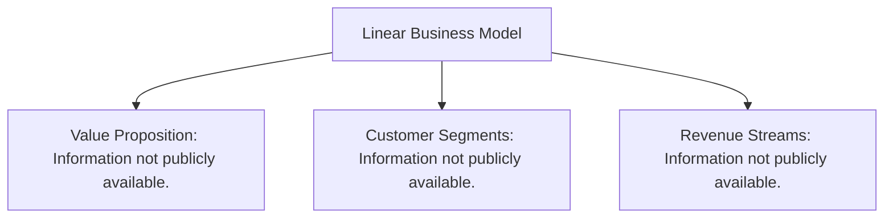

## Business Model

```mermaid
graph TD
    BM[Linear Business Model]
    BM --> VP[Value Proposition: Information not publicly available.]
    BM --> CS[Customer Segments: Information not publicly available.]
    BM --> RS[Revenue Streams: Information not publicly available.]
```
