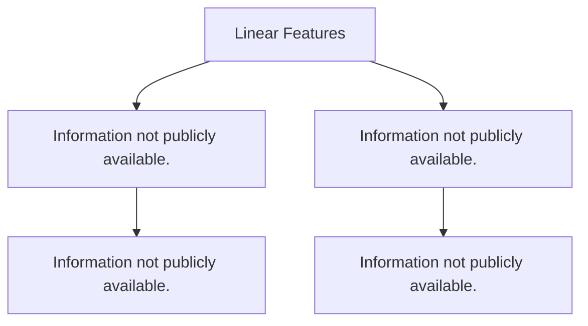

## Feature Hierarchy

```mermaid
graph TD
    Root[Linear Features]
    Root --> A[Information not publicly available.]
    Root --> B[Information not publicly available.]
    A --> A1[Information not publicly available.]
    B --> B1[Information not publicly available.]
```
