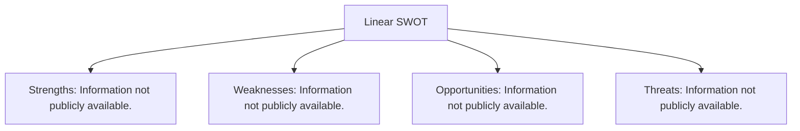

## SWOT

```mermaid
graph TD
    SWOT[Linear SWOT]
    SWOT --> S[Strengths: Information not publicly available.]
    SWOT --> W[Weaknesses: Information not publicly available.]
    SWOT --> O[Opportunities: Information not publicly available.]
    SWOT --> T[Threats: Information not publicly available.]
```
