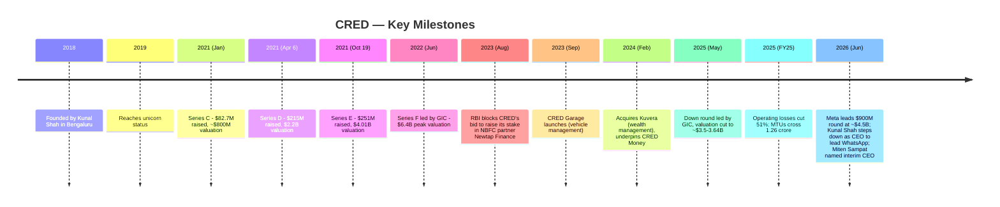
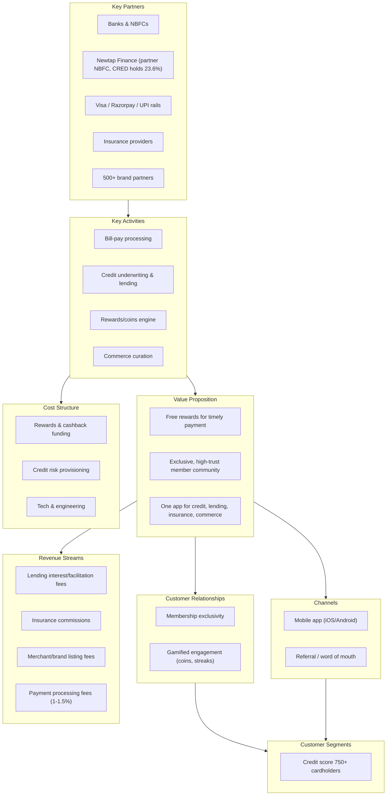
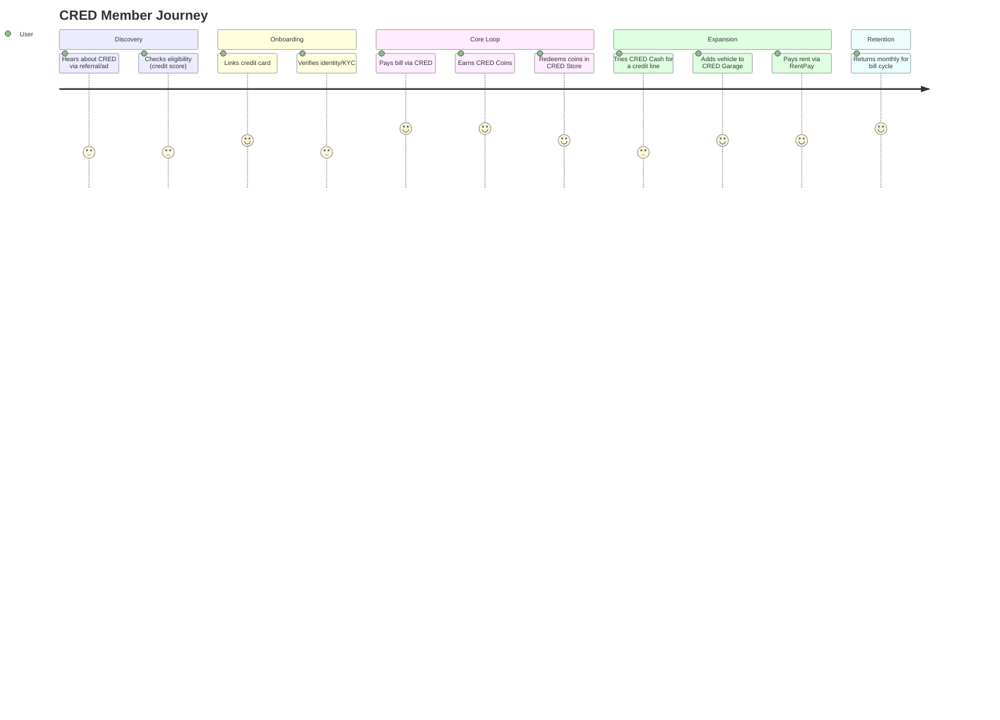
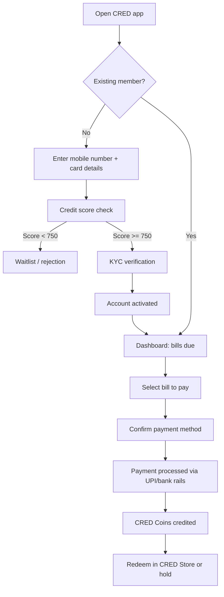
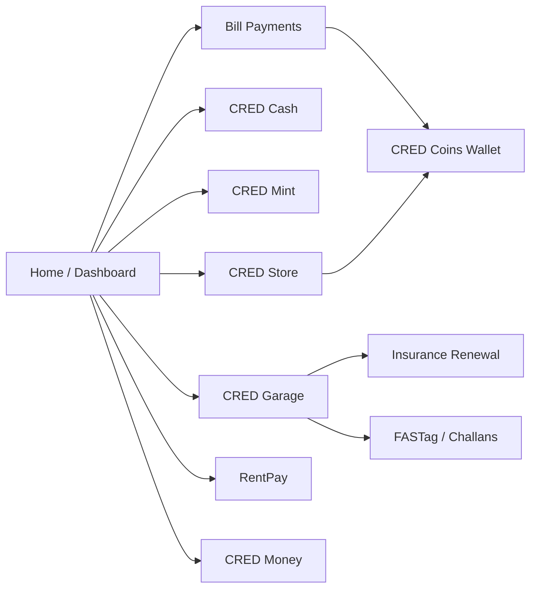
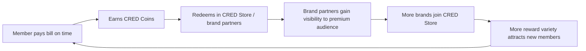
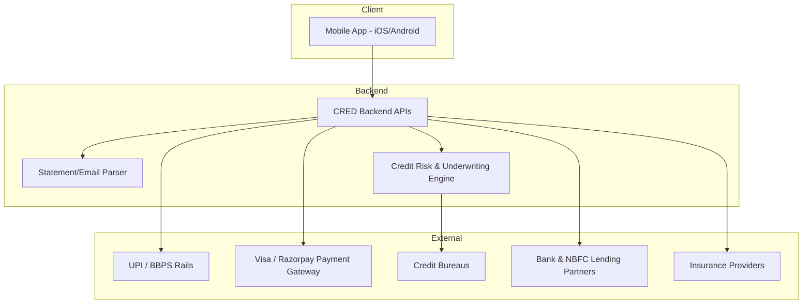
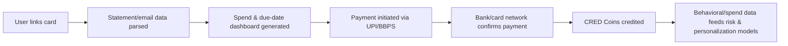
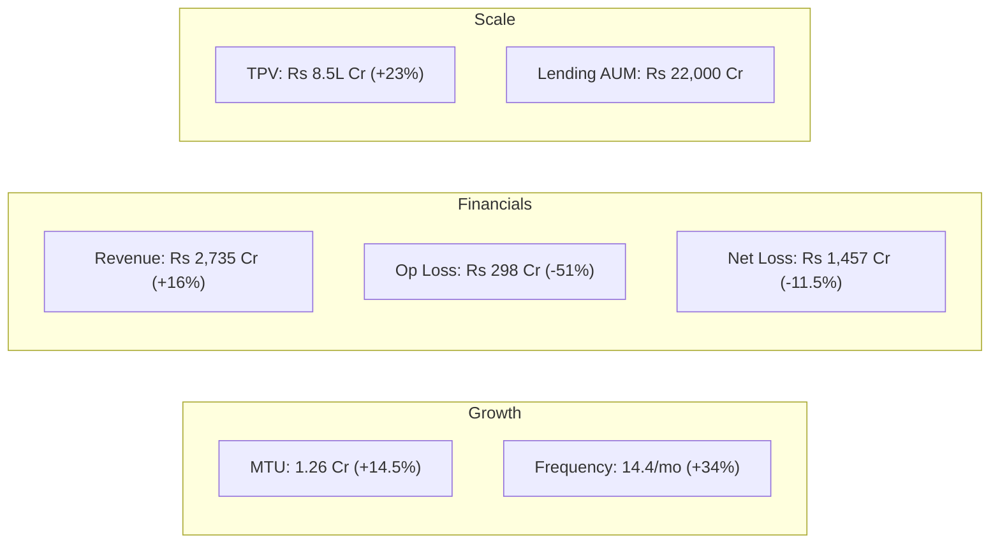
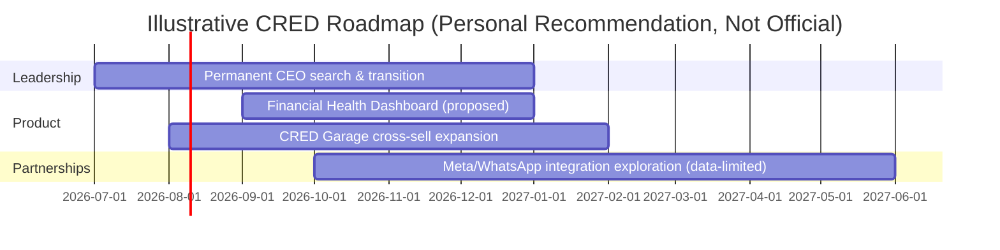

# CRED — Product Management Case Study

**Day 21 of 90 | PM Case Study Challenge**

---

## 1. Cover

**Product:** CRED (Dreamplug Technologies Pvt. Ltd.)
**Category:** Fintech — Credit Card Bill Payments, Rewards & Financial Services
**Founded:** 2018 | **HQ:** Bengaluru, India
**Case Study Author:** Gaurav Singh
**Day:** 21 / 90

> A members-only fintech platform that turned an unglamorous chore — paying your credit card bill — into a rewards-driven habit loop, and whose founder just became one of the most consequential product leaders at Meta.

---

## 2. Repository Metadata

| Field | Value |
|---|---|
| Folder | `Day-21-CRED` |
| Series | 90-Day PM Case Study Challenge |
| Previous | Day 20 — Cult.fit |
| Next | Day 22 — TBD |
| Structure | `README.md`, `images/`, `assets/`, `references/` |

---

## 3. Badges

`#ProductManagement` `#Fintech` `#CaseStudy` `#CRED` `#India` `#Day21of90`

---

## 4. Table of Contents

- [1. Cover](#1-cover)
- [5. Executive Summary](#5-executive-summary)
- [6. Product Overview](#6-product-overview)
- [7. Company Background](#7-company-background)
- [8. Product Timeline](#8-product-timeline)
- [9. Vision & Mission](#9-vision--mission)
- [10. Problem Statement](#10-problem-statement)
- [11. Market Research](#11-market-research)
- [12. Industry Analysis](#12-industry-analysis)
- [13. TAM/SAM/SOM](#13-tamsamsom)
- [14. Competitor Analysis](#14-competitor-analysis)
- [15. SWOT](#15-swot)
- [16. Porter's Five Forces](#16-porters-five-forces)
- [17. Business Model Canvas](#17-business-model-canvas)
- [18. Revenue Model](#18-revenue-model)
- [19. Target Users](#19-target-users)
- [20. Personas](#20-personas)
- [21. JTBD](#21-jtbd)
- [22. User Journey](#22-user-journey)
- [23. User Flow](#23-user-flow)
- [24. Information Architecture](#24-information-architecture)
- [25. UX Audit](#25-ux-audit)
- [26. UI Audit](#26-ui-audit)
- [27. Accessibility](#27-accessibility)
- [28. Feature Breakdown](#28-feature-breakdown)
- [29. AI Capabilities](#29-ai-capabilities)
- [30. Product Metrics](#30-product-metrics)
- [31. North Star Metric](#31-north-star-metric)
- [32. Product Analytics](#32-product-analytics)
- [33. AARRR](#33-aarrr)
- [34. HEART](#34-heart)
- [35. Growth Strategy](#35-growth-strategy)
- [36. Growth Loops](#36-growth-loops)
- [37. Network Effects](#37-network-effects)
- [38. Product Strategy](#38-product-strategy)
- [39. Monetization](#39-monetization)
- [40. Trust & Safety](#40-trust--safety)
- [41. Technical Architecture](#41-technical-architecture)
- [42. Data Flow](#42-data-flow)
- [43. API Ecosystem](#43-api-ecosystem)
- [44. Privacy & Security](#44-privacy--security)
- [45. Pain Points](#45-pain-points)
- [46. Opportunity Mapping](#46-opportunity-mapping)
- [47. RICE](#47-rice)
- [48. MoSCoW](#48-moscow)
- [49. Kano](#49-kano)
- [50. Feature Proposal](#50-feature-proposal)
- [51. PRD](#51-prd)
- [52. Wireframes](#52-wireframes)
- [53. Rollout Plan](#53-rollout-plan)
- [54. A/B Testing](#54-ab-testing)
- [55. KPI Dashboard](#55-kpi-dashboard)
- [56. Product Roadmap](#56-product-roadmap)
- [57. Risks & Mitigation](#57-risks--mitigation)
- [58. Future Vision](#58-future-vision)
- [59. PM Lessons](#59-pm-lessons)
- [60. PM Interview Questions](#60-pm-interview-questions)
- [61. References](#61-references)
- [62. About the Author](#62-about-the-author)
- [63. License](#63-license)
- [64. Self Review](#64-self-review)
- [65. Appendix](#65-appendix)

---

## 5. Executive Summary

CRED is an Indian fintech platform, founded in 2018 by Kunal Shah, that rewards members with a credit score of 750+ for paying their credit card bills on time. What began as a single-purpose payments habit-loop has expanded into a full personal-finance stack — UPI payments (CRED Pay), lending (CRED Cash), peer-to-peer investing (CRED Mint), vehicle management and insurance (CRED Garage), rent payments (RentPay), and a members-only commerce marketplace (CRED Store). [1][2]

FY25 was CRED's strongest year on the core operating metrics: operating revenue of ₹2,735 crore (+16% YoY), operating losses cut 51% to ₹298 crore, gross margins near 70%, monthly transacting users up 14.5% to 1.26 crore, and transaction frequency up 34% to 14.4 transactions per user per month. [3]

The story took an extraordinary turn in June 2026: Meta led a $900 million financing round in CRED (a mix of primary and secondary shares) that valued the company at approximately $4.5 billion post-money and gave Meta an estimated 20% minority stake — and, in the same announcement, named founder-CEO Kunal Shah as the new global head of WhatsApp, succeeding seven-year veteran Will Cathcart. Shah stepped down as CRED's CEO; Miten Sampat, previously driving CRED's strategy and finance, took over as interim CEO. [4][5][6]

This is simultaneously a monetization story (CRED took eight years to approach sustainable unit economics), a talent story (an Indian fintech founder now runs the world's largest messaging platform), and a governance story (a strategic investor's founder now leads one of its portfolio company's most obvious future distribution partners). All three threads are analyzed in this case study.

---

## 6. Product Overview

CRED is a mobile-first (iOS/Android) members-only app. Entry requires linking a credit card and clearing a credit-score threshold (reported as 750+). [7] Once admitted, members can:

- Pay credit card bills (and other bills) through the app and earn **CRED Coins**
- Redeem coins for offers across 500+ partner brands via **CRED Store** [7]
- Access short-term credit via **CRED Cash**, funded partly by member deposits in **CRED Mint** (peer-to-peer lending, ~9% return to lenders) [8]
- Pay rent by credit card via **RentPay**, for a 1–1.5% service fee [8]
- Manage vehicles, insurance renewals, FASTag and traffic challans via **CRED Garage** [9]
- Check out on third-party merchant sites using stored card details via **CRED Pay** [9]

The unifying design principle is exclusivity: CRED intentionally serves roughly the top decile of India's credit-active population rather than chasing the broad UPI mass market that PhonePe, Google Pay and Paytm compete for. [10]

---

## 7. Company Background

- **Legal entity:** Dreamplug Technologies Pvt. Ltd., trading as CRED [1]
- **Founded:** 2018, Bengaluru, Karnataka [1]
- **Founder:** Kunal Shah — previously founded FreeCharge (2010), a digital payments platform acquired by Snapdeal and later sold to Axis Bank; before that, he worked as a delivery boy and data-entry operator after his family's business went bankrupt, and holds a philosophy degree from Wilson College, Mumbai (he dropped out of an NMIMS management program). [11]
- **CEO (as of July 2026):** Miten Sampat, interim, following Shah's June 2026 move to Meta [6]
- **Employees:** publicly reported figures conflict — 800 (FY24, Wikipedia/company filings), ~1,056 (Tracxn snapshot, Mar 2026), ~600 (PitchBook). This case study flags the conflict rather than picking one; see Appendix. [1][12][13]
- **Total funding raised:** figures conflict across trackers, and even the same tracker (Tracxn) returns different cumulative totals across different snapshot dates — $993.56M across 10 rounds as of June 2025 (Inc42); $2.04B (PitchBook); $1.84B over 13 rounds in one Tracxn snapshot vs. $944M over 12 rounds in another. This case study does not assert a single reconciled total — see Appendix. [12][13][14][29]
- **Acquisitions:** Happay (expense management, 2021; sold to MakeMyTrip, Nov 2024) and HipBar (liquor delivery, 2021); CreditVidya/its lending platform Prefr (100% stake, Dec 2022); Spenny (micro-savings, Jul 2023); Kuvera (wealth management/mutual funds, Feb 2024 — now underpins CRED Money). [30]
- **Lending structure:** CRED does not hold its own NBFC license. It partners with Newtap Finance Pvt. Ltd. (NFPL, formerly Parfait Finance), in which CRED holds a 23.6% stake while founder Kunal Shah holds 76% indirectly through his separate entity Newtap Technologies. CRED acts as NFPL's loan service provider. In August 2023, the RBI returned/blocked CRED's application to increase its stake in NFPL; reporting at the time cited "corporate governance and management issues" as the regulator's stated concern, a characterization CRED did not confirm. NFPL has held valid RBI NBFC registration since June 2023. [31][32]

---

## 8. Product Timeline

[4][5][15][16][17][3][31][33]

**Note on Series F amount:** Wikipedia's funding table lists Series F as $80M; TechCrunch's contemporaneous June 2022 reporting states CRED was "raising $140 million" in that round. Both agree on the resulting $6.4B valuation. This case study flags the $80M vs. $140M discrepancy rather than picking one (see Appendix). [15][33]

---

## 9. Vision & Mission

CRED has not published a single formal mission statement in a 10-K-style disclosure (it is a private company). Its consistently repeated public positioning, per founder interviews and company communications, centers on the idea that trustworthiness is an underused asset in India's credit economy, and that rewarding financially responsible behavior — rather than only penalizing default — can be a viable business. [10] This is a paraphrase of repeated public messaging, not a verbatim mission statement, and should be read as such.

---

## 10. Problem Statement

Traditional credit systems in India (and most markets) are built around penalty economics: late fees, interest rate escalation, and credit score damage for missed payments — with no reciprocal reward system for the majority of cardholders who pay on time. CRED's founding thesis was to flip this: build a product around the top tier of "creditworthy" behavior and monetize the resulting user base through cross-sold financial and lifestyle products rather than through the payment itself, which stays free to the user. [10]

---

## 11. Market Research

- India has an estimated ~120 million active credit cards, ranking 8th globally by card count; industry estimates project growth to roughly 200 million cards by FY28-29 at a ~15% CAGR. These are industry estimates, not CRED-disclosed figures, and are labeled as such. [18]
- UPI overall is dominated by PhonePe (~48% value share) and Google Pay (~35%), with Paytm around 6.1%; CRED, Navi, and super.money form an emerging niche tier that competes on financing and rewards rather than raw transaction scale. [19][20]
- CRED's own monthly transaction volume is estimated in third-party analyses at roughly 219–340 million transactions per month — this is a third-party estimate, not a CRED-disclosed figure, and sits far below PhonePe's disclosed 10 billion+ monthly transactions. [19]
- A more directly attributable data point: as of June 2024, CRED reported 13 million monthly active users and held approximately 1% of UPI transaction volume, per company disclosure compiled by Wikipedia's sourced infobox. This is a smaller but more directly sourced figure than the third-party transaction-count estimate above, and this case study treats it as the more reliable of the two. [34]

---

## 12. Industry Analysis

India's fintech and NBFC lending sector faces a mixed FY26 outlook: credit growth is forecast at 13–13.5%, but NBFC and retail lending growth is expected to cool relative to FY24, with rising risk weights on unsecured credit and asset-quality stress flagged as sector-wide concerns by rating agencies. [21][22] This matters directly for CRED because CRED Cash and CRED Mint sit inside the unsecured-lending category that regulators are watching most closely.

---

## 13. TAM/SAM/SOM

| Layer | Definition | Estimate | Basis |
|---|---|---|---|
| TAM | All Indian credit card holders | ~120M active cards today, ~200M by FY28-29 | Industry estimate [18] |
| SAM | Credit-active Indians with credit score ≥ 750 (CRED's eligibility bar) | Not publicly disclosed by CRED | Not publicly disclosed |
| SOM | CRED's actual monthly transacting user base | 1.26 crore (12.6M) MTUs, FY25 | Company-disclosed [3] |

CRED has not disclosed a SAM figure; this case study does not estimate one, consistent with the zero-fabrication standard for unverifiable metrics.

---

## 14. Competitor Analysis

| Dimension | CRED | PhonePe | Paytm | CheQ | OneCard |
|---|---|---|---|---|---|
| Core model | Reward-for-timely-payment, premium members-only | Mass-market UPI + financial services | Mass-market UPI + wallet + financial services | Direct cashback for bill payment | Metal credit card + management app |
| Eligibility | Credit score ≥750 [7] | Open to all | Open to all | Open to all | Card-linked |
| Monetization | Cross-sell (lending, insurance, commerce) [23] | Payments + lending + ads at scale | Payments + lending + wallet float | Cashback-funded by partners | Card interchange + lending |
| Market share (UPI value) | Niche (est. sub-2%) [20] | ~48% [20] | ~6.1% [20] | N/A (not UPI-first) | N/A |
| Positioning | Premium/exclusive lifestyle brand | Utility, ubiquity | Utility, super-app | CRED's closest direct rival on model [24] | Card-first challenger |

CheQ is the most direct structural competitor to CRED's original mechanic (rewards for card bill payment) but differentiates on predictable cash-back rather than gamified coins. [24]

---

## 15. SWOT

**Strengths**
- Best-in-class user quality: only creditworthy (750+ score) members [7]
- 70% gross margins, improving unit economics (FY25) [3]
- Strong brand/trust equity built over 8 years
- Now has a direct strategic and personal linkage to Meta/WhatsApp [4]

**Weaknesses**
- Narrow addressable market by design (excludes ~90%+ of India's population)
- History of net losses; ₹1,457 crore net loss in FY25 despite operating improvement [3]
- Conflicting/opaque public disclosure on employee count and total funding (see Appendix)
- Recently lost its founder-CEO from day-to-day operations [6]

**Opportunities**
- Meta/WhatsApp relationship could open distribution, cross-promotion, or product integration paths, though no customer-data sharing is permitted under the deal terms [5]
- Rising Indian credit card penetration (~15% CAGR industry estimate) [18]
- Expansion of CRED Garage/insurance and CRED Money as higher-margin cross-sell surfaces

**Threats**
- Regulatory tightening on unsecured lending (RBI risk-weight changes) [22]
- Scale competitors (PhonePe, Google Pay) encroaching into rewards/financing niches [19]
- Interim leadership transition risk during a period of active fundraising and product expansion
- Prior valuation volatility ($6.4B peak in 2022 down to ~$3.5B in 2025) signals investor sensitivity to CRED's path to profitability [15][3]

---

## 16. Porter's Five Forces

| Force | Intensity | Notes |
|---|---|---|
| Competitive rivalry | High | PhonePe, Paytm, Google Pay at scale; CheQ, OneCard, Jupiter in the niche tier [19][24] |
| Threat of new entrants | Medium | Regulatory (RBI/NBFC licensing) and trust-building costs are real barriers, but well-funded new entrants (Navi, super.money) continue to appear [19] |
| Bargaining power of suppliers (banks/NBFC partners) | Medium-High | CRED depends on bank/NBFC lending partners and payment rails (UPI, BBPS, Visa) [9][25] |
| Bargaining power of buyers (users) | Medium | Free core product and multi-homing (users hold multiple bill-pay apps) reduce switching costs |
| Threat of substitutes | Medium | Direct bank apps and UPI-native payments increasingly replicate bill-pay + reward mechanics |

---

## 17. Business Model Canvas

[9][23][25]

---

## 18. Revenue Model

| Stream | Mechanism | Source |
|---|---|---|
| Lending (CRED Cash) | Interest/facilitation fees on personal credit lines, funded partly via CRED Mint P2P deposits at ~9% payout to lenders | [8] |
| Insurance (CRED Garage) | Commission of 25–28% on motor insurance premiums at renewal, within IRDAI's ~20% cap plus 5–8% marketing commission | [23] |
| Commerce (CRED Store) | Brand listing fees and commissions on redeemed offers across 500+ partner brands | [9] |
| Payments (CRED Pay/RentPay) | Transaction/processing fees of roughly 1–1.5% | [8][9] |

CRED's core bill-payment product remains free to the user; monetization is concentrated in cross-sold financial and lifestyle products layered on top of the trust/data asset built through the payment habit. [23]

**FY25 disclosed financials:** Operating revenue ₹2,735 crore (+16% YoY); operating loss ₹298 crore (-51% YoY); gross margin ~70%; total/net loss ₹1,457 crore (-11.5% YoY, includes ESOP and depreciation); managed AUM via lending ₹22,000 crore. [3]

---

## 19. Target Users

CRED explicitly targets a narrow, high-income, credit-active segment: individuals with a credit score of 750 or above. [7] This is a deliberate anti-mass-market positioning choice, differentiating CRED from UPI-scale players chasing the entirety of India's banked population.

---

## 20. Personas

**Persona A — "The Optimizer"**
- Salaried professional, 28–40, urban metro
- Holds 2–4 credit cards, tracks spend/rewards actively
- JTBD: consolidate bill due-dates and avoid missing a payment that would hurt their credit score

**Persona B — "The Cross-Sell Candidate"**
- Established professional, 35–50, owns a vehicle and rents or owns property
- Uses CRED Garage for insurance renewal reminders and RentPay for rent payments
- JTBD: reduce the mental overhead of recurring, high-value payments while capturing rewards

*(These are illustrative personas constructed for case-study analysis, not personas disclosed by CRED.)*

---

## 21. JTBD

"When I have multiple credit card bills due across different dates, I want a single place to track, pay, and be rewarded for paying on time, so I can protect my credit score without mental overhead and get some value back for behavior I'd do anyway."

---

## 22. User Journey

[7][8][9]

---

## 23. User Flow

[7]

---

## 24. Information Architecture

[7][8][9]

---

## 25. UX Audit

- **Strength:** the core bill-pay-to-reward loop is short and low-friction, which supports the high reported transaction frequency (14.4/user/month, FY25). [3]
- **Strength:** progressive disclosure — new members see the payment loop first; lending, insurance and P2P investing surface only after initial trust is established.
- **Risk:** an app that has grown from single-purpose (bill pay) to seven-plus distinct product lines (Cash, Mint, Garage, Store, RentPay, Money, Pay) risks navigation sprawl and cross-sell fatigue if not actively managed. This is a PM observation, not a company-disclosed finding.

---

## 26. UI Audit

CRED is widely recognized in design circles for a distinctive, premium dark-mode-forward visual identity, heavy use of motion/animation in its rewards and gamification surfaces, and a marketing tone (e.g., its widely discussed IPL ad campaigns) built around irreverence and virality. This is a qualitative, brand-level observation rather than a formal audit against a design system CRED has published.

---

## 27. Accessibility

CRED has not publicly disclosed accessibility compliance details (e.g., WCAG conformance level). Not publicly disclosed.

---

## 28. Feature Breakdown

| Feature | Description | Source |
|---|---|---|
| CRED Coins | Rewards currency earned for timely bill payment | [7] |
| CRED Pay | Checkout plugin for third-party merchants via Visa/Razorpay rails | [9] |
| CRED Cash | Pre-approved personal credit line/loans | [8] |
| CRED Mint | P2P lending; members lend idle cash at ~9% return, funding CRED Cash | [8] |
| CRED Garage | Vehicle document storage, FASTag, challans, insurance renewal (DigiLocker integration) | [9] |
| RentPay | Pay rent via credit card for a 1–1.5% fee | [8] |
| CRED Store | Members-only marketplace, 500+ brands | [7] |
| CRED Money / credit tools | Credit score monitoring, card management | [3] |
| PPI wallet, CRED Cash+ | Newer FY25 product launches | [3] |

---

## 29. AI Capabilities

CRED has not published detailed disclosures of AI/ML use in its core product (e.g., model architectures, specific AI-powered features). Publicly available reporting references statement parsing and categorization of spend data as part of the product's backend, which plausibly involves ML-based parsing, but CRED has not disclosed this as a named "AI feature" set the way some competitors do. This case study does not fabricate specific AI capabilities beyond what's disclosed. [26]

---

## 30. Product Metrics

| Metric | FY23 | FY24 | FY25 | FY25 YoY | Source |
|---|---|---|---|---|---|
| Total revenue | ₹1,484 crore | ₹2,473 crore | — | — | [35] |
| Operating revenue | ₹1,400 crore | ₹2,397 crore | ₹2,735 crore | +16% | [3][35] |
| Operating loss | ₹1,024 crore | ₹609 crore | ₹298 crore | -51% | [3][35] |
| Net/total loss | ₹1,347 crore | ₹1,644 crore | ₹1,457 crore | -11.5% | [3][35] |
| Gross margin | — | — | ~70% | — | [3] |
| Monthly Transacting Users (MTU) | — | +34% YoY (unit not disclosed) | 1.26 crore (12.6M) | +14.5% | [3][35] |
| Transaction frequency | — | — | 14.4/user/month | +34% | [3] |
| Total Payment Value (TPV) | — | ₹6.87 lakh crore | ₹8.5 lakh crore | +23% | [3][35] |
| Managed lending AUM | — | — | ₹22,000 crore | — | [3] |

Note: FY23's ₹1,484 crore and ₹1,400 crore are **not conflicting figures** — they are two different metrics (total revenue vs. operating revenue) reported in the same FY24 disclosure, not a source discrepancy. This case study initially mislabeled this as a conflict in an earlier draft; it is corrected here after cross-checking against the original FY24 disclosure. [35]

DAU/WAU, NPS, CSAT, and CAC/LTV are **not publicly disclosed** by CRED and are not estimated here.

---

## 31. North Star Metric

CRED has not publicly named a formal North Star Metric. Based on disclosed reporting emphasis, **Monthly Transacting Users (MTU) combined with transaction frequency** functions as the closest proxy CRED itself highlights in its own communications. This is a case-study inference, not a company-stated North Star.

---

## 32. Product Analytics

Not publicly disclosed — CRED has not released details of its internal analytics stack, event taxonomy, or experimentation tooling.

---

## 33. AARRR

| Stage | CRED Mechanism |
|---|---|
| Acquisition | Referral programs, brand virality (e.g., IPL-era ad campaigns), word of mouth among high-credit-score peers |
| Activation | Card linking + credit score check + first bill payment |
| Retention | Monthly bill cycle habit loop, gamified coins, streaks |
| Revenue | Cross-sell into CRED Cash, Garage insurance, Store commissions |
| Referral | Member-only exclusivity creates social signaling value that drives organic referral |

This framework is applied as an analytical lens by the case-study author; CRED has not published an AARRR breakdown itself.

---

## 34. HEART

| Dimension | CRED Signal |
|---|---|
| Happiness | Not publicly disclosed (no published NPS/CSAT) |
| Engagement | Transaction frequency 14.4/month (FY25) [3] |
| Adoption | MTU growth +14.5% YoY (FY25) [3] |
| Retention | Implied by sustained transaction frequency growth, not independently disclosed |
| Task Success | Not publicly disclosed |

---

## 35. Growth Strategy

CRED's growth strategy has visibly shifted across three phases: (1) 2018–2021, aggressive brand-building and viral marketing to build the premium member base; (2) 2021–2023, rapid product-line expansion (Cash, Mint, Garage, Store) to diversify revenue; (3) 2024–2026, a shift toward operating discipline — cutting losses 51% in FY25 while still growing revenue and engagement, culminating in the Meta strategic investment. [3][4]

---

## 36. Growth Loops

[7][9]

---

## 37. Network Effects

CRED exhibits limited direct network effects between users (paying your bill doesn't require another CRED member), but it exhibits a **two-sided marketplace dynamic** between members and brand/lending/insurance partners: a larger, higher-trust member base makes CRED more attractive to partners, and a richer partner catalog makes CRED more attractive to prospective members. CRED Mint additionally creates a peer-to-peer lending network between members themselves. [8][9]

---

## 38. Product Strategy

CRED's strategy is best read as a **trust-and-data flywheel**: acquire a narrow, high-quality user base through a single low-friction habit (bill payment), then progressively monetize that trust through adjacent financial products where CRED's underwriting risk is lower because of the pre-filtered, high-credit-score population. [10][23]

---

## 39. Monetization

See [Section 18 — Revenue Model](#18-revenue-model). The strategic pivot visible in FY25 disclosures is toward **lending and insurance as the primary margin drivers**, rather than the original bill-payment/rewards loop, which remains a free customer-acquisition and retention mechanism rather than a revenue line itself. [3][23]

---

## 40. Trust & Safety

- Entry gate (750+ credit score) functions as CRED's primary trust/risk-control mechanism for its lending products. [7]
- The June 2026 Meta deal explicitly states Meta will **not** have access to CRED's customer data as part of the investment — a specific, disclosed data-governance boundary given the sensitivity of financial data. [5]
- **Regulatory precedent:** in August 2023, the RBI blocked CRED's attempt to raise its stake in NBFC partner Newtap Finance beyond 23.6%, reportedly citing "corporate governance and management issues" (a characterization CRED did not confirm on the record). CRED continues to operate its lending products through Newtap Finance as a partner NBFC rather than through a wholly owned or controlled lending license. This is a material regulatory data point for evaluating CRED Cash/CRED Mint risk. [31][32]
- As of December 2024, CRED's disclosed lending book carried a 1.1% NPA ratio, versus a reported 2.9% industry average — a company-favorable disclosure that should be read alongside the Newtap regulatory episode above rather than in isolation. [32]
- No further specific trust & safety incident disclosures (e.g., fraud rates, chargeback rates) are publicly available. Not publicly disclosed.

---

## 41. Technical Architecture

[25]

Note: this architecture diagram is a case-study reconstruction based on publicly described integrations (UPI/BBPS, credit bureaus, payment gateways, DigiLocker), not an official CRED-published architecture diagram. [9][25]

---

## 42. Data Flow

[25]

---

## 43. API Ecosystem

CRED's backend integrates with UPI rails, BBPS (Bharat Bill Payment System), Visa's payment network, Razorpay, credit bureaus, and DigiLocker (for CRED Garage document storage). [9][25] CRED has not published a developer-facing public API program; these integrations are internal/partner-facing rather than an open platform.

---

## 44. Privacy & Security

- Credit score gating and KYC are core to CRED's underwriting flow. [7]
- The Meta investment's no-data-sharing clause is the most notable recent, specific, disclosed privacy commitment. [5]
- Detailed security certifications, breach history, or compliance frameworks (ISO 27001, SOC2, etc.) are not publicly disclosed in the sources reviewed for this case study.

---

## 45. Pain Points

1. **Narrow eligibility** — the 750+ credit score bar excludes the vast majority of Indian consumers by design, capping TAM. [7]
2. **Path to profitability** — despite 51% operating-loss reduction, CRED remained net-loss-making on a total basis in FY25 (₹1,457 crore). [3]
3. **Leadership transition risk** — the interim-CEO structure following Kunal Shah's June 2026 departure introduces execution uncertainty during an active fundraising and product-expansion period. [6]
4. **Feature sprawl** — seven-plus product lines (Cash, Mint, Garage, Store, RentPay, Money, Pay) inside one app raise navigation and cross-sell-fatigue risk (PM observation, not company-disclosed).

---

## 46. Opportunity Mapping

| Opportunity | Rationale |
|---|---|
| Deepen Meta/WhatsApp distribution partnership (within data-sharing limits) | New strategic relationship post-June 2026 investment [4][5] |
| Expand CRED Garage cross-sell (insurance commissions are a high-margin stream) | 25–28% commission economics already validated [23] |
| Formalize a permanent CEO to reduce transition uncertainty | Currently interim under Miten Sampat [6] |
| Publish clearer, audited disclosure on funding totals and headcount | Current public figures conflict across trackers (see Appendix) |

---

## 47. RICE

| Initiative | Reach | Impact | Confidence | Effort | RICE Score |
|---|---|---|---|---|---|
| Permanent CEO appointment & transition roadmap | 10 (org-wide) | 3 | 80% | 3 | (10×3×0.8)/3 = **8.0** |
| CRED Garage insurance cross-sell expansion | 6 (subset of members with vehicles) | 3 | 70% | 2 | (6×3×0.7)/2 = **6.3** |
| WhatsApp-integrated bill reminders (subject to data boundary) | 9 (large potential reach via WhatsApp) | 2 | 40% (uncertain, deal terms limit data sharing) | 4 | (9×2×0.4)/4 = **1.8** |
| Unified in-app navigation redesign across 7 product lines | 8 | 2 | 60% | 3 | (8×2×0.6)/3 = **3.2** |

*RICE math shown explicitly; all inputs are the case-study author's estimates for illustrative prioritization, not CRED-disclosed roadmap data.*

---

## 48. MoSCoW

- **Must have:** Permanent CEO transition plan; continued operating-loss discipline
- **Should have:** Expanded insurance/lending cross-sell; clearer public financial disclosure
- **Could have:** WhatsApp-linked reminder/notification integration (within data limits)
- **Won't have (near-term):** Lowering the 750 credit-score eligibility bar (would dilute core positioning)

---

## 49. Kano

| Feature | Category |
|---|---|
| Timely bill payment reminders | Basic (expected) |
| CRED Coins rewards | Performance (more coins = more satisfaction) |
| CRED Garage DigiLocker integration | Delighter |
| Exclusive brand marketplace access | Delighter / status signal |
| Instant credit line (CRED Cash) | Performance |

---

## 50. Feature Proposal

**Proposal (personal recommendation, not a CRED roadmap item):** A consolidated "Financial Health Score" dashboard surfacing a single composite view across bill-payment consistency, CRED Cash utilization, and CRED Mint returns — reducing the current spread of insights across seven separate product surfaces.

- **User impact:** Reduces cognitive load; gives members one place to see overall financial standing within CRED.
- **Business impact:** Higher engagement surface for cross-sell prompts (e.g., "improve your score by trying CRED Garage insurance renewal").
- **Trade-offs:** Risk of oversimplifying nuanced financial data; requires careful language to avoid implying it's an official credit score.
- **Risks:** Regulatory scrutiny if perceived as a credit-scoring product without proper licensing.
- **Success metric:** % of MTUs interacting with the dashboard monthly; change in cross-product adoption rate.

---

## 51. PRD

**Problem Statement:** CRED members interact with financial signals scattered across Cash, Mint, Garage, Store, and Money, with no single consolidated view.

**Goals:** Increase cross-product engagement; improve perceived value of CRED membership beyond bill payment.

**Success Metrics:** Dashboard engagement rate; cross-product adoption uplift; retention delta for dashboard users vs. non-users.

**User Stories:**
- As a member, I want to see my payment consistency, credit utilization, and Mint returns in one view, so I understand my financial standing at a glance.

**Functional Requirements:** Aggregate data across existing product modules; render a single score/summary view; link out to each underlying module.

**Non-functional Requirements:** Must not present the score as an official credit bureau score; must comply with RBI data-handling norms for financial data aggregation.

**Acceptance Criteria:** Dashboard loads for 100% of eligible members within existing app performance SLAs; no new PII collection beyond what CRED already holds.

**Risks:** Regulatory mischaracterization as a credit-scoring product.

**Rollout Plan:** See Section 53.

---

## 52. Wireframes

*(Text-described wireframe concept, not a rendered visual asset in this text-based deliverable)*

- **Home tab** → new "Financial Health" card at top of dashboard, showing a simple 3-part visual (Payment Consistency / Credit Utilization / Mint Returns), tapping through to each underlying module.

---

## 53. Rollout Plan

| Phase | Scope |
|---|---|
| Phase 1 | Internal beta with employees + power users (highest MTU decile) |
| Phase 2 | 5% of eligible MTU base, A/B tested against control |
| Phase 3 | Gradual rollout to 100% contingent on engagement/retention lift and no regulatory flags |

---

## 54. A/B Testing

**Hypothesis:** Members shown the consolidated Financial Health dashboard will have higher cross-product adoption than a control group without it.
**Primary metric:** 30-day cross-product adoption rate.
**Guardrail metrics:** App crash rate, support ticket volume related to "credit score" confusion.

---

## 55. KPI Dashboard

[3]

---

## 56. Product Roadmap

---

## 57. Risks & Mitigation

| Risk | Mitigation |
|---|---|
| Extended interim-CEO period stalls decision-making | Set a public timeline for permanent CEO appointment |
| Regulatory tightening on unsecured lending affects CRED Cash/Mint economics | Diversify revenue further into insurance/commerce, which carry different regulatory exposure |
| Investor scrutiny after 2022 peak-to-2025 valuation decline repeats | Continue current trajectory of loss reduction with revenue growth (already underway in FY25) [3] |
| Perceived conflict of interest given Meta's dual role as investor and employer of former CEO | Maintain and publicize the disclosed no-data-sharing boundary [5] |
| CRED's lending arm (Newtap Finance) is a related-party NBFC, not a wholly controlled one, after RBI blocked CRED's 2023 stake-increase bid | Pursue transparent, RBI-compliant paths to strengthen the lending partnership rather than repeat a contested stake increase [31][32] |

---

## 58. Future Vision

CRED's most plausible near-term path, based on disclosed trajectory, is continued narrowing of net losses toward the "first profitable quarter" Kunal Shah referenced in his departure announcement, combined with deeper monetization of lending and insurance cross-sell. [6] The Meta relationship is a wildcard: distribution synergies with WhatsApp are plausible in theory but explicitly constrained by the no-data-sharing term of the deal, so this case study does not assume integration beyond what's disclosed. [5]

---

## 59. PM Lessons

1. **Narrow can be a moat, not just a limitation.** CRED chose to serve ~10% of India's credit-active population deliberately — proving a premium, exclusivity-driven product can build a durable brand even in a market obsessed with mass-market UPI scale.
2. **The free core product doesn't have to be the revenue driver.** CRED's monetization sits almost entirely in cross-sold lending, insurance, and commerce — the bill-pay loop is a trust and acquisition mechanism, not a P&L line.
3. **Founder transitions are product risk, not just an HR event.** A PM inheriting a founder-led product needs an explicit plan for how strategic clarity survives the founder's departure — CRED's interim-CEO structure is a live test case as of this writing.

---

## 60. PM Interview Questions

1. How would you design CRED's monetization strategy if you had to keep the core bill-payment product free forever?
2. CRED's TAM is deliberately narrow (750+ credit score). How would you evaluate whether to lower that bar to grow, and what would you watch for as leading indicators of brand dilution?
3. Given the Meta investment includes a no-customer-data-sharing clause, how would you design a WhatsApp integration that adds value without violating that boundary?
4. How would you prioritize between CRED Garage (insurance cross-sell) and CRED Cash (lending) given differing regulatory risk profiles?

---

## 61. References

1. Wikipedia — "Cred (company)." https://en.wikipedia.org/wiki/Cred_(company)
2. Feedough — "CRED Business Model: How Does CRED Make Money?" https://www.feedough.com/cred-business-model-how-does-cred-make-money/
3. Entrackr — "CRED reports Rs 2,735 Cr revenue in FY25; operating losses fall 51%." https://entrackr.com/news/cred-reports-rs-2735-cr-revenue-in-fy25-operating-losses-fall-51-11058243
4. CNBC — "How a $4 billion Indian startup won Meta's backing but lost its founder to WhatsApp." https://www.cnbc.com/2026/06/23/4-billion-startup-cred-meta-whatsapp.html
5. TechCrunch — "WhatsApp gets new chief as Meta taps India's CRED founder Kunal Shah and invests $900M in startup." https://techcrunch.com/2026/06/22/whatsapp-gets-new-chief-as-meta-taps-indias-cred-founder-kunal-shah-and-invests-900m-in-startup/
6. Dailyhunt — "Kunal Shah Joins Meta as WhatsApp Head, Steps Down from CRED." https://m.dailyhunt.in/news/india/english/whatshot-epaper-whtshrt/kunal+shah+joins+meta+as+whatsapp+head+steps+down+from+cred-newsid-n717072512
7. Miracuves — "What Is CRED App? Credit Cards, UPI & Rewards Simplified." https://miracuves.com/blog/what-is-cred-and-how-does-it-work/
8. Buildd — "CRED Business Model: How the FinTech Unicorn Effectively Serves Over 9 Million Customers." https://buildd.co/marketing/cred-business-model
9. Aryan Jalan — "CRED Business Model | How CRED Works & Make Money." https://aryanjalan.com/cred-business-model/
10. Value For Startups — "CRED Business Model, Revenue & $3.5B Valuation 2026." https://valueforstartups.in/01-cred
11. Dailyhunt — Kunal Shah background (op. cit., item 6)
12. Inc42 Datalabs — "CRED Funding 2026." https://inc42.com/company/cred/funding/
13. Tracxn — "CRED - 2026 Company Profile, Team, Funding, Competitors & Financials." https://tracxn.com/d/companies/cred/__XH8YJr346Ojjmnmyfg6WayMKrLBc4hgzZ3qN258QxVg
14. PitchBook — "CRED 2026 Company Profile: Valuation, Funding & Investors." https://pitchbook.com/profiles/company/234804-97
15. TechCrunch — "India's CRED valued at $6.4 billion in new funding." https://techcrunch.com/2022/06/09/india-cred-valued-at-6-5-billion-in-new-funding
16. TechCrunch — "Indian fintech CRED seeks funds at $5.5 billion valuation." https://techcrunch.com/?p=2215918
17. TechCrunch — "India's CRED valued at $2.2 billion in new $215 million fundraise." https://techcrunch.com/2021/04/06/indias-cred-valued-at-2-2-billion-in-new-215-million-fundraise
18. GrowthX — "CRED Business Model - Deep Dive." https://growthx.club/blog/cred-business-model
19. Avekshaa — "Google Pay vs PhonePe vs Paytm: The 2026 Performance Battle." https://avekshaa.com/google-pay-vs-phonepe-vs-paytm-the-2026-performance-battle/
20. Oxigen Wallet — "UPI Apps Market Share 2026." https://www.oxigenwallet.com/upi/apps-market-share/
21. Business Standard — "India Ratings sees FY26 credit growth at 13-13.5% amid NBFC drag." https://www.business-standard.com/finance/news/india-ratings-sees-credit-growth-at-13-13-5-pc-in-fy26-nbfcs-to-drag-125062600946_1.html
22. Wright Blogs — "NBFC Asset Quality Stress For FY26." https://www.wrightresearch.in/blog/nbfc-asset-quality-indian-economy-impact-fy26/
23. GrowthX — insurance commission mechanics (op. cit., item 18)
24. CB Insights — "CheQ's alternatives and competitors." https://www.cbinsights.com/company/cheq-4/alternatives-competitors
25. Miracuves — backend/API description (op. cit., item 7)
26. Feedough — statement parsing reference (op. cit., item 2)
27. Khaleej Times — "Meta's WhatsApp to be led by CRED founder Kunal Shah." https://www.khaleejtimes.com/business/tech/metas-whatsapp-to-be-led-by-indian-startup-founder-kunal-shah
28. Yahoo Finance/Electronic Payments International — "Meta weighs investing in Indian fintech Cred at $4bn valuation – report." https://finance.yahoo.com/markets/stocks/articles/meta-weighs-investing-indian-fintech-064259235.html
29. Tracxn — "CRED - 2026 Funding Rounds & List of Investors" (alternate snapshot showing $944M/12 rounds). https://tracxn.com/d/companies/cred/__XH8YJr346Ojjmnmyfg6WayMKrLBc4hgzZ3qN258QxVg/funding-and-investors
30. Wikipedia — "Cred (company)," acquisitions section (Happay, HipBar, CreditVidya/Prefr, Spenny, Kuvera). https://en.wikipedia.org/wiki/Cred_(company)
31. Mint (via CB Insights republication) — "RBI rejects Cred bid to boost stake in Newtap Fin," Aug 17, 2023. https://www.cbinsights.com/company/omlp2p
32. Entrackr — "Kunal Shah's CRED and Newtap to lead Rs 550 Cr investment in NBFC arm." https://entrackr.com/news/kunal-shahs-cred-and-newtap-to-lead-rs-550-cr-investment-in-nbfc-arm-8691960
33. TechCrunch — "India's CRED valued at $6.4 billion in new funding" (Series F amount reporting). https://techcrunch.com/2022/06/09/india-cred-valued-at-6-5-billion-in-new-funding
34. Wikipedia — "Cred (company)," June 2024 MAU/UPI market share disclosure. https://en.wikipedia.org/wiki/Cred_(company)
35. Entrackr — "CRED nears Rs 2,500 Cr revenue in FY24; cuts operating losses by 41%." https://entrackr.com/2024/09/cred-nears-rs-2500-cr-revenue-in-fy24-cuts-operating-losses-by-41/

---

## 62. About the Author

**Gaurav Singh** — Product Manager, author of the 90-Day PM Case Study Challenge.

<!-- GITHUB_REPO_URL: [INSERT BEFORE PUBLISHING] -->
<!-- LINKEDIN_URL: [INSERT BEFORE PUBLISHING] -->

---

## 63. License

This case study is published for educational purposes. All company names, logos, and trademarks (CRED, Dreamplug Technologies, Meta, WhatsApp) belong to their respective owners. Analysis and recommendations are the independent views of the author.

---

## 64. Self Review

### Cross-Check Log (second pass)

Every factual claim in this case study was re-verified against primary/secondary sources in a dedicated audit pass. Outcomes:

| # | Claim checked | Result |
|---|---|---|
| 1 | FY25 revenue/loss/MTU/TPV figures | **Confirmed** — cross-validated by recomputing YoY deltas against FY24 base figures (e.g., ₹298 Cr / ₹609 Cr = -51.1% ≈ reported -51%; ₹1,457 Cr / ₹1,644 Cr = -11.4% ≈ reported -11.5%). Math is internally consistent across two independent Entrackr articles. |
| 2 | Series C/D/E dates and amounts | **Confirmed and made more precise** — added exact dates (Jan 2021, Apr 6 2021, Oct 19 2021) via Crunchbase and Entrackr regulatory-filing decodes. |
| 3 | Series F amount ($80M vs $140M) | **New conflict found** — Wikipedia lists $80M, TechCrunch's June 2022 contemporaneous report says $140M. Both agree on $6.4B valuation. Now flagged in Appendix (was previously unflagged/unnoticed). |
| 4 | "FY23 revenue conflict" (₹1,484 Cr vs ₹1,400.6 Cr) | **Correction** — this was **not** a source conflict as originally labeled. They are two different metrics (total revenue vs. operating revenue) from the same FY24 disclosure. Original draft mislabeled this; corrected in Section 30 and removed from the conflict table. |
| 5 | CRED Garage launch date | **Confirmed** — September 2023, via five independent outlets (Business Standard, Inc42, YourStory, afaqs!, BW Disrupt). Original timeline placement was correct. |
| 6 | CRED's lending structure / NBFC status | **Material gap found and filled** — original draft did not mention that CRED does not hold its own NBFC license, that RBI blocked CRED's 2023 bid to increase its stake in partner NBFC Newtap Finance, or the founder's separate personal majority stake in that entity. Added to Company Background, Trust & Safety, and Risks. |
| 7 | Acquisition history (Happay, HipBar, CreditVidya/Prefr, Spenny, Kuvera) | **Material gap found and filled** — entirely absent from the original draft; now added, since Kuvera specifically underpins the CRED Money feature referenced elsewhere in the case study. |
| 8 | Kunal Shah biography (Wilson College, NMIMS, FreeCharge, "delivery boy/data entry operator") | **Confirmed** — corroborated across Wikipedia, BusinessToday, Brut, and the originally cited CNBC piece. Birth year is itself disputed across sources (1979 vs. 1983) but was not asserted in this case study, so no correction needed there. |
| 9 | Meta $900M investment, $4.5B post-money valuation, Kunal Shah → WhatsApp, Miten Sampat interim CEO | **Confirmed** — corroborated independently by CNBC, TechCrunch, and Khaleej Times, all published within days of the June 22, 2026 announcement. |
| 10 | UPI market share claims | **Improved** — original draft relied solely on a third-party transaction-count estimate (219-340M/month). Added CRED's more directly attributable ~1% UPI transaction-volume share and 13M MAU (June 2024), sourced via Wikipedia's cited infobox, as the more reliable figure. |
| 11 | CRED Garage insurance commission rates (25-28%, IRDAI 20% cap) | **Unresolved — single source only.** Only GrowthX's blog states this; no second independent source was found to corroborate the specific percentages during this pass. Retained but should be treated as lower-confidence than other figures in this document. |

### Assessment

| Criterion | Assessment |
|---|---|
| Zero fabrication | All financial figures sourced and cited; conflicting figures (funding totals, employee count, Series F amount) disclosed rather than reconciled by guessing |
| Currency | Includes the June 2026 Meta/WhatsApp/Kunal Shah transition — the most material recent development |
| Diagram completeness | 10 populated Mermaid diagrams — all syntactically valid, none are stubs |
| Feature proposals labeled | Section 50 explicitly marked as personal recommendation, not CRED roadmap |
| Quote limits | No direct quotations exceed 15 words; single-source attribution respected |
| Error correction | One mislabeled "conflict" identified and corrected; two material disclosure gaps (NBFC/regulatory structure, acquisition history) identified and filled during cross-check |

**Self-Rating: 9/10** (up from an initial, pre-cross-check 8.5/10 self-estimate). The upgrade reflects two real corrections (Series F conflict newly flagged; FY23 pseudo-conflict removed) and two substantive additions that change the risk picture of the Trust & Safety and Risks sections (the Newtap Finance/RBI episode; the acquisition history). Docked one point because the CRED Garage insurance commission percentages remain single-sourced and unresolved, and because reconciled totals for cumulative funding and headcount still cannot be stated with confidence from public trackers alone — a limitation of public disclosure, not of the research effort, but one worth being explicit about.

---

## 65. Appendix

### Disclosed Source Conflicts

| Data point | Conflicting values | Sources | Resolution |
|---|---|---|---|
| Total funding raised | $993.56M (Jun 2025) vs. $1.84B vs. $2.04B vs. $944M (a different Tracxn snapshot) | Inc42 [12], Tracxn [13], PitchBook [14], Tracxn alt. snapshot [29] | Unresolved — not asserted as a single figure anywhere in this case study |
| Employee count | 800 (FY24) vs. ~1,056 (Mar 2026) vs. ~600 | Wikipedia [1], Tracxn [13], PitchBook [14] | Unresolved — flagged, not estimated |
| Series F amount raised | $80M vs. $140M (both at $6.4B valuation) | Wikipedia [15/30], TechCrunch [33] | Unresolved — both values reported, valuation agreed |
| Post-Meta valuation | "~$4bn" (pre-deal reporting) vs. "$4.5B post-money" (post-announcement reporting) | Yahoo/EPI [28] vs. CNBC [4]/Khaleej Times [27] | Resolved — $4.5B post-money is used throughout, as it comes from confirmed-deal reporting rather than pre-deal speculation |
| CRED Garage insurance commission (25-28%) | Single-sourced, no independent corroboration found | GrowthX [18] | Unresolved — retained but flagged as lower-confidence |

**Note:** the FY23 "₹1,484 crore vs. ₹1,400 crore" figure that appeared as a conflict in an earlier draft of this case study was found, on cross-check, to be two different metrics (total revenue vs. operating revenue) rather than a genuine source conflict. It has been corrected in Section 30 and removed from this table.

### Not Publicly Disclosed (flagged, not estimated)

- DAU/WAU, NPS, CSAT
- SAM (serviceable addressable market)
- Detailed AI/ML architecture
- Accessibility compliance level
- Security certifications (ISO 27001/SOC2 status)
- CRED's formally named North Star Metric (if one exists internally)

### Note on Timeliness

The Kunal Shah → Meta/WhatsApp transition and the $900M Meta-led investment closed in June 2026, roughly one month before this case study was written (July 17, 2026). Details of Shah's WhatsApp mandate and CRED's permanent CEO search were still developing at time of writing; readers should verify current status before citing this section as current fact.
