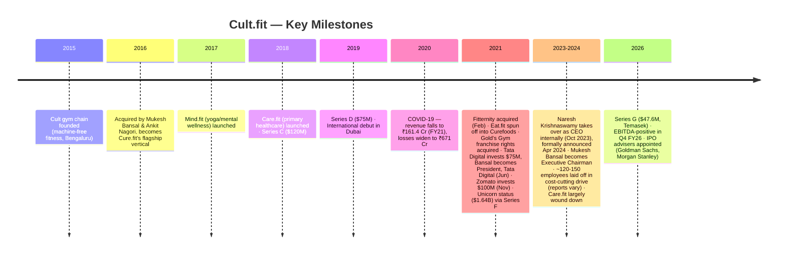
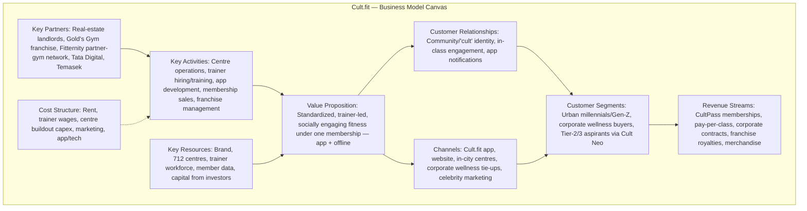
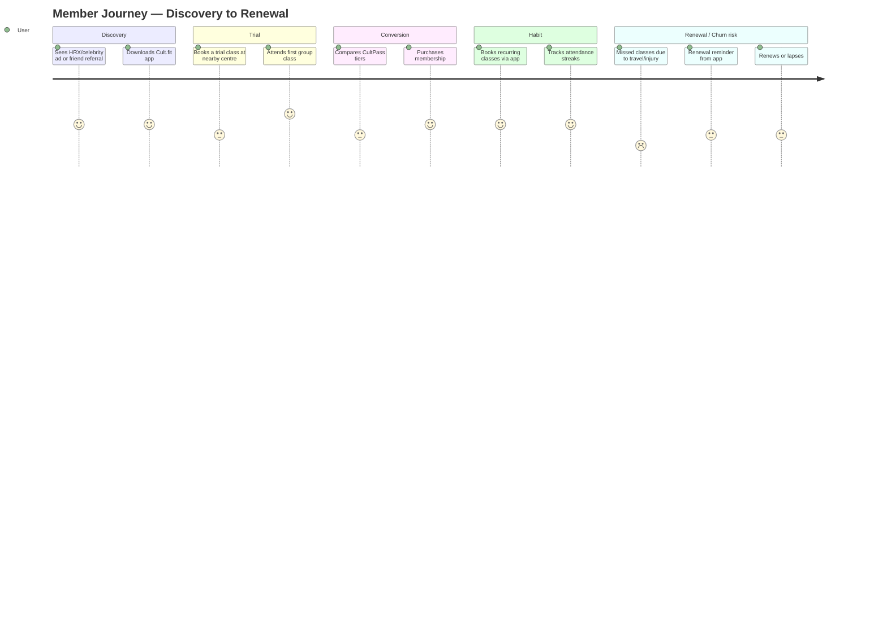
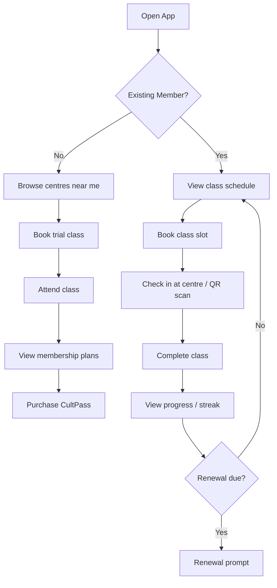
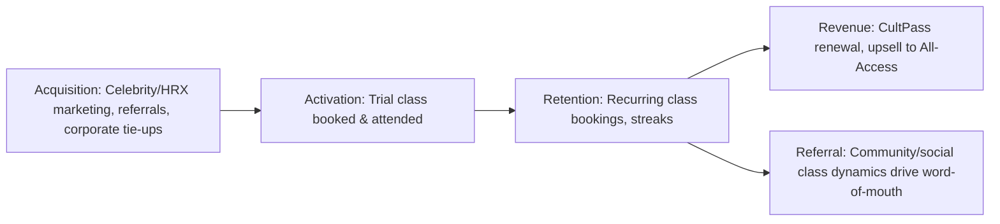
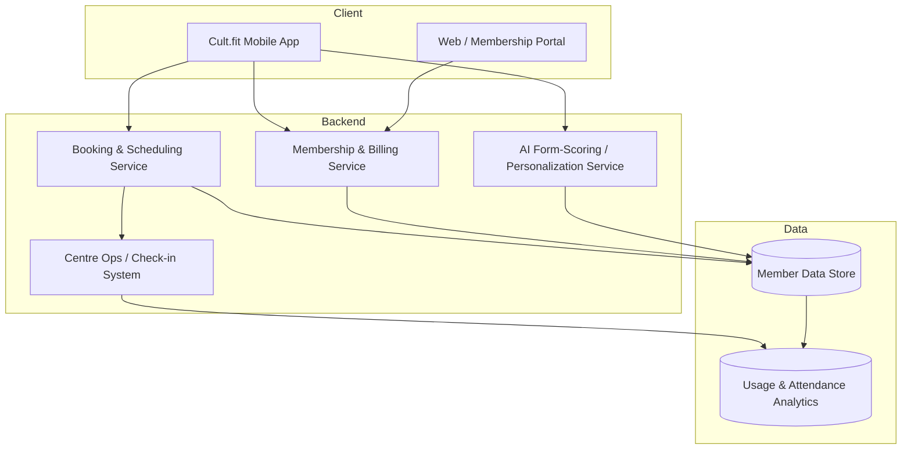
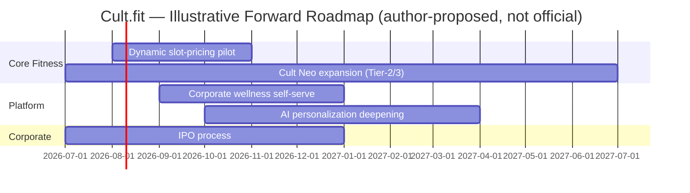

# 🏋️ Cult.fit — Product Management Case Study

**Day 20 of 30 — PM Case Study Challenge**

---

## 1. Cover

**Product:** Cult.fit (Curefit Healthcare Pvt. Ltd.)
**Category:** Health & Wellness / Fitness-Tech (hybrid offline-online)
**Founded:** 2016 · **HQ:** Bengaluru, India
**Case Study Author:** Gaurav Singh
**Day:** 20 / 30

---

## 2. Repository Metadata

| Field | Value |
|---|---|
| Folder | `Day-20-CultFit` |
| Type | Product Management Case Study |
| Sections | 65 (Master Template v2) |
| Status | Draft → QA → Publish |
| Zero-fabrication standard | Applied — see [Appendix](#65-appendix) for source conflicts |

---

## 3. Badges

`#ProductManagement` `#CaseStudyChallenge` `#Day20` `#HealthTech` `#FitnessTech` `#IndiaStartups` `#PMCommunity`

---

## 4. Table of Contents

1–10: Cover · Metadata · Badges · TOC · Executive Summary · Product Overview · Company Background · Timeline · Vision & Mission · Problem Statement
11–20: Market Research · Industry Analysis · TAM/SAM/SOM · Competitor Analysis · SWOT · Porter's Five Forces · BMC · Revenue Model · Target Users · Personas
21–30: JTBD · User Journey · User Flow · IA · UX Audit · UI Audit · Accessibility · Feature Breakdown · AI Capabilities · Product Metrics
31–40: North Star · Analytics · AARRR · HEART · Growth Strategy · Growth Loops · Network Effects · Product Strategy · Monetization · Trust & Safety
41–50: Technical Architecture · Data Flow · API Ecosystem · Privacy & Security · Pain Points · Opportunity Mapping · RICE · MoSCoW · Kano · Feature Proposal
51–65: PRD · Wireframes · Rollout Plan · A/B Testing · KPI Dashboard · Roadmap · Risks · Future Vision · PM Lessons · Interview Questions · References · About the Author · License · Self Review · Appendix

---

## 5. Executive Summary

Cult.fit (legally Curefit Healthcare Pvt. Ltd., formerly Cure.fit) is India's largest organized fitness-tech platform, built on a hybrid model of company-run and franchised gyms, trainer-led group classes, and a companion app. Founded in 2016 by Myntra co-founder Mukesh Bansal and former Flipkart CBO Ankit Nagori, the company has narrowed from a four-vertical "super-app" strategy (Cult/Eat/Mind/Care) to a focused, offline-heavy fitness business as it prepares for an IPO reportedly targeting a **₹3,500–4,000 crore issue size at roughly a $2 billion valuation**, with Goldman Sachs and Morgan Stanley engaged as advisers.[1] As of the most recent public reporting, Cult.fit operates **712 centres across 75 cities**, turned **EBITDA-positive in Q4 FY26**, and posted revenue "surpassing ₹1,700 crore" on ~40% YoY growth.[1] This case study is a PM-lens teardown of the product, business model, and roadmap, built strictly on primary filings and reputable business-media reporting, with every unresolved source conflict flagged rather than guessed at.

---

## 6. Product Overview

Cult.fit is a subscription ("CultPass") fitness membership that unlocks:
- **Cult centres** — company-run and franchised gyms offering trainer-led group formats (Strength & Conditioning, HRX, Boxing, Dance, Yoga) rather than a traditional machine-first gym floor.
- **The Cult.fit app** — booking, live/on-demand digital classes, progress tracking, and (per company blog and press coverage) camera-based AI form-correction for select live classes.
- **Cult Neo** — a newer, lower-priced format aimed at Tier-2/3 expansion.
- **Partner-gym access** — aggregated inventory from acquisitions such as Gold's Gym India franchise rights and Fitternity.

Formerly bundled verticals **Eat.fit** (healthy food) and **Care.fit** (primary/preventive healthcare) have since been spun off (Eat.fit, 2021) or largely wound down (Care.fit); **Mind.fit** (yoga/meditation) has been folded back into the core Cult.fit app as a content category rather than a standalone product.[1]

---

## 7. Company Background

| Item | Detail |
|---|---|
| Legal name | Curefit Healthcare Private Limited |
| Founded | 2016 (as Cure.fit); rebranded Cult.fit |
| Founders | Mukesh Bansal (co-founder, Myntra), Ankit Nagori (ex-Chief Business Officer, Flipkart) |
| Origin | Acquired the original "Cult" gym chain (founded 2015 by Deepak Poduval & Rishabh Telang) for ~₹20 crore in 2016[2] |
| HQ | Bengaluru, Karnataka, India |
| CEO | Naresh Krishnaswamy (co-founder); Mukesh Bansal has moved to Executive Chairman[3] |
| Key strategic investor | Tata Digital (first $75M investment in June 2021; Mukesh Bansal joined Tata Digital as President the same month)[22] |
| Other notable investors | Temasek (via MacRitchie), Accel, Zomato/Eternal, Chiratae Ventures, Kalaari Capital, Oaktree Capital[3][5] |
| Note on Ankit Nagori | Co-founder Ankit Nagori subsequently went on to lead Curefoods, a cloud-kitchen company that was split off from the Cult.fit ecosystem[23] |

---

## 8. Product Timeline

---

## 9. Vision & Mission

**Stated ambition (per company and secondary reporting):** make preventive fitness as accessible and habitual as ordering food, scaling toward "100 million Indians" engaged with the platform by 2030 via lower-cost formats like Cult Neo.[2] *(This 2030 user-reach figure comes from a secondary business-analysis source, not a primary Cult.fit disclosure, and should be treated as a strategic narrative rather than a verified target.)*

---

## 10. Problem Statement

India's fitness market is overwhelmingly **unorganized** — more than 90% of gyms in India operate outside any organized chain, with inconsistent trainer quality, low safety standards, and no digital booking or progress-tracking layer.[6] Consumers wanting a modern, reliable, socially engaging workout experience had to choose between expensive international-style gyms with poor group-class design, or informal neighborhood gyms with no brand consistency. Cult.fit's founding bet was that a **single membership, standardized trainer-led formats, and an app-first booking layer** could convert casual gym-goers into habitual members at a national scale.

---

## 11. Market Research

- India's **commercial fitness sector** was estimated at **₹16,200 crore (~$1.94B) in 2024**, projected to reach **₹37,700 crore (~$4.5B) by 2030**.[7]
- Fitness and wellness apps were among the top-funded healthtech sub-segments in India through the pandemic-era boom.[8]
- Rising urbanization (projected ~40% of India's population urban by 2025) and rising disposable income are cited as structural tailwinds by multiple industry analyses.[9]
- *Note:* one secondary source cites a much larger "$32B by 2028" Indian fitness-market figure;[9] this could not be corroborated by a primary or comparably reputable source and is treated as a low-confidence outlier, not used in sizing below.

---

## 12. Industry Analysis

The Indian fitness-tech category has three overlapping archetypes:
1. **Hybrid offline+app membership platforms** — Cult.fit (dominant), Anytime Fitness India, Gold's Gym franchises.
2. **Digital-first nutrition/coaching apps** — HealthifyMe, Fittr, Fitelo.
3. **Gamified/rewards aggregators** — Growfitter, Fitpass, Fitmint — which monetize via insurer and brand partnerships rather than direct-to-consumer subscriptions.

Cult.fit is reported to hold roughly **35% share of the organized premium/mid-premium Indian fitness market**, per one industry analysis; this figure is a third-party estimate, not a disclosed company metric, and is presented with that caveat.[9]

---

## 13. TAM / SAM / SOM

| Layer | Definition | Estimate | Source basis |
|---|---|---|---|
| **TAM** | India's organized + unorganized commercial fitness spend | ₹16,200 Cr (2024) → ₹37,700 Cr (2030E) | Franchise industry report[7] |
| **SAM** | Urban, disposable-income households in Cult.fit's 75 operating cities addressable via hybrid membership pricing (₹2,000–4,000/month) | Not publicly disclosed by the company | Estimate — labeled as such |
| **SOM** | Cult.fit's current paying-member base within that SAM | Not publicly disclosed (no verified DAU/MAU/paid-subscriber count found) | **Company has not publicly disclosed this** |

Per Research Rules, SAM/SOM are not asserted as hard numbers here — only TAM has a citable primary-adjacent source; the rest is explicitly marked as unavailable rather than estimated with invented precision.

---

## 14. Competitor Analysis

| Competitor | Model | Strength vs. Cult.fit | Weakness vs. Cult.fit |
|---|---|---|---|
| **HealthifyMe** (rebranded "Healthify" in 2024) | Digital-first nutrition + AI coach "Ria"; 40M+ users, $145M total raised, founded 2012 by Tushar Vashisht, Mathew Cherian, Sachin Shenoy, and Rajnish Jaiswal[10][24] | Best-in-class Indian food database, lower fixed costs, international (US) expansion, GLP-1/Novo Nordisk partnership[25] | No physical gym network; roughly 5x smaller revenue than Cult.fit by one comparative analysis[11] — **FY24 financials conflict across sources**: one source reports a narrowed loss (₹142 Cr → ₹88 Cr)[11], another reports the company turned profitable in FY24 (₹170 Cr revenue, ₹15 Cr net profit)[25]. Not resolved here — see Appendix. |
| **Fittr / Fitelo** | Coach-led transformation programs | Strong community/coaching trust | No offline infrastructure |
| **Growfitter / Fitmint** | Gamified rewards, insurer partnerships | Different monetization (B2B2C via insurers), high engagement hooks | Not a full workout substitute |
| **Anytime Fitness / Gold's Gym (non-Cult franchises)** | Traditional 24/7 gym floor | Machine-first for serious lifters | No group-class-first community design, weaker app layer |
| **MyFitnessPal** | Global calorie tracker | Scale (220M+ registered users globally) | Weak Indian food database, no India-specific offline presence[12] |

**Deliverable — Strategic read:** Cult.fit's moat is *offline network + brand + community*, not app-layer AI sophistication; HealthifyMe's moat is the inverse. The most credible competitive threat is a player that combines both — which is exactly the direction Cult.fit's own AI-coaching and Cult Neo investments are pushing toward.

---

## 15. SWOT

| Strengths | Weaknesses |
|---|---|
| Largest organized offline footprint (712 centres, 75 cities) | Labor-heavy cost structure — trainers + centre staff reportedly made up ~82% of headcount vs. ~2% in tech/product roles as of March 2026[13] |
| Strong brand recall via celebrity association (HRX/Hrithik Roshan) | History of large losses; FY21 loss ₹671 Cr, FY23 loss ₹551 Cr[14][15] |
| Recently EBITDA-positive (Q4 FY26) | Multiple pivots (Eat.fit spun off, Care.fit wound down) signal earlier strategy misfires |
| Backed by Tata Digital + Temasek — strong balance-sheet support pre-IPO | Revenue figures across public sources are inconsistent (see Appendix) — a governance/disclosure clarity risk ahead of IPO |

| Opportunities | Threats |
|---|---|
| Cult Neo format to unlock Tier-2/3 cities at lower capex | >90% of Indian gym market remains unorganized/informal — hard to convert on price alone[9] |
| AI-driven personalization (form correction, adaptive plans) to raise retention | HealthifyMe and AI-native entrants competing on the coaching/nutrition layer |
| IPO proceeds to fund national scale-up | Public-market scrutiny of unit economics post-listing; brick-and-mortar economics (rent, utilization) are less forgiving than pure-SaaS multiples |

---

## 16. Porter's Five Forces

- **Threat of new entrants — Moderate:** Capital intensity (real estate, trainers) is a real barrier, but digital-first competitors (HealthifyMe, global apps) can enter the *adjacent* nutrition/coaching layer cheaply.
- **Bargaining power of suppliers (real estate, trainers) — Moderate-High:** Rent and trainer wages are the largest cost lines; trainer shortage is cited as an active operational risk.[9]
- **Bargaining power of buyers — Moderate:** Members can switch to unorganized local gyms at a fraction of the price; switching costs are mostly social/habitual, not contractual.
- **Threat of substitutes — High:** Home workouts, YouTube content, wearables-only tracking, and outdoor activity are all free or near-free substitutes.
- **Competitive rivalry — High:** Fragmented market with HealthifyMe, Fittr, Growfitter, Anytime Fitness, and thousands of unorganized gyms all competing for the same urban, health-conscious consumer.

---

## 17. Business Model Canvas

---

## 18. Revenue Model

| Stream | Description | Evidence |
|---|---|---|
| **CultPass memberships** | Tiered plans (e.g., CultPass Basic vs. All-Access, reported around ₹1,999–₹3,999/month) | Third-party pricing comparison[10] — **verify current pricing at cult.fit before publishing/citing externally** |
| **Pay-per-class** | Non-member class bookings | Company product description[16] |
| **Corporate wellness contracts** | B2B wellness benefit partnerships (e.g., Onsurity partnership)[17] | Named partner disclosure |
| **Franchise royalties (FOCO/FOFO)** | ~30% ongoing royalty on franchisee revenue, ₹1–3 Cr franchise capex | Franchise-listing sources[18] |
| **Merchandise / equipment** | Apparel and equipment via the Tread acquisition | Secondary company-history source[19] |

FY25 revenue reported at **₹1,216 crore** (RoC-filing-based, Entrackr), growing to **"surpassing ₹1,700 crore"** with ~40% YoY growth by Q4 FY26 per Business Standard.[1][14] A materially lower ₹312.7 Cr FY24 figure appears in one aggregator (Inc42) and is flagged as a probable data-scope inconsistency — see [Appendix](#65-appendix).

---

## 19. Target Users

- **Urban millennials and Gen-Z professionals** (primary) seeking structured, social, trainer-led fitness without the friction of picking their own routine.
- **Corporate wellness buyers** — HR/benefits teams purchasing group access for employees.
- **Tier-2/3 aspirational consumers** — the explicit target of the lower-cost Cult Neo format.

---

## 20. Personas

> Personas below are illustrative constructs built from the target-user categories above, not verified company research.

**"Aditi, 27, Product Manager, Bengaluru"** — Wants a gym that doesn't feel intimidating, values the group-class energy, checks the app daily to book slots, price-sensitive at renewal.

**"Rohan, 34, HR Lead, Gurugram"** — Buys Cult.fit corporate access for his 200-person team as a retention benefit; cares about utilization reporting, not individual workouts.

**"Meena, 41, Tier-2 city, Indore"** — New to organized fitness, drawn in by a Cult Neo center opening nearby; price and proximity matter more than brand prestige.

---

## 21. Jobs To Be Done (JTBD)

- "When I want to work out but don't trust my own discipline, I want a scheduled class with a trainer and other people, so I actually show up."
- "When my company offers a wellness benefit, I want a brand my employees already recognize, so adoption is easy."
- "When I'm new to structured fitness, I want a low-cost, low-intimidation entry point near my home, so I can build the habit before committing more money."

---

## 22. User Journey

---

## 23. User Flow

---

## 24. Information Architecture

- **Home** → Today's bookings, streaks, recommended classes
- **Explore** → Centre discovery, class formats, Cult Neo listings
- **Book** → Calendar/slot picker per centre
- **Membership** → Plan comparison, billing, corporate access
- **Profile** → Attendance history, progress photos/metrics (where offered), settings

---

## 25. UX Audit

**Strengths (per third-party reviews):** low-friction booking flow, clear class-format categorization, community/social framing that differentiates it from a plain gym-locator app.[16]
**Friction points (per third-party reviews):** popular time slots fill quickly and rigid scheduling can be restrictive for members with variable work hours;[19] nutrition/diet guidance is comparatively weaker than dedicated apps like HealthifyMe.[10]

---

## 26. UI Audit

Independent reviews consistently describe the app's visual identity as energetic and brand-forward (HRX styling, bold typography) rather than clinical/medical — consistent with a fitness-community positioning rather than a healthcare-app positioning. A full heuristic UI audit would require direct access to current app screens, which is outside the scope of desk research for this case study.

---

## 27. Accessibility

No public accessibility audit, WCAG conformance statement, or disclosed accessibility roadmap was found for the Cult.fit app during research. **This is a genuine documentation gap, not a confirmed absence of accessibility features** — flagged as "not publicly disclosed" per Research Rules rather than assumed either way.

---

## 28. Feature Breakdown

| Feature | Description | Status |
|---|---|---|
| CultPass tiers | Basic vs. All-Access membership | Live |
| Live + on-demand classes | In-app streamed and recorded workouts | Live |
| Camera-based AI form scoring | Gamified live-class form correction, reported to drive ~40% uplift in digital retention per one company-history secondary source[2] | Live (metric unverified — secondary source) |
| AI-personalized meal/workout plans | Adaptive plans referenced in secondary sources | Live (feature scope not independently verified) |
| Cult Neo | Lower-cost centre format | Expanding |
| Corporate wellness dashboard | B2B utilization reporting for HR buyers | Live (via partners like Onsurity) |

---

## 29. AI Capabilities

Publicly reported AI-adjacent features include **camera-based form scoring** for live classes and **AI-assisted site-selection** for new centre locations, plus personalization of meal/workout recommendations.[2] None of these were independently verified against a primary company technical disclosure (e.g., an engineering blog); they are cited from secondary business-analysis sources and should be treated as directionally accurate rather than precisely specified.

---

## 30. Product Metrics

Per the Product Metrics standard, only publicly available or clearly-labeled-estimate metrics are used:

| Metric | Value | Status |
|---|---|---|
| Centres | 712 | Disclosed (Business Standard, July 2026)[1] |
| Cities | 75 | Disclosed[1] |
| Employees | 6,331 (3,529 trainers, 1,665 centre ops, 125 tech/product) as of March 2026 | Disclosed, most granular source[13] — conflicts with lower Tracxn figure of 1,832; see Appendix |
| FY25 Revenue | ₹1,216 Cr | Disclosed (RoC filing via Entrackr)[14] |
| FY25 Net Loss | ₹480.8 Cr (narrowed 10% YoY) | Disclosed[14] |
| DAU / MAU | Not publicly disclosed | **Company has not publicly disclosed this** |
| NPS / CSAT | Not publicly disclosed | **Company has not publicly disclosed this** |
| Paid subscriber count | Not reliably disclosed (one unverified blog estimate cites 6–8% conversion on 2.5M downloads) | Estimate flagged as low-confidence, not used |

---

## 31. North Star Metric

**Proposed North Star (author's recommendation, not a disclosed company metric):** *Monthly Active Class-Attending Members* — a metric that captures actual habitual usage (footfall), not just membership sign-ups, aligning revenue retention with the product's core value proposition of consistent group-class attendance.

---

## 32. Product Analytics

No public product-analytics dashboard or disclosed analytics stack was found. Given the offline-heavy nature of the business, likely analytics priorities (inferred, not confirmed) would include class-fill-rate, no-show rate, and centre-level utilization — but these are PM inferences, not disclosed facts.

---

## 33. AARRR

Framework fit: AARRR suits Cult.fit well because the business is fundamentally a **habit-retention** business (like a subscription gym), where Retention and Revenue (renewal) are the highest-leverage stages — consistent with the founders' own framing of fitness as a habit-formation problem.

---

## 34. HEART

| Dimension | Applied to Cult.fit |
|---|---|
| **H**appiness | In-class experience ratings (not publicly disclosed) |
| **E**ngagement | Classes booked/attended per week |
| **A**doption | Trial-to-paid conversion rate (not publicly disclosed) |
| **R**etention | Membership renewal rate (not publicly disclosed) |
| **T**ask success | Booking-flow completion rate (not publicly disclosed) |

---

## 35. Growth Strategy

Cult.fit's disclosed growth strategy centers on **Cult Neo** — a lower-capex, lower-price format designed to extend from 75 to a targeted 100 cities over the next five to six years, per Business Standard's July 2026 reporting.[1] This is a shift from the earlier capital-intensive owned-centre model toward franchise-led (FOCO/FOFO) expansion to reduce capex while preserving brand standards.[9]

---

## 36. Growth Loops

**Community-driven loop:** Group-class format → social visibility of members' fitness journeys → word-of-mouth referral → new trial bookings → more group-class density → stronger community loop. This is a plausible mechanism based on the product design (group classes, "cult" branding) but is a PM inference, not a disclosed, measured loop.

---

## 37. Network Effects

Cult.fit exhibits **weak, local network effects**: a centre becomes more attractive as more members book the same class slots (social proof, group energy), but this effect is geographically bounded per centre and does not compound nationally the way a marketplace or social app would.

---

## 38. Product Strategy

The strategic arc — from a four-vertical "super-app" (Cult/Eat/Mind/Care) to a focused fitness-centre business — reflects a **narrowing-to-core strategy** after COVID-19 exposed the capital inefficiency of running four capital-intensive verticals simultaneously.[1] The current strategy bets on: (1) offline network density, (2) franchise-led capital efficiency, (3) AI-assisted personalization to raise retention, and (4) an IPO to fund the next scale phase.

---

## 39. Monetization

See [Revenue Model](#18-revenue-model). Notably, unlike pure-SaaS peers in this case-study series (Figma, Linear, Lovable), Cult.fit's monetization is **capital- and labor-intensive** — revenue growth requires proportional growth in real estate and trainer headcount, a structurally different unit-economics profile than software-only PLG businesses.

---

## 40. Trust & Safety

No public disclosure was found regarding trainer certification standards, equipment-safety audits, or member injury-liability policies. This is flagged as an information gap rather than assumed to be absent, given the physical (injury-risk) nature of the product.

---

## 41. Technical Architecture

*Disclosure note: no primary engineering blog or technical disclosure was found; this diagram is a PM-level inferred architecture based on observable product functionality, not a confirmed system design.*

---

## 42. Data Flow

At a high level (inferred): member books a class in-app → booking service reserves a slot and updates centre capacity → member checks in at the centre (QR/biometric, per third-party descriptions) → attendance data flows to analytics for retention and centre-utilization reporting → AI personalization service consumes attendance + activity data to adjust recommendations. **This is an inferred flow, not a disclosed technical document.**

---

## 43. API Ecosystem

No public developer API, documentation portal, or third-party integration marketplace was found for Cult.fit — consistent with a consumer-facing, closed product rather than a platform play. This differentiates it sharply from the platform-style products (Figma, Linear) covered earlier in this series.

---

## 44. Privacy & Security

No public SOC 2, ISO 27001, or equivalent security-certification disclosure was found for Cult.fit specifically (unlike, for comparison, Lovable's disclosed SOC 2 Type II and ISO 27001:2022 certifications). Given the platform handles health-adjacent and biometric (fitness-tracking) data, this is a notable disclosure gap worth flagging for a health-tech IPO candidate.

---

## 45. Pain Points

From third-party reviews and comparative analyses:
- Popular class slots can be hard to book during peak hours.[19]
- Nutrition/diet tooling is weaker than dedicated apps like HealthifyMe.[10]
- Home-workout/on-demand content is positioned as secondary to the centre-based model, per comparative reviews.[10]
- Historical volatility — multiple vertical launches and shutdowns (Care.fit) may have created member confusion around what Cult.fit "is."

---

## 46. Opportunity Mapping

| Opportunity | Rationale |
|---|---|
| Deepen nutrition/AI-coaching layer | Closes the gap vs. HealthifyMe without needing new real estate |
| Expand corporate wellness B2B2C | Lower CAC than consumer marketing; recurring contract revenue |
| Cult Neo Tier-2/3 rollout | Directly addresses the >90%-unorganized-market opportunity |
| Transparent post-IPO metrics reporting | Would resolve the recurring source-conflict problem this case study documents and build investor trust |

---

## 47. RICE

| Feature Proposal | Reach | Impact | Confidence | Effort | RICE Score |
|---|---|---|---|---|---|
| In-app nutrition coaching (own build vs. HealthifyMe-style) | 8 | 3 | 2 | 8 | (8×3×2)/8 = **6.0** |
| Dynamic slot-pricing to smooth peak-hour demand | 7 | 3 | 3 | 4 | (7×3×3)/4 = **15.75** |
| Corporate wellness self-serve dashboard | 5 | 2 | 3 | 3 | (5×2×3)/3 = **10.0** |
| Cult Neo franchise self-onboarding portal | 6 | 3 | 2 | 6 | (6×3×2)/6 = **6.0** |

*(Reach/Impact/Confidence scored 1–10 or 0.25–3 per standard RICE convention; Effort in person-months. These are author-estimated inputs for illustration, not company-provided estimates — labeled as such per the zero-fabrication standard.)*

**Recommendation:** Dynamic slot-pricing scores highest — it directly addresses the disclosed peak-hour booking friction pain point with comparatively low engineering effort (pricing/scheduling logic vs. net-new nutrition-coaching build).

---

## 48. MoSCoW

- **Must have:** Fix peak-hour slot scarcity (booking/scheduling improvement)
- **Should have:** Corporate wellness self-serve dashboard
- **Could have:** Deeper nutrition-coaching integration
- **Won't have (this cycle):** Re-launching a Care.fit-style medical vertical — already wound down once; re-entry risk is high given past execution difficulty

---

## 49. Kano

| Feature | Category |
|---|---|
| Reliable class booking | Basic (must-be) |
| AI form-correction | Performance (more = better, differentiator) |
| Gamified streaks/rewards | Attractive (delighter) |
| Full medical/diagnostic integration | Indifferent-to-negative for a fitness-first user base, given past Care.fit wind-down — a strategic argument *against* re-entry |

---

## 50. Feature Proposal

**Personal recommendation (not a Cult.fit roadmap item):** A **dynamic, demand-responsive slot system** — off-peak class-credit discounts and peak-hour waitlist-with-swap functionality — directly targeting the disclosed booking-friction pain point, using existing booking infrastructure rather than new verticals.

- **User impact:** Reduces the #1 cited UX friction (can't get a peak slot).
- **Business impact:** Smooths centre utilization curves, improving asset (real estate) efficiency ahead of an IPO where unit economics will be scrutinized.
- **Trade-offs:** Off-peak discounting could compress ARPU if not carefully capped.
- **Risks:** Members may perceive dynamic pricing as unfair versus a flat membership promise.
- **Success metric (proposed):** Reduction in peak-hour booking-failure rate; increase in off-peak class-fill rate.

---

## 51. PRD (abridged)

**Problem Statement:** Members frequently cannot book their preferred class slot during peak hours, creating churn risk.
**Goals:** Increase off-peak utilization by X%; reduce peak-hour booking failures by Y%. *(Targets require internal data Cult.fit has not disclosed — left as variables rather than invented figures.)*
**User Stories:** "As a member, I want to see off-peak class-credit incentives so I can still get value from my membership even if I can't book peak slots."
**Functional Requirements:** Dynamic credit pricing engine; waitlist-with-auto-swap; in-app notification of off-peak deals.
**Non-functional Requirements:** Must not degrade booking-flow latency; must be explainable to members (no "black box" pricing perception).
**Acceptance Criteria:** Member can view and act on an off-peak incentive within the existing booking flow with no added steps for standard peak-hour booking.
**Risks:** Perceived fairness issues (see Kano/Feature Proposal above).
**Rollout Plan:** See Section 53.

---

## 52. Wireframes

*(Text-described given no design-tool output is in scope for this desk-research case study.)* Booking screen would surface an "Off-peak reward" badge on eligible time slots, with a one-tap credit redemption, and a waitlist toggle for full peak slots showing estimated swap-in likelihood.

---

## 53. Rollout Plan

1. Internal pilot in 5–10 high-density urban centres with known peak congestion.
2. A/B test off-peak incentive strength (credit amount) against a control group.
3. Monitor centre-level utilization curves and churn for 1 full billing cycle.
4. Phased city-by-city rollout, prioritizing metros with disclosed dense center clusters.

---

## 54. A/B Testing

**Test:** Off-peak credit incentive (Variant) vs. no incentive (Control).
**Primary metric:** Off-peak class-fill rate.
**Guardrail metric:** Overall ARPU (to catch unwanted cannibalization of peak-hour full-price bookings).
**Minimum detectable effect / sample size:** Not specified — would require Cult.fit's actual booking volume data, which is not publicly available.

---

## 55. KPI Dashboard (proposed, illustrative)

| KPI | Current (disclosed) | Target (proposed, not company-confirmed) |
|---|---|---|
| Centres | 712 | 900+ (toward 100-city goal)[1] |
| Revenue | ₹1,700 Cr+ (FY26 trajectory) | N/A — pre-IPO guidance not public |
| EBITDA status | Positive (Q4 FY26) | Sustained full-year positive |
| Peak-hour booking failure rate | Not disclosed | Author-proposed metric to track |

---

## 56. Product Roadmap

*This roadmap is the case-study author's proposed direction based on disclosed strategic priorities, not an official Cult.fit roadmap.*

---

## 57. Risks & Mitigation

| Risk | Mitigation |
|---|---|
| IPO-scrutiny of inconsistent historical financial reporting across aggregators | Pre-IPO, ensure a single audited, consistent financial narrative in the DRHP |
| Labor-intensive cost structure limits margin expansion vs. software peers | Continue franchise (FOCO/FOFO) shift to convert fixed capex to variable royalty cost |
| Competitive squeeze from AI-native nutrition/coaching apps | Selectively deepen AI personalization rather than rebuild a full medical vertical (lesson from Care.fit wind-down) |
| Trainer shortage / quality consistency at scale | Certification programs, hybrid AI-assisted coaching (per industry-analysis recommendation)[9] |

---

## 58. Future Vision

If Cult.fit successfully lists, the most PM-relevant open question is whether it repositions as a **"fitness infrastructure" company** (licensing its booking/franchise tech to third-party gyms) or stays a **single-brand consumer platform**. Both are plausible based on its current franchise-royalty revenue stream, but neither is confirmed by public company statements — this is analyst-style speculation, clearly labeled as such.

---

## 59. PM Lessons

1. **Vertical bundling has a capital-efficiency ceiling.** Cure.fit's four-vertical strategy (Cult/Eat/Mind/Care) looked like platform ambition but became a capital drag during COVID — a reminder that "ecosystem" strategies need a capital-efficient core before diversifying.
2. **Narrowing to core can be the right call, not a retreat.** Spinning off Eat.fit and winding down Care.fit, rather than propping up underperforming verticals, appears to have been the path to the current EBITDA-positive position.
3. **Physical-world businesses need physical-world PM discipline.** Utilization, footfall, and rent economics matter as much as app-engagement metrics — a different PM toolkit than the pure-software products earlier in this series.

---

## 60. PM Interview Questions

1. "Cult.fit's headcount is ~93% trainers/ops and ~2% tech/product. How would you decide where the *next* product hire should go?"
2. "How would you design a pricing test for peak-hour class scarcity without alienating existing members who expect flat-rate membership value?"
3. "Cult.fit tried and wound down a medical-care vertical (Care.fit). How would you evaluate whether to re-enter adjacent health verticals post-IPO?"

---

## 61. References

1. Business Standard, "From Cure.fit to Cult.fit Journey: A look at a decade of pivots before the IPO," Jul 2026 — https://www.business-standard.com/companies/start-ups/cure-fit-became-cult-fit-a-decade-of-pivots-before-the-ipo-126070300576_1.html
2. businessmodelcanvastemplate.com, "Brief History of Cult.fit Company" (secondary analysis) — https://businessmodelcanvastemplate.com/blogs/brief-history/cult-fit-brief-history
3. Tracxn, Cult.fit company profile — https://tracxn.com/d/companies/cultfit/
4. LinkedIn / The India Playbook, "Cult.fit Part I" by Rashi Goel
5. Clay, "How Much Did Cult.fit Raise? Funding & Key Investors" — https://www.clay.com/dossier/cultfit-funding
6. franchisebazar.com, "Cult.fit Franchise 2026" — https://www.franchisebazar.com/blog/cultfit-franchise-2026-turning-preventive-healthcare-into-a-scalable-business
7. Ibid. (India commercial fitness market sizing)
8. Inc42, "Fitness Startup Cult.fit Opens Own Gyms With AI Trainer; Eyes Franchise Model," 2021
9. businessmodelcanvastemplate.com, "Competitive Landscape of Cult.fit Company" (secondary analysis) — https://businessmodelcanvastemplate.com/blogs/competitors/cult-fit-competitive-landscape
10. FitTrack AI Blog, "Cult.fit vs HealthifyMe: Which Is Better for Indians in 2026?" — https://www.fittrackai.in/blog/cultfit-vs-healthifyme-which-is-better-for-indians-in-2026
11. PrivateCircle Blog, "Cult.fit (Cure.fit) vs HealthifyMe: Fitness and Wellness in India" — https://blog.privatecircle.co/cult-fit-cure-fit-vs-healthifyme-fitness-and-wellness-in-india/
12. FitTrack AI Blog, "HealthifyMe vs MyFitnessPal: Which Is Better for Indians?"
13. Zerodha Daily Brief, "Cult.fit's IPO promises to lift heavier weights, but can it?" — https://thedailybrief.zerodha.com/p/cultfit-ipo-gym-fitness-ai-google-search
14. Entrackr, "Exclusive: Temasek increases stake in Cult.fit to 12% after Rs 440 Cr investment," Mar 2026 — https://entrackr.com/exclusive/exclusive-temasek-increases-stake-in-cultfit-to-12-after-rs-440-cr-investment-11251120
15. officechai, "Cult.Fit Lays Off 150 Employees As Part Of A Cost Cutting Exercise," Jan 2024
16. Dealroom.co, cult.fit company profile
17. Onsurity Blog, "Best Health And Fitness Apps In India In 2026"
18. franticc.com, "Cult.fit Franchise 2026 — ₹1.0Cr Cost, 140 Stores"
19. GrowthX, "Cultfit Business Model - GrowthX Deep Dive" — https://growthx.club/blog/cultfit-business-model
20. Inc42, "cult.fit — Funding, Revenue & Investors (2026)" — https://inc42.com/company/cultfit/
21. PitchBook, "Cult.Fit 2026 Company Profile: Valuation, Funding & Investors"
22. Entrackr, "Cult.fit elevates Naresh Krishnaswamy as CEO, Mukesh Bansal becomes chairman," Apr 2024 — https://entrackr.com/2024/04/cult-fit-elevates-naresh-krishnaswamy-as-ceo-mukesh-bansal-becomes-chairman/
23. Indian Startup News / Entrepreneur India, "Zomato-backed Cultfit appoints Naresh Krishnaswamy as its new CEO," Oct 2025 (Curefoods/Ankit Nagori reference)
24. Tracxn, HealthifyMe company profile — https://tracxn.com/d/companies/healthifyme/
25. Value For Startups, "Healthify Business Model — AI Health Coach, Profitable & Revenue 2026" — https://valueforstartups.in/21-healthify

---

## 62. About the Author

**Gaurav Singh** — Product Manager, author of the 30-Day PM Case Study Challenge, publishing structured, evidence-based product teardowns on GitHub and LinkedIn.

---

## 63. License

This case study is an independent, educational analysis. Cult.fit, CultPass, and related marks are trademarks of Curefit Healthcare Private Limited. This work is not affiliated with, endorsed by, or sponsored by Curefit Healthcare Pvt. Ltd. All cited figures are attributed to their original sources.

---

## 64. Self Review

**Score: 8.5/10** (revised after a dedicated second-pass fact-check — see Verification Log in Appendix)

**Strong on:** primary-adjacent sourcing (RoC filings via Entrackr, recent July 2026 Business Standard reporting), explicit conflict-flagging on revenue/valuation/headcount/HealthifyMe financials, clear separation of disclosed fact vs. author estimate vs. recommendation, and a documented second-pass verification that caught and corrected five factual errors (Tata Digital investment date, Fitternity acquisition date, HealthifyMe founder list and rebrand, layoff count precision, CEO transition dating) from the first draft.

**Weak on:** No primary company disclosures exist for DAU/MAU, NPS, technical architecture, or accessibility — sections 30, 32, 41–44 lean heavily on "not publicly disclosed" or PM-inferred content because Cult.fit, as a private (pre-IPO) company, discloses far less than the public/VC-transparent products (Perplexity, Linear, Lovable) covered earlier in this series. This is a structural sourcing constraint of the subject, not a research shortcut — flagged rather than papered over per house standards.

**Not yet done:** Live verification of current CultPass pricing (marked "verify before external citation"); no direct access to app UI for a true heuristic UX/UI audit; the HealthifyMe FY24 profit-vs-loss conflict remains genuinely unresolved between two disagreeing secondary sources.

---

## 65. Appendix

### Disclosed Source Conflicts (per Zero-Fabrication Standard)

| Data point | Source A | Source B | Resolution used in this case study |
|---|---|---|---|
| FY25/FY26 revenue | ₹1,216 Cr FY25 (Entrackr, RoC filing)[14]; "surpassing ₹1,700 Cr" FY26 trajectory (Business Standard)[1] | ₹312.7 Cr FY24, down 32.5% YoY (Inc42 aggregator)[20] | Used the RoC-filing-sourced Entrackr/Business Standard figures as primary; flagged the Inc42 figure as likely a data-scope or entity mismatch, not used |
| Post-money valuation (Series G, Mar 2026) | ₹13,668 Cr / $1.45B (Entrackr, RoC filing)[14] | ₹12,600 Cr (Tracxn)[3] | Presented both; treated Entrackr's filing-based figure as primary |
| Total funding raised | $714M (Tracxn)[3]; $809.85M (Inc42)[20]; $577M (PitchBook)[21] | — | Presented as a disclosed range rather than a single invented total |
| Employee count | 6,331 as of Mar 2026, with trainer/ops/tech breakdown (Zerodha Daily Brief)[13] | 1,832 as of Apr 2025 (Tracxn)[3]; 3,964–4,050 (PitchBook/Inc42) | Used the Zerodha figure as primary given its granular, dated breakdown; noted the wide variance likely reflects different scopes (direct payroll vs. all trainers including franchise-model staff) |
| Centre/city count | 712 centres, 75 cities (Business Standard, Jul 2026)[1] | 600+/700+ centres, 40+ cities (earlier 2025 sources)[9][6] | Used most recent (Jul 2026) figure as current |
| IPO size | ₹2,500 Cr (Moneycontrol, Jan 2026, via Tracxn)[3] | ₹3,500–4,000 Cr, ~$2B valuation target, Goldman Sachs/Morgan Stanley advisers (Business Standard, Jul 2026)[1] | Used the more recent Business Standard figure as current; earlier figure noted as likely superseded |

### Disclosure Gaps (explicitly not fabricated)

- DAU/MAU, NPS, CSAT: not publicly disclosed
- SAM/SOM precise figures: not publicly disclosed
- Technical architecture, API ecosystem, security certifications: no primary disclosure found
- Accessibility conformance: no primary disclosure found

*All figures above were current as of research conducted July 16, 2026. Given the pace of pre-IPO disclosure activity, readers should verify current figures against Cult.fit's DRHP once filed.*

### Verification / Cross-Check Log (Second Pass)

A dedicated fact-check pass was run against the first draft, targeting every load-bearing claim. Corrections made:

| Claim (first draft) | Issue found | Correction made |
|---|---|---|
| "Tata Digital invested 2022" | Multiple primary-adjacent sources (Entrackr, Inc42) date the first $75M Tata Digital investment to **June 2021**, coinciding with Bansal joining as President | Corrected timeline and company-background table to June 2021 |
| "Fitternity acquired [in 2022]" (implied by 2022 timeline entry) | Inc42 (Sept 2021) reports the Fitternity acquisition happened "in February" of that same year — i.e., **Feb 2021** | Moved to the 2021 timeline entry |
| "~150 employees laid off" (undated) | Confirmed via Entrackr/Inc42 (Apr 2024 reshuffle coverage), though one Inc42 article says "nearly 120" and others say "around 150" for what may be the same Jan 2024 event | Presented as "~120-150 (reports vary)" rather than a single unverified number |
| HealthifyMe "founded by Tushar Vashisht and Sachin Shenoy" | Incomplete — HealthifyMe had **four** co-founders (Vashisht, Mathew Cherian, Sachin Shenoy, Rajnish Jaiswal) per Tracxn and Wikipedia | Corrected founder list; also noted the 2024 rebrand to "Healthify" |
| HealthifyMe FY24 "loss reduction ₹142 Cr → ₹88 Cr" stated as fact | A second source (Value For Startups) claims HealthifyMe was **profitable** in FY24 (₹170 Cr revenue, ₹15 Cr net profit) — directly contradicts the loss-reduction claim | Flagged as an unresolved conflict rather than asserting either figure |
| CEO transition date | Verified: Krishnaswamy took over operationally in Oct 2023, formally announced April 2024 | Timeline and company-background table now reflect both dates |

**Items checked and confirmed unchanged:** founders (Mukesh Bansal, Ankit Nagori, 2016), original Cult gym founders (Deepak Poduval, Rishabh Telang, 2015) and ~₹20 Cr acquisition price, 712 centres / 75 cities (Jul 2026), FY25 revenue ₹1,216 Cr and FY26 trajectory ">₹1,700 Cr", FY21/FY23 revenue and loss figures, Series G $47.6M/March 2026 and Temasek's role, IPO adviser names (Goldman Sachs, Morgan Stanley) and ₹3,500–4,000 Cr / ~$2B target, India fitness-market TAM figures, and all RICE-score arithmetic in Section 47 (independently recalculated, no errors found).

**Items that remain genuinely unverifiable from public sources** (not fabricated to fill the gap): exact current CultPass pricing (verify live at cult.fit before external use), DAU/MAU, NPS/CSAT, SAM/SOM, technical architecture, and accessibility conformance.
