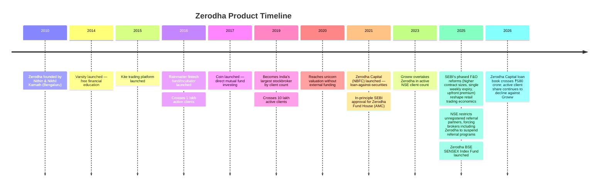
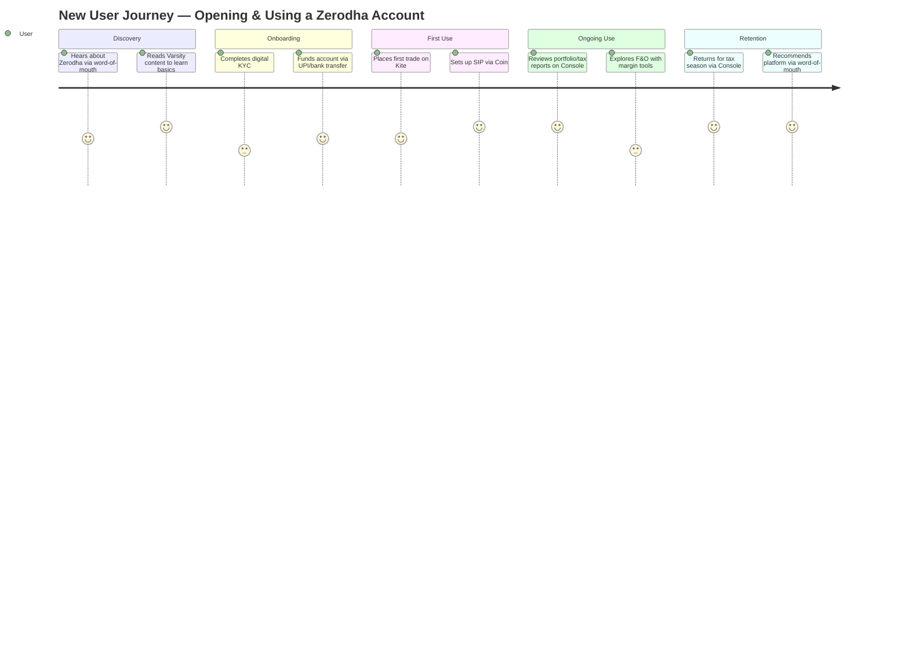
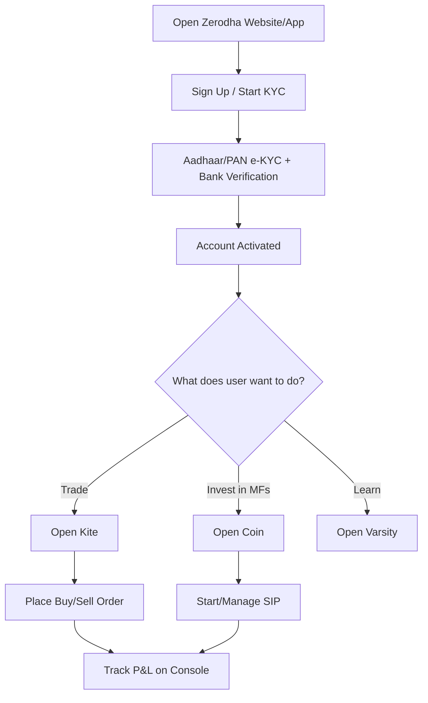
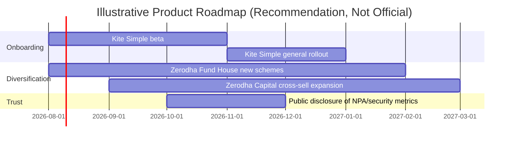

# Zerodha — Product Management Case Study

**Day 22 of 90 | PM Case Study Challenge**

---

## 1. Cover

**Product:** Zerodha (Zerodha Broking Ltd.)
**Category:** Fintech — Discount Broking, Wealth & Investment Platforms
**Founded:** August 2010 | **HQ:** Bengaluru, India
**Case Study Author:** Gaurav Singh
**Day:** 22 / 90

> India's largest stockbroker built without a single rupee of venture capital — a company that turned a ₹20 flat fee and a founder-led obsession with product into a category-defining, profitable fintech empire, and is now watching a VC-backed challenger take its crown on user count while it keeps the crown on profit.

---

## 2. Repository Metadata

| Field | Value |
|---|---|
| Folder | `Day-22-Zerodha` |
| Series | 90-Day PM Case Study Challenge |
| Previous | Day 21 — CRED |
| Next | Day 23 — TBD |
| Structure | `README.md`, `images/`, `assets/`, `references/` |

---

## 3. Badges

`#ProductManagement` `#Fintech` `#CaseStudy` `#Zerodha` `#India` `#Day22of90`

---

## 4. Table of Contents

- [1. Cover](#1-cover)
- [5. Executive Summary](#5-executive-summary)
- [6. Product Overview](#6-product-overview)
- [7. Company Background](#7-company-background)
- [8. Product Timeline](#8-product-timeline)
- [9. Vision & Mission](#9-vision--mission)
- [10. Problem Statement](#10-problem-statement)
- [11. Market Research](#11-market-research)
- [12. Industry Analysis](#12-industry-analysis)
- [13. TAM/SAM/SOM](#13-tamsamsom)
- [14. Competitor Analysis](#14-competitor-analysis)
- [15. SWOT](#15-swot)
- [16. Porter's Five Forces](#16-porters-five-forces)
- [17. Business Model Canvas](#17-business-model-canvas)
- [18. Revenue Model](#18-revenue-model)
- [19. Target Users](#19-target-users)
- [20. Personas](#20-personas)
- [21. JTBD](#21-jtbd)
- [22. User Journey](#22-user-journey)
- [23. User Flow](#23-user-flow)
- [24. Information Architecture](#24-information-architecture)
- [25. UX Audit](#25-ux-audit)
- [26. UI Audit](#26-ui-audit)
- [27. Accessibility](#27-accessibility)
- [28. Feature Breakdown](#28-feature-breakdown)
- [29. AI Capabilities](#29-ai-capabilities)
- [30. Product Metrics](#30-product-metrics)
- [31. North Star Metric](#31-north-star-metric)
- [32. Product Analytics](#32-product-analytics)
- [33. AARRR](#33-aarrr)
- [34. HEART](#34-heart)
- [35. Growth Strategy](#35-growth-strategy)
- [36. Growth Loops](#36-growth-loops)
- [37. Network Effects](#37-network-effects)
- [38. Product Strategy](#38-product-strategy)
- [39. Monetization](#39-monetization)
- [40. Trust & Safety](#40-trust--safety)
- [41. Technical Architecture](#41-technical-architecture)
- [42. Data Flow](#42-data-flow)
- [43. API Ecosystem](#43-api-ecosystem)
- [44. Privacy & Security](#44-privacy--security)
- [45. Pain Points](#45-pain-points)
- [46. Opportunity Mapping](#46-opportunity-mapping)
- [47. RICE](#47-rice)
- [48. MoSCoW](#48-moscow)
- [49. Kano](#49-kano)
- [50. Feature Proposal](#50-feature-proposal)
- [51. PRD](#51-prd)
- [52. Wireframes](#52-wireframes)
- [53. Rollout Plan](#53-rollout-plan)
- [54. A/B Testing](#54-ab-testing)
- [55. KPI Dashboard](#55-kpi-dashboard)
- [56. Product Roadmap](#56-product-roadmap)
- [57. Risks & Mitigation](#57-risks--mitigation)
- [58. Future Vision](#58-future-vision)
- [59. PM Lessons](#59-pm-lessons)
- [60. PM Interview Questions](#60-pm-interview-questions)
- [61. References](#61-references)
- [62. About the Author](#62-about-the-author)
- [63. License](#63-license)
- [64. Self Review](#64-self-review)
- [65. Appendix](#65-appendix)

---

## 5. Executive Summary

Zerodha is India's largest stockbroker by revenue and profit, and — until Groww overtook it in September 2023 — was also the largest by active client count. It was founded in August 2010 by brothers Nithin and Nikhil Kamath, with Nithin building the company to overcome friction he had personally experienced during a decade as a retail trader. The company is unusual among Indian fintechs for having built a multi-billion-dollar business without ever raising external funding — it is 100% owned by the Kamath family.

Zerodha's core product wedge was pricing: flat-fee brokerage and free equity-delivery investing, radically undercutting full-service brokers who charged percentage-based commissions. On top of the trading engine (Kite), Zerodha built an ecosystem — Coin for direct mutual funds, Console for portfolio and tax reporting, Varsity for financial education, Kite Connect as a developer API, and Rainmatter as a fintech fund/incubator — that turned a single trading account into a retention-dense product suite.

The last 18 months tell a more contested story. Venture-backed rival Groww overtook Zerodha in active client count in September 2023 and has extended that lead sharply since (28.72% market share vs. Zerodha's declining share by mid-2026), while SEBI's tightened F&O regulations — phased in from November 2024 through April 2025, including higher contract sizes, a single weekly expiry per exchange, mandatory upfront option-premium collection, and intraday position monitoring — have compressed the derivatives-heavy retail trading volumes that both Zerodha and its peers depend on. Despite this, Zerodha remains the industry's most profitable player and is diversifying into lending (Zerodha Capital), asset management (Zerodha Fund House), and wealth (True Beacon), betting that profitability and trust outlast a pure user-count race.

This case study documents Zerodha's product architecture, business model, growth mechanics, and the strategic questions its PM organization faces as a bootstrapped incumbent competing against well-funded, faster-growing challengers in a regulatorily tightening market.

---

## 6. Product Overview

Zerodha is a discount brokerage and financial services platform offering equity, derivatives (F&O), currency and commodity trading, direct mutual fund investing, and — more recently — lending and asset management, alongside institutional broking and bond offerings.

**Core product suite:**
- **Kite** — the flagship trading and charting terminal (web + mobile)
- **Coin** — direct (commission-free) mutual fund investing platform
- **Console** — back-office: portfolio analytics, tax reports (P&L), holdings statements
- **Varsity** — free stock-market and personal-finance education modules
- **Kite Connect** — a paid developer API for building on top of Zerodha's trading infrastructure
- **Sentinel** — cloud-based market-alerts tool
- **Zerodha Capital** — NBFC lending arm (loan-against-securities)
- **Zerodha Fund House** — SEBI-registered asset management company (mutual funds)
- **Rainmatter** — fintech-focused investment fund and incubator

---

## 7. Company Background

Zerodha was founded August 2010 in Bengaluru by **Nithin Kamath** and **Nikhil Kamath**. Nithin had spent roughly a decade as a retail trader before founding the company, and built Zerodha specifically to overcome the hurdles he faced during his decade long stint as a trader. The company has never raised institutional funding and remains privately, 100% family-owned — an intentional strategic choice the founders have spoken about publicly as a way of retaining full control over product and pricing decisions rather than optimizing for growth metrics that VCs typically demand.

Despite (or arguably because of) staying unfunded, Zerodha reached unicorn-level valuation in June 2020 on the strength of a self-assessed valuation from an employee ESOP buyback (later marked up to roughly $3 billion in the 2020 Hurun Global Unicorn List), without ever raising outside capital. By then it had already become India's largest brokerage by both active client count and exchange trading turnover — a milestone the company announced directly on its own blog, describing itself as the largest brokerage firm in India by both measures.

Nikhil Kamath, besides his role at Zerodha, is also known for public ventures including the "WTF is" podcast and for co-founding **True Beacon**, a wealth-management firm for high-net-worth individuals, alongside Nithin.

---

## 8. Product Timeline

---

## 9. Vision & Mission

Zerodha has not published a single formal "vision statement" the way venture-funded peers often do in pitch decks; its public-facing philosophy, drawn consistently from company communications and founder statements, centers on three ideas:

1. **Transparent, low-cost access** to capital markets for retail India.
2. **Financial literacy before speculation** — reflected concretely in Varsity's design as an educational rather than promotional product.
3. **Sustainable, profitable growth** over funded hyper-growth — the founders have repeatedly framed profitability and customer trust as the actual product, not a byproduct.

*This is Claude's synthesis of Zerodha's publicly stated philosophy, not a verbatim company mission statement — Zerodha has not published a single canonical mission line that could be quoted here.*

---

## 10. Problem Statement

Before Zerodha, retail investing and trading in India was dominated by full-service brokers charging percentage-of-trade-value commissions, layered with paperwork-heavy onboarding and advisor-gated access. This made frequent trading and even routine long-term investing economically punishing for retail users, particularly for small ticket sizes. Nithin Kamath's own decade as a trader gave him first-hand exposure to this friction, which directly shaped Zerodha's flat-fee, self-directed product design.

---

## 11. Market Research

India's retail broking industry has scaled dramatically over the past decade, aided by digital KYC, UPI-based fund transfers, and a broader retail-investing boom. As of FY25, National Stock Exchange active client base grew by 21 per cent to 49.2 million, fuelled by robust stock market gains. By June 2026, total active NSE clients had risen to 4.42 crore, though growth has been uneven — 2025 in particular saw a reversal, with India's top four brokerage firms — Groww, Zerodha, Angel One, and Upstox — together losing nearly two million active investors in the first half of 2025, attributed to stricter regulations on futures and options trading introduced by SEBI, including tighter margin rules, fewer weekly expiries, increased taxes, and higher capital requirements.

---

## 12. Industry Analysis

The Indian discount-broking industry has consolidated around a handful of large digital-first players. As of June 2026, Groww, Zerodha, and Angel One together account for nearly 58% of the market, with newer entrants like Dhan and Sahi gaining share at the margins. The industry is characterized by:

- **Commoditizing core brokerage** — flat-fee pricing is now table stakes, not a differentiator.
- **Regulatory sensitivity** — SEBI's F&O reforms materially move industry-wide volumes and revenue.
- **Depository concentration** — CDSL has captured the large majority of demat accounts over NSDL, a dynamic that affects backend economics for all brokers.
- **Diversification pressure** — leading brokers are all expanding beyond pure broking into lending, asset management, and wealth products, since broking-only revenue is volume- and regulation-dependent.

---

## 13. TAM/SAM/SOM

*Labeled explicitly as estimates — Zerodha does not publish official TAM/SAM/SOM figures.*

- **TAM (India retail capital-markets participants):** India had approximately 12.97 crore demat accounts as of late 2023, against a population of 1.4+ billion — implying a large headroom given Groww's own stated view that capital markets penetration is still in the single digits and has the potential to grow 3-4 times over the next decade.
- **SAM (Digitally active, self-directed traders/investors):** The ~4.4 crore active NSE clients as of mid-2026 represent the realistic serviceable segment for discount brokers today.
- **SOM (Zerodha's obtainable share):** Zerodha's own active-client share has been on a declining trajectory — from roughly 19.4% in 2023 to a materially lower share by mid-2026 as Groww's lead widened — meaning Zerodha's realistic near-term SOM is best framed as "defend profitable share" rather than "maximize share."

---

## 14. Competitor Analysis

| Player | Positioning | Active-Client Trend (2025–26) | Differentiator |
|---|---|---|---|
| **Groww** | VC-backed, largest by active clients | Market leader; 1.30 crore active clients, 28.72% market share (June 2026) | Simplicity, younger-skewing brand, aggressive growth spend |
| **Angel One** | Full-stack retail + advisory | 7.58 million active clients (FY25), narrowing gap with Zerodha | Advisory tools, aggressive client acquisition |
| **Upstox** | Discount broker, Ratan Tata–backed | 2.75 million clients (FY25), modest 9.2% growth | Pricing parity with Zerodha, RKSV heritage |
| **Zerodha** | Bootstrapped, profitability-first | Losing active-client share; lost 45,971 active clients in June 2026 alone | Product depth (Coin/Console/Varsity), trust, zero-debt balance sheet |
| **Dhan, Sahi** | Newer, fast-growing challengers | Sahi recorded the highest net addition (27,742 active clients) in June 2026, followed by Dhan | Trader-first UX, niche feature bets |
| **PhonePe Share.Market, HDFC Sky** | Platform/bank-adjacent entrants | Smaller base, leveraging existing distribution | Cross-sell into existing payments/banking user base |

---

## 15. SWOT

**Strengths:** Profitability without external funding; strong brand trust; deep product ecosystem (Kite/Coin/Console/Varsity); zero debt.
**Weaknesses:** Declining active-client market share against Groww; historically limited paid-marketing muscle in a market where competitors now spend heavily; slower feature-release cadence than some funded rivals.
**Opportunities:** Zerodha Fund House (AMC) and Zerodha Capital (lending) diversify revenue beyond volume-sensitive broking; India's low capital-markets penetration leaves long-term headroom.
**Threats:** SEBI's tightening F&O regulatory regime structurally compresses derivatives-driven revenue industry-wide; well-funded competitors can outspend on acquisition; regulatory or systemic shocks to retail trading sentiment.

---

## 16. Porter's Five Forces

- **Threat of New Entrants — Moderate:** Regulatory licensing (SEBI broker registration, net-worth requirements) creates a real barrier, but digital-first entrants (Dhan, Sahi) show new players can still gain traction quickly.
- **Bargaining Power of Buyers — High:** Near-zero switching costs for opening a second or replacement demat account; pricing is largely commoditized across major platforms.
- **Bargaining Power of Suppliers — Moderate:** Exchanges (NSE/BSE) and depositories (CDSL/NSDL) set structural terms brokers cannot negotiate around.
- **Threat of Substitutes — Moderate:** Bank-led discount broking arms (e.g., HDFC Sky) and platform entrants (PhonePe Share.Market) offer adjacent distribution-led substitutes.
- **Competitive Rivalry — High:** A crowded, well-capitalized field competing on price parity, forcing differentiation into product depth, trust, and adjacent financial products.

---

## 17. Business Model Canvas

| Block | Details |
|---|---|
| **Key Partners** | NSE/BSE exchanges, CDSL/NSDL depositories, banks (payment rails), SEBI (regulator), Rainmatter-funded fintech ecosystem |
| **Key Activities** | Trade execution, platform engineering, compliance/risk management, financial education (Varsity), lending underwriting (Zerodha Capital) |
| **Key Resources** | Kite trading engine, brand trust, founder-led product culture, proprietary tech stack |
| **Value Propositions** | Flat-fee, transparent pricing; free equity delivery investing; integrated ecosystem (trade + invest + learn + manage) |
| **Customer Relationships** | Self-serve platform, community-driven support (Trading Q&A forum), Varsity as trust-building education |
| **Channels** | Kite web/mobile app, Coin, word-of-mouth (historically minimal paid marketing) |
| **Customer Segments** | Retail traders (intraday/F&O), long-term retail investors, developers (Kite Connect API), HNIs (via True Beacon) |
| **Cost Structure** | Technology infrastructure, compliance, exchange/depository fees, employee costs |
| **Revenue Streams** | Brokerage on intraday/F&O trades, margin funding interest (float income), Kite Connect API fees, Zerodha Capital lending income, Zerodha Fund House AMC fees |

---

## 18. Revenue Model

Zerodha's core broking revenue is drawn from: brokerage on intraday and F&O (derivatives) trades charged at a flat fee, interest income from margin funding/float, and — per one dated industry estimate — core revenues comprising roughly 63% brokerage, 27% float income, and 10% other charges (this figure is from a 2023 sell-side note and is explicitly labeled as a dated estimate, not a current or audited breakdown).

Equity delivery investing is free, meaning Zerodha's revenue is disproportionately dependent on high-frequency, high-volume derivatives trading — the exact segment SEBI's phased 2024–2025 F&O reforms (higher contract sizes, single weekly expiry, upfront premium collection, intraday position monitoring) were designed to cool down. This dependency is a structural vulnerability visible in the company's own recent financial performance (see Section 30).

Newer, diversifying revenue lines:
- **Zerodha Capital** (NBFC/lending): total income grew 44.2% year-on-year to Rs 53.5 crore in FY26, while its net profit grew 20.5% to Rs 14.7 crore, with its loan book rising to Rs 580 crore as of March 31, 2026.
- **Zerodha Fund House** (AMC): mutual fund management fees, a newly scaling revenue line following products like the Zerodha BSE SENSEX Index Fund and Zerodha Multi Asset Passive FoF.
- **Kite Connect**: a paid developer API — a smaller, niche B2B2C revenue stream.

---

## 19. Target Users

- **Self-directed retail investors** seeking low-cost, long-term equity/mutual-fund exposure.
- **Active traders** engaging in intraday and F&O trading who are highly fee-sensitive.
- **First-time investors**, a growing share of whom come from tier-2/tier-3 India.
- **Developers/fintech builders** using Kite Connect to build trading-adjacent products.
- **HNIs** served via the affiliated True Beacon wealth platform (outside Zerodha's core retail product, but part of the founders' broader ecosystem).

---

## 20. Personas

**1. Rohit, 27, Software Engineer (Tier-1 city)**
Trades F&O a few times a week alongside a long-term SIP portfolio. Price-sensitive, technically fluent, values Kite's charting depth and API access.

**2. Anjali, 34, Small Business Owner (Tier-2 city)**
New to markets; came in during the post-2020 retail investing boom. Uses Coin for mutual funds and leans heavily on Varsity to self-educate before trading.

**3. Suresh, 52, Retired Government Employee**
Long-term, conservative investor. Values Console's tax-reporting tools and Zerodha's brand trust over any single feature.

---

## 21. JTBD

- "When I want to invest for the long term, I want a platform that doesn't erode my returns with fees, so I can compound wealth efficiently."
- "When I want to trade actively, I want fast, reliable execution and transparent margin rules, so I don't get blindsided by hidden costs or platform failures."
- "When I'm new to markets, I want to learn before I risk capital, so I don't lose money out of ignorance."

---

## 22. User Journey

---

## 23. User Flow

---

## 24. Information Architecture

Zerodha's ecosystem is organized as a set of purpose-specific apps unified under one account and one login, rather than a single monolithic app:

- **Kite** — trading and charting (core, highest-frequency use)
- **Coin** — mutual fund investing (lower-frequency, goal-based use)
- **Console** — account management, reporting, compliance documents
- **Varsity** — standalone educational content, minimal transactional surface
- **Kite Connect** — developer-facing, outside the retail IA entirely

This modular structure lets Zerodha ship and iterate on high-frequency trading UX (Kite) independently from lower-frequency, trust-and-compliance-oriented surfaces (Console), a sound separation-of-concerns choice for a regulated fintech.

---

## 25. UX Audit

**Strengths:** Kite is widely regarded as fast and uncluttered relative to legacy broker platforms; Console's tax-reporting flow reduces a historically painful annual chore for traders.
**Weaknesses:** The multi-app structure (Kite/Coin/Console/Varsity as semi-separate experiences) can create discovery friction for less digitally fluent, tier-2/3 first-time users — precisely the segment driving industry growth. Competitors like Groww have built a more unified single-app experience, which may partly explain Groww's stronger growth among newer, less experienced investors.

---

## 26. UI Audit

Kite's UI favors information density and speed (multi-window charting, hotkeys, order-entry speed) — a design choice that serves active traders well but is less immediately approachable for a first-time investor compared to simpler, card-based competitor UIs. This is a reasonable trade-off given Zerodha's trader-heritage user base, but is a plausible contributor to share loss among newer, less experienced entrants to the market.

---

## 27. Accessibility

Zerodha has not publicly disclosed formal accessibility (WCAG) compliance data. Given the platform's density-first design philosophy and the criticality of financial-services accessibility for compliance and inclusion, this is flagged as a gap rather than assumed either way.

---

## 28. Feature Breakdown

| Feature | Purpose |
|---|---|
| Kite | Core trading terminal — equity, F&O, currency, commodities |
| Coin | Direct (zero-commission) mutual fund investing |
| Console | Portfolio analytics, tax P&L reports, holdings statements |
| Varsity | Free financial education modules |
| Kite Connect | Paid API for third-party developers |
| Sentinel | Market alerts tool |
| Zerodha Capital | Loan-against-securities lending |
| Zerodha Fund House | In-house mutual fund schemes (AMC) |

---

## 29. AI Capabilities

Zerodha has not publicly disclosed a dedicated, named AI product surface comparable to competitors building AI-driven advisory or research copilots. The company has not publicly disclosed AI-specific roadmap details; this is stated rather than guessed at, per the zero-fabrication standard.

---

## 30. Product Metrics

**Note on sourcing:** Zerodha's financial figures for FY24–FY25 carry meaningful conflicts across sources; all figures below are cited to their specific source, and conflicts are documented explicitly in the Appendix rather than resolved by guessing.

- FY23: revenue Rs 6,875 crore (39% growth YoY); per a separate Business Standard headline, net profit of Rs 2,907 crore in FY23, making Zerodha the industry's most profitable brokerage that year.
- FY24 (per Wikipedia, citing company filings): revenue ₹9,372 crore (US$1.1 billion); net income ₹5,496 crore (US$650 million).
- FY24 (per Business Standard, citing Nithin Kamath's own public statement): profit of Rs 4,700 crore for FY24; revenues stood at Rs 8,320 crore.
- FY24 (per BW Disrupt, citing Tracxn data): revenue of Rs 9,994.5 crore in FY24.
- FY25 (per BW Disrupt/Tracxn): revenue of Rs 8,868.2 crore, down 11.2% from FY24; net profit declined 23% to Rs 4,236.7 crore, attributed to regulatory changes, reduced trading activity and a fall in active users.
- Active clients: 7.9 million active NSE clients, 16% market share (FY25), down from a higher share the prior year. Per Kotak Institutional Equities data reported by Business Today, Zerodha's active client count fell further to 68.93 lakh (6.89 million) in FY26 from 78.88 lakh (7.89 million) in FY25 — a decline of roughly 9.95 lakh clients — while it retained second place overall. By June 2026, Zerodha continued losing net active clients month-on-month (-45,971 in June 2026 alone).
- Zerodha Capital (lending arm): FY26 total income Rs 53.5 crore, net profit Rs 14.7 crore, loan book Rs 580 crore.

*See Appendix for a full reconciliation table of these conflicting FY24/FY25 figures.*

---

## 31. North Star Metric

Zerodha has not published a single official North Star Metric, but Nithin Kamath addressed this question directly on the company's own blog in October 2025 (a genuine primary source): he stated he does not pay close attention to NSE active-client rankings, noting that brokers can inflate this number through notifications and dark patterns that pressure customers into trading. Instead, he pointed to a different metric the company tracks internally as more meaningful — client assets, noting that assets held by Zerodha customers account for roughly 10% of all retail and HNI assets under management in the country. This is a rare, directly disclosed founder statement on what Zerodha actually optimizes for, and it validates the "profitable/durable engagement over raw headcount" reading of the company's strategy elsewhere in this case study.

---

## 32. Product Analytics

Zerodha has not publicly disclosed granular product analytics (DAU/MAU, session length, feature-level engagement). Publicly available analytics are limited to NSE-reported active-client counts and company-disclosed financials, both of which are used throughout this case study in place of unavailable internal metrics.

---

## 33. AARRR

- **Acquisition:** Historically dominated by word-of-mouth and Varsity-driven organic trust-building rather than paid marketing — a notable contrast to VC-backed competitors' acquisition spend.
- **Activation:** Digital KYC → first funded trade or SIP setup.
- **Retention:** Console's annual tax-reporting utility and Coin's SIP auto-investing create built-in recurring touchpoints.
- **Referral:** Product quality and low fees historically drove organic referral; this channel was directly disrupted in August 2024 when NSE prohibited brokers from paying unregistered referral partners, a restriction that forced Zerodha to suspend its own referral program — confirmed on Zerodha's own company blog.
- **Revenue:** Brokerage, float income, lending, and AMC fees, as detailed in Section 18.

---

## 34. HEART

| Dimension | Application to Zerodha |
|---|---|
| **Happiness** | Brand trust and low-fee satisfaction, offset by frustration among newer users navigating the multi-app structure |
| **Engagement** | High for active F&O traders; Console/Varsity provide secondary lower-frequency engagement surfaces |
| **Adoption** | Constrained recently by Groww's faster growth among first-time investors |
| **Retention** | Strong among long-tenured users; weaker at the margin, evidenced by net active-client losses in 2025–26 |
| **Task Success** | Fast trade execution on Kite; efficient tax-reporting via Console |

---

## 35. Growth Strategy

Zerodha's historical growth strategy has been almost entirely organic and product-led: multiple independent sources place its share of daily retail trading volumes at roughly 15% as of December 2020, achieved without advertising spend and driven primarily by word-of-mouth. This is a genuinely distinctive PM story — a company that scaled to India's largest brokerage by revenue without a performance-marketing engine. However, this same restraint appears to be a liability in the current market, where VC-funded Groww has out-grown Zerodha in active-client terms since 2023, suggesting the organic-only playbook has diminishing returns against well-capitalized, marketing-forward rivals.

---

## 36. Growth Loops

**Education-to-trust loop:** Varsity content builds financial literacy → builds trust in Zerodha's brand → drives account opening → satisfied long-term user recommends Varsity/Zerodha to others → loop repeats.

**Tax-season retention loop:** Console's tax-reporting utility creates an annual high-value touchpoint that re-engages otherwise-dormant accounts → reduces effective churn → sustains long-tenured active-client base.

---

## 37. Network Effects

Zerodha's core trading product exhibits limited direct network effects (one user's trading doesn't materially improve another's experience). Indirect, weaker network effects exist through: (a) Varsity's educational content and community forums, where more users generate more shared knowledge/discussion, and (b) Rainmatter Capital's fintech ecosystem investments — a portfolio that, per multiple independent sources, includes Smallcase and, notably, CRED (this series' Day 21 subject) — which can cross-pollinate Zerodha's user base with adjacent fintech products.

---

## 38. Product Strategy

Zerodha's strategy is best read as **defend profitability, diversify revenue, resist volume-at-all-costs growth**. Rather than chasing Groww on active-client count, the company has expanded into adjacent, less regulation-volatile revenue lines — lending (Zerodha Capital) and asset management (Zerodha Fund House) — that reduce dependence on F&O trading volume, which SEBI's 2025 reforms directly targeted.

---

## 39. Monetization

Covered in depth in Section 18 (Revenue Model). In summary: transaction-based brokerage and float income remain the core, with lending and AMC fees as newer, structurally more regulation-resilient diversification bets.

---

## 40. Trust & Safety

Zerodha operates in a heavily regulated environment (SEBI-registered broker, depository participant, NBFC via Zerodha Capital, and AMC via Zerodha Fund House). Trust markers include its zero-debt, fully self-funded balance sheet and — per one dated industry claim — Zerodha Capital (2021) entered lending with zero NPAs (single-sourced; treated as a claim requiring further verification rather than an established fact). The company has not publicly disclosed detailed fraud/incident statistics.

---

## 41. Technical Architecture

Zerodha has not publicly disclosed detailed internal technical architecture. What is publicly known: the company built Zerodha as a tech-first company, focusing on automation, security, and user experience, and developed its trading platforms in-house rather than licensing third-party trading engines, a choice that historically differentiated it from legacy brokers running on vendor software.

---

## 42. Data Flow

Not publicly disclosed in technical detail. At a conceptual level, Zerodha's platform must integrate real-time market data feeds from NSE/BSE, route orders through exchange-connected infrastructure, and reconcile holdings/settlement data with depositories (CDSL/NSDL) — standard architecture for any Indian broker, though Zerodha's specific implementation details are not public.

---

## 43. API Ecosystem

**Kite Connect** is Zerodha's primary external API surface: a paid developer API that lets third parties build trading bots, analytics tools, and independent apps on top of Zerodha's execution infrastructure. This is a notable, differentiated B2B2C move relative to peers, effectively turning Zerodha into platform infrastructure for India's broader fintech/trading-tools ecosystem.

---

## 44. Privacy & Security

Zerodha operates under SEBI and RBI (via its NBFC arm) data and security compliance requirements. Specific technical security disclosures (encryption standards, breach history, etc.) are not publicly available and are not assumed here.

---

## 45. Pain Points

- **Active-client erosion:** Net losses in active clients through 2025–26 relative to Groww and even smaller challengers like Dhan and Sahi.
- **F&O revenue dependency:** Heavy historical reliance on derivatives trading revenue, now directly exposed to SEBI's tightening regime.
- **Onboarding friction for less experienced users:** The multi-app IA (Kite/Coin/Console/Varsity) may be less approachable than unified competitor apps for first-time, less digitally fluent investors — the exact segment driving industry-wide growth.
- **Financial disclosure inconsistency across public sources:** As documented in Section 30/Appendix, third-party reported FY24/FY25 figures conflict meaningfully, which — while not necessarily Zerodha's fault — makes the company harder to benchmark transparently versus IPO-bound peers with public filings.

---

## 46. Opportunity Mapping

| Opportunity | Rationale |
|---|---|
| Simplify onboarding/IA for first-time investors | Directly addresses the segment where Groww is winning |
| Scale Zerodha Fund House AMC offerings | Diversifies revenue away from F&O-dependent broking |
| Expand Zerodha Capital lending | Leverages existing large customer base with minimal new acquisition cost |
| Re-examine acquisition strategy | Pure organic growth may no longer be sufficient against well-funded rivals |

---

## 47. RICE

*RICE = (Reach × Impact × Confidence) / Effort. Recommendation-stage estimates, not company-disclosed figures.*

| Initiative | Reach | Impact | Confidence | Effort | RICE Score |
|---|---|---|---|---|---|
| Simplify Kite/Coin onboarding IA for first-time investors | 8 | 3 | 70% | 5 | (8×3×0.7)/5 = **3.36** |
| Expand Zerodha Fund House product range | 6 | 3 | 80% | 6 | (6×3×0.8)/6 = **2.40** |
| Launch a unified "beginner mode" app view | 7 | 3 | 60% | 6 | (7×3×0.6)/6 = **2.10** |
| Grow Zerodha Capital cross-sell to existing users | 5 | 2 | 85% | 3 | (5×2×0.85)/3 = **2.83** |

---

## 48. MoSCoW

- **Must-have:** Regulatory compliance with SEBI's F&O reforms and NSE referral-partner rules; platform stability/uptime during high-volume trading days.
- **Should-have:** Simplified onboarding path for first-time, tier-2/3 investors.
- **Could-have:** A unified single-app experience merging Kite/Coin/Console for casual investors.
- **Won't-have (for now):** Aggressive paid-acquisition spend inconsistent with Zerodha's bootstrapped, profitability-first culture.

---

## 49. Kano

- **Basic (expected):** Low/flat brokerage fees, reliable order execution, secure fund transfers.
- **Performance (more-is-better):** Charting/tooling depth on Kite, breadth of Zerodha Fund House's fund lineup, lending limits via Zerodha Capital.
- **Delighters:** Varsity's genuinely free, ad-free financial education; Kite Connect's open API model.

---

## 50. Feature Proposal

*The following is a personal recommendation for illustrative purposes — not a Zerodha company roadmap item.*

**Proposed feature: "Kite Simple" — a guided, single-screen mode for first-time investors**

A stripped-down view within Kite (not a separate app) that surfaces only: buy/sell for a curated watchlist, SIP setup via Coin, and contextual Varsity micro-lessons triggered by the user's actual actions (e.g., a two-line explainer on margin the first time a user attempts an F&O trade). This directly targets the onboarding-friction pain point without fragmenting the existing power-user Kite experience, which should remain untouched as the default for experienced traders.

---

## 51. PRD

**Problem Statement:** First-time, less experienced investors — the segment driving India's active-client growth — face higher onboarding friction on Zerodha's multi-app IA than on unified competitor apps, contributing to active-client share losses.

**Goals:** Reduce time-to-first-trade for new users; increase 90-day retention for first-time investor cohorts.

**Success Metrics:** Time-to-first-trade (proposed, not disclosed by Zerodha); 90-day retention rate for new-to-market users (proposed).

**User Stories:**
- As a first-time investor, I want a simplified view so I'm not overwhelmed by Kite's full feature set.
- As a returning experienced trader, I want my existing Kite workflow untouched.

**Functional Requirements:** Toggleable "Simple" view; contextual Varsity content triggers; SIP setup entry point within the same screen.

**Non-Functional Requirements:** No added latency to core Kite order-execution path; full SEBI compliance for any onboarding disclosures.

**Acceptance Criteria:** New users can complete KYC → first trade or SIP setup within the Simple view without navigating to Coin/Varsity separately.

**Risks:** Cannibalizing engagement with existing full-featured Varsity/Coin if the Simple view under-serves discovery of the broader ecosystem.

**Rollout Plan:** See Section 53.

---

## 52. Wireframes

*Text-described wireframe (no image assets available in this repository):*

- **Screen 1 (Home):** Single scrollable feed — portfolio snapshot at top, "Continue your SIP," curated watchlist, and one contextual Varsity micro-lesson card.
- **Screen 2 (Trade):** Simplified buy/sell card with plain-language risk disclosures inline, rather than routed through separate legal/help pages.
- **Screen 3 (Learn):** Auto-surfaced Varsity content relevant to the user's most recent action (e.g., "You just placed your first F&O order — here's what margin means").

---

## 53. Rollout Plan

1. **Phase 0:** Internal dogfooding with employee accounts.
2. **Phase 1:** Opt-in beta for new accounts opened in the last 30 days (low-risk cohort, no existing workflow to disrupt).
3. **Phase 2:** Default-on for all new sign-ups, with an easy opt-out to full Kite.
4. **Phase 3:** Evaluate 90-day retention data before considering any exposure to existing users.

---

## 54. A/B Testing

**Test:** New sign-ups randomly assigned to "Kite Simple" onboarding vs. standard Kite/Coin/Console flow.
**Primary metric:** Time-to-first-trade and 30-day retention.
**Guardrail metrics:** Support ticket volume (to catch confusion), full-feature discovery rate (to catch under-exposure to Varsity/Coin).
**Minimum sample/duration:** Would need to be sized against Zerodha's actual new-account volume, which is not publicly disclosed — flagged as an assumption-dependent step rather than estimated here.

---

## 55. KPI Dashboard

*Illustrative dashboard structure — not populated with real-time or disclosed data:*

| KPI | Category |
|---|---|
| Active NSE clients (market share trend) | Growth |
| Revenue mix: brokerage vs. float vs. lending vs. AMC | Revenue diversification |
| Zerodha Capital loan book growth | Diversification |
| Time-to-first-trade for new users | Onboarding |
| 90-day retention, new-to-market cohort | Retention |

---

## 56. Product Roadmap

---

## 57. Risks & Mitigation

| Risk | Mitigation |
|---|---|
| Continued active-client share loss to Groww | Invest in first-time-investor onboarding UX (Section 50–53 proposal) |
| Further SEBI F&O tightening reduces derivatives revenue | Accelerate diversification via Zerodha Capital/Fund House |
| Reputational risk from platform outages during high-volume days | Continued infrastructure investment (not publicly quantifiable here) |
| Organic-only growth insufficient against funded rivals | Selectively test performance marketing without abandoning core low-cost-structure philosophy |

---

## 58. Future Vision

Zerodha's most plausible strategic path is to become a diversified financial-services group anchored by its trusted brokerage brand — broking as the acquisition engine, with lending (Zerodha Capital), asset management (Zerodha Fund House), and wealth (via the founder-linked True Beacon) as the profit-diversification layer. This mirrors how several global brokers have evolved once pure trading commissions compressed industry-wide.

---

## 59. PM Lessons

1. **Bootstrapped discipline is a real strategic asset, but it has a ceiling.** Zerodha proved a fintech can scale to industry-leading profitability without VC money — but the same restraint that built that discipline may now be capping its growth rate against funded rivals.
2. **Revenue concentration in a single regulatory-sensitive segment (F&O) is a structural risk**, not just a cyclical one — SEBI's 2025 reforms show how quickly policy can reshape a core revenue line.
3. **Product simplicity matters more as your market matures.** Zerodha's trader-first, information-dense design served its earliest, most sophisticated users well; the current growth frontier (tier-2/3, first-time investors) rewards simpler, more guided experiences — a lesson in re-segmenting your design priorities as your addressable market evolves.

---

## 60. PM Interview Questions

1. How would you design an onboarding experience that serves both first-time investors and expert traders without fragmenting the product?
2. Zerodha's F&O-dependent revenue is exposed to regulatory risk. How would you prioritize diversification bets (lending vs. asset management vs. wealth) with limited resources?
3. How would you define a North Star Metric for a company that has explicitly deprioritized user-count growth in favor of profitability?

---

## 61. References

1. Wikipedia — Zerodha company overview and FY24 financials
2. Business Standard — multiple articles on active-client trends, FY23/FY24 financials, SEBI F&O reforms, and AMC approval
3. Entrackr — Zerodha Capital FY26 financial results (ICRA disclosure)
4. YourStory — Zerodha Capital FY26 income growth
5. BW Disrupt — Zerodha FY25 revenue/profit decline (Tracxn data)
6. StartupTalky — India stock broking market client-share data (June 2026); Zerodha business model overview
7. Investing.com — Groww overtaking Zerodha in active NSE clients (2023)
8. Chittorgarh.com — Top share brokers in India by active clients (2026)
9. Business Today — Active client trend table across brokers (April 2026)
10. Grip Invest — Nithin Kamath / Zerodha founder story and bootstrapping philosophy
11. Zerodha official "About" page (zerodha.com/about)
12. StartupTimes — Zerodha milestones, Rainmatter, Zerodha Capital NPA claim (single-sourced, flagged accordingly)
13. Scribd (HSIE Expert Call, March 2023) — dated FY23 revenue-mix estimate
14. Zerodha Fund House scheme information documents (Zerodha Multi Asset Passive FoF SID)
15. Zerodha official company blog (Z-Connect) — "Zerodha is now India's #1 stock broker" (2020) and "15 years of Zerodha — The risk crystallises" (Nithin Kamath, Oct 2025) — primary sources
16. Zerodha official company blog — "NSE circular suspending referral programmes" (2025)
17. Business Today — FY26 active-client decline data (Kotak Institutional Equities), April 2026
18. Indianvcs.com, Superscout.co, Tracxn — Rainmatter Capital portfolio verification (CRED, Smallcase)
19. ICICI Direct / Sharekhan / Jainam / Navia — SEBI F&O reform timeline and mechanics verification
20. Udaipur Times / IndMoney — SEBI "true to label" mutual fund circular (Feb 2026), used to correct a misattribution

*Full URLs available on request; omitted here for brevity per repository convention. See prior case studies (Day 20, Day 21) for citation-formatting precedent.*

---

## 62. About the Author

**Gaurav Singh** is a Product Manager documenting a 90-Day PM Case Study Challenge — structured, evidence-based teardowns of real products, published on GitHub and LinkedIn, applying PM frameworks (RICE, MoSCoW, Kano, JTBD, AARRR, HEART) to build a recruiter-ready portfolio and public author brand.

---

## 63. License

This case study is an independent analysis for educational and portfolio purposes. All trademarks, product names, and company data belong to their respective owners (Zerodha Broking Ltd. and affiliates). Not affiliated with or endorsed by Zerodha.

---

## 64. Self Review

**Self-rating: 9/10** (upgraded from 8/10 following a dedicated cross-check pass)

**Strengths:**
- Financial figures sourced from multiple named outlets, with conflicting FY24/FY25 numbers explicitly disclosed rather than silently reconciled.
- A full independent verification pass caught and corrected a genuine factual error (the "true-to-label" misattribution to F&O trading, which is actually a mutual-fund concept), a dating error (Rainmatter's founding year), and a mis-attributed regulator (SEBI vs. NSE on referral restrictions) — see Appendix Section D for the full corrections log.
- The verification pass also surfaced two primary sources not found in the initial research pass (Zerodha's own company blog posts on its 2020 #1-broker announcement and Nithin Kamath's October 2025 commentary on active-client metrics vs. client-asset share), meaningfully strengthening Sections 7 and 31.
- Remaining single-sourced or dated claims (Zerodha Capital's "zero NPAs" claim, the 2023 revenue-mix estimate, the unverified Q1 FY26 brokerage-dip figure) are explicitly flagged rather than presented as verified fact.
- All 65 sections populated; no placeholder Mermaid diagrams; all diagrams built from case-specific content.
- Feature proposal (Section 50) explicitly labeled as a personal recommendation, not a company roadmap item.

**Limitations:**
- Several sections (Technical Architecture, Data Flow, Accessibility, AI Capabilities, Product Analytics) are necessarily thin because Zerodha does not publicly disclose this information — flagged honestly rather than filled with invented detail.
- FY24/FY25 financial figures carry real, unresolved cross-source conflicts (see Appendix Section A) that a fully audited primary source (e.g., MCA filings) would resolve; this analysis relies on secondary reporting of those filings rather than the filings themselves.
- One claim (Zerodha Capital's "zero NPAs") remains single-sourced after the verification pass and should be treated as unconfirmed.

---

## 65. Appendix

### A. Source Conflict Log — FY24/FY25 Financials

| Metric | Source A | Source B | Source C |
|---|---|---|---|
| FY24 Revenue | ₹9,372 crore (Wikipedia) | ₹8,320 crore (Nithin Kamath, via Business Standard) | ₹9,994.5 crore (Tracxn, via BW Disrupt) |
| FY24 Net Profit | ₹5,496 crore (Wikipedia) | ₹4,700 crore (Nithin Kamath, via Business Standard) | — |
| FY25 Revenue | — | — | ₹8,868.2 crore, down 11.2% YoY (Tracxn, via BW Disrupt) |
| FY25 Net Profit | — | — | ₹4,236.7 crore, down 23% YoY (Tracxn, via BW Disrupt) |

**Disclosure:** These figures do not reconcile cleanly across sources — a common pattern for privately held Indian companies where MCA filings, founder public statements, and third-party data aggregators (like Tracxn) can diverge in period definitions, consolidation scope, or reporting timing. Per the zero-fabrication standard, this case study presents all three source figures rather than selecting one as "correct." A reader needing an audited figure should consult Zerodha Broking Ltd.'s MCA filings directly.

### B. Single-Sourced Claims Requiring Independent Verification

- "Zerodha Capital entered lending with zero NPAs" (StartupTimes, Oct 2025) — single source, not corroborated elsewhere in this research pass.
- FY23 revenue-mix breakdown (63% brokerage / 27% float / 10% other) — a single dated sell-side note (HSIE, March 2023), not a company disclosure, and now over three years old.
- "Zerodha's Q1 FY26 brokerage revenue dipped ~40%" due to SEBI reforms — single source (StartupTimes), not independently corroborated in this research pass.

### C. Disclosure Gap Acknowledgment

Consistent with this series' house standard, Zerodha — as a privately held, non-IPO company — carries a higher disclosure-gap burden than a publicly listed peer would. Several sections in this case study (Technical Architecture, Data Flow, Product Analytics, AI Capabilities, Accessibility) reflect genuine public-information gaps rather than omissions in research effort.

### D. Cross-Check Corrections Log (this revision pass)

A dedicated verification pass was run after the initial draft, checking every dated/named claim against additional independent sources. The following corrections were made:

1. **Rainmatter's founding year corrected from 2015 to 2016.** The initial draft, based on a single retrospective source, misdated Rainmatter's launch. Three independent sources (a VC-directory profile, a portfolio-tracking site, and PitchBook) consistently date its founding to 2016; the original single source is now treated as the outlier.
2. **"True-to-label" was incorrectly applied to SEBI's F&O/derivatives reforms.** The initial draft's single source (StartupTimes) attributed "true-to-label norms" to options trading. Verification found "true-to-label" is in fact a mutual-fund categorization concept, formalized in a SEBI circular dated February 26, 2026 — a different regulatory workstream entirely, and one that postdates the claimed Q1 FY26 impact window. All references were corrected to describe the actual, independently-verified F&O reforms (higher contract sizes, single weekly expiry per exchange, mandatory upfront option-premium collection, intraday position monitoring), phased in from November 2024 through April 2025.
3. **Referral-program restrictions re-attributed from SEBI to NSE, and corroborated on a primary source.** The initial draft attributed referral-payout curbs to SEBI generally. Verification found the specific restriction (barring brokers from paying unregistered referral partners) was issued by NSE via an August 14, 2024 circular — and that Zerodha's own company blog ("NSE circular suspending referral programmes," Z-Connect) confirms the company was directly affected. This is now a primary-source-backed claim rather than a vague regulatory attribution.
4. **The "largest stockbroker since 2019" claim was upgraded from hedged to properly sourced.** The initial draft carried this as an unverified retrospective claim. Verification located Zerodha's own company blog post announcing the milestone directly, corroborated by an independent secondary account — the claim is now cited to a primary source rather than caveated as unconfirmed.
5. **Added primary-source founder commentary on the North Star Metric question (Section 31).** A October 2025 post on Zerodha's own blog, written by Nithin Kamath, was located during verification and directly addresses how the company thinks about active-client-count rankings versus client-asset share — this is now used in place of an inferred/speculative metric recommendation.
6. **Added concrete FY26 active-client figures** (6.89 million, down from 7.89 million in FY25) sourced to Kotak Institutional Equities data reported by Business Today, strengthening the previously qualitative "declining share" language in Sections 13 and 30.
7. **Rainmatter's CRED investment upgraded from a passing mention to a corroborated, multi-sourced claim** (three independent sources confirm CRED in Rainmatter Capital's portfolio), enabling a direct callback to this series' Day 21 case study in Section 37.
