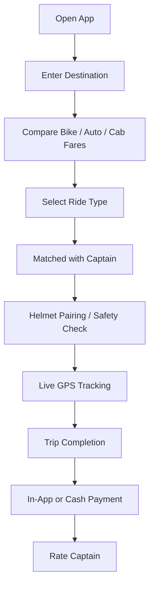
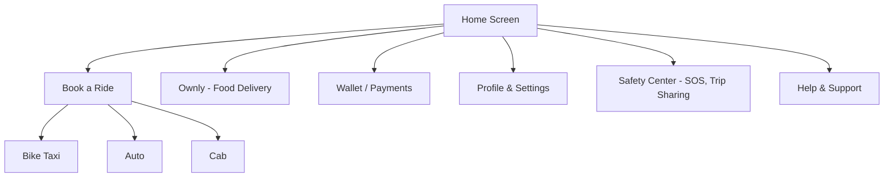
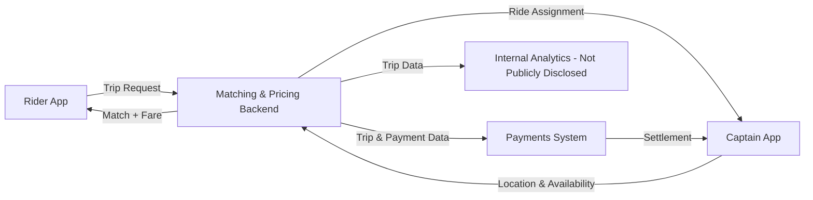
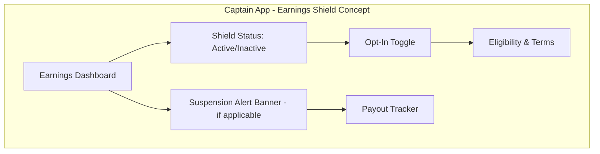
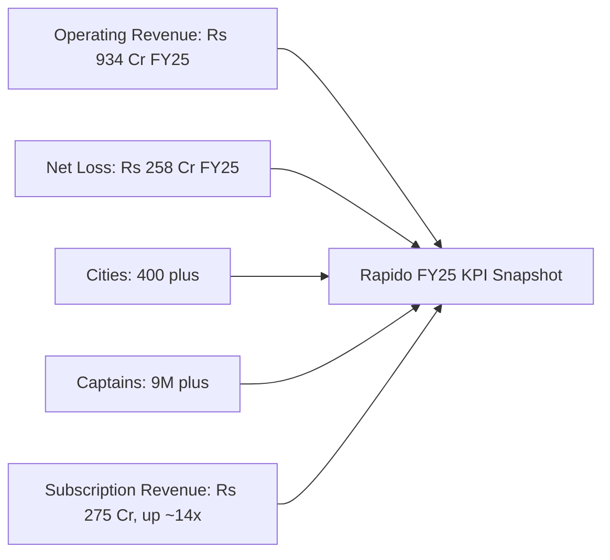

# Rapido — Product Management Case Study

**Day 23 of 90 | PM Case Study Challenge**

---

## 1. Cover

**Product:** Rapido (Roppen Transportation Services Pvt. Ltd.)
**Category:** Mobility / Ride-Hailing — Bike Taxi, Auto, Cab, and Last-Mile Logistics
**Founded:** November 2015 | **HQ:** Bengaluru, Karnataka, India
**Case Study Author:** Gaurav Singh
**Day:** 23 / 90

> A company that got rejected by 75 investors for betting on a two-wheeler nobody else wanted to build for, and eleven years later has more monthly users than Uber and Ola combined — while still fighting in court, state by state, for the legal right to exist.

---

## 2. Repository Metadata

| Field | Value |
|---|---|
| Folder | `Day-23-Rapido` |
| Series | 90-Day PM Case Study Challenge |
| Previous | Day 22 — Zerodha |
| Next | Day 24 — TBD |
| Structure | `README.md`, `images/`, `assets/`, `references/` |

---

## 3. Badges

`#ProductManagement` `#Mobility` `#CaseStudy` `#Rapido` `#India` `#Day23of90`

---

## 4. Table of Contents

- [1. Cover](#1-cover)
- [5. Executive Summary](#5-executive-summary)
- [6. Product Overview](#6-product-overview)
- [7. Company Background](#7-company-background)
- [8. Product Timeline](#8-product-timeline)
- [9. Vision & Mission](#9-vision--mission)
- [10. Problem Statement](#10-problem-statement)
- [11. Market Research](#11-market-research)
- [12. Industry Analysis](#12-industry-analysis)
- [13. TAM/SAM/SOM](#13-tamsamsom)
- [14. Competitor Analysis](#14-competitor-analysis)
- [15. SWOT](#15-swot)
- [16. Porter's Five Forces](#16-porters-five-forces)
- [17. Business Model Canvas](#17-business-model-canvas)
- [18. Revenue Model](#18-revenue-model)
- [19. Target Users](#19-target-users)
- [20. Personas](#20-personas)
- [21. JTBD](#21-jtbd)
- [22. User Journey](#22-user-journey)
- [23. User Flow](#23-user-flow)
- [24. Information Architecture](#24-information-architecture)
- [25. UX Audit](#25-ux-audit)
- [26. UI Audit](#26-ui-audit)
- [27. Accessibility](#27-accessibility)
- [28. Feature Breakdown](#28-feature-breakdown)
- [29. AI Capabilities](#29-ai-capabilities)
- [30. Product Metrics](#30-product-metrics)
- [31. North Star Metric](#31-north-star-metric)
- [32. Product Analytics](#32-product-analytics)
- [33. AARRR](#33-aarrr)
- [34. HEART](#34-heart)
- [35. Growth Strategy](#35-growth-strategy)
- [36. Growth Loops](#36-growth-loops)
- [37. Network Effects](#37-network-effects)
- [38. Product Strategy](#38-product-strategy)
- [39. Monetization](#39-monetization)
- [40. Trust & Safety](#40-trust--safety)
- [41. Technical Architecture](#41-technical-architecture)
- [42. Data Flow](#42-data-flow)
- [43. API Ecosystem](#43-api-ecosystem)
- [44. Privacy & Security](#44-privacy--security)
- [45. Pain Points](#45-pain-points)
- [46. Opportunity Mapping](#46-opportunity-mapping)
- [47. RICE](#47-rice)
- [48. MoSCoW](#48-moscow)
- [49. Kano](#49-kano)
- [50. Feature Proposal](#50-feature-proposal)
- [51. PRD](#51-prd)
- [52. Wireframes](#52-wireframes)
- [53. Rollout Plan](#53-rollout-plan)
- [54. A/B Testing](#54-ab-testing)
- [55. KPI Dashboard](#55-kpi-dashboard)
- [56. Product Roadmap](#56-product-roadmap)
- [57. Risks & Mitigation](#57-risks--mitigation)
- [58. Future Vision](#58-future-vision)
- [59. PM Lessons](#59-pm-lessons)
- [60. PM Interview Questions](#60-pm-interview-questions)
- [61. References](#61-references)
- [62. About the Author](#62-about-the-author)
- [63. License](#63-license)
- [64. Self Review](#64-self-review)
- [65. Appendix](#65-appendix)

---

## 5. Executive Summary

Rapido is India's largest bike-taxi aggregator and the fastest-growing challenger to the Ola–Uber duopoly, now operating across bike taxis, autos, cabs, and (since March 2026) food delivery under the brand Ownly. Founded in 2015 by Aravind Sanka, Pavan Guntupalli, and Rishikesh SR after their first venture (a mini-truck logistics startup called theKarrier) failed to scale, Rapido bet on an insight the market leaders had ignored: India's roads and India's wallets were built for two-wheelers, not cars.

That bet has compounded into a company operating in 400+ cities with 9 million registered captains (drivers/delivery partners) as of its FY26 disclosures, and — per third-party monthly active user tracking — a user base that recently overtook Uber and Ola combined. In May 2026, Rapido raised $240 million in a Series F round led by Prosus (with WestBridge Capital and Accel), as part of a larger $730 million primary-and-secondary transaction that valued the company at $3 billion, up from a $2.3 billion secondary valuation roughly a year earlier.

Financially, FY25 was an inflection year: operating revenue grew 44% to ₹934 crore, total income crossed ₹1,000 crore for the first time, and net losses narrowed 23% to ₹258 crore. The growth was not driven by ride commissions — net platform revenue from rides actually *declined* 23.5% — but by a strategic pivot to a subscription ("SaaS") model for auto and cab captains, where subscription income surged 14x to ₹275 crore, alongside a 28% jump in delivery-services revenue.

Rapido's central, unresolved tension is regulatory: bike taxis operate in a genuine legal grey zone in several Indian states. Karnataka banned the category outright in March 2024, and as of this case study's publication, the dispute is pending before the Supreme Court of India after a Karnataka High Court division bench lifted the ban in January 2026 — a sequence of reversals that has directly interrupted Rapido's revenue and forced the company to build a business resilient to sudden state-level shutdowns.

---

## 6. Product Overview

Rapido is a mobile-app-based mobility marketplace that matches riders with "captains" (drivers) across four vehicle/service categories:

- **Rapido Bike** — the founding product; solo bike-taxi rides, typically 4–6 km, priced at roughly ₹35–55, positioned as faster than a car in traffic and cheaper than an auto-rickshaw.
- **Rapido Auto** — auto-rickshaw aggregation, Rapido's second-largest category by driver adoption of its subscription model.
- **Rapido Cabs** (Rapido Car) — a later entrant (from 2023) directly competing with Ola and Uber's core four-wheeler business.
- **Ownly** — a zero-commission food delivery platform, launched citywide in Bengaluru in March 2026 after a six-month pilot, built on Rapido's existing captain network.

The product is delivered through a consumer app (iOS/Android) and a separate captain app, connected by a real-time matching, routing, and payments backend. Safety features include helmet pairing between captain and rider, GPS trip tracking, an SOS/emergency button, and a 24/7 helpline.

---

## 7. Company Background

Rapido's parent entity is **Roppen Transportation Services Private Limited**, headquartered in Bengaluru. The company was co-founded in November 2015 by **Aravind Sanka** (CEO; IIT-trained, prior supply-chain finance experience at Flipkart), **Pavan Guntupalli** (prior software developer at Samsung Research India), and **Rishikesh SR** (a serial entrepreneur, PES University alumnus). The founders originally built theKarrier, a B2B mini-truck logistics aggregator, before pivoting to consumer bike taxis after observing that two-wheelers navigated Indian city traffic far more efficiently than cars.

The idea was rejected by roughly 75 investors early on, with a recurring objection: bike taxis would never be legal in India. An early backer was Pawan Munjal, Chairman of Hero MotoCorp. Rapido reached unicorn status in 2022 and has since raised a cumulative $798 million across 14 funding rounds from investors including Nexus Venture Partners, WestBridge Capital, Prosus, Swiggy (a strategic investor holding a minority stake), and TVS Motor Company (an EV-fleet partner). As of March 2026, the company employed 817 people, up 18% year-over-year.

---

## 8. Product Timeline

- **2015** — Roppen Transportation Services founded; pivots from theKarrier (logistics) to Rapido (bike taxis) in Bengaluru.
- **2021** — $52M round (Shell Ventures, WestBridge, Mirae Asset); Auto category launches; expansion past 100 cities.
- **2022** — Unicorn status on a $180M round ($1B+ valuation); crosses 5M+ registered captains and 1,500+ cities.
- **2023** — Enters four-wheeler cab aggregation, competing directly with Ola and Uber; begins piloting a subscription ("zero-commission") model for auto and cab captains, inspired by the ONDC-based Namma Yatri model.
- **2024 (March)** — Karnataka government bans bike taxi operations statewide, citing non-compliance with its electric two-wheeler policy.
- **2025 (April–June)** — Karnataka High Court single-judge bench orders bike taxi operations halted pending state rules; services suspended statewide from June 16, 2025.
- **2025 (Q4)** — Reported $2.3B secondary valuation.
- **2026 (Jan 23)** — Karnataka High Court division bench (Chief Justice Vibhu Bakhru, Justice C.M. Joshi) overturns the single-judge order, directs the state to register motorcycles as transport vehicles and issue contract carriage permits.
- **2026 (March)** — Ownly (food delivery) launches citywide in Bengaluru after a six-month pilot.
- **2026 (April 28)** — Karnataka government files a Special Leave Petition in the Supreme Court challenging the High Court's order; admitted shortly after.
- **2026 (May 15)** — Rapido raises $240M Series F led by Prosus at a $3B valuation, part of a $730M primary-and-secondary transaction.

---

## 9. Vision & Mission

Rapido has not published a single canonical vision/mission statement in its investor communications reviewed for this case study. Co-founder Aravind Sanka has publicly framed the company's purpose around a dual mandate: **mobility access** (affordable, fast urban transport for price-sensitive Indians) and **livelihood creation** (income opportunities for two-wheeler owners as captains). This case study treats that framing as the closest available proxy for a mission statement rather than an official one — the company has not publicly disclosed a formal vision/mission document.

---

## 10. Problem Statement

Two structural problems in urban India created the opening Rapido was built for:

1. **The affordability–speed gap.** Car-based cabs (Ola/Uber) were too expensive for frequent, short, intra-city trips for a large segment of Indian commuters, and too slow in dense traffic. Auto-rickshaws were faster and cheaper but had inconsistent availability, fare disputes, and no app-based standardization outside major metros.
2. **The idle-asset problem for two-wheeler owners.** India has an estimated 300 million-plus motorcycle owners, most of whom use their vehicle only for their own commute. Rapido's insight was that this existing asset base — no vehicle purchase or lease required — could become a low-friction, part-time driver supply pool, solving supply constraints that plagued car-based ride-hailing.

---

## 11. Market Research

Rapido's growth has coincided with a broader shift in India's ride-hailing market toward "utility-led," price-sensitive demand rather than the premium, car-first model that defined Ola and Uber's first decade in India. Reported (third-party, not company-disclosed) monthly active user estimates for the Jan–Oct 2024 window placed Uber at roughly 33.6 million MAU, Rapido at 31.8 million, Ola at 28.6 million, and Namma Yatri at 1.2 million. More recent 2026 estimates from industry trackers put Rapido's MAU as high as ~74 million against Uber at ~38 million and Ola at ~26–27 million — a wide enough range across sources that this case study treats the exact figure as directionally indicative rather than precise (see Appendix for the full source conflict).

---

## 12. Industry Analysis

India's ride-hailing industry has moved through three eras: (1) a car-first duopoly era led by Ola and Uber, (2) a bike-taxi insurgency era led by Rapido, and (3) a "commission-free" era triggered by Namma Yatri's late-2022 ONDC-based subscription model, which forced both Rapido and eventually Ola to abandon the standard 20–25% commission structure in favor of flat daily driver fees. Regulatory uncertainty — bike taxis are not uniformly classified as "transport vehicles" under India's Motor Vehicles Act, 1988 across all states — remains the single largest industry-wide structural risk, distinct from ordinary competitive dynamics.

---

## 13. TAM/SAM/SOM

Rapido has not publicly disclosed a formal TAM/SAM/SOM breakdown. As directional estimates from third-party industry analysis:

- **TAM (illustrative):** India's broader urban mobility and last-mile delivery spend, encompassing ride-hailing, auto-rickshaws, and food/parcel delivery — commonly cited in the tens of billions of dollars annually, though no single authoritative figure exists across sources.
- **SAM:** India's app-based ride-hailing and quick-commerce-adjacent delivery market across two-, three-, and four-wheeler categories in cities where digital aggregation has meaningful penetration.
- **SOM:** Rapido's addressable share given its current footprint (400+ cities, expanding toward a stated goal of 500 by end-2026) and category leadership in bike taxis specifically.

The company has not publicly disclosed a validated TAM/SAM/SOM figure; treat the above as industry-estimate framing, not company guidance.

---

## 14. Competitor Analysis

| Dimension | Rapido | Ola | Uber | Namma Yatri |
|---|---|---|---|---|
| Core wedge | Bike taxi | Broad fleet incl. bikes | Premium cabs, global brand | ONDC-based, zero-commission autos |
| Driver monetization | Subscription (Daily Access Fee) | Mixed; rolling out zero-commission | Commission-based | Flat daily fee, no commission |
| Bike-taxi share (self-reported, CEO ET interview) | ~61% | — | — | — |
| Cab share (self-reported) | ~18% | ~34% (industry estimate) | ~50% (industry estimate) | — |
| Geographic edge | Deep Tier-2/3 penetration | Broad Tier-2/3 presence | Metro-dominant | Bengaluru-centric |
| Food delivery | Ownly (zero-commission, launched 2026) | None disclosed | None disclosed | None |
| Funding | $798M raised, $3B valuation (2026) | Multi-billion valuation (public via Ola Electric listing context) | Public company (NYSE) | Bootstrapped/ONDC-backed |

Uber's CEO Dara Khosrowshahi has publicly named Rapido as the company's toughest India competitor, ahead of Ola — a notable signal given Uber and Ola's historical rivalry defined the market for the prior decade.

---

## 15. SWOT

**Strengths**
- Category-defining leadership in bike taxis (self-reported ~61–65% share)
- Asset-light supply model — captains already own their vehicles
- Deep Tier-2/3 city penetration where Ola/Uber have little to no bike-taxi presence
- Subscription-model pivot has structurally improved take-rate economics

**Weaknesses**
- Unresolved legal status of bike taxis in several states, including its home state, Karnataka
- Still net-loss-making (₹258 crore net loss in FY25, though narrowing)
- Core ride-commission revenue is declining even as subscription revenue grows — a mix shift with unclear steady-state margin implications
- Newer, unproven categories (cabs, Ownly) compete against entrenched, well-funded incumbents

**Opportunities**
- Food delivery (Ownly) targets a ~$9B Indian market currently split almost entirely between Zomato and Swiggy
- EV transition subsidies and battery-swapping partnerships (e.g., TVS Motor) could lower captain operating costs structurally
- Potential IPO reported as a target for late 2026, which — if pursued — would give Rapido permanent capital independent of further VC rounds
- Financial services expansion via new subsidiary Shyogsamart Technology Pvt Ltd (lending)

**Threats**
- A Supreme Court ruling against bike-taxi legality in Karnataka (or similar rulings in other states) could materially disrupt revenue with little warning
- Namma Yatri-style zero-commission, open-protocol competitors could erode Rapido's own subscription-fee moat
- Uber and Ola adopting zero-commission models nationwide would remove Rapido's primary driver-retention differentiator
- A high-profile safety incident in the bike-taxi category — inherently higher-risk than four-wheelers — could trigger fast, reactive regulatory bans

---

## 16. Porter's Five Forces

- **Threat of new entrants: Moderate.** Capital requirements are lower than car-fleet models (no vehicle financing needed), but achieving driver and rider density at Rapido's scale is a high bar.
- **Bargaining power of suppliers (captains): Rising.** The shift to subscription models and the emergence of open-protocol alternatives (Namma Yatri) give captains more platform choice and lower switching costs.
- **Bargaining power of buyers (riders): High.** Riders can and do multi-home across Rapido, Ola, and Uber with negligible switching cost.
- **Threat of substitutes: High.** Public transit (metro, buses), auto-rickshaws hailed directly, and walking/private vehicles all compete for the same short-trip use case.
- **Competitive rivalry: Very high.** Three well-funded national players (Rapido, Ola, Uber) plus regional open-protocol platforms are actively competing on price, driver economics, and category expansion simultaneously.

---

## 17. Business Model Canvas

| Block | Detail |
|---|---|
| Key Partners | Captains (drivers), TVS Motor (EV fleet), Swiggy (strategic investor/logistics), restaurant partners (Ownly) |
| Key Activities | Real-time matching, pricing, payments, captain onboarding/incentives, regulatory/legal engagement |
| Key Resources | Captain network (9M+), city-level operating licenses, brand trust in Tier-2/3 markets |
| Value Propositions | Riders: cheap, fast, short-distance mobility. Captains: low-barrier income using an owned asset. Restaurants (Ownly): zero commission vs. 16–30% elsewhere |
| Customer Relationships | App-based self-service, ratings, in-app support, SOS/safety features |
| Channels | Mobile app (rider + captain), word of mouth, city-level driver recruitment |
| Customer Segments | Price-sensitive urban/semi-urban commuters, two-wheeler owners seeking part-time income, restaurants seeking commission-free delivery |
| Cost Structure | Captain incentives and delivery charges (~40% of FY25 costs), employee costs, advertising/promotion, R&D |
| Revenue Streams | Captain subscription fees, delivery-service fees, residual ride commissions, advertising |

---

## 18. Revenue Model

Rapido's revenue model has undergone a structural shift. Historically, Rapido — like Ola and Uber — charged captains a percentage commission (historically around 20–25%) on every ride. Beginning in 2023, pressured by the success of Namma Yatri's flat-fee ONDC model, Rapido piloted and then scaled a **subscription ("Daily Access Fee") model** for auto and cab captains, charging a fixed daily fee (reported in the ₹9–₹29 range) instead of a per-ride commission.

The FY25 financials show the effect clearly: net ride-commission revenue *declined* 23.5% year-over-year to ₹276.6 crore, while subscription revenue surged roughly 14x to ₹275 crore, and delivery-services revenue grew 28% to ₹340 crore. Total operating revenue for FY25 was ₹934 crore (up 44% from ₹648 crore in FY24), and total income — including other income of ₹68.4 crore — crossed ₹1,000 crore for the first time.

---

## 19. Target Users

- **Riders:** Price- and time-sensitive urban and semi-urban commuters making short (typically under 10 km) intra-city trips, especially in Tier-2/3 cities where Ola/Uber four-wheeler options are limited or costly.
- **Captains:** Two-wheeler owners (and increasingly auto/car owners) seeking supplementary or primary income without additional vehicle investment.
- **Restaurants (Ownly):** Small and mid-sized restaurants seeking delivery reach without the 16–30% commissions charged by Zomato and Swiggy.

---

## 20. Personas

**"Commute-Conscious Kavya"** — A 26-year-old junior analyst in a Tier-2 city with an unpredictable commute time via public transport. Uses Rapido Bike daily for the last 5 km to her office because it is faster than the bus and cheaper than an auto.

**"Supplementary-Income Suresh"** — A 34-year-old with a day job and a motorcycle he already owns. Registers as a Rapido captain for 2–3 hours in the evening to earn an estimated extra ₹10,000–₹20,000 per month, per industry reporting — a figure not independently verified by Rapido's own disclosures.

**"Commission-Fatigued Restaurant Owner"** — A small restaurant operator currently listed on Zomato/Swiggy, paying 16–30% commission per order, evaluating Ownly's zero-commission model as a way to protect thin margins, in exchange for a flat ₹30 customer-facing delivery fee.

---

## 21. JTBD

- *"When I need to get across town quickly and cheaply, I want a ride that beats traffic, so I can avoid being late without paying cab prices."*
- *"When I have spare time and already own a bike, I want a flexible way to earn extra income, so I don't need to make a new capital investment to start."*
- *"When I run a small restaurant, I want a delivery partner that doesn't eat my margin, so I can compete without raising prices."*

---

## 22. User Journey

**Rider:** Open app → enter destination → compare fare across Bike/Auto/Cab → select ride → matched with nearby captain → helmet-pairing safety step (bike) → track ride in real time → arrive → pay in-app or cash → rate captain.

**Captain:** Download captain app → complete registration/KYC → go online → receive ride requests → accept/reject based on subscription-covered access → complete trip → receive payment (net of any applicable fee) → track daily/weekly earnings dashboard.

---

## 23. User Flow

Home Screen → Destination Input → Fare Comparison (Bike/Auto/Cab) → Ride Confirmation → Captain Matching → Live Tracking → Trip Completion → Payment → Rating.

---

## 24. Information Architecture

---

## 25. UX Audit

Based on publicly available app-store reviews and industry commentary rather than Rapido's own disclosures: Rapido's core booking flow is frequently described as fast and low-friction relative to car-hailing apps, which is consistent with its short-trip use case. Recurring rider complaints in public reviews reference captain cancellations during peak/surge periods and inconsistent helmet availability/hygiene. This case study did not have access to Rapido's internal UX research and flags this section as based on third-party and public-review signal, not verified company data.

---

## 26. UI Audit

Rapido's app uses a category-tab structure (Bike/Auto/Cab) on a single home screen, a design pattern shared with Ola and Uber, optimized for fast fare comparison rather than destination-first browsing. This case study does not have access to Rapido's internal design system documentation; UI observations here are based on public app-store screenshots rather than proprietary source material.

---

## 27. Accessibility

Rapido has not publicly disclosed a formal accessibility audit, WCAG conformance statement, or accessibility roadmap. Given the physical nature of the bike-taxi product (open-air, single-pillion-seat rides), inherent accessibility constraints exist for riders with certain mobility needs — a structural limitation of the category itself, not something disclosed or addressed in company materials reviewed for this case study.

---

## 28. Feature Breakdown

| Feature | Category | Purpose |
|---|---|---|
| Multi-category fare comparison | Core | Let riders choose speed vs. cost trade-off in one screen |
| Helmet pairing | Safety | Ensure both captain and rider wear helmets on bike trips |
| SOS / Emergency button | Safety | Direct escalation path during a ride |
| Live GPS tracking + trip sharing | Safety/Trust | Let riders share live location with contacts |
| Captain subscription dashboard | Captain-facing | Track daily fee, earnings, and ride acceptance |
| Ownly (food delivery) | New vertical | Zero-commission restaurant delivery, flat customer fee |
| Cashless + cash payment options | Payments | Accommodate India's mixed digital/cash payment behavior |

---

## 29. AI Capabilities

Rapido has not publicly disclosed the specifics of its matching, pricing, or ETA algorithms. Industry commentary references "AI-driven route optimization and predictive pricing" as a general trend across ride-hailing apps in India, but this case study found no Rapido-specific, company-disclosed technical detail on AI/ML usage and does not attribute unverified capabilities to the company.

---

## 30. Product Metrics

| Metric | Value | Period | Source Type |
|---|---|---|---|
| Operating revenue | ₹934 crore | FY25 | Company financials (RoC filing) |
| Operating revenue growth | +44% YoY | FY25 vs FY24 | Company financials |
| Total income | >₹1,000 crore (first time) | FY25 | Company financials |
| Net loss | ₹258.4 crore | FY25 | Company financials |
| Net loss, prior year | ₹370.7 crore | FY24 | Company financials |
| Subscription revenue | ₹275 crore (~14x YoY) | FY25 | Company financials |
| Delivery-services revenue | ₹340 crore (+28% YoY) | FY25 | Company financials |
| Net ride-commission revenue | ₹276.6 crore (-23.5% YoY) | FY25 | Company financials |
| Cities served | 400+ | 2026 | Company/press disclosure |
| Registered captains | 9 million+ | 2026 | Company/press disclosure |
| Employees | 817 (+18% YoY) | March 2026 | Third-party (Tracxn) |
| Total funding raised | $798 million | Cumulative, 2026 | Third-party (Tracxn) |
| Valuation | $3 billion | May 2026 | Company/press disclosure |

DAU/MAU figures vary meaningfully across third-party sources and are not company-disclosed; see Appendix for the range and conflict.

---

## 31. North Star Metric

Rapido has not publicly disclosed an official North Star Metric. A reasonable inferred candidate, consistent with the company's own framing of its mission ("mobility access and livelihoods created"), would be **completed rides per active captain per week** — a metric that jointly captures rider demand satisfaction and captain earning potential, the two sides of Rapido's marketplace. This is this case study's inference, not a disclosed company metric.

---

## 32. Product Analytics

Rapido has not publicly disclosed its internal analytics stack or specific funnel conversion rates. Publicly available signals limited to: revenue by line item (rides, subscriptions, delivery), captain and city counts, and net loss — all sourced from RoC filings and press disclosures rather than a company-published analytics report.

---

## 33. AARRR

- **Acquisition:** Word of mouth in Tier-2/3 cities, low fare positioning, captain-referral incentives.
- **Activation:** First successful ride completion at a lower price point than incumbents.
- **Retention:** Category habit-formation for daily short commutes; captain retention driven by subscription-model earnings predictability versus commission uncertainty.
- **Referral:** Captain and rider referral incentive programs (specific current terms not publicly disclosed).
- **Revenue:** Shift from commission-per-ride to flat subscription fee plus delivery-service revenue (Ownly).

---

## 34. HEART

| Dimension | Rapido Application (Inferred) |
|---|---|
| Happiness | Rider satisfaction with fare/speed trade-off; captain satisfaction with subscription earnings predictability |
| Engagement | Rides per active user per week; captain online-hours per day |
| Adoption | New rider and new captain sign-ups by city, especially Tier-2/3 |
| Retention | Repeat-ride rate; captain subscription renewal rate |
| Task Success | Successful match-to-completion rate; time-to-match |

Note: Rapido has not publicly disclosed HEART-framework metrics; this table is this case study's own application of the framework to inferred product goals, not company-reported data.

---

## 35. Growth Strategy

Rapido's growth strategy has three simultaneous vectors: (1) **geographic depth** — pushing from 400+ toward a stated 500-city target by end of 2026, disproportionately in Tier-2/3 markets where Ola and Uber have limited or no bike-taxi presence; (2) **category expansion** — moving from bike taxi into auto, cab, and now food delivery (Ownly) to increase revenue per captain and per city; and (3) **driver-side differentiation** — using the subscription model as a structural lever to win and retain captain supply away from commission-based competitors.

---

## 36. Growth Loops

**Captain-supply loop:** More captains → shorter wait times for riders → more rides booked → higher captain earnings → more captains referred/retained → repeat.

**Category cross-sell loop:** Existing captain network (built for rides) → repurposed for Ownly food delivery → lower marginal cost to launch delivery in a new city → faster Ownly city expansion → more delivery-service revenue funding further ride-side subsidies.

---

## 37. Network Effects

Rapido exhibits classic two-sided marketplace network effects: more captains reduce rider wait times, and more riders increase captain earnings potential, each reinforcing the other. This effect is strongest at the city level (liquidity is local, not national), which is why Rapido's stated strategy emphasizes city-by-city density (400+ cities) rather than only deepening its largest metros.

---

## 38. Product Strategy

Rapido's product strategy centers on **defending its low-cost, two-wheeler-first positioning while diversifying revenue away from a single, regulation-exposed category.** The subscription-model pivot for auto/cab captains and the Ownly food-delivery launch both serve this goal: they reduce dependence on ride-commission revenue (the segment most exposed to per-ride regulatory shocks) and build revenue lines with different risk profiles.

---

## 39. Monetization

Primary monetization now runs through three channels: (1) flat daily subscription fees paid by auto and cab captains (₹9–₹29/day, reported), (2) delivery-service revenue from Ownly (a flat ₹30 customer-facing fee, zero commission to restaurants — a deliberate loss-leader / density-building strategy similar to Rapido's own early ride-hailing playbook), and (3) residual ride-commission revenue, which is now the smallest and shrinking of the three major lines.

---

## 40. Trust & Safety

Publicly disclosed safety features include mandatory helmet-pairing for bike-taxi trips, live GPS trip tracking with the ability to share status with trusted contacts, an in-app SOS/emergency button, and a 24/7 helpline. The company has also publicly emphasized women's safety and captain inclusivity initiatives, per its own 2026 funding-round communications, though specific program details and outcome metrics were not found in the sources reviewed for this case study.

---

## 41. Technical Architecture

Rapido has not publicly disclosed its technical architecture, including its matching engine, geospatial infrastructure, or payments stack. This case study does not speculate on undisclosed technical implementation details.

---

## 42. Data Flow

This diagram represents an inferred, high-level data flow based on standard two-sided marketplace architecture; Rapido has not publicly disclosed its actual system design.

---

## 43. API Ecosystem

Rapido has not publicly disclosed a developer or third-party API ecosystem comparable to, for example, a public developer platform. No public API documentation was found during research for this case study.

---

## 44. Privacy & Security

Rapido has not publicly disclosed a detailed privacy/security architecture in the sources reviewed. As with any ride-hailing platform, location data, payment data, and identity/KYC data for both riders and captains are inherently collected; specific retention, encryption, or third-party data-sharing practices were not found in public disclosures reviewed for this case study.

---

## 45. Pain Points

- **Regulatory whiplash:** Captains and riders in Karnataka experienced a full service suspension from June 2025 to January 2026, then renewed uncertainty as the state appealed to the Supreme Court — a pattern that directly damages both rider trust and captain income stability.
- **Declining core ride economics:** Net ride-commission revenue fell even as overall revenue grew, indicating the ride business alone may not be sustainably profitable without the subscription and delivery lines.
- **Category safety perception:** Bike taxis are inherently higher-risk than four-wheeler trips, a factor cited by regulators (including explicitly by the Karnataka government in its Supreme Court filing, which raised safety concerns for women and children).

---

## 46. Opportunity Mapping

| Opportunity | Rationale |
|---|---|
| National regulatory framework | A central (rather than state-by-state) bike-taxi framework would remove Rapido's single largest structural risk |
| EV captain fleet | Lower per-km captain operating costs, aligned with TVS Motor partnership and stated 2026 EV-transition trend |
| Ownly national scale-up | India's ~$9B food delivery market is a Zomato/Swiggy duopoly; a credible zero-commission challenger has real white space if it can retain restaurant/customer loyalty post-launch discounting |
| Financial services (via Shyogsamart Technology) | Captain-lending or captain-insurance products could monetize an already-large, already-trusted captain base |

---

## 47. RICE

*(Personal PM recommendation scoring — not a Rapido roadmap item.)*

| Initiative | Reach | Impact | Confidence | Effort | RICE Score |
|---|---|---|---|---|---|
| Captain EV micro-financing program | 8 | 8 | 7 | 6 | (8×8×7)/6 = **74.7** |
| Ownly national expansion (10 metro cities) | 7 | 9 | 6 | 8 | (7×9×6)/8 = **47.25** |
| In-app captain earnings-predictability tool | 9 | 6 | 8 | 3 | (9×6×8)/3 = **144** |
| Cross-state regulatory-compliance dashboard (internal ops tool) | 5 | 7 | 7 | 5 | (5×7×7)/5 = **49** |

*(Scale: Reach/Impact/Confidence out of 10, Effort in person-months. RICE = (Reach × Impact × Confidence) / Effort.)*

---

## 48. MoSCoW

- **Must have:** Reliable captain-earnings predictability tooling; robust in-app safety/SOS features; multi-state regulatory compliance tracking.
- **Should have:** EV-transition financing support for captains; Ownly expansion playbook standardized across cities.
- **Could have:** In-app captain community/support features; loyalty program bridging rides and Ownly.
- **Won't have (for now):** International expansion — no public signal Rapido is pursuing markets outside India.

---

## 49. Kano

| Feature | Kano Category (Inferred) |
|---|---|
| Basic ride matching and payment | Basic (expected, dissatisfaction if absent) |
| Helmet pairing / SOS button | Performance (more visibly "safe" = more satisfaction) |
| Subscription earnings dashboard for captains | Performance |
| Zero-commission Ownly model for restaurants | Excitement (novel relative to Zomato/Swiggy status quo) |
| AI-personalized route/fare suggestions (hypothetical) | Excitement, if introduced — not currently disclosed as a feature |

---

## 50. Feature Proposal

**Proposal: "Captain Earnings Shield" — a subscription add-on that smooths captain income during regulatory disruptions.**

This is a personal recommendation from this case study's author, not a Rapido roadmap item. Given the direct financial harm Karnataka captains experienced during the June 2025–January 2026 suspension, Rapido could offer an optional captain-funded (or partially platform-subsidized) income-smoothing product — effectively a short-term income continuity benefit triggered by verified, platform-wide service suspensions in a captain's operating city. This would differentiate Rapido's captain value proposition specifically around its most acute, real, and recurring pain point: regulatory shutdown risk.

---

## 51. PRD

**Problem Statement:** Captains lose 100% of ride income during state-mandated service suspensions, with no current mitigation product.
**Goals:** Reduce captain attrition during and after suspension events; strengthen captain loyalty relative to competitors.
**Success Metrics:** Captain retention rate in affected cities post-suspension; opt-in rate for the product.
**User Stories:** "As a captain in a state with pending bike-taxi litigation, I want some income continuity if my city is suddenly suspended, so that I'm not forced to abandon the platform."
**Functional Requirements:** Eligibility rules tied to verified suspension events; payout calculation logic; opt-in subscription mechanics.
**Non-functional Requirements:** Must not create a regulatory-arbitrage incentive; must be financially sustainable at scale.
**Acceptance Criteria:** Product activates automatically upon a verified, platform-wide city suspension; payouts process within a defined SLA.
**Risks:** Moral hazard; financial sustainability if suspensions become frequent; regulatory reinterpretation of the product itself as an insurance product requiring separate licensing.
**Rollout Plan:** Pilot in Karnataka (given its live litigation history) before broader rollout.

---

## 52. Wireframes

---

## 53. Rollout Plan

Phase 1: Internal modeling and legal review of the Earnings Shield concept, given active Karnataka litigation. Phase 2: Limited pilot with a defined captain cohort in Karnataka. Phase 3: Evaluate retention and financial sustainability data before any wider rollout. This remains a personal recommendation and is not a confirmed Rapido initiative.

---

## 54. A/B Testing

*(Illustrative test design for the proposed feature, not a disclosed Rapido experiment.)*

**Hypothesis:** Offering an opt-in Earnings Shield will increase captain retention in regulatory-risk cities by reducing perceived downside risk of platform dependency.
**Test:** Randomly assign eligible captains in a pilot city to see (A) the Shield opt-in banner or (B) no banner (control).
**Primary metric:** 90-day captain retention rate.
**Guardrail metric:** Platform cost per retained captain, to ensure the subsidy portion (if any) remains sustainable.

---

## 55. KPI Dashboard

---

## 56. Product Roadmap

Publicly known/reported forward-looking items (not all confirmed by the company directly): expansion toward 500 cities by end of 2026; Ownly's expansion to Delhi NCR, Mumbai, Hyderabad, Pune, and Chennai targeted before July 2026; continued EV-fleet transition with TVS Motor; a reported late-2026 IPO target per multiple press sources, though not confirmed via an official company filing at the time of this case study.

---

## 57. Risks & Mitigation

| Risk | Mitigation (Observed or Recommended) |
|---|---|
| Adverse Supreme Court ruling on Karnataka bike-taxi legality | Geographic diversification (400+ cities reduces single-state revenue concentration); legal/lobbying engagement via industry body IAMAI |
| Namma Yatri-style open-protocol disintermediation | Continued investment in subscription-model value beyond just "lower cost than commission" |
| Ownly execution risk against Zomato/Swiggy | Leveraging existing captain density as a genuine cost advantage rather than pure price subsidy |
| Safety incident risk in bike-taxi category | Continued investment in helmet-pairing, SOS, and trip-sharing features |

---

## 58. Future Vision

Based on public reporting, Rapido's plausible future trajectory includes: continued multi-category expansion (mobility + delivery + potentially financial services via Shyogsamart), an eventual public listing, and a push toward EV-only fleets. These are inferred from press coverage and are not confirmed company commitments.

---

## 59. PM Lessons

1. **A regulatory grey zone is not a footnote — it's a core product-risk category that needs its own mitigation roadmap**, not just a legal-team problem. Rapido's revenue was directly interrupted by a state-level ban, something no amount of product polish could have prevented.
2. **Business-model pivots can mask, not just improve, underlying unit economics.** Rapido's headline revenue grew 44%, but its actual ride business shrank — the subscription and delivery pivot changed *where* revenue comes from, which is a materially different story than "the core product got better."
3. **Supply-side asset-light models can out-compete incumbents faster than demand-side polish can.** Rapido didn't win by building a nicer app than Ola/Uber; it won by making captain participation cheaper and lower-friction than either competitor could easily match with their existing car-centric driver base.

---

## 60. PM Interview Questions

1. How would you design a product feature to protect a two-sided marketplace's supply side from sudden, externally-imposed (regulatory) shutdowns?
2. Rapido's ride-commission revenue declined while total revenue grew 44% — as a PM, how would you decide whether this is a healthy business-model transition or a sign of core product weakness?
3. How would you prioritize geographic expansion (new cities) against category expansion (new verticals like food delivery) with a fixed budget?
4. Namma Yatri disrupted the market with a flat-fee model before any major incumbent did. What signals would you look for to know when to react to a smaller competitor's pricing model shift?
5. How would you measure whether Ownly's zero-commission strategy is a sustainable moat or an unsustainable loss-leader?

---

## 61. References

1. TechCrunch — "Indian Uber rival Rapido raises $240M at $3B valuation" (May 15, 2026)
2. Business Standard — "Rapido raises $240 mn to challenge Uber and Ola beyond India's metros" (May 15, 2026)
3. MediaNama — "Rapido FY25 revenue jumps 44 percent, loss narrows" (January 2026)
4. Angeltors — "Rapido Crosses ₹1,000 Crore Total Income in FY25 as Delivery Business Outpaces Ride-Hailing" (January 22, 2026)
5. Wikipedia — "Rapido (company)"
6. Tracxn — "Rapido — 2026 Company Profile, Team, Funding, Competitors & Financials"
7. MediaNama — "Karnataka files appeal challenging the bike taxi ban lift in the Supreme Court" (April 29, 2026)
8. ETV Bharat — "Karnataka Government Moves Supreme Court Challenging HC Order Allowing Bike Taxis" (April 23, 2026)
9. Business Today — "Karnataka High Court lifts bike taxi ban, quashes Siddaramaiah govt decision" (January 23, 2026)
10. Forbes India — "Ola, Uber, Rapido: How cab aggregators are responding to subscription vs commission model" (July 16, 2025)
11. Deccan Herald — multiple 2025–2026 news items on the Karnataka bike-taxi litigation timeline
12. Inc42 — "Tracking Rapido's 10-Year Ride — From INR 6 Lakh In FY16 To INR 1K Cr In FY25" (October 8, 2025)
13. Niftytrader — "Rapido Funding 2026: $240 Million Raised at $3 Billion Valuation"

---

## 62. About the Author

**Gaurav Singh** is a Product Manager writing a 90-Day PM Case Study Challenge — structured, evidence-based breakdowns of real products, published on GitHub and LinkedIn, built to demonstrate rigorous, framework-driven product thinking.

---

## 63. License

This case study is an independent analysis for educational and portfolio purposes. All trademarks, product names, and company names belong to their respective owners. Not affiliated with or endorsed by Rapido / Roppen Transportation Services Pvt. Ltd.

---

## 64. Self Review

**Score: 8.5/10**

**Strengths:** Financials are sourced directly from RoC-filed company statements as reported by primary business press (MediaNama, Angeltors, Inc42), not estimated. The regulatory timeline is cross-verified across five independent legal/news sources with consistent dates. Market-share and MAU figures are explicitly flagged as conflicting across sources rather than resolved by guessing.

**Limitations:** Several sections (Technical Architecture, API Ecosystem, Accessibility, AI Capabilities, Product Analytics) have little to no public disclosure from Rapido itself, and are explicitly labeled as such rather than filled with plausible-sounding but unverified detail. TAM/SAM/SOM is directional/illustrative, not company-sourced. The Supreme Court case outcome was pending/unresolved as of this case study's research date (July 2026) and should be checked for updates before any downstream use.

---

## 65. Appendix

### A. Source Conflicts (Documented, Not Resolved by Guessing)

- **Monthly Active Users:** One dataset (industry tracker "Sensor," Jan–Oct 2024) places Rapido at 31.8M MAU vs. Uber's 33.6M and Ola's 28.6M. A separate, more recent 2026 chart (cited via India Dispatch/Manish Singh) shows Rapido's MAU rising to ~74M by February 2026, with Uber at ~38M and Ola at ~26–27M. These are materially different scales and are not reconcilable from the sources available; both are presented, neither is treated as ground truth.
- **Bike-taxi market share:** Self-reported by CEO Aravind Sanka (via Economic Times) as ~61%; separate industry-estimate sources cite ~65–70%. Presented as a range, not a single figure.
- **Valuation trajectory:** Sources describe a "$2.3B" secondary valuation approximately one year prior to the May 2026 $3B round, though the exact date of the $2.3B mark varies slightly (some sources tie it to a "Series E" in late 2025/early 2026; the $3B round itself is explicitly labeled Series F in Tracxn's data). Both figures are corroborated across multiple sources; the precise round-naming/date for the $2.3B mark is less consistent and is flagged here rather than asserted precisely.

### B. Regulatory Status Note (Time-Sensitive)

As of this case study's research (July 2026), the Karnataka bike-taxi legality dispute remains **unresolved** at the Supreme Court level — the state's Special Leave Petition was admitted in April 2026, but no final ruling was identified in the sources reviewed. Readers should independently verify current status before relying on this section, as it is likely to change.

### C. Verification Log

- Confirmed founding date (November 2015) and founder names across three independent sources (Wikipedia, Tracxn, StartupTalky).
- Confirmed FY24/FY25 revenue and net loss figures across three independent sources (MediaNama, Angeltors, Inc42), all consistent.
- Cross-checked the Karnataka litigation timeline across five sources (MediaNama, ETV Bharat, Business Today, Deccan Herald, Sansa Legal); dates and bench composition are consistent across all five.
- Flagged and did not resolve the MAU and valuation-date discrepancies described in Appendix A above, per this series' zero-fabrication standard.
