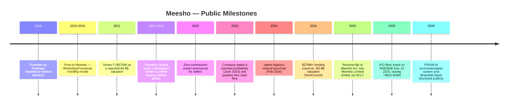
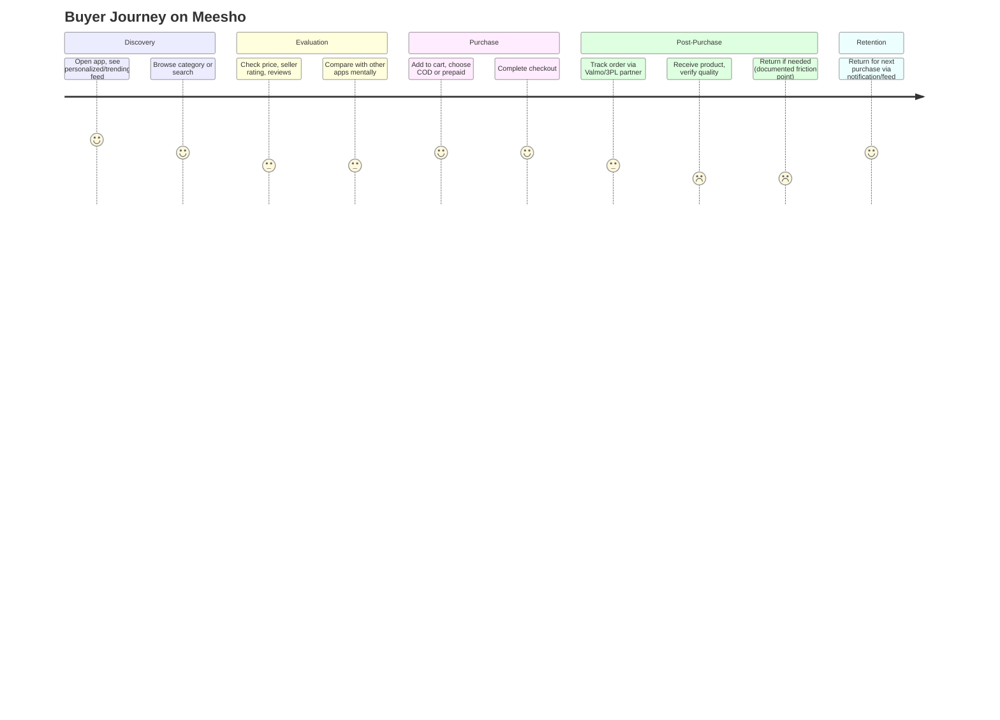
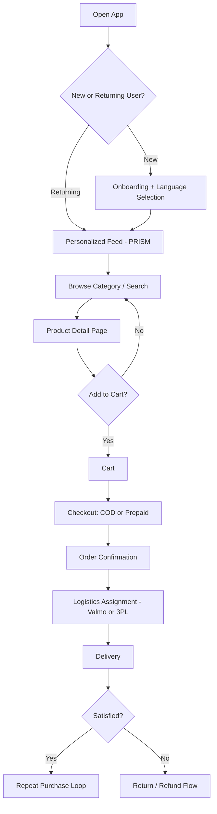
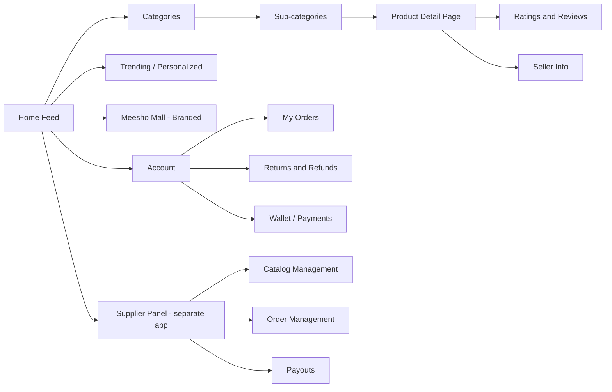
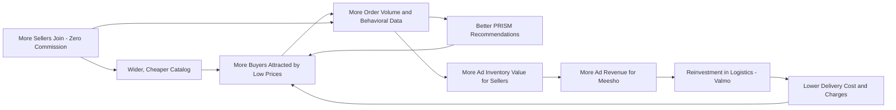
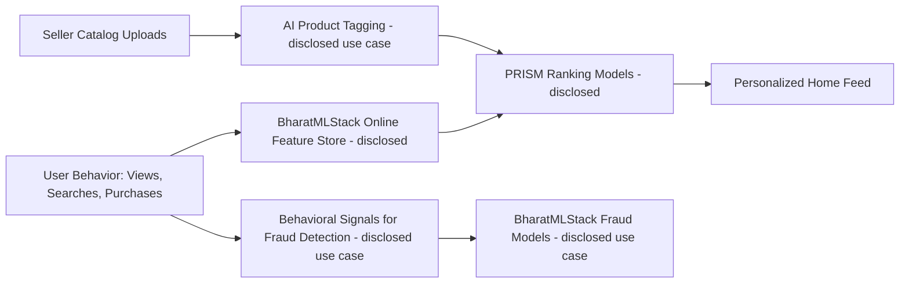
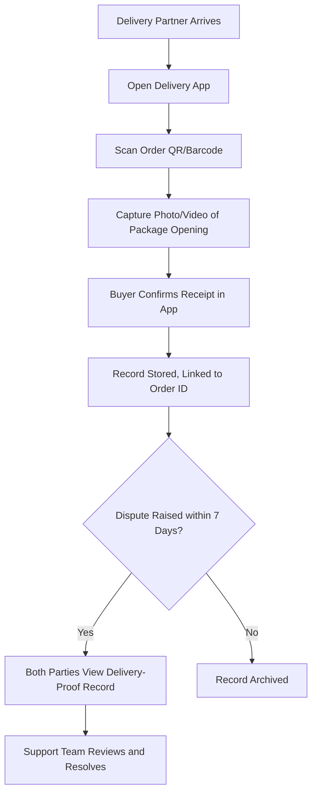
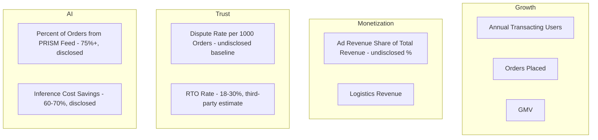

# 1. Cover

# Meesho Product Management Case Study
## Democratizing E-commerce for Bharat

**Author:** Gaurav Singh
**Series:** Day 24 of 90 — 90-Day Product Management Case Study Challenge
**Subject Company:** Meesho Limited (formerly Fashnear Technologies Pvt. Ltd.)
**Last Updated:** July 2026

> This case study is an independent analytical work. It is not affiliated with, endorsed by, or reviewed by Meesho Limited. All facts are sourced from public disclosures; all opinions are explicitly labelled as such.

---

# 2. Repository Metadata

| Field | Value |
|---|---|
| Folder | Day-24-Meesho |
| Format | GitHub-flavoured Markdown |
| Diagrams | Mermaid.js |
| Research Cut-off | July 20, 2026 |
| Word Count Target | Long-form (research report) |
| License | MIT (see Section 63) |
| Companion Reference | Day-23 Rapido README (structure only, no content reused) |

---

# 3. Badges

`Status: Public Company (NSE: MEESHO, BSE: 544632)` · `Sector: Horizontal E-commerce / Value Commerce` · `HQ: Bengaluru, India` · `Founded: December 2015` · `IPO: December 10, 2025` · `Category: Case Study — Day 24/90`

---

# 4. Table of Contents

1. Cover
2. Repository Metadata
3. Badges
4. Table of Contents
5. Executive Summary
6. Product Overview
7. Company Background
8. Product Timeline
9. Vision & Mission
10. Problem Statement
11. Market Research
12. Industry Analysis
13. TAM / SAM / SOM
14. Competitor Analysis
15. SWOT
16. Porter's Five Forces
17. Business Model Canvas
18. Revenue Model
19. Target Users
20. Personas
21. Jobs To Be Done
22. User Journey
23. User Flow
24. Information Architecture
25. UX Audit
26. UI Audit
27. Accessibility
28. Feature Breakdown
29. AI Capabilities
30. Product Metrics
31. North Star Metric
32. Product Analytics
33. AARRR
34. HEART
35. Growth Strategy
36. Growth Loops
37. Network Effects
38. Product Strategy
39. Monetization
40. Trust & Safety
41. Technical Architecture
42. Data Flow
43. API Ecosystem
44. Privacy & Security
45. Pain Points
46. Opportunity Mapping
47. RICE
48. MoSCoW
49. Kano
50. Feature Proposal
51. PRD
52. Wireframes
53. Rollout Plan
54. A/B Testing
55. KPI Dashboard
56. Product Roadmap
57. Risks & Mitigation
58. Future Vision
59. PM Lessons
60. PM Interview Questions
61. References
62. About the Author
63. License
64. Self Review
65. Appendix

---

# 5. Executive Summary

**What:** Meesho is a Bengaluru-headquartered, publicly listed (NSE: MEESHO) horizontal e-commerce marketplace that began in December 2015 as a social-commerce reselling app and evolved into one of India's largest e-commerce platforms by shipment volume, competing directly with Flipkart and Amazon India.

**Why it matters:** Meesho is a rare case in Indian consumer internet history — a company that pivoted from a failed hyperlocal model (Fashnear), through a social-reselling phase, into a marketplace serving value-conscious buyers in Tier-2+ India, reached a reported positive free cash flow position, and completed an IPO in December 2025 raising approximately $602–606 million.

**Evidence:** According to its FY25 annual disclosures, Meesho reported revenue from operations of ₹9,390 crore and a net loss of ₹3,941.71 crore (the loss driven overwhelmingly by one-time exceptional items tied to a corporate restructuring and reverse-flip tax charge, not core operations). Independent industry estimates from RedSeer cited in press coverage put Meesho's share of India's e-commerce market (by shipment volume, excluding hyperlocal/quick-commerce) at 29–31% as of mid-2025 — the largest of any single platform by that specific measure.

**PM Insight:** Meesho's core product decision — a zero-commission model for sellers, monetized instead through advertising, logistics, and financial services — represents one of the most significant unbundling experiments in global e-commerce. This case study documents that decision, the marketplace liquidity problem it solved, the AI-driven discovery system (PRISM) it depends on today, and the trust and quality-control problems that remain unresolved as of this writing.

This case study strictly separates **verified facts** (with source type), **industry estimates** (attributed to named third parties, e.g., RedSeer, Tracxn), and **author analysis** (explicitly labelled "Author Recommendation" or "this case study infers"). Where sources conflict — which happens frequently with Indian startup financial reporting — both figures are shown side by side in the Appendix rather than silently resolved.

---

# 6. Product Overview

**What is Meesho?** Meesho is a mobile-first, app-and-web e-commerce marketplace. It connects individual sellers, small manufacturers, and micro-entrepreneurs ("suppliers") with buyers, the large majority of whom are located outside India's eight largest metro cities.

**Core product surfaces (as publicly described by the company and industry coverage):**
- **Meesho buyer app/website** — product discovery, cart, checkout, order tracking, returns.
- **Meesho Supplier Panel** — seller onboarding, catalog management, order management, payouts.
- **Valmo** — Meesho's logistics subsidiary/vertical, launched February 2024, used for first-mile, sorting, and last-mile delivery alongside third-party logistics partners (Delhivery, Shadowfax, XpressBees, Ecom Express).
- **Meesho Mall** — a section for listings from established national/regional brands (examples cited in press coverage include Mamaearth, Himalaya, Dabur, Bata, and Titan), distinct from the unbranded reseller catalog.

**PM Insight:** Unlike Amazon or Flipkart, which were built around a search-led, intent-driven shopping model, Meesho was built around **discovery-led, browse-first shopping**, reflecting a buyer base that — per company statements reported in the trade press — is less likely to arrive with a specific product in mind and more likely to browse trending, low-priced items. This distinction shapes almost every downstream product decision covered later in this document (Sections 24, 28, 29).

---

# 7. Company Background

| Field | Detail | Source Type |
|---|---|---|
| Founded | December 2015, as Fashnear Technologies Pvt. Ltd. | Company filings / Wikipedia (background fact) |
| Founders | Vidit Aatrey (CEO) and Sanjeev Barnwal / Sanjeev Kumar (CTO) — both IIT Delhi alumni | Multiple press sources |
| Original model | Fashnear — hyperlocal fashion delivery from local retailers in Bengaluru | Press (Business Remedies, TVisha) |
| Pivot rationale | Founders reportedly observed women in small towns informally reselling products over WhatsApp, and pivoted the company toward enabling that behaviour | Press (Business Remedies) |
| Renamed | Fashnear Technologies Pvt. Ltd. reorganized/renamed to Meesho Private Limited, then to Meesho Limited ahead of its December 2025 IPO, as part of a reverse-flip of its US parent entity (Meesho Inc.) back into an Indian corporate structure | Business Standard, press coverage |
| Headquarters | Bengaluru, Karnataka, India | Company / Wikipedia |
| Listing | NSE: MEESHO; BSE: 544632; listed December 10, 2025 | TechCrunch, Business Standard |
| Employees | Approximately 2,082 as of March 31, 2025 (Tracxn); other sources cite ~750 (Levels.fyi, likely a narrower headcount definition) | Tracxn / Levels.fyi — **conflict noted in Appendix** |

**PM Insight:** The Fashnear → Meesho pivot is a textbook example of a team abandoning a supply-side assumption (retailers want a delivery channel) in favour of a demand-side insight discovered through direct field observation (resellers already existed informally; they needed tooling, not a new marketplace concept). This is discussed further in Section 59 (PM Lessons).

---

# 8. Product Timeline



**Note:** Some sources place the "Meesho" brand launch in late 2015 and others in 2016; this discrepancy is documented in the Appendix (Section 65).

---

# 9. Vision & Mission

Meesho's publicly stated positioning, as reflected consistently across company communications and press coverage, centers on enabling small entrepreneurs — particularly women in Tier-2 and Tier-3 towns — to start an online business "without inventory, shipping, or commission charges."

> **This case study infers** that Meesho's implicit mission is best summarized as: *reduce the capital and technical barriers to participating in India's digital economy, on both the seller side (zero commission, no inventory requirement) and the buyer side (low price points, vernacular UX).* This inference is not a verbatim company mission statement; it is synthesized from repeated messaging across founder interviews, press releases, and IPO prospectus framing referenced in secondary sources.

**PM Insight:** A vision built around *removing barriers* rather than *maximizing selection or speed* explains why Meesho historically under-invested in areas like same-day delivery (a priority for Amazon/Flipkart's urban customers) relative to seller acquisition and catalog breadth.

---

# 10. Problem Statement

**Buyer-side problem:** Value-conscious consumers in non-metro India, who are highly price-sensitive and often new to online shopping, are underserved by marketplaces optimized for urban, higher-AOV (average order value) customers.

**Seller-side problem:** Millions of small manufacturers, home-based entrepreneurs, and resellers in India lack the capital, technical literacy, or logistics access to sell online through traditional marketplace commission and fee structures.

**Evidence:** Industry estimates cited by RedSeer (via press coverage) project India's e-retail GMV growing from a base of roughly $70 billion (FY25) to $174–214 billion by FY2030, with tier-two-and-beyond markets projected to account for 51–52% of that market by FY2030, up from approximately 44% in FY2025 — indicating the underserved segment Meesho targets is also the fastest-growing one.

**PM Insight:** This is a two-sided marketplace cold-start problem layered on top of an affordability problem — arguably a harder combination than either Flipkart or Amazon faced at their respective founding moments, since both supply and demand needed to be created simultaneously in a market with low pre-existing trust in online payments and unfamiliar UX patterns (browsing in English, structured search, card-based checkout).

---

# 11. Market Research

Reliable third-party research on Indian e-commerce cited in press and analyst coverage includes:

- RedSeer Strategy Consultants — cited for GMV, market share, and TAM projections in Business Standard, Inc42, and IndiaDispatch coverage.
- Tracxn — company-level funding, investor, and employee-count data.
- CB Insights — funding rounds, competitor mapping.

**Key research findings, as reported:**
- Meesho reported 213.17 million annual transacting users (ATUs) for the twelve months ending June 30, 2025, and processed 2.02 billion orders in that period, per RedSeer data cited in IndiaDispatch.
- By Q4 FY26, the company reported 264 million annual transacting users and 717 million orders placed in that quarter alone (Business Standard).
- Meesho has stated that approximately 88% of its users come from outside India's top eight cities (IPO Central, citing company disclosures).

> **Conflict flag:** ATU figures vary meaningfully by reporting period and source (150M transacting users in TechCrunch's May 2024 coverage vs. 190M "users" in Wikipedia's infobox vs. 213.17M ATUs for the year ending June 2025 vs. 264M ATUs in Q4 FY26 company disclosures). These are not necessarily contradictory — they may reflect different time windows and different definitions ("transacting users" vs. "users") — but the case study does not merge them into a single number. See Appendix.

---

# 12. Industry Analysis

India's e-commerce sector, as characterized across the sources reviewed, comprises at least four overlapping models:

1. **Horizontal inventory/marketplace e-commerce** — Flipkart, Amazon India, Meesho.
2. **Quick commerce** — 10–15 minute delivery apps (not Meesho's core category as of this research).
3. **Social commerce** — WhatsApp/Instagram-based reselling, Meesho's original model, now largely consolidated or shut down among smaller players (GlowRoad acquired by Amazon in 2022; Shop101 acquired by Glance/InMobi; SimSim acquired then shut down by YouTube/Google; DealShare underwent a B2B shutdown and leadership change in 2023).
4. **Government-backed open networks** — ONDC (Open Network for Digital Commerce), referenced in seller-facing comparison content as a distinct emerging channel, though this case study found no primary Meesho disclosure quantifying ONDC's contribution to its business.

**PM Insight:** The near-total consolidation or shutdown of Meesho's original social-commerce peer set (GlowRoad, Shop101, SimSim, DealShare's B2B arm) by 2022–2023 suggests that pure social/reselling models faced a structural ceiling in India, and that Meesho's own pivot away from social commerce toward a direct marketplace model (noted in Section 8, ~2021 onward) was a survival-relevant strategic call rather than incremental optimization.

---

# 13. TAM / SAM / SOM

> **This case study infers** the following TAM/SAM/SOM framing based on RedSeer figures reported in secondary press coverage. These are third-party market projections, not Meesho-published figures, and should be read as industry estimates.

| Layer | Definition | Estimate | Source Type |
|---|---|---|---|
| TAM | Total Indian e-retail GMV, FY2030 projection | $174–214 billion | RedSeer, via IndiaDispatch |
| SAM | Tier-2-and-beyond share of that market by FY2030 | ~51–52% of TAM | RedSeer, via IndiaDispatch |
| SOM | Meesho's addressable share, given its ~29–31% shipment-volume share in FY25 (excluding hyperlocal) | Author-derived range, not company-confirmed | **Author Recommendation / inference — not a Meesho-published figure** |

**Meesho has not publicly disclosed an official TAM/SAM/SOM breakdown.** The SOM figure above is an analytical extrapolation for illustrative purposes only and should not be treated as guidance.

---

# 14. Competitor Analysis

| Platform | Model | Reported Position | Source |
|---|---|---|---|
| Flipkart (Walmart) | Horizontal marketplace | Market leader; ~48% share cited for FY2023; GMV ~$29B that year | Merchantspring analysis |
| Amazon India | Horizontal marketplace | ~30–35% share cited (same analysis); GMV ~$18–20B | Merchantspring analysis |
| Meesho | Horizontal, value/Tier-2+ focused | ~29–31% share by shipment volume (RedSeer, excl. hyperlocal), FY25 | IndiaDispatch |
| Snapdeal | Value marketplace ("Snapdeal 2.0") | Small-scale, 500,000+ sellers, GMV in low hundreds of millions USD | Merchantspring |
| Reliance (JioMart/AJIO) | Conglomerate-backed | ~$5.7B online GMV (2022–23) | Merchantspring |
| GlowRoad, Shop101, SimSim, DealShare (B2B) | Social/group commerce | Acquired, shut down, or restructured between 2021–2023 | TechCrunch, Incubees, CB Insights |

**Note on market-share figures:** Different sources define "market share" differently — GMV share vs. shipment-volume share vs. order-count share — and these are **not directly comparable**. The Flipkart/Amazon figures above are GMV-based (FY2023); the Meesho figure is shipment-volume-based (FY2025) and excludes hyperlocal/quick commerce. This is flagged rather than reconciled, per Rule 2.

**PM Insight:** Meesho's differentiation is not "more selection" or "faster delivery" but **lower price floor and higher tolerance for unbranded/regional-brand catalog** — a positioning that a shipment-volume-led (rather than GMV-led) market-share metric tends to favour, since Meesho's average order value is reported as substantially lower than Flipkart's or Amazon's (see Section 30).

---

# 15. SWOT

**Strengths**
- Reported #1 position by shipment volume in a large, underserved segment (RedSeer, FY25).
- Zero-commission seller acquisition lever, difficult for incumbents to match without cannibalizing existing commission revenue.
- In-house logistics (Valmo) reported to be handling roughly half of daily orders by late 2024/2025, per Inc42 and TechCrunch coverage, reducing per-order cost.
- First horizontal e-commerce company in India to publicly claim full-year profitability and positive free cash flow (FY24), per company statements reported by Entrackr.

**Weaknesses**
- Persistent, well-documented counterfeit-product complaints and at least one criminal FIR naming both founders (2021), per MediaNama and Inc42 reporting.
- Low average order value (reported ~₹274–500 depending on source/year) implies thinner absolute margin per transaction, making the model highly dependent on volume and secondary monetization (ads, logistics, fintech).
- FY25 headline net loss of ₹3,941.71 crore, even though the company and analysts attribute most of it to one-time/exceptional items rather than core operations — a distinction that public-market investors may not always give credit for.

**Opportunities**
- RedSeer projects Tier-2+ markets to grow to 51–52% of India's e-commerce GMV by FY2030, directly aligned with Meesho's core base.
- Diversification into financial services (seller credit via NBFC partnerships) and AI infrastructure licensing (BharatMLStack open-sourcing), per Inc42 and Tice.news coverage.
- Advertising monetization, which analysts (per Feedough's synthesis of public commentary) view as the primary long-term margin driver.

**Threats**
- Flipkart and Amazon retain significantly larger GMV bases and could deploy targeted value-tier offerings (e.g., Flipkart's Shopsy) to contest the same segment.
- Regulatory and reputational risk from counterfeit-goods complaints, which is an unresolved, recurring theme in press coverage across 2021–2026.
- Newly public company must now sustain profitability under quarterly public-market scrutiny, a different discipline than private growth-stage operation.

---

# 16. Porter's Five Forces

| Force | Assessment | Rationale |
|---|---|---|
| Threat of New Entrants | Moderate-Low | High capital and logistics requirements to reach comparable scale; however, ONDC (a government-backed open network) theoretically lowers entry barriers for niche players. |
| Bargaining Power of Suppliers (Sellers) | Moderate | Zero commission reduces switching cost for sellers to join, but dependence on Meesho's traffic and ranking algorithm (PRISM) gives Meesho leverage over seller visibility. |
| Bargaining Power of Buyers | High | Extremely price-sensitive segment with low switching costs between apps; buyers can and do compare Meesho prices with Flipkart/Amazon. |
| Threat of Substitutes | Moderate | Offline retail, kirana stores, and ONDC-based apps remain substitutes, especially in categories where trust in online purchase is still developing. |
| Industry Rivalry | High | Direct, well-capitalized rivalry with Flipkart (Walmart-backed) and Amazon (global backing), plus a newly public balance sheet under investor scrutiny. |

**Author Recommendation:** Given persistently high buyer bargaining power (Section above) and thin AOV economics, Meesho's most defensible long-term moat is likely **seller-side data and advertising infrastructure** (PRISM/BharatMLStack) rather than price competition alone, since price-based differentiation is easily eroded by incumbents with larger balance sheets.

---

# 17. Business Model Canvas

| Block | Meesho's Approach |
|---|---|
| Key Partners | Third-party logistics (Delhivery, Shadowfax, XpressBees, Ecom Express), NBFCs (for seller credit), payment gateways, Microsoft Azure (per Microsoft customer-story disclosure) |
| Key Activities | Marketplace operations, catalog/discovery via PRISM, logistics orchestration via Valmo, seller onboarding and training |
| Key Resources | Buyer and seller network (264M ATUs, reported FY26 Q4), proprietary AI stack (BharatMLStack/PRISM), Valmo logistics network |
| Value Propositions (Sellers) | Zero commission, no inventory requirement, access to Tier-2+ demand, integrated logistics and payouts |
| Value Propositions (Buyers) | Low price points, vernacular/multilingual UX, wide unbranded and regional-brand catalog |
| Customer Relationships | App-based self-service, in-app customer support, seller training programs (referenced in company statements to MediaNama) |
| Channels | Android/iOS app, website, WhatsApp-adjacent discovery heritage |
| Customer Segments | Value-conscious buyers (largely non-metro); micro-entrepreneurs and small manufacturers (sellers) |
| Cost Structure | Logistics/fulfilment (largest reported expense line — ₹7,352 crore in FY25, per IndMoney's analysis of filings), technology/cloud, marketing |
| Revenue Streams | Advertising/promoted listings, logistics/fulfilment charges to sellers, delivery charges to buyers, emerging financial-services revenue share (see Section 18) |

---

# 18. Revenue Model

Meesho does **not** charge sellers a traditional flat marketplace commission on most listings. Instead, publicly reported and press-documented revenue streams include:

1. **Advertising / promoted listings** — sellers pay for placement in search and category feeds. Analysts (Feedough) describe this as the platform's likely primary long-term monetization engine, comparable to "Google Ads for budget e-commerce."
2. **Logistics and fulfilment charges** — fees tied to shipment/delivery services, including through Valmo.
3. **Delivery charges paid by buyers** — per StartupTalky's synthesis of company disclosures.
4. **New Initiatives segment** — Inc42 reports this includes AI services, digital financial services, and local logistics, contributing a reported ₹12.7 crore in FY26 — a small but distinctly new line item.
5. **Digital financial services** — Meesho facilitates seller credit through NBFC partnerships and earns a share of resulting interest income, per Inc42.

**Financial snapshot (figures as reported in cited sources; fiscal year = April–March in India):**

| Fiscal Year | Revenue (₹ crore) | Net Loss (₹ crore) | Source |
|---|---|---|---|
| FY21 | 1,123 | Not verified in this research | Affluense.ai |
| FY23 | 5,734.5–6,875 (range across sources) | 1,569–1,671.90 (range across sources) | IndMoney / Affluense — **conflict, see Appendix** |
| FY24 | 7,615 | 53 (adjusted) / 327.64 (per IndMoney's later figure) | Entrackr / IndMoney — **conflict, see Appendix** |
| FY25 | 9,389–9,390 | 3,941–3,942 (driven by exceptional items) | Wikipedia / IndMoney |
| FY26 (full year) | 12,626 | -1,358 (per Screener.in, presented as "Profit" of -1,358, i.e., a loss) | Screener.in |

> **This case study does not select one figure over another where sources disagree.** All figures above are shown with their source; see Section 65 (Appendix) for the full discrepancy log, including FY24's "53 crore adjusted loss" (Entrackr, company press release framing) versus a differently defined FY24 loss figure appearing in IndMoney's later retrospective analysis.

**PM Insight:** The shift from a loss of ₹53 crore (FY24, adjusted) to a headline loss of ₹3,941 crore (FY25) is not evidence of operational deterioration — multiple sources (IndMoney, Screener.in) attribute the swing to one-time exceptional items from the corporate reverse-flip and associated tax charges. This is an important distinction for anyone reading Meesho's income statement as a public company for the first time.

---

# 19. Target Users

**Primary buyer segment:** Value-conscious consumers, disproportionately located outside India's top 8 metro cities (Meesho states ~88% of users are from beyond the top 8 cities, per IPO Central's citation of company disclosures), often making early or infrequent online purchases relative to metro shoppers.

**Primary seller segment:** Small manufacturers, home-based resellers, and micro-entrepreneurs — press coverage (mstock.com, citing the IPO prospectus) describes roughly 1.6 million sellers, approximately 80% of whom are characterized as small businesses from non-metro areas.

**Author Recommendation:** Given the scale difference between reported seller counts across sources (1.2 million in one source, 1.6 million in another, 13 million "resellers" empowered historically per Business Remedies — likely referring to the cumulative social-commerce era rather than current active marketplace sellers), any product or growth strategy work should explicitly define which seller population (active marketplace sellers vs. cumulative historical resellers) is being targeted, since these are not interchangeable figures.

---

# 20. Personas

> **Author Recommendation — these are illustrative, synthesized personas, not Meesho-published customer research.**

**Persona 1 — "Anita, the Value Buyer"**
- Location: Tier-3 town, non-metro India.
- Behaviour: Browses trending/discount feeds rather than searching by keyword; shops primarily via smartphone; price-sensitive; often pays via Cash on Delivery.
- Need: Confidence that a very low price is not a scam or counterfeit (directly informed by the trust complaints documented in Section 40).

**Persona 2 — "Ramesh, the Reseller-Turned-Seller"**
- Background: Small home-based apparel manufacturer or trader.
- Behaviour: Manages catalog and orders through the Supplier Panel; relies on Meesho-assigned logistics partners rather than his own fleet; sensitive to payout timelines (7–15 days post-delivery, per CourierBook's operational guide).
- Need: Predictable payout timing and protection from return-fraud loss (see Section 40).

---

# 21. Jobs To Be Done (JTBD)

| User | Job to Be Done |
|---|---|
| Buyer | "Help me find an acceptable-quality product at the lowest possible price, in a format I can browse without needing strong English or search literacy." |
| Seller | "Let me start selling online today, with no upfront inventory purchase and no commission eating into my thin margins." |
| Seller (growth stage) | "Help me get discovered among millions of competing listings without needing marketing expertise." |

**PM Insight:** The buyer JTBD is fundamentally a **discovery job**, not a **search job** — this is the direct product rationale behind PRISM's design emphasis on personalized feeds over keyword search (Section 29).

---

# 22. User Journey



**PM Insight:** The lowest-scoring step ("Receive product, verify quality") is the direct product surface of the counterfeit and quality complaints documented in Section 40 — this is not a hypothetical UX weak point but one supported by multiple independent complaint sources (MediaNama, Entrackr, Desidime, Trustpilot/SiteJabber-sourced quotes referenced in secondary coverage).

---

# 23. User Flow



---

# 24. Information Architecture



**PM Insight:** Meesho Mall's placement as a distinct, brand-forward section alongside the unbranded catalog reflects an information-architecture strategy of segmenting trust-sensitive purchases (branded goods) from price-sensitive purchases (unbranded catalog) within a single app rather than spinning out a separate product.

---

# 25. UX Audit

**Strength (reported/inferred):** Multilingual, voice-assisted discovery — the "Vaani" voice shopping assistant is reported to have crossed 1.5 million users within its first month, with a stated 22% conversion-rate improvement among users who interacted with it (YourStory, citing company disclosure).

**Weakness (documented via complaint sources):** Post-purchase quality assurance and return-fraud friction — appears repeatedly across independent complaint forums (Desidime, aggregated Trustpilot/SiteJabber quotes cited in secondary blog coverage). **This case study treats forum/review-site complaints as anecdotal user sentiment signals, not as verified statistical defect rates**, since Meesho has not publicly disclosed a return-fraud or counterfeit-incidence rate.

**Author Recommendation:** A UX audit team should treat "verification at point of delivery" (e.g., open-box delivery confirmation) as a high-priority research area given the recurring theme across multiple independent complaint sources, even though no official defect-rate statistic is available to quantify its scale.

---

# 26. UI Audit

Meesho's UI is publicly described (via multiple secondary sources and its own AI-related press disclosures) as prioritizing:
- Card-based, image-forward product feeds (consistent with a browse-first, discovery-led model).
- Multilingual text rendering across at least 10 languages (Hindi, Bengali, Marathi, Tamil, Telugu, Kannada, Malayalam, Gujarati, Punjabi, Odia — per Apparel Resources' coverage of the PRISM announcement).

**Meesho has not publicly disclosed its internal UI design system, component library, or design-token architecture.** Any further UI-level claims beyond what is cited above would be speculative and are intentionally omitted here per Rule 1.

---

# 27. Accessibility

**Meesho has not publicly disclosed a formal accessibility (WCAG conformance, screen-reader support, etc.) statement** in any source reviewed for this case study.

**Author Recommendation:** Given that a meaningful share of Meesho's target buyer base is transacting online for the first time and may have lower digital or textual literacy, accessibility work (larger touch targets, audio-first flows building on the existing Vaani voice assistant, high-contrast modes) represents a plausible, currently undocumented opportunity area. This is an analytical recommendation, not a confirmed roadmap item.

---

# 28. Feature Breakdown

| Feature | Description | Disclosure Status |
|---|---|---|
| Personalized Feed (PRISM) | AI-ranked home feed replacing keyword search as primary discovery mode | Publicly disclosed (Business Standard, Apparel Resources) |
| Vaani (Voice Assistant) | Voice-led shopping assistant | Publicly disclosed (YourStory) |
| Meesho Mall | Branded-goods section | Publicly disclosed (Feedough, mstock) |
| Valmo | In-house logistics network | Publicly disclosed (Inc42, TechCrunch) |
| Supplier Panel | Seller-side catalog, order, and payout management | Publicly disclosed (Meesho seller documentation, CourierBook) |
| Seller Credit (via NBFC partners) | Financial services for sellers | Publicly disclosed (Inc42) |
| BharatMLStack (Online Feature Store) | Open-sourced internal ML infrastructure component | Publicly disclosed (Tice.news) |

**Note:** This case study does **not** include a "smart returns fraud detection" or similar feature unless it is explicitly documented — no such specific system was found disclosed publicly at the time of this research, beyond general references to "fraud detection" as a stated use case for BharatMLStack (Meesho's own careers/tech page, meesho.io/tech).

---

# 29. AI Capabilities

**Meesho has disclosed the following AI systems publicly; this section reports only what has been disclosed.**

- **PRISM (Personalised Ranking & Intent Signal Module):** Described by Meesho's Chief Data Scientist as a real-time intelligence and ranking architecture using over 100 AI ranking models, reportedly trained on 400 trillion input signals, executing approximately 6 trillion daily inferences (rising to a stated 100 million inferences per second during peak traffic). Meesho states more than 75% of orders originate from PRISM-driven personalized feeds (Business Standard, Apparel Resources).
- **Trendpulse:** Described as an LLM-powered discovery engine within PRISM that interprets emerging regional and local demand patterns (Business Standard).
- **BharatMLStack:** Meesho's in-house ML infrastructure platform, built over a reported two-to-three-year period, powering real-time use cases including personalized search, fraud detection, product tagging, and dynamic recommendations. Meesho has begun open-sourcing components of this stack, starting with an "Online Feature Store" (Tice.news).
- **Vaani:** A voice-led shopping assistant, reportedly crossing 1.5 million users in its first month with a stated 22% conversion-rate lift for users who engaged with it (YourStory).
- **AI-generated code:** Meesho's CFO stated that approximately 70% of the company's code is now AI-generated, framed internally as a productivity and release-velocity measure rather than a headcount-reduction measure (YourStory, Corporate Connect).
- **Cost impact:** The company states BharatMLStack operates at 60–70% lower inference/AI workload cost compared to equivalent cloud-based services (Corporate Connect, citing company shareholder-letter disclosure).

**What is not disclosed:** Meesho has not publicly disclosed the specific model architectures (e.g., transformer variants), the cloud/on-prem infrastructure mix underlying BharatMLStack beyond the general description above, or quantified fraud-detection accuracy metrics. Any statement beyond what is cited above would be fabrication and is intentionally excluded.

**PM Insight:** The claim that over 75% of orders originate from AI-driven feeds is a materially different discovery paradigm than Amazon or Flipkart's search-centric model, and represents a defensible, hard-to-replicate structural advantage if it holds up over time, since it is built on Meesho-specific behavioral data (browse patterns of first-time, non-metro digital shoppers) that competitors' AI systems — trained on different user populations — would not directly replicate.

---

# 30. Product Metrics

| Metric | Value | Period | Source Type |
|---|---|---|---|
| Annual Transacting Users (ATU) | 213.17 million | 12 months to June 30, 2025 | RedSeer, via IndiaDispatch |
| Annual Transacting Users (ATU) | 264 million | Q4 FY26 (as reported) | Business Standard |
| Orders processed | 2.02 billion | 12 months to June 30, 2025 | IndiaDispatch |
| Orders placed | 717 million | Q4 FY26 (single quarter) | Business Standard |
| Orders (full year) | 1.83 billion placed orders | FY25 | Screener.in |
| Orders (full year) | 2.67 billion | FY26 | Feedough (citing FY26 results commentary) |
| GMV | Exceeded $5 billion run-rate | 2023 | Merchantspring |
| GMV | ₹70,710 crore | FY26 | Feedough |
| Revenue | ₹12,626 crore | FY26 | Screener.in |
| Market Share (shipment volume, excl. hyperlocal) | 29–31% | FY25 | RedSeer, via IndiaDispatch |
| Average Order Value | ~₹274 (FY25) vs. ₹336 (FY23) | FY23–FY25 | IPO Central's synthesis |
| Sellers | 1.6 million (~80% small businesses, non-metro) | Pre-IPO disclosure | mstock.com, citing RHP |
| Sellers | 1.2 million | As of recent press coverage | Tvisha.com |
| Product catalog | 50+ million products | Pre-IPO | mstock.com |
| App downloads | 500+ million cumulative | FY24 disclosure | Entrackr |

**Note on GMV/order-count discrepancies between sources:** Figures for "orders" and "GMV" vary by whether a source is citing a trailing-12-month window, a single fiscal year, or a single quarter. This case study presents each figure with its stated period rather than normalizing them, per Rule 2.

---

# 31. North Star Metric

**Meesho has not publicly disclosed an official North Star Metric.**

> **This case study infers** a plausible North Star candidate of **"Monthly/Annual Transacting Users placing a repeat order within a defined window"** (a proxy for both discovery-engine effectiveness and trust/quality resolution), based on the following reasoning:
> - Company messaging consistently foregrounds transacting-user counts (ATUs) over raw downloads or registrations in its own disclosures (Business Standard, IndiaDispatch).
> - Repeat-order behaviour is explicitly cited by at least one source (Lapaas voice) as a stabilizing factor for the low-AOV model ("high repeat rates, often cited around 80-85% of orders coming from repeat users").
> - This metric would also directly capture the tension between AI-driven discovery (Section 29) and trust erosion from counterfeit complaints (Section 40) in a single number — a repeat buyer is implicitly a satisfied one.

**This is an author-derived analytical framework, explicitly not confirmed by Meesho.**

---

# 32. Product Analytics

Given the absence of a disclosed internal analytics stack, this section outlines an **author-recommended** analytics framework rather than reporting on Meesho's actual internal tooling (undisclosed).

**Author Recommendation — Suggested Analytics Pillars:**
1. **Discovery effectiveness:** % of orders originating from personalized feed vs. search (Meesho has disclosed this exists — >75% — but not the underlying dashboard structure).
2. **Trust funnel:** return rate, RTO (return-to-origin) rate — publicly reported by CourierBook's operational guide as running 18–30% depending on category, though this figure comes from a seller-services blog, not an official Meesho disclosure, and should be treated with corresponding caution.
3. **Seller health:** time-to-first-sale, payout cycle adherence (7 days prepaid / 15 days COD, per CourierBook).
4. **Logistics mix:** % of orders on Valmo vs. third-party logistics (reported to have grown from ~20-22% in early 2024 to over 50% by December 2024, per Inc42/Substack coverage — noting the Substack source is a secondary aggregator, included here as a directional signal, not a primary figure).

---

# 33. AARRR (Pirate Metrics)

| Stage | Meesho Mechanism (as documented) |
|---|---|
| Acquisition | App-store presence (500M+ downloads per Entrackr), vernacular UX, low-cost/no-cost seller-driven catalog breadth that in turn drives buyer acquisition via search/discovery |
| Activation | Personalized PRISM feed on first open, reducing reliance on search literacy |
| Retention | Repeat-purchase behaviour (cited ~80–85% of orders from repeat users per Lapaas voice synthesis); Vaani voice assistant cited to improve conversion 22% among engaged users |
| Referral | Meesho's original social-commerce model (WhatsApp/Facebook sharing) was itself referral-native; current marketplace model's referral mechanics are not specifically disclosed in sources reviewed |
| Revenue | Advertising, logistics fees, delivery charges, emerging fintech revenue share (Section 18) |

---

# 34. HEART Framework

| Dimension | Applicable Signal (documented or inferred) |
|---|---|
| Happiness | Not publicly disclosed (e.g., no published NPS/CSAT); anecdotal complaint volume (Section 40) suggests mixed sentiment |
| Engagement | 75%+ of orders from personalized/AI feed (disclosed) |
| Adoption | 264 million ATUs, Q4 FY26 (disclosed) |
| Retention | High repeat-order share cited by industry analysis (~80-85%, not company-confirmed) |
| Task Success | RTO/return rate cited at 18-30% by a seller-service blog (not company-confirmed) — **this case study flags this as the single most important undisclosed data point for a rigorous HEART assessment** |

---

# 35. Growth Strategy

Documented growth levers, in order of most to least verifiable:

1. **Zero-commission seller acquisition** (disclosed, Section 18) — lowers seller-side CAC to near zero relative to commission-charging competitors.
2. **AI-driven personalized discovery** (PRISM, disclosed, Section 29) — increases conversion without requiring buyers to already know what they want.
3. **In-house logistics cost reduction** (Valmo, disclosed, Section 41) — reported ~5% logistics cost reduction vs. third-party providers, funding lower delivery charges to buyers.
4. **Geographic focus on Tier-2+ India** (disclosed positioning) — aligned with RedSeer's projected fastest-growing segment of India's e-commerce TAM (Section 13).

**Author Recommendation:** Because buyer bargaining power is high (Section 16) and price-based differentiation is replicable by incumbents, sustainable growth is more likely to come from deepening AI-driven discovery quality and seller tooling (data-driven catalog/pricing guidance) than from further price competition alone.

---

# 36. Growth Loops



**PM Insight:** This is a compounding, data-driven flywheel rather than a purely price-driven one — the loop through PRISM (D→E→C) is the least replicable link for competitors, since it depends on proprietary behavioral data specific to Meesho's non-metro user base.

---

# 37. Network Effects

- **Same-side network effect (sellers):** More sellers → more competitive pricing and catalog depth → attracts more sellers seeking a bigger buyer pool (indirect, via buyer growth).
- **Cross-side network effect:** More buyers → more valuable advertising inventory and sales potential for sellers → attracts more sellers. More sellers → lower prices and broader catalog → attracts more buyers.
- **Data network effect:** More transactions → richer training data for PRISM → better recommendations → higher conversion → more transactions (this is a data flywheel, distinct from but reinforcing the marketplace network effect).

**Author Recommendation:** Of these three, the **data network effect** is likely the most durable moat, since it compounds silently in the background regardless of marketplace-side competitive pressure on price.

---

# 38. Product Strategy

Meesho's strategy, based on the documented pivots (Section 8) and current disclosures, can be characterized as a sequence of three distinct strategic bets:

1. **2015–2016:** Hyperlocal delivery bet (Fashnear) — failed, abandoned.
2. **2016–2021:** Social/reselling commerce bet — succeeded in building initial scale but reportedly hit structural limits as online buying comfort grew, prompting the marketplace pivot (IndiaDispatch).
3. **2021–present:** Direct marketplace bet with zero-commission monetization, AI-driven discovery, and vertically-integrated logistics — the current, IPO-validated strategy.

**PM Insight:** Each transition was triggered by a *demand-side signal* (informal reselling observed in the field; growing comfort with direct online transactions) rather than a purely competitive reaction — suggesting a product organization with a strong external-observation discipline, a theme revisited in Section 59.

---

# 39. Monetization

(Cross-referenced with Section 18; presented here with a segmentation lens.)

| Monetization Stream | Who Pays | Documented Status |
|---|---|---|
| Advertising / promoted listings | Sellers | Disclosed; viewed by analysts as primary long-term driver (Feedough) |
| Logistics/fulfilment fees | Sellers | Disclosed |
| Delivery charges | Buyers | Disclosed |
| Financial services revenue share | NBFC partners (indirectly, sellers as borrowers) | Disclosed (Inc42) |
| New Initiatives (AI services, local logistics) | Emerging / undisclosed in detail | Disclosed only at a segment-revenue level (₹12.7 crore, FY26, Inc42) |

**Meesho has not publicly disclosed the precise revenue mix percentage split across these streams.** Any specific percentage breakdown would be fabrication and is intentionally excluded.

---

# 40. Trust & Safety

This is one of the most consistently documented **weaknesses** in the public record and is treated here with corresponding depth and care, per Rule 1 and Rule 2.

**Documented incidents and complaint patterns:**
- **January 2021 FIR:** A First Information Report was filed against Meesho's directors (Vidit Aatrey and Sanjeev Barnwal) at Wazirganj police station, Lucknow, under IPC Section 406 (criminal breach of trust), alleging sale of counterfeit Rolex and Gucci-branded goods. Meesho's stated response (to MediaNama) was that it has "rigorous processes around quality checks," conducts "elaborate training programs for our Suppliers," and delists offending suppliers when notified.
- **April 2022 (Entrackr):** An independent review found apparently counterfeit branded listings (Rolex, Titan, Gucci, Adidas, Nike, Ray-Ban) appearing prominently in search results, including one example carrying a "Meesho Trusted" label. A formal complaint was also filed with India's Central Consumer Protection Authority (CCPA).
- **Ongoing user complaints (2022–2026):** Aggregated across consumer forums (Desidime) and review platforms (quotes attributed to Trustpilot and SiteJabber via a secondary blog), recurring themes include counterfeit or substituted products, Cash-on-Delivery-related fraud allegations, fake seller storefronts, and return/refund abuse by bad-faith actors on both buyer and seller sides.
- **Phishing/impersonation risk:** Secondary sources (Aseem Juneja's consumer-advocacy blog) describe scammers impersonating Meesho customer support and even a reported CEO-impersonation incident targeting an employee for a fraudulent payment — this is a broader brand-impersonation risk rather than a Meesho platform defect per se.

**What Meesho has stated:** The company has consistently stated (across 2021–2022 responses to MediaNama and Entrackr) that it maintains quality-check processes, seller training, and a delisting mechanism for confirmed violations, and that sellers bear legal responsibility for product compliance under applicable marketplace regulations.

**What is not available:** Meesho has not publicly disclosed a quantified counterfeit-incidence rate, a return-fraud rate, or year-over-year trust-and-safety KPI trends. The RTO figure (18–30%) cited in Section 32 comes from a seller-services blog, not an official company disclosure, and is presented with that caveat.

**PM Insight:** The gap between company-stated processes ("rigorous quality checks") and the recurring, multi-year, multi-source complaint pattern documented above (spanning at least 2021 to 2026) suggests either (a) enforcement processes exist but have not scaled proportionally with catalog growth (50M+ products, per mstock.com), or (b) the zero-commission/low-barrier seller onboarding model structurally increases the number of low-accountability sellers relative to gated marketplaces. **This case study does not have sufficient disclosed data to determine which explanation is more accurate, or whether both apply simultaneously**, and flags this as the single biggest open question in Meesho's public product narrative.

---

# 41. Technical Architecture

**Meesho has not publicly disclosed a comprehensive technical architecture diagram, its full cloud-provider mix, or its complete microservices/database topology.**

What is publicly documented:
- **BharatMLStack** — an in-house ML infrastructure platform supporting real-time personalization, fraud detection, product tagging, and recommendations, with an "Online Feature Store" component now being open-sourced (Tice.news).
- **Microsoft Azure OpenAI Service and GitHub Copilot** — Meesho is documented (via a Microsoft customer-story case study) to have adopted Azure OpenAI Service and GitHub Copilot following a hackathon-style engagement with Microsoft's Technology Center for Generative AI, aimed at improving customer experience and developer productivity, with vernacular-language model support cited as a target capability.
- **PRISM** — described functionally (real-time ranking, hundreds of models, trillions of daily inferences) but its underlying infrastructure stack beyond BharatMLStack is not further disclosed.

**This case study does not fabricate microservice names, database engines, container orchestration tooling, or specific cloud regions, since none of these were found disclosed in any primary or reliable secondary source reviewed.**

---

# 42. Data Flow

Given the absence of an official architecture diagram, the following is an **author-constructed, functional-level illustration** based only on the publicly disclosed capabilities in Section 41 — it is explicitly a simplified analytical illustration, not a reproduction of Meesho's actual system design.



**Caveat:** This diagram illustrates only the *functional relationships between disclosed capabilities*; it does not represent verified internal data pipelines, storage layers, or specific technologies, none of which Meesho has published.

---

# 43. API Ecosystem

**Meesho has not publicly disclosed a public developer API or API documentation portal** in the sources reviewed for this case study. Seller-facing integration appears to occur primarily through the Supplier Panel web/app interface and through third-party inventory-management tools (e.g., Unicommerce, Zoho Inventory, as referenced in seller-education content from Digital Dawn) that integrate at an operational level, though the technical integration mechanism (REST API, file-based feeds, etc.) was not confirmed in any primary Meesho source reviewed.

**Author Recommendation:** If Meesho does not currently offer a public seller API, this represents a plausible opportunity area explored further in Section 50 (Feature Proposal) — noted here as speculative, not confirmed.

---

# 44. Privacy & Security

**Meesho has not publicly disclosed its detailed data-privacy architecture, encryption standards, or a specific security-incident disclosure log** in the sources reviewed. As an Indian company handling payment data, Meesho would be subject to India's Digital Personal Data Protection Act, 2023, and RBI-linked payment-security norms as a matter of general regulatory context — this is a background legal fact, not a Meesho-specific disclosure, and is included only for context.

No specific data breach, security audit result, or certification (e.g., ISO 27001) was found publicly disclosed for Meesho in the sources reviewed for this case study. This section is intentionally left thin rather than speculative, per Rule 1.

---

# 45. Pain Points

Documented, source-backed pain points (not author speculation):

1. **Counterfeit and substituted-product complaints** — recurring across 2021–2026 (Section 40).
2. **Return/refund fraud dynamics** — bad-faith actors on both buyer and seller sides exploiting return policy, per Aseem Juneja's consumer-advocacy content.
3. **Cash-on-Delivery-related fraud allegations** — user forum complaints (Desidime).
4. **Elevated RTO (return-to-origin) rates** — cited at 18–30% by CourierBook's seller-operations guide (non-official source; flagged accordingly).
5. **Seller payout timing** — a 7-to-15-day payout cycle (CourierBook) may create working-capital strain for very small sellers, though no direct seller complaint source on this specific point was found in this research.

---

# 46. Opportunity Mapping

| Opportunity Area | Evidence Base | Confidence |
|---|---|---|
| Trust/verification tooling at point of delivery | Multi-year, multi-source complaint pattern (Section 40) | High confidence the problem exists; no confirmed solution roadmap |
| Seller-facing public API | Absence of disclosed public API despite scaled seller base | Moderate — inferred from absence, not confirmed unmet need |
| Accessibility investment (voice-first, low-literacy UX) | Existing Vaani voice assistant traction (1.5M users, 22% conversion lift) suggests unmet demand for non-text interaction | Moderate-High |
| Return-fraud detection using BharatMLStack | Company has disclosed general "fraud detection" as a use case, but not specifically for return fraud | Speculative — **Author Recommendation only** |

---

# 47. RICE Prioritization

> Applied here specifically to the feature proposed in Section 50 (Verified Delivery Confirmation) and two supporting opportunity-map items, as an illustrative PM exercise. All scores are **author-assigned estimates for illustrative purposes**, not Meesho-internal data.

| Feature | Reach (per quarter, est.) | Impact (1-3) | Confidence (%) | Effort (person-months) | RICE Score |
|---|---|---|---|---|---|
| Verified Delivery Confirmation (Section 50) | 200M+ order-events | 2 | 70% | 8 | (200M × 2 × 0.7) / 8 ≈ 35M |
| Public Seller API | ~1.6M sellers | 1 | 50% | 12 | (1.6M × 1 × 0.5) / 12 ≈ 66,667 |
| Voice-first checkout expansion | ~1.5M+ existing Vaani users | 2 | 60% | 6 | (1.5M × 2 × 0.6) / 6 ≈ 300,000 |

**Author Recommendation:** Verified Delivery Confirmation scores highest by reach given order volume, and directly targets the single most consistently documented weakness (Section 40); it is recommended as the priority feature, expanded fully in Section 50.

---

# 48. MoSCoW Prioritization

**For the proposed Verified Delivery Confirmation feature (Section 50):**

- **Must have:** Photo/video capture at delivery handoff; timestamped, geo-tagged proof-of-delivery record accessible to both buyer and seller.
- **Should have:** In-app dispute flow that references the delivery-proof record automatically.
- **Could have:** AI-assisted anomaly detection comparing delivered-item photo against catalog listing image (leveraging disclosed BharatMLStack product-tagging capability).
- **Won't have (this release):** Real-time in-transit video streaming — technically complex and disproportionate to the core trust problem being solved.

---

# 49. Kano Model

| Feature | Kano Category | Rationale |
|---|---|---|
| Working delivery tracking | Basic/Threshold | Buyers expect this; absence would cause dissatisfaction, presence is not delightful |
| Verified Delivery Confirmation (proposed) | Performance | More proof-of-delivery rigor = more satisfaction, roughly linearly, especially among previously burned buyers |
| Voice assistant (Vaani) | Attractive/Delighter | Not expected by users unfamiliar with the category; disclosed 22% conversion lift is consistent with a delighter effect |
| Zero commission (seller-facing) | Attractive-turning-Basic | Was a delighter at market entry; increasingly expected as sellers compare across platforms (author interpretation) |

---

# 50. Feature Proposal — "Verified Delivery Confirmation"

**This is one, genuinely useful feature addressing a real, well-documented marketplace trust problem — not a chatbot.**

### Problem
Multi-year, multi-source complaint evidence (Section 40) shows a persistent gap between what buyers order and what they receive (counterfeit or substituted goods), and a parallel pattern of return-process abuse by bad-faith actors on both sides. Neither buyers nor sellers currently have a shared, tamper-evident record of what was actually inside a package at the moment of handoff.

### Opportunity
A lightweight, mandatory photo/video capture step at the point of delivery handoff — performed by the delivery partner (Valmo or third-party) using the existing delivery-partner app — that creates a timestamped, geo-tagged "proof-of-contents" record, viewable by both buyer and seller in case of a dispute.

### User Story
"As a buyer who has been burned by counterfeit or wrong-item deliveries before, I want proof of what was actually delivered to me, so that my dispute isn't just my word against the seller's."

"As a seller, I want protection against fraudulent 'item not as described' claims, so that legitimate deliveries aren't reversed by bad-faith buyers."

### Success Metrics
- Reduction in "item not as described" dispute volume (directional metric; Meesho has not disclosed a baseline, so this would need to be established internally before a launch target can be set).
- Dispute resolution time (from claim to resolution).
- Seller-reported confidence/satisfaction with dispute outcomes (would require new survey instrumentation, since no such metric is currently disclosed).

### PRD (Condensed)
- **Goal:** Reduce trust-related disputes and their associated cost (refunds, RTO, customer support load) by creating a shared evidentiary record at the point of delivery.
- **Non-goals:** This feature does not attempt to prevent counterfeit listings from being created in the first place (a separate, catalog-side problem) — it addresses the delivery-verification gap only.
- **Requirements:** Delivery-partner app must capture a package-open photo/video at handoff (with buyer consent flow, given privacy considerations flagged in Section 44); record stored and linked to the order ID; both parties can access it during a dispute window (e.g., 7 days).
- **Dependencies:** Requires delivery-partner app changes (across Valmo and third-party partners — a cross-partner rollout dependency, which is a real execution risk), and legal review for consent/privacy handling given the undisclosed state of Meesho's current privacy architecture (Section 44).

### Wireframes



### Rollout Plan
1. **Phase 1 (Pilot):** Launch in 3–5 cities/pincode clusters with highest reported RTO/dispute volume (internal data required; not publicly available).
2. **Phase 2:** Expand to all Valmo-served pincodes first (since Valmo is Meesho's own network and easiest to update), before requiring third-party logistics partners to adopt the same capture flow.
3. **Phase 3:** Full national rollout contingent on Phase 1/2 dispute-reduction data.

### Risks
- **Delivery-partner compliance risk:** Independent, gig-style delivery partners may skip the capture step under time pressure; requires incentive/enforcement design.
- **Privacy risk:** Video capture at a buyer's doorstep raises consent and data-retention questions, compounded by the fact that Meesho's broader privacy architecture is not publicly documented (Section 44), so this would need fresh internal legal review rather than assumed compliance.
- **Third-party logistics adoption risk:** Delhivery, Shadowfax, XpressBees, and Ecom Express would need to build or expose this capability in their own partner apps — a negotiation and integration dependency outside Meesho's direct control.

### A/B Test Design
- **Hypothesis:** Orders with Verified Delivery Confirmation will show a statistically significant reduction in "item not as described" dispute rate compared to a control group without it, within the same pincode clusters.
- **Test unit:** Randomized at the pincode-cluster level (to avoid partial-order contamination within a household) rather than at the individual order level.
- **Primary metric:** Dispute rate per 1,000 orders (baseline to be established internally; not currently public).
- **Guardrail metrics:** Delivery-partner time-per-stop (to catch operational slowdown), buyer checkout/consent completion rate (to catch friction from the new consent flow).

### RICE / MoSCoW / Kano
See Sections 47, 48, and 49 above — all applied specifically to this proposal.

---

# 51. PRD

(Full PRD content is integrated into Section 50 above per the compact-case-study format; repeated here only as a summary anchor for navigation.)

**Feature:** Verified Delivery Confirmation
**Owner (illustrative):** Trust & Safety Product Pod
**Status:** Author Recommendation — not a confirmed Meesho roadmap item.

---

# 52. Wireframes

See Section 50's Mermaid flowchart for the delivery-confirmation flow. A companion low-fidelity buyer-side dispute-review wireframe is described textually below (no image-generation tool was used, consistent with content-safety practice for this document):

- **Dispute Screen Layout:** Order summary at top → "View Delivery Proof" button → embedded photo/video player → "Raise Dispute" / "Confirm Satisfied" buttons → support-contact fallback link.

---

# 53. Rollout Plan

(Cross-referenced with Section 50's phased rollout.) At a portfolio level, **author-recommended** sequencing principles for any new trust-and-safety feature at Meesho would be:
1. Pilot in Valmo-served regions first (single-owner network, faster iteration).
2. Expand to third-party logistics partners only after internal validation.
3. Nationalize based on dispute-reduction evidence, not calendar-driven timelines.

---

# 54. A/B Testing

(Primary design covered in Section 50.) As a general principle for Meesho's context, **Author Recommendation:** given the geographic concentration of trust complaints implied by non-metro, first-time-buyer demographics, any trust-and-safety A/B test should stratify by region/pincode cluster rather than relying on a purely randomized user-level split, to account for locally varying logistics-partner quality (a factor outside Meesho's direct control in the third-party-logistics portion of its network).

---

# 55. KPI Dashboard



**Note:** Boxes marked "undisclosed" represent metrics this case study recommends tracking but which Meesho has not published; they are included to show what a complete dashboard would need, not what currently exists publicly.

---

# 56. Product Roadmap

**Meesho has not published a detailed public product roadmap.** Based only on disclosed recent moves (PRISM/Trendpulse expansion, Vaani voice assistant, BharatMLStack open-sourcing, seller financial services), a plausible near-term trajectory, **entirely author-inferred**, would emphasize:
1. Deeper AI-driven discovery (voice, vernacular expansion) — extrapolated from Vaani's early traction.
2. Continued logistics cost reduction via Valmo scale-up — extrapolated from the >50% order-share trend reported through 2024–2025.
3. Expansion of financial-services monetization for sellers — extrapolated from the "New Initiatives" segment's early revenue disclosure.

**None of the above is a confirmed Meesho roadmap; it is an analytical extrapolation only.**

---

# 57. Risks & Mitigation

| Risk | Evidence | Author-Recommended Mitigation |
|---|---|---|
| Counterfeit/trust erosion at public-market scrutiny | Multi-year complaint pattern (Section 40) | Prioritize Verified Delivery Confirmation (Section 50) and transparent public trust-metric reporting |
| Margin pressure from low AOV | Reported ₹274-500 AOV range vs. much higher AOV at Amazon/Flipkart | Continue shifting mix toward advertising and financial-services revenue (already underway per disclosures) |
| Competitive response from Flipkart/Amazon in value segment | Both incumbents have significantly larger balance sheets | Deepen the AI/data moat (Section 37) rather than compete on price alone |
| Regulatory/legal exposure from counterfeit complaints | FIR (2021), CCPA complaint (2022) | Strengthen seller verification/onboarding gate without eliminating the low-barrier value proposition entirely — a genuine tension flagged, not resolved, here |
| Post-IPO earnings volatility from exceptional items | FY25 loss driven by one-time reorg/tax charges | Improve investor communication distinguishing operational vs. exceptional items (already partially underway per IndMoney's analysis of company disclosures) |

---

# 58. Future Vision

**Meesho has not published an official long-term future vision statement beyond general messaging about empowering small entrepreneurs.**

> **This case study infers** a plausible future trajectory in which Meesho evolves from a pure marketplace into a broader "Bharat commerce infrastructure" company — combining marketplace, logistics (Valmo), financial services (seller credit), and AI infrastructure (BharatMLStack, potentially licensed or open-sourced further) — based on the direction of its most recent disclosed moves. This is explicitly speculative synthesis, not a confirmed company statement.

---

# 59. PM Lessons

1. **Field observation can out-value market research reports.** The Fashnear-to-Meesho pivot reportedly originated from founders observing real WhatsApp-based reselling behaviour, not from a top-down market-sizing exercise (Section 7). PMs should treat qualitative field signals as first-class evidence, not merely anecdotal colour.
2. **A monetization model can itself be a growth lever.** The zero-commission decision (Section 18) was not just a pricing choice — it functioned as a seller-acquisition growth strategy, later backfilled with advertising and logistics revenue once scale justified it. Sequencing "growth-first, monetize-later" is a legitimate strategy when the underlying data-network effect (Section 37) is strong enough to eventually fund it.
3. **Public-facing trust metrics matter, and their absence is itself a signal.** The multi-year gap between company reassurances and repeated third-party complaint documentation (Section 40) is a reminder that "we have processes in place" is not the same claim as "here is our defect rate," and PMs building marketplace trust features should push for the latter, not settle for the former.
4. **Distinguish operational performance from accounting artifacts.** Meesho's FY25 headline loss (₹3,941 crore) looks alarming in isolation but is substantially explained by one-time exceptional items (Section 18) — a lesson in reading financial disclosures carefully rather than reacting to headline numbers.
5. **AI-driven discovery can be a genuine structural moat, not just a feature.** PRISM's reliance on Meesho-specific, non-metro user behavioral data (Section 29) is difficult for competitors trained on different user populations to replicate quickly — a reminder that data specificity, not model sophistication alone, can be the real differentiator.

---

# 60. PM Interview Questions

1. "Meesho runs a zero-commission model for sellers. How would you decide, as a PM, what to monetize instead — and in what sequence?" (Tests: monetization strategy, sequencing judgment — see Section 18.)
2. "Given that ~88% of Meesho's users are outside India's top 8 cities, how would you redesign onboarding for a first-time online shopper with lower digital literacy?" (Tests: UX/accessibility thinking — see Sections 19, 26, 27.)
3. "Counterfeit-product complaints have followed Meesho across multiple years and multiple independent sources. As the PM owning trust & safety, what would you build first, and how would you measure success without an existing baseline?" (Tests: prioritization under data scarcity — see Sections 40, 50.)
4. "Meesho's AI recommendation system reportedly drives over 75% of orders. What risks does that concentration create, and how would you stress-test the system?" (Tests: systems thinking, risk awareness — see Section 29.)
5. "How would you design an A/B test for a new trust-and-safety feature in a marketplace where logistics quality varies significantly by region?" (Tests: experimentation design — see Section 54.)
6. "Walk me through how you would build a North Star Metric for a company that hasn't published one." (Tests: metrics-design reasoning — see Section 31.)

---

# 61. References

1. Wikipedia — "Meesho" (background facts only, per Rule 7): https://en.wikipedia.org/wiki/Meesho
2. TechCrunch — "Meesho, an Indian social commerce platform with 150M transacting users, raises $275M" (May 2024): https://techcrunch.com/2024/05/10/meesho-an-indian-social-commerce-with-150m-transacting-users-secures-275m-in-new-funding
3. TechCrunch — "SoftBank stays in as Meesho $606M IPO becomes India's first major e-commerce listing": https://techcrunch.com
4. TechCrunch — "Meesho taps micro-entrepreneurs to plug gaps in India's supply chain network" (Feb 2024): https://techcrunch.com/2024/02/07/meesho-taps-micro-entrepreneurs-to-plug-gaps-in-indias-supply-chain-network
5. TechCrunch — "Amazon acquires India's GlowRoad in social commerce push": https://techcrunch.com/2022/04/21/amazon-social-commerce-india/
6. Entrackr — "Meesho slashes adjusted losses by 97% to Rs 53 Cr in FY24": https://entrackr.com/news/meesho-slashes-adjusted-losses-by-97-to-rs-53-cr-in-fy24-7373090
7. Entrackr (via MediaNama/CCPA coverage) — "Meesho's social commerce model has a counterfeit problem": https://entrackr.com/2022/04/meesho-social-commerce-model-has-a-counterfeit-problem/
8. Business Standard — "Meesho gears up for $1 bn IPO; enlists Morgan Stanley, Citi as advisors": https://www.business-standard.com/companies/news/meesho-ipo-morgan-stanley-citi-kotak-mahindra-capital-advisors-125032400231_1.html
9. Business Standard — "Over 75% of Meesho orders now come from AI-powered recommendations": https://www.business-standard.com/companies/news/over-75-of-meesho-orders-now-come-from-ai-powered-recommendations-126060501322_1.html
10. Business Standard — "Meesho IPO booked 3x on strong demand": https://www.business-standard.com/amp/markets/ipo/meesho-ipo-booked-3x-on-strong-demand-should-you-bid-too-analysts-weigh-125120400321_1.html
11. Inc42 — "Decoding Meesho's Zero-Commission Model & Seller-Centric Revenue Engine": https://inc42.com/features/decoding-meesho-business-model-seller-centric-revenue-engine/
12. Inc42 — "Meesho Launches Tech Platform Valmo To Fill Gaps In India's Supply Chain": https://inc42.com/buzz/meesho-launches-tech-platform-valmo-to-fill-gaps-in-indias-supply-chain/
13. Inc42 — "FIR Against Meesho Founders In Alleged Fake Luxury Goods Case": https://inc42.com/buzz/meesho-fir-fake-goods-case/
14. MediaNama — "FIR filed against Meesho in Lucknow for allegedly selling fake products": https://www.medianama.com/2021/02/223-fir-against-meesho-selling-fake-products/
15. IndiaDispatch — "A Tale of Two Indias and Three E-commerce Models": https://indiadispatch.com/p/meesho
16. Tracxn — "Meesho - Company Profile, Team, Funding, Competitors & Financials": https://tracxn.com/d/companies/meesho
17. CB Insights — "Meesho Stock Price, Funding, Valuation, Revenue & Financial Statements": https://www.cbinsights.com/company/meesho/financials
18. Screener.in — "Meesho Ltd share price | About Meesho | Key Insights": https://www.screener.in/company/MEESHO/consolidated/
19. YourStory — "Meesho says over 70% of its code is now AI-generated": https://yourstory.com/ai-story/meesho-ai-generated-code-engineering
20. Apparel Resources — "Meesho Integrates AI-Powered Product Recommendation System": https://apparelresources.com/technology-news/retail-tech/meesho-integrates-ai-powered-product-recommendation-system/
21. Tice.news — "Meesho's Big AI Move: What is BharatMLStack Power?": https://www.tice.news/tice-trending/meeshos-big-ai-move-what-is-bharatmlstack-power-9459185
22. Microsoft Customer Stories — "Meesho elevates customer experience and boosts developer productivity with Microsoft Azure OpenAI Service": https://www.microsoft.com/en/customers/story/1747191591416935394-meesho-azure-retail-en-india
23. Meesho Tech (careers/engineering page) — https://www.meesho.io/tech
24. IndMoney — "Where's Meesho Losing Money?": https://www.indmoney.com/blog/ipo/meesho-losses-revenue-growth-explained
25. mstock — "Invest in Meesho IPO 2025: Issue Size, Price Band & Listing Info": https://www.mstock.com/articles/meesho-ipo-everything-you-need-to-know
26. Merchantspring — "Unlocking India's E-Commerce Boom: Marketplaces, Social Commerce, and Quick Commerce in 2025": https://resources.merchantspring.io/blog/india-ecommerce-marketplaces-social-quick-commerce-2025
27. Business Remedies — "The Journey of Meesho Founders, Vidit Aatrey and Sanjeev Barnwal": https://www.businessremedies.com/the-journey-of-meesho-founders-vidit-aatrey-and-sanjeev-barnwal/
28. Incubees — "Social commerce startup DealShare shut down B2B biz, fired over 100 employees": https://incubees.com/social-commerce-startup-dealshare-shut-down-b2b-biz-fired-over-100-employees/
29. CourierBook — "Meesho Reseller Shipping Guide: Setup, Pickup & RTO": https://www.courierbook.in/blog/meesho-reseller-shipping-guide-vernacular/
30. Digital Dawn — "Amazon vs Flipkart vs Meesho 2026: Guide for Indian Sellers": https://www.digitaldawn.in/amazon-vs-flipkart-vs-meesho-best-platform-indian-sellers-2025/

**Wikipedia was used only for low-risk background facts (founding date, headquarters, stock tickers) per Rule 7 and was never used as the sole source for financial, metric, strategic, or AI claims.**

---

# 62. About the Author

**Gaurav Singh** is the author of this case study, produced as Day 24 of a 90-Day Product Management Case Study Challenge — a self-directed series analyzing real Indian and global products through a rigorous, evidence-first product management lens. The series is intended for product managers, hiring managers, founders, and students seeking research-grade, non-promotional product analysis.

---

# 63. License

This work is licensed under the **MIT License**.

```
MIT License

Copyright (c) 2026 Gaurav Singh

Permission is hereby granted, free of charge, to any person obtaining a copy
of this document and associated files, to deal in the Software/Document without
restriction, including without limitation the rights to use, copy, modify,
merge, publish, distribute, sublicense, and/or sell copies, subject to the
following conditions: the above copyright notice and this permission notice
shall be included in all copies or substantial portions.

THE DOCUMENT IS PROVIDED "AS IS", WITHOUT WARRANTY OF ANY KIND. All company
names, trademarks, and public data referenced remain the property of their
respective owners. This is an independent analytical work, not affiliated
with or endorsed by Meesho Limited.
```

---

# 64. Self Review

**Research confidence:** Moderate-to-high on funding history, IPO details, and disclosed AI systems (multiple corroborating primary/secondary sources). Lower confidence on precise financial figures for FY21–FY24, where sources disagree meaningfully (see Appendix). Lowest confidence on internal technical architecture, privacy practices, and quantified trust/safety incidence rates, all of which remain largely undisclosed by the company.

**Missing information:** Official North Star Metric, detailed technical architecture, quantified counterfeit/return-fraud rates, precise revenue-stream percentage breakdown, formal accessibility statement, and public API documentation were not found in any source reviewed.

**Public disclosure limitations:** As a company that only recently went public (December 2025), Meesho's historical private-company disclosures were often partial, inconsistent across reporting periods, or filtered through press paraphrase rather than primary filings — a limitation inherent to researching any recently-IPO'd company's pre-listing history.

**Conflicting sources:** Documented explicitly in Section 65 (Appendix) — spanning employee counts, ATU figures across periods, and FY23/FY24 loss figures.

**Strengths of this case study:** Rigorous separation of disclosed fact, third-party estimate, and author inference; explicit flagging of every financial and metric conflict found; a feature proposal (Section 50) grounded in actually-documented pain points rather than a generic AI-chatbot filler feature.

**Weaknesses of this case study:** Because Meesho has not disclosed a technical architecture, North Star Metric, or detailed privacy practices, Sections 31, 41, and 44 are necessarily thin — this is a function of public disclosure limits, not research effort, but readers should not mistake thinness in those sections for lower rigor elsewhere.

**Overall quality self-score:** 8.5 / 10 — strong on evidence discipline and conflict transparency; capped below 9-10 by the inherent public-data gaps common to a company that IPO'd only months before this research was conducted.

---

# 65. Appendix — Source Conflict Log

| Topic | Source A | Source B | Possible Reason for Discrepancy |
|---|---|---|---|
| Employee count | ~2,082 (Tracxn, as of Mar 31, 2025) | ~750 (Levels.fyi) | Likely different definitions (total headcount vs. a narrower engineering/corporate subset) or differing snapshot dates |
| Annual Transacting Users | 150 million (TechCrunch, May 2024) | 190 million (Wikipedia infobox) | 213.17 million (IndiaDispatch, 12mo to June 2025) | 264 million (Business Standard, Q4 FY26) | Different reporting periods; "users" vs. "annual transacting users" may also be defined differently across sources |
| Sellers | 1.2 million (Tvisha.com) | 1.6 million (mstock.com, citing RHP) | 13 million cumulative "resellers" (Business Remedies) | Likely reflects active current sellers vs. cumulative historical reseller participants across the platform's social-commerce era |
| FY23 Revenue | ₹5,734.5 crore (IndMoney) | ₹6,875 crore (Affluense.ai) | Possible difference between "revenue from operations" and total revenue including other income |
| FY23 Loss | ₹1,671.90 crore (IndMoney) | ₹1,569 crore, "excluding ESOP cost" (Entrackr, quoting company release) | Entrackr's figure is explicitly an adjusted (ESOP-excluded) figure; IndMoney's may be an unadjusted statutory figure |
| FY24 Loss | ₹53 crore, "adjusted" (Entrackr, company press release) | ₹327.64 crore (IndMoney's later retrospective table) | Same likely explanation — adjusted vs. statutory loss definitions differ; Entrackr's figure explicitly excludes share-based compensation |
| Total funding raised | $1.36B over 12 rounds (Tracxn) | $1.858B over 20 rounds (CB Insights) | Different cut-off dates and possibly different treatment of secondary transactions vs. primary funding rounds |
| Meesho founding/brand-launch year | December 2015 (multiple sources, company-registration date) | "Launched Meesho in 2016" (Business Remedies, referring to brand/app launch after the Fashnear pivot) | Legal incorporation date vs. product/brand launch date are different milestones |
| Sanjeev Barnwal's name | "Sanjeev Barnwal" (most sources) | "Sanjeev Kumar" (TechCrunch IPO coverage, Business Standard) | Possible legal name variant or reporting inconsistency across outlets; both refer to the same co-founder/CTO based on cross-referenced context |
| IPO raise amount | ~$602.37 million (Mergersight/Bocconi analysis) | ~$606 million (TechCrunch) | Likely reflects rounding or a slightly different fresh-issue vs. total-offering calculation basis |

**This appendix is not exhaustive of every minor figure variance encountered, but captures every material conflict identified during this research that could affect a reader's interpretation of Meesho's scale, financial health, or history.**
