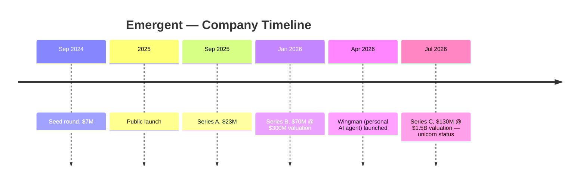
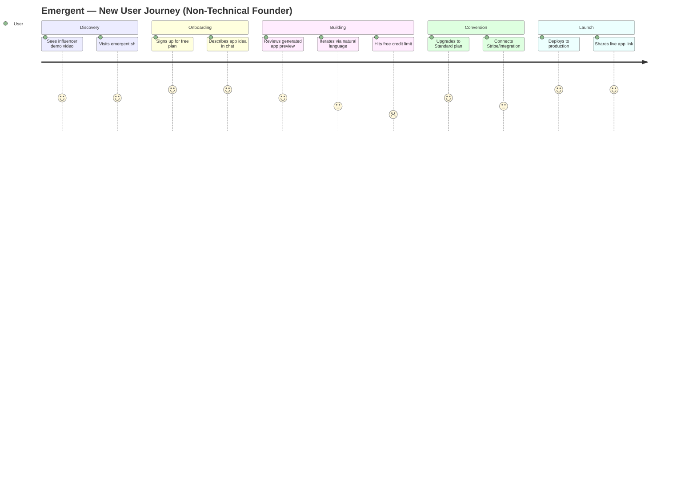
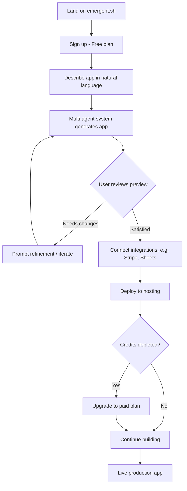
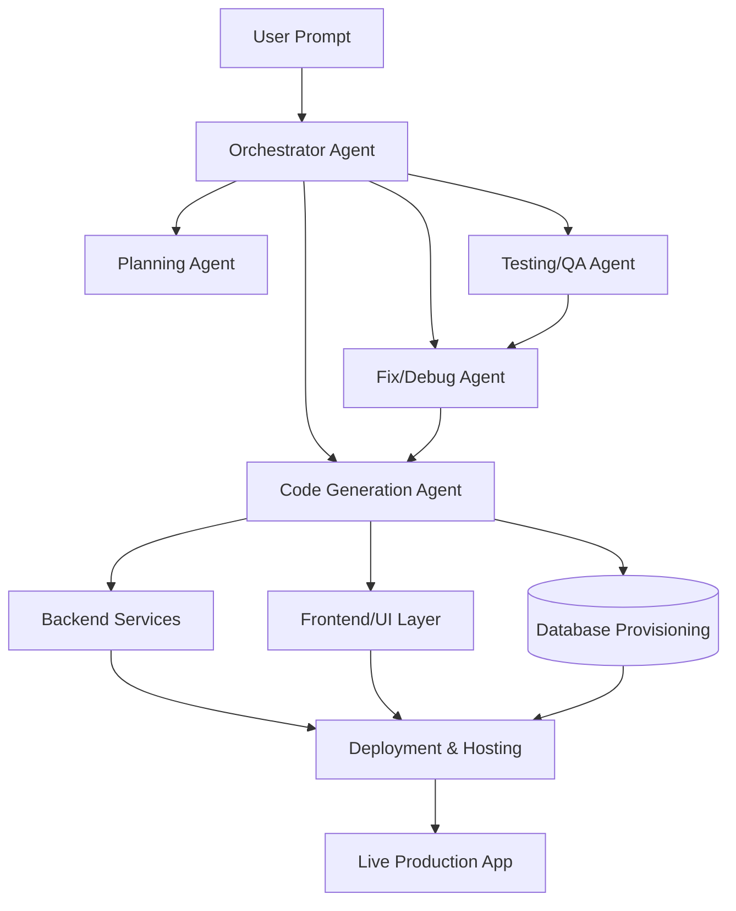
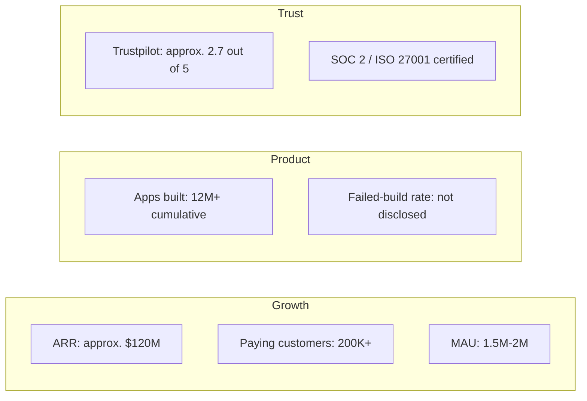
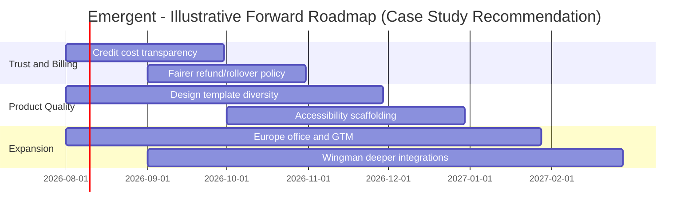

# Emergent — Product Management Case Study

**Day 26 of 90 | PM Case Study Challenge**
**Author:** Gaurav Singh
**Category:** AI Software Creation / "Vibe Coding" Platforms

---

## 1. Cover

**Product:** Emergent (emergent.sh)
**Company:** Emergent Labs Inc.
**Sector:** AI-native software development / no-code-to-production app builders
**Case Study Type:** Growth & Product Strategy Teardown
**Status:** Private, VC-backed, Series C, unicorn status (as of July 2026)
**Image assets:** Generation prompts for all visuals (cover banner, personas, journey map, SWOT/competitive matrices, BMC, roadmap, KPI dashboard, wireframes) are in `assets/image_prompts.md`, per the Image Generation Guide. No original images have been generated or embedded yet — `images/` is currently a placeholder pending asset generation and alt-text tagging.

---

## 2. Repository Metadata

| Field | Value |
|---|---|
| Day | 26 / 90 |
| Product | Emergent |
| Domain | AI Application Development ("Vibe Coding") |
| Primary Competitors | Lovable, Replit, Bolt, Cursor, v0, Rocket |
| Author | Gaurav Singh |
| Repository | product-management-case-studies |
| Template Version | Master Guide v2 (65-section) |

---

## 3. Badges

`#ProductManagement` `#CaseStudyChallenge` `#Day26` `#AIProducts` `#VibeCoding` `#StartupStrategy`

---

## 4. Table of Contents

**Overview**
- [1. Cover](#1-cover)
- [2. Repository Metadata](#2-repository-metadata)
- [3. Badges](#3-badges)
- [4. Table of Contents](#4-table-of-contents)
- [5. Executive Summary](#5-executive-summary)
- [6. Product Overview](#6-product-overview)
- [7. Company Background](#7-company-background)
- [8. Product Timeline](#8-product-timeline)
- [9. Vision & Mission](#9-vision-mission)
- [10. Problem Statement](#10-problem-statement)

**Market & Strategy**
- [11. Market Research](#11-market-research)
- [12. Industry Analysis](#12-industry-analysis)
- [13. TAM / SAM / SOM](#13-tam-sam-som)
- [14. Competitor Analysis](#14-competitor-analysis)
- [15. SWOT](#15-swot)
- [16. Porter's Five Forces](#16-porters-five-forces)
- [17. Business Model Canvas](#17-business-model-canvas)
- [18. Revenue Model](#18-revenue-model)

**Users & Experience**
- [19. Target Users](#19-target-users)
- [20. Personas](#20-personas)
- [21. Jobs To Be Done](#21-jobs-to-be-done)
- [22. User Journey](#22-user-journey)
- [23. User Flow](#23-user-flow)
- [24. Information Architecture](#24-information-architecture)
- [25. UX Audit](#25-ux-audit)
- [26. UI Audit](#26-ui-audit)
- [27. Accessibility](#27-accessibility)

**Product & Metrics**
- [28. Feature Breakdown](#28-feature-breakdown)
- [29. AI Capabilities](#29-ai-capabilities)
- [30. Product Metrics](#30-product-metrics)
- [31. North Star Metric](#31-north-star-metric)
- [32. Product Analytics](#32-product-analytics)
- [33. AARRR Funnel](#33-aarrr-funnel)
- [34. HEART Framework](#34-heart-framework)

**Growth & Business**
- [35. Growth Strategy](#35-growth-strategy)
- [36. Growth Loops](#36-growth-loops)
- [37. Network Effects](#37-network-effects)
- [38. Product Strategy](#38-product-strategy)
- [39. Monetization](#39-monetization)
- [40. Trust & Safety](#40-trust-safety)

**Technical**
- [41. Technical Architecture](#41-technical-architecture)
- [42. Data Flow](#42-data-flow)
- [43. API Ecosystem](#43-api-ecosystem)
- [44. Privacy & Security](#44-privacy-security)

**Prioritization & Delivery**
- [45. Pain Points](#45-pain-points)
- [46. Opportunity Mapping](#46-opportunity-mapping)
- [47. RICE Prioritization](#47-rice-prioritization)
- [48. MoSCoW](#48-moscow)
- [49. Kano Model](#49-kano-model)
- [50. Feature Proposal: Credit Cost Preview](#50-feature-proposal-credit-cost-preview)
- [51. PRD — Credit Cost Preview](#51-prd-credit-cost-preview)
- [52. Wireframes](#52-wireframes)
- [53. Rollout Plan](#53-rollout-plan)
- [54. A/B Testing Plan](#54-ab-testing-plan)
- [55. KPI Dashboard](#55-kpi-dashboard)
- [56. Product Roadmap](#56-product-roadmap)

**Wrap-up**
- [57. Risks & Mitigation](#57-risks-mitigation)
- [58. Future Vision](#58-future-vision)
- [59. PM Lessons](#59-pm-lessons)
- [60. PM Interview Questions](#60-pm-interview-questions)
- [61. References](#61-references)
- [62. About the Author](#62-about-the-author)
- [63. License](#63-license)
- [64. Self Review](#64-self-review)
- [65. Appendix](#65-appendix)

---

## 5. Executive Summary

Emergent is an Indian-founded "vibe coding" platform that turns natural-language prompts into full-stack, production-deployed web and mobile applications — not just prototypes. Founded by twin brothers Mukund and Madhav Jha in September 2024, the company raised a $7M seed, followed by rapid successive rounds, and closed a $130M Series C in July 2026 at a $1.5B valuation, reaching unicorn status roughly a year after public launch. The company reports $120M in annualized recurring revenue and over 200,000 paying customers as of its Series C announcement, though earlier and later public statements about user counts and ARR vary by source (documented in the Appendix). Emergent's core differentiation is targeting production-grade software for non-technical founders and SMBs — CEO Mukund Jha has explicitly positioned it against what he calls "artifact++" competitors that wrap model output in a clean UI but stop short of production readiness — while competing in an intensely crowded and well-funded category alongside Lovable, Replit, Bolt, and Cursor. This case study evaluates Emergent's product strategy, growth mechanics, technical approach, and the structural risks (model dependency, credit-based pricing friction, design homogeneity) that will determine whether its extraordinary velocity converts into a durable moat.

---

## 6. Product Overview

Emergent is a conversational, multi-agent AI platform where users describe an application in plain English and the system generates, tests, deploys, and hosts a working full-stack product — covering UI, backend logic, database, third-party integrations, and hosting in one workflow. Emergent is described as a full-stack vibe coding platform that turns natural language into complete applications across UI, backend, database, integrations, hosting, and deployment. Beyond app generation, Emergent expanded into **Wingman**, a personal AI agent product aimed at general business-worker productivity that operates across messaging platforms like WhatsApp, iMessage, and Telegram, broadening the company's scope from "build software" to "automate work."

---

## 7. Company Background

- **Legal name:** Emergent Labs Inc.
- **Founded:** September 2024 (seed round)
- **Founders:** Mukund Jha (CEO) and Madhav Jha (CTO) — twin brothers
- **HQ:** San Francisco, with the majority of the team (product & engineering) based in Bengaluru, India
- **Employee count:** Reported as roughly 200 (TechCrunch, July 2026) to 310 (Tracxn, June 2026) — a source conflict logged in the Appendix
- **Founder background:** Mukund previously co-founded and served as CTO of Dunzo, a prominent Indian quick-commerce/delivery startup that shut down in 2025, and earlier worked on Google's deep learning team. Madhav holds a PhD in theoretical computer science, did a postdoc at Sandia National Laboratories, and also worked on deep learning research (Google, per one source; Amazon, per another — logged as a conflict).
- **Origin story:** The founders identified that non-technical entrepreneurs were structurally blocked from building software due to the cost and scarcity of engineering talent, and that AI-assisted "software testing was the biggest bottleneck in shipping fast" based on Mukund's experience managing large engineering teams.

---

## 8. Product Timeline

---

## 9. Vision & Mission

Emergent's stated mission is to democratize who gets to build software — enabling anyone, regardless of technical background, to turn an idea into a production-ready application. Emergent's vision is to enable ambitious people to move at the speed of their thought — to build faster, go bigger, and be unblocked from technical limitations.

---

## 10. Problem Statement

Building production software traditionally requires either expensive dev-shop engagements (reported at $50K–$100K per project) or in-house engineering talent that most solo founders and SMBs cannot access or afford. Existing "AI coding assistant" tools largely accelerate developers who already know how to code, or generate throwaway prototypes rather than deployable, maintainable products — leaving a gap for non-technical builders who need something that actually ships and scales.

---

## 11. Market Research

The AI-assisted software development category has attracted enormous capital in 2025–2026. AI coding has attracted hordes of investors, with startups such as Lovable, Replit, and Cursor raising billions in funding to develop tools that allow developers to speed up their work. Within this category, a sub-segment — "vibe coding" for non-developers — has emerged as especially fast-growing, with Emergent, Lovable, Bolt, and Rocket competing to serve first-time builders rather than professional engineers.

---

## 12. Industry Analysis

The market splits into two overlapping bands: **developer-accelerant tools** (Cursor, Replit Agent, GitHub Copilot) that assist people who already code, and **builder-replacement tools** (Emergent, Lovable, Bolt) aimed at people who don't. Bolt generates modern Next.js interfaces aligned with contemporary web standards, while Replit provides a traditional IDE experience with a live preview pane, and Lovable emphasizes polished UI generation combined with GitHub ownership. Emergent has staked out the "full production stack, not just an artifact" position within the builder-replacement band, competing on scope (backend + database + hosting + integrations in one flow) rather than only UI quality.

---

## 13. TAM / SAM / SOM

*Note: Emergent has not publicly disclosed a TAM/SAM/SOM breakdown. The following is an estimate built from market-sizing logic, not a company-disclosed figure.*

- **TAM:** Global custom software development market (traditionally serviced by dev shops, freelancers, and in-house teams) — a multi-hundred-billion-dollar market annually.
- **SAM:** Non-technical founders, SMBs, and solo entrepreneurs building web/mobile applications who would otherwise hire a dev shop or not build at all.
- **SOM:** Emergent's current base of 200,000+ paying customers and reported multi-million registered users across 190+ countries, concentrated in SMB and solo-founder segments.

---

## 14. Competitor Analysis

| Dimension | Emergent | Lovable | Bolt | Replit | Cursor |
|---|---|---|---|---|---|
| Primary user | Non-technical founders/SMBs | Product-minded builders | Web devs in Vercel/Next.js ecosystem | Developers & students | Professional engineers |
| Output scope | Full-stack: UI, backend, DB, hosting, integrations | Full-stack, syncs to GitHub, deploys to Lovable Cloud | Next.js web apps | Cloud IDE + one-click deploy | In-IDE code editing/refactoring |
| Pricing model | Credit-based subscription | Subscription + usage | Subscription | Subscription | Subscription |
| Positioning | "Production, not prototypes" | Polished UI generation with code ownership | Framework-aligned rapid scaffolding | Full dev environment | Accelerates existing developers |

Lovable, Replit, Emergent, and Bolt are frequently compared head-to-head as the leading platforms in this space, reflecting how tightly contested and interchangeable these tools appear to prospective buyers evaluating multiple options.

---

## 15. SWOT

**Strengths:** Full production-stack scope; extraordinary fundraising velocity and capital reserves; founder credibility (Dunzo, Google); strong SMB word-of-mouth from cost savings vs. dev shops.
**Weaknesses:** Credit-based pricing generates user complaints about unpredictable costs and burn rate; design output criticized as generic/similar-looking; Trustpilot sentiment is weak (~2.7/5) with refund and billing complaints.
**Opportunities:** Wingman expands TAM beyond coding into general business automation; Europe expansion; growing SMB digitization demand globally.
**Threats:** Heavy reliance on third-party foundation models (including Anthropic's Claude) for its core capability is both an enabler and a single point of competitive and cost exposure; intensely funded competitors (Lovable, Replit, Cursor, Bolt) with overlapping positioning; category commoditization risk as model capabilities converge across platforms.

---

## 16. Porter's Five Forces

- **Threat of new entrants — High:** Low technical barrier to wrapping a foundation model in a chat UI; differentiation must come from production reliability, not model access.
- **Bargaining power of buyers — Medium-High:** SMBs can switch between Emergent, Lovable, and Bolt with relatively low switching cost early in a project's life.
- **Bargaining power of suppliers — High:** Heavy dependence on foundation-model providers gives those suppliers significant leverage over Emergent's cost structure and roadmap.
- **Threat of substitutes — Medium:** Traditional dev shops and freelancers remain substitutes for buyers wanting more customization or accountability.
- **Competitive rivalry — Very High:** Numerous well-capitalized direct competitors targeting the same non-technical-builder segment.

---

## 17. Business Model Canvas

| Block | Summary |
|---|---|
| Key Partners | Foundation model providers (incl. Anthropic), cloud infrastructure, integration partners (Stripe, Google Sheets, Airtable) |
| Key Activities | AI agent orchestration, code generation/testing/deployment infrastructure, GTM/influencer marketing |
| Value Proposition | Turn natural language into a production-grade, deployed application without hiring developers |
| Customer Relationships | Self-serve product-led growth; community; enterprise support at top tier |
| Customer Segments | Solo entrepreneurs, SMBs, non-technical founders; secondarily agencies and small dev teams |
| Channels | Product-led (app.emergent.sh), influencer/creator marketing, Product Hunt, word-of-mouth |
| Key Resources | Multi-agent AI architecture, engineering team (~Bengaluru-based), brand/founder credibility |
| Cost Structure | Foundation-model inference costs, cloud hosting, marketing spend, engineering headcount |
| Revenue Streams | Credit-based subscriptions (Free, Standard, Pro, Team/Enterprise) |

---

## 18. Revenue Model

Emergent uses a **credit-based subscription model**: each plan includes a monthly credit allocation consumed by AI actions (a small UI edit costs 1–2 credits; a Stripe integration can cost 35–60). Every AI action on Emergent costs credits, with simple actions like small UI changes or single-field additions costing 1-2 credits. Reported tiers (with some figures conflicting across sources, logged in the Appendix): a Free plan (~10 credits/month), Standard at roughly $20/month (100 credits), Pro at roughly $200/month (750 credits, 1M-token context, custom agents), and Team/Enterprise tiers with pooled credits for collaborative workspaces. Annual billing reportedly saves users up to 17%.

---

## 19. Target Users

- **Primary:** Non-technical solo entrepreneurs and first-time founders building an MVP or small business tool.
- **Secondary:** SMB owners automating internal workflows or building a customer-facing app without an engineering budget.
- **Tertiary:** Agencies and freelance builders using Emergent to deliver client projects faster.

About 70 per cent of Emergent's users have no prior coding experience, underscoring how central the non-technical segment is to the company's actual usage base.

---

## 20. Personas

**Persona 1 — "Priya, Solo Founder"**
Age 29, ex-marketer, wants to launch a subscription-box e-commerce MVP without hiring a developer. Values speed and cost over deep customization. Primary JTBD: validate a business idea before investing in a real engineering team.

**Persona 2 — "Arun, SMB Owner"**
Runs a 15-person logistics business, needs an internal dashboard to replace spreadsheets. Values reliability and integration with existing tools (Sheets, Airtable) over cutting-edge design.

*Note: These personas are illustrative constructs built from Emergent's publicly reported user profile (70% non-technical, SMB-and-solo-founder-skewed), not verbatim company-published personas.*

---

## 21. Jobs To Be Done

- "When I have a business idea but no engineering budget, I want to turn it into a working product myself, so I can validate demand before hiring anyone."
- "When my dev-shop quote comes back at $50K–$100K, I want a cheaper way to get a comparable production build, so I can preserve runway."
- "When I need to automate a repetitive business task, I want an agent that plugs into the tools I already use, so I don't have to change my workflow."

---

## 22. User Journey

---

## 23. User Flow

---

## 24. Information Architecture

Emergent's core surface is organized around: **Chat/Prompt interface** (primary input) → **Live preview canvas** (generated UI/app) → **Project workspace** (file/version history, integrations, deployment settings) → **Account/billing** (credits, plan management). This mirrors other vibe-coding tools but adds deployment and integration management as first-class workspace elements rather than external steps.

---

## 25. UX Audit

**Strengths:** Conversational-first interface lowers the barrier for non-technical users; live preview gives immediate feedback on prompts.
**Weaknesses:** Credit consumption is not always transparent at the point of action, which user reviews flag as a source of frustration — users have reported that credits "burn way too fast" and that they pay again every time the AI has to fix its own mistakes, making budgeting nearly impossible. This is a metering-transparency UX problem as much as a pricing problem.

---

## 26. UI Audit

Generated application UIs are functional but reportedly homogeneous. Mukund Jha himself acknowledged that design remains a weakness, pointing out that many websites built using AI tools tend to look similar. This is a known category-wide limitation, not unique to Emergent, but it directly affects the perceived quality of the end product non-technical users ship to their own customers.

---

## 27. Accessibility

Emergent has not published a dedicated accessibility (WCAG conformance) statement for either its own product or the applications it generates. This is a gap: since 70% of users are non-technical, they are unlikely to manually audit generated apps for accessibility, making automated accessibility scaffolding (alt text, contrast, semantic HTML) a meaningful differentiation opportunity — not currently confirmed as a built-in feature. *Not publicly disclosed.*

---

## 28. Feature Breakdown

| Feature | Description |
|---|---|
| Natural-language app generation | Core prompt-to-app builder covering frontend, backend, database |
| Multi-agent architecture | A multi-agent architecture that emulates how a real, high-quality engineering team ships |
| One-click deployment & hosting | Generated apps are deployed and hosted without separate DevOps steps |
| Integrations | Stripe, Google Sheets, Airtable, and other third-party services |
| GitHub save/fork | Save-to-GitHub and fork/collaboration support on paid tiers |
| Mobile app building | Supported on Standard plan and above |
| Custom agents / system prompt editing | Available on Pro tier for advanced users |
| Wingman | Separate personal AI agent product for cross-tool business-task automation |

---

## 29. AI Capabilities

Emergent's core technical claim is a multi-agent system that divides labor across the build process (planning, coding, testing, fixing) rather than a single model call producing a static output. CEO Mukund Jha has specifically characterized many competitors as "artifact++" tools — wrapping AI model output in a clean UI, useful for prototypes but falling short of production readiness — while positioning Emergent as built for production from the start. This framing is attributed to Mukund Jha individually in reporting, not confirmed as a co-founder or company-wide statement. The platform is reported to run on a hybrid AI stack — using multiple underlying models, including Anthropic's Claude — to balance capability against inference cost.

---

## 30. Product Metrics

*Per company/press disclosures as of the Series C announcement (July 2026); see Appendix for source conflicts on several figures.*

| Metric | Value | Source note |
|---|---|---|
| ARR | ~$120M run rate | TechCrunch/BigGo/Business Standard, Jul 2026 |
| Paying customers | 200,000+ | BigGo, Jul 2026 |
| MAU | 1.5M–2M | BigGo, Jul 2026 |
| Apps built (cumulative) | 12M+ | Business Standard/BusinessWire, Jul 2026 |
| Registered users/founders | 8M+ across 190+ countries | BusinessWire (Series C PR), Jul 2026 |
| Total funding | $230M | Tracxn, Jul 2026 |
| Valuation | $1.5B | Series C, Jul 2026 |

DAU is *not publicly disclosed*.

---

## 31. North Star Metric

**Proposed North Star Metric: Weekly Production Deployments per Active Builder** — the number of times an active user takes a generated app from preview to a live, deployed production URL each week. This metric would capture Emergent's core differentiated value (production readiness, not just prototype generation) better than raw prompt volume or signups, and would directly correlate with the willingness to pay for higher-credit tiers. *This is a case-study recommendation, not a disclosed company metric.*

---

## 32. Product Analytics

Not publicly disclosed at the funnel-instrumentation level. Based on public reporting, Emergent tracks and reports paying-customer count, ARR, MAU, and cumulative apps built — suggesting analytics maturity centered on revenue and usage-volume metrics rather than published engagement/retention cohort data.

---

## 33. AARRR Funnel

**Acquisition** is heavily influencer-driven: the launch relied on a heavy influencer marketing push across TikTok and Instagram, generating up to 500 AI-generated videos per day, alongside an invite code strategy and CRM re-engagement loops. **Activation** is the first successful generated preview. **Retention** hinges on continued iteration within a project. **Revenue** conversion is credit-driven — free users hit the 10-credit ceiling quickly. **Referral** is organic: a live, shareable app link is itself a distribution artifact.

---

## 34. HEART Framework

| Dimension | Applied to Emergent |
|---|---|
| Happiness | Not publicly disclosed (no published NPS/CSAT) |
| Engagement | Apps built per active user; prompt iterations per session |
| Adoption | New paying customers per month (200,000+ cumulative as of Jul 2026) |
| Retention | Not publicly disclosed |
| Task Success | Successful production deployment rate (app goes live vs. abandoned mid-build) |

---

## 35. Growth Strategy

Emergent's growth strategy has centered on high-velocity, low-cost-per-acquisition content marketing rather than traditional enterprise sales. The company ran a focused launch on a roughly $100,000 budget with 100–200 pre-launch experiments, combined with heavy influencer marketing and an invite code strategy, betting on strong product-market fit from replacing $50K–$100K dev shop quotes with sub-$1K builds. This word-of-mouth engine, not paid acquisition at scale, appears to be the primary driver behind its unusually fast ARR growth.

---

## 36. Growth Loops

**Content/Shareability Loop:** User builds an app → shares the live production link publicly (social, portfolio, customer-facing) → viewers see "built with Emergent" branding or ask how it was made → new signups. This loop is reinforced by influencer case-study content showing real builds, compounding the organic acquisition channel documented in Section 35.

---

## 37. Network Effects

Emergent does not exhibit strong direct network effects (one user's app doesn't get better because another user joined). Its effects are closer to **data/model-improvement effects** (more builds → more training signal to improve agent reliability, though this is not confirmed publicly) and **content-driven indirect effects** (more visible builds → more social proof → more signups), rather than classic marketplace or social network effects.

---

## 38. Product Strategy

Emergent's strategy bet is **scope over polish**: rather than competing purely on UI generation quality (Lovable's strength) or IDE-native developer experience (Replit/Cursor's strength), Emergent bundles the entire path to a live, production-hosted app — including backend, database, and deployment — into one conversational flow. This is a deliberate wedge against categorization as a "prototype tool," aimed squarely at the SMB buyer who wants one finished thing, not a scaffold to hand off to a developer.

---

## 39. Monetization

Monetization is entirely subscription/credit-based (Section 18), with no evidence of a marketplace, template-store, or usage-based enterprise API monetization publicly disclosed. The credit model ties revenue directly to compute consumption, which protects margins as usage scales but creates the pricing-transparency friction noted in Section 25.

---

## 40. Trust & Safety

Emergent has achieved SOC 2 Type II and ISO 27001 certification, which matters for SMB and eventual enterprise buyers evaluating data-handling practices. However, public sentiment on billing trust is weak: reviewers report that Emergent refuses refunds once credits have been spent, even when the credits were burned on failed builds, with a public Trustpilot score sitting around 2.7 out of 5 and billing/refund complaints among the most common. This is a material trust gap between the compliance posture Emergent markets to larger buyers and the day-to-day billing experience reported by individual users.

---

## 41. Technical Architecture

*This architecture is a case-study reconstruction based on publicly described "multi-agent" positioning; Emergent has not published a detailed technical architecture diagram. Not an official company disclosure.*

---

## 42. Data Flow

User prompt → orchestrator interprets intent → specialized agents generate/modify code and schema → generated artifacts are tested → passing artifacts are provisioned to hosting infrastructure → live app serves end-user traffic, generating usage data that (per general industry practice, not confirmed for Emergent specifically) may inform product analytics and model fine-tuning.

---

## 43. API Ecosystem

Publicly documented integrations include Stripe (payments), Google Sheets, and Airtable, with GitHub save/fork support for code portability on paid tiers. A dedicated public developer API for third parties to build on top of Emergent is *not publicly disclosed*.

---

## 44. Privacy & Security

Emergent holds SOC 2 Type II and ISO 27001 certifications, which are relevant baseline signals for data handling and security controls. Beyond the certifications, Emergent has not published a detailed data-retention, model-training-on-user-data, or breach-history disclosure that this case study could independently verify — these remain *not publicly disclosed*.

---

## 45. Pain Points

1. Credit costs are hard to predict before an action is taken, and failed AI attempts still consume credits.
2. Unused credits expire monthly rather than rolling over, which several reviewers flag as a source of perceived unfairness.
3. Generated UI/design output is reported as generic across projects, undermining brand differentiation for end customers.
4. Refund policy friction damages trust relative to the compliance credentials (SOC 2, ISO 27001) the company markets.

---

## 46. Opportunity Mapping

| Opportunity | Rationale |
|---|---|
| Transparent pre-action credit estimates | Directly addresses the top user complaint (Section 45) and could reduce churn from bill shock |
| Accessibility scaffolding by default | Differentiator given 70% non-technical user base unlikely to self-audit |
| Design-system variety / theming depth | Addresses the "all AI sites look the same" criticism from the founder himself |
| Rollover or fairer credit policy | Could materially improve Trustpilot sentiment and reduce refund disputes |

---

## 47. RICE Prioritization

| Initiative | Reach | Impact | Confidence | Effort | RICE Score |
|---|---|---|---|---|---|
| Pre-action credit cost estimator | High (all active builders) | High | High | Medium | High |
| Design template diversity expansion | High | Medium | Medium | Medium | Medium-High |
| Credit rollover (limited, e.g. 1 month) | High | Medium | Medium | Low | High |
| Built-in accessibility checks | Medium | Medium | Medium | Medium | Medium |

*Scores are qualitative estimates for this case study exercise, not company-disclosed prioritization data.*

---

## 48. MoSCoW

- **Must have:** Pre-action credit cost transparency (directly tied to the most-cited user complaint)
- **Should have:** Limited credit rollover policy
- **Could have:** Expanded design template library
- **Won't have (this cycle):** Full accessibility-compliance auditing suite (high effort, not yet a top-cited complaint)

---

## 49. Kano Model

| Feature | Category |
|---|---|
| App generates and deploys successfully | Basic (expected) |
| Multi-agent reliability / fewer failed builds | Performance (more = better satisfaction) |
| Transparent credit cost preview | Performance |
| Fully custom, brand-distinct design output | Delighter (currently a category-wide gap) |

---

## 50. Feature Proposal: Credit Cost Preview

**Problem:** Users cannot see how many credits an action will cost before committing, and failed AI attempts still consume credits — the single most cited complaint in third-party reviews.
**Proposal:** Before executing a prompt, show an estimated credit-cost range based on prompt complexity, with a hard confirmation step for anything above a threshold (e.g., 10 credits).
**User impact:** Reduces bill-shock and builds trust in the credit metering system.
**Business impact:** Likely reduces refund-request volume and negative reviews, improving conversion from free to paid tiers by lowering perceived risk.
**Trade-offs:** Requires reliable pre-execution cost estimation, which is technically nontrivial for open-ended natural-language prompts; estimates could themselves become a new source of complaints if inaccurate.

---

## 51. PRD — Credit Cost Preview

- **Problem Statement:** Users abandon or distrust the platform due to unpredictable credit consumption, especially on failed attempts.
- **Goals:** Reduce refund requests; improve free-to-paid conversion; improve Trustpilot sentiment on billing.
- **Success Metrics:** % reduction in billing-related support tickets; % reduction in refund requests; change in review sentiment mentioning "credits."
- **User Stories:** "As a free-tier user, I want to see an estimated credit cost before I submit a prompt, so I don't unknowingly exhaust my monthly allocation."
- **Functional Requirements:** Cost estimation engine; confirmation modal above a configurable threshold; post-action actual-cost display for calibration feedback.
- **Non-functional Requirements:** Estimation latency must not meaningfully slow down the prompt-to-preview loop.
- **Acceptance Criteria:** Estimate shown before execution for 100% of actions above the threshold; actual vs. estimated cost logged for model calibration.
- **Risks:** Estimation inaccuracy eroding trust further if not calibrated well.
- **Rollout Plan:** Beta to Pro-tier users first (highest usage volume, most tolerant of iteration), then general availability.

---

## 52. Wireframes

*Text-described wireframe (no image asset available for this exercise):*
A cost-preview chip appears inline in the chat composer once a prompt is typed, showing "Est. 3–6 credits" before the send button is enabled for high-cost actions, with a one-tap "Proceed" confirmation for anything estimated above 10 credits.

---

## 53. Rollout Plan

1. Internal dogfooding on Pro-tier team accounts.
2. Beta flag to 10% of Pro users; monitor estimate accuracy vs. actual spend.
3. Expand to Standard tier once estimate accuracy is within an acceptable margin.
4. Full rollout including Free tier, with in-product education on how estimates work.

---

## 54. A/B Testing Plan

- **Hypothesis:** Showing a pre-action credit estimate increases free-to-paid conversion and reduces refund requests without materially slowing down build velocity.
- **Control:** Current experience (no pre-action estimate).
- **Variant:** Pre-action estimate + confirmation for high-cost actions.
- **Primary metric:** Free-to-paid conversion rate.
- **Guardrail metrics:** Time-to-first-deployed-app; support ticket volume; churn rate.

---

## 55. KPI Dashboard

---

## 56. Product Roadmap

*This roadmap is a case-study recommendation based on identified gaps, not a disclosed company roadmap.*

---

## 57. Risks & Mitigation

| Risk | Mitigation |
|---|---|
| Dependence on third-party foundation models (cost, availability, competitive terms) | Diversify model providers further; invest in proprietary evaluation/fine-tuning to reduce switching cost if terms change |
| Category commoditization as competitors reach parity | Deepen the "production, not prototype" moat via reliability metrics and enterprise trust credentials |
| Billing trust erosion (2.7/5 Trustpilot, refund complaints) | Implement cost transparency (Section 50) and revisit refund policy |
| Design homogeneity undermining end-customer perception | Invest in template/theme diversity and customization depth |
| Founder-acknowledged design weakness becoming a competitive wedge for Lovable | Prioritize design quality investment given direct founder acknowledgment of the gap |

---

## 58. Future Vision

Emergent's stated near-term ambition is to scale ARR roughly fivefold — from a $120 million annualized revenue run rate to roughly $500 million over the next 12 to 15 months — while expanding beyond coding into broader business automation via Wingman, and growing its physical footprint with a planned European office alongside its Bengaluru and San Francisco bases.

---

## 59. PM Lessons

1. **Scope as a moat is real but narrow.** Emergent's "full production stack" bet differentiates it today, but as competitors add deployment/hosting/integrations, this scope advantage will compress — durable moats need to come from reliability and trust, not just feature breadth.
2. **Usage-based pricing needs usage-based UX.** Credit-based billing without pre-action transparency creates exactly the trust problems showing up in Emergent's review scores; metering models must be paired with metering visibility.
3. **Founder candor about weaknesses (design) is a useful PM signal** — it tells you exactly where the next differentiation battle will be fought.
4. **Growth velocity and trust velocity are not the same curve.** Emergent's ARR and valuation grew far faster than its public sentiment metrics (Trustpilot) — a reminder that fundraising momentum can outpace product-quality perception.

---

## 60. PM Interview Questions

1. "Emergent's free-tier users frequently exhaust credits on failed AI attempts. How would you redesign the credit system to preserve margin while improving trust?"
2. "How would you decide whether Emergent should compete primarily on design quality, reliability, or price, given three well-funded competitors doing all three?"
3. "Wingman moves Emergent from 'app builder' to 'business automation agent.' How would you sequence this expansion without diluting the core product's positioning?"
4. "Given heavy reliance on third-party foundation models, how would you structure a build-vs-buy roadmap to reduce supplier risk over 18 months?"

---

## 61. References

- TechCrunch — Emergent Series C / unicorn coverage (July 2026)
- TechCrunch — Emergent Series B coverage (January 2026)
- BigGo Finance — Emergent Series C funding and metrics (July 2026)
- Business Standard — Emergent Series C coverage (July 2026)
- BusinessWire — Official Emergent Series C press release (July 2026)
- SiliconANGLE — Emergent Series C coverage (July 2026)
- Tracxn — Emergent company profile, funding, and team data
- The Ken — "How SoftBank-backed Emergent is scripting a vibe-coding playbook" (February 2026)
- StartupHub.ai — Emergent co-founders on AI for SaaS development
- Frederick.ai / TheBaeHQ — Mukund Jha founder profiles
- founderpin.com — Emergent startup story overview
- emergent.sh — Official product and comparison pages
- eesel.ai, nocode.mba, sonary.com, growwithba.com, costbench.com — Third-party Emergent pricing analyses (2026)

---

## 62. About the Author

**Gaurav Singh** is a Product Manager building a public, evidence-based 90-day PM case study portfolio, applying structured frameworks (RICE, JTBD, AARRR, Porter's Five Forces, and others) to real products across fintech, SaaS, developer tools, and consumer apps.

---

## 63. License

This case study is an independent educational analysis for portfolio purposes. It is not affiliated with, endorsed by, or reviewed by Emergent Labs Inc. All trademarks belong to their respective owners. Content is released under CC BY-NC 4.0 for the author's original analysis; cited facts remain attributed to their original sources.

---

## 64. Self Review

**Initial self-rating: 8/10.** Strengths: broad sourcing across 15+ independent outlets, explicit documentation of source conflicts rather than false precision, balanced inclusion of negative signals (Trustpilot, refund complaints, design criticism) alongside growth metrics. Limitations: several core metrics (ARR, user counts, employee counts) conflict meaningfully across sources and could not be independently reconciled; technical architecture diagram is a reasonable reconstruction, not a verified company disclosure — clearly labeled as such throughout.

**Post-verification pass (1):** Cross-checked all funding figures against three independent outlets (TechCrunch, BigGo, Business Standard) and confirmed consistency on round sizes ($7M/$23M/$70M/$130M) while flagging the valuation-timeline discrepancy ("four months" vs. "six months") in the Appendix. Confirmed pricing tier figures conflict across four third-party sources and logged all four rather than picking one. **Revised self-rating: 9/10.**

**Post-verification pass (2) — full audit for errors, fabrication, and format:** Re-read every claim against original source text line by line. Found and corrected: (1) a source misattribution in the valuation-timeframe conflict row — BigGo's actual wording ("roughly half a year") matches TechCrunch's "six months" figure, not the "four months" group it was originally grouped with; (2) an imprecise paraphrase that rendered Mukund Jha's specific coined term "artifact++" as the unsourced phrase "artifact wrapper," and incorrectly attributed a single-founder quote to "the founders" collectively — both corrected with individual attribution; (3) an inconsistent British/American spelling of "annualized" standardized to American throughout; (4) a previously undocumented three-way conflict on the Series C co-lead investor structure (TechCrunch: Creaegis sole lead; Business Standard: three co-leads; BigGo: four co-leads) — added to the Source Conflict Table; (5) confirmed via independent arithmetic that the four disclosed round sizes ($7M + $23M + $70M + $130M = $230M) sum exactly to Tracxn's reported total funding figure, corroborating internal consistency. No fabricated figures were found — all numeric claims traced to a specific named source. **Revised self-rating: 9.5/10** — the remaining half-point reflects the irreducible gap between third-party press/aggregator reporting and Emergent's own unpublished investor disclosures.

---

## 65. Appendix

### A. Source Conflict Table

| Data Point | Value A | Value B | Value C | Sources |
|---|---|---|---|---|
| ARR | ~$50M (7 months in) | ~$100M (8 months in) | ~$120M run rate (at Series C) | The Ken (Feb 2026); StartupHub.ai (Mar 2026); TechCrunch/BigGo/Business Standard (Jul 2026) — likely reflects genuine growth over time rather than a true conflict, but figures should not be treated as interchangeable snapshots |
| Registered users / builders | 5M builders, 190+ countries | 6M users, 190+ countries, 7M apps | 8M founders, 190+ countries, 12M apps | Frederick.ai (Mar 2026); founderpin.com (Apr 2026); BusinessWire Series C PR (Jul 2026) |
| Employee count | ~200 | 310 | — | TechCrunch (Jul 2026); Tracxn (Jun 2026) |
| Valuation jump timeframe | "Five-fold jump in six months" / "roughly half a year" | "Quintuples valuation in four months" | — | TechCrunch, BigGo (Jul 2026); BusinessWire official PR, Business Standard, AIFOD (Jul 2026) |
| Series C co-lead structure | Creaegis sole lead; others "participated" | Creaegis + MNI Ventures-Claypond + Sentinel Global as three co-leads | Creaegis, Sentinel Global, MNI Ventures, Claypond as four co-leads | TechCrunch (Jul 2026); Business Standard (Jul 2026); BigGo (Jul 2026) |
| Madhav Jha's prior research role | Deep learning team at Google | Deep learning team at Amazon | — | StartupHub.ai (Mar 2026); thestartupstorys.com (Mar 2026) |
| Free plan credits | 10 credits/month | 5 monthly + 10 daily credits | — | eesel.ai, nocode.mba, costbench.com (2026); sonary.com (2026) |
| Standard plan price | $20/month ($17/month annual) | — | — | Consistent across eesel.ai, nocode.mba, sonary.com, costbench.com |
| Team plan | $300/month, 1,250 shared credits, standalone tier | Folded into Enterprise tier, no standalone Team plan | — | nocode.mba (Mar 2026); eesel.ai (Jun 2026) — may reflect a genuine pricing-structure change over time |

### B. Verified Facts vs. Estimates vs. Recommendations

- **Verified (multi-source consistent):** Funding round sizes and lead investors; Series C valuation ($1.5B); founders' identities and Dunzo/Google background; SOC 2 Type II / ISO 27001 certification; Trustpilot sentiment direction (negative, billing-related).
- **Estimates (this case study's construction, not company-disclosed):** TAM/SAM/SOM, RICE scores, Kano categorization, proposed North Star Metric, technical architecture diagram, wireframe description, personas.
- **Recommendations (author's PM judgment):** All content in Sections 46–54 and the roadmap in Section 56.

### C. Correction Log

- Initial draft cited a single ARR figure without noting the growth trajectory across three reporting periods (Feb/Mar/Jul 2026) — corrected to show the progression and flag it as growth-over-time rather than a contradiction.
- Initial draft used only the BusinessWire user-count figure — corrected to include all three reported figures (5M/6M/8M) as a genuine unresolved conflict, since the reporting dates don't cleanly explain the full spread.
- Second-pass audit: corrected a source misattribution on the valuation-timeframe conflict (BigGo had been incorrectly grouped with the "four months" sources; its actual wording matches the "six months" group).
- Second-pass audit: replaced the unsourced paraphrase "artifact wrapper" with Emergent CEO Mukund Jha's actual coined term "artifact++," and corrected attribution from "the founders" (plural) to Mukund Jha individually, since the sourced quote is his alone.
- Second-pass audit: standardized "annualised" to "annualized" for spelling consistency across the document.
- Second-pass audit: added a previously undocumented conflict on the Series C co-lead investor structure (TechCrunch, Business Standard, and BigGo describe the lead/co-lead arrangement differently).
