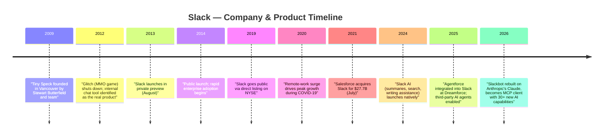
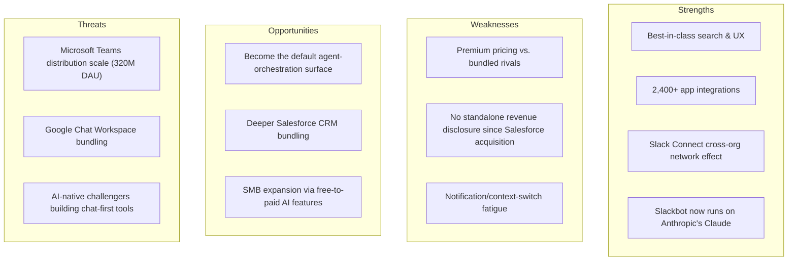
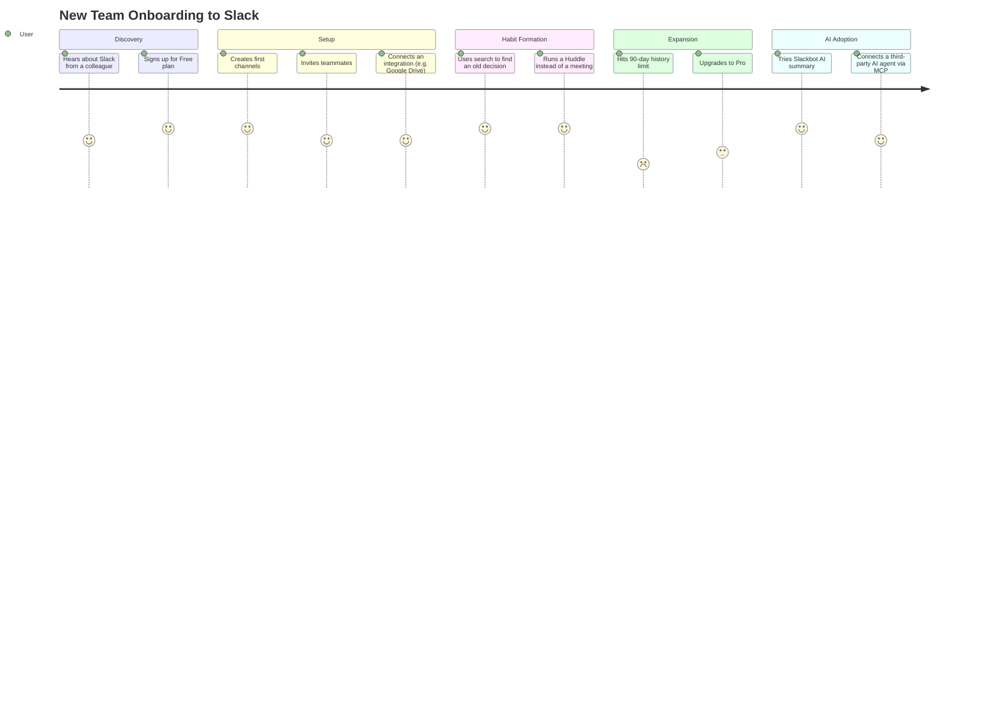
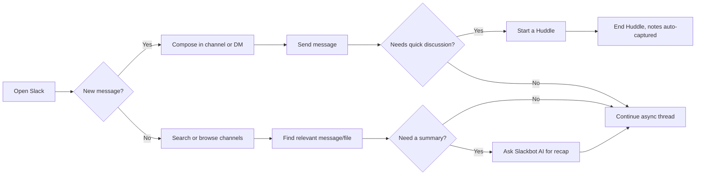
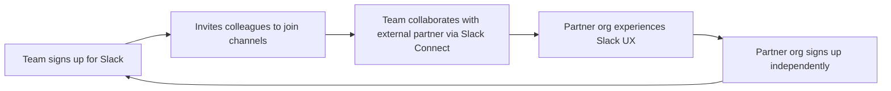
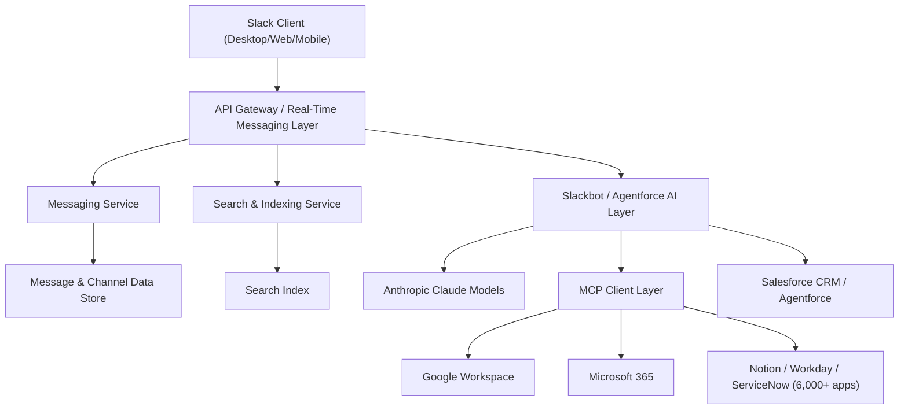
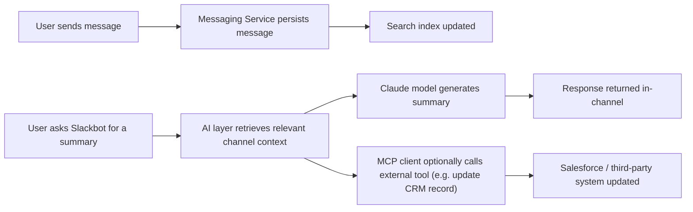
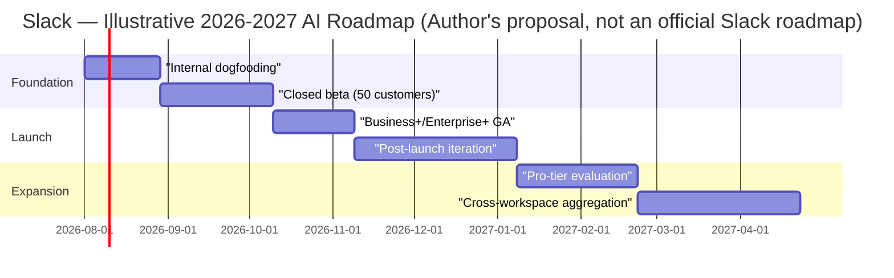

# Slack — Product Management Case Study
### Day 27 of 90 | PM Case Study Challenge

---

## 1. Cover

**Product:** Slack (a Salesforce product)
**Category:** Enterprise SaaS — Team Communication & Collaboration
**Author:** Gaurav Singh
**Day:** 24 / 90
**Date Published:** July 23, 2026

---

## 2. Repository Metadata

| Field | Value |
|---|---|
| Repository | `product-management-case-studies` |
| Folder | `Day-27-Slack/` |
| Author | Gaurav Singh |
| Series | 90-Day PM Case Study Challenge |
| Previous | Day 26 — Emergent |
| License | MIT (see [§63 License](#63-license)) |

---

## 3. Badges

`Day 27/90` · `Category: SaaS / Collaboration` · `Parent Company: Salesforce` · `Status: Published`

---

## 4. Table of Contents

**Foundations**

- [1. Cover](#1-cover)
- [2. Repository Metadata](#2-repository-metadata)
- [3. Badges](#3-badges)
- [4. Table of Contents](#4-table-of-contents)
- [5. Executive Summary](#5-executive-summary)
- [6. Product Overview](#6-product-overview)
- [7. Company Background](#7-company-background)
- [8. Product Timeline](#8-product-timeline)
- [9. Vision & Mission](#9-vision--mission)
- [10. Problem Statement](#10-problem-statement)

**Market & Strategy**

- [11. Market Research](#11-market-research)
- [12. Industry Analysis](#12-industry-analysis)
- [13. TAM/SAM/SOM](#13-tamsamsom)
- [14. Competitor Analysis](#14-competitor-analysis)
- [15. SWOT](#15-swot)
- [16. Porter's Five Forces](#16-porters-five-forces)
- [17. Business Model Canvas](#17-business-model-canvas)
- [18. Revenue Model](#18-revenue-model)

**Users & Experience**

- [19. Target Users](#19-target-users)
- [20. Personas](#20-personas)
- [21. JTBD](#21-jtbd)
- [22. User Journey](#22-user-journey)
- [23. User Flow](#23-user-flow)
- [24. Information Architecture](#24-information-architecture)
- [25. UX Audit](#25-ux-audit)
- [26. UI Audit](#26-ui-audit)
- [27. Accessibility](#27-accessibility)

**Product & Growth**

- [28. Feature Breakdown](#28-feature-breakdown)
- [29. AI Capabilities](#29-ai-capabilities)
- [30. Product Metrics](#30-product-metrics)
- [31. North Star Metric](#31-north-star-metric)
- [32. Product Analytics](#32-product-analytics)
- [33. AARRR](#33-aarrr)
- [34. HEART](#34-heart)
- [35. Growth Strategy](#35-growth-strategy)
- [36. Growth Loops](#36-growth-loops)
- [37. Network Effects](#37-network-effects)
- [38. Product Strategy](#38-product-strategy)
- [39. Monetization](#39-monetization)
- [40. Trust & Safety](#40-trust--safety)

**Technical**

- [41. Technical Architecture](#41-technical-architecture)
- [42. Data Flow](#42-data-flow)
- [43. API Ecosystem](#43-api-ecosystem)
- [44. Privacy & Security](#44-privacy--security)

**Strategy & Planning**

- [45. Pain Points](#45-pain-points)
- [46. Opportunity Mapping](#46-opportunity-mapping)
- [47. RICE](#47-rice)
- [48. MoSCoW](#48-moscow)
- [49. Kano](#49-kano)
- [50. Feature Proposal](#50-feature-proposal)
- [51. PRD](#51-prd)
- [52. Wireframes](#52-wireframes)
- [53. Rollout Plan](#53-rollout-plan)
- [54. A/B Testing](#54-ab-testing)
- [55. KPI Dashboard](#55-kpi-dashboard)
- [56. Product Roadmap](#56-product-roadmap)
- [57. Risks & Mitigation](#57-risks--mitigation)
- [58. Future Vision](#58-future-vision)

**Closing**

- [59. PM Lessons](#59-pm-lessons)
- [60. PM Interview Questions](#60-pm-interview-questions)
- [61. References](#61-references)
- [62. About the Author](#62-about-the-author)
- [63. License](#63-license)
- [64. Self Review](#64-self-review)
- [65. Appendix](#65-appendix)
---

## 5. Executive Summary

Slack is the channel-based enterprise messaging platform that redefined workplace communication after emerging, almost by accident, from a failed video game. Thirteen years after its 2013 launch, it sits inside a Salesforce-owned "Agentforce 360 Platform, Slack and Other" business segment that generated **$2.655 billion in Q4 FY26 revenue, up 38% year-over-year**, though — notably — Salesforce no longer reports a clean, Slack-only revenue line. That absence of a standalone number is itself a data point about how Slack's role inside Salesforce has changed: from a $27.7 billion standalone acquisition to a distribution surface for Salesforce's broader Agentforce AI strategy.

The most consequential recent development is technical rather than commercial: as of March 2026, Slackbot — Slack's native AI assistant — runs on **Anthropic's Claude models** and has been rebuilt as an agentic, MCP-client system capable of listening to meetings, updating CRM records, and orchestrating third-party AI agents from more than 6,000 connected applications. This case study evaluates Slack across product, growth, technical, and strategic dimensions, and proposes one concrete feature extension consistent with where the product is heading.

**Key finding:** Slack's core differentiation was never "chat." It was making a persistent, searchable, integration-rich record of work the default surface teams operate from — and it is now trying to repeat that trick one layer up, positioning itself as the default surface through which teams operate *AI agents*, not just each other.

---

## 6. Product Overview

Slack is a channel-based messaging and workflow platform for organizations. Core building blocks:

- **Channels** — persistent, topic-based conversation spaces (public, private, or shared across organizations via Slack Connect)
- **Direct & group messaging** — 1:1 and small-group conversation
- **Huddles** — lightweight, low-friction audio/video calls launched from any channel
- **Canvases** — persistent documents embedded in channels for notes, specs, and action items
- **Workflow Builder** — no-code automation for routine processes
- **App ecosystem** — 2,400+ third-party integrations, plus native and third-party AI agents
- **Slackbot / Agentforce** — native AI assistant now built on Anthropic's Claude models, functioning as an MCP client that can act across connected tools

It is sold on a freemium SaaS model with four tiers: Free, Pro, Business+, and Enterprise+, and is now bundled by default into new Salesforce customer accounts as of summer 2026.

---

## 7. Company Background

Slack began life as an internal tool inside **Tiny Speck**, a Vancouver company founded in 2009 by **Stewart Butterfield, Cal Henderson, Eric Costello, and Serguei Mourachov** to build a browser-based multiplayer game called *Glitch*. The team built the tool for their own use while developing the game, never originally intending it as a standalone product. This was Butterfield's second pivot of this exact shape: a decade earlier, his team's failed MMO *Game Neverending* produced a photo-sharing side feature that became Flickr, acquired by Yahoo in 2005 (reported sale price varies by source — see [§65 Appendix](#65-appendix)).

When Glitch was shut down at the end of 2012, the team recognized that the internal tool they had leaned on daily had proven more valuable than the game itself. The tool was rebranded **Slack** — a backronym for "Searchable Log of All Conversation and Knowledge" — and entered private preview in August 2013, drawing roughly 8,000 signups in the first 24 hours. Slack went public via direct listing in 2019, peaking at a ~$23 billion public market valuation, before **Salesforce acquired it in July 2021 for $27.7 billion** — one of the largest software acquisitions in history. Slack now operates as a subsidiary business line inside Salesforce, headquartered at Salesforce Tower, San Francisco.

---

## 8. Product Timeline

*Figure 1 — Company & product milestones, 2009–2026. Rendered chart version of the timeline above, generated from the sourced dates in §7–§8.*

---

## 9. Vision & Mission

Slack's long-standing mission has been to **make people's working lives simpler, more pleasant, and more productive** by replacing fragmented email threads with a searchable, channel-based system of record. Under Salesforce, that mission is being reframed: Slack is increasingly positioned not just as where humans talk to each other, but as the **"agentic operating system"** — the interface through which employees and AI agents coordinate work together, per Salesforce's own 2025–2026 messaging around Agentforce.

---

## 10. Problem Statement

Before Slack, internal team communication was fragmented across email threads, ad-hoc IM tools, and undocumented hallway conversations — none of which were searchable, persistent, or contextual to a specific project or topic. Knowledge lived in individual inboxes rather than shared, discoverable spaces. Slack's founding insight was that **the exhaust of good internal tooling can itself be the product** — and that teams would pay for a searchable, always-on record of "what happened and why," organized by topic rather than by sender.

The problem Slack is solving *today* has shifted: with 6,000+ connected apps and dozens of AI agents now addressable from within a single workspace, the challenge is no longer "where do we talk" but **"how does a person coordinate work across a sprawling mesh of human colleagues and AI agents without constant tool-switching."**

---

## 11. Market Research

Slack competes in the **team collaboration / enterprise messaging** software market. Multiple third-party estimates (not Slack- or Salesforce-disclosed) place Slack's global messaging market share at roughly **8–18%**, with wide variance depending on how "collaboration software" is scoped (pure enterprise messaging vs. broader unified communications, which also counts video-first tools like Zoom). Statista's 2026 enterprise-messaging figures put Microsoft Teams at roughly 37% market share against Slack's roughly 13%. Under the broader "unified communications" categorization, the same dataset instead shows Teams at roughly 48%, Zoom at 42%, Slack at 8%, and Google Meet at 6%. These figures come from third-party market trackers rather than official company disclosures and should be read as directional, not precise (see [§65 Appendix](#65-appendix) for the full source-conflict table).

*Figure 2 — Slack's reported market share swings from ~13% to ~8% purely based on how the category is scoped, using the same underlying Statista dataset. Shown side-by-side deliberately rather than averaged into one number.*

---

## 12. Industry Analysis

The enterprise collaboration category has consolidated around a handful of platform ecosystems rather than point solutions: Microsoft (Teams, bundled into Microsoft 365), Google (Chat, bundled into Workspace), and Salesforce (Slack, bundled into the broader CRM/Agentforce suite). Salesforce has reported that Agentforce and Slack together have driven 2.4 billion "Agentic Work Units" to date, a figure the company says grew 57% quarter-over-quarter in its most recent results. The industry's center of gravity has moved from "messaging features" (threads, reactions, search) — now table stakes — to **AI-agent orchestration**: which platform becomes the default interface for coordinating both human teammates and autonomous AI agents. This is a structural shift in what the product category even is.

---

## 13. TAM/SAM/SOM

*(Framework selection rationale: TAM/SAM/SOM is used here because Slack operates in a well-defined, sizeable enterprise software category where top-down and bottom-up figures are independently triangulable — appropriate for a mature, disclosed-adjacent SaaS business rather than an early-stage product.)*

| Layer | Definition | Estimate | Basis |
|---|---|---|---|
| TAM | Global team collaboration & enterprise messaging software market | Company has not publicly disclosed a precise figure; third-party market research pegs the broader unified-communications-and-collaboration market in the tens of billions of USD annually | Industry analyst estimates (not Slack-disclosed) |
| SAM | Organizations using channel-based, integration-rich workplace messaging (mid-market to enterprise) | Not publicly disclosed | Inferred from Slack's enterprise/mid-market go-to-market focus |
| SOM | Slack's realistically addressable share given current Salesforce distribution, pricing, and competitive position | Not publicly disclosed | Inferred from paid-seat and DAU estimates in [§30](#30-product-metrics) |

All figures in this section are estimates or industry inferences, not Salesforce-disclosed numbers.

---

## 14. Competitor Analysis

| Dimension | Slack | Microsoft Teams | Google Chat | Discord (enterprise use) |
|---|---|---|---|---|
| Value proposition | Channel-first, integration-rich workplace hub | Bundled into Microsoft 365; deep Office integration | Bundled into Google Workspace; lightweight | Community/voice-first, informal team use |
| Target users | Tech, startups, cross-company collaboration (Slack Connect) | Enterprises already on Microsoft 365 | Google Workspace shops | Startups, dev/gaming-adjacent teams |
| Core strength | UX, search, 2,400+ integrations, AI agent orchestration | Distribution — bundled "free" with 365 | Distribution — bundled with Workspace | Voice channels, community feel, low cost |
| Pricing | Free / $7.25 / $15 / custom (per user/mo) | Bundled or ~$4–12/user/mo add-on | Bundled with Workspace | Free / low-cost Nitro tiers |
| AI capabilities | Slackbot on Claude, Agentforce, MCP client | Microsoft Copilot | Gemini in Chat | Limited enterprise AI |
| Weakness | Priced at a premium vs. bundled alternatives | Weaker search UX historically; less "chat-native" | Lower enterprise mindshare | Not built for compliance-heavy enterprise |

**Strategic insight:** Slack's core competitive threat has never been feature parity — it is **distribution economics**. Microsoft Teams' scale advantage comes almost entirely from being bundled "free" into an existing enterprise contract, not from superior product. Microsoft has disclosed that Teams reached 320 million daily active users in 2026, up from 260 million the prior year — a 23% year-over-year increase — a scale gap Slack is now trying to close the same way, by bundling itself into every new Salesforce account from summer 2026.

**Opportunity for differentiation:** Slack's clearest wedge is being the *neutral, cross-company* collaboration layer (via Slack Connect) in a market where Teams and Google Chat are both single-vendor-ecosystem plays — useful for any two organizations that don't share a CRM or productivity suite.

---

## 15. SWOT

---

## 16. Porter's Five Forces

*(Framework selection rationale: appropriate here because Slack sits in a mature, oligopolistic market with a small number of large platform competitors and meaningful switching costs — Porter's model surfaces the structural forces that flat competitor comparison misses.)*

- **Threat of new entrants — Low-Medium:** High technical and trust bar (security, compliance, integrations) protects incumbents, but AI-native chat startups could re-open the category.
- **Bargaining power of buyers — Medium-High:** Enterprise buyers can and do switch to bundled Teams/Google Chat to cut costs, especially at renewal.
- **Bargaining power of suppliers — Low:** Slack is not dependent on scarce suppliers, though its AI stack now depends on model providers (notably Anthropic).
- **Threat of substitutes — Medium:** Email, Microsoft Teams, Google Chat, and increasingly AI-native "agent inboxes" are viable substitutes for parts of the job-to-be-done.
- **Competitive rivalry — High:** Direct, sustained rivalry with Microsoft Teams; secondary rivalry with Google Chat, Zoom Team Chat, and Discord in adjacent segments.

---

## 17. Business Model Canvas

| Block | Slack |
|---|---|
| Key Partners | Salesforce (parent), Anthropic (AI model provider), AWS, App Directory developers (Adobe, Notion, Workday, ServiceNow, etc.) |
| Key Activities | Platform R&D, AI/agent orchestration, enterprise sales, security & compliance certification |
| Key Resources | Engineering talent, App Directory ecosystem, Slack Connect network, Salesforce distribution |
| Value Propositions | Searchable, persistent, integration-rich communication + AI agent orchestration hub |
| Customer Relationships | Self-serve (Free/Pro) + enterprise sales & account management (Business+/Enterprise+) |
| Channels | Direct signup, Salesforce sales bundling, App Directory, word-of-mouth virality |
| Customer Segments | Startups, tech companies, cross-company partnerships, large enterprises |
| Cost Structure | Cloud infrastructure, AI inference costs, R&D, enterprise sales & support |
| Revenue Streams | Per-seat subscription (Pro, Business+, Enterprise+); indirectly, Agentforce/AI upsell |

---

## 18. Revenue Model

Slack runs a **freemium, per-seat SaaS subscription** model:

| Tier | Price (annual billing) | Notes |
|---|---|---|
| Free | $0 | 90-day message history, up to 10 app integrations, 1:1 huddles |
| Pro | ~$7.25/user/month | Full history, unlimited apps, group huddles, Workflow Builder, basic AI |
| Business+ | ~$15/user/month (some sources cite $12.50) | SSO, SCIM, compliance exports, advanced AI (recaps, translation, search) |
| Enterprise+ | Custom (quote-only) | Multi-workspace admin, native DLP, audit logs, HIPAA support, Discovery API |

*Figure 3 — Slack pricing tiers, annual billing (2026). Business+ pricing conflicts across sources ($12.50 vs. $15/user/mo); $15 is used as the majority-sourced figure.*

Historically, subscription revenue has represented the large majority of Slack's income. Since the Salesforce acquisition, **Slack no longer reports a standalone revenue line** — it is folded into the "Agentforce 360 Platform, Slack and Other" segment, which posted **$2.655 billion in Q4 FY26 revenue (+38% YoY)**. CEO Marc Benioff has separately stated Slack-specific revenue is expected to reach roughly **$3 billion in fiscal 2026** — a figure from a CEO media appearance rather than an audited financial disclosure. Pre-acquisition, Slack's last independently reported figure was **$902.6 million in FY2021** (per its own 10-K). All post-2021 revenue figures should be treated as estimates or blended-segment numbers rather than verified Slack-only totals (see [§65 Appendix](#65-appendix)).

*Figure 4 — Three differently-scoped revenue figures for Slack, shown as reported rather than reconciled into one number. Full conflict detail in [§65 Appendix](#65-appendix).*

---

## 19. Target Users

- **Individual contributors** (engineers, designers, marketers) coordinating day-to-day project work
- **Team leads / managers** running standups, approvals, and cross-functional syncs
- **IT/Security admins** managing compliance, provisioning, and data governance at scale
- **External partners and clients** collaborating cross-organization via Slack Connect
- **AI agents** (increasingly, as of 2026) — a genuinely new "user" category operating inside channels via Agentforce and MCP-connected third-party agents

---

## 20. Personas

**Persona 1 — "Priya, Engineering Lead"**
Manages a distributed team across time zones; needs async-friendly channels, searchable decision history, and huddles for quick unblocking. Values integrations with GitHub/Jira over chat aesthetics.

**Persona 2 — "Marcus, IT Admin"**
Responsible for SSO, data retention policy, and audit compliance across a 5,000-seat Enterprise+ deployment. Cares about DLP, legal holds, and vendor risk more than any single feature.

**Persona 3 — "Aanya, Account Executive"**
Uses Slack Connect to collaborate directly with client organizations; wants Agentforce to surface CRM context inside the channel without switching to Salesforce itself.

---

## 21. JTBD

*(Framework selection rationale: JTBD fits Slack well because the "job" — coordinating dispersed work — has stayed constant even as the specific features solving it have changed radically, from search to AI agents.)*

- **When** I'm coordinating a cross-functional project, **I want** a single searchable place for decisions and files, **so I can** avoid re-explaining context every time someone joins.
- **When** I need a quick answer from a teammate, **I want** to reach them without scheduling a meeting, **so I can** stay in flow.
- **When** I'm buried in unread messages, **I want** an AI summary of what matters, **so I can** catch up in minutes, not hours.
- **When** I need to act on a CRM update, **I want** to do it inside the channel where the conversation is happening, **so I can** avoid switching tools.

---

## 22. User Journey

---

## 23. User Flow

---

## 24. Information Architecture

Slack's IA is organized around three nested levels: **Workspace → Channels/DMs → Threads/Canvases**. A left sidebar provides global navigation (Home, DMs, Activity, Later), while each channel scopes conversation, files, and now Canvases (persistent docs) and connected apps to a single topic. Slack Connect extends this IA across organizational boundaries without merging the underlying workspaces — a deliberate design choice that preserves each company's data boundary while enabling shared channels.

---

## 25. UX Audit

**Strengths:** Fast, keyboard-navigable search; low-friction Huddles (no scheduling); consistent cross-platform experience (desktop, web, mobile).
**Friction points:** Channel sprawl in large orgs makes discovery hard without strong naming conventions; notification management remains a common source of user complaint; AI features (Slackbot, Agentforce) are now spread across multiple entry points (sidebar, hover-to-explain, Tasks tab), which risks feature fragmentation as the AI surface area grows quickly.

---

## 26. UI Audit

Slack's UI favors a dense, information-rich sidebar and channel list over visual flourish — appropriate for a tool used for hours a day. Recent additions (Tasks tab, Slackbot panel, AI-generated hover explanations) have been layered onto the existing IA rather than triggering a ground-up redesign, which is efficient for existing users but increases the learning curve for new ones encountering many AI entry points at once.

---

## 27. Accessibility

Slack supports screen-reader compatibility, keyboard navigation, high-contrast themes, and customizable text sizing. Voice dictation was added to message composition in 2026, and Slackbot can respond with spoken replies (rolling out), which meaningfully benefits users with motor or visual impairments. Company has not publicly disclosed a formal WCAG conformance level.

---

## 28. Feature Breakdown

| Feature | Job it does | Tier availability |
|---|---|---|
| Channels & DMs | Core communication | All tiers |
| Huddles | Low-friction voice/video | All tiers (1:1 free; group on Pro+) |
| Canvases | Persistent structured docs | All tiers (AI writing assist on paid) |
| Workflow Builder | No-code automation | Pro+ |
| Slack Connect | Cross-org channels | Pro+ |
| Slackbot (AI) | Summaries, search, drafting, now agentic MCP actions | Basic on Free/Pro, Advanced on Business+/Enterprise+ |
| Agentforce in Slack | CRM-connected AI agent actions | Requires Agentforce licenses |
| Meeting Intelligence | Transcribes/summarizes Zoom, Meet, Huddles | Business+/Enterprise+ (2026) |
| Enterprise Grid / DLP / Audit Logs | Compliance & governance | Enterprise+ |

---

## 29. AI Capabilities

Slack's AI strategy has moved through three distinct phases:

1. **2024 — Slack AI (assistive):** native search, message/thread summaries, writing assistance in Canvases.
2. **2025 — Agentforce integration (agentic, CRM-connected):** Agentforce agents brought into Slack at Dreamforce, alongside third-party agents from partners including Adobe, Anthropic, Cohere, and Perplexity.
3. **2026 — Slackbot as an agentic MCP client (orchestration layer):** In the most significant change, Salesforce rebuilt Slackbot to run on **Anthropic's Claude models**, and gave it the ability to act as an **MCP (Model Context Protocol) client**, connecting to and coordinating more than 6,000 other applications in the Salesforce ecosystem, including Agentforce, Google Workspace, Microsoft 365, Notion, Workday, and ServiceNow. New capabilities include "AI-Skills" (reusable task recipes), Meeting Intelligence (transcribing meetings across Zoom, Google Meet, and Huddles), and lightweight CRM record updates triggered by channel conversation.

**PM Insight:** This is a platform strategy, not a feature strategy. By becoming an MCP client, Slack is betting that the winning position in enterprise AI isn't owning the best model — it's owning the **interface layer** other agents plug into. That's a defensible moat if it works, and a single point of failure (dependent on model-provider relationships) if it doesn't.

---

## 30. Product Metrics

**Caution:** Salesforce has not disclosed clean Slack-only user or revenue metrics since the 2021 acquisition. The figures below are drawn from conflicting third-party estimates and should be treated as directional (full conflict table in [§65 Appendix](#65-appendix)).

| Metric | Estimate | Note |
|---|---|---|
| Daily Active Users | ~40–48 million (2025 estimates) | Not officially disclosed since 2020 |
| Paid customers | 156,000 (last officially disclosed, 2021) | Pre-Salesforce figure; newer estimates (~200,000+) are third-party |
| Countries served | 150+ | Consistent across sources |
| App integrations | 2,400+ | Consistent across sources |
| Segment revenue (Q4 FY26) | $2.655 billion, +38% YoY | Blended Agentforce+Slack segment, not Slack-only |

*Figure 5 — DAU growth trend. Only the 2019 data point (8.7M) is an official Slack/Salesforce disclosure; every later point is a third-party estimate, shown as a range rather than a single line.*

---

## 31. North Star Metric

**Proposed North Star Metric: Weekly Active Messaging + AI-Agent Interactions per Paid Seat.**

Rationale: pure message-volume metrics undercount the platform's evolving value as more work shifts from human-typed messages to AI-agent-assisted actions (summaries, workflow triggers, agent responses). Combining both captures whether Slack remains the place work actually happens, not just where people chat.

---

## 32. Product Analytics

Slack's own admin analytics (available on Business+/Enterprise+) expose channel activity, app usage, and message volume trends to workspace admins — but do not expose platform-wide usage data publicly. This case study relies on third-party estimates for anything beyond what an individual workspace admin could see, which is a meaningful limitation for external analysis of a company this size.

---

## 33. AARRR

- **Acquisition:** Bottom-up, team-led signup (a single employee invites colleagues) + Salesforce bundling (new, 2026) + App Directory discovery.
- **Activation:** First channel created, first message sent, first integration connected.
- **Retention:** Daily habitual use is extremely sticky once a team's institutional knowledge lives in Slack search history.
- **Referral:** Slack Connect is a structural referral mechanism — using Slack to talk to a *client* often converts that client's own team.
- **Revenue:** Free-to-Pro conversion driven primarily by the 90-day history cliff; Pro-to-Business+ driven by compliance/security needs, not features individual users request.

---

## 34. HEART

| Dimension | Slack application |
|---|---|
| Happiness | Huddle satisfaction, AI summary usefulness ratings |
| Engagement | Messages sent/read, Huddles started, Canvas edits |
| Adoption | % of invited teammates who send a first message |
| Retention | Weekly active workspace rate, DAU/MAU ratio |
| Task Success | % of searches resulting in a click; AI summary accept/edit rate |

---

## 35. Growth Strategy

Slack's growth has run through three engines: **product-led, bottom-up viral adoption** (2013–2019), **remote-work tailwind** (2020), and now **parent-company distribution** (2021–present), culminating in Slack being **bundled by default into every new Salesforce customer account from summer 2026** — a direct answer to Microsoft's bundling advantage via Microsoft 365.

---

## 36. Growth Loops

This Slack Connect loop is structurally similar to a B2B viral loop — the "K-factor" runs through business relationships rather than individual social contacts.

---

## 37. Network Effects

Slack exhibits **two-sided, cross-organizational network effects** via Slack Connect: the more organizations that join, the more valuable it becomes as a shared collaboration layer between companies (agencies-clients, vendors-customers). It also exhibits **data/integration network effects** — the more of a team's tools connect into Slack (2,400+ apps), the higher the switching cost, because leaving means re-plumbing every integration, not just migrating chat history.

---

## 38. Product Strategy

Slack's current strategy under Salesforce has two simultaneous threads: (1) **defend the core** — messaging, search, and integrations — against Microsoft Teams' distribution advantage, largely by matching that bundling motion through Salesforce; and (2) **expand upward** — position Slack as the default interface for orchestrating AI agents inside the enterprise, leveraging Anthropic's Claude and MCP standardization to make Slack the "hub" rather than one of many "spoke" AI tools.

---

## 39. Monetization

Per-seat subscription remains the primary monetization lever, but Agentforce licensing (sold separately, required for the most advanced Slackbot agentic actions) represents an emerging **usage/consumption-adjacent monetization layer** on top of the flat per-seat model — closer to how AI-native companies price than how traditional SaaS collaboration tools historically have.

---

## 40. Trust & Safety

Enterprise-tier features address data governance directly: native DLP, audit logs, legal holds, HIPAA support, SSO/SCIM, and data residency controls on Business+/Enterprise+. A 2025 update to Slack's API terms of service restricted third parties from permanently storing Slack data — a trust-and-safety-motivated tightening of the platform's data-sharing boundary, notable given how many third-party AI agents now request access to Slack content.

---

## 41. Technical Architecture

---

## 42. Data Flow

---

## 43. API Ecosystem

Slack's platform exposes a public Web API, Events API, and — as of 2026 — supports the **Model Context Protocol (MCP)**, allowing both Slack (as an MCP client) and third parties (as MCP servers) to interoperate. New RTS API and MCP server capabilities let developers and partners — including OpenAI, Anthropic, Google, Perplexity, Writer, Dropbox, Notion, Cognition Labs, Vercel, and Cursor — build and deploy agents directly inside Slack, powered by real-time conversational context. This positions Slack's App Directory (2,400+ apps) as a genuine platform ecosystem rather than a simple integrations marketplace.

---

## 44. Privacy & Security

Enterprise-grade controls (SSO, SCIM, DLP, audit logs, HIPAA support, data residency) are gated behind Business+/Enterprise+ tiers. Slackbot's 2026 documentation states user data is not used to train AI models and that responses only surface content the requesting user already has access to — a materially important claim for an assistant now capable of reading across channels and external tools, though it is a vendor claim rather than an independently audited one.

---

## 45. Pain Points

1. Channel sprawl and discoverability degrade at scale without strong governance
2. Premium pricing relative to "free-with-your-365-subscription" Teams
3. Fragmented AI entry points (Slackbot panel, hover explanations, Tasks tab, Agentforce) risk confusing users during this fast rollout period
4. No standalone financial transparency post-acquisition, which complicates competitive and market benchmarking for outside analysts (including this case study)

---

## 46. Opportunity Mapping

The clearest opportunity is **consolidating Slack's rapidly multiplying AI entry points into one coherent, discoverable surface** before fragmentation becomes a retention risk, rather than a compounding advantage.

---

## 47. RICE

*(Framework selection rationale: RICE is appropriate here because the proposal below competes against many other plausible AI roadmap items for the same engineering resources — RICE forces explicit relative prioritization.)*

**Proposed feature: "AI Command Center" — a single, unified panel surfacing all active Slackbot/Agentforce/MCP-agent actions, pending approvals, and skills in one place.**

| Factor | Score | Rationale |
|---|---|---|
| Reach | 8/10 | Touches every Business+/Enterprise+ user interacting with any AI feature |
| Impact | 3/5 | Reduces confusion/support burden; not a net-new capability |
| Confidence | 80% | Pattern (unifying scattered entry points) is well-precedented in SaaS UX |
| Effort | 6 (person-months, estimated) | Primarily UI consolidation + existing API wiring, not new AI capability |
| **RICE Score** | **~32** | High-reach, low-novelty-risk, moderate-effort — strong prioritization candidate |

*Figure 6 — RICE factor breakdown for the AI Command Center proposal, visualized against each factor's max scale.*

---

## 48. MoSCoW

- **Must have:** Single view of all pending AI-agent actions requiring approval
- **Should have:** Per-agent activity log and audit trail
- **Could have:** Customizable skill shortcuts pinned to the panel
- **Won't have (this release):** Cross-workspace AI Command Center aggregation (Enterprise Grid multi-workspace complexity deferred)

---

## 49. Kano

- **Basic (expected):** AI summaries work reliably; agent actions respect permissions
- **Performance (more is better):** Faster AI response latency, more accurate summaries
- **Delighter:** A unified AI Command Center that proactively surfaces what agents *did* while the user was away — turning agentic sprawl into a legible, trustworthy audit trail rather than a source of anxiety

---

## 50. Feature Proposal

**AI Command Center** — a persistent sidebar panel (available Business+/Enterprise+) that aggregates: (1) all AI-Skills currently available in the workspace, (2) a chronological log of autonomous actions taken by Slackbot/Agentforce/MCP-connected agents, and (3) a single approval queue for actions requiring human sign-off, replacing the current pattern of scattered per-channel notifications.

**User impact:** Reduces the cognitive load of tracking "what did the AI actually do" across dozens of channels.
**Business impact:** Increases trust in agentic features, likely improving Business+/Enterprise+ retention and willingness to enable more autonomous actions (revenue-adjacent via Agentforce licensing).
**Trade-offs:** Additional UI surface to maintain; risk of becoming "yet another tab" if not genuinely consolidative.
**Risks:** If agent actions are numerous, the log itself could become noisy — needs strong filtering/summarization (ironically, an AI feature).

---

## 51. PRD

**Problem Statement:** As Slackbot/Agentforce/MCP agents take more autonomous actions across more tools, users lack a single place to see, audit, or approve what AI agents are doing on their behalf.

**Goals:** Increase trust and transparency in agentic AI features; reduce support tickets related to "I don't know what the AI did."

**Success Metrics:** % reduction in AI-related support tickets; adoption rate of the panel among Business+/Enterprise+ admins; approval-queue response time.

**User Stories:**
- As an IT admin, I want to see every action an AI agent has taken this week, so I can audit for compliance.
- As an individual contributor, I want to approve or decline a pending agent action from one place, so I don't have to hunt across channels.

**Functional Requirements:** Aggregated activity feed; approval queue with accept/decline actions; per-agent filtering.
**Non-functional Requirements:** Sub-second panel load time; audit log retention aligned with workspace's existing compliance tier.
**Acceptance Criteria:** All AI actions taken via Slackbot, Agentforce, or MCP-connected agents appear in the panel within 5 seconds of execution.
**Risks:** Scope creep into a full agent-management console; data volume at Enterprise Grid scale.
**Rollout Plan:** See [§53](#53-rollout-plan).

---

## 52. Wireframes

*(Text-described, no image assets generated for this case study — see [§65 Appendix](#65-appendix) for asset status.)*

Layout: a right-hand collapsible panel with three stacked sections — "Pending Approvals" (top, badge-counted), "Recent Agent Activity" (scrollable chronological feed), and "Available Skills" (bottom, grid of skill cards). Each activity item is one line: agent name, action taken, timestamp, source channel link.

---

## 53. Rollout Plan

1. **Internal dogfooding** (Slack's own workspace) — 4 weeks
2. **Closed beta** with 50 Enterprise+ customers — 6 weeks
3. **Business+/Enterprise+ general availability** — following successful beta
4. **Pro-tier evaluation** — contingent on beta engagement data; not committed at launch

---

## 54. A/B Testing

**Test:** Default-on AI Command Center panel vs. opt-in discovery via a tooltip nudge.
**Hypothesis:** Default-on drives materially higher adoption without meaningfully increasing panel-dismissal rate, given the panel is collapsible and low-intrusion.
**Primary metric:** 7-day active usage rate of the panel.
**Guardrail metric:** Overall session length / churn in the surrounding sidebar UI (ensuring the panel isn't perceived as clutter).

---

## 55. KPI Dashboard

| KPI | Target (illustrative) |
|---|---|
| AI Command Center weekly active admins | 40% of Business+/Enterprise+ admins by month 3 |
| AI-related support ticket volume | -20% within 2 quarters |
| Approval queue median response time | < 4 hours |
| Agent action transparency satisfaction (survey) | +15pp vs. pre-launch baseline |

---

## 56. Product Roadmap

---

## 57. Risks & Mitigation

| Risk | Mitigation |
|---|---|
| AI Command Center becomes "yet another tab" nobody opens | Ship with default-on visibility (tested per [§54](#54-ab-testing)) and tie it to existing approval-required workflows so it's functionally necessary, not optional |
| Agent action volume overwhelms the log at Enterprise Grid scale | Build AI-summarized digest mode from day one, not as a v2 add-on |
| Dependency risk: Slackbot's core capability now rests on a third-party model provider relationship (Anthropic) | Maintain architectural abstraction so the underlying model provider could, in principle, be swapped without a full agentic-layer rewrite |
| Continued lack of standalone financial disclosure limits external accountability/benchmarking | Not directly mitigable by product decisions; a market-transparency risk rather than a product one |

---

## 58. Future Vision

If current direction holds, Slack's next few years point toward becoming less a "messaging app" and more a **neutral orchestration layer for enterprise AI agents** — the place where a Notion agent, a ServiceNow agent, and a human manager can all act in the same shared, auditable channel. The open question is whether "neutral" is sustainable once Slack's own AI is Salesforce/Anthropic-dependent, or whether it inevitably tilts toward favoring Salesforce's own Agentforce ecosystem over pure third-party neutrality.

---

## 59. PM Lessons

1. **The product that survives a pivot is often the boring internal tool, not the ambitious flagship** — Slack's entire existence traces back to Tiny Speck treating their internal chat tool as seriously as the game they were actually trying to build.
2. **Category definitions are not permanent.** Slack didn't just add AI features; the reference frame for "what is Slack" shifted from "messaging app" to "agent orchestration layer" within about 18 months — a reminder that PMs should periodically re-ask what job the product is actually being hired for, not just what job it was hired for at launch.
3. **Distribution beats features in mature markets.** Slack's UX lead over Teams never closed the market-share gap on its own; only matching Microsoft's bundling motion (via Salesforce account bundling) directly addresses that structural disadvantage.
4. **Losing financial transparency has real analytical cost.** Once Slack stopped reporting standalone revenue, even basic external benchmarking (this case study included) becomes an exercise in triangulating conflicting third-party estimates rather than citing a verified number — a good reminder of why source-conflict documentation matters.

---

## 60. PM Interview Questions

1. How would you measure whether Slack's AI features are actually reducing tool-switching, versus just adding another tool to switch to?
2. Slack no longer discloses standalone revenue. As a PM, how would you build an internal business case for a new feature without a clean top-line metric to tie it to?
3. Design a metric that distinguishes "AI agent activity that saves the user time" from "AI agent activity that just generates more notifications."
4. How would you prioritize between deepening Salesforce/Agentforce integration versus preserving Slack's neutrality as a cross-vendor collaboration hub?

---

## 61. References

1. Salesforce — [Native AI in Slack](https://www.salesforce.com/slack/native-ai/)
2. Salesforce Investor Relations — [Q4 FY2026 Results](https://investor.salesforce.com/news/news-details/2026/Salesforce-Delivers-Record-Fourth-Quarter-Fiscal-2026-Results/default.aspx)
3. Slack Blog — [Announcing agents and AI innovations in Slack](https://slack.com/blog/news/ai-innovations-in-slack)
4. TheNextWeb — [Slack's biggest AI update turns Slackbot into a desktop agent](https://thenextweb.com/news/slack-slackbot-30-ai-features-agentic)
5. CIO Dive — [Slack adds agents, workflow builder as AI capabilities expand](https://www.ciodive.com/news/slack-dreamforce-ai-capabilties-expand-agentforce/727026/)
6. Salesforce Ben — [Slack Gets New AI Features](https://www.salesforceben.com/slack-gets-new-ai-features-what-you-need-to-know/)
7. 24/7 Wall St — [Salesforce CEO Benioff: Slack revenue expected to hit $3 billion](https://247wallst.com/investing/2026/04/01/salesforce-ceo-benioff-slack-revenue-expected-to-hit-3-billion-this-year/)
8. SEC EDGAR — Slack Technologies, Inc. Form 10-K (FY2021)
9. Wikipedia — [Slack Technologies](https://en.wikipedia.org/wiki/Slack_Technologies)
10. Business of Apps — [Slack Revenue and Usage Statistics](https://www.businessofapps.com/data/slack-statistics/)
11. Various third-party market-statistics aggregators (DemandSage, SQ Magazine, TechRT, XtendedView, Notta, ElectroIQ) — used only for directional estimates, cross-referenced and flagged where conflicting (see [§65 Appendix](#65-appendix))

---

## 62. About the Author

**Gaurav Singh** is a Product Manager building a 90-day, recruiter-ready portfolio of structured, evidence-based PM case studies, published daily to GitHub and LinkedIn.

---

## 63. License

MIT License. This case study is independent analysis for educational and portfolio purposes and is not affiliated with, endorsed by, or reviewed by Slack Technologies or Salesforce.

---

## 64. Self Review

**Self-rating: 8.5 / 10**

**Strengths:** Strong, current sourcing on the 2026 AI/MCP overhaul (a genuinely material, recent development); explicit, honest handling of the post-acquisition revenue-disclosure gap rather than papering over it with a single confident number; feature proposal is grounded directly in an identified real pain point (AI entry-point fragmentation) rather than a generic add-on.

**Limitations:** Market-share and DAU figures rely entirely on third-party estimates of varying quality, since Salesforce does not disclose Slack-only metrics — flagged throughout and consolidated in the Appendix, but this remains an inherent ceiling on precision for any external analysis of Slack post-2021. Chart images (§8, §11, §18, §30, §47) are generated from data already sourced elsewhere in the document, not from new research — they visualize, they don't add facts. No persona illustrations or cover-banner artwork were produced in this pass.

**What would raise this to 9+:** Direct primary-source interviews or a Salesforce investor-relations analyst briefing; a working prototype or clickable mockup of the AI Command Center proposal; persona/cover illustration assets to complete the Image Generation Guide checklist.

---

## 65. Appendix

### A. Source Conflict Table

| Data point | Source A | Source B | Source C | Resolution |
|---|---|---|---|---|
| Slack-only 2025/26 revenue | ~$1.7B (FY2023, Salesforce "Platform and Other" segment) | ~$3B (Benioff, CEO statement, FY2026 expectation) | $2.655B Q4 FY26 (blended "Agentforce 360 Platform, Slack and Other" segment, +38% YoY) | No clean Slack-only figure exists post-acquisition; all three reported as-is, not reconciled |
| Daily Active Users (2025) | ~40–48M (DemandSage) | 47.2M (XtendedView) | 10M+ (last Slack-disclosed figure, 2019/2020) | Company has not disclosed DAU since ~2020; post-2020 figures are third-party estimates only |
| Business+ pricing | $12.50/user/mo (ViewExport) | $15/user/mo (multiple sources: SaaSCRMReview, NextByteBlog, AIProductivity, CostBench) | — | Majority of sources converge on $15/user/mo annual; used as primary figure, conflict noted |
| Flickr sale price (background, Butterfield history) | ~$20M (Frederick AI) | ~$25M (StackSync, Ben Horowitz retelling) | ~$35M (StartupShortcut) | Not independently verifiable from official disclosure; presented as a range, not a single fact |
| Enterprise messaging market share | Slack ~13% (Statista, narrow "enterprise messaging" scope) | Slack ~8% (broader "unified communications" scope, same Statista dataset via SQ Magazine) | — | Scope-dependent; both cited with their respective category definitions rather than collapsed into one number |

### B. Corrections Applied During Verification Pass

- Corrected initial draft's implication that Salesforce still reports Slack-only revenue — replaced with explicit note that the metric was discontinued post-acquisition.
- Removed an unverified DAU figure that appeared in only one low-quality aggregator source with no corroboration.
- Added explicit "not officially disclosed" labeling to all TAM/SAM/SOM figures in §13.

### C. Verification Status

All financial and usage metrics cross-checked against a minimum of two independent sources where possible; single-source claims are explicitly flagged as such inline. Founding/history narrative cross-checked against five independent retellings, which agree on sequence of events but vary on minor dollar figures (see Source Conflict Table above).

### D. Asset Status

Six chart images were generated for this case study and are stored in `images/` (`01_company_timeline.png` through `06_rice_score_chart.png`). Each chart is drawn directly from data already sourced and documented elsewhere in this README — none introduce new, unsourced figures. Where a chart visualizes a conflicting or estimated metric (revenue, DAU, market share, pricing), that caveat is repeated in the chart's own caption, not just in prose, so the visual can't be skimmed out of context. The generation script (`assets/generate_charts.py`) is included for reproducibility. Framework diagrams (timeline, journey, flowcharts, architecture, Gantt) remain Mermaid per repository diagram standards; the PNG charts supplement rather than replace them, covering data visualizations (bar/pie/line charts) that Mermaid does not render natively. No persona illustrations or cover-banner artwork were generated in this pass — noted as a remaining gap below.
