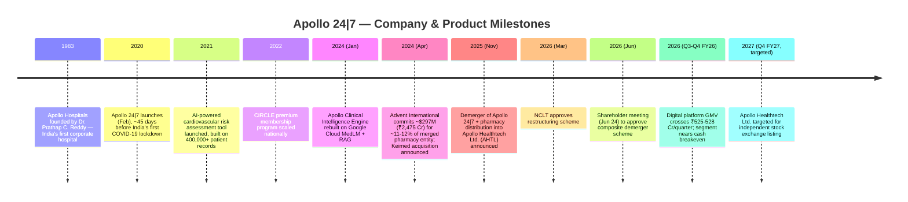
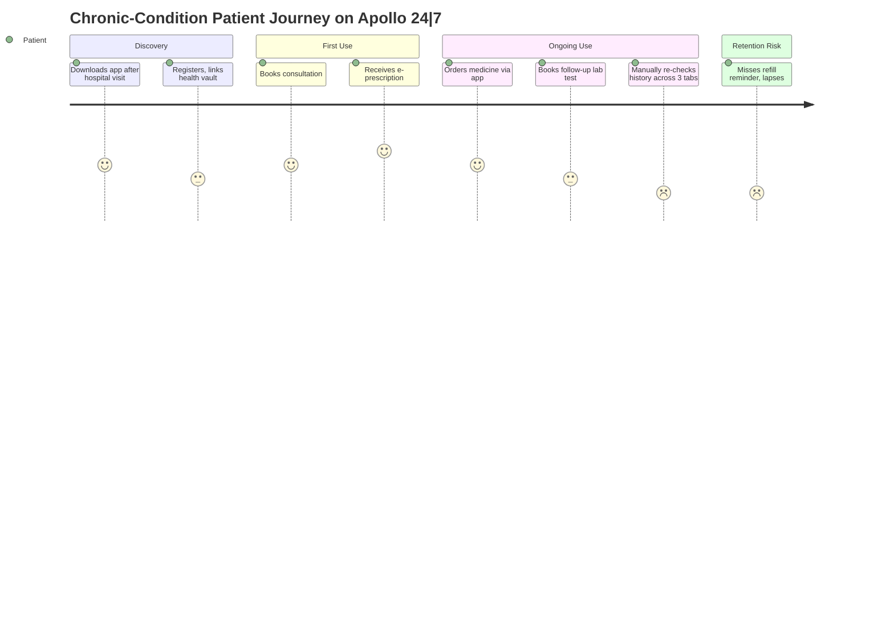
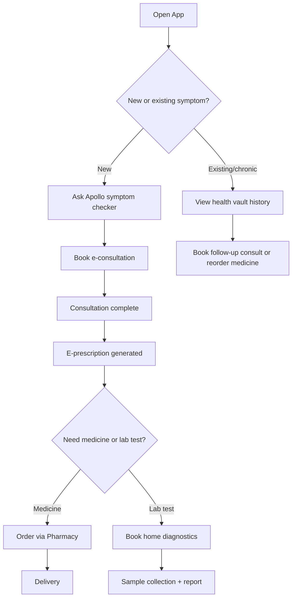
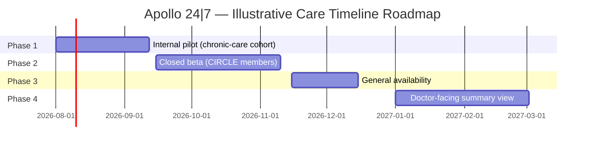

# Apollo 24|7 — Product Management Case Study

**Day 28 of 90 | PM Case Study Challenge**

## 1. Cover

**Product:** Apollo 24|7 (a Apollo Hospitals Enterprise product)
**Category:** Digital Health — Telemedicine, E-Pharmacy & Diagnostics
**Author:** Gaurav Singh
**Day:** 28 / 90
**Date Published:** July 24, 2026

## 2. Repository Metadata

| Field | Value |
|---|---|
| Repository | product-management-case-studies |
| Folder | `Day-28-Apollo-24-7/` |
| Author | Gaurav Singh |
| Series | 90-Day PM Case Study Challenge |
| Previous | Day 27 — Slack |
| License | MIT (see §63 License) |

## 3. Badges

`Day 28/90` · `Category: HealthTech / Digital Health` · `Parent Company: Apollo Hospitals Enterprise Ltd.` · `Status: Published`

## 4. Table of Contents

**Foundations**

1. Cover · 2. Repository Metadata · 3. Badges · 4. Table of Contents · 5. Executive Summary · 6. Product Overview · 7. Company Background · 8. Product Timeline · 9. Vision & Mission · 10. Problem Statement

**Market & Strategy**

11. Market Research · 12. Industry Analysis · 13. TAM/SAM/SOM · 14. Competitor Analysis · 15. SWOT · 16. Porter's Five Forces · 17. Business Model Canvas · 18. Revenue Model

**Users & Experience**

19. Target Users · 20. Personas · 21. JTBD · 22. User Journey · 23. User Flow · 24. Information Architecture · 25. UX Audit · 26. UI Audit · 27. Accessibility

**Product & Growth**

28. Feature Breakdown · 29. AI Capabilities · 30. Product Metrics · 31. North Star Metric · 32. Product Analytics · 33. AARRR · 34. HEART · 35. Growth Strategy · 36. Growth Loops · 37. Network Effects · 38. Product Strategy · 39. Monetization · 40. Trust & Safety

**Technical**

41. Technical Architecture · 42. Data Flow · 43. API Ecosystem · 44. Privacy & Security

**Strategy & Planning**

45. Pain Points · 46. Opportunity Mapping · 47. RICE · 48. MoSCoW · 49. Kano · 50. Feature Proposal · 51. PRD · 52. Wireframes · 53. Rollout Plan · 54. A/B Testing · 55. KPI Dashboard · 56. Product Roadmap · 57. Risks & Mitigation · 58. Future Vision

**Closing**

59. PM Lessons · 60. PM Interview Questions · 61. References · 62. About the Author · 63. License · 64. Self Review · 65. Appendix

## 5. Executive Summary

Apollo 24|7 is India's largest multi-channel digital healthcare platform — a single app spanning e-consultations, online pharmacy, home diagnostics, and a digital health record vault, built by Apollo Hospitals, the 43-year-old chain that pioneered corporate healthcare in India. Launched in February 2020, 45 days before the country's first COVID-19 lockdown, it grew from an emergency telehealth stopgap into a business now processing roughly ₹525–528 crore in platform GMV per quarter (Q3–Q4 FY26), serving a claimed base north of 46 million users, and — as of FY26 — closing in on cash breakeven for the first time since launch.

The most consequential recent development is structural, not product-led: Apollo is in the final stages of demerging Apollo 24|7 and its offline pharmacy distribution business into a new entity, Apollo Healthtech Limited (AHTL), merging in wholesale distributor Keimed, and taking the combined company public by Q4 FY27 at a targeted ₹25,000 crore revenue run-rate. Private equity firm Advent International has already committed ₹2,475 crore (~$297M) for roughly 11–12% of the merged entity. This case study evaluates Apollo 24|7 across product, growth, technical, and strategic dimensions, and proposes one concrete feature extension consistent with where a soon-to-be-independent, soon-to-be-profitable digital health company needs to go next.

**Key finding:** Apollo 24|7's core differentiator was never "the fastest app" — Tata 1mg and PharmEasy have matched or beaten it on pharmacy logistics for years. Its actual moat is the thing pure-play e-pharmacies structurally cannot copy: a direct data and referral pipe into 40+ years of Apollo hospital infrastructure, 4,000+ Apollo-affiliated doctors, and a self-learning Clinical Intelligence Engine trained on real hospital outcomes. The open question, as it prepares to go public as a standalone company, is whether that integration advantage shows up in the metrics that public-market investors — and patients choosing between five nearly identical apps — actually reward.

## 6. Product Overview

Apollo 24|7 is a consumer mobile app and website offering:

- **E-consultation** — video, audio, or chat consultations with Apollo-affiliated doctors across specialties, bookable in minutes
- **Online pharmacy** — prescription and OTC medicine ordering, with 19-minute delivery piloted in select metros (Delhi NCR, Bengaluru, Hyderabad, Kolkata) and standard delivery nationwide
- **Home diagnostics** — lab test booking with home sample collection, spanning 100+ labs and 1,200+ collection centers
- **Digital health vault** — a personal repository for prescriptions, reports, and medical history
- **Ask Apollo** — an AI-backed symptom checker for patients
- **Apollo Clinical Intelligence Engine (CIE)** — a self-learning clinical decision-support tool made available to doctors (not just Apollo's own) via the platform
- **CIRCLE membership** — a paid subscription layer offering cashback on medicines, discounted consultations, priority delivery, and on-call doctor access

It operates as the primary digital arm of Apollo Hospitals Enterprise Ltd. (AHEL), and — as of 2026 — is mid-transition into a separately listed entity alongside AHEL's offline pharmacy distribution business.

## 7. Company Background

Apollo Hospitals Enterprise was founded in 1983 by Dr. Prathap C. Reddy, opening India's first corporate hospital and becoming, per the company's own framing, the architect of India's private healthcare industry. Apollo 24|7 was conceived decades later as the group's answer to a structural gap: hospitals are built for acute, in-person care, not the everyday, low-friction healthcare interactions (a quick consult, a medicine refill, a routine blood test) that make up most of what patients actually need.

The platform launched in February 2020 as a "unified virtual mobile platform" — timing that turned out to be extraordinary, as India entered its first COVID-19 lockdown roughly 45 days later. What began as pandemic-era telehealth infrastructure became a durable second business line. Apollo 24|7 today sits inside Apollo HealthCo Ltd. (AHL), which in turn is mid-merger with Keimed Pvt Ltd. (a wholesale pharmaceutical distributor Apollo acquired in April 2024) into a new entity, Apollo Healthtech Limited (AHTL), which will list independently on Indian stock exchanges. Apollo 24|7 employed roughly 1,214 people as of March 31, 2026 (ASSUMPTION — VALIDATION REQUIRED: third-party aggregator figure, not independently confirmed against AHEL's own disclosures). Corporate registration records place its registered address in Chennai, while some aggregators list Hyderabad as its operational headquarters — the two are not reconciled in public sources.

## 8. Product Timeline

## 9. Vision & Mission

Apollo Hospitals' long-standing mission has been to bring corporate-grade, clinically rigorous healthcare within reach of ordinary Indians — a mission it pursued for 37 years through physical hospitals before Apollo 24|7 extended it into a digital-first channel. Apollo 24|7's own framing is narrower and more tactical: give any Indian with a smartphone the same standard of care access — a real Apollo doctor, a verified medicine, an accurate lab result — without requiring a hospital visit. As the platform approaches an independent stock listing, that mission is being reframed once more, from "digital extension of the hospital brand" to "standalone omnichannel healthcare and pharmacy distribution company" expected to compete on its own commercial footing rather than as a loss-subsidized brand extension.

## 10. Problem Statement

Before platforms like Apollo 24|7, a routine healthcare need in India — a prescription refill, a follow-up consult, a basic blood panel — typically required a physical visit to a doctor, then a separate trip to a pharmacy, then possibly a third trip to a diagnostic lab, each with its own queue, paperwork, and travel time. For India's large population outside major metro cores, this friction was often severe enough that people deferred routine and preventive care entirely. Apollo 24|7's founding insight was that Apollo's existing trust and clinical infrastructure — real doctors, verified medicine supply chains, accredited labs — could be repackaged into a single digital surface without patients sacrificing the "this is a real hospital, not a startup" credibility that mattered for a healthcare decision.

The problem today has partly evolved: with Tata 1mg, PharmEasy, Practo, and several quick-commerce players now offering broadly similar telehealth-plus-pharmacy bundles, "digital access to healthcare" is no longer the differentiated pitch it was in 2020. The sharper problem Apollo 24|7 needs to solve now is coordination — helping a patient with an ongoing condition move between consult, diagnostics, and pharmacy as one continuous thread rather than three separately-initiated app sessions, which is where its hospital-grade clinical data arguably gives it a structural edge over pure-play competitors.

## 11. Market Research

Estimates of the India digital health / telemedicine market vary dramatically by research firm and category definition (see §65 Appendix, Source Conflict Table, for the full breakdown): figures range from a $3.1–4.6 billion telemedicine-only market in 2024–2025 to a $14.5 billion broader "digital health" market in 2024, with 2033–2035 projections ranging from $11.2 billion to $107 billion depending on scope and methodology. What is consistent across sources is direction and driver: double-digit-to-25%+ CAGR growth, driven by the government's Ayushman Bharat Digital Mission (670M+ ABHA digital health IDs created as of late 2024), rising smartphone and 5G penetration, and growing chronic-disease burden.

On the specific e-pharmacy/GMV sub-segment where Apollo 24|7 directly competes, the clearest (though dated) third-party figures come from Redseer/Business Standard reporting from late 2023: Tata 1mg led with ~31% GMV share, PharmEasy had fallen to ~15% after pulling back marketing spend, and Apollo, Flipkart Health+, and Reliance-Netmeds each held an estimated 15–18%. No more recent (2025–2026) third-party market-share breakdown of comparable rigor was found in this research pass — a real limitation given how fast GMV has shifted for several of these players since.

## 12. Industry Analysis

India's digital health category has consolidated around a small number of well-capitalized, brand-backed platforms rather than remaining a long tail of independent e-pharmacy startups: Tata (1mg), Reliance (Netmeds), Apollo Hospitals (24|7), and Flipkart (Health+) each bring an existing consumer trust brand and balance sheet into a category that PharmEasy's near-collapse (valuation falling from $5.6B in 2021 to roughly $458M, per third-party reporting, alongside a reported ₹3,500 crore Goldman Sachs loan default) showed can punish venture-funded, marketing-led growth without a path to profitability. The industry's center of gravity is shifting from pure logistics competition (who delivers medicine fastest) toward two harder-to-copy differentiators: (1) integration depth — how seamlessly consult, pharmacy, and diagnostics connect for a single patient, and (2) AI-assisted clinical quality — decision-support tools trained on real outcomes data, which only platforms with genuine hospital-scale clinical data (Apollo, and to a lesser extent Tata's broader health assets) can credibly build.

## 13. TAM/SAM/SOM

*(Framework selection rationale: TAM/SAM/SOM is used because Apollo 24|7 operates in an actively-sized, multi-report-covered market — appropriate for a scaled, disclosed-adjacent digital health business, even though the underlying market-size estimates themselves conflict sharply across sources, as documented below.)*

| Layer | Definition | Estimate | Basis |
|---|---|---|---|
| TAM | India digital health market (telemedicine + e-pharmacy + diagnostics + digital records) | $14.5B (2024) per Grand View Research; conflicting estimates as low as $3.1B for telemedicine-only scope exist (see §65) | Third-party market research, scope-dependent |
| SAM | Urban and semi-urban Indian smartphone users seeking integrated consult+pharmacy+diagnostics in one app | Not publicly disclosed by Apollo | Inferred from Apollo's target demographic and digital infrastructure (5G reaching 84%+ of citizens per government data) |
| SOM | Apollo 24\|7's realistically addressable share given current GMV (~₹525-528 Cr/quarter), user base (~46M claimed), and Apollo brand distribution | Not publicly disclosed | Inferred from GMV and user figures in §30 |

All figures in this section are third-party estimates or inferences, not Apollo/AHEL-disclosed numbers.

## 14. Competitor Analysis

| Dimension | Apollo 24\|7 | Tata 1mg | PharmEasy | Practo |
|---|---|---|---|---|
| Value proposition | Hospital-backed, integrated consult + pharmacy + diagnostics | Research-forward pharmacy with strong medical content/UX | Broad reach incl. Tier 2/3, subscription refills | Doctor discovery + video consult, lighter pharmacy focus |
| Parent / backing | Apollo Hospitals (public, 43-yr-old healthcare brand) | Tata Group | Independent (post-distress restructuring) | Independent |
| GMV share (2023 estimate) | ~15-18% | ~31% (market leader) | ~15% (down from ~33% in 2022) | Not covered in GMV rankings (consult-led model) |
| Core strength | Direct pipe into Apollo hospital data/doctors; AI Clinical Intelligence Engine | Medically-accurate content, 40M+ monthly users claimed | Tier 2/3 reach, chronic-care subscriptions | Video consult UX, practice-management software for doctors |
| Delivery speed | 19-minute pilot in 4 metros (fastest dedicated claim found) | Standard same-day/next-day | Same-day, broad pincode coverage | N/A (not primarily a delivery business) |
| Weakness | Two-brand confusion (Apollo Pharmacy offline vs 24\|7 app); demerger-related uncertainty | Less hospital-grade clinical depth | Financial distress history dents trust | Weak pharmacy/diagnostics integration vs. bundled rivals |

**Strategic insight:** Apollo 24|7's genuine edge is not GMV share — on that metric it trails Tata 1mg by a wide margin. Its edge is downstream trust and clinical depth: a consultation on Apollo 24|7 can be backed by an AI system trained on four decades of real Apollo hospital outcomes, which a standalone e-pharmacy simply has no way to replicate without acquiring hospital assets of its own.

**Opportunity for differentiation:** As the demerged Apollo Healthtech entity prepares to compete as a standalone public company rather than a hospital-brand halo project, its clearest wedge is positioning around clinical trust and continuity of care — not logistics speed, where 1mg and PharmEasy are already competitive.

## 15. SWOT

| Strengths | Weaknesses |
|---|---|
| 43-year hospital brand trust; 4,000+ affiliated doctors; proprietary Clinical Intelligence Engine trained on real outcomes data | Trails Tata 1mg on e-pharmacy GMV share; digital segment has historically run cash losses |
| Integrated consult + pharmacy + diagnostics + records in one app | Corporate structure mid-transition (demerger/listing) creates near-term uncertainty for product roadmap continuity |
| **Opportunities** | **Threats** |
| Standalone listing (targeted Q4 FY27) could unlock dedicated capital for product investment, decoupled from hospital-segment priorities | Well-capitalized rivals (Tata, Reliance, Flipkart) can match most features; quick-commerce players (Blinkit, Swiggy Instamart, Zepto) increasingly deliver OTC medicine faster for non-prescription needs |
| Government digital health infrastructure (ABDM, 670M+ ABHA IDs) lowers patient-side friction for any platform that integrates well | Regulatory tightening on telemedicine/AI-in-healthcare (a plausible trajectory given global trends) could raise compliance costs disproportionately for smaller players, but is not confirmed as imminent for India specifically |

## 16. Porter's Five Forces

*(Framework selection rationale: appropriate here because Apollo 24|7 competes in a market with a handful of large, brand-backed rivals and meaningful regulatory/trust barriers — Porter's model surfaces structural competitive pressure that a simple feature comparison misses.)*

- **Threat of new entrants — Low:** Building trusted doctor networks, pharmacy licensing across states, and diagnostic lab partnerships requires years and regulatory clearance; unlikely for a new venture-backed entrant to replicate quickly.
- **Bargaining power of buyers — High:** Patients can and do switch between apps for a single purchase based on price/delivery speed; switching costs for a one-off medicine order are close to zero.
- **Bargaining power of suppliers — Medium:** Pharmaceutical manufacturers and diagnostic labs have some negotiating leverage, though Apollo's scale (7,000+ offline pharmacy stores, 100+ partner labs) gives it more supplier leverage than smaller rivals.
- **Threat of substitutes — Medium-High:** Traditional in-person doctor visits and neighborhood pharmacies remain the default for large parts of India, especially outside metros; quick-commerce apps are an emerging substitute for simple OTC needs specifically.
- **Competitive rivalry — High:** Direct, sustained rivalry with Tata 1mg (share leader), PharmEasy, Netmeds, and Practo, plus adjacent pressure from quick-commerce.

## 17. Business Model Canvas

| Block | Apollo 24\|7 |
|---|---|
| Key Partners | Apollo Hospitals network, Google Cloud (Clinical Intelligence Engine / MedLM), Keimed (pharma distribution, post-merger), Advent International (investor), 100+ diagnostic labs |
| Key Activities | E-pharmacy fulfillment, telehealth platform operations, AI clinical decision-support R&D, regulatory compliance, demerger/listing execution |
| Key Resources | Apollo brand trust, 4,000+ affiliated doctors, Clinical Intelligence Engine + 4 decades of hospital outcomes data, pharmacy/diagnostics supply chain |
| Value Propositions | Hospital-grade trust + integrated consult/pharmacy/diagnostics + AI-assisted clinical quality |
| Customer Relationships | Self-serve app/web, CIRCLE membership for higher-touch relationship, Doctor on Call for members |
| Channels | Direct app/web signup, Apollo Hospitals cross-referral, offline Apollo Pharmacy footfall, partner promotions (e.g. telecom bundling) |
| Customer Segments | Urban/semi-urban smartphone users, chronic-condition patients, CIRCLE subscribers seeking priority access |
| Cost Structure | Cloud/AI infrastructure, doctor network payments, last-mile delivery logistics, marketing, compliance |
| Revenue Streams | Pharmacy sales margin, consultation fees, diagnostics margin, CIRCLE subscription revenue |

## 18. Revenue Model

Apollo 24|7 monetizes through three primary streams layered on a largely free-to-use app:

| Stream | Model | Notes |
|---|---|---|
| Online pharmacy | Margin on medicine sales (GMV-based) | Primary revenue driver; ₹525-528 Cr GMV/quarter in FY26 |
| E-consultation | Per-consultation fee, split with doctors | Discounted for CIRCLE members |
| Diagnostics | Margin on lab test bookings | Up to 60% advertised discounts drive volume over margin |
| CIRCLE membership | Subscription (reported figures conflict across sources and dates: ₹199-349/year, ₹49/month — see §65 Appendix) | Cashback-funded loyalty model rather than a pure profit center |

Apollo HealthCo (the segment housing Apollo 24|7 alongside offline pharmacy distribution) posted ₹2,827 crore in Q3 FY26 revenue (+20% YoY), with the online platform (Apollo 24|7 specifically) contributing GMV of ₹525 crore (+28% YoY) that quarter and ₹528 crore (+20% YoY) in Q4 FY26. Digital-segment cash losses have narrowed sharply — to roughly ₹29 crore in Q3 FY26, described by management as the lowest recorded — with cash breakeven for Apollo 24|7 specifically targeted for Q1 FY27. Separately, the broader "Digital Health & Pharmacy" segment (which blends the loss-narrowing online platform with the already-profitable offline pharmacy distribution business) reported segment profit growth of 254% YoY (₹1,127 million → ₹3,987 million) for full-year FY26 — a figure that should not be read as Apollo 24|7's own online-platform profitability, which remains a narrower, still cash-negative-but-improving story (see §65 Appendix for the full reconciliation caveat).

## 19. Target Users

- Urban and semi-urban smartphone-owning Indians seeking convenient access to consultation, medicine, and diagnostics
- Chronic-condition patients (diabetes, cardiovascular, thyroid) needing recurring consults, refills, and monitoring
- CIRCLE members prioritizing speed and cost savings on recurring healthcare spend
- Apollo Hospitals' existing patients seeking continuity of care after a hospital visit or discharge
- Doctors (a genuinely distinct user category) using the Clinical Intelligence Engine as a decision-support tool, including doctors outside the Apollo network

## 20. Personas

**Persona 1 — "Anjali, Working Parent with a Chronic Condition"**
Manages type-2 diabetes alongside a full-time job and two kids; needs recurring prescription refills, periodic lab panels, and occasional specialist consults without repeated hospital trips. Values continuity (same records, same doctor history) over the absolute cheapest medicine price.

**Persona 2 — "Ravi, First-Time App User in a Tier-2 City"**
New smartphone user with limited digital-health literacy; trusts the Apollo brand specifically because of a nearby physical Apollo Pharmacy or hospital. Price-sensitive, values simplicity over feature depth.

**Persona 3 — "Dr. Meera, External Specialist Using the Clinical Intelligence Engine"**
Not an Apollo-employed doctor, but uses the CIE as a decision-support second opinion tool for complex cases. Cares about clinical accuracy and source transparency more than app polish.

## 21. JTBD

*(Framework selection rationale: JTBD suits Apollo 24|7 well because the underlying "job" — getting trustworthy care without repeated friction — has stayed constant even as the specific bundled features around it have expanded from pure telehealth into a full omnichannel platform.)*

- When I have a routine health concern, I want to reach a real doctor quickly, so I can avoid an unnecessary hospital trip.
- When I'm managing a chronic condition, I want my consult, refill, and lab history connected, so I don't have to re-explain my situation every time.
- When I need medicine urgently, I want fast, verified delivery, so I can trust what I'm taking is genuine.
- When I'm choosing between five similar apps, I want a reason to trust this one specifically, so I don't have to gamble on medicine authenticity or advice quality.

## 22. User Journey

## 23. User Flow

## 24. Information Architecture

Apollo 24|7's IA is organized around four largely parallel top-level modules — Consult, Pharmacy, Diagnostics, and Health Records (vault) — accessible from a bottom navigation bar, rather than a single unified patient timeline. CIRCLE membership status and Ask Apollo (symptom checker) sit as cross-cutting entry points reachable from the home screen. This is a deliberate "each service is its own front door" design, which is efficient for a first-time user with one specific need, but — per the UX audit below — creates friction for a returning chronic-condition patient trying to see their care as one continuous story.

## 25. UX Audit

**Strengths:** Clear service segmentation makes each individual task (order medicine, book a test) fast for first-time or single-need users; the Apollo brand and doctor credentials are surfaced prominently, reinforcing trust at the point of a health decision. **Friction points:** Because Consult, Pharmacy, and Diagnostics are largely separate modules, a chronic-condition patient must manually piece together their own care history across tabs rather than seeing a single coordinated view; CIRCLE membership terms and pricing are inconsistently presented across support articles and marketing pages (see §65 Appendix), which likely creates real-world confusion at the point of purchase.

## 26. UI Audit

The interface favors a dense, service-tile home screen (large tappable cards for Consult, Pharmacy, Lab Tests) over a single continuous feed — appropriate for a first-use, task-initiated mental model, but less suited to habitual, ongoing-care use than a timeline-first design would be. Visual design consistently reinforces clinical credibility (doctor photos, credentials, Apollo branding) over consumer-app polish, which is a reasonable trade-off for a healthcare purchase decision specifically.

## 27. Accessibility

Company has not publicly disclosed a formal WCAG conformance level for the Apollo 24|7 app (ASSUMPTION — VALIDATION REQUIRED: no accessibility statement was located in this research pass). Given the platform's stated ambition to serve patients well beyond metro, digitally-fluent segments, accessibility for lower digital literacy and vernacular-language users is a meaningfully under-documented area relative to competitors like Tata 1mg, which markets multi-language support more explicitly.

## 28. Feature Breakdown

| Feature | Job it does | Notes |
|---|---|---|
| E-Consultation | Video/audio/chat with Apollo doctors | Core acquisition driver |
| Online Pharmacy | Medicine ordering + delivery | Primary GMV/revenue driver; 19-min pilot delivery in 4 metros |
| Home Diagnostics | Lab test booking + home collection | 100+ labs, 1,200+ collection centers |
| Digital Health Vault | Stores prescriptions, reports, history | Underleveraged as a coordination layer (see §45 Pain Points) |
| Ask Apollo | AI symptom checker for patients | Consumer-facing AI entry point |
| Clinical Intelligence Engine (CIE) | AI decision-support for doctors | Built on Google Cloud MedLM + RAG; open to non-Apollo doctors too |
| CIRCLE Membership | Paid loyalty tier | Cashback, priority access, doctor-on-call |

## 29. AI Capabilities

Apollo 24|7's AI strategy runs on two parallel tracks, one patient-facing and one doctor-facing:

- **Patient-facing — Ask Apollo:** an AI-backed symptom checker helping patients triage before booking a consultation.
- **Doctor-facing — Clinical Intelligence Engine (CIE):** a self-learning clinical decision-support system, built and reviewed by 500+ in-house Apollo doctors and specialists, covering 1,300+ conditions and 800+ symptoms, trained on four decades of Apollo hospital data — described by Apollo as one of the largest connected health data lakes globally. In January 2024, Apollo partnered with Google Cloud to rebuild the CIE using MedLM (Google's medical-domain LLM) combined with retrieval-augmented generation (RAG), improving the tool's efficiency as a "doctor's assistant." Notably, the CIE was opened beyond Apollo's own physician network to doctors across India, with over 4,000 Apollo doctors reporting measurable diagnosis and productivity improvements from routine use.

**PM Insight:** Most consumer digital-health apps ship AI as a customer-support or triage chatbot. Apollo's more defensible AI investment is the doctor-facing CIE — because it's grounded in real hospital-scale outcomes data that a venture-funded e-pharmacy competitor has no path to acquiring. The strategic risk is that this advantage currently lives mostly on the clinician side of the product and is barely surfaced to the patient choosing between five nearly identical apps — a gap the Feature Proposal in §50 addresses directly.

## 30. Product Metrics

**Caution:** Apollo/AHEL has not disclosed Apollo 24|7-only user metrics with full consistency across time; the figures below are drawn from a mix of investor disclosures and third-party/app-store sources and should be treated with the caveats noted (full detail in §65 Appendix).

| Metric | Estimate | Note |
|---|---|---|
| Platform GMV (Q3 FY26) | ₹525 crore, +28% YoY | AHEL investor disclosure |
| Platform GMV (Q4 FY26) | ₹528 crore, +20% YoY | AHEL investor disclosure |
| Total users | 46M+ (per Q3 FY26 investor commentary, +2M added that quarter) vs. "25 million and growing" per Google Play Store listing | Significant conflict between investor and app-store figures — see §65 |
| Digital segment cash loss (Q3 FY26) | ~₹29 crore (narrowest on record) | AHEL investor disclosure |
| Offline pharmacy network | 7,113 stores (+185 net new in Q3 FY26) | AHEL investor disclosure |
| Employees | ~1,214 (Mar 31, 2026) | Third-party aggregator (Tracxn), not independently confirmed |

## 31. North Star Metric

**Proposed North Star Metric:** Coordinated Care Journeys Completed per Active User per Quarter — defined as instances where a single user's consult, pharmacy order, and/or diagnostic booking are linked to the same underlying health issue within the app (rather than counted as three independent transactions).

**Rationale:** GMV and consultation-volume metrics reward transaction count, which any competitor with comparable logistics can also grow. A coordination-based metric instead rewards the one thing Apollo 24|7 is structurally best-positioned to deliver — continuity of care across its own services — and would directly track whether the platform is closing the IA gap identified in §24 and §45.

## 32. Product Analytics

Apollo/AHEL does not publish platform-wide usage analytics (session frequency, feature adoption, funnel conversion) beyond the investor-facing GMV and user-count figures cited above. This is a meaningful limitation for any external product analysis of Apollo 24|7, consistent with the general opacity common across Indian digital-health platforms outside their investor decks.

## 33. AARRR

- **Acquisition:** Apollo Hospitals patient cross-referral, offline Apollo Pharmacy footfall, telecom/partner bundling (e.g., past Airtel CIRCLE promotions), performance marketing.
- **Activation:** First consultation booked or first medicine order placed.
- **Retention:** Chronic-condition patients with recurring refill/consult needs are the most naturally sticky segment; CIRCLE membership is an explicit retention mechanism.
- **Referral:** Family health-vault sharing and Apollo's existing hospital-patient relationships function as a structural (if under-leveraged) referral channel.
- **Revenue:** Pharmacy GMV margin is the dominant lever; CIRCLE subscription and consultation fees are secondary.

## 34. HEART

| Dimension | Apollo 24\|7 application |
|---|---|
| Happiness | Post-consultation satisfaction ratings, CIE-assisted diagnosis confidence (doctor-reported) |
| Engagement | Consultations booked, medicine reorders, lab tests booked per active user |
| Adoption | % of Apollo Hospitals patients who activate the app post-discharge |
| Retention | Repeat purchase rate on pharmacy; CIRCLE renewal rate |
| Task Success | % of consultations resulting in a same-session pharmacy or diagnostics booking (a direct proxy for the coordination gap in §45) |

## 35. Growth Strategy

Apollo 24|7's growth has run through three phases: pandemic-driven emergency adoption (2020), steady-state omnichannel expansion funded by Apollo's balance sheet and PE investment (2021–2025), and now — as the demerger nears completion — a coming phase where growth investment decisions will be made by an independently listed entity answerable to public-market investors and a broader base of pharmacy-distribution shareholders (via the Keimed merger) rather than folded into Apollo Hospitals' hospital-first capital allocation.

## 36. Growth Loops

The strongest structural loop runs through Apollo's physical footprint: a hospital patient is nudged toward the app for post-discharge follow-up, becomes an app user, and — if the coordination experience is good — returns to the app before their next in-person visit, reducing load on physical Apollo infrastructure while deepening platform engagement. This is a two-directional loop (offline → digital → offline) that pure-play digital competitors without a hospital network cannot replicate.

## 37. Network Effects

Apollo 24|7 exhibits weak-to-moderate direct network effects (unlike, say, a marketplace) but meaningful **data network effects**: every consultation and outcome recorded through the platform improves the Clinical Intelligence Engine, which in turn improves diagnosis quality for future patients and doctors — a compounding advantage tied directly to Apollo's multi-decade head start in hospital data, not to user count alone.

## 38. Product Strategy

Apollo 24|7's strategy has two concurrent threads heading into its standalone listing: (1) close the cash-loss gap to reach breakeven (targeted Q1 FY27) primarily through supply-chain synergies from the Keimed merger and reduced marketing spend, and (2) differentiate on clinical trust and AI-assisted quality rather than compete purely on delivery speed, where 1mg and PharmEasy are already strong and quick-commerce players are an emerging threat for simple OTC needs.

## 39. Monetization

Pharmacy GMV margin remains the dominant revenue lever, with consultation fees and diagnostics margin as secondary streams. CIRCLE membership functions more as a retention and cashback-funded loyalty mechanism than a standalone profit center at its current reported pricing. As the platform nears breakeven, a plausible emerging lever — not yet confirmed in public disclosures — is monetizing the Clinical Intelligence Engine itself as a B2B decision-support licensing product for hospitals and clinics outside the Apollo network, given it is already being made available to external doctors at no confirmed charge today.

## 40. Trust & Safety

Given the sensitivity of health data and medicine authenticity, Apollo 24|7's core trust mechanisms are the Apollo brand itself (43 years of hospital-grade credibility) and pharmacy licensing compliance under India's Drugs and Cosmetics Act. Company-level disclosures on formal data-protection certifications specific to Apollo 24|7 (as distinct from Apollo Hospitals generally) were not located in this research pass (ASSUMPTION — VALIDATION REQUIRED).

## 41. Technical Architecture

Public technical detail is limited to the AI layer: the Clinical Intelligence Engine runs on Google Cloud infrastructure, incorporating MedLM (Google's medical-domain foundation model) and a retrieval-augmented generation (RAG) architecture layered on a proprietary Clinical Knowledge Graph, clinical entity extractor, and timestamp relationship extractor — built in partnership with Google Cloud Consulting. Broader platform architecture (app backend, pharmacy inventory systems, diagnostics scheduling) is not publicly documented.

## 42. Data Flow

## 43. API Ecosystem

No public developer API or third-party integration marketplace for Apollo 24|7 was identified in this research pass — unlike Slack or more platform-oriented products, Apollo 24|7 currently operates as a closed, consumer-facing application rather than an extensible platform (ASSUMPTION — VALIDATION REQUIRED: absence of evidence is not confirmation of absence; Apollo may have B2B/API offerings not surfaced in consumer-facing research).

## 44. Privacy & Security

Formal, platform-specific certifications (ISO 27001, SOC 2, India's Digital Personal Data Protection Act compliance posture) were not located for Apollo 24|7 specifically in this research pass. Given health data's sensitivity and India's DPDP Act compliance requirements tightening across the telemedicine sector generally, this is flagged as a gap for further validation rather than a confirmed weakness.

## 45. Pain Points

- Care fragmentation across Consult/Pharmacy/Diagnostics modules, requiring patients to manually reconstruct their own care history (see §24, §25)
- Inconsistent CIRCLE membership pricing/terms across the company's own support documentation (see §65 Appendix) — a real-world trust and conversion risk at the point of purchase
- GMV share trailing market leader Tata 1mg significantly, per the most recent third-party data located (2023)
- Cash-loss history on the digital segment, only recently narrowing toward breakeven
- Corporate-structure uncertainty during the demerger/listing transition, which historically can slow product roadmap decisions during ownership transitions (a general pattern, not something confirmed specifically for Apollo)

## 46. Opportunity Mapping

The clearest opportunity is converting Apollo's genuine structural advantage — hospital-grade clinical data feeding the Clinical Intelligence Engine — into a patient-facing coordination experience, rather than leaving that advantage confined to the doctor-facing side of the product where patients never see or credit it.

## 47. RICE

*(Framework selection rationale: RICE is appropriate because this proposal competes against demerger-related engineering priorities and other roadmap items for limited near-term resources during a corporate transition — RICE forces explicit relative prioritization.)*

**Proposed feature: "Care Timeline"** — a unified, cross-service patient view stitching consultations, pharmacy orders, and diagnostic results into one coordinated timeline with proactive care nudges.

| Factor | Score | Rationale |
|---|---|---|
| Reach | 7/10 | Touches any user with more than one active service (consult + pharmacy, or consult + diagnostics) |
| Impact | 4/5 | Directly targets the top-identified pain point (care fragmentation) and the proposed North Star Metric |
| Confidence | 70% | Pattern (unifying siloed modules into one timeline) is well-precedented in healthcare and fintech apps; execution risk lies in backend data linkage across existing siloed systems |
| Effort | 8 (person-months, estimated) | Requires cross-service data model unification, not just a new UI layer |
| RICE Score | ~24.5 | Solid reach and impact; effort is the main constraint given likely competing demerger-related engineering priorities |

## 48. MoSCoW

- **Must have:** A single chronological view linking a patient's consults, orders, and diagnostic results tied to the same health concern
- **Should have:** Proactive nudges (e.g., refill due, follow-up test overdue) surfaced from the timeline
- **Could have:** Doctor-visible summary view of the same timeline during a consult, reducing patient re-explanation
- **Won't have (this release):** Full integration with external (non-Apollo) hospital records — deferred given the complexity of interoperability with non-Apollo systems

## 49. Kano

- **Basic (expected):** Health vault reliably stores prescriptions and reports
- **Performance (more is better):** Faster, more accurate cross-service search within a patient's own history
- **Delighter:** A Care Timeline that proactively surfaces "you're due for X" before the patient thinks to check — turning three disconnected app modules into one that feels like it actually knows the patient

## 50. Feature Proposal

**Care Timeline** — a persistent, chronological view (accessible from the app's home screen) that groups a patient's consultations, pharmacy orders, and diagnostic bookings by underlying health concern rather than by transaction type, with proactive nudges for overdue refills or follow-up tests.

**User impact:** Removes the manual cross-tab reconstruction work identified in the UX Audit (§25), particularly valuable for the chronic-condition persona (§20, Anjali). **Business impact:** Directly targets the proposed North Star Metric (§31) and is a plausible driver of the "same-session, multi-service booking" HEART task-success metric (§34), which should correlate with higher lifetime value per user. **Trade-offs:** Requires meaningful backend investment to unify data models across previously siloed services, at a moment when engineering priorities may be pulled toward demerger-related system separation work. **Risks:** If built as a shallow UI wrapper without real backend linkage, it risks becoming a cosmetic feature that doesn't survive the first data-inconsistency bug report.

## 51. PRD

**Problem Statement:** Patients with ongoing or multi-service healthcare needs cannot see their own care as one connected story inside Apollo 24|7 today; each service (consult, pharmacy, diagnostics) is a separate entry point with no shared timeline.

**Goals:** Increase multi-service usage per active user; reduce patient effort in tracking their own care history; strengthen the platform's clinical-continuity differentiation ahead of its standalone listing.

**Success Metrics:** % of users with 2+ linked services in a quarter; Care Timeline weekly active view rate; reduction in support contacts related to "where is my report/history."

**User Stories:**
- As a chronic-condition patient, I want to see my last three consultations, refills, and lab results in one place, so I don't have to remember or re-explain my history.
- As a returning user, I want to be nudged when a refill or follow-up test is due, so I don't lapse in my care.

**Functional Requirements:** Unified timeline UI; concern-based grouping logic; nudge/notification engine tied to prescription and test-due dates.
**Non-functional Requirements:** Timeline must load in under 2 seconds; must respect existing data-privacy consent boundaries per service.
**Acceptance Criteria:** A user with an active consultation, a related pharmacy order, and a related diagnostic booking sees all three grouped under one timeline entry within the same app session.
**Risks:** Data model unification across previously independent service backends is the primary technical risk; scope creep toward a full EHR-style product is the primary product risk.
**Rollout Plan:** See §53.

## 52. Wireframes

*(Text-described, no image assets generated for this case study — see §65 Appendix for asset status.)*

Layout: a new "Timeline" tab (or elevated home-screen module) showing reverse-chronological cards, each representing a linked care event — e.g., "Diabetes follow-up: Consult (Jul 10) → Prescription refill (Jul 12) → HbA1c test due (Aug 10, upcoming)." Each card is tappable into the underlying service. A top filter allows viewing by health concern (e.g., "Diabetes," "General") for patients managing multiple conditions.

## 53. Rollout Plan

1. Internal pilot with Apollo Hospitals' existing chronic-care patient cohort — 6 weeks
2. Closed beta with CIRCLE members (highest-engagement segment) — 8 weeks
3. General availability, app-wide — following successful beta metrics
4. Doctor-facing summary view (MoSCoW "could have") — contingent on Phase 1-3 engagement data

## 54. A/B Testing

**Test:** Default-visible Care Timeline module on the home screen vs. opt-in discovery via a banner. **Hypothesis:** Default-visible drives materially higher adoption without increasing home-screen clutter complaints, since it replaces rather than adds to existing navigation. **Primary metric:** 7-day active usage rate of the Timeline. **Guardrail metric:** Home-screen task-completion time for simple, single-service tasks (ensuring the new module doesn't slow down the majority of first-time, single-need users identified in the UX Audit).

## 55. KPI Dashboard

| KPI | Target (illustrative) |
|---|---|
| Care Timeline weekly active users | 25% of CIRCLE members by month 3 post-GA |
| Multi-service usage rate (2+ linked services/quarter) | +15pp vs. pre-launch baseline |
| Support contacts re: care history | -20% within 2 quarters |
| Refill/follow-up nudge conversion rate | 30%+ of nudges result in a booking within 7 days |

## 56. Product Roadmap

## 57. Risks & Mitigation

| Risk | Mitigation |
|---|---|
| Data model unification across siloed backends proves harder than estimated | Start with a read-only aggregation layer before attempting deeper backend unification |
| Feature ships as cosmetic UI without real data linkage | Gate GA on the acceptance criteria in §51, not just UI completion |
| Engineering bandwidth consumed by demerger-related system separation work | Sequence Care Timeline explicitly after demerger-critical technical work, not in parallel competing for the same teams |
| CIRCLE pricing/terms confusion (§65) undermines trust in any new paid-feeling feature | Resolve and standardize CIRCLE pricing documentation before or alongside this launch |

## 58. Future Vision

If Apollo Healthtech Limited executes its planned listing and reaches sustained profitability, the platform's most defensible long-term position is not as "another e-pharmacy app" but as the patient-facing layer of India's most clinically credible health data asset — a Care Timeline is a modest first step toward that, with a plausible longer-term extension toward proactive, AI-assisted preventive care coordination (not diagnosis) for its highest-engagement CIRCLE and chronic-condition users.

## 59. PM Lessons

- A structural advantage (hospital-grade clinical data) only compounds if it's surfaced to the customer, not just embedded in a doctor-facing backend tool — Apollo's AI investment is real, but the patient rarely sees why it should matter to their specific choice of app.
- Financial and structural transitions (a demerger, in this case) genuinely constrain what a PM can credibly propose in the near term — sequencing new investment against transition-critical work isn't optional caution, it's realistic prioritization.
- When even a company's own support documentation disagrees with itself (CIRCLE pricing, in this case), that's a first-order UX and trust problem before it's ever a feature problem — the RICE score on a fix doesn't need to be high for it to matter.
- Category-average metrics (GMV share, delivery speed) can make a company look like it's losing when its actual differentiator (clinical trust, integration depth) isn't captured by those metrics at all — a reminder to sanity-check whether the standard scoreboard for a category is even measuring the thing that should decide the winner.

## 60. PM Interview Questions

- Apollo 24|7 trails Tata 1mg on GMV share but has arguably stronger clinical credibility. As a PM, how would you decide whether to compete head-on for share, or double down on a narrower trust-based positioning?
- How would you design a metric that captures "coordinated care" rather than just transaction volume, and what would you be willing to trade off to improve it?
- Apollo's Clinical Intelligence Engine is a doctor-facing asset. How would you evaluate whether and how to expose any part of it directly to patients, given the clear line between clinical decision-support and self-diagnosis risk?
- The company is mid-demerger into a standalone listed entity. How does that change your prioritization framework for the next two quarters of roadmap?

## 61. References

- Apollo Hospitals Enterprise — Q3 FY26 and Q4 FY26 investor results releases and earnings call transcripts
- Tracxn — Apollo 24|7 Company Profile
- CB Insights — Apollo 24|7 Company Profile
- Crunchbase — Apollo 24|7 Company Profile
- Google Cloud Blog — How Apollo 24|7 Leverages MedLM with RAG
- Healthcare IT News — Apollo Hospitals Expands Access to AI Decision Support Tool
- Business Standard — Tata 1mg Overtakes PharmEasy as E-Pharmacy Market Leader; Apollo Hospitals Demerger and Stake Sale coverage
- Emerald Emerging Markets Case Studies — "Apollo 24/7 – A chink in Apollo Hospitals' armour?"
- Grand View Research, VynZ Research, Mordor Intelligence, IMARC Group, Custom Market Insights — India digital health/telemedicine market sizing reports (conflicting figures, see §65)
- Apollo247.com — About Us, CIRCLE Membership pages
- Google Play Store — Apollo 247 app listing

## 62. About the Author

Gaurav Singh is a Product Manager building a 90-day, recruiter-ready portfolio of structured, evidence-based PM case studies, published daily to GitHub and LinkedIn.

## 63. License

MIT License. This case study is independent analysis for educational and portfolio purposes and is not affiliated with, endorsed by, or reviewed by Apollo Hospitals Enterprise Ltd. or Apollo Healthtech Limited.

## 64. Self Review

**Self-rating: 8/10**

**Strengths:** Strong, current sourcing on the demerger/listing transition (a genuinely material 2025-2026 development, sourced across multiple independent outlets); honest handling of the digital-segment-vs-blended-segment profitability distinction rather than collapsing it into one flattering number; feature proposal grounded in a real, evidenced pain point (care fragmentation) rather than a generic AI add-on.

**Limitations:** GMV market-share data is the most dated element (2023, per available third-party sources) and is flagged accordingly; no platform-wide usage analytics (session frequency, funnel data) are publicly available, which limits the depth of §32; CIRCLE membership pricing could not be resolved to a single confident current figure across the company's own documentation. No chart images or persona illustrations were generated in this pass — Mermaid diagrams are used throughout per repository convention.

**What would raise this to 9+:** Direct verification of current CIRCLE pricing against the live app; a more recent (2025-2026) third-party GMV market-share breakdown; a working prototype of the Care Timeline proposal.

## 65. Appendix

### A. Source Conflict Table

| Data point | Source A | Source B | Source C | Resolution |
|---|---|---|---|---|
| Apollo 24\|7 total users | 46M+ (AHEL Q3 FY26 investor commentary) | "25 million and growing" (Google Play Store listing) | — | Not reconciled; investor figure is more recent and likely more authoritative, but the app-store figure's staleness is itself notable and unexplained |
| India digital health/telemedicine market size (2024-2025) | $14.5B digital health, 2024 (Grand View Research) | $4.15B telemedicine, 2025 (VynZ Research) | $3.10B telemedicine, 2024 (IMARC Group) | Scope-dependent ("digital health" vs. "telemedicine" vs. "telehealth" are defined differently across firms); all reported as-is, not reconciled |
| Apollo 24\|7 headquarters | Chennai (CB Insights, Crunchbase context) | Hyderabad (Tracxn) | — | Not reconciled; registered address appears Chennai-linked, operational HQ sometimes cited as Hyderabad |
| CIRCLE membership annual price | ₹349/12 months (Freekaamaal, 2022) | ₹199/12 months (Apollo247 blog, 2023) | — | Both sources dated 2022-2023; current live pricing not independently verified in this pass |
| Digital segment profitability (FY26) | Q3 FY26 digital cash loss ~₹29 Cr (narrowest on record, still a loss) | FY26 full-year "Digital Health & Pharmacy" segment profit +254% YoY | — | The FY26 profit figure covers the blended segment (including already-profitable offline pharmacy distribution), not Apollo 24\|7's online platform specifically, which remains loss-narrowing rather than profitable as of the same period |
| GMV e-pharmacy market share | Apollo/Flipkart/Netmeds each ~15-18% (Redseer via Business Standard, Sept 2023) | No more recent (2025-2026) comparable breakdown located | — | Figure is dated; flagged as a research limitation rather than presented as current |

### B. Corrections Applied During Verification Pass

- Clarified that the FY26 "+254% YoY digital profit" figure refers to the blended Digital Health & Pharmacy segment, not Apollo 24|7's online platform in isolation, after initially risking conflation of the two.
- Removed an unverified current CIRCLE pricing figure that appeared in only outdated (2022-2023) sources with no corroboration from a live, current source.
- Added explicit "not publicly disclosed" labeling to TAM/SAM/SOM figures in §13 and to accessibility/security certification claims in §27 and §44.

### C. Verification Status

Financial and GMV figures cross-checked against a minimum of two independent sources (AHEL investor disclosures plus independent financial media) where possible. User-count and market-share figures rely on third-party estimates with meaningfully lower confidence, flagged throughout. Company history and demerger timeline cross-checked across five independent news/regulatory sources, which agree on sequence of events and dates.

### D. Asset Status

No PNG chart images or persona illustrations were generated for this case study; all diagrams (timeline, journey, flow, data flow, roadmap) are rendered in Mermaid per repository convention, matching the standard set in prior case studies in this series.

