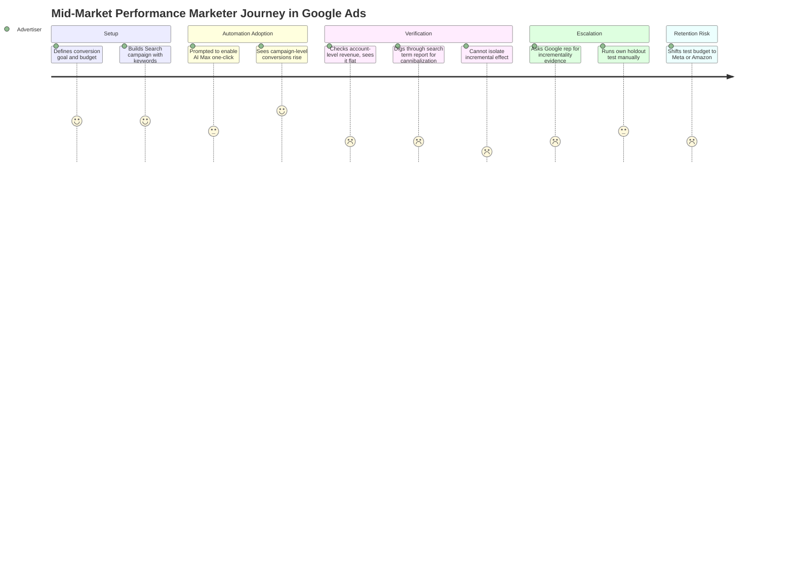
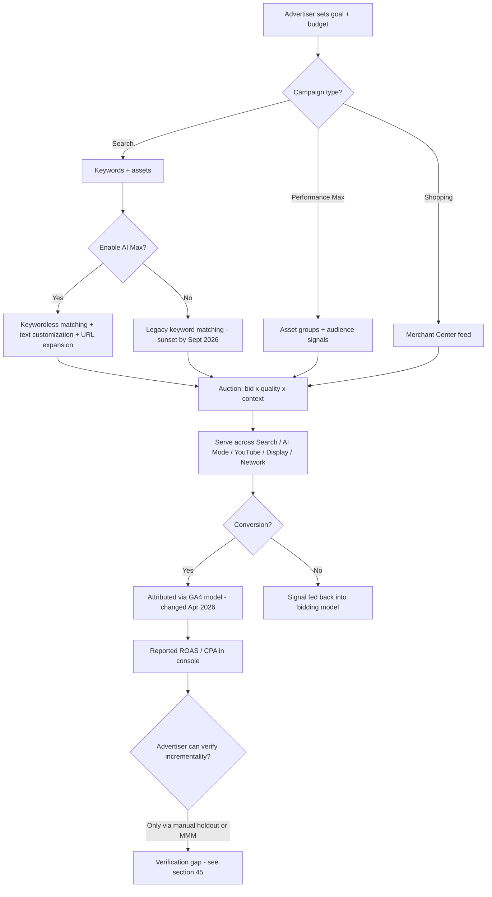
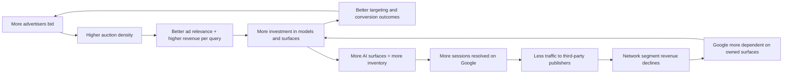
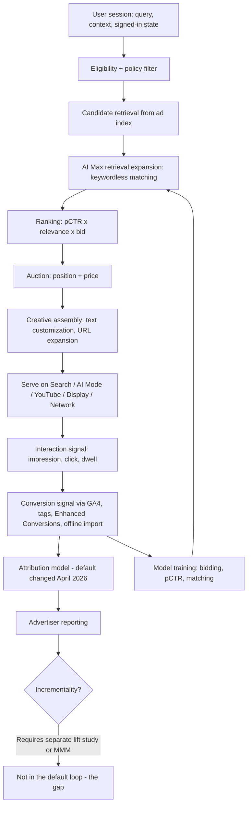
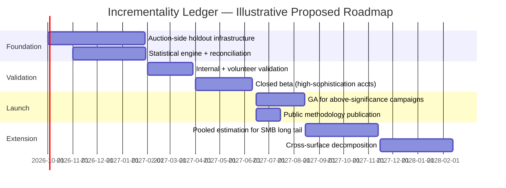

# Google Ads — Product Management Case Study

**Day 29 of 90 | PM Case Study Challenge**

## 1. Cover

**Product:** Google Ads (an Alphabet Inc. / Google LLC product)
**Category:** AdTech — Search Advertising, Programmatic & Agentic Commerce
**Author:** Gaurav Singh
**Day:** 29 / 90
**Date Published:** July 25, 2026

## 2. Repository Metadata

| Field | Value |
|---|---|
| Repository | product-management-case-studies |
| Folder | `Day-29-Google-Ads/` |
| Author | Gaurav Singh |
| Series | 90-Day PM Case Study Challenge |
| Previous | Day 28 — Apollo 24\|7 |
| License | MIT (see §63 License) |

## 3. Badges

`Day 29/90` · `Category: AdTech / Digital Advertising` · `Parent Company: Alphabet Inc.` · `Status: Published`

## 4. Table of Contents

**Foundations**

1. Cover · 2. Repository Metadata · 3. Badges · 4. Table of Contents · 5. Executive Summary · 6. Product Overview · 7. Company Background · 8. Product Timeline · 9. Vision & Mission · 10. Problem Statement

**Market & Strategy**

11. Market Research · 12. Industry Analysis · 13. TAM/SAM/SOM · 14. Competitor Analysis · 15. SWOT · 16. Porter's Five Forces · 17. Business Model Canvas · 18. Revenue Model

**Users & Experience**

19. Target Users · 20. Personas · 21. JTBD · 22. User Journey · 23. User Flow · 24. Information Architecture · 25. UX Audit · 26. UI Audit · 27. Accessibility

**Product & Growth**

28. Feature Breakdown · 29. AI Capabilities · 30. Product Metrics · 31. North Star Metric · 32. Product Analytics · 33. AARRR · 34. HEART · 35. Growth Strategy · 36. Growth Loops · 37. Network Effects · 38. Product Strategy · 39. Monetization · 40. Trust & Safety

**Technical**

41. Technical Architecture · 42. Data Flow · 43. API Ecosystem · 44. Privacy & Security

**Strategy & Planning**

45. Pain Points · 46. Opportunity Mapping · 47. RICE · 48. MoSCoW · 49. Kano · 50. Feature Proposal · 51. PRD · 52. Wireframes · 53. Rollout Plan · 54. A/B Testing · 55. KPI Dashboard · 56. Product Roadmap · 57. Risks & Mitigation · 58. Future Vision

**Closing**

59. PM Lessons · 60. PM Interview Questions · 61. References · 62. About the Author · 63. License · 64. Self Review · 65. Appendix

## 5. Executive Summary

Google Ads is the advertiser-facing front end of the largest advertising business ever built — a self-serve auction platform that turns search intent into billable clicks, and that in the quarter ending June 30, 2026 generated $81.6 billion in advertising revenue for Alphabet, up 14% year over year. Within that, Google Search and other grew 17% to $63.3 billion and YouTube advertising grew 13% to $11.1 billion. By almost any conventional scoreboard, the product is having the best quarter in its 26-year history.

Two facts complicate that picture, and both landed in 2026. First, Emarketer projects that Meta will overtake Google in global net digital ad revenue for the first time this year — roughly $243.5 billion versus $239.5 billion, or 26.8% versus 26.4% of worldwide digital ad spend — ending a dominance Google has held since the category existed. Second, and more structurally revealing: while Google's own surfaces grew double digits, Google Network revenue (the AdSense, AdMob, and Google Ad Manager line that monetizes *other people's* websites and apps) fell 1% to $7.3 billion in Q2 2026, after falling 4% in Q1 2026. That segment has now declined in consecutive quarters over roughly two years, and its share of Google's total ad revenue has slid from about 12% in Q1 2024 to roughly 9% in Q1 2026 — even as the US programmatic market it competes in grew 20.5% in 2025, per IAB/PwC.

This case study evaluates Google Ads across product, growth, technical, and strategic dimensions, and proposes one concrete feature extension addressed at the platform's most under-served constituency: the advertiser being asked to hand over control.

**Key finding:** Google Ads' 2026 product strategy is a coherent retreat to owned surfaces combined with an aggressive automation push — AI Max, AI Mode ad formats, Universal Cart, Ask Advisor — that systematically trades advertiser control for Google-side optimization. The strategy is defensible; Google's owned inventory is where the users and the margin now are. But it creates a verification gap that no amount of new inventory closes. Google's own data says AI Max delivers roughly 14% more conversions at similar CPA, and up to 27% for keyword-heavy accounts. Independent measurement says something materially different: in one independent test set, 84% of advertisers saw neutral or negative AI Max outcomes when measured at the account rather than campaign level, with much of the "new" volume cannibalized from existing campaigns. Both can be true at once — that is precisely the problem. As switching costs fall and Meta takes the volume crown, the binding constraint on Google Ads is no longer inventory or targeting sophistication. It is whether advertisers can verify that automation-driven spend growth is incremental. The feature proposed in §50 addresses that directly.

## 6. Product Overview

Google Ads is a self-serve advertising platform through which advertisers bid, in real-time auctions, to place ads across Google's owned surfaces and its third-party network. Its principal surfaces and campaign types as of mid-2026:

- **Search campaigns** — text ads against Google Search queries, historically keyword-targeted, now increasingly keywordless via AI Max
- **AI Max for Search** — an optimization layer (not a separate campaign type) activated inside existing Search campaigns, combining broad match and keywordless matching, automated text customization, and Final URL Expansion; generally available since April 2026
- **AI Mode and AI Overviews placements** — ad inventory inside Google's generative search experiences, including newer Gemini-powered formats such as Direct Offers, AI-powered Shopping ads, and Business Agent for Leads
- **Performance Max (PMax)** — a goal-based campaign type that allocates budget automatically across Search, YouTube, Display, Discover, Gmail, and Maps
- **Demand Gen** — mid-funnel visual/video campaigns across YouTube, Discover, and Gmail, expanded to Google Maps in 2026
- **Shopping campaigns** — Merchant Center feed-driven product ads, with AI Max for Shopping added in 2026
- **YouTube advertising** — video, Shorts, CTV, and YouTube Shopping formats
- **Google Network (AdSense / AdMob / Google Ad Manager)** — placement of ads on third-party publisher websites and mobile apps
- **Universal Cart and Universal Commerce Protocol (UCP)** — a persistent cross-merchant cart and open protocol enabling native checkout inside Google surfaces
- **Ask Advisor** — a cross-product AI agent spanning Google Ads, Analytics, Merchant Center, and Campaign Manager 360

The advertiser-side product (Google Ads) and the publisher-side stack (Google Ad Manager, comprising the DFP ad server and AdX exchange) are commercially and legally distinct — a distinction that matters enormously for §44 and §57, since the publisher-side stack is the subject of an unresolved US antitrust remedies proceeding.

## 7. Company Background

Google launched AdWords in October 2000 with a few hundred advertisers and a CPM pricing model. The decisive product decision came in 2002, when the platform moved to a cost-per-click auction that ranked ads not purely by bid but by bid multiplied by a relevance signal that became Quality Score. That single mechanism — making relevance economically rewarded rather than merely encouraged — is arguably the most consequential pricing design in internet history, because it aligned advertiser revenue with user experience instead of trading one against the other.

AdSense followed in 2003, extending the auction to third-party publisher content and creating the Google Network. The 2007–2008 acquisition of DoubleClick (approximately $3.1 billion) brought the publisher ad server (DFP) and ad exchange (AdX) into the same corporate structure as the largest advertiser demand pool on the internet — the vertical integration that would eventually be ruled illegal. In 2018 Google consolidated its branding: AdWords became Google Ads, DoubleClick for Publishers plus AdX became Google Ad Manager, and the enterprise buy-side tools became the Google Marketing Platform.

The 2020s trajectory has been a steady transfer of decisions from advertisers to Google's models: Smart Bidding, then Performance Max (2021), then Demand Gen (2023), then AI Max (2025–2026). As of the June 2026 quarter, Alphabet reported total revenue of $119.8 billion, of which advertising was $81.6 billion; the company also raised 2026 capital expenditure guidance to $195–205 billion, up from $180–190 billion. Google Ads is the profit engine funding that buildout, which is relevant context for how aggressively its roadmap is being pushed toward AI surfaces.

## 8. Product Timeline

```mermaid
timeline
    title Google Ads — Product & Regulatory Milestones
    2000 : AdWords launches (Oct) with a CPM model and a few hundred advertisers
    2002 : Shift to CPC auction with relevance-weighted ad rank (later Quality Score)
    2003 : AdSense launches, extending the auction to third-party publishers
    2008 : DoubleClick acquisition closes (~$3.1B), bringing DFP ad server and AdX exchange in-house
    2018 : Rebrand — AdWords becomes Google Ads; DFP + AdX become Google Ad Manager
    2021 : Performance Max launches, automating budget allocation across all Google surfaces
    2023 : Demand Gen replaces Discovery campaigns; generative AI enters ad creative workflows
    2024 (May) : AI Overviews roll out broadly in US Search
    2025 (Apr 17) : Judge Brinkema rules Google illegally monopolized publisher ad server and ad exchange markets, and unlawfully tied them
    2025 (Apr 22) : Google abandons plan to deprecate third-party cookies in Chrome
    2025 (May) : AI Max for Search announced in global beta at Google Marketing Live
    2025 (Sep) : Judge Mehta declines Chrome divestiture in the search case; ad tech remedies trial opens
    2025 (Oct 17) : Privacy Sandbox formally retired after six years
    2025 (Nov 21) : Closing arguments in the ad tech remedies trial
    2026 (Jan) : Direct Offers pilot launches with Chewy, Gap, and L'Oreal
    2026 (Apr) : AI Max exits beta to general availability; Dynamic Search Ads sunset announced
    2026 (May 19-20) : Universal Cart debuts at I/O; GML 2026 introduces Ask Advisor, Business Agent for Leads, AI Brief
    2026 (Jul 22) : Q2 2026 — ad revenue $81.6B (+14%); Network declines 1% to $7.3B
    2026 (Sep, planned) : Mandatory auto-upgrade of remaining legacy Search campaigns to AI Max
```

## 9. Vision & Mission

Google's organizing mission — organizing the world's information and making it universally accessible and useful — has always had an unstated commercial corollary: the advertising system is the mechanism that pays for universal access. Google Ads' own product framing has stayed remarkably stable across 26 years: let any business, at any budget, reach people at the moment they express relevant intent, and charge only for measurable outcomes.

What has changed in 2026 is the definition of "the moment." Google's stated direction is to move from matching a user's query to *predicting what the user needs next* — capturing intent signals that exist inside conversational and multimodal AI sessions rather than in a typed keyword. That reframing is the strategic thread connecting AI Max, AI Mode ad formats, and the agentic commerce stack. It is also, quietly, a reframing of the advertiser's role: from someone who declares intent targets to someone who supplies goals, assets, and guardrails and lets Google infer the rest.

## 10. Problem Statement

The original problem Google Ads solved was allocative: advertisers had no reliable way to reach people at the precise moment of commercial intent, and small advertisers had no access to measurable advertising at all. Search advertising solved both, and the self-serve auction made a ₹500-a-day advertiser and a multinational participants in the same mechanism.

The 2026 problem is different and sits on two sides at once.

**For advertisers:** intent is fragmenting away from the typed query into conversational, multimodal, and agent-mediated sessions, while measurement is simultaneously degrading — third-party cookie signal loss, privacy regulation, attribution model changes, and generative search surfaces that resolve queries without a click. Independent measurement of AI Overview queries found paid click-through rate falling from roughly 19.7% to 6.34% when an AI Overview is present, per Seer Interactive's September 2025 study. Advertisers are being asked to increase automation and trust at exactly the moment their ability to independently verify results is weakest.

**For publishers:** the third-party web that Google Network monetizes is contracting. Google Search referral traffic to publishers fell approximately 33% globally in the year to November 2025, per Press Gazette's trends analysis, with US publishers reportedly harder hit. The Network revenue line is the financial expression of that contraction, and it is the one segment of Google's advertising business that is shrinking.

The sharper problem for a Google Ads PM in 2026 is therefore not reach and not targeting sophistication. It is **verifiability** — closing the gap between what Google's automation claims and what advertisers can independently confirm, because that gap is what determines budget retention once a credible alternative exists. In 2026, for the first time, it does.

## 11. Market Research

Digital advertising market sizing varies dramatically by scope and research firm (see §65 Appendix, Source Conflict Table). Reported 2026 global digital ad spend figures range from roughly $680 billion to approaching $800 billion depending on definition, against a total advertising market that dentsu and others expect to exceed $1 trillion for the first time in 2026. Search advertising remains the single largest channel at roughly $390 billion globally, with Google holding an estimated ~90% of search advertising specifically — a share that has proven far more durable than its share of digital advertising overall.

The consequential 2026 finding is not the market size but the ranking. Emarketer's April 2026 forecast projects Meta reaching approximately $243.5 billion in net worldwide ad revenue against Google's $239.5 billion, driven by Meta growing 24.1% against Google's 11.9%. Concentration is simultaneously intensifying: Meta, Google, and Amazon together are projected at 62.3% of global digital ad spend in 2026, up from 59.9% in 2025, with Amazon third at roughly 9% ($82.1 billion) and ByteDance at approximately 7.9%. Retail media is the fastest-growing adjacent channel; US retail media spend is forecast at $69.3 billion in 2026 (+17.8%), of which Amazon holds an estimated 79.7% share.

For the India market specifically — relevant given the concentration of prior case studies in this series — Google and Meta together captured an estimated 64% of India's digital advertising market, per Storyboard18's March 2026 reporting, with approximately one million SME and long-tail advertisers spending around ₹36,300 crore on digital media in 2025. Connected TV in India grew from roughly 30 million to 40 million weekly active homes, with CTV ad revenue up 42% to about ₹9,900 crore.

## 12. Industry Analysis

Three structural forces define the 2026 AdTech industry, and Google Ads is exposed to all three.

**Consolidation into first-party data platforms.** Emarketer's analysts attribute the Big Three's rising share to first-party data depth, reach, and AI integration — advantages that smaller platforms like Snap and Pinterest structurally cannot match and that leave them most vulnerable to budget cuts. The abandonment of Privacy Sandbox in October 2025 did not reverse this; it entrenched it, because a world of degraded third-party signal favors whoever owns logged-in first-party surfaces.

**The open web's monetization contraction.** This is the industry's most under-priced development. Generative search surfaces resolve queries in place, and the ad-supported independent web that AdSense and Ad Manager were built to monetize is losing the traffic that made it monetizable. Google is on both sides of this: its own AI surfaces are a primary cause, and its Network segment is a primary casualty. Notably, the decline is Google-specific rather than market-wide — US programmatic grew 20.5% in 2025 to $162.4 billion while Google Network shrank, which suggests supply-side share loss on top of ecosystem contraction.

**Agentic commerce.** The 2026 launches — Universal Commerce Protocol, Agent Payments Protocol, Universal Cart, native in-SERP checkout — reposition Google from the discovery layer of online shopping toward the transaction layer. This is the most significant expansion of Google's addressable revenue in a decade and the most significant strategic threat to brands, for a reason articulated well by agency-side critics: when an agent performs comparison and evaluation on the consumer's behalf, the research phase where challenger and premium brands historically earned their price premium is compressed away. Google gains transaction economics; differentiated brands lose the surface on which they differentiate.

## 13. TAM/SAM/SOM

*(Framework selection rationale: TAM/SAM/SOM is used here with explicit caution. Google Ads is not a startup sizing an opportunity — it is a category-defining incumbent whose realistic constraint is share retention, not addressable market. The framework is retained for series consistency and because the agentic-commerce expansion genuinely does enlarge the TAM, but the SOM line is the only one carrying real analytical weight.)*

| Layer | Definition | Estimate | Basis |
|---|---|---|---|
| TAM | Global advertising market, all channels | Expected to exceed $1 trillion for the first time in 2026 | dentsu forecast via third-party reporting |
| TAM (digital only) | Global digital advertising spend | ~$680B–$800B for 2026 depending on scope; see §65 | Multiple conflicting third-party forecasts |
| SAM | Search + video + programmatic display + retail-adjacent commerce inventory reachable by Google Ads' campaign types | Not separately disclosed by Google | Inferred; search alone is ~$390B globally |
| SOM | Google's own net worldwide ad revenue | ~$239.5B projected for 2026 (26.4% of global digital ad spend), per Emarketer | Third-party forecast; Alphabet reports segment revenue, not global share |
| Emerging TAM extension | Agentic commerce / transaction-layer economics via UCP, Universal Cart, native checkout | Not disclosed or independently sized | No credible sizing located in this research pass — flagged as an open question |

Google does not disclose advertiser counts, revenue per advertiser, or share figures. All share and market-size figures above are third-party estimates.

## 14. Competitor Analysis

| Dimension | Google Ads | Meta Ads | Amazon Ads | The Trade Desk (independent DSP) |
|---|---|---|---|---|
| Core intent signal | Declared intent (query) + inferred intent from AI sessions | Inferred intent from social graph and behavior | Purchase intent + transaction history | Aggregated third-party and partner signal across open internet |
| 2026 projected net ad revenue | ~$239.5B (26.4% share) | ~$243.5B (26.8% share) | ~$82.1B (~9% share) | Materially smaller; open-internet focused |
| Growth rate (2026 projected) | ~11.9% | ~24.1% | ~19.6% (implied from $68.6B to $82.1B) | Not comparable at this scale |
| Structural advantage | ~90% of search advertising; highest-intent inventory on the internet | Closed-loop social ecosystem across four apps; Reels and WhatsApp inventory expansion | Closed-loop retail purchase data; 79.7% of US retail media | Independence from any walled garden — the neutrality pitch |
| Structural weakness | Regulatory overhang on the publisher-side stack; declining open-web Network segment | Weaker declared-intent signal for high-consideration purchases | Inventory largely confined to shopping contexts | Dependent on the contracting open web and on signal availability |
| Key 2026 development | Meta overtakes it; AI Max GA; agentic commerce stack | Overtakes Google for the first time; $115–135B capex on AI | Retail media becomes a projected top-3 channel | Positioned as the beneficiary of any Google ad tech divestiture |

**PM read:** Meta overtaking Google is real but partly a definitional artifact of comparing total company ad revenue. Google's competitive position in *search advertising* — its actual moat, at roughly 90% share — is not what changed. What changed is that the fastest-growing pools of ad spend (social video, retail media) are ones where Google is a participant rather than the owner of the mechanism. A PM should read the Emarketer headline less as "Google is losing" and more as "Google's category stopped being the category where growth happens."

## 15. SWOT

**Strengths**
- Roughly 90% share of global search advertising, the highest-intent inventory that exists
- $81.6B quarterly advertising revenue (Q2 2026, +14% YoY) funding a $195–205B annual capex program
- Distribution across Search, YouTube, Maps, Gmail, Discover, Android, and Chrome — few competitors have more owned surfaces
- Gemini integration depth: 950M monthly active users on the Gemini app and 22B API tokens processed per minute, per Q2 2026 disclosures, giving Google model capability its ad rivals must buy
- Self-serve auction with 26 years of accumulated conversion data and advertiser workflow lock-in

**Weaknesses**
- Google Network segment in sustained decline (-1% in Q2 2026, -4% in Q1 2026), down to roughly 9% of ad revenue from ~12% two years earlier
- Advertiser trust deficit: measurable divergence between Google's automation performance claims and independent measurement (see §5, §45)
- Reduced advertiser control as legacy formats are sunset (Dynamic Search Ads auto-upgrading to AI Max by September 2026, mandatory)
- Attribution instability: the April 2026 GA4 default attribution model change shifts reported conversion values and ROAS without any campaign change, complicating year-over-year advertiser benchmarking
- Six years and substantial engineering investment in Privacy Sandbox retired in October 2025 with no successor targeting standard

**Opportunities**
- Agentic commerce as a genuine TAM extension — moving from discovery-layer to transaction-layer economics via UCP, AP2, and Universal Cart
- New AI-surface inventory that did not exist in 2024, monetizing conversational sessions
- Retail and travel vertical depth (AI Max for Shopping, Search campaigns for Travel, Booking/Expedia integrations)
- CTV growth, particularly in emerging markets — India CTV ad revenue grew 42% to roughly ₹9,900 crore
- Incrementality measurement as a differentiator against walled-garden rivals (this is the §50 proposal)

**Threats**
- Unresolved US ad tech remedies decision; DOJ has sought divestiture of AdX and, contingently, DFP
- EU ad tech decision with a €2.95 billion fine and the prospect of structural remedies (date conflict — see §65)
- Meta's growth rate at roughly double Google's, with $115–135B in 2026 capex behind it
- Amazon's retail media closed loop capturing bottom-funnel budget that historically went to Shopping campaigns
- India's DPDP Act and Rules materially raising the consent bar for programmatic and lookalike targeting
- Brand-side resistance to agentic commerce compressing the consideration phase where brand equity is built

## 16. Porter's Five Forces

*(Framework selection rationale: Porter's is appropriate here specifically because Google Ads' competitive position is defined less by rivalry than by its unusual dual role as both a buyer and a seller of the same inventory — a structural condition Porter's supplier/buyer axes surface better than a rivalry-focused framework would.)*

| Force | Assessment | Notes |
|---|---|---|
| Competitive rivalry | **High and rising** | Meta overtaking Google in 2026; Amazon growing faster from a smaller base; concentration among the top three rising to 62.3% |
| Supplier power (publishers) | **Low but structurally shifting** | Individual publishers have almost no leverage, but their aggregate contraction is directly shrinking Google's Network revenue — an unusual case where weak suppliers still damage the platform |
| Buyer power (advertisers) | **Moderate and rising** | Individually negligible; collectively meaningful. Rising because measurement scrutiny is increasing and because a credible #1 alternative now exists |
| Threat of substitutes | **High** | AI assistants (ChatGPT, Perplexity, Gemini itself), retail media networks, and creator/influencer channels all substitute for search-intent capture |
| Threat of new entrants | **Low for the mechanism, high for the surface** | No one will rebuild a search ad auction at scale. But AI assistants are new *surfaces* for commercial intent, and they were built by entrants |

The most interesting reading is the supplier row. Google's publisher suppliers have essentially no bargaining power, yet their decline is costing Google a segment. That is a reminder that platform health and supplier health are not independent variables even when the power asymmetry is total.

## 17. Business Model Canvas

| Block | Content |
|---|---|
| Customer segments | SMB self-serve advertisers; mid-market performance advertisers; enterprise brands and their agencies; app developers (AdMob); publishers (AdSense, Ad Manager) |
| Value propositions | Advertisers: measurable access to high-intent demand at any budget. Publishers: monetization without a direct sales force. Users: free access to Search, YouTube, Maps, Gmail |
| Channels | Self-serve web console and mobile app; Google Ads API and Editor; Google Customer Solutions sales; agency and reseller partners; Google Marketing Platform for enterprise |
| Customer relationships | Almost entirely product-led and self-serve at the SMB tier; dedicated account management at enterprise; increasingly agent-mediated via Ask Advisor |
| Revenue streams | Cost-per-click and cost-per-acquisition auction revenue on owned surfaces; revenue share on Network placements; emerging transaction-adjacent economics via UCP/Universal Cart |
| Key resources | The search index and query stream; 26 years of conversion data; Gemini models; owned surface distribution; Ad Manager publisher infrastructure |
| Key activities | Auction and ranking systems; bidding and budget-allocation models; creative generation; measurement and attribution; policy enforcement and ad review |
| Key partners | Publishers; Merchant Center retailers; payment partners (Google Pay, Klarna, Affirm); vertical partners (Booking, Expedia); measurement vendors; agencies |
| Cost structure | Traffic acquisition costs (distribution and revenue share); AI infrastructure and compute — Alphabet's 2026 capex guidance is $195–205B; R&D; ad review and trust operations; legal and regulatory |

## 18. Revenue Model

Google Ads monetizes primarily through auction-priced clicks and conversions. Advertisers set a goal and a budget; Google's models determine which query, surface, audience, and creative combination to serve, and the auction sets price. Revenue therefore scales with three multiplicands: query and session volume, ad load and inventory availability, and price per unit of intent.

Q2 2026 breakdown (quarter ended June 30, 2026):

| Line | Revenue | YoY |
|---|---|---|
| Google advertising (total) | $81.6B | +14% |
| — Google Search & other | $63.3B | +17% |
| — YouTube ads | $11.1B | +13% |
| — Google Network | $7.3B | **-1%** |
| Google Services (incl. non-ad) | $94.5B | +15% |
| Alphabet total revenue | $119.8B | +24% |

The structural story is in the mix, not the total. Of roughly $10.29 billion in added ad revenue year over year, Search and other contributed approximately $9.08 billion and YouTube approximately $1.26 billion, while Network declined. Owned-and-operated inventory is now overwhelmingly where the revenue is; one industry analysis put the owned-properties share of Google ad revenue at around 90% as of August 2025.

**The emerging model shift:** UCP, the Agent Payments Protocol, Universal Cart, and native in-SERP checkout position Google adjacent to the transaction itself rather than only the click preceding it. No public disclosure quantifies revenue from these mechanisms yet, and Google has not stated whether the model will be advertising-priced, transaction-fee priced, or both. This is the single largest open question in Google Ads' revenue model and is explicitly unresolved in public sources as of July 2026.

## 19. Target Users

- **SMB self-serve advertisers** — the long tail; in India alone roughly one million SME and long-tail advertisers spent approximately ₹36,300 crore across digital media in 2025. Low sophistication, high automation dependence, extremely price-sensitive
- **Mid-market performance marketers** — in-house teams at DTC, SaaS, ed-tech, and services businesses running Search, PMax, and Shopping against CAC and ROAS targets. The most measurement-literate and most vocal segment
- **Enterprise brands and their agencies** — running brand and performance simultaneously, using Google Marketing Platform, Campaign Manager 360, and increasingly Meridian for marketing mix modeling
- **App developers (AdMob)** — monetizing apps with in-app inventory, and separately buying app-install campaigns
- **Publishers (AdSense, Google Ad Manager)** — a genuinely distinct user category with opposed interests to advertisers on price, and the constituency most affected by both the traffic contraction and the antitrust proceeding
- **Merchants (Merchant Center)** — feed-driven retailers, now the primary target of the UCP and Universal Cart roadmap

## 20. Personas

**Persona 1 — "Ritika, Performance Lead at a Mid-Market DTC Brand"**
Manages roughly ₹40–60 lakh monthly across Google and Meta, reports weekly blended CAC to a founder who does not distinguish between platform-reported and actual incremental revenue. Ritika has already run AI Max on two campaigns and saw campaign-level conversions rise while account-level revenue stayed flat. She cannot prove cannibalization to her founder, and she cannot disprove it to her Google rep. She is the persona the §50 proposal is built for.

**Persona 2 — "Suresh, Owner-Operator SMB Advertiser"**
Runs a two-location services business and about ₹25,000/month in Google Ads himself, between customer calls. He does not read search term reports. Automation is unambiguously good for him — he could not manually manage keywords, and AI Max genuinely finds queries he would never have thought of. His risk is the opposite of Ritika's: he cannot tell when automation is spending badly, and he has no holdout discipline to find out.

**Persona 3 — "Daniel, Group Media Director at an Independent Agency"**
Buys across Google, Meta, Amazon, and a DSP for a portfolio of clients. Evaluates Google not on Google's dashboards but on marketing mix modeling and incrementality tests. Actively skeptical of agentic commerce because it compresses the consideration phase where his premium-brand clients justify price. Wants portability and neutrality, and is the most likely persona to move budget on principle.

**Persona 4 — "Anita, Head of Revenue at a Mid-Sized Publisher"**
Runs a content site monetized through Google Ad Manager and AdSense. Her Google search referral traffic has fallen sharply, her programmatic yield is under pressure, and her commercial fate is being decided in a Virginia courtroom rather than in her product roadmap. She is a Google Ads *supplier*, not a customer, and her interests are structurally opposed to the advertiser personas on price — but she is the reason the Network line is declining, so a Google Ads PM cannot treat her as out of scope.

## 21. JTBD

*(Framework selection rationale: JTBD is well-suited to Google Ads because the underlying advertiser job — acquire a customer at an acceptable cost, provably — has not changed in 26 years even as the mechanism has gone from manual keyword bidding to agentic automation. It cleanly separates the durable job from the churning feature set.)*

- When I need customers now, I want to reach people already expressing intent to buy, so I do not pay to create demand from scratch.
- When I set a budget, I want to know the spend produced customers I would not otherwise have gotten, so I can defend the budget internally.
- When I hand control to automation, I want guardrails and evidence, so I am delegating a decision rather than losing one.
- When I compare platforms, I want a comparison that is not self-reported by each platform, so I can allocate rather than guess.
- When I am a one-person business, I want the system to work without expertise, so I can spend my time serving customers instead of managing campaigns.

## 22. User Journey

## 23. User Flow

## 24. Information Architecture

Google Ads' console IA is organized around a campaign hierarchy — account, campaign, ad group or asset group, ad or asset — with cross-cutting sections for Audiences, Assets, Insights, Measurement (conversions, attribution), Billing, and Admin. Recommendations and Optimization Score sit as persistent prompts across the interface.

The 2026 IA tension is that the hierarchy still reflects a manual-control mental model while the product increasingly does not. AI Max is deliberately architected as a *layer inside* existing Search campaigns rather than a new campaign type — a sound decision for migration continuity, but it means the object that determines most of the campaign's behavior is a toggle inside settings rather than a first-class entity in the navigation. Similarly, Performance Max's channel allocation is the single most consequential thing PMax does, and it lives in reporting rather than in the structural hierarchy. Ask Advisor, introduced at GML 2026, is an attempt to route around this by making a conversational agent the entry point across Ads, Analytics, Merchant Center, and Campaign Manager 360 — effectively conceding that the IA is no longer navigable for the questions advertisers now have.

## 25. UX Audit

**Strengths:** The self-serve onboarding path is genuinely remarkable at the SMB tier — a business owner with no training can launch a functioning campaign in a single session, which is why the long tail exists at all. Optimization Score and Recommendations give non-experts a next action. AI Max's one-click activation inside existing campaigns is a well-designed migration affordance: no rebuild, settings preserved, legacy URL controls carried forward.

**Friction points:** Three stand out.

First, **the verification gap.** The console reports platform-attributed conversions but provides no default answer to "was this incremental?" Incrementality requires either an opt-in conversion lift study, a manual holdout, or external marketing mix modeling. For the persona most under pressure to justify spend, the platform's default reporting answers a question adjacent to the one being asked.

Second, **automation without a legible boundary.** Practitioner guidance for AI Max consistently converges on the same advice — set tight guardrails, monitor search term reports aggressively, layer in negative keywords — which is an implicit acknowledgment that the default configuration does not yet self-limit reliably. Advertisers report frustration specifically around landing-page routing under Final URL Expansion.

Third, **benchmark instability.** The April 2026 GA4 default attribution model change altered how credit is distributed across touchpoints, meaning reported conversion values and ROAS can move without any campaign change. Combined with the mandatory DSA sunset in September 2026, an advertiser in 2026 is being asked to change their campaign structure and re-baseline their measurement in the same year.

## 26. UI Audit

The interface has evolved into a dense, table-and-chart enterprise console layered with an increasingly conversational surface. The tension is visible: the table-oriented core serves the advertiser who wants to inspect and adjust specific objects, while the AI layer (Recommendations, AI Brief, Ask Advisor) serves the advertiser who wants to state an intention in natural language. Both users exist, often in the same account on the same day.

AI Brief is the most interesting UI decision of 2026. It lets advertisers steer AI Max using natural-language guidelines across messaging, matching, and audience — and, critically, previews sample assets and searches before committing. That preview-then-commit pattern is the correct answer to the automation trust problem in miniature: it converts an opaque delegation into an inspectable one. The proposal in §50 argues that the same pattern should be applied to outcomes, not just to inputs.

## 27. Accessibility

Google publishes general accessibility commitments at the company level, and Google Ads' console is a mature enterprise web application, but no product-specific WCAG conformance statement for the Google Ads interface was located in this research pass (ASSUMPTION — VALIDATION REQUIRED). Two accessibility dimensions deserve more attention than they receive in industry commentary:

- **Advertiser-side accessibility:** the console's density and reliance on tabular data comparison is a real barrier for screen-reader users managing large accounts, and no public conformance documentation was found to assess this against.
- **Advertiser-side literacy accessibility:** for the SMB persona and particularly for non-English, vernacular-language advertisers in markets like India, the practical barrier is comprehension rather than interface access. AI Brief's natural-language steering is arguably the most significant accessibility improvement of 2026 for this group, though it currently rolls out in English first.

## 28. Feature Breakdown

| Feature | Job it does | Notes |
|---|---|---|
| Search campaigns | Capture declared intent from typed queries | Historical core; legacy keyword-only configurations sunsetting |
| AI Max for Search | Expand reach into keywordless/long-tail queries, customize creative and landing pages | GA since April 2026; described by Google as its fastest-growing AI Search ads product |
| AI Brief | Steer AI Max using natural-language messaging, matching, and audience guidelines | Gemini-powered; previews sample assets and searches before commit; English first |
| AI Mode / AI Overviews placements | Monetize conversational and generative search sessions | New inventory that did not exist in 2024 |
| Direct Offers | Surface dynamically bundled promotions at high purchase intent | Piloted Jan 2026 with Chewy, Gap, L'Oreal; travel expansion with Booking and Expedia |
| AI-powered Shopping ads | Explain, in generated copy, why a product matches a conversational query | Uses Merchant Center feed data |
| Business Agent for Leads | Replace static lead forms with a website-grounded Gemini chat agent inside the ad | Highest-variance new format: strong lead-quality upside, real brand-safety exposure |
| Performance Max | Automate budget allocation across all Google surfaces against one goal | 2026 added asset-group reporting, channel-level budget transparency, campaign-level negatives |
| Demand Gen | Mid-funnel visual demand creation | Expanded to Google Maps in 2026 |
| Universal Cart / UCP | Persistent cross-merchant cart with native checkout across Search, YouTube, Gemini, Gmail, Maps | Klarna and Affirm BNPL integration; began US rollout May 19, 2026 |
| Ask Advisor | Single conversational agent across Ads, Analytics, Merchant Center, Campaign Manager 360 | Introduced GML 2026 |
| Asset Studio | Generate and test creative from natural-language prompts | Gemini Omni for video; 1-Click Creative Testing |
| Meridian | Open-source-style marketing mix modeling | Moved into Analytics 360 in 2026 with Qualified Future Conversions |
| Google Network (AdSense/AdMob/Ad Manager) | Monetize third-party publisher and app inventory | The one declining segment; also the subject of the antitrust remedies case |

## 29. AI Capabilities

Google Ads in 2026 is best understood as three distinct AI systems that advertisers experience as one product.

**Targeting and matching AI.** AI Max applies broad match plus keywordless technology to find queries an advertiser's keyword list would miss, learning from existing keywords, assets, and URLs. This is the layer that removes the most advertiser control and generates the most measurement controversy.

**Creative AI.** Text customization, Final URL Expansion, Asset Studio's multimodal generation, and AI Brief's natural-language steering. This layer is the least contested — advertisers broadly report creative generation as a genuine productivity gain, and independent testing found text customization lifted ad relevance and Quality Score in a majority of tests.

**Agentic AI.** Ask Advisor for advertisers; Business Agent for Leads and Universal Cart on the consumer side; UCP and AP2 as the protocol substrate. This layer is the newest, the least measured, and the largest strategic bet.

**PM Insight:** The three layers have inverted risk profiles, and Google's 2026 communication treats them as one story. Creative AI is low-risk and well-received — advertisers can see the output before it ships, which is exactly why AI Brief's preview-then-commit pattern works. Targeting AI is high-risk and contested, because its output is a spend allocation the advertiser cannot inspect before it happens and cannot cleanly attribute after. Bundling them under a single "AI Max" adoption narrative means the trust deficit from the contested layer taxes the layer advertisers actually like. A sharper product position would separate them: ship creative AI on by default, and ship targeting AI with mandatory verification attached. That is the argument in §50.

## 30. Product Metrics

**Caution:** Google does not disclose advertiser counts, revenue per advertiser, campaign-type mix, or platform usage analytics. Every metric below is either an Alphabet segment disclosure or a third-party estimate, labeled accordingly.

| Metric | Value | Source type |
|---|---|---|
| Google advertising revenue (Q2 2026) | $81.6B, +14% YoY | Alphabet disclosure |
| Google Search & other (Q2 2026) | $63.3B, +17% YoY | Alphabet disclosure |
| YouTube ads (Q2 2026) | $11.1B, +13% YoY | Alphabet disclosure |
| Google Network (Q2 2026) | $7.3B, **-1% YoY** | Alphabet disclosure |
| Google Network (Q1 2026) | $6.97B, -4% YoY (from $7.26B in Q1 2025) | Alphabet disclosure via trade analysis |
| Network share of Google ad revenue | ~12% (Q1 2024) falling to ~9% (Q1 2026) | Third-party calculation |
| Alphabet total revenue (Q2 2026) | $119.8B, +24% YoY | Alphabet disclosure |
| 2026 capex guidance | $195–205B, raised from $180–190B | Alphabet disclosure |
| Gemini app MAU | 950 million | Alphabet disclosure (Q2 2026) |
| AI Overviews monthly users | 2 billion+ | Company disclosure via trade reporting |
| Global digital ad share (2026 projected) | 26.4%, second behind Meta at 26.8% | Emarketer forecast |
| Search advertising share | ~90% globally | Third-party estimate |
| India digital ad share (Google + Meta) | ~64% combined | Storyboard18, March 2026 |
| Paid CTR when AI Overview present | ~19.7% falling to ~6.34% (-68%) | Seer Interactive, Sept 2025 |
| Google search referral traffic to publishers | ~-33% globally, year to Nov 2025 | Press Gazette |
| AI Max claimed conversion uplift | +14% typical; +27% for exact/phrase-keyword-heavy accounts | **Google internal data** |
| AI Max independent account-level result | 84% of advertisers saw neutral or negative outcomes | **Independent testing** — directly conflicts with the row above; see §65 |

## 31. North Star Metric

**Google's implicit operating metric** is advertising revenue growth, which the Q2 2026 numbers serve well. **The metric a Google Ads PM should argue for internally** is different.

**Proposed North Star Metric: Verified Incremental Value Share (VIVS)** — the percentage of active advertiser spend for which a holdout-verified positive incremental lift has been measured within the trailing 90 days.

**Rationale:** Revenue and conversion-count metrics reward spend expansion whether or not that spend is incremental — which is exactly the mechanism advertisers suspect AI Max of exploiting, and exactly why Google's own uplift claims fail to settle the argument. A verified-incrementality metric has three properties a revenue metric lacks. It cannot be improved by cannibalization, because holdout design controls for it. It aligns Google's reported success with the advertiser outcome that actually determines budget renewal. And it is the one metric a walled-garden competitor cannot easily match without also submitting to holdout measurement — turning Google's greatest current liability (measurement skepticism) into a differentiation axis at the precise moment Meta takes the volume crown.

**The obvious objection:** VIVS would, in the short term, look worse than revenue growth, and would surface cannibalization that currently goes unmeasured. That is not an argument against the metric. It is the argument for it — a metric that cannot report bad news is not a metric.

## 32. Product Analytics

Google publishes no platform-level product analytics for Google Ads: no advertiser counts, no feature adoption rates, no funnel data on campaign creation or automation opt-in, no churn figures. Everything externally known about Google Ads product behavior comes from three lower-confidence sources: Alphabet segment revenue, Google's own selectively released performance claims, and independent practitioner testing at small sample sizes.

This is a genuine analytical limitation, and it is worth naming as a finding rather than a caveat: **the largest advertising product in the world is one of the least externally measurable.** The asymmetry matters because it means the advertiser-trust problem described throughout this case study is structurally unresolvable from outside the platform. Only Google can close it, which is why the §50 proposal is a Google-side feature rather than a market-side recommendation.

## 33. AARRR

- **Acquisition:** Search-led self-serve signup; Google Customer Solutions outbound for mid-market; agency and reseller channels; Merchant Center cross-sell; promotional credits for new advertisers. In India, advertiser verification (rolled out to all advertisers serving ads in India in 2026, per third-party practitioner sources — ASSUMPTION, VALIDATION REQUIRED) has added an onboarding friction step.
- **Activation:** First campaign live and first conversion recorded. Optimization Score and Recommendations are the primary activation-to-competence mechanisms.
- **Retention:** Extremely high structurally — conversion history, audience lists, and account configuration create real switching costs, and there is no substitute for search intent inventory. Retention risk in 2026 is not full churn but *share shift*: reallocating incremental budget to Meta, Amazon, or retail media.
- **Referral:** Weak as a formal mechanism; strong informally via agency and practitioner communities, which in 2026 are also the primary distribution channel for skepticism about AI Max.
- **Revenue:** Auction price per click/conversion multiplied by volume, plus new ad load from AI surfaces, plus emerging transaction-layer economics from UCP.

## 34. HEART

*(Framework selection rationale: HEART is used rather than a pure funnel framework because Google Ads' core 2026 risk is qualitative — advertiser trust in automation — and HEART's Happiness and Task Success dimensions capture that better than volume metrics.)*

| Dimension | Metric | Why it matters in 2026 |
|---|---|---|
| Happiness | Advertiser confidence that reported results reflect incremental results (survey-based) | The single metric most predictive of budget retention as alternatives strengthen |
| Engagement | Share of accounts using AI Brief guardrails and preview-before-commit rather than defaults | Distinguishes informed delegation from passive drift |
| Adoption | AI Max activation rate — but segmented by whether a holdout was configured | Adoption without verification is a deferred liability, not a win |
| Retention | Quarter-over-quarter retention of *incremental* budget, not total budget | Total spend retention masks share shift to competing platforms |
| Task Success | Time from "did this work?" question to a defensible answer | Currently measured in weeks of manual holdout work; should be minutes |

## 35. Growth Strategy

Google Ads' 2026 growth strategy has four visible pillars.

**Inventory creation.** AI Mode and AI Overviews created ad surfaces that did not exist two years ago, and Alphabet's Q2 2026 commentary explicitly framed AI as opening new Search inventory. This is the cleanest growth lever available: more monetizable sessions without acquiring more advertisers.

**Automation-driven spend expansion.** AI Max, PMax, and Smart Bidding all tend to increase spend at a stated efficiency target by finding additional qualifying inventory. This grows revenue and, contested measurement aside, often grows advertiser volume too.

**Format and vertical depth.** AI Max for Shopping, Search campaigns for Travel, Demand Gen on Maps, Booking and Expedia integrations — capturing verticals where competitors have specialized.

**Commerce-layer expansion.** UCP, AP2, and Universal Cart move Google toward the transaction. This is the only pillar that meaningfully enlarges the TAM rather than the share.

**The unaddressed pillar:** none of the four addresses advertiser trust, and the mandatory DSA sunset in September 2026 actively spends trust to accelerate automation adoption. Forced migration is a legitimate product decision — legacy formats do have a real maintenance cost — but doing it in the same year as a default attribution model change, while independent measurement contradicts the platform's own uplift claims, concentrates a lot of trust cost into a narrow window.

## 36. Growth Loops

Two loops, running simultaneously, in opposite directions. The upper loop is the classic marketplace flywheel and it is still spinning strongly. The lower loop is a self-reinforcing consolidation onto owned surfaces — each turn makes Google's ad business healthier in the near term and the open web it also monetizes weaker. The Network decline is not a bug in the flywheel; it is the flywheel's shadow.

## 37. Network Effects

Google Ads exhibits strong cross-side network effects on its owned surfaces: more advertisers improve auction density and therefore relevance and yield; more users generate more queries and more conversion signal, which improves targeting, which attracts advertisers. These effects are among the most durable in software, which is why ~90% search advertising share has survived two decades of well-funded competition.

The important nuance for 2026: **the effect is surface-specific, not company-specific.** Google's network effects on Search are essentially unassailable. Its network effects on the third-party web are eroding, because the user side of that two-sided market is leaving. And in agentic commerce, the network effect Google is trying to build — merchants adopting UCP because shoppers use Universal Cart, and vice versa — is a *new* cold-start problem, not an extension of an existing advantage. Google is starting that loop from scratch against Amazon, which already owns closed-loop commerce data and 79.7% of US retail media.

## 38. Product Strategy

Stated plainly, Google Ads' strategy is: **concentrate monetization on owned surfaces, replace advertiser targeting decisions with model decisions, and extend from the click to the transaction.**

Each element is individually rational. Owned surfaces are where users and margin are. Model decisions genuinely outperform human keyword management at scale, particularly for the long tail. The transaction layer is a real TAM extension and Google's distribution makes it plausible.

The strategy's weak point is sequencing. Google is asking for maximum advertiser trust (hand over targeting, accept new attribution, migrate off legacy formats) at the moment of minimum advertiser confidence (independent measurement contradicting platform claims, a credible #1 alternative in Meta, and regulatory uncertainty overhanging the publisher stack). A strategy that requires trust should invest in trust infrastructure first. It has instead invested in inventory and automation, and is spending trust to fund the transition.

## 39. Monetization

Beyond the auction mechanics in §18, three 2026 monetization dynamics are worth isolating.

**Ad load in AI surfaces.** Generative results resolve queries in place, which reduces clicks per query while increasing Google's control over the entire result surface. The commercial question is whether higher-value in-surface placements (Direct Offers, AI Shopping ads with native checkout) more than offset lost click volume. Q2 2026's 17% Search growth suggests yes so far, though the CFO noted Q3 will begin lapping a search acceleration that started in Q3 of the prior year — a caution against extrapolating.

**Transaction-adjacent economics.** Native checkout via UCP, Google Pay, and BNPL partners places Google at the transaction rather than the referral. Google has not disclosed a monetization model for this. This is a material unknown.

**Price versus volume opacity.** Alphabet historically disclosed paid clicks and cost-per-click change percentages, which allowed external observers to decompose growth into volume and price. As generative surfaces make "a click" a less coherent unit, that decomposition gets harder — meaning advertisers and analysts are losing the ability to tell whether Google's revenue growth reflects more advertising or more expensive advertising.

## 40. Trust & Safety

Google Ads' trust and safety surface spans ad policy enforcement, advertiser verification, brand safety for advertisers, and user-facing ad transparency. Three 2026 developments stand out.

**Advertiser verification expansion.** Verification requirements extended broadly, including — per third-party practitioner sources — to all advertisers serving ads in India in 2026, with business operations and data-protection attestations (ASSUMPTION — VALIDATION REQUIRED: sourced from practitioner service providers, not Google documentation located in this pass). This raises the integrity floor and simultaneously raises SMB onboarding friction, particularly where GST, PAN, and MCA record mismatches block serving.

**AI-generated creative disclosure.** 2026 introduced new labeling requirements for AI-generated ad creative, alongside AI Brief's text disclaimers. This is the correct direction and worth noting as an unusual case of a platform adding friction to its own fastest-growing feature.

**Agentic brand safety.** Business Agent for Leads puts a generative chat agent, grounded in the advertiser's website, inside the ad unit itself. The brand-safety model for a static ad — review the creative, approve it, serve it — does not transfer to a conversational agent that generates novel responses in the advertiser's voice. Google has stated the agent is grounded in the advertiser's site, but no public documentation located in this pass specifies the advertiser's controls over, or liability for, agent output. For a regulated advertiser (financial services, healthcare, education), this is the single most consequential unresolved question in the 2026 feature set, and it is under-discussed relative to Universal Cart.

## 41. Technical Architecture

Google does not publish the architecture of its ad serving systems in meaningful detail; the description below is a reasonable external model, not a documented one (ASSUMPTION — VALIDATION REQUIRED).

At a high level, a query triggers candidate ad retrieval from an index of eligible ads, filtered by targeting eligibility and policy state. Candidates are scored by predicted click-through rate, landing-page and creative relevance, and bid, producing an ad rank; the auction (generalized second-price historically, with substantial modification over time) determines position and price. Smart Bidding applies advertiser-goal-conditioned bid modification using contextual and audience signals at query time. AI Max inserts a retrieval-expansion stage ahead of this, generating additional candidate query-ad matches beyond the advertiser's keyword set, plus a creative-assembly stage that selects or generates headlines and landing pages.

The publisher-side stack (Ad Manager: DFP as ad server, AdX as exchange) is architecturally separate from the advertiser-side stack, connected by demand routing — and the nature of that connection is the substance of the antitrust liability finding: the court found Google unlawfully tied the ad server and exchange, restricting which demand and which publishers could interoperate with which components.

## 42. Data Flow

The diagram makes the §45 pain point structural rather than rhetorical: conversion signal flows automatically into model training (loop L to C2), but incrementality never enters the default reporting path at all. Google's models learn continuously from advertiser data; advertisers learn about incrementality only if they separately opt in to finding out.

## 43. API Ecosystem

The Google Ads API is the programmatic backbone for agencies, bid-management vendors, reporting tools, and in-house automation, alongside Google Ads Editor for bulk offline editing. In 2026 two protocol-level additions matter more than the API itself:

- **Universal Commerce Protocol (UCP)** — an open standard letting agents, merchants, and payment providers exchange inventory, pricing, loyalty, and account data without bespoke integrations. Google is positioning it as industry infrastructure rather than a proprietary interface, which is strategically shrewd: an open protocol Google authors and whose largest surface Google owns.
- **Agent Payments Protocol (AP2)** — the payments substrate for agent-initiated transactions.

**PM note:** the DSA deprecation is an API-visible breaking change — new Dynamic Search Ads campaigns cannot be created via the UI, Editor, or API, with auto-upgrade to AI Max in September 2026. For agencies with campaign-generation tooling built on DSA, this is migration work with a hard deadline, not an optional upgrade.

## 44. Privacy & Security

The defining privacy fact of this era is a reversal. Google spent six years building Privacy Sandbox as the replacement for third-party cookies; in April 2025 it abandoned the deprecation plan, and on October 17, 2025 it retired roughly ten remaining Privacy Sandbox APIs — Topics, Protected Audience, Attribution Reporting, IP Protection, and others — citing low adoption, with the initiative confirmed as fully wound down. Third-party cookies remain in Chrome with no removal timeline. Work continues on a narrower set of standards oriented toward privacy-preserving measurement and identity (FedCM, CHIPS) rather than ad targeting.

The practical consequence is that the "cookieless future" arrived by other means. Safari, Firefox, and Brave block third-party cookies by default, leaving roughly 17–20% of global traffic cookieless regardless of Chrome. And regulation now does the work the browser did not:

**India's DPDP Act and Rules** are the most consequential development for advertisers in Google Ads' fastest-growing markets. Section 6 requires consent that is free, specific, informed, unconditional, unambiguous, and — critically — granular, obtained by clear affirmative act before processing. Bundled omnibus consent banners will not suffice. Programmatic and real-time bidding are the most exposed, because every node in an RTB chain is independently a Data Fiduciary or Processor with its own obligations, and a publisher-level privacy policy does not cover downstream use. Advertisers uploading hashed customer lists for lookalike targeting on Google or Meta face double exposure: whether original collection covered advertising use, and whether sharing requires fresh consent. Analysts expect a GDPR-like pattern — near-term ad yield compression from signal loss, stabilizing into a higher-quality consented environment.

No public information was located in this pass on Google Ads-specific security certifications distinct from Google Cloud's compliance portfolio (ASSUMPTION — VALIDATION REQUIRED).

## 45. Pain Points

- **The verification gap (primary).** Advertisers cannot answer "was this incremental?" from default reporting. Google's own AI Max data claims roughly +14% conversions (up to +27% for keyword-heavy accounts); independent testing found 84% of advertisers seeing neutral or negative account-level outcomes, with much of the added volume cannibalized from existing campaigns. Both findings can be simultaneously accurate at different units of analysis, which is exactly why the platform, not the advertiser, must resolve it.
- **Control withdrawal on a forced timeline.** Legacy Search configurations and Dynamic Search Ads auto-upgrade to AI Max by September 2026, mandatorily. Advertisers dependent on granular landing-page and match-type control are already reporting friction with Final URL Expansion routing.
- **Baseline instability.** The April 2026 GA4 default attribution change moves reported conversion value and ROAS with no campaign change, breaking year-over-year comparability in the same year as the AI Max migration.
- **Network segment decline.** Down 1% in Q2 2026 and 4% in Q1 2026, falling from ~12% to ~9% of Google ad revenue, while US programmatic grew 20.5% in 2025 — indicating share loss on top of open-web contraction.
- **Regulatory overhang on the publisher stack.** No divestiture order had been issued as of mid-2026, roughly fifteen months after the liability finding; a €2.95B EU fine adds a second jurisdiction with structural remedies on the table.
- **Agentic brand-safety ambiguity.** Business Agent for Leads generates novel conversational output in the advertiser's voice with no publicly documented advertiser control or liability model.
- **Brand-equity compression in agentic commerce.** Agency-side critics note that when agents perform comparison on the shopper's behalf, the research phase where premium and challenger brands justify their positioning is removed — a real objection from the advertisers Google most needs on UCP.

## 46. Opportunity Mapping

The pain points cluster into two groups: things Google is already addressing (inventory, creative productivity, commerce infrastructure) and one thing it is not (verifiability). The Network decline and the regulatory overhang are largely outside a product manager's control. Baseline instability and control withdrawal are transition costs of a strategy already committed to.

The verification gap is the only pain point that is simultaneously (a) the highest-severity issue for the highest-value advertiser segment, (b) unaddressed by any 2026 roadmap item, and (c) an asset Google is uniquely positioned to build because it holds the counterfactual data no third party can reconstruct. It is also the pain point whose resolution most directly protects revenue against the competitive shift Emarketer just documented — because when a #2 platform is defending share against a faster-growing #1, the durable advantage is not more inventory. It is being the platform whose numbers hold up under scrutiny.

## 47. RICE

*(Framework selection rationale: RICE is used because this proposal competes for the same measurement and reporting engineering capacity as the 2026 commerce and agentic roadmap, which has visible executive sponsorship. RICE forces the comparison to be explicit rather than rhetorical.)*

**Proposed feature: "Incrementality Ledger"** — default, holdout-based incrementality reporting attached to every automated campaign surface (AI Max, Performance Max, Demand Gen, AI Mode placements), separating verified net-new conversions from cannibalized conversions.

| Factor | Score | Rationale |
|---|---|---|
| Reach | 8/10 | Applies to every account running any automated campaign type — approaching the entire advertiser base once the September 2026 AI Max migration completes |
| Impact | 5/5 | Addresses the highest-severity identified pain point and directly serves the proposed North Star Metric (§31); plausibly the highest-leverage retention feature available |
| Confidence | 60% | Google already has the primitives (conversion lift studies, Meridian, geo experiments) — technical confidence is high. Confidence is scored down for *organizational* risk: the feature's honest output may show that some automation-driven spend growth is not incremental, which makes internal adoption, not engineering, the binding constraint |
| Effort | 10 (person-months, estimated) | Requires always-on holdout infrastructure at campaign scale, auction-side treatment/control isolation, and a reporting surface — substantially harder than a dashboard because holdouts must be reserved before spend, not reconstructed after |
| RICE Score | ~24 | High reach and maximum impact, discounted by real organizational risk and significant effort |

Comparable RICE score to a Day 28-style coordination feature, but with a materially different risk profile: the technical work is well-understood and the political work is not.

## 48. MoSCoW

- **Must have:** An always-on, default holdout for every automated campaign surface, with a campaign-level report stating verified incremental conversions, verified incremental value, and the confidence interval on both.
- **Should have:** Explicit cannibalization reporting — conversions the automated surface claimed that the holdout shows would have occurred anyway, broken out rather than netted silently.
- **Could have:** Cross-surface incrementality (isolating AI Max's contribution from PMax's within one account), and an exportable, audit-ready summary an advertiser can hand to a CFO or a client without Google's branding as the sole warrant.
- **Won't have (this release):** Cross-*platform* incrementality against Meta or Amazon. Google cannot credibly measure a competitor's incremental contribution, and attempting it would undermine the feature's core claim to neutrality.

## 49. Kano

- **Basic (expected):** Conversions, spend, and ROAS report accurately and consistently within Google's own attribution model.
- **Performance (more is better):** Tighter confidence intervals, shorter time to statistical significance, finer surface-level attribution granularity.
- **Delighter:** Opening the console and seeing, without configuring anything, that AI Max produced a stated number of conversions the account would not otherwise have gotten — with a stated confidence interval and a named count of conversions it cannibalized. The delight is not the number. It is that the platform volunteered the unflattering half.

## 50. Feature Proposal

**Incrementality Ledger** — a default, always-on incrementality measurement layer for automated campaign surfaces, surfaced as a first-class report in the Google Ads console.

**How it works.** For every campaign running AI Max, Performance Max, Demand Gen, or AI Mode placements, the auction reserves a small, statistically sufficient holdout of eligible impression opportunities where the automated expansion is suppressed. The console then reports three numbers per campaign: verified incremental conversions, verified incremental conversion value, and conversions attributed to the automated surface that the holdout indicates were cannibalized from existing campaigns or organic paths. Confidence intervals are shown, not hidden, and an audit-ready export is available.

**Why default rather than opt-in.** Opt-in incrementality already exists in various forms (conversion lift studies, geo experiments, Meridian). It has not resolved the trust problem, for a structural reason: the advertisers most able to run these studies are the ones who least need convincing, and the SMB persona who most needs the guardrail will never configure one. A measurement tool that requires sophistication to access does not fix an information asymmetry — it stratifies it.

**User impact.** For Ritika (§20), it converts a two-week manual holdout project into a console read, and gives her something defensible to hand a founder. For Suresh, it provides a safety net he would never have built himself. For Daniel, it is the first Google-native number he might actually accept, because the methodology is inspectable and the output includes bad news.

**Business impact.** Directly serves the proposed North Star Metric (§31) and targets the retention risk that matters in 2026 — not churn, but incremental-budget share shift to a faster-growing competitor. Secondarily, it is a defensible regulatory posture: a platform that publishes verified incrementality by default is a harder target for claims that it overstates advertiser value.

**Trade-offs.** Real revenue cost. Holdouts mean deliberately not serving some profitable impressions, and honest cannibalization reporting will reduce some advertisers' spend. This is a genuine near-term revenue sacrifice for a durable trust asset, and it should be presented internally as exactly that rather than disguised as free.

**Risks.** The primary risk is not technical. It is that the feature ships in a diluted form — opt-in, buried, netted rather than broken out, or with cannibalization folded silently into totals — at which point it becomes worse than not shipping, because it claims to have addressed the trust gap without doing so.

## 51. PRD

**Problem Statement:** Advertisers on Google Ads' automated surfaces cannot determine from default reporting whether automation-driven conversion growth is incremental or cannibalized. Google's published performance claims and independent measurement diverge materially, and no default mechanism exists to resolve the disagreement inside the product.

**Goals:** (1) Make verified incrementality a default output for every automated campaign surface. (2) Reduce advertiser time-to-defensible-answer from weeks to a console session. (3) Establish measurement credibility as a differentiator against walled-garden competitors.

**Non-Goals:** Cross-platform incrementality measurement. Replacing marketing mix modeling for enterprise advertisers. Changing Google's attribution model.

**Success Metrics:**
- Verified Incremental Value Share (§31) — primary
- % of automated-surface spend with an active holdout (coverage)
- Median days from campaign launch to statistically significant incrementality read
- Advertiser-reported confidence in Google-reported results (survey, quarterly)
- Guardrail: retention of incremental budget quarter over quarter, segmented by whether the advertiser viewed the Ledger

**User Stories:**
- As a mid-market performance lead, I want to see how many conversions AI Max produced that I would not otherwise have gotten, so I can defend the budget to my founder.
- As an SMB advertiser, I want to be told if my automated spend is not producing new customers, so I do not keep funding it.
- As an agency media director, I want an inspectable methodology and an exportable report, so I can present it to a client without warranting Google's marketing claims myself.
- As a Google Ads PM, I want a metric that cannot be improved by cannibalization, so my roadmap decisions optimize for advertiser value rather than reported volume.

**Functional Requirements:** Auction-side holdout reservation with treatment/control isolation per campaign; statistical engine producing point estimates and confidence intervals; cannibalization decomposition; console report surface; audit-ready export; account-level aggregation across campaigns.

**Non-functional Requirements:** Holdout must not exceed a configurable ceiling of eligible impression opportunity per campaign; must not degrade auction latency; must respect existing consent and data-processing boundaries, including granular-consent regimes such as India's DPDP; methodology documentation must be public.

**Acceptance Criteria:** An advertiser running AI Max on a campaign with sufficient conversion volume sees, without configuring anything, verified incremental conversions with a confidence interval and a separately stated cannibalized-conversion count, within the campaign's first statistically sufficient measurement window.

**Risks:** Revenue dilution from reserved holdouts; internal resistance to publishing unflattering decomposition; low-volume campaigns unable to reach significance (mitigation in §53); competitive read-across if methodology disclosure reveals auction detail.

**Rollout Plan:** See §53.

## 52. Wireframes

*(Text-described; no image assets generated for this case study — see §65 Appendix, Asset Status.)*

A new **Incrementality** section in the left navigation, peer to Campaigns and Measurement rather than nested inside it — the placement is itself the argument that this is a default output, not an advanced tool.

The default view is a per-campaign table: campaign name, spend, platform-reported conversions, **verified incremental conversions** (with a ± confidence interval inline), **cannibalized conversions**, and verified incremental value. A summary strip above it states the account-level roll-up in one sentence, in plain language: automated surfaces produced N verified incremental conversions this period, with M conversions attributable to existing paths.

Expanding a campaign row shows the holdout configuration in use, the measurement window, the significance status, and a link to public methodology documentation. A persistent export control produces a client-ready or CFO-ready summary. Campaigns below significance volume display an explicit "not yet measurable — pooled estimate in use" state rather than a blank or a misleadingly precise number.

## 53. Rollout Plan

1. **Internal validation (8 weeks)** — run the always-on holdout on a sampled subset of Google's own advertising spend and a volunteer set of large advertisers; validate that holdout-derived estimates reconcile with existing conversion lift study results.
2. **Closed beta with high-sophistication advertisers (10 weeks)** — mid-market and agency accounts already running manual holdouts, i.e. the segment able to falsify the output. Deliberately starting with the most skeptical users, because their validation is the feature's entire value.
3. **General availability for campaigns above significance volume (staged)** — default-on, no configuration required.
4. **Pooled-estimate methodology for low-volume campaigns (following GA)** — the SMB long tail cannot reach per-campaign significance; use pooled or hierarchical estimation across similar accounts, clearly labeled as a pooled rather than account-specific read. Sequenced last because getting this wrong on the least sophisticated segment is the highest-harm failure mode.
5. **Public methodology publication** — concurrent with GA, non-negotiable. A verification feature whose method is opaque is a branding exercise.

## 54. A/B Testing

**Test:** Incrementality Ledger surfaced by default in the primary navigation versus available but discoverable only through the Measurement section.

**Hypothesis:** Default surfacing materially increases the share of advertisers who see a verified incrementality read, and — counter-intuitively — *increases* rather than decreases 90-day incremental budget retention, because advertisers who receive an unflattering-but-credible number reallocate within Google rather than reallocating away from Google.

**Primary metric:** % of automated-surface spend belonging to accounts that viewed a verified incrementality read in the period.
**Secondary metric:** 90-day incremental budget retention, treatment versus control.
**Guardrail metrics:** (1) Total automated-surface spend — this test could plausibly reduce it, and the size of that reduction is the real decision input. (2) Support contact volume, since surfacing cannibalization will generate questions. (3) Auction latency.

The honest framing of this test: it is not testing whether advertisers like the feature. It is testing the size of the revenue bill for telling advertisers the truth, so that the trade-off in §50 can be made with a number instead of a conviction.

## 55. KPI Dashboard

| KPI | Definition | Owner |
|---|---|---|
| Verified Incremental Value Share (VIVS) | % of active advertiser spend with a holdout-verified positive incremental lift in trailing 90 days | Product |
| Holdout coverage | % of automated-surface spend with an active holdout | Engineering |
| Time to significance | Median days from campaign launch to a statistically significant read | Data Science |
| Cannibalization rate | Cannibalized conversions ÷ platform-attributed conversions, by campaign type | Data Science |
| Advertiser confidence index | Survey-based trust in Google-reported results, quarterly, segmented by persona | Research |
| Incremental budget retention | QoQ retention of incremental spend, segmented by Ledger exposure | Product |
| Automated-surface spend | Total spend on AI Max / PMax / Demand Gen / AI Mode | Finance (guardrail) |
| Network revenue trajectory | Google Network revenue YoY change | Finance (context, not owned) |

## 56. Product Roadmap

Deliberately sequenced *after* the September 2026 mandatory AI Max migration completes. Attempting both simultaneously would mean shipping a trust feature during the platform's largest forced-migration event — the worst possible measurement baseline and the worst possible advertiser mood.

## 57. Risks & Mitigation

| Risk | Mitigation |
|---|---|
| Holdouts reduce near-term revenue | Cap holdout share of eligible opportunity; quantify the cost via the §54 test and present it as a deliberate trade rather than absorbing it silently |
| Internal resistance to publishing cannibalization data | Tie the feature explicitly to the competitive context — a #2 platform defending share cannot win on volume claims a rival can outbid; frame verified measurement as the differentiation Meta and Amazon cannot cheaply copy |
| Feature ships diluted (opt-in, buried, netted) | Treat default-on placement and separate cannibalization reporting as acceptance criteria, not preferences; a diluted version is worse than none |
| Low-volume campaigns cannot reach significance | Explicit "not yet measurable" state; pooled estimation shipped last and clearly labeled |
| Ad tech remedies decision changes the publisher-side stack mid-build | Scope the Ledger to advertiser-side automated surfaces only, which are not the subject of the divestiture proceeding |
| Methodology disclosure reveals competitive auction detail | Publish methodology at the level of statistical design and holdout construction, not auction implementation |
| Consent regimes (DPDP, GDPR) restrict the data needed for holdout analysis | Holdout design uses aggregate treatment/control comparison rather than individual-level counterfactuals, which is the more consent-robust approach anyway |

## 58. Future Vision

The plausible 2028 end state for Google Ads is not "the biggest ad platform" — Emarketer's forecast suggests that title is already changing hands, and search advertising is not where category growth now lives. The more defensible end state is **the transaction layer of AI-mediated commerce**: UCP as industry infrastructure, Universal Cart as the persistent consumer object, and Google Ads as the bidding mechanism that determines which merchant an agent surfaces and transacts with.

That future has one prerequisite Google has not yet built. In an agentic world, the advertiser is buying an outcome mediated by a model they cannot inspect, from a platform that also owns the surface, the agent, the cart, and increasingly the payment. Every layer of that stack increases the value of independent verifiability, and every layer increases the temptation to skip it. An Incrementality Ledger is a modest first step toward the harder version of this: a platform whose numbers are trusted because they include the unflattering ones, at a moment when trust is the only thing a #2 platform can offer that the #1 platform is not also offering.

## 59. PM Lessons

- **Two contradictory performance claims usually means two different units of analysis, not a liar.** Google's +14% AI Max uplift and the independent finding of 84% neutral-or-negative outcomes are probably both accurate — one measured at campaign level, one at account level. The PM instinct to pick a side is the wrong instinct; the right one is to notice that the *unit of analysis* is the product decision, and that whoever chooses the reporting unit controls the conclusion.
- **A segment can be strategically important and commercially declining at the same time.** Google Network is 9% of ad revenue and shrinking, which makes it easy to deprioritize. It is also the financial signal of the open web's contraction, the subject of an unresolved antitrust remedy, and the constituency Google's own AI surfaces are displacing. Small revenue lines are sometimes the most informative ones.
- **Forced migration spends a resource that does not appear on any dashboard.** The DSA sunset, the attribution model change, and the AI Max mandate are each individually defensible and collectively a large trust withdrawal concentrated into one year. Trust has no line item, which is exactly why it gets spent first.
- **Being ranked #1 and having a moat are different facts.** Meta overtaking Google in total ad revenue is real, but Google's ~90% search advertising share did not move. What changed is that growth migrated to categories where Google participates rather than owns the mechanism. Read the ranking change as a statement about where growth is, not about who is better.
- **The hardest product features are politically hard, not technically hard.** The Incrementality Ledger is buildable with primitives Google already has. Its 60% confidence score is entirely about whether an organization will ship a feature whose honest output constrains its own reported growth. Recognizing which kind of hard you are facing changes the whole plan.

## 60. PM Interview Questions

- Google's own data says AI Max lifts conversions ~14%; independent testing says most advertisers see neutral or negative account-level results. As the PM, how do you determine who is right, and what do you ship once you know?
- Google Network revenue is declining while the programmatic market it competes in grew 20.5%. Is that a product problem, a market problem, or a strategy consequence — and does your answer change what you do about it?
- You are asked to sunset a legacy campaign format that 15% of large-agency workflows depend on, in the same year you change the default attribution model. How do you sequence this, and what would make you refuse?
- Would you ship a measurement feature whose honest output would likely reduce automated-surface spend in the next two quarters? Defend your answer to a VP whose OKR is that spend.
- Universal Cart compresses the consideration phase where premium and challenger brands justify their pricing. How would you address that objection from the advertisers you most need to adopt UCP?
- Business Agent for Leads places a generative agent inside the ad unit. What brand-safety and liability framework would you require before shipping it to regulated advertisers?

## 61. References

- Alphabet Inc. — Q2 2026 earnings release and earnings call commentary (July 22, 2026); Q1 2026 earnings release (April 29, 2026)
- PPC Land — Q2 2026 advertising segment analysis; Q1 2026 Google Network analysis; Google Marketing Live 2026 coverage; DSA-to-AI Max sunset coverage
- Emarketer — global digital ad revenue and platform share forecast, April 2026 (via Marketing Dive, Marketing-Interactive, and Yahoo Finance reporting)
- Google Blog / business.google.com — AI Max for Search campaigns announcements (May 2025, April–May 2026); AI Brief and AI Max for Shopping; Google Marketing Live 2026 collection
- Google Ads Help — How AI Max for Search campaigns works
- Search Engine Land, WordStream, Media.Monks, The Keyword — Google Marketing Live 2026 analysis
- Seer Interactive — AI Overview impact on organic and paid CTR (September 2025 study, published November 2025)
- Pew Research Center — click behavior when AI summaries appear in results (July 2025)
- Ahrefs; BrightEdge — AI Overview click-through and trigger-rate measurement (2025–2026)
- Press Gazette — Google search referral traffic to publishers, year to November 2025
- Norton Rose Fulbright; Public Knowledge; Open Markets Institute; AdExchanger; Digiday; TechPolicy.Press; The Current — DOJ v. Google ad tech liability and remedies coverage
- LegalClarity — Google litigation status summary (June 2026)
- IAB / PwC — Internet Advertising Revenue Report, US programmatic 2025
- Storyboard18 — India digital advertising market share and SME advertiser spend (March 2026); DPDP Rules impact analysis
- PSA Legal Counsellors — DPDPA implications for programmatic advertising and RTB
- Usercentrics; Consenteo; ADWEEK — Privacy Sandbox retirement and third-party cookie status
- Searchlab, DigiExe, Memeburn, Omnibound — aggregated digital advertising and AI search statistics (secondary aggregators; used only where primary sources are named within them)

## 62. About the Author

Gaurav Singh is a Product Manager building a 90-day, recruiter-ready portfolio of structured, evidence-based PM case studies, published daily to GitHub and LinkedIn.

## 63. License

MIT License. This case study is independent analysis for educational and portfolio purposes and is not affiliated with, endorsed by, or reviewed by Alphabet Inc., Google LLC, or any company mentioned.

## 64. Self Review

**Self-rating: 8.5/10**

**Strengths:** Sourcing is unusually current — Alphabet's Q2 2026 results were released three days before publication, and the case study is built on the actual segment numbers rather than annualized estimates. The central analytical move (identifying the divergence between Google's own AI Max performance data and independent account-level measurement, and treating that divergence as the product problem rather than picking a side) is a genuine finding rather than a restatement of press coverage. The Network-decline analysis is grounded in a specific, verifiable contrast — Google Network shrinking while US programmatic grew 20.5% — rather than vague open-web commentary. The feature proposal accepts an explicit revenue cost and names its own primary risk as organizational rather than technical, which is the harder and more honest framing.

**Limitations:** Google discloses no advertiser counts, feature adoption rates, or platform analytics, so §30 and §32 rest on segment revenue plus third-party estimates, and §32 is a statement about that opacity rather than an analysis. The AI Max independent-testing figure (84% neutral-or-negative) comes from a practitioner test set whose full methodology and sample size were not independently verified in this pass, and it is doing significant analytical work — this is the single weakest load-bearing data point in the case study and is flagged as such in §65. Digital ad market sizing varies by roughly $120B across sources depending on scope. The EU ad tech fine date conflicts across sources. Technical architecture (§41) is an external model, not documentation. No image assets were generated; all diagrams are Mermaid per repository convention.

**What would raise this to 9.5+:** Independent verification of the AI Max account-level testing methodology and sample size; Alphabet's paid-click and cost-per-click decomposition for Q2 2026 to separate volume growth from price growth; a resolved ad tech remedies ruling, which would convert the largest open question in §57 from a risk into a fact; and a working prototype of the Incrementality Ledger report surface.

## 65. Appendix

### A. Source Conflict Table

| Data point | Source A | Source B | Resolution |
|---|---|---|---|
| AI Max performance impact | Google internal data: ~+14% conversions typical, up to +27% for exact/phrase-keyword-heavy campaigns | Independent testing: 84% of advertisers saw neutral or negative outcomes at account level; gains largely cannibalized from existing campaigns | **Not reconciled, and treated as the case study's central finding.** Most likely both are accurate at different units of analysis (campaign vs. account). Source B's full methodology and sample size were not independently verified — flagged as the weakest load-bearing data point |
| Global digital ad spend, 2026 | ~$680B+ (Searchlab, aggregating IAB/eMarketer/WARC) | Approaching $800B (DigiExe, aggregating EMARKETER/Dentsu/IAB/Statista/WARC) | Scope-dependent; both are aggregator restatements rather than primary reports. Reported as a range, not reconciled |
| Total advertising market, 2026 | Expected to exceed $1 trillion for the first time (dentsu) | PwC's older forecast put digital alone at $723B by 2026 | Different scopes (total vs. digital-only) and different vintages; not a true conflict but frequently conflated in secondary coverage |
| Q2 2026 Google Network revenue direction | Declined 1% YoY to $7.3B (earnings call commentary; PPC Land) | "Google Network advertising revenue grew 15% to $12.9 billion" (Investing.com slide summary) | **Source B appears to have mislabeled the segment.** $12.91B matches Subscriptions, Platforms & Devices per multiple independent reports. Source A used |
| Subscriptions/platforms/devices growth, Q2 2026 | +15% (Quartz) | +13% (Investing.com) | Minor discrepancy in the same disclosed figure ($12.91B); not material to this analysis, noted for completeness |
| Big Three share of global digital ad spend | 62.3% in 2026 (Emarketer) | ~64% (WARC Media Platforms Report, via Searchlab) | Different methodologies and definitions of "digital ad revenue"; both reported |
| EU ad tech decision date and fine | €2.95B fine, September 2025 (European Commission decision, per SCIDA/legal summaries) | €2.95B fine, January 2026 (Linos summary) | **Not reconciled.** Fine amount agrees; date does not. September 2025 appears in more independent legal sources and is treated as more likely, but this was not verified against the Commission's own publication in this pass |
| Ad tech remedies ruling status | Ruling expected imminently as of April 7, 2026; Brinkema's self-imposed March 31 deadline had passed (Linos) | No divestiture order issued as of mid-2026; Brinkema still drafting; Google has signaled appeal once final (LegalClarity, June 18, 2026) | Consistent in substance — no ruling had issued as of the most recent source located. Treated as unresolved as of July 25, 2026 |
| Third-party cookie status in Chrome, 2026 | On by default; users manage via existing Privacy & Security settings; standalone prompt scrapped (Consenteo, citing Google's April 2025 announcement) | Chrome prompts users with a high-level "Privacy Choice"; third-party cookies now effectively opt-in (cookie-script) | Source A is more specific, more recent, and traceable to Google's own announcement. Source A used; Source B appears to describe an outcome that did not ship |
| Google Ads advertiser verification in India | Rolled out to all advertisers serving ads in India since 2026 (practitioner service provider) | No corroborating Google documentation located in this pass | Reported with an explicit ASSUMPTION — VALIDATION REQUIRED label in §33 and §40 |

### B. Corrections Applied During Verification Pass

- Corrected an initial reading of Q2 2026 Network revenue as growing 15%, after identifying that the $12.9B figure in one secondary source corresponds to Subscriptions, Platforms & Devices, not Network. Network declined 1% to $7.3B.
- Reframed "Meta overtakes Google" from a competitive-defeat narrative to a category-growth-migration finding after confirming that Google's search advertising share (~90%) is not what changed.
- Removed an initial framing that attributed the Network decline solely to AI Overviews, after finding that US programmatic grew 20.5% in 2025 — which indicates share loss in addition to ecosystem contraction, a materially different diagnosis.
- Added explicit "not publicly disclosed" labeling to advertiser counts, revenue per advertiser, agentic-commerce monetization model, and TAM/SAM/SOM lines.
- Downgraded confidence on the AI Max independent-testing figure and flagged it in §64 and §65 after being unable to verify its sample size and methodology, rather than presenting it as settled counter-evidence.
- Removed an initial claim about Business Agent for Leads' advertiser liability model after finding no public documentation specifying it; reframed as an identified open question in §40.

### C. Verification Status

All Q2 2026 financial figures were cross-checked across a minimum of three independent outlets reporting on the same Alphabet disclosure, and reconciled against Alphabet's own quoted CEO and CFO commentary. Product launch dates and feature descriptions were verified against Google's own blog and support documentation where available, with trade-press coverage used for context and critical commentary. Antitrust case status was cross-checked across five independent legal and trade sources, which agree on sequence and on the absence of a remedies ruling as of mid-2026. Market-share and market-size figures rely on third-party forecasts with meaningfully lower confidence and are labeled throughout. The AI Max independent-testing figure has the lowest confidence of any load-bearing data point in this case study and is flagged in three separate sections.

### D. Asset Status

No PNG chart images or persona illustrations were generated for this case study. All diagrams (timeline, journey, flow, growth loops, data flow, roadmap) are rendered in Mermaid per repository convention, matching the standard set in prior case studies in this series.
