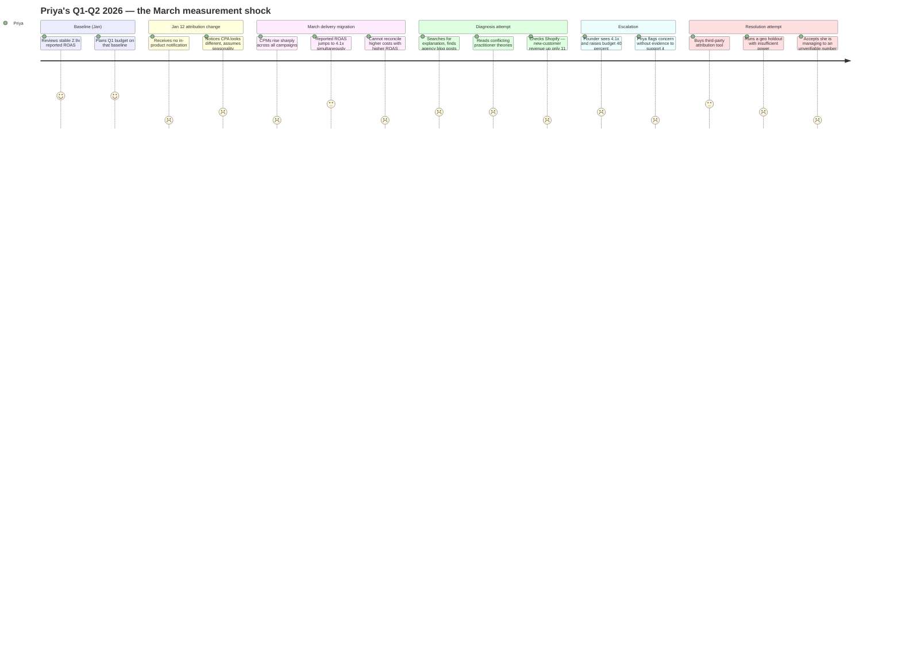
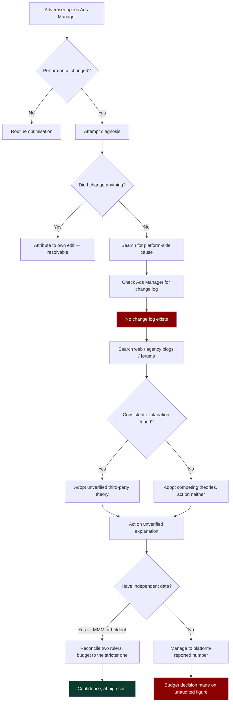
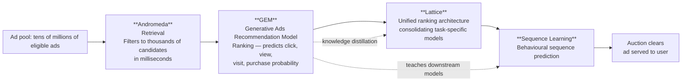
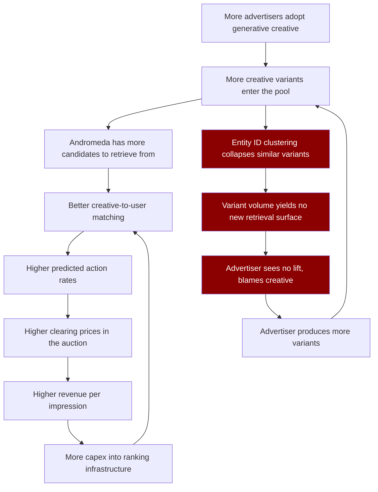
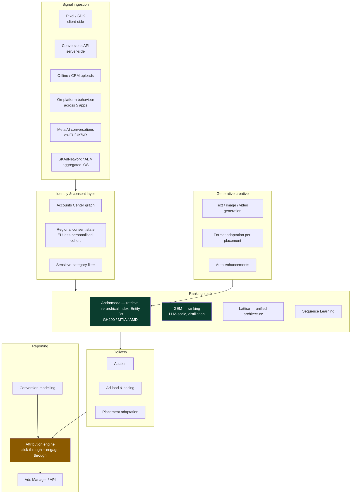
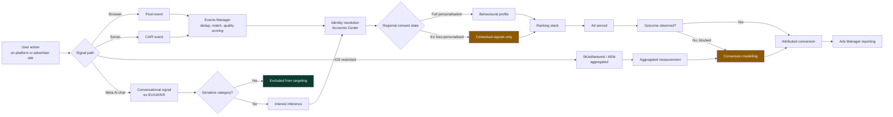
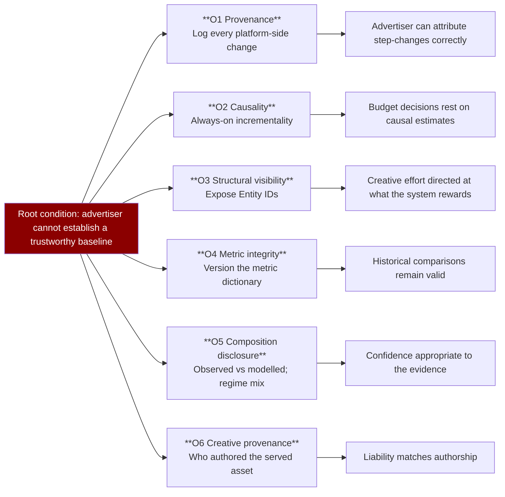
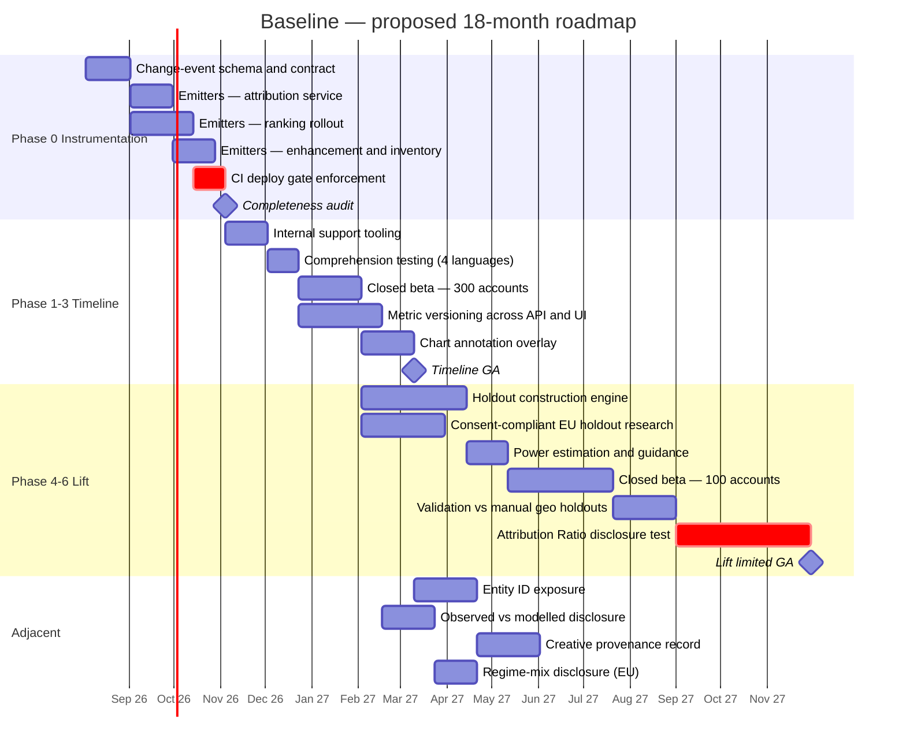

# Meta Ads — Product Management Case Study

**Day 30 of 90 | PM Case Study Challenge**

## 1. Cover

**Product:** Meta Ads (Meta Platforms, Inc. — Facebook, Instagram, Messenger, WhatsApp, Threads)
**Category:** AdTech — Paid Social, Automated Bidding & Generative Creative
**Author:** Gaurav Singh
**Day:** 30 / 90
**Date Published:** July 26, 2026

## 2. Repository Metadata

| Field | Value |
|---|---|
| Repository | product-management-case-studies |
| Folder | `Day-30-Meta-Ads/` |
| Author | Gaurav Singh |
| Series | 90-Day PM Case Study Challenge |
| Previous | Day 29 — Google Ads |
| Companion Files | `assumptions.md` |
| License | MIT (see §63 License) |

## 3. Badges

`Day 30/90` · `Category: AdTech / Paid Social` · `Parent Company: Meta Platforms, Inc.` · `Last Reported Quarter: Q1 2026` · `Status: Published`

## 4. Table of Contents

| Part | Sections |
|---|---|
| **Foundations** | [1. Cover](#1-cover) · [2. Repository Metadata](#2-repository-metadata) · [3. Badges](#3-badges) · [4. Table of Contents](#4-table-of-contents) · [5. Executive Summary](#5-executive-summary) · [6. Product Overview](#6-product-overview) · [7. Company Background](#7-company-background) · [8. Product Timeline](#8-product-timeline) · [9. Vision & Mission](#9-vision--mission) · [10. Problem Statement](#10-problem-statement) |
| **Market & Strategy** | [11. Market Research](#11-market-research) · [12. Industry Analysis](#12-industry-analysis) · [13. TAM / SAM / SOM](#13-tam--sam--som) · [14. Competitor Analysis](#14-competitor-analysis) · [15. SWOT](#15-swot) · [16. Porter's Five Forces](#16-porters-five-forces) · [17. Business Model Canvas](#17-business-model-canvas) · [18. Revenue Model](#18-revenue-model) |
| **Users & Experience** | [19. Target Users](#19-target-users) · [20. Personas](#20-personas) · [21. Jobs To Be Done](#21-jobs-to-be-done) · [22. User Journey](#22-user-journey) · [23. User Flow](#23-user-flow) · [24. Information Architecture](#24-information-architecture) · [25. UX Audit](#25-ux-audit) · [26. UI Audit](#26-ui-audit) · [27. Accessibility](#27-accessibility) |
| **Product & Growth** | [28. Feature Breakdown](#28-feature-breakdown) · [29. AI Capabilities](#29-ai-capabilities) · [30. Product Metrics](#30-product-metrics) · [31. North Star Metric](#31-north-star-metric) · [32. Product Analytics](#32-product-analytics) · [33. AARRR](#33-aarrr-advertiser-funnel) · [34. HEART](#34-heart-consumer-experience) · [35. Growth Strategy](#35-growth-strategy) · [36. Growth Loops](#36-growth-loops) · [37. Network Effects](#37-network-effects) · [38. Product Strategy](#38-product-strategy) · [39. Monetisation](#39-monetisation) · [40. Trust & Safety](#40-trust--safety) |
| **Technical** | [41. Technical Architecture](#41-technical-architecture) · [42. Data Flow](#42-data-flow) · [43. API Ecosystem](#43-api-ecosystem) · [44. Privacy & Security](#44-privacy--security) |
| **Strategy & Planning** | [45. Pain Points](#45-pain-points) · [46. Opportunity Mapping](#46-opportunity-mapping) · [47. RICE](#47-rice-prioritisation) · [48. MoSCoW](#48-moscow) · [49. Kano](#49-kano-analysis) · [50. Feature Proposal](#50-feature-proposal--baseline) · [51. PRD](#51-prd--baseline) · [52. Wireframes](#52-wireframes) · [53. Rollout Plan](#53-rollout-plan) · [54. A/B Testing](#54-ab-testing-plan) · [55. KPI Dashboard](#55-kpi-dashboard) · [56. Product Roadmap](#56-product-roadmap) · [57. Risks & Mitigation](#57-risks--mitigation) · [58. Future Vision](#58-future-vision) |
| **Closing** | [59. PM Lessons](#59-pm-lessons) · [60. PM Interview Questions](#60-pm-interview-questions) · [61. References](#61-references) · [62. About the Author](#62-about-the-author) · [63. License](#63-license) · [64. Self Review](#64-self-review) · [65. Appendix](#65-appendix) |

## 5. Executive Summary

Meta Ads is the largest paid-social advertising system in the world and, on current third-party forecasts, is on track to overtake Google as the single largest digital advertising business by revenue during 2026. In the last reported quarter — Q1 2026, published April 29, 2026 — Meta delivered $56.31 billion in total revenue, up 33% year over year, with ad impressions up 19% and average price per ad up 12%. Full-year 2025 advertising revenue was $196.8 billion, up 22%.

That is the investor-facing story, and it is strong. The advertiser-facing story in the same window is considerably messier, and the tension between the two is what this case study is actually about.

**The central finding: Meta changed the delivery system and the measurement system inside the same eight-week window, which makes its own AI performance claims structurally difficult to falsify from inside Ads Manager.**

Three things happened between January and March 2026:

1. **The ruler changed.** On January 12, 2026, Meta removed the 7-day and 28-day view-through attribution windows. The default reporting column was reworked to combine link-click-only click-through conversions with a 1-day "engage-through" column, and the qualifying engagement threshold for a video view was shortened from 10 seconds to 5 seconds.
2. **The engine changed.** Andromeda — Meta's AI ad-retrieval layer — completed global rollout in early 2026, and in March 2026 delivery shifted further toward outcome-based optimisation that predicts downstream conversions rather than the proxy metric the advertiser selected.
3. **The price changed.** Meta's own reported average price per ad rose 12% globally and 14% in US/Canada in Q1 2026.

Any advertiser observing a change in reported ROAS after March 2026 therefore cannot decompose it into (a) genuine delivery improvement, (b) attribution reclassification, or (c) auction price inflation — because all three moved at once, and Meta is the only party holding the data needed to separate them. Meta both sets the price and grades the homework.

This is not an accusation of bad faith. It is a **product design problem with an unfavourable incentive gradient**: the party best positioned to build the audit tool is the party whose reported numbers would fall if it did. Practitioner estimates put platform-reported ROAS at roughly 20–50% above incrementality-tested contribution (`ASSUMPTION — VALIDATION REQUIRED`, see `assumptions.md`), and Meta has no commercial reason to close that gap voluntarily.

**Secondary findings:**

- **The automation thesis is ahead of the trust infrastructure.** Meta's stated destination is an advertiser supplying only an objective and a payment method. More than 4 million advertisers now touch its generative AI features, Advantage+ Creative is on by default for new campaigns, and Meta Business Agent was announced June 3, 2026. But the more the system decides, the less the advertiser can attribute outcomes to their own decisions — and Meta has shipped autonomy faster than it has shipped explainability.
- **Andromeda's Entity ID clustering contradicts Meta's own creative guidance.** Visually similar ads are collapsed into a single retrieval entity, which means the "upload more variants" advice that generative creative tools encourage can produce no additional retrieval surface at all. Advertisers cannot see their Entity IDs, so they cannot tell whether a new ad earned a new ticket into the auction.
- **Regulatory outcomes diverged sharply from Google's.** On November 18, 2025, Judge James Boasberg ruled that the FTC had not proved Meta currently holds monopoly power in personal social networking; the FTC has appealed to the DC Circuit. Google, by contrast, lost monopoly rulings in both search and ad tech. Meta's binding constraint is privacy and data-use regulation, not structural remedy.
- **The signal base is being cut in Europe while being widened elsewhere.** From January 2026, EU users can choose a less-personalised, contextual-signal experience under a DMA commitment accepted by the European Commission on December 8, 2025, following a €200 million fine in April 2025. Simultaneously, from December 16, 2025, Meta began using Meta AI conversation data for ad personalisation everywhere *except* the EU, UK and South Korea, with no user opt-out. Meta is running two structurally different targeting regimes and reporting one blended set of numbers.
- **India is the volume engine and the WhatsApp proving ground.** Asia-Pacific impressions grew 23% in Q1 2026 against 13% in US/Canada, while US/Canada price per ad rose 14%. WhatsApp Status ads and Promoted Channels rolled out with Indian anchor advertisers, and Google and Meta together took 64% of India's ₹947 billion digital ad market in 2025 per FICCI-EY.

**The proposal (§50):** *Baseline* — a two-surface measurement-integrity feature comprising **Baseline Timeline**, an immutable, account-scoped provenance log of every platform-side change that affected delivery or reporting, rendered as an overlay on the performance chart; and **Baseline Lift**, an always-on account-level holdout that reports incremental conversions alongside attributed conversions and survives attribution and model changes. aRICE score 5.69 — sixth of seven candidates on raw score, and selected anyway; §47 states that override rather than re-engineering the numbers to fit. The honest caveat, stated in §57: this feature reduces Meta's reported ROAS, and that is the reason it does not already exist.

**One-line takeaway:** When a platform rebuilds its delivery engine and rewrites its measurement definitions in the same quarter, it is not shipping a performance improvement — it is shipping an unfalsifiable claim, and the PM lesson is that measurement changes must be versioned as rigorously as the models they measure.

## 6. Product Overview

**What it is:** Meta Ads is the self-serve and API-driven advertising platform through which advertisers buy attention across Meta's Family of Apps — Facebook, Instagram, Messenger, WhatsApp and Threads — plus the Audience Network of third-party apps and sites.

**What the advertiser buys:** Not a placement. An *outcome prediction*. The advertiser declares an objective (sales, leads, app installs, engagement, awareness, traffic), a budget, and a conversion event; Meta's ranking stack predicts which users are most likely to produce that event and bids on their attention in a continuous auction.

**Surfaces:**

| Surface | Primary formats |
|---|---|
| Facebook | Feed, Reels, Stories, Marketplace, Search, in-stream video, right column |
| Instagram | Feed, Reels, Stories, Explore, profile feed, Shoppable Reels with catalog overlays |
| Messenger | Inbox, Stories, sponsored messages |
| WhatsApp | Status ads and Promoted Channels within the Updates tab; Click-to-WhatsApp entry points bought from Facebook/Instagram |
| Threads | Feed ads, in general availability during 2026 |
| Audience Network | Native, banner, interstitial, rewarded video in third-party apps |

**Interfaces:** Ads Manager (web and mobile), Meta Business Suite, the Marketing API, Conversions API (CAPI) for server-side event delivery, the Meta Pixel and SDK for client-side signal, and Advantage+ campaign types that consolidate targeting, placement, budget and creative decisions into automated defaults.

**Buying model:** Auction-based. Advertisers do not buy a CPM; they express a bid strategy and Meta clears an auction on estimated action rate, bid, and ad quality. Reported cost metrics are outputs of the auction, not inputs the advertiser controls — a point that matters a great deal in §45.

**Scale, from the last reported quarter:** Family daily active people averaged 3.56 billion in March 2026, up 4% year over year. Q1 2026 Family of Apps revenue was $55.91 billion, of which roughly $55.0 billion was advertising and $885 million was other revenue (up 74%, driven mainly by WhatsApp paid messaging and subscriptions).

**What Meta Ads is not:** It is not a demand-side platform for the open web at Google's scale — Audience Network exists but is not a comparable programmatic business, and Meta's ad tech position was never the subject of a structural antitrust remedy the way Google's was. It is not a search-intent system; it infers intent from behaviour, creative response, and now conversational signal, rather than harvesting a declared query.

## 7. Company Background

| Field | Detail |
|---|---|
| Legal entity | Meta Platforms, Inc. (NASDAQ: META) |
| Founded | February 2004 (as Facebook) |
| Renamed | October 2021 |
| CEO | Mark Zuckerberg |
| Headquarters | Menlo Park, California, USA |
| FY2025 revenue | $200.97 billion (up 22%) |
| FY2025 advertising revenue | $196.8 billion (up 22%; impressions +12%, average price per ad +9%) |
| Q1 2026 revenue | $56.31 billion (up 33%) |
| Q1 2026 net income | $26.77 billion (up 61%, including an $8.03 billion one-time tax benefit) |
| FY2026 capex guidance | $125–145 billion (raised from $115–135 billion) |
| FY2026 total expense guidance | $162–169 billion |
| Segments | Family of Apps; Reality Labs (Q1 2026: $402 million revenue, $4.03 billion operating loss) |

**Why the capex number matters to a product case study:** Meta is guiding to spend more on infrastructure in a single year than its entire 2019 revenue. That spend is the physical substrate of the ad ranking stack described in §41 — Andromeda runs on NVIDIA Grace Hopper systems, AMD accelerators, and Meta's own MTIA silicon. The commercial consequence is that Meta needs the ads system to absorb that capex, which is exactly the incentive tension the measurement analysis in §5 and §45 turns on.

**Structural position after November 2025:** Meta retained Instagram and WhatsApp. Judge Boasberg found the FTC had failed to establish current monopoly power, reasoning that TikTok and YouTube compete directly and that Meta's own apps had converged on algorithmic short-video. The FTC filed a notice of appeal to the DC Circuit. For a product manager, the practical reading is that Meta's Family-of-Apps cross-surface targeting — the single biggest structural advantage in paid social — is not currently under threat of being unwound, so product strategy can continue to assume a unified signal graph.

## 8. Product Timeline

```mermaid
timeline
    title Meta Ads — Evolution of the Automation and Measurement Stack
    2004-2007 : Facebook launches : First self-serve Flyers and Social Ads
    2012 : Instagram acquired : Mobile News Feed ads launch : IPO
    2014 : WhatsApp acquired : Audience Network launches
    2016-2018 : Instagram Stories ads : Dynamic Ads : Cambridge Analytica fallout
    2021 : Apple App Tracking Transparency : Signal loss begins in earnest : Company renamed Meta
    2022-2023 : Advantage+ Shopping Campaigns : Conversions API pushed as signal repair : Reels monetisation
    2023-11 : EU pay-or-consent model launches : DMA investigation follows
    2024 : Andromeda retrieval engine introduced : Advantage+ defaults broaden
    2025-04 : EU fines Meta EUR 200 million under the DMA
    2025-06-16 : WhatsApp advertising announced for the Updates tab
    2025-11-10 : GEM ranking model paper published
    2025-11-18 : Boasberg ruling — FTC fails to prove current monopoly power
    2025-12-08 : European Commission accepts Meta's less-personalised ads commitment
    2025-12-16 : Meta AI conversation data begins feeding ad personalisation outside EU, UK, South Korea
    2026-01-12 : 7-day and 28-day view-through attribution windows removed
    2026-01 : Less-personalised ads option live for EU users
    2026-03 : Andromeda global : delivery shifts to outcome-based optimisation : practitioners report CPM increases
    2026-04-29 : Q1 2026 reported — revenue USD 56.31B, up 33%
    2026-06-03 : Meta Business Agent announced in London
    2026-07-29 : Q2 2026 results due — three days after this case study publishes
```



**Reading the timeline as a PM:** the interesting cluster is 2025-11 through 2026-03. In five months Meta published its largest-ever recommendation model, won an existential antitrust case, conceded a European data-use commitment, opened a new global targeting signal, deleted two attribution windows, and completed a delivery-engine migration. Five of those six touch measurement, signal or delivery; only the antitrust win does not. The system an advertiser was optimising against in October 2025 does not exist in April 2026, and no versioned record of the transition was given to the advertiser.

## 9. Vision & Mission

**Meta's stated company mission:** to give people the power to build community and bring the world closer together.

**The advertising product's operating vision, as articulated by leadership:** an advertiser states a business objective, connects a payment method, and receives results — with creative, targeting, and measurement handled by Meta's systems. Zuckerberg has described this as a *redefinition of the category of advertising*. Press reporting in mid-2025 indicated an internal ambition to reach fully automated ad creation by the end of 2026.

**My reading of the actual strategy, stated plainly:** Meta is converting advertising from a *skill market* into a *utility market*. In a skill market, returns accrue to the operator who understands the platform best; margin sits with agencies, media buyers, and tooling vendors. In a utility market, the advertiser supplies capital and intent, the platform supplies everything else, and the platform captures the margin previously earned by human expertise. The AI stack is the mechanism. Advantage+ defaults are the distribution. The measurement opacity described in §5 is not the goal, but it is the condition that makes the transition frictionless — because an advertiser who cannot independently verify performance has no evidential basis on which to resist automation.

**The gap between the two:** a utility market requires trust in the meter. Electricity utilities are regulated precisely because the supplier reads its own meter. Meta is asking advertisers to accept a utility relationship without a regulated meter, and §50 proposes the meter.

## 10. Problem Statement

**Framed from the advertiser's side:**

> As an advertiser on Meta, I am accountable for a spend decision whose return I cannot independently verify, on a platform that simultaneously sets the price I pay, selects the audience I reach, generates the creative I run, defines the conversion I am credited for, and changes all five without telling me when.

**Framed as a product problem for Meta:**

> Meta's ads AI investment thesis depends on advertisers believing that automation improves outcomes. But every increment of automation removes an advertiser-controlled variable, and Meta's reporting surface offers no way to distinguish platform-driven improvement from platform-driven measurement change. Belief is therefore being sustained by narrative and by absence of contradiction rather than by evidence — which is durable while budgets grow and fragile the moment a large advertiser runs a rigorous holdout and publishes the result.

**Three specific, evidenced sub-problems:**

1. **No provenance.** Advertisers cannot see when Meta changed something on their account. Attribution definitions changed on January 12, 2026 and delivery behaviour changed in March 2026; neither appears as an annotation on any performance chart in Ads Manager.
2. **No causal baseline.** Reported conversions are attributed, not incremental. Incrementality tools exist (lift studies, incremental attribution) but are opt-in, episodic, and — in the case of incremental attribution — reduce reported conversion volume, which creates an adoption disincentive for the very advertisers who most need it.
3. **No structural visibility.** Andromeda clusters visually similar creative under a shared Entity ID, and the advertiser cannot see Entity IDs. So the single most consequential structural fact about a creative portfolio — whether ten ads are ten retrieval candidates or one — is invisible to the person building the portfolio.

**Who is hurt most:** small and mid-market advertisers and India-style high-volume, low-AOV accounts, which lack the spend to fund independent MMM or the volume to run statistically powered holdouts. Large brands triangulate with media mix modelling and third-party measurement partners. The measurement gap is therefore regressive — it costs least to those best able to bear it.

## 11. Market Research

**Global digital advertising, 2026 positioning.** Third-party forecasting (eMarketer, April 2026) projects Meta at $243.46 billion in 2026 advertising revenue against Google's $239.54 billion — the first year Meta would lead, on growth of roughly 24.1% versus Google's 11.9%. Meta, Google and Amazon together are projected at 62.3% of global digital ad spend in 2026, up from 59.9% in 2025. These are forecasts, not results; §14 and `assumptions.md` treat them accordingly. **Scope caveat, and it matters to the crossover claim:** $239.54 billion growing at 11.9% implies a 2025 Google base near $214 billion, which is not the $294.7 billion of reported 2025 Google advertising revenue cited in §14. The two series are measured on different bases, so the overtake holds only inside eMarketer's own definitions and should not be read against reported advertising revenue. The conflict is logged in §65.

**What is driving Meta's relative growth, in order of my confidence:**

1. **Impression supply expansion, not just price.** Q1 2026 impressions grew 19% against price growth of 12%. New inventory — Threads Feed, WhatsApp Updates tab, ad-load optimisation in Reels — adds supply that did not exist two years ago. This is the most verifiable driver because Meta reports both components separately.
2. **Yield improvement from the ranking rebuild.** Meta attributes ad performance improvements to Andromeda and GEM. Company-published gains for GEM were on the order of a 5% conversion lift on Instagram and 3% on Facebook Feed. These are Meta-measured and Meta-defined; see the source-conflict table in §65.
3. **Macro and currency.** Meta's Q1 2026 commentary cited better macro conditions than the prior-year quarter and currency tailwinds in international regions; constant-currency growth was 29% against 33% reported.
4. **New signal.** Meta AI conversational data entered the personalisation system on December 16, 2025 for most markets. Meta AI reached roughly 1.2 billion monthly users by Q1 2026 with a majority of interaction on WhatsApp (`ASSUMPTION — VALIDATION REQUIRED`). No public disclosure isolates the ad-performance contribution of this signal, and it is deliberately excluded from EU, UK and South Korean markets — which means Meta is running a natural experiment whose results it has not published.

**India specifically.** Dentsu India's tenth Digital Advertising Report (February 2026) put India's 2025 advertising industry at ₹1.21 trillion, with digital growing 19% to ₹71,621 crore and projected to reach ₹98,034 crore by 2027. The FICCI-EY report attributes 64% of India's ₹947 billion 2025 digital ad market to Google and Meta combined. Asia-Pacific impression growth of 23% in Q1 2026 exceeded US/Canada's 13%, while US/Canada price per ad grew faster (14% versus 12% globally) — the classic pattern of a mature, price-constrained market subsidised by a growing, low-yield one.

**The research question nobody has answered publicly:** does automated delivery produce better *incremental* outcomes, or better *attributed* outcomes? Every publicly available number bearing on this comes from either (a) the platform, which defines the metric, or (b) agencies and vendors selling independent attribution, who have a commercial interest in the gap being large. There is no disinterested large-sample dataset. This is stated as a limitation, not resolved, and it is the single largest evidentiary weakness in this case study.

## 12. Industry Analysis

**Structural forces reshaping paid social in 2026:**

| Force | Direction | Consequence for Meta Ads |
|---|---|---|
| Signal loss (ATT, cookie deprecation, consent regimes) | Ongoing since 2021 | Pushes value toward first-party signal (CAPI), modelled conversions, and platforms with logged-in scale. Structurally *favours* Meta over the open web. |
| Automation of buying | Accelerating | Compresses agency and freelancer margin; shifts advertiser skill requirement from targeting to creative and measurement. |
| Generative creative | Rapid | Collapses production cost, floods the auction with variants, and creates the retrieval-clustering problem Andromeda was built to solve. |
| Privacy regulation | Tightening, region-divergent | Fragments the targeting base. EU less-personalised cohort versus Meta AI conversational signal elsewhere. |
| Antitrust | Diverging by company | Google faces structural remedies in ad tech; Meta does not, post-Boasberg. Meta's regulatory cost centre is privacy, not divestiture. |
| Retail media and commerce networks | Growing fast | Amazon, Flipkart, Myntra and others compete for lower-funnel budget with declared purchase intent Meta must infer. |
| Agentic commerce and AI assistants | Emerging | Threatens the discovery surface long-term; Meta's counter is Business Agent and in-app conversion rather than link-out. |

**The competitive asymmetry worth naming.** Google's advantage is declared intent; Meta's is behavioural breadth and creative-driven inference. Signal loss hurt Meta more in 2021–2022 precisely because inference needs more data than intent does. The AI ranking rebuild is, read charitably, Meta buying its way back to pre-ATT targeting quality using compute instead of identifiers. On that reading, the $125–145 billion capex guidance is not primarily an AI-products bet — it is the cost of restoring an advertising business that Apple degraded, plus optionality.

**Where the industry consensus is probably wrong.** The prevailing practitioner narrative is "creative is the new targeting." That is directionally right and operationally incomplete: Andromeda's Entity ID clustering means creative only functions as targeting if the variants are *structurally* distinct, not merely different. An account running fifty AI-generated permutations of one product photograph has, in retrieval terms, roughly one ad. The industry advice and the system's actual behaviour are misaligned, and the misalignment is invisible because Entity IDs are not exposed.

## 13. TAM / SAM / SOM

Estimates below are drawn from published third-party market research and disclosed company figures. Market-sizing sources disagree materially; all derived figures are labelled and logged in `assumptions.md`.

**TAM — global digital advertising.** Reported and forecast totals vary by methodology and by whether retail media and CTV are included. Using the platform-share framing: Meta, Google and Amazon are projected at 62.3% of global digital ad spend in 2026. Working backwards from the eMarketer projection of $243.46 billion for Meta implies a global digital ad market of roughly $0.89–0.92 trillion for 2026 — that is, (Meta $243.46B + Google $239.54B + Amazon at an assumed $70–90B) ÷ 0.623 (`ASSUMPTION — VALIDATION REQUIRED` — derived, not published; the arithmetic depends on the three-company share figure and on Google and Amazon projections that are themselves forecasts).

**SAM — paid social plus messaging inventory reachable by Meta's stack.** Meta's own addressable surface is bounded by its logged-in base of 3.56 billion daily active people and the inventory it can create without degrading engagement. The binding constraint is not demand; it is ad load. Meta explicitly cited ad-load optimisation as an impression-growth driver in Q1 2026, and Threads and WhatsApp are being deliberately supply-throttled while formats are optimised. SAM is therefore better modelled as *engagement-hours × sustainable ad load × clearing price* than as a share of a market total.

**SOM — realistic near-term capture.** Meta's Q2 2026 guidance was $58–61 billion; consensus across 45 analysts sat at approximately $60.26 billion with a range of $59.03–62.81 billion ahead of the July 29 print. Annualising the guidance midpoint against the eMarketer full-year projection implies second-half acceleration that depends on WhatsApp and Threads supply ramping and on holiday-quarter pricing.

**India SOM illustration.** Against India's 2025 digital ad market of ₹947 billion and the FICCI-EY 64% Google-plus-Meta share, secondary sources place Meta at roughly 20% of India's digital ad market (`ASSUMPTION — VALIDATION REQUIRED` — Meta does not disclose India revenue separately, and the 20% figure comes from an agency publication rather than a primary filing). The honest position is that Meta's India revenue is not publicly known; only regional Asia-Pacific impression and pricing trends are disclosed.

**Why I am declining to publish a single tidy TAM number.** Three market-research houses in the sources for this case study give India digital ad spend figures that are not reconcilable with each other — $14.56 billion for 2026, $20.46 billion by 2029, and $32.33 billion by 2030 on a 15.3% CAGR from 2025. A 15.3% CAGR from a $14.56 billion 2026 base does not reach $32.33 billion by 2030. At least one of those figures uses a different scope definition. Presenting a blended average would manufacture false precision; the conflict is documented in §65 instead.

## 14. Competitor Analysis

| Competitor | Core advantage | Where it beats Meta Ads | Where Meta Ads wins |
|---|---|---|---|
| **Google Ads** | Declared search intent; YouTube reach; full-stack ad tech | Lower-funnel capture of expressed demand; measurement credibility of last-click search; enterprise ad-tech breadth | Creative-led demand generation; social proof; cross-app messaging conversion; no structural antitrust remedy pending |
| **Amazon Ads / retail media** | Purchase data and closed-loop attribution | Verifiable conversion inside its own transaction log; bottom-funnel efficiency | Upper- and mid-funnel reach; audience scale outside shopping sessions |
| **TikTok** | Creative-native short video; discovery culture | Creative virality economics; younger cohort attention; organic-to-paid continuity | Advertiser tooling maturity; conversion infrastructure; regulatory stability in more markets |
| **Amazon-adjacent India retail media (Flipkart, Myntra)** | First-party Indian purchase data | Closed-loop attribution for Indian e-commerce; rupee-efficient lower funnel | Reach beyond transacting shoppers; WhatsApp conversation surface |
| **Snap / Pinterest / Reddit** | Niche intent or context | Specific audience contexts; lower CPMs in some verticals | Scale, automation maturity, and cross-surface signal |
| **Retail media networks generally** | Declared purchase intent | Attribution defensibility | Breadth and frequency; brand-building capability |

**Direct Meta versus Google comparison on the last full reported year:** Meta's 2025 advertising revenue was $196.8 billion, up 22%, on impressions up 12% and average price up 9%. Google's 2025 advertising revenue was $294.7 billion, up 11.4%. Meta is growing roughly twice as fast off a base roughly two-thirds the size — hence the 2026 crossover forecasts.

**The competitive point that matters most, and is least discussed:** Meta's real competitor for the *automation* thesis is not Google. It is the advertiser's own finance function. Every advertiser that installs rigorous incrementality measurement becomes a worse Meta customer at the margin, because the measured number is lower than the reported number. Meta's automation strategy competes with the spread of measurement rigour, and its structural advantage in that competition is that measurement rigour is expensive and Meta's dashboard is free.

**Day 29 cross-reference.** The Google Ads case study identified a conflict between Google's AI Max performance claims and independent practitioner testing. The Meta version of that conflict is different in kind: Google's claims were contradicted by outside data, whereas Meta's claims are *unfalsifiable* from outside because the measurement definitions changed inside the same window. Contradicted is a better epistemic position than unfalsifiable — a contradicted claim can be adjudicated.

## 15. SWOT

**Strengths**
- Cross-surface signal graph spanning 3.56 billion daily active people, retained intact after the November 2025 antitrust ruling
- Ranking stack rebuilt on owned silicon (MTIA) alongside NVIDIA and AMD, giving cost-per-inference leverage
- Impression growth (19%) exceeding price growth (12%) — growth is not purely price-led
- New inventory pipeline with deliberate supply throttling: Threads Feed, WhatsApp Updates tab
- Non-advertising Family-of-Apps revenue up 74% to $885 million, seeding diversification
- Generative creative adoption at scale — over 4 million advertisers touching AI features

**Weaknesses**
- Measurement credibility: platform-reported ROAS estimated 20–50% above incrementality-tested contribution (`ASSUMPTION — VALIDATION REQUIRED`)
- No provenance surface for platform-side changes to delivery or attribution
- Entity ID opacity invalidating the platform's own creative-diversity guidance
- First sequential decline in Family daily active people in company history in Q1 2026 (attributed to Iran internet disruptions and a WhatsApp restriction in Russia)
- Capex of $125–145 billion against FY expenses of $162–169 billion compressing free cash flow
- Reality Labs losing $4.03 billion per quarter on $402 million of revenue

**Opportunities**
- WhatsApp monetisation barely begun: the Updates tab reaches 1.5 billion people daily and ad load there is minimal
- Business Agent as a conversion surface — moving the transaction into the chat rather than linking out
- Meta AI conversational signal as an intent proxy competitive with search, in the majority of markets where it is permitted
- India and Asia-Pacific yield expansion: 23% impression growth with pricing headroom
- Measurement leadership as a differentiator if Meta chose to ship verification before regulators require it

**Threats**
- FTC appeal to the DC Circuit reopening structural risk
- EU DMA and GDPR trajectory: BEUC criticised the January 2026 consent flow in March 2026 as still not surfacing the less-personalised option at parity
- Privacy-group complaints to the FTC over Meta AI data use in advertising, filed by 36 organisations
- A single large advertiser publishing a rigorous, negative holdout result — the narrative risk with the highest asymmetry
- Agentic assistants intermediating discovery, reducing feed-based demand generation
- Youth-safety and other litigation which Meta itself flags as potentially material

## 16. Porter's Five Forces

**Competitive rivalry — High.** Google, Amazon, TikTok and retail media all contest the same budget, and Boasberg's ruling was reasoned explicitly on the strength of TikTok and YouTube as competitors. Meta's own submission in that case was that competition is fierce; having won on that basis, it cannot easily argue otherwise elsewhere.

**Supplier power — Low to moderate, but rising.** The suppliers are users (attention), creators (content), and compute vendors. Users are unpaid and have low individual power but rising regulatory proxy power. Compute supplier power is the genuine change: at $125–145 billion of annual capex, NVIDIA's pricing is a material line item, and MTIA plus AMD qualification is a deliberate supplier-power reduction strategy.

**Buyer power — Low individually, moderate in aggregate, and asymmetric.** A single SMB advertiser has essentially no negotiating power over price, targeting, or measurement definitions. Large advertisers exert power through third-party measurement and budget reallocation. The aggregate check on Meta is not negotiation but *verification* — which is precisely why the measurement gap functions as a moat.

**Threat of substitutes — Moderate and rising.** Retail media substitutes for lower-funnel spend with better attribution. Creator marketing and affiliate substitute at the margin. Agentic commerce is a longer-dated substitution threat to feed-based discovery.

**Threat of new entrants — Low for scaled paid social, high for measurement.** No one is building a new 3.5-billion-user social graph. But the *measurement* layer has low entry barriers and high demand, which is why an ecosystem of attribution vendors, MMM providers and incrementality tools has grown around Meta's reporting gap. Meta has effectively outsourced the audit function to a commercial industry that profits from its absence.

## 17. Business Model Canvas

| Block | Content |
|---|---|
| **Customer segments** | SMB self-serve advertisers; mid-market performance advertisers; enterprise brands and their agencies; app developers; D2C e-commerce; lead-generation businesses; Indian regional and vernacular advertisers |
| **Value propositions** | Reach at unmatched scale; outcome-optimised delivery without operational expertise; generative creative at near-zero production cost; in-app conversion via messaging; measurement dashboards that make spend defensible internally |
| **Channels** | Ads Manager self-serve; Marketing API and partner tooling; Meta Business Suite; direct enterprise sales; agency and Business Partner ecosystem; in-app boost flows on Facebook and Instagram |
| **Customer relationships** | Automated and self-serve for the long tail; account management for large spenders; increasingly agentic — Meta AI business assistant in testing with advertisers; Business Agent for customer-facing operations |
| **Revenue streams** | Auction-cleared advertising (the overwhelming majority); WhatsApp paid messaging; subscriptions including the EU ad-free tier; Channel subscriptions; Reality Labs hardware (separate segment) |
| **Key resources** | The signal graph across five apps; 3.56 billion DAP; the Andromeda–GEM–Lattice ranking stack; MTIA silicon and data centres; the creative corpus of historically successful ads used to train generative tools |
| **Key activities** | Ranking and retrieval R&D; ad-load and inventory management; auction operation; trust and safety review at scale; regulatory compliance engineering per jurisdiction; advertiser tooling |
| **Key partners** | Compute vendors (NVIDIA, AMD); measurement and attribution partners; Business Partners and agencies; commerce platforms (Shopify and similar) for catalog and CAPI integration; telcos and OEMs in emerging markets |
| **Cost structure** | Infrastructure and compute ($19.84 billion capex in Q1 2026 alone); R&D headcount; content moderation and safety; legal and regulatory; Reality Labs losses |

## 18. Revenue Model

**Mechanically:** revenue = impressions × average price per ad. Meta reports both. Q1 2026: impressions +19%, price +12%, revenue +33%. The arithmetic of 1.19 × 1.12 = 1.333 shows the two components account for essentially all reported growth, which is a useful discipline — there is no third mystery factor.

**Where price growth comes from, in Meta's own framing:** ad performance improvements, better macro conditions than the prior-year quarter, and currency tailwinds, partially offset by strong impression growth from lower-monetising regions. That last clause is important and under-read: growing supply in India and Asia-Pacific *drags the global average price down*, so the reported 12% understates price growth in mature markets — hence US/Canada at 14%.

**Where impression growth comes from:** engagement and user growth, plus ad-load optimisation. Ad load is a product decision with a user-experience cost, and it is the lever most available to Meta in the short run and most damaging in the long run.

**The advertiser's view of the same equation:** price per ad is Meta's revenue per unit and the advertiser's cost per unit. A 12–14% increase in average price per ad is, from the buy side, CPM inflation. Practitioner datasets put 2026 Meta CPM increases at roughly 20% year over year with figures around $11.82 rising to $14.19 across industries (`ASSUMPTION — VALIDATION REQUIRED` — single-vendor dataset, industry mix undisclosed, and materially higher than Meta's own reported 12% global price growth; the discrepancy is logged in §65).

**Emerging streams:**
- WhatsApp paid messaging and subscriptions, inside the $885 million Family-of-Apps other revenue line, up 74%
- WhatsApp Channel subscriptions — creator monetisation with a Meta take
- EU ad-free subscription — a compliance artefact that became a revenue line
- Promoted Channels — a new ad unit in a surface with 1.5 billion daily users

**The strategic question on WhatsApp monetisation:** Meta has confined ads to the Updates tab and stated repeatedly that personal chats, calls and statuses remain end-to-end encrypted and unused for targeting. This is a credible commitment with a real cost — it means WhatsApp's monetisable surface is a fraction of its engagement. The PM question is whether the Updates tab can carry enough ad load to justify the restraint, or whether commercial pressure eventually erodes the boundary. I would argue the boundary is Meta's single most valuable trust asset in India, where WhatsApp is functionally civic infrastructure, and that eroding it would be strategically irrational even where it is legally permissible.

## 19. Target Users

Meta Ads has two distinct user populations whose interests diverge, and treating them as one is the most common analytical error in case studies of ad platforms.

**Population A — the advertiser (the paying user).**

| Segment | Approximate profile | Primary need | Automation attitude |
|---|---|---|---|
| Long-tail SMB | Under $5k/month, no dedicated marketer, often boosting from the app | Simplicity; any positive signal | Fully receptive — automation is the only viable path |
| Mid-market performance | $25k–500k/month, in-house buyer or small agency | Efficiency at scale; defensible reporting | Ambivalent — dependent on it, unable to verify it |
| Enterprise brand | $1m+/month, agency-supported, MMM in place | Incrementality, brand safety, cross-channel comparability | Sceptical — triangulates independently |
| App and gaming | Volume-driven, SKAdNetwork-constrained | Signal recovery post-ATT | Receptive but measurement-starved |
| India vernacular and regional | Low AOV, high volume, WhatsApp-centric funnels | Cost per conversation, rupee efficiency | Receptive; least able to fund verification |

**Population B — the consumer (the monetised user).** Needs: feed quality, relevance without discomfort, control over data use, absence of scams and fraudulent ads. Their leverage is regulatory and behavioural, not commercial.

**The structural tension:** improving outcomes for Population A generally means extracting more signal from and showing more ads to Population B. Ad-load optimisation was cited as an impression growth driver in Q1 2026 — that is, in plain terms, more ads per person. Every ad platform PM is managing this trade; Meta's specific version is sharpened by the fact that its most-trusted surface (WhatsApp) is the one with the most unmonetised engagement.

## 20. Personas

**Persona 1 — Priya Menon, Performance Marketing Lead, D2C skincare brand, Bengaluru**
- 29, manages ₹18 lakh/month across Meta and Google, reports to a founder who asks for ROAS weekly
- Runs Advantage+ Shopping plus a small manual prospecting structure she is not supposed to still have
- **March 2026:** reported ROAS moved from 2.9x to 4.1x while Shopify-attributed new-customer revenue rose about 11%. She did not change anything. Her founder increased the budget on the 4.1x figure.
- **Pain:** she suspects the number is a reclassification, cannot prove it, and cannot un-ring the bell with her founder
- **JTBD:** "When my reported numbers move without my having changed anything, help me tell my founder whether the business actually improved."
- **Quote (composite, illustrative — not a real interview):** "I'm being asked to defend a number I didn't compute and can't audit."

**Persona 2 — Daniel Okafor, Founder, three-person B2B SaaS, Manchester**
- 41, spends £4,000/month, no marketer, uses the default Advantage+ setup because he was never offered anything else
- Advantage+ Creative was on by default; Meta auto-generated variants he did not review before they served
- **Pain:** brand-consistency anxiety and a lead-quality problem he cannot diagnose because he does not know which creative or audience produced which lead
- **JTBD:** "When Meta makes a decision on my behalf, help me see what it decided and undo it if it's wrong."

**Persona 3 — Amara Singh, Group Media Director at a holding-company agency, Mumbai**
- 38, oversees ₹40 crore of annual Meta spend across eight clients; has MMM and runs quarterly geo holdouts
- Believes Meta's reported numbers are directionally useful and absolutely inflated; budgets against MMM
- **Pain:** her clients read Ads Manager and ask why her recommendation contradicts it. She spends more time reconciling two rulers than optimising.
- **JTBD:** "When Meta's dashboard and my incrementality data disagree, help me show the client where the gap comes from."

**Persona 4 — Rakesh Yadav, owner of a 12-outlet regional sweets chain, Kanpur**
- 52, runs Click-to-WhatsApp campaigns at ₹40,000/month, measures success by whether the phone rings
- Genuinely well served by automation: he has no capacity to optimise and the system does it adequately
- **Pain:** rising cost per conversation with no explanation; ads occasionally appearing beside content he finds inappropriate for his brand
- **JTBD:** "When my cost per enquiry goes up, tell me whether it's me, the market, or Meta."

**Persona 5 — Lena Brandt, consumer in Hamburg (Population B)**
- 34, chose the less-personalised ads option when the EU flow appeared in January 2026, then found the experience included ad breaks she had not expected
- **JTBD:** "When I choose less tracking, don't make me pay for it with a worse product."
- Included deliberately: her choice is a *targeting-base reduction* on the advertiser side, and neither Priya nor Amara can see it in their reporting.

## 21. Jobs To Be Done

**Functional jobs**
- Acquire customers at or below an acceptable cost
- Produce enough creative to feed a system that consumes creative
- Report performance to someone who controls the budget
- Detect and diagnose performance changes quickly
- Comply with the platform's shifting requirements without losing delivery

**Emotional jobs**
- Feel in control of a system that removes controls
- Avoid being blamed for outcomes produced by decisions one did not make
- Trust that spend is not being wasted — the dominant anxiety in every practitioner account read for this study

**Social jobs**
- Look competent in front of a founder, client, or board
- Be seen as sophisticated by peers (which currently means professing scepticism about platform-reported numbers)

**The unmet job, stated precisely:** *"When something changes in my account performance, tell me whether I changed it, the market changed it, or you changed it."* Nothing in Ads Manager answers this. It is the highest-frequency, highest-stakes, lowest-served job in the entire product, and §50 addresses exactly it.

## 22. User Journey



**The emotional arc is the finding.** Priya's lowest points are not when performance is bad — they are when performance *appears good* and she cannot trust it. A product that produces distrust at moments of apparent success has a measurement problem, not a performance problem.

## 23. User Flow



Two terminal failure states, both reached through the same missing node (**I — no change log exists**). §50 inserts that node.

## 24. Information Architecture

**Current hierarchy:**

```
Meta Business Suite
├── Ads Manager
│   ├── Campaigns → Ad sets → Ads (three-level object model)
│   ├── Advantage+ campaign types (collapse the middle level)
│   ├── Audiences (custom, lookalike, saved — increasingly advisory only)
│   ├── Creative Hub / Advantage+ Creative
│   ├── Events Manager (Pixel, CAPI, offline events, data sources)
│   ├── Reporting (columns, breakdowns, attribution settings, custom reports)
│   ├── Experiments (A/B tests, brand surveys, conversion lift)
│   └── Billing
├── Commerce Manager (catalogs, shops)
├── Business Settings (assets, permissions, partners)
└── Ad Library (public transparency, now with a WhatsApp filter)
```

**Three IA observations:**

1. **The object model no longer matches the system.** Campaign → ad set → ad presumes the advertiser controls targeting at the ad-set level. Under Andromeda, targeting settings function as soft suggestions and creative is the real targeting input. The IA describes a 2016 system.
2. **Measurement is buried and fragmented.** Attribution settings sit inside a reporting sub-menu; incrementality lives in Experiments; conversion sources live in Events Manager. Three separate places to answer one question — "is this real?"
3. **There is no account-history object at all.** Every mature system of record — version control, EHRs, financial ledgers, cloud consoles — has an immutable event log as a first-class object. Ads Manager, which mediates hundreds of billions of dollars, does not. AWS gives you CloudTrail for a $5 instance. Meta gives you nothing for a $5 million account.

## 25. UX Audit

**What works well**
- Guided campaign creation genuinely lowers the barrier for the long tail; Rakesh's persona is well served
- Advantage+ removes decisions most advertisers were making badly anyway
- Events Manager diagnostics for CAPI and Pixel setup are clear and actionable
- Ad Library is a real transparency achievement, extended to WhatsApp creatives in 2026
- Mobile Ads Manager is usable for monitoring, which matters for the India SMB segment

**What does not**

| Issue | Severity | Evidence |
|---|---|---|
| No platform-change log | Critical | Attribution definitions changed January 12, 2026 and delivery behaviour changed March 2026 with no in-product annotation |
| Silent auto-enablement | High | Advantage+ Creative on by default for new campaigns; practitioners report auto-injected related media and enhancements appearing without notice |
| Attribution setting semantics changed under a stable label | High | The default reporting column now blends link-click-through and 1-day engage-through; the column name did not change to reflect that the definition did |
| Entity ID invisible | High | Retrieval clustering determines whether a new ad competes at all; not surfaced anywhere |
| Incrementality tools carry an adoption penalty | High | Incremental attribution reduces reported conversion volume, so the advertiser who adopts it looks worse to their own stakeholders |
| Learning-phase opacity | Medium | The 50-conversions-per-week threshold is documented but the account's live position against it is weakly surfaced |
| Objective-to-outcome mismatch after March 2026 | Medium | Campaigns optimised for clicks or landing-page views were deprioritised by outcome-based delivery; the objective picker still presents them as co-equal choices |

**The single highest-severity finding.** When Meta changes a metric definition without changing the metric's name or annotating the chart, every historical comparison in every advertiser's reporting silently becomes invalid. This is a data-integrity failure of the same class as an unversioned schema migration in production. In engineering it would be a post-mortem; in Ads Manager it was a help-centre update.

## 26. UI Audit

- **Density versus comprehension.** Ads Manager's table view exposes hundreds of possible columns. Power users need this. The default column set for a new advertiser now includes a blended attribution metric whose composition is not visible in the UI — high density is being used to hide a definitional change in plain sight.
- **Advantage+ toggles.** Enhancement toggles are grouped and default-on. The interaction cost of auditing them exceeds the interaction cost of leaving them, which is a deliberate and effective dark-pattern-adjacent design. It is not deceptive, but it is not neutral either.
- **No temporal annotation layer.** Performance charts support date comparison but not event annotation. Grafana, Datadog, Google Analytics and most BI tools have supported annotated event overlays for a decade.
- **Attribution setting affordance.** The comparison between attribution windows requires navigating a modal, applying, and re-reading the table. It should be a toggle that re-renders the chart in place, because comparing rulers is a primary task, not a settings task.
- **EU flow (Population B).** BEUC's March 2026 analysis argued the less-personalised option is not presented at parity with the no-ads option in the first step of the flow, and that choosing it yields a degraded experience through imposed ad breaks. Whatever the legal position, presenting three options at unequal visual weight when the regulation's purpose was genuine choice is a UI decision with a compliance consequence.

## 27. Accessibility

- **Advertiser-side.** Ads Manager's dense data tables are demanding for screen-reader users; complex nested filters and modal-heavy flows raise cognitive load. Charts rely on colour to distinguish series. India's advertiser base is substantially non-English-first, and while the interface localises, the help documentation and the practitioner knowledge base that advertisers actually rely on largely do not.
- **Consumer-side.** Meta's ad formats support alt text, captions, and auto-generated captions on video. Generative creative raises a new accessibility question that is not publicly addressed: when Meta auto-generates image variants and auto-injects related media, who is responsible for alt text on the variant the advertiser never saw? The advertiser cannot write alt text for creative they did not author, and there is no disclosed mechanism guaranteeing generated variants carry accessible descriptions (`ASSUMPTION — VALIDATION REQUIRED` — absence of public documentation is not proof of absence of implementation).
- **Vernacular and low-literacy contexts.** Click-to-WhatsApp funnels are, in accessibility terms, a strength: voice notes in a chat thread are more accessible to low-literacy users than a web form. This is under-recognised as an accessibility win and is a genuine reason WhatsApp-native funnels outperform in Indian tier-2 and tier-3 markets.
- **Recommendation:** generated creative variants should inherit an accessibility contract — auto-generated alt text, mandatory caption generation, and contrast validation — enforced at generation time rather than left to an advertiser who never sees the asset.

## 28. Feature Breakdown

| Feature area | Capability | Maturity | Advertiser control |
|---|---|---|---|
| **Campaign objectives** | Sales, leads, engagement, app promotion, traffic, awareness | Mature | High, but decreasingly meaningful post-March 2026 |
| **Advantage+ Shopping** | Consolidated e-commerce campaign type; automated audience, placement, budget | Mature, default-leaning | Low by design |
| **Advantage+ Creative** | Auto-enhancements, variant generation, format adaptation; on by default for new campaigns | Rapidly evolving | Low; opt-out is per-toggle |
| **Advantage+ Audience** | Suggested audience as a starting signal rather than a constraint | Mature | Advisory only |
| **Targeting** | Demographics, interests, behaviours, custom audiences, lookalikes | Mature but demoted | Nominal — Andromeda treats settings as soft signals |
| **Placement** | Automatic or manual across surfaces including WhatsApp Status | Mature | Medium |
| **Bidding** | Highest volume, cost per result goal, ROAS goal, bid cap | Mature | Medium |
| **Creative formats** | Single image, video, carousel, collection, Reels, Shoppable Reels with catalog overlays | Mature | High |
| **Messaging objectives** | Click-to-WhatsApp, Click-to-Messenger, sponsored messages | Growing fast, India-led | High |
| **WhatsApp inventory** | Status ads, Promoted Channels, Channel subscriptions | New; supply throttled | Medium |
| **Threads** | Feed ads in general availability | New; supply throttled | Medium |
| **Measurement** | Attribution settings, breakdowns, conversion lift studies, incremental attribution | Mature surface, contested substance | Medium |
| **Signal infrastructure** | Pixel, CAPI, offline conversions, Conversions API Gateway, SKAdNetwork/AEM | Mature | High effort, high value |
| **Business AI** | Meta Business Agent for customer conversations; Meta AI business assistant in advertiser testing | Early | Low |
| **Transparency** | Ad Library with WhatsApp filter; ad topic controls for users | Mature for public ads | N/A |

**Notable absences:** an account change log; Entity ID visibility; always-on incrementality; a versioned metric dictionary; a diff view for auto-enabled enhancements.

## 29. AI Capabilities

Meta's ads AI is best understood as four layers with distinct functions, because practitioner discourse routinely conflates them.



**Andromeda — retrieval.** Introduced in 2024, global by early 2026. A custom deep neural network co-designed with hardware — NVIDIA Grace Hopper systems, AMD accelerators, and Meta's own MTIA. Meta's engineering documentation describes sublinear inference cost enabling roughly a 10,000× increase in model capacity over the prior system, and better than 3× improvement in end-to-end inference queries per second. Critically, it uses **hierarchical indexing** with **Entity IDs**: visually similar creatives are clustered as a single retrieval entity. Ten ads sharing one product photograph with different headlines are, to Andromeda, largely one ad.

**GEM (Generative Ads Recommendation Model) — ranking.** Paper published November 10, 2025 by Meta engineers. Trained at LLM scale across thousands of GPUs; described by Meta as the central model of its advertising system. It began shipping on Reels in 2025. It teaches downstream models through knowledge distillation, which means improvements propagate through the stack rather than staying local. Meta-reported gains: approximately 5% conversion lift on Instagram and 3% on Facebook Feed, with subsequent architecture improvements reported as increasing that benefit.

**Lattice — ranking architecture.** Consolidates previously separate per-objective models into a unified architecture.

**Sequence Learning.** Models behavioural sequences rather than point-in-time features.

**Generative creative.** Distinct from the ranking stack: text and image generation, background generation, video generation across many languages, format adaptation per placement, and dynamic product juggling. Over 4 million advertisers now use generative AI features. Meta reports advertisers using Advantage+ Creative seeing on the order of 22% higher ROAS than manual creative settings.

**Meta AI as a signal source.** From December 16, 2025, conversations with Meta AI feed personalisation and ad targeting in most markets. Sensitive categories — religion, health, politics, sexual orientation — are excluded from targeting use. There is no user opt-out. EU, UK and South Korea are excluded.

**Business AI.** Meta Business Agent, announced June 3, 2026, operates across WhatsApp, Messenger and Instagram to answer customer questions, recommend products and book appointments.

### The three claims and their evidentiary status

| Claim | Source | Falsifiable externally? |
|---|---|---|
| GEM delivers ~5% Instagram / ~3% Facebook Feed conversion lift | Meta engineering publication | **No** — Meta defines the conversion, the counterfactual, and the measurement window |
| Advantage+ Creative yields ~22% higher ROAS than manual | Meta guidance | **No** — self-selection is uncontrolled; advertisers who enable it differ systematically from those who do not, and ROAS is platform-attributed |
| AI improvements contributed to Q1 2026's 12% price-per-ad growth | Meta earnings commentary | **Partially** — price growth is auditable in the filings; the attribution of cause is not |

**This is the core analytical point of the case study.** None of these are lies. All three are unfalsifiable from outside, and two of them are measured with a ruler Meta redefined in January 2026. A PM should treat unfalsifiable performance claims not as evidence but as *hypotheses awaiting an experimental design* — and should notice that the company most able to run that experiment has the least commercial reason to publish it.

**The Entity ID contradiction, stated fully.** Meta's generative creative tools lower the cost of producing variants toward zero. Meta's guidance encourages creative volume and diversity. Andromeda's clustering means volume without *structural* distinctness yields no additional retrieval surface. Therefore Meta ships a tool that produces the cheap kind of variety and a system that only rewards the expensive kind, while withholding the diagnostic (Entity ID) that would let an advertiser tell the difference. I do not read this as intentional. I read it as two teams optimising local objectives without an owner of the end-to-end advertiser outcome — a classic org-shaped product failure.

## 30. Product Metrics

**Metrics Meta reports publicly (Q1 2026):**

| Metric | Value | Interpretation |
|---|---|---|
| Revenue | $56.31B, +33% YoY (+29% cc) | Landed near the top of the $53.5–56.5B guidance range |
| Ad impressions | +19% YoY | Supply growth: engagement, users, ad load |
| Average price per ad | +12% YoY globally; +14% US/Canada | Yield — and advertiser cost |
| Family DAP | 3.56B (March 2026), +4% YoY | First sequential decline in company history |
| FoA revenue | $55.91B | Core business |
| FoA other revenue | $885M, +74% | WhatsApp paid messaging, subscriptions |
| Income from operations | $22.87B, +30% | Operating leverage held despite record capex |
| Net income | $26.77B, +61% | Includes $8.03B one-time tax benefit |
| Diluted EPS | $10.44 | Would be $3.13 lower excluding the tax benefit |
| Capex | $19.84B in the quarter | FY guidance $125–145B |
| APAC impressions | +23% YoY | Growth engine |
| US/Canada impressions | +13% YoY | Mature, price-led |

**The one number I would flag to an investor and to an advertiser for opposite reasons:** average price per ad, +12%. To an investor it is yield expansion. To an advertiser it is a 12% cost increase. It is the only metric in the table that is simultaneously Meta's best news and its customers' worst, and it is the one metric in the AI-performance debate that is independently auditable in the filings.

**Metrics Meta does not report that would settle the argument:** incremental conversions in aggregate; the delta between attributed and incremental conversions; the distribution of Entity ID collapse rates; retention of advertisers by cohort; the performance delta between EU less-personalised and fully-personalised cohorts. The last of these is a controlled experiment Meta is already running for regulatory reasons and has not published.

## 31. North Star Metric

**Meta's likely internal north star:** advertiser-reported outcome value per unit of user attention consumed — the balance point between monetisation and engagement.

**The north star I would argue for, for the ads organisation specifically:**

> **Verified Incremental Value per Thousand Impressions (vIV/1k)** — incremental conversion value, measured against a maintained holdout, per thousand impressions served.

**Why:** it is the only formulation that cannot be improved by changing an attribution definition. Attributed ROAS can be raised by widening a window. vIV/1k can only be raised by making the system actually better. A metric that a measurement change cannot move is the definition of a trustworthy north star.

**Why Meta will not adopt it:** vIV/1k is, on practitioner estimates, 20–50% below the attributed equivalent (`ASSUMPTION — VALIDATION REQUIRED`). Adopting it means voluntarily restating the apparent effectiveness of the entire product. No public company does that absent regulatory compulsion or a competitor forcing the issue. This is a real strategic constraint, and any PM proposing §50 internally must lead with it rather than discover it in review.

**Supporting counter-metrics (the guardrails):**
- User-side: sessions per DAP, negative feedback rate per impression, ad-topic-control opt-out rate
- Advertiser-side: 90-day advertiser retention by spend cohort; share of accounts whose reported and independent measurement agree within 15%
- Integrity: fraudulent-ad prevalence per thousand impressions

## 32. Product Analytics

**Instrumentation Meta operates:**
- Client-side: Pixel, mobile SDKs, in-app event capture
- Server-side: Conversions API and Conversions API Gateway — increasingly primary as browser signal degrades
- Offline: uploaded CRM and point-of-sale conversions
- Aggregated and modelled: SKAdNetwork and Aggregated Event Measurement for iOS; modelled conversions where direct observation is blocked
- Panel and survey: brand-lift studies
- Experimental: A/B tests, conversion lift studies, incremental attribution

**The modelling problem, honestly stated.** Practitioner estimates put iOS signal gaps in the 40–70% range (`ASSUMPTION — VALIDATION REQUIRED` — vendor-published, wide range, method undisclosed). Where signal is missing, Meta models the conversion. GEM is reported to fill privacy-blocked gaps by comparing observed performance against large historical datasets to estimate directional lift. This is legitimate statistical practice. It also means a material share of the conversions in an advertiser's dashboard are *estimates produced by the seller*, and the dashboard does not distinguish observed from modelled at the row level.

**What good looks like elsewhere.** Financial reporting distinguishes realised from estimated. Clinical trials distinguish measured from imputed and report imputation method. Weather forecasts publish confidence intervals. Ad platforms report a single integer. A conversion count of "412" that is 60% modelled and a count of "412" that is fully observed are different epistemic objects displayed identically.

**Recommendation:** surface an observed-versus-modelled ratio per campaign, and a confidence band on modelled conversions. This is a smaller ask than §50 and would meaningfully improve advertiser decision quality at low commercial cost, because it does not restate the total — it decomposes it.

## 33. AARRR (Advertiser Funnel)

| Stage | Current mechanics | Friction | Opportunity |
|---|---|---|---|
| **Acquisition** | In-app boost prompts; Business Suite; word of mouth; agency onboarding; India: WhatsApp Business entry | Very low friction — a strength | Business Agent as an on-ramp for non-advertisers |
| **Activation** | First campaign live; first conversion attributed | Learning phase (~50 conversions/week) is a hard wall for small budgets; less well surfaced than it should be | Progressive disclosure of learning-phase position; pooled learning for small accounts |
| **Retention** | Ongoing spend; Advantage+ reduces operational burden | Unexplained performance changes are the primary churn trigger | §50 directly — provenance reduces panic-churn |
| **Revenue** | Auction clearing price; ad load; new inventory | Price growth outpacing verified value erodes trust | Verified value as a premium positioning |
| **Referral** | Agency and Business Partner ecosystem; practitioner content | The referral ecosystem's content is now substantially about *distrust* of the platform's reporting | Winning the practitioner narrative is a measurement problem, not a comms problem |

**The insight in this table:** Meta's practitioner community — the agencies and consultants who are functionally its distribution channel to the mid-market — spent the first half of 2026 publishing explanations of why Meta's own numbers cannot be trusted. That is a referral-stage crisis dressed as a measurement problem, and it will not be solved by education.

## 34. HEART (Consumer Experience)

| Dimension | Signal | 2026 assessment |
|---|---|---|
| **Happiness** | Ad relevance sentiment, negative feedback rate, ad-topic-control usage | Under pressure — ad load increased and Meta AI conversational data entered targeting without opt-out |
| **Engagement** | Sessions, time, Reels completion | Q1 2026 saw the first sequential DAP decline in company history, attributed to internet disruptions in Iran and a WhatsApp restriction in Russia — exogenous, but worth monitoring |
| **Adoption** | Uptake of ad-topic controls; EU less-personalised option selection | Unknown publicly; the EU selection rate is a data point the Commission will see and advertisers will not |
| **Retention** | DAP retention by cohort and region | Not disclosed at cohort level |
| **Task success** | Ability to complete an intended action without ad interference | The WhatsApp Updates-tab boundary is the strongest task-success protection Meta has built; personal chats remain end-to-end encrypted and excluded from targeting |

**The WhatsApp restraint is the right call, and I want to say why in HEART terms.** Confining ads to the Updates tab means the primary task — messaging — is uninterrupted. Meta could monetise the Chats tab tomorrow and will not. In a case study that is otherwise critical of Meta's measurement practices, this deserves credit: it is a durable product boundary held against clear short-term revenue upside, and in India, where WhatsApp is used for everything from school notices to payments, holding it is the difference between infrastructure and advertising surface.

## 35. Growth Strategy

**Four concurrent growth vectors:**

1. **Yield (price).** +12% globally, +14% US/Canada. Available now, self-limiting — price growth without verified value growth is trust extraction.
2. **Supply (impressions).** +19%, from engagement, user growth, and ad-load optimisation. Threads and WhatsApp add genuinely new surfaces; both are deliberately throttled while formats are optimised, which is disciplined product management.
3. **Automation (share of advertiser wallet).** Advantage+ defaults plus generative creative lower the operational cost of spending on Meta relative to alternatives. This is the highest-leverage vector because it changes the advertiser's cost of *managing* spend, not just the spend's return.
4. **New signal (targeting quality).** Meta AI conversational data in most markets; CAPI adoption; Business Agent conversation data.

**The vector Meta is under-investing in: verified value.** Every other vector increases revenue and decreases advertiser certainty. Verified value is the only vector that increases certainty, and it is unfunded because it decreases reported revenue in the short term. A PM's job in this situation is to reframe the timescale: trust is a lagging indicator that becomes a leading indicator exactly once, and by then it is expensive to buy back.

**India-specific growth strategy:** WhatsApp-native funnels with Click-to-WhatsApp entry, Status ads, and Promoted Channels, anchored by launch advertisers including Maruti Suzuki, Air India and Flipkart, with Jio Hotstar on Promoted Channels. This is the right sequencing — establish the format with brands that can absorb experimental spend, then open it to the long tail.

## 36. Growth Loops



**Loop 1 (A→H→D) is Meta's intended flywheel and it works.** More creative, better matching, higher yield, more infrastructure investment, better matching.

**Loop 2 (B→I→L→B) is a futile cycle the advertiser cannot see.** The advertiser responds to flat performance by producing more of the variety that does not help, because the platform's guidance says produce variety and the platform's diagnostic for *which kind* of variety is hidden. This loop consumes advertiser effort and produces no value for either party — pure waste generated by an information asymmetry. Exposing Entity IDs would convert Loop 2 into a productive loop, which is why it appears in §48 as a Must-have.

**Third loop — the trust loop, currently running backwards:** unexplained performance change → advertiser seeks explanation → finds practitioner content asserting platform numbers are inflated → adopts scepticism → invests in third-party measurement → discovers a gap → shares finding publicly → more advertisers adopt scepticism. Meta is currently the input to a distrust flywheel operated by its own partner ecosystem.

## 37. Network Effects

- **Cross-app signal effects (strong, and legally secure post-Boasberg).** A signal from Instagram improves targeting on Facebook, WhatsApp and Threads. This is Meta's deepest moat and the thing the FTC tried and failed to unwind.
- **Two-sided marketplace effects (strong).** More users attract more advertisers; more advertisers fund the free product. Standard, durable.
- **Creative corpus effects (new and under-appreciated).** Generative tools are trained on the corpus of historically successful Meta ads. Every advertiser who runs a campaign contributes to a training set that improves the generator for everyone — including their competitors. Advertisers are supplying a data asset they do not own and cannot withhold, and the more they use the free creative tools, the more they commoditise their own creative advantage.
- **Data network effects on conversational signal (growing, geographically bounded).** Meta AI usage improves targeting in permitted markets. Meta AI reached roughly 1.2 billion monthly users by Q1 2026 with a majority of interaction on WhatsApp, and India is reported as the largest single market at approximately 142 million monthly users (`ASSUMPTION — VALIDATION REQUIRED` — secondary aggregator, not a Meta disclosure).
- **Negative network effect (the one to watch).** Auction density. Every additional advertiser raises the clearing price for all others. Meta's advertiser-acquisition success is directly the cause of its advertisers' CPM inflation. Growth in the advertiser base is monetisation for Meta and cost inflation for incumbents — which means the platform's growth story and its customers' unit economics are structurally opposed.

## 38. Product Strategy

**Meta's strategy, as I read it from behaviour rather than statements:**

1. Rebuild targeting quality lost to ATT using compute rather than identifiers — funded by $125–145 billion of 2026 capex.
2. Convert advertising from a skill market to a utility market, capturing the margin currently earned by human expertise.
3. Expand supply into trusted surfaces slowly enough not to damage them (WhatsApp Updates tab, Threads).
4. Treat privacy regulation as a regional configuration problem rather than a product-strategy constraint — run two targeting regimes and report blended results.
5. Diversify beyond ads at the edges (paid messaging, subscriptions, Business Agent) without disturbing the core.

**Where I think this strategy is strong.** Points 1 and 3 are excellent. Buying back targeting quality with compute is a genuine structural advantage no competitor except Google can afford. The WhatsApp restraint is disciplined and correctly prioritises a long-lived trust asset over near-term yield.

**Where I think it is vulnerable.** Point 2 has an unacknowledged dependency: a utility market requires a trusted meter, and Meta has not built one. The strategy assumes advertiser trust is a constant. It is not — it is currently being drawn down, at an unmeasured rate, and financed by growth. When growth slows, the trust deficit becomes visible all at once.

**Point 4 is the strategic error I would escalate.** Running fully-personalised and less-personalised regimes in different regions while reporting blended numbers means Meta is destroying its own most valuable dataset. It has a naturally randomised, regulator-mandated experiment comparing behavioural and contextual targeting at population scale. Publishing that comparison would be the single most credible advertising-effectiveness study ever produced, and would let Meta price the two regimes honestly. Instead the results are internal, and advertisers buying blended global reach cannot know the composition of what they bought.

## 39. Monetisation

**Primary:** auction-cleared advertising across six surfaces. Price is an output, not a rate card.

**Secondary and emerging:**
- WhatsApp paid messaging (business-initiated conversations) — inside the $885 million other-revenue line, up 74%
- WhatsApp Channel subscriptions — creator monetisation with platform take
- EU ad-free subscription — a compliance artefact turned revenue line, and a per-user price signal Meta now possesses for its own inventory
- Promoted Channels — new ad unit in a 1.5-billion-daily-user surface
- Reality Labs hardware — separate segment, $402 million revenue against a $4.03 billion quarterly loss

**The pricing insight worth naming.** The EU ad-free subscription forced Meta to state, publicly, a monthly price at which it is indifferent between a user's attention and their money. That is a revealed-preference valuation of a European user's annual ad value. Meta now holds a price benchmark it did not previously have to publish, and advertisers could in principle use it to sanity-check what they are paying for that user's attention. To my knowledge no one has run that comparison publicly, and it would be a genuinely novel piece of analysis (`ASSUMPTION — VALIDATION REQUIRED` — I have not verified that no such analysis exists).

**Monetisation risk:** price per ad growing at 12–14% while verified incremental value is unmeasured is, in effect, borrowing against future advertiser trust. The loan is serviceable while budgets grow.

## 40. Trust & Safety

**For consumers:**
- Ads reviewed against advertising standards at scale; restricted categories; special ad categories for housing, employment and credit with targeting restrictions
- Ad Library for public transparency, extended to WhatsApp creatives during 2026
- Ad topic controls and the ability to hide or block ads from specific businesses, including in WhatsApp Status
- Sensitive-category exclusions from Meta AI conversational targeting: religion, health, politics, sexual orientation

**Open consumer-side issues:**
- No opt-out from Meta AI conversational data use in advertising outside the EU, UK and South Korea; 36 consumer and privacy organisations filed complaints with the FTC over this
- BEUC's March 2026 finding that the EU consent flow does not present the less-personalised option at parity
- Fraudulent and scam advertising remains a persistent problem across large ad platforms; Meta has taken legal action against specific abusive advertisers, which indicates enforcement is reactive at the margin
- Youth-safety litigation which Meta itself discloses as potentially material

**For advertisers:**
- Brand safety controls including inventory filters and publisher block lists
- Generative creative introduces a new brand-safety surface: an advertiser is liable for creative they did not author and may not have reviewed. Daniel's persona in §20 is exactly this. Auto-injected related media compounds it.
- **Recommendation:** creative provenance should be first-class — every served asset should carry a record of whether it was advertiser-authored, advertiser-approved-generated, or platform-generated-and-served-without-review, visible in reporting and exportable. This is a trust-and-safety requirement, not a nice-to-have, because liability follows the advertiser's name on the ad.

## 41. Technical Architecture



**Hardware co-design is the strategically distinctive element.** Andromeda is described by Meta as a co-designed hardware, software and machine-learning system, running on NVIDIA Grace Hopper superchips and Meta's proprietary MTIA accelerators, and subsequently extended to AMD. Sublinear inference cost is what makes a roughly 10,000× capacity increase economically viable — the architecture matters less than the cost curve it sits on, because retrieval must complete in milliseconds across tens of millions of candidates for billions of daily requests.

**The architectural observation with product consequences.** The reporting subsystem (highlighted amber) sits *downstream* of and *architecturally separate from* the ranking stack. Attribution definitions can therefore be changed without touching delivery, and delivery can be changed without touching attribution — which is precisely what happened in January and March 2026 respectively. Loose coupling is good engineering and terrible epistemics: it makes independent change easy and joint accounting impossible. §50's Baseline Timeline is architecturally an event bus subscribing to change events from *both* subsystems — which is why it is a feasible feature rather than a rewrite.

## 42. Data Flow



**Two amber nodes are where the advertiser's certainty is lost.** Node **M** means a portion of European impressions are contextually targeted, and the advertiser's blended reporting does not disclose the mix. Node **O** means an undisclosed share of reported conversions are modelled rather than observed. Both are defensible engineering. Neither is disclosed at the row level in reporting. An advertiser reading a single ROAS figure is reading an average across two targeting regimes and a blend of observed and inferred outcomes, presented as one integer.

## 43. API Ecosystem

| API / surface | Purpose | Notes |
|---|---|---|
| Marketing API | Programmatic campaign management | The backbone of the agency and tooling ecosystem |
| Conversions API (CAPI) | Server-side event delivery | Increasingly primary as browser signal degrades; event match quality directly affects delivery |
| Conversions API Gateway | Managed CAPI deployment | Lowers integration burden for mid-market |
| Pixel / Mobile SDK | Client-side events | Degraded by ATT and browser restrictions |
| Offline Conversions | CRM / POS upload | Critical for lead-gen and retail |
| Insights and Reporting APIs | Data extraction | The channel through which third-party attribution vendors operate |
| WhatsApp Business Platform | Messaging at scale, template messages | The India monetisation engine |
| Business Agent surfaces | Agentic customer interaction | New as of June 2026 |
| Ad Library API | Public transparency data | Research and competitive intelligence; WhatsApp filter added 2026 |

**The ecosystem irony.** Meta's Reporting APIs are the mechanism by which an entire industry extracts Meta's numbers in order to contradict them. Third-party attribution vendors, MMM providers and incrementality tools all read from Meta's own API. Meta could restrict this and does not — which is, to its credit, a real commitment to interoperability. But it also means Meta has chosen to let others build the audit layer rather than building it itself, and consequently does not control the narrative the audit produces.

**What is missing from the API surface:** a change-events endpoint. There is no programmatic way to ask "what did Meta change on this account, and when." Every mature platform API exposes an audit log. This absence is what makes §50 buildable-but-absent rather than technically hard.

## 44. Privacy & Security

**Regulatory position, current as of publication:**

| Matter | Status |
|---|---|
| EU DMA pay-or-consent | €200 million fine, April 2025, covering November 2023–November 2024. Meta appealed, calling the decision incorrect and unlawful. Commission accepted a revised commitment on December 8, 2025; less-personalised option live January 2026; Commission monitoring uptake |
| BEUC challenge | March 2026 analysis argued the flow still fails to present less-personalised ads at parity and imposes ad breaks on those who choose it |
| Meta AI data for ads | Effective December 16, 2025. No opt-out. Excludes EU, UK, South Korea. Sensitive categories excluded from targeting. Pre-December conversations excluded |
| FTC complaints | 36 consumer and privacy organisations urged the FTC to halt the Meta AI ads plan, citing absence of opt-in consent |
| FTC v. Meta (antitrust) | Boasberg ruled for Meta November 18, 2025: *Meta holds no monopoly in the relevant market*. FTC appealed to the DC Circuit |
| WhatsApp targeting boundary | Personal messages, calls and group membership excluded from ad targeting; phone numbers not shared with advertisers; targeting uses country/city, language, channels followed, ad interactions, and Accounts Center linkage |
| India DPDP Act | Consent and data-processing obligations shaping the Indian advertising signal environment |

**Security posture relevant to advertisers:** ad account takeover and payment fraud remain the highest-frequency security incidents affecting SMB advertisers. Two-factor enforcement and Business Manager permission hygiene are the practical mitigations, and the recovery path for a compromised account is widely reported as the single worst support experience on the platform (`ASSUMPTION — VALIDATION REQUIRED` — based on practitioner community reports, not measured data).

**The privacy point I want to make as a PM rather than a critic.** Meta's WhatsApp targeting boundary is genuinely restrictive and appears to be honoured. Its Meta AI sensitive-category exclusions are a real design choice with real revenue cost. Both deserve credit. The problem is not that Meta ignores privacy; it is that Meta's privacy commitments are *asserted* rather than *verifiable* — the same structural pattern as its performance claims. A platform that says "we exclude health topics from targeting" and a platform that publishes an auditable mechanism proving it are different products, and only the second one is trustworthy at scale.

## 45. Pain Points

| # | Pain point | Who | Severity | Evidence |
|---|---|---|---|---|
| P1 | No record of platform-side changes to delivery or attribution | All advertisers | **Critical** | Attribution change January 12, 2026; delivery change March 2026; neither annotated in-product |
| P2 | Reported conversions are attributed, not incremental; the gap is unquantified | All, worst for mid-market | **Critical** | Practitioner estimates of 20–50% overstatement (unvalidated) |
| P3 | Metric definitions changed under unchanged metric labels | All | **Critical** | Default column now blends link-click-through and 1-day engage-through; 5-second video threshold replaced 10-second |
| P4 | Entity ID clustering invisible, invalidating creative-volume guidance | Mid-market and above | **High** | Andromeda hierarchical indexing; Entity IDs not exposed |
| P5 | Silent auto-enablement of enhancements and injected media | SMB and mid-market | **High** | Advantage+ Creative default-on for new campaigns |
| P6 | Rising cost per ad without explanatory decomposition | All | **High** | +12% global, +14% US/Canada average price per ad, Q1 2026 |
| P7 | Incrementality tools penalise the advertiser who adopts them | Mid-market | **High** | Incremental attribution reduces reported conversion volume |
| P8 | Objective picker offers choices the delivery system deprioritises | SMB | **Medium** | Post-March 2026 outcome-based optimisation deprioritised click and landing-page-view objectives |
| P9 | Observed and modelled conversions displayed identically | All | **Medium** | No row-level disclosure of modelling share |
| P10 | Blended reporting across two targeting regimes (EU less-personalised vs full) | Advertisers with EU reach | **Medium** | Less-personalised cohort live January 2026; composition not disclosed |
| P11 | Brand-safety liability for creative the advertiser did not author | All using generative creative | **Medium** | Auto-generation and auto-injected related media |
| P12 | Learning-phase position weakly surfaced against a hard threshold | SMB and low-budget | **Medium** | ~50 conversions/week threshold became more consequential post-March 2026 |
| P13 | Ad account compromise recovery experience | SMB | **Medium** | Practitioner reports (unvalidated) |

**The pattern across P1, P2, P3, P9 and P10:** all five are the same failure expressed in different places — *the advertiser cannot establish a trustworthy baseline*. Fixing them individually produces five features. Fixing the underlying condition produces one, which is §50.

## 46. Opportunity Mapping



**O1 and O2 are the highest-value pair** because together they answer both halves of the unmet job in §21: *did you change it* (O1) and *is it real* (O2). Shipped separately, each is useful; shipped together, they are a system of record. That combination is the proposal.

## 47. RICE Prioritisation

Scores are my own estimates and are explicitly labelled as such. Reach is expressed as a share of active advertisers plausibly affected per quarter. Impact uses the standard 0.25–3 scale. Confidence reflects my certainty in reach and impact, not in technical feasibility.

| # | Opportunity | Reach | Impact | Confidence | Effort (person-months) | **RICE** |
|---|---|---|---|---|---|---|
| **O1+O2** | **Baseline: change provenance + always-on holdout** | 0.85 | 2.5 | 0.75 | 28 | **5.69** |
| O1 alone | Change provenance timeline | 0.85 | 2.0 | 0.85 | 10 | **14.45** |
| O3 | Entity ID visibility | 0.45 | 2.0 | 0.70 | 8 | **7.88** |
| O4 | Versioned metric dictionary | 0.90 | 1.5 | 0.80 | 12 | **9.00** |
| O5 | Observed vs modelled disclosure | 0.90 | 1.5 | 0.70 | 9 | **10.50** |
| O6 | Creative provenance record | 0.55 | 1.0 | 0.75 | 7 | **5.89** |
| O2 alone | Always-on holdout | 0.60 | 3.0 | 0.55 | 22 | **4.50** |

`ASSUMPTION — VALIDATION REQUIRED`: all Reach, Impact, Confidence and Effort values above are my estimates. I have no access to Meta's advertiser distribution by segment, engineering capacity, or internal impact modelling. The ranking should be read as a reasoning artefact, not a recommendation Meta could act on as written.

**Reading the scores honestly.** O1 alone scores highest at 14.45 — it is cheap, broad, and high-impact. The combined O1+O2 scores lowest among the top group at 5.69 because effort nearly triples for an impact increment of 0.5.

**So why is the combined version the proposal in §50?** Because O1 alone is *diagnostic without a remedy*. A change log tells Priya that Meta changed the attribution definition on January 12; it does not tell her what her true performance was before or after. She would move from "I don't know why the number changed" to "I know why the number changed and still don't know which number is true." That is a real improvement and an incomplete one. RICE optimises for score per unit effort; it does not capture the fact that O1 without O2 leaves the user's actual job unfinished. **This is a case where I am consciously overriding my own prioritisation framework, and stating the override rather than reverse-engineering the scores to justify the answer I wanted.** Sequencing resolves the tension: ship O1 first as Phase 1 (§53), then O2.

## 48. MoSCoW

**Must have**
- Immutable, timestamped log of platform-side changes affecting the account (attribution definitions, delivery model versions, auto-enabled enhancements, ad-load changes, placement additions)
- Chart annotation overlay rendering those events on every performance graph
- Versioned metric dictionary: every metric label carries a definition version and effective date
- Entity ID exposure at ad level, with a cluster-mate indicator

**Should have**
- Always-on account-level holdout with incremental conversion reporting alongside attributed
- Observed-versus-modelled conversion ratio per campaign
- Regime-mix disclosure for advertisers with EU reach
- Programmatic change-events endpoint in the Marketing API

**Could have**
- Creative provenance record on every served asset
- Automatic step-change detection with a suggested cause drawn from the change log
- Holdout-calibrated bid recommendations
- Exportable audit pack for advertiser finance functions

**Won't have (this cycle)**
- Retroactive restatement of historical reported figures — technically possible, commercially and legally fraught, and it would invalidate every advertiser's existing internal reporting at once
- Third-party write access to the change log
- Cross-platform incrementality comparison with Google or TikTok

## 49. Kano Analysis

| Feature | Kano category | Reasoning |
|---|---|---|
| Change provenance log | **Must-be** (currently absent) | Once advertisers have it, its presence is unremarkable; its absence is now actively resented. This is the classic profile of a basic expectation the category has not yet met |
| Always-on incrementality | **Attractive → Performance** | Delightful today because no platform offers it as a default; becomes a competitive baseline within two years if any major platform ships it |
| Versioned metric dictionary | **Must-be** | Nobody praises a data dictionary. Everybody is damaged by its absence |
| Entity ID visibility | **Attractive** | Genuinely novel; would materially change creative workflows for sophisticated advertisers |
| Observed vs modelled ratio | **Performance** | More granularity is linearly more useful |
| Creative provenance | **Must-be for regulated verticals, Indifferent for others** | Financial services and healthcare advertisers need it for compliance; a sweets retailer does not |
| Automated cause attribution for step-changes | **Attractive** | High delight, high risk — a wrong automated diagnosis is worse than none |

**The Kano insight that changes how I would pitch this internally.** Provenance and metric versioning are **Must-be** features. Must-be features do not increase satisfaction when present — they only remove dissatisfaction. That means §50 will not produce a measurable increase in advertiser NPS or spend in the quarter it ships, and any PM promising that will fail their own success criteria. The correct business case is *churn and narrative risk reduction*, measured over four or more quarters, not spend uplift. Pitching a Must-be feature as a growth feature is the fastest way to get it cancelled at the first review.

## 50. Feature Proposal — Baseline

**Name:** Baseline
**One-line:** A measurement system of record for Meta Ads: an immutable log of every platform-side change that affected your account, plus an always-on holdout that tells you what your ads actually caused.
**Owner in this fiction:** Ads Measurement & Trust, reporting into the Ads organisation
**Status:** proposal

### The problem, restated in one sentence

Between January 12 and March 31, 2026, Meta changed the attribution definitions, the delivery model, and the auction price — and gave advertisers no way to tell those three apart, which makes every performance claim on the platform unfalsifiable from the buy side.

### Two surfaces

**Surface 1 — Baseline Timeline (the provenance layer)**

An append-only, account-scoped, timestamped event log of every platform-side change with a plausible effect on the account's delivery or reporting. Rendered three ways: as a filterable list, as an annotation overlay on every performance chart, and as a programmatic endpoint in the Marketing API.

Event classes:

| Class | Examples | Scope |
|---|---|---|
| Attribution | Window added or removed; default column composition changed; engagement threshold changed | Global, account-visible |
| Delivery | Retrieval or ranking model version rollout reaching this account; optimisation objective interpretation change | Global, with account rollout date |
| Enhancement | Auto-enabled Advantage+ enhancement; auto-injected related media; generated variant served | Account and campaign level |
| Inventory | New placement added to automatic placements; ad-load change affecting served surfaces | Global |
| Policy | Restriction applied; special ad category enforcement change | Account level |
| Regime | Change in the share of impressions delivered under less-personalised targeting | Account level, aggregate |

Each event carries: timestamp, event class, human-readable description, the account-level rollout date (distinct from announcement date), a link to documentation, and — this is the important field — **`affects_historical_comparability: true|false`**. When true, any chart spanning the event date renders a visible discontinuity marker rather than a smooth line.

**Surface 2 — Baseline Lift (the causal layer)**

An always-on, account-level holdout. A small, matched share of the addressable audience (default 3%, configurable 1–10%) is withheld from all of the account's campaigns on a continuous basis. Reporting shows attributed conversions and **incremental conversions** side by side, with confidence intervals, and an **Attribution Ratio** (attributed ÷ incremental) as a standing account-health metric.

Critical design property: **the holdout persists across attribution and model changes.** When Meta changes the ruler, the holdout comparison remains valid because both arms are measured with the same ruler at the same time. This is what makes the two surfaces complementary rather than redundant — Timeline tells you *when* the ruler changed, Lift tells you *what was true regardless*.

### Why this and not the six alternatives

Because P1, P2, P3, P9 and P10 in §45 are one problem, and shipping five separate disclosures produces five things an advertiser must reconcile. Baseline produces one place where the answer lives.

### Explicit statement of the commercial conflict

Baseline reduces Meta's headline reported ROAS. On practitioner estimates, exposing the Attribution Ratio would reveal platform-reported figures running 20–50% above incremental contribution (`ASSUMPTION — VALIDATION REQUIRED`). Some advertisers will reduce spend. Others will reallocate within Meta toward genuinely incremental campaigns and increase it. The net is unknown and I will not pretend otherwise.

The argument for shipping anyway has three parts:

1. **The gap becomes public eventually, and it is better to publish it than to be audited into it.** Google's ad tech business is currently subject to court-ordered structural remedies. Meta's regulatory exposure is on data use and consumer protection. An advertiser-facing measurement-transparency regime is a plausible next regulatory frontier, and platforms that ship voluntarily write their own definitions.
2. **The advertisers who verify are the advertisers who scale.** Enterprise budgets already flow through MMM. The advertisers Meta most wants to grow are the ones who cannot afford independent verification, and Baseline converts them into confident scalers rather than sceptical plateauers.
3. **Trust is the input to the automation thesis.** Meta's strategy (§38) requires advertisers to hand over creative, targeting and measurement. Nobody hands over measurement to a party that will not show its work. Baseline is not a concession to sceptics; it is the precondition for the strategy Meta has already committed $125–145 billion of capex to.

## 51. PRD — Baseline

**Document status:** draft v1.0 | **Author:** Gaurav Singh | **Date:** July 26, 2026

### 1. Objective

Give every Meta advertiser a trustworthy baseline: a complete record of what Meta changed and when, and a continuous causal estimate of what their advertising actually caused.

### 2. Success criteria

| Metric | Baseline | Target (2 quarters post-GA) |
|---|---|---|
| Share of active advertisers who have viewed Timeline at least once | 0% | 40% |
| Share of eligible accounts with Baseline Lift enabled | 0% | 25% |
| Median time-to-diagnosis for a support ticket citing unexplained performance change | Unknown; assume 6 days | 2 days |
| Support ticket volume tagged "unexplained performance change" | Baseline to be measured | −35% |
| 90-day advertiser retention, mid-market cohort | Baseline to be measured | +2pp |
| Share of accounts whose Attribution Ratio is known to the advertiser | ~0% | 25% |

`ASSUMPTION — VALIDATION REQUIRED`: all baselines and targets above are illustrative. Meta does not publish support-ticket taxonomy, advertiser retention by cohort, or diagnosis latency.

### 3. Non-goals

- Restating historical reported figures
- Replacing Ads Manager attribution as the optimisation signal
- Cross-platform comparison
- Exposing model internals, ranking features, or anything constituting competitive IP
- Making Meta's numbers look worse for its own sake — Baseline reports both figures, it does not replace one with the other

### 4. Users and permissions

| Role | Timeline | Lift config | Lift reporting | API |
|---|---|---|---|---|
| Account admin | Read | Read/write | Read | Yes |
| Advertiser (standard) | Read | Read | Read | Yes |
| Agency partner | Read | Read/write with client grant | Read | Yes |
| Analyst (view-only) | Read | — | Read | Read |

### 5. Functional requirements

**FR1 — Event ingestion.** Baseline subscribes to change events emitted by the attribution service, the ranking-rollout service, the enhancement service, the inventory service, and the policy service. Any change with a plausible account-level effect must emit an event. Emission is a release requirement for those services, enforced in CI — a model rollout that does not emit a Baseline event fails its own deploy gate. *This is the hardest requirement in the document and the one most likely to be de-scoped; it is also the one without which the feature is a lie by omission.*

**FR2 — Account-scoped rollout dates.** Events record both the global announcement date and the date the change reached this specific account. Staged rollouts mean these differ, and the account date is the one that matters for diagnosis.

**FR3 — Comparability flagging.** Every event carries `affects_historical_comparability`. Charts spanning such an event render a discontinuity marker. Date-comparison views spanning such an event display a warning.

**FR4 — Chart annotation.** Timeline events render as markers on all performance charts, filterable by class, toggleable, and hoverable for detail.

**FR5 — Metric versioning.** Every metric in Ads Manager and the API carries a definition version identifier and effective-date range. Exported reports include the version. Two exports of "Purchases" from different definition eras are distinguishable after the fact.

**FR6 — Holdout construction.** Baseline Lift constructs a matched holdout at account level, stratified on the dimensions that drive outcome variance, sized to the configured percentage. Holdout users are suppressed from all campaigns in the account. Composition is stable, with documented refresh cadence and a documented policy for handling audience drift.

**FR7 — Incremental reporting.** Report incremental conversions, incremental conversion value, incremental cost per acquisition, and the Attribution Ratio, each with a confidence interval and an explicit statistical-power indicator. Where power is insufficient, display "insufficient power" rather than a point estimate. **Never show a number the data cannot support.**

**FR8 — Power guidance.** Before enabling, Baseline estimates whether the account's volume can support a powered holdout at each configurable size, and states the expected time to a readable result.

**FR9 — Holdout continuity across platform change.** When a Timeline event with `affects_historical_comparability: true` occurs, Baseline Lift maintains the holdout without reset and flags the event on the Lift chart, so the pre/post comparison is available within a single consistent measurement frame.

**FR10 — API.** `GET /act_{id}/baseline_events` and `GET /act_{id}/baseline_lift` with pagination, date filtering, and class filtering.

**FR11 — Observed vs modelled.** Report the share of conversions that were directly observed versus modelled, per campaign, as a percentage with the modelling method named.

**FR12 — Regime mix.** For accounts delivering in the EU, report the share of impressions served under less-personalised targeting.

### 6. Non-functional requirements

- Timeline event availability within 24 hours of the change reaching the account
- Timeline immutability: append-only, no deletion, no post-hoc edit; corrections are new events referencing the original
- Lift reporting refreshed daily
- Retention: 37 months minimum, aligning with the longest common advertiser reporting cycle
- Latency: Timeline query under 2 seconds at p95 for a 12-month window
- Localisation: full parity in all Ads Manager languages, including complete localisation of event descriptions — an English-only change log is not a change log for most of Meta's advertiser base

### 7. Dependencies

Attribution service, ranking rollout orchestration, enhancement service, inventory/ad-load service, policy enforcement, identity and consent layer (for holdout construction under regional consent constraints), Ads Manager frontend, Marketing API, and the experimentation platform.

### 8. Open questions

1. Does holdout construction in the EU less-personalised cohort require separate consent treatment, and can a compliant holdout even be constructed there?
2. What is the minimum account volume at which a 3% holdout is powered within 28 days?
3. Should Timeline expose enhancement events retroactively for the January–March 2026 window, or begin at GA? (Retroactive is more honest and materially harder; I would argue for a documented partial backfill of the attribution events specifically, because those are the ones advertisers are still asking about.)
4. Does exposing model rollout dates leak competitively sensitive information about Meta's release cadence, and is that cost acceptable?
5. How is the Attribution Ratio presented to an advertiser whose ratio is 2.5x without triggering immediate spend reduction based on a single unfamiliar number?

## 52. Wireframes

**Ads Manager — performance chart with Timeline overlay**

```
┌──────────────────────────────────────────────────────────────────────────┐
│  Campaign performance          [Last 90 days ▾]   ⚙ Columns   ⬇ Export   │
├──────────────────────────────────────────────────────────────────────────┤
│  ROAS (reported)                                                          │
│  5x ┤                                     ╭──────────                     │
│  4x ┤                              ┊  ╭───╯                               │
│  3x ┤ ─────────╮        ┊     ╭─────┊──╯                                   │
│  2x ┤          ╰────────┊─────╯     ┊                                      │
│  1x ┤                   ┊           ┊                                      │
│     └───────────────────┬───────────┬──────────────────────────            │
│                        ▲A          ▲B                                      │
│                                                                            │
│  ⚠ This range spans 2 changes that affect historical comparability         │
│                                                                            │
│  ▲A  12 Jan 2026 · ATTRIBUTION                                             │
│      View-through windows (7d, 28d) removed. Default column now            │
│      combines link-click-through + 1-day engage-through.                   │
│      Reached your account: 12 Jan 2026 · Comparability: BROKEN             │
│      [Read more]  [Recompute chart on old definition]                      │
│                                                                            │
│  ▲B  09 Mar 2026 · DELIVERY                                                │
│      Outcome-based optimisation rollout reached your account.              │
│      Affects campaigns optimised for Link Clicks (3 of your 7).            │
│      Reached your account: 09 Mar 2026 · Comparability: DEGRADED           │
│      [Read more]  [See affected campaigns]                                 │
│                                                                            │
│  [ Show all 14 events ▾ ]        [ Filter: Attribution ▾ Delivery ▾ ... ]  │
└──────────────────────────────────────────────────────────────────────────┘
```

**Baseline Lift — account report**

```
┌──────────────────────────────────────────────────────────────────────────┐
│  Baseline Lift · Account 1042****91           Holdout: 3%  [Configure]    │
├──────────────────────────────────────────────────────────────────────────┤
│  Last 28 days · statistical power: ADEQUATE (p<0.05 achievable)           │
│                                                                           │
│                        Attributed        Incremental      Ratio           │
│  Purchases                   1,842              742       2.48x           │
│                                          (601 – 883)                      │
│  Purchase value          ₹31,40,000      ₹12,80,000       2.45x           │
│                                    (₹10.4L – ₹15.2L)                      │
│  Cost per purchase             ₹214             ₹531                      │
│                                                                           │
│  ┌──────────────────────────────────────────────────────────────┐        │
│  │  Attribution Ratio over time                    ▲B           │        │
│  │  3.0x ┤                              ╭───────────┊──         │        │
│  │  2.5x ┤        ╭─────────────────────╯           ┊           │        │
│  │  2.0x ┤────────╯                                 ┊           │        │
│  │       └──────────────────────────────────────────┴────       │        │
│  │       Feb            Mar            Apr           May        │        │
│  └──────────────────────────────────────────────────────────────┘        │
│                                                                           │
│  ℹ Your ratio rose from 2.0x to 2.5x in March. Timeline event ▲B          │
│    (attribution + delivery change) falls in this window. Incremental      │
│    purchases were flat across the change; attributed purchases rose.      │
│                                                                           │
│  [Export audit pack (PDF + CSV)]        [Share with finance]              │
└──────────────────────────────────────────────────────────────────────────┘
```

The second panel is the whole point of the feature: it says, in one sentence, *your reported improvement in March was a measurement change, and your business did not change.* Nothing in Meta Ads can say that today.

**Mobile — Timeline notification**

```
┌───────────────────────────────┐
│  Meta Ads                     │
├───────────────────────────────┤
│  ⚠ We changed something       │
│    that affects your          │
│    reporting                  │
│                               │
│  09 Mar · Delivery            │
│  Outcome-based optimisation   │
│  reached your account.        │
│  3 campaigns affected.        │
│                               │
│  Comparisons across this      │
│  date may not be valid.       │
│                               │
│  [ See what changed ]         │
│  [ View affected campaigns ]  │
└───────────────────────────────┘
```

## 53. Rollout Plan

| Phase | Scope | Duration | Gate to proceed |
|---|---|---|---|
| **0 — Instrumentation** | Emit change events from all five upstream services; no user-facing surface. CI gate enforcing emission on model rollout | 8 weeks | ≥98% of known platform changes in a 4-week audit window captured as events |
| **1 — Timeline internal** | Internal-only Timeline for Meta's own support and account teams | 4 weeks | Support agents resolve a sample of historical "unexplained change" tickets using Timeline alone in under 30 minutes |
| **2 — Timeline closed beta** | 300 accounts across SMB, mid-market, enterprise and India-region; all languages tested | 6 weeks | No event-accuracy defects rated high or above; comprehension testing shows ≥70% of participants correctly attribute a seeded step-change |
| **3 — Timeline GA** | All advertisers; API endpoint; metric versioning live | 8 weeks | Adoption and support-ticket metrics tracked; no regression in Ads Manager p95 latency |
| **4 — Lift closed beta** | 100 high-volume accounts where power is achievable; mixed geography | 10 weeks | Holdout construction validated against three concurrent manual geo holdouts, agreement within confidence intervals |
| **5 — Lift limited GA** | Opt-in for accounts meeting a volume threshold | 12 weeks | Attribution Ratio distribution characterised; no evidence of systematic spend collapse among enrolled accounts |
| **6 — Lift broad availability** | All eligible accounts, with power guidance gating enablement | Ongoing | — |

**Sequencing rationale.** Timeline first, because it is cheap, high-reach, low-risk, and creates the vocabulary Lift depends on. Lift second, because it is expensive, statistically delicate, and commercially threatening — it needs Timeline's credibility to land, and it needs a characterised Attribution Ratio distribution before anyone at Meta will approve broad availability.

**The gate I would fight hardest for:** Phase 0's CI enforcement. Without a deploy gate that fails a model rollout lacking a Baseline event, Timeline degrades into a partial log within two quarters, and a partial provenance log is worse than none — it creates false confidence that the absence of an event means the absence of a change.

## 54. A/B Testing Plan

**Test 1 — Timeline comprehension (pre-GA, moderated)**
- **Design:** 60 participants across three segments and four languages, each shown an account with a seeded step-change; half with Timeline, half without; asked to explain the cause
- **Primary metric:** correct causal attribution rate
- **Hypothesis:** Timeline raises correct attribution from under 25% to over 70%
- **Guardrail:** participants must not over-attribute — a control condition with a step-change caused by the advertiser's own edit tests whether Timeline induces blaming Meta for everything

**Test 2 — Timeline effect on support load (GA, geo-staggered rollout)**
- **Design:** staggered market rollout, difference-in-differences on ticket volume tagged "unexplained performance change"
- **Primary metric:** tickets per 1,000 active accounts
- **Hypothesis:** −35% within two quarters
- **Guardrails:** total ticket volume must not rise (Timeline could generate its own questions); advertiser retention must not fall

**Test 3 — Attribution Ratio disclosure effect on spend (the commercially decisive test)**
- **Design:** among Phase 5 limited-GA accounts (§53) — the 100-account Phase 4 beta cannot power this test — randomise whether the Attribution Ratio is displayed prominently or available only on a secondary tab. 90-day observation, minimum 800 accounts per arm, which means this test gates broad availability rather than beta exit
- **Primary metric:** net change in account spend
- **Secondary:** reallocation within account (prospecting versus retargeting share); 90-day retention; enrolment in incrementality tooling
- **Hypothesis (stated before the result, as it must be):** prominent disclosure produces a short-term spend decrease of 3–8% in the first 30 days, followed by recovery and reallocation toward prospecting, with net 90-day spend within ±3% of control and materially higher retention
- **Kill criterion, defined in advance:** if net 90-day spend falls more than 8% with no retention improvement, Lift ships as an opt-in advanced tool rather than a default surface
- **My honest position:** this is the test that decides whether Baseline exists. I have written a hypothesis I believe, and I do not know that it is true. A PM who claims to know the outcome of this test is guessing with more confidence than the evidence permits.

**Test 4 — Holdout size versus reporting utility**
- **Design:** 1%, 3%, 5% and 10% holdout arms among matched high-volume accounts
- **Primary metric:** time to statistically powered readout
- **Guardrail:** foregone conversion volume from suppression must stay within the advertiser's stated tolerance, disclosed at enablement
- **Purpose:** set the default. My prior is 3% is too small for most accounts and 10% is more suppression than advertisers will accept, which likely lands the default at 5% with power guidance doing the real work.

## 55. KPI Dashboard

**Advertiser trust (the layer this proposal owns)**

| KPI | Definition | Target |
|---|---|---|
| Timeline reach | Share of active advertisers viewing Timeline ≥1×/quarter | 40% |
| Timeline completeness | Audited share of platform changes captured as events | ≥98% |
| Diagnosis latency | Median days from performance step-change to correct advertiser attribution | ≤2 |
| Unexplained-change ticket rate | Tickets per 1,000 active accounts | −35% vs baseline |
| Attribution Ratio visibility | Share of spend in accounts where the ratio is known to the advertiser | 25% |
| Lift enrolment | Share of eligible accounts with Lift on | 25% |

**Business (unchanged owners, watched for regression)**

| KPI | Q1 2026 actual | Watch condition |
|---|---|---|
| Revenue growth | +33% YoY | Any deceleration coinciding with Lift rollout requires attribution analysis before conclusions |
| Average price per ad | +12% global, +14% US/Canada | Should not be defended by measurement opacity |
| Ad impressions | +19% YoY | Ad-load contribution should be reported separately from engagement contribution internally |
| Family DAP | 3.56B, +4% YoY | First sequential decline occurred in Q1 2026 — monitor for pattern versus the disclosed exogenous causes |
| FoA other revenue | $885M, +74% | WhatsApp monetisation health |

**Consumer guardrails**

| KPI | Watch condition |
|---|---|
| Negative feedback per 1,000 impressions | Must not rise with ad-load increases |
| Ad-topic-control adoption | Rising adoption is a signal of discomfort, not of feature success |
| EU less-personalised selection rate | Publish it — this is the most interesting unpublished number at Meta |
| Sessions per DAP | Early warning on ad-load overreach |

## 56. Product Roadmap



Two items are marked critical: the CI deploy gate (without it the log rots) and the Attribution Ratio disclosure test (without it the feature will not be approved past beta).

## 57. Risks & Mitigation

| # | Risk | Likelihood | Impact | Mitigation |
|---|---|---|---|---|
| R1 | **Reported ROAS falls, advertisers reduce spend** | High | Severe | Test 3 with a pre-declared kill criterion; phase disclosure; pair every ratio with a reallocation recommendation so the advertiser has an action, not just bad news |
| R2 | Internal cancellation on revenue-risk grounds | **Very high** | Severe | Pitch as churn and regulatory-risk mitigation, not growth (§49); secure a named executive sponsor before Phase 0; publish the Kano framing so the absence of spend uplift is not treated as failure |
| R3 | Timeline completeness degrades; log becomes partial | High | Severe | CI deploy gate (FR1); quarterly external-style completeness audit; publish the completeness figure to advertisers |
| R4 | Advertisers misread Attribution Ratio as fraud | Medium | High | Frame as an industry-wide property of attributed measurement, not a Meta defect; ship comparative context; provide finance-ready explanatory material |
| R5 | Holdout suppression is itself a cost advertisers resent | Medium | Medium | Explicit disclosure of foregone conversions at enablement; configurable size; power guidance so nobody runs an underpowered holdout that costs volume and yields nothing |
| R6 | EU holdout not constructible under consent constraints | Medium | Medium | Dedicated legal-engineering research track (roadmap item c2); ship Lift ex-EU first if necessary and disclose the exclusion |
| R7 | Exposing model rollout dates leaks release cadence | Medium | Low | Expose account-level rollout date and change class without model identity, architecture, or feature detail |
| R8 | Entity ID exposure enables gaming of the retrieval clustering | Medium | Medium | Expose cluster membership, not the clustering algorithm or embedding; monitor for adversarial variant generation |
| R9 | Regulators use published Attribution Ratios as evidence of past misrepresentation | Medium | High | Pre-brief legal; frame as forward-looking transparency; do not restate history (§48 Won't-have) |
| R10 | Competitors do not follow, and Meta appears less effective than platforms still reporting attributed-only | **High** | High | The most underrated risk. A platform that reports honest numbers next to competitors reporting flattering ones looks worse. Mitigate by publishing the methodology so buyers can demand it elsewhere, and by making the audit pack a procurement artefact |

**R10 deserves a paragraph, because it is the risk that kills transparency initiatives across the whole ad industry.** Honest measurement is a prisoner's dilemma: the first mover looks worse. This is precisely the structure that justifies either industry-body standardisation or regulatory intervention, and a PM proposing Baseline internally should say so plainly — the durable version of this feature is a standard, not a differentiator, and Meta's realistic best outcome is to author the standard rather than be assigned one.

## 58. Future Vision

**Two-year view.** Advertising on Meta becomes genuinely utility-like for the long tail: objective in, results out, with Business Agent handling the customer conversation end to end. WhatsApp Updates-tab inventory matures into a major line item, particularly in India. Threads reaches meaningful supply. Meta AI conversational signal becomes the closest functional substitute for search intent that a non-search company has ever held, in every market where regulators permit it.

**The fork in the road.** Two futures are available, and the difference between them is entirely about verification.

*Future A — the unaudited utility.* Automation completes. Advertisers supply capital and intent. Nobody can independently verify returns. Trust is sustained by growth, and the relationship becomes structurally similar to an unregulated utility: essential, opaque, and resented. Eventually a regulator or a large advertiser class forces disclosure on terms Meta does not choose, in a proceeding Meta does not control.

*Future B — the audited utility.* Meta ships the meter before it is required to. Attributed and incremental figures sit side by side as a matter of course. Advertisers scale on causal evidence. The measurement-vendor industry that grew in Meta's reporting gap shrinks, because the gap closed. Meta's numbers are lower and its advertiser relationships are durable, and when the regulatory frontier does arrive at advertising measurement, Meta's practice is already the template.

**My view:** Future B is worth more, and Meta will not choose it voluntarily while growth is 33%. Transparency initiatives at ad platforms have historically been shipped under pressure, not ahead of it. The honest conclusion of this case study is that the right product decision and the rational corporate decision diverge here — and naming that divergence clearly is more useful than pretending a clever framing dissolves it.

**The longer-dated threat that makes Future B urgent.** If agentic assistants intermediate consumer discovery at scale, the advertiser's question shifts from "which platform performs best" to "which platform can *prove* it performed." At that point verification stops being a cost and becomes the product. The platform holding an established, credible measurement system of record wins that transition. Baseline is cheap insurance against a future in which trust is the scarce input — and Meta is currently spending $125–145 billion a year on compute and nothing meaningful on the meter.

## 59. PM Lessons

**1. Measurement changes must be versioned as rigorously as the models they measure.** This is the transferable lesson of Day 30. Meta changed a metric definition without changing the metric's label, and silently invalidated every historical comparison in every advertiser's reporting. In engineering, an unversioned schema migration triggers a post-mortem. In analytics, an unversioned metric change is treated as a documentation update. It is the same class of failure and it does more damage, because nothing breaks loudly — the numbers keep rendering, and they keep being wrong in a way nobody can see.

**2. Never change the engine and the instrument in the same window.** If Meta had shipped the attribution change in January and the delivery migration in September, both would have been evaluable. Shipped eight weeks apart, they are confounded permanently. Release sequencing is an epistemic decision, not just a project-management one, and a PM who lets two confounded changes ship in one quarter has destroyed the organisation's ability to learn from either.

**3. Unfalsifiable performance claims are hypotheses, not evidence.** Meta's 5% Instagram conversion lift, 3% Facebook Feed lift, and 22% Advantage+ Creative ROAS advantage may all be true. None can be checked from outside. The discipline is to file such claims as hypotheses awaiting experimental design and to notice which party is positioned to run the experiment and declining to.

**4. Local optimisation without an end-to-end owner produces contradictory products.** The generative creative team lowered the cost of variants. The retrieval team built clustering that ignores non-structural variants. Nobody owned the advertiser's outcome across both, so Meta simultaneously encourages and neutralises variant production, and hides the diagnostic that would reveal it. This is an org chart problem wearing a product costume, and it is the most common shape of failure in large product organisations.

**5. State when you are overriding your own framework.** RICE ranked the change log alone highest (14.45) and the combined proposal lowest of the strong candidates (5.69). I chose the combined proposal, said so, explained why the framework missed something, and resolved it through sequencing (§47, §53). Reverse-engineering scores to match a predetermined answer is the most common abuse of prioritisation frameworks, and it is detectable — if every framework in a document agrees with the author, the frameworks were not consulted.

**6. Know your Kano category before you write your business case.** Provenance and metric versioning are Must-be features. They do not lift satisfaction; they remove dissatisfaction. Pitching a Must-be feature on growth metrics guarantees it fails its own success criteria in quarter one and gets cancelled in quarter two. Match the metric to the category (§49).

**7. Name the incentive conflict out loud.** Baseline reduces Meta's reported ROAS. Writing a proposal that pretends otherwise would be dishonest and would collapse in the first review with someone who owns revenue. §50 states the conflict, §54 defines a kill criterion in advance, and §58 concludes that the right product decision and the rational corporate decision diverge. A recommendation that survives contact with its own strongest counter-argument is worth more than one that never met it.

**8. Absence of a feature can be a strategy.** Meta has not built an audit log. AWS gives CloudTrail to a customer running a single small instance. The absence in Ads Manager is not a technical gap — the events exist, the services emit state changes, the API surface is mature. It is an absence with a beneficiary. When something obviously buildable is absent from a sophisticated product, the correct first question is who benefits from the absence.

**9. Credit restraint where you find it.** Meta confines WhatsApp advertising to the Updates tab, excludes personal messages from targeting, and excludes sensitive categories from Meta AI-derived targeting. Each has a revenue cost and appears to be honoured. A case study that only prosecutes is a worse analysis than one that distinguishes between the parts of a product that are well-governed and the parts that are not.

**10. Publish the experiment you are already running.** Meta operates two targeting regimes across regulatory boundaries — full personalisation in most markets, contextual-leaning in the EU — and has the cleanest population-scale comparison of behavioural versus contextual advertising anyone has ever had. It is not published. Recognising that a compliance obligation has produced a research asset is a distinctly PM skill, and most organisations sit on these without noticing.

## 60. PM Interview Questions

**Q1.** Meta changed its attribution definitions in January 2026 and its delivery model in March 2026. An advertiser reports that ROAS went from 2.9x to 4.1x. How would you determine what actually happened, and what would you tell the advertiser?

**Q2.** You are the PM for Advantage+ Creative. Your generative tools let advertisers produce fifty variants for the cost of one. The retrieval team's Entity ID clustering treats visually similar variants as a single candidate. Your adoption metrics are excellent and your advertisers' results are flat. What do you do, and who do you need in the room?

**Q3.** You propose a feature that would reveal platform-reported ROAS running 20–50% above incremental contribution. Your VP asks what it does to revenue. Answer honestly and still get the feature approved.

**Q4.** Meta's north star for ads is arguably advertiser-reported outcome value per unit of attention. Propose a north star that a change in attribution methodology cannot move, and explain what you give up.

**Q5.** Meta AI conversational data feeds ad targeting everywhere except the EU, UK and South Korea. You now have two targeting regimes and one blended reporting surface. What do you disclose to advertisers, and what do you publish?

**Q6.** WhatsApp's Updates tab reaches 1.5 billion people daily; the Chats tab reaches far more and carries no ads. Make the case for and against monetising Chats, and state your recommendation.

**Q7.** Reported conversions blend directly observed and modelled events with no row-level disclosure. Design the disclosure. What is the risk of showing a confidence interval to an advertiser who has never seen one?

**Q8.** Your always-on holdout costs the advertiser real conversions by suppressing 3% of their audience. How do you price, explain, and default that cost?

**Q9.** RICE ranks feature A at 14.45 and feature A+B at 5.69. You believe A+B is right. Make the argument without changing the scores.

**Q10.** Meta's 2026 capex guidance is $125–145 billion against total expenses of $162–169 billion. As the ads PM, what does that number obligate you to deliver, and what does it tempt you to do that you should resist?

**Q11.** Boasberg found Meta holds no monopoly in personal social networking, partly because TikTok and YouTube compete directly. How does that finding change your product strategy — and what does it prevent you from arguing later?

**Q12.** A competitor ships honest incremental reporting and their numbers look worse than yours. Buyers do not adjust. What do you do?

## 61. References

**Primary sources — company filings and disclosures**
1. Meta Platforms, Inc. — Meta Reports First Quarter 2026 Results, investor.atmeta.com, April 29, 2026
2. Meta Platforms, Inc. — Q1 2026 Earnings Call Transcript, April 29, 2026
3. Meta Platforms, Inc. — Q1 2026 Form 10-Q
4. Meta Platforms, Inc. — Q1 2026 Earnings Presentation (regional impression and pricing detail)
5. Meta engineering — Andromeda ads retrieval system technical documentation
6. Meta engineering / Li, H. et al. — GEM (Generative Ads Recommendation Model) technical paper, November 10, 2025
7. Meta / WhatsApp — announcement of advertising in the Updates tab, June 16, 2025
8. Meta — Privacy Policy update on use of AI interactions for personalisation and advertising, announced October 2025, effective December 16, 2025
9. Meta — Advantage+ campaign and Advantage+ Creative product documentation

**Primary sources — regulatory and judicial**
10. European Commission — statement on Meta's commitment to offer less-personalised advertising under the DMA, December 8, 2025
11. European Commission — DMA non-compliance decision and €200 million fine, April 2025
12. US District Court for the District of Columbia — *FTC v. Meta Platforms*, memorandum opinion of Judge James E. Boasberg, November 18, 2025
13. Federal Trade Commission — notice of appeal to the DC Circuit, 2026
14. EPIC and 35 co-signatories — complaint to the FTC regarding Meta AI conversational data in advertising, October 2025
15. BEUC — analysis of Meta's revised consent model, March 2026

**Industry and market research**
16. Dentsu India — Digital Advertising Report, tenth edition, February 2026
17. FICCI-EY — Media & Entertainment report, 2026 edition (India digital ad market share)
18. eMarketer — global digital advertising forecast, April 2026
19. Zacks / Alphastreet / Bank of America — Q2 2026 consensus and preview estimates, July 2026
20. Grand View Research; Research and Markets — India digital advertising market forecasts (conflicting; see §65)

**Practitioner and trade press (secondary; used for advertiser-side observations, flagged throughout)**
21. Search Engine Land — analysis of Andromeda and GEM in Meta's delivery system, February 2026
22. Marketing Brew — reporting on Meta's AI ad creation tools and practitioner reception, April 2026
23. Marketing Dive / Reuters / Wall Street Journal — reporting on Meta's fully automated advertising ambition, 2025
24. CNBC — Meta Business Agent announcement, June 3, 2026
25. Multiple agency and vendor publications — CPM benchmarks, attribution-change analysis, and incrementality estimates for 2026. These are used only for advertiser-side observations, are individually unverifiable, and every figure drawn from them is labelled `ASSUMPTION — VALIDATION REQUIRED` in `assumptions.md`

**Note on source quality.** Every quantitative claim about Meta's own performance in this case study traces to Meta's filings or the EU Commission. Every quantitative claim about advertiser experience traces to agency and vendor publications with commercial interests, undisclosed sample sizes, and undisclosed methods. That asymmetry is the honest state of the evidence and it is the reason §11 declines to resolve the central empirical question.

## 62. About the Author

**Gaurav Singh** — Associate Product Manager, and Founder / Head of Product at Aaroh, an AI-powered integrative wellness ecosystem based in New Delhi, India.

Multidisciplinary background across behavioural science, yoga therapy, and psychology research, which shapes how I approach product: what a system claims about a person, what it can actually observe, and the gap between the two. That framing is why this case study is about measurement integrity rather than campaign tactics — it is the same question in a different domain.

AI-Enabled Product Management certification, Masai School in collaboration with IIT Roorkee faculty. Nineteen Anthropic certifications including the Claude Developer Platform, Claude Agent Development, MCP, and the Claude Code learning path.

- LinkedIn: linkedin.com/in/gaurav-singh-986b40197/
- GitHub: github.com/gaurav-product

This is Day 30 of a self-directed 90-day product management case study series. Every case study follows the same data-integrity standard: primary sources wherever they exist, explicit labelling of every unverified figure, a dedicated assumptions log, and documentation of source conflicts rather than averaging them away.

## 63. License

MIT License. Copyright (c) 2026 Gaurav Singh.

This is an independent analysis for educational and portfolio purposes. It is not affiliated with, endorsed by, or authorised by Meta Platforms, Inc. All trademarks belong to their respective owners. All figures attributed to Meta are drawn from public disclosures. All analysis, criticism, personas, feature proposals and forecasts are my own and are clearly identified as such.

## 64. Self Review

**What I think is strong in this case study**

- The central finding is genuinely analytical rather than descriptive: the January attribution change and the March delivery change are confounded, and that confounding — not any individual claim — is the product problem. I had not seen this framing articulated in the sources I read, and I arrived at it by lining up two dates.
- The timing was handled honestly. Meta reports Q2 2026 on July 29, three days after publication. Every figure here is either Q1 2026 actual or clearly labelled as consensus forecast. Nothing is presented as a result that is not yet one.
- §47 documents an override of my own RICE ranking rather than adjusting the scores to fit the conclusion.
- §49's Kano analysis changes the business case, and I let it. Recognising Baseline as a Must-be feature means accepting that it will not show spend uplift, which reframes §51's success criteria around churn and diagnosis latency instead.
- §57 R10 and §58 both concede that the right product decision and the rational corporate decision diverge here. That is a less satisfying ending than "and therefore Meta should ship it," and it is more truthful.
- The WhatsApp restraint and the Meta AI sensitive-category exclusions are credited properly rather than being flattened into a general indictment.

**What is weak**

- **The evidentiary asymmetry is unresolved and structural.** Meta's numbers come from filings; advertisers' numbers come from vendors selling the alternative. I flag this repeatedly but I cannot fix it, and the central practitioner claim of this case study — that platform-reported ROAS overstates incremental contribution by 20–50% — rests entirely on interested sources. If that range is wrong, several arguments here weaken considerably.
- **The March 2026 CPM increase figures (15–40%) come from agency blog posts** with no disclosed sample or method. They are directionally consistent with Meta's own +12% global price growth but the magnitudes do not reconcile, and I have logged that conflict rather than resolved it.
- **The personas are constructed, not researched.** They are grounded in patterns visible across practitioner writing, but I interviewed nobody. The quote in Persona 1 is explicitly labelled composite. This is the standard limitation of the series and it remains a real one.
- **All RICE inputs are invented.** I have no access to Meta's advertiser distribution, engineering capacity, or impact models. §47 says so, and the ranking should carry no more weight than a reasoning exercise.
- **§13 declines to produce a single TAM figure.** I consider that the honest choice given three irreconcilable India market-size forecasts, but it is less useful to a reader who wanted a number.
- **Baseline's statistical design is under-specified.** FR6 gestures at stratified matching and refresh cadence without specifying either. A real PRD would need a statistician's input on holdout construction, drift handling, and minimum detectable effect, and I would be out of my depth writing it.
- **India analysis is constrained by disclosure.** Meta does not break out India revenue. I have Asia-Pacific impression and pricing trends and secondary estimates, and I have labelled the 20% market-share figure accordingly. The India section is thinner than the market's importance warrants, and that is a data limitation rather than an editorial choice.

**What I would do differently with more time**

Attempt to reconcile Meta's reported +12% price per ad against the practitioner CPM figures by vertical, which might explain the gap through industry mix rather than leaving it as an unresolved conflict. Interview three or four real practitioners to replace constructed personas. And look for any published advertiser-side holdout study with disclosed methodology — if one exists, it would materially strengthen or overturn the central claim.

**Series consistency check**

| Standard | Met |
|---|---|
| 65 sections | Yes |
| Mermaid diagrams (timeline, journey, flowchart, gantt) | Yes — timeline §8, journey §22, flowcharts §23/§29/§36/§41/§42/§46, gantt §56 |
| Every unverified figure labelled | Yes — inline and in `assumptions.md` |
| Primary sources preferred | Yes — all Meta financial and operational figures from filings or IR |
| Dedicated assumptions log | Yes — `assumptions.md` |
| Source conflict table | Yes — §65 |
| Personas and journey | Yes — §20, §22 |
| PRD | Yes — §51 |
| Forecasts distinguished from reported results | Yes — Q2 2026 consensus explicitly separated from Q1 2026 actuals throughout |

## 65. Appendix

### A. Source conflict table

| Topic | Source A | Source B | Resolution |
|---|---|---|---|
| **Meta CPM increase 2026** | Meta filings: average price per ad +12% globally, +14% US/Canada (Q1 2026) | Agency datasets: CPM +20% YoY, from ~$11.82 to ~$14.19; and 15–40% increases in March 2026 specifically | **Not resolved.** Meta's figure is a global blended average across all objectives, placements and regions, deflated by growth in lower-monetising regions; agency figures are self-selected industry samples with undisclosed method. Both may be internally correct. Meta's figure is the auditable one and is used for all quantitative claims in this study |
| **Platform-reported vs incremental ROAS gap** | Vendor and agency estimates: 20–50% overstatement | No primary or disinterested source exists | **Not resolved.** Used only as a labelled assumption. All sources have a commercial interest in the gap being large |
| **India digital ad market size** | $14.56B projected for 2026 (secondary) | $20.46B by 2029; and $32.33B by 2030 at 15.3% CAGR from 2025 | **Not resolved and internally inconsistent.** A 15.3% CAGR from a $14.56B 2026 base does not reach $32.33B by 2030. Scope definitions almost certainly differ. No blended figure produced |
| **Meta share of India digital ad market** | ~20% (agency publication) | FICCI-EY: Google + Meta = 64% of ₹947B (2025) | **Partially resolved.** The FICCI-EY combined figure is the more credible source but does not split the two companies. Meta does not disclose India revenue |
| **iOS attribution signal gap** | 40–70% (vendor) | No primary source | **Not resolved.** Range is too wide to be useful; labelled |
| **Meta AI monthly users and India share** | ~1.2B monthly, 63% on WhatsApp, ~142M India (secondary aggregator) | Meta disclosed roughly 1B monthly around the October 2025 policy announcement | **Partially resolved.** The 1B figure traces to Meta communications; the 1.2B and India breakdown do not. Labelled |
| **Timing of full ad automation** | WSJ reporting (2025): end of 2026 target | Practitioners quoted in April 2026 trade press: materially further off | **Not resolved, and the disagreement is itself informative.** Reported internal ambition versus practitioner assessment of shipped capability |
| **GEM performance lift** | Meta: ~5% Instagram, ~3% Facebook Feed conversion lift | No independent replication exists | **Unfalsifiable externally.** Treated as a hypothesis, not evidence (§29) |
| **Advantage+ Creative ROAS advantage** | Meta: ~22% higher than manual creative settings | No independent replication; self-selection uncontrolled | **Unfalsifiable externally.** Treated as a hypothesis (§29) |
| **Meta versus Google 2026 crossover** | eMarketer: Meta $243.46B against Google $239.54B in 2026, Meta growing 24.1% and Google 11.9% | Google's reported 2025 advertising revenue was $294.7B; 11.9% growth on eMarketer's 2026 figure implies a ~$214B 2025 base | **Scope mismatch, not resolved.** The two series are not on the same basis. The crossover is real inside eMarketer's definitions and is not comparable to reported advertising revenue |
| **Q2 2026 results** | Consensus ~$60.26B revenue, EPS $7.13–7.23 (45 analysts); BofA $60.6B / $7.50 | Meta guidance $58–61B | **Not applicable — not yet reported.** Q2 2026 results are due July 29, 2026, three days after publication. All Q2 figures in this study are labelled as forecasts |

### B. Timeline of the confounded window

| Date | Change | Class | Advertiser notification |
|---|---|---|---|
| Dec 16, 2025 | Meta AI conversational data enters personalisation (ex-EU/UK/KR) | Signal | User-facing notices; no advertiser-facing disclosure of targeting-base change |
| Jan 2026 | EU less-personalised ads option live | Signal / regime | No advertiser-facing disclosure of regime mix |
| Jan 12, 2026 | 7-day and 28-day view-through windows removed | Attribution | Help-centre documentation |
| Early 2026 | Andromeda completes global rollout | Delivery | None account-specific |
| ~Mar 2026 | Delivery shifts toward outcome-based optimisation | Delivery | None account-specific |
| Mar 2026 | Practitioners report 15–40% CPM increases | Effect | N/A |
| Q1 2026 | Meta reports +12% average price per ad | Effect | Investor disclosure |

Six changes with measurement consequences in a fifteen-week window; zero account-level, in-product notifications. This table is, in effect, the first entry that Baseline Timeline would have contained.

### C. Metric definition change — before and after

| Element | Before Jan 12, 2026 | After |
|---|---|---|
| View-through windows available | 1-day, 7-day, 28-day | 1-day only |
| Default reporting column | Click-through conversions | Link-click-through + 1-day engage-through combined |
| Click-through definition | Included non-link interactions in some configurations | Link clicks only |
| Qualifying video engagement | 10 seconds | 5 seconds |
| Column label | Unchanged | **Unchanged** |

The final row is the whole problem in one line.

### D. Glossary

**AEM** — Aggregated Event Measurement, Meta's iOS-constrained measurement framework. **Advantage+** — Meta's family of automated campaign and creative products. **Andromeda** — Meta's ad retrieval engine. **Attribution Ratio** — proposed metric: attributed conversions ÷ incremental conversions. **CAPI** — Conversions API, server-side event delivery. **DAP** — Daily Active People across the Family of Apps. **Engage-through conversion** — conversion following a non-click engagement meeting a duration threshold. **Entity ID** — Andromeda's clustering identifier grouping visually similar creatives as one retrieval candidate. **GEM** — Generative Ads Recommendation Model, Meta's ranking model. **Holdout** — audience withheld from advertising to establish a causal counterfactual. **Incremental conversion** — conversion that would not have occurred absent the advertising. **Lattice** — Meta's unified ranking architecture. **MTIA** — Meta Training and Inference Accelerator, Meta's in-house silicon. **SKAdNetwork** — Apple's privacy-preserving install attribution framework. **vIV/1k** — proposed north star: verified incremental value per thousand impressions.

### E. Series index

| Day | Product | Category |
|---|---|---|
| 27 | Slack | SaaS / Collaboration |
| 28 | Apollo 24\|7 | HealthTech / Digital Health |
| 29 | Google Ads | AdTech / Search |
| **30** | **Meta Ads** | **AdTech / Paid Social** |

Days 29 and 30 form a deliberate pair. Google Ads: a platform whose performance claims were *contradicted* by independent practitioner data, and which lost monopoly rulings in both search and ad tech. Meta Ads: a platform whose performance claims are *unfalsifiable* from outside because the measurement definitions changed inside the same window, and which won its antitrust case. Different failure modes, different regulatory fates, one shared root cause — the seller reads the meter.

---

**90 Days Product Management Challenge — Day 30 of 90**
Published July 26, 2026 · Author: Gaurav Singh · [github.com/gaurav-product](https://github.com/gaurav-product)
