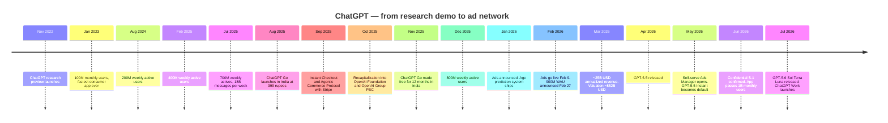
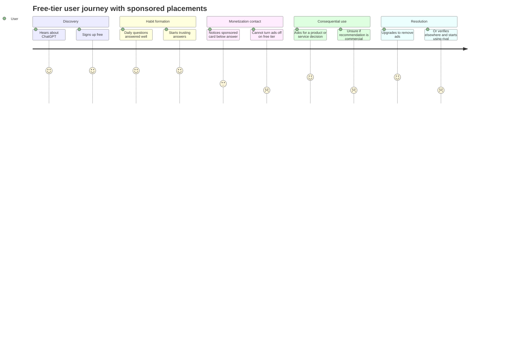
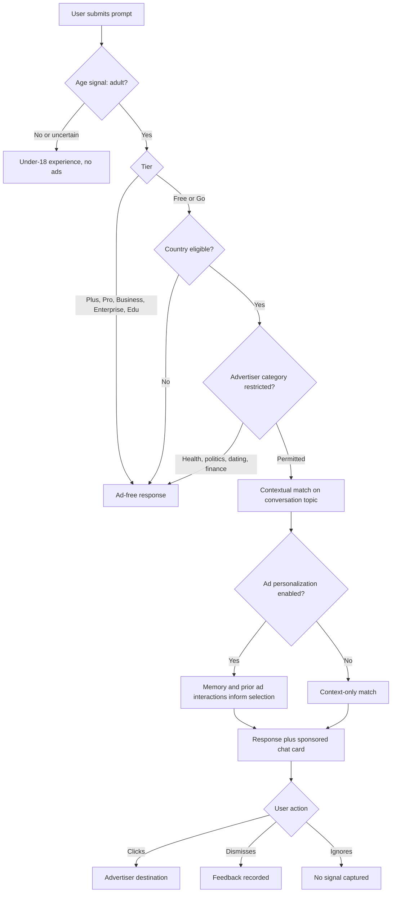
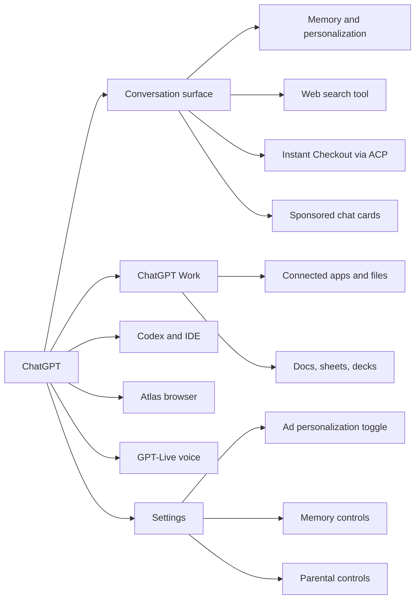
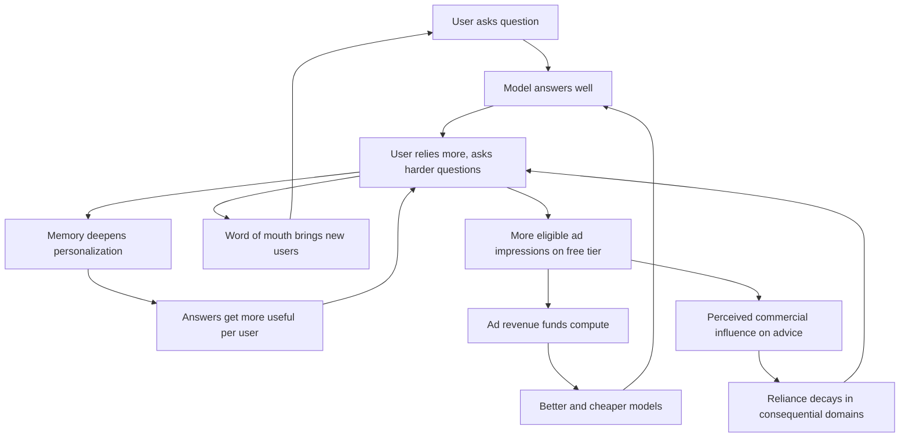
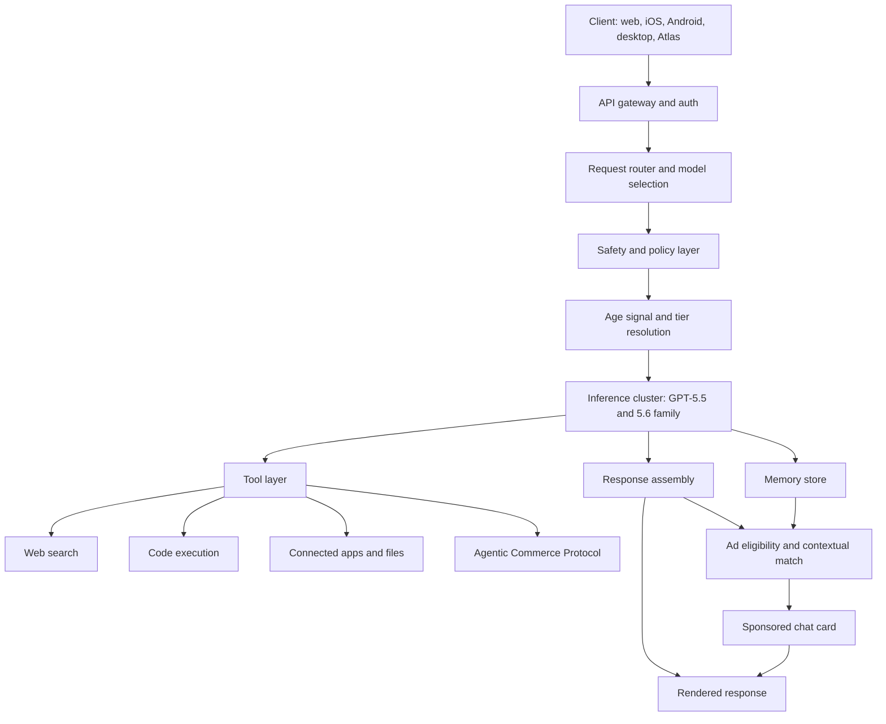
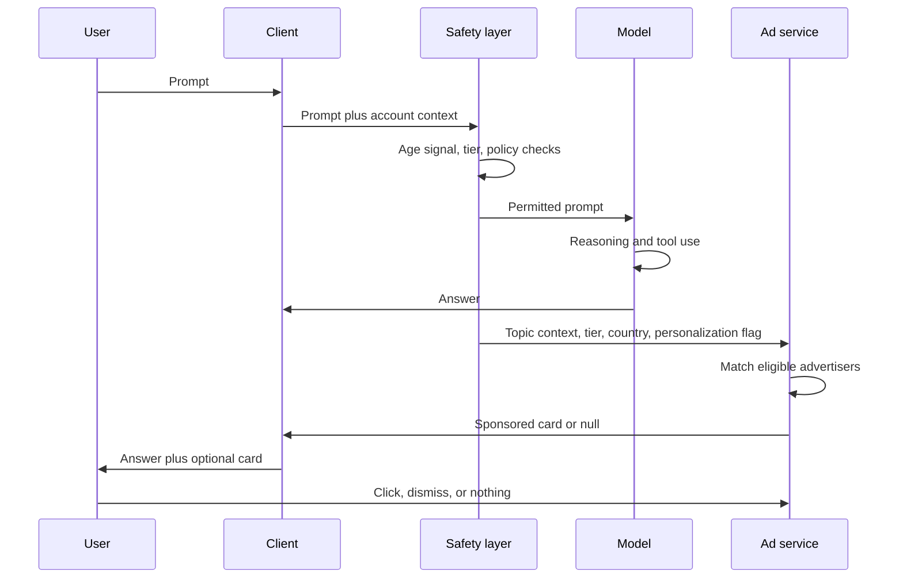
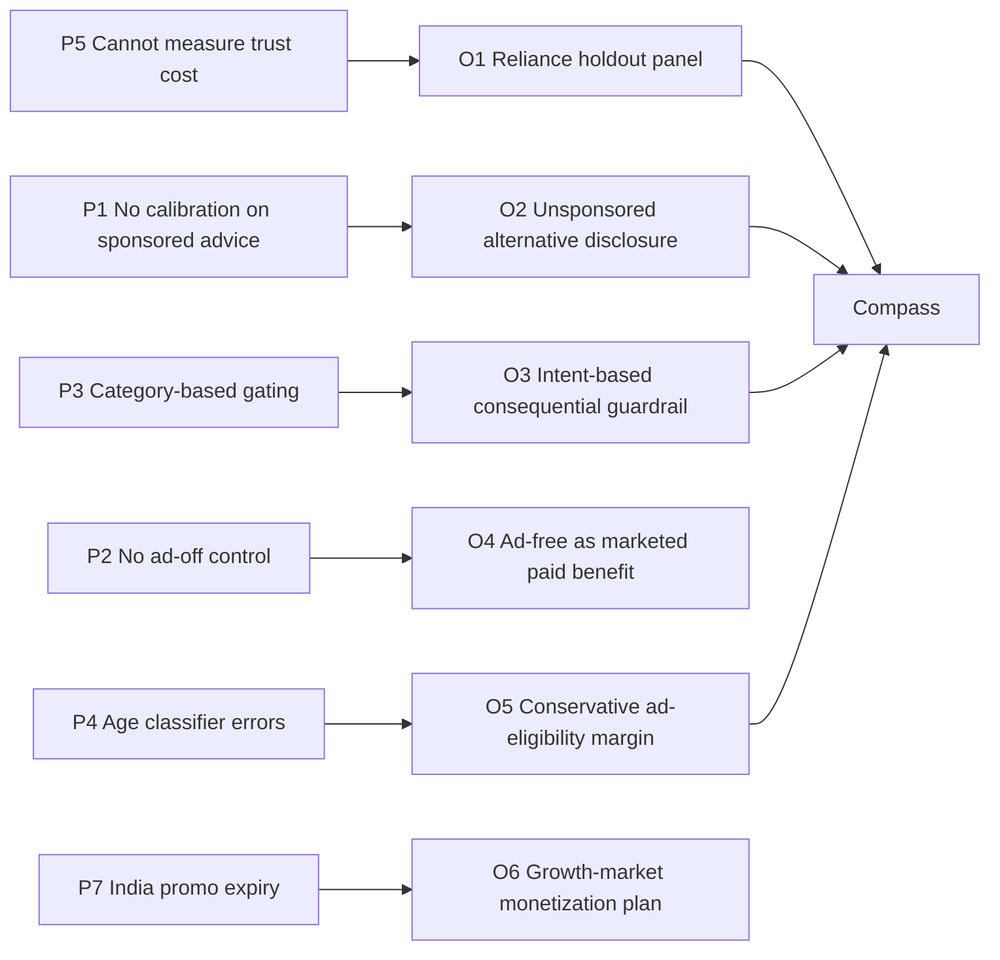
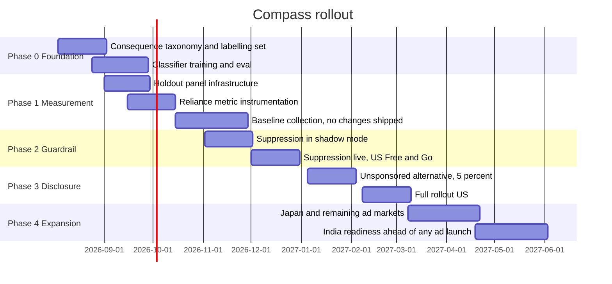

# ChatGPT — Product Management Case Study

**Day 31 of 90 | PM Case Study Challenge**

## 1. Cover

**Product:** ChatGPT (OpenAI Group PBC)
**Category:** Artificial Intelligence — Consumer AI Assistant, Enterprise Platform & Emerging Ad Network
**Author:** Gaurav Singh
**Day:** 31 / 90
**Date Published:** July 27, 2026

## 2. Repository Metadata

| Field | Value |
|---|---|
| Repository | product-management-case-studies |
| Folder | `Case Studies/Day-31-ChatGPT/` |
| Author | Gaurav Singh |
| Series | 90-Day PM Case Study Challenge |
| Previous | Day 30 — Meta Ads |
| Companion Files | `assumptions.md` |
| License | MIT (see §63 License) |

## 3. Badges

`Day 31/90` · `Category: AI / Consumer Assistant` · `Company: OpenAI Group PBC` · `Status: Private, confidential S-1 filed` · `Published: July 27, 2026`

## 4. Table of Contents

**Foundations**
1. Cover · 2. Repository Metadata · 3. Badges · 4. Table of Contents · 5. Executive Summary · 6. Product Overview · 7. Company Background · 8. Product Timeline · 9. Vision & Mission · 10. Problem Statement

**Market & Strategy**
11. Market Research · 12. Industry Analysis · 13. TAM/SAM/SOM · 14. Competitor Analysis · 15. SWOT · 16. Porter's Five Forces · 17. Business Model Canvas · 18. Revenue Model

**Users & Experience**
19. Target Users · 20. Personas · 21. JTBD · 22. User Journey · 23. User Flow · 24. Information Architecture · 25. UX Audit · 26. UI Audit · 27. Accessibility

**Product & Growth**
28. Feature Breakdown · 29. AI Capabilities · 30. Product Metrics · 31. North Star Metric · 32. Product Analytics · 33. AARRR · 34. HEART · 35. Growth Strategy · 36. Growth Loops · 37. Network Effects · 38. Product Strategy · 39. Monetization · 40. Trust & Safety

**Technical**
41. Technical Architecture · 42. Data Flow · 43. API Ecosystem · 44. Privacy & Security

**Strategy & Planning**
45. Pain Points · 46. Opportunity Mapping · 47. RICE · 48. MoSCoW · 49. Kano · 50. Feature Proposal · 51. PRD · 52. Wireframes · 53. Rollout Plan · 54. A/B Testing · 55. KPI Dashboard · 56. Product Roadmap · 57. Risks & Mitigation · 58. Future Vision

**Closing**
59. PM Lessons · 60. PM Interview Questions · 61. References · 62. About the Author · 63. License · 64. Self Review · 65. Appendix

## 5. Executive Summary

ChatGPT is the largest consumer AI product ever built, and in February 2026 it became something it spent three years insisting it would not become: an advertising business.

The scale is not in dispute. OpenAI announced 900 million weekly active users on February 27, 2026, up from 400 million a year earlier. Sensor Tower data reported by Reuters put the ChatGPT app past 1 billion monthly active users in June 2026, the fastest app in history to that mark. India alone accounts for roughly 100 million weekly actives — the second-largest market after the United States, and the largest student population on the product anywhere in the world.

The economics are less settled. OpenAI reached roughly $25 billion in annualized revenue by March 2026 on a run rate near $2 billion per month, against widely reported projected 2026 losses of about $14 billion — an operating margin around -55%. `ASSUMPTION — VALIDATION REQUIRED` (loss figures are press reports of internal documents, not audited disclosures; see §61 and `assumptions.md`). In February 2026 the company reset its stated compute ambition from $1.4 trillion in eight-year commitments down to approximately $600 billion of total compute spend by 2030. On June 8, 2026 it confirmed a confidential S-1 with the SEC.

Between those two facts — a billion users and a structural cash deficit — sits advertising. OpenAI announced ads on January 16, 2026, launched them on February 9 to logged-in adult users on the Free and Go tiers in the US, and opened a self-serve Ads Manager with no minimum spend on May 5. Paid tiers from Plus upward remain contractually ad-free.

**The central finding of this case study is not that OpenAI monetized. It is that OpenAI monetized the one surface where it cannot measure what monetization costs.**

Day 29 (Google Ads) found that platform performance claims were contradicted by independent advertiser data. Day 30 (Meta Ads) found something sharper: that simultaneous changes to attribution, delivery and auction price made those claims structurally unfalsifiable from the buy side. Day 31 inverts the question. For a search engine an ad is an adjacent unit of inventory; for an assistant, an ad occupies the same surface as the advice, and the trust that makes a recommendation worth reading is the identical asset that makes a sponsored card worth buying. Spending it produces revenue this quarter. The cost lands as slow substitution to a competitor two quarters later — and OpenAI's measurement stack, which sees clicks, CPM, retention and DAU, cannot see it happening.

The competitive backdrop makes this concrete rather than philosophical. ChatGPT's share of AI-chatbot web visits fell from 79.0% in May 2025 to 53.9% in May 2026 on Similarweb's measurement, with Gemini at 27.9% and Claude at 9.2%. Anthropic responded to OpenAI's ad plans by publicly committing to keep Claude ad-free and running a Super Bowl spot on exactly that contrast. The competitor has turned OpenAI's monetization decision into its own positioning, which means the cost of ad load is now partly determined by someone else's marketing budget.

This case study proposes **Compass** — a two-surface instrument comprising a consequential-domain guardrail with unsponsored-alternative disclosure, and a permanent ad-free holdout panel measured on reliance rather than engagement, gating ad-load increases. Section 47 documents honestly that RICE ranks the holdout alone far above the combined proposal, and §50 explains why the ranking is accepted for sequencing but not for scope.

**A note on this study's evidence base.** OpenAI is private. There is no 10-Q, no audited revenue line, no disclosed ad revenue. Nearly every financial figure below is either a company statement made in a blog post or interview, or a press report of leaked internal documents. Where the two conflict — and they do, materially — both are carried and the conflict is logged in §65 rather than resolved by preference.

## 6. Product Overview

ChatGPT is a conversational AI assistant delivered across web, iOS, Android, desktop applications, and the Atlas browser, wrapped around OpenAI's GPT model family. It sells four things to four buyers that happen to share one interface:

| Layer | What it is | Who pays | Approx. share of revenue |
|---|---|---|---|
| Consumer subscription | Plus, Pro, Go tiers | ~50M paying individuals | ~$17B annualized `ASSUMPTION` |
| Business seats | Business, Enterprise, Edu | 1M+ business customers, 9M+ paid business users | included above, fastest-growing |
| Developer API | Model access, Codex, Agents | ~4M developers | ~$6.5B annualized `ASSUMPTION` |
| Advertising | Sponsored chat cards on Free/Go | Advertisers | Not disclosed |

The fourth row is new, undisclosed, and the reason this case study exists.

As of July 2026 the current model line is the GPT-5.6 family — Sol, Terra and Luna — publicly released July 9, 2026 after a two-week limited release restricted to trusted partners at the request of the US government. GPT-5.5 Instant remains the default model for everyday chat; Sol powers reasoning modes for eligible paid plans. Alongside GPT-5.6, OpenAI shipped ChatGPT Work, an agentic workplace surface that pulls context across connected apps and files to produce documents, spreadsheets and presentations, and a GPT-Live voice model family capable of simultaneous listening and speaking.

## 7. Company Background

OpenAI was founded in 2015 as a nonprofit research lab, adopted a capped-profit structure in 2019, and completed a recapitalization announced October 28, 2025 that produced its current shape: the OpenAI Foundation, a nonprofit, alongside OpenAI Group PBC, a Delaware public benefit corporation. That restructuring is the precondition for everything that followed in 2026, because a conventional for-profit entity is what an IPO requires.

Recent corporate milestones:

- **Private valuation** rose from roughly $86 billion in early 2024 to approximately $852 billion by March 2026.
- **Musk litigation** was dismissed by a California jury on May 18, 2026 on statute-of-limitations grounds.
- **Confidential S-1** submitted to the SEC around May 22, 2026 and publicly acknowledged by OpenAI on June 8, 2026, with Goldman Sachs, Morgan Stanley and JPMorgan reported as leads. OpenAI's own framing was that it expected the filing to leak and pre-empted it, while stating that timing was undecided and going public "may be a while."
- **Peer listings**: Anthropic filed confidentially on June 1, 2026 at a reported ~$965 billion valuation; SpaceX completed its IPO on June 12, 2026 at roughly $1.77 trillion.
- **Timing drift**: Reuters reported in late June 2026 that OpenAI was considering waiting until 2027. Prediction markets moved with it — Polymarket put a 2026 listing near 54% after the filing, and Kalshi priced a formal announcement by March 1, 2027 at 59%. `ASSUMPTION — VALIDATION REQUIRED` (prediction-market prices are sentiment, not information).

Why a PM should care about any of this: an IPO process changes what a product organization is allowed to build. Instruments that quantify a previously unquantified harm become discoverable documents. That constraint appears again in §50 and §57, and it is the single most under-appreciated force acting on ChatGPT's roadmap in the second half of 2026.

## 8. Product Timeline



## 9. Vision & Mission

**Stated mission (OpenAI):** to ensure that artificial general intelligence benefits all of humanity.

**Product-level vision, as inferred from shipped behaviour:** to be the default interface between a person and any task that can be expressed in language — and, increasingly, to be the place where that task is *completed* rather than merely described.

The 2026 shipping record supports the second reading more than the first. ChatGPT Work, Codex Remote, Atlas, Instant Checkout and the agentic commerce protocol all move the product from *answering* toward *acting*. That shift is strategically coherent and it is also what raises the stakes on advertising, because an ad placed next to an answer is a suggestion, while an ad placed next to an action is closer to a recommendation the user is about to execute.

**Where mission and monetization collide:** OpenAI spent years describing advertising as a last resort. In January 2026 it became the plan. No public restatement of the mission accompanied that change, which leaves the product organization operating with a stated mission that does not describe the business model. That gap is not a rhetorical problem; it is a prioritization problem, because teams resolve ambiguity by optimizing whatever is measured, and what is measured now includes ad revenue.

## 10. Problem Statement

**For users:** the assistant they rely on for consequential decisions now carries commercial placements on the tier most of them use, with no global opt-out on free accounts, and no visibility into what the unsponsored answer would have been.

**For OpenAI:** roughly 95% of a billion-user base does not pay. `ASSUMPTION — VALIDATION REQUIRED` (derived from ~50M reported paying consumer subscribers against ~1.11B monthly users; OpenAI has not published a conversion rate). Serving that base costs real inference money against a projected $14B annual loss. Advertising is the only mechanism that scales revenue with free usage rather than against it.

**The product problem this case study attacks:** OpenAI can measure ad revenue precisely, in real time, per impression. It cannot measure the thing advertising spends. Trust in an assistant is consumed gradually and cashed out elsewhere — as a user who starts checking a second tool, then defaults to it. By the time that appears in a DAU chart, the decision that caused it is six months old and unattributable.

## 11. Market Research

The consumer AI assistant market in mid-2026 has three characteristics that matter more than its size:

**1. It is still expanding faster than any single player can capture.** Average monthly web visits across generative AI platforms reached 9.5 billion between June 2025 and May 2026, up 70% year over year, with monthly unique visitors up 57% to 655 million. ChatGPT's visit count stayed roughly flat over that period while its *share* fell — the clearest possible signal that this is category growth accruing elsewhere, not ChatGPT shrinking.

**2. Measurement disagrees with itself.** Similarweb's web-visit share shows ChatGPT sliding from 79.0% to 53.9% year over year. Cloudflare's internet-services ranking has shown ChatGPT holding the #1 position in generative AI continuously from at least February 23 through early July 2026. Both can be true: Gemini is pre-installed across Android and Workspace, so a large share of its measured traffic reflects distribution rather than active choice. Any strategy built on a single share number is built on a measurement artifact. Logged in `assumptions.md` as a Tier-2 conflict.

**3. Penetration of total internet activity remains small.** Datos' Q1 2026 State of Search reported that AI tools collectively accounted for under 2% of total desktop web visits across the US and Europe. The category is loud, culturally dominant, and still early in absolute terms.

## 12. Industry Analysis

Four forces are reshaping the category in 2026:

| Force | What is happening | Effect on ChatGPT |
|---|---|---|
| Capability convergence | Frontier models cluster on benchmarks; open-weight models from DeepSeek and Moonshot reach comparable reasoning at a fraction of inference cost | Erodes capability as a moat; shifts competition to distribution, price and trust |
| Distribution bundling | Gemini pre-installed on Android and Workspace; Copilot in Microsoft 365; Meta AI across Meta apps | ChatGPT is the largest product with the weakest owned distribution |
| Compute economics | Inference cost scales with usage; free tiers are a variable-cost liability, not a fixed one | Forces monetization of free usage — the direct cause of ads |
| Regulatory arrival | FTC 6(b) inquiry into chatbots and minors, state AG litigation, EU GDPR blocking ad rollout, India's proposed AI content-labelling rules | Constrains where and how monetization can expand |

The compute-economics row is the one that distinguishes AI from prior consumer-internet categories. A marginal Instagram user costs Meta approximately nothing. A marginal ChatGPT user costs OpenAI inference on every message. Free tiers in social media were a growth investment with near-zero unit cost; in AI they are an ongoing operating expense. That single difference explains the timing of every monetization decision in this case study.

## 13. TAM / SAM / SOM

Market sizing for consumer AI in 2026 is unusually unreliable because analysts disagree on what is being counted — assistant subscriptions, embedded AI features, model API spend, or AI-attributable ad budgets. The figures below are directional and every one is flagged.

| Layer | Definition | Estimate | Basis |
|---|---|---|---|
| TAM | Global spend addressable by a general-purpose AI assistant: consumer subscriptions + enterprise seats + developer API + AI-native advertising | $300B–$500B by 2030 | `ASSUMPTION — VALIDATION REQUIRED` — synthesized range across analyst projections; no single authoritative source |
| SAM | Markets where ChatGPT is live, legally permitted to monetize, and has payment rails | ~$120B–$180B | `ASSUMPTION — VALIDATION REQUIRED` — derived, excludes EU ad revenue pending GDPR resolution |
| SOM | OpenAI's realistic near-term capture | ~$25B annualized today, company plan targeting ~$280B revenue in 2030 | $25B run rate is company-stated; the 2030 target is press-reported investor guidance |

The gap between $25B today and a ~$280B 2030 target implies a compound growth rate that has no precedent in enterprise software. Treat the 2030 figure as a fundraising instrument rather than a forecast.

## 14. Competitor Analysis

| Competitor | Position | Structural advantage | Structural weakness |
|---|---|---|---|
| **Google Gemini** | #2 by web share at 27.9%, app passed 900M MAU at I/O 2026 | Android and Workspace pre-installation; owns search, ads and the browser; Apple Siri arrangement extends reach | Share partly reflects default placement rather than preference; brand tied to search cannibalization anxiety |
| **Anthropic Claude** | 9.2% global web share, 13.4% US; 245M monthly users | Leads enterprise LLM API spend at ~40% vs OpenAI's 27% per Menlo Ventures; highest paid conversion of major platforms; explicit ad-free commitment | Smallest consumer footprint of the three; less consumer brand recall |
| **Meta AI** | ~1B monthly users across Meta apps | Distribution inside apps people already open | Embedded rather than chosen; low intent per session |
| **Microsoft Copilot** | ~420M reach, 20M+ paid M365 seats | Enterprise contract bundling | US mobile MAU fell 31% year over year; the weakest trajectory of the majors |
| **DeepSeek, Moonshot, MiniMax** | Open-weight challengers | 10–30x cheaper inference at comparable reasoning benchmarks | Limited Western consumer trust and distribution |

**The competitive fact that matters most for this case study:** Anthropic publicly committed to keeping Claude ad-free specifically in response to OpenAI's ad plans, and ran a Super Bowl spot on that contrast. Claude's traffic share went from roughly 1.6% to 8.9–9.2% over twelve months, and Ramp's business-subscription data recorded OpenAI's largest single-month share drop since tracking began in the same window that ad discontent was peaking.

That correlation is not causation and this case study does not claim it is — the same period included several unrelated controversies, and `assumptions.md` logs it as Tier 3. But it establishes the shape of the risk precisely: the cost of ad load is not paid in complaint volume, it is paid in a competitor's growth rate.

## 15. SWOT

**Strengths**
- Largest consumer AI user base ever assembled; roughly 1.11B monthly users
- Brand synonymous with the category; "ChatGPT" functions as a generic verb
- India at ~100M weekly actives with the world's largest student cohort
- Fastest enterprise seat growth in the category; 92% Fortune 500 penetration claimed
- Full-stack surface coverage: chat, voice, browser, IDE, agents, commerce

**Weaknesses**
- No owned distribution — depends on app stores and browsers controlled by competitors
- ~5% consumer paid conversion `ASSUMPTION`
- Projected ~$14B 2026 loss; -55% operating margin `ASSUMPTION`
- Model deprecations repeatedly rupture user attachment; GPT-4o's February 2026 retirement drew organized petitions from users describing the model in relational terms
- No instrument measuring trust or reliance; only engagement proxies

**Opportunities**
- India and Asia monetization at localized price points
- Agentic commerce take-rate as a non-advertising revenue line
- Enterprise seat expansion where ads never apply
- Ad-free premium positioning could be *reclaimed* as a paid-tier benefit rather than conceded to Anthropic

**Threats**
- Gemini's distribution advantage compounding
- Claude's enterprise API lead and ad-free positioning
- Open-weight price collapse on commodity tasks
- Regulatory: FTC inquiry, Florida AG suit naming Altman personally, EU GDPR blocking ad rollout, India AI labelling rules
- IPO scrutiny converting product decisions into disclosure liabilities

## 16. Porter's Five Forces

| Force | Intensity | Reasoning |
|---|---|---|
| Competitive rivalry | **Very high** | Three well-capitalized frontier labs plus open-weight challengers; 25 points of share moved in twelve months |
| Supplier power | **Very high** | Nvidia silicon, Azure and Oracle capacity, and power availability are hard constraints; HSBC has flagged a ~$207B gap between expansion plans and secured funding |
| Buyer power | **High and rising** | Zero switching cost for consumers; near-zero for API buyers with abstraction layers; enterprise buyers now run competitive bake-offs |
| Threat of substitutes | **High** | Embedded AI in search, OS and productivity suites substitutes for a standalone assistant without a deliberate switch |
| Threat of new entrants | **Moderate** | Frontier training is capital-prohibitive, but distribution-first entrants can wrap third-party models cheaply |

Supplier power is the force that ultimately explains the advertising decision. When capacity is the binding constraint and it must be paid for in advance, revenue timing stops being a finance question and becomes a product roadmap question.

## 17. Business Model Canvas

| Block | Content |
|---|---|
| Customer segments | Free consumers, paid consumers, SMB and enterprise teams, developers, advertisers, education |
| Value propositions | Instant capable assistance; task completion across documents, code and commerce; enterprise-grade deployment; a high-intent advertising audience |
| Channels | Web, iOS, Android, desktop apps, Atlas browser, API, IDE extensions |
| Customer relationships | Self-serve for consumers and developers; sales-assisted for enterprise; agency-mediated for advertisers |
| Revenue streams | Subscriptions, seats, API consumption, advertising, commerce protocol, licensing |
| Key resources | Frontier models, compute capacity, brand, user data and memory, agentic protocol standards |
| Key activities | Model training, inference serving, safety and policy, ad platform operations, enterprise delivery |
| Key partners | Microsoft Azure, Nvidia, Oracle, SoftBank, Stripe, Shopify, Etsy, agency holding groups |
| Cost structure | Compute (dominant), talent (~$4B `ASSUMPTION`), data-center commitments, safety and legal |

## 18. Revenue Model

Reported and estimated composition of the ~$25B annualized run rate as of mid-2026:

| Stream | Estimated annualized | Confidence |
|---|---|---|
| ChatGPT consumer subscriptions | ~$17B | Tier 2 — third-party estimate |
| API consumption | ~$6.5B | Tier 2 |
| Sora, licensing, other | ~$1.5B | Tier 2 |
| Advertising | Not disclosed | Tier 4 — no figure published |
| Commerce take-rate | Not disclosed | Tier 4 |

Enterprise and Team seats grew from roughly $1B annualized at the start of 2025 to more than $7B by mid-2026 — the fastest-growing line and, notably, the one on which ads never appear.

**The strategic read:** the fastest-growing revenue line is ad-free by design, while the fastest-growing *user* base — free-tier consumers in price-sensitive markets — is the one being monetized with ads. Those two facts point in opposite directions and no public statement reconciles them.

## 19. Target Users

| Segment | Approx. scale | Monetization path | Sees ads? |
|---|---|---|---|
| Free consumer, developed market | Hundreds of millions | Subscription upgrade or ads | Yes |
| Free consumer, growth market (India, Indonesia, Asia) | ~100M in India alone | Go tier, currently promotional | Not yet — ads live in 6 countries as of July 2026 |
| Paid consumer (Plus, Pro) | ~50M | Subscription | No |
| Business and enterprise seats | 9M+ paid business users | Seats | No |
| Developers | ~4M | API consumption | N/A |
| Advertisers | Self-serve since May 5, 2026 | Ad spend | N/A |

The India row is the most consequential and the least discussed. ChatGPT Go launched there in August 2025 at ₹399/month and was made **free for twelve months from November 4, 2025**. That promotional cohort begins expiring around November 2026. Ads are not live in India. So the largest growth market in the portfolio faces a scheduled monetization event, in a market where Gemini AI Pro is being offered free for eighteen months through a Jio partnership and Perplexity Pro free through Airtel's ~360M subscriber base.

That is a defined product deadline roughly three months from this publication date, with the two most obvious levers — price and ads — both compromised.

## 20. Personas

**Persona 1 — Ananya, 20, engineering student, Pune**
Uses ChatGPT four to six times daily for coursework, exam preparation and code debugging. On the free Go promotional plan. Has never paid for software. Switches instantly if a friend recommends something better or cheaper.
*Jobs:* understand concepts fast, check work, prepare for placements.
*Risk to OpenAI:* zero switching cost, high peer-network sensitivity, promotional expiry in November 2026, and — if ads reach India — commercial placements next to exam-preparation answers, which is a category with no current restriction.

**Persona 2 — Marcus, 41, small-business owner, Ohio**
Free tier. Uses ChatGPT for supplier research, pricing questions, contract language and marketing copy. Sees sponsored cards regularly. Does not always register the "Sponsored" label as meaningfully different from a recommendation.
*Jobs:* make sound decisions quickly without a consultant.
*Risk:* the population most likely to act on a sponsored card is the population least equipped to distinguish it from advice.

**Persona 3 — Devika, 34, engineering manager, Bengaluru**
Enterprise seat. Uses ChatGPT Work and Codex daily. Ad-free. Her buying committee is running a formal bake-off against Claude and Gemini.
*Jobs:* ship faster, keep data governed, justify spend.
*Risk:* she never sees an ad, but she reads the same coverage as everyone else, and vendor trust is now a procurement criterion.

**Persona 4 — Priya, 16, student, Delhi**
Uses ChatGPT for homework. Subject to OpenAI's age-prediction system and the under-18 experience. Advertising policy excludes minors.
*Jobs:* finish homework, understand what the teacher explained badly.
*Risk:* age prediction is probabilistic. A false negative places a minor in the ad-eligible population. This is the highest-severity failure mode in the entire monetization design and it is the subject of active litigation.

## 21. Jobs To Be Done

| Job | Statement | Ad-compatibility |
|---|---|---|
| Understand | When I encounter something I don't understand, help me grasp it so I can act | Neutral |
| Produce | When I have to produce work, help me draft it so I finish faster | Neutral |
| Decide | When I face a consequential choice, help me weigh options so I choose well | **Directly conflicted** |
| Execute | When I've decided, complete the task so I don't have to | **Directly conflicted** |
| Companion | When I'm processing something, respond so I feel heard | Excluded by policy, high risk |

The two conflicted rows are also the two highest-value rows commercially. An ad is worth the most precisely where it interferes the most. Nothing in the current design distinguishes a Decide query from an Understand query for ad-eligibility purposes — the restriction operates on *advertiser category* (health, mental health, politics, dating, financial services are excluded) rather than on *user intent*. That distinction is the seed of the feature proposed in §50.

## 22. User Journey



The final section is where the whole business model is decided, and it is the section OpenAI has the least instrumentation on. "Upgrades" is measured perfectly. "Verifies elsewhere" is invisible.

## 23. User Flow



Node P is the honest weak point. The dominant user response to an ad is neither a click nor a dismissal — it is silence, and silence is recorded as an absence rather than as data. Every negative outcome the assistant might be causing lives in node P.

## 24. Information Architecture



Note the asymmetry: `AdPrefs` controls *personalization* of ads, not their *presence*. On Free and Go there is no announced global ad-off toggle. The IA offers a control that looks like an opt-out and is not one.

## 25. UX Audit

**Working well**
- Sponsored cards are visually separated below the response rather than woven into the answer text, which is the strongest single design decision in the ad implementation
- Clear "Sponsored" labelling, per-ad dismissal, and a "why this ad" explanation
- Category exclusions for health, mental health, politics, dating and financial services genuinely remove the worst placements
- Under-18 experience excludes ads entirely

**Not working**
- No global ad-off control on Free or Go; the only escape is payment
- Ad eligibility keys on advertiser category, not on user intent — a query about which laptop to buy for a disabled child, or which coaching institute to join, is commercially eligible and consequentially loaded
- No disclosure of what the *unsponsored* recommendation would have been, so the user cannot calibrate
- Reported ad penetration figures swung wildly across mid-2026 — one tracker recorded a peak near 26.5% in late May, a collapse to near zero in mid-June, and a return above 51% by early July `ASSUMPTION — VALIDATION REQUIRED, single low-quality source, see §65` — implying users experience ad load as unstable rather than as a stable norm they can adapt to
- Model deprecation UX remains poor; repeated forced migrations break saved habits and, in the GPT-4o case, provoked organized user petitions

## 26. UI Audit

The current ad unit is a single format — a `chat_card` beneath the response containing a title, short description, image and destination link. Assessment:

| Element | Assessment |
|---|---|
| Placement below answer | Correct. Preserves answer integrity spatially |
| Tinted container | Adequate but subtle; contrast against the response bubble is low on some themes |
| "Sponsored" label | Present and legible, but relies on a literacy convention borrowed from search that does not obviously transfer to conversation |
| Dismissal affordance | Present per-ad; no persistence guarantee communicated |
| Density | One card per eligible response; no stacking observed |

The unresolved UI question is conceptual rather than visual. In search, "Sponsored" sits beside ten organic results the user can compare against. In an assistant there is exactly one answer, so the sponsored card has no visible peer to be judged against. The label transfers; the comparison context does not.

## 27. Accessibility

- Voice input and output across all tiers; GPT-Live added simultaneous listen-and-speak in July 2026, meaningfully improving conversational access for users with motor or vision impairments
- Dictation improvements shipped in 2026 lowered word error rate by at least 10% across top languages, with specific gains for accented English, code-switching multilingual speakers, and quiet or whispered speech
- 59 supported languages
- **Gap:** screen-reader announcement semantics for sponsored cards are not publicly documented. If a card is announced in the same voice and cadence as the answer, the visual separation that carries the entire integrity argument does not exist for a non-visual user. This should be treated as a compliance exposure, not a polish item.
- **Gap:** voice surfaces have no announced ad treatment at all. As voice grows, the "spatially separated" defence has no equivalent.

## 28. Feature Breakdown

| Feature | Status July 2026 | Strategic role |
|---|---|---|
| Conversation with GPT-5.5 / 5.6 | Core, shipped | The product |
| Memory and personalization | Shipped; informs ads when enabled | Retention and ad targeting simultaneously |
| Web search tool | Shipped | Freshness; also the substrate ads attach to |
| ChatGPT Work | Launched July 9, 2026 | Enterprise expansion, ad-free |
| Codex and Codex Remote | GA all plans | Developer retention |
| Atlas browser | Shipped Oct 2025 | Owned distribution attempt |
| GPT-Live voice | Shipped July 2026 | Interface expansion |
| Instant Checkout / ACP | Shipped Sept 2025; broadened Feb 16, 2026 | Non-ad monetization |
| Sponsored chat cards | Shipped Feb 9, 2026; self-serve May 5 | Free-tier monetization |
| Age prediction | Shipped Jan 2026 | Regulatory necessity and ad-eligibility gate |
| Parental controls | Shipped Sept 2025 | Regulatory necessity |

**Feature honesty note on commerce:** Instant Checkout looked like the non-advertising answer to free-tier monetization and largely did not work as designed. By February 2026 only about 30 Shopify merchants were live on it against a promised pipeline of over a million, per Forrester analysis. Walmart measured in-chat checkout converting roughly three times worse than a click-through to its own site, even while ChatGPT drove about twice the new-customer rate. The industry regrouped around "discover in AI, buy on your own site."

That matters enormously here: the failure of in-chat checkout removed the most plausible alternative to advertising. Ads are not merely the chosen path; they are the surviving one.

## 29. AI Capabilities

The GPT-5.6 family released July 9, 2026 spans three tiers — Sol for hardest work, Terra for balanced everyday tasks, Luna for fast, cost-sensitive workloads — with a 1.05M-token context window and 128K maximum output. Sol was described as 54% more token-efficient on agentic coding tasks than its predecessor, a framing aimed squarely at enterprise cost scrutiny.

Two capability facts with product consequences:

**1. Token efficiency is now a headline feature.** When a lab leads with efficiency rather than capability, it is signalling that buyers have started comparing cost per completed task rather than benchmark scores. That is a market maturing, and it compresses margin on commodity work.

**2. The release was briefly gated by government.** GPT-5.6 went to a small group of trusted partners on June 26 at the request of the US government before general release on July 9. Anthropic went through a comparable episode with export-control-driven suspension and restoration of its Fable and Mythos models in the same window. Frontier release timing is now partly a regulatory variable, which belongs in every roadmap risk register in the industry.

## 30. Product Metrics

| Metric | Latest public value | Source quality |
|---|---|---|
| Weekly active users | 900M (announced Feb 27, 2026) | Tier 1 — company statement |
| Monthly active users, app | 1B+ June 2026; 1.11B May 2026 | Tier 2 — Sensor Tower via Reuters |
| Consistent weekly returners | ~250M | Tier 2 |
| Messages per week | 18B as of July 2025 | Tier 1, stale |
| Paying consumer subscribers | ~50M | Tier 2 |
| Paid business users | 9M+ (Feb 2026) | Tier 1 |
| Business customers | 1M+ (Nov 2025) | Tier 1 |
| Developers | ~4M | Tier 2 |
| Annualized revenue | ~$25B (Mar 2026) | Tier 1/2 mixed |
| Web-visit share | 53.9% (May 2026) | Tier 2 — Similarweb |
| Ad revenue | Not disclosed | Tier 4 |
| Trust or reliance metric | **Does not exist publicly** | — |

The last row is the case study. Every metric OpenAI reports is a volume or revenue metric. None measures whether users believe the answers.

## 31. North Star Metric

**Current implied North Star:** weekly active users. It is the number OpenAI announces, the number the press tracks, and the number a missed internal target was reported against in April 2026.

**Why it is now the wrong one.** WAU rose through the entire period in which share fell 25 points, an ad load appeared, and a competitor tripled. A metric that stays green through all of that is not steering anything. WAU also cannot distinguish a user who relies on ChatGPT for a consequential decision from one who pastes in a homework question and leaves.

**Proposed North Star:** **Weekly Trusted Task Completions (WTTC)** — the count of weekly sessions in which a user (a) engaged a consequential-intent task, (b) reached a completion signal, and (c) returned within 14 days for another consequential task in the same domain.

Why this construction:
- It requires *repeat* consequential use, which is the observable shadow of trust
- It cannot be inflated by ad load, message volume, or promotional free tiers
- It is domain-scoped, so erosion in one area (say, shopping) is visible even while another (coding) grows
- It degrades when users start verifying elsewhere, which is exactly the failure mode currently invisible

**Counter-metric:** ad-attributable revenue per 1,000 eligible responses, tracked against WTTC so that any monetization gain paid for in reliance shows up as a divergence rather than as two unrelated charts.

## 32. Product Analytics

What is instrumented well: session counts, message volume, retention cohorts, model selection, tool invocation, subscription conversion, ad impressions, clicks and dismissals.

What is not instrumented, and cannot be with current signals:

| Question | Why current analytics cannot answer it |
|---|---|
| Did the user act on the answer? | Completion happens off-platform |
| Did the user believe the answer? | No belief signal; silence is unrecorded (see node P, §23) |
| Did an ad change what the user did? | No holdout; every eligible free user is treated |
| Did ad exposure cause later substitution to a rival? | Substitution is invisible; users don't announce departure |
| Is reliance rising or falling in consequential domains? | No consequential-intent classifier in the metric stack |

The fourth row is the expensive one. A user who quietly adds a second tool looks identical to a loyal user until the day they stop opening the first.

## 33. AARRR

| Stage | Current state | Weak point |
|---|---|---|
| Acquisition | Best-in-category brand; ~1.11B monthly users | No owned distribution; rivals ship pre-installed |
| Activation | Immediate — first prompt delivers value | Nothing to fix |
| Retention | ~250M consistent weekly returners | Model deprecations rupture habit; ad load untested against retention over long horizons |
| Referral | Organic word of mouth historically extraordinary | Advertising gives detractors a concrete talking point a rival is actively amplifying |
| Revenue | ~$25B annualized; ~5% consumer conversion | Growth markets structurally hard to convert at Western prices |

## 34. HEART

| Dimension | Signal | Reading |
|---|---|---|
| Happiness | App-store ratings, dismissal rate on ads, petition activity on deprecations | Mixed; deprecation backlash is a recurring, organized phenomenon |
| Engagement | Messages per user, sessions per week | Strong |
| Adoption | New paid seats, Work adoption | Strong on enterprise |
| Retention | Consistent-returner cohort | Strong but undifferentiated by intent |
| Task success | Not publicly measured | **The gap** |

HEART's own logic argues for the §31 proposal: four of five dimensions are instrumented and the fifth — task success — is the one an assistant actually sells.

## 35. Growth Strategy

OpenAI's 2025–26 growth strategy has three visible pillars:

1. **Price segmentation by geography.** ChatGPT Go at ₹399/month in India, expansion to Indonesia and 16 further Asian markets, then free for twelve months in India from November 4, 2025.
2. **Surface expansion.** Atlas, Work, Codex, voice — grow occasions rather than users.
3. **Protocol land-grab.** ACP with Stripe as an open standard (Apache 2.0), adopted across ChatGPT, Copilot and Shopify's agentic plan, competing with Google's UCP launched January 12, 2026.

The first pillar has a defect: giving a market away free for a year converts a pricing problem into a dated liability. The India cohort's promotional period begins expiring around November 2026 into a market where Google is offering Gemini AI Pro free for eighteen months via Jio and Perplexity Pro is free to Airtel's subscriber base. Free-for-a-year does not win a price war against free-for-eighteen-months; it postpones one.

## 36. Growth Loops



The loop is genuinely reinforcing at nodes B–E and genuinely self-limiting at G–K. The critical property is that the reinforcing path (G→H→I→B) has a lag of quarters and the damping path (G→J→K→C) has a lag of quarters as well — but only the first is measured. A team optimizing on visible signal will always over-run the invisible constraint.

## 37. Network Effects

ChatGPT's network effects are weaker than its scale implies:

- **No social graph.** Nothing about another user's presence improves my experience.
- **Data network effect is real but diffuse.** Aggregate usage improves models over training cycles, not conversationally.
- **Personal switching cost is the strongest retention force** — memory, custom instructions, chat history, connected apps. This is a *lock-in* effect, not a network effect, and it is exactly what a competitor's import tool attacks.
- **Developer and protocol effects are the durable ones.** ACP adoption by Stripe, Shopify and Copilot creates genuine multi-sided value — which is why Google launched a competing protocol within four months.

Strategic implication: ChatGPT's moat is habit and protocol, not network. Habit is degradable by trust events and by forced model migrations. That makes trust a *moat input*, not a soft value — which is the argument §50 rests on.

## 38. Product Strategy

The 2026 strategy can be stated in one sentence: **defend consumer scale while shifting revenue weight toward enterprise and developer surfaces where ads do not apply and switching costs are highest.**

The tension inside that sentence: the consumer base is being monetized with the mechanism most likely to damage the brand asset that enterprise buying committees now evaluate. Enterprise procurement in 2026 explicitly weighs vendor trust; Anthropic's reported enterprise API spend lead of ~40% against OpenAI's 27% suggests that weighting is not hypothetical.

A coherent alternative strategy exists and OpenAI has not visibly taken it: treat ad-free as a *product feature of paid tiers* and market it, rather than treating ads as a property of free tiers and letting a competitor own the contrast. Same monetization architecture, opposite narrative ownership.

## 39. Monetization

**Subscriptions.** Plus, Pro, Go, Business, Enterprise, Edu. Roughly 50M paying consumers, 9M+ paid business users.

**Advertising.** Announced January 16, 2026; live February 9, 2026 for logged-in adults 18+ on Free and Go in the US; expanded to six countries by July 2026 including Japan; self-serve Ads Manager at ads.openai.com from May 5, 2026 with CPC and CPM bidding and no minimum spend; agency partners include Dentsu, Omnicom, Publicis and WPP; premium placement CPMs reported near $60 `ASSUMPTION — VALIDATION REQUIRED`; EU rollout pending unresolved GDPR questions.

**Commerce.** Instant Checkout and ACP; broadened to all US users including free tier on February 16, 2026. Conversion performance below expectations (§28).

**Take-rate and licensing.** Sora, model licensing, and enterprise deployments.

**The monetization asymmetry in one table:**

| Tier | Ads | Pays | Growth |
|---|---|---|---|
| Enterprise | No | Most | Fastest revenue growth |
| Paid consumer | No | Yes | Steady |
| Free, developed markets | Yes | No | Flat to declining share |
| Free, growth markets | Not yet | No | Fastest user growth |

Ads are being applied to the segment with the least revenue and the most competitive exposure, and withheld from the segment with the most revenue. That is defensible as tier design. It is harder to defend as *risk placement*, because the segment absorbing the trust risk is the one where the competitive alternative is one tap away and free.

## 40. Trust & Safety

This is the section where OpenAI's product decisions carry the highest external cost, and 2026 has been unrelenting:

- **Raine v. OpenAI** (filed August 26, 2025) alleges ChatGPT-4o flagged 377 messages from a 16-year-old for self-harm content, some at high confidence, without terminating a session or alerting parents; OpenAI has stated the product directed the user to crisis resources over 100 times. **Lacey v. OpenAI** raises comparable allegations.
- **FTC 6(b) inquiry** opened September 11, 2025 into seven companies' chatbots and their effects on minors.
- **Florida Attorney General** sued OpenAI and Sam Altman personally on June 1, 2026 — the first state action — alleging deceptive and unfair trade practices, negligence and product liability, with specific emphasis on the absence of age verification on the free tier.
- **Product responses:** teen-specific experience with content filtering (September 2025), parental controls with blackout hours and notifications, an age-prediction system (January 2026) defaulting uncertain accounts to the under-18 experience, ID verification in some jurisdictions, and Model Spec updates strengthening wellbeing guidance.

**The unavoidable intersection with monetization:** ad eligibility is gated on being an adult, and adulthood is determined probabilistically. A model that defaults uncertain users to under-18 protects against most false negatives — but "most" is the operative word, and the ad system inherits every classifier error as a placement error. Advertising did not create this exposure; it raised the cost of it.

**Category exclusions are doing real work.** Health, mental health, politics, dating and financial services are excluded from advertising. That set was chosen well. The gap identified in §21 stands: exclusions operate on advertiser category rather than user intent, so a consequential decision in a permitted category — education, coaching, electronics for a specific need — carries no protection.

## 41. Technical Architecture



The architecturally significant edge is `MEM --> ADS`: memory, built as a retention feature, became a targeting input when ad personalization launched. Any future control over one now implicates the other, which is a coupling that will be expensive to unwind if regulators require separation.

## 42. Data Flow



OpenAI's stated position is that advertisers do not receive conversation content and that ads do not influence answers. The sequence above is consistent with that: the ad service receives derived topic context, not transcript. The integrity claim rests on the `S->>A` edge carrying abstraction rather than raw text, and that is not externally verifiable — which is the same verification problem Days 29 and 30 documented from the advertiser side, now appearing on the user side.

## 43. API Ecosystem

- ~4 million developers; API reported to process ~15 billion tokens per minute `ASSUMPTION — VALIDATION REQUIRED`
- GPT-5.6 pricing per 1M input/output tokens: Sol $5/$30, Terra $2.50/$15, Luna $1/$6
- Codex CLI and IDE extensions; Codex Remote GA across ChatGPT plans, with mobile approval flows and authenticated QR pairing
- ACP published open-source under Apache 2.0 with Stripe; Shared Payment Token allows agents to initiate payment without exposing card credentials
- Competitive pressure: Menlo Ventures puts Anthropic at ~40% of enterprise LLM API spend versus OpenAI at 27% and Google at 21%; DeepSeek and Moonshot models undercut on price by roughly an order of magnitude on comparable reasoning tasks

## 44. Privacy & Security

| Area | Position |
|---|---|
| Conversation data to advertisers | OpenAI states it is not provided |
| Ad personalization | Optional; uses memory and prior ad interactions when enabled |
| Minors | Excluded from advertising; age prediction defaults uncertain accounts to under-18 |
| EU | Ad rollout pending unresolved GDPR requirements |
| India | Proposed AI content-labelling rules add compliance surface for any future ad launch |
| Enterprise | Contractual data governance; ad-free by construction |

**The privacy design question that is not yet answered publicly:** if memory feeds ad selection, what is the retention and deletion behaviour of ad-relevant derived signals when a user deletes the underlying memory? A deletion that clears the memory but not the derived targeting profile would be a meaningful gap. No public documentation resolves this. Logged as an open question rather than an allegation.

## 45. Pain Points

| # | Pain point | Who feels it | Severity |
|---|---|---|---|
| P1 | No way to know whether a recommendation is commercially influenced, or what the unsponsored answer would have been | Free and Go users | High |
| P2 | No global ad-off control on free tiers; the only remedy is payment | Free and Go users | High |
| P3 | Ad eligibility keys on advertiser category, not user intent; consequential decisions in permitted categories are unprotected | All ad-eligible users | High |
| P4 | Probabilistic age prediction means classifier errors become ad-placement errors on minors | Minors, OpenAI legally | Critical |
| P5 | OpenAI cannot measure what ad load costs in reliance | OpenAI | Critical |
| P6 | Unstable ad load; penetration reportedly swung sharply across mid-2026 | Users, advertisers | Medium |
| P7 | India cohort's free promotional year begins expiring ~Nov 2026 with no announced monetization path | OpenAI, 100M users | High |
| P8 | Forced model deprecations rupture established habits and attachments | Long-tenured users | Medium |
| P9 | Sponsored cards have no ad treatment defined for voice surfaces | Voice users, accessibility | Medium |
| P10 | In-chat checkout underperformed, removing the main non-ad monetization alternative | OpenAI | High |

## 46. Opportunity Mapping



Opportunities O1, O2, O3 and O5 share a single underlying requirement — the system must be able to distinguish *what kind of question this is* and *what monetization is doing to the user*. That shared requirement is what makes them one feature rather than four.

## 47. RICE Prioritization

Scoring on the standard formula: (Reach × Impact × Confidence) ÷ Effort. Reach expressed in millions of users per quarter, Impact on the 0.25–3 scale, Confidence as a percentage, Effort in person-months.

| Initiative | Reach | Impact | Confidence | Effort | **RICE** |
|---|---|---|---|---|---|
| **A. Compass Holdout** (1% permanent ad-free reliance panel) | 9 | 2.0 | 80% | 4 | **3.60** |
| **B. Consequential-intent guardrail** (intent-based ad suppression) | 400 | 1.5 | 60% | 22 | **16.36** |
| **C. Unsponsored-alternative disclosure** | 400 | 1.0 | 50% | 14 | **14.29** |
| **D. Global ad-off toggle on free tier** | 400 | 2.0 | 90% | 3 | **240.00** |
| **E. Compass full proposal (A+B+C)** | 400 | 2.0 | 55% | 40 | **11.00** |
| F. India growth-market monetization plan | 100 | 2.5 | 60% | 18 | **8.33** |

**Reading this table honestly.** Option D — simply letting free users turn ads off — scores an order of magnitude above everything else, because it is trivial to build, universally reachable and high-impact for users. It is also revenue-suicidal: it removes the entire ad business by user election. RICE has no term for "destroys the thing it is scoring," which is precisely the known failure mode of the framework when applied to monetization trade-offs. D is recorded, scored, and rejected on strategic grounds — not adjusted downward to make the arithmetic agree with the conclusion.

Among the survivable options, B (16.36) ranks above C (14.29), and both rank above the combined proposal E (11.00), because combining raises effort faster than it raises confidence.

**Decision:** ship E, sequenced as A → B → C, accepting a lower RICE score than B alone would carry.

**Justification for the override:** A is the measurement instrument. Shipping B without A means changing ad load in consequential domains with no way to know whether it worked — repeating exactly the epistemic failure this series documented at Google (Day 29) and Meta (Day 30). The RICE score for B assumes its impact is knowable; without A, it is not. Sequencing A first is what makes B's confidence figure honest rather than aspirational.

## 48. MoSCoW

**Must have**
- Consequential-intent classifier with published taxonomy
- Ad suppression on classified consequential-intent turns
- Permanent ad-free holdout panel with reliance instrumentation
- Conservative age-eligibility margin: suppress ads where age confidence is below threshold, not only where the model predicts minor

**Should have**
- Unsponsored-alternative disclosure on every sponsored card
- Ad-load stability guarantee with a published ceiling per session
- Voice-surface ad policy, explicitly documented
- Screen-reader semantics audit for sponsored cards

**Could have**
- User-visible reliance dashboard ("what ChatGPT is optimizing for you")
- Advertiser-side reporting on suppression rates for transparency
- Regional ad-load calibration for growth markets

**Won't have (this cycle)**
- Global ad-off toggle on free tier (see §47)
- Ads on paid tiers, under any framing
- Any ad placement inside answer text

## 49. Kano Analysis

| Feature | Kano category | Reasoning |
|---|---|---|
| Ads absent from consequential decisions | **Must-be** | Users will not praise its presence; they will abandon on its absence once noticed |
| Sponsored labelling | Must-be | Already expected; table stakes |
| Unsponsored-alternative disclosure | **Attractive** | Nobody is asking for it; it would meaningfully differentiate |
| Reliance holdout panel | Indifferent (user-facing) | Invisible to users; matters entirely internally |
| Ad-free paid tier | **Performance** | More ad-free surface, more perceived value, linearly |
| Ad personalization control | Performance | Present but currently mislabelled as broader than it is |

The Kano read supports a specific marketing conclusion: the disclosure feature is the only element with attractive-quality potential, meaning it is the one worth announcing publicly rather than shipping quietly.

## 50. Feature Proposal — Compass

**One-line:** Compass is a two-surface instrument that stops ChatGPT from placing commercial content on consequential decisions and gives OpenAI the only measurement it currently lacks — what advertising costs it in user reliance.

### Surface 1 — Compass Guardrail

Ad eligibility moves from *advertiser category* to *user intent*. A lightweight classifier labels each turn along two axes: **consequence** (does acting on this answer carry material cost — financial, health-adjacent, educational, safety, legal) and **commercial adjacency** (is there a product or service that could be sold against it). Ads are suppressed on any turn classified high-consequence, regardless of advertiser category.

Explicitly added to the suppressed set beyond current policy: education and exam preparation, childcare and eldercare, immigration and visas, employment decisions, and any turn where the user has disclosed a disability or medical constraint as context for a purchase.

Where an ad *is* served, the card carries a second line: **what ChatGPT would have suggested unsponsored**, named. If the sponsored answer and the organic answer coincide, the card says so. This is the disclosure that restores the missing comparison context identified in §26.

### Surface 2 — Compass Holdout

A permanent, randomly assigned 1% of ad-eligible free users never see ads. Not a launch test — a standing instrument, refreshed on a rolling basis so cohort age never confounds it.

The holdout is measured on **reliance**, not engagement:
- Consequential-task return rate within 14 days, by domain
- Question depth (follow-up turns per consequential thread)
- Self-reported "would you act on this answer" probe, sampled
- Declared multi-tool use, surveyed quarterly
- Verification behaviour: rate at which users re-ask a question after receiving a sponsored card

Ad-load increases are **gated**: any proposed increase in eligible-response ad density requires that the treated population's reliance metrics sit within a defined tolerance of the holdout's. If reliance diverges beyond tolerance, load does not increase, irrespective of revenue.

### Why this and not something else

Day 29 proposed an Incrementality Ledger so advertisers could verify Google's claims. Day 30 proposed Baseline so advertisers could establish what Meta's changes actually did. Both were instruments for the buy side. Compass is the same intervention pointed at the platform itself — the recognition that the party with the least reliable information about advertising's cost at OpenAI is OpenAI.

### The uncomfortable part

Compass Holdout creates a number. If ad load measurably reduces reliance, that finding exists in writing, inside a company that has filed a confidential S-1 and faces active product-liability litigation from a state attorney general. A quantified internal estimate of user harm is discoverable.

This is a real reason not to build it, and it should be named rather than argued away. It is also, in my assessment, the wrong reason to win. A company that declines to measure a harm in order to avoid documenting it has not avoided the harm; it has only arranged not to know the size of it — and in a market where a direct competitor has made ad-free a marketing position, not knowing is the more expensive condition. The mitigation is governance, not ignorance: scope the instrument to product decision-making, define retention, and involve counsel in its design rather than in its suppression.

## 51. PRD — Compass

**Problem.** ChatGPT places commercial content on the same surface as advice, on the tier carrying its fastest-growing markets, with no instrument measuring the effect on user reliance and no intent-based protection for consequential decisions.

**Goal.** Make advertising safe to scale by (a) removing it from decisions where it does the most damage and (b) creating the measurement that tells OpenAI when it has gone too far.

**Non-goals.** Removing advertising. Extending ads to paid tiers. Changing ad formats or auction mechanics. Building a user-facing trust score.

**Users.** Free and Go tier users in ad-eligible markets; internal product, ads and policy teams; advertisers (secondary).

**Requirements**

| ID | Requirement | Priority |
|---|---|---|
| R1 | Classify each turn on consequence and commercial adjacency, latency budget under 40ms | Must |
| R2 | Suppress ads on high-consequence turns | Must |
| R3 | Publish the consequence taxonomy externally | Must |
| R4 | Suppress ads where age confidence falls below threshold | Must |
| R5 | Maintain permanent 1% ad-free holdout with rolling refresh | Must |
| R6 | Instrument reliance metrics on both arms | Must |
| R7 | Gate ad-load increases on holdout tolerance | Must |
| R8 | Render unsponsored-alternative line on every sponsored card | Should |
| R9 | Define and document voice-surface ad behaviour | Should |
| R10 | Audit screen-reader semantics for sponsored cards | Should |
| R11 | Quarterly external summary of suppression and reliance trends | Could |

**Success criteria**
- Reliance delta between treated and holdout populations within tolerance at steady state
- Suppression precision above 90% on a labelled consequential-intent evaluation set
- No measurable degradation in answer latency
- Ad revenue per eligible response declines by no more than the modelled suppression rate (i.e. no unmodelled loss)

**Dependencies.** Ad service eligibility hooks; memory and personalization pipeline; age-signal service; experimentation platform; policy and legal review.

**Open questions.** Does suppression apply to the full thread or the individual turn once consequence is detected? How is the taxonomy localized for India and Japan? Does the unsponsored-alternative disclosure create advertiser-relations exposure that requires contractual notice?

## 52. Wireframes

**Sponsored card, current state**

```
┌──────────────────────────────────────────────┐
│ [ChatGPT answer text]                        │
│                                              │
├──────────────────────────────────────────────┤
│ Sponsored                              [ x ] │
│ ┌────┐  Brand — short description            │
│ │IMG │  example.com                          │
│ └────┘                                  Why? │
└──────────────────────────────────────────────┘
```

**Sponsored card, with Compass disclosure**

```
┌──────────────────────────────────────────────┐
│ [ChatGPT answer text]                        │
│                                              │
├──────────────────────────────────────────────┤
│ Sponsored                              [ x ] │
│ ┌────┐  Brand — short description            │
│ │IMG │  example.com                          │
│ └────┘                                  Why? │
│ ────────────────────────────────────────────  │
│ Unsponsored, I'd have suggested: Brand B,    │
│ Brand C.  [ Show me those instead ]          │
└──────────────────────────────────────────────┘
```

**High-consequence turn, ads suppressed**

```
┌──────────────────────────────────────────────┐
│ [ChatGPT answer text]                        │
│                                              │
├──────────────────────────────────────────────┤
│ ⓘ No sponsored results on questions like     │
│   this one.  Learn what's excluded →         │
└──────────────────────────────────────────────┘
```

The third wireframe is deliberate: suppression is *shown*, not silent. An invisible protection generates no trust, and trust is the entire return on this investment.

## 53. Rollout Plan



The 45-day baseline-collection window in Phase 1 with nothing shipped is the phase most likely to be cut under pressure and the one that must not be. Without a pre-change baseline the holdout can compare arms but cannot detect drift in the category as a whole.

## 54. A/B Testing

**Primary experiment: consequential-intent suppression**
- **Hypothesis:** suppressing ads on high-consequence turns will reduce ad revenue per eligible response by less than the suppression rate (because those turns underperform on click-through relative to their eligibility), while improving 14-day consequential return rate.
- **Arms:** control (current category-based gating); treatment (intent-based suppression); holdout (no ads).
- **Primary metric:** 14-day consequential-task return rate.
- **Guardrail metrics:** revenue per eligible response, latency p95, answer quality ratings, dismissal rate.
- **Duration:** minimum 8 weeks. Reliance effects do not surface in a two-week readout, and any decision taken on a two-week readout will systematically favour revenue, because revenue is the metric that moves fast.
- **Power:** at 1% holdout against a ~900M weekly base, statistical power is not the constraint; metric definition is.

**Secondary experiment: unsponsored-alternative disclosure**
- **Hypothesis:** disclosure reduces sponsored click-through modestly while improving trust-probe scores and consequential return rate more than proportionally.
- **Risk to watch:** disclosure may increase click-through by lending the card credibility. If that occurs, the feature is working as a trust instrument and failing as a restraint — and the result must be published internally as such rather than celebrated as a revenue win.

## 55. KPI Dashboard

| Tier | KPI | Target |
|---|---|---|
| North Star | Weekly Trusted Task Completions | Growing quarter over quarter, ahead of WAU growth |
| Trust | Reliance delta, treated vs holdout | Within tolerance band |
| Trust | Verification re-ask rate after sponsored card | Flat or declining |
| Trust | Trust-probe score, consequential domains | Flat or improving |
| Revenue | Ad revenue per 1,000 eligible responses | Within modelled range post-suppression |
| Revenue | Free-to-paid conversion | Improving; ad-free marketed as benefit |
| Safety | Ads served to accounts later resolved as minors | Zero tolerance; tracked as incidents |
| Quality | Suppression precision and recall | >90% precision on eval set |
| Experience | Ad load variance week over week | Bounded; published ceiling |
| Competitive | Share of AI-chatbot web visits | Stabilize; treat as lagging indicator |

## 56. Product Roadmap

| Horizon | Focus |
|---|---|
| **Now (Q3 2026)** | Compass Phases 0–1. Resolve India promotional expiry strategy before November. Voice ad policy defined before voice scales. Screen-reader audit. |
| **Next (Q4 2026 – Q1 2027)** | Guardrail live in US. Disclosure rollout. Ad-free positioned and marketed as a paid-tier benefit. Enterprise trust narrative built on published suppression data. |
| **Later (2027)** | Expansion of Compass to all ad markets ahead of, not after, ad launch. Growth-market monetization not dependent on ad load. Reliance metrics adopted as a planning currency alongside revenue. |

The India item under "Now" is the one with an external clock. Everything else can slip a quarter; that cannot.

## 57. Risks & Mitigation

| Risk | Likelihood | Impact | Mitigation |
|---|---|---|---|
| Holdout quantifies harm and the finding becomes discoverable | Medium | High | Governance-scoped instrument, defined retention, counsel involved in design; accept as cost of knowing |
| Suppression materially reduces ad revenue | Medium | High | Model suppression rate in advance; consequential turns are hypothesized to underperform on CTR anyway; validate in shadow mode first |
| Classifier false negatives leave consequential turns monetized | High | Medium | Bias threshold toward suppression; publish taxonomy so users can report misses |
| Disclosure creates advertiser friction | Medium | Medium | Contractual notice; frame as quality signal; advertisers whose product is genuinely the best recommendation benefit |
| India promo expiry causes mass churn to Gemini or Perplexity | High | High | Decide the growth-market path before November 2026; ads are not a viable answer there on this timeline |
| Age classifier error places ads before minors | Medium | Critical | Conservative confidence margin; incident-tracked with zero tolerance |
| Competitor amplifies ad load in marketing | High | Medium | Reclaim ad-free as a paid feature; ship disclosure as a visible differentiator |
| Compute cost forces ad-load increase regardless of reliance data | Medium | High | Gate written into the roadmap, not left to quarterly discretion |

## 58. Future Vision

Three-year view, stated as testable propositions rather than predictions:

1. **Assistants converge on capability and diverge on trust.** When frontier models are near-equivalent on the tasks most people perform, the differentiator is not what the assistant can do but whether the user believes what it says. Monetization design becomes the primary product surface for that belief.
2. **Advertising in assistants gets regulated as advice, not as media.** The category exclusions OpenAI adopted voluntarily in 2026 are a preview of rules that will arrive externally, most likely first in the EU and India, and most likely framed around consequential domains rather than advertiser verticals.
3. **The measurement gap closes, or the category pays for it.** Every major assistant will eventually need a reliance instrument, for the same reason every ad platform eventually needed brand-safety measurement — not because the industry chose it, but because a regulator or a plaintiff asked a question the platform could not answer.

Compass is a bet on all three arriving. Its downside if they don't is a modest revenue reduction and an internal panel nobody looks at. Its downside if they do and OpenAI hasn't built it is considerably larger.

## 59. PM Lessons

**1. Optimize the metric you can see, over-run the constraint you can't.** ChatGPT's ad system has precise, fast, per-impression feedback on revenue and no feedback at all on trust. That asymmetry alone predicts over-monetization regardless of anyone's intentions. The lesson generalizes: whenever a decision trades a fast-measured quantity against a slow-invisible one, the organization will systematically overshoot until an instrument exists.

**2. A framework that cannot score self-destruction will recommend it.** RICE ranked "let free users turn ads off" at 240 — sixty times the next option — because it is cheap, universal and beloved. The framework is not wrong; it is incomplete, and its incompleteness is invisible unless you write the losing option into the table anyway. Prioritization frameworks are for structuring an argument, not for outsourcing one.

**3. In an assistant, the ad and the advice occupy the same surface.** Search learned to place ads adjacent to results and users learned to discount them. Conversation has no adjacency and no comparison set. Design patterns do not transfer across interaction paradigms just because the business model does.

**4. Free-for-a-year converts a pricing problem into a dated liability.** India's promotional cohort begins expiring in November 2026 into a market where competitors offer eighteen months. A promotion is a decision to have the same conversation later, with more users and less leverage.

**5. Name the reason not to build it.** The strongest argument against Compass Holdout is that it creates a discoverable document in an IPO window. Writing that down and answering it is more persuasive than a proposal that pretends the objection doesn't exist — and if the objection turns out to be decisive, you've saved everyone the build.

**6. Measurement gaps are the through-line of this trilogy.** Google's claims were contradicted by outside data. Meta's were unfalsifiable. OpenAI's aren't even claims — the number doesn't exist. Three companies, three positions on the same axis: how much can anyone verify about what advertising is doing?

## 60. PM Interview Questions

1. ChatGPT has ~1.1 billion monthly users and roughly 5% consumer paid conversion. Would you spend the next quarter on conversion or on ad monetization? Defend the one you didn't pick.
2. You must decide whether ads appear on a query asking which coaching institute a student should join for engineering entrance exams. It is not in a restricted advertiser category. Walk through your decision.
3. India is ~100M weekly actives on a promotional free tier expiring around November 2026. Ads are not live there. Design the monetization path.
4. Your RICE model ranks a revenue-destroying option highest. What do you do with the model?
5. How would you measure trust in an AI assistant using only behavioural signals, with no surveys?
6. Anthropic has publicly committed to keeping Claude ad-free and is marketing against your ad launch. Is that a product problem, a marketing problem, or neither?
7. Your age-prediction system is probabilistic and gates ad eligibility. What confidence threshold do you set, and what evidence would move it?
8. In-chat checkout converted roughly 3x worse than click-through to the merchant site. Do you keep building it? What would change your mind?
9. You want to build an instrument that may quantify harm your company is causing, during an IPO window. Make the case to your General Counsel.
10. Web-visit share fell 25 points in a year while absolute users grew. Which number do you take to the board, and what do you ask them for?

## 61. References

**Company sources**
- OpenAI — "Introducing GPT-5.5" and GPT-5.5 Pro API update, April 24, 2026 — https://openai.com/index/introducing-gpt-5-5/
- OpenAI Help Center — Model Release Notes — https://help.openai.com/en/articles/9624314-model-release-notes
- OpenAI Help Center — ChatGPT Release Notes — https://help.openai.com/en/articles/6825453-chatgpt-release-notes
- Sam Altman, column in The Times of India on India user numbers, February 2026 (reported)

**News and financial reporting**
- CNBC — OpenAI to publicly release GPT-5.6, July 8, 2026 — https://www.cnbc.com/2026/07/08/openai-expanding-gpt-5point6-ai-model-release-ending-government-limits.html
- CNBC — OpenAI resets compute spend expectations to ~$600B by 2030, February 20, 2026 — https://www.cnbc.com/2026/02/20/openai-resets-spend-expectations-targets-around-600-billion-by-2030.html
- TechCrunch — OpenAI launches GPT-5.6 family, July 9, 2026 — https://techcrunch.com/2026/07/09/openai-launches-its-new-family-of-models-with-gpt-5-6/
- TechCrunch — GPT-5.5 Instant becomes default, May 5, 2026 — https://techcrunch.com/2026/05/05/openai-releases-gpt-5-5-instant-a-new-default-model-for-chatgpt/
- TechCrunch — India has 100M weekly active ChatGPT users, February 15, 2026 — https://www.techcrunch.com/2026/02/15/india-has-100m-weekly-active-chatgpt-users-sam-altman-says/
- TechCrunch — Free ChatGPT Go for one year in India, October 27, 2025 — https://techcrunch.com/2025/10/27/openai-offers-free-chatgpt-go-for-one-year-to-all-users-in-india/
- Axios — OpenAI releases GPT-5.6 and ChatGPT Work, July 9, 2026 — https://www.axios.com/2026/07/09/ai-openai-gpt-release
- MacRumors — ChatGPT now has ads for Free and Go tier users, February 9, 2026 — https://www.macrumors.com/2026/02/09/chatgpt-now-has-ads/
- CNN Business — Florida sues OpenAI and Sam Altman, June 1, 2026 — https://www.cnn.com/2026/06/01/business/florida-sues-chatgpt-openai-sam-altman
- NBC News — Teen safety measures including age prediction and verification — https://www.nbcnews.com/tech/tech-news/chatgpt-teen-safety-measures-include-age-verification-openai-says-rcna231637
- Reuters via Yahoo — OpenAI to offer ChatGPT Go free for a year in India — https://tech.yahoo.com/ai/chatgpt/articles/openai-offer-chatgpt-free-india-131032734.html
- Fortune via AOL — OpenAI projected losses through 2028 — https://www.aol.com/finance/openai-says-plans-report-stunning-161814673.html
- SmartAsset — OpenAI IPO valuation, timeline, S-1 details — https://smartasset.com/investing/openai-stock-ipo

**Market and industry analysis**
- Similarweb data as reported by PPC Land — ChatGPT web share and Claude growth, June 11, 2026 — https://ppc.land/chatgpt-drops-to-52-7-as-claude-triples-its-ai-traffic-share/
- PPC Land — ChatGPT loses web share as ad penetration hits 26%, July 2026 — https://ppc.land/chatgpt-loses-web-share-to-gemini-and-claude-as-ad-penetration-hits-26/
- Momentic — Top generative AI chatbots by market share, July 2026 — https://momenticmarketing.com/blog/top-ai-chatbots
- Digital Applied — Why AI checkout stalled, 2026 — https://www.digitalapplied.com/blog/ai-agentic-commerce-discover-in-ai-buy-on-site-2026
- Digital Commerce 360 — OpenAI expands agentic commerce push, February 16, 2026 — https://www.digitalcommerce360.com/2026/02/16/openai-expands-agentic-commerce-push/
- Elogic — ChatGPT commerce and agentic shopping statistics 2026 — https://elogic.co/blog/chatgpt-commerce-statistics/
- Launchcodex — ChatGPT ads breakdown, May 30, 2026 — https://launchcodex.com/blog/performance-marketing/chatgpt-ads-breakdown/
- Tech Policy Press — Lawsuits, chatbots and child safety legislation, May 21, 2026 — https://www.techpolicy.press/lawsuits-exposed-how-chatbots-endanger-children-can-the-senates-new-bills-fix-it/
- Verfassungsblog — Chatbots, teens and product liability, October 2025 — https://verfassungsblog.de/chatbots-teens-and-the-lure-of-ai-sirens/

**Lower-confidence aggregators, used only where flagged (see `assumptions.md`)**
- FatJoe ChatGPT stats, July 2026 — https://fatjoe.com/blog/chatgpt-stats/
- Tech Insider — ChatGPT ads rollout 2026 — https://tech-insider.org/chatgpt-ads-rollout-2026/
- Tech Insider — OpenAI IPO analysis — https://tech-insider.org/openai-ipo-850-billion-valuation-2026/
- ValueAdd VC — OpenAI revenue breakdown 2026 — https://valueaddvc.com/blog/openai-revenue-2026-20b-arr-4b-month-path-to-profitability
- Commandlinux — ChatGPT vs Gemini vs Claude usage share — https://commandlinux.com/statistics/chatgpt-vs-gemini-vs-claude-usage-market-share

## 62. About the Author

**Gaurav Singh** — Associate Product Manager; Founder and Head of Product, Aaroh. New Delhi, India.

Background spanning behavioural science, yoga therapy and psychology research, applied to product work in AI and health technology. AI-Enabled Product Management certification from Masai School with IIT Roorkee faculty. Currently building Aaroh, an AI care orchestrator for preventive health.

This case study is part of a self-directed 90-day product management series, published daily.

- LinkedIn: https://www.linkedin.com/in/gaurav-singh-986b40197/
- GitHub: https://github.com/gaurav-product

## 63. License

MIT License. This case study is an independent analysis produced for educational and portfolio purposes. It is not affiliated with, endorsed by, or produced in cooperation with OpenAI. All trademarks belong to their respective owners. All figures are drawn from public sources and are labelled by confidence tier; no confidential or non-public information is used.

## 64. Self Review

**What this case study does well**
- Builds directly on Days 29 and 30 rather than restarting, completing a three-part argument about advertising measurement from the buy side, the platform side, and the user side
- Carries source conflicts openly instead of resolving them by preference — particularly on user counts, revenue definitions, IPO filing dates and ad penetration
- Records a prioritization result that contradicts the recommendation and explains the override without retrofitting the score
- Names the strongest argument against its own proposal in §50 rather than omitting it
- Identifies a dated, external constraint (India promotional expiry, ~November 2026) that most coverage of ChatGPT's monetization has not connected to the ad rollout

**What it does not do well**
- OpenAI is private; no audited financials exist, so the financial section rests on press reports of internal documents and is correspondingly soft
- The 51% ad-penetration figure comes from a single low-quality aggregator citing a tracker I could not independently verify, and conflicts with another source's 26%. It is used only illustratively and flagged twice
- The link between ad load and Claude's share growth is correlational; the case study says so, but a reader skimming §14 could take more from it than the evidence supports
- The consequential-intent classifier in §50 is specified at product level, not technically; latency and precision targets are asserted rather than derived
- No primary user research. Personas are constructed from reported demographics, not interviews — the standing limitation of this entire series

**What I would do differently with another day**
Run a small structured survey on whether free-tier users can distinguish a sponsored card from a recommendation, which is the single empirical claim the whole proposal rests on and the one I have the least evidence for.

## 65. Appendix

### A. Source conflict table

| Claim | Source A | Source B | Resolution |
|---|---|---|---|
| Weekly active users | OpenAI, 900M announced Feb 27, 2026 | Reuters, "more than 900M" June 2026; Sensor Tower 1.11B monthly | Both carried. WAU and MAU are different denominators; OpenAI has not refreshed WAU since February |
| 2025 revenue | "$20B+ annualized in 2025" (multiple aggregators) | CNBC: "$13.1 billion last year" | **Direct conflict of definition.** ARR run-rate vs recognized revenue. Both reported; conflation is widespread in secondary coverage |
| S-1 filing date | Submitted ~May 22, 2026 | Publicly confirmed June 8, 2026 | Both accurate; confidential submission precedes acknowledgement. One source noted no Rule 135 notice as of June 2 |
| IPO timing | September–November 2026 window | Reuters late June: possibly 2027 | Unresolved. Prediction markets price 2027 as more likely |
| Valuation | $852B private, March 2026 | ">$1 trillion" target | Private mark vs target; not comparable |
| Ad penetration, US replies | 51.0% early July 2026 (Cloro via Tech Insider) | 26% (PPC Land, July 2026) | **Unresolved.** Roughly 2x apart in the same month. Used illustratively only; flagged Tier 3 |
| Ads announcement date | January 16, 2026 announcement | February 9, 2026 launch | Both correct, different events; some coverage conflates them |
| Compute commitment | $1.4T over eight years | ~$600B by 2030 | Sequential, not conflicting. The February 2026 reset superseded the earlier figure |
| Anthropic revenue run-rate | $47B annualized, May 2026 | OpenAI ~$25B | Single-source for the Anthropic figure; flagged Tier 3, treated as directional only |
| Instant Checkout adoption | "1M+ Shopify merchants coming" | ~30 merchants live by Feb 2026 (Forrester) | Announcement vs measured adoption. The gap is itself a finding |

### B. Confidence tiers used in this document

- **Tier 1** — Company statement, official documentation, or court filing
- **Tier 2** — Reputable news organization or established measurement firm
- **Tier 3** — Secondary aggregator, single-sourced, or internally inconsistent
- **Tier 4** — Not disclosed; absence noted rather than estimated

Every figure not in Tier 1 or Tier 2 is labelled inline as `ASSUMPTION — VALIDATION REQUIRED` and logged in `assumptions.md`.

### C. Series arc — the advertising measurement trilogy

| Day | Product | Question asked | Finding |
|---|---|---|---|
| 29 | Google Ads | Can advertisers verify platform performance claims? | No — independent testing contradicted them |
| 30 | Meta Ads | Can advertisers establish a baseline to verify against? | No — attribution, delivery and price all changed inside eight weeks |
| 31 | ChatGPT | Can the platform verify what advertising costs it? | No such measurement exists |

### D. Diagram index

Nine Mermaid diagrams: product timeline (§8), user journey (§22), user flow (§23), information architecture (§24), growth loops (§36), technical architecture (§41), data flow sequence (§42), opportunity mapping (§46), rollout gantt (§53).

---

**90 Days Product Management Challenge — Day 31 of 90**

*Previous: Day 30 — Meta Ads · Next: Day 32 — TBD*

