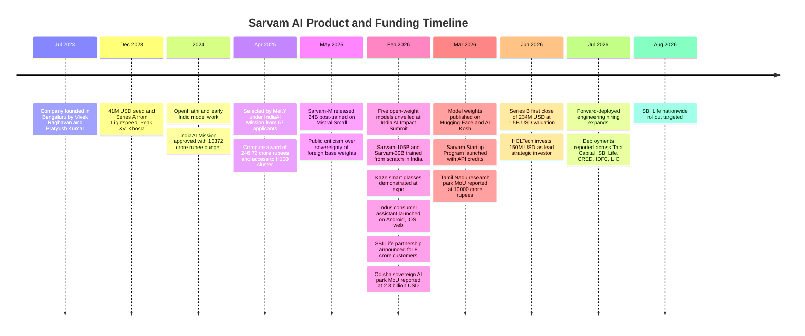
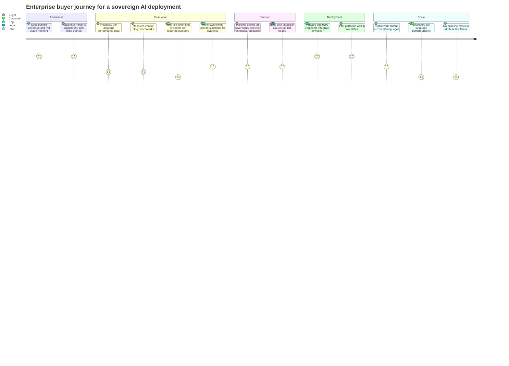
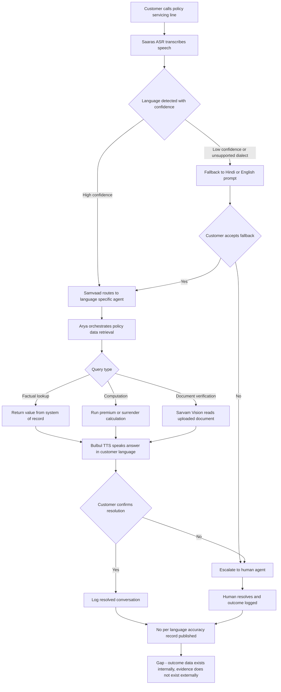
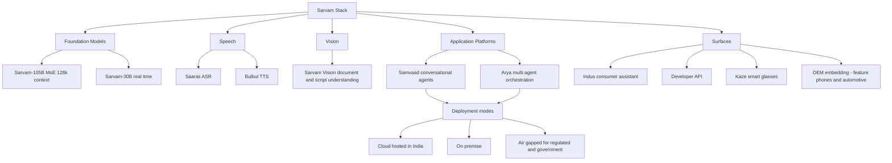
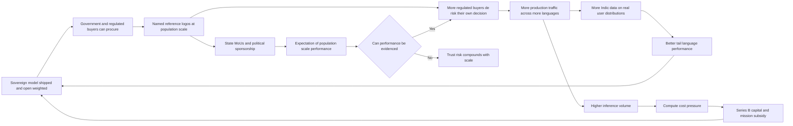
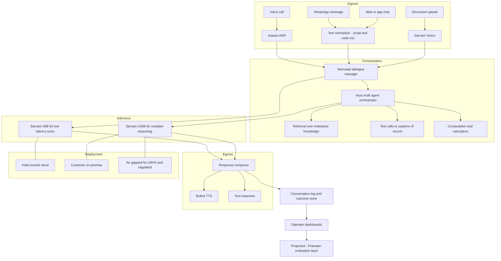
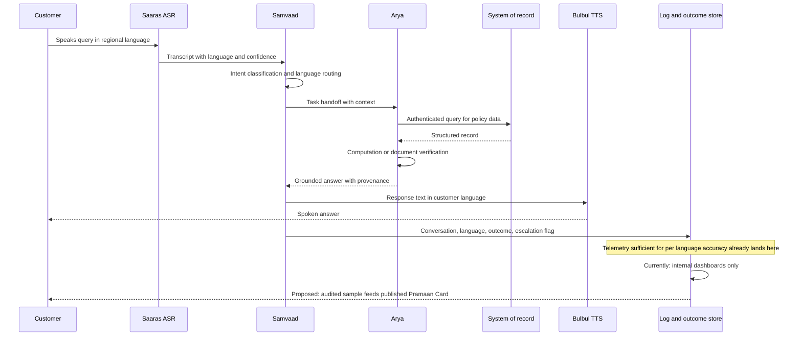
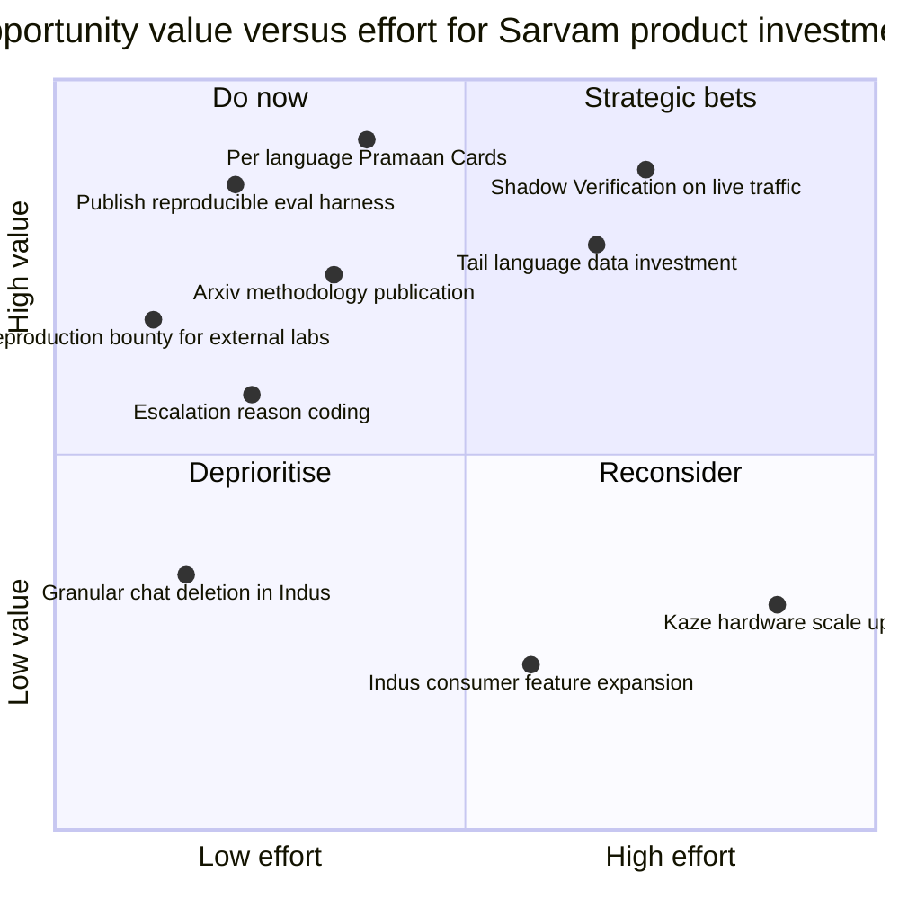
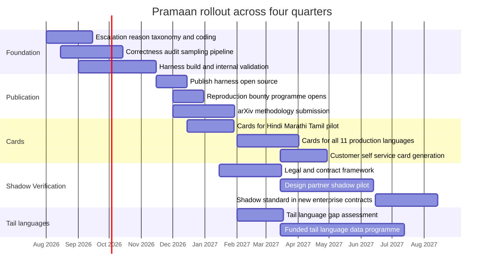
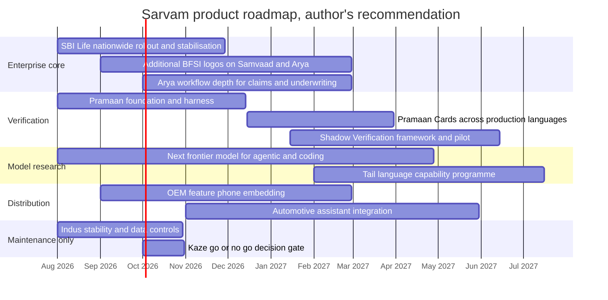

# Sarvam AI — Product Management Case Study

**Day 32 of 90 | PM Case Study Challenge**

## 1. Cover

**Product:** Sarvam AI (Sarvam AI Private Limited)
**Category:** Artificial Intelligence — Sovereign Foundation Models, Voice AI & Enterprise Agent Infrastructure
**Author:** Gaurav Singh
**Day:** 32 / 90
**Date Published:** July 28, 2026

## 2. Repository Metadata

| Field | Value |
|---|---|
| Repository | product-management-case-studies |
| Folder | `Case Studies/Day-32-Sarvam-AI/` |
| Author | Gaurav Singh |
| Series | 90-Day PM Case Study Challenge |
| Previous | Day 31 — ChatGPT |
| Companion Files | `assumptions.md` |
| License | MIT (see §63 License) |

## 3. Badges

`Day 32/90` · `Category: AI / Sovereign Foundation Models` · `Company: Sarvam AI Private Limited` · `Status: Private, Series B first close June 2026` · `Published: July 28, 2026`

## 4. Table of Contents

**Foundations**
1. Cover · 2. Repository Metadata · 3. Badges · 4. Table of Contents · 5. Executive Summary · 6. Product Overview · 7. Company Background · 8. Product Timeline · 9. Vision & Mission · 10. Problem Statement

**Market & Strategy**
11. Market Research · 12. Industry Analysis · 13. TAM/SAM/SOM · 14. Competitor Analysis · 15. SWOT · 16. Porter's Five Forces · 17. Business Model Canvas · 18. Revenue Model

**Users & Experience**
19. Target Users · 20. Personas · 21. JTBD · 22. User Journey · 23. User Flow · 24. Information Architecture · 25. UX Audit · 26. UI Audit · 27. Accessibility

**Product & Growth**
28. Feature Breakdown · 29. AI Capabilities · 30. Product Metrics · 31. North Star Metric · 32. Product Analytics · 33. AARRR · 34. HEART · 35. Growth Strategy · 36. Growth Loops · 37. Network Effects · 38. Product Strategy · 39. Monetization · 40. Trust & Safety

**Technical**
41. Technical Architecture · 42. Data Flow · 43. API Ecosystem · 44. Privacy & Security

**Strategy & Planning**
45. Pain Points · 46. Opportunity Mapping · 47. RICE · 48. MoSCoW · 49. Kano · 50. Feature Proposal · 51. PRD · 52. Wireframes · 53. Rollout Plan · 54. A/B Testing · 55. KPI Dashboard · 56. Product Roadmap · 57. Risks & Mitigation · 58. Future Vision

**Closing**
59. PM Lessons · 60. PM Interview Questions · 61. References · 62. About the Author · 63. License · 64. Self Review · 65. Appendix

## 5. Executive Summary

On February 18, 2026, at Bharat Mandapam in New Delhi, Sarvam AI put a 105-billion-parameter mixture-of-experts model on stage next to the Prime Minister of India. Sarvam-105B was trained from scratch on Indian infrastructure — over a thousand NVIDIA H100 GPUs at Yotta's Shakti cluster, allocated under the IndiaAI Mission — across 12 trillion tokens spanning 22 scheduled Indian languages, with a 128,000-token context window and a custom tokeniser that cuts Indic script fertility to roughly 1.4–2.1 tokens per word against 4–8x for standard multilingual tokenisers. It was released under Apache 2.0. Weights went up on Hugging Face and AI Kosh on March 6, 2026. Four months later, on June 15, HCLTech led a $234 million first close of a $300 million Series B at a $1.5 billion post-money valuation, making Sarvam India's newest AI unicorn.

That is the celebratory story, and it is largely deserved. Sarvam's May 2025 release, Sarvam-M, was a 24B model post-trained on Mistral Small, and it was publicly savaged for exactly that — a wrapper on a French company's base weights being marketed as sovereign AI. The 105B is the answer to that criticism, and on architecture and training provenance it is a real answer. This is the most technically ambitious model family an Indian lab has shipped.

The problem this case study is actually about is what happens next, and it is not a capability problem.

Every headline performance claim Sarvam has published is self-reported. Math500 at 98.6. MMLU at 90.6. AIME 2025 at 88.3. BrowseComp at 49.5, against DeepSeek R1's 3.2 on the same benchmark — a roughly 15x gap that would be extraordinary if independently reproduced. As of the last public assessment, Sarvam's models did not appear on the Hugging Face Open LLM Leaderboard in either version, had no Arena ranking, and had no arXiv paper carrying methodology or ablations. IndiVibe, the Indic evaluation benchmark used to substantiate the language claims, was designed by Sarvam, translated by Sarvam, run on prompts selected by Sarvam, and judged by Gemini. The older public Indic benchmarks that might serve as a check — MILU, IndicGLUE — were built by AI4Bharat, the research group co-founded by the same people who now run Sarvam.

None of that is an accusation. Pratyush Kumar's Indic NLP credentials are not in dispute, and Apache 2.0 weight release is the opposite of hiding. But credibility and verification are different functions, and the gap between them stops being academic the moment the models enter public infrastructure. UIDAI has already integrated Sarvam's stack into Aadhaar services on air-gapped, on-premise infrastructure for voice interaction in 10 languages. SBI Life is deploying Samvaad and Arya across a base reported at 8 crore customers and 3.5 lakh distributors in 11 languages, with nationwide rollout targeted for August 2026 — one month from this publication date. Tata Capital is live on multilingual voice agents for consumer loans. Procurement decisions worth thousands of crores, plus state MoUs at ₹10,000 crore in Tamil Nadu and $2.3 billion in Odisha, are being made against numbers whose only source is the model builder.

So the finding is this. **Sarvam's binding constraint over the next four quarters is not compute, capital, or Indic capability. It is verifiability — and verifiability is a product surface Sarvam has not built.** India lacks an independent, nationally authoritative Indic evaluation institution, and it will not conjure one on Sarvam's roadmap timeline. Waiting is a strategy that transfers the risk onto the deployments.

This is the fourth consecutive study in this series to land on a measurement problem, after Google Ads, Meta Ads, and ChatGPT. It is also the first where the instrument and the company's commercial interest point the same direction. Google had reason to keep incrementality unmeasured. Meta had reason to keep attribution definitions mutable. OpenAI had no instrument for what advertising costs it in user trust. Sarvam is different: its buyers are regulated banks, insurers, government departments, and defence, and that buyer class pays a premium for auditable evidence. Verification is not Sarvam's liability. It is the most under-exploited asset on its balance sheet.

The proposed feature, **Pramaan**, has two surfaces. A **Pramaan Card** is a per-deployment, per-language evaluation artifact generated from a published reproducible harness, reporting task accuracy, word error rate, script-level document accuracy, refusal rate, human-escalation rate, and hallucination rate with sample sizes and confidence intervals — including the low-resource tail of Bhojpuri, Maithili, and Santali, where the sovereignty argument is strongest and the data is thinnest. **Shadow Verification** runs Samvaad against the customer's incumbent model on live production traffic for the first 90 days of every enterprise deployment, with publication rights held by the customer rather than by Sarvam.

Section 47 records that a narrower option — publish the harness alone, skip Shadow Verification — scores materially higher on RICE than the combined proposal. That score is left in the table and overridden on sequencing grounds rather than adjusted to match the recommendation. Section 50 names the strongest argument against building Pramaan at all: a published per-language scoreboard creates a permanent, discoverable record of underperformance in precisely the languages that justify multi-thousand-crore state commitments, and state political sponsors are not a forgiving counterparty.

## 6. Product Overview

Sarvam is not a single product. It is a stack, and understanding the stack is a prerequisite to understanding why the verification gap matters commercially rather than just reputationally.

**Foundation models.** Sarvam-105B, a 105B-parameter sparse mixture-of-experts model using 128 experts with Multi-head Latent Attention, 128,000-token context, trained on approximately 12 trillion tokens. Sarvam-30B, a smaller sibling positioned for real-time conversational workloads. Both released under Apache 2.0 and downloadable from Hugging Face and AI Kosh, the government model repository. Reported active-parameter counts per forward pass differ across sources and are treated as a source conflict in §65.

**Speech.** Saaras for automatic speech recognition and Bulbul for text-to-speech, both tuned for Indian languages, code-mixed Hinglish, romanised WhatsApp-register Hindi, and noisy real-world audio. Sarvam has stated its speech models transcribe over half a million hours of audio per month.

**Vision and documents.** Sarvam Vision, a vision-language model for document understanding across Indian scripts — the capability that lets a claims workflow read a scanned hospital record or death certificate in Devanagari, Tamil, or Bengali script rather than routing it to a human.

**Samvaad.** The conversational agent platform. Deploys voice, WhatsApp, and web agents in 11 Indian languages, with pilot-to-production framing measured in weeks and on-premise or air-gapped deployment for regulated sectors.

**Arya.** Multi-agent orchestration — the layer that lets several agents coordinate over enterprise data to complete a task rather than answer a question. Arya is what turns Samvaad from a chatbot into a workflow.

**Indus.** The consumer-facing assistant, launched February 19–20, 2026 on Android, iOS, and web, powered by the 105B. Multilingual mid-conversation language switching, voice input, document upload, web-grounded answers, and India-hosted inference.

**Kaze.** Smart glasses, Sarvam's first hardware product, demonstrated at the summit and supporting 10+ Indian languages for voice interaction and translation.

The commercial centre of gravity is Samvaad and Arya sold into regulated enterprises. Indus is a demand-generation and legitimacy surface. Kaze is a bet on the non-typing user. That ordering matters for every recommendation in this document.

## 7. Company Background

Sarvam AI was founded in July 2023 in Bengaluru by Vivek Raghavan and Pratyush Kumar.

The founding pair is the single most important fact about the company's positioning. Raghavan's prior work is on Aadhaar — biometric identity infrastructure operating at population scale, where the design constraints are cost per transaction, offline tolerance, and failure modes across a linguistically and infrastructurally uneven country. Kumar co-founded AI4Bharat at IIT Madras, the research group that built much of the open Indic NLP corpus and benchmark ecosystem, and carries a citation record measured in the thousands. Sarvam is what happens when population-scale public-infrastructure instincts meet Indic language research: frugality as an architectural principle, not a marketing line.

In December 2023 the company raised $41 million across seed and Series A from Lightspeed, Peak XV Partners, and Khosla Ventures, bringing total venture capital to roughly $54 million before the Series B.

In April 2025, the Ministry of Electronics and Information Technology selected Sarvam under the IndiaAI Mission to develop an indigenous foundational model, reportedly from a pool of 67 applicants. The award included compute support of ₹246.72 crore, with a reported 60% treated as equity, and access to roughly 4,000 NVIDIA H100 GPUs through Yotta Data Services for a six-month window. Exact GPU counts vary across sources; see §65.

In May 2025, Sarvam released Sarvam-M, a 24B model post-trained on Mistral Small. The reception was poor and public. Menlo Ventures investor Deedy Das called it embarrassing and pointed at a download count in the low double digits within the first two days. The substance of the criticism was not model quality but the sovereignty claim: a model built on foreign base weights is a localisation, not an indigenous foundation model. Sridhar Vembu of Zoho publicly defended the company. The episode is worth dwelling on, because Sarvam's entire 2026 strategy reads as a correction to it.

February 18, 2026 was that correction. Five open-weight models at the India AI Impact Summit, with the 105B trained from scratch on Indian compute. Weights followed on March 6. The Indus consumer app shipped February 19–20. UIDAI, SBI Life, and Tata Capital deployments landed across the same window. State MoUs followed: Odisha at a reported $2.3 billion in February, Tamil Nadu at a reported ₹10,000 crore for a Sovereign AI Research Park.

June 15, 2026 brought the Series B first close: $234 million of a targeted $300 million at $1.5 billion post-money, led by HCLTech at $150 million, with Bessemer Venture Partners joining and Khosla and Peak XV following on. Sarvam has stated that 30–50% of the round is earmarked for compute and GPU procurement, with the remainder funding a next frontier model targeting agentic, coding, and cybersecurity workloads, and a forward-deployed engineering motion.

One contextual event shaped the fundraise environment. In June 2026, following a US government order, Anthropic suspended access to two of its most capable models for foreign nationals before controls were lifted at the end of the month. Indian coverage of Sarvam's unicorn round linked the two explicitly. Whatever one thinks of the policy, it functioned as a live demonstration of the dependency argument that sovereign AI advocates had been making abstractly for two years.

## 8. Product Timeline



## 9. Vision & Mission

Sarvam's public framing is population-scale AI sovereignty: models that understand Indian voices, read Indian documents, and serve intelligence at a cost every Indian enterprise and government department can afford. Co-founder Pratyush Kumar has described the opportunity as research-led innovation for AI that works at India's scale, and the company's stated ambition is a full-stack offering that lets enterprises own and operate their own sovereign AI rather than rent intelligence from an API in another jurisdiction.

Raghavan's framing of the SBI Life deployment is the clearest articulation of the actual product goal: that every policyholder, regardless of language or digital literacy, should be able to get an answer instantly from a culturally fluent AI voice.

Read carefully, that is a claim about outcomes for the least-served user, not about benchmark scores. It is also, unexamined, an unverifiable claim. §50 exists because Sarvam's own mission statement implies an instrument that Sarvam has not built.

## 10. Problem Statement

Four problems sit at different layers, and conflating them is the most common analytical error in coverage of Indian sovereign AI.

**Problem 1 — Tokenisation and cost.** Standard multilingual tokenisers fragment Indic scripts at 4–8 tokens per word. Every Indian-language query through a foreign model therefore costs multiples of an equivalent English query, in both money and latency. This is a real, measurable, architectural problem, and Sarvam's custom tokeniser at 1.4–2.1 fertility is a real answer to it.

**Problem 2 — Coverage and context.** India has 22 scheduled languages, dense code-mixing, and enormous variation in register between written formal Hindi and the romanised Hinglish people actually type into WhatsApp. Frontier models trained predominantly on English web text degrade unevenly across that surface, and worst in the low-resource tail.

**Problem 3 — Jurisdiction and dependency.** Data leaving India, and capability that can be switched off by a foreign regulator, are procurement blockers for banks, insurers, UIDAI, and defence regardless of model quality. The June 2026 export-control episode moved this from a theoretical concern to a demonstrated one.

**Problem 4 — Verification.** Once problems 1 through 3 are solved, the buyer needs to know whether the solution works, per language, per task, at the tail. India has no independent authoritative Indic evaluation institution. AI4Bharat's Indic LLM-Arena, Microsoft Research India's PARIKSHA, MILU, IndicGLUE, and IndicIFEval all exist and all contribute, but none carries the reach and institutional independence to arbitrate a contested frontier claim — and the most-cited of them were built by the group whose founders now run the largest model builder.

Sarvam has addressed 1, 2, and 3 with genuine engineering. Problem 4 is unaddressed, and it is the one that compounds with deployment scale.

## 11. Market Research

India is the world's largest AI consumer market by user count and one of its smallest by frontier model production. Both OpenAI and Anthropic have publicly described India as their second-largest market after the United States. India has over 800 million internet users. It has, until 2026, produced no frontier-class indigenous foundation model.

That asymmetry is the market. It has three distinct buyer segments with almost nothing in common.

**Regulated enterprise.** Banks, insurers, NBFCs, and lenders with large vernacular customer bases and compliance functions that require data residency, audit trails, and on-premise or air-gapped deployment. This segment is slow, high-ACV, reference-driven, and effectively closed to foreign API-only vendors for their most sensitive workloads. Sarvam's live logos — SBI Life, Tata Capital, and reported engagements at CRED, IDFC, and LIC — sit here.

**Government and public digital infrastructure.** UIDAI, MyGov, state departments, Bhashini-adjacent translation and speech rails. Procurement is political as much as technical, sovereignty is a hard requirement rather than a preference, and the deployment footprint is population-scale by default.

**Consumer.** Hundreds of millions of users, most already on ChatGPT or Gemini, with zero switching cost and no loyalty to provenance. Indus competes here.

The strategic reading is that segments one and two are winnable on structural grounds that have nothing to do with model quality, and segment three is not winnable on those grounds at all.

## 12. Industry Analysis

The IndiaAI Mission, approved by Cabinet in March 2024 with a budget of ₹10,372 crore, is the organising force in this industry, and it did not pick a single winner. MeitY has confirmed support for 12 organisations building sovereign foundational models: Sarvam AI, Soket AI, Gnani AI, Gan AI, Avataar AI, the IIT Bombay-led BharatGen consortium, GenLoop, Zenteiq, Intellihealth, Shodh AI, Fractal Analytics, and Tech Mahindra Maker's Lab.

The allocation is instructive. BharatGen received a reported ₹1,058.52 crore — roughly four times Sarvam's ₹246.72 crore and the largest single allocation in the programme. Sarvam is the most visible beneficiary of the mission, not the largest funded one. The most-funded entrant is an academic consortium with a public-service mandate, which means Sarvam's competition for government workloads is subsidised, institutionally embedded, and not required to generate a return.

Three sovereign models were unveiled at the February summit: Sarvam's twin LLMs, Gnani.ai's Vachana voice stack, and BharatGen's Param2, a 17B multimodal MoE across 22 languages developed with NVIDIA. The summit itself reportedly drew $250 billion in infrastructure pledges, a figure that should be read as a pledge total rather than committed capital.

Two structural features of the industry deserve emphasis.

First, the compute layer is not sovereign. Every GPU in every one of these clusters is designed and fabricated outside India. The India Semiconductor Mission is focused on assembly and packaging in the near term; advanced accelerator fabrication is a decade-plus horizon. Sovereignty in the 2026 Indian sense is a claim about data, weights, language, and deployment locus — not about silicon. Honest analysis should say so plainly rather than treat the word as absolute.

Second, the verification layer is not built. This is the argument of §10 Problem 4, restated at industry level: capital flowing into building sovereign models dwarfs capital flowing into independently verifying them, and the imbalance is structural rather than anyone's oversight.

## 13. TAM/SAM/SOM

Every figure in this section is a constructed estimate. None is a company disclosure, and the arithmetic is shown so it can be disputed.

**TAM — Indian enterprise and government spend on language-and-voice AI.** ASSUMPTION — VALIDATION REQUIRED. Taking Indian enterprise IT services and software spend as the base and assuming conversational and document AI reaches a low single-digit share of it by 2028, a defensible TAM band is $4–8 billion annually. The band is wide because the denominator itself is contested and because "AI spend" in Indian enterprise reporting frequently includes reclassified existing automation budgets.

**SAM — workloads that structurally require sovereign deployment.** ASSUMPTION — VALIDATION REQUIRED. Restricting to BFSI, government, healthcare, and defence workloads where data residency or air-gapping is a hard requirement, and where the primary interaction language is not English, gives roughly 25–40% of TAM, or $1.0–3.2 billion. This is the segment where Sarvam's advantage is structural rather than competitive.

**SOM — realistically addressable within 24 months.** ASSUMPTION — VALIDATION REQUIRED. Sarvam's reported annual revenue as of early 2026 was approximately ₹29 crore, about $3.5 million. Even on aggressive assumptions — SBI Life converting to a large multi-year contract, three to five comparable BFSI logos, and government workloads scaling on Aadhaar rails — a $40–90 million revenue range by mid-2028 requires roughly 12–25x growth off that base. That is achievable for an infrastructure company with subsidised compute and captive demand, and it is still a rounding error against the TAM.

The number worth sitting with: a $1.5 billion post-money valuation against a reported ₹29 crore revenue base implies a multiple in the region of 400x. ASSUMPTION — VALIDATION REQUIRED, and directionally unreliable, because the revenue figure predates the Series B by roughly four months and Sarvam has not disclosed current revenue. But even generously restated, this is not a revenue multiple. It is a sovereignty option priced against the possibility that India's public and regulated digital infrastructure standardises on one domestic stack. Which is exactly why verification is the load-bearing variable: the option only pays if the standardisation happens, and standardisation at this scale eventually requires evidence that survives adversarial inspection.

## 14. Competitor Analysis

| Competitor | Type | Position | Threat to Sarvam |
|---|---|---|---|
| OpenAI / ChatGPT | Foreign frontier | India described as second-largest market; dominant consumer mindshare | Severe in consumer, moderate in enterprise, blocked in sovereign-mandate workloads |
| Google / Gemini | Foreign frontier | Android distribution, Workspace bundling, Indic investment | Severe in consumer; strong in enterprise where residency is negotiable |
| Anthropic / Claude | Foreign frontier | India second-largest market; enterprise and developer strength | Moderate; June 2026 access suspension damaged the dependency case for foreign vendors |
| BharatGen (IIT Bombay) | Domestic, state-funded | Param2 17B MoE, 22 languages, ₹1,058.52 crore allocation, largest in mission | High in government workloads; subsidised, institutionally embedded, no return requirement |
| Krutrim (Ola / ANI) | Domestic, VC-funded | India's first AI unicorn; Hindi-first general-purpose family; own cloud | Moderate; comparable narrative, different distribution base |
| Gnani.ai | Domestic, voice-first | Vachana stack, 14B voice model, reported sub-5% WER, low-bandwidth focus | High specifically in voice; already partnered with Razorpay on collections |
| Bhashini / NPCI-adjacent public rails | Government infrastructure | Translation and speech APIs across 22 languages, deployed in MyGov and state portals | Structural; commoditises the translation layer beneath the LLMs |
| CoRover, Soket, Gan AI, Avataar, others | Domestic, mission-funded | Nine further mission-funded builders across niches | Fragmentation risk more than displacement risk |

Three readings that matter more than the table.

**The real consumer competitor is not a model, it is a default.** Indus does not lose to ChatGPT on Indic quality; it loses to the fact that ChatGPT is already installed. Reported Indus figures — approximately 50,000 downloads in its first week, and a third-party aggregator estimate of roughly 230,000 cumulative Android installs by mid-May 2026 — describe a product with respectable early curiosity and no distribution. Against the installed base of the incumbents in India, this is not a competition; it is a demonstration.

**The real enterprise competitor is BharatGen, not OpenAI.** For a government department choosing a sovereign stack, BharatGen offers a state-funded academic consortium with four times Sarvam's mission allocation and no commercial margin to defend. Sarvam wins those bakeoffs on productisation, latency, and deployment velocity — Samvaad and Arya are real products where Param2 is a real model — and that advantage is precisely the kind of thing that erodes if the buyer cannot verify the difference.

**The real voice competitor is Gnani.** Voice, not chat, is where Indian enterprise AI monetises, because voice replaces call-centre cost lines with hard baselines. Gnani built voice-first from the start and has a published WER claim. Sarvam's Saaras and Bulbul are strong, and its half-million-hours-per-month transcription figure is a meaningful scale signal, but this is the one axis where a focused domestic competitor may be genuinely ahead in the metric buyers care about.

## 15. SWOT

**Strengths.** Frontier-class model trained from scratch on Indian compute, defensible on provenance. Apache 2.0 release, which converts a marketing claim into an inspectable artifact. Best-in-class Indic tokenisation economics. Founding team with Aadhaar and AI4Bharat lineage, which is a procurement asset in Indian government contexts that no foreign vendor can replicate. Full stack from ASR through orchestration, so the company sells outcomes rather than tokens. Air-gapped and on-premise deployment capability. HCLTech as strategic investor, which brings enterprise distribution rather than only capital.

**Weaknesses.** All headline performance claims self-reported, with the primary Indic benchmark authored and judged in-house. Revenue base of roughly ₹29 crore as last reported against a $1.5 billion valuation. Consumer product with no distribution mechanism. Six product lines including hardware at roughly 200 people. No arXiv-grade methodology publication. Compute dependency on a foreign accelerator supply chain that the sovereignty narrative implicitly disclaims.

**Opportunities.** Regulated BFSI vernacular servicing, where the cost baseline is human call centres and the savings are measurable. Government workloads on Aadhaar and Bhashini rails. On-device and feature-phone deployment via the reported HMD partnership, which reaches the non-smartphone user no foreign vendor addresses. Automotive via the reported Bosch engagement. Becoming the reference implementation for sovereign AI export to other Global South markets with similar linguistic fragmentation — a genuinely large and underdiscussed opportunity.

**Threats.** BharatGen absorbing government demand on subsidised economics. Gnani winning voice on a published metric. An independent evaluation, once one exists, materially contradicting published benchmarks. Frontier model price collapse making the cost argument moot. State MoU commitments creating political expectations that outrun engineering reality. Concentration risk: a single failed high-profile deployment at SBI Life scale would be a sector-level event, not a company-level one.

## 16. Porter's Five Forces

**Competitive rivalry — high but segmented.** Twelve mission-funded builders plus three foreign frontier labs, but almost no direct head-to-head. Sarvam competes with BharatGen for government, Gnani for voice, and OpenAI and Google for consumer, and the three contests have different rules.

**Supplier power — very high, and structurally unfixable in the near term.** NVIDIA is the accelerator supplier, Yotta the data-centre capacity, and both sit upstream of the entire Indian sovereign AI programme. The IndiaAI Mission compute subsidy substitutes public balance sheet for supplier leverage; it does not reduce supplier power. India needing on the order of 100,000 GPUs for 2026 targets, all foreign-designed, is the arithmetic that supplier power reduces to.

**Buyer power — high in enterprise, absolute in government.** A public-sector buyer can require on-premise deployment, source-code escrow, per-language performance guarantees, and price concessions simultaneously. It can also change its mind for political reasons. High-ACV concentrated buyers with procurement leverage are exactly the counterparty who will eventually demand what §50 proposes; the strategic question is whether Sarvam builds it before being asked.

**Threat of substitutes — moderate and falling.** Open-weight foreign models fine-tuned on Indic data are the substitute, and Sarvam's own Sarvam-M history proves the approach works technically while failing politically. Kimi, DeepSeek, and Mistral derivatives remain a live substitute for cost-sensitive private buyers with no sovereignty mandate.

**Threat of new entrants — low for models, high for wrappers.** Training a 105B from scratch requires a compute allocation that only the mission grants. Building a Samvaad competitor on top of an open-weight model requires a small team and a quarter. Sarvam's moat is at the deployment and trust layer, not the weights layer — which is another way of saying the moat is exactly where verification lives.

## 17. Business Model Canvas

**Customer segments.** Regulated enterprises in BFSI and insurance. Central and state government departments and public digital infrastructure operators. Developers and startups via API. Consumers via Indus. OEMs and device partners.

**Value propositions.** Indic performance at Indic cost. Data residency and air-gapped deployment as a default rather than an enterprise upsell. Outcome-level products — resolved conversations, verified documents, enabled agents — rather than raw tokens. Sovereign provenance that survives a foreign export-control event.

**Channels.** Direct enterprise sales with forward-deployed engineers. Government procurement and mission channels. AI Kosh and Hugging Face for open-weight distribution. HCLTech's enterprise footprint as a strategic channel. App stores for Indus. OEM embedding for feature phones and automotive.

**Customer relationships.** High-touch forward-deployed engineering for enterprise. Startup Program API credits for developer acquisition. Self-serve for consumer.

**Revenue streams.** Enterprise platform and deployment contracts, API consumption, sovereign deployment and licensing to government, and eventually hardware.

**Key resources.** Model weights and training recipes. Indic data pipelines and tokeniser. Mission-allocated compute. Founding team credibility. Deployment reference logos.

**Key activities.** Frontier model training, forward-deployed integration, Indic data curation, and — the argument of this study — evaluation infrastructure.

**Key partners.** IndiaAI Mission and MeitY, NVIDIA, Yotta, HCLTech, state governments, HMD, Bosch, enterprise design partners.

**Cost structure.** Compute dominates, which is why 30–50% of the Series B is allocated to it. Then elite engineering headcount at roughly 200 people, then data acquisition and annotation, then the forward-deployed motion, which is expensive per logo by design.

## 18. Revenue Model

Sarvam monetises on three clocks running at different speeds, and the mismatch between them is the core financial tension.

**Fast clock — API consumption.** Priced in rupees, positioned on Indic cost advantage. Low ACV, high volume, immediate. Startup Program credits deliberately suppress near-term revenue here to build ecosystem lock-in.

**Slow clock — enterprise deployment.** Samvaad and Arya sold into BFSI with forward-deployed engineers. High ACV, long sales cycles, reference-dependent. This is where the reported ₹29 crore mostly comes from and where the next order of magnitude must come from. Each logo requires months of integration, which is why forward-deployed engineering is the fastest-growing job family on the company's board.

**Political clock — government and state commitments.** MoUs at ₹10,000 crore and $2.3 billion scale are infrastructure commitments to build parks and capacity, not revenue to Sarvam, and conflating the two is the most common error in Indian coverage of this company. They are real, they are strategically valuable, and they do not appear on a P&L. What they do create is political expectation on a timeline set by electoral cycles rather than model training runs.

The financial structure that follows: Sarvam is a company with venture-scale valuation, infrastructure-scale obligations, subsidised compute, and services-shaped revenue. The valuation is underwritten by the possibility of becoming default infrastructure. Default infrastructure status, historically, is conferred by procurement — and procurement in regulated sectors eventually asks for evidence.

## 19. Target Users

Four user classes, and the distance between them is the reason a single evaluation number is meaningless.

**The vernacular end customer.** An SBI Life policyholder in rural Maharashtra asking about a premium due date in Marathi, over a noisy phone line, possibly code-mixing. Low digital literacy, no alternative channel, zero tolerance for a wrong number. This user never chooses Sarvam and never knows the product's name.

**The enterprise frontline agent.** One of 3.5 lakh SBI Life distributors using a WhatsApp co-pilot to explain a rider, run a premium calculation, or check underwriting guidance in the customer's language. Under sales pressure, motivated to trust the tool, and structurally the person most likely to propagate a model error into a mis-selling event.

**The enterprise buyer.** A CDO or CTO at a bank or insurer who must justify a sovereign AI deployment to a risk committee and a regulator. Cares about residency, auditability, per-language performance, and escalation behaviour. This is the user Pramaan is built for.

**The developer.** An Indian founder building on Sarvam APIs because Indic tokens are cheaper and the endpoint is in-country. Cares about latency, cost per 1,000 requests, and eval pass rate — and notably, Sarvam's own job descriptions ask candidates for eval pipelines, which tells you the company understands evaluation as an engineering discipline internally even though it has not shipped it as a customer-facing surface.

**The consumer.** An Indus user who thinks in Hindi and is curious about an Indian alternative. Has ChatGPT installed. Will switch back on the first bad answer.

## 20. Personas

**Sunita, 47, policyholder, Nashik district.** Speaks Marathi, some Hindi, no English. Has a smartphone she uses for WhatsApp and UPI. Needs to know whether a lapsed policy can be revived and what it costs. Previously this meant a branch visit or a call to an agent who might not call back. Her success criterion is a correct number spoken clearly in Marathi in under two minutes. Her failure mode is a confidently wrong number, which she will act on.

**Ramesh, 34, insurance distributor, Coimbatore.** Manages 200 clients across Tamil and English. Uses the WhatsApp co-pilot 20 times a day for product comparisons and premium illustrations. Success is closing faster with fewer callbacks. Failure is a co-pilot answer that misstates a rider exclusion, which becomes his liability and his employer's regulatory exposure.

**Anjali, 41, Chief Digital Officer, mid-size private bank, Mumbai.** Evaluating Sarvam against BharatGen and a foreign frontier vendor. Has an internal audit function and an RBI examination cycle. Needs per-language performance evidence, documented failure modes, escalation guarantees, and a defensible answer to why she chose this vendor. Currently receives a vendor blog post and a summit press release. She is the buyer whose unmet need this case study is about.

**Karthik, 26, founder, Bengaluru.** Building a Kannada-first agri-advisory app. Chose Sarvam for token economics and Indian endpoints. Runs his own evals because he cannot find independent ones. Would pay for a published harness he could cite to his own customers.

**Meera, 29, marketing professional, Delhi.** Downloaded Indus after summit coverage. Types in Hinglish. Tried three queries, liked the language handling, went back to ChatGPT because her chat history and habits live there. She is not a retention problem to be solved with features; she is evidence that consumer is the wrong wedge.

## 21. Jobs To Be Done

| When… | I want to… | So I can… | Current alternative | Gap |
|---|---|---|---|---|
| I need a policy answer in my own language | ask a question by voice and get a specific number | act without visiting a branch | call an agent, wait for callback | agent availability, language mismatch |
| I am selling and the client asks about an exclusion | get an authoritative answer in seconds inside WhatsApp | close without a callback | PDF product manuals, senior colleague | slow, English-first, error-prone |
| I must justify an AI vendor to my risk committee | show per-language performance evidence with methodology | pass audit and examination | vendor blog posts and press releases | **no independent verification exists** |
| I am building on an Indic model | know how it performs on my language and task | ship without discovering failure in production | run my own ad hoc evals | no reproducible shared harness |
| I want an AI that understands Indian context | ask in the register I actually speak | avoid translating myself into English first | ChatGPT with English scaffolding | switching cost and habit |

The third row is the only job on this list with no existing alternative at all. That is the definition of an opportunity.

## 22. User Journey



The journey is deliberately drawn to show where satisfaction collapses. Evaluation and post-scale are the two troughs, and they are the same problem observed at two different times: the absence of a pre-committed baseline means a tail-language failure in month seven cannot be distinguished from a tail-language failure that was always present and merely undetected.

## 23. User Flow



The last two nodes are the finding. The telemetry to build a per-language scoreboard is already being generated by every production deployment. It is not being turned into an artifact anyone outside Sarvam can inspect. This is the cheapest unbuilt product in the company.

## 24. Information Architecture



The architecture is coherent and unusually complete for a three-year-old company. The gap is that no node in this tree is labelled "evaluation." Internally, eval pipelines exist — the company's own hiring requirements make that clear. Externally, there is no node.

## 25. UX Audit

Assessed against Indus in beta and the documented enterprise surfaces. Ratings are the author's judgement, not measured usability testing.

| Dimension | Rating | Notes |
|---|---|---|
| Language switching | Strong | Mid-conversation switching without session reset matches actual Indian speech behaviour and is the clearest differentiator |
| Voice input | Strong | Correctly prioritised; voice is the primary modality for the user this product claims to serve |
| Document handling | Good | Upload and query works; script coverage is the differentiator against foreign models |
| Data controls | Weak | Reported inability to delete individual chats, with account deletion as the only removal path — an unusual gap for a product whose entire pitch is data sovereignty |
| Reasoning mode control | Weak | Reported inability to disable reasoning mode; latency cost imposed without user choice |
| Latency perception | Mixed | Reasoning-mode responses read as slow against incumbent expectations set by faster consumer assistants |
| Confidence signalling | Absent | No surfacing of per-language or per-task confidence to the end user, which is the UX expression of the verification gap |

The data-controls finding deserves emphasis because it is a positioning contradiction rather than a bug. A product marketed on sovereignty and privacy that makes granular data deletion harder than the incumbents undercuts its own argument at the exact moment a privacy-motivated user goes looking for the control.

## 26. UI Audit

Indus presents a conventional assistant interface — conversation thread, mic affordance, upload, and a document workspace. That conventionality is correct: a first-time AI user in India has usually already seen ChatGPT or a WhatsApp bot, and novelty in layout would cost more than it earns.

The specific opportunities are Indic-typographic rather than structural. Rendering quality across Devanagari, Tamil, Bengali, Telugu, and Kannada at small sizes, line-height handling for conjunct-heavy scripts, and font fallback behaviour on low-end Android are all places where a product built for these languages can visibly outperform a product that supports them. There is no public evidence Sarvam has invested here, and it is a cheap, highly legible differentiator for exactly the user the company describes in its mission.

For enterprise, the surface that matters is not the agent UI but the operator console — the dashboards Samvaad exposes for tracking conversations and outcomes. Sarvam's own product description says real-time dashboards give visibility into what is working. That console is the natural home for Pramaan, which means §50 is a proposal to extend an existing surface rather than build a new one.

## 27. Accessibility

Accessibility here is not a compliance checkbox; it is the entire product thesis, which makes the gaps more consequential than they would be elsewhere.

**What is genuinely strong.** Voice-first interaction as a first-class path serves non-literate and low-literacy users that text-first assistants exclude entirely. Support across 22 scheduled languages, and 11 in production at SBI Life, addresses linguistic exclusion at a scale no foreign vendor attempts. Low-bandwidth and feature-phone routes via the reported HMD partnership reach users without smartphones. Air-gapped deployment lets services reach populations in facilities without reliable connectivity.

**What is unaddressed or unevidenced.** Performance in the low-resource tail — Bhojpuri, Maithili, Santali and comparable languages — is exactly where the accessibility claim is strongest and the training data is thinnest, and there is no published per-language breakdown. Dialect handling within a language, which is the difference between working Marathi and working Nashik Marathi. Screen-reader compatibility of the Indus interface. Hearing-impaired paths in a voice-first product. Cognitive load of reasoning-mode latency for users on slow connections.

The uncomfortable version of this section: the users for whom sovereign Indic AI is most transformative are the users for whom performance is least verified. That is not a criticism of intent. It is a statement of where the risk concentrates, and it is the moral case underneath the commercial case for §50.

## 28. Feature Breakdown

| Layer | Feature | Status | Strategic role |
|---|---|---|---|
| Model | Sarvam-105B, 105B MoE, 128 experts, MLA, 128k context | Shipped Feb 2026, weights Mar 2026, Apache 2.0 | Legitimacy and frontier claim |
| Model | Sarvam-30B, real-time conversational | Shipped Feb 2026, Apache 2.0 | Production workhorse for Samvaad |
| Model | Custom Indic tokeniser, fertility 1.4–2.1 | Shipped | Cost advantage; the most durable technical moat |
| Speech | Saaras ASR | Production, 500k+ hours/month reported | Voice is where enterprise value concentrates |
| Speech | Bulbul TTS | Production | Output modality for non-literate users |
| Vision | Sarvam Vision, multi-script document understanding | Production | Claims workflows, KYC, verification |
| Platform | Samvaad conversational agents, 11 languages, voice/WhatsApp/web | Production | Primary revenue surface |
| Platform | Arya multi-agent orchestration | Production | Converts answers into completed workflows |
| Surface | Indus consumer assistant | Beta since Feb 2026 | Legitimacy and demand generation, not revenue |
| Surface | Developer API and Startup Program credits | Live Mar 2026 | Ecosystem lock-in |
| Hardware | Kaze smart glasses | Announced Feb 2026, launch targeted May 2026 | Non-typing user; strategically optional |
| Deployment | On-premise and air-gapped | Production, UIDAI live | The feature foreign vendors cannot match |
| Evaluation | **None customer-facing** | **Absent** | **The subject of §50** |

Reading down the Status column, the pattern is a company that ships fast and broadly. Reading the last row, the pattern is a company that has shipped everything except the thing its buyers need in order to buy at scale.

## 29. AI Capabilities

**Architecture.** Sparse mixture-of-experts with 128 experts and Multi-head Latent Attention on the 105B, 128,000-token context. MoE is the correct architectural choice for Sarvam's constraint set: it buys frontier-class quality at a fraction of dense-model inference cost, which matters far more in a market where the buyer's alternative is a human call-centre agent at Indian wage rates than it does in a market competing on capability alone. Reported active-parameter counts per forward pass differ across sources; see §65.

**Training.** Approximately 12 trillion tokens for the 105B and a reported 16 trillion for the 30B, across 22 scheduled languages, on over a thousand H100s at Yotta's Shakti cluster under the IndiaAI Mission allocation.

**Tokenisation.** The single most under-appreciated capability. Indic fertility of 1.4–2.1 tokens per word against 4–8x for standard multilingual tokenisers is a 2–5x cost and latency advantage on every Indian-language request, permanently, structurally, for any workload in these languages. This is not a benchmark artefact; it is arithmetic, and it is independently checkable by anyone with the weights.

**Speech.** ASR and TTS tuned for code-mixing, romanised script, and noisy conditions. The claim that matters commercially is not accuracy on clean audio but accuracy on a rural phone line with background noise, and that is precisely the number nobody publishes.

**Reported benchmarks.** Math500 98.6, MMLU 90.6, LiveCodeBench v6 71.7, AIME 2025 88.3, BrowseComp 49.5 against DeepSeek R1's 3.2. ASSUMPTION — VALIDATION REQUIRED on all of them, and this is the sharpest instance of that label in this entire series. These are self-reported, unpeer-reviewed, and in the BrowseComp case represent a roughly 15x gap over a well-studied competitor on a benchmark designed to be hard. A 15x gap is either a significant research result deserving a paper, or an artefact of harness configuration. The distinguishing evidence would be independent reproduction, which the Apache 2.0 weight release now makes technically possible and which had not, at last public assessment, been completed by an authoritative party.

**Indic evaluation.** IndiVibe, Sarvam's Indic benchmark, was designed by Sarvam, translated by Sarvam, run on Sarvam-selected prompts, and judged by Gemini. Each of those four choices is individually defensible for an internal development benchmark. Together, in a document used to support procurement, they constitute a closed loop.

## 30. Product Metrics

Disclosed or reported metrics, with tiering:

| Metric | Value | Source tier |
|---|---|---|
| Daily conversational interactions | 2 million+ | Company statement via press |
| Audio transcribed monthly | 500,000+ hours | Company statement via press |
| Reported interaction growth | Approximately doubling over two months prior to June 2026 | Press, company-sourced |
| SBI Life reach | 8 crore customers, 3.5 lakh distributors | Company and partner statement |
| SBI Life languages in production | 11 | Company statement |
| UIDAI languages | 10, air-gapped on-premise | Government release |
| Indus first-week downloads | ~50,000 | Press |
| Indus cumulative Android installs | ~230,000 by mid-May 2026 | Third-party aggregator — weak |
| Annual revenue | ~₹29 crore / ~$3.5M, early 2026 | Press, single source |
| Headcount | ~200 | Third-party — weak |
| Latency and uptime targets | Sub-100ms, 99.9% SLA claims on product pages | Company marketing |

**Metrics that do not exist publicly and should.** Per-language task accuracy. Per-language WER on production audio. Human-escalation rate by language. Hallucination rate on factual policy queries. Indus DAU, MAU, D7 and D30 retention. Cost per resolved conversation. Enterprise ACV, gross margin, net revenue retention, churn. Whether the August 2026 SBI Life nationwide rollout is on schedule.

The asymmetry in that pair of lists is the case study. Sarvam publishes scale metrics generously and quality metrics not at all. Scale metrics support a fundraise. Quality metrics support a procurement. The company is currently optimised for the former.

## 31. North Star Metric

Sarvam's implicit north star, judged by what it publicises, is **daily conversational interactions**. Two million a day, doubling in two months, is a legitimate and impressive number.

It is also the wrong north star, for the same reason impressions were the wrong north star in the three preceding case studies in this series: it counts activity, not outcome, and it cannot fail. An agent that misunderstands a Santali query and escalates to a human logs an interaction. An agent that returns a confidently wrong surrender value logs an interaction and a satisfied-looking session close.

**Proposed north star: Verified Resolved Conversations (VRC).** A conversation counts toward VRC only if all four hold:

1. It was conducted primarily in a non-English Indian language.
2. It reached resolution without human escalation.
3. The resolution was correct, sampled and audited against the system of record.
4. It occurred in a language and task category with a current published Pramaan Card.

Condition 4 is the one that makes this metric different from a standard quality metric, and it is deliberate. It means VRC cannot grow by expanding into a language Sarvam has not yet evidenced. It ties commercial expansion to verification coverage, which is exactly the discipline the company currently lacks. It is also, unavoidably, a metric that starts small and grows slower than interaction count — which is why a company mid-fundraise would resist adopting it, and why proposing it is a real recommendation rather than a comfortable one.

## 32. Product Analytics

The instrumentation Sarvam already has, inferred from its product descriptions and deployment model: conversation-level logging, outcome tracking, real-time operator dashboards, and per-conversation context persistence across sessions.

What that instrumentation is not currently doing:

**Language-stratified reporting.** Aggregate resolution rate across 11 languages hides the tail entirely. If Hindi and Tamil are 85% and Santali is 55%, the aggregate looks acceptable and the users the mission exists to serve are being failed invisibly.

**Escalation-reason coding.** Escalations should be coded by cause — language misrecognition, missing knowledge, computation failure, refusal, customer preference — because each implies a different fix and only one of them is a model quality problem.

**Silent-failure detection.** The dangerous case is not escalation; it is a confidently wrong answer the customer accepts. Detecting it requires sampling against the system of record, which requires a deliberate audit pipeline rather than passive telemetry.

**Cohorting by connection and device quality.** A product for rural India that reports metrics without stratifying by bandwidth and device class is reporting on its urban users.

Every one of these is achievable with data Sarvam already collects. That is the recurring shape of this analysis: the gap is not data collection, it is publication and stratification.

## 33. AARRR

**Acquisition.** Enterprise arrives through summit visibility, mission association, founder credibility, and now HCLTech's channel. Developers arrive through Apache 2.0 weights, AI Kosh, Hugging Face, and Startup Program credits. Consumers arrived through one news cycle in February and have had no acquisition engine since.

**Activation.** Enterprise activation is unusually strong — the forward-deployed model means pilot in a day and production in weeks, which is a genuine competitive weapon against both foreign vendors and academic consortia. Consumer activation is weak: a waitlist at launch, then an interface competing against installed habit.

**Retention.** Enterprise retention should be structurally high once on-premise deployment and workflow integration are complete; switching costs in air-gapped BFSI deployments are severe. Consumer retention is undisclosed and, on the install trajectory, likely poor. Developer retention depends on what happens when Startup Program credits expire, which is an unreported cliff worth watching.

**Referral.** The strongest referral asset Sarvam has is a named regulated logo. SBI Life at 8 crore customers is a reference that opens every insurer in India. This is also why an SBI Life failure would be sector-level: the referral asset and the concentration risk are the same object.

**Revenue.** Enterprise contracts on a slow clock, API on a fast clock, government on a political clock, as set out in §18.

The AARRR read in one line: Sarvam's enterprise funnel is well-built and its consumer funnel does not exist. Resources currently split across both should not be.

## 34. HEART

Applied to Samvaad, the surface that matters commercially.

**Happiness.** Post-conversation satisfaction, stratified by language. Currently unpublished; almost certainly measured.

**Engagement.** Conversations per customer per quarter, and share of servicing volume handled without human contact. The second is the number an insurer's CFO actually cares about.

**Adoption.** Share of eligible interactions routed to Samvaad rather than a human queue, by language and by state. The Maharashtra and Tamil Nadu pilot versus nationwide gap lives here.

**Retention.** Repeat use by the same end customer, which for insurance servicing is annual rather than daily and therefore requires a long measurement window.

**Task success.** Resolution without escalation, and — the addition this study argues for — resolution *correctly*, audited against the system of record. Task success measured only as non-escalation systematically rewards confident errors.

## 35. Growth Strategy

Sarvam's growth strategy, stated and implied, has four legs.

**Leg one: forward-deployed enterprise.** Put engineers inside the customer, integrate into systems of record, win on velocity. Expensive per logo, defensible once landed, and explicitly funded by the Series B. This is the right primary strategy and it is working.

**Leg two: open weights as distribution.** Apache 2.0 release on Hugging Face and AI Kosh converts the model into ecosystem infrastructure. Developers who build on Sarvam weights become a hiring pool, a support community, and — critically — the population capable of independently verifying claims. Sarvam has already handed the world the means to check its numbers, which is more than most labs do and is worth saying plainly.

**Leg three: OEM embedding.** Feature phones via the reported HMD partnership, automotive via the reported Bosch engagement, and Kaze as owned hardware. This is the leg with the highest ceiling and the least evidence. Embedding into a Nokia feature phone reaches a user segment that no foreign frontier lab addresses at all.

**Leg four: government and state.** Aadhaar rails, mission association, state parks. Highest strategic value, longest and least controllable timeline.

**The leg that should be cut, or at least ring-fenced: consumer.** Indus competes against installed defaults with no distribution advantage, no switching-cost mechanism, and a demonstrated install trajectory that is a rounding error against incumbents in this market. Its defensible function is legitimacy — proof the model works in public, which supports the enterprise sale — and legitimacy does not require a roadmap. Every engineer on Indus feature work is an engineer not on Pramaan or on tail-language performance. Say the quiet part: Indus is marketing that reports to product.

## 36. Growth Loops



The loop is real and it is spinning. The decision node is the whole argument: every turn of the reference-logo loop increases the amount of unevidenced performance in production, and the node currently resolves to "No" by default rather than by decision.

## 37. Network Effects

Sarvam has three weak-to-moderate network effects and one strong one that is easy to miss.

**Data network effect — moderate, and the most commonly overstated.** More production traffic yields more real-distribution Indic audio and text, which improves models, which wins more traffic. Real, but bounded: the constraint on tail-language quality is often data scarcity in the language itself, not scarcity of Sarvam's access to it.

**Developer ecosystem — weak but growing.** Open weights plus credits plus documentation build a community whose existence raises switching costs and lowers Sarvam's support burden.

**Reference network — strong.** In Indian regulated procurement, one marquee logo does not add a customer; it changes the risk calculus for an entire sector. SBI Life makes every other insurer's decision easier. This is the effect actually driving Sarvam's enterprise growth.

**Standards effect — strongest, and currently unclaimed.** Whoever defines how Indic model performance is measured shapes every procurement decision in the country for a decade. This is the position Sarvam is uniquely placed to take and is currently declining to take. The Forbes analysis argued India needs an evaluation institution; the product observation is that the first company to ship a credible reproducible harness becomes the de facto standard whether or not an institution ever materialises. Standards are usually set by whoever builds the tool, not by whoever writes the policy.

## 38. Product Strategy

If I were Head of Product at Sarvam, the strategy for the next four quarters would rest on three commitments.

**Commitment one: enterprise-first, unapologetically.** Regulated BFSI and government are where the structural advantage is absolute — residency, air-gapping, provenance, Indic cost — and where the buyer pays for outcomes rather than novelty. Everything else is subordinate.

**Commitment two: verification as product, not as policy.** Ship Pramaan. Do not wait for an IIT-hosted institution, a MeitY mandate, or an Arena listing. The buyer already needs this, the telemetry already exists, and the first mover defines the standard. This is the recommendation of §50 and the substance of this case study.

**Commitment three: ruthless surface discipline.** Six product lines including hardware at roughly 200 people is not focus, it is optionality purchased with attention. Indus stays alive as a legitimacy surface and gets no roadmap. Kaze gets a hard go/no-go gate rather than open-ended incubation. The engineering saved goes to tail-language performance and Pramaan.

**What I would explicitly not do.** Not chase consumer market share against installed defaults. Not compete on English reasoning benchmarks, where the comparison is unwinnable and irrelevant to the buyer. Not treat state MoUs as revenue in internal planning. Not accept a north star that cannot fail.

## 39. Monetization

Current monetisation is enterprise contracts, API consumption, government deployment, and eventually hardware, as detailed in §18.

The monetisation observation this study adds: **verification is monetisable, and Sarvam is giving it away by not building it.**

Regulated buyers already pay for assurance. They pay auditors, they pay for penetration tests, they pay for SOC 2 and ISO attestations, they pay consultants to write model risk documentation for regulators. An insurer deploying an AI voice agent across 8 crore customers has a model-risk-management obligation and currently no vendor-supplied instrument to discharge it. That obligation is a budget line that exists today and is being spent elsewhere.

Pramaan can therefore be priced three ways: bundled into enterprise contracts as a differentiator that wins bakeoffs against BharatGen and foreign vendors; sold as an assurance tier for customers who need audit-grade documentation and continuous monitoring; or given away entirely as the open standard, on the theory that the standards effect in §37 is worth more than the line item. My recommendation is bundled for enterprise, open for the harness itself. Open the ruler, charge for the measuring.

## 40. Trust & Safety

Sarvam's safety surface is unusual because the deployment contexts are unusually consequential: identity infrastructure, insurance claims, lending. A hallucinated surrender value is a financial harm. A misread death certificate is a claims harm delivered to a bereaved family. A co-pilot that misstates a rider exclusion to 3.5 lakh distributors is a systemic mis-selling event with a regulator attached.

**What appears to be in place.** Air-gapped deployment for the most sensitive workloads. Human escalation paths in the conversational flow. India-resident processing aligned to Indian data protection obligations. Public reports of conservative refusal behaviour on contentious queries in Indus — which some users experience as over-restriction and which, in a product also serving insurance servicing, is the correct direction of error.

**What is missing or unevidenced.** Published hallucination rates by language and task. Adversarial red-teaming results, particularly for the low-resource tail. Documented failure modes for the deployment contexts. A mis-selling detection mechanism for the distributor co-pilot. Any external audit of safety behaviour.

The Forbes analysis proposed a sovereign red-teaming programme and mandatory disclosure for government-deployed models as policy. The product version of the same argument: a vendor selling into regulated sectors should ship failure-mode documentation as a deliverable, because the buyer's regulator will eventually require it and the vendor who has it already wins the bakeoff.

## 41. Technical Architecture



The architecture point that matters: the proposed Pramaan layer attaches to a log store and dashboard that already exist. This is not new infrastructure. It is a reporting and publication layer over telemetry the system already produces, which is why §47 scores its reach and effort favourably.

## 42. Data Flow



Two data-residency notes. In air-gapped deployments the entire flow terminates inside customer infrastructure, which is the architectural expression of the sovereignty claim and the thing no API-only vendor can offer. That same property means Sarvam cannot centrally aggregate telemetry from its most sensitive deployments — which is a genuine constraint on Pramaan and is addressed in §51 by having the harness run customer-side and export only aggregate statistics.

## 43. API Ecosystem

Sarvam exposes a coherent developer surface: chat completion against the 30B and 105B, Saaras speech-to-text, Bulbul text-to-speech, translation, and Sarvam Vision document intelligence, priced in rupees with documentation at the company's developer site. Open weights on Hugging Face and AI Kosh mean the models can also be self-hosted entirely outside Sarvam's infrastructure, which is unusual for a company that also sells inference.

The ecosystem strategy is sound and the Startup Program — 6 to 12 months of scaled API credits, priority engineering support, and production infrastructure access for selected early-stage companies — is a well-designed acquisition mechanism for a market where the alternative is dollar-denominated foreign APIs.

Two observations. First, the credit expiry cliff is an unmeasured retention risk: cohort conversion after credits lapse is the single most informative unpublished number about whether the cost advantage is real in practice or only in tokenisation arithmetic. Second, the developer community created by open weights is the population most capable of independently reproducing Sarvam's benchmarks. A company confident in its numbers should be actively funding that reproduction — a reproduction bounty would cost a rounding error against a $234 million round and would resolve the central question in this case study in a quarter.

## 44. Privacy & Security

**Structural strengths.** India-resident processing by default. On-premise and air-gapped deployment for regulated and government workloads. UIDAI integration running air-gapped, which is close to the strongest privacy posture available for an AI deployment touching identity data. Alignment with Indian data protection obligations as a design constraint rather than a compliance retrofit. Apache 2.0 weights, meaning a security-conscious enterprise can inspect and host the model itself.

**Weaknesses and open questions.** The consumer product's reported lack of granular chat deletion is a direct contradiction of the privacy positioning, as noted in §25. Training-data provenance and consent for the Indic corpora are not publicly documented at the level a privacy regulator would eventually ask for. Retention periods for enterprise conversation logs, and whether customer conversation data influences model updates, are not publicly specified — and for a BFSI buyer that is a contract-blocking question, not a nice-to-have.

**The security dimension of the Series B is worth flagging.** Sarvam has stated the round funds a next frontier model targeting agentic, coding, and cybersecurity use cases. Cybersecurity capability development creates a dual-use surface, and a company deploying into defence and identity infrastructure that also develops cyber-capable models will attract a category of scrutiny it has not yet faced. This is a governance question the company will need a public answer to before it is asked publicly.

## 45. Pain Points

| # | Pain point | Who feels it | Severity | Evidence |
|---|---|---|---|---|
| P1 | No independent verification of model performance claims | Enterprise buyer, risk committee, regulator | Critical | Self-reported benchmarks; in-house-designed and Gemini-judged Indic benchmark; no leaderboard or Arena presence at last assessment |
| P2 | No per-language performance disclosure, especially in the low-resource tail | Government buyer, tail-language end users | Critical | No published per-language breakdown; aggregate metrics only |
| P3 | No pre-committed baseline before population-scale rollout | Enterprise buyer, Sarvam itself | High | Aug 2026 nationwide SBI Life rollout with no published pilot benchmark |
| P4 | Silent failures indistinguishable from successes in outcome data | End customer, insurer, regulator | High | Resolution measured as non-escalation; no public audit-against-record pipeline |
| P5 | Consumer product with no distribution mechanism absorbing scarce engineering | Sarvam | High | ~230k cumulative installs against incumbent installed base |
| P6 | Six product surfaces including hardware at ~200 people | Sarvam | Moderate | Product inventory in §28 |
| P7 | Granular data deletion missing in a privacy-positioned product | Consumer, privacy-motivated user | Moderate | Reported account-deletion-only removal path |
| P8 | Developer credit expiry cliff unmeasured | Sarvam, developer segment | Moderate | Startup Program structure; no published cohort conversion |
| P9 | Compute supply dependency contradicting the sovereignty frame | Sarvam, IndiaAI Mission | Structural | Foreign-designed accelerators throughout |
| P10 | State MoU political expectations on non-engineering timelines | Sarvam leadership | Structural | ₹10,000 crore and $2.3bn commitments reported |

P1 through P4 are one problem observed from four positions. That is the definition of a problem worth building for.

## 46. Opportunity Mapping



The map produces an unambiguous instruction. The top-left cluster — harness publication, reproduction bounty, escalation coding, Pramaan Cards, methodology paper — is high value at low-to-moderate effort and is entirely unbuilt. The bottom-right cluster — Indus feature expansion and Kaze scale-up — is where a meaningful share of a 200-person company's attention currently sits.

## 47. RICE Prioritisation

Reach is scored as monthly affected users or decision-makers, Impact on a 0.25–3 scale, Confidence as a percentage, Effort in person-months. RICE = (Reach × Impact × Confidence) / Effort.

| Initiative | Reach | Impact | Confidence | Effort | RICE |
|---|---|---|---|---|---|
| **A. Publish reproducible eval harness only** | 5,000 | 2.0 | 85% | 4 | **2,125** |
| B. Reproduction bounty for external labs | 2,000 | 1.5 | 70% | 1 | 2,100 |
| C. Escalation-reason coding in dashboards | 800 | 1.0 | 90% | 2 | 360 |
| **D. Pramaan Cards, per language and deployment** | 3,000 | 2.5 | 75% | 10 | **562** |
| E. arXiv methodology publication | 4,000 | 1.5 | 80% | 6 | 800 |
| F. Shadow Verification on live traffic | 400 | 3.0 | 55% | 22 | **30** |
| **G. Pramaan combined: harness + Cards + Shadow** | 3,500 | 3.0 | 60% | 34 | **185** |
| H. Tail-language data investment | 1,200 | 2.5 | 65% | 26 | 75 |
| I. Indus consumer feature expansion | 15,000 | 0.5 | 50% | 14 | 268 |
| J. Kaze hardware scale-up | 500 | 1.0 | 40% | 40 | 5 |

Reach figures for enterprise initiatives count decision-makers, procurement stakeholders, and developers rather than end users, which is why Indus scores highest on reach and near-lowest on impact.

**The override, stated plainly.** Option A — publish the harness alone — scores 2,125, which is roughly eleven times the combined Pramaan proposal at 185. Option B scores nearly as high at a twentieth of the effort. I am recommending G anyway, and the honest reason is not that the RICE model is wrong. It is that RICE measures each initiative as though it were independent, and these are not.

A harness published without Pramaan Cards is a tool nobody uses; it discharges the appearance of transparency while leaving the buyer with no artifact to hand a risk committee. Cards without Shadow Verification are self-reported measurements in a nicer format — the same closed loop as IndiVibe with better typography. Shadow Verification is the only component where the number comes from somewhere other than Sarvam, and it is therefore the only component that actually solves P1. Its RICE score of 30 reflects real effort and real risk, and it is also the load-bearing element.

So the sequencing is A and B first because they are nearly free and they buy external credibility immediately, then D, then F. What I am not doing is adjusting F's effort estimate downward or its impact upward to make the recommendation look score-driven. The score says do the cheap thing. Judgement says the cheap thing alone does not solve the problem. Both statements stay in the document.

## 48. MoSCoW

**Must have.** Reproducible evaluation harness, published and versioned. Per-language Pramaan Cards for every language in production. Escalation-reason coding. Audited correctness sampling against systems of record.

**Should have.** Shadow Verification for new enterprise deployments. arXiv-grade methodology publication for the 105B. Reproduction bounty programme. Per-language WER on production-condition audio.

**Could have.** Public Pramaan Card gallery across all customers with permission. Developer-facing eval API so builders can run the harness on their own workloads. Tail-language performance roadmap published with target dates.

**Won't have, this cycle.** An independently governed evaluation institution. This deserves explanation rather than a one-line dismissal: it is the correct end state, it is what the Forbes analysis argues for, and Sarvam cannot unilaterally create it. A product proposal that depends on a body which does not exist and whose creation Sarvam does not control is not a roadmap item, it is a wish. What Sarvam can do is build the harness such that an institution, when it arrives, can adopt rather than replace it. Design for handover; do not block on it.

Also won't: Kaze scale-up, Indus feature expansion beyond maintenance, and any English-benchmark competitive programme.

## 49. Kano Classification

| Feature | Classification | Reasoning |
|---|---|---|
| Indic language coverage | Basic | Table stakes; absence disqualifies |
| Data residency and air-gapping | Basic | Procurement gate in regulated sectors |
| Low latency voice | Basic | Below threshold, the product is unusable |
| Cost per Indic token | Performance | More is monotonically better; the tokeniser advantage lives here |
| Resolution rate without escalation | Performance | Directly indexed to buyer ROI |
| **Per-language published performance evidence** | **Attractive → becoming Basic** | Nobody currently expects it; within 18 months every regulated buyer will require it |
| Shadow Verification against incumbent | Attractive | No vendor offers it; would delight a risk committee |
| Consumer app polish | Indifferent | Irrelevant to the enterprise buyer who pays |
| Smart glasses | Indifferent to Attractive | Delightful in demo, orthogonal to revenue |

The single most important line is the transition marked on Pramaan. Verification evidence is an Attractive feature today — its absence causes no lost deals, because no competitor offers it either. The Kano prediction is that it converts to Basic as soon as one vendor ships it or one regulator asks for it, and features that make that transition are worth building before the transition rather than after. Being first confers the standards position in §37. Being second confers a compliance cost.

## 50. Feature Proposal — Pramaan

**Name.** Pramaan (प्रमाण) — proof, evidence, valid means of knowledge. The word choice is deliberate: in Indian epistemological tradition pramāṇa denotes the *means* by which a claim becomes knowledge, not the claim itself. That is precisely the distinction this proposal turns on.

**Problem.** Sarvam's models are deployed in Aadhaar-adjacent identity services, are going nationwide across 8 crore insurance customers in August 2026, and are influencing procurement worth thousands of crores. Every performance claim supporting those decisions originates with Sarvam. India has no independent Indic evaluation institution able to arbitrate. The buyer needs evidence and cannot get it; Sarvam has the telemetry and does not publish it.

**Surface one: Pramaan Card.** A versioned, per-deployment, per-language evaluation artifact, generated by a published harness, reporting for each language and task category: task accuracy against a held-out set, word error rate on production-condition audio, script-level document accuracy, refusal rate, human-escalation rate with reason codes, and measured hallucination rate on factual lookups — each with sample size and confidence interval, and each with an explicit "insufficient sample" state rather than a silently omitted row. Coverage must include the low-resource tail. In air-gapped deployments the harness runs customer-side and exports only aggregate statistics, never conversation content.

**Surface two: Shadow Verification.** For the first 90 days of any new enterprise deployment, Samvaad runs in shadow alongside the customer's incumbent model or process on a sampled slice of live production traffic. Both outputs are scored by the customer's own audit function against the system of record. The customer, not Sarvam, holds publication rights, and the contract explicitly bars Sarvam from suppressing an unfavourable result. Sarvam receives the comparison and the right to reply, not the right to veto.

**Why this is a product and not a policy document.** Every input already exists. Conversation logs, outcome stores, and operator dashboards are in production. Eval pipelines are an internal engineering competency the company recruits for explicitly. The regulated buyer has an existing model-risk-management obligation and an existing budget for discharging it. Nothing here requires an institution, a mandate, or a competitor's cooperation.

**Why Sarvam specifically, and why now.** Sarvam's buyers are banks, insurers, government departments, and defence — the buyer class that pays a premium for auditable evidence. Its competitors are a state-funded academic consortium and foreign vendors who cannot offer residency. Its weights are already Apache 2.0, so the claims are checkable by anyone; publishing the harness only accelerates something already possible while capturing the credit. And the timing is unusually favourable: doing this before the August rollout means the nationwide launch carries a baseline, whereas doing it after means the first published number arrives with no comparison point and looks like a response to criticism.

**The strongest argument against building it.** A published per-language scoreboard creates a permanent, discoverable record of underperformance in exactly the languages that justify Sarvam's political sponsorship. If Santali task accuracy publishes at 61% while Hindi publishes at 88%, that gap becomes a headline, a Parliamentary question, and a talking point for every competitor and every critic of the mission — and the counterparties on ₹10,000 crore and $2.3 billion state commitments are political actors on electoral timelines, not risk committees who understand confidence intervals. Shadow Verification is worse still: run against a frontier incumbent on English reasoning or code, Sarvam will lose some comparisons, and those screenshots will circulate permanently.

I do not think that argument wins, but it is not a weak argument and it should not be strawmanned. The reason I think it loses is that the record gets created either way. Production deployment at population scale generates the truth about tail-language performance whether or not anyone publishes it; the only variable is whether the first public account of that truth is written by Sarvam with methodology attached, or by a journalist, a competitor, or a regulator after a failure. The choice is not between disclosure and non-disclosure. It is between authored disclosure and involuntary disclosure.

**The divergence, stated for the record.** This is the fourth study in this series to end here, and the pattern is now worth naming. Building Pramaan is the right product decision. For a company mid-way through a $300 million round with state MoUs in flight, delaying it until after the August rollout and the Series B final close is the rational corporate decision. Those are different answers to the same question, and a PM who cannot articulate both is not being rigorous, only opinionated.

## 51. PRD — Pramaan v1

**Objective.** Give regulated and government buyers a vendor-supplied, methodologically documented, per-language evidence artifact sufficient to discharge model-risk obligations, and establish Sarvam as the author of the Indic evaluation standard.

**In scope for v1.**
1. Published open-source evaluation harness, versioned, runnable by third parties against Apache 2.0 weights.
2. Per-language, per-task Pramaan Card generation for the 11 languages currently in production, extensible to all 22 scheduled languages.
3. Escalation-reason taxonomy with six codes: language misrecognition, out-of-scope intent, missing knowledge, computation failure, safety refusal, customer preference.
4. Correctness audit pipeline: stratified sampling of resolved conversations, scored against system of record, minimum sample per language per month with explicit insufficient-sample state.
5. Customer-side execution mode for air-gapped deployments, exporting aggregate statistics only.
6. Operator console integration in the existing Samvaad dashboard.

**Out of scope for v1.** Shadow Verification, which is v2. Consumer-facing confidence surfacing in Indus. Third-party institutional governance. Any comparative claim against a named competitor authored by Sarvam.

**Functional requirements.**

| ID | Requirement | Priority |
|---|---|---|
| FR-1 | Harness runs against open weights with published seeds and configs, reproducible by third parties | Must |
| FR-2 | Card reports per language: accuracy, WER, document accuracy, refusal rate, escalation rate, hallucination rate | Must |
| FR-3 | Every metric carries sample size and 95% confidence interval | Must |
| FR-4 | Languages below minimum sample display "insufficient sample" and are never omitted | Must |
| FR-5 | Cards are versioned and immutable once published; corrections append rather than overwrite | Must |
| FR-6 | Air-gapped mode exports aggregates only, no conversation content leaves customer infrastructure | Must |
| FR-7 | Escalation reasons coded at conversation close and reported per language | Must |
| FR-8 | Customers can generate a Card for their own deployment on demand | Should |
| FR-9 | Public Card gallery for consenting customers | Could |
| FR-10 | Developer-facing eval API for third-party workloads | Could |

**Non-functional requirements.** Card generation within 24 hours of period close. Harness execution cost under a defined per-run budget so third parties can afford reproduction. No degradation to production inference latency. Immutability enforced cryptographically so a published Card cannot be quietly revised.

**Success criteria at 6 months.** Cards published for all 11 production languages. At least two enterprise customers citing a Card in an internal risk or audit document. At least one independent third party reproducing a published benchmark using the harness. Escalation-reason coding live across all production deployments. Tail-language gaps identified and on a funded roadmap.

**Explicit non-goal.** Pramaan is not a marketing asset and must not be positioned as one. A Card that only ever reports favourable numbers is evidence of a broken pipeline, not a good model. If no Card ever shows a gap, the instrument has failed.

## 52. Wireframes

**Pramaan Card — enterprise console view**

```
┌──────────────────────────────────────────────────────────────┐
│  PRAMAAN CARD · SBI Life · Samvaad Policy Servicing          │
│  Period: Jul 2026 · Card v3 · Harness v1.2 · Immutable       │
├──────────────────────────────────────────────────────────────┤
│  Language     Acc%   WER%   Esc%   Halluc%   n      Status    │
│  Hindi        88.4   6.1    11.2   1.4       12,480  ●        │
│  Marathi      85.9   7.8    14.0   1.9        6,210  ●        │
│  Tamil        86.7   7.0    13.1   1.6        5,880  ●        │
│  Telugu       84.2   8.4    15.8   2.2        3,940  ●        │
│  Bengali      83.1   9.0    16.4   2.4        2,110  ●        │
│  Gujarati     85.0   7.6    14.6   1.8        1,970  ●        │
│  Bhojpuri     ——     ——     ——     ——           142  ○ low n  │
│  Santali      ——     ——     ——     ——            31  ○ low n  │
├──────────────────────────────────────────────────────────────┤
│  ● verified sample   ○ insufficient sample                    │
│  Escalation reasons ▸   Methodology ▸   Reproduce this ▸       │
│  Δ from Card v2: Telugu accuracy −1.3pp · Bengali n +780       │
└──────────────────────────────────────────────────────────────┘
```

Illustrative values only; every number above is invented for layout purposes and none should be read as a Sarvam figure. The design decisions that matter: the tail languages are present as rows with an explicit insufficient-sample marker rather than absent, the delta line makes regression visible without requiring the reader to diff two documents, and "Reproduce this" is a first-class action rather than a footnote.

**Shadow Verification — customer audit view (v2)**

```
┌──────────────────────────────────────────────────────────────┐
│  SHADOW VERIFICATION · Day 61 of 90 · Sampled 4.0% of traffic │
│  Publication rights: CUSTOMER · Sarvam veto: NONE             │
├──────────────────────────────────────────────────────────────┤
│                        Sarvam    Incumbent    Δ               │
│  Resolution rate        81.2%      74.6%    +6.6pp            │
│  Correct resolution     77.9%      72.1%    +5.8pp            │
│  Non-English accuracy   85.1%      68.3%   +16.8pp            │
│  English reasoning      79.4%      86.2%    −6.8pp            │
│  Cost per resolution    ₹4.10     ₹11.70   −65%               │
│  Median latency         1.9s       2.4s     −0.5s             │
├──────────────────────────────────────────────────────────────┤
│  Scored by: customer audit function · Sarvam right of reply ▸ │
└──────────────────────────────────────────────────────────────┘
```

Illustrative values only. The English reasoning row is drawn deliberately as a loss. A verification instrument that cannot display a loss is not an instrument, and a wireframe that hides the uncomfortable row is a mockup of a marketing page.

## 53. Rollout Plan



**Sequencing rationale.** Foundation work starts in August, alongside rather than before the SBI Life nationwide rollout — the honest reason being that blocking a signed nationwide launch on an internal instrument is not a decision a Head of Product gets to make unilaterally, so the realistic plan instruments the rollout in flight and accepts that the first Card will describe a system already at scale. Harness publication precedes Cards deliberately: publishing the method before the results is what distinguishes an evaluation instrument from a marketing artifact, because it means Sarvam commits to the measurement before knowing what it will show. Shadow Verification lands last because the constraint is legal and commercial, not technical, and a design partner willing to hold publication rights must be recruited rather than assigned.

## 54. A/B Testing

Pramaan is partly a disclosure mechanism and partly a sales instrument, and only the second half is testable in the conventional sense. Three experiments, each with a stated failure condition.

**Experiment 1 — Does a Pramaan Card win deals?**
Population: enterprise opportunities in active evaluation. Control: current sales motion with benchmark deck. Treatment: current motion plus a Pramaan Card for a comparable deployment. Primary metric: evaluation-to-signature conversion. Secondary: cycle length, and count of security or risk questionnaires returned. Hypothesis: treatment shortens cycles by reducing the buyer's need to run a substitute pilot. Failure condition: no difference in conversion or cycle length, which would indicate buyers are procuring on sovereignty alone and evidence is commercially inert. That result would be genuinely bad news for this proposal and should be reported rather than reframed.

**Experiment 2 — Does escalation-reason coding improve resolution rate?**
Unit: language-and-task cohorts within a single deployment. Treatment: reason codes fed into a weekly triage loop with prioritised fixes. Control: existing aggregate monitoring. Primary metric: resolution rate at 8 weeks, stratified by language. Hypothesis: coded escalations concentrate fixes where they compound; expected effect strongest in the lowest-performing languages. This is the experiment most likely to produce an unambiguous win, and it is also the cheapest component.

**Experiment 3 — Does published confidence change end-user behaviour?**
Applies to the distributor co-pilot rather than the customer-facing agent. Treatment: co-pilot surfaces a confidence signal and an explicit "verify with underwriting" prompt on low-confidence answers. Primary metric: rate of distributor verification before quoting. Guardrail metric: co-pilot usage, which may fall. Hypothesis: verification rate rises, usage falls slightly, and mis-selling exposure falls materially. Note the tension honestly: this experiment is designed to reduce a usage metric on purpose, which is why it needs a pre-registered guardrail threshold rather than a post-hoc judgement.

**What cannot be A/B tested.** Whether publishing a scoreboard damages political sponsorship. There is no control group for a Parliamentary question. That risk has to be reasoned about, not measured, which is exactly why §50 argues it explicitly rather than deferring to data.

## 55. KPI Dashboard

**Tier 1 — North star and its components**

| KPI | Definition | Target signal |
|---|---|---|
| Verified Resolved Conversations | Non-English, resolved without escalation, audited correct, in a Card-covered language | Primary growth metric |
| Card coverage | Production languages with a current Card / total production languages | 100% within two quarters of launch |
| Tail-language coverage | Languages with sufficient sample among the low-resource tail | Rising; the honest measure of the mission claim |

**Tier 2 — Quality**

| KPI | Why it matters |
|---|---|
| Per-language task accuracy | The number buyers actually need |
| Per-language WER on production audio | Voice is the revenue modality |
| Human-escalation rate by reason code | Distinguishes model failure from scope failure |
| Audited hallucination rate on factual lookups | The metric closest to real customer harm |
| Card-to-Card regression count | Catches quality drift across model updates |

**Tier 3 — Commercial**

| KPI | Why it matters |
|---|---|
| Enterprise ACV and net revenue retention | Whether the slow clock is compounding |
| Cost per resolved conversation | The ROI argument against a human call centre |
| Evaluation-to-signature conversion | Experiment 1's production metric |
| Developer credit-expiry conversion | Whether the cost advantage survives paid pricing |
| Share of revenue from top logo | Concentration risk, currently unpublished and probably uncomfortable |

**Tier 4 — Ecosystem**

Independent reproductions completed. External harness adopters. Third-party Cards published. Weight downloads. These are the standards-position metrics from §37, and they are the ones that determine whether Sarvam defines Indic evaluation or merely participates in it.

**Deliberately excluded.** Total daily interactions as a headline metric, for the reasons in §31. It belongs in an investor deck, not on a product dashboard.

## 56. Product Roadmap



Two deliberate features of this roadmap. Indus appears once, scoped to stability and the data-deletion fix identified in §25, and then not again — it is maintained as a legitimacy surface, not developed as a product. Kaze gets a 30-day decision gate in October rather than an open-ended incubation, because the most expensive thing a 200-person company can do with a hardware line is neither kill it nor commit to it.

## 57. Risks & Mitigation

| # | Risk | Likelihood | Impact | Mitigation |
|---|---|---|---|---|
| R1 | Independent reproduction materially contradicts published benchmarks | Moderate | Severe | Publish harness and methodology first, on Sarvam's own terms, with configs and seeds; author the correction rather than receive it |
| R2 | Tail-language performance publishes visibly worse than headline languages | High | High | Publish with sample sizes and a funded remediation roadmap attached; frame as a measured gap with a plan, not a discovered failure |
| R3 | SBI Life nationwide rollout underperforms at scale | Moderate | Severe | Instrument before scaling where possible; escalation capacity pre-provisioned by language; staged geography |
| R4 | Concentration risk on a single marquee logo | High | High | Diversify BFSI logos in parallel; never let reference value and revenue dependence sit in the same account unhedged |
| R5 | BharatGen absorbs government demand on subsidised economics | High | Moderate | Compete on productisation and deployment velocity, evidenced by Cards; do not compete on price against a public balance sheet |
| R6 | Gnani leads on published voice metrics | Moderate | Moderate | Publish production-condition WER, which is a harder and more commercially relevant number than clean-audio WER |
| R7 | Political expectation from state MoUs outruns engineering timelines | High | Moderate | Separate MoU narrative from product commitments internally; never let a political date set a training or rollout date |
| R8 | Compute supply disruption or accelerator export controls | Moderate | Severe | Multi-vendor inference planning; quantised and on-device paths; the June 2026 episode is the precedent |
| R9 | Frontier price collapse erodes the Indic cost advantage | Moderate | Moderate | Tokeniser advantage is structural and survives price moves; residency advantage is regulatory and survives entirely |
| R10 | Cybersecurity model development attracts dual-use scrutiny | Moderate | High | Publish a governance posture before being asked; separate defence and civilian model lineages |
| R11 | Attention fragmentation across six surfaces | High | Moderate | The §56 roadmap discipline; Kaze gate; Indus maintenance-only |

R1 deserves a note. Its mitigation is counterintuitive but correct: the fastest way to reduce the damage from an adverse independent reproduction is to fund independent reproduction yourself, early, while the stakes are reputational rather than contractual. A company that publishes its own harness and then reports a downward revision looks rigorous. A company whose numbers are corrected by an external lab eighteen months into a nationwide deployment looks like something else.

## 58. Future Vision

**Three years out, the good case.** Sarvam is the default AI infrastructure layer for Indian regulated industry and public services. Samvaad and Arya handle a meaningful share of vernacular servicing across insurance, lending, and government. Pramaan Cards are a standard procurement artifact that competitors are obliged to match, which means Sarvam wrote the ruler every Indian AI vendor is measured with. The next frontier model is competitive on agentic and coding workloads, and the tail-language gap has narrowed measurably and publicly. Revenue is two orders of magnitude above the reported ₹29 crore base and the valuation has become a revenue multiple rather than an option premium.

**Three years out, the bad case.** A high-profile vernacular failure in a claims or identity workflow becomes a national story. Because no baseline was published, the failure cannot be scoped — it is impossible to say whether this was always the performance level or a regression — and the absence of evidence becomes the story rather than the failure itself. BharatGen absorbs government demand on subsidised economics. Foreign frontier models close the Indic gap enough that the cost argument alone stops carrying procurement. Political sponsors, having promised transformation on electoral timelines, become critics. The consumer app and the hardware line consumed the engineering quarters that should have gone to the tail.

**The variable that separates the two cases is not model capability.** In both scenarios Sarvam has excellent models — that fight was won in February 2026 and the Apache 2.0 release makes it permanent and inspectable. The variable is whether the company built the instrument that lets a buyer, a regulator, and eventually a journalist distinguish a good deployment from a lucky one.

**The larger opportunity, mostly undiscussed.** Roughly a hundred countries face India's problem in miniature: linguistic fragmentation, a population that will not be served by English-first frontier models, a regulator uncomfortable with data leaving the jurisdiction, and no capital to train from scratch. Sarvam has built the reference implementation for that situation — tokeniser methodology, Indic data pipelines, air-gapped deployment, frugal MoE architecture, and a template for a state compute partnership. If verification becomes part of that package, the exportable asset is not a model. It is a playbook for sovereign AI, with an evidence standard attached. That is a considerably larger business than Indian insurance servicing, and it is the reason the standards position in §37 is worth more than any single deployment.

## 59. PM Lessons

**1. Capability and credibility are separate roadmaps, and teams routinely fund only the first.** Sarvam solved the harder problem — training a frontier MoE from scratch on domestic compute — and left the cheaper one unbuilt. The instrument that makes a claim believable is almost always less work than the thing being claimed, and it is almost always scheduled later.

**2. A benchmark you design, translate, prompt, and judge is a development tool, not evidence.** Each of those four choices is defensible in isolation. Together they form a closed loop. The test for any internal metric: would it survive being run by someone who wanted it to fail?

**3. Metrics that cannot fail are not metrics.** Daily interactions rise whether the product resolves problems or escalates them. Any north star that increases under both success and failure is measuring activity and calling it outcome. This is the fourth consecutive study in this series to land on that error, which suggests it is closer to a default than an exception.

**4. Publish the method before the results.** Committing to how you will measure, before you know what the measurement shows, is the only structural difference between an evaluation instrument and a marketing artifact. Everything else is presentation.

**5. Distribution beats capability, and Indus is the lesson.** A demonstrably good Indic assistant lost to installed habit. No amount of model quality substitutes for being already on the phone. Recognising that a product's real function is legitimacy rather than growth — and then resourcing it accordingly instead of pretending — is a harder PM decision than launching it was.

**6. The right product decision and the rational corporate decision can diverge, and a PM should be able to state both.** Pramaan is right. Delaying it past a rollout and a fundraise is rational. Pretending these are the same answer is how product judgement gets laundered into advocacy. Naming the divergence is the job.

**7. Sovereignty language deserves precision.** Every accelerator in India's sovereign stack is foreign-designed. Sovereignty here means data, weights, language, and deployment locus — a real and valuable set of properties, and not the absolute the word implies. A PM working on anything with a political frame should hold the frame at arm's length, particularly when the frame is favourable.

**8. Verification is a revenue line in regulated markets.** Buyers with audit obligations already pay for assurance. Treating evidence as a cost centre in that market misreads where the budget sits.

## 60. PM Interview Questions

1. Sarvam's models are deployed in Aadhaar services and going nationwide across 8 crore insurance customers, and every performance claim is self-reported. You are the PM. Do you block the rollout? Defend your answer against the strongest version of the opposite position.
2. Daily interactions doubled in two months. Why might that be the wrong metric to celebrate, and what would you replace it with?
3. RICE ranks publishing an eval harness eleven times higher than the combined proposal that includes live-traffic shadow testing. Do you follow the score? Under what conditions is overriding RICE a discipline rather than an excuse?
4. Indus has roughly 230,000 installs against incumbents with hundreds of millions of Indian users. Kill it, resource it, or reposition it — and what is the metric that would change your answer?
5. Your buyer's competitor is a state-funded academic consortium with four times your government funding and no margin requirement. Where do you compete and where do you refuse to?
6. Publishing per-language accuracy would show 61% in Santali and 88% in Hindi. Your political sponsors have committed thousands of crores on the promise of linguistic inclusion. Do you publish?
7. In air-gapped deployments you cannot centrally aggregate telemetry. Design an evaluation product that works anyway.
8. What is the difference between a benchmark and evidence? Answer in a way that a risk committee would accept.
9. Sarvam is valued at roughly 400x its last reported revenue. What has to become true for that to be a revenue multiple rather than an option premium, and what is the leading indicator?
10. Name the single most likely way this company fails, and the product decision made in the next two quarters that most affects it.

## 61. References

Primary and company sources
- Sarvam AI, Series B announcement, June 15, 2026 — sarvam.ai/announcing-series-b
- Sarvam AI, model release blogs for Sarvam-30B and Sarvam-105B, and Sarvam-1 tokeniser blog — sarvam.ai/blogs
- Sarvam AI, Samvaad conversational agents product page and SBI Life customer story — sarvam.ai
- Sarvam AI model weights on Hugging Face — huggingface.co/sarvamai
- Indus by Sarvam, Google Play listing and indus.sarvam.ai
- MeitY / PIB releases on the IndiaAI Mission and UIDAI integration
- MeitY Lok Sabha reply on 12 mission-funded foundation model organisations, reported April 2026

Journalism and analysis
- Janakiram MSV, "India Can Train A Sovereign Model But Still Cannot Prove It Works," Forbes, March 7, 2026
- TechCrunch, Sarvam unicorn round coverage, June 15, 2026, and Indus launch coverage, February 20, 2026
- Business Standard, sovereign model launches at India AI Impact Summit 2026, February 19, 2026
- Business Today, Indus first look and SBI Life partnership coverage, February 2026
- Forbes India, five sovereign models at the summit, February 2026
- Inc42, India's Sovereign AI Reality Check, May 2026
- Rest of World, frugal AI in India, April 2026
- ThePrint, Sarvam unicorn round and compute allocation, June 2026
- Medianama, IndiaAI Mission allocations across 12 organisations, April 2026
- Elets BFSI and Convergence Now, SBI Life deployment detail, February–March 2026
- The Ken, reporting on Sarvam revenue and state commitments, as cited in Forbes
- Wikipedia entries for Sarvam AI and India AI Impact Summit 2026, used for date and specification cross-checks only

All figures, tiering, and conflicts are logged in `assumptions.md`.

## 62. About the Author

Gaurav Singh is an Associate Product Manager and the founder and Head of Product of Aaroh, an AI care orchestration platform for preventive health, based in New Delhi. His background spans behavioural science, yoga therapy, and psychology research, which shapes a product practice oriented toward evidence, measurement, and the gap between what a system claims and what it can demonstrate.

This case study is day 32 of a self-directed 90-day series in which one product is analysed per day and published openly. The series follows a fixed data-integrity standard: primary sources preferred, every unverified figure labelled inline, all assumptions logged separately by tier, and source conflicts documented rather than resolved by preference.

- LinkedIn: linkedin.com/in/gaurav-singh-986b40197/
- GitHub: github.com/gaurav-product

## 63. License

MIT License. Copyright (c) 2026 Gaurav Singh.

Permission is hereby granted, free of charge, to any person obtaining a copy of this software and associated documentation files (the "Software"), to deal in the Software without restriction, including without limitation the rights to use, copy, modify, merge, publish, distribute, sublicense, and/or sell copies of the Software, and to permit persons to whom the Software is furnished to do so, subject to the following conditions:

The above copyright notice and this permission notice shall be included in all copies or substantial portions of the Software.

THE SOFTWARE IS PROVIDED "AS IS", WITHOUT WARRANTY OF ANY KIND, EXPRESS OR IMPLIED, INCLUDING BUT NOT LIMITED TO THE WARRANTIES OF MERCHANTABILITY, FITNESS FOR A PARTICULAR PURPOSE AND NONINFRINGEMENT. IN NO EVENT SHALL THE AUTHORS OR COPYRIGHT HOLDERS BE LIABLE FOR ANY CLAIM, DAMAGES OR OTHER LIABILITY, WHETHER IN AN ACTION OF CONTRACT, TORT OR OTHERWISE, ARISING FROM, OUT OF OR IN CONNECTION WITH THE SOFTWARE OR THE USE OR OTHER DEALINGS IN THE SOFTWARE.

This case study is independent analysis. It is not affiliated with, endorsed by, or authorised by Sarvam AI Private Limited, SBI Life Insurance, UIDAI, MeitY, or any other organisation named. All trademarks belong to their respective owners.

## 64. Self Review

**What this study does well.** It refuses to resolve the central tension artificially. Sarvam's engineering achievement is real and the verification gap is real, and the study holds both rather than picking a narrative. The feature proposal attaches to infrastructure that demonstrably already exists, which makes it a product recommendation rather than a wish. The RICE override is disclosed with the losing score left visible. The strongest counterargument to the proposal is stated at close to full strength in §50 rather than strawmanned.

**Where it is weak.** Revenue analysis rests on a single press-reported figure of roughly ₹29 crore that predates the Series B by about four months, which makes the 400x multiple in §13 directionally useful and numerically unreliable. Indus traction rests partly on a third-party install aggregator, which is weak evidence. TAM and SAM are constructed rather than sourced. No primary interviews with Sarvam customers, and no independent testing of the models — a study arguing for verification is itself unverified, which is an irony worth naming rather than hiding. UX findings derive from published reviews of a beta rather than structured usability testing. Illustrative wireframe numbers are invented and labelled as such, but a reader skimming could still mistake them for findings.

**What I would do with another day.** Download the Apache 2.0 weights and run a small reproducible Indic evaluation, even a narrow one, to convert this study's central claim from argument into demonstration. Attempt to verify whether the August 2026 SBI Life nationwide rollout is on schedule. Check whether any independent reproduction of the BrowseComp figure has been completed since March. Reconcile the conflicting active-parameter and GPU-count figures against primary model cards.

**Bias disclosure.** This is the fourth consecutive study in this series to identify a measurement gap and propose a measurement instrument. That pattern may be a genuine feature of the 2026 AI landscape, or it may be the author's hammer. Readers should weigh §50 with that possibility in view. I have tried to distinguish the two by noting in §5 the structural difference here — commercial alignment between the instrument and the company — but I cannot rule out that I went looking for this shape and found it.

## 65. Appendix

**A. Source conflict table**

| Item | Version A | Version B | Treatment |
|---|---|---|---|
| Sarvam-30B active parameters per forward pass | Approximately 2.4 billion | Approximately 1 billion | Unresolved; both reported in reputable outlets, primary model card not verified in this pass |
| Sarvam-30B context window | Not specified in some coverage | 32,000 tokens | Treated as 32k, flagged |
| Sarvam-105B active parameters | Approximately 9 billion | Approximately 10.3 billion | Unresolved; range reported |
| H100 GPUs allocated under IndiaAI Mission | 4,096 | 4,086 | Reported as "approximately 4,000+" throughout |
| GPUs used in 105B training | "Over a thousand" H100s at Yotta Shakti | Allocation of 4,000+ | Allocation and utilisation are different figures; both retained |
| Total pre-Series B venture funding | $41 million (seed and Series A) | $54 million total | Both used, in context |
| Series B | $234 million first close | $300 million target, some reports $320–350 million in talks | First close treated as fact, target as stated intent, larger figures as pre-announcement reporting |
| Indus installs | ~50,000 first week | ~230,000 cumulative by mid-May 2026 | Different time windows; both reported, second is aggregator-sourced and weak |
| SBI Life customer base | 8 crore | 80 million | Same figure, different notation |
| Languages in SBI Life production | 11 | "more than 11" | Treated as 11 |
| Sarvam-105B open-sourcing date | February 2026 announcement | March 6, 2026 weight publication | Both retained; the three-week gap is analytically relevant |

**B. What Sarvam does not disclose**

Indus DAU, MAU, D7 and D30 retention. Enterprise ACV, gross margin, net revenue retention, churn. Current revenue. Revenue concentration by logo. Inference cost per conversation. Per-language accuracy, WER, escalation rate, or hallucination rate. Training data provenance and consent basis. Enterprise log retention periods and whether customer data influences model updates. Kaze shipping status against the May 2026 target. Whether the August 2026 SBI Life nationwide rollout is on schedule. Utilisation of the mission GPU allocation. Terms of the HMD and Bosch partnerships.

**C. Definitions**

*Fertility* — average tokens per word for a tokeniser on a given script; lower is cheaper and faster. *MoE* — mixture of experts, an architecture that activates a subset of parameters per token. *MLA* — Multi-head Latent Attention, an attention variant that compresses key-value cache. *WER* — word error rate for speech recognition. *Air-gapped* — deployed with no network connection to external infrastructure. *Pramaan* — Sanskrit प्रमाण, a valid means of knowledge; used here as the proposed feature name. *Forward-deployed engineer* — an engineer embedded with a customer to integrate and operate a deployment.

**D. Methodology note**

Research conducted July 28, 2026 using public web sources. No non-public information was used. No Sarvam employee, customer, or investor was interviewed. All quantitative claims are tiered in `assumptions.md`: Tier 1 company or government statements, Tier 2 established press reporting, Tier 3 aggregator or secondary sources, Tier 4 undisclosed and therefore absent. Where sources conflict, both are recorded in the table above rather than the more convenient one being selected. Illustrative figures in §52 wireframes are invented for layout demonstration and are labelled as such at both occurrences.

---

**Day 32 of 90** · Previous: Day 31 — ChatGPT · Series: github.com/gaurav-product/product-management-case-studies
