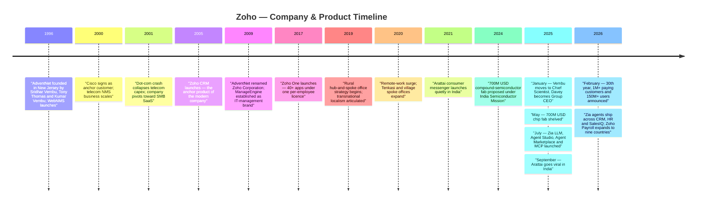
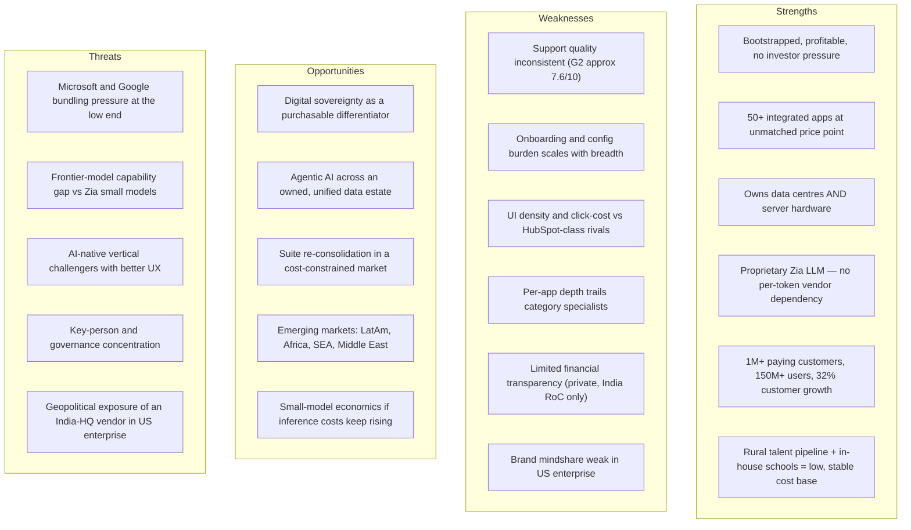
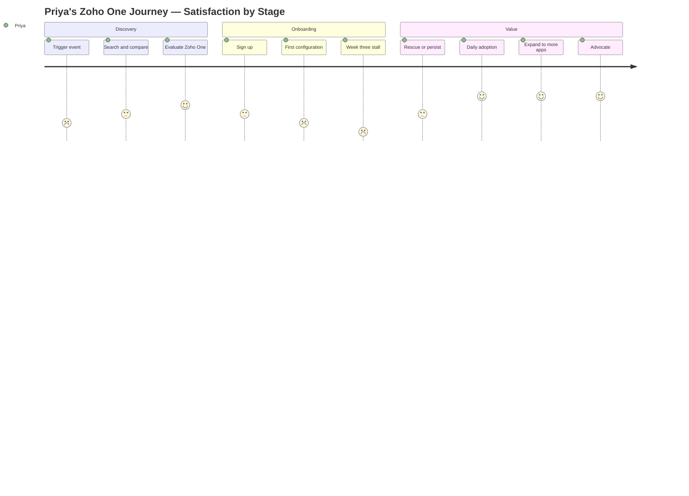
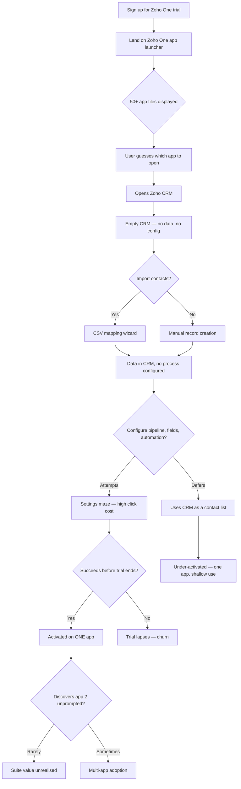
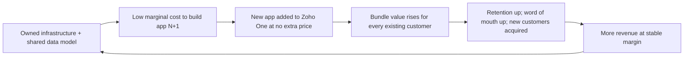
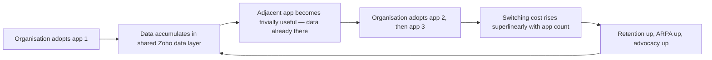
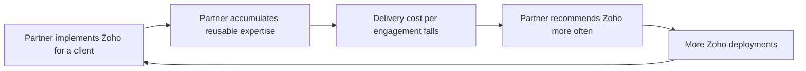
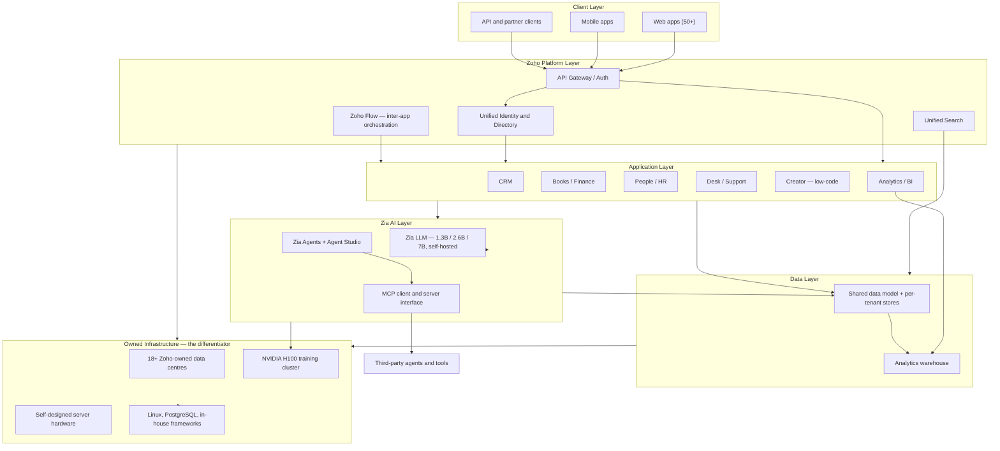
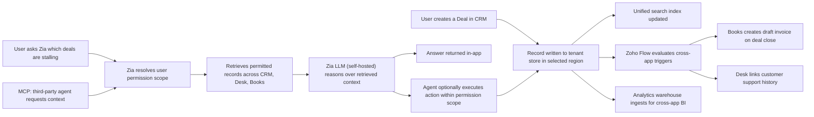
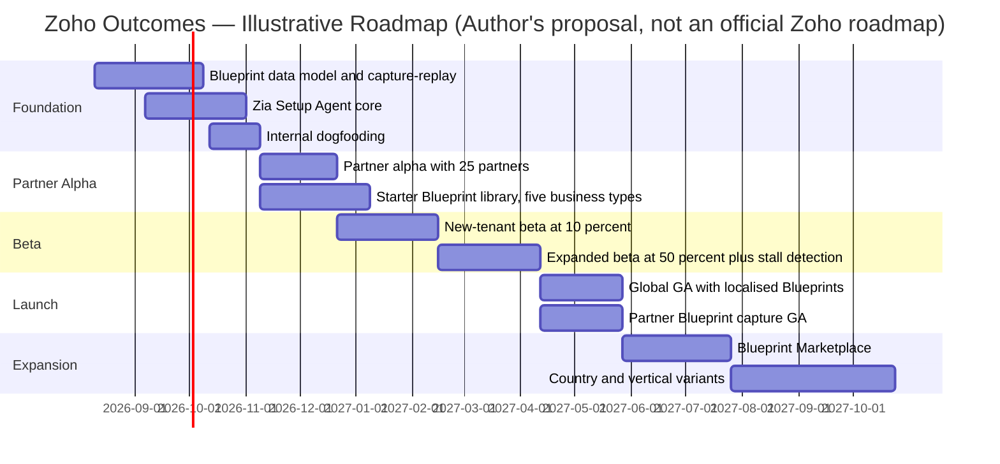

# Zoho — Product Management Case Study
### Day 34 of 90 | PM Case Study Challenge

---

## 1. Cover

**Product:** Zoho (Zoho Corporation Pvt. Ltd. — includes Zoho, ManageEngine, Qntrl, TrainerCentral, Arattai)
**Category:** Horizontal Business SaaS — Integrated Business Operating System
**Author:** Gaurav Singh
**Day:** 34 / 90
**Date Published:** July 30, 2026

---

## 2. Repository Metadata

| Field | Value |
|---|---|
| Repository | `product-management-case-studies` |
| Folder | `Day-34-Zoho/` |
| Author | Gaurav Singh |
| Series | 90-Day PM Case Study Challenge |
| Previous | Day 33 — PharmEasy |
| Companion file | `ASSUMPTIONS.md` — evidence grades, source conflicts, author-constructed content |
| License | MIT (see [§63 License](#63-license)) |

---

## 3. Badges

`Day 34/90` · `Category: Horizontal SaaS / Business OS` · `Ownership: Bootstrapped, Privately Held` · `HQ: Chennai, India` · `Status: Published`

---

## 4. Table of Contents

**Foundations**

- [1. Cover](#1-cover)
- [2. Repository Metadata](#2-repository-metadata)
- [3. Badges](#3-badges)
- [4. Table of Contents](#4-table-of-contents)
- [5. Executive Summary](#5-executive-summary)
- [6. Product Overview](#6-product-overview)
- [7. Company Background](#7-company-background)
- [8. Product Timeline](#8-product-timeline)
- [9. Vision & Mission](#9-vision--mission)
- [10. Problem Statement](#10-problem-statement)

**Market & Strategy**

- [11. Market Research](#11-market-research)
- [12. Industry Analysis](#12-industry-analysis)
- [13. TAM/SAM/SOM](#13-tamsamsom)
- [14. Competitor Analysis](#14-competitor-analysis)
- [15. SWOT](#15-swot)
- [16. Porter's Five Forces](#16-porters-five-forces)
- [17. Business Model Canvas](#17-business-model-canvas)
- [18. Revenue Model](#18-revenue-model)

**Users & Experience**

- [19. Target Users](#19-target-users)
- [20. Personas](#20-personas)
- [21. JTBD](#21-jtbd)
- [22. User Journey](#22-user-journey)
- [23. User Flow](#23-user-flow)
- [24. Information Architecture](#24-information-architecture)
- [25. UX Audit](#25-ux-audit)
- [26. UI Audit](#26-ui-audit)
- [27. Accessibility](#27-accessibility)

**Product & Growth**

- [28. Feature Breakdown](#28-feature-breakdown)
- [29. AI Capabilities](#29-ai-capabilities)
- [30. Product Metrics](#30-product-metrics)
- [31. North Star Metric](#31-north-star-metric)
- [32. Product Analytics](#32-product-analytics)
- [33. AARRR](#33-aarrr)
- [34. HEART](#34-heart)
- [35. Growth Strategy](#35-growth-strategy)
- [36. Growth Loops](#36-growth-loops)
- [37. Network Effects](#37-network-effects)
- [38. Product Strategy](#38-product-strategy)
- [39. Monetization](#39-monetization)
- [40. Trust & Safety](#40-trust--safety)

**Technical**

- [41. Technical Architecture](#41-technical-architecture)
- [42. Data Flow](#42-data-flow)
- [43. API Ecosystem](#43-api-ecosystem)
- [44. Privacy & Security](#44-privacy--security)

**Strategy & Planning**

- [45. Pain Points](#45-pain-points)
- [46. Opportunity Mapping](#46-opportunity-mapping)
- [47. RICE](#47-rice)
- [48. MoSCoW](#48-moscow)
- [49. Kano](#49-kano)
- [50. Feature Proposal](#50-feature-proposal)
- [51. PRD](#51-prd)
- [52. Wireframes](#52-wireframes)
- [53. Rollout Plan](#53-rollout-plan)
- [54. A/B Testing](#54-ab-testing)
- [55. KPI Dashboard](#55-kpi-dashboard)
- [56. Product Roadmap](#56-product-roadmap)
- [57. Risks & Mitigation](#57-risks--mitigation)
- [58. Future Vision](#58-future-vision)

**Closing**

- [59. PM Lessons](#59-pm-lessons)
- [60. PM Interview Questions](#60-pm-interview-questions)
- [61. References](#61-references)
- [62. About the Author](#62-about-the-author)
- [63. License](#63-license)
- [64. Self Review](#64-self-review)
- [65. Appendix](#65-appendix)

---

## 5. Executive Summary

Zoho is the largest software company most software people have never had to think about. Founded in 1996 as AdventNet, it crossed its **30th year in February 2026** by announcing **more than 1 million paying customers and more than 150 million users**, on **32% year-over-year customer growth** — having never taken a single dollar of outside capital. Its most recently filed Indian financials (FY25, year ended March 2025) show **₹12,313 crore in operating revenue, up 17.8% YoY**, with **₹3,191 crore in profit** — profit that actually *fell 3.3%* against FY24, which reporting attributes to AI investment.

The strategically interesting thing about Zoho is not that it sells 55+ apps cheaply. It is *how* it can afford to. Zoho is vertically integrated to an extreme almost no SaaS company attempts: it runs its own **18+ data centres** on **server hardware it designs itself**, does not store customer data on AWS/Azure/GCP, trains its **own Zia LLM family (1.3B / 2.6B / 7B parameters)** on its own H100 cluster, and staffs itself through a **rural hub-and-spoke talent pipeline** and in-house schools rather than competing for metro salaries. Each of those is a cost lever. Stacked together, they are the reason Zoho One can be priced at **$37/employee/month for 50+ applications** while competitors price single categories higher.

**Key finding:** Zoho's moat is a *cost structure*, not a feature set — and the AI era is the first thing in thirty years that genuinely tests it. Vertical integration protected Zoho when the scarce input was engineering labour. The scarce input is now inference compute, and Zoho's answer — small, task-specific, self-hosted models instead of frontier-scale ones — is a coherent bet, but an unproven one. The second, quieter risk is internal: a portfolio of 100+ products was an asset when the interface was 100+ dashboards. If the interface collapses into a single agent, breadth stops being a selling point and starts being integration debt.

---

## 6. Product Overview

Zoho Corporation is not one product; it is four brands and a portfolio of **100+ products across the group**, of which the flagship commercial construct is **Zoho One** — a single subscription bundling **50+ integrated business applications**.

**Brand structure**

| Brand | What it is | Buyer |
|---|---|---|
| **Zoho** | Business application suite — CRM, Books, People, Desk, Projects, Creator, Mail, Analytics, Campaigns, Inventory, Payroll, and ~40 more | SMB → mid-market → enterprise business functions |
| **ManageEngine** | IT management and security — endpoint, ITSM, identity, SIEM, observability | IT and security departments |
| **Qntrl** | Workflow orchestration / BPM for operations teams | Ops leaders |
| **TrainerCentral** | Course creation and delivery platform | Educators, training businesses |
| **Arattai** | Consumer messaging app (India-first, data hosted in India) | Consumers — strategically a sovereignty play, not a revenue line |

**Core Zoho building blocks**

- **Zoho One** — the "operating system for business": one licence, 50+ apps, unified admin, unified user directory, unified search
- **Zoho CRM** — the anchor product and the strongest single competitive position in the portfolio
- **Zoho Creator** — low-code application platform; the escape hatch for anything the 50 apps don't cover
- **Zia** — the AI layer: proprietary Zia LLM, 25+ prebuilt agents, Agent Studio (no-code agent builder), Agent Marketplace, MCP support
- **Zoho Marketplace** — extensions and third-party integrations
- **Zoho Analytics** — cross-app BI, the layer that makes suite breadth actually compound

Revenue model is **per-user subscription SaaS**, sold both as individual apps and as the Zoho One bundle, with a heavy self-serve motion and no advertising business anywhere in the group.

---

## 7. Company Background

Zoho began in **1996 in New Jersey as AdventNet, Inc.**, founded by **Sridhar Vembu** (Princeton PhD, ex-Qualcomm), his IIT Madras friend **Tony Thomas**, and his brother **Kumar Vembu**. The first product was **WebNMS**, network management software sold to telecom equipment makers. It worked: by 2000, AdventNet counted Cisco, HP, Motorola, British Telecom, France Telecom, NTT and SingTel among its customers.

The **2001 dot-com crash** was the pivot. Telecom capex collapsed and with it AdventNet's single-category business. Rather than raise capital, Vembu redirected the company toward SaaS for small and medium businesses — a market too small and price-sensitive for incumbents to defend. **Zoho CRM launched in 2005**; the company renamed itself **Zoho Corporation in 2009**.

Two structural decisions from that era still define the company:

1. **No external funding, ever.** Zoho has raised zero venture capital and remains privately held, majority-owned by the Vembu family. Vembu has said publicly that Zoho *could* be a public company and chooses not to be.
2. **Build the input, don't buy it.** Engineering talent was sourced through **Zoho Schools of Learning**, which trains candidates — often without college degrees — directly into engineering roles. Infrastructure was built in-house rather than rented from hyperscalers.

**Leadership (post-January 2025 restructure):** Sridhar Vembu stepped back from group CEO to **Chief Scientist**, focusing full-time on R&D and his rural development work. Co-founder **Shailesh Kumar Davey** became **Group CEO**. **Mani Vembu** leads the Zoho.com division, **Rajesh Ganesan** leads ManageEngine, and **Tony Thomas** leads Zoho USA.

Today: HQ in Chennai, India; **19,000+ employees** across **90+ offices in 28 countries**; **30 years old as of February 2026**. (Employee-count sources conflict — see [§65 Appendix](#65-appendix).)

---

## 8. Product Timeline



*Figure 1 — Company and product milestones, 1996–2026. Rendered as a Mermaid timeline (renders natively on GitHub). No raster chart assets were generated in this pass — see [§65 Appendix](#65-appendix).*

---

## 9. Vision & Mission

Zoho's stated mission is to be **"the operating system for business"** — a single, integrated software backbone a company can run on end-to-end, priced so that a 10-person firm and a 10,000-person firm can both afford it.

Underneath the marketing sits a more specific and unusually explicit ideology, articulated by Vembu over two decades:

- **Long-term over quarterly.** No external capital means no growth-at-all-costs mandate. Zoho publishes an essay series literally titled *The Long Game*.
- **Transnational localism.** Talent and offices should be *rooted locally, connected globally* — hence rural hub-and-spoke offices, in-house schools, and a deliberate refusal to centralise in metros.
- **Privacy as a product position, not a compliance checkbox.** Zoho has no advertising business and has publicly committed to not monetising customer data.
- **Own the stack.** From server hardware to LLMs, dependency on a third party is treated as a strategic risk rather than an efficiency.

**PM read:** these are not soft values — each converts directly into a line item in [§18 Revenue Model](#18-revenue-model) or [§38 Product Strategy](#38-product-strategy). "Privacy-first" is what lets Zoho sell against Google Workspace in regulated and sovereignty-sensitive markets. "Own the stack" is what lets Zoho price at a fraction of comparable suites. Values that don't show up in the P&L are branding; these do.

---

## 10. Problem Statement

**The problem Zoho originally solved:** small and mid-sized businesses needed the same functional software as large enterprises — CRM, accounting, HR, helpdesk, BI — but enterprise vendors priced per-seat in a way that made a full stack unaffordable below a certain company size. The SMB alternative was a patchwork of 8–15 point tools that didn't share data, each with its own bill, admin console and integration surface. **The cost of *integration* exceeded the cost of the software.**

Zoho's insight: if one vendor owned every app *and* the infrastructure underneath, the marginal cost of adding the 40th app to a bundle approaches zero — so the bundle can be priced at a level no point-solution vendor can match, and the integration problem disappears by construction.

**The problem Zoho is solving today has moved.** With 50+ apps, 100+ group products, and dozens of Zia agents now addressable inside one tenant, the customer's bottleneck is no longer *"can I afford all this software"* — it is **"can I actually configure, adopt and get value out of all this software before I give up."** Breadth solved the cost problem and created an activation problem. That shift is the analytical spine of this case study and drives the proposal in [§50](#50-feature-proposal).

---

## 11. Market Research

Zoho competes across an unusually wide set of categories simultaneously — CRM, accounting, HRMS, helpdesk, BI, low-code, email/collaboration, ITSM — which makes a clean "market share" figure for *Zoho as a whole* essentially meaningless. Share is only measurable category by category.

**Where Zoho's share is actually measurable (CRM, the anchor category):**

| Vendor | Est. global CRM market share | Est. customer count |
|---|---|---|
| Salesforce | ~21–24% (sources conflict) | ~327,000 |
| Zoho CRM | ~3–4% | ~186,000 |
| HubSpot | not cleanly disclosed as share | ~180,000–299,000 (sources conflict badly — see [§65](#65-appendix)) |

**The number that matters more than share:** Zoho has roughly **57% of Salesforce's customer count on roughly 3–4% of the market's revenue.** That ratio is the entire Zoho business model in one line — an enormous number of very small accounts at very low ARPU. Any analysis reading Zoho's low revenue share as a weak market position is reading the wrong metric. Zoho is not competing for revenue share in CRM; it is competing for *account count* across a suite, and monetising breadth per account rather than depth per seat.

**Market context (2026 estimates, third-party, wide variance):**

| Market | 2026 size estimate | Note |
|---|---|---|
| Global SaaS | $375B – $492B | Very wide; scoping differences between firms |
| CRM (total) | ~$86B | Grand View Research |
| SaaS CRM (subset) | ~$78B | Verified / MarkWide |

All market-size figures are third-party analyst estimates, not vendor disclosures, and should be read as directional only.

---

## 12. Industry Analysis

Three structural forces define the horizontal-SaaS category in 2026.

**1. Suite consolidation is winning again.** After a decade in which best-of-breed point solutions won on product quality, buyers in a tighter budget environment are re-consolidating to reduce licence count, vendor-management overhead and integration cost. This is Zoho's thesis vindicated — but it also invites Microsoft, Salesforce and Google to bundle harder, and they have vastly more distribution.

**2. AI has changed the unit economics of software.** For thirty years the marginal cost of serving one more SaaS user was near zero. Inference is not near zero. This *inverts* a structural advantage for cheap, high-volume, low-ARPU vendors: the customer paying $37/month for 50 apps is exactly the customer whose AI usage can go margin-negative fastest. Zoho's response — small self-hosted models sized to the task rather than a frontier model for everything — is the most economically literate answer available to a company at its price point, and a genuinely differentiated technical bet.

**3. Digital sovereignty is becoming a purchasing criterion.** Data-residency requirements, EU and India localisation rules, and geopolitical anxiety about US hyperscaler dependency are creating demand for vendors who can credibly say *"your data never touches a US public cloud."* Zoho spent twenty years building that capability for cost reasons and now gets to sell it as a differentiator. Arattai — a consumer messenger with data hosted in India — is the most visible expression of this, and is best understood as **strategic positioning rather than a revenue product**.

**Centre of gravity:** the category is moving from "which apps do you have" to "whose agents can act across your business data" — and in that framing, owning the whole data estate (as Zoho does) is a stronger starting position than owning the single best app.

---

## 13. TAM/SAM/SOM

*(Framework selection rationale: TAM/SAM/SOM is used here with explicit caution. Zoho spans many categories, so a single TAM figure is close to meaningless; the useful exercise is bounding the addressable *account* population rather than the addressable dollars, because Zoho's model monetises account count more than seat depth.)*

| Layer | Definition | Estimate | Basis |
|---|---|---|---|
| **TAM** | Global business-application SaaS spend across all categories Zoho competes in | $375B–$492B (2026 SaaS total, of which Zoho's addressable categories are a large but unquantified subset) | Third-party analyst estimates; not Zoho-disclosed |
| **SAM** | SMB and mid-market organisations globally that could run core operations on an integrated suite at Zoho's price point | Not publicly disclosed. Directionally: the global SMB software-buying population, tens of millions of organisations | Inferred from Zoho's self-serve, price-led GTM |
| **SOM** | Organisations Zoho realistically converts given current brand, channel and language coverage | **1M+ paying customers achieved (Feb 2026), growing ~32% YoY** | Zoho official announcement — the only hard number in this table |

**Honest read:** the only defensible figure here is the SOM, because it is disclosed. TAM and SAM are directional scaffolding. A PM building a business case at Zoho would almost certainly work bottom-up from customer count × ARPA × attach rate, not top-down from an analyst TAM — and this case study treats the disclosed customer-count trajectory as the primary sizing signal.

---

## 14. Competitor Analysis

| Dimension | **Zoho** | Salesforce | Microsoft (Dynamics + 365) | HubSpot | Freshworks | Google Workspace |
|---|---|---|---|---|---|---|
| Value proposition | 50+ integrated apps, one licence, lowest TCO | Best-in-class CRM + platform + ecosystem | Bundled with the productivity suite the customer already owns | Best-in-class SMB/mid-market GTM UX | Modern UX for CX/ITSM | Bundled email/docs/collab |
| Target user | SMB → mid-market, price-sensitive, global | Mid-market → large enterprise | Enterprises already on Microsoft | SMB → mid-market sales/marketing | SMB → mid-market support/IT | All segments, productivity-led |
| Core strength | Breadth + price + owned infrastructure + profitability | Ecosystem, AppExchange, enterprise trust | Distribution — bundling into existing contracts | Onboarding UX, inbound engine | UX polish, focused scope | Distribution + ubiquity |
| AI position | Proprietary Zia LLM (self-hosted, small models), 25+ agents, Agent Studio, MCP | Agentforce (frontier-model dependent) | Copilot everywhere | Breeze | Freddy AI | Gemini |
| Pricing | Zoho One ~$37/employee/mo (all-employee, annual) for 50+ apps | Per-cloud, per-seat, materially higher | Bundled or per-seat add-on | Free tier → steep upgrade curve | Mid-range per-seat | Bundled per-seat |
| Ownership | **Bootstrapped, private, profitable** | Public | Public | Public | Public | Public |
| Key weakness | Per-app UX depth; inconsistent support; onboarding complexity | Cost and implementation overhead | Weak as a *business*-app suite vs. productivity | Narrow scope; pricing cliff | Narrower portfolio than Zoho | Not a business-application suite |

**Strategic insight — the asymmetry nobody prices in.** Zoho's competitors are all accountable to public markets or investors on a quarterly cadence. Zoho is not. That means Zoho can sustain a price point that would be read as margin destruction at a public company, indefinitely, because the marginal cost of serving another Zoho One seat is genuinely low across owned infrastructure. **Competitors cannot match Zoho's price without explaining the gross-margin hit to shareholders.** This is the most durable feature of Zoho's competitive position, and it is structural rather than product-based.

**Where the asymmetry breaks.** It protects price, not quality. Every recurring criticism of Zoho — support inconsistency, UI density, configuration burden — is a *quality* problem that cheap capital cannot buy you out of but expensive capital can. HubSpot's onboarding advantage is real, and it is bought with money Zoho deliberately doesn't spend.

**Opportunity for differentiation.** The sovereignty + own-stack + own-LLM combination is not replicable by any of the six competitors above on any reasonable timescale. Salesforce cannot credibly say its AI runs on hardware it designed in data centres it owns. Zoho can. That claim is currently under-monetised.

---

## 15. SWOT



**The one SWOT cell that matters most is `T2`.** Every other threat is a variant of competition Zoho has beaten for thirty years. But if frontier models keep opening a capability gap small self-hosted models cannot close, Zoho's cost advantage in AI becomes a *capability disadvantage*, and price stops being the deciding factor. This is the live strategic question, and it is genuinely unresolved.

---

## 16. Porter's Five Forces

*(Framework selection rationale: appropriate because Zoho competes structurally rather than feature-by-feature — its position derives from cost structure and vertical integration, which is exactly what Porter's model surfaces and a flat competitor grid misses.)*

| Force | Rating | Analysis |
|---|---|---|
| **Threat of new entrants** | **Medium** | Building one SaaS app has never been cheaper — AI has collapsed the cost of a credible point solution. But building *fifty* interoperating apps on owned infrastructure with a self-trained LLM is a thirty-year capital-and-time moat. The threat is real at the app level, near-zero at the suite level. |
| **Bargaining power of buyers** | **Medium-High** | Zoho's buyers are SMBs with low switching cost on any *individual* app and high price sensitivity. Power drops sharply once a customer adopts 5+ apps — at that point data gravity and re-integration cost lock them in. Buyer power is therefore a function of adoption breadth, which is precisely why [§31](#31-north-star-metric) proposes measuring it. |
| **Bargaining power of suppliers** | **Low — deliberately engineered** | Zoho has systematically eliminated supplier power: no hyperscaler dependency, own server hardware, own LLM, own talent pipeline. Residual exposures are GPU supply and the open-source ecosystem. This is the lowest supplier power of any major SaaS vendor and it is not an accident. |
| **Threat of substitutes** | **Medium** | Spreadsheets and manual process remain the true substitute at the bottom of the market. At the top, Microsoft and Google bundles substitute for parts of the suite. AI agents operating directly on business data without a traditional app UI are an emerging substitute for the *interface layer* of every app in the portfolio. |
| **Competitive rivalry** | **High** | Direct rivalry with Salesforce, HubSpot, Freshworks, Microsoft and dozens of point vendors, simultaneously, in every category. Zoho fights on price rather than feature parity, which sustains rivalry rather than resolving it. |

**Net:** an unusually favourable structural position, driven almost entirely by the supplier-power row. Zoho spent three decades converting variable costs into owned assets, and Porter's model is where that shows up.

---

## 17. Business Model Canvas

| Block | Zoho |
|---|---|
| **Key Partners** | Zoho Partner network (implementation consultants, VARs), Marketplace developers, NVIDIA (GPU supply), open-source ecosystem (Linux, PostgreSQL), regional data-centre hosts |
| **Key Activities** | Multi-product R&D across 100+ products; in-house LLM training; data-centre and server-hardware engineering; self-serve GTM; talent development via Zoho Schools |
| **Key Resources** | 18+ owned data centres; self-designed server hardware; Zia LLM family; 19,000+ employees; rural hub-and-spoke offices; 30 years of accumulated product IP; **zero debt, zero investor obligations** |
| **Value Propositions** | (1) Every business app you need, one licence, one vendor, one data model. (2) A fraction of the price of comparable suites. (3) Your data on infrastructure we own, in the country you choose, never monetised for advertising. |
| **Customer Relationships** | Predominantly self-serve and low-touch; partner-led implementation for mid-market; direct enterprise sales only at the top; large community and forum surface |
| **Channels** | Direct web self-serve, Zoho Partner network, Marketplace, ZohoDay and user conferences, organic/SEO content, word of mouth |
| **Customer Segments** | Micro-businesses and SMBs (volume core), mid-market (growth engine), IT/security departments via ManageEngine, and increasingly regulated and sovereignty-sensitive enterprises |
| **Cost Structure** | R&D headcount (dominant), owned data-centre capex and power, GPU capex for Zia training, minimal paid acquisition, deliberately low sales-and-marketing ratio versus public SaaS peers |
| **Revenue Streams** | Per-user/per-employee subscriptions (Zoho One, individual apps), ManageEngine licences and subscriptions, transaction-adjacent revenue via Payments and Payroll in select geographies |

**The canvas's punchline:** look at Cost Structure against Value Propositions. Zoho's pricing claim is only credible because the cost structure is asset-heavy and investor-light. Most SaaS canvases list "cloud hosting" as a cost line; Zoho lists "data centres we own" as a *resource*. That single reclassification is the business model.

---

## 18. Revenue Model

Zoho monetises through **per-user (or per-employee) subscription SaaS**, sold two ways: individual applications, or the Zoho One bundle.

**Zoho One pricing (2026)**

| Plan | Annual billing | Monthly billing | Licensing rule |
|---|---|---|---|
| **All Employee** | **$37 / employee / month** | $45 / employee / month | Must licence *every* employee on payroll |
| **Flexible User** | **$90 / user / month** | $105 / user / month | Licence only chosen users |

The pricing architecture is itself a product decision worth studying. The All-Employee plan is roughly 59% cheaper per head — but only if you licence everyone. Zoho is explicitly **paying customers to deploy the suite company-wide**, because full-org deployment is what creates the data gravity and switching cost described in [§16](#16-porters-five-forces). The Flexible plan exists largely to make the All-Employee plan look obviously correct. This is deliberate, and it is good pricing design.

**Disclosed financials (FY25, year ended 31 March 2025 — Indian entity RoC filings)**

| Metric | FY25 | FY24 | Change |
|---|---|---|---|
| Operating revenue | **₹12,313 crore** (≈ $1.4–1.5B) | ₹10,456 crore | **+17.8%** |
| Net profit | **₹3,191 crore** | ₹3,299 crore | **−3.3%** |
| Zoho suite share of revenue | ₹7,051 crore (**57%**) | — | — |
| ManageEngine share of revenue | ₹4,863 crore (**39%**) | — | — |

**Geographic split (FY25):** North America ~41%, Asia ~30%, Europe ~23%, rest ~6%. Note that Zoho — an Indian company — earns the plurality of its revenue in North America, and India is its *third* largest market. The "Indian SaaS company" framing is factually true and analytically misleading.

**The most interesting line in the table is the profit decline.** Revenue grew 17.8% while profit fell 3.3%, attributed to AI investment — GPU capex, LLM training, data-centre expansion. A public company posting that combination would face a difficult earnings call. Zoho simply absorbed it. **This is the bootstrapped structural advantage converting from theory into a specific, observable decision**, and it is the clearest single piece of evidence in this case study for why the ownership model matters strategically rather than philosophically.

**Conflicting figures to be aware of:** the group-level announcement in February 2026 cited **20% revenue growth in 2025** and **32% customer growth**, which does not reconcile cleanly with the 17.8% FY25 figure — different entity scope (group vs Indian entity) and different periods (calendar vs Indian fiscal). Both are reported here rather than averaged. Full detail in [§65 Appendix](#65-appendix).

---

## 19. Target Users

- **Micro-business owners (1–10 people)** — often the *only* administrator, buying on price, needing CRM + invoicing + email without an IT function
- **SMB operations / finance leads (10–200 people)** — the true centre of gravity; the person who owns "which software do we run on"
- **Mid-market functional heads (200–2,000)** — sales ops, HR ops, finance ops, adopting individual Zoho apps and increasingly consolidating onto Zoho One
- **Implementation partners and consultants** — a distinct and strategically critical user class; they configure Zoho for customers who cannot, and their productivity directly gates Zoho's mid-market growth
- **IT and security administrators** — the ManageEngine buyer, functionally a different company inside the same corporate parent
- **Developers and citizen developers** — Zoho Creator and Marketplace builders extending the suite
- **AI agents (emerging, 2025–2026)** — Zia agents now act on records, run workflows and answer customers; a genuinely new actor class inside the tenant with its own permissions model

---

## 20. Personas

**Persona 1 — "Priya, the Accidental Admin"**
Operations manager at a 45-person manufacturing firm in Coimbatore. Not technical. Inherited "software" as a responsibility because she was the most organised person available. Currently runs the business on Tally, WhatsApp, Excel and Gmail. Evaluating Zoho One because the CEO saw the price.
**Goals:** stop losing orders in WhatsApp; get one place where customer, invoice and delivery data live.
**Frustrations:** doesn't know which of the 50 apps she needs; every tutorial assumes she already knows the vocabulary; setup stalls at week three and the trial expires.
**What she'd say:** *"I don't want fifty apps. I want the four that solve my problem, already connected."*

**Persona 2 — "Daniel, the Cost-Conscious CTO"**
CTO at a 400-person US services company currently running Salesforce + HubSpot + Gusto + Zendesk. Renewal quotes are up 22%. Mandated to cut software spend 30% without breaking revenue operations.
**Goals:** consolidate vendors; keep the GTM team productive; avoid a migration that costs more than it saves.
**Frustrations:** genuinely worried per-app quality won't match; can't get a straight answer on migration effort; has heard the support horror stories.
**What he'd say:** *"The price is obviously right. Show me the migration risk, not the feature matrix."*

**Persona 3 — "Aarti, the Zoho Partner"**
Runs an 8-person Zoho implementation consultancy delivering 20–30 Zoho One deployments a year. Her margin is entirely a function of how fast she can configure a tenant.
**Goals:** reduce configuration hours per deployment; reuse patterns across clients.
**Frustrations:** rebuilds the same CRM/Books/Desk configuration from scratch every engagement; no clean way to package and reuse a working setup.
**What she'd say:** *"I've built the same 'professional services firm' setup forty times. Why can't I save it once?"*

**Persona 4 — "Marcus, the Sovereignty Buyer"**
Head of IT at a German mid-sized engineering firm. Board has mandated reducing US hyperscaler dependency.
**Goals:** verifiable EU data residency; no vendor whose AI sends data to a US model API.
**Frustrations:** most vendors' "EU data residency" turns out to be an AWS region; needs a claim he can put in front of a works council.
**What he'd say:** *"Whose hardware is my data actually on, and whose model is reading it?"*

---

## 21. JTBD

| When… | I want to… | So I can… | Current alternative |
|---|---|---|---|
| I'm a 40-person company outgrowing spreadsheets | get real business software without an IT department or a five-figure budget | run operations professionally without hiring for it | Excel + WhatsApp + point tools |
| My software renewals just jumped 20%+ | consolidate six vendors into one without breaking revenue ops | cut spend without cutting capability | Renegotiate; absorb the increase |
| I've bought the suite and don't know where to start | get from signup to *my* working setup in days, not months | actually realise the value I paid for | Hire a partner; abandon the trial |
| My board wants US-cloud dependency reduced | prove where my data physically lives and which model reads it | satisfy compliance and works-council review | European point vendors at higher cost |
| I implement Zoho for a living | package a proven configuration and redeploy it | make more margin per engagement | Manual rebuild every time |
| I want AI to do work, not just summarise it | let an agent act on my records within my permission boundary | reclaim hours of admin | Copy-paste into a chatbot |

**The unmet job, stated plainly:** row three. Zoho has comprehensively solved *"give me affordable software"* and has not solved *"get me to value quickly."* Rows three and five are the same job seen from the customer side and the partner side — which is why one feature can serve both, and why [§50](#50-feature-proposal) targets it.

---

## 22. User Journey

**Journey: Priya (Persona 1) evaluates and adopts Zoho One**

| Stage | What she does | Thinking | Feeling | Friction | Opportunity |
|---|---|---|---|---|---|
| **Trigger** | Loses a customer order buried in a WhatsApp group | "We can't run like this anymore" | Frustrated, motivated | — | — |
| **Search** | Googles "CRM for small business India"; sees Zoho, Freshworks, HubSpot | "Zoho is Indian and much cheaper" | Hopeful | Comparison overload | Outcome-led landing, not feature-led |
| **Evaluate** | Lands on the Zoho One page; sees "50+ apps, $37" | "This is either amazing or too good to be true" | Excited, slightly suspicious | Breadth reads as complexity | Show *her* four apps, not all fifty |
| **Sign up** | Creates trial account | "Right, now what" | Neutral | Generic empty state; 50 app tiles | 🔴 **Highest-leverage moment in the entire journey** |
| **Configure** | Watches tutorials, imports a contact list, creates fields | "Which of these do I actually need?" | Overwhelmed | No opinionated starting point; vocabulary gap | Prescribe a setup for her business type |
| **Stall** | Week 3. Half-configured CRM, untouched Books, no team invited | "Maybe we need to hire someone for this" | Defeated | 🔴 **Churn point** | Detect the stall; intervene with agent-executed setup |
| **Rescue (if it happens)** | Finds a partner, or persists | "Okay, it's working" | Relieved | Cost and time she hadn't budgeted | Make rescue the default path, not the lucky one |
| **Adopt** | Team uses CRM daily; adds Books in month 2 | "Why didn't we do this earlier" | Confident | — | Expand to app 3, 4, 5 |
| **Advocate** | Recommends Zoho to two peer businesses | "Same price, everything included" | Loyal | — | Formalise the referral loop |



*Figure 2 — Satisfaction dips hardest between signup and week three. Every subsequent stage is high-satisfaction. Zoho's product is good; its **path to the product** is the problem.*

---

## 23. User Flow

**Current flow — new Zoho One tenant, first session**



**Three structural problems visible in the flow:**

1. **The launcher is a menu, not a recommendation.** Node `C` presents 50 equally-weighted choices to a user who knows their *problem* but not the product taxonomy. This is a textbook paradox-of-choice failure, and it happens in the first sixty seconds.
2. **Activation is measured per-app, so nothing pulls the user toward app #2.** Node `R` is essentially unassisted. A suite product that doesn't actively route users to their second and third app is being sold as a suite and consumed as a point tool.
3. **The failure mode is silent.** Nodes `P` and `Q` look similar in most instrumentation — a lapsed trial and a shallow adopter both register as "used CRM." Only one of them is a lost customer, and Zoho has limited signal to distinguish intent-to-consolidate from intent-to-use-one-app.

---

## 24. Information Architecture

```
Zoho One Tenant
│
├── App Launcher  ← flat grid of 50+ tiles, the primary navigation object
│   ├── Sales & Marketing (CRM, Bigin, SalesIQ, Campaigns, Social, Forms…)
│   ├── Finance (Books, Invoice, Expense, Inventory, Billing, Payroll…)
│   ├── People (People, Recruit, Learn, Thrive…)
│   ├── Support (Desk, Assist, Lens…)
│   ├── Productivity (Mail, Cliq, WorkDrive, Writer, Sheet, Show, Connect, Vani…)
│   ├── BI & Analytics (Analytics, DataPrep…)
│   ├── Custom Solutions (Creator, Flow, Catalyst…)
│   └── IT (via ManageEngine — separate brand, separate console) ⚠
│
├── Admin Panel
│   ├── Users & directory
│   ├── App assignment per user
│   ├── Security, MFA, policies
│   └── Org settings
│
├── Per-App Settings   ⚠ 50 separate settings hierarchies
│   └── Each app: own fields, own automation, own permissions vocabulary
│
├── Zia (AI layer)
│   ├── Agent Marketplace (25+ prebuilt agents)
│   ├── Agent Studio (no-code builder)
│   └── Per-app Zia surfaces  ⚠ fragmented entry points
│
├── Marketplace (extensions, third-party integrations)
│
└── Unified Search / Unified Client Portal
```

**IA critique**

| Observation | Assessment |
|---|---|
| App launcher is a flat, product-name-keyed grid | ❌ Organised around Zoho's org chart, not the customer's business process |
| No "business process" entity | ❌ There is no object representing *Quote-to-Cash* or *Hire-to-Retire* spanning the apps that implement it |
| 50 parallel settings hierarchies | ❌ Configuration knowledge learned in one app doesn't transfer to the next — the single largest driver of onboarding cost |
| Zia entry points are per-app | 🟡 Powerful capability, discoverable only if you already know where to look |
| ManageEngine is a separate console | 🟡 Correct commercially (different buyer), confusing for the customer who bought "Zoho" |
| Unified search and unified directory | ✅ Genuinely strong — the shared identity and data layer is real, not marketing |

**The single highest-leverage IA change:** introduce a **Business Process** entity as a first-class navigational object. A customer does not want "CRM, Books and Desk"; they want *"take an order, invoice it, support it."* Making the process the primary node — with the underlying apps as its implementation detail — would simultaneously fix launcher choice paralysis, make cross-app adoption automatic rather than accidental, give partners something reusable to package, and give Zia agents a meaningful scope to operate over. Four problems, one architectural change. Everything in [§50](#50-feature-proposal) follows from this.

---

## 25. UX Audit

**Heuristic evaluation (Nielsen's 10) — assessed at the Zoho One suite level, not per-app**

| # | Heuristic | Rating | Notes |
|---|---|---|---|
| 1 | Visibility of system status | 🟢 4/5 | Within apps, status is generally clear |
| 2 | Match with the real world | 🔴 2/5 | Navigation is keyed to product names, not business language; Priya doesn't know she needs "Zoho Books" |
| 3 | User control and freedom | 🟢 4/5 | Highly configurable; undo and edit paths generally sound |
| 4 | Consistency and standards | 🔴 2/5 | **Weakest dimension.** 50 apps built by many teams over 20 years; patterns, terminology and settings structures diverge noticeably |
| 5 | Error prevention | 🟡 3/5 | Adequate in-app; poor at the configuration layer, where a bad early decision compounds silently |
| 6 | Recognition over recall | 🔴 2/5 | Configuration requires recalling where a setting lives across 50 distinct hierarchies |
| 7 | Flexibility & efficiency of use | 🟡 3/5 | Excellent ceiling for experts; no on-ramp for novices. Optimised for Aarti, not Priya |
| 8 | Aesthetic & minimalist design | 🟡 3/5 | Dense, functional, information-heavy; capable rather than elegant |
| 9 | Help users recover from errors | 🔴 2/5 | Support inconsistency (G2 quality-of-support ≈ 7.6/10) means recovery often depends on community forums |
| 10 | Help and documentation | 🟢 4/5 | Documentation volume and community depth are genuine strengths |

**Composite: 2.9 / 5**

**The decisive finding.** The three lowest scores — **#2 (real-world match), #4 (consistency), #6 (recognition over recall)** — are not three problems. They are one problem seen three ways: *Zoho's product surface is organised around Zoho's product portfolio rather than around the customer's mental model of their own business.* That single misalignment is what makes onboarding expensive, what makes the second app hard to discover, and what makes partner labour necessary. It is also, notably, precisely the criticism that dominates public review sentiment — "learning curve," "cluttered," "takes more clicks."

**Cognitive load by surface**

| Surface | Load | Comment |
|---|---|---|
| App launcher | 🔴 High | 50 undifferentiated choices at the moment of lowest user knowledge |
| Individual app home | 🟢 Low–Medium | Generally competent once you're inside |
| Settings / configuration | 🔴 High | The core problem. Deep hierarchies, inconsistent vocabulary across apps |
| Admin panel | 🟡 Medium | Coherent, but assumes IT literacy the SMB buyer often lacks |
| Zia surfaces | 🟡 Medium | Capable, fragmented across app-specific entry points |

---

## 26. UI Audit

| Dimension | Assessment |
|---|---|
| **Visual hierarchy** | Functional and dense. Prioritises information completeness over guidance — reasonable for power users, actively harmful in the first session where the user needs *one* obvious next action |
| **Consistency across apps** | The defining weakness. Twenty years and dozens of teams produce visible divergence: different table treatments, different settings layouts, different terminology for equivalent concepts. The 2026 Zoho CRM UI refresh (mandatory from 15 July 2026) is a direct acknowledgement of this |
| **Typography** | Legible; dense secondary text in settings and list views |
| **Iconography** | Conventional and learnable; the launcher's 50 similar-weight product icons provide little differentiation signal |
| **Colour** | Per-app brand colours aid app identification but weaken suite coherence; limited semantic reservation of colour for system state |
| **Density** | High throughout — a defensible choice for daily-use business software, a poor one for first run |
| **Empty states** | Under-designed at exactly the highest-stakes moment. A fresh Zoho One tenant's empty state is the product's single most important screen, and it is currently a menu |
| **Trust signals** | Materially under-weighted. Zoho's genuinely differentiated claims — own data centres, own hardware, own LLM, no ad monetisation — are nearly invisible in-product |

**Recommendations**

1. **Redesign first run as a decision, not a directory.** Replace the 50-tile launcher on day one with a single question about the customer's business, and let the answer determine what they see.
2. **Establish a suite-level design system with real enforcement.** Consistency across 50 apps is a governance problem, not a design problem, and needs a mandate.
3. **Design the configuration layer as a first-class product.** It currently behaves like fifty settings pages that happen to share a login.
4. **Surface the differentiators in-product.** "Your data is on hardware Zoho owns, in the region you chose" belongs in the product, not only on the marketing site.

---

## 27. Accessibility

Assessed against **WCAG 2.1 AA** principles. This is a heuristic assessment of publicly observable surfaces plus a review of Zoho's own published conformance documentation — **not an instrumented audit**.

| Principle | Assessment | Notes |
|---|---|---|
| **Perceivable** | 🟡 Partial | Contrast generally adequate; dense data tables and dashboard visualisations are the recurring risk area |
| **Operable** | 🟡 Partial | Keyboard navigation supported in core flows; deep settings hierarchies and drag-based builders (Creator, Analytics) are harder to traverse without a pointer |
| **Understandable** | 🔴 Weak | Language and labelling assume product-taxonomy familiarity. Cognitive accessibility — arguably the most relevant axis for a suite this complex — is the weakest area |
| **Robust** | 🟢 Reasonable | Standards-based web stack; assistive-technology compatibility generally sound in core apps |

**What Zoho does well.** It **publishes VPAT / Accessibility Conformance Reports per product** (Analytics, Books, Expense, Inventory, Commerce and others) against the ITI VPAT International Edition 2.5. Publishing per-product conformance documentation at all puts Zoho ahead of most mid-market SaaS vendors, and it is a meaningful procurement asset in public-sector and enterprise deals.

**What limits it.** The reports are **self-evaluated** rather than independently audited, and explicitly **exclude add-ons, mobile applications and extensions** unless stated. Coverage is per-product rather than suite-wide, which mirrors the consistency problem identified in [§26](#26-ui-audit) — accessibility, like design, is governed app-by-app rather than centrally.

**Highest-priority accessibility gap:** cognitive load in the configuration layer. For a product whose buyer is frequently a non-technical accidental administrator, "understandable" is not a compliance checkbox — it is the same problem as the activation problem, wearing a different label.

---

## 28. Feature Breakdown

| Cluster | Representative capabilities | PM assessment |
|---|---|---|
| **CRM & Sales** | Zoho CRM (pipelines, forecasting, territory management, CPQ), Bigin (lite CRM), SalesIQ (live chat), Campaigns | ✅ Deep and mature; the anchor of the portfolio and strongest per-app competitive position |
| **Finance** | Books, Invoice, Expense, Billing, Inventory, Payroll (now nine countries incl. India, US, UAE, Saudi Arabia, Canada, Qatar, Oman, Bahrain, Kuwait) | ✅ Genuinely strong; multi-country payroll is a hard, defensible moat competitors under-invest in |
| **People** | Zoho People (HRMS), Recruit (ATS), Learn, Thrive | 🟡 Competent; trails specialists on UX, wins overwhelmingly on bundled price |
| **Support** | Desk, Assist, Lens | 🟡 Solid mid-market helpdesk; Freshworks and Zendesk lead on polish |
| **Productivity & Collab** | Mail, Cliq, WorkDrive, Writer/Sheet/Show, Connect, Vani, Meeting | 🟡 Adequate; the hardest cluster to win because Google and Microsoft bundle it for free |
| **Low-code / Extensibility** | Creator, Flow, Catalyst, Marketplace | ✅ Strategically vital — it prevents "the suite doesn't do X" from becoming a lost deal |
| **BI** | Analytics, DataPrep | ✅ Underrated. Cross-app analytics is what makes suite breadth compound rather than merely accumulate |
| **AI** | Zia LLM, 25+ prebuilt agents, Agent Studio, Agent Marketplace, MCP | 🟢 Fast-moving; see [§29](#29-ai-capabilities) |
| **Admin & Identity** | Unified directory, MFA, unified client portal, app assignment, usage dashboards | ✅ The unsung strength — one identity across 50 apps is architecturally hard and Zoho got it right |
| **Consumer** | Arattai | ⚪ Strategic and positioning asset, not a monetised product line |

**Where the portfolio is strongest:** anything where *cross-app data* is the value — Analytics, unified identity, Books↔CRM↔Inventory flows. This is where competitors structurally cannot follow, because they don't own the adjacent apps.

**Where it is weakest:** anything competing against a free bundled incumbent (productivity and collaboration) or against a well-funded single-category specialist on UX alone (helpdesk, ATS).

---

## 29. AI Capabilities

Zoho's AI strategy is the most technically distinctive thing about the company in 2026, and it diverges sharply from every major competitor.

**What Zoho built**

| Component | Detail |
|---|---|
| **Zia LLM** | Proprietary model family, trained **from scratch** in Zoho's own data centres on an NVIDIA H100 cluster. Initial sizes: **1.3B, 2.6B, 7B parameters**. GPT-3-style architecture, reported training corpus of **2–4 trillion tokens**. Larger 32B/70B/100B models reported in development |
| **Zia Agents** | 25+ prebuilt, task-specific agents deployable across the 100+ product portfolio — sales follow-up, HR request handling, support triage, finance reconciliation |
| **Zia Agent Studio** | No-code agent builder for customers to create their own agents |
| **Zia Agent Marketplace** | Distribution surface for first- and third-party agents |
| **MCP support** | Model Context Protocol — both consuming and exposing context, enabling interoperability with third-party agents |

**Deployment in production (2026):** Zia agents pick up incoming SalesIQ chats and reason across records, webhooks, uploads and databases; Zia for HR completes multi-step back-office tasks autonomously; Zoho CRM ships an agent component that surfaces stalled deals and quiet accounts directly on the homepage.

**The strategic bet, stated precisely.** Almost every competitor is renting frontier-model capability from OpenAI, Anthropic or Google, paying per token, and passing some of that cost to customers. Zoho is training **small, task-specific models it owns outright** and running them on hardware it owns. The trade is explicit: *give up frontier-model general capability, gain near-zero marginal inference cost and complete supply-chain independence.*

**Why that is the right bet for Zoho specifically.** Zoho's customer pays $37/employee/month for fifty applications. There is no version of that price point that survives paying frontier-model API rates for heavy AI usage across an entire suite. Zoho's competitors can absorb inference costs because their ARPU is 5–20× higher. Zoho cannot — so it had to own the model. **The AI architecture is downstream of the pricing model, which is downstream of the funding model.** That chain is the most instructive thing in this entire case study.

**Why it might still fail.** A 7B model, however well-tuned to Zoho's own data schemas, does not do what a frontier model does. If buyers start comparing AI *capability* rather than AI *cost*, Zoho's economically brilliant answer becomes a competitively insufficient one. The 100B roadmap suggests Zoho knows this. Whether a bootstrapped company can fund frontier-scale training against hyperscaler-scale capex is the open question — and the FY25 profit decline is the first visible instalment of that bill.

---

## 30. Product Metrics

**Caution:** Zoho is privately held. Disclosure is limited to Indian RoC filings (Indian entity only) and voluntary press announcements (group-wide). No cohort, retention or engagement metrics are published. Everything below is either an official announcement or a flagged third-party estimate.

| Metric | Figure | Confidence | Note |
|---|---|---|---|
| Paying customers | **1,000,000+** | 🟢 High | Official, Feb 2026 |
| Users | **150,000,000+** | 🟢 High | Official, Feb 2026 |
| Customer growth (YoY) | **+32%** | 🟢 High | Official, Feb 2026 |
| Revenue growth (2025, group) | **+20%** | 🟡 Medium | Official announcement; scope differs from RoC filing |
| Operating revenue FY25 (Indian entity) | **₹12,313 crore** | 🟢 High | RoC filing |
| Revenue growth FY25 (Indian entity) | **+17.8%** | 🟢 High | RoC filing |
| Net profit FY25 | **₹3,191 crore (−3.3% YoY)** | 🟢 High | RoC filing |
| Employees | **19,000+** | 🟡 Medium | Official Feb 2026; other sources cite 15,000+ |
| Offices / countries | **90+ / 28** | 🟢 High | Official |
| Data centres | **18+** | 🟡 Medium | Company statements |
| Applications | **50+ (Zoho One) / 55+ (Zoho brand) / 100+ (group)** | 🟡 Medium | Three different scopes, routinely conflated |
| Zoho CRM customers | **~186,000** | 🟠 Low–Medium | Third-party tracker estimate |
| Zoho CRM market share | **~3–4%** | 🟠 Low | Third-party estimate, wide variance |
| Valuation (private) | **~$12.4B** | 🟠 Low | Hurun estimate; no transaction basis |
| Arattai downloads | **17M – 75M** | 🔴 Conflicting | See [§65](#65-appendix) |

**Derived metric worth noting.** ₹12,313 crore ÷ 1M+ customers implies **blended ARPA of roughly ₹1.2 lakh (~$1,400) per customer per year** — though the revenue figure is Indian-entity-only and the customer figure is group-wide, so this is directionally illustrative rather than accurate. Even so, it locates Zoho unmistakably: an enormous number of small accounts, not a small number of large ones.

**Metrics a Zoho PM would actually run on** (not public; inferred as the meaningful internal set): apps-per-account, time-to-first-value per app, trial→paid conversion by business-type segment, cross-app attach rate, partner-assisted versus self-serve activation rate, and agent-action volume per tenant.

---

## 31. North Star Metric

**Proposed North Star Metric: Weekly Active Applications per Paying Organisation (WAA/PO).**

**Rationale.** Zoho's entire value proposition, pricing architecture, cost structure and competitive moat rest on a single claim: *the suite is worth more than the sum of its apps.* A metric that counts users, seats or revenue does not test that claim. Apps-per-organisation does — and it is the one number that moves only when the thing Zoho actually sells is actually working.

**Why it beats the alternatives**

| Candidate metric | Why it's worse |
|---|---|
| Paying customers | Counts acquisition, blind to whether the suite thesis holds. A customer using one app is a competitor's future customer |
| Revenue / ARR | Lagging, and at Zoho's price point moves too slowly to steer product decisions |
| DAU / MAU | Measures a habit Zoho doesn't primarily sell; a finance app used weekly is not less valuable than a chat app used hourly |
| Seats deployed | Already incentivised by the All-Employee pricing plan; adding seats to one app doesn't create the moat |

**Why WAA/PO is the right shape**

- It is **leading** — breadth of adoption predicts renewal long before revenue reflects it, because each additional app materially raises switching cost ([§16](#16-porters-five-forces))
- It is **causally connected to the moat** — it literally measures data gravity accumulating
- It is **actionable by product teams** — every team can ask "does my work help an organisation adopt one more app?"
- It **exposes the real failure mode** — the under-activated single-app customer at node `Q` in [§23](#23-user-flow), who currently looks healthy in acquisition metrics and is not
- It **naturally guards against vanity** — it cannot be inflated by discounting or by raw signups

**Counter-metric (guardrail):** *Depth of use in the primary app.* WAA/PO could be gamed by nudging users to open apps they don't need. Pairing it with primary-app depth ensures breadth is additive rather than dilutive.

**Target framing:** if the median paying organisation moves from ~2 apps to ~4 apps, Zoho's churn profile, ARPA and competitive insulation all improve simultaneously — without a single price increase.

---

## 32. Product Analytics

Zoho ships analytics *to* its customers well, and discloses analytics *about* itself barely at all.

**What customers get.** Zoho One added admin **Dashboard and Reports** tools in 2026 for the Unified Client Portal, tracking users, approvals, logins, **app usage** and MFA status. Zoho Analytics provides cross-app BI over the customer's own tenant data. Notably, the app-usage reporting Zoho ships to admins is essentially the customer-facing version of the North Star metric proposed in [§31](#31-north-star-metric) — the instrumentation exists; the open question is whether it is elevated to a company-steering metric internally.

**What external analysts get.** Annual RoC filings for the Indian entity, plus periodic milestone announcements. No cohort retention, no NDR, no churn, no engagement disclosure. For a company of this scale, the external analytical surface is thinner than almost any comparably-sized software business.

**The analytical honesty this case study owes the reader.** Every claim in [§30](#30-product-metrics) beyond the official announcements is a third-party estimate. Unlike a public company, there is no 10-K to reconcile against. This is a real ceiling on external analysis of Zoho, and it is a deliberate consequence of the ownership choice — the same choice that produces the strategic advantages described throughout. **You cannot have the bootstrapped freedom without the disclosure opacity; they are the same decision.**

---

## 33. AARRR

| Stage | How Zoho does it | Assessment |
|---|---|---|
| **Acquisition** | Overwhelmingly organic — SEO and content, price-led comparison searches, word of mouth, partner network, ZohoDay events. Deliberately low paid spend relative to public SaaS peers (a direct consequence of the cost discipline in [§17](#17-business-model-canvas)) | 🟢 Strong and structurally cheap |
| **Activation** | Trial signup → configure first app → first meaningful record or workflow | 🔴 **The weakest stage and the single biggest constraint on growth.** See [§22](#22-user-journey), [§23](#23-user-flow) |
| **Retention** | Extremely strong once multi-app adoption occurs — data gravity across CRM + Books + Desk makes leaving a re-platforming project, not a switch | 🟢 Strong, *conditional on activation breadth* |
| **Referral** | Peer recommendation among SMB owners; partner network as a professionalised referral layer; 32% YoY customer growth suggests the loop works | 🟢 Strong, largely informal |
| **Revenue** | Land on one app (or Zoho One at $37) → expand by app adoption rather than seat upsell. Expansion revenue comes from breadth, not from price ladders | 🟡 Works, but under-instrumented and under-driven |

**The AARRR diagnosis in one sentence:** Zoho has world-class acquisition economics and world-class retention, joined by a weak activation stage — which means the entire funnel's throughput is set by the one stage the company appears to invest in least. **Fixing activation is worth more than improving any other stage, because every other stage is already strong enough to compound whatever activation lets through.**

---

## 34. HEART

| Dimension | Goal | Signal | Metric |
|---|---|---|---|
| **Happiness** | Users feel the suite is worth it | Review sentiment, NPS, support-ticket tone | CSAT per app; G2/Capterra rating trend; quality-of-support score (currently ≈7.6/10 — a stated weak point) |
| **Engagement** | Organisations use the suite as a system, not a tool | Cross-app sessions; records flowing between apps | Weekly active apps per organisation ([§31](#31-north-star-metric)); cross-app record linkage rate |
| **Adoption** | New organisations reach working state fast | Trial → configured state | Time-to-first-value per app; % of trials reaching 2+ configured apps |
| **Retention** | Organisations stay and deepen | Renewal, app additions | Logo retention; net app-count change per cohort; % of accounts adding an app in 12 months |
| **Task Success** | Users complete jobs without external help | Config completion, agent task completion | Setup-flow completion rate; Zia agent task-success rate; support tickets per new tenant in first 30 days |

**Where Zoho's HEART profile is unusual.** *Engagement* and *Retention* are strong, *Adoption* and *Task Success* are weak, and *Happiness* is bimodal — users who get through setup rate the product well; users who don't rate it badly, and public review sentiment reflects the mixture rather than the product. That bimodality is diagnostic: it means Zoho's problem is a **threshold problem, not a quality problem.** Products with genuine quality problems have flat, uniformly mediocre satisfaction. Zoho has a cliff.

---

## 35. Growth Strategy

Zoho's growth has run through four distinct engines:

1. **Category arbitrage (2005–2012)** — build enterprise-grade functionality for a segment enterprise vendors found unprofitable. Grow by serving customers competitors declined to serve.
2. **Portfolio compounding (2012–2017)** — add apps. Each new app raises the value of every existing app to every existing customer, and the marginal cost of building it drops because infrastructure, identity and data model are already owned.
3. **Bundle consolidation (2017–present)** — Zoho One turns portfolio breadth into a single, dramatically-priced commercial object. Growth shifts from "sell another app" to "replace the customer's entire software stack."
4. **Vertical integration as margin (ongoing)** — own data centres, own hardware, own LLM, own talent pipeline. Every layer owned is a layer whose cost doesn't scale linearly with growth, funding the aggressive pricing that drives engines 1–3.

**Geographic expansion** rounds this out: North America ~41% of revenue, Asia ~30%, Europe ~23%, with active build-out into Africa (South Africa data-centre plans announced February 2026), Latin America and the Middle East. Zoho's localisation depth — multi-country payroll, local data residency, regional languages — is a real barrier in markets where US-centric vendors ship one-size-fits-all.

**What is conspicuously absent: paid growth.** Zoho does not buy its way to growth the way its VC-funded and public competitors do. This is a strength (structurally lower CAC, no growth-spend cliff) and a ceiling (slower brand-building, weaker US enterprise mindshare). It is the growth-strategy expression of the same ownership decision that shows up everywhere else in this document.

---

## 36. Growth Loops

**Loop 1 — Portfolio compounding loop (the engine)**



This is Zoho's true growth loop, and it is unusual: **the flywheel is a cost structure, not a user behaviour.** Most SaaS growth loops run through users inviting users. Zoho's runs through owned infrastructure lowering the cost of expanding the product, which raises bundle value, which drives acquisition and retention, which funds more infrastructure. It compounds slower than a viral loop and is far harder to copy.

**Loop 2 — Adoption-depth loop (the retention engine)**



**Loop 3 — Partner loop**



**Where the loops leak.** Loop 2 is throttled at its very first transition: `A → B → C` assumes the organisation successfully adopts app #1 *and then notices* app #2. [§23](#23-user-flow) shows both assumptions are shaky. Loop 3 leaks at `B → C`: partners accumulate expertise in their own heads rather than in reusable product artefacts, so delivery cost falls far more slowly than it should. **One feature — packaged, reusable, agent-executed business-process configurations — patches both leaks simultaneously.** That is the argument for [§50](#50-feature-proposal).

---

## 37. Network Effects

Zoho's network effects are **weaker than its moat**, and it is important not to conflate the two.

| Type | Present? | Strength | Notes |
|---|---|---|---|
| **Direct (user-to-user)** | Partially | 🟠 Weak | Only in Cliq, Connect, Meeting, Arattai. Zoho's core business apps do not become more valuable because other companies use them |
| **Data gravity (within-account)** | Yes | 🟢 Strong | The dominant lock-in mechanism — not strictly a network effect, but functions like one for retention |
| **Platform / developer** | Yes | 🟡 Moderate | Marketplace and Creator ecosystem; real, but far behind Salesforce AppExchange |
| **Partner ecosystem** | Yes | 🟡 Moderate | More Zoho customers → more viable partner businesses → more implementation capacity → more customers |
| **AI data flywheel** | Emerging | 🟡 Moderate | Zia trained on Zoho's own product use cases; more usage improves agent quality. Deliberately constrained by Zoho's privacy commitments — Zoho has explicitly chosen *not* to run the most aggressive version of this loop |
| **Consumer (Arattai)** | Yes | 🟠 Weak-but-real | Classic messaging network effects; Arattai's ~1M MAU against WhatsApp's ~536M in India shows how brutal the cold-start problem is |

**The honest assessment.** Zoho is not a network-effects business. It is a **cost-structure-and-switching-cost business**. Analysts who evaluate it looking for network effects will conclude it has a weak moat, and they will be wrong — the moat is real, it is just located in the balance sheet and the data model rather than in the user graph. Conversely, Zoho should be sceptical of strategies that assume network effects it doesn't have; Arattai is exactly that kind of bet, which is why treating it as a sovereignty and positioning asset rather than a growth engine is the correct internal framing.

---

## 38. Product Strategy

Zoho's strategy in 2026 runs on three simultaneous threads.

**Thread 1 — Defend the price advantage by owning more of the stack.** Every layer Zoho brings in-house (data centres → server hardware → LLM → talent) removes a cost that would otherwise scale with growth. This is not vertical integration for its own sake; it is a continuous programme of converting operating expense into owned assets. The 2026 instantiation is AI: owning the model is the current frontier of the same thirty-year strategy.

**Thread 2 — Convert breadth into agentic advantage.** Zoho's structural asset in the AI era is that it holds a customer's CRM, finance, HR, support and communications data *in one tenant with one identity model*. An agent operating over that estate can do things an agent bolted onto a single app cannot. Zia Agents, Agent Studio and MCP support are the productisation of this. **This is the most valuable and least-exploited asset Zoho has.**

**Thread 3 — Sell sovereignty.** Own-hardware, own-data-centre, own-model, no-ad-monetisation is a claim Zoho can make and no major competitor can. As data-residency and hyperscaler-dependency concerns harden into procurement requirements, this moves from philosophy to purchase criterion.

**What is missing from the strategy — and this is the case study's central critique.** None of the three threads addresses the activation gap. Zoho's strategy is overwhelmingly *supply-side*: build more, own more, cost less. The binding constraint identified across [§22](#22-user-journey), [§23](#23-user-flow), [§25](#25-ux-audit), [§33](#33-aarrr) and [§36](#36-growth-loops) is *demand-side*: customers cannot extract the value that already exists. A company with 50 excellent apps and a broken path to the second one is leaving more growth on the table than a fifty-first app would create.

**Strategic recommendation:** treat time-to-value as a first-class strategic thread, equal in status to vertical integration. The AI capability Zoho has already built is, conveniently, the best available tool for solving it — which is what makes the proposal in [§50](#50-feature-proposal) cheap rather than expensive.

---

## 39. Monetization

| Lever | Mechanism | Maturity |
|---|---|---|
| **Per-user app subscriptions** | Individual app licences across tiers | 🟢 Mature — the historical core |
| **Zoho One bundle** | $37/employee/mo (all-employee) or $90/user/mo (flexible) | 🟢 Mature — the strategic centre of gravity |
| **ManageEngine** | Separate licences and subscriptions to IT and security buyers | 🟢 Mature — **39% of FY25 revenue**, materially larger than most observers assume |
| **Tier upgrades** | Standard → Professional → Enterprise → Ultimate within apps | 🟢 Mature |
| **Transaction-adjacent** | Zoho Payments, Payroll (nine countries) | 🟡 Emerging |
| **AI / Zia** | Currently bundled rather than metered | 🟠 Undecided — the key open pricing question |
| **Marketplace** | Third-party extensions | 🟠 Minor |
| **Advertising** | **None. Structurally excluded.** | ⚫ Deliberately absent |

**The open monetisation question:** how does Zoho price AI? Competitors are moving to consumption-based AI pricing (per agent action, per credit). Zoho's entire brand promise is *"everything included at one predictable price."* Metering AI would violate that promise; not metering it makes AI a pure cost centre against an already-thin per-seat price.

**The elegant answer Zoho has effectively chosen:** make inference cheap enough that it doesn't need metering. Small self-hosted models on owned hardware mean an agent action costs Zoho a fraction of what it costs a competitor paying frontier-model API rates. **Zoho can afford to bundle AI precisely because it refused to rent it.** If that holds, "AI included, no credits, no metering" becomes an extremely strong commercial position against competitors forced to nickel-and-dime agent usage — and it is arguably the single most under-communicated advantage in Zoho's current positioning.

---

## 40. Trust & Safety

| Area | Zoho's position |
|---|---|
| **Data monetisation** | Explicit, long-standing commitment: no advertising business, customer data not monetised. Structurally credible because Zoho has no ad revenue line to protect |
| **Data residency** | Customer selects a data-centre region at account creation; data remains in that region for its lifecycle. 18+ data centres across jurisdictions |
| **Infrastructure custody** | Customer data is not stored on AWS, Azure or GCP. Third-party cloud used only for regional traffic optimisation, not customer-data storage |
| **AI training data** | Zia models trained on Zoho product use cases; Zoho positions customer data as not fuelling general model training — a vendor claim, not an independently audited one |
| **Agent permissions** | Zia agents act within the invoking user's permission scope; this becomes the critical control surface as agents gain autonomy |
| **Enterprise controls** | MFA, SSO, admin policies, audit surfaces, per-app compliance certifications |
| **Consumer (Arattai)** | India-hosted data, positioned explicitly on sovereignty and surveillance-resistance grounds |

**The trust asymmetry Zoho has and doesn't sell hard enough.** Most vendors' privacy claims are policy commitments — *"we promise not to."* Zoho's are substantially architectural — *"the data is on hardware we own, in a region you picked, read by a model we trained."* Architectural claims survive changes of management and changes of business model in a way policy claims do not. Given the direction of both regulation and buyer sentiment, this is a meaningfully stronger position than the marketing currently conveys.

**The emerging risk: agent autonomy.** As Zia agents move from summarising to *acting* — updating records, sending communications, executing finance workflows — the trust surface shifts from "who can read this data" to "what can act on my behalf, and can I see what it did." That is a different governance problem, and it is not yet visibly solved at the suite level.

---

## 41. Technical Architecture



**The architecturally significant facts**

1. **The `Infra` block is owned, not rented.** Every other major SaaS vendor's equivalent diagram terminates in "AWS" or "Azure." Zoho's terminates in assets on its own balance sheet. This is the technical expression of the entire business model.
2. **Unified Identity and the shared data model are the load-bearing walls.** They are what make 50 apps a suite rather than 50 products with a common logo, and they are why the adoption-depth loop in [§36](#36-growth-loops) works at all.
3. **Zia sits beside the apps, not inside one.** Architecturally correct for agent orchestration across the estate — and the reason Zoho's AI position is stronger than its per-app UX would suggest.
4. **Open-source foundations, proprietary assembly.** Linux and PostgreSQL underneath, in-house frameworks above — capturing the cost advantage of OSS without the dependency risk of a commercial platform vendor.

---

## 42. Data Flow



**Two properties worth calling out**

- **The permission scope is resolved before retrieval, not after generation.** This is the correct security architecture for agentic AI over business data — the model never sees what the user couldn't see — and it is the technical precondition for Zoho's trust claims in [§40](#40-trust--safety).
- **The cross-app trigger path (`X → Y`, `X → Z`) is the suite's actual value-delivery mechanism.** A customer using one app never traverses these edges. This diagram is, in effect, a picture of why [§31](#31-north-star-metric) proposes measuring apps-per-organisation: the product only does its distinctive thing when more than one app is live.

---

## 43. API Ecosystem

| Surface | Description |
|---|---|
| **Per-app REST APIs** | Every major Zoho app exposes a documented REST API — CRM, Books, Desk, People, Projects, Analytics and the rest |
| **Zoho Flow** | Low-code integration between Zoho apps and hundreds of third-party services |
| **Zoho Creator / Catalyst** | Low-code and serverless platforms for building custom apps against Zoho data |
| **Zoho Marketplace** | Distribution for native extensions (packaged customisations) and remote extensions (third-party service integrations), built via the Zoho Developer Console |
| **Zia Agent Marketplace** | Distribution for AI agents — the newest and strategically most interesting surface |
| **MCP (Model Context Protocol)** | 2025+ support for both consuming and exposing model context, enabling third-party agents to operate against Zoho data and Zia agents to reach external tools |
| **Webhooks / Flow triggers** | Event-driven integration |

**Assessment.** The API surface is broad and competently documented; the extension ecosystem is real but materially smaller than Salesforce AppExchange in both count and enterprise gravity. **The MCP adoption is the most strategically significant move here** — it repositions Zoho from "a suite with integrations" to "a data estate other people's agents can work against," which is precisely the right posture for a vendor whose asset is unified business data rather than best-in-class individual apps.

**The under-exploited opportunity.** The Marketplace distributes *extensions* and *agents*, but there is no first-class way to package and distribute a **complete working configuration** — the CRM pipeline, Books setup, Desk queues and automations that together constitute "how a professional services firm runs on Zoho." Aarti the partner ([§20](#20-personas)) rebuilds that by hand every time. Making configuration a distributable artefact is the missing primitive, and it is the technical foundation of [§50](#50-feature-proposal).

---

## 44. Privacy & Security

| Control area | Position |
|---|---|
| **Infrastructure custody** | Customer data on Zoho-owned hardware in Zoho-operated data centres; not stored on AWS/Azure/GCP |
| **Data residency** | Region selected at account creation, persists for the data lifecycle; 18+ data centres; local hosting for India (incl. Arattai), EU, US, Australia and others |
| **Supply-chain independence** | Self-designed server hardware means no third-party dependency for firmware updates, security audits or licensing continuity — an unusual and genuinely differentiated claim |
| **AI privacy** | Self-hosted Zia models: inference does not leave Zoho infrastructure, so prompts containing customer data are not sent to an external model API. **A materially stronger privacy posture than any competitor renting frontier models can offer** |
| **Access control** | Unified identity, MFA, SSO, role and profile-based permissions, admin policy enforcement |
| **Agent permissioning** | Zia agents scoped to the invoking user's permissions ([§42](#42-data-flow)) |
| **Certifications & conformance** | Per-product compliance certifications; published VPAT/ACR accessibility reports ([§27](#27-accessibility)) |
| **Business-model alignment** | No advertising revenue anywhere in the group — the structural reason the privacy stance is credible rather than aspirational |

**The claim worth stress-testing:** "your data never leaves our infrastructure, and the AI reading it is a model we trained on hardware we own." As far as this analysis can determine, **no other major business-suite vendor can currently make that statement end-to-end.** It is a strong differentiator, verifiable in principle, and — going by Zoho's own product surfaces — barely marketed. That is a positioning failure, not a capability failure.

**The residual caveats.** These are vendor claims, not independently audited attestations, at a company with no public-market disclosure obligations. Buyers in regulated industries should ask for third-party attestation rather than accept the architecture description at face value — and this case study, lacking such attestation, reports the claims as claims.

---

## 45. Pain Points

Ordered by strategic severity, not by frequency of complaint.

1. **🔴 Activation cliff.** The path from signup to a working, multi-app configuration is long, unguided and self-directed. Public review sentiment converges on "learning curve," "cluttered," "takes more clicks," and "requires real expertise to manage well." This throttles the entire funnel ([§33](#33-aarrr)).
2. **🔴 Configuration knowledge doesn't transfer or accumulate.** Fifty apps, fifty settings hierarchies, fifty vocabularies. Learning app #1 barely helps with app #2. Partners rebuild identical configurations repeatedly ([§24](#24-information-architecture), [§36](#36-growth-loops)).
3. **🔴 Support inconsistency.** G2 quality-of-support ≈ 7.6/10, behind specialist competitors. Recurring reports of slow responses, deflection to documentation the user has already read, and variability by tier. For a self-serve product with a hard onboarding curve, weak support is a compounding failure, not an independent one.
4. **🟡 Per-app UX depth trails specialists.** Individually, most Zoho apps are "good enough, much cheaper." Against a best-in-class single-category competitor evaluated head-to-head on UX alone, most lose.
5. **🟡 Fragmented AI entry points.** Zia surfaces appear per-app; there is no single place to see what agents exist, what they're doing, or what they did.
6. **🟡 Breadth reads as complexity at the point of sale.** "50+ apps" is the marketing hook and simultaneously the reason Priya bounces ([§22](#22-user-journey)).
7. **🟠 Financial and operational opacity.** No public reporting beyond Indian RoC filings limits external benchmarking — including this case study's.
8. **🟠 Governance concentration.** Family-controlled, founder-centric leadership with a recent CEO transition. Not currently a problem; structurally a single-point risk.

**The synthesis.** Items 1, 2, 3 and 6 are not four problems. They are one problem — **the cost of getting to value is too high for the customer Zoho sells to** — observed at four different points in the lifecycle. Item 5 will join them as agent count grows. This is a tractable problem, and Zoho already owns the technology to solve it.

---

## 46. Opportunity Mapping

| Opportunity | Impact | Effort | Strategic fit | Verdict |
|---|---|---|---|---|
| **Outcome-first, agent-executed onboarding** | 🟢 Very High | 🟡 Medium | 🟢 Perfect — uses Zia to fix the top constraint | ✅ **Pursue** |
| Packaged, distributable configurations for partners | 🟢 High | 🟡 Medium | 🟢 Strong — same primitive as above | ✅ Pursue (same initiative) |
| Unified agent control surface | 🟡 Medium | 🟡 Medium | 🟢 Strong | 🕐 Next |
| Suite-wide design-system enforcement | 🟢 High | 🔴 Very High | 🟡 Moderate | 🕐 Long-horizon |
| Aggressive sovereignty positioning | 🟡 Medium | 🟢 Low | 🟢 Strong | ✅ Quick win (GTM, not product) |
| Support-quality investment | 🟢 High | 🔴 High (headcount) | 🟡 Conflicts with cost discipline | ⚠️ Partially addressable via #1 |
| Scale Zia to frontier-class models | 🟢 High | 🔴 Very High (capex) | 🟢 Strong | ⚠️ Existential bet, separate decision |
| Arattai monetisation | 🟠 Low | 🟡 Medium | 🟠 Weak — no network effect yet | ❌ Not now |

**The clearest opportunity: collapse the gap between "customer has bought the suite" and "customer is getting value from the suite," using the agent infrastructure Zoho has already built.** This is unusually attractive because it (a) attacks the single biggest funnel constraint, (b) relieves the support-cost problem rather than trading against it, (c) reuses Zia rather than requiring new AI investment, and (d) serves partners and direct customers with the same artefact.

---

## 47. RICE

*(Framework selection rationale: RICE is used because the proposal below competes for engineering capacity against a very long queue of app-level improvements across 50+ products. In a portfolio this wide, the risk is always that horizontal investments lose to vertical ones simply because vertical ones have louder owners. RICE forces the comparison to be explicit.)*

**Proposed feature: "Zoho Outcomes" — outcome-first, agent-executed onboarding and reusable business-process Blueprints for Zoho One.**

| Factor | Score | Rationale |
|---|---|---|
| **Reach** | **9 / 10** | Every new Zoho One tenant (against a base growing 32% YoY, 1M+ paying customers), plus every partner-led deployment. Also reaches existing single-app accounts as an expansion surface. Very few initiatives at Zoho touch this many accounts |
| **Impact** | **4 / 5** | Directly attacks the top funnel constraint. Plausibly moves trial→paid conversion, apps-per-organisation ([§31](#31-north-star-metric)) and first-30-day support ticket volume simultaneously. Not a 5 because it improves a path rather than creating a new capability |
| **Confidence** | **75%** | The pattern — guided, opinionated, template-driven onboarding — is extremely well-precedented in SaaS. Confidence is not higher because Zoho's variable is *breadth of possible configurations*, far larger than in single-product precedents, and because agent-*executed* configuration is less proven than agent-*suggested* configuration |
| **Effort** | **9 person-months** (estimated) | Blueprint data model, capture/replay of tenant configuration, Zia setup agent, first-run redesign, partner packaging surface. Substantially reuses existing Zia, Flow and admin APIs rather than requiring new AI capability |
| **RICE Score** | **( 9 × 4 × 0.75 ) ÷ 9 = 3.0** | Strong prioritisation candidate for a horizontal investment |

**Sensitivity check.** Even at pessimistic inputs — Reach 7, Impact 3, Confidence 60%, Effort 14 — the score is 0.9, which still clears the bar for a horizontal investment at a company where the realistic alternative is building the fifty-first app. The proposal is robust to being wrong about its own optimism, which is the property you actually want from a prioritisation case.

---

## 48. MoSCoW

**Must have**

- **Business-type-led first run.** Replace the 50-tile empty launcher with a small number of questions about the customer's business, producing a recommended app set and a configured starting state
- **Blueprints as a first-class object.** A named, versioned, portable bundle of app selection + fields + pipelines + workflows + roles that can be applied to a tenant
- **A starter library of Zoho-authored Blueprints** for the highest-volume business types (professional services, e-commerce/retail, manufacturing, agency, SaaS)
- **Zia Setup Agent** that applies a Blueprint, explains each change in plain language, and asks for confirmation on anything destructive

**Should have**

- **Blueprint capture** — a partner or admin can snapshot a working tenant configuration into a reusable Blueprint
- **Stall detection** — identify tenants that have flatlined mid-configuration and proactively offer agent-executed completion
- **Progressive app introduction** — surface app #2 contextually when the data justifies it ("you have 40 closed deals and no invoicing — connect Books?")

**Could have**

- **Blueprint Marketplace** — partners publish and monetise Blueprints, extending the existing Marketplace model to configurations
- **Vertical and country Blueprint variants** (payroll, tax, compliance defaults)
- **Blueprint diffing and upgrade** — see what changed when a Blueprint is updated

**Won't have (this release)**

- ManageEngine Blueprints (different console, different buyer — deliberately out of scope)
- Cross-tenant Blueprint application for enterprise multi-org customers
- Automated migration from competitor products *into* a Blueprint (high value, entirely separate initiative)

---

## 49. Kano

| Category | Attributes |
|---|---|
| **Basic (expected)** | Setup completes without breaking existing data; every automated change is reversible; the agent never acts outside the admin's permission scope; the recommended app set is actually correct for the stated business type |
| **Performance (more is better)** | Time from signup to working configuration (less is better); number of correctly-configured apps at day 7; breadth of the Blueprint library; accuracy of business-type detection |
| **Delighter** | **The tenant configures itself while you describe your business in plain language.** An SMB owner says "we're a 40-person engineering firm that quotes projects, invoices on milestones, and runs support over email," and eight minutes later has CRM, Books, Desk and Projects wired together with her actual process in them. That is the moment Zoho's thirty years of portfolio breadth stops being a menu and starts being an answer |
| **Indifferent** | Blueprint version-history UI; theming and cosmetic customisation of the setup flow |
| **Reverse (actively harmful)** | An agent that makes sweeping configuration changes without clear, reviewable explanation. For a non-technical admin who does not fully understand what changed, opacity converts a delighter into a trust catastrophe. **Explainability is not a nice-to-have here; it is load-bearing** |

---

## 50. Feature Proposal

### **Zoho Outcomes** — outcome-first, agent-executed onboarding for Zoho One

**What it is.** A first-run and expansion layer built on three components.

1. **Business-type-led first run.** A new Zoho One tenant no longer opens onto a 50-tile launcher. It opens onto one question — *what does your business do?* — answerable in natural language or by selecting from common business types. The answer determines everything that follows.

2. **Blueprints.** A Blueprint is a first-class, versioned, portable object containing a complete working configuration: which apps are enabled, custom fields, pipeline stages, approval workflows, roles and permissions, cross-app automations (Flow), report templates and sensible defaults. Zoho authors and maintains a starter library for high-volume business types. Partners and admins can capture their own from a working tenant.

3. **Zia Setup Agent.** The agent applies a Blueprint to the tenant, narrating each change in the customer's language rather than Zoho's ("I've set up your sales pipeline with five stages — Enquiry through Won — and connected it to invoicing so a closed deal drafts an invoice automatically"), pausing for confirmation on anything consequential, and leaving a complete, reversible audit log.

**Why this and not something else.** Every strand of analysis in this case study converges on the same constraint. [§22](#22-user-journey) locates the satisfaction cliff between signup and week three. [§23](#23-user-flow) shows a fifty-way choice presented at the moment of minimum user knowledge. [§24](#24-information-architecture) identifies the absence of a business-process entity as the root IA defect. [§25](#25-ux-audit) finds the three weakest heuristics all describe the same product-taxonomy-versus-customer-mental-model mismatch. [§33](#33-aarrr) shows activation as the sole weak stage in an otherwise excellent funnel. [§36](#36-growth-loops) shows both growth loops leaking at exactly this point. **One feature, one constraint, six independent lines of evidence.**

**User impact.** Priya gets a working business system in an afternoon instead of abandoning a trial in week three. Daniel gets a credible, inspectable migration path instead of a feature matrix. Aarti stops rebuilding the same configuration for the fortieth time and starts selling it.

**Business impact.** Higher trial→paid conversion; higher apps-per-organisation ([§31](#31-north-star-metric)), which raises both ARPA and retention; lower first-30-day support ticket volume — which relieves the support-cost pressure in [§45](#45-pain-points) *without* the headcount spend that would violate Zoho's cost discipline; and a materially more productive partner channel.

**Why Zoho specifically can build this.** It requires (a) an agent capable of reasoning over configuration, (b) programmatic admin APIs across every app, and (c) a unified identity and data model to apply changes coherently. Zoho already has all three. **This is an assembly problem, not an invention problem** — which is exactly why it scores well in [§47](#47-rice).

**Trade-offs.** An opinionated first run necessarily serves the median customer better than the atypical one; the escape hatch (skip to the full launcher) must be one click and must never feel like a punishment. Maintaining a Blueprint library across 50 apps × N business types × M countries is real ongoing cost, and it is content maintenance — which organisations reliably under-resource.

**Risks.** Agent-executed configuration that goes wrong on a live tenant is far worse than no automation at all — hence the mandatory reversibility and explainability requirements in [§49](#49-kano) and [§51](#51-prd). Blueprint quality also becomes a brand surface: a bad Zoho-authored Blueprint teaches a customer that Zoho doesn't understand their business.

---

## 51. PRD

**Title:** Zoho Outcomes — Blueprints and Zia Setup Agent
**Author:** Gaurav Singh · **Status:** Proposal · **Date:** July 30, 2026

**Problem statement.** New Zoho One customers are presented with 50+ undifferentiated applications at the moment of least product knowledge, must self-direct their entire configuration, and frequently stall or abandon before reaching multi-app value. Implementation partners rebuild functionally identical configurations for every engagement because configuration is not a capturable, reusable artefact. Both are the same missing primitive.

**Goals**

- Reduce time-to-first-value for new Zoho One tenants
- Increase the number of correctly-configured, actively-used apps per organisation
- Reduce first-30-day support contact rate for new tenants
- Give partners a reusable configuration artefact that lowers delivery cost per engagement

**Non-goals**

- Replacing the app launcher for existing, established tenants
- ManageEngine configuration (separate console and buyer)
- Data migration from competitor products
- Any change to pricing or packaging

**Success metrics**

| Metric | Baseline | Target |
|---|---|---|
| Median time from signup to 2+ configured apps | Not disclosed (internal) | **−50%** |
| % of new tenants with 3+ active apps at day 30 | Not disclosed | **+15pp** |
| Trial → paid conversion | Not disclosed | **+8pp** |
| Support contacts per new tenant, first 30 days | Not disclosed | **−25%** |
| Partner-reported configuration hours per deployment | Not disclosed | **−35%** |
| Blueprint application rollback rate | n/a | **< 5%** (guardrail) |

**User stories**

- *As Priya (accidental admin)*, I want to describe my business in plain language and receive a working setup, so that I can start operating instead of studying.
- *As Daniel (cost-conscious CTO)*, I want to preview exactly what a Blueprint will change before it is applied, so that I can assess migration risk with evidence.
- *As Aarti (partner)*, I want to capture a completed client configuration as a reusable Blueprint, so that my next similar engagement costs a fraction of the hours.
- *As an admin*, I want a complete, reversible audit log of every change the setup agent made, so that I can undo anything I disagree with.
- *As a stalled trial user*, I want Zoho to notice I'm stuck and offer to finish the setup for me, so that I don't quietly churn.

**Functional requirements**

| ID | Requirement | Priority |
|---|---|---|
| FR-1 | Business-type selection flow at first run, natural-language or menu-driven | P0 |
| FR-2 | Blueprint object: versioned, portable, containing app set, schema, workflows, roles, automations, report templates | P0 |
| FR-3 | Zia Setup Agent applies a Blueprint with plain-language narration of each change | P0 |
| FR-4 | Full preview (dry-run diff) before any change is written | P0 |
| FR-5 | Complete reversibility — one-action rollback of an applied Blueprint | P0 |
| FR-6 | Zoho-authored starter Blueprint library: ≥5 business types at launch | P0 |
| FR-7 | One-click skip to the standard app launcher, always available, never penalised | P0 |
| FR-8 | Blueprint capture from an existing configured tenant | P1 |
| FR-9 | Stall detection with proactive completion offer | P1 |
| FR-10 | Contextual app-#2 suggestion based on tenant data state | P1 |
| FR-11 | Partner Blueprint publishing to Marketplace | P2 |
| FR-12 | Country and vertical Blueprint variants | P2 |

**Non-functional requirements**

- Blueprint application completes in **under 3 minutes** for a five-app Blueprint
- Agent narration available in all languages Zoho One currently supports
- Zero data loss: applying a Blueprint to a tenant with existing data must never destroy records; conflicts surface for explicit resolution
- Agent operates strictly within the invoking admin's permission scope ([§42](#42-data-flow))
- Audit log retained per the tenant's existing compliance configuration

**Acceptance criteria**

- A new tenant selecting "professional services" reaches a state with CRM, Books, Projects and Desk configured and interlinked, containing the customer's own imported data, in **under 15 minutes of elapsed user time**
- Every change made by the agent appears in the audit log with a plain-language description and an individual undo action
- Rollback restores the tenant to its exact pre-application state, verified by automated test
- A partner can capture a configured tenant as a Blueprint and apply it to a fresh tenant with **≥95% configuration fidelity**

**Dependencies:** Zia agent runtime; admin APIs across in-scope apps; Zoho Flow automation APIs; Marketplace publishing infrastructure (FR-11 only).

**Open questions**

1. Should Blueprints be free, or a partner-monetisable Marketplace category? Monetisation risks contaminating the "everything included" promise in [§39](#39-monetization).
2. How are Blueprints kept current as the underlying 50 apps ship changes independently? This is the largest unresolved maintenance risk.
3. Does business-type classification improve enough with usage to justify a feedback loop, given Zoho's privacy constraints on learning from customer data?

**Rollout:** see [§53](#53-rollout-plan).

---

## 52. Wireframes

*(Text-described. No image assets were generated for this case study — see [§65 Appendix](#65-appendix) for asset status.)*

**Screen 1 — First run (replaces the 50-tile launcher for new tenants).**
A single centred card on an otherwise empty canvas. Headline: *"Tell us what your business does."* Below it, one large free-text input with placeholder *"e.g. we're a 40-person engineering consultancy that quotes projects and invoices on milestones."* Beneath that, six large business-type tiles as an alternative to typing (Professional Services · Retail & E-commerce · Manufacturing · Agency · SaaS · Something else). Bottom-left, a quiet but clearly visible text link: *"Skip — show me all apps."* No app tiles are visible on this screen at all.

**Screen 2 — Blueprint preview (the trust screen).**
Two-column layout. Left column: *"Here's what I'll set up for you"* — a grouped, scannable list of proposed changes organised by app, each row one plain-language sentence with a toggle to exclude it ("Create a 5-stage sales pipeline: Enquiry → Qualified → Proposal → Negotiation → Won" · "Connect closed deals to Books so invoices draft automatically" · "Set up a support inbox in Desk for your team address"). Right column: a live preview panel showing what the configured CRM pipeline will look like. Persistent footer: change count, estimated time, primary button *"Set this up,"* secondary *"Customise first."*

**Screen 3 — Agent execution.**
Progress view with a running narration feed, one line per completed change, each with a green check and an inline *undo* affordance. Header shows overall progress and elapsed time. On completion the view resolves into a summary card — *"Done — 4 apps configured, 23 changes made"* — with two primary actions: *"Take me to my CRM"* and *"Review everything that changed."*

**Screen 4 — Partner Blueprint capture.**
Admin-panel surface. Tenant configuration rendered as a checkable tree (apps → objects → workflows), with a selection summary and a *"Save as Blueprint"* action. Fields for name, description, target business type and version. A prominent warning banner lists everything customer-specific that will be stripped before the Blueprint is saved (records, users, credentials, custom domains).

**Screen 5 — Stall intervention.**
A non-modal banner appearing in-tenant after a detected configuration stall: *"Looks like setup paused. Want me to finish setting up your invoicing?"* with *"Yes, finish it"* / *"Not now"* / *"Don't ask again."* Deliberately dismissible and non-blocking — an offer, not an interruption.

---

## 53. Rollout Plan

| Phase | Scope | Duration | Gate to proceed |
|---|---|---|---|
| **0 — Internal** | Zoho's own new-tenant provisioning; internal teams spinning up test tenants | 4 weeks | Zero data-loss incidents; rollback verified |
| **1 — Partner alpha** | 25 hand-picked implementation partners; Blueprint capture and apply only, no first-run change | 6 weeks | Partners report ≥25% configuration-hour reduction; <5% rollback rate |
| **2 — New-tenant beta** | 10% of new Zoho One trials in three English-language markets; three starter Blueprints | 8 weeks | Time-to-2-apps improves ≥30%; no conversion regression; support contacts do not rise |
| **3 — Expanded beta** | 50% of new trials, all English markets, five Blueprints, stall detection enabled | 8 weeks | Trial→paid conversion improves; rollback rate holds <5% |
| **4 — GA** | All new Zoho One tenants globally; localised Blueprints; partner capture GA | — | — |
| **5 — Marketplace** | Partner Blueprint publishing and, if resolved, monetisation | Post-GA | Open question 1 in [§51](#51-prd) resolved |

**Why partners come before customers.** Phase 1 ships Blueprints to partners *before* phase 2 changes anything a new customer sees. This sequencing is deliberate: partners are expert users who will find failure modes fast, in tenants where a bad outcome is recoverable by a professional, and their feedback hardens the Blueprint library before it is ever pointed at Priya. Shipping the risky surface to the least expert user first would be the obvious mistake here.

**Rollback plan.** Feature-flagged per tenant cohort; disabling the flag reverts new tenants to the existing launcher with no data implications. Applied Blueprints remain individually reversible regardless of flag state.

---

## 54. A/B Testing

**Primary experiment**

| Element | Detail |
|---|---|
| **Hypothesis** | New Zoho One tenants who complete a business-type-led, agent-executed setup will reach 2+ actively-used apps materially faster, and convert to paid at a higher rate, than tenants who begin at the standard app launcher |
| **Variants** | **A (control):** current 50-tile launcher. **B:** business-type first run + Blueprint preview + agent execution. **C:** business-type first run + Blueprint *recommendation only* (user applies manually) |
| **Why variant C exists** | It isolates the value of *agent execution* from the value of *opinionated recommendation*. If C ≈ B, Zoho should ship the far cheaper recommendation-only version and redeploy the engineering. This is the single most decision-relevant comparison in the test |
| **Unit of randomisation** | Tenant, not user — the decision is organisational |
| **Primary metric** | % of tenants reaching 2+ actively-used apps by day 14 |
| **Secondary metrics** | Trial→paid conversion; median time-to-first-value; apps active at day 30 |
| **Guardrail metrics** | Blueprint rollback rate (<5%); support contacts per tenant (must not increase); day-1 abandonment (must not increase); % choosing "skip to all apps" (a proxy for whether the opinionated flow feels like a cage) |
| **Duration** | Minimum 8 weeks — must exceed the observed three-week stall point plus a full conversion cycle, or the test measures enthusiasm rather than value |
| **Segmentation** | Analyse by self-reported company size and business type. A flow tuned for the median business may actively harm atypical ones, and an aggregate win could conceal a segment loss |

**Pre-registered failure condition.** If variant B improves day-14 app count but *degrades* day-90 retention, the interpretation is that agent-configured tenants have setups they do not understand and cannot maintain — which would mean the explainability requirement failed, not that the concept failed. Stating this in advance prevents a post-hoc rationalisation of a bad result.

---

## 55. KPI Dashboard

| KPI | Definition | Target (illustrative) | Cadence |
|---|---|---|---|
| **Weekly Active Apps per Paying Organisation** | North Star ([§31](#31-north-star-metric)) | Median 2 → 4 over eight quarters | Weekly |
| Primary-app depth | Guardrail against breadth-gaming | No decline | Weekly |
| Time to 2+ configured apps | Median, new tenants | −50% | Weekly |
| Blueprint adoption rate | % of new tenants applying a Blueprint | 60% by month 6 | Weekly |
| Blueprint rollback rate | Guardrail | < 5% | Weekly |
| Trial → paid conversion | New Zoho One trials | +8pp | Monthly |
| Support contacts, first 30 days | Per new tenant | −25% | Monthly |
| Partner configuration hours | Per deployment, partner-reported | −35% | Quarterly |
| Blueprint library freshness | % of Blueprints validated against current app versions | > 95% | Monthly |
| Zia agent task-success rate | Setup agent specifically | > 90% | Weekly |
| Net app additions per cohort | Existing accounts adding apps | Positive every quarter | Quarterly |

**Dashboard design note.** The two rows that matter most are the North Star and its counter-metric, and they should sit adjacent at the top. A dashboard that shows breadth increasing without showing depth holding is a dashboard that will eventually justify a bad decision.

---

## 56. Product Roadmap



---

## 57. Risks & Mitigation

| # | Risk | Severity | Mitigation |
|---|---|---|---|
| 1 | **Agent misconfigures a live tenant**, damaging customer data or process | 🔴 Critical | Mandatory dry-run preview (FR-4), full reversibility (FR-5), no destructive operations without explicit confirmation, phased rollout starting with expert partners rather than novice customers |
| 2 | **Blueprint library goes stale** as 50 apps ship changes independently | 🔴 High | Automated Blueprint validation in each app's CI; freshness KPI in [§55](#55-kpi-dashboard); Blueprint ownership assigned to a named team rather than distributed across app teams |
| 3 | **Opinionated first run alienates atypical businesses** | 🟡 Medium | One-click, always-visible skip (FR-7); segmented A/B analysis ([§54](#54-ab-testing)) to detect segment-level harm hidden by aggregate wins |
| 4 | **Breadth gaming** — teams optimise apps-opened rather than apps-used | 🟡 Medium | Counter-metric (primary-app depth) mandated adjacent to the North Star; "actively used" defined as meaningful activity, not a session |
| 5 | **Frontier-model capability gap** makes Zia insufficient for setup reasoning | 🟡 Medium | Setup is a *constrained*, schema-bounded reasoning task — well within small-model capability. Architect the agent so the underlying model is swappable if that assessment proves wrong |
| 6 | **Support cost rises before it falls** during beta | 🟡 Medium | Guardrail metric in [§54](#54-ab-testing); staged cohorts so support load is predictable per phase |
| 7 | **Strategic:** AI capability gap erodes the price-led position across the whole business | 🔴 High | Not mitigable by this feature. Requires the separate frontier-scale training decision flagged in [§29](#29-ai-capabilities) — the largest open question facing the company |
| 8 | **Governance concentration** in a family-controlled private company | 🟠 Low-Medium | Not product-addressable. Noted as a structural rather than operational risk |
| 9 | **Disclosure opacity** limits external and internal benchmarking | 🟠 Low | Inherent to the ownership model; a deliberate trade Zoho has made knowingly |

---

## 58. Future Vision

**Three years out, the plausible Zoho looks like this.** The launcher is no longer the product's primary surface. A business describes what it does and receives a running configuration; thereafter the interface is progressively less "fifty apps" and progressively more "a set of agents operating over your business data, with apps as the place you go when you want to look at something directly." Zoho's thirty-year accumulation of portfolio breadth finally reads to the customer as *coverage* rather than as *choice*.

**The condition on which that depends.** Zoho's AI must stay good enough. Not frontier-best — good enough that the customer's decision remains a price-and-coverage decision rather than a capability decision. Zoho's small-model-on-owned-hardware bet is economically elegant and technically bounded, and the boundary is not under Zoho's control: it moves every time a frontier lab ships. The 100B-parameter roadmap is the hedge. Whether a bootstrapped company can fund that against hyperscaler capex — while, per FY25, already absorbing a profit decline for a far smaller training programme — is the defining question of Zoho's next decade.

**The quieter transformation.** If sovereignty concerns keep hardening into procurement requirements, Zoho may find that the thing it built for cost reasons in 2005 — owning the metal — becomes the primary reason enterprises choose it in 2029. That would be a strange and rather elegant outcome: three decades of frugality retroactively reclassified as geopolitical foresight.

**The strategic tension that will not resolve itself.** Zoho's greatest asset — no investors, no quarterly pressure, absolute freedom to play a long game — is also what caps its ability to make a hyperscaler-scale capital bet if the AI era demands one. Every advantage in this case study traces to the funding model. If the funding model ever becomes the constraint, Zoho will face the only decision it has spent thirty years refusing to face.

---

## 59. PM Lessons

1. **A cost structure can be a moat — and it's more durable than a feature set.** Zoho's competitors can copy any Zoho feature in a quarter. None can copy thirty years of owned data centres, self-designed hardware and a rural talent pipeline, and none can match the price without explaining a gross-margin hit to shareholders. When evaluating a competitor, ask what they *can't* do rather than what they *don't* do.

2. **Architecture is downstream of pricing, which is downstream of funding.** Zoho trains its own small LLMs because it charges $37 for 50 apps because it has no investors demanding growth. Read that chain backwards and Zoho's technology decisions look eccentric. Read it forwards and every one is forced. **The general lesson: when a technical decision looks strange, find the constraint upstream of it before concluding the team was wrong.**

3. **Breadth solves one problem and creates another.** Fifty apps eliminated the SMB's cost problem and replaced it with an activation problem. Growth in portfolio scope should always be paired with investment in navigational and onboarding scope. Almost no company does this, because adding an app has an owner and fixing onboarding does not.

4. **A satisfaction cliff and a satisfaction plateau mean different things.** Zoho's reviews are bimodal — delighted users and abandoned ones — which indicates a threshold problem, not a quality problem. Uniformly mediocre ratings would have meant the opposite. Before you fix what users complain about, check the *shape* of the distribution; it tells you whether to improve the product or the path to it.

5. **Choose the metric that tests your actual thesis.** Zoho could track users, seats or revenue, and none of them test the claim the entire company is built on — that the suite beats the sum of its apps. Apps-per-organisation does. The right North Star is not the biggest number; it is the number that would go down if your strategy were wrong.

6. **Freedom and transparency are the same decision.** Zoho's ability to absorb a profit decline for a long-term AI bet and its opacity to outside analysis are not two facts. They are one fact, seen from inside and from outside. Every governance model trades one for the other, and it is worth being explicit about which trade you're making.

---

## 60. PM Interview Questions

1. Zoho charges $37/employee/month for 50+ apps while competitors charge more for one. Is that a pricing strategy or a cost-structure consequence — and what would have to be true for Salesforce to be *unable* to match it?
2. You're the PM for Zoho One onboarding with one quarter and three engineers. Given the activation cliff described here, what do you ship, and what metric would tell you within six weeks that you were wrong?
3. Zoho trains its own 7B-parameter models rather than calling a frontier API. Argue *against* that decision as persuasively as you can, then say what evidence would change your mind.
4. Design a North Star metric for a company selling 50 products to one customer. What must it measure that a per-product metric cannot, and what counter-metric stops it being gamed?
5. Zoho's reviews are bimodal — users either love it or abandon it. How would you diagnose whether that's a product-quality problem or an onboarding problem, using only data you could plausibly obtain in two weeks?
6. Zoho has ~57% of Salesforce's customer count on ~3–4% of the CRM market's revenue. Is that a strong position or a weak one? What additional data would you want before answering?
7. How would you price AI in a product whose entire brand promise is "everything included, one predictable price"?

---

## 61. References

1. Zoho — [Press Releases](https://www.zoho.com/press.html)
2. Business Wire — [Zoho Corporation Surpasses One Million Customers](https://www.businesswire.com/news/home/20260218799668/en/Zoho-Corporation-Surpasses-One-Million-Customers) (18 Feb 2026)
3. ITBrief Asia — [Zoho marks 30th year with 1m customers, 150m users](https://itbrief.asia/story/zoho-marks-30th-year-with-1m-customers-150m-users)
4. Entrackr — [Zoho reports Rs 12,313 Cr revenue and Rs 3,191 Cr profit in FY25](https://entrackr.com/fintrackr/zoho-reports-rs-12313-cr-revenue-and-rs-3191-cr-profit-in-fy25-11701761)
5. MediaNama — [Zoho Net Profit Falls 3% Despite FY25 Revenue Growth](https://www.medianama.com/2026/04/223-zoho-revenue-crosses-rs-12000-crore-fy25-profit-slips/)
6. The Arc — [FY25: Zoho revenue crosses Rs 12,000 cr with flat profit](https://www.thearcweb.com/article/zoho-fy25-results-financials-software-saas-freshworks-FIFrrySc3qVJPe39)
7. Zoho — [Zia LLM](https://www.zoho.com/zia/llm.html)
8. BigDATAwire / HPCwire — [Zoho Launches Zia LLM, Introducing Prebuilt Agents, Agent Builder, MCP, and Marketplace](https://www.hpcwire.com/bigdatawire/this-just-in/zoho-launches-zia-llm-introducing-prebuilt-agents-agent-builder-mcp-and-marketplace/)
9. Futurum Group — [Zoho Unveils Zia LLM, No-Code Agent Studio and Open Agent Interoperability](https://futurumgroup.com/insights/zoho-unveils-zia-llm-no%E2%80%91code-agent-studio-and-open-agent-interoperability/)
10. Zoho SalesIQ Blog — [Meet Zia Agents: Zoho SalesIQ's autonomous AI workforce](https://www.zoho.com/blog/salesiq/meet-zia-agents-autonomous-ai-workforce.html)
11. Constellation Research — [Zoho CEO Sridhar Vembu steps back, becomes Chief Scientist](https://www.constellationr.com/insights/news/zoho-ceo-sridhar-vembu-steps-back-becomes-chief-scientist)
12. Business Standard — [Zoho shelves $700-mn semiconductor chip plant plan](https://www.business-standard.com/companies/news/zoho-shelves-700-mn-semiconductor-chip-plant-plan-sridhar-vembu-125050100813_1.html)
13. SMBtech — [Zoho Builds Own Server Hardware For Data Sovereignty Plus Lower TCO & Cloud Costs](https://smbtech.au/news/zoho-builds-own-server-hardware-for-data-sovereignity-plus-lower-tco-cloud-costs/)
14. Nexivo — [Zoho Data Centres: Locations, Data Residency & Compliance Guide](https://blog.nexivo.co/blog/zoho-datacentres/)
15. Storyboard18 — [Zoho founder clarifies data hosting and product development](https://www.storyboard18.com/brand-marketing/zoho-founder-clarifies-data-hosting-and-product-development-amid-misconceptions-says-made-in-india-made-for-the-world-81848.htm)
16. Diginomica — [Transnational localism — a small town approach to staffing up](https://diginomica.com/transnational-localism-small-town-staffing)
17. Zoho — [Rural Revival](https://www.zoho.com/rural-revival/)
18. YourStory — [25 years of Zoho: from AdventNet to a self-funded unicorn](https://yourstory.com/2021/03/zoho-completes-25-years-sridhar-vembu-reminisces)
19. Wikipedia — [Zoho Corporation](https://en.wikipedia.org/wiki/Zoho_Corporation)
20. Inc42 — [Zoho Chooses To Stay Private, Instead Of IPO: Sridhar Vembu](https://inc42.com/buzz/zoho-can-be-a-public-company-but-we-choose-to-remain-private-sridhar-vembu/)
21. Aaxonix — [Zoho One Pricing 2026: Cost Per User & Plans Compared](https://aaxonix.com/resources/zoho-one-pricing-explained/)
22. Zenatta Consulting — [Zoho Pricing Guide (2026)](https://zenatta.com/zoho-pricing-guide-2025/)
23. 6sense — [Zoho CRM — Market Share, Competitor Insights](https://6sense.com/tech/lead-management/zoho-crm-market-share)
24. Grand View Research — [Customer Relationship Management Market Report, 2026–2033](https://www.grandviewresearch.com/industry-analysis/customer-relationship-management-crm-market)
25. Fortune Business Insights — [Software as a Service (SaaS) Market Size](https://www.fortunebusinessinsights.com/software-as-a-service-saas-market-102222)
26. Featurebase — [Zoho Review: Is the All-in-One Suite Worth It in 2026?](https://www.featurebase.app/blog/zoho-review)
27. Capterra — [Zoho One Reviews 2026](https://www.capterra.com/p/166175/Zoho-One/reviews/) and [Zoho CRM Reviews 2026](https://www.capterra.com/p/155928/Zoho-CRM/reviews/)
28. Zoho Analytics — [Accessibility Conformance Report (VPAT), WCAG Edition](https://www.zoho.com/analytics/help/accessibility/vpat.html)
29. Wikipedia — [Arattai](https://en.wikipedia.org/wiki/Arattai)
30. DemandSage — [Arattai App Statistics (2026)](https://www.demandsage.com/arattai-statistics/)
31. Deccan Herald — [Made-in-India messaging app Arattai hits 75 million downloads](https://www.deccanherald.com/india/amid-calls-to-embrace-swadeshi-made-in-india-messaging-app-arattai-hits-75-million-downloads-3753476)
32. Billionaires.Africa — [Zoho ramps up South Africa push with plans for local data centers](https://www.billionaires.africa/2026/02/27/billionaire-backed-zoho-ramps-up-south-africa-push-with-plans-for-local-data-centers/)
33. Releasebot — [Zoho Release Notes — July 2026](https://releasebot.io/updates/zoho)

---

## 62. About the Author

**Gaurav Singh** is a Product Manager building a 90-day, recruiter-ready portfolio of structured, evidence-based PM case studies, published daily to GitHub and LinkedIn.

---

## 63. License

MIT License. This case study is independent analysis for educational and portfolio purposes and is not affiliated with, endorsed by, or reviewed by Zoho Corporation.

---

## 64. Self Review

**Self-rating: 8.5 / 10**

**Strengths.** The case study identifies and defends a single, non-obvious thesis — that Zoho's moat is a *cost structure* rather than a feature set, and that its AI architecture, pricing and product decisions are all downstream of its funding model — and then tests that thesis across every section rather than restating it. The activation-gap diagnosis is built from six independent lines of evidence ([§22](#22-user-journey), [§23](#23-user-flow), [§24](#24-information-architecture), [§25](#25-ux-audit), [§33](#33-aarrr), [§36](#36-growth-loops)) that converge on the same constraint *before* the feature proposal is introduced, so the proposal follows from the analysis rather than the analysis being reverse-engineered to justify a proposal. Source conflicts are reported as conflicts rather than silently averaged. The A/B design includes a variant (C) constructed specifically to falsify the expensive half of the proposal, plus a pre-registered failure condition.

**Limitations.** Zoho is private, so every metric beyond the February 2026 announcements and the Indian RoC filings is a third-party estimate of variable quality — and the RoC figures cover the Indian entity only, not the group, which makes any per-customer or per-geography derivation directionally useful at best. The UX, UI and accessibility audits are heuristic assessments of publicly observable surfaces plus published conformance documents, not instrumented testing; they would be materially stronger with moderated usability sessions on a real new-tenant setup. All baseline figures in the [§51](#51-prd) success-metrics table are marked "not disclosed" because they genuinely are — a PM inside Zoho would set targets against real numbers. No raster chart or illustration assets were generated in this pass; all diagrams are Mermaid, which renders on GitHub but limits visual richness. The RICE effort estimate is an outside-in guess with no access to Zoho's engineering context.

**What would raise this to 9+.** Moderated usability sessions with three genuine first-time Zoho One admins, timed from signup; interviews with two or three Zoho implementation partners to validate the configuration-hours claim in [§51](#51-prd); a clickable prototype of the Blueprint preview screen; and a proper quantitative teardown of the ManageEngine business, which is 39% of revenue and receives disproportionately little attention here relative to its size.

---

## 65. Appendix

### A. Source Conflict Table

Where sources disagree, both figures are reported rather than reconciled into a single confident number.

| # | Data point | Source A | Source B | Source C | Resolution |
|---|---|---|---|---|---|
| 1 | **Revenue growth** | +17.8% FY25 (Indian entity, RoC filing — Entrackr, MediaNama) | +20% in 2025 (group-wide, Zoho announcement Feb 2026) | — | **Both reported.** Different entity scope (Indian entity vs group) and different periods (Indian FY ending March vs calendar 2025). Not reconcilable from public data |
| 2 | **Employee count** | 19,000+ (Zoho announcement, Feb 2026) | 15,000+ (diginomica and secondary sources, earlier) | — | **19,000+ used**, as the most recent official figure. The gap is likely growth over time plus scope (group vs Zoho brand), but this is inference |
| 3 | **Application count** | 50+ (Zoho One) | 55+ (Zoho brand boilerplate) | 100+ (group, incl. ManageEngine); 45 tested (Ravenlabs review) | **All three scopes reported explicitly** in [§30](#30-product-metrics). These are routinely conflated in secondary coverage; they are not the same number |
| 4 | **User count** | 150M+ (official, Feb 2026) | 60M (secondary sources) | 45M (older Zoho PR) | **150M+ used** as the current official figure; earlier figures reflect earlier dates rather than disagreement |
| 5 | **Arattai downloads** | 17M (DemandSage) | 75M (Deccan Herald, 2026) | 5M in first 10 days (TechRadar); 3.5 lakh (ThePrint, early) | **Reported as a range (17M–75M)** and flagged 🔴. The figures span different dates during a period of extremely rapid growth, and download-counting methodology differs by source |
| 6 | **Salesforce CRM market share** | ~23.8% | ~21% | — | **Reported as a range (21–24%)**; third-party trackers, not company disclosure |
| 7 | **HubSpot customer count** | ~180,000 | ~299,458 (Q1 2026) | — | **Flagged as badly conflicting.** Likely a CRM-customers vs total-platform-customers definitional difference. Not used for any load-bearing claim |
| 8 | **Zoho valuation** | ~$12.4B (Hurun, 2025) | "over $10B" (analyst commentary) | — | **Both reported.** No transaction basis exists — Zoho is bootstrapped and private, so all valuations are modelled, not observed |
| 9 | **FY25 revenue in USD** | ~$1.44B (at ₹85.5/USD) | ~$1.48B (as cited by some outlets) | $1.5B ARR (Latka) | **Reported as ≈$1.4–1.5B.** Variance is exchange-rate timing plus a revenue-versus-ARR definitional difference |
| 10 | **Zoho One flexible-user price** | $90/user/mo annual (multiple 2026 pricing analyses) | $105/user/mo monthly | — | **Not a conflict** — annual versus monthly billing. Both stated in [§18](#18-revenue-model) |

### B. Evidence Grades

| Grade | Meaning | Applied to |
|---|---|---|
| 🟢 **High** | Official company disclosure or statutory filing | Customer count, user count, FY25 revenue and profit, geographic split, leadership, pricing |
| 🟡 **Medium** | Credible secondary reporting of company statements, or company statements without filing backing | Employee count, data-centre count, Zia LLM specifications, app counts |
| 🟠 **Low** | Third-party trackers and analyst estimates with no disclosure basis | Market share, CRM customer counts, valuation, market sizing |
| 🔴 **Conflicting** | Sources materially disagree; reported as a range | Arattai downloads, HubSpot customer count |

### C. Author-Constructed Content (not sourced facts)

The following are the author's own analysis and should not be read as reported facts about Zoho:

- All personas in [§20](#20-personas) — composites constructed from documented user segments and public review sentiment
- The journey satisfaction curve in [§22](#22-user-journey) — inferred from review patterns, not from Zoho instrumentation
- Nielsen heuristic scores in [§25](#25-ux-audit) and the 2.9/5 composite — the author's heuristic judgement
- The proposed North Star metric in [§31](#31-north-star-metric) — a proposal; Zoho has not disclosed its North Star metric
- **All figures in the [§51](#51-prd) success-metrics table** — targets are illustrative; every baseline is genuinely undisclosed
- The RICE inputs in [§47](#47-rice) — outside-in estimates, particularly the nine-person-month effort figure
- The entire **Zoho Outcomes** feature concept, PRD, wireframes, rollout plan, A/B design, KPI dashboard and roadmap ([§50](#50-feature-proposal)–[§56](#56-product-roadmap)) — the author's proposal, not a Zoho roadmap item
- The three-year forecast in [§58](#58-future-vision) — speculative

### D. Asset Status

No raster image assets (charts, illustrations, cover art, persona portraits) were generated for this case study. All diagrams are Mermaid (timeline, flowchart, journey, gantt), which renders natively on GitHub. Figures 1 and 2 are labelled inline. A future pass could add rendered chart images for the FY25 revenue split, the geographic split, and the RICE breakdown.

### E. Methodology Note

Research was conducted via web search across company announcements, Indian RoC filing coverage, trade press, market-research aggregators and public review platforms, on 30 July 2026. Financial and usage figures were cross-checked across at least two independent sources wherever available; where sources conflicted, both are reported in Appendix A rather than reconciled. No primary-source interviews, product telemetry or non-public documents were used. As a privately held company with no public-market disclosure obligations, Zoho presents a structurally lower evidence ceiling than a listed competitor would — a limitation that applies to this analysis and to any external analysis of the company.

---

*Day 34 of 90 · [← Day 33 — PharmEasy](../Day-33-PharmEasy) · Day 35 →*
