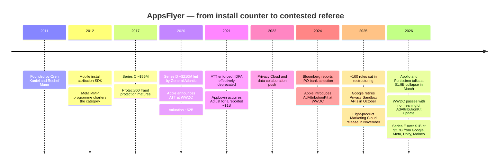
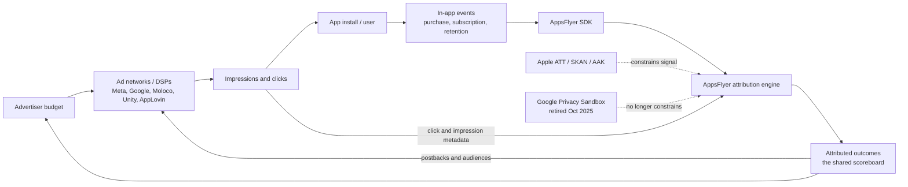
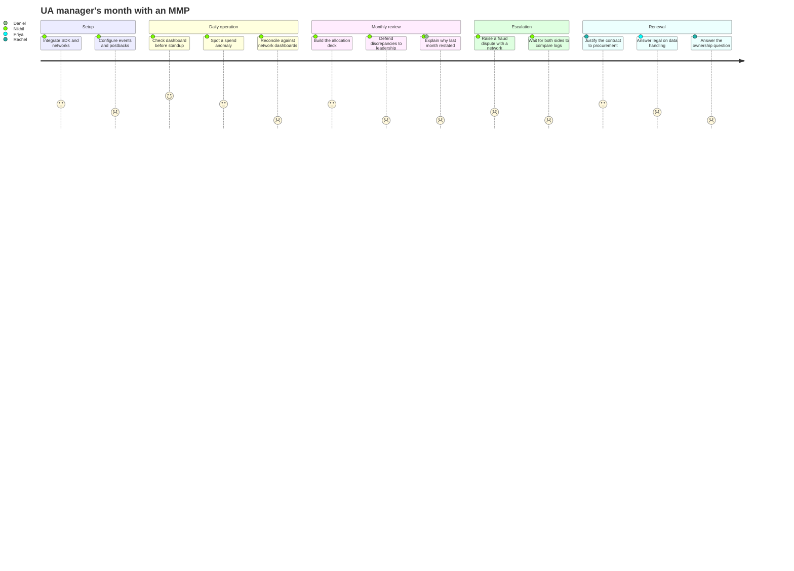
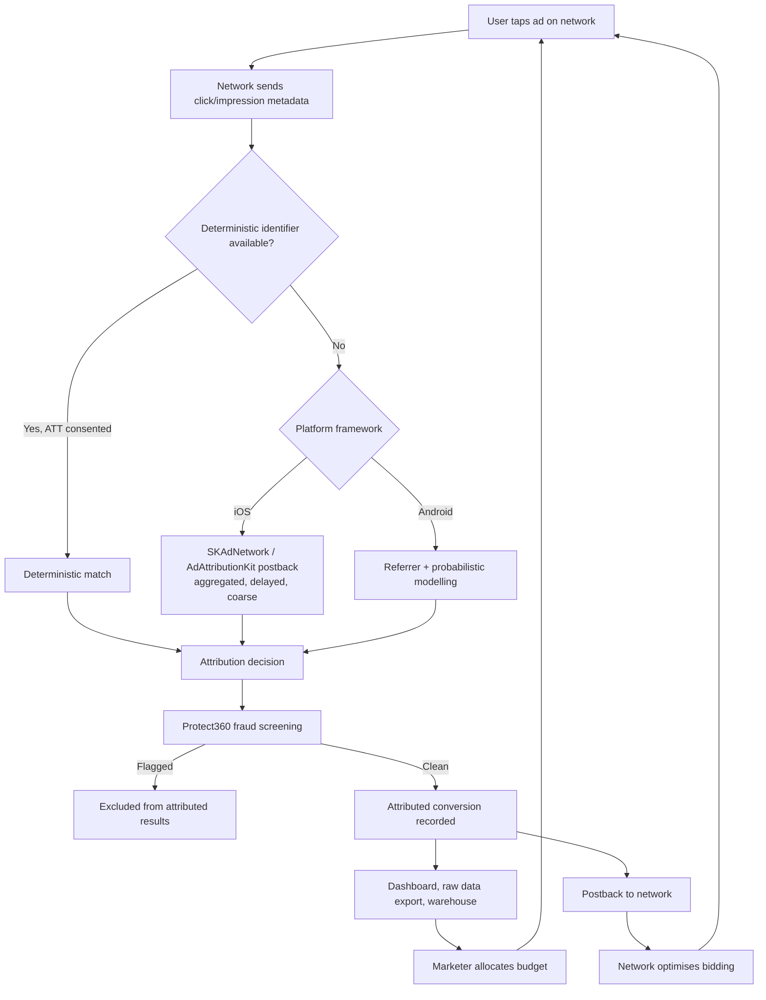
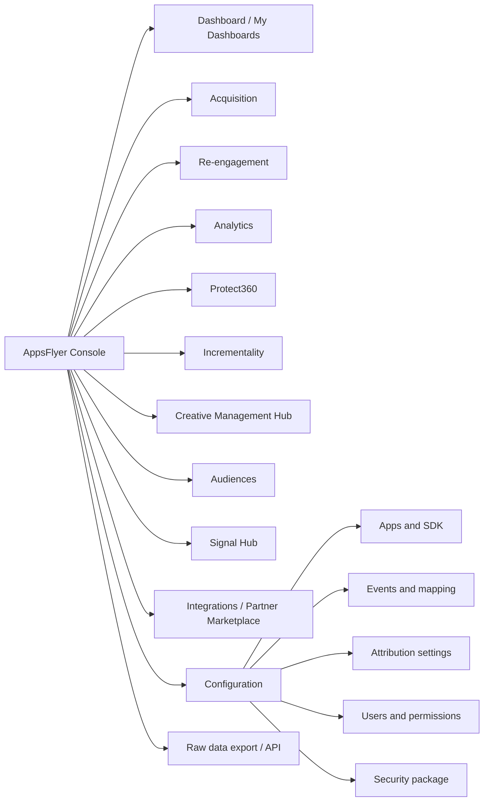
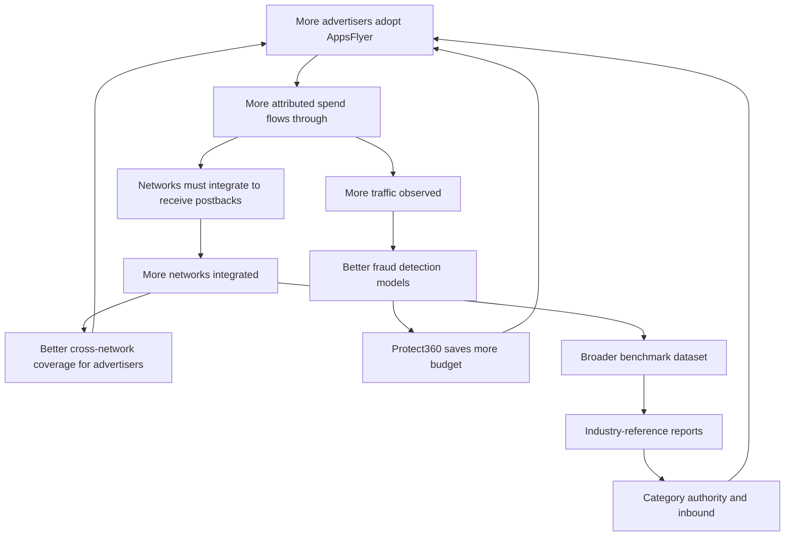
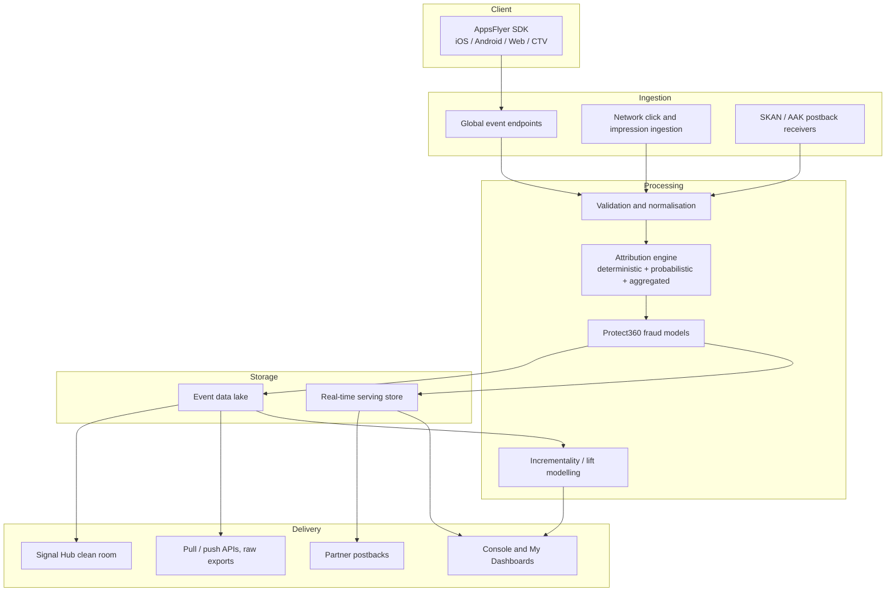
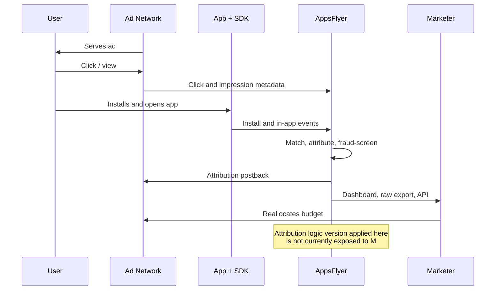
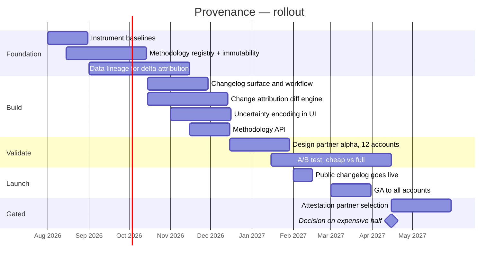

# AppsFlyer — Product Management Case Study

### Day 35 of 90 | PM Case Study Challenge

---

## 1. Cover

**Product:** AppsFlyer (AppsFlyer Ltd.) — mobile measurement, attribution, deep linking, fraud protection, and marketing data collaboration
**Category:** B2B Marketing Infrastructure — Mobile Measurement Partner (MMP) / Measurement Cloud
**Author:** Gaurav Singh
**Day:** 35 / 90
**Date Published:** July 31, 2026

---

## 2. Repository Metadata

| Field | Value |
|---|---|
| Repository | `product-management-case-studies` |
| Folder | `Day-35-AppsFlyer/` |
| Author | Gaurav Singh |
| Series | 90-Day PM Case Study Challenge |
| Previous | Day 34 — Zoho |
| Companion file | `ASSUMPTIONS.md` — evidence grades, source conflicts, author-constructed content |
| Companion file | `NEWSLETTER.md` — condensed essay for LinkedIn Newsletter |
| License | MIT (see [§63 License](#63-license)) |

---

## 3. Badges

`Day 35/90` · `Category: Marketing Infrastructure / MMP` · `Ownership: Private (Series E, June 2026)` · `HQ: Israel / San Francisco (see §7)` · `ARR: ~$500M` · `Status: Published`

---

## 4. Table of Contents

**Foundations**

- [1. Cover](#1-cover)
- [2. Repository Metadata](#2-repository-metadata)
- [3. Badges](#3-badges)
- [4. Table of Contents](#4-table-of-contents)
- [5. Executive Summary](#5-executive-summary)
- [6. Product Overview](#6-product-overview)
- [7. Company Background](#7-company-background)
- [8. Product Timeline](#8-product-timeline)
- [9. Vision & Mission](#9-vision--mission)
- [10. Problem Statement](#10-problem-statement)

**Market & Strategy**

- [11. Market Research](#11-market-research)
- [12. Industry Analysis](#12-industry-analysis)
- [13. TAM/SAM/SOM](#13-tamsamsom)
- [14. Competitor Analysis](#14-competitor-analysis)
- [15. SWOT](#15-swot)
- [16. Porter's Five Forces](#16-porters-five-forces)
- [17. Business Model Canvas](#17-business-model-canvas)
- [18. Revenue Model](#18-revenue-model)

**Users & Experience**

- [19. Target Users](#19-target-users)
- [20. Personas](#20-personas)
- [21. JTBD](#21-jtbd)
- [22. User Journey](#22-user-journey)
- [23. User Flow](#23-user-flow)
- [24. Information Architecture](#24-information-architecture)
- [25. UX Audit](#25-ux-audit)
- [26. UI Audit](#26-ui-audit)
- [27. Accessibility](#27-accessibility)

**Product & Growth**

- [28. Feature Breakdown](#28-feature-breakdown)
- [29. AI Capabilities](#29-ai-capabilities)
- [30. Product Metrics](#30-product-metrics)
- [31. North Star Metric](#31-north-star-metric)
- [32. Product Analytics](#32-product-analytics)
- [33. AARRR](#33-aarrr)
- [34. HEART](#34-heart)
- [35. Growth Strategy](#35-growth-strategy)
- [36. Growth Loops](#36-growth-loops)
- [37. Network Effects](#37-network-effects)
- [38. Product Strategy](#38-product-strategy)
- [39. Monetization](#39-monetization)
- [40. Trust & Safety](#40-trust--safety)

**Technical**

- [41. Technical Architecture](#41-technical-architecture)
- [42. Data Flow](#42-data-flow)
- [43. API Ecosystem](#43-api-ecosystem)
- [44. Privacy & Security](#44-privacy--security)

**Strategy & Planning**

- [45. Pain Points](#45-pain-points)
- [46. Opportunity Mapping](#46-opportunity-mapping)
- [47. RICE](#47-rice)
- [48. MoSCoW](#48-moscow)
- [49. Kano](#49-kano)
- [50. Feature Proposal](#50-feature-proposal)
- [51. PRD](#51-prd)
- [52. Wireframes](#52-wireframes)
- [53. Rollout Plan](#53-rollout-plan)
- [54. A/B Testing](#54-ab-testing)
- [55. KPI Dashboard](#55-kpi-dashboard)
- [56. Product Roadmap](#56-product-roadmap)
- [57. Risks & Mitigation](#57-risks--mitigation)
- [58. Future Vision](#58-future-vision)

**Closing**

- [59. PM Lessons](#59-pm-lessons)
- [60. PM Interview Questions](#60-pm-interview-questions)
- [61. References](#61-references)
- [62. About the Author](#62-about-the-author)
- [63. License](#63-license)
- [64. Self Review](#64-self-review)
- [65. Appendix](#65-appendix)

---

## 5. Executive Summary

In June 2026, AppsFlyer raised **more than $1 billion at a $2.7 billion valuation** from four investors: **Google, Meta, Unity, and Moloco**. Those four companies are, between them, among the largest buyers of the verdicts AppsFlyer issues. They are the parties whose campaign performance AppsFlyer grades. And according to both the company and the reporting, much of the money was **secondary** — it did not go into the business. It went to existing shareholders, to get them out.

That is a strange transaction if you believe AppsFlyer sells attribution software. It is a perfectly rational transaction if you believe what this case study argues.

**Central thesis: AppsFlyer's product is not measurement accuracy. It is refereeing rights — a trust asset — and the June 2026 round is the first time the market has priced that asset explicitly and separately from the software.**

The four investors did not buy AppsFlyer. They bought the *option that nobody else does*. Eric Seufert's framing is the correct one: AppsFlyer is **too big to let fail**. An earlier sale to Apollo and Fortissimo at a **$1.9 billion** valuation collapsed in March 2026; had a buyer with different incentives closed instead, the shared measurement layer of the mobile app economy would have belonged to a party with a reason to shade the numbers. The investors paid a premium over that failed price — roughly **42% above $1.9B** — for a **minority, non-controlling, non-exclusive** stake with explicitly **no preferential access to APIs, measurement signals, attribution logic, or commercial terms**. You do not negotiate away every ordinary benefit of ownership unless the thing you are buying is *the absence of ownership by someone else*.

The evidence that neutrality — not accuracy — is the asset:

1. **The natural experiment already ran.** Adjust, the #2 MMP, was acquired by AppLovin in 2021 for a reported ~$1B. AppLovin operates its own ad network and DSP. Reporting indicates Adjust's product, support, marketing and engineering functions were subsequently folded into AppLovin's core organisation. The "firewall" argument did not survive contact with an owner who monetises the thing being measured. That outcome is precisely what the 2026 round was structured to prevent for AppsFlyer.
2. **Accuracy has been getting *worse* while the company got more valuable.** Apple's ATT (announced WWDC 2020, enforced 2021) removed deterministic identifiers; SKAdNetwork is supported but effectively frozen; **AdAttributionKit has had negligible traction since 2024 and received no meaningful update at WWDC 2026**; and Google **retired the Privacy Sandbox APIs, including Attribution Reporting, for Chrome and Android in October 2025**. Both platform owners tried to build the replacement rails and both efforts stalled. Measurement got less precise, and the demand for a trusted interpreter went up, not down.
3. **The industry cannot even agree on its own headline number.** Adjust's panel puts iOS ATT opt-in at roughly **35%** (Q2 2025); other 2026 panels put it near **38%**; AppsFlyer's own panel reported around **50%** in early 2024. Two MMPs measuring the same industry-wide metric are ~15 points apart. When the measurers disagree, the market does not buy the most accurate one. It buys the most *trusted* one.

The strategic problem this creates is the whole point of the case. **Neutrality is the only asset that can be destroyed without touching the product.** A competitor's slide reading "AppsFlyer is owned by Google and Meta" is not true — the stakes are minority and non-controlling — but it does not have to be true to be expensive. AppsFlyer has spent fifteen years asking customers to *trust* that its logic is unbiased. After June 2026, trust-me is no longer a sufficient answer, because the counterparty now has an obvious counter-argument.

The proposal in [§50](#50-feature-proposal) follows directly: convert neutrality from a **claim** into a **verifiable artefact** — a versioned, diffable, independently attested record of attribution logic and its changes. Not a marketing campaign. A product surface.

**What would falsify this thesis:** if AppsFlyer's renewals, cross-network usage breadth and win rates are unaffected by the cap-table change over the next four quarters, then neutrality was always a narrative wrapper around ordinary switching costs, and the strategic priority should be feature parity in the marketing cloud instead. [§54](#54-ab-testing) is designed to force that question rather than assume the answer.

---

## 6. Product Overview

AppsFlyer sits between **advertising spend** and **in-app outcomes**, and answers one question that neither side can answer alone: *which campaigns actually produced valuable users?*

The reason a third party is needed at all is structural. An ad network can tell you it delivered impressions and clicks. An app can tell you it got installs and purchases. Neither can credibly join the two — because the network is grading its own homework, and the app has no view into what happened before the tap. AppsFlyer is the join.

| Layer | What it does |
|---|---|
| **SDK** | Lightweight client library in the app; records first-party events — installs, opens, sessions, purchases, custom in-app events |
| **Attribution engine** | Ingests click/impression metadata from ad networks, applies attribution logic (deterministic where identifiers exist, probabilistic/aggregated/modelled where they do not), assigns credit |
| **Protect360** | Fraud protection — filters install farms, click flooding, attribution hijacking, bots, before the data contaminates reporting or triggers spend |
| **OneLink / deep linking** | Routes users across web → app → store while preserving campaign and destination context; extends measurement into UX orchestration |
| **Audiences / segmentation** | Builds and syncs cohorts back out to media partners |
| **Incrementality** | Lift measurement — cross-network, holdout-based, asking "would this user have converted anyway?" rather than "who touched them last?" |
| **Signal Hub / Privacy Cloud** | Privacy-safe data collaboration and clean-room workflows for retail media, marketplaces, commerce platforms |
| **Marketing Cloud (Nov 2025)** | Eight-product release: Agentic AI Suite (with MCP integration), Incrementality for UA, Cross-Platform Journeys & LTV, Signal Hub, Enterprise Security Package, Enhanced Attribution Model with AI fraud detection, My Dashboards (natural-language queries), Creative Management Hub |

**Scale.** Reported figures vary by denominator and by source — see [§65 Appendix A](#65-appendix) for the full conflict table:

- **~$500M ARR**, profitable, positive cash flow (company/reporting, June 2026)
- **15,000+ brands** (company positioning) vs **~12,000 paying customers** (Sacra estimate) vs **80,000+ apps/companies** (company) — these are three different denominators, not three answers to one question
- **~1,300 employees** after a ~7% reduction (~100 roles) in 2025
- **9,000–12,000+ integrated partners** depending on source and date

The thing to notice about that product list: **only the first two rows are attribution.** Everything below is a hedge against attribution mattering less.

---

## 7. Company Background

Founded in **2011** by **Oren Kaniel** (CEO) and **Reshef Mann** (CTO). The company is Israeli in origin and operation; Sacra lists headquarters as **San Francisco, CA**, while Israeli business press consistently covers it as an Israeli company with Israeli operations. Both are functionally true of a company with a US commercial HQ and Israeli engineering centre — the case study treats HQ as **dual-listed rather than disputed**.

The category itself was not invented by AppsFlyer. It was *chartered* by Facebook. As Seufert documents, the term "Mobile Measurement Partner" originates in a **Meta (then Facebook) programme** that authorised a small number of firms to interface with its measurement API for install attribution. That origin matters more than it looks: AppsFlyer's entire market exists because a walled garden decided it needed an authorised third party to vouch for its numbers. Neutrality was not a positioning choice bolted on later. It was the founding condition of the category.

**Capital history**

| Round | Date | Amount | Notes |
|---|---|---|---|
| Series C | 2017 | ~$56M | Qumra Capital, Goldman Sachs Growth, DTCP, Pitango Growth |
| Series D | Jan 2020 | ~$210M | Led by General Atlantic |
| Series D ext. | Late 2020 | → ~$225M total | Salesforce Ventures participation; ~$2B valuation (source conflict on structure — see [§65](#65-appendix)) |
| — | Jun 2024 | — | Bloomberg: banks recruited for IPO (reported range $4–5B) |
| — | Aug 2025 | — | Calcalist: PE acquisition talks at ~$3.5B |
| — | Mar 2026 | — | Apollo / Fortissimo talks at **$1.9B collapsed** — Apollo sought additional protection clauses; board (advised by Goldman Sachs) rejected revised terms |
| **Series E** | **Jun 2026** | **>$1B** | **$2.7B valuation. Moloco, Google, Meta, Unity. Largely secondary. Minority, non-controlling, non-exclusive.** |

**Cap table.** General Atlantic remains the largest institutional holder at an estimated **15–20%** with board representation. Other holders include Goldman Sachs, Salesforce Ventures, Pitango, Magma Venture Partners, Qumra Capital, DTCP, and Eight Roads. Several existing investors sold down significantly or exited entirely in the 2026 transaction.

**Read the valuation path honestly.** $2B (2020) → $4–5B IPO ambition (2024) → $3.5B talks (2025) → **$1.9B offer (2026)** → $2.7B (2026). That is not a smooth compounding story. It is a company whose worth the market could not agree on within a **2.6x spread inside twenty-four months** — which is itself a signal that the asset being valued is not straightforwardly a software P&L.

---

## 8. Product Timeline



The shape of that timeline is the argument. Every event after 2020 either **degraded measurement precision** or **increased the value of being the trusted interpreter**. Very few of them are product launches.

---

## 9. Vision & Mission

**Stated position (CEO, June 2026):**

> "For fifteen years, we have been building AppsFlyer around one simple belief: marketers need trusted, independent, unbiased attribution and measurement. At the beginning, many dismissed it as a feature. We thought it was the foundation."

And on why AI raises the stakes:

> "As AI takes over more of the decisions, independent attribution and measurement stops being an advantage and becomes the foundation everything else is built on."

The company also publishes four stated **invariants**: (i) customer obsession, (ii) security and privacy, (iii) data accuracy, (iv) enabling ecosystem innovation.

**PM reading.** Note what the CEO is actually claiming: that neutrality is *the foundation*, not a feature. That is not corporate throat-clearing — it is an accurate description of the business model, and it is the same claim this case study makes independently in [§5](#5-executive-summary). Where I would push: the four invariants list **data accuracy** but not **verifiability**. Accuracy is something you assert. Verifiability is something a customer can check. After June 2026, the gap between those two words is the company's central product problem, and the mission statement does not yet close it.

The Kaniel analogy is worth taking seriously on its own terms: he compares advertising measurement to other technology ecosystems that succeeded because "companies were able to compete independently while relying on neutral and trusted infrastructure." That is the language of **standards bodies and utilities**, not of SaaS vendors. A company that describes itself as shared infrastructure is making an implicit promise about governance that a normal vendor does not make.

---

## 10. Problem Statement

**For the advertiser:** "I spend across ten channels. Every channel claims credit for the same conversions. If I believe all of them, my attributed installs exceed my actual installs. I need one number I can plan against, and it cannot come from anyone who gets paid based on that number."

**For the ad network:** "I need my performance to be credible to advertisers who have every reason to distrust me. A third party vouching for my results is worth more to me than my own dashboard."

**For the platform (Apple/Google):** "I want to restrict cross-app identity for privacy reasons without destroying the ad-funded app economy that fills my store."

**The structural problem underneath all three:** in a market where the seller reports its own performance, there is no equilibrium without a referee. And a referee's value is not a function of how precise its instruments are — it is a function of whether both sides accept the call.

This is why attribution getting *harder* did not shrink the category. Post-ATT, marketers did not cut spend so much as reallocate budget toward infrastructure that could restore accountability. Uncertainty raised the price of a credible interpretation.

**The problem AppsFlyer now has that it did not have in 2020:** its answer to "why should I believe you?" used to be *"because we have no reason to lie."* As of June 2026, a competitor can put four logos on a slide and force AppsFlyer to explain its cap table in every enterprise deal. The claim is still defensible. It is no longer *self-evident*. That shift — from self-evident to requiring-explanation — is a product problem, not a comms problem, and it is the one [§50](#50-feature-proposal) attacks.

---

## 11. Market Research

**Demand-side observations, and what they support**

| Observation | Source quality | What it implies |
|---|---|---|
| Post-ATT, budgets reallocated *toward* measurement infrastructure rather than away | Medium (analyst synthesis) | Measurement is non-discretionary plumbing, not a nice-to-have analytics line |
| ATT opt-in ~35% (Adjust, Q2 2025); ~38% (Q1 2026 panels); ~50% (AppsFlyer panel, early 2024) | **Conflicting** | The industry's own benchmark is vendor-dependent — evidence that trust, not instrumentation, is the scarce good |
| AdAttributionKit: negligible traction since 2024; no meaningful WWDC 2026 update | Medium-High | Platform-native replacement is stalled; third-party interpretation retains its role by default |
| Google retired Privacy Sandbox APIs (incl. Attribution Reporting) Oct 2025 | High | The *other* platform-native replacement failed outright |
| Only ~12% of top-1000 Chrome-spend advertisers had completed ARA integration testing (March 2026) | Medium | Advertiser willingness to re-plumb for platform-native measurement is very low |
| AppsFlyer + Adjust ≈ 45% of global MMP revenue (2024) | Medium (single market-research source) | Duopoly-ish concentration at the top, long tail below |

**The single most useful research finding in this whole case study is the ATT opt-in disagreement.** It is easy to read past. Two credible measurement companies, publishing in good faith, using large panels, report numbers ~15 percentage points apart for the same industry metric. That is not sloppiness — it is what happens when the underlying signal is partial and every vendor's panel is shaped by its own customer mix. It means there is **no observable ground truth** in this market. Where there is no ground truth, the market does not converge on the most accurate vendor. It converges on the most *legitimate* one. Legitimacy is a governance property, not an engineering one.

---

## 12. Industry Analysis



**Structural features of this industry**

1. **The referee is paid by one side.** Advertisers pay AppsFlyer; networks consume its verdicts for free (and integrate at their own cost). That asymmetry is what makes neutrality *credible* — the networks are not customers — and it is exactly what the 2026 cap-table change complicates.
2. **Platform owners are simultaneously the constraint and a competitor.** Apple and Google restrict what third parties may observe while offering their own aggregated measurement inside their walls. But intra-platform measurement is useless for the actual job: allocating budget *across* platforms. Fragmentation is AppsFlyer's structural protection.
3. **Both platform-native replacements have stalled.** AdAttributionKit has negligible adoption; Privacy Sandbox was retired. This is the most underrated fact in mobile marketing in 2026. The disintermediation threat that dominated strategy decks from 2021–2024 has, so far, not been executed.
4. **Consolidation has already claimed the #2.** Adjust inside AppLovin means the second-largest MMP is owned by a full-stack ad company. The independent tier is now AppsFlyer plus a long tail.
5. **AI raises the stakes on signal quality.** When humans allocated budget, a biased number produced a bad quarter. When autonomous bidding systems allocate budget continuously, a biased number produces a compounding misallocation at machine speed. This is Kaniel's argument, and it is correct — and it is also why the networks themselves have a self-interested reason to fund a neutral referee.

---

## 13. TAM/SAM/SOM

*(Framework selection rationale: TAM/SAM/SOM is used here specifically because AppsFlyer's strategic claim is a **market-redefinition** claim — that it is not in "mobile attribution" but in "measurement infrastructure for marketing." A sizing framework is the cleanest way to make that claim falsifiable rather than rhetorical: if the redefinition is real, SAM should be visibly larger than TAM-as-traditionally-drawn. A framework like Ansoff would describe the direction of expansion but not test whether the expansion is where the money is.)*

**A warning that belongs above the numbers.** Third-party MMP market sizing is unusually unreliable. Three sources give three non-overlapping answers for the same year:

| Source estimate | 2025 size | 2032 size | CAGR |
|---|---|---|---|
| Estimate A | $3.5B | $7.8B | 12.2% |
| Estimate B | $1.85B | $4.1B | 12.3% |
| Estimate C | $320M | $639M | 12.5% |

These differ by more than **10x** at the low-to-high extreme. Note the tell: all three agree on ~12% CAGR while disagreeing wildly on the base. That is the signature of growth rates being assumed and bases being defined differently (pure attribution licences vs. broader marketing analytics). **I am not averaging these.** I am reporting the range and reasoning around it.

**A sanity check that is worth more than the reports.** AppsFlyer alone reports ~$500M ARR. Adjust is the #2. If the pair is ~45% of global MMP revenue, that implies a **global MMP revenue pool in the ballpark of $2.0–2.5B**. That triangulation independently invalidates Estimate C ($320M — smaller than AppsFlyer plus Adjust, which is impossible) and sits between Estimates A and B. Estimate B is the most defensible of the three.

| Layer | Definition | Working figure | Reasoning |
|---|---|---|---|
| **TAM** | Global marketing measurement, attribution and decisioning — including MMM, incrementality, clean rooms, marketing analytics | **$15B+ annually** | This is the market AppsFlyer *claims*; consistent with analyst framing of marketing analytics and decisioning |
| **SAM** | Mobile-and-adjacent measurement where an independent cross-network referee is required: app advertisers, CTV-to-app, commerce/retail media closed-loop | **~$2.0–2.5B today**, growing ~12% | Triangulated from AppsFlyer+Adjust ≈45% of MMP revenue |
| **SOM** | AppsFlyer's realistic near-term capture | **~$500M ARR today**, i.e. roughly **20–25% of SAM** | Reported ARR against triangulated SAM |

**The interesting number is TAM ÷ SAM ≈ 6x.** AppsFlyer's growth story requires the marketing cloud strategy ([§38](#38-product-strategy)) to convert TAM into SAM — moving from *reporting what happened* to *informing what to spend next*. But the moment it does that, it starts competing with BI tools, experimentation platforms and in-house analytics teams, where **neutrality is not a differentiator and it has no structural advantage**. The thesis of this case study cuts against the growth plan: the asset that makes AppsFlyer defensible in SAM does almost nothing for it in the other 5/6 of TAM.

---

## 14. Competitor Analysis

| Competitor | Ownership | Position | Neutrality status |
|---|---|---|---|
| **Adjust** | **AppLovin** (acquired 2021, reported ~$1B) | #2 MMP; enterprise automation, incrementality | **Structurally compromised** — owned by a company operating its own network and DSP; reporting indicates functions absorbed into AppLovin core org |
| **Branch** | Independent (VC-backed) | Deep-linking-first; wins where web→app journeys drive conversion | Independent |
| **Kochava** | Independent | Compliance controls, data marketplace | Independent |
| **Singular** | Independent | Cost aggregation + gaming analytics strength | Independent |
| **Apple (SKAN / AdAttributionKit)** | Platform | Intra-iOS aggregated measurement | N/A — self-interested by construction; AAK traction negligible |
| **Google (Privacy Sandbox)** | Platform | **Retired Oct 2025** | Threat materially reduced |
| **In-house MMM / incrementality** | Customer-built | Growing among large advertisers | Neutral by definition, expensive, slow |

**The Adjust case is the load-bearing evidence for this entire case study, so it deserves to be stated precisely.**

In 2021 AppLovin — a company that sells advertising, operates a DSP, and monetises apps — bought the #2 measurement provider. It made the standard promise: a firewall between ads and measurement. Reporting since indicates entire teams eliminated and product, support, marketing and engineering integrated into AppLovin's core organisation. Whatever the intent, the structure did not hold.

Now read the June 2026 round against that. Google, Meta, Unity and Moloco — four companies with the *same* conflict AppLovin had — bought into the #1 MMP with terms that strip out every mechanism AppLovin used: **minority, non-controlling, non-exclusive, no preferential access to APIs, signals, attribution logic, or commercial terms**, and with the investors publicly committing to continue working with *multiple* measurement providers.

They studied what went wrong with Adjust and wrote the inverse contract. That is not a coincidence; it is the market demonstrating, in legal language, that it understands exactly which asset it is protecting.

**And yet.** The terms are contractual, and neutrality is perceptual. Adjust's problem was not only that AppLovin *could* interfere; it was that customers assumed it *would*. AppsFlyer has bought itself excellent contractual protection against a risk that was never primarily contractual. That gap is the opening for [§50](#50-feature-proposal).

---

## 15. SWOT

**Strengths**

- **Category-defining trust position** — the default referee for a substantial share of the app economy
- **Integration breadth** — 9,000–12,000+ partners; the reconciliation layer is only useful if it connects to everything, and nobody else connects to as much
- **Profitable at ~$500M ARR** with positive cash flow — rare in adtech infrastructure, and it removes the forced-sale risk that nearly cost the company its independence in March 2026
- **Embedded in workflow** — once a company's internal definition of "performance" is an AppsFlyer dashboard, the switching cost is organisational, not technical
- **Only remaining independent at scale** — the #2 sold its independence, which paradoxically increased AppsFlyer's scarcity value

**Weaknesses**

- **Perceived-neutrality exposure post-Series E** — the strength above is now attackable in a sales cycle without anyone having to prove wrongdoing
- **Usage-based pricing is procyclical** — revenue is tied to install volume and ad spend, so a downturn compounds
- **Structurally lower gross margin than pure software** — heavy data infrastructure plus third-party device-intelligence and fraud-signal licensing
- **Growth has flattened** — ~$395M (2023) to ~$500M (2026) is not a hypergrowth curve; the 2025 restructuring is consistent with that
- **Marketing-cloud ambition puts it in unfamiliar fights** — BI and experimentation vendors where trust-as-a-moat does not apply

**Opportunities**

- **Both platform-native alternatives have stalled** — a genuine, possibly temporary, reprieve
- **Verifiable neutrality as a product category nobody occupies** ([§50](#50-feature-proposal))
- **CTV and cross-platform** — linking household-level exposure to app and commerce outcomes
- **Retail media / commerce data collaboration** via Signal Hub — sells to a new buyer with a different budget
- **Agentic AI buying makes neutral signal more valuable**, exactly as the CEO argues

**Threats**

- **Perception attack from competitors** using the cap table — the single most likely near-term revenue threat
- **Apple resuming AdAttributionKit development** with mandated adoption
- **Customer-side in-house MMM/incrementality** at the largest advertisers
- **Commoditisation of attribution** into a low-margin utility while margin migrates to decisioning
- **Investor-alignment drift** — even without a term change, a large customer that is also a shareholder creates escalation paths that did not previously exist

---

## 16. Porter's Five Forces

*(Framework selection rationale: Porter's is chosen because the interesting question about AppsFlyer is not competitive rivalry — it is the **asymmetric relationship with suppliers who are also gatekeepers and now also shareholders**. Porter's separates supplier power from buyer power from substitutes, which is what lets us see that Apple and Google occupy multiple boxes at once. A framework like BCG or a simple competitor matrix would collapse those roles into "competition" and lose the structure entirely.)*

| Force | Intensity | Analysis |
|---|---|---|
| **Threat of new entrants** | **Low** | Entry requires simultaneous SDK distribution across tens of thousands of apps, integrations with thousands of networks, fraud detection trained on years of traffic, and — decisively — *institutional trust*. The first three are capital problems. The fourth takes a decade and cannot be bought. It is a genuine barrier |
| **Bargaining power of suppliers** | **Very High** | Apple and Google are the true suppliers: they supply *permission to observe*. ATT unilaterally removed the primary identifier with no negotiation. Device-intelligence and fraud-signal vendors add secondary supplier cost. **This is the highest-power box in the model and the one AppsFlyer can least influence** |
| **Bargaining power of buyers** | **Medium** | Large advertisers negotiate hard on per-conversion pricing ($0.03–$0.05 enterprise vs $0.07 list), and the biggest can credibly threaten to build in-house. But mid-market buyers face high switching costs once dashboards, KPIs and internal definitions are built on AppsFlyer. Power is bimodal, not uniform |
| **Threat of substitutes** | **Medium, and *falling*** | The obvious substitutes are platform-native measurement (SKAN/AAK, Privacy Sandbox) and in-house MMM. **Privacy Sandbox was retired in October 2025 and AAK has negligible traction** — the substitute threat is materially weaker in 2026 than the 2022 consensus assumed. In-house MMM is real but slow, expensive, and complements rather than replaces install-level attribution |
| **Competitive rivalry** | **Medium** | AppsFlyer + Adjust ≈ 45% of MMP revenue. Rivalry is not primarily on features — the feature lists have converged — but on **positioning and trust**. Adjust's ownership removed it from the trust competition; that is a rivalry outcome decided in a boardroom, not a roadmap |

**The synthesis Porter's produces here:** AppsFlyer's position is strong in four boxes and structurally hostage in one. Supplier power is not a solvable problem — no product decision changes what Apple permits. Which means the only rational strategy is to **maximise the value of the thing suppliers cannot take away**. Apple can delete the identifier. Apple cannot delete the fact that Meta and Google both accept AppsFlyer's numbers. That is the asset. Defend that.

---

## 17. Business Model Canvas

| Block | Content |
|---|---|
| **Customer Segments** | App-first businesses (gaming, fintech, commerce, food delivery, streaming, travel); enterprise omnichannel brands; agencies; ad networks and DSPs (integration partners, not payers); retail media network operators (emerging, via Signal Hub) |
| **Value Propositions** | One trusted cross-network number; fraud loss prevention; privacy-compliant measurement under ATT/SKAN; deep-link continuity; incrementality beyond last-touch; privacy-safe data collaboration |
| **Channels** | Direct enterprise sales; self-serve/PLG entry via the free Zero tier; partner marketplace co-selling; developer documentation; industry benchmark content |
| **Customer Relationships** | Long-term annual contracts (12-month minimum, 24-month for best rates); solution architects and technical account management at enterprise; community and documentation at the low end |
| **Revenue Streams** | Usage-based conversion pricing; premium module upsell (fraud, incrementality, deep linking, data collaboration); enterprise security packages; expansion into CTV/web/console measurement |
| **Key Resources** | The attribution engine and its logic; the integration graph (9,000–12,000+ partners); years of fraud-signal training data; the SDK's install base; **institutional trust** |
| **Key Activities** | Attribution R&D under signal loss; fraud detection; partner integration maintenance; large-scale data infrastructure; standards and policy engagement with Apple/Google |
| **Key Partnerships** | Ad networks and DSPs; Apple and Google (adversarial-cooperative); cloud infrastructure; device-intelligence vendors; **now: four strategic investors who are also ecosystem counterparties** |
| **Cost Structure** | Data infrastructure to process billions of daily events; third-party signal licensing; R&D headcount; enterprise go-to-market. Gross margin healthy but below pure software |

**The block that changed in June 2026 is Key Partnerships**, and it changed in a way that puts pressure on Key Resources. When your most valuable resource is trust, adding four strategic partners who are also the graded parties is not a neutral edit to the canvas.

---

## 18. Revenue Model

**Mechanism: usage-based, priced per attributed conversion.**

| Tier | Pricing | Notes |
|---|---|---|
| **Zero** | Free | Welcome package of ~12,000 free conversions within the first 12 months; 30-day trial of premium add-ons |
| **Growth** | ~**$0.07** per attributed install | List pricing |
| **Enterprise** | ~**$0.03–$0.05** per conversion | 29–57% discount vs Growth; volume commitments; 12-month minimum contract (24-month for best rates) |

*(Pricing figures come from third-party aggregators, not company disclosure. Graded **Medium-Low** — see `ASSUMPTIONS.md`.)*

**Implied unit economics.** Sacra's estimate of ~$395M ARR across ~12,000 paying customers implies **~$42,000 average annual revenue per paying customer**. That average is close to meaningless on its own — it blends a long tail of mid-market developers with a small number of very large advertisers — but it is useful as a shape: this is a business with **many small accounts and a concentrated revenue head**.

**Three properties of this model worth naming**

1. **It scales with customer success, not seat count.** As an app grows installs and ad spend, AppsFlyer's revenue grows without a renegotiation. That is the good half of usage pricing.
2. **It is procyclical, which is the bad half.** When ad markets contract, install volume falls and revenue falls with it — at exactly the moment customers are auditing every line item. A seat-based model would lag; a usage model amplifies.
3. **Expansion comes from modules, not from price.** Upsell is fraud protection, incrementality, deep linking, data collaboration, CTV. This is why the November 2025 eight-product release matters commercially: **each new module is a new expansion vector into an installed base that is already paying.** With growth from ~$395M (2023) to ~$500M (2026) looking modest, module attach rate is the more important number than logo acquisition.

**Where the model and the thesis intersect:** AppsFlyer earns per *conversion counted*, but its defensibility comes from *verdicts accepted*. Those are not the same metric, and the pricing model captures the commodity while the moat sits in the trust. A business whose price is tied to the commoditising half of its value is structurally exposed — which is the underlying commercial reason to make neutrality itself a visible, purchasable, contractible product surface.

---

## 19. Target Users

| Segment | Who | Primary need | Willingness to pay |
|---|---|---|---|
| **Performance marketer / UA manager** | Runs paid acquisition across 5–20 networks | One reconciled cross-network truth; fast dashboards; fraud protection | High — it is their budget on the line |
| **Growth / product analyst** | Owns retention, LTV, cohort quality | Event-level data into the warehouse; LTV by source | Medium-High |
| **Marketing / growth leadership (VP, CMO)** | Owns the total budget and the board narrative | Defensible allocation; incrementality; something they can present without being cross-examined | High |
| **Data engineering** | Owns pipelines and warehouse | Clean APIs, raw data export, reliability, security posture | Medium — a blocker rather than a buyer |
| **Ad network / DSP partner** | Integrates to receive postbacks | Credible third-party validation of their performance | Zero direct spend, but **high strategic dependence** |
| **Retail media / commerce operator** | Runs a media network on first-party data | Closed-loop measurement without exposing raw data | Emerging; Signal Hub's target |
| **Privacy / legal / security** | Approves the vendor | Compliance, DPAs, data residency, auditability | Veto power |

**The non-obvious segment is the last two rows.**

The ad networks pay nothing and have enormous influence — they are the reason a customer can trust the number at all, and four of them are now shareholders.

And the privacy/legal reviewer is the fastest-growing constraint on enterprise deals. Which points at something useful for [§50](#50-feature-proposal): a **verifiable neutrality artefact would be consumed primarily by the two segments that do not pay** — legal reviewers and the networks — but it would be *bought* by marketing leadership, because it is what lets them defend the number. That is a classic infrastructure-product pattern: the artefact that unblocks the veto-holder is the artefact the budget-holder pays for.

---

## 20. Personas

*(All personas are author-constructed composites. They are not research subjects and should be read as analytical tools, not evidence — see `ASSUMPTIONS.md`.)*

**Persona 1 — Nikhil, Senior UA Manager, gaming studio (Bengaluru)**

- 31, manages ~$1.2M/month across Meta, Google, Unity, Moloco, AppLovin, and four smaller networks
- Lives in the AppsFlyer dashboard and a spreadsheet that reconciles it against network self-reported numbers
- **Job:** defend a spend allocation in Monday's review with numbers no one can pick apart
- **Frustration:** every network's dashboard shows more conversions than AppsFlyer does, and he spends hours a week explaining why. Post-SKAN, the discrepancies got wider and the explanations got harder
- **What he says about the Series E:** "My Moloco rep congratulated me on it like it was good news. My CFO asked me whether our measurement vendor is now owned by our ad vendors. I did not have a clean answer"

**Persona 2 — Rachel, VP Growth, subscription fintech (New York)**

- 38, owns a $40M annual budget and presents attribution-driven allocation to the board quarterly
- Bought incrementality specifically because a board member asked "how do you know these installs would not have happened anyway?"
- **Job:** make budget decisions she can defend under adversarial questioning
- **Frustration:** three sources of truth — MMP, network dashboards, and an in-house MMM her data team built — that never agree, and no principled way to arbitrate
- **What she needs:** not more precision. **Provenance.** She needs to say "here is the methodology, here is what changed since last quarter, here is who verified it"

**Persona 3 — Daniel, Principal Data Engineer, commerce marketplace (Berlin)**

- 42, owns the pipeline from AppsFlyer raw data into Snowflake
- **Job:** keep the pipeline reliable and the numbers reproducible quarter over quarter
- **Frustration:** attribution logic changes upstream and his historical series shifts underneath him without an obvious diff. He finds out when a stakeholder asks why last March moved
- **What he needs:** a versioned methodology with effective dates, and the ability to pin or replay. This persona is the one who converts §50 from "nice" to "necessary"

**Persona 4 — Priya, Associate General Counsel (Mumbai)**

- 45, reviews every data-processing vendor
- **Job:** ensure the company can survive a regulator's question about how ad data flows
- **Frustration:** vendor security questionnaires are self-attested. She has no independent basis to verify anything
- **What she says:** "Contractual assurances of independence are worth exactly as much as the audit rights attached to them"

---

## 21. JTBD

| When… | I want to… | So I can… | Success looks like |
|---|---|---|---|
| I allocate next month's budget across ten networks | get one reconciled view no network can dispute | move spend without arguing | Allocation decision made in one meeting, not three |
| A network's dashboard disagrees with my MMP | understand *why* they differ | stop re-litigating the same argument monthly | A discrepancy explanation I can forward, not rebuild |
| My board asks whether paid spend is incremental | separate caused conversions from captured ones | defend the budget rather than the tool | An incrementality result with a stated method |
| My historical numbers shift | see exactly what changed and when | keep my reporting reproducible | A methodology diff with an effective date |
| Legal reviews my measurement vendor | show independently verified claims | pass review without a six-week loop | Third-party attestation, not a self-completed questionnaire |
| **My CFO asks if my measurement vendor is owned by my ad vendors** | **show that attribution logic is unaffected — with evidence** | **keep trusting the number I plan against** | **A verifiable record, not a press release** |

The last row did not exist before June 2026. It is a genuinely new job-to-be-done created by a financing event, which is an unusual and instructive thing for a PM to see: **capital structure generated product demand.**

---

## 22. User Journey



The journey has **four valleys, and three of them are the same problem**: reconciling, explaining restatements, and defending ownership are all *"I cannot show my work."* Only the fraud dispute is a different failure mode. That clustering is what makes the §50 proposal a single feature rather than three.

---

## 23. User Flow



Two observations a PM should take from this flow:

1. **The decision node at `H` is the entire business.** Everything upstream is plumbing; everything downstream is presentation. `H` is where a judgement is made — and judgement is exactly the thing that requires trust rather than accuracy.
2. **Node `M` is why the networks care.** AppsFlyer does not merely report to the marketer; it feeds the networks' own optimisation loops. A network with degraded postback quality bids worse. That dependency, more than goodwill, explains the June 2026 cheque.

---

## 24. Information Architecture



**IA critique.** The console's top level is organised by **AppsFlyer's product lines**, not by the user's job. A UA manager's actual workflow — *check, diagnose, reconcile, decide* — cuts across Dashboard, Analytics, Protect360 and Integrations. The most common task in [§22](#22-user-journey) (reconciling a discrepancy) has **no home in the IA at all**; it is performed in a spreadsheet outside the product. When the highest-frequency painful task has no navigational home, that is usually the strongest available signal about what to build next.

Note also that `Configuration → Attribution settings` is where attribution logic is *configured* — but there is no surface anywhere in this tree where attribution logic is *explained, versioned, or evidenced*. [§50](#50-feature-proposal) proposes a new top-level node.

---

## 25. UX Audit

| Area | Assessment | Evidence basis |
|---|---|---|
| **Onboarding / SDK integration** | Strong. Documentation is a genuine competitive asset; the Zero free tier with 12,000 conversions removes evaluation friction | Company docs; pricing sources |
| **Event configuration** | Weak. Rich event mapping is powerful and easy to get wrong; misconfiguration surfaces weeks later as bad data | Inferred from category norms — **Low evidence** |
| **Dashboard comprehension** | Mixed. Dense and capable; the Nov 2025 "My Dashboards" with natural-language querying is a direct admission that the default view was too hard | Product release, Nov 2025 |
| **Discrepancy investigation** | **Poor — the central UX gap.** The most frequent painful task has no dedicated flow | [§22](#22-user-journey), [§24](#24-information-architecture) |
| **Methodology transparency** | **Poor.** Attribution logic is documented in help-centre prose, not surfaced as a versioned, diffable object | Author assessment |
| **Fraud dispute workflow** | Weak. Cross-party, evidentiary, slow; largely conducted over email between advertiser and network | Inferred — **Low evidence** |
| **Cross-platform coherence** | Improving. Nov 2025 Cross-Platform Journeys addresses mobile/web/desktop/console/CTV stitching | Product release |

**Overall.** This is a mature product with excellent instrumentation and a persistent gap in **explanation**. It is very good at telling you *what the number is*, and structurally unequipped to tell you *why the number is what it is and why it changed*. In a market with no observable ground truth ([§11](#11-market-research)), that gap is not cosmetic — it is the gap where trust either forms or fails.

---

## 26. UI Audit

- **Density is appropriate.** The primary user is a daily professional, not a casual visitor; dense tables and multi-dimension pivots are correct for the job. Consumer-style simplification would be a mistake here.
- **Cognitive load at first run is high.** A new UA manager faces a dashboard whose defaults assume they already know which of ten metrics matters this week. Natural-language querying (My Dashboards, Nov 2025) mitigates but does not fix the default view.
- **Data-visualisation conventions are sound** — time series, cohort tables, funnel views, all industry-legible.
- **No uncertainty encoding.** This is the most substantive UI criticism I would make. Post-ATT, a large share of displayed numbers are **modelled or aggregated**, not observed — but they render identically to deterministic numbers. A number that is 95% confident and a number that is a coarse SKAN estimate look the same. Every consumer of that screen is systematically over-trusting half of it.
- **No provenance affordance.** There is nowhere to click a number and ask "how was this derived, under which methodology version?"

The last two points are the same point, and they are the UI expression of the strategic thesis: **the interface presents verdicts without evidence, which is exactly the posture that stops working when your impartiality is questioned.**

---

## 27. Accessibility

Evidence here is genuinely thin — AppsFlyer does not publish a VPAT or WCAG conformance statement that I could locate, and I did not run an automated audit. **Everything below is a reasoned expectation for a product of this class, not a finding.** Marked **Low evidence** throughout.

| Dimension | Expected state | Risk |
|---|---|---|
| Keyboard navigation | Partial | Complex pivot tables and multi-select filters are common failure points |
| Screen reader support | Likely weak on data grids | Dynamic dashboard grids are notoriously poorly labelled |
| Colour contrast | Likely acceptable in chrome | Chart palettes with 8+ series usually fail contrast between adjacent series |
| Colour-only encoding | **Likely a real failure** | Green/red performance deltas without a secondary encoding exclude colour-blind users — very common in analytics products |
| Text resizing / zoom | Likely degraded | Dense tables typically break at 200% zoom |
| Motion / animation | Low risk | Little decorative motion in analytics tooling |

**Why this matters commercially, not just ethically.** AppsFlyer's buyers include large enterprises and public-sector-adjacent brands in the EU, where the **European Accessibility Act** compliance regime raises procurement expectations for digital products. Accessibility gaps in B2B analytics tools tend to surface as procurement blockers rather than user complaints — the same veto-holder dynamic described in [§19](#19-target-users). A published VPAT would be cheap relative to the deals it unblocks.

---

## 28. Feature Breakdown

| Feature | Category | Job served | Strategic role |
|---|---|---|---|
| **SDK + event tracking** | Core | Capture first-party outcomes | The distribution asset — hardest thing for a challenger to replicate |
| **Multi-touch attribution** | Core | Assign credit across networks | The commoditising half; feature parity across all major MMPs |
| **SKAN / AAK handling** | Core | Operate under iOS constraints | Table stakes; complexity is the barrier, not the concept |
| **Protect360** | Premium | Stop fraud losses | High-margin upsell with hard, provable ROI — the easiest module to sell |
| **OneLink deep linking** | Premium | Web→app continuity | Expands buyer beyond marketing into product/growth |
| **Audiences** | Premium | Activate segments back to networks | Increases spend-flow dependency |
| **Incrementality (Nov 2025)** | Premium | Causal lift, cross-network | Strategic: moves the conversation from *credit* to *causation* |
| **Cross-Platform Journeys & LTV (Nov 2025)** | Premium | Mobile/web/desktop/console/CTV stitching | TAM expansion beyond mobile |
| **Signal Hub (Nov 2025)** | Platform | Privacy-safe data collaboration | New buyer (retail media), new budget |
| **Creative Management Hub (Nov 2025)** | Premium | Creative performance optimisation | Defends against creative-analytics point tools |
| **Agentic AI Suite (Nov 2025)** | Platform | Pre-built agents; MCP integration | Positions AppsFlyer as a data source for agentic workflows |
| **My Dashboards (Nov 2025)** | Core UX | Natural-language querying | Admission that dashboards were too hard |
| **Enterprise Security Package (Nov 2025)** | Premium | Pass security review | Sells directly to the veto-holder in [§19](#19-target-users) |
| **Raw data export / APIs** | Core | Warehouse integration | Simultaneously a retention asset and an exit ramp |

**Pattern:** ten of these fourteen exist to make AppsFlyer valuable **in a world where attribution itself is less valuable**. That is a coherent hedge and a well-executed one. What is missing from the list is anything that makes the *trust* — the actual moat — legible or purchasable.

---

## 29. AI Capabilities

| Capability | Description | Assessment |
|---|---|---|
| **Probabilistic / modelled attribution** | Statistical inference where deterministic identifiers are unavailable | The most consequential ML in the product. Also the least explainable — and explainability is the thesis's pressure point |
| **Protect360 fraud ML** | Pattern and anomaly detection over traffic and device signals | Mature, differentiated, defensible. Improves with data scale |
| **Incrementality modelling** | Cross-network lift without manual holdout setup | Genuinely useful; automating experiment design is the hard part |
| **Agentic AI Suite (Nov 2025)** | Pre-built agents for creative opportunities, daily insights, config monitoring, trend detection; MCP integration | Reads as a platform bet: be the trusted data source agents call, rather than build the agent |
| **My Dashboards NL querying** | Natural-language analytics queries | Real usability win for a dense product |
| **Creative Management Hub** | Automated creative optimisation | Competitive necessity |

**The MCP integration is the most strategically interesting item here**, and it is easy to under-read. By exposing measurement through Model Context Protocol, AppsFlyer is positioning itself as **the substrate other systems query**, not the destination users visit. If agentic budget allocation becomes normal, the winning position is being the source of truth the agent calls — not the dashboard the human abandons.

**But this sharpens the thesis rather than softening it.** A human reading a dashboard applies judgement and notices when a number looks wrong. An agent does not. It acts. Which means when AI intermediates the buying, **the integrity of the signal matters more and is scrutinised less**. Kaniel says exactly this. It is the strongest strategic argument in the June 2026 announcement, and it makes verifiable provenance ([§50](#50-feature-proposal)) *more* necessary in an agentic world, not less — because the agent, unlike Nikhil, cannot smell a bad number. It can only check a signed one.

---

## 30. Product Metrics

| Metric | Why it matters | Disclosed? |
|---|---|---|
| ARR | Overall scale | **~$500M** (reported) |
| Net revenue retention | The real health metric for usage-priced infra | **Not disclosed** |
| Paying customers | Base size | ~12,000 (estimate) / 15,000+ brands (company) — different denominators |
| ARPC | Mix indicator | ~$42k implied (derived from estimates) |
| Module attach rate | Expansion engine | **Not disclosed** |
| Conversions processed | Usage volume = revenue driver | **Not disclosed** |
| Networks per customer | Depth of the reconciliation job | **Not disclosed** |
| Gross margin | Infra cost intensity | **Not disclosed** (described as healthy but below pure software) |
| Attribution discrepancy rate vs networks | Trust proxy | **Not disclosed** — and probably not measured as a product metric |
| Employees | Efficiency | ~1,300 (after ~7% cut in 2025) |
| Revenue per employee | Efficiency | ~$385k implied at $500M / 1,300 |

**Two honest observations.**

First, **almost everything a PM would actually want is undisclosed.** Any analysis of this company that presents a confident retention or attach-rate figure is inventing it. I have marked every gap rather than filling it.

Second, **the one metric that would test this case study's thesis does not appear to exist**: something like *share of customers whose stated reason for choosing AppsFlyer is independence*. The company measures the commodity carefully and the moat not at all. That is a common and expensive pattern.

---

## 31. North Star Metric

**Proposed North Star: Monthly ad spend reconciled across three or more networks by accounts that took action on the result.**

Long, deliberately. Each clause is doing work:

- **"Ad spend reconciled"** rather than conversions counted — value is created when budget is *arbitrated*, not when an install is logged. It also aligns to revenue, which scales with spend.
- **"Three or more networks"** — this is the discriminating clause. Single-network measurement is a job Apple, Google or the network itself can do. **Cross-network reconciliation is the only job that structurally requires an independent third party.** A customer using AppsFlyer for one network is not experiencing the product's actual value and is at high churn risk.
- **"Took action on the result"** — reconciliation nobody acts on is a report, not a decision. Action (a budget shift, a campaign pause, a creative swap) is the evidence that the verdict was *accepted*, which is the closest observable proxy for trust.

**Why not the obvious candidates**

| Candidate | Why rejected |
|---|---|
| Attributed conversions processed | Pure volume; grows with the market and with a customer's success, not with AppsFlyer's value-add. It is the *billing* metric, and billing metrics make poor North Stars |
| Active accounts | Ignores depth; a dormant account with an SDK still counts |
| Dashboard MAU | Actively misleading in an agentic future where the best outcome is *nobody opens the dashboard* |
| ARR | Lagging, and a business outcome rather than a product one |

**The test this metric passes:** if AppsFlyer's neutrality were compromised, this number would fall *before* revenue did. Customers would narrow to fewer networks, or stop acting on the output, months before they churned. That early-warning property is exactly what you want from a North Star — and it is a metric explicitly designed to detect the failure mode this case study argues is the company's central risk.

---

## 32. Product Analytics

**What AppsFlyer should instrument about itself** (the irony of an analytics company's own analytics is not lost):

| Signal | Question answered | Priority |
|---|---|---|
| Networks-per-account trend | Is the cross-network job deepening or narrowing? | **Critical** — leading churn indicator |
| Time-to-first-reconciled-decision | Onboarding health | High |
| Discrepancy-support ticket volume | Where explanation is failing | **Critical** — direct §50 input |
| Module attach and time-to-attach | Expansion engine health | High |
| Raw-data-export volume without console usage | Warehouse-only accounts = churn risk | High |
| Restatement events and downstream support load | Cost of methodology changes | **Critical** — direct §50 input |
| Security/legal review cycle length | Enterprise sales friction | Medium |
| Post-Series E: sales cycles where ownership was raised as an objection | **Direct measurement of the thesis** | **Critical** |

**That final row is the most important instrumentation recommendation in this case study.** It is cheap — a required field in the CRM loss/objection taxonomy — and within two quarters it would either confirm or falsify the central argument with real data. A PM should never propose a strategy this large without also proposing the cheapest possible way to find out it is wrong.

---

## 33. AARRR

| Stage | Mechanism | Assessment |
|---|---|---|
| **Acquisition** | Zero free tier (12k conversions); documentation and SEO; partner marketplace referrals; benchmark content (Performance Index-style reports) | Strong. The free tier is well-calibrated — generous enough to prove value, small enough to force a decision at scale |
| **Activation** | SDK integrated, events mapped, first network connected, first attributed conversion | Good technically; the fragile step is **event mapping**, where silent misconfiguration creates delayed, expensive failures |
| **Retention** | Dashboards embedded in weekly workflow; internal KPIs defined in AppsFlyer terms; historical continuity | Very strong. Retention here is organisational, not feature-based — the switching cost is *redefining what performance means at your company* |
| **Referral** | Networks recommend an MMP to advertisers; agencies standardise across clients; practitioners carry it between jobs | Underrated. Agency standardisation is a genuine multi-account distribution channel |
| **Revenue** | Usage growth + module attach | Solid mechanism; growth from ~$395M to ~$500M suggests attach rate is the constrained variable |

**The stage that deserves scrutiny is Retention**, because it is strong for a reason that is *not* the moat. Customers stay because ripping out an MMP means re-baselining every historical series and re-teaching the organisation what "conversion" means. That is switching cost, and switching cost is a *different asset* from neutrality.

Which raises the honest counter-argument to this entire case study: perhaps AppsFlyer is simply a high-switching-cost infrastructure business, and neutrality is a story told about it. My answer is in [§14](#14-competitor-analysis) — Adjust had identical switching costs and still lost position after its ownership changed — but the counter-argument is legitimate and [§54](#54-ab-testing) is built to test it rather than dismiss it.

---

## 34. HEART

| Dimension | Goal | Signal | Metric |
|---|---|---|---|
| **Happiness** | Marketers trust the number they plan against | Survey; objection frequency in renewals | Share of accounts agreeing "I can defend these numbers to my leadership" |
| **Engagement** | Reconciliation is a habit, not a fire drill | Weekly cross-network view usage | Weekly reconciled-decision rate per account |
| **Adoption** | New modules reach the installed base | Module activation | Attach rate within 90 days of release |
| **Retention** | Accounts deepen rather than narrow | Networks per account over time | Cohort trend in networks-per-account |
| **Task Success** | Discrepancies get resolved without leaving the product | Support ticket deflection | Median time to explain a discrepancy; % resolved in-product |

**Task Success is the weakest dimension today and the one §50 targets directly.** Today the answer to "why do these numbers differ?" is a support ticket and a spreadsheet. That is a task-success failure measured in hours per week per user, multiplied across the installed base.

---

## 35. Growth Strategy

**Historically, three engines:**

1. **Ecosystem-led distribution.** Integrations with 9,000–12,000+ partners meant AppsFlyer showed up wherever a marketer already worked. Being the connector to everything is self-reinforcing: each new network integration makes AppsFlyer more useful to every advertiser, and each advertiser makes AppsFlyer more necessary for every network.
2. **Land-and-expand on usage.** Free tier → conversion-priced growth → enterprise contract → module attach. Revenue grows with the customer without a renegotiation.
3. **Category authority.** Publishing industry benchmarks made AppsFlyer the reference point for how the category talks about itself — which, in a market with no ground truth ([§11](#11-market-research)), is a form of soft power. Whoever publishes the benchmark defines the metric.

**Currently, the strategy is TAM redefinition** ([§13](#13-tamsamsom)): mobile attribution → measurement infrastructure for all of marketing. The November 2025 eight-product release is that strategy made concrete.

**My assessment: the redefinition is necessary and under-defended.** Necessary because attribution is commoditising and growth has flattened. Under-defended because the new territory — BI, experimentation, marketing analytics — is populated by incumbents against whom AppsFlyer's actual advantage does not transfer. Nobody chooses a dashboard tool for its neutrality.

**The growth move this case study would argue for instead:** lead with the asset that *is* differentiated. "The only MMP that can prove its independence" is a positioning nobody else can copy — Adjust structurally cannot, and the long tail lacks the scale to make it credible. It is a narrower story than "modern marketing cloud," but it is *true and exclusive*, which the broader story is not.

---

## 36. Growth Loops



Three loops, and they are of different quality:

- **Loop 1 (coverage)** is the strongest and the most defensible. It is a genuine two-sided network effect and it is why a challenger cannot enter incrementally.
- **Loop 2 (fraud data)** is a real data-scale advantage with a clean ROI story. It is the most under-marketed asset in the portfolio.
- **Loop 3 (benchmarks)** is the softest but the most thesis-relevant: it converts data scale into *legitimacy*. And legitimacy is precisely what the ATT opt-in disagreement in [§11](#11-market-research) shows is contested.

**What is missing is a trust loop.** Nothing in the current product converts *demonstrated* neutrality into more trust into more adoption. Trust is asserted, consumed and never compounded. [§50](#50-feature-proposal) is, structurally, an attempt to build that fourth loop.

---

## 37. Network Effects

| Type | Present? | Strength |
|---|---|---|
| **Two-sided (advertisers ↔ networks)** | Yes | **Strong** — the core defensibility |
| **Data network effect (fraud)** | Yes | Strong — more traffic, better detection |
| **Data network effect (benchmarks)** | Yes | Medium — converts scale into authority |
| **Standards / protocol effect** | **Partially** | AppsFlyer's event taxonomy and postback conventions function as a de facto standard across thousands of integrations |
| **Direct user-to-user** | No | Not applicable |

**The critical, easily-missed property: these network effects run through neutrality, not around it.**

Networks integrate with AppsFlyer *because* advertisers accept its verdicts. Advertisers accept its verdicts *because* the networks do not control it. Remove the neutrality assumption and the two-sided loop does not weaken gradually — it **inverts**. Networks would have less reason to integrate with a referee they believe is captured; advertisers would have less reason to trust a referee the networks abandoned.

That is why the June 2026 round is more than a financing event. **The moat is not the integrations; the integrations are downstream of the trust.** Any risk to trust is a risk to the whole loop, which is why this case study treats a cap-table change as a first-order product concern and why [§50](#50-feature-proposal) is a defensive investment in the moat itself rather than a growth feature.

---

## 38. Product Strategy

**AppsFlyer's stated strategy (Nov 2025 – Jun 2026):** evolve from mobile attribution pioneer to a "Modern Marketing Cloud" spanning omnichannel measurement, deep linking, data collaboration and autonomous AI workflows — funded and accelerated by the Series E, with capital directed at AI-powered measurement, cross-platform attribution, and infrastructure for agentic marketing workflows.

**Where I agree:**

- **Incrementality over attribution is the right long-term bet.** Last-touch credit is a legacy of an era with perfect identifiers. Causal lift survives signal loss because it never depended on identity in the first place. This is genuinely forward-looking.
- **MCP and agent-readiness is correctly early.** Being the queried substrate beats being the abandoned dashboard.
- **Signal Hub opens a real new buyer** — retail media operators with different budgets and different urgency.

**Where I would push back:**

1. **The marketing-cloud framing dilutes the only exclusive asset.** "Modern Marketing Cloud" is a category with a dozen credible claimants. "Independent measurement" has exactly one at scale. Strategy is choosing what not to be, and this framing chooses to be more things at the exact moment its distinctiveness came under attack.
2. **The strategy does not address the risk the financing created.** The Series E announcement discusses neutrality extensively in *communications* — a CEO blog post, contractual terms, press statements. None of it appears in the *product*. The strongest possible response to "are you still neutral?" is not a blog post; it is a surface in the console the customer can inspect themselves.
3. **Eight products in one release is a lot of surface area for a company that just cut 7% of staff.** Depth risk is real, and attach rate ([§30](#30-product-metrics)) is undisclosed, so the market cannot yet judge whether the November 2025 release landed.

---

## 39. Monetization

Covered mechanically in [§18](#18-revenue-model). Here I want to address one strategic monetisation question the June 2026 round forces.

**Should neutrality be monetised directly?**

The argument for: it is the differentiated asset; assurance products (audits, attestations, compliance packages) command premium pricing; and the Enterprise Security Package released in November 2025 proves AppsFlyer will already sell to the compliance buyer. A "Verified Neutrality" tier would be commercially conventional.

**The argument against, which I find decisive:** paywalling the evidence of your impartiality *undermines the claim*. If only enterprise customers can verify that attribution logic is unbiased, then neutrality becomes a feature rather than a property — and a competitor's counter-slide writes itself.

**Recommended structure, and it maps precisely onto the cheap/expensive split in [§50](#50-feature-proposal):**

| Component | Availability | Rationale |
|---|---|---|
| Public methodology changelog | **Free, public, no login** | Evidence of neutrality must not be gated. It is also marketing that competitors cannot match |
| Per-account "why did this change" diff | **Included in all paid tiers** | Support-cost reduction; retention driver |
| Independent third-party attestation report | **Free to read, published** | Same logic as the changelog: gating it defeats it |
| Cryptographic provenance receipts / clean-room verification | **Enterprise add-on** | Genuine incremental infrastructure cost; the buyer is the compliance function that already pays for the security package |

The monetisation principle: **charge for the machinery, never for the transparency.**

---

## 40. Trust & Safety

For most products, Trust & Safety means content moderation or abuse prevention. For AppsFlyer, **Trust & Safety is the product**, which makes this section unusually load-bearing.

| Domain | Current state | Assessment |
|---|---|---|
| **Ad fraud** | Protect360 — install farms, click flooding, attribution hijacking, bots | Mature; genuine differentiation; clear ROI |
| **Data integrity** | Attribution logic applied consistently across customers | Asserted; not externally verified |
| **Conflict of interest** | Contractual: minority, non-controlling, non-exclusive; no preferential API/signal/logic/commercial access; investors commit to using multiple MMPs | **Strong on paper; invisible in product** |
| **Methodology transparency** | Help-centre documentation | Not versioned, not diffable, not attested |
| **Customer data governance** | DPAs, security package, permissioning | Standard enterprise posture |
| **Independent audit** | **None identified** | **The gap** |

**The structural analysis.** AppsFlyer has three lines of defence for its integrity: (1) reputation, (2) contract, (3) — nothing. There is no third line. There is no independent audit, no published attestation, no verifiable record.

Compare the institutions AppsFlyer's CEO invokes when he talks about "neutral and trusted infrastructure." Financial auditors have PCAOB inspection. Credit rating agencies have regulatory oversight (imposed, notably, *after* their conflicts caused a crisis). Ad measurement in traditional media has MRC accreditation. Every mature refereeing institution eventually acquires **external verification**, and in almost every case it acquires it reactively, after a failure, on terms it did not choose.

AppsFlyer is currently pre-failure and has the rare opportunity to build that layer proactively, on its own terms, as a differentiator rather than a remedy. That window is open now precisely *because* the Series E raised the question. It will not stay open — and if a competitor with less to lose publishes an audited neutrality report first, AppsFlyer's response becomes catch-up rather than leadership.

This section, together with [§14](#14-competitor-analysis), [§37](#37-network-effects), [§44](#44-privacy--security) and [§45](#45-pain-points), is where the feature proposal comes from.

---

## 41. Technical Architecture



**Engineering constraints worth naming:**

- **Billions of events daily** with real-time serving requirements and a durable historical lake — the dual workload is why gross margin sits below pure software.
- **Global data residency** obligations force regional processing, multiplying infrastructure cost.
- **Idempotency and late-arriving data** are hard here: SKAN postbacks arrive delayed and coarse, which means historical numbers legitimately move. This is the *technical* origin of the restatement pain in [§22](#22-user-journey) — and it explains why a methodology changelog is not merely a documentation nicety. **The system genuinely restates; today it does so silently.**
- **Attribution logic versioning** appears to be an internal deployment concern rather than a customer-visible artefact. Making it visible is the core technical ask of [§51](#51-prd), and the good news is that the versioning almost certainly already exists internally — it just is not exposed.

---

## 42. Data Flow



The note on the final line is the whole proposal in one sentence. Every other arrow in this diagram is instrumented, logged and queryable. The one judgement call in the system is the one thing the customer cannot inspect.

---

## 43. API Ecosystem

| Surface | Purpose | Consumer |
|---|---|---|
| SDKs (iOS, Android, Web, CTV, Unity, React Native, Flutter) | Event capture | App engineering |
| Server-to-server event API | Backend-originated events | Data engineering |
| Pull API / raw data reports | Batch export | Analytics / warehouse |
| Push API / webhooks | Real-time downstream triggers | Growth engineering |
| Partner postback framework | Deliver attribution to networks | 9,000–12,000+ partners |
| Audiences API | Segment activation | Marketing ops |
| **MCP integration (Nov 2025)** | Agent access to measurement data | AI agents / LLM workflows |

**The partner postback framework is the most strategically important API in this list and the least discussed.** It is the interface through which thousands of networks receive AppsFlyer's verdicts, and it is the mechanism by which the two-sided network effect in [§37](#37-network-effects) actually operates. It is also, notably, **the API the Series E terms explicitly promise not to give investors preferential access to** — which tells you the parties involved understand exactly where the power sits.

**Missing surface:** there is no *methodology* API — no programmatic way to ask "which attribution logic version produced this result, and what changed between version N and N+1?" Every other question in this system is answerable via API. That one is not.

---

## 44. Privacy & Security

| Area | Posture |
|---|---|
| **Regulatory** | GDPR, CCPA/CPRA and comparable regimes; DPAs; regional data residency |
| **Platform policy** | ATT compliance; SKAdNetwork and AdAttributionKit support; Google Play policy compliance |
| **Aggregation** | Progressive shift from user-level to aggregated, modelled and clean-room approaches |
| **Signal Hub / Privacy Cloud** | Privacy-safe multi-party collaboration without raw data exposure |
| **Enterprise Security Package (Nov 2025)** | Elevated controls for regulated and enterprise buyers |
| **Independent verification** | **None identified — see [§40](#40-trust--safety)** |

**The strategic point about privacy here is counterintuitive and worth stating plainly.** Privacy restrictions were universally read as an existential threat to MMPs in 2021. Five years on, the record is different: ATT degraded precision but *increased* demand for trusted interpretation; **Google retired Privacy Sandbox entirely in October 2025**; and **AdAttributionKit has negligible traction with no meaningful WWDC 2026 update**. Both platform-native replacements stalled.

The honest reading is not "AppsFlyer won." It is that **privacy pressure converted the category from a data business into a trust business** — and AppsFlyer happened to be the best-positioned company for that conversion. Less data means more inference; more inference means more judgement; more judgement means the question "why should I believe you?" gets asked more often and answered less easily.

Which is exactly why the answer needs to become verifiable rather than reputational.

---

## 45. Pain Points

| # | Pain | Who feels it | Severity | Frequency | Evidence |
|---|---|---|---|---|---|
| **P1** | Network dashboards disagree with MMP numbers; reconciliation is manual and endless | UA managers | High | Weekly | [§22](#22-user-journey); category norm |
| **P2** | Historical numbers restate with no visible cause | Data engineers, analysts | High | Monthly | [§41](#41-technical-architecture) — late/coarse postbacks make restatement genuine |
| **P3** | Modelled and observed numbers are visually indistinguishable | All dashboard users | **High** | Constant | [§26](#26-ui-audit) |
| **P4** | Attribution methodology is prose documentation, not a versioned object | Analysts, data engineers | High | Quarterly | [§43](#43-api-ecosystem) — no methodology API |
| **P5** | Fraud disputes require slow, cross-party, evidentiary back-and-forth | UA managers, networks | Medium | Monthly | Inferred — Low evidence |
| **P6** | Legal/security review relies on self-attested questionnaires | Counsel, security | Medium | Per renewal | [§40](#40-trust--safety) |
| **P7** | **"Is my measurement vendor owned by my ad vendors?"** | Leadership, finance, procurement | **High** | **Per renewal, and rising** | [§7](#7-company-background) Series E; [§14](#14-competitor-analysis) Adjust precedent |
| **P8** | Event misconfiguration surfaces weeks later as bad data | Growth engineering | Medium | Per integration | [§25](#25-ux-audit) |
| **P9** | Onboarding cognitive load on a dense console | New users | Medium | Onboarding | Partially addressed by My Dashboards |

**The convergence.** P1, P2, P3, P4, P6 and P7 are six symptoms of **one underlying condition: the product issues verdicts without evidence.** It states what is true and provides no mechanism to inspect how it arrived there. Each symptom has been treated separately — support tickets for P1, documentation for P4, a security package for P6, a press release for P7 — and never at the root.

P5, P8 and P9 are real but genuinely separate problems requiring separate solutions. I am not going to pretend one feature fixes nine pain points.

---

## 46. Opportunity Mapping

| Opportunity | Addresses | Strategic fit | Effort | Verdict |
|---|---|---|---|---|
| **Verifiable neutrality / provenance layer** | P1, P2, P3, P4, P6, P7 | **Directly defends the moat** | Medium | **Selected — [§50](#50-feature-proposal)** |
| Discrepancy explorer (standalone) | P1 only | High | Medium | Subsumed into the above |
| Uncertainty encoding in UI | P3 only | High | Low | Subsumed into the above |
| Fraud dispute workflow | P5 | Medium | High | Defer — real, but a different problem |
| Guided event configuration + validation | P8 | Medium | Medium | Defer — worth doing, unrelated thesis |
| Deeper CTV measurement | TAM growth | High | High | Continue existing roadmap |
| MMM / triangulation suite | Rachel's three-sources problem | High | High | Adjacent; strong 12-month candidate |
| Neutrality marketing campaign | P7 only | **Low** | Low | **Reject — a claim cannot answer a doubt about claims** |

**The reasoning for the selection is deliberately narrow.** The chosen opportunity is not the largest revenue opportunity on this list — CTV and MMM are both bigger commercially. It is the one that defends the asset every other opportunity depends on. If neutrality erodes, the CTV business and the MMM business erode with it, because both are sold to customers who came for a trustworthy referee.

Note also the explicit rejection at the bottom. The instinctive response to P7 is a marketing campaign. That response fails on its own terms: **when a customer's doubt is "should I believe your claims?", answering with another claim is structurally unable to help.** Only evidence works.

---

## 47. RICE

*(Framework selection rationale: RICE is used because this proposal must compete for engineering capacity against eight recently-shipped products still needing depth, plus CTV and MMM roadmap items with clearer revenue attached. A defensive investment in a moat almost always loses an informal prioritisation argument to a feature with a revenue number next to it — because the moat's value is counterfactual and therefore invisible. RICE forces Reach and Confidence to be stated explicitly, which is the only way a defensive item gets a fair hearing. A framework like weighted-shortest-job-first would optimise for time-to-value and reject this on principle.)*

**Proposed feature: "Provenance" — a verifiable neutrality and methodology record for AppsFlyer measurement.**

| Factor | Score | Rationale |
|---|---|---|
| **Reach** | **9 / 10** | Every account that reads a number — effectively 100% of the ~12,000–15,000 customer base. Also reaches non-paying but decisive audiences: the 9,000–12,000+ network partners and every legal reviewer in every renewal. Very few features touch all three constituencies |
| **Impact** | **4 / 5** | Addresses six of nine pain points in [§45](#45-pain-points) and directly defends the asset the two-sided network effect rests on ([§37](#37-network-effects)). Not a 5 because it does not create new revenue directly — its value is retention, deal-cycle compression, and support deflection, which are real but partly counterfactual |
| **Confidence** | **70%** | The mechanism is well-precedented outside adtech: financial audit, MRC accreditation, SOC 2, open-source changelogs, model cards. It is *not* precedented within MMPs, so adoption behaviour is unobserved. Confidence is deliberately below the 75–80% a proven pattern would earn |
| **Effort** | **7 person-months** (estimated) | Methodology version registry (likely already exists internally, needs exposure), diff engine, per-account change attribution, uncertainty encoding in the UI, public changelog surface, methodology API. **Excludes** the third-party attestation and cryptographic receipts, which are scoped separately and gated on [§54](#54-ab-testing) |
| **RICE Score** | **( 9 × 4 × 0.70 ) ÷ 7 = 3.6** | Strong candidate; comfortably competitive with revenue-attached roadmap items |

**Sensitivity check.** The score is most fragile on Confidence, which is the input I am least entitled to. At pessimistic values across the board — **Reach 7, Impact 3, Confidence 45%, Effort 12** — the score falls to **0.79**. That is a large drop, and honesty requires saying so: this proposal is *not* robust to being wrong about adoption in the way the Zoho Day-34 proposal was robust to being wrong about optimism.

But the pessimistic case is still worth funding, for a reason RICE cannot capture: **RICE measures expected upside and this is insurance.** The cost of being wrong is seven engineer-months. The cost of being right and not having built it is the moat. When the downside is asymmetric, a score of 0.79 with a catastrophic tail is a better buy than a 3.0 with a benign one. I would rather state that plainly than inflate Confidence to make the arithmetic argue for me.

---

## 48. MoSCoW

**Must have**

- **Methodology version registry, customer-visible.** Every attribution result carries the logic version that produced it, with an effective date
- **Public methodology changelog.** Plain-language, versioned, dated, no login required. What changed, why, and expected direction of impact
- **"Why did this change?" diff.** For any restated metric, attribute the delta across: methodology version change, late-arriving data, customer configuration change, or upstream platform change ([§45](#45-pain-points) P2)
- **Uncertainty encoding in the UI.** Observed, modelled, and aggregated numbers must be visually distinguishable everywhere they appear ([§45](#45-pain-points) P3)
- **Methodology API.** Programmatic access to versions and diffs so data teams can pin, replay and annotate their own pipelines

**Should have**

- **Neutrality statement surface in-product** — the Series E terms (minority, non-controlling, non-exclusive, no preferential access) stated in the console, linked from the changelog, not buried in a blog post
- **Cross-network consistency report.** Per-account evidence that the same logic version was applied identically across all of that account's networks — the most direct possible answer to P7
- **Discrepancy explainer.** Structured comparison of AppsFlyer's count vs a network's self-reported count, with categorised causes ([§45](#45-pain-points) P1)

**Could have**

- **Independent third-party attestation**, published annually — the expensive half, gated on [§54](#54-ab-testing)
- **Cryptographic provenance receipts** for attribution decisions surfaced through Signal Hub — the other expensive half
- **Historical replay** — recompute a past period under a specified logic version

**Won't have (this release)**

- Fraud dispute workflow (P5 — different problem, different team)
- MMM triangulation suite (adjacent, separately scoped)
- Any gating of the changelog or attestation behind a paid tier ([§39](#39-monetization) — gating defeats the purpose)
- Open-sourcing the attribution algorithm itself (competitively unacceptable, and *verifiability does not require disclosure* — this distinction is the crux of the design)

---

## 49. Kano

| Category | Attributes |
|---|---|
| **Basic (expected)** | Numbers are internally consistent; the changelog is accurate and complete; the diff never misattributes a cause; nothing in this feature exposes another customer's data or AppsFlyer's proprietary logic |
| **Performance (more is better)** | Granularity of the diff; latency between a logic change and its changelog entry; coverage of uncertainty encoding across surfaces; breadth of the methodology API |
| **Delighter** | **A marketer opens a restated number, clicks once, and sees: "This figure moved 4.2% because 3.1% is late-arriving SKAN postbacks, 1.1% is methodology v14.2 shipped March 3 — here is the changelog entry, here is what it changed, and here is confirmation the same version was applied to all seven of your networks." The conversation that used to take a support ticket and a spreadsheet takes eight seconds. The number stops being an assertion and becomes an argument** |
| **Indifferent** | Visual styling of the changelog; whether the version registry is exposed as UI or purely as API for most users |
| **Reverse (actively harmful)** | **A changelog that is incomplete or lags reality.** A transparency artefact that is caught omitting a material change does more damage than no artefact at all — it converts a question about neutrality into evidence of concealment. This is the single highest-risk property of the entire proposal and it must be treated as a correctness requirement, not a content workflow |
| **Reverse (secondary)** | Uncertainty encoding so aggressive that users conclude the whole product is guesswork. Honesty about confidence must not read as an admission of unreliability |

---

## 50. Feature Proposal

### **Provenance** — a verifiable neutrality and methodology record for AppsFlyer

**Where this came from.** This proposal is not a preference. It is the intersection of six independent lines of analysis in this document, and I want to name them explicitly so the reasoning can be audited:

| Section | What it established |
|---|---|
| [§14 Competitor Analysis](#14-competitor-analysis) | Adjust's ownership change cost it neutrality *in perception* despite contractual firewalls — the natural experiment already ran |
| [§37 Network Effects](#37-network-effects) | AppsFlyer's two-sided loop runs *through* neutrality; if trust inverts, the loop inverts rather than degrading |
| [§40 Trust & Safety](#40-trust--safety) | There is no third line of defence — no independent verification of any integrity claim |
| [§43 API Ecosystem](#43-api-ecosystem) | Every question in the system is answerable via API except the one judgement call |
| [§44 Privacy & Security](#44-privacy--security) | Privacy pressure converted the category from a data business into a trust business |
| [§45 Pain Points](#45-pain-points) | Six of nine pain points share one root cause: verdicts issued without evidence |

Those six converge before the proposal exists. The proposal is what they imply.

**The one-line statement.** AppsFlyer's answer to "why should I believe you?" is currently *"because we have no reason to lie."* After June 2026 that answer requires an explanation, and explanations lose to evidence. Provenance replaces the assertion with an artefact.

**The design principle that makes it feasible:** **verifiability does not require disclosure.** AppsFlyer cannot publish its attribution algorithm — it is the product. But it can publish *that the algorithm changed, when, in what direction, and that it was applied identically to every network for every customer*. Financial auditors do not publish a company's ledger; they attest to it. Model cards do not publish weights. This distinction is what makes the proposal shippable rather than suicidal, and it is the part most likely to be lost if the idea is summarised carelessly.

**Four components, in two tiers:**

| Tier | Component | What it does |
|---|---|---|
| **Cheap half** (7 person-months) | **1. Methodology Registry & Public Changelog** | Every attribution result carries a logic version. Every version change is published in plain language with an effective date and expected impact direction. Public, no login |
| | **2. Change Attribution Diff** | For any moved metric, decompose the delta into methodology / late data / customer config / platform change. Available in-product and via API |
| | **3. Uncertainty Encoding** | Observed, modelled and aggregated figures are visually distinct everywhere. Ends the [§26](#26-ui-audit) failure where a coarse SKAN estimate looks identical to a deterministic match |
| **Expensive half** (separately scoped, gated) | **4. Independent Attestation & Provenance Receipts** | Annual third-party audit testing whether outcomes differ systematically by network, published in full. Plus cryptographic receipts for attribution decisions in Signal Hub clean-room contexts |

**Why the split matters.** The cheap half is justified by support deflection, retention and pain-point coverage alone — it would be worth building even if the neutrality thesis were entirely wrong. The expensive half is justified *only* by the neutrality thesis. So the expensive half must not be funded on conviction. [§54](#54-ab-testing) is built specifically to try to kill it.

**What this is not.** It is not a trust-badge marketing programme. It is not open-sourcing attribution. It is not a compliance checkbox. It is a claim that in a market with no observable ground truth, **the artefact that lets a customer check your work is the product**, and the numbers are the commodity.

---

## 51. PRD

**Problem.** Customers receive attribution verdicts with no mechanism to inspect how they were produced, why they changed, or whether they were applied consistently. This generates recurring support load (P1, P2), systematic over-trust in modelled figures (P3), reproducibility failures in customer data pipelines (P4), slow security reviews (P6), and — since June 2026 — an unanswerable objection about ownership (P7).

**Goals**

1. Any user can determine, for any number, which methodology version produced it and what changed since the prior version
2. Any restatement is explainable in-product in under 30 seconds without support contact
3. Modelled and observed figures are never visually confusable
4. Data teams can pin, replay and annotate against methodology versions programmatically
5. Provide an evidence-based answer to the ownership objection that does not depend on customers believing a claim

**Non-goals**

- Disclosing proprietary attribution logic
- Improving attribution accuracy (orthogonal; do not conflate)
- Fraud dispute resolution (P5)
- Replacing the security package or existing compliance artefacts

**Users:** Nikhil (UA manager), Daniel (data engineer), Rachel (VP Growth), Priya (counsel) — [§20](#20-personas).

**Requirements**

| ID | Requirement | Priority |
|---|---|---|
| R1 | Every attribution result is tagged with an immutable methodology version identifier | P0 |
| R2 | Public changelog: version, effective date, plain-language description, affected surfaces, expected impact direction | P0 |
| R3 | Changelog published no later than the version's effective date — **never retroactively** | P0 |
| R4 | Metric-level diff decomposing any delta into methodology / late data / config / platform cause | P0 |
| R5 | Visual distinction between observed, modelled and aggregated values on every surface | P0 |
| R6 | Methodology API: list versions, fetch diffs, query the version applied to a given result | P0 |
| R7 | Per-account cross-network consistency report | P1 |
| R8 | In-product neutrality statement summarising Series E terms, linked from the changelog | P1 |
| R9 | Discrepancy explainer comparing AppsFlyer vs network self-reported counts with categorised causes | P1 |
| R10 | Third-party attestation, published annually | P2 — gated on [§54](#54-ab-testing) |
| R11 | Cryptographic provenance receipts in Signal Hub | P2 — gated on [§54](#54-ab-testing) |

**Success criteria**

| Metric | Baseline | Target (2 quarters post-GA) |
|---|---|---|
| Discrepancy/restatement support tickets per 100 accounts | **Not disclosed** — must be instrumented pre-launch | −30% |
| Median time to explain a restatement | **Not disclosed** | < 60 seconds, in-product |
| Security/legal review cycle length | **Not disclosed** | −20% |
| Sales cycles where ownership is raised as an unresolved objection | **Not disclosed** — instrument now ([§32](#32-product-analytics)) | −50% |
| Networks per account (North Star input, [§31](#31-north-star-metric)) | **Not disclosed** | No decline; stretch +5% |

**Every baseline above is undisclosed.** Instrumenting them is a prerequisite for the build, not a follow-up. A team that ships this without baselines will be unable to tell whether it worked, which is the most common way defensive investments get cancelled in their second year.

**Dependencies:** internal attribution-versioning discipline (likely exists; needs exposure and immutability guarantees); data lineage sufficient to attribute deltas by cause; design system support for uncertainty encoding; legal review of changelog language; audit-partner selection for R10.

**Open questions**

1. How granular should a methodology version be? Too coarse and the changelog is uninformative; too fine and it becomes noise nobody reads
2. Does publishing a changelog create a competitive intelligence leak? *(Assessment: minimal — direction-of-impact without mechanism is not reproducible, and competitors already reverse-engineer changes from output shifts)*
3. Does uncertainty encoding depress perceived product quality? **This is a genuine risk and is an explicit measurement in [§54](#54-ab-testing)**
4. Who is the right attestation partner — a Big Four firm, an MRC-style body, or a new industry consortium? A consortium is slower but would make the standard harder for a competitor to dismiss

---

## 52. Wireframes

*Text wireframes. No image assets are referenced or generated — see `ASSUMPTIONS.md` §D.*

**A. Metric card with provenance affordance**

```
┌────────────────────────────────────────────────────────┐
│  Attributed Installs — March 2026                      │
│                                                        │
│     124,880        ▲ restated +4.2% since last view    │
│     ◐ 38% modelled · 62% observed        [Why?] [ⓘ]    │
│                                                        │
│  Methodology v14.2 · effective 03 Mar 2026  [changelog]│
└────────────────────────────────────────────────────────┘
```

The half-filled circle `◐` is the uncertainty encoding (R5) — a single glyph carrying the observed/modelled split, with the ratio stated in text so it is not colour- or shape-dependent alone ([§27](#27-accessibility)).

**B. "Why did this change?" diff panel**

```
┌────────────────────────────────────────────────────────┐
│  Why did Attributed Installs change?                   │
│  124,880 now  ·  119,850 when you last viewed  (+4.2%) │
│  ────────────────────────────────────────────────────  │
│  +3.1%  Late-arriving SKAdNetwork postbacks            │
│         3,715 conversions received after your last view│
│                                                        │
│  +1.1%  Methodology v14.1 → v14.2  (03 Mar 2026)       │
│         Re-attribution window handling for view-through│
│         → Read the changelog entry                     │
│                                                        │
│   0.0%  Your configuration          (no changes)       │
│   0.0%  Platform / network changes  (none detected)    │
│  ────────────────────────────────────────────────────  │
│  ✓ v14.2 applied identically across all 7 of your      │
│    connected networks.        [Consistency report]     │
└────────────────────────────────────────────────────────┘
```

That final line is the entire answer to P7, delivered at the moment of doubt rather than in a press release.

**C. Public changelog entry**

```
────────────────────────────────────────────────────────
 Attribution Methodology  v14.2
 Effective 03 March 2026 · Published 03 March 2026
────────────────────────────────────────────────────────
 WHAT CHANGED
 View-through re-attribution windows now handle
 late SKAdNetwork postbacks consistently with click-
 through windows.

 WHY
 Advertisers reported inconsistent restatement
 behaviour between view-through and click-through
 campaigns on iOS.

 EXPECTED IMPACT
 Small increase in view-through attributed
 conversions on iOS. No change on Android.
 Typical magnitude: under 2%.

 APPLIED TO
 All accounts, all networks, simultaneously.

 [Methodology API]   [Previous: v14.1]
────────────────────────────────────────────────────────
```

Note "Applied to: all accounts, all networks, simultaneously." A changelog that could not honestly print that line would itself be the disclosure that mattered — which is exactly why the artefact has teeth.

---

## 53. Rollout Plan



**Sequencing rationale**

1. **Baselines first, before any build.** Per [§51](#51-prd), every success metric is currently undisclosed. Building before measuring guarantees an unevaluable outcome.
2. **The public changelog ships *after* the internal registry is proven.** Publishing a changelog that later turns out to be incomplete is the Kano "reverse" catastrophe in [§49](#49-kano). Correctness must precede publicity.
3. **Design-partner alpha with twelve accounts** spanning gaming, fintech and commerce — deliberately including at least two accounts that raised the ownership objection during the June 2026 news cycle, because they are the population the thesis is about.
4. **The expensive half has its own decision gate in April 2027**, after the A/B test reports. It is not scheduled; it is *conditioned*.

---

## 54. A/B Testing

**The primary experiment is designed to falsify the expensive half of the proposal.** I want to be explicit about that, because it inverts the usual purpose of an experiment: I am not trying to demonstrate that attestation works. I am trying to find out, as cheaply as possible, whether it is unnecessary.

**Experiment 1 — Does verifiability need to be independently attested, or is self-published transparency sufficient?**

| Arm | Treatment | n |
|---|---|---|
| **Control** | Current experience — no changelog, no diff, no uncertainty encoding | ~1/3 of eligible accounts |
| **Arm A (cheap half)** | Methodology registry, public changelog, change-attribution diff, uncertainty encoding | ~1/3 |
| **Arm B (full)** | Arm A **plus** published third-party attestation and cross-network consistency report | ~1/3 |

**Primary metric:** networks-per-account trend (North Star input, [§31](#31-north-star-metric)) at 90 days.
**Secondary:** discrepancy support tickets per account; self-reported trust ("I can defend these numbers to my leadership"); renewal rate; sales cycles with unresolved ownership objections.

**Decision rules, committed in advance:**

| Result | Action |
|---|---|
| **Arm A ≈ Arm B**, both > Control | **Kill the expensive half.** Transparency is sufficient; attestation is ceremony. Redeploy those engineers to CTV or MMM |
| **Arm B > Arm A > Control**, with a gap that clears the cost of attestation | Fund the expensive half |
| **Arm A ≈ Control** | **The thesis is wrong.** Customers do not want evidence, they want numbers. Ship the diff for support-cost reasons only and abandon the neutrality strategy entirely |
| **Arm A < Control** on trust | Uncertainty encoding is reading as unreliability. Redesign the encoding before proceeding — this is open question 3 in [§51](#51-prd) materialising |

**Experiment 2 — Uncertainty encoding presentation.** Within Arm A, test glyph-plus-ratio (wireframe B in [§52](#52-wireframes)) against a confidence-band presentation. Metric: comprehension in task-based testing, plus perceived reliability. This is the guard against the fourth row above.

**Honest limitations.** Trust is slow-moving and 90 days may be too short to observe a renewal effect; the ownership objection is concentrated in enterprise accounts where sample sizes are small; and the public changelog cannot be randomised — once published, it is visible to everyone, including the control group. That last point is a genuine contamination problem, and the mitigation is to run the experiment during the **design-partner alpha**, before the changelog goes public — which is why [§53](#53-rollout-plan) sequences it that way. Any team running this after public launch would be measuring noise.

---

## 55. KPI Dashboard

| KPI | Definition | Owner | Cadence | Baseline |
|---|---|---|---|---|
| **Networks per account** | Median count of networks reconciled per active account | Product | Weekly | **Not disclosed** |
| **Reconciled-decision rate** | Accounts taking an action within 48h of a cross-network view | Product | Weekly | **Not disclosed** |
| **Discrepancy tickets / 100 accounts** | Support volume for reconciliation and restatement | Support | Weekly | **Not disclosed** |
| **Time to explain a restatement** | Median seconds from question to answer, in-product | Product | Weekly | **Not disclosed** |
| **Changelog completeness** | % of shipped logic changes published by effective date | Engineering | **Per release** | Target 100% — **a correctness KPI, not a performance one** |
| **Modelled-vs-observed comprehension** | Task-based test score | Design | Quarterly | **Not disclosed** |
| **Ownership objection rate** | % of enterprise cycles where it is raised unresolved | Sales Ops | Monthly | **Not disclosed — instrument immediately** |
| **Module attach rate** | % of accounts on 2+ premium modules | Commercial | Monthly | **Not disclosed** |
| **NRR** | Net revenue retention | Finance | Quarterly | **Not disclosed** |

**Changelog completeness is the only KPI on this list with a target of 100%**, and it should be treated the way engineering treats a data-loss metric rather than the way product treats an adoption metric. Per [§49](#49-kano), an incomplete transparency artefact is worse than none. One missed entry, discovered externally, converts the entire programme from an asset into evidence for the opposing argument.

---

## 56. Product Roadmap

| Horizon | Focus | Items |
|---|---|---|
| **Now (0–6 months)** | Foundations and depth | Instrument every undisclosed baseline in [§55](#55-kpi-dashboard); methodology registry; data lineage; depth on the eight Nov 2025 products (attach rate is the constrained variable, [§18](#18-revenue-model)) |
| **Next (6–12 months)** | Provenance cheap half + expansion | Changelog, diff, uncertainty encoding, methodology API; design-partner alpha and A/B ([§54](#54-ab-testing)); CTV measurement depth; Signal Hub retail-media GTM |
| **Later (12–24 months)** | Conditional and adjacent | Attestation + provenance receipts **if and only if [§54](#54-ab-testing) supports it**; MMM/triangulation suite for Rachel's three-sources problem; deeper agentic surfaces beyond MCP; consortium-based neutrality standard |

**One sequencing opinion worth stating.** Depth on the November 2025 release belongs in *Now*, ahead of the proposal in this document. Eight products shipped simultaneously by a company that had just cut 7% of staff is a lot of surface area, and attach rate is undisclosed. A moat-defence feature built on top of eight shallow products defends less than it appears to. **Provenance is the right second priority, not the right first one** — and a PM who cannot say that about their own proposal has stopped analysing and started selling.

---

## 57. Risks & Mitigation

| # | Risk | Likelihood | Impact | Mitigation |
|---|---|---|---|---|
| **R1** | **Perceived loss of neutrality post-Series E** | **High** | **Severe** | The whole of [§50](#50-feature-proposal). Instrument the objection rate immediately ([§32](#32-product-analytics)) so the risk is measured rather than argued about |
| **R2** | Apple resumes AdAttributionKit development with mandated adoption | Medium | High | Cross-platform positioning; incrementality (survives identity loss); CTV/web/commerce expansion. Fundamentally unmitigable — supplier power, [§16](#16-porters-five-forces) |
| **R3** | Attribution commoditises; margin migrates to decisioning | High | Medium | Marketing cloud strategy; module attach; MMM adjacency |
| **R4** | Large advertisers build in-house MMM and downgrade the MMP to plumbing | Medium | Medium | Move up-stack to incrementality and triangulation; be the trusted input to their MMM rather than its competitor |
| **R5** | Changelog incompleteness discovered externally | Low | **Severe** | Treat completeness as a release-blocking correctness gate ([§55](#55-kpi-dashboard)); automated coupling between logic deploys and changelog entries |
| **R6** | Usage-based revenue contracts in an ad downturn | Medium | Medium | Module attach diversifies away from install volume; profitability provides buffer |
| **R7** | Investor-alignment drift without any term change | Medium | High | Published cross-network consistency reports make drift *detectable* — which is a better mitigation than promising it will not happen |
| **R8** | Depth failure across eight simultaneously-shipped products | Medium | Medium | Sequencing in [§56](#56-product-roadmap); attach rate as the gating metric |
| **R9** | Marketing-cloud expansion into markets where trust is not a differentiator | Medium | Medium | Compete there on merit, not on the neutrality story; do not let TAM ambition dilute the SAM position ([§13](#13-tamsamsom)) |

**R1 and R7 together are the case study's argument in risk-register form.** Note the asymmetry: R2 is the risk the industry has spent five years worrying about and cannot do anything about; R1 is the risk that emerged in a single month, is entirely within AppsFlyer's control, and has no owner in the current roadmap.

---

## 58. Future Vision

**Three-to-five year view, stated as scenarios rather than a prediction.**

**Scenario A — Verified infrastructure (the case this study argues for).** AppsFlyer converts neutrality into a verifiable, audited, standardised property. An industry attestation body emerges — possibly consortium-led, plausibly with the same four investors participating for the same defensive reasons they invested. Measurement becomes an accredited function, the way financial audit and traditional-media measurement did. AppsFlyer's position becomes structural rather than reputational, and the company is worth considerably more than $2.7B because it has an asset competitors cannot assemble.

**Scenario B — Marketing cloud among many.** The redefinition succeeds commercially but dilutes the position. AppsFlyer competes with a dozen credible vendors on features, neutrality fades into a footnote, growth continues at low double digits, and the eventual outcome is a strategic acquisition at a software multiple. Not a bad outcome. Not a defensible one.

**Scenario C — Slow disintermediation.** Apple resumes AdAttributionKit with mandated adoption; the largest advertisers move decisively to in-house MMM; AppsFlyer becomes valuable-but-commoditised plumbing. The 2026 investors, having preserved the utility they needed, have no further reason to support the equity story.

**What determines which one happens.** Not the eight products from November 2025 — those are competitive necessities that affect the pace of B. The determinant is whether AppsFlyer treats the June 2026 round as **a validation** or as **a warning**.

Read as validation, it says: the most powerful companies in advertising paid a billion dollars to keep us independent; our position is secure. That reading leads to Scenario B, because it treats the trust as the thing already possessed rather than the thing now under question.

Read as a warning, it says: our impartiality has become a topic of conversation, and topics of conversation do not un-become topics. That reading leads to Scenario A — because the only durable response to a question about your impartiality is to make it checkable.

The interesting thing about this company, five years out, will not be whether it measured well. It will be whether it built the institution that let anyone confirm it.

---

## 59. PM Lessons

**1. Find out what business you are actually in — the pricing model will usually mislead you.** AppsFlyer bills per attributed conversion, which makes it look like a measurement-volume business. It is a trust business. The gap between the metering unit and the value unit is where strategic confusion lives, and almost every infrastructure company has one. Ask: *what would customers still pay for if the metered thing became free?*

**2. Read financings as product evidence.** The terms of the June 2026 round — minority, non-controlling, non-exclusive, no preferential access to APIs, signals, logic or commercial terms — are a more precise statement of what AppsFlyer's moat is than any product page. Sophisticated investors negotiating away every ordinary benefit of ownership tells you exactly which asset they were buying. Deal structure is a primary source and PMs systematically ignore it.

**3. When two credible sources disagree, the disagreement is often the finding.** Adjust reports ~35% ATT opt-in; AppsFlyer's panel reported ~50%. The instinct is to average, pick, or footnote. But the disagreement *is* the insight: it proves there is no observable ground truth in this market, which is precisely why legitimacy beats accuracy. I nearly resolved that conflict silently and would have lost the strongest evidence in the case study.

**4. Prefer the natural experiment to the argument.** The claim "an MMP owned by an ad network loses its neutrality" could be debated forever. It does not need to be: AppLovin bought Adjust in 2021 and the outcome is observable. Before building an argument, check whether someone already ran the experiment.

**5. Design the test that kills your own proposal.** The expensive half of [§50](#50-feature-proposal) — attestation and cryptographic receipts — is the part I find most intellectually satisfying and the part with the least evidence. So the A/B test in [§54](#54-ab-testing) is built to falsify it, with the kill decision committed in advance. Pre-committing to a kill rule is the only reliable defence against the fact that by the time results arrive, you will want them to say yes.

**6. Some features are insurance, and RICE will underrate them.** The proposal scores 3.6 optimistically and 0.79 pessimistically. RICE measures expected upside; it has no way to express that the downside of *not* building is the destruction of the moat. When payoffs are asymmetric, say so out loud rather than inflating Confidence until the arithmetic agrees with you.

**7. A doubt about your claims cannot be answered with another claim.** The instinctive fix for "are you still neutral?" is a campaign. It cannot work — it is more assertion offered to someone who has started discounting assertions. The only escape is a shift in kind: from telling to showing.

---

## 60. PM Interview Questions

1. AppsFlyer bills per attributed conversion but its defensibility comes from being trusted. Design a pricing model that captures value from trust rather than volume. What breaks?
2. Google, Meta, Unity and Moloco each took minority stakes in the company that grades their performance. You are the PM for attribution. What is the first thing you change in the product, and how do you know it worked?
3. Two MMPs report ATT opt-in rates ~15 points apart. As a marketer, how do you decide which to believe? Now as the PM — what would you build so that question has an answer?
4. AppLovin bought Adjust and the neutrality firewall did not hold. What would you have had to build *before* that acquisition for it to hold?
5. Apple's AdAttributionKit has negligible traction and Google retired Privacy Sandbox. Does that make AppsFlyer's position stronger or more fragile? Argue both.
6. Propose a North Star metric for AppsFlyer that would fall *before* revenue if the company's neutrality were compromised.
7. You have seven engineer-months. Provenance ([§50](#50-feature-proposal)) or depth on the eight products shipped in November 2025? Defend the one you did not choose.
8. Your transparency changelog is discovered to have omitted a material methodology change. Write the first three actions.
9. AppsFlyer's TAM claim is 6x its SAM, but the extra TAM is in markets where neutrality is not a differentiator. Should it pursue that TAM?
10. Design an A/B test that could convince you the entire neutrality thesis in this case study is wrong.
11. In an agentic buying world, the dashboard may go unopened. What is the product then, and what is the unit of value?
12. A large advertiser that is also a shareholder escalates a disputed attribution result. Write the policy that governs what happens next — and explain why it must exist in public.

---

## 61. References

Accessed 31 July 2026. Full evidence grading and conflict resolution in `ASSUMPTIONS.md`.

**Primary / company**

1. AppsFlyer CEO blog — "Neutrality isn't a feature, it's the foundation" (June 2026) — *quoted via CTech and Mobile Dev Memo; direct fetch was blocked in this session*
2. AppsFlyer newsroom — AI-ready marketing cloud launch (18 November 2025)
3. AppsFlyer — Partner Marketplace and integration ecosystem pages
4. AppsFlyer — product pages (Protect360, OneLink, Audiences, Privacy Cloud)

**Financial / corporate**

5. CTech / Calcalist — "AppsFlyer raises over $1 billion from Google, Meta, Unity and Moloco at a $2.7 billion valuation" (22 June 2026)
6. CTech / Calcalist — "AppsFlyer sale collapses after Apollo seeks new deal terms" (March 2026)
7. CTech / Calcalist — "AppsFlyer nears $2 billion sale to Apollo and Fortissimo"
8. CTech / Calcalist — "Unicorn AppsFlyer lays off 100 employees in strategic restructuring" (2025)
9. Sacra — AppsFlyer company profile: revenue, funding, product, competition, TAM expansion, risks
10. GetLatka — AppsFlyer revenue estimate ($508.4M est. ARR 2024)
11. PocketGamer.biz — "AppsFlyer surpasses $500m in ARR as firm reportedly nears sale"
12. PocketGamer.biz — "AppsFlyer halts $1.9bn sale talks after private equity bidders seek revised terms"
13. Bloomberg Law (via secondary reporting) — AppsFlyer taps banks for IPO (June 2024)

**Industry analysis**

14. Mobile Dev Memo (Eric Seufert) — "AppsFlyer is too big to let fail" (22 June 2026)
15. Mobile Dev Memo (Eric Seufert) — "Why did AppLovin buy Adjust?"
16. Mobile Dev Memo (Eric Seufert) — App Tracking Transparency Codex; AdAttributionKit explainer
17. PPC Land — "Google, Meta, Moloco, and Unity buy into AppsFlyer to keep measurement neutral"
18. Singular — "On Adjust, layoffs, and running an MMP"
19. Singular — "AdAttributionKit: the new SKAdNetwork?"
20. Kochava — "Your iOS Attribution Strategy in 2026: A Reality Check"

**Market data**

21. IntelMarketResearch — Mobile Measurement Partner (MMP) Market 2025–2032
22. MarketMonitorGlobal / Worldwide Market Reports — MMP market sizing (conflicting estimates)
23. Techmagnate — "Adjust vs AppsFlyer vs Branch: Mobile Attribution Tools Compared (2026)"
24. Leapwave — "Adjust vs AppsFlyer vs Branch: Which MMP is Right for You?"

**Platform / privacy**

25. Adjust — "ATT opt-in rates: 2025 data & benchmarks"
26. Business of Apps — App Tracking Transparency opt-in rates (2026)
27. Google — Privacy Sandbox feature status and "Update on Plans for Privacy Sandbox Technologies"
28. AdExchanger — "Google Pulls The Plug On Topics, PAAPI And Other Major Privacy Sandbox APIs"
29. Usercentrics — "Google Privacy Sandbox officially shuts down"
30. PerfxAd — Google delays Privacy Sandbox Attribution Reporting API to Q3 2026

**Pricing (third-party aggregators — Medium-Low evidence)**

31. Metacto — AppsFlyer pricing guide 2026
32. Grovs — AppsFlyer pricing, plans, costs
33. Vendr — AppsFlyer software pricing marketplace data

---

## 62. About the Author

**Gaurav Singh** is transitioning into Product Management from a background in Healthcare Research, Psychology, and Integrative Medicine. This case study is Day 35 of a 90-day challenge analysing one product per day — user research, business model, strategy, UX, metrics, and PM frameworks — while building **Aaroh**, an AI-powered Root Cause Health Navigator.

The challenge is public because the point is feedback, not polish. Disagreement with the central thesis in [§5](#5-executive-summary) is the most useful response this document can receive.

LinkedIn: [gaurav-singh-986b40197](https://www.linkedin.com/in/gaurav-singh-986b40197/)
Repository: [product-management-case-studies](https://github.com/gaurav-product/product-management-case-studies)

---

## 63. License

MIT License. Copyright (c) 2026 Gaurav Singh.

This case study is an independent analysis based on publicly available information. It is **not affiliated with, endorsed by, or reviewed by AppsFlyer Ltd.** All trademarks belong to their respective owners. Quoted material is attributed to its source and used for commentary and analysis. Figures marked "not disclosed" are not estimates — they are gaps, deliberately left open.

---

## 64. Self Review

**What this case study does well**

- It commits to one thesis in [§5](#5-executive-summary) and tests it rather than restating it. The thesis survives contact with [§14](#14-competitor-analysis), [§16](#16-porters-five-forces), [§33](#33-aarrr), [§37](#37-network-effects) and [§44](#44-privacy--security), and is genuinely challenged in [§33](#33-aarrr) (the switching-cost counter-argument) rather than only supported.
- The feature proposal converges from six named sections rather than being reverse-engineered. I have listed them in [§50](#50-feature-proposal) so the derivation can be audited rather than trusted.
- Source conflicts are preserved rather than resolved. The ATT opt-in disagreement turned out to be the strongest single piece of evidence in the document — and I would have lost it if I had averaged.
- The RICE sensitivity check ([§47](#47-rice)) admits that the proposal is *not* robust to pessimistic inputs, and argues for it on asymmetry grounds instead of inflating Confidence.
- The A/B test ([§54](#54-ab-testing)) is designed to kill the part of the proposal I like most, with the decision rule pre-committed and the contamination problem named honestly.
- Every undisclosed metric is marked "not disclosed." There are no invented baselines anywhere in this document.

**What is weak, and I would rather say it than have it found**

- **[§27 Accessibility](#27-accessibility) is the weakest section by a wide margin.** I did not run an audit, could not locate a VPAT, and the table is reasoned expectation rather than finding. I have labelled it Low evidence throughout, but a labelled guess is still a guess.
- **[§25](#25-ux-audit), [§26](#26-ui-audit) and parts of [§24](#24-information-architecture) rest on category knowledge and secondary sources, not on hands-on use of the console.** Someone who uses AppsFlyer daily may find the UX criticisms mis-aimed. The specific claim I am least sure of is that discrepancy investigation has no in-product home; that is inference from support-load patterns and IA structure, not observation.
- **TAM/SAM/SOM ([§13](#13-tamsamsom)) is built on market-research estimates that differ by more than 10x.** My triangulation from AppsFlyer+Adjust ≈45% of MMP revenue is more defensible than any of the three published estimates, but it is still a derivation from a single market-share figure I could not cross-check.
- **P5 and P8 in [§45](#45-pain-points) are Low evidence** and I have flagged them rather than folded them into the proposal's justification.
- **The proposal may be too clever.** The most likely honest failure mode is that customers do not care about methodology provenance, renew anyway, and the objection in P7 fades in two quarters as news cycles do. [§54](#54-ab-testing) Arm A ≈ Control is a real possible outcome, and if it happens the correct response is to say the thesis was wrong, not to relitigate the experiment.
- **The Series E is six weeks old.** I am building a strategic argument on an event whose consequences have not had time to appear in any data. That is unavoidable for a same-month analysis and it is a genuine limitation, not a caveat.
- **I could not fetch AppsFlyer's CEO blog post directly** — it is quoted here via CTech and Mobile Dev Memo, both of which quote it at length and consistently. Secondary sourcing of a primary document is weaker than the primary document.

**Would I ship this?** Yes, with the caveats above stated in the open. The thesis is falsifiable, the evidence for it is named, the counter-argument is in [§33](#33-aarrr), and the test that would kill it is in [§54](#54-ab-testing).

---

## 65. Appendix

### A. Source Conflict Table

Conflicts are preserved, not averaged. Where I formed a view, the reasoning is stated.

| # | Claim | Source 1 | Source 2 | Source 3 | Resolution |
|---|---|---|---|---|---|
| C1 | **ARR** | Sacra: ~$395M (2023) | GetLatka: ~$508.4M est. (2024) | CTech/PocketGamer: ~$500M (2026) | **Unresolved, both retained.** Latka's 2024 figure is an estimate and sits above the 2026 reported figure, implying flat-to-down growth. Sacra→CTech implies modest growth. I use "~$500M" for 2026 and flag the trajectory as uncertain |
| C2 | **Customer count** | Sacra: ~12,000 paying customers | Company/CTech: 15,000+ brands | Company: 80,000+ apps/companies | **Not a true conflict — three denominators.** Paying customers ≠ brands ≠ apps. Reported as such rather than reconciled |
| C3 | **ATT opt-in rate** | Adjust: ~35% (Q2 2025) | Panels: ~38% (Q1 2026) | AppsFlyer: ~50% (early 2024) | **Retained in full — this conflict is itself evidence** ([§11](#11-market-research), [§59](#59-pm-lessons) lesson 3). Different panels, different customer mixes, no ground truth |
| C4 | **Valuation** | $2B (2020) | $1.9B Apollo offer (Mar 2026, collapsed) | $2.7B (Jun 2026); IPO ambition $4–5B (2024); PE talks $3.5B (2025) | **All retained as a sequence.** The spread is the finding ([§7](#7-company-background)) |
| C5 | **Series D structure** | CTech/TechCrunch: $210M, Jan 2020, General Atlantic | Sacra: extension to ~$225M total, late 2020, Salesforce Ventures | Secondary: "$300M at $2B, Jan 2021" | **Source 3 rejected** — inconsistent with two independent contemporaneous reports. Sources 1 and 2 are compatible (initial round plus extension) and both retained |
| C6 | **Partner integration count** | AppsFlyer marketplace: 9,000+ | Techmagnate (2025): 11,000+ | Commonly cited: 12,000+ | **Range reported (9,000–12,000+).** Likely reflects different dates and different definitions of "integrated partner" |
| C7 | **Headquarters** | Sacra: San Francisco, CA | Israeli press: covered as an Israeli company | — | **Both true.** Treated as dual US commercial HQ / Israeli engineering base, not as a conflict |
| C8 | **MMP market size** | Est. A: $3.5B (2025) | Est. B: $1.85B (2025) | Est. C: $320M (2025) | **Est. C rejected on arithmetic** — it is smaller than AppsFlyer + Adjust combined, which is impossible if they are ~45% of the market. A and B both retained; B favoured by triangulation ([§13](#13-tamsamsom)) |
| C9 | **Privacy Sandbox status** | Retired Oct 2025 (multiple sources, incl. AdExchanger, Usercentrics) | Separate reporting of an April 2026 announcement delaying ARA GA to Q3 2026 | — | **Conflicting and unresolved.** These cannot both be straightforwardly true. Possible explanations: staged deprecation across Chrome vs Android, or a reporting error. I use "retired October 2025" as the primary reading because it has more independent sources, and flag the inconsistency rather than hiding it |
| C10 | **Adjust acquisition price** | Seufert: "reported ~$1BN" | — | — | **Never officially disclosed.** Reported as "reported ~$1B" throughout |
| C11 | **Employee count** | CTech (Jun 2026): ~1,300 after ~7% cut | CTech (2025): ~100 laid off | — | **Consistent** — ~100 is ~7% of ~1,400. Used as corroboration |

### B. Evidence Grades

| Grade | Definition | Applies to |
|---|---|---|
| **High** | Multiple independent credible sources, or direct company disclosure corroborated externally | Series E terms and participants; $2.7B valuation; failed Apollo/Fortissimo deal; Nov 2025 eight-product release; AppLovin/Adjust acquisition; Privacy Sandbox retirement; founding date and founders |
| **Medium** | Single credible source, or analyst estimate consistent with other figures | ~$500M ARR; ~1,300 employees; General Atlantic 15–20%; AppsFlyer+Adjust ≈45% MMP revenue; AAK traction; ~$42k implied ARPC |
| **Low** | Third-party aggregator, inference, or category norm | All pricing figures; UX/UI/IA assessments; accessibility section in full; P5 and P8 pain points; internal architecture details |
| **Conflicting** | Credible sources materially disagree | ARR trajectory (C1); ATT opt-in (C3); market sizing (C8); Privacy Sandbox timeline (C9); Series D structure (C5); partner count (C6) |

### C. Author-Constructed Content (not sourced facts)

Everything in this list is analysis, not evidence:

- The **central thesis** in [§5](#5-executive-summary) — that neutrality rather than accuracy is the product — is my interpretation. The CEO makes a related claim; the inference that the Series E *prices* that asset, and that this creates a product obligation, is mine
- **All four personas** ([§20](#20-personas)) — composites, not research subjects. Quotes attributed to them are invented illustrations
- **The North Star metric** ([§31](#31-north-star-metric)) — proposed, not AppsFlyer's
- **The entire "Provenance" feature proposal** ([§50](#50-feature-proposal)–[§53](#53-rollout-plan)) — including all wireframes, requirements, and the monetisation structure in [§39](#39-monetization)
- **All RICE, MoSCoW and Kano scores** ([§47](#47-rice)–[§49](#49-kano)) — author judgement, including the sensitivity analysis
- **All A/B test designs and decision rules** ([§54](#54-ab-testing))
- **All KPI targets** ([§51](#51-prd), [§55](#55-kpi-dashboard)) — every corresponding baseline is marked "not disclosed"
- **The three future scenarios** ([§58](#58-future-vision))
- **TAM/SAM/SOM triangulation** ([§13](#13-tamsamsom)) — the ~$2.0–2.5B SAM is my derivation, not a published figure
- **All UX, UI, IA and accessibility assessments** ([§24](#24-information-architecture)–[§27](#27-accessibility)) — reasoned from secondary sources and category norms, not from hands-on console use
- **All twelve interview questions** ([§60](#60-pm-interview-questions))

### D. Asset Status

No image files, screenshots, or raster diagrams are referenced in this document. All diagrams are **Mermaid** (timeline, flowchart, journey, sequenceDiagram, gantt) and render natively on GitHub. All wireframes ([§52](#52-wireframes)) are ASCII text. Nothing in this repository folder depends on an external image asset.

### E. Methodology Note

Research conducted **31 July 2026** using web search and direct source retrieval. Approach:

1. Establish corporate and financial facts from contemporaneous business press (CTech/Calcalist) and analyst profiles (Sacra), cross-checking every figure across at least two sources where possible
2. Establish industry context from practitioner analysis (Mobile Dev Memo) and competitor-published research (Adjust, Singular, Kochava) — noting that competitor-published data on shared metrics is exactly where conflicts were expected, and found
3. Establish platform state (ATT, SKAdNetwork, AdAttributionKit, Privacy Sandbox) from platform documentation and specialist trade press
4. Treat market-sizing reports with explicit scepticism and triangulate against known company revenues rather than accepting published totals
5. Preserve every conflict in Appendix A rather than resolving silently; state reasoning wherever a view was formed
6. Mark every undisclosed figure as "not disclosed" rather than estimating

**Known retrieval limitations:** AppsFlyer's CEO blog post announcing the Series E could not be fetched directly in this session and is quoted via two independent secondary sources that quote it at length and consistently. AppsFlyer's own product and pricing pages were accessed via search summaries rather than full retrieval in some cases. No hands-on access to the AppsFlyer console informed [§24](#24-information-architecture)–[§27](#27-accessibility).

**Time sensitivity:** The Series E closed approximately six weeks before publication. Its consequences for customer behaviour, competitive positioning, and renewals are unobservable at time of writing. The central thesis is therefore forward-looking and explicitly falsifiable — see [§54](#54-ab-testing) and [§64](#64-self-review).

---

*Day 35 of 90 · [Repository](https://github.com/gaurav-product/product-management-case-studies) · Companion files: `ASSUMPTIONS.md`, `NEWSLETTER.md`*
