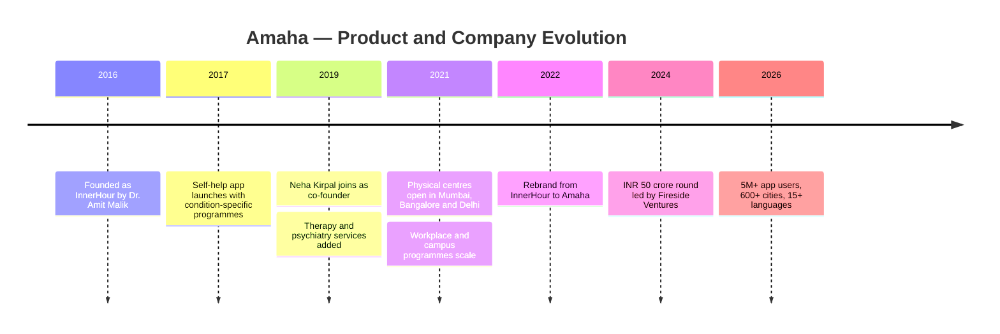
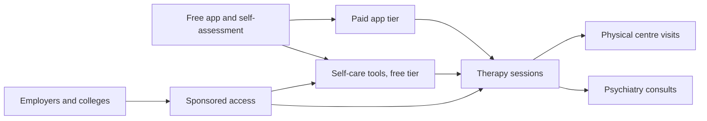
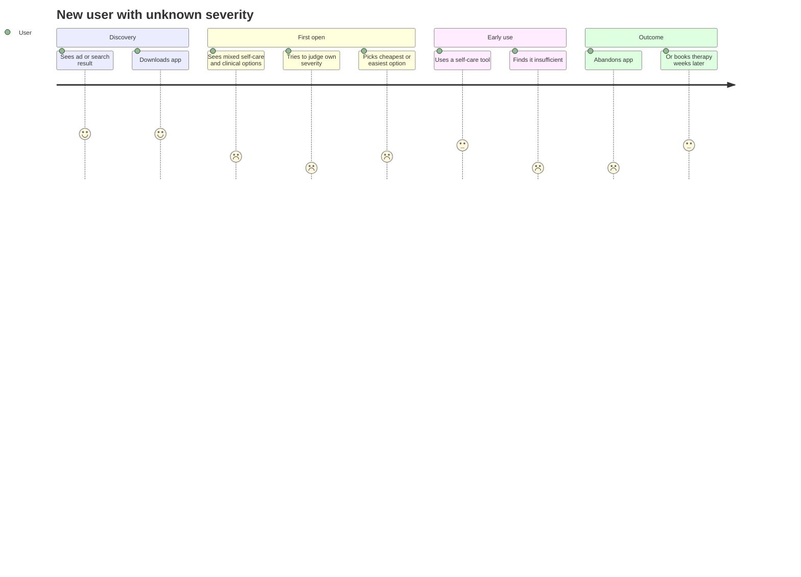
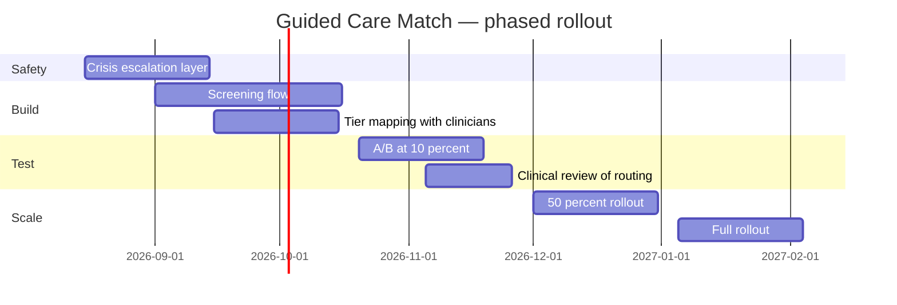

# Day 37 — Amaha

**The Scarcest Resource Is Not Content. It's Clinician Minutes.**

A product teardown of Amaha (formerly InnerHour), India's clinical-depth mental health platform.

Part of the 90-Day PM Case Study Challenge · Research date: 2 August 2026

---

## 2. Table of Contents

1. [Cover](#day-37--amaha)
2. [Table of Contents](#2-table-of-contents)
3. [Executive Summary](#3-executive-summary)
4. [Company Background](#4-company-background)
5. [Product Timeline](#5-product-timeline)
6. [Problem Statement](#6-problem-statement)
7. [Market Research](#7-market-research)
8. [TAM / SAM / SOM](#8-tam--sam--som)
9. [Competitor Analysis](#9-competitor-analysis)
10. [SWOT](#10-swot)
11. [Business Model](#11-business-model)
12. [Revenue Model](#12-revenue-model)
13. [Target Users](#13-target-users)
14. [Personas](#14-personas)
15. [Jobs To Be Done](#15-jobs-to-be-done)
16. [User Journey](#16-user-journey)
17. [UX Audit](#17-ux-audit)
18. [Feature Breakdown](#18-feature-breakdown)
19. [Product Metrics and North Star](#19-product-metrics-and-north-star)
20. [Growth Strategy](#20-growth-strategy)
21. [Pain Points](#21-pain-points)
22. [Opportunity Mapping and RICE](#22-opportunity-mapping-and-rice)
23. [Feature Proposal](#23-feature-proposal)
24. [PRD](#24-prd)
25. [Rollout, A/B Test and Risks](#25-rollout-ab-test-and-risks)
26. [PM Lessons](#26-pm-lessons)
27. [References](#27-references)

---

## 3. Executive Summary

Most mental health apps are content businesses. Amaha is not, and that distinction drives everything else about it.

Amaha treats bipolar disorder, schizophrenia, OCD, ADHD and addictions alongside anxiety and depression. It employs psychiatrists who prescribe, not only coaches who guide. That clinical range is unusual for a consumer app and it is the company's real moat — competitors can copy a meditation library in a quarter; none can assemble a licensed multi-disciplinary clinical team on the same timeline.

**The central thesis of this teardown:** that same clinical depth creates Amaha's hardest product problem, and it is a problem of *allocation*, not engagement.

India has roughly 0.75 psychiatrists per 100,000 people against a WHO recommendation of 3. Clinician supply is not merely tight — it is structurally fixed on any product timeline. In a market like that, the binding constraint on how many people Amaha can help is not app installs, session content, or retention curves. It is clinician minutes.

Which means the app's most important job is not to keep users engaged. It is to route each user to the *lowest level of care that will actually work for them* — self-serve tools for mild presentations, group formats for moderate, therapist for clinical, psychiatrist for severe. Every user over-routed to a psychiatrist consumes a slot that a severe case needed. Every user under-routed churns, and in this category churn is not a revenue event, it is a person who did not get help.

Amaha's front door currently asks the user to self-select their entry point. That asks a person to assess their own severity at the exact moment they are least equipped to — a well-documented problem in clinical presentation, and the reason triage exists as a discipline in medicine at all.

**The proposal (§23):** replace user self-selection with a structured severity triage built on the validated instruments Amaha already administers, routing to a care tier rather than a product surface, fully reversible and transparent to the user, with a hard-coded crisis escalation path that bypasses the funnel entirely.

This is not a growth feature. It is a supply-allocation feature that happens to improve retention as a side effect — because, as §21 shows, most of Amaha's likely drop-off is mis-routing rather than disinterest.

---

## 4. Company Background

Amaha was founded in 2016 by Dr. Amit Malik, a psychiatrist, and operated as InnerHour before rebranding. Neha Kirpal joined as co-founder in 2019.

The founder profile matters more here than it usually does. A psychiatrist-founded mental health company makes different early decisions than a designer-founded one — it hires clinicians before it hires content producers, and it accepts regulatory and clinical-governance overhead that a wellness app can avoid. Much of what looks strategically eccentric about Amaha becomes legible once you read it forward from that starting point.

| Attribute | Detail |
|---|---|
| Founded | 2016 (as InnerHour) |
| Founders | Dr. Amit Malik (psychiatrist), Neha Kirpal (2019) |
| Model | Omnichannel — app, online consults, physical centres |
| Centres | Mumbai, Bangalore, Delhi |
| Clinical team | 110+ or 150+ therapists and psychiatrists (sources conflict) |
| Languages | 15+ |
| Geographic reach | 600+ cities in India |
| Conditions treated | Anxiety, depression, bipolar disorder, ADHD, OCD, schizophrenia, addictions |
| Total funding | $11.7M or $20.6M across 5 rounds (sources conflict) |
| Latest round | ~INR 50 crore led by Fireside Ventures (Jan 2024) |
| App recognition | Google Play "Best App for Good" |

The condition list is the single most informative line in that table. Schizophrenia and bipolar disorder are not conditions a wellness app treats. Their presence signals that Amaha built for the severe end of the spectrum and grew toward the mild end, rather than the reverse — which is the direction almost every competitor travelled.

---

## 5. Product Timeline

The shape of that timeline is worth naming: self-help first, then clinical services, then physical presence, then brand. Amaha added *depth* before it added reach. Most consumer health companies do the opposite.

---

## 6. Problem Statement

**The user's problem.** A person in India experiencing psychological distress cannot easily determine what kind of help they need, and the system offers no low-stakes way to find out.

The available options are badly matched to that question. A general physician may not screen for mental health at all. A psychiatrist is expensive, hard to access, and socially loaded. A meditation app is free and available but may be wholly inadequate to the presentation. Between "do nothing" and "see a psychiatrist" there is very little structured middle ground.

**The system's problem.** India has approximately 0.75 psychiatrists per 100,000 people against a WHO recommendation of at least 3. Roughly 150 million Indians are estimated to need mental healthcare. The treatment gap sits somewhere between 70% and 92% depending on source and disorder.

Those two problems interact in a way that is easy to miss. The treatment gap is usually framed as demand-side — stigma, awareness, willingness to seek help. It is at least as much supply-side. Even if stigma vanished tomorrow, clinician supply could not absorb the demand.

**Therefore the product problem.** Any platform operating here is running a rationing system whether it admits it or not. The only question is whether the rationing is designed or accidental.

---

## 7. Market Research

| Finding | Figure | Evidence |
|---|---|---|
| Indians estimated to need mental healthcare | ~150 million | High — NMHS |
| Adults requiring treatment for one or more disorders | ~15% | High — NMHS |
| Overall treatment gap | 84.5% (range 70–92%) | High — NMHS 2015-16 |
| Treatment gap, some regions and disorders | up to 95% | Medium |
| Psychiatrists per 100,000 population | 0.75 (WHO recommends 3+) | High |

**Digital mental health engagement benchmarks — the sobering part:**

| Metric | Figure |
|---|---|
| Median daily app open rate | 4% |
| Median 15-day retention | 3.9% |
| Median 30-day retention | 3.3% |
| Pooled dropout, depression app RCTs | 26.2% (47.8% adjusted for publication bias) |

These are category-wide figures, not Amaha's. But they establish the baseline any player here fights against, and they carry a specific implication: **install counts are nearly uncorrelated with sustained use.** Amaha's "5 million lives" figure should be read with that in mind.

**What the evidence says actually improves adherence:**

- Reminders and human support — effective
- Gamification — *not* effective
- Deep cultural adaptation (local content, stakeholder involvement, iterative refinement) — highest adherence, often >75%, dropout typically <11%

That last finding is the most actionable in the entire research set, and it argues that Amaha's 15-language, 600-city posture is a retention asset rather than merely a reach asset.

**Attrition root causes:** approximately 40% UX problems, 35% content inadequacy, 25% fundamental design challenges. UX dominates, and 73% of users rate ease of use as the most important factor.

---

## 8. TAM / SAM / SOM

*Framework rationale: TAM/SAM/SOM is used here because the binding question is not "how big is the market" but "what fraction of it can be served given a fixed clinician supply." The nested structure makes that constraint visible where a single market-size figure would hide it.*

| Layer | Definition | Estimate | Basis |
|---|---|---|---|
| **TAM** | Indians needing mental healthcare | ~150M people | NMHS |
| **SAM** | Smartphone-owning, urban/semi-urban, able to pay or employer-covered | ~35–45M | Author-constructed |
| **SOM** | Reachable by Amaha in 3 years at current clinician growth | ~1.5–3M active | Author-constructed |

The gap between SAM and SOM is not a marketing failure. It is the clinician supply constraint expressed numerically. Amaha could double marketing spend and not meaningfully move SOM, because the ceiling is licensed-practitioner hours.

This is precisely why the proposal in §23 targets allocation efficiency. In a supply-capped market, serving more people requires either more clinicians or better routing. Only one of those is a product lever.

---

## 9. Competitor Analysis

| Player | Positioning | Clinical depth | Primary model |
|---|---|---|---|
| **Amaha** | Clinical, full-spectrum | High — psychiatry, severe conditions | B2C + B2B2C |
| **Lissun** | Scalable emotional health | Medium | B2C + B2B |
| **Wysa** | Conversational AI first | Medium — AI triage, human escalation | B2B/B2B2C, global |
| **YourDOST** | Counselling, campus-heavy | Low–Medium | B2B, institutional |
| **Practo / Tata 1mg** | General teleconsult with psychiatry | Low breadth, high reach | Marketplace |
| **cult.fit (Mind)** | Wellness-adjacent | Low | Subscription bundle |
| **Traditional clinics** | In-person psychiatry | High | Fee-per-session |

**The competitive read.** Amaha is not really competing with meditation apps and should stop being benchmarked against them. Its nearest functional competitor is a good psychiatric clinic with a waiting list. That reframing changes the standard — Amaha's job is not to beat a meditation app on engagement, it is to beat a clinic on access and cost while approaching it on clinical quality.

Wysa is the most strategically interesting comparison. Wysa leads with an AI conversational layer that performs de facto triage before a human is involved. Amaha leads with humans and clinical depth. Wysa's architecture is better at allocation; Amaha's is better at treatment. Whoever closes their respective gap first holds a defensible position.

---

## 10. SWOT

**Strengths**
- Clinical depth competitors cannot replicate quickly — psychiatry, severe conditions, prescribing
- Psychiatrist founder; clinical governance built in rather than retrofitted
- Omnichannel: app, teleconsult, physical centres in three metros
- 15+ languages, 600+ cities — matches the highest-adherence intervention pattern in the literature
- B2B workplace revenue diversifies away from consumer churn

**Weaknesses**
- Clinician supply caps growth in a way marketing cannot solve
- Self-selected entry point asks users to assess their own severity
- Unit economics of human-delivered care resist software margins
- Price point (₹1,000–₹3,500+/session) excludes much of the stated TAM

**Opportunities**
- Severity triage to protect scarce clinician time (§23)
- Group formats as a middle tier between self-serve and 1:1
- ABDM integration for clinical continuity and referral flow
- Employer channel as payer, removing the consumer price barrier

**Threats**
- General teleconsult platforms adding psychiatry at greater reach
- AI-first entrants performing adequate triage at near-zero marginal cost
- Clinician poaching as the category grows
- Regulatory tightening around digital mental health and prescribing

---

## 11. Business Model

Two acquisition engines feeding one clinical delivery layer. The B2B engine is the more interesting: it removes the consumer price objection, arrives with a pre-qualified population, and converts a per-session transaction into a contracted revenue base. The 700,000+ individuals covered by workplace and campus programmes is a substantial pre-warmed funnel.

---

## 12. Revenue Model

| Stream | Mechanism | Margin character |
|---|---|---|
| Therapy sessions | ₹1,000–₹3,500+ per session, tiered by clinician experience | Low — clinician cost dominates |
| Psychiatry consults | Per consult | Low |
| App Pro subscription | Recurring | High — software margin |
| Workplace / campus programmes | Contracted, per-member | Medium — blended |
| Physical centres | Per visit | Lowest — property and staff |

The margin structure explains the strategic tension cleanly. The high-margin product (app subscription) is not the differentiated one. The differentiated product (clinical care) carries clinic-like margins. Amaha's long-run economics depend on how much clinical value it can deliver through the software layer without a clinician in the loop — which is, again, an allocation question.

---

## 13. Target Users

| Segment | Description | Severity | Current fit |
|---|---|---|---|
| Self-diagnosing explorer | Suspects something is wrong, has not sought help | Mild–unknown | Weak — no guidance on where to start |
| Situational sufferer | Acute stressor (job loss, bereavement, exams) | Mild–moderate | Moderate |
| Diagnosed and managing | Existing diagnosis, needs continuity | Moderate–severe | Strong |
| Severe / episodic | Bipolar, schizophrenia, OCD | Severe | Strong, if they reach a psychiatrist |
| Employer-sponsored | Access via workplace programme | Full range | Moderate — access solved, routing not |

The first row is the largest segment and the worst served. It is also where a routing improvement has the most leverage, because these users have no prior clinical contact to guide them.

---

## 14. Personas

*Author-constructed. Not derived from Amaha user research.*

**Ritu, 27, Bengaluru, marketing associate.** Six weeks of poor sleep, dread on Sunday evenings, withdrawing from friends. Has never spoken to a clinician. Downloads Amaha after an ad, opens it, sees self-care tools alongside "book a therapist," cannot tell which she needs, tries two breathing exercises and does not return. Her presentation is likely moderate and therapy-responsive. She was not under-motivated. She was un-routed.

**Arjun, 34, Mumbai, diagnosed bipolar II.** Stable on medication, sees a psychiatrist quarterly, wants mood tracking between visits and faster access when he feels an episode building. Amaha serves him well. He is not the problem; he is the proof the clinical depth works.

**Sneha, 41, HR lead at a 900-person firm.** Bought a workplace programme. Judged on utilisation and on not being blamed if something goes badly wrong. Needs aggregate reporting and a defensible crisis pathway. She is the economic buyer for a large share of Amaha's funnel, and her requirements are almost entirely about routing and safety rather than content.

---

## 15. Jobs To Be Done

| Job | Statement |
|---|---|
| Functional | "When I feel persistently unwell but don't know how serious it is, help me find out what kind of help I need — without committing to an expensive appointment to find out." |
| Emotional | "Help me feel that seeking help is proportionate and not an overreaction." |
| Social | "Let me do this without anyone finding out before I'm ready." |
| Employer | "Give my people real care, and give me evidence it's working and defensible." |

The functional job is the one Amaha's current front door does not serve. Every other job it serves competently.

---

## 16. User Journey

The trough sits at "tries to judge own severity." That single step converts a user with a treatable moderate presentation into a churned install. Note that the two lowest-scoring steps are both cognitive tasks the product hands to the user rather than performing for them.

---

## 17. UX Audit

| Area | Observation | Severity |
|---|---|---|
| First-run entry | User must self-select between self-care and clinical care with no guidance | High |
| Assessment placement | Self-assessment exists but is one option among many rather than the default path | High |
| Severity legibility | No visible mapping from assessment result to recommended care tier | High |
| Price transparency | Session pricing varies by clinician experience; unclear how a layperson chooses | Medium |
| Content volume | 600+ tools, 1000+ resources — abundance without a selection mechanism | Medium |
| Crisis pathway | Must be unmissable and unconditional; must not sit behind any funnel step | Critical |
| Language selection | Strong — 15+ languages is a genuine adherence advantage | Positive |

The pattern across the high-severity rows is consistent: Amaha has built the components of a triage system — validated assessments, tiered care, multi-modal delivery — without assembling them into one. The parts exist. The routing layer does not.

---

## 18. Feature Breakdown

| Feature | Purpose | Assessment |
|---|---|---|
| Self-assessment | Screening | Underused as a routing input |
| 600+ self-care tools | Self-directed intervention | Strong content, weak discovery |
| Mood tracking | Longitudinal monitoring | Valuable for diagnosed users |
| Condition-specific programmes | Structured intervention | Clinically grounded |
| Therapy booking | 1:1 clinical care | Core revenue |
| Psychiatry consults | Medical management | Key differentiator |
| Physical centres | In-person care | Depth, high cost |
| Workplace dashboards | B2B reporting | Buyer-facing |
| 15+ language support | Access and adherence | Underrated strategic asset |

---

## 19. Product Metrics and North Star

**Proposed North Star: Clinically Appropriate Care Matches per Week.**

Defined as users who complete a structured assessment and subsequently engage — for at least three sessions or two weeks — with the care tier their assessment indicated.

The reasoning: the two obvious candidates are both actively misleading here. *App engagement* rewards keeping mild users in the app when they may need a clinician. *Sessions booked* rewards over-routing to expensive tiers, consuming the scarce resource. A match-quality metric is the only one that improves when the system allocates well and degrades under both failure modes.

| Metric | Type | Rationale |
|---|---|---|
| Assessment completion rate | Input | Gate to routing |
| Route-adherence rate | Input | Did the user follow the recommendation |
| Tier-appropriate retention | Output | Retention within the correct tier |
| Escalation latency | Guardrail | Time from deterioration signal to clinician contact |
| Crisis-flag response time | Guardrail | Must be measured, must be fast |
| Clinician utilisation | Efficiency | Are scarce slots going to severe cases |
| Cost per resolved case | Efficiency | Blended across tiers |

---

## 20. Growth Strategy

The counterintuitive conclusion: **Amaha should not treat top-of-funnel growth as its primary lever.**

Given fixed clinician supply, additional installs beyond a certain rate produce churned users rather than treated patients — and in mental health a churned user is a person who reached for help, did not get it, and may be measurably less likely to try again. That is a real cost, not a neutral one.

Higher-leverage paths:

1. **Employer channel expansion.** The payer is not the patient, which removes the price barrier, and the population arrives pre-qualified.
2. **Group and peer formats.** The only way to add a genuine middle tier without adding clinicians. One clinician serving eight people is an 8× multiplier on the binding constraint.
3. **Language and cultural depth.** The literature is unusually clear that deep cultural adaptation produces the largest adherence gains available. Amaha is already positioned here and appears to under-market it.
4. **Clinician supply itself.** Training and pipeline programmes are a growth strategy in this market, not an HR function.

---

## 21. Pain Points

| # | Pain point | Who | Evidence |
|---|---|---|---|
| 1 | User must self-assess severity to choose an entry point | New users | High — structural, observable in funnel design |
| 2 | Self-serve content abundance without a selection mechanism | New users | High |
| 3 | Mild users may occupy clinician slots; severe users may under-route to self-serve | System | Medium — inferred |
| 4 | Category retention is brutally low; installs ≠ treatment | All | High — literature |
| 5 | Price opacity across clinician experience tiers | Paying users | Medium |
| 6 | No visible bridge tier between free self-care and paid 1:1 | Moderate-severity users | High |

Pain points 1, 2, 3 and 6 are the same problem viewed from four positions: **there is no routing layer.** That convergence is what makes the proposal in §23 a single feature rather than four.

---

## 22. Opportunity Mapping and RICE

*Framework rationale: RICE is used because the candidates differ enormously in effort and confidence, and the scarce-clinician constraint means Reach must be read as "users correctly routed," not "users touched." A framework scoring raw reach would rank the wrong option first.*

| Opportunity | Reach | Impact | Confidence | Effort | RICE |
|---|---|---|---|---|---|
| **Severity triage front door** | 9 | 3 | 0.8 | 5 | **4.32** |
| Group therapy tier | 6 | 3 | 0.6 | 8 | 1.35 |
| Content recommendation engine | 8 | 1.5 | 0.7 | 4 | 2.10 |
| Price transparency redesign | 5 | 1 | 0.9 | 2 | 2.25 |
| ABDM integration | 4 | 2 | 0.5 | 9 | 0.44 |

**Sensitivity check.** The triage score is most fragile on Confidence. At 0.8 it leads comfortably. Drop it to 0.5 — defensible, since the routing logic is unvalidated against Amaha's own outcome data — and the score falls to 2.70: still first, but no longer decisively ahead of price transparency at 2.25. Drop Impact from 3 to 2 as well and it falls to 1.80, below both cheaper options.

The honest reading: triage wins clearly *if* the routing logic works. It does not win on cost or on certainty. That is exactly why the A/B design in §25 is built to falsify the expensive half before the full build is committed.

---

## 23. Feature Proposal

### Guided Care Match — a severity triage front door

**Converging evidence.** This proposal is not selected from a list of ideas; it is what six earlier sections independently point at:

- §6 established that the market is supply-constrained, making allocation the central problem
- §8 showed SOM is capped by clinician hours, not demand
- §16 located the journey trough precisely at user self-assessment of severity
- §17 found Amaha already owns every triage component except the routing layer
- §19 showed both conventional North Star candidates reward mis-allocation
- §21 collapsed four of six pain points into a single missing routing layer

**What it is.** Replace the self-selected entry point with a structured first-run flow:

1. A short set of validated screening instruments (PHQ-9, GAD-7 or equivalent — instruments Amaha already administers) presented as the default first-run path.
2. A transparent result: what the screen indicates, in plain language, with explicit framing that it is a screen and not a diagnosis.
3. A recommended **care tier** — self-serve / structured programme / group / therapist / psychiatrist — with the reasoning shown.
4. A single-tap path into that tier, and an equally visible path to override it.
5. Periodic re-screening that can move a user up or down a tier as their presentation changes.

**Non-negotiable safety layer.** Any response indicating risk of self-harm triggers immediate, unconditional escalation — crisis resources surfaced directly and a human contact pathway — outside the routing funnel entirely. This is not a step in the flow; it is an interrupt on it. No A/B variant may withhold it, and it ships before anything else in this proposal.

**Why it routes to tiers, not products.** A product-level recommendation ("try this breathing exercise") is a content decision. A tier-level recommendation is a clinical-resource decision. Only the second touches the constraint that actually binds.

**Deliberately excluded.** No AI diagnosis. No autonomous clinical decision-making. The system recommends a level of care; clinicians retain all clinical judgment. This boundary is both an ethical requirement and a regulatory one.

---

## 24. PRD

**Problem.** New users cannot determine which level of care they need, producing both churn (under-routing) and clinician-slot waste (over-routing).

**Goal.** Increase the proportion of new users who reach a clinically appropriate care tier and remain engaged with it for at least three sessions or two weeks.

**Non-goals.** Diagnosis. Replacing clinician judgment. Increasing total session volume as an end in itself.

**Requirements**

| ID | Requirement | Priority |
|---|---|---|
| R1 | Crisis detection and unconditional escalation on every screen | P0 |
| R2 | Validated screening instruments as default first-run path | P0 |
| R3 | Deterministic, auditable severity-to-tier mapping, clinician-defined | P0 |
| R4 | Plain-language result with explicit "screen, not diagnosis" framing | P0 |
| R5 | One-tap entry into recommended tier | P0 |
| R6 | Visible, frictionless override to any other tier | P0 |
| R7 | Periodic re-screening with tier movement | P1 |
| R8 | Clinician-facing view of screen results at first session | P1 |
| R9 | Aggregate routing analytics for B2B buyers, privacy-preserving | P2 |

**Success criteria**

| Measure | Baseline | Target |
|---|---|---|
| Assessment completion, new users | not disclosed | 60% |
| Route adherence | not disclosed | 55% |
| Tier-appropriate 14-day retention | not disclosed | +30% relative |
| Psychiatrist slots going to severe-tier users | not disclosed | +20pp |
| Crisis-flag response time | not disclosed | < 60 seconds to resource display |

Every baseline is marked *not disclosed* because Amaha publishes none of them. Targets are author-constructed and should be read as hypotheses, not forecasts.

---

## 25. Rollout, A/B Test and Risks

### Rollout

Safety ships first and unconditionally. It is not gated on the experiment's outcome.

### A/B test — designed to falsify the expensive half

The costly component is the clinician-defined severity-to-tier mapping (R3) — it consumes clinical time to build and to maintain. The cheap component is simply making the existing assessment the default first step.

**Variant A (control).** Current self-selected entry.
**Variant B (cheap half).** Assessment presented as default first-run step, result shown, but the user still chooses their own tier. No routing logic.
**Variant C (full).** Assessment plus tier recommendation and one-tap routing.

If B captures most of C's benefit, the expensive mapping layer is not justified, and the finding is that users mainly needed *information about themselves* rather than a *recommendation*. That is a genuinely possible outcome, and this design surfaces it before the build is committed rather than after.

Primary metric: tier-appropriate 14-day retention. Guardrail: crisis-flag response time must not regress in any variant.

### Risks

| Risk | Severity | Mitigation |
|---|---|---|
| Mis-routing a severe case downward | Critical | Conservative thresholds biased toward escalation; clinician review of mapping; override always visible |
| Screening feels clinical and deters users | High | Plain language, short instruments, skippable with a visible explanation of the cost |
| Users game answers to reach a cheaper tier | Medium | Re-screening; clinician confirmation at first session |
| Regulatory exposure from perceived diagnosis | High | Explicit non-diagnostic framing; no autonomous clinical decisions; legal review pre-launch |
| Added friction reduces top-of-funnel conversion | Medium | Accepted deliberately — §20 argues raw funnel volume is the wrong objective here |

---

## 26. PM Lessons

**When supply is fixed, the product's job shifts from acquisition to allocation.** Most consumer product instinct is tuned for demand generation. In supply-constrained markets — clinical care, legal services, skilled trades — that instinct actively destroys value, because every user acquired without a matching supply unit is a disappointed user. Establish what the binding constraint is before choosing a growth metric.

**A metric that improves under both failure modes is not a metric.** Engagement rose whether Amaha over-routed or under-routed. Any North Star that cannot distinguish good outcomes from bad ones is decoration. Test a candidate by asking what it does when you fail in each direction.

**When several independent analyses leak at the same point, that point is the product.** Four of six pain points, the journey trough, and three UX findings all converged on one missing routing layer. Convergence like that is worth more than any single insight, and it is the strongest available signal that you have found the real problem rather than a symptom.

**Design the experiment to kill the expensive half.** The instinct is to test whether your proposal works. The more useful test is whether the cheap version captures most of the value — because that is the finding that changes what you build.

---

## 27. References

- [National Mental Health Survey of India, 2015-16 — NIMHANS](https://indianmhs.nimhans.ac.in/phase1/Docs/Report2.pdf)
- [Bridging the mental health treatment gap in India: a care cascade framework — PMC](https://pmc.ncbi.nlm.nih.gov/articles/PMC12468826/)
- [Digital therapeutics for mental health: Is attrition the Achilles heel? — PMC](https://pmc.ncbi.nlm.nih.gov/articles/PMC9380224/)
- [Retention and Engagement in Culturally Adapted Digital Mental Health Interventions — JMIR Mental Health](https://mental.jmir.org/2026/1/e80624)
- [Addressing Uptake, Adherence, and Attrition in Mental Health Apps — AJMC](https://www.ajmc.com/view/addressing-uptake-adherence-and-attrition-in-mental-health-apps)
- [Fireside Ventures leads INR 50 crore round in Amaha — PR Newswire](https://www.prnewswire.com/in/news-releases/fireside-ventures-leads-funding-round-of-inr-50-crore-in-indias-leading-mental-health-organisation-amaha-302033492.html)
- [Amaha — Tracxn company profile](https://tracxn.com/d/companies/amaha/__Z-L3EcIPbrMkGZuzmSrlJlJseytLzuP2iH9SDQMsfvM)
- [Amaha — official site](https://www.amahahealth.com/)
- [Amaha: Mental Health Therapy — Google Play](https://play.google.com/store/apps/details?id=com.theinnerhour.b2b)
- [Rs 50 Crore for Mental Wellness — Medicircle](https://medicircle.in/rs-50-crore-for-mental-wellness-can-amahas-big-bet-on-indian-minds-make-a-difference)

---

*Day 37 of 90 · Evidence grades, source conflicts and author-constructed elements are documented in [ASSUMPTIONS.md](./ASSUMPTIONS.md)*

*This analysis is based entirely on public information. I have no affiliation with Amaha and no access to its internal data. Corrections welcome.*
