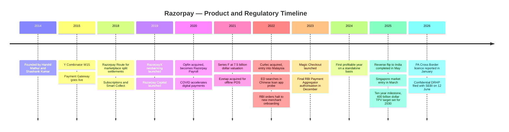
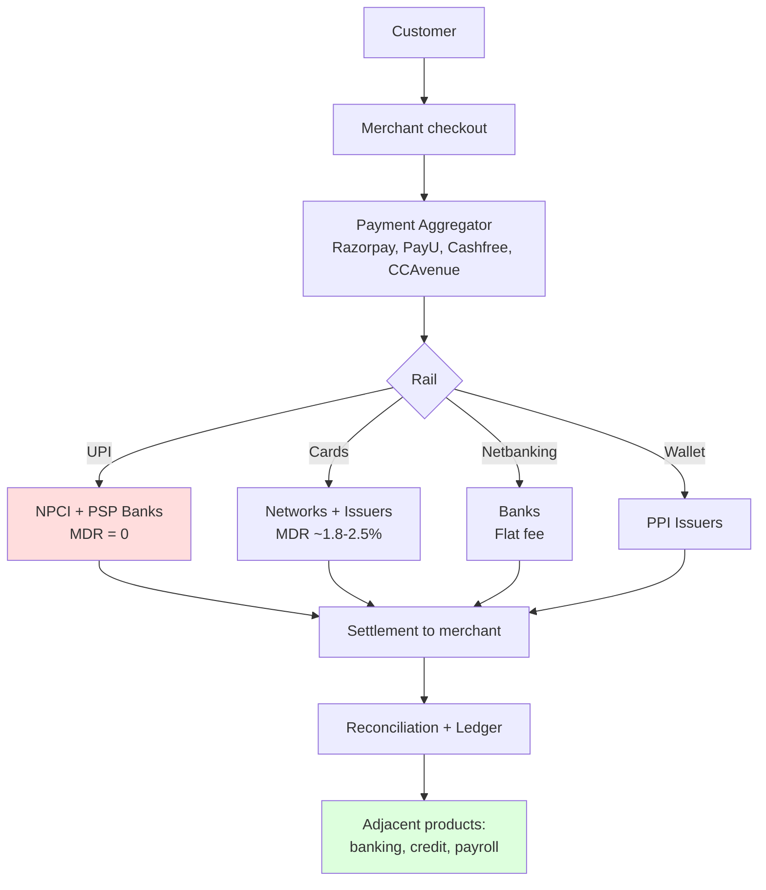
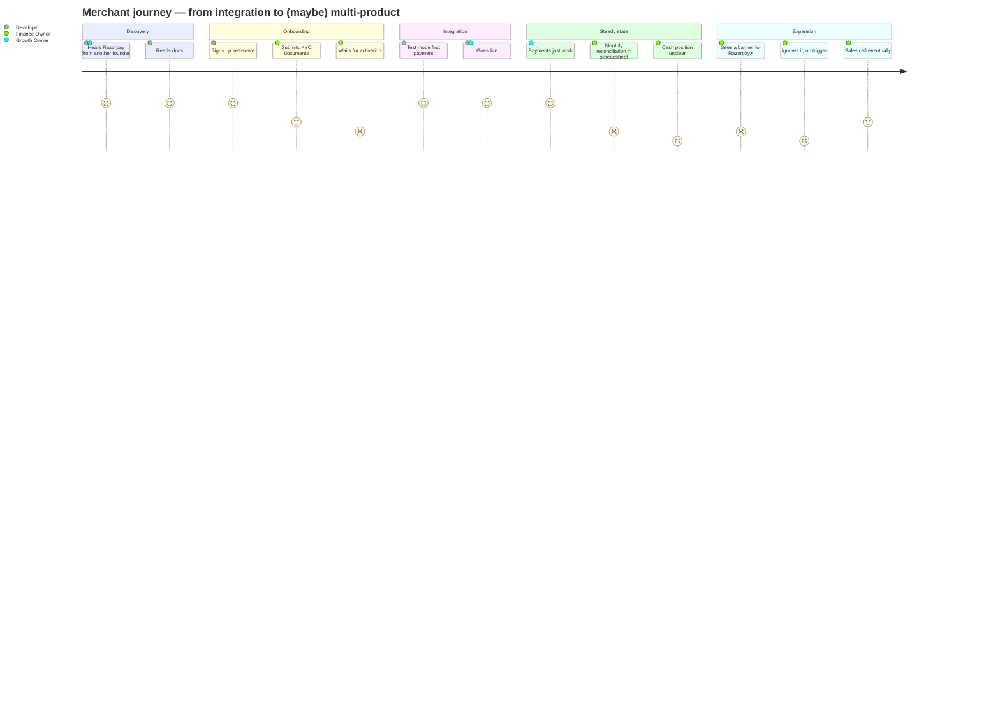
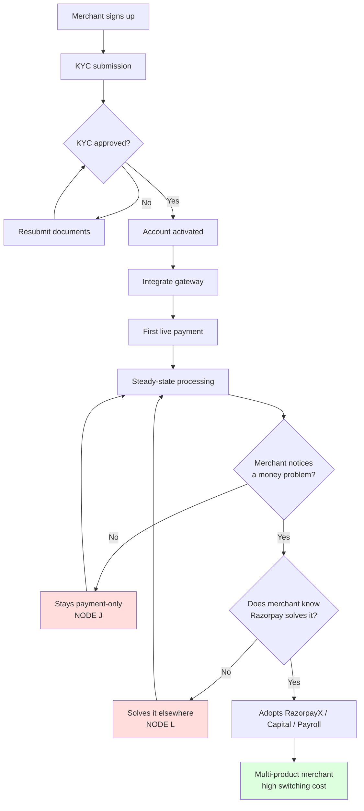
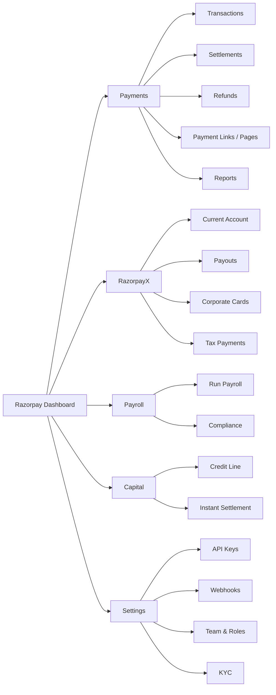
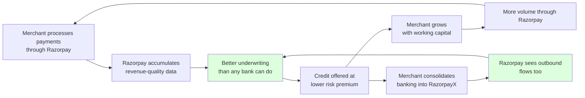
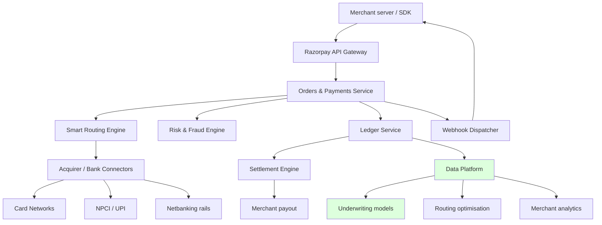
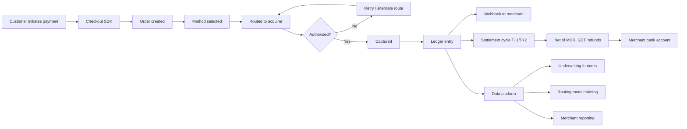
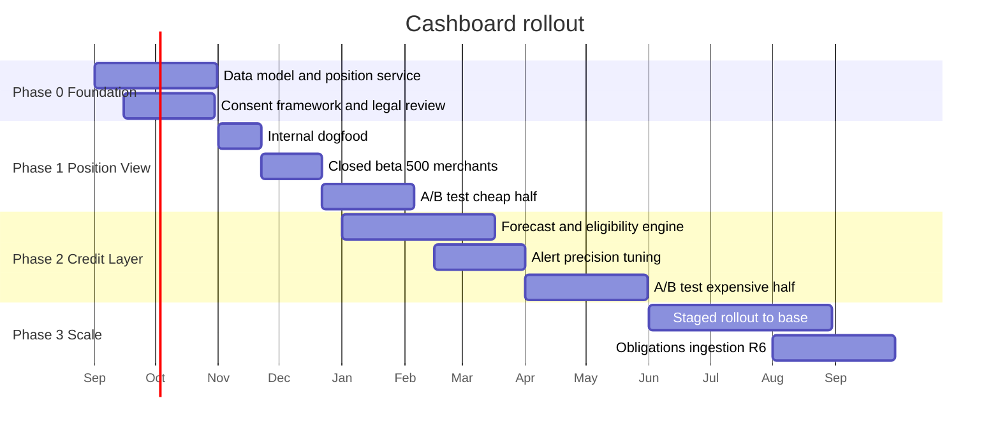

# Razorpay — Product Management Case Study

**Day 38 of 90 | PM Case Study Challenge**

---

## 1. Cover

**Product:** Razorpay (Razorpay Software Private Limited — includes Razorpay Payment Gateway, RazorpayX, Razorpay Capital, Razorpay Payroll, Razorpay POS, Curlec by Razorpay)
**Category:** B2B Fintech — Payments Infrastructure and Business Financial Operating System
**Author:** Gaurav Singh
**Day:** 38 / 90
**Date Published:** August 3, 2026

---

## 2. Repository Metadata

| Field | Value |
|---|---|
| Repository | product-management-case-studies |
| Folder | `Day-38-Razorpay/` |
| Author | Gaurav Singh |
| Series | 90-Day PM Case Study Challenge |
| Previous Day | Day 37 — Amaha |
| Companion file | `ASSUMPTIONS.md` — evidence grades, source conflicts, author-constructed content |
| Newsletter | `NEWSLETTER.md` — condensed essay for LinkedIn Newsletter |
| License | MIT (see [§63 License](#63-license)) |

---

## 3. Badges

`Day 38/90` · `Category: B2B Fintech / Payments Infrastructure` · `Ownership: Private, pre-IPO (confidential DRHP filed June 2026)` · `HQ: Bengaluru, India` · `Founded: 2014` · `Status: Published`

---

## 4. Table of Contents

**Foundations**

1. [Cover](#1-cover)
2. [Repository Metadata](#2-repository-metadata)
3. [Badges](#3-badges)
4. [Table of Contents](#4-table-of-contents)
5. [Executive Summary](#5-executive-summary)
6. [Product Overview](#6-product-overview)
7. [Company Background](#7-company-background)
8. [Product Timeline](#8-product-timeline)
9. [Vision & Mission](#9-vision--mission)
10. [Problem Statement](#10-problem-statement)

**Market & Strategy**

11. [Market Research](#11-market-research)
12. [Industry Analysis](#12-industry-analysis)
13. [TAM/SAM/SOM](#13-tamsamsom)
14. [Competitor Analysis](#14-competitor-analysis)
15. [SWOT](#15-swot)
16. [Porter's Five Forces](#16-porters-five-forces)
17. [Business Model Canvas](#17-business-model-canvas)
18. [Revenue Model](#18-revenue-model)

**Users & Experience**

19. [Target Users](#19-target-users)
20. [Personas](#20-personas)
21. [JTBD](#21-jtbd)
22. [User Journey](#22-user-journey)
23. [User Flow](#23-user-flow)
24. [Information Architecture](#24-information-architecture)
25. [UX Audit](#25-ux-audit)
26. [UI Audit](#26-ui-audit)
27. [Accessibility](#27-accessibility)

**Product & Growth**

28. [Feature Breakdown](#28-feature-breakdown)
29. [AI Capabilities](#29-ai-capabilities)
30. [Product Metrics](#30-product-metrics)
31. [North Star Metric](#31-north-star-metric)
32. [Product Analytics](#32-product-analytics)
33. [AARRR](#33-aarrr)
34. [HEART](#34-heart)
35. [Growth Strategy](#35-growth-strategy)
36. [Growth Loops](#36-growth-loops)
37. [Network Effects](#37-network-effects)
38. [Product Strategy](#38-product-strategy)
39. [Monetization](#39-monetization)
40. [Trust & Safety](#40-trust--safety)

**Technical**

41. [Technical Architecture](#41-technical-architecture)
42. [Data Flow](#42-data-flow)
43. [API Ecosystem](#43-api-ecosystem)
44. [Privacy & Security](#44-privacy--security)

**Strategy & Planning**

45. [Pain Points](#45-pain-points)
46. [Opportunity Mapping](#46-opportunity-mapping)
47. [RICE](#47-rice)
48. [MoSCoW](#48-moscow)
49. [Kano](#49-kano)
50. [Feature Proposal](#50-feature-proposal)
51. [PRD](#51-prd)
52. [Wireframes](#52-wireframes)
53. [Rollout Plan](#53-rollout-plan)
54. [A/B Testing](#54-ab-testing)
55. [KPI Dashboard](#55-kpi-dashboard)
56. [Product Roadmap](#56-product-roadmap)
57. [Risks & Mitigation](#57-risks--mitigation)
58. [Future Vision](#58-future-vision)

**Closing**

59. [PM Lessons](#59-pm-lessons)
60. [PM Interview Questions](#60-pm-interview-questions)
61. [References](#61-references)
62. [About the Author](#62-about-the-author)
63. [License](#63-license)
64. [Self Review](#64-self-review)
65. [Appendix](#65-appendix)

---

## 5. Executive Summary

Razorpay grew revenue 65% in FY25, to ₹3,783 crore. In the same year its gross profit grew 41%, to ₹1,277 crore. Those two numbers, published together, describe a company whose gross margin is falling while it wins.

That is the whole case study in one line, and it is not an accounting curiosity. Razorpay's FY25 gross margin was roughly 34%. The prior year's was between 36.6% and 39.5%, depending on which of two conflicting FY24 revenue figures you accept (see [§30](#30-product-metrics) and `ASSUMPTIONS.md`). Under either reading, margin compressed while revenue accelerated. A payments company that grows faster than its gross profit is telling you something specific: the incremental transaction is worth less than the average transaction it already had.

The reason is structural and public. UPI — the payment rail that now carries the overwhelming majority of Indian digital transaction *count* — is regulated at zero merchant discount rate. Every UPI payment Razorpay processes costs it money to process and earns it nothing in transaction fees. Razorpay does not have a pricing problem it can solve with a pricing page. It has volume it is legally forbidden from pricing, and that volume is the fastest-growing part of its mix.

**Central thesis: Razorpay is not a payments company with an adjacent-products strategy. It is an adjacent-products company that is obliged to run a payments business at structurally declining margin in order to acquire the customers and the data those adjacent products need. The payment gateway is no longer the business — it is the customer acquisition cost, paid in gross margin instead of cash.**

This is a defensible position, and it is also the reason the IPO is being marked down. Razorpay filed a confidential DRHP with SEBI on 12 June 2026 at a reported target valuation of $5–6 billion, against the $7.5 billion it raised at in December 2021. The market is not disputing Razorpay's growth. It is repricing the quality of that growth.

Everything downstream in this document tests that thesis. Section [§16](#16-porters-five-forces) asks whether the moat survives it. Section [§18](#18-revenue-model) traces where revenue actually comes from. Section [§36](#36-growth-loops) shows the one loop that makes the strategy work. Section [§45](#45-pain-points) finds where it is currently broken. The feature proposal in [§50](#50-feature-proposal) is built from that convergence, not chosen first.

The second, quieter finding: Razorpay's stated problem is scale (12 million merchants, a $400 billion TPV target for 2030) but its actual problem is *depth*. A merchant who uses only the payment gateway is a merchant Razorpay is subsidising. The strategic question is not how many merchants Razorpay has. It is how many of them it has ever monetised beyond the rail.

---

## 6. Product Overview

Razorpay is a full-stack financial operating system for Indian businesses. It began as a developer-first payment gateway and has extended, product by product, into every financial workflow that surrounds a payment.

### Product portfolio

| Product | What it does | Monetisation |
|---|---|---|
| **Payment Gateway** | Accept cards, UPI, netbanking, wallets, EMI, pay-later | MDR on non-UPI; effectively zero on UPI |
| **Magic Checkout** | One-click checkout with saved addresses, COD risk scoring, RTO reduction | Per-transaction premium / SaaS fee |
| **RazorpayX** | Neobanking — current account, vendor payouts, corporate cards, tax payments | SaaS subscription + float + interchange |
| **Razorpay Capital** | Working-capital and instant-settlement credit, underwritten on Razorpay's own payment data | Interest spread / fee |
| **Razorpay Payroll** (ex-Opfin) | Payroll, compliance filings, TDS, PF/ESI | Per-employee SaaS |
| **Razorpay POS** (ex-Ezetap) | In-store card and QR acceptance | Hardware + MDR |
| **Route / Smart Collect / Subscriptions** | Marketplace split settlements, virtual accounts, recurring billing | Per-transaction / SaaS |
| **Curlec by Razorpay** | Direct debit and payments in Malaysia; Singapore entity from 2025 | MDR — in markets where MDR exists |

### The structural read

Only the first two rows are the "payments business" as commonly understood, and only one of them is reliably monetisable at scale. Rows three through seven are where gross margin lives. Row eight is the most strategically interesting line in the table, and [§39](#39-monetization) explains why: Malaysia and Singapore are markets where a merchant discount rate on real-time payments still legally exists.

Razorpay's product surface is best understood not as a suite but as a funnel with a loss-leading mouth.

---

## 7. Company Background

Razorpay was founded in 2014 by Harshil Mathur and Shashank Kumar, both IIT Roorkee graduates, after they experienced first-hand how hard it was for a small Indian company to accept an online payment. The founding insight was unglamorous and correct: in 2014, getting a payment gateway in India required a registered company, a bank relationship, weeks of paperwork and an integration written against documentation that assumed you had an enterprise IT team.

Razorpay went through Y Combinator (W15) and built its early reputation on two things that had nothing to do with payments economics: onboarding that took days instead of months, and API documentation that developers actually liked. That is a distribution strategy disguised as a developer-experience strategy, and it worked — Razorpay became the default recommendation inside the Indian startup ecosystem, which then grew up around it.

The company has raised roughly $740 million across its life, with a December 2021 Series F of about $375 million at a $7.5 billion valuation led by Lone Pine Capital and Alkeon Capital, alongside TCV, Tiger Global, Sequoia India and Ribbit Capital.

Three events since then define the company's current shape more than any product launch:

**The RBI embargo (December 2022 – December 2023).** The Reserve Bank of India instructed Razorpay, along with Cashfree and later PayU, to stop onboarding new online merchants pending final Payment Aggregator authorisation. Razorpay spent roughly a year unable to acquire new merchants — its primary growth engine — and still grew revenue. That is the single most informative stress test in the company's history, and [§15](#15-swot) treats it as evidence rather than trivia.

**The ED investigation (2022 onward).** The Enforcement Directorate conducted searches at Razorpay premises in Bengaluru in October 2022 as part of a money-laundering probe into predatory lending apps operated by Chinese nationals, freezing approximately ₹78 crore of deposits held in payment gateway accounts. Razorpay stated it had proactively blocked the suspicious entities roughly 18 months earlier and had shared details with the agency. A chargesheet was subsequently filed naming Razorpay alongside the fintechs and NBFCs under investigation. See [§40](#40-trust--safety).

**The reverse flip (completed May 2025).** Razorpay merged its US parent into its Indian entity to enable a domestic listing, at a tax cost widely reported as roughly $150 million (₹1,245–1,280 crore) — though at least one outlet put the figure as high as $400 million. This is the direct cause of the ₹1,209 crore FY25 loss, and confusing it with operating performance is the most common error made about Razorpay's FY25 results.

---

## 8. Product Timeline



---

## 9. Vision & Mission

**Stated positioning.** Razorpay's public framing has evolved from "the best payment gateway for developers" to a "full-stack financial operating system" or "money movement platform" for Indian businesses. The company frames its purpose around making financial infrastructure invisible to the businesses that depend on it.

**Read between the lines.** The shift in language from *payments* to *financial operating system* is not marketing drift. It is the public statement of the thesis in [§5](#5-executive-summary): a company whose core rail is being regulated toward zero price must reposition around the things surrounding the rail, and must do so *before* the market forces the repricing.

Razorpay began that repositioning in 2019 with RazorpayX — before UPI's zero-MDR regime became existential, and roughly six years before the IPO markdown that made the pressure visible. That is either unusual foresight or fortunate accident. The evidence in [§8](#8-product-timeline) — a steady, unbroken cadence of adjacent-product launches from 2018 onward, sustained even through the onboarding embargo — favours foresight.

**Vision (as this analysis reads it):** to be the system of record for Indian business money movement, such that the payment itself becomes the least valuable thing Razorpay does for a merchant.

---

## 10. Problem Statement

### The merchant's problem

An Indian business that wants to take money online faces a set of problems that are related but sold separately by different vendors:

1. **Acceptance.** Take payment across UPI, cards, netbanking, wallets, EMI, BNPL, and COD, at high success rates across flaky bank rails.
2. **Reconciliation.** Match thousands of daily settlements — net of MDR, GST, refunds, chargebacks, and T+1/T+2 cycles — to orders and to the general ledger.
3. **Working capital.** Survive the gap between a sale and its settlement, which is the single most common cash-flow failure mode for a small Indian merchant.
4. **Payouts.** Pay vendors, contractors, and employees, with compliance filings attached.
5. **Compliance.** GST, TDS, PF, ESI, and the documentation trail each requires.

Historically each problem was solved by a different vendor, or by a person with a spreadsheet.

### Razorpay's problem

Razorpay solved problem 1 extremely well and then built products for 2 through 5. But the regulatory regime has made problem 1 — the acquisition wedge — progressively unprofitable, while problems 2 through 5 remain optional purchases.

**The core product problem this case study addresses:** Razorpay acquires merchants through a product it cannot price, and monetises them through products they must actively choose. The conversion between those two states is the entire business, and it is not currently a designed experience. It is a sales motion.

---

## 11. Market Research

### The Indian digital payments landscape

India's digital payments market is defined by a single fact that has no clean parallel in any other large economy: the dominant retail payment rail is a public utility with a regulated price of zero.

UPI, operated by NPCI, carries the large majority of India's digital transaction volume by count. The Government of India removed merchant discount rate on UPI and RuPay debit transactions with effect from January 2020. Payment aggregators are therefore required to process an enormous and growing share of transactions at no transaction revenue, absorbing the processing cost themselves, partially offset by government incentive schemes whose quantum varies year to year and is not guaranteed.

### What this does to the industry

| Consequence | Effect on payment aggregators |
|---|---|
| Transaction revenue decouples from transaction volume | Growth in TPV stops implying growth in gross profit |
| Price competition on non-UPI methods intensifies | MDR on cards compresses toward interchange floor |
| Differentiation moves off the rail | Winners compete on checkout conversion, credit, and software |
| Scale advantages weaken on payments, strengthen on data | The asset is the transaction record, not the transaction fee |

### The MDR question

A Parliamentary Standing Committee report tabled in March 2026 recommended reintroducing MDR on UPI transactions for large merchants, and the Payments Council of India has publicly urged a 0.30% MDR on large-merchant UPI and RuPay debit transactions. As of the research date for this case study, **no binding RBI or CBDT notification has been issued.** This is the single largest exogenous variable in Razorpay's forward economics and it is treated as unresolved throughout — see [§57](#57-risks--mitigation).

### Market sizing sources conflict materially

Mordor Intelligence sizes the India payment gateway market at approximately $2.07 billion in 2025, growing to roughly $4.01 billion by 2031 at an 11.66% CAGR. Razorpay's own FY25 revenue of ₹3,783 crore is approximately $430–450 million, which would imply Razorpay alone holds over 20% of that entire market — while a separate aggregator source claims Razorpay holds roughly 55% share.

These cannot all be true. The most likely explanation is definitional: the $2.07 billion figure appears to measure gateway *software* revenue, while Razorpay's revenue line includes gross payment processing flows and non-gateway products. This case study therefore does **not** rely on any published market-share percentage. See `ASSUMPTIONS.md`.

---

## 12. Industry Analysis

### Structure of the Indian payments stack



The red node is where volume is going. The green node is where margin has to come from. That gap is the industry's defining problem, not just Razorpay's.

### Industry forces

**Regulatory intensity is the primary competitive variable.** The 2022–23 embargo demonstrated that RBI can suspend the growth engine of any aggregator with a letter. Compliance capability is therefore not a hygiene factor in this industry — it is a competitive asset, because it determines whether you are allowed to acquire customers.

**Consolidation of the licence pool.** Final PA authorisation created a defined, enumerable set of licensed players. This is a meaningful barrier: the licence is slow, discretionary, and revocable.

**Bank disintermediation risk cuts both ways.** Banks can build aggregation; aggregators can approach banking through neobanking layers. Razorpay's RazorpayX sits on partner banks, meaning Razorpay does not own the balance sheet or the licence for the deposit relationship — a dependency examined in [§57](#57-risks--mitigation).

**The AI layer is not yet a differentiator.** Every player in the category is shipping reconciliation automation and "CFO assistant" framing. Nothing observed in public materials suggests a durable technical advantage for any single player — see [§29](#29-ai-capabilities).

---

## 13. TAM/SAM/SOM

**Framework selection rationale.** TAM/SAM/SOM is chosen here specifically *because* it separates volume from revenue, which is the exact distinction this case study is built on. A framework like bottom-up cohort sizing would model merchant counts well but obscure the point that Razorpay's addressable *volume* and addressable *revenue* are diverging. TAM/SAM/SOM forces both to be stated. Its known weakness — top-down estimates that flatter the analyst — is mitigated here by refusing to use published market-share percentages (see [§11](#11-market-research)) and by sizing in two units.

### Sized in two units, deliberately

| Layer | Volume view | Revenue view |
|---|---|---|
| **TAM** | All digital payment volume flowing through Indian businesses, plus SEA expansion markets. Razorpay's own stated ambition is ~$400B TPV by 2030. | All *monetisable* financial-services spend by Indian businesses: gateway fees, business banking, SME credit, payroll SaaS, compliance software. Materially smaller than TAM-by-volume implies. |
| **SAM** | Online + offline payment volume of businesses that are digitally onboardable and RBI-eligible for PA services. | Non-UPI transaction revenue + all adjacent product revenue for that same population. **UPI volume is inside SAM-volume but almost entirely outside SAM-revenue.** |
| **SOM** | The merchant base Razorpay can realistically serve and hold — reported at 12 million+ merchants, though this figure comes only from secondary aggregators and is graded Low in `ASSUMPTIONS.md`. | FY25 realised: ₹3,783 crore revenue, ₹1,277 crore gross profit. The gross profit line is the honest SOM. |

### The insight this framing produces

The gap between SAM-by-volume and SAM-by-revenue *is* the strategy problem. Razorpay's $400 billion 2030 TPV target is a volume target. It does not, on current regulation, translate into a proportionate revenue target — and any analysis that treats TPV growth as a proxy for business growth will mis-read this company. Conversely, if MDR returns for large merchants ([§11](#11-market-research)), a large slice of SAM-volume converts into SAM-revenue overnight, with no product work required. That asymmetry is the real investment case and the real risk.

---

## 14. Competitor Analysis

| Player | Position | Strength vs Razorpay | Weakness vs Razorpay |
|---|---|---|---|
| **PayU (Prosus)** | Scale incumbent, enterprise-weighted | Deep enterprise relationships, global parent balance sheet | Slower developer motion; faced its own PA licence re-application |
| **Cashfree** | Direct challenger, payouts-strong | Strong payouts and verification suite | Subject to the same 2022–23 embargo; smaller adjacent-product surface |
| **CCAvenue (Infibeam)** | Listed, legacy enterprise gateway | Public-market disclosure discipline; long enterprise tail | Weaker developer and startup brand |
| **Paytm (One97)** | Consumer + merchant, full stack | Owns a consumer UPI app — monetises the rail from the other side | Regulatory turbulence; consumer-brand entanglement |
| **PhonePe** | Consumer UPI leader moving to merchant | Enormous consumer distribution; owns the UPI front end | Merchant software depth is newer |
| **Juspay** | Payments orchestration layer | Sits above aggregators; bank-agnostic routing | Not a licensed aggregator in the same sense; different value capture |
| **Stripe (India)** | Global developer standard | World-class DX and global rails | Limited India-specific depth; no Indian banking/credit stack |

### The one competitor that matters most

**PhonePe and Paytm are structurally different competitors, and the difference is the entire point of this case study.** They own the *consumer* side of UPI. Razorpay owns only the merchant side. A consumer-side player earns from the UPI ecosystem through incentive schemes, lending distribution, and consumer financial products, and can subsidise merchant acceptance from that base. Razorpay has no consumer franchise to subsidise from.

This is why Razorpay's adjacent-product strategy is not optional and not merely opportunistic. It is the only place Razorpay is allowed to make money. A competitor with a consumer app has two; Razorpay has one.

---

## 15. SWOT

### Strengths

- **Developer distribution.** Default recommendation inside the Indian startup ecosystem; onboarding measured in days.
- **Product breadth on the monetisable side.** Banking, credit, payroll, and POS are live products, not roadmap items — an eight-year head start on the pivot the whole industry now needs.
- **Proprietary underwriting data.** Razorpay sees merchant revenue before the merchant's own bank does. This is the single most defensible asset in the company.
- **Demonstrated resilience under regulatory stress.** Grew revenue through a roughly one-year prohibition on new merchant acquisition (2022–23) — strong evidence that the installed base expands on its own.

### Weaknesses

- **Gross margin compression.** FY25 revenue +65%, gross profit +41%. The core finding of this document.
- **No consumer franchise.** Cannot subsidise merchant economics from a consumer base, unlike PhonePe or Paytm ([§14](#14-competitor-analysis)).
- **Balance-sheet dependency.** RazorpayX runs on partner banks; Razorpay Capital's lending depends on NBFC/partner arrangements. Razorpay controls the interface, not the licence.
- **Adjacent-product attach is a sales motion, not a product motion.** See [§45](#45-pain-points).

### Opportunities

- **MDR reintroduction for large merchants.** Would convert a large slice of SAM-volume into SAM-revenue with zero product work ([§13](#13-tamsamsom)).
- **Markets where MDR exists.** Malaysia (Curlec) and Singapore are not zero-MDR regimes. International revenue is higher-quality revenue.
- **Cross-border.** A PA-CB licence reported in January 2026 opens export-receipt flows, which carry FX spread — a materially better margin structure than domestic UPI.
- **Embedded credit at scale.** The underwriting data asset is currently under-monetised relative to its quality.

### Threats

- **UPI mix shift continues.** Every point of mix shift toward UPI compresses blended margin further.
- **Regulatory action recurrence.** The 2022–23 embargo is a demonstrated, not hypothetical, risk.
- **IPO repricing.** Reported target valuation of $5–6 billion against a $7.5 billion 2021 round sets a public benchmark that constrains future capital.
- **Bank and network disintermediation.** Partner banks can build competing merchant stacks using the same rails.

---

## 16. Porter's Five Forces

**Framework selection rationale.** Porter's is used here rather than a resource-based or Jobs-based lens because Razorpay's central problem is *structural industry economics*, not capability or positioning. When the price of the core product is set by a regulator rather than by the market, the question "where in this value chain is profit possible at all?" is precisely the question Porter's is designed to answer. Its standard weakness — treating regulation as static background — is corrected here by promoting regulation into the analysis explicitly as a sixth force.

| Force | Intensity | Reasoning |
|---|---|---|
| **Competitive rivalry** | **High** | Multiple licensed aggregators with near-identical core capability; price is the visible axis of competition on the one method that still carries price |
| **Threat of new entrants** | **Low–Moderate** | PA licensing is a real barrier — slow, discretionary, revocable. But orchestration layers (Juspay) and consumer super-apps enter from adjacent positions without needing the same licence |
| **Supplier power** | **High** | Banks, card networks and NPCI set the cost floor and, in NPCI's case, the price ceiling. Razorpay is a price-taker on both sides of the transaction |
| **Buyer power** | **Moderate–High** | Large merchants negotiate MDR aggressively and multi-home across aggregators. Small merchants have low individual power but low switching costs |
| **Threat of substitutes** | **High** | The merchant can bypass the aggregator entirely: a static UPI QR code costs nothing and needs no gateway. This is the most under-appreciated force in Indian payments |

### The sixth force: the regulator

Standard Porter's has five forces. In Indian payments there is a sixth, and it dominates: **NPCI and RBI jointly set the price of the primary product to zero and can suspend a competitor's customer acquisition at will.** No amount of product excellence changes either fact.

### Does the moat survive the thesis?

Testing [§5](#5-executive-summary) against this framework: if Razorpay's payment business has weak structural profitability, is there a moat at all?

Yes — but it is not in payments. It is in **switching cost created by accumulated financial state**. A merchant with only the gateway has a switching cost of one integration weekend. A merchant running gateway + RazorpayX current account + payroll + a Capital credit line has a switching cost measured in months and in relationships with their own employees and lenders. The moat is real, and it is *entirely a function of the multi-product attach rate* — which is exactly what [§31](#31-north-star-metric) proposes measuring and [§50](#50-feature-proposal) proposes fixing.

---

## 17. Business Model Canvas

| Block | Content |
|---|---|
| **Customer Segments** | D2C and e-commerce brands; SaaS and subscription businesses; marketplaces and platforms; education, healthcare, BFSI; offline retail (POS); SEA merchants via Curlec |
| **Value Propositions** | Fast onboarding; high payment success rates; one integration for all methods; checkout conversion (Magic Checkout); banking + payroll + credit in one place; reconciliation that actually reconciles |
| **Channels** | Self-serve signup; developer docs and SDKs; platform integrations (Shopify, WooCommerce); partner and reseller network; enterprise sales; word of mouth inside the startup ecosystem |
| **Customer Relationships** | Self-serve for the long tail; account management for mid-market and enterprise; developer community and support |
| **Revenue Streams** | MDR on cards/netbanking/wallets; SaaS fees (RazorpayX, Payroll, Magic Checkout); interest spread (Capital); float; hardware (POS); FX spread (cross-border); **and near-zero on UPI** |
| **Key Resources** | PA licence and regulatory standing; merchant transaction dataset; engineering talent; bank and network partnerships; developer brand |
| **Key Activities** | Payment routing and success-rate optimisation; risk and fraud management; underwriting; compliance; product development across seven product lines |
| **Key Partners** | Partner banks (settlement, RazorpayX accounts); NPCI; card networks; NBFC lending partners; platform ecosystems (Shopify et al.) |
| **Cost Structure** | Interchange and network fees; bank charges; UPI processing costs *with no offsetting revenue*; engineering and compliance headcount; cloud; credit losses; customer support |

**The one cell that explains the company:** the bolded item in Revenue Streams and the italicised item in Cost Structure describe the same transactions. UPI appears as a cost with no matching revenue line. That asymmetry, at scale, is the FY25 gross margin story.

---

## 18. Revenue Model

### Where revenue comes from

For FY24, the last year with a clean segment disclosure, Razorpay earned ₹2,068.1 crore from payment aggregation services — approximately 83% of operating revenue. Roughly one rupee in six came from everything that was not the payment gateway.

### Why that ratio is the whole strategic question

If 83% of revenue comes from the payment business, and the payment business's blended take rate is being structurally compressed by UPI mix shift, then Razorpay's revenue is 83% exposed to a variable it does not control.

The adjacent products — RazorpayX, Capital, Payroll, POS — were roughly 17% of revenue in FY24. They are reported to be the fastest-growing segments. But growing 17% of the business quickly does not offset compression on 83% of it, unless the growth differential is very large and sustained.

### Reconciling FY25

FY25 revenue grew 65% to ₹3,783 crore. Two readings, and this case study does not choose between them:

**Reading A — mix improved.** If adjacent products grew far faster than payments, the revenue mix shifted toward SaaS and credit. Under this reading, gross margin compression came from the payments line alone and the strategy is working.

**Reading B — volume grew.** If the 65% was primarily payment aggregation volume, then Razorpay grew by processing more low-margin transactions, and the compression is the direct arithmetic consequence.

**The gross profit number is the tiebreaker, and it leans toward B.** Gross profit grew only 41% against 65% revenue growth. If mix had genuinely shifted toward high-margin SaaS and credit, gross profit should have grown *faster* than revenue, not 24 points slower. Reading B is better supported by the disclosed data.

This is stated as an inference, not a fact. Razorpay has not published an FY25 segment breakdown, and the confidential DRHP means the detailed financials are with SEBI and not public. Marked "not disclosed" in [§30](#30-product-metrics).

### Take-rate structure

| Method | Approximate merchant-facing rate | Razorpay's realised margin |
|---|---|---|
| Domestic cards | ~2% | Thin — most flows to issuer and network |
| International cards | ~3% | Better |
| Netbanking | Flat per-transaction | Moderate |
| UPI | **0%** | **Negative before incentives** |
| Wallets | ~2% | Thin |
| RazorpayX / Payroll | SaaS subscription | High |
| Capital | Interest spread | High, credit-risk-bearing |

---

## 19. Target Users

Razorpay serves organisations, but the buying and using are done by three distinct people who are frequently the same person in a small business and never the same person in a large one.

| User | Who they are | What they care about |
|---|---|---|
| **The Developer** | Backend or full-stack engineer integrating payments | Docs quality, SDK ergonomics, sandbox fidelity, webhook reliability, time-to-first-successful-payment |
| **The Finance Owner** | Founder, CFO, finance manager, or accountant | Settlement timing, reconciliation, MDR cost, GST/TDS compliance, cash position |
| **The Growth Owner** | Founder, growth lead, e-commerce manager | Checkout conversion rate, payment success rate, RTO on COD, cart abandonment |

### Segment structure

| Segment | Characteristics | Razorpay's position |
|---|---|---|
| **Micro / long tail** | Single-person businesses, tuition, local services; heavily UPI | Acquires easily, monetises poorly. **The loss-leading segment.** |
| **SMB / D2C** | ₹1–50 crore revenue, Shopify or custom stack | The sweet spot — real payment mix, real adjacent-product need |
| **Mid-market** | Multi-entity, multi-channel, in-house finance team | Highest attach potential for RazorpayX and Payroll |
| **Enterprise** | Large volume, negotiated MDR | Volume without margin; strategically held for credibility and mix |

**The segment insight:** Razorpay's acquisition engine is strongest exactly where monetisation is weakest. The long tail signs up in minutes and transacts almost entirely on UPI. This is not a flaw in execution — it is the shape the market forces on any merchant-side aggregator, and it is why [§50](#50-feature-proposal) targets activation rather than acquisition.

---

## 20. Personas

> Personas below are author-constructed composites built from public product documentation, positioning, and the segment structure in [§19](#19-target-users). They are analytical instruments, not research findings. See `ASSUMPTIONS.md`.

### Persona 1 — Ananya, D2C Founder

**Profile.** 31, runs a skincare brand doing ₹4 crore annual revenue on Shopify. Team of nine. No finance hire; she and her accountant do the books.

**Context.** ~70% of her order value comes through UPI, ~20% cards, ~10% COD. Her COD RTO rate is painful. Settlements land T+2 and she cannot see, on any given morning, how much money is actually hers.

**Goals.** Higher checkout conversion. Lower RTO. Enough working capital to fund the next inventory cycle without a personal loan.

**Frustrations.** Reconciling Razorpay settlements against Shopify orders is a monthly spreadsheet exercise. She has heard of RazorpayX but has never had a reason strong enough to move her current account.

**Why she matters:** she is the exact merchant whose payment volume Razorpay cannot monetise and whose adjacent-product need is acute and unserved.

### Persona 2 — Rohit, Backend Engineer

**Profile.** 27, engineer at a 40-person B2B SaaS company. Owns the billing integration.

**Goals.** Ship subscription billing this sprint. Never think about payments again.

**Frustrations.** Webhook edge cases around partial refunds and failed mandates. Testing recurring flows in sandbox.

**Why he matters:** he is the person who chose Razorpay, and he has no involvement in — or awareness of — anything Razorpay sells beyond the gateway. The buyer of the wedge product is structurally disconnected from the buyer of the margin products. This is a core finding, developed in [§22](#22-user-journey) and [§45](#45-pain-points).

### Persona 3 — Meera, Finance Manager

**Profile.** 38, finance manager at a ₹120 crore mid-market retailer with online and offline channels.

**Goals.** Close books faster. Cut the number of banking portals from four to one. Get vendor payouts and payroll onto one audit trail.

**Frustrations.** Payment data in Razorpay, banking in two banks, payroll in a third tool, nothing reconciles automatically.

**Why she matters:** she is the highest-margin customer Razorpay can have, and she is reached through a sales motion rather than through the product. She does not know the gateway her engineers integrated three years ago also sells the thing she needs.

---

## 21. JTBD

| When... | I want to... | So I can... | Razorpay's fit |
|---|---|---|---|
| I am launching a business and need to take money | get a payment link or gateway live today without a bank meeting | start selling this week | **Excellent** — this is the founding job and remains best-in-class |
| A customer is at checkout | not lose them to friction or a failed payment | convert the sale I already paid to acquire | **Strong** — Magic Checkout, routing, retries |
| It is the end of the month | know what I actually earned, net of everything | close books and file correctly | **Partial** — reconciliation exists but is not effortless |
| I need inventory money before settlement lands | borrow against revenue I can already see | not stall growth on a cash gap | **Under-served** — Capital exists; discovery is poor |
| I need to pay vendors and staff | do it from where the money already is | stop running four portals | **Available but unattached** — RazorpayX exists; the merchant does not know |

### The job Razorpay is not currently hired for

**"When I open my laptop in the morning, I want to know where my business's money stands, so I can decide what to do today."**

No product in the portfolio does this. The data required to do it — settlements, payouts, payroll obligations, refund liability, credit availability — is entirely inside Razorpay for any multi-product merchant, and *partially* inside Razorpay for every single-product merchant. This unserved job is the seam that [§46](#46-opportunity-mapping) and [§50](#50-feature-proposal) work.

---

## 22. User Journey



### Reading the journey

The scores collapse in exactly two places, and both are in the same section.

**Steady state is where the product stops serving the Finance Owner.** Payments work beautifully for the Growth Owner and the Developer. The Finance Owner — the person who buys every high-margin product Razorpay sells — has a poor experience precisely in the phase where they spend the most time.

**Expansion is not a journey, it is a hope.** There is no event in the merchant's life that Razorpay currently converts into an adjacent-product moment. The transition from single-product to multi-product depends on a banner or a salesperson. Given [§16](#16-porters-five-forces) established that the entire moat is multi-product attach, this is the highest-leverage broken thing in the product.

---

## 23. User Flow



### The two failure nodes

**Node J — the invisible problem.** The merchant has a cash-flow or reconciliation problem but has not articulated it as a problem. It is simply how running a business feels. No trigger fires.

**Node L — the invisible solution.** The merchant *has* articulated the problem, and solves it with a bank, an accountant, or a spreadsheet, because they do not associate Razorpay with anything beyond the gateway. This is a positioning failure that shows up as a revenue failure.

Both nodes loop back to steady-state processing — that is, both failures are silent. Nothing in Razorpay's telemetry distinguishes a happy payment-only merchant from a merchant who just took a working-capital loan from someone else. **Node J and Node L are referenced directly by the feature proposal in [§50](#50-feature-proposal).**

---

## 24. Information Architecture



### The architectural problem

**The IA is organised by product, which is to say by Razorpay's internal org chart, not by the merchant's mental model.**

A merchant does not think "I will go to the Payments section." They think "how much money do I have, and what is coming." That question requires data from Payments (settlements), RazorpayX (balance), Payroll (upcoming obligation), and Capital (available credit) — four top-level sections.

There is no node in this tree that answers the merchant's actual first question. Products the merchant has not bought appear as either empty states or marketing surfaces, which trains the merchant to ignore that part of the navigation entirely — directly producing Node L in [§23](#23-user-flow).

---

## 25. UX Audit

| Area | Assessment | Notes |
|---|---|---|
| **Onboarding** | Strong | Self-serve signup is genuinely fast; the original differentiator holds |
| **KYC** | Weak | Document-heavy, status opacity during review, resubmission loops. The single worst-rated step in [§22](#22-user-journey) — and it is a regulatory requirement, which limits how much can be fixed |
| **Developer integration** | Excellent | Docs, SDKs, test mode and webhooks are category-leading. This is the company's craft |
| **Transaction views** | Good | Filtering, search and export work well for the payment-centric task |
| **Reconciliation** | Weak | Reports exist; the *job* of matching settlements to orders and to the ledger still lands in a spreadsheet |
| **Cash visibility** | Absent | No single view of money position. See [§21](#21-jtbd) |
| **Cross-product discovery** | Weak | Banners and upsell surfaces rather than contextual triggers |
| **Mobile dashboard** | Adequate | Monitoring works; managing does not |

**Overall read.** Razorpay's UX quality is inversely correlated with the revenue value of the user. The Developer — who generates the least monetisable product — gets an outstanding experience. The Finance Owner — who buys everything high-margin — gets the weakest one.

That is not a criticism of taste. It is the predictable result of a company that built a developer product first and grew the finance products later, and it is fixable by design rather than by rebuild.

---

## 26. UI Audit

| Dimension | Assessment |
|---|---|
| **Visual system** | Clean, restrained, high information density. Appropriate for a financial tool — restraint is correct here |
| **Consistency across products** | Moderate. Payments, RazorpayX and Payroll share a design language but reveal their separate origins in layout conventions and terminology |
| **Data presentation** | Good tables and filtering; weaker at summarisation and at answering a question without the user constructing a query |
| **Empty states** | The weak point. Unpurchased products render as marketing rather than as useful preview — a missed conversion surface with a real design cost (see [§24](#24-information-architecture)) |
| **Error and failure states** | Payment failure reasons are surfaced well; this is materially better than category norm |
| **Mobile** | Functional, monitoring-oriented |

**Highest-leverage UI observation.** Empty states in a multi-product financial platform are the cheapest conversion surface available. An empty RazorpayX panel that showed a merchant *their own* payment data reframed as a cash position would be simultaneously useful and persuasive. Currently it shows a value proposition, which is neither.

---

## 27. Accessibility

Razorpay's checkout is embedded in third-party merchant sites and therefore inherits and imposes accessibility characteristics across a very large surface — plausibly one of the most consequential accessibility footprints in Indian consumer software.

| Area | Observation |
|---|---|
| **Checkout keyboard navigation** | Standard form semantics largely present; modal focus management is the risk area in embedded contexts |
| **Screen reader support** | Payment method selection and OTP flows are the highest-risk sequences — dynamic content updates need live-region handling |
| **Colour contrast** | Generally adequate; status indicators that rely on colour alone (success/pending/failed) are a common pattern risk in financial dashboards |
| **Language support** | Multi-language checkout matters disproportionately in India; coverage beyond English and Hindi is a genuine product question, not a compliance checkbox |
| **Timeout handling** | OTP and payment session timeouts are a documented accessibility barrier for users who need more time |
| **Published conformance** | **Not disclosed.** No public WCAG conformance statement or VPAT was located for Razorpay Checkout |

**Assessment.** No formal audit was performed for this case study and none is claimed. The strategically relevant point is that accessibility in an embedded checkout is not the merchant's to fix — it is Razorpay's, replicated across every merchant site. Under India's Rights of Persons with Disabilities Act and the accessibility standards increasingly expected of financial services, this is a latent obligation carried at platform scale.

---

## 28. Feature Breakdown

| Feature | Job served | Segment | Margin quality |
|---|---|---|---|
| **Payment Gateway** | Accept money across all methods | All | Declining |
| **Payment Links / Pages** | Sell without a website | Micro, SMB | Declining |
| **Magic Checkout** | Convert the cart; cut COD RTO | D2C | Good |
| **Subscriptions** | Recurring billing and mandates | SaaS | Moderate |
| **Route** | Split settlements for marketplaces | Platforms | Moderate |
| **Smart Collect** | Virtual accounts for bank-transfer reconciliation | B2B | Moderate |
| **Instant Settlement** | Get money before T+1/T+2 | SMB, D2C | **High** |
| **RazorpayX Current Account** | Business banking in one place | SMB → Mid-market | **High** |
| **Payouts** | Vendor and contractor payments at scale | All | Moderate |
| **Corporate Cards** | Spend management | SMB → Mid | **High** |
| **Razorpay Capital** | Working capital on transaction data | SMB, D2C | **High** |
| **Payroll** | Salaries plus statutory compliance | SMB → Mid | **High** |
| **POS** | In-store acceptance | Offline retail | Moderate |
| **Curlec** | SEA payments and direct debit | Malaysia, Singapore | **Good — MDR exists** |

### The pattern

Every feature marked **High** is a feature the merchant must decide to adopt. Every feature with declining margin is a feature the merchant adopts by default on day one.

Razorpay's product portfolio is correctly constructed and incorrectly sequenced from the merchant's point of view. The high-margin products are not discovered at the moment of need — a gap [§46](#46-opportunity-mapping) treats as the primary opportunity.

---

## 29. AI Capabilities

| Capability | Status | Assessment |
|---|---|---|
| **Payment routing optimisation** | Live, mature | Success-rate optimisation across acquirers and rails. Genuinely valuable, ML-driven, and largely invisible to the merchant |
| **COD risk scoring (Magic Checkout)** | Live | Scores address quality and shopper history to predict RTO. The clearest example of Razorpay converting proprietary data into a priced product |
| **Fraud and risk detection** | Live | Transaction-level anomaly detection; regulatory necessity as much as product |
| **Reconciliation automation** | Live, partial | Matching automation exists; does not fully close the job ([§25](#25-ux-audit)) |
| **"CFO assistant" / agentic finance** | Emerging | Positioned around anomaly flagging, cash-flow surfacing and compliance report generation. Public detail is thin |
| **Underwriting models (Capital)** | Live | The most strategically important AI in the company — and the least publicly discussed |

### The honest assessment

Razorpay's most valuable AI is not the assistant it talks about. It is the underwriting model it does not.

Routing optimisation and COD scoring are real, working, differentiated applications of proprietary data. The "CFO assistant" framing is, on public evidence, at parity with what every competitor is announcing, and the technical detail available does not support a claim of durable advantage.

**The asymmetry that matters:** Razorpay can see a merchant's gross revenue in near-real time, before that merchant's own bank sees it, with method-level and refund-level granularity. No bank has this view for a small merchant. That data asset supports underwriting quality no incumbent lender can match — and it is currently expressed as a credit product the merchant has to go and find.

Any AI strategy that does not start from that asset is building on rented ground. Any strategy that does is building on the one thing genuinely unique to Razorpay. This observation is load-bearing for [§50](#50-feature-proposal).

---

## 30. Product Metrics

### Disclosed financials

| Metric | FY24 | FY25 | Change |
|---|---|---|---|
| Operating revenue | ₹2,475 cr *(conflicting — see below)* | ₹3,783 cr | +65% |
| Gross profit | ~₹906 cr *(derived)* | ₹1,277 cr | +41% |
| **Implied gross margin** | **36.6% or 39.5%** | **~33.8%** | **Compression under either reading** |
| PAT | ₹33.5 cr (first profitable year) | −₹1,209 cr (reverse-flip tax and restructuring) | Not comparable |
| Payment aggregation share of revenue | 83% (₹2,068 cr) | **Not disclosed** | — |

### The FY24 revenue conflict, kept rather than resolved

Two figures are in circulation and they are incompatible:

- **₹2,475 crore** — reported directly as FY24 operating revenue by Inc42 and others.
- **₹2,293 crore** — the figure implied by applying the widely reported 65% FY25 growth rate to FY25's ₹3,783 crore.

The most likely explanation is an entity-scope difference: FY24 figures predate the May 2025 reverse flip and may be reported on a different consolidation basis than FY25. **Both are carried through this analysis.** The gross margin conclusion does not depend on choosing between them — margin compressed under both — which is precisely why the conflict can be left open rather than resolved by guessing.

### Volume metrics

| Metric | Value | Grade |
|---|---|---|
| Annualised TPV | ~$180 billion | **Conflicting** — the same figure is attributed to both FY24 and 2026 across sources, suggesting at least one is stale |
| TPV target 2030 | ~$400 billion | Company-stated, February 2025 |
| Merchants | 12 million+ | **Low** — secondary aggregators only; not company-confirmed |
| Merchant retention | 94% claimed | **Low** — single aggregator source, no methodology given |

### Metrics a Razorpay PM would actually run on

Not public; inferred as the meaningful internal set: payment success rate by method and acquirer, checkout conversion rate, UPI share of TPV (the margin driver), blended take rate, **products-per-merchant**, time-to-first-adjacent-product, Capital approval-to-drawdown rate, and settlement-to-reconciliation closure time.

The one number that would explain FY25 better than any other is **UPI share of TPV, year over year.** It is not disclosed.

---

## 31. North Star Metric

**Proposed North Star Metric: Monetised Products per Active Merchant (MPAM).**

### Rationale

Razorpay's moat, its margin recovery path, its switching costs, and its IPO narrative all rest on one claim: that a merchant acquired through payments becomes a merchant monetised through everything else. No currently visible metric tests that claim. MPAM tests only that claim.

### Why it beats the alternatives

| Candidate metric | Why it's worse |
|---|---|
| **TPV** | The most dangerous metric available to Razorpay. It rises fastest exactly when UPI mix — the margin-destroying input — rises fastest. Optimising TPV can actively destroy gross profit ([§13](#13-tamsamsom)) |
| **Merchant count** | Measures the acquisition of unmonetised users. 12 million merchants at one product each is a worse business than 3 million at three |
| **Revenue / ARR** | Lagging, and FY25 proved it can grow 65% while the underlying unit economics deteriorate |
| **Payment success rate** | Excellent operational metric, genuinely important — but it is a hygiene ceiling, not a growth engine |
| **Take rate** | Moves mostly on regulation and mix, not on anything a product team can influence |

### Why MPAM is the right shape

- **It is leading.** Attach rate predicts retention and margin long before either shows up in reported revenue.
- **It is causally connected to the moat.** [§16](#16-porters-five-forces) established that switching cost is entirely a function of multi-product adoption. MPAM literally counts the moat.
- **It is actionable by every product team.** Any team can ask: does my work move a merchant from N products to N+1?
- **It exposes the real failure mode.** The payment-only merchant at Node J in [§23](#23-user-flow) currently looks healthy in TPV and merchant-count reporting. Under MPAM they appear correctly, as an unmonetised liability.
- **It resists vanity inflation.** It cannot be raised by discounting, by signups, or by processing more zero-margin volume.

### Counter-metric (guardrail)

**Gross profit per active merchant.** MPAM could be gamed by pushing merchants into low-value products they do not use, or by counting a dormant current account as a "product." Pairing MPAM with gross profit per merchant ensures breadth is genuinely additive.

### Target framing

If the median active merchant moved from one monetised product to two, Razorpay's blended margin, retention, and switching cost would all improve simultaneously — with no change to regulation and no increase in TPV. **Current MPAM is not disclosed.**

---

## 32. Product Analytics

### What Razorpay must be able to answer

| Question | Data required | Difficulty |
|---|---|---|
| Which merchants are about to churn? | Volume trend, success-rate trend, support contacts, integration staleness | Moderate |
| Which merchants would qualify for Capital today? | Transaction history, revenue stability, refund and chargeback rates | Easy — data is in-house |
| Which merchants have a cash-flow problem right now? | Settlement timing vs payout obligations vs payroll dates | **Easy for multi-product merchants; partial for payment-only** |
| Where is checkout conversion leaking? | Funnel by method, device, bank, time of day | Moderate |
| Which merchants are multi-homing? | Volume share shifts, integration signals | Hard — inherently partial visibility |

### The analytics asymmetry

Razorpay has near-perfect data about the product it cannot monetise and partial data about the products it can.

For a payment-only merchant, Razorpay sees every rupee of inbound revenue and nothing about outbound obligations — no payroll dates, no vendor payment schedule, no other bank balance. It can therefore identify a merchant who *needs* working capital with high confidence and cannot see whether they already got it elsewhere.

That gap is the analytics case for the feature proposal: **the fastest way to improve Razorpay's analytics is to give payment-only merchants a reason to volunteer their outbound picture.**

---

## 33. AARRR

| Stage | Razorpay's mechanism | Assessment |
|---|---|---|
| **Acquisition** | Developer word of mouth, docs SEO, platform marketplaces, partner network, enterprise sales | **Strong.** Proven — grew through a year-long onboarding embargo |
| **Activation** | Self-serve signup → KYC → first live payment | **Good but gated.** KYC is the friction point, and it is regulatorily mandatory |
| **Retention** | Integration switching cost; payments reliability | **Strong for the wrong reason.** Retention comes from integration inertia, not from value expansion |
| **Referral** | Founder-to-founder recommendation inside the startup ecosystem | **Strong, organic, essentially free** |
| **Revenue** | MDR + SaaS + spread | **The broken stage.** Revenue per merchant is capped by the fact that most merchants only ever buy the zero-margin product |

### The diagnosis

Four of five stages are healthy. The funnel is not leaking at the top — it is leaking value at the bottom.

This is the unusual shape of Razorpay's problem and it is why a growth-marketing answer would be wrong. More merchants at current MPAM makes gross margin *worse*, not better, because each additional long-tail merchant arrives with a UPI-heavy mix. Razorpay is one of the rare companies for which **acquisition growth is currently margin-dilutive.**

---

## 34. HEART

| Dimension | Signal | Assessment |
|---|---|---|
| **Happiness** | Developer sentiment, NPS, support satisfaction | Strong among developers; weakest among finance users ([§25](#25-ux-audit)) |
| **Engagement** | Transactions per merchant, dashboard sessions, feature usage breadth | High on payments, thin elsewhere — dashboard visits are monitoring, not working |
| **Adoption** | New merchant activation, new product adoption within existing merchants | Excellent for the first; **poor for the second — the core gap** |
| **Retention** | Merchant churn, volume retention | Strong, but driven by integration inertia rather than expanding value |
| **Task Success** | First payment completed, reconciliation completed, payout executed | High for payments; **low for reconciliation**, which is the finance user's central task |

**HEART's contribution to the argument.** Two dimensions — Adoption (of second products) and Task Success (on reconciliation) — are weak, and they are the same problem viewed twice. The merchant cannot complete the money-management task, so they never encounter the products that would complete it. HEART independently converges on the same seam as [§21](#21-jtbd), [§23](#23-user-flow) and [§33](#33-aarrr).

---

## 35. Growth Strategy

### What has worked

**Developer-led distribution.** Razorpay's growth engine has never been marketing spend; it has been being the obvious choice for the person doing the integration. Cheap, durable, and validated by growing through the embargo.

**Platform embedding.** Presence inside Shopify, WooCommerce and similar ecosystems means Razorpay is chosen at the moment the merchant is building, not at the moment they are shopping for a gateway.

**Acquisition as capability purchase.** Opfin (payroll), Ezetap (offline POS), Curlec (Malaysia and direct debit) each bought a product line rather than a customer base — consistent with a company that has plenty of customers and not enough products per customer.

**Geographic expansion into MDR-bearing markets.** Malaysia via Curlec, Singapore from March 2025. Under-discussed and strategically sharp: these are markets where real-time payments still carry a merchant fee.

### What is missing

There is no visible **expansion** motion inside the product. Razorpay's growth strategy is an acquisition strategy, applied to a business whose problem is not acquisition ([§33](#33-aarrr)).

The strategic move available and unexploited: convert the payment gateway's data exhaust into an in-product expansion engine. Razorpay already knows which merchants need credit, which have reconciliation load, which have payout volume that would justify a current account. It does not systematically act on that knowledge at the moment of need.

---

## 36. Growth Loops

### Loop 1 — Developer referral loop (working)


Durable, free, and the reason Razorpay survived the embargo. But it compounds *merchants*, and per [§33](#33-aarrr) merchant growth at current MPAM is margin-dilutive.

### Loop 2 — Data-to-credit loop (the loop that matters)



**This is the only loop in the business that converts zero-margin volume into high-margin revenue.** Every UPI transaction Razorpay processes at a loss makes the underwriting model better. The processing loss buys a data asset.

Critically, the loop has a **second-order accelerant**: when a merchant consolidates banking into RazorpayX, Razorpay gains visibility into outbound flows, which sharpens underwriting further ([§32](#32-product-analytics)). The loop compounds on itself.

### Why the loop is currently under-powered

It requires the merchant to *enter* it — to discover and adopt Capital or RazorpayX. Per [§23](#23-user-flow) Nodes J and L, most do not. The loop exists and works; it is starved of entrants.

**This is the convergence point of the entire analysis.** [§16](#16-porters-five-forces) says the moat is multi-product attach. [§18](#18-revenue-model) says margin is compressing on the payments line. [§21](#21-jtbd) identifies an unserved job. [§23](#23-user-flow) locates two silent failure nodes. [§29](#29-ai-capabilities) identifies underwriting data as the unique asset. [§31](#31-north-star-metric) proposes MPAM. [§34](#34-heart) independently flags second-product adoption. All six point at the same intervention.

---

## 37. Network Effects

**Direct network effects: essentially absent.** Razorpay is not more valuable to a merchant because other merchants use it. Payments are not a two-sided network in the way marketplaces are — the customer paying does not need a Razorpay account.

**Data network effects: strong and real.** Every merchant's transactions improve fraud models, routing optimisation, COD risk scoring, and credit underwriting for every other merchant. This is a genuine compounding advantage and it is Razorpay's only true network effect.

**Ecosystem effects: moderate.** Platform integrations and partner networks create pull, but these are replicable by competitors.

### Correcting a common misreading

Razorpay is frequently described as having network effects because of its scale. It does not, in the classic sense. What it has is **scale economies in data**, which behave differently: they do not create winner-take-all dynamics, they do not prevent multi-homing, and they can be eroded by a competitor with sufficient volume of their own.

This matters for the thesis. If Razorpay had true network effects, the margin compression in [§5](#5-executive-summary) would be survivable through sheer position. It does not, so it is not. Razorpay must actively convert its data advantage into product revenue — position alone will not do it.

---

## 38. Product Strategy

### The strategy, stated plainly

**Use a structurally unprofitable payments business to acquire merchants and their revenue data, then monetise both through banking, credit, payroll and software — and expand into geographies where the payments business is not structurally unprofitable.**

This is coherent. It is also the only available strategy given [§16](#16-porters-five-forces).

### The three pillars and their status

| Pillar | Status | Assessment |
|---|---|---|
| **Win merchant acquisition through developer experience** | Executing well | Proven, cheap, durable |
| **Monetise through adjacent products** | Products built, attach unsolved | **The gap.** All infrastructure exists; the conversion mechanism does not |
| **Expand into MDR-bearing markets** | Early | Malaysia and Singapore. Small today, structurally better economics |

### Strategic tension

There is a genuine tension between pillars one and two. Pillar one drives merchant count and, with it, UPI-heavy long-tail volume that dilutes margin. Pillar two only pays off on merchants with enough scale and complexity to need banking and credit.

Razorpay currently optimises the funnel for pillar one and hopes for pillar two. A company being repriced on margin quality ([§5](#5-executive-summary)) should be doing the reverse: treating acquisition as sufficient and making expansion the designed path.

---

## 39. Monetization

### Current monetisation surfaces

| Surface | Mechanism | Margin | Trajectory |
|---|---|---|---|
| Non-UPI transactions | MDR | Thin | Flat to declining |
| UPI transactions | None | **Negative** | Growing as share of mix |
| Magic Checkout | Premium fee / SaaS | Good | Growing |
| RazorpayX | SaaS + float + interchange | High | Growing |
| Capital | Interest spread | High, risk-bearing | Growing |
| Payroll | Per-employee SaaS | High | Growing |
| POS | Hardware + MDR | Moderate | Stable |
| Cross-border | FX spread + fees | **Good** | Early, PA-CB licence reported January 2026 |
| Curlec (Malaysia/Singapore) | MDR — which exists there | **Good** | Early |

### The three margin escape routes

1. **Attach rate.** Move merchants from one product to many. Fully within Razorpay's control. **The subject of [§50](#50-feature-proposal).**
2. **Geography.** Grow revenue in markets with a merchant fee. Within Razorpay's control, but slow and capital-intensive.
3. **Regulation.** MDR returns for large merchants. Entirely outside Razorpay's control, potentially transformative overnight ([§13](#13-tamsamsom)).

A company should build its plan around the route it controls and treat the others as upside. Route 1 is that route, and it is the one currently least designed for.

---

## 40. Trust & Safety

### The obligations

As a licensed payment aggregator, Razorpay carries duties that are legal rather than reputational: KYC and merchant due diligence, transaction monitoring under PMLA, escrow and settlement discipline, PCI-DSS compliance, chargeback and dispute handling, and data localisation under RBI's storage-of-payment-data directive.

### The ED episode and what it actually teaches

In October 2022 the Enforcement Directorate searched Razorpay premises in Bengaluru in a money-laundering investigation into predatory lending apps operated by Chinese nationals, freezing approximately ₹78 crore held in payment gateway accounts. Razorpay stated it had proactively blocked the entities concerned roughly 18 months prior and had shared details with the agency repeatedly. A chargesheet was subsequently filed naming Razorpay alongside the fintech entities and NBFCs under investigation.

**The product lesson, stated carefully and without adjudicating the case:** a payment aggregator's merchant onboarding funnel is simultaneously its growth engine and its risk surface. Every improvement to onboarding speed — the exact thing that made Razorpay's reputation — is a potential degradation of merchant due diligence. These two objectives are in direct, permanent tension, and they are owned by the same product team.

The 2022–23 RBI embargo can be read as the regulator resolving that tension on the industry's behalf, by removing the growth side of the trade-off until the diligence side was satisfactory.

### Trust surfaces facing merchants

| Surface | Status |
|---|---|
| Settlement reliability | Core promise; failures are existential |
| Fraud and chargeback protection | Live, ML-driven |
| Dispute resolution | Functional, merchant-reported friction typical of the category |
| Data localisation | Required by RBI; compliance mandatory |
| Uptime and status transparency | Public status page; reliability is a stated positioning claim |

---

## 41. Technical Architecture

> Public architectural detail is limited. The following is a reasoned reconstruction from published API documentation, product behaviour and standard payment-industry patterns. It is not an internal description and is graded accordingly in `ASSUMPTIONS.md`.



### The architecturally interesting component

**The Smart Routing Engine.** In Indian payments, success rate is the product. Bank rails fail constantly and unevenly — by issuer, by time of day, by method. Routing intelligently across acquirers and retrying correctly is the difference between a 92% and a 97% success rate, and at scale that gap is worth more to a merchant than any MDR discount.

This is the one place where Razorpay's engineering directly produces merchant value that competitors cannot trivially copy, because it improves with volume.

### The strategically critical component

**The Data Platform (highlighted).** Everything in [§36](#36-growth-loops) depends on the ledger feeding a data platform that feeds underwriting. Architecturally, Razorpay's future revenue depends more on this subsystem than on the payments path.

---

## 42. Data Flow



### The reconciliation gap, in data terms

The merchant receives two things that never meet: a webhook per transaction, and a net settlement per cycle. Reconstructing which transactions, minus which fees, refunds and chargebacks, produced which settlement is a non-trivial join that Razorpay has all the data for and the merchant does not.

**This is why reconciliation lands in a spreadsheet ([§25](#25-ux-audit)):** the platform holds a complete picture and delivers it to the merchant in two incompatible shapes. It is a product decision, not a data limitation.

---

## 43. API Ecosystem

| Surface | Purpose |
|---|---|
| **Orders & Payments API** | Core acceptance |
| **Checkout SDKs** | Web, Android, iOS, React Native |
| **Payment Links / Pages / QR** | No-code acceptance |
| **Subscriptions & Mandates API** | Recurring billing, eMandate, UPI AutoPay |
| **Route API** | Marketplace split settlements |
| **Smart Collect API** | Virtual accounts |
| **Payouts API (RazorpayX)** | Outbound money movement |
| **Settlements & Reports API** | Reconciliation data |
| **Webhooks** | Event delivery |
| **Plugins** | Shopify, WooCommerce, Magento and similar |

### Assessment

The API surface is the company's strongest asset and its clearest source of competitive advantage in acquisition. Documentation quality, sandbox fidelity and SDK breadth are category-leading in India and hold up against global comparison.

**The gap.** There is no coherent API for the merchant's *financial position* — no single call that returns "here is what you have, what is coming, what you owe, and what you can borrow." The APIs are organised, like the IA in [§24](#24-information-architecture), by Razorpay's product structure rather than by the merchant's question.

---

## 44. Privacy & Security

| Area | Position |
|---|---|
| **PCI-DSS** | Required for card handling; tokenisation reduces merchant scope |
| **Card tokenisation** | Mandated by RBI — card-on-file tokenisation replaced raw card storage |
| **Data localisation** | RBI requires payment data storage in India |
| **DPDP Act 2023** | India's data protection regime imposes consent, purpose limitation and breach obligations. Materially relevant to using payment data for credit underwriting |
| **Encryption** | In transit and at rest, standard for the category |
| **Access control** | Role-based dashboard access, API key scoping |
| **Audit** | Regulatory audit obligation under PA authorisation |

### The privacy question the strategy raises

Razorpay's entire margin recovery path depends on using merchant transaction data for purposes beyond processing the transaction — underwriting, risk scoring, product targeting.

Under the DPDP Act and RBI's data directives, the boundary between "processing the payment" and "profiling the merchant to sell them credit" is a live legal question, not a settled one. A merchant is a business entity, which shifts some of the analysis, but the individuals behind small merchants are data principals.

**This is a genuine and under-discussed risk to the thesis:** the data asset that makes [§36](#36-growth-loops) work is subject to a consent and purpose-limitation regime that is still being interpreted. Any feature built on that asset — including the one proposed in [§50](#50-feature-proposal) — must treat explicit merchant consent as a design requirement rather than a legal afterthought.

---

## 45. Pain Points

| # | Pain point | Who feels it | Severity | Evidence |
|---|---|---|---|---|
| P1 | **No single view of money position** — merchant cannot answer "what do I have and what's coming" without assembling it manually | Finance Owner | **Critical** | [§21](#21-jtbd), [§24](#24-information-architecture), [§25](#25-ux-audit) |
| P2 | **Reconciliation lands in a spreadsheet** — settlements and transactions arrive in incompatible shapes | Finance Owner | **Critical** | [§25](#25-ux-audit), [§42](#42-data-flow) |
| P3 | **Working capital need is invisible until it is urgent** — merchant discovers the settlement gap when it hurts | Finance Owner, Founder | **High** | [§21](#21-jtbd), [§23](#23-user-flow) Node J |
| P4 | **Adjacent products are undiscovered** — merchant does not associate Razorpay with banking, credit or payroll | Finance Owner | **High** | [§23](#23-user-flow) Node L, [§34](#34-heart) |
| P5 | **The buyer of payments is not the buyer of everything else** — the Developer chose Razorpay and never talks to the Finance Owner | Organisation | **High** | [§20](#20-personas), [§22](#22-user-journey) |
| P6 | **KYC friction** | Finance Owner | Moderate | [§25](#25-ux-audit) — largely regulatorily constrained |
| P7 | **COD RTO losses** | Growth Owner | Moderate | Already addressed by Magic Checkout |
| P8 | **Payment failures on flaky bank rails** | Growth Owner | Moderate | Already addressed by routing ([§41](#41-technical-architecture)) |

### The pattern

P7 and P8 — the pains Razorpay has solved best — belong to the Growth Owner and sit on the zero-to-thin-margin side of the business.

P1 through P5 — unsolved, and the most severe — all belong to the Finance Owner and all sit directly on the path to the high-margin products. They are also all versions of the same underlying pain: **the merchant cannot see their own money.**

---

## 46. Opportunity Mapping

| Opportunity | Addresses | Margin impact | Razorpay's right to win | Effort |
|---|---|---|---|---|
| **O1 — Unified money position view** | P1, P2, P3, P4 | Indirect but large — the entry point to every high-margin product | **Very high** — no one else has this data | Medium |
| **O2 — Contextual credit at predicted need** | P3, P4 | **Direct and high** — Capital is the highest-margin product | **Very high** — underwriting data is unique ([§29](#29-ai-capabilities)) | Medium–High |
| **O3 — Reconciliation that closes the job** | P2 | Indirect — retention and RazorpayX attach | High — has all the data ([§42](#42-data-flow)) | High |
| **O4 — Finance-Owner-targeted onboarding** | P5 | Direct — reaches the actual buyer | Moderate — organisational, not technical | Low |
| **O5 — Deeper SEA expansion** | Margin structurally | Direct — MDR exists there | Moderate — subscale today | Very high |
| **O6 — Lobby for MDR return** | Margin structurally | Potentially transformative | Low — industry-level, not company-level | N/A |

### Selection logic

O5 and O6 are strategically important and are not product decisions on a quarterly horizon. O3 is valuable but expensive and does not by itself create an adjacent-product moment. O4 is cheap and should be done regardless, but it is a go-to-market change, not a product.

**O1 and O2 are the same opportunity seen from two ends.** O1 gives the merchant a reason to look; O2 converts the looking into revenue. Neither works nearly as well alone: a position view without credit is a nice dashboard, and pre-underwritten credit without a position view has nowhere to appear at the moment of need.

They are therefore taken together as the feature proposal.

---

## 47. RICE

**Framework selection rationale.** RICE is used here rather than value-vs-effort or weighted scoring because the central uncertainty in this proposal is *confidence*, not value. The strategic case ([§36](#36-growth-loops)) is strong; what is unknown is whether merchants will act on a cash-position surface. RICE is the only common prioritisation framework that makes confidence an explicit, separately-scored multiplier rather than burying it in a single judgement. Its known weakness — false precision from invented inputs — is addressed directly by the sensitivity analysis below, which is the point of including it.

> All inputs are author-constructed estimates. Razorpay's actual reach, conversion and effort figures are not disclosed.

| Opportunity | Reach (merchants/quarter) | Impact (0.25–3) | Confidence | Effort (person-months) | **RICE** |
|---|---|---|---|---|---|
| **O1 + O2 — Cash position + contextual credit** | 400,000 | 2.0 | 70% | 24 | **23,333** |
| O3 — Full reconciliation | 150,000 | 2.0 | 80% | 40 | 6,000 |
| O4 — Finance-owner onboarding | 100,000 | 1.0 | 60% | 4 | 15,000 |
| O5 — SEA expansion | 5,000 | 3.0 | 50% | 60 | 125 |

### Sensitivity check on the top-scoring item

The O1+O2 score is driven hardest by Reach and Confidence, both of which are the softest inputs. Stress-testing:

| Scenario | Change | New RICE | Still ranked first? |
|---|---|---|---|
| **Reach halved** (200,000) | Merchant base overstated, or fewer are active | 11,667 | Yes — still ahead of O4 |
| **Confidence at 40%** | Merchants ignore the position view entirely | 13,333 | Yes |
| **Effort doubled** (48 person-months) | Underwriting integration proves harder | 11,667 | Yes |
| **Reach halved AND confidence 40%** | Compound pessimism | 6,667 | **Marginal — ties O3** |
| **Impact at 1.0** | Position view is merely pleasant, not activating | 11,667 | Yes |

**Conclusion.** The ranking is robust to any single input being badly wrong, and breaks down only under compound pessimism on both reach and confidence simultaneously. That specific compound scenario — few merchants see it *and* those who do ignore it — is exactly what the A/B test in [§54](#54-ab-testing) is designed to detect early, in the cheap phase, before the expensive half is built.

**Honest caveat.** RICE scores built on invented inputs produce precision they have not earned. The ordering here is defensible; the specific numbers are not. They are shown so the reasoning can be attacked, not because they are accurate.

---

## 48. MoSCoW

### Must have (v1)

- Live money position: available balance, incoming settlements with dates, refund and chargeback liability
- Settlement breakdown showing gross → MDR → GST → net, per cycle
- 30-day inbound cash forecast from historical settlement patterns
- Explicit, revocable merchant consent for data use in credit assessment ([§44](#44-privacy--security))
- Mobile-first view — Indian founders check money on a phone

### Should have (v1.1)

- Pre-underwritten credit availability shown passively, with no application
- Predicted cash-gap alerts
- Payroll and vendor payout obligations pulled in for RazorpayX merchants
- Reconciliation export that matches the position view's own numbers

### Could have (v2)

- Natural-language query over financial position
- Multi-entity consolidated view
- Accounting integrations (Tally, Zoho Books, QuickBooks)
- Scenario modelling ("what if I take the credit line")

### Won't have (this cycle)

- Full general ledger / accounting replacement — out of scope, competes with partners
- Investment or treasury products — regulatory surface not worth opening
- Consumer-facing anything — Razorpay is not a consumer company ([§14](#14-competitor-analysis))

---

## 49. Kano

| Feature | Kano category | Reasoning |
|---|---|---|
| Accurate current balance | **Must-be** | Its absence is intolerable; its presence earns nothing |
| Settlement dates and amounts | **Must-be** | Merchants already expect this |
| Gross → net fee breakdown | **Performance** | More granularity is linearly more satisfying |
| 30-day cash forecast | **Attractive** | No merchant asks for it; those who get it will not go back |
| **Pre-underwritten credit shown without applying** | **Attractive — the delighter** | Inverts a universally unpleasant experience. Credit that is simply *there* rather than applied for is the strongest emotional moment available in this product |
| Cash-gap prediction alerts | **Attractive**, risk of **Reverse** | Delightful when right, actively distrusted when wrong. Precision matters more than recall |
| Natural-language query | **Indifferent** for now | Novelty in a domain where merchants want a number, not a conversation |

### The Kano insight

The delighter is not the AI. It is **the absence of an application form.**

Every small Indian merchant has experienced business credit as a humiliating, slow, document-heavy process with an uncertain outcome. Razorpay can invert that entirely, because it already possesses better evidence of the merchant's revenue than any document the merchant could produce.

Note the reverse-quality risk on cash-gap alerts: a false alarm about running out of money is worse than no alarm at all. This constrains the design — the system must be conservative, and [§54](#54-ab-testing) must measure trust, not just clicks.

---

## 50. Feature Proposal

# **Razorpay Cashboard** — the merchant's money position, and the credit that follows from it

### The convergence

This proposal is not chosen. It is what remains after the analysis. Nine sections independently point at the same seam:

| Section | What it found |
|---|---|
| [§16](#16-porters-five-forces) Porter's | The moat is entirely multi-product switching cost |
| [§18](#18-revenue-model) Revenue Model | 83% of revenue sits on a structurally compressing line |
| [§21](#21-jtbd) JTBD | The unserved job is "where does my money stand" |
| [§23](#23-user-flow) User Flow | Two silent failure nodes, J and L, both at the expansion moment |
| [§29](#29-ai-capabilities) AI | Underwriting data is the one unique asset, and it is under-expressed |
| [§31](#31-north-star-metric) NSM | MPAM is the metric that matters and nothing currently moves it |
| [§34](#34-heart) HEART | Second-product adoption and reconciliation task success both fail |
| [§36](#36-growth-loops) Growth Loops | The data-to-credit loop works but is starved of entrants |
| [§45](#45-pain-points) Pain Points | P1–P5 are all "the merchant cannot see their own money" |

### The proposal

**Cashboard is a money-position layer available to every Razorpay merchant, including payment-only merchants, built entirely from data Razorpay already holds — with pre-underwritten credit surfaced passively inside it at the moment a cash gap is predicted.**

It has two deliberately separable halves:

**The cheap half — the Position View.** A single screen answering: what has settled, what is coming and when, what was deducted and why, what is at risk from refunds and chargebacks. No new data. No new models. No merchant action required. Free to everyone.

**The expensive half — the Credit Layer.** Forecasting from settlement history, cash-gap prediction, and a pre-underwritten credit line displayed as an available number rather than an application — with one-tap drawdown into the merchant's existing settlement account.

### Why both halves, and why separable

The Position View creates a *reason to look* — it converts the dashboard from a monitoring surface into a working surface, which is the precondition for any in-product expansion motion.

The Credit Layer creates the *revenue event* — it places the highest-margin product in the exact context where its value is self-evident, addressing Node J (invisible problem) and Node L (invisible solution) simultaneously.

They are built and shipped separately on purpose, because the honest answer to "is the expensive AI half necessary?" is *unknown* — and [§54](#54-ab-testing) is designed to find out before the money is spent.

### What it is not

Not an accounting product. Not a competitor to Tally or Zoho Books. Not a chatbot. It answers one question extremely well and then gets out of the way.

### Why Razorpay specifically can build this

A bank cannot: it sees the merchant's account, not their gross revenue, method mix, refund rate or settlement pipeline. An accounting tool cannot: it sees what the merchant records, after the fact, with a lag. A competing aggregator could, in principle, and that is precisely the argument for building it now rather than later.

---

## 51. PRD

### Problem

Payment-only merchants — the large majority of Razorpay's base — cannot see their own financial position, do not discover Razorpay's high-margin products at the moment of need, and therefore never enter the data-to-credit loop that is the company's only structural path out of margin compression ([§36](#36-growth-loops)).

### Goals

| Goal | Metric |
|---|---|
| Increase multi-product adoption | **MPAM** ([§31](#31-north-star-metric)) — primary |
| Increase Capital drawdown among payment-only merchants | Capital activation rate in that cohort |
| Increase RazorpayX attach | Current-account opens originating from Cashboard |
| Improve finance-user engagement | Weekly active Finance Owners per merchant |

### Non-goals

- Replacing accounting software
- Serving the Developer persona — this product is explicitly for the Finance Owner ([§20](#20-personas))
- Increasing TPV. TPV is deliberately excluded as a success metric, for the reasons in [§31](#31-north-star-metric)

### Users

Primary: the Finance Owner (Ananya, Meera). Secondary: the Founder in small merchants where the roles collapse.

### Requirements

**R1 — Position View (Must)**
Available balance; settlements in flight with expected dates; gross-to-net deduction breakdown; refund and chargeback exposure; 30-day inbound forecast. Read-only. Zero configuration. Visible from first login post-activation.

**R2 — Consent (Must)**
Explicit, granular, revocable merchant consent for use of transaction data in credit assessment, presented as a first-class product moment rather than buried in terms. Required by [§44](#44-privacy--security) and non-negotiable.

**R3 — Credit Layer (Should)**
Pre-computed eligibility and limit, refreshed on a defined cadence; displayed as an available amount, never as an application form; one-tap drawdown; transparent pricing shown before commitment.

**R4 — Cash-gap alerts (Should)**
Predictive alert when forecast inbound falls below known outbound obligations. **Precision-weighted:** a false positive is materially more damaging than a false negative ([§49](#49-kano)). Ship conservative.

**R5 — Mobile (Must)**
Full parity on mobile web and app. Indian founders check money on a phone.

**R6 — Obligations ingestion (Could)**
For RazorpayX and Payroll merchants, pull scheduled payouts and payroll into the outbound side of the forecast.

### Success criteria

| Criterion | Target |
|---|---|
| Position View weekly active rate among activated merchants | 25% within two quarters |
| MPAM improvement in exposed cohort vs control | +0.3 products |
| Capital drawdown rate, payment-only cohort | 3× control |
| Alert precision (R4) | >85% before general rollout |
| Consent grant rate (R2) | >60% |

### Open questions

- Does the Finance Owner even have a Razorpay login today? For many merchants the account belongs to the Developer. This may be the binding constraint, and it is an access-management problem, not a data problem.
- What is the current MPAM baseline? **Not disclosed.**
- Does surfacing credit passively trigger regulatory treatment as a lending solicitation? Requires legal review before R3.

---

## 52. Wireframes

> Text wireframes. No raster image files are referenced, generated, or implied.

**Screen 1 — Cashboard home (mobile)**

```
┌─────────────────────────────────┐
│  Your money                     │
│                                 │
│  Available now      ₹4,82,400   │
│  Arriving this week ₹11,20,000  │
│                                 │
│  ── Next 30 days ──────────────  │
│  ▁▂▄▆█▆▄▃▂▁▂▄▆█  (inbound)      │
│                                 │
│  Settling tomorrow   ₹3,10,200  │
│  Settling Thu        ₹4,80,100  │
│  Settling Fri        ₹3,29,700  │
│                                 │
│  ⚠ Low balance predicted Aug 19 │
│     Payroll ₹6,20,000 due       │
│     Forecast inbound ₹4,10,000  │
│                                 │
│  [ See what's available → ]     │
└─────────────────────────────────┘
```

**Screen 2 — Deduction transparency**

```
┌─────────────────────────────────┐
│  Settlement · 2 Aug              │
│                                 │
│  Gross collected     ₹5,00,000  │
│  − Platform fee        ₹8,500   │
│  − GST on fee          ₹1,530   │
│  − Refunds issued     ₹12,000   │
│  − Chargebacks             ₹0   │
│  ─────────────────────────────  │
│  Net settled         ₹4,77,970  │
│                                 │
│  [ Download reconciliation ]    │
└─────────────────────────────────┘
```

**Screen 3 — Credit, shown not applied for**

```
┌─────────────────────────────────┐
│  Available to you               │
│                                 │
│         ₹ 8,00,000              │
│   Ready. No application.        │
│                                 │
│  Based on 14 months of your     │
│  payments through Razorpay.     │
│                                 │
│  Interest    1.5% / month       │
│  Repayment   auto from          │
│              settlements        │
│  Tenure      up to 90 days      │
│                                 │
│  [ Take ₹6,20,000 for payroll ] │
│  [ Choose another amount ]      │
│                                 │
│  Why am I seeing this? →        │
└─────────────────────────────────┘
```

**Design notes.** Screen 3's primary CTA is pre-filled with the *exact* predicted shortfall from Screen 1. The product does not ask the merchant how much they need — it already knows. The "Why am I seeing this?" link satisfies R2 transparency and is deliberately persistent, not a one-time disclosure.

---

## 53. Rollout Plan



### Gating logic

**Phase 1 must clear its A/B test before Phase 2 is funded.** If the Position View alone moves MPAM meaningfully, the credit layer becomes an accelerant on a proven surface. If the Position View moves nothing, the hypothesis that merchants will engage with a money-position surface is wrong, and building an expensive forecasting and underwriting layer on top of a surface nobody looks at would compound the error.

This gate is the single most important line in the rollout plan.

---

## 54. A/B Testing

### Test 1 — Does the cheap half work at all?

**Hypothesis.** Payment-only merchants exposed to the Position View will adopt a second Razorpay product at a higher rate than those who are not.

| | |
|---|---|
| **Unit** | Merchant |
| **Control** | Current dashboard |
| **Variant A** | Position View, no credit, no forecast |
| **Primary metric** | MPAM change over 90 days |
| **Secondary** | Weekly active Finance Owners; RazorpayX account opens |
| **Guardrail** | Support ticket volume; merchant-reported data accuracy complaints |
| **Duration** | 90 days |

### Test 2 — The falsification test for the expensive half

This is the test that matters, and it is designed to *disprove* the case for the costly part of the proposal.

**Null hypothesis being tested:** the forecasting engine, cash-gap prediction and pre-underwriting add nothing over simply showing the merchant their existing numbers.

| Arm | Contents | What its success would prove |
|---|---|---|
| **Control** | Current dashboard | Baseline |
| **Variant A** | Position View only (cheap half) | The surface is what matters |
| **Variant B** | Position View + credit line shown, **no forecast, no alerts** | Passive credit visibility is what matters — cheap to build |
| **Variant C** | Full Cashboard — forecast, alerts, contextual pre-filled credit | The expensive engine earns its cost |

**Decision rule, committed in advance.** If Variant C does not beat Variant B by at least 40% on Capital drawdown rate, **the forecasting and alerting engine does not ship.** In that outcome the correct product is a static credit-availability panel — roughly one-fifth the build cost — and the analysis will have saved considerably more than it cost to produce.

This arm structure exists specifically because the most expensive component of the proposal is also the one with the weakest evidence behind it. Variant B is the cheap alternative hypothesis, and it deserves a fair chance to win.

### Test 3 — Alert precision (pre-launch, not A/B)

Cash-gap alerts carry reverse-quality risk ([§49](#49-kano)). Before any merchant sees an alert, run the model in shadow mode against historical data and measure precision. **Do not ship below 85% precision**, regardless of recall. A merchant who is falsely told they will run out of money will not trust the product again, and trust is the entire mechanism by which the credit offer works.

---

## 55. KPI Dashboard

| Tier | KPI | Why |
|---|---|---|
| **North Star** | Monetised Products per Active Merchant (MPAM) | [§31](#31-north-star-metric) |
| **Guardrail** | Gross profit per active merchant | Prevents MPAM gaming |
| **Business** | Gross margin % | The metric this entire case study is about |
| **Business** | Adjacent-product share of revenue | Tests the strategy in [§38](#38-product-strategy) |
| **Business** | UPI share of TPV | The margin driver — currently not disclosed |
| **Product** | Cashboard weekly active rate | Adoption of the surface |
| **Product** | Time from activation to second product | The conversion this proposal targets |
| **Product** | Capital drawdown rate, payment-only cohort | Direct revenue outcome |
| **Product** | Consent grant rate | Gate on everything downstream |
| **Quality** | Alert precision | Reverse-quality risk ([§49](#49-kano)) |
| **Quality** | Payment success rate | Hygiene ceiling — must never regress |
| **Risk** | Capital delinquency rate by cohort | Growth in credit must not be growth in losses |

**Deliberate omission: TPV.** It is the industry's headline metric and it is excluded here on purpose, for the reasons argued in [§31](#31-north-star-metric). A dashboard that features TPV prominently will, over time, produce decisions that grow volume and shrink profit.

---

## 56. Product Roadmap

| Horizon | Focus | Items |
|---|---|---|
| **Now (0–6 months)** | Prove the surface | Position View; consent framework; Finance-Owner access provisioning (O4 from [§46](#46-opportunity-mapping)); Test 1 |
| **Next (6–18 months)** | Convert the surface | Forecasting engine; pre-underwritten credit; alerts; Test 2 with its pre-committed decision rule; reconciliation export parity |
| **Later (18–36 months)** | Compound the loop | Obligations ingestion; multi-entity view; accounting integrations; deepen Curlec and SEA where MDR exists; cross-border on the PA-CB licence |

### Roadmap logic

The sequence follows the argument. Prove merchants will look, then prove the expensive layer earns its cost, then compound. Each horizon is gated on evidence from the previous one rather than on a date.

**Explicitly not on this roadmap:** anything predicated on MDR returning to UPI. That would be excellent news and it is not a plan.

---

## 57. Risks & Mitigation

| # | Risk | Likelihood | Impact | Mitigation |
|---|---|---|---|---|
| R1 | **UPI mix continues shifting; margin compresses further** | High | High | Cashboard-driven attach; SEA and cross-border revenue; there is no full hedge |
| R2 | **MDR never returns for large merchants** | Moderate | High | Plan assumes it does not ([§56](#56-product-roadmap)) |
| R3 | **Regulatory action recurs — another onboarding embargo** | Moderate | High | Compliance as competitive asset; the 2022–23 episode showed the installed base sustains revenue ([§15](#15-swot)) |
| R4 | **DPDP / RBI restricts using payment data for credit targeting** | Moderate | **Critical** | Consent-first design (R2 in [§51](#51-prd)); legal review gates R3. This risk sits directly on the proposal's foundation |
| R5 | **Partner bank dependency** — RazorpayX and Capital rest on other institutions' licences and balance sheets | Moderate | High | Diversify partners; the structural fix (owning a licence) is a multi-year question |
| R6 | **IPO prices below expectation, constraining capital** | Moderate | Moderate | Reported $5–6B target already reflects the markdown from $7.5B |
| R7 | **Credit losses scale with credit growth** | Moderate | High | Cohort-level delinquency monitoring ([§55](#55-kpi-dashboard)); underwriting advantage is real but unproven at scale |
| R8 | **Consumer-side competitors (PhonePe, Paytm) subsidise merchant acceptance** | High | Moderate | Compete on software depth, not price — Razorpay cannot win a subsidy war ([§14](#14-competitor-analysis)) |
| R9 | **Cashboard fails its own A/B test** | Moderate | Low | This is a feature of the plan, not a bug. Test 2's decision rule caps the downside at the cheap half's cost |

**The risk that would break the thesis:** R4. If regulation forecloses using payment data for credit, the data-to-credit loop in [§36](#36-growth-loops) closes, and Razorpay is left with a compressing payments business and a set of SaaS products it must sell the hard way. Every other risk is survivable; that one is structural.

---

## 58. Future Vision

### Three-year view

The most likely path: Razorpay lists, at a valuation that reflects margin quality rather than volume growth, and spends the following two years demonstrating that adjacent-product revenue can outgrow payments-line compression. Public-market discipline works in its favour here — quarterly disclosure of segment revenue would force exactly the attach-rate focus this analysis argues for.

### Five-year view

Two futures, and the difference between them is decided by MPAM.

**Future A — the financial operating system.** Razorpay's merchants run banking, payroll and credit on Razorpay. Payments become a free feature of a software business with SaaS margins. TPV is a vanity number nobody reports. This is the future the strategy is aimed at.

**Future B — the utility.** Attach rate never moves. Razorpay processes an enormous share of Indian commerce at close to zero margin, and is valued accordingly — an important, systemically significant, structurally low-margin piece of infrastructure. Profitable, unexciting, and permanently exposed to regulatory price-setting.

Both are viable businesses. Only one justifies a technology multiple.

### The wildcard

If MDR returns for large merchants, Future B becomes considerably more attractive overnight and the urgency behind Future A drops sharply. There is a real strategic hazard in that: a regulatory reprieve would remove the pressure that is currently forcing the right long-term behaviour. **The best thing that could happen to Razorpay's next four quarters may be the worst thing that could happen to its next decade.**

---

## 59. PM Lessons

**1. When your headline metric and your margin metric diverge, believe the margin metric.** Razorpay's FY25 revenue grew 65% and its gross profit grew 41%. Every headline led with 65%. The 41% is the more informative number, and it was published in the same sentence.

**2. Ask what your growth metric would do if your product got structurally worse.** TPV rises fastest exactly when the margin-destroying input rises fastest. A metric that improves as your economics deteriorate is worse than no metric.

**3. The person who chose your product may have no relationship with the person who would buy the rest of it.** Razorpay's developer-led distribution is a genuine competitive advantage that also structurally disconnects the company from its highest-value buyer. Distribution strengths create expansion blind spots.

**4. Build the cheap half first and let it try to disprove the expensive half.** The Position View costs a fraction of the forecasting and underwriting engine. Sequencing them, with a pre-committed decision rule, converts a large bet into a small one plus information.

**5. Some constraints cannot be out-executed.** No amount of product excellence changes a regulated price of zero. When you meet a constraint like that, the correct move is to change where you capture value, not to optimise harder against the constraint.

**6. Keep conflicting data conflicting.** Two incompatible FY24 revenue figures are in circulation. Averaging them would have produced a clean number and a false one. Carrying both showed that the conclusion held either way — which is a stronger result than a tidy one.

---

## 60. PM Interview Questions

1. Razorpay's revenue grew 65% and its gross profit grew 41% in the same year. What is your first hypothesis, and what single data point would you request to test it?
2. UPI has a regulated MDR of zero. Design a business model for an Indian payment aggregator that does not depend on that changing.
3. Razorpay reports 12 million merchants. Argue that this number is a liability rather than an asset.
4. You are asked to choose a North Star Metric for Razorpay. Someone proposes TPV. Make the case against it in under two minutes.
5. Razorpay's product was chosen by a developer, but its high-margin products are bought by a finance manager who may not have a login. How do you solve this without a sales team?
6. The RBI prohibited Razorpay from onboarding new merchants for roughly a year, and revenue still grew. What does that tell you about the business, and what would you now measure differently?
7. You have a feature proposal where the expensive component has the weakest evidence. Design the experiment that could kill it before you build it.
8. Razorpay can see a small merchant's revenue before that merchant's own bank can. What is the most valuable product you can build on that asymmetry, and what is the most likely reason you will not be allowed to?
9. A cash-shortfall prediction that is wrong is worse than no prediction. How does that change your model evaluation, your rollout, and your success metric?
10. Razorpay's Malaysian and Singaporean businesses are small but operate in markets where MDR exists. How much of the company's strategic attention should they get, and how would you defend that answer to a board focused on India?

---

## 61. References

**Financials and IPO**

- Entrackr — [Razorpay revenue soars 65% in FY25; gross profit crosses Rs 1,200 Cr](https://entrackr.com/fintrackr/razorpay-revenue-soars-65-in-fy25-gross-profit-crosses-rs-1200-cr-10567344)
- Business Standard — [Razorpay reports ₹1,209 crore loss in FY25 despite 65% revenue jump](https://www.business-standard.com/industry/news/razorpay-fy25-results-revenue-up-65-percent-loss-due-to-tax-costs-125101601178_1.html)
- YourStory — [Razorpay revenue jumps 65% in FY25; loss widens on redomiciling costs](https://yourstory.com/2025/10/razorpay-revenue-jumps-65-in-fy25-loss-widens-on-redomiciling-costs)
- Inc42 — [Razorpay's FY24 Profit Jumps 4.5X To INR 34 Cr](https://inc42.com/buzz/razorpays-fy24-profit-jumps-4-5x-to-inr-34-cr/)
- Business Standard — [Razorpay says payment gateway business grew 24% in revenue in FY24](https://www.business-standard.com/companies/news/razorpay-says-payment-gateway-business-grew-24-in-revenue-in-fy24-124102900479_1.html)
- Business Standard — [Razorpay moves closer to market debut with confidential IPO filing](https://www.business-standard.com/markets/ipo/razorpay-moves-closer-to-ipo-with-confidential-drhp-filing-126061500118_1.html)
- Business Today — [Razorpay may opt for confidential IPO filing; valuation seen around $5 billion](https://www.businesstoday.in/markets/ipo-corner/story/razorpay-may-opt-for-confidential-ipo-filing-valuation-seen-around-5-billion-report-526411-2026-04-20)
- Business Today — [Fintech Unicorn Razorpay files confidential DRHP to launch its IPO](https://www.businesstoday.in/markets/ipo-corner/story/fintech-unicorn-razorpay-files-confidential-drhp-to-launch-its-ipo-check-details-537107-2026-06-16)
- Entrackr — [Razorpay confidentially files DRHP with SEBI for IPO](https://entrackr.com/news/razorpay-confidentially-files-drhp-with-sebi-for-ipo-12038534)
- Business Standard — [Razorpay marks 10 years, targets about $400 billion in TPV by 2030](https://www.business-standard.com/companies/news/razorpay-marks-10-years-targets-about-400-billion-in-tpv-by-2030-125020900388_1.html)

**Reverse flip**

- Entrackr — [Razorpay completes reverse flip to India](https://entrackr.com/news/razorpay-completes-reverse-flip-to-india-9317267)
- Entrackr — [Razorpay to pay $150 Mn in taxes for reverse flip to India](https://entrackr.com/news/razorpay-to-pay-150-mn-in-taxes-for-reverse-flip-to-india-9318493)
- Inc42 — [Razorpay To Pay INR 1,245 Cr In Taxes For Domicile Shift To India](https://inc42.com/buzz/razorpay-to-pay-inr-1245-cr-in-taxes-for-domicile-shift-to-india/)
- IBS Intelligence — [Razorpay completes reverse flip to India, pays $150m](https://ibsintelligence.com/ibsi-news/razorpay-completes-reverse-flip-to-india-pays-150m-for-strategic-homecoming/)

**Regulatory**

- Business Standard — [RBI asks Razorpay, Cashfree to temporarily stop onboarding of new customers](https://www.business-standard.com/article/companies/rbi-asks-razorpay-cashfree-to-temporarily-stop-onboarding-of-new-customers-122121600780_1.html)
- Business Standard — [Razorpay, Cashfree receive final RBI nod for payment aggregator biz](https://www.business-standard.com/companies/news/razorpay-cashfree-receive-final-rbi-nod-for-payment-aggregator-biz-123121901296_1.html)
- YourStory — [RBI lifts embargo for Razorpay, Cashfree to operate as payment aggregators](https://yourstory.com/2023/12/rbi-lifts-embargo-for-razorpay-cashfree-to-operate-as-payment-aggregators)
- YourStory — [ED freezes funds worth Rs 78 Cr in Chinese loan apps case; Razorpay denies asset seizure](https://yourstory.com/2022/10/chinese-loan-apps-ed-freezes-fresh-deposits-razorpay)
- Business Standard — [ED freezes Rs 46 cr kept in payment gateways](https://www.business-standard.com/article/current-affairs/enforcement-directorate-freezes-rs-46-crore-lying-in-payment-gateway-122091601264_1.html)

**Market and MDR**

- Mordor Intelligence — [India Payment Gateway Market — Share & Industry Statistics](https://www.mordorintelligence.com/industry-reports/india-payment-gateway-market/market-share)
- Inc42 — [UPI's Monetisation Moment: Why MDR Is Back On The Table](https://inc42.com/features/upis-monetisation-moment-why-mdr-is-back-on-the-table/)
- CAalley — [What is MDR and why fintech players want government to introduce it?](https://caalley.com/news-updates/indian-news/what-is-mdr-and-why-fintech-players-want-government-to-introduce-it)

**Product**

- Razorpay Docs — [Magic Checkout](https://razorpay.com/docs/payments/magic-checkout/)
- Razorpay — [Magic Checkout product page](https://razorpay.com/magic-checkout/)
- Razorpay Blog — [Payment gateway charges explained](https://razorpay.com/blog/convenience-fee-tdr-mdr-platform-fee-amc-setup-fee-technology-fee-of-payment-gateway/)
- Contrary Research — [Razorpay Business Breakdown & Founding Story](https://research.contrary.com/company/razorpay)

**Sources consulted and treated as low-credibility** (SEO/statistics aggregators; used only to identify claims requiring verification, never as sole evidence): coinlaw.io, valueforstartups.in, bayelsawatch.com, digitalinasia.com. See `ASSUMPTIONS.md`.

---

## 62. About the Author

**Gaurav Singh** — Product Management practitioner writing one case study a day for 90 days, in public.

The premise of this series is that PM skill is built by repeatedly analysing real products under real constraints, with the reasoning shown rather than summarised. Each entry commits to a thesis, tests it against the evidence, and publishes an `ASSUMPTIONS.md` documenting exactly which claims are load-bearing and how well supported they are.

Corrections are welcome and will be reflected in the companion file.

---

## 63. License

MIT License.

This case study is an independent analysis based entirely on publicly available information. It is not affiliated with, endorsed by, or produced in cooperation with Razorpay Software Private Limited. All trademarks belong to their respective owners. No confidential or non-public information was used. Financial figures are as reported by cited third-party sources and have not been independently audited.

Nothing in this document constitutes investment advice.

---

## 64. Self Review

### What this analysis does well

The central thesis is derived from two numbers published in the same sentence and is testable by anyone. It is not a narrative imposed on the company. The feature proposal in [§50](#50-feature-proposal) is genuinely downstream of the analysis — nine sections are named as converging on it, and each of those sections reached the seam independently rather than being written toward it. The A/B design in [§54](#54-ab-testing) is built to kill the expensive half of the proposal, which is the correct posture for the component with the weakest evidence.

### What is weak

**The financial base is thinner than the confidence of the writing implies.** Razorpay's DRHP is confidential, so the most informative document about this company is unavailable. FY25 segment revenue is not disclosed, which means [§18](#18-revenue-model)'s central inference — that the 65% growth was volume-led rather than mix-led — rests on a gross-profit differential rather than direct evidence. It is a reasonable inference. It is still an inference.

**UPI share of TPV is not disclosed**, and it is the single number that would most directly confirm or refute the thesis. Its absence is the largest hole in the analysis.

**The merchant count is weakly sourced.** The 12-million figure comes only from secondary aggregators of doubtful quality, and it feeds directly into the RICE reach estimate. The sensitivity check in [§47](#47-rice) exists partly to contain this.

**No primary research.** No merchant interviews, no support-ticket analysis, no usage data. The personas in [§20](#20-personas) are constructed instruments, and the pain points in [§45](#45-pain-points) are inferred from product structure rather than observed. A single week of merchant interviews would improve this document more than another week of desk research.

**Architecture sections are reconstructions.** [§41](#41-technical-architecture) and [§42](#42-data-flow) are inferred from public API documentation and industry patterns, not from any internal source.

### What I would do differently with more time

Interview ten payment-only Razorpay merchants and ask a single question: when you last needed working capital, what did you do? The answer would validate or destroy the entire premise of [§50](#50-feature-proposal) in an afternoon.

### Honest self-assessment

Analytical rigour: strong. Evidence base: adequate on financials, weak on users, thin on anything Razorpay has chosen not to disclose. The thesis is well-supported and the proposal follows from it; the confidence intervals around every specific number are much wider than the tables suggest.

---

## 65. Appendix

### A. Gross margin calculation, shown in full

| Input | Source | Value |
|---|---|---|
| FY25 revenue | Entrackr, Business Standard, YourStory (converging) | ₹3,783 cr |
| FY25 revenue growth | Same | +65% |
| FY25 gross profit | Entrackr | ₹1,277 cr |
| FY25 gross profit growth | Entrackr | +41% |

**FY25 gross margin** = 1,277 ÷ 3,783 = **33.8%**

**FY24 gross profit (derived)** = 1,277 ÷ 1.41 = **₹906 cr**

**FY24 revenue — two readings:**

- Reading 1 (derived from growth rate): 3,783 ÷ 1.65 = ₹2,293 cr → margin = 906 ÷ 2,293 = **39.5%**
- Reading 2 (reported by Inc42): ₹2,475 cr → margin = 906 ÷ 2,475 = **36.6%**

**Compression:** 5.7 percentage points under Reading 1, 2.8 points under Reading 2. **Directionally identical under both.** This is why the conflict in [§30](#30-product-metrics) was carried rather than resolved.

### B. Terminology

| Term | Meaning |
|---|---|
| **MDR** | Merchant Discount Rate — fee a merchant pays per transaction |
| **TPV** | Total Payment Volume — gross value processed |
| **PA / PA-CB** | Payment Aggregator / Payment Aggregator – Cross Border, RBI licence categories |
| **NPCI** | National Payments Corporation of India — operates UPI and RuPay |
| **UPI** | Unified Payments Interface — India's real-time retail payment rail |
| **RTO** | Return to Origin — a COD order refused at delivery |
| **DRHP** | Draft Red Herring Prospectus — IPO filing document |
| **Reverse flip** | Redomiciling a foreign-parented company back to India |
| **MPAM** | Monetised Products per Active Merchant — the North Star proposed in [§31](#31-north-star-metric) |

### C. What would change this analysis

| Disclosure | Effect |
|---|---|
| **UPI share of TPV, FY24 vs FY25** | Would directly confirm or refute the central thesis |
| **FY25 segment revenue split** | Would settle Reading A vs Reading B in [§18](#18-revenue-model) |
| **Current MPAM / products-per-merchant** | Would make [§31](#31-north-star-metric) measurable rather than proposed |
| **The public DRHP** | Would replace most of this document's inferences with audited fact |
| **A binding RBI notification on UPI MDR** | Would materially change [§13](#13-tamsamsom), [§39](#39-monetization) and [§58](#58-future-vision) |

### D. Companion files

- **`ASSUMPTIONS.md`** — evidence grades per claim, the full source-conflict table with resolutions, everything author-constructed, and methodology.
- **`NEWSLETTER.md`** — condensed standalone essay for the LinkedIn Newsletter.

---

*Day 38 of 90 · Written by Gaurav Singh · August 3, 2026*
