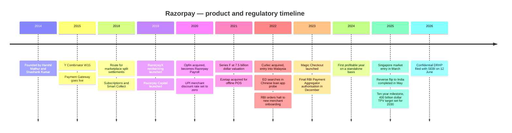
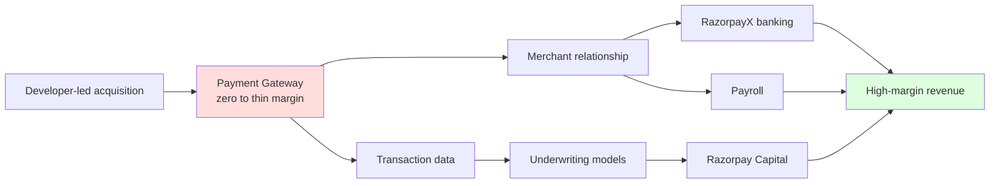
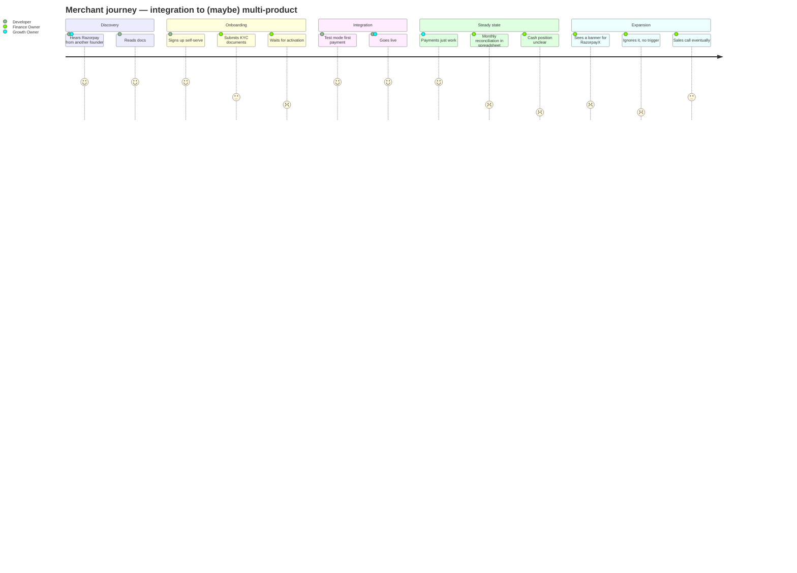
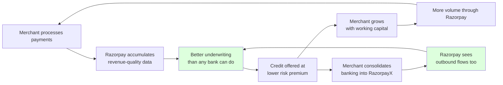

# Day 38 — Razorpay

## The Company That Grew 65% And Got Poorer

A product teardown of Razorpay, India's largest merchant-side payments platform, and what happens when your core product has a regulated price of zero.

*Part of the 90-Day PM Case Study Challenge · Research date: 3 August 2026*

---

## 2. Table of Contents

1. Cover
2. Table of Contents
3. Executive Summary
4. Company Background
5. Product Timeline
6. Problem Statement
7. Market Research
8. TAM / SAM / SOM
9. Competitor Analysis
10. SWOT
11. Business Model
12. Revenue Model
13. Target Users
14. Personas
15. Jobs To Be Done
16. User Journey
17. UX Audit
18. Feature Breakdown
19. Product Metrics and North Star
20. Growth Strategy
21. Pain Points
22. Opportunity Mapping and RICE
23. Feature Proposal
24. PRD
25. Rollout, A/B Test and Risks
26. PM Lessons
27. References

---

## 3. Executive Summary

Razorpay grew revenue 65% in FY25, to ₹3,783 crore. In the same year its gross profit grew 41%, to ₹1,277 crore.

Those two numbers were published together, usually in the same paragraph. Almost every headline led with the 65%. The 41% is the more informative one, because a payments company whose gross profit grows 24 points slower than its revenue is telling you something specific: the incremental transaction is worth less than the average transaction it already had.

FY25 gross margin was roughly 34%. The year before it was between 36.6% and 39.5%, depending on which of two conflicting FY24 revenue figures you accept (§19 and `ASSUMPTIONS.md`). Under either reading, margin compressed while revenue accelerated.

The cause is structural and public. UPI, the rail carrying most of India's digital transactions by count, has been regulated at zero merchant discount rate since January 2020. Every UPI payment Razorpay processes costs money to process and earns nothing in transaction fees. This is not a pricing problem — a pricing problem can be fixed with a pricing page. It is volume Razorpay is legally forbidden from pricing, and that volume is the fastest-growing part of its mix.

**The central thesis of this teardown: Razorpay is not a payments company with an adjacent-products strategy. It is an adjacent-products company obliged to run a payments business at structurally declining margin in order to acquire the customers and the data those products need. The payment gateway is no longer the business — it is the customer acquisition cost, paid in gross margin instead of cash.**

Read that way, otherwise-odd decisions line up. RazorpayX launched in 2019, years before the margin pressure became visible. The acquisitions bought product lines rather than customer bases — Opfin for payroll, Ezetap for offline, Curlec for Malaysia. And Curlec is the sharpest tell: Malaysia and Singapore are markets where a merchant fee on real-time payments still legally exists.

This is a coherent strategy and it is also why the IPO is being marked down. Razorpay filed a confidential DRHP with SEBI on 12 June 2026 at a reported target valuation of $5–6 billion, against the $7.5 billion it raised at in December 2021. The market is not disputing the growth. It is repricing its quality.

The proposal (§23) follows from where that strategy is currently broken. Razorpay's stated problem is scale — 12 million merchants, a $400 billion TPV target for 2030. Its actual problem is depth. A merchant using only the payment gateway is a merchant Razorpay subsidises. The question is not how many merchants Razorpay has; it is how many it has ever monetised beyond the rail.

---

## 4. Company Background

Razorpay was founded in 2014 by Harshil Mathur and Shashank Kumar, both IIT Roorkee graduates, after they experienced how hard it was for a small Indian company to accept an online payment. In 2014 that required a registered company, a bank relationship, weeks of paperwork, and an integration written against documentation assuming an enterprise IT team.

Razorpay went through Y Combinator (W15) and built its early reputation on two things unrelated to payments economics: onboarding measured in days rather than months, and API documentation developers actually liked. That is a distribution strategy disguised as a developer-experience strategy, and it worked — Razorpay became the default recommendation inside the Indian startup ecosystem, which then grew up around it.

| Attribute | Detail |
|---|---|
| Founded | 2014 |
| Founders | Harshil Mathur, Shashank Kumar |
| HQ | Bengaluru |
| Total raised | ~$740M (aggregator-derived) |
| Last private round | ~$375M at $7.5B, December 2021 (Series F) |
| FY25 revenue | ₹3,783 crore, +65% YoY |
| FY25 gross profit | ₹1,277 crore, +41% YoY |
| FY25 result | −₹1,209 crore, driven by reverse-flip tax and restructuring |
| Merchants | 12 million+ (secondary sources only — graded Low) |
| International | Malaysia (Curlec), Singapore from March 2025 |
| IPO status | Confidential DRHP filed 12 June 2026 |

Three events since 2021 define the company's current shape more than any product launch.

**The RBI embargo (December 2022 – December 2023).** The Reserve Bank instructed Razorpay, along with Cashfree and later PayU, to stop onboarding new online merchants pending final Payment Aggregator authorisation. Razorpay spent roughly a year unable to acquire new merchants — its primary growth engine — and grew revenue anyway. That is the most informative stress test in the company's history, and §10 treats it as evidence rather than trivia.

**The ED investigation (2022 onward).** The Enforcement Directorate searched Razorpay premises in Bengaluru in October 2022 during a money-laundering probe into predatory lending apps operated by Chinese nationals, freezing approximately ₹78 crore held in payment gateway accounts. Razorpay stated it had proactively blocked the entities concerned roughly 18 months earlier and shared details with the agency. A chargesheet was subsequently filed naming Razorpay alongside the fintechs and NBFCs under investigation.

**The reverse flip (completed May 2025).** Razorpay merged its US parent into its Indian entity to enable a domestic listing, at a tax cost widely reported as roughly $150 million (₹1,245–1,280 crore), though one outlet put it as high as $400 million. This is the direct cause of the FY25 loss. Confusing it with operating performance is the most common error made about Razorpay's FY25 results.

---

## 5. Product Timeline



The shape of that timeline is worth naming. Razorpay added adjacent products from 2018 onward in an unbroken cadence, sustained even through the year it was prohibited from acquiring customers. The diversification predates the margin pressure that now makes it necessary — which reads as foresight rather than reaction.

---

## 6. Problem Statement

**The merchant's problem.** An Indian business that wants to take money online faces a set of related problems sold separately by different vendors: acceptance across UPI, cards, netbanking, wallets, EMI and COD; reconciliation of settlements net of fees, GST, refunds and chargebacks; working capital across the gap between a sale and its settlement; vendor and staff payouts; and the compliance filings attached to all of it. Historically each was solved by a different vendor, or by a person with a spreadsheet.

**Razorpay's problem.** Razorpay solved acceptance extremely well and then built products for everything downstream. But the regulatory regime has made acceptance — the acquisition wedge — progressively unprofitable, while the downstream products remain optional purchases.

**Therefore the product problem.** Razorpay acquires merchants through a product it cannot price, and monetises them through products they must actively choose. The conversion between those two states is the entire business, and it is not currently a designed experience. It is a sales motion and a banner.

---

## 7. Market Research

India's digital payments market is defined by a fact with no clean parallel in any other large economy: the dominant retail payment rail is a public utility with a regulated price of zero.

UPI, operated by NPCI, carries the large majority of India's digital transaction volume by count. The Government of India removed merchant discount rate on UPI and RuPay debit transactions with effect from January 2020. Payment aggregators must therefore process an enormous and growing share of transactions at no transaction revenue, absorbing the processing cost, partially offset by government incentive schemes whose quantum varies year to year and is not guaranteed.

What this does to the industry:

| Consequence | Effect on payment aggregators |
|---|---|
| Transaction revenue decouples from transaction volume | Growth in TPV stops implying growth in gross profit |
| Price competition on non-UPI methods intensifies | MDR on cards compresses toward the interchange floor |
| Differentiation moves off the rail | Winners compete on checkout conversion, credit, and software |
| Scale advantages weaken on payments, strengthen on data | The asset is the transaction record, not the transaction fee |

**The MDR question.** A Parliamentary Standing Committee report tabled in March 2026 recommended reintroducing MDR on UPI for large merchants, and the Payments Council of India has urged 0.30% on large-merchant UPI and RuPay debit. As of the research date, no binding RBI or CBDT notification has been issued. This is the largest exogenous variable in Razorpay's forward economics and is treated as unresolved throughout.

**A note on market sizing.** Mordor Intelligence sizes the India payment gateway market at approximately $2.07 billion in 2025. Razorpay's FY25 revenue of ₹3,783 crore is roughly $430–450 million, while a separate aggregator claims Razorpay holds ~55% of that market — which would imply gateway revenue of $1.14 billion, more than twice Razorpay's entire company revenue. These claims cannot all be true. This teardown therefore uses **no published market-share percentage**; see `ASSUMPTIONS.md`, conflict C5.

---

## 8. TAM / SAM / SOM

**Framework rationale.** TAM/SAM/SOM is used here specifically because it can separate volume from revenue, which is the distinction this entire teardown rests on. A bottom-up cohort model would size the merchant base well but obscure the fact that Razorpay's addressable *volume* and addressable *revenue* are diverging. Sizing in two units forces both to be stated.

| Layer | Volume view | Revenue view |
|---|---|---|
| **TAM** | All digital payment volume flowing through Indian businesses, plus SEA expansion markets. Razorpay's stated ambition is ~$400B TPV by 2030. | All *monetisable* financial-services spend by Indian businesses: gateway fees, business banking, SME credit, payroll SaaS, compliance software. Materially smaller than the volume view implies. |
| **SAM** | Online and offline payment volume of businesses that are digitally onboardable and RBI-eligible for PA services. | Non-UPI transaction revenue plus all adjacent-product revenue for that same population. **UPI volume sits inside SAM-volume and almost entirely outside SAM-revenue.** |
| **SOM** | The merchant base Razorpay can realistically hold — reported at 12 million+, graded Low. | FY25 realised: ₹3,783 crore revenue, ₹1,277 crore gross profit. The gross profit line is the honest SOM. |

The gap between SAM-by-volume and SAM-by-revenue *is* the strategy problem. Razorpay's $400 billion TPV target is a volume target; on current regulation it does not translate into a proportionate revenue target. Any analysis treating TPV growth as a proxy for business growth will mis-read this company.

Conversely, if MDR returns for large merchants, a large slice of SAM-volume converts into SAM-revenue overnight with no product work required. That asymmetry is both the real investment case and the real risk.

---

## 9. Competitor Analysis

| Player | Position | Strength vs Razorpay | Weakness vs Razorpay |
|---|---|---|---|
| **PayU (Prosus)** | Scale incumbent, enterprise-weighted | Deep enterprise relationships, global parent balance sheet | Slower developer motion; faced its own PA licence re-application |
| **Cashfree** | Direct challenger, payouts-strong | Strong payouts and verification suite | Same 2022–23 embargo; smaller adjacent-product surface |
| **CCAvenue (Infibeam)** | Listed legacy gateway | Public-market disclosure discipline; long enterprise tail | Weaker developer and startup brand |
| **Paytm (One97)** | Consumer plus merchant, full stack | Owns a consumer UPI app — monetises the rail from the other side | Regulatory turbulence; consumer-brand entanglement |
| **PhonePe** | Consumer UPI leader moving to merchant | Enormous consumer distribution; owns the UPI front end | Merchant software depth is newer |
| **Juspay** | Payments orchestration layer | Sits above aggregators; bank-agnostic routing | Different value capture; not a like-for-like aggregator |
| **Stripe (India)** | Global developer standard | World-class DX and global rails | Limited India-specific depth; no Indian banking or credit stack |

**The competitive read.** PhonePe and Paytm are structurally different competitors, and that difference is the point of this teardown. They own the *consumer* side of UPI. Razorpay owns only the merchant side.

A consumer-side player earns from the UPI ecosystem through incentive schemes, lending distribution and consumer financial products, and can subsidise merchant acceptance from that base. Razorpay has no consumer franchise to subsidise from. Its adjacent-product strategy is therefore not opportunistic — it is the only place Razorpay is allowed to make money. A competitor with a consumer app has two.

---

## 10. SWOT

**Strengths**

- Developer distribution — default recommendation inside the Indian startup ecosystem, onboarding measured in days
- Product breadth on the monetisable side — banking, credit, payroll and POS are live products, not roadmap items
- Proprietary underwriting data — Razorpay sees merchant revenue before the merchant's own bank does
- Demonstrated resilience under regulatory stress — grew revenue through a year-long prohibition on new merchant acquisition

**Weaknesses**

- Gross margin compression: FY25 revenue +65%, gross profit +41%
- No consumer franchise to subsidise merchant economics from, unlike PhonePe or Paytm
- Balance-sheet dependency — RazorpayX runs on partner banks; Capital depends on NBFC arrangements. Razorpay controls the interface, not the licence
- Adjacent-product attach is a sales motion, not a product motion (§21)

**Opportunities**

- MDR reintroduction for large merchants — converts SAM-volume into SAM-revenue with zero product work
- Markets where MDR exists — Malaysia and Singapore are not zero-MDR regimes
- Cross-border export-receipt flows, which carry FX spread rather than regulated-zero MDR
- Embedded credit at scale — the underwriting data asset is under-monetised relative to its quality

**Threats**

- Continued UPI mix shift compressing blended margin further
- Regulatory action recurrence — the 2022–23 embargo is demonstrated, not hypothetical
- IPO repricing setting a public benchmark that constrains future capital
- Partner banks building competing merchant stacks on the same rails

---

## 11. Business Model

Razorpay runs one acquisition engine feeding a portfolio of monetisation layers.



The red node is where volume goes. The green node is where margin has to come from. Everything strategically interesting about Razorpay happens in the arrows between them.

**Key partners** are the constraint worth naming. Partner banks provide settlement and the RazorpayX account infrastructure; NBFC partners carry lending balance sheet; NPCI and the card networks set both the cost floor and, for UPI, the price ceiling. Razorpay owns the interface and the data. It does not own the licence for the deposit relationship or the balance sheet behind the credit.

---

## 12. Revenue Model

| Method / product | Merchant-facing rate | Razorpay's realised margin | Trajectory |
|---|---|---|---|
| Domestic cards | ~2% | Thin — most flows to issuer and network | Flat to declining |
| International cards | ~3% | Better | Stable |
| Netbanking | Flat per transaction | Moderate | Stable |
| **UPI** | **0%** | **Negative before incentives** | **Growing as share of mix** |
| Wallets | ~2% | Thin | Flat |
| Magic Checkout | Premium fee / SaaS | Good | Growing |
| RazorpayX | SaaS + float + interchange | High | Growing |
| Razorpay Capital | Interest spread | High, credit-risk-bearing | Growing |
| Payroll | Per-employee SaaS | High | Growing |
| POS | Hardware + MDR | Moderate | Stable |
| Cross-border / Curlec | FX spread; MDR where it exists | Good | Early |

**The 83% problem.** In FY24, the last year with a clean segment disclosure, Razorpay earned ₹2,068 crore from payment aggregation services — approximately 83% of operating revenue. One rupee in six came from everything that was not the payment gateway.

If 83% of revenue sits on a line whose blended take rate is being structurally compressed by mix shift, then Razorpay's revenue is 83% exposed to a variable it does not control. The adjacent products are reported to be the fastest-growing segments, but growing 17% of a business quickly does not offset compression on the other 83% unless the differential is enormous and sustained.

**Reconciling FY25.** Revenue grew 65%. Two readings are available, and the gross profit number is the tiebreaker.

- *Reading A — mix improved.* Adjacent products grew far faster than payments, shifting the mix toward SaaS and credit. The strategy is working.
- *Reading B — volume grew.* The 65% was primarily payment aggregation volume, and margin compression is the arithmetic consequence.

If mix had genuinely shifted toward high-margin SaaS and credit, gross profit should have grown *faster* than revenue. It grew 24 points slower. **Reading B is better supported.** This is an inference, not a fact — Razorpay has published no FY25 segment breakdown, and the confidential DRHP means the detail sits with SEBI.

---

## 13. Target Users

Razorpay sells to organisations, but the buying and using are done by three distinct people — frequently the same person in a small business, never the same person in a large one.

| User | Who they are | What they care about |
|---|---|---|
| **The Developer** | Backend engineer integrating payments | Docs quality, SDK ergonomics, sandbox fidelity, webhook reliability |
| **The Finance Owner** | Founder, CFO, finance manager, accountant | Settlement timing, reconciliation, MDR cost, GST/TDS, cash position |
| **The Growth Owner** | Founder, growth lead, e-commerce manager | Checkout conversion, payment success rate, COD RTO, cart abandonment |

| Segment | Characteristics | Razorpay's position |
|---|---|---|
| Micro / long tail | Single-person businesses, local services; heavily UPI | Acquires easily, monetises poorly. **The loss-leading segment** |
| SMB / D2C | ₹1–50 crore revenue, Shopify or custom stack | The sweet spot — real payment mix, real adjacent-product need |
| Mid-market | Multi-entity, in-house finance team | Highest attach potential for RazorpayX and Payroll |
| Enterprise | Large volume, negotiated MDR | Volume without margin; held for credibility and mix |

**The segment insight.** Razorpay's acquisition engine is strongest exactly where monetisation is weakest. The long tail signs up in minutes and transacts almost entirely on UPI. This is not an execution flaw — it is the shape the market forces on any merchant-side aggregator, and it is why §23 targets activation rather than acquisition.

---

## 14. Personas

> Author-constructed composites built from public product documentation and the segment structure in §13. Not derived from Razorpay user research.

**Ananya, 31, D2C founder, Bengaluru.** Runs a skincare brand doing ₹4 crore annual revenue on Shopify, team of nine, no finance hire. Roughly 70% of her order value comes through UPI. Settlements land T+2 and she cannot see, on any given morning, how much money is actually hers. Reconciling Razorpay settlements against Shopify orders is a monthly spreadsheet exercise. She has heard of RazorpayX and has never had a reason strong enough to move her current account. She is the exact merchant whose payment volume Razorpay cannot monetise and whose adjacent-product need is acute and unserved.

**Rohit, 27, backend engineer, B2B SaaS.** Owns the billing integration. Wants to ship subscription billing this sprint and never think about payments again. He is the person who *chose* Razorpay, and he has no involvement in — or awareness of — anything Razorpay sells beyond the gateway. The buyer of the wedge product is structurally disconnected from the buyer of the margin products.

**Meera, 38, finance manager, ₹120 crore mid-market retailer.** Wants to close books faster and cut four banking portals down to one. Payment data sits in Razorpay, banking in two banks, payroll in a third tool, and nothing reconciles automatically. She is the highest-margin customer Razorpay can have, and she is reached through a sales motion rather than through the product. She does not know the gateway her engineers integrated three years ago also sells the thing she needs.

---

## 15. Jobs To Be Done

| When... | I want to... | So I can... | Razorpay's fit |
|---|---|---|---|
| I am launching and need to take money | get a gateway live today without a bank meeting | start selling this week | **Excellent** — the founding job, still best in class |
| A customer is at checkout | not lose them to friction or a failed payment | convert the sale I already paid to acquire | **Strong** — Magic Checkout, routing, retries |
| It is month end | know what I actually earned, net of everything | close books and file correctly | **Partial** — reports exist, the job doesn't close |
| I need inventory money before settlement | borrow against revenue I can already see | not stall growth on a cash gap | **Under-served** — Capital exists, discovery is poor |
| I need to pay vendors and staff | do it from where the money already is | stop running four portals | **Available but unattached** |

**The job Razorpay is not currently hired for:** *"When I open my laptop in the morning, I want to know where my business's money stands, so I can decide what to do today."*

No product in the portfolio does this. The data required — settlements, payouts, payroll obligations, refund liability, credit availability — is entirely inside Razorpay for a multi-product merchant and partially inside Razorpay for every single-product merchant. This unserved job is the seam §22 and §23 work.

---

## 16. User Journey



The scores collapse in two places and both are the same story. Payments work beautifully for the Developer and the Growth Owner. The Finance Owner — the person who buys every high-margin product Razorpay sells — has the worst experience precisely in the phase where they spend the most time.

And expansion is not a journey; it is a hope. No event in the merchant's life is currently converted into an adjacent-product moment. The transition from single-product to multi-product depends on a banner or a salesperson. Given that the entire moat is multi-product attach, this is the highest-leverage broken thing in the product.

---

## 17. UX Audit

| Area | Observation | Severity |
|---|---|---|
| Onboarding | Self-serve signup is genuinely fast; the original differentiator holds | Positive |
| KYC | Document-heavy, status opacity, resubmission loops — but largely regulatorily constrained | Medium |
| Developer integration | Docs, SDKs, test mode and webhooks are category-leading. This is the company's craft | Positive |
| Reconciliation | Reports exist; the job of matching settlements to orders still lands in a spreadsheet | High |
| Cash visibility | No single view of money position anywhere in the product | **Critical** |
| Cross-product discovery | Banners and upsell surfaces rather than contextual triggers | High |
| Empty states | Unpurchased products render as marketing rather than as useful preview | Medium |
| Information architecture | Organised by product — that is, by Razorpay's org chart, not the merchant's mental model | High |
| Mobile dashboard | Monitoring works; managing does not | Medium |

**The pattern.** Razorpay's UX quality is inversely correlated with the revenue value of the user. The Developer, who generates the least monetisable product, gets an outstanding experience. The Finance Owner, who buys everything high-margin, gets the weakest one.

That is not a failure of taste. It is the predictable result of a company that built a developer product first and grew the finance products later — and it is fixable by design rather than by rebuild. Razorpay owns every component of a money-position view. It has not assembled them into one.

---

## 18. Feature Breakdown

| Feature | Job served | Margin quality |
|---|---|---|
| Payment Gateway | Accept money across all methods | Declining |
| Payment Links / Pages | Sell without a website | Declining |
| Magic Checkout | Convert the cart; cut COD RTO | Good |
| Subscriptions | Recurring billing and mandates | Moderate |
| Route | Split settlements for marketplaces | Moderate |
| Smart Collect | Virtual accounts for bank-transfer reconciliation | Moderate |
| Instant Settlement | Get money before T+1/T+2 | **High** |
| RazorpayX Current Account | Business banking in one place | **High** |
| Payouts | Vendor and contractor payments | Moderate |
| Corporate Cards | Spend management | **High** |
| Razorpay Capital | Working capital on transaction data | **High** |
| Payroll | Salaries plus statutory compliance | **High** |
| POS | In-store acceptance | Moderate |
| Curlec | SEA payments and direct debit | **Good — MDR exists** |

Every feature marked **High** is one the merchant must decide to adopt. Every feature with declining margin is one the merchant adopts by default on day one. The portfolio is correctly constructed and incorrectly sequenced from the merchant's point of view.

Worth separating out: Razorpay's most valuable machine learning is not the "CFO assistant" it markets. It is the routing engine that lifts payment success rates across flaky bank rails, the COD risk scoring inside Magic Checkout, and — most importantly — the underwriting models behind Capital. Razorpay can see a small merchant's gross revenue, method mix and refund rate in near-real time, before that merchant's own bank can. No bank has that view. That asymmetry is the one genuinely unique asset in the company, and it is currently expressed as a credit product the merchant has to go and find.

---

## 19. Product Metrics and North Star

### Disclosed financials

| Metric | FY24 | FY25 | Change |
|---|---|---|---|
| Operating revenue | ₹2,475 cr *(conflicting)* | ₹3,783 cr | +65% |
| Gross profit | ~₹906 cr *(derived)* | ₹1,277 cr | +41% |
| **Implied gross margin** | **36.6% or 39.5%** | **~33.8%** | **Compression under either reading** |
| PAT | ₹33.5 cr (first profitable year) | −₹1,209 cr (reverse-flip costs) | Not comparable |
| Payment aggregation share | 83% (₹2,068 cr) | **Not disclosed** | — |

**The FY24 conflict, kept rather than resolved.** ₹2,475 crore is reported directly by Inc42 and others; ₹2,293 crore is implied by applying the reported 65% FY25 growth to ₹3,783 crore. The likely explanation is an entity-scope difference around the May 2025 reverse flip. Both are carried. The conclusion does not depend on choosing — margin compressed under both, by 5.7 points or 2.8 points respectively. Full arithmetic in `ASSUMPTIONS.md`.

**Volume metrics.** Annualised TPV is widely cited at ~$180 billion, but the identical figure is attributed to both FY24 and 2026 across sources, so at least one is stale; it is therefore not used in any conclusion. The $400 billion 2030 target is company-stated and dated (February 2025). Merchant count of 12 million+ appears only in secondary aggregators and is graded Low.

**The number that would settle this teardown — UPI share of TPV, year over year — is not disclosed.**

### Proposed North Star: Monetised Products per Active Merchant (MPAM)

Razorpay's moat, its margin recovery path, its switching costs and its IPO narrative all rest on one claim: that a merchant acquired through payments becomes a merchant monetised through everything else. Nothing currently visible tests that claim. MPAM tests only that claim.

| Candidate | Why it's worse |
|---|---|
| **TPV** | The most dangerous metric available to Razorpay. It rises fastest exactly when UPI mix — the margin-destroying input — rises fastest. Optimising it can actively destroy gross profit |
| **Merchant count** | Measures acquisition of unmonetised users. 12 million merchants at one product each is a worse business than 3 million at three |
| **Revenue / ARR** | Lagging, and FY25 proved it can grow 65% while unit economics deteriorate |
| **Payment success rate** | Genuinely important, but a hygiene ceiling rather than a growth engine |
| **Take rate** | Moves on regulation and mix, not on anything a product team can influence |

MPAM is leading rather than lagging; it is causally connected to the moat, because switching cost is entirely a function of multi-product adoption; it is actionable by every team, which can ask whether its work moves a merchant from N products to N+1; and it exposes the real failure mode — the payment-only merchant who currently looks healthy in TPV and merchant-count reporting.

**Counter-metric:** gross profit per active merchant. MPAM could be gamed by pushing merchants into products they do not use, or by counting a dormant account as a "product." Pairing the two ensures breadth is additive.

Current MPAM is **not disclosed**. Every baseline in this teardown is marked as such rather than estimated.

---

## 20. Growth Strategy

**What has worked.** Developer-led distribution — being the obvious choice for the person doing the integration — is cheap, durable, and validated by growing through the embargo. Platform embedding in Shopify and WooCommerce means Razorpay is chosen while the merchant is building rather than while shopping. Acquisitions bought product lines rather than customer bases, consistent with a company that has plenty of customers and not enough products per customer. And expansion into Malaysia and Singapore is an under-discussed, structurally sharp move into markets where real-time payments still carry a merchant fee.

**The counterintuitive conclusion: Razorpay should not treat top-of-funnel merchant growth as its primary lever.**

Acquisition, activation, retention and referral are all healthy. The funnel is not leaking at the top — it is leaking value at the bottom. Each additional long-tail merchant arrives with a UPI-heavy mix, so **acquisition growth is currently margin-dilutive.** Razorpay is one of the rare companies for which that is true.

The loop that actually matters:



This is the only loop in the business that converts zero-margin volume into high-margin revenue. Every UPI transaction processed at a loss makes the underwriting model better — the processing loss buys a data asset. And it compounds: when a merchant moves banking into RazorpayX, Razorpay gains visibility into outbound flows, which sharpens underwriting further.

**The loop works. It is starved of entrants**, because it requires the merchant to discover and adopt Capital or RazorpayX, and most never do. That is the growth problem, and it is an activation problem rather than an acquisition one.

---

## 21. Pain Points

| # | Pain point | Who | Evidence |
|---|---|---|---|
| 1 | No single view of money position — merchant cannot answer "what do I have and what's coming" | Finance Owner | High — structural, observable in IA and product surface |
| 2 | Reconciliation lands in a spreadsheet; settlements and transactions arrive in incompatible shapes | Finance Owner | High |
| 3 | Working capital need is invisible until urgent | Finance Owner, Founder | High — inferred |
| 4 | Adjacent products are undiscovered; merchant does not associate Razorpay with banking or credit | Finance Owner | High |
| 5 | The buyer of payments is not the buyer of everything else, and may not share a login | Organisation | High — §14 |
| 6 | KYC friction | Finance Owner | Medium — largely regulatorily constrained |
| 7 | COD RTO losses | Growth Owner | Medium — already addressed by Magic Checkout |
| 8 | Payment failures on flaky bank rails | Growth Owner | Medium — already addressed by routing |

**The pattern.** Points 7 and 8 — the pains Razorpay has solved best — belong to the Growth Owner and sit on the zero-to-thin-margin side of the business. Points 1 through 5 are unsolved, are the most severe, belong to the Finance Owner, and sit directly on the path to the high-margin products.

They are also all versions of one underlying pain: **the merchant cannot see their own money.** That convergence is what makes §23 a single feature rather than five.

---

## 22. Opportunity Mapping and RICE

**Framework rationale.** RICE is used here rather than value-vs-effort because the central uncertainty is *confidence*, not value. The strategic case is strong; what is unknown is whether merchants will act on a cash-position surface. RICE is the only common framework that makes confidence an explicit, separately-scored multiplier rather than burying it in a single judgement.

| Opportunity | Reach | Impact | Confidence | Effort | RICE |
|---|---|---|---|---|---|
| Money position view + contextual credit | 9 | 3 | 0.7 | 6 | **3.15** |
| Full reconciliation engine | 6 | 2 | 0.8 | 9 | 1.07 |
| Finance-Owner-targeted onboarding | 5 | 1 | 0.6 | 1 | 3.00 |
| Deeper SEA expansion | 2 | 3 | 0.5 | 10 | 0.30 |
| Lobby for MDR return | — | — | — | — | Not a product lever |

**Sensitivity check.** The top score is most fragile on Confidence, the softest input. At 0.7 it leads. Drop it to 0.4 — defensible, since no one has validated that merchants will engage with a position surface — and it falls to 1.80, behind Finance-Owner onboarding at 3.00. Drop Impact from 3 to 2 as well and it falls to 1.20, behind reconciliation.

**The honest reading:** the position view wins clearly if merchants look at it. It does not win on cost or on certainty, and a cheap go-to-market fix (getting the Finance Owner a login at all) scores nearly as well for a fraction of the effort. That is exactly why the A/B design in §25 is built to falsify the expensive half before the full build is committed — and why the cheap option should ship regardless.

---

## 23. Feature Proposal

### Razorpay Cashboard — the merchant's money position, and the credit that follows from it

**Converging evidence.** This proposal is not selected from a list; it is what six earlier sections independently point at:

- §6 established that Razorpay acquires through a product it cannot price and monetises through products merchants must choose
- §12 showed 83% of revenue sits on a structurally compressing line
- §15 identified the unserved job — "where does my money stand"
- §17 found Razorpay already owns every component of a money-position view without assembling one
- §20 showed the data-to-credit loop works but is starved of entrants
- §21 collapsed five of eight pain points into a single missing surface

**What it is.** A money-position layer available to every Razorpay merchant including payment-only ones, built entirely from data Razorpay already holds, with pre-underwritten credit surfaced passively inside it at the moment a cash gap is predicted.

It has two deliberately separable halves.

**The cheap half — the Position View.** One screen answering: what has settled, what is coming and when, what was deducted and why, what is at risk from refunds and chargebacks. No new data. No new models. No merchant action required. Free to everyone.

```
┌─────────────────────────────────┐
│  Your money                     │
│                                 │
│  Available now      ₹4,82,400   │
│  Arriving this week ₹11,20,000  │
│                                 │
│  Settling tomorrow   ₹3,10,200  │
│  Settling Thu        ₹4,80,100  │
│                                 │
│  ⚠ Low balance predicted Aug 19 │
│     Payroll ₹6,20,000 due       │
│     Forecast inbound ₹4,10,000  │
│                                 │
│  [ See what's available → ]     │
└─────────────────────────────────┘
```

**The expensive half — the Credit Layer.** Forecasting from settlement history, cash-gap prediction, and a pre-underwritten credit line displayed as an available number rather than an application, with one-tap drawdown into the merchant's existing settlement account. The primary CTA is pre-filled with the exact predicted shortfall — the product does not ask how much the merchant needs, because it already knows.

**Why both, and why separable.** The Position View creates a reason to look, converting the dashboard from a monitoring surface into a working one — the precondition for any in-product expansion motion. The Credit Layer creates the revenue event, placing the highest-margin product in the context where its value is self-evident. They ship separately on purpose, because the honest answer to "is the expensive half necessary?" is unknown, and §25 is designed to find out before the money is spent.

**Consent is a design requirement, not a legal afterthought.** The entire proposal depends on using merchant transaction data for purposes beyond processing the transaction. Under the DPDP Act 2023 and RBI's data directives, the boundary between processing a payment and profiling a merchant to sell them credit is a live question. Explicit, granular, revocable consent ships as a first-class product moment.

**What it is not.** Not an accounting product, not a competitor to Tally or Zoho Books, not a chatbot. It answers one question extremely well and gets out of the way.

**Why Razorpay specifically.** A bank cannot build this — it sees the merchant's account, not their gross revenue, method mix, refund rate or settlement pipeline. An accounting tool cannot — it sees what the merchant records, after the fact. A competing aggregator could, which is the argument for building it now.

---

## 24. PRD

**Problem.** Payment-only merchants — the large majority of the base — cannot see their own financial position, do not discover Razorpay's high-margin products at the moment of need, and therefore never enter the data-to-credit loop that is the company's only structural path out of margin compression.

**Goal.** Increase the proportion of merchants who adopt and retain a second monetised product.

**Non-goals.** Replacing accounting software. Serving the Developer persona. **Increasing TPV** — deliberately excluded as a success metric, for the reasons in §19.

| ID | Requirement | Priority |
|---|---|---|
| R1 | Position View: available balance, settlements in flight with dates, gross-to-net deduction breakdown, refund and chargeback exposure. Read-only, zero configuration | P0 |
| R2 | Explicit, granular, revocable consent for use of transaction data in credit assessment, as a visible product moment | P0 |
| R3 | Full mobile parity — Indian founders check money on a phone | P0 |
| R4 | 30-day inbound forecast from settlement history | P1 |
| R5 | Pre-computed credit eligibility and limit, shown as an available amount, never as an application form; one-tap drawdown; pricing shown before commitment | P1 |
| R6 | Cash-gap alerts, precision-weighted — a false positive is far more damaging than a false negative | P1 |
| R7 | Obligations ingestion — pull scheduled payouts and payroll into the outbound forecast for RazorpayX merchants | P2 |

**Success criteria**

| Measure | Baseline | Target |
|---|---|---|
| Position View weekly active rate, activated merchants | not disclosed | 25% within two quarters |
| MPAM change, exposed cohort vs control | not disclosed | +0.3 products |
| Capital drawdown rate, payment-only cohort | not disclosed | 3× control |
| Alert precision (R6) | not disclosed | >85% before general rollout |
| Consent grant rate (R2) | not disclosed | >60% |

Every baseline is marked not disclosed because Razorpay publishes none. Targets are author-constructed and should be read as hypotheses, not forecasts.

**Open question that may be the binding constraint.** Does the Finance Owner even have a Razorpay login? For many merchants the account belongs to the Developer. If so, this is an access-management problem before it is a data problem — and the cheap fix in §22 matters more than the expensive one.

---

## 25. Rollout, A/B Test and Risks

### Rollout

Consent (R2) and the Position View (R1) ship first. The forecasting and underwriting layer is gated on the experiment below — if the Position View alone moves nothing, building an expensive engine on top of a surface nobody looks at compounds the error.

### A/B test — designed to falsify the expensive half

The costly components are the forecasting engine and pre-underwriting (R4–R6). The cheap component is showing the merchant numbers Razorpay already has.

| Arm | Contents | What its success would prove |
|---|---|---|
| **Control** | Current dashboard | Baseline |
| **A** | Position View only | The surface is what matters |
| **B** | Position View + credit line shown, no forecast, no alerts | Passive credit visibility is what matters — cheap to build |
| **C** | Full Cashboard — forecast, alerts, pre-filled contextual credit | The expensive engine earns its cost |

**Decision rule, committed in advance: if C does not beat B by at least 40% on Capital drawdown rate, the forecasting and alerting engine does not ship.** In that outcome the correct product is a static credit-availability panel at roughly a fifth of the build cost. Arm B exists because it is the cheap alternative hypothesis and deserves a fair chance to win.

Primary metric: MPAM change over 90 days. Guardrail: payment success rate must not regress; support ticket volume and data-accuracy complaints monitored.

**Pre-launch, not A/B:** run the cash-gap model in shadow mode against historical data and do not ship below 85% precision regardless of recall. A merchant falsely told they will run out of money will not trust the product again, and trust is the entire mechanism by which the credit offer works.

### Risks

| Risk | Severity | Mitigation |
|---|---|---|
| DPDP / RBI restricts using payment data for credit targeting | **Critical** | Consent-first design; legal review gates R5. This risk sits on the proposal's foundation — if the data-to-credit loop closes, Razorpay is left with a compressing payments business and SaaS it must sell the hard way |
| UPI mix continues shifting; margin compresses further | High | Attach rate, SEA and cross-border revenue. There is no full hedge |
| Regulatory action recurs — another onboarding embargo | High | Compliance as competitive asset; the 2022–23 episode showed the installed base sustains revenue |
| Partner bank dependency for RazorpayX and Capital | High | Diversify partners; the structural fix is a multi-year licence question |
| Credit losses scale with credit growth | High | Cohort-level delinquency monitoring; the underwriting advantage is real but unproven at scale |
| Consumer-side competitors subsidise merchant acceptance | Medium | Compete on software depth — Razorpay cannot win a subsidy war |
| MDR never returns for UPI | High | The plan assumes it does not. A reprieve would be upside, not strategy |
| Cashboard fails its own A/B test | Low | A feature of the plan. The decision rule caps downside at the cheap half's cost |

---

## 26. PM Lessons

**When your headline metric and your margin metric diverge, believe the margin metric.** Razorpay's revenue grew 65% and its gross profit grew 41%. Every headline led with 65%. The 41% was published in the same sentence and is the more informative number. Ask which of your metrics would still look good if your economics were quietly deteriorating, then watch that one.

**Test whether your growth metric improves when your product gets structurally worse.** TPV rises fastest exactly when the margin-destroying input rises fastest. A metric that goes up as your business gets worse is not neutral — it is harmful, and plenty of companies have one without knowing it.

**The person who chose your product may have no relationship with the person who would buy the rest of it.** Developer-led distribution is a genuine competitive advantage that also structurally disconnects a company from its highest-value buyer. Distribution strengths create expansion blind spots.

**Build the cheap half first and let it try to disprove the expensive half.** Sequencing them, with a decision rule committed in advance, converts a large bet into a small bet plus information. The instinct is to test whether your proposal works; the more useful test is whether the cheap version captures most of the value.

**Some constraints cannot be out-executed.** No amount of product excellence changes a regulated price of zero. When you meet a constraint like that, change where you capture value rather than optimising harder against it.

**Keep conflicting data conflicting.** Two incompatible FY24 revenue figures are in circulation. Averaging them would have produced a clean number and a false one. Carrying both showed the conclusion held either way — a stronger result than a tidy one.

---

## 27. References

- [Razorpay revenue soars 65% in FY25; gross profit crosses Rs 1,200 Cr](https://entrackr.com/fintrackr/razorpay-revenue-soars-65-in-fy25-gross-profit-crosses-rs-1200-cr-10567344) — Entrackr
- [Razorpay reports ₹1,209 crore loss in FY25 despite 65% revenue jump](https://www.business-standard.com/industry/news/razorpay-fy25-results-revenue-up-65-percent-loss-due-to-tax-costs-125101601178_1.html) — Business Standard
- [Razorpay revenue jumps 65% in FY25; loss widens on redomiciling costs](https://yourstory.com/2025/10/razorpay-revenue-jumps-65-in-fy25-loss-widens-on-redomiciling-costs) — YourStory
- [Razorpay's FY24 Profit Jumps 4.5X To INR 34 Cr](https://inc42.com/buzz/razorpays-fy24-profit-jumps-4-5x-to-inr-34-cr/) — Inc42
- [Razorpay says payment gateway business grew 24% in revenue in FY24](https://www.business-standard.com/companies/news/razorpay-says-payment-gateway-business-grew-24-in-revenue-in-fy24-124102900479_1.html) — Business Standard
- [Razorpay moves closer to market debut with confidential IPO filing](https://www.business-standard.com/markets/ipo/razorpay-moves-closer-to-ipo-with-confidential-drhp-filing-126061500118_1.html) — Business Standard
- [Razorpay may opt for confidential IPO filing; valuation seen around $5 billion](https://www.businesstoday.in/markets/ipo-corner/story/razorpay-may-opt-for-confidential-ipo-filing-valuation-seen-around-5-billion-report-526411-2026-04-20) — Business Today
- [Razorpay confidentially files DRHP with SEBI for IPO](https://entrackr.com/news/razorpay-confidentially-files-drhp-with-sebi-for-ipo-12038534) — Entrackr
- [Razorpay marks 10 years, targets about $400 billion in TPV by 2030](https://www.business-standard.com/companies/news/razorpay-marks-10-years-targets-about-400-billion-in-tpv-by-2030-125020900388_1.html) — Business Standard
- [Razorpay completes reverse flip to India](https://entrackr.com/news/razorpay-completes-reverse-flip-to-india-9317267) — Entrackr
- [Razorpay To Pay INR 1,245 Cr In Taxes For Domicile Shift To India](https://inc42.com/buzz/razorpay-to-pay-inr-1245-cr-in-taxes-for-domicile-shift-to-india/) — Inc42
- [RBI asks Razorpay, Cashfree to temporarily stop onboarding of new customers](https://www.business-standard.com/article/companies/rbi-asks-razorpay-cashfree-to-temporarily-stop-onboarding-of-new-customers-122121600780_1.html) — Business Standard
- [RBI lifts embargo for Razorpay, Cashfree to operate as payment aggregators](https://yourstory.com/2023/12/rbi-lifts-embargo-for-razorpay-cashfree-to-operate-as-payment-aggregators) — YourStory
- [ED freezes funds worth Rs 78 Cr in Chinese loan apps case](https://yourstory.com/2022/10/chinese-loan-apps-ed-freezes-fresh-deposits-razorpay) — YourStory
- [India Payment Gateway Market — Share & Industry Statistics](https://www.mordorintelligence.com/industry-reports/india-payment-gateway-market/market-share) — Mordor Intelligence
- [UPI's Monetisation Moment: Why MDR Is Back On The Table](https://inc42.com/features/upis-monetisation-moment-why-mdr-is-back-on-the-table/) — Inc42
- [Razorpay Magic Checkout](https://razorpay.com/docs/payments/magic-checkout/) — Razorpay Docs
- [Razorpay Business Breakdown & Founding Story](https://research.contrary.com/company/razorpay) — Contrary Research

---

*Day 38 of 90 · Evidence grades, source conflicts and author-constructed elements are documented in [ASSUMPTIONS.md](ASSUMPTIONS.md)*

*This analysis is based entirely on public information. I have no affiliation with Razorpay and no access to its internal data. Razorpay's DRHP is confidentially filed, so the most informative document about this company is not public. Corrections welcome.*
