# Freshworks — Product Management Case Study
### Day 40 of 90 | PM Case Study Challenge

---

## 1. Cover

**Product:** Freshworks (Freshworks Inc., Nasdaq: FRSH — includes Freshservice, Freshdesk Omni, Freshsales, Device42, FireHydrant, Freddy AI)
**Category:** Service Operations SaaS — IT Service Management (EX) and Customer Service (CX)
**Author:** Gaurav Singh
**Day:** 40 / 90
**Date Published:** August 5, 2026

---

## 2. Repository Metadata

| Field | Value |
|---|---|
| Repository | `product-management-case-studies` |
| Folder | `Day-40-Freshworks/` |
| Author | Gaurav Singh |
| Series | 90-Day PM Case Study Challenge |
| Previous | Day 39 — Myntra |
| Companion file | `ASSUMPTIONS.md` — evidence grades, source conflicts, author-constructed content |
| Newsletter | `NEWSLETTER.md` — condensed essay for the LinkedIn Newsletter |
| License | MIT (see [§63 License](#63-license)) |

---

## 3. Badges

`Day 40/90` · `Category: Service Operations SaaS` · `Ownership: Public (Nasdaq: FRSH)` · `HQ: San Mateo, California` · `Founded: Chennai, India, 2010` · `Status: Published`

---

## 4. Table of Contents

**Foundations**

- [1. Cover](#1-cover)
- [2. Repository Metadata](#2-repository-metadata)
- [3. Badges](#3-badges)
- [4. Table of Contents](#4-table-of-contents)
- [5. Executive Summary](#5-executive-summary)
- [6. Product Overview](#6-product-overview)
- [7. Company Background](#7-company-background)
- [8. Product Timeline](#8-product-timeline)
- [9. Vision & Mission](#9-vision--mission)
- [10. Problem Statement](#10-problem-statement)

**Market & Strategy**

- [11. Market Research](#11-market-research)
- [12. Industry Analysis](#12-industry-analysis)
- [13. TAM/SAM/SOM](#13-tamsamsom)
- [14. Competitor Analysis](#14-competitor-analysis)
- [15. SWOT](#15-swot)
- [16. Porter's Five Forces](#16-porters-five-forces)
- [17. Business Model Canvas](#17-business-model-canvas)
- [18. Revenue Model](#18-revenue-model)

**Users & Experience**

- [19. Target Users](#19-target-users)
- [20. Personas](#20-personas)
- [21. JTBD](#21-jtbd)
- [22. User Journey](#22-user-journey)
- [23. User Flow](#23-user-flow)
- [24. Information Architecture](#24-information-architecture)
- [25. UX Audit](#25-ux-audit)
- [26. UI Audit](#26-ui-audit)
- [27. Accessibility](#27-accessibility)

**Product & Growth**

- [28. Feature Breakdown](#28-feature-breakdown)
- [29. AI Capabilities](#29-ai-capabilities)
- [30. Product Metrics](#30-product-metrics)
- [31. North Star Metric](#31-north-star-metric)
- [32. Product Analytics](#32-product-analytics)
- [33. AARRR](#33-aarrr)
- [34. HEART](#34-heart)
- [35. Growth Strategy](#35-growth-strategy)
- [36. Growth Loops](#36-growth-loops)
- [37. Network Effects](#37-network-effects)
- [38. Product Strategy](#38-product-strategy)
- [39. Monetization](#39-monetization)
- [40. Trust & Safety](#40-trust--safety)

**Technical**

- [41. Technical Architecture](#41-technical-architecture)
- [42. Data Flow](#42-data-flow)
- [43. API Ecosystem](#43-api-ecosystem)
- [44. Privacy & Security](#44-privacy--security)

**Strategy & Planning**

- [45. Pain Points](#45-pain-points)
- [46. Opportunity Mapping](#46-opportunity-mapping)
- [47. RICE](#47-rice)
- [48. MoSCoW](#48-moscow)
- [49. Kano](#49-kano)
- [50. Feature Proposal](#50-feature-proposal)
- [51. PRD](#51-prd)
- [52. Wireframes](#52-wireframes)
- [53. Rollout Plan](#53-rollout-plan)
- [54. A/B Testing](#54-ab-testing)
- [55. KPI Dashboard](#55-kpi-dashboard)
- [56. Product Roadmap](#56-product-roadmap)
- [57. Risks & Mitigation](#57-risks--mitigation)
- [58. Future Vision](#58-future-vision)

**Closing**

- [59. PM Lessons](#59-pm-lessons)
- [60. PM Interview Questions](#60-pm-interview-questions)
- [61. References](#61-references)
- [62. About the Author](#62-about-the-author)
- [63. License](#63-license)
- [64. Self Review](#64-self-review)
- [65. Appendix](#65-appendix)

---

## 5. Executive Summary

Freshworks is two companies wearing one brand, and they are growing at completely different speeds.

In Q2 2026 (reported 4 August 2026), Freshworks posted revenue of $237.4 million, up 16% year over year, its first GAAP-profitable quarter of 2026, and its eighth consecutive quarter clearing the Rule of 40. Underneath that single headline sit two businesses. Employee Experience — Freshservice, ESM, IT asset management, Device42, FireHydrant — reached $567 million in ARR, up 24% in constant currency and roughly 59% of the company's total ARR. Customer Experience — Freshdesk Omni, Freshchat, the ticketing product the company was literally founded on and named after — was reported at just over $395 million ARR growing 6% in Q1 2026, and management has explicitly guided CX to low-single-digit growth for the full year.

The obvious explanation is that CX is a tougher market with bigger incumbents. That explanation is available, popular, and in my reading insufficient.

**Key finding: the two halves diverge because of what each one meters, not because of who each one competes against.** Freshworks has already solved the hard part of AI monetisation in both halves — it has a non-seat billing unit on each side. In EX, that unit is the **Asset Unit**, sold in packs of 500 against the assets in a customer's CMDB. In CX, that unit is the **AI Agent session**, sold at $49 per 100 sessions. Those two units look structurally similar on a price list and behave like opposites in a customer's budget meeting. Assets are things a growing company accumulates without trying; the meter rises on the customer's side of the table, and nobody resents it. AI sessions are things a customer actively wants fewer of — and worse, a session is billed whether or not it actually resolved anything. Freshworks charges CX customers $0.49 for the attempt.

That is the whole divergence in one line. EX meters accumulation. CX meters attempts. One compounds and one is a line item to negotiate down.

This reading survives contact with the competitive data, which is where it gets uncomfortable. Intercom's Fin charges $0.99 per **resolution**. Zendesk charges roughly $1.50 per committed automated resolution and $2.00 pay-as-you-go, and its CEO used the 2026 Relate stage to declare the deflection era over. Freshworks is not merely priced below both — it is priced below both because it is selling a less valuable unit. It is the last major customer-service vendor still billing for the attempt while its competitors bill for the outcome.

Meanwhile the AI attach data shows Freshworks executing well on the thing its pricing model *can* capture. Freddy AI Copilot — priced at $29 per agent per month, an augmentation product that only makes money while human agents exist — is attached to over 71% of new enterprise deals, and more than 7,000 customers now pay for an AI SKU. Freshworks is monetising the AI that makes agents faster far better than the AI that makes agents unnecessary. In EX that is fine, because ESM expansion adds new departments and new agents faster than automation removes them. In CX it is a slow structural squeeze.

The second, quieter finding is what the company is becoming while this plays out. Customers contributing over $100,000 in ARR grew 25% year over year to 1,746, while customers contributing over $5,000 grew just 6% to 25,356 — down from 10% growth two quarters earlier. Net dollar retention slipped to 104% from 106%. Freshworks is moving upmarket and its self-serve base is stalling, which is a coherent strategy but an awkward one for a company whose entire brand promise is "uncomplicated software" for the SMB and mid-market. Add an 11% workforce reduction in May 2026, a $400 million buyback, a share count down roughly 7% year over year, and adjusted free cash flow per share elevated to a primary operating metric, and the posture is unmistakable: this is a company optimising for durable cash generation, not for the growth multiple it listed at. The market has noticed — Freshworks IPO'd in September 2021 at roughly a $13 billion first-day valuation and traded around a $2.5–3.1 billion market capitalisation in mid-2026, while revenue nearly tripled.

**The thesis this case study tests across all 65 sections: Freshworks' problem is not that its AI is behind. Its problem is that in half the business, the better the AI gets, the smaller the meter runs.** [§50 Feature Proposal](#50-feature-proposal) follows directly from that, and only from that.

---

## 6. Product Overview

Freshworks sells service software in two commercially distinct halves, unified by one AI layer and one platform.

**Employee Experience (EX) — ~59% of ARR, growing ~24–27%**

| Product | What it does | Buyer |
|---|---|---|
| Freshservice | ITSM — incident, problem, change, release, service catalogue, SLA | IT service desk manager, IT director |
| Freshservice ITAM | IT asset management and CMDB, licensed by **Asset Unit** | IT asset / infrastructure manager |
| Freshservice ITOM | IT operations — alerting, orchestration, monitoring integration | IT operations |
| ESM | Enterprise Service Management — extends service desk to HR, facilities, finance, legal | HR ops, facilities, shared services |
| Device42 | Infrastructure discovery and dependency mapping (acquired 2024, $230M) | Infrastructure / cloud architects |
| FireHydrant | AI-native incident management and ServiceOps (announced Dec 2025) | SRE, incident commanders |

**Customer Experience (CX) — ~41% of ARR, growing ~6%**

| Product | What it does | Buyer |
|---|---|---|
| Freshdesk Omni | Omnichannel customer service — ticketing, chat, voice, Command Center | Customer support lead |
| Freshdesk | Core ticketing helpdesk | Support manager |
| Freshchat | Live chat and messaging | Support / digital lead |
| Freshsales / Freshsales Suite | Sales CRM and pipeline | Sales leader (SMB/mid-market) |
| Freshmarketer | Marketing automation | Marketing ops |

**The AI layer — Freddy AI, sold across both halves**

| SKU | What it is | How it is priced | Which half it favours |
|---|---|---|---|
| Freddy AI Copilot | Assists a human agent — summarise, suggest, draft, prioritise | **$29 / agent / month** | Both, but only while agents exist |
| Freddy AI Agent | Autonomous resolution across channels | **First 500 sessions included; $49 / 100 additional sessions** | CX primarily |
| Freddy AI Insights | Trend and root-cause analytics | Bundled at Enterprise tier | Both |
| Freddy AI Agent Studio | Build and customise bespoke agents (GA May 2026, Freshservice) | Growth and Pro plans | EX |
| MCP Gateway | Lets third-party agents interact with Freshservice data and workflows | Announced Q2 2026 | EX |

Note the pattern already visible in that table and developed in [§29](#29-ai-capabilities) and [§39](#39-monetization): the per-seat AI SKU is the one with 71% attach on new enterprise deals. The per-session AI SKU is the one sitting inside the half growing at 6%.

Positioning, in the company's own current words, is "the AI-powered, unified service operations platform that is fast to deploy, intuitive to use" — note that this is a *service operations* framing, not a customer-experience framing. The marketing has already made the pivot this case study is about. Reference customers include Bridgestone, New Balance, S&P Global, Sony Music, PepsiCo, Pearson, Klarna, Tata Digital and Ingram Micro. Company marketing cites "74,000+ businesses worldwide," which should be read alongside the disclosed figure of 25,356 customers contributing more than $5,000 in ARR — different thresholds, both accurate, routinely conflated (see [§65 Appendix](#65-appendix)).

---

## 7. Company Background

Freshworks was founded in **2010 in Chennai, India, as Freshdesk**, by **Girish Mathrubootham** and **Shan Krishnasamy** — both former Zoho employees. The founding story is a piece of product-management folklore: Mathrubootham, then a product leader at Zoho, read a forum thread about a consumer whose damaged television the retailer refused to make right, and concluded that the gap between what companies promised in support and what they delivered was a software problem.

The company's arc has four distinct acts.

**Act 1 — SMB helpdesk challenger (2010–2016).** Freshdesk sold a cheaper, friendlier alternative to Zendesk to thousands of small businesses paying roughly $150 a month. Freshservice, the ITSM product that now carries the company, launched in **2014** as a side bet on the same engine pointed inward at IT. Freshsales followed in **2016**.

**Act 2 — Platform and Nasdaq (2017–2021).** Renamed **Freshworks Inc.** in 2017; headquarters moved to **San Mateo, California**, in 2018. Zoho sued Freshworks in 2020 alleging trade-secret misappropriation; the suit was settled in 2021. On **22 September 2021** Freshworks became the first Indian SaaS company to list on Nasdaq, selling 28.5 million shares at $36 and raising $1.03 billion, closing its first day at roughly a $13 billion valuation and minting a widely reported 500+ employee crorepatis.

**Act 3 — The correction and the handover (2022–2024).** The growth multiple compressed with the rest of SaaS. In **May 2024** Mathrubootham moved to executive chairman and **Dennis Woodside** — previously president of Impossible Foods, COO of Dropbox and CEO of Motorola Mobility — became CEO and president; the stock fell on the announcement. In the same month Freshworks acquired **Device42** for $230 million, its largest acquisition and, in hindsight, the clearest signal of where the company thought its future was. A restructuring plan followed in **November 2024**.

**Act 4 — The EX company (2025–2026).** Fiscal 2025 delivered $838.8 million in revenue, up 16%, and the company's first full year of profitability alongside record free cash flow of $223.1 million. **FireHydrant** was announced in December 2025, deepening ITSM again. In **May 2026** a second restructuring cut roughly 500 roles — about 11% of the workforce — attributed to consolidating go-to-market coverage and to changed engineering throughput from AI-assisted coding. In **July 2026** Freshworks was named a Leader in the Gartner Magic Quadrant for IT Service Management Platforms. In August 2026 it reported its first GAAP-profitable quarter of the year.

Leadership as of Q2 2026: Dennis Woodside (CEO & President), Girish Mathrubootham (Executive Chairman), Ryan Manning (Chief Product and Technology Officer, appointed Q2 2026), Ian Tickle (Chief Revenue Officer, appointed March 2026), Kady Srinivasan (Chief Marketing Officer, appointed Q4 2025). Note that the product, revenue and marketing functions have all changed leadership within roughly nine months — a near-complete refresh of the commercial and product leadership team, which is context for reading [§38 Product Strategy](#38-product-strategy).

Employee count is **disputed**: Wikipedia cites ~5,300 for 2025, while the May 2026 disclosure of "approximately 500 employees, or 11% of the global workforce" implies roughly 4,545. Both are reported here rather than reconciled (see [§65 Appendix](#65-appendix)).

---

## 8. Product Timeline

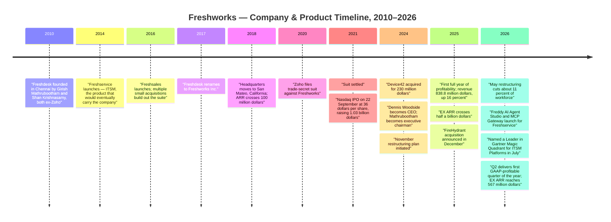

**Figure 1 — Company and product milestones, 2010–2026.** Rendered as a Mermaid timeline (renders natively on GitHub). No raster chart assets were generated in this pass — see [§65 Appendix](#65-appendix).

The timeline's most under-read entry is **2014**. Freshservice was a defensive side product built by a helpdesk company that noticed its ticketing engine also worked for internal IT. Twelve years later it is the majority of the business and the entire growth story. The product that got the company its name is now the slower half.

---

## 9. Vision & Mission

Freshworks' public positioning has moved three times, and tracking the movement is more instructive than any single statement.

| Era | Positioning | What it optimised for |
|---|---|---|
| 2010–2017 | "Customer engagement software that's easy to use" | Winning SMB helpdesk deals against Zendesk on price and simplicity |
| 2018–2024 | "Uncomplicated software for businesses of all sizes" | Suite credibility across CX and EX simultaneously |
| 2025–2026 | "The AI-powered, unified **service operations** platform… powerful governance and scale, without the operational drag of legacy platforms" | Displacing ServiceNow in the mid-market and agile enterprise |

The current sentence is a precision instrument. "Service operations" is ITSM vocabulary, not customer-support vocabulary. "Governance and scale" answers the objection an IT buyer raises when trading down from ServiceNow. "Operational drag of legacy platforms" names the competitor without naming it. Nothing in the current positioning statement is about customer service at all.

The durable strategic belief underneath all three eras is genuinely consistent, and it is the company's best asset: **enterprise-grade capability should not require enterprise-grade implementation cost.** Freshworks has always sold time-to-value against incumbents who sell configurability. That belief is what makes the ServiceNow displacement motion work, and it is also what makes moving upmarket dangerous — the further upmarket you go, the more the buyer wants configurability and the less your core differentiator matters.

**PM read:** a mission statement that has quietly dropped half your product portfolio from its scope is a strategy document, not a branding exercise. The CX business is being positioned out of the company's own mission before it is positioned out of the P&L.

---

## 10. Problem Statement

**The problem Freshworks originally solved.** Support software in 2010 came in two flavours: enterprise suites priced and implemented for companies with dedicated administrators, or nothing. A 30-person business with a support inbox had no credible option. Freshdesk offered a usable helpdesk that a non-specialist could configure in an afternoon, at a price a small business could approve without a committee. That was a real and large problem, and Freshworks solved it well enough to reach Nasdaq.

**The problem Freshworks solves today.** Mid-market and "agile enterprise" IT organisations are running service desks on platforms — ServiceNow above all — whose capability they use perhaps a third of and whose implementation and administration cost they resent entirely. Freshworks sells the trade: accept less configurability, get deployed in weeks instead of quarters, pay materially less. The Gartner ITSM Leader placement in July 2026 is evidence that this trade is now credible to the analyst community, which is the gate for the deals Freshworks wants.

**The problem this case study is actually about.** Both of those are demand-side problems, and Freshworks is executing on both. The unsolved problem is on the supply side of its own business model.

Freshworks' AI genuinely works. Its own customer evidence cites resolution rates up to 80%, with named references reporting 54% and 30% of queries handled by AI. Every one of those percentages is a customer-service ticket that no longer requires a human. Freshworks charges for customer service **per human agent per month**, and charges for the AI **per session attempted**. So the better Freddy gets at customer service:

1. the fewer agent seats the customer needs (the $29–$119/agent/month meter shrinks), and
2. the more sessions run — but a session is billed at $0.49 whether it resolved anything or not, so the customer experiences the second meter as an unverifiable cost rather than as value received.

In EX the same technology has the opposite effect, because the EX meter is not primarily the human. It is the **asset** — and assets multiply as a company grows, independent of how many humans service them. ESM compounds this by extending the service desk into HR, facilities and finance, which *adds* agent populations rather than removing them.

**The problem statement, precisely:** Freshworks' customer-experience business lacks a unit of value that grows when its AI succeeds. Until it has one, CX growth is capped by the arithmetic of its own price list, and no amount of product quality or competitive win-rate will change that. This is the analytical spine of the document and the sole justification for [§50](#50-feature-proposal).

---

## 11. Market Research

Freshworks competes in two markets that are usually researched separately, which is part of why the company is persistently mis-analysed as one thing.

**Market 1 — IT Service Management (where Freshworks is winning).**

| Vendor | Position | Notes |
|---|---|---|
| ServiceNow | Dominant enterprise incumbent | The reference platform; Freshworks' displacement target |
| Freshworks (Freshservice) | Leader, 2026 Gartner MQ for ITSM Platforms | Mid-market and "agile enterprise" positioning |
| Atlassian (Jira Service Management) | Strong, developer-adjacent | Wins where engineering owns the tool decision |
| Ivanti, BMC, Cherwell/Ivanti, SolarWinds | Legacy on-prem heritage | Actively being displaced across the category |
| Zoho (ManageEngine) | Price-led, broad IT portfolio | Structural price floor; see Day 34 |

**Market 2 — Customer Service / CX (where Freshworks is holding).**

| Vendor | Position | AI pricing unit |
|---|---|---|
| Zendesk | Category incumbent, mid-market to enterprise | ~$1.50 committed / ~$2.00 pay-as-you-go per **automated resolution** |
| Intercom | AI-native challenger, Fin | **$0.99 per resolution** |
| Salesforce (Service Cloud / Agentforce) | Enterprise incumbent | Flex Credits — ~$0.10 per standard action; ~$2 per conversation alternative |
| **Freshworks (Freshdesk Omni)** | Mid-market value player | **$0.49 per AI Agent session** |
| HubSpot Service Hub | SMB/mid-market, GTM-led | Bundled into hub pricing |
| Zoho Desk | Price floor | Bundled into Zoho One |

**The single most important row in this entire case study is the AI pricing column above.** Freshworks is the only vendor in that table pricing the *attempt* rather than the *outcome*. It is also the cheapest, which reads as a competitive advantage and is better understood as a valuation of the unit being sold: a session that may or may not have resolved anything is genuinely worth less than a verified resolution, and Freshworks has priced it accordingly — at roughly half of Intercom's resolution price and roughly a quarter of Zendesk's pay-as-you-go rate.

**Disclosed scale (Q2 2026).**

| Metric | Value | YoY |
|---|---|---|
| Customers > $5,000 ARR | 25,356 | +6% |
| Customers > $50,000 ARR | 4,091 | +18% |
| Customers > $100,000 ARR | 1,746 | +25% |
| Net dollar retention | 104% (105% cc) | down from 106% |

The shape of that table is a barbell, and it is tightening. The bottom of the market is nearly flat; the top is growing at four times the rate. A company whose brand is "uncomplicated software for growing businesses" is now getting essentially all of its growth from the segment least motivated by that promise.

Market-size estimates for ITSM and CX software vary widely across analyst firms and are scoped inconsistently (ITSM alone versus ITSM plus ITOM plus ITAM; CX software versus contact-centre platforms). This case study deliberately does not quote a single headline market figure as fact — see [§13](#13-tamsamsom) for why, and [§65 Appendix](#65-appendix) for the conflicts.

---

## 12. Industry Analysis

Four forces define service software in 2026.

**1. Pricing models are being rewritten faster than products are.** The industry spent 2024–2025 arguing about agent capability and spent 2026 arguing about the billing unit. Intercom's per-resolution model forced Zendesk to answer with its own outcome pricing; Salesforce went to consumption credits. This is the rare moment where the commercial model, not the model weights, is the competitive battleground — and it is exactly the battleground on which Freshworks is currently under-armed in CX and well-armed in EX.

**2. Deflection is no longer a selling point; verified resolution is.** Zendesk's 2026 framing — that the era of the chatbot and of deflection is over — matters beyond the marketing. Deflection metrics measure a ticket that did not reach a human, which is trivially gameable and correlates poorly with a customer whose problem was actually solved. The market is converging on a harder standard: a resolution the vendor is willing to be paid on. That standard requires instrumentation most vendors have not built.

**3. ITSM is consolidating into "service operations."** ITSM, ITAM, ITOM, incident management and discovery are merging into a single data estate, because AI agents need the CMDB, the asset graph and the incident history to act competently. Freshworks' acquisition sequence — Device42 for discovery in 2024, FireHydrant for incident management in 2025 — reads as a deliberate assembly of exactly that estate. This is the most strategically coherent thing the company has done in five years.

**4. AI is compressing the vendor's own cost base, visibly.** Freshworks attributed part of its May 2026 headcount reduction to changed product-development throughput from AI-assisted coding. When vendors start citing their own AI as a reason for smaller engineering organisations, the software industry's headcount-to-revenue ratio is being repriced in public.

**Centre of gravity:** the category is moving from "which platform holds your tickets" to "which platform can prove its agents resolved something." Proof is becoming the product. Vendors who can attest to outcomes will charge for outcomes; vendors who cannot will keep charging for seats and sessions, and will be structurally capped.

---

## 13. TAM/SAM/SOM

*(Framework selection rationale: TAM/SAM/SOM is used here with explicit scepticism. Freshworks spans two markets with incompatible analyst definitions and a wide spread of published estimates, so a single top-down dollar figure would create false precision. The useful exercise is bounding the **addressable account population by ARR band**, because Freshworks' disclosed metrics are themselves banded that way — which lets the sizing be built from disclosure rather than from analyst estimates.)*

| Layer | Definition | Estimate | Basis |
|---|---|---|---|
| TAM | Global spend on ITSM, ITAM, ITOM, incident management and customer-service software | **Not stated as a single figure.** Published analyst estimates for these categories vary widely and are scoped inconsistently | Third-party; conflicting — see [§65](#65-appendix) |
| SAM | Mid-market and agile-enterprise organisations that will trade configurability for time-to-value, in the geographies and languages Freshworks serves | **Not publicly disclosed.** Directionally bounded below by the ~74,000 businesses Freshworks cites as customers and above by the mid-market segment of both categories | Inferred from GTM posture |
| SOM | Accounts Freshworks currently converts and expands | 25,356 customers > $5k ARR; 4,091 > $50k; 1,746 > $100k; ~$961M total ARR (derived) | Disclosed, Q2 2026 |

**Honest read.** Only the SOM row is defensible, because only the SOM row is disclosed. A PM building a business case inside Freshworks would not work top-down from an analyst TAM; they would work from the banded customer counts, because those bands are how the company already steers. And read that way, the sizing question is not "how big is the market" but "why is the >$5k band growing 6% while the >$100k band grows 25%" — which is a segmentation and pricing question, not a market-size question.

Note also that the EX target management has committed to publicly — **more than $600 million EX ARR exiting 2026**, from $567 million in Q2 — is a far more useful sizing anchor than any TAM, because it is a number the company has agreed to be measured against.

---

## 14. Competitor Analysis

| Dimension | Freshworks | ServiceNow | Atlassian JSM | Zendesk | Intercom | Zoho |
|---|---|---|---|---|---|---|
| Primary battleground | ITSM mid-market + CX mid-market | Enterprise ITSM/platform | Dev-adjacent ITSM | CX mid-market → enterprise | AI-native CX | Price floor, both |
| Core strength | Time-to-value; deploys in weeks; unified EX+CX data | Configurability, enterprise trust, platform breadth | Developer workflow adjacency, Atlassian bundle | Category brand, CX depth | Fin resolution quality; AI-native architecture | Bundle price; owns own stack |
| AI posture | Freddy Copilot ($29/agent/mo) + Freddy AI Agent (session-priced) + Agent Studio + MCP Gateway | Now Assist across platform | Rovo | Outcome-priced AI agents | Fin, outcome-priced | Zia, self-hosted small models |
| **AI billing unit** | **Session ($0.49) and seat ($29)** | Platform/SKU | Bundled/seat | **Resolution (~$1.50–$2.00)** | **Resolution ($0.99)** | Bundled |
| Key weakness | CX growth ~6%; brand still reads "helpdesk" to IT buyers | Cost and implementation drag | Weak outside dev-centric orgs | Legacy architecture perception | Narrow scope beyond CX | Per-app depth; support consistency |
| Ownership | Public (FRSH) | Public | Public | Private (PE) | Private | Bootstrapped, private |

**Strategic insight — Freshworks' real competitive position is asymmetric and nobody scores it that way.** Against ServiceNow in EX, Freshworks has a genuine, structural, analyst-validated wedge: comparable outcomes at materially lower total cost of ownership and dramatically faster deployment. Q1 2026's first seven-figure EX ARR deal and repeatable competitive displacements say that wedge is real and scaling. Against Intercom and Zendesk in CX, Freshworks has no equivalent structural wedge — it has a price advantage on a unit that is worth less than the unit competitors sell.

**Where the asymmetry becomes a strategy problem.** A company with one winning fight and one holding action should either fund the winner and harvest the other — which is precisely what Freshworks is doing, and doing openly — or fix the loser's economics. Harvesting is defensible for a while. It becomes dangerous when the harvested business is 41% of ARR, carries the brand name, and shares an AI investment budget with the winner. Every dollar of Freddy engineering spent on CX currently returns less than the same dollar spent on EX, not because CX is a worse product but because CX's meter cannot capture the return. That is a fixable defect, and fixing it is cheaper than the alternative of watching 41% of ARR decay toward zero growth.

**Opportunity for differentiation.** Freshworks is the only vendor that owns both the employee-service and customer-service data estate in the same tenant with a unified data layer. Nobody else can natively answer "this customer-facing outage generated 4,000 support conversations and traces to this change record on this asset." That cross-half claim is genuinely unique, entirely unmonetised, and — notably — impossible to sell without exactly the resolution instrumentation proposed in [§50](#50-feature-proposal).

---

## 15. SWOT

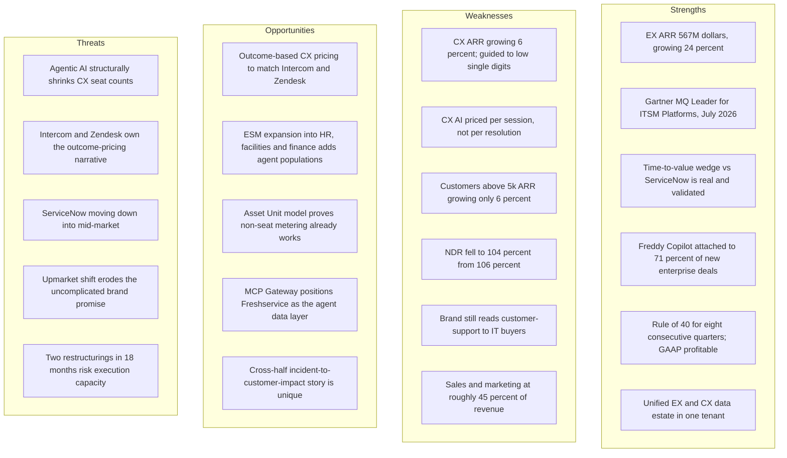

**Figure 2 — SWOT, rendered as a Mermaid flowchart.**

The cell that matters is **W2**, and it is worth being precise about why. W1, W3 and W4 are symptoms. T1 is the environmental force. W2 is the only entry on the board that is simultaneously the cause of several others and entirely within Freshworks' control. Competitors' pricing models (T2) and ServiceNow's roadmap (T3) are not things a Freshworks PM can change. The definition of a billable unit in Freshdesk Omni is.

---

## 16. Porter's Five Forces

*(Framework selection rationale: appropriate here because Freshworks' predicament is structural rather than feature-level — the question is whether its position in a value chain is defensible, and specifically whether buyer power and substitution differ between its two halves. A single competitor grid averages the two halves together and hides exactly the asymmetry this case study is about. Porter's is therefore run **twice**, once per half.)*

| Force | EX (Freshservice) | CX (Freshdesk Omni) |
|---|---|---|
| **Threat of new entrants** | **Low.** ITSM requires CMDB, discovery, asset graph, change management and compliance depth. Device42 and FireHydrant took acquisitions to assemble. An AI-native startup cannot shortcut a CMDB | **High.** An AI-native support agent is buildable by a small team; Intercom demonstrated the category can be re-entered credibly |
| **Buyer power** | **Medium.** Switching an ITSM platform is a multi-quarter project with change-management risk; buyers negotiate hard but rarely leave | **High.** Ticketing is comparatively portable, buyers are price-sensitive, and per-session AI billing invites line-item scrutiny at every renewal |
| **Supplier power** | **Medium.** Dependent on frontier model providers for Freddy's underlying capability and on cloud infrastructure — a genuine contrast with Zoho, which owns its models and data centres | **Medium.** Same dependency, with worse pass-through economics because CX's billable unit is cheap ($0.49) while inference is not free |
| **Threat of substitutes** | **Low–Medium.** The substitute for ITSM is unmanaged IT, which enterprises cannot accept; ESM has no real substitute other than email and spreadsheets | **High.** The substitute for a support platform is increasingly an AI agent sitting on the company's own knowledge base, bought from anyone |
| **Competitive rivalry** | **High but winnable.** ServiceNow is beatable on TCO and speed in the mid-market; the Gartner Leader placement is the proof point | **High and structurally harder.** Zendesk owns the category brand, Intercom owns the AI-native narrative, Zoho owns the price floor |

**Net.** Run separately, the two halves score almost inversely. EX sits in a structurally attractive position — high barriers, sticky buyers, weak substitutes — and Freshworks is executing well there. CX sits in a structurally hostile one — low barriers, portable buyers, strong substitutes — and Freshworks' pricing model makes the buyer-power row worse than it needs to be.

The instructive part is that this is not a story about a good business and a bad one. It is a story about the same product organisation, the same AI, and the same brand producing 24% growth on one side of the house and 6% on the other, because the five forces point in opposite directions and the pricing model reinforces rather than resists them.

---

## 17. Business Model Canvas

| Block | Freshworks |
|---|---|
| **Key Partners** | Implementation and MSP partners; Freshworks Marketplace developers; frontier model providers underpinning Freddy; cloud infrastructure providers; ISV integrations (Slack, Microsoft Teams, Jira, Shopify, Stripe, HubSpot); Gartner and G2 as validation channels |
| **Key Activities** | Product development across ITSM/ITAM/ITOM/CX; Freddy AI development and agent tuning; acquisition and integration (Device42, FireHydrant); enterprise sales motion build-out; migration of the CX base to Freshdesk Omni |
| **Key Resources** | Unified EX+CX data layer; CMDB and asset graph; Device42 discovery IP; FireHydrant incident IP; ~25,000 paying customers > $5k ARR; $665.3M cash and securities; Gartner Leader placement |
| **Value Propositions** | (1) Enterprise-grade service management deployed in weeks, not quarters. (2) Materially lower TCO than legacy ITSM platforms. (3) AI that ships ready to use rather than requiring a data-science project. (4) One vendor across employee and customer service |
| **Customer Relationships** | Self-serve trial at the bottom; increasingly high-touch enterprise sales at the top; free AI onboarding as a stated differentiator; partner-led for MSPs |
| **Channels** | Direct self-serve; direct enterprise sales (reorganised globally in March 2026); MSP and implementation partners; Marketplace; analyst validation; SEO and content |
| **Customer Segments** | Mid-market IT organisations (core growth); agile enterprise IT (upmarket push); SMB support teams (legacy core, now flat); MSPs; HR/facilities/finance via ESM |
| **Cost Structure** | Sales and marketing ~45% of revenue (Q2 2026: $106.5M of $237.4M) — the dominant line; R&D ~18% ($43.8M); G&A ~16% ($37.9M); cost of revenue ~15%, giving ~85% gross margin; inference costs embedded in COGS and rising |
| **Revenue Streams** | Per-agent subscriptions (both halves); Asset Units for ITAM; AI Agent sessions for CX; Freddy AI Copilot per-agent add-on; day passes; connector app tasks; Device42 and FireHydrant licences |

**The canvas's punchline.** Look at Cost Structure against Revenue Streams. Sales and marketing consumes roughly 45 cents of every revenue dollar — more than twice R&D. That is the cost structure of a company whose growth is bought through go-to-market, not one whose growth compounds through the product. Compare with the Revenue Streams row: of six listed streams, exactly one (Asset Units) grows automatically as the customer grows. Everything else requires either a new human seat or a new sale.

A business model where only one revenue stream expands without salesperson effort, and where salesperson effort costs 45% of revenue, will always feel expensive to grow. That is not a sales-execution problem. It is a metering problem, and it is the canvas-level statement of this case study's thesis.

---

## 18. Revenue Model

Freshworks monetises through per-agent subscriptions, with non-seat units layered on differently in each half.

**Freshservice (EX) pricing — 2026**

| Plan | Price (annual billing) | Notable inclusions |
|---|---|---|
| Starter | **$19 / agent / month** | Incident, knowledge, task management, support portal |
| Growth | **$49 / agent / month** | Service catalogue, SLA, on-call, cloud management |
| Pro | **$99 / agent / month** | Problem, change, major incident, release, workload management, employee journeys |
| Enterprise | Custom | Sandbox, audit logs, Freddy AI Agent (Classic), Freddy AI Insights, **Freddy AI included** |
| Freddy AI Copilot | **+$29 / agent / month** | Add-on on Growth, Pro and Enterprise |
| **Asset Units** | **Sold in packs of 500** | ITAM licensing metric — measures number and type of assets in the CMDB |

**Freshdesk Omni (CX) pricing — 2026**

| Plan | Price (annual billing) | Notable inclusions |
|---|---|---|
| Growth | **$29 / agent / month** | Freddy AI Agent (first 500 sessions included), omnichannel, portal, KB |
| Pro | **$79 / agent / month** | Multilingual, advanced analytics, intelligent routing, external collaborators |
| Enterprise | **$119 / agent / month** | Freddy AI Insights, skill-based routing, custom objects, sandbox, audit logs |
| Freddy AI Copilot | **+$29 / agent / month** | Add-on on Pro and Enterprise |
| **Additional AI Agent sessions** | **$49 / 100 sessions ($0.49 each)** | The CX non-seat unit |
| Day passes | $5 / $10 / $15 per pass by tier | Occasional-agent flexibility |
| Connector app tasks | $80 / 5,000 tasks | Integration automation |

**Read those two tables side by side. This is the case study in two price lists.**

Both halves have a per-seat base. Both halves have the same $29 Copilot add-on. The difference is the non-seat unit:

- **EX's non-seat unit is the Asset Unit.** A customer's asset count rises when they hire, open an office, buy laptops, spin up cloud instances or acquire a company. It rises without Freshworks selling anything and without the customer resenting it, because assets are evidence of the customer's own growth. Freshworks' revenue is indexed to the customer's expansion.
- **CX's non-seat unit is the AI Agent session.** A session fires when a customer-service conversation is routed to Freddy. It is billed at $0.49 regardless of whether the conversation was resolved. The buyer's rational response is to minimise sessions, or at minimum to interrogate them at renewal. Freshworks' revenue is indexed to a number the customer is actively trying to reduce.

**Disclosed financials**

| Metric | FY2025 | FY2024 | Change |
|---|---|---|---|
| Revenue | $838.8M | $720.4M | +16% |
| GAAP income (loss) from operations | $13.2M (1.6% margin) | $(138.6)M (−19.2%) | First GAAP operating profit |
| Non-GAAP income from operations | $178.0M (21.2%) | $99.1M (13.8%) | +80% |
| GAAP diluted EPS | $0.63 | $(0.32) | — |
| Adjusted free cash flow | $223.1M (26.6% margin) | $153.3M (21.3%) | +46% |

| Metric | Q2 2026 | Q2 2025 |
|---|---|---|
| Revenue | $237.4M (+16%; +15% cc) | $204.7M |
| GAAP income from operations | $6.1M (2.6%) | $(8.7)M (−4.2%) |
| GAAP net income | $3.2M (EPS $0.01) | $(1.7)M |
| Non-GAAP income from operations | $55.9M (23.6%) | $44.8M (21.9%) |
| Non-GAAP diluted EPS | $0.17 | $0.18 |
| Adjusted free cash flow | $57.7M (24.3%) | $54.3M (26.5%) |
| Cash, equivalents and securities | $665.3M | — |
| Diluted weighted-average shares | 273.0M | 294.4M |

**Segment ARR (from earnings commentary, not the press release — see [§65](#65-appendix))**

| Segment | Q1 2026 | Q2 2026 | Growth |
|---|---|---|---|
| EX ARR | > $540M | **$567M** | +27% (Q1, as reported) / +24% (Q2, constant currency) |
| CX ARR | > $395M | ~$394M (derived) | +6% (Q1); guided to low single digits for FY2026 |
| Total ARR | ~$935M (derived) | ~$961M (derived) | — |

**Two observations a PM should not skip.**

First, **non-GAAP EPS fell from $0.18 to $0.17 despite a 7% reduction in share count and a $11.1M increase in non-GAAP operating income.** The gap is explained by lower interest income as cash was deployed into buybacks and FireHydrant, plus a new 24% projected non-GAAP tax rate adopted from January 2026. Per-share progress is being manufactured by the balance sheet faster than it is being earned by the P&L — which is a legitimate capital-allocation choice and a poor substitute for growth.

Second, **the FY2025 total ARR figure is genuinely disputed.** Secondary sources report both $907 million (+18%) and $917 million (+17.5%); neither appears in the Freshworks press release, which does not disclose total ARR. Both are carried in this case study rather than averaged. See [§65 Appendix](#65-appendix).

---

## 19. Target Users

- **IT service desk managers (mid-market, 200–5,000 employees)** — the core EX buyer and the centre of gravity of the entire company. Owns ticket volume, SLA attainment and the service catalogue. Usually inherited a legacy platform and resents its administration cost.
- **IT directors and CIOs at agile enterprises** — the upmarket buyer driving the >$100k ARR band. Evaluating whether Freshworks can replace ServiceNow without a governance downgrade.
- **IT asset and infrastructure managers** — the Device42 and ITAM buyer. Notably, this user's value to Freshworks is metered in Asset Units rather than seats, making them the most economically favourable user in the portfolio.
- **SRE and incident commanders** — the FireHydrant buyer; new to Freshworks as of 2026 and not yet a proven expansion motion.
- **HR, facilities and finance operations leads** — the ESM buyer. Strategically critical because each new department onboarded adds agent seats rather than removing them; ESM is the reason AI does not deflate the EX meter.
- **Customer support managers (SMB to mid-market)** — the historic core user. Still the largest user population by headcount, in the slowest-growing half.
- **Support agents** — the daily user of Freshdesk Omni and the Copilot; the person whose productivity Freshworks monetises at $29/month and whose headcount Freshworks' own AI reduces.
- **MSP operators** — a distinct segment served by Freshservice MSP mode; multi-tenant needs, high price sensitivity.
- **AI agents as a user class (2026)** — with MCP Gateway, third-party agents now read and act on Freshservice data. A non-human actor with its own permissions and audit requirements, and the first user class Freshworks does not directly bill for.

---

## 20. Personas

**Persona 1 — "Ravi, the Displacer"**
IT Service Delivery Manager at a 2,800-person logistics firm running a legacy ITSM platform. Five years into a contract he did not sign, paying for modules nobody enabled, waiting six weeks for a form change from an external consultant. Renewal in nine months.
*Goals:* cut platform spend 40%; go live before the renewal date; not be blamed if it goes wrong.
*Frustrations:* every vendor demo looks identical; he has been told "fast to deploy" before; his CIO will ask about governance and audit, not about UI.
*What he'd say:* "I don't need a better service desk. I need to survive the migration and still have a job."
*Why he matters:* Ravi is the deal Freshworks wins. The Gartner Leader placement exists to get Freshworks into Ravi's shortlist; the TCO story closes him.

**Persona 2 — "Nadia, the Support Director Under Orders"**
Director of Customer Support at a 600-person e-commerce company. The CFO has read that AI resolves 80% of tickets and has asked why the support team still has 40 people.
*Goals:* deploy AI resolution without a CSAT collapse; show a defensible number to the CFO within one quarter.
*Frustrations:* the AI dashboard shows sessions and containment, not resolutions; she cannot prove whether a "contained" conversation actually helped anyone or just failed silently; she is being billed per session for conversations she cannot verify.
*What she'd say:* "I'm paying by the attempt and getting asked about the outcome. I can't defend that in a budget meeting."
*Why she matters:* Nadia is the persona [§50](#50-feature-proposal) is built for, and her problem is Freshworks' revenue problem seen from the buyer's chair.

**Persona 3 — "Tom, the Asset Manager"**
IT Asset Manager at a 4,000-person manufacturer, mid-rollout of Device42 discovery.
*Goals:* one accurate inventory; know what is on the network before the auditors do; map dependencies before the next migration.
*Frustrations:* discovery finds assets faster than his team can classify them; every acquisition resets the estate.
*What he'd say:* "I found 1,400 devices nobody knew about. That's the good news and the bad news."
*Why he matters:* Tom is the economically ideal Freshworks customer. His success — finding more assets — automatically increases what Freshworks bills, and he does not experience that as a penalty. He is the living proof that non-seat metering works when the unit is right.

**Persona 4 — "Priya, the ESM Sponsor"**
VP of HR Operations at a 3,000-person company whose IT team already runs Freshservice and whose HR team runs on email and a shared inbox.
*Goals:* onboarding requests that do not get lost; a service catalogue for HR; no new vendor procurement.
*Frustrations:* IT's tool is configured in IT's language; she needs HR workflows, not incident management.
*What she'd say:* "If it's already bought and IT will help me set it up, I'll take it this quarter."
*Why she matters:* Priya is the expansion motion that makes EX immune to the AI-deflation problem. Every Priya adds agent seats in a new department faster than automation removes them elsewhere.

---

## 21. JTBD

| When… | I want to… | So I can… | Current alternative |
|---|---|---|---|
| My legacy ITSM renewal is nine months out and over budget | migrate to a platform that deploys in weeks without a governance downgrade | cut spend without owning a failed migration | Renegotiate; absorb the increase |
| My CFO has read that AI resolves 80% of tickets | prove what our AI actually resolved, not what it attempted | defend my headcount with evidence instead of adjectives | Manual audit of a ticket sample |
| I'm paying per AI session | know which sessions were worth paying for | stop funding failed containment | Argue the line item at renewal |
| Discovery just found 1,400 unknown devices | classify and map them before the audit | pass the audit and plan the migration | Spreadsheets and tribal knowledge |
| HR runs on a shared inbox and IT already has a service desk | extend the existing platform to my department | get a service catalogue this quarter without procurement | Buy a separate HR tool |
| A customer-facing outage just generated 4,000 conversations | trace the support spike to the change that caused it | fix the cause, not the tickets | Two teams comparing timestamps manually |

**The unmet job, stated plainly:** rows two and three. They are the same job — *prove the AI worked* — seen from the buyer's side and the biller's side. Freshworks currently serves neither. Row six is the unique cross-half job only Freshworks could serve, and it depends on the same instrumentation. Three jobs, one missing capability. That convergence is what [§46](#46-opportunity-mapping) formalises and [§50](#50-feature-proposal) builds.

---

## 22. User Journey

**Journey: Nadia (Persona 2) deploys Freddy AI Agent in Freshdesk Omni**

| Stage | What she does | Thinking | Feeling | Friction | Opportunity |
|---|---|---|---|---|---|
| Mandate | CFO asks why support headcount hasn't fallen | "I need a number by next quarter" | Pressured | — | — |
| Evaluate | Compares Freshdesk, Zendesk, Intercom | "Freshworks is half the price per unit" | Interested | Unit isn't comparable — session vs resolution | Make the unit comparison explicit and honest |
| Purchase | Buys Pro; 500 sessions included | "Included sessions, good" | Confident | — | — |
| Deploy | Free AI onboarding; agent live in days | "That was genuinely fast" | Impressed | 🟢 Real strength | Preserve this |
| First results | Dashboard shows sessions and containment rate | "Containment isn't resolution" | Uncertain | 🔴 The metric doesn't answer her question | Report verified resolutions |
| Overage | Crosses 500 sessions; billed $49 per 100 | "I'm paying for attempts" | Irritated | 🔴 Cost rises, value unproven | Bill on verified outcomes only |
| CFO review | Presents containment %; CFO asks "did customers get helped?" | "I can't answer that" | Exposed | 🔴 **Highest-stakes moment in the journey** | Give her a defensible ledger |
| Retrench | Narrows AI to safe intents to control cost and risk | "Better small and defensible" | Resigned | 🔴 Deployment stalls below potential | Expansion lost here |
| Renewal | Negotiates session volume down | "Prove it or reduce it" | Adversarial | 🔴 NDR pressure | Convert to outcome pricing |

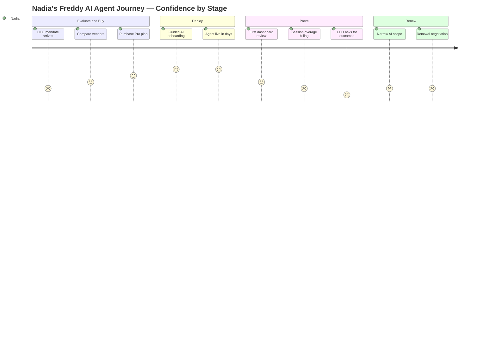

**Figure 3 — Confidence collapses at the point of proof, not the point of deployment.** Freshworks' onboarding is a genuine strength; the product gets live fast and works. The failure is downstream: the customer cannot demonstrate what they bought. Note the shape against the Zoho journey in Day 34, where the dip was at *onboarding*. Here onboarding is excellent and the dip is at *accountability* — a harder problem, because it cannot be fixed with better tutorials.

---

## 23. User Flow

**Current flow — an AI-handled customer conversation in Freshdesk Omni**

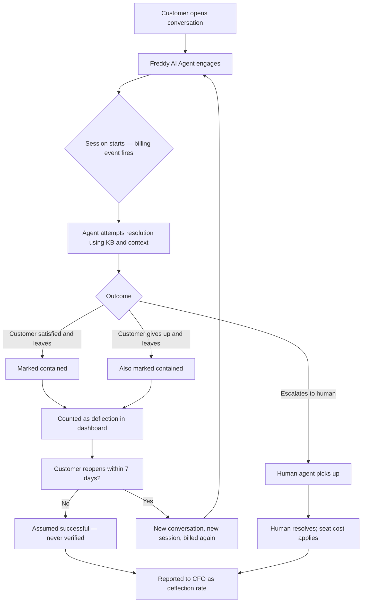

**Three structural problems visible in this flow, all of them commercial rather than cosmetic:**

1. **The billing event fires at node C, before any value is created.** Freshworks is paid at the moment of attempt. Every competitor pricing on resolution is paid at node F or M. This is not a pricing preference; it is a different position in the value chain.
2. **Nodes F and G are indistinguishable in the data, and they are opposites.** A customer whose problem was solved and a customer who gave up in frustration both exit the same way and both count as containment. This single collapsed distinction is why Nadia cannot answer her CFO, and it is why a "deflection rate" is not a defensible business metric.
3. **Node L is billed twice and counted as two successes.** A customer who returns within a week because the first resolution failed generates a second session, a second charge, and — because each session is scored independently — no negative signal anywhere in the reporting. The system's incentives and the customer's interests actively diverge at this node.

A flow diagram that shows the vendor being paid before value is delivered, unable to distinguish success from failure, and rewarded for failure recurrence is not a UX problem. It is a business-model diagram, and it is the strongest single argument in this document for [§50](#50-feature-proposal).

---

## 24. Information Architecture

```
Freshworks Tenant
│
├── Freshservice (EX)
│   ├── Tickets / Incidents
│   ├── Problems, Changes, Releases
│   ├── Service Catalogue ← the ESM expansion surface
│   ├── ITAM
│   │   ├── Assets (CMDB) ← metered in Asset Units ✅
│   │   └── Discovery (Device42)
│   ├── ITOM — alerts, orchestration
│   ├── Incident Management (FireHydrant)
│   ├── Freddy AI Agent Studio ← EX-only ⚠
│   └── MCP Gateway ← EX-only ⚠
│
├── Freshdesk Omni (CX)
│   ├── Command Center
│   ├── Tickets / Conversations
│   ├── Channels — email, chat, voice, social
│   ├── Knowledge Base
│   ├── Freddy AI Agent ← metered in sessions ⚠
│   └── Analytics — containment and deflection reporting ⚠ no resolution object
│
├── Freshsales / Freshmarketer (CRM)
│
├── Freddy AI (cross-cutting)
│   ├── Copilot — per agent seat
│   ├── Insights
│   └── Agent Studio ⚠ EX only
│
├── Unified Data Layer ← the genuine architectural asset ✅
│
└── Admin — users, roles, security, audit, Marketplace
```

**IA critique**

| Observation | Assessment |
|---|---|
| Unified data layer across EX and CX in one tenant | ✅ Genuinely differentiated; no competitor has both estates natively |
| Asset is a first-class, countable, billable object in EX | ✅ The architectural reason EX monetisation compounds |
| **There is no first-class `Resolution` object anywhere in CX** | ❌ **The central architectural gap.** CX has sessions, conversations and tickets — all inputs. It has no persistent object representing "a customer's problem was verifiably solved" |
| Agent Studio and MCP Gateway are Freshservice-only | ⚠ The most advanced agentic tooling is unavailable in the half that most needs new value |
| Analytics reports containment and deflection | ⚠ Reports what did not happen (no human touched it) rather than what did |
| Cross-half joins (incident → customer impact) not surfaced as an entity | ⚠ The unique cross-estate story has no object to hang on |

**The single highest-leverage IA change: make `Resolution` a first-class object in the CX data model.**

Compare the two halves as data models. EX has an entity — the Asset — that is discovered, counted, classified, persisted, audited and billed. That entity is why ITAM revenue expands automatically. CX has no equivalent. It has *events* (sessions) and *containers* (tickets), but nothing that represents the unit of value the customer actually buys.

Introducing a verified `Resolution` entity would simultaneously: give Nadia the metric she needs (§22), give analytics something meaningful to report (§32), give the commercial model a unit worth more than $0.49 (§39), give the cross-half incident-to-impact story an object to join on (§21, row six), and align Freshworks with where Intercom and Zendesk have already moved (§11). Five problems, one entity. Everything in [§50](#50-feature-proposal) is downstream of this paragraph.

---

## 25. UX Audit

**Heuristic evaluation (Nielsen's 10) — assessed at the Freshworks suite level**

| # | Heuristic | Rating | Notes |
|---|---|---|---|
| 1 | Visibility of system status | 🟢 4/5 | Strong in-product; ticket and workflow states are clear. Weak specifically for AI outcome state |
| 2 | Match with the real world | 🟡 3/5 | Good in EX where ITIL vocabulary matches the buyer's. Weaker in CX AI reporting, where "containment" and "deflection" are vendor concepts, not customer concepts |
| 3 | User control and freedom | 🟢 4/5 | Configurable without being overwhelming; the core "uncomplicated" promise holds |
| 4 | Consistency and standards | 🟡 3/5 | Improving via the Omni replatform (>80% of the CX base migrated), but EX and CX still feel like adjacent products rather than one platform |
| 5 | Error prevention | 🟡 3/5 | Adequate operationally. Poor at the commercial layer — nothing warns a customer that session spend is accruing against unverified outcomes |
| 6 | Recognition over recall | 🟢 4/5 | Genuine strength; the reason "fast to deploy" is credible |
| 7 | Flexibility & efficiency | 🟢 4/5 | Good for both novice and expert; day passes and occasional agents are thoughtful touches |
| 8 | Aesthetic & minimalist design | 🟢 4/5 | Clean and modern; Command Center is a real improvement |
| 9 | Help users recover from errors | 🔴 2/5 | **Weakest dimension.** When Freddy fails a conversation, there is no recovery path, no failure taxonomy, and no signal to the admin that a class of intent is failing |
| 10 | Help and documentation | 🟢 4/5 | Strong, plus free AI onboarding as a differentiator |

**Composite: 3.5 / 5** — materially better than most enterprise service software, and the score is honest: Freshworks builds good products. This is not a company with a usability problem.

**The decisive finding.** The two lowest scores — #9 (error recovery) and #5 (error prevention) — are both about **AI failure**, and both are invisible in the current product. Freshworks has designed a good experience for the AI succeeding and effectively no experience for the AI failing. Since the customer's entire commercial anxiety lives in the failure case, the product is strongest exactly where the buyer is least worried and absent exactly where they are most worried.

**Cognitive load by surface**

| Surface | Load | Comment |
|---|---|---|
| Freshservice service desk | 🟢 Low | Best-in-class for the category |
| Freshdesk Command Center | 🟢 Low–Medium | The Omni replatform delivered here |
| ITAM / CMDB | 🟡 Medium | Inherent domain complexity, handled reasonably |
| Freddy AI configuration | 🟡 Medium | Guided onboarding offsets real complexity |
| **AI performance reporting** | 🔴 **High** | Not because it is dense, but because it is *ambiguous* — the user must mentally translate containment into a business claim they cannot actually support |

---

## 26. UI Audit

| Dimension | Assessment |
|---|---|
| Visual hierarchy | Clear and modern. Command Center correctly prioritises the queue and the conversation |
| Consistency across products | Improving but incomplete. Freshservice and Freshdesk Omni share a design language without sharing a design system; EX has advanced further |
| Typography and density | Well judged — lighter than ServiceNow, denser than Intercom. Appropriate for daily operational use |
| Iconography | Conventional and learnable; Freddy's AI marker is consistently applied, which matters for trust |
| Colour | Used semantically for state in ticket views; less disciplined in analytics, where AI metrics are not visually distinguished from operational ones |
| Data visualisation | The weak spot. Containment and deflection charts are visually confident about a number that is epistemically weak — the design communicates more certainty than the metric earns |
| Empty states | Good in EX; the Agent Studio onboarding is well designed |
| Trust signals | Under-weighted for AI. When Freddy answers, the UI does not consistently show confidence, source or verification status |

**Recommendations**

1. **Design the AI failure state as a first-class screen.** Every AI product needs a designed answer to "it got this wrong." Freshworks currently has none, and the absence is the #9 heuristic score in [§25](#25-ux-audit).
2. **Stop visualising containment as a success metric.** A confident donut chart around an unverifiable number is a design decision that transfers epistemic risk onto the customer. Replace with verified resolutions, with unverified sessions shown explicitly as a separate, honest bucket.
3. **Show source and confidence on every AI response.** Both an accuracy aid and a trust asset, and a prerequisite for anyone paying on outcomes.
4. **Unify the design system across EX and CX properly.** The unified data layer is a real asset; the interface should make the single platform legible, particularly for cross-half stories.

---

## 27. Accessibility

Assessed against WCAG 2.1 AA principles. This is a heuristic assessment of publicly observable surfaces plus a review of Freshworks' published accessibility posture — **not an instrumented audit**, and it should not be cited as one.

| Principle | Assessment | Notes |
|---|---|---|
| Perceivable | 🟡 Partial | Contrast generally adequate in core ticket views; analytics dashboards and status colour-coding are the recurring risk area, particularly where colour alone carries meaning |
| Operable | 🟢 Reasonable | Keyboard navigation supported in primary agent workflows — important because support agents are high-volume keyboard users and this is a genuine efficiency requirement, not only a compliance one |
| Understandable | 🟡 Partial | EX terminology follows ITIL conventions the buyer already knows. CX AI terminology ("containment," "deflection," "sessions") is vendor-invented and imposes a translation burden — a cognitive accessibility issue with direct commercial consequences |
| Robust | 🟢 Reasonable | Standards-based web stack; assistive-technology compatibility generally sound in core products |

**What Freshworks does well.** It maintains a public accessibility page and treats accessibility as a procurement-relevant commitment, which matters for public-sector and large-enterprise deals. Keyboard efficiency in agent workflows is well handled because it doubles as a productivity feature — a useful example of accessibility and core product value pointing the same direction.

**What limits the assessment.** Freshworks does not publish per-product VPAT/ACR documentation as visibly as some peers do (Zoho, by contrast, publishes per-product conformance reports — see Day 34). Without published conformance reports, an external assessment cannot verify claims at the level a procurement team would require, and this case study does not assert conformance either way.

**Highest-priority accessibility gap: AI output.** When Freddy generates a response, three questions matter for accessibility and are currently under-served — is the AI-generated content announced as such to a screen reader, is the confidence or source information available non-visually, and can a user with a cognitive disability tell whether the answer they received is reliable? As AI-generated content becomes the majority of what the interface displays, "is this machine-generated and how sure is it" becomes an accessibility requirement, not just a trust feature. This is an emerging standard across the industry and no vendor has fully solved it.

---

## 28. Feature Breakdown

| Cluster | Representative capabilities | PM assessment |
|---|---|---|
| **ITSM core** | Incident, problem, change, release, service catalogue, SLA, on-call, workload management, XLAs | ✅ Deep, mature, Gartner-validated. The strongest asset in the company |
| **ITAM** | Asset inventory, CMDB, contract and licence management, discovery | ✅ Strategically the most valuable cluster — the only one metered on a unit that grows by itself |
| **Discovery (Device42)** | Infrastructure discovery, dependency mapping, cloud and on-prem visibility | ✅ Well-integrated; surpassed $40M ARR in Q4 2025 |
| **ITOM** | Alert management, orchestration, monitoring integrations | 🟡 Competent; less differentiated than ITSM |
| **Incident management (FireHydrant)** | AI-native incident response, ServiceOps | 🟢 New (2026); strategically correct, commercially unproven |
| **ESM** | Service management for HR, facilities, finance, legal | ✅ Surpassed $40M ARR in Q4 2025. The growth engine that makes EX AI-proof — new departments add seats |
| **CX ticketing** | Freshdesk Omni, Command Center, omnichannel, threads and tasks, collaborators | ✅ Genuinely good product; >80% of the CX base migrated to Omni, new Omni customers show ~2.5× higher ARPA |
| **CX messaging** | Freshchat, BYOC, BYOT | 🟡 Solid; commoditising fast |
| **CRM** | Freshsales, Freshsales Suite, Freshmarketer | 🟡 The least strategically coherent part of the portfolio; competes against HubSpot and Zoho without a clear wedge |
| **Freddy AI** | Copilot, AI Agent, Insights, Agent Studio, MCP Gateway | 🟢 Fast-moving; see [§29](#29-ai-capabilities) |
| **Platform** | Unified data layer, Marketplace, APIs, roles and audit | ✅ The under-appreciated asset; unified EX+CX data is unmatched |

**Where the portfolio is strongest:** anything where the asset graph is the value — ITAM, discovery, dependency mapping, and increasingly agentic ITSM that needs the CMDB to act. Competitors either lack the asset estate or charge enterprise prices for it.

**Where it is weakest:** CRM, which exists for historical reasons rather than strategic ones, and CX AI reporting, which is the one place the product actively under-serves a question the customer is being asked by their own CFO.

**The revealing gap:** Freddy AI Agent Studio and MCP Gateway — the two most advanced agentic capabilities Freshworks shipped in 2026 — are both **Freshservice-only**. The company is allocating its best AI engineering to the half that can monetise it. That is rational capital allocation and a self-reinforcing loop: CX gets less AI investment because CX monetises AI poorly, which ensures CX continues to monetise AI poorly.

---

## 29. AI Capabilities

Freddy AI is genuinely deployed, genuinely adopted, and — this is the important part — **adopted asymmetrically in exactly the pattern the pricing model predicts.**

**The three Freddy SKUs and what each one actually sells**

| SKU | What it does to work | Pricing unit | Economic direction |
|---|---|---|---|
| **Freddy AI Copilot** | Makes a human agent faster — summarises, drafts, suggests next steps, prioritises | **$29 / agent / month** | **Revenue rises with agent count.** Requires humans to exist |
| **Freddy AI Agent** | Resolves autonomously without a human | **$0.49 / session** (500 included) | **Reduces agent count** while adding a low-value meter |
| **Freddy AI Insights** | Trend and root-cause analysis | Bundled at Enterprise | Neutral; increases stickiness |

**Adoption data (disclosed, Q4 2025 – Q2 2026)**

| Metric | Value | Period |
|---|---|---|
| Freddy AI ARR | Surpassed $25M | Q4 2025 |
| Customers paying for an AI SKU | More than 7,000 | Q2 2026 |
| Copilot attach on new enterprise deals | **Over 71%** | Q2 2026 |
| Copilot attach on new deals > $30k ARR | Above 65% → over 70% | Q1 → Q2 2026 |
| Copilot customer growth | Over 80% YoY | Q1 2026 |
| AI penetration within EX | Over 20%, nearly doubled YoY | Q1 2026 |
| New EX customers attaching Copilot | About one third | Q1 2026 |
| AI Agent Studio early-access customers | More than 1,000 | Q2 2026 |

**Read that table against the SKU table above it.** Every headline adoption number Freshworks reports is a **Copilot** number — the per-seat augmentation product. The company does not report attach, penetration or growth for **Freddy AI Agent**, the autonomous product, in comparable terms. That is not necessarily concealment; it is what a company reports when one SKU is compounding and the other is not.

And Copilot compounding makes complete sense. At $29 per agent per month on top of a $79 Freshdesk Omni Pro seat or a $99 Freshservice Pro seat, Copilot is a 29–37% ARPA uplift that requires no new billing infrastructure, no outcome definition, and no argument with the customer about what counts. It is the easiest AI money in enterprise software. It is also, structurally, a bet that human agents continue to exist.

**The strategic bet, stated precisely.** Freshworks has bet on **augmentation over automation** as its monetisation path. Competitors have bet the other way: Intercom charges $0.99 when Fin resolves something and nothing when it does not; Zendesk charges roughly $1.50–$2.00 per automated resolution. Those vendors make more money the *less* human labour is required. Freshworks makes more money the *more* human labour is required, plus a small unverified toll on the attempts.

**Why the bet is defensible in EX.** In employee experience, augmentation is the right bet, because ESM expansion adds service desks in HR, facilities and finance faster than automation removes agents from IT. The seat base is growing for reasons unrelated to AI. Copilot rides that growth. This is why EX grows 24% with a per-seat AI product and no contradiction.

**Why the same bet is fragile in CX.** In customer experience there is no ESM equivalent. There is no new department to onboard. The agent population is a pure function of ticket volume divided by agent productivity — and Freddy is explicitly sold on improving that productivity, with Freshworks' own marketing citing resolution rates up to 80% and named customers reporting 54% and 30% of queries handled by AI. Freshworks is selling, effectively and honestly, a product that shrinks its own CX meter, and the compensating meter it built charges $0.49 for an attempt.

**What Freshworks is doing right.** Guided AI adoption and free AI onboarding are real differentiators against vendors who ship an agent and a documentation link. The MCP Gateway is strategically astute — positioning Freshservice as the data and action layer that *other* companies' agents call into is a genuinely forward bet on an agent-mediated future, and it is the one initiative in the portfolio that would still matter if traditional UIs disappeared entirely.

**What it is missing.** A resolution. Not the capability — Freddy resolves things. The *object*, the *definition*, the *verification*, and therefore the *price*. That is the gap [§50](#50-feature-proposal) fills.

---

## 30. Product Metrics

**Disclosed metrics** — Freshworks is a public company, so the disclosure quality here is far higher than in most case studies in this series. Confidence grades reflect whether a figure comes from the press release (High), from earnings commentary and analyst coverage (Medium), or is derived by the author (marked).

| Metric | Value | Period | Confidence |
|---|---|---|---|
| Revenue | $237.4M (+16%; +15% cc) | Q2 2026 | 🟢 High |
| Revenue | $838.8M (+16%) | FY2025 | 🟢 High |
| GAAP income from operations | $6.1M (2.6% margin) | Q2 2026 | 🟢 High |
| GAAP net income | $3.2M (EPS $0.01) | Q2 2026 | 🟢 High |
| Non-GAAP income from operations | $55.9M (23.6%) | Q2 2026 | 🟢 High |
| Adjusted free cash flow | $57.7M (24.3%) | Q2 2026 | 🟢 High |
| Adjusted free cash flow | $223.1M (26.6%) | FY2025 | 🟢 High |
| Customers > $5,000 ARR | 25,356 (+6%) | Q2 2026 | 🟢 High |
| Customers > $50,000 ARR | 4,091 (+18%) | Q2 2026 | 🟢 High |
| Customers > $100,000 ARR | 1,746 (+25%) | Q2 2026 | 🟢 High |
| Net dollar retention | 104% (105% cc) | Q2 2026 | 🟢 High |
| Cash and marketable securities | $665.3M | Q2 2026 | 🟢 High |
| EX ARR | $567M (+24% cc), ~59% of total | Q2 2026 | 🟡 Medium — earnings commentary |
| CX ARR | > $395M (+6%) | Q1 2026 | 🟡 Medium — earnings commentary |
| Total ARR | ~$961M | Q2 2026 | 🟠 **Derived** by author from EX ARR ÷ 59% |
| CX ARR | ~$394M | Q2 2026 | 🟠 **Derived** by author (total − EX) |
| Total ARR FY2025 | **$907M (+18%) or $917M (+17.5%)** | FY2025 | 🔴 **Conflicting** — see [§65](#65-appendix) |
| Freddy AI ARR | Surpassed $25M | Q4 2025 | 🟢 High |
| Customers paying for an AI SKU | More than 7,000 | Q2 2026 | 🟡 Medium |
| Copilot attach, new enterprise deals | Over 71% | Q2 2026 | 🟡 Medium |
| Employees | ~5,300 or ~4,545 | 2025 / 2026 | 🔴 **Conflicting** — see [§65](#65-appendix) |
| Market capitalisation | ~$2.5B–$3.1B | Mid-2026 | 🟠 Low — varies by source and date |

**Metrics that are conspicuously not disclosed**, and are marked as such rather than estimated: CX ARR for Q2 2026 (only Q1 was given a figure); Freddy AI Agent session volumes; AI resolution rate across the installed base; churn or gross retention separated from NDR; EX versus CX gross margin; inference cost as a share of COGS; seat counts per customer. **All are "not disclosed."** No estimate is offered for any of them.

**The three derived numbers that matter most.**

1. **CX ARR was approximately flat quarter over quarter** — just over $395M in Q1 2026, approximately $394M derived for Q2 2026. Given rounding and derivation error, the honest statement is that CX ARR did not meaningfully grow in the quarter. Management guided low-single-digit CX growth for the year, so this is consistent with plan rather than a miss — which is arguably the more striking fact.

2. **Growth in customers above $5,000 ARR decelerated from 10% (Q4 2025) to 6% (Q2 2026)** while customers above $100,000 grew 25%. Freshworks' base is stalling and its top is compounding.

3. **Blended ARR per customer above $5k is roughly $37,900** (≈$961M ÷ 25,356). Against Freshservice Pro at $99/agent/month, that is roughly 32 agent-equivalents per account — a mid-market profile, moving up.

---

## 31. North Star Metric

**Proposed North Star Metric: Verified AI Resolutions per Paying Account per Month (VAR/PA).**

**Definition.** A Verified AI Resolution is a customer or employee interaction that (a) was closed by Freddy without human agent involvement, (b) was not reopened or re-raised by the same requester within 7 days, and (c) did not receive a negative satisfaction response. All three conditions must hold.

**Rationale.** Freshworks' strategic problem, established from [§10](#10-problem-statement) onward, is that its AI success is not commercially legible. A North Star Metric should be the number that goes up when the company's actual thesis is working. Freshworks' thesis is "AI-powered service operations that deliver outcomes." Nothing currently measured tests that claim: revenue is lagging, seats measure human labour, sessions measure attempts, and containment measures absence rather than success.

**Why it beats the alternatives**

| Candidate | Why it's worse |
|---|---|
| ARR | Lagging, and blends two businesses with opposite dynamics into one uninformative number |
| Customers > $5,000 ARR | Currently growing 6%; measures acquisition in the segment the company is de-emphasising |
| Net dollar retention | Right direction, but heavily FX-distorted (104% reported vs 105% constant currency in the same quarter) and too slow to steer product work |
| AI sessions | **Actively harmful as a North Star.** Rewards attempts, is maximised by an AI that fails and retries, and is precisely the metric whose incentives diverge from the customer's at node L in [§23](#23-user-flow) |
| Copilot attach rate | Measures the augmentation bet only; would read as healthy right up until agent seats begin declining |
| Containment / deflection rate | Cannot distinguish a solved problem from an abandoned customer ([§23](#23-user-flow), nodes F and G) |

**Why VAR/PA is the right shape**

- It is **leading** — verified resolutions rise before renewal conversations improve.
- It is **causally connected to the strategy** — it is the literal quantity Freshworks claims to sell.
- It is **actionable by product teams** — knowledge base quality, intent coverage, agent tuning and escalation design all move it directly.
- It **exposes the real failure mode** — a high-session, low-verified-resolution account is currently invisible and is the account that churns.
- It is **hard to game** — the three conditions specifically defeat the two easy manipulations (declaring abandonment a success, and re-billing failures as new sessions).
- It **becomes the billing unit** if [§50](#50-feature-proposal) ships, which is the strongest possible form of metric alignment: the company would be paid in the same unit it steers by.

**Counter-metric (guardrail): human-handled resolution CSAT, and the escalation rate.** VAR/PA could be gamed by making escalation harder, trapping customers with the AI. Pairing it with escalation rate and human-side CSAT ensures verified resolutions are additive rather than obstructive.

**Target framing.** Freshworks does not disclose current resolution volumes, so no baseline exists publicly and none is invented here — **the baseline is not disclosed**. The directional target is stated as a ratio instead: move the median CX account from a majority of AI sessions being unverified to a majority being verified. That is a product-quality target and a revenue target simultaneously, which is the point.

---

## 32. Product Analytics

**What Freshworks appears to instrument well:** ticket lifecycle, SLA attainment, agent workload and productivity, channel mix, CSAT collection, asset discovery and classification, and — with Freddy AI Insights — trend and root-cause detection. Amerisure's cited experience of replacing an hour of daily manual trend review with three minutes in Freddy Insights is a credible, specific analytics win.

**What appears to be instrumented poorly, and why it matters commercially:**

| Gap | Consequence |
|---|---|
| No persistent `Resolution` entity ([§24](#24-information-architecture)) | Nothing to count, verify, report or bill |
| Containment conflates success and abandonment ([§23](#23-user-flow)) | The headline AI metric is not defensible to a CFO |
| Reopens are not linked back to the originating AI session | Failure is invisible and is billed a second time |
| No AI failure taxonomy | Product teams cannot prioritise which intents to fix |
| Session cost is not shown against session outcome | The customer sees spend and containment separately and cannot join them |

**The analytics event model this argues for.** A verified-resolution architecture requires only a small number of new events, which is part of why the proposal is tractable:

```
ai_session_started        { session_id, account_id, channel, intent_predicted, ts }
ai_response_delivered     { session_id, confidence, sources[], ts }
ai_session_ended          { session_id, end_reason, human_touched: bool, ts }
requester_returned        { session_id, new_session_id, days_elapsed }
satisfaction_recorded     { session_id, score, ts }
resolution_verified       { session_id, verified: bool, failed_condition, ts }   ← the new object
```

The final event is the entire proposal in one line. Everything before it is already being captured in some form; what is missing is the join, the 7-day verification window, and the persisted verdict.

**A note on analytical honesty.** Freshworks does not publish its internal event schema, and the above is an author-constructed model of what a verified-resolution system would require — it is not a description of Freshworks' actual instrumentation. See `ASSUMPTIONS.md`.

---

## 33. AARRR

| Stage | Current state | Assessment |
|---|---|---|
| **Acquisition** | Self-serve trial (14 days, Enterprise features); direct enterprise sales; MSP and implementation partners; Gartner MQ Leader placement as a shortlist gate; S&M at ~45% of revenue | 🟡 Effective but expensive. Customers >$5k ARR growing only 6% means the efficient self-serve engine is no longer the growth driver |
| **Activation** | Guided AI adoption, quick-start walkthroughs, free AI onboarding, deployment in weeks | 🟢 **Genuine strength.** Freshworks' entire competitive wedge lives here and the product delivers on it |
| **Retention** | NDR 104% (105% cc), down from 106%. EX NDR 111% versus a materially lower implied CX NDR | 🟡 Diverging by half. EX retention is healthy; blended retention is being dragged by CX |
| **Revenue** | Per-agent subscriptions; Copilot at $29/agent; Asset Units; AI sessions at $0.49; ARPA up ~2.5× on Freshdesk Omni versus the prior platform | 🟡 Strong in EX, structurally capped in CX |
| **Referral** | G2 Leader and Highest User Adoption placements, TrustRadius Buyer's Choice, published customer stories, MSP partner network | 🟡 Solid social proof, no engineered referral loop |

**The AARRR funnel diagnosis.** Activation is excellent and Retention is diverging. That combination is unusual and specific: Freshworks is very good at getting customers to value quickly and increasingly unable to keep expanding one half of them afterwards. Most SaaS companies with a retention problem have an activation problem upstream. Freshworks does not — which means the CX retention issue cannot be fixed with onboarding, education or success motions. It is downstream of the commercial model, which is why every other lever has been pulled without moving the 6%.

---

## 34. HEART

| Dimension | Goal | Signal | Metric |
|---|---|---|---|
| **Happiness** | Agents trust Freddy's output; admins trust the reporting | Copilot voluntary usage; admin re-checking AI answers manually | Copilot weekly active rate per licensed agent; CSAT split by AI-resolved versus human-resolved |
| **Engagement** | AI handles a growing share of qualifying work | Sessions per account; intents covered | **Verified** resolutions per account per month (the [§31](#31-north-star-metric) NSM); intent coverage breadth |
| **Adoption** | New accounts turn AI on and keep it on | Attach at purchase; time to first verified resolution | Copilot attach (71% and disclosed); AI Agent activation rate (**not disclosed**); days to first verified resolution |
| **Retention** | Accounts expand AI usage rather than narrowing it | Scope narrowing after a bad month; session volume trend | Share of accounts reducing AI scope quarter over quarter; EX NDR (111%) versus CX NDR (**not disclosed**) |
| **Task success** | The requester's problem is actually solved | Reopens; escalations; abandonment | Verified resolution rate; 7-day reopen rate; escalation rate |

**The HEART table exposes the same hole from a fifth angle.** Four of the five rows have a well-instrumented Happiness/Adoption metric available today and a Task Success metric that is either unavailable or unreliable. Freshworks can tell you how many people bought and use its AI. It cannot tell you, with a number it would let a customer put in a board deck, how often that AI actually finished the job. In a category where competitors are now willing to be *paid* on task success, being unable to *measure* task success is the strategic exposure.

---

## 35. Growth Strategy

Freshworks' 2026 growth strategy has four visible pillars, three of which are working.

**Pillar 1 — Displace legacy ITSM in the mid-market and agile enterprise.** ✅ Working. Repeatable competitive displacements, the first seven-figure EX ARR deal in Q1 2026, the two largest deals in company history in the same quarter, and Gartner Leader validation in July 2026. EX ARR to $567M with a public commitment to exceed $600M exiting 2026.

**Pillar 2 — Expand within accounts via ESM, ITAM and ITOM.** ✅ Working. ESM and Device42 each surpassed $40M ARR. EX NDR of 111% shows expansion, not just acquisition. This pillar is the structural answer to AI seat deflation: every new department is a new seat population.

**Pillar 3 — Attach AI to every deal.** ✅ Working commercially, ⚠ narrowly. Copilot attach above 71% on new enterprise deals and 7,000+ customers on an AI SKU is genuine execution. The caveat is that this is augmentation revenue, and it is concentrated in EX.

**Pillar 4 — Hold CX efficient while EX grows.** ⚠ This is the pillar to interrogate. Management has been unusually candid: CX is guided to low-single-digit growth, go-to-market emphasis has shifted away from smaller deals, and the Freshdesk Omni migration (>80% complete, ~2.5× higher ARPA on new Omni customers) is being used to raise unit economics on a base that is not expanding much in aggregate.

**The honest read on Pillar 4.** Treating CX as a cash-generating asset that funds EX is a legitimate portfolio strategy, and Freshworks is executing it competently — the ARPA improvement is real. The risk is that "efficient" and "declining" look identical for about six quarters and then diverge sharply. CX is 41% of ARR and carries the brand. A business harvested for too long loses the product investment that would have made it defensible, and the point of no return is not visible from inside the strategy.

The strategic alternative — give CX a unit of value that grows with AI success, and let AI investment in CX pay for itself — is not currently on the roadmap and is what [§50](#50-feature-proposal) proposes.

---

## 36. Growth Loops

**Loop 1 — The ESM expansion loop (working, EX)**

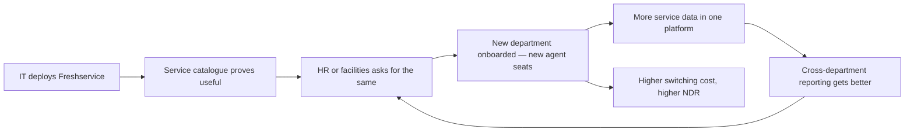

This loop is why EX grows 24% while shipping AI that automates work. Each turn adds seats faster than automation removes them. EX NDR of 111% is this loop showing up in the financials.

**Loop 2 — The asset discovery loop (working, EX)**

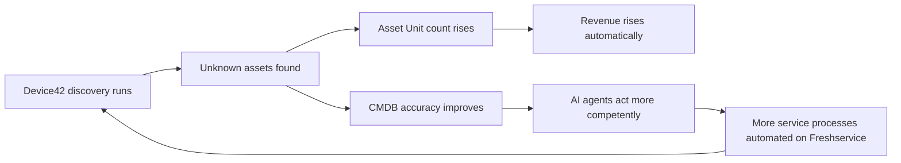

The most elegant loop in the business: the product's core function — finding assets — directly increases billable units *and* improves AI quality, with no sales effort. This is what a well-chosen metering unit looks like.

**Loop 3 — The CX AI loop (broken)**

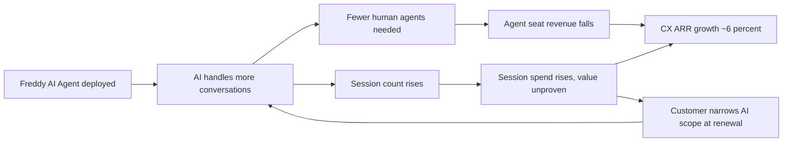

**This is the loop that does not close.** Both arms of it lead to the same place. More AI reduces seat revenue; more AI increases an unverified cost the customer then negotiates down. There is no arm of this diagram where Freshworks' success compounds. Contrast it with Loop 2, where every arrow points at growth.

Fixing Loop 3 does not require new AI capability. It requires changing what node E meters — from sessions attempted to resolutions verified — at which point the loop closes: more AI → more verified resolutions → more revenue → more AI investment justified → better AI.

---

## 37. Network Effects

Freshworks has **weak classical network effects and one genuinely underexploited data network effect.**

| Type | Present? | Assessment |
|---|---|---|
| Direct network effects | ❌ No | A service desk is not more valuable because other companies use one |
| Two-sided marketplace | 🟡 Weak | Freshworks Marketplace and the partner/MSP ecosystem exist but are not a primary acquisition driver |
| Data network effects | 🟡 **Present and underexploited** | Every resolved ticket across 25,000+ accounts is training signal for intent recognition, routing and agent quality. Freshworks does not visibly market or productise this |
| Ecosystem lock-in | 🟢 Strong within account | The unified data layer, CMDB and cross-product workflows make switching genuinely expensive once ESM is deployed |
| Agent-mediated effects | 🟢 **Emerging — the interesting one** | MCP Gateway lets third-party agents act on Freshservice data. If Freshservice becomes the service-operations layer other companies' agents call, that is a platform position with real network properties |

**The strategic observation.** Freshworks' most valuable latent asset is cross-account resolution data: what actually resolves a laptop-provisioning request, a password reset, a refund query — across tens of thousands of companies. That is a genuine data moat that Intercom (narrower) and ServiceNow (enterprise-only, more bespoke deployments) can match less well than one would expect.

But it can only be harvested if resolutions are **identified as such**. You cannot learn from outcomes you do not label. The absence of a `Resolution` entity ([§24](#24-information-architecture)) is not only a reporting gap and a pricing gap — it is the reason Freshworks' largest potential data network effect is currently untapped. Three distinct strategic problems, one missing object.

---

## 38. Product Strategy

**The strategy Freshworks is executing, stated fairly:** become the default service-operations platform for the mid-market and agile enterprise by beating legacy ITSM on total cost of ownership and time to value, expand within accounts through ESM and asset management, attach AI to every deal as a per-seat uplift, and run the CX business for cash and efficiency while EX compounds.

This is a coherent strategy. It is producing 16% revenue growth, GAAP profitability, eight straight Rule-of-40 quarters, and Gartner Leader validation. It should not be dismissed.

**The three places it is under strain.**

**1. The brand and the strategy have separated.** Freshworks' promise is "uncomplicated software" for growing businesses. Its growth is coming from customers above $100,000 ARR (+25%) while customers above $5,000 grow 6%. The buyer driving the business is an IT director evaluating a ServiceNow replacement, who cares about governance, audit and TCO — not about being uncomplicated. Meanwhile the SMB base that made the brand is flat. A company can move upmarket or keep a simplicity-led brand; sustaining both requires the mid-market to keep growing, and it is not.

**2. AI investment is being allocated by monetisability rather than by need.** Agent Studio and MCP Gateway shipped for Freshservice only ([§28](#28-feature-breakdown)). This is locally rational — EX monetises AI better — and globally self-reinforcing. CX gets less AI because CX monetises AI poorly; CX therefore continues to monetise AI poorly. The loop tightens every planning cycle, and no one in it is making a mistake.

**3. The capital-allocation posture has quietly changed what the company is.** Adjusted free cash flow per share elevated to a primary operating metric, a $400 million buyback authorisation, share count down ~7% year over year, two restructurings in eighteen months, and a market capitalisation roughly a quarter of the IPO valuation on nearly triple the revenue. These are the moves of a company optimising cash per share. That is a defensible answer to a compressed multiple. It is also a difficult posture from which to fund the kind of pricing-model reinvention that Intercom and Zendesk have already undertaken — reinvention costs margin before it returns it.

**What a strategy that addressed the thesis would add.** One thing: give the CX half a unit of value that grows when the AI works. Not a new product, not an acquisition, not a repositioning. A verified resolution — measured, reported, and eventually billed. It is the smallest available change that reverses the direction of Loop 3 in [§36](#36-growth-loops), and it is the only change identified in this analysis that turns AI investment in CX from a cost into a return.

---

## 39. Monetization

**Current monetisation surface, by half**

| Half | Seat meter | Non-seat meter | Does the non-seat meter grow on its own? |
|---|---|---|---|
| EX | $19 / $49 / $99 per agent/month + $29 Copilot | **Asset Units** (packs of 500) | ✅ **Yes** — assets accumulate as the customer grows |
| CX | $29 / $79 / $119 per agent/month + $29 Copilot | **AI Agent sessions** ($0.49) | ❌ **No** — the customer wants fewer, and cannot verify value |

**The competitive picture, on the same axis**

| Vendor | AI billing unit | Paid when |
|---|---|---|
| Intercom (Fin) | Resolution | The problem is solved |
| Zendesk | Automated resolution (~$1.50 committed / ~$2.00 PAYG) | The problem is solved |
| Salesforce (Agentforce) | Flex Credits per action (~$0.10) / ~$2 per conversation | An action executes |
| **Freshworks** | **AI Agent session ($0.49)** | **An attempt begins** |

**Why Freshworks' unit is priced lowest.** It is tempting to read $0.49 versus Intercom's $0.99 as aggressive value pricing. The more honest reading is that Freshworks has priced its unit correctly for what the unit is. A session that may have failed is worth roughly half a resolution that succeeded, and the market has arrived at approximately that ratio. Freshworks is not undercutting competitors; it is selling a different, lesser good at a proportionate price.

**Why this caps CX revenue arithmetically, not competitively.** Take an account with 40 agents on Freshdesk Omni Pro ($79) with Copilot ($29): roughly $51,840 a year in seat revenue. Suppose Freddy improves to the point where the account needs 25 agents. Seat revenue falls to about $32,400 — a loss of roughly $19,400. To stay whole on sessions alone at $0.49, the account would need to run roughly 39,600 additional billable sessions a year beyond its included allowance. It might well run that volume — but every one of those sessions is a line item the customer is trying to reduce and cannot verify, so it is the most negotiable revenue in the contract, arriving exactly when the customer has just seen their own headcount fall. *(Author-constructed illustration using published list prices; not a Freshworks disclosure — see `ASSUMPTIONS.md`.)*

Run the same exercise in EX and it inverts: if automation reduces IT agents, the Asset Unit count is unaffected, and ESM has probably added an HR service desk in the meantime.

**Monetisation levers available, ranked by leverage**

1. **Introduce a verified-resolution unit in CX** — converts AI success from revenue leakage into revenue. This is [§50](#50-feature-proposal).
2. **Extend Asset-Unit-style metering to CX-adjacent objects** — e.g. knowledge articles under management, or channels — weaker, because these do not grow as reliably as assets.
3. **Push Copilot attach further** — working well, but it is a bet on human agents persisting.
4. **Raise seat prices on Freshdesk Omni** — the ARPA gain is already being harvested via the Omni migration (~2.5× on new customers); limited headroom remains.
5. **Bundle CX into EX deals** — protects revenue, concedes the CX business as a standalone product.

---

## 40. Trust & Safety

For a service-operations platform in 2026, trust and safety is primarily **AI accountability**, and secondarily traditional platform safety.

| Area | Assessment |
|---|---|
| AI accuracy and hallucination | 🟡 Freddy is grounded in the customer's knowledge base and ticket history, which materially reduces fabrication risk versus open-ended generation. Confidence and source attribution are not consistently surfaced in the interface ([§26](#26-ui-audit)) |
| Escalation safety | 🟡 Escalation paths exist; there is no published standard for *when* an AI agent must hand off, and the commercial incentive under session billing does not favour early escalation |
| AI acting on records | ⚠ Agent Studio and MCP Gateway let agents take actions in Freshservice. Action authorisation, audit and reversibility become safety-critical. Audit logs exist at Enterprise tier |
| Third-party agent access (MCP) | ⚠ **The newest and least-proven surface.** External agents reading and acting on service data is a genuinely new trust boundary; permissioning and rate control here will matter more each quarter |
| Data segregation | 🟢 Multi-tenant with customer-selectable data centre region |
| Content and abuse | 🟢 Low inherent exposure — B2B service software, not user-generated content at consumer scale |
| Employee data in ESM | ⚠ Extending service management into HR means HR case data — grievances, medical accommodations, compensation queries — sits in the same platform as laptop tickets. Access control granularity here is materially more sensitive than in ITSM |

**The under-discussed risk: ESM's data sensitivity is not the same as ITSM's.** Freshworks' most important growth motion extends a tool designed for IT incidents into HR and legal workflows. An IT ticket leaking is embarrassing; an HR grievance case leaking is a legal event. As ESM scales — and it is the pillar the whole EX growth story rests on — the permission model, audit granularity and AI training-data boundaries need to be visibly stronger than what ITSM required. This is a place where a growth motion outruns a trust architecture quietly, and where the failure would be severe and public.

**The trust dimension of the central thesis.** There is a quiet trust cost to session billing that is worth naming. A customer paying per attempt, who cannot distinguish a solved problem from an abandoned one, is being asked to take the vendor's word for the value delivered. Outcome-based pricing is not only a commercial model — it is a trust position. Intercom and Zendesk are, in effect, saying *we will only take your money when we succeed*. That is a more defensible posture, and it is available to Freshworks the moment it can verify a resolution.

---

## 41. Technical Architecture

Freshworks does not publish a detailed architecture, so this section is an informed reconstruction from public product behaviour, documentation and disclosures — clearly flagged as such in `ASSUMPTIONS.md`.

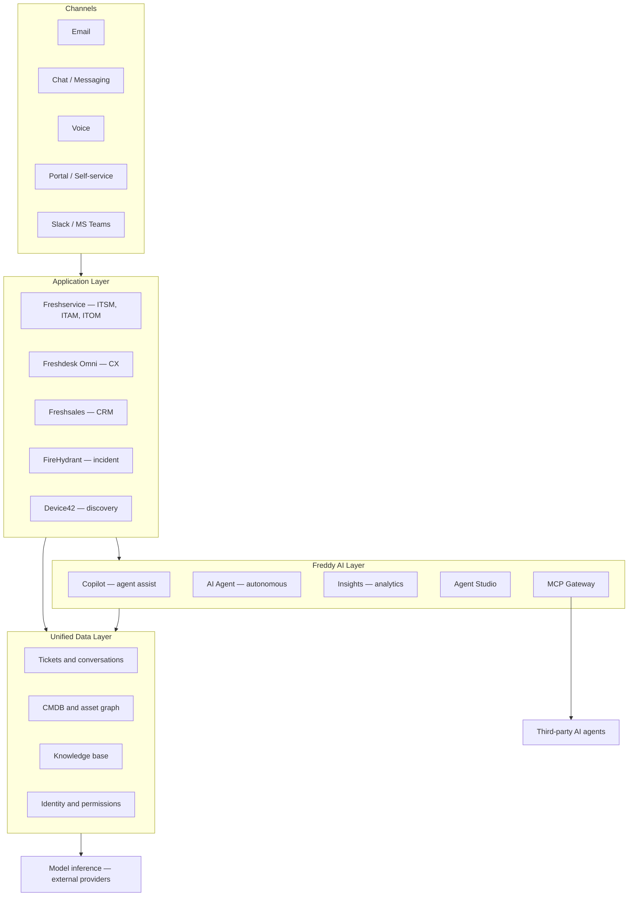

**Figure 4 — Reconstructed platform architecture.**

**The architecturally important observation.** The Unified Data Layer is the real asset and the real differentiator — it is what lets a Freddy agent in Freshservice reason across tickets, assets, knowledge and identity in one query, and it is what would let a single tenant join a customer-facing outage to the change record that caused it. No competitor holds both the employee-service and customer-service estates natively in one data layer.

**The architecturally important absence.** Look at the `DATA` subgraph. There are tickets, assets, knowledge and identity. There is no resolution store. Assets have a home in this diagram; resolutions do not. That asymmetry in the data layer is the technical root of the commercial asymmetry documented in [§39](#39-monetization) — and it is why the [§50](#50-feature-proposal) proposal is a data-model change first and a pricing change second.

**Dependency note.** Unlike Zoho (Day 34), which trains and self-hosts its own models on owned hardware, Freshworks depends on external model providers for frontier capability. This lowers capital intensity and speeds capability adoption, at the cost of a variable per-inference expense flowing into COGS — and that expense is incurred on **every session**, including the ones that fail. Under session billing, Freshworks pays for failed inference and bills for it too; under resolution billing it would pay for failed inference and not bill for it, which is precisely why the proposal in [§50](#50-feature-proposal) carries real gross-margin risk and why [§54](#54-ab-testing) is designed to measure it.

---

## 42. Data Flow

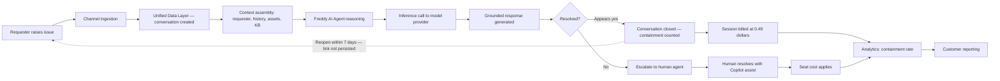

**Figure 5 — Current data flow for an AI-handled conversation.**

The dotted line is the important one. When a requester returns because the AI's answer did not hold, that return re-enters the flow as a brand-new conversation. The causal link between the failed resolution and the new request is not persisted, which means:

- the failure never reaches analytics as a failure,
- the second attempt is billed as new revenue,
- the reported containment rate is inflated by exactly the cases where the product underperformed, and
- the product team gets no signal about which intents are failing.

A single persisted edge — `new_conversation.origin_session_id` — plus a verification window would convert this from a system that hides its own failures into one that measures them. That edge is the technical core of [§50](#50-feature-proposal), and it is genuinely small.

---

## 43. API Ecosystem

| Surface | Status | PM assessment |
|---|---|---|
| REST APIs (Freshservice, Freshdesk, Freshsales) | Mature | Standard, well documented |
| Freshworks Marketplace | Established | Extensions and third-party integrations across products |
| Webhooks and automation | Mature | Workflow automator across products |
| BYOC / BYOT | Available on Pro and above | Bring your own channel and telephony — genuinely useful for mid-market with existing carrier contracts |
| Connector app tasks | Metered at $80 / 5,000 tasks | Another non-seat meter; usage-linked, modest |
| **MCP Gateway** | Launched 2026 (Freshservice) | **The strategically significant one** — exposes Freshservice data and workflows to third-party AI agents |
| Freddy AI Agent Studio | GA May 2026, Growth and Pro | Build and customise agents without code |

**On MCP Gateway.** This is the most forward-looking thing in the Freshworks portfolio, and it deserves more attention than it gets. If the interface to enterprise software becomes an agent rather than a screen, the vendors who survive are those whose data and actions are reachable by *whichever* agent the customer has standardised on. Exposing Freshservice through MCP is a bet that Freshworks would rather be the system of record an agent calls than lose the customer to whoever owns the agent.

**The asymmetry, again.** MCP Gateway is Freshservice-only. The customer-service data estate — arguably more valuable to an external agent, since customer context is what most enterprise agents lack — is not similarly exposed. Whatever the sequencing reason, the pattern from [§28](#28-feature-breakdown) repeats: the platform bets are being placed on the half that monetises.

**Under-monetised surface.** Third-party agents consuming Freshservice data through MCP consume inference-adjacent infrastructure and derive real value, and there is no visible metering on that surface. It is early, and pricing it prematurely would suppress adoption — but "an increasingly valuable data surface with no meter" is worth flagging for the same reason the rest of this document flags meters.

---

## 44. Privacy & Security

| Area | Assessment |
|---|---|
| Data residency | 🟢 Customer-selectable data centre region at signup — meaningful for EU and India buyers |
| Infrastructure security | 🟢 Published commitments to physical security, encryption in transit, patching discipline |
| Audit logging | 🟡 Available at Enterprise tier only — a genuine gap, since the mid-market IT buyer displacing a legacy platform typically has audit requirements without an enterprise budget |
| Access control | 🟢 Roles and permissions across products; unified identity |
| AI data handling | ⚠ **The area most in need of clearer public commitment.** Customers need explicit answers on whether their data trains shared models, what leaves the tenant to reach an external model provider, and what is retained |
| Compliance posture | 🟢 Standard enterprise certifications; ITSM buyers routinely require and receive them |
| ESM sensitivity | ⚠ See [§40](#40-trust--safety) — HR and legal case data raises the bar above ITSM norms |

**The structural privacy contrast worth drawing.** Zoho (Day 34) can say its AI runs on models it trained, on hardware it owns, in data centres it operates. Freshworks cannot make that claim — it depends on external model providers. For most mid-market buyers this is irrelevant. For the sovereignty-sensitive European or public-sector buyer that Freshworks increasingly meets in upmarket ITSM deals, it is a real objection, and it will surface more often as deal sizes rise.

**Audit logging at Enterprise tier only deserves a second look.** The Freshworks pitch is "enterprise-grade capability without enterprise cost." Audit logging is one of the least negotiable enterprise requirements and one of the cheapest to provide. Gating it behind the top tier undercuts the core positioning at exactly the moment a Ravi-type buyer ([§20](#20-personas)) is asking his security team to approve the migration.

---

## 45. Pain Points

| # | Pain point | Who feels it | Severity | Evidence |
|---|---|---|---|---|
| P1 | **AI value cannot be proven** — containment is not resolution | Support director; CFO | 🔴 Critical | [§23](#23-user-flow) nodes F/G; [§32](#32-product-analytics); no resolution object in [§24](#24-information-architecture) |
| P2 | **Billed per attempt, not per outcome** | CX buyer; procurement | 🔴 Critical | $49/100 sessions vs Intercom $0.99/resolution, Zendesk ~$1.50–$2.00 |
| P3 | **AI success shrinks the seat meter** | Freshworks | 🔴 Critical | CX ARR +6% vs EX +24%; per-agent pricing in [§18](#18-revenue-model) |
| P4 | **Failed resolutions are re-billed and invisible** | CX buyer | 🟠 High | [§42](#42-data-flow) dotted edge; no reopen linkage |
| P5 | **Self-serve base stalling** | Freshworks | 🟠 High | Customers >$5k ARR +6%, down from +10% |
| P6 | **Best AI tooling unavailable in CX** | CX admin | 🟠 High | Agent Studio and MCP Gateway are Freshservice-only |
| P7 | **Audit logging gated to Enterprise** | Mid-market IT buyer | 🟡 Medium | [§44](#44-privacy--security); conflicts with core positioning |
| P8 | **No designed AI failure experience** | Agent; admin | 🟡 Medium | [§25](#25-ux-audit) heuristic #9 scored 2/5 |
| P9 | **Brand-strategy divergence** | Freshworks | 🟡 Medium | "Uncomplicated" brand vs >$100k ARR band driving growth |
| P10 | **ESM data sensitivity outpacing controls** | HR ops; legal; security | 🟡 Medium | [§40](#40-trust--safety) |
| P11 | **External model dependency** | Sovereignty-sensitive buyers | 🟡 Medium | [§41](#41-technical-architecture); contrast with Zoho |
| P12 | **Execution capacity after two restructurings** | Freshworks | 🟡 Medium | Nov 2024 and May 2026 (~11% of workforce) |

**The clustering that matters.** P1, P2, P3, P4 and P6 are not five problems. They are one problem — **there is no verified resolution object** — observed from the customer's chair (P1), the contract (P2), the P&L (P3), the data model (P4) and the roadmap (P6). P8 is its user-experience shadow, and [§37](#37-network-effects) showed it also blocks the data network effect. Seven of twelve documented pain points resolve to a single missing entity.

That is the convergence [§46](#46-opportunity-mapping) formalises, and it is the reason [§50](#50-feature-proposal) proposes what it proposes rather than something else.

---

## 46. Opportunity Mapping

| Opportunity | Addresses | Effort | Strategic value | Verdict |
|---|---|---|---|---|
| **O1 — Verified Resolution Ledger + outcome pricing for CX** | P1, P2, P3, P4, P6, P8 | High | 🔴 Critical | ✅ **Proposed — [§50](#50-feature-proposal)** |
| O2 — Extend Agent Studio and MCP Gateway to Freshdesk Omni | P6 | Medium | High | Recommended, sequenced after O1 |
| O3 — Move audit logging down to Pro tier | P7 | Low | Medium | Quick win; do immediately |
| O4 — Designed AI failure states and confidence surfacing | P8, P1 | Low–Medium | Medium–High | Ships as part of O1 |
| O5 — ESM-specific permission and audit model | P10 | Medium | Medium | Necessary before ESM scales further |
| O6 — Re-energise self-serve acquisition in the >$5k band | P5 | High | Medium | Real, but a GTM problem more than a product one |
| O7 — Regional model hosting for sovereignty-sensitive buyers | P11 | Very high | Medium | Capital-intensive; not credible near-term |
| O8 — Cross-half incident-to-customer-impact product | Latent | Medium | High | **Depends on O1** — requires a resolution object to join on |

**The convergence, named explicitly.** Six independent analyses in this document arrived at the same missing capability:

- [§24 Information Architecture](#24-information-architecture) — there is no first-class `Resolution` object in the CX data model.
- [§29 AI Capabilities](#29-ai-capabilities) — Freshworks monetises augmentation well and automation poorly, because only augmentation has a unit.
- [§31 North Star Metric](#31-north-star-metric) — the metric that would actually test the company's strategy cannot currently be computed.
- [§36 Growth Loops](#36-growth-loops) — the CX AI loop is the only loop in the business where no arrow points at growth.
- [§39 Monetization](#39-monetization) — Freshworks is the only major CX vendor billing the attempt rather than the outcome.
- [§45 Pain Points](#45-pain-points) — seven of twelve pain points reduce to this single absence.

The feature proposal in [§50](#50-feature-proposal) was not selected and then justified. It is what remained after six separate lines of analysis eliminated everything else. That distinction is the difference between analysis and advocacy, and it is worth being explicit that the sequence in this document ran in that order.

---

## 47. RICE

*(Framework selection rationale: RICE is used because the candidate opportunities differ enormously in confidence — O3 is a configuration change with near-certain outcome, O1 is a pricing-model reinvention with genuine uncertainty. A framework that does not force an explicit confidence term would flatter O1 and mislead. RICE's weakness — that Impact is a judgement dressed as a number — is addressed by the sensitivity check below.)*

**Scoring basis:** Reach = affected CX accounts per quarter, scaled. Impact 0.25–3. Confidence 0–100%. Effort in person-months.

| Opportunity | Reach | Impact | Confidence | Effort | **RICE** |
|---|---|---|---|---|---|
| **O1 — Resolution Ledger + outcome pricing** | 8,000 | 3.0 | 60% | 120 | **120** |
| O2 — Agent Studio / MCP for CX | 8,000 | 1.5 | 75% | 90 | 100 |
| O3 — Audit logging to Pro tier | 3,000 | 1.0 | 95% | 4 | **713** |
| O4 — AI failure states (standalone) | 8,000 | 1.0 | 85% | 20 | 340 |
| O5 — ESM permission model | 2,000 | 1.5 | 80% | 40 | 60 |
| O6 — Self-serve reactivation | 12,000 | 1.0 | 40% | 100 | 48 |
| O8 — Cross-half impact product | 1,500 | 2.0 | 50% | 60 | 25 |

**Reading the table honestly: O1 does not win on RICE.** O3 scores nearly six times higher, and O4 nearly three times. This is the correct and expected result — RICE systematically favours small, certain, cheap work, and it should. O3 and O4 should both ship immediately; they are close to free.

But RICE is a prioritisation tool for a backlog, not a strategy tool for a business model. O3 improves a tier boundary. O1 changes the direction of the arrow in [§36](#36-growth-loops) Loop 3 — the only initiative on the list that alters whether 41% of ARR can grow at all. A framework that ranks a tier-gating change above a business-model repair is telling you something about the framework, and the discipline is to notice that rather than to inflate O1's Impact score until it wins.

**Sensitivity check on O1.** The score is most fragile in Confidence, which is the honest 60%, and in Effort.

| Scenario | Change | RICE | Verdict |
|---|---|---|---|
| Base case | R 8,000 · I 3.0 · C 60% · E 120 | **120** | Proceed |
| Confidence falls to 40% | Outcome definition proves contentious with customers | 80 | Still ahead of O5, O6, O8 |
| Confidence rises to 80% | Pilot validates the verification rule | 160 | Clears O2 comfortably |
| Effort doubles to 240 | Billing system rework larger than scoped | 60 | Marginal — **this is the real risk** |
| Impact falls to 2.0 | Customers accept the ledger but not outcome pricing | 80 | Ledger alone still justified |
| Ledger only (Phase 1) | R 8,000 · I 1.5 · C 85% · E 35 | **291** | **Comfortably second overall** |

**What the sensitivity analysis actually reveals — and it changed this document's recommendation.** Splitting O1 in two transforms the picture. The Ledger alone scores 291 with 85% confidence and 35 person-months; the full proposal including outcome-based billing scores 120 with 60% confidence and 120 person-months. Effort doubling is the scenario that breaks the case, and the effort risk sits almost entirely in the billing and contracting half, not the instrumentation half.

That is why [§50](#50-feature-proposal) is phased, and why [§54](#54-ab-testing) is designed specifically to test whether the expensive second phase is needed at all.

---

## 48. MoSCoW

**Scope: Verified Resolution Ledger, first release**

| Priority | Item |
|---|---|
| **Must have** | Verified Resolution definition (no human touch + no reopen in 7 days + no negative CSAT) |
| | `Resolution` as a persisted, queryable object in the unified data layer |
| | `origin_session_id` linkage on re-raised conversations |
| | Customer-facing ledger: verified resolutions, unverified sessions, verification rate |
| | Per-intent breakdown so admins can see *what* is failing |
| | Admin-configurable verification window (default 7 days) |
| **Should have** | Cost view — session spend against verified outcomes |
| | Failure taxonomy (no KB coverage, low confidence, requester abandoned, escalated) |
| | Exportable CFO-ready summary |
| | Confidence and source surfaced on AI responses ([§26](#26-ui-audit)) |
| **Could have** | Benchmarking against anonymised cohort verification rates |
| | Cross-half join: incident → customer conversation volume ([§46](#46-opportunity-mapping) O8) |
| | Resolution-quality scoring beyond binary verified/unverified |
| **Won't have (this release)** | Outcome-based billing — deliberately deferred to Phase 2 pending [§54](#54-ab-testing) |
| | Retroactive verification of historical sessions |
| | Extension to EX (Freshservice already monetises on assets; lower urgency) |

The Must-have list is deliberately short and almost entirely data-model work. Nothing in it requires new AI capability, and nothing in it requires touching the billing system — which is what makes Phase 1 a 35-person-month project rather than a 120-person-month one.

---

## 49. Kano

| Feature | Kano category | Reasoning |
|---|---|---|
| Ticketing, SLA, routing | **Basic** | Absence is disqualifying; presence earns nothing |
| Fast deployment | **Performance** | More is better, and it is Freshworks' primary competitive axis |
| Freddy AI Copilot | **Performance → Basic** | 71% attach on new enterprise deals means it is becoming table stakes fast |
| AI autonomous resolution | **Performance** | Directly proportional to perceived value |
| **Verified resolution reporting** | **Attractive → Basic** | **The critical judgement in this table** |
| Outcome-based pricing | **Attractive** | Currently delights; Intercom and Zendesk are converting it to expected |
| MCP Gateway | **Attractive** | Few buyers ask for it; those who do are strategically important |
| Audit logging | **Basic** (for the IT buyer) | Currently gated to Enterprise, which is why P7 exists |
| Asset discovery | **Performance** | More discovered assets = more value (and more revenue) |

**The judgement that carries the proposal.** Verified resolution reporting is classified as **Attractive migrating rapidly to Basic**, and the timing of that migration is the whole argument for urgency.

Today, a buyer who is shown a verified-resolution ledger is impressed, because nobody offers it. But Intercom has been charging per resolution since before this year, Zendesk answered with outcome pricing in 2026, and its CEO used the Relate 2026 stage to declare the deflection era over. Once two major vendors have taught the market that resolutions are countable and billable, "show me your verified resolutions" moves from a differentiator to a question every CX buyer asks in every evaluation — and a vendor who cannot answer it stops being cheaper and starts being evasive.

Kano categories decay. Attractive features become Basic on a schedule set by competitors, not by your roadmap. Freshworks' window to ship this as a delighter rather than as a catch-up is measured in quarters, and it is closing.

---

## 50. Feature Proposal

# **Resolution Ledger** — making AI success countable, provable, and eventually billable

**How this proposal was arrived at.** It was not selected and then justified. Six independent analyses in this document converged on the same absence, and this proposal is what remained after each of them eliminated the alternatives:

| Section | What it independently concluded |
|---|---|
| [§24 Information Architecture](#24-information-architecture) | CX has no first-class `Resolution` object; EX has the `Asset` |
| [§29 AI Capabilities](#29-ai-capabilities) | Freshworks monetises augmentation (71% Copilot attach) and not automation, because only augmentation has a unit |
| [§31 North Star Metric](#31-north-star-metric) | The metric that would test Freshworks' own strategy cannot currently be computed |
| [§36 Growth Loops](#36-growth-loops) | Loop 3 is the only loop in the business where no arrow points at growth |
| [§39 Monetization](#39-monetization) | Freshworks is the last major CX vendor billing the attempt rather than the outcome |
| [§45 Pain Points](#45-pain-points) | Seven of twelve documented pain points reduce to this single missing entity |

### The problem in one sentence

Freshworks charges its customer-experience customers $0.49 every time its AI *tries*, cannot tell them how often it *succeeded*, and loses seat revenue every time it succeeds well enough to reduce headcount.

### The proposal

**Phase 1 — Resolution Ledger (instrumentation and reporting).**

Introduce a **Verified Resolution** as a first-class, persisted object in the unified data layer. An AI-handled interaction becomes a Verified Resolution when all three conditions hold:

1. **No human touch** — the conversation closed without an agent seat being consumed.
2. **No return** — the same requester did not re-raise a related request within the verification window (default 7 days, admin-configurable).
3. **No negative signal** — no negative CSAT or dissatisfaction response was recorded.

Ship a customer-facing **Resolution Ledger** in Freshdesk Omni that reports, per period:

- Verified resolutions, with per-intent breakdown
- Unverified sessions, shown honestly and separately, with a failure taxonomy — no knowledge coverage, low confidence, requester abandoned, escalated
- Verification rate as the headline number, replacing containment rate
- Session spend shown against verified outcomes, so cost and value appear in the same view
- An exportable summary a support director can put in front of a CFO without caveats

**Phase 2 — Outcome-based commercial unit (gated on [§54](#54-ab-testing)).**

Introduce **Verified Resolution packs** as an alternative to AI Agent session packs: the customer pays only for resolutions that clear the bar, priced above the current per-session rate to reflect the higher-value unit, with failed attempts free. This is the unit Intercom and Zendesk already sell.

**Phase 2 is deliberately not committed.** [§47](#47-rice)'s sensitivity analysis showed the effort risk sits almost entirely here, and [§54](#54-ab-testing) is designed to falsify the need for it.

### Why this and not the alternatives

| Alternative | Why not |
|---|---|
| Raise CX seat prices | Harvests a shrinking base; ARPA gains already largely captured via the Omni migration |
| Cut CX investment further | Accelerates the decline of 41% of ARR and the brand |
| Copy Intercom's pricing directly | Would bill on an unverified definition of resolution — the instrumentation must precede the price, or the first disputed invoice destroys trust |
| Ship more CX AI capability | The capability is not the constraint; Freshworks' own marketing cites up to 80% resolution rates. The constraint is that success is neither visible nor billable |
| Bundle CX into EX deals | Protects revenue, concedes CX as a standalone product |

### Why Freshworks specifically can do this well

Two structural advantages, both already paid for:

1. **The Asset Unit proves the company can meter something other than seats.** This is not a new organisational capability — Freshservice already bills a non-seat unit in packs of 500. The commercial, billing and contracting machinery for usage-based metering exists.
2. **The unified data layer already holds every input the verification rule needs** — conversation, requester identity, human-touch flag, CSAT, and timestamps. What is missing is one persisted edge (`origin_session_id`) and one computed verdict. This is a small data-model change wearing the clothes of a large strategic one.

### What success looks like

- Verification rate becomes the metric CX customers quote internally, replacing containment
- Session-scope narrowing at renewal ([§22](#22-user-journey), Retrench stage) declines measurably
- CX net dollar retention stops diverging from EX
- Freshworks can answer "what did your AI actually resolve" in a competitive evaluation
- The [§37](#37-network-effects) data network effect becomes harvestable, because outcomes are finally labelled

---

## 51. PRD

**Product Requirements Document — Resolution Ledger (Phase 1)**

| Field | Value |
|---|---|
| Product | Freshdesk Omni — Freddy AI reporting and data model |
| Author | Gaurav Singh (author-constructed; not a Freshworks document) |
| Status | Proposal |
| Target release | Phase 1 in two quarters; Phase 2 gated on experiment results |

**1. Problem.** CX customers cannot prove what Freshworks' AI resolved. They are billed per session attempted, reported to on containment, and asked by their own leadership about outcomes. Freshworks cannot compute a verified resolution, cannot bill for one, and cannot learn from one.

**2. Goals.**
- G1 — Make verified AI resolution a countable, persisted, reportable object.
- G2 — Give CX buyers a defensible artefact for internal justification.
- G3 — Give product teams a failure signal per intent.
- G4 — Establish the data foundation required for outcome-based pricing, without committing to it.

**3. Non-goals.**
- Changing billing in Phase 1.
- Retroactive verification of historical sessions.
- Extending to Freshservice in Phase 1 (EX already monetises on Asset Units).
- Building new AI capability of any kind.

**4. Users.** Primary: support director (Nadia, [§20](#20-personas)). Secondary: support admin; Freshworks product and pricing teams; finance stakeholders at the customer.

**5. Requirements.**

| ID | Requirement | Priority |
|---|---|---|
| R1 | Persist a `Resolution` object with verified/unverified state and failure reason | Must |
| R2 | Persist `origin_session_id` when a requester re-raises within the window | Must |
| R3 | Evaluate the three verification conditions on window expiry | Must |
| R4 | Admin-configurable verification window, default 7 days, range 1–30 | Must |
| R5 | Ledger UI: verified count, unverified count, verification rate, per-intent breakdown | Must |
| R6 | Failure taxonomy on every unverified session | Should |
| R7 | Session spend displayed against verified outcomes | Should |
| R8 | Exportable period summary (CSV and PDF) | Should |
| R9 | Confidence and source surfaced on AI responses | Should |
| R10 | Cohort benchmarking of verification rate | Could |
| R11 | API access to the `Resolution` object | Should |

**6. Success metrics.**
- Verification rate computed and displayed for 100% of AI-enabled CX accounts
- ≥40% of AI-enabled accounts view the ledger monthly within two quarters of GA
- Reduction in AI-scope narrowing at renewal versus control ([§54](#54-ab-testing))
- Baseline for all of the above: **not disclosed** — Freshworks does not publish session, resolution or scope-change data, so targets are stated as relative movement against a concurrent control rather than against an invented baseline

**7. Open questions.**
- Is 7 days the right verification window across industries? E-commerce and enterprise software likely differ materially.
- Should a resolution followed by an *unrelated* new request count as verified? Requires intent-similarity scoring, which adds real complexity.
- Does exposing unverified sessions honestly reduce short-term session revenue by prompting customers to narrow scope? **This is the main commercial risk of Phase 1 and must be measured, not assumed.**

**8. Dependencies.** Unified data layer schema change; Freddy AI Agent telemetry; CSAT pipeline; billing system read-only integration for the cost view (write integration only in Phase 2).

---

## 52. Wireframes

Described structurally rather than as raster images — no image assets were generated in this pass ([§65](#65-appendix)).

**Screen 1 — Resolution Ledger, overview**

```
┌──────────────────────────────────────────────────────────────┐
│  Freddy AI · Resolution Ledger              [Last 30 days ▾] │
├──────────────────────────────────────────────────────────────┤
│                                                              │
│   VERIFIED RESOLUTIONS          VERIFICATION RATE            │
│        4,182                         61%                     │
│   ▲ 14% vs prior period         ▲ 4 pts vs prior period      │
│                                                              │
│   ┌────────────────────────────────────────────────────┐     │
│   │ Verified      ████████████████████████░░░░░  4,182 │     │
│   │ Unverified    ██████████░░░░░░░░░░░░░░░░░░░  2,671 │     │
│   └────────────────────────────────────────────────────┘     │
│                                                              │
│   Why sessions went unverified                               │
│   ├── Requester returned within 7 days      1,104   41%      │
│   ├── No knowledge coverage                   822   31%      │
│   ├── Requester abandoned                     498   19%      │
│   └── Negative satisfaction                   247    9%      │
│                                                              │
│   Session spend $3,358   ·   Cost per verified resolution    │
│                              $0.80                           │
│                                                              │
│   [View by intent]  [Export summary]                         │
└──────────────────────────────────────────────────────────────┘
```

*(Illustrative figures — author-constructed, not Freshworks data.)*

Two deliberate design decisions. First, **verification rate sits beside the count**, because the count alone can be grown by running more sessions — the same failure mode as containment. Second, **cost per verified resolution is stated explicitly**. It will often look worse than the $0.49 headline session price, and showing it is the point: it is the number the customer's CFO would compute anyway, and a vendor that surfaces it first is a vendor that can be trusted with outcome pricing later.

**Screen 2 — Per-intent breakdown**

```
┌──────────────────────────────────────────────────────────────┐
│  Resolution Ledger · By intent                               │
├──────────────────────────────────────────────────────────────┤
│  Intent                Sessions  Verified   Rate    Trend    │
│  ─────────────────────────────────────────────────────────   │
│  Order status             1,842     1,655    90%      ▲      │
│  Password / access          921       801    87%      ▬      │
│  Refund request             744       302    41%      ▼  ⚠   │
│  Shipping change            612       404    66%      ▲      │
│  Product compatibility      508        91    18%      ▼  🔴  │
│                                                              │
│  🔴 Product compatibility is failing. 87% of unverified      │
│     sessions cite no knowledge coverage.                     │
│     [Create knowledge article]  [Route to human by default]  │
└──────────────────────────────────────────────────────────────┘
```

This screen is what converts the ledger from a reporting artefact into a product-improvement loop. The admin does not merely learn that AI performance is mixed; they learn *which intent* is failing, *why*, and are handed the two actions that fix it. This is also the surface that generates the labelled training signal [§37](#37-network-effects) identified as an untapped network effect.

---

## 53. Rollout Plan

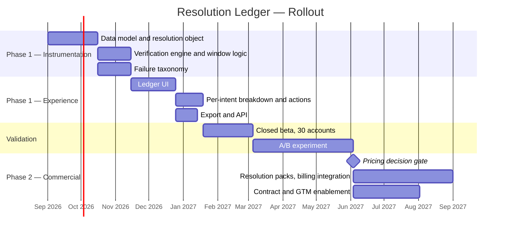

**Figure 6 — Phased rollout with an explicit decision gate.**

| Stage | Scope | Exit criteria |
|---|---|---|
| Internal dogfood | Freshworks' own support org runs on the ledger | Verification rule holds against manual audit of 500 conversations |
| Closed beta | 30 CX accounts across e-commerce, SaaS, financial services | ≥70% of beta admins say the ledger answers their leadership's question |
| Open beta | All Pro and Enterprise CX accounts, opt-in | Verification rate stable; no material support-load increase |
| GA (Phase 1) | All AI-enabled CX accounts | Ledger viewed monthly by ≥40% of AI-enabled accounts |
| **Decision gate** | Review [§54](#54-ab-testing) results | Proceed to Phase 2 only if the ledger alone fails to deliver the expansion effect |
| Phase 2 | Resolution packs alongside session packs | Pricing validated in market with a cohort of new logos first |

**The decision gate is the most important element of this plan.** Phase 2 is 90 person-days of billing integration plus contract and enablement work, carries the effort risk identified in [§47](#47-rice)'s sensitivity analysis, and may be unnecessary. Building the gate into the plan — rather than treating Phase 2 as inevitable — is the difference between a roadmap and a commitment.

---

## 54. A/B Testing

**The experiment is designed to falsify the expensive half of the proposal.**

Phase 1 (the ledger) costs roughly 35 person-months and carries 85% confidence. Phase 2 (outcome-based billing) costs roughly 85 additional person-months, carries 60% confidence, and is where [§47](#47-rice)'s sensitivity analysis showed the business case breaks if effort doubles. The honest question is therefore not "does the Resolution Ledger work" but **"does the ledger alone capture the value, making the billing rework unnecessary?"**

**Hypothesis.** Giving CX customers a verifiable account of AI outcomes increases AI scope retention and expansion. If true, the *reporting* is doing the work and outcome pricing is optional. If false, the *commercial model* is doing the work and Phase 2 is required.

**Design**

| Arm | Treatment | Purpose |
|---|---|---|
| **Control** | Current containment reporting, session billing | Baseline |
| **Variant A** | Resolution Ledger, session billing unchanged | Tests whether visibility alone changes behaviour |
| **Variant B** | Resolution Ledger + Verified Resolution packs (outcome billing) | Tests whether the commercial unit adds incremental effect over visibility |

**Primary metric:** change in AI session volume plus AI SKU revenue per account over two renewal cycles.
**Secondary metrics:** rate of AI scope narrowing at renewal; CX net dollar retention within cohort; verification rate; AI-attributed churn.
**Guardrails:** CSAT on AI-resolved conversations; escalation rate; gross margin per account (Variant B specifically must be watched here — under outcome billing Freshworks absorbs the inference cost of every failed attempt, per [§41](#41-technical-architecture)); support ticket volume about the ledger itself.

**Population and duration.** Randomised at account level among AI-enabled CX accounts on Pro and Enterprise; stratified by industry and account size. Minimum two renewal cycles — this cannot be read in a quarter, because the behaviour it measures happens at renewal.

**The falsification conditions, stated in advance:**

- **If Variant A ≈ Variant B**, the ledger captured the value and **Phase 2 is cancelled.** Freshworks keeps session billing, ships only the instrumentation, and saves 85 person-months.
- **If Variant B > Variant A materially**, the commercial unit is doing independent work and Phase 2 proceeds.
- **If Variant A ≈ Control**, the entire premise is wrong — visibility does not change behaviour — and the proposal's Impact score in [§47](#47-rice) was overstated. In that case the correct response is to stop, not to proceed to Phase 2 hoping pricing rescues it.
- **If Variant B shows margin deterioration beyond tolerance**, outcome pricing is uneconomic at Freshworks' current inference cost structure regardless of customer response, and Phase 2 is deferred until inference costs fall.

**Why this design is honest.** Most proposal A/B tests are structured to confirm the proposal. This one has a pre-registered condition under which the author's own recommendation is abandoned entirely (Variant A ≈ Control), and a second under which the most strategically exciting half of it is cancelled (Variant A ≈ Variant B). A test that cannot embarrass the person who designed it is not a test.

---

## 55. KPI Dashboard

| Tier | KPI | Current | Source |
|---|---|---|---|
| **North Star** | Verified AI Resolutions per paying account per month | **Not currently computable** | [§31](#31-north-star-metric) |
| **Company** | Revenue | $237.4M, +16% (Q2 2026) | Disclosed |
| | GAAP income from operations | $6.1M (2.6%) | Disclosed |
| | Adjusted free cash flow | $57.7M (24.3%) | Disclosed |
| | Rule of 40 | 8 consecutive quarters | Disclosed |
| **Segment** | EX ARR / growth | $567M / +24% cc | Earnings commentary |
| | CX ARR / growth | >$395M (Q1) / +6% | Earnings commentary |
| | EX ARR exiting 2026 (target) | >$600M | Management guidance |
| **Customer** | Customers > $100k ARR | 1,746, +25% | Disclosed |
| | Customers > $50k ARR | 4,091, +18% | Disclosed |
| | Customers > $5k ARR | 25,356, +6% | Disclosed |
| | Net dollar retention | 104% (105% cc) | Disclosed |
| | EX net dollar retention | 111% (Q1 2026) | Earnings commentary |
| | CX net dollar retention | **Not disclosed** | — |
| **AI** | Customers paying for an AI SKU | >7,000 | Earnings commentary |
| | Copilot attach, new enterprise deals | >71% | Earnings commentary |
| | Freddy AI ARR | >$25M (Q4 2025) | Disclosed |
| | AI Agent session volume | **Not disclosed** | — |
| | Verification rate | **Does not exist** | Proposed |
| **Proposal** | Ledger monthly active accounts | Target ≥40% of AI-enabled | Proposed |
| | AI scope narrowing at renewal | **Not disclosed** — measure vs control | Proposed |

**What this dashboard reveals about the company.** Freshworks discloses acquisition and profitability metrics thoroughly and outcome metrics not at all. Every row measuring whether the AI worked is either "not disclosed" or "does not exist." That is unremarkable for a public company's external reporting — but combined with the analysis in [§32](#32-product-analytics), the likelihood is that some of these rows are missing internally too, which is a different and more serious matter.

---

## 56. Product Roadmap

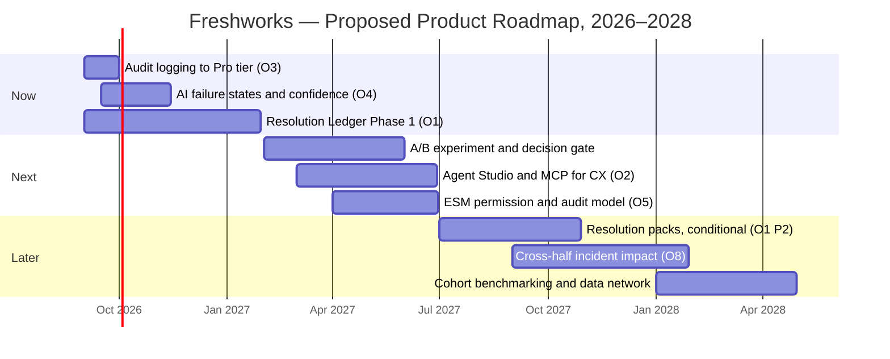

**Figure 7 — Proposed roadmap. Author-constructed; not a Freshworks roadmap.**

| Horizon | Theme | Rationale |
|---|---|---|
| **Now** | Make AI outcomes visible | Two near-free wins (O3, O4) plus the instrumentation that everything else depends on |
| **Next** | Test whether visibility is sufficient; close the CX capability gap | The decision gate governs Phase 2; O2 stops the CX AI investment gap widening |
| **Later** | Monetise outcomes and harvest the data asset | Conditional on evidence; O8 becomes possible only once resolutions exist as objects |

**Sequencing note.** O8 — the cross-half incident-to-customer-impact product, which is the only genuinely unique product idea in this document — sits in Later not because it is unimportant but because it is structurally blocked. It requires a resolution object to join customer conversations to IT incidents. This is a useful illustration of a general point: the most differentiated opportunity in a portfolio is often gated behind unglamorous data-model work, and roadmaps that chase differentiation before fixing the model tend to ship demos rather than products.

---

## 57. Risks & Mitigation

| # | Risk | Likelihood | Impact | Mitigation |
|---|---|---|---|---|
| R1 | **Honest reporting reduces short-term session revenue** — customers see unverified sessions and narrow scope | High | High | This is the central commercial risk and the reason [§54](#54-ab-testing) measures revenue as the primary metric. Accept short-term compression for retention; the alternative is customers discovering the same fact at renewal without Freshworks framing it |
| R2 | **Verification rule disputed by customers** — "that reopen was unrelated" | Medium | Medium | Admin-configurable window; publish the rule; add intent-similarity scoring before Phase 2 billing |
| R3 | **Outcome billing compresses gross margin** — Freshworks absorbs failed-attempt inference cost | Medium | High | Explicit guardrail in [§54](#54-ab-testing); price resolution packs to cover the failure ratio; defer Phase 2 if margin deteriorates |
| R4 | **CX decline outruns the fix** | Medium | High | CX is 41% of ARR growing 6%; Phase 1 GA is two quarters out. Ship O3 and O4 immediately for near-term signal |
| R5 | **Competitors extend their lead in outcome pricing** | High | Medium | Intercom and Zendesk are already there. Freshworks' differentiator must be *verification quality*, not the pricing model itself — being second with a better-instrumented answer is a viable position |
| R6 | **Execution capacity after two restructurings** | Medium | Medium | Phase 1 is deliberately scoped at ~35 person-months and requires no new AI capability |
| R7 | **EX growth stalls, removing the funding source** | Low–Medium | Critical | EX is the company's entire growth story; a miss against the >$600M exiting-2026 commitment would change every prioritisation in this document |
| R8 | **ESM data incident** | Low | Critical | O5 permission model; treat HR case data under a stricter standard than ITSM ([§40](#40-trust--safety)) |
| R9 | **External model provider pricing or availability shock** | Low–Medium | High | Structural exposure Freshworks cannot fully mitigate; contrast with Zoho's owned-model position (Day 34) |
| R10 | **Thesis is simply wrong** — CX growth is competitive, not structural | Medium | — | Addressed directly in [§64 Self Review](#64-self-review) |

---

## 58. Future Vision

**Three years out, the question is what Freshworks is called.**

If the current trajectory continues unchanged, Freshworks in 2029 is an IT service-operations company with a legacy customer-service product attached. EX passes $1 billion ARR; CX drifts toward zero growth and eventually toward decline; the company is valued as a profitable mid-cap ITSM vendor competing with ServiceNow in the mid-market. That is a genuinely decent outcome. It is also a smaller company than the one that listed in 2021, and the brand it carries will have stopped describing what it does.

If the thesis of this case study is acted on, a second path opens. Freshworks becomes the vendor that can **prove** service outcomes across both employee and customer service — the only company able to say "your AI resolved 61% of customer issues and 74% of employee requests, here is the evidence, and here is the invoice for exactly the ones that worked." Outcome verification becomes the product, and the unified data estate that nobody else has becomes the reason the verification is trustworthy across both halves.

**The broader force.** Every service software vendor is converging on the same realisation: when AI does the work, seats stop being a sensible unit of account. The industry is mid-migration from *capacity pricing* (how many humans can use this) to *outcome pricing* (how much did it accomplish). Intercom moved first, Zendesk followed, Salesforce chose consumption. Freshworks has already built the muscle in EX — the Asset Unit is a non-seat meter that works — and has not yet applied it where it is most needed.

**The under-appreciated asset.** In an agent-mediated future where humans stop opening dashboards, the vendor who wins is the one whose data and actions are reachable by whichever agent the customer has standardised on. MCP Gateway is a genuinely good bet on that world. Extending it across both halves, on a data model where outcomes are labelled, would make Freshworks the service-operations layer that other companies' agents call into. That is a more durable position than owning a UI, and it is available to Freshworks in a way it is not available to vendors who own only one estate.

---

## 59. PM Lessons

**1. The metering unit is a product decision, and it is usually made by accident.** Freshworks' two halves ship comparable products with the same AI and grow at 24% and 6%. The difference traces substantially to a choice — Asset Units versus AI sessions — that would have been made in a pricing meeting, likely without a PM in the room. What you charge for determines what the product must become. It is not downstream of product strategy; it is product strategy.

**2. Meter what your customer accumulates, not what they are trying to reduce.** Assets pile up as a company grows and nobody resents the invoice. AI sessions are something a buyer actively wants fewer of, so every renewal becomes a negotiation. Two usage-based meters that look identical on a price list can point in opposite directions in a customer's budget meeting.

**3. Be suspicious of any metric that measures an absence.** Containment counts tickets a human did not touch. It cannot distinguish a customer who was helped from one who gave up, which makes it useless for the only question that matters. Metrics that measure what did not happen are almost always hiding the difference between success and abandonment.

**4. When your AI succeeds at your customer's job, check whether it shrinks your own meter.** Freshworks sells software that reduces the need for the seats it charges for. That is not a reason to build worse AI; it is a reason to change the unit before the AI gets good enough to matter. Any PM shipping automation into a per-seat product has this problem, whether or not it has surfaced yet.

**5. Let the analysis pick the proposal, and record the order.** The proposal in [§50](#50-feature-proposal) is what six independent lines of analysis had left standing. That sequence matters, because the opposite sequence — picking a feature and assembling evidence for it — produces documents that look identical and are worthless.

**6. Design the experiment that could cancel your own idea.** [§54](#54-ab-testing) has a pre-registered condition under which the expensive half is abandoned and another under which the whole proposal is. A test structured so that the proposal always survives is theatre.

**7. RICE will rank a tier-gating change above a business-model repair, and it will be right about the arithmetic and wrong about the business.** Use the framework, then notice what it cannot see. The discipline is to leave the low score in the table rather than inflating an Impact estimate until the answer you wanted appears.

---

## 60. PM Interview Questions

1. Freshworks' EX business grew 24% and its CX business grew 6% in the same quarter, with the same AI and the same company behind both. Give three hypotheses, then say what data would distinguish them.
2. Intercom charges $0.99 per resolution. Freshworks charges $0.49 per AI session. Is Freshworks cheaper? Defend your answer.
3. You own Freshdesk Omni. Your AI now resolves 60% of conversations without a human, and your revenue is per human agent. What do you do in the next two quarters?
4. Design a definition of "verified resolution" a customer would accept in a contract. What are the three ways a vendor could game your definition?
5. Freshworks' Asset Unit revenue grows without any sales effort. Name another SaaS metering unit with that property and explain what the good ones have in common.
6. Your headline AI metric is containment rate. Your biggest customer's CFO asks whether contained conversations actually helped anyone. What do you say, and what do you build?
7. Should Freshworks keep the CX business? Argue both sides, then choose.
8. Freshworks ships its best agentic tooling to Freshservice and not Freshdesk, because Freshservice monetises AI better. Is that correct capital allocation or a self-fulfilling decline? How would you test it?
9. You must choose between an audit-logging tier change scoring 713 on RICE and a pricing-model change scoring 120. Which do you fund, and what does your answer say about how you use RICE?
10. Customers above $5,000 ARR grew 6%; customers above $100,000 grew 25%. What is happening, and what does it imply about a brand promise of "uncomplicated software"?
11. Design the A/B test that would convince you *not* to ship outcome-based pricing.
12. Under outcome pricing, the vendor absorbs the inference cost of every failed attempt. How does that change what the product team optimises for?

---

## 61. References

**Primary — company disclosures**

- Freshworks Inc., "Freshworks Reports Fourth Quarter and Full Year 2025 Results," 10 February 2026 — https://www.freshworks.com/pressrelease/freshworks-reports-fourth-quarter-and-full-year-2025-results/
- Freshworks Inc., "Freshworks Reports Record Second Quarter 2026 Results," 4 August 2026 (via GlobeNewswire) — https://www.manilatimes.net/2026/08/05/tmt-newswire/globenewswire/freshworks-reports-record-second-quarter-2026-results/2398462
- Freshworks Inc., Investor Relations — https://ir.freshworks.com/
- Freshservice pricing and plans, 2026 — https://www.freshworks.com/freshservice/pricing/
- Freshdesk Omni pricing and plans, 2026 — https://www.freshworks.com/freshdesk/omni/pricing/
- Freshdesk Omni product page — https://www.freshworks.com/freshdesk/omni/
- Freshworks, "Freshworks Unveils AI Agent Studio in Freshservice," 2026 — https://www.freshworks.com/pressrelease/freshworks-unveils-ai-agent-studio-in-freshservice-to-unlock-service-transformation-that-drives-compounding-business-growth/
- Freshworks, Refresh 2026 launch overview — https://www.freshworks.com/theworks/company-news/may-2026-launch/
- Freshworks, "Freshworks Unifies Global Sales Organization to Accelerate Growth," 5 March 2026 — https://ir.freshworks.com/news/news-details/2026/Freshworks-Unifies-Global-Sales-Organization-to-Accelerate-Growth/default.aspx

**Analyst and market coverage**

- Kirkpatrick, K., "Freshworks Q1 FY 2026 Earnings: EX Momentum Offsets CX Growth Questions," Futurum Group, 7 May 2026 — https://futurumgroup.com/insights/freshworks-q1-fy-2026-earnings-ex-momentum-offsets-cx-growth-questions/
- Gartner, "Magic Quadrant for IT Service Management Platforms," Doheny, R., Hundal, A., et al., 27 July 2026 (cited via Freshworks press release)
- Investing.com, "Earnings call transcript: Freshworks Q1 2026 beats revenue forecast" — https://www.investing.com/news/transcripts/earnings-call-transcript-freshworks-q1-2026-beats-revenue-forecast-stock-rises-93CH-4661398
- The Motley Fool, "Freshworks (FRSH) Q1 2026 Earnings Transcript" — https://www.fool.com/earnings/call-transcripts/2026/05/05/freshworks-frsh-q1-2026-earnings-transcript/
- StockTitan, "Freshworks Q1 revenue rises 16% to $228.6M" — https://www.stocktitan.net/news/FRSH/freshworks-reports-first-quarter-2026-f1qcvq8bc71i.html
- IndexBox, "Freshworks Q4 2025 Financial Report & 2026 Guidance" — https://www.indexbox.io/blog/freshworks-q4-2025-results-revenue-beats-expectations-at-2227m/
- Yahoo Finance, "Freshworks Inc (FRSH) Q4 2025 Earnings Call Highlights" — https://finance.yahoo.com/news/freshworks-inc-frsh-q4-2025-050038249.html

**Competitive pricing**

- Constellation Research, "Salesforce revamps Agentforce pricing with Flex Credits" — https://www.constellationr.com/insights/news/salesforce-revamps-agentforce-pricing-flex-credits-what-you-need-know
- Macha, "Intercom Fin AI Agent: Complete Guide & Pricing (2026)" — https://www.getmacha.com/blog/intercom-fin-ai-agent-complete-guide
- Macha, "Intercom Fin vs Zendesk AI: Pricing Compared (2026)" — https://www.getmacha.com/blog/intercom-fin-vs-zendesk-ai-pricing
- Gupta, D., "Outcome-Based Pricing: The Real AI-Native Signal" — https://guptadeepak.com/ai-native-outcome-based-pricing-2026/

**Company history and background**

- Wikipedia, "Freshworks" — https://en.wikipedia.org/wiki/Freshworks
- Raghunathan, A., "Nasdaq Listing Of Freshworks Creates Windfall For Indian Founder And Hundreds Of Employees," Forbes, 24 September 2021 — https://www.forbes.com/sites/anuraghunathan/2021/09/24/nasdaq-listing-of-freshworks-creates-windfall-for-indian-founder-and-hundreds-of-employees/
- Singh, M., "Freshworks acquires Device42 for $230M, appoints Dennis Woodside as new CEO," TechCrunch, 2 May 2024 — https://techcrunch.com/2024/05/02/freshworks-acquires-device42-for-230m-appoints-dennis-woodside-new-ceo/
- Reuters, "US software firm Freshworks eyes acquisitions with $800 million cash pile, AI in focus," 17 December 2025 — https://www.reuters.com/technology/us-software-firm-freshworks-eyes-acquisitions-with-800-million-cash-pile-ai-2025-12-17/
- Reuters, "Freshworks names Dennis Woodside as CEO, shares tumble," 1 May 2024 — https://www.reuters.com/technology/freshworks-names-dennis-woodside-ceo-shares-tumble-2024-05-01/
- StartupTalky, "Freshworks Story — The Journey from a Small Startup to Nasdaq" — https://startuptalky.com/freshworks-success-story/

**Market data**

- StockAnalysis, "Freshworks (FRSH) Market Cap & Net Worth" — https://stockanalysis.com/stocks/frsh/market-cap/
- CompaniesMarketCap, "Freshworks (FRSH) — Market capitalization" — https://companiesmarketcap.com/inr/freshworks/marketcap/

---

## 62. About the Author

**Gaurav Singh** is working through a 90-day product management case study challenge, publishing one full-length product teardown every day. Each study is written from public sources, documents its own evidence quality in a companion `ASSUMPTIONS.md`, and commits to a single testable thesis rather than a summary of what a company does.

The series is deliberately structured around a constraint: every case study must arrive at one non-obvious central claim, test it across all 65 sections, and build its feature proposal from evidence that converged earlier in the document rather than from a conclusion decided in advance.

- Repository: https://github.com/gaurav-product/product-management-case-studies
- Series: 90-Day PM Case Study Challenge
- This entry: Day 40 — Freshworks

---

## 63. License

MIT License.

This case study is an independent analysis written from publicly available sources. It is not affiliated with, endorsed by, or reviewed by Freshworks Inc. or any other company named in this document. All trademarks are the property of their respective owners.

All financial figures are drawn from public disclosures and are cited in [§61 References](#61-references). Figures marked "derived" are the author's calculations from disclosed inputs; figures marked "not disclosed" are explicitly not estimated. Personas, scores, the feature proposal, the PRD, wireframes, roadmap, and all illustrative numbers are author-constructed and identified as such in `ASSUMPTIONS.md`.

Nothing in this document is investment advice.

---

## 64. Self Review

**What I think is strong.**

The thesis is falsifiable and specific. "Freshworks' two halves diverge because EX meters accumulation and CX meters attempts" is a claim that could be shown wrong, and it is grounded in two published price lists rather than in narrative. The Asset Unit versus AI session contrast is the analytical core of this document and I have not seen it made elsewhere.

The proposal genuinely emerged from the analysis. I can point to the six sections that converged ([§46](#46-opportunity-mapping)), and the convergence is real rather than retrofitted — the resolution-object gap surfaced first in the information architecture review and kept reappearing.

The RICE section reports that the proposal loses, and leaves it there. The sensitivity check then changed the recommendation by splitting the proposal in two, which is what a sensitivity check is for.

**Where I might be wrong.**

*The thesis may be over-attributed.* The most serious objection is that CX growth of 6% has a duller explanation: Zendesk and Intercom are strong, the CX market is more saturated than ITSM, Freshworks deliberately de-emphasised smaller CX deals, and the Freshdesk Omni migration consumed engineering capacity that would otherwise have gone into growth. All of that is true and documented. My claim is that metering is a substantial cause, not the only one — and I have not proven that it is even the largest one. A fair reading is that I have established the mechanism is real and plausibly material, not that I have quantified its share.

*I derived numbers Freshworks did not disclose.* Total ARR of ~$961M and CX ARR of ~$394M for Q2 2026 are my arithmetic from "EX ARR $567M, roughly 59% of total." A percentage reported as "roughly 59%" could be 58.5% or 59.4%, which moves total ARR by roughly $8M and moves derived CX ARR proportionally. My statement that CX ARR was "approximately flat quarter over quarter" sits within that error bar and should be read as directional, not precise.

*The $0.49 versus $0.99 comparison is not perfectly like-for-like.* Freshworks includes 500 sessions in every Freshdesk Omni plan; the competitors' per-resolution rates I cite come from secondary pricing analyses rather than from vendor price lists I fetched directly. The direction of the comparison is solid — session versus resolution is a real structural difference — but the exact ratio should not be quoted as precise.

*My seat-erosion arithmetic in [§39](#39-monetization) is illustrative, not empirical.* The 40-agents-to-25-agents example uses list prices and an invented headcount reduction. Freshworks does not disclose seat counts per account or seat contraction rates, so I cannot show that this is happening at the scale my argument implies. It demonstrates that the mechanism would bite; it does not demonstrate that it has.

*I may be underrating the augmentation bet.* I treat per-seat Copilot pricing as structurally fragile. A reasonable counter-argument is that human agents are not going away in customer service for a long time, that Copilot at 71% attach is capturing enormous value right now, and that Freshworks is being appropriately pragmatic while competitors take pricing risk. If agent headcounts prove stickier than I assume, Freshworks' position is stronger than this document allows.

*The proposal's main risk is one I flag but cannot resolve.* Honest reporting of unverified sessions may reduce short-term session revenue ([§57](#57-risks--mitigation), R1). I argue customers discover this at renewal anyway, which I believe — but I am recommending a course of action whose first-order effect on revenue is plausibly negative, and I cannot prove the second-order effect compensates.

**What would change my mind.** CX ARR growth reaccelerating above 10% without any change to the pricing model would substantially undermine the thesis. So would disclosure showing CX net dollar retention is healthy and that the 6% is pure new-logo weakness — that would relocate the problem from metering to acquisition. Conversely, disclosure showing CX seat counts declining in accounts with high AI adoption would confirm the mechanism directly.

**Confidence in the central thesis: moderate-to-high on the mechanism, moderate on its magnitude.** The structural difference between the two meters is documented fact. That it is a primary cause of a 24-versus-6 point growth gap is my argument, and it is an argument, not a finding.

---

## 65. Appendix

### A. Source conflicts carried forward, not resolved

| # | Conflict | Source A | Source B | Treatment |
|---|---|---|---|---|
| C1 | **FY2025 total ARR** | $907M, +18% YoY | $917M, +17.5% YoY | **Both carried.** Neither appears in the Freshworks press release, which does not disclose total ARR. Not averaged |
| C2 | **Employee count** | ~5,300 (Wikipedia, 2025) | ~4,545 implied (May 2026: "~500 employees, or 11% of global workforce") | **Both carried.** Different dates and possibly different scopes (contractors, post-restructuring) |
| C3 | **Market capitalisation, mid-2026** | $2.93B (15 July 2026); $3.07B (17 July 2026) | $2.51B (at $9.19/share) | **Range reported** ($2.5B–$3.1B). Different dates and calculation bases |
| C4 | **EX ARR growth rate** | +27% as reported (Q1 2026) | +24% constant currency (Q2 2026) | **Both carried, never blended.** Different quarters *and* different currency bases |
| C5 | **Customers > $100k ARR, Q4 2025** | "Over 1,500, +28%" (secondary coverage) | Not in the Q4 press release; Q1 2026 disclosed 1,646 (+29%) | Q4 figure used only as secondary; Q1 and Q2 disclosed figures preferred |
| C6 | **Customer count** | "74,000+ businesses worldwide" (marketing) | 25,356 customers > $5,000 ARR (disclosed) | **Both true at different thresholds.** Flagged wherever used |
| C7 | **Competitor per-resolution pricing** | Zendesk ~$1.50 committed / ~$2.00 PAYG | Intercom $0.99 | Both from secondary pricing analyses, not vendor price lists directly fetched. Directionally reliable, not precise |

### B. Derived figures (author calculations, not disclosures)

| Figure | Derivation | Caveat |
|---|---|---|
| Total ARR ~$961M (Q2 2026) | $567M EX ÷ 0.59 | "Roughly 59%" carries ±$8M or more |
| CX ARR ~$394M (Q2 2026) | Total − EX | Inherits the above error |
| Blended ARR per >$5k customer ~$37,900 | ~$961M ÷ 25,356 | Mixes a derived numerator with a disclosed denominator |
| ~32 agent-equivalents per account | $37,900 ÷ ($99 × 12) | Assumes Freshservice Pro list pricing; actual mix unknown |
| Gross margin ~84.8% (Q2 2026) | $201.281M ÷ $237.377M | From disclosed statement of operations |
| S&M ~44.8% of revenue (Q2 2026) | $106.450M ÷ $237.377M | From disclosed statement of operations |
| Seat-erosion illustration (§39) | List prices × invented headcount change | **Illustrative only.** Freshworks does not disclose seat counts |

### C. Explicitly not disclosed — and not estimated

CX ARR for Q2 2026 (only Q1 was given a figure); CX net dollar retention; AI Agent session volume; AI resolution rate across the installed base; gross retention separate from NDR; EX versus CX gross margin; inference cost as a share of COGS; seat counts or seat contraction per account; Freddy AI ARR after Q4 2025; verification rate (does not exist as a concept in the product).

### D. Diagrams

All figures in this case study are Mermaid diagrams rendered natively by GitHub — timeline (Figure 1), flowchart (Figures 2, 4, 5 and the growth loops in §36), journey (Figure 3), and gantt (Figures 6, 7). **No raster image assets were generated or referenced in this pass.** Wireframes in [§52](#52-wireframes) are ASCII structural sketches, not design assets.

### E. Research methodology

Research conducted 5 August 2026, one day after Freshworks reported Q2 2026 results (4 August 2026). Primary sources — company press releases, investor relations material and live pricing pages — were preferred over secondary coverage wherever both existed. Financial figures were cross-checked against at least two sources; where sources conflicted, both are carried above rather than reconciled. Competitive pricing was sourced from pricing-analysis publications rather than from competitor price lists directly, and is flagged accordingly in C7.

Full evidence grading per claim, the complete list of author-constructed content, and notes on what would materially improve this analysis are in the companion file `ASSUMPTIONS.md`.

---

*Day 40 of 90 · Written by Gaurav Singh · Published 5 August 2026*
