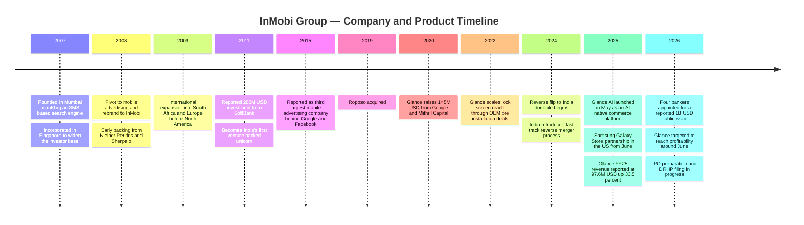
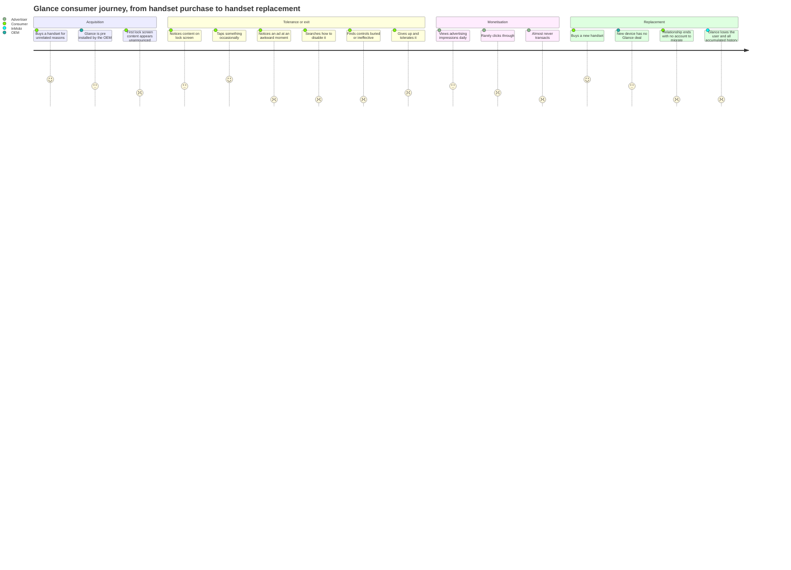
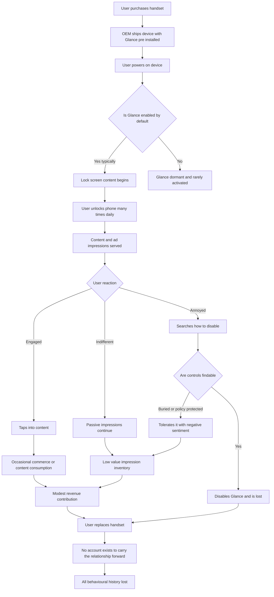
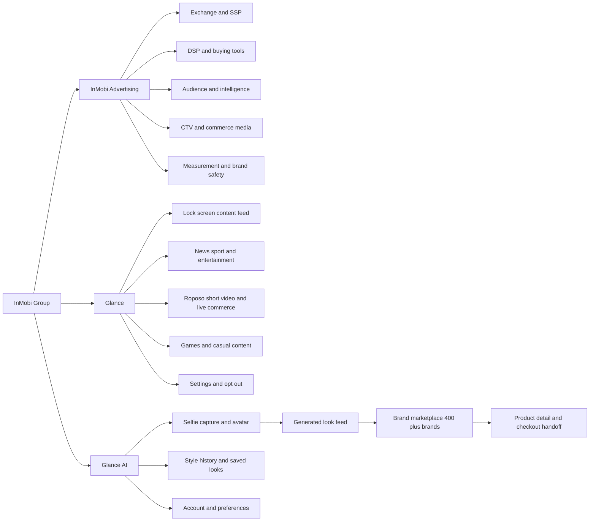
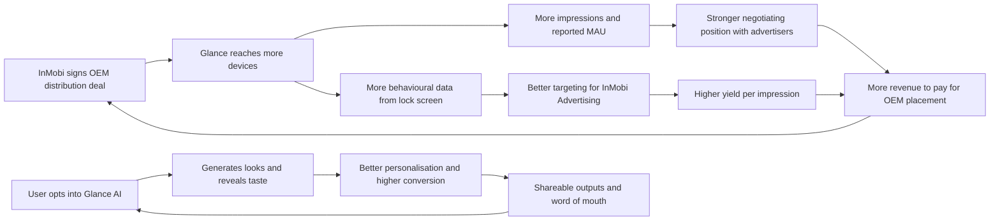
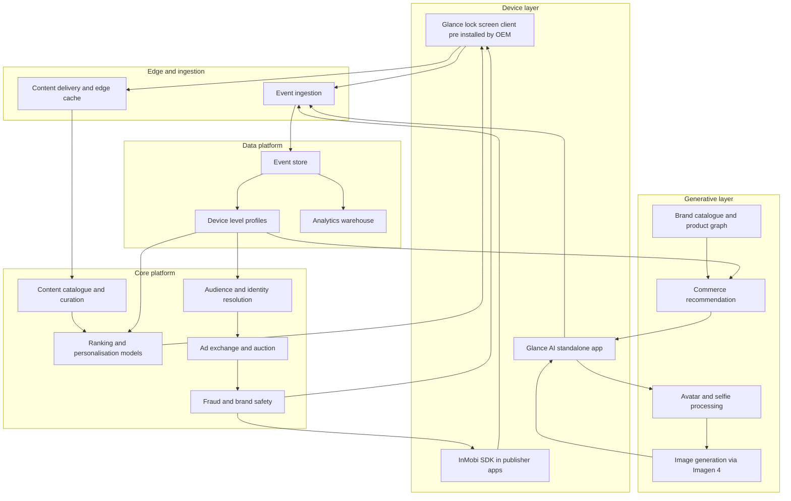
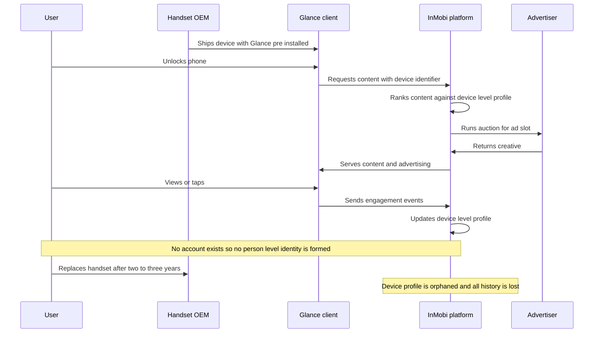
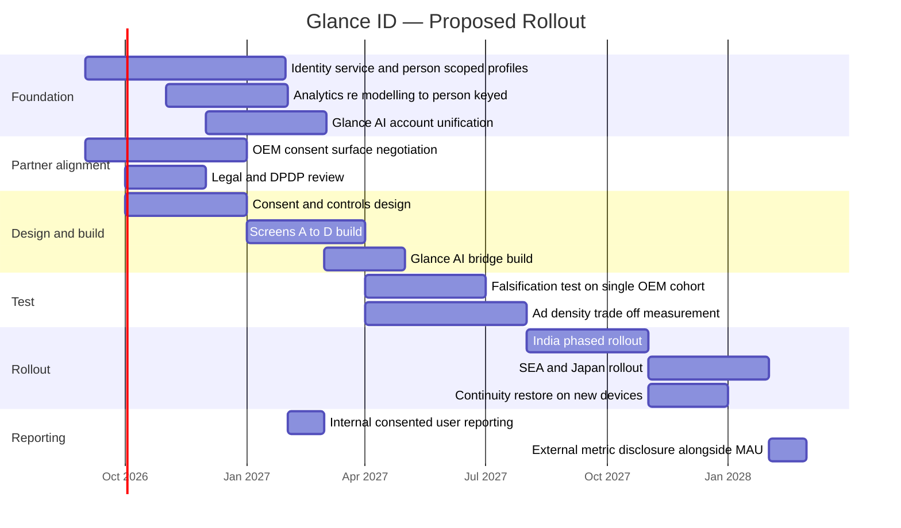

# Day 41 — InMobi

**Renting 400 Million Users: What InMobi's IPO Is Really Asking Investors To Believe**

A product management case study by Gaurav Singh
Part of the 90-Day PM Case Study Challenge
Research date: 6 August 2026

---

## 2. Repository Metadata

| Field | Value |
|---|---|
| Case study number | Day 41 of 90 |
| Subject | InMobi Group (InMobi Advertising, Glance, Roposo) |
| Category | AdTech / Consumer Internet / Mobile Distribution |
| Headquarters | Bengaluru, India (historically incorporated in Singapore) |
| Founded | 2007, as mKhoj |
| Status | Private; reverse-flipping to India ahead of a planned IPO |
| Research window | July–August 2026 |
| Primary lens | Distribution economics, attention quality, pre-IPO narrative testing |
| Companion file | `ASSUMPTIONS.md` |
| Author | Gaurav Singh |

---

## 3. Badges

---

## 4. Table of Contents

1. [Cover](#day-41--inmobi)
2. [Repository Metadata](#2-repository-metadata)
3. [Badges](#3-badges)
4. [Table of Contents](#4-table-of-contents)
5. [Executive Summary](#5-executive-summary)
6. [Product Overview](#6-product-overview)
7. [Company Background](#7-company-background)
8. [Product Timeline](#8-product-timeline)
9. [Vision & Mission](#9-vision--mission)
10. [Problem Statement](#10-problem-statement)
11. [Market Research](#11-market-research)
12. [Industry Analysis](#12-industry-analysis)
13. [TAM/SAM/SOM](#13-tamsamsom)
14. [Competitor Analysis](#14-competitor-analysis)
15. [SWOT](#15-swot)
16. [Porter's Five Forces](#16-porters-five-forces)
17. [Business Model Canvas](#17-business-model-canvas)
18. [Revenue Model](#18-revenue-model)
19. [Target Users](#19-target-users)
20. [Personas](#20-personas)
21. [JTBD](#21-jtbd)
22. [User Journey](#22-user-journey)
23. [User Flow](#23-user-flow)
24. [Information Architecture](#24-information-architecture)
25. [UX Audit](#25-ux-audit)
26. [UI Audit](#26-ui-audit)
27. [Accessibility](#27-accessibility)
28. [Feature Breakdown](#28-feature-breakdown)
29. [AI Capabilities](#29-ai-capabilities)
30. [Product Metrics](#30-product-metrics)
31. [North Star Metric](#31-north-star-metric)
32. [Product Analytics](#32-product-analytics)
33. [AARRR](#33-aarrr)
34. [HEART](#34-heart)
35. [Growth Strategy](#35-growth-strategy)
36. [Growth Loops](#36-growth-loops)
37. [Network Effects](#37-network-effects)
38. [Product Strategy](#38-product-strategy)
39. [Monetization](#39-monetization)
40. [Trust & Safety](#40-trust--safety)
41. [Technical Architecture](#41-technical-architecture)
42. [Data Flow](#42-data-flow)
43. [API Ecosystem](#43-api-ecosystem)
44. [Privacy & Security](#44-privacy--security)
45. [Pain Points](#45-pain-points)
46. [Opportunity Mapping](#46-opportunity-mapping)
47. [RICE](#47-rice)
48. [MoSCoW](#48-moscow)
49. [Kano](#49-kano)
50. [Feature Proposal](#50-feature-proposal)
51. [PRD](#51-prd)
52. [Wireframes](#52-wireframes)
53. [Rollout Plan](#53-rollout-plan)
54. [A/B Testing](#54-ab-testing)
55. [KPI Dashboard](#55-kpi-dashboard)
56. [Product Roadmap](#56-product-roadmap)
57. [Risks & Mitigation](#57-risks--mitigation)
58. [Future Vision](#58-future-vision)
59. [PM Lessons](#59-pm-lessons)
60. [PM Interview Questions](#60-pm-interview-questions)
61. [References](#61-references)
62. [About the Author](#62-about-the-author)
63. [License](#63-license)
64. [Self Review](#64-self-review)
65. [Appendix](#65-appendix)

---

## 5. Executive Summary

**Central thesis: InMobi does not own its consumer audience. It leases it — and the entire IPO narrative rests on a bet that the lease can be converted into a relationship before it expires.**

InMobi is heading toward a public listing on Indian exchanges with four bankers appointed and a reverse flip from Singapore/Cayman to India underway. The pitch has two halves. The first is a profitable, roughly billion-dollar-revenue independent mobile ad exchange. The second is Glance — a lock-screen content platform reported at somewhere between 350 million and 400 million monthly users, positioned as a consumer internet asset that justifies a consumer internet multiple. Bankers are reported to have pitched 25–30x revenue, against valuation targets variously reported at $5B, $8–10B and $10B.

The first half is a real business. The second half deserves a much harder look, and one number does most of the work.

Glance reported FY25 revenue of $97.6 million, up 33.5%. Divide that by even the most conservative user figure and you get **roughly $0.24 to $0.28 of annual revenue per user.** For comparison, that is a fraction of what almost any chosen consumer app earns per user anywhere, including in India.

The standard reading of that number is that Glance has a monetisation problem. I think that reading is wrong, and the inversion is the thesis of this case study. **Glance does not have a monetisation problem. It has an attention-quality problem, and $0.25 per user per year is roughly the correct market price for the kind of attention it holds.**

Here is why. Glance's users did not choose Glance. They bought a Samsung, Xiaomi, Realme or Nothing handset and Glance arrived pre-installed on the lock screen through an OEM distribution contract. The user acquired a phone; Glance acquired the user. That distinction does not show up in a monthly-active-user count, but it shows up in everything the number is supposed to predict — intent, retention, willingness to transact, and price per impression.

Three pieces of evidence test this and hold.

**First, the arithmetic of the group itself.** Glance carries close to all of the consumer narrative and roughly a tenth of group revenue. InMobi's advertising business is reported at approximately ₹8,650 crore (~$1B) for FY25 while Glance contributes $97.6M. A 400-million-user consumer platform that generates less than 10% of its parent's revenue is not a consumer platform that has yet to be monetised. It is a distribution surface that has been monetised about as far as its attention quality allows.

**Second, revealed preference.** Attention that must be defended by an OEM system policy is not attention that was earned. There is an entire cottage industry of "how to disable Glance" guides, and reporting indicates some OEMs bury the controls, that the component can be protected by system policy, and that disabling it does not always persist. Users describe the ad-heavy lock screen in unflattering terms, and complain about data and RAM consumption. When a product's most reliably searched user flow is the exit, the MAU figure is measuring exposure, not engagement.

**Third, and most tellingly, InMobi's own strategy concedes the point.** Glance AI, launched in May 2025, is an AI-native shopping platform built on Google's Imagen 4, letting users upload a selfie and see photorealistic renderings of themselves in clothing from 400-plus brands. It shipped with Samsung in the US in June 2025. Two design decisions matter more than the technology. It is **explicitly opt-in**, a deliberate reversal from a lock-screen product criticised for being too ad-focused. And it is built around **shopping** — that is, around intent.

You do not rebuild your consumer product around explicit consent and purchase intent if your existing 400 million users already supplied either. Glance AI is best understood not as a feature extension but as an admission: the company is trying to purchase, through product quality, the thing that distribution alone never delivered. Early traction is real but small against the base — roughly 1.5 million weekly users as of July 2025, generating around 18 AI looks each per day and some 40 million cumulative style requests.

**The vulnerability, stated plainly.** Glance's distribution is a contract, not an asset. It has counterparties, renewal dates, and a small number of extremely powerful suppliers who can raise the rent or exit. Worse, there is no portable user identity: when a user replaces a Glance-preloaded handset with one from an OEM without a Glance deal, that user is simply gone, with no account, no login, and nothing to migrate. Glance therefore has hundreds of millions of monthly users and, in any durable sense, close to zero retained ones. **The IPO is asking public investors to pay a consumer-internet multiple for a business whose consumer relationship resets every hardware refresh cycle.**

The feature proposal in §50 — a **portable, explicitly-consented Glance identity**, converting pre-installed reach into an account that survives a device change — is constructed to close exactly that gap. It is the only proposal in the opportunity set that addresses the actual risk in the listing rather than the surface complaints about the product. It will also, almost certainly, reduce reported reach. §54 contains a test designed to determine whether that trade is worth making, with a kill criterion stated in advance.

**Where this analysis is weakest.** InMobi is private and pre-DRHP, so the financial record is fragmentary and contradictory. Group revenue is reported at ~$1B for FY25 by one source and ~$1.3B for FY23–24 by another, which cannot both be right in the direction implied. Glance's user base is reported at 350M, 370M and 400M+ across sources within roughly a year. Valuation targets span $5B to $10B. IPO size is reported both as ~$1B and as ₹3,000–4,000 crore. Every one of these conflicts is preserved rather than resolved in `ASSUMPTIONS.md`, and the per-user revenue figure that anchors this thesis is my own arithmetic on two contested inputs — which means it is directionally robust and precisely wrong.

---

## 6. Product Overview

InMobi Group operates three businesses that share infrastructure and a data layer but serve very different customers.

**1. InMobi Advertising — the exchange.** A programmatic mobile advertising platform connecting advertisers to in-app and mobile-web inventory. This includes the ad exchange and SSP, DSP-side buying tools, an audience and intelligence layer, and increasingly connected TV and commerce media. It is one of the larger independent mobile ad exchanges globally, with particular depth in India and Southeast Asia. This is the revenue engine.

**2. Glance — the lock screen.** A content platform that surfaces news, sport, entertainment, short video and, increasingly, shopping directly on the smartphone lock screen. It reaches users through pre-installation deals with handset makers rather than through app-store downloads. Reported reach is 350M–400M+ monthly users across India, Southeast Asia, Japan and the United States. Glance also encompasses Roposo, a short-video and live-commerce platform acquired in 2019, plus Shop101, Nostra and 1Weather.

**3. Glance AI — the intent bet.** Launched May 2025, an AI-native commerce experience built on Google's Imagen 4. A user uploads a selfie and receives photorealistic renderings of themselves wearing items from a marketplace of 400-plus brands, shifting discovery from search to inspiration. Distributed as a standalone app on both stores, through OEM integrations, and via a Samsung Galaxy Store partnership in the US from June 2025.

**How the pieces are supposed to fit.** The intended flywheel is that Glance's consumer reach generates first-party behavioural data and owned inventory, which makes InMobi's advertising business smarter and less dependent on third-party supply, which funds further consumer investment. In principle this is a strong structure — an ad platform that owns its own demand-generating surface is rarer and more defensible than one that only intermediates.

**Where the structure strains.** The consumer surface is not owned. It is licensed from handset manufacturers, one contract at a time. That single fact propagates through every section of this analysis, and it is the reason §16 and §37 reach conclusions that a conventional read of this company would miss.

---

## 7. Company Background

InMobi was founded in 2007 in Mumbai as **mKhoj**, an SMS-based search engine, by Naveen Tewari, Mohit Saxena, Amit Gupta and Abhay Singhal. The business was incorporated in Singapore to widen its investor base — a decision that would take nearly two decades and a reverse flip to undo.

mKhoj did not find traction. In 2008 the founders pivoted to mobile advertising and renamed the company InMobi, reportedly financing the relaunch partly on credit-card debt, with early investment from Kleiner Perkins and Sherpalo Ventures. Tewari expanded internationally almost immediately, entering South Africa and Europe before North America — a sequence he has attributed to weaker competition and faster mobile adoption in emerging markets. That sequencing decision is worth pausing on, because it established a pattern the company has repeated ever since: win where the incumbents are not looking, using distribution rather than product superiority.

In 2011, a reported $200 million investment from SoftBank made InMobi India's first venture-backed unicorn — a genuine landmark in the Indian startup ecosystem, and one that still shapes how the company is written about domestically. By 2015 the BBC reported InMobi as the third-largest company in mobile advertising, behind only Google and Facebook.

The consumer chapter began later. Roposo was acquired in 2019. Glance raised $145 million from Google and Mithril Capital in December 2020, and grew rapidly on the strength of OEM pre-installation deals. Google's involvement is worth noting twice: it is both an investor in Glance and the owner of the operating system on which Glance's distribution depends.

**The present moment.** InMobi is completing a reverse flip from Singapore/Cayman domicile to India, following a well-trodden path — Flipkart, Meesho, Zepto, Razorpay, Pine Labs and Groww have all done or attempted the same, and India's September 2024 fast-track reverse-merger amendment to Rule 25A has shortened the process considerably. Reverse flips are not free: Meesho's US tax outgo was reported at roughly $280–300 million, and PhonePe's internalisation carried very significant Indian capital-gains costs at shareholder level. InMobi's specific tax cost is not publicly disclosed, and I do not estimate it.

In July 2026, reporting indicated InMobi had appointed JPMorgan Chase, Jefferies, Kotak Mahindra Capital and Axis Capital for a public issue reported at approximately $1 billion (₹9,634 crore). Financial reporting on the group is inconsistent and is treated in detail in §30 and in `ASSUMPTIONS.md`.

---

## 8. Product Timeline

Read the shape rather than the entries. Every step-change in InMobi's history came from **securing a distribution position ahead of competitors** — emerging markets before the US, OEM lock screens before anyone thought the lock screen was inventory, Samsung's US Galaxy Store before rivals. This is a genuinely rare organisational competence and it recurs in §35 and §59. It is also, precisely, the competence that produces leased assets rather than owned ones.

---

## 9. Vision & Mission

InMobi's public positioning has moved through four phases:

- **2007–2008, the search era.** Connect people to local information via SMS. Abandoned.
- **2008–2018, the exchange era.** Power mobile advertising for a mobile-first world. Positioning is infrastructural and B2B.
- **2019–2024, the consumer era.** Glance reframes the company around consumer reach, framed as "unlocking the potential of the lock screen" — turning idle glances into content consumption.
- **2025–present, the AI commerce era.** Naveen Tewari has stated the ambition explicitly: an AI commerce platform intended "to disrupt shopping in the world," replacing intent with inspiration and search with autonomous agents across phones, TVs and brand stores.

**Author's reading.** Note what happened to the word "intent" between phases three and four. The 2025 framing positions replacing intent with inspiration as the innovation. It is a good pitch. But read against the economics in §5, an alternative interpretation is available: the company is describing as a strategic choice something closer to a structural constraint. Glance's audience arrives without intent because of how it is acquired. Building a product that monetises inspiration rather than intent is not only a bold vision of commerce's future — it is also the only kind of product that this particular audience could ever have supported. Both readings can be true simultaneously, and §38 treats them as the central strategic question.

---

## 10. Problem Statement

There are three distinct problems here, held by three different parties, and conflating them is the most common analytical error made about this company.

**The advertiser's problem.** Mobile advertising inventory is fragmented across millions of apps and sites. Advertisers need reach, targeting, measurement and fraud protection at scale without negotiating individually. InMobi Advertising addresses this credibly and profitably. It is a solved problem with ongoing competitive pressure.

**The OEM's problem.** Handset makers in price-competitive markets need revenue beyond the hardware margin, and they need software differentiation. Glance solves this elegantly: it pays them for lock-screen placement and gives them a content feature they did not have to build. This is why Glance's distribution exists and why it is durable in the short run. **It is also why Glance is a supplier-power story, not a consumer story.**

**The user's problem — and this is where the analysis gets uncomfortable.** What problem does Glance solve for the person holding the phone? The stated answer is discovery of relevant content in idle moments. The revealed answer, from the volume of removal guides and the criticism of ad density, data usage and RAM consumption, is that for a meaningful share of users Glance is not solving a problem at all. It is occupying a surface they did not offer.

So the problem statement this case study adopts is:

> **InMobi has built exceptional distribution to an audience that has not consented to a relationship. Its advertising business is healthy and its consumer reach is enormous, but the reach converts to revenue at roughly a quarter of a dollar per user per year because the attention it holds carries neither intent nor permission. The problem to solve before a public listing is not scale, and not monetisation rate. It is converting exposure into consent, and consent into a portable relationship that survives the next handset purchase.**

That statement drives §45, §46 and §50.

---

## 11. Market Research

**The advertising market.** Open-internet programmatic mobile advertising is projected to reach roughly $400 billion globally by 2026. InMobi is among the larger independent exchanges, with disproportionate strength in India and Southeast Asia. Independence has real commercial value here for the same reason it does in any intermediated market: the largest alternatives are owned by the parties whose inventory is being bought and sold.

**The Indian digital advertising market** is growing faster than the global average, driven by cheap data, near-universal smartphone penetration at the low end, and the migration of retail and financial services to mobile. India is also structurally low-ARPU: the same user who generates $50+ annually for a Western platform generates single-digit dollars or less here. Any per-user comparison must be made against Indian benchmarks, not global ones — and Glance's ~$0.25 is low even against Indian benchmarks.

**The lock-screen and pre-install market** is a genuine, under-analysed category. Handset makers monetise the first-boot experience through pre-installation deals worth meaningful revenue per device. Glance is the largest pure-play in this category. The category's defining characteristic is that **the buyer of the placement is the OEM's finance team, and the consumer is not party to the transaction.**

**The AI commerce market** is nascent and crowded with incumbents. Glance AI competes against Amazon and Flipkart's own discovery surfaces, Google Shopping, Pinterest, Instagram Shopping and a wave of virtual try-on startups. Glance's differentiated claim is distribution — reaching the shopper before they have formed an intent, at the lock screen — which is precisely the claim the rest of this analysis interrogates.

**Buyer behaviour on the consumer side.** The most important market research finding for this case study is not a market-size figure. It is that a substantial and searchable population of Glance's users actively attempts to remove it, and that some OEMs make this difficult. That is a demand signal, and it points down.

---

## 12. Industry Analysis

Three structural forces define InMobi's operating environment.

**1. The consolidation of mobile advertising around a small number of very large, vertically integrated players.** Google, Meta, Amazon, AppLovin and Unity command the bulk of mobile ad spend. Independents compete on reach in specific geographies, on pricing, and on being unaligned. One tracked mindshare series places InMobi sixth in app monetisation at 7.8%, against Unity at 22.9% — up from 16.8% the prior year. Independence has value; scale has more.

**2. The commoditisation of ad tech and the premium on owned inventory.** As targeting signals degrade and intermediary margins compress, the platforms that thrive are those that own the surface where the ad appears. This is exactly the logic behind Glance, and it is sound logic. The question this case study raises is whether owning the *surface* is the same as owning the *audience*. InMobi's structure asserts they are equivalent. The per-user economics suggest they are not.

**3. The Indian pre-IPO cycle and its narrative demands.** A cohort of Indian technology companies is reverse-flipping and listing domestically. Public market investors in this cohort have already learned, expensively, to interrogate the gap between reported users and monetisable users. This is not a market that will accept an MAU figure at face value in 2026, and InMobi will be asked directly what proportion of Glance's users would install it voluntarily.

**Author's synthesis.** InMobi occupies an unusual and genuinely interesting position: a profitable, real ad-tech business with a consumer asset attached that is enormous in reach and thin in relationship. Most companies with this profile have the opposite problem — a beloved product they cannot monetise. InMobi has monetisation infrastructure of high quality and an audience that has not agreed to be an audience. The industry rewards owned demand generation; InMobi has built owned *supply* and described it as demand.

---

## 13. TAM/SAM/SOM

**Framework-selection rationale.** TAM/SAM/SOM is used here rather than bottom-up account sizing because InMobi is being valued imminently by public markets on the size of the opportunity it claims, and this framework forces the boundary question — *which* market is being sized — into the open. That boundary is the entire disagreement between the bull and bear cases on this company. The framework's known weakness is that top-down sizing invites motivated boundary-drawing; here that weakness is the object of study rather than a flaw to apologise for.

**The two incompatible sizings, stated side by side.**

| Framing | Market being sized | Implied TAM | Implied multiple logic |
|---|---|---|---|
| **Ad-tech company with a consumer asset** | Independent share of open-internet programmatic mobile advertising | Large but competitive; InMobi is a mid-single-digit share player | Ad-tech multiples: high single digit to low teens on revenue |
| **Consumer internet company with an ad-tech engine** | Attention and commerce across 400M+ users | Very large; framed as consumer internet | Consumer multiples: reported pitch of 25–30x revenue |

The reported 25–30x revenue multiple only makes sense under the second framing. §5's arithmetic is an argument that the second framing is not yet earned.

**Sizing:**

| Layer | Boundary definition | Estimate | Basis |
|---|---|---|---|
| TAM | Global open-internet programmatic mobile advertising, plus lock-screen and pre-install inventory, plus AI-assisted commerce discovery | USD 400B+ (advertising component) | Reported category projection for 2026 |
| SAM | Non-walled-garden mobile ad spend in geographies where InMobi has genuine supply and demand relationships — India, SEA, Japan, parts of US/EMEA — plus OEM-distributed consumer inventory in those markets | USD 25–40B | Author-constructed. Excludes Google/Meta/Amazon owned-and-operated inventory, which InMobi cannot address |
| SOM | InMobi group revenue achievable over 3 years | USD 1.3–1.8B | Author-constructed. Extrapolated from a reported ~$1B FY25 base at category growth plus Glance contribution |

**Author's caveat.** SAM and SOM are my constructions from stated assumptions, not findings. The TAM figure is a reported category projection whose boundary definition I could not verify. See `ASSUMPTIONS.md`.

---
## 14. Competitor Analysis

**Advertising side**

| Competitor | Positioning | Relative strength vs InMobi | Threat |
|---|---|---|---|
| **Google (AdMob / Ad Manager)** | Default demand and supply at scale | Overwhelming on scale, data and OS control | Structural; also Glance's landlord via Android and an investor via the 2020 round |
| **Meta Audience Network** | Walled-garden demand extended off-platform | Superior targeting data | High |
| **AppLovin** | Developer tools, exclusive SDK relationships, owns Adjust | Stronger developer lock-in and measurement integration | High and rising |
| **Unity Ads** | Games-native monetisation; mindshare 22.9%, up from 16.8% | Winning share in the segment InMobi historically served well | **High — the clearest competitive erosion signal** |
| **Moloco** | ML-first programmatic performance | Stronger performance-ML reputation | Medium-High |
| **PubMatic** | Enterprise SSP, header bidding | Comparable; different centre of gravity | Medium |
| **InMobi Advertising** | Independent exchange; India/SEA depth; mindshare 7.8%, ranked #6 | Geographic depth and independence | — |

**Consumer side**

| Competitor | Where it competes with Glance | Assessment |
|---|---|---|
| **The OEM itself** | Samsung, Xiaomi and others can build their own lock-screen content layer | **The most under-priced competitive threat in this table.** The supplier is also the most capable substitute |
| **ShareChat / Moj, Josh, Instagram Reels, YouTube Shorts** | Short-form video attention, competing with Roposo | Chosen products with organic install intent; structurally stronger relationship |
| **DailyHunt / Josh (VerSe)** | Vernacular content aggregation, also Google-backed | Direct analogue with app-based distribution |
| **Amazon, Flipkart, Meesho** | Commerce discovery, competing with Glance AI | Own the transaction and the purchase history InMobi lacks |
| **Google Discover** | Pre-installed content feed on Android | Owns the OS layer above Glance |
| **Pinterest, Instagram Shopping, virtual try-on startups** | Inspiration-led shopping | Comparable product, chosen audiences |

**The finding that matters, and it appears in only one row.** In the consumer table, InMobi's single largest competitor is its single largest supplier. Samsung and Xiaomi can build a lock-screen content surface, and they capture 100% of the economics if they do. Every other competitor in this analysis competes for the user; the OEMs compete for the *placement*, which is the only thing Glance actually holds. This is the first of the sections that converge on §50.

---

## 15. SWOT

**Strengths**
- Profitable, roughly billion-dollar-revenue independent mobile advertising business with genuine scale
- Exceptional distribution competence — a repeatable organisational skill demonstrated across three eras (§8)
- Enormous top-of-funnel reach: 350M–400M+ monthly users, whatever the precise figure
- Owned inventory reduces dependence on third-party supply, a real structural advantage over pure intermediaries
- Deep India and Southeast Asia relationships that global players have not replicated
- First-mover credibility and founder continuity since 2007

**Weaknesses**
- **No portable user identity. Glance's relationship with a user terminates when the handset does** (the central weakness of this analysis)
- Consumer revenue per user of roughly $0.24–$0.28 annually (author-computed; see §30)
- Consumer reach acquired without consent, generating measurable removal-seeking behaviour
- Declining relative mindshare in app monetisation against Unity and AppLovin
- Financial reporting opacity ahead of a listing, with materially conflicting public figures
- Glance's economics depend on contracts whose renewal terms are not public

**Opportunities**
- Convert leased reach into consented, portable relationships (the §50 proposal)
- Glance AI's commerce pivot, if it establishes genuine purchase intent, changes the revenue-per-user equation structurally
- Commerce media and CTV, where InMobi's exchange assets transfer
- India's domestic listing environment and the strategic value of being an Indian-domiciled independent adtech champion
- First-party data from a consented consumer base would materially improve the advertising business

**Threats**
- **OEMs building or in-housing the lock-screen layer** — the supplier-as-competitor risk in §14
- Rising OEM placement costs compressing Glance margins as the category matures
- Google's dual role as Android owner, Glance investor and largest advertising competitor
- Public-market scrutiny of the MAU-to-revenue gap during IPO diligence
- Regulatory or platform-policy attention to pre-installed software and consent, in India or elsewhere
- Continued share loss in the core exchange to better-tooled competitors

---

## 16. Porter's Five Forces

**Framework-selection rationale.** Porter's is selected because InMobi's defining strategic characteristic is an extreme asymmetry in supplier power that a product- or customer-centric framework would not surface at all. A Business Model Canvas or a JTBD analysis would treat the OEM as a "key partner" and move on. Porter's forces the question of who actually captures the value, and in this case the answer reorganises the entire analysis. The framework's usual weakness — that it is static — is not binding here, because these forces have been directionally stable for five years.

| Force | Rating | Reasoning |
|---|---|---|
| **Supplier power (handset OEMs)** | **Extreme** | Glance's entire consumer reach exists at the discretion of a handful of manufacturers. They set placement terms, control renewal, own the operating-system layer above Glance, and can build a competing surface and keep all the economics. There is no substitute channel of comparable scale. Google sits above all of them as the Android owner. **No other force in this analysis is close.** |
| **Buyer power (advertisers)** | **High** | Advertisers have many exchanges to choose from and shift budget with low friction. Independence is a differentiator but not a lock-in. Erosion is visible in mindshare data. |
| **Threat of new entrants** | **Moderate on advertising, Low-to-Moderate on lock screen** | Building an ad exchange at scale is hard. Displacing Glance from a lock screen requires only that an OEM decide to do it — which is a low barrier for the specific entrants who matter, and an impossible one for everybody else. |
| **Threat of substitutes** | **High** | For advertisers: Google, Meta, AppLovin, Unity, Moloco. For consumer attention: every chosen app on the phone, plus Google Discover one layer up. For Glance AI: every commerce platform that already owns purchase history. |
| **Competitive rivalry** | **High** | Fragmented, price-competitive, with better-capitalised rivals gaining mindshare. |

**Synthesis.** This is a business whose most valuable-looking asset sits behind the highest-power supplier relationship in the analysis. The strategic imperative that follows is not "grow Glance" — growing a leased asset increases exposure to the lessor. It is **to build something the OEM cannot repossess**, which means a direct, consented, portable relationship with the user. Second convergence point for §50.

---

## 17. Business Model Canvas

| Block | Content |
|---|---|
| **Customer segments** | Advertisers and agencies (global brands, performance marketers, Indian D2C); app publishers monetising inventory; handset OEMs and telcos; consumers on Glance and Glance AI; retail brands on Glance AI's marketplace |
| **Value propositions** | *To advertisers:* independent scaled reach with strong India/SEA depth and owned inventory. *To publishers:* monetisation and fill. *To OEMs:* revenue per device plus a software feature they did not build. *To consumers:* zero-friction content and, via Glance AI, inspiration-led shopping |
| **Channels** | Direct enterprise ad sales; programmatic integrations and SDK; **OEM pre-installation** (the consumer channel); app stores for Glance AI; Samsung Galaxy Store partnership |
| **Customer relationships** | High-touch for advertisers; contractual and commercially negotiated for OEMs; **effectively anonymous and non-contractual for consumers** |
| **Revenue streams** | Advertising take on exchange volume; Glance advertising ($61.7M FY25, +54%); commerce and marketplace via Roposo and Shop101 ($32.4M FY25); emerging Glance AI commerce |
| **Key resources** | The ad exchange and its supply/demand relationships; **OEM distribution contracts**; behavioural data from Glance; the AI/ML stack; brand and founder credibility in India |
| **Key activities** | Running the exchange at scale; negotiating and renewing OEM deals; content acquisition and curation for Glance; AI model development; IPO preparation and reverse flip |
| **Key partnerships** | Samsung, Xiaomi, Realme, Nothing and other OEMs; Google (Android, investor, Imagen 4 supplier, competitor); telcos; content publishers; 400+ retail brands on Glance AI |
| **Cost structure** | OEM placement payments; content licensing; infrastructure and inference; engineering and sales headcount; IPO and reverse-flip costs |

**What the canvas exposes.** Google appears in Key partnerships as an investor, in Key resources implicitly as the OS layer, in the cost structure as an AI supplier, and in §14 as the largest competitor. The OEMs appear simultaneously as customers, as channels, as the largest cost line, and as the most credible consumer-side competitor. When counterparties occupy that many blocks, the business model's structural risk is concentration, and the canvas's "Customer relationships" row — anonymous and non-contractual with consumers — is where that risk becomes unmanageable.

---

## 18. Revenue Model

**Advertising (the majority of group revenue).** InMobi takes a share of programmatic spend flowing through its exchange. Reported group revenue is approximately ₹8,650 crore (~$1B) for FY25, up from ₹7,950 crore in FY24 — though see §30 and `ASSUMPTIONS.md` for a direct conflict with a separate estimate of ~$1.3B for FY23–24.

**Glance (FY25: $97.6M, +33.5%).** Two components:
- Advertising services: $61.7M, up 54% — the faster-growing half
- Shipping and marketplace services via Roposo and Shop101 (India only): $32.4M

**Glance AI.** Commerce-based, presumably affiliate or marketplace take. Not separately disclosed.

**Three observations about this model.**

1. **The revenue mix contradicts the narrative.** Glance is roughly a tenth of group revenue while carrying most of the consumer story. Reporting has variously described Glance as "contributing only a third" of the advertising business — a claim that does not reconcile with $97.6M against ~$1B, and which is logged as a conflict rather than resolved.

2. **Glance's growth is real and its base is small.** 33.5% growth and 54% growth in the ad component are genuinely good numbers. But compounding from $97.6M against a 350–400M user base means the per-user figure improves slowly even in a strong year. Reaching even $1.00 per user annually would require roughly a 4x revenue increase with no user growth. That is the size of the gap between the current business and the narrative it supports.

3. **The revenue model prices impressions, not relationships.** Glance monetises the surface it occupies. It does not monetise a user it knows, because it does not have an account through which to know them. This is the pricing-model expression of the §5 thesis, and it is why Glance AI's commerce pivot — which requires an account, a wardrobe, a purchase history — is a more fundamental change than it appears. Third convergence point for §50.

---

## 19. Target Users

| Group | Relationship to InMobi | What they need | Power |
|---|---|---|---|
| **Advertisers and agencies** | Paying customers | Reach, targeting, ROAS, brand safety, measurement | High — they can leave easily |
| **App publishers** | Supply partners | Fill rate, eCPM, reliable payment | Moderate |
| **Handset OEMs** | Channel, customer and cost line simultaneously | Per-device revenue; software differentiation; no user complaints | **Decisive** |
| **Glance consumers (India, SEA, Japan)** | Reached, not acquired | Content worth the interruption; control over their lock screen | **Nominally none, actually significant** — expressed through removal, not negotiation |
| **Glance AI users (US, India)** | Opted in | Inspiration, fit confidence, trustworthy recommendations | Genuine — they chose to be there and can leave freely |
| **Retail brands on Glance AI** | Marketplace supply | Conversion, catalogue quality | Moderate |
| **Public market investors (imminent)** | Prospective owners | A defensible answer on user quality and OEM concentration | **Becoming decisive** |

**The two rows to hold together.** Glance consumers have no formal power and exercise real power anyway — through disabling, through the low price their attention commands, and through never converting. Glance AI users have genuine power and are, at ~1.5M weekly, a rounding error against the base. The company's entire strategic problem is the distance between those two rows.

---

## 20. Personas

*All three are author-constructed composites. They are reasoning tools, not research findings — see `ASSUMPTIONS.md`.*

**Persona 1 — Ramesh, 31, delivery fleet supervisor, Kanpur**
Bought a ₹12,000 Android handset. Unlocks his phone perhaps 80 times a day and sees Glance content on most of those unlocks. Occasionally taps a cricket score. Has never heard the word "Glance" and could not name the app if asked. Once searched "how to stop news on lock screen" after the phone felt slow, found the instructions confusing, and gave up. *He is the median Glance user, and the honest description of his relationship with the product is that he tolerates it.* He is also, economically, worth about a quarter of a dollar a year — which is not a failure of monetisation, it is an accurate valuation of a tolerated interruption.

**Persona 2 — Sneha, 26, marketing associate, Pune**
Actively disabled Glance within a week of buying her phone, after an ad appeared on her lock screen during a work meeting. She is exactly the demographic advertisers want — urban, employed, discretionary income — and she is precisely the cohort most likely and most able to remove the product. *The selection effect this creates is the quiet killer in Glance's ARPU: the users worth the most are the ones most likely to leave, and no account exists to win them back.*

**Persona 3 — Maya, 34, US, Samsung Galaxy owner**
Downloaded Glance AI after seeing it in the Galaxy Store. Uploaded a selfie, generated outfit renderings, found it genuinely fun, and bought one item. She has an account, a style history and demonstrated purchase intent. She is worth an order of magnitude more than Ramesh — possibly two. *She is also the persona InMobi has almost none of.* The entire strategic question of this case study is whether the company can turn Rameshes into Mayas, or whether it must acquire Mayas from scratch — in which case the 400M figure is not an asset in that effort at all.

---

## 21. JTBD

**The advertiser's job.** *When I need to reach mobile users at scale outside the walled gardens, I want an independent exchange with real supply in my target geographies, so that I can buy efficiently without handing my budget entirely to Google and Meta.* Well served.

**The OEM's job.** *When I am selling handsets on thin hardware margins, I want to earn recurring revenue per device without building software, so that I can compete on price and still make money.* Very well served — this is the strongest product-market fit in the entire company.

**The consumer's job — and the honest version is uncomfortable.**

The stated job is: *when I have an idle moment, I want relevant content without opening an app.* If that job were genuinely held, Glance's engagement and monetisation would look very different, and removal guides would not be a content category.

The more defensible reading is that **the median Glance user has no job that Glance is hired for.** The product was not hired. It was assigned. Jobs-to-be-done as a framework assumes a hiring decision, and the framework's most useful contribution here is to surface that in Glance's case no such decision occurred.

**The job Glance AI targets, which is real:**

| Job | Situation | Desired outcome | Current alternative |
|---|---|---|---|
| Decide whether something will suit me before buying | Browsing clothes online with low confidence in fit and look | Visual confidence and fewer returns | Reviews, size charts, ordering multiple sizes |
| Find things I would like without knowing what to search for | No specific intent, open to discovery | Inspiration that converts | Instagram, Pinterest, marketplace browsing |
| **Keep my discoveries when I change my phone** | **Upgrading handset** | **Continuity of taste profile and history** | **None — Glance has no portable account** |

The final row is not a job anyone has articulated to InMobi, because users cannot miss something they never had. It is nevertheless the job whose absence determines whether any of the value created above is retained. Fourth convergence point for §50.

---

## 22. User Journey

Two observations. First, the journey has **no acquisition step involving the user's agency** — the closest thing to a decision the consumer makes is buying a handset for unrelated reasons. Second, and more damaging, **the journey terminates with total data loss for both parties.** Every behavioural signal Glance accumulated over two or three years evaporates at handset replacement, because there is nothing to migrate it into.

That final section is the single most consequential diagram in this case study. Fifth convergence point for §50.

---

## 23. User Flow

Node **T** is the structural terminus of this product. Note also that three of the four reaction paths converge on **Q**, low-value impression inventory — which is the flow-diagram explanation for the $0.25 figure in §5. Sixth convergence point for §50.

---

## 24. Information Architecture

**IA critique.** The three trees barely touch. A Glance lock-screen user and a Glance AI user are, architecturally, two different people with no shared identity object between them — `G5 Settings and opt out` and `AI6 Account and preferences` are not the same construct, and there is no node anywhere in this diagram representing *a person who persists across surfaces and devices*.

This is not a navigation problem. It is the information-architecture expression of the company's core weakness: **there is no user object.** Any proposal that fixes the strategic problem in §16 has to start by creating one, and that is an IA change before it is a feature.

---

## 25. UX Audit

**What works**

- **Zero-friction reach.** Glance's content requires no download, no login and no learning. For a first-time smartphone user in a low-connectivity market, that genuinely lowers a real barrier, and the achievement should not be dismissed.
- **Content latency and lightness.** Serving rich content on the lock screen of low-end devices is a hard engineering problem, executed at scale.
- **Glance AI's core loop is strong.** Upload a selfie, see yourself in real garments, refine. It is immediately legible, produces a visible output in seconds, and gives a genuine reason to return. It is the best-designed thing in the portfolio.
- **Glance AI is explicitly opt-in**, which is both the right design decision and, as argued in §5, a tacit critique of the flagship.

**Where it strains**

1. **Consent is absent at the moment of first contact.** The user's first Glance experience is content they did not request appearing on a surface they consider personal. Whatever the OEM contract permits, this is a UX failure in the plain sense: the product's first impression is an intrusion.
2. **The exit is the most-sought flow and the least-designed one.** Reporting indicates controls are buried by some OEMs, that disabling does not always persist, and that the component may be protected by system policy. A product whose most-searched interaction is its own removal has a design problem it is choosing not to solve.
3. **Perceived performance cost.** Complaints centre on data consumption and RAM usage. On the low-end devices where Glance's reach is concentrated, this is not a minor irritation — it degrades the primary function of the device.
4. **No continuity of identity.** Nothing the user does is remembered anywhere they can retrieve it. Preferences, taste, history — all local, all disposable.
5. **Two products, one brand, no bridge.** A Glance lock-screen user has no path to Glance AI, and Glance AI's opt-in, account-based, intent-driven experience is close to the opposite of the lock-screen product in every respect.

Findings 1, 2 and 4 are one finding: **the product treats the user as an audience rather than a party.** That is the UX statement of the §50 proposal.

---

## 26. UI Audit

- **Glance lock screen.** Full-bleed imagery with overlaid headlines; visually competent and appropriately lightweight. The recurring UI failure is insufficient differentiation between editorial content and advertising — on a surface the user did not opt into, that ambiguity converts irritation into distrust.
- **Ad density and placement.** Criticism of the pre-Glance-AI experience as excessively ad-focused is consistent enough across sources to treat as a real signal rather than noise.
- **Controls and settings.** Settings discoverability is the weakest UI dimension in the portfolio, and it is weak by omission rather than by poor execution — the controls are not designed to be found.
- **Glance AI.** Visually strong. Generated imagery is the product, and presenting it as a scrollable, personalised feed is the right pattern for inspiration-led discovery. The main UI risk is trust: photorealistic renderings of a user's own body raise expectations that the physical garment must meet, and there is no visible mechanism managing that gap.
- **Cross-surface consistency.** Effectively none. Glance and Glance AI do not read as one product family, which is defensible as a positioning choice and costly as a conversion path.
- **Roposo.** Conventional short-video UI in a category where the leaders — Instagram and YouTube — set an extremely high bar on feed quality and creator tooling.

---

## 27. Accessibility

Assessed heuristically against WCAG 2.1 AA principles from public surfaces and general patterns. Not an instrumented audit — graded Low confidence in `ASSUMPTIONS.md`.

| Area | Assessment | Notes |
|---|---|---|
| **Consent and control** | **Likely failure, and the most serious one** | Accessibility includes the ability to control your own device. Content on a lock screen that is difficult to disable is an autonomy failure that affects every user, and disproportionately those least able to navigate buried settings |
| Text contrast over imagery | **At risk** | Headlines overlaid on full-bleed photography are a classic contrast failure; contrast varies with every image unless dynamic scrimming is enforced |
| Screen reader behaviour on lock screen | Unknown, likely poor | Lock-screen content injected by a third party is an unusual and poorly-standardised surface for assistive technology |
| Motion and auto-advance | At risk | Auto-advancing content can affect users with vestibular sensitivity; no visible reduced-motion honouring |
| Touch target sizing | Likely adequate | Large tap surfaces are inherent to the format |
| Data and performance cost | **Accessibility-adjacent failure** | On low-end devices and metered connections, background data and RAM consumption disproportionately harm the least-resourced users — who are the majority of Glance's base |
| Glance AI body representation | **Requires explicit attention** | Generative try-on across diverse body types, skin tones and abilities is an equity issue, not only a quality one. Under-representation here produces a product that works well for some users and poorly for others in a way that is invisible in aggregate metrics |

**Priority recommendations:** (1) make disabling Glance genuinely discoverable and persistent — this is both the accessibility fix and, per §50, the strategic one; (2) enforce dynamic contrast scrimming on all overlaid text; (3) audit Glance AI's generative output across body types and skin tones and publish the coverage.

**Why this section is load-bearing here.** For most products, accessibility is a compliance obligation adjacent to the core proposition. For a product that installs itself on a surface the user considers private and resists removal, control *is* the accessibility question, and it is the same question the rest of this document is asking.

---
## 28. Feature Breakdown

| Feature area | Capability | Strategic role | Assessment |
|---|---|---|---|
| **Ad exchange / SSP** | Programmatic mobile supply at scale | Revenue engine | Solid; under mindshare pressure |
| **DSP and buying tools** | Advertiser-side campaign management | Demand capture | Competitive but not differentiating vs AppLovin/Unity tooling |
| **Audience and intelligence** | Targeting segments, identity resolution | Improves yield | Strengthened by Glance data — the intended synergy |
| **CTV and commerce media** | Emerging inventory classes | Growth vector | Early; the right adjacency |
| **Glance lock-screen feed** | Content on device unlock, no download required | **The distribution asset** | Enormous reach, thin relationship |
| **Roposo** | Short video and live commerce | Consumer engagement and commerce | Competing against Instagram and YouTube with a structurally weaker acquisition model |
| **Shop101 / marketplace** | Commerce transactions | $32.4M of Glance's FY25 revenue | Meaningful contribution; India-only |
| **Glance AI — avatar and try-on** | Selfie to photorealistic garment rendering via Imagen 4 | **The intent bet** | Genuinely differentiated product experience |
| **Glance AI — brand marketplace** | 400+ brands | Commerce monetisation | Early; catalogue depth is the constraint |
| **Samsung Galaxy Store partnership (US)** | Distribution for Glance AI | Repeats the distribution playbook in a high-ARPU market | Strategically the most interesting 2025 move |
| **Opt-out and settings** | User control over the lock screen | Should be a trust feature | **Under-built by design** — the only row here that is a deliberate omission |
| **Portable user account** | — | — | **Does not exist** |

**What this table exposes.** The bottom two rows are the whole case study. Every other capability is a product decision with trade-offs. Those two are absences, and they are the absences that determine whether any of the rows above compound or reset.

---

## 29. AI Capabilities

**Generation 1 — advertising ML.** Targeting, bid optimisation, fraud detection, yield management. Standard for the category, competently executed, and the table stakes of being an exchange. Moloco competes hardest here.

**Generation 2 — content ranking on Glance.** Personalising a lock-screen feed under severe constraints: no login, no explicit preferences, a device-level identifier at best, and a few seconds of attention. This is a genuinely hard ML problem and Glance's ability to hold any engagement at all is evidence it is solved reasonably well. It is also inherently capped — a model that cannot know who you are can only get so good.

**Generation 3 — Glance AI generative commerce.** Built on Google's Imagen 4. A user uploads a selfie; the system generates photorealistic renderings of them wearing garments from 400-plus brands. Reported traction as of July 2025: ~1.5 million weekly users, ~18 generated looks per user per day, ~40 million cumulative style requests. Extension beyond fashion into beauty, accessories and travel was signalled for later in 2025.

**Author's assessment, and it cuts both ways.**

The **18 looks per user per day** figure is the most interesting number in this entire case study after the ARPU calculation. It indicates genuine engagement intensity from a self-selected audience — this is a product people want to use, repeatedly, within a session. That is the opposite of the lock-screen product's profile, and it validates the intent thesis: given a reason, users will engage deeply.

But it also frames the scale problem precisely. 1.5M weekly users against a base of 350–400M monthly lock-screen users is roughly **0.4%**. The engaged product is tiny; the enormous product is unengaged. And critically, InMobi's 400M-user distribution advantage does *not* appear to be efficiently converting into Glance AI adoption — the headline Glance AI distribution win was Samsung's Galaxy Store in the US, a market where Glance's lock-screen base is weakest. If the lock-screen base were an effective acquisition channel for Glance AI, you would expect the traction story to be an Indian one.

**The strategic reading.** Generative AI has given InMobi its first genuinely chosen consumer product in nearly two decades. The company's central execution question is whether it can attach that product to its existing base, or whether it is effectively starting consumer acquisition from zero in parallel. The evidence available leans toward the latter — and that is an argument for §50, because a portable identity is precisely the bridge that would make the base convertible. Seventh convergence point.

---

## 30. Product Metrics

| Metric | Reported value | Confidence | Notes |
|---|---|---|---|
| Group revenue FY25 | ~₹8,650 Cr (~USD 1B), up from ₹7,950 Cr FY24 | Medium | **Conflicts** with a separate ~USD 1.3B estimate for FY23–24 |
| Group net profit | ~USD 100M (FY23–24, estimate) | Low | Estimator-sourced |
| Group EBITDA margin | ~18% | Low | Estimator-sourced |
| Glance revenue FY25 | USD 97.6M, +33.5% | Medium | Reported with component detail, the best-sourced Glance figure |
| — Glance advertising | USD 61.7M, +54% | Medium | |
| — Roposo / Shop101 commerce | USD 32.4M | Medium | India only |
| Glance MAU | 350M / 370M / 400M+ | **Conflicting** | Three figures across roughly a year |
| **Glance revenue per user per year** | **~USD 0.24–0.28** | **Author-computed** | $97.6M ÷ 350M–400M. Directionally robust, precisely uncertain |
| Glance AI weekly users | ~1.5M (July 2025) | Medium | |
| Glance AI looks per user per day | ~18 | Medium | |
| Glance AI cumulative style requests | ~40M | Medium | |
| Glance profitability | Targeted ~June 2026 | Medium | Company guidance |
| App monetisation mindshare | 7.8%, ranked #6 (Unity 22.9%) | Medium | Mindshare, not revenue share |
| **Glance retention across device replacement** | **Not tracked — structurally cannot be** | — | **No portable identity exists** |
| Opt-out / disable rate | Not disclosed | — | Not estimated |
| DAU, session depth, time on lock screen | Not disclosed | — | Not estimated |

**Two observations.**

First, the metric InMobi leads with — MAU — is the metric least connected to value here, because it counts exposure on a surface the user did not choose. Every consumer-internet company reports MAU; almost none of them acquired their M through a hardware supply chain.

Second, the row marked *structurally cannot be tracked* is not a measurement gap. It is a product gap wearing a measurement costume. You cannot measure retention across devices without an identity that spans devices, and InMobi does not have one. **A company about to be valued on consumer-internet multiples cannot currently answer the most basic consumer-internet question: how many of last year's users are still here?** Eighth convergence point for §50.

---

## 31. North Star Metric

**Proposed North Star: Monthly Consented Intentful Users (MCIU)** — users who have explicitly opted into a Glance identity and, in the month, took at least one deliberate action beyond a passive impression (tapped through, saved, generated a look, or transacted).

**Why this rather than the obvious alternatives:**

- *MAU* counts exposure. On a pre-installed surface, MAU grows when an OEM signs a deal and falls when one does not renew — it measures the sales team's contract wins, not the product's value. It is the wrong North Star for a company whose risk is exactly that dependency.
- *Impressions or ad revenue* are outputs and are maximised by increasing ad density, which §25 identifies as the primary driver of removal-seeking behaviour. Optimising it degrades the asset.
- *Glance AI weekly users* measures the new product only and ignores the 400M-user question entirely.

MCIU is proposed because it moves only when the company converts leased exposure into a chosen relationship — the single transition that determines whether the IPO narrative is true. It has three properties worth naming. It **falls** when a new OEM deal adds passive reach, correctly refusing to credit rented attention. It **rises** when a user opts in, which is the behaviour that survives a handset change. And it is **directly comparable to the metrics of chosen consumer products**, which is the comparison public investors will make whether or not InMobi invites it.

It is a deliberately unflattering metric. That is the point: it would currently read in the low single-digit millions against a reported 400M, and a company that measures the honest number is far better positioned to fix it than one that reports the flattering one until diligence forces the issue.

**Counter-metrics:** total reach (to ensure consent work does not collapse distribution unnecessarily); OEM partner satisfaction; revenue per consented user.

---

## 32. Product Analytics

**What is instrumentable today:** impression volume, tap-through, dwell time, content-category affinity, device and OS distribution, OEM cohort performance, ad fill and eCPM, Glance AI funnel from selfie upload to look generation to marketplace click to purchase handoff.

**What is not, and why it matters:**

- **Cross-device continuity.** No identity spans handsets. Every device replacement is an unattributable churn event that appears in no dashboard.
- **True churn.** Glance cannot distinguish "user disabled the product" from "user replaced the device" from "user's device is offline." All three look identical.
- **Opt-out funnel.** The most important user journey in §22 — search for disable, find controls, succeed or give up — is almost certainly uninstrumented, because it partly occurs outside the product in a search engine.
- **Lock-screen to Glance AI conversion.** Whether the 400M base is an acquisition channel for the intent product is the central strategic question of §29, and it is not cleanly measurable without shared identity.

**The cheapest high-value analytics work available.** Instrument the disable journey and publish the rate internally. It requires no new product, it directly measures the sentiment problem in §25, and it would give the leadership team a number for something currently discussed only qualitatively. If the rate is low, a major thesis of this case study weakens considerably — which is precisely why it is worth measuring.

---

## 33. AARRR

| Stage | Mechanism | Assessment |
|---|---|---|
| **Acquisition** | OEM pre-installation. Not app-store discovery, not marketing, not referral | Extraordinarily efficient in cost per user and extraordinarily weak in user quality. **Acquisition is a procurement activity here, not a marketing one** |
| **Activation** | Effectively involuntary — first content appears without an onboarding moment | There is no activation event, which means there is no moment where the product earns permission. Glance AI, by contrast, has a genuine activation (selfie upload) and correspondingly better engagement |
| **Retention** | Retained only as long as the device is retained and the OEM deal persists | **Retention is not a product outcome here; it is a hardware and contract outcome.** This is the most unusual line in the funnel |
| **Referral** | Essentially zero — users cannot recommend a product they cannot name | No viral coefficient. Glance AI has referral potential (shareable generated looks) that is under-exploited |
| **Revenue** | ~$0.24–0.28 per user annually on lock screen; materially higher per Glance AI user | The gap between these two figures is the strategic prize |

**The AARRR reading.** Three of the five stages are controlled by parties other than the user or the product team. In a normal consumer funnel, product work moves every stage. Here, product work currently moves only Revenue and, partially, Retention — and only within a window that the OEM contract defines. **A product organisation that cannot influence its own acquisition, activation or referral is not running a consumer product; it is operating a placement.** §50 is an argument for taking back activation and referral.

---

## 34. HEART

| Dimension | Goal | Signal | Metric |
|---|---|---|---|
| **Happiness** | Users are glad the product is on their phone | Sentiment, store reviews, removal-intent searches | Net sentiment; **volume of disable-intent search as a public proxy** |
| **Engagement** | Deliberate interaction, not passive exposure | Taps, saves, look generations, transactions | Deliberate actions per active user per week |
| **Adoption** | Users choose the relationship | Opt-in rate to a Glance account | Consented users as a share of reached users |
| **Retention** | Users persist across device changes | Cross-device continuity | **Currently unmeasurable — see §30** |
| **Task success** | Users who want to change or disable Glance can do so easily | Disable-flow completion | Time to disable; disable-attempt success rate |

**The two diagnostic rows.** *Task success* is, unusually, a metric the company has a short-term commercial incentive to keep bad — every user who fails to disable Glance remains in the MAU count. That incentive is exactly why it belongs in a HEART framework, which exists to stop teams optimising a single number at the expense of the experience. And *Retention* is blank not because nobody has measured it but because it cannot be measured, which no other row in any HEART analysis I have written has ever been.

Ninth convergence point for §50: HEART cannot even be completed for this product without the thing §50 proposes to build.

---

## 35. Growth Strategy

InMobi's growth has run on one engine, applied repeatedly with real skill:

**Secure privileged distribution before the market prices it.** Emerging markets before US competitors arrived (2009). Mobile advertising before it was a category (2008). The lock screen before anyone considered it inventory (2019–2022). Samsung's US Galaxy Store for Glance AI (2025). This is a genuine, repeatable organisational capability and it has produced two decades of growth.

**The limitation of a single-engine strategy.** Every asset acquired this way is held on someone else's terms. The company has never had to build a product that users seek out, because it has always been able to arrange for the product to already be there. That worked while distribution was underpriced. Two things have changed: OEMs now understand what lock-screen placement is worth and can price accordingly or build it themselves, and public markets will apply consumer-internet scrutiny to a consumer-internet multiple.

**The second engine that is required.** Glance AI is, for the first time, a product with genuine pull — 18 generated looks per user per day is not tolerance, it is enthusiasm. The growth strategy that follows is not "get more distribution for Glance AI." It is **use the distribution InMobi already has to acquire consented relationships, then let product quality retain them.** That is a different motion from anything the company has run before, and it requires the identity layer that does not currently exist.

---

## 36. Growth Loops

Three loops, and the difference between them is the whole strategy.

- **Loop 1 (distribution)** is a **paid loop, not a compounding one.** Each turn requires a cash payment to an OEM. It scales revenue but does not reduce the cost of the next user, and its cycle time is set by contract renewal, not by product velocity. Critically, its input is capital and its owner is the counterparty. If InMobi stops paying, the loop stops immediately — which is the definition of a rented growth engine.
- **Loop 2 (data)** genuinely compounds and is the strongest justification for the group structure. Its ceiling is set by identity resolution quality, which is capped by the absence of accounts.
- **Loop 3 (Glance AI)** is the only true compounding consumer loop in the company: usage improves personalisation, which improves conversion, which generates shareable output, which acquires users at zero marginal cost. It is currently tiny.

**The missing connector.** There is no arrow from Loop 1 to Loop 3. The 400M-user asset does not feed the compounding loop, because there is no identity to carry a user across. Drawing that arrow is what §50 proposes, and it is the highest-leverage single change available to this company. Tenth convergence point.

---

## 37. Network Effects

**Direct network effects: none.** No Glance user benefits from another Glance user existing. Content consumption on a lock screen is entirely solitary. This is worth stating plainly because "400 million users" is a phrase that implies network effects to most listeners, and there are none.

**Indirect (two-sided) effects on the advertising business: yes, and real.** More users and impressions attract more advertisers, which raises yield, which funds more distribution. This is a genuine marketplace effect and it is the healthy part of the model.

**Data network effects: partial.** More usage improves targeting and ranking. Capped by the absence of persistent identity — the models learn about devices and sessions, not about people over time.

**Roposo and Glance AI: latent and unexploited.** Roposo has creator-audience two-sidedness inherent to short video, competing against platforms with vastly deeper creator ecosystems. Glance AI's shareable generated looks are a natural social object with real referral potential, currently under-built.

**The conclusion that matters for valuation.** A consumer-internet multiple is normally justified by network effects, switching costs or brand preference. Glance has none of the three. It has **distribution**, which is a real and valuable thing, but distribution is priced like a contract because it is one. What Glance has instead of a moat is a purchase order — and §16 established who holds the pen.

---

## 38. Product Strategy

**The strategic position, stated plainly.**

InMobi is two companies. One is a profitable independent mobile ad exchange with genuine geographic depth, facing normal competitive pressure and worth a normal ad-tech multiple. The other is a consumer business with extraordinary reach, negligible per-user economics, no persistent identity, no network effects, and a distribution base held on contract from its most credible competitor. The IPO asks investors to value the second one as consumer internet.

**The strategic choice.**

*Option A — Maximise reported reach into the listing.* Sign more OEM deals, grow MAU, keep the disable flow inconspicuous, tell the 400M-user story, and let Glance AI's growth rate carry the narrative. This is the path of least resistance, it is probably what the incentives select for in the next four quarters, and it works right up until a diligence process or a post-listing quarter forces the retention question. The risk is not that it fails to get the IPO away. The risk is that it prices the company on a metric it cannot defend twelve months later.

*Option B — Convert reach into consented relationships before listing.* Build a portable Glance identity, make consent explicit, make the disable flow honest, accept a materially lower reported user number, and report a smaller figure that means something. Report MCIU (§31) alongside MAU and explain the difference. This costs reported scale in the short term and buys a defensible story.

**Author's recommendation: Option B, and specifically before the DRHP rather than after.**

The argument is not ethical, though the ethical argument exists. It is that **the disclosure is coming either way.** A DRHP requires risk-factor disclosure on customer concentration and revenue dependency. Analysts will compute revenue per user in the first hour — it is a two-input division. The choice InMobi has is not whether the $0.25 figure becomes public. It is whether the company introduces it, with a strategy attached, or has it discovered.

A company that says "we have 400 million reached users, 12 million of whom have chosen us, and here is how we convert the rest" is telling a growth story. A company that says "we have 400 million users" and is then shown to earn a quarter each is telling a story that has just been taken away from it. Same facts, opposite outcomes, and the difference is entirely a product and disclosure decision made in advance.

---

## 39. Monetization

**Current structure:** ad take rate on exchange volume; direct advertising on Glance inventory ($61.7M FY25); commerce and marketplace via Roposo and Shop101 ($32.4M FY25); emerging Glance AI commerce economics.

**Proposed refinements, in order of strategic value:**

1. **Monetise consented users differently from reached users, and report them separately.** A consented user with a taste profile and purchase history can carry commerce, subscription and high-CPM personalised advertising. A reached user can carry a low-CPM impression. Pricing them identically — which is what an undifferentiated inventory pool does — subsidises the low-value user with the high-value one and hides the mix from management.
2. **Push Glance AI toward commerce take-rate rather than advertising.** Commerce revenue per engaged user is structurally higher than ad revenue per impression, and it is the only line that could plausibly move group revenue per user by an order of magnitude. The 400-brand marketplace is the right foundation; catalogue depth and checkout integration are the constraints.
3. **Reduce ad density on non-consented surfaces deliberately.** Counter-intuitive but supported by §25: ad density is the primary driver of removal-seeking, and removal is unrecoverable because there is no account to win back. Lower density on unconsented inventory, higher on consented — which also creates a visible user benefit to opting in.
4. **Price OEM relationships for term certainty, not just reach.** Longer contracts with defined renewal terms are worth paying for, because the discount rate a public investor applies to Glance's revenue is a direct function of how renewable that revenue looks.

---

## 40. Trust & Safety

**Surface 1 — consent at first contact.** The defining trust issue. A user who did not install Glance receives content and advertising on a personal surface. Whatever the contractual position, the user's experience is of something arriving uninvited, and that framing shapes everything downstream. This is the root of the sentiment problem in §25 and the removal behaviour in §23.

**Surface 2 — the right to remove.** Reporting indicates controls are buried by some OEMs, that the component may be protected by system policy, and that disabling does not always persist. Whether this results from InMobi's design, OEM implementation, or the interaction of both, the user experiences it as a product that resists removal. **A product that is difficult to remove is not sticky. It is trapped, and the two produce very different long-run outcomes** — the first compounds, the second accumulates resentment that converts to churn the moment a device is replaced.

**Surface 3 — content quality and ad standards.** A lock screen is a high-trust, high-frequency surface seen dozens of times daily, often by users sharing devices within a household. Content and advertising standards therefore need to be *higher* than an app's, not lower. Criticism of ad density suggests the opposite calibration has been applied.

**Surface 4 — generative representation in Glance AI.** Photorealistic renderings of a user's own body carry real risks: unflattering or unrepresentative output, body-image effects, unequal quality across skin tones and body types, and expectation gaps when the physical garment differs from the render. This is a trust surface that will grow in importance as the product scales, and it is the one where getting it right is also a competitive advantage.

**Surface 5 — data and disclosure ahead of a listing.** Behavioural data collected from users who did not opt in will attract scrutiny from Indian regulators under the DPDP Act, from public-market investors, and from platform policy. The compliance question and the product question have the same answer.

**The synthesis.** Every trust surface here reduces to one question: does the user know they are in a relationship, and can they leave it? Answering "yes" to both is the §50 proposal. Answering "no" is the current state, and it is worth roughly $0.25 a year.

---

## 41. Technical Architecture

**Architectural observations.**

- **`PROF` is labelled device-level profiles deliberately.** That is the architectural expression of everything in this case study. The system's unit of memory is a device, not a person. A new handset is a new entity with no history, and no amount of model quality compensates for that.
- **The generative layer is architecturally detached** from the lock-screen path. Avatar, generation and commerce recommendation connect to `APP` and to `CAT`, but there is no path from `RANK` or `LS` into the generative loop. The 400M-user surface and the high-engagement product do not share a spine.
- **The identity object that §50 requires would sit between `EVT` and `PROF`**, promoting the profile from device-scoped to person-scoped. That is the single highest-leverage architectural change available, and it is a foundational change rather than a feature — which is why §53 schedules it first with the most slack.

---

## 42. Data Flow

The two notes carry the argument. Every loop in this sequence works correctly and efficiently, and the whole thing empties itself on a hardware refresh cycle.

---

## 43. API Ecosystem

| Surface | Purpose | Consumer |
|---|---|---|
| InMobi SDK (Android, iOS, Unity) | Ad serving and monetisation in publisher apps | App developers |
| Exchange / RTB endpoints | Programmatic bidding | DSPs and advertisers |
| Publisher reporting APIs | Revenue and fill reporting | Publishers |
| Audience APIs | Segment definition and activation | Advertisers |
| OEM integration layer | Lock-screen client provisioning and configuration | Handset manufacturers |
| Glance AI brand catalogue integration | Product feed ingestion from 400+ brands | Retail brands |
| Imagen 4 / generative model access | Image generation | Internal |

**The gap.** There is no consumer-facing identity or preference API — nothing a user, a device, or a partner could call to say "this person, across devices, has these preferences and this history." That absence is the reason the OEM integration layer is the most strategically important row in this table: it is the only durable integration InMobi has, and it is with the counterparty rather than the user.

Notably, the brand catalogue integration for Glance AI is the one surface built around a *person's* forming intent rather than a device's impression. It is the newest and it points where the architecture should go.

---

## 44. Privacy & Security

**Regulatory surface.** India's DPDP Act is the primary regime, with GDPR relevant for European exposure and US state privacy laws relevant to Glance AI's US operations. The DPDP Act's consent requirements are the material issue: collecting and processing behavioural data from users who received the software through pre-installation rather than through an affirmative choice sits in a genuinely contested area, and enforcement posture is still developing.

**Platform policy surface.** Google's Play policies and Android's OS-level controls govern what pre-installed software may do. Google is simultaneously the OS owner, a Glance investor, the supplier of Imagen 4 and InMobi's largest competitor. That is an unusual concentration of dependency on a single counterparty, and it is not reflected in any public risk framing I found.

**Generative-AI privacy.** Glance AI processes user selfies to build avatars. Biometric-adjacent data carries elevated obligations in multiple jurisdictions, and the retention, deletion and training-use policies around uploaded facial images are the highest-sensitivity data practice in the group. Glance AI's opt-in design helps materially here; the standalone-app model with an explicit account is genuinely the right architecture for this data.

**Security posture.** Enterprise expectations apply — SOC 2 / ISO 27001-class controls, encryption in transit and at rest, regional data residency. Not independently verified in this analysis; graded Low confidence.

**The privacy-shaped opportunity.** Explicit consent is usually framed as a cost. Here it is the product. A consented Glance identity would simultaneously resolve the DPDP exposure, enable the person-level profile that §41 identifies as the key architectural gap, and create the retention measurement §30 says is currently impossible. **One change, three problems.** That is the strongest argument for §50 and it is a privacy argument, an engineering argument and a commercial argument at the same time.

---

## 45. Pain Points

| # | Pain point | Who feels it | Severity | Evidence |
|---|---|---|---|---|
| P1 | Relationship terminates at handset replacement with total history loss | InMobi, and users who liked it | **Critical** | §22 journey; §23 node T; §41 device-level profiles |
| P2 | Content arrives without consent on a personal surface | Consumers | **High** | §25 finding 1; removal-guide prevalence |
| P3 | Disabling is difficult, buried, or does not persist | Consumers, especially less technical ones | **High** | Multiple removal guides; reports of OEM policy protection |
| P4 | Revenue per user of ~$0.24–0.28 cannot support the valuation narrative | InMobi, investors | **High** | §30 author-computed |
| P5 | Consumer reach depends entirely on OEM contracts with a counterparty that can substitute | InMobi | **Critical** | §14; §16 supplier power |
| P6 | The 400M base does not efficiently convert into Glance AI | InMobi | High | §29 — 1.5M weekly vs 400M; US-first traction |
| P7 | Perceived data and RAM cost on low-end devices | Consumers | Medium-High | Reported complaints |
| P8 | Mindshare erosion in core app monetisation | InMobi | Medium | 7.8% vs Unity's 22.9%, up from 16.8% |
| P9 | Contrast, motion and control accessibility gaps | Users with access needs; all users on control | Medium | §27 |
| P10 | Financial reporting inconsistency ahead of a listing | Investors | Medium | §30; `ASSUMPTIONS.md` |

**P1, P2, P3 and P6 are one pain point in four costumes.** In each case, the user and the company have no durable, consented, portable relationship. P4 is the financial consequence, and P5 is the strategic consequence. That collapse determines §46 and §50.

---

## 46. Opportunity Mapping

| Opportunity | Addresses | Strategic leverage | Uniqueness to InMobi |
|---|---|---|---|
| **O1 — Portable consented Glance identity** | P1, P2, P3, P6 (and consequently P4, P5) | **Very high** — the only opportunity touching the structural risk | **High.** Requires the installed reach InMobi uniquely has; competitors have no equivalent base to convert |
| O2 — Honest, discoverable disable flow | P2, P3, P9 | High (trust and regulatory) | Low — anyone can do this; but it is a component of O1 |
| O3 — Deep lock-screen to Glance AI conversion funnel | P6 | High | Moderate — depends on O1 to work properly |
| O4 — Reduce ad density on unconsented inventory | P2, P7 | Medium-High | Low |
| O5 — Glance AI catalogue and category expansion | Growth | Medium-High | Moderate |
| O6 — Longer-term OEM contracts with defined renewal | P5 | Medium | Moderate — commercial, not product |
| O7 — CTV and commerce media expansion for the exchange | P8, growth | Medium | Moderate |
| O8 — Accessibility remediation | P9 | Medium (high on principle) | Low |
| O9 — Pre-DRHP metric disclosure reframing (report MCIU alongside MAU) | P4, P10 | Medium-High | High — a narrative decision only InMobi can make |

**The mapping's conclusion.** O1 is the only opportunity that is simultaneously high-leverage and dependent on an asset unique to InMobi. O2 and O3 are not alternatives to it — they are components and consequences. O9 is the disclosure counterpart of O1 and is nearly free.

---

## 47. RICE

**Framework-selection rationale.** RICE is used because the candidate set spans wildly different audience sizes — an accessibility fix touches everyone, an identity layer touches everyone but changes behaviour for few at first — and RICE forces reach and confidence to be quantified rather than asserted. Its well-known weakness is that Impact is arbitrary and easily tuned to justify a preferred answer, so the sensitivity check below is designed to attack the top-ranked item rather than defend it.

*All Reach, Impact, Confidence and Effort values are author-constructed estimates. Reach is expressed in millions of users per quarter.*

| # | Opportunity | Reach (M/qtr) | Impact (0.25–3) | Confidence | Effort (person-months) | **RICE** |
|---|---|---|---|---|---|---|
| O1 | Portable consented identity | 50 | 3.0 | 0.6 | 60 | **1.50** |
| O2 | Honest disable flow | 120 | 0.5 | 0.9 | 8 | **6.75** |
| O3 | Lock-screen to Glance AI funnel | 40 | 2.0 | 0.5 | 20 | **2.00** |
| O4 | Reduce ad density on unconsented inventory | 350 | 0.5 | 0.7 | 4 | **30.63** |
| O5 | Glance AI catalogue expansion | 2 | 2.0 | 0.8 | 24 | **0.13** |
| O6 | Longer OEM contracts | 350 | 1.0 | 0.4 | 6 | **23.33** |
| O7 | CTV and commerce media | 5 | 2.0 | 0.6 | 36 | **0.17** |
| O8 | Accessibility remediation | 350 | 0.25 | 0.9 | 6 | **13.13** |
| O9 | Metric disclosure reframing | 0.01 | 3.0 | 0.7 | 2 | **0.01** |

**Sensitivity check — and it is unkind to the proposal.**

- **O1 ranks fifth.** It is beaten decisively by O4, O6 and O8, all of which are cheap changes touching the entire base.
- O1's score is dominated by its Effort estimate (60 person-months), the least reliable input in the table. Identity infrastructure across a pre-installed client, an OEM integration layer and a standalone app could plausibly be 100+ person-months, which would drop O1 to 0.90 — below O3.
- O1's Confidence at 0.6 is generous. No user has requested a Glance account, and opt-in rates for accounts on unloved products are typically dismal. At 0.3, O1 scores 0.75.
- Conversely, O1's Reach of 50M/quarter is conservative — if opt-in prompts reach the full base, Reach is 350M and RICE becomes 10.50, third place. **The ranking swings by an order of magnitude on a single contested input**, which is a warning about the framework, not a defence of the item.
- O4 tops the table almost entirely on Reach × low Effort. But its Impact of 0.5 is doing no work in the ranking, and reducing ad density has a *direct negative revenue effect* that RICE does not model at all. RICE has no cost dimension, only effort — which makes it structurally unsuited to evaluating a change that trades revenue for trust.

**Honest conclusion: RICE does not select O1, and this table's top-ranked item is one RICE is incapable of evaluating properly.** O1 is selected in §50 on the strategic grounds established in §16, §36, §37 and §38 — that it is the only item addressing the risk which determines whether the company's valuation survives its first year as a public company. That is a legitimate override of a framework operating outside its competence, but it is an override, and labelling it as one is the point of running the framework at all. O2, O4 and O8 are folded into the proposal or the roadmap rather than discarded, which is the honest way to respect their scores.

---

## 48. MoSCoW

**Must have**
- Person-level identity object, replacing device-level profiles as the unit of memory
- Explicit, plain-language opt-in with a genuine decline path that persists
- Cross-device continuity: a user who signs in on a new handset recovers preferences and history
- Honest, discoverable, persistent disable control (absorbing O2)
- Separate reporting of reached users versus consented users, internally from day one

**Should have**
- Lock-screen to Glance AI conversion path built on the shared identity (absorbing O3)
- Reduced ad density on unconsented inventory, with the difference made visible as a benefit of opting in (absorbing O4)
- Accessibility remediation: contrast scrimming, reduced-motion honouring, control discoverability (absorbing O8)
- Value exchange for opting in — personalisation, saved content, commerce history

**Could have**
- Shareable Glance AI looks as a referral mechanism
- Cross-device sync of Glance AI wardrobe and style profile
- Consented-user premium inventory tier for advertisers

**Won't have (this release)**
- Forced account creation or blocking content behind a login. This would collapse reach immediately, breach the spirit of the OEM agreements, and convert a consent problem into a coercion problem. The proposal only works if declining is genuinely free.
- Renegotiating OEM contracts (O6) — commercially sensible, not a product deliverable, and dependent on the identity work landing first to have any negotiating leverage.

---

## 49. Kano

| Feature | Kano category | Reasoning |
|---|---|---|
| Content on lock screen | **Indifferent, trending Dissatisfier** | Uniquely, a feature many users neither asked for nor value. Its Kano position is below "Must-be" — it actively subtracts for a meaningful cohort |
| Easy, persistent disable control | **Must-be** | Its absence generates strong dissatisfaction; its presence generates none. Classic Must-be, currently unmet |
| Fast, lightweight performance | **Must-be** | Data and RAM complaints are Must-be failures on low-end devices |
| Relevant personalised content | **Performance** | More relevance, more satisfaction, roughly linearly |
| Glance AI try-on | **Attractive** | Nobody requested photorealistic self-renderings; 18 looks per user per day is the signature of genuine delight |
| **Portable identity across devices** | **Indifferent today, Must-be once experienced** | Users cannot miss continuity they have never had. But once a user has a Glance account and loses it on a handset change, its absence becomes intolerable — the classic path from Indifferent to Must-be |
| Explicit consent | **Must-be, and increasingly a regulatory gate** | Moving from a preference to a compliance requirement under DPDP |
| Shareable generated looks | **Attractive** | Delight plus referral value |

**The Kano finding that justifies the §47 override.** The lock-screen feed sits in the *Indifferent-to-Dissatisfier* band while carrying 100% of the reported user count, and Glance AI sits in *Attractive* while carrying 0.4% of it. That inversion is the company's strategic situation expressed in a single framework, and no prioritisation method calibrated on current demand can see it — because the users who would demand portable identity have never had it, and the users who dislike the lock screen express that by leaving silently rather than by filing feedback. RICE and Kano disagree here, and Kano is measuring the thing that matters.

---
## 50. Feature Proposal

### Glance ID — a portable, consented user identity

**One-line description.** Replace Glance's device-scoped profile with a person-scoped account that the user explicitly opts into, that carries preferences, history and taste across handsets and across Glance surfaces, and that is genuinely free to decline.

### Why this proposal, and how the analysis produced it

This was not selected and then justified. Ten sections independently identified the same absence before the proposal was written. Naming them so the convergence can be checked rather than trusted:

| Section | What it found | How it points here |
|---|---|---|
| **§14 Competitor Analysis** | InMobi's largest consumer-side competitor is its largest supplier — OEMs can build the lock screen themselves | Only a direct user relationship survives the supplier substituting |
| **§16 Porter's Five Forces** | Supplier power is extreme and dominates every other force | The strategic imperative is to own something the OEM cannot repossess |
| **§21 JTBD** | An unarticulated job: keep my discoveries when I change my phone | The job statement, in the user's terms |
| **§22 User Journey** | The journey terminates in total data loss for both parties at handset replacement | The journey's worst step is the absence of an account |
| **§23 User Flow** | Node T — no account exists to carry the relationship forward | The flow has a literal dead end here |
| **§29 AI Capabilities** | Glance AI is genuinely loved (18 looks/user/day) and reaches 0.4% of the base | Identity is the missing bridge between the two |
| **§30 Product Metrics** | Retention across device replacement is structurally unmeasurable | Cannot manage what cannot be measured; the measurement requires the account |
| **§34 HEART** | The Retention row cannot be completed at all | A framework that cannot be filled in is diagnosing a missing object |
| **§36 Growth Loops** | No arrow connects the distribution loop to the compounding loop | Identity is the missing connector |
| **§44 Privacy & Security** | Consent resolves DPDP exposure, enables person-level profiles, and creates retention measurement | One change, three problems |

Note also §41: the architecture literally names its memory unit `PROF — device level profiles`. The gap is not hidden. It is written into the system diagram.

And note §20: the persona this serves best is not Ramesh, the median user it was designed around. It is **Sneha** — the high-value urban user who disables Glance within a week and is currently unrecoverable because there is no account through which to ever reach her again. A proposal that solves an adjacent persona's problem better than its target persona's is behaving like a finding rather than a rationalisation.

### The three components

**Component 1 — The identity object.**
Promote `PROF` from device-scoped to person-scoped. A Glance ID holds content preferences, category affinities, saved items, Glance AI style history and wardrobe, and consent state. Signing in on a new handset restores all of it. Signing in is available but never required to view content.

*Solves:* P1, and the §30 retention-measurement gap.

**Component 2 — Honest consent, with a real value exchange.**
A plain-language opt-in presented once, early, on the lock screen. Two genuine choices: create a Glance ID and get personalisation, saved content, continuity and materially reduced ad density; or decline and receive a minimal, low-density content surface with a permanently visible, one-tap disable control. Declining must be free, must persist, and must not be re-prompted aggressively — if it is not genuinely free, this becomes coercion and the trust gain inverts.

*Solves:* P2, P3, the §40 trust surfaces, and the DPDP exposure in §44.

**Component 3 — The Glance AI bridge.**
A Glance ID is the same identity across the lock screen and Glance AI. A lock-screen user who opts in can be offered Glance AI with their taste profile pre-populated, and a Glance AI user's wardrobe follows them onto any Glance-enabled handset. This is the arrow missing from §36's loop diagram.

*Solves:* P6 — turning the 400M base into an acquisition channel for the product people actually like.

### What this is not

- **Not forced registration.** Content remains available without an account. The moment login becomes a gate, reach collapses, OEM relationships sour, and the consent gain becomes worthless because it was not consent.
- **Not a growth feature.** Reported MAU will not rise. On the honest metric in §31, the number will initially look far worse, because it will be real.
- **Not a compliance project.** DPDP alignment is a by-product. The purpose is to convert a leased audience into an owned one before the lease is repriced.

### Success definition

Succeeds if, eighteen months post-launch: (a) consented users exceed a meaningful floor — I would set 10% of reached users as the bar for the thesis to hold, (b) cross-device retention becomes measurable and exceeds 40% among consented users, (c) revenue per consented user is at least 5x revenue per reached user, and (d) lock-screen-originated Glance AI signups become the majority of Glance AI acquisition, displacing Samsung Galaxy Store as the primary channel.

Fails if opt-in rates stay in low single digits after a full year of prompting. That would mean the audience genuinely does not want a relationship with Glance at any price — which would be a devastating finding, and a far more useful one than not knowing. §54 is designed to surface it early and cheaply.

---

## 51. PRD

**Product:** Glance ID
**Owner:** Product Manager, Consumer Identity (proposed function; does not currently exist — its absence is itself a finding)
**Status:** Proposal
**Author:** Gaurav Singh

### Problem
Glance reaches 350–400M+ monthly users through OEM pre-installation but has no persistent relationship with any of them. Behavioural history is device-scoped and is destroyed at handset replacement. Retention is unmeasurable. Consent is absent. Revenue per user is approximately $0.24–0.28 annually. The company is preparing to be valued on consumer-internet multiples without a consumer relationship.

### Goals
- G1 — Establish a person-scoped identity that persists across devices and surfaces
- G2 — Obtain explicit, revocable consent from a meaningful share of reached users
- G3 — Make cross-device retention measurable for the first time
- G4 — Convert lock-screen reach into Glance AI adoption
- G5 — Create a defensible, honest user metric ahead of the DRHP

### Non-goals
- Requiring login to view content
- Increasing reported MAU
- Renegotiating OEM commercial terms
- Replacing the advertising business's device-graph identity resolution (separate system, separate purpose)

### Users
Primary: Glance lock-screen users, especially the high-value cohort currently churning silently (Persona 2). Secondary: Glance AI users; the InMobi data and advertising teams; prospective public investors.

### Requirements

| ID | Requirement | Priority |
|---|---|---|
| R1 | Person-scoped identity object replacing device-scoped profiles as the unit of memory | Must |
| R2 | Sign-in and account recovery on a new device, restoring preferences and history | Must |
| R3 | Plain-language consent prompt with a genuine, persistent decline path | Must |
| R4 | Content remains fully available without an account | Must |
| R5 | Discoverable, persistent, one-tap disable control regardless of consent state | Must |
| R6 | Reduced ad density on unconsented inventory, as the visible value exchange | Must |
| R7 | Internal reporting separating reached users from consented users from day one | Must |
| R8 | Shared identity across Glance and Glance AI, with taste profile carry-over | Should |
| R9 | Accessibility remediation on the consent and disable surfaces specifically | Should |
| R10 | Consented-user premium inventory tier for advertisers | Could |
| R11 | Shareable Glance AI looks tied to the Glance ID for referral | Could |

### Success metrics
- Consented users as a share of reached users (target: 10%+ at 18 months; baseline **not disclosed**, currently zero by construction)
- Cross-device retention among consented users (target: 40%+; **currently unmeasurable**)
- Revenue per consented user vs per reached user (target: 5x; reached-user baseline author-computed at ~$0.24–0.28)
- Lock-screen-originated share of Glance AI signups (baseline **not disclosed**)
- Disable-flow completion rate and time to disable (baseline **not disclosed**)

Every baseline is marked not disclosed rather than estimated, except the one I computed myself and have labelled as such.

### Dependencies
Identity service between `EVT` and `PROF` (§41) — the main engineering lift. OEM integration layer must support a consent surface, which requires partner agreement and is the main non-engineering dependency. Glance AI account system must be unified rather than parallel. Analytics warehouse re-modelling from device-keyed to person-keyed.

### Open questions
1. Will OEMs permit a consent prompt that visibly offers users a way to reduce or disable a product the OEM is paid to carry?
2. Does reduced ad density on unconsented inventory cost more revenue than consented users generate, over what horizon?
3. Is there any value exchange strong enough to move opt-in past single digits on a product users did not choose?

Question 3 is the one that could invalidate the entire proposal, and it is the target of the falsification test in §54. Question 1 is the one that could block it regardless of user response, and it is a commercial negotiation, not a product decision.

---

## 52. Wireframes

Described structurally rather than rendered, since no raster assets are generated for this repository.

**Screen A — Consent moment (new, lock screen, shown once)**
Full-bleed but visually quieter than normal content. Headline states plainly what Glance is and who provides it. Two equally weighted actions — *Personalise my Glance* and *Keep it minimal*. A third, smaller but always visible: *Turn Glance off*. No dark patterns, no pre-ticked boxes, no visual hierarchy favouring the opt-in. Critically, the decline options are not de-emphasised; if they are, the prompt is coercion wearing a consent costume and the strategic benefit does not accrue.

**Screen B — Glance ID creation (new, lightweight)**
Phone number or Google sign-in, single step. Immediately followed by a visible payoff: three content categories to pick, which instantly change the lock screen. The value exchange must be felt within one interaction, not promised.

**Screen C — Continuity restore (new, on a new handset)**
On first unlock of a new Glance-enabled device: *Welcome back — restore your Glance?* with a preview of saved items and categories. One tap to restore, one to start fresh, one to decline entirely. This is the screen that makes the entire proposal legible to a user, and it is the moment the product stops being disposable.

**Screen D — Glance controls (redesigned, always reachable)**
Accessible from any Glance surface in one tap. Contains: content categories, ad frequency, account, and a prominent, unambiguous *Turn off Glance* that works and persists. This screen is currently the product's weakest point by design; making it excellent is counter-intuitive and is the single clearest trust signal available.

**Screen E — Glance AI bridge (new)**
Presented to consented lock-screen users: *Your Glance style, in Glance AI* — showing a few generated looks based on the taste profile already inferred, with a one-tap path into the app. The pre-populated profile is the differentiator versus a cold Galaxy Store install.

**Modification to existing surfaces**
Every Glance content card gains a persistent, small control affordance opening Screen D. Unconsented surfaces run at materially lower ad density, and the difference is stated explicitly on Screen A so the user understands what opting in buys them.

---

## 53. Rollout Plan

**Sequencing rationale.** Two things gate everything and both start immediately with maximum slack: the identity service (the hard engineering) and OEM consent-surface negotiation (the hard commercial conversation, which could block the whole thing regardless of build progress).

Internal consented-user reporting (q1) starts as early as February 2027 — before rollout — so that leadership sees the honest number while there is still time to act on it. External disclosure (q2) comes a full year later, deliberately: disclosing a new metric before you can show a trend on it converts a strategic story into a bad headline.

The falsification test (t1) is scheduled *before* broad rollout, not after, so that a negative result stops the programme at roughly a third of the total cost rather than at the end.

---

## 54. A/B Testing

**Test 1 — Ad density as a value exchange (validating the cheap half)**
*Hypothesis:* Reducing ad density on unconsented inventory reduces removal-seeking behaviour by more than it reduces revenue, over a 12-month horizon.
*Design:* Device-level split within a single OEM cohort.
*Control:* Current ad density.
*Variant:* Materially reduced density on unconsented surfaces.
*Primary metric:* Disable rate at 90 days.
*Secondary:* Revenue per device per month; content tap-through rate.
*Guardrail:* Total cohort revenue — this test can lose money by design and needs a stop-loss.

**Test 2 — Falsifying the expensive half: will anyone actually opt in?**

This is designed to kill the proposal cheaply, not to confirm it.

Glance ID's identity infrastructure (R1, R2, R8) is the overwhelming majority of the engineering cost and carries the entire strategic thesis. The claim is that a meaningful share of an audience that never chose Glance will nonetheless accept a relationship with it when offered a fair exchange. §51's open question 3 states the plausible failure directly: they may simply not want one at any price.

*Hypothesis to be falsified:* Offered a genuine value exchange and a free decline, a meaningful share of reached users will create a Glance ID.
*Design:* Single OEM cohort, ~5M devices, three arms, 90 days. Crucially this test needs **only Screens A and B plus a stub account** — not the full identity service, not cross-device restore, not the Glance AI bridge. It runs at roughly 15% of the programme's cost.
*Arms:* (1) Control — no prompt. (2) Consent prompt with personalisation-only value exchange. (3) Consent prompt with personalisation plus visibly reduced ad density.
*Primary metric:* Opt-in rate at 90 days.
*Secondary:* Disable rate by arm; content engagement by arm; sentiment.
*Falsification criterion, stated in advance:* If **the best-performing arm yields an opt-in rate below 4%** and shows no positive trend across the 90 days, the thesis that this audience will accept a relationship is rejected. 

*Pre-committed consequence of failure:* Stop the identity programme. Do not build R1, R2 or R8. Redirect to O2, O4 and O8 — the honest disable flow, reduced ad density and accessibility — which per §47 scored far better on RICE anyway, and which improve the product regardless. Then, critically, **change the IPO narrative rather than the product**: position InMobi explicitly as an advertising and distribution business with an adjacent consumer product, seek an ad-tech multiple, and stop describing Glance's reach in consumer-internet terms. A failed Test 2 is not a product failure. It is a valuation finding, and it is far better discovered in a 5M-device test in 2027 than in an earnings call in 2029.

This test is constructed so that failure has a specific, pre-committed, non-face-saving consequence in both the product plan and the equity story. A test whose failure mode is "we'll iterate on the prompt" is not a test.

---

## 55. KPI Dashboard

| Tier | KPI | Target direction | Current baseline |
|---|---|---|---|
| **North Star** | Monthly Consented Intentful Users (MCIU) | Up | Zero by construction — no consent mechanism exists |
| Business | Group revenue | Up | ~₹8,650 Cr / ~USD 1B FY25 (**conflicts** with a ~USD 1.3B FY23–24 estimate) |
| Business | Group EBITDA margin | Up | ~18% (estimator-sourced) |
| Business | Glance revenue | Up | USD 97.6M FY25, +33.5% |
| Business | Glance profitability | Achieve | Targeted ~June 2026 |
| **Relationship** | **Consented users / reached users** | **Up** | **0% — no mechanism** |
| **Relationship** | **Cross-device retention** | **Up** | **Structurally unmeasurable** |
| **Relationship** | **Revenue per consented user** | **Up** | **Does not exist** |
| Economics | Revenue per reached user per year | Up | ~USD 0.24–0.28 (author-computed) |
| Trust | Disable rate at 90 days | Down | Not disclosed |
| Trust | Time to successfully disable | Down | Not disclosed |
| Product | Glance AI weekly users | Up | ~1.5M (July 2025) |
| Product | Glance AI looks per user per day | Monitor | ~18 |
| Product | Lock-screen-originated share of Glance AI signups | Up | Not disclosed; believed low |
| Dependency | Revenue concentration by top OEM partner | Monitor / down | **Not disclosed — the most important undisclosed figure in this table** |
| Market | App monetisation mindshare | Reverse decline | 7.8%, ranked #6 (Unity 22.9%) |

The three Relationship rows are the case study compressed into a table: one is zero, one cannot be measured, and one does not exist as a concept. The Dependency row is the number a DRHP will force into the open.

---

## 56. Product Roadmap

**Now (H2 2026)**
- Identity service foundation; person-scoped profile architecture
- OEM consent-surface negotiation — the commercial gate
- Consent and controls design; DPDP legal review
- Instrument the disable journey and report the rate internally (§32 — cheapest high-value work available)
- Accessibility remediation on contrast, motion and control discoverability

**Next (H1 2027)**
- Screens A–D build; falsification test on a single OEM cohort (§54 Test 2)
- Ad-density trade-off measurement (§54 Test 1)
- Internal consented-user reporting to leadership
- Glance AI account unification and bridge build
- Glance AI category expansion beyond fashion

**Later (H2 2027 – 2028)**
- Phased rollout across India, then SEA and Japan, conditional on Test 2 passing
- Continuity restore on new devices — the moment the proposal becomes visible to users
- Consented-user premium inventory tier for advertisers
- Shareable Glance AI looks as a referral loop
- External metric disclosure alongside MAU, with a year of trend behind it
- CTV and commerce media expansion for the exchange

**Explicit contingency.** If Test 2 fails, everything under "Later" is cancelled and replaced with the O2/O4/O8 track plus the narrative repositioning described in §54. That branch is in the roadmap deliberately, because a roadmap with no failure branch is a forecast, not a plan.

---

## 57. Risks & Mitigation

| # | Risk | Likelihood | Impact | Mitigation |
|---|---|---|---|---|
| R1 | An OEM builds its own lock-screen content layer and drops Glance | **Medium** | **Very high** | **§50 is the mitigation** — a consented, portable relationship is the only asset that survives. Also longer contracts (O6) |
| R2 | OEM placement costs rise as the category matures | High | High | Shift value to consented users whose economics justify the cost; differentiated inventory pricing (§39) |
| R3 | Public-market diligence exposes the revenue-per-user gap | **High** | **High** | Disclose it first with a strategy attached (§38 Option B); report MCIU alongside MAU |
| R4 | Opt-in rates prove negligible | Medium | High | §54 Test 2 discovers this at 15% of programme cost; pre-committed pivot to an ad-tech narrative |
| R5 | Regulatory action on pre-installed software consent under DPDP | Medium | High | §50 resolves the exposure as a by-product; move before enforcement rather than after |
| R6 | Google's dual role as Android owner, investor, AI supplier and competitor turns adversarial | Low-Medium | **Very high** | Diversify generative-model dependency; deepen non-Android surfaces; no clean mitigation exists for OS-level risk |
| R7 | Continued mindshare loss in the core exchange to Unity and AppLovin | Medium-High | Medium-High | Invest in developer tooling; leverage first-party Glance data as a differentiator |
| R8 | Reduced ad density costs more revenue than consented users generate | Medium | Medium | §54 Test 1 measures this directly with a stop-loss |
| R9 | Consent prompt is implemented as a dark pattern under commercial pressure | **Medium** | **High** | Explicit design constraint in §52; the strategic benefit inverts entirely if declining is not genuinely free |
| R10 | Glance AI generative output underperforms across body types and skin tones | Medium | Medium-High | Audit and publish coverage (§27); treat as equity issue, not only quality |

R1 and R3 are the two risks that determine the company's next three years, and §50 is the mitigation for both. R9 is the risk that the proposal is implemented in a way that defeats its own purpose, which is a real organisational hazard when the metric being protected is MAU.

---

## 58. Future Vision

**Three to five years out, if the identity thesis holds.**

InMobi becomes a company with two honest halves rather than one honest half and one impressive number. The advertising exchange continues as a profitable independent business with genuine India and SEA depth, increasingly differentiated by first-party consented data that competitors cannot buy. Glance stops being described by its reach and starts being described by its relationships — a smaller reported number attached to real retention, real revenue per user, and real defensibility. Glance AI becomes the consumer product, with the lock screen serving as its acquisition channel rather than as the headline asset.

Three developments would confirm the trajectory:

1. **The metric changes and the market accepts it.** InMobi reports consented users alongside reach and the market prices the former. This is the hardest of the three, because it requires voluntarily surrendering a flattering number, and it is the clearest possible signal of confidence.
2. **Glance AI's acquisition mix inverts.** Today the flagship distribution story is Samsung's US Galaxy Store. If, in three years, the majority of Glance AI users arrive from the Indian lock-screen base, the bridge worked and the 400M asset was real.
3. **An OEM relationship ends without a corresponding revenue collapse.** This is the acid test of the entire thesis. If Glance can lose a handset partner and retain a meaningful share of those users through Glance ID, then the audience was genuinely converted from leased to owned. Nothing else proves it.

**The alternative future, stated fairly.** InMobi lists successfully on the strength of the ad exchange and the reach narrative, achieves a solid outcome, and Glance remains what it is — a large, profitable-ish distribution surface with thin per-user economics that gradually gets repriced as OEMs capture more of the value or in-house the function. This is not a failure scenario. It is a good ad-tech company that was briefly valued as a consumer one, and the correction happens in the public market rather than in the product roadmap. The difference between the two futures is a decision about which number the company chooses to be measured by, and the window for making that decision voluntarily closes at the DRHP.

---

## 59. PM Lessons

**1. Ask how the user arrived before you believe the user number.**
Two products with 400 million monthly users can be entirely different businesses. One earned them; one was installed alongside them. The acquisition mechanism determines intent, retention, price per impression and whether the number survives a supply-chain change — and none of that is visible in the metric itself. Whenever you inherit a large user figure, the first question is not "how many" but "how did they get here, and what would happen if that channel stopped."

**2. Distribution is a real asset and a rented one. Know which you have.**
InMobi's distribution competence is genuine and repeatable across two decades — that is rare and valuable. But every asset it acquired this way is held on someone else's paper, with a renewal date and a counterparty who could substitute. Rented distribution buys time to build something owned. It is not itself the owned thing, and the failure mode is mistaking a long lease for a deed.

**3. A framework you cannot complete is telling you something.**
The HEART Retention row could not be filled in. Not "the data was hard to get" — the measurement was structurally impossible because the underlying object did not exist. When a standard framework has a hole in it, resist the urge to substitute a proxy. The hole is usually the finding, and in this case it was the whole case study.

**4. Prioritisation frameworks cannot evaluate work that trades a metric for the truth.**
RICE ranked the identity proposal fifth and ranked first an item whose direct revenue cost the framework has no field for. RICE optimises expressed demand and effort; it is blind to structural risk and to cost that is not effort. Using it anyway and then documenting the override is more honest than either obeying it or quietly not running it.

**5. Choose which number you are measured by, before someone chooses for you.**
The revenue-per-user figure in this analysis is a two-input division that any analyst performs in the first hour of diligence. InMobi's choice is not whether that number becomes public — it is whether the company introduces it with a strategy attached or has it discovered. This generalises well beyond IPOs: the uncomfortable metric in your product is going to surface eventually, and you get to decide whether you are the one who surfaces it.

---

## 60. PM Interview Questions

1. A product has 400 million monthly active users and generates $0.25 per user per year. Give three structurally different explanations, and describe the specific evidence that would let you distinguish between them.
2. Glance's largest supplier — handset OEMs — is also its most credible competitor. Design a strategy that reduces that dependency without breaking the relationship you currently depend on.
3. You discover that your product's most frequently searched user flow is how to uninstall it. Your MAU is a headline metric ahead of a fundraise. What do you do, and what do you tell your CEO?
4. Would you build a login for a product that currently requires none, knowing it will reduce your reported user count? Argue both sides, then commit.
5. Your prioritisation framework ranks a strategically critical initiative fifth. Walk through how you decide whether to override it, and what you owe your team in explaining it.
6. Design a test that could falsify your most expensive proposal at under 20% of its cost. State the failure criterion and the pre-committed consequence in advance.
7. Glance AI has 18 generated looks per user per day and 1.5M weekly users. The lock screen has 400M monthly users and minimal engagement. How would you decide whether to bridge them or run them as separate businesses?
8. A company is pre-IPO with an uncomfortable metric that diligence will expose. Make the case for disclosing it proactively, then make the strongest case against.
9. Propose a North Star metric that would go *down* when the sales team signs a major distribution deal. Justify why that is correct.
10. When is it right to make your product easier to remove?

---

## 61. References

Sources consulted, grouped by type. Full evidence grading and conflict resolution in `ASSUMPTIONS.md`.

**Company and product sources**
- InMobi corporate site — leadership profile of Naveen Tewari
- Glance newsroom — Glance AI AI-native commerce platform launch
- Glance newsroom — Samsung Galaxy Store partnership for AI shopping in the US
- InMobi and Glance product documentation and marketing surfaces

**Financial, corporate and IPO reporting**
- Inc42 — InMobi to file draft papers for a $1 Bn+ IPO; InMobi ropes in four bankers; Indian Startup IPO Tracker 2026
- Bloomberg — India's first unicorn sets sights on IPO after returning home
- TechCrunch — InMobi eyes $10 billion valuation in India IPO; Glance gen-AI shopping launch and Google backing; Glance daily active user milestone
- Whalesbook — InMobi IPO and $5B valuation reporting
- Business Standard — InMobi expects Glance to catch up with advertising revenue in two years
- Dealroom — Glance FY25 revenue growth to $97.6M
- Business Today — InMobi on Roposo growth and user stickiness
- BusinessWire — Glance raises $145M from Google and Mithril Capital
- Tracxn, Affluense, TheKredible, PrivCo, Silicon Valley Investclub — company and entity-level financial profiles (modelled/aggregated)
- IPOMarket.in, ValueForStartups — IPO commentary and valuation targets

**Company history**
- Wikipedia — InMobi; Naveen S Tewari
- YourStory — interview with Naveen Tewari on building India's first unicorn
- BusinessOutreach, ThinkWithNiche, R K Dewan — InMobi founding and unicorn history

**Product criticism and user behaviour**
- Cashify, GadgetsToUse, GuidingTech, PositionIsEverything, TechYorker, Beebom — guides on disabling or removing the Glance lock screen
- Samsung Community — user thread on turning off Glance lock-screen notifications
- PhoneArena — Samsung and Glance AI lock-screen partnership coverage

**Market and competitive**
- 6sense — InMobi market share in mobile advertising
- PeerSpot — app monetisation mindshare comparisons
- G2 — InMobi alternatives and competitors
- SplitMetrics, AppDrift, IndieMedia, MetaCTO — mobile ad network and monetisation platform comparisons
- CBInsights — AppLovin alternatives and competitors

**Commerce and AI coverage**
- Forbes — Glance AI and Samsung bring personalised shopping to the lock screen
- Digital Commerce 360 — Samsung and Glance launch AI shopping tool
- CNBC — InMobi's Glance AI is changing how you shop
- Retail Technology Innovation Hub — Glance AI and inspiration-led discovery
- The Captable — Naveen Tewari on agentic AI commerce
- StartupHub.ai, RetailDive — Glance AI platform launch coverage

**Reverse flip and regulatory**
- India Briefing — Reverse flipping in India 2025
- Asian Legal Business, Law.asia, Esplora Legal, Aritra Partners — reverse flip mechanics, Rule 25A fast-track process, and tax costs
- Outlook Business — Zepto NCLT approval and reverse-flipping mechanics

---

## 62. About the Author

**Gaurav Singh** — product manager, writing the 90-Day PM Case Study Challenge: one deep product teardown a day for ninety days, published open in this repository.

The method is deliberately constrained. Each case study commits to a single non-obvious thesis in the executive summary and then tests that thesis against sixty-five structured sections rather than restating it. Feature proposals must emerge from evidence that has already converged earlier in the document, and the converging sections are named explicitly so the reasoning can be checked rather than trusted. Every financial or usage figure is cross-checked across at least two sources; where sources conflict, both are kept and the conflict is documented rather than averaged away. Undisclosed baselines are marked "not disclosed" rather than estimated.

The point is not to be right about every company. It is to make the reasoning inspectable enough that being wrong is useful.

---

## 63. License

This case study is published under **Creative Commons Attribution 4.0 International (CC BY 4.0)**.

You may share and adapt this work, including commercially, provided you give appropriate credit and indicate if changes were made.

All trademarks, product names and company names referenced belong to their respective owners. InMobi, Glance, Roposo, Samsung, Xiaomi, Realme, Nothing, Google, Meta, AppLovin, Unity, Moloco and PubMatic are trademarks of their respective holders. This analysis is independent, unaffiliated and based entirely on publicly available information. It is explicitly **not** investment advice and must not be used as an input to any decision regarding InMobi's forthcoming public offering; I am not a financial adviser and this document is a product-management exercise.

---

## 64. Self Review

**What this case study does well.**
The central thesis is non-obvious — the standard read of Glance is "great reach, monetisation problem," and this document argues the monetisation rate is approximately correct given the attention quality, which inverts the conclusion. It is anchored in one checkable calculation and tested across sections rather than restated. The §50 proposal is genuinely evidence-led: ten sections converged on the same absence before it was written, and §50 names all ten. §34's HEART table could not be completed, which was a finding rather than a formatting problem. The §47 sensitivity check produced a result that contradicted the proposal and also identified that RICE was the wrong instrument, and both were reported. §54's Test 2 is designed to kill the expensive half at ~15% of cost with a pre-committed consequence that includes changing the equity story, not just the roadmap.

**Where it is weak.**

1. **The anchor calculation rests on two contested inputs.** $97.6M ÷ 350–400M users. The revenue figure is single-sourced; the user figure has three published values. The result is directionally robust — the conclusion holds anywhere in the range — but it should not be quoted to two decimal places, and I have quoted it to two decimal places.
2. **The financial record is fragmentary and contradictory.** Group revenue at ~$1B FY25 versus ~$1.3B FY23–24 cannot both be right in the direction implied. I could not resolve it and did not try to.
3. **I have no primary user research.** All three personas are constructed. The claim that the median Glance user "tolerates" the product is inferred from removal-guide prevalence and published criticism, not observed. It is plausible and unverified.
4. **Removal-guide prevalence is weak evidence, and I have leaned on it hard.** The existence of many "how to disable X" articles reflects SEO economics as much as user sentiment. A high-traffic query with commercial intent attracts content regardless of the underlying volume. I do not have disable-rate data, which is why §32 argues instrumenting it is the cheapest high-value work available — that recommendation exists partly because it would test my own argument.
5. **The proposal's demand is entirely inferred.** No Glance user has asked for an account. §49 argues this is characteristic of Indifferent-to-Must-be features, which is a real argument and also exactly what a PM would say about a feature nobody wants. §54 Test 2 exists because I cannot resolve this from outside.
6. **§24–§27 are heuristic.** I have not used the Glance product on a pre-installed device, have no logged-in access, and ran no instrumented accessibility audit. Those four sections are hypothesis lists.
7. **I may be underweighting the ad exchange.** The document spends most of its attention on Glance because that is where the interesting tension is, but roughly 90% of revenue is the advertising business, and a case study that allocated attention by revenue would look very different. A reader wanting to understand InMobi as a business rather than as a strategic puzzle is under-served here.
8. **The IPO framing may be premature.** The DRHP has not been filed. Valuation targets range from $5B to $10B across sources. I have written as though a consumer-internet multiple is being sought, which is reported but not confirmed by the company.

**What would change my mind.** A disclosed Glance disable rate in the low single digits would substantially weaken the tolerance argument. Evidence that lock-screen users are converting to Glance AI at healthy rates would undermine §29's bridge argument and much of §50's rationale. And disclosure that OEM contracts are long-dated with strong renewal protections would materially reduce the urgency of the entire thesis — the lease would still be a lease, but a much less pressing one.

---

## 65. Appendix

**A. Key figures at a glance** *(see `ASSUMPTIONS.md` for grading)*

| Item | Value | Confidence |
|---|---|---|
| Founded | 2007, Mumbai, as mKhoj | High |
| Founders | Naveen Tewari, Mohit Saxena, Amit Gupta, Abhay Singhal | High |
| Pivot to mobile advertising | 2008 | High |
| SoftBank investment | Reported USD 200M, 2011 | High |
| Unicorn status | 2011 — India's first VC-backed unicorn | High |
| Market position (2015) | Third-largest mobile advertising company per BBC | Medium |
| Roposo acquisition | 2019 | Medium |
| Glance funding | USD 145M from Google and Mithril Capital, Dec 2020 | High |
| Group revenue FY25 | ~₹8,650 Cr (~USD 1B), up from ₹7,950 Cr FY24 | **Conflicting** |
| Alternative group revenue estimate | ~USD 1.3B for FY23–24 | **Conflicting** |
| Group net profit | ~USD 100M (FY23–24, estimate) | Low |
| Group EBITDA margin | ~18% | Low |
| Glance revenue FY25 | USD 97.6M, +33.5% | Medium |
| — advertising | USD 61.7M, +54% | Medium |
| — commerce (Roposo, Shop101) | USD 32.4M | Medium |
| Glance MAU | 350M / 370M / 400M+ | **Conflicting** |
| Glance revenue per user per year | ~USD 0.24–0.28 | **Author-computed** |
| Glance profitability target | ~June 2026 | Medium |
| Glance AI launch | May 2025; Samsung US June 2025 | High |
| Glance AI brands | 400+ | Medium |
| Glance AI weekly users | ~1.5M (July 2025) | Medium |
| Glance AI looks per user per day | ~18 | Medium |
| Glance AI cumulative style requests | ~40M | Medium |
| IPO bankers | JPMorgan, Jefferies, Kotak Mahindra Capital, Axis Capital | Medium |
| IPO size | ~USD 1B (₹9,634 Cr) or ₹3,000–4,000 Cr raise | **Conflicting** |
| IPO valuation target | USD 5B / USD 8–10B / USD 10B | **Conflicting** |
| Revenue multiple pitched | 25–30x | Medium |
| App monetisation mindshare | 7.8%, ranked #6 (Unity 22.9%, up from 16.8%) | Medium |
| Programmatic mobile ad market | ~USD 400B globally by 2026 | Medium |
| Domicile | Reverse flip from Singapore/Cayman to India, in progress | High |

**B. Glossary**

| Term | Definition |
|---|---|
| MMP / SSP / DSP | Mobile measurement partner; supply-side platform (sells inventory); demand-side platform (buys it) |
| Programmatic advertising | Automated real-time buying and selling of ad inventory |
| Open internet | Ad inventory outside walled gardens like Google, Meta and Amazon owned properties |
| Lock-screen inventory | Advertising and content placement on a device's lock screen, sold via OEM pre-installation |
| Pre-installation deal | A commercial agreement where a handset maker ships third-party software on new devices |
| OEM | Original equipment manufacturer — here, handset makers such as Samsung, Xiaomi, Realme |
| MAU / DAU | Monthly / daily active users |
| ARPU | Average revenue per user |
| Reverse flip | Redomiciling a foreign-incorporated company back to India, typically pre-IPO |
| DRHP | Draft Red Herring Prospectus — the initial IPO filing with SEBI |
| Rule 25A fast track | India's September 2024 amendment enabling faster cross-border reverse mergers |
| DPDP Act | India's Digital Personal Data Protection Act |
| Imagen 4 | Google's image generation model, used by Glance AI |
| Coordination / leased asset | Here, an asset held via contract with a counterparty rather than owned outright |
| Device-scoped vs person-scoped profile | Behavioural memory keyed to a handset versus to a human being across handsets |

**C. Companion file**

- `ASSUMPTIONS.md` — evidence grading per claim, full source-conflict table, complete list of author-constructed content, what would improve the analysis, and methodology notes

*No NEWSLETTER.md accompanies this case study. Newsletter entries are written on Tuesdays; 6 August 2026 is a Thursday.*

---

*Day 41 of 90 — 90-Day PM Case Study Challenge — Gaurav Singh*
