# Groww — Product Management Case Study
### Day 42 of 90 | PM Case Study Challenge

---

## 1. Cover

**Product:** Groww (Billionbrains Garage Ventures Ltd. — includes Groww Invest Tech, Groww Creditserv, Groww Mutual Fund / GrowwMF, Groww Pay)
**Category:** Retail Investing & Wealth — Discount Broking Platform evolving into a Consumer Financial Balance Sheet
**Author:** Gaurav Singh
**Day:** 42 / 90
**Date Published:** August 7, 2026

---

## 2. Repository Metadata

| Field | Value |
|---|---|
| Repository | `product-management-case-studies` |
| Folder | `Day-42-Groww/` |
| Author | Gaurav Singh |
| Series | 90-Day PM Case Study Challenge |
| Previous | Day 41 — InMobi |
| Companion file | `ASSUMPTIONS.md` — evidence grades, source conflicts, author-constructed content |
| Research cut-off | August 7, 2026 |
| License | MIT (see [§63 License](#63-license)) |

---

## 3. Badges

`Day 42/90` · `Category: Retail Investing / Wealth-Tech` · `Ownership: Publicly Listed (NSE/BSE: GROWW)` · `HQ: Bengaluru, India` · `Status: Published`

---

## 4. Table of Contents

**Foundations**

- [1. Cover](#1-cover)
- [2. Repository Metadata](#2-repository-metadata)
- [3. Badges](#3-badges)
- [4. Table of Contents](#4-table-of-contents)
- [5. Executive Summary](#5-executive-summary)
- [6. Product Overview](#6-product-overview)
- [7. Company Background](#7-company-background)
- [8. Product Timeline](#8-product-timeline)
- [9. Vision & Mission](#9-vision--mission)
- [10. Problem Statement](#10-problem-statement)

**Market & Strategy**

- [11. Market Research](#11-market-research)
- [12. Industry Analysis](#12-industry-analysis)
- [13. TAM/SAM/SOM](#13-tamsamsom)
- [14. Competitor Analysis](#14-competitor-analysis)
- [15. SWOT](#15-swot)
- [16. Porter's Five Forces](#16-porters-five-forces)
- [17. Business Model Canvas](#17-business-model-canvas)
- [18. Revenue Model](#18-revenue-model)

**Users & Experience**

- [19. Target Users](#19-target-users)
- [20. Personas](#20-personas)
- [21. JTBD](#21-jtbd)
- [22. User Journey](#22-user-journey)
- [23. User Flow](#23-user-flow)
- [24. Information Architecture](#24-information-architecture)
- [25. UX Audit](#25-ux-audit)
- [26. UI Audit](#26-ui-audit)
- [27. Accessibility](#27-accessibility)

**Product & Growth**

- [28. Feature Breakdown](#28-feature-breakdown)
- [29. AI Capabilities](#29-ai-capabilities)
- [30. Product Metrics](#30-product-metrics)
- [31. North Star Metric](#31-north-star-metric)
- [32. Product Analytics](#32-product-analytics)
- [33. AARRR](#33-aarrr)
- [34. HEART](#34-heart)
- [35. Growth Strategy](#35-growth-strategy)
- [36. Growth Loops](#36-growth-loops)
- [37. Network Effects](#37-network-effects)
- [38. Product Strategy](#38-product-strategy)
- [39. Monetization](#39-monetization)
- [40. Trust & Safety](#40-trust--safety)

**Technical**

- [41. Technical Architecture](#41-technical-architecture)
- [42. Data Flow](#42-data-flow)
- [43. API Ecosystem](#43-api-ecosystem)
- [44. Privacy & Security](#44-privacy--security)

**Strategy & Planning**

- [45. Pain Points](#45-pain-points)
- [46. Opportunity Mapping](#46-opportunity-mapping)
- [47. RICE](#47-rice)
- [48. MoSCoW](#48-moscow)
- [49. Kano](#49-kano)
- [50. Feature Proposal](#50-feature-proposal)
- [51. PRD](#51-prd)
- [52. Wireframes](#52-wireframes)
- [53. Rollout Plan](#53-rollout-plan)
- [54. A/B Testing](#54-ab-testing)
- [55. KPI Dashboard](#55-kpi-dashboard)
- [56. Product Roadmap](#56-product-roadmap)
- [57. Risks & Mitigation](#57-risks--mitigation)
- [58. Future Vision](#58-future-vision)

**Closing**

- [59. PM Lessons](#59-pm-lessons)
- [60. PM Interview Questions](#60-pm-interview-questions)
- [61. References](#61-references)
- [62. About the Author](#62-about-the-author)
- [63. License](#63-license)
- [64. Self Review](#64-self-review)
- [65. Appendix](#65-appendix)

---

## 5. Executive Summary

Groww is India's largest retail stockbroker by active clients, with roughly 1.30 crore NSE active clients and about 28.7% market share as of June 2026. It listed in November 2025, raising approximately ₹6,632 crore, and reported Q1 FY27 revenue from operations of ₹1,501.42 crore (up 66% YoY) with PAT of ₹735.04 crore (up 94% YoY). By every headline number, it has won.

**The central thesis of this case study is that Groww's acquisition engine and its revenue engine are two nearly disjoint populations of users, and that almost every strategic move Groww has made since October 2024 is an attempt to bridge a gap it cannot close with product design alone.**

The evidence for the disjunction is unusually clean. F&O penetration on the platform fell to 10% of users in Q4 FY26, down from 18% in November 2024. In the same quarter, equity derivatives still contributed 55% of revenue. So roughly one in ten users generates more than half the money. Meanwhile the acquisition funnel has moved the other way: management has stated that new customers increasingly arrive through mutual funds and ETFs rather than direct stocks. Mutual funds are 53% of customer assets, and Groww's direct-plan mutual fund AUM is approximately ₹1.9 lakh crore.

Direct-plan mutual funds pay the distributor nothing. That is the whole point of a direct plan. So Groww's single largest asset class — the one that increasingly drives acquisition, retention and brand — is monetized at approximately zero basis points. Groww custodies an enormous pool of household wealth from which it captures essentially no economics.

Read the diversification story in that light and it changes shape. MTF (up roughly 4.5x YoY to ₹2,814.3 crore in Q4 FY26), commodity derivatives (29% market share within a year of entry), float income (~8.1% of FY26 revenue), treasury (~3%), and the Groww Creditserv lending book are usually narrated as "reducing derivatives dependence." They are that. But note what they have in common: **MTF, credit, float and treasury all monetize a customer's balance, not a customer's behaviour.** They are balance-sheet products. Groww is not diversifying from derivatives into wealth management; it is diversifying from a transaction business into a balance-sheet business, and it is doing so by lending to and holding cash for the same people whose assets it custodies.

The one genuine exception is the asset management arm. GrowwMF is the only vehicle that converts custodied assets into a recurring fee without taking credit risk. It is also, currently, negligible: AUM of ₹5,491 crore in Q1 FY27 against ₹1.9 lakh crore of direct MF AUM already sitting on the platform — under 3% — and it posted a loss of ₹21.4 crore in Q4 FY26.

This is the strategic vulnerability. Groww's balance-sheet pivot works while markets are benign and credit costs are low, but its NBFC gross NPAs already rose from 0.29% in FY24 to 1.68% in FY25, and the Budget 2026 STT hike (futures 0.02% → 0.05%; options 0.10% → 0.15%) is a direct tax on the 10% of users still carrying 55% of revenue. A platform whose acquisition is passive-investor-led and whose monetization is leverage-led is running a structural mismatch, and regulation is squeezing exactly the segment that pays.

The feature proposal in [§50](#50-feature-proposal) follows from this and nothing else: a fee-based allocation and rebalancing layer that monetizes the passive majority without extending them credit and without steering them into proprietary funds. It is deliberately the boring answer. The interesting answers all involve more leverage.

**What this case study tests:** whether the "10% of users, 55% of revenue" split is a transitional artifact of a regulatory shock, or the steady state of Indian retail investing — and what a product organisation should build if it is the latter.

---

## 6. Product Overview

Groww is a mobile-first retail investing platform. A single app and account give an Indian retail user access to:

**Core investing surfaces**

| Surface | What it does | Monetization to Groww |
|---|---|---|
| Mutual funds (direct plans) | Discovery, SIP setup, lumpsum, portfolio tracking | Effectively zero (direct plans pay no distributor commission) |
| Stocks (delivery) | Cash-market equity buying and selling | Brokerage, low and capped |
| F&O / equity derivatives | Options and futures on indices and single stocks | Per-order brokerage — the historic profit centre |
| Commodity derivatives | Commodity F&O, entered ~FY26 | Per-order brokerage; ~29% market share within a year |
| ETFs | Index and sectoral ETFs | Brokerage on trades |
| IPOs | ASBA-based primary market application | Minimal direct revenue; strong acquisition hook |
| Gold | Digital gold / gold-linked products | Spread and fees |
| US stocks | Historically offered; scope has varied over time | Fees and FX spread |

**Balance-monetizing surfaces**

| Surface | What it does | Monetization |
|---|---|---|
| MTF (Margin Trading Facility) | Leveraged delivery buying, advertised at 14.95% interest and up to 4x buying power | Net interest margin |
| Groww Credit (via Groww Creditserv, NBFC) | Personal loans, LAS, LAMF | Interest income |
| Float | Idle client cash held pending settlement | Interest income (~8.1% of FY26 revenue) |
| Treasury | Own-book investments | Investment income (~3% of FY26 revenue) |

**Adjacent surfaces**

| Surface | What it does | Strategic role |
|---|---|---|
| Groww Mutual Fund (GrowwMF) | Proprietary AMC, acquired from Indiabulls AMC in 2021 | The only zero-credit-risk route to monetizing custodied AUM |
| Groww Pay | UPI: scan and pay, P2P transfers, bill pay, FASTag recharge | Engagement and account-primacy play; not a direct revenue line |

The product's defining characteristic is **collapse of category boundaries**. In legacy Indian finance, mutual funds came from a distributor or bank, equities from a broker, loans from an NBFC, and payments from a wallet. Groww put all four behind one KYC and one home screen. That collapse is what produced the distribution win described in [§5](#5-executive-summary) — and, as [§39](#39-monetization) argues, it is also what produced the monetization mismatch, because the surface that acquires best is the surface that pays least.

---

## 7. Company Background

Groww was founded in 2016 by four former Flipkart colleagues: **Lalit Keshre** (CEO), **Harsh Jain** (COO), **Neeraj Singh** (CTO) and **Ishan Bansal** (CFO). Operations began in 2017. Keshre had held a senior product role at Flipkart, where he worked on Flipkart Quick and the Flipkart Marketplace launch.

The founding insight was explicitly transplanted, not discovered: the team had watched consumer-grade UX and trust mechanics transform Indian e-commerce and concluded the same transformation had not reached financial services. Keshre has described the ambition as building "a Flipkart for financial services."

That analogy is worth taking seriously as a strategic frame, because it explains both the strengths and the structural problem this case study examines. Marketplaces win by aggregating demand and reducing friction, then monetize through take-rate on transactions. Groww executed the first half brilliantly. But a mutual fund direct plan has no take-rate available to it — the regulator removed it. So the marketplace playbook delivered Groww the demand aggregation without the corresponding monetization surface, and the company has spent the years since looking for a substitute.

**Corporate structure (as of the research cut-off):**

- **Billionbrains Garage Ventures Ltd** — listed parent (NSE/BSE: GROWW)
- **Groww Invest Tech** — the broking entity
- **Groww Creditserv Technology Pvt Ltd** — NBFC, incorporated January 2021, RBI licence December 2022; personal loans, LAS, LAMF (consumer durable loans discontinued in FY2025)
- **Groww Mutual Fund / GrowwMF** — AMC, built on the 2021 acquisition of Indiabulls AMC for approximately ₹175 crore
- **Groww Pay** — UPI and payments surface

**Listing:** The IPO opened 4 November 2025 and closed 7 November 2025, priced at ₹95–₹100, raising approximately ₹6,632.30 crore (fresh issue ~₹1,060 crore; offer for sale ~₹5,572.30 crore). It was subscribed roughly 17.58x and listed on 12 November 2025, closing about 29% above issue price. As of 6 August 2026 the market capitalisation was approximately ₹1.20 lakh crore at a share price near ₹192, against a 52-week range of ₹112–₹227.20.

The heavy OFS component — offer for sale was roughly 84% of the issue — meant the listing was substantially a liquidity event for early investors rather than a primary capital raise. Only about ₹1,060 crore of fresh capital entered the business, a material part of which management indicated would be deployed into Groww Creditserv to expand personal lending and LAS. This detail matters for [§38](#38-product-strategy): the company's own capital allocation decision at listing was to fund the balance-sheet business.

---

## 8. Product Timeline

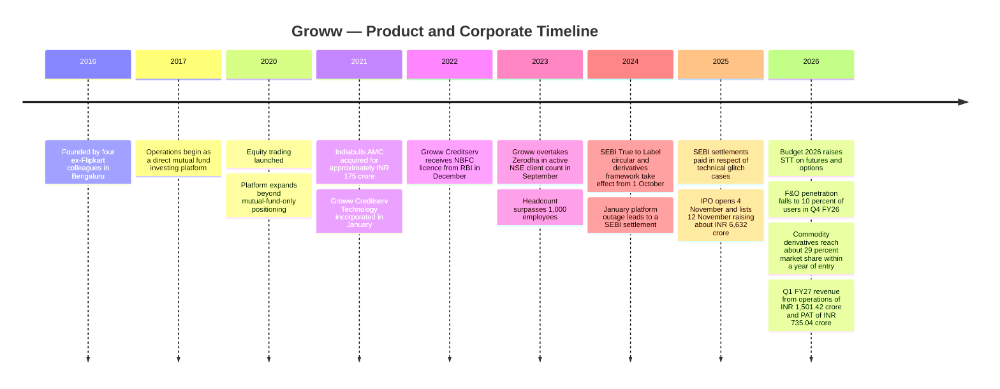

**Reading the timeline strategically.** There are three distinct eras, and the hinge between the second and third is regulatory, not competitive:

1. **2016–2020, the distribution era.** Direct mutual funds only. No monetization to speak of. Groww was buying market share with free product and paying for it with venture capital.
2. **2020–2024, the monetization era.** Equity and then derivatives arrive. Revenue appears, concentrated in F&O. Groww overtakes Zerodha on client count in September 2023. This is the period in which the company's economics were solved — by derivatives.
3. **October 2024–present, the reconstruction era.** SEBI's True to Label circular and derivatives framework, then the Budget 2026 STT hike, systematically degrade the segment that solved the economics. Everything since — MTF, commodities, credit, float optimisation, the AMC — is reconstruction.

The company did not choose to become a balance-sheet business. It was pushed.

---

## 9. Vision & Mission

**Stated positioning.** Groww's public framing has consistently centred on making investing simple, accessible and transparent for first-time Indian investors — removing jargon, paperwork and intimidation from a category that historically ran on all three.

**Revealed strategy.** The gap between stated mission and revealed strategy is the productive tension in this case.

| Dimension | Stated mission | Revealed by capital and roadmap |
|---|---|---|
| Primary user | The first-time, long-horizon retail investor | The active derivatives trader, who funds the business |
| Core value | Simplicity and accessibility | Breadth of product and speed of order execution |
| Success measure | Households investing | Revenue per active client and customer assets |
| Capital deployment | Implied: better investing experience | Actual: NBFC expansion, MTF book, treasury |

This is not hypocrisy, and it should not be read as such. It is the standard condition of a freemium-adjacent consumer financial product: the mission acquires, a minority monetizes, and the company must decide whether to fix the mismatch or lean into it. What makes Groww analytically interesting is that regulation has removed the option of leaning into it. SEBI has spent two years making the monetizing minority smaller and more expensive to serve.

**A defensible mission restatement for the next phase**, consistent with the evidence in this document, would be: *to be the account where an Indian household's long-term wealth is both held and organised* — with "organised" being the part Groww has not yet built, and the part [§50](#50-feature-proposal) proposes.

---

## 10. Problem Statement

**The user problem Groww originally solved.** Before 2016, an Indian retail investor faced: paper-based KYC taking days to weeks; mutual funds sold through commissioned distributors with an inherent conflict of interest; regular-plan expense ratios materially above direct plans; brokerage platforms designed for professionals; and opaque pricing. The result was structurally low participation in capital markets relative to population.

Groww attacked the funnel at its weakest link — onboarding and comprehension — rather than at price. Zerodha had already won on price. Groww won on the twenty minutes before price becomes relevant.

**The user problems that remain unsolved.** These matter because they define the opportunity space in [§46](#46-opportunity-mapping):

1. **Allocation.** Groww tells a user what they can buy and what they own. It does not tell them what they *should* own, in what proportion, for what goal. The product is a catalogue plus a ledger, with nothing in between.
2. **Portfolio drift.** A user who set up three SIPs in 2021 has, by 2026, an allocation nobody chose. There is no rebalancing mechanic.
3. **Behavioural loss.** The same low-friction design that makes investing accessible makes trading accessible. Frictionlessness is value-neutral; it accelerates whatever the user was already inclined to do.
4. **Goal translation.** Users hold goals ("a house in eight years") and the product holds instruments (funds, stocks). Nothing maps one to the other.

**The business problem.** Stated precisely, and this is the version the rest of the document works against:

> Groww has acquired the largest retail investing user base in India, but its acquisition surface (direct mutual funds and ETFs) generates approximately zero revenue, while its revenue surface (equity derivatives, ~55% of Q4 FY26 revenue) is contracting under regulatory pressure and now involves only ~10% of users. Groww must therefore build a monetization path for the passive majority — and its current answer, monetizing their balances via MTF, credit, float and treasury, introduces credit and market risk into what was a capital-light platform business.

**Why this is a product problem and not only a finance problem.** Balance-sheet monetization can be bought with capital; the IPO provided some. Behaviour-based monetization of passive investors cannot be bought — it requires the user to hand Groww a job it has never been given: *decide for me, or at least advise me*. That is a trust transfer, and trust transfers are earned through product experience, disclosure design and demonstrated absence of conflict. This is squarely product work, and it is the subject of [§50](#50-feature-proposal).

---

## 11. Market Research

**Market structure.** Indian retail broking is a high-volume, low-margin, regulator-shaped market that has consolidated sharply around a handful of digital-first players.

| Indicator | Value | As of | Note |
|---|---|---|---|
| NSE active clients (industry) | ~4.42 crore | June 2026 | Up ~3.1% from May 2026 |
| Groww active clients | ~1.30 crore | June 2026 | ~28.72% share |
| Top-3 concentration (Groww, Zerodha, Angel One) | ~58% | June 2026 | Effective oligopoly at the top |
| Groww net client adds | ~115,000 | Q1 FY27 | Added during an industry-wide decline in active investors |
| Groww transacting users | ~2.2 crore | 30 June 2026 | Up ~24% YoY |
| Groww active users (internal definition) | ~1.7 crore | 30 June 2026 | Larger than NSE active client count — different definition |
| Groww registered users | 40 million+ | Various 2026 reporting | Registration ≠ activation |
| Groww customer assets | ~₹3.58–3.6 lakh crore | ~15 July 2026 | ~₹27,000 crore added in the quarter |
| Groww direct MF AUM | ~₹1.9 lakh crore | Q1 FY27 | ~53% of assets are mutual funds |

**Three definitions of "user" are in circulation and they are not interchangeable.** Registered users (40M+), transacting users (2.2 crore), Groww-defined active users (1.7 crore), and NSE active clients (1.30 crore) describe four different populations. Any analysis that mixes them will produce wrong conclusions about penetration and ARPU. This document uses NSE active clients for market-share comparison and Groww's own disclosures for internal ratios, and flags which is which. See [ASSUMPTIONS.md](ASSUMPTIONS.md) for the full treatment.

**The two structural facts that define the market right now:**

1. **Industry-wide active investor decline.** Groww added clients in Q1 FY27 *while the industry shrank*, and in June 2026 Angel One lost ~50,390 active clients and Zerodha ~45,971. The pie is not growing; Groww is taking share within a contracting pie. Share gains under contraction are worth less than share gains under expansion, because the marginal client acquired is by definition a lower-intent client — the high-intent ones were acquired during the boom.

2. **Regulatory compression of the profitable segment.** The October 2024 SEBI True to Label circular and derivatives framework, followed by the Budget 2026 STT hike, have specifically targeted retail derivatives. F&O penetration on Groww fell from 18% (November 2024) to 10% (Q4 FY26). This is regulation working as intended, and it is directly adverse to broker economics.

**Demand-side shift.** Groww management has stated that the acquisition funnel is moving toward mutual funds and ETFs rather than direct stocks, attributing the shift to market corrections since September 2024. In Q4 FY26, new SIPs created on the platform grew 61.5% YoY and SIP inflows grew ~35% YoY to ₹13,023 crore, lifting Groww's SIP market share to ~14.0% from ~12.3%. Groww has also been reported to account for approximately 40% of direct-plan SIP inflows industry-wide.

That 40% figure is the single most important number in this case study, and it should be read carefully. It means Groww has near-monopoly distribution of the fastest-growing, lowest-monetization product in Indian retail finance. Dominance and revenue are pointing in opposite directions.

---

## 12. Industry Analysis

**Value chain and where the margin sits.**

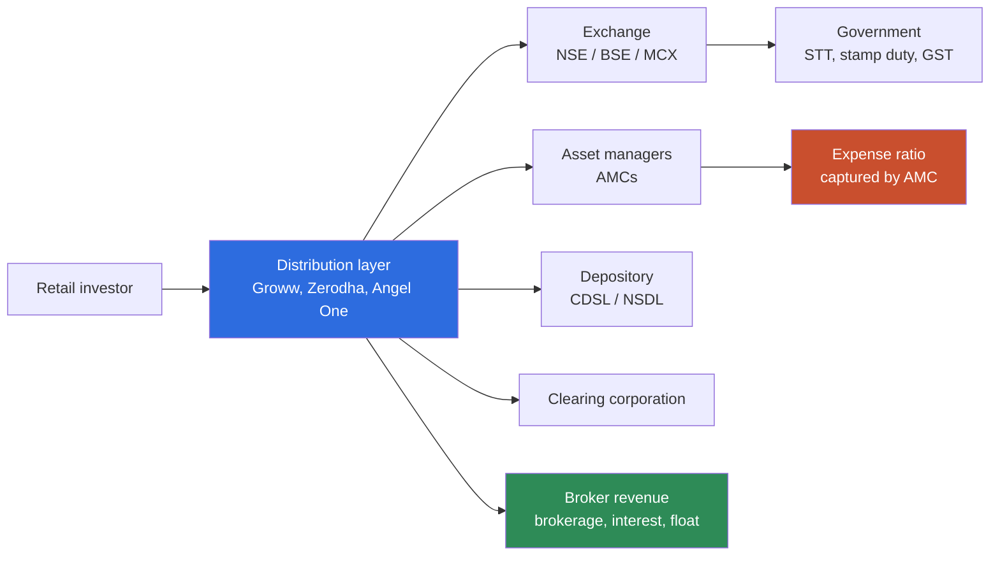

The diagram makes the structural problem visible. On the equity path, the distribution layer captures brokerage. On the mutual fund direct path, the distribution layer captures nothing — the expense ratio flows to the AMC, and the direct plan exists precisely to disintermediate distribution. Groww sits at the widest point of the funnel and the narrowest point of the margin.

**Industry forces in play as of August 2026:**

| Force | Direction | Effect on Groww |
|---|---|---|
| SEBI derivatives tightening (Oct 2024 onward) | Adverse | Directly compresses ~55% of revenue base |
| Budget 2026 STT hike (futures 0.02%→0.05%; options 0.10%→0.15%) | Adverse | Non-recoverable tax; cannot be discounted or absorbed |
| Retail financialisation of household savings | Favourable | Long-run structural tailwind for AUM and SIPs |
| Passive/index product adoption | Mixed | Grows assets, shrinks per-asset monetization |
| Digital lending scrutiny (RBI) | Adverse to the pivot | Constrains the balance-sheet escape route |
| Rate environment | Ambiguous | Higher rates lift float and MTF income, dampen risk appetite |

**The regulatory asymmetry is the defining industry feature.** SEBI has been consistently willing to suppress retail derivatives participation on investor-protection grounds and consistently supportive of direct, low-cost, long-horizon investing. An Indian broker therefore faces a regulator that is actively shrinking its profitable segment and actively growing its unprofitable one. No amount of product excellence changes that gradient. Strategy has to be built around it, which is what [§38](#38-product-strategy) addresses.

---

## 13. TAM/SAM/SOM

**Framework-selection rationale.** TAM/SAM/SOM is the right frame here specifically because Groww's addressable-market problem is *not* a reach problem — it already touches a large share of everyone who invests in India. The useful question is not "how many more users?" but "how much of the value flowing through the users we already have can we capture?" I therefore size the market in **revenue pools** rather than user counts, and add a fourth layer — *captured* — to make the monetization gap explicit. A conventional user-count TAM would show Groww with enormous headroom and would obscure the actual constraint. Where a figure is derived rather than disclosed, it is marked.

| Layer | Definition | Estimate | Basis |
|---|---|---|---|
| **TAM** | Total annual revenue pool available to retail investing intermediation in India — brokerage, interest, distribution fees, AMC fees on retail assets | Not reliably disclosed; directionally ₹60,000–₹90,000 crore | Author-constructed range; see ASSUMPTIONS.md |
| **SAM** | The portion Groww's licences and product surfaces can legally address: broking, MTF, NBFC lending, AMC fees, float | Materially smaller — excludes bank NIM, insurance, regular-plan commissions Groww forgoes by design | Derived |
| **SOM** | What Groww actually earns today | FY26 revenue ~₹5,242 crore; Q1 FY27 ₹1,501.42 crore | Reported (see conflict note below) |
| **Captured share of custodied assets** | Revenue Groww earns on the ₹3.58 lakh crore it holds | GrowwMF AUM ₹5,491 crore vs ~₹1.9 lakh crore direct MF AUM on platform | Reported |

**The fourth layer is the finding.** Groww holds approximately ₹3.58 lakh crore of customer assets. Its own AMC manages ₹5,491 crore. Even against only the direct mutual fund subset (~₹1.9 lakh crore), Groww's AMC captures under 3%. If Groww captured a 30 bps fee on even a fifth of its direct MF AUM, that would be roughly ₹114 crore of annualised, recurring, zero-credit-risk revenue — modest against ₹5,242 crore of FY26 revenue, but with a fundamentally better quality profile than MTF interest: it does not require a balance sheet, does not default in a drawdown, and does not attract the regulatory hostility that derivatives and retail leverage attract.

**Conflict flag.** FY25 revenue is reported at ~₹4,056 crore and FY26 at ~₹5,242 crore, implying ~29% growth, while at least one source states FY2025-26 growth of 19% revenue / 16% EBITDA / 14% PAT. Both are retained and treated as conflicting; see [ASSUMPTIONS.md](ASSUMPTIONS.md) §3.

---

## 14. Competitor Analysis

| Dimension | **Groww** | **Zerodha** | **Angel One** | **Upstox** |
|---|---|---|---|---|
| Active NSE clients (June 2026) | ~1.30 crore (~28.72%) | Second largest; lost ~45,971 in June 2026 | Third; lost ~50,390 in June 2026 | Fourth tier |
| Ownership | Listed (Nov 2025) | Private, bootstrapped | Listed | Private |
| Origin product | Direct mutual funds | Discount equity broking | Full-service broking, digitised | Discount broking |
| Core strength | Onboarding and MF distribution | Cost discipline, profitability, trust | Distribution reach, product breadth | Pricing |
| MF distribution position | ~40% of industry direct-plan SIP inflows; ~14% SIP market share | Coin — meaningful but smaller | Present | Present |
| Own AMC | Yes (GrowwMF, ₹5,491 crore Q1 FY27) | Yes (Zerodha Fund House) | Building out | No |
| Lending arm | Groww Creditserv (NBFC) | Zerodha Capital — FY26 total income ~₹53.5 crore, PAT ~₹14.7 crore | Yes | Limited |
| FY26 scale | Revenue ~₹5,242 crore; PAT ~₹2,440 crore | Broking revenue fell ~40% YoY in Q1 FY26 per Kamath | Revenue ~₹5,136 crore; PAT ~₹915 crore | Not disclosed |

**Reading the competitive set against the thesis.**

**Zerodha is the control experiment.** It faces the identical regulatory shock and has chosen almost the opposite response: no IPO, no aggressive balance-sheet expansion, a deliberately small lending arm (Zerodha Capital's entire FY26 income of ~₹53.5 crore is a rounding error against Groww's ₹5,242 crore), and public commentary from Nithin Kamath that simply accepts lower volumes. Zerodha is absorbing the shock as a margin event. Groww is absorbing it as a business-model event. Both are coherent; they imply very different risk profiles. If retail derivatives recover, Zerodha's restraint looks like discipline preserved. If they do not, Groww's pivot looks like foresight — provided the credit book behaves.

**Angel One is the closest structural analogue**, with comparable revenue scale (~₹5,136 crore FY26) but materially lower profit (~₹915 crore vs Groww's ~₹2,440 crore), and it lost more active clients than anyone in June 2026. Groww's operating leverage advantage over Angel One is real and is the clearest evidence that the distribution engine has genuine efficiency, not just scale.

**Nobody is competing on the allocation layer.** This is the material competitive observation. Every major player competes on price (near-zero and converged), breadth (converging), and execution reliability (table stakes, imperfectly delivered by all). No large Indian retail platform has built a credible, conflict-free allocation and rebalancing product for passive investors. The white space identified in [§46](#46-opportunity-mapping) is unoccupied not because it is unattractive but because it requires a regulatory posture (fee-based advice) that transaction-revenue businesses have historically avoided.

---

## 15. SWOT

**Strengths**

- Largest active client base in India (~1.30 crore, ~28.72% share, June 2026) and still adding clients while competitors shed them
- Approximately 40% of industry direct-plan SIP inflows — an extraordinary distribution position in the fastest-growing retail product
- Demonstrated operating leverage: Q1 FY27 PAT growth (94%) well ahead of revenue growth (66%)
- Proven ability to enter and win adjacent segments fast — ~29% commodity derivatives market share within a year of entry
- Full-stack licences: broking, NBFC, AMC, payments — few competitors hold all four
- Listed currency and post-IPO capital for inorganic and balance-sheet expansion

**Weaknesses**

- Revenue concentration: equity derivatives ~55% of Q4 FY26 revenue from ~10% of users
- Largest asset class (direct mutual funds, ~53% of assets, ~₹1.9 lakh crore) monetized at ~0 bps
- Sub-scale, loss-making AMC (₹5,491 crore AUM; −₹21.4 crore in Q4 FY26) — the one non-credit monetization route is the weakest asset
- Documented platform reliability failures, including the January 2024 outage and subsequent SEBI settlements totalling ~₹82.98 lakh
- Rising credit risk in the pivot vehicle: NBFC NPAs 0.29% (FY24) → 1.68% (FY25)
- No advice, allocation or rebalancing layer despite holding the data to build one

**Opportunities**

- Convert custodied direct MF AUM into fee-bearing managed assets — the [§50](#50-feature-proposal) proposal
- Deepen commodity derivatives, where share gains have been rapid and regulatory hostility is lower than in equity F&O
- Groww Pay as an account-primacy and data play, improving underwriting quality for Creditserv
- Long-run financialisation of Indian household savings remains a genuine structural tailwind
- Consolidation: smaller brokers are the most exposed to STT and compliance costs

**Threats**

- Further SEBI derivatives restrictions or STT increases — the single largest revenue risk
- Credit cycle turning against a rapidly growing, thinly seasoned NBFC book
- A prolonged equity drawdown hitting brokerage, MTF, AMC and credit quality simultaneously — these risks are correlated, not diversifying
- Reliability incidents converting into regulatory action and trust loss in a category where trust is the product
- Zerodha's lower-cost, lower-risk posture proving more durable if volumes stay suppressed

**The SWOT's internal contradiction is the point.** Groww's greatest strength (MF distribution dominance) and its greatest weakness (that distribution earns nothing) are the same fact viewed from two sides. Strategy for the next three years is entirely a question of which side of that fact the company operates on.

---

## 16. Porter's Five Forces

**Framework-selection rationale.** Porter's is often a poor fit for consumer platforms, where network effects and switching costs matter more than industry structure. It is used here for a specific reason: Indian retail broking is unusually close to Porter's original conditions — a genuinely commoditised service, a concentrated supplier set (exchanges and depositories, effectively monopolies), price transparency approaching perfect, and a powerful non-market actor (the regulator) that Porter's framework handles poorly and that I therefore treat as a sixth force. The framework is used to show *why* margin is structurally hard here, which then justifies the strategic direction in [§38](#38-product-strategy).

| Force | Intensity | Assessment |
|---|---|---|
| **Competitive rivalry** | **Very High** | Top-3 hold ~58% share; pricing has converged to near-zero on delivery; differentiation on execution and breadth only. Share is currently being taken from a shrinking pool. |
| **Supplier power** | **High** | Exchanges (NSE, BSE, MCX), depositories (CDSL, NSDL) and clearing corporations are effective monopolies with regulated, non-negotiable charges. STT and stamp duty are set by government and are wholly non-recoverable. |
| **Buyer power** | **High** | Switching costs are low and falling. Account opening is free and near-instant across all players. The only real friction is portfolio inertia and demat transfer effort — a weak moat. |
| **Threat of substitutes** | **Moderate** | Bank-owned brokers, direct AMC apps, and MF Central/RTA platforms all allow investors to bypass Groww entirely for mutual funds. Notably, substitutes are strongest precisely in Groww's largest asset class. |
| **Threat of new entrants** | **Low to Moderate** | Licensing, capital adequacy and compliance costs are meaningful barriers. But a well-capitalised incumbent from an adjacent category (a large bank, a payments platform) could enter credibly. |
| **Regulatory force (added)** | **Very High** | SEBI and RBI have repeatedly and unilaterally reshaped the revenue base. October 2024 framework, Budget 2026 STT. This force has done more to Groww's P&L than any competitor. |

**What Porter's shows.** Four of six forces are High or Very High. This is a structurally unattractive industry for margin capture at the intermediation layer — which is precisely why Groww is trying to move *out* of pure intermediation and into positions where it holds either a balance sheet (MTF, credit, float) or a manufacturing licence (the AMC). Both are attempts to escape the box Porter's describes. The critical distinction, and the thesis of this case study, is that the balance-sheet escape adds correlated risk while the manufacturing escape does not.

---

## 17. Business Model Canvas

| Block | Content |
|---|---|
| **Customer Segments** | First-time and passive retail investors (largest by count, ~0 revenue); active equity traders; F&O traders (~10% of users, ~55% of revenue); MTF users; credit borrowers |
| **Value Propositions** | Frictionless onboarding; one account for MF, equity, F&O, commodities, IPO, gold; transparent low pricing; direct plans with no commission; mobile-first simplicity |
| **Channels** | Android and iOS apps; web; organic and word-of-mouth; content and SEO; IPO-driven acquisition spikes; Groww Pay as a re-engagement surface |
| **Customer Relationships** | Self-serve throughout; no relationship manager; support via in-app and 24x7 channels; effectively zero human advice |
| **Revenue Streams** | Equity derivatives brokerage (~55% Q4 FY26); float income (~8.1% FY26); MTF interest (~8.0% FY26); PL + LAS (~5.5%); commodity derivatives (~4.9%); treasury (~3%); other (~2.1%); AMC fees (negligible) |
| **Key Resources** | ~1.30 crore active clients; ₹3.58 lakh crore customer assets; four licences (broking, NBFC, AMC, payments); behavioural and transaction data; post-IPO capital |
| **Key Activities** | Order routing and execution; risk management; KYC and compliance; underwriting; platform reliability; product expansion |
| **Key Partners** | Exchanges and clearing corporations; depositories; banks and lending partners; AMCs; payment rails and NPCI |
| **Cost Structure** | Technology and infrastructure; customer acquisition; compliance and regulatory; credit costs and provisioning; exchange and regulatory charges; personnel |

**Canvas reading.** Two blocks contradict each other. *Customer Segments* is dominated by passive investors; *Revenue Streams* is dominated by derivatives traders. In a healthy canvas, the largest segment maps to the largest stream. Here they map to opposite ends. The *Customer Relationships* block explains why the gap has never closed: a purely self-serve, zero-advice relationship model gives Groww no mechanism to monetize a passive investor other than by lending to them or by manufacturing the fund they buy.

---

## 18. Revenue Model

**FY26 revenue composition (reported components):**

| Stream | Share of revenue | Type | Risk carried |
|---|---|---|---|
| Equity derivatives | ~55% (Q4 FY26; 57% year-ago quarter) | Transaction | Regulatory |
| Float income | ~8.1% | Balance | Interest rate |
| MTF interest | ~8.0% | Balance | Credit + market |
| PL + LAS | ~5.5% | Balance | Credit |
| Commodity derivatives | ~4.9% | Transaction | Regulatory (lower) |
| Treasury | ~3.0% | Balance | Market |
| Other income | ~2.1% | Mixed | — |
| Cash equity delivery brokerage | Residual | Transaction | Regulatory |
| AMC fees | Negligible | Manufacturing | Market only |

**The classification is the analysis.** Group the streams by *what the customer must do to generate them*:

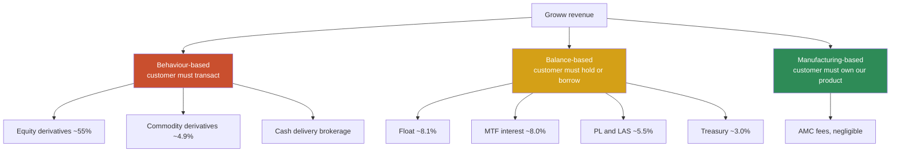

Behaviour-based revenue is roughly 60%+ and is the segment under regulatory attack. Balance-based revenue is roughly 25% and growing fast — it is the announced diversification. Manufacturing-based revenue is negligible.

**Why this matters more than the headline diversification narrative.** Balance-based revenue is genuinely less exposed to SEBI's derivatives agenda. But it is *more* exposed to the credit cycle, and critically, its risks are **correlated with the rest of the business**. In a sharp equity drawdown: brokerage volumes fall, MTF books get marked down and margin-called, LAS collateral values drop, customer assets shrink, AMC fees fall, and borrower credit quality deteriorates — all at once, all from the same cause. The NBFC's NPA move from 0.29% (FY24) to 1.68% (FY25) happened in a benign environment.

Manufacturing-based revenue (AMC fees) is the only stream that scales with assets without adding credit risk. It is currently the smallest and the only loss-making one. **A revenue mix that grows balance-based income while leaving manufacturing-based income sub-scale is optimising for the wrong kind of resilience.** This conclusion is the direct input to [§46](#46-opportunity-mapping), [§47](#47-rice) and [§50](#50-feature-proposal).

---

## 19. Target Users

Groww's user base is best segmented by **monetization behaviour**, because that is the axis on which the business problem sits. All segment sizes below are author-constructed estimates derived from disclosed ratios (F&O penetration ~10%; MF share of assets ~53%); they are directional, not reported.

| Segment | Est. share of users | Est. share of revenue | Primary product | Monetization mechanism |
|---|---|---|---|---|
| **Passive accumulators** | Majority | Very low | Direct MF SIPs, ETFs | Essentially none |
| **Dormant registrants** | Large | ~0 | None active | None |
| **Cash equity investors** | Moderate | Low–moderate | Delivery stocks, IPOs | Capped brokerage |
| **Derivatives traders** | ~10% | ~55% | Equity F&O | Per-order brokerage |
| **Leveraged investors** | Small | Growing | MTF | Net interest margin |
| **Credit customers** | Small | ~5.5% | Personal loans, LAS, LAMF | Interest income |

**The gap between column two and column three is the entire case study.** The modal Groww user is a passive accumulator who costs money to serve and generates almost none. The company is profitable because a small, regulatorily-endangered tail subsidises them.

**Two observations that complicate the usual reading:**

First, the passive majority is not worthless — it is *unmonetized*, which is different. Those users supply the customer assets that generate float income, provide the collateral base for LAS and LAMF, and are the population from which MTF and credit customers are recruited. The passive base is the raw material for the balance-sheet business. That is exactly why the pivot took the shape it did.

Second, the acquisition mix is actively shifting *toward* the unmonetized segment. Management has said new customers increasingly arrive via mutual funds and ETFs rather than stocks. So the ratio of unmonetized to monetized users is getting worse, not better, at the top of the funnel. Growth is diluting revenue quality. This is unusual and it is the reason [§31](#31-north-star-metric) rejects user-count metrics outright.

---

## 20. Personas

*All personas are author-constructed composites built from disclosed segment behaviour, product surfaces and publicly reported user complaints. They are illustrative reasoning tools, not research subjects. See [ASSUMPTIONS.md](ASSUMPTIONS.md) §4.*

### Persona A — Priya, 27, the Passive Accumulator

- **Context:** Software engineer in Pune, ₹14 LPA. Started investing in 2022 after colleagues did.
- **Portfolio:** Three SIPs totalling ₹15,000/month — one large-cap index fund, one flexi-cap chosen from a "top funds" list, one small-cap added in a bull phase she now can't justify. Never rebalanced.
- **Behaviour:** Opens the app roughly twice a month, mostly to look at returns. Never trades.
- **Revenue to Groww:** Approximately zero. She holds direct plans.
- **Job:** "Make sure I'm not doing this wrong."
- **Unmet need:** Nobody has ever told her whether three funds with ~60% overlapping holdings is a portfolio or an accident.
- **Why she matters:** She is the modal user, the fastest-growing acquisition cohort, and the target of [§50](#50-feature-proposal).

### Persona B — Rohit, 33, the Derivatives Trader

- **Context:** Small business owner in Surat. Trades index options most weeks.
- **Behaviour:** Multiple orders per session, expiry-day concentrated. Sensitive to execution latency and outages.
- **Revenue to Groww:** Disproportionately high — he is in the ~10% generating ~55%.
- **Job:** "Let me get in and out fast, and don't break during expiry."
- **Pressure:** Post-October 2024 framework and the Budget 2026 STT hike, his per-trade economics have deteriorated materially. STT is non-recoverable; no broker discount can offset it.
- **Why he matters:** He funds the company, and regulation is steadily making him less viable. He is the reason the business must change.

### Persona C — Anjali, 41, the Leveraged Investor

- **Context:** Dentist in Kochi. Long-term equity holder who discovered MTF.
- **Behaviour:** Holds a delivery portfolio, uses MTF at ~14.95% to hold larger positions through conviction trades.
- **Revenue to Groww:** High and recurring while the position is open — net interest margin.
- **Job:** "Let me hold more than my cash allows without selling what I own."
- **Risk:** In a drawdown she is margin-called at exactly the moment her portfolio and Groww's brokerage revenue are both falling.
- **Why she matters:** She is the archetype of the pivot — and the archetype of its correlated risk.

### Persona D — Suresh, 52, the Dormant Registrant

- **Context:** Government employee in Bhopal. Opened an account during the 2021 IPO wave, applied to two IPOs, never returned.
- **Revenue to Groww:** Zero, with ongoing compliance and maintenance cost.
- **Job:** Never clearly formed. He was pulled in by an event, not a need.
- **Why he matters:** He is the cost of a registration-optimised acquisition strategy, and the strongest argument against counting registered users as a success metric.

---

## 21. JTBD

Framed as Jobs To Be Done, with the monetization consequence made explicit — because the pattern only becomes visible when the two are placed side by side.

| # | Job statement | Segment | Groww's current answer | Revenue to Groww |
|---|---|---|---|---|
| 1 | When I start earning, I want to put money somewhere better than a savings account, so I don't feel financially careless. | Priya | Excellent — SIP setup in minutes | ~0 |
| 2 | When I've been investing a while, I want to know whether what I own actually makes sense together, so I'm not accidentally concentrated. | Priya | **None** | — |
| 3 | When markets move, I want to act quickly and cheaply, so I capture the move. | Rohit | Strong — fast execution, low brokerage | High |
| 4 | When I have conviction but not cash, I want to hold a larger position without selling, so I don't miss the move. | Anjali | Strong — MTF at ~14.95% | High |
| 5 | When I need money urgently, I want to borrow without liquidating my investments, so I don't break my compounding. | Anjali/Priya | Good — LAS, LAMF, personal loans | High |
| 6 | When my goals change, I want my investments to change with them, so my money stays pointed at what I'm actually doing. | Priya | **None** | — |
| 7 | When something goes wrong during a trade, I want to know immediately and be made whole, so I can trust the platform. | All | Weak — documented outage and settlement history | Negative |

**The pattern is stark and it is not a coincidence.** Every job Groww serves well is monetized. Every job Groww does not serve — jobs 2 and 6, both allocation jobs — is unmonetized under the current model. Groww has, entirely rationally, built product exactly where revenue exists. The consequence is that the company has systematically under-invested in the needs of its largest and fastest-growing segment, because serving those needs pays nothing *under the current business model*.

That last clause is the opening. Jobs 2 and 6 are unserved because they are unmonetized; they are unmonetized because Groww has never charged a fee for them. This is the convergence point that [§46](#46-opportunity-mapping) and [§50](#50-feature-proposal) build on.

---

## 22. User Journey

Priya's journey — the modal user, five years in.

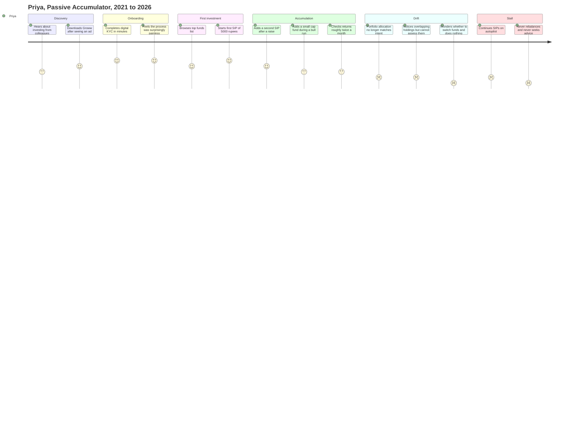

**Where the journey breaks.** Onboarding and first investment score highest — that is Groww's genuine achievement and the source of its distribution win. The journey then degrades monotonically. The failure is not abandonment; Priya keeps her SIPs running. It is **quality degradation without exit** — she stays, invests more, and the product's usefulness to her declines every year as her portfolio drifts further from any intent she ever held.

This is a dangerous shape for a retention metric to hide. By retention, Priya is a success: five years, growing contributions, no churn. By outcome, she has been silently failed since roughly year two. Any metric set that reports her as healthy is measuring the wrong thing — the argument made in [§30](#30-product-metrics) and [§31](#31-north-star-metric).

---

## 23. User Flow

Two flows, side by side, to show where design investment has gone.

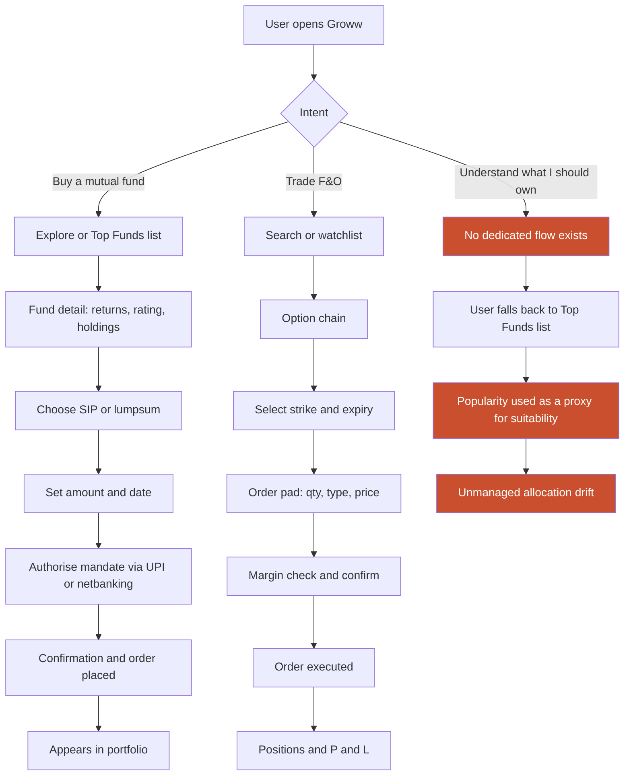

**The third branch is the product gap.** Groww has two well-designed, well-instrumented transactional flows and no allocation flow at all. When a user has an allocation question, the product silently substitutes a **popularity signal** — the "Top Funds" list — for a **suitability signal**.

That substitution is worth stating plainly because it is the most consequential design decision in the product: a list ranked by AUM or recent returns is presented in the exact position where a recommendation would sit, and users read it as one. It is not advice, and Groww does not claim it is. But it occupies the advice slot in the interface, and it systematically routes users toward whatever has recently performed well — which is close to the worst possible default for a long-horizon investor. This is examined further in [§25](#25-ux-audit) and [§40](#40-trust--safety).

---

## 24. Information Architecture

**Current top-level structure (as observed):**

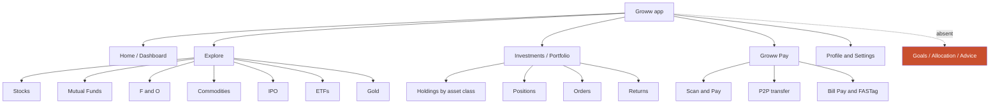

**IA critique**

| Issue | Observation | Consequence |
|---|---|---|
| **Instrument-centric, not goal-centric** | The hierarchy is organised by product type (stocks, MF, F&O, gold), mirroring Groww's licences rather than the user's mental model | A user thinking "retirement" or "house deposit" has no entry point; they must first translate a goal into an instrument, which is the hardest step and the one they are least equipped for |
| **Portfolio is a ledger, not a diagnostic** | Holdings are listed by asset class with returns; there is no cross-holding view of concentration, overlap or drift | The user can see *what* they own but not *whether* it makes sense — directly enabling the drift in [§22](#22-user-journey) |
| **Popularity in the recommendation slot** | Top Funds and similar lists sit at the highest-traffic discovery position | Popularity is read as endorsement; see [§23](#23-user-flow) |
| **Payments adjacency is unintegrated** | Groww Pay sits beside investing rather than feeding it | A large behavioural-data asset (spending patterns) is collected but not visibly used to improve investing outcomes or surplus detection |
| **No allocation node exists at any level** | The absent branch above | The single largest IA gap, and the structural precondition for [§50](#50-feature-proposal) |

**The IA reveals the org.** The top-level navigation maps almost exactly onto Groww's regulatory entities: broking (stocks, F&O, commodities), AMC-adjacent distribution (mutual funds), NBFC (credit, surfaced contextually), payments (Groww Pay). This is Conway's Law expressed in a navigation bar. Users do not experience their finances as four licences, and the absence of a goals or allocation node is a direct consequence of no internal entity owning that job.

---

## 25. UX Audit

Heuristic evaluation against Nielsen's ten usability heuristics. *Scores are author-assigned judgements based on observable product behaviour and publicly reported user experience, not usability testing.*

| # | Heuristic | Score /5 | Assessment |
|---|---|---|---|
| 1 | Visibility of system status | 2.5 | Order and payment states are generally clear, but the documented failure mode is severe: during the January 2024 outage users could not see balances or execute orders, and reported not knowing what state their money was in. Status visibility that fails precisely when it matters most is a low score regardless of steady-state quality. |
| 2 | Match with the real world | 3.0 | Language is genuinely de-jargonised — a real achievement. But the organising model is instruments, not goals, so the match holds at the sentence level and breaks at the structural level. |
| 3 | User control and freedom | 3.5 | SIPs can be paused, modified and cancelled without friction. Order modification is standard. Reasonable. |
| 4 | Consistency and standards | 4.0 | Strong. Patterns are consistent across asset classes; a user who learns the MF flow can navigate the equity flow. |
| 5 | Error prevention | 2.0 | Weakest area. There is no meaningful friction or warning before concentration risk, before adding a fourth overlapping fund, or before leveraged positions in volatile conditions. Frictionlessness is applied uniformly to actions with very different risk profiles. |
| 6 | Recognition over recall | 4.0 | Good. Watchlists, recents and holdings reduce recall load effectively. |
| 7 | Flexibility and efficiency | 3.5 | Serves both novices and active traders reasonably; option chain and order pad are efficient for Rohit while remaining avoidable for Priya. |
| 8 | Aesthetic and minimalist design | 4.5 | Consistently the product's strongest dimension and the primary reason for its onboarding advantage. |
| 9 | Error recovery | 2.0 | Publicly reported issues include incorrect wallet balances, login failures, unreceived refunds, and complaint or chat history disappearing from the app. Recovery paths appear unreliable. |
| 10 | Help and documentation | 3.0 | Extensive help content and 24x7 support exist; users report inconsistent resolution quality. |

**Composite: 3.2 / 5**

**The pattern in the scores is not random.** Everything scoring 4.0+ (consistency, recognition, minimalism) concerns **the experience of transacting**. Everything scoring 2.5 or below (system status, error prevention, error recovery) concerns **what happens when something goes wrong or when the user needs protecting from themselves**. Groww has optimised the happy path superbly and under-invested in the unhappy path.

For a consumer app that would be a normal trade-off. For a platform holding ₹3.58 lakh crore of household savings, the unhappy path *is* the product — it is what people are actually buying when they choose where to keep their money. This links directly to [§40](#40-trust--safety) and to risk R3 in [§57](#57-risks--mitigation).

---

## 26. UI Audit

| Dimension | Assessment | Score /5 |
|---|---|---|
| Visual hierarchy | Clean, generous spacing, clear primary actions. Returns figures are given strong visual prominence. | 4.0 |
| Typographic clarity | Highly legible; numerals well differentiated; good density control on data-heavy screens. | 4.0 |
| Colour semantics | Conventional green/red for gain/loss, consistently applied. Risk, however, has no colour — leverage and concentration carry no visual warning language. | 3.0 |
| Data visualisation | Returns charts are clear. There is no visual representation of allocation, overlap or concentration anywhere in the product. | 2.5 |
| Density management | Handled well across novice and advanced surfaces. | 4.0 |
| Consistency across asset classes | Strong — a genuine competitive advantage given the breadth of instruments. | 4.5 |
| Emotional design | Returns-forward presentation amplifies both euphoria and anxiety; little design work moderates either. | 2.5 |

**Composite: 3.5 / 5**

**One observation dominates.** The interface has a rich, well-developed visual vocabulary for **return** and essentially none for **risk**. Gains and losses are colour-coded, charted and surfaced at the top of every screen. Concentration, overlap, leverage exposure and drawdown sensitivity are not visualised at all.

A user of this interface can see, at a glance, how much they have made. They cannot see, at any level of effort, how much they could lose or how undiversified they are. That asymmetry shapes behaviour, and it makes the returns-ranked Top Funds list in [§23](#23-user-flow) considerably more consequential than it would be in a UI that gave risk equal visual weight.

---

## 27. Accessibility

*Assessment is based on observable product characteristics and general platform behaviour; no formal WCAG audit or assistive-technology testing was conducted. Treat these as hypotheses to be verified, not findings.*

| Area | Assessment |
|---|---|
| **Language coverage** | Groww has supported multiple Indian languages. For a product acquiring users well beyond metro English-speakers, depth and consistency of localisation — particularly of risk disclosures and error states — is a material accessibility question and is not publicly documented. |
| **Colour dependence** | Gain/loss is conveyed primarily through red/green. Users with deuteranopia or protanopia — roughly 8% of Indian males by general prevalence — may be unable to distinguish the single most important state in the interface without a secondary cue such as sign or arrow. |
| **Text scaling** | Dense numeric screens (option chain, order pad, holdings) are the most likely to break under large system font sizes. Unverified. |
| **Screen reader support** | Financial data tables and the option chain are structurally difficult for screen readers. Unverified; likely a significant gap. |
| **Cognitive accessibility** | This is the deepest issue and the one most connected to the rest of this document. The product asks first-time investors to make unassisted allocation decisions with no scaffolding beyond a popularity-ranked list. For users with low financial literacy — a large share of Groww's addressable market — the product is *navigable* but not *comprehensible*. |
| **Network and device accessibility** | Reliability under poor connectivity matters disproportionately in Tier 2/3 markets where much of the growth is. The outage history suggests degraded-mode behaviour deserves scrutiny. |

**Accessibility as a strategic issue, not a compliance one.** Groww's growth is coming from users who are, on average, less financially literate and less English-fluent than its early cohorts. Cognitive accessibility — whether a user can *understand* the consequences of an action, not merely perform it — becomes the binding constraint on responsible growth. A frictionless interface that a user does not comprehend is not accessible; it is efficient at producing decisions the user cannot evaluate. This is the accessibility argument for [§50](#50-feature-proposal), and it is independent of the revenue argument.

---

## 28. Feature Breakdown

| Feature area | Maturity | Strategic role | Monetization type |
|---|---|---|---|
| Digital onboarding / KYC | Mature, best-in-class | The original wedge; still the primary share-gain engine | Enabler |
| Direct mutual funds + SIP | Mature, dominant (~40% of industry direct-plan SIP inflows) | Acquisition and retention engine | None |
| Cash equity delivery | Mature | Category table stakes | Behaviour |
| Equity F&O | Mature | The profit centre — ~55% of Q4 FY26 revenue | Behaviour |
| Commodity derivatives | Young, scaling fast (~29% share within a year) | Derivatives revenue diversification into a less-targeted segment | Behaviour |
| ETFs | Mature | Riding the passive shift; low monetization | Minimal |
| IPO application | Mature | Episodic acquisition spikes | Minimal |
| Gold | Mature | Breadth and retention | Spread |
| MTF | Scaling rapidly (~4.5x YoY to ₹2,814.3 crore in Q4 FY26) | Balance monetization of existing holdings | Balance |
| Groww Credit (PL, LAS, LAMF) | Scaling | Balance monetization; NPAs 0.29% FY24 → 1.68% FY25 | Balance |
| GrowwMF (AMC) | Sub-scale, loss-making | The only non-credit route to fee income | Manufacturing |
| Groww Pay (UPI, bills, FASTag) | Live, expanding | Engagement, account primacy, underwriting data | Indirect |
| **Allocation / advice layer** | **Absent** | **The gap** | **Would be fee-based** |

**Feature strategy over the last 24 months, read as a single decision.** Every significant addition since October 2024 — MTF scale-up, commodity derivatives, credit expansion, treasury optimisation, Groww Pay — either (a) finds new behaviour to monetize outside equity F&O, or (b) monetizes balances. None adds a fee-based service to the passive majority. The absent row is absent by consistent choice, not oversight.

**Groww Pay deserves separate comment** because it is the most interesting and least understood move. As a payments business it is unlikely to earn much directly — UPI economics in India are famously thin. Its value is that it converts Groww from a destination visited twice a month (Priya) into a daily surface, and it generates cash-flow visibility that materially improves credit underwriting for Creditserv. It is, in effect, a data-acquisition feature for the lending business wearing consumer-convenience clothing. That is a coherent strategy, and it is further evidence for the balance-sheet thesis: even the engagement play is in service of credit.

---

## 29. AI Capabilities

**Publicly documented AI capability at Groww is limited**, and I found no substantive disclosure of a flagship AI product as of the research cut-off. Rather than invent one, this section treats AI as an opportunity space and marks the distinction between what is inferable and what is not.

| Area | Status | Assessment |
|---|---|---|
| Fraud and risk detection | Almost certainly in use | Standard for any regulated broker at this scale; not publicly detailed |
| Credit underwriting models | Very likely in use at Creditserv | NBFC underwriting at digital scale is model-driven by necessity; specifics not disclosed |
| Search and discovery ranking | Likely algorithmic | Top Funds and Explore ranking logic is not disclosed — a meaningful transparency gap given [§23](#23-user-flow) |
| Support automation | Partially | 24x7 support exists; degree of automation undisclosed |
| Conversational advice | **Not evident** | The obvious application, and the one with the highest regulatory bar |
| Portfolio analysis / allocation | **Not evident** | The gap identified throughout this document |

**Why AI-driven advice is harder here than it looks.** The instinctive product answer to Priya's problem is a conversational assistant that explains her portfolio. Three constraints make that considerably harder in Indian retail finance than in a general consumer product:

1. **Regulatory perimeter.** Personalised investment advice in India requires SEBI Investment Adviser registration and carries suitability obligations. A model that says "your small-cap allocation looks high for your stated horizon" is plausibly advice. The line between education and advice is not a product decision; it is a compliance one, and crossing it accidentally is expensive.
2. **Conflict of interest under scrutiny.** Groww manufactures funds (GrowwMF), lends against securities (LAS), and offers leverage (MTF). Any AI system that surfaces suggestions will face the reasonable question of whether it is optimising for the user's outcome or Groww's revenue. Answering that credibly requires auditable, disclosed and constrained recommendation logic — an architecture decision, not a model choice.
3. **Failure asymmetry.** A hallucinated restaurant recommendation costs a bad dinner. A hallucinated allocation recommendation compounds for a decade over someone's retirement. The acceptable error rate is far lower than in most consumer AI deployments.

**Where AI is genuinely and safely useful now** — and where the proposal in [§50](#50-feature-proposal) uses it — is in **descriptive analysis rather than prescriptive advice**: computing holdings overlap across funds, quantifying drift from a stated target allocation, detecting concentration, and explaining in plain language *what is true about a portfolio*. These are deterministic computations with natural-language presentation. They stay inside the education perimeter, they are verifiable, and they address the actual unmet job. That is a deliberately conservative scoping choice and it is the correct one given constraints 1–3.

---

## 30. Product Metrics

| Metric | Latest disclosed | Period | Note |
|---|---|---|---|
| NSE active clients | ~1.30 crore (~28.72% share) | June 2026 | Industry standard comparator |
| Net client adds | ~115,000 | Q1 FY27 | Added during industry-wide decline |
| Transacting users | ~2.2 crore (+24% YoY) | 30 June 2026 | Groww definition |
| Active users | ~1.7 crore | 30 June 2026 | Groww definition; differs from NSE count |
| Registered users | 40 million+ | 2026 reporting | Weak signal |
| Customer assets | ~₹3.58–3.6 lakh crore | ~15 July 2026 | +~₹27,000 crore in quarter |
| Direct MF AUM | ~₹1.9 lakh crore | Q1 FY27 | ~0 bps monetization |
| MF share of assets | ~53% | FY26 | Largest asset class |
| F&O penetration | ~10% of users | Q4 FY26 | Down from ~18% in Nov 2024 |
| Equity derivatives revenue share | ~55% | Q4 FY26 | 57% year-ago |
| New SIPs created | +61.5% YoY | Q4 FY26 | Unit ambiguity — see note |
| SIP inflows | ₹13,023 crore (+35% YoY) | Q4 FY26 | |
| SIP market share | ~14.0% (from ~12.3%) | Q4 FY26 | |
| MTF book | ₹2,814.3 crore (~4.5x YoY) | Q4 FY26 | From ₹602 crore Q4 FY25 |
| GrowwMF AUM | ₹5,491 crore (from ₹4,170 crore) | Q1 FY27 | |
| GrowwMF result | −₹21.4 crore | Q4 FY26 | Loss-making |
| NBFC gross NPA | 1.68% (from 0.29% FY24) | FY25 | Deterioration in a benign cycle |
| Revenue from operations | ₹1,501.42 crore (+66% YoY) | Q1 FY27 | |
| Total income | ₹1,549 crore (+63% YoY) | Q1 FY27 | Different line item — resolves the "63% vs 66%" conflict |
| PAT | ₹735.04 crore (+94.3% YoY) | Q1 FY27 | |

**Metrics that are not disclosed and would change the analysis** — each marked *not disclosed*, not estimated:

- ARPU split by segment (passive vs derivatives vs MTF) — *not disclosed*
- CAC by acquisition channel and by entry product — *not disclosed*
- Cohort retention curves beyond 12 months — *not disclosed*
- Share of MF AUM in direct vs regular plans — *not disclosed*
- Proportion of MTF and LAS borrowers who are also SIP investors — *not disclosed*
- App crash rate, order-failure rate, p99 order latency — *not disclosed*
- GrowwMF AUM sourced from the Groww platform vs external — *not disclosed*

**A unit-ambiguity flag.** "New SIPs created grew 61.5% YoY to 56.21 million" in a single quarter is difficult to reconcile with ₹13,023 crore of quarterly SIP inflow — it would imply an average SIP of roughly ₹2,316 per quarter, or under ₹800 per month, across 56 million new SIPs in three months. The figure may be a cumulative or annualised count, or may be in a different unit. Both readings are retained and flagged in [ASSUMPTIONS.md](ASSUMPTIONS.md) §3 rather than silently resolved.

---

## 31. North Star Metric

**What Groww's behaviour implies its current North Star is.** Judged by disclosure emphasis and capital allocation, the operative metric is close to **active clients** with **revenue per active client** as the commercial pair. This is the industry-standard framing.

**Why that is the wrong North Star given everything above.** Three specific failures:

1. **It counts Priya and Rohit identically.** One generates ~0; the other generates the majority of revenue. A metric that treats them as equal units cannot guide allocation of product investment.
2. **It reports Priya's silent failure as success.** As [§22](#22-user-journey) shows, Priya remains "active" for five years while the product's usefulness to her declines throughout. Activity metrics are blind to outcome degradation without exit.
3. **It rewards the acquisition dilution described in [§19](#19-target-users).** Acquisition is shifting toward the lowest-monetization segment. Optimising active client count actively worsens revenue quality.

**Proposed North Star: Fee-Bearing Customer Assets (FBCA)**

> The rupee value of customer assets on which Groww earns a recurring, non-credit fee.

*This metric is author-proposed and is not a Groww disclosure.*

Today FBCA is approximately GrowwMF AUM — ₹5,491 crore against ₹3.58 lakh crore of total customer assets, roughly **1.5%**. That number is the honest scoreboard of the problem this case study describes.

| Property | Why FBCA satisfies it |
|---|---|
| Reflects user value | Assets only stay and grow if the user is served well; it cannot be gamed by acquiring dormant registrants |
| Reflects business value | Directly measures recurring, capital-light, non-credit revenue |
| Resists the wrong growth | Adding a dormant registrant moves it zero. Adding leverage moves it zero. Only genuine, retained, fee-earning assets move it |
| Aligns incentives | Improves only when Groww earns a fee for a service the user consented to pay for — the cleanest available alignment |
| Currently terrible | 1.5% is a low base, which is exactly what makes it a useful North Star rather than a vanity one |

**Deliberate exclusions.** MTF interest and credit income are excluded because they are compensation for risk, not for service, and including them would let the metric be moved by extending leverage — precisely the behaviour the metric exists to counterbalance. Float income is excluded for the same reason: it rewards holding customer cash idle, which is adverse to the customer.

**Supporting metrics:** FBCA as % of total customer assets; net new fee-bearing assets per quarter; fee-bearing customers as % of active clients; revenue concentration (% of revenue from top decile of users) — this last one should *fall*.

---

## 32. Product Analytics

**What Groww is certainly instrumenting** (inferable from any platform of this type): funnel conversion from install to KYC to first investment; order success and failure rates; per-screen engagement; SIP setup, modification and cancellation; segment migration into F&O and MTF; churn and dormancy signals.

**What the disclosed metric set suggests is under-instrumented** — or at least under-reported — and each is directly relevant to the thesis:

| Analytics gap | Why it matters |
|---|---|
| **Portfolio outcome tracking** | No evidence of measuring whether users' portfolios become better constructed over time. Groww measures whether users invest, not whether investing works for them. Without this, Priya's degradation is invisible in the data. |
| **Overlap and concentration telemetry** | Groww holds every holding of every user. Computing cross-fund overlap and concentration at population scale is straightforward and would immediately quantify the size of the allocation problem. No evidence it is measured or acted on. |
| **Segment-migration economics** | The value question is what fraction of passive accumulators migrate to monetizing behaviours, over what period, and at what cost. This determines whether the current model works at all. Not disclosed. |
| **Cross-product cannibalisation** | Does MTF adoption reduce SIP contributions? A user borrowing at ~14.95% while running a SIP is arbitraging against themselves. Groww can see both sides of this and there is no evidence it is surfaced to the user or measured as a harm. |
| **Reliability impact on behaviour** | The behavioural cost of the January 2024-type outage — dormancy, asset withdrawal, complaint escalation — is the number that would justify reliability investment. Not disclosed. |

**The cross-product cannibalisation gap is the sharpest one.** Groww uniquely can observe a customer simultaneously running a ₹15,000 SIP and carrying an MTF balance at ~14.95%. That customer is, in expectation, destroying their own wealth, and Groww earns revenue from the side of the transaction that harms them. Whether that pattern is measured, and what is done about it, is the clearest single test of whether the company's analytics serve the user or only the P&L. This feeds [§40](#40-trust--safety) directly.

---

## 33. AARRR

| Stage | Assessment | Evidence |
|---|---|---|
| **Acquisition** | **Excellent, quality declining** | ~115,000 net adds in Q1 FY27 during an industry contraction. But the mix is shifting to MF/ETF entrants — the lowest-monetization cohort |
| **Activation** | **Strong** | Best-in-class digital KYC; minutes to first SIP. This is the durable competitive advantage |
| **Retention** | **Strong on paper, weak on substance** | SIP mandates produce high mechanical retention. But retention measured as "mandate still active" is not the same as "product still serving the user" — see [§22](#22-user-journey) |
| **Revenue** | **Concentrated and under attack** | ~10% of users generating ~55% of revenue; that 10% is shrinking (18% → 10% penetration) and taxed harder (Budget 2026 STT) |
| **Referral** | **Strong but undifferentiated** | Word-of-mouth in a category with low switching costs — the same mechanic works for competitors |

**Where the funnel actually breaks.** The conventional read of this funnel is "healthy top, monetization problem at the bottom." That is incomplete. The precise failure is that **there is no defined path between Activation and Revenue for the majority segment.**

For Rohit the path exists and is instrumented: activate → trade equity → discover F&O → generate brokerage. For Anjali it exists: activate → hold equity → discover MTF → generate interest. For Priya — the modal and fastest-growing user — the path is: activate → SIP → *nothing*. There is no designed next step. She either eventually migrates into a monetizing behaviour by accident, borrows money, or remains free forever.

Groww's revenue model currently depends on a meaningful share of passive investors *accidentally becoming traders or borrowers*. Stated that baldly, it is not a strategy anyone would choose deliberately, and it is precisely what regulation is dismantling. This is the strongest single argument for building a designed, fee-based path — the convergence documented in [§50](#50-feature-proposal).

---

## 34. HEART

| Dimension | Goal | Signal | Metric | Assessment |
|---|---|---|---|---|
| **Happiness** | Users trust Groww with their money | App ratings, NPS, complaint volume | Complaint-to-active-client ratio | **Mixed.** Strong aesthetic satisfaction; documented complaint themes around glitches, wallet balances, refunds and disappearing complaint history |
| **Engagement** | Meaningful, not compulsive, interaction | Session frequency and depth | Sessions per user per month by segment | **Ambiguous by design.** High engagement is good for Rohit and arguably bad for Priya. A single engagement metric across both segments is actively misleading |
| **Adoption** | Users take up genuinely useful new products | Feature adoption rate | New feature adoption by segment | **Strong** — commodity derivatives reached ~29% share within a year; MTF ~4.5x YoY |
| **Retention** | Users stay and keep investing | Active client retention, SIP continuation | 12-month cohort retention | **Strong mechanically**, unmeasured qualitatively |
| **Task Success** | Users accomplish what they came for | Completion and error rates | Order success rate, KYC completion | **Strong on the happy path, weak on failure** — outages, SEBI settlements totalling ~₹82.98 lakh |

**Engagement is the dimension where HEART exposes the most.** For most consumer products, more engagement is straightforwardly better. In retail investing it is not: for a long-horizon passive investor, high app engagement correlates with worse outcomes, because it converts into checking, reacting, switching funds after drawdowns, and eventually trading. The behaviour that makes Priya wealthy is *ignoring the app for a decade*.

Groww therefore cannot use a unified engagement metric without one of two errors: optimising Priya into becoming Rohit (revenue-positive, user-negative, regulator-hostile), or reporting Priya's healthy disengagement as a failure. A responsible metric framework has to be **segment-conditional** — for passive investors, target *low* engagement with *high* contribution consistency. Almost no consumer product measurement culture is set up to celebrate users opening the app less, which is why this rarely happens in practice.

---

## 35. Growth Strategy

**How Groww actually grew, in order of contribution:**

1. **Onboarding friction removal (2016–2020).** The original wedge. Competing on the twenty minutes before price mattered, rather than on price, where Zerodha was already dominant.
2. **Mutual funds as a trust-building entry product (2017–present).** Direct plans, no commission, no conflict — a low-anxiety first product for a first-time investor. Earned zero and bought enormous trust.
3. **Instrument expansion (2020–2024).** Equity, then F&O, converting a trusted MF relationship into a monetizable broking relationship. This is where the economics were solved.
4. **Adjacency expansion (2024–present).** Commodities, MTF, credit, payments — the reconstruction era.
5. **Listing (Nov 2025).** Capital and currency, with the fresh-issue proceeds directed substantially at the NBFC.

**The strategy's logic, stated as a single sentence:** *acquire cheaply on a free product, then convert a fraction of that base into monetizable behaviour.*

**Why that logic is now under strain.** The conversion step depended on F&O, and F&O penetration has fallen from 18% to 10% under regulatory pressure with STT rising further in Budget 2026. Groww's response has been to add *more* conversion targets — commodities, MTF, credit. But observe what these have in common: each requires the user to take on more risk than they had before. Commodity derivatives and MTF are higher-risk than the equity trading they supplement; credit is a liability where there was none.

**The strategic bind, stated precisely:** Groww's growth model requires converting low-risk users into higher-risk users, while the regulator is systematically making that conversion harder, more expensive and more scrutinised. Every available conversion path runs *up* the risk curve. There is currently no conversion path that runs sideways — no way to increase a passive user's value to Groww without increasing their risk.

That sideways path is what [§50](#50-feature-proposal) proposes, and this section is one of the sections it converges from.

---

## 36. Growth Loops

**Loop 1 — The Trust-to-Transaction Loop (the historic engine)**

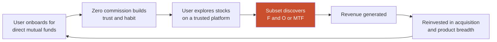

The loop is elegant and it worked for years. Its weak link is the red node: it depends on voluntary migration up the risk curve, which is exactly the transition SEBI is suppressing. Weaken that node and the loop does not slow — it opens.

**Loop 2 — The Balance Loop (the current bet)**

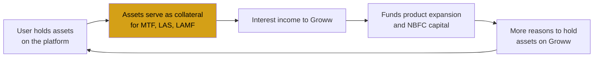

This loop is more robust to derivatives regulation and it is real — MTF grew ~4.5x YoY. But it is **procyclical**: it accelerates in rising markets and reverses sharply in falling ones, when collateral values drop, margin calls trigger, and credit quality deteriorates simultaneously. The NBFC's NPA rise from 0.29% to 1.68% occurred without a crisis.

**Loop 3 — The Fee Loop (does not currently exist)**

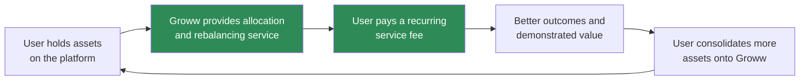

**Comparing the three loops is the cleanest statement of the strategic argument in this document.** Loop 1 is regulation-fragile. Loop 2 is cycle-fragile and correlated with every other exposure Groww carries. Loop 3 is neither — it is countercyclical in a useful way, because allocation and rebalancing services are *most* valuable to users precisely when markets are volatile and portfolios have drifted. Groww has built Loops 1 and 2 and has not built Loop 3.

---

## 37. Network Effects

**Honest assessment: Groww has weak direct network effects.** This deserves stating plainly because platform businesses are routinely credited with network effects they do not possess.

| Effect type | Present? | Assessment |
|---|---|---|
| Direct network effects | **No** | Priya's experience is not improved by Rohit joining. There is no interaction between users |
| Marketplace two-sidedness | **No** | Groww is not a marketplace; liquidity is supplied by the exchange, not by Groww's user base |
| Data network effects | **Weak but real** | More users → better fraud detection and better credit underwriting → better pricing. Genuine but slow-compounding and invisible to the user |
| Social proof effects | **Moderate** | Top Funds lists and popularity rankings mean user behaviour shapes other users' choices. This is a network effect, but a *harmful* one — see below |
| Scale economies | **Strong** | Fixed technology and compliance costs across ~1.30 crore clients. Q1 FY27 PAT growth of 94% against 66% revenue growth demonstrates it clearly |
| Switching costs | **Weak** | Free, instant account opening everywhere; the only real friction is portfolio inertia and demat transfer effort |

**The social-proof effect is negative and worth isolating.** Popularity-ranked fund lists create a feedback loop: funds that attract inflows rank higher, rank drives further inflows, and the ranking becomes self-reinforcing regardless of suitability. This concentrates retail money into recently-performing funds — the classic retail return-chasing pattern, industrialised by an interface. It is a network effect that makes the product's outputs worse as it gets larger.

**Strategic implication.** Groww's defensibility comes overwhelmingly from **scale economies and brand**, not network effects. Both are real but neither is self-reinforcing in the way a network effect is: a competitor with sufficient capital can replicate scale economies, and brand erodes with each outage.

This matters for [§50](#50-feature-proposal). An allocation service built on a user's own goals, contribution history and portfolio produces something Groww currently lacks entirely: **a genuine switching cost that benefits the user**. A user who has configured goals, target allocations and rebalancing rules over several years loses real, personally-valuable configuration by leaving. That is the good kind of lock-in — earned through accumulated service value rather than imposed through exit friction.

---

## 38. Product Strategy

**Where Groww is, stated without euphemism:** it has won distribution in Indian retail investing and has not yet won monetization of what it distributes. Its revenue depends on a shrinking, regulator-targeted minority. Its response has been to monetize balances rather than behaviour, which reduces regulatory exposure while increasing credit and cycle exposure — risks that are correlated with everything else it does.

**Three coherent strategic paths**, and an assessment of each:

**Path A — Deepen the balance-sheet business.** Scale Creditserv aggressively, grow MTF, optimise float and treasury. Become, functionally, a consumer NBFC with an investing app attached.

- *For:* Working today. MTF ~4.5x YoY. IPO capital already directed here. Reduces derivatives dependence.
- *Against:* Concentrates correlated risk. NPAs already 0.29% → 1.68% in a good cycle. Attracts RBI digital-lending scrutiny. Erodes the trust position built by never having sold users anything conflicted. And it re-rates the company: a lender trades at a materially lower multiple than a platform, which matters at a P/E near 64.

**Path B — Become a manufacturer.** Scale GrowwMF hard, capture fees on the AUM already custodied.

- *For:* Capital-light, recurring, no credit risk, uses the ₹1.9 lakh crore direct MF AUM already on the platform.
- *Against:* Direct and severe conflict of interest — Groww would be ranking its own funds in its own discovery surface. GrowwMF is currently sub-scale (₹5,491 crore) and loss-making (−₹21.4 crore Q4 FY26). Fund management is a performance business and Groww has no established track record.

**Path C — Become the allocation layer.** Charge a transparent fee for organising a user's portfolio, independent of which funds they hold.

- *For:* Monetizes the majority segment for the first time. No credit risk. No manufacturing conflict if enforced. Creates the only real switching cost Groww could own. Aligned with the regulator's direction of travel rather than against it. Directly serves JTBD 2 and 6 from [§21](#21-jtbd).
- *Against:* Unproven willingness to pay among users habituated to free. Requires SEBI IA registration and suitability obligations. Slower to scale than lending. Culturally alien to a zero-fee brand.

**Recommendation: C as the strategic priority, with A continuing as a bounded, capital-disciplined business and B explicitly subordinated.**

The reasoning is risk-shape, not upside. Path A's returns are real but correlated with every other exposure Groww carries — in a serious drawdown, brokerage, MTF, LAS, AMC and credit quality all deteriorate together. Path B trades the company's single most valuable asset (a trust position built on never having sold anything conflicted) for fee income. Path C is slower and smaller in the near term, but it is the only path that increases revenue without increasing either correlated risk or conflict.

**The counterargument deserves airing:** Path C may simply not work. Indian retail investors have shown limited willingness to pay for advice, and a fee-based product from a brand built entirely on "free and direct" may confuse or alienate. This is a genuine risk, and it is precisely why [§54](#54-ab-testing) is designed to falsify the expensive half of the proposal before it is fully built rather than after.

---

## 39. Monetization

**Current monetization, restated by what the user must do:**

| Mechanism | User must... | Groww earns | Alignment with user interest |
|---|---|---|---|
| Equity derivatives brokerage | Trade frequently | ~55% of Q4 FY26 revenue | **Poor** — most retail F&O participants lose money |
| Commodity derivatives | Trade commodities | ~4.9% | **Poor** — same structure |
| Cash delivery brokerage | Buy and sell stocks | Residual | Neutral |
| MTF interest | Borrow at ~14.95% | ~8.0% | **Poor** — leverage amplifies loss |
| Credit (PL, LAS, LAMF) | Borrow | ~5.5% | Neutral to poor |
| Float income | Leave cash idle | ~8.1% | **Poor** — idle cash is bad for the user |
| Treasury | — | ~3.0% | Neutral — Groww's own book |
| AMC fees | Own a Groww fund | Negligible | **Good** — aligned if the fund performs |
| Direct MF distribution | Invest in direct plans | **Zero** | **Perfect alignment, zero revenue** |

**The alignment column is the finding of this section.** Read it top to bottom: Groww's revenue is inversely correlated with user interest across almost every line. The one perfectly-aligned activity earns nothing. The one well-aligned revenue stream (AMC fees) is negligible and loss-making. Everything substantial in the middle earns more when the user trades more, borrows more, or holds more idle cash — all of which, on average and over time, make the user poorer.

This is not an accusation of bad faith. It is the standard structure of retail brokerage worldwide, and Groww did not design it. But it is a genuine strategic vulnerability rather than merely an ethical observation, for three concrete reasons:

1. **The regulator has noticed.** The October 2024 True to Label circular, the derivatives framework and successive STT hikes are all direct attacks on misaligned monetization. This is a stated, sustained policy direction, not a one-off.
2. **Misaligned revenue is fragile revenue.** It depends on user behaviour that is, by construction, wealth-destroying in aggregate — which means the customer base servicing it depletes itself and must be continuously replenished.
3. **It caps the trust position.** Groww's original advantage was being the platform that did not sell you anything. Every step up the misalignment ladder spends that.

**The monetization question that matters:** what would a Groww user willingly pay for, that also makes them better off?

Not order execution — that is commoditised to near-zero and correctly so. Not access — that is free everywhere. The plausible answer is **organisation**: the work of turning a pile of holdings into a portfolio pointed at a goal, and keeping it there. It is valuable, it is not currently supplied by anyone at scale in India, it is the unserved job from [§21](#21-jtbd), and paying for it makes the user better off rather than worse.

Whether they will actually pay is an empirical question this document does not pretend to have answered. It is the central assumption of [§50](#50-feature-proposal) and the explicit target of the experiment in [§54](#54-ab-testing).

---

## 40. Trust & Safety

**Reliability record.** Groww has a documented history of platform failures with regulatory consequences:

- **January 2024 outage:** users could not log in, could not see balances, and could not place trades. Groww failed to transmit required data to the exchange via LAMA and had no backup arrangement for clients during the outage window.
- **SEBI settlements:** approximately ₹82.98 lakh paid to settle two cases in early 2025, including one linked to the January 2024 glitch; a separate Groww Invest settlement of over ₹34 lakh has been reported.
- **Recurring user complaints:** incorrect wallet balances, login failures, payment issues, unreceived refunds, and reports of complaint and chat history disappearing from the app.

**Why the last item is the most serious.** An outage is an availability failure — bad, expensive, survivable, and common across the industry. Complaint history disappearing from a user's account is different in kind: it is a failure of the **record**, and it removes the user's ability to evidence their own grievance. Whether this is a bug or a retention-policy artifact, the effect is that a user who is already in dispute loses their documentation. In a regulated financial product where the audit trail is a consumer-protection mechanism, that deserves the most serious classification of anything in this section.

**Product safety — the design questions:**

| Area | Assessment |
|---|---|
| Leverage guardrails | MTF at ~4x buying power and ~14.95% interest, offered inside a consumer app optimised for frictionlessness. No evidence of suitability gating beyond regulatory margin requirements |
| Derivatives suitability | Regulatory framework has done the heavy lifting since Oct 2024, not Groww's product design |
| Concentration warnings | None observed. A user can hold three ~60%-overlapping funds with no signal |
| Self-arbitrage detection | A user running a SIP while carrying MTF debt at ~14.95% is borrowing expensively to invest. Groww can see both sides. No evidence this is surfaced |
| Popularity-as-advice | Top Funds lists occupy the recommendation slot without being recommendations — see [§23](#23-user-flow) |
| Conflict disclosure | Becomes materially more important as GrowwMF scales and Groww ranks its own funds in its own discovery surface |

**The trust asymmetry that defines this company.** Groww's original acquisition advantage was structural honesty: direct plans, no commission, nothing being sold to you. That was worth more than any feature, and it is why a mutual-fund app was able to become India's largest broker. Every subsequent monetization layer — derivatives, leverage, credit, proprietary funds — draws down that account.

The company has been running a slow trade: exchanging accumulated trust for near-term revenue. The trade is not irrational and every listed broker faces the same pressure. But trust is the only asset here that cannot be rebuilt with capital, and Groww's competitive position rests on it more than on any technology it owns. [§50](#50-feature-proposal)'s insistence on a fee-based, explicitly conflict-constrained design is a direct response to this section, not a separate idea.

---

## 41. Technical Architecture

*Groww does not publish a detailed architecture. What follows is an inferred reference architecture based on the product's observable behaviour, regulatory requirements applicable to Indian brokers, and the failure modes documented in [§40](#40-trust--safety). It is explicitly a model, not a disclosure.*

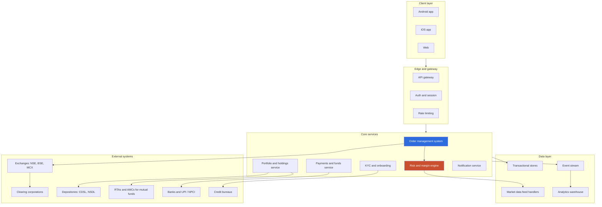

**Architectural pressures specific to this product:**

| Pressure | Nature | Evidence |
|---|---|---|
| **Extreme temporal concentration** | Indian derivatives volume concentrates violently around weekly expiry. Peak-to-average load ratios are far higher than in most consumer apps | Expiry-day behaviour is the defining capacity constraint for any Indian broker |
| **Heterogeneous latency requirements** | A SIP mandate can take seconds. An option order at expiry cannot. Both run on one platform | Serving Priya and Rohit from one stack is a genuine architectural tension |
| **Mandatory exchange reporting** | The January 2024 incident specifically involved failure to transmit data via LAMA — an exchange-facing reporting obligation, not just a user-facing outage | SEBI settlement |
| **Multi-entity data boundaries** | Broking, NBFC and AMC are separate regulated entities with distinct data-sharing constraints | Structural |
| **No graceful degradation observed** | During the outage, users could not view balances — a read-only operation that should survive an order-path failure | The read path apparently shares a failure domain with the write path |

**The most instructive inference.** In a well-partitioned architecture, the ability to *see* your holdings should be substantially independent of the ability to *place* an order. Portfolio viewing is a read against a materialised store; order placement requires the OMS, the risk engine, live market data and exchange connectivity. That users lost both simultaneously suggests a shared dependency — most plausibly the auth or session layer, or a common data store — creating a single failure domain across functions with very different criticality and very different availability requirements.

This is not a technical footnote. It is a product decision with a trust cost: a user who cannot place an order during volatility is frustrated; a user who cannot see whether they still own anything is frightened. Those are different failures and they should not share a blast radius. Read-path isolation appears in [§56](#56-product-roadmap) for this reason.

---

## 42. Data Flow

**Flow 1 — Equity or derivatives order (latency-critical)**

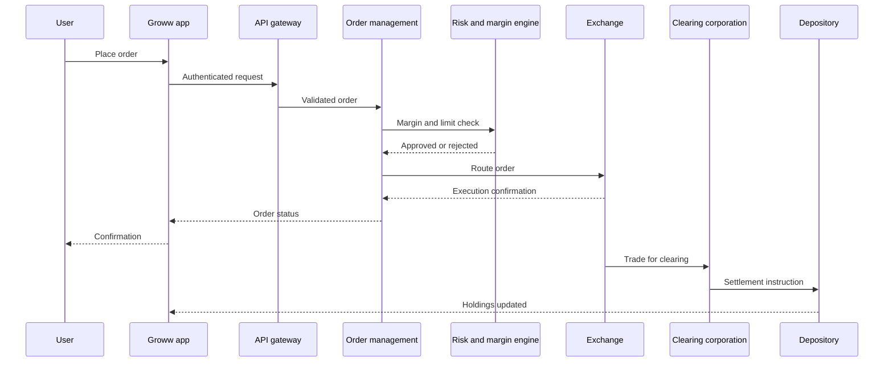

**Flow 2 — Mutual fund SIP (latency-tolerant, different failure semantics)**

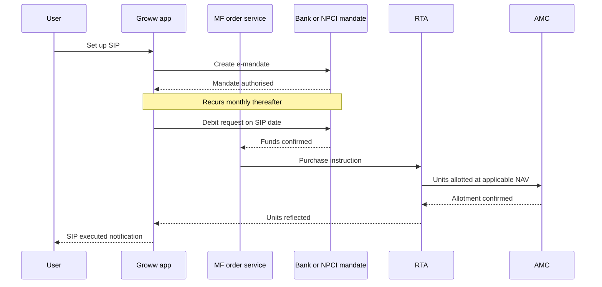

**Comparing the two flows explains a great deal about the product.** The order flow is synchronous, latency-critical, and fails loudly — the user knows within seconds. The SIP flow is asynchronous, spans days, involves external parties (bank, RTA, AMC) outside Groww's control, and fails *quietly* — a failed mandate debit may surface only as a missing entry.

Product investment has clearly followed the loud failures. The order path has visible status, retries and confirmations. The SIP path, serving the majority segment, has weaker feedback despite failing in ways the user is less equipped to detect. A user whose SIP silently stopped for two months has suffered a real financial harm with no salient signal — and this is the segment Groww is increasingly acquiring.

**Data Groww holds that it does not visibly use:** every holding across every asset class per user; complete contribution history and cadence; full transaction history; UPI spending patterns via Groww Pay; credit bureau data for Creditserv customers. This combination is close to a complete picture of a household's financial life, and it is currently applied to underwriting and fraud detection but not, evidently, to helping the user understand their own portfolio. That asymmetry is the data-side statement of the same finding as [§32](#32-product-analytics).

---

## 43. API Ecosystem

| Interface | Status | Notes |
|---|---|---|
| **Public trading API for retail users** | Limited / not a headline offering | Contrasts sharply with Zerodha's Kite Connect, which is a well-established developer ecosystem and revenue line |
| **Exchange connectivity** | Core, mandatory | NSE, BSE, MCX; includes obligatory reporting channels such as LAMA |
| **Depository integration** | Core | CDSL / NSDL for holdings and settlement |
| **RTA / AMC integration** | Core | Mutual fund order routing, NAV and unit allotment |
| **Banking and UPI** | Core | NPCI rails, mandate creation, Groww Pay |
| **Credit bureau** | Core for Creditserv | Underwriting |
| **KYC infrastructure** | Core | Aadhaar-based eKYC, PAN validation, CKYC |

**The developer-API gap is a real strategic difference from Zerodha and it is a defensible choice.** Zerodha's Kite Connect created an ecosystem of third-party tools, algo traders and integrations — genuine developer lock-in and a revenue stream, but one that predominantly serves sophisticated, high-frequency users. Groww's user base skews decisively the other way; building a developer platform would serve a segment Groww does not primarily have.

**But there is an ecosystem play Groww is uniquely positioned for and has not made.** Its distinctive asset is not order flow — it is **household portfolio data at national scale** (~₹3.58 lakh crore across ~1.30 crore clients, with UPI spending data alongside). The corresponding ecosystem is not algo traders; it is the financial planning, tax filing and goal-planning ecosystem. A consent-driven, Account Aggregator-aligned read API that let a user share their Groww portfolio with a planner, a tax tool or a budgeting app would deepen the account-primacy position that Groww Pay is already reaching for, and would sit naturally alongside [§50](#50-feature-proposal). It is noted here as an adjacent opportunity, not part of the proposal.

---

## 44. Privacy & Security

**Regulatory perimeter.** Groww operates under SEBI (broking, and any advisory activity), RBI (NBFC lending, payments), and the Digital Personal Data Protection Act, 2023 — plus KYC/AML obligations and exchange-level cybersecurity and system-audit frameworks.

| Area | Assessment |
|---|---|
| **Authentication** | Standard multi-factor patterns expected of a regulated broker; specifics not publicly detailed. Notably, the January 2024 incident manifested first as a login failure, suggesting auth is a concentrated dependency |
| **Data minimisation** | Weak by structure. A user holding a Groww demat account, a Creditserv loan and using Groww Pay has investment, credit and spending data with one group. Legally permissible with consent; a meaningful concentration of personal financial data nonetheless |
| **Cross-entity data sharing** | Broking, NBFC and AMC are separate regulated entities. Where the boundaries sit — specifically whether investment behaviour informs credit decisions — is not publicly documented and is the question that matters most |
| **Consent architecture** | Not publicly documented. Under DPDP Act 2023 this becomes a compliance obligation with real teeth, including purpose limitation |
| **Audit trail integrity** | **The documented weak point.** User reports of complaint and chat history disappearing raise a direct question about record retention in exactly the scenario where records protect the consumer |
| **Incident transparency** | Below the standard the category requires. Users reported not understanding what had happened during the January 2024 outage or what their position was |

**The consolidation question deserves to be stated as a strategic risk, not only a compliance item.** Groww's four licences let it observe what a household earns and spends (Groww Pay), what it owns (broking and demat), what it saves (SIPs), and what it owes (Creditserv). Very few institutions in India hold that combination for a retail customer at this scale.

This is simultaneously Groww's most valuable long-term asset and its most acute regulatory exposure. It is the asset that makes a genuinely useful allocation product possible — nobody else can see the whole picture. It is also the asset that makes a breach, a misuse finding, or an adverse DPDP determination existential rather than merely expensive. Any product that uses this data — including [§50](#50-feature-proposal) — has to be designed with explicit purpose limitation and user-visible consent from the first line of the spec, not retrofitted. This is captured as risk R5 in [§57](#57-risks--mitigation).

---

## 45. Pain Points

**User pain points**

| # | Pain point | Segment | Severity | Evidence grade |
|---|---|---|---|---|
| U1 | No way to know whether a portfolio makes sense as a whole | Passive majority | High | Inferred from product absence |
| U2 | Portfolio drift with no rebalancing mechanism | Passive majority | High | Inferred |
| U3 | Popularity presented in the recommendation slot | All, worst for novices | High | Observed |
| U4 | Platform outages during critical windows | Traders acutely, all generally | High | Documented — SEBI settlements |
| U5 | Incorrect wallet balances, refund and payment failures | All | Medium-High | Reported complaints |
| U6 | Complaint and chat history disappearing | Users in dispute | High | Reported complaints |
| U7 | No goal-to-instrument translation | Passive majority | Medium-High | Inferred |
| U8 | Silent SIP failures | Passive majority | Medium | Inferred from flow structure |
| U9 | No risk visualisation to balance return-forward UI | All | Medium | Observed |
| U10 | Self-arbitrage — SIP while carrying MTF debt — undetected | Overlap segment | Medium | Inferred |

**Business pain points**

| # | Pain point | Severity | Evidence |
|---|---|---|---|
| B1 | ~55% of revenue from ~10% of users, under regulatory attack | Critical | Reported |
| B2 | Largest asset class (~₹1.9 lakh crore direct MF) monetized at ~0 bps | Critical | Reported |
| B3 | AMC sub-scale and loss-making — the only non-credit fee route | High | Reported |
| B4 | NBFC NPAs 0.29% → 1.68% in a benign cycle | High | Reported |
| B5 | Correlated risk across brokerage, MTF, LAS, AMC in a drawdown | High | Structural |
| B6 | Acquisition mix shifting toward the lowest-monetization cohort | High | Management commentary |
| B7 | Reliability failures converting into regulatory action and trust loss | Medium-High | Documented |
| B8 | Weak switching costs — no user-beneficial lock-in | Medium | Structural |

**The convergence.** U1, U2 and U7 are the same unmet job seen from three angles. B2, B3 and B6 are the same monetization gap seen from three angles. And they are two faces of one fact: **the service users most need is the service Groww has no current way to charge for.** That is the fact [§46](#46-opportunity-mapping) works on.

---

## 46. Opportunity Mapping

Opportunities plotted by user value against business value, with the risk each adds.

| # | Opportunity | User value | Business value | Risk added | Addresses |
|---|---|---|---|---|---|
| **O1** | **Allocation and rebalancing layer, fee-based** | **High** | **High** | **Low** | U1, U2, U7, B2, B6, B8 |
| O2 | Portfolio diagnostics (overlap, concentration) — free tier | High | Medium (enabler) | Low | U1, U9 |
| O3 | Goal-based investing structure | High | Medium | Low | U7, U2 |
| O4 | Scale GrowwMF aggressively | Low | High | Medium (conflict) | B2, B3 |
| O5 | Expand MTF and credit further | Low | High | **High** (credit, cycle) | B1 |
| O6 | Reliability and read-path isolation | High | Medium | Low | U4, U5, B7 |
| O7 | Complaint and audit trail integrity | High | Low direct | Low | U6, B7 |
| O8 | Risk visualisation in UI | Medium-High | Low direct | Low | U9, U3 |
| O9 | Self-arbitrage detection and warning | High | **Negative short-term** | Low | U10 |
| O10 | Consent-based portfolio read API | Medium | Medium | Medium (privacy) | B8 |
| O11 | Deepen commodity derivatives | Low | High | Medium (regulatory) | B1 |

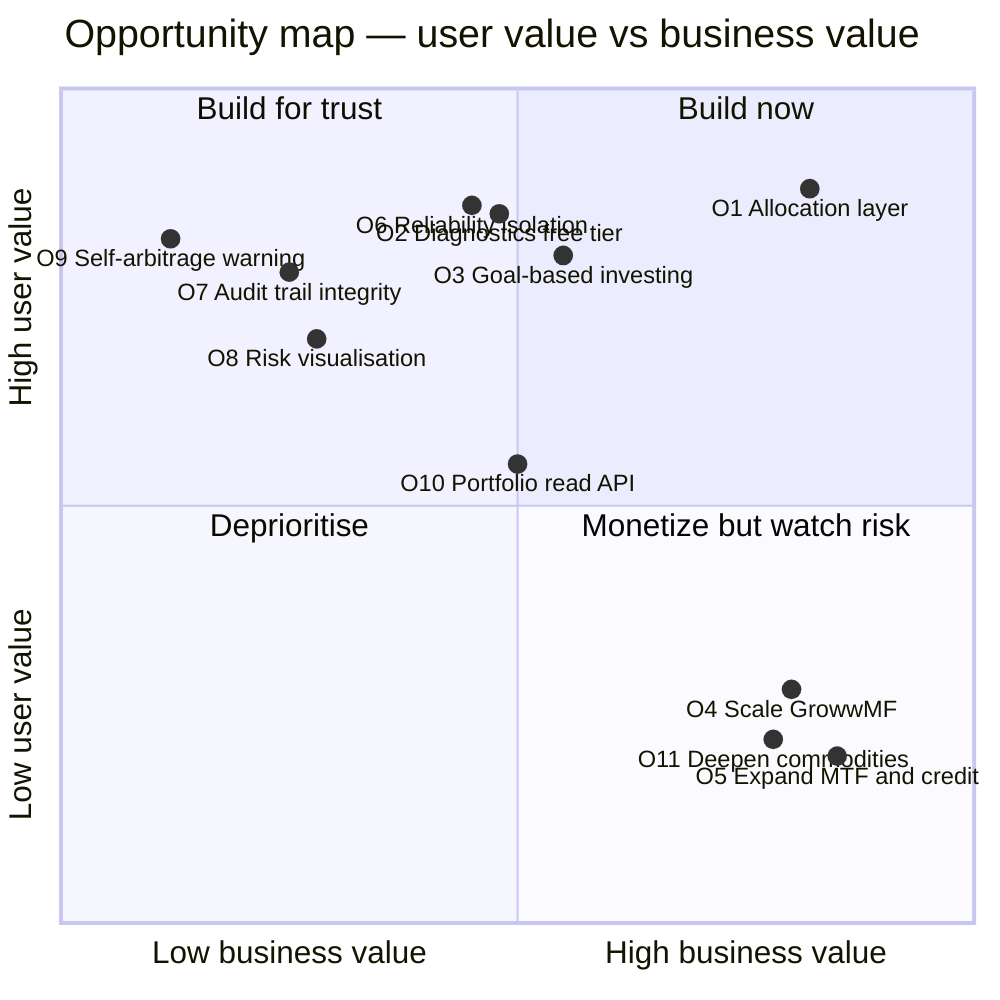

**Reading the map.** The lower-right quadrant — high business value, low user value — contains O5 (MTF and credit) and O11 (commodities), which is exactly where Groww's current investment is concentrated. The upper-right quadrant contains one substantial opportunity: **O1**.

**O1 is the only opportunity in this list that is high on both axes while adding low risk.** That is not a coincidence and it is not luck of the ranking. It follows structurally: it is the only option that monetizes the majority segment through service rather than through leverage or manufacturing. O2 and O3 are components of O1 rather than independent alternatives — diagnostics is the free tier that proves value, and goal structure is the organising layer the paid service operates on.

**O9 deserves its position.** Warning a user that they are running a SIP while carrying MTF debt has high user value and *negative* short-term business value — Groww earns the MTF interest. Its presence in the upper-left is a useful integrity test: a company that never ships anything from that quadrant is not serious about the alignment argument in [§40](#40-trust--safety). It is included in the roadmap in [§56](#56-product-roadmap) for that reason.

---

## 47. RICE

**Framework-selection rationale.** RICE is chosen over weighted scoring or Kano-only prioritisation because the decisive variable here is **confidence**, and RICE is the common framework that makes confidence an explicit multiplier rather than burying it. The central question — will Indian retail investors pay a recurring fee for allocation? — is a confidence question, not a reach or impact question. RICE forces that uncertainty into the arithmetic instead of leaving it in the narrative. Its known weakness (spurious precision from multiplying soft estimates) is addressed by the sensitivity analysis below, which is the part that actually informs the decision.

**Scoring key.** Reach = users meaningfully affected per quarter (author-estimated). Impact: 3 = massive, 2 = high, 1 = medium, 0.5 = low. Confidence: percentage. Effort: person-months.

| # | Initiative | Reach | Impact | Confidence | Effort | **RICE** |
|---|---|---|---|---|---|---|
| O2 | Portfolio diagnostics (free) | 8,000,000 | 1 | 80% | 12 | **533,333** |
| O6 | Reliability / read-path isolation | 13,000,000 | 1 | 75% | 20 | **487,500** |
| O8 | Risk visualisation | 8,000,000 | 0.5 | 80% | 6 | **533,333** |
| O1 | Allocation layer (paid) | 2,000,000 | 3 | **40%** | 40 | **60,000** |
| O3 | Goal-based structure | 4,000,000 | 1 | 60% | 18 | **133,333** |
| O9 | Self-arbitrage warning | 400,000 | 2 | 85% | 4 | **170,000** |
| O7 | Audit trail integrity | 300,000 | 2 | 90% | 8 | **67,500** |
| O5 | Expand MTF and credit | 1,000,000 | 1 | 85% | 15 | **56,667** |
| O4 | Scale GrowwMF | 3,000,000 | 1 | 50% | 25 | **60,000** |
| O10 | Portfolio read API | 500,000 | 0.5 | 60% | 14 | **10,714** |
| O11 | Deepen commodities | 800,000 | 1 | 75% | 16 | **37,500** |

**Sensitivity check — and it changes the answer.**

The ranking above puts O1 (the strategic proposal) in the middle of the pack, below several small utilities. That result is driven almost entirely by two inputs: a 40% confidence estimate and a 40 person-month effort estimate. Both are soft. Testing them:

| Scenario | O1 confidence | O1 effort | O1 RICE | Rank change |
|---|---|---|---|---|
| Base case | 40% | 40 | 60,000 | Mid-pack |
| Willingness-to-pay validated | 70% | 40 | 105,000 | Rises above O9 and O3 |
| Validated + phased build | 70% | 20 | 210,000 | Second overall |
| Pessimistic — users won't pay | 20% | 40 | 30,000 | Last among strategic items |
| Reach 4x (broader adoption) | 40% | 40 | 120,000 | Rises to third |

**The sensitivity analysis is more informative than the score.** O1's RICE ranges from 30,000 to 210,000 — a 7x swing — driven almost entirely by one unknown: *will users pay?* No other initiative in the table has anything like that dispersion. O5 (expand MTF) sits at 56,667 with 85% confidence and barely moves under any assumption; it is a known, bounded, unexciting quantity.

This produces the actual decision, which is not "build the highest-RICE item":

> **Do not build O1 at full scope on a 40% confidence estimate. Build O2 first — the free diagnostics tier — which independently scores highest, delivers standalone user value, and generates the exact evidence needed to move O1's confidence from 40% toward either 70% or 20%.**

O2 is both the top-ranked initiative *and* the experiment that resolves the largest uncertainty in the portfolio. That is an unusually clean sequencing outcome and it defines the phasing in [§53](#53-rollout-plan) and the experiment design in [§54](#54-ab-testing).

**A caution about RICE that this table illustrates.** RICE systematically favours cheap, broad, confident work over expensive, narrow, uncertain work — which means it will reliably under-rank the strategic bet in any portfolio containing utilities. O8 (risk visualisation, 6 person-months) ties the top score. It should be built; it is not a strategy. Reading RICE as a strategy document rather than a sequencing tool is a mistake, and the sensitivity table is what prevents it here.

---

## 48. MoSCoW

**Must have** — the paid allocation service cannot ship without these

- Portfolio diagnostics engine: cross-fund holdings overlap, concentration by sector and market cap, asset allocation vs target
- User-declared goals with horizon and risk tolerance
- Target allocation model construction
- Drift detection and quantification against target
- Transparent, prominent fee disclosure before any charge
- **Explicit, enforced and disclosed constraint that recommendations do not favour GrowwMF products** — this is a Must, not a Should, because the entire proposition collapses without it
- SEBI Investment Adviser registration and suitability workflow
- Clear demarcation in the UI between educational content and regulated advice

**Should have**

- One-tap rebalancing execution
- Goal progress tracking and projection
- Plain-language explanation of every recommendation, with the reasoning shown
- Tax-aware rebalancing (capital gains implications surfaced)
- Consolidated view of holdings held outside Groww, via Account Aggregator

**Could have**

- Automated scheduled rebalancing
- Scenario modelling ("what if I increase my SIP by ₹5,000")
- Family or household-level portfolio view
- Human advisor escalation for complex cases

**Won't have (this phase)** — and the reasons matter

- **Discretionary portfolio management.** A materially different regulatory perimeter and a different trust proposition. Not a phase-one product.
- **Performance guarantees or return projections presented as expectations.** Regulatorily hazardous and dishonest.
- **Proprietary-fund-only model portfolios.** Explicitly excluded; it would convert the trust asset into a distribution channel and destroy the proposition.
- **Credit integration into the allocation flow.** Deliberately excluded. The point of this product is to monetize the passive majority *without* extending them leverage. Placing a "borrow to invest more" prompt inside an allocation product would reintroduce exactly the misalignment [§39](#39-monetization) identifies. This is the single most important exclusion in the list.

---

## 49. Kano

| Feature | Kano category | Reasoning |
|---|---|---|
| Fast, reliable order execution | **Must-be** | Invisible when present, catastrophic when absent — see [§40](#40-trust--safety) |
| Zero-commission direct mutual funds | **Must-be** (now) | Was a Delighter in 2017; commoditised into a baseline expectation |
| Accurate holdings and balances | **Must-be** | Failure here is an integrity failure, not a quality one |
| Fast digital KYC | **Must-be** (now) | Groww's original Delighter, now table stakes across the industry |
| Breadth of instruments | **Performance** | More is linearly better; everyone is adding |
| Low brokerage | **Performance** | Approaching an asymptote at zero; diminishing differentiation |
| MTF availability and limits | **Performance** | Valued linearly by the segment that uses it |
| **Portfolio diagnostics (overlap, concentration)** | **Delighter → Performance** | Nobody at scale offers it in India; users do not ask for it because they do not know it is possible |
| **Goal-based allocation with rebalancing** | **Delighter** | The clearest available Delighter in this category |
| **Self-arbitrage warning** | **Delighter** | A platform warning you against a transaction it profits from is genuinely unexpected, and disproportionately trust-building |
| Risk visualisation | **Performance** | Expected once seen elsewhere |

**The Kano trajectory is the strategic warning in this section.** Every one of Groww's original Delighters — instant KYC, zero-commission direct funds, clean mobile UX — has decayed into a Must-be. That is the normal life cycle of a feature advantage, and it means Groww's 2016 differentiation now buys nothing; it merely avoids a penalty.

A company whose entire Delighter inventory has decayed to Must-be, and whose only new investments are Performance features on the same axes competitors are already moving along (breadth, price, leverage limits), has no differentiation pipeline. The Delighter rows are all in the unbuilt allocation category. **Groww's differentiation problem and its monetization problem have the same solution**, which is a strong signal that the solution is the right one.

---

## 50. Feature Proposal

### Groww Portfolios — a fee-based allocation and rebalancing layer

**How this proposal was derived.** This is not a feature chosen and then justified. It is the convergence point of eight independent lines of analysis in this document, each of which arrived at the same gap from a different direction:

| Section | What it independently concluded |
|---|---|
| [§18 Revenue Model](#18-revenue-model) | Manufacturing/fee revenue is the only stream that scales with assets without adding credit risk, and it is negligible |
| [§21 JTBD](#21-jtbd) | Jobs 2 and 6 — both allocation jobs — are the only unserved jobs, and the only unmonetized ones |
| [§24 Information Architecture](#24-information-architecture) | There is no allocation node anywhere in the product hierarchy |
| [§33 AARRR](#33-aarrr) | There is no designed path from Activation to Revenue for the majority segment |
| [§36 Growth Loops](#36-growth-loops) | Loop 3, the fee loop, is the only loop that is neither regulation-fragile nor cycle-fragile, and it does not exist |
| [§37 Network Effects](#37-network-effects) | Groww has no user-beneficial switching cost; accumulated allocation configuration would be one |
| [§39 Monetization](#39-monetization) | Every substantial revenue line is misaligned with user interest; "organisation" is the one service users might willingly pay for that also makes them better off |
| [§49 Kano](#49-kano) | Every remaining Delighter opportunity sits in the allocation category |

Eight sections, three of them structural (IA, loops, network effects), three commercial (revenue, monetization, Kano), two user-centred (JTBD, AARRR). The proposal is what is left standing.

**What it is.** A subscription tier inside the Groww app that:

1. **Diagnoses** the user's existing portfolio — cross-fund holdings overlap, sector and market-cap concentration, actual asset allocation, and drift from any stated intent
2. **Structures** it against user-declared goals, each with a horizon and risk tolerance
3. **Recommends** a target allocation using low-cost index funds and ETFs, under a hard constraint of no preference for GrowwMF products
4. **Rebalances** on user approval, with capital gains implications shown before confirmation
5. **Reports** progress against goals in rupee terms, not percentage returns

**Pricing.** A flat monthly fee (indicative range ₹99–₹249), explicitly **not** a percentage of assets. The reasoning is deliberate: a percentage-of-AUM fee recreates the incentive to maximise assets under the service rather than to serve the user well, and it is precisely the structure the direct-plan regime exists to remove. A flat fee means Groww earns the same whether the user has ₹2 lakh or ₹2 crore, which is the honest version of this product and the version that survives regulatory scrutiny.

**What makes it defensible rather than obvious:**

- **The free diagnostic tier is the wedge, not the product.** Overlap and concentration analysis ships free to everyone. It costs Groww little, delivers immediate standalone value, and — critically — creates the awareness that makes the paid tier legible. Users cannot want a solution to a problem they cannot see. This is why [§47](#47-rice) sequences O2 first.
- **The no-proprietary-preference constraint is load-bearing.** It is the difference between a service and a distribution channel. It should be publicly stated, contractually committed and independently auditable. Groww forgoes an obvious revenue synergy, and that forgone synergy *is* the product's credibility.
- **It uses data nobody else has.** Groww sees every holding, every contribution, and — via Groww Pay — spending patterns. A competitor cannot replicate the diagnosis without the custody position.
- **It monetizes without leverage.** This is the entire point. It is the only proposal in [§46](#46-opportunity-mapping) that increases revenue per passive user without increasing that user's risk.

**What would make this fail** — stated up front rather than in a risk appendix:

1. Indian retail investors may simply not pay for advice at any price. This is the primary risk and the target of [§54](#54-ab-testing).
2. SEBI IA registration brings suitability obligations that are operationally heavy at consumer scale.
3. Internal pressure to feature GrowwMF funds will be constant and will intensify as the AMC's losses persist. The constraint will be tested repeatedly, and the first exception destroys the product.
4. A flat fee on a low-balance user base may not cover the cost to serve.

---

## 51. PRD

**Product:** Groww Portfolios
**Owner:** Product — Wealth & Allocation (org unit does not currently exist; see [§57](#57-risks--mitigation) R6)
**Status:** Proposal (author-constructed)

### Problem

Groww holds ~₹3.58 lakh crore of customer assets, ~53% in mutual funds, with ~₹1.9 lakh crore in direct plans earning ~0 bps. The users holding those assets have no way to assess whether their portfolio is coherent, and no mechanism to correct it when it drifts. Groww has no way to earn recurring revenue from them except by lending to them.

### Goals

| Goal | Measure |
|---|---|
| G1 | Establish fee-bearing, non-credit revenue from the passive segment | FBCA (see [§31](#31-north-star-metric)) as % of customer assets rises from ~1.5% |
| G2 | Improve measurable portfolio construction quality | Reduction in median cross-fund overlap and single-sector concentration among engaged users |
| G3 | Create a user-beneficial switching cost | Configured-goal retention over 12 months |
| G4 | Do so without increasing user leverage | MTF and credit uptake among subscribers does not exceed the non-subscriber baseline |

G4 is a guardrail goal. If Groww Portfolios subscribers borrow more than comparable non-subscribers, the product has failed on its own terms regardless of revenue.

### Non-goals

- Discretionary portfolio management
- Return projections presented as expectations
- Any preference for GrowwMF products
- Credit or leverage prompts within the allocation flow

### Users

Primary: Persona A (Priya) — passive accumulator with 2+ years tenure and 2+ mutual fund holdings. Secondary: cash equity investors with concentrated single-stock exposure. Explicitly not targeted: active derivatives traders.

### Functional requirements

| ID | Requirement | Priority |
|---|---|---|
| FR1 | Compute and display cross-fund holdings overlap for all held mutual funds | Must |
| FR2 | Compute and display concentration by sector, market cap and single security | Must |
| FR3 | Display current asset allocation across equity, debt, gold and cash | Must |
| FR4 | Allow the user to create goals with a name, target amount, horizon and risk tolerance | Must |
| FR5 | Generate a target allocation per goal from a documented, disclosed model | Must |
| FR6 | Quantify drift between current and target allocation | Must |
| FR7 | Generate a rebalancing plan with explicit buy and sell instructions | Must |
| FR8 | Display estimated capital gains impact before rebalancing confirmation | Must |
| FR9 | Execute an approved rebalancing plan | Should |
| FR10 | Enforce and surface the no-proprietary-preference constraint in every recommendation | Must |
| FR11 | Present fee, billing date and cancellation path before any charge | Must |
| FR12 | Provide plain-language reasoning for every recommendation | Should |
| FR13 | Allow import of external holdings via Account Aggregator | Could |
| FR14 | Track and display goal progress in rupees | Should |

### Non-functional requirements

- Diagnostics computation must not depend on the order-execution path (see [§41](#41-technical-architecture) read-path isolation)
- All recommendation logic must be auditable and reproducible for a given input state
- Recommendation model versioning retained for regulatory inspection
- Explicit purpose-limited consent for use of holdings data in the advisory context

### Success criteria (first 12 months)

| Metric | Target | Rationale |
|---|---|---|
| Free diagnostics adoption | 25% of eligible passive users view once | Awareness precondition |
| Free-to-paid conversion | 2–4% of diagnostics viewers | Deliberately conservative; this is the untested assumption |
| Subscriber 6-month retention | >70% | Below this, the service is not delivering felt value |
| Median overlap reduction among subscribers | Statistically significant vs control | G2 |
| Subscriber leverage uptake | ≤ non-subscriber baseline | G4 guardrail |
| FBCA as % of customer assets | Rises from ~1.5% | G1 |

### Open questions

1. Does willingness to pay exist at ₹99? At ₹249? — [§54](#54-ab-testing)
2. Does SEBI IA registration for a consumer-scale product create unmanageable suitability obligations?
3. Does the free diagnostic tier cannibalise paid conversion by being sufficient on its own?
4. Can the no-proprietary-preference constraint survive sustained internal pressure as GrowwMF losses continue?

---

## 52. Wireframes

*Low-fidelity structural layouts. No raster assets are referenced or generated; these are ASCII schematics describing hierarchy and content priority only.*

**Screen 1 — Portfolio Health (free tier, the wedge)**

```
+--------------------------------------------------+
|  < Portfolio Health                              |
+--------------------------------------------------+
|                                                  |
|   Your 3 funds overlap by 61%                    |
|   ------------------------------------------     |
|   [====== overlap bar ======]                    |
|                                                  |
|   You own 412 stocks. 38% of your money          |
|   sits in the same 10 companies.                 |
|                                                  |
+--------------------------------------------------+
|  ALLOCATION                                      |
|   Equity      88%    [==================  ]      |
|   Debt         4%    [=                   ]      |
|   Gold         0%    [                    ]      |
|   Cash         8%    [==                  ]      |
+--------------------------------------------------+
|  CONCENTRATION                                   |
|   Financials         31%   ^ high                |
|   Technology         22%                         |
|   Small cap          27%   ^ high for 3y horizon |
+--------------------------------------------------+
|                                                  |
|   This is what you own. Want help deciding       |
|   what you should own?                           |
|                                                  |
|   [  Set up a goal  ]                            |
|                                                  |
+--------------------------------------------------+
```

The free tier deliberately states facts and stops short of recommending. It creates awareness of a problem the user did not know they had, which is the precondition for the paid tier — and it stays clearly inside the education perimeter discussed in [§29](#29-ai-capabilities).

**Screen 2 — Goal Setup**

```
+--------------------------------------------------+
|  < New Goal                                      |
+--------------------------------------------------+
|   What is this money for?                        |
|   [ House down payment____________ ]             |
|                                                  |
|   How much do you need?                          |
|   [ Rs 25,00,000 ]                               |
|                                                  |
|   When do you need it?                           |
|   [ 2033 ]   -- 7 years away                     |
|                                                  |
|   If this fell 20% in a year, you would:         |
|   ( ) Sell some of it                            |
|   (o) Hold and wait                               |
|   ( ) Invest more                                 |
|                                                  |
|   [  Continue  ]                                 |
+--------------------------------------------------+
```

Risk tolerance is elicited through a concrete behavioural scenario rather than a self-rated scale, because self-rated risk tolerance is unreliable and systematically overstated in rising markets.

**Screen 3 — Target vs Current (paid tier)**

```
+--------------------------------------------------+
|  < House down payment - 2033                     |
+--------------------------------------------------+
|   ON TRACK: Rs 8.2L of Rs 25L                    |
|   [=========           ] 33%                     |
|   At Rs 15,000/month you reach Rs 24.1L by 2033  |
|                                                  |
+--------------------------------------------------+
|                CURRENT      TARGET      DRIFT    |
|   Equity          88%         65%       +23% ^   |
|   Debt             4%         30%       -26% v   |
|   Gold             0%          5%        -5% v   |
|   Cash             8%          0%        +8% ^   |
+--------------------------------------------------+
|                                                  |
|   Why: with 7 years left, a 65/30/5 mix          |
|   reduces the chance of a large drawdown         |
|   close to when you need the money.              |
|                                                  |
|   [  See rebalancing plan  ]                     |
|                                                  |
|   None of the funds suggested are Groww funds.   |
|   We never prefer our own products. [ Why? ]     |
+--------------------------------------------------+
```

The disclosure line at the bottom is a permanent interface element, not a one-time modal. It is the visible enforcement of the FR10 constraint and it is present on every recommendation surface.

**Screen 4 — Rebalancing Plan**

```
+--------------------------------------------------+
|  < Rebalancing plan                              |
+--------------------------------------------------+
|   SELL                                           |
|   Small cap fund          Rs 1,20,000            |
|     Est. short-term gains tax: Rs 4,100          |
|                                                  |
|   BUY                                            |
|   Short duration debt     Rs 1,00,000            |
|   Gold ETF                Rs   20,000            |
|                                                  |
+--------------------------------------------------+
|   After this, your allocation matches your        |
|   7-year goal. Estimated tax cost Rs 4,100.       |
|                                                  |
|   [ Approve ]   [ Adjust ]   [ Not now ]         |
+--------------------------------------------------+
```

Tax cost is shown before confirmation, not after. Most rebalancing tools omit this, and it is the single most common reason a rebalancing recommendation is wrong for the specific user in front of it.

---

## 53. Rollout Plan

Rollout is structured so that **the cheap, high-confidence work ships first and generates the evidence that decides whether the expensive work ships at all** — the sequencing conclusion from [§47](#47-rice).

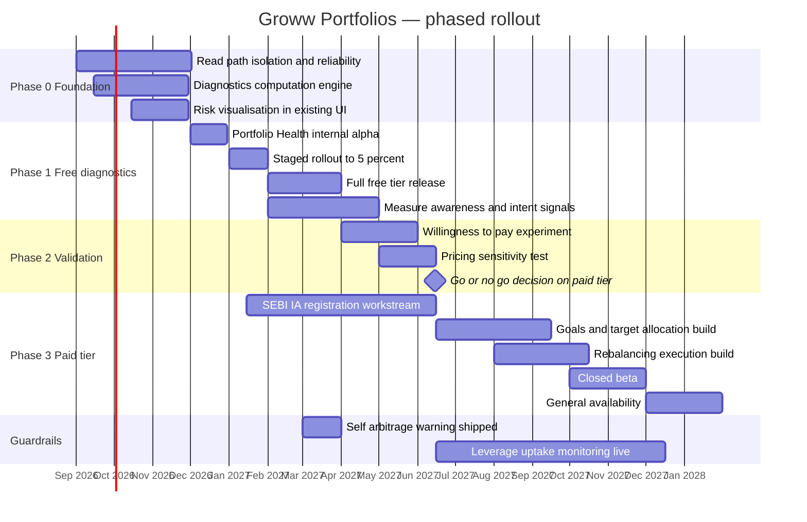

**Three sequencing decisions worth defending:**

**Phase 0 leads with reliability, not the new feature.** Read-path isolation ([§41](#41-technical-architecture)) is a prerequisite, not a nice-to-have: a diagnostics product that goes down whenever order flow spikes would compound the existing trust problem rather than address it. Shipping a trust-dependent product on an untrusted platform is the fastest way to fail.

**The SEBI IA registration workstream starts in Phase 3's column but begins in January 2027** — before the go/no-go decision. Registration is long-lead and largely wasted if the answer is no-go. Starting it early is a deliberate, bounded bet that accepts some wasted effort in exchange for not adding six months to the critical path. This is a real cost and it is stated rather than hidden.

**The go/no-go milestone is real.** If the Phase 2 willingness-to-pay experiment fails, Phase 3 does not ship. The free diagnostics tier still stands on its own — it improves outcomes, differentiates the product, and independently scores highest in [§47](#47-rice). The organisation must be able to stop at Phase 1 without treating it as a failure, and that has to be agreed before Phase 1 ships rather than argued afterwards.

**The self-arbitrage warning ships in March 2027, before the paid tier.** It costs Groww MTF interest revenue. Shipping it early, unprompted and ahead of the revenue-generating product is the credibility deposit that makes the no-proprietary-preference claim believable when it is made later.

---

## 54. A/B Testing

**Experiment 1 — The falsification test (primary)**

The expensive half of this proposal is the paid tier: SEBI IA registration, goal modelling, target allocation, and the rebalancing execution engine — roughly 40 person-months plus a regulatory workstream. The single assumption it rests on is that **Indian retail investors will pay a recurring fee for allocation help.** This experiment is designed to kill that assumption cheaply if it is false.

| Element | Detail |
|---|---|
| **Hypothesis** | Passive investors who see a concrete portfolio diagnosis will pay a flat monthly fee for allocation and rebalancing |
| **Null to falsify** | Willingness to pay is below the threshold that justifies the build |
| **Population** | Users with 2+ years tenure and 2+ MF holdings who have viewed Portfolio Health |
| **Control** | Portfolio Health free tier only, no paid offer |
| **Variant A** | Paid tier offered at ₹99/month |
| **Variant B** | Paid tier offered at ₹249/month |
| **Variant C** | Paid tier offered free for 6 months, then ₹149/month |
| **Primary metric** | Paid conversion rate from diagnostics viewer |
| **Guardrails** | No reduction in SIP contribution; no increase in MTF or credit uptake; no increase in complaint rate |
| **Kill criterion** | **If Variant A converts below 1.5%, the paid tier does not ship.** |

The kill criterion is stated numerically and in advance, because the failure mode of experiments like this is post-hoc reinterpretation of a weak result as "directionally encouraging."

Critically, **Variants A and B require only a paywall and a waitlist, not the built product.** Conversion intent can be measured with a functioning payment flow and an honest "we will notify you when this launches" — roughly 2 person-months of work to test a 40 person-month commitment. Variant C exists to separate price sensitivity from category resistance: if C converts strongly and A does not, users want the service but reject the price; if neither converts, they reject the category, which is the outcome that stops the programme.

**Experiment 2 — The falsifying variant for the expensive half of the build**

Even if willingness to pay is established, the *most* expensive component is the automated rebalancing execution engine. This experiment tests whether it is necessary at all.

| Element | Detail |
|---|---|
| **Hypothesis being challenged** | Automated one-tap rebalancing execution is required for the product to deliver value |
| **Variant A (expensive)** | Full automated rebalancing: system generates the plan and executes on approval |
| **Variant B (cheap)** | Diagnosis and target allocation only, with a plain-text instruction list the user executes manually through existing order flows |
| **Primary metric** | Proportion of users who actually complete a rebalance within 30 days of recommendation |
| **Secondary** | Subscription retention at 6 months; median drift reduction |
| **Falsification condition** | If Variant B achieves ≥80% of Variant A's completion and retention, the execution engine is not built and roughly 15 person-months are saved |

This is the deliberate attempt to falsify the expensive half. It is entirely plausible that the *diagnosis* carries nearly all the value and the execution automation is convenience rather than necessity — users who are motivated enough to pay may be motivated enough to place four orders. If so, the product ships at a fraction of the cost.

**Experiment 3 — Guardrail (always-on, not a test to win)**

Continuous monitoring of whether Groww Portfolios subscribers show higher MTF or credit uptake than a matched non-subscriber cohort. This is the G4 guardrail from [§51](#51-prd). If subscribers borrow more, the product has failed on its own terms even if it is profitable, and it should be re-examined rather than scaled.

---

## 55. KPI Dashboard

Organised by decision, not by department — each tier answers a different question and belongs to a different review cadence.

**Tier 1 — Is the strategic shift working? (board and quarterly review)**

| KPI | Current | Direction sought |
|---|---|---|
| Fee-Bearing Customer Assets as % of customer assets | ~1.5% (author-derived) | Up |
| Revenue concentration: % of revenue from top decile of users | Not disclosed | **Down** |
| Behaviour-based revenue as % of total | ~60%+ | Down |
| Balance-based revenue as % of total | ~25% | Flat — deliberately capped, not maximised |
| Manufacturing and fee revenue as % of total | Negligible | **Up** |
| Customer assets | ~₹3.58 lakh crore | Up |

Revenue concentration falling is a success signal here, which inverts the usual reading and is the point.

**Tier 2 — Is the product working? (monthly)**

| KPI | Current | Target |
|---|---|---|
| Portfolio Health adoption among eligible users | 0 (not built) | 25% in 12 months |
| Free-to-paid conversion | — | 2–4% |
| Subscriber 6-month retention | — | >70% |
| Median cross-fund overlap among engaged users | Not measured | Falling |
| Median single-sector concentration | Not measured | Falling |
| Goals configured per subscriber | — | ≥1.5 |

**Tier 3 — Are we harming anyone? (weekly, with escalation thresholds)**

| KPI | Threshold | Escalation |
|---|---|---|
| Subscriber MTF and credit uptake vs matched control | ≤ baseline | Product review if exceeded |
| SIP contribution change among subscribers | ≥ baseline | Investigate if falling |
| Complaint rate among subscribers | ≤ baseline | Immediate review |
| Proportion of recommendations including a GrowwMF product | **0%** | **Any non-zero value is an incident** |
| Order success rate and p99 latency | Not disclosed | Reliability review |
| Read-path availability, independent of order path | Not disclosed | Reliability review |

**Tier 4 — Business health (continuous)**

Revenue from operations; PAT; NSE active clients and share; net client adds; F&O penetration; MTF book; NBFC gross NPA and provisioning coverage; GrowwMF AUM and P&L.

**Why the GrowwMF threshold is zero and treated as an incident.** Under FR10 the constraint is absolute, so any breach is a control failure rather than a metric drift — and it should be handled with the same seriousness as a data breach. A threshold expressed as "low" would be negotiated downward within two quarters. Zero is the only defensible number, and treating a breach as an incident is what makes it real.

---

## 56. Product Roadmap

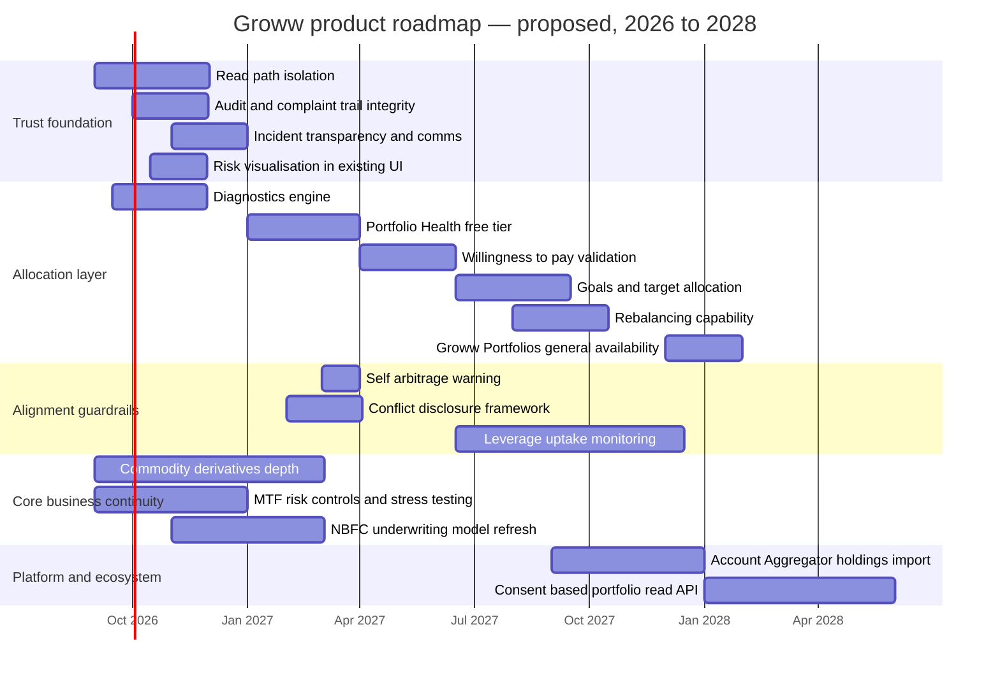

**What this roadmap deliberately does not contain.** There is no aggressive MTF or credit expansion track, and no aggressive GrowwMF scale-up track. Under the strategy in [§38](#38-product-strategy) both continue as bounded businesses — note that MTF appears only as *risk controls and stress testing*, not growth. That is a real strategic choice with a real cost: it forgoes near-term revenue that is demonstrably available, in exchange for a risk profile that survives a drawdown and a trust position that survives scrutiny.

**The trust foundation comes first and this is non-negotiable.** Groww is proposing to ask users to pay it for judgement. A platform with an unresolved outage history, disappearing complaint records and opaque incident communication has not earned the right to make that ask. Phase ordering here is not a technical dependency — it is a credibility dependency.

---

## 57. Risks & Mitigation

| ID | Risk | Likelihood | Impact | Mitigation |
|---|---|---|---|---|
| **R1** | Further SEBI derivatives restrictions or STT increases compress the ~55% revenue base | **High** | **Critical** | Accelerate non-derivatives revenue; but note the mitigation *is* the strategy, so this risk cannot be hedged away, only outrun |
| **R2** | Credit cycle turns; NBFC NPAs deteriorate from an already-rising 1.68% | Medium-High | High | Cap credit book growth; stress-test against a 30% equity drawdown; strengthen provisioning ahead of the cycle |
| **R3** | Major outage during high-volatility window; regulatory action and trust loss | Medium | High | Read-path isolation; capacity planning to expiry-day peaks; transparent incident communication |
| **R4** | Correlated drawdown hits brokerage, MTF, LAS, AMC and credit quality simultaneously | Medium | **Critical** | Build genuinely uncorrelated revenue — fee income is the only candidate. This is the strongest argument for [§50](#50-feature-proposal) |
| **R5** | DPDP Act enforcement or a breach involving consolidated investment, credit and spending data | Low-Medium | **Critical** | Purpose limitation by design; explicit consent; strict cross-entity data boundaries |
| **R6** | Groww Portfolios fails because no org unit owns allocation | Medium | Medium | Create the org unit before the product; the IA gap in [§24](#24-information-architecture) is a Conway's Law symptom and will reassert itself |
| **R7** | Internal pressure breaches the no-proprietary-preference constraint | **High** | **Critical** | Public commitment, contractual terms, independent audit, zero-tolerance incident handling ([§55](#55-kpi-dashboard) Tier 3) |
| **R8** | Users do not pay; the strategic pivot has no vehicle | Medium-High | High | Cheap falsification before the expensive build ([§54](#54-ab-testing)); free tier stands alone if paid fails |
| **R9** | A competitor ships an allocation layer first | Low-Medium | Medium | Groww's custody position is the moat; speed matters less than credibility here |
| **R10** | Multiple compression as the market re-rates Groww from platform to lender | Medium | High | The composition of revenue growth, not just its rate, is what the market will price |

**R7 is the risk this proposal lives or dies on, and it deserves to be named plainly.** GrowwMF is loss-making. Groww Portfolios would recommend funds. The commercial logic for featuring GrowwMF products will be raised, repeatedly, by people acting entirely in good faith on behalf of the P&L. The first exception will be small, reasonable and defensible. It will also end the product, because the proposition is not "good recommendations" — it is "recommendations you can trust because we have given up the ability to profit from them." That claim is binary. It cannot be 95% true.

**R4 deserves a note on why it is rated Critical.** Groww's revenue streams are usually presented as diversified. They are diversified by *source* and correlated by *cause*. A sharp equity drawdown reduces brokerage volumes, marks down MTF collateral and triggers margin calls, reduces LAS collateral values, shrinks customer assets and AMC fees, and degrades borrower credit quality — simultaneously, from one event. Adding another balance-based stream does not reduce this; it increases it. Only fee income on assets the user chooses to keep is meaningfully decorrelated, and even that is imperfect.

---

## 58. Future Vision

**Three-year scenarios.** *Author-constructed; not forecasts, and not equally likely. Each is defined by which of the three loops in [§36](#36-growth-loops) dominates.*

**Scenario 1 — The Lender (probability: highest on current trajectory)**

Groww continues down Path A. Credit and MTF scale; the NBFC becomes the primary growth engine; derivatives decline as a share but nothing replaces them on the fee side. By 2029 Groww is a consumer lender with an excellent investing app as an acquisition channel. Revenue grows; the multiple compresses as the market prices it as a lender rather than a platform. The business is genuinely more regulation-resistant and considerably more cycle-exposed. A serious credit event is the defining risk. Loop 2 dominates.

**Scenario 2 — The Allocation Layer (probability: moderate, requires deliberate choice)**

Groww builds the fee layer. Adoption is slower than lending would have been, and the first two years are commercially unimpressive. But by 2029 a meaningful share of customer assets is fee-bearing, revenue concentration has fallen, and Groww has the only real switching cost in Indian retail investing. It is structurally harder to displace and rated as a platform. Requires the organisation to accept a slower two years — which for a listed company with a P/E near 64 is a genuine governance test, not merely a strategic one. Loop 3 activates.

**Scenario 3 — The Utility (probability: moderate, and it is the passive outcome)**

Neither pivot succeeds decisively. Derivatives regulation tightens further; the credit book grows but stays bounded by risk appetite; the AMC stays sub-scale. Groww remains the largest distributor of Indian retail investing with thin economics — a well-run, low-margin utility, valuable but not exceptional. This is the outcome of *not choosing*, and it is the most likely destination if the company tries to run Paths A, B and C simultaneously without prioritising among them.

**The vision worth pursuing.** The most valuable thing Groww could become is not the largest broker in India — it already is that, and [§39](#39-monetization) shows what it is worth. It is **the account where an Indian household's wealth is both held and organised**, earning a transparent fee for the organising. That is a fundamentally better business: recurring, capital-light, uncorrelated with the credit cycle, defensible through accumulated configuration rather than exit friction, and aligned with a regulator that has spent a decade pushing retail finance in exactly that direction.

It is also, on current evidence, the path Groww is least likely to take — because it is slower, because it requires forgoing revenue that is available today, and because it requires a zero-fee brand to start charging. Those are the three hardest things to ask of a listed company in its first years after IPO. The strategic argument of this case study is that the alternative is a lender's multiple and a lender's risk, arrived at gradually and without anyone having decided on it.

---

## 59. PM Lessons

**1. Segment your revenue by user, not by product line — the disaggregation is where the strategy hides.**
Groww's revenue breakdown by instrument (derivatives, MTF, float, credit) is standard disclosure and tells you relatively little. Re-cut the same numbers by *which users generate them* and the business changes shape: ~10% of users produce ~55% of revenue while the fastest-growing segment produces almost none. The strategic problem was invisible in the conventional cut and obvious in the second one. When a business looks healthy in aggregate, disaggregate by user before you believe it.

**2. Classify revenue by what the user must do to generate it.**
Splitting Groww's streams into behaviour-based, balance-based and manufacturing-based ([§18](#18-revenue-model)) did more analytical work than any framework in this document. It revealed that the celebrated "diversification away from derivatives" was actually a shift from one risk (regulatory) to another (credit and cycle) — and that the risks were correlated rather than offsetting. Diversification by *source* is not diversification by *cause*.

**3. Your fastest-growing acquisition channel can be diluting your business.**
Groww is acquiring more users than anyone, in a shrinking market, and the incoming mix skews toward the segment that generates the least revenue. Growth is not directional evidence of health. Always ask what the *marginal* acquired user is worth, not what the average one is.

**4. When every unserved job is also unmonetized, that is a business model finding, not a backlog gap.**
[§21](#21-jtbd) showed a perfect correlation: every well-served job was monetized, every unserved job was not. That pattern is not a product team failing to prioritise — it is a product team correctly following the incentives it was given. The gap was in the business model, and no amount of roadmap discipline would have closed it.

**5. Frictionlessness is not a neutral good.**
Groww's removal of friction is its greatest achievement and the source of its market position. But friction removal is value-neutral: it accelerates whatever the user was already inclined to do, including things that harm them. The lesson is not to add friction back indiscriminately — it is that friction should be *proportional to consequence*, and applying uniform frictionlessness to actions with wildly different risk profiles is a design decision with real costs.

**6. A metric that cannot distinguish your best user from your worst is not a North Star.**
"Active clients" counts Priya and Rohit identically despite a revenue difference of orders of magnitude, and reports Priya as healthy through five years of silent product failure. Before adopting a metric, check whether it can tell your two most different users apart. If it cannot, it will average away the thing you most need to see.

**7. Let RICE sequence, not decide — and always run the sensitivity.**
The base-case RICE table put the strategic proposal mid-pack, below several small utilities. The sensitivity analysis showed its score swinging 7x on a single unknown. That dispersion, not the point estimate, was the actionable output: it identified which uncertainty to resolve first and reframed the sequencing entirely. A RICE score without a sensitivity check is a number pretending to be an argument.

**8. Design the experiment that kills your idea, and write the kill criterion down first.**
The proposal in [§50](#50-feature-proposal) rests on one untested assumption. [§54](#54-ab-testing) spends ~2 person-months to test a 40 person-month commitment, with a numeric kill threshold specified in advance. Specifying it in advance is the part that matters — a threshold set after seeing the data is not a threshold, it is a rationalisation.

**9. Trust is a balance you can only draw down.**
Groww's original advantage was structural honesty — direct plans, nothing being sold to you. Every subsequent monetization layer spends some of it. Capital can rebuild technology, hire teams and buy distribution. It cannot rebuild the belief that you are not being sold to. When trust is the actual product, treat it as the balance-sheet item it is.

**10. Conway's Law is visible in your navigation bar.**
Groww's IA maps almost exactly onto its regulatory entities: broking, funds, credit, payments. The missing allocation node exists because no internal team owns allocation. If a capability has no owner, it will have no navigation entry, and users will experience the org chart instead of their own goals.

---

## 60. PM Interview Questions

**Strategy**

1. Groww has ~1.30 crore active clients, roughly 40% of industry direct-plan SIP inflows, and earns approximately nothing on ~₹1.9 lakh crore of direct mutual fund AUM. Is that a distribution success or a strategic failure? Defend one answer.
2. ~10% of Groww's users generate ~55% of its revenue, and regulation is shrinking that 10%. Would you double down on serving them better, or invest in monetizing the other 90%? What evidence would change your mind?
3. Groww is moving from transaction revenue to balance-sheet revenue (MTF, credit, float). Argue the case *for* that pivot as strongly as you can, then identify the strongest counterargument.
4. Zerodha faced the identical regulatory shock and responded with restraint rather than expansion. Under what conditions is Zerodha right and Groww wrong?
5. Groww's revenue streams are diversified by source but correlated by cause. How would you quantify that correlation, and what would you do about it?

**Metrics**

6. Design a North Star metric for Groww. Justify why it beats "active clients," and identify what your metric would fail to capture.
7. A passive investor has run the same three SIPs for five years without rebalancing. Retention metrics call her a success. Is she? Design a metric that would catch what retention misses.
8. High engagement is good for a trader and arguably bad for a long-term investor. How do you build a metrics framework where the target direction differs by segment without it becoming unmanageable?
9. Groww can observe a user running a SIP while carrying MTF debt at ~14.95%. What is your obligation, and what does the metric that governs it look like?

**Product**

10. Groww's "Top Funds" list sits in the position where a recommendation would go, and users read it as one — but it is not advice. Redesign that surface. What do you lose?
11. During the January 2024 outage users could not view their holdings, not just place orders. What does that suggest architecturally, and why is it a product problem rather than an engineering one?
12. You have 40 person-months. Build automated rebalancing, or build free portfolio diagnostics for everyone? Defend the sequencing.
13. Design a fee-based advice product for a company whose entire brand is "free and direct." What is the hardest part, and it is probably not the pricing.

**Prioritisation and judgement**

14. Your RICE model ranks a small utility above your strategic bet. What do you do, and what does that tell you about RICE?
15. You are asked to include your own asset management company's funds in a recommendation engine, at a small weighting, to help a loss-making subsidiary. Everyone asking is acting in good faith. Walk through your reasoning.
16. Design the cheapest experiment that would tell you Indian retail investors will not pay for allocation advice. State your kill criterion before you see any data.
17. Groww's NBFC NPAs rose from 0.29% to 1.68% in a benign credit cycle while the loan book grew rapidly. As the PM for the credit product, what do you change?

---

## 61. References

*All sources accessed on or before 7 August 2026. Figures are as reported by the source; where sources conflict, both are retained and documented in [ASSUMPTIONS.md](ASSUMPTIONS.md).*

**Company and financial results**

- Business Standard — Groww Q1 FY27 results coverage; NSE active client data; Groww IPO and SEBI approval coverage; Groww Invest SEBI settlement coverage
- Republic World — "Fintech Leader Groww Reports Strong Q1 FY27 Results; Net Profit Surges 94% To Rs 735 Crore"
- Business Today — "Groww Q4 FY26 results: Net profit jumps 122% YoY to Rs 686 crore"; "Groww share price target: Broking revenue improves, MTF surge continues, says MOFSL"; "Zerodha, Groww, Angel One, Upstox: How active clients changed in past 8 years"
- Indian Television — "Groww doubles Q1 profit as revenue jumps 63 per cent"
- Investing.com — "Earnings call transcript: Groww Q1 2027 gains on product push and rising float income"
- Screener.in, Trendlyne, Tickertape, Stockanalysis.com — Billionbrains Garage Ventures financials, market capitalisation and valuation data
- TradingView / Quartr — Groww Q1 FY27 summary report

**IPO**

- TechCrunch — "Groww raises nearly $750M in IPO as India's retail investing boom continues"
- Chittorgarh, 5paisa, Kotak Neo, Bigul — Groww IPO structure, price band, subscription and listing data
- Inc42 — "Will Groww IPO's High OFS Portion Be A Concern For Retail Investors?"

**Business model, revenue mix and regulation**

- Inc42 — "Groww's New Verticals Gain Ground As Revenue Mix Shifts"; "Zerodha, Angel One, Groww Feel The Squeeze From SEBI Crackdown"; "STT Shock At Budget 2026: Pain For Zerodha, Groww and Angel One?"; "Why Groww Wants To Be Everything At Once"; "Zerodha, Groww's Revenue Conundrum"
- Medianama — "Groww F&O User Share Drops to 10% After Stricter SEBI Rules"
- Tradebrains — "Equity Derivatives vs Stocks: Which Segment Is Powering Groww's Revenue Growth?"; "Groww, Angel One and Other Brokerage Stocks Crash Up to 15% After STT Hike"
- Business Standard — "Groww DRHP reveals MF clout" (direct-plan SIP inflow share)
- StartupTalky — "India's Stock Broking Market in June 2026: Who's Gaining and Who's Losing Clients?"

**Credit and NBFC**

- ICRA — Groww Creditserv Technology Private Limited rating rationale documents
- The Arc — "Groww NBFC expands loan book to $115 mn"
- Groww — digital lending partners disclosure; Groww Credit product pages

**Company background**

- Contrary Research — "Report: Groww's Business Breakdown & Founding Story"
- Forbes India — "How four ex-Flipsters built Groww into a unicorn"
- Inc42 — "We Aimed To Build A Flipkart For Financial Services: Groww's Lalit Keshre"
- StartupTalky — Groww success story; Lalit Keshre profile
- Groww blog — "About Groww: Founders, Journey, Investors and More"

**Product, reliability and user experience**

- Business Standard — "Groww faces technical glitches, users complain of login issues on app"
- Zee Business — Groww technical glitch and user compensation coverage
- Groww — MTF product page (interest rate and buying power); Groww Pay help documentation
- Trustpilot — groww.in user reviews
- Inc42 — "Groww Diversifies Offerings With UPI Payments On Its Broking App"

**Competitors**

- Entrackr — "Zerodha Capital's profit rises 20% to Rs 14.7 Cr in FY26"
- TipRanks — "Angel One Publishes FY26 Audited Results, Highlights Strong Profitability"
- Comparebroker.info — industry active client and market share data

---

## 62. About the Author

**Gaurav Singh**

This case study is Day 42 of a 90-day product management case study challenge — one company, analysed end to end, published publicly, every day for ninety days.

The purpose of the series is deliberate practice rather than commentary. Each entry works through the same complete structure — market, users, experience, metrics, strategy, a concrete product proposal and the experiment that would falsify it — on a different company, so that the reasoning patterns become fluent rather than improvised. The constraint of publishing daily is the point: it forces judgement under time pressure, which is the actual condition of product work.

Every entry ships with an `ASSUMPTIONS.md` documenting evidence grades, source conflicts and everything the author constructed rather than found. That companion file exists because the most common failure in public product analysis is presenting inference with the confidence of fact, and the discipline of separating the two is more valuable than any individual conclusion.

**Series:** 90-Day PM Case Study Challenge
**Repository:** [product-management-case-studies](https://github.com/gaurav-product/product-management-case-studies)

---

## 63. License

MIT License

Copyright (c) 2026 Gaurav Singh

Permission is hereby granted, free of charge, to any person obtaining a copy of this software and associated documentation files (the "Software"), to deal in the Software without restriction, including without limitation the rights to use, copy, modify, merge, publish, distribute, sublicense, and/or sell copies of the Software, and to permit persons to whom the Software is furnished to do so, subject to the following conditions:

The above copyright notice and this permission notice shall be included in all copies or substantial portions of the Software.

THE SOFTWARE IS PROVIDED "AS IS", WITHOUT WARRANTY OF ANY KIND, EXPRESS OR IMPLIED, INCLUDING BUT NOT LIMITED TO THE WARRANTIES OF MERCHANTABILITY, FITNESS FOR A PARTICULAR PURPOSE AND NONINFRINGEMENT. IN NO EVENT SHALL THE AUTHORS OR COPYRIGHT HOLDERS BE LIABLE FOR ANY CLAIM, DAMAGES OR OTHER LIABILITY, WHETHER IN AN ACTION OF CONTRACT, TORT OR OTHERWISE, ARISING FROM, OUT OF OR IN CONNECTION WITH THE SOFTWARE OR THE USE OR OTHER DEALINGS IN THE SOFTWARE.

**Note on analysis:** This document is an independent analysis for educational purposes. It is not affiliated with, endorsed by, or produced in cooperation with Groww or Billionbrains Garage Ventures Ltd. It is not investment advice. All financial figures are as reported by the cited third-party sources and should be verified against official company disclosures before being relied upon.

---

## 64. Self Review

**What this case study does well**

- **It commits to one thesis and tests it rather than restating it.** The claim — that acquisition and revenue are near-disjoint populations and that the diversification response substitutes correlated risk for regulatory risk — is stated in [§5](#5-executive-summary) and genuinely stressed in [§18](#18-revenue-model), [§33](#33-aarrr), [§36](#36-growth-loops), [§39](#39-monetization) and [§57](#57-risks--mitigation). Several sections could have contradicted it; [§37](#37-network-effects) and [§47](#47-rice) came closest.
- **The proposal is derived, not retrofitted.** [§50](#50-feature-proposal) names the eight sections that converge on it, and those sections reached the gap independently.
- **The RICE sensitivity changed the recommendation.** The base-case score ranked the strategic bet mid-pack; the sensitivity analysis produced a different and better sequencing decision. That is the framework doing real work rather than decorating a conclusion.
- **Conflicts are preserved rather than averaged.** The 63%/66% growth figures, the FY26 growth rate discrepancy, and the SIP unit ambiguity are all retained with both readings.

**Where it is weak**

- **The market sizing in [§13](#13-tamsamsom) is the thinnest section.** The TAM range is author-constructed with a weak basis. I chose to present a wide range and label it rather than compute a spuriously precise figure, but a genuinely rigorous revenue-pool build-up is missing and the section leans on the fourth layer (captured share) to carry its weight.
- **No primary user research.** All four personas are composites built from disclosed segment behaviour and public complaints. Priya in particular carries a great deal of argumentative load for a construct. Her existence in that form is an inference, and the willingness-to-pay assumption resting on her is the weakest link in the proposal.
- **Willingness to pay is asserted as plausible and never evidenced.** I have no data suggesting Indian retail investors will pay for allocation advice, and some reason to think they will not. [§54](#54-ab-testing) is designed around this, but designing an experiment is not the same as having a finding.
- **The technical architecture in [§41](#41-technical-architecture) is inferred from failure modes and general practice.** The read-path isolation conclusion is a reasonable inference from the outage description, not a documented fact, and I may be wrong about the shared failure domain.
- **Accessibility ([§27](#27-accessibility)) is largely hypothesis.** No assistive technology testing was conducted. The cognitive accessibility argument is the strongest part and is also the least verifiable.
- **Competitor treatment is asymmetric.** Zerodha is used as a control case with less scrutiny than it deserves; its own vulnerabilities are underexplored because the comparison served the thesis.

**What would change my conclusions**

- Disclosure of ARPU and CAC by entry product could show that passive users convert to monetizing behaviour reliably enough that the "disjoint populations" framing is a transitional artifact rather than a steady state. That would substantially weaken the thesis.
- Evidence that Indian retail investors reject fee-based advice at any price would invalidate [§50](#50-feature-proposal) and make Scenario 1 in [§58](#58-future-vision) the correct strategy rather than the default one.
- A sharp recovery in retail derivatives volumes would reduce the urgency of the whole argument, though not its logic.
- Cohort data showing that Priya-type users do rebalance, via channels invisible to this analysis, would undermine the core unmet-need claim.

**Composite self-assessment: 3.8 / 5** — strong on thesis discipline, framework rigour and the derivation of the proposal; weak on market sizing, and resting on an unevidenced willingness-to-pay assumption that the document acknowledges but cannot resolve.

---

## 65. Appendix

### A. Key figures quick reference

| Metric | Value | Period | Source type |
|---|---|---|---|
| NSE active clients | ~1.30 crore (~28.72%) | June 2026 | Reported |
| Industry NSE active clients | ~4.42 crore | June 2026 | Reported |
| Net client adds | ~115,000 | Q1 FY27 | Reported |
| Transacting users | ~2.2 crore (+24% YoY) | 30 June 2026 | Reported |
| Active users (Groww definition) | ~1.7 crore | 30 June 2026 | Reported |
| Registered users | 40 million+ | 2026 | Reported |
| Customer assets | ~₹3.58–3.6 lakh crore | ~15 July 2026 | Reported |
| Direct MF AUM | ~₹1.9 lakh crore | Q1 FY27 | Reported |
| MF share of customer assets | ~53% | FY26 | Reported |
| Share of industry direct-plan SIP inflows | ~40% | DRHP-era disclosure | Reported |
| SIP market share | ~14.0% (from ~12.3%) | Q4 FY26 | Reported |
| SIP inflows | ₹13,023 crore (+35% YoY) | Q4 FY26 | Reported |
| F&O penetration | ~10% of users (from ~18% Nov 2024) | Q4 FY26 | Reported |
| Equity derivatives revenue share | ~55% (57% year-ago) | Q4 FY26 | Reported |
| MTF book | ₹2,814.3 crore (~4.5x YoY) | Q4 FY26 | Reported |
| MTF interest rate (advertised) | 14.95%, up to 4x buying power | 2026 | Company page |
| Commodity derivatives market share | ~29% | Within ~1 year of entry | Reported |
| GrowwMF AUM | ₹5,491 crore (from ₹4,170 crore) | Q1 FY27 | Reported |
| GrowwMF result | −₹21.4 crore | Q4 FY26 | Reported |
| NBFC gross NPA | 1.68% (from 0.29% FY24) | FY25 | Reported |
| Revenue from operations | ₹1,501.42 crore (+66% YoY) | Q1 FY27 | Reported |
| Total income | ₹1,549 crore (+63% YoY) | Q1 FY27 | Reported |
| PAT | ₹735.04 crore (+94.3% YoY) | Q1 FY27 | Reported |
| FY25 revenue / PAT | ~₹4,056 crore / ~₹1,818 crore | FY25 | Reported |
| FY26 revenue / PAT | ~₹5,242 crore / ~₹2,440 crore | FY26 | Reported — conflicts with a 19% growth claim |
| Market capitalisation | ~₹1.20 lakh crore | 6 Aug 2026 | Reported |
| Share price / P/E | ~₹192 / ~63.95 | 6 Aug 2026 | Reported |
| 52-week range | ₹112 – ₹227.20 | To Aug 2026 | Reported |
| IPO size / price band | ~₹6,632.30 crore / ₹95–₹100 | Nov 2025 | Reported |
| IPO subscription / listing gain | ~17.58x / ~29% | Nov 2025 | Reported |
| SEBI settlements | ~₹82.98 lakh (two cases); ₹34+ lakh (Groww Invest) | 2025 | Reported |

### B. FY26 revenue composition (reported components)

| Stream | Share | Classification |
|---|---|---|
| Equity derivatives | ~55% (Q4 FY26) | Behaviour |
| Float income | ~8.1% | Balance |
| MTF | ~8.0% | Balance |
| PL + LAS | ~5.5% | Balance |
| Commodity derivatives | ~4.9% | Behaviour |
| Treasury | ~3.0% | Balance |
| Other income | ~2.1% | Mixed |
| Cash delivery brokerage | Residual | Behaviour |
| AMC fees | Negligible | Manufacturing |

### C. Frameworks used and why

| Framework | Section | Selection rationale |
|---|---|---|
| TAM/SAM/SOM (revenue-pool variant, plus a captured layer) | [§13](#13-tamsamsom) | Reach is not the constraint; capture is. A user-count TAM would show false headroom |
| Porter's Five Forces (plus a sixth regulatory force) | [§16](#16-porters-five-forces) | The industry is unusually close to Porter's original conditions; the added force handles what the model omits |
| Business Model Canvas | [§17](#17-business-model-canvas) | Chosen to make the segment/revenue contradiction visible in a single view |
| JTBD | [§21](#21-jtbd) | Reveals the served/unserved and monetized/unmonetized correlation |
| AARRR | [§33](#33-aarrr) | Locates the missing Activation-to-Revenue path for the majority segment |
| HEART | [§34](#34-heart) | The only framework here that surfaces the segment-conditional engagement problem |
| RICE (with sensitivity analysis) | [§47](#47-rice) | Makes confidence an explicit multiplier; the sensitivity is what actually informs sequencing |
| MoSCoW | [§48](#48-moscow) | Used primarily to force explicit Won't-haves, which carry the real decisions |
| Kano | [§49](#49-kano) | Shows the decay of every original Delighter into a Must-be |

### D. Abbreviations

| Term | Meaning |
|---|---|
| AMC | Asset Management Company |
| AUM | Assets Under Management |
| BGV | Billionbrains Garage Ventures Ltd |
| CAC | Customer Acquisition Cost |
| DPDP | Digital Personal Data Protection Act, 2023 |
| F&O | Futures and Options |
| FBCA | Fee-Bearing Customer Assets (author-proposed metric) |
| IA | Investment Adviser (SEBI registration category) |
| JTBD | Jobs To Be Done |
| LAMA | Exchange-facing log and alert monitoring reporting mechanism |
| LAMF | Loan Against Mutual Funds |
| LAS | Loan Against Securities |
| MTF | Margin Trading Facility |
| NBFC | Non-Banking Financial Company |
| NPA | Non-Performing Asset |
| NSM | North Star Metric |
| OFS | Offer For Sale |
| PAT | Profit After Tax |
| RTA | Registrar and Transfer Agent |
| SIP | Systematic Investment Plan |
| STT | Securities Transaction Tax |

### E. Companion file

[`ASSUMPTIONS.md`](ASSUMPTIONS.md) — evidence grades by claim, the full source-conflict table with resolutions, a complete inventory of author-constructed content, what would materially improve this analysis, and the methodology note.

---

*Day 42 of 90 · 90-Day PM Case Study Challenge · Gaurav Singh · Research cut-off 7 August 2026*
