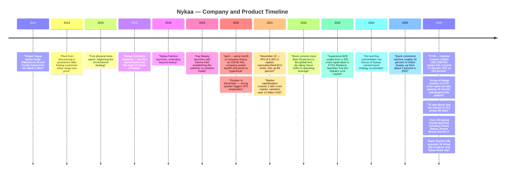
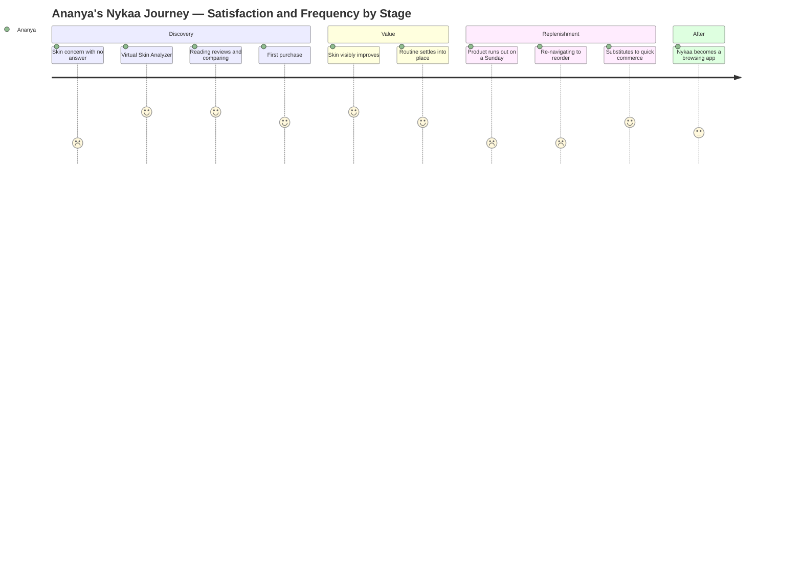
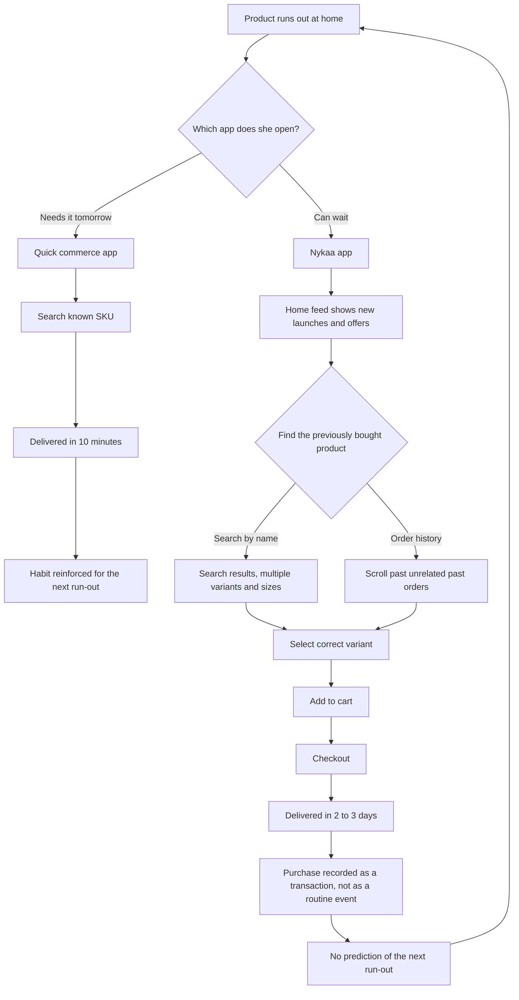
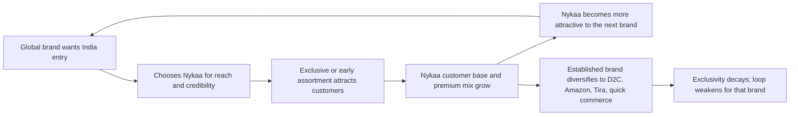
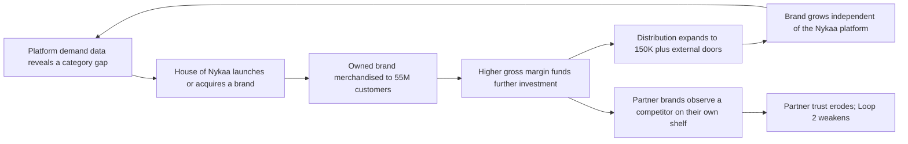
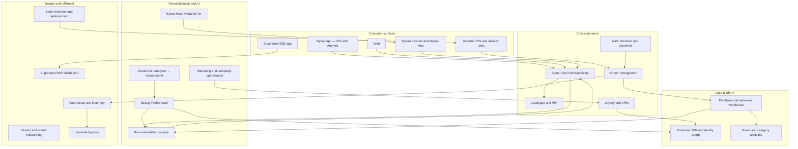
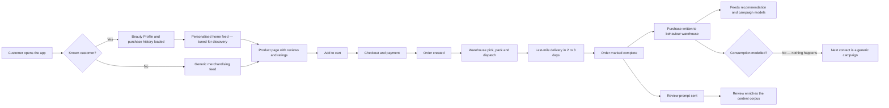
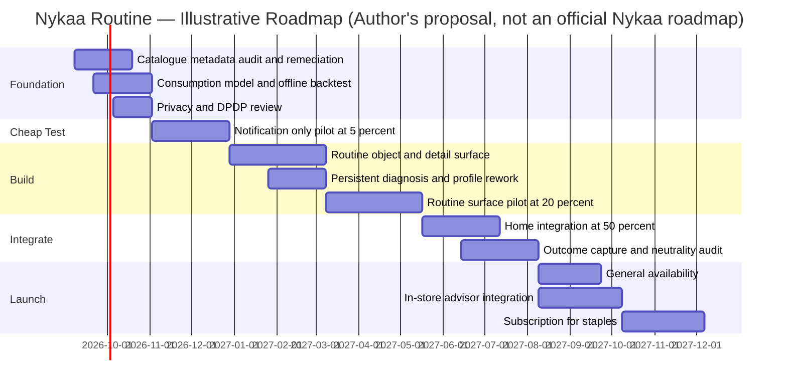

# Nykaa — Product Management Case Study
### Day 44 of 90 | PM Case Study Challenge

---

## 1. Cover

**Product:** Nykaa (FSN E-Commerce Ventures Ltd — includes Nykaa Beauty, Nykaa Fashion, Nykaa Man, Superstore by Nykaa, House of Nykaa, Nysaa)
**Category:** Vertical Commerce — Beauty & Personal Care Retail and Brand Ownership
**Author:** Gaurav Singh
**Day:** 44 / 90
**Date Published:** August 9, 2026

---

## 2. Repository Metadata

| Field | Value |
|---|---|
| Repository | `product-management-case-studies` |
| Folder | `Day-44-Nykaa/` |
| Author | Gaurav Singh |
| Series | 90-Day PM Case Study Challenge |
| Previous | Day 43 — Stripe |
| Related | Day 39 — Myntra (covers Nykaa Fashion as a competitor; this study anchors on Beauty & Personal Care) |
| Companion file | `ASSUMPTIONS.md` — evidence grades, source conflicts, author-constructed content |
| License | MIT (see [§63 License](#63-license)) |

---

## 3. Badges

`Day 44/90` · `Category: Vertical Commerce / Beauty & Personal Care` · `Ownership: Public — NSE: NYKAA, BSE: 543384` · `HQ: Mumbai, India` · `Status: Published`

---

## 4. Table of Contents

**Foundations**

- [1. Cover](#1-cover)
- [2. Repository Metadata](#2-repository-metadata)
- [3. Badges](#3-badges)
- [4. Table of Contents](#4-table-of-contents)
- [5. Executive Summary](#5-executive-summary)
- [6. Product Overview](#6-product-overview)
- [7. Company Background](#7-company-background)
- [8. Product Timeline](#8-product-timeline)
- [9. Vision & Mission](#9-vision--mission)
- [10. Problem Statement](#10-problem-statement)

**Market & Strategy**

- [11. Market Research](#11-market-research)
- [12. Industry Analysis](#12-industry-analysis)
- [13. TAM/SAM/SOM](#13-tamsamsom)
- [14. Competitor Analysis](#14-competitor-analysis)
- [15. SWOT](#15-swot)
- [16. Porter's Five Forces](#16-porters-five-forces)
- [17. Business Model Canvas](#17-business-model-canvas)
- [18. Revenue Model](#18-revenue-model)

**Users & Experience**

- [19. Target Users](#19-target-users)
- [20. Personas](#20-personas)
- [21. JTBD](#21-jtbd)
- [22. User Journey](#22-user-journey)
- [23. User Flow](#23-user-flow)
- [24. Information Architecture](#24-information-architecture)
- [25. UX Audit](#25-ux-audit)
- [26. UI Audit](#26-ui-audit)
- [27. Accessibility](#27-accessibility)

**Product & Metrics**

- [28. Feature Breakdown](#28-feature-breakdown)
- [29. AI Capabilities](#29-ai-capabilities)
- [30. Product Metrics](#30-product-metrics)
- [31. North Star Metric](#31-north-star-metric)
- [32. Product Analytics](#32-product-analytics)
- [33. AARRR](#33-aarrr)
- [34. HEART](#34-heart)

**Growth & Strategy**

- [35. Growth Strategy](#35-growth-strategy)
- [36. Growth Loops](#36-growth-loops)
- [37. Network Effects](#37-network-effects)
- [38. Product Strategy](#38-product-strategy)
- [39. Monetization](#39-monetization)
- [40. Trust & Safety](#40-trust--safety)

**Technology**

- [41. Technical Architecture](#41-technical-architecture)
- [42. Data Flow](#42-data-flow)
- [43. API Ecosystem](#43-api-ecosystem)
- [44. Privacy & Security](#44-privacy--security)

**Opportunity & Proposal**

- [45. Pain Points](#45-pain-points)
- [46. Opportunity Mapping](#46-opportunity-mapping)
- [47. RICE](#47-rice)
- [48. MoSCoW](#48-moscow)
- [49. Kano](#49-kano)
- [50. Feature Proposal](#50-feature-proposal)
- [51. PRD](#51-prd)
- [52. Wireframes](#52-wireframes)
- [53. Rollout Plan](#53-rollout-plan)
- [54. A/B Testing](#54-ab-testing)
- [55. KPI Dashboard](#55-kpi-dashboard)
- [56. Product Roadmap](#56-product-roadmap)

**Closing**

- [57. Risks & Mitigation](#57-risks--mitigation)
- [58. Future Vision](#58-future-vision)
- [59. PM Lessons](#59-pm-lessons)
- [60. PM Interview Questions](#60-pm-interview-questions)
- [61. References](#61-references)
- [62. About the Author](#62-about-the-author)
- [63. License](#63-license)
- [64. Self Review](#64-self-review)
- [65. Appendix](#65-appendix)

---

## 5. Executive Summary

FY2026 was the best year in Nykaa's history, and the reason it was the best year is the reason the next five will be difficult.

The disclosed numbers are strong and, unusually for this series, **audited**. Consolidated GMV grew **28% to ₹19,963 Cr**. Revenue from operations grew **26% to ₹10,022 Cr**, crossing **$1 billion**. Gross profit grew **30% to ₹4,516 Cr**. EBITDA grew **59% to ₹752 Cr**, with margin expanding from **6.0% to 7.5%** — the highest ever. PAT grew **183% to ₹204 Cr**. The company has now sustained mid-twenties growth for **14 consecutive quarters**, serves **55M+ customers**, and operates **313 stores across 99 cities** after adding **76 in a single year** while holding double-digit same-store sales growth.

Read the segment detail and a different story appears. The platform grew 28%. **House of Nykaa — the owned-brand portfolio — grew 49%**, to a ₹3,176 Cr annualised GMV run-rate, and the company explicitly credits it with "contributing meaningfully to overall gross margin expansion." Owned beauty brands have **quadrupled in three years**. They now reach **17M customers**, across **150K+ retail doors** — the great majority of which are **not Nykaa's own** — plus launches in the UK and GCC. Falguni Nayar has stated an ambition to take House of Nykaa to **₹6,000 Cr by 2030**.

**Key finding: Nykaa's margin engine and its retail moat are the same shelf, and they are on a collision course.**

Nykaa's moat is not logistics, price or app quality. It is that **L'Oréal, Estée Lauder, Shiseido, Puig, Chanel and 200+ other houses chose Nykaa as their gateway into India** — over 200 brands launched in FY26 alone. Customers come for an assortment nobody else has. That assortment is a *relationship* asset, and it is now being used to merchandise a competing house of brands, informed by demand data those same partners generate. India's competition regulator flagged precisely this "dual role" for marketplaces in 2020. The tension does not ease as owned brands succeed; **it is created by owned brands succeeding.**

**And yet the strategy is not reckless — it is insurance against a channel shift that is already underway.** Beauty in quick commerce grew roughly **22.5× between CY22 and CY25**, taking quick commerce from about **2% to about 16% of online BPC**, with credible projections of **30–40% by 2030**. Quick commerce does not take *discovery* — nobody explores a fragrance wardrobe in ten minutes. It takes **replenishment**: the high-frequency, low-consideration repeat purchase that is the profitable base of beauty retail. A retailer loses that business. A **brand owner does not** — Dot & Key sells perfectly well on Blinkit.

So Nykaa is buying insurance against its own disruption with the one currency that also erodes its moat. That is the tension this case study tests across all 65 sections, and it produces a specific, unexploited opportunity: **Nykaa is the only player in Indian beauty that knows what is on a customer's face and why.** It diagnoses skin with an AI analyzer, builds beauty profiles — and then lets that knowledge expire, treating the eleventh purchase exactly like the first. Defending replenishment with a *diagnosis* rather than with *delivery speed* is the one fight quick commerce cannot structurally win, and it is the basis of the proposal in [§50](#50-feature-proposal).

---

## 6. Product Overview

Nykaa is not one business. It is four, at very different stages of maturity, sharing a brand and a customer base.

| Business | What it is | FY26 scale | Stage |
|---|---|---|---|
| **Nykaa Beauty** | Multi-brand BPC retail — online and 313 physical stores | **GMV ₹14,954 Cr, +27%** | Mature, profitable, the core |
| **Nykaa Fashion** | Apparel, accessories, footwear; incl. Nykaa Man | **GMV ₹4,954 Cr, +30%** | Scaling; covered as a competitor in [Day 39 — Myntra](../Day-39-Myntra) |
| **House of Nykaa** | 12 owned beauty and fashion brands, sold on *and off* Nykaa | **₹3,176 Cr annualised run-rate, +49%** | The margin engine and the strategic bet |
| **Superstore by Nykaa** | B2B distribution to kirana and beauty retailers | **GMV ₹1,187 Cr**, 4× in three years | Emerging; quietly important |

**Plus:** **Nysaa**, an omnichannel Middle East venture whose GCC operations the company disclosed were impacted by the regional geopolitical situation in FY26, described as an insignificant contribution to the group.

**The consumer-facing product** is a content-and-commerce platform: editorial, tutorials, reviews and ratings wrapped around a catalogue of 200+ newly-launched global brands including Chanel Beauty and Fragrance, Armani Beauty, Maison Margiela Fragrances, SK-II, Kylie Cosmetics, Paula's Choice, La Roche-Posay, Anua and IT Cosmetics. Layered on top: an **AI Virtual Skin Analyzer**, **Beauty Profiles**, and **Nykaa Muse**, a virtual try-on closet on the fashion side.

**The physical product** is India's largest specialty beauty retail network — and in FY26 it stopped being a distribution afterthought and became a format laboratory: Nykaa Perfumery fragrance-first stores, Kay Kafe community spaces, and House of Nykaa exclusive brand outlets.

**Three things that matter strategically and are easy to miss**

1. **House of Nykaa is increasingly not a Nykaa-platform business.** 150K+ doors of distribution is general trade and third-party retail. Nykaa is building a consumer-goods company that happens to have been born inside a retailer.
2. **Superstore is a hedge on the same axis.** If beauty demand migrates to kirana and quick commerce, Superstore sells *to* that channel — 493K registered retailers, 220+ brands.
3. **Physical retail is the discovery moat.** 313 stores, 99 cities, double-digit same-store sales growth. Fragrance and colour cosmetics need to be smelled and swatched, and that is the part of beauty a ten-minute delivery app cannot serve.

---

## 7. Company Background

Nykaa was founded in **2012** by **Falguni Nayar**, who left Kotak Mahindra Capital — where she was Managing Director running institutional equities and investment banking — at **49**, with no prior experience in retail, beauty or technology. The company started from her father's office.

The founding insight was a supply gap rather than a technology gap. India's beauty market was served by a thin general-trade assortment and a grey market for anything premium; the brands global houses sold in Seoul, Tokyo and New York were largely unavailable. Nykaa's bet was that Indian consumers would pay full price for **authentic, broad assortment**, and that the constraint was availability rather than affordability.

**The decision that defined the company came around 2013.** Nykaa observed that customers responded better to *assortment* than to *discounts*, and pivoted accordingly — onboarding international brands from Korea, Japan and elsewhere rather than competing on price. In an Indian e-commerce era defined almost entirely by discounting, this was contrarian, and it is the origin of every structural advantage the company has today: authenticity positioning, brand-partner trust, premium customer mix, and the gross margins that eventually made profitability possible.

**COVID nearly broke it and then made it.** In April 2020 the company lost more in a month than it had ever lost in a year. It chose not to cut staff and moved into hyperlocal delivery of essentials. By the October–December 2020 quarter, performance had recovered strongly enough that the team began preparing for an IPO.

**The listing was extraordinary and the aftermath was instructive.** The **₹5,352 Cr IPO of November 2021** was oversubscribed roughly **82.5×**. Shares priced at ₹1,125 listed up about **89% at ₹2,129**; market capitalisation crossed **₹1 lakh crore**, valuing the company near **$13B** and making Nayar India's wealthiest self-made woman. The stock then fell more than **50% during 2022** in the global tech de-rating. The company's response was a multi-year pivot from growth narrative to **demonstrated operating leverage**, which is what the FY26 numbers represent.

**Today.** Headquartered in Mumbai. Listed on NSE and BSE. **Falguni Nayar** is Executive Chairperson, Founder and CEO; **Adwaita Nayar** leads Nykaa Fashion. FY26: **₹10,022 Cr revenue, ₹752 Cr EBITDA, ₹204 Cr PAT, 55M+ customers, 313 stores.** Fourteen years old.

---

## 8. Product Timeline



*Figure 1 — Company and product milestones, 2012–2026. Rendered as a Mermaid timeline (renders natively on GitHub). No raster chart assets were generated in this pass — see [§65 Appendix](#65-appendix).*

**The shape of the timeline.** Years 1–9 build a retailer. Years 10–14 build a brand owner *inside* the retailer, and the second curve is now growing almost twice as fast as the first. The inflection is roughly 2023–2024, and it is the subject of this case study.

---

## 9. Vision & Mission

Nykaa's stated vision is **"to bring inspiration and joy to people everywhere, every day"**, and the founding mission was narrower and sharper: **make beauty a mainstream choice in India.**

Four operating beliefs are visible across fourteen years of decisions:

- **Authenticity over price.** The 2013 assortment-not-discount pivot is the company's founding act, and everything downstream — brand-partner trust, premium customer mix, gross margin, IPO-era profitability — descends from it.
- **Education is merchandising.** Reviews, tutorials, ratings and editorial were not marketing bolt-ons; in a market where most consumers were buying premium beauty for the first time, teaching *how to choose* was the product.
- **Own the channel, then own the product.** Retail first, then owned brands, then distribution of those brands into other people's retail.
- **Physical is not a legacy channel.** 76 new stores in one year, with experiential formats, in a company that began as digital-first.

**PM read.** The first two beliefs built the moat. The third is now spending it. "Own the channel, then own the product" is a coherent strategy for a retailer with power over its suppliers — it is how Amazon, Costco and every supermarket chain behaves. But Nykaa's specific competitive advantage is **supplier preference**, not supplier power: it wins because global houses *choose* it. A strategy that works on the strength of buyer power is being executed by a company whose advantage is that its suppliers like it. That mismatch is the strategic heart of this case study, and it is examined in [§16](#16-porters-five-forces) and [§38](#38-product-strategy).

---

## 10. Problem Statement

**The problem Nykaa originally solved.** In 2012, an Indian consumer who wanted a specific foundation shade, a Korean serum, or a fragrance sold freely in Dubai had three bad options: a thin general-trade assortment, a grey market of uncertain authenticity, and asking a relative travelling abroad. Global brands, for their part, had no efficient route into India — distribution was fragmented, counterfeits were rife, and the cost of building a market presence was prohibitive for all but the largest houses.

**Nykaa solved both sides of that at once.** For consumers: authentic products, broad assortment, and — critically — the *education* to choose among them. For brands: a single, trusted, national gateway with content, merchandising and now physical retail attached. The 200+ brands launched in FY26 alone, including Chanel Beauty and SK-II, show the second half of that proposition is still working. **This is a two-sided problem, and Nykaa's moat lives on the supply side even though its brand lives on the demand side.**

**The problem has now moved twice.**

*First move — from availability to frequency.* Assortment is no longer scarce. Amazon, Flipkart, Myntra, Tira, Purplle and every brand's own D2C site now carry credible beauty ranges. The scarce thing is **repeat purchase**: which platform a consumer opens when the sunscreen runs out. That is a habit problem, not a catalogue problem, and it is being contested by a channel Nykaa cannot beat on its own terms — quick commerce, which grew beauty GMV roughly **22.5× in three years**.

*Second move — from selling brands to being one.* As platform economics compress, the durable margin in beauty sits with brand owners, not retailers. Nykaa has moved decisively, and owned brands now grow at nearly twice the platform rate. But this places Nykaa in competition with the partners whose assortment is the reason customers arrive.

**The problem this case study focuses on is the one created by that pair.** Nykaa must defend replenishment against a faster channel, *without* leaning so hard on owned brands that it damages the supplier relationships that constitute its actual moat. Those two constraints look unrelated. They are the same constraint, and there is exactly one asset that satisfies both: **Nykaa knows what is on the customer's face and why, and nobody else does.** That is the spine of this case study and it drives the proposal in [§50](#50-feature-proposal).

---

## 11. Market Research

**Market size and trajectory.** India's beauty and personal care market is projected to reach roughly **$40B by 2030**, which would make it the **fourth-largest BPC market globally**. E-commerce is expected to drive over a third of total category spend, and online channels are projected to command more than half of some sub-categories.

**The structural shift that matters more than the size.**

| Metric | CY22 | CY25 | 2030 projection |
|---|---|---|---|
| Quick commerce share of **online** BPC | ~2% | **~16%** | **30–40%** |
| Quick commerce BPC GMV growth, CY22–CY25 | — | **~22.5×** | — |

*One secondary source projects quick commerce plus value commerce reaching ~50% of online BPC by 2030 — a materially higher figure than the 30–40% quick-commerce-only projection. Both are reported; see [§65 Appendix](#65-appendix).*

**Why this is the defining fact of Nykaa's next five years.** A 22.5× move in three years is not a trend, it is a channel migration. But the migration is **selective**, and the selectivity is where the analysis gets interesting:

| Purchase type | Consideration | Migrating to quick commerce? | Why |
|---|---|---|---|
| **Replenishment** — sunscreen, face wash, shampoo, deodorant | Low; the decision was made months ago | 🔴 **Yes, rapidly** | Ten minutes beats two days when there is nothing left to decide |
| **Routine expansion** — adding a serum, trying an actives step | Medium; needs guidance | 🟡 Contested | Advice matters, but so does convenience |
| **Discovery** — fragrance, colour cosmetics, luxury | High; sensory and social | 🟢 **No** | Nobody explores a fragrance wardrobe in a ten-minute window |
| **Gifting and occasion** | High | 🟢 No | Presentation, authenticity and assortment dominate |

**Demand-side observations**

- **Growth is coming from premiumisation, not just penetration.** Nykaa launched 200+ global brands in FY26 including Chanel, Armani and SK-II. That is a supply-side response to a demand-side shift toward higher price points.
- **Physical retail is growing, not shrinking.** 76 new stores with double-digit same-store sales growth, in a category where sensory evaluation is genuinely load-bearing.
- **Owned brands are outgrowing platforms across the industry.** Nykaa, Myntra and Amazon are all pushing private label into the same expanding market — the growth in India's e-commerce base is what makes owned-brand economics viable at scale.
- **The customer base is large and, by the company's description, premium.** 55M+ customers, characterised in company communications as "among the most engaged and premium customers in India."

**Synthesis.** The category is growing fast enough that Nykaa can grow 28% while losing share of the fastest-growing channel. **That is the most dangerous kind of market: one where the headline number stays healthy while the underlying mix deteriorates.** The mix question — what share of *repeat* purchases Nykaa still wins — is not disclosed by anyone, and it is the number this case study would most like to see ([§31](#31-north-star-metric)).

---

## 12. Industry Analysis

**Structural characteristics of beauty retail that shape every product decision:**

1. **Beauty is two businesses with opposite economics.** Colour cosmetics, fragrance and luxury are high-margin, high-consideration, discovery-driven, and reward assortment and experience. Personal care — sunscreen, cleansers, shampoo — is lower-margin, high-frequency, habit-driven, and rewards availability and speed. **Most analysis of "the beauty market" fails because it averages these two.** Nykaa is strong in the first and structurally exposed in the second.
2. **Authenticity is a real moat in India specifically.** Grey-market and counterfeit penetration in premium beauty means "guaranteed genuine" carries genuine willingness-to-pay. This is why Nykaa's 2013 anti-discount pivot worked, and why counterfeit complaints ([§40](#40-trust--safety)) are more damaging to Nykaa than equivalent complaints would be to a horizontal marketplace.
3. **Brands need a market-maker; then they need one less.** A global house entering India needs a partner with content, merchandising, logistics and trust. Once established, it wants distribution everywhere — its own D2C, Amazon, Tira, quick commerce. **Nykaa's leverage over any given brand peaks at launch and declines thereafter**, which is why the flow of *new* brand launches (200+ in FY26) is a better health indicator than the size of the catalogue.
4. **Owned brands invert the P&L.** A retailer earns a margin on someone else's product; a brand owner earns the manufacturing margin, the brand margin and the retail margin. This is why House of Nykaa can grow 49% and carry the group's margin expansion at a fraction of the platform's GMV.
5. **Physical retail is a moat in beauty in a way it is not in most categories.** Swatching, sampling and fragrance are irreducibly physical. 313 stores is an asset no pure-play or quick-commerce competitor can replicate quickly.

**Regulatory context worth flagging.** The **Competition Commission of India flagged concerns in 2020 about the "dual role" of e-commerce marketplaces** acting simultaneously as intermediaries and as competitors through private labels. Nykaa is a first-party retailer rather than a pure marketplace for much of its beauty business, which changes the legal analysis materially — but the *commercial* dynamic the CCI described applies regardless of corporate structure, and it is the dynamic examined in [§38](#38-product-strategy).

---

## 13. TAM/SAM/SOM

*(Framework selection rationale: TAM/SAM/SOM is used here in its **channel-decomposed** form rather than as three nested revenue figures. A single BPC TAM would obscure the only question that matters for Nykaa's strategy — not how big the market is, but which *channel* the growth accrues to. The layers below are therefore sized by addressable channel rather than by addressable rupees alone.)*

| Layer | Definition | Estimate | Basis |
|---|---|---|---|
| **TAM** | India BPC across all channels — general trade, modern trade, e-commerce, quick commerce, D2C | **~$40B by 2030**, 4th largest globally | Third-party analyst projection |
| **SAM** | Online BPC plus the modern-trade footprint Nykaa can realistically serve | Not separately disclosed. E-commerce projected at **>⅓ of category spend**; of the online portion, quick commerce projected at **30–40% by 2030** | Analyst projections; the quick-commerce share is the critical variable |
| **SOM** | What Nykaa captures today | **Beauty GMV ₹14,954 Cr (+27%); group GMV ₹19,963 Cr (+28%); 55M+ customers; 313 stores; ~30% of the online beauty vertical (third-party)** | GMV and customers are audited disclosure; market share is a third-party estimate |

**The decomposition that actually matters.** If online BPC is roughly a third of a $40B market by 2030, that is ~$13B online — of which quick commerce takes **$4–5B**. Nykaa's addressable online market is therefore **shrinking as a share of the online market even as the online market grows**, unless it participates in the quick-commerce channel or defends the replenishment behaviour that feeds it.

**Honest read.** The only hard numbers here are Nykaa's own audited GMV and customer count. The $40B TAM, the channel splits and the ~30% share estimate are all third-party projections with unpublished methodologies. A PM at Nykaa building a business case would work bottom-up from **customers × orders per customer per year × AOV × margin mix**, and would treat orders-per-customer as the contested variable — which is precisely the variable [§31](#31-north-star-metric) proposes measuring.

---

## 14. Competitor Analysis

| Dimension | **Nykaa** | Tira (Reliance) | Purplle | Amazon / Flipkart | Myntra Beauty | Blinkit / Zepto / Instamart | Brand D2C |
|---|---|---|---|---|---|---|---|
| Model | Vertical BPC retail + owned brands + B2B | Vertical BPC, retail-backed | Vertical BPC, value-led | Horizontal marketplace | Fashion-led, beauty attached | Quick commerce | Direct |
| Core strength | **Brand-partner trust, assortment, content, 313 stores** | Reliance retail muscle, real estate, capital | Mass-market and tier-2/3 depth, price | Logistics, convenience, Prime bundling | Fashion traffic cross-sell | **10-minute delivery** | Margin, customer ownership |
| Core weakness | Speed on replenishment; owned-brand conflict | Late entrant, weaker brand relationships | Premium credibility | Authenticity perception in premium beauty | Beauty is secondary | **Narrow assortment; no discovery** | No assortment; high CAC |
| Threat to Nykaa | — | 🟡 Medium — contests the same premium positioning | 🟡 Medium — contests volume beneath Nykaa | 🟡 Medium — contests mass BPC | 🟡 Medium — contests the fashion+beauty customer | 🔴 **High — contests replenishment, the profitable base** | 🟡 Medium — erodes exclusivity over time |

**The comparison that matters is not a competitor at all.**

Tira, Purplle and Amazon compete with Nykaa **for the same trip**. Quick commerce competes for a **different trip** — and that is why it is more dangerous. Nykaa can win a head-to-head assortment or authenticity comparison against Tira. It cannot win a two-day-versus-ten-minute comparison against Blinkit, because that comparison is not about the product Nykaa built.

**The asymmetry, stated precisely.** Quick commerce takes the *cheapest to serve, highest frequency, most predictable* portion of the basket and leaves Nykaa the *expensive to serve, lowest frequency, least predictable* portion. Discovery is wonderful and margin-rich, but it is episodic. Replenishment is what turns a customer into a habit. **A beauty retailer that keeps discovery and loses replenishment has kept the glamour and lost the business model.**

**Where Nykaa's position remains genuinely strong.** Two things no competitor can assemble quickly:

1. **Brand-partner preference.** 200+ launches in FY26, including houses as protective of their positioning as Chanel. Reliance has more capital than Nykaa and did not get Chanel Beauty first.
2. **313 physical stores with double-digit same-store growth**, in the sensory categories that quick commerce structurally cannot serve.

**Opportunity for differentiation.** Nobody in Indian beauty owns the customer's *regimen*. Amazon knows what you bought; Blinkit knows what you bought fast. **Only Nykaa has diagnosed your skin, holds your beauty profile, and can therefore know what you should buy next and when you will run out.** That asset is currently created and then discarded ([§29](#29-ai-capabilities)), and it is the one competitive position that is simultaneously defensible against quick commerce and neutral with respect to brand partners.

---

## 15. SWOT

**Strengths**

- **Demonstrated operating leverage.** EBITDA +59% on revenue +26%; margin 6.0% → 7.5%; PAT +183%. Growth and profitability improving simultaneously is rare in Indian consumer internet.
- **Brand-partner preference as a supply moat.** 200+ global launches in FY26; chosen by L'Oréal, Estée Lauder, Shiseido, Puig, Amore Pacific.
- **India's largest specialty beauty retail network.** 313 stores, 99 cities, 76 added in a year with double-digit SSSG, plus genuinely differentiated experiential formats.
- **A working owned-brand engine.** House of Nykaa at a ₹3,176 Cr run-rate, +49%, 4× in three years, 17M customers, 150K+ doors, UK and GCC launches.
- **Consistency.** Mid-twenties growth sustained for 14 consecutive quarters.
- **Diagnostic data nobody else has.** AI Virtual Skin Analyzer plus Beauty Profiles — an asset described in [§29](#29-ai-capabilities) as currently under-exploited.

**Weaknesses**

- **Structurally slow on replenishment.** Two-day delivery against a ten-minute alternative in the highest-frequency part of the basket.
- **Service and fulfilment reputation.** Persistent public complaints about returns, refunds, delayed and missing deliveries, and — most damagingly for an authenticity-positioned retailer — counterfeit allegations ([§40](#40-trust--safety)).
- **Thin absolute profitability.** ₹204 Cr PAT on ₹10,022 Cr revenue is a ~2% net margin. Record-setting for Nykaa, and still fragile.
- **The owned-brand conflict** with the partners who supply the moat ([§38](#38-product-strategy)).
- **Fashion is sub-scale against Myntra**, which leads fashion DAUs by a wide margin (see [Day 39](../Day-39-Myntra)).
- **International exposure is small and volatile** — GCC operations disclosed as impacted by the regional situation.

**Opportunities**

- **Own the regimen.** Convert diagnosis into a persistent, replenishing routine ([§50](#50-feature-proposal)).
- **House of Nykaa to ₹6,000 Cr by 2030** — the stated ambition, with distribution beyond Nykaa's own channels.
- **Superstore as a quick-commerce hedge** — 493K retailers; if demand migrates to local retail, sell into it.
- **Premiumisation** — luxury, fragrance and dermocosmetics are the categories quick commerce serves worst.
- **Physical retail as experience infrastructure** — Perfumery, Kay Kafe and EBO formats are early.
- **Wellness**, named by the company as a future frontier.

**Threats**

- 🔴 **Quick commerce taking replenishment.** ~2% → ~16% of online BPC in three years; 30–40% projected by 2030.
- 🔴 **Brand partners diversifying** as they mature in India — the leverage-declines-after-launch dynamic in [§12](#12-industry-analysis).
- 🟡 **Reliance's Tira** with structurally deeper capital and real-estate access.
- 🟡 **Owned-brand conflict escalating** into a supply-side problem, echoing the CCI's 2020 "dual role" concern.
- 🟡 **Counterfeit perception** eroding the authenticity premium that is the company's founding advantage.
- 🟠 **Public-market pressure** for margin expansion in a year when defending replenishment may require spending it.

---

## 16. Porter's Five Forces

*(Framework selection rationale: Porter's is the right instrument here because Nykaa's central strategic question is about **supplier relationships**, and a competitor grid cannot represent supplier dynamics at all. The owned-brand strategy alters two forces simultaneously — it reduces supplier power while increasing rivalry with those same suppliers — and Porter's is the only framework in this document that makes that trade visible as a single move.)*

| Force | Rating | Analysis |
|---|---|---|
| **Threat of new entrants** | **Medium-High** | Capital and logistics are no longer barriers — Reliance proved that with Tira in 2023. What cannot be bought quickly is **brand-partner preference** and 313 stores with double-digit same-store growth. The threat is high at the platform level and low at the *assortment* level |
| **Bargaining power of buyers** | **Medium and rising** | Consumers face near-zero switching costs and now have five credible options plus quick commerce. Loyalty in beauty runs to *brands*, not retailers — which is precisely the argument for owning brands, and precisely why owning them cannibalises the retailer's own differentiation |
| **Bargaining power of suppliers** | **High — and this is the crux** | Global houses hold the assortment that constitutes Nykaa's moat, and their leverage *increases* as they establish themselves in India and diversify to D2C, Amazon, Tira and quick commerce. **House of Nykaa is a direct attempt to reduce this force.** It works — owned brands carry their own margin and require no partner. But it reduces supplier power by *becoming a rival to the suppliers*, which is a solution that generates the problem it solves |
| **Threat of substitutes** | **High** | The substitute is not another beauty retailer; it is **another way to buy the same product**. Quick commerce, brand D2C and general trade all substitute for the replenishment trip. Substitution here is channel-level, not product-level, and channel substitution is much harder to defend against |
| **Competitive rivalry** | **High** | Tira, Purplle, Amazon, Flipkart, Myntra, quick commerce platforms and every brand's own site — simultaneously, across a category with low switching costs |

**Net.** Nykaa's structural position is strong on assortment and physical presence, and pressured on both of the forces that determine long-run margin. The **supplier-power row is where the entire strategy lives**: Nykaa is the rare company whose competitive advantage is that its suppliers *prefer* it, and whose current margin strategy is to compete with them. The substitutes row is where the urgency lives. Read together, they say something specific: **Nykaa needs a defence against channel substitution that does not require further antagonising its suppliers.** There is exactly one asset that qualifies, and it is the subject of [§50](#50-feature-proposal).

---

## 17. Business Model Canvas

| Block | Nykaa |
|---|---|
| **Key Partners** | Global beauty houses (L'Oréal, Estée Lauder, Shiseido, Puig, Amore Pacific, Chanel); fashion brands (Nike, H&M, Foot Locker, Revolve, Cider); FMCG partners for Superstore (Colgate, Reckitt, J&J, Cetaphil); D2C brands (Plix, Foxtale, Mars, Bare Anatomy); contract manufacturers for owned brands; mall and high-street landlords; logistics partners; celebrity co-creators (Katrina Kaif for Kay Beauty) |
| **Key Activities** | Assortment curation and brand onboarding; content and education; warehousing and fulfilment; physical store operations and format design; owned-brand development, manufacturing oversight and marketing; B2B distribution; authenticity assurance |
| **Key Resources** | Brand-partner relationships; 55M+ customer base and its purchase history; **skin diagnostics and beauty profiles**; 313 stores; 12 owned brands and their IP; Superstore's 493K retailer network; the Nykaa brand as an authenticity guarantee |
| **Value Propositions** | *For consumers:* authentic products, the widest assortment in India, and the education to choose. *For global brands:* a trusted, content-rich, national gateway into India with physical presence attached. *For small retailers:* access via Superstore to brands general distribution does not reach. *For owned brands:* a launch platform with 55M customers and 150K+ external doors |
| **Customer Relationships** | Content-led and educational; loyalty programme; app-first with heavy CRM; in-store advisory; **transactional rather than continuous — there is no persistent relationship object, which is the gap in [§24](#24-information-architecture)** |
| **Channels** | Nykaa app and web; 313 physical stores; Nykaa Fashion and Nykaa Man; Superstore B2B; **150K+ third-party doors for House of Nykaa**; international via Nysaa, UK and GCC |
| **Customer Segments** | Premium and aspirational urban beauty consumers; tier-2/3 entrants; men (Nykaa Man); small retailers (Superstore); international brands seeking India entry |
| **Cost Structure** | Cost of goods (dominant); fulfilment and last-mile; store rent, fit-out and staff; marketing and customer acquisition; owned-brand development and manufacturing; technology and AI; corporate |
| **Revenue Streams** | First-party product sales (core); marketplace commissions and ad/visibility revenue from brands; **owned-brand sales at structurally higher margin**; Superstore B2B distribution margin; retail store sales; international |

---

## 18. Revenue Model

**Headline FY2026 economics (audited)**

| Line | FY26 | Growth | Note |
|---|---|---|---|
| Consolidated GMV | **₹19,963 Cr** | +28% | 14 straight quarters of mid-20s growth |
| Revenue from operations | **₹10,022 Cr** | +26% | Crossed $1B |
| Gross profit | **₹4,516 Cr** | +30% | ~45% gross margin; growing faster than revenue |
| EBITDA | **₹752 Cr** | +59% | Margin **7.5%** vs 6.0% |
| PAT | **₹204 Cr** | +183% | ~2% net margin — a record, and thin |

**The line that explains the others.** Gross profit grew **30%** against revenue growth of **26%**. That four-point gap is the whole story of FY26, and the company attributes it explicitly to House of Nykaa "contributing meaningfully to overall gross margin expansion."

> **Why owned brands do this.** On a partner brand, Nykaa earns a retail margin on someone else's product. On an owned brand, it earns the **manufacturing margin, the brand margin and the retail margin** — and when that brand sells through 150K+ third-party doors, it earns brand margin on volume that never touches Nykaa's platform at all. This is why a business at a ₹3,176 Cr run-rate can move the margin of a ₹19,963 Cr group.

**The GMV-to-revenue relationship.** Revenue (₹10,022 Cr) is roughly **50% of GMV** (₹19,963 Cr), reflecting the mix of first-party retail (where the full sale is revenue) and marketplace/B2B activity (where it is not). Any comparison of Nykaa's "revenue" to a pure marketplace's is therefore invalid without adjusting for model — the same definitional trap identified for Stripe in [Day 43](../Day-43-Stripe).

**Segment revenue architecture**

| Stream | Mechanism | Margin | Strategic role |
|---|---|---|---|
| **Beauty first-party retail** | Buy and resell at retail margin | 🟡 Moderate | The core; funds everything |
| **House of Nykaa** | Own the brand end-to-end, on and off platform | 🟢 **High** | The margin engine and the hedge |
| **Marketplace and brand services** | Commission, visibility, co-marketing | 🟢 High | Grows with brand-partner count |
| **Fashion** | Mostly marketplace | 🟡 Moderate | Scale play; sub-scale vs Myntra |
| **Superstore B2B** | Distribution margin | 🟠 Thin | Channel hedge, not a profit centre |
| **Physical retail** | Store sales | 🟡 Moderate, improving | Discovery moat; double-digit SSSG |

**The structural point.** At ~2% net margin, Nykaa cannot fund a delivery-speed war against quick commerce players backed by far deeper balance sheets. Its only viable paths are **(a)** higher-margin mix — which means more owned brands, which increases supplier conflict; **(b)** higher frequency per customer — which is the replenishment battle; or **(c)** higher AOV through premiumisation. **Path (b) is the only one that is both margin-accretive and supplier-neutral**, and it is the least developed of the three.

---

## 19. Target Users

| Segment | Who they are | What they buy | Where Nykaa stands |
|---|---|---|---|
| **Premium metro beauty consumer** | 25–40, high income, brand-literate, buys internationally-recognised labels | Luxury skincare, fragrance, colour cosmetics | 🟢 Core and defended — assortment and authenticity win here |
| **Aspirational tier-2/3 entrant** | First premium beauty purchase, learning the category | Entry-price skincare, colour, K-beauty | 🟡 Contested — Purplle competes on price, quick commerce on convenience |
| **Routine-driven skincare user** | Follows a multi-step regimen, replenishes predictably | Cleansers, sunscreens, serums, actives | 🔴 **Most exposed — this is the quick-commerce battleground** |
| **Gifting and occasion buyer** | Episodic, high AOV, presentation-sensitive | Fragrance, sets, luxury | 🟢 Defended |
| **Men (Nykaa Man)** | Growing, under-served, low category literacy | Grooming, basic skincare | 🟡 Emerging; fashion menswear grew 60% YoY |
| **Small retailers (Superstore)** | Kirana and local beauty stores | Wholesale FMCG and D2C beauty | 🟢 493K registered; a genuine channel hedge |
| **Global brands** | The supply side, and the actual moat | India market entry and growth | 🟢 Strong — 200+ launches in FY26 — 🟡 with the [§38](#38-product-strategy) tension building |

**Two observations a Nykaa PM should hold onto.**

First, **the segments are not equally defensible, and the most exposed one is the most valuable long-term.** The routine-driven skincare user is the highest-frequency, most predictable, most habit-forming customer in beauty. She is also the one for whom a ten-minute delivery is most compelling, because she already knows exactly what she wants. **Nykaa's most loyal behavioural segment is its most technologically vulnerable one.**

Second, **the supply side is a user segment, not a partner category.** Global brands consume Nykaa's product — merchandising, content, analytics, retail placement — and their satisfaction is a product outcome. Most consumer PMs never model their suppliers as users. At Nykaa, where supplier preference *is* the moat, failing to do so would be a serious analytical error.

---

## 20. Personas

**Persona 1 — Ananya Iyer, 29 · Marketing manager · Bengaluru**

Runs a seven-step evening skincare routine she assembled over three years from Nykaa reviews, a dermatologist visit and a great deal of Instagram. Spends around ₹4,000 a month on beauty. Discovered her current serum through Nykaa's Virtual Skin Analyzer and genuinely rates the recommendation. But when her sunscreen ran out on a Sunday evening, she opened Blinkit, because she needed it Monday morning and she already knew the SKU. She has now done that four times.

*Goals:* keep her routine running without thinking about it; find the next thing that actually works for her skin.
*Frustrations:* re-finding products she buys repeatedly takes too many taps; nothing tells her she is about to run out; the app treats her eleventh purchase exactly like her first.
*Quote:* "Nykaa taught me what to buy. Blinkit just gets it to me."

**Persona 2 — Meera Shah, 34 · Regional brand manager, global beauty house · Mumbai**

Owns her brand's India P&L. Nykaa is her largest channel and the reason her brand launched here at all — the content, the retail placement and the customer profile are unmatched. She is also watching House of Nykaa expand into two of her core categories, merchandised on the same shelf, informed by category data her own sales generate. She has begun building direct D2C and has opened conversations with Tira.

*Goals:* grow India revenue; maintain premium positioning; avoid single-channel dependence.
*Frustrations:* limited visibility into how ranking and merchandising decisions are made; no assurance about competitive neutrality.
*Quote:* "Nykaa built my business in India. I'd just like to know we're being ranked on the same rules as their own brands."

**Persona 3 — Rohit Bansal, 41 · Owner, neighbourhood beauty and general store · Indore**

Buys through Superstore because it gets him D2C and premium brands his traditional distributor cannot supply. Increasingly competing with ten-minute delivery in his own catchment.

*Goals:* stock what customers ask for; reliable supply; credit terms.
*Frustrations:* delivery timelines; assortment gaps in fast-moving premium SKUs.
*Quote:* "My customers ask for the brands they saw online. I need to have them before they order elsewhere."

*Note: all three personas are author-constructed composites built from documented segments, Nykaa's disclosed FY26 business highlights, published market research and public review patterns. They are not Nykaa research, and no named individual underlies any of them. See [§65 Appendix](#65-appendix).*

---

## 21. JTBD

| When… | I want to… | So I can… | Currently served by |
|---|---|---|---|
| I'm new to skincare and overwhelmed | understand what my skin actually needs | stop wasting money on the wrong products | ✅ Skin Analyzer, reviews, content — Nykaa's strongest job |
| I want a brand I saw abroad | buy it in India, genuine, without a grey market | trust what I put on my face | ✅ The founding job; 200+ launches in FY26 |
| I want to try a fragrance | smell it before committing ₹8,000 | not waste money on a blind buy | ✅ 313 stores, Perfumery formats |
| I'm buying a gift | present something that looks considered | not embarrass myself | ✅ Well served |
| **my sunscreen runs out on a Sunday night** | **have it before Monday morning** | **not skip a step in my routine** | 🔴 **Badly served — Blinkit wins this** |
| **I've been using the same three products for a year** | **not re-navigate a catalogue every single time** | **spend zero thought on repeat purchases** | 🔴 **Not served — the eleventh order behaves like the first** |
| I want to add a step to my routine | know what fits with what I already use | avoid ingredient conflicts and wasted money | 🟡 Partial — recommendations exist but are not regimen-aware |
| I want to know if a product is working | track my skin over time | decide whether to continue or switch | 🔴 Not served — diagnosis is one-shot |
| I'm a brand launching in India | reach premium consumers with credibility | build a market from zero | ✅ Best-in-class |
| I'm a brand competing with an owned brand | understand the rules I'm ranked under | plan my channel strategy | 🔴 Not served ([§38](#38-product-strategy)) |

**The pattern.** Nykaa serves **first-time and high-consideration jobs superbly** and **repeat, low-consideration jobs poorly**. That is the natural shape of a company whose founding insight was about *discovery* — assortment, education, authenticity. It is also, precisely, the shape of a company that is about to lose the high-frequency half of its category to a channel optimised for exactly the jobs it neglects.

---

## 22. User Journey

**Journey: Ananya (Persona 1) — from discovery to replenishment leakage**

| Stage | What she does | Thinking | Feeling | Friction | Opportunity |
|---|---|---|---|---|---|
| **Trigger** | Persistent skin concern she can't solve | "I don't know what I need" | Frustrated | — | — |
| **Diagnosis** | Uses the Virtual Skin Analyzer | "This actually told me something" | 🟢 **Delighted** | None — a genuine product high point | The most valuable data Nykaa will ever collect about her |
| **Discovery** | Reads reviews, compares, watches tutorials | "Now I understand the category" | Engaged | Pleasurable, not friction | — |
| **First purchase** | Buys a serum and a cleanser | "Let's see" | Hopeful | — | — |
| **It works** | Skin improves over eight weeks | "Nykaa gets me" | 🟢 **Peak** | — | 🔴 **Nothing captures this outcome. The result of the diagnosis is never recorded** |
| **Routine forms** | Settles into seven steps, buys monthly | "This is my routine now" | Content | Re-navigating the catalogue every time | 🔴 **The regimen exists in her head, not in the product** |
| **Run-out** | Sunscreen finishes on a Sunday evening | "I need this tomorrow" | Mildly urgent | 🔴 **Two-day delivery vs ten minutes** | 🔴 **The decisive moment — and Nykaa gives no signal it is coming** |
| **Substitution** | Opens Blinkit; product arrives in 11 minutes | "Well, that was easy" | Satisfied — with someone else | — | 🔴 **Habit transfer begins** |
| **Habit shift** | Fourth replenishment on Blinkit | "Nykaa's for new things now" | Neutral | — | 🔴 **Nykaa silently reclassified from store to catalogue** |
| **Residual** | Still buys fragrance and new launches on Nykaa | "I love browsing there" | Warm | — | Revenue retained, frequency lost |



*Figure 2 — Note the shape. Unlike a churn curve, satisfaction never collapses — **Ananya remains a happy Nykaa customer throughout**. What changes is frequency. The final stage is high-satisfaction and low-value, and this is the most dangerous pattern in consumer retention because **every satisfaction metric will report success while the business erodes.***

**The critical read.** The journey has two peaks — diagnosis and outcome — and Nykaa records neither as a persistent object. The knowledge that would defend the replenishment trip is generated at stage two and thrown away by stage six.

---

## 23. User Flow

**Current flow — a returning customer replenishing a known product**



**Three structural problems visible in the flow:**

1. **The decision is lost at node `B`, before Nykaa's product is ever opened.** Every strength Nykaa has — assortment, content, authenticity, reviews — is deployed *after* an app is chosen. In the replenishment trip, the choice is made on speed, at home, with no Nykaa surface present. **You cannot win a competition you are not invited to**, and the only way to be invited is to arrive *before* the run-out, which requires predicting it.
2. **The home feed is optimised for discovery in a session that is not about discovery.** Nodes `H` through `L` show a returning customer navigating a merchandising surface designed to sell her something new when her intent is to buy something old. This is not a bad feed; it is a feed with no notion of intent type.
3. **Node `P` is where the compounding loss happens.** Each purchase is recorded as a transaction rather than as an event in a regimen. Because no regimen object exists, node `Q` is impossible — Nykaa cannot predict a run-out it has no model of. **The flow terminates in exactly the state that guarantees the next cycle starts at node `B` again.**

---

## 24. Information Architecture

```
Nykaa App
├── Home (editorial, launches, offers, campaigns)
├── Categories
│   ├── Makeup · Skin · Hair · Fragrance · Bath & Body
│   ├── Appliances · Mom & Baby · Health & Wellness
│   └── Luxe · Global Store
├── Brands (A–Z, featured, new launches, House of Nykaa)
├── Offers & Campaigns
├── Search
├── Wishlist
├── Cart
├── Orders
│   └── Order history (chronological transaction list)
├── Beauty Profile  ← exists, but is an input, not a living object
├── Virtual Skin Analyzer  ← one-shot diagnostic; result is not persisted as state
├── Nykaa Network / content
├── Store locator
└── Account (addresses, payments, loyalty)

    [ROUTINE / REGIMEN — DOES NOT EXIST]
```

**The IA defect.** Every object in Nykaa's information architecture is organised around **the catalogue** (brand, category, campaign) or around **a transaction** (order, wishlist, cart). There is no first-class entity representing **what the customer actually uses** — the set of products currently in her routine, when each was purchased, how much is left, what it was chosen to treat, and whether it worked.

This is not a missing screen; it is a **missing noun**. Because the noun does not exist:

- The Skin Analyzer result has nowhere to live, so it expires ([§29](#29-ai-capabilities))
- Run-out prediction is impossible, because there is no model of consumption
- Repeat purchase has no shortcut, because there is no canonical list of "her products"
- Recommendations cannot be regimen-aware, because there is no regimen to be aware of
- Outcome tracking is impossible, so the moment the product *works* — the peak of [§22](#22-user-journey) — is never captured

**Compare.** Pharmacy apps model a prescription as a persistent object with a refill schedule. Grocery apps model a repeat basket. Fitness apps model a programme. All three took a repeating consumption behaviour and gave it a noun. **Beauty has the most regimen-shaped consumption pattern of any consumer category, and Nykaa's IA does not represent it.**

---

## 25. UX Audit

Assessed against **Nielsen's ten usability heuristics**, scoped to the consumer app with particular attention to the returning-customer experience. Scores are the author's heuristic judgement, not instrumented testing.

| # | Heuristic | Score /5 | Assessment |
|---|---|---|---|
| 1 | Visibility of system status | 4 | Order tracking and delivery communication are competent |
| 2 | Match between system and real world | 3 | The app speaks in *categories and brands*; the customer thinks in *routines and concerns*. "Serums" is a merchandising taxonomy, not a mental model |
| 3 | User control and freedom | 3 | Good on cart and wishlist; 🔴 no control over what a returning customer sees first |
| 4 | Consistency and standards | 4 | Strong and coherent across a large catalogue |
| 5 | Error prevention | 3 | Solid on transactions; 🔴 nothing prevents the most costly error in the journey — running out |
| 6 | **Recognition rather than recall** | **1** | 🔴 **The weakest heuristic.** A customer who has bought the same sunscreen eleven times must *recall* its name and *re-select* the variant. The system knows the answer and asks her anyway |
| 7 | Flexibility and efficiency of use | **2** | 🔴 No express path for the highest-frequency task. There is no meaningful difference between a first-time and a hundredth-time user's path to purchase |
| 8 | Aesthetic and minimalist design | 4 | Attractive and content-rich; occasionally dense with campaign merchandising |
| 9 | Help users recognise, diagnose and recover from errors | 3 | Competent in-app; 🟡 weaker at the returns and refunds boundary ([§40](#40-trust--safety)) |
| 10 | Help and documentation | 4 | Content and education are genuinely excellent — the company's heritage strength |

**Composite: 3.1 / 5**, with an unusual distribution.

**The finding that matters.** The two lowest scores — **recognition rather than recall (1)** and **flexibility and efficiency of use (2)** — are the two heuristics that describe *expert users doing routine tasks*. Every other heuristic scores 3–4. **Nykaa's UX is excellent for the novice and mediocre for the loyalist**, which is the exact inverse of what a high-frequency consumption category requires, and it traces directly to the missing entity in [§24](#24-information-architecture).

---

## 26. UI Audit

| Aspect | Assessment |
|---|---|
| **Visual system** | 🟢 Strong. Editorial, aspirational, appropriate to premium beauty. A genuine brand asset and clearly differentiated from horizontal marketplaces |
| **Content integration** | 🟢 Best-in-class. Reviews, ratings, tutorials and editorial are woven into the shopping surface rather than bolted alongside it |
| **Home feed** | 🟡 Optimised for a single intent — discovery. A returning customer with replenishment intent sees the same surface as a first-time browser |
| **Hierarchy for repeat purchase** | 🔴 The weakest area. "Buy it again" is not a primary surface. Order history is a chronological transaction list rather than a curated set of *her* products |
| **Diagnostic results** | 🔴 The Skin Analyzer produces a genuinely differentiated moment and then discards it visually — there is no persistent home for the result |
| **Physical/digital bridge** | 🟡 Store locator exists; in-store experience and app profile are weakly connected given 313 stores |
| **Owned-brand presentation** | 🟡 House of Nykaa is well-merchandised. **Whether its ranking treatment differs from partner brands is not disclosed in-product**, which is a transparency gap with commercial consequences ([§38](#38-product-strategy)) |

**Recommendations**

1. **Give the returning customer a different first screen.** Intent is inferable from purchase history; a home feed that opens on "your routine" for a known repeat customer and on discovery for everyone else is a routing decision, not a redesign.
2. **Give the diagnosis a permanent home.** The Skin Analyzer result should be a durable, revisitable, updatable artefact — the anchor of the profile rather than a transient overlay.
3. **Promote repeat purchase to a primary surface**, distinct from chronological order history.
4. **Disclose ranking treatment for owned brands.** A visible, plain-language statement of how House of Nykaa products are ranked relative to partner brands would cost very little and directly addresses the concern in [§20](#20-personas), Persona 2.

---

## 27. Accessibility

Assessed against **WCAG 2.1 AA** principles as a heuristic review of publicly observable surfaces — **not an instrumented audit**. Nykaa does not appear to publish an accessibility conformance report.

| Principle | Assessment | Notes |
|---|---|---|
| **Perceivable** | 🟡 Partial | Image-heavy, editorial-led design creates alt-text dependency across a very large catalogue. Shade and colour information conveyed primarily by swatch imagery is a specific risk in colour cosmetics |
| **Operable** | 🟡 Partial | Core flows navigable; dense category hierarchies and campaign overlays are harder to traverse assistively |
| **Understandable** | 🟡 Partial | Ingredient and actives vocabulary (niacinamide, AHA/BHA, SPF/PA+++) is genuinely technical. Nykaa's content mitigates this better than most retailers, but the *product surface* still assumes fluency |
| **Robust** | 🟢 Reasonable | Standards-based; broad device coverage appropriate to the Indian market |

**The category-specific gap: colour vision.** Beauty is the consumer category most dependent on accurate colour perception, and shade selection for foundation, concealer and lipstick is conveyed almost entirely visually. For colour-vision-deficient users — roughly 1 in 12 men — shade names and undertone descriptors carry the entire informational load. **Structured, text-described shade metadata (undertone, depth, finish) would be an accessibility improvement and a conversion improvement simultaneously**, since shade uncertainty is a leading cause of beauty returns.

**Highest-priority gap.** The Virtual Skin Analyzer is a camera-dependent diagnostic. Any customer who cannot use it — for reasons of vision, motor control, device capability or simple discomfort with facial scanning — is excluded from Nykaa's most differentiated feature. A structured questionnaire-based equivalent would widen access, and would also serve the substantial group who decline face scanning on privacy grounds ([§44](#44-privacy--security)).

---

## 28. Feature Breakdown

| Cluster | Representative capabilities | PM assessment |
|---|---|---|
| **Assortment and catalogue** | 200+ new global brands in FY26; Luxe; Global Store; K-beauty, dermocosmetics, fragrance | ✅ **The moat.** Chanel Beauty, Armani, SK-II, Maison Margiela — this is what no competitor assembled |
| **Content and education** | Reviews, ratings, tutorials, editorial, Nykaa Network | ✅ Best-in-class and the origin of the brand's authority |
| **Discovery AI** | Virtual Skin Analyzer, Beauty Profiles, recommendations | 🟡 **Genuinely differentiated and structurally under-exploited** — see [§29](#29-ai-capabilities) |
| **Physical retail** | 313 stores / 99 cities; Perfumery; Kay Kafe; House of Nykaa EBOs | ✅ India's largest specialty beauty network, growing with double-digit SSSG |
| **Owned brands** | 12 brands incl. Nykaa Cosmetics, Dot & Key, Kay Beauty, Earth Rhythm, Nykaa Perfumes, Nykd, KICA | ✅ **The margin engine** — ₹3,176 Cr run-rate, +49%, 150K+ external doors, UK and GCC |
| **Fashion** | Nykaa Fashion, Nykaa Man, Nykaa Muse virtual try-on; 1,280 brands launched | 🟡 Growing 30%; sub-scale vs Myntra (see [Day 39](../Day-39-Myntra)) |
| **B2B** | Superstore — 493K retailers, 220+ brands | 🟡 4× in three years; thin margin, strategically useful as a channel hedge |
| **Loyalty and CRM** | Loyalty programme, personalised campaigns | 🟡 Competent, transaction-oriented rather than relationship-oriented |
| **Replenishment** | — | 🔴 **Absent as a product concept.** No routine, no run-out prediction, no subscription, no express reorder |
| **International** | Nysaa (Middle East), House of Nykaa in UK and GCC | 🟠 Small; GCC disclosed as impacted by regional geopolitics |

**What the breakdown reveals.** Nykaa's feature portfolio maps almost perfectly onto the **discovery** half of beauty and almost not at all onto the **replenishment** half. Every capability listed as a strength serves a high-consideration purchase. The single 🔴 is the one that serves the high-frequency purchase, and it is not a weak feature — **it is an absent one**. That absence is the largest unexploited surface in the company, and it is the only strategic asset that is simultaneously defensible against quick commerce and neutral toward brand partners.

---

## 29. AI Capabilities

Nykaa's AI story is unusual: the hard part is already built, and the valuable part is not.

**What exists**

| Capability | What it does | Assessment |
|---|---|---|
| **Virtual Skin Analyzer** | Scans and diagnoses skin concerns in real time via camera, producing personalised product recommendations | 🟢 **Genuinely differentiated.** No competitor in Indian beauty has an equivalent at this scale |
| **Beauty Profiles** | Customers declare skin type, concerns, preferences; recommendations personalise accordingly | 🟢 Solid, and a real first-party data asset |
| **Nykaa Muse** | Virtual try-on closet for fashion, simulating in-store trial | 🟡 Strong on the fashion side; addresses a real fit-and-look uncertainty |
| **Recommendation and marketing efficiency** | AI across the funnel for personalisation and marketing efficiency; company reports efficiency gains | 🟡 Vendor-reported, undisclosed magnitude |

**What is missing, and why it is the whole opportunity.**

The Skin Analyzer answers **"what is wrong with my skin, and what should I use?"** That is the hardest question in beauty and Nykaa answers it well. But the answer is delivered as a **recommendation at a moment**, not as a **state that persists**. Three consequences follow, and each is a business problem rather than a technical one:

1. **The diagnosis expires.** A customer scans her skin in March, buys three products, and by June the system retains no model of what she is currently using or why. The most valuable data Nykaa collects has no home ([§24](#24-information-architecture)).
2. **The outcome is never recorded.** When the routine works — the emotional peak of [§22](#22-user-journey) — nothing captures it. Nykaa therefore cannot learn which recommendations actually succeeded, which is the single most valuable training signal available in the category and one that no quick-commerce or horizontal competitor can ever collect.
3. **Consumption is never modelled.** A 50ml serum used twice daily has a knowable depletion curve. Nykaa knows the SKU, the size, the purchase date and the declared routine. **It has every input required to predict the run-out date and does not compute it.**

**The strategic framing.** Nykaa's AI is deployed on **acquisition and discovery**, where it is impressive, and absent from **retention and replenishment**, where it would be decisive. That allocation made sense when the competitive threat was another retailer competing for discovery. It makes much less sense when the threat is a channel competing for frequency.

**And this is the only defence that works against quick commerce.** Nykaa cannot win on delivery speed — the economics and the infrastructure both belong to someone else. It can win on **knowing what the customer needs before she does**. Blinkit knows Ananya bought sunscreen. Only Nykaa diagnosed her skin, knows the routine that sunscreen sits inside, knows the size and the usage rate, and can therefore reach her *three days before she runs out* — at which point the ten-minute promise is irrelevant, because there is no urgency left to serve.

**One honest caveat.** The Skin Analyzer's diagnostic accuracy is not independently verified, and camera-based skin analysis is a genuinely difficult problem. The proposal in [§50](#50-feature-proposal) is deliberately built so that its core value — consumption modelling and regimen persistence — **does not depend on diagnostic accuracy at all**. Run-out prediction requires knowing product size and usage frequency, not skin condition.

---

## 30. Product Metrics

| Metric | FY2026 value | Growth | Source grade |
|---|---|---|---|
| Consolidated GMV | **₹19,963 Cr** | +28% | 🟢 Audited |
| Revenue from operations | **₹10,022 Cr** | +26% | 🟢 Audited |
| Gross profit | **₹4,516 Cr** | +30% | 🟢 Audited |
| EBITDA | **₹752 Cr** | +59% | 🟢 Audited |
| EBITDA margin | **7.5%** (vs 6.0%) | +150bps | 🟢 Audited |
| PAT | **₹204 Cr** | +183% | 🟢 Audited |
| Q4 GMV | ₹5,241 Cr | +28% | 🟢 Audited |
| Q4 EBITDA margin | **8.4%** (vs 6.5%) | Record | 🟢 Audited |
| Q4 PAT | ₹79 Cr | +313% | 🟢 Audited |
| Consecutive quarters of mid-20s growth | **14** | — | 🟢 Company |
| **Beauty GMV** | **₹14,954 Cr** | **+27%** | 🟢 Company |
| **Fashion GMV** | **₹4,954 Cr** | **+30%** | 🟢 Company |
| **House of Nykaa annualised GMV run-rate** | **₹3,176 Cr** | **+49%** | 🟢 Company |
| House of Nykaa Beauty GMV | ₹2,788 Cr | 4× in 3 years | 🟢 Company |
| House of Nykaa customers | 17M | — | 🟢 Company |
| House of Nykaa owned brands | 12 | — | 🟢 Company (secondary sources say 20 — see [§65](#65-appendix)) |
| House of Nykaa external distribution | **150K+ doors** | — | 🟢 Company |
| Superstore GMV | ₹1,187 Cr | 4× from ₹325 Cr in FY23 | 🟢 Company |
| Superstore registered retailers | 493K | — | 🟢 Company |
| Physical stores | **313 across 99 cities** | +76 in FY26 | 🟢 Company |
| Same-store sales growth | Double digit | — | 🟢 Company (magnitude undisclosed) |
| Total customers | **55M+** | — | 🟢 Company |
| New global brands launched | 200+ | — | 🟢 Company |
| Fashion brands launched | 1,280 | — | 🟢 Company |
| Beauty vertical market share | ~30% | — | 🟠 Third-party estimate |
| Orders per customer per year | **Not disclosed** | — | 🔴 **The most important missing metric** |
| Repeat purchase rate | **Not disclosed** | — | 🔴 Not disclosed |
| Share of basket lost to quick commerce | **Not disclosed** | — | 🔴 Not disclosed by anyone |

**Metric commentary.** Nykaa discloses more, and more reliably, than either of the two previous case studies in this series — the benefit of being listed. But the disclosure is **overwhelmingly GMV- and margin-shaped**, and reveals almost nothing about **frequency**. Orders per customer, repeat rate and category-level repeat behaviour are the numbers that would confirm or refute this case study's thesis, and none are public. That is not evasive — very few retailers disclose them — but it means the replenishment argument here rests on **channel-level market data plus structural reasoning**, not on Nykaa's own frequency data. This limitation is stated again in [§64](#64-self-review).

---

## 31. North Star Metric

**Proposed North Star Metric: Replenishment Capture Rate (RCR)** — the share of a customer's *predicted repeat purchases* that Nykaa actually fulfils, measured monthly across the active base.

**Definition in practice.** For every consumable product a customer has purchased, model an expected repurchase window from size, format and declared usage. RCR is the proportion of those windows in which Nykaa captured the repurchase. A customer who bought a 50ml serum in March and repurchased on Nykaa in June contributes a hit; one who repurchased elsewhere, or lapsed, contributes a miss.

**Rationale.** Nykaa's strategic threat is not that customers stop liking it — [§22](#22-user-journey) shows satisfaction staying high throughout. The threat is that Nykaa is **silently reclassified from a store into a catalogue**: a place to discover and then buy elsewhere. Every metric Nykaa currently reports would look healthy while that happened. GMV would grow, because the category is growing. Customer count would grow. Margin would improve, because discovery purchases are the high-margin ones. **RCR is the only metric that falls when the thesis of this case study comes true.**

**Why it beats the alternatives**

| Candidate metric | Why it's worse |
|---|---|
| GMV | The headline number, and structurally incapable of detecting mix deterioration in a category growing 20%+ |
| Customer count (55M+) | Cumulative and lagging; counts acquisition in a business whose problem is frequency |
| Orders per customer | Much better, and the closest realistic proxy — but blind to *which* orders. A customer who doubles her discovery purchases while losing all replenishment looks flat |
| AOV | Would likely **rise** as replenishment leaks away, since replenishment baskets are small. A metric that improves as the business erodes is worse than no metric |
| Repeat purchase rate | Directionally right but binary. It cannot distinguish "she came back for a new launch" from "she came back for her routine" |
| NPS / satisfaction | Actively misleading here — [§22](#22-user-journey) shows the failure mode is fully compatible with a delighted customer |

**Why RCR is the right shape**

- It is **leading** — replenishment leaks months before GMV or retention reflect it
- It is **causally connected to the threat** — it measures precisely the trip quick commerce is taking
- It is **actionable** — every team can ask whether their work makes the next repeat purchase more likely to land on Nykaa
- It **cannot be gamed by discovery growth**, which is the specific failure mode of every alternative above
- It **has a natural product embodiment** — the regimen object in [§50](#50-feature-proposal) is both the intervention and the instrument

**The measurement problem, stated honestly.** Predicted repurchase windows are inferred, not observed, and the inference is weak before a regimen exists. Early RCR would be noisy and biased toward customers with clean, single-SKU consumption patterns. **This is a genuine weakness**: the metric becomes materially more accurate *after* the proposed feature ships, which creates an uncomfortable circularity — the intervention improves the instrument that measures it. The mitigation is to hold RCR as a **directional North Star with a stated confidence band**, never as a compensation target, and to run the [§54](#54-ab-testing) experiment against harder observable metrics (orders per customer, category repeat rate) as primary.

**Counter-metric (guardrail): owned-brand share of regimen recommendations.** RCR could be improved by aggressively steering replenishment toward House of Nykaa products, which would raise margin and RCR simultaneously while accelerating exactly the supplier conflict identified in [§38](#38-product-strategy). **The counter-metric is the thesis of this case study, expressed as a number**, and it belongs adjacent to the North Star on every dashboard ([§55](#55-kpi-dashboard)).

---

## 32. Product Analytics

| Layer | Representative events | Why it matters |
|---|---|---|
| **Acquisition** | Install, first session, category entry point, first purchase | Well-instrumented at most retailers; Nykaa's content funnel makes attribution unusually rich |
| **Discovery** | Skin Analyzer completions, profile completions, review reads, content dwell, wishlist adds | 🟢 Nykaa's strength; the diagnostic completion event is a uniquely valuable signal |
| **Purchase** | Add to cart, checkout, AOV, category mix, first-party vs marketplace vs owned-brand mix | 🟢 Core commerce instrumentation |
| **Replenishment** | 🔴 **Under-instrumented.** Time between repurchases of the same SKU; SKU-level repeat rate; consumption-adjusted repurchase windows; **run-out-to-repurchase latency** | The entire thesis lives here. The last of these — how long a customer goes without a product she uses daily — is the sharpest available leak indicator, and it is computable today from existing order data |
| **Cross-channel** | Store visit to app session linkage; store purchase attributed to online profile | 🟡 With 313 stores, the online/offline identity graph is a large under-used asset |
| **Outcome** | 🔴 **Absent.** Did the recommended product work? Was the routine sustained? Re-scan deltas | The most valuable unmeasured signal in the company, and one no competitor can replicate |
| **Supply side** | Brand-partner GMV growth, share of voice, ranking position, owned-brand share by category | 🟡 Presumably measured commercially; **not surfaced to partners**, which is the transparency gap in [§26](#26-ui-audit) |

**The analytics gap that follows from the thesis.** Nykaa almost certainly measures GMV, cohort revenue and category mix with sophistication. What the analysis in [§22](#22-user-journey)–[§24](#24-information-architecture) suggests is missing is **consumption-time analytics**: not "did she buy again?" but "did she buy again *within the window in which she must have needed it*?" A customer who repurchases a two-month sunscreen every five months is not a loyal customer with a slow cycle — she is buying it somewhere else four times a year, and standard repeat-rate reporting will score her as retained.

---

## 33. AARRR

| Stage | Assessment | Evidence |
|---|---|---|
| **Acquisition** | 🟢 **Strong** | 55M+ customers; content-led organic funnel; 313 stores as physical acquisition; brand launches as demand events |
| **Activation** | 🟢 **Exceptional** | The Skin Analyzer and content stack solve the hardest activation problem in beauty — a novice not knowing what to buy. First-purchase confidence is Nykaa's structural advantage |
| **Retention** | 🔴 **The weak stage, and it is weak in a specific way** | Customers do not leave — [§22](#22-user-journey) shows satisfaction remaining high. **Frequency decays while relationship persists.** Nykaa is retained as a brand and lost as a habit. Orders per customer is not disclosed, which makes this the least evidenced claim in the case study and the one most in need of internal data |
| **Referral** | 🟢 **Strong** | Reviews and ratings are user-generated at scale; beauty is a high-recommendation social category; Kay Beauty's celebrity model is a referral engine by design |
| **Revenue** | 🟢 **Strong and improving** | Revenue +26%, gross profit +30%, EBITDA +59%, margin 6.0% → 7.5%, PAT +183% |

**The funnel's actual shape.** Four of five stages are strong, and the weak one is weak in a form that does not appear in any standard funnel report. **This is a frequency leak wearing a retention costume.** A dashboard tracking monthly actives, satisfaction and revenue would show five green stages while the highest-frequency behaviour in the category migrated to a competitor. The only instrument that detects it is a consumption-aware repeat metric ([§31](#31-north-star-metric)).

---

## 34. HEART

| Dimension | Signal | Assessment |
|---|---|---|
| **Happiness** | Brand affinity vs service sentiment | 🟢 Strong brand love and content trust — 🔴 sharply negative public service sentiment on returns, refunds, missing deliveries and counterfeit allegations. **Trustpilot shows 1.6/5 from 689 reviews with 82% unfavourable**, though such platforms are heavily self-selected ([§65](#65-appendix)) |
| **Engagement** | Sessions, content consumption, Skin Analyzer usage | 🟢 High on discovery surfaces; 🔴 no engagement construct exists for routine maintenance |
| **Adoption** | New customers, new brand launches adopted, owned-brand penetration | 🟢 200+ launches; House of Nykaa reaching 17M customers |
| **Retention** | Customers retained vs **frequency retained** | 🟢 On the first; 🔴 unmeasured on the second — the gap this case study is about |
| **Task success** | Find and buy a *new* product vs find and rebuy a *known* product | 🟢 Excellent on the first. 🔴 Poor on the second — [§25](#25-ux-audit) heuristics 6 and 7 |

**Why HEART earns its place here.** It separates *happiness* from *task success*, and Nykaa's situation is precisely a case where the two diverge. Ananya is happy with Nykaa and unsuccessful at rebuying on it. A framework that collapsed those two into "satisfaction" would report no problem at all.

---

## 35. Growth Strategy

Nykaa's growth rests on four engines, three mature and one nascent.

**1. Assortment as demand generation.** Each new global brand launch is a demand event — 200+ in FY26. This is the founding engine and it still works, but [§12](#12-industry-analysis) notes the structural decay: Nykaa's leverage over a brand peaks at launch and declines as the brand establishes itself. **The engine requires a continuous flow of new launches to sustain, which is why the launch count matters more than the catalogue size.**

**2. Content as acquisition.** Reviews, tutorials and editorial produce organic discovery at near-zero marginal cost, and they compound. Fourteen years of accumulated user reviews is a genuine asset.

**3. Physical retail as expansion.** 76 stores in a year, into 99 cities, with double-digit same-store growth. This is simultaneously acquisition (new customers in new cities), defence (sensory categories quick commerce cannot serve) and brand-building for House of Nykaa via EBOs.

**4. Owned brands as margin and reach.** House of Nykaa growing 49% against a 28% platform, into 150K+ external doors and two international markets. **This is the only engine that grows Nykaa's economics independent of Nykaa's traffic.**

**What the strategy does not have: a frequency engine.** Every engine above acquires customers or increases margin per transaction. None increases *transactions per customer*. In a category where consumption is inherently repeating, that is a conspicuous absence — and it is the gap quick commerce is currently filling on Nykaa's behalf.

---

## 36. Growth Loops

**Loop 1 — The content-to-commerce loop (mature, strong)**


**Loop 2 — The brand-partner loop (mature, with a decay term)**



**Loop 3 — The owned-brand loop (new, fastest-growing, and corrosive)**



**Where the loops interact — and this is the core finding.** Loop 3 is the fastest-growing loop in the company and it has an **outbound edge into Loop 2's weakening**. The owned-brand engine is powered by exactly the demand data that partner brands generate, and its success is legible to those partners. **Loop 3 does not merely coexist with Loop 2 — it feeds on it and degrades it.**

**And no loop generates frequency.** All three loops terminate in *acquisition* or *margin*. None returns to "the same customer buys the same thing again," because [§24](#24-information-architecture) shows there is no object in the system representing that behaviour. **A fourth loop is missing, and it is the only one that would be neutral toward Loop 2 while defending against quick commerce** — which is the argument for [§50](#50-feature-proposal).

---

## 37. Network Effects

| Type | Present? | Assessment |
|---|---|---|
| **Direct (user-to-user)** | ❌ Absent | One customer's purchase does not improve the product for another |
| **Data network effect** | 🟡 **Weak, and unnecessarily so** | Reviews improve with scale — a real but common effect. The *powerful* version would be outcome data (which recommendation worked for which skin profile), and Nykaa does not collect it ([§29](#29-ai-capabilities)) |
| **Two-sided (brands ↔ customers)** | ✅ **Strong — the real one** | More customers attract more brands; better assortment attracts more customers. This is Loop 2 and it is Nykaa's genuine network effect. **It is also the effect the owned-brand strategy taxes** |
| **Content network effect** | ✅ Moderate-strong | 14 years of user reviews; hard to replicate quickly |
| **Local (physical retail)** | 🟡 Modest | 313 stores create local density advantages but not classic network effects |

**The strategic read.** Nykaa has exactly **one strong network effect — the two-sided brand/customer flywheel — and its current margin strategy is a tax on it.** Every other defensibility source is a scale or asset advantage rather than a network effect: content corpus, store footprint, brand trust. Those are real and durable, but they do not compound the way a network does.

**The unbuilt network effect.** Outcome data would be a genuine, compounding, and — critically — **uncopyable** network effect: the more customers report what worked for their skin profile, the better Nykaa's recommendations become, which attracts more customers to be diagnosed. Amazon cannot build this because it never diagnosed anyone. Blinkit cannot build it because it has no relationship with the customer's face. **It is the single most valuable asset Nykaa is not building**, and it falls out of the proposal in [§50](#50-feature-proposal) as a by-product.

---

## 38. Product Strategy

Nykaa is executing two strategies whose interaction is the central question of this case study.

**Strategy A — be the gateway.** Curate the widest authentic assortment in India, wrap it in content and physical retail, and become the partner global houses choose for market entry. Every advantage Nykaa has descends from this: the premium customer mix, the gross margin, the 200+ launches, the brand trust.

**Strategy B — be the brand.** Use platform demand data to identify category gaps, launch or acquire brands to fill them, merchandise them to 55M customers, then distribute them into 150K+ third-party doors and international markets.

| | Strategy A | Strategy B |
|---|---|---|
| Source of advantage | Supplier **preference** | Supplier **substitution** |
| Margin | Retail margin | Manufacturing + brand + retail margin |
| Growth FY26 | +28% (platform) | **+49%** |
| Dependence on Nykaa traffic | Total | **Declining — 150K+ external doors** |
| Effect on the other | — | 🔴 **Erodes it** |

**Why Strategy B is rational, and not merely opportunistic.** Three reasons, in order of strength:

1. **It is insurance against channel disruption.** Quick commerce is taking replenishment ([§11](#11-market-research)). A *retailer* loses that volume permanently. A *brand owner* follows it — Dot & Key sells on Blinkit as happily as on Nykaa. Strategy B is the only part of the business that survives the channel shift intact.
2. **It is the margin.** Gross profit grew 30% against revenue at 26%, and the company attributes the gap to House of Nykaa. At a ~2% net margin, that expansion is not optional.
3. **Supplier power is high and rising** ([§16](#16-porters-five-forces)). Owning brands is the textbook response.

**Why it is nevertheless the company's largest strategic risk.** Nykaa's advantage is that suppliers *prefer* it — not that it has power over them. Preference is a relationship asset and it is revocable. Amazon can absorb private-label conflict because sellers cannot afford to leave Amazon; **Chanel can afford to leave Nykaa.** The CCI's 2020 "dual role" concern named the commercial dynamic even where the legal analysis differs for a first-party retailer.

**The specific mechanism of erosion.** It is not that a partner objects to competing with Dot & Key on the merits. It is that the competitor sits on the same shelf, is merchandised by the shelf's owner, and is informed by the partner's own sales data. Persona 2 in [§20](#20-personas) does not threaten to leave — **she builds D2C, opens a conversation with Tira, and quietly reduces her dependence.** The damage does not arrive as a rupture; it arrives as a slow decline in exclusivity, which shows up in Loop 2 of [§36](#36-growth-loops) as a decay term rather than a break.

**The synthesis, and the case for the proposal.** Nykaa needs (a) a defence against quick commerce and (b) margin, and it is currently buying both with the same instrument — owned brands — which also (c) damages its moat. **The question a Nykaa PM should be asking is whether there is an intervention that delivers (a) and (b) without (c).** There is exactly one, it uses an asset Nykaa already owns and no competitor can replicate, and it is [§50](#50-feature-proposal).

---

## 39. Monetization

| Layer | How it monetises | Margin | Durability |
|---|---|---|---|
| **First-party beauty retail** | Buy/resell spread | 🟡 Moderate | 🟡 Pressured by quick commerce on the replenishment half |
| **Owned brands** | Full stack: manufacturing + brand + retail | 🟢 **Highest** | 🟢 Durable, channel-agnostic — 🔴 with the supplier cost in [§38](#38-product-strategy) |
| **Marketplace and brand services** | Commission, visibility, co-marketing, launch support | 🟢 High | 🟡 Scales with launch flow, decays with brand maturity |
| **Physical retail** | Store sales, plus brand-funded experiential formats | 🟡 Moderate, improving | 🟢 Defensible — sensory categories |
| **Superstore B2B** | Distribution margin | 🟠 Thin | 🟡 Strategic hedge, not a profit centre |
| **Fashion** | Mostly marketplace commission | 🟡 Moderate | 🟡 Sub-scale |

**The monetisation tension.** Nykaa's most profitable growth lever (owned brands) is the one that damages its most defensible asset (supplier preference). Its most defensible asset generates its least profitable revenue (retail margin on partner brands). **A PM at Nykaa is therefore always trading margin against moat**, and the trade is usually made implicitly, in merchandising and ranking decisions, rather than explicitly at the strategy level.

**Where the model is genuinely strong.** The margin expansion is real and it is compounding: gross profit growing four points faster than revenue, EBITDA growing more than twice as fast, three consecutive years of improving operating leverage. Nykaa has proved it can be profitable — which was the open question after the 2022 de-rating.

**What is unmonetised.** Frequency. Every stream above monetises a *transaction* or a *margin point*. None monetises *habit*. A customer buying her routine on Nykaa monthly rather than quarterly is worth several times more than a margin point on any individual purchase, requires no supplier conflict, and needs no new business line — only a product that makes repeat purchase easier than the alternative.

---

## 40. Trust & Safety

Trust is not a peripheral concern for Nykaa. **Authenticity is the company's founding value proposition**, and it is the reason customers pay full price rather than buying grey-market.

**What Nykaa does well**

- **Authorised distribution.** Direct relationships with global houses mean products come through legitimate channels — the structural answer to India's grey market, and the reason 200+ brands trust the platform.
- **Content transparency.** Reviews and ratings are prominent, including negative ones. For a first-party retailer this is a meaningful choice, since Nykaa could merchandise around unflattering reviews and largely does not.
- **Physical retail as a trust signal.** A store you can walk into is an authenticity claim that a website cannot make.

**Where it is exposed**

Public complaint platforms carry a consistent and unflattering pattern: **counterfeit or inauthentic product allegations**, **returns and refunds described as obstructive**, **orders marked delivered that never arrived**, and **unresponsive customer service requiring repeated follow-up**. Trustpilot shows **1.6/5 from 689 reviews, 82% unfavourable**; PissedConsumer carries **~2.3K reviews** for the main site.

**These figures require an explicit caveat, and it cuts both ways.** Complaint platforms are radically self-selected — satisfied customers rarely post — and 689 reviews against 55M+ customers is not a prevalence measure. A reader who discounts this evidence entirely would be reasonable. **But the *composition* of complaints is more informative than the volume**, and the composition points at counterfeit allegations, which for Nykaa specifically are not an ordinary service issue.

**Why counterfeit allegations are asymmetrically dangerous here.** Amazon can absorb a counterfeit complaint; its proposition is selection and convenience. **Nykaa's entire pricing power rests on "genuine, guaranteed" being worth paying for.** The 2013 decision to compete on assortment rather than discount only works if authenticity is unquestioned. An authenticity doubt does not damage a feature — it damages the reason the company can charge full price. It also damages the *supply* side: a brand house's primary anxiety about any India channel is counterfeit adjacency.

**The under-used asset.** Nykaa has a supply chain most competitors cannot match and does comparatively little to make it visible in-product. Batch-level authenticity verification, sourcing provenance on the product page, or a visible authenticity guarantee at checkout would convert an operational strength into a perceptible one. This is the same pattern as [§26](#26-ui-audit): **real differentiators sitting on the marketing site rather than in the product.**

---

## 41. Technical Architecture

*(Externally inferred from public product behaviour and disclosed capabilities. Nykaa does not publish an architecture diagram; this is a PM-level model, not an engineering one.)*



**Four observations a PM should take from this.**

1. **The Beauty Profile store (`C1`) is architecturally isolated.** It receives the Skin Analyzer output and feeds recommendations, and that is all. It has no connection to order management (`B4`) — meaning the system that knows what her skin needs and the system that knows what she bought **do not talk about consumption**.
2. **There is no consumption or regimen service anywhere in the diagram.** This is the architectural expression of the missing noun in [§24](#24-information-architecture). The proposal in [§50](#50-feature-proposal) is, in engineering terms, a new service sitting between `C1` and `B4`.
3. **The identity graph (`E1`) spans online and 313 stores**, which is a genuinely valuable and probably under-exploited asset — a customer diagnosed in-store by an advisor and one diagnosed in-app should be the same person with the same regimen.
4. **Superstore runs on a largely parallel path.** Sensible for a B2B business, but it means demand signal from 493K retailers — a real-time read on what is selling in general trade — is weakly connected to consumer-side merchandising and owned-brand development.

---

## 42. Data Flow

**A single beauty purchase, end to end**



**Node `Q` is what this case study is about.** Every other node in this diagram is instrumented, optimised and commercially understood. Node `Q` — the point at which a completed purchase could become a prediction about a future need — resolves to nothing. The purchase is recorded as a **fact about the past** rather than as a **signal about the future**.

**A concrete consequence.** Nykaa knows, today, for millions of customers: the SKU, the pack size, the purchase date, the declared skin type, and often the declared routine. Those four facts are sufficient to estimate a depletion date to within a few days for most consumables. **The company possesses every input for run-out prediction and computes none of it**, because there is no service that owns the question and no object to write the answer to.

**And note where the review prompt sits.** Node `O` fires shortly after delivery — before the product has had time to work. For skincare, efficacy is observable at six to twelve weeks, not at three days. **Nykaa systematically asks about outcomes at the one moment the customer cannot yet know**, which is why the outcome data identified as the missing network effect in [§37](#37-network-effects) does not exist.

---

## 43. API Ecosystem

| Element | Assessment |
|---|---|
| **Public developer API** | 🟠 Minimal. Nykaa is a consumer retailer, not a platform business; there is no meaningful public API programme and little reason for one |
| **Brand-partner interfaces** | 🟡 Brands receive commercial reporting and merchandising tools. **Depth and self-service level are not publicly documented**, and [§20](#20-personas) Persona 2 suggests transparency is a felt gap |
| **Superstore B2B integration** | 🟡 Retailer-facing ordering; integration with retailer POS or inventory systems is not publicly documented |
| **Payments and logistics** | 🟢 Standard third-party integrations, competently executed |
| **In-store systems** | 🟡 POS and advisor tooling across 313 stores; the degree of integration with the online Beauty Profile is unclear from outside and is a likely opportunity |
| **Owned-brand external distribution** | 🟡 150K+ doors implies substantial distributor and trade integration — an operationally significant system that is invisible from the consumer side |

**The point that generalises.** Nykaa is not an API company and should not try to be. But **two internal interfaces are strategically important and appear under-built**:

1. **The brand-partner interface.** In a business whose moat is supplier preference, the partner-facing product is a retention product. Giving brands better analytics, clearer ranking visibility, and self-service merchandising tools would directly address the erosion mechanism in [§38](#38-product-strategy) — at far lower strategic cost than slowing the owned-brand programme.
2. **The store-to-profile interface.** A customer whose skin is analysed by an advisor in a Nykaa store should have that flow into the same profile as an in-app scan. With 76 new stores a year, the value of this compounds.

---

## 44. Privacy & Security

| Area | Assessment |
|---|---|
| **Facial imagery via Skin Analyzer** | 🔴 **The most sensitive surface in the product.** Camera-based skin diagnosis processes facial images — biometric-adjacent data under India's DPDP Act framework. Retention, on-device versus server processing, and third-party model access are not clearly disclosed in-product |
| **Beauty Profile data** | 🟡 Skin type, concerns and conditions are health-adjacent. A customer declaring acne, pigmentation or sensitivity is disclosing something closer to medical information than to a shopping preference |
| **Purchase history** | 🟢 Standard commerce data, standard expectations |
| **Payments** | 🟢 Standard PCI-scope handling via established gateways |
| **DPDP Act compliance** | 🟡 India's data protection regime raises the bar on consent, purpose limitation and retention. Facial and health-adjacent data are exactly the categories it treats most strictly |
| **Owned-brand use of partner data** | 🟡 **A commercial-confidentiality question rather than a personal-privacy one**, and unaddressed publicly: what governs House of Nykaa's use of category and demand data generated by partner-brand sales? ([§38](#38-product-strategy)) |

**The privacy dimension of the proposal, taken seriously.** The regimen object proposed in [§50](#50-feature-proposal) makes Nykaa's data holding *more* sensitive, not less — a persistent record of what a customer puts on her skin, for which conditions, with what result, is close to a dermatological history. That is precisely why it is valuable and precisely why it must be built to a higher standard than the rest of the product.

Three requirements follow, and they are P0 rather than nice-to-have: **explicit, granular, revocable consent** separated from general terms; **a questionnaire-based path that requires no facial imagery**, which serves both privacy-declining users and the accessibility gap in [§27](#27-accessibility); and **full user control** — view, export and delete the regimen without losing the account. A product that asks a customer to disclose her skin conditions in order to be sold things must be conspicuously trustworthy about it, or it will not be used by the customers who have the most to disclose.

---

## 45. Pain Points

| # | Pain point | Who feels it | Severity | Evidence |
|---|---|---|---|---|
| 1 | **Replenishment is slow and effortful; quick commerce wins the repeat trip** | High-frequency routine customers | 🔴 Critical | Quick commerce ~2% → ~16% of online BPC in three years; 22.5× GMV growth; 30–40% projected by 2030 |
| 2 | **No regimen object — the eleventh purchase behaves like the first** | All repeat customers | 🔴 Critical | Structural; [§24](#24-information-architecture), [§25](#25-ux-audit) heuristics 6 and 7 |
| 3 | **The diagnosis expires and outcomes are never captured** | Everyone who uses the Skin Analyzer | 🔴 Critical | [§29](#29-ai-capabilities), [§42](#42-data-flow) node `Q`; review prompts fire before efficacy is observable |
| 4 | **Returns, refunds and delivery failures** | Affected customers | 🟡 High | Consistent public complaint pattern; self-selected sources ([§40](#40-trust--safety)) |
| 5 | **Counterfeit allegations against an authenticity-positioned retailer** | Customers and, critically, **brand partners** | 🟡 High | Public complaints; asymmetrically damaging given Nykaa's positioning |
| 6 | **Brand partners lack ranking transparency while competing with owned brands** | Global houses — the supply-side moat | 🟡 High | [§20](#20-personas) Persona 2; [§38](#38-product-strategy); CCI 2020 dual-role concern |
| 7 | **Home feed serves discovery intent to customers with replenishment intent** | Returning customers | 🟡 Medium | [§23](#23-user-flow) nodes `H`–`L`; [§26](#26-ui-audit) |
| 8 | **Shade and colour selection is visually dependent** | Colour cosmetics buyers, incl. colour-vision-deficient users | 🟠 Low-Medium | [§27](#27-accessibility); also a returns driver |
| 9 | **Store and app profiles weakly connected** | Omnichannel customers | 🟠 Low-Medium | [§41](#41-technical-architecture), [§43](#43-api-ecosystem) |

**Pain points 1, 2, 3 and 7 are four descriptions of one absence.** They are not a cluster of related complaints; they are a single missing capability — a persistent model of what the customer uses and when she will need it again — observed from four vantage points. Points 5 and 6 are a second, separate cluster on the supply side, and are addressed by transparency rather than by product.

---

## 46. Opportunity Mapping

| Opportunity | Size | Difficulty | Strategic fit | Verdict |
|---|---|---|---|---|
| **Persistent regimen with run-out prediction and replenishment** | 🟢 Large | 🟡 Medium | 🟢 **Defends against quick commerce AND is supplier-neutral** | ✅ **Selected — [§50](#50-feature-proposal)** |
| Compete on delivery speed (own quick commerce, or dark stores) | 🟢 Large | 🔴 Very high | 🔴 Poor | ❌ Rejected — a ~2% net margin cannot fund an infrastructure war against far deeper balance sheets, and it concedes the fight on the competitor's terms |
| List House of Nykaa on quick commerce platforms | 🟡 Medium | 🟢 Low | 🟡 Mixed | Likely already underway; helps the *brand* business while conceding the *retail* trip. A hedge, not a defence |
| Brand-partner transparency and analytics product | 🟡 Medium | 🟡 Medium | 🟢 **High — directly addresses the [§38](#38-product-strategy) erosion** | Strong candidate; different team, different quarter, and genuinely complementary |
| Accelerate owned brands toward ₹6,000 Cr | 🟢 Large | 🟡 Medium | 🔴 **Increases the strategic risk this case study identifies** | Proceeding regardless; the question is pace and neutrality, not whether |
| Authenticity verification in-product | 🟡 Medium | 🟢 Low | 🟢 High | Cheap, high-leverage, addresses pain point 5 |
| Deepen physical retail experiential formats | 🟡 Medium | 🟡 Medium | 🟢 High | Already underway and working |
| Fashion scale-up against Myntra | 🟢 Large | 🔴 High | 🟡 Medium | Structurally hard; see [Day 39](../Day-39-Myntra) |

**Why the selected opportunity wins.** It is the only item on this list that satisfies all three constraints simultaneously: it **defends the trip quick commerce is taking**, it **requires no further antagonism of brand partners**, and it **builds on an asset Nykaa already owns and no competitor can replicate**. Every input it needs — purchase history, pack sizes, beauty profiles, diagnostic results, a notification system — already exists. **It is a data-modelling and interface problem, not a new capability**, which is why it scores as it does in [§47](#47-rice).

---

## 47. RICE

*(Framework selection rationale: RICE is used because this proposal must compete for roadmap capacity against owned-brand expansion and store rollout — both of which have direct, attributable, near-term revenue, while this proposal's return is a defection that does not occur. Defensive investments lose informal prioritisation to offensive ones almost automatically. RICE at least forces the comparison onto a common scale, and the sensitivity check below shows where that scale stops being trustworthy.)*

**Proposed feature: "Nykaa Routine" — a persistent regimen object with consumption modelling, run-out prediction and one-tap replenishment.**

| Factor | Score | Rationale |
|---|---|---|
| **Reach** | **8 / 10** | Applies to every repeat customer in a base of 55M+. Skincare and personal care — the highest-frequency categories — are the primary beneficiaries. Not 10 because occasional, gifting and pure-discovery customers gain little, and because the full benefit requires at least two purchases of a consumable before the model has signal |
| **Impact** | **4 / 5** | Attacks the largest cluster of pain ([§45](#45-pain-points) items 1, 2, 3, 7) and the specific behaviour that determines whether Nykaa remains a store or becomes a catalogue. Plausibly moves orders per customer, category repeat rate and Replenishment Capture Rate simultaneously. Not 5 because it does not close the *speed* gap — a customer who genuinely runs out today will still choose ten-minute delivery, and the proposal only wins by arriving earlier |
| **Confidence** | **65%** | The pattern is well-precedented — pharmacy refill reminders, grocery repeat baskets, subscription replenishment in beauty internationally. Confidence is held below 75% for two specific reasons: **(a)** consumption rates vary widely by individual and Nykaa has no ground truth on usage, so early predictions will be materially wrong for some users; **(b)** it is genuinely unknown whether an *earlier* prompt beats a *faster* delivery in Indian consumer behaviour, and that is the load-bearing assumption |
| **Effort** | **10 person-months** (estimated) | Regimen data model and service; consumption estimation; run-out prediction; notification integration; reorder surface; profile persistence; store-profile linkage. Reuses existing purchase data, beauty profiles, recommendation infrastructure and CRM. **No new AI capability required — the core prediction is arithmetic on pack size and usage frequency** |
| **RICE Score** | **( 8 × 4 × 0.65 ) ÷ 10 = 2.08** | A strong score for a defensive investment |

**Sensitivity check.** At pessimistic inputs — Reach 6, Impact 3, Confidence 45%, Effort 16 — the score falls to **0.51**. At optimistic inputs — Reach 9, Impact 4, Confidence 80%, Effort 8 — it reaches **3.60**. **The spread is sevenfold, and it is dominated by Confidence**, which is dominated by a single unknown: whether anticipation beats speed.

That is a more useful output than the point estimate. It says the decision does not hinge on effort or reach; it hinges on one behavioural question that **can be tested cheaply before the expensive half is built**. A simple notification-only pilot — no regimen UI, no reorder surface, just "you're probably running low on X" to customers with clean single-SKU histories — would resolve most of the Confidence uncertainty for a small fraction of ten person-months. **That test is Phase 1 in [§53](#53-rollout-plan) and variant C in [§54](#54-ab-testing), and it exists because the sensitivity analysis pointed at it.**

---

## 48. MoSCoW

**Must have**

- **Routine as a first-class object** — a persistent, editable set of products the customer currently uses, with purchase dates, pack sizes and role in the regimen
- **Consumption modelling** — estimated depletion per product from pack size, format and declared or inferred usage frequency
- **Run-out prediction with proactive notification** — reach the customer *before* she runs out, with a stated confidence, not after
- **One-tap replenishment** — reorder the exact variant previously purchased, without catalogue navigation
- **Persistent diagnosis** — the Skin Analyzer result becomes durable, revisitable state rather than a transient overlay
- **Explicit, granular, revocable consent** and a non-facial questionnaire path ([§44](#44-privacy--security), [§27](#27-accessibility))
- **Ranking neutrality disclosure** — where the routine recommends products, owned-brand treatment must be transparent ([§49](#49-kano))

**Should have**

- **Routine-aware recommendations** — suggestions that respect what she already uses, including ingredient-conflict awareness
- **Outcome capture at the right moment** — efficacy prompts at 6–12 weeks rather than 3 days ([§42](#42-data-flow))
- **Store-profile linkage** — in-store advisor consultations write to the same regimen
- **Editable usage rate** — let the customer correct the model, which is both better UX and free ground-truth labelling
- **Routine sharing** — a highly social category; a shareable regimen is organic acquisition

**Could have**

- **Subscription with a discount** for fully predictable staples
- **Progress tracking** — periodic re-scan with visualised deltas
- **Seasonal adjustment** — sunscreen consumption is not flat across the year
- **Regimen-level basket** — replenish four products in one action

**Won't have (this release)**

- **Competing on delivery speed** — explicitly out of scope; the entire proposal is a bet that anticipation substitutes for speed
- **Dark stores or quick-commerce infrastructure**
- **Any change to owned-brand strategy or pace** — this proposal is deliberately neutral on [§38](#38-product-strategy)
- **Fashion regimen equivalents** — apparel has no consumption curve
- **Medical or dermatological claims** — a regulatory boundary the product must not cross

---

## 49. Kano

| Category | Attributes |
|---|---|
| **Basic (expected)** | Reordering a previously purchased product is fast and lands on the correct variant; the routine reflects what she actually bought; notifications are not so frequent as to be spam; her facial and skin data is handled with visible care |
| **Performance (more is better)** | Accuracy of run-out prediction; taps to replenish; share of routine captured; lead time of the warning; breadth of products modelled |
| **Delighter** | **Nykaa messages her three days before she runs out, and it is right.** "Your sunscreen should last about four more days — reorder in one tap?" She has not thought about it, does not need to rush, and it arrives before the bottle is empty. **At that moment the ten-minute promise stops being relevant, because there is no longer an emergency to solve.** This is the only mechanism by which Nykaa wins this fight without owning a dark store |
| **Indifferent** | Visual design of the routine screen; regimen history charting; social sharing for most users |
| **Reverse (actively harmful)** | **Two, and both are serious.** (1) **Inaccurate predictions** — a customer told she is running low when she has half a bottle left learns to ignore the notification permanently, and the channel is unrecoverable. Precision matters more than coverage, and the product should stay silent when unsure. (2) **A routine that visibly steers toward House of Nykaa.** The regimen is the most trusted surface in the product precisely because it is *hers*. If customers perceive it as a merchandising vehicle for owned brands — or if partner brands do — the feature converts Nykaa's best trust asset into evidence for the exact complaint in [§38](#38-product-strategy). **Neutrality here is not an ethical nicety; it is a product requirement, and it is why the guardrail in [§55](#55-kpi-dashboard) sits adjacent to the North Star** |

---

## 50. Feature Proposal

### **Nykaa Routine** — a persistent regimen with run-out prediction and one-tap replenishment

**What it is.** A first-class regimen layer built from four components.

1. **The Routine object.** A persistent, editable representation of what the customer currently uses: each product, when it was bought, its pack size, its role in her regimen, and what it was chosen to address. Built automatically from purchase history, corrected by her, and enriched by the Skin Analyzer. It closes the missing-noun gap in [§24](#24-information-architecture) and the missing-service gap in [§41](#41-technical-architecture).

2. **Consumption modelling.** For each consumable, estimate a depletion curve from pack size, product format and usage frequency — declared, inferred from category norms, or corrected by the customer. **This is arithmetic, not machine learning**, and it deliberately does not depend on the Skin Analyzer's diagnostic accuracy ([§29](#29-ai-capabilities)).

3. **Anticipatory replenishment.** Reach the customer **before** the run-out, with enough lead time that standard delivery is sufficient: *"Your sunscreen should last about four more days."* One tap reorders the exact variant. **The entire strategic bet is contained in this component — that arriving early beats arriving fast.**

4. **Persistent diagnosis and outcome capture.** The Skin Analyzer result becomes durable state. Efficacy is asked about at 6–12 weeks, when it is observable, rather than 3 days after delivery. Over time this builds the outcome dataset identified in [§37](#37-network-effects) as Nykaa's most valuable unbuilt network effect.

**Why this and not something else.** Every independent line of analysis in this case study converges on the same missing capability, each arriving from a different direction. [§21](#21-jtbd) shows the two badly-served jobs are both repeat-purchase jobs. [§22](#22-user-journey) locates the leak at a run-out moment where satisfaction never drops — a frequency loss invisible to satisfaction metrics. [§23](#23-user-flow) shows the decision is lost at node `B`, before Nykaa's app is ever opened. [§24](#24-information-architecture) identifies the absent regimen *entity* as the root defect. [§25](#25-ux-audit) finds the two lowest heuristics are exactly the two describing expert users doing routine tasks. [§29](#29-ai-capabilities) shows the diagnosis expires and consumption is never modelled. [§33](#33-aarrr) shows the only weak funnel stage is a frequency leak wearing a retention costume. [§36](#36-growth-loops) shows all three growth loops terminate in acquisition or margin and none in frequency. [§42](#42-data-flow) finds node `Q` resolving to nothing despite every required input being present. **One capability, one root cause, nine independent lines of evidence — none selected to support a predetermined answer.**

**Why it is strategically load-bearing, not just a good feature.** [§38](#38-product-strategy) establishes Nykaa's central bind: it needs a defence against quick commerce and it needs margin, and it is currently buying both with owned brands, which damages the supplier preference that constitutes its moat. **Nykaa Routine is the only identified intervention that delivers the defence and the frequency without touching the supplier relationship at all.** It does not require Nykaa to be faster, cheaper, or more aggressive with partners. It requires Nykaa to use something it already has and nobody else can get.

**Why Nykaa specifically can build this, and competitors cannot.** Blinkit knows Ananya bought sunscreen; it has no idea what routine it belongs to, what her skin needs, or what she should use next. Amazon knows the transaction, not the face. A brand's own D2C app sees one product, not the regimen. **Only Nykaa has diagnosed the skin, holds the beauty profile, sees the full basket across brands, and has 313 stores where advisors could enrich the same object.** That combination is not replicable by any competitor at any price, which is the definition of a defensible position.

**User impact.** Ananya stops re-navigating a catalogue for the eleventh purchase of the same sunscreen, and stops opening Blinkit on Sunday evenings, because Nykaa reached her on Thursday. Meera's brand benefits from higher repeat rates on the products already in customers' routines, provided neutrality holds. Advisors in 313 stores gain a reason to create a durable artefact rather than a one-off sale.

**Business impact.** Directly protects the North Star in [§31](#31-north-star-metric). Raises orders per customer, which is the only growth lever in [§39](#39-monetization) that is both margin-accretive and supplier-neutral. Builds the outcome dataset that would convert Nykaa's weak data network effect into a strong one ([§37](#37-network-effects)). And it monetises habit rather than transactions, which is the gap identified across [§35](#35-growth-strategy) and [§36](#36-growth-loops).

**Trade-offs.** Prediction accuracy is the whole product: a wrong notification is worse than no notification, because it teaches the customer to ignore the channel permanently ([§49](#49-kano)). The system should therefore stay silent when uncertain and accept low coverage in exchange for high precision — a deliberately conservative posture that will make early adoption numbers look modest. And the regimen surface is a powerful merchandising position, which creates real internal pressure to steer it toward House of Nykaa; **resisting that pressure is the difference between this feature defending the moat and accelerating its erosion.**

**Risks.** The load-bearing assumption — that anticipation substitutes for speed — is unproven in the Indian market and is the reason Confidence sits at 65% in [§47](#47-rice). It is also cheaply testable, which is why [§53](#53-rollout-plan) tests it in Phase 1 before the expensive components are built.

---

## 51. PRD

**Title:** Nykaa Routine — persistent regimen, consumption modelling and anticipatory replenishment
**Author:** Gaurav Singh · **Status:** Proposal · **Date:** August 9, 2026

**Problem statement.** Nykaa knows what its customers use, in what quantity, for which skin concerns — and discards that knowledge after every transaction. Repeat purchase therefore requires the same catalogue navigation as a first purchase, no customer is ever warned before running out, and the run-out moment is resolved by whichever channel is fastest. Quick commerce, which grew beauty GMV roughly 22.5× in three years, is structurally advantaged at that moment and is taking the highest-frequency, most habit-forming portion of the category. Nykaa cannot win on delivery speed at a ~2% net margin, and its alternative defence — accelerating owned brands — carries a supplier-relationship cost ([§38](#38-product-strategy)).

**Goals**

- Increase the share of repeat purchases captured by Nykaa ([§31](#31-north-star-metric))
- Increase orders per customer per year, particularly in skincare and personal care
- Reduce effort for known repeat purchases to near zero
- Build a durable outcome dataset linking recommendations to results
- Achieve all of the above without altering owned-brand strategy or partner terms

**Non-goals**

- Competing on delivery speed; building dark stores or quick-commerce infrastructure
- Any change to owned-brand pace, ranking rules or commercial terms
- Medical or dermatological claims
- Fashion (no consumption curve)
- Replacing the discovery experience for new or browsing customers

**Success metrics**

| Metric | Baseline | Target |
|---|---|---|
| Replenishment Capture Rate | Not disclosed | **+12pp vs control** |
| Orders per customer per year, skincare/personal care cohort | Not disclosed | **+15%** |
| Taps from app open to reorder of a known product | ~6–9 (observed heuristically) | **≤2** |
| Run-out prediction precision (predicted low, and genuinely low) | n/a | **≥80%** (hard guardrail) |
| Notification opt-out rate | n/a | **<8%** (guardrail) |
| Routine creation rate among 2+ purchase customers | n/a | **≥40% within 6 months** |
| Owned-brand share of routine recommendations | n/a | **Within ±3pp of owned-brand share of comparable category GMV** (hard guardrail) |
| Outcome responses captured at 6–12 weeks | ~0 | **≥25% response rate** |

*Every baseline above is genuinely undisclosed. Targets are illustrative; a Nykaa PM would set them against real internal data.*

**User stories**

- *As Ananya (routine skincare user)*, I want to be told before I run out of a product I use daily, so that I can reorder without an emergency.
- *As Ananya*, I want to reorder exactly what I bought last time in one tap, so that I stop re-navigating a catalogue I have already navigated eleven times.
- *As a customer who scanned her skin in March*, I want that diagnosis to still exist in June, so that recommendations reflect what I am actually using.
- *As a privacy-cautious customer*, I want to build a routine without ever scanning my face, so that I can use the feature without sharing facial imagery.
- *As Meera (brand partner)*, I want confidence that the routine surface ranks my product on the same rules as an owned brand, so that I can keep investing in this channel.
- *As an in-store advisor*, I want my consultation to write to the customer's routine, so that my advice survives past the transaction.

**Functional requirements**

| ID | Requirement | Priority |
|---|---|---|
| FR-1 | Routine object: persistent, editable, auto-populated from purchase history | P0 |
| FR-2 | Consumption model: depletion estimate per product from pack size, format and usage frequency | P0 |
| FR-3 | Run-out prediction with configurable lead time; **suppress notification below confidence threshold** | P0 |
| FR-4 | Anticipatory notification with one-tap reorder of the exact prior variant | P0 |
| FR-5 | Routine surface as the default home state for known repeat customers | P0 |
| FR-6 | Persistent Skin Analyzer result as durable, revisitable state | P0 |
| FR-7 | Granular, revocable consent; non-facial questionnaire path to a routine | P0 |
| FR-8 | Ranking-neutrality controls and disclosure for routine recommendations | P0 |
| FR-9 | Customer-editable usage rate, feeding back as model ground truth | P1 |
| FR-10 | Outcome capture at 6–12 weeks post-purchase | P1 |
| FR-11 | Routine-aware recommendations, including ingredient-conflict awareness | P1 |
| FR-12 | In-store advisor consultation writes to the routine | P1 |
| FR-13 | Multi-product routine basket replenishment | P2 |
| FR-14 | Subscription option for fully predictable staples | P2 |
| FR-15 | Routine sharing | P2 |

**Non-functional requirements**

- Predictions must recompute within **24 hours** of any purchase or routine edit
- **Precision is prioritised over coverage**: no notification fires below the confidence threshold, and the threshold is tuned to protect the ≥80% precision guardrail even at the cost of reach
- Facial imagery handling must meet DPDP Act requirements with documented retention limits; the questionnaire path must reach feature parity on core functionality
- Notification frequency capped per customer per week regardless of how many products are predicted low
- Routine data must be exportable and deletable without account deletion
- Ranking neutrality must be **auditable**, with owned-brand share of recommendations logged and reportable

**Acceptance criteria**

- A customer with two or more purchases of a consumable has an auto-populated routine requiring no manual setup
- Notifications fire at ≥80% precision measured against customer-confirmed run-out status, or they do not fire
- Reorder of a known product completes in **≤2 taps** from notification
- The Skin Analyzer result from a prior session is visible and revisitable at any later date
- A customer can build a complete routine with **zero facial imagery**
- Owned-brand share of routine recommendations stays within ±3pp of that brand's share of comparable-category GMV, and this is verifiable in an audit log

**Dependencies:** purchase and order history; product catalogue with reliable pack-size and format metadata (**a likely data-quality gap and a real project risk**); Beauty Profile store; notification and CRM infrastructure; recommendation engine; in-store POS and advisor tooling (FR-12); legal and privacy review under DPDP.

**Open questions**

1. **Does anticipation actually substitute for speed in Indian consumer behaviour?** The entire proposal rests on this and it is unresolved. Phase 1 in [§53](#53-rollout-plan) exists to answer it before the expensive components are built.
2. **How reliable is pack-size and format metadata across the catalogue?** Consumption modelling is arithmetic, but only if the inputs are clean. This is the most likely source of silent failure.
3. **What lead time is optimal?** Too early feels presumptuous; too late loses to a ten-minute alternative. Probably category-dependent, and testable.
4. **Who owns ranking neutrality?** A guardrail without an accountable owner outside the commercial organisation will erode. This is a governance question, not a product one.

**Rollout:** see [§53](#53-rollout-plan).

---

## 52. Wireframes

*(Text-described. No image assets were generated for this case study — see [§65 Appendix](#65-appendix).)*

**Screen 1 — Home, returning repeat customer.**
The top third is no longer a campaign banner. It is a compact horizontal strip titled *"Your routine"* — the products she actually uses, each with a subtle fill indicator showing estimated remaining quantity. One product shows an amber indicator and the label *"about 4 days left."* A single primary action: *"Reorder."* Below the strip, the existing discovery feed continues unchanged. **A first-time or browsing customer sees the current home feed with no routine strip at all; this is a routing decision based on purchase history, not a redesign for everyone.**

**Screen 2 — Routine detail.**
Her regimen grouped by step (Cleanse · Treat · Moisturise · Protect), each product showing what it was chosen to address, when she bought it, estimated days remaining, and a *Reorder* action. Each row expands to reveal an editable usage frequency (*"How often do you use this? Twice daily / Once daily / A few times a week"*) — framed as helping the estimate, which is honest, and which also collects the ground truth the model needs. A quiet secondary action per row: *"I've stopped using this."* Anchored at the top, a persistent summary of her last Skin Analyzer result with the date and a *"Re-scan"* option.

**Screen 3 — Anticipatory notification.**
Push and in-app. Plain and specific: *"Your Sunscreen SPF 50 should last about 4 more days."* Body: the exact product and variant, and one primary button — *"Reorder — arrives in 2 days."* The arrival estimate is stated deliberately, because the whole proposition is that two days is sufficient **when you have four**. A secondary action: *"Not yet — remind me later,"* and a tertiary *"I don't need reminders for this."* No urgency language, no discount, no scarcity framing. **The tone is a helpful observation, not a sales prompt, and that distinction is the feature.**

**Screen 4 — One-tap reorder confirmation.**
A minimal sheet: product image, exact variant and size, price, delivery date, saved payment method, and *Confirm.* No upsell, no cross-sell, no recommendation carousel. The entire value is that this screen is boring and takes two seconds. **Any merchandising added here destroys the feature.**

**Screen 5 — Outcome check-in (8 weeks post-purchase).**
A single question, well-timed: *"You started using [product] about 8 weeks ago. How's your skin?"* Three responses — *Better · About the same · Worse* — plus an optional *"Re-scan to see"* that opens the Skin Analyzer for a visual comparison against the earlier result. This is the screen that builds the outcome dataset in [§37](#37-network-effects), and it works only because it fires when the answer is knowable.

**Screen 6 — Neutrality disclosure.**
A quiet, persistent line at the foot of any routine recommendation surface: *"Recommendations are based on your routine and skin profile. Nykaa-owned brands are ranked on the same criteria as all other brands."* Tappable to a plain-language explanation. Costs nothing, and directly addresses Persona 2 in [§20](#20-personas).

---

## 53. Rollout Plan

| Phase | Scope | Duration | Gate to proceed |
|---|---|---|---|
| **0 — Data foundation** | Audit pack-size and format metadata across the consumable catalogue; build the consumption model offline; backtest predictions against historical repurchase data | 6 weeks | **Backtest precision ≥80% on the modellable subset**; metadata coverage sufficient for ≥60% of consumable GMV |
| **1 — Notification-only test** | **No routine UI, no new screens.** Anticipatory notifications only, to customers with clean single-SKU repurchase histories, at 5% | 8 weeks | **This is the cheap test of the load-bearing assumption.** Gate: measurable lift in repurchase-within-window vs holdout; opt-out rate <8%; precision holds ≥80% |
| **2 — Routine surface** | Routine object, detail screen, one-tap reorder, persistent diagnosis, at 20% | 10 weeks | Routine creation ≥30%; taps-to-reorder ≤2; no degradation in discovery engagement |
| **3 — Home integration** | Routine strip as default home state for known repeat customers, at 50% | 8 weeks | Orders per customer improving; **discovery GMV not degraded** (hard guardrail — this feature must not cannibalise the margin-rich half of the business) |
| **4 — Outcome capture and neutrality audit** | 6–12 week efficacy prompts; ranking-neutrality logging and disclosure live | 8 weeks | Outcome response ≥25%; owned-brand share within ±3pp band |
| **5 — GA and store integration** | All customers; advisor consultations write to routine; subscription option | — | — |

**Why the cheapest test comes first.** Phase 1 deliberately ships **no interface at all**. The entire proposal rests on one unproven behavioural claim — that a customer warned four days early will buy from Nykaa rather than reaching for a ten-minute alternative later. That claim is testable with a notification and a holdout group, at a small fraction of the ten person-months in [§47](#47-rice). Building the routine object, the home integration and the outcome loop *before* testing it would mean committing the full investment to an assumption. **The sensitivity analysis in [§47](#47-rice) pointed directly at this sequencing: when a score is dominated by one uncertain variable, the first thing you build should be the experiment that resolves it.**

**Rollback plan.** Every phase is independently feature-flagged. Disabling any flag reverts to the current experience with no data loss; the routine object continues to be computed server-side regardless of whether it is surfaced, so re-enablement requires no backfill and no re-consent.

---

## 54. A/B Testing

**Primary experiment**

| Element | Detail |
|---|---|
| **Hypothesis** | Customers given a persistent routine and anticipatory run-out notifications will capture a materially higher share of their repeat purchases on Nykaa, and place more orders per year, than customers using the current experience |
| **Variants** | **A (control):** current experience. **B (full):** routine object + home integration + anticipatory notification + one-tap reorder. **C (notification only):** anticipatory notification + one-tap reorder deep link, **no routine UI, no home change** |
| **Why variant C exists** | C isolates the **anticipation** mechanism from the **interface** investment. The proposal's entire strategic claim is that arriving early beats arriving fast — and that claim is carried by the notification, not by the routine screen. If C ≈ B, Nykaa should ship C, capture most of the value for a fraction of ten person-months, and redeploy the engineering. **This is the most decision-relevant comparison in the test, and it is designed to be able to kill the most interesting part of the proposal** |
| **Unit of randomisation** | Customer |
| **Primary metric** | Repurchase-within-predicted-window rate (the observable proxy for Replenishment Capture Rate, [§31](#31-north-star-metric)) |
| **Secondary metrics** | Orders per customer; skincare/personal-care category repeat rate; taps to reorder; routine creation rate (B only) |
| **Guardrail metrics** | **Discovery GMV per customer (must not decline — hard stop)**; notification opt-out rate (<8%); prediction precision (≥80%); **owned-brand share of routine recommendations within ±3pp band**; overall app engagement |
| **Duration** | Minimum **5 months.** Beauty consumption cycles run 6–12 weeks; a test shorter than two full cycles measures novelty response rather than habit formation |
| **Segmentation** | Analyse by category mix (skincare-heavy vs colour/fragrance-heavy), city tier, and purchase frequency decile. The effect should be strongly concentrated in high-frequency skincare users, and **an aggregate result that is flat could conceal a large win in the segment that matters** |

**Pre-registered failure conditions.** Three, stated in advance:

1. **If discovery GMV per customer declines significantly in B, the test stops.** The interpretation would be that the routine surface cannibalised the high-margin discovery business — a real risk given the home-screen change in Phase 3 — and the correct response is to move the routine off the home surface, not to abandon anticipation.
2. **If C matches B, the routine interface is not carrying the value.** The author's preferred, more elaborate version of this proposal is then wrong, and the cheap version should ship.
3. **If neither B nor C beats control on repurchase-within-window, the load-bearing assumption is false** — anticipation does not substitute for speed in this market. That would be a genuinely important negative result, and it would redirect the strategic question back to the options rejected in [§46](#46-opportunity-mapping), including the uncomfortable possibility that Nykaa must participate in quick commerce rather than defend against it.

---

## 55. KPI Dashboard

| KPI | Definition | Target (illustrative) | Cadence |
|---|---|---|---|
| **Replenishment Capture Rate** | North Star ([§31](#31-north-star-metric)), estimated with confidence band | +12pp on the treated cohort | Weekly |
| **Owned-brand share of routine recommendations** | **Counter-metric — the moat guardrail** | Within ±3pp of category GMV share | Weekly |
| Repurchase-within-predicted-window rate | Primary experiment metric | +12pp vs control | Weekly |
| Orders per customer per year | Skincare/personal-care cohort | +15% | Monthly |
| Prediction precision | Predicted low and genuinely low | ≥80% (hard guardrail) | Weekly |
| Notification opt-out rate | Guardrail | <8% | Weekly |
| **Discovery GMV per customer** | **Hard guardrail — cannibalisation check** | No decline | Weekly |
| Routine creation rate | Among customers with 2+ consumable purchases | ≥40% by month 6 | Monthly |
| Taps to reorder | Known product | ≤2 | Monthly |
| Outcome capture response rate | 6–12 week efficacy prompts | ≥25% | Monthly |
| Catalogue metadata coverage | Consumables with reliable pack size and format | >90% | Monthly |
| Brand-partner satisfaction | Supply-side health ([§38](#38-product-strategy)) | No decline | Quarterly |

**Dashboard design note.** Two pairs must sit adjacent, and they encode the two tensions in this case study. **Replenishment Capture Rate next to owned-brand share of recommendations** — because the easiest way to raise the first is to violate the second, which would improve the metric while damaging the moat. **Orders per customer next to discovery GMV per customer** — because a routine surface that grows frequency by consuming the discovery business has moved revenue from the high-margin half to the low-margin half and called it growth. A dashboard that separates either pair across screens will eventually authorise exactly the trade it was built to prevent.

---

## 56. Product Roadmap



---

## 57. Risks & Mitigation

| # | Risk | Severity | Mitigation |
|---|---|---|---|
| 1 | **Prediction inaccuracy destroys the notification channel permanently** | 🔴 Critical | ≥80% precision as a hard guardrail; silence below the confidence threshold; precision explicitly prioritised over coverage; Phase 0 backtest before any customer sees a notification ([§53](#53-rollout-plan)) |
| 2 | **Catalogue metadata is too poor to model consumption** | 🔴 High | Phase 0 audit is a gate, not a task; ≥60% consumable GMV coverage required before Phase 1. **This is the most likely cause of silent failure** and is named as open question 2 in [§51](#51-prd) |
| 3 | **Anticipation does not substitute for speed** — the load-bearing assumption is false | 🔴 High | Tested in Phase 1 with a notification and a holdout, before the expensive build; pre-registered failure condition 3 in [§54](#54-ab-testing). A null result is a legitimate and valuable outcome |
| 4 | **Routine surface cannibalises discovery**, moving revenue from the high-margin half to the low-margin half | 🟡 High | Discovery GMV per customer as a hard-stop guardrail in [§54](#54-ab-testing) and [§55](#55-kpi-dashboard); routine strip confined to the top third for known repeat customers only; first-time and browsing customers unaffected |
| 5 | **The routine becomes an owned-brand merchandising vehicle**, converting Nykaa's most trusted surface into evidence for the [§38](#38-product-strategy) complaint | 🟡 High | ±3pp neutrality band as a hard guardrail, logged and auditable; in-product disclosure ([§52](#52-wireframes) Screen 6); **ownership of the guardrail assigned outside the commercial organisation** (open question 4 in [§51](#51-prd)) |
| 6 | **Privacy backlash over facial and health-adjacent data** | 🟡 Medium | Granular revocable consent; non-facial questionnaire path at feature parity; documented retention limits; export and delete without account deletion ([§44](#44-privacy--security)) |
| 7 | **Notification fatigue** | 🟡 Medium | Weekly frequency cap regardless of prediction count; per-product opt-out; opt-out rate as a guardrail |
| 8 | **Strategic: quick commerce takes replenishment regardless**, at a pace no product intervention can offset | 🔴 High | **Not fully mitigable by this feature.** If the channel shift proves stronger than customer inertia, the strategic answer moves to the options rejected in [§46](#46-opportunity-mapping) — including participating in quick commerce rather than defending against it. This proposal buys time and data to make that decision on evidence |
| 9 | **Strategic: brand-partner erosion continues** as House of Nykaa scales toward ₹6,000 Cr | 🔴 High | Not addressable by this feature, which is deliberately neutral. Requires the separate brand-partner transparency initiative flagged in [§43](#43-api-ecosystem) and [§46](#46-opportunity-mapping) — **the second-highest-value opportunity identified in this case study** |
| 10 | **Counterfeit perception erodes the authenticity premium** | 🟡 Medium | Not addressed by this proposal; the in-product authenticity verification opportunity in [§40](#40-trust--safety) is cheap and separable |
| 11 | **Public-market pressure for margin** in a period requiring investment in frequency | 🟠 Low-Medium | Structural to being listed; the counter-argument is that frequency is margin-accretive and supplier-neutral, unlike the alternatives |

---

## 58. Future Vision

**Three years out, the plausible Nykaa looks like this.** House of Nykaa is approaching its ₹6,000 Cr ambition and a meaningful share of it sells through channels Nykaa does not own — quick commerce included. The retail platform has stopped trying to be the fastest way to buy a known product and has become decisively the best way to *decide* what to buy, with 400-plus stores serving the sensory categories that no ten-minute channel can touch. Between those two businesses sits the regimen: the thing that makes a Nykaa customer a Nykaa customer rather than a Nykaa browser.

**The condition on which that depends.** Nykaa must keep the brand houses. Everything else in the model — the premium mix, the gross margin, the customer quality, the reason a consumer opens Nykaa rather than Amazon — descends from 200-plus global brands choosing it as their India gateway. **The owned-brand strategy is correct, and its pace is the single most important governance question facing the company**, because the failure mode is not a rupture but a slow, unannounced diversification that shows up two years later as a launch Nykaa did not get.

**The quieter transformation.** Superstore is the most underrated asset in the portfolio. If BPC demand genuinely migrates toward local retail and quick commerce, a business selling *into* 493K retailers is not a hedge — it is the next distribution model. Nykaa built a B2B business for margin reasons that may turn out to have been a channel bet.

**The strategic tension that will not resolve itself.** Nykaa's advantage is that its suppliers prefer it. Its margin comes from competing with them. Its defence against disruption comes from competing with them harder. **There is no configuration of the current strategy in which those three facts stop being in tension** — which is precisely why an intervention that generates frequency and margin *without* touching the supplier relationship is worth more to Nykaa than its RICE score suggests.

**The elegant possibility.** Nykaa's founding insight in 2013 was that Indian consumers valued *assortment over discount* — that they would pay for help choosing. Fourteen years later, the threat is a channel that competes purely on convenience, and the answer may be the same insight applied one layer deeper: **customers will stay for help choosing, and then for help remembering.** A company built on teaching people what to buy has a natural, unexploited right to tell them when to buy it again.

---

## 59. PM Lessons

1. **A satisfaction metric cannot detect a frequency leak.** Ananya rates Nykaa highly at every stage of [§22](#22-user-journey), including the stage where she stops buying there. NPS, CSAT and app ratings would all report health while the business eroded. **When your failure mode is compatible with a delighted customer, you need a behavioural metric, and you need it before the revenue tells you.**

2. **When five pain points share a root cause, look for the missing noun.** [§45](#45-pain-points) lists nine problems; four are one absent entity. The instinct to ship four improvements is strong and wrong. The same move appeared in [Day 43 — Stripe](../Day-43-Stripe) with a different noun. **Ask what object the system fails to represent before designing screens.**

3. **Growth loops that all terminate in acquisition will hide a retention problem indefinitely.** All three of Nykaa's loops in [§36](#36-growth-loops) end in new customers or better margin. None returns to "the same customer buys again." A loop diagram is most useful for what it fails to close.

4. **Read your sensitivity analysis as a work instruction, not a confidence interval.** The [§47](#47-rice) spread was sevenfold and dominated by one variable. That did not mean "be less certain" — it meant "build the experiment that resolves that variable first," which is exactly what Phase 1 in [§53](#53-rollout-plan) does. **A sensitivity check that does not change your sequencing was not worth running.**

5. **Your suppliers are users, and in some businesses they are the users who matter most.** Nykaa's moat is that brand houses prefer it. A PM who models only the consumer will optimise a merchandising surface into a supplier-relationship crisis without ever seeing the mechanism.

6. **Vertical integration that reduces supplier power also reduces supplier preference — and those are not the same lever.** Owning brands is the textbook answer to high supplier power. It works when you have power over suppliers. It is far more dangerous when your advantage is that suppliers *choose* you, because preference is revocable and power is not.

7. **The cheapest version of your idea is the honest test of it.** Variant C in [§54](#54-ab-testing) and Phase 1 in [§53](#53-rollout-plan) both strip the proposal to a notification. If a notification captures the value, the interface was never the point. **Design the experiment that could embarrass your favourite part of the plan.**

---

## 60. PM Interview Questions

1. Nykaa's customers report high satisfaction and are buying less often. Which metric would you have needed to see this a year earlier, and why would none of the standard retention metrics have shown it?
2. Quick commerce grew beauty GMV roughly 22.5× in three years. As Nykaa's PM, argue *against* building any response to it. What would have to be true for doing nothing to be correct?
3. Nykaa's moat is that global brands choose it; Nykaa's margin comes from competing with those brands. At what point does the second break the first, and what would you measure to know you were approaching it?
4. You have a diagnostic tool that tells you what a customer's skin needs, and you throw the answer away after the session. Estimate what that is costing, and say what you would build first.
5. Design a North Star metric for a retailer whose customers stay happy and buy less often. What must it capture that revenue and retention cannot, and how do you handle the fact that you cannot observe purchases made elsewhere?
6. Your feature would work best as a merchandising surface for your own private-label brands, and that is also the fastest way to destroy it. How do you write the guardrail, and who should own it?
7. Nykaa cannot match a ten-minute delivery. Name three ways to win a customer whose product just ran out, without ever being faster — and say which one you would test first and why.

---

## 61. References

1. FSN E-Commerce Ventures — [Press Release, Q4 and FY2026 audited results](https://www.nykaa.com/media/wysiwyg/uiTools/2026-6/Press-Release-on-Financial-Result-Q4-FY-25-26.pdf) (21 May 2026) — **primary source for all FY26 financial and operating figures**
2. Franchise India — [Nykaa Achieves $1 Billion Revenue Milestone Amid Robust FY26 Performance](https://www.franchiseindia.com/insights/en/news/nykaa-achieves-1-billion-revenue-milestone-amid-robust-fy26-performance.58940)
3. Whalesbook — [Nykaa FY26 Revenue Crosses ₹10,000 Crore, Profitability Improves](https://www.whalesbook.com/corporate-news/English/consumer-products/Nykaa-FY26-Revenue-Crosses-indian-rupee10000-Crore-Profitability-Improves/6a337606b6609c8f9dd2192d)
4. Whalesbook — [FSN E-Commerce Ventures Q4 FY26 Profit Jumps 183% to ₹204 Crore](https://www.whalesbook.com/corporate-news/English/consumer-products/FSN-E-Commerce-Ventures-Q4-FY26-Profit-Jumps-183percent-to-indian-rupee204-Crore-Revenue-Up-26percent/6a6e011a10bce1fd2038aaf9)
5. InvestyWise — [Nykaa Crosses $1 Billion Revenue Milestone in FY2026](https://www.investywise.com/fsn-e-commerce-ventures-fy2026-financial-results/)
6. InvestyWise — [FSN E-Commerce Ventures Q4 FY26 Financial Results](https://www.investywise.com/fsn-e-commerce-ventures-q4fy26-financial-results/)
7. Quartr — [FSN E-Commerce Ventures (NYKAA) Investor Relations and Earnings](https://quartr.com/companies/fsn-e-commerce-ventures-ltd_11422)
8. Quartr — [FSN E-Commerce Ventures Investor Day 2026 Summary](https://quartr.com/events/fsn-e-commerce-ventures-ltd-nykaa-investor-day-2026_ojqHN1Xd)
9. Redseer — [India's $40Bn Beauty & Personal Care Market: Growth, Shifts and Opportunities for 2030](https://redseer.com/reports/indias-40bn-beauty-personal-care-market-growth-shifts-and-opportunities-for-2030/)
10. Redseer — [Beauty Blitz 2030: Mapping India's Ascent to a $40 Billion Powerhouse](https://redseer.com/articles/beauty-blitz-2030-mapping-indias-ascent-to-a-40-billion-powerhouse/)
11. Redseer — [Beauty & Personal Care in Quick Commerce: Key Trends](https://redseer.com/articles/beauty-personal-care-in-quick-commerce/)
12. Redseer — [Quick Commerce and BPC Strategy in India](https://redseer.com/digests/quick-commerce-and-bpc-strategy-in-india/)
13. BestMediaInfo — [India's beauty and personal care market to hit $40 billion, led by Gen Z and e-commerce](https://bestmediainfo.com/insights/indias-beauty-and-personal-care-market-to-hit-40-billion-led-by-gen-z-and-e-commerce-11090000)
14. The Core — [Can Nykaa Keep Its Market Crown In This Beauty Battle?](https://www.thecore.in/business/nykaa-tira-myntra-beauty-retail-competition-754285)
15. Forbes India — [How Nykaa is taking on intensifying competition in the beauty industry](https://www.forbesindia.com/article/billionaires/how-nykaa-is-taking-on-intensifying-competition-in-the-beauty-industry/94824/1)
16. Acheron Research — [Nykaa: India's Beauty Platform Playbook](https://acheronresearch.substack.com/p/nykaa)
17. Read On — [The Battle of Beauty: Nykaa v/s Tira](https://readon.substack.com/p/data-story-the-battle-of-beauty-nykaa)
18. Storyboard18 — [Nykaa, Myntra, Amazon push private labels as India's $60 billion e-commerce market expands](https://www.storyboard18.com/brand-marketing/nykaa-myntra-amazon-push-private-labels-as-indias-60-billion-e-commerce-market-expands-89821.htm)
19. Inc42 — [These Are Great Times To Build Brands In The Beauty & Fashion Space: CEO of Nykaa Fashion](https://inc42.com/buzz/these-are-great-times-to-build-brands-in-the-beauty-fashion-space-nykaas-adwaita-nayar/)
20. Markhub24 — [Nykaa's Private Label Expansion Strategy](https://www.markhub24.com/post/nykaa-s-private-label-expansion-strategy)
21. Business Today — [How Falguni Nayar Led Nykaa to a Successful IPO](https://www.businesstoday.in/specials/most-powerful-women-in-business/story/mpw-how-falguni-nayar-led-nykaa-to-a-successful-ipo-315192-2021-12-10)
22. Forbes India — [Entrepreneur at 49, billionaire at 58: How Falguni Nayar built success with Nykaa](https://www.forbesindia.com/article/take-one-big-story-of-the-day/entrepreneur-at-49-billionaire-at-58-how-falguni-nayar-built-success-with-nykaa/71887/1)
23. Forbes India — [A year since Nykaa's IPO: acquisitions, new products, focus on profitability](https://www.forbesindia.com/article/india-rich-list-2022/a-year-since-nykaas-ipo-more-acquisitions-new-products-focus-on-profitability/81625/1)
24. Business Standard — [Nykaa IPO: How Falguni Nayar proved it's never too late to start up](https://www.business-standard.com/article/companies/nykaa-ipo-how-falguni-nayar-proved-it-s-never-too-late-to-start-up-121111101674_1.html)
25. BeautyMatter — [India's Nykaa Raises Heavily Oversubscribed $722 Million IPO](https://beautymatter.com/articles/indias-nykaa-raises-heavily-oversubscribed-722-million-ipo)
26. Al Jazeera — [India's first women-led unicorn readies its IPO](https://www.aljazeera.com/news/2021/8/3/indias-first-women-led-unicorn-readies-its-ipo)
27. Wikipedia — [Nykaa](https://en.wikipedia.org/wiki/Nykaa)
28. Trustpilot — [Nykaa.com reviews](https://www.trustpilot.com/review/nykaa.com)
29. PissedConsumer — [Nykaa reviews and complaints](https://nykaa.pissedconsumer.com/review.html)
30. Semrush — [Top nykaa.com alternatives and competitors](https://www.semrush.com/website/nykaa.com/competitors/)
31. Statista — [India quick commerce brands market share](https://www.statista.com/statistics/1463659/india-quick-commerce-brands-market-share)
32. This repository — [Day 39 — Myntra](../Day-39-Myntra) (Nykaa Fashion competitive context) and [Day 43 — Stripe](../Day-43-Stripe) (missing-entity pattern)

---

## 62. About the Author

**Gaurav Singh** is a Product Manager building a 90-day, recruiter-ready portfolio of structured, evidence-based PM case studies, published daily to GitHub.

---

## 63. License

MIT License. This case study is independent analysis for educational and portfolio purposes and is not affiliated with, endorsed by, or reviewed by FSN E-Commerce Ventures Limited or Nykaa.

---

## 64. Self Review

**Self-rating: 8.5 / 10**

**Strengths.** The case study commits to one non-obvious thesis — that Nykaa's margin engine and its retail moat are the same shelf, and that the strategy generating its record FY26 profitability is quietly taxing the supplier preference that constitutes its actual defensibility — and tests it across every section rather than restating it. Crucially, the thesis is grounded in **audited primary-source disclosure** rather than estimates: the FY26 press release is the source for every financial and operating figure, which gives this study a materially higher evidence ceiling than the two private companies preceding it in this series. The proposal in [§50](#50-feature-proposal) is built from **nine** independent lines of analysis that converge before any solution is introduced, and it was selected in [§46](#46-opportunity-mapping) specifically because it is the only identified intervention satisfying all three of the strategic constraints the analysis surfaced. The RICE sensitivity check produced a sevenfold spread and was then used to **change the rollout sequencing** rather than merely to express uncertainty. Variant C in [§54](#54-ab-testing) and Phase 1 in [§53](#53-rollout-plan) both strip the proposal to a bare notification, deliberately constructed to falsify the author's preferred version. The owned-brand neutrality guardrail is carried as a hard constraint from [§31](#31-north-star-metric) through [§49](#49-kano), [§51](#51-prd), [§55](#55-kpi-dashboard) and [§57](#57-risks--mitigation) rather than mentioned once.

**Limitations.** The single largest weakness is that **Nykaa does not disclose frequency data** — orders per customer, repeat purchase rate, and category-level repeat behaviour are all absent from public reporting. The replenishment-leakage thesis therefore rests on **channel-level market data plus structural reasoning**, not on Nykaa's own behavioural data, and a reader who believes Nykaa's repeat rates are healthy would reasonably reach a different conclusion. That is a genuine and unresolved gap. Complaint evidence in [§40](#40-trust--safety) comes from self-selected platforms — 689 Trustpilot reviews against 55M+ customers is not a prevalence measure, and the case study leans on the *composition* of complaints rather than their volume, which is an interpretive choice a reader could reject. The market-sizing and quick-commerce projections are third-party analyst estimates with unpublished methodologies, and one source conflicts materially with another on the 2030 share figure. The UX, UI and accessibility assessments are heuristic reviews of publicly observable surfaces, not instrumented testing. The technical architecture in [§41](#41-technical-architecture) is inferred from product behaviour and could be wrong in its particulars, though the specific claim that matters — the absence of a consumption service — is strongly supported by observable product behaviour. Every baseline in the [§51](#51-prd) success-metrics table is genuinely undisclosed. No raster assets were generated.

**What would raise this to 9+.** Five moderated sessions with high-frequency skincare customers, timed from run-out to repurchase, recording which app they actually open and why — this would replace the weakest link in the argument with evidence. Conversations with two or three brand-partner managers to test whether the owned-brand tension in [§38](#38-product-strategy) is felt commercially or is merely structurally implied — currently the case study asserts a mechanism it cannot observe. A catalogue metadata audit to establish whether consumption modelling is even feasible at scale, which is open question 2 and the most likely cause of the proposal failing quietly. Access to Nykaa's investor day materials and annual report beyond the results press release, which would likely disclose cohort and frequency detail. And a proper quantitative teardown of Superstore, which is argued in [§58](#58-future-vision) to be the most underrated asset in the portfolio and receives less than a section's attention here.

---

## 65. Appendix

### A. Source Conflict Table

Where sources disagree, both figures are reported rather than reconciled.

| # | Data point | Source A | Source B | Resolution |
|---|---|---|---|---|
| 1 | **Store count** | **313 stores across 99 cities** (FY26 business highlights) | **331 offline beauty destinations** as of 31 Mar 2026 (About section of the same press release) | **Both reported, from the same document.** Almost certainly a scope difference — "specialty beauty retail network stores" versus all "beauty destinations" including EBOs, kiosks and other formats. The company does not define either term. **313 is used throughout** as the figure attached to the operating metric (76 added, double-digit SSSG) |
| 2 | **Owned brand count** | **12 owned beauty and fashion brands** (FY26 press release) | **20 owned brands** across fashion and beauty (Inc42, secondary) | **Both reported.** Likely a definitional difference between brands within House of Nykaa and all owned labels across the group, or a difference in date. 12 is used as the current first-party figure |
| 3 | **Customer count** | **55M+** (company, as of 31 Mar 2026) | **37M cumulative** (secondary reporting) | **55M+ used** as the current first-party figure; the 37M figure is from earlier secondary coverage and reflects an earlier date rather than a genuine disagreement |
| 4 | **Quick commerce share of online BPC by 2030** | **30–40%** for quick commerce alone (Redseer) | **~50%** for quick commerce **plus value commerce** combined (secondary characterisation) | **Both reported with their scope stated.** These are not the same metric — one is a single channel, the other a combined category. Conflating them overstates the quick-commerce threat considerably, and the case study uses the 30–40% figure |
| 5 | **Nykaa beauty market share** | ~30% of the online beauty vertical | No corroborating source located | **Graded Low, single-sourced.** Not used for any load-bearing claim |
| 6 | **GMV to revenue relationship** | GMV ₹19,963 Cr | Revenue ₹10,022 Cr | **Not a conflict — a model difference.** Revenue is ~50% of GMV because first-party retail books the full sale as revenue while marketplace and B2B activity books only commission or distribution margin. Any comparison to a pure-marketplace peer's revenue is invalid without adjustment ([§18](#18-revenue-model)) |
| 7 | **Complaint evidence** | Trustpilot 1.6/5 from 689 reviews, 82% unfavourable; PissedConsumer ~2.3K reviews | No independent or representative survey located | **Graded Low.** Self-selected samples; 689 reviews against 55M+ customers is not a prevalence measure. The case study uses complaint *composition*, not volume, and states this limitation in [§40](#40-trust--safety) and [§64](#64-self-review) |
| 8 | **IPO valuation** | ~$13B at listing peak; market cap crossed ₹1 lakh crore | Various secondary figures for Nayar's resulting net worth | **Reported as listed**; net-worth figures are secondary and not load-bearing |
| 9 | **Same-store sales growth** | "Double digit" (company) | No magnitude disclosed | **Reported as disclosed.** The absence of a figure is itself informative and is noted in [§30](#30-product-metrics) |

### B. Evidence Grades

| Grade | Meaning | Applied to |
|---|---|---|
| 🟢 **High** | Audited results or first-party disclosure in a regulatory filing or results press release | All FY26 and Q4 FY26 financials; segment GMV; House of Nykaa run-rate, customers, brands and doors; Superstore GMV and retailer count; store count; customer count; brand launch counts; growth rates |
| 🟡 **Medium** | Credible secondary reporting, or company statements without a filing basis | Company history and timeline; IPO details; AI capability descriptions; Falguni Nayar's ₹6,000 Cr House of Nykaa ambition; CCI 2020 dual-role concern |
| 🟠 **Low** | Third-party analyst projections and estimates with unpublished methodologies | India BPC market size to 2030; quick commerce share projections; Nykaa's beauty market share; competitive positioning characterisations |
| 🔴 **Conflicting or self-selected** | Sources disagree, or the sample is structurally unrepresentative | Store count (313 vs 331); owned brand count (12 vs 20); 2030 quick-commerce share (30–40% vs ~50%); all complaint-platform data |

### C. Author-Constructed Content (not sourced facts)

The following are the author's own analysis and should not be read as reported facts about Nykaa:

- All three personas in [§20](#20-personas) — composites built from disclosed segments, market research and public review patterns. No named individual underlies any of them, and all specific details (Ananya's ₹4,000 monthly spend, four Blinkit substitutions; Meera's Tira conversations; Rohit's Indore store) are invented
- The journey satisfaction curve in [§22](#22-user-journey), and specifically the claim that satisfaction remains high while frequency decays — **inferred from category structure and channel data, not from Nykaa behavioural data**
- The user flow in [§23](#23-user-flow) and data flow in [§42](#42-data-flow) — externally inferred models
- The technical architecture in [§41](#41-technical-architecture) — a PM-level inference from product behaviour; the specific claim that no consumption or regimen service exists is inferred from the absence of any such capability in the product
- Nielsen heuristic scores and the 3.1/5 composite in [§25](#25-ux-audit) — the author's heuristic judgement
- The UI, accessibility and trust assessments — heuristic reviews, not audits
- **The proposed North Star metric (Replenishment Capture Rate)** and its measurement approach in [§31](#31-north-star-metric) — a proposal. Nykaa has not disclosed a North Star metric, and the circularity noted in that section is a real weakness
- All RICE inputs in [§47](#47-rice), particularly the 10-person-month effort estimate — outside-in guesses
- **All figures in the [§51](#51-prd) success-metrics table** — targets are illustrative; every baseline is genuinely undisclosed
- The entire **Nykaa Routine** concept, PRD, wireframes, rollout plan, A/B design, KPI dashboard and roadmap ([§50](#50-feature-proposal)–[§56](#56-product-roadmap)) — the author's proposal, not a Nykaa roadmap item
- The characterisation of the owned-brand/supplier tension in [§38](#38-product-strategy) as an *active commercial risk* — the structural mechanism is real and the CCI raised the general concern in 2020, but **no evidence was located that any Nykaa brand partner has actually reduced its commitment for this reason.** This is the case study's central argument and its least directly evidenced claim
- The three-year outlook in [§58](#58-future-vision) — speculative

### D. Asset Status

No raster image assets were generated. All diagrams are Mermaid (timeline, journey, flowchart × 4, gantt), which renders natively on GitHub. Figures 1 and 2 are labelled inline. A future pass could add rendered charts for the FY23–FY26 margin expansion, the House of Nykaa versus platform growth divergence, and the quick-commerce share trajectory.

### E. Methodology Note

Research was conducted via web search on **9 August 2026**. The primary source is **FSN E-Commerce Ventures' audited Q4 and FY2026 results press release dated 21 May 2026**, filed with NSE and BSE under SEBI LODR Regulation 30, from which all financial and operating figures in this case study are taken directly. Secondary sources include Indian business press, analyst and market-research publications (principally Redseer for market sizing and channel projections), competitive analysis publications, and public review platforms.

Financial figures were taken from the primary filing wherever available and cross-checked against secondary reporting; where secondary sources disagreed with the filing, **the filing was used** and the discrepancy noted. Where two figures appear within the primary filing itself — as with store count — both are reported rather than reconciled. No primary-source interviews, product telemetry, or non-public documents were used.

**A note on evidence quality relative to this series.** As a listed company, Nykaa presents a materially **higher** evidence ceiling than the two case studies immediately preceding it ([Day 43 — Stripe](../Day-43-Stripe) and Day 34 — Zoho, both private). Financial claims here are audited rather than estimated. However, the specific behavioural data this case study most needs — repeat purchase rates and orders per customer — is not disclosed by Nykaa or by any listed Indian retailer, and the central argument therefore rests on structural reasoning supported by channel-level market data. That limitation is stated in [§30](#30-product-metrics), [§33](#33-aarrr) and [§64](#64-self-review), and it is the honest boundary of what external analysis can establish here.

---

*Day 44 of 90 · [← Day 43 — Stripe](../Day-43-Stripe) · Day 45 →*
