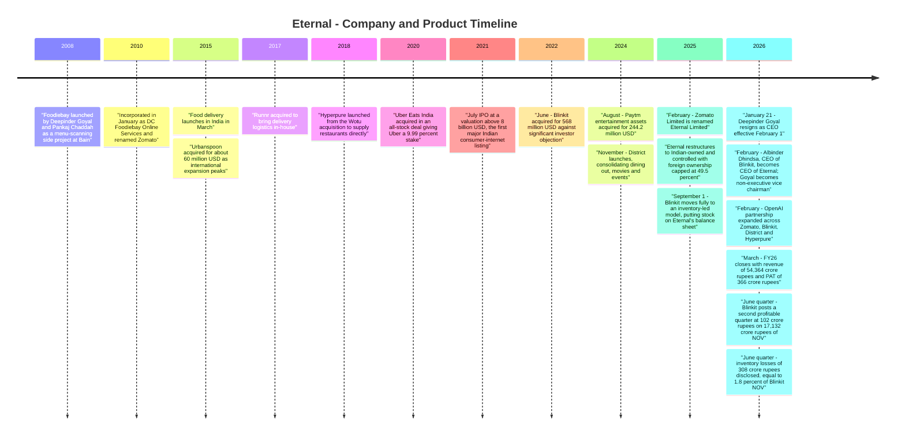
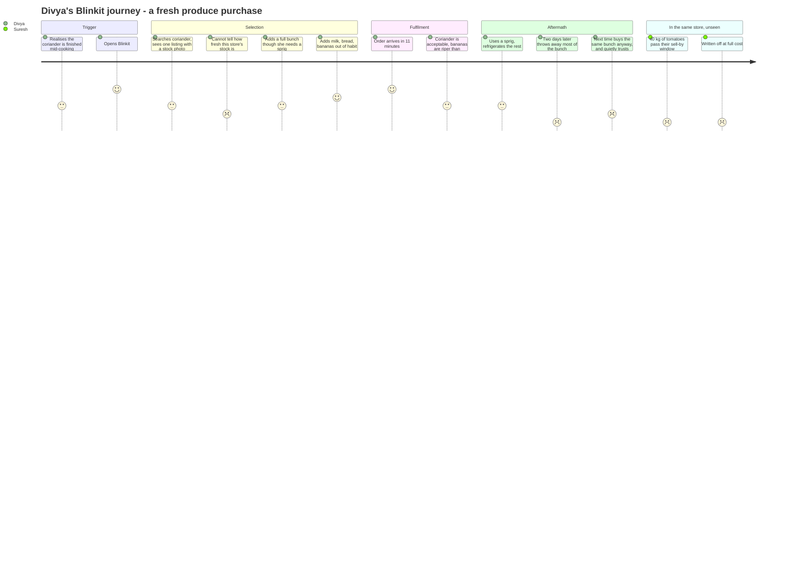
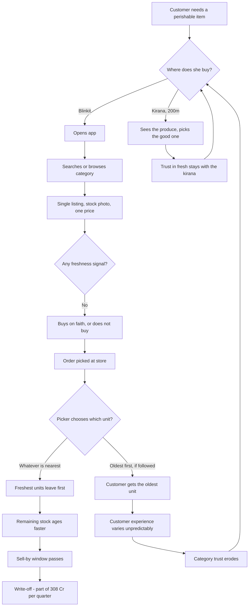
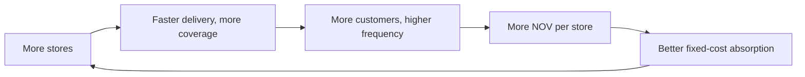
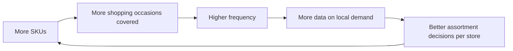
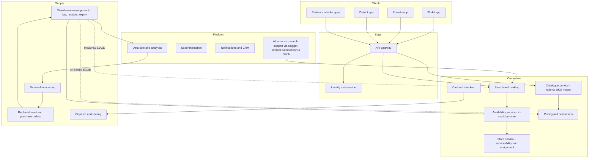
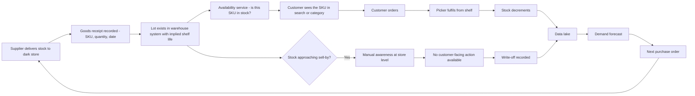
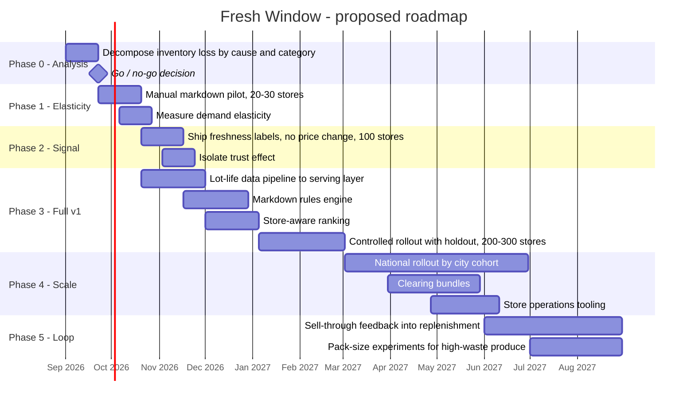

# Eternal — Product Management Case Study
### Day 45 of 90 | PM Case Study Challenge

---

## 1. Cover

**Product:** Eternal Limited (formerly Zomato Limited) — Blinkit, Zomato, District, Hyperpure
**Category:** Quick Commerce + Food Delivery + Going-Out + B2B Restaurant Supply
**Author:** Gaurav Singh
**Day:** 45 / 90
**Date Published:** August 10, 2026

---

## 2. Repository Metadata

| Field | Value |
|---|---|
| Repository | `product-management-case-studies` |
| Folder | `Day-45-Eternal/` |
| Author | Gaurav Singh |
| Series | 90-Day PM Case Study Challenge |
| Previous | Day 44 — Nykaa |
| Related | Day 08 — Blinkit (studied as a standalone product before it became the parent's centre of gravity); Day 09 — Swiggy; Day 23 — Rapido |
| Companion file | `ASSUMPTIONS.md` — evidence grades, source conflicts, author-constructed content |
| License | MIT (see [§63 License](#63-license)) |

---

## 3. Badges

`Day 45/90` · `Category: Quick Commerce / Food Delivery` · `Ownership: Public — NSE/BSE: ETERNAL` · `HQ: Gurugram, India` · `Status: Published`

---

## 4. Table of Contents

**Foundations**

- [1. Cover](#1-cover)
- [2. Repository Metadata](#2-repository-metadata)
- [3. Badges](#3-badges)
- [4. Table of Contents](#4-table-of-contents)
- [5. Executive Summary](#5-executive-summary)
- [6. Product Overview](#6-product-overview)
- [7. Company Background](#7-company-background)
- [8. Product Timeline](#8-product-timeline)
- [9. Vision & Mission](#9-vision--mission)
- [10. Problem Statement](#10-problem-statement)

**Market & Strategy**

- [11. Market Research](#11-market-research)
- [12. Industry Analysis](#12-industry-analysis)
- [13. TAM/SAM/SOM](#13-tamsamsom)
- [14. Competitor Analysis](#14-competitor-analysis)
- [15. SWOT](#15-swot)
- [16. Porter's Five Forces](#16-porters-five-forces)
- [17. Business Model Canvas](#17-business-model-canvas)
- [18. Revenue Model](#18-revenue-model)

**Users & Experience**

- [19. Target Users](#19-target-users)
- [20. Personas](#20-personas)
- [21. JTBD](#21-jtbd)
- [22. User Journey](#22-user-journey)
- [23. User Flow](#23-user-flow)
- [24. Information Architecture](#24-information-architecture)
- [25. UX Audit](#25-ux-audit)
- [26. UI Audit](#26-ui-audit)
- [27. Accessibility](#27-accessibility)

**Product & Metrics**

- [28. Feature Breakdown](#28-feature-breakdown)
- [29. AI Capabilities](#29-ai-capabilities)
- [30. Product Metrics](#30-product-metrics)
- [31. North Star Metric](#31-north-star-metric)
- [32. Product Analytics](#32-product-analytics)
- [33. AARRR](#33-aarrr)
- [34. HEART](#34-heart)

**Growth & Strategy**

- [35. Growth Strategy](#35-growth-strategy)
- [36. Growth Loops](#36-growth-loops)
- [37. Network Effects](#37-network-effects)
- [38. Product Strategy](#38-product-strategy)
- [39. Monetization](#39-monetization)
- [40. Trust & Safety](#40-trust--safety)

**Technology**

- [41. Technical Architecture](#41-technical-architecture)
- [42. Data Flow](#42-data-flow)
- [43. API Ecosystem](#43-api-ecosystem)
- [44. Privacy & Security](#44-privacy--security)

**Opportunity & Proposal**

- [45. Pain Points](#45-pain-points)
- [46. Opportunity Mapping](#46-opportunity-mapping)
- [47. RICE](#47-rice)
- [48. MoSCoW](#48-moscow)
- [49. Kano](#49-kano)
- [50. Feature Proposal](#50-feature-proposal)
- [51. PRD](#51-prd)
- [52. Wireframes](#52-wireframes)
- [53. Rollout Plan](#53-rollout-plan)
- [54. A/B Testing](#54-ab-testing)
- [55. KPI Dashboard](#55-kpi-dashboard)
- [56. Product Roadmap](#56-product-roadmap)

**Closing**

- [57. Risks & Mitigation](#57-risks--mitigation)
- [58. Future Vision](#58-future-vision)
- [59. PM Lessons](#59-pm-lessons)
- [60. PM Interview Questions](#60-pm-interview-questions)
- [61. References](#61-references)
- [62. About the Author](#62-about-the-author)
- [63. License](#63-license)
- [64. Self Review](#64-self-review)
- [65. Appendix](#65-appendix)

---

## 5. Executive Summary

In February 2026, Deepinder Goyal stopped being CEO of the company he founded, and **Albinder Dhindsa — Blinkit's CEO — took the top job at the parent.** That single governance event is the most honest disclosure Eternal has ever made. It says, more clearly than any slide, that the company formerly known as Zomato is now a quick-commerce company that happens to own a food delivery business.

The Q1 FY27 numbers agree. Blinkit did **₹17,132 Cr of Net Order Value, up 86% YoY**, against food delivery's **₹10,769 Cr, up 20%**. Blinkit is roughly **78% of consolidated revenue**. Group B2C NOV reached **₹31,120 Cr, up 54%**, and consolidated adjusted revenue grew **173% to ₹20,648 Cr**.

**That 173% is not a growth number and reading it as one is the single most common error in analysis of this company.** Most of it is an accounting event: Blinkit moved to an inventory-led (1P) model on 1 September 2025 — legally possible only after Eternal restructured to be Indian-owned and controlled with foreign ownership capped at 49.5% — and a platform that used to book commission now books the full sale. Management's own **like-for-like revenue growth was 66%**. Real, excellent, and less than half the headline.

Underneath, the profit picture is stark and inverted:

| Segment | Q1 FY27 NOV | Q1 FY27 adjusted EBITDA | Margin |
|---|---|---|---|
| **Food delivery (Zomato)** | ₹10,769 Cr | **₹606 Cr** | **~5.6% of NOV** |
| **Quick commerce (Blinkit)** | ₹17,132 Cr | ₹102 Cr | **0.6% of NOV** |
| **Going-out (District)** | ₹3,218 Cr | –₹65 Cr | –2.0% |
| Hyperpure (B2B) | — | ₹6–10 Cr | ~0.6–1% of revenue |

The smaller, slower business earns six times the profit of the larger, faster one. Management targets ~6% steady-state adjusted EBITDA for Blinkit and $1B group adjusted EBITDA by FY29. The entire equity story is the closing of that 0.6%-to-6% gap.

**Key finding: the largest single line standing between Blinkit and its margin target is not delivery cost, take rate or scale. It is spoilage — and Eternal is managing it as a supply chain cost when it is a demand-shaping product problem.**

Blinkit disclosed **inventory losses of ₹308 Cr in Q1 FY27, 1.8% of NOV**, and the CFO attributed a large part of it to perishables. **That is three times Blinkit's entire quarterly adjusted EBITDA of ₹102 Cr.** Removing a third of it would roughly double segment profit — with no new stores, no price increase, and no additional capex on top of the ~₹3,000 Cr already going into stores and warehouses. Every rupee of it is created by a forecasting error at one of **2,443 dark stores**, and every rupee of it is recoverable only by moving *demand*, because the inventory is already bought. Demand is a product surface. **Nobody at Eternal appears to own it as one.**

**This case study argues that Blinkit's app is a demand instrument being used only as a catalogue** — and proposes [**Fresh Window**](#50-feature-proposal), a store-level, expiry-aware demand-steering layer: per-store perishable clocks driving ranking, honestly-labelled time-boxed markdowns, and basket-level clearing bundles, with the resulting sell-through signal fed back into replenishment. The proposed North Star is [**Perishable Sell-Through Rate**](#31-north-star-metric), with a hard guardrail on markdown dependence, because the failure mode of this idea is teaching 30 million customers to wait for the discount.

**What this case study is not.** It is not a claim that Eternal is mismanaged. It is a listed company that took a business from –₹178 Cr to +₹102 Cr of quarterly EBITDA while doubling it, and 27 of 29 covering analysts rate it a buy. The argument is narrower and, I think, more useful: **the company's biggest remaining margin lever has been filed under operations, and it is sitting in the app.**

---

## 6. Product Overview

Eternal is not one product. It is four, sharing a delivery fleet, a customer base and almost nothing else.

| Business | What it is | Q1 FY27 scale | Stage |
|---|---|---|---|
| **Blinkit** | Quick commerce — 10-minute delivery from owned dark stores, now inventory-led | **NOV ₹17,132 Cr, +86% YoY; 2,443 stores; 30M+ MTU** | Scaling hard; barely profitable; **the company** |
| **Zomato** | Restaurant food delivery marketplace | **NOV ₹10,769 Cr, +20% YoY; 27M+ MTU** | Mature, profitable, **funds everything else** |
| **District** | Going out — dining out, movies, events, ticketing | **NOV ₹3,218 Cr, +60% YoY** | Sub-scale, loss-making, optionality |
| **Hyperpure** | B2B supply to restaurants | **Revenue ₹1,034 Cr, +27% LFL** | Structurally reshaped by Blinkit's 1P shift |

**Plus:** **Bistro**, a 10-minute prepared-food service built inside the Blinkit ecosystem, now housed in a dedicated subsidiary, **Blinkit Foods**, and **Nugget**, an AI-native customer-support product spun out of internal tooling.

**The consumer-facing products are four different apps for four different occasions.** Zomato is *"I want a meal, now, cooked by someone else."* Blinkit is *"the house is out of something."* District is *"we're going out on Saturday."* The apps do not share a model of the customer beyond identity and address.

**The physical product is the real one.** Over **1 million delivery partners**, **17 million sq ft** of warehousing and dark-store space, **400,000+ restaurant partners**, **100,000+ supply chain workers**, and 2,443 dark stores holding inventory Eternal now owns outright. Management describes the moat in exactly these terms: *"our moat is physical."*

**Three things that matter strategically and are easy to miss**

1. **Blinkit's 1P shift changed what kind of company this is.** A marketplace's inventory risk sits with sellers. Eternal's now sits on Eternal's balance sheet — ₹308 Cr of it evaporated in a single quarter. The company took on retail risk in exchange for margin control, and the risk arrived before the margin did.
2. **Food delivery is the treasury, not the future.** ₹606 Cr of quarterly adjusted EBITDA at 5.6% of NOV, growing 20%, is what pays for 2,443 dark stores and District's losses. Its strategic role has quietly changed from growth engine to cash cow — while it is simultaneously under attack from zero-commission entrants and an antitrust proceeding.
3. **Bistro puts Eternal in competition with its own restaurant partners**, in the same quarter its restaurant association is asking the Competition Commission of India for interim relief. That is a live conflict, not a hypothetical one ([§40](#40-trust--safety)).

---

## 7. Company Background

The company began in 2008 as **Foodiebay**, a menu-scanning side project by **Deepinder Goyal** and **Pankaj Chaddah** at Bain & Company, and was incorporated as **DC Foodiebay Online Services Pvt Ltd on 18 January 2010**. It was renamed **Zomato** because the founders were not sure they would "just stick to food" — an instinct that turned out to describe the next sixteen years accurately.

**Phase 1 — discovery (2010–2015).** Restaurant listings, menus, reviews. International expansion into 20+ countries, including the ~$60M acquisition of Seattle's **Urbanspoon** in 2015. A media-and-listings business with an advertising model.

**Phase 2 — delivery (2015–2021).** Food delivery launched in India in March 2015. **Runnr** acquired in 2017 to own logistics. **Hyperpure** built from the 2018 Wotu acquisition. **Uber Eats India** absorbed in January 2020 in an all-stock deal that gave Uber 9.99% of Zomato. The **July 2021 IPO** valued the company above **$8 billion** and made it the first major Indian consumer-internet listing.

**Phase 3 — the pivot nobody priced correctly (2022–2025).** Zomato acquired **Blinkit for $568M in June 2022**, at the bottom of the funding winter and against loud investor objection. Blinkit is now the majority of the company. In August 2024 it bought **Paytm's entertainment assets for $244.2M**, launching **District** in November 2024. In **February 2025 Zomato Limited became Eternal Limited** — a holding-company name for a group where the flagship app was no longer the flagship business.

**Phase 4 — becoming a retailer (2025–2026).** Eternal restructured to become **Indian-owned and controlled, capping foreign ownership at 49.5%**, which unlocked the one thing an FDI-constrained platform cannot do: hold its own inventory. **Blinkit moved fully inventory-led from 1 September 2025.** Gross margins improved by roughly 300 bps; inventory risk moved onto Eternal's books.

**Phase 5 — the handover (2026).** On **21 January 2026 Deepinder Goyal resigned as CEO, effective 1 February 2026**, disclosed to the exchanges on 6 February. He cited being *"increasingly drawn to exploring higher-risk ideas that are better pursued outside a listed company environment"* and the *"regulatory and execution demands of leading a public company in India."* **Albinder Dhindsa, Blinkit's CEO, became CEO of Eternal.** Goyal remains non-executive vice chairman.

**Today.** Headquartered in Gurugram. Listed on NSE and BSE. FY26 revenue **₹54,364 Cr**, PAT **₹366 Cr**, cash **₹17,972 Cr**. Sixteen years old, and on its fourth business model.

---

## 8. Product Timeline



*Figure 1 — Company and product milestones, 2008–2026. Rendered as a Mermaid timeline (renders natively on GitHub). No raster chart assets were generated in this pass — see [§65 Appendix](#65-appendix).*

**The shape of the timeline.** Sixteen years produce four distinct companies: a listings business, a delivery marketplace, a holding company, and — since September 2025 — **a retailer that owns inventory**. Each transition kept the customer and discarded the business model. The current one is the largest: a marketplace risks reputation, a retailer risks working capital. **Everything in this case study follows from the fact that Eternal now owns the tomatoes.**

---

## 9. Vision & Mission

Eternal's stated ambition is expressed less as a mission statement than as a set of numbers and a philosophy of company-building. The public targets are **$20 billion of annual NOV within two years** and **$1 billion of adjusted EBITDA by FY29**, with Blinkit guided at **60%+ NOV CAGR over three years** and District at **$3B NOV and $150M EBITDA by FY30**.

The operating philosophy is more revealing. Goyal has described the company's method as paying *"the cost of finding a large business"* — deliberately iterating across ventures, accepting that most fail, because the payoff of finding one Blinkit exceeds the cost of many Bistros. The name **Eternal** encodes it: a holding company that expects its flagship to change.

Four operating beliefs are visible across the decisions:

- **Own the hard, physical part.** Runnr, Hyperpure, dark stores, and finally inventory itself. Management: *"our moat is physical."* Every major bet has been to internalise something a lighter competitor rents.
- **Frequency compounds; basket size does not.** Blinkit's disclosed cohort behaviour — 3× spend over three years, *primarily from frequency* — is the thesis of the whole quick-commerce bet.
- **Adjacency over depth.** Four apps, four occasions, one fleet.
- **Growth is bought and then made to pay.** Blinkit lost money for three years post-acquisition before turning positive. District is being run the same way.

**PM read.** The first two beliefs are excellent and largely proven. The third is the expensive one — District is 10% of B2C NOV and consumes ₹65 Cr a quarter — and the fourth has just acquired a new failure mode. *"Growth is bought and then made to pay"* worked when the losses were subsidies, which stop when you stop paying them. **Spoilage does not stop when you stop paying it. It is a structural cost of the model, it scales with the business, and it is currently growing faster than segment profit.** That distinction is examined in [§38](#38-product-strategy).

---

## 10. Problem Statement

**The problem Eternal originally solved.** In 2010, an Indian consumer could not find out what a restaurant served without walking to it. Zomato solved discovery, then solved delivery, then — through Blinkit — solved the household restock: the 10-minute gap between realising you are out of milk and having milk.

**Those problems are solved, and solved by several companies at once.** Food delivery is a duopoly with Eternal holding **over 58% of GOV share** and roughly **40% more monthly transacting users than Swiggy**. Quick commerce has six credible players. Neither category is short of supply. Convenience is no longer scarce.

**The problem has now moved to the inside of the business.**

*First move — from acquiring demand to earning margin.* Blinkit's constraint is not customers. It has **30M+ monthly transacting users** and grew NOV 86%. Its constraint is that it converts ₹17,132 Cr of order value into ₹102 Cr of profit. Getting from **0.6% to the guided ~6%** is the entire investment case, and it must come from cost lines, because take rate is already 27.5% and average order value is deliberately being held flat to buy frequency.

*Second move — from a marketplace's risks to a retailer's risks.* Since 1 September 2025, unsold stock is Eternal's loss. **₹308 Cr in one quarter, 1.8% of NOV, "a large part driven by perishable products."** A marketplace never had this problem. A retailer always has it, and the ones that manage it well — supermarkets — have spent fifty years building demand-side tools for it.

**The problem this case study focuses on.** Eternal has taken on the classic grocery-retail problem of perishable waste while retaining the classic tech-platform assumption that inventory is an operations concern. **In a physical supermarket, the only lever against spoilage is the yellow markdown sticker on the shelf, applied by a human, seen only by whoever walks past.** Blinkit's shelf is an app. It knows which store the customer is buying from, what is in that store, how old it is, what she has bought before, and what she is looking at right now. It has **every input a supermarket has ever wished for and uses none of them against this problem.**

That is the gap. It is worth roughly **₹1,200 Cr a year at current run-rates**, it does not require a new business model, and it is the spine of this case study.

---

## 11. Market Research

**Quick commerce.** India's quick-commerce market surpassed **$10 billion in GMV** with **30M+ monthly active users**, representing about **15% of all Indian e-commerce GMV**, and grew roughly **150% YoY** through the first five months of CY2025 (Redseer, July 2025). Concentration is extreme: **80%+ of GMV comes from metros**, with just over 15% from 90+ non-metro cities, across a 100+ city footprint. Bain projects Indian e-retail at **$190B GMV by 2030**.

**Food delivery.** A mature duopoly. Eternal's food delivery NOV grew **20.1% YoY** in Q1 FY27 against **18.8%** the prior quarter — an *acceleration*, which surprised analysts — while Swiggy's GOV grew 17%. Eternal holds **>58% GOV share**.

**The structural shift that matters more than the size.**

| Metric | Q1 FY26 | Q4 FY26 | Q1 FY27 |
|---|---|---|---|
| Blinkit NOV | ~₹9,200 Cr (implied from +86% YoY) | ₹14,386 Cr | **₹17,132 Cr** |
| Blinkit stores | — | 2,243 | **2,443** |
| Blinkit adj. EBITDA | –₹162 Cr | +₹37 Cr | **+₹102 Cr** |
| Food delivery NOV growth | — | +18.8% | **+20.1%** |
| Food delivery adj. EBITDA | ₹451 Cr | ₹532 Cr | **₹606 Cr** |

**Three demand-side observations that shape the rest of this study**

- **Frequency, not basket, is the growth mechanism.** Blinkit's average order value is **₹518 and falling slightly (–1.8% QoQ)**, deliberately, while order frequency rose to **3.47 per user per month**. Management confirmed cohorts triple their spend over three years *primarily through frequency*. **A high-frequency, low-basket, perishable-heavy business is precisely the shape that makes spoilage a first-order problem.**
- **The category's growth is metro-saturating and moving to tier 2/3**, where Blinkit says growth rates are higher and where it has first-mover advantage — but where store-level demand is thinner and less predictable, which makes forecasting *harder*, not easier.
- **Competitive intensity peaked.** Management stated **"Q1 FY27 was the peak of competitive intensity that we have seen to date,"** with competition arriving *"in the form of subsidies to customers."* Their argument that discount-led competition is a **"systemic trap"** in quick commerce rests on shelf-space scarcity — a claim about physics, not marketing, and a good one.

**Synthesis.** The market is large, growing, and consolidating around players who can hold physical inventory close to customers. That is a good market for Eternal. But the winning position in it — dense, perishable-heavy, high-frequency, low-basket — is also the position with the **worst spoilage exposure in retail**, and the market data gives no reason to expect that to improve with scale. It gets worse in tier 2/3.

---

## 12. Industry Analysis

**Structural characteristics of Indian quick commerce that shape every product decision:**

1. **Shelf space is the binding constraint, and it is physical.** A dark store carries a few thousand SKUs against Delhi NCR's 80,000-SKU assortment ambition. Every SKU added displaces another. This is why management can credibly argue discounting is a **"systemic trap"**: you cannot buy your way out of a constraint measured in square feet.
2. **Perishables are the traffic driver and the loss centre simultaneously.** Fruit, vegetables, dairy and bread are what make a customer open the app three times a month rather than once. They are also what rots. **The category that creates frequency destroys margin.** Any strategy that solves one by abandoning the other is not a strategy.
3. **Inventory-led economics invert the risk profile.** Under 3P, a bad forecast is a seller's problem. Under 1P, it is a P&L line — and Eternal disclosed it as **₹308 Cr, 1.8% of NOV**. For context, mature grocery retailers typically target shrink well below 2% of *sales*, and quick commerce's basket is more perishable-weighted than a supermarket's.
4. **Density is destiny, and density is bought with capex.** Blinkit's capex per store rose from **₹1 Cr to ₹2.5 Cr** as it moved to larger formats doing **2,100–2,200 orders/day**. Bigger stores mean more assortment, more orders, better fixed-cost absorption — and **more inventory at risk per store**.
5. **Food delivery and quick commerce cannibalise each other at the margin.** Management attributed part of an earlier food-delivery slowdown to quick commerce taking share of the same eating occasion. Bistro is Eternal explicitly choosing to run that experiment internally rather than lose it externally.

**Regulatory context worth flagging.** The **Competition Commission of India's Director General found that exclusivity conditions, minimum business guarantees and wide price-parity clauses contravened competition law** in the long-running matter brought by the National Restaurant Association of India. NRAI sought **interim relief in July 2026** to stop Zomato reimposing them; Zomato states it has no exclusivity in standard agreements and **removed price parity in April 2026**. Separately, quick-commerce deep discounting has drawn antitrust attention across the category. **The regulatory pressure sits on the profitable business, while the loss-making business absorbs the capital** — an uncomfortable arrangement examined in [§38](#38-product-strategy).

---

## 13. TAM/SAM/SOM

*(Framework selection rationale: TAM/SAM/SOM is used here in **margin-decomposed** form rather than as three nested revenue figures. Eternal's problem is not addressable demand — it has 30M+ quick-commerce users and 58% of food delivery. Its problem is the conversion of order value into profit. The layers below are therefore sized by addressable **profit pool**, because that is the scarce quantity in this business.)*

| Layer | Definition | Estimate | Basis |
|---|---|---|---|
| **TAM** | Indian e-retail GMV across all channels | **~$190B by 2030** | Bain projection |
| **SAM** | Quick commerce + online food delivery — the two categories Eternal actually operates in | Quick commerce **>$10B GMV today, ~15% of e-commerce, ~150% YoY growth**; food delivery a mature duopoly growing ~20% | Redseer (July 2025); company disclosure |
| **SOM** | What Eternal captures today | **B2C NOV ₹31,120 Cr in one quarter (+54% YoY)**; **>58% food delivery GOV share**; Blinkit at **~3× Instamart's NOV** with ~2× the dark stores | Company disclosure; Q1 FY27 broker analysis |

**The decomposition that actually matters — the profit pool, not the order pool.**

At Q1 FY27 run-rates, Eternal's B2C businesses annualise to roughly **₹1.24 lakh crore of NOV** and roughly **₹2,600 Cr of segment adjusted EBITDA**. Applying management's own guided Blinkit steady state of **~6% adjusted EBITDA on NOV** to Blinkit's current NOV alone implies about **₹4,100 Cr of annual EBITDA from quick commerce** — against roughly **₹400 Cr today**. **The gap between those two numbers is the company's entire valuation argument, and CLSA's ₹506 target versus a ₹289.90 share price on 23 July 2026 is a bet on it closing.**

**Where that ₹3,700 Cr gap has to come from**, in the only three places it can:

| Lever | Realistic contribution | Why |
|---|---|---|
| **Take rate / ad monetisation** | Moderate | Already 27.5% and rising 60 bps/quarter; further increases push brands and customers to competitors during a price war |
| **Fixed-cost absorption from density** | Large but slow | The stated plan; requires years and continued capex at ₹2.5 Cr/store |
| **Shrink and spoilage reduction** | **₹308 Cr per quarter is on the table today** | Requires no new stores, no price increase, no new customers — and is **3× current segment EBITDA** |

**Honest read.** The hard numbers here are Eternal's own disclosures; the market sizes are third-party projections with unpublished methodologies, and the Redseer quick-commerce data is from July 2025 and therefore stale in a category growing 150%. The point of this section is not the TAM. It is that **the third lever is the only one that pays this year, and it is the only one currently unowned by a product team.**

---

## 14. Competitor Analysis

| Dimension | **Blinkit (Eternal)** | Instamart (Swiggy) | Zepto | Flipkart Minutes | Amazon Now | BigBasket / Tata Neu | **Zomato (Eternal)** vs Ownly / Toing |
|---|---|---|---|---|---|---|---|
| Model | 1P inventory, owned dark stores | Marketplace-to-1P hybrid | 1P, dense metro | Marketplace-backed, Walmart capital | Marketplace-backed, Amazon capital | 1P, legacy grocery + Tata capital | Commission marketplace vs zero-commission challengers |
| Scale vs Blinkit | — | **~⅓ the NOV; ~½ the dark stores; ~190% fewer orders** | Sub-scale on stores | Early | Early but scaling | Slower-format | Eternal **>58% GOV share**, ~40% more MTU than Swiggy |
| Profitability | **+0.6% adj. EBITDA on NOV** | Negative (sources conflict: –13% vs –0.2%; see [§65](#65-appendix)) | Not disclosed | Not disclosed | Not disclosed | Not disclosed | Zomato **₹606 Cr/qtr**; challengers loss-funded by design |
| Core strength | Density, assortment, 1P margin control, capital | Swiggy's food-delivery cross-sell | Execution speed, metro density | Walmart balance sheet, e-commerce catalogue | Amazon logistics + Prime | Legacy sourcing, private label | Brand, restaurant supply, fleet |
| Core weakness | **Thin margins; ₹308 Cr/qtr spoilage** | Sub-scale economics | Capital dependence | Late, no dark-store density | Late | Slow delivery promise | **Commission model under CCI scrutiny and price attack** |
| Threat to Eternal | — | 🟡 Medium — closing on N-AOV, near-breakeven on qcom | 🟡 Medium | 🟠 Low-medium today | 🟠 **Rising** — Amazon capital is patient | 🟠 Low-medium | 🔴 **High to the profit engine** |

**The comparison that matters is not in the quick-commerce column.**

Blinkit is winning quick commerce on every operational metric that matters — 3:1 NOV over Instamart, twice the stores, positive EBITDA where competitors are negative. **The threat is to the business that pays for it.** Rapido's **Ownly** and Swiggy's **Toing** attack food delivery with zero or low commission, and they arrive while the **CCI's Director General has already found against price-parity and exclusivity practices**. Management dismissed their impact as "limited," citing *"similar or longer delivery times, and lower menu prices funded by lower commissions"* — a fair read of today, and an incomplete read of the mechanism. **Toing reportedly brought two-thirds new-or-dormant users to Swiggy.** That is not share theft; that is market expansion at a price point Eternal has chosen not to serve profitably.

**The asymmetry, stated precisely.** Eternal's competitors in quick commerce are fighting it for *growth*. Its competitors in food delivery are fighting it for *margin* — and margin in food delivery is what funds growth in quick commerce. **A competitor who cannot beat Blinkit can still beat Eternal, by making Zomato's 5.6% NOV margin unsustainable.**

**Opportunity for differentiation.** Every quick-commerce player carries the same spoilage tax; none of them has disclosed it as candidly as Eternal, and none appears to be attacking it through the demand side. **Blinkit has 2,443 stores, 30M+ users and an app that knows which store each user is buying from.** Instamart and Zepto have the same theoretical capability and less density to make it pay. This is a rare position: a large, quantified, category-wide cost problem where Eternal's specific advantage — density plus 1P control plus scale of demand — is exactly what the solution requires.

---

## 15. SWOT

**Strengths**

- **Structural leadership in both core categories.** >58% food delivery GOV share, ~40% more MTU than Swiggy; Blinkit at ~3× Instamart NOV with ~2× the dark stores and 190% more orders.
- **A genuinely profitable core.** Food delivery adjusted EBITDA of **₹606 Cr in one quarter at 5.6% of NOV**, growing 34% YoY while NOV grows 20% — operating leverage, not just growth.
- **₹17,972 Cr of cash** (FY26 close) — the ability to outlast a price war management believes has already peaked.
- **1P control of inventory**, which delivered ~300 bps of gross margin improvement and gives Eternal levers no marketplace has.
- **Physical infrastructure that compounds:** 17M sq ft, 1M+ delivery partners, 2,443 stores, 400,000+ restaurant partners.
- **Frequency is proven to compound:** cohorts triple spend over three years, primarily through frequency.

**Weaknesses**

- **Blinkit's margin is 0.6% against a ~6% target.** Ten-fold improvement required, and Q1's contribution margin actually *fell* 10 bps.
- **₹308 Cr of quarterly inventory loss — 3× segment EBITDA** — disclosed as largely perishable, and structurally worsening as the mix shifts to tier 2/3 and larger stores.
- **Reported financials have become hard to read.** 173% revenue growth against 66% like-for-like means the headline number no longer measures the business. Very few readers adjust.
- **District loses ₹65 Cr a quarter** at 10% of B2C NOV, competing with an entrenched incumbent.
- **Capex intensity rising:** ₹2.5 Cr per store, up 2.5×, with ~₹3,000 Cr deployed in a single quarter.
- **The profit engine is the regulatory target.** CCI/NRAI proceedings sit on food delivery, not quick commerce.

**Opportunities**

- **Spoilage reduction as a product programme** — the subject of this case study; ~₹1,200 Cr annualised addressable, requiring no new customers.
- **Tier 2/3 expansion** where Blinkit claims first-mover advantage and growth is faster.
- **Ad monetisation** — take rate rising 60 bps/quarter with an 80,000-SKU assortment ambition creates a large retail-media surface.
- **Bistro / Blinkit Foods** — owning the prepared-food margin instead of intermediating it.
- **AI leverage via the expanded OpenAI partnership** across support, search, partner tooling and internal automation (Stitch, Nugget).
- **District's category mix** — management flags events and retail as more promising than the dining/movies core.

**Threats**

- **Zero-commission food delivery entrants** attacking the profit engine at a price point Eternal does not serve.
- **CCI proceedings** with adverse DG findings already on record.
- **Amazon and Flipkart** entering quick commerce with balance sheets that do not need this business to pay.
- **Perishable inflation and supply shocks** — spoilage is a percentage of a number that moves.
- **Bistro versus restaurant partners** — a private-label conflict inside an active antitrust matter.
- **Key-person transition risk** — a founder-led company sixteen years in, six months into a new CEO.

**The SWOT read.** Every strength is about **scale**, and every serious weakness is about **conversion of scale into profit**. That is a comfortable place to be strategically and an uncomfortable one to be valued from at 27-of-29 buy ratings. **The single item that appears in both the Weaknesses and the Opportunities column — spoilage — is the only one where the same fact is both the problem and the unclaimed prize.**

---
## 16. Porter's Five Forces

| Force | Intensity | Assessment |
|---|---|---|
| **Competitive rivalry** | 🔴 **Very high** | Six credible quick-commerce players; management calls Q1 FY27 *"the peak of competitive intensity we have seen to date"*, arriving *"in the form of subsidies to customers."* Food delivery is a duopoly newly contested by zero-commission entrants |
| **Supplier power** | 🟡 **Moderate, and shifting** | The 1P shift moved Eternal from intermediating brands to buying from them — improving negotiating position on margin, but management notes the full ~1% margin accretion *"requires you to negotiate with brands"* and takes 4–6 quarters. On the labour side, **minimum wage increases were cited as a Q1 margin pressure**, and 1M+ delivery partners represent structural cost exposure |
| **Buyer power** | 🔴 **High** | Multi-homing is free and universal. Switching cost is one app icon. The only real lock-in is habit and, for a minority, subscription |
| **Threat of substitutes** | 🟡 **Moderate** | For quick commerce: the kirana store, still the default for most Indian households, and planned monthly grocery shopping. For food delivery: cooking, and now Bistro-style prepared food — **which Eternal is substituting into itself** |
| **Threat of new entry** | 🟠 **Moderate-high, and asymmetric** | Building 2,443 dark stores is genuinely hard — *"our moat is physical"* is a defensible claim against startups. It is a much weaker claim against **Amazon and Flipkart**, who have capital, logistics and no requirement that this segment ever pay |

**The force that decides the outcome is supplier power, and it is not the brands.** Eternal's cost base is dominated by two supplier groups it does not control: **delivery partners**, whose cost floor is being set by minimum wage legislation, and **perishable suppliers**, whose product deteriorates on a clock Eternal cannot negotiate with. **Spoilage is supplier power expressed as physics.** No commercial negotiation reduces it; only faster selling does.

---

## 17. Business Model Canvas

| Block | Eternal |
|---|---|
| **Customer segments** | Urban and increasingly tier 2/3 households (Blinkit, 30M+ MTU); food delivery customers (27M+ MTU); going-out consumers (District); restaurants (Hyperpure, Zomato partners) |
| **Value propositions** | *Blinkit:* anything the house needs, in ten minutes. *Zomato:* any restaurant meal, delivered. *District:* one place to plan a night out. *Hyperpure:* reliable, traceable restaurant supply |
| **Channels** | Four consumer apps; partner apps for restaurants and delivery partners; retail-media surfaces inside the Blinkit app |
| **Customer relationships** | Transactional and high-frequency (3.47 Blinkit orders/user/month); loyalty programmes; AI-assisted support (Nugget) |
| **Revenue streams** | **1P product sales (Blinkit — now the majority of revenue)**; food delivery commissions and platform fees (32.8% take rate on NOV); advertising; District ticketing; Hyperpure B2B margin; subscriptions |
| **Key resources** | 2,443 dark stores; 17M sq ft; 1M+ delivery partners; 400,000+ restaurant partners; ₹17,972 Cr cash; demand and consumption data across four apps |
| **Key activities** | Demand forecasting and replenishment; last-mile dispatch; assortment and category management; merchant acquisition; pricing |
| **Key partners** | Brands and FMCG suppliers; restaurants; delivery-partner ecosystem; landlords; OpenAI (enterprise AI across all four businesses) |
| **Cost structure** | Cost of goods (1P); last-mile delivery; store rent and staffing; **inventory losses at 1.8% of NOV**; capex at ₹2.5 Cr/store; technology; marketing and subsidies |

**The block that has changed most, and that most readers have not re-read: Cost structure.** Before September 2025, Eternal's costs were logistics and marketing. Today they include **cost of goods sold and inventory write-offs** — the cost structure of a grocery retailer wearing a technology company's income statement. Nothing else in the canvas moved as much, and the org chart has not caught up ([§38](#38-product-strategy)).

---

## 18. Revenue Model

| Stream | Mechanics | Q1 FY27 scale | Margin character |
|---|---|---|---|
| **Blinkit 1P product sales** | Buy inventory, sell it, keep the spread. Take rate **27.5% of NOV (+60 bps QoQ)** | Revenue **₹15,664 Cr**; NOV ₹17,132 Cr | Gross-margin rich, **loss-leaking through spoilage**; contribution margin 4.0% |
| **Food delivery commissions and fees** | Commission on restaurant orders plus platform/delivery fees. Take rate **32.8% of NOV (+80 bps QoQ)** | Revenue ~₹3,100 Cr; **adj. EBITDA ₹606 Cr** | **The profit engine — 5.6% of NOV** |
| **Advertising / retail media** | Brand placements in Blinkit search and category surfaces; restaurant promotion on Zomato | Not separately disclosed | Very high incremental margin |
| **District** | Ticketing and convenience fees on dining, movies, events | Revenue ₹318 Cr on NOV ₹3,218 Cr | **–₹65 Cr adj. EBITDA** |
| **Hyperpure** | B2B supply margin to restaurants | Revenue ₹1,034 Cr, +27% LFL | Thin: ~1% adj. EBITDA |
| **Subscriptions** | Loyalty and delivery-benefit programmes across apps | Not separately disclosed | Retention instrument more than revenue |

**Reading the revenue line correctly — the single most important accounting note in this study.**

Consolidated adjusted revenue grew **173% YoY to ₹20,648 Cr**. Blinkit's revenue grew **553%**. Neither number means what it appears to mean. Under the pre-September-2025 marketplace model, Blinkit booked only its commission; under 1P it books the **entire value of the goods**. The comparison is between two different accounting treatments of the same activity.

**Management's own like-for-like figure is 66% YoY.** Use that one. Similarly, **Hyperpure's reported revenue fell 46.8% YoY in Q4 FY26 while its restaurant-supply business grew 37%** — because internal supply to Blinkit stopped being an external sale once Blinkit began buying directly.

**PM insight.** When a business changes how it books revenue mid-year, **every ratio built on revenue silently breaks** — revenue per store, revenue per order, marketing as a percentage of revenue, revenue per employee. Teams that keep optimising against those ratios optimise against an artefact. This is why the analysis throughout this case study anchors on **NOV and absolute EBITDA**, which are continuous across the change, and it is why [§55](#55-kpi-dashboard) refuses to use revenue-denominated ratios at all.

---

## 19. Target Users

**Blinkit's user.** Urban and increasingly tier 2/3 households ordering **3.47 times a month at ₹518**. Not a weekly-shop customer — a *top-up* customer, buying small, buying often, and buying perishables. Management's disclosure that cohorts triple their spend over three years *primarily through frequency* means the strategic customer is the one who moves from once-a-month to twice-a-week. **That customer's basket is disproportionately fresh produce, dairy and bread — the highest-spoilage categories in the store.**

**Zomato's user.** 27M+ monthly transacting users, growing 18.8%, with the addressable base deliberately widened by cutting the **free-delivery threshold from ₹199 to ₹99** — an explicit move down-market to defend against zero-commission entrants.

**District's user.** Explicitly smaller and higher-spend than either. Management describes a niche, higher-AOV base with limited city expansion planned.

**The supply-side users, who are also product users.**

- **1M+ delivery partners**, 409,000 monthly active on Blinkit alone, whose cost floor is being reset by minimum wage legislation.
- **400,000+ restaurant partners**, whose association is currently litigating against the platform.
- **Dark store staff** — over 100,000 supply chain workers — who are the humans in the loop for every perishable decision, and the users of the internal tools that would carry the proposal in [§50](#50-feature-proposal).

**PM read.** Eternal has four consumer apps and, in effect, **one household**. The same family orders groceries on Blinkit, dinner on Zomato and movie tickets on District. The company knows this and does very little with it — which is a real opportunity, but not the one this study pursues, because it is a *revenue* opportunity and the binding constraint is *margin* ([§46](#46-opportunity-mapping)).

---

## 20. Personas

> **Note:** all three personas are author-constructed composites built from disclosed metrics and category behaviour. No named individual underlies any of them, and all specific details are invented. See [§65 Appendix C](#65-appendix).

**1. Divya, 31 — Bengaluru, product designer, lives with her partner**

- **Behaviour:** Opens Blinkit 3–4 times a week. Baskets of ₹300–₹600: milk, curd, bananas, bread, coriander, occasionally a forgotten ingredient mid-cooking. Orders Zomato twice a week. Has never done a "big monthly shop" in her adult life.
- **Goal:** Never think about groceries. Never run out. Never plan.
- **Frustration:** Throws away roughly a third of the coriander and half the bananas she buys, because Blinkit sells her a bunch when she needs a sprig — and she has noticed that fresh produce quality is inconsistent between orders from what she assumes is the same store.
- **Why she matters:** She *is* the strategic customer — high frequency, low basket, perishable-heavy. **Her waste and Blinkit's waste are the same physical problem seen from two ends of a ten-minute delivery.**

**2. Ramesh, 44 — Indore, small business owner, family of five**

- **Behaviour:** Newer to quick commerce; came for convenience during a monsoon week and stayed. Orders weekly, larger baskets, price-sensitive. Compares Blinkit against the kirana 200 metres away, which extends him informal credit.
- **Goal:** Convenience without paying a visible premium for it.
- **Frustration:** Assortment in his city is thinner than what his Bengaluru cousin describes; substitutions are frequent; the 10-minute promise is less reliable.
- **Why he matters:** He represents the growth frontier. **Tier 2/3 is where Blinkit says growth is fastest — and where demand is thinnest and hardest to forecast, which is where spoilage per store is structurally worst.**

**3. Suresh, 38 — Pune, dark store manager, 11 staff**

- **Behaviour:** Receives replenishment on a schedule set centrally. Watches fresh produce visibly degrade over 48 hours. Has no lever to move it other than telling pickers to fulfil oldest-first.
- **Goal:** Hit availability targets without being blamed for write-offs he cannot influence.
- **Frustration:** He can see, at 4pm, that 40 kg of tomatoes will not sell by tomorrow. **He has no way to tell 30 million customers.** The app that could is not his to touch.
- **Why he matters:** He is the character this case study is really about. **The information exists, at the right place, at the right time, in the head of the right person — and the product provides no path from his knowledge to the customer's screen.**

---

## 21. JTBD

| # | Job | Trigger | Current solution | Served? |
|---|---|---|---|---|
| 1 | *"I've run out of something and I need it now."* | Opening the fridge, mid-recipe | Blinkit, 10 minutes | 🟢 **Excellently** |
| 2 | *"I don't want to cook tonight."* | 8pm, tired | Zomato | 🟢 Excellently |
| 3 | *"I want to keep the house stocked without thinking about it."* | Ambient, recurring | Manual reordering, no memory | 🟡 Partially |
| 4 | *"I want fresh produce I can trust, sight unseen."* | Every perishable purchase | Photos, ratings, hope | 🔴 **Poorly — and it is the category that drives frequency** |
| 5 | *"I want to feel I got value, not just speed."* | Price-sensitive customers, tier 2/3 | Coupons, subsidies, comparison with kirana | 🟡 Partially, and expensively |
| 6 | *"We're going out on Saturday."* | Weekend planning | District | 🟡 Partially |
| 7 | *(Store manager)* **"I need to move stock that will not survive the night."** | Daily, every store | 🔴 **No product surface exists** | 🔴 **Not served at all** |

**The two badly-served jobs are the same job seen from opposite sides.**

Job 4 is a customer who cannot verify freshness before buying and therefore under-trusts the category. Job 7 is a store that knows exactly how fresh each unit is and cannot tell anyone. **Blinkit is sitting on an information asymmetry that hurts both sides of its own marketplace, and it is the only party that can close it.**

Job 5 matters because it is the escape valve. Eternal currently buys value perception with subsidies, which cost margin. **A markdown on genuinely near-dated stock is value that costs nothing, because the alternative cost is 100%.** That is the economic insight the proposal in [§50](#50-feature-proposal) is built on.

---

## 22. User Journey



*Figure 2 — Journey map for a perishable purchase, showing the customer-side and store-side experience of the same inventory. Rendered as a Mermaid journey diagram.*

**Reading the curve.** The journey has **two low points and they are causally linked**: the customer's disappointment two days after delivery, and the store's write-off on the same evening. Both are caused by the same missing capability — **nobody knows, at the moment of purchase, how much life is left in the specific unit in the specific store.**

**The critical observation for a PM.** Divya's satisfaction with *Blinkit* never drops. Delivery was 11 minutes; the app worked; the price was fine. Her satisfaction with **fresh produce as a category** drops, quietly, permanently, and invisibly to every metric Eternal reports. **Category-level trust erosion does not show up in NPS, delivery-time percentiles or order counts. It shows up two years later as a customer who buys fresh from the kirana and packaged goods from Blinkit** — which is the highest-frequency, lowest-margin basket Blinkit could possibly end up with.

---

## 23. User Flow



*Figure 3 — User flow for a perishable purchase, showing where the loop closes on itself.*

**Where the flow breaks.** At node **`G`**. There is no freshness signal, so the customer buys on faith. That single absence propagates into three separate failures: a customer who under-trusts the category (`Q`), a picking policy that quietly determines write-off rates (`J`), and inventory that ages into loss (`O`) with no mechanism to accelerate its sale.

**The most important structural point on this diagram is that `O` has no outbound edge to the customer.** Stock approaching its window cannot reach demand. In a supermarket that edge exists — it is a yellow sticker, and it is why supermarkets recover a meaningful share of would-be waste. **Blinkit has no sticker.** Building that edge is the proposal in [§50](#50-feature-proposal).

---

## 24. Information Architecture

```
Blinkit app
├── Home
│   ├── Category tiles
│   ├── Promotional / brand-funded rails
│   └── "Buy again" (purchase history)
├── Search
├── Category
│   └── Product
│       ├── Name, image, pack size, price, MRP
│       ├── Ratings (limited for fresh)
│       └── [ MISSING: this store's stock age / freshness ]
├── Cart
├── Orders
└── Account
```

**The entity model, stated as a PM would state it.**

| Entity | Exists? | Notes |
|---|---|---|
| Customer | ✅ | Identity, address, order history |
| Product (SKU) | ✅ | Catalogue-level, **national** |
| Store | ✅ **internally** | Determines what the customer sees — but is almost invisible in the UI |
| Order | ✅ | |
| **Stock lot (unit + store + received date + shelf life)** | ✅ **in the warehouse system** | 🔴 **Absent from every customer-facing surface** |
| **Freshness / remaining life** | 🔴 | Does not exist as a customer-visible attribute anywhere |

**The root defect.** Blinkit's customer-facing IA models a **national catalogue** while its economics are governed by **local, perishable, time-bounded lots**. The customer sees "Tomatoes 500g — ₹42" as though it were the same object in Pune and Patna, on Monday and Thursday. It is not. **It is a different physical object with a different remaining life and a different marginal value to the business every single day**, and the app is architecturally incapable of saying so.

Every other gap in this case study descends from this one. You cannot rank by freshness, price by remaining life, bundle for clearance, or tell a customer why one bunch is cheaper today, if the concept of *this store's stock, right now* does not exist in the product model.

---

## 25. UX Audit

Heuristic evaluation against Nielsen's ten usability heuristics. Scores are the author's judgement of publicly observable surfaces, not instrumented testing.

| # | Heuristic | Score | Notes |
|---|---|---|---|
| 1 | Visibility of system status | **4.5 / 5** | 🟢 Best-in-class. Live order tracking, ETA accuracy, and rider location are exemplary |
| 2 | Match between system and real world | **2.5 / 5** | 🔴 A physical shop shows you the produce. The app shows a stock photo that is identical everywhere and always |
| 3 | User control and freedom | 3.5 / 5 | Easy cancellation within a window; limited control over substitutions |
| 4 | Consistency and standards | 4 / 5 | Strong, consistent commerce patterns |
| 5 | Error prevention | 3 / 5 | Out-of-stock handled well; **no prevention of the "bought more than I can use" error**, which is the customer's version of spoilage |
| 6 | Recognition over recall | 4 / 5 | "Buy again" and history-based rails work well |
| 7 | Flexibility and efficiency | 4.5 / 5 | 🟢 Repeat ordering is genuinely fast |
| 8 | Aesthetic and minimalist design | 3.5 / 5 | Increasingly dense with brand-funded rails as retail media scales |
| 9 | Error recovery | 3.5 / 5 | Refunds and support are responsive; Nugget improves first-response |
| 10 | Help and documentation | 3.5 / 5 | Adequate |
| | **Composite** | **3.65 / 5** | |

**The pattern in the two lowest scores.** Heuristics 2 and 5 — *match with the real world* and *error prevention* — are both about **the gap between a digital listing and a physical, perishable object**. Blinkit's UX is outstanding at everything that happens between tapping "order" and the doorbell, and weakest at everything concerning the nature of the goods themselves. **It is a superb logistics interface attached to a mediocre grocery interface**, and the categories where that matters most are the ones driving its frequency.

---

## 26. UI Audit

| Area | Assessment |
|---|---|
| **Speed and responsiveness** | 🟢 Excellent. The app is fast, which in a 10-minute product is a feature, not a quality attribute |
| **Product cards** | 🟡 Optimised for packaged goods — brand, pack size, price, MRP. Fresh produce inherits an identical card that communicates none of what matters about it |
| **Fresh category presentation** | 🔴 Stock photography, no provenance, no lot information, no visual differentiation between a delivery that landed this morning and one that landed 40 hours ago |
| **Price presentation** | 🟡 MRP-versus-price framing is clear. **There is no vocabulary for a price that is lower for a stated, honest reason** |
| **Retail media density** | 🟡 Growing. As take rate climbs 60 bps a quarter, brand-funded rails increasingly compete with organic relevance for the same screen |
| **Store identity** | 🔴 The customer has essentially no awareness that she is buying from a specific store with specific stock. This is deliberate — it preserves the illusion of a single national shop — and it is the UI expression of the IA defect in [§24](#24-information-architecture) |
| **Substitution UX** | 🟡 Handled at fulfilment rather than at selection, which is where the customer would prefer to decide |

**The UI observation that matters.** Blinkit's interface has **no way to say "this one is cheaper today, and here is exactly why."** Every discount in the app is currently a *promotion* — funded by a brand or by Eternal, arbitrary from the customer's point of view, and therefore trainable: customers learn to wait for it. A **reason-given** discount is a different object entirely. Supermarkets have used it for fifty years, and customers do not treat it as a promotion because they can see the mechanism. Blinkit would have to invent this vocabulary from scratch, and [§52](#52-wireframes) sketches it.

---

## 27. Accessibility

| Dimension | Assessment |
|---|---|
| **Language** | 🟡 Multilingual support exists but fresh-produce naming is highly regional; the gap widens as tier 2/3 expands |
| **Low-literacy users** | 🟡 Image-led browsing helps; **any freshness or markdown mechanism must be comprehensible without reading a paragraph**, which is a hard constraint on the proposal, not a nice-to-have |
| **Screen readers** | 🟠 Not independently audited here. Commerce apps commonly under-label images and price-strike elements; a "was ₹X, now ₹Y because best-before tomorrow" construct is exactly the pattern that breaks screen readers if built carelessly |
| **Colour and contrast** | 🟠 Not audited. Any freshness indicator built on colour alone (green/amber/red) **fails for colour-blind users and must carry a text or icon equivalent** |
| **Motor accessibility** | 🟡 Standard commerce touch targets; time-boxed offers create pressure that disadvantages slower users |
| **Economic accessibility** | 🟢 Genuinely improving — the ₹199→₹99 free-delivery threshold on food delivery widens the addressable base meaningfully |

**Accessibility constraint carried forward into the proposal.** A markdown mechanism that is only legible to fluent English readers with full colour vision would, in a country where Blinkit's growth is now coming from tier 2/3, exclude precisely the customers it most needs to reach. This is recorded as a **Must have** in [§48](#48-moscow), not a later refinement.

---

## 28. Feature Breakdown

| Feature | Business | Assessment |
|---|---|---|
| **10-minute delivery** | Blinkit | 🟢 The product. Dense dark stores plus dispatch optimisation; the reason the category exists |
| **80,000-SKU assortment ambition (Delhi NCR)** | Blinkit | 🟢 Assortment depth is the current growth lever, with 50,000+ in the next seven cities |
| **Larger store formats** | Blinkit | 🟡 2,100–2,200 orders/day per large store at ₹2.5 Cr capex — better absorption, **more inventory exposed per site** |
| **Buy again / reorder** | Blinkit | 🟢 Well-executed frequency driver |
| **Substitutions** | Blinkit | 🟡 Resolved late in the flow |
| **Retail media / brand rails** | Blinkit | 🟢 High-margin; take rate +60 bps QoQ |
| **Bistro (10-minute prepared food)** | Blinkit Foods | 🟡 Strategically bold, currently loss-making; Goyal describes it as *"closer to a food manufacturing system optimised for freshness, speed, and consistency"* |
| **Food delivery marketplace** | Zomato | 🟢 Mature, profitable, 32.8% take rate |
| **₹99 free-delivery threshold** | Zomato | 🟢 Deliberate market expansion against zero-commission entrants |
| **Dining out, movies, events, ticketing** | District | 🟡 Five categories; dining and movies are the revenue base; management sees more promise in events and retail |
| **Hyperpure B2B supply** | Hyperpure | 🟡 Restaurant supply +37% YoY; reshaped by Blinkit's 1P transition |
| **Nugget (AI support)** | Group | 🟢 AI-native support product built from internal tooling |
| **Stitch (internal automation)** | Group | 🟢 OpenAI coding models integrated to accelerate internal development |
| **🔴 Store-level freshness or markdown mechanism** | — | 🔴 **Does not exist** |

**The gap in one line.** Eternal has built world-class capability in **getting things to people fast** and has built almost nothing in **deciding what should be sold first**. The former is a logistics problem and the company is excellent at it. The latter is a merchandising problem, it is worth ₹308 Cr a quarter, and it does not appear on the product surface at all.

---

## 29. AI Capabilities

| Capability | Status | Assessment |
|---|---|---|
| **OpenAI enterprise partnership** | 🟢 Expanded February 2026 across Zomato, Blinkit, District, Hyperpure | Search and discovery relevance, partner-facing assistants, internal automation, partner upskilling |
| **Nugget** | 🟢 Live | AI-native customer support, spun out of internal tooling into its own venture |
| **Stitch** | 🟢 Live | Internal automation platform using OpenAI coding models to accelerate development |
| **Search and discovery** | 🟡 Improving | Relevance and speed cited as a partnership focus |
| **Demand forecasting and replenishment** | 🟡 **Certainly exists; not discussed publicly as a product** | Implied by the operation of 2,443 stores. Its output is a purchase order, not a customer-facing decision |
| **Dispatch and routing optimisation** | 🟢 Mature | The core of the 10-minute promise |
| **🔴 Perishable demand steering** | 🔴 **Absent** | No evidence of any system that changes what customers *see* based on what a store needs to sell |

**The asymmetry in Eternal's AI portfolio.** Every deployed capability points at **cost of service** (support, code, routing) or **top-of-funnel** (search, discovery). None points at **inventory realisation** — the conversion of stock already purchased into revenue before it expires.

**Why this matters more than it sounds.** Eternal's AI strategy is sensible and well-executed, but it is aimed at a company that does not hold inventory. Since 1 September 2025, Eternal is a company that does. **The most valuable prediction problem in the business is now "what will not sell in time, and what would make it sell" — and it is nobody's product.**

**On the "AI will disintermediate us" question**, management's position is worth quoting because it is unusually clear: general-purpose interfaces are *"good for general-purpose queries"* but *"poor for complex, high-frequency transactions,"* and the moat is *"physical."* I think that is correct, and it sharpens the argument here. **If the moat is physical, then the highest-leverage AI in the company is the AI that manages physical goods — not the AI that answers questions about them.**

---
## 30. Product Metrics

| Metric | Value | Period | Source grade |
|---|---|---|---|
| **Consolidated adjusted revenue** | **₹20,648 Cr** (+173% YoY, +17% QoQ) | Q1 FY27 | 🟢 Company |
| **Like-for-like revenue growth** | **66% YoY** | Q1 FY27 | 🟢 Company — **use this, not 173%** |
| Revenue from operations | ₹20,211 Cr (+182% YoY) | Q1 FY27 | 🟢 Company |
| **Consolidated adjusted EBITDA** | **₹555 Cr** (+223% YoY, +29% QoQ) | Q1 FY27 | 🟢 Company |
| **PAT** | **₹92 Cr** (+268% YoY, **–47% QoQ**) | Q1 FY27 | 🟢 Company |
| **B2C NOV** | **₹31,120 Cr** (+54% YoY) | Q1 FY27 | 🟢 Company |
| FY26 revenue from operations | ₹54,364 Cr (vs ₹20,243 Cr FY25) | FY26 | 🟢 Company |
| FY26 PAT | ₹366 Cr (vs ₹527 Cr FY25) | FY26 | 🟢 Company |
| Cash balance | ₹17,972 Cr | FY26 close | 🟢 Company |
| **Blinkit NOV** | **₹17,132 Cr** (+86% YoY, +19.1% QoQ) | Q1 FY27 | 🟢 Company |
| Blinkit revenue | ₹15,664 Cr (+553% YoY — **accounting, see [§18](#18-revenue-model)**) | Q1 FY27 | 🟢 Company |
| **Blinkit adjusted EBITDA** | **₹102 Cr (0.6% of NOV)** | Q1 FY27 | 🟢 Company |
| **Blinkit inventory losses** | **₹308 Cr = 1.8% of NOV** | Q1 FY27 | 🟢 Company (earnings call) |
| Blinkit dark stores | **2,443** (+200 net in the quarter) | Q1 FY27 | 🟢 Company |
| Blinkit MTU | **30M+** | Q1 FY27 | 🟢 Company |
| Blinkit order frequency | 3.47/user/month (from 3.36) | Q1 FY27 | 🟠 Broker analysis |
| Blinkit average order value | ₹518 (–1.8% QoQ) | Q1 FY27 | 🟠 Broker analysis |
| Blinkit take rate | 27.5% (+60 bps QoQ) | Q1 FY27 | 🟠 Broker analysis |
| Blinkit contribution margin | 4.0% (–10 bps QoQ) | Q1 FY27 | 🟠 Broker analysis |
| Blinkit capex per store | **₹2.5 Cr** (from ~₹1 Cr) | Q1 FY27 | 🟢 Company (earnings call) |
| Blinkit large-store throughput | 2,100–2,200 orders/day | Q1 FY27 | 🟢 Company (earnings call) |
| Blinkit orders | 273.9M | Q4 FY26 | 🟢 Company |
| Blinkit monthly active delivery partners | 409,000 | Q4 FY26 | 🟢 Company |
| **Food delivery NOV** | **₹10,769 Cr** (+20.1% YoY) | Q1 FY27 | 🟢 Company |
| **Food delivery adjusted EBITDA** | **₹606 Cr (~5.6% of NOV)**, +34% YoY | Q1 FY27 | 🟢 Company |
| Food delivery take rate | 32.8% of NOV (+80 bps QoQ) | Q1 FY27 | 🟠 Broker analysis |
| Food delivery MTU | 27M+ (+18.8%) | Q1 FY27 | 🟢 Company |
| Food delivery GOV share | **>58%** | Q1 FY27 | 🟠 Broker analysis |
| District NOV | ₹3,218 Cr (+60% YoY) | Q1 FY27 | 🟢 Company |
| District adjusted EBITDA | –₹65 Cr | Q1 FY27 | 🟢 Company |
| Hyperpure revenue | ₹1,034 Cr (+27% LFL) | Q1 FY27 | 🟢 Company |
| Delivery partners | 1M+ | FY26 | 🟢 Company |
| Restaurant partners | 400,000+ | FY26 | 🟢 Company |
| Warehousing / dark store space | 17M sq ft | FY26 | 🟢 Company |
| Share price | ₹289.90 | 23 Jul 2026 | 🟢 Market |
| Analyst ratings | 27 of 29 Buy / Outperform / Overweight | Jul 2026 | 🟠 Secondary |
| **Spoilage split by category** | **Not disclosed** | — | 🔴 The most important missing number |
| **Sell-through rate on perishables** | **Not disclosed** | — | 🔴 Not disclosed by any player |
| **Store-level variance in inventory loss** | **Not disclosed** | — | 🔴 Not disclosed |

**Metric commentary.** Eternal's disclosure quality is high by Indian consumer-internet standards — segment NOV, segment EBITDA, store counts, and, unusually, **an explicit inventory-loss figure with a management attribution to perishables**. That single disclosure is what makes this case study possible; almost no grocery retailer volunteers it.

What is missing is everything one layer below it: **spoilage by category, sell-through by shelf-life bucket, and variance across the 2,443 stores.** That last one matters most. A 1.8% average across 2,443 stores almost certainly conceals a long tail — a minority of stores and SKUs generating a disproportionate share of the loss. **Where the distribution is skewed, the intervention is cheap; where it is uniform, it is structural.** Nobody outside Eternal can tell which, and the honest position of this case study is that the *size* of the prize is verified and its *concentration* is assumed ([§64](#64-self-review)).

---

## 31. North Star Metric

**A note on the question itself.** Eternal is a holding company running four businesses with different customers, economics and time horizons. **Asking for one North Star across all four is a category error** — it produces either NOV (which cannot see profitability) or PAT (which is a result, not a lever). The right structure is a **segment North Star for the business that now constitutes the company**, which is Blinkit.

**Proposed North Star Metric: Perishable Sell-Through Rate (PSTR)** — the share of perishable units received into a dark store that are sold to a customer **before their sell-by window closes**, measured per store per day and aggregated weekly.

**Definition in practice.** For each perishable lot (SKU × store × receipt date × shelf life), PSTR is units sold before expiry ÷ units received. A store that receives 100 kg of tomatoes and sells 82 kg before the window closes scores 0.82. The complement — 18% — is the physical event that becomes the ₹308 Cr line.

**Rationale.** Eternal's strategic question is whether Blinkit gets from **0.6% to ~6% adjusted EBITDA**. Of the three available paths ([§13](#13-tamsamsom)), two are slow and contested. The third is a **1.8%-of-NOV cost line that is already being paid**. PSTR is the only metric that (a) moves when that cost falls, (b) is measurable today from existing warehouse data, and (c) can be attributed to a specific product intervention.

**Why it beats the alternatives**

| Candidate metric | Why it's worse |
|---|---|
| **NOV** | The headline number, and structurally blind to whether order value converts to profit. Blinkit's NOV grew 86% while contribution margin fell 10 bps |
| **Consolidated revenue** | **Actively misleading since September 2025** — grew 173% on an accounting change ([§18](#18-revenue-model)) |
| **Adjusted EBITDA** | A result, not a lever. Tells you the score, not which play to run |
| **MTU / order frequency** | Excellent growth metrics, and the current organisational focus — but frequency growth in perishable-heavy baskets **increases** absolute spoilage. Optimising them alone makes the problem worse |
| **Contribution margin** | Closer, but it aggregates delivery cost, take rate and shrink into one number, so it cannot tell you which moved or who owns it |
| **Inventory loss (₹)** | The right subject, wrong shape: an absolute cost that grows with the business, so it looks worse every quarter even if execution improves |
| **Availability / in-stock rate** | 🔴 The current implicit optimisation target, and **it is in direct tension with PSTR**. Perfect availability is achieved by over-stocking, which is achieved by throwing food away |

That last row is the important one. **Blinkit's store teams are almost certainly measured on availability. Availability and sell-through pull in opposite directions, and only one of them is on the P&L.** A North Star that names the trade-off is more useful than one that hides it.

**Why PSTR is the right shape**

- It is **leading** — sell-through deteriorates in a store weeks before it shows in segment EBITDA
- It is **decomposable** — by store, city, category, shelf-life bucket, and day of week, which is what makes it actionable rather than merely diagnostic
- It is **available today** — every input already exists in the warehouse and order systems; no new instrumentation is required to start
- It is **directly attributable** to the intervention in [§50](#50-feature-proposal), which is what a North Star must be if it is to guide a team

**The measurement problem, stated honestly.** PSTR is only as good as recorded shelf life, and shelf life for loose produce is an estimate, not a printed date. Early PSTR will be more reliable for dated items (dairy, bread, packaged fresh) than for loose fruit and vegetables — which may be where the loss concentrates. **This is a real weakness**: the metric is weakest exactly where the problem may be biggest. The mitigation is to compute PSTR against **conservative internal shelf-life standards** rather than customer-facing dates, and to report dated and undated categories separately rather than blending them into a single flattering average.

**Counter-metric (guardrail): share of perishable NOV sold at markdown.** PSTR can be driven to 100% by discounting everything. That would eliminate spoilage and destroy margin, while teaching 30 million customers that patience is rewarded — **converting a one-time inventory problem into a permanent pricing problem.** The guardrail belongs adjacent to the North Star on every dashboard ([§55](#55-kpi-dashboard)), and the failure mode it guards against is the single largest risk in this proposal ([§57](#57-risks--mitigation)).

---

## 32. Product Analytics

| Layer | Representative events | Assessment |
|---|---|---|
| **Acquisition** | Install, first order, city and store assignment | 🟢 Mature |
| **Frequency** | Orders per user per month, category entry, reorder latency | 🟢 **The organisational focus** — cohort spend tripling over three years is tracked closely |
| **Fulfilment** | Dispatch time, delivery time, rider utilisation, store throughput | 🟢 World-class; the 10-minute promise is an instrumented system |
| **Availability** | In-stock rate by SKU × store, substitution rate | 🟢 Certainly measured — **and, per [§31](#31-north-star-metric), probably over-weighted** |
| **Inventory** | Receipts, write-offs, shrink | 🟡 Measured in the warehouse system; surfaced as a quarterly financial aggregate rather than an operating metric with an owner |
| **🔴 Lot-level sell-through** | Units sold before expiry, by lot, store, category, shelf-life bucket | 🔴 **The whole thesis lives here.** Computable today from existing data; no evidence it is a managed product metric |
| **🔴 Demand elasticity at store level** | How much does an incremental rank position, or a markdown, move units of a specific SKU in a specific store within a specific window? | 🔴 **Absent, and it is the causal link the intervention depends on** |
| **Category trust** | Fresh-category repeat rate, complaint rate on fresh, share of basket that is fresh over a customer's lifetime | 🟠 Partially inferable; not evidently managed as a category-health metric |
| **Supply side** | Rider cost per order, minimum wage exposure, store staffing | 🟢 Managed closely; minimum wage cited as a Q1 margin pressure |

**The analytics gap that follows from the thesis.** Blinkit almost certainly knows, to the rupee, **what it wrote off**. What the analysis above suggests it does not know as a product organisation is **what would have moved** — the elasticity of demand for a specific perishable SKU in a specific store within a specific 24-hour window, as a function of position and price.

That is a fundamentally different question, and it is answerable with an experiment rather than a report. **The most valuable analytics investment available to Blinkit today is not a better forecast of demand; it is a measurement of how much demand it can create on purpose.** A forecast tells you what is coming. An elasticity tells you what you can change. **Eternal has spent five years getting very good at the first and appears not to have started on the second.**

---

## 33. AARRR

| Stage | Assessment | Evidence |
|---|---|---|
| **Acquisition** | 🟢 **Strong** | 30M+ Blinkit MTU, 27M+ food delivery MTU; four apps; a category growing ~150% YoY |
| **Activation** | 🟢 **Exceptional** | The 10-minute delivery is its own activation event. First-order-to-habit conversion is the strongest in Indian consumer internet |
| **Retention** | 🟢 **Strong and improving** | Frequency at 3.47 orders/month and rising; cohorts triple spend over three years, primarily through frequency. **This is the company's best number** |
| **Referral** | 🟡 **Adequate** | Word of mouth is strong in a visible, social category, but there is no engineered referral loop of consequence |
| **Revenue** | 🔴 **The weak stage, and it is weak in a specific way** | ₹17,132 Cr of NOV converts to ₹102 Cr of EBITDA. **The funnel is excellent right up to the point where it has to make money.** ₹308 Cr — three times the profit — is destroyed inside the business between purchase and sale |

**The unusual shape of this funnel.** Most consumer businesses leak at retention. Blinkit's retention is the best part of it. **Blinkit leaks at the last stage, and it leaks physically rather than behaviourally** — not customers walking away, but goods rotting. That is a rare and, in one respect, enviable problem: **fixing it requires no change in customer behaviour toward the brand.** It requires the business to sell what it already bought to customers who are already there.

---

## 34. HEART

| Dimension | Signal | Assessment |
|---|---|---|
| **Happiness** | Ratings, NPS, complaint composition | 🟡 Delivery experience rates highly; fresh-category satisfaction is the soft spot ([§22](#22-user-journey)) |
| **Engagement** | 3.47 orders/user/month, rising | 🟢 Strong and structurally improving |
| **Adoption** | New category adoption within the app (fresh, non-grocery, Bistro) | 🟡 Assortment expansion to 80,000 SKUs is the current push; fresh adoption is under-instrumented as a trust question |
| **Retention** | Cohort spend 3× over three years, primarily frequency | 🟢 The company's strongest evidence |
| **Task success** | Order completion, substitution rate, delivery-time adherence | 🟢 Excellent on logistics; 🔴 **"did I get produce I was happy with" is not a measured task outcome** |

**The HEART reading.** Four of five dimensions are healthy and improving. The gap is concentrated in **task success for a specific category** — and it is invisible because the task is defined as *"order arrived on time"* rather than *"the food was good."* In a business whose frequency engine is fresh produce, **defining task success as delivery success measures the courier and ignores the groceries.**

---

## 35. Growth Strategy

Eternal's disclosed growth strategy has four legs, and they are coherent:

1. **Store density and geographic expansion.** 2,443 stores, +200 in a quarter, guided to 60%+ NOV CAGR over three years, with tier 2/3 as the frontier and **<30% pin-code coverage** — i.e. most of the runway is untouched.
2. **Assortment expansion.** 80,000 SKUs in Delhi NCR versus 50,000+ in the next seven cities. More SKUs means more occasions means more frequency.
3. **Frequency over basket.** AOV deliberately flat-to-down at ₹518 while frequency rises. Management is explicit that cohort growth is frequency-driven.
4. **Adjacent occasions.** Bistro for prepared food, District for going out, both intended to capture spend that would otherwise leave the ecosystem.

**Where the strategy is strong.** It is internally consistent and it is working: NOV +86%, MTU 30M+, frequency up, and a segment that turned EBITDA-positive while doubling. Management's read that discount-led competition is a **"systemic trap"** because shelf space is finite is, in my view, correct and under-appreciated.

**Where the strategy has a hole.** Every one of the four legs **increases spoilage exposure**:

| Growth lever | Effect on spoilage |
|---|---|
| More stores, thinner tier 2/3 demand | 🔴 Forecast error rises where demand is sparse |
| More SKUs per store | 🔴 More long-tail items with low velocity and short life |
| Higher frequency, smaller baskets | 🔴 More perishable-weighted trips |
| Larger store formats | 🔴 More inventory at risk per site, at ₹2.5 Cr capex each |

**None of this is an argument against the strategy.** It is an argument that the strategy has an implicit assumption — that spoilage stays roughly proportional as the business scales — and that assumption is doing a lot of unexamined work. **Contribution margin fell 10 bps in the quarter that NOV grew 19% sequentially.** That is one data point, not a trend, but it is the data point you would expect to see first if the assumption were wrong.

---

## 36. Growth Loops



*Figure 4 — Density loop. Eternal's primary and best-understood growth engine.*



*Figure 5 — Assortment loop. Powerful, and the source of the long-tail spoilage risk.*


*Figure 6 — Monetisation loop. Take rate +60 bps QoQ; the margin engine management is actively turning.*

**What is missing: there is no loop that converts demand into inventory efficiency.**

All three loops run in the same direction — **more**. More stores, more SKUs, more NOV, more monetisation. None of them contains an edge where **the business's inventory position influences what customers are shown**, and therefore none of them gets better at spoilage as it scales. Spoilage is treated as a constant tax on a growing base.

The proposed fourth loop:


*Figure 7 — Proposed freshness loop. Each turn produces both margin and a better forecast, which is what makes it a loop rather than a lever.*

**Why this is a loop and not just a feature.** The output of each cycle is not only recovered margin — it is **a cleaner demand signal**. Today, Blinkit's demand data is contaminated: it cannot distinguish "customers did not want tomatoes" from "the tomatoes on offer were three days old." Sell-through improvement produces better forecasts, which reduce the amount of at-risk stock in the first place. **The loop's steady state is a store that orders more accurately because it sold more accurately.**

---

## 37. Network Effects

| Type | Present? | Assessment |
|---|---|---|
| **Direct network effects** | 🔴 Weak | A Blinkit customer gains nothing from another Blinkit customer existing. Quick commerce is not a network business |
| **Two-sided (food delivery)** | 🟢 **Strong** | 400,000+ restaurants attract customers; customers attract restaurants. This is Zomato's real moat and why 58% GOV share is durable |
| **Two-sided (Blinkit)** | 🟡 Moderate | Brands want shelf space where the customers are; customers want assortment. Weaker than food delivery because shelf space is finite — **the same scarcity that makes discounting a "systemic trap"** |
| **Scale economies** | 🟢 **Very strong, and this is the actual moat** | Density lowers delivery cost per order; volume improves buying terms; 17M sq ft and 1M+ delivery partners are not replicable quickly |
| **Data network effects** | 🟡 **Present but under-exploited** | More orders produce better local demand forecasts. This is the one effect that compounds *into margin* rather than into scale, and it is the weakest-developed |
| **Cross-app effects** | 🔴 **Barely exploited** | Four apps, one household, almost no shared understanding of the customer |

**The most valuable under-built network effect.** Blinkit's **local demand data** is genuinely unique: nobody else knows what a specific neighbourhood buys, hour by hour, at 2,443 points. That data currently flows one way — into replenishment. **It does not flow back into what customers see.** A system where store inventory position influences customer-facing merchandising would make every order improve the next forecast, which improves the next order. That is a data network effect with a margin output, and it is the mechanism in Figure 7.

**The one I am deliberately not proposing.** The cross-app household graph — Zomato's palate, Blinkit's pantry, District's plans — is a large and obvious opportunity. It is also a **revenue** opportunity, and the binding constraint on this company is margin, not demand. It belongs in [§58](#58-future-vision), not in this year's roadmap.

---

## 38. Product Strategy

**Where Eternal actually is.** A company whose centre of gravity moved from a marketplace to a retailer, formalised by a CEO handover from the founder to the retailer's operator. The current strategy is **buy growth in quick commerce with profit from food delivery, and wait for density to deliver margin.**

**The three constraints that bind that strategy simultaneously:**

1. **Blinkit must reach ~6% EBITDA margin** from 0.6%, and the market has priced the journey — ₹289.90 against a ₹506 street high.
2. **Food delivery must keep producing ₹600 Cr a quarter** while being attacked by zero-commission entrants and litigated against by its own restaurant association, with **adverse DG findings already on record**.
3. **Growth must continue**, because the guided $20B NOV and $1B EBITDA targets assume it.

**The strategic bind, stated precisely.** Every available margin lever in Blinkit costs something in another constraint:

| Lever | What it costs |
|---|---|
| Raise take rate further | Pushes brands and customers to competitors mid-price-war |
| Raise AOV | Contradicts the frequency strategy that is working |
| Slow store expansion | Cedes tier 2/3 first-mover advantage and breaks growth guidance |
| Push Bistro and owned brands harder | **Deepens the conflict with restaurant partners while CCI proceedings are live** |
| Cut delivery cost | Bounded below by minimum wage legislation |
| **Reduce spoilage** | **Costs nothing in any other constraint** |

**That table is the argument of this case study in one page.** Of six levers, five trade against something the company cannot afford to trade. One does not. It is the one with no product owner.

**Why it has no owner — a structural diagnosis, not a criticism.** Eternal became an inventory business on 1 September 2025. Product organisations built around a marketplace are organised by **surface** (search, checkout, home) and by **app**. Inventory realisation does not live on a surface; it cuts across ranking, pricing, merchandising, notifications and store operations. **In a marketplace it was genuinely somebody else's problem — the seller's. Eleven months in, the org chart still reflects the company Eternal was in August 2025.** That is the ordinary, predictable lag between a business-model change and an organisational one, and naming it is more useful than blaming anyone for it.

**The strategic recommendation.** Create an explicit **inventory realisation** product area with the North Star in [§31](#31-north-star-metric), staffed to own the loop in Figure 7. Not because spoilage is the biggest number in the business, but because it is **the biggest number the business can move without paying for it somewhere else.**

---

## 39. Monetization

| Path to the ~6% Blinkit margin | Mechanism | Assessment |
|---|---|---|
| **Take rate expansion** | Better buying terms under 1P; retail media | 🟢 Working — +60 bps QoQ — but bounded by competitive intensity and brand willingness |
| **Fixed-cost absorption** | More NOV per store as density improves | 🟢 The core plan; slow, capital-hungry at ₹2.5 Cr/store, and real |
| **Delivery cost per order** | Route density, batching | 🟡 Improving, but floored by minimum wage |
| **Working capital efficiency** | 14 days today, targeting 12 | 🟢 Real cash benefit; does not touch EBITDA |
| **🔴 Shrink and spoilage** | **1.8% of NOV, ₹308 Cr/quarter** | 🔴 **Unowned. Larger than the annual contribution of any other single lever** |

**The arithmetic, stated plainly.** Blinkit's adjusted EBITDA margin is 0.6% of NOV. Inventory loss is 1.8% of NOV. **A 33% reduction in inventory loss adds ~60 bps to margin — doubling segment EBITDA — and a 50% reduction adds ~90 bps.** Management's own steady-state target is ~6%, so this is not the whole journey; it is roughly a fifth of it, available faster than any other fifth, and with no new capital.

**Two honest caveats that a Blinkit PM would raise immediately, and should.**

1. **Not all inventory loss is recoverable.** Damage in transit, theft, handling loss and genuinely unforecastable demand collapse are not addressable by demand steering. The recoverable portion is the part attributable to **predictable, slow-moving perishable stock**, which management's "large part driven by perishable products" comment supports but does not size. **This case study assumes the recoverable share is material and does not claim to know it.**
2. **Recovered units sell at a lower price.** A markdown recovers revenue, not full margin. The comparison is markdown revenue versus **zero**, which is favourable, but the gain is smaller than the loss avoided. [§51](#51-prd) sets targets accordingly.

---

## 40. Trust & Safety

| Area | Assessment |
|---|---|
| **Food safety in fresh** | 🔴 **The highest-stakes area for this proposal.** Any mechanism that promotes near-dated stock must be unambiguously honest, FSSAI-compliant, and never applied to unsafe goods. A markdown that reads as "we sold you something about to spoil" is a brand injury, not a margin gain |
| **Restaurant partner relations** | 🔴 **Actively contested.** The CCI's Director General found exclusivity conditions, minimum business guarantees and wide price-parity clauses contravened competition law; NRAI sought interim relief in **July 2026** with a hearing on 22 July. Zomato states it has no exclusivity in standard agreements and **removed price parity in April 2026** |
| **Private label / Bistro conflict** | 🟠 Bistro places Eternal in direct competition with restaurant partners on the same app-adjacent occasion, during live antitrust proceedings. The commercial logic is sound; the timing is delicate |
| **Delivery partner welfare** | 🟡 1M+ partners; minimum wage increases cited as a real cost pressure — which is to say the floor is now being set by legislation rather than by the platform |
| **Discounting scrutiny** | 🟠 Deep discounting in quick commerce has drawn antitrust attention across the category. **A systematic, algorithmic markdown mechanism must be designed to be explicable to a regulator**, which is an argument for reason-given markdowns over opaque promotions |
| **Data and profiling** | 🟡 Four apps' worth of household behaviour; the OpenAI partnership increases the surface area of automated decision-making over partners and staff |

**The trust constraint that shapes the proposal.** In most retail, a markdown is commercially neutral. **In food, it is a claim about safety.** The design consequence is severe and non-negotiable: markdowns must be **reason-given, date-stated, conservatively bounded, and never the mechanism by which unsellable stock becomes someone's dinner.** A product that says *"best before tomorrow — 30% off"* is trustworthy. A product that silently ranks older stock higher without saying so is a scandal waiting for a journalist. **This is why [§48](#48-moscow) treats disclosure as a Must have and ranking-without-disclosure as a Won't have.**

---

## 41. Technical Architecture



*Figure 8 — Inferred architecture. The two dotted edges are the proposal: lot-level stock age from the warehouse system into ranking and pricing. Everything else is a PM-level inference from observable product behaviour ([§65 Appendix C](#65-appendix)).*

**The architectural claim, and its confidence level.** The solid edges are ordinary and safe to assume for any quick-commerce operator at this scale. **The claim that carries weight is about the two dotted edges: that lot-level expiry data reaches replenishment but not ranking or pricing.** I infer this from product behaviour — a customer sees identical presentation, identical price and identical ranking for a perishable SKU regardless of store or stock age — and from the absence of any markdown vocabulary in the interface ([§26](#26-ui-audit)).

**Why this is a plausible architecture rather than an oversight.** `D1` (warehouse) and `C3` (availability) already communicate — that is how out-of-stock works. What does not flow is **remaining shelf life**, because under the marketplace model it was not Eternal's information to act on, and under the new model nobody has asked for it. **The plumbing is one field wide.** The reason it does not exist is organisational ([§38](#38-product-strategy)), not technical, which is precisely why it is tractable.

---

## 42. Data Flow



*Figure 9 — Data flow for perishable stock, as inferred. Node `N` is where the value leaks.*

**Where the flow terminates.** Node **`M`** contains real, timely, accurate information: a store manager who knows what will not sell. Node **`N`** is where that information dies. The only path from `M` onward is to `O` — the write-off — and from there into the data lake, where it improves next month's forecast.

**The asymmetry worth naming.** Blinkit learns from spoilage *slowly and expensively* — the write-off improves the forecast for the next cycle, which is a real feedback loop, but it costs the full value of the goods each time. **There is no fast loop that acts on the information while the goods are still sellable.** Adding one edge from `L` to `E` — from "stock approaching sell-by" to "what the customer sees" — converts a lagging, expensive learning loop into a leading, revenue-generating one. That single edge is the technical content of the entire proposal.

---

## 43. API Ecosystem

| Interface | Status | Notes |
|---|---|---|
| **Partner-facing (restaurants)** | 🟢 Mature | Menu, pricing, order management, analytics for 400,000+ partners |
| **Rider apps** | 🟢 Mature | Dispatch, navigation, earnings |
| **Brand / seller interfaces (Blinkit)** | 🟡 **Materially changed by 1P** | Under 3P, sellers managed listings and stock. Under 1P, Blinkit's entity holds inventory; sellers retain nominal listing and pricing control with performance tracked at store and SKU level, and underperforming products can be recalled |
| **Hyperpure ordering** | 🟢 Mature | B2B restaurant supply |
| **Nugget** | 🟢 Productised externally | AI support offered as a product beyond Eternal's own use |
| **Public developer platform** | 🔴 None of consequence | Deliberate; the value is in the closed loop |
| **ONDC participation** | 🟠 Peripheral | Positioned by restaurant bodies as an alternative to platform dependence |

**The interface change that matters most is the one to brands.** Under 1P, a brand's relationship with Blinkit shifts from *"list and sell"* to *"sell to Blinkit and hope it sells through."* This gives Eternal enormous merchandising power — and, importantly for this case study, **it means spoilage decisions are now unambiguously Eternal's to make.** There is no seller to absorb the loss and no partner whose consent is required to mark stock down. **That is a rare thing: a large margin opportunity with no counterparty.**

---

## 44. Privacy & Security

| Area | Assessment |
|---|---|
| **Data held** | Household purchase history across up to four apps; addresses; payment instruments; precise location; consumption patterns at a level few Indian companies hold |
| **Regulatory context** | India's Digital Personal Data Protection framework; FSSAI requirements for food handling and labelling; FDI rules that shaped the 1P restructuring |
| **Automated decision-making** | 🟠 Expanding materially with the OpenAI partnership across consumer, partner and internal workflows. Commentary has noted that AI increasingly *pre-structures decisions before humans see them*, particularly in partner-facing flows |
| **Cross-app data sharing** | 🟡 Legally permissible within a group; **the household graph in [§58](#58-future-vision) would raise the sensitivity of this considerably** |
| **Proposal-specific exposure** | 🟢 **Low, and this is a genuine advantage.** [§50](#50-feature-proposal) operates on *inventory* data, not personal data. Store stock age is not a personal attribute. The core mechanism requires no new personal-data collection and no new consent |

**The privacy note that matters for the proposal.** Most margin-improving personalisation in commerce requires knowing more about the customer. **This one requires knowing more about the tomatoes.** The primary mechanism — ranking and pricing by store-level stock age — is fully effective with zero personalisation. Personalisation improves targeting at the margin and is scoped as a **Should have**, not a Must have ([§48](#48-moscow)), specifically so that the feature's value does not depend on expanding the data footprint.

---
## 45. Pain Points

| # | Pain point | Who feels it | Severity | Evidence |
|---|---|---|---|---|
| 1 | **Perishable stock cannot reach demand before it expires** | Eternal (P&L) | 🔴 Critical | ₹308 Cr/quarter, 1.8% of NOV, "a large part driven by perishable products" |
| 2 | **The customer cannot assess freshness before buying** | Customer | 🔴 High | Structural: no freshness signal exists in the UI ([§24](#24-information-architecture), [§26](#26-ui-audit)) |
| 3 | **Store managers hold accurate, timely information with no channel to demand** | Store ops | 🔴 High | Inferred from architecture and IA ([§41](#41-technical-architecture), [§42](#42-data-flow)) |
| 4 | **Availability targets and sell-through pull in opposite directions** | Store ops, finance | 🟠 High | Structural tension; only one side is on the P&L ([§31](#31-north-star-metric)) |
| 5 | **Value-seeking customers are served with subsidies rather than genuine discounts** | Eternal (margin), price-sensitive customers | 🟠 High | Competitive intensity "in the form of subsidies to customers" |
| 6 | **Customers over-buy perishables and waste them at home** | Customer | 🟡 Medium | Category-structural; pack sizes optimised for the shelf, not the household |
| 7 | **Forecasting is hardest exactly where growth is fastest** | Eternal | 🟠 High | Tier 2/3 expansion with thinner, less predictable demand |
| 8 | **Long-tail SKUs from assortment expansion have low velocity and short life** | Eternal | 🟠 Medium-high | 80,000-SKU ambition vs 50,000+ in next seven cities |
| 9 | **Reported revenue no longer measures the business** | Analysts, and internal teams using revenue-denominated ratios | 🟡 Medium | 173% headline vs 66% like-for-like ([§18](#18-revenue-model)) |
| 10 | **Restaurant partner relations under active regulatory strain** | Restaurants, Eternal | 🔴 High | CCI DG findings; NRAI interim relief application, July 2026 |
| 11 | **District is sub-scale and loss-making** | Eternal | 🟡 Medium | –₹65 Cr/quarter at ~10% of B2C NOV |

**The cluster.** Pain points 1, 2, 3, 4, 5, 6, 7 and 8 are **eight expressions of one absence**: nothing in the product knows, or acts on, how much life is left in the stock sitting in a specific store. Points 9, 10 and 11 are real and important, but they are different problems with different owners — and notably, **9 and 10 both make the case for solving 1–8 more urgent**, because they constrain the alternative levers.

---

## 46. Opportunity Mapping

| Opportunity | Reach | Margin impact | Strategic fit | Conflicts with another constraint? | Verdict |
|---|---|---|---|---|---|
| **A. Store-level freshness signal + demand steering** | All perishable buyers across 2,443 stores | 🟢 **~60–90 bps of Blinkit margin at 33–50% loss reduction** | 🟢 Directly serves the 0.6%→6% journey | 🟢 **None** | ✅ **Selected** |
| B. Cross-app household graph (Zomato + Blinkit + District) | All customers | 🟡 Revenue, not margin | 🟢 High | 🟠 Raises privacy surface materially | Deferred to [§58](#58-future-vision) |
| C. Push Bistro and owned prepared food harder | Food delivery customers | 🟢 High margin | 🟢 High | 🔴 **Deepens restaurant-partner conflict during live CCI proceedings** | Rejected for now |
| D. Raise take rate faster | Brands | 🟢 Direct | 🟡 Moderate | 🔴 Mid-price-war; pushes brands to competitors | Rejected |
| E. Subscription / loyalty deepening | Frequent users | 🟡 Retention, some margin | 🟢 High | 🟡 Competitive parity move | Worth doing; not the biggest lever |
| F. Slow store expansion to protect margin | — | 🟢 Immediate | 🔴 Breaks growth guidance and cedes tier 2/3 | 🔴 Yes | Rejected |
| G. Smaller pack sizes for perishables | Perishable buyers | 🟡 Indirect | 🟢 Good | 🟡 Supply chain complexity, cost per unit rises | **Complement to A**, folded into [§56](#56-product-roadmap) |
| H. Better demand forecasting (pure ML investment) | — | 🟢 Real | 🟢 Good | 🟡 Long lead time; **does not act on stock already bought** | Necessary but insufficient; A makes it better |

**Why A is selected, stated as a decision rule rather than a preference.** The screen applied was: *which opportunity produces margin this year without trading against any of the three binding constraints in [§38](#38-product-strategy)?* Only A survives. C and D produce margin but spend regulatory and competitive capital Eternal does not have. F produces margin by abandoning the strategy. B and E are good ideas about revenue in a business constrained by margin. H is genuinely important and is a **prerequisite that Eternal already has** — a better forecast reduces how much at-risk stock is created; A recovers value from the at-risk stock that is created anyway. **They are complements, and only one of them is missing.**

---

## 47. RICE

*(Framework selection rationale: RICE is used because this proposal must compete for roadmap capacity against store expansion and assortment growth — both of which have direct, attributable, near-term NOV, while this proposal's return is a **cost that does not occur**. Avoided losses lose informal prioritisation to visible revenue almost automatically. RICE forces the comparison onto one scale; the sensitivity check below then shows where that scale stops being trustworthy.)*

**Proposed feature: "Fresh Window" — store-level, expiry-aware demand steering across ranking, pricing and bundling.**

| Factor | Score | Rationale |
|---|---|---|
| **Reach** | **7 / 10** | Applies to every perishable purchase across 2,443 stores and 30M+ MTU — a large share of baskets in a category whose frequency is driven by fresh. Not higher because it is irrelevant to packaged, long-life and non-grocery SKUs, which are a growing share of an 80,000-SKU assortment |
| **Impact** | **4 / 5** | Attacks pain points 1–8 and a cost line **3× larger than segment EBITDA**. A 33% reduction adds ~60 bps of Blinkit margin — roughly a fifth of the entire 0.6%→6% journey. Not 5 because it does not touch delivery cost, take rate or fixed-cost absorption, which are the other four-fifths |
| **Confidence** | **60%** | The mechanism is well-precedented — supermarket markdown management is a fifty-year-old discipline with known recovery rates. Confidence is held below 70% for three specific reasons: **(a)** the *recoverable share* of the ₹308 Cr is undisclosed and could be much smaller than assumed if damage, theft and handling dominate; **(b)** demand elasticity for a specific SKU in a specific store within a 24-hour window is **unmeasured** ([§32](#32-product-analytics)); **(c)** markdown dependence is a genuine tail risk that could make the net effect negative |
| **Effort** | **14 person-months** (estimated) | Lot-level shelf-life exposure from warehouse to serving layer; store-aware ranking signal; markdown engine with bounded, rule-governed pricing; disclosure UI and localisation; store-ops tooling; experimentation harness; finance reconciliation. Reuses existing warehouse lot data, pricing infrastructure and experimentation platform. **No new AI capability is required for v1 — the core is a rules engine over a date field** |
| **RICE Score** | **( 7 × 4 × 0.60 ) ÷ 14 = 1.20** | Moderate on paper, and the sensitivity analysis matters more than the point estimate |

**Sensitivity check.** At pessimistic inputs — Reach 5, Impact 2, Confidence 35%, Effort 20 — the score falls to **0.175**. At optimistic inputs — Reach 8, Impact 5, Confidence 75%, Effort 10 — it reaches **3.00**. **A seventeen-fold spread, dominated by Confidence and Impact, both of which collapse onto one unknown: what share of ₹308 Cr is actually recoverable by moving demand.**

That is a more useful output than the score. It says the decision does not hinge on effort or reach. It hinges on a question that **Eternal can answer internally in a week** — decompose the inventory loss by cause, category and store, and the entire uncertainty range collapses. **That decomposition is Phase 0 in [§53](#53-rollout-plan), it requires no engineering, and it is the reason this proposal leads with analysis rather than with a build.** If the answer is "most of it is damage and theft," this proposal should be killed on the spot, and killing it cheaply is a feature.

---

## 48. MoSCoW

**Must have**

- **Lot-level remaining shelf life exposed to the serving layer** — the single missing edge in [§41](#41-technical-architecture)
- **Store-aware ranking** — items closer to their sell-by window rank higher **in their own category**, within strict relevance bounds
- **Reason-given markdowns** — every discounted perishable states the reason and the date in plain terms: *"Best before tomorrow — 30% off"*
- **Hard safety floor** — nothing past its safe-sale threshold is ever offered, at any price, under any rule
- **Bounded markdown rules** — maximum depth, maximum share of category, and a per-store daily cap, all set centrally
- **Accessibility from day one** — no colour-only signals; short, translatable strings; comprehensible to low-literacy users ([§27](#27-accessibility))
- **Experiment harness** — every rule change measurable against holdout stores
- **Finance reconciliation** — markdown revenue and avoided write-off reported together, so the net effect is never ambiguous

**Should have**

- **Clearing bundles** — recipe or pairing bundles assembled from a store's own at-risk stock ("tonight's stir-fry box")
- **Store-ops override** — the manager in [§20](#20-personas) can flag stock for accelerated clearance and see the result
- **Personalised targeting** — surface at-risk items preferentially to customers who have bought them before and use them fast
- **Notification channel** — an opt-in "fresh deals near you" surface, capped in frequency
- **Sell-through feedback into replenishment** — closing the loop in Figure 7

**Could have**

- **Dynamic markdown depth** — model-set rather than rule-set discounting, once elasticity is measured
- **Pack-size flexibility** for high-waste produce ([§46](#46-opportunity-mapping) opportunity G)
- **Customer-side waste reduction** — "you bought this 3 days ago, it should still be good" reminders
- **Supplier-facing sell-through reporting** as a commercial asset

**Won't have (this release)**

- **Ranking manipulation without disclosure** — 🔴 explicitly excluded. Promoting older stock silently is the version of this feature that becomes a headline ([§40](#40-trust--safety))
- **Any relaxation of food safety thresholds** — the safety floor is not a tunable parameter
- **Cross-app personalisation** — out of scope; the household graph is [§58](#58-future-vision)
- **Application to non-perishables** — long-life SKUs do not have the problem and would train discount-waiting for no benefit
- **Markdown as a competitive weapon** — the mechanism must be triggered by stock age, never by a competitor's price

---

## 49. Kano

| Category | Attributes |
|---|---|
| **Basic (expected)** | Products delivered are safe and within date; prices are honest; the app does not conceal material information about what is being sold |
| **Performance (more is better)** | Accuracy of the remaining-life estimate; breadth of SKUs covered; sell-through improvement; how early in the window the customer is reached; how little full-price demand is cannibalised |
| **Delighter** | **The customer opens Blinkit at 6pm and sees: "Tomatoes — best before tomorrow — ₹28 instead of ₹42."** She was going to cook them tonight anyway. She gets a genuinely better price for information she can verify, and she can see exactly why it is cheaper. **Nothing else in Indian quick commerce currently offers a discount the customer can reason about.** Trust and value arrive in the same interaction, which is rare |
| **Indifferent** | Visual styling of the freshness badge; markdown history; supplier-facing reporting |
| **Reverse (actively harmful)** | **Three, and each could sink the feature.** (1) **Silent promotion of older stock** — if customers discover that ranking favours age without disclosure, the damage is to food trust, which is the least recoverable trust there is. (2) **Markdown dependence** — if a meaningful share of customers learns to shop only the discounted rail, Blinkit converts a spoilage problem into a permanent gross-margin problem, and the net effect is negative. (3) **A freshness signal that is wrong** — telling a customer an item is fresh when it is not is worse than saying nothing, because saying nothing at least does not make a promise |

**The Kano read.** This is an unusual feature in that its **delighter and its reverse quality are the same mechanism seen from two angles.** An honest, bounded, reason-given markdown is a delight. The same markdown, unbounded or undisclosed, is a trust failure or a margin failure. **There is no version of this feature that is safely mediocre** — it is well-designed or it is harmful, which is why [§48](#48-moscow) puts disclosure, bounds and safety floors in Must have rather than in a later phase.

---

## 50. Feature Proposal

### **Fresh Window** — store-level, expiry-aware demand steering

**What it is.** A layer that makes the app aware of what each dark store needs to sell today, built from four components.

1. **The stock-life signal.** Expose lot-level remaining shelf life from the warehouse system to the serving layer, as a per-store, per-SKU attribute. This is the one missing edge in [§41](#41-technical-architecture) and [§42](#42-data-flow). **Everything else is downstream of this field existing.**

2. **Store-aware ranking.** Within a category, items closer to their window rank higher — bounded so relevance is never sacrificed, and never applied silently. A customer browsing "vegetables" in Pune at 6pm sees a shelf ordered partly by what that Pune store needs to move, exactly as a physical shop manager would front-face it.

3. **Reason-given markdowns.** A bounded rules engine sets time-boxed discounts on near-dated stock and **states the reason in plain, translated language**: *"Best before tomorrow — 30% off."* Central caps on depth, category share and per-store daily volume. Nothing past the safe-sale threshold is ever offered.

4. **Clearing bundles and the feedback loop.** Recipe or pairing bundles assembled from a store's own at-risk stock, and — critically — **sell-through outcomes fed back into replenishment**, so the next order is smaller where it should be. This is what closes the loop in Figure 7 and turns a lever into a compounding system.

**Why this and not something else.** Every independent line of analysis in this case study converges on the same missing capability, each arriving from a different direction. [§21](#21-jtbd) shows the two worst-served jobs are the customer's inability to judge freshness and the store's inability to broadcast it — the same asymmetry from two sides. [§22](#22-user-journey) locates two linked low points caused by one missing fact. [§23](#23-user-flow) shows node `G` — no freshness signal — propagating into three separate failures, and node `O` with no path back to demand. [§24](#24-information-architecture) identifies the absent **stock lot** entity as the root defect. [§25](#25-ux-audit) finds the two lowest heuristics are precisely the two about the gap between a listing and a perishable object. [§29](#29-ai-capabilities) shows every deployed AI capability points at cost of service or top of funnel and none at inventory realisation. [§33](#33-aarrr) shows the only weak funnel stage is revenue, leaking physically rather than behaviourally. [§36](#36-growth-loops) shows all three growth loops run toward *more* and none toward *efficiency*. [§39](#39-monetization) shows this is the largest unowned lever in the margin bridge. **Ten independent lines, one root cause, none selected to support a predetermined answer.**

**Why it is strategically load-bearing, not just a good feature.** [§38](#38-product-strategy) sets out six margin levers, five of which trade against a constraint Eternal cannot afford to spend — take rate against a price war, Bistro against live antitrust proceedings, growth against guidance, delivery cost against legislation. **Fresh Window is the only lever that costs nothing in any other constraint.** It does not require Eternal to be cheaper, faster, or more aggressive with partners. It requires Eternal to sell what it already owns.

**Why Eternal specifically can build this, and competitors largely cannot.** Three conditions must hold simultaneously: you must **own the inventory** (only possible post-1P, which required the Indian-ownership restructuring), you must have **enough demand density per store** that steering it actually clears stock within a day, and you must have **enough stores** that the learning compounds. Blinkit has 2,443 stores, ~3× Instamart's NOV and 30M+ MTU. **Zepto and Instamart have the same theoretical capability and materially less density to make it pay; Amazon and Flipkart have the capital but not yet the dark-store footprint.** This is a genuine, if temporary, structural advantage.

**User impact.** Divya can finally tell the difference between a bunch of coriander that landed this morning and one that landed yesterday, and gets a real reason for a real discount instead of an arbitrary coupon. Ramesh — price-sensitive, comparing against a kirana 200 metres away — gets value that costs Eternal nothing, which is the only kind of value that survives a price war. Suresh gets a channel from his knowledge to the customer's screen, and stops being accountable for a number he cannot influence.

**Business impact.** Directly targets the North Star in [§31](#31-north-star-metric). **A 33% reduction in inventory loss adds roughly 60 bps to Blinkit's adjusted EBITDA margin, roughly doubling segment profit at current run-rates**, with no new stores, no price increase and no new customers. It converts a subsidy-funded value proposition into a margin-funded one. And it produces a cleaner demand signal per store, which improves the forecast that determines how much at-risk stock exists next week.

**Trade-offs.** The recoverable share of the ₹308 Cr is genuinely unknown and may be much smaller than the headline suggests — which is why [§53](#53-rollout-plan) begins with a decomposition, not a build. Markdown revenue is worth less than full-price revenue, so the gain is smaller than the loss avoided. And ranking by stock age is, by construction, ranking by something other than pure relevance; the bounds that keep this honest are the difference between a good feature and a bad one.

**Risks.** The dominant risk is **markdown dependence** — training a meaningful share of 30 million customers to wait for the discount, which would convert a bounded inventory problem into an unbounded pricing problem. It is monitored as the guardrail metric on every dashboard, capped by rule in v1, and it is the explicit kill criterion in [§54](#54-ab-testing).

---

## 51. PRD

**Title:** Fresh Window — store-level, expiry-aware demand steering for Blinkit
**Author:** Gaurav Singh · **Status:** Proposal · **Date:** August 10, 2026

**Problem statement.** Since moving to an inventory-led model on 1 September 2025, Blinkit owns its stock and therefore owns its losses. In Q1 FY27 it wrote off **₹308 Cr — 1.8% of NOV and three times its ₹102 Cr segment adjusted EBITDA** — with management attributing a large part to perishables. The information required to prevent much of that loss exists at the right place and time, in the warehouse system and in store managers' heads, and has **no path to the customer-facing product**. The app presents a national catalogue with a single price and a single ranking, blind to the fact that the physical object in a specific store has a specific and shrinking remaining life. Meanwhile the same customers are being bought with subsidies that cost full margin, when a genuine markdown on genuinely near-dated stock would cost the business nothing relative to a write-off.

**Goals**

- Increase Perishable Sell-Through Rate ([§31](#31-north-star-metric)) at store level
- Reduce inventory loss as a percentage of NOV, materially, within four quarters
- Deliver verifiable value to price-sensitive customers without subsidy funding
- Improve customer trust in the fresh category by making freshness legible
- Produce a cleaner store-level demand signal to improve replenishment
- Achieve all of the above without spending regulatory, partner or competitive capital

**Non-goals**

- Reducing delivery cost, raising take rate or changing store expansion pace
- Any relaxation of food-safety thresholds
- Cross-app personalisation or the household graph
- Application to non-perishable SKUs
- Using markdowns as a response to competitor pricing
- Replacing demand forecasting — Fresh Window acts on stock already bought

**User stories**

| As a… | I want… | So that… |
|---|---|---|
| Customer buying fresh | to see how much life is left in what I'm buying | I can decide whether to buy it, and trust the category |
| Price-sensitive customer | a discount I can understand the reason for | I get value without suspecting a catch |
| Store manager | a way to move stock I can see will not sell | I am not accountable for a write-off I cannot influence |
| Category manager | to see sell-through by shelf-life bucket per store | I can fix assortment and order quantities where they are wrong |
| Finance | markdown cost and avoided write-off reported together | I can tell whether the programme is net positive |

**Functional requirements**

1. Lot-level remaining shelf life is available to the serving layer per store, per SKU, refreshed at least hourly
2. Ranking accepts a bounded stock-age signal, capped so relevance degradation stays within a defined threshold
3. A markdown engine applies time-boxed discounts under central rules: max depth, max category share, max per-store daily volume, and a hard safe-sale floor
4. Every marked-down item displays the reason and the date, in the user's language, with a non-colour-dependent indicator
5. Store operations can flag stock for accelerated clearance and observe the result
6. Clearing bundles can be assembled from a store's at-risk stock (Should have)
7. All rules are experimentable against holdout stores
8. Sell-through outcomes write back to replenishment inputs

**Non-functional requirements**

- No added latency to search or category rendering beyond an agreed budget
- Rules changes deployable without an app release
- Full audit trail on every markdown, sufficient to explain the mechanism to a regulator
- Graceful degradation: if the shelf-life signal is unavailable, the app behaves exactly as it does today

**Success metrics**

| Metric | Baseline | Target (illustrative) |
|---|---|---|
| Perishable Sell-Through Rate | **Not disclosed** | Materially higher in treated stores than holdout; the specific target is set from the Phase 0 decomposition |
| Inventory loss as % of NOV | **1.8%** (disclosed) | **≤1.2% within four quarters** |
| Blinkit adjusted EBITDA margin | **0.6% of NOV** (disclosed) | +50–60 bps contribution from this programme |
| Share of perishable NOV sold at markdown | **Not disclosed** | 🔴 **Guardrail — must stay below a fixed cap** |
| Fresh-category repeat rate | Not disclosed | Improve, or at minimum not decline |
| Complaint rate on fresh quality | Not disclosed | Decline |
| Relevance degradation in ranking | 0 | Within agreed threshold |

*All baselines marked "not disclosed" are genuinely unavailable externally; targets are illustrative and would be set from the Phase 0 decomposition.*

**Open questions**

1. **What share of the ₹308 Cr is attributable to predictable perishable slow-movement, versus damage, theft and handling?** This determines whether the programme is worth 60 bps or 15. Answered by Phase 0.
2. Is recorded shelf life accurate enough for loose produce, or does the programme only work for dated categories initially?
3. What is the actual demand elasticity of a perishable SKU to rank position and to discount depth, within a 24-hour window? Currently unmeasured.
4. Does markdown exposure reduce full-price purchasing in the same category over 8–12 weeks? The single largest risk.
5. Does FSSAI labelling practice constrain how near-date discounting can be presented?

**Risks:** see [§57](#57-risks--mitigation). **Rollout:** see [§53](#53-rollout-plan).

---

## 52. Wireframes

*Text wireframes — no image assets were produced in this pass ([§65 Appendix D](#65-appendix)).*

**A. Category listing with freshness signal**

```
┌─────────────────────────────────────────────┐
│  Vegetables                          [Sort] │
├─────────────────────────────────────────────┤
│  ┌────────┐  Tomatoes  500 g                │
│  │ [img]  │  ₹28   ₹42                      │
│  └────────┘  ★ Best before tomorrow          │
│              Price reduced because this      │
│              batch is near its date          │
│                                   [ Add + ] │
├─────────────────────────────────────────────┤
│  ┌────────┐  Tomatoes  1 kg                 │
│  │ [img]  │  ₹78                            │
│  └────────┘  Fresh today                    │
│                                   [ Add + ] │
├─────────────────────────────────────────────┤
│  ┌────────┐  Coriander  100 g               │
│  │ [img]  │  ₹18                            │
│  └────────┘  Fresh today                    │
│                                   [ Add + ] │
└─────────────────────────────────────────────┘
```

Both states are labelled. **"Fresh today" is as important as the markdown**, because a signal that only appears when something is discounted teaches customers that unlabelled means bad.

**B. Product detail**

```
┌─────────────────────────────────────────────┐
│  Tomatoes  500 g                            │
│  ₹28   ₹42     ( 33% off )                  │
│                                             │
│  ★ Best before: 11 Aug 2026                 │
│    Reduced because this batch is near        │
│    its best-before date. Quality checked.    │
│                                             │
│  From your store: Kothrud, Pune             │
│  Received: 9 Aug 2026                        │
│                                             │
│  [ Add to cart ]                            │
└─────────────────────────────────────────────┘
```

Store identity and receipt date appear for the first time in Blinkit's UI — reversing the IA defect in [§24](#24-information-architecture).

**C. Clearing bundle (Should have)**

```
┌─────────────────────────────────────────────┐
│  Tonight's stir-fry box            ₹149     │
│  ( ₹198 if bought separately )              │
│                                             │
│  Capsicum 250g · Onions 500g ·              │
│  Spring onion · Tomatoes 500g               │
│                                             │
│  ★ All items best before tomorrow           │
│                          [ Add box + ]      │
└─────────────────────────────────────────────┘
```

**D. Store operations view (internal)**

```
┌─────────────────────────────────────────────┐
│  Kothrud, Pune          Today 16:20         │
├─────────────────────────────────────────────┤
│  At risk in next 24h                        │
│                                             │
│  Tomatoes 500g     41 units   auto -33%     │
│  Palak 250g        22 units   auto -25%     │
│  Curd 400g         14 units   no markdown   │
│                                             │
│  Cleared today: 68 units (₹2,140 recovered) │
│  Written off today: 9 units (₹310)          │
│                                             │
│  [ Flag item for clearance ]                │
└─────────────────────────────────────────────┘
```

**The design principle across all four screens.** Every discount states a reason and a date. **The product never asks the customer to trust it about food; it shows her the information and lets her decide.** That is the only version of this feature that is safe to build ([§40](#40-trust--safety), [§49](#49-kano)).

---

## 53. Rollout Plan

| Phase | Scope | Duration | Purpose | Kill / proceed criterion |
|---|---|---|---|---|
| **Phase 0 — Decompose the loss** | No engineering. Analyse ₹308 Cr by cause, category, shelf-life bucket, store and city | 2–3 weeks | **Resolve the dominant uncertainty in [§47](#47-rice) before spending anything** | **Proceed only if predictable perishable slow-movement is a material share.** If damage and theft dominate, kill the proposal |
| **Phase 1 — Measure elasticity** | 20–30 stores. Manual, bounded markdowns on a small SKU set, no UI change beyond a price and a label | 4 weeks | Answer open question 3: how much does demand actually move? | Proceed if observed sell-through lift is large enough to make the arithmetic work |
| **Phase 2 — Signal only, no discount** | 100 stores. Ship "Fresh today" / "Best before X" labels with **no price change** | 4 weeks | Isolate the trust effect from the price effect — does transparency alone help or hurt fresh conversion? | Proceed if fresh-category conversion and complaint rate do not deteriorate |
| **Phase 3 — Rules-based markdown + ranking** | 200–300 stores, one or two cities, full v1 with holdout | 8 weeks | The real test: net margin effect | Proceed if net contribution is positive **and** markdown share stays under cap |
| **Phase 4 — Scale + clearing bundles + store-ops tooling** | National rollout by city cohort | 2 quarters | Realise the benefit | Continuous monitoring against guardrails |
| **Phase 5 — Close the loop** | Sell-through outcomes feed replenishment | Ongoing | Convert the lever into the loop in Figure 7 | — |

**Why Phase 0 exists and why it is not a formality.** The RICE sensitivity analysis produced a seventeen-fold spread driven almost entirely by one unknown. **Building anything before resolving it would be spending fourteen person-months to answer a question a data analyst can answer in three weeks.** Phase 0 is also the phase most likely to kill the proposal, which is the point: **a rollout plan whose first phase cannot produce a "no" is not a plan, it is a schedule.**

**Why Phase 2 separates the signal from the discount.** Transparency and discounting are usually shipped together and then cannot be told apart. If freshness labelling alone improves fresh-category conversion — plausible, since [§22](#22-user-journey) suggests the category suffers from unverifiable quality — then part of the value is available **without giving away any margin at all**, and the markdown depth in Phase 3 can be set lower.

---

## 54. A/B Testing

**Unit of randomisation: the store**, not the user. Inventory effects are store-level and spill over between customers in the same catchment; user-level randomisation would contaminate both arms. Stores matched on city tier, size, age, category mix and baseline loss rate.

| Variant | Description | Purpose |
|---|---|---|
| **A — Control** | Current experience | Baseline |
| **B — Signal only** | Freshness labels on all perishables, no price change | Isolates the trust effect |
| **C — Markdown only** | Time-boxed reason-given discounts, **no ranking change** | Isolates the price effect and is the cheapest version to build |
| **D — Full Fresh Window** | Signal + markdown + store-aware ranking | The proposal |
| **E — Ranking only** | Stock-age ranking with labels but no discount | 🔴 **Constructed to falsify the author's preference** — if E performs close to D, the markdown is unnecessary and the margin cost is avoidable |

**Primary metric:** inventory loss as a percentage of segment NOV, at store level.
**Secondary:** Perishable Sell-Through Rate; fresh-category conversion; fresh-category repeat rate at 8 weeks.
**Guardrails:** share of perishable NOV sold at markdown; full-price perishable NOV per store; complaint rate on fresh quality; ranking relevance degradation.

**Kill criteria, stated in advance**

1. Markdown share of perishable NOV exceeds the cap in any two consecutive weeks → pause and re-tune
2. Full-price perishable NOV per store declines materially in treatment versus control → **the feature is cannibalising, not clearing; stop**
3. Complaint rate on fresh quality rises in treatment → the signal is being read as an admission; stop and redesign
4. Net contribution (markdown revenue + avoided write-off − foregone full-price margin) is not positive by week 8 → stop

**The design choice that matters most.** Variant **E** exists because the most likely way I am wrong is that **I have assumed a discount is necessary when visibility might be sufficient.** If customers simply need to know which tomatoes are older to buy them at a fair price, then markdown is a margin cost incurred for nothing. **E is the cheap, boring answer, and the experiment is built so that it can win.**

---

## 55. KPI Dashboard

*Note: no metric on this dashboard is denominated in revenue, for the reason set out in [§18](#18-revenue-model) — revenue is not continuous across the September 2025 accounting change and any ratio built on it is an artefact.*

**Tier 1 — North Star and guardrail, side by side**

| Metric | Why |
|---|---|
| **Perishable Sell-Through Rate** (store, weekly) | The North Star ([§31](#31-north-star-metric)) |
| **Share of perishable NOV sold at markdown** | 🔴 The guardrail. **This is the thesis of the risk section expressed as a number, and it belongs adjacent to the North Star, not three screens away** |

**Tier 2 — margin bridge**

| Metric | Why |
|---|---|
| Inventory loss as % of NOV | The disclosed line this programme exists to move (1.8% baseline) |
| Net contribution: markdown revenue + avoided write-off − foregone full-price margin | The only number that says whether the programme is working |
| Blinkit adjusted EBITDA as % of NOV | The 0.6% → ~6% journey |
| Contribution margin per store | Where the density thesis is tested |

**Tier 3 — demand health**

| Metric | Why |
|---|---|
| Full-price perishable NOV per store | Cannibalisation detector |
| Fresh-category conversion and repeat rate | Whether trust is improving ([§22](#22-user-journey)) |
| Orders per user per month | The frequency engine must not be damaged |
| Complaint rate on fresh quality | Early warning on the trust risk |

**Tier 4 — operations**

| Metric | Why |
|---|---|
| Sell-through by shelf-life bucket and category | Where the loss actually concentrates |
| Store-level variance in loss rate | **Whether this is a long-tail problem or a structural one** — the assumption flagged in [§30](#30-product-metrics) |
| Forecast error post-loop | Whether Figure 7 is actually closing |
| Ranking relevance degradation | The cost of steering |

**The dashboard design principle.** Tier 1 has exactly two metrics and they oppose each other. **A dashboard that shows only the North Star invites the team to reach it the cheap way.** Putting the guardrail on the same line, at the same size, makes the trade-off unavoidable every time anyone looks at it.

---

## 56. Product Roadmap



*Figure 10 — Proposed roadmap. Author's construction, not an Eternal roadmap item.*

**The sequencing logic.** Analysis before build; cheap answer before expensive answer; the version that gives away no margin (Phase 2) tested before the version that does (Phase 3); and the loop last, because a feedback loop built on an unvalidated signal amplifies error rather than value.

---
## 57. Risks & Mitigation

| # | Risk | Likelihood | Impact | Mitigation |
|---|---|---|---|---|
| 1 | **Markdown dependence** — customers learn to shop only the discounted rail, permanently depressing full-price perishable demand | 🔴 High | 🔴 Severe — converts a bounded inventory problem into an unbounded pricing one | Hard caps on markdown share, depth and per-store daily volume; guardrail on Tier 1 of the dashboard; kill criterion 2 in [§54](#54-ab-testing); variant E tests whether discounting is needed at all |
| 2 | **The recoverable share of ₹308 Cr is small** — damage, theft and handling dominate | 🟡 Medium | 🔴 Severe — the business case evaporates | **Phase 0 exists specifically to find this out before any build**, at a cost of three analyst-weeks |
| 3 | **Food-safety or trust incident** — a customer receives spoiled goods bought on markdown | 🟡 Medium | 🔴 Severe and least recoverable | Hard safe-sale floor that is not a tunable parameter; conservative internal shelf-life standards; markdowns never applied at the safety boundary; full audit trail |
| 4 | **Perceived as selling old food** — media or social framing | 🟡 Medium | 🟠 High | Reason-given disclosure on every item; "Fresh today" labelling on non-discounted stock so labelling is not a stigma; this is exactly why silent ranking is a **Won't have** |
| 5 | **Regulatory scrutiny of algorithmic discounting** in a category already under antitrust attention | 🟡 Medium | 🟠 Moderate | Rules-based rather than opaque; triggered by stock age and never by competitor price; auditable and explicable by design |
| 6 | **Shelf-life data quality is poor for loose produce** | 🔴 High | 🟠 Moderate | Begin with dated categories; report dated and undated separately; treat coverage as a Performance attribute to be earned, not assumed |
| 7 | **Ranking degradation harms overall conversion** | 🟡 Medium | 🟠 Moderate | Strict relevance bounds; relevance degradation is a Tier 4 metric and a guardrail; variant E vs D isolates the effect |
| 8 | **Organisational ownership never materialises** — the work falls between product, ops and category | 🔴 **High** | 🔴 Severe — nothing ships | This is the real risk. [§38](#38-product-strategy) recommends an explicit inventory-realisation product area, because **a cross-cutting problem with no owner reliably becomes nobody's** |
| 9 | **Competitors copy quickly** | 🟡 Medium | 🟡 Low-moderate | Copying requires 1P ownership plus store density; the compounding advantage is the feedback loop, not the feature |
| 10 | **Frequency engine damaged** — customers buy less fresh overall | 🟠 Low-medium | 🔴 Severe — fresh drives frequency | Fresh-category repeat rate and orders per user are Tier 3 guardrails |

**The risk that deserves the most attention is #8, not #1.** Risk 1 is severe but *designed for* — caps, guardrails and kill criteria all exist. Risk 8 is the one with no design solution. **Fresh Window sits across ranking, pricing, merchandising, warehouse systems and store operations, in a company whose product organisation was built for a marketplace that owned no inventory.** Cross-functional problems without a named owner do not fail loudly; they fail by never quite starting. The single most useful action Eternal could take on this proposal is not to build it — it is to **decide who owns inventory realisation.**

---

## 58. Future Vision

**Three years out, the interesting question about Eternal is not whether Blinkit wins quick commerce.** On current evidence it has already won the operational argument: ~3× Instamart's NOV, twice the dark stores, positive EBITDA where competitors are negative, and a category where discount-led attack runs into finite shelf space. The interesting question is **what kind of company the winner turns out to be.**

**The path Eternal is on.** A national retailer with 5,000+ dark stores, a large retail-media business, owned prepared food through Blinkit Foods, and food delivery as a mature, cash-generating utility. In this version Eternal looks less like a technology platform and more like **India's first genuinely national grocery chain, which happens to have no shelves customers walk past.** The margin structure would resemble a grocer's: low single digits, defended by scale and buying power.

**The path that would be more valuable, and it depends on this case study's argument.** A retailer that also *knows* — where 2,443 stores each order, price and merchandise according to their own demand, learn from their own sell-through, and waste materially less than the category norm. **The difference between those two versions is roughly the difference between a 4% and a 6% margin business, which at Eternal's scale is the difference between the current share price and the street's high.**

**Three things I would watch over the next eight quarters**

1. **Whether inventory loss as a percentage of NOV falls, holds, or rises.** It is disclosed, it is unambiguous, and it is the single best public indicator of whether Eternal has understood what kind of company it became in September 2025. **If it rises as tier 2/3 expands, the growth strategy has an unpriced cost.**
2. **Whether food delivery's margin holds** under zero-commission attack and CCI pressure. It funds everything. A 5.6% NOV margin falling to 4% would change the capital plan more than anything happening in quick commerce.
3. **What happens to the household graph.** Four apps, one household, and a company that has never joined them. It is the largest untouched revenue opportunity in the group — and the one with the most serious privacy implications, which is why it deserves a case study of its own rather than a paragraph in this one.

**The bet I would make.** Eternal's leadership is unusually clear-eyed — the "systemic trap" argument about discounting, the "our moat is physical" framing, and the candour of disclosing an inventory-loss number most retailers bury are all evidence of a company that thinks well. **My argument is not that they are wrong about anything. It is that the thing they are right about — that the moat is physical — has a corollary they have not yet acted on: if the moat is physical, then the goods are the product, and nobody is treating the goods as the product.**

---

## 59. PM Lessons

1. **When a company changes how it books revenue, every ratio built on revenue silently breaks.** Eternal's revenue grew 173%; the business grew 66%. Teams optimising revenue-per-store or marketing-as-a-percentage-of-revenue across that boundary were optimising an artefact. **Know which of your metrics are continuous across a structural change, and rebuild your dashboard around those.**

2. **A business-model change arrives about a year before the org chart does.** Eternal became an inventory business on 1 September 2025. Its product organisation is still shaped like a marketplace's. **This is normal and predictable — which means it is anticipatable.** When your company takes on a new class of risk, ask immediately who owns it, and expect the answer to be nobody.

3. **The best lever is often the one that costs nothing elsewhere.** [§38](#38-product-strategy) lists six margin levers; five trade against a constraint the company cannot afford. **In a constrained system, the value of an option is not just its size — it is its size divided by what it spends.** That reframing is what moved spoilage from an operations footnote to the centre of this case study.

4. **Growth metrics and efficiency metrics can be in direct opposition, and usually only one is on the P&L.** Availability versus sell-through is the example here. **If you cannot name the metric your North Star trades against, you have not found the North Star — you have found a growth metric.**

5. **Put the guardrail next to the North Star, at the same size.** A dashboard that shows only the target invites the team to reach it the cheap way. Two opposing numbers on one line make the trade-off unavoidable.

6. **Design the experiment so the boring answer can win.** Variant E — visibility without discount — exists because the most likely way I am wrong is that I assumed a costly mechanism where a free one would do. **An A/B test that cannot embarrass its author is a launch plan in disguise.**

7. **A rollout plan whose first phase cannot produce a "no" is a schedule, not a plan.** Phase 0 costs three analyst-weeks and can kill fourteen person-months of engineering. The RICE sensitivity check is what pointed at it — which is the actual use of sensitivity analysis: **not to express uncertainty, but to change the sequence.**

8. **In food, a discount is a claim about safety.** Mechanisms that are commercially neutral in one category are trust-critical in another. **Ask what your feature means, not just what it does**, and let the answer set what goes in Must have.

---

## 60. PM Interview Questions

1. Eternal's consolidated revenue grew 173% YoY while like-for-like growth was 66%. **What happened, and which internal metrics would you expect to have been quietly corrupted by it?**
2. Blinkit earns 0.6% adjusted EBITDA on NOV; food delivery earns 5.6% on half the NOV. **How would you decide how much of food delivery's profit should fund quick-commerce expansion, and what would make you stop?**
3. Blinkit disclosed ₹308 Cr of quarterly inventory loss, 1.8% of NOV. **You have one week and a data team. What do you ask for first, and what answer would make you drop the problem?**
4. **Availability and sell-through are in direct tension.** How would you set targets for a dark-store team so they optimise the trade-off rather than one side of it?
5. You propose marking down near-dated fresh produce. **The Trust & Safety lead says this will end up in a newspaper. What do you change about the design, and what do you refuse to change?**
6. Bistro puts Eternal in competition with restaurant partners while the CCI has adverse findings on record against its restaurant practices. **Is that a product decision, a legal decision, or a strategy decision — and who should make it?**
7. Blinkit's growth is moving to tier 2/3, where demand is thinner and forecasting is harder. **How does that change what "good" looks like for a new store's first six months?**
8. Eternal has four apps and one household. **Make the strongest case against building a unified household profile.**
9. Blinkit's frequency is rising while AOV falls, deliberately. **When does that strategy stop being right?**
10. The founder handed the CEO role to the head of the largest segment. **As a PM three levels down, what would you expect to change in the next two quarters, and what would you watch to find out whether it did?**

---

## 61. References

1. Eternal Limited — [Investor Relations: Financial Reports & Presentations](https://www.eternal.com/investor-relations/results/) — primary source index for shareholders' letters and results
2. Eternal Limited — [Shareholders' Letter and Results, Q4 FY26](https://b.zmtcdn.com/investor-relations/Eternal_Shareholders_Letter_Q4FY26_Results.pdf) — **primary source for Q4 FY26 and FY26 segment figures, guidance and management commentary**
3. Eternal Limited — [Q1 FY27 shareholders' letter and results (blog)](https://www.eternal.com/blog/q1fy27/) — **primary source for Q1 FY27 headline figures**
4. Eternal Limited — [Q1 FY27 Earnings Conference Call Transcript](https://b.zmtcdn.com/investor-relations/Q1FY27-earnings-call-transcript.pdf) — **primary source for inventory losses, capex per store, margin targets and competitive commentary**
5. Eternal Limited — [Q1 FY26 shareholders' letter](https://www.eternal.com/blog/q1fy26/) and [Q2 FY26 shareholders' letter](https://www.eternal.com/blog/q2fy26-dbaadd03/)
6. Medianama — [7 key takeaways from Eternal Q1 FY27 earnings call](https://www.medianama.com/2026/07/223-takeaways-eternal-q1-fy27-earnings-call/)
7. Medianama — [Blinkit powers Eternal's Q2 FY26 growth as food delivery stalls](https://www.medianama.com/2025/10/223-blinkit-eternal-q2fy26-growth-zomato-food-delivery/)
8. Medianama — [What Blinkit's inventory-led model shift means for sellers](https://www.medianama.com/2025/07/223-blinkit-inventory-model-shift-2025-means-for-sellers/)
9. Medianama — [Eternal expands its partnership with OpenAI](https://www.medianama.com/2026/02/223-eternal-openai-partnership-what-this-means-platform-operations/)
10. Business Standard — [Strong Q1 FY27 for Eternal, market share gains likely for Blinkit](https://www.business-standard.com/markets/news/strong-q1-fy27-for-eternal-market-share-gains-ahead-for-blinkit-126072301405_1.html)
11. Business Standard — [Eternal leads food delivery and q-com, but Swiggy shows signs of catching up](https://www.business-standard.com/industry/news/eternal-vs-swiggy-food-delivery-quick-commerce-growth-profitability-126080400800_1.html) (4 August 2026)
12. Business Standard — [Eternal Q1 profit jumps fourfold to ₹92 crore on Blinkit strength](https://www.business-standard.com/companies/quarterly-results/eternal-q1-fy27-profit-rises-fourfold-to-rs-92-crore-on-blinkit-growth-126072201321_1.html)
13. Business Standard — [NRAI seeks interim relief from CCI against Zomato in antitrust case](https://www.business-standard.com/industry/news/nrai-seeks-interim-relief-from-cci-against-zomato-in-antitrust-case-126071400971_1.html)
14. Business Standard — [Eternal partners with OpenAI to boost AI across Zomato, Blinkit, District](https://www.business-standard.com/companies/news/eternal-partners-with-openai-to-boost-ai-across-zomato-blinkit-district-126021700981_1.html)
15. Indian Startup News — [A full picture of Eternal's Q4 FY26 results: from Blinkit to Zomato and beyond](https://indianstartupnews.com/news/a-full-picture-of-eternals-q4-fy26-results-from-blinkit-to-zomato-and-beyond-11775239)
16. Indian Startup News — [Eternal records ₹20,211 crore revenue in Q1 FY27; profit jumps 268% to ₹92 crore](https://indianstartupnews.com/news/zomato-blinkit-owner-eternal-records-rs-20211-crore-revenue-in-q1-fy27-profit-jumps-268-to-rs-92-crore-12188331)
17. NiftyTrader — [Eternal Q1 FY27 revenue hits ₹20,211 Cr; Blinkit turns profitable](https://www.niftytrader.in/markets/eternal-q1-fy27-revenue-blinkit-profitable/)
18. Entrackr — [Eternal's reality check: Blinkit's thin margins and District's losses](https://entrackr.com/analysis/eternals-reality-check-blinkits-thin-margins-and-districts-losses-11777148)
19. People Matters — [Eternal formalises CEO change as Deepinder Goyal hands over reins to Dhindsa](https://www.peoplematters.in/news/leadership/eternal-formalises-ceo-change-as-zomato-founder-deepinder-goyal-hands-over-reins-to-dhindsa-48334)
20. Wikipedia — [Eternal Limited](https://en.wikipedia.org/wiki/Eternal_Limited) — corporate history and acquisition timeline
21. TechCrunch — [India's Zomato to rebrand as Eternal](https://techcrunch.com/2025/02/06/indias-zomato-to-rebrand-as-eternal)
22. YourStory — [Zomato umbrella company to now be called Eternal](https://yourstory.com/2025/02/zomato-changes-company-name-to-eternal-food-delivery)
23. Redseer — [Quick commerce: India's retail darling or profit mirage?](https://redseer.com/articles/quick-commerce-indias-retail-darling-or-profit-mirage/) (17 July 2025)
24. Bain / IBEF — [India's e-retail market set to reach $190 billion GMV by 2030](https://ibef.org/news/india-s-e-retail-market-set-to-reach-rs-16-27-540-crore-us-190-billion-gross-merchandise-value-gmv-by-2030-bain-report)
25. Business Today — [Eternal shares: 27 'Buy' calls post Q1 results](https://www.businesstoday.in/markets/stocks/story/eternal-shares-75-upside-zomato-blinkit-parent-gets-27-buy-calls-post-q1-results-544723-2026-07-23) (23 July 2026)
26. Logistics Insider — [Explained: Blinkit's new inventory-led model](https://www.logisticsinsider.in/explained-blinkits-new-inventory-led-model/)
27. Inc42 — [Eternal to set up new subsidiary 'Blinkit Foods'](https://inc42.com/buzz/eternal-to-set-up-new-subsidiary-blinkit-foods/)
28. Inc42 — [Bengaluru restaurants' pushback gives Rapido's Ownly an opening against Swiggy, Zomato](https://inc42.com/buzz/bengaluru-restaurants-push-back-gives-rapidos-ownly-an-opening-against-swiggy-zomato/)
29. Free Press Journal — [Rapido officially launches zero-commission food delivery app Ownly](https://www.freepressjournal.in/tech/rapido-officially-launches-zero-commission-food-delivery-app-ownly-will-rival-zomato-swiggy)
30. Deccan Herald — [Zomato, Swiggy, Zepto face antitrust case over alleged deep discounting](https://www.deccanherald.com/amp/story/business%2Fcompanies%2Fzomato-swiggy-zepto-face-antitrust-case-over-alleged-deep-discounting-3435149)

---

## 62. About the Author

**Gaurav Singh** is a Product Manager building a 90-day, recruiter-ready portfolio of structured, evidence-based PM case studies, published daily to GitHub.

---

## 63. License

MIT License. This case study is independent analysis for educational and portfolio purposes and is not affiliated with, endorsed by, or reviewed by Eternal Limited, Blinkit, Zomato, District or Hyperpure.

---

## 64. Self Review

**Self-rating: 8.5 / 10**

**Strengths.** The case study commits to one non-obvious thesis — that Eternal's biggest remaining margin lever is a **₹308 Cr quarterly cost line that is three times segment profit, filed under operations, and sitting in the app** — and tests it across every section rather than restating it. The thesis is anchored on **an unusually strong piece of primary disclosure**: Eternal quantified its inventory loss and attributed it to perishables on an earnings call, which almost no retailer does, and the entire argument is built on that number rather than on estimates. The accounting analysis in [§18](#18-revenue-model) — that 173% revenue growth is 66% like-for-like growth, and that every revenue-denominated ratio broke on 1 September 2025 — is, I think, the most useful thing in the study for a reader who follows this company, and it is applied consistently: [§55](#55-kpi-dashboard) refuses to use revenue-denominated metrics at all. The proposal in [§50](#50-feature-proposal) is built from **ten** independent lines of analysis that converge before any solution is introduced, and it was selected in [§46](#46-opportunity-mapping) by an explicit decision rule — *which lever produces margin without spending a constraint the company cannot afford?* — rather than by preference. The RICE sensitivity check produced a seventeen-fold spread and was then used to **restructure the rollout**, putting a three-week analysis that can kill the proposal ahead of any engineering. Variant E in [§54](#54-ab-testing) is deliberately constructed so the cheap, boring answer can beat the author's preferred one. And the markdown-dependence guardrail is carried as a hard constraint from [§31](#31-north-star-metric) through [§48](#48-moscow), [§49](#49-kano), [§51](#51-prd), [§54](#54-ab-testing) and [§55](#55-kpi-dashboard) rather than mentioned once.

**Limitations.** The largest weakness is that **the recoverable share of the ₹308 Cr is unknown.** Management said "a large part" is perishables; it did not decompose the loss by cause. If damage, theft and handling dominate, the business case shrinks dramatically. The case study is explicit about this — it is open question 1, it is the dominant term in the RICE sensitivity analysis, and Phase 0 exists to resolve it — but a reader who believes most shrink is unaddressable would reasonably reach a different conclusion, and I cannot refute them from outside. Second, **store-level variance in loss rates is undisclosed**, so whether this is a long-tail problem (cheap to fix) or a uniform structural one (expensive) is assumed rather than known. Third, several operating metrics in [§30](#30-product-metrics) — take rate, contribution margin, AOV, order frequency — come from **broker analysis rather than company disclosure**, and at least one secondary source printed a Blinkit NOV figure inconsistent with the disclosed QoQ growth rate ([§65 Appendix A](#65-appendix)). Fourth, the architecture in [§41](#41-technical-architecture) and data flow in [§42](#42-data-flow) are **PM-level inferences from observable product behaviour**; the specific claim that shelf-life data does not reach ranking or pricing is well-supported by the absence of any such behaviour in the app, but it is an inference. Fifth, the UX, UI and accessibility assessments are heuristic reviews of public surfaces, not instrumented testing or audits. Sixth, the market data from Redseer is dated July 2025 and therefore stale in a category growing ~150% a year. Finally, **every baseline in the [§51](#51-prd) success-metrics table other than the two disclosed figures is unavailable externally.**

**What would raise this to 9+.** A decomposition of inventory loss by cause and category — the single piece of internal data that would move this study from a well-argued hypothesis to a quantified business case. Store-level loss distribution, to establish whether the problem is long-tailed. Conversations with three or four dark-store managers to test whether the [§20](#20-personas) characterisation of Suresh is accurate or a convenient fiction — currently the study asserts a frustration it has not observed. A read of Eternal's full FY26 annual report rather than the results letters and call transcript, which would likely disclose more on inventory accounting and shrink policy. And a proper quantitative teardown of District, which is 10% of B2C NOV, loses ₹65 Cr a quarter, and receives less than a section here.

---

## 65. Appendix

### A. Source Conflict Table

Where sources disagree, both figures are reported rather than reconciled.

| # | Data point | Source A | Source B | Resolution |
|---|---|---|---|---|
| 1 | **Blinkit Q1 FY27 NOV** | **₹17,132 Cr** (+86% YoY, +19.1% QoQ) — consistent with disclosed Q4 FY26 NOV of ₹14,386 Cr | **₹7,130 Cr** printed in one broker-analysis article alongside the same +19.1% QoQ figure | **₹17,132 Cr used.** ₹7,130 Cr is arithmetically incompatible with the disclosed Q4 base and the stated growth rate, and is treated as a transcription error |
| 2 | **Consolidated Q1 FY27 revenue** | **₹20,648 Cr adjusted revenue** (+173% YoY) — company | **₹20,211 Cr revenue from operations** (+182% YoY); total income ₹20,586 Cr | **Not a conflict — three different definitions.** Adjusted revenue is used for YoY comparison because it is the basis on which management reports like-for-like growth |
| 3 | **Hyperpure Q1 FY27 adjusted EBITDA** | **₹6 Cr** | **₹10 Cr** | **Both reported.** Not load-bearing for any argument in this study |
| 4 | **Instamart profitability** | **–13% adjusted EBITDA margin** | **Near-breakeven at –0.2% of GOV** | **Both reported with their denominators stated.** These are almost certainly different metrics over different bases (NOV vs GOV, segment vs group definitions). Conflating them would misstate the competitive position substantially; neither is used for a load-bearing claim |
| 5 | **Food delivery MTU vs Blinkit MTU** | Food delivery **27M+** (+18.8%); Blinkit **30M+** | Q4 FY26 Blinkit MTU reported as 27.2M | **Reported as disclosed.** The similarity of the numbers across two segments in adjacent quarters invites confusion; they are separate metrics for separate businesses |
| 6 | **Revenue growth vs business growth** | **+173% adjusted revenue** | **+66% like-for-like** | **Not a conflict — an accounting-model change.** Blinkit's 1 September 2025 shift to inventory-led means the platform now books the full value of goods rather than commission. **Like-for-like is used throughout** ([§18](#18-revenue-model)) |
| 7 | **Hyperpure FY26 revenue direction** | Reported revenue **–46.8% YoY** in Q4 FY26 | Restaurant supply revenue **+37% YoY** | **Not a conflict.** Internal supply to Blinkit ceased being an external sale after the 1P transition. Both are reported with scope stated |
| 8 | **Quick commerce market size** | >$10B GMV, ~15% of e-commerce, ~150% YoY growth, 30M+ MAU (Redseer, July 2025) | No corroborating figure of similar recency located | **Graded Low and dated.** Used for context only, never for a load-bearing claim, and flagged as stale in [§11](#11-market-research) and [§64](#64-self-review) |
| 9 | **CCI / NRAI matter status** | DG found exclusivity, minimum business guarantees and wide price parity contravened competition law; NRAI sought interim relief with a hearing on 22 July 2026 | Zomato states it has no exclusivity in standard agreements and removed price parity in April 2026 | **Both positions reported.** No final CCI order was located; the matter is described as ongoing |
| 10 | **Blinkit store target** | 3,000 stores by March 2027 (stated in FY26) | 2,443 as of Q1 FY27, +200 in the quarter | **Not a conflict — a target and a current figure.** At +200/quarter the target is approximately on track |

### B. Evidence Grades

| Grade | Meaning | Applied to |
|---|---|---|
| 🟢 **High** | First-party disclosure in a shareholders' letter, results release or earnings call | All segment NOV and adjusted EBITDA figures; consolidated revenue, adjusted EBITDA and PAT; **the ₹308 Cr inventory loss and its 1.8%-of-NOV framing**; store counts; MTU; capex per store; cash balance; guidance ($20B NOV, $1B EBITDA by FY29, Blinkit ~6% steady state); all direct management quotations |
| 🟡 **Medium** | Credible secondary reporting, or company statements without a filing basis | Company history and acquisition timeline; CEO transition details and quoted reasoning; OpenAI partnership scope; Blinkit 1P transition mechanics and FDI/IOCC restructuring; Bistro and Blinkit Foods; NRAI/CCI procedural detail |
| 🟠 **Low** | Broker analysis, third-party estimates, or dated market research | Take rate, contribution margin, AOV, order frequency, GOV share; competitive comparisons with Swiggy and Instamart; Redseer market sizing (July 2025); Bain 2030 e-retail projection; analyst targets |
| 🔴 **Conflicting, dated or self-selected** | Sources disagree, or the data is materially out of date | Blinkit Q1 NOV (₹17,132 Cr vs ₹7,130 Cr); Hyperpure Q1 EBITDA (₹6 Cr vs ₹10 Cr); Instamart profitability (–13% vs –0.2%); all quick-commerce market sizing |

### C. Author-Constructed Content (not sourced facts)

The following are the author's own analysis and should not be read as reported facts about Eternal:

- **All three personas in [§20](#20-personas)** — composites built from disclosed metrics and category behaviour. No named individual underlies any of them, and all specific details (Divya's coriander and Bengaluru flat; Ramesh's Indore business and monsoon week; Suresh's Pune store, 11 staff and 40 kg of tomatoes) are invented
- The journey map in [§22](#22-user-journey), including the claim that satisfaction with Blinkit stays high while trust in the fresh *category* erodes — **inferred from category structure, not from Eternal behavioural data**
- The user flow in [§23](#23-user-flow) and the data flow in [§42](#42-data-flow) — externally inferred models
- **The technical architecture in [§41](#41-technical-architecture)** — a PM-level inference from product behaviour. The specific claim that lot-level shelf life reaches replenishment but not ranking or pricing is inferred from the absence of any freshness or markdown behaviour in the app
- Nielsen heuristic scores and the 3.65/5 composite in [§25](#25-ux-audit); the UI and accessibility assessments — heuristic judgement, not audits
- **The proposed North Star metric (Perishable Sell-Through Rate)** and its measurement approach in [§31](#31-north-star-metric) — a proposal. Eternal has not disclosed a North Star metric. The claim in that section that store teams are *"almost certainly measured on availability"* is an inference from standard retail practice, not a disclosure
- **All RICE inputs in [§47](#47-rice)**, particularly the 14-person-month effort estimate — outside-in guesses
- **The margin arithmetic** in [§39](#39-monetization), [§50](#50-feature-proposal) and [§51](#51-prd) — the ₹308 Cr and 0.6% figures are disclosed; **the assumption that 33–50% of the loss is recoverable by demand steering is the author's, is unverified, and is the single load-bearing assumption of this case study**
- All figures in the [§51](#51-prd) success-metrics table other than the two disclosed baselines — illustrative
- The entire **Fresh Window** concept, PRD, wireframes, rollout plan, A/B design, KPI dashboard and roadmap ([§50](#50-feature-proposal)–[§56](#56-product-roadmap)) — the author's proposal, not an Eternal roadmap item
- The organisational diagnosis in [§38](#38-product-strategy) — that no product team owns inventory realisation — is **inferred from the absence of any such capability in the product**, not from knowledge of Eternal's org chart, and could simply be wrong
- The three-year outlook in [§58](#58-future-vision) — speculative

### D. Asset Status

No raster image assets were generated. All diagrams are Mermaid (timeline, journey, flowchart × 6, gantt), which renders natively on GitHub, plus four text wireframes in [§52](#52-wireframes). Figures 1–10 are labelled inline. A future pass could add rendered charts for the FY24–FY27 segment NOV divergence, the Blinkit margin bridge from 0.6% to 6%, and the revenue-versus-like-for-like growth gap — the last of which would be the most useful single chart in the study.

### E. Methodology Note

Research was conducted via web search on **10 August 2026**. The primary sources are **Eternal Limited's Q4 FY26 shareholders' letter, its Q1 FY27 results disclosure, and the Q1 FY27 earnings call transcript**, from which all segment figures, the inventory-loss disclosure, capex figures, guidance and management quotations are taken. Secondary sources include Indian business press (Business Standard, Entrackr, Medianama, Inc42, Indian Startup News), broker analysis summaries, and market-research publications (principally Redseer and Bain for category sizing).

Where secondary sources disagreed with company disclosure, **the disclosure was used** and the discrepancy recorded in Appendix A. Where a secondary figure was arithmetically incompatible with disclosed data — as with the ₹7,130 Cr Blinkit NOV figure — it was excluded and the exclusion documented rather than silently dropped. No primary-source interviews, product telemetry, or non-public documents were used.

**A note on evidence quality relative to this series.** As a listed company with quarterly shareholder letters and public earnings calls, Eternal offers a **high evidence ceiling** — comparable to [Day 44 — Nykaa](../Day-44-Nykaa) and materially above the private companies earlier in this series. Unusually, the specific number this case study most needs — **inventory loss, quantified and attributed to perishables** — is disclosed. What is not disclosed is its *decomposition* by cause, category and store, which is the difference between a quantified business case and a well-argued hypothesis. This case study is the latter, says so in [§47](#47-rice), [§51](#51-prd) and [§64](#64-self-review), and structures its own rollout plan around resolving it first.

---

*Day 45 of 90 · [← Day 44 — Nykaa](../Day-44-Nykaa) · Day 46 →*
