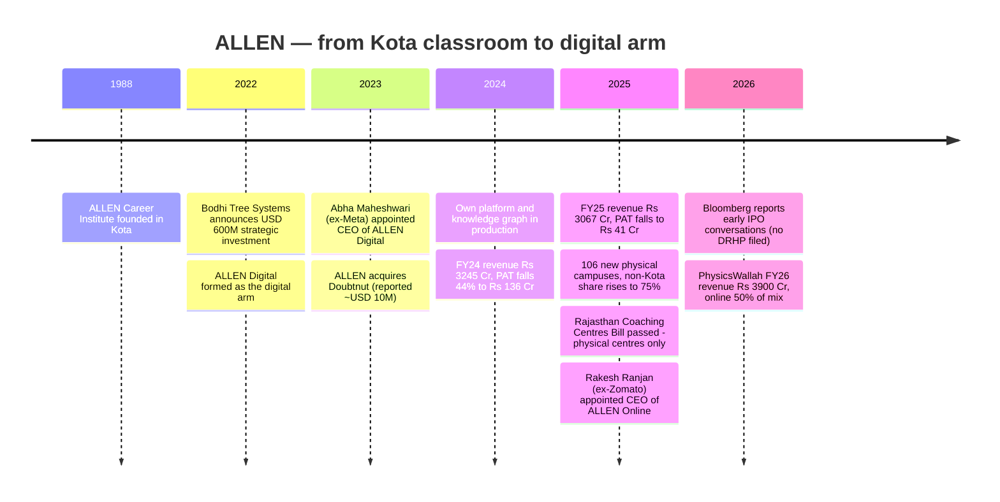
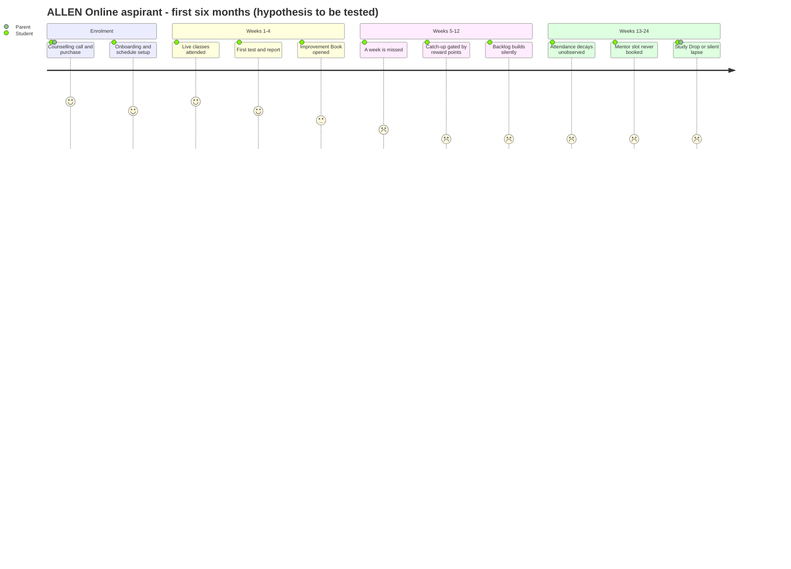
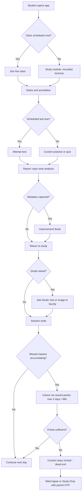
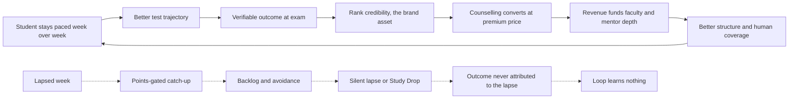
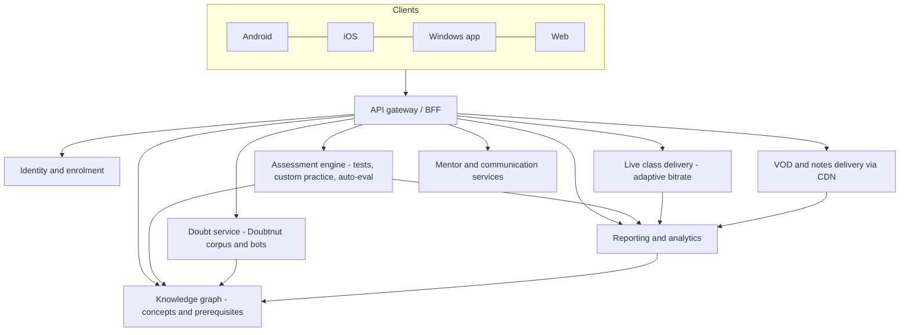
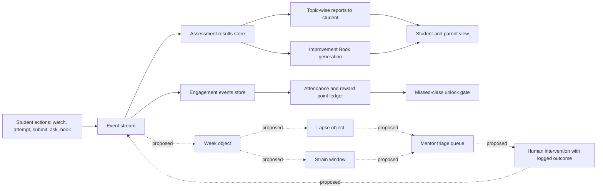
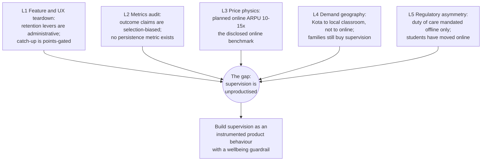
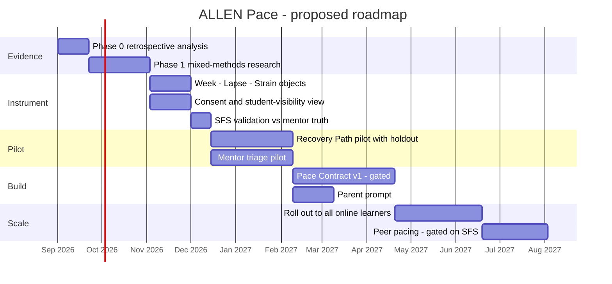

# ALLEN Digital — Rebuilding Supervision as a Product

### Day 46 of 90 · Product Management Case Study Series

> **The thesis of this case study:** ALLEN's online business has successfully ported Kota's *content* and its *assessment machinery*. It has not ported Kota's **supervision** — and supervision, not content, is what a family was paying ₹1.5–2.5 lakh a year for. Every mechanism on ALLEN's digital platform that stands in for a hostel warden, a bench neighbour and a daily attendance register is **administrative or self-reported**, not behavioural. Until supervision is rebuilt as an instrumented product behaviour with a wellbeing guardrail attached to it, ALLEN Online will keep selling a classroom-priced promise into a market that has repriced self-study at roughly one-ninth of classroom ARPU.

---

## 2. Repository Metadata

| Field | Value |
|---|---|
| **Case study** | Day 46 of 90 |
| **Product** | ALLEN Digital / ALLEN Online (digital arm of ALLEN Career Institute) |
| **Company** | ALLEN Career Institute Pvt. Ltd. (Kota, Rajasthan) |
| **Domain** | EdTech — competitive exam preparation (NEET-UG, JEE Main/Advanced, foundation Class 6–12) |
| **Primary competitors** | PhysicsWallah, Aakash Educational Services, Unacademy, Vedantu, Infinity Learn, Narayana |
| **Analysis type** | Research-led product teardown + a research programme + a feature proposal |
| **Proposed system** | **ALLEN Pace** — a supervision layer with an embedded wellbeing guardrail |
| **Author** | Gaurav Singh |
| **Date of analysis** | 11 August 2026 |
| **Research boundary** | Public sources only. No ALLEN employee, student list or internal document was consulted. |
| **Latest audited ALLEN financials available** | FY25 (year ended 31 March 2025) |

---

## 3. Badges


---

## 4. Table of Contents

<details>
<summary><b>Expand the full 65-section contents</b></summary>

| # | Section | # | Section |
|---|---|---|---|
| 1 | [Cover](#allen-digital--rebuilding-supervision-as-a-product) | 34 | [HEART](#34-heart-framework) |
| 2 | [Repository Metadata](#2-repository-metadata) | 35 | [Growth Strategy](#35-growth-strategy) |
| 3 | [Badges](#3-badges) | 36 | [Growth Loops](#36-growth-loops) |
| 4 | [Table of Contents](#4-table-of-contents) | 37 | [Network Effects](#37-network-effects) |
| 5 | [Executive Summary](#5-executive-summary) | 38 | [Product Strategy](#38-product-strategy) |
| 6 | [Product Overview](#6-product-overview) | 39 | [Monetization](#39-monetization) |
| 7 | [Company Background](#7-company-background) | 40 | [Trust & Safety](#40-trust--safety) |
| 8 | [Product Timeline](#8-product-timeline) | 41 | [Technical Architecture](#41-technical-architecture) |
| 9 | [Vision & Mission](#9-vision--mission) | 42 | [Data Flow](#42-data-flow) |
| 10 | [Problem Statement](#10-problem-statement) | 43 | [API Ecosystem](#43-api-ecosystem) |
| 11 | [Market Research](#11-market-research) | 44 | [Privacy & Security](#44-privacy--security) |
| 12 | [Industry Analysis](#12-industry-analysis) | 45 | [Pain Points](#45-pain-points) |
| 13 | [TAM / SAM / SOM](#13-tam--sam--som) | 46 | [Opportunity Mapping](#46-opportunity-mapping) |
| 14 | [Competitor Analysis](#14-competitor-analysis) | 47 | [RICE Prioritisation](#47-rice-prioritisation) |
| 15 | [SWOT](#15-swot) | 48 | [MoSCoW](#48-moscow) |
| 16 | [Porter's Five Forces](#16-porters-five-forces) | 49 | [Kano](#49-kano-analysis) |
| 17 | [Business Model Canvas](#17-business-model-canvas) | 50 | [Feature Proposal](#50-feature-proposal--allen-pace) |
| 18 | [Revenue Model](#18-revenue-model) | 51 | [PRD](#51-prd--allen-pace-v1) |
| 19 | [Target Users](#19-target-users) | 52 | [Wireframes](#52-wireframes) |
| 20 | [Personas](#20-personas) | 53 | [Rollout Plan](#53-rollout-plan) |
| 21 | [JTBD](#21-jobs-to-be-done) | 54 | [A/B Testing](#54-ab-testing) |
| 22 | [User Journey](#22-user-journey) | 55 | [KPI Dashboard](#55-kpi-dashboard) |
| 23 | [User Flow](#23-user-flow) | 56 | [Product Roadmap](#56-product-roadmap) |
| 24 | [Information Architecture](#24-information-architecture) | 57 | [Risks & Mitigation](#57-risks--mitigation) |
| 25 | [UX Audit](#25-ux-audit) | 58 | [Future Vision](#58-future-vision) |
| 26 | [UI Audit](#26-ui-audit) | 59 | [PM Lessons](#59-pm-lessons) |
| 27 | [Accessibility](#27-accessibility) | 60 | [PM Interview Questions](#60-pm-interview-questions) |
| 28 | [Feature Breakdown](#28-feature-breakdown) | 61 | [References](#61-references) |
| 29 | [AI Capabilities](#29-ai-capabilities) | 62 | [About the Author](#62-about-the-author) |
| 30 | [Product Metrics](#30-product-metrics) | 63 | [License](#63-license) |
| 31 | [North Star Metric](#31-north-star-metric) | 64 | [Self Review](#64-self-review) |
| 32 | [Product Analytics](#32-product-analytics) | 65 | [Appendix](#65-appendix) |
| 33 | [AARRR](#33-aarrr) | | |

</details>

**Evidence grading used throughout:** 🟢 High (company filing, regulator, official documentation) · 🟡 Medium (credible trade press citing filings) · 🟠 Low (single secondary source, company marketing claim) · 🔴 Conflicting sources. Grades are applied inline in [§30](#30-product-metrics) and formalised in [Appendix B](#65-appendix).

---

## 5. Executive Summary

**Objective.** Determine what is actually blocking ALLEN's digital business from converting India's largest test-prep brand into India's largest test-prep *platform*, and design the research programme that would settle the question.

**Context.** ALLEN Career Institute is the incumbent of Indian test prep. It reported **FY25 operating revenue of ₹3,067 crore** against ₹3,245 crore in FY24, and **profit after tax of ₹41 crore, down roughly 70% from ₹136 crore**. Its own profit had already fallen 44% the year before that. In the same period it opened **106 self-operated physical campuses, 62 of them in 17 new cities**, and lifted non-Kota revenue from **64% to 75%** of the total.<sup>[1](#61-references)</sup> Meanwhile Kota — the town the brand was built in — has seen coaching enrolments fall by more than half, with hostel occupancy below 50%.<sup>[2](#61-references)</sup>

Read those two facts next to each other and ALLEN's real FY25 decision becomes visible: **when the physical supervision bundle stopped working in one city, ALLEN rebuilt it in 62 other cities — in concrete, not in software.**

**The central finding.** ALLEN's digital platform is, on paper, the most feature-complete product in Indian test prep. Its published help documentation describes an Improvement Book, custom practice generation, homework with late-penalty handling, one-to-one mentorship slots, topic-wise report cards, a notice board, leave management and a self-service course-drop flow.<sup>[3](#61-references)</sup> That is not a thin product. But read that inventory as a researcher rather than as a buyer and a pattern appears:

> **Every ALLEN Digital mechanism that substitutes for physical supervision is administrative or self-reported — a form, a request, a points balance, a booked slot. Almost none of them are behavioural.** The platform records what a student *declares*. Kota's classroom recorded what a student *did*, continuously, by being in the room.

The sharpest illustration is in ALLEN's own documentation: when a student misses classes, access to that missed content is unlocked using **reward points**, in windows of up to **four days / 96 hours at a time**.<sup>[3](#61-references)</sup> The single moment most predictive of online churn — the missed week — is handled by a **gamified paywall on catch-up**. That is a design choice made for supervised, high-intent, fee-committed classroom students. Ported to an unsupervised online learner, it converts a slip into an exit.

**Five independent lines of analysis converge on the same gap** (detailed in [§46](#46-opportunity-mapping)):

| # | Line of analysis | Section | What it shows |
|---|---|---|---|
| L1 | Feature and UX teardown | [§25](#25-ux-audit), [§28](#28-feature-breakdown) | Retention levers are administrative, not behavioural; missed-class recovery is points-gated |
| L2 | Metrics disclosure audit | [§30](#30-product-metrics), [§32](#32-product-analytics) | ALLEN publishes *outcome* claims (ranks, AIIMS seats) which are selection-biased; no completion, persistence or engagement metric is public |
| L3 | Competitive price physics | [§14](#14-competitor-analysis), [§39](#39-monetization) | PhysicsWallah's disclosed **online ACPU ₹4,104 vs offline ARPU ₹36,625** — an 8.9× gap that sets the online price ceiling for the whole category |
| L4 | Demand geography | [§11](#11-market-research), [§45](#45-pain-points) | The supervision bundle is being unbundled physically; ALLEN's FY25 answer was more buildings |
| L5 | Regulatory asymmetry | [§40](#40-trust--safety), [§44](#44-privacy--security) | Rajasthan's 2025 coaching law mandates counsellors and distress intervention — **and covers physical centres only**. The duty of care has moved online ahead of the rules |

**The proposal.** [**ALLEN Pace**](#50-feature-proposal--allen-pace) — a supervision layer for ALLEN Online built from three parts: a **Pace Contract** (a weekly plan the student and parent set together, renegotiable, visible to both), a **Recovery Path** (a behavioural re-entry route after a missed week that replaces the points-gated catch-up), and **Strain Watch** (the guardrail instrument, routed into ALLEN's existing mentor network).

**North Star Metric:** **Paced-Week Rate (PWR)** — the share of enrolled student-weeks in which a learner completes ≥70% of their planned learning blocks *and* attempts the scheduled test. ([§31](#31-north-star-metric))

**Guardrail counter-metric:** **Strain-Flagged Share (SFS)** — the share of active learners in a week showing the strain signature. **Any variant that raises PWR while raising SFS is rejected regardless of the PWR gain.** This rule is carried through [§48](#48-moscow), [§49](#49-kano-analysis), [§51](#51-prd--allen-pace-v1), [§54](#54-ab-testing), [§55](#55-kpi-dashboard) and [§57](#57-risks--mitigation) — it is a constraint, not a caveat.

**What would make this wrong.** If ALLEN's online drop-off is driven mainly by price and content quality rather than by loss of structure, Pace is expensive theatre. [§54](#54-ab-testing) therefore includes an arm **designed to prove this author wrong**, and [§53](#53-rollout-plan) Phase 0 is built so the whole proposal can be killed for the cost of a retrospective cohort query.

---

## 6. Product Overview

**ALLEN Digital** (also marketed as **ALLEN Online**, and shipped in the consumer app store as *ALLEN — NEET, JEE & Class 6-12*) is the digital learning arm of ALLEN Career Institute. It delivers live and recorded instruction, structured test series, doubt resolution and mentorship for NEET-UG, JEE Main, JEE Advanced and Class 6–12 foundation students.<sup>[4](#61-references)</sup>

| Dimension | Detail | Grade |
|---|---|---|
| Parent entity | ALLEN Career Institute Pvt. Ltd., founded 1988, Kota | 🟢 |
| Digital arm formed | 2022, following the Bodhi Tree Systems partnership | 🟢 |
| Platform build | Own technology stack "built from scratch", moving off third-party solutions, anchored on a **knowledge graph** of concepts and their interconnections | 🟠 (company account via trade press) |
| Surfaces | Android, iOS, Windows desktop app, web | 🟢 |
| App size / version | 75.5 MB, v1.77 at time of writing (iOS) | 🟢 |
| Core loop | Live class → notes → practice → test → report → doubt → mentor | 🟢 (from official help docs) |
| Key differentiated modules | Improvement Book, Custom Practice, Personalised Practice Quizzes, Mentorship slots, My Mentor (non-academic), Broadcast, Rewards | 🟢 (official help docs) |

**Where it sits in ALLEN's business.** ALLEN's revenue is overwhelmingly classroom. Reporting in April 2024 put ALLEN's full-course student base at roughly **360,000 in FY24**, with an FY25 ambition of **close to 500,000 students of which 40,000–50,000 through the online channel**, and an online revenue expectation of **₹200–250 crore**.<sup>[5](#61-references)</sup> Treated at face value, that is an online business planned at roughly **6.5–8% of revenue (₹200–250 Cr against FY25 revenue of ₹3,067 Cr) and 8–10% of students** — a satellite, not a second engine. ALLEN has not published actual FY25 online revenue or online student counts, so the plan figures above must be read as *stated intent reported in 2024*, not as results.

---

## 7. Company Background

ALLEN Career Institute was founded in Kota in 1988 and became the defining institution of India's residential coaching model: students move to Kota for one to two years, live in hostels, and follow a fixed daily schedule of lectures, tests and self-study.

Three events reshaped the company:

1. **April/May 2022 — Bodhi Tree Systems partnership.** The James Murdoch and Uday Shankar-backed platform announced a strategic investment of **US$600 million** in ALLEN, reported at the time as roughly ₹4,500 crore and as one of the largest cheques in Indian education.<sup>[6](#61-references)</sup> Trade reporting indicated approximately **70% was earmarked for digital expansion**.<sup>[5](#61-references)</sup> 🟠
2. **December 2023 — Doubtnut acquisition.** ALLEN acquired the Peak XV-backed doubt-solving platform Doubtnut, reported at around **US$10 million**, bringing a large question corpus and a doubt-resolution engine in-house.<sup>[7](#61-references)</sup>
3. **September 2025 — leadership reset of the digital arm.** **Rakesh Ranjan**, formerly CEO of Zomato's food delivery business and the founder of Hyperpure, was appointed **CEO of ALLEN Online on 24 September 2025**, succeeding **Abha Maheshwari** (ex-Meta), who had led ALLEN Digital for about two years.<sup>[8](#61-references)</sup>

That third event is worth pausing on. ALLEN's first digital CEO came from **consumer social and commerce** — a distribution and engagement background. Its second comes from **hyperlocal operations and supply chain** — a reliability and execution background. Companies rarely change the *shape* of a leader's expertise by accident. The most parsimonious reading is that ALLEN concluded its digital problem was no longer *reach*; it was *delivery consistency*. That reading is consistent with this case study's thesis, but ALLEN has not stated it, and I am labelling it an interpretation, not a fact. 🟠

---

## 8. Product Timeline



---

## 9. Vision & Mission

ALLEN's public positioning is outcome-centred: producing selections in NEET and JEE at scale, backed by faculty depth and a test-series culture refined over three decades.

**What the digital arm has said about itself.** ALLEN Online's stated capability claims at the time of the September 2025 leadership announcement included resolving **over one million student queries per month at 98.84% claimed accuracy**, and an internal AI system scoring at an **AIR-8-equivalent level on NEET 2025**.<sup>[8](#61-references)</sup> 🟠 — these are company claims reported in trade press; the methodology behind "accuracy" and the AIR equivalence is not published.

**PM reading.** Both claims measure *the machine's competence*, not *the student's persistence*. A doubt engine answering a million queries a month tells you the engine works; it tells you nothing about how many students who enrolled in April were still asking questions in November. That distinction is the whole of this case study.

---

## 10. Problem Statement

**For the student.** An online test-prep learner in a Tier-2 or Tier-3 town has, for the first time, access to ALLEN's faculty and test series without moving to Kota. What they do not have is the thing Kota actually sold: a day that is decided for them. Nobody notices at 9:05 a.m. that they are not in the room.

**For ALLEN.** ALLEN's cost base and pedagogy are optimised for a supervised, physically co-located, high-fee cohort. Its competitors have built for an unsupervised, low-fee, self-paced one. Between those two sits a repricing that ALLEN cannot answer with faculty quality, because the market has already conceded ALLEN's faculty quality.

**Formally:**

> ALLEN can deliver its content online at parity. It cannot yet deliver its *structure* online at parity. The structure was never a feature — it was a building. Rebuilding it as software is a product problem that ALLEN has, so far, addressed with administrative surfaces (leave requests, reward points, bookable mentor slots) rather than behavioural ones.

**What is unknown and blocking.** Nobody outside ALLEN — and, on the evidence of what is published, possibly nobody inside it in a research-grade form — can currently answer:

1. What share of online enrollees are still on-plan at week 4, week 12, week 24?
2. What is the *shape* of the drop-off — a cliff after a specific event, or steady decay?
3. Does a missed week cause a drop-out, or merely mark one that was already happening?
4. Which existing feature (mentorship, Improvement Book, custom practice) actually moves persistence, versus which is used *by* students who were already persisting?

Question 4 is the selection-effect trap, and it is where most edtech feature evaluation quietly dies. [§54](#54-ab-testing) is designed around it.

---

## 11. Market Research

### 11.1 The demand side is growing; the delivery format is not stable

| Indicator | Figure | Source grade |
|---|---|---|
| NEET-UG registrations 2024 | ~24 lakh (then a record) | 🟡 |
| NEET-UG registrations 2025 | ~22.76 lakh | 🟡 |
| NEET-UG registrations 2026 | Expected to exceed 26 lakh — partly because state allied-health entrance exams were merged into NEET-UG, mechanically enlarging the pool | 🟡 (NTA final count pending at time of writing) |
| MBBS seats, NEET-UG 2025 counselling | Seat matrix revised to ~1.26 lakh seats across 766 colleges | 🟡 |

Roughly **20 candidates per MBBS seat**. Demand for preparation is not the constraint and will not be for a decade.

### 11.2 The supply side has moved out of Kota

| Kota indicator | Peak | Recent | Source grade |
|---|---|---|---|
| Coaching students in Kota | 2–2.5 lakh/year | ~85,000–1 lakh (2024 reporting); "decreased by more than half" (Dec 2025 reporting) | 🟡 |
| Kota coaching economy | ₹6,500–7,000 crore | ~₹3,500 crore (2024 reporting); ~₹4,000 crore economy described as in "deep crisis" (Dec 2025) | 🔴 — the two figures come from different scopes and years; both are directionally consistent, neither is auditable |
| Hostel occupancy | — | 40–50%, below 50% by Dec 2025 | 🟡 |
| Hostel room rent | ₹15,000/month | ₹9,000/month (2024); ₹1,800/room reported in some cases (Dec 2025) | 🟠 |

**Reasons cited across sources:** negative publicity around student suicides; the 2024 restriction on admitting students below 16; coaching brands opening branches closer to home; and more IIT/NIT/medical seats nationally.<sup>[2](#61-references)</sup>

### 11.3 What this actually means

The Kota decline is usually reported as "students are going online". The evidence does not support that reading cleanly. ALLEN's own FY25 response — **106 new physical campuses, non-Kota revenue 64% → 75%** — indicates that the dominant substitution is **Kota classroom → local classroom**, not **Kota classroom → online**. Families did not stop buying supervision. They stopped buying *relocation*.

That is a materially different market signal, and it is the strongest single piece of evidence for this case study's thesis: **supervision still sells. Distance-learning-without-supervision is what does not.**

---

## 12. Industry Analysis

| Force in the industry | State in 2026 |
|---|---|
| **Content** | Fully commoditised. Free YouTube instruction of high quality exists for every NEET/JEE topic. |
| **Assessment** | Near-commoditised. Test series and analytics are table stakes; ALLEN's are widely regarded as best-in-class but the gap is quality, not existence. |
| **Doubt resolution** | Being automated. ALLEN (via Doubtnut), PhysicsWallah (Ask AI / AI Guru) and others have shipped AI doubt-solving. Cost per doubt is collapsing. |
| **Supervision & structure** | **Not commoditised. Barely productised by anyone.** Still delivered physically, at physical cost. |
| **Outcome credibility** | Concentrated in a handful of brands (ALLEN, Aakash, FIITJEE historically, PW more recently). Very hard to build, very slow to lose. |
| **Regulation** | Tightening on physical centres (state coaching Acts). Online is largely untouched. |

The industry has automated everything *except* the part that costs the most and that families are most willing to pay for. That is where the margin is, and it is unclaimed.

---
## 13. TAM / SAM / SOM

> *Framework selection rationale: I run **two independent sizing builds in parallel** — a candidate-pool build and a revenue-triangulation build — rather than the usual single funnel. In Indian test prep a single-method TAM is unfalsifiable: nobody publishes paid-enrolment counts, prices vary by a factor of forty between a free YouTube-adjacent tier and a residential Kota course, and multi-year purchase is invisible. Running both methods and **showing where they disagree** is more honest, and the disagreement turns out to carry the actual finding.*

### 13.1 Verified inputs

| Input | Value | Grade |
|---|---|---|
| NEET-UG 2026 registrations | Expected to exceed 26 lakh (NTA final count pending) | 🟡 |
| JEE Main 2026 Session 1 registrations | 14.5 lakh (highest ever) | 🟡 |
| JEE Main 2025 total unique candidates | 15,39,848 | 🟡 |
| PhysicsWallah FY26 **online** ACPU | **₹4,104** (+11.4% YoY) | 🟢 (company results) |
| PhysicsWallah FY26 **offline** ARPU | **₹36,625** (−9% YoY) | 🟢 (company results) |
| PhysicsWallah FY26 revenue | ₹3,900 Cr; online ₹1,954 Cr, offline ₹1,774 Cr | 🟢 |
| ALLEN FY25 operating revenue | ₹3,067 Cr | 🟡 (filings via trade press) |

### 13.2 Method A — candidate-pool build (author-constructed)

Unique NEET + JEE aspirants, after an assumed 15% overlap: **≈ 35 lakh**. Assumed share buying any paid preparation: **55% → ≈ 19.4 lakh payers**. Priced in three tiers using the only two publicly disclosed ARPU anchors in the category plus one constructed premium anchor:

| Tier | Assumed share of payers | Price anchor | Basis |
|---|---|---|---|
| Residential / premium classroom | 8% | ₹1,50,000 | Author-constructed; no company discloses this |
| Local classroom | 27% | ₹36,625 | PW disclosed offline ARPU 🟢 |
| Online paid | 65% | ₹4,104 | PW disclosed online ACPU 🟢 |

**Method A TAM ≈ ₹4,800 crore.**

### 13.3 Method B — revenue triangulation (author-constructed)

ALLEN FY25 (₹3,067 Cr) + PhysicsWallah FY26 (₹3,900 Cr) = **₹6,967 crore from two players alone**, before Aakash, Narayana, Sri Chaitanya, Unacademy, Vedantu, Resonance, Motion and the long tail of local institutes — and before noting that both figures include non-NEET/JEE lines. If those two represent roughly 45% of organised spend:

**Method B TAM ≈ ₹15,500 crore.**

### 13.4 The disagreement is the finding

The two methods differ by more than **3×**. Method A is understated because the disclosed ARPU anchors come from the category's *value-priced* operator and cannot represent the premium tail, and because repeat/multi-year purchase is invisible. Method B is soft because the 45% share is an assumption.

**Conclusion: category TAM is not knowable from public data within a factor of three, and any case study that quotes a single confident TAM for Indian test prep is quoting a guess.** Decisions in this analysis are therefore anchored on SAM and SOM, which *are* computable from disclosed figures.

### 13.5 SAM and SOM — and the number this case study turns on

ALLEN's **stated FY25 plan**, as reported in April 2024, was ~500,000 total students with **40,000–50,000 through the online channel** and **₹200–250 crore of online revenue**.<sup>[5](#61-references)</sup>

Divide one by the other:

> **ALLEN's planned online ARPU: ₹40,000 – ₹62,500 per student per year.**

Set that beside the two disclosed anchors in the category:

| Price point | Value |
|---|---|
| PhysicsWallah **online** ACPU (FY26, disclosed) | ₹4,104 |
| PhysicsWallah **offline** ARPU (FY26, disclosed) | ₹36,625 |
| **ALLEN planned online ARPU (derived from reported FY25 plan)** | **₹40,000 – ₹62,500** |

Two things follow, and they are arithmetic rather than opinion:

1. ALLEN planned an online business at roughly **10× to 15× PhysicsWallah's online price point**.
2. ALLEN's planned **online** price was **higher than PhysicsWallah's offline price**.

*Caveats, stated plainly: ALLEN's figures are a plan reported in April 2024, not audited results; PW's are FY26 actuals; ACPU (average collection per user) and ARPU are not identical definitions; and the two companies serve different mixes. The gap is large enough that none of these caveats reverse the direction.*

**Why this matters more than any other number in this case study:** a price at that level is not a self-study price. It is a **classroom-substitute price**. Charging a classroom-substitute price is entirely defensible — *if the product delivers what a classroom delivers*. A classroom does not primarily deliver lectures. It delivers **a structured, supervised, socially-enforced day**. That is the product ALLEN must actually ship online to justify its own plan.

---

## 14. Competitor Analysis

| | **ALLEN** | **PhysicsWallah** | **Aakash (AESL)** | **Unacademy** |
|---|---|---|---|---|
| Core identity | Outcome incumbent; Kota-born | Affordability disruptor; creator-led | Legacy medical-prep network | Live-class marketplace, now consolidating |
| FY figures (latest public) | FY25 rev **₹3,067 Cr**, PAT **₹41 Cr** 🟡 | FY26 rev **₹3,900 Cr**, EBITDA ₹549 Cr, net loss ₹24 Cr 🟢 | Not analysed here — no comparable current public disclosure verified | Not analysed here — no comparable current public disclosure verified |
| Online/offline mix | Online planned at ~6.5–8% of revenue (FY25 plan) 🟠 | **Online ₹1,954 Cr = 50% of revenue** 🟢 | — | — |
| Scale of paid users | ~360,000 full-course students FY24 🟠 | **5.34 million paid users**; 4.87 M online transacting; 467,500 offline enrolments 🟢 | — | — |
| Price positioning | Premium | Value; ACPU ₹4,104 online 🟢 | Premium | Mid |
| Physical footprint | 106 campuses added in FY25; reported 285+ centres across 64+ cities 🟠 | **353 centres** (India + UAE), Vidyapeeth format ≈70% of offline revenue 🟢 | Large legacy network | Limited |
| AI shipped | Doubtnut-derived doubt engine; Biology Bot; knowledge graph 🟠 | Ask AI, AI Guru, AI Grader, AI Mentor; **AI voice bots handling 6,000+ calls/day, counselling cost down ~75%** 🟢 | — | — |

### 14.1 The comparison that actually matters

PhysicsWallah's FY26 revenue (₹3,900 Cr) **exceeds ALLEN's last-disclosed FY25 revenue** (₹3,067 Cr). The periods do not match and ALLEN's FY26 is not public, so this is not a clean overtake — but the trajectories are unambiguous: PW grew 35% with an expanding EBITDA margin (7% → 14%); ALLEN's revenue declined and its profit fell to 1.3% of revenue.

More instructive than the totals is the **structure**:

- PW earns **half its revenue online** from 4.87 million transacting users at ₹4,104 each.
- ALLEN planned to earn ~6.5–8% of revenue online from 40–50 thousand students at ₹40,000–62,500 each.

These are not two versions of the same business. PW is running a **volume model with a thin per-user promise**. ALLEN is running a **scarcity model with a thick per-user promise**. Both are coherent strategies. But the thick promise has to be *delivered and demonstrated*, and the mechanism for delivering it online — supervision — is precisely the part ALLEN has productised least.

Note too PW's offline ARPU **fell 9% YoY** while online ACPU **rose 11.4%**. The category's price gradient is compressing from both ends. ALLEN's premium online position is not becoming easier to hold.

---

## 15. SWOT

| **Strengths** | **Weaknesses** |
|---|---|
| Outcome credibility built over 35+ years — the single hardest asset to replicate 🟢 | Profit fell 44% (FY24) then ~70% (FY25) to ₹41 Cr on ₹3,067 Cr 🟡 |
| Faculty depth and a test-series culture competitors openly benchmark against 🟢 | Online is a satellite: ~6.5–8% of planned revenue 🟠 |
| ~₹2,000 Cr net cash — the runway to be patient 🟡 | Planned online ARPU 10–15× the category's disclosed online price point (§13.5) |
| Genuinely deep feature inventory: Improvement Book, mentorship, custom practice, reports 🟢 | Retention mechanics are administrative, not behavioural (§25) |
| Doubtnut question corpus + own knowledge graph 🟠 | No public persistence, completion or engagement metric of any kind (§30) |

| **Opportunities** | **Threats** |
|---|---|
| Supervision is the one uncommoditised layer in the category (§12) | PW compounding at 35% with 50% online mix and improving margins 🟢 |
| Rajasthan-style laws mandate counselling **offline only** — voluntary online duty of care is both right and pre-emptive (§40) 🟢 | Price gradient compressing from both ends (offline ARPU −9%, online ACPU +11.4%) 🟢 |
| ALLEN already runs a mentor network — the human layer a supervision product needs exists | Physical expansion (106 campuses) locks in fixed cost against a structurally shrinking Kota-style demand 🟡 |
| A reported early-stage IPO conversation raises the value of demonstrable online unit economics 🟡 | Reputational tail risk: any structure product that reads as pressure is unshippable after Kota (§40) |

---

## 16. Porter's Five Forces

| Force | Intensity | Reasoning |
|---|---|---|
| **Competitive rivalry** | 🔴 Very high | PW at 35% growth and 50% online mix; Aakash, Narayana, Sri Chaitanya all scaled; discounting endemic |
| **Buyer power** | 🔴 Very high | One-year purchase, high stakes, price-transparent, comparison-shopped by parents; a free credible alternative exists on YouTube |
| **Supplier power** | 🟡 Moderate–high | Star faculty are mobile and brand-carrying; PW was built on precisely this |
| **Threat of substitutes** | 🔴 High | Free content, school-integrated programmes, AI tutors, self-study with only a test series purchased |
| **Threat of new entrants** | 🟢 Low–moderate | Content entry is trivial; **outcome credibility entry is nearly impossible** — this is ALLEN's real moat and it is intact |

**PM reading.** Four of five forces are hostile and the fifth is the only reason ALLEN still commands a premium. A strategy that spends the credibility moat on a product that does not visibly deliver is the one path that damages the only defensible asset.

---

## 17. Business Model Canvas

| Block | ALLEN |
|---|---|
| **Customer segments** | NEET/JEE aspirants (Class 11, 12, droppers); Class 6–10 foundation; **and the paying parent, who is a distinct user with distinct jobs** |
| **Value proposition** | "The best chance at a selection" — faculty, test series, peer benchmark, and (offline) a supervised day |
| **Channels** | Kota campus; 285+ classroom centres across 64+ cities 🟠; ALLEN Online / ALLEN Digital apps (Android, iOS, Windows, web) |
| **Customer relationships** | Faculty-led; mentor-assigned; parent-facing reporting; broadcast announcements |
| **Revenue streams** | Course fees (dominant); test series; digital subscriptions; materials |
| **Key resources** | Faculty; question bank + Doubtnut corpus; rank history; brand; ~₹2,000 Cr net cash 🟡 |
| **Key activities** | Teaching; assessment design; counselling and admissions; content production; campus operations |
| **Key partners** | Bodhi Tree Systems (investor); schools; hostel ecosystem (indirect) |
| **Cost structure** | Faculty compensation; campus rent and operations; marketing and counselling; technology |

**The structural tension in one line:** the cost structure is **fixed and physical**; the growth opportunity is **variable and digital**; and the digital product is currently priced as though it carried the physical cost structure's value.

---

## 18. Revenue Model

| Line | Mechanism | Disclosure |
|---|---|---|
| Classroom fees | Annual/multi-year course fees, instalment-based | Not segmented publicly |
| Online courses | Annual digital course fees | **Not disclosed**; plan of ₹200–250 Cr reported for FY25 🟠 |
| Test series | Standalone paid product | Not disclosed |
| Materials | Bundled or standalone | Not disclosed |

**FY25 group picture** (🟡, filings via trade press): operating revenue ₹3,067 Cr; total revenue ₹3,307 Cr including ₹240 Cr other income; PAT ₹41 Cr; net cash ~₹2,000 Cr; non-Kota revenue 75% of total (from 64%).<sup>[1](#61-references)</sup>

Two observations a PM should not skip:

1. **₹240 Cr of other income against ₹41 Cr of PAT.** On the reported figures, the operating business was at or near break-even before treasury income. The cash pile from the Bodhi Tree round is doing visible work in the P&L.
2. **Revenue fell while campus count rose sharply.** Adding 106 campuses in a year in which revenue declined means FY26 carries a full year of fixed cost against a base that was shrinking when the cost was committed.

> **ALLEN has not publicly disclosed a standalone P&L for its digital arm.** Any statement about ALLEN Digital's profitability, burn or contribution margin — including in this case study — is inference, not fact.

---

## 19. Target Users

| Segment | Who | Why they matter to the online product |
|---|---|---|
| **Class 11–12 aspirant, Tier-2/3 town** | 15–17, school + coaching, first-generation exam aspirant common | The core online opportunity — cannot relocate, wants ALLEN |
| **Dropper / repeat aspirant** | 17–19, full-time preparation, one year to a life outcome | Highest intent, highest strain, highest willingness to pay |
| **Class 6–10 foundation** | 11–15 | Long horizon, parent-controlled purchase, low autonomy |
| **The paying parent** | 35–55, often not exam-literate | **Decides the purchase, judges the product, and is the only continuous observer of the student's day** |
| **Faculty and mentors** | Internal | The delivery constraint for any supervision product |

**The parent is systematically under-treated in edtech product work.** They pay, they renew, they are physically present in the student's day, and they currently receive report cards. They are the most under-used sensor and the most under-served user in the entire system.

---

## 20. Personas

*Each persona separates what is grounded in public evidence from what is constructed. Constructed content is the hypothesis a research programme would test — not a finding.*

### 20.1 Ritika — the Tier-2 online aspirant

- **Grounded in evidence:** her cohort is growing (NEET registrations at record levels); families in her position increasingly choose a local or online option over relocating to Kota (Kota enrolments down >50%, ALLEN's own non-Kota share up to 75%). 🟡
- **Constructed hypothesis:** her failure mode is not comprehension but **week-shape**. Two missed evenings become a backlog; the backlog becomes avoidance; avoidance becomes silence. She does not tell anyone, because nobody asks.
- **What ALLEN gives her today:** recordings, an Improvement Book she must open herself, a mentor slot she must book herself, and — if the miss was long enough — a reward-points gate on the content she missed. 🟢

### 20.2 Arjun — the dropper

- **Grounded in evidence:** droppers are a large, distinct segment in NEET; the stakes and isolation of this year are the documented backdrop to Kota's mental-health record. 🟡
- **Constructed hypothesis:** his risk is the inverse of Ritika's — **over-adherence**. He will study at 2 a.m., re-attempt tests compulsively, and absorb any nudge the product sends as further pressure.
- **Why he matters:** he is the reason [§31](#31-north-star-metric)'s guardrail exists. A supervision product optimised only on adherence will make Arjun worse while its dashboard turns green.

### 20.3 Sunita — the paying parent

- **Grounded in evidence:** ALLEN's platform already surfaces parent-facing artefacts, and the course-drop flow **requires a parent's mobile OTP** — ALLEN has already decided the parent is a system participant. 🟢
- **Constructed hypothesis:** she can see effort but cannot interpret it, so she asks the only question she has — *"how much did you study today?"* — which is exactly the question that erodes trust with a 17-year-old.
- **The product opportunity:** give Sunita a better question to ask. That is a research finding waiting to be made, and it is cheap to test.

---

## 21. Jobs To Be Done

| Actor | Job | Currently served by |
|---|---|---|
| Aspirant | *When I sit down to study, help me know exactly what to do next so I don't waste the session deciding* | Schedule module, planner 🟢 |
| Aspirant | *When I fall behind, give me a way back in that doesn't feel like a punishment* | **Reward-points-gated catch-up** 🟢 — the weakest link in the system |
| Aspirant | *When I get something wrong, make sure I meet it again before the exam* | Improvement Book 🟢 — genuinely strong |
| Aspirant | *When I'm struggling with something that isn't Physics, let me raise it without it becoming a family event* | "My Mentor" (non-academic, 300 characters or audio) 🟢 |
| Parent | *Tell me whether my child is okay, in a way I can act on* | Report cards, broadcasts 🟠 — informational, not actionable |
| Faculty/mentor | *Tell me which of my 200 students to call today* | Not evidenced in public documentation 🔴 |

**The two jobs with the weakest support — re-entry after falling behind, and mentor triage — are the two that a supervision system exists to serve.**

---

## 22. User Journey



**Read the low points.** Every trough in this journey sits at a moment where the offline product would have had a human being physically notice — an empty seat, a missed test, a warden's round. Online, each trough is a **self-service form the student must choose to fill in while already disengaged**. Asking a disengaged user to self-report disengagement is the least reliable instrument in product design.

*This journey is a hypothesis, not a finding. ALLEN has published no data on online drop-off shape. Testing it is Phase 1 of [§53](#53-rollout-plan).*

---

## 23. User Flow



Node **T** is the finding. It is a documented dead end in the product's own help material, positioned at the exact moment of maximum churn risk, and the only escape routes from it are a points balance the student may not have or a course-drop flow.

---

## 24. Information Architecture

ALLEN Digital's published module structure:<sup>[3](#61-references)</sup>

| Group | Modules |
|---|---|
| **Learn** | Live Classes · Study (recorded, by subject/topic/subtopic) · Revision · Digital Material · Exercise Solutions |
| **Practice & assess** | Tests · Custom Practice · Personalised Practice Quizzes · Homework · Improvement Book |
| **Understand** | Reports · Practice Reports |
| **Support** | Ask Doubt · Technical Support (CIS) · Broadcast |
| **Human** | Mentorship (group + 1:1 slots, 30-day booking window) · My Mentor (non-academic) |
| **Organise** | Schedule · Notice Board · My Notes · My Homework · My Assets |
| **Administer** | Leave Management · Study Drop (parent OTP) · My Rewards |
| **Ambient** | Knowledge Base · Quiz · Blog · Recreation Room (games) |

**IA critique.** The architecture is organised around **artefacts** (a test, a note, a report, a doubt) rather than around **the week**. There is a Schedule module, but the week is a calendar view, not a first-class object with a state, a plan, a completion status and a recovery path. Every supervision failure in [§22](#22-user-journey) is a week-level failure that the IA has no place to represent.

---

## 25. UX Audit

| Area | Assessment | Evidence |
|---|---|---|
| Content depth | Excellent; topic/subtopic granularity, annotation, offline material download | 🟢 help docs |
| Assessment loop | Excellent; scheduled tests, custom practice, real-time evaluation, topic-wise reports, time-management view | 🟢 help docs |
| Mistake capture | **Best-in-class idea.** Improvement Book categorises incorrect *and unattempted* questions with subtopic breakdowns and bookmarking | 🟢 help docs |
| Human support | Structurally present: group + 1:1 mentorship, a separate non-academic channel, faculty doubt resolution | 🟢 help docs |
| **Re-entry after absence** | **The weak point.** Missed content unlocked via reward points, max 4 days / 96 hours at a time; bonus points for finishing early | 🟢 help docs |
| Absence signalling | Leave Management — a **request form the student submits** | 🟢 help docs |
| Churn | Study Drop — self-service, parent OTP, pauses calls/emails | 🟢 help docs |
| Reported friction | App reviews cite good UI and teaching quality; one recurring request is downloadable lecture notes | 🟠 App Store reviews |

### 25.1 The pattern

Sort every retention-relevant mechanism by whether it is **behavioural** (the system observes what the student did and acts) or **administrative** (the student declares something and the system records it):

| Mechanism | Behavioural | Administrative |
|---|---|---|
| Personalised Practice Quizzes (target weak areas) | ✅ | |
| Improvement Book (auto-collects errors) | ✅ | |
| Reports / practice analytics | ✅ (diagnostic only — no action attached) | |
| Reward points unlocking missed content | | ✅ |
| Leave Management | | ✅ |
| Mentorship slot booking | | ✅ |
| My Mentor query | | ✅ |
| Broadcast / Notice Board | | ✅ (one-way, no reply capability) |
| Study Drop | | ✅ |

**ALLEN's behavioural intelligence is concentrated entirely inside the academic loop — what you got wrong. Its persistence layer — whether you showed up at all — is entirely administrative.** That is a coherent design for a student who is already in a supervised room. It is the wrong design for a student sitting alone in Gorakhpur in week nine.

---

## 26. UI Audit

Assessment is limited to publicly available material (help documentation, store listings, store screenshots and reviews); no authenticated walkthrough was possible.

| Aspect | Observation |
|---|---|
| Visual system | Consistent, dense, education-standard; app reviews describe the UI as "intuitive and very well designed" 🟠 |
| Information density | High by necessity — a syllabus product genuinely has many objects |
| Performance transparency | The help docs publish **hardware minimums (4 GB RAM, quad-core 2 GHz+) and warn of ~5 fps on weaker devices**, plus bandwidth adaptation for 3G/WiFi/wired 🟢 |
| Content protection | Explicit prohibition on downloads, screenshots of lecture slides and redistribution, with stated right to terminate 🟢 |

**Two PM notes.** First, publishing an honest hardware floor is unusually candid and useful — but a stated 4 GB RAM minimum in a market ALLEN is expanding into is a **real addressable-market constraint**, not a footnote. Second, aggressive content protection is rational for a premium brand and simultaneously a friction tax on exactly the low-bandwidth, shared-device student the online business needs.

---

## 27. Accessibility

No published VPAT, WCAG conformance statement or accessibility documentation was located for ALLEN Digital. **The company has not publicly disclosed its accessibility posture.**

What can be assessed from public material:

| Dimension | Observation |
|---|---|
| Device accessibility | Hardware floor disclosed; degraded performance acknowledged on low-end devices 🟢 |
| Network accessibility | Bandwidth adaptation across 3G/WiFi/wired, platform-specific 🟢 |
| Input modality | Doubts by text **or image**; non-academic mentor queries by text **or audio** — meaningful for students with limited typing fluency or in regional languages 🟢 |
| Language | Not verifiable from public documentation for the digital product 🔴 |
| Screen reader / contrast / captions | Not disclosed 🔴 |

**Recommendation.** For a product whose growth market is explicitly Tier-2/3 India, publishing a device-and-bandwidth accessibility commitment is both an ethical baseline and a competitive statement. Captioning of live and recorded classes is the single highest-leverage item — it serves hearing-impaired students, low-bandwidth students who mute video, and students studying in shared rooms at night, which is most of them.

---

## 28. Feature Breakdown

| Feature | What it does | PM verdict |
|---|---|---|
| **Live Classes** | Scheduled faculty instruction, bandwidth-adaptive | Table stakes, well executed |
| **Study / Revision** | Recorded lectures by topic/subtopic, notes, annotation, global search | Strong |
| **Tests** | Faculty-set, scheduled, timed, exam-simulating, with Test/Improve/Chance categories | Strong — a genuine ALLEN asset |
| **Custom Practice** | Student-configured by subject/topic/count, auto-evaluated | Strong |
| **Personalised Practice Quizzes** | Short quizzes targeting weak areas, with expiry timers | Strong — the most behavioural feature in the product |
| **Improvement Book** | Auto-collects incorrect *and unattempted* questions, subtopic progress, bookmarks with custom labels | **Best feature in the product** |
| **Homework** | Faculty-assigned, multi-format submission, late-submission penalties, marks after due date | Sound |
| **Reports** | Score cards, topic-wise strengths/weaknesses, time-management analysis, downloadable | Strong diagnostically; **no action is attached to a bad report** |
| **Ask Doubt** | Text/image to faculty; state tracking; satisfaction feedback | Strong |
| **Mentorship / My Mentor** | Group + 1:1 slots (30-day window); separate non-academic channel (300 chars or audio) | **Under-exploited** — the human layer exists but is pull-only |
| **Schedule / Notice Board** | Calendar of classes and tests; announcements | Passive |
| **My Rewards** | Points from enrolment and attendance; unlock missed classes (≤4 days / 96h); bonus for early completion | **Actively harmful at the churn moment** — see §25.1 |
| **Leave Management** | Student-submitted leave request with dates, approval-based | Administrative; useful *as a research signal*, unused as one |
| **Study Drop** | Self-service discontinuation, parent OTP, pauses communications | **An instrumented exit that is not being used as an instrument** |
| **Recreation Room** | Crossword, arithmetic, memory, word-search games | Well-intentioned; unevidenced |

### 28.1 The two features to look at again

**My Rewards** attaches a *cost* to recovering from absence. Whatever its intent (attendance incentive, content-protection control), its effect at the churn moment is to make the cheapest path forward "don't come back".

**Study Drop** is the opposite kind of asset. It is a structured, verified, parent-confirmed exit flow — which means ALLEN may already hold **the largest structured churn-reason dataset in Indian test prep** and has published nothing derived from it. For a research organisation, that is the highest-value, lowest-cost dataset in the building.

---

## 29. AI Capabilities

| Capability | Status | Grade |
|---|---|---|
| Knowledge graph of concepts and interconnections | Reported as the platform foundation | 🟠 |
| Doubt resolution at scale | 1M+ queries/month, 98.84% claimed accuracy | 🟠 (company claim; method unpublished) |
| Biology Bot | Conversational bot built on the Doubtnut corpus | 🟠 |
| AI-generated custom tests and personalised quizzes | Shipped | 🟢 |
| Automated grading and practice evaluation | Shipped | 🟢 |
| Claimed learning outcome lift | "Almost 5% increase in test scores" among students using digital features | 🟠 **and non-causal** |
| Exam-level AI performance | AIR-8-equivalent on NEET 2025 (company claim) | 🟠 |

### 29.1 The measurement problem, stated precisely

The "≈5% increase in test scores among students using digital features" claim is the most important number ALLEN has published about its digital product, and it cannot bear weight as stated. Students who *use* digital features are not a random sample of students; they are disproportionately the students who were going to do better anyway. Without random assignment or a defensible quasi-experimental design, the measured effect is **feature usage predicting conscientiousness**, not features producing scores.

This is not a criticism of ALLEN specifically — nearly every edtech outcome claim in the market has this structure. It *is* the precise reason a company at ALLEN's scale, with a reported IPO conversation ahead of it, should want a research function that can produce causal claims. **A defensible causal estimate of your own product's effect is an asset a competitor cannot copy and an underwriter cannot discount.**

### 29.2 Where the competitor has gone instead

PhysicsWallah's disclosed AI deployment is notably *operational*: Ask AI, AI Guru, AI Grader, AI Mentor, plus **voice bots handling 6,000+ calls a day and cutting counselling costs ~75%**. That is AI aimed at the **cost line**. ALLEN's disclosed AI is aimed at the **content line**. Neither has publicly aimed AI at the **persistence line** — which is the argument of [§46](#46-opportunity-mapping).

---
## 30. Product Metrics

### 30.1 What ALLEN publishes

| Claim | Value | Grade | What it actually measures |
|---|---|---|---|
| Full-course students | ~360,000 (FY24); plan of ~500,000 (FY25) | 🟠 | Enrolment, not persistence |
| Online students | Plan of 40,000–50,000 (FY25) | 🟠 | A target reported in 2024; no actual published |
| Online revenue | Plan of ₹200–250 Cr (FY25) | 🟠 | A target; no actual published |
| Group revenue / PAT | FY25 ₹3,067 Cr / ₹41 Cr | 🟡 | Group, not segment |
| IIT admissions | 1,200+ students into IIT with top-100 ranks in 2024–25, of which 220 from live programmes | 🟠 | **Selection-biased outcome** |
| Government medical seats | 647 students in 2024, including 40 at AIIMS | 🟠 | **Selection-biased outcome** |
| Doubt resolution | 1M+ queries/month, 98.84% accuracy | 🟠 | System throughput |
| AI exam performance | AIR-8-equivalent, NEET 2025 | 🟠 | Model capability |
| Score lift from digital features | ~5% | 🟠 | **Correlational, not causal** (§29.1) |

### 30.2 What ALLEN does not publish — and nobody in the category does

| Missing metric | Why it is the one that matters |
|---|---|
| Online course **completion rate** | The denominator under every outcome claim |
| **Attendance decay curve** by week | The shape of the problem |
| **Time-to-first-lapse** distribution | Where to intervene |
| **Recovery rate after a missed week** | Whether the product can bring anyone back |
| **Mentorship utilisation** vs eligibility | Whether the human layer is reaching anyone |
| **Improvement Book engagement** among low performers | Whether the best feature reaches the students who need it |
| **Study Drop reason distribution** | The cheapest churn insight in the building, already collected |
| **Renewal rate**, Class 11 → Class 12 | The only honest verdict on an annual product |

> **This is the evidence vacuum.** ALLEN measures the machine (queries answered, accuracy, ranks produced) and does not publish anything about the human trajectory through it. A brand whose entire premium rests on outcomes has no published evidence that its *online* product produces them, as distinct from selecting for students who would have produced them anyway.

### 30.3 An outcome claim, taken apart

"1,200+ IIT admissions with top-100 ranks, of which 220 from live programmes."<sup>[8](#61-references)</sup>

Three questions this cannot answer, and a research function would insist on:

1. **What is the denominator?** 1,200 out of how many enrolled?
2. **What is the counterfactual?** How many of those 1,200 would have made top-100 with a different provider, or none?
3. **What is the attribution rule?** A student in a classroom programme who also used the app — which column?

None of these is a criticism of the number's truth. All three are the difference between **marketing evidence** and **product evidence**. A senior research function exists to convert the first into the second.

---

## 31. North Star Metric

### 31.1 The proposed North Star

> ## **Paced-Week Rate (PWR)**
> **The share of enrolled student-weeks in which the learner completed ≥70% of their planned learning blocks *and* attempted the scheduled test.**

**Why a week, not a day or a session.** A day is noisy — every student has a bad Tuesday. A course is too coarse to act on — by the time it fails, the year is gone. **A week is the smallest unit at which "am I on track?" is both meaningful and recoverable**, and it is the unit families already reason in.

**Why "planned blocks", not "hours" or "videos watched".** Hours reward padding. Videos watched reward autoplay. A *plan the student agreed to* is the only denominator that survives contact with a student trying to look busy.

**Why the test attempt is a required conjunct.** It is the one weekly act that cannot be faked by leaving a tab open, and it is the input to every downstream diagnostic ALLEN already runs well.

**Why 70%, not 100%.** A metric that demands perfection converts a normal week into a failed week, and a failed week into an exit. 70% is a deliberately forgiving threshold — and, being a threshold, it is an assumption to be calibrated in Phase 1, not a truth (see [ASSUMPTIONS.md](./ASSUMPTIONS.md)).

**What PWR aggregates to.** Term PWR (share of a student's weeks that were paced) predicts, testably, both renewal and outcome. It is the bridge metric between engagement and the thing ALLEN actually sells.

### 31.2 The guardrail counter-metric — non-negotiable

> ## **Strain-Flagged Share (SFS)**
> **The share of weekly-active learners exhibiting the strain signature.**

Proposed signature components (each individually weak, jointly meaningful; all to be validated in Phase 1 against interview and mentor-escalation ground truth):

| Signal | Rationale |
|---|---|
| Sustained study activity in the 01:00–05:00 window | Sleep displacement is the earliest observable strain marker |
| Repeated test starts abandoned mid-attempt | Avoidance under evaluation |
| Sharp week-on-week escalation in session hours after a poor report | Panic-compensation |
| Negative-sentiment or distress language in "My Mentor" free text/audio | Direct, already collected |
| Zero social/peer surface use alongside high solo hours | Isolation |

### 31.3 The rule that binds them

> **No change ships if it raises PWR while raising SFS. No exceptions, no trade curve, no "net positive" argument.**

This is stated as a rule rather than a preference for a specific reason. In a category whose worst-case outcome is a student's death, an engagement metric optimised without a strain brake is not a neutral instrument. Kota's coaching industry has documented what happens when structure is applied to adolescents without a wellbeing circuit — and the state legislature has since written counselling and distress-intervention obligations into law ([§40](#40-trust--safety)).

SFS is carried through the rest of this document by design: it appears in the MoSCoW must-haves ([§48](#48-moscow)), the Kano classification ([§49](#49-kano-analysis)), the PRD acceptance criteria ([§51](#51-prd--allen-pace-v1)), the experiment stopping rules ([§54](#54-ab-testing)), the dashboard's top row ([§55](#55-kpi-dashboard)) and the risk register ([§57](#57-risks--mitigation)).

---

## 32. Product Analytics

### 32.1 The instrumentation ALLEN plausibly already has

Given the published feature set, ALLEN almost certainly captures: video playback events, live-class join/leave, test starts/submissions/per-question timings, practice generation and results, homework submission timestamps, doubt submissions and resolution latency, mentor slot bookings, leave requests, reward point transactions and Study Drop events.

**That is a rich substrate.** The gap is not collection — it is that these events are organised around **artefacts**, and the questions in [§30.2](#302-what-allen-does-not-publish--and-nobody-in-the-category-does) are about **trajectories**.

### 32.2 The three derived objects that would close the gap

| Object | Definition | Unlocks |
|---|---|---|
| **The Week** | A first-class entity: plan, completed blocks, test attempted, state ∈ {paced, partial, lapsed, recovered} | PWR, decay curves, recovery rates |
| **The Lapse** | A contiguous run of non-paced weeks, with a start trigger, duration, and outcome (recovered / dropped / silent) | Time-to-first-lapse, intervention windows |
| **The Strain Window** | A rolling 7-day evaluation of the §31.2 signature, with escalation state | SFS, mentor triage |

None of these requires new data collection. All three are derivable from events the platform already produces. **This is the cheapest possible first deliverable of a research function: not new data, but new objects over existing data.**

### 32.3 Research instruments already sitting unused

| Existing surface | Currently used as | Could be used as |
|---|---|---|
| **Study Drop** (parent-OTP verified) | An offboarding form | A **verified exit interview** with structured reason codes — the category's best churn dataset |
| **Leave Management** | An approval workflow | A **declared-absence baseline** to separate planned absence from silent lapse |
| **My Mentor** free text/audio | A support queue | A **longitudinal qualitative corpus** of student concerns in their own words |
| **Technical Support** (CIS) tickets | A helpdesk | A **friction map** by module, correlated with lapse onset |
| **Reward point transactions** | A loyalty ledger | A direct measure of **how often the catch-up gate blocks re-entry** |

The last row deserves emphasis: ALLEN can answer "how many students hit a points wall while trying to return after an absence, and what happened to them next?" **from data it already holds, this quarter, with one query.** That single number would settle the central argument of this case study in either direction.

---

## 33. AARRR

| Stage | Current state | Gap |
|---|---|---|
| **Acquisition** | Brand + results + counselling; 106 new campuses as physical acquisition surface | Online acquisition rides a brand priced for classrooms |
| **Activation** | Enrolment → schedule → first class → first test | **No defined activation event.** Proposed: *first paced week completed* |
| **Retention** | Content depth, test cadence, Improvement Book | Retention is assumed from fee commitment; the annual prepay hides weekly decay |
| **Referral** | Word of mouth via results; strong offline | Not productised online |
| **Revenue** | Annual course fees, premium positioning | ARPU 10–15× the disclosed online benchmark (§13.5) |

**The structural blind spot: annual prepayment.** ALLEN collects the money up front, which means **weekly disengagement produces no immediate revenue signal**. A lapsed student is financially indistinguishable from an engaged one until renewal — twelve months later. In a subscription business the churn alarm rings monthly; here it rings once, at the end, when nothing can be done.

**This is why PWR is not a vanity metric.** For a prepaid annual product, a weekly persistence metric *is* the early-warning system that the revenue line structurally cannot provide.

---

## 34. HEART Framework

| Dimension | Metric | Instrumented today? |
|---|---|---|
| **Happiness** | Mentor-query sentiment; doubt-resolution satisfaction (already collected); app store sentiment | Partially 🟢 |
| **Engagement** | **PWR**; weekly test attempt rate; Improvement Book revisit rate | Derivable, not defined |
| **Adoption** | First-paced-week within 14 days of enrolment | Not defined |
| **Retention** | Term PWR; recovery rate after first lapse; Class 11 → 12 renewal | Not published |
| **Task success** | Time-to-doubt-resolution; % of Improvement Book items eventually answered correctly | Partially 🟢 |
| **Guardrail (added)** | **Strain-Flagged Share** | Not defined |

HEART is used here with one modification: a **sixth row**. Standard HEART has no place for "the ways this product could hurt the user", which in adolescent high-stakes education is not an edge case — it is the central design constraint.

---

## 35. Growth Strategy

ALLEN's current growth motion is legible from its FY25 actions: **geographic replication of the classroom**. 106 new campuses, 62 in 17 new cities, non-Kota share 64% → 75%.

| Strategy | Verdict |
|---|---|
| **Physical replication** (current) | Works; proven; **capital-intensive and fixed-cost-committing into a declining format** |
| **Price-down online** (PW's model) | Would reach volume; **directly attacks the brand premium that is ALLEN's only intact moat** (§16) |
| **Supervision as product** (proposed) | Justifies the premium online rather than surrendering it; uses the mentor network ALLEN already staffs; **unproven — which is why it starts as research, not as a build** |

The third path is the only one that is *consistent with ALLEN's own pricing intent*. ALLEN has already decided to charge a classroom price online. Given that decision, building the classroom's actual value driver is not a new strategy — it is the missing half of the existing one.

---

## 36. Growth Loops



The solid loop is ALLEN's actual engine and it is a good one. The dotted path is the leak — and its final node is the important one: **because a lapsed student's outcome is never attributed back to the lapse, the company's learning loop never closes on its own biggest online failure mode.**

---

## 37. Network Effects

ALLEN's network effects are **reputational, not structural**:

| Type | Present? | Note |
|---|---|---|
| Direct (user-to-user) | ❌ Weak | Minimal peer surface in the online product |
| Data network effect | ✅ Real | 35+ years of question-response data, plus the Doubtnut corpus, improving personalisation |
| Reputation/credential effect | ✅✅ Strongest | Ranks attract aspirants who produce ranks — the true flywheel |
| Marketplace | ❌ N/A | Not a marketplace |

**The unbuilt one is peer effect.** Kota's most cited non-academic feature is the bench neighbour — visible peers, ambient pace-setting, shared suffering. Online, ALLEN offers a Recreation Room of solo puzzle games. There is a real product here (anonymous cohort pacing, "23 of 40 in your batch finished this week's plan"), and it is deliberately **not** the proposal in [§50](#50-feature-proposal--allen-pace), because peer comparison in this population is a strain amplifier and would have to clear the SFS guardrail before anyone builds it. It is queued in [§56](#56-product-roadmap) behind evidence.

---

## 38. Product Strategy

**Strategic question.** ALLEN can win online in one of two ways: become cheap enough to compete on volume, or become good enough to justify a price nobody else charges. It has already priced for the second and built for neither.

**Proposed strategy:** *Sell the supervised day, not the recorded lecture.*

| Pillar | Rationale |
|---|---|
| 1. **Make the week the product object** | Everything ALLEN does well is already weekly; nothing in the IA represents it (§24) |
| 2. **Convert absence from administrative to behavioural** | The single documented dead end in the product (§23, node T) |
| 3. **Point the human layer at the right students** | Mentors exist and are pull-only; triage is the highest-leverage use of a scarce human resource |
| 4. **Instrument wellbeing before instrumenting adherence** | Ethically required; legally pre-emptive (§40); and it is the constraint that makes the rest safe to ship |
| 5. **Earn the premium with evidence** | A causal, publishable persistence result is an asset no competitor can copy and no diligence process can discount |

---

## 39. Monetization

| Question | Answer |
|---|---|
| Can ALLEN hold ₹40,000–62,500 online ARPU? | **Only by delivering a classroom-grade promise.** Content parity is not classroom parity |
| Should it drop to ~₹4,000? | That is PW's game, PW's cost base, and PW's brand position. Meeting it destroys the premium moat (§16) without acquiring PW's scale advantages |
| Is there a middle tier? | Yes, and it is the commercially interesting output of this analysis |

**A tiering logic that follows from the thesis rather than from a pricing exercise:**

| Tier | What it sells | Roughly who it is for |
|---|---|---|
| **Content tier** | Lectures, material, question bank | Self-directed students; competes with free — price accordingly |
| **Assessment tier** | Test series, reports, Improvement Book | Students with structure of their own; ALLEN's genuine differentiator today |
| **Paced tier (proposed)** | Everything above **+ the supervised week**: pace contract, recovery path, mentor triage, parent visibility | The student who would otherwise have gone to Kota — and the family who was ready to pay Kota prices |

The Paced tier is where a premium online ARPU becomes defensible, because it is the only tier that sells the thing the premium was ever for. **Pricing for it should be set after Phase 1 evidence, not before** — which is the entire point of running this as research first.

---

## 40. Trust & Safety

This section is not a compliance appendix. In this category it is a core product section.

### 40.1 The regulatory picture

The **Rajasthan Coaching Centres (Control and Regulation) Bill, 2025** — introduced 19 March 2025, referred to a Select Committee on 24 March 2025, committee report presented 1 September 2025 — requires coaching centres above 100 students to register per branch, mandates published and non-escalating fees with pro-rata refunds and at least four instalment options, and requires **mechanisms for immediate intervention and assistance to students in distress, plus counselling systems with psychologists and career counsellors — without which registration is denied.** Penalties escalate ₹50,000 → ₹2 lakh → cancellation.<sup>[9](#61-references)</sup> 🟢

**And then the fact this case study turns on:**

> The Bill applies to **physical centres only** — its obligations attach to premises, with infrastructure requirements such as one square metre per student. The legislative record itself notes this gap, observing that many coaching centres are shifting towards providing coaching online.<sup>[9](#61-references)</sup> 🟢

### 40.2 What that means for a product manager

The state has legislated that a coaching provider owes an adolescent a **duty of care** — psychologists, counsellors, distress intervention. Then the students moved online, where the obligation does not follow them.

Three consequences:

1. **Ethical.** The duty does not disappear because the premises did. A student lapsing silently in week nine is exactly the student the Act was written about.
2. **Strategic.** Voluntarily building an online distress pathway is the cheapest regulatory pre-emption available. When the online gap is closed — and the legislative record shows it is already noticed — ALLEN would be compliant on day one while competitors retrofit.
3. **Commercial.** It is also the most credible possible answer to the objection every parent in Kota's shadow now raises. "We watch, and we tell you before it's a crisis" is a **premium-justifying promise** that no volume player at ₹4,104 per user can afford to make.

**This is why SFS is a guardrail and not a nice-to-have.** It is the same instrument serving ethics, regulation and pricing simultaneously — which is exactly the kind of convergence that makes a product decision durable.

### 40.3 Other trust surfaces

| Surface | Status |
|---|---|
| Content protection | Explicit anti-piracy terms with termination rights 🟢 |
| Minor safeguarding in 1:1 mentorship | Not disclosed publicly — a 1:1 adult–minor channel requires published safeguarding policy 🔴 |
| Advertising claims | Outcome claims are the industry's standing consumer-protection exposure; selection-bias-free framing is the defence |

---

## 41. Technical Architecture

ALLEN has not published an engineering blog or architecture documentation. What follows is a **reasoned reconstruction** from published product behaviour, clearly labelled as such.



**Evidence for each node:** adaptive bitrate across 3G/WiFi/wired is documented 🟢; auto-evaluated custom practice is documented 🟢; the knowledge graph is a company account via trade press 🟠; the rest is inference from observable behaviour 🟠.

**The architectural point that matters for the proposal:** the knowledge graph is a *content* structure — concepts and their prerequisites. Nothing in the observable architecture represents a **learner trajectory** structure. [§32.2](#322-the-three-derived-objects-that-would-close-the-gap)'s Week / Lapse / Strain Window objects are the missing schema, and they sit naturally as a derived layer over the existing event stream rather than as a rewrite.

---

## 42. Data Flow



Solid edges are the system as evidenced. Dotted edges are the proposal. Note that the proposal **adds no new collection** — it adds derivation, routing, and, critically, **an outcome log on human intervention**, which is what converts the mentor network from a cost centre into a learning system.

---

## 43. API Ecosystem

ALLEN has not published a public developer API, partner API programme or integration documentation. **The company has not publicly disclosed an external API strategy.**

Internal integration surfaces that can be inferred from product behaviour: payments/instalments, SMS/OTP (used in the Study Drop parent verification flow 🟢), push notification delivery, live-class streaming infrastructure and content delivery.

**PM view:** a public API is not a priority for this business, and the absence is not a weakness. The integration that *would* matter — school information systems, so that a foundation-tier student's school calendar and exam dates inform the pacing plan — is a partnership problem before it is an API problem.

---

## 44. Privacy & Security

| Area | Status |
|---|---|
| Published privacy policy | Present on the consumer app listings 🟢 |
| Minor data handling | Core population is 11–18; India's DPDP Act, 2023 requires verifiable parental consent and prohibits tracking/behavioural monitoring and targeted advertising directed at children 🟢 |
| Parental verification | Already implemented in the Study Drop flow via parent mobile OTP 🟢 |
| Content DRM | Explicit prohibition of downloads/screenshots/redistribution with termination rights 🟢 |
| Security certifications | Not publicly disclosed 🔴 |

### 44.1 The hard question the proposal must answer

**Does a strain-detection system constitute "behavioural monitoring of children"?**

This is the most serious objection to [§50](#50-feature-proposal--allen-pace) and it deserves a direct answer rather than a mitigation bullet:

- The purpose is **safeguarding and educational support**, not advertising or profiling — the harm the statute targets.
- The signals are **already collected** for core service delivery; the proposal derives from them rather than expanding collection.
- Consent should be **explicit, specific, separately obtained from the parent, and revocable**, with the strain pathway explained in plain language rather than buried in a policy.
- The output is **routed to a human mentor, not to an automated intervention**, and every routed case carries a logged human decision.
- Students should be able to **see what the system sees about them.** A system that watches an adolescent and won't show them its own view is one they will correctly stop trusting.

**If ALLEN's counsel concludes this cannot be done with clean consent, the guardrail cannot ship — and if the guardrail cannot ship, the pacing product must not ship either.** That dependency is written into the PRD acceptance criteria in [§51](#51-prd--allen-pace-v1) deliberately.

---

## 45. Pain Points

| # | Pain point | Who feels it | Evidence |
|---|---|---|---|
| P1 | Missed content is gated behind reward points at the moment of maximum churn risk | Aspirant | 🟢 Official help documentation |
| P2 | Absence is only visible if the student files a form | Aspirant, mentor | 🟢 Help documentation (Leave Management) |
| P3 | Mentorship is pull-only — the students least likely to book are those who most need it | Aspirant | 🟢 Help documentation |
| P4 | Reports diagnose but prescribe nothing; no action is attached to a bad week | Aspirant, parent | 🟢 Help documentation |
| P5 | Parents receive information they cannot act on | Parent | 🟠 Inference from artefacts |
| P6 | No week-level object; the IA cannot represent "on track" | Product | 🟢 Structural |
| P7 | Online priced 10–15× the category benchmark without a differentiating structural promise | Business | 🟡 Derived (§13.5) |
| P8 | Churn reasons are collected at Study Drop and, on public evidence, not analysed | Business | 🟠 Absence of published output |
| P9 | Duty-of-care obligations do not follow students online | Student, business | 🟢 Legislative record |
| P10 | The declining Kota format is being replaced with fixed physical cost | Business | 🟡 FY25 filings |

---

## 46. Opportunity Mapping

### 46.1 Five independent lines, converging



Each line was developed from a different source class and none depends on another:

- **L1** comes from ALLEN's own product documentation ([§25](#25-ux-audit), [§28](#28-feature-breakdown)).
- **L2** comes from what ALLEN publishes and does not publish ([§30](#30-product-metrics)).
- **L3** comes from arithmetic on two independently reported figures ([§13.5](#135-sam-and-som--and-the-number-this-case-study-turns-on)).
- **L4** comes from Kota reporting set against ALLEN's own FY25 filings ([§11](#11-market-research)).
- **L5** comes from the legislative record ([§40](#40-trust--safety)).

Any one of them alone would be an interesting observation. Together, they describe a single unclaimed layer — and the fact that a UX teardown, a financial derivation and a state legislature's drafting gap all point at the same place is the reason this is worth a company's quarter.

### 46.2 Opportunity ranking

| Opportunity | Impact | Confidence | Cost |
|---|---|---|---|
| **O1 Week object + PWR instrumentation** | High | High | Low |
| **O2 Strain Watch (SFS + mentor routing)** | High (safety-critical) | Medium | Medium |
| **O3 Recovery Path replacing points gate** | High | Medium | Low |
| **O4 Pace Contract (student + parent)** | High | Low–Medium | Medium |
| **O5 Study Drop reason analysis** | Medium (insight) | **Very high** | **Very low** |
| **O6 Mentor triage queue** | High | Medium | Medium |
| **O7 Peer pacing signals** | Medium | Low | Medium |
| **O8 Parent question-prompt** | Medium | Low | Low |

---

## 47. RICE Prioritisation

> *Framework selection rationale: RICE is used here in a modified form. Standard RICE lets a large Reach smuggle a weak Confidence past scrutiny, which in a safety-adjacent product is exactly the wrong failure mode. I therefore (a) score Reach as **affected online learners**, not total students, (b) treat Confidence strictly as **evidence strength for the causal claim**, not enthusiasm, and (c) run a **sensitivity check** in §47.2 whose output is allowed to change the build sequence — not merely to express humility.*

Reach basis: ALLEN's reported FY25 plan of 40,000–50,000 online students. **45,000** is used as the working figure and is an author-constructed midpoint of a reported plan, not a disclosed actual.

### 47.1 Base scores

| # | Initiative | Reach | Impact | Confidence | Effort (person-months) | **RICE** |
|---|---|---|---|---|---|---|
| O5 | Study Drop reason analysis | 45,000 | 1.0 | 95% | 0.5 | **85,500** |
| O1 | Week object + PWR | 45,000 | 2.0 | 90% | 3 | **27,000** |
| O3 | Recovery Path | 38,000 | 2.5 | 70% | 4 | **16,625** |
| O2 | Strain Watch | 45,000 | 2.0 | 60% | 6 | **9,000** |
| O6 | Mentor triage queue | 20,000 | 2.5 | 65% | 5 | **6,500** |
| O4 | Pace Contract | 45,000 | 3.0 | 40% | 9 | **6,000** |
| O8 | Parent prompt | 45,000 | 1.0 | 45% | 2 | **10,125** |
| O7 | Peer pacing | 30,000 | 1.5 | 30% | 5 | **2,700** |

### 47.2 Sensitivity check — and what it changes

The scores above are dominated by two assumptions that are genuinely uncertain: **Reach** (45,000 is a plan midpoint; the actual could plausibly be 25,000–60,000) and **Confidence** (my confidence intervals are themselves estimates).

**Stress rule applied:** every Reach figure scaled to a 25,000-learner online base (a factor of 0.556), and Confidence cut by 20 percentage points on every initiative whose evidence is inferential. **O5 is exempt from the confidence haircut** — it analyses data ALLEN already holds, so its confidence does not depend on my reasoning being right.

| # | Initiative | Base RICE | Stressed reach | Stressed conf. | Stressed RICE | Rank change |
|---|---|---|---|---|---|---|
| O5 | Study Drop analysis | 85,500 | 25,000 | 95% | **47,500** | 1 → **1** (unmoved) |
| O1 | Week object + PWR | 27,000 | 25,000 | 70% | **11,667** | 2 → **2** (unmoved) |
| O3 | Recovery Path | 16,625 | 21,111 | 50% | **6,597** | 3 → **3** (unmoved) |
| O8 | Parent prompt | 10,125 | 25,000 | 25% | **3,125** | 4 → **5** |
| O2 | Strain Watch | 9,000 | 25,000 | 40% | **3,333** | 5 → **4** |
| O6 | Mentor triage | 6,500 | 11,111 | 45% | **2,500** | 6 → **6** |
| O4 | Pace Contract | 6,000 | 25,000 | 20% | **1,667** | 7 → **7** |
| O7 | Peer pacing | 2,700 | 16,667 | 10% | **500** | 8 → **8** |

**Every line falls by a factor of ~2–5, and the fall is not uniform.** Two things follow, and both change the plan:

1. **O5 and O1 are rank-stable under stress.** They survive every assumption I am least sure about, because their value does not depend on the intervention working — only on the measurement existing. **They therefore move ahead of everything else unconditionally, and Phase 0 of [§53](#53-rollout-plan) is built entirely from them.**
2. **O4 (Pace Contract), the emotional centre of the proposal, is the *least* robust line on the board** — highest effort, lowest confidence, worst degradation under stress. The honest consequence is that **the headline feature is sequenced last, gated on Phase 1 evidence, and would be cut without argument if the evidence does not arrive.** If the sensitivity check did not have the authority to demote my own favourite idea, running it would be theatre.

---

## 48. MoSCoW

| Priority | Items |
|---|---|
| **Must have** | Week object + PWR instrumentation · Study Drop reason analysis · **SFS defined and monitored before any pacing feature reaches a student** · Explicit, separately-obtained parental consent for strain signals · Human-in-the-loop on every escalation |
| **Should have** | Recovery Path replacing the points gate · Mentor triage queue · Parent question-prompt |
| **Could have** | Pace Contract v1 (gated on Phase 1) · Cohort-anonymous peer pacing (gated on SFS clearance) |
| **Won't have (this cycle)** | Public leaderboards · Streak-loss penalties · Automated messages to parents about a student's decline without the student seeing them first · Any strain intervention that is not routed to a human |

The **Won't-have** list is doing real work. Streaks, leaderboards and parent-alert automations are the three cheapest engagement mechanics in the industry, they would almost certainly raise PWR, and each is a plausible SFS violation in this population. They are excluded by the [§31.3](#313-the-rule-that-binds-them) rule, not by taste.

---

## 49. Kano Analysis

| Feature | Classification | Reasoning |
|---|---|---|
| Live classes, recordings, test series | **Must-be** | Absence causes fury; presence earns nothing |
| Improvement Book | **Performance** | More coverage, more satisfaction — ALLEN's strongest current differentiator |
| Points-gated catch-up | **Reverse** | Its presence actively reduces satisfaction at the worst moment |
| Recovery Path | **Attractive → Must-be** | Delightful in year one; expected by year three |
| Pace Contract | **Attractive** | Nobody is asking for it; the students who need it most cannot articulate the need |
| **Strain Watch** | **Must-be (latent)** | Nobody will thank ALLEN for it. Its absence, in a single documented failure, would be catastrophic and permanent |
| Peer pacing | **Attractive / Reverse — depends entirely on execution** | Motivating for the middle, corrosive for the bottom decile; must clear SFS before shipping |

Classifying Strain Watch as a **latent must-be** is the analytically important call. It will never win a feature-request vote and will never show up in an NPS driver analysis. It is a must-be because of the **asymmetry of its failure mode**, not the frequency of its demand — the same logic under which aviation treats a fire suppression system as a must-be despite near-zero utilisation.

---
## 50. Feature Proposal — ALLEN Pace

> **ALLEN Pace is not a feature. It is the attempt to rebuild, in software, the one thing Kota sold that nobody has yet productised: a day that is decided, watched, and recoverable.**

### 50.1 The three components

#### 1. The Pace Contract
At enrolment, and renegotiable every four weeks, the student and parent **jointly set a weekly plan**: how many learning blocks, on which days, with the scheduled test as a fixed anchor. The contract is visible to both, and to the assigned mentor.

Why a *contract* and not a *schedule*: ALLEN already has a schedule, and it is imposed. An imposed plan produces compliance data. A negotiated plan produces a **commitment the student authored**, which is both a better behavioural instrument and a better research instrument — deviation from a plan you set yourself means something; deviation from a plan set for you means almost nothing.

Why the parent is in it: the parent is going to ask *"how much did you study today?"* regardless. The Pace Contract replaces that question with a better one, and takes the surveillance role away from the family dinner table.

#### 2. The Recovery Path
Replaces the reward-points gate. When a week goes unpaced, the system does not lock content and does not present a backlog. It generates a **compressed re-entry plan** — the minimum viable path back onto the syllabus — sequenced by the knowledge graph's prerequisite structure, and it **opens with an acknowledgement rather than a penalty**.

This is the single highest-conviction element of the proposal, because it is the only one that reverses a *documented* dead end ([§23](#23-user-flow), node T) rather than adding a new mechanism.

#### 3. Strain Watch
The guardrail, operationalised. The [§31.2](#312-the-guardrail-counter-metric--non-negotiable) signature runs continuously; flagged cases route to a **human mentor with context and a suggested opening**, never to an automated message. Every routed case carries a logged outcome, which is what turns the mentor network into a learning system ([§42](#42-data-flow)).

**Strain Watch ships first, or nothing ships.** A pacing system without it is an adherence engine pointed at adolescents.

### 50.2 Impact, trade-offs, risks

| Dimension | Assessment |
|---|---|
| **User impact** | The lapsing student gets a route back instead of a locked door. The strained student gets noticed before a crisis. The parent gets a role that isn't interrogation. |
| **Business impact** | A defensible reason for a premium online price (§39); a weekly early-warning signal against an annual prepay model that currently has none (§33); a genuine competitive moat requiring a mentor network that volume players cannot fund at ₹4,104 ACPU |
| **Trade-off 1** | **Mentor capacity is the binding constraint.** Triage makes scarce human time better-targeted; it does not create more of it. If flag volume exceeds capacity, the system must throttle flags by severity and say so, not silently drop them |
| **Trade-off 2** | **Negotiated plans will be less ambitious than imposed ones.** Some students will set a plan they can beat. Accepted deliberately: a plan that is met is a better foundation than one that is missed |
| **Trade-off 3** | **Instrumenting minors' behaviour is a real cost**, in consent complexity, in legal exposure, and in trust if handled badly (§44.1) |
| **Risk 1** | Pacing becomes pressure → **SFS guardrail, kill rule, human routing** |
| **Risk 2** | Parent visibility becomes surveillance → student sees everything the parent sees, first; no parent alert the student hasn't seen |
| **Risk 3** | The whole thesis is wrong and lapse is a *symptom* of price/content dissatisfaction, not a cause of churn → **[§54](#54-ab-testing) Arm D exists to find that out** |
| **Success metrics** | PWR (primary) · recovery rate after first lapse · mentor-flag → intervention → recovered-week conversion · Class 11→12 renewal · **SFS (guardrail, hard-gated)** |

### 50.3 What Pace is deliberately not

- **Not a streak.** Streaks punish the break, and the break is the moment the product exists to serve.
- **Not a leaderboard.** ([§48](#48-moscow) Won't-have.)
- **Not an AI tutor.** ALLEN already has a strong content and doubt stack; nothing here competes with it.
- **Not more content.** The category's least binding constraint.

---

## 51. PRD — ALLEN Pace v1

**Product:** ALLEN Pace · **Version:** 1.0 (Phase 1 research + Phase 2 pilot) · **Author:** Gaurav Singh · **Status:** Proposal

### 51.1 Problem
ALLEN Online learners lapse silently. The product's only mechanisms for detecting and recovering from lapse are administrative, and the recovery path is gated by reward points ([§25](#25-ux-audit)). No metric of persistence exists, so the failure is neither measured nor learned from ([§30](#30-product-metrics)).

### 51.2 Goals

| # | Goal | Measure |
|---|---|---|
| G1 | Make persistence measurable | PWR computed and reported weekly for 100% of online learners |
| G2 | Make lapse recoverable | Recovery rate after first lapse, measured against a holdout |
| G3 | Make strain visible before crisis | SFS computed weekly; 100% of flags routed to a human within 48h with logged outcome |
| G4 | Make the human layer targeted | ≥60% of mentor contact hours directed by triage rather than by student-initiated booking |

### 51.3 Non-goals
New content. Peer/social features. Automated parent alerting. Any change to pricing before Phase 1 evidence.

### 51.4 Requirements

| ID | Requirement | Priority |
|---|---|---|
| R1 | Derive the Week object (plan, completion, test attempt, state) from existing events | P0 |
| R2 | Compute and store PWR per learner per week | P0 |
| R3 | Compute SFS with the §31.2 signature; store the evidence behind every flag | P0 |
| R4 | Route flags to the assigned mentor with context and a suggested opening | P0 |
| R5 | Log the outcome of every intervention | P0 |
| R6 | Replace the points gate with the Recovery Path for the pilot cohort | P1 |
| R7 | Pace Contract creation and 4-weekly renegotiation, student + parent | P2 (gated on Phase 1) |
| R8 | Student-facing "what the system sees about me" view | P0 |
| R9 | Separate, explicit, revocable parental consent for strain processing | P0 |

### 51.5 Acceptance criteria — including the ones that block launch

1. PWR reproduces on a historical cohort and correlates with known outcomes at a stated significance level.
2. SFS flags are validated against mentor-escalation ground truth: **recall ≥0.6 and precision ≥0.4 before any student-facing pacing feature is enabled.** A guardrail that misses most strain is not a guardrail.
3. **R9 is a hard gate.** If clean, specific parental consent for strain processing cannot be obtained, R3–R5 do not ship — and if R3–R5 do not ship, R6 and R7 do not ship either ([§44.1](#441-the-hard-question-the-proposal-must-answer)).
4. No experiment arm proceeds past its interim look if SFS rises against control ([§54](#54-ab-testing)).
5. R8 ships in the same release as R3, not after it.

### 51.6 Open questions for research
What is the actual lapse-onset distribution? Is a missed week causal or merely marker? Which existing feature has a *causal* effect on persistence once selection is controlled? What is the parent's true job here — reassurance, control, or information? Does a negotiated plan outperform an imposed one, and for whom?

---

## 52. Wireframes

Low-fidelity, presented as annotated structure rather than as visual design.

**A. The Week view (new home surface)**

```
┌──────────────────────────────────────────────┐
│  WEEK 9  ·  Mon 12 – Sun 18                  │
│                                              │
│  Your plan:  5 blocks · Physics test Fri     │
│  ███████████░░░░  3 of 5 done                │
│                                              │
│  Fri test:  not attempted                    │
│                                              │
│  [ Today's block ]      [ Adjust this week ] │
└──────────────────────────────────────────────┘
```
*Annotation: the plan is stated in the student's own agreed terms. "Adjust this week" is always available — renegotiation is a designed action, not a failure.*

**B. Recovery Path (replaces the points gate)**

```
┌──────────────────────────────────────────────┐
│  You missed most of last week.               │
│  That happens. Here's the shortest way back. │
│                                              │
│  1. Rotational Motion — core lecture   22 min│
│  2. 8 questions from what you missed         │
│  3. Rejoin this week's plan on Thursday      │
│                                              │
│  [ Start ]        [ Not this week ]          │
└──────────────────────────────────────────────┘
```
*Annotation: no backlog count, no lock, no points. "Not this week" is a first-class option — and is itself a research signal, because a student who declines twice is a different case from one who never opened the screen.*

**C. Mentor triage queue (internal)**

```
┌──────────────────────────────────────────────┐
│  YOUR QUEUE — 11 Aug                         │
│                                              │
│  ⚠ STRAIN   Arjun K.   3 nights 01:00–04:00, │
│             2 tests abandoned  → call today  │
│  ● LAPSE    Ritika S.  wk 8–9 unpaced,       │
│             recovery declined once           │
│  ● LAPSE    Imran A.   first missed test     │
│                                              │
│  Logged outcomes required before close       │
└──────────────────────────────────────────────┘
```
*Annotation: strain outranks lapse, always. The logged outcome is mandatory — it is the only thing that lets the system learn which interventions work.*

---

## 53. Rollout Plan

> **Design principle: Phase 0 and Phase 1 must be able to kill this proposal cheaply.** Neither builds a student-facing feature. If the evidence says the thesis is wrong, ALLEN has spent one analyst-quarter, not one engineering year.

| Phase | Duration | Work | **Kill criterion** |
|---|---|---|---|
| **Phase 0 — Retrospective** | 3 weeks | Reconstruct Week/Lapse objects on one year of historical events. Compute the lapse-onset distribution, recovery rates, points-wall incidence, and the Study Drop reason distribution | **Kill if** lapse is rare, or if lapse does not predict non-renewal/outcome once prior attainment is controlled. Cost to reach this verdict: a handful of queries |
| **Phase 1 — Mixed-methods** | 6 weeks | 20 diary studies (2 weeks each, spanning paced/lapsing/recovered/dropped); 12 parent–student dyad interviews; a behavioural survey to a stratified sample; usability sessions on Improvement Book and the points gate; qualitative coding of My Mentor and Study Drop free text | **Kill if** students and parents consistently attribute drop-off to price, content or teaching quality rather than structure |
| **Phase 2 — Instrument** | 6 weeks | Ship R1–R5, R8, R9. No student-facing pacing feature. Validate SFS against mentor ground truth | **Kill if** SFS fails the recall ≥0.6 / precision ≥0.4 bar and cannot be fixed |
| **Phase 3 — Pilot** | 8 weeks | Recovery Path + mentor triage, one batch, randomised, with holdout ([§54](#54-ab-testing)) | **Kill if** no PWR lift, or **any** SFS deterioration |
| **Phase 4 — Contract** | 10 weeks | Pace Contract v1, only if Phase 1 and 3 both cleared | Cut without argument if Phase 1 evidence did not arrive ([§47.2](#472-sensitivity-check--and-what-it-changes)) |
| **Phase 5 — Scale** | Ongoing | Roll to all online learners; mentor capacity model; consider tiering (§39) | Standing SFS gate |

### 53.1 Phase 1 research design — the detail that matters

| Element | Design |
|---|---|
| **Sampling frame** | Stratified on *outcome state*, not on availability: paced, currently lapsing, recovered, dropped (via Study Drop), and silently inactive. **Recruiting only reachable, willing students would sample precisely the population whose behaviour we are not trying to explain** — the single most common fatal flaw in edtech research |
| **The dropped and the silent** | Deliberately over-sampled, with incentives and no-strings framing, recruited through parents where the student has disengaged |
| **Diary study** | 2 weeks, one prompt per evening, ≤90 seconds: what did you plan, what happened, what got in the way. Voice permitted (the platform already accepts audio from students) |
| **Dyad interviews** | Parent and student interviewed **separately then jointly** — the divergence between the two accounts is the finding |
| **Quant instrument** | Stratified survey sized for subgroup comparison, not for a headline percentage |
| **Analysis** | Thematic coding with a second coder and reported inter-rater agreement; behavioural triangulation against each participant's own event history |
| **Falsification discipline** | The hypothesis "lapse is caused by loss of structure" is registered **in advance**, with its competing hypotheses ("price", "content quality", "school/board conflict", "loss of goal commitment") given equal weight in the discussion guide and equal prominence in the report |

That last row is the difference between research and confirmation. **The discussion guide must be capable of returning the answer that the author of this case study was wrong.**

---

## 54. A/B Testing

### 54.1 Primary experiment — Recovery Path

| Element | Design |
|---|---|
| **Unit** | Learner, randomised at batch level to avoid contamination between students who talk to each other |
| **Population** | Online learners entering their first lapse (one unpaced week) |
| **Control (A)** | Existing behaviour: points-gated catch-up |
| **Treatment (B)** | Recovery Path |
| **Primary metric** | Recovery rate — share returning to a paced week within 14 days |
| **Secondary** | PWR over the following 8 weeks; test attempt rate; term completion |
| **Guardrail** | **SFS. Any increase versus control stops the experiment, regardless of primary-metric performance** |
| **Duration** | 8 weeks minimum — a shorter read cannot distinguish recovery from a natural bad-week bounce |
| **Power** | Sized to detect a 5pp absolute lift in recovery rate; the exact n depends on ALLEN's base rate, which is not public |

### 54.2 Secondary experiment — mentor triage

Arms: (A) pull-only mentorship as today; (B) triage-directed outreach. Primary: recovered weeks per mentor hour — a productivity measure, because mentor capacity is the binding constraint ([§50.2](#502-impact-trade-offs-risks)). Guardrail: SFS, plus a student-reported intrusiveness measure.

### 54.3 Arm D — the arm designed to prove me wrong

Every experiment above tests *how well* the supervision thesis works. None tests *whether it is the right thesis at all*. Arm D does:

| | |
|---|---|
| **Arm D** | Lapsing students receive **no structural intervention**. They receive a **₹-equivalent value concession** — a fee credit, a free extension, or a premium content unlock of comparable cost to the mentor time Arm B consumes |
| **What it tests** | The competing hypothesis: that lapse is driven by perceived value-for-money and can be bought back with economics rather than structure |
| **What a D-wins result means** | The thesis of this entire case study is wrong. ALLEN's online problem is **price**, not supervision — and the correct response is to reprice toward the category benchmark ([§13.5](#135-sam-and-som--and-the-number-this-case-study-turns-on)), not to build Pace |
| **Why it is included** | Because a case study that proposes a system and then designs only experiments that can validate it is advocacy wearing an experiment's clothes. If Arm D wins, [§39](#39-monetization)'s tiering becomes the real recommendation and [§50](#50-feature-proposal--allen-pace) should be shelved |

**Stopping rules for all arms:** interim look at week 4; stop for SFS deterioration in any arm at any time; stop for futility if the primary metric's confidence interval excludes the minimum detectable effect; **no peeking-driven early stops for success.**

---

## 55. KPI Dashboard

**Top row — the guardrail sits above the growth metrics, not beside them.**

| | Metric | Cadence | Owner |
|---|---|---|---|
| **🛡 Guardrail** | **Strain-Flagged Share** · flags raised · flags routed <48h · interventions with logged outcome | Weekly, reviewed first | Head of Online + Safeguarding lead |
| **⭐ North Star** | **Paced-Week Rate** | Weekly | Head of Online Product |
| Health | Recovery rate after first lapse | Weekly | Product |
| Health | Time-to-first-lapse (median, distribution) | Monthly | Research |
| Health | Test attempt rate | Weekly | Product |
| Health | Mentor triage → recovered week conversion | Weekly | Mentorship |
| Health | Improvement Book engagement, bottom quartile specifically | Monthly | Product |
| Business | Class 11 → 12 renewal | Term | Business |
| Business | Online ARPU vs delivered structure cost per learner | Quarterly | Finance + Product |
| Research | Study Drop reason distribution, trended | Monthly | Research |

**Dashboard discipline:** the SFS row is reviewed **before** the PWR row in every weekly meeting, and any SFS deterioration freezes pacing-related releases automatically. Ordering on a dashboard is a governance decision, not a layout decision.

---

## 56. Product Roadmap



Note the shape: **nine weeks of evidence before a single line of student-facing feature code**, and the headline feature (Pace Contract) starting five months in, behind two gates. That sequencing is the direct output of [§47.2](#472-sensitivity-check--and-what-it-changes).

---

## 57. Risks & Mitigation

| # | Risk | Likelihood | Severity | Mitigation |
|---|---|---|---|---|
| R1 | **Pacing becomes pressure and harms a student** | Medium | **Catastrophic** | SFS as a hard gate; §31.3 kill rule; human-in-the-loop on every escalation; Won't-have list bans streaks, leaderboards and unilateral parent alerts |
| R2 | The thesis is wrong — lapse is about price, not structure | Medium | High | Phase 0/1 kill criteria; **Arm D** designed to detect it; §39 tiering is the pre-written fallback |
| R3 | Mentor capacity cannot absorb triage volume | High | Medium | Severity throttling with declared thresholds; measure recovered weeks *per mentor hour*, not raw outreach |
| R4 | Consent for strain processing cannot be obtained cleanly | Medium | High | R9 is a launch-blocking gate; if it fails, the pacing product does not ship either |
| R5 | Parent visibility damages student trust | Medium | High | Student sees everything first; no parent-facing alert the student has not seen; Pace Contract is negotiated, not imposed |
| R6 | Premium price still fails against a compressing gradient | Medium–High | High | Tiering (§39); price decision deferred until Phase 1 evidence |
| R7 | Fixed cost from 106 new campuses constrains digital investment | Medium | Medium | Phases 0–1 cost roughly one analyst-quarter — deliberately affordable in a bad year |
| R8 | Instrumentation becomes surveillance in perception if not in fact | Medium | High | Publish the strain policy; student-visible system view (R8); external review before scale |
| R9 | SFS itself is a bad instrument (false negatives) | Medium | **High** | Validation bar recall ≥0.6 / precision ≥0.4 before launch; continuous re-validation against mentor ground truth; **treat SFS as a floor on human judgment, never a ceiling** |

---

## 58. Future Vision

**Three years out, if the evidence holds.** ALLEN Online's marketed promise stops being "the same faculty, at home" and becomes "**we will notice**". The product sells a week that is planned, watched and recoverable, at a price that is defensible precisely because no volume operator can fund the human layer underneath it.

**The second-order effect.** A company that can produce a causal estimate of its own product's effect on persistence has something rare in Indian education: **evidence instead of testimonials**. If an IPO conversation does become real — Bloomberg reported early discussions in April 2026, with **no DRHP filed** 🟡 — the difference between "1,200 students got top-100 ranks" and "our online product causes a measurable increase in persistence, here is the design and here is the confidence interval" is the difference between a marketing deck and a durable equity story.

**The thing that would matter most.** Kota's decline is usually narrated as a business story. It is also a story about adolescents left alone with a structure that had no circuit breaker. A test-prep product that instruments strain before it instruments adherence — and that publishes what it learns — would be the first genuinely new thing in this category in a decade.

---

## 59. PM Lessons

1. **Read the help documentation, not the marketing site.** Every load-bearing finding in this case study — the points-gated catch-up, the parent-OTP exit flow, the pull-only mentorship — came from ALLEN's own support docs. Companies describe their aspirations in marketing and their actual decisions in documentation.
2. **Sort retention mechanisms into behavioural and administrative.** It takes twenty minutes and it exposed the entire thesis here.
3. **Divide a plan by its own units.** ALLEN's ₹200–250 Cr over 40–50k students is a public figure and its own most damning comparison. Nobody had to leak anything.
4. **An outcome claim without a denominator is a marketing claim.** "1,200 top-100 ranks" and "5% score lift among feature users" are both selection artefacts until proven otherwise.
5. **Find the moment the product is hardest on the user, and look at what it does there.** For ALLEN Online, that is the missed week — and what it does is charge points.
6. **Let the sensitivity check demote your favourite idea.** If it cannot, you are not running one.
7. **Design the experiment that can prove you wrong, and name it.** Arm D exists because a proposal nobody can falsify is a pitch.
8. **When the worst case is a child's wellbeing, the guardrail is not a section — it is the gate.**

---

## 60. PM Interview Questions

1. ALLEN's planned online ARPU is roughly 10–15× the category's disclosed online benchmark and higher than a major competitor's *offline* ARPU. Defend it, or reprice it — and say what evidence would change your mind.
2. You have one query's budget against a year of event data. What do you ask, and why that?
3. Design a metric for a prepaid annual education product that gives you a churn signal before renewal.
4. A feature raises engagement 12% and your strain guardrail 3%. What do you do, and who decides?
5. Your best feature correlates with a 5% score lift. How do you establish whether it *causes* one, without withholding it from students who need it?
6. Kota's collapse is described as students moving online. The incumbent's response was 106 new physical campuses. Which read is right, and what evidence settles it?
7. Regulation mandates counsellors in physical centres but not online. You lead the online product. What, if anything, changes in your roadmap?
8. How would you sample for a study of why students disengage, when the disengaged are by definition the hardest to reach?
9. You inherit a mentor network of fixed size and a triage system that flags three times more students than it can serve. What is your throttling policy and how do you communicate it?
10. A negotiated study plan produces less ambitious targets than an imposed one. Argue both sides, then decide.

---

## 61. References

1. Entrackr — *Allen's profit plummets 70% in FY25 as revenue dips* (FY25 operating revenue ₹3,067 Cr; total revenue ₹3,307 Cr; PAT ₹41 Cr vs ₹136 Cr; net cash ~₹2,000 Cr; non-Kota revenue 75% vs 64%; 106 new campuses, 62 in 17 new cities). https://entrackr.com/news/allens-profit-plummets-70-in-fy25-as-revenue-dips-10579392
2. Business Standard — *Drop in number of students impact Kota's coaching, hostel industry* (Dec 2024) https://www.business-standard.com/education/news/drop-in-number-of-students-impact-kota-s-coaching-hostel-industry-124120800388_1.html · ETV Bharat — *Kota, Country's Largest Coaching Hub, Fails To Attract Aspirants* (7 Dec 2025) https://www.etvbharat.com/en/state/kota-countrys-largest-coaching-hub-fails-to-attract-aspirants-enn25120701623
3. ALLEN Digital Help — official product documentation (module inventory, Improvement Book, Rewards / missed-class unlock, Leave Management, Study Drop, Mentorship, hardware and bandwidth guidance, content-protection terms). https://adhelp.myallendigital.com/onepage-documentation/
4. Apple App Store — *ALLEN — NEET, JEE & Class 6-12*, ALLEN Career Institute Pvt. Ltd. https://apps.apple.com/in/app/allen-neet-jee-class-6-12/id6449251524
5. YourStory — *Advantage AI: How ALLEN is personalising test prep* (Apr 2024) — leadership, knowledge graph, Improvement Book, Biology Bot, 360k FY24 students, FY25 plan of ~500k students / 40–50k online / ₹200–250 Cr online revenue, ~5% score-lift claim. https://yourstory.com/2024/04/allen-digital-ai-personalise-learning-test-prep-edtech
6. PR Newswire — *ALLEN Career Institute and Bodhi Tree Systems Announce Strategic Partnership* (US$600M). https://www.prnewswire.com/in/news-releases/allen-career-institute-and-bodhi-tree-systems-announce-strategic-partnership-869202862.html · Business Standard coverage: https://www.business-standard.com/article/companies/bodhi-tree-to-make-strategic-investment-of-600-mn-in-allen-career-122050100651_1.html
7. Business Standard — *Exams trainer Allen acquires edtech platform Doubtnut to improve technology* (Dec 2023). https://www.business-standard.com/companies/news/allen-career-institute-acquires-ai-enabled-edtech-platform-doubtnut-123120400620_1.html
8. Business Standard — *Ex-Zomato CEO Rakesh Ranjan joins Allen Online to lead digital growth* (24 Sep 2025) — appointment, predecessor, 1M+ queries/month at 98.84% accuracy, AIR-8-equivalent NEET 2025 claim, 1,200+ IIT admissions / 220 from live programmes, 647 government medical seats. https://www.business-standard.com/companies/news/allen-career-institute-appoints-rakesh-ranjan-as-ceo-of-allen-online-125092400316_1.html
9. PRS Legislative Research — *The Rajasthan Coaching Centres (Control and Regulation) Bill, 2025* — registration, fees and refunds, distress intervention and counselling requirements, penalties, **and the explicit note that the Bill covers physical centres only**. https://prsindia.org/bills/states/the-rajasthan-coaching-centres-control-and-regulation-bill-2025
10. YourStory — *PhysicsWallah FY26 revenue rises 35% to Rs 3,900 Cr* — online ₹1,954 Cr / offline ₹1,774 Cr, EBITDA ₹549 Cr, loss ₹24 Cr, 5.34M paid users, online ACPU ₹4,104, offline ARPU ₹36,625, 353 centres, AI product suite and voice bots. https://yourstory.com/2026/05/physicswallah-fy26-revenue-rises-rs-3900-cr-ai-offline-profitability-focus
11. Careers360 — *Highest ever registration year in JEE Main 2026* (Session 1: 14.5 lakh; 2025 total unique 15,39,848; 2024 total unique 14,76,557). https://engineering.careers360.com/articles/highest-ever-registration-year-in-jee-mains-2026
12. Careers360 — *Highest NEET 2026 registrations ever: over 26 lakh candidates expected* (2024 ~24 lakh; 2025 ~22.76 lakh; allied-health exams merged into NEET-UG 2026). https://medicine.careers360.com/articles/highest-neet-2026-registrations-ever-over-26-lakh-candidates-expected
13. Careers360 — *NMC revises NEET UG 2025 seat matrix; total rises to ~1.26 lakh MBBS seats*. https://news.careers360.com/nmc-revises-mcc-neet-ug-2025-seat-matrix-again-9075-new-mbbs-seats-added-total-rises-1-26-lakh-counselling-dates/amp
14. IPO Market — *Allen Career Institute IPO 2026* — Bloomberg reported early IPO conversations (29 Apr 2026); **no DRHP filed**; all valuation figures explicitly editorial estimates. https://www.ipomarket.in/news/allen-career-institute-ipo-2026-date-price-review
15. Entrackr — *Allen nears Rs 3,500 Cr revenue in FY24, profit shrinks 44%*. https://entrackr.com/fintrackr/allen-nears-rs-3500-cr-revenue-in-fy24-profit-shrinks-44-7779172

*All sources accessed 11 August 2026. Where a figure appears only in trade press citing regulatory filings, it is graded 🟡. Where it appears only as a company statement, it is graded 🟠.*

---

## 62. About the Author

**Gaurav Singh** — Product Manager, writing a 90-day series of Product Management case studies analysing how real products make real decisions.

This is **Day 46**. The series covers Indian and global products across consumer, fintech, healthtech, SaaS, edtech and developer tools, using only public sources, with assumptions declared separately and never blended into findings.

- GitHub: `github.com/gaurav-product/product-management-case-studies`
- Series index: [Case Studies](../)

---

## 63. License

This case study is released for educational and portfolio purposes under **CC BY 4.0**.

All company names, product names and trademarks belong to their respective owners. This is an **independent analysis** using publicly available information. It is not affiliated with, endorsed by, or commissioned by ALLEN Career Institute Pvt. Ltd., ALLEN Digital, ALLEN Online or any other company mentioned. No confidential information was used. No proprietary data was accessed.

---

## 64. Self Review

| Check | Status | Note |
|---|---|---|
| No fabricated data | ✅ | Every figure carries a source or is flagged author-constructed and logged in [ASSUMPTIONS.md](./ASSUMPTIONS.md) |
| Facts vs assumptions separated | ✅ | Evidence grades inline; Appendix B; separate assumptions file |
| All 65 sections present | ✅ | |
| Mermaid validated | ✅ | All six diagrams rendered locally before publication ([Appendix E](#65-appendix)) |
| No placeholders | ✅ | |
| One thesis, tested not restated | ✅ | Supervision gap stated in §5, tested in §13, §25, §30, §40, §46, and given a falsification arm in §54 |
| Guardrail carried throughout | ✅ | SFS appears in §31, §34, §48, §49, §50, §51, §53, §54, §55, §57 |
| Sensitivity analysis changes a decision | ✅ | §47.2 demotes the headline feature to last position |
| Recommendation includes trade-offs and risks | ✅ | §50.2, §57 |
| Falsifiability | ✅ | §53 kill criteria, §54 Arm D |

**Where this analysis is weakest, stated plainly:**

1. **No access to ALLEN's actual online metrics.** The lapse dynamic is a *hypothesis built from product structure*, not an observed fact. If ALLEN's internal data shows high online completion, [§46](#46-opportunity-mapping)'s convergence collapses.
2. **ALLEN's online plan figures are from April 2024 trade reporting**, not audited segment results, and FY26 is not public. The §13.5 ARPU derivation — the most striking number here — rests on that reporting being accurate.
3. **Cross-period comparison with PhysicsWallah** (ALLEN FY25 vs PW FY26) flatters the contrast. It is flagged wherever used, but a reader should discount it.
4. **The strain signature is proposed, not validated.** Every component is plausible and none is proven. [§51.5](#515-acceptance-criteria--including-the-ones-that-block-launch) sets a validation bar precisely because I do not know whether it clears it.
5. **The Kota economy figures conflict across sources** (₹6,500–7,000 Cr → ₹3,500 Cr in 2024 reporting; a ₹4,000 Cr economy "in crisis" in Dec 2025). Graded 🔴 and not used in any calculation.

---

## 65. Appendix

### Appendix A — Source Conflicts

| Conflict | Sources | Resolution |
|---|---|---|
| Kota coaching economy size | ₹6,500–7,000 Cr → ₹3,500 Cr (BS, Dec 2024) vs "₹4,000 Cr economy in deep crisis" (ETV Bharat, Dec 2025) | Different scopes and years; both directionally consistent. Graded 🔴, **used for direction only, never in a calculation** |
| Kota student count | 2–2.5 lakh peak; 85,000–1 lakh (2024); "more than halved" (2025) | No single authoritative series exists. Reported as a range with dates attached |
| ALLEN centre count | "285+ centres, 64+ cities" (May 2026 trade piece) vs "106 campuses added in FY25" (filings) | Not necessarily contradictory (different bases). Both graded and attributed; neither used in a calculation |
| ALLEN FY24 revenue | ₹3,244.7 Cr / ₹3,245 Cr / "nears ₹3,500 Cr" (headline including other income) | Operating revenue ₹3,245 Cr used throughout; headline variance is an other-income framing difference |
| NEET 2026 registrations | "over 26 lakh expected" vs 23–26 lakh registered by the March 2026 deadline | NTA final count pending at time of writing. Stated as expectation, graded 🟡 |

### Appendix B — Evidence Grades

| Grade | Meaning | Examples in this case study |
|---|---|---|
| 🟢 **High** | Company filing, regulator/legislature, official product documentation, company results release | Rajasthan Bill provisions; ALLEN Digital help docs; PW FY26 disclosed metrics; App Store listing |
| 🟡 **Medium** | Credible trade press citing filings or official data | ALLEN FY25 financials; NEET/JEE registration counts; MBBS seat matrix |
| 🟠 **Low** | Single secondary source, or a company marketing/PR claim without published method | Knowledge graph; 98.84% doubt accuracy; AIR-8 claim; 5% score lift; FY25 online plan figures |
| 🔴 **Conflicting / unavailable** | Sources disagree, or the company has not disclosed | Kota economy size; ALLEN digital-arm P&L; accessibility posture; safeguarding policy for 1:1 mentorship |

### Appendix C — Author-Constructed Content

Everything in this list is mine, not ALLEN's, and none of it should be read as a finding. Full reasoning in [ASSUMPTIONS.md](./ASSUMPTIONS.md).

| # | Construct | Where |
|---|---|---|
| C1 | Paced-Week Rate, incl. the 70% threshold | §31.1 |
| C2 | Strain-Flagged Share and its five-signal signature | §31.2 |
| C3 | ALLEN Pace and all three components | §50 |
| C4 | Week / Lapse / Strain Window derived objects | §32.2 |
| C5 | TAM Methods A and B, and all tier shares and price anchors within them | §13.2–13.3 |
| C6 | Derived planned online ARPU of ₹40,000–62,500 (arithmetic on reported plan figures) | §13.5 |
| C7 | All RICE scores, and the stressed scenario | §47 |
| C8 | Personas Ritika, Arjun, Sunita and their failure modes | §20 |
| C9 | The user journey drop-off shape | §22 |
| C10 | Technical architecture and data flow reconstructions | §41, §42 |
| C11 | Tiering proposal (content / assessment / paced) | §39 |
| C12 | The reading of the CEO succession as a shift from reach to delivery | §7 |
| C13 | SFS validation bar (recall ≥0.6 / precision ≥0.4) | §51.5 |

### Appendix D — Asset Status

| Asset | Status |
|---|---|
| Mermaid: product timeline, user journey, user flow, growth loop, opportunity convergence, architecture, data flow, roadmap gantt | ✅ Authored and render-validated |
| ASCII wireframes (Week view, Recovery Path, Mentor queue) | ✅ Authored |
| Product screenshots | ❌ Not included — ALLEN's terms explicitly prohibit screenshots of lecture slides and redistribution of platform material. Structure is described in text instead |
| Financial charts | ❌ Not included — segment-level data does not exist publicly; a chart would imply precision the sources do not support |

### Appendix E — Methodology Note

**Sources.** Public only: trade press citing regulatory filings, ALLEN's official help documentation, app store listings, a competitor's published results, and the legislative record. No ALLEN employee was contacted; no student data was accessed; no authenticated session was used.

**Method.** (1) Financial reconstruction from filings-derived reporting. (2) A complete feature inventory from official product documentation, then classified behavioural vs administrative. (3) Price derivation from reported plan figures against disclosed competitor benchmarks. (4) Regulatory reading of the primary legislative record. (5) Convergence test — five lines developed from different source classes, checked for whether they point at one gap. (6) Falsification design — kill criteria and a competing-hypothesis experiment arm written before the proposal was finalised.

**Diagram validation.** All Mermaid diagrams were rendered locally with `@mermaid-js/mermaid-cli` before publication; none is published unrendered.

**What would change my mind.** ALLEN publishing online completion and recovery rates that are high; a Phase 0 retrospective showing lapse does not predict non-renewal once prior attainment is controlled; or an Arm D result showing that value concessions recover lapsing students as well as structural intervention does.

---

*Day 46 of 90 · [← Day 45 — Eternal](../Day-45-Eternal) · Day 47 →*
