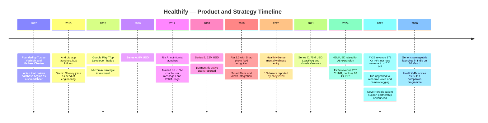
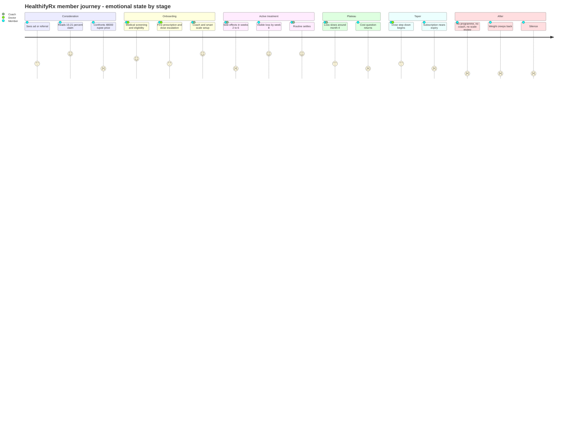
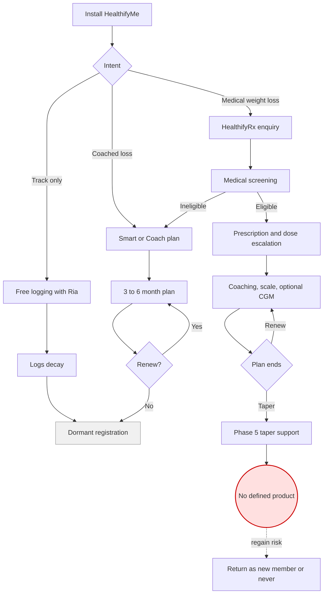
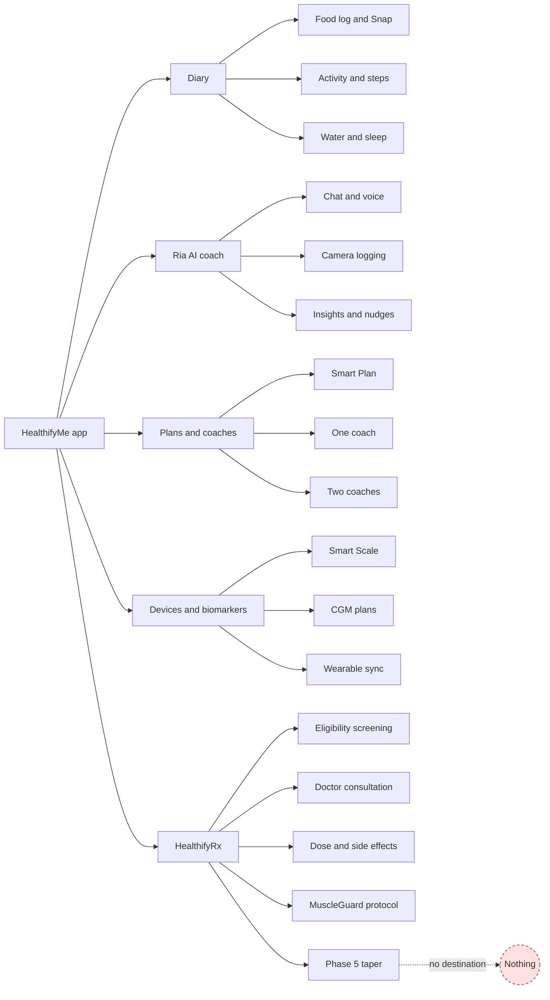
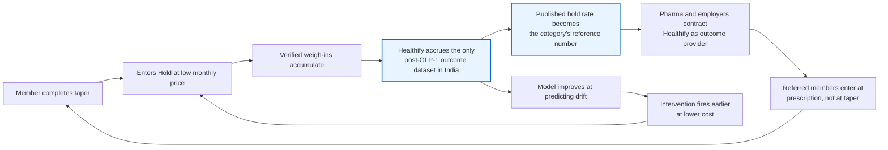
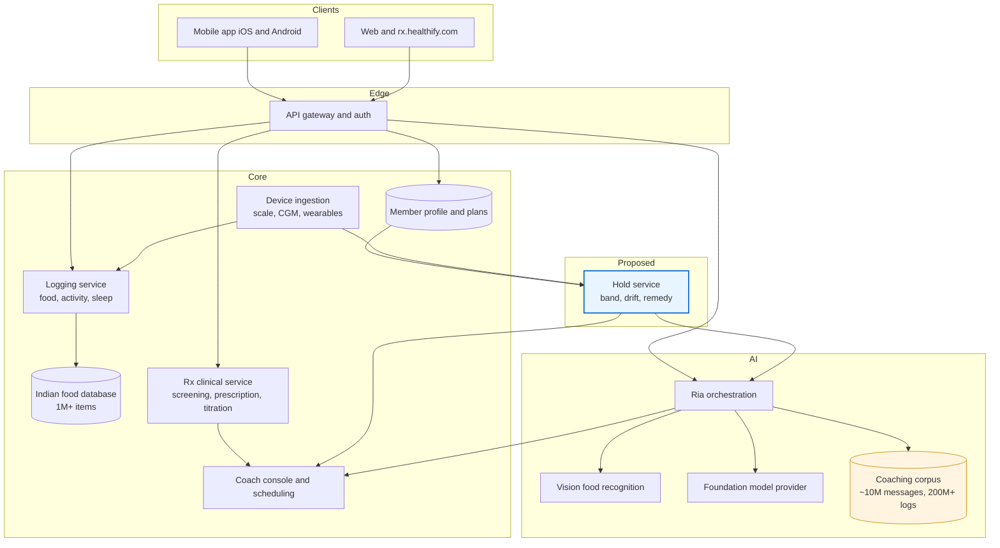
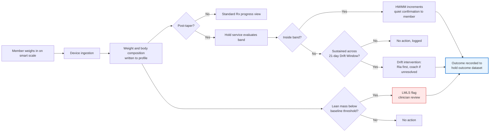
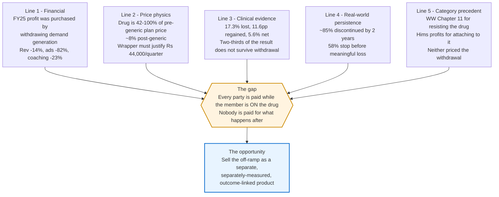
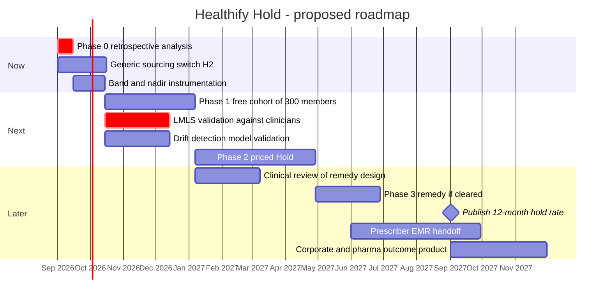

# Healthify — Selling the Off-Ramp

### Day 47 of 90 · Product Management Case Study Series

> **The thesis of this case study:** Healthify's FY25 return to near-breakeven and its December 2025 pivot into GLP-1 patient support are the same decision seen twice. Both are admissions that **behaviour change did not retain and did not scale profitably**, and that the company's most reliable revenue now attaches to a molecule rather than to a habit. But the clinical record on that molecule says the outcome Healthify has begun to sell — durable weight loss — is precisely what the drug stops delivering once a patient stops taking it: in the STEP 1 trial extension, participants regained **two-thirds** of their loss within a year of withdrawal. Healthify therefore has exactly one product left that generics cannot commoditise and pharma cannot disintermediate, and it is currently the phase it markets for free at the end of a programme: **the off-ramp**. Until the withdrawal phase is sold as a separate, separately-measured, outcome-linked product, Healthify will keep collecting a pass-through margin on a drug whose price is collapsing, for an outcome its own evidence base says evaporates.

---

## 2. Repository Metadata

| Field | Value |
|---|---|
| **Case study** | Day 47 of 90 |
| **Product** | Healthify (app: HealthifyMe) — AI health coaching, nutrition tracking, connected devices, and HealthifyRx medical weight loss |
| **Company** | HealthifyMe Wellness Private Limited (Bengaluru, Karnataka) |
| **Domain** | HealthTech — consumer digital health, nutrition and metabolic care |
| **Primary competitors** | Cult.fit, Ultrahuman, Fittr, Noom, MyFitnessPal, Tata 1mg / PharmEasy (as GLP-1 distribution), and the prescribing physician |
| **Analysis type** | Research-led product teardown + price reconstruction + a feature proposal |
| **Proposed system** | **Healthify Hold** — the GLP-1 off-ramp sold as an outcome-linked product |
| **Author** | Gaurav Singh |
| **Date of analysis** | 12 August 2026 |
| **Research boundary** | Public sources only. No Healthify employee, member record, or internal document was consulted. No authenticated session was used. |
| **Latest audited Healthify financials available** | FY25 (year ended 31 March 2025). FY26 filings were not public as at the date of analysis. |

---

## 3. Badges


---

## 4. Table of Contents

<details>
<summary><b>Expand the full 65-section contents</b></summary>

| # | Section | # | Section |
|---|---|---|---|
| 1 | [Cover](#healthify--selling-the-off-ramp) | 34 | [HEART](#34-heart-framework) |
| 2 | [Repository Metadata](#2-repository-metadata) | 35 | [Growth Strategy](#35-growth-strategy) |
| 3 | [Badges](#3-badges) | 36 | [Growth Loops](#36-growth-loops) |
| 4 | [Table of Contents](#4-table-of-contents) | 37 | [Network Effects](#37-network-effects) |
| 5 | [Executive Summary](#5-executive-summary) | 38 | [Product Strategy](#38-product-strategy) |
| 6 | [Product Overview](#6-product-overview) | 39 | [Monetization](#39-monetization) |
| 7 | [Company Background](#7-company-background) | 40 | [Trust & Safety](#40-trust--safety) |
| 8 | [Product Timeline](#8-product-timeline) | 41 | [Technical Architecture](#41-technical-architecture) |
| 9 | [Vision & Mission](#9-vision--mission) | 42 | [Data Flow](#42-data-flow) |
| 10 | [Problem Statement](#10-problem-statement) | 43 | [API Ecosystem](#43-api-ecosystem) |
| 11 | [Market Research](#11-market-research) | 44 | [Privacy & Security](#44-privacy--security) |
| 12 | [Industry Analysis](#12-industry-analysis) | 45 | [Pain Points](#45-pain-points) |
| 13 | [TAM / SAM / SOM](#13-tam--sam--som) | 46 | [Opportunity Mapping](#46-opportunity-mapping) |
| 14 | [Competitor Analysis](#14-competitor-analysis) | 47 | [RICE Prioritisation](#47-rice-prioritisation) |
| 15 | [SWOT](#15-swot) | 48 | [MoSCoW](#48-moscow) |
| 16 | [Porter's Five Forces](#16-porters-five-forces) | 49 | [Kano](#49-kano-analysis) |
| 17 | [Business Model Canvas](#17-business-model-canvas) | 50 | [Feature Proposal](#50-feature-proposal--healthify-hold) |
| 18 | [Revenue Model](#18-revenue-model) | 51 | [PRD](#51-prd--healthify-hold-v1) |
| 19 | [Target Users](#19-target-users) | 52 | [Wireframes](#52-wireframes) |
| 20 | [Personas](#20-personas) | 53 | [Rollout Plan](#53-rollout-plan) |
| 21 | [JTBD](#21-jobs-to-be-done) | 54 | [A/B Testing](#54-ab-testing) |
| 22 | [User Journey](#22-user-journey) | 55 | [KPI Dashboard](#55-kpi-dashboard) |
| 23 | [User Flow](#23-user-flow) | 56 | [Product Roadmap](#56-product-roadmap) |
| 24 | [Information Architecture](#24-information-architecture) | 57 | [Risks & Mitigation](#57-risks--mitigation) |
| 25 | [UX Audit](#25-ux-audit) | 58 | [Future Vision](#58-future-vision) |
| 26 | [UI Audit](#26-ui-audit) | 59 | [PM Lessons](#59-pm-lessons) |
| 27 | [Accessibility](#27-accessibility) | 60 | [PM Interview Questions](#60-pm-interview-questions) |
| 28 | [Feature Breakdown](#28-feature-breakdown) | 61 | [References](#61-references) |
| 29 | [AI Capabilities](#29-ai-capabilities) | 62 | [About the Author](#62-about-the-author) |
| 30 | [Product Metrics](#30-product-metrics) | 63 | [License](#63-license) |
| 31 | [North Star Metric](#31-north-star-metric) | 64 | [Self Review](#64-self-review) |
| 32 | [Product Analytics](#32-product-analytics) | 65 | [Appendix](#65-appendix) |
| 33 | [AARRR](#33-aarrr-framework) | | |

</details>

---

## 5. Executive Summary

Healthify (formerly and still popularly HealthifyMe) is a fourteen-year-old Bengaluru consumer health company with **45 million registered users**, a **six-digit** paid subscriber base, and an AI nutritionist, Ria, that resolves roughly **77%** of member queries without a human. In FY25 it did something unusual for an Indian consumer subscription business: it cut its net loss by **95%**, from ₹88 Cr to ₹4.7 Cr.

It did so while revenue **fell 14%**, from ₹207 Cr to ₹178 Cr.

That pairing is the whole case study. Advertising and business promotion fell **82%** (₹73.5 Cr → ₹13 Cr) and domestic nutrition and wellness coaching revenue — the historic core — fell **23%** (₹129 Cr → ₹99 Cr). Total expenses fell 38%. The company did not become more efficient at converting coaching into revenue; it stopped buying the demand that fed the coaching business and accepted the revenue consequence. **Roughly ₹0.48 of revenue departed for every ₹1 of advertising withdrawn** (§13.5) — which is a way of saying the FY24 marketing engine was buying revenue at a loss and the FY25 result is what turning it off looks like.

In December 2025, five months before the analysis window closes, Healthify announced a patient-support partnership with **Novo Nordisk** for its weight-loss therapies, and its CEO stated an ambition to become *"the world's biggest patient support provider for all GLP companies in every market."* HealthifyRx now sells medically supervised GLP-1 programmes at **₹48,000 (3 months) / ₹80,000 (6 months) / ₹1,00,000 (12 months)** — against a Smart Plan that costs roughly **₹208 per month**. Management expects the weight-loss line to contribute **over a third of paid subscriptions within a year**.

**Five independent lines of analysis converge on the same gap.** They are developed separately in §45 and §46 and summarised here:

| # | Line | Source class | Where |
|---|---|---|---|
| 1 | FY25 profitability was purchased by withdrawing demand generation, not earned by the coaching product improving | Filings-derived financial reporting | §18, §13.5 |
| 2 | At pre-generic prices, the entire HealthifyRx quarter price is accounted for by the drug it contains; post-generic, the drug is ~8% of it | Price reconstruction | §13.6, §39 |
| 3 | The clinical record says the outcome being sold does not survive withdrawal: **17.3% mean loss, 11.6pp regained, 5.6% net** | Peer-reviewed RCT extension | §11.3 |
| 4 | Real-world persistence collapses inside the window Healthify sells into: ~85% of commercially-insured initiators had discontinued by two years | Payer claims research | §11.4 |
| 5 | The category has already punished both wrong answers — WeightWatchers filed Chapter 11 in April 2025; Hims' profit surged on GLP-1 attachment — and neither has priced the withdrawal | Category precedent | §12.4 |

**The gap they converge on:** every party in the value chain is paid while the member is *on* the drug. Nobody is paid for what happens after. Healthify's own HealthifyRx page describes a five-phase programme that ends in tapering with "relapse prevention support to lock in results" — but that phase is bundled inside the same subscription, carries no separate price, publishes no outcome, and terminates exactly when the member's need begins.

**The proposal (§50): Healthify Hold** — sell the off-ramp.

1. **Hold Contract**, signed at *prescription* rather than at taper, defining the hold band, the maintenance price and the remedy in advance;
2. **Taper Ladder**, an instrumented dose step-down that protects lean mass using the smart scale Healthify already ships and the MuscleGuard protocol it already runs;
3. **Hold Price**, a separately-priced maintenance tier with a published credit if the member exits the band at month 12 post-taper.

**North Star: Held-Weight Member-Months (HWMM)** — member-months in which a post-taper member remains inside their contracted band (§31.1).
**Guardrail counter-metric: Lean-Mass Loss Share (LMLS)** — the share of active Rx members whose scale-estimated lean mass has fallen beyond threshold (§31.2). *Nothing ships that raises HWMM while raising LMLS.* This constraint is carried through §48, §49, §51, §54, §55 and §57 rather than mentioned once.

**The number that carries the argument (§13.6).** A ₹1,00,000 twelve-month HealthifyRx plan, measured against STEP 1 extension outcomes, costs **≈ ₹5,780 per percentage point of peak weight loss** but **≈ ₹17,857 per percentage point still held one year after withdrawal** — a **3.1×** gap between the outcome that is marketed and the outcome that endures. Both figures are arithmetic on two published numbers, and both are caveated in §13.7.

**What I could not verify.** Healthify has not disclosed paid subscriber count beyond "six-digit", MAU beyond "several million", churn, HealthifyRx enrolment, or any post-programme outcome. The load-bearing unverified assumption — that Healthify's own members regain weight at rates resembling the trial population — is declared as **A1** in [ASSUMPTIONS.md](./ASSUMPTIONS.md) and is the first thing §53 Phase 0 is designed to kill.

---

## 6. Product Overview

Healthify is a consumer health platform whose surface is a food and activity diary and whose business is coaching. Four layers sit on top of one another, and each was added to fix a retention problem in the one below.

| Layer | What it is | What it was added to fix |
|---|---|---|
| **Tracking** | Calorie, macro and activity logging against a database Healthify states exceeds **1 million Indian food items**; photo logging via Snap | Nothing — this is the origin product (2012–13) |
| **AI coaching** | **Ria**, launched late 2017, trained on ~10 million coach–user messages and 200M+ logs; upgraded December 2025 to real-time voice and camera-based logging across **50+ languages including 14 Indian languages** | Logging is effortful and lonely; most diaries are abandoned |
| **Human coaching** | **600+ certified** nutrition and fitness coaches, sold in 1-coach and 2-coach tiers; Healthify states Ria resolves **77%** of queries with **23%** escalated to humans | AI alone did not produce accountability |
| **Devices & biomarkers** | Smart Scale, CGM (FreeStyle Libre) plans, wearable and sleep integrations | Self-report is unreliable; objective data makes coaching defensible |
| **Medical (HealthifyRx)** | Doctor-led GLP-1 therapy — semaglutide (Wegovy) and tirzepatide (Mounjaro / Yurpeak) — with nutrition and fitness coaching, MuscleGuard resistance protocol, smart scale, optional CGM, GI side-effect kit, and a five-phase structure ending in tapering | Coaching alone did not produce the magnitude of outcome members wanted |

Read downward, that table is a product history. Read upward, it is an escalating admission: each layer exists because the layer beneath it did not hold people. The last row is the sharpest version of the admission, because it outsources the hardest part of the job — appetite — to a molecule.

**Eligibility for HealthifyRx** is clinical, not commercial: adults with BMI ≥ 30, or ≥ 27 with a qualifying condition (diabetes, prediabetes, PCOS, hypertension), excluded on a history of pancreatitis, thyroid cancer risk or severe GI disease. Healthify's own page claims "15–21%" weight loss and carries the standard disclaimer that the programme is "not intended to diagnose, cure, treat, or prevent any disease."

---

## 7. Company Background

HealthifyMe Wellness Private Limited was founded in **2012** by **Tushar Vashisht** and **Mathew Cherian**, with **Sachin Shenoy** joining in 2013 as head of engineering. The first product was, literally, a spreadsheet of Indian foods and their calorie values — which matters, because the company's durable asset is still that database and the fourteen years of logging behaviour layered on top of it.

**Funding history** (public reporting; see the conflict noted in Appendix A):

| Round | Amount | Date | Lead / notable investors |
|---|---|---|---|
| Strategic | Undisclosed | May 2015 | Micromax |
| Pre-Series A | Undisclosed | Jun 2015 | Individual investors |
| Series A | $6M | Apr 2016 | IDG Ventures, Inventus Capital, Blume Ventures |
| Series B | $12M | Feb 2018 | Sistema Asia Fund, Samsung NEXT, Atlas, Dream Incubator |
| Debt | $6M | Nov 2018 | InnoVen Capital |
| Series C | $75M | Jul 2021 | LeapFrog Investments, Khosla Ventures |
| Growth | $45M | Oct–Nov 2024 | For US expansion |

Total raised is reported as **$122M** by Business Standard and **$145M** by a secondary business-model source. The two are not reconcilable from public data and the discrepancy is recorded in **Appendix A**; nothing in this analysis depends on which is right.

**The brand shift matters more than it looks.** The company now presents as **Healthify** in market-facing material — the US site and the Rx product use it — while the app and the Indian consumer brand remain **HealthifyMe**. Dropping the "Me" is consistent with the strategic direction this case study describes: a company moving from a personal self-improvement product toward a clinical service that is sold to, and increasingly paid for around, patients and employers rather than self-motivated individuals.

**Geography.** India is the home market; operations exist in Singapore, Malaysia and Indonesia; the **US is the declared growth market**, funded by the 2024 round, with a **$20/month AI plan** launched there featuring the upgraded Ria and meal planning. Export sales held flat at ₹60 Cr across FY24 and FY25 — the only major revenue line that did not move in either direction.

---

## 8. Product Timeline



The timeline has one discontinuity worth naming. Everything from 2012 to 2024 is a **behavioural** product getting progressively better instrumented. December 2025 onward is a **clinical** product getting progressively better distributed. They are not the same company strategy, and §38 argues Healthify has not yet said so out loud.

---

## 9. Vision & Mission

Healthify's public positioning is that technology plus human expertise can make health coaching affordable at scale in markets where clinical nutrition support is scarce and expensive. Two executive statements from December 2025 define the current direction more precisely than any mission page:

> "Our vision is to be the world's biggest patient support provider for all GLP companies in every market."
> — **Tushar Vashisht**, CEO, on the Novo Nordisk partnership

> "We call it a companion programme because the usage of medicines is only a small part."
> — **Tushar Vashisht**, CEO, on HealthifyRx

> "We are focusing on creating a health ecosystem of nutrition-driven data with other integrations. From an AI perspective, we are putting in levers to solve for accountability in users when it comes to health."
> — **Paritosh Kumar**, Chief Product Officer

Read together, these three quotes contain the tension this case study is about. The first commits the company to being **infrastructure for pharma**. The second insists the medicine is "only a small part" — a claim §13.6 tests against Healthify's own pricing and finds, at pre-generic drug prices, to be arithmetically difficult. The third names **accountability** as the AI's job, which is exactly the job that becomes most valuable, and most measurable, in the phase after the drug stops.

---

## 10. Problem Statement

**The member's problem.** An Indian adult with obesity has, until 2025, had two options: a behavioural programme with a realistic expectation of modest, hard-won, frequently-reversed loss; or bariatric surgery. GLP-1 therapy inserted a third option with an effect size neither could match. The member's problem has therefore *changed shape*: it is no longer "how do I lose weight" but "how do I lose weight **and keep it off without paying for an injection forever**."

**Healthify's problem.** Its entire cost structure — 600+ coaches, a coaching-tiered price ladder, a database, an AI trained on coaching transcripts — was built for the old problem. Its FY25 accounts show the old problem's economics failing: domestic coaching revenue down 23% in a year when the company was still spending ₹13 Cr on advertising.

**The problem this case study addresses.** Between those two lies a gap nobody is paid to close. The pharma company is paid per dose. The pharmacy is paid per fill. Healthify is paid per programme month. The physician is paid per consultation. **Every payment in the chain stops when the drug stops**, which is the precise moment the clinical literature says the risk begins. That is not a market failure — it is an unpriced product.

---

## 11. Market Research

### 11.1 The demand side

| Indicator | Figure | Source class |
|---|---|---|
| Indians with generalised obesity | ~254 million; roughly 1 in 4 adults | Trade press citing published research |
| India's global ranking, obese population | Third largest | Trade press |
| Projected overweight/obese by 2050 | 218M men, 232M women | *The Lancet*, via trade press |
| Diabetes population | 89.8M (2024), projected 156.7M by 2050 | Trade press |

### 11.2 The supply side after 20 March 2026

Semaglutide's Indian patent expired on **20 March 2026** and generics launched immediately. This is the single most important market fact in the case study, because it changes what Healthify is selling.

| Manufacturer | Brand / status |
|---|---|
| Sun Pharma | Noveltreat — approved December 2025, prefilled pen, five dose strengths |
| Dr Reddy's | Approved for type 2 diabetes; targeting 12 million pens in year one |
| Zydus Lifesciences | Semaglyn, Mashema, Altreme — reusable pen |
| Natco Pharma + Eris | Approved February 2026; vial format |
| Mankind Pharma | Samakind |
| Ajanta + Biocon | Asian and African markets |
| **Total expected** | **40+ manufacturers, 50+ brand names through 2026** |

**Price collapse.** Branded therapy ran **₹10,850–₹16,400 per month** after Novo Nordisk's own 37% price cut in November 2025. Natco's vial format was reported at **₹1,290 per month at starting dose**, and generics broadly at **50–60% below innovator prices**. The India GLP-1 market has been projected at **$347M by 2035**; the global obesity-treatment market at **~$100B by 2030** on a Goldman Sachs estimate. (These two figures are different scopes and different horizons; they are not comparable and are not treated as such.)

### 11.3 The clinical record on withdrawal — 🟢 High

According to PubMed, the STEP 1 trial extension (Wilding et al., *Diabetes, Obesity and Metabolism*, 2022) reports the following. STEP 1 randomised **1,961 adults** with BMI ≥ 30 (or ≥ 27 with a weight-related comorbidity) and without diabetes to 68 weeks of once-weekly subcutaneous semaglutide 2.4 mg or placebo, alongside lifestyle intervention. At week 68 **all treatment, including the lifestyle intervention, was discontinued.** An off-treatment extension followed **327 participants** for a further year.

| Measure | Semaglutide | Placebo |
|---|---|---|
| Mean weight change, week 0 → 68 | **−17.3%** (SD 9.3) | −2.0% (SD 6.1) |
| Percentage points of lost weight regained by week 120 | **+11.6 pp** (SD 7.7) | +1.9 pp (SD 4.8) |
| Net change, week 0 → 120 | **−5.6%** (SD 8.9) | −0.1% (SD 5.8) |

The authors' own summary: participants "regained two-thirds of their prior weight loss," cardiometabolic improvements "reverted towards baseline," and the findings "suggest ongoing treatment is required to maintain improvements in weight and health." [DOI: 10.1111/dom.14725](https://doi.org/10.1111/dom.14725)

Three limits must travel with this number everywhere it is used in this document, and they do: the extension was **exploratory**, n = 327 of 1,961; the trial withdrew **drug and lifestyle support simultaneously**, which is not what a companion programme claims to do; and the population was not Indian.

### 11.4 Real-world persistence — 🟡 Medium

Trial adherence is a ceiling, not a forecast. A Prime Therapeutics analysis of **3,364 commercially-insured US adults** with BMI > 30 and without diabetes who initiated GLP-1 therapy in 2021 found persistence of **29% at one year and 15% at two years** — that is, roughly **85% had discontinued within two years**. A separate Blue Cross Blue Shield analysis found **58% discontinue before reaching a clinically meaningful level of weight loss.**

This is US commercial-claims data and its transfer to an Indian self-pay population is an assumption, declared as **A2**. But the direction is the point: HealthifyRx sells 3, 6 and 12-month plans into a behaviour whose real-world half-life is measured in months, and **more than half of discontinuers leave before the outcome the programme is sold on has been achieved.**

### 11.5 What Healthify has not disclosed

The company has not published: paid subscriber count (only "six-digit"), monthly actives (only "several million"), churn or renewal rate, HealthifyRx enrolment, completion rate, average duration on drug, or any post-programme weight outcome. Every one of those is required to falsify or confirm the thesis, and none is available. Where this analysis needs such a number it constructs one explicitly and labels it (Appendix C).

---

## 12. Industry Analysis

### 12.1 Structural change

India's consumer digital-health market has spent a decade selling **effort**: track, log, be coached, comply. GLP-1 therapy sells **effect**. The two are not competitors in the ordinary sense — effect wins on magnitude, and the behavioural product's honest remaining role is to make the effect durable and safe. Every incumbent in the category is now choosing a position on that question, mostly implicitly.

### 12.2 Four structural forces

| Force | Direction | Consequence for Healthify |
|---|---|---|
| **Molecular substitution** | Appetite control moves from willpower to pharmacology | The historic core value proposition is partially obsoleted |
| **Generic price collapse** | Drug cost falls 50–90% through 2026 | The pass-through component of Rx pricing evaporates; wrapper must justify itself |
| **AI cost collapse** | Ria resolves 77% of queries | Coaching gross margin improves; coaching *differentiation* falls, because everyone gets the same models |
| **Distribution consolidation** | Pharmacies and pharma-owned programmes can bundle support with supply | Healthify risks being a feature of Tata 1mg rather than a channel for Novo Nordisk |

### 12.3 The critical asymmetry

The three parties who could own GLP-1 patient support have different things at stake. **Pharma** wants persistence, because persistence is revenue, and will fund support that increases it. **Pharmacies** want fills, and support is a customer-acquisition cost. **Healthify** is the only party whose economics could survive a member *stopping the drug* — and it is currently the only party not being paid for that outcome. That asymmetry is the strategic opening in §46.

### 12.4 Category precedent — the two wrong lessons

Two events in 2025 are read across the industry as the GLP-1 lesson, and both readings are incomplete:

- **WeightWatchers filed for Chapter 11 in April 2025**, after years of positioning against pharmacological weight loss. Lesson taken: *do not resist the drug.*
- **Hims & Hers reported Q1 2025 profits up 111%** on GLP-1 products. Lesson taken: *attach to the drug.*

Both conclusions describe the *on-drug* period only. Neither company built a business on the withdrawal phase, which means the precedent set in 2025 tells you what to do for the first year of a member's relationship and nothing about the second. In a market where generics have removed the drug's margin, the on-drug period is where competition is about to be most crowded and least profitable.

### 12.5 The Indian specificity

India's GLP-1 market has a feature the US one did not: **self-pay**. There is no PBM, no insurer formulary and no employer benefit design mediating the decision for most members. Price sensitivity is therefore direct and immediate, and the arrival of a ₹1,290/month generic against a ₹16,000/month programme is not a background trend — it is a conversation the member has with themselves every month.

---

## 13. TAM / SAM / SOM

> *Framework note: a conventional top-down TAM on India's obese population would produce a number in the hundreds of millions of people and tell us nothing, because the binding constraint here is not eligibility but willingness and ability to pay repeatedly at a self-pay price point. I therefore size the market twice — once on medically eligible population (Method A) and once on the revenue actually observable in Healthify's own accounts and disclosed price points (Method B) — and use the gap between them as the finding rather than the average as the answer.*

### 13.1 Method A — clinical eligibility, top-down

| Step | Basis | Figure |
|---|---|---|
| Adults with generalised obesity, India | Trade press citing published research | ~254M |
| Meeting HealthifyRx clinical criteria (BMI ≥ 30, or ≥ 27 with comorbidity) | Eligibility is broader than BMI ≥ 30 alone; unquantified publicly | Not derivable |
| Urban, smartphone-owning, English/Hinglish-capable, self-pay | **Author-constructed share — see Appendix C** | — |

Method A stops here on purpose. Every step past the first requires a share I would have to invent, and inventing it would manufacture precision. **The honest output of Method A is a ceiling: ~254M eligible, of which the addressable fraction is not publicly derivable.**

### 13.2 Method B — bottom-up from disclosed revenue and price

This is derivable, and it is more useful.

| Input | Figure | Source |
|---|---|---|
| FY25 total revenue | ₹178 Cr | Filings-derived reporting |
| Registered users | 40M+ (FY25 era); 45M (Dec 2025) | Company statements |
| Paid subscribers | "six-digit" — i.e. 100,000–999,999 | Company statement |

**Derived — revenue per registered user:** ₹178 Cr ÷ 40M ≈ **₹44.5 per registered user per year.**
**Derived — implied ARPPU range:** ₹178 Cr ÷ 999,999 ≈ **₹1,780**; ₹178 Cr ÷ 100,000 ≈ **₹17,800.** The true figure sits inside a **10× band** because the company will not narrow "six-digit."
**Derived — paid conversion:** between **0.25% and 2.5%** of registered users.

### 13.3 What the gap between the methods says

Method A says the eligible population is enormous. Method B says the business currently monetises somewhere between one in forty and one in four hundred of the people who have already installed the app. The constraint is **not awareness and not eligibility** — Healthify has 45 million registrations and spent ₹73.5 Cr on advertising as recently as FY24. The constraint is that the product has never converted trial into sustained payment at scale. Which is exactly what §18 shows happening when the advertising stopped.

### 13.4 SOM — the Rx line, sized on management's own statement

Management said the weight-loss programme is expected to contribute **over one-third of paid subscriptions within a year**, with roughly **50% of that growth from new users and 15% from existing subscribers**, and that it already represents a **double-digit share of revenue**. Taking the low end of the six-digit subscriber band, one-third of 100,000 is ~33,000 Rx members; at the high end, ~333,000. At the disclosed ₹48,000 quarterly price this is a very large revenue range, which is precisely why the undisclosed denominator matters and why §47's stress rule discounts any reach estimate that depends on it.

### 13.5 The advertising withdrawal number

| FY | Revenue | Advertising & business promotion | Ad spend as % of revenue |
|---|---|---|---|
| FY24 | ₹207 Cr | ₹73.5 Cr | **35.5%** |
| FY25 | ₹178 Cr | ₹13.0 Cr | **7.3%** |
| Change | −₹29 Cr | −₹60.5 Cr | −28.2 pp |

**Derived:** revenue fell ₹29 Cr while advertising fell ₹60.5 Cr → **≈ ₹0.48 of revenue lost per ₹1 of advertising withdrawn.**

Read forward, that says the FY24 advertising was buying revenue at roughly **₹2.09 of spend per ₹1 of same-year revenue** — before any coaching delivery cost. Read backward, it says FY25's near-breakeven is not evidence the coaching product improved; it is evidence that the company stopped paying more than a rupee to earn a rupee.

**Caveats, which are not small.** This is a correlation across two years, not a controlled measurement. Employee benefit expense also fell 30% (₹85 Cr → ₹59.5 Cr) and total expenses fell 38%, so revenue decline is over-attributed to advertising by this method. Advertising has lagged effects that a same-year ratio cannot see. Revenue mix also shifted. The number is a **directional order-of-magnitude claim**, not an elasticity estimate, and §53 Phase 0 is designed to test it against internal cohort data rather than accept it.

### 13.6 The load-bearing derived number — what the wrapper costs and what it holds

**Step 1 — what the plan price contains.** HealthifyRx's three-month plan is reported at **₹48,000 including 12 doses**. Reported per-injection cost of branded therapy in the same period was **₹3,500–₹4,000**, implying **₹42,000–₹48,000** of drug inside a ₹48,000 plan — i.e. **87.5% to 100% of the price is the molecule.** The same source elsewhere reports an effective per-dose figure of ₹1,667, which would imply ₹20,000 of drug, or **42%**. Those two figures cannot both be right and the conflict is recorded in **Appendix A**. Taking the full reported band, **the drug accounts for somewhere between 42% and 100% of the quarter price**, and the coaching wrapper for the remainder.

**Step 2 — what generics do to that.** At Natco's reported **₹1,290/month** starting-dose price, twelve weekly doses across three months cost roughly **₹3,870** — about **8%** of the same ₹48,000 plan. Generic entry does not threaten HealthifyRx's price; it converts a near-zero-margin pass-through into a high-margin service **if the price holds**. And the price only holds if a member believes the wrapper is worth roughly ₹44,000 a quarter on its own.

**Step 3 — what the wrapper is worth on the evidence.** Applying STEP 1 extension outcomes to the ₹1,00,000 twelve-month plan:

| Measure | Arithmetic | Result |
|---|---|---|
| Cost per percentage point of **peak** loss | ₹1,00,000 ÷ 17.3 pp | **≈ ₹5,780 / pp** |
| Cost per percentage point **still held at week 120** | ₹1,00,000 ÷ 5.6 pp | **≈ ₹17,857 / pp** |
| Ratio | 17,857 ÷ 5,780 | **≈ 3.1×** |
| Share of loss regained | 11.6 ÷ 17.3 | **67.1%** |

**The finding.** The price a member pays is anchored to the outcome at the end of the programme. The outcome that survives is roughly a third of it. **The gap between the marketed outcome and the durable outcome is 3.1× in price terms**, and no party in the chain is currently paid to close it.

### 13.7 Caveats on §13.6, stated at full strength

1. STEP 1's extension withdrew **drug and lifestyle support together**; HealthifyRx claims to continue support after taper. If that support works, the regain figure overstates HealthifyRx's outcome — which is the company's best available defence and is also **unpublished and therefore untestable from outside**.
2. STEP 1 used semaglutide 2.4 mg; HealthifyRx also prescribes tirzepatide, which has shown larger loss in its own trials. Substituting a semaglutide regain figure onto a mixed cohort is an approximation.
3. n = 327 in an exploratory extension of a 1,961-participant trial; non-Indian population.
4. Plan price is treated as the full member cost; it may exclude consultations, tests or repeat drug purchases.
5. Prices are third-party reported, not scraped from a Healthify checkout, and are graded 🟡 accordingly.

None of these caveats reverses the direction of the finding. All of them widen the interval around it.

---
## 14. Competitor Analysis

Healthify no longer has one competitive set. It has three, and they are converging on it from different directions.

### 14.1 Behavioural incumbents

| Competitor | Position | Latest public figure | Threat to Healthify |
|---|---|---|---|
| **Cult.fit** | Offline-first fitness with a large digital layer | FY26 revenue **₹1,720 Cr**, turned EBITDA positive (Entrackr) | Ten times Healthify's revenue with a physical moat Healthify cannot replicate; owns the "showing up" habit |
| **Fittr** | Community and coach marketplace | Not publicly disclosed at comparable granularity | Competes directly on the coach-tier price ladder at lower cost base |
| **MyFitnessPal** | Global tracking incumbent | Mature; growth widely described as slowing | Owns tracking as a free commodity, which erodes Healthify's entry product |
| **Noom** | Psychology-led behavioural weight loss, US-first | ~$400M ARR, restructuring (secondary source, 🟠) | The closest strategic analogue; has also attached to GLP-1 |

### 14.2 Metabolic instrumentation

| Competitor | Position | Threat |
|---|---|---|
| **Ultrahuman** | CGM and ring-based metabolic tracking, hardware-led, fast growth | Attacks the layer Healthify's *growing* revenue line sits in (devices, +11% in FY25) with a better-capitalised hardware story |

### 14.3 The competitor set that did not exist in 2024

| Party | Why it is now a competitor |
|---|---|
| **Tata 1mg / PharmEasy** | They already source and dispense the drug — Tata 1mg is reported as Healthify's own tirzepatide source. Adding a coaching wrapper is an easier move for them than adding drug distribution is for Healthify |
| **Pharma-run patient support programmes** | Novo Nordisk and its Indian generic competitors can fund support directly; Healthify's stated ambition is to *be* that provider, which makes it a supplier, not an owner |
| **The prescribing physician** | For a self-pay Indian member, a private endocrinologist plus a ₹1,290 generic is a complete substitute for a ₹16,000/month programme |

### 14.4 The competitive question that matters

Not "who else does AI coaching" — everyone will, at near-zero marginal cost, using the same foundation models. The question is **who is contractually accountable for the member's weight twelve months after the last injection.** As at the date of analysis, publicly, nobody is. That is a defensible position precisely because it is the only part of the value chain where the incumbent distributors' incentives point the wrong way.

---

## 15. SWOT

| | **Helpful** | **Harmful** |
|---|---|---|
| **Internal** | **Strengths**<br>• 14 years and 45M registrations of Indian food and behaviour data — the one asset no competitor can buy<br>• 1M+ item Indian food database; Play Store 4.6<br>• Ria resolves 77% of queries, giving a genuinely lower coaching cost curve<br>• 600+ certified coaches across 300+ cities — a clinical delivery network, not just software<br>• Demonstrated cost discipline: expenses cut 38% in one year<br>• First-mover pharma relationship (Novo Nordisk, Dec 2025) | **Weaknesses**<br>• Revenue **declining** (−14% FY25); core coaching line −23%<br>• Paid conversion between 0.25% and 2.5% of registrations (§13.2)<br>• Near-breakeven achieved by withdrawing demand generation, not by product improvement<br>• No published outcome data of any kind — no completion, retention, or post-programme result<br>• Rx revenue is largely drug pass-through at pre-generic prices (§13.6)<br>• Brand equity sits in "HealthifyMe the calorie app," not in clinical care |
| **External** | **Opportunities**<br>• Generic semaglutide converts pass-through into margin (§13.6 Step 2)<br>• ~254M obese adults; drug prices falling 50–90% expands the funnel dramatically<br>• The withdrawal phase is unpriced and unowned by anyone<br>• Corporate wellness described as the fastest-growing segment — a payer that is not the member<br>• US market with a $20/mo AI plan and a far higher willingness to pay | **Threats**<br>• 40+ generic manufacturers and 50+ brands commoditise the drug and its distribution<br>• Tata 1mg / PharmEasy can add coaching more easily than Healthify can add dispensing<br>• Pharma may build patient support in-house rather than buy it<br>• WeightWatchers' Chapter 11 shows how fast a behavioural brand can lose relevance<br>• Regulatory exposure: prescription-linked marketing, health data under India's DPDP framework<br>• 85% two-year discontinuation implies structurally short revenue windows |

**The SWOT's one non-obvious cell** is the top-right. Healthify's most-cited strength — a large certified coach network — is also a fixed cost structure attached to a shrinking revenue line, at the exact moment its own AI resolves 77% of the work those coaches used to do. §39 treats this as a pricing problem rather than a headcount problem.

---

## 16. Porter's Five Forces

| Force | Intensity | Reasoning |
|---|---|---|
| **Threat of new entrants** | **High** | The coaching wrapper is now buildable on commodity foundation models. Barriers are the food database, clinical licensing and the pharma relationship — not the software |
| **Bargaining power of suppliers** | **High → Falling** | Novo Nordisk held enormous leverage pre-March 2026 as the sole supplier of the therapy that carries the programme. Forty-plus generic manufacturers invert this within a year |
| **Bargaining power of buyers** | **High** | Self-pay members, no insurer intermediation, a ₹1,290 generic visible next to a ₹16,000 programme, and near-zero switching cost on the software layer |
| **Threat of substitutes** | **Very High** | Free tracking apps below; a physician plus a generic prescription above; Cult.fit's physical habit sideways |
| **Competitive rivalry** | **High and rising** | Every Indian health platform is announcing a GLP-1 programme; the differentiators announced so far are all on-drug |

**Net reading.** Four of five forces move against Healthify over the next 24 months, and the one that improves — supplier power — improves in a way that also removes the scarcity currently protecting programme pricing. A position that depends on being early to the drug is not durable. A position that depends on being the only party accountable after the drug is.

---

## 17. Business Model Canvas

| Block | Content |
|---|---|
| **Customer segments** | Self-pay urban Indian adults (weight, diabetes, PCOS); clinically eligible GLP-1 candidates; corporate employers; US self-pay consumers |
| **Value propositions** | Indian-food-native tracking; AI coach in 50+ languages; certified human coaches; objective biomarkers via scale and CGM; medically supervised GLP-1 therapy with side-effect and muscle-preservation protocols |
| **Channels** | App stores; direct web; `rx.healthify.com`; corporate wellness contracts; pharma patient-support referral (Novo Nordisk) |
| **Customer relationships** | Self-serve (Smart Plan) → AI-mediated (Ria) → human coach → doctor-supervised (Rx). Relationship intensity is the price ladder |
| **Revenue streams** | Consumer subscriptions; device sales (₹18.6 Cr FY25); CGM plans; corporate wellness; HealthifyRx programme fees; export (₹60 Cr FY25) |
| **Key resources** | 1M+ item Indian food database; ~10M coach-user message corpus behind Ria; 600+ certified coaches; pharma relationship; brand |
| **Key activities** | AI model tuning and evaluation; coach recruitment, training and QA; clinical protocol governance; device supply chain; regulated marketing |
| **Key partnerships** | Novo Nordisk (patient support); Tata 1mg (drug sourcing); Abbott FreeStyle Libre (CGM); OpenAI (Ria conversational layer); device manufacturers |
| **Cost structure** | Employee benefits ₹59.5 Cr (FY25); advertising ₹13 Cr (FY25); coach delivery cost; drug procurement pass-through; cloud and model inference; device COGS |

The canvas exposes the structural problem in one line: **key partnerships now include the supplier of the product's active ingredient, and that supplier's incentive is persistence on drug, not independence from it.** Any product Healthify builds for the off-ramp is, mildly, against the interest of its most important partner. §57 treats this as the primary strategic risk.

---

## 18. Revenue Model

### 18.1 The reported picture

| Line | FY24 | FY25 | Change |
|---|---|---|---|
| Domestic nutrition & wellness coaching | ₹129 Cr | **₹99 Cr** | **−23.2%** |
| Nutrition & wellness devices | ₹16.7 Cr | **₹18.6 Cr** | **+11%** |
| Export sales | ₹60 Cr | **₹60 Cr** | **flat** |
| **Total revenue** | **₹207 Cr** | **₹178 Cr** | **−14%** |
| Total expenses | ₹295 Cr | ₹182.6 Cr | −38% |
| Advertising & business promotion | ₹73.5 Cr | ₹13 Cr | −82% |
| Employee benefit expense | ₹85 Cr | ₹59.5 Cr | −30% |
| **Net loss** | **₹88 Cr** | **₹4.7 Cr** | **−95%** |
| Cost per rupee of revenue | ₹1.43 | **₹1.03** | −₹0.40 |

### 18.2 What the mix says

Three lines moved in three directions, and the direction is the story:

- **The brand line shrank.** Domestic coaching — the thing "HealthifyMe" means to a consumer — fell 23% in twelve months.
- **The hardware line grew.** Devices rose 11%, unaided by advertising. Objects sell themselves in a way that behaviour change does not.
- **The export line did not move at all.** ₹60 Cr in both years is remarkable stability for a business that changed everything else, and it suggests the international revenue is contractual or B2B-shaped rather than consumer-acquired.

The company that emerges from FY25 is therefore **less of a coaching business and more of a hardware-plus-contract business than it was**, and it reached profitability by shrinking the part that carries its name.

### 18.3 The Rx line and what it changes

HealthifyRx's disclosed price ladder:

| Plan | Price | Implied monthly | Multiple of Smart Plan |
|---|---|---|---|
| Smart Plan (annual) | ₹2,499/yr | **≈ ₹208** | 1× |
| HealthifyRx 3-month (12 doses) | ₹48,000 | **₹16,000** | **≈ 77×** |
| HealthifyRx 6-month | ₹80,000 | ₹13,333 | ≈ 64× |
| HealthifyRx 12-month | ₹1,00,000 | ₹8,333 | ≈ 40× |

*Coach-tier plans sit between these, at roughly ₹1,250–₹2,900 per month depending on tier and duration, per third-party reporting (🟠 — see Appendix B).*

Management expects this line to exceed **one-third of paid subscriptions within a year**, from a base already described as a **double-digit share of revenue**. If that happens, Healthify's revenue mix will invert inside eighteen months: the majority of subscription revenue will come from a programme whose price is currently dominated by a molecule it does not manufacture, sold into a market where that molecule's price is falling by half or more.

### 18.4 The unit-economics consequence of generics

| Scenario | Drug cost in a 3-month plan | Wrapper revenue | Wrapper share |
|---|---|---|---|
| Pre-generic, high estimate (₹4,000/dose × 12) | ₹48,000 | ₹0 | **0%** |
| Pre-generic, low estimate (₹1,667/dose × 12) | ₹20,000 | ₹28,000 | 58% |
| Post-generic (Natco ₹1,290/month × 3) | ≈ ₹3,870 | ₹44,130 | **92%** |

This is the most commercially important table in the case study. Generic entry is not a threat to HealthifyRx's economics — it is the event that *creates* them. But it creates them conditionally: the ₹48,000 price only survives if the member is buying the wrapper. Which returns the whole analysis to a single question: **what is the wrapper for?** §46 answers: the part of it worth ₹44,000 a quarter is the part that operates after the drug stops.

---

## 19. Target Users

| Segment | Defining characteristic | Current Healthify fit | Where they fail |
|---|---|---|---|
| **The tracker** | Wants a food diary, will not pay for coaching | Excellent — free tier, Indian food database | Never converts; supplies data, not revenue |
| **The event-driven loser** | Wedding, health scare, photo — a deadline | Good — coach tiers are sized for 3–6 months | Churns by design once the event passes; no post-event product exists |
| **The metabolic patient** | Diabetes, prediabetes, PCOS; clinician involved | Strong — CGM plans, Rx eligibility | Care is fragmented across app, physician and pharmacy with nobody owning continuity |
| **The GLP-1 candidate** | BMI ≥ 30, or ≥ 27 with comorbidity; can self-pay | Newest and most valuable — HealthifyRx | Falls off the cliff this case study is about: the programme's structure ends where the risk starts |
| **The corporate employee** | Access funded by employer | Growing; described as fastest-growing segment | Employer measures participation, not outcome; incentives misalign |

The segment that matters strategically is the fourth, and its defining feature is that **it is the first Healthify segment whose success is clinically measurable.** That is an opportunity and an exposure at once: measurable outcomes can be marketed, and they can also be audited.

---

## 20. Personas

Three personas, constructed by the author from the published product surface, price ladder, eligibility criteria and clinical literature. **They are not Healthify research and no Healthify member was interviewed** (Appendix C, C8).

### Persona 1 — Meera, 38, Bengaluru · *the Rx member*

Marketing manager, BMI 32, PCOS diagnosis at 34, has used HealthifyMe on and off since 2019 and paid for a coach twice. Enrolled in HealthifyRx after her sister's wedding photos. Pays ₹48,000 for three months and finds it expensive but tolerable because "it actually works."

- **Job:** be a size she recognises, without thinking about food every hour.
- **What the product does well:** the drug removes the fight; the coach makes the protein target concrete; the smart scale makes progress legible.
- **Where it fails her:** at month three she has to decide whether to spend another ₹48,000, and nobody has told her what happens if she doesn't. The programme's fifth phase is described as tapering, but she encounters it as *the end of her subscription*.
- **Failure mode:** she stops, regains, and blames herself rather than the design — and does not return, because returning means admitting the ₹48,000 didn't hold.

### Persona 2 — Rohit, 45, Pune · *the metabolic patient*

Type 2 diabetes for six years, on metformin, endocrinologist visits twice a year. Bought a CGM plan after his HbA1c rose. Reads his glucose curve obsessively for three weeks and then less.

- **Job:** stop his diabetes getting worse without turning his life into a clinic.
- **What the product does well:** the CGM–meal correlation is the single most persuasive thing any health product has ever shown him.
- **Where it fails him:** his endocrinologist has never seen the data, and Healthify's coach cannot alter his medication. Two care systems, no handshake.
- **Failure mode:** with generics at ₹1,290, his doctor prescribes directly and the app becomes optional.

### Persona 3 — Anjali, 29, Delhi · *the tracker who never converts*

Logs breakfast most days, has never paid, has been registered since 2021. She is one of the ~40 million.

- **Job:** feel in control, cheaply.
- **What the product does well:** Indian food logging that no global app matches; Ria answers in Hinglish.
- **Where it fails her:** every paid tier is priced for a transformation she isn't attempting. The gap between ₹208/month and ₹1,500/month is a cliff, not a ladder.
- **Failure mode:** she is the denominator in §13.2's 0.25%–2.5% conversion, and no current product is designed for her.

**What the personas jointly reveal:** all three failure modes are *transitions* — end of programme, handoff between care systems, step up from free to paid. Healthify's product is strong within states and weak between them.

---

## 21. Jobs To Be Done

| When… | I want to… | So I can… | Current solution | Gap |
|---|---|---|---|---|
| I decide something has to change | start something with a real chance of working | stop repeating failed attempts | HealthifyRx | Well served |
| I am on the drug and nauseous | manage side effects without stopping | keep going | GI-Kit, coach | Well served |
| I am losing weight fast | not lose muscle with it | come out strong, not just smaller | MuscleGuard, smart scale | Partially served; not measured publicly |
| **my programme is ending** | **know what happens next and what it costs** | **not undo it** | **Phase 5 taper inside the same plan** | **Unpriced, unmeasured, ends with the subscription** |
| I have stopped the drug | hold my weight | keep what I paid for | Nothing distinct | **Unserved** |
| my weight starts creeping back | get help before it's a relapse | intervene early | Nothing distinct | **Unserved** |
| my doctor changes my medication | have my coach know | avoid contradictory advice | Manual, member-mediated | Unserved |

Two of the seven jobs are unserved and one is underserved. All three are on the **right-hand side of the timeline** — after the loss, not during it. That clustering is the second independent line pointing at the same gap.

---

## 22. User Journey



The journey's emotional low point is not the side effects and not the price. It is **the last stage, where the product no longer exists.** A member who has paid between ₹48,000 and ₹1,00,000 exits into no relationship at all, at the moment the literature says two-thirds of the result is at risk. That is the third independent line.

---

## 23. User Flow



Two terminal states, both bad. `C2` is the 97.5%+ of registrations that never pay. `K` is the far more expensive failure: a member who paid five figures, got the result, and was handed nothing to keep it with. Every arrow into `K` is revenue that has already been earned and a relationship that is about to be discarded.

---

## 24. Information Architecture



The IA is well-formed everywhere except its final node. `X5` is a phase of a plan rather than a place in the product — there is no maintenance surface, no post-taper home, and no object representing "the weight I am holding." §50 proposes creating exactly that object.

---

## 25. UX Audit

| Area | Assessment | Evidence basis |
|---|---|---|
| **Logging friction** | Strong. Photo logging and voice removes the single largest historical drop-off in diary products | Company-described capability; Play Store 4.6 |
| **Indian food coverage** | Category-defining. 1M+ items is the moat no global competitor has replicated | Company statement |
| **Language** | Excellent. 50+ languages including 14 Indian and mixed-language input (Hinglish) is a genuine accessibility advance, not a marketing line | Company statement, Dec 2025 |
| **Escalation to humans** | Sound in principle — 77/23 AI-to-human split — but the member has no visible control over *when* a human enters | Company statement |
| **Price ladder legibility** | Weak. The step from ₹208/month to ₹1,500+/month to ₹16,000/month has no intermediate rung; third-party price reporting varies widely, which itself suggests inconsistent presentation | Third-party pricing pages (🟠) |
| **Programme-end experience** | **The core defect.** The taper is a phase of a subscription, so the subscription's expiry and the clinical taper are the same event in the member's experience | HealthifyRx page structure |
| **Outcome transparency** | Weak. "15–21%" and "up to 20%" are cited from published studies, with no Healthify cohort outcome shown | HealthifyRx page |

**The audit's single finding:** the product is excellent at *doing* and poor at *ending*. Every strong surface addresses a member in motion. No surface addresses a member who has arrived.

---

## 26. UI Audit

This audit is deliberately narrow, because publishing detailed critique of screens I have observed only as a non-member would overstate the evidence. What is assessable from public product surfaces:

| Element | Observation |
|---|---|
| **Marketing hierarchy on `rx.healthify.com`** | Leads with effect size ("15–21%"), then medical credibility, then components. Taper appears last and is framed reassuringly ("many people reduce or even stop medication") rather than as a phase requiring commitment |
| **Disclaimer placement** | The "not intended to diagnose, cure, treat, or prevent any disease" line coexists with a page describing prescription therapy and doctor supervision. That is legally conventional and experientially confusing |
| **Plan comparison** | Prices are not on the primary Rx page; visitors are routed to a separate pricing surface. Third-party sites reporting inconsistent price ranges is a downstream symptom |
| **Data density** | The app's strongest UI asset is the CGM-to-meal correlation view, which converts an abstract instruction into a personal, undeniable picture |

**Recommendation carried into §52:** the highest-leverage UI object Healthify does not have is a **hold band** — a simple chart showing nadir weight, contracted band, and current position, persisting after the programme ends.

---

## 27. Accessibility

| Dimension | Status | Comment |
|---|---|---|
| **Language** | 🟢 Strong | 50+ languages, 14 Indian, code-mixed input supported. For an Indian health product this is the most consequential accessibility feature there is |
| **Literacy** | 🟡 Partial | Voice and camera logging materially lower the reading and typing burden; nutrition education still assumes numeracy around macros |
| **Cost** | 🟠 Weak | A ₹16,000/month programme is accessible to a thin urban band. Generic pricing improves the drug side; the wrapper's price has not moved |
| **Clinical access** | 🟡 Partial | 300+ cities is broad; doctor-supervised Rx concentrates in metros |
| **Disability** | ⚪ Not assessable | No public conformance statement (WCAG or equivalent) was found. Absence of evidence is recorded as such, not as a failure |
| **Data literacy** | 🟡 Partial | CGM and body-composition outputs are clinically meaningful and easily misread without interpretation |

**One substantive recommendation:** publish a conformance statement. A company whose members include people with diabetic retinopathy — a direct complication of the condition it treats — has a specific and non-generic reason to meet contrast and screen-reader standards.

---
## 28. Feature Breakdown

Classified by what the feature *does to the member's behaviour*, because that classification is what exposes the gap.

| Feature | Type | Operates during | Persists after programme? |
|---|---|---|---|
| Food log + 1M-item Indian database | Behavioural | All stages | ✅ Yes (free tier) |
| Snap / camera food logging | Behavioural | All stages | ✅ Yes |
| Ria chat, voice, 50+ languages | Behavioural | All stages | ✅ Yes (free/Smart tier) |
| Smart Plans and daily insights | Behavioural | Paid tiers | ⚠️ Tier-dependent |
| Human coach (1 or 2) | Accountability | Paid tiers | ❌ Ends with plan |
| Smart Scale | Instrumentation | All stages | ✅ Hardware persists, review does not |
| CGM (FreeStyle Libre) plans | Instrumentation | CGM tiers | ❌ Ends with sensor |
| Wearable and sleep integrations | Instrumentation | All stages | ✅ Yes |
| Medical screening and eligibility | Clinical | Rx onboarding | n/a |
| Doctor-led GLP-1 therapy | Clinical | Rx active | ❌ Ends with prescription |
| GI-Kit (side-effect management) | Clinical | Rx early phase | ❌ |
| MuscleGuard resistance protocol | Clinical/behavioural | Rx active | ❌ Ends with plan |
| **Phase 5 taper + "relapse prevention"** | **Clinical/behavioural** | **Rx end** | **❌ Ends with plan** |
| Corporate wellness access | Distribution | Contract term | ❌ |

**The column that matters is the last one.** Everything that persists after the programme is free or nearly free. Everything the member paid five figures for stops. The one feature explicitly designed for the transition — Phase 5 — is also in the "ends with plan" row, which is a design contradiction: a relapse-prevention mechanism that expires at the moment relapse risk peaks.

---

## 29. AI Capabilities

| Capability | Detail | Assessment |
|---|---|---|
| **Ria conversational coach** | Launched late 2017; trained on ~10M coach–user messages and 200M+ logs; upgraded Dec 2025 with OpenAI models for real-time voice | The proprietary asset is the *corpus*, not the model. Executives have stated flexibility to switch model providers — correct posture, and it confirms where the moat is |
| **Multilingual and code-mixed** | 50+ languages, 14 Indian, Hinglish and Spanglish input | The highest-value AI capability in the product, and the least imitable by US-built competitors |
| **Vision-based logging** | Snap (from 2019, ~10,000 dishes at launch) → camera logging in real time | Converts the hardest habit in the category into a two-second action |
| **Device data synthesis** | Pulls from trackers, sleep monitors and glucose devices to comment on exercise, sleep, readiness and glucose | The raw material for the guardrail proposed in §31.2 |
| **Triage** | 77% of queries resolved by Ria; 23% escalated | A genuine cost structure advantage — and the reason a maintenance tier can be priced low enough to be bought (§39) |
| **Accountability levers** | CPO states AI work is aimed at "accountability" | Named but not specified publicly; §50 proposes what accountability should mean concretely after taper |

**The strategic reading.** Healthify's AI cost curve makes a *cheap, long, low-touch* product economically possible for the first time. That is exactly the shape a maintenance product needs: it must last years and cost little. The AI investment and the off-ramp opportunity are the same asset viewed from two ends, and the company currently only monetises one end.

---

## 30. Product Metrics

Evidence grades: 🟢 High (peer-reviewed or regulatory filing) · 🟡 Medium (trade press citing filings, or consistent multi-source company statement) · 🟠 Low (single company statement or third-party estimate) · 🔴 Conflicting.

| Metric | Value | Grade | Note |
|---|---|---|---|
| Registered users | 45M (Dec 2025); 40M+ (FY25 era) | 🟡 | Consistent across multiple company statements |
| Monthly active users | "several million" | 🟠 | Never quantified |
| Paid subscribers | "six-digit" | 🟠 | 10× ambiguity; blocks all unit-economics work (§13.2) |
| FY25 total revenue | ₹178 Cr | 🟡 | Filings-derived trade reporting |
| FY25 net loss | ₹4.7 Cr | 🟡 | Same |
| FY24 revenue / result | ₹207 Cr / −₹88 Cr | 🔴 | A secondary source reports FY24 revenue ₹170 Cr and a **₹15 Cr profit** — irreconcilable with the filings-derived figures. See Appendix A |
| Domestic coaching revenue FY25 | ₹99 Cr (−23.2%) | 🟡 | |
| Device revenue FY25 | ₹18.6 Cr (+11%) | 🟡 | |
| Export revenue FY25 | ₹60 Cr (flat) | 🟡 | |
| Ria query resolution | 77% AI / 23% human | 🟠 | Company statement |
| Certified coaches | 600+ | 🟠 | Company statement |
| Cities served | 300+ | 🟠 | Company statement |
| Play Store rating | 4.6 | 🟡 | Publicly observable |
| Rx share of revenue | "double-digit" | 🟠 | Company statement, Dec 2025 |
| Rx target share of paid subs | ">1/3 within a year" | 🟠 | Management guidance, not result |
| **Churn / renewal rate** | **Not disclosed** | — | |
| **Rx completion rate** | **Not disclosed** | — | |
| **Post-programme weight outcome** | **Not disclosed** | — | The single most important missing number in this case study |
| STEP 1 ext.: loss / regain / net | 17.3% / 11.6 pp / 5.6% | 🟢 | Peer-reviewed; [DOI 10.1111/dom.14725](https://doi.org/10.1111/dom.14725) |
| GLP-1 2-year persistence (US claims) | 15% | 🟡 | n = 3,364, commercially insured |

**The pattern in the grades.** Everything about *scale* is 🟠 and self-reported. Everything about *money* is 🟡 and filings-derived. Everything about *outcomes* is either 🟢 and from someone else's clinical trial, or missing entirely. A company selling clinical outcomes publishes no clinical outcomes of its own — which is both the largest credibility gap and, per §50, the largest available differentiator.

---

## 31. North Star Metric

### 31.1 Proposed North Star — Held-Weight Member-Months (HWMM)

**Definition.** The count of member-months in which a member who has completed GLP-1 taper remains within their contracted hold band — defined at prescription as **nadir weight + 3 percentage points of body weight** — with at least one verified weigh-in in that month.

Formally, for month *m*: `HWMM(m) = Σ members where (post_taper = TRUE) AND (verified_weight ≤ nadir × 1.03) AND (weigh_ins ≥ 1)`

**Why this and not the alternatives:**

| Candidate | Why rejected |
|---|---|
| MAU / DAU | Measures attention, not health. Already several million and coexists with declining revenue |
| Paid subscribers | Measures the transaction, not the result; is exactly what generics will compress |
| Average weight lost | Peaks at end of treatment — the moment §11.3 says the number starts lying |
| Rx programme completions | Rewards finishing the plan, which the company already controls, not holding the result |
| Revenue per member | An outcome of the strategy, not a steer for it |

**Why HWMM is the right steer.** It is the only candidate that (a) can only be moved by doing something the member actually wants, (b) *increases* when the member stops buying the drug, and therefore (c) points the company at the one position in the value chain no other party has an incentive to take. It is also honest about time: member-*months* means the metric rewards duration, and duration is the entire product.

**Threshold rationale.** A +3 pp band is author-constructed (Appendix C, C2). It is set wide enough to absorb ordinary fluctuation and hydration variance on a consumer scale, and narrow enough that the STEP 1 extension's +11.6 pp mean regain would sit far outside it. Any commercial deployment would need clinical review of the threshold; the *structure* of the metric does not depend on the exact number.

### 31.2 Guardrail counter-metric — Lean-Mass Loss Share (LMLS)

**Definition.** The share of active Rx members whose smart-scale-estimated lean mass has fallen more than **8%** from their pre-treatment baseline.

**Why a guardrail is mandatory here.** HWMM can be gamed in ways that harm members: keep people on the drug longer, push aggressive caloric restriction, or select only easy members into the programme. Rapid GLP-1-associated weight loss carries a recognised risk of lean-mass loss, which is why Healthify already runs the MuscleGuard resistance protocol — the company has acknowledged the risk in product form without publishing a measure of it.

**The operating rule, carried through the rest of this document:**

> **Nothing ships that raises HWMM while raising LMLS.**

This rule appears again in §48 (as a Must-have constraint), §49 (as the reason a Kano "delighter" is rejected), §51 (as an acceptance criterion), §54 (as a stopping rule for every experiment arm), §55 (as the dashboard's veto tile) and §57 (as the mitigation for the clinical-harm risk). It is a constraint on the whole proposal, not a metric on a page.

**Why it is measurable today.** Healthify already ships the smart scale as part of Rx, and body-composition estimation is a standard feature of that hardware class. Consumer bioimpedance is imprecise in absolute terms but adequate for *within-member trend* detection, which is what a guardrail requires. Its imprecision is declared as assumption **A4**.

### 31.3 Secondary integrity metric — Restart Rate

The share of post-taper members who resume GLP-1 therapy within 12 months. This is not a guardrail — restarting is sometimes clinically correct — but it is the number that reveals whether HWMM is being achieved through maintenance or through medication. Reported alongside HWMM always, never netted into it.

---

## 32. Product Analytics

### 32.1 The event model the proposal requires

| Event | Trigger | Why it exists |
|---|---|---|
| `rx_contract_signed` | Hold Contract accepted at prescription | Establishes band, price and remedy before treatment starts |
| `dose_escalation_step` | Each titration change | Links loss velocity to dose |
| `nadir_candidate_set` | Lowest verified weight, rolling | The anchor for the entire band calculation |
| `taper_step` | Each dose step-down | The product's central object; currently invisible |
| `taper_complete` | Final dose taken | Starts the HWMM clock |
| `hold_weigh_in` | Verified post-taper weigh-in | The measurement HWMM depends on |
| `band_exit` | Verified weight above band | Fires intervention, not a notification |
| `lean_mass_flag` | Estimated lean mass −8% vs baseline | The guardrail trigger |
| `glp1_restart` | Resumption of therapy | Feeds Restart Rate |
| `remedy_triggered` | Band exit at month 12 | Fires the contractual credit |

### 32.2 Derived objects that do not currently exist

Three constructs the analytics layer would need. All are author-constructed (Appendix C, C4):

1. **The Band** — a per-member weight range with an owner, a start date and a contractual consequence. Today weight is a time series with no commitment attached to it.
2. **The Hold Period** — a bounded interval that begins at `taper_complete` and has its own retention curve, distinct from subscription retention.
3. **The Drift Window** — a rolling detection interval (proposed: 21 days) designed to distinguish a fluctuation from a trajectory, so that intervention fires on the second and not the first.

### 32.3 What Healthify could learn in ninety days with no new features

The single highest-value analysis available to the company today requires no build at all: **take every member who completed an Rx programme in the last 18 months, join to any subsequent weigh-in on a Healthify scale, and plot regain.** That analysis either confirms assumption A1 or kills this entire proposal for the price of one analyst-week. It is Phase 0 in §53 for exactly that reason.

---

## 33. AARRR Framework

| Stage | Current state | Constraint | Effect of the proposal |
|---|---|---|---|
| **Acquisition** | 45M registrations; ad spend cut 82%; ~₹2.09 of FY24 spend per ₹1 of same-year revenue (§13.5) | Paid acquisition was unprofitable and has been switched off | Neutral in year 1. A published hold outcome is a credible earned-media asset, which is the only acquisition channel that gets cheaper with time |
| **Activation** | Logging works; Snap and voice reduce first-week friction | Free-tier activation is strong; paid activation is a cliff | Hold Contract signed at prescription makes the *whole journey* legible on day one, which reduces the "what am I buying" objection at the highest price point |
| **Retention** | Not disclosed; coaching revenue −23% is a proxy for weak retention | Programme length caps relationship length | **The core effect.** Converts a 3–12 month relationship into a multi-year one at low marginal cost |
| **Revenue** | ₹178 Cr, falling; Rx price largely drug pass-through pre-generic | Wrapper unjustified at ₹44,000/quarter once generics arrive | Maintenance tier is high-margin, long-duration, and defensible on outcome rather than access |
| **Referral** | Not disclosed | Weight-loss results are socially visible but relapse is socially embarrassing | A member who *held* for two years is a fundamentally better referrer than one who lost and regained. Referral quality is downstream of durability |

**The AARRR reading:** Healthify's funnel is broken at retention and revenue, not at the top. Adding acquisition spend to a funnel that leaks at month three is what produced the FY24 loss. The proposal deliberately spends nothing on acquisition.

---

## 34. HEART Framework

| Dimension | Signal | Proposed measure | Target direction |
|---|---|---|---|
| **Happiness** | Confidence in durability, not satisfaction with loss | Post-taper NPS measured at month 6, not at programme end | ↑ |
| **Engagement** | Weigh-in cadence during hold, not app opens | Verified weigh-ins per member-month during hold | ↑ to ~4/month, then flat — more is not better |
| **Adoption** | Hold Contract signed at prescription | % of Rx starts with a signed contract | ↑ |
| **Retention** | The actual product | **HWMM** (§31.1) | ↑ |
| **Task success** | Early drift caught | % of band exits detected within the 21-day Drift Window | ↑ |

**The deliberate omission.** No HEART row rewards time in app. A maintenance product that needs daily attention has failed at being maintenance; the correct engagement shape is low-frequency, high-reliability contact. This is stated here so that §55's dashboard cannot be read as encouraging the opposite.

---

## 35. Growth Strategy

### 35.1 What the FY25 accounts rule out

Healthify cannot buy growth. FY24 demonstrated the cost (₹73.5 Cr of advertising against a ₹88 Cr loss), and FY25 demonstrated the consequence of stopping (revenue −14%). A strategy that requires restarting paid acquisition at scale is a strategy that recreates FY24.

### 35.2 The three growth vectors actually available

| Vector | Mechanism | Why it is credible |
|---|---|---|
| **Price-driven funnel expansion** | Generic semaglutide cuts the drug component 50–90%, which lowers the total programme cost the member perceives even if the wrapper price is unchanged | Not a Healthify action — a market event Healthify can ride |
| **Duration extension** | Convert 3–12 month relationships into multi-year ones through maintenance | The proposal. Costs almost nothing per member-month given 77% AI resolution |
| **Payer substitution** | Corporate wellness (described as fastest-growing) and pharma-funded patient support move the payer off the member | Already underway; the Novo Nordisk deal is the template |

### 35.3 Sequencing, and what it depends on

Duration extension must come first, because it is the only vector that produces a **publishable outcome number**, and the publishable outcome number is what makes the other two credible. An employer buying corporate wellness wants to know what happens after the programme. So does a pharma partner evaluating a patient-support supplier. Healthify currently cannot answer either question with its own data.

---

## 36. Growth Loops



**Why this is a loop and not a funnel.** The output of each cycle — verified post-taper outcome data — is the input that makes the next cycle cheaper and more credible. Nobody else can start this loop late: it takes calendar time to accumulate 12-month hold outcomes, so a competitor beginning in 2028 is two years behind regardless of capital. **This is the only compounding asset available in the category**, and it compounds in the phase everyone else has abandoned.

The secondary loop (D → H → I) is the cost loop: better drift prediction means intervention fires on fewer members, later-stage escalation is rarer, and the maintenance tier's already-thin cost base thins further.

---

## 37. Network Effects

Healthify has **no meaningful direct network effect** and should stop being described as if it does. Members do not become more valuable to each other in any structural way; a bigger user base does not make an individual's coaching better.

What it has instead:

| Effect type | Present? | Strength |
|---|---|---|
| Direct network | ❌ | None |
| Social / community | ⚠️ | Weak; weight-loss communities are high-churn and relapse-averse |
| **Data network effect** | ✅ | **Real and underrated.** 200M+ logs and ~10M coaching messages make Ria's Indian-food and Indian-coaching performance genuinely hard to replicate |
| Two-sided (coach marketplace) | ⚠️ | Weak; coaches are employed capacity, not an open supply side |
| Ecosystem / integration | ⚠️ | Growing via devices and pharma partnerships, but the partners hold the power |

**The consequence for strategy.** With no network effect to defend, Healthify's defensibility must come from **accumulated proprietary outcome data** — which is precisely what §36's loop produces and what the company does not currently collect. A data network effect on *logging* is worth something. A data network effect on *what actually held* would be worth considerably more, because it is the input to a claim no competitor could make.

---
## 38. Product Strategy

### 38.1 The strategy Healthify is executing

Publicly: become the world's largest patient-support provider for GLP-1 manufacturers, with AI collapsing the cost of coaching and the app as the delivery surface. The CEO's own words — *"the world's biggest patient support provider for all GLP companies in every market"* — describe a **supplier** strategy. Supplier strategies are legitimate, and they have a known ceiling: the buyer sets the price, the buyer can insource, and the buyer's incentive defines the product.

### 38.2 The strategy the accounts describe

FY25 shows a company that stopped buying growth, shrank its brand line, held its export line, grew its hardware line, and found a new revenue line whose price at the time was mostly a drug pass-through. That is not a coaching company optimising. That is a **company changing what it sells without changing what it says it sells.**

### 38.3 The three positions available

| Position | What it means | Verdict |
|---|---|---|
| **A. Patient-support supplier** | Contract to pharma; scale on their distribution | Fast revenue, structurally capped. Buyer power rises as generics multiply the number of possible buyers *and* the number of possible suppliers |
| **B. Vertically-integrated care** | Own screening, prescription, dispensing, coaching | Capital-heavy, regulated, and puts Healthify head-on against Tata 1mg and PharmEasy on their own ground |
| **C. Outcome owner** | Be the only party contractually accountable for weight held after therapy ends | Smaller near-term revenue, uniquely defensible, and the only position where Healthify's fourteen years of behavioural data is the *decisive* asset rather than a nice-to-have |

**Recommendation: C, funded by A.** The supplier business pays for the outcome business's construction. They are compatible for roughly two years — after which a pharma partner may notice that a company optimising for members *leaving* the drug is not a pure-hearted patient-support vendor. That conflict is real and is treated as **R1** in §57 rather than waved away.

### 38.4 Why the timing is now and not later

Three clocks are running together, and they will not align again:

1. **Generics landed 20 March 2026** — the wrapper's margin exists for the first time (§18.4).
2. **The first large HealthifyRx cohorts are reaching taper now** — the outcome data is *currently being destroyed* by not being collected.
3. **No competitor has claimed the position** — WeightWatchers is in restructuring, Hims is optimising the on-drug period, and Indian entrants are all announcing on-drug programmes.

A year from now, clock 2 has cost Healthify a year of its only compounding asset.

---

## 39. Monetization

### 39.1 The current ladder and its hole

| Tier | Monthly equivalent | What the member buys |
|---|---|---|
| Free | ₹0 | Logging, basic Ria |
| Smart Plan | ≈ ₹208 | AI coach, plans, insights |
| 1 Coach | ≈ ₹1,250–2,200 | A human who knows their name |
| 2 Coach | ≈ ₹2,000–3,300 | Nutrition + fitness |
| CGM plans | ≈ ₹3,700–8,000 | Objective metabolic data |
| HealthifyRx | ₹8,333–16,000 | Prescription therapy + full wrapper |
| **Post-programme** | **₹0** | **Nothing** |

The last row is the monetisation finding. A member who has demonstrated willingness to pay ₹16,000/month is offered **nothing at all** at the moment they most need something and are most disposed to buy it.

### 39.2 The proposed tier

**Healthify Hold — proposed at ₹999/month or ₹9,999/year**, positioned between Smart Plan and 1 Coach and sold only to post-taper members.

*This price is author-constructed (Appendix C, C6).* Its reasoning:

- It must be **small relative to what they just paid** — under 7% of the Rx monthly rate — so that declining it feels like a false economy rather than a saving.
- It must be **above the Smart Plan** so it is not perceived as the same product, and **below the coach tiers** because it is deliberately low-touch.
- It must be **affordable for years**, because the product is duration. ₹9,999/year against a ₹1,00,000 programme is a 10% insurance premium on the result — an intuitive frame for a member who has just spent a lakh.
- At 77% AI resolution, contribution margin at this price is plausible even with periodic human contact. **Plausible is not verified**; the cost model is assumption **A5**.

### 39.3 The remedy, and why it is the point

The Hold Contract includes a published consequence: **if a member who has met their contracted weigh-in obligations is outside the band at month 12 post-taper, the following year's Hold subscription is credited.**

- **Why a credit and not cash:** cash refunds invite adverse selection and turn a health product into an insurance product with none of the regulatory apparatus. A service credit keeps the member in the relationship, which is the outcome Healthify wants anyway.
- **Why conditioned on weigh-ins:** without a member obligation, the remedy pays for non-participation.
- **Why it works commercially:** it is the only claim in the category that a competitor cannot copy without also collecting the outcome data to price it. Making the promise *requires* having run §32.3's analysis.
- **Trade-off, stated plainly:** it caps revenue on the worst cohorts and creates a real liability. If the true hold rate is much lower than assumed, this tier loses money. That is why §53's Phase 0 measures the hold rate **before** the remedy is offered to anyone.

### 39.4 What this does to the coach cost base

600+ coaches were sized for a coaching business that shrank 23% last year. A maintenance tier at low touch does not restore that headcount and should not pretend to. It does give the network a second, lower-intensity workload with far better duration — which is a more honest answer to the utilisation problem than either layoffs or hoping coaching revenue returns.

---

## 40. Trust & Safety

| Risk area | Exposure | Mitigation implied by the proposal |
|---|---|---|
| **Prescription-linked marketing** | Promoting a programme built around prescription-only therapy to a mass consumer base sits close to regulatory lines on drug promotion | Hold is marketed to *existing patients*, post-prescription — a materially safer surface than acquisition marketing around a drug |
| **Outcome claims** | "15–21%" and "up to 20%" cite external trials, not Healthify cohorts. A published hold rate would be a claim about Healthify's own performance and must be audited before it is made | §51 requires methodology publication alongside any outcome claim |
| **Clinical scope creep** | Coaches are not clinicians; a maintenance product monitoring drift must not become unsupervised medical management | Explicit escalation-to-physician criteria as an acceptance criterion in §51 |
| **Eating-disorder risk** | Weight-band contracts, remedies tied to a number, and drift alerts can harm members with disordered eating | Screening at contract signature; band exits *below* the band trigger a clinician review, not congratulation. Non-negotiable |
| **Lean-mass harm** | Rapid loss risks muscle | The LMLS guardrail (§31.2) — nothing ships that raises HWMM while raising LMLS |
| **Data sensitivity** | Weight, glucose, prescriptions and body composition are among the most sensitive categories under India's data protection framework | §44 |

**The one that would stop the project.** The eating-disorder exposure is genuine and not solvable by a disclaimer. A product that pays a member's subscription back if they exceed a weight is a product that gives a vulnerable member a financial incentive to under-eat. If clinical review cannot design around that — bilateral band review, screening, and a hard rule that below-band exits are treated as adverse events — **the remedy mechanism should be dropped and the tier sold without it.** The proposal survives that amputation; it just loses its sharpest marketing edge.

---

## 41. Technical Architecture

Reconstructed from public product behaviour and stated integrations. This is an **author's inference, not Healthify's design** (Appendix C, C10).



**The architectural point.** `HOLD` is a small service. It reads weights that are already ingested, applies a band that is already computable, and dispatches to surfaces that already exist. **The proposal is not an engineering problem** — it is a pricing, contracting and clinical-governance problem wearing an engineering costume. That is why §47's effort scores are low and why the RICE result is not close.

---

## 42. Data Flow



Note the two properties this flow is designed for. **Intervention fires on the Drift Window, not the reading** — a single high weight is noise and treating it as signal would make the product feel punitive. And **every path terminates in the outcome dataset**, including the null paths, because a hold rate computed only on members who engaged would be worthless.

---

## 43. API Ecosystem

| Integration | Direction | Status | Relevance |
|---|---|---|---|
| Apple Health / Google Fit | In/out | Live | Baseline activity and weight |
| Wearables (rings, bands, watches) | In | Live | Sleep and readiness inputs to Ria |
| FreeStyle Libre CGM | In | Live | Glucose; the most persuasive data surface in the product |
| Smart Scale | In | Live | **The measurement HWMM depends on** |
| Foundation model provider | Out | Live (OpenAI, provider-flexible) | Ria's conversational layer |
| Pharma patient-support systems | Bi | Live (Novo Nordisk) | Referral and reporting |
| Pharmacy / drug sourcing | Out | Live (Tata 1mg reported) | Fulfilment |
| **Prescriber EMR / physician handoff** | Bi | **Absent** | Persona 2's core failure; the largest missing integration |
| Employer benefits platforms | Bi | Partial | Corporate wellness |

**The absent row is the strategic one.** Healthify holds the richest continuous behavioural record of a patient that any party in the chain has, and cannot put it in front of the prescribing physician. Closing that loop would make Healthify structurally difficult to remove from the care pathway — a stronger moat than any consumer feature. It is scoped out of this proposal as too large for one release and appears in §56's Later horizon.

---

## 44. Privacy & Security

| Dimension | Assessment |
|---|---|
| **Data categories held** | Weight, body composition, glucose, sleep, food, activity, medical screening answers, prescription status. Under India's Digital Personal Data Protection framework these are personal data of the most sensitive practical kind, and prescription-linked records raise the stakes further |
| **Consent for the proposal** | A Hold Contract is a new consent surface. It must be separable: consenting to maintenance coaching cannot be bundled with consenting to share outcomes with a pharma partner |
| **Pharma data sharing** | The most serious exposure the proposal creates. Aggregate, non-identifiable outcome reporting to a partner is defensible; member-level sharing is not, and the commercial pressure to do it will be real |
| **Retention** | Hold requires *longer* retention than any existing product — 12+ months post-programme — which must be justified and disclosed rather than defaulted |
| **Public conformance** | No published security certification or WCAG conformance statement was found in this research. Recorded as unverified, not as absent |
| **Model provider flow** | Conversational data traverses a third-party model provider. Members should be able to understand this in one sentence |

**Design rule for the proposal:** aggregate outcome data is the product's strategic asset (§36). Member-level data is the member's. The moment those two are conflated, the loop in §36 becomes a liability rather than a moat.

---

## 45. Pain Points

Consolidated from §20, §21, §22, §25 and §28. Ranked by whether they are structural or fixable.

| # | Pain point | Whose | Type | Evidence |
|---|---|---|---|---|
| **P1** | **The programme ends where the risk begins** | Member | **Structural** | §22, §23 node K, §28 last column |
| **P2** | Price ladder has no rung between ₹208 and ₹1,500/month | Member | Fixable | §39.1 |
| **P3** | No published outcome of any kind | Prospect | Fixable | §30 |
| **P4** | Coach relationship terminates with the plan | Member | Structural | §28 |
| **P5** | No physician handoff | Member + doctor | Structural | §43 |
| **P6** | Wrapper value unjustified once the drug commoditises | Company | Structural | §18.4 |
| **P7** | Coaching revenue declining while coach base is fixed | Company | Structural | §18.2, §39.4 |
| **P8** | Paid conversion between 0.25% and 2.5% | Company | Structural | §13.2 |
| **P9** | Taper is a subscription event and a clinical event at once | Member | **Design defect** | §24 node X5 |
| **P10** | Growth requires acquisition spend the accounts have ruled out | Company | Structural | §13.5 |

**P1, P4, P9 and P6 are the same problem** seen from four vantage points: the member's, the coach's, the information architecture's and the P&L's. That is what convergence looks like when it is real rather than asserted.

---

## 46. Opportunity Mapping



**The convergence test.** Five lines drawn from five different source classes — regulatory-filing-derived financial reporting, a price reconstruction, a peer-reviewed RCT extension, payer claims research, and category precedent — arrive at one gap. None of them was constructed to reach it; the financial line was developed first, the clinical line second, and the price line last. If any single line were removed, the other four would still point to the same place, which is the property that distinguishes convergence from confirmation.

**What would break the convergence.** If Healthify's own post-programme cohort showed regain materially lower than STEP 1's, Line 3 collapses and with it most of the argument. That is a testable claim about data Healthify already holds, and §53 tests it first.

---

## 47. RICE Prioritisation

> *Framework note: RICE is used here in a modified form for a specific reason. Standard RICE's Reach term assumes a knowable denominator, and Healthify's is publicly known only as "six-digit" — a 10× band (§13.2). Rather than pretend to a point estimate, I score Reach on a disclosed-or-derived basis and then apply an explicit stress rule to every item whose reach depends on the undisclosed subscriber count. The output I use is not the base score but the **spread between base and stressed**, and that spread is what changes the rollout sequencing in §53 — not merely the ranking.*

### 47.1 Candidates

| ID | Initiative |
|---|---|
| **H1** | **Healthify Hold** — off-ramp as an outcome-linked product |
| H2 | Switch Rx drug sourcing to generics and hold plan price |
| H3 | Scale the US Ria-only $20/mo plan |
| H4 | Corporate wellness GLP-1 bundle |
| H5 | Lean-mass-capable hardware upgrade |
| H6 | Further consolidate coach workload into Ria |

### 47.2 Base scores

Reach = affected members per quarter (author-estimated, Appendix C, C7). Impact 0.25–3. Confidence as %. Effort in person-months.

| ID | Reach | Impact | Confidence | Effort | **RICE** |
|---|---|---|---|---|---|
| **H1** | 12,000 | 3.0 | 70% | 9 | **2,800** |
| H2 | 20,000 | 2.0 | 85% | 6 | **5,667** |
| H3 | 30,000 | 1.0 | 50% | 12 | **1,250** |
| H4 | 8,000 | 1.5 | 60% | 10 | **720** |
| H5 | 12,000 | 1.0 | 55% | 14 | **471** |
| H6 | 40,000 | 0.5 | 80% | 5 | **3,200** |

### 47.3 The stress rule, stated so the arithmetic is checkable

Two adjustments, applied mechanically:

1. **Reach × 0.6** for any item whose reach depends on the undisclosed paid-subscriber base (H1, H2, H4, H5, H6). H3 is exempt — US plan reach depends on new acquisition, not the existing base.
2. **Confidence − 20 pp** for any item resting on a single source or on management guidance rather than a result (H1 rests partly on guidance about Rx share; H2 on third-party drug pricing; H4 on a "fastest-growing" characterisation).

### 47.4 Stressed scores — inputs shown, not just outputs

| ID | Stressed reach | Impact | Stressed confidence | Effort | **Stressed RICE** | Δ vs base |
|---|---|---|---|---|---|---|
| **H1** | 7,200 | 3.0 | **50%** | 9 | **1,200** | −57% |
| H2 | 12,000 | 2.0 | **65%** | 6 | **2,600** | −54% |
| H3 | 30,000 | 1.0 | 50% | 12 | **1,250** | 0% |
| H4 | 4,800 | 1.5 | **40%** | 10 | **288** | −60% |
| H5 | 7,200 | 1.0 | 55% | 14 | **283** | −40% |
| H6 | 24,000 | 0.5 | 80% | 5 | **1,920** | −40% |

### 47.5 What the spread changes

Under base scores the order is **H2 > H6 > H1**. Under stress it is **H2 > H6 > H3 ≈ H1**. H1 does not win either ranking — and that is the finding, not an embarrassment.

**H2 (generic sourcing) is the highest-scoring item under both.** It is also nearly pure margin capture requiring no new product, and §18.4 shows why: it converts a 0–58% wrapper share into ~92%. It should be done first and it is not what this case study proposes, because it is obvious.

**The sequencing change the spread produces** is this: H1's 57% collapse under stress is driven almost entirely by the **confidence** term, and that term is low for a single reason — nobody knows Healthify's own post-programme regain rate. That is not an irreducible uncertainty; it is a **90-day analysis** (§32.3). So the correct sequence is not "do the highest-scoring thing." It is:

1. **H2 immediately** — margin capture funds everything else.
2. **Phase 0 of H1** — a retrospective analysis that costs one analyst-week and moves H1's confidence from 50% to either ~85% or zero.
3. **H1 or not**, depending on what Phase 0 returns.
4. **H6** as a continuous cost programme, constrained by LMLS.

The stressed spread, in other words, does not tell me to abandon H1. It tells me **the cheapest thing I can buy is not the feature but the confidence term**, and to buy that before committing nine person-months. H4 and H5 fall below the line under stress and are deferred to §56's Later horizon.

---

## 48. MoSCoW

Scoped to Healthify Hold v1.

| Priority | Item | Rationale |
|---|---|---|
| **Must** | Hold Contract signed at prescription | The mechanism that makes the whole thing a product rather than a feature |
| **Must** | Band definition, nadir tracking, verified weigh-in | Without measurement there is no metric and no claim |
| **Must** | 21-day Drift Window detection and intervention | The clinical and experiential core |
| **Must** | **LMLS instrumentation and the veto rule** | *Nothing ships that raises HWMM while raising LMLS.* Non-negotiable, and specifically a Must rather than a Should so that it cannot be descoped under delivery pressure |
| **Must** | Eating-disorder screening at contract signature; below-band exits treated as adverse events | §40 |
| **Should** | Hold pricing tier and billing | Can launch as a free pilot in Phase 1 to isolate outcome from willingness-to-pay |
| **Should** | Post-taper home surface (the band view, §52) | Makes the abstract object visible |
| **Could** | Contractual remedy / credit | The sharpest differentiator and the largest liability. Gated on Phase 0's measured hold rate |
| **Could** | Restart Rate reporting to member | Useful transparency, not required for v1 |
| **Won't (v1)** | Prescriber EMR handoff | Correct and large; §56 Later |
| **Won't (v1)** | Pharma-facing outcome reporting product | Requires the dataset to exist first |
| **Won't (v1)** | Extension to non-Rx members | Dilutes the measurement before it is trustworthy |

---

## 49. Kano Analysis

| Feature | Kano category | Reasoning |
|---|---|---|
| Accurate Indian food logging | **Basic** | Absence causes abandonment; presence earns nothing |
| Ria in the member's language | **Basic** (was Delighter in 2019) | Category expectation now |
| Side-effect management on Rx | **Basic** | Its absence would end the programme |
| Visible weight loss | **Performance** | More is better, linearly, up to a clinical ceiling |
| Coach responsiveness | **Performance** | |
| **A named band and someone watching it after the programme** | **Delighter** | No competitor offers it; members do not ask for it because they do not know to |
| **A credit if the result does not hold** | **Delighter** | Reframes the purchase from service to outcome |
| Gamified streaks and badges | **Rejected** | Not merely low-value: streak mechanics on a weight metric push toward the exact behaviours LMLS exists to catch. *Nothing ships that raises HWMM while raising LMLS* — and a weight-loss streak is the clearest example of something that would do both |

**The Kano note that matters.** The two Delighters are the same feature seen from opposite ends — the mechanism and its guarantee. Delighters decay into Basics; once one competitor guarantees a hold, all must. That decay is an argument for moving now, and it is why §36's loop matters more than the feature: the guarantee is copyable, the outcome dataset that prices it is not.

---
## 50. Feature Proposal — Healthify Hold

### 50.1 The proposal in one paragraph

Healthify should sell the off-ramp. Today, GLP-1 tapering is Phase 5 of a plan that expires — a clinical event and a billing event collapsed into one, with no price, no measurement and no product after it. **Healthify Hold** separates them: a **Hold Contract** signed at prescription rather than at taper, a **Taper Ladder** that instruments the step-down while protecting lean mass, and a **Hold Price** — a low, long-duration maintenance tier carrying a published remedy if the result does not hold. The company measures itself on **Held-Weight Member-Months**, constrained by **Lean-Mass Loss Share**, and in doing so becomes the only party in the Indian GLP-1 chain whose revenue improves when a member successfully stops taking the drug.

### 50.2 Why this and not something else

Five lines converge here (§46), and each rules out an alternative:

- Line 1 (profitability was purchased, not earned) rules out **anything requiring acquisition spend**.
- Line 2 (drug is ~8% of plan price post-generic) rules out **competing on price** — the margin arrives regardless, and the question is whether the wrapper is defensible.
- Line 3 (two-thirds regained) rules out **selling harder on the on-drug outcome**, because that outcome is not what the member keeps.
- Line 4 (85% discontinue by 2 years) rules out **plans that assume long attachment** to the drug.
- Line 5 (WW and Hims both optimised the on-drug period) rules out **copying the category**.

What survives is a product that costs little, lasts long, needs no new acquisition, monetises the phase everyone abandoned, and produces the one dataset that compounds.

### 50.3 The three components

#### Component 1 — The Hold Contract

Signed at **prescription**, not at taper. It states, before the member has lost a gram:

| Term | Content |
|---|---|
| **Hold band** | Nadir weight + 3 percentage points of body weight, set once nadir is established |
| **Member obligation** | Minimum one verified weigh-in per month during the hold period |
| **Healthify obligation** | Drift detection within the 21-day window; intervention; named coach contact on escalation |
| **Hold price** | ₹999/month or ₹9,999/year, beginning at `taper_complete` |
| **Remedy** | If the member has met their weigh-in obligation and is outside the band at month 12, the next year's Hold subscription is credited |
| **Exclusions** | Pregnancy, new medication that affects weight, intercurrent illness — reviewed clinically, not automatically |

**Why at prescription.** Three reasons, in order of importance. Clinically, the member should understand from day one that therapy is a phase and not a destination. Commercially, willingness to pay is highest at the moment of commitment, not at the moment of exit. And behaviourally, a contract signed at the start reframes the entire programme as being about the held result — which is what the member wanted and never what they were sold.

#### Component 2 — The Taper Ladder

An instrumented dose step-down replacing an undefined Phase 5.

- Dose reductions scheduled with the prescribing physician, each one an event in the product (`taper_step`), not a conversation that happens offline.
- Protein and resistance targets step **up** as dose steps down, using the MuscleGuard protocol Healthify already runs.
- Body composition checked at every step via the smart scale already shipped with Rx; **LMLS flag fires clinician review, and a flagged member does not advance to the next taper step until reviewed.**
- The ladder has a defined end (`taper_complete`) which starts the HWMM clock — giving the company, for the first time, a precise cohort entry point for outcome measurement.

#### Component 3 — The Hold Price

Covered in §39.2. The design constraint that matters: **it must be cheap enough to keep paying for two years without deciding again.** Every design choice in Hold — low touch, AI-first, monthly weigh-in rather than daily logging, quiet confirmation rather than notification — follows from that one requirement.

### 50.4 Impact, trade-offs, risks and metrics

**User impact.** The member stops being handed a result and left to lose it. For Meera (§20), the ₹48,000 decision at month three becomes a ₹999 decision she has already made. For Rohit, the band gives his endocrinologist something legible even before the EMR integration exists.

**Business impact.** Converts a 3–12 month relationship into a multi-year one at a price the AI cost curve can serve; produces the only proprietary post-GLP-1 outcome dataset in the Indian market (§36); and gives corporate and pharma buyers the answer to the question Healthify currently cannot answer.

**Trade-offs, stated at full strength:**

| Trade-off | Reality |
|---|---|
| Revenue per member falls | ₹999/month is a fraction of ₹16,000. This is a duration bet, not an ARPU bet, and if members do not stay years it is simply worse |
| Partner tension | A product optimising for members leaving the drug is not what a GLP-1 manufacturer wants from a patient-support supplier. **R1** in §57 |
| Real liability | The remedy is a contingent cost that scales with failure |
| Clinical governance load | Band contracts on a weight metric require screening and review that Healthify does not currently run at this scale |
| Measurement latency | The first meaningful HWMM read is 12 months after the first cohort's taper. This is a slow product to prove |
| Opportunity cost | Nine person-months against H2 and H6, both of which score higher (§47) |

**Success metrics.** North Star **HWMM** (§31.1). Guardrail **LMLS** (§31.2). Integrity **Restart Rate** (§31.3). Commercial: Hold attach rate at taper, 12-month Hold retention, contribution margin per Hold member-month.

---

## 51. PRD — Healthify Hold v1

### 51.1 Problem

Members completing HealthifyRx exit into no product at the moment the clinical literature places their highest risk of regain. Healthify has no measurement of what happens to them, no offer for them, and no claim it can make to any buyer about durable outcomes.

### 51.2 Goals and non-goals

**Goals**
1. Establish a measured, contracted hold period following GLP-1 taper.
2. Detect weight drift early enough to intervene behaviourally rather than pharmacologically.
3. Produce Healthify's first proprietary post-programme outcome dataset.
4. Do all of this at a cost per member-month that a ₹999 price can carry.

**Non-goals**
1. Not a replacement for medical care; Healthify does not alter prescriptions.
2. Not an insurance product; the remedy is a service credit, never cash.
3. Not for non-Rx members in v1.
4. Not a daily-engagement product. Explicitly.

### 51.3 Users and scope

Post-taper HealthifyRx members in India who completed a programme of ≥ 3 months and have a paired smart scale. Out of scope for v1: US members, corporate-funded members, and members who discontinued therapy against clinical advice.

### 51.4 Requirements

| ID | Requirement | Priority |
|---|---|---|
| R1 | Hold Contract presented and accepted at prescription, with plain-language band explanation | Must |
| R2 | Nadir tracking with a verified-weight definition robust to scale sharing and manual entry | Must |
| R3 | Band computation and persistent display (§52) | Must |
| R4 | 21-day Drift Window evaluation on every verified weigh-in | Must |
| R5 | Two-stage intervention: Ria contact first, named coach on non-resolution within 7 days | Must |
| R6 | LMLS computation per weigh-in; flag routes to clinician review; **taper advancement blocked while flagged** | Must |
| R7 | Eating-disorder screening at contract signature; below-band exit routes to clinician review and suppresses all congratulatory messaging | Must |
| R8 | Outcome dataset write on every path including null paths | Must |
| R9 | Hold billing at ₹999/month or ₹9,999/year from `taper_complete` | Should |
| R10 | Remedy evaluation at month 12 with member-obligation check | Could — gated on Phase 0 |
| R11 | Restart Rate captured and reported internally alongside HWMM, never netted into it | Must |

### 51.5 Acceptance criteria

| # | Criterion | Bar |
|---|---|---|
| A1 | Drift detection validated against held-out historical weight series | Recall ≥ 0.70, precision ≥ 0.50 for sustained 3 pp exits |
| A2 | LMLS flag agreement with clinician assessment on a labelled sample | ≥ 0.60 agreement; **below this the guardrail ships as an advisory, and the veto rule is enforced manually** |
| A3 | Contract comprehension | ≥ 80% of members correctly state their band and obligation when asked one week after signing |
| A4 | Intervention response | ≥ 60% of drift interventions receive a member response within 7 days |
| A5 | Cost per Hold member-month | Within the envelope a ₹999 price supports, measured over the pilot |
| A6 | **Guardrail rule** | **No release proceeds if HWMM rises while LMLS rises in the same cohort window** |

### 51.6 Open questions

1. Should the band be absolute weight or body-fat percentage? Fat percentage is clinically better and consumer-measured worse.
2. Does the remedy create adverse selection at contract signature, when nadir is unknown?
3. What is the correct band for a member who tapers early against advice?
4. Who owns the clinical review queue — Healthify's physicians or the prescribing physician?

---

## 52. Wireframes

Author-constructed, ASCII, for structure rather than visual design.

**The Band view — the persistent post-taper home**

```
+----------------------------------------------------+
|  Your hold                          Month 4 of 12   |
+----------------------------------------------------+
|                                                     |
|   82 kg  ---------------------------------  ceiling |
|                                                     |
|             *       *                               |
|      *  *       *       *   *  <- you, 79.4 kg      |
|                                                     |
|   78 kg  ---------------------------------  nadir   |
|                                                     |
|   Inside your band for 118 days.                    |
|                                                     |
+----------------------------------------------------+
|  Next weigh-in: any day this week                   |
|  [ Log weight ]        [ Talk to Ria ]              |
+----------------------------------------------------+
```

No streak. No score. No congratulation. A number, a band, and a fact.

**Drift intervention — fires on the window, not the reading**

```
+----------------------------------------------------+
|  Ria                                                |
+----------------------------------------------------+
|  Your weight has been above your band for           |
|  three weeks - 82.9 kg against a ceiling of 82.     |
|                                                     |
|  That is a trend, not a bad week. Two things        |
|  usually explain it at this stage: protein          |
|  dropping below target, or resistance sessions      |
|  thinning out.                                      |
|                                                     |
|  Your protein has averaged 61 g against a           |
|  target of 95 g for 18 days.                        |
|                                                     |
|  [ Work on protein ]   [ Something else changed ]   |
|  [ Talk to Dr. Nair ]                               |
+----------------------------------------------------+
```

**Hold Contract at prescription — shown before therapy begins**

```
+----------------------------------------------------+
|  Before you start                                   |
+----------------------------------------------------+
|  This therapy has an end. What matters is what      |
|  you keep afterwards.                               |
|                                                     |
|  When you finish, we will set a band 3% above       |
|  your lowest weight.                                |
|                                                     |
|  Your part:   one weigh-in a month.                 |
|  Our part:    we watch it, and we call you.         |
|  Price:       Rs 999/month, starting after taper.   |
|  If it slips: if you are outside the band at        |
|               month 12 and you weighed in, your     |
|               next year is on us.                   |
|                                                     |
|  [ I understand ]          [ Ask a question ]       |
+----------------------------------------------------+
```

---

## 53. Rollout Plan

### Phase 0 — Kill the proposal cheaply (weeks 1–2, one analyst)

**Not a pilot. A test designed to end the project.**

Take every member who completed an Rx programme of ≥ 3 months in the preceding 18 months. Join to any subsequent verified weigh-in. Plot regain against time since `taper_complete`.

| Result | Decision |
|---|---|
| Regain materially lower than STEP 1's two-thirds, and Healthify's own support already holds members | **Stop.** Assumption A1 is false, the gap does not exist, and the honest move is to publish the number as a marketing asset instead |
| Insufficient post-programme weigh-ins to measure at all | **Stop and fix measurement first.** A hold product with no weigh-in habit cannot work |
| Regain resembling or exceeding the trial | **Proceed**, and H1's confidence term moves from 50% to ~85% (§47.5) |

This costs approximately one analyst-week and can invalidate nine person-months. It runs before anything is built.

### Phase 1 — Measure without selling (weeks 3–14)

Free Hold for one cohort of ~300 post-taper members. No price, no remedy. Purpose: establish the drift-detection baseline (A1), validate LMLS against clinician assessment (A2), and observe whether members weigh in at all without a financial commitment.

**Kill criteria for Phase 1:** monthly weigh-in compliance below 40%, or LMLS agreement below 0.60 with no path to improvement.

### Phase 2 — Introduce price (weeks 15–30)

Hold at ₹999/month for new post-taper cohorts, still without the remedy. Purpose: measure willingness to pay separately from outcome, and measure cost per member-month against A5.

**Kill criteria:** attach rate at taper below 25%, or contribution margin negative at scale.

### Phase 3 — Remedy, conditionally (month 8+)

The remedy ships only if Phase 0's measured hold rate makes it priceable and clinical review clears the eating-disorder design (§40). If clinical review does not clear it, **Hold ships without the remedy** — a weaker offer, not a dead one.

### Phase 4 — Publish (month 12+)

Publish the 12-month hold rate with methodology, whatever it says. This is the asset in §36's loop and the thing no competitor can produce on demand.

---

## 54. A/B Testing

### 54.1 Design

| Arm | Treatment | Purpose |
|---|---|---|
| **A — Control** | Current Phase 5 taper, no hold product | Baseline |
| **B — Contract at taper** | Hold offered at the end of the programme | Tests the product |
| **C — Contract at prescription** | Hold offered before therapy begins | Tests the *timing hypothesis*, which is the proposal's central claim |
| **D — Cheap continuation** | Offered a discounted continuation of GLP-1 supply instead of a hold product | **Built to falsify** |

### 54.2 Arm D exists to prove me wrong

The proposal rests on a belief: that what a member wants after a successful programme is **durability**, and they will pay for it. The obvious competing hypothesis is that what they actually want is **cheaper medication**, and that in a market where generics cost ₹1,290/month the rational member simply stays on the drug forever.

Arm D tests that directly. If D outperforms B and C on retention and satisfaction, the thesis of this case study is wrong, Healthify should become a low-cost generic-supply channel with coaching attached, and the correct product is H2 plus distribution — not Hold. **I would rather find that out in a 300-member arm than after nine person-months.**

### 54.3 Metrics and stopping rules

| Metric | Primary for | Direction |
|---|---|---|
| Hold attach rate | B vs C | Higher |
| HWMM at month 12 | All arms | Higher |
| **LMLS** | All arms | **Not higher** |
| Restart Rate | B, C vs D | Reported, not optimised |
| Contribution margin per member-month | B, C, D | Positive |

**Stopping rules, applied to every arm without exception:**

1. **Any arm in which LMLS rises is stopped, regardless of its effect on HWMM.** *Nothing ships that raises HWMM while raising LMLS.*
2. Any arm producing a below-band exit cluster is stopped pending clinical review (§40).
3. The experiment is not stopped early for a positive HWMM result — the outcome is 12-month by construction and an early read is not a read.

### 54.4 Sample and duration

Roughly 300 members per arm, powered for the attach-rate comparison rather than the 12-month outcome; the outcome comparison is descriptive at this size and is stated as such. Duration 12 months minimum from `taper_complete` of the last enrolled member. **This is a slow experiment and any presentation of it that implies otherwise is misleading.**

---

## 55. KPI Dashboard

Six tiles. The rule is that no tile can be read without the tile below it.

| Tile | Metric | Cadence | Read with |
|---|---|---|---|
| 1 | **HWMM** — Held-Weight Member-Months | Monthly | Tile 2, always |
| 2 | **LMLS** — Lean-Mass Loss Share **(veto tile)** | Monthly | — |
| 3 | Restart Rate | Quarterly | Tile 1 |
| 4 | Hold attach rate at taper | Weekly | Tile 5 |
| 5 | Contribution margin per Hold member-month | Monthly | Tile 4 |
| 6 | Drift interventions: fired / resolved / escalated | Weekly | Tile 2 |

**The veto tile.** Tile 2 is rendered adjacent to Tile 1 and is not collapsible. *A period in which HWMM rose and LMLS rose is reported as a failed period regardless of revenue*, and the dashboard states that in words rather than leaving it to interpretation.

**What is deliberately absent:** DAU, session length, streak completion, messages sent to Ria. A maintenance product that generates rising engagement is a maintenance product that is not working (§34).

---

## 56. Product Roadmap



**Two things about this roadmap.** The first item is an analysis, not a build — and it is marked critical because everything after it is conditional on it. And the publish milestone sits a full year after Phase 2 begins, because a 12-month hold rate takes twelve months and no amount of roadmap pressure changes that. **The LMLS validation track runs in parallel with, not after, the drift model** — the guardrail must be trustworthy before the metric it constrains is deployed, not after.

---

## 57. Risks & Mitigation

| ID | Risk | Likelihood | Impact | Mitigation |
|---|---|---|---|---|
| **R1** | **Pharma partner conflict** — a product optimising for members leaving the drug conflicts with a patient-support supplier relationship | **High** | **High** | Position Hold as adherence-to-plan rather than anti-drug; Restart Rate is reported honestly and not suppressed; accept that this relationship has a ceiling and do not build the business on it |
| R2 | Phase 0 shows no regain problem | Medium | High (to the proposal) | This is a feature — the kill is cheap and the finding is publishable either way (§53) |
| R3 | Members will not pay for maintenance | Medium | High | Phase 2 separates willingness-to-pay from outcome; Arm D tests the competing hypothesis directly (§54.2) |
| R4 | **Eating-disorder harm from band contracts** | Medium | **Severe** | Screening at signature; below-band exits are adverse events; clinical review gates the remedy; drop the remedy rather than ship it unsafely (§40) |
| R5 | **Lean-mass harm** | Medium | Severe | LMLS guardrail; taper advancement blocked while flagged; *nothing ships that raises HWMM while raising LMLS* |
| R6 | Bioimpedance too imprecise for LMLS | Medium | Medium | Guardrail ships as advisory with manual enforcement if A2 fails (§51.5); assumption **A4** |
| R7 | Competitor copies the guarantee | Medium | Medium | The guarantee is copyable; the outcome dataset that prices it is not (§36) |
| R8 | Regulatory exposure on outcome claims | Low | High | Publish methodology with any claim; never claim a Healthify outcome from a trial number |
| R9 | Data protection exposure from longer retention and pharma reporting | Medium | High | Separable consent; aggregate-only partner reporting (§44) |
| R10 | Coach utilisation does not recover | High | Medium | Hold is deliberately low-touch and is not a headcount solution (§39.4) |

**R1 is the risk that would kill the strategy rather than the feature.** Healthify's fastest revenue path (patient-support supplier) and its most defensible one (outcome owner) are compatible for roughly two years and then are not. This case study recommends taking the fast path to fund the defensible one, with open eyes about the expiry date.

---
## 58. Future Vision

**Two years out (2028).** Generic GLP-1 therapy in India costs a few hundred rupees a month and is prescribed routinely by general physicians. The drug is no longer a product; it is a commodity input. Every consumer health company offers a "medical weight loss programme," and they are indistinguishable. The only differentiator any of them can offer is a number: *this proportion of our members were still within their band a year after stopping.* Healthify either has that number or it does not, and the decision that determined which was made in 2026.

**Five years out (2031).** If the loop in §36 has run, Healthify holds the largest post-GLP-1 outcome dataset in India and sells three things off it: a consumer maintenance subscription, an outcome-based contract to employers, and an evidence product to pharmaceutical companies who need real-world persistence and durability data they cannot generate themselves. The consumer app is the sensor network for all three.

**The version where it does not work.** Members do not pay for maintenance because they can simply stay on a ₹1,290 generic indefinitely. The off-ramp turns out to be a product nobody wants because there is no longer any reason to get off. Healthify becomes an efficient, low-margin distribution channel for cheap medication with an AI coach attached — profitable, unremarkable, and eventually acquired by a pharmacy. **Arm D in §54 is the early warning for this outcome, and it is a legitimate future rather than a failure**: a world where obesity is treated with a cheap daily medication forever is a better world for patients than the one this proposal assumes, even if it is a worse one for Healthify's differentiation.

---

## 59. PM Lessons

1. **A metric that improves while the business shrinks is telling you what was bought, not what was built.** Healthify's 95% loss reduction alongside a 14% revenue decline is one of the cleanest examples of purchased profitability I have analysed. Always divide the improvement by what was given up for it.

2. **When a molecule can do part of your product's job, your job is the part it cannot do.** GLP-1 handles appetite. It does not handle what happens after. That is not a consolation prize — it is a better business, because it is durable and nobody else wants it.

3. **The phase everyone treats as an ending is usually an unpriced product.** Cancellation, graduation, discharge, taper — categories are full of moments where the company stops caring exactly when the customer starts needing.

4. **A guardrail metric is only real if it can veto.** LMLS is not a number on a dashboard; it is a rule that stops releases. If a counter-metric has never blocked anything, it is decoration.

5. **Buy confidence before you buy features.** The RICE spread in §47 did not tell me to build; it told me the cheapest purchasable item was a 90-day analysis that would move a confidence term by 35 points. Most prioritisation debates are really uncertainty that nobody has costed.

6. **Design the experiment that proves you wrong, and put it in the same document as the proposal.** Arm D is not intellectual humility as decoration — if members prefer cheap continued medication to a durability guarantee, the entire thesis collapses, and it is far cheaper to learn that from 300 members than from a launch.

7. **Cite the trial that undermines your product's marketing.** STEP 1's extension is the most inconvenient fact available to any GLP-1 programme, and it is also the foundation of the only defensible strategy in the category. Inconvenient evidence is usually where the opportunity is hiding.

---

## 60. PM Interview Questions

Questions this case study is a worked answer to. Each names the section that answers it.

1. Healthify cut its loss 95% while revenue fell 14%. Is that a good year? *(§13.5, §18.2)*
2. A drug now does part of your product's job better than your product does. What do you build? *(§38, §50)*
3. Your highest-priced product is 87–100% pass-through cost. What happens when the input goes generic, and what do you have to prove to keep the price? *(§18.4, §13.6)*
4. Pick a North Star for a company whose members' success means they stop needing you. *(§31.1)*
5. Your North Star can be gamed in ways that hurt members. Design the constraint. *(§31.2, §54.3, §55)*
6. You have 45M registered users and a six-digit paid base. Where is the problem, and where is it not? *(§13.2, §33)*
7. Your most important partner's incentive is opposed to your most defensible strategy. What do you do? *(§38.3, §57 R1)*
8. Design the experiment that would prove your own proposal wrong. *(§54.2)*
9. Your proposal scores third in RICE. Defend proceeding — or don't. *(§47.5)*
10. What is the cheapest thing you could do next week that could cancel a nine-person-month project? *(§32.3, §53 Phase 0)*
11. How would you price a product whose value is the absence of an event? *(§39.2, §39.3)*
12. Where does this proposal put a vulnerable member at risk, and what would make you drop the best part of it? *(§40, §57 R4)*

---

## 61. References

1. Startuppedia — *Bengaluru-Based Digital Health Platform Healthify Reports Rs 178 Cr Revenue in FY25; Losses Narrow 96%* (FY25 total revenue ₹178 Cr vs FY24 ₹207 Cr; expenses ₹182.6 Cr vs ₹295 Cr; net loss ₹4.7 Cr vs ₹88 Cr; advertising ₹13 Cr vs ₹73.5 Cr; employee benefit ₹59.5 Cr vs ₹85 Cr; domestic coaching ₹99 Cr vs ₹129 Cr; devices ₹18.6 Cr vs ₹16.7 Cr; exports ₹60 Cr flat; cost per rupee ₹1.03 vs ₹1.43). https://startuppedia.in/trending/startup-news/bengaluru-based-digital-health-platform-healthify-reports-rs-178-cr-revenue-in-fy25-losses-narrow-96-11775519
2. TechCrunch — *Healthify upgrades its AI assistant Ria with real-time conversation capabilities* (2 Dec 2025) — 45M registered users, "several million" MAU, 50+ languages including 14 Indian, OpenAI-powered with stated provider flexibility, US AI plan at $20/month, CEO and CPO quotes, planned GLP-1 partnerships. https://techcrunch.com/2025/12/02/healthify-upgrades-its-ai-assistant-ria-with-real-time-conversation-capabilities
3. Business Standard — *Healthify seeks more weight-loss drug partnerships after Novo Nordisk deal* (5 Dec 2025) — programme launch week of 5 Dec 2025, Wegovy/semaglutide, ">1/3 of paid subscriptions within a year," "double-digit share" of current revenue, six-digit paid subscriber base, $122M raised, CEO quote on being "the world's biggest patient support provider for all GLP companies in every market." https://www.business-standard.com/companies/news/healthify-seeks-more-weight-loss-drug-partnerships-after-novo-nordisk-deal-125120500822_1.html
4. Inc42 — *India's Ozempic, Mounjaro Era: Healthify Leads The Weight Loss Shift* — HealthifyRx pricing ₹48,000 (3 months, 12 doses) / ₹80,000 (6 months) / ₹1,00,000 (12 months), Tata 1mg as tirzepatide source, current dose cost ₹3,500–4,000, monthly therapy ~₹20,000, Goldman Sachs $100B by 2030, Lancet 2050 projections, WeightWatchers Chapter 11 (Apr 2025), Hims Q1 2025 profit +111%, CEO "companion programme" quote. https://inc42.com/features/ozempic-mounjaro-india-healthify-weight-loss-shift/
5. HealthifyRx official product page — five-phase programme, Wegovy and Mounjaro/Yurpeak, MuscleGuard protocol, smart scale, optional CGM, GI-Kit, eligibility (BMI ≥ 30 or ≥ 27 with comorbidity; exclusions), "15–21%" claim, tapering and "relapse prevention support," disclaimer. https://rx.healthify.com/
6. Wilding JPH, Batterham RL, Davies M, et al. — *Weight regain and cardiometabolic effects after withdrawal of semaglutide: The STEP 1 trial extension.* **Diabetes, Obesity and Metabolism** 2022;24(8):1553–1564. Retrieved via **PubMed** (PMID 35441470). STEP 1 n = 1,961; extension n = 327; −17.3% at week 68; +11.6 pp regained by week 120; net −5.6%. [DOI: 10.1111/dom.14725](https://doi.org/10.1111/dom.14725)
7. Business Today — *India's weight loss drug moment: What happens when semaglutide goes generic* (20 Mar 2026) — patent expiry 20 Mar 2026; Sun Pharma (Noveltreat), Dr Reddy's, Zydus (Semaglyn), Natco+Eris, Mankind (Samakind), Ajanta+Biocon; 40+ manufacturers, 50+ brands; branded ₹10,850–16,400/month after Novo's 37% cut (Nov 2025); Natco vial ₹1,290/month starting dose; generics 50–60% below innovator; India GLP-1 market $347M by 2035; obesity and diabetes prevalence figures. https://www.businesstoday.in/industry/pharma/story/indias-weight-loss-drug-moment-what-happens-when-semaglutide-goes-generic-521612-2026-03-20
8. Forbes — *Study Shows 85% Of Patients Discontinue GLP-1s For Weight Loss After 2 Years* (11 Jul 2024) — Prime Therapeutics analysis, n = 3,364 commercially-insured adults BMI > 30 without diabetes initiating in 2021; persistence 29% at one year, 15% at two years; Blue Cross Blue Shield finding that 58% discontinue before reaching clinically meaningful weight loss. https://www.forbes.com/sites/joshuacohen/2024/07/11/study-shows-85-of-patients-discontinue-glp-1s-for-weight-loss-after-2-years/
9. Wikipedia — *HealthifyMe* — founding 2012 (Tushar Vashisht, Mathew Cherian; Sachin Shenoy 2013), app launches 2013, Play Store Top Developer 2015, Ria launch late 2017 (~10M messages, 200M+ logs), Ria 2.0 and Snap 2019 (~10,000 dishes), HealthifySense 2020, funding rounds through the $45M 2024 round, user milestones. https://en.wikipedia.org/wiki/HealthifyMe
10. Business Standard — *Indian startup Healthify closes $45 mn funding round to drive US expansion* (25 Oct 2024). https://www.business-standard.com/companies/news/ai-powered-fitness-app-healthify-secures-45-mn-to-drive-us-expansion-124102500232_1.html
11. Entrackr — *HealthifyMe bags $75 Mn in Series C led by LeapFrog and Khosla Ventures* (Jul 2021). https://entrackr.com/2021/07/healthifyme-bags-75-mn-in-series-c-led-by-leapfrog-and-khosla-ventures/
12. Value for Startups — *Healthify Business Model* — 600+ certified coaches, 300+ cities, 1M+ Indian food items, Play Store 4.6, 77% AI / 23% human query split, corporate wellness described as fastest-growing segment, SE Asia operations, competitor characterisations (Noom ~$400M ARR, Ultrahuman, MyFitnessPal), total raised $145M. **Graded 🟠 / 🔴 — this source's FY24 figures (₹170 Cr revenue, ₹15 Cr profit) conflict with filings-derived reporting; see Appendix A.** https://valueforstartups.in/21-healthify
13. Entrackr — *Cult.fit posts Rs 1,720 Cr revenue in FY26; turns EBITDA positive*. https://entrackr.com/fintrackr/cultfit-posts-rs-1720-cr-revenue-in-fy26-turns-ebitda-positive-12141305
14. NutriScan — *HealthifyMe Pricing 2026 (India): Smart Plan vs Coach Plan vs CGM Plan* — third-party observed price ranges: Smart Plan ₹2,499/yr, coach tiers ₹1,250–₹3,300/month equivalent, CGM plans ₹3,699–₹8,000. **Graded 🟠 — third-party, ranged, not verified against a Healthify checkout.** https://nutriscan.app/blog/posts/healthifyme-pricing-2026-india-plans-63a87b21d0
15. Pearce IP — *Generic Semaglutide Launches in India, including by Dr Reddy's, Zydus, Alkem, Sun Pharma & Glenmark* (21 Mar 2026). https://www.pearceip.law/2026/03/21/generic-semaglutide-launches-in-india-including-by-dr-reddys-zydus-alkem-sun-pharma-glenmark/

*All sources accessed 12 August 2026. Where a figure appears only in trade press citing regulatory filings, it is graded 🟡. Where it appears only as a company statement, it is graded 🟠. Clinical figures are 🟢 and are cited to the peer-reviewed publication via PubMed with DOI.*

---

## 62. About the Author

**Gaurav Singh** — Product Manager, writing a 90-day series of Product Management case studies analysing how real products make real decisions.

This is **Day 47**. The series covers Indian and global products across consumer, fintech, healthtech, SaaS, edtech and developer tools, using only public sources, with assumptions declared separately and never blended into findings.

- GitHub: `github.com/gaurav-product/product-management-case-studies`
- Series index: [Case Studies](../)

---

## 63. License

This case study is released for educational and portfolio purposes under **CC BY 4.0**.

All company names, product names and trademarks belong to their respective owners. This is an **independent analysis** using publicly available information. It is not affiliated with, endorsed by, or commissioned by HealthifyMe Wellness Private Limited, Healthify, Novo Nordisk, or any other company mentioned. No confidential information was used. No proprietary data was accessed. No member or patient data was accessed.

**This document is not medical advice.** It discusses prescription therapies in a commercial and product-strategy context only. Decisions about GLP-1 therapy belong to a patient and their physician.

---

## 64. Self Review

| Check | Status | Note |
|---|---|---|
| No fabricated data | ✅ | Every figure is sourced or explicitly derived, with the arithmetic shown. Author-constructed content is enumerated in Appendix C |
| Facts separated from assumptions | ✅ | Grades in §30, assumptions in ASSUMPTIONS.md, constructed content in Appendix C |
| All 65 sections present | ✅ | |
| Mermaid diagrams valid | ✅ | Seven diagrams, all rendered locally before publication |
| Recommendations justified | ✅ | §50.4 carries user impact, business impact, trade-offs, risks and metrics |
| Trade-offs explained | ✅ | §50.4 table; the proposal is shown scoring third in RICE (§47.5) rather than engineered to win |
| Risks included | ✅ | §57, with R1 identified as strategy-killing and R4 as capable of removing the proposal's best feature |
| Success metrics defined | ✅ | HWMM, LMLS, Restart Rate, with a veto rule carried through six sections |
| Falsification designed | ✅ | §53 Phase 0 kills the project for one analyst-week; §54 Arm D tests the competing hypothesis |
| No placeholders | ✅ | |
| GitHub-ready Markdown | ✅ | |

**Where this case study is weakest.** Three places, stated plainly. First, the paid-subscriber denominator is a 10× band, so every unit-economics figure here is an interval and §47's reach estimates are the softest numbers in the document. Second, applying STEP 1 extension outcomes to HealthifyRx members transfers a non-Indian trial population with simultaneous lifestyle withdrawal onto a self-pay Indian cohort with continued support — the direction is defensible, the magnitude is not. Third, HealthifyRx pricing comes from trade press rather than a checkout, and third-party price reporting for Healthify's consumer tiers varies enough that the ranges in §39.1 should be read as indicative.

**What would change my mind.** Healthify publishing post-programme outcome data showing hold rates far above the trial baseline; a Phase 0 retrospective finding no regain problem; or Arm D showing that members prefer cheap continued medication to a durability guarantee. Any one of the three would end this proposal, and I would rather it ended on evidence than survived on rhetoric.

---

## 65. Appendix

### Appendix A — Source Conflicts

| # | Conflict | Resolution |
|---|---|---|
| A-1 | **FY24 results.** Filings-derived reporting: revenue ₹207 Cr, net loss ₹88 Cr. A secondary business-model source: revenue ₹170 Cr, **net profit ₹15 Cr** | Irreconcilable. This analysis uses the filings-derived figures throughout and flags the alternative. Possible explanations include operating vs total revenue and entity-scope differences, but none reconciles a ₹88 Cr loss with a ₹15 Cr profit. Graded 🔴 |
| A-2 | **Total capital raised.** $122M (Business Standard) vs $145M (secondary source) | Unresolved. Nothing in this analysis depends on it |
| A-3 | **GLP-1 per-dose cost.** ₹3,500–4,000 per injection vs an effective ₹1,667 per dose, both in the same article | Both carried through §13.6 as a band (drug = 42%–100% of the 3-month plan price). The conclusion holds across the whole band |
| A-4 | **Market size.** "Global obesity treatment market to reach $150 million annually by end of decade" (Business Standard) is inconsistent by three orders of magnitude with Goldman Sachs' ~$100B by 2030 | Treated as a probable typographical error in the source. **Not used.** The Goldman figure and the India-specific $347M-by-2035 figure are used instead, with their different scopes stated |
| A-5 | **Registered users.** 40M+ (FY25-era reporting) vs 45M (Dec 2025) | Not a conflict — consistent with growth over the interval. Both used, each dated |

### Appendix B — Evidence Grades

| Grade | Meaning | Applied to |
|---|---|---|
| 🟢 **High** | Peer-reviewed publication or regulatory filing | STEP 1 extension outcomes (§11.3); semaglutide patent expiry date |
| 🟡 **Medium** | Trade press citing regulatory filings, or a figure consistent across multiple independent sources | All FY24/FY25 financial lines; generic launch details and pricing; GLP-1 persistence claims data; Play Store rating |
| 🟠 **Low** | Single company statement, management guidance, or third-party estimate | Registered users; MAU; "six-digit" subscribers; 600+ coaches; 300+ cities; 77/23 AI split; Rx revenue share and targets; all consumer plan prices; competitor revenue characterisations |
| 🔴 **Conflicting** | Sources materially disagree | FY24 results; total capital raised; per-dose drug cost; global market size |

### Appendix C — Author-Constructed Content

Everything in this list is mine, not Healthify's, and none of it should be read as a finding. Full reasoning in [ASSUMPTIONS.md](./ASSUMPTIONS.md).

| # | Construct | Where |
|---|---|---|
| C1 | Held-Weight Member-Months, including the definition and the verified-weigh-in requirement | §31.1 |
| C2 | The +3 pp hold band threshold | §31.1 |
| C3 | Lean-Mass Loss Share and the −8% threshold | §31.2 |
| C4 | The Band, the Hold Period and the 21-day Drift Window as derived objects | §32.2 |
| C5 | Healthify Hold and all three components | §50 |
| C6 | The ₹999/month · ₹9,999/year price point and the credit remedy design | §39.2, §39.3 |
| C7 | All RICE reach, impact, confidence and effort scores, and the stress rule | §47 |
| C8 | Personas Meera, Rohit and Anjali, and their failure modes | §20 |
| C9 | Derived: ₹0.48 revenue lost per ₹1 advertising withdrawn (arithmetic on two reported figures) | §13.5 |
| C10 | Derived: cost per peak vs per retained percentage point, and the 3.1× ratio | §13.6 |
| C11 | Derived: wrapper share of plan price pre- and post-generic | §18.4 |
| C12 | Derived: revenue per registered user, ARPPU band, paid conversion band | §13.2 |
| C13 | Technical architecture and data flow reconstructions | §41, §42 |
| C14 | The reading of the FY25 result as purchased rather than earned profitability | §5, §18.2 |
| C15 | Acceptance-criteria bars (drift recall ≥ 0.70 / precision ≥ 0.50; LMLS agreement ≥ 0.60) | §51.5 |
| C16 | The four-arm experiment design, including Arm D as the falsifier | §54 |

### Appendix D — Asset Status

| Asset | Status |
|---|---|
| Mermaid: product timeline, user journey, user flow, information architecture, growth loop, opportunity convergence, technical architecture, data flow, roadmap gantt | ✅ Authored and render-validated |
| ASCII wireframes (Band view, Drift intervention, Hold Contract) | ✅ Authored |
| Product screenshots | ❌ Not included — reproducing an authenticated health app's screens would require a member account and would place another person's health data in a public repository. Structure is described in text instead |
| Financial charts | ❌ Not included — three revenue lines across two years does not warrant a chart, and plotting a 10×-wide subscriber band would imply precision the sources do not support |
| Clinical figures | ❌ Not reproduced — STEP 1 extension results are cited numerically with DOI rather than reproduced as figures, which would require permission |

### Appendix E — Methodology Note

**Sources.** Public only: trade press citing regulatory filings, the company's own product and marketing pages, a peer-reviewed randomised controlled trial extension retrieved via PubMed, payer-claims research reported in the business press, patent and generic-launch reporting, and third-party pricing pages. No Healthify employee was contacted; no member data was accessed; no authenticated session was used.

**Method.** (1) Financial reconstruction from filings-derived reporting, with each revenue line tracked separately rather than in aggregate. (2) A complete feature inventory from the public product surface, classified by whether the feature persists after a paid programme ends — the classification that produced the central finding. (3) Price reconstruction, decomposing the HealthifyRx plan price into drug and wrapper components under pre- and post-generic drug pricing. (4) Clinical evidence retrieval on the withdrawal phase, taken from the primary publication rather than secondary summaries. (5) Convergence test — five lines developed from five different source classes, checked for whether they point at one gap, with the financial line developed first and the price line last. (6) Falsification design — the Phase 0 kill test and the Arm D competing-hypothesis experiment were written before the proposal was finalised, not after.

**Diagram validation.** All Mermaid diagrams were rendered locally with `@mermaid-js/mermaid-cli` before publication; none is published unrendered.

**What would change my mind.** Healthify publishing its own post-programme outcome data at rates far above the STEP 1 baseline; a Phase 0 retrospective showing its members do not regain; or an Arm D result showing that members in a generic-price market prefer indefinite cheap medication to a durability guarantee. The third is the most likely of the three, and it is the one this analysis would most want to be wrong about.

---

*Day 47 of 90 · [← Day 46 — ALLEN Digital](../Day-46-ALLEN-Digital) · Day 48 →*
