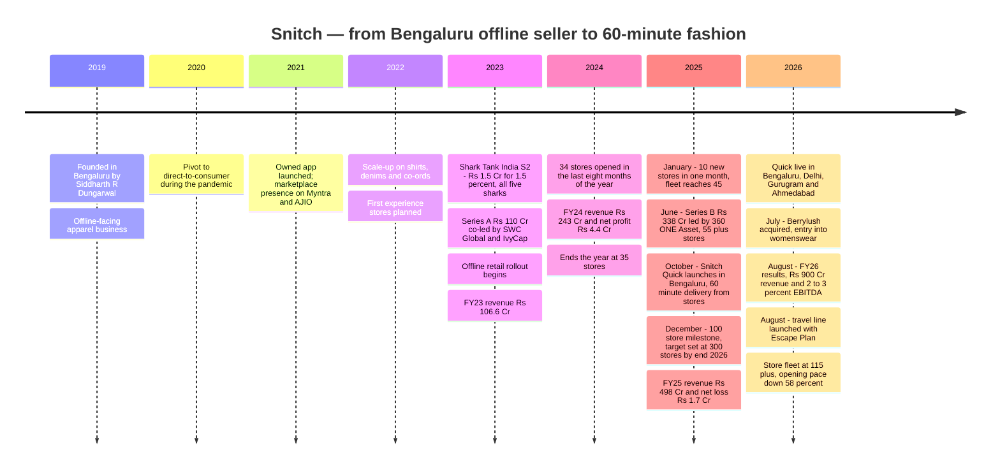
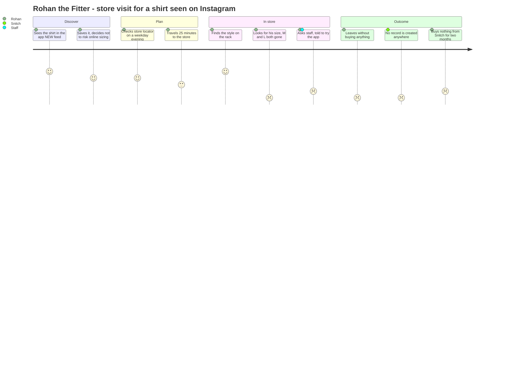
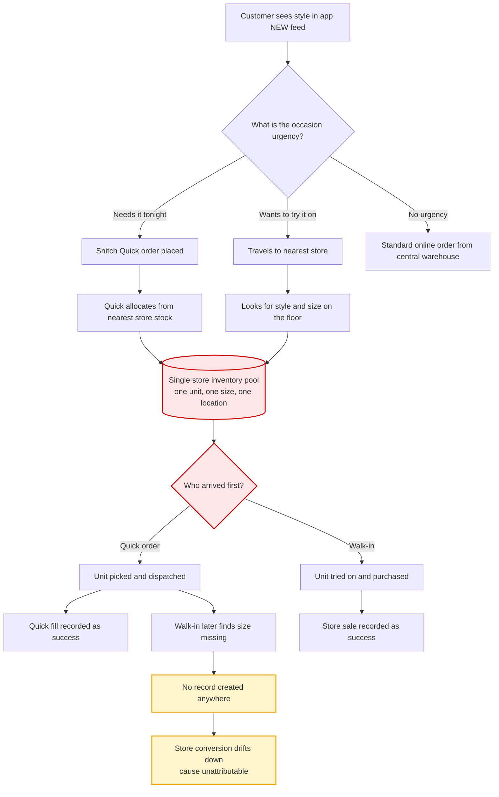
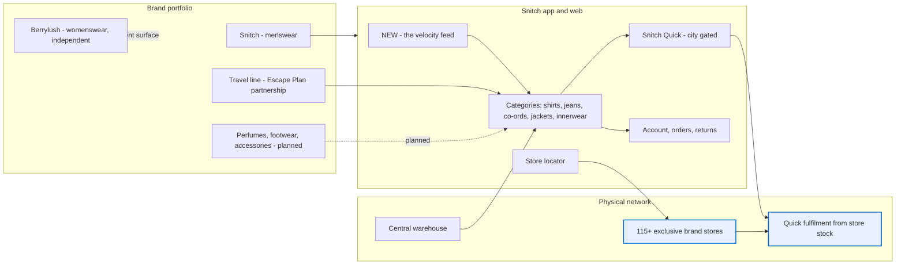
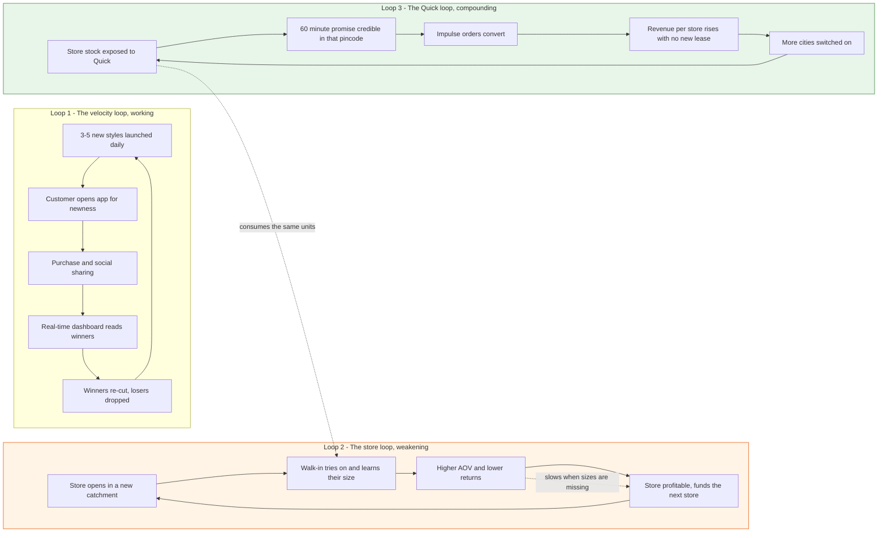
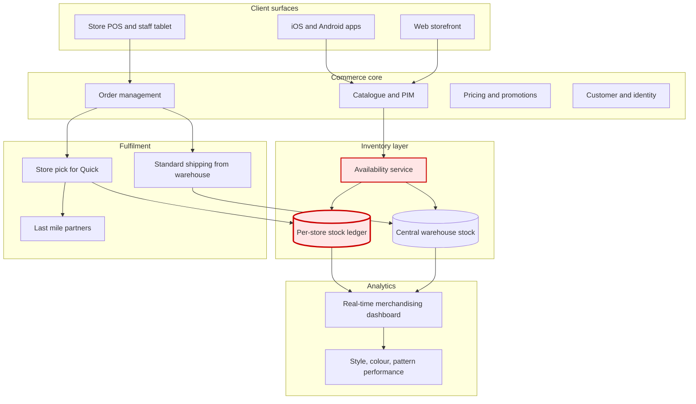
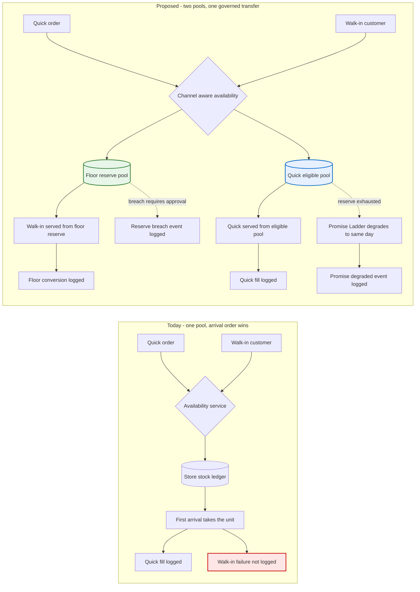
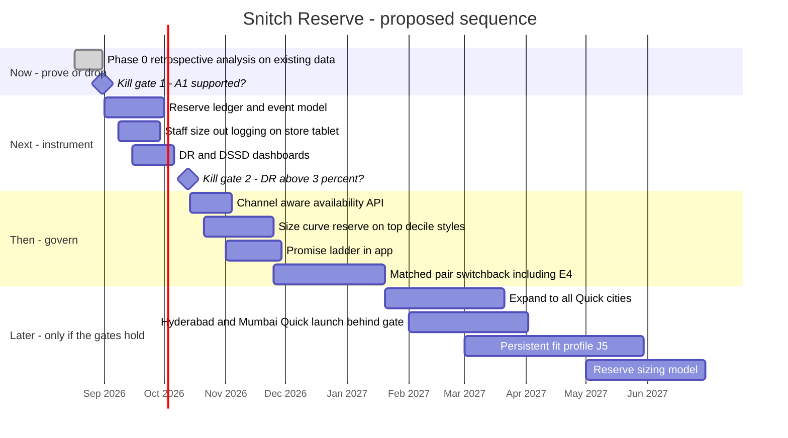

# Snitch — The Chain That Stopped Building Stores

### Day 48 of 90 · Product Management Case Study Series

> **The thesis of this case study:** In June 2025 Snitch raised **₹338 Cr** explicitly to build a store chain, and set a target of **300 stores by the end of 2026**. In October 2025 it launched **Snitch Quick**, a 60-minute apparel delivery service fulfilled *out of those same stores*. In the eight months since — the first clean measurement window after Quick went live — Snitch's store-opening pace has fallen **58%**, from 4.7 stores a month to 2.0, while the 300-store target was never publicly retracted. The company has already made the decision its stated plan denies: **the store stopped being a destination and became a node.** But Snitch still runs one inventory pool for two jobs whose requirements point in opposite directions. A shop floor is rewarded for breadth and newness — Snitch launches **3–5 new styles a day**. A 60-minute promise is rewarded for depth and availability. When both draw on the same rail, the Quick order wins every contest silently, because it removes the unit *before* the walk-in customer ever sees the size. Until floor stock and Quick stock are governed as two pools with two clocks and two metrics, every incremental point of Quick fill rate is paid for out of walk-in conversion — and on a business running a **2–3% EBITDA margin**, nobody is measuring the bill.

---

## 2. Repository Metadata

| Field | Value |
|---|---|
| **Case study** | Day 48 of 90 |
| **Product** | Snitch — D2C men's fast fashion; app, web, 115+ exclusive brand stores, and Snitch Quick (60-minute delivery) |
| **Company** | Snitch Apparels Private Limited (CIN U18109KA2022PTC163969), Bengaluru, Karnataka |
| **Domain** | Retail & Commerce — D2C fast fashion, omnichannel apparel, quick commerce |
| **Primary competitors** | Rare Rabbit (House of Rare), The Souled Store, Bewakoof, Zara and H&M India, Myntra M-Now, Slikk, NEWME Zip, Ajio Rush |
| **Analysis type** | Research-led product teardown + operating-disclosure reconstruction + a systems proposal |
| **Proposed system** | **Snitch Reserve** — floor stock and Quick stock governed as two pools with two clocks |
| **Author** | Gaurav Singh |
| **Date of analysis** | 13 August 2026 |
| **Research boundary** | Public sources only. No Snitch employee, store, order record or internal document was consulted. No authenticated session was used. No store was visited for this analysis. |
| **Latest Snitch financials available** | FY26 (year ended 31 March 2026), **reported to trade press and described as unaudited at the EBITDA line**. FY25 (₹498 Cr revenue, ₹1.7 Cr net loss) is the latest year with a reported bottom line. |

---

## 3. Badges


---

## 4. Table of Contents

<details>
<summary><b>Expand the full 65-section contents</b></summary>

| # | Section | # | Section |
|---|---|---|---|
| 1 | [Cover](#snitch--the-chain-that-stopped-building-stores) | 34 | [HEART](#34-heart-framework) |
| 2 | [Repository Metadata](#2-repository-metadata) | 35 | [Growth Strategy](#35-growth-strategy) |
| 3 | [Badges](#3-badges) | 36 | [Growth Loops](#36-growth-loops) |
| 4 | [Table of Contents](#4-table-of-contents) | 37 | [Network Effects](#37-network-effects) |
| 5 | [Executive Summary](#5-executive-summary) | 38 | [Product Strategy](#38-product-strategy) |
| 6 | [Product Overview](#6-product-overview) | 39 | [Monetization](#39-monetization) |
| 7 | [Company Background](#7-company-background) | 40 | [Trust & Safety](#40-trust--safety) |
| 8 | [Product Timeline](#8-product-timeline) | 41 | [Technical Architecture](#41-technical-architecture) |
| 9 | [Vision & Mission](#9-vision--mission) | 42 | [Data Flow](#42-data-flow) |
| 10 | [Problem Statement](#10-problem-statement) | 43 | [API Ecosystem](#43-api-ecosystem) |
| 11 | [Market Research](#11-market-research) | 44 | [Privacy & Security](#44-privacy--security) |
| 12 | [Industry Analysis](#12-industry-analysis) | 45 | [Pain Points](#45-pain-points) |
| 13 | [TAM / SAM / SOM](#13-tam--sam--som) | 46 | [Opportunity Mapping](#46-opportunity-mapping) |
| 14 | [Competitor Analysis](#14-competitor-analysis) | 47 | [RICE Prioritisation](#47-rice-prioritisation) |
| 15 | [SWOT](#15-swot) | 48 | [MoSCoW](#48-moscow) |
| 16 | [Porter's Five Forces](#16-porters-five-forces) | 49 | [Kano](#49-kano-analysis) |
| 17 | [Business Model Canvas](#17-business-model-canvas) | 50 | [Feature Proposal](#50-feature-proposal--snitch-reserve) |
| 18 | [Revenue Model](#18-revenue-model) | 51 | [PRD](#51-prd--snitch-reserve-v1) |
| 19 | [Target Users](#19-target-users) | 52 | [Wireframes](#52-wireframes) |
| 20 | [Personas](#20-personas) | 53 | [Rollout Plan](#53-rollout-plan) |
| 21 | [JTBD](#21-jobs-to-be-done) | 54 | [A/B Testing](#54-ab-testing) |
| 22 | [User Journey](#22-user-journey) | 55 | [KPI Dashboard](#55-kpi-dashboard) |
| 23 | [User Flow](#23-user-flow) | 56 | [Product Roadmap](#56-product-roadmap) |
| 24 | [Information Architecture](#24-information-architecture) | 57 | [Risks & Mitigation](#57-risks--mitigation) |
| 25 | [UX Audit](#25-ux-audit) | 58 | [Future Vision](#58-future-vision) |
| 26 | [UI Audit](#26-ui-audit) | 59 | [PM Lessons](#59-pm-lessons) |
| 27 | [Accessibility](#27-accessibility) | 60 | [PM Interview Questions](#60-pm-interview-questions) |
| 28 | [Feature Breakdown](#28-feature-breakdown) | 61 | [References](#61-references) |
| 29 | [AI Capabilities](#29-ai-capabilities) | 62 | [About the Author](#62-about-the-author) |
| 30 | [Product Metrics](#30-product-metrics) | 63 | [License](#63-license) |
| 31 | [North Star Metric](#31-north-star-metric) | 64 | [Self Review](#64-self-review) |
| 32 | [Product Analytics](#32-product-analytics) | 65 | [Appendix](#65-appendix) |
| 33 | [AARRR](#33-aarrr-framework) | | |

</details>

---

## 5. Executive Summary

Snitch is a seven-year-old Bengaluru men's fashion brand that grew from **₹106.6 Cr** of operating revenue in FY23 to **₹900 Cr** in FY26 — a compound run that included a **128%** FY24, a **105%** FY25 and an **80%** FY26. It sells fast fashion at a genuinely fast cadence: the founder has described launching **3–5 new styles every day**, against an industry that plans in seasons. It has 115+ exclusive brand stores, a 60-minute delivery service, a women's-wear brand it bought in July 2026, and a travel-goods line it licensed in August 2026.

It also runs a **2–3% EBITDA margin** — described as unaudited — on that ₹900 Cr. In FY25 it made a **net loss of ₹1.7 Cr**. In FY24, at a third of the size, it made a **net profit of ₹4.4 Cr**. Snitch has been trading profit for scale for two years, and the FY26 "profitability" headline is measured at EBITDA while the FY24 profit was measured at PAT. They are not the same claim.

**The observation this case study is built on is a pace, not a level.**

| Date | Stores | Source class |
|---|---|---|
| Dec 2024 | 35 | Trade press |
| 3 Jan 2025 | 45 (after 10 January openings) | Trade press |
| 2 Jun 2025 | 55+ (Series B announcement) | Funding disclosure |
| 23 Dec 2025 | 100 (milestone announcement) | Company announcement |
| 12 Aug 2026 | 115+ (FY26 results reporting) | Trade press |

From January to December 2025, Snitch opened **4.7 stores a month**. From December 2025 to August 2026, it opened **2.0 a month** — a **58% deceleration** (§13.5). The stated target, repeated at the 100-store milestone, is **300 stores by the end of 2026**. Reaching it from 115 would require **≈40 stores a month for the remaining four and a half months — roughly 20× the current pace.** That target is arithmetically finished, and the only interesting question is *what replaced it*.

**Snitch Quick replaced it.** Launched October 2025 as a Bengaluru pilot and now live in four cities, Quick promises apparel in under 60 minutes and is fulfilled **from Snitch's own stores, which act as hyperlocal fulfilment hubs**. Snitch reports Quick at roughly **10% of online revenue**. Online is 60% of ₹900 Cr, so Quick did **≈ ₹54 Cr** in FY26 — in about six months of operation, from four cities. Annualised, that is **≈ ₹108 Cr**, which at Snitch's own FY26 per-store average of **≈ ₹4.7 Cr** (§13.6) is the revenue of roughly **23 stores, generated without signing 23 leases.** A company that has just discovered a channel with that capital efficiency does not keep opening stores at five a month, and Snitch did not.

**Six independent lines of analysis converge on the same gap.** They are developed separately in §45 and §46 and summarised here:

| # | Line | Source class | Where |
|---|---|---|---|
| 1 | Store-opening pace fell 58% in the eight months after Quick went live, against an unretracted 300-store target | Dated operating disclosures | §13.5 |
| 2 | Revenue per average store fell from **≈ ₹7.5–8.5 Cr** (FY25) to **≈ ₹4.7 Cr** (FY26) — the fleet is adding stores that earn less | Derived arithmetic | §13.6 |
| 3 | Quick is producing ~23 stores' worth of annualised revenue from four cities with no incremental lease | Derived arithmetic | §13.7 |
| 4 | Snitch itself describes stores as **hyperlocal fulfilment hubs** with **"curated assortments tailored to local style sensibilities"** — the assortment decision has already moved from brand-wide newness to local demand | Company statement | §28.4 |
| 5 | Every FY26–27 growth move avoids owning new retail floor space: Berrylush **acquired** (Jul 2026), travel goods **licensed** via Escape Plan (Aug 2026), West Asia bricks-and-mortar **deferred** | Corporate actions | §38.3 |
| 6 | The whole category has converged on 30–60 minutes, and analysts already locate the advantage in **inventory placement**, not speed | Category precedent | §12.4 |

**The gap they converge on:** Snitch has rebuilt its store fleet into a fulfilment network without rebuilding the thing that governs it. One inventory pool per store now serves two jobs with opposite requirements — a shop floor that converts on **breadth, newness and the ability to try a size on**, and a 60-minute promise that converts on **depth and availability of exactly the size ordered**. When both draw from the same rail, the Quick order wins by default, because it consumes the unit before the walk-in customer arrives. Apparel demand is size-curve shaped: the units that go first are the centre of the curve (M and L), which is precisely the stock that walk-in conversion depends on. The loss is invisible in every system Snitch is likely to have, because **a walk-in customer who does not find their size does not generate a record.**

**The proposal (§50): Snitch Reserve** — stop running one pool.

1. **Size-Curve Reserve** — a per-store, per-style, per-size floor reserve, sized from that store's own dependence on that size, and **invisible to Quick's availability API**;
2. **Promise Ladder** — when a Quick order can only be served by breaching a reserve, the promise degrades gracefully (60-minute → same-day from the city hub → next-day) instead of either breaching the floor silently or showing out-of-stock;
3. **Reserve Ledger** — every unit Quick takes against a reserve is logged with the floor demand it displaced, so the trade is **priced instead of invisible**.

**North Star: Dual-Served Store-Days (DSSD)** — store-days on which a store cleared *both* its walk-in conversion floor *and* its Quick fill-rate floor (§31.1).
**Guardrail counter-metric: Displacement Rate (DR)** — the share of in-store size-requests that failed on a size Quick had consumed from that store in the previous 24 hours (§31.2). *Nothing ships that raises Quick fill rate while raising DR.* This constraint is carried through §48, §49, §51, §54, §55 and §57 rather than mentioned once.

**The number that carries the argument (§13.8).** At a **2–3% EBITDA margin**, Snitch's FY26 EBITDA midpoint is **≈ ₹22.5 Cr**. Every **₹1 Cr** of margin lost to stock sitting in the wrong pool — as unsold floor depth, as markdown on a style whose size curve broke, or as a walk-in customer who left empty-handed — is **4.4% of the company's entire annual EBITDA**. Snitch's growth rate can absorb a merchandising error. Its margin cannot absorb a structural one.

**What I could not verify.** Snitch has not disclosed AOV, return rate, repeat rate at current scale, per-store revenue, Quick's absolute revenue, its inventory architecture, or whether any floor-reserve logic already exists. The load-bearing unverified assumption — that Quick consumption **materially displaces** walk-in purchases rather than being purely incremental demand — is declared as **A1** in [ASSUMPTIONS.md](./ASSUMPTIONS.md), and killing it cheaply is the entire job of §53 Phase 0.

---

## 6. Product Overview

Snitch is a men's fast-fashion brand whose product surface is an app and a shop floor, and whose actual product is **speed of newness**. Four layers sit on top of one another, and — as with most fast-growing retail — each was added because the layer beneath it hit a ceiling.

| Layer | What it is | What it was added to fix |
|---|---|---|
| **Catalogue velocity** | Shirts, jeans, co-ords, jackets, hoodies, sweaters, innerwear; the founder has described **3–5 new styles launched daily**, versus an industry that "takes months to launch a product" | Nothing — this is the origin product. Newness *is* the value proposition |
| **Owned digital** | Web store plus iOS/Android apps; an in-house dashboard tracking real-time product performance, inventory and consumer behaviour by colour, style and pattern | Marketplace dependence (Myntra, AJIO) caps margin and hides the customer |
| **Physical retail** | 115+ exclusive brand stores across metros and Tier II/III cities, from 35 stores at end-2024 | Online converts poorly on fit; the company reports offline entry lifted AOV and reduced returns |
| **Quick commerce** | **Snitch Quick**, launched October 2025 — under-60-minute delivery in Bengaluru, Delhi, Gurugram and Ahmedabad, **fulfilled from the stores**, with city-curated assortments | Even next-day delivery loses the impulse purchase that fast fashion runs on |

Read downward, that table is a growth story. Read upward, it is an escalating attempt to shorten the gap between *wanting* a garment and *having* it — from months (seasonal retail) to days (D2C shipping) to an afternoon (store) to an hour (Quick).

The fourth row is where the trouble starts, and the reason is in its own description. Rows three and four are **the same physical inventory**. Snitch did not build dark stores for Quick; it pointed Quick at the shop floor. That is a genuinely clever capital decision — it is why Quick reached ~₹54 Cr of FY26 revenue without a new asset class — and it is also an unresolved product decision, because the two rows want opposite things from the same rack.

**Adjacent categories now sit alongside all four rows**, and their structure is telling:

| Move | Date | Structure | What Snitch does *not* take on |
|---|---|---|---|
| **Berrylush** (women's wear) | 28 Jul 2026 | 100% acquisition; brand runs independently; cofounder stays | Building a women's catalogue, brand and customer base from zero |
| **Escape Plan** (luggage, backpacks, travel accessories) | 10–11 Aug 2026 | Partnership with a travel-category platform that has done the same with HRX and Rare Rabbit | Hard-goods design, tooling and supply chain |
| **Perfumes, footwear, accessories** | In development, FY27 | Stated category expansion | — |
| **West Asia bricks-and-mortar** | Deferred | Postponed, cited geopolitical factors | New store leases in an unfamiliar market |

Three of the four avoid adding owned retail floor space. That is not a coincidence; it is §46 line 5.

---

## 7. Company Background

Snitch was founded in **January 2019** in Bengaluru by **Siddharth R Dungarwal**, initially as an offline-facing apparel business, and pivoted to direct-to-consumer during the pandemic. The company bootstrapped through its first years. The operating entity on record is **Snitch Apparels Private Limited** (CIN U18109KA2022PTC163969), incorporated in Karnataka in 2022 — three years after the brand's stated founding, which is a common pattern when a proprietorship or earlier vehicle is restructured ahead of institutional funding.

**The Shark Tank inflection.** In **January 2023**, on *Shark Tank India* Season 2, Snitch took **₹1.5 Cr for 1.5% equity** — a deal in which **all five sharks** on the panel participated, at a ₹100 Cr implied valuation. Monthly revenue disclosed at the pitch was **₹11 Cr**. The founder's stated reasoning was "the value these sharks would get rather than chasing valuation," which reads as a distribution and credibility trade rather than a capital one, and it worked: the brand's national awareness step-changed from that appearance.

**Funding history** (public reporting; see the conflict noted in Appendix A):

| Round | Amount | Date | Lead / notable investors |
|---|---|---|---|
| *Shark Tank India* S2 | ₹1.5 Cr for 1.5% | Jan 2023 | All five sharks (Anupam Mittal, Aman Gupta, Namita Thapar, Vineeta Singh, Peyush Bansal / Amit Jain panel) |
| Series A | ₹110 Cr (~$13.19 Mn) | 2023 | SWC Global, IvyCap Ventures (co-led) |
| Series B | ₹338.4 Cr (~$39.6 Mn) | Board approval 27 May 2025; announced 2 Jun 2025 | **360 ONE Asset** (lead), Ravi Modi Family Office (Manyavar), IvyCap Ventures, SWC Global, angels |
| **Total** | **≈ $53 Mn** | | As reported at FY26 results, Aug 2026 |

**Reported financial history:**

| Year | Operating revenue | Bottom line | Growth | Note |
|---|---|---|---|---|
| FY23 | ₹106.6 Cr | Not reported here | — | |
| FY24 | **₹243 Cr** | **Net profit ₹4.4 Cr** (1.8% net margin) | +128% | Profitable at scale-up |
| FY25 | **₹498 Cr** | **Net loss ₹1.7 Cr** (−0.3%) | +105% | Also reported as ₹520 Cr unaudited in Jun 2025 — see Appendix A |
| FY26 | **₹900 Cr** | **EBITDA ₹18–27 Cr (2–3%), described as unaudited**; PAT not disclosed | +80% | 60% online / 40% offline |
| FY27 | **₹1,400 Cr target** | — | +56% implied | Company guidance |

Two things in that table matter more than the growth rate.

**First, the profitability claim moved measurement lines.** FY24's ₹4.4 Cr was a net profit. FY26's "profitability" is an EBITDA band, unaudited, on a business that has since added 80 stores' worth of lease and depreciation obligations. Below EBITDA sits exactly the cost structure that a store chain generates. The FY26 headline may well be true and the FY26 PAT may well be positive — but the two claims are not equivalent and only one of them has been made.

**Second, the FY26 target was missed.** At the Series B in June 2025, Snitch stated a **₹1,000 Cr FY26 top line** and an intention to prepare for an IPO once the bottom line reached ₹100 Cr. FY26 landed at ₹900 Cr — a **10% miss** — and the FY27 guidance of ₹1,400 Cr implies a **planned deceleration** from 80% to 56%. A company planning to slow down is a company that has decided where it will *not* spend, and §13.5 shows where.

---

## 8. Product Timeline



**What the timeline shows that a list of milestones does not.** The three densest months in Snitch's history are October 2025 (Quick launches), December 2025 (100th store, 300-store target announced) and August 2026 (FY26 results, travel line). Between the second and the third, the company opened **fifteen stores**. The 300-store target was announced in the same month, and by the same company, that had already launched the thing which made 300 stores unnecessary.

---

## 9. Vision & Mission

Snitch has not published a formal vision or mission statement of the kind a listed company files. What it has published is a consistent operating claim, repeated across interviews and press releases, that can be reconstructed:

| Layer | Reconstructed from | Statement |
|---|---|---|
| **Positioning** | Site metadata and press | "India's leading online destination for men's fashion" — premium shirts, jeans and more |
| **Operating claim** | Founder interview | *"While brands take months to launch a product, we do it in days"* |
| **Category ambition** | FY26 results and corporate actions | From menswear brand to a **lifestyle house**: womenswear (Berrylush), travel, perfumes, footwear, accessories |
| **Scale ambition** | Series B and milestone announcements | ₹1,400 Cr FY27; IPO preparation once PAT reaches ₹100 Cr; 300 stores (stated Dec 2025) |
| **Stated ambition for the acquired brand** | Founder, Jul 2026 | Build Berrylush into a **₹1,000 Cr women's fashion business** |

**The tension inside the reconstruction.** The operating claim ("we do it in days") is a *velocity* promise. The scale ambition is a *presence* promise. Velocity is served by breadth — many styles, shallow depth, fast rotation, tolerated markdown. Presence is served by depth — fewer styles, deep size curves, reliable availability. These are not contradictory at a company level; Zara has run both for decades. They are contradictory when they are asked of **the same 115 inventory locations, at the same time, with one stock pool and one set of metrics.** That is the specific form the tension takes at Snitch, and §45 is where it surfaces as user-visible pain.

---

## 10. Problem Statement

**Framed from the three parties who experience it.**

**For the walk-in customer.** She — or in Snitch's case overwhelmingly he — comes into a Snitch store because a store solves the one thing apparel e-commerce cannot: *does this fit me, today.* Fast fashion makes that visit high-stakes, because the specific style he came for may not exist in six weeks. The failure mode is not "the store was out of stock"; it is **"the store had the shirt but not in my size,"** which is worse, because it converts an intent-rich visit into a wasted trip and a mild grievance against the brand. He rarely tells anyone. He simply buys less often.

**For the Quick customer.** He ordered at 8:40 pm because Snitch promised the shirt by 9:40 pm. The value of that promise is entirely in its reliability; a 60-minute promise that fails is worse than a next-day promise that holds, because he has already made a plan around it. His failure mode is a cancellation, a substitution, or an out-of-stock screen on the exact style the app showed him ninety seconds earlier.

**For Snitch.** It has one physical unit of one size of one style in one store, and two customers with a legitimate claim on it. Today the tie is broken by **arrival order** — whoever's transaction hits the inventory system first. Arrival order is not a strategy. It is the absence of one. And because the walk-in loss produces no record, the company's data will show Quick performing beautifully and store conversion drifting down, with no line connecting them.

**Why this is a product problem and not an operations problem.** An operations answer is "hold more stock." That answer is unavailable to Snitch for three independent reasons: it launches 3–5 new styles a day, so depth is spread across an enormous live SKU count; it runs a 2–3% EBITDA margin, so working capital tied up in depth is expensive; and it sells fashion, where unsold depth does not wait for next season, it marks down. The only remaining lever is not *more* inventory but **better-governed** inventory — deciding, per store, per style, per size, which pool a unit belongs to and who is allowed to take it. That is a product decision with a UI, an API, a metric and a trade-off. It is §50.

---
## 11. Market Research

### 11.1 What Snitch's own numbers say about its market

The most reliable market research available on Indian men's fast fashion is Snitch's own revenue curve, because it is the one series that has been reported repeatedly and consistently:

| Year | Revenue | YoY | What it implies about demand |
|---|---|---|---|
| FY23 | ₹106.6 Cr | — | A single-channel D2C brand |
| FY24 | ₹243 Cr | **+128%** | Post-*Shark Tank* awareness converting; offline rollout begins |
| FY25 | ₹498 Cr | **+105%** | Store fleet 35 → ~48; offline reported at 40–45% of revenue |
| FY26 | ₹900 Cr | **+80%** | 115+ stores; Quick adds a channel |
| FY27 (target) | ₹1,400 Cr | **+56%** | Guided deceleration |

Three consecutive years of doubling, decelerating smoothly, is the signature of a brand still filling unmet demand rather than taking share in a saturated one. The deceleration to a *planned* 56% is the more interesting number: it is the first year in which Snitch's own plan assumes the easy demand is largely captured.

### 11.2 The demand Snitch actually serves

Snitch's early public description of its customer — from the founder's 2022-era interviews — was a **repeat rate of 48%**, presence across **20 states**, and strength in **Tier II and Tier III cities** alongside Hyderabad, Mumbai, Bengaluru and Delhi. Best-performing categories were **shirts, denims and co-ords**. Those figures are old and the company has not refreshed them publicly at ₹900 Cr scale, so they are used here only as direction, not as level (Evidence grade 🟠 Low for currency, 🟢 High for provenance).

What the store rollout tells us is more current. The 100-store fleet announced in December 2025 spanned **Bangalore, Delhi NCR, Mumbai, Hyderabad, Chennai, Pune, Ahmedabad, Surat, Jaipur, Chandigarh and Coimbatore** — a list that is metro-led but has Surat, Jaipur, Chandigarh and Coimbatore in it by store number 100. The brand's stated next phase was Tier II. Snitch is not a metro-premium brand; it is a national mid-market brand with metro-first store placement.

### 11.3 The size question, and why the store is the answer to it

Apparel's defining commercial property is that **the product has a size**, and the customer does not reliably know theirs across brands. This single fact drives most of what is distinctive about fashion retail economics: the return rate, the try-before-buy behaviour, the size-curve shape of inventory, and the reason physical stores have survived every prediction of their death.

Snitch has stated this in its own operating experience: on entering physical retail it observed **"a significant boost in average order value and reduced returns."** That is the size problem being solved by the store, expressed as two P&L lines.

The strategic consequence is under-appreciated. If the store's economic function is *size resolution*, then the store's inventory has a job that is different in kind from a warehouse's: it must hold **the middle of the size curve, in the styles a local customer is likely to want to try, at the hour he is likely to walk in.** Depth in the middle sizes is not a nice-to-have; it is the entire service.

### 11.4 What is not publicly known

| Question | Status |
|---|---|
| AOV | Not disclosed at current scale |
| Return rate (online, offline, Quick) | Not disclosed |
| Repeat rate at ₹900 Cr scale | Not disclosed (48% figure is from a much smaller company) |
| Per-store revenue or footfall | Not disclosed |
| Quick's absolute revenue | Not disclosed (only "~10% of online") |
| Live SKU count / styles in season | Not disclosed |
| Inventory architecture (pooled vs reserved) | **Not disclosed — this is the gap the case study is built on** |
| Berrylush revenue and deal size | Not disclosed |

Snitch is a private company and has no obligation to publish any of this. The analysis below is therefore built on **dated operating disclosures and arithmetic**, with every derivation's method shown so it can be checked or rejected.

---

## 12. Industry Analysis

### 12.1 The structural shift: from season to signal

Traditional apparel retail plans two to four seasons a year, commits inventory months ahead, and manages the error with end-of-season markdown. Fast fashion compresses that cycle. Snitch's version compresses it further than most — **3–5 new styles a day** means the company is effectively running a continuous, high-frequency experiment in which the market itself does the merchandising selection. The in-house dashboard tracking real-time performance by colour, style and pattern is the instrument that makes the experiment legible.

The trade-off is well understood in the industry and worth stating plainly: **high style-velocity systematically reduces per-style depth.** With a fixed working-capital envelope, every additional live style is inventory not spent on depth in an existing one. This is fine — optimal, even — for a pure e-commerce model with central inventory, because a single national pool serves all demand. It becomes expensive the moment inventory is **distributed across 115 locations**, because depth must now be replicated per location, and shallow depth per store is what produces broken size curves.

### 12.2 The quick-commerce turn in Indian fashion

Fashion quick commerce went from novelty to table stakes inside about eighteen months:

| Player | Promise | Model | Notes |
|---|---|---|---|
| **Myntra M-Now** | 30 minutes | Flipkart-owned; dark stores | Reported at ~10% of orders with 20%+ customer penetration in active locations |
| **Ajio Rush** | Under 4 hours | Reliance Retail; dark stores + existing retail network | |
| **Slikk** | 30 minutes | Bengaluru startup | Raised $10 Mn Series A (Nexus, Lightspeed), May 2025 |
| **Blip** | 30 minutes | Launched Oct 2024 | |
| **NEWME Zip** | Under 60 minutes (Delhi) | 1,500+ styles; sub-30-min Bengaluru trials | Reported Delhi quick orders at ~20% of daily orders |
| **KNOT** | Quick fashion | Mumbai; raised $8 Mn+ | |
| **ZILO** | Quick fashion | Founded by ex-Myntra executives; integrated into Fynd's retail-tech ecosystem | |
| **Snitch Quick** | **Under 60 minutes** | **Own stores as hyperlocal fulfilment hubs** | The structural difference — no separate dark-store fleet |

**Snitch's model is the odd one out, and that is its advantage.** Everyone else is paying for a second inventory location class. Snitch pointed the service at an asset it had already financed. The capital efficiency of that decision is exactly what §13.7 quantifies, and it is why the store-opening decision changed.

It is also why Snitch — alone among these players — has a conflict to manage. A dark store has one customer. A Snitch store has two.

### 12.3 The comparable set is no longer just apparel brands

Snitch competes on three axes simultaneously, and the competitor set is different on each:

- **On product and brand** — Rare Rabbit, The Souled Store, Bewakoof, Zara, H&M
- **On speed** — Myntra M-Now, Slikk, NEWME Zip, Ajio Rush
- **On store presence** — every mall-based apparel chain in India, for the same footfall

The company that wins is not the one that is best on any axis. It is the one whose **single asset base performs on more than one axis at once** — which is precisely the design problem the store fleet now poses.

### 12.4 What the category has already learned

The most useful analyst observation in the public record on fashion quick commerce is that as delivery speed converges, competitive advantage shifts to **"hyper-local infrastructure and efficient inventory placement" rather than delivery speed alone**, with speed becoming "a baseline expectation."

That sentence is the whole case study in someone else's words. Snitch has the hyper-local infrastructure — 115 of them. The open question is whether it has the *inventory placement* discipline to run them for two customers at once. As of the public record, there is no evidence either way, which is why §53 Phase 0 is designed to find out cheaply before anything is built.

---

## 13. TAM / SAM / SOM

*Framework selection rationale: I am not using a purchased top-down market-sizing figure. Indian apparel TAM estimates vary by more than 2× across published sources, are rarely reconcilable in definition, and cannot be verified from a public source in the way a filed revenue number can. Importing one would give this section false precision and would violate the research rules this portfolio runs on. Instead I size the opportunity **bottom-up from Snitch's own dated disclosures**, and I use this section to do the arithmetic the rest of the case study depends on. Everything below is either a published figure or an operation on published figures, with the operation shown.*

### 13.1 The addressable question, restated

The useful sizing question for this case study is not "how large is Indian menswear." It is: **how much revenue is reachable from the 115 stores Snitch already owns, and what is it worth to govern them better?** That is a question the disclosed numbers can actually answer.

### 13.2 Serviceable base — what the fleet is

| Input | Value | Source class |
|---|---|---|
| FY26 revenue | ₹900 Cr | Reported (unaudited at EBITDA line) |
| Online share | 60% → **₹540 Cr** | Reported |
| Offline share | 40% → **₹360 Cr** | Reported |
| Snitch Quick share of online | ~10% → **≈ ₹54 Cr** | Reported ("~10% of online revenue") |
| Store fleet (Aug 2026) | 115+ | Reported |
| Quick cities | 4 (Bengaluru, Delhi, Gurugram, Ahmedabad) | Reported |

### 13.3 The physically-fulfilled base

The number that matters for this analysis is **revenue that physically leaves a Snitch store**: offline (₹360 Cr) plus Quick (≈₹54 Cr) = **≈ ₹414 Cr, or 46% of FY26 revenue**, all of it drawn from the same 115 inventory locations.

Just under half of Snitch's revenue now depends on a unit of stock being in the right store, in the right size, at the right hour. That share is rising on both sides — offline grew ~75% and Quick is expanding to Hyderabad and Mumbai.

### 13.4 Method note for §13.5–§13.8

Four derivations follow. Each states its inputs, its operation, and what would break it. They are labelled **D1–D4** and repeated in [ASSUMPTIONS.md](./ASSUMPTIONS.md) so that no derived number appears anywhere in this document without its method attached.

### 13.5 D1 — The store-opening pace, and the death of the 300-store target

**Inputs** (all dated public disclosures):

| Date | Stores |
|---|---|
| 3 Jan 2025 | 45 |
| 23 Dec 2025 | 100 |
| 12 Aug 2026 | 115 |

**Operation:**

- 3 Jan 2025 → 23 Dec 2025: 55 stores over 11.6 months = **4.73 stores/month**
- 23 Dec 2025 → 12 Aug 2026: 15 stores over 7.6 months = **1.97 stores/month**
- **Deceleration: 58%**
- To reach 300 by 31 Dec 2026 from 115 on 12 Aug 2026: 185 stores in 4.6 months = **39.9 stores/month**, or **20.3× the current pace**

**What would break it.** The 115 figure is reported as "115+" and may understate the fleet; if the true August figure were 130, the pace would be 3.9/month and the deceleration only 17%. The 300 target might also refer to a later horizon than the calendar year, though it was reported against "end of 2026." Both risks are logged in Appendix A. Note that even at the *most* favourable reading, the required pace to hit 300 remains far above anything Snitch has ever achieved — its record year was 55 stores.

**Evidence grade: 🟢 High** on the dated store counts; **🟡 Medium** on the interpretation, because a company can accelerate store openings faster than it can accelerate almost anything else, and Q3 is when apparel retail signs leases.

### 13.6 D2 — Revenue per average store is falling

**Inputs:** FY25 revenue ₹498 Cr with offline reported at 40–45%; FY26 revenue ₹900 Cr with offline at 40%. Store counts as in D1, with FY-boundary counts interpolated between dated disclosures (~5 at 1 Apr 2024; ~48 at 31 Mar 2025; ~106 at 31 Mar 2026).

**Operation** — offline revenue divided by the *average* of opening and closing store count, which approximates a fleet that grows through the year:

| Year | Offline revenue | Avg stores | **Revenue per average store** |
|---|---|---|---|
| FY25 | ₹199–224 Cr | ~26.5 | **≈ ₹7.5–8.5 Cr** |
| FY26 | ₹360 Cr | ~77 | **≈ ₹4.7 Cr** |

**Decline: roughly 38–45%.**

**What would break it.** The average-store method assumes openings are spread evenly through the year; they are not — Snitch opened 10 stores in January 2025 alone and appears to have pushed hard to hit 100 by December 2025, which back-loads FY26 and *understates* FY26 per-store revenue. The FY25 offline share is a range, not a point. New stores also ramp, so a fleet that is one-third new will always show lower averages than a mature one. **This derivation therefore proves less than it appears to.** It does not prove stores are getting worse. It proves that **the marginal store is materially less productive than the fleet average was**, which is the only thing the argument needs: the case for the 116th store is weaker than the case for the 46th was, and the company's own opening pace says it agrees.

**Evidence grade: 🟡 Medium.**

### 13.7 D3 — What Snitch Quick is actually worth

**Inputs:** FY26 online revenue ₹540 Cr; Quick at ~10% of online; Quick launched October 2025 (Bengaluru pilot), reaching four cities.

**Operation:**

- Quick FY26 revenue ≈ **₹54 Cr**
- Operating for roughly **6 of FY26's 12 months**, and for part of that in one city only
- Implied annualised run-rate ≈ **₹108 Cr**, and the true exit run-rate is likely higher
- At FY26's per-average-store figure of ₹4.7 Cr (D2), ₹108 Cr ≈ **the annual revenue of 23 stores**
- Incremental leases signed to produce it: **zero**

**What would break it.** The decisive unknown is **incrementality**. If most Quick orders are standard online orders that would have happened anyway, simply delivered faster, then Quick is a cost centre dressed as a channel and this derivation overstates its value badly. If Quick is genuinely new impulse demand, it understates it. Snitch has published nothing on this, and it is the second half of assumption **A1**.

**Evidence grade: 🟡 Medium** on the arithmetic, **🟠 Low** on the incrementality reading.

### 13.8 D4 — What a margin point is worth, and why governance beats growth here

**Inputs:** FY26 revenue ₹900 Cr; EBITDA margin 2–3%.

**Operation:** FY26 EBITDA = ₹18–27 Cr, midpoint **₹22.5 Cr**. Therefore:

- **₹1 Cr** of margin lost or gained = **4.4%** of annual EBITDA
- A **1 percentage point** improvement in offline conversion on ₹360 Cr of offline revenue ≈ **₹3.6 Cr** of incremental revenue; at even a 30% contribution margin that is **≈ ₹1.1 Cr**, or **~5% of EBITDA**, from a single point of conversion
- The FY27 target of ₹1,400 Cr, at a 60/40 split, implies **₹560 Cr of offline revenue**. At the FY26 per-average-store figure of ₹4.7 Cr, that requires **≈120 average stores** — a fleet Snitch **already has**

That last line deserves its own sentence. **Snitch's stated FY27 offline target is reachable with the store fleet it has already built.** Nothing in the FY27 plan requires 300 stores. The plan and the pace agree with each other; only the announcement is out of date.

**Evidence grade: 🟢 High** on the arithmetic; the inputs are all reported figures.

### 13.9 SOM — the size of the prize this case study is arguing for

The proposal in §50 does not add revenue by adding assets. It argues for recovering revenue currently lost inside assets Snitch owns.

| Lever | Base | Plausible range | Value |
|---|---|---|---|
| Walk-in conversion recovered from broken size curves | ₹360 Cr offline | +0.5 to +2.0 pp conversion | ₹1.8–7.2 Cr revenue |
| Quick fill-rate improvement from graceful degradation instead of hard OOS | ₹54 Cr Quick | +2 to +5 pp fill | ₹1.1–2.7 Cr revenue |
| Markdown avoided on stock allocated to the wrong pool | Not disclosed | Not estimated | **Deliberately not estimated — Snitch has published no markdown data and I will not invent a base** |

The ranges above are **illustrative sensitivity, not forecast**, and their percentage-point inputs are my constructs (C, in ASSUMPTIONS.md). The honest summary is: on a ₹22.5 Cr EBITDA base, a lever worth ₹3–10 Cr of revenue is material enough to justify the engineering in §51 and small enough that it must be tested before it is built. That is why §53 begins with a phase that can kill it.

---

## 14. Competitor Analysis

Financial figures below are as reported for the most recent year publicly available for each company. **Fiscal years, audit status and revenue definitions differ**, and none of these are like-for-like with Snitch's unaudited FY26. Read the shape, not the ranking.

| Brand | Latest reported revenue | Bottom line | Positioning | Store presence | Quick commerce |
|---|---|---|---|---|---|
| **Snitch** | **₹900 Cr (FY26)** | EBITDA 2–3%, unaudited; FY25 net loss ₹1.7 Cr | Mid-market men's fast fashion; velocity-led | 115+ own stores | **Own — 60 min from stores, 4 cities** |
| **The Souled Store** | ₹492 Cr (FY25) | Profitable in FY24; **FY25 profit down 38%** | Licensed IP, graphics, casualwear | Own stores + marketplaces | Via marketplaces |
| **Rare Rabbit** (House of Rare / Radhamani Textiles) | Radhamani Textiles reported **₹75 Cr profit in FY24** | Profitable | Premium menswear; design-led | Own stores, franchise | Partner-led; travel line via Escape Plan |
| **Bewakoof** | Not reported here | — | Value graphics-led casualwear | Primarily online | Via marketplaces |
| **Zara / H&M India** | Not reported here | — | Global fast fashion, premium mall footprint | Large-format mall stores | Limited |
| **Myntra (M-Now)** | Flipkart-owned | — | Multi-brand platform | Dark stores | **30 min; ~10% of orders in active locations** |
| **Slikk / Blip / NEWME Zip / KNOT** | Venture-funded, pre-scale | Loss-making (typical of stage) | Quick-fashion pure-plays | Dark stores | **30–60 min** |

**Three readings that matter more than the table.**

**1. Snitch is the only brand with both the inventory and the last mile.** The pure-plays have speed but no brand and no owned product margin; the brands have product but rent their speed from marketplaces. Snitch has a vertically integrated 60-minute proposition, which is a genuinely defensible position — *provided the inventory conflict is solved.* It is the same asset doing both jobs, so the whole advantage rests on how well that asset is governed.

**2. The Souled Store is the cautionary comparable.** Nearly identical FY25 revenue (₹492 Cr vs ₹498 Cr), a similar D2C-plus-stores model — and profit **down 38%** in the year it scaled. Growth in Indian D2C apparel has repeatedly been shown to be purchasable; margin has not.

**3. Rare Rabbit is the strategic comparable, and it made the same travel-category move.** Escape Plan has partnered with **both** HRX and Rare Rabbit for travel expansion before Snitch. That tells us something useful about the Escape Plan deal: it is a **repeatable licensing product** offered to lifestyle brands, not a bespoke strategic partnership. Snitch is renting category expansion, which is the capital-light choice — and consistent with a company that has decided to stop buying floor space (§46 line 5).

---

## 15. SWOT

| | Helpful | Harmful |
|---|---|---|
| **Internal** | **Strengths**<br>• Velocity: 3–5 new styles/day against an industry that plans in seasons<br>• In-house real-time dashboard on style/colour/pattern performance — the merchandising instrument<br>• 115+ owned stores that double as fulfilment nodes at zero incremental cost<br>• Vertically integrated 60-minute proposition no brand competitor has<br>• Demonstrated ability to grow 80–128% for three consecutive years<br>• Founder-led, capital-efficient: ~$53 Mn raised to reach ₹900 Cr | **Weaknesses**<br>• **2–3% EBITDA, unaudited**; FY25 was a net loss<br>• FY26 revenue missed its own ₹1,000 Cr target by 10%<br>• Velocity and depth compete for the same working capital across 115 locations<br>• No public evidence of governed inventory allocation between floor and Quick<br>• Walk-in stockout losses are structurally unmeasurable in current systems<br>• Key operating metrics (AOV, returns, repeat) undisclosed and unrefreshed since a much smaller company |
| **External** | **Opportunities**<br>• Offline target for FY27 reachable with the existing fleet (D4) — capital freed for depth, not doors<br>• Quick expansion to Hyderabad and Mumbai on already-built stores<br>• Berrylush gives a second brand to run on the same supply chain and store network<br>• Licensed category expansion (travel; perfumes, footwear, accessories) without inventory ownership<br>• Tier II/III store demand still largely unserved by the brand | **Threats**<br>• Myntra M-Now, Ajio Rush and funded pure-plays converging on the same 30–60 minute promise<br>• Speed becoming table stakes, moving advantage to inventory placement — where Snitch is untested<br>• The Souled Store precedent: scale without margin<br>• Fast-fashion markdown risk compounds as SKU count and locations both rise<br>• Geopolitical deferral of West Asia removes one growth option already |

---

## 16. Porter's Five Forces

| Force | Intensity | Reading |
|---|---|---|
| **Competitive rivalry** | **High and rising** | Brand competitors (Rare Rabbit, Souled Store, Bewakoof, Zara/H&M) and speed competitors (M-Now, Ajio Rush, Slikk, NEWME) are converging on the same customer occasion. The 60-minute promise is being commoditised in real time. |
| **Threat of new entrants** | **Moderate** | Starting a D2C menswear brand is cheap; reaching ₹900 Cr with 115 stores and an hour-long delivery promise is not. Snitch's velocity supply chain and store fleet are real barriers — but its *store-as-node* trick is copyable by any brand with stores, which is most of them. |
| **Supplier power** | **Low to moderate** | Indian apparel manufacturing is fragmented and competitive. Snitch's velocity model, however, needs suppliers who can turn tiny batches fast, which is a narrower pool than commodity apparel and raises switching cost. |
| **Buyer power** | **High** | Zero switching cost, high price sensitivity, near-perfect price transparency, and a customer who can now get comparable product in 30 minutes from three other apps. Buyer power is why the size-availability failure in §10 is expensive: the alternative is one tap away. |
| **Threat of substitutes** | **High** | Multi-brand platforms, marketplace private labels, unbranded local retail, and the second-hand and rental categories. In fast fashion the substitute is usually just *a different shirt*. |

**The force that decides Snitch's next three years is buyer power**, and it is decided at the moment of size availability — in a store aisle or on a Quick order screen. Everything else in this table is slower-moving.

---

## 17. Business Model Canvas

| Block | Snitch |
|---|---|
| **Customer segments** | Men, 18–34, metro and Tier II/III India, mid-market price point; increasingly women via Berrylush |
| **Value propositions** | Newness at high frequency; on-trend design at accessible prices; try-and-buy in store; **and now, a shirt in under an hour** |
| **Channels** | Own app and web (60% of revenue, incl. Quick); 115+ exclusive brand stores (40%); marketplaces (Myntra, AJIO) historically |
| **Customer relationships** | Self-serve digital; assisted in store; brand-led social and influencer marketing |
| **Revenue streams** | Product margin on owned inventory. No subscription, no marketplace take rate, no advertising revenue |
| **Key resources** | The design-to-shelf supply chain; the real-time merchandising dashboard; **the 115 stores, which are now simultaneously retail assets and fulfilment infrastructure**; the brand |
| **Key activities** | Design and trend response; small-batch sourcing; store operations; inventory allocation; last-mile orchestration for Quick |
| **Key partners** | Small-batch manufacturers; mall and high-street landlords; last-mile logistics for Quick; **Escape Plan** (travel goods); marketplaces |
| **Cost structure** | COGS; store leases and staff; marketing; last-mile delivery cost for Quick; **markdown on unsold fast-fashion inventory**; technology |

**The canvas's own tension, stated in one line.** *Key resources* now lists a single asset class serving two *channels* with different *key activities* — and the *cost structure* line that will decide whether it works (markdown) is the one Snitch has never disclosed.

---

## 18. Revenue Model

### 18.1 How Snitch makes money

Snitch is a first-party retailer: it designs, sources, owns and sells inventory, and earns product margin. There is no take rate, no subscription and no ad revenue. This makes the model exceptionally simple and exceptionally exposed — **every rupee of revenue carries inventory risk**, and there is no high-margin second line to subsidise a bad merchandising quarter.

### 18.2 Channel mix, FY26

| Channel | Share | Revenue | Growth | Notes |
|---|---|---|---|---|
| **Online (own app/web, incl. Quick)** | 60% | ₹540 Cr | ~83% implied | Includes Snitch Quick at ~10% of online (≈₹54 Cr) |
| **Offline (115+ stores)** | 40% | ₹360 Cr | ~75% reported | Reported as "fastest-growing segment" — see Appendix A |

*Note on a source conflict:* total revenue grew 80% and offline grew ~75%; that arithmetic requires online to have grown *faster* than offline (~83%), which conflicts with offline being described as the fastest-growing segment. The conflict is logged in Appendix A and does not affect any derivation in §13, all of which use the reported *levels*, not the growth characterisation.

### 18.3 The margin structure, and why it constrains everything

| Year | Revenue | Reported bottom line | Margin |
|---|---|---|---|
| FY24 | ₹243 Cr | Net profit ₹4.4 Cr | **+1.8% PAT** |
| FY25 | ₹498 Cr | Net loss ₹1.7 Cr | **−0.3% PAT** |
| FY26 | ₹900 Cr | EBITDA ₹18–27 Cr, unaudited | **+2–3% EBITDA** |

Snitch has never reported a net margin above 1.8%. At FY26 scale, and with 80 more stores' worth of lease and depreciation below the EBITDA line than it had in FY24, the distance between "2–3% EBITDA" and "positive PAT" is not rhetorical.

**This is the constraint that makes the §50 proposal a priority rather than a refinement.** A business earning 15% margins can afford to hold redundant depth in 115 stores and eat the working capital. A business earning 2–3% at EBITDA cannot. It has to *allocate* rather than *accumulate* — which means the allocation logic is not back-office plumbing, it is the P&L.

### 18.4 The IPO condition, and what it implies

At the Series B, Snitch stated it would prepare for an IPO once the bottom line reached **₹100 Cr**. Against FY26's ₹18–27 Cr of EBITDA, that is a **4–5×** improvement in absolute profit, and it must come from margin, not just revenue: ₹100 Cr on the FY27 target of ₹1,400 Cr is a **7.1% net margin**, roughly **4× the best net margin Snitch has ever reported**.

Revenue growth alone does not get there — 80% growth has so far produced 2–3% EBITDA. The gap has to be closed by cost structure and inventory efficiency. That reframes what the store fleet is *for*: not a growth engine, but a margin engine that is currently being run at unknown efficiency.

---

## 19. Target Users

Snitch has not published a current customer profile. What follows is reconstructed from disclosed geography, category mix, price positioning, channel behaviour and the company's own older figures, and is labelled accordingly.

| Attribute | Reconstruction | Basis |
|---|---|---|
| **Gender** | Male (Berrylush now serves women as a separate brand) | Company positioning |
| **Age** | Roughly 18–34 | Positioning, price point, social-led marketing |
| **Geography** | Metro-led store footprint; stated strength in Tier II/III; 20 states (older figure) | Store list; founder interview |
| **Price sensitivity** | Mid-market — accessible enough for frequent purchase, premium enough to matter | Positioning as "premium shirts, jeans and more" at fast-fashion cadence |
| **Purchase trigger** | Occasion, newness, social discovery — not replenishment | 3–5 new styles/day; the category itself |
| **Channel behaviour** | Discovers on app/social, converts on app or in store; increasingly converts on Quick when the occasion is *tonight* | Channel mix; Quick's traction |
| **Loyalty** | 48% repeat rate reported at a much earlier stage; not refreshed | Founder interview (🟠 Low currency) |

**The segmentation that actually matters for §50** is not demographic. It is **occasion urgency**:

| Segment | Occasion | Channel it chooses | What failure looks like |
|---|---|---|---|
| **Browsers** | No deadline; enjoying the newness | App scroll, weekend store visit | Nothing — they come back |
| **Fitters** | Needs to know it fits; unsure of size in this brand | **Store** | Right style, wrong size, in stock nowhere they can reach today |
| **Deadliners** | Needs it for tonight or tomorrow | **Quick** | Promise breaks, or the size vanishes between browse and checkout |

Fitters and Deadliners are competing for the same physical unit. That is the case study in one table.

---

## 20. Personas

Three personas, constructed from the segmentation above. **These are analytical constructs, not research participants** — no user was interviewed for this case study, and they are labelled as constructs in ASSUMPTIONS.md.

### Persona 1 — Aditya, 24, Bengaluru — *the Deadliner*

Software engineer, two years into his first job. Has a friend's engagement party on Saturday and realises on Friday at 8 pm that he has nothing to wear that isn't a work shirt. He has bought from Snitch four times, all on the app.

- **Job:** look put-together tomorrow without leaving his flat tonight
- **Why Quick wins him:** the alternative is a mall trip on Saturday morning that he will resent
- **What he will not tolerate:** an order that gets cancelled at 9 pm, or a size substitution
- **What he does when it fails:** opens Myntra. The switching cost is one tap and he has the app already

### Persona 2 — Rohan, 28, Coimbatore — *the Fitter*

Regional sales manager. Knows he is between a Snitch M and L, has been burnt by online sizing before, and has decided that this brand is one he buys in person. Visits the store every six to eight weeks, usually a weekday evening, and buys two to three pieces when he does.

- **Job:** buy clothes he is *certain* fit, without a return
- **Why the store wins him:** the fitting room is the product
- **What he will not tolerate:** the shirt he saw on Instagram being in the store in S and XXL only
- **What he does when it fails:** buys nothing that visit. Comes back later, or doesn't. **Snitch's systems record neither outcome**

### Persona 3 — Meera, 31, Delhi — *the Berrylush inheritance*

Not a Snitch customer at all until July 2026, when the brand she has bought western wear from for three years was acquired. She has no relationship with Snitch and did not choose one.

- **Job:** keep buying the clothes she already likes
- **What she will not tolerate:** the assortment changing character to fit someone else's supply chain
- **Why she is in this case study:** she is the risk attached to the ₹1,000 Cr Berrylush ambition. Acquiring a brand buys a customer base; **keeping it requires not breaking what she was buying** — and the fastest way to break it is to run her brand on a velocity supply chain optimised for menswear cadence

---
## 21. Jobs To Be Done

| # | Job statement | Current solution | Where it breaks |
|---|---|---|---|
| **J1** | *When I want to look current without thinking hard about it, help me find something new that works, so I feel put-together without becoming a person who studies fashion.* | The app's NEW feed, refreshed by 3–5 styles a day | Rarely breaks. This is Snitch's strongest job |
| **J2** | *When I've found a style I like, help me be certain it will fit, so I don't have to gamble on a return.* | The store fitting room | **Breaks when the store has the style but not the size** — §45.1 |
| **J3** | *When I need something for an occasion tonight, help me have it in my hands within the hour, so the occasion isn't a problem to solve.* | Snitch Quick | **Breaks when the promise fails after commitment** — a 9 pm cancellation is worse than never having offered |
| **J4** | *When something doesn't work, help me return or exchange it without it becoming a project.* | Returns and exchange flow | Reported friction in public reviews; not independently verified (§25.4) |
| **J5** | *When I've bought from this brand before, help me not re-solve sizing every time.* | Nothing public — no persistent per-brand fit profile is publicly evidenced | **A structural gap.** Every purchase re-litigates the same question |

**J2 and J3 are the same physical unit.** That is not an observation about users; it is an observation about inventory. J5 is the quiet one — solving it would reduce the stakes of J2 and J3 both, and it is the second-order opportunity noted in §46.

---

## 22. User Journey



**The last two rows are the point.** Rohan's failure is invisible. There is no abandoned cart, no out-of-stock event tied to a customer, no NPS response. The store's numbers will show slightly lower conversion on slightly lower basket size, and the cause will be indistinguishable from weather, footfall or a soft month.

Meanwhile Aditya's Quick order that same evening — for one of the two M shirts that left the rack — recorded a completed transaction, a happy customer and a successful fill. **One journey generates data; the other generates silence.** A metrics system built on what is recorded will therefore always conclude that Quick is working and the store is drifting.

---

## 23. User Flow

The flow below shows the two paths converging on one inventory position. The highlighted node is where the conflict is resolved today — by arrival order.



**Read the diagram as a measurement diagram, not a logistics one.** Both green paths produce records. Only one red path does. Any organisation optimising on recorded outcomes will systematically over-serve Quick, not because anyone decided to, but because the alternative is unobservable.

---

## 24. Information Architecture



**The architectural observation.** `P1` (store) and `P3` (Quick fulfilment) are drawn as separate nodes because they are separate *jobs* — but they are the same *stock*. Every information architecture diagram Snitch draws internally will have this same edge, and the question the diagram cannot answer is which node owns a given unit. That is what §50 supplies.

Note also `B2`: Berrylush deliberately sits outside the Snitch app surface. That is the right call for brand preservation (Persona 3), and it means the womenswear business does not currently benefit from — or contend for — the store network. Whether it ever should is the strategic question in §58.

---

## 25. UX Audit

**Scope and honesty note.** This audit is based on the publicly observable product surface, published policy pages, public review corpora and the company's own descriptions. **I did not conduct a moderated usability study, did not visit a store, and did not place a Quick order.** Findings are therefore structural rather than measured, and are graded accordingly.

### 25.1 What works

| Area | Assessment |
|---|---|
| **Newness as navigation** | Making `NEW` a primary navigation item is correct for a brand whose value proposition is velocity. The feed *is* the product |
| **Channel gating for Quick** | Gating Quick by city rather than showing it everywhere and failing avoids the worst version of a speed promise |
| **City-curated assortment** | Snitch's stated approach of "curated assortments tailored to local style sensibilities" for Quick is a genuinely sophisticated merchandising decision for a company of this age |

### 25.2 The structural gap: no fit memory

There is no publicly evidenced persistent fit profile — a place where the brand remembers that this customer wears M in Snitch's oxford shirts and L in its overshirts. In a brand launching 3–5 new styles a day, the customer re-solves sizing on every purchase. This is J5, and it is the single highest-leverage UX gap in the product, because it sits upstream of returns, upstream of the store visit, and upstream of the Quick substitution problem.

### 25.3 The availability display problem

The most consequential UX decision in a store-fulfilled quick-commerce model is **what the app shows when the nearest store cannot serve a size in 60 minutes.** There are three possible designs:

| Design | Customer experience | Business effect |
|---|---|---|
| **Show as available, fulfil from the floor** | Fast, reliable — until the floor is stripped | Silently converts walk-in stock into Quick stock. **Suspected current behaviour** |
| **Show as out of stock** | Honest but lossy — customer leaves for a competitor | Protects the floor, loses the order outright |
| **Degrade the promise** | "Not in 60 minutes — same day from our city hub, or tomorrow" | Keeps the order, protects the floor, costs a slower delivery |

Only the third design lets a company hold both jobs. It is the **Promise Ladder** in §50, and it is a UX pattern before it is an inventory system.

### 25.4 Reported friction (unverified, directional only)

Public review corpora for Snitch's storefront contain recurring themes around **returns, refunds, exchange timelines and sizing consistency**. Public review platforms are self-selecting toward dissatisfaction and I could not access a representative sample; these are recorded as a **direction to investigate, not a finding** (Evidence grade 🟠 Low). Their relevance here is narrow but real: refund and exchange friction raises the cost of a sizing error, which raises the value of the store visit that would have prevented it — which is exactly the visit §45.1 says is failing.

---

## 26. UI Audit

| Surface | Observation | PM reading |
|---|---|---|
| **Product listing** | Fast, image-led, editorially styled | Correct for a discovery-led brand; the grid is doing merchandising work |
| **NEW feed** | Elevated to primary navigation | Structurally correct — the velocity is the value |
| **Size selection** | Standard size chips; no evidence of brand-specific fit guidance or per-user memory | The weakest moment in the flow, and the one where the most revenue is lost |
| **Quick surface** | Separate, city-gated entry point | Sensible, but it means availability logic is answered twice — once for Quick and once for standard — with no visible arbitration between them |
| **Store locator** | Present | Underused. A locator that could answer *"is my size on the floor right now"* would be a different product entirely (§58) |

**One UI recommendation that costs almost nothing:** on the size selector, replace a binary in-stock state with a **confidence-and-speed state** — *"M — in 60 min"*, *"L — same day"*, *"S — tomorrow"*. This single change converts an availability failure into a delivery choice, and it is the customer-facing half of the Promise Ladder.

---

## 27. Accessibility

No public accessibility conformance statement (WCAG or otherwise) was found for Snitch's app or website, and I did not run an automated audit for this case study. What follows is therefore a set of category-level risks that apply to image-led fashion commerce generally, and specific items the §50 proposal must not make worse.

| Risk area | Why it matters for this product | Obligation created by §50 |
|---|---|---|
| **Colour-only status** | Availability and delivery-speed states are exactly the kind of information that gets encoded as a green/amber/red dot | The Promise Ladder must carry a **text label** — "in 60 min" / "same day" — never colour alone |
| **Screen-reader announcement of dynamic state** | If availability changes while browsing, a sighted user notices; a screen-reader user may not | Any change in delivery promise between browse and cart must be announced, not just re-rendered |
| **Time pressure** | Quick's value is urgency; urgency-based UI (countdowns, reservation timers) disadvantages users who need more time | Any hold timer in §51 must be extendable, and must never expire silently |
| **Image-dependent product information** | Fit and fabric detail often live only in photography | A fit profile (J5) is an accessibility improvement as well as a conversion one |

**Stated plainly:** the proposal in §50 introduces new states into the buying flow. States are where accessibility regressions live. §51's acceptance criteria include a text-label requirement for exactly this reason.

---

## 28. Feature Breakdown

### 28.1 The velocity engine

| Feature | What it does | Evidence |
|---|---|---|
| **3–5 new styles daily** | Continuous newness; the market selects winners rather than a buyer pre-selecting them | Founder interview 🟢 |
| **In-house performance dashboard** | Real-time product performance, inventory and consumer behaviour by colour, style, pattern | Founder interview 🟢 |
| **Small-batch supply chain** | "While brands take months to launch a product, we do it in days" | Founder interview 🟢 |
| **AR try-on** | Described as in testing for the website experience | Founder interview 🟡 (status not since updated) |

### 28.2 The commerce surface

App and web storefront, `NEW` feed, category browse, size selection, cart and checkout, order tracking, returns and exchange, store locator. Historically also marketplace listings on Myntra and AJIO.

### 28.3 The store

115+ exclusive brand stores across Bangalore, Delhi NCR, Mumbai, Hyderabad, Chennai, Pune, Ahmedabad, Surat, Jaipur, Chandigarh and Coimbatore, with stated Tier II expansion. Company-reported effects of physical retail: **higher AOV and lower returns**.

### 28.4 Snitch Quick — the feature this case study is about

| Attribute | Detail |
|---|---|
| **Launched** | October 2025, Bengaluru pilot |
| **Promise** | Under 60 minutes |
| **Cities** | Bengaluru, Delhi, Gurugram, Ahmedabad; Hyderabad and Mumbai planned |
| **Fulfilment** | **From Snitch's own retail stores, which "function as hyperlocal fulfilment hubs"** |
| **Assortment** | "Each city will have curated assortments tailored to local style sensibilities, ensuring a differentiated, city-first fashion experience" |
| **Scale** | ~10% of online revenue in FY26 (≈₹54 Cr, §13.7) |

**That assortment sentence is line 4 of the six converging lines**, and it deserves unpacking. City-curated assortment means Snitch has *already accepted* that the right stock for a location is determined by local demand rather than by brand-wide newness. That is the intellectual foundation of the whole proposal — Snitch has conceded the principle at the **city** level. §50 argues it must now be conceded at the **store-and-size** level, and, crucially, **arbitrated between two demand types**, which city curation does not do.

### 28.5 What is absent from the public product surface

| Absent | Consequence |
|---|---|
| Persistent per-user fit profile | J5 unsolved; every purchase re-litigates size |
| Real-time in-store size availability to the customer | Rohan's wasted trip is unpreventable |
| Any visible arbitration between Quick and floor demand | The §50 gap |
| Published returns or fill-rate metrics | Nothing external can be measured against |

---

## 29. AI Capabilities

Snitch's publicly evidenced use of algorithmic and AI systems is narrower than its trade-press framing sometimes suggests, and it is worth being precise about what is actually claimed.

| Capability | Public evidence | Grade |
|---|---|---|
| **Real-time merchandising analytics** | Company-described in-house dashboard tracking product performance, inventory and consumer behaviour by colour, style and pattern | 🟢 High — directly claimed by the founder |
| **Trend-response design** | Described qualitatively ("we do it in days"); no algorithmic detail published | 🟡 Medium |
| **AR try-on** | Described as in testing for the web experience in an earlier interview; no launch confirmed since | 🟠 Low — status unknown |
| **Demand forecasting per store** | **No public evidence** | 🔴 Unknown |
| **Size / fit recommendation** | **No public evidence** | 🔴 Unknown |

**The PM reading.** Snitch's analytics investment is aimed at *what to make* — which style, which colour, which pattern. That is the correct first investment for a velocity business, and it is clearly working. The next investment is aimed at *where to put it and who gets it*, which is a different class of problem: allocation under contention, not selection under uncertainty.

**This is also where the §50 proposal deliberately draws a line.** Snitch Reserve does **not** require a new demand-forecasting model to be valuable. Its first version can be run on observed store-level size-sell-through and Quick consumption logs — data Snitch necessarily already holds, because it cannot run either channel without it. A machine-learned reserve size is a *later* optimisation, and treating it as a prerequisite would be the classic way to make a two-month project into a two-year one.

---

## 30. Product Metrics

Metrics below are grouped by what is **disclosed**, what is **derived**, and what is **absent**. Evidence grades: 🟢 High (company-stated or filed) · 🟡 Medium (reported, or derived from stated figures) · 🟠 Low (dated, single-source, or self-selecting) · 🔴 Conflicting or unknown.

### 30.1 Disclosed

| Metric | Value | Grade |
|---|---|---|
| FY26 revenue | ₹900 Cr | 🟢 |
| FY25 revenue | ₹498 Cr | 🟢 (🔴 conflicts with a ₹520 Cr unaudited figure — Appendix A) |
| FY24 revenue / PAT | ₹243 Cr / ₹4.4 Cr | 🟢 |
| FY23 revenue | ₹106.6 Cr | 🟢 |
| FY25 net loss | ₹1.7 Cr | 🟢 |
| FY26 EBITDA margin | 2–3%, unaudited | 🟡 (band, not point; unaudited) |
| Channel mix FY26 | 60% online / 40% offline | 🟢 |
| Offline growth FY26 | ~75% | 🔴 (conflicts with "fastest-growing segment" — Appendix A) |
| Store count | 115+ (Aug 2026); 100 (Dec 2025); 45 (Jan 2025); 35 (Dec 2024) | 🟢 |
| Quick share of online | ~10% | 🟡 (approximate, single source) |
| Style launch cadence | 3–5/day | 🟢 (founder-stated) |
| Repeat rate | 48% | 🟠 (dated — from a company roughly 1/20th the size) |
| Total funding | ~$53 Mn | 🟢 |
| FY27 revenue target | ₹1,400 Cr | 🟢 |

### 30.2 Derived in this case study

| Metric | Value | Where | Grade |
|---|---|---|---|
| Store-opening pace, Jan–Dec 2025 | 4.73/month | D1 §13.5 | 🟢 |
| Store-opening pace, Dec 2025–Aug 2026 | 1.97/month | D1 §13.5 | 🟢 |
| Deceleration | 58% | D1 §13.5 | 🟡 |
| Pace required for 300 by end-2026 | 39.9/month = 20.3× current | D1 §13.5 | 🟢 |
| Revenue per average store, FY25 | ≈₹7.5–8.5 Cr | D2 §13.6 | 🟡 |
| Revenue per average store, FY26 | ≈₹4.7 Cr | D2 §13.6 | 🟡 |
| Snitch Quick FY26 revenue | ≈₹54 Cr | D3 §13.7 | 🟡 |
| Quick annualised run-rate | ≈₹108 Cr ≈ 23 stores | D3 §13.7 | 🟠 |
| Physically-fulfilled revenue share | 46% of FY26 | §13.3 | 🟢 |
| Value of ₹1 Cr of margin | 4.4% of FY26 EBITDA | D4 §13.8 | 🟢 |
| Stores needed for FY27 offline target | ≈120 (already built) | D4 §13.8 | 🟡 |

### 30.3 Absent — and the absence is the finding

**Not disclosed:** AOV · return rate by channel · Quick fill rate · Quick cancellation rate · in-store conversion · footfall · live SKU count · markdown percentage · inventory turns · per-store P&L · Berrylush revenue · Quick incrementality.

**The most important absence is the one that cannot be disclosed because it is not collected: the walk-in size-stockout.** Every metric in §30.1 measures a completed transaction. The failure this case study is about produces no transaction, no session record and no complaint. Snitch is not hiding this number. **It does not have it.** §31.2 is a proposal to start creating it, and §53 Phase 0 is a way of estimating it retrospectively from data that does exist.

---

## 31. North Star Metric

### 31.1 Proposed North Star — Dual-Served Store-Days (DSSD)

> **DSSD** = the number of store-days on which a store cleared **both** its walk-in conversion floor **and** its Quick fill-rate floor.

A store-day counts only if both conditions hold. Hitting one and missing the other scores zero.

**Why this metric and not an easier one.** Snitch's current architecture makes it trivially easy to improve either channel alone, and doing so is actively harmful:

| If you optimise… | You get | At the cost of |
|---|---|---|
| Quick fill rate alone | A great speed promise | The floor stripped of middle sizes |
| Store conversion alone | Full racks | Quick orders rejected; the channel with the best capital efficiency starved |
| **DSSD** | A store that does both jobs on the same day | Requires actual allocation logic — which is the point |

DSSD is deliberately a **conjunctive** metric. Conjunctive metrics are unpopular because they move slowly and are hard to game, which is precisely why they are appropriate when the failure mode is one job cannibalising another.

**Composition:** a store's Quick fill-rate floor and walk-in conversion floor are set per store from its own trailing baseline, not as a network constant — a Coimbatore store and a Bengaluru flagship do not have the same footfall physics.

### 31.2 Guardrail counter-metric — Displacement Rate (DR)

> **DR** = the share of in-store size-requests that failed on a size which Quick had consumed from that store in the previous 24 hours.

**The governing rule, stated once and enforced everywhere below:**

> **Nothing ships that raises Quick fill rate while raising DR.**

This constraint is carried explicitly through §48 (MoSCoW), §49 (Kano), §51 (acceptance criteria), §54 (A/B stopping rules), §55 (dashboard) and §57 (risk register). It is not a slogan in the summary; it is a veto with a home in six sections.

**Measuring DR requires creating data that does not exist.** An in-store size-request that fails currently leaves no trace. Three ways to create the trace, in ascending cost:

| Method | Cost | Fidelity |
|---|---|---|
| **Staff-logged size-out** — one tap on the store tablet when a customer asks for an absent size | Low; depends on staff compliance | Medium, biased downward |
| **Rack-scan cadence** — periodic size-presence scan of top-decile styles, so absence is inferred from stock state at footfall peak | Medium | Medium-high; measures availability, not demand |
| **Retrospective reconstruction** — join Quick pick timestamps against store size-out states and footfall | **Near zero — uses existing data** | Directional only, but **enough to decide whether to build anything at all** |

The third is §53 Phase 0. It is the cheapest way to find out that this entire proposal is unnecessary, and if it says so, the proposal should be dropped.

### 31.3 What DSSD replaces

Not much, and that is intentional. Snitch's likely existing top-line operating metrics — revenue, growth, store count, channel mix — remain correct. DSSD sits **underneath** them as the metric that explains why offline revenue per store moves, which is currently unexplained (D2, §13.6).

---

## 32. Product Analytics

### 32.1 The instrumentation gap, stated as an analytics problem

Snitch's analytics stack, as publicly described, is strong on **product performance** (which style, colour, pattern sells) and silent on **location-time availability** (was the right size present at the right store at the hour of footfall). These are different questions and they need different event models.

| Question | Event needed | Does it plausibly exist today? |
|---|---|---|
| Which styles sell? | Order line items | **Yes** — this is the dashboard's core |
| Where does stock sit? | Inventory snapshot by store/SKU/size | **Yes** — Quick cannot function without it |
| When did Quick take a unit? | Pick event with timestamp, store, SKU, size | **Yes** — required for fulfilment |
| Was a size present during footfall peak? | Availability state sampled by hour | **Probably not** |
| Did a customer ask for an absent size? | **Staff-logged size-out event** | **Almost certainly not** |

Only the last two are missing, and only the last one requires a human in the loop. **Phase 0 of §53 uses only rows 1–3** — data that must already exist — which is why the proposal can be tested before it is funded.

### 32.2 The event model Snitch Reserve requires

| Event | Fields | Purpose |
|---|---|---|
| `reserve_set` | store_id, sku, size, reserve_qty, method, effective_from | Auditability of every reserve decision |
| `quick_allocation_request` | store_id, sku, size, timestamp, result | The contention record |
| `reserve_breach` | store_id, sku, size, approver, reason | Reserves that are overridden must be *visible*, not impossible |
| `promise_degraded` | order_id, offered_tier, accepted_tier | Measures whether the Promise Ladder retains orders |
| `size_out_logged` | store_id, sku, size, timestamp, staff_id | The DR numerator |
| `floor_conversion` | store_id, session proxy, outcome | The DSSD walk-in condition |

### 32.3 The analytical trap to avoid

The most likely analytical failure is **attributing Quick's success to Quick.** If a customer would have visited the store on Saturday and instead orders on Quick on Friday, the Quick order is a channel shift with an added delivery cost, not incremental revenue — and the store's declining numbers are the other half of the same event. Any measurement of Quick's value must be built as an **incrementality** question (geo-holdout or switchback, §54), not an attribution one. This is the second half of assumption **A1**.

---

## 33. AARRR Framework

| Stage | Snitch today | The gap this case study identifies |
|---|---|---|
| **Acquisition** | Social and influencer-led; *Shark Tank* awareness step-change; store footfall in high-traffic malls | Strong. Not the constraint |
| **Activation** | First purchase; the `NEW` feed does the work | Strong online. In store, activation **fails silently** when the size is missing |
| **Retention** | Newness at 3–5 styles/day gives a genuine reason to return; 48% repeat rate reported at earlier scale | Undermined by unresolved fit (J5) and by wasted store trips that never get recorded |
| **Referral** | Brand-led social; no formal programme publicly evidenced | Not addressed here |
| **Revenue** | Product margin only; 2–3% EBITDA | The thinness of the margin is what makes allocation a P&L issue (§18.3) |

**The AARRR observation that matters:** Snitch's funnel is unusually strong at the top and unusually fragile at a point most funnels do not have — a **physical availability step** sitting between activation and revenue for 46% of the business (§13.3). Standard funnel instrumentation does not have an event for it.

---

## 34. HEART Framework

| Dimension | Signal | Snitch's position |
|---|---|---|
| **Happiness** | Review sentiment; NPS | Public review corpora skew negative on returns and sizing; **not representative**, treated as direction only (🟠) |
| **Engagement** | `NEW` feed sessions; app opens per week | Structurally strong — daily newness is an engagement engine most retailers cannot run |
| **Adoption** | Quick adoption in live cities | ~10% of online revenue within ~6 months is strong adoption by any standard |
| **Retention** | Repeat purchase rate | 48% at earlier scale; unrefreshed. **The metric most worth republishing** |
| **Task success** | *Did the customer get the item they wanted, in their size, when they wanted it?* | **Unmeasured for the store channel** — this is the entire subject of §31.2 |

Task success is the row that ties HEART to the thesis. Every other row can look healthy while task success degrades, because task success is the only one that includes the customers who left with nothing.

---

## 35. Growth Strategy

### 35.1 What has actually driven growth so far

| Driver | Contribution | Durability |
|---|---|---|
| Velocity of newness | The core engine — a reason to open the app weekly | **High** — hard to copy at speed, requires a supply chain, not a budget |
| *Shark Tank* awareness | A one-time national step-change in 2023 | Spent |
| Store rollout | 35 → 115 stores in 20 months; offline now 40% of revenue | **Decelerating by choice** (D1) |
| Quick | ~10% of online in six months | **Early and steep** |
| Category and brand expansion | Berrylush, travel, planned perfumes/footwear/accessories | Unproven; structurally capital-light |

### 35.2 The strategic shift the numbers describe

Snitch's growth strategy has changed shape without a change in the public narrative:

| | Until ~Oct 2025 | After |
|---|---|---|
| Growth unit | **A new store** | **A new use of an existing store** |
| Capital intensity | High — lease, fit-out, staff, opening inventory | Low — software, allocation logic, last-mile contracts |
| Stated target | 300 stores by end-2026 | *Unchanged in public. Abandoned in practice* (D1) |
| Revenue target | ₹1,000 Cr FY26 | ₹1,400 Cr FY27 — **achievable on the existing fleet** (D4) |

### 35.3 What follows from that

If the growth unit is now the *utilisation* of an existing store rather than the addition of a new one, then the highest-return growth investments are the ones that raise revenue per existing store. There are exactly three:

1. **Raise Quick's reach per store** — more cities, more hours, tighter radius. Snitch is doing this (Hyderabad, Mumbai)
2. **Raise walk-in conversion per store** — which requires the right sizes present at the right hours. **Snitch has no public mechanism for this and no metric for its failure**
3. **Raise basket value per transaction** — which is what the adjacent categories (travel, perfumes, footwear, accessories) are for, and one reason the licensing route makes sense

Lever 2 is the one nobody is working on, and it is the one that lever 1 is actively eroding. That is the argument of §46.

---
## 36. Growth Loops



**The dotted lines are the whole diagram.** Loop 3 is compounding, capital-light and self-reinforcing. Loop 2 is capital-heavy and, at the margin, decelerating. And Loop 3's first step **feeds on Loop 2's second step** — the units a customer would have tried on are the units Quick dispatches.

This is not an argument against Quick. Loop 3 is the best thing Snitch has built since the velocity engine and D3 says it may already be worth 23 stores. It is an argument that a company running a compounding loop *on top of* a weakening one needs to know the exchange rate between them, and Snitch currently cannot compute it.

---

## 37. Network Effects

Snitch has **no classical network effects.** No user's purchase makes the product better for another user; there is no marketplace, no social graph, no content contribution, no data moat that compounds across users.

What it has instead is a **density effect**, which behaves differently and is worth naming precisely:

| Effect | Mechanism | Where it saturates |
|---|---|---|
| **Store density** | More stores in a city → shorter travel → more visits; also shorter Quick radius → better promise reliability | Saturates fast within a city. The 20th Bengaluru store adds far less than the 5th |
| **Assortment density** | More live styles → more reasons to browse → higher session frequency | **Competes with depth for the same working capital** — this is the tension in §12.1 |
| **Fit data density** | Every purchase and return is a fit signal; more purchases → better sizing → fewer returns | **Currently uncaptured** — no persistent fit profile is publicly evidenced (J5) |

**The third row is the only one that could become a genuine moat**, and it is the one Snitch is not building. Fit data is per-brand, non-portable and compounding: a customer who knows Snitch knows his size at Snitch has a switching cost that a competitor cannot buy with a discount. That is a stronger long-term defence than a 60-minute promise, which anyone with a dark store can match.

---

## 38. Product Strategy

### 38.1 The strategy as stated

From public statements: grow to ₹1,400 Cr in FY27; expand into womenswear via Berrylush toward a ₹1,000 Cr ambition; add travel, perfumes, footwear and accessories; extend Quick to Hyderabad and Mumbai; hold international expansion online-only for now; prepare for an IPO once PAT reaches ₹100 Cr.

### 38.2 The strategy as revealed by capital allocation

| Stated | Revealed |
|---|---|
| 300 stores by end-2026 | 15 stores in the last 7.6 months (D1) |
| Offline as the growth engine | FY27 offline target reachable on the existing fleet (D4) |
| Menswear brand | Two brands, four categories, one licensed |
| Build | **Buy and license** |

### 38.3 The pattern in the FY26–27 moves — line 5 of §46

| Move | Date | Owned inventory added? | Owned floor space added? |
|---|---|---|---|
| Snitch Quick | Oct 2025 | No — uses existing store stock | **No** |
| Berrylush acquisition | Jul 2026 | Yes, but pre-existing and separately run | **No** |
| Escape Plan travel line | Aug 2026 | Partner-led; a repeatable licensing product also sold to HRX and Rare Rabbit | **No** |
| West Asia bricks-and-mortar | Deferred | — | **Explicitly declined** |
| Perfumes / footwear / accessories | FY27 | Planned | Not stated |

**Four consecutive growth decisions that add revenue without adding retail floor space.** Any one of them has an idiosyncratic explanation. Together they are a policy, and the policy contradicts the 300-store announcement.

### 38.4 The strategic risk nobody is pricing

If the store's role has shifted from *destination* to *node*, then the metric that determines the fleet's value has shifted too — from **footfall × conversion** to **footfall × conversion + Quick throughput**, with a **subtraction term where they collide**. Snitch measures the first two components and the third. It does not measure the subtraction.

A company that expands Quick to Hyderabad and Mumbai without that term is scaling an unmeasured cost across its two largest untouched markets. The cost may be small — A1 may be false. But it will be discovered, if it is discovered at all, as an unexplained softening in offline conversion in the exact quarters when Quick is being celebrated.

---

## 39. Monetization

### 39.1 The only revenue line

Product margin on owned inventory. That is the entire model. There is no subscription, no take rate, no advertising, no financial services attachment. Every rupee of revenue is preceded by a rupee of inventory risk.

### 39.2 What the 60-minute promise costs

Quick adds last-mile cost per order to a business already running 2–3% EBITDA. Snitch has not published Quick's unit economics, its delivery-fee structure or any AOV threshold. What can be said structurally:

| Cost | Direction | Note |
|---|---|---|
| Last-mile delivery | **Added** | Per-order, unavoidable, does not amortise like a warehouse |
| Dark-store capex | **Avoided** | The model's central advantage over Slikk, Blip, M-Now |
| Store labour | **Increased** | Picking during trading hours is store staff time not spent selling |
| Working capital | **Neutral to worse** | Depth must now serve two demand streams from one location |
| Markdown | **Unknown, plausibly worse** | A stripped size curve is harder to sell through at full price |

The middle row is under-discussed. In a dark store, picking is the whole job. In a Snitch store, **the picker is also the salesperson**, and every pick during a footfall peak is a customer not being served. This is a second, entirely separate channel conflict inside the same four walls, and it is why §51 includes a picking-window control rather than treating labour as free.

### 39.3 The monetisation opportunity the proposal creates

Snitch Reserve is not a revenue product and should not be sold as one. Its value is defensive: it protects the conversion of 40% of revenue while enabling the growth of the 10%-of-online channel. But it does create one adjacent option worth naming — **the Promise Ladder is a willingness-to-pay instrument.** Once the app can say *"M in 60 minutes, or same-day free,"* the company learns what speed is worth to which customer, per city, per basket size. That is genuinely new pricing information for a business that currently prices only the garment.

I am **not** proposing a paid-speed tier in v1. Introducing pricing into an unproven allocation system would confound the measurement of both. It belongs in §56's Later column, and only if §54 shows the ladder retains orders.

---

## 40. Trust & Safety

For a first-party apparel retailer, trust and safety is mostly **promise integrity** and **data handling**, not content moderation.

| Area | Risk | Snitch's exposure |
|---|---|---|
| **Promise integrity** | A 60-minute promise that fails after payment | High and rising. The failure is worse than a slow promise because the customer has already planned around it |
| **Substitution without consent** | Sending a different size or colour to save a cancellation | Would be a severe trust breach in apparel, where size *is* the product. Any allocation system must forbid it explicitly |
| **Price and stock accuracy** | Showing stock that is committed elsewhere | Directly created by pooled inventory — the app can honestly believe a unit is available that the floor has already sold |
| **Returns and refunds** | Delay or friction in refund cycles | Recurring theme in public review corpora; unverified, directional only (§25.4) |
| **Counterfeit / grey market** | Third-party resale of a hot brand | Not evidenced; lower risk in this price band |

**One safety rule the §50 proposal must carry:** a reserve breach may only ever be **approved**, never **automatic**. If the system can silently take a reserved unit to save a Quick order, the reserve is decorative. The `reserve_breach` event in §32.2 exists so that every exception has a name attached.

---

## 41. Technical Architecture

**Reconstructed, not disclosed.** Snitch has published no architecture documentation. The diagram below is inferred from capabilities that must exist for the observable product to function, and is labelled a construct in ASSUMPTIONS.md.



**The two red nodes are the whole architecture problem.** `I2` is a single ledger per store. `I3` answers "is this available" with one answer for both channels. Neither node has a concept of *whom a unit belongs to*. Snitch Reserve is, technically, a small change in exactly these two places — a reserve attribute on the ledger, and a channel-aware availability response — and a large change nowhere else. That is what makes it a two-to-three month build rather than a replatform.

---

## 42. Data Flow



**The difference between the two halves is not inventory. It is evidence.** In the top half, one of two outcomes is unobservable. In the bottom half, every outcome — including the degraded promise and the approved breach — produces an event. That is what makes the trade-off *arguable* inside the company rather than a matter of opinion between the retail team and the growth team.

---

## 43. API Ecosystem

Snitch does not operate a public API programme, and there is no developer surface to audit. The relevant API question is **internal**: what contract does the availability service offer its callers?

| Consumer | Question it asks today | Question it must be able to ask |
|---|---|---|
| App PDP (standard) | Is this SKU/size in stock nationally? | Unchanged |
| App PDP (Quick city) | Is this SKU/size in stock at the nearest store? | **Is this SKU/size available *to Quick* at the nearest store — and if not, what is the fastest promise I can make?** |
| Store POS | Is this in the building? | **Is this in the building and unreserved — and if reserved, who approves release?** |
| Warehouse replenishment | What does this store need? | **What does this store's floor reserve need, separately from its Quick throughput?** |

Each right-hand cell is a **channel-aware** version of a channel-blind question. That is the API change in its entirety: availability responses gain a channel parameter and return a promise tier rather than a boolean. Everything else in §50 and §51 is built on that one signature change — which is also why the proposal degrades gracefully if it is descoped: even shipping the *response*, without the reserve logic behind it, makes the Promise Ladder possible.

---

## 44. Privacy & Security

No Snitch-specific security incident, breach disclosure or certification claim was found in public sources, and none is asserted here. The privacy analysis below concerns what §50 would *add*, since a proposal that quietly increases data collection should say so.

| Data | Status today | What Snitch Reserve adds | Handling requirement |
|---|---|---|---|
| Order and delivery address | Collected | Unchanged | Standard |
| Per-store inventory state | Collected | Unchanged | Commercially sensitive, not personal |
| **Staff-logged size-out events** | Not collected | **New** — includes staff_id | **A performance-surveillance risk.** staff_id must be used for data-quality auditing only, and must be excluded from individual performance evaluation by written policy, or store staff will stop logging and DR will silently become useless |
| **Fit profile (if J5 is built later)** | Not collected | Out of scope for v1 | Body measurements are sensitive personal data; would require explicit consent and a deletion path |

**The middle row is a product risk disguised as a privacy note.** A metric that depends on staff honestly recording their own store's failures will be gamed the moment it is used to rank staff. The guardrail's integrity depends on a policy decision made before the first store is instrumented, not after.

---

## 45. Pain Points

### 45.1 The wasted trip (Rohan — the Fitter)

The customer travels to a store to resolve fit, finds the style present and his size absent, and leaves with nothing. The trip cost him 50 minutes; it cost Snitch a high-intent session, a probable multi-item basket, and some brand goodwill. **The event is not recorded anywhere.**

*Severity: high. Frequency: unknown — that is the problem. Evidence: structural inference from pooled inventory plus company-stated Quick fulfilment from stores. 🟡*

### 45.2 The broken promise (Aditya — the Deadliner)

A Quick order is placed against availability the app believed was real and is cancelled or delayed when the unit turns out to be gone or committed. This is more damaging than a slow delivery because the customer has already scheduled around it, and the competitive alternative is one tap away.

*Severity: high. Frequency: unknown. Evidence: structural — pooled inventory with concurrent consumption makes this arithmetically inevitable at some rate. 🟡*

### 45.3 The re-litigated size (J5)

Every purchase in a 3–5-styles-a-day catalogue restarts the sizing question, because there is no persistent per-brand fit memory. This raises returns, raises the value of a store trip, and makes 45.1 more expensive when the trip fails.

*Severity: medium-high. Frequency: every purchase. Evidence: absence of any publicly evidenced fit profile. 🟢 on the absence, 🟡 on the consequence.*

### 45.4 The pick during the peak

Store staff picking Quick orders at 7 pm on a Saturday are not selling to the people in the store. Neither the labour cost nor the service cost is separated in any public metric.

*Severity: medium. Frequency: structural. Evidence: company-stated store-as-fulfilment-hub model. 🟢 on the mechanism, 🔴 on magnitude.*

### 45.5 The returns and exchange experience

Recurring negative themes in public review corpora around refunds and exchange timelines. Self-selecting sample, no representative data available.

*Severity: unknown. Evidence: 🟠 Low — direction to investigate, not a finding.*

### 45.6 The measurement pain (Snitch itself)

The company cannot currently distinguish "offline conversion softened because footfall quality changed" from "offline conversion softened because Quick stripped the middle sizes." Both look identical in every dashboard described publicly. This is the pain point that makes the other five unfixable, and it is the one §53 Phase 0 addresses first.

*Severity: high. Evidence: 🟡 — inferred from the described analytics stack, which is style-performance-oriented.*

---

## 46. Opportunity Mapping

The six lines below were developed independently in the sections cited. None of them was derived from the proposal; the proposal was derived from them.

### Line 1 — The pace fell 58% and the target did not move (§13.5)

4.73 stores/month in 2025 → 1.97/month since December 2025. The 300-store target, announced *in* December 2025, would now need 20.3× the current pace. Capital allocation changed; the story did not.

*Source class: dated operating disclosures. Grade 🟢.*

### Line 2 — Revenue per average store fell 38–45% (§13.6)

≈₹7.5–8.5 Cr (FY25) → ≈₹4.7 Cr (FY26). New stores ramp and the method has real limits (stated in §13.6), but the direction is unambiguous: the marginal store earns materially less than the fleet average did when the 300-store plan was written.

*Source class: derived arithmetic on reported figures. Grade 🟡.*

### Line 3 — Quick is producing 23 stores' worth of revenue from four cities (§13.7)

≈₹54 Cr in ~six part-year months; ≈₹108 Cr annualised; zero incremental leases. Whatever the incrementality caveat does to this number, it does not change the capital-efficiency ranking between "switch on another city" and "sign another lease."

*Source class: derived arithmetic. Grade 🟡 on the arithmetic, 🟠 on incrementality.*

### Line 4 — Snitch has already conceded the principle, at city level (§28.4)

The company's own description of Quick: stores "function as hyperlocal fulfilment hubs," with "curated assortments tailored to local style sensibilities." Assortment is already being set by local demand rather than brand-wide newness. The unfinished work is arbitration *between* two demand types at the same location.

*Source class: company statement. Grade 🟢.*

### Line 5 — Four consecutive growth moves that add no owned floor space (§38.3)

Quick (uses existing stores) · Berrylush (acquired, run independently) · travel (licensed from a partner that sells the same product to HRX and Rare Rabbit) · West Asia bricks-and-mortar (deferred). One is a coincidence; four is a policy.

*Source class: corporate actions. Grade 🟢.*

### Line 6 — The category has already located the advantage in inventory placement, not speed (§12.4)

With M-Now, Ajio Rush, Slikk, Blip, NEWME Zip and KNOT all converging on 30–60 minutes, the public analyst reading is that speed becomes "a baseline expectation" and advantage shifts to "hyper-local infrastructure and efficient inventory placement." Snitch has the infrastructure and has published nothing about the placement discipline.

*Source class: category precedent. Grade 🟡.*

### Where the six converge

Every line points at the same object from a different direction: **the store has been repurposed and not re-governed.** Lines 1, 2 and 5 say the company has already stopped treating stores as growth units. Line 3 says it found something better to do with them. Line 4 says it has begun making assortment decisions on local-demand logic. Line 6 says the industry believes this is where the contest is decided.

None of them says how a single unit of stock is allocated when two customers want it. That is the gap, and it is what §50 fills.

### The second-order opportunity, noted and deliberately deferred

**A persistent fit profile (J5)** would reduce the stakes of every failure in §45 — fewer returns, fewer wasted trips, safer Quick substitution decisions, and the only compounding data asset available to this business (§37). It is a bigger prize than Snitch Reserve. It is also a bigger project, it requires new data collection with real privacy obligations, and it does nothing about the allocation conflict, which is live *today* in four cities and about to be live in six. It is scored in §47 and placed in §56's Next column, not dropped.

---

## 47. RICE Prioritisation

*Framework selection rationale: RICE is used here in a modified form for two reasons. First, Snitch's Reach values cannot be sourced from disclosed data — no AOV, footfall or order-count figure is public — so I use **revenue exposed** rather than users touched, which keeps the units honest and comparable to §13. Second, and more importantly, a single-point RICE score would give this analysis a false air of decisiveness on inputs I have openly graded 🟡 and 🟠. So the scores below are **stressed**: each is recomputed under a published stress rule, both the stressed inputs and the stressed outputs are shown, and the **sequencing changes as a result**. A RICE table whose sensitivity analysis does not change any decision has not been used; it has been decorated.*

### 47.1 Base scores

Reach = ₹Cr of annual revenue exposed to the item. Impact: 3 = massive, 2 = high, 1 = medium, 0.5 = low. Confidence: 0–100%. Effort: person-months.

| # | Item | Reach (₹Cr) | Impact | Confidence | Effort | **RICE** |
|---|---|---|---|---|---|---|
| **R1** | **Size-Curve Reserve** (floor pool, invisible to Quick) | 360 | 2 | 60% | 8 | **54.0** |
| **R2** | **Promise Ladder** (graceful degradation in app) | 54 | 3 | 70% | 5 | **22.7** |
| **R3** | **Reserve Ledger + DR instrumentation** | 414 | 1 | 80% | 4 | **82.8** |
| **R4** | Persistent fit profile (J5) | 900 | 2 | 40% | 20 | **36.0** |
| **R5** | Real-time in-store size availability to customers | 360 | 1 | 50% | 10 | **18.0** |
| **R6** | Store-level demand forecasting model | 360 | 2 | 30% | 18 | **12.0** |
| **R7** | Paid speed tier on the Promise Ladder | 54 | 1 | 30% | 6 | **2.7** |

### 47.2 The stress rule, stated before it is applied

> **Stress rule.** Every item whose Reach or Impact depends on assumption **A1** (that Quick materially displaces walk-in demand) has its **Confidence halved** and its **Impact reduced by one band**. Items that are true regardless of A1 keep their inputs. Effort is stressed upward by 25% on any item requiring new data collection from store staff, because compliance-dependent instrumentation reliably runs late.

A1 is the load-bearing unverified assumption of this entire case study. If it is false, R1 and R2 are solutions to a problem that does not exist — while R3 remains valuable, because R3 is *how you find out*.

### 47.3 Stressed inputs and stressed scores

| # | Item | A1-dependent? | Reach | Impact (stressed) | Confidence (stressed) | Effort (stressed) | **Stressed RICE** | Δ rank |
|---|---|---|---|---|---|---|---|---|
| **R3** | Reserve Ledger + DR | **No** | 414 | 1 | 80% | **5** (+25%, staff-logged) | **66.2** | 1 → **1** |
| **R2** | Promise Ladder | Partly | 54 | **2** | **35%** | 5 | **7.6** | 3 → **4** |
| **R1** | Size-Curve Reserve | **Yes** | 360 | **1** | **30%** | 8 | **13.5** | 2 → **3** |
| **R4** | Fit profile (J5) | No | 900 | 2 | 40% | 20 | **36.0** | 4 → **2** |
| **R5** | In-store availability | Yes | 360 | **0.5** | **25%** | 10 | **4.5** | 5 → 5 |
| **R6** | Demand forecasting | Yes | 360 | **1** | **15%** | 18 | **3.0** | 6 → 6 |
| **R7** | Paid speed tier | Partly | 54 | 0.5 | **15%** | 6 | **0.7** | 7 → 7 |

### 47.4 What the stress test actually changed

**It changed the build order, not the build list** — which is the useful outcome.

1. **R3 was already first and becomes decisively first.** Instrumentation is the only item that is worth doing whether or not the thesis is right. Under stress its lead widens from 1.5× to 4.9× over the next A1-dependent item.
2. **R1 — the centrepiece of the proposal — falls below R4.** The Size-Curve Reserve is the intellectual heart of §50 and the stress test says it is *the second thing you build, not the first.* I am reporting this against my own argument because it is what the numbers say.
3. **R2 rises in relative attractiveness within the A1-dependent group** — it is cheap, customer-visible, and retains orders even in the world where displacement is small, because a graceful degradation beats a hard out-of-stock regardless.
4. **R6 stays last among the serious items**, confirming §29: the ML forecasting project is not a prerequisite and treating it as one would be the expensive mistake.

**The sequencing consequence, carried into §53:** Phase 0 ships **R3 alone**, as a retrospective analysis on existing data. R1 and R2 are funded *only if* R3's output supports A1. If it does not, this case study's proposal should be abandoned and the finding — that Quick is genuinely incremental and the floor is not being stripped — is a more valuable thing for Snitch to know than anything else in this document.

---

## 48. MoSCoW

| Priority | Item | Why it sits here |
|---|---|---|
| **Must** | Reserve Ledger and DR instrumentation (R3) | Nothing else can be evaluated without it. Independent of A1 |
| **Must** | Channel-aware availability response (§43) | The one API change everything else depends on |
| **Must** | **DR as a shipping veto** — *nothing ships that raises Quick fill rate while raising DR* | The guardrail must exist before the thing it guards |
| **Should** | Size-Curve Reserve (R1) | The core mechanism — **conditional on Phase 0 supporting A1** |
| **Should** | Promise Ladder (R2) | Cheap, customer-visible, valuable even if A1 is weak |
| **Should** | Approval-only reserve breach with logged reason | Prevents the reserve from becoming decorative (§40) |
| **Could** | Persistent fit profile (R4) | Highest long-term value, wrong sequencing for this problem |
| **Could** | Real-time in-store availability to customers (R5) | Depends on inventory accuracy Snitch has not published |
| **Won't (this cycle)** | Store-level demand forecasting model (R6) | Not a prerequisite (§29); a v2 optimisation of the reserve size |
| **Won't (this cycle)** | Paid speed tier (R7) | Would confound the measurement of the ladder itself (§39.3) |
| **Won't (ever, as specified)** | Automatic silent reserve breach | Makes the reserve decorative and the guardrail unmeasurable |

---

## 49. Kano Analysis

| Feature | Kano category | Reasoning |
|---|---|---|
| Size present in the store when the customer arrives | **Basic (must-be)** | Nobody praises a store for having their size. Everybody notices its absence. Basic needs generate no satisfaction when met and severe dissatisfaction when missed — which is exactly why the loss is invisible in satisfaction surveys |
| 60-minute delivery | **Attractive → Performance** | Delighting in 2025; becoming an expectation as M-Now, Ajio Rush and the pure-plays converge (§12.4). Attractive features decay into performance features, and then into basics |
| **Reliability** of the 60-minute promise | **Performance, steeply** | Satisfaction tracks fill rate almost linearly, and a broken promise after payment is *below* the zero line |
| Graceful degradation ("same day instead of 60 min") | **Attractive** | Rare in the category. Customers are used to hard out-of-stock; being offered a slower certainty instead reads as competence |
| Persistent fit profile | **Attractive, trending to performance** | Would delight today; will be table stakes once one competitor ships it |
| Daily newness | **Performance** | More newness reliably produces more engagement — Snitch's core engine |

**The Kano reading that drives the proposal.** Snitch is currently investing in an **Attractive** feature (speed) by drawing down a **Basic** one (size availability in store). That trade always looks good in the short run, because attractive features generate visible delight and basic features generate only invisible absence. It is also the trade with the worst long-run return, because a decayed basic is not recoverable with a feature — it is recoverable only by rebuilding the habit of visiting.

The guardrail rule exists to make this specific trade illegal: **nothing ships that raises Quick fill rate while raising DR.**

---

## 50. Feature Proposal — Snitch Reserve

### 50.1 The one-line statement

**Stop running one inventory pool for two jobs.** Give every store a governed floor reserve that Quick cannot see, a promise ladder that degrades instead of breaking, and a ledger that prices every trade between the two.

### 50.2 Why this and not the obvious alternatives

| Alternative | Why not |
|---|---|
| **Build dark stores for Quick** | Destroys the model's central advantage — capital-light fulfilment from financed assets — and puts Snitch in a capex race with Reliance and Flipkart |
| **Hold more depth in every store** | Unaffordable at 2–3% EBITDA with 3–5 new styles a day; converts a conversion problem into a markdown problem |
| **Cap Quick's share of store stock at a flat percentage** | A blunt version of the right idea. A flat cap over-protects slow styles and under-protects the exact middle sizes that walk-in conversion depends on |
| **Turn Quick off during store hours** | Throws away the channel with the best capital efficiency in the company to protect a loss nobody has yet measured |
| **Do nothing until it shows up in the numbers** | It cannot show up in the numbers. The failure produces no record (§22, §30.3) |

### 50.3 The three components

**1. Size-Curve Reserve.** A per-store, per-style, per-size quantity held for the floor and **invisible to Quick's availability API**. Reserve size is not a flat percentage; it is a function of three things Snitch already knows:

- the store's own trailing **size-mix of walk-in sales** (a Coimbatore store's curve is not a Bengaluru flagship's);
- the style's **floor role** — top-decile styles by in-store try-on and sell-through get protected reserves; long-tail styles get none;
- the **hour** — reserves tighten overnight, when there is no footfall to protect, and Quick gets the whole pool.

That last rule matters more than it looks: a large share of Quick's demand is evening and late-evening, and a reserve that expires at closing time costs the floor nothing while giving Quick its peak inventory back.

**2. Promise Ladder.** When a Quick order can only be served by breaching a reserve, the customer is not shown an out-of-stock. He is shown the next honest promise:

> **M — in 60 minutes** · **L — same day, from our city hub** · **S — tomorrow**

The order is retained, the floor is protected, and the customer is told the truth in the one unit he cares about: *when*.

**3. Reserve Ledger.** Every interaction between the two pools is written down: reserves set and why, Quick requests denied by a reserve, breaches approved and by whom, promises degraded and whether the customer accepted. The ledger is what turns an argument between the retail team and the growth team into a number.

### 50.4 What it explicitly does not do

- It does **not** reduce Quick's coverage; it changes what Quick is allowed to promise instantly
- It does **not** require a demand-forecasting model (§29)
- It does **not** introduce paid speed tiers (§39.3)
- It does **not** permit silent substitution of size or colour (§40)
- It does **not** ship at all unless §53 Phase 0 supports A1

### 50.5 User impact, business impact, trade-offs, risks, metrics

| Dimension | Statement |
|---|---|
| **User impact — Rohan (Fitter)** | The size he came for is materially more likely to be on the rack. His trip stops being a gamble |
| **User impact — Aditya (Deadliner)** | Fewer post-payment cancellations. Occasionally a slower promise, offered *before* he commits rather than after |
| **Business impact** | Protects conversion on ₹360 Cr of offline revenue while letting Quick expand to Hyderabad and Mumbai on a measured rather than an unmeasured basis. On a ₹22.5 Cr EBITDA base, a single point of offline conversion is worth ~5% of annual EBITDA (D4) |
| **Trade-off, stated plainly** | **Quick's instant-fill rate will fall.** That is not a side effect; it is the mechanism. The proposal is a bet that the floor conversion recovered exceeds the Quick orders lost — and §54 is designed to find out, including a variant built to prove the opposite |
| **Risks** | A1 false (the whole thing is unnecessary); staff non-compliance with size-out logging; reserves set too high, creating markdown; inventory-accuracy limits making reserves nominal (§57) |
| **Success metrics** | **North Star: Dual-Served Store-Days.** **Guardrail: Displacement Rate.** Supporting: Quick fill rate, promise-degradation acceptance rate, offline conversion, reserve breach rate, markdown on reserved SKUs |

---
## 51. PRD — Snitch Reserve v1

### 51.1 Problem

For 46% of Snitch's revenue (§13.3), a sale requires a specific unit of a specific size to be in a specific store at a specific hour. Two channels now draw on that unit with equal priority, arbitrated by arrival order. One of the two failure modes produces no data. The company therefore cannot answer the question its next two years of store strategy depend on: **what does a point of Quick fill rate cost in walk-in conversion?**

### 51.2 Goals and non-goals

| Goals | Non-goals |
|---|---|
| Make the floor/Quick trade-off **visible** before making it **optimal** | Building a demand-forecasting model |
| Protect walk-in conversion on top-decile styles in core sizes | Reducing Quick's city coverage |
| Retain Quick orders that cannot be filled in 60 minutes | Introducing paid speed tiers |
| Give every reserve decision an audit trail | Replacing the existing inventory platform |
| Ship the guardrail before the mechanism | Automating breach decisions |

### 51.3 Scope of v1

**In:** Reserve Ledger and event model (§32.2) · channel-aware availability response (§43) · Size-Curve Reserve on top-decile styles only · Promise Ladder with three tiers · approval-only breach · DR and DSSD dashboards · staff size-out logging on the store tablet.

**Out:** ML reserve sizing · fit profile · customer-facing live store availability · paid speed · Berrylush.

### 51.4 Functional requirements

| ID | Requirement | Priority |
|---|---|---|
| FR1 | Store stock ledger supports a `reserve_qty` attribute per store × SKU × size | Must |
| FR2 | Availability service accepts a `channel` parameter and returns a **promise tier**, not a boolean | Must |
| FR3 | Quick availability excludes reserved quantity by default | Must |
| FR4 | Reserve breach requires named approval; emits `reserve_breach` with a reason code | Must |
| FR5 | Reserve quantities are recomputed nightly from trailing store-level size-mix; every change emits `reserve_set` with its method | Must |
| FR6 | Reserves relax to zero outside trading hours and restore before opening | Must |
| FR7 | App PDP renders the promise tier as **text**, never colour alone (§27) | Must |
| FR8 | Store tablet offers a one-tap `size_out_logged` action | Must |
| FR9 | Any hold timer in the Quick flow is extendable and never expires silently (§27) | Must |
| FR10 | Substitution of size or colour without explicit customer consent is prohibited (§40) | Must |
| FR11 | DR and DSSD computed daily per store and surfaced in the store manager view | Must |
| FR12 | Reserve sizes are overridable per store by a regional manager, with the override logged | Should |

### 51.5 Acceptance criteria

| ID | Criterion | Threshold |
|---|---|---|
| **A1** | Inventory accuracy on reserved SKUs is sufficient for reserves to be real | ≥ 95% agreement between ledger and physical count on a sampled audit of reserved SKU/sizes. **Below this, reserves ship as advisory only and the pilot is re-scoped, not launched** |
| **A2** | Staff size-out logging compliance | ≥ 60% of sampled mystery-shop size-out events captured within 24h. Below this, DR is reported as a **lower bound**, explicitly labelled, and the rack-scan method (§31.2) is added |
| **A3** | Promise Ladder retention | ≥ 40% of customers offered a degraded promise accept it rather than abandoning |
| **A4** | Guardrail integrity | Zero automatic breaches in the log. Any occurrence is a **release blocker**, not a bug |
| **A5** | No accessibility regression | Promise tier announced to screen readers; text labels present; verified before rollout beyond pilot |

### 51.6 The veto, written into the PRD

> **No release of any component of Snitch Reserve, or of any Quick expansion running alongside it, ships if it raises Quick fill rate while raising Displacement Rate.** This is a release gate owned by the store operations lead, not by the growth team that benefits from breaching it.

Placing the veto with the party that does not benefit from it is the only reason to expect it to be enforced.

### 51.7 Dependencies

Inventory ledger schema change · availability service signature change · store tablet build · nightly reserve computation job · dashboard work · **a written policy that staff-logged size-out data is excluded from individual performance evaluation** (§44).

---

## 52. Wireframes

Described rather than drawn, at the level of state and copy — which is where the decisions actually live.

### 52.1 App PDP — size selector with promise tiers

```
  SNITCH  ·  Oxford Relaxed Shirt  ·  ₹1,299

  SIZE
  ┌──────┐ ┌──────┐ ┌──────┐ ┌──────┐
  │  S   │ │  M   │ │  L   │ │  XL  │
  │ Tmrw │ │60 min│ │Today │ │60 min│
  └──────┘ └──────┘ └──────┘ └──────┘

  Delivery to 560102 · in stock at Koramangala
  ────────────────────────────────────────────
  [ ADD TO BAG — arrives today, before 9 pm ]
```

**Design notes.** The delivery promise sits *inside* the size chip, because the promise is a property of the size, not of the product. Text labels, never colour alone (FR7). No size is ever shown as unavailable while stock exists somewhere reachable — availability becomes a **when**, not an **if**.

### 52.2 Store tablet — size-out logging

```
  CUSTOMER ASKED FOR A SIZE WE DIDN'T HAVE

  Style   [ scan or search ]
  Size    [ S ][ M ][ L ][ XL ][ XXL ]

  [ LOG ]                    takes 3 seconds

  Today: 7 logged · this store, this week: 41
  Top missed: Oxford Relaxed Shirt — M (9)
```

**Design notes.** Three seconds, one screen, no free text. The visible weekly counter is deliberate: it makes the invisible loss visible **to the staff who witness it**, which is the only group with an existing incentive to log it honestly — provided §44's policy holds and the data never reaches their appraisal.

### 52.3 Store manager view — the two floors

```
  KORAMANGALA · Tue 12 Aug

  Walk-in conversion    18.4%   floor 17.0%   ✓ cleared
  Quick fill rate       91.2%   floor 90.0%   ✓ cleared
  ─────────────────────────────────────────────────────
  DUAL-SERVED           ✓  today counts

  Displacement Rate      4.1%   ▼ 0.6pp w/w
  Reserve breaches          2   both approved · view log
```

**Design notes.** DSSD is binary and visible daily, so the conjunction is felt rather than reported quarterly. DR sits directly beneath the two floors it arbitrates, because a guardrail placed on another screen is a guardrail nobody sees.

---

## 53. Rollout Plan

### Phase 0 — Try to kill it (2 weeks, ~1 analyst, no engineering)

**Purpose: prove or disprove A1 using only data Snitch already has.**

Join Quick pick events (store, SKU, size, timestamp) against store size-availability states and footfall patterns for the four live Quick cities over the trailing two quarters. Then ask three questions:

1. How often does a Quick pick leave a top-decile style **without a core size** on the floor during trading hours?
2. Do stores show measurably lower conversion on days and hours following heavy Quick consumption of core sizes?
3. Is Quick order growth in a city associated with an offline-conversion decline in that city that is absent in non-Quick cities?

**The kill condition, written before the analysis:** if fewer than **5%** of trading-hour store-days show a core-size gap attributable to Quick consumption, and no city-level conversion association survives a non-Quick control comparison, **the proposal is dropped.** The finding — that Quick is genuinely incremental and the floor is not being stripped — is published internally and is worth more to Snitch than the feature would have been.

**Cost of being wrong here: two analyst-weeks.** That is the entire downside of this case study.

### Phase 1 — Instrument only (4–6 weeks, 1 pilot city)

Ship **R3 alone**: the Reserve Ledger, the event model, staff size-out logging, and the DR/DSSD dashboards. **No reserves are enforced.** Reserve quantities are *computed and displayed* but not applied, so the counterfactual is measurable and nothing is at risk. Validate A1 prospectively and A2 (logging compliance) before any behaviour changes.

**Second kill gate:** if measured DR is below **3%** across the pilot city over four weeks with reserves inactive, stop. There is no problem to solve.

### Phase 2 — Reserve on top-decile styles (6–8 weeks, 8–12 stores)

Enforce reserves on the top decile of styles by in-store sell-through, in core sizes only, during trading hours only. Ship the Promise Ladder in the same city so degraded orders have somewhere to go. Run the §54 experiment.

### Phase 3 — Expand or retreat (ongoing)

Extend to all Quick cities **only if** §54 shows DSSD up, DR down, and total city revenue not down. Sequence the Hyderabad and Mumbai Quick launches *behind* this gate, so the two largest untouched markets are switched on with the governance already in place rather than retrofitted afterwards.

---

## 54. A/B Testing

### 54.1 Why a store-level A/B test is the wrong instrument here

Randomising *customers* is impossible: the treatment is a property of a store's inventory, and the affected customer is one who never transacts. The correct design is a **matched store-pair, switchback** experiment, with stores matched on catchment, footfall, age and trailing Quick volume, and treatment alternating weekly to absorb store-specific seasonality.

### 54.2 The experiments

| # | Test | Design | Primary metric | Guardrail |
|---|---|---|---|---|
| **E1** | Reserve on / off | Matched store pairs, weekly switchback, 8 weeks | **DSSD** | DR must not rise; Quick fill rate must not fall more than 5pp |
| **E2** | Promise Ladder vs hard out-of-stock | Customer-randomised within Quick city | Order retention rate | Cancellation rate after acceptance |
| **E3** | Reserve depth: conservative vs aggressive | Two treatment arms across matched stores | DSSD | **Markdown rate on reserved SKUs** — the cost of over-reserving |
| **E4** | **The falsification arm** | See below | — | — |

### 54.3 E4 — the variant built to prove me wrong

Every experiment above is designed by someone who believes the thesis. So E4 inverts it:

> **E4: the Quick-priority arm.** In a matched set of stores, Quick is given **explicit priority** over the floor — reserves set to zero and Quick allowed to draw the full pool, including core sizes of top-decile styles — for the same eight weeks.

If the thesis is right, E4 stores should show falling walk-in conversion, rising DR and roughly flat total revenue as Quick cannibalises the floor. **If E4 stores instead show total revenue up with no conversion decline, the thesis in §5 is wrong**: Quick demand is incremental, the floor is not load-bearing, and Snitch should stop reserving stock and possibly stop opening stores altogether — which would be a far more consequential finding than the proposal.

E4 is included because a proposal that has not specified the evidence that would defeat it is advocacy, not analysis. It is also the cheapest arm to run, since it requires no new logic at all — only the removal of it.

### 54.4 Stopping rules

- **Stop for harm** if Quick fill rate falls more than 8pp in treatment stores, or if markdown on reserved SKUs rises more than 3pp
- **Stop for futility** if DSSD shows no separation after six weeks at planned power
- **Stop for success** — and this is the guardrail restated as a stopping rule — only when **DSSD is up and DR is down**. A result that raises Quick fill rate while raising DR does not ship, whatever it does to revenue in the measurement window

---

## 55. KPI Dashboard

| Tier | Metric | Owner | Cadence |
|---|---|---|---|
| **North Star** | **Dual-Served Store-Days (DSSD)** | Store operations | Daily per store, weekly rolled up |
| **Guardrail** | **Displacement Rate (DR)** — *veto metric* | Store operations (deliberately **not** growth) | Daily |
| Channel | Quick fill rate | Quick / growth | Daily |
| Channel | Promise degradation acceptance rate | Quick / growth | Daily |
| Channel | Walk-in conversion | Store operations | Daily |
| Inventory | Reserve breach rate and approver | Store operations | Weekly, with named log |
| Inventory | Markdown rate on reserved vs unreserved SKUs | Merchandising | Monthly — the cost of over-reserving |
| Inventory | Core-size availability at footfall peak | Store operations | Daily |
| Business | Offline revenue per average store | Finance | Monthly — the D2 series, tracked forward |
| Business | Quick revenue and incrementality estimate | Growth | Monthly |
| Quality | Post-payment Quick cancellation rate | Quick | Daily |

**Two design rules for this dashboard.** First, **DR sits next to Quick fill rate on the same screen**, never on a separate operations page — a guardrail on another tab is not a guardrail. Second, **DR is owned by the team that does not benefit from breaching it.** Metric ownership is an organisational design decision, and getting it wrong is how guardrails quietly stop working.

---

## 56. Product Roadmap



**Note the two milestones.** Both are kill gates, not review meetings. A roadmap whose early milestones cannot stop the project is a schedule, not a plan.

Note also what sits behind gate 2: **the Hyderabad and Mumbai Quick launches.** That is the most commercially consequential recommendation in this document — Snitch's two largest untouched Quick markets should be switched on *after* the governance exists, not before, because retrofitting allocation discipline into a live channel is materially harder than launching with it.

---

## 57. Risks & Mitigation

| # | Risk | Likelihood | Impact | Mitigation |
|---|---|---|---|---|
| **1** | **A1 is false** — Quick is incremental and the floor is not being stripped | Medium | Proposal is worthless | Phase 0 kills it for two analyst-weeks. E4 tests the inverse directly |
| **2** | Inventory accuracy is too poor for reserves to be real | Medium-high | Reserves become nominal | Acceptance criterion A1 (≥95% on audit). Below threshold, reserves ship advisory-only |
| **3** | Staff stop logging size-outs | **High** | DR degrades to noise | Three-second UX; visible store-level counter; **written policy excluding the data from appraisals** (§44); rack-scan fallback |
| **4** | Reserves set too high → unsold depth → markdown | Medium | Directly attacks the 2–3% margin | E3 tests depth explicitly; markdown on reserved SKUs is a monitored KPI and a stopping rule |
| **5** | Quick fill rate falls and growth team resists | **High** | Guardrail gets quietly relaxed | The veto is owned by store operations; breaches require named approval and are logged |
| **6** | Guardrail is gamed by under-logging | Medium | DR looks good, problem persists | Mystery-shop audit sets a compliance floor; DR reported as a lower bound when A2 is unmet |
| **7** | Complexity slows the velocity engine | Low-medium | Damages the core advantage | Reserves apply to top-decile styles only; the long tail is untouched |
| **8** | Competitor ships a better speed promise during the pilot | Medium | Commercial pressure to abandon governance | Promise Ladder retains orders; §12.4 argues the durable advantage is placement, not speed |
| **9** | Berrylush integration consumes the same engineering capacity | Medium | Delay | Berrylush is explicitly out of v1 scope (§51.3) |
| **10** | The 300-store target is revived for external reasons (IPO narrative) | Low-medium | Capital diverted back to doors | D4 shows the FY27 offline target is reachable on the existing fleet — the argument is already in the numbers |

---

## 58. Future Vision

**Three years out, if the store-as-node reading is correct**, Snitch's store fleet stops being described as a chain and starts being described as what it is: **115 pieces of inventory infrastructure with brand experience attached.** The consequences are large and mostly unwritten:

| Today | If the reading holds |
|---|---|
| Store count is a growth metric | **Store count is a coverage metric** — measured in pincodes reachable in 60 minutes, not doors opened |
| Store location chosen for footfall | Chosen for **catchment density × delivery radius × footfall** |
| Store size driven by browsing experience | Driven by **stockholding depth**, with a smaller browsing surface |
| Store staff sell | Staff **sell and fulfil**, with the split explicitly scheduled rather than improvised |
| One brand per store | **Multiple brands** per node — Berrylush's fastest route to ₹1,000 Cr may be shelf space and fulfilment inside Snitch's existing nodes, not 100 new stores of its own |

**The bigger prize remains the fit profile (J5).** Speed is being commoditised in real time by better-capitalised competitors. Knowing a customer's size better than anyone else is not, because that data is per-brand, non-portable and compounds with every purchase and every return. A brand that can say *"this will fit you"* with authority has solved the one problem that made apparel e-commerce hard in the first place — and it makes every other system in this document cheaper, including this one.

**What would make this whole analysis obsolete:** Snitch publishing per-store economics and Quick incrementality. The moment those exist, the reconstruction in §13 is unnecessary and the argument can be had on facts rather than on arithmetic.

---

## 59. PM Lessons

**1. A change in pace is a decision. A change in target is only an announcement.** The most informative number in this case study is not a revenue figure; it is 4.73 → 1.97 stores a month. Companies restate targets slowly and reallocate capital quickly. When the two disagree, believe the allocation.

**2. When one asset serves two customers, arrival order is not a strategy.** It is the absence of one, and it will always favour whichever channel is faster to transact — which is rarely the one you would choose deliberately.

**3. Failures that produce no record will be optimised away.** Every metrics system is a survivorship filter. If one of your two outcomes generates an event and the other generates silence, your dashboards will confidently recommend the wrong thing forever. The first deliverable is usually not the fix; it is the *evidence*.

**4. Stress-test your prioritisation until it changes your mind about something.** §47's sensitivity analysis demoted my own centrepiece feature below a project I had ranked fourth. That is the test working. A RICE table that survives its own stress test unchanged was decoration.

**5. Specify what would defeat you, then build it.** E4 gives Quick full priority and would, if the results go the other way, invalidate this entire document. Including it costs nothing — it requires removing logic, not adding it — and it is the difference between analysis and advocacy.

**6. Guardrails belong to the team that doesn't benefit from breaching them.** Putting Displacement Rate under store operations rather than growth is a one-line organisational decision that determines whether the veto in §51.6 is real.

**7. Be honest about the limits of a derivation.** D2 (revenue per store) proves less than it first appears — new stores ramp, and the method flatters nothing. Saying so in the section itself, rather than in a footnote, is what makes the derivations that *are* strong worth believing.

---

## 60. PM Interview Questions

Questions a candidate could be asked from this case study, with the reasoning each is testing.

1. **Snitch fulfils 60-minute orders from its retail stores. What breaks first, and how would you know?** *(Tests: identifying an unmeasurable failure mode.)*
2. **Your walk-in conversion is drifting down 40bps a quarter across a 115-store fleet. Quick is growing. Are they related? Design the analysis with the data a retailer actually has.** *(Tests: analysis design under instrumentation constraints; see §53 Phase 0.)*
3. **You have one unit of one size in one store and two customers. Design the allocation rule. Now defend it to the growth team whose fill rate you just lowered.** *(Tests: trade-off ownership and organisational reality.)*
4. **Snitch announced 300 stores by end-2026 and has 115. Is that a failure?** *(Tests: distinguishing a missed target from a changed strategy — the whole of §35.2.)*
5. **Propose a North Star for a store that serves both walk-in and delivery demand. Why is a conjunctive metric appropriate, and what does it cost you?** *(Tests: metric design and its downsides — conjunctive metrics move slowly.)*
6. **Your guardrail depends on store staff logging their own store's failures. How do you keep it honest?** *(Tests: incentive design; §44's policy point.)*
7. **The company's EBITDA margin is 2–3%. How does that change which of your ideas is right?** *(Tests: whether the candidate's proposals are sensitive to the P&L at all.)*
8. **Design the experiment that would prove your own recommendation wrong.** *(Tests: intellectual honesty; §54.3.)*
9. **Snitch entered travel goods via a licensing partner that offers the same deal to competitors. Good move or brand erosion?** *(Tests: capital-light expansion vs differentiation.)*
10. **Berrylush was acquired rather than built. What is the single fastest way to destroy the value you just bought?** *(Tests: acquisition integration; Persona 3.)*

---

## 61. References

All sources are public and were accessed on or before **13 August 2026**. Figures reported by trade press from company briefings are labelled as such throughout; none of them are audited filings except where explicitly stated.

**Company financials and operating disclosures**

1. Inc42 — *D2C Brand Snitch's FY26 Revenue Surges 80% To ₹900 Cr* — https://inc42.com/buzz/d2c-brand-snitchs-fy26-revenue-surges-80-to-%E2%82%B9900-cr/
2. Outlook Business — *Snitch FY26 Revenue Jumps 80% to ₹900 Cr, Brand Hits Profitability* — https://www.outlookbusiness.com/corporate/snitch-fy26-revenue-jumps-80-to-900-cr-brand-hits-profitability
3. Indian Retailer — *Snitch Reports Strong Growth in FY26 with Rs 900 Cr Revenue* — https://www.indianretailer.com/news/snitch-reports-strong-growth-fy26-rs-900-cr-revenue
4. Apparel Resources — *Snitch Reports 80% Revenue Growth to US $90 million in FY'26* — https://apparelresources.com/business-news/retail/snitch-reports-80-revenue-growth-us-90-million-fy-26-targets-expansion/
5. Inc42 (Snitch company financials index) — https://inc42.com/company/snitch/financials/

**Funding**

6. SWC Global / Inc42 — *D2C Fashion Brand Snitch Raises $40 Mn For Offline Expansion* (Series B, ₹338.4 Cr, 360 ONE Asset; FY24 ₹243 Cr; FY25 ₹520 Cr unaudited; 55+ stores) — https://www.swcglobal.com/post/inc42-d2c-fashion-brand-snitch-raises-40-mn-for-offline-expansion
7. YourStory — *Apparel brand Snitch secures Rs 279 Cr at Rs 2,500 Cr valuation* — https://yourstory.com/2025/05/snitch-brand-rs-280-cr-series-b-funding-valuation-360-one-asset
8. Outlook Business — *Snitch Raises ₹340 Cr Funding, Valuation Jumps to ₹2,500 Crore* — https://www.outlookbusiness.com/corporate/snitch-raises-340-cr-funding-valuation-jumps-to-2500-crore-to-fuel-expansion
9. Indian Retailer — *Snitch Secures $40 Mn in Series B Funding* — https://www.indianretailer.com/news/funding-alert-snitch-secures-40-mn-series-b-funding-accelerate-expansion-plans

**Store network**

10. Inc42 — *D2C Fashion Brand Snitch To Open 10 New Offline Stores In Jan* (45 stores; 35 prior; FY24 ₹243 Cr revenue, ₹4.4 Cr PAT) — https://inc42.com/buzz/d2c-fashion-brand-snitch-to-open-10-new-offline-stores-in-jan/
11. Indian Retailer — *Snitch Hits 100-Store Milestone* (23 Dec 2025; 300-store target; city list) — https://www.indianretailer.com/news/snitch-hits-100-store-milestone-strengthens-presence-bangalore-and-beyond

**Snitch Quick**

12. Inc42 — *D2C Brand Snitch Forays Into Quick Commerce With 60-Minute Delivery* (stores as hyperlocal fulfilment hubs; city-curated assortments) — https://inc42.com/buzz/d2c-brand-snitch-forays-into-quick-commerce-with-60-minute-delivery/
13. Outlook Business — *Snitch Launches 60-Minute Apparel Delivery Pilot in Bengaluru* — https://www.outlookbusiness.com/amp/story/start-up/news/snitch-launches-60-minute-apparel-delivery-pilot-in-bengaluru-targets-national-rollout-by-2026
14. Logistics Insider — *Snitch Launches 60-Minute Apparel Delivery* — https://www.logisticsinsider.in/snitch-launches-60-minute-apparel-delivery-pioneering-quick-commerce-in-fashion/

**Category expansion**

15. Inc42 — *Snitch Acquires D2C Women's Fashion Brand Berrylush* (28 Jul 2026; 100% stake; ₹1,000 Cr ambition) — https://inc42.com/buzz/snitch-acquires-d2c-womens-fashion-brand-berrylush-to-expand-beyond-menswear/
16. Indian Retailer — *D2C Fashion Brand Snitch Acquires Women's Label Berrylush* — https://www.indianretailer.com/news/d2c-fashion-brand-snitch-acquires-womens-label-berrylush
17. afaqs — *Snitch enters travel category with Escape Plan partnership* (Escape Plan also partnered with HRX and Rare Rabbit) — https://www.afaqs.com/news/brands/snitch-enters-travel-category-with-escape-plan-partnership-12247658
18. Campaign Brief Asia — *Snitch launches new luggage and travel accessories collection with Escape Plan* (11 Aug 2026) — https://campaignbriefasia.com/2026/08/11/snitch-launches-new-luggage-and-travel-accessories-collection-with-escape-plan/
19. Images Business of Fashion — *SNITCH expands into travel category with debut luggage line* — https://www.imagesbof.in/snitch-expands-into-travel-category-with-debut-luggage-line/

**Operating model and founder statements**

20. Indian Retailer — *How Tech-Infused Threads Define Snitch's Journey to Prominence* (3–5 new styles daily; in-house dashboard; AR in testing; offline lifted AOV and reduced returns) — https://www.indianretailer.com/interview/retail-people/new-commerce/how-tech-infused-threads-define-snitchs-journey-prominence
21. Fibre2Fashion — *Siddharth R Dungarwal, Founder, Snitch* (48% repeat rate; 20 states; category mix — dated) — https://www.fibre2fashion.com/interviews/industry-speak/snitch/siddharth-r-dungarwal/13365-1
22. IndianWeb2 — *Bootstrapped Fashion Brand 'Snitch' Seized All Five Shark Deal of INR 15 Million for 1.5% Equity* — https://www.indianweb2.com/2023/01/bootstrapped-fashion-brand-snitch.html

**Category and competitors**

23. Inc42 — *From Slikk To NEWME: Why Quick Fashion Apps Are Hot Right Now* — https://inc42.com/features/slikk-blip-newme-india-quick-fashion-apps/
24. Whalesbook — *2026: India's Fashion Retail Braces for 60-Minute Delivery Race* (advantage shifting to inventory placement) — https://www.whalesbook.com/news/English/consumer-products/2026-Indias-Fashion-Retail-Braces-for-60-Minute-Delivery-Race/6964839348839f42838260d5
25. Inc42 — *Can These Former Myntra Execs Fix Fashion Quick Commerce With ZILO?* — https://inc42.com/startups/can-these-former-myntra-execs-fix-fashion-quick-commerce-with-zilo/
26. TechCrunch — *Myntra pushes into India's quick commerce race with 30-minute fashion delivery* — https://techcrunch.com/2024/12/05/myntra-pushes-into-india-quick-commerce-race-with-30-minute-fashion-delivery
27. Indian Retailer — *The Souled Store Reports Strong FY25 Growth with Rs 492 Cr Revenue* — https://www.indianretailer.com/news/souled-store-reports-strong-fy25-growth-rs-492-cr-revenue
28. Entrackr — *The Souled Store nears Rs 500 Cr revenue in FY25; profits decline 38%* — https://entrackr.com/fintrackr/the-souled-store-nears-rs-500-cr-revenue-in-fy25-profits-decline-38-10954507
29. FashionNetwork India — *Rare Rabbit owner Radhamani Textiles' profit increases to Rs 75 crore in FY24* — https://in.fashionnetwork.com/news/Rare-rabbit-owner-radhamani-textiles-profit-increases-to-rs-75-crore-in-fy24,1674689.html

**Customer-side signal (directional only, self-selecting samples)**

30. Trustpilot — reviews of www.snitch.co.in — https://www.trustpilot.com/review/www.snitch.co.in
31. Apple App Store — SNITCH Online Shopping, ratings and reviews — https://apps.apple.com/in/app/snitch-online-shopping/id1574656675

**Corporate registry**

32. Zauba Corp — *Snitch Apparels Private Limited*, CIN U18109KA2022PTC163969 — https://www.zaubacorp.com/company/SNITCH-APPARELS-PRIVATE-LIMITED/U18109KA2022PTC163969

---

## 62. About the Author

**Gaurav Singh** — Product Manager, writing a 90-day series of Product Management case studies analysing how real products make real decisions.

This is **Day 48**. The series covers Indian and global products across consumer, fintech, healthtech, SaaS, edtech, retail and developer tools, using only public sources, with assumptions declared separately and never blended into findings.

- GitHub: `github.com/gaurav-product/product-management-case-studies`
- Series index: [Case Studies](../)

---

## 63. License

This case study is released for educational and portfolio purposes under **CC BY 4.0**.

All company names, product names and trademarks belong to their respective owners. This is an **independent analysis** using publicly available information. It is not affiliated with, endorsed by, or commissioned by Snitch, Berrylush, Escape Plan, or any other company mentioned. No confidential information was used. No proprietary data was accessed. No employee was contacted and no internal system was accessed.

**All financial figures are as reported publicly.** Snitch is a private company; FY26 figures were reported to trade press and described as unaudited at the EBITDA line. Nothing here is investment advice.

---

## 64. Self Review

**What I think is strong.**

The core observation is a **dated, checkable arithmetic fact** rather than an opinion: the store-opening pace fell 58% in the eight months after Quick went live, and the publicly stated 300-store target now requires 20× the current pace. Anyone can verify it from five dated store counts. The six converging lines in §46 come from genuinely different source classes — operating disclosures, derived arithmetic, a company statement, a pattern of corporate actions, and category precedent — so the argument does not stand or fall on any single one. §47's stress test demoted my own centrepiece feature, and I published that rather than quietly re-weighting. E4 is a real falsification arm and it would end the argument if it went the other way.

**What is weak, stated without hedging.**

**D2 (revenue per average store) is the softest number in the document.** It requires interpolating store counts at fiscal-year boundaries, assumes roughly even opening cadence when I know openings were lumpy, and does not adjust for new-store ramp — all of which push in the direction that flatters my argument. I have said so in §13.6, but a reader should discount it accordingly.

**The entire proposal rests on A1**, which I cannot test from outside. If Quick demand is genuinely incremental and stores are not being stripped, §50 solves nothing. I have tried to handle this honestly — Phase 0 exists to kill it for two analyst-weeks, and §47's stress rule halves confidence on every A1-dependent item — but no amount of structure changes the fact that the load-bearing claim is unverified.

**I did not visit a store, place a Quick order, or speak to a single customer.** For a case study about what happens on a shop floor, that is a real limitation. The §45 pain points are structural inferences, not observations, and §25 is an audit of a product surface I did not fully use. A day in three Bengaluru stores at 7 pm on a Saturday would be worth more than several sections of this document.

**The customer-side evidence is thin and self-selecting.** Public review corpora skew negative by construction; I have graded them 🟠 and used them only as directions to investigate.

**What I would do differently with more access.** Ask for three numbers — Quick's absolute revenue, per-store P&L, and any measure of walk-in conversion by hour — and half of the reconstruction in §13 becomes unnecessary.

---

## 65. Appendix

### Appendix A — Source conflicts

| # | Conflict | Resolution used |
|---|---|---|
| **A-1** | **FY25 revenue: ₹498 Cr vs ₹520 Cr.** The ₹520 Cr figure was reported in June 2025 as unaudited; ₹498 Cr is the figure used in FY26 comparatives | **₹498 Cr used throughout**, as it is the number reported alongside FY26 and therefore the company's own comparative base. The 4.4% difference does not change any conclusion in §13 |
| **A-2** | **Offline described as "fastest-growing segment" at ~75% growth, while total revenue grew 80%** — arithmetically requiring online to have grown faster (~83%) | Growth *levels* used; the characterisation is not relied upon anywhere. Logged in §18.2 |
| **A-3** | **Store count reported as "115+" and "over 115"** — an open-ended figure | Treated as exactly 115 for D1 and D2, which is the **conservative** choice for D1 (a higher true count would reduce the measured deceleration) and the **aggressive** choice for D2. Sensitivity noted in §13.5 |
| **A-4** | **Series B reported variously as ₹279 Cr, ₹338.4 Cr and ₹340 Cr / $39.6 Mn–$40 Mn** | ₹338.4 Cr / $39.6 Mn used, being the most specific figure and consistent with board-approval reporting. Differences likely reflect tranches or primary/secondary splits |
| **A-5** | **FY26 profitability**: reported as "hits profitability" with an EBITDA band of 2–3%, unaudited; PAT not disclosed | Reported as an **EBITDA** claim throughout and explicitly distinguished from FY24's PAT of ₹4.4 Cr (§7, §18.3) |
| **A-6** | **Quick "~10% of online revenue"** — approximate, single-source, timing unspecified | Used as reported; D3's sensitivity to it is stated in §13.7 |

### Appendix B — Evidence grades

| Grade | Meaning | Examples in this document |
|---|---|---|
| 🟢 **High** | Company-stated, filed, or a dated public disclosure | Revenue figures; store counts by date; Quick fulfilment model; 3–5 styles/day; funding |
| 🟡 **Medium** | Reported second-hand, or derived by me from stated figures with the method shown | EBITDA band; D1–D4; per-store revenue; category analyst readings |
| 🟠 **Low** | Dated, single-source, or a self-selecting sample | 48% repeat rate (from a far smaller company); public review sentiment; AR try-on status; Quick incrementality |
| 🔴 **Conflicting / unknown** | Sources disagree, or nothing public exists | FY25 revenue (A-1); offline growth characterisation (A-2); markdown rate; store-level demand forecasting capability |

### Appendix C — Author-constructed content

Nothing in this list exists at Snitch. All of it is mine.

| Construct | Where |
|---|---|
| **Snitch Reserve** and all three components (Size-Curve Reserve, Promise Ladder, Reserve Ledger) | §50, §51 |
| **Dual-Served Store-Days (DSSD)** | §31.1 |
| **Displacement Rate (DR)** | §31.2 |
| The event model (`reserve_set`, `quick_allocation_request`, `reserve_breach`, `promise_degraded`, `size_out_logged`, `floor_conversion`) | §32.2 |
| All three personas (Aditya, Rohan, Meera) | §20 |
| The Browsers / Fitters / Deadliners segmentation | §19 |
| All wireframes and copy | §52 |
| All RICE inputs, the stress rule, and both score tables | §47 |
| Phase 0–3 rollout, both kill gates and their thresholds (5%, 3%) | §53 |
| E1–E4 experiment designs including the E4 falsification arm | §54 |
| All acceptance-criterion thresholds (95%, 60%, 40%) | §51.5 |
| The reconstructed technical architecture | §41 |
| The §13.9 sensitivity ranges | §13.9 |

### Appendix D — Asset status

| Asset | Status |
|---|---|
| 8 Mermaid diagrams (timeline, journey, 5 × flowchart, gantt) | **Included and render-validated** |
| Product screenshots | **Not included.** Snitch's app and store imagery is proprietary; this analysis describes the surface rather than reproducing it |
| Store photographs | Not included — no store was visited |
| Financial charts | Not included; all figures are presented as tables with sources, so that each number stays attached to its provenance |

### Appendix E — Methodology note

**What was done.** Public sources only, gathered 13 August 2026: trade-press reporting of company briefings, funding announcements, company milestone announcements, founder interviews, category analyses, and public review corpora. Every figure was traced to a dated source. Where sources disagreed, the conflict was logged in Appendix A rather than silently resolved.

**What was not done.** No store visit. No Quick order. No customer interview. No employee contact. No authenticated session. No internal document. No purchased market-sizing report was used, deliberately (§13's framework note).

**How derived figures are handled.** Every derivation (D1–D4) states its inputs, its operation and what would break it, in the section where it appears — not in a footnote. Derived figures are never presented in the same visual register as reported ones: reported figures are described as reported, derived figures carry a ≈ and a section reference.

**How the argument was constructed.** The six lines in §46 were developed independently, from different source classes, before any proposal existed. The proposal in §50 was written last. This ordering is deliberate: a proposal written first tends to recruit evidence, and a reader has no way to tell the difference from the outside — so the only honest thing to do is state the order and let the source classes speak for themselves.

---

*Day 48 of 90 · [← Day 47 — Healthify](../Day-47-HealthifyMe) · Day 49 →*
