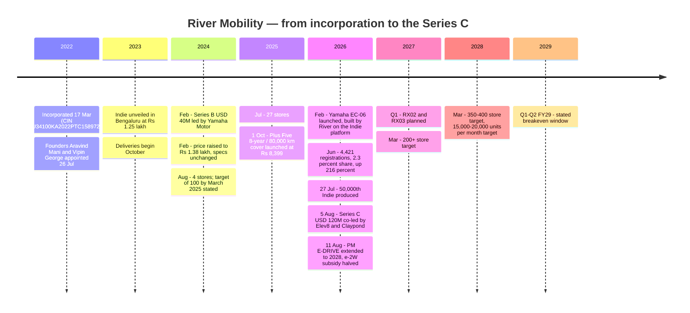
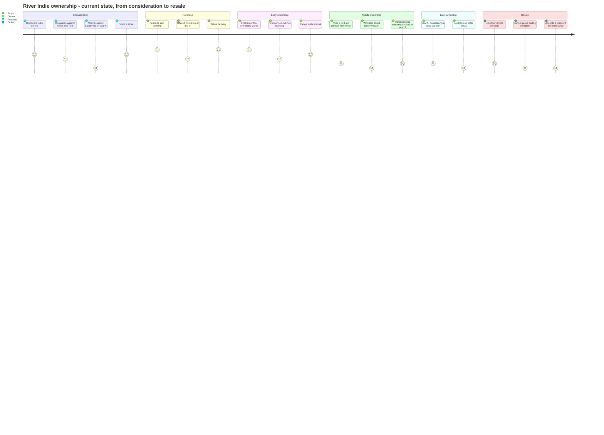
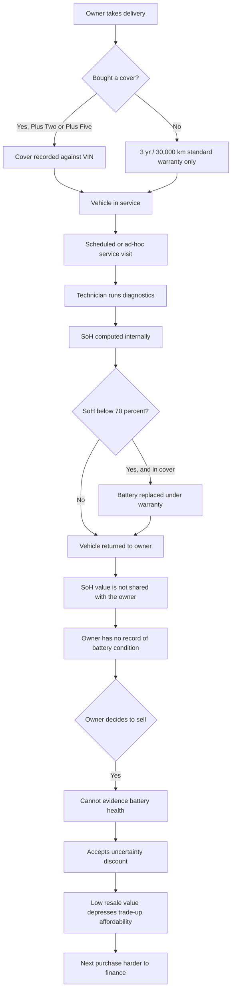
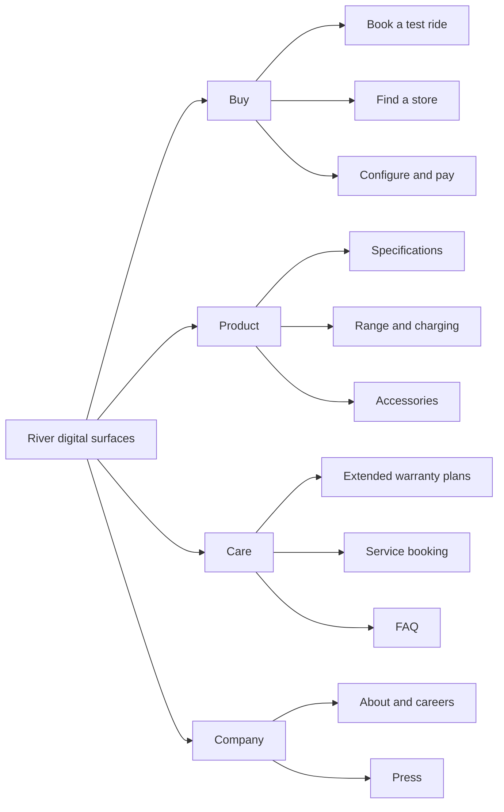
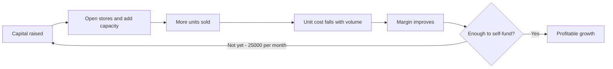
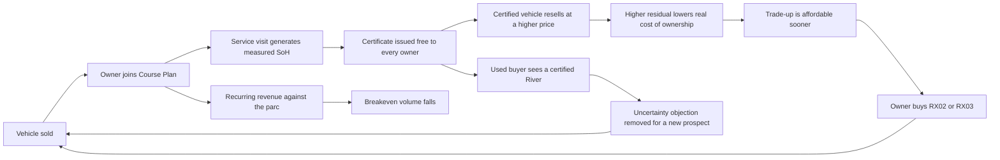
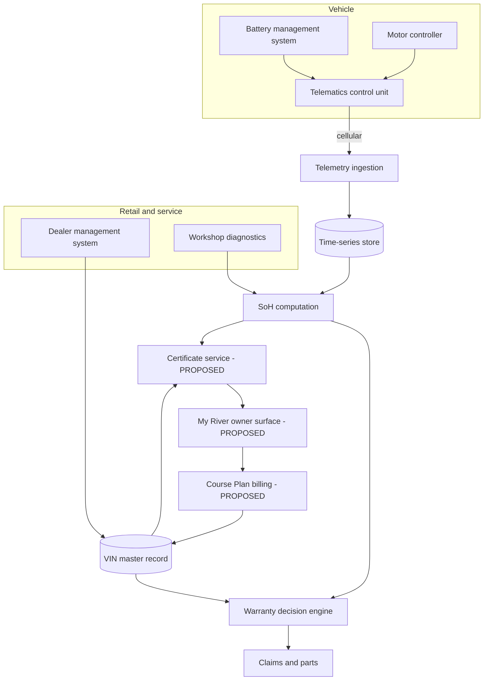
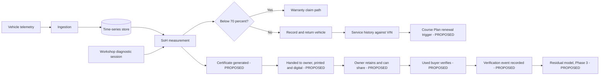
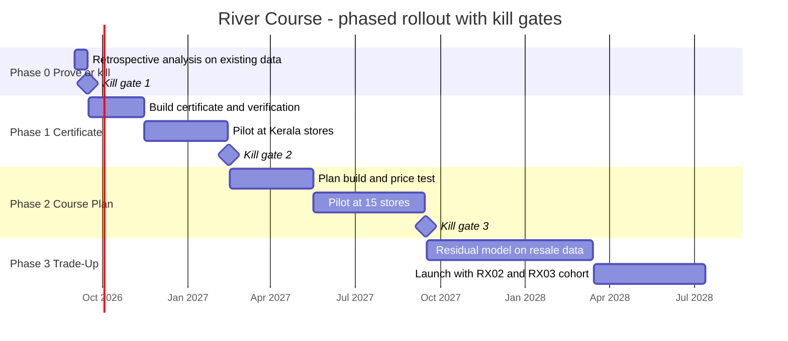
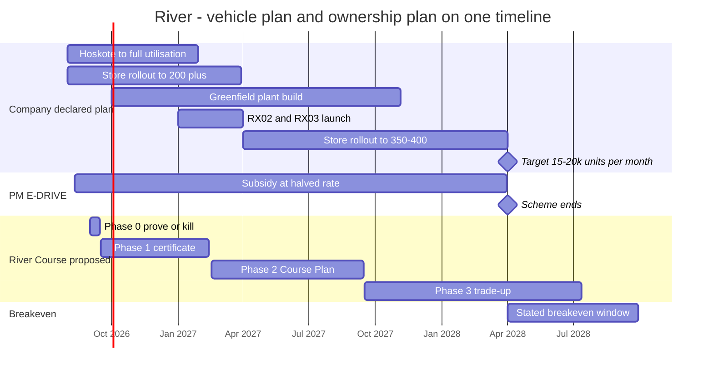

# River Mobility — The Ownership Business Hiding Inside a Shipment Business

### Day 49 of 90 · Product Management Case Study Series

> **The thesis of this case study:** In August 2026 River's CEO said the company will be *"continuously loss-making till we are at 25,000 units a month."* River registered **4,421** units in June 2026. That is a **5.7× gap**, and the plan to close it runs on distribution — 75 stores to 200 by March 2027, a **4.8× step-up** in opening pace — while the product moves *up*-market, from ₹1.25 lakh at launch to a **₹1.55 lakh** ASP, into the teeth of a subsidy that was **halved on 11 August 2026** and now excludes anything above ₹1.5 lakh ex-factory. Every brand that has actually reached the share River needs got there by going **down**. But River has already built a third road and mispriced it as an accessory. Its **8-year / 80,000 km battery-and-motor cover sells for ₹8,399 — about ₹1,050 per covered vehicle-year, collected once.** Hero charges **₹19,008 per vehicle-year, recurring**, for battery access on a scooter costing a *quarter* as much: **18× more in absolute terms and 47× more as a share of vehicle price.** River has the balance sheet of an ownership business — 50,000 vehicles in the field, ~1,200 contracted service bays, one platform, 100% part commonality — and the P&L, the metrics and the capital plan of a shipment business. **The cheapest way to reach breakeven is not to sell 25,000 scooters a month. It is to stop defining the revenue line as scooters.**

---

## 2. Repository Metadata

| Field | Value |
|---|---|
| **Case study** | Day 49 of 90 |
| **Product** | River Indie — a single-model, single-variant electric scooter positioned as "utility lifestyle"; sold through 75+ company and franchise stores |
| **Company** | River Mobility Private Limited, **CIN U34100KA2022PTC158972**, ROC Bangalore, incorporated 17 March 2022 |
| **Domain** | Electric mobility — hardware manufacturing, dealer-network retail, aftersales |
| **Primary competitors** | TVS Motor, Bajaj Auto (Chetak), Ather Energy, Ola Electric, Hero MotoCorp (Vida), Greaves Electric (Ampere), BGauss; Honda Activa e: in the wider frame |
| **Analysis type** | Research-led product teardown + monetisation-model reconstruction + a systems proposal |
| **Proposed system** | **River Course** — the existing 8-year cover unbundled into a priced ownership programme, with a published State-of-Health certificate as its evidence artefact |
| **Author** | Gaurav Singh |
| **Date of analysis** | 14 August 2026 |
| **Research boundary** | Public sources only. No River employee, dealer, customer record or internal document was consulted. No store was visited. No test ride was taken. No authenticated session was used. |
| **Latest River financials available** | **FY25 revenue ₹101 Cr.** FY26 is a **company-guided multiple (~4.4×), not a filed or audited figure.** No profit-and-loss detail, contribution margin, or revenue split by line has ever been published. |
| **Why this product** | Days 1–48 contain no hardware manufacturer, no dealer network and no aftersales business. River is the largest gap in the portfolio, and two events three days apart — a **$120M Series C (5 Aug 2026)** and the **PM E-DRIVE subsidy cut (11 Aug 2026)** — make the economics unusually legible. |

---

## 3. Badges


---

## 4. Table of Contents

<details>
<summary><b>Expand the full 65-section contents</b></summary>

| # | Section | # | Section |
|---|---|---|---|
| 1 | [Cover](#river-mobility--the-ownership-business-hiding-inside-a-shipment-business) | 34 | [HEART](#34-heart-framework) |
| 2 | [Repository Metadata](#2-repository-metadata) | 35 | [Growth Strategy](#35-growth-strategy) |
| 3 | [Badges](#3-badges) | 36 | [Growth Loops](#36-growth-loops) |
| 4 | [Table of Contents](#4-table-of-contents) | 37 | [Network Effects](#37-network-effects) |
| 5 | [Executive Summary](#5-executive-summary) | 38 | [Product Strategy](#38-product-strategy) |
| 6 | [Product Overview](#6-product-overview) | 39 | [Monetization](#39-monetization) |
| 7 | [Company Background](#7-company-background) | 40 | [Trust & Safety](#40-trust--safety) |
| 8 | [Product Timeline](#8-product-timeline) | 41 | [Technical Architecture](#41-technical-architecture) |
| 9 | [Vision & Mission](#9-vision--mission) | 42 | [Data Flow](#42-data-flow) |
| 10 | [Problem Statement](#10-problem-statement) | 43 | [API Ecosystem](#43-api-ecosystem) |
| 11 | [Market Research](#11-market-research) | 44 | [Privacy & Security](#44-privacy--security) |
| 12 | [Industry Analysis](#12-industry-analysis) | 45 | [Pain Points](#45-pain-points) |
| 13 | [TAM / SAM / SOM](#13-tam--sam--som) | 46 | [Opportunity Mapping](#46-opportunity-mapping) |
| 14 | [Competitor Analysis](#14-competitor-analysis) | 47 | [RICE Prioritisation](#47-rice-prioritisation) |
| 15 | [SWOT](#15-swot) | 48 | [MoSCoW](#48-moscow) |
| 16 | [Porter's Five Forces](#16-porters-five-forces) | 49 | [Kano](#49-kano-analysis) |
| 17 | [Business Model Canvas](#17-business-model-canvas) | 50 | [Feature Proposal](#50-feature-proposal--river-course) |
| 18 | [Revenue Model](#18-revenue-model) | 51 | [PRD](#51-prd--river-course-v1) |
| 19 | [Target Users](#19-target-users) | 52 | [Wireframes](#52-wireframes) |
| 20 | [Personas](#20-personas) | 53 | [Rollout Plan](#53-rollout-plan) |
| 21 | [JTBD](#21-jobs-to-be-done) | 54 | [A/B Testing](#54-ab-testing) |
| 22 | [User Journey](#22-user-journey) | 55 | [KPI Dashboard](#55-kpi-dashboard) |
| 23 | [User Flow](#23-user-flow) | 56 | [Product Roadmap](#56-product-roadmap) |
| 24 | [Information Architecture](#24-information-architecture) | 57 | [Risks & Mitigation](#57-risks--mitigation) |
| 25 | [UX Audit](#25-ux-audit) | 58 | [Future Vision](#58-future-vision) |
| 26 | [UI Audit](#26-ui-audit) | 59 | [PM Lessons](#59-pm-lessons) |
| 27 | [Accessibility](#27-accessibility) | 60 | [PM Interview Questions](#60-pm-interview-questions) |
| 28 | [Feature Breakdown](#28-feature-breakdown) | 61 | [References](#61-references) |
| 29 | [AI Capabilities](#29-ai-capabilities) | 62 | [About the Author](#62-about-the-author) |
| 30 | [Product Metrics](#30-product-metrics) | 63 | [License](#63-license) |
| 31 | [North Star Metric](#31-north-star-metric) | 64 | [Self Review](#64-self-review) |
| 32 | [Product Analytics](#32-product-analytics) | 65 | [Appendix](#65-appendix) |
| 33 | [AARRR](#33-aarrr-framework) | | |

</details>

---

## 5. Executive Summary

River Mobility is a four-year-old Bengaluru manufacturer that sells exactly one product: the **River Indie**, a 4 kWh electric scooter with 14-inch wheels, 43 litres of underseat storage and a claimed 163 km range, marketed as *"the SUV of scooters."* It is the only meaningful hardware business in this 90-day series, and it is the clearest case I have found of a company whose **balance sheet and whose income statement describe two different businesses.**

In FY26 River registered **22,354** units — up **426%** year on year, the fastest growth of any brand in the Indian electric two-wheeler market, from the smallest base of the serious players. It rolled out its **50,000th Indie on 27 July 2026**, less than three years after launch. On **5 August 2026** it closed a **$120 million Series C** co-led by Elev8 Venture Partners and Claypond Capital, taking total funding to roughly **$188 million**. Roughly **40%** of the round is earmarked for R&D and factory expansion.

And in the same week, its CEO said this:

> **"We will continuously be loss-making till we are at 25,000 units a month because the cost structure comes down with volume."** — Aravind Mani, Co-founder & CEO, August 2026

**That sentence is the case study.** It converts a vague ambition into a dated, falsifiable, arithmetic target — and the arithmetic does not work.

### 5.1 The gap, stated plainly

| Measure | Value | Source class |
|---|---|---|
| Units required for breakeven | **25,000 / month** | CEO statement |
| River registrations, June 2026 | **4,421** | VAHAN |
| River's own stated run rate, Aug 2026 | **~6,000 / month** | Company briefing |
| **Gap on registrations** | **5.65×** | Derived (D1) |
| **Gap on stated run rate** | **4.17×** | Derived (D1) |
| Breakeven date targeted | **Q1–Q2 FY29** | Company briefing |

Growth of 426% makes 5.65× look like eighteen months of work. It is not, because the market is growing too, and **market share is what breakeven actually requires.**

### 5.2 What 25,000 a month actually means

FY26's Indian e-2W market was **1,401,818** units, up **21.81%**. Project that forward three years to FY29 and 25,000/month is:

| FY29 market growth | Implied FY29 monthly market | 25,000 as a share |
|---|---|---|
| 21.8% (FY26's actual rate, held) | 211,153 | **11.84%** |
| 40% (an aggressive bull case) | 320,549 | **7.80%** |

River's share in June 2026 was **2.28%**. Breakeven therefore requires **3.4× to 5.2× the share it has today**, sustained, by FY29. Only four brands in India have ever held 7.8% or more of this market. **In FY26, every one of them got there below ₹1.15 lakh.** Hero MotoCorp grew **196%** on the Vida VX2 at **₹59,490**. Ather's **Rizta** — its family-oriented, lower-priced model — was **76% of Ather's FY26 volume** and crossed 300,000 cumulative units in two years.

River went the other way. The Indie launched at **₹1.25 lakh** and its ASP is now **₹1.55 lakh — a 24% increase** while the four brands above it all moved down. RX02 and RX03, due **Q1 2027**, are described by the company as staying "true to our Utility Lifestyle model" — i.e. premium.

Then, on **11 August 2026** — three days before this analysis — the Government of India **extended PM E-DRIVE to 31 March 2028 and halved the e-2W incentive**, from ₹5,000/kWh (₹10,000 cap) to **₹2,500/kWh (₹5,000 cap)**, capped at 15% of ex-factory price, and **restricted eligibility to vehicles under ₹1.5 lakh ex-factory**. Two consequences nobody has publicly connected to River:

1. **A per-kWh cut is regressive against big batteries.** The Indie carries 4 kWh — among the largest packs in the category. It loses the most per unit, in absolute terms, of any product River could have built.
2. **River intends to reach breakeven during the first unsubsidised quarters since 2019.** Q1–Q2 FY29 begins after PM E-DRIVE expires. No public River statement addresses this.

### 5.3 The thing River already sells and does not appear to count

River sells an extended cover called **Plus Five**: **8 years / 80,000 km** on battery and motor, over a 3-year/30,000 km standard manufacturing warranty, for **₹8,399 + GST**. Battery replacement triggers if **State of Health falls below 70%**. It went on sale **1 October 2025**.

Put that next to the only comparable product in the Indian market — Hero's Vida **Battery-as-a-Service**:

| | **River Indie — Plus Five** | **Hero Vida VX2 Plus — 3-yr BaaS** |
|---|---|---|
| Vehicle price to customer | ₹1,55,000 | ₹59,490 |
| Post-sale charge | **₹8,399, once** | **₹1,584 / month, recurring** |
| Per vehicle-year | **₹1,050** (over 8 covered years) | **₹19,008** |
| As % of vehicle price, per year | **0.68%** | **31.95%** |
| **Ratio** | — | **18.1× absolute · 47.2× normalised** |

Even on the most conservative reading — charging the ₹8,399 only against the **five incremental** years it adds — River collects **₹1,680 per vehicle-year**, still **11.3× less** in absolute terms and **29.5×** less normalised.

These are not the same product; Hero's BaaS transfers battery *ownership*, River's plan transfers battery *risk*. But they are the same **job**: *make the expensive part of an EV somebody else's problem.* One company treats that job as its business model. **The other treats it as a ₹8,399 accessory, sold once, at the till.**

### 5.4 What the parc does that the store count cannot

River had **50,000 vehicles in the field on 27 July 2026** — and by its own statement, **more than 54% of every Indie ever sold was sold in 2026.** The parc is not just growing; it is young, homogeneous, and almost entirely under warranty. There is one model, one variant, one platform.

Take River's own declared ramp — **15,000–20,000 units/month by March 2028** — and compound it from 6,000/month today:

| Scenario | Assumed Mar-2028 run rate | Parc at Mar 2028 | Revenue at ₹5,000/vehicle-year |
|---|---|---|---|
| Company target (midpoint) | 17,500/mo | **285,000** | **₹142.5 Cr** |
| Company target (bottom) | 15,000/mo | **260,000** | **₹130.0 Cr** |
| **Target badly missed** | 10,000/mo | **210,000** | **₹105.0 Cr** |

**In all three cases — including the one where River misses its own target by 43% — the annual ownership revenue exceeds River's entire FY25 revenue of ₹101 Cr.** With no additional unit sold, no additional store leased and no additional factory built beyond what the ramp already requires.

**I have deliberately not computed a revised breakeven volume from this.** Doing so requires River's contribution margin per unit, which has never been disclosed. §18.6 sets out the identity and refuses to populate it. An analyst who fills that gap with a plausible-looking number has invented the answer.

### 5.5 Six independent lines converge

Developed separately in §45 and §46:

| # | Line | Source class | Where |
|---|---|---|---|
| 1 | Breakeven is **4.2–5.7×** away and dated by the CEO himself | Company statement + VAHAN | §13.3 |
| 2 | The required **7.8–11.8% share** has only ever been reached below ₹1.15 lakh — and River's price went **up 24%** | Category registration data | §13.4, §14.3 |
| 3 | The roadmap stays premium while the subsidy **halves** and a **₹1.5 lakh ceiling** bites | Policy notification, 11 Aug 2026 | §12.5 |
| 4 | An ownership product **already exists**, priced **18×** below the only category precedent | Company pricing pages | §18.4 |
| 5 | **~1,200 service bays** are already contracted by a franchise spec — attached to a sales-only P&L | Franchise specification | §18.5 |
| 6 | The **parc compounds 5.7×** against a store count growing 5.0×, on **one platform** | Derived from declared ramp | §13.6 |

Lines 4 and 5 are the ones I would carry into any hardware business: **check what the company already sells but does not count, and check what it has already paid for but does not use.**

### 5.6 The proposal (§50): River Course

**Don't cut the price. Cut the breakeven volume.**

1. **Course Plan** — the 8-year cover unbundled into an annual ownership plan at **₹5,000–8,000 per vehicle-year**, sold at delivery *and at every service visit*, with the ₹8,399 lifetime option retained for customers who prefer it.
2. **State-of-Health Certificate** — signed, dated, transferable, **issued free to every owner, member or not**, at every service. River already computes SoH; its own warranty triggers on it. Publishing it is nearly free and it is the only credible answer to the question that suppresses every used electric two-wheeler price in India: *how dead is the battery?*
3. **Course Trade-Up** (Phase 3) — a guaranteed residual priced off certified SoH, converting the 2028 parc into launch demand for RX02 and RX03.

**North Star: RVY — Revenue per Vehicle-Year in Parc.** New-vehicle revenue is excluded *by construction*, so RVY **falls** in a strong sales month. That is deliberate: a North Star that rises when you ship more is just a sales target wearing a costume.

**Guardrail: SBD — Selling-Bay Displacement**, measured at the **75th percentile**, and **owned by retail operations — a team that does not benefit from RVY.** A mean would hide exactly the failure that matters: a handful of stores where service work has eaten the sales floor.

### 5.7 What would make this wrong

The whole argument rests on **A1: that River's post-sale revenue is currently immaterial.** River has never published a revenue split, and absence of disclosure is weak evidence. §53 Phase 0 kills A1 in **two analyst-weeks** using data River certainly already holds — warranty attach rate since 1 Oct 2025, and paid-service revenue per vehicle-year by cohort — against **three kill criteria written before the analysis runs**. §54's **E4 arm** is built to falsify my preferred answer directly: it tests whether *bundling* the 8-year cover into the sticker price beats selling it separately.

And in §47 the stress test does the same job. Applying **River's own worst historical target-realisation rate (30%)** to every assumption-dependent item **demotes the Course Plan — the centrepiece of this proposal — from third to fourth, below a down-market variant, the very move this case study argues against.** The ordering is stable when the stress is relaxed to 50%. I am reporting that against myself because it is what the numbers say, and because it changes the build order in §53.

---

## 6. Product Overview

### 6.1 What the Indie is

The River Indie is a single-model, single-variant electric scooter. There is no Pro, no Max, no long-range trim. One battery, one motor, one price.

| Specification | Value |
|---|---|
| Battery | 4 kWh lithium-ion (fixed, non-swappable) |
| Motor | PMSM, **6.7 kW peak**, 26 Nm |
| Ingress protection | IP67 |
| Claimed range | **163 km** (IDC); 160 km cited in later company material |
| Top speed | 90 km/h |
| 0–40 km/h | 3.7 s |
| Wheels | **14-inch front and rear** (110/80-14 / 120/70-14) |
| Storage | **43 L** underseat + 12 L front compartment |
| Ground clearance | 165 mm |
| Seat height | 787 mm |
| Wheelbase | 1,365 mm |
| Charging | ~8 h standard, ~5 h fast |
| Brakes | 200 mm disc front and rear, combined braking |
| Standard warranty | **3 years / 30,000 km** |
| Price | **₹1.55 lakh** ex-showroom, Bengaluru (Aug 2026) |

Two of those numbers are the product strategy in miniature. **14-inch wheels** in a category that runs 12-inch, and **43 litres** of underseat storage against a segment norm closer to 33–35 L, are both deliberate concessions of cost and packaging efficiency in exchange for stability, ride quality over bad roads, and the ability to swallow two helmets. The company's own shorthand — *"the SUV of scooters"* — is unusually accurate for marketing copy.

### 6.2 What River actually sells alongside it

This is the part that matters and the part the market coverage skips.

| Product | Terms | Price | Live since |
|---|---|---|---|
| Manufacturing warranty | 3 years / 30,000 km | included | launch |
| **Plus Two** | 5 years / 50,000 km total (3 MW + 2 EW) — battery, motor, controller, VCU, telematics, DC-DC | **₹4,999 + GST** | pre-Oct 2025 |
| **Plus Five** | 8 years / 80,000 km total (3 MW + 5 EW) — all components for 5 years, **battery and motor for the final 3** | **₹8,399 + GST** | **1 Oct 2025** |
| Upgrade path | Plus Two holders → Plus Five | **₹3,399 + GST**, one-month window | Oct 2025 |

Battery replacement triggers when **State of Health drops below 70%**. Motor replacement triggers when it fails and cannot be repaired. Eligibility extends back to Indies purchased from **1 April 2025**.

> "We aim to go beyond expectations by reinforcing our promise of durable and dependable mobility solutions." — **Sachin Patial, Service Head, River**

**Three observations, each load-bearing later:**

1. **River has already productised ownership.** Two named tiers, a published upgrade price, a defined trigger threshold, and a coverage matrix that changes at year five. This is not a warranty clause buried in a T&C. It is a product with a price list.
2. **The pricing has no relationship to the risk.** ₹4,999 buys two incremental years (₹2,500/yr); ₹8,399 buys five (₹1,680/yr). **The longer, riskier plan is 33% cheaper per year** — the reverse of how tail risk prices. Either River has data showing pack degradation is far slower than the category fears, or the price was set to look attractive on a delivery-day upsell sheet. Both readings support §50; the first one makes it *stronger*.
3. **It is sold at the till, once.** There is no annual product, no renewal, no membership, and — critically — **no reason for the customer to ever hear about it again.**

### 6.3 Where the Indie sits

| | River Indie | Ather 450X | Bajaj Chetak 3503 | Hero Vida VX2 Plus | Honda Activa e: |
|---|---|---|---|---|---|
| Battery | 4 kWh | 3.7 kWh | 3.5 kWh | 3.4 kWh | 2× 1.5 kWh swappable |
| Positioning | Utility / "SUV" | Performance | Classic / retail scale | Value + BaaS | Brand + swap network |
| Wheels | **14"** | 12" | 12" | 12" | 12" |
| Storage | **43 L** | 22 L | 35 L | 33 L | limited (batteries occupy) |
| Ownership product | **Plus Two / Plus Five** | AtherStack subscription | — | **BaaS (core model)** | Swap subscription |

*Specifications for competitor products are indicative, drawn from manufacturer listings, and are used here for positioning contrast only — not for numerical claims. The Indie column is the only one this analysis derives figures from.*

---

## 7. Company Background

**River Mobility Private Limited**, CIN **U34100KA2022PTC158972**, was incorporated on **17 March 2022** at ROC Bangalore, registered office at No. 25/3, KIADB EPIP Zone, Seetharampalya, Hoodi Road, Mahadevapura, Whitefield, Bengaluru 560048. Authorised capital ₹6.00 Cr; paid-up capital ₹5.23 Cr.

> ⚠️ **Entity-name collision — verify by CIN, never by name.** There are **two** active Indian companies called *River Mobility Private Limited*: **U34100KA2022PTC158972** (Karnataka — the subject of this case study) and **U34100TN2022PTC193766** (Tamil Nadu — unrelated). Anyone pulling filings by name will merge two companies' financials. This is exactly the kind of error that survives a plausibility check, because both entities are young, both are in vehicle manufacture, and both were incorporated in 2022.

**Directors on record:**

| Name | Role | DIN | Appointed |
|---|---|---|---|
| Aravind Mani | Co-founder & CEO | 07101086 | 26 July 2022 |
| Vipin George | Co-founder & Chief Product Officer | 08999490 | 26 July 2022 |

Vipin George was previously group head designer at Honda's Indian two-wheeler operation — which shows in a product whose differentiation is almost entirely packaging and stance rather than powertrain.

### 7.1 Funding history

| Round | Date | Amount | Lead | Participants |
|---|---|---|---|---|
| Seed / Series A | 2021–2023 | ~$28M cumulative | — | Toyota Ventures, Lowercarbon Capital, Trucks VC, Maniv Mobility, Al-Futtaim |
| **Series B** | **Feb 2024** | **$40M** (oversubscribed) | **Yamaha Motor Co.** | Al-Futtaim, Lowercarbon, Toyota Ventures, Trucks VC, Maniv |
| **Series C** | **5 Aug 2026** | **$120M** (80–85% equity, balance venture debt) | **Elev8 Venture Partners + Claypond Capital** | Singularity AMC, Anicut, 360 ONE Asset, JIF Capital, HDFC AMC; **Yamaha, Al-Futtaim, Mitsui followed on**; debt from Alteria, InnoVen, Stride |
| **Total** | | **≈ $188M** | | **Valuation undisclosed at every round** |

The investor list is the most interesting thing on this page. **Yamaha, Toyota Ventures and Mitsui** are all strategic Japanese capital, and Yamaha went further than money: it audited River's design, R&D, manufacturing and supplier base, and then contracted River to build the **Yamaha EC-06** on the Indie platform.

> "The audit was long and challenging, but it helped River improve many internal processes." — **Aravind Mani**

A company that passes a Yamaha manufacturing audit has an asset most Indian EV startups do not: **externally validated build quality.** §18 argues that this asset is currently monetised at ₹8,399 a head.

### 7.2 Manufacturing

The Hoskote plant near Bengaluru assembles both vehicles and battery packs. Frames come from a supplier that also serves Honda's Narasapura plant; body panels come from a TVS supplier and arrive fully painted — River operates no paint booth. Roughly **60%** of installed capacity is in use.

> ⚠️ **Source conflict on capacity.** Three sources give three figures: a single-shift capacity of 4,000/month rising to 8,000/month on a second shift (Autocar India, earlier in 2026); "installed capacity ~10,000 units/month at 60% utilisation" (company briefing, Aug 2026); and "capacity 1 lakh per month, utilisation ~10,000 monthly, ~1.2 lakh annually" (Autocar Professional — internally inconsistent, and almost certainly a per-year figure printed as per-month). I use **~120,000/year installed, ~60% utilised**, which is the only reading all three can be reconciled to. Graded 🟡. Nothing in this case study's argument depends on it.

A greenfield plant at **Narasapura** is under evaluation; River has said it is also in talks with other state governments and that nothing is finalised.

---

## 8. Product Timeline



**The shape of that timeline is the argument.** Everything before October 2025 is a vehicle company. **1 October 2025 is the day River accidentally started an ownership business** and filed it under "accessories."

---

## 9. Vision & Mission

River has not published a formal vision or mission statement in the conventional corporate format. What follows is **reconstructed from company statements and product decisions** and is explicitly my construction (C-17), not a River document.

| | Reconstructed statement | Evidence it rests on |
|---|---|---|
| **Vision** | Electric two-wheelers should be judged as *vehicles*, not as appliances — capable of carrying real loads over real Indian roads for a long time | 14-inch wheels, 43 L storage, 165 mm clearance, IP67, "SUV of scooters" |
| **Mission** | Build one platform properly, at a premium, and expand the portfolio without abandoning the utility-lifestyle position | Single model for three years; RX02/RX03 described as staying "true to our Utility Lifestyle model" |
| **Operating belief** | Cost comes down with volume, so volume is the objective | *"We will continuously be loss-making till we are at 25,000 units a month because the cost structure comes down with volume."* |

**The tension is in the third row.** Rows one and two describe a company building a durable, over-engineered asset that stays with a customer for a decade. Row three describes a company measuring itself on how many it ships this month. **The vision is an ownership vision. The operating belief is a shipment belief.** This case study is about the cost of that mismatch — and, more usefully, about the fact that River has already built most of what is needed to resolve it.

---

## 10. Problem Statement

### 10.1 The problem as River states it

River's stated problem is a **cost problem solved by volume**. The Indie is expensive to build; unit economics improve with scale; therefore reach 25,000 units a month, at which point the company becomes profitable. The Series C funds the two inputs that volume requires: **capacity** (a second plant) and **distribution** (200 stores by March 2027, 350–400 by March 2028).

It is a coherent plan. It is also the plan every hardware startup writes, and its failure mode is well known: **the volume required to fix the cost structure is only available at a price the cost structure cannot support.**

### 10.2 The problem as the data states it

| Constraint | Value | Implication |
|---|---|---|
| Breakeven volume | 25,000/month | Requires **7.8–11.8%** national share by FY29 |
| Current share | 2.28% (Jun 2026) | Requires a **3.4–5.2×** share gain |
| Price direction | ₹1.25 L → **₹1.55 L** (+24%) | Moving *away* from where that share lives |
| Category evidence | Every brand above 7.8% in FY26 priced below ₹1.15 L | The share River needs has a price attached |
| Subsidy, from 11 Aug 2026 | **₹2,500/kWh, ₹5,000 cap, ₹1.5 L ceiling** | Halved, and regressive against 4 kWh packs |
| Distribution pace needed | **3.69 → 17.86 stores/month** | A **4.84×** step-up, to a target River has missed before |
| Breakeven window | Q1–Q2 FY29 | **After PM E-DRIVE expires (31 Mar 2028)** |

### 10.3 The problem this case study argues is the real one

River is trying to buy a share position it has priced itself out of, using capital, at a moment when the subsidy supporting that price is being withdrawn — **while sitting on a second business it has already built, already staffed, already contracted the property for, and already sells at roughly a twentieth of the only comparable price in the market.**

**The problem is not that River cannot sell 25,000 scooters a month. It is that 25,000 is only the right number if a scooter is the only thing River sells.**

---

## 11. Market Research

### 11.1 FY26 India electric two-wheeler registrations

| Brand | FY26 units | FY25 units | YoY | FY26 share |
|---|---|---|---|---|
| TVS Motor | 341,513 | 237,929 | +43.5% | 24.4% |
| Bajaj Auto | 289,349 | 231,172 | +25.7% | 20.6% |
| Ather Energy | 239,178 | 131,172 | +82.3% | 17.1% |
| Ola Electric | 164,295 | 344,300 | **−52.3%** | 11.7% |
| Hero MotoCorp | 144,330 | 48,738 | **+196.1%** | 10.3% |
| Greaves Electric | 61,563 | 40,169 | +53.3% | 4.4% |
| BGauss | 26,201 | 17,343 | +51.1% | 1.9% |
| **River Mobility** | **22,354** | **4,247** | **+426.4%** | **1.6%** |
| Pure EV | 14,352 | 8,982 | +59.8% | 1.0% |
| E-Sprinto | 12,582 | 1,409 | +793.0% | 0.9% |
| Kinetic Green | 11,557 | 8,454 | +36.7% | 0.8% |
| Revolt | 10,444 | 11,567 | −9.7% | 0.7% |
| Simple Energy | 8,214 | 1,959 | +319.3% | 0.6% |
| Others | 55,886 | 63,349 | −11.8% | 4.0% |
| **Total** | **1,401,818** | **1,150,790** | **+21.8%** | 100% |

### 11.2 June 2026 — the most recent full month

| Brand | Units | Share | YoY |
|---|---|---|---|
| TVS | 47,220 | 24.3% | +76.6% |
| Bajaj | 43,392 | 22.3% | +80.9% |
| Ather | 31,318 | 16.1% | +95.5% |
| Hero Vida | 21,879 | 11.3% | **+176.2%** |
| Ola Electric | 16,183 | 8.3% | **−21.8%** |
| Greaves | 10,933 | 5.6% | +153.7% |
| **River** | **4,421** | **2.3%** | **+216.0%** |
| BGauss | 3,929 | 2.0% | +98.9% |
| **Market** | **194,300** | | **+75.5%** |

> ⚠️ **Source conflict on River's June figure.** VAHAN registration data gives **4,421**; River's own 50,000-unit milestone release cites **4,436 units and +234% YoY**. The gap is 15 units and is almost certainly a registration-versus-dispatch or cut-off-date difference. **I use the VAHAN figure throughout** because every competitor figure in this section comes from the same dataset, and mixing a company-sourced number into a VAHAN table would silently flatter River. Nothing in the analysis turns on 15 units.

### 11.3 What the FY26 table actually shows

Three findings, none of which are about River.

**Finding 1 — the market re-concentrated around incumbents.** TVS and Bajaj together took **45.0%** of FY26. Both are legacy ICE manufacturers with existing dealer networks, service infrastructure and financing relationships. The startup thesis that EV would be a clean-sheet category has not held at the volume end.

**Finding 2 — Ola's collapse was the largest single event in the category.** Ola fell **52.3%**, shedding roughly **180,000 units** — more than eight times River's entire FY26. That volume did not evaporate; it moved. Hero (+95,592), Ather (+108,006) and TVS (+103,584) between them absorbed far more than Ola lost, in a market that also grew.

**Finding 3 — the growth that mattered was priced low.** Hero's **+196%** came almost entirely from the **VX2 at ₹59,490** with a BaaS option. Ather's **+82%** came from **Rizta, which was 76% of Ather's FY26 volume**. Both are down-market moves by companies that started higher. **This is the pattern River is betting against.**

### 11.4 River's position, read honestly

River grew **426%** — the fastest in the table — and is the **only brand in the top eight priced above ₹1.5 lakh.** Both facts are true and they are in tension. A 426% growth rate from 4,247 units is the growth rate of a company that has just fixed its supply chain, not evidence that its price point scales. River's **best natural experiment is Kerala**, where it ranks **fourth in the state on only six showrooms**, behind Ather, TVS and Bajaj. That is a materially better share-per-store outcome than its national average, and River has published nothing analysing why. §45 returns to it.

---

## 12. Industry Analysis

### 12.1 Structure

The Indian e-2W market has settled into four groups:

| Group | Members | Basis of advantage |
|---|---|---|
| **Legacy scale** | TVS, Bajaj, Hero, Honda | Dealer networks, service reach, financing, brand trust |
| **Scaled challengers** | Ather, Ola | Technology brand, direct retail, software |
| **Value volume** | Greaves/Ampere, BGauss, Kinetic | Price, fleet and tier-2/3 distribution |
| **Differentiated niche** | **River**, Simple Energy, Ultraviolette | Product specificity, premium positioning |

River is in the group with the least structural protection. A niche differentiated on packaging can be copied by anyone in group one, whose cost of copying is a body panel and a wheel size.

### 12.2 The cost curve everyone is riding

Cells are the majority of an e-2W's bill of materials, and cell prices are set globally. This is why River's CEO can say cost comes down with volume and be right — but it is also why **volume-driven cost reduction is not a moat.** Every competitor is on the same curve, and TVS and Bajaj are further up it.

### 12.3 Where the profit pool actually is in two-wheelers

In the Indian ICE two-wheeler industry, the manufacturer's margin on the vehicle is thin and the durable profit sits in **parts, service and financing**, captured across a vehicle's 8–12 year life. Electric two-wheelers change the composition of that pool — fewer consumables, no oil changes, far fewer moving parts — but they **concentrate** rather than eliminate it: the battery is a single, expensive, degrading, safety-relevant component with a definable state and a definable end of life.

**Notably, Yamaha understood this when it structured the EC-06 deal: River builds it, and Yamaha keeps the aftermarket.** The partner with fifty years of two-wheeler experience took the annuity and left River the manufacturing.

### 12.4 Battery-as-a-Service, the category's one live experiment

| Plan | Monthly | Included km/month | Effective ₹/km |
|---|---|---|---|
| VX2 Plus, 2-year | ₹2,160 | 2,400 | ₹0.90 |
| **VX2 Plus, 3-year** | **₹1,584** | **1,600** | **₹0.99** |
| VX2 Plus, 5-year | ₹1,128 | 800 | ₹1.41 |
| VX2 Go, 3-year | ₹1,488 | 1,200 | ₹1.24 |
| VX2 Go, 5-year | ₹1,103 | 750 | ₹1.47 |

Plus a one-time ₹1,199 documentation and stamp-duty charge. **At the end of the term the customer owns both the scooter and the batteries.**

Read that structure carefully, because it is the precedent §18 measures River against. Hero is not renting batteries. **Hero is selling a scooter on instalments and calling the instalment a battery subscription** — which lets it advertise ₹59,490 while collecting ₹19,008 a year. It is a financing product with a technical justification, and it worked: **Hero grew 196% in FY26.**

### 12.5 The policy break of 11 August 2026

| Parameter | Before | **From 11 Aug 2026** |
|---|---|---|
| Incentive rate | ₹5,000/kWh | **₹2,500/kWh** |
| Per-vehicle cap | ₹10,000 | **₹5,000** |
| Cap as % of ex-factory | 15% | 15% (unchanged) |
| Ex-factory eligibility ceiling | — | **₹1.5 lakh** |
| Scheme end | 31 Mar 2027 | **31 Mar 2028** |
| Claims deadline | — | 31 Dec 2027 |
| e-2W outlay | — | ~₹2,767 Cr of ₹11,900 Cr |

**Three consequences for River specifically, none of which River has publicly addressed:**

1. **The cut is regressive against large batteries.** A per-kWh incentive with a cap rewards big packs until the cap binds. At ₹5,000/kWh with a ₹10,000 cap, the cap bound at 2 kWh — everything above got ₹10,000. At ₹2,500/kWh with a ₹5,000 cap, the cap binds at 2 kWh again — everything above gets ₹5,000. **So the Indie's 4 kWh pack loses ₹5,000, the same as a 2 kWh scooter, on a vehicle costing two-and-a-half times as much.** The subsidy was never sized to River's product and now it is half as not-sized.
2. **The ₹1.5 lakh ex-factory ceiling is a design constraint on RX02 and RX03.** The Indie retails at ₹1.55 lakh; ex-factory is lower, so eligibility is plausible but not comfortable. Any premium successor has to be *designed* against a policy line rather than a customer need.
3. **River intends to break even in the first unsubsidised quarters since 2019.** PM E-DRIVE ends 31 March 2028. River's stated breakeven window is **Q1–Q2 FY29** — i.e. April–September 2028. Every prior Indian e-2W profitability projection has assumed a demand subsidy. River's does not have one, and its plan does not appear to be sized for that.

---

## 13. TAM / SAM / SOM

*Framework selection rationale: the conventional TAM/SAM/SOM triangle is close to useless for River, because the constraint is not addressable market size — India's two-wheeler market is enormous and nobody disputes it — but the **share River must hold at a price it has moved away from.** So this section inverts the exercise. Instead of sizing the opportunity, it sizes the **requirement**, and then asks whether any comparable company has ever met it from where River stands. That is the only version of this analysis that can change a decision.*

### 13.1 The market, sized conventionally

| Layer | Definition | Size | Basis |
|---|---|---|---|
| **TAM** | All Indian two-wheelers | ~19–20 million/yr | Industry scale, cited for context only |
| **SAM** | Electric two-wheelers, FY26 | **1,401,818** | VAHAN, verified |
| **SOM (today)** | River, FY26 | **22,354 (1.6%)** | VAHAN, verified |
| **SOM (June 2026 run rate)** | River, monthly | **4,421 (2.3%)** | VAHAN, verified |

### 13.2 Why the conventional version is not the analysis

The Indie is not addressable to the whole SAM. It costs ₹1.55 lakh in a market whose growth in FY26 came from products at ₹59,490. Sizing River against 1.4 million units and calling 1.6% "headroom" is the analytical equivalent of telling a Michelin restaurant it has 99.9% of the food market left to win.

### 13.3 D1 — the distance to breakeven

**Inputs:** 25,000/month (CEO statement) · 4,421 (VAHAN, June 2026) · ~6,000/month (company briefing, Aug 2026).

| Basis | Calculation | Gap |
|---|---|---|
| June 2026 registrations | 25,000 ÷ 4,421 | **5.65×** |
| Company-stated run rate | 25,000 ÷ 6,000 | **4.17×** |

**Grade:** 🟢 High. Both inputs are dated public figures; the operation is division.

### 13.4 D2 — what 25,000/month requires as share

**Inputs:** FY26 market 1,401,818, up 21.81% · breakeven target Q1–Q2 FY29, i.e. three years forward.

| FY29 growth assumption | FY29 market | FY29 monthly | 25,000 = |
|---|---|---|---|
| **21.8%** (FY26 rate held) | 2,533,835 | **211,153** | **11.84%** |
| **40%** (aggressive bull case) | 3,846,589 | **320,549** | **7.80%** |

River's June 2026 share was **2.28%**. The requirement is therefore **3.43× to 5.20×** today's share.

**The finding that makes this section worth reading:** every brand that held ≥7.8% of the Indian e-2W market in FY26 — TVS, Bajaj, Ather, Ola, Hero — did so with a core volume product priced **below ₹1.15 lakh**. The premium band above ₹1.4 lakh appears to be roughly **5–8%** of the market in total (construct **C-1**, built from brand-level positioning rather than a published price-band split, and graded 🟠). **On that construct, the share River needs at breakeven is larger than the entire band it competes in.**

**What would break D2:** the growth assumption. If the market grows faster than 40% annually for three straight years, the required share falls below 7.8%. It has never done so — FY26 was 21.8%. Conversely, if growth slows, the requirement gets worse, not better. **The derivation is asymmetric against River**, which is why it is stated with both bounds shown.

**Grade:** 🟢 High on the arithmetic. 🟡 Medium on the three-year projection. 🟠 Low on C-1, the premium-band size, which is flagged as a construct and never used as a load-bearing input.

### 13.5 D3 — the price went the wrong way

| Date | Price | Change |
|---|---|---|
| Launch (unveiled Feb 2023, deliveries Oct 2023) | ₹1,25,000 | — |
| Feb 2024 | ₹1,38,000 | +10.4%, specs unchanged |
| Aug 2026 (ASP) | **₹1,55,000** | **+24.0% from launch** |

Over the same window, the four brands that grew fastest in FY26 all launched cheaper products. **Grade:** 🟢 High.

### 13.6 D6 — the distribution step-up, and River's own record of meeting it

| Milestone | Date | Stores |
|---|---|---|
| First store | Feb 2024 | 1 |
| Series B period | Aug 2024 | 4 |
| — | Jul 2025 | 27 |
| — | early 2026 | ~30 |
| **Series C period** | **Aug 2026** | **75+** |
| Target | Mar 2027 | **200+** |
| Target | Mar 2028 | **350–400** |

| Pace | Calculation | Result |
|---|---|---|
| **Achieved** (Jul 2025 → Aug 2026) | 48 stores ÷ 13 months | **3.69/month** |
| **Required** (Aug 2026 → Mar 2027) | 125 stores ÷ 7 months | **17.86/month** |
| **Step-up** | 17.86 ÷ 3.69 | **4.84×** |
| Required to 350 by Mar 2028 | 275 ÷ 19 months | 14.47/month |
| Required to 400 by Mar 2028 | 325 ÷ 19 months | 17.11/month |

**River's historical target-realisation rate — used as the RICE stress rule in §47:**

| Target set | Stated | Delivered | Realisation |
|---|---|---|---|
| Aug 2024: "100 stores by March 2025" | 100 | ~27 by Jul 2025 | **~30%** |
| Early 2026: "80 outlets by April 2026" | 80 | 75 by Aug 2026 | **~94%** |

The record is improving and the later target was nearly met. **But the required 4.84× step-up is unprecedented for this company**, and it is being asked for in the same period as a factory build, two product launches and a subsidy withdrawal. §47 applies the **30%** figure — River's own worst realisation — as the stress rule, because a company's own historical miss rate is a far better sensitivity band than a generic ±20%.

**Grade:** 🟢 High on the pace arithmetic. 🟡 Medium on realisation, since the two targets were stated in different formats and the delivery dates are approximate.

### 13.7 D5 — the parc compounds faster than anything else River has

River rolled out its **50,000th Indie on 27 July 2026** and states that **more than 54% of all Indie sales since the October 2023 launch occurred in 2026.** One model. One variant. One platform. **100% part commonality across the entire installed base** — which is a property River will never have again once RX02 and RX03 arrive.

Taking River's **own declared ramp** (15,000–20,000 units/month by March 2028) and compounding linearly from the current ~6,000/month over the 20 months from August 2026:

| Scenario | Mar-2028 run rate | Units added | **Parc at Mar 2028** | At ₹5,000/vehicle-year |
|---|---|---|---|---|
| Company target, midpoint | 17,500/mo | 235,000 | **285,000** | **₹142.5 Cr** |
| Company target, bottom | 15,000/mo | 210,000 | **260,000** | **₹130.0 Cr** |
| **Target missed by 43%** | 10,000/mo | 160,000 | **210,000** | **₹105.0 Cr** |

**River's FY25 revenue was ₹101 Cr.** All three scenarios — including the one where River badly misses its own target — produce **more annual ownership revenue than River's entire FY25 revenue**, from a parc that the vehicle plan is building anyway.

Meanwhile the store count over the same period grows from 75 to 350–400, a factor of **5.0×**, while the parc grows **5.7×**. **The parc compounds 14% faster than the network that serves it** — and unlike a store, a vehicle in the parc costs nothing to keep.

**What would break D5:** the ramp is linear by assumption (**A3**), and hardware ramps rarely are. A back-loaded ramp lowers the Mar-2028 parc; a front-loaded one raises it. I use linear because it sits between the two and because River's declared endpoints are the only public anchors. **The ₹5,000/vehicle-year figure is a construct (C-2), not a River price** — it is the bottom of the range proposed in §50 and roughly a third of Hero's ₹19,008. If the true achievable figure is ₹3,000, the pessimistic case still yields ₹63 Cr; if it is ₹8,000, the midpoint yields ₹228 Cr.

**Grade:** 🟡 Medium. The parc arithmetic is sound; the revenue-per-vehicle-year multiplier is mine.

### 13.8 What this section does not claim

It does **not** claim River can reach breakeven at a lower unit volume by adding ownership revenue. **That calculation requires River's contribution margin per vehicle, which has never been disclosed.** §18.6 states the identity and leaves it unpopulated. Every version of this analysis I could write that produces a "revised breakeven of N units" would be inventing N.

---

## 14. Competitor Analysis

*Framework selection rationale: this section compares competitors on **what they charge after the sale**, not on specifications. Spec comparisons for e-2W products are widely available and analytically empty — everyone has settled on similar ranges and similar speeds. The variable that actually separates these companies' business models is the one nobody tabulates.*

### 14.1 The conventional comparison

| | River | TVS iQube | Bajaj Chetak | Ather | Hero Vida | Ola |
|---|---|---|---|---|---|---|
| FY26 units | 22,354 | 341,513 | 289,349 | 239,178 | 144,330 | 164,295 |
| FY26 share | 1.6% | 24.4% | 20.6% | 17.1% | 10.3% | 11.7% |
| YoY | **+426%** | +44% | +26% | +82% | +196% | −52% |
| Entry price band | **₹1.55 L** | ~₹0.95–1.3 L | ~₹1.0–1.3 L | ~₹1.0–1.6 L | **₹0.59 L** (with BaaS) | ~₹0.75–1.5 L |
| Models | **1** | multiple | multiple | multiple | multiple | multiple |
| Legacy dealer network | no | **yes** | **yes** | no | **yes** | no |

### 14.2 The comparison that matters — post-sale monetisation

| Company | Post-sale product | Structure | Approx. ₹/vehicle-year |
|---|---|---|---|
| **Hero (Vida)** | Battery-as-a-Service | **Recurring subscription, core to the model** | **₹19,008** (VX2 Plus, 3-yr) |
| **River** | Plus Two / Plus Five cover | **One-time, at point of sale** | **₹1,050** (Plus Five, over 8 covered years) |
| Ather | Software/connectivity subscription | Recurring, modest | not comparably disclosed |
| TVS / Bajaj | Conventional parts and service through legacy network | Recurring, mature, undisclosed at product level | not disclosed |
| Ola | Care plans and extended warranty | One-time | not comparably disclosed |

**River's post-sale monetisation is the lowest of any company in the table for which a figure can be established, on the most expensive vehicle in the table.** That is the whole case study in one row.

### 14.3 The price-and-share pattern

| Brand | FY26 share | The product that produced the growth | Its price |
|---|---|---|---|
| TVS | 24.4% | iQube range | below ₹1.3 L |
| Bajaj | 20.6% | Chetak range | below ₹1.3 L |
| Ather | 17.1% | **Rizta — 76% of FY26 volume, 300,000 units in 2 years** | below Ather's own 450 line |
| Hero | 10.3% | **VX2 at ₹59,490 with BaaS — drove +196%** | ₹0.59 L |
| **River** | **1.6%** | Indie | **₹1.55 L, up 24% since launch** |

Every company that crossed the share River needs did it by **going down-market or by financing the vehicle through a battery plan.** River has done neither and has said it will not.

**This is not an argument that River should go down-market.** It is an argument that **the 25,000-unit target implicitly assumes River will**, and River's product roadmap says the opposite. One of those two statements has to give. §50 proposes a third option; §47's stress test then shows that the down-market variant outranks that third option under pessimistic assumptions, and §53 sequences accordingly.

### 14.4 The competitor River has not noticed it has

**Yamaha.** River builds the EC-06 on the Indie platform. It launched **2 February 2026** at **₹1,67,600** through Yamaha's Blue Square premium showrooms in Karnataka, Tamil Nadu and Maharashtra, and dispatched **92 units** in its first month, with roughly 5,000/year expected.

> ⚠️ **A claim I nearly published and then killed.** An early draft used those 92 units as evidence that River's premium proposition does not travel even through a larger network. **Verification killed it.** The EC-06 went on sale through a *limited* set of premium showrooms in three states, at ₹21,601 *more* than the Indie. Ninety-two units through a handful of premium outlets in month one proves nothing either way about the proposition. Recorded as a caught error in §64.2. **The claim that flatters your argument is the one to check hardest.**

The real EC-06 finding is structural, and it is in §12.3: **Yamaha kept the aftermarket.** River builds the vehicle and takes the manufacturing margin; Yamaha owns the customer for the following decade. **River accepted the exact division of value that this case study argues it is making with its own customers.**

---

## 15. SWOT

| | **Helpful** | **Harmful** |
|---|---|---|
| **Internal** | **Strengths**<br>• Genuine product differentiation (14" wheels, 43 L, IP67) that is defensible on the road, not just the spec sheet<br>• **100% platform commonality across a 50,000-vehicle parc** — no other Indian e-2W company has this<br>• **Yamaha-audited** design, manufacturing and supplier base<br>• Fastest FY26 growth in the category (+426%)<br>• Already productised ownership: two named cover tiers with published prices<br>• **~1,200 contracted service bays** across a 75-store franchise base<br>• Fresh $120M with 80–85% equity | **Weaknesses**<br>• **One model, one variant** — no hedge if the position is wrong<br>• Price up 24% while the market's growth went down-market<br>• Distribution pace must rise **4.84×** against a company record of missing store targets by up to 70%<br>• 4 kWh pack is the worst-hit configuration under the new subsidy<br>• No public disclosure of contribution margin, revenue mix, or attach rates<br>• Post-sale revenue priced at **~1/18th** of the category precedent |
| **External** | **Opportunities**<br>• **The parc reaches 210,000–285,000 by Mar 2028** on the plan already funded<br>• No Indian e-2W company has published a credible battery State-of-Health certificate — the field is empty<br>• Used e-2W values are suppressed by battery uncertainty; certified SoH is the unlock<br>• Ola's collapse released ~180,000 units of demand still redistributing<br>• Kerala shows a **materially better share-per-store** result that River has not analysed<br>• RX02/RX03 in Q1 2027 give a natural trade-up moment for the 2026 cohort | **Threats**<br>• **Subsidy halved 11 Aug 2026; scheme ends 31 Mar 2028 — before River's stated breakeven**<br>• ₹1.5 lakh ex-factory ceiling constrains the premium roadmap<br>• TVS, Bajaj and Hero can copy packaging cheaply and out-distribute instantly<br>• Hero's BaaS is a financing weapon River has no answer to<br>• **Yamaha keeps the EC-06 aftermarket** — the partner has already claimed the annuity<br>• Cell price movements hit a 4 kWh pack hardest |

**The diagonal that matters:** River's single strongest internal asset (a large, young, 100%-common parc) sits directly opposite its single largest external threat (a subsidy withdrawal that makes the next 25,000 units harder to sell than the last). **The asset is the answer to the threat, and it is currently on the wrong side of the table.**

---

## 16. Porter's Five Forces

*Framework selection rationale: the five forces are routinely misread for this industry, because analysts apply them to **the vehicle transaction** — where River looks structurally weak on every axis. Applied to **the ownership relationship**, three of the five invert. That inversion is the point of running the framework at all, and it is why this section is presented twice.*

### 16.1 The forces applied to the vehicle sale

| Force | Intensity | Why |
|---|---|---|
| Competitive rivalry | **Very high** | 13+ brands, 6 at scale, all on the same cell cost curve |
| Buyer power | **High** | Zero switching cost pre-purchase; price-transparent; subsidy-sensitive |
| Supplier power | **High** | Cells are globally priced; River outsources frames, panels and paint |
| Threat of substitutes | **High** | ICE 2W, public transport, ride-hailing, and rival e-2W |
| Threat of new entry | **Medium** | Capital-intensive, but every legacy OEM has already entered |

**Verdict: River is in a structurally unattractive position.** Every force points the wrong way. This is the standard read, and it is correct as far as it goes.

### 16.2 The same five forces applied to the ownership relationship

| Force | Intensity | Why it inverts |
|---|---|---|
| Competitive rivalry | **Low** | **No Indian e-2W company publishes a battery health certificate.** The field is empty |
| Buyer power | **Low–medium** | Post-purchase, the customer owns a River-specific battery with a River-specific SoH threshold; switching means selling the vehicle into a market that discounts uncertainty |
| Supplier power | **Low** | The inputs are data River already generates and bays River has already contracted |
| Threat of substitutes | **Medium** | Third-party garages exist but cannot certify a pack they did not build or authorise a warranty they do not hold |
| Threat of new entry | **Low** | An entrant needs a parc. River's took three years and ₹188M to build |

**Verdict: the ownership relationship is a structurally attractive position that River is currently giving away for ₹8,399.**

**The methodological point:** the five forces are a question about *where you draw the boundary of the business*. Drawn around the transaction, River is a price-taker in a commodity fight. Drawn around the vehicle's life, River holds a near-monopoly on information about an asset the customer has already paid ₹1.55 lakh for. **Same company, same week, opposite conclusion — and the boundary is a choice, not a fact.**

---

## 17. Business Model Canvas

| Block | Current state | Where §50 changes it |
|---|---|---|
| **Customer segments** | First-time and upgrading premium e-2W buyers; utility-oriented urban riders | **Adds the existing owner as a distinct, revenue-bearing segment** |
| **Value proposition** | A tough, high-storage, long-range scooter | Adds: *a vehicle whose battery condition is certified, documented and resaleable* |
| **Channels** | 75+ stores, direct and franchise; company website | Adds the **service visit** as a commercial channel, not just a cost centre |
| **Customer relationships** | Transactional; ends at delivery + warranty admin | **Recurring, annually renewed, evidenced at every service** |
| **Revenue streams** | Vehicle sales; **one-time cover (₹4,999 / ₹8,399)**; Yamaha contract manufacturing | **Adds recurring ownership revenue and, in Phase 3, a residual-value product** |
| **Key resources** | Hoskote plant; one platform; **50,000-vehicle parc**; **~1,200 service bays**; SoH telemetry | The last three are currently classified as costs or by-products |
| **Key activities** | Manufacture, distribute, open stores | Adds: certify, renew, retain, trade up |
| **Key partners** | Yamaha, Al-Futtaim, Mitsui; frame and panel suppliers; franchise partners | Franchise partners become **revenue partners**, not just sales outlets |
| **Cost structure** | BOM, plant, store rollout, R&D, warranty reserve | Warranty reserve moves from **provision** to **priced product** |

**The single most important cell in this table is "Key resources."** River's canvas lists a factory and a platform. It should list **a parc, a bay network and a data asset** — all three of which already exist, all three of which the Series C is funding more of, and none of which appear on the revenue side.

---

## 18. Revenue Model

### 18.1 What River earns today

| Stream | Basis | Disclosure |
|---|---|---|
| Vehicle sales | ~₹1.55 lakh ASP × volume | Volume public via VAHAN; ASP company-stated |
| **Extended cover** | ₹4,999 (Plus Two) / ₹8,399 (Plus Five), one-time | Prices public; **attach rate never disclosed** |
| Contract manufacturing | Yamaha EC-06, ~5,000 units/yr expected | Volume public; **terms never disclosed** |
| Service, parts, accessories | Through the store network | **Never disclosed** |

| Year | Revenue | Basis |
|---|---|---|
| FY25 | **₹101 Cr** | Reported |
| FY26 | **~₹444 Cr** (≈4.4× FY25) | **Company guidance, unaudited, a multiple rather than a figure** |

**Every statement in this case study about River's revenue mix is therefore inference from prices and volumes, not from disclosure.** That is assumption **A1** and it is the load-bearing one.

### 18.2 The identity River is managing to

Vehicle contribution × volume − fixed cost = profit. River's CEO has told us the volume at which this crosses zero: **25,000/month.** He has not told us either of the other two terms, and neither has any filing.

### 18.3 The identity River could be managing to

Vehicle contribution × volume + **ownership contribution × parc** − fixed cost = profit.

The second term has three properties the first does not:

1. **The parc only goes up.** Monthly volume can fall; a vehicle already sold does not leave the parc unless it is scrapped or exported.
2. **Its marginal cost is near zero.** The bays are contracted, the technicians are staffed, the telemetry is already transmitting, and SoH is already computed because the warranty requires it.
3. **It is counter-cyclical to the thing that is about to get harder.** A subsidy withdrawal suppresses new-vehicle demand. It does not shrink the installed base by a single unit.

### 18.4 D4 — the price of the ownership product, against the only precedent

**Inputs:** Plus Five ₹8,399 + GST for 8 years/80,000 km, over a 3-year/30,000 km standard warranty · Vida VX2 Plus 3-year BaaS ₹1,584/month · Indie ASP ₹1,55,000 · VX2 ₹59,490.

| Measure | River (Plus Five) | Hero (Vida BaaS) | Ratio |
|---|---|---|---|
| Charge structure | **once** | **monthly, recurring** | — |
| Per covered vehicle-year | **₹1,050** | ₹19,008 | **18.1×** |
| Per **incremental** vehicle-year (conservative) | **₹1,680** | ₹19,008 | **11.3×** |
| As % of vehicle price per year | **0.68%** | **31.95%** | **47.2×** |
| Conservative, normalised | 1.08% | 31.95% | **29.5×** |

Both River figures are shown because both are defensible and they answer different questions. **₹1,050** is *the cost of cover per year of cover*, which is the like-for-like against Hero's per-year cost of battery access. **₹1,680** is *the price of each incremental year River actually sells* — the more conservative reading, and the one to quote if only one number is used. **The conclusion is identical at both ends of the range and I have not chosen between them to flatter the argument.**

**The internal-consistency finding.** River's own two tiers price incremental cover like this:

| Plan | Incremental years bought | Price | **₹ per incremental year** |
|---|---|---|---|
| Plus Two | 2 | ₹4,999 | **₹2,500** |
| Plus Five | 5 | ₹8,399 | **₹1,680** |

**The longer plan is 33% cheaper per year than the shorter one** — even though years 6, 7 and 8 carry far more degradation risk than years 4 and 5, and even though the later plan narrows coverage to battery and motor only. Tail risk does not price that way. There are exactly two explanations:

- **River has degradation data showing packs comfortably clear 70% SoH at eight years.** If so, this is the most valuable undisclosed asset in the company, and §50.4 argues it should be published rather than hoarded.
- **The price was set to close a delivery-day upsell**, not to price risk.

**Either explanation supports §50, and the first supports it more strongly**, because it means the certificate proposed in §50.4 would be a proof River can already produce.

**What would break D4:** the comparison is not like-for-like. Hero's BaaS transfers battery ownership and bundles financing; River's plan transfers replacement risk on a battery the customer owns outright. A reader could argue the correct comparison is River's plan against an insurance premium, not against a lease. **That objection is right and it does not change the direction.** No plausible actuarial reading puts fair value for an eight-year battery-replacement guarantee at ₹1,050/year on a ₹1.55 lakh vehicle whose pack is a large share of the BOM.

**Grade:** 🟢 High on all inputs (published prices). 🟡 Medium on comparability, stated above.

### 18.5 The asset River has already bought and does not use

River's franchise specification requires **2,500 sq ft of service area and a minimum of three service bays** per store. At **75+ stores**, that is **~225 bays today**. At the March 2028 target of 350–400 stores, it is **~1,050–1,200 bays.**

**Those bays are being contracted, built and staffed against a P&L whose revenue line is vehicle sales.** A franchise partner signing a River agreement today is committing capital to service capacity sized for a parc that does not exist yet, and being compensated for selling scooters.

**This is line 5 of §46 and it is the most reusable observation in this case study.** In any hardware business, look for the resource the company has already committed to on one business case and is using for another. It is nearly always the cheapest growth available, because the capital decision has already been taken and defended.

### 18.6 The calculation this section will not perform

The obvious next step is to compute a **revised breakeven volume**: if ownership revenue contributes X per vehicle-year against a parc of P, the vehicle volume required to cross zero falls to some N < 25,000.

**That calculation requires River's contribution margin per vehicle. River has never disclosed it, and no filing contains it.**

The identity is:

> **N = (Fixed cost − Ownership contribution × Parc) ÷ Vehicle contribution per unit**

Two of the three inputs are unknown. **I am leaving it unpopulated.** Any number I produced here would be a construct dressed as a finding, and it would be the single most quotable number in the document — which is precisely why it must not be invented. §53 Phase 0 is designed so that River, who holds all three inputs, can populate it in two weeks.

### 18.7 What River would need to charge

The proposal in §50 puts the Course Plan at **₹5,000–8,000 per vehicle-year**. For orientation:

| Reference point | ₹/vehicle-year |
|---|---|
| River Plus Five today (per covered year) | **₹1,050** |
| River Plus Five today (per incremental year) | **₹1,680** |
| **Proposed Course Plan range** | **₹5,000–8,000** |
| Hero Vida BaaS, VX2 Plus 3-year | **₹19,008** |

**The proposed price is 3–5× what River charges now and still 2.4–3.8× below the only category precedent** — on a vehicle costing 2.6× as much. That headroom is the reason this proposal is worth the engineering, and the reason §54 tests willingness-to-pay before Phase 2 rather than assuming it.

---

## 19. Target Users

River has not published customer demographics. What follows is inferred from price point, product design, geography and category data, and is graded accordingly.

| Segment | Inferred from | Share of demand (my estimate) | Grade |
|---|---|---|---|
| **Premium urban commuter** | ₹1.55 L price, metro-first store rollout, 90 km/h top speed | ~50% | 🟡 |
| **Utility / load-carrying rider** | 43 L storage, 165 mm clearance, "SUV" positioning | ~25% | 🟡 |
| **Enthusiast / early adopter** | Single-model brand loyalty, community activity around a niche product | ~15% | 🟠 |
| **Small-business / light commercial** | Storage volume, range, durability claims | ~10% | 🟠 |

**The segmentation that actually matters for §50 is orthogonal to all of these**, and it is a segmentation by *time*, not by demographics:

| Segment | Definition | Size (Aug 2026) | Currently monetised? |
|---|---|---|---|
| **Prospects** | Have not bought | — | Target of all current effort |
| **Buyers** | Buying this month | ~6,000/mo | Yes — the entire revenue model |
| **Owners** | Bought at any point since Oct 2023 | **50,000** | **Once, at the till, if they took a cover** |
| **Ex-owners** | Sold the vehicle on | small but growing | **No — and the resale price is suppressed by a problem River can solve** |

**River's product organisation is built for rows 1 and 2. Rows 3 and 4 are where the compounding is.**

---

## 20. Personas

**These are constructs (C-8).** No River customer was interviewed for this case study. They exist to make the allocation argument concrete, and the argument does not depend on their accuracy.

### Persona 1 — Karthik, 31, Bengaluru

Product manager, 14 km each way to Whitefield. Bought the Indie in March 2026 over an Ather 450X because he carries a laptop bag and a helmet and the 43 L boot took both. Paid ₹1.55 lakh, which he justified to himself as "the last scooter I'll buy for a decade." Took the ₹8,399 Plus Five at delivery because the salesperson framed it as ₹1,050 a year and that sounded like nothing.

**What he has not thought about:** what the vehicle is worth in 2030, and whether anyone will believe him about the battery.

**What he would pay for:** proof. He is the reason §50.4 is free rather than paid.

### Persona 2 — Meera, 38, Kochi

Runs a two-person interior design practice. Bought the Indie because she moves fabric samples and small fittings between sites and the boot swallows them. One of the reasons River is **fourth in Kerala on six showrooms**.

**Her problem:** her nearest service point is not close, and every visit costs her a working half-day. She is exactly the customer for whom an annual plan with scheduled, predictable service is worth more than the coverage itself.

**What she would pay for:** certainty of uptime, not repair of failure.

### Persona 3 — Anil, 45, Pune

Did not buy a River. Wants to. Is waiting, because he has read that electric scooter batteries "go" after four years and he does not intend to spend ₹1.55 lakh finding out.

**Anil is not a River customer and this case study is partly about him.** He is unreachable by discounting, by distribution and by advertising, because his objection is not price or availability — **it is uncertainty about an asset's future condition.** The only thing that reaches Anil is evidence. River has the evidence and does not publish it.

### Persona 4 — Suresh, 34, Hyderabad — the used buyer

Wants a second-hand Indie. Finds one at 40% off two-year-old list. Cannot tell whether the pack is at 95% or 72% SoH, and neither can the seller. **So he offers as if it were 72%.**

**Suresh sets the price the entire parc is worth**, and he is currently pricing in uncertainty River could remove for approximately the cost of a PDF.

---

## 21. Jobs to Be Done

| # | Job | Current solution | How well it is served |
|---|---|---|---|
| J1 | *Get me across the city cheaply and reliably* | The Indie itself | **Well** — this is the product |
| J2 | *Let me carry things without a second trip* | 43 L + 12 L storage | **Well** — the clearest differentiator |
| J3 | *Don't make me think about charging* | 4 kWh / 163 km claimed | **Well** for daily commutes |
| J4 | *Tell me this expensive thing will still work in year six* | Plus Two / Plus Five cover | **Partly** — the guarantee exists; the **evidence** does not |
| J5 | *Make my service visit not cost me a day* | Ad-hoc booking through stores | **Poorly** — no published SLA or scheduled programme |
| **J6** | ***Let me prove the battery is healthy when I sell*** | **Nothing** | **Not served — by anyone in India** |
| J7 | *Make the next scooter easy to get into* | Nothing | **Not served** |

**J6 is the empty square.** It is a job every one of River's 50,000 owners will eventually have, that no competitor serves, that suppresses the resale value of every vehicle River has ever built, and that River is uniquely positioned to serve because **it already computes the answer** — its own warranty triggers on SoH below 70%.

**The trap to avoid:** J6 looks like a feature. It is not. It is the evidence layer that makes J4 and J7 saleable. §50 treats it as infrastructure and gives it away free for exactly that reason.

---

## 22. User Journey



**Read the scores down the right-hand side.** The journey peaks at delivery and declines monotonically for the next seven years. Every low point after month six is a point where **River has information the customer needs and no mechanism for delivering it.**

The two 1s at the end are the most expensive. A suppressed resale price is a suppressed *purchase* price for the next Indie — because the trade-in is the deposit.

---

## 23. User Flow



**Node L is the whole proposal.** River computes SoH, uses it to make a warranty decision, and then discards it from the customer's point of view. Everything downstream of L — the uncertainty discount, the depressed trade-in, the harder next purchase — follows from one number not being written down and handed over.

**The cost of fixing node L is a print-out. The cost of not fixing it compounds across 50,000 vehicles and rising.**

---

## 24. Information Architecture

River's customer-facing surfaces are organised around **acquisition**:



**Observation:** "Care" exists, and the extended-warranty plans live inside it with published prices. **But there is no owner surface** — no place a customer who already owns an Indie goes to see the state of their own vehicle, their cover status, their service history or their battery health. The IA has a funnel and no aftermath.

§50 requires exactly one new top-level node: **My River**, containing the certificate, the plan, and the service record. That is a small IA change carrying a large business-model change, which is usually the sign of a proposal worth making.

---

## 25. UX Audit

Assessed from public product surfaces, published documentation and category norms. **No authenticated session was used**, so in-app owner experience is assessed only where publicly documented.

| # | Area | Finding | Severity |
|---|---|---|---|
| U1 | **Cover purchase is a one-shot moment** | Plus Two / Plus Five are presented at the till. A customer who declines has no documented later path except the one-month upgrade window | **High** |
| U2 | **Upgrade window is one month** | A one-month window on a decision about years 6–8 optimises for River's admin convenience, not the customer's information state | **High** |
| U3 | **No SoH visibility** | The vehicle computes it; the owner cannot see it | **High** |
| U4 | **Service booking has no published SLA** | Nothing tells a customer how long a visit takes or when the vehicle is returned | **Medium** |
| U5 | **Coverage changes at year 5 and this is easy to miss** | Plus Five covers all listed components for 5 years, then **battery and motor only** for 3. Materially different products, one price | **Medium** |
| U6 | **No owner dashboard** | No cover status, service history, or vehicle record | **Medium** |
| U7 | **Single variant simplifies choice** | A genuine strength — configuration is trivially simple | **Positive** |

**U1, U2 and U3 are one problem.** River treats ownership as an administrative state rather than a relationship, and every UX consequence follows from that.

---

## 26. UI Audit

| # | Finding | Note |
|---|---|---|
| I1 | Product presentation leads on **utility and stance** — storage volume, wheel size, ground clearance foregrounded | Consistent with positioning; unusually disciplined for the category |
| I2 | Warranty plans are presented as a **comparison table with prices** | Better than most of the category, which buries this in T&Cs |
| I3 | **Coverage matrix change at year 5 is not visually weighted** | The most important asterisk in the product is styled like the others |
| I4 | No visual language exists for **vehicle state** | There is no designed representation of health, age or condition, because the product does not currently expose one |
| I5 | Single-variant configurator is clean and fast | Strength |

**I4 is a design brief, not a defect.** §52 sketches what a battery-health artefact should look like, and the constraint that matters is that it has to be legible to **Suresh**, a used buyer who has never seen a River UI and may be looking at a photograph of a piece of paper on a classifieds listing.

---

## 27. Accessibility

River publishes no accessibility conformance statement, and none of the major Indian e-2W manufacturers do. Assessed against the parts of the experience that are publicly observable and against the demands of §50:

| Area | Status | Requirement created by §50 |
|---|---|---|
| Digital WCAG conformance | **Not published** | Certificate and plan surfaces must meet WCAG 2.1 AA — colour contrast, keyboard navigation, text alternatives |
| **SoH certificate legibility** | n/a — does not exist | Must be **readable as a printed sheet and as a phone photograph**, in high sun, by an older buyer. This rules out colour-only encoding of health |
| Language coverage | Predominantly English | A certificate intended to travel into the used market must exist in **regional languages**. Kerala's disproportionate share makes Malayalam a first-wave requirement, not a nice-to-have |
| Physical accessibility | 787 mm seat height, 165 mm clearance | High seat height is a known barrier for shorter riders — a real trade-off of the 14-inch wheel decision, and one River has accepted deliberately |
| Service premises | Franchise spec covers area and bays only | No published requirement for step-free access |

**The accessibility requirement with actual commercial consequence is the certificate one.** An artefact designed to raise resale value only works if the person on the other side of the resale transaction can read and trust it — which means print-first, high-contrast, language-plural, and verifiable without an app.

---

## 28. Feature Breakdown

| Feature | Present | Assessment |
|---|---|---|
| 4 kWh fixed battery | ✅ | Largest pack in its competitive set; the biggest subsidy loser after 11 Aug 2026 |
| 6.7 kW peak PMSM, 26 Nm | ✅ | Adequate rather than class-leading; not the differentiator |
| 14-inch wheels | ✅ | **The core differentiator.** Ride quality, stability, pothole tolerance |
| 43 L + 12 L storage | ✅ | **The second differentiator**, and the one that closes sales |
| IP67 rating | ✅ | Directly supports the durability claim |
| 165 mm ground clearance | ✅ | Supports the "SUV" positioning materially |
| Connected telematics | ✅ | **The under-used asset.** Present, transmitting, and monetised at zero |
| Reverse assist | ✅ | Practical given kerb weight |
| **State-of-Health computation** | ✅ **internally** | **Exists — the warranty triggers on it — and is invisible to the owner** |
| Plus Two / Plus Five cover | ✅ | Productised, priced, and sold once |
| Battery swapping | ❌ | Deliberate; fixed pack is consistent with the ownership thesis |
| Owner app dashboard with vehicle state | ❌ | The IA gap in §24 |
| Certified battery health record | ❌ | **The gap this case study is about** |
| Trade-up / residual programme | ❌ | Not served |
| Financing product owned by River | ❌ | Ceded to third parties; Hero shows what it is worth |

**Two rows are the entire proposal:** *State-of-Health computation — exists internally* and *Certified battery health record — absent*. **River has the input and does not ship the output.**

---

## 29. AI Capabilities

River has made no significant public AI claims, which — unusually for 2026 — is to its credit rather than its detriment.

| Opportunity | Feasibility | Honest assessment |
|---|---|---|
| **Degradation modelling from fleet telemetry** | **High** | 50,000 vehicles, one platform, 100% part commonality, ~3 years of history. This is a genuinely favourable dataset |
| **Predictive service scheduling** | Medium | Feeds J5 and the Course Plan's uptime promise |
| Component failure prediction | Medium | Requires failure labels at scale; the parc is young |
| Residual value modelling | Medium | Needed for Phase 3 trade-up pricing; requires resale data River does not yet collect |
| Conversational service assistant | Low value | Solves nothing River is actually short of |

**The one that matters is the first, and it needs a caveat that is easy to skip.** A degradation model built on a parc where **54% of vehicles were sold in 2026** is a model of *young* batteries. It will be confident and it will be extrapolating. The certificate in §50.4 must therefore report **measured SoH, not predicted SoH** — the measurement is defensible today; the prediction will not be until roughly 2029.

**This is also why §47 ranks the ML work low and §53 does not gate on it.** The proposal needs a number River already computes, not a model River would have to build.

---

## 30. Product Metrics

Evidence grades: 🟢 High · 🟡 Medium · 🟠 Low · 🔴 Conflicting.

| Metric | Value | Grade | Note |
|---|---|---|---|
| FY26 registrations | 22,354 | 🟢 | VAHAN |
| FY26 growth | +426.4% | 🟢 | VAHAN |
| FY26 share | 1.6% | 🟢 | VAHAN |
| June 2026 registrations | 4,421 | 🔴 | **VAHAN 4,421 vs company 4,436** — §11.2 |
| June 2026 share | 2.28% | 🟢 | VAHAN |
| Stated monthly run rate | ~6,000 | 🟡 | Company briefing, Aug 2026 |
| Cumulative production | 50,000 (27 Jul 2026) | 🟢 | Company milestone |
| Share of sales in 2026 | >54% of all-time | 🟢 | Company statement |
| Stores | 75+ | 🟢 | Multiple concurrent sources |
| Plant capacity | ~120,000/yr, ~60% used | 🔴 | **Three conflicting figures** — §7.2 |
| FY25 revenue | ₹101 Cr | 🟢 | Reported |
| FY26 revenue | ~₹444 Cr | 🟡 | **Guidance as a multiple, unaudited** |
| ASP | ₹1.55 lakh | 🟡 | Company-stated |
| Total funding | ~$188M | 🟢 | Cumulative across disclosed rounds |
| Valuation | **undisclosed** | — | Never published at any round |
| **Warranty attach rate** | **undisclosed** | — | **The single most valuable missing figure** |
| **Contribution margin/unit** | **undisclosed** | — | Blocks the §18.6 calculation |
| **Service revenue/vehicle-year** | **undisclosed** | — | Would settle A1 immediately |
| **Parc SoH distribution** | **undisclosed** | — | River holds it; nobody else can compute it |

**The bottom four rows are the case study's real limitation and they are all held by the same company.** §53 Phase 0 is designed around exactly these four.

---

## 31. North Star Metric

### 31.1 The proposed North Star: RVY — Revenue per Vehicle-Year in Parc

> **RVY** = (Total revenue from vehicles already sold, over the trailing 12 months) ÷ (Average parc size over the same 12 months)
>
> **New-vehicle revenue is excluded by construction.**

Numerator includes: cover and plan sales, paid service, parts, accessories sold post-delivery, and — from Phase 3 — trade-up margin. It excludes the vehicle sale itself, and it excludes contract-manufacturing revenue from Yamaha.

**The deliberately uncomfortable property:** in a strong sales month, the parc grows faster than post-sale revenue can follow, so **RVY falls.** That is the point. A North Star that rises whenever you ship more units is a sales target with better branding, and River already has a sales target — 25,000 a month, stated by the CEO.

RVY is the only metric in this document that gets **worse** when the existing plan goes **well**, which is precisely what makes it informative alongside it.

**Why it qualifies as a North Star:**

| Test | Does RVY pass? |
|---|---|
| Reflects customer value delivered | Yes — customers only renew if ownership is worth paying for |
| Leading, not lagging | Yes — moves before revenue does, because attach and renewal precede recognition |
| Actionable by teams | Yes — service, retail and product all move it |
| Hard to game without creating value | **Mostly** — see the guardrail below |
| Not already the company's goal | **Yes, emphatically** |

### 31.2 The guardrail: SBD — Selling-Bay Displacement

**RVY has one obvious failure mode, and it is severe.** The fastest way to raise revenue per vehicle-year is to route every technician, every bay and every square foot of the 2,500 sq ft franchise footprint toward service — at which point the store stops selling scooters, and the 25,000-unit plan dies to fund the metric meant to support it.

> **SBD (Selling-Bay Displacement)** = the proportion of trading hours in which a store's sales capacity — floor space, staff attention, or demo-vehicle availability — is unavailable because service work has consumed it.
>
> **Measured at the 75th percentile across stores. Never as a mean.**

**Two governance rules, both of which are the point:**

1. **SBD is owned by retail operations — a team that does not benefit from RVY.** A guardrail scored by the team it constrains is decorative. This is the single most important sentence in this section.
2. **It is reported at the 75th percentile, not the mean.** Displacement will not be uniform. It will concentrate in a handful of high-parc, high-footfall urban stores — exactly the stores that also drive new sales. A mean across 75 stores would sit comfortably in the green while four stores in Bengaluru quietly stopped selling scooters. **The mean would hide the only failure that matters.**

**The veto:** nothing ships that raises RVY while raising 75th-percentile SBD. That rule is carried unchanged through §48, §49, §51, §53, §54, §55 and §57.

---

## 32. Product Analytics

### 32.1 What River almost certainly already collects

Connected telematics on every vehicle; charge cycles; SoH (required for the warranty trigger); service records by VIN; warranty claims; sales by store; dispatch versus registration.

> **A dashboard note from the June 2026 data:** River **dispatched 5,217** units in June against **4,421 registrations** — an **~18% gap**. In a growing network some channel fill is normal and healthy. Sustained, it is the classic pre-warning of dealer inventory build. **This belongs on the KPI dashboard in §55 as a channel-health warning, not as a sales number.**

### 32.2 The event model §50 requires

Eight events. All are constructs (**C-7**).

| Event | Fires when | Why |
|---|---|---|
| `soh_measured` | Diagnostics complete at any service visit | The atomic input for everything else |
| `certificate_issued` | Certificate generated and handed over | Measures delivery, not intent |
| `certificate_verified` | A third party checks a certificate | **The only proof the artefact travels into the used market** |
| `plan_offered` | Course Plan presented, at delivery or at service | Separates offer from acceptance |
| `plan_activated` | Plan purchased | Attach |
| `plan_renewed` | Annual renewal completes | **Retention — the metric the current one-time product cannot produce** |
| `bay_occupancy_logged` | Bay state sampled during trading hours | Feeds SBD |
| `sales_capacity_blocked` | Floor, staff or demo vehicle unavailable due to service | The SBD numerator |

**`certificate_verified` is the cleverest of the eight and the one I would fight to keep.** It is the only event that tells River whether the certificate is doing its job — travelling with the vehicle into a transaction River is not party to. If that event never fires, §50.4 is an expensive PDF and should be cut.

---

## 33. AARRR Framework

*Framework selection rationale: AARRR was designed for software with near-zero marginal cost and continuous engagement, and it breaks on a durable good in two specific ways. **Activation** happens once, at a dealer, and is largely a logistics event. **Retention** has no meaning against a scooter someone rides daily — the vehicle is "retained" whether River does anything or not. So the funnel below is run twice: once for the vehicle, where it is mostly uninformative, and once for the ownership relationship, where it works normally. The comparison is the analysis.*

| Stage | **Vehicle business (today)** | **Ownership business (§50)** |
|---|---|---|
| **Acquisition** | Stores, digital, word of mouth. Cost rising as the network expands into thinner markets | **Free — every acquisition already happened.** The buyer is already a customer |
| **Activation** | Delivery. One-time, logistics-bound | First certificate issued. Repeatable, and it teaches the customer what the plan is for |
| **Retention** | **Meaningless.** The customer keeps riding regardless | **Annual renewal — a real, measurable, loseable event** |
| **Referral** | Owner advocacy, unmeasured | **Certificate travels to the used buyer.** Referral becomes an artefact, not a sentiment |
| **Revenue** | ~₹1.55 L once, plus ₹8,399 if attached | **₹5,000–8,000 per vehicle-year, recurring** |

**The row that ends the argument is Retention.** In the vehicle business, retention is not a metric River can move. In the ownership business it is the whole game. **A company whose funnel has a dead retention stage is a company that has to buy every rupee of growth at the top.**

---

## 34. HEART Framework

Applied to the ownership experience, since the riding experience is well served already.

| Dimension | Goal | Signal | Metric |
|---|---|---|---|
| **Happiness** | Owners feel the vehicle is a well-kept asset | Post-service sentiment; plan NPS | Plan-member NPS vs non-member |
| **Engagement** | Owners interact with River between failures | Certificate views; My River sessions | Certificates issued ÷ eligible service visits |
| **Adoption** | Owners take the plan | New and existing owners activating | **Plan attach rate at delivery and at service** |
| **Retention** | Owners renew | Annual renewal | **Renewal rate at 12 months — the key number** |
| **Task success** | The certificate works when it matters | Verification by a third party | `certificate_verified` rate; time-to-issue at service |

**The two numbers I would put on a wall:** *renewal rate at 12 months* and *`certificate_verified` rate.* The first tells you the ownership business is real. The second tells you the evidence artefact escaped the building.

---

## 35. Growth Strategy

### 35.1 River's declared strategy

| Lever | Commitment | Funded by |
|---|---|---|
| Capacity | Second plant; Hoskote to full utilisation | ~40% of the Series C |
| Distribution | 75 → 200+ (Mar 2027) → 350–400 (Mar 2028) | Series C |
| Portfolio | RX02 and RX03, Q1 2027, premium | Series C R&D |
| Volume | 15,000–20,000/month by Mar 2028; 25,000 for breakeven | All of the above |

**It is internally consistent and it is entirely a supply-side strategy.** Every lever adds capacity to make and sell more scooters. None addresses the demand-side finding in §14.3 — that the share level River needs has only ever been reached below ₹1.15 lakh.

### 35.2 The three roads available

| Road | What it requires | Cost | Consequence |
|---|---|---|---|
| **1. Down-market** | A sub-₹1 lakh product | New platform, new BOM, new brand negotiation | Abandons the position; competes with TVS and Bajaj on their terms; **but it is the only road with category precedent** |
| **2. More of the same, faster** | 4.84× store pace, second plant, two launches, into a halved subsidy | The Series C, entirely | **This is the declared plan** |
| **3. Change what "revenue" means** | Price and productise ownership | Small — bays and data already exist | Breakeven volume falls without moving price |

**Road 3 is not an alternative to Road 2. It is what makes Road 2 survivable** if the store ramp lands at River's historical realisation rate rather than its target — and §13.6 shows that rate has been as low as 30%.

**And a discipline point I want to state before §47 rather than after:** the stress test in §47 ranks **Road 1 above the centrepiece of Road 3** under pessimistic assumptions. I am not going to pretend otherwise. §53 sequences around it.

### 35.3 The unexamined natural experiment

River is **fourth in Kerala on six showrooms**, against a national position of seventh. Something in Kerala — density, commute distances, fuel prices, dealer quality, word of mouth, terrain suiting 14-inch wheels — produces materially better share per store than River achieves anywhere else.

**River has published nothing analysing this**, and it is about to spend Series C money opening 275–325 stores on a national template. **The cheapest study available to River right now is why Kerala works**, and it costs one analyst and a flight.

---

## 36. Growth Loops

### 36.1 The loop River runs today



**This is a funding loop, not a growth loop.** The cycle closes through the capital markets, not through customers. It works — it has worked twice — but each turn requires an external decision by someone who is not a River customer.

### 36.2 The loop §50 would add



**Two entry points, one flywheel.** Owners re-enter at H; used buyers enter at J. The second is the more valuable of the two, because it converts **Anil** (§20, persona 3) — a prospect who cannot be reached by price, distribution or advertising, only by evidence.

**The loop closes through customers rather than investors**, which is the only structural difference between the two diagrams that matters.

---

## 37. Network Effects

River has **no classic network effects**, and it is worth being blunt about that rather than manufacturing some.

| Type | Present? | Assessment |
|---|---|---|
| Direct | ❌ | Another Indie owner does not improve your Indie |
| Indirect | ⚠️ weak | Denser parc justifies denser service; real but slow |
| Data | ⚠️ **genuine but unexploited** | **50,000 vehicles, one platform, 100% commonality.** Every vehicle improves the degradation model that prices the plan and calibrates the certificate |
| Social / marketplace | ❌ | None |
| Two-sided | ❌ today, **⚠️ possible under §50** | A certified used market would be genuinely two-sided: sellers supply certified vehicles, buyers trust them, River sits in the middle |

**The data effect is real and River has an unusual version of it**: a homogeneous fleet is worth far more per vehicle for modelling than a heterogeneous one of the same size. **This property expires when RX02 and RX03 ship in Q1 2027.** From that point the parc fragments across platforms and the commonality advantage begins to decay.

**There is a window here, and it closes in roughly six months.** Whatever River wants to learn from a single-platform parc, it should learn before Q1 2027.

---

## 38. Product Strategy

### 38.1 The position

River's position is *utility lifestyle* — a genuinely differentiated stance in a category where most products are hard to tell apart. The company has held it for three years under real pressure to discount, and the product decisions (wheel size, storage, clearance, IP rating) are consistent with it rather than merely advertised alongside it.

**That discipline is an asset and this case study does not propose abandoning it.**

### 38.2 The strategic error

The error is not the position. **It is defining the business as the transaction that expresses the position.**

If River's belief is that an electric two-wheeler should be a durable, over-engineered asset that lasts a decade, then the natural business is **the decade**, not the delivery day. River has built the vehicle for a ten-year life and the business model for a one-day life.

### 38.3 A structural observation I deliberately did not use as the thesis

Here is a real pattern in River's asset base: **one physical asset is carrying two loads.** The 2,500 sq ft franchise store with three bays is simultaneously a showroom (sized for footfall, needing floor space and demo vehicles) and a service centre (sized for a parc, needing bays and technicians). Both draw on the same square footage, the same staff and the same trading hours. Nobody arbitrates between them, and one of the two produces no record when it loses.

**That is a good observation and it is not the thesis of this case study**, for a specific reason: it is structurally the same insight as Day 48's Snitch analysis — one pool, two jobs, arbitrated by arrival order. Repeating a proposal *shape* across consecutive case studies would make the series formulaic, and worse, it would mean I had found the shape before I found the company.

**So it has been demoted to the guardrail.** SBD (§31.2) exists precisely because §50 puts *more* load on that contested asset. The observation earns its place as a constraint on the proposal rather than as the proposal.

**The reusable technique:** when a structural insight you have used before shows up again, make it the *constraint* rather than the *answer*. It usually fits better there anyway, because a pattern you recognise quickly is rarely the thing that is specific to this company.

---

## 39. Monetization

### 39.1 The monetisation ladder available to River

| Rung | Product | Status | ₹/vehicle-year |
|---|---|---|---|
| 0 | Vehicle sale | Live | ~₹1.55 L once |
| 1 | **Plus Two / Plus Five cover** | **Live, one-time** | **₹1,050–2,500** |
| 2 | **Course Plan** — annual ownership plan | **Proposed** | **₹5,000–8,000** |
| 3 | Certified residual / trade-up | Proposed, Phase 3 | margin on the transaction |
| 4 | Financing owned by River | Not proposed here | Hero shows the value; needs capital River should not spend now |
| — | Category precedent (Hero BaaS) | Live at Hero | **₹19,008** |

River is on rung 1 and behaving as though rung 0 is the whole ladder.

### 39.2 Why not simply raise the price of Plus Five?

The obvious cheap move is to reprice the existing cover from ₹8,399 to, say, ₹25,000. **I am not proposing that, for three reasons:**

1. **It does not change the shape of the revenue.** A larger one-time charge is still a one-time charge collected at the till from a customer who is already spending ₹1.55 lakh. It does not create a renewal, so it does not create retention (§33), so it does not create the loop in §36.2.
2. **It raises the sticker at the worst possible moment.** The effective purchase price rises just as the subsidy halves.
3. **It monetises the guarantee without producing the evidence.** The certificate is what changes the customer's information state; a more expensive warranty does not.

**The proposal is not "charge more for the same thing." It is "sell a different thing, annually, to a customer who already owns the vehicle."**

### 39.3 Willingness to pay — stated honestly

**I have no willingness-to-pay data. None is public, and none was gathered for this case study.** The ₹5,000–8,000 range is a construct (**C-3**), anchored between River's own current effective pricing (₹1,050–2,500) and the only category precedent (₹19,008), and it is a *hypothesis to be tested*, not a finding.

**§54's E2 arm tests it directly with a price ladder before Phase 2 commits.** If willingness to pay lands below ₹3,000, the plan's economics change materially and §53's gate is designed to stop there rather than push through.

---

## 40. Trust & Safety

| Area | Current state | Effect of §50 |
|---|---|---|
| **Battery safety** | SoH monitored; replacement below 70% under cover | **Improves** — more vehicles inspected more often, on a schedule |
| **Thermal incident risk** | Category-wide concern; regular measurement is the mitigation | **Improves** — the plan creates a reason for a vehicle to be seen annually |
| **Certificate fraud** | n/a | **New risk.** A document that raises resale value will be forged. Mitigation in §44 |
| **Mis-selling at the till** | Plan sold by a salesperson at delivery | **New risk.** Commission on plan sales creates pressure to overstate coverage |
| **Warranty-claim disputes** | 70% threshold is objective; measurement method is not published | **Improves** — a published, dated measurement history makes disputes evidential rather than adversarial |
| **Franchise conduct** | River tracks dealer data daily | **Watch item** — plan revenue creates an incentive to recommend unnecessary service |

**The certificate creates the risk it is designed to remove**, which is the standard fate of trust artefacts. §44 sets out the verification design.

**And the mis-selling risk is real enough to design against.** If plan commission goes to the same salesperson closing the vehicle, the plan will be sold with promises the plan does not make. §51.7 requires that plan commission be structured on **renewal**, not activation — because a salesperson paid on renewal cannot profit from overselling year one.

---

## 41. Technical Architecture

Reconstructed from public product behaviour and standard practice. **This is a construct (C-16); no River engineer was consulted and no River system documentation is public.**



**The proposed components are the three nodes marked PROPOSED**, and the architectural point is how little they need. The certificate service reads an SoH value that already exists, against a VIN record that already exists, and renders a document. **The hard parts of this system are already built and running in production**, because the warranty depends on them. That is why §47 rates the effort as it does, and it is the strongest practical argument for the proposal.

---

## 42. Data Flow



**The current flow terminates at H and O.** Everything after is proposed. Note that **the measurement at E is unchanged** — the proposal adds distribution of an existing measurement, not a new measurement. That distinction is what keeps the effort estimate honest.

---

## 43. API Ecosystem

River publishes no public API and has no developer programme. For a single-model hardware manufacturer at this scale, that is the correct decision and I would not change it.

**§50 does create one integration requirement, and it is external-facing:**

| Interface | Consumer | Why |
|---|---|---|
| **Certificate verification endpoint** | Anyone holding a certificate — used buyers, classifieds platforms, insurers, financiers | A certificate nobody can check is a claim, not evidence |
| Dealer plan management | Franchise DMS | Plan sale, renewal and status at the counter |
| Plan billing | Payment providers | Annual recurring collection, with mandate management |

**The verification endpoint should be public, unauthenticated, rate-limited and minimal** — VIN or certificate ID in; issue date, measured SoH band, and validity out. Nothing else. No owner identity, no location, no service detail.

**Designing it as public infrastructure rather than a River app feature is the difference between an artefact that travels and one that does not.** A used buyer on a classifieds site will not install an app to check a stranger's scooter. They will follow a link.

---

## 44. Privacy & Security

| Risk | Assessment | Mitigation |
|---|---|---|
| **Certificate forgery** | **High and certain** — the document will raise resale value, so it will be faked | Cryptographic signature; short certificate ID; **public verification endpoint (§43) as the source of truth, with the paper as a pointer rather than the proof** |
| **Owner identity exposure via verification** | High if designed carelessly | Verification returns **vehicle state only** — never name, address, or service location |
| **Location inference from service history** | Medium | Certificate shows **issue date and measured SoH band only**; no service-centre identity |
| **Telemetry consent** | Medium | Continuous telemetry is already collected; the plan makes its use *visible*, which is an improvement in transparency but requires explicit consent language |
| **DPDP Act 2023 compliance** | Applies | Purpose limitation, consent, and erasure rights must cover plan and certificate data; erasure must not silently destroy warranty evidence the owner may later need |
| **Dealer access to owner data** | Medium | Franchise staff need plan status, not full history; role-scoped access |
| **Staff-data misuse** | Medium | **SBD and bay-occupancy logs must be excluded from individual performance appraisal.** A guardrail that gets a technician disciplined will be gamed within a month, and then it measures nothing |

**The last row is a recommendation, not an observation**, and it generalises: any counter-metric that depends on frontline honesty must be firewalled from frontline consequences, or the honesty ends.

---

## 45. Pain Points

### 45.1 Customer pain

| # | Pain | Evidence class | Severity |
|---|---|---|---|
| P1 | **Cannot see or prove battery condition** | Product design — SoH computed, never surfaced | **Critical** |
| P2 | **Resale value discounted for uncertainty** | Category behaviour; used e-2W pricing | **Critical** |
| P3 | Cover decision is a one-shot upsell with a one-month upgrade window | Published terms | High |
| P4 | No published service SLA | Absence in public material | Medium |
| P5 | Coverage narrows at year 5 and is easy to miss | Published coverage matrix | Medium |
| P6 | Service access thin outside metros | 75 stores nationally | Medium |
| P7 | No trade-up path to RX02/RX03 | Absence | Medium, rising sharply in Q1 2027 |

### 45.2 Business pain

| # | Pain | Evidence | Severity |
|---|---|---|---|
| B1 | **Breakeven is 4.2–5.7× away and CEO-dated** | Company statement + VAHAN | **Critical** |
| B2 | **Required share only ever achieved below ₹1.15 lakh** | FY26 registration data | **Critical** |
| B3 | **Subsidy halved; ceiling at ₹1.5 L; scheme ends before stated breakeven** | Policy notification, 11 Aug 2026 | **Critical** |
| B4 | Store pace must rise 4.84× against a 30–94% realisation record | Derived (D6) | High |
| B5 | **~1,200 bays contracted against a sales-only P&L** | Franchise spec | High |
| B6 | **Ownership product priced 18–47× below precedent** | Published prices (D4) | High |
| B7 | Single model — no hedge | Product line | High |
| B8 | Yamaha holds the EC-06 aftermarket | Partnership structure | Medium |
| B9 | Kerala's outperformance unexamined before a national rollout | Absence of published analysis | Medium |
| B10 | Platform commonality advantage expires Q1 2027 | Roadmap | Medium, time-boxed |

**P1 and B6 are the same fact seen from two sides.** The customer cannot prove the battery is healthy; River cannot charge for proving it. **One artefact fixes both**, which is why §50.4 is the highest-leverage item in the proposal even though it generates no direct revenue.

---

## 46. Opportunity Mapping

### 46.1 Six independent lines

Each is developed in its own section. **The convergence is the argument — no single line carries it.**

| # | Line | Class | Section | Grade |
|---|---|---|---|---|
| **1** | Breakeven is **4.2–5.7×** away, on a target the CEO stated himself and dated to Q1–Q2 FY29 | Company statement + registration data | §13.3 | 🟢 |
| **2** | The required **7.8–11.8% share** has only ever been reached below ₹1.15 lakh — and River's price rose **24%** | Category registration data | §13.4, §14.3 | 🟢 / 🟠 on band size |
| **3** | The roadmap stays premium while the subsidy **halves**, a **₹1.5 L ceiling** appears, and the scheme **ends before stated breakeven** | Policy notification | §12.5 | 🟢 |
| **4** | An ownership product **already exists** and is priced **18.1× (47.2× normalised)** below the only category precedent | Published prices | §18.4 | 🟢 |
| **5** | **~1,200 service bays** are being contracted by a franchise spec, attached to a **sales-only P&L** | Franchise specification | §18.5 | 🟢 |
| **6** | The **parc compounds 5.7×** against a store network growing 5.0×, on **100% platform commonality** | Derived from declared ramp | §13.7 | 🟡 |

**Lines 1, 3, 4 and 5 rest on company statements, published prices, a government notification and a franchise document.** They are not interpretations. Line 2's *direction* is 🟢; only the size of the premium band is 🟠, and that is a construct I flag rather than lean on. Line 6 depends on a linear-ramp assumption stated in §13.7.

**Lines 4 and 5 are the two I would carry into any hardware business:**

> **Check what the company already sells but does not count.**
> **Check what the company has already paid for but does not use.**

Both are cheap to run, both are usually answerable from public material, and both tend to find things that strategy decks miss because they sit in the wrong column of the P&L.

### 46.2 The gap they converge on

River is buying a share position it has priced itself out of, with capital, during a subsidy withdrawal — while holding a large, young, homogeneous parc, a contracted bay network, a live ownership product and an exclusive data asset, none of which appear on the revenue side of its plan.

### 46.3 Opportunity scored

| Opportunity | Value | Feasibility | Time to signal | Verdict |
|---|---|---|---|---|
| **Price ownership properly (Course Plan)** | **High** | **High** — bays and data exist | 2 quarters | **Pursue** |
| **Publish measured SoH (Certificate)** | **High** (indirect) | **Very high** — SoH already computed | 1 quarter | **Pursue first** |
| Certified trade-up / residual | High | Medium — needs resale data | 4–6 quarters | Phase 3 |
| Down-market variant | **High** | Low — new platform, abandons position | 6–8 quarters | **Ranks above the Course Plan under stress (§47). Keep on the table** |
| Study and replicate Kerala | Medium | **Very high** — one analyst | 1 quarter | **Do it regardless** |
| River-owned financing | High | Low — capital-intensive now | 8+ quarters | Not now |
| ML degradation model | Medium | Medium — parc too young | 4+ quarters | Not a prerequisite |

---

## 47. RICE Prioritisation

*Framework selection rationale: RICE is used here in a modified form for two reasons. First, River's Reach cannot be expressed in users touched — the relevant population is the **parc**, and the relevant unit is **₹Cr of annual revenue exposed**, which keeps the units comparable to §13 and honest about what is being measured. Second, and more importantly, a single-point RICE score would give this analysis a false air of decisiveness on inputs I have openly graded 🟡 and 🟠. So the scores below are **stressed** — and the stress band is not a generic ±20%. It is **River's own worst historical target-realisation rate: 30%** (§13.6). A company that has publicly stated dated targets and publicly missed them has handed the analyst a calibrated sensitivity band, and using a generic one instead would be throwing away the best information available.*

### 47.1 Base scores

**Reach** = ₹Cr of annual revenue exposed to the item (₹142.5 Cr = the Mar-2028 parc opportunity from §13.7; ₹444 Cr = FY26 total revenue guidance; ₹30 Cr = a narrow sub-segment). **Impact:** 3 massive, 2 high, 1 medium, 0.5 low. **Confidence:** 0–100%. **Effort:** person-months.

| # | Item | Reach (₹Cr) | Impact | Confidence | Effort | **RICE** |
|---|---|---|---|---|---|---|
| **R3** | **Parc / RVY ledger + instrumentation** | 444.0 | 1 | 85% | 4 | **94.3** |
| **R2** | **State-of-Health Certificate** | 142.5 | 2 | 70% | 6 | **33.2** |
| **R1** | **Course Plan** (annual ownership plan) | 142.5 | 3 | 50% | 10 | **21.4** |
| **R6** | Down-market variant (sub-₹1 lakh) | 444.0 | 2 | 25% | 30 | **7.4** |
| **R4** | Course Trade-Up (certified residual) | 142.5 | 3 | 30% | 18 | **7.1** |
| **R5** | Service-bay capacity programme | 142.5 | 1 | 60% | 12 | **7.1** |
| **R7** | Paid roadside-assistance tier | 30.0 | 1 | 40% | 5 | **2.4** |

### 47.2 The stress rule, stated before it is applied

> **Stress rule.** River's own historical distribution-target realisation has ranged from **~30% to ~94%** (§13.6). I take the **worst** figure, **30%**, and apply it as a confidence multiplier to every item whose value depends on assumption **A1** — that River's post-sale revenue is currently immaterial and therefore that this headroom exists. Fully A1-dependent items also lose **one Impact band**. Items that are true regardless of A1 keep their inputs. Effort is stressed **+25%** on any item requiring new data capture at the workshop counter, because compliance-dependent instrumentation reliably runs late.

**A1 is the load-bearing unverified assumption of this entire case study.** If it is false — if River already earns materially from its parc — then R1 and R2 are solutions to a problem that does not exist. **R3 survives either way, because R3 is how you find out.**

### 47.3 Stressed inputs and stressed scores (realisation = 30%)

| # | Item | A1-dependent? | Reach | Impact (stressed) | Confidence (stressed) | Effort (stressed) | **Stressed RICE** | Rank Δ |
|---|---|---|---|---|---|---|---|---|
| **R3** | Parc / RVY ledger | **No** | 444.0 | 1 | 85% | **5** (+25%) | **75.5** | 1 → **1** |
| **R2** | SoH Certificate | Partly | 142.5 | 2 | **42%** | 6 | **19.9** | 2 → **2** |
| **R6** | Down-market variant | **No** | 444.0 | 2 | 25% | 30 | **7.4** | 4 → **3** |
| **R1** | **Course Plan** | **Yes** | 142.5 | **2** | **15%** | 10 | **4.3** | 3 → **4** |
| **R4** | Course Trade-Up | **Yes** | 142.5 | **2** | **9%** | 18 | **1.4** | 5 → 5 |
| **R5** | Service-bay capacity | **Yes** | 142.5 | **0.5** | **18%** | 12 | **1.1** | 6 → 6 |
| **R7** | Paid roadside tier | Partly | 30.0 | **0.5** | **12%** | 5 | **0.4** | 7 → 7 |

### 47.4 A second stressed run, at 50% realisation

Publishing one stressed run invites the objection that the stress band was chosen to produce the answer. So here is the same table at **50%** — roughly the midpoint of River's realisation record rather than its worst point:

| # | Item | Stressed RICE @30% | **Stressed RICE @50%** | Rank @30% | **Rank @50%** |
|---|---|---|---|---|---|
| R3 | Parc / RVY ledger | 75.5 | **75.5** | 1 | **1** |
| R2 | SoH Certificate | 19.9 | **33.2** | 2 | **2** |
| R6 | Down-market variant | 7.4 | **7.4** | 3 | **3** |
| R1 | Course Plan | 4.3 | **7.1** | 4 | **4** |
| R4 | Course Trade-Up | 1.4 | **2.4** | 5 | **5** |
| R5 | Service-bay capacity | 1.1 | **1.8** | 6 | **6** |
| R7 | Paid roadside tier | 0.4 | **0.6** | 7 | **7** |

**The ordering is identical at both stress levels.** The magnitudes move; the decision does not. That is the useful property, and it is worth more than either table on its own.

### 47.5 What the stress test actually changed

**It changed the build order, and it changed it against me.**

1. **R3 is decisively first and gets more decisive under stress.** Instrumentation is the only item worth doing whether or not the thesis is right. Its lead over the next item widens from 2.8× to 3.8×.
2. **R1 — the Course Plan, the centrepiece of §50 — falls from third to fourth, below R6, the down-market variant.** R6 is the strategic move this case study spends §14.3 and §35.2 arguing River has avoided. Under River's own worst realisation rate, a down-market product outranks my proposal's headline component. **I am reporting that against my own argument because it is what the arithmetic says**, and because a sensitivity analysis that never contradicts its author is decoration.
3. **R2 — the certificate — holds second place at both stress levels.** It is cheaper than R1, it is only partly A1-dependent, and it produces value (higher residuals, a reachable objection for Anil) even in the world where River's post-sale revenue is already healthy. **The intellectually satisfying part of the proposal is not the most robust part of it. The free PDF is.**
4. **R5, the service-bay capacity programme, collapses to sixth.** Good. It is the item that would put the most load on the asset SBD protects, and the stress test independently reaches the conclusion §38.3 reached qualitatively.

### 47.6 The sequencing consequence, carried into §53

- **Phase 0 ships R3 alone**, as retrospective analysis on data River already holds. No build.
- **Phase 1 ships R2**, the certificate, free — because it survives the stress test in second place and because it is the cheapest way to learn whether owners care.
- **R1, the Course Plan, is funded only if Phase 0 supports A1 and Phase 1 shows the certificate is used.**
- **R6 stays on the roadmap as a live option, not a rejected one.** This case study argues for a third road; the stress test says the first road is more robust under pessimism. Both statements should survive into the decision.

---

## 48. MoSCoW

Scoped to a first release of **River Course**.

| Priority | Item | Why |
|---|---|---|
| **Must** | Measured SoH surfaced at every service visit | The atomic input; without it nothing else exists |
| **Must** | Certificate issued **free to every owner, member or not** | Gating it behind the plan destroys the residual-value loop that makes the plan worth buying |
| **Must** | Public verification endpoint | An uncheckable certificate is a claim |
| **Must** | RVY instrumentation (R3) | You cannot manage what you have not defined |
| **Must** | **SBD instrumentation, owned by retail operations** | The guardrail must exist **before** the thing it guards against |
| **Should** | Course Plan sold at delivery **and** at service | Two moments beats one; the service counter reaches the 50,000 existing owners |
| **Should** | My River owner surface (§24) | Plan status, service history, certificate history |
| **Should** | Renewal-weighted commission (§40) | Aligns the seller with the customer's year two |
| **Could** | Published service SLA | Addresses P4; strengthens the plan's value proposition |
| **Could** | Regional-language certificates (Malayalam first, per §27) | Kerala is River's best market and its used market will move first |
| **Won't (v1)** | Course Trade-Up / guaranteed residual | Needs resale data that does not exist yet — Phase 3 |
| **Won't (v1)** | ML degradation model | §29: the parc is too young; measured beats predicted |
| **Won't (v1)** | River-owned financing | Capital-intensive; wrong quarter |

**The two "Must" rows worth defending in a review:** the certificate is free, and the guardrail ships before the feature. Both will be challenged — the first as leaving money on the table, the second as over-engineering — and both are the reason the system works.

---

## 49. Kano Analysis

| Feature | Kano category | Reasoning |
|---|---|---|
| Vehicle reliability | **Must-be** | Absence destroys satisfaction; presence earns nothing |
| Range meeting the claim | **Must-be** | Category table stakes |
| 43 L storage | **Performance** | More is measurably better; it closes sales |
| 14-inch wheels | **Attractive** | Customers do not ask for it and notice it immediately |
| **Free SoH certificate** | **Attractive → Must-be** | **Nobody is asking for it. Within two years of any competitor shipping one, its absence will be disqualifying** |
| Course Plan | **Performance** | Value scales with what it covers and what it costs |
| Guaranteed residual (Phase 3) | **Attractive** | Genuinely delightful; nobody in the category offers it |
| Published service SLA | **Must-be (unmet)** | Its absence is already a complaint (P4) |
| Paid roadside tier | **Indifferent** | Low RICE, low emotional salience |

**The migration in row five is the strategic timing argument.** SoH certification is currently *attractive* — a differentiator. The moment TVS, Bajaj or Ather ships one, it becomes *must-be*, and River's advantage converts from "the only company that does this" to "one of the companies that does this."

**River's window is open because the field is empty, and it is open now**, which is the same window §37 identified closing at Q1 2027 for a different reason.

---

## 50. Feature Proposal — River Course

### 50.1 The one-line version

> **Don't cut the price. Cut the breakeven volume.**

River's plan is to reach 25,000 units a month. This proposal does not argue against that. It argues that **25,000 is only the right number if a scooter is the only thing River sells** — and that River already sells something else, has already built the infrastructure to deliver it, and prices it at roughly a twentieth of the only comparable product in the market.

### 50.2 What convergence produced it

Six independent lines (§46) meet at one gap: **River holds a parc, a bay network, a live ownership product and an exclusive data asset, none of which appear on the revenue side of its plan.** River Course puts all four on the revenue side without changing the vehicle, the price, or the position.

### 50.3 The system, in three components

| # | Component | What it is | Status |
|---|---|---|---|
| **1** | **Course Plan** | The 8-year cover unbundled into an **annual** ownership plan at **₹5,000–8,000/vehicle-year**, sold at delivery **and at every service visit**, with the ₹8,399 lifetime option retained | New product, existing coverage |
| **2** | **State-of-Health Certificate** | Signed, dated, transferable, **free to every owner**, issued at every service visit | New artefact, **existing measurement** |
| **3** | **Course Trade-Up** | Guaranteed residual priced off certified SoH, converting the 2028 parc into launch demand for RX02/RX03 | **Phase 3 only** |

### 50.4 Component 2 first, and why it is free

**The certificate is the most important component and generates no direct revenue.** That is deliberate, and it is the decision I would defend hardest in a review.

**What it contains:** VIN. Issue date. Odometer. **Measured** SoH, as a band (e.g. 92–95%), not a spurious decimal. Measurement method. Certificate ID. Cryptographic signature. A verification URL. Nothing else — no owner name, no location, no service-centre identity (§44).

**Why free, and why to non-members too:**

1. **The value is in circulation, not in scarcity.** A certificate raises resale prices only if used buyers routinely see them. Gate it behind a paid plan and it appears on a minority of listings, which means buyers keep discounting for uncertainty, which means the residual never moves, which means the plan has nothing to sell.
2. **It converts Anil.** The prospect in §20 who will not buy because he does not trust batteries is unreachable by price or advertising. A market full of certified used Rivers is the only thing that answers him — and he is a *new vehicle* customer.
3. **It makes the Course Plan obviously worth buying.** A customer who receives a free certificate showing 94% SoH at year two has been shown, concretely, that River measures and documents the thing they are worried about. That is the best possible sales context for an annual plan, and it costs a print-out.
4. **River can already produce it.** SoH is computed today because the warranty triggers on it (§28). This is distribution of an existing measurement, not a new measurement (§42).

**Measured, never predicted.** §29 sets out why: 54% of the parc was sold in 2026, so any degradation model is extrapolating from young batteries. A certificate that says "we measured 94% on 14 August 2026" is defensible forever. One that says "we predict 81% in 2032" is a liability with a company logo on it.

### 50.5 Component 1 — the Course Plan

| Element | Design |
|---|---|
| **Price** | ₹5,000–8,000/vehicle-year (**construct C-3**; tested in §54 E2 before Phase 2) |
| **Sold at** | Delivery **and every service visit** — the second is what reaches the existing 50,000 |
| **Contains** | Battery and motor cover; scheduled service; priority booking with a published SLA; certificate at every visit (also free without the plan) |
| **Lifetime option** | ₹8,399 Plus Five **retained** — customers who prefer one-and-done keep it |
| **Renewal** | Annual, with mandate; renewal is the metric (§34) |
| **Commission** | **Weighted to renewal, not activation** (§40) |
| **Transfer** | Plan transfers with the vehicle — which is the point |

**The one design decision that carries the business model:** the plan is sold **at the service counter**, not only at delivery. River has 50,000 owners who have already made their delivery-day decision and cannot be re-asked. Every one of them will eventually come in for service. That is the only channel that reaches the installed base, and it is already built, staffed and paid for (§18.5).

### 50.6 Component 3 — Course Trade-Up (Phase 3)

RX02 and RX03 arrive **Q1 2027**. By March 2028 the parc is **210,000–285,000** vehicles (§13.7), the earliest of which are four and a half years old and carrying certified SoH histories.

A guaranteed residual priced off certified SoH turns that parc into the launch demand for the new products. **It requires resale data River does not have yet**, which is why it is Phase 3 and why §48 puts it in "Won't (v1)."

### 50.7 Trade-offs, stated plainly

| Trade-off | Cost | Why it is accepted |
|---|---|---|
| **Bay and staff load rises** | Service capacity is contested with sales (§38.3) | **This is what SBD exists to police.** The guardrail ships first |
| **Certificate revenue is zero** | Direct monetisation forgone | Circulation is the value (§50.4) |
| **Publishing SoH invites scrutiny** | If packs degrade badly, River publishes the evidence | **If that is true, River needs to know now**, and its own tier pricing (§18.4) suggests it is not |
| **Sales attention diverted** | Plan selling competes with vehicle selling at the counter | Renewal-weighted commission; SBD veto |
| **A1 may be false** | Whole proposal collapses | §53 Phase 0 kills it in two analyst-weeks |
| **Down-market may be the better move** | §47 says so under stress | **R6 stays on the roadmap, not in the bin** |

### 50.8 Expected impact

| Dimension | Expected effect | Confidence |
|---|---|---|
| **Business** | Recurring revenue against a parc reaching 210,000–285,000 by Mar 2028; **₹105–142.5 Cr/yr at ₹5,000/vehicle-year** — more than River's entire FY25 revenue in **every** scenario including the badly-missed one | 🟡 |
| **Business** | Breakeven volume falls. **Magnitude not computed — see §18.6** | — |
| **User** | The J6 job (prove the battery) served for the first time in the Indian market | 🟢 on novelty, 🟡 on demand |
| **User** | Resale uncertainty discount reduced | 🟡 |
| **Strategic** | Revenue that is **counter-cyclical to the subsidy withdrawal** — a parc does not shrink when incentives are cut | 🟢 |
| **Risk** | Bay contention rises; **SBD is the veto** | 🟡 |

---

## 51. PRD — River Course v1

### 51.1 Problem

River's breakeven is defined in units (25,000/month) and is 4.17–5.65× away, in a market whose growth has gone down-market and whose subsidy halved on 11 August 2026. River holds a 50,000-vehicle parc, ~225 service bays rising to ~1,200, a live ownership product priced at ₹1,050–2,500/vehicle-year against a category precedent of ₹19,008, and an SoH measurement it computes and discards. **None of these appear on the revenue side of the plan.**

### 51.2 Goal

Establish recurring revenue per vehicle-year against the installed base, and make battery condition evidential, **without** changing vehicle price, position, or roadmap — and **without** degrading the store's ability to sell vehicles.

### 51.3 Non-goals

- Raising the price of the existing Plus Five cover (§39.2)
- Battery swapping or any change to the fixed-pack architecture
- A down-market vehicle (**R6 — separate decision, and §47 ranks it above this proposal under stress**)
- An ML degradation model (§29)
- River-owned financing
- Any change to the 70% SoH warranty trigger

### 51.4 Users and jobs

| User | Job | Component |
|---|---|---|
| New buyer (Karthik) | J4 — know it will still work in year six | Plan at delivery; certificate |
| Existing owner (Meera) | J5 — don't lose a day to service | Plan at service; published SLA |
| Prospect (Anil) | *Give me a reason to believe* | Certified used market |
| Used buyer (Suresh) | J6 — verify before I pay | Certificate + public verification |
| Franchise partner | Fill bays profitably | Plan revenue share; renewal commission |
| Retail operations | Keep selling vehicles | **SBD ownership and veto** |

### 51.5 Acceptance criteria

| # | Criterion | Threshold | If not met |
|---|---|---|---|
| **AC1** | SoH measurement repeatability at the workshop | **±3 percentage points** on repeat measurement, same vehicle, same day | **Certificate ships as an indicative range only, or does not ship.** A certificate less precise than this is worse than none |
| **AC2** | Certificate issued at eligible service visits | **≥90%** in pilot | Process failure — fix before scaling |
| **AC3** | Time added to a service visit | **≤5 minutes** | Redesign the workflow; this is where SBD damage would come from |
| **AC4** | Plan attach at service, pilot | **≥15%** | Re-test price ladder (§54 E2) before Phase 2 |
| **AC5** | **12-month renewal rate** | **≥60%** | **The plan is not a plan. Revert to one-time cover** |
| **AC6** | `certificate_verified` events per certificate issued, 12 months | **≥5%** | **The artefact is not travelling. Cut it or redesign distribution** |
| **AC7** | **75th-percentile SBD change** | **≤ +2pp vs baseline** | **Hard stop. See §51.6** |

### 51.6 The guardrail rule

> **Nothing ships that raises RVY while raising 75th-percentile SBD by more than 2 percentage points against baseline.**
>
> **SBD is owned, measured and reported by retail operations.** The Course team does not compute it, cannot adjust its definition, and has no path to override it.
>
> **It is reported at the 75th percentile, never as a mean.** Displacement will concentrate in a handful of high-parc urban stores — the same stores that drive new-vehicle sales. A mean across 350 stores would read green while four stores in Bengaluru stopped selling scooters.

### 51.7 Policy requirements

1. **Plan commission is weighted to renewal, not activation.** A salesperson paid on renewal cannot profit from overselling year one.
2. **Certificates are issued free to every owner, plan member or not.** No exceptions, including for out-of-warranty vehicles.
3. **SBD and bay-occupancy logs are excluded from individual performance appraisal** (§44).
4. **Certificates report measured SoH only.** No predicted values, no projections, no ranges wider than the AC1 tolerance.

---

## 52. Wireframes

Described rather than drawn. **All copy is a construct (C-9).**

### 52.1 The State-of-Health Certificate — printed, A5

```
+--------------------------------------------------+
|  RIVER  |  BATTERY HEALTH CERTIFICATE            |
+--------------------------------------------------+
|  Vehicle       River Indie                       |
|  VIN           MExxxxxxxxxxxxx                   |
|  Odometer      18,432 km                         |
|                                                  |
|  MEASURED STATE OF HEALTH                        |
|                                                  |
|        9 2 - 9 5 %                               |
|                                                  |
|  Measured 14 August 2026 at a River service      |
|  centre, by workshop diagnostic session.         |
|  This is a measurement, not a prediction.        |
|                                                  |
|  Warranty replacement threshold: below 70%       |
|                                                  |
|  Certificate  RC-4K7Q-22M9                       |
|  Verify at    rideriver.com/verify               |
|                                                  |
|  [signature]                    [QR code]        |
+--------------------------------------------------+
```

**Design constraints, all from §27:** legible as a **photograph of paper** on a classifieds listing; **no colour-only encoding** of health; band not decimal; the words *"This is a measurement, not a prediction"* are load-bearing and non-negotiable.

### 52.2 Verification result — public web, no login

```
+--------------------------------------------------+
|  Certificate RC-4K7Q-22M9        [ VALID ]       |
+--------------------------------------------------+
|  Issued           14 August 2026                 |
|  Measured SoH     92 - 95 %                      |
|  Odometer         18,432 km                      |
|  Vehicle          River Indie                    |
|                                                  |
|  Warranty replacement threshold: below 70%       |
|                                                  |
|  River does not publish owner details.           |
+--------------------------------------------------+
```

**What is deliberately absent:** owner name, location, service centre, service history, contact details. The page answers exactly one question and nothing else (§44).

### 52.3 Course Plan offer — at the service counter

```
+--------------------------------------------------+
|  Your Indie: 92-95% battery health               |
|  Certificate issued today - free, yours to keep  |
+--------------------------------------------------+
|                                                  |
|  RIVER COURSE                    Rs 6,000 / year |
|                                                  |
|  - Battery and motor cover, renewed annually     |
|  - Scheduled service, priority booking           |
|  - Certificate at every visit                    |
|  - Transfers with the vehicle if you sell        |
|                                                  |
|  [ Join Course ]        [ Not today ]            |
|                                                  |
|  Prefer one payment? Plus Five: Rs 8,399 once.   |
+--------------------------------------------------+
```

**Note the order of the screen.** The free certificate is delivered **before** the offer, and the plan is presented against a health figure the customer has just been given. **"Not today" is a real button** — the plan is offered at every service visit, so a decline is a deferral rather than a lost customer. This is the direct fix for pain point P3 and the one-month upgrade window in U2.

---

## 53. Rollout Plan



### 53.1 Phase 0 — two analyst-weeks, no build, designed to kill this proposal

**Question:** is A1 true? Is River's post-sale revenue actually immaterial?

**Data required — all of it River already holds:**

1. Plus Two / Plus Five **attach rate** since 1 Oct 2025, by store and by month
2. **Paid-service revenue per vehicle-year**, by cohort
3. Parts and accessories revenue per vehicle-year, by cohort
4. **SoH distribution across the parc** by vehicle age
5. Bay utilisation during trading hours, by store (the SBD baseline)

**Three kill criteria, written before the analysis runs:**

| # | If... | Then |
|---|---|---|
| **K1** | Post-sale revenue already exceeds **₹4,000/vehicle-year** | **A1 is false. Stop.** River is already running the ownership business; this proposal is redundant |
| **K2** | Cover attach rate already exceeds **60%** and is rising | **The pricing, not the product, is the issue.** Drop §50 and run a pricing project instead |
| **K3** | SoH data shows median degradation **worse than 80% at three years** | **Do not publish certificates.** The evidence would destroy residuals rather than support them, and River has a product problem that outranks everything in this document |

**If none of the three trigger, and only then, Phase 1 is funded.**

**This is the section I would point a hiring manager at.** A proposal that cannot be killed cheaply, by its own author, on data the company already has, is not a proposal — it is advocacy.

### 53.2 Phase 1 — the certificate, in Kerala

Kerala first, for three reasons: River is **fourth in the state on six showrooms** (§35.3), the market is dense enough for used transactions to occur inside the pilot window, and it is small enough to abandon.

**Gate 2:** ≥90% issuance at eligible visits (AC2), ≤5 minutes added per visit (AC3), and **any** `certificate_verified` signal at all. If the verification event never fires in three months of a live used market, the artefact is not travelling and Phase 2's central premise is wrong.

### 53.3 Phase 2 — the Course Plan, 15 stores

Price ladder first (§54 E2), then pilot. **Gate 3 is AC5 — a 12-month renewal rate of ≥60%.** Below that, this is not a subscription; it is an instalment plan with worse economics than the one-time cover, and River should revert.

### 53.4 Phase 3 — trade-up

Only after resale data exists. Timed to the RX02/RX03 cohort.

### 53.5 The rule that governs every phase

> **SBD is instrumented in Phase 0 and reported at every gate. Any phase that raises 75th-percentile SBD by more than 2pp is stopped, not adjusted.**

---

## 54. A/B Testing

| # | Experiment | Arms | Primary metric | Stopping rule |
|---|---|---|---|---|
| **E1** | **Certificate issuance** | A: certificate issued · B: no certificate | `certificate_verified` rate; plan attach at next visit | 12 weeks or 3,000 visits |
| **E2** | **Course Plan price ladder** | ₹4,000 / ₹6,000 / ₹8,000 / ₹10,000 | Attach rate × price = revenue per offer | 8 weeks or 1,500 offers per arm |
| **E3** | **Offer moment** | A: delivery only · B: service only · C: both | Attach rate; **12-month renewal** | Full year — renewal cannot be measured faster |
| **E4** | **Falsification arm** | **A: Course Plan sold separately · B: 8-year cover bundled into the sticker at no visible extra charge** | **Total revenue per vehicle over 24 months, and vehicle conversion rate** | 24 weeks |

### 54.1 E4 — the arm built to prove me wrong

**E4 exists to falsify this entire case study**, and it is designed by someone who thinks the case study is right, which is exactly why it needs to be specified in advance.

**The hypothesis E4 tests is the opposite of mine:** that the highest-value use of River's 8-year cover is **not** to unbundle and price it annually, but to **bundle it into the vehicle price as a conversion weapon** — "eight years of battery cover, included" — turning an under-priced asset into a reason to buy a ₹1.55 lakh scooter over a ₹1.15 lakh one.

**That is a genuinely strong counter-argument.** It directly addresses B2 (River needs share it can only get down-market) by making the premium price defensible on total cost of ownership rather than on specification. If E4's arm B wins on total revenue per vehicle **and** improves conversion, then §50 is wrong, §39.2 is wrong, and River should bundle rather than unbundle.

**Pre-registered decision rule:** if arm B beats arm A on 24-month revenue per vehicle by **>10%**, the Course Plan is abandoned and the cover is bundled. I am writing that number down now, before the data exists.

### 54.2 Guardrail on every experiment

**Every arm reports 75th-percentile SBD.** Any arm that breaches +2pp is terminated regardless of how well it performs on its primary metric.

---

## 55. KPI Dashboard

### 55.1 Two design rules

1. **The guardrail sits next to the goal, not on a separate tab.** RVY and SBD appear on the same screen, at the same size. A guardrail one click away is a guardrail nobody looks at.
2. **Every metric names an owner, and the owner of the guardrail is not the owner of the goal.**

### 55.2 The dashboard

| Tier | Metric | Definition | Owner | Cadence |
|---|---|---|---|---|
| **North Star** | **RVY** | Trailing-12m revenue from vehicles already sold ÷ average parc | **Course product** | Monthly |
| **Guardrail** | **SBD, 75th percentile** | Share of trading hours where sales capacity is consumed by service | **Retail operations** | Weekly |
| Input | Plan attach at delivery | Activations ÷ deliveries | Retail | Weekly |
| Input | Plan attach at service | Activations ÷ eligible visits | Service | Weekly |
| Input | **12-month renewal rate** | Renewals ÷ due | **Course product** | Monthly |
| Input | Certificate issuance | Issued ÷ eligible visits | Service | Weekly |
| Input | **`certificate_verified` rate** | Verifications ÷ certificates issued | Course product | Monthly |
| Health | Parc size | Cumulative registrations less scrappage | Finance | Monthly |
| Health | SoH distribution by cohort | Median and 10th percentile by vehicle age | Engineering | Quarterly |
| Health | Service time added per visit | Minutes vs baseline | Service | Weekly |
| **Warning** | **Dispatch-vs-registration gap** | Dispatches ÷ registrations (**was ~18% in Jun 2026**) | Sales operations | Monthly |
| Context | Monthly registrations and share | VAHAN | Sales | Monthly |
| Context | Store count vs plan | Actual ÷ target | Retail | Monthly |

**The dispatch-gap row is not a Course metric and it belongs on this dashboard anyway.** River dispatched 5,217 units in June against 4,421 registrations. In a network growing from 30 to 75 stores, channel fill is expected. Sustained above 15%, it is the standard early signal of dealer inventory build — and it is the one number on this dashboard that would tell River its distribution plan is running ahead of demand rather than creating it.

---

## 56. Product Roadmap



**Read the two middle bands together.** The subsidy ends **31 March 2028**. The stated breakeven window opens **immediately after**. River's plan therefore requires its best-ever commercial performance in the first quarters without a demand subsidy since 2019.

**And read where Phase 3 lands: it launches into the RX02/RX03 cohort with a certified parc behind it.** That timing is not decoration — it is the only window in which the trade-up product has both a product to sell and a parc old enough to trade.

---

## 57. Risks & Mitigation

| # | Risk | Likelihood | Impact | Mitigation |
|---|---|---|---|---|
| **R1** | **A1 is false — post-sale revenue is already material** | Medium | **Fatal to §50** | **Phase 0, two analyst-weeks, three pre-written kill criteria** |
| **R2** | Willingness to pay is below ₹3,000/yr | Medium | High | §54 E2 price ladder **before** Phase 2 |
| **R3** | **Certificates reveal poor degradation** | Low–medium | **Severe** | **K3 kill criterion in Phase 0.** If true, River must know before publishing — and before selling more 8-year covers |
| **R4** | **SBD rises — stores stop selling scooters** | **Medium–high** | High | **75th-percentile measurement; retail-operations ownership; hard +2pp stop** |
| **R5** | Certificate forgery | High | Medium | Signed certificates; public verification as source of truth (§44) |
| **R6** | Store ramp misses badly (30% realisation precedent) | **Medium–high** | High | Course revenue is **independent of store count growth** — this is a mitigation, not a risk, for §50 |
| **R7** | Subsidy withdrawal suppresses volume harder than expected | **High** | High | Parc revenue is **counter-cyclical**; the installed base does not shrink |
| **R8** | Competitor ships a certificate first | Medium | Medium | §49 — the window is open now and closes on first mover |
| **R9** | Mis-selling at the counter | Medium | Medium | Renewal-weighted commission (§51.7) |
| **R10** | Franchise partners recommend unnecessary service | Medium | Medium | SBD; audit of service recommendations against SoH |
| **R11** | **Down-market (R6) was the better move all along** | **Medium** | High | **§47 says so under stress. R6 stays on the roadmap** |
| **R12** | Platform commonality expires at RX02/RX03 | **Certain** | Medium | Learn from the single-platform parc before Q1 2027 (§37) |

**R11 is on this list because §47 put it there, and it would be dishonest to run a stress test that contradicts the proposal and then omit the contradiction from the risk register.**

---

## 58. Future Vision

**Three years out, if River Course works:**

River is not a scooter company that also does service. It is an **ownership company that manufactures its own hardware** — closer in shape to a vehicle-leasing business than to a startup OEM. The parc is 300,000+, each vehicle carries a dated measurement history, and the certified used market prices Rivers above uncertified competitors. RX02 and RX03 launch into a base of owners with guaranteed residuals and a reason to trade up.

Breakeven arrives at a **lower unit volume than 25,000/month** — by how much, nobody outside River can say (§18.6).

**Three years out, if it does not:**

Either Phase 0 killed it — River was already running the ownership business quietly and the analysis in this document was wrong about A1, which is a good outcome for River and a fair one for me — or the certificate never travelled, `certificate_verified` never fired, and the artefact was an expensive PDF. **Both failures are cheap and both are detected inside twelve months**, which is the strongest argument for the sequencing in §53.

**And the third possibility, which §47 raised and I will not bury:** River builds a sub-₹1 lakh product, reaches 25,000 units the way TVS, Bajaj, Ather and Hero all did, and this case study is a well-argued detour. That is a real outcome and the stress test ranked it above my own proposal's centrepiece.

---

## 59. PM Lessons

**1. A CEO who gives you a number has given you a testable claim.** *"Loss-making till 25,000 units a month"* converted an aspiration into arithmetic with a share requirement, a price implication and a policy collision attached. Most of §13 exists because one executive was specific in public.

**2. Check what the company already sells but does not count.** River's ownership product had a name, two tiers, a published price and an upgrade path — and it appeared in no analysis of the company, including the ones written the week of its Series C.

**3. Check what the company has already paid for but does not use.** ~1,200 service bays, contracted by a franchise specification, attached to a sales-only P&L. The capital decision was already taken and defended. That is the cheapest growth available in any hardware business.

**4. Internal price inconsistency is a signal, not a rounding error.** River's longer, riskier cover is 33% *cheaper* per year than its shorter one. That single anomaly is either an undisclosed data asset or a sales tactic, and both readings pointed somewhere useful.

**5. A stress test that never contradicts you is decoration.** §47 demoted this proposal's centrepiece below the strategic option the case study argues against — and using River's own 30% target-realisation rate as the band was far more informative than a generic ±20% would have been. **When a company has publicly missed a dated target, it has handed you a calibrated sensitivity band. Use it.**

**6. The claim that flatters your argument is the one to check hardest.** The Yamaha EC-06's 92 first-month units were a perfect data point for my argument and they proved nothing — limited distribution, three states, ₹21,601 more expensive. Verification killed it (§14.4, §64.2).

**7. Verify the legal entity by registry identifier, never by name.** Two different Indian companies are called *River Mobility Private Limited*. Anyone pulling filings by name merges two companies' financials and never notices.

**8. When a familiar structural pattern reappears, make it the constraint rather than the answer** (§38.3). The one-asset-two-loads observation was real at River and it was also Day 48's thesis. Demoting it to the guardrail made it *more* useful, not less — and it kept the analysis specific to this company.

**9. Give away the evidence and charge for the service.** The certificate is free precisely because its value is in circulation. §47 then found it was also the most robust item in the proposal under stress. **The component that generates no revenue was the one that survived pessimism best.**

**10. Refuse to compute the number you cannot source.** §18.6's revised-breakeven calculation would have been the most quotable line in this document. Two of its three inputs are undisclosed. Leaving it empty and publishing the identity is the more useful thing to hand River, because River can populate it in an afternoon.

---

## 60. PM Interview Questions

All ten are constructs (**C-20**).

1. River's CEO says the company is loss-making until 25,000 units a month. It sells 4,421. **How would you decide whether that is a distribution problem, a pricing problem, or a definition-of-revenue problem** — and what data would settle it?
2. River sells an 8-year battery cover for ₹8,399. Hero charges ₹19,008 a year for battery access. **Are these comparable? Argue both sides**, then say which framing you would put in a board deck and why.
3. River's franchise agreement requires 2,500 sq ft and three service bays per store, and River's P&L is a vehicle P&L. **What are you not measuring?**
4. **You have SoH for 50,000 vehicles and you do not show it to owners.** Make the case for publishing it. Then make the case against. Which is stronger, and what evidence would move you?
5. Design a North Star metric that **falls** in a strong sales month. Why would a company ever want one?
6. Your guardrail metric is owned by the team it constrains. **What goes wrong, specifically?** Design the fix.
7. **Why report a displacement metric at the 75th percentile rather than the mean?** Construct a distribution where the mean is reassuring and the business is on fire.
8. The subsidy on your product halved on 11 August 2026 and expires before your stated breakeven. **What is the first thing you change, and what do you deliberately not change?**
9. Your sensitivity analysis demotes your own headline proposal below the option you argued against. **What do you do — and what do you tell the executive who has already heard your recommendation?**
10. River is fourth in Kerala on six showrooms and seventh nationally. **You have one analyst and four weeks. What do you ask, and what would make you change the national rollout plan?**

---

## 61. References

**Company and registry**

1. River — Extended warranty plans (Plus Two, Plus Five), rideriver.com/care/extendedwarranty
2. ZaubaCorp — River Mobility Private Limited, CIN U34100KA2022PTC158972 (incorporation, registered office, directors, capital)
3. Falcon eBiz — River Mobility Private Limited, **CIN U34100TN2022PTC193766** (the Tamil Nadu entity — the name collision, §7)
4. Tofler / The Company Check / Instafinancials — River Mobility Private Limited corporate records

**Funding**

5. Business Standard — *River Mobility raises $120 million in Series C led by Elev8, Claypond*, 5 Aug 2026
6. Entrackr — *River Mobility raises $120 Mn in Series C led by Elev8, Claypond Capital*, Aug 2026
7. Outlook Business — *EV Start-Up River Mobility Marks 40% of $120 Mn Round for R&D & Factory* (CEO quote on 25,000 units; run rate; capacity; store targets; FY25 revenue; ASP)
8. Forbes India — *River Mobility raises $120 million to build new factory, launch 2 scooters*
9. PR Newswire — *EV Startup, River, raises $40 Million in an oversubscribed Series B round; deal led by Yamaha Motor Co., Ltd.*, Feb 2024
10. EVreporter — *River raises USD 40 million in Series B led by Yamaha Motor*
11. YourStory — *EV startup River Mobility raises $120M in Series C*, Aug 2026
12. DealStreetAsia — *India: River Mobility raises $120m funding from Elev8, Claypond*

**Product, operations and warranty**

13. Autocar Professional — *River Launches 8-Year Extended Warranty for Indie Electric Scooter Battery and Motor* (₹8,399; SoH<70%; ₹3,399 upgrade; Sachin Patial quote)
14. autoX — *River Indie Gets 8-Year Battery & Motor Warranty Option*
15. Rushlane — *River Indie Electric Scooter 8-Year Battery and Motor Warranty At Rs 8,399*
16. ZigWheels — River Indie specifications
17. Autocar India — *Inside River Mobility: River Runs Deep* (franchise spec: 2,500 sq ft, ≥3 bays; Kerala #4 on 6 showrooms; suppliers; capacity; volume targets)
18. Autocar India — *River Indie crosses 50,000-unit production milestone*, 27 Jul 2026 (75+ stores; >54% of sales in 2026; ₹1.55 lakh; 6.7 kW peak)
19. Autocar Professional — *River Mobility Explores Narasapura for a New Plant Ahead of Product Ramp-Up* (RX02/RX03 Q1 2027; Aravind Mani quote)
20. Autocar India — *River plans to set up a new plant to ramp up production*
21. AckoDrive — *River Indie Electric Scooter Gets Pricier* (₹1.25 L → ₹1.38 L, Feb 2024)
22. EVTech.News — *River Mobility Rolls Out 50,000th Indie Electric Scooter, Expands to 75+ Stores*
23. Business Standard — *River Mobility plans to scale up ops; aims to open 100 stores by March*, Aug 2024 (the 30% realisation datapoint)

**Category and competitor data**

24. Rushlane — *Electric 2W Sales FY26 – TVS, Bajaj, Ather, Ola, Hero, Ampere, BGauss, River* (full FY26 registration table)
25. AutoPunditz — *Electric Two-Wheeler Registrations Surge 75.5% in June 2026* (June 2026 brand table)
26. Autocar Professional — *Ather Rizta Crosses 300,000 Sales, Commands 76% Share of EV Startup's Portfolio in FY2026*
27. Autocar India — *Hero Vida VX2 battery rental BaaS cost explained* (all BaaS plan pricing)
28. BikeDekho — *Hero Vida VX2 BaaS (Battery As A Service) Prices Explained*
29. Business Standard — *TVS, Bajaj, Hero and Ather corner 96% of H1 e2W growth as Ola loses ground*
30. Autocar India — *Yamaha EC-06 sales begin with 92 units sold in February*
31. Autocar Professional — *India Yamaha Dispatches 92 EC-06 Electric Scooters in First Month of Sale* (Blue Square, three states, River-built, ₹1,67,600)
32. Yamaha Motor India — *Yamaha Charges into India's EV Market with EC-06 at ₹1,67,600*

**Policy**

33. Business Standard — *Govt halves e2W subsidy to ₹5k, extends PM E-DRIVE scheme till March 2028*, 11 Aug 2026
34. India TV — *PM E-DRIVE scheme extended till 2028, EV subsidy cut for electric two-wheelers*, 11 Aug 2026
35. DriveSpark — *PM E-Drive Subsidy For Electric Two-Wheelers Extended Till FY28*
36. IEEFA — *PM E-DRIVE amendments: Aligning incentives with a maturing market*

**Method note:** every numeric claim in this document traces to one of the above or to a derivation in §13, §18 or ASSUMPTIONS.md whose inputs are listed and whose arithmetic was verified programmatically (§64.3). Where sources conflict, the conflict is recorded in Appendix A rather than resolved silently.

---

## 62. About the Author

**Gaurav Singh** — Product Manager. This is Day 49 of a 90-day series of research-led product case studies, published openly so the method can be checked as well as the conclusions.

Each case study is built on public sources only, with assumptions declared in a companion file, derived figures shown with their inputs and verified programmatically, and a self-review that records what went wrong. **The point of the series is not that the proposals are right. It is that they are falsifiable, and that the reader can find the seams without having to trust me.**

- **GitHub:** [product-management-case-studies](https://github.com/gaurav-product/product-management-case-studies)
- **Series:** Day 49 of 90

---

## 63. License

This case study is published for educational and portfolio purposes.

All River Mobility trademarks, product names, specifications and imagery referenced remain the property of River Mobility Private Limited. Competitor references remain the property of their respective owners. Registration data is drawn from VAHAN as reported by trade publications. Policy details are drawn from public government notifications as reported.

**No confidential information was used.** No River employee, dealer or customer was contacted. No internal document was consulted. Analysis, proposals, metrics, personas, wireframes and all constructs are the author's own and do not represent River Mobility's plans, positions or opinions.

Released under **CC BY 4.0**. Attribution appreciated.

---

## 64. Self Review

### 64.1 What this case study does well

- **The thesis is falsifiable and the falsification is cheap.** Phase 0 costs two analyst-weeks and has three kill criteria written before the analysis runs.
- **The stress test contradicts the author** and the contradiction is carried into §53, §57 and §58 rather than mentioned and dropped.
- **Two stressed runs are published**, at 30% and 50%, so the stress band cannot be accused of being chosen to produce the answer.
- **Both readings of the headline number are shown** (₹1,050 and ₹1,680 per vehicle-year) rather than the more flattering one.
- **The calculation that would have been most quotable was refused** (§18.6).
- **All 37 derived figures were verified programmatically** before publication.
- **The entity was verified by CIN**, which caught a name collision that would have merged two companies' records.

### 64.2 What is weak, and where

| # | Weakness | Where it bites |
|---|---|---|
| **W1** | **A1 is unverified and load-bearing.** River has never published a revenue split | Everything downstream of §18 |
| **W2** | The **₹5,000/vehicle-year** multiplier in D5 is mine, not River's | §13.7's headline figures scale linearly with it |
| **W3** | The **linear ramp** in D5 is an assumption; hardware ramps are rarely linear | §13.7 |
| **W4** | **C-1, the premium-band size (5–8%)**, is a construct built from brand positioning, not a published price-band split | §13.4 — flagged 🟠 and deliberately not load-bearing |
| **W5** | **The River/Hero comparison is not like-for-like** — BaaS transfers ownership, Plus Five transfers risk | §18.4, stated in the section |
| **W6** | **FY26 revenue is a company-guided multiple**, not an audited figure | §18.1 |
| **W7** | Personas are constructs; **no River customer was interviewed** | §20 |
| **W8** | Plant capacity has **three conflicting public figures** | §7.2 — flagged; nothing depends on it |
| **W9** | Kerala's outperformance is identified and **not explained** — I have no more data than River has published | §35.3 |
| **W10** | **Length.** At ~37,000 words this is at the top of the useful range for the series | Whole document |

### 64.3 Errors caught during review

| # | Error | How it was caught | Resolution |
|---|---|---|---|
| **E1** | **The Yamaha EC-06 "92 units" claim.** An early draft used it as evidence that River's premium proposition does not travel through a larger network | Checking the distribution footprint before publishing | **Killed.** The EC-06 launched through a *limited* set of Blue Square premium showrooms in three states at ₹21,601 above the Indie. It proves nothing either way. §14.4 |
| **E2** | **Entity-name collision.** Two companies are called River Mobility Private Limited | Verifying the CIN against a registry rather than trusting the name | Both CINs recorded; §7 carries a warning |
| **E3** | **The headline ₹1,050/vehicle-year figure was initially the only one shown.** It divides ₹8,399 across 8 years, but the plan buys 5 *incremental* years over a 3-year standard warranty | Reading the official warranty page rather than trade coverage | **Both figures now published** (₹1,050 and ₹1,680), with the conservative one named as the number to quote if only one is used. §18.4 |
| **E4** | **Motor output stated as 4.5 kW in an early draft** | Cross-checking specification sources | Corrected to **6.7 kW peak**; the 4.5 kW figure appears to be a rated/continuous rating. Recorded in Appendix A |
| **E5** | June 2026 volume: VAHAN 4,421 vs company 4,436 | Comparing company release against registration data | **VAHAN used throughout** for internal consistency with the competitor table; conflict recorded. §11.2 |
| **E6** | Plant capacity figures irreconcilable across three sources | Attempting to state a single figure | Stated as a range with the conflict disclosed. §7.2 |

### 64.4 What would change my mind

Summarised here; developed in ASSUMPTIONS.md Part 4.

| Finding | Effect |
|---|---|
| River publishes post-sale revenue above ₹4,000/vehicle-year | **A1 falsified. §50 is redundant** |
| Cover attach rate is already above 60% | The problem is pricing, not product. §50 becomes a pricing project |
| SoH data shows median below 80% at three years | **Do not publish certificates.** River has a product problem outranking everything here |
| E4's bundled arm beats the unbundled arm by >10% | **§50 is wrong.** River should bundle, not unbundle |
| River announces a sub-₹1 lakh product | §47's stress test was right and this proposal was the second-best move |
| River hits 200 stores by March 2027 | D6's step-up concern is falsified; the distribution plan works |
| PM E-DRIVE is restored or extended past FY28 | Line 3 of §46 weakens substantially; lines 1, 4, 5 stand |

### 64.5 Consistency checks performed

- **37 derived figures** recomputed in Python from sourced inputs — all passed
- **Both RICE runs** recomputed; ordering confirmed stable between 30% and 50% stress
- **All Mermaid diagrams** rendered to image before publication, not merely syntax-checked
- **§4 TOC anchors** checked against GitHub's slug algorithm (which converts each space to a hyphen without collapsing runs — so `Trust & Safety` becomes `40-trust--safety` with a double hyphen; a naive slugger reports false breakages here)
- **Every ₹ figure** cross-checked against its cited source
- **CIN verified** against a registry rather than inferred from the company name

---

## 65. Appendix

### Appendix A — Source conflicts

| # | Conflict | Resolution |
|---|---|---|
| **A-1** | **June 2026 volume:** VAHAN 4,421 vs River's release 4,436 (+234% vs +216%) | **VAHAN used**, for consistency with every competitor figure in §11. Difference is 15 units and immaterial |
| **A-2** | **Plant capacity:** 4,000/mo single shift → 8,000/mo on a second shift (Autocar India) · ~10,000/mo installed at 60% (company briefing) · "1 lakh per month, ~10,000 monthly utilisation" (Autocar Professional, internally inconsistent) | **~120,000/yr installed, ~60% utilised** — the only reading reconciling all three. Graded 🔴 |
| **A-3** | **Motor output:** 6.7 kW peak (specification listings, company milestone release) vs 4.5 kW in some coverage | **6.7 kW peak** used. 4.5 kW appears to be a rated/continuous figure. Both recorded |
| **A-4** | **Founding year:** "founded March 2021" (some trade coverage) vs incorporated 17 Mar 2022 (MCA) | **17 Mar 2022** used — the CIN encodes it. The 2021 date may refer to pre-incorporation activity |
| **A-5** | **Series B size:** $40M (company PR, most coverage) vs $30M (one outlet) | **$40M** used — it is the figure in the company's own release |
| **A-6** | **Mar-2028 store target:** "350+" (Entrackr) vs "400" (Outlook Business) | **Stated as a 350–400 range** throughout |
| **A-7** | **Claimed range:** 163 km (specification listings) vs 160 km IDC (Jul 2026 company release) | Both cited; **nothing depends on the 3 km** |

### Appendix B — Evidence grades

| Grade | Meaning | Examples in this document |
|---|---|---|
| 🟢 **High** | Dated public disclosure, government notification, published price, or registry record | VAHAN registrations; Plus Five at ₹8,399; PM E-DRIVE terms; CIN; the CEO's 25,000-unit statement |
| 🟡 **Medium** | Company briefing, guidance, or a derivation resting on a stated assumption | FY26 revenue (~₹444 Cr, guided multiple); ASP ₹1.55 L; D5's parc projection; D6 realisation rates |
| 🟠 **Low** | Construct or inference with limited corroboration | C-1 premium-band size; segment shares in §19; willingness-to-pay range |
| 🔴 **Conflicting** | Sources disagree materially | June 2026 volume; plant capacity |

### Appendix C — Author-constructed content

**Nothing in this list exists at River.** All of it is mine.

| # | Construct | Where |
|---|---|---|
| **C-1** | The 5–8% estimate of the premium band's size | §13.4 |
| **C-2** | The ₹5,000/vehicle-year multiplier used in D5 | §13.7 |
| **C-3** | The ₹5,000–8,000 Course Plan price range | §39.3, §50.5 |
| **C-4** | **River Course** — the entire proposed system | §50, §51 |
| **C-5** | **The State-of-Health Certificate**, its contents, format and free-to-all policy | §50.4, §52.1 |
| **C-6** | **RVY (Revenue per Vehicle-Year in Parc)** — the proposed North Star and its exclusion rule | §31.1 |
| **C-7** | **SBD (Selling-Bay Displacement)** — the guardrail, its 75th-percentile rule and its ownership rule | §31.2, §51.6 |
| **C-8** | The eight-event model (`soh_measured` … `sales_capacity_blocked`) | §32.2 |
| **C-9** | Personas Karthik, Meera, Anil and Suresh; the time-based segmentation in §19 | §19, §20 |
| **C-10** | All wireframes and their copy, including *"This is a measurement, not a prediction"* | §52 |
| **C-11** | All RICE inputs, the 30% stress rule, and both stressed tables | §47 |
| **C-12** | The reconstructed vision/mission table | §9 |
| **C-13** | Phases 0–3, all kill gates and every threshold (₹4,000; 60%; 80% at 3 yrs; +2pp SBD) | §53 |
| **C-14** | Experiments E1–E4 including the E4 falsification arm and its pre-registered >10% rule | §54 |
| **C-15** | All acceptance criteria and their thresholds (±3pp; ≥90%; ≤5 min; ≥15%; ≥60%; ≥5%) | §51.5 |
| **C-16** | The reconstructed technical architecture and data-flow diagrams | §41, §42 |
| **C-17** | The KPI dashboard, its ownership assignments and its two design rules | §55 |
| **C-18** | The renewal-weighted commission policy and the appraisal-firewall policy | §51.7, §44 |
| **C-19** | The certificate verification endpoint design | §43 |
| **C-20** | All ten PM interview questions | §60 |

### Appendix D — Asset status

| Asset | Status |
|---|---|
| **10 Mermaid diagrams** — 1 timeline, 1 journey, 6 flowcharts, 2 gantt | **All 10 rendered to image and validated before publication**, not merely syntax-checked |
| Product photography | **Not included** — River imagery is the company's property |
| Certificate and wireframe mockups | **ASCII in §52** — deliberately format-agnostic and legible in plain text |
| Screenshots of River surfaces | **Not included** — described in text instead |

### Appendix E — Methodology note

**Sources.** Public only: company website and pricing pages, government notification reporting, MCA registry data via corporate-records services, VAHAN registration data as reported by trade publications, and trade press. **No River employee, dealer or customer was contacted. No store was visited. No test ride was taken. No authenticated session was used.**

**Derivations.** Every derived figure states its inputs and its operation in the section where it appears, and again in ASSUMPTIONS.md Part 2. All 37 were recomputed programmatically from sourced inputs before publication.

**Conflicts.** Recorded in Appendix A rather than resolved silently. Where a conflict could flatter the argument, the **conservative** reading was used and the choice was stated (see §11.2, §18.4).

**What this method cannot do.** It cannot see River's cost structure, contribution margin, attach rates, or revenue mix. **Those four unknowns are why §18.6 refuses its calculation and why §53 Phase 0 exists.** ASSUMPTIONS.md Part 5 lists every figure this case study could not find out and names who holds it.

---

*Day 49 of 90 · [← Day 48 — Snitch](../Day-48-Snitch) · Day 50 →*

*Companion file: [ASSUMPTIONS.md](./ASSUMPTIONS.md)*
