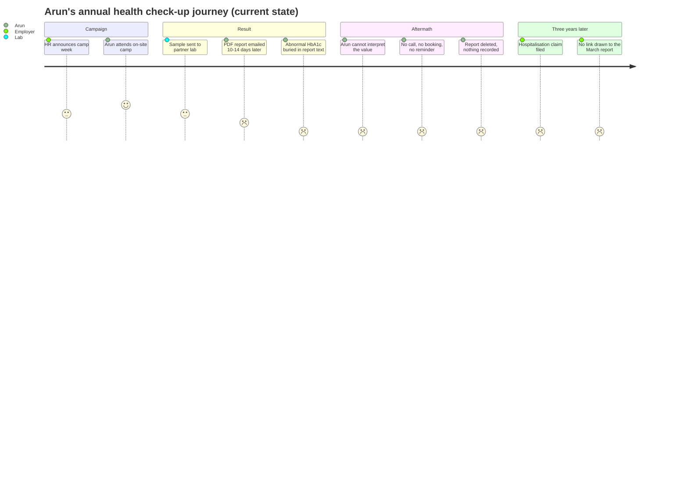
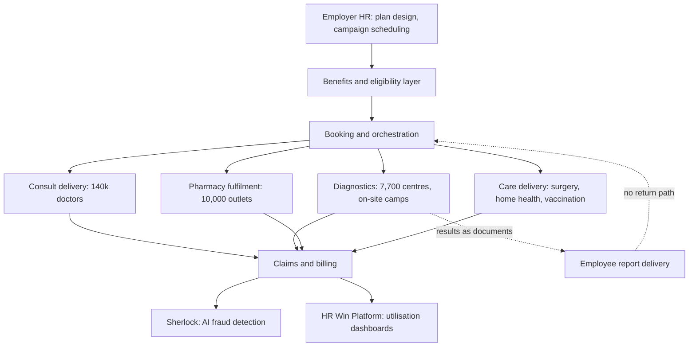
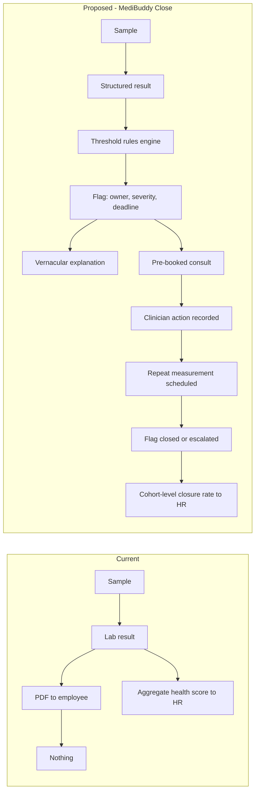
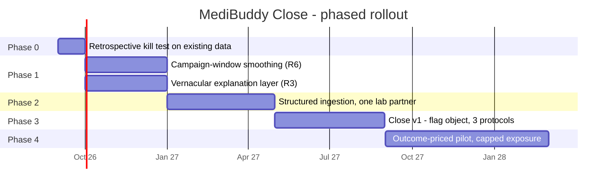

# MediBuddy — Paid for the Test, Not the Follow-Through

### Day 56 of 90 · Product Management Case Study Series

> **The thesis of this case study:** In May 2026 MediBuddy announced its first profitable quarter — positive EBITDA in Q4 FY26 — alongside three scale claims: an annual revenue run rate above ₹1,500 Cr, "nearly 20% year-on-year business growth," and roughly sixfold growth over five years. Those three cannot all describe the same quantity. MediBuddy's last *audited* operating revenue is **₹724.6 Cr (FY25)**. Twenty per cent on that base is ₹869.5 Cr; ₹1,500 Cr implies **+107%**; sixfold over five years implies a **43.1% CAGR**. The reconciling reading is that ₹1,500 Cr is an *annualised exit run rate* — the PTI wire copy says "run rate," most trade coverage rendered it as annual revenue — which puts Q4 FY26 near **₹375 Cr, about 43% of the year in one quarter**. For most businesses that would be implausible. For this one it is the most interesting fact in the file, because MediBuddy's own operating numbers describe demand that is not habit-shaped but **campaign-shaped**: "10 lakh+ unique customers annually" and "100,000+ unique consumers in a single day" — **10% of the year's unique users on one day, 36.5× a uniform day**. That is a corporate health-check calendar, not a healthcare app. And in July 2026 MediBuddy published, with CII, the finding that completes it: across 10,551 employees, **52% took no action after their health check-up, for lack of personalised guidance**, while the 25% who skipped every check-up produced **46% of inpatient claims**. MediBuddy has already built the supply needed to act on those results — 140,000 doctors, 7,500 hospitals and clinics, 7,700 diagnostic centres, 10,000 pharmacies, 99% of PIN codes — and sells each as a separate line on a catalogue. The step between *an abnormal result exists* and *a clinician acted on it* has no owner, no SLA, no metric and no price. This case study proposes **MediBuddy Close**: making that step a contracted obligation priced per *closed finding* rather than per event — which is also the only lever here that fills the 355 days a year the network sits idle.

---

## 2. Repository Metadata

| Field | Value |
|---|---|
| **Case study** | Day 56 of 90 |
| **Product** | MediBuddy (corporate healthcare benefits platform; consumer app) |
| **Legal entity** | Phasorz Technologies Private Limited, **CIN U72300TN2013PTC092385** (incorporated 31 July 2013, ROC Chennai); operationally headquartered in Bengaluru |
| **Domain** | Healthtech / employer-funded (payer-side) healthcare benefits |
| **Primary competitors** | Practo, Apollo 24/7, Plum, Onsurity, Loop Health, ekincare, Truworth Wellness, Medi Assist |
| **Analysis type** | Research-led teardown + financial reconstruction + feature proposal |
| **Proposed system** | **MediBuddy Close** — an SLA-governed pathway carrying an abnormal health-check finding through to a completed consultation, a recorded action and a repeat measurement, priced per *closed flag* |
| **Author** | Gaurav Singh |
| **Date of analysis** | 21 August 2026 |
| **Research boundary** | Public sources only — MCA registry data, trade-press reporting of filed accounts, the company's own site and press releases, and the CII–MediBuddy report of July 2026. No employee, internal document, contract or authenticated session was consulted. |
| **Latest financials** | **Audited: FY25.** FY26 exists only as company-stated press-release figures; no filed FY26 accounts were located. |

---

## 3. Badges


---

## 4. Table of Contents

<details>
<summary><b>Expand the full 65-section contents</b></summary>

| # | Section | # | Section |
|---|---|---|---|
| 1 | Cover | 34 | HEART |
| 2 | Repository Metadata | 35 | Growth Strategy |
| 3 | Badges | 36 | Growth Loops |
| 4 | Table of Contents | 37 | Network Effects |
| 5 | Executive Summary | 38 | Product Strategy |
| 6 | Product Overview | 39 | Monetization |
| 7 | Company Background | 40 | Trust & Safety |
| 8 | Product Timeline | 41 | Technical Architecture |
| 9 | Vision & Mission | 42 | Data Flow |
| 10 | Problem Statement | 43 | API Ecosystem |
| 11 | Market Research | 44 | Privacy & Security |
| 12 | Industry Analysis | 45 | Pain Points |
| 13 | TAM / SAM / SOM | 46 | Opportunity Mapping |
| 14 | Competitor Analysis | 47 | RICE Prioritisation |
| 15 | SWOT | 48 | MoSCoW |
| 16 | Porter's Five Forces | 49 | Kano |
| 17 | Business Model Canvas | 50 | Feature Proposal |
| 18 | Revenue Model | 51 | PRD |
| 19 | Target Users | 52 | Wireframes |
| 20 | Personas | 53 | Rollout Plan |
| 21 | JTBD | 54 | A/B Testing |
| 22 | User Journey | 55 | KPI Dashboard |
| 23 | User Flow | 56 | Product Roadmap |
| 24 | Information Architecture | 57 | Risks & Mitigation |
| 25 | UX Audit | 58 | Future Vision |
| 26 | UI Audit | 59 | PM Lessons |
| 27 | Accessibility | 60 | PM Interview Questions |
| 28 | Feature Breakdown | 61 | References |
| 29 | AI Capabilities | 62 | About the Author |
| 30 | Product Metrics | 63 | License |
| 31 | North Star Metric | 64 | Self Review |
| 32 | Product Analytics | 65 | Appendix |
| 33 | AARRR | | |

</details>

---

## 5. Executive Summary

MediBuddy is India's largest digital healthcare benefits platform by covered lives: **990+ corporates, 1 million+ employees and dependents**, served through **140,000+ doctors across 22+ specialities, 7,500+ hospitals and clinics, 7,700+ diagnostic centres and 10,000+ pharmacies**, reaching **99.0% of Indian PIN codes** in **16 languages** with 2,500+ staff. It is the June 2020 merger of DocsApp (teleconsultation, founded by IIT Madras alumni Satish Kannan and Enbasekar Dinadayalane) with MediBuddy, and it later acquired Aetna's India business. Total funding exceeds **$170 Mn**, including a **$125 Mn Series C (Feb 2022)** co-led by Quadria Capital and Lightrock India.

**The financial arc is real.** Audited operating revenue: **₹234.1 Cr (FY22) → ₹297.7 Cr (FY23, +27.2%) → ₹645.4 Cr (FY24, +116.8%) → ₹724.6 Cr (FY25, +12.3%)**. Net loss: ₹259.3 Cr → ₹321.7 Cr → ₹215.7 Cr → **₹137 Cr (−36.5%)**. FY25 EBITDA margin improved from **−25.67% to −14.19%**. In May 2026 the company announced **positive EBITDA in Q4 FY26**, plus ~15% further margin improvement and ~60% lower burn. Applying that stated 15-point improvement to the FY25 margin lands at **+0.81%** — a business that ends the year barely above the line, which is what one profitable quarter looks like.

**Where the numbers stop agreeing.** The same announcement carried ₹1,500 Cr, ~20% growth and ~6× over five years — mutually inconsistent as descriptions of audited revenue (§13.2). Notably **₹1,500 Cr ÷ FY22's ₹234.1 Cr = 6.41×**, so the ₹1,500 Cr and 6× claims agree with each other and only the 20% figure is the outlier. The reading carried forward is a **Q4-annualised exit run rate**, implying Q4 at ~**43.1% of the year, 1.73× a uniform quarter**.

**Why that matters more than the accounting.** Two company figures point at extreme concentration independent of any revenue question: **100,000+ unique consumers in a single day** against **10 lakh+ annually** — **36.5× a uniform day**. And "1 million+ covered lives" and "10 lakh+ annual unique customers" are effectively the same number, meaning the standalone consumer business is arithmetically invisible. With **>75% of revenue from B2B**, MediBuddy's user is a covered life, and a covered life appears when their employer schedules a campaign.

**The gap the company documented itself.** On 31 July 2026, MediBuddy and CII published a study of **10,551 employees across 459 corporate programmes**: three annual check-ups associated with **2.41%** hospitalisation versus **7.27%** for none (**3.02×**); the **25% who skipped every check-up produced 46% of inpatient claims and 43% of payouts** (1.84× and 1.72× their headcount share); Gen Z participation **47%**; **73% of organisations in the two lowest workplace-health maturity stages**; and — the finding this case study builds on — **52% took no action after their check-up, for lack of personalised guidance**.

MediBuddy sells thirteen-plus services that could *be* that guidance, as a catalogue of separately-triggered, separately-billed events. Nobody owns the transition from an abnormal result to a completed action: not the lab, not HR, not the employee, and not, contractually, MediBuddy.

**The proposal (§50): MediBuddy Close.** Every result crossing a published clinical threshold becomes a *flag* with an owner, a deadline, a vernacular explanation, a pre-booked consult, a recorded action and a repeat measurement — priced per **closed flag**. North Star: **Closed Flags per 1,000 Covered Lives (CF/1k)**. Guardrail: **Flag Precision** at the 25th percentile across accounts, owned by clinical governance, firewalled from HR. §53's Phase 0 can kill it in two analyst-weeks on data MediBuddy already holds; §54's E4 arm is built to falsify the author's answer.

---

## 6. Product Overview

**The corporate face** is a benefits administration and delivery product sold to employers, insurers and TPAs: online and offline consultation, medicine delivery, lab tests, surgery care, vision and dental care, MediClinics, home healthcare, vaccination, health check-ups, elder care, maternity care — plus wellness programmes (diabetes and weight management, EAP, webinars, on-site camps, fitness integration). Around it sits an HR layer: the **HR Win Platform** with real-time utilisation analysis, health-score dashboards, industry benchmarks, budget-aligned plan design, and **Sherlock**, an AI fraud-prevention system. Access is 24×7 and multilingual, with a stated 24×7 Healthcare Command Centre.

**The consumer face** is the MediBuddy app — teleconsultation (the DocsApp lineage), lab bookings, medicines, check-up packages. Usable by anyone; on the revenue mix and covered-lives arithmetic, used overwhelmingly by people whose employer already paid.

The distinction governs every section below: **the paying customer and the using customer are different people, and the moment of use is scheduled by a third party.**

---

## 7. Company Background

The operating entity is **Phasorz Technologies Private Limited**, CIN **U72300TN2013PTC092385**, incorporated **31 July 2013**, ROC Chennai, registered office in Madipakkam, Chennai — though the business runs from Bengaluru. Registry data lists **Satish Kannan as Managing Director** and **Enbasekar Dinadayalane as Director**, with nominee directors including Vishal Vijay Gupta, Sunil Kumar Thakur, Samir Rajendra Abhyankar and Tirunelveli Padmanabhan Devarajan. Authorised capital **₹61.14 Cr**; paid-up **₹58.11 Cr**. *(Per the house rule from Day 48, entity and CIN were checked against registry records rather than trade press; one aggregator additionally attributes an unrelated grocery brand to this CIN, treated here as a data-quality artefact — §64.)*

DocsApp merged with MediBuddy in **June 2020**, taking the MediBuddy brand and retaining the Phasorz entity. A **March 2021** tranche took valuation past **$165 Mn**; the **February 2022 Series C** raised **$125 Mn** from Quadria Capital and Lightrock India with Bessemer, India Life Sciences Fund III, Rebright, JAFCO Asia, TEAMFUND, FinSight and debt from InnoVen, Stride and Alteria — past **$170 Mn** in total. **August 2023** added **$18 Mn** for acquisitions, and the company acquired **Aetna's India business**.

FY24's **+116.8%** revenue jump sits between years of +27.2% and +12.3% and coincides with this acquisition period. This document lacks the disclosure to split organic from inorganic and says so rather than assuming (Appendix A-3).

---

## 8. Product Timeline

| Date | Event |
|---|---|
| 31 Jul 2013 | Phasorz Technologies incorporated, ROC Chennai |
| Jun 2020 | **DocsApp merges with MediBuddy**; $20 Mn raised; MediBuddy becomes the brand |
| Mar 2021 | Valuation passes **$165 Mn** |
| Feb 2022 | **$125 Mn Series C.** Network then: 90,000 doctors, 7,000 hospitals, 3,000 labs, 2,500 pharmacies, 96% PIN codes, 35,000+ daily users |
| FY22–FY23 | Revenue ₹234.1 Cr → ₹297.7 Cr; losses ₹259.3 Cr → **₹321.7 Cr** (peak) |
| Aug 2023 | **$18 Mn** raised; **Aetna India** acquired |
| Apr 2024 | Company announces it "reached break-even with a marginal loss" — not matched by the filed FY24 accounts (Appendix A-1) |
| FY24 | Revenue **₹645.4 Cr** (+116.8%); net loss ₹215.7 Cr; EBITDA margin −25.67% |
| FY25 | Revenue **₹724.6 Cr** (+12.3%); net loss **₹137 Cr**; EBITDA loss ₹103 Cr; margin −14.19% |
| May 2026 | **First positive-EBITDA quarter (Q4 FY26)** announced; ₹1,500 Cr figure; ~20% growth; >75% B2B |
| 31 Jul 2026 | **CII–MediBuddy workplace health report** published |
| 21 Aug 2026 | Date of this analysis. No filed FY26 accounts located |

---

## 9. Vision & Mission

MediBuddy publishes no conventional vision/mission pair in the sources reviewed; its about-page copy is largely SEO-oriented. The nearest statement of intent is the CEO's framing in the July 2026 CII report: **"Health is not simply a benefit to be administered. It is a strategic capability that shapes productivity [and] resilience."**

That sentence is an argument against the company's own pricing model. A benefit that is administered is billed per transaction; a capability that shapes productivity is bought for an outcome. §39 and §50 propose that MediBuddy price what its CEO says it sells.

---

## 10. Problem Statement

**For the employee:** a check-up produces a PDF, some of it abnormal, none of it explained. **52% take no action**, per MediBuddy's own research. The failure generates no ticket, no complaint, no churn event — no record anywhere.

**For the employer:** HR buys utilisation because utilisation is what the dashboard shows. But the costly population is the one that *doesn't* use the benefit — **25% of employees, 46% of inpatient claims**. A utilisation dashboard is structurally blind to them.

**For MediBuddy:** revenue is earned per event performed, so there is no contractual reason to care whether a specific finding was resolved — even though resolution is the mechanism by which the employer's claims cost falls, which is the only durable reason to keep paying more each year.

**In one line:** *the transition from an abnormal finding to a completed clinical action has no owner, no SLA, no metric and no price.*

---

## 11. Market Research

From the CII–MediBuddy dataset (10,551 employees, 459 corporate programmes, seven industries):

1. **Participation associates with lower hospitalisation.** Three check-ups: **2.41%**. Zero: **7.27%**. A **3.02×** ratio — an association in claims data, not a trial, and graded accordingly (§30).
2. **Cost concentrates in non-participants.** The 25% who skipped every check-up produced **46% of inpatient claims (1.84×)** and **43% of payouts (1.72×)**.
3. **Post-test action is the weak link, not testing.** **52% took no action**, attributed to lack of personalised guidance.

Supporting texture: cardiac drugs are **20.34% of pharmacy dispensations**; **HbA1c is the fourth most-requested test**; **Gen Z participation is 47%** with 90% reporting anxiety symptoms; mental-health productivity loss to Indian employers is put at **₹1.1 lakh crore** annually (₹51,000 Cr presenteeism, ₹14,000 Cr absenteeism); **73% of organisations sit in the two lowest maturity stages**, under 2% in the highest.

The Indian corporate health benefit is mature on screening and immature on follow-through — and the money is in the follow-through.

---

## 12. Industry Analysis

Four player types exist, and MediBuddy straddles three:

- **TPAs and insurers** (Medi Assist) — adjudicate claims. See cost, not care.
- **Benefits platforms** (Plum, Onsurity, Loop Health) — sell and administer cover. See enrolment, rarely own delivery.
- **Wellness providers** (ekincare, Truworth) — run camps. See screening, not treatment.
- **Delivery networks** (Apollo 24/7, Practo, MediBuddy) — actually deliver care.

MediBuddy is a delivery network that sells through the benefits channel and reports like a wellness provider. That straddle is its moat and its confusion: it is the only category that can physically execute a follow-up, and it prices like the one that merely schedules them.

*Channel note:* FY25 **sales commissions of ₹155.47 Cr — 21.5% of operating revenue** — are what reaching the employer through intermediaries costs. That line **fell 7% while revenue grew 12.3%**, the clearest sign of genuine operating leverage in the filings and the best available argument that FY26's margin gain is not purely seasonal.

---

## 13. TAM / SAM / SOM

*Framework note: the funnel is run only after a financial reconstruction, because the company's stated scale figure and its last audited figure differ by more than 2×, and sizing against the wrong one would propagate through every later section.*

### 13.1 Financial reconstruction (audited)

| Year | Operating revenue | YoY | Net loss | EBITDA margin |
|---|---|---|---|---|
| FY22 | ₹234.1 Cr | — | ₹259.3 Cr | — |
| FY23 | ₹297.7 Cr | +27.2% | ₹321.7 Cr | — |
| FY24 | ₹645.4 Cr | +116.8% | ₹215.7 Cr | −25.67% |
| FY25 | ₹724.6 Cr | +12.3% | ₹137.0 Cr | −14.19% |
| FY26 | *no filed accounts located* | stated ~20% | stated positive-EBITDA Q4 | stated ~+15pp |

FY25 cost structure against ₹724.6 Cr: **materials ₹333 Cr (46.0% of revenue, 37.9% of expenses)**; **employee benefits ₹176.8 Cr (24.4%)**; **sales commissions ₹155.47 Cr (21.5%)**; safety ₹42.5 Cr; IT ₹32.5 Cr; other ₹138.7 Cr. Total expenses **₹879 Cr** — **₹1.21 per rupee earned**. Cash and bank ₹80 Cr; current assets ₹395.2 Cr.

### 13.2 The run-rate finding

| Claim | If it describes audited operating revenue | Verdict |
|---|---|---|
| "~20% YoY growth" | FY26 ≈ **₹869.5 Cr** | Consistent with the audited series |
| "₹1,500 Cr+" | **+107.0%**, i.e. **2.07× FY25** | Inconsistent with the 20% claim |
| "~6× in five years" | CAGR **43.1%** | Inconsistent with the 20% claim |

**₹1,500 Cr ÷ FY22's ₹234.1 Cr = 6.41×** — so ₹1,500 Cr and 6× agree with each other across a five-fiscal-year span, and the 20% figure is the outlier. Three readings, and this document cannot choose between them with certainty:

- **R1 — Q4-annualised exit run rate.** PTI says "run rate"; several outlets rendered it as annual revenue. If FY26 is ₹869.5 Cr and the exit run rate is ₹1,500 Cr, then **Q4 ≈ ₹375 Cr = 43.1% of the year, 1.73× a uniform quarter**.
- **R2 — Gross platform value**, including insurer-funded amounts never recognised as revenue. Common in this category; would reconcile everything.
- **R3 — Consolidation change**, as plausibly happened in FY24's +116.8%.

**R1 is carried forward**, for one reason: it is the only reading independently corroborated by a *non-financial* disclosure (§13.3). It is graded 🟡 and declared as assumption **A1**, with kill criteria in §53.

The margin claim is unaffected by any of this: **−14.19% + 15pp = +0.81%**. The company's own numbers describe a modest result; the headline describes the ₹1,500 Cr one.

### 13.3 The concentration finding

**10 lakh+ unique customers annually** against **100,000+ unique consumers in a single day**: one day carries **10.0% of the year's uniques**, versus 0.27% for a uniform day — **36.5×**. Separately, "1 million+ covered lives" and "10 lakh+ annual uniques" are, at this resolution, **the same number**, so the entire annual user base is accounted for by the corporate population and the consumer business is invisible within it.

One demand pattern produces both facts: **employer-scheduled health-check campaigns concentrated at benefit-year deadlines**. It also explains why the first profitable quarter is Q4 — the quarter an April-to-March budget expires.

### 13.4 TAM / SAM / SOM

- **TAM** — no credible public figure for India's employer-funded health spend could be verified, so **none is stated** rather than repeating an unchecked consultancy number (Appendix A-4).
- **SAM** — organised employers buying an administered benefit. MediBuddy's book is **990+ corporates / 1M+ lives ≈ 1,010 lives per corporate**: mid-to-large enterprise, not SME.
- **SOM (bottom-up, the only sizing this document stands behind)** — **₹7,246 per covered life per year** at FY25 audited revenue; **₹15,000** at the ₹1,500 Cr figure. §50 is a bet that the second number is reached through depth on existing lives rather than headcount growth, and §55 measures exactly that.

---

## 14. Competitor Analysis

*Framework note: players are compared on **who writes the cheque and what triggers a use**, not on features — every catalogue in this category looks the same, and only the first question determines whether anyone is accountable for an outcome.*

| Player | Who pays | Use trigger | Owns delivery? | Accountable for follow-through? |
|---|---|---|---|---|
| **MediBuddy** | Employer (>75% of revenue) | Employer campaign | **Yes** — 140k doctors, 7.7k labs, 10k pharmacies | No — priced per event |
| Apollo 24/7 | Consumer, employer | Consumer need | Yes — owned estate | Partially, within Apollo |
| Practo | Consumer, employer | Search intent | No — marketplace | No |
| Plum / Onsurity / Loop | Employer | Enrolment, claims | No — partner delivery | No |
| ekincare / Truworth | Employer | Wellness calendar | Partially — camps | No |
| Medi Assist (TPA) | Insurer | Claim submission | No | No — adjudicates after the fact |

**The finding.** MediBuddy is the only player that both sells through the employer channel and physically controls consult, test and pharmacy. It is therefore the only one that *could* contract for a closed clinical loop — and it prices identically to those that couldn't. Its structural advantage is unmonetised.

*Caveat:* comparable FY25 revenue for Plum, Onsurity, Loop Health and ekincare could not be verified, so **no competitor financials are quoted anywhere in this file** (ASSUMPTIONS Part 5).

---

## 15. SWOT

**Strengths.** Delivery depth (140k+ doctors, 7,500+ hospitals, 7,700+ labs, 10,000+ pharmacies, 99.0% PIN codes, 16 languages). 990+ logos, 1M+ lives. Real cost discipline: loss down 36.5% and commissions falling in absolute terms while revenue grew. A published research asset that gives credibility with the exact buyer it sells to.

**Weaknesses.** ₹7,246 revenue per covered life on a captive population — thin monetisation depth. 36.5× peak-day concentration, implying heavy idle capacity. Commissions at 21.5% of revenue. Public communication mixing run-rate, audited and gross bases (§13.2), including an April 2024 break-even claim the filed FY24 accounts do not support.

**Opportunities.** The 52% gap it published itself. The 25%/46% cost concentration no utilisation dashboard can see. Diagnostics (+156.7%) and pharmacy (+300%) capacity added since 2022 — the two legs of a follow-up pathway.

**Threats.** Insurers and TPAs moving upstream into care management. **DPDP Rules 2025** obligations, with legacy-consent revalidation at **13–14 Nov 2026** and full enforcement from **13–14 May 2027** (§44). Price-led renewals in a category whose buyer measures utilisation.

---

## 16. Porter's Five Forces

*Framework note: run **twice**, because MediBuddy sits in two markets at once — the employer contract and the patient's clinical attention. Three forces invert between them, and that inversion is the business.*

| Force | On the **employer contract** | On the **patient relationship** |
|---|---|---|
| **Buyer power** | **High** — annual renewal, price comparison, low switching cost | **Low** — the employee didn't choose and can't substitute without paying |
| **Supplier power** | **Moderate** — intermediaries take 21.5% of revenue | **Low** — 140,000 doctors, none critical |
| **Substitutes** | **High** — competitors, an insurer's in-house programme, or doing nothing | **Moderate** — a local GP or pharmacy counter, out of pocket |
| **New entrants** | **Moderate** — selling to HR is learnable | **Low** — 99% PIN-code delivery is capital- and time-intensive |
| **Rivalry** | **High** — identical catalogues, annual price contests | **Low** — no one else is present when the employee reads their result |

**What the inversion says.** MediBuddy is in a brutal market when it sells and a near-monopoly when it delivers. Every rupee of value moved from the first column to the second improves its position. Pricing per closed outcome is exactly that move: it makes renewal about a number MediBuddy uniquely controls instead of a rate card anyone can undercut.

---

## 17. Business Model Canvas

| Block | Content |
|---|---|
| **Segments** | Mid-to-large employers (~1,010 lives each); insurers and TPAs; consumers (small) |
| **Value propositions** | To HR: one vendor, national coverage, budget-aligned design, utilisation reporting, fraud control. To the employee: cashless, multilingual, 24×7 access |
| **Channels** | Intermediary-led enterprise sales (21.5% of revenue); direct enterprise; app and web |
| **Relationships** | Annual contract with HR; campaign-triggered with the employee |
| **Revenue** | Per-event fees, programme fees, subscription/preventive packages (>50% YoY) |
| **Key resources** | The delivery network; the covered-lives book; check-up and claims data; the Command Centre; the CII research asset |
| **Key activities** | Network contracting; campaign operations; clinical delivery; administration; fraud detection |
| **Key partners** | Hospitals, labs, pharmacies, doctors; insurers and TPAs; brokers |
| **Costs** | Materials ₹333 Cr (46.0%); people ₹176.8 Cr (24.4%); commissions ₹155.47 Cr (21.5%); ₹1.21 per rupee earned |

---

## 18. Revenue Model

Revenue is earned when **an event happens** — a consult completed, a test run, a medicine delivered, a camp executed. Programme and subscription fees grow fastest of the disclosed lines (**>50% YoY**), but the dominant logic is per-event. Two consequences follow.

**Revenue tracks campaign scheduling, not health need.** A business earning per event, whose events are scheduled by the employer's calendar, has the employer's calendar for a revenue curve — consistent with §13.3 and with Q4 being the first profitable quarter.

**Incentives diverge at exactly one point.** The employer wants claims cost down, which requires abnormal findings to be *resolved*. MediBuddy is paid either way. Nothing in the disclosed model rewards closure — and its own research says closure fails 52% of the time.

---

## 19. Target Users

- **The HR buyer** — signs the contract, is measured on cost and coverage, reads a utilisation dashboard, re-tenders annually.
- **The participating employee** — takes the check-up, gets a result, and 52% of the time does nothing with it.
- **The non-participating employee** — 25% of headcount, **46% of inpatient claims**, invisible to every utilisation metric, and the most valuable population in this file.
- **The dependent** — spouse, parent, child: highest need, lowest digital fluency.

---

## 20. Personas

**Ramya, 34 — Senior Manager, HR Operations, 4,000-person IT services firm (the buyer).** Runs the February renewal. Scored on cost per employee, dependent coverage and satisfaction. Opens the MediBuddy dashboard monthly and looks at utilisation, because that is what it shows. She has never been given a number for how many abnormal findings her employees resolved, and would say she should have. Her renewal is a price decision because nothing else on the dashboard compares across vendors.

**Arun, 41 — Production Supervisor, same employer (the flagged employee).** Attended the March camp because his manager sent everyone. Two weeks later: a PDF, HbA1c elevated, borderline. He does not know what HbA1c is. Nobody called. He deleted the email and told his wife it was "some sugar thing." He is the 52% — and the employee whose hospitalisation will appear in Ramya's claims data in three years with no traceable link to the March PDF.

**Fatima, 27 — Software engineer, ten months in (the non-participant).** Skipped both check-up windows; camp days clashed with releases and she doesn't think of herself as needing one. Used the app once, for a cough. She is in the 25% cohort producing 46% of claims, and in the Gen Z segment where participation is **47%**. No current metric distinguishes her from someone who is simply healthy.

---

## 21. Jobs to Be Done

| Actor | Job | Served by | Verdict |
|---|---|---|---|
| HR buyer | "Show me spend is reducing risk, not just being consumed" | Utilisation dashboard | **Unserved** |
| HR buyer | "Cover everyone, cashlessly" | Network, 99% PIN codes | Well served |
| Flagged employee | "Tell me whether this matters and what to do" | A PDF | **Unserved** — 52% do nothing |
| Flagged employee | "Make the next step easy enough that I take it" | A bookable catalogue | Partially — available, not directed |
| Non-participant | "Give me a reason to show up that isn't a camp on a workday" | Camp calendar | **Unserved** |
| Dependent | "Help my parent who can't navigate an app" | Multilingual access, home healthcare | Partially served |

Three of six are unserved, all on the same axis: **direction after measurement**.

---
## 22. User Journey (Arun-type, flagged employee, current state)



Every low point sits in the same section, and none of them produces a ticket, a churn signal or a data point. **The failure is invisible by construction** — which is why it has survived a decade of iteration.

---

## 23. User Flow

**Current — abnormal result:** camp or lab visit → sample → report → PDF emailed → *end of flow*. Any next step is user-initiated from a general catalogue.

**Proposed (§50):** sample → report → **threshold rules run → flag created with owner, severity, deadline** → vernacular explanation → **consult pre-booked, not merely bookable** → clinician records an action → **repeat measurement scheduled** → flag closes or escalates.

The difference is one word: today the next step is *available*; under Close it is *owed*.

---

## 24. Information Architecture

The app is organised by **service type** — Consult, Labs, Medicines, Health Checks, Dental, Vision, Surgery — mirroring how the contract is priced. The HR platform is organised by **programme and utilisation**.

Neither is organised around a **health issue over time**. No object in the disclosed product represents "your elevated HbA1c from March 2026" as a thing with a state, a history and a next action. §50 proposes that object: the **flag**. Its absence is why the catalogue cannot become a pathway — you cannot build a workflow around an entity that does not exist in the data model.

---

## 25. UX Audit

*(Assessed from public surfaces only; no authenticated session — §64.)*

| Area | Observation | Severity |
|---|---|---|
| Result comprehension | Results delivered as clinical documents; no evidence of plain-language per-parameter interpretation | **High** — this is the 52% |
| Next-step direction | Services bookable from a general catalogue; no result-triggered pre-filled path | **High** |
| Continuity | No longitudinal view tying a past result to a current action | **High** |
| Campaign UX | Camp scheduling is employer-driven; individual rescheduling unclear publicly | Medium |
| Language | 16 languages claimed for access; unclear whether *result interpretation* is covered | Medium |
| Discovery breadth | 13+ services in one app is heavy surface for an infrequent user | Low |

---

## 26. UI Audit

App-store ratings are stated at **4.0+ on Android and iOS** — respectable for an app users reach through an obligation rather than an intent. The dominant pattern is a service grid: right for a catalogue, wrong for a pathway. A pathway needs a **persistent status object** — one open item, one next action, one deadline — rather than a grid of equally-weighted entry points. §52 sketches it.

---

## 27. Accessibility

Care access is stated in **16 Indian languages**, materially better than most Indian health apps and the right investment for a workforce spanning plant floors and offices. What public surfaces do not resolve is whether the claim extends to **diagnostic result interpretation**, which is where language failure has clinical consequences. §50 therefore treats vernacular explanation of the flag — not just of the app — as a v1 requirement, not a later localisation task.

---

## 28. Feature Breakdown

| Cluster | Features | Maturity |
|---|---|---|
| Consultation | Online, offline, dental, vision, 22+ specialities | Mature — **>90% YoY** growth in online consults |
| Diagnostics | Lab tests, check-up packages, on-site camps | Mature — network **+156.7%** since 2022 |
| Fulfilment | Medicine delivery, 10,000+ pharmacies | Mature — network **+300%** since 2022 |
| Care delivery | Surgery, home healthcare, vaccination, maternity, elder care | Growing |
| Chronic / wellness | Diabetes and weight management, EAP, webinars, fitness | Growing — subscription/preventive **>50% YoY** |
| Employer tooling | HR Win Platform, dashboards, benchmarks, Sherlock | Mature on administration, absent on outcomes |
| **Continuity** | — | **Absent** |

The last row is the case study.

---

## 29. AI Capabilities

The only AI capability MediBuddy names is **Sherlock**, an AI fraud-prevention system pointed at the network. Reasonable for a payer-side business — and telling that the named AI investment protects the *cheque* rather than the *patient*.

§50 deliberately does **not** require a clinical model. Flag creation is rule-based against published thresholds with clinician review, because a rules engine is auditable, explainable to a regulator under DPDP, and cheap to falsify in Phase 0 — and because adding model risk to the one workflow whose credibility must be unimpeachable is a bad trade. Ranking can be learned later, once closure data exists.

---

## 30. Product Metrics

| Metric | Value | Source | Grade |
|---|---|---|---|
| Operating revenue FY25 | ₹724.6 Cr | Filed accounts via trade press | 🟢 High |
| Net loss FY25 | ₹137 Cr (−36.5%) | Filed accounts | 🟢 High |
| EBITDA margin FY24 → FY25 | −25.67% → −14.19% | Filed accounts | 🟢 High |
| Sales commissions FY25 | ₹155.47 Cr (21.5% of revenue) | Filed accounts | 🟢 High |
| Corporates / covered lives | 990+ / 1,000,000+ | Company corporate page | 🟡 Medium |
| Annual uniques / single-day uniques | 10 lakh+ / 100,000+ | Company statement, May 2026 | 🟡 Medium |
| B2B share of revenue | >75% | Company statement | 🟡 Medium |
| Q4 FY26 EBITDA | Positive | Company statement | 🟡 Medium |
| FY26 revenue | ₹1,500 Cr (run rate) | Wording varies by outlet | 🔴 Conflicting |
| FY24 "break-even" | Claimed Apr 2024; FY24 net loss ₹215.7 Cr | Company vs filed accounts | 🔴 Conflicting |
| Post-check-up inaction | 52% | CII–MediBuddy, Jul 2026 | 🟡 Medium |
| Hospitalisation, 3 check-ups vs 0 | 2.41% vs 7.27% (3.02×) | CII–MediBuddy | 🟠 Low (association) |
| Skippers' claim share | 25% of employees → 46% of claims | CII–MediBuddy | 🟡 Medium |

**What is missing from this table is the point.** There is no public metric for how many abnormal findings were resolved, in what time, at what cost — in a company whose entire argument to the employer rests on risk reduction.

---

## 31. North Star Metric

**Current (inferred): utilisation** — events consumed per covered life. It rises when a healthy employee books a teleconsult for a cold, and is unmoved when Arun ignores his HbA1c.

**Proposed: Closed Flags per 1,000 Covered Lives per year (CF/1k).** A flag closes only when all four hold:

1. A finding crossed a pre-published clinical threshold, and
2. A clinician completed a consultation on that finding, and
3. An action was recorded (prescription, referral, protocol, or an explicit decision that none is needed), and
4. A **repeat measurement** of the same parameter completed within the protocol window (default 90 days).

It is conjunctive: three of four is zero. And it **does not rise when a healthy employee consumes more services** — the denominator is covered lives, the numerator closures. It is the first metric in this business that would fall when MediBuddy sells more of what it sells today.

**Guardrail: Flag Precision** — the clinician-confirmed share of raised flags, **measured at the 25th percentile across employer accounts**, not the mean, because a mean across 990 accounts lets systematic over-flagging in a handful hide entirely, and those are the accounts where trust breaks. **Owned by clinical governance, which has no stake in the Close P&L**, with logs **firewalled from HR reporting and from any individual record** (§40, §44). Hard stop: nothing ships that raises CF/1k while pushing 25th-percentile precision below its floor. Carried through §39, §47, §50, §53, §54, §55, §57.

---

## 32. Product Analytics

Most of what is needed already exists somewhere in the business:

- **Structured result ingestion** — lab values, not PDFs. The only genuinely new engineering requirement.
- **Flag lifecycle events** — created, explained, viewed, booked, consulted, actioned, re-measured, closed, escalated, expired; each timestamped and owned.
- **Cohort separation** — participants vs non-participants, per employer, making the 25%/46% population visible for the first time.
- **Channel attribution** — which contact produced the booking, so closure cost is optimised rather than guessed.
- **Claims linkage** — where consent permits, aggregate-only, cohort level, never individual.

The absence: MediBuddy can certainly report how many tests it ran. Nothing public suggests it can report **how many abnormal results it resolved**.

---

## 33. AARRR Framework

*Framework note: run **twice**, side by side, because there are two funnels with different customers and different clocks — and running only the patient funnel (the instinct for a health app) misses that 75% of revenue is decided in the other one.*

| Stage | **Payer funnel** (employer) | **Patient funnel** (covered life) |
|---|---|---|
| **Acquisition** | Intermediary-led sale; 21.5% of revenue in commissions | Employer enrolment — cost near zero, and so is intent |
| **Activation** | First campaign executed, dashboard live | First check-up attended — **25% never activate** |
| **Retention** | Annual renewal, contested on price | Campaign-driven, not habit-driven — 36.5× peak day |
| **Referral** | HR peer references; the CII report as category marketing | Dependents added to the plan |
| **Revenue** | Per-event billing on a rate card | Out-of-pocket top-ups; subscription plans (>50% YoY) |

**What the double run exposes.** The payer funnel is weakest at retention and fights on price. The patient funnel is weakest at activation, where 25% never arrive. These are the same weakness: MediBuddy has no evidence to bring to renewal about the population that costs the employer most, because that population never enters the funnel. **Close attacks patient-funnel activation in order to fix payer-funnel retention** — the strategic argument in one sentence.

---

## 34. HEART Framework

| Dimension | Signal today | Signal under Close |
|---|---|---|
| **Happiness** | App rating; HR satisfaction | Flagged-employee CSAT at closure |
| **Engagement** | Consults, tests, orders | Flag progression: % reaching a completed consult |
| **Adoption** | Services per covered life | % of employers on outcome contracts; % of results structured |
| **Retention** | Contract renewal | 90-day re-measurement completion; year-2 closure in the same cohort |
| **Task success** | Booking completion | **CF/1k**, plus median days from result to closure |

Every "today" cell measures an action by a user who already decided to act. None can see Arun, because Arun did nothing. A framework that only measures the engaged is blind to the population that matters most here.

---

## 35. Growth Strategy

Three disclosed engines: **more logos**, **more network**, **more services per life**. The first two are getting expensive — logos cost 21.5% of revenue, and coverage has reached 99.0% of PIN codes with no third digit left to buy. What actually got built between February 2022 and 2026:

| Supply | Feb 2022 | 2026 | Change |
|---|---|---|---|
| Doctors | 90,000 | 140,000 | **+55.6%** |
| Hospitals / clinics | 7,000 | 7,500 | **+7.1%** |
| Diagnostic centres | 3,000 | 7,700 | **+156.7%** |
| Pharmacies | 2,500 | 10,000 | **+300.0%** |
| PIN codes | 96% | 99.0% | +3pp |
| Daily uniques | 35,000+ | 100,000+ | +185.7% |

**Read the pattern.** The two fastest-growing categories are diagnostics and pharmacy — **testing and treating**. The slowest, by an order of magnitude, is hospitals at +7.1%, the inpatient end where claims are incurred. MediBuddy spent four years building exactly the supply a follow-up pathway needs, then did not build the workflow connecting them. That is the third engine, and it is the cheapest, because the capital is already spent.

---

## 36. Growth Loops

**Current (campaign loop).** Employer schedules → employees attend → events billed → utilisation reported → HR renews on utilisation and price → next campaign. **One turn per year**, accelerated only by the employer's budget. Nothing an employee does between campaigns feeds it.

**Proposed (closure loop).** Check-ups produce flags → flags close → closure rate reported at renewal → employer expands scope or population → more check-ups. The outer loop still turns annually, but an inner loop turns **every 90 days**, and the inner loop generates the evidence the outer one renews on.

**Why it compounds.** Each closed flag creates a longitudinal record — baseline, action, re-measurement — for a specific life. In year two that record makes the next flag cheaper to raise and easier to close. A competitor bidding in year three starts from a single point-in-time PDF. **The switching cost MediBuddy lacks is a clinical history it is already generating and discarding.**

---

## 37. Network Effects

There is no classic user-to-user effect here and this document will not manufacture one. What exists is a **data-scale effect**: 990 employers across seven-plus industries generate benchmarking power a smaller player cannot reproduce — the CII report is its visible artefact. Under Close it strengthens on a second axis, since thresholds and protocols calibrated across a million lives get more accurate with volume, and accuracy is what holds Flag Precision up. But it remains a data effect, defensible only while the data is used. Today it produces an annual PDF.

---

## 38. Product Strategy

**What the company appears to be doing:** consolidating a network, broadening the catalogue, improving cost discipline, and — on the framing of the May 2026 announcement — assembling a scale narrative of the kind that precedes a raise or a listing.

**What this case study adds:** one product that converts the network from a coverage asset into a continuity asset.

**38.1 Not a bolt-on.** Adding "care coordination" as another catalogue line fails the way the catalogue already fails — another thing an employer can decline and an employee must initiate. The proposal changes the *unit of sale*, which is why §39 and §50 move together.

**38.2 Why now.** Three clocks. The company has just posted a first profitable quarter and will be asked what the next margin lever is. DPDP forces a consent and governance rebuild by **13–14 Nov 2026** anyway — the cheapest moment to introduce a new data object is while the data layer is already open. And the CII report has put the 52% number into the market under MediBuddy's own logo.

**38.3 A structural observation, demoted on purpose.** The idle-capacity insight — 36.5× peak-to-uniform, a network unused for 355 days — is attractive enough to have been the thesis ("fill the troughs"). It deliberately is not, for two reasons. Filling troughs with *any* demand is a utilisation play, and utilisation is the metric this case study argues is misleading the buyer. And a capacity argument would justify the proposal on MediBuddy's economics rather than on the employee's outcome, which is the wrong order for a health product. Idle capacity appears instead as the *feasibility* argument in §46 and a cost input in §47 — a constraint that makes the proposal cheap, not the reason to do it.

---

## 39. Monetization

### 39.1 Current

Per-event fees on a contracted rate card, plus programme and subscription fees. Revenue per covered life: **₹7,246/year** audited; **₹15,000** at the ₹1,500 Cr figure.

### 39.2 The tension this proposal is explicit about

Paying per *closed flag* means paying MediBuddy less when a population is healthy and more when it is sick. That is uncomfortable and belongs in the contract, not in hand-waving. Three mitigations, all pilot terms rather than later revisions:

1. **The flag rate is not MediBuddy's to set.** Thresholds are published clinical standards, fixed before the period begins; changing them mid-term needs the employer's consent.
2. **Flag Precision is the price of the model.** Payment attaches only to clinician-confirmed flags, and 25th-percentile precision below the floor triggers a contractual remedy, not an internal review.
3. **A closure *rate* floor, not a closure *count* target.** Payment on the share of flags closed means raising marginal flags dilutes MediBuddy's own performance rather than inflating its invoice.

The honest framing for the employer: this converts a variable-volume, fixed-price contract into a fixed-scope, outcome-priced one, and can cost more in a year when the population is sicker than assumed. The counter-argument is the 25%/46% concentration — the employer is already paying for that population, in claims, later, at hospital prices.

### 39.3 Pricing shape for v1

A per-covered-life platform fee (flag raising, explanation, tracking) plus a per-closed-flag outcome fee, with the outcome component capped as a share of contract value in year one so neither side is exposed to a mis-estimated flag rate. The cap is a pilot artefact and should fall away after two cycles of real data.

---

## 40. Trust & Safety

Stated as constraints, because this is where a payer-side health product does real harm.

- **HR must never see an individual's flag.** Employer reporting is cohort-level with a minimum cell size. An employer learning that a named employee has an abnormal HbA1c is a career and insurance risk to that employee, and would end the product's credibility on the shop floor in one cycle.
- **Flag data must never enter appraisal, attendance management or any HR system of record.** The Day-49 governance rule applied to a more sensitive dataset: a measurement usable against a worker will be avoided or resented — and the population that avoids it is the 25% this proposal exists to reach.
- **Consent is per-purpose and withdrawable**, including for the re-measurement reminder, independently of consent to the check-up.
- **A closed flag is not a diagnosis.** Closure means a clinician looked and acted; it must never be presented as clinical clearance.
- **Escalation has a floor, not a ceiling.** Clinically defined critical values escalate by phone regardless of notification preferences — a preference setting is not an acceptable failure mode for a critical result.
- **Non-participation must never be penalised**, and the contract should prohibit it explicitly. Otherwise the product has converted a benefit into surveillance.

---

## 41. Technical Architecture *(Construct — reconstructed from public description)*



The dotted edges are the point: results leave as documents, with **no return path** from a result into orchestration. Everything else here is a well-built pipe; the missing arrow is the product.

---

## 42. Data Flow *(Construct)*



Note what does *not* reach HR in the proposed flow: the flag, the value, the identity. Only the cohort closure rate crosses that boundary (§40).

---

## 43. API Ecosystem

Three integration requirements, in order of difficulty:

1. **Structured results ingestion** from partner labs — the hard one, because 7,700 centres produce heterogeneous formats. This is why §53 phases rollout by lab partner rather than by geography.
2. **Consent Manager compatibility** under DPDP — required by early 2027 regardless of this proposal, and reusable here.
3. **Cohort-level reporting** into the HR platform — straightforward, and deliberately the only outbound employer path for flag-derived data.

---

## 44. Privacy & Security

DPDP Rules 2025 were notified on **14 November 2025** with an 18-month transition. Two dates matter:

- **13–14 November 2026** — legacy data revalidation; valid notice and consent must be demonstrable for historical datasets, and soft enforcement ends as the Data Protection Board moves to active supervision.
- **13–14 May 2027** — full enforcement, with penalties reaching **₹250 Cr**.

Significant Data Fiduciary obligations by early 2027 include an India-based DPO, independent audits, Data Protection Impact Assessments, and Consent Manager–compatible consent systems (the framework is expected to be operationalised around mid-2026).

MediBuddy processes employee health data on behalf of employers across a million-plus lives and 990-plus relationships — one of the more exposed positions in Indian healthtech. Two implications: **the compliance work is not optional and is already scoped**, and **Close is easier to build during that rebuild than after it**, because a flag is a purpose-bound object with an explicit lifecycle, retention period and per-purpose consent — the shape DPDP wants anyway. Building it later means re-opening the consent architecture twice.

---

## 45. Pain Points

| # | Pain | Who | Evidence |
|---|---|---|---|
| P1 | Abnormal results produce no action | Employee | **52% take no action** |
| P2 | The costliest population is invisible to the product | Employer | 25% of employees → **46% of claims** |
| P3 | Renewal is a price fight because outcomes aren't measured | MediBuddy, HR | Commissions **21.5% of revenue**; identical catalogues |
| P4 | Demand concentrated into campaign windows | Operations | **36.5×** peak-to-uniform day |
| P5 | Results arrive in a format the employee can't act on | Employee | 16-language claim covers access; interpretation unverified |
| P6 | Young employees don't participate at all | Employer | Gen Z participation **47%** |
| P7 | Scale communication mixes bases | Investors | §13.2; Apr 2024 break-even claim vs FY24 loss ₹215.7 Cr |

---

## 46. Opportunity Mapping — six converging lines

1. **The company published the gap itself.** 52% take no action, for lack of personalised guidance — MediBuddy's own research, July 2026.
2. **The economics of the gap are documented and large.** 25% of employees → 46% of claims and 43% of payouts; 2.41% vs 7.27% hospitalisation.
3. **The supply to close it is built and paid for.** Diagnostics +156.7% and pharmacy +300% since 2022 — test and treatment — against hospitals at +7.1%.
4. **The capacity to close it is idle 355 days a year.** 36.5× peak-to-uniform; closure work spreads across the 90 days after a campaign, i.e. into the troughs.
5. **The renewal conversation has nothing else to be about.** High buyer power, identical catalogues, 21.5% commissions, and a utilisation metric every competitor can also show.
6. **MediBuddy alone is positioned to do it.** The only player that both sells through the employer channel and controls consult, test and pharmacy.

**Lines 1 and 3 are the most reusable**, and they are the same method: *check what the company has already published but not productised; check what it has already paid for but does not use.* Line 1 is unusual — it is rare for a company to fund, brand and publish the precise quantification of its own product gap.

---

## 47. RICE Prioritisation

*Framework note: modified. Reach is in covered lives, and is stressed using **the company's own published participation data** rather than a generic band — because in a payer-funded product reach is capped by attendance, and MediBuddy has measured its own attendance.*

**Base run** (Impact 0.25–3; Effort in person-months):

| # | Initiative | Reach | Impact | Conf. | Effort | RICE |
|---|---|---|---|---|---|---|
| R1 | **MediBuddy Close** | 750,000 | 3.0 | 70% | 40 | **39,375** |
| R2 | Structured results ingestion | 1,000,000 | 2.0 | 80% | 30 | **53,333** |
| R3 | Vernacular result explanation | 750,000 | 1.5 | 85% | 12 | **79,688** |
| R4 | Non-participant outreach (the 25%) | 250,000 | 2.0 | 50% | 18 | **13,889** |
| R5 | Outcome-priced pilot, 3 employers | 30,000 | 3.0 | 45% | 10 | **4,050** |
| R6 | Campaign-window smoothing | 1,000,000 | 1.0 | 70% | 15 | **46,667** |
| R7 | Claims-linkage analytics (cohort) | 1,000,000 | 1.5 | 40% | 20 | **30,000** |

Base order: **R3, R2, R6, R1, R7, R4, R5.**

**Stress run.** The rule is not a generic haircut: **25% of employees skip every check-up** and **Gen Z participation is 47%**, so reach for anything downstream of a check-up is capped by attendance. Stressing Reach to **47%** — the company's own worst published participation figure — on every check-up-dependent initiative:

| # | Initiative | Stressed Reach | RICE |
|---|---|---|---|
| R6 | Campaign-window smoothing | 1,000,000 *(not check-up dependent)* | **46,667** |
| R3 | Vernacular explanation | 352,500 | **37,453** |
| R7 | Claims linkage | 1,000,000 *(not check-up dependent)* | **30,000** |
| R2 | Structured ingestion | 470,000 | **25,067** |
| R1 | **MediBuddy Close** | 352,500 | **18,506** |
| R4 | Non-participant outreach | 250,000 *(targets non-attenders)* | **13,889** |
| R5 | Outcome-priced pilot | 14,100 | **1,904** |

Stressed order: **R6, R3, R7, R2, R1, R4, R5.**

**What the stress does to this document's own argument.** Close falls from 4th to **5th, below two initiatives this case study did not propose**. That result is left standing. It changes sequencing, not destination: **R6 and R3 ship first**, because smoothing the campaign window raises attendance — relaxing the very cap that suppressed R1 — and vernacular explanation is the cheapest component of Close and deployable standalone. §53 follows the stressed order. A proposal that only survives its author's preferred assumptions is not a recommendation.

---

## 48. MoSCoW

**Must (v1):** structured ingestion for one large lab partner; a published, contract-fixed threshold set; the flag object with owner, severity and deadline; vernacular explanation; clinician review before a flag is billable; cohort-only HR reporting; per-purpose consent; critical-value phone escalation.

**Should:** pre-booked consult slots; 90-day re-measurement scheduling; account-level Flag Precision; closure-rate reporting at renewal.

**Could:** outreach channel optimisation; protocols beyond the initial three; dependent-facing flows.

**Won't (v1):** predictive risk scoring; ML-generated flags; individual-level HR reporting; claims-linked pricing; integration with employer performance systems — the last two on principle, not effort (§40).

---

## 49. Kano Analysis

| Feature | Category | Reasoning |
|---|---|---|
| Cashless national coverage | **Basic** | Absence loses the contract; presence wins nothing |
| Utilisation dashboard | **Basic** | Everyone has one |
| Fast teleconsult | **Performance** | Linear, and where the price fight happens |
| Vernacular explanation of my own result | **Attractive → Basic** | Delightful now; table stakes within two renewals |
| "Someone called me about my result and booked the appointment" | **Attractive** | No employee expects it; those who get it will tell colleagues |
| Cohort closure rate at renewal | **Attractive (for HR)** | The category's first comparable outcome number |
| HR seeing individual results | **Reverse** | Actively harmful — would suppress participation in the target population |

The Reverse row is the one to dwell on: in a payer-funded health product, the feature the buyer would most plausibly *ask for* is the one that would destroy the product.

---
## 50. Feature Proposal — MediBuddy Close

**What it is:** a workflow layer turning every abnormal health-check finding into a tracked **flag** — owner, severity, deadline, vernacular explanation, pre-booked consultation, recorded clinical action, scheduled repeat measurement — plus a contract change that prices the employer per **closed flag** rather than per event performed.

**Why now:** the company has just published the 52% finding under its own logo; it spent four years building the diagnostics and pharmacy capacity a closure pathway needs (§35); it must rebuild consent and data governance before November 2026 anyway (§44); and a first profitable quarter invites the question of what the next lever is.

**What it is not:** a predictive risk model, a new clinical service line, a wellness programme, or a claim that MediBuddy's existing services are poorly delivered. It changes what the company is *accountable for*; the services that execute it already exist and are already sold.

**User impact:** Arun gets a call in his language explaining what an elevated HbA1c means, an appointment already booked at a time he chose, and a repeat test in 90 days. Ramya gets a number she can put in front of her CFO that is not consumption. Fatima is unaffected in v1 — reaching non-participants is R4, sequenced later, and this document does not pretend Close solves her.

**Business impact:** a renewal about a metric MediBuddy uniquely controls rather than a rate card anyone can undercut (§16); demand pushed into the 355 idle days rather than the campaign peak; and a longitudinal clinical record that becomes a switching cost by year two (§36).

**Trade-offs:** revenue becomes partly contingent on outcomes MediBuddy does not fully control, including whether an employee attends a booked appointment. Per-closed-flag pricing pays more when a population is sicker — handled contractually rather than denied (§39.2). Structured ingestion across a 7,700-centre network is genuinely hard and gates the rollout. And under stress, Close ranks *below* two initiatives this case study did not propose (§47) — so it ships after them, not instead of them.

---

## 51. PRD — MediBuddy Close v1

### 51.1 Problem

52% of employees take no action after a check-up. No object in the product represents an unresolved finding, so no workflow, metric, SLA or price can attach to it.

### 51.2 Goals

Raise the share of abnormal findings reaching a completed, clinician-recorded action within 90 days in the pilot cohort; establish **CF/1k** as a reportable employer-level metric; hold **25th-percentile Flag Precision** above its floor throughout; and produce, within two cycles, a flag-rate distribution good enough to price an outcome contract without a cap.

### 51.3 Non-goals (v1)

Reaching non-participants; predictive scoring; claims-linked pricing; individual-level employer reporting; dependent flows; conditions outside the initial three protocols.

### 51.4 User stories

- *As a flagged employee,* I want my result explained in my own language, so I know whether it matters.
- *As a flagged employee,* I want the appointment already booked at a time I picked, so acting takes one tap.
- *As a flagged employee,* I want to know exactly who sees this, so I am not afraid to engage with it.
- *As a reviewing clinician,* I want to confirm or dismiss a flag before it becomes billable, so the rule set stays honest.
- *As an HR buyer,* I want a cohort closure rate, so my renewal is defensible to finance.
- *As a clinical governance lead,* I want precision at the 25th percentile, so over-flagging in a few accounts cannot hide inside a mean.

### 51.5 Acceptance criteria (Constructs — author-set bars, not company targets)

| Criterion | Bar |
|---|---|
| Structured ingestion | ≥95% of pilot-partner results parsed without manual handling |
| Explanation delivery | ≥90% of flags explained in the employee's language within 48h |
| Booking friction | ≥60% of employees who open the explanation reach a confirmed booking in ≤2 interactions |
| Closure | ≥40% of flags closed within 90 days (baseline set in Phase 0) |
| Precision | 25th-percentile Flag Precision ≥85% across pilot accounts, every month |
| Escalation | 100% of critical values contacted by phone within the clinical window, zero exceptions |
| Privacy | Zero individual-level disclosures to any employer; verified by audit, not assertion |

---

## 52. Wireframes *(ASCII, Constructs)*

**Employee — flag explanation (mobile):**

```
┌──────────────────────────────────────┐
│  ← Your March health check           │
├──────────────────────────────────────┤
│  ⚠  One result needs attention       │
│                                      │
│  HbA1c: 6.4%   (normal below 5.7%)   │
│                                      │
│  What this means, in plain terms:    │
│  Your average blood sugar over the   │
│  last 3 months is higher than the    │
│  normal range. This is common and    │
│  usually manageable. A doctor should │
│  look at it.                         │
│                                      │
│  [ 🎧 Listen in Tamil ]              │
│                                      │
│  Next step — we've held a slot:      │
│  ┌────────────────────────────────┐  │
│  │ Dr. Priya R. · Diabetology     │  │
│  │ Tue 25 Aug · 6:30 PM · Video   │  │
│  │ [ Confirm ]   [ Pick another ] │  │
│  └────────────────────────────────┘  │
│                                      │
│  🔒 Your employer cannot see this    │
│     result, or that you were flagged.│
└──────────────────────────────────────┘
```

**HR — closure view (desktop, cohort-only):**

```
┌───────────────────────────────────────────────────────────┐
│  Health outcomes · FY27 · 4,120 covered lives             │
├───────────────────────────────────────────────────────────┤
│  Closed Flags per 1,000 lives      68.2    ▲ from 41.5    │
│  Flags raised  412   Closed in 90d  281 (68.2%)           │
│  Median result → closure  34 days                         │
│  Open within SLA  96      Breached SLA  35  ⚠ [ view ]    │
├───────────────────────────────────────────────────────────┤
│  By cohort (min. cohort size 50 — smaller cells hidden)   │
│    Plant operations   71.4 / 1,000                        │
│    Engineering        64.9 / 1,000                        │
│    Field sales        49.1 / 1,000   ⚠ below target       │
├───────────────────────────────────────────────────────────┤
│  ℹ  Individual results and flags are never shown here,    │
│     at any cohort size. This view is contractual.         │
└───────────────────────────────────────────────────────────┘
```

---

## 53. Rollout Plan

*Sequencing follows the **stressed** RICE order (§47), not the base order.*



**Phase 0 — the kill test (≈ two analyst-weeks, no engineering).** On data MediBuddy already holds: across past corporate check-up cycles, what share of check-ups produced a result crossing a published threshold, and what share of those employees had *any* subsequent MediBuddy consult or repeat test within 90 days? Three kill criteria, any one of which stops the programme:

- **K1 — baseline closure is already adequate.** If ≥50% of flagged employees already complete a relevant consult within 90 days, the 52% figure does not describe MediBuddy's book.
- **K2 — the flag rate is too low.** If <15% of check-ups cross a threshold, the volume cannot support a contract line and this is a feature, not a pricing model.
- **K3 — the downstream is already monetised.** If flagged employees already generate materially more downstream billing than unflagged ones, MediBuddy is already capturing the follow-up and the gap is clinical governance, not product.

**Phase 1** ships the two initiatives that outranked Close under stress. Smoothing raises attendance, which relaxes the 47% cap suppressing Close's own score — the ordering is causal, not deferential. Vernacular explanation is independently useful even if Close never proceeds.

**Phase 2** is the hard engineering, phased by lab partner rather than geography. **Phase 3** runs three protocols — glycaemic, lipid, blood pressure, chosen because cardiac drugs are 20.34% of dispensations and HbA1c the fourth most-requested test — across three employers including at least one with a large non-desk workforce. **Phase 4** introduces outcome pricing with capped exposure, only after two cycles of real flag-rate data.

---

## 54. A/B Testing

Randomisation is at **employer level**, not individual, because the contract is the treatment.

| Arm | Treatment |
|---|---|
| **C** | Current state: PDF result, catalogue available |
| **E1** | Vernacular explanation only |
| **E2** | Explanation + pre-booked consult, no re-measurement, no closure |
| **E3** | **Full Close** — explanation + pre-booked consult + recorded action + 90-day re-measurement + flag lifecycle |
| **E4** | **Falsification arm** — no flag object, no contract change: the existing per-event model plus an aggressive reminder campaign to flagged employees |

**E4 exists to falsify this document's own answer.** If a cheap nudge inside the current model recovers most of the closure gain, the flag object, the workflow and the contract change are expensive machinery for a problem a reminder solves — and the honest conclusion is to ship the reminder and stop.

**Pre-registered decision rule, fixed before data exists:** *Close (E3) proceeds to Phase 4 only if its 90-day closure rate exceeds E4's by more than **10 percentage points**, while 25th-percentile Flag Precision stays ≥85% in every pilot month.* If E3 beats C but not E4 by that margin, this case study is wrong in its expensive part and right only in its cheap part, and Phase 4 does not happen.

**Primary endpoint:** 90-day closure rate. **Secondary:** median days to closure; booking conversion; flagged-employee CSAT. **Guardrail:** 25th-percentile Flag Precision. **Safety:** critical-value escalation compliance, monitored continuously and never experimentally varied.

---

## 55. KPI Dashboard *(Construct)*

| Metric | Type | Owner | Cadence |
|---|---|---|---|
| **Closed Flags per 1,000 covered lives** | North Star | Close product | Monthly, per employer |
| **Flag Precision, 25th percentile across accounts** | **Guardrail** | **Clinical governance** (not Close) | Monthly, hard stop |
| Flags raised per 1,000 lives | Input | Close product | Monthly |
| Median days: result → closure | Input | Operations | Monthly |
| 90-day re-measurement completion | Input | Operations | Monthly |
| Booking conversion from explanation | Input | Close product | Weekly |
| Critical-value escalation compliance | **Safety** | Clinical governance | Continuous, zero tolerance |
| Check-up participation rate | Context | Employer success | Per campaign |
| **Peak-day-to-uniform-day ratio** | Context | Operations | Quarterly |
| Individual-level disclosures to employers | **Safety** | Privacy / DPO | Continuous, target zero |
| Revenue per covered life | Business | Finance | Quarterly |

Two are watch-items carried from the analysis rather than the proposal. **Peak-day-to-uniform-day ratio** is there because the seasonality reading (A1) rests on it; if it falls materially without a corresponding revenue shift, A1 is weakening. **Individual-level disclosures** is there with a target of zero because it is the failure that ends the product, and a metric reviewed only after an incident is not a control.

---

## 56. Product Roadmap

| Horizon | Focus |
|---|---|
| **Now (0–6 months)** | Phase 0 kill test. DPDP consent and governance rebuild ahead of 13–14 Nov 2026. Campaign-window smoothing. Vernacular explanation layer. |
| **Next (6–18 months)** | Structured ingestion. Flag object and three protocols. Close v1 with three employers. Precision instrumentation. Cohort closure reporting into the HR platform. |
| **Later (18–36 months)** | Uncapped outcome contracts once flag-rate distributions are real. Non-participant outreach (R4), using closure evidence as the reason to attend. Cohort-level claims linkage where consent permits. Dependent flows. |

Explicitly **not** on the roadmap: predictive risk scoring, individual-level employer reporting, and any integration with employer performance systems.

---

## 57. Risks & Mitigation

| # | Risk | Mitigation |
|---|---|---|
| R1 | **Over-flagging to inflate billing** | 25th-percentile Flag Precision owned by clinical governance, contractual remedy on breach; payment on closure *rate*, not count |
| R2 | **Employer misuse of health data** | Cohort-only reporting with minimum cell size; contractual ban on use in appraisal or attendance; verified by audit |
| R3 | **DPDP non-compliance** | 13–14 Nov 2026 and 13–14 May 2027 deadlines, penalties to ₹250 Cr; flag designed purpose-bound with per-purpose consent from day one |
| R4 | **Employees disengage if they fear consequences** | Privacy stated in-product at the moment of the flag, not buried in policy; explicit non-penalisation clause |
| R5 | **Structured ingestion stalls across 7,700 centres** | Phase by lab partner; single-partner Phase 2 before any multi-partner commitment |
| R6 | **Outcome pricing exposes MediBuddy to a sicker population** | Year-one cap on the outcome component; thresholds fixed contractually in advance |
| R7 | **The seasonality reading (A1) is wrong** | Phase 0 does not depend on it; peak-day ratio on the dashboard as early warning; ASSUMPTIONS A1 states what would falsify it |
| R8 | **Scale communication invites scrutiny at a listing** | Outside product's control, but noted: the Apr 2024 break-even claim against a filed ₹215.7 Cr loss, and the ₹1,500 Cr / 20% / 6× inconsistency, are what diligence finds |

---

## 58. Future Vision

If Close works, the unit MediBuddy sells changes from *an event delivered* to *a finding resolved*. Renewal becomes a comparison on a number only MediBuddy can produce — the only durable answer to the buyer power in §16. The network stops being a coverage claim in a tender and becomes a utilisation asset with year-round load. And a longitudinal clinical record accumulates per covered life: the switching cost this business has never had.

If Close does not work — if E4 shows a reminder was enough, or Phase 0 finds baseline closure already adequate — the finding is still worth two analyst-weeks, because it would mean MediBuddy's follow-through problem is smaller than its own published research implies, which is a materially different company from the one described here.

---

## 59. PM Lessons

1. **When a company publishes three numbers about itself, check whether they can all be true at once.** ₹1,500 Cr, ~20% growth and ~6× in five years cannot describe the same base — and the inconsistency was more informative than any single figure.
2. **A company's own research can be the sharpest critique of its own product.** MediBuddy funded, branded and published the 52% finding. Reading a company's research as a product document rather than as marketing is a repeatable move.
3. **Check what has already been paid for but is not used.** Diagnostics +156.7%, pharmacy +300%, hospitals +7.1% — four years of capital spent on exactly the supply a follow-up pathway needs.
4. **In a payer-funded product, the user and the customer have different clocks.** Every metric here is distorted by use being scheduled by someone who is not the user.
5. **The most important failures generate no data.** Arun's inaction produces no ticket and no churn event. A product whose worst outcome is silent will optimise around it forever.
6. **Let the stress test change the plan.** Close ranked below two initiatives this case study did not propose, and §53 sequences them first. A prioritisation that never reorders your own recommendation was decoration.

---

## 60. PM Interview Questions

1. A company reports ₹1,500 Cr, ~20% growth and ~6× over five years in one announcement. Which can be true together, and what would you ask the CFO first?
2. A business serves 10 lakh unique users a year and 100,000 in a single day. What kind of business is it, and which three metrics do you instrument tomorrow?
3. Your buyer is HR, your user is an employee, and 52% of employees ignore the output. Whose problem do you solve first?
4. Design a metric for a health benefit that does *not* rise when a healthy person consumes more services.
5. You are paid per closed clinical flag. Name three ways your team will game it, and the governance that stops each.
6. 25% of employees skip every check-up and generate 46% of claims. How do you reach them without letting the employer coerce them?
7. Your stressed prioritisation ranks your own proposal fifth. What do you do?

---

## 61. References

- MediBuddy Q4 FY26 announcement (May 2026): PTI via The Wire ("annual revenue run rate"), Startuppedia, Indian Retailer, BW Healthcare World, StartupFeed
- MediBuddy FY25 filed financials: Entrackr Fintrackr (Dec 2025)
- MediBuddy FY23/FY22 filed financials: Inc42
- MediBuddy FY24 break-even claim: The Statesman (Apr 2024)
- MediBuddy Series C: Inc42, MobiHealthNews, YourStory, Quadria Capital (Feb 2022)
- MediBuddy $18 Mn raise and Aetna India acquisition: Entrackr (Aug 2023), Inc42
- CII–MediBuddy workplace health report: MediaBrief (31 Jul 2026)
- MediBuddy corporate product and scale claims: medibuddy.in corporate pages
- Legal entity, CIN, directors, capital: ZaubaCorp / TheCompanyCheck records for Phasorz Technologies Private Limited (U72300TN2013PTC092385)
- DPDP Rules 2025 compliance timeline: India Briefing; Digital Personal Data Protection Rules, 2025

---

## 62. About the Author

Written by Gaurav Singh as part of a 90-day product management case study series, applying a consistent research-led teardown methodology across Indian and global consumer products.

---

## 63. License

This document is an independent analysis for educational purposes. It is not affiliated with, endorsed by, or reviewed by MediBuddy or Phasorz Technologies Private Limited. All company names and trademarks belong to their respective owners.

---

## 64. Self Review

| Check | Status | Note |
|---|---|---|
| No fabricated data | ✅ | Every figure sourced or derived; all 39 derived figures verified programmatically before publication |
| Facts separated from assumptions | ✅ | ASSUMPTIONS.md; evidence grades in §30 and Appendix B |
| Conflicts disclosed | ✅ | Appendix A |
| Falsification designed | ✅ | §53 Phase 0 (three kill criteria); §54 E4 arm with a pre-registered rule |
| Recommendation not engineered to win | ✅ | §47 — Close ranks **5th of 7** under stress, and §53 follows the stressed order |
| Legal entity verified against a registry | ✅ | Phasorz Technologies Private Limited, CIN U72300TN2013PTC092385 |
| Claims checked and rejected | ✅ | One registry aggregator attributes an unrelated grocery brand to this CIN; treated as a data-quality artefact and not used |

**Where this case study is weakest.** First, the seasonality reading (A1) is an inference. The arithmetic inconsistency between ₹1,500 Cr, ~20% and ~6× is a fact; the Q4-annualisation explanation is one of three plausible readings, and the gross-platform-value reading (R2) would reconcile the numbers equally well while implying no seasonality at all. The peak-day figure corroborates but does not prove it — a single 100,000-user day could be one unusually large campaign rather than a quarterly pattern. Second, the claim that no closure workflow exists is an absence-of-evidence claim: MediBuddy may run care-coordination processes that are simply not described publicly, and this document had no authenticated product access. Third, the CII report's 2.41% vs 7.27% association is observational and almost certainly confounded by baseline health; it is graded 🟠 and deliberately **not** load-bearing — the proposal rests on the 52% figure instead. Fourth, no competitor financials appear anywhere because none could be verified, leaving §14 thinner on scale comparison than this series usually is.

**What would change my mind.** MediBuddy disclosing that ₹1,500 Cr is a gross platform-value measure with no quarterly concentration behind it — which would leave the proposal intact but remove the idle-capacity argument (§46, line 4). A Phase 0 retrospective finding baseline 90-day closure already above 50% (K1), meaning the 52% figure does not describe MediBuddy's own book. Or evidence of an existing care-coordination workflow with an owner and an SLA — in which case the correct case study is about why it is not priced.

---

## 65. Appendix

### Appendix A — Source Conflicts

| # | Conflict | Treatment |
|---|---|---|
| **A-1** | Apr 2024: company announces it "reached break-even with a marginal loss." Filed FY24 accounts show a **net loss of ₹215.7 Cr** | Both reported; the claim is treated as unsupported by the filings, and the metric it referred to was never specified |
| **A-2** | "₹1,500 Cr" appears as **"annual revenue run rate"** (PTI/The Wire) and as **"annual revenue exceeding ₹1,500 crore"** (several outlets) | The run-rate wording is treated as primary because it appears in the wire copy; the discrepancy is analysed in §13.2 |
| **A-3** | FY24 growth of **+116.8%** sits between years of +27.2% and +12.3%, over a period including the Aetna India acquisition | Reported as-is; no organic/inorganic split asserted, because the disclosure to make one was not found |
| **A-4** | Market-size estimates for India's employer-funded health spend vary widely across secondary sources | **No TAM figure is stated** (§13.4) |
| **A-5** | "1 million+ covered lives" and "10 lakh+ unique customers annually" are effectively the same number from different disclosures | Both quoted; treated as evidence in §13.3 rather than as a conflict to resolve |

### Appendix B — Evidence Grades

🟢 **High** — filed financial statements as reported by financial trade press: all FY22–FY25 revenue, loss, expense-line and margin figures.
🟡 **Medium** — company-stated operating figures without independent verification: network counts, corporates, covered lives, daily and annual uniques, B2B share, Q4 FY26 EBITDA, and the CII report's survey-derived percentages.
🟠 **Low** — observational associations and inferences: the 2.41%/7.27% relationship; the Q4-annualisation reading (A1); the architecture and data-flow diagrams (§41, §42).
🔴 **Conflicting** — the basis of the ₹1,500 Cr figure; the April 2024 break-even claim.

### Appendix C — Author-Constructed Content

All three personas (§20); the current-state journey map (§22); the architecture and data-flow diagrams (§41, §42), which are reconstructions from public service descriptions and are not MediBuddy's published architecture; all RICE inputs and both runs (§47); all acceptance criteria (§51.5); both wireframes (§52); the four-arm experiment design and its pre-registered rule (§54); the KPI dashboard and its illustrative values (§55); and the pricing shape (§39.3). The name "MediBuddy Close," the flag object, the CF/1k metric and the Flag Precision guardrail are the author's constructions and are not MediBuddy products.

### Appendix D — Asset Status

| Asset | Status |
|---|---|
| Journey map (§22) | Mermaid, render-validated |
| Architecture diagram (§41) | Mermaid, render-validated |
| Data-flow diagram (§42) | Mermaid, render-validated |
| Rollout Gantt (§53) | Mermaid, render-validated |
| Wireframes (§52) | ASCII, author-constructed |
| Screenshots of the live product | **Not included** — no authenticated session was used, and unauthenticated capture would misrepresent the corporate experience |
| Verification script | 39 derived figures, all passing, run before publication |

---

*Day 56 of 90 · [← Day 55 — Mamaearth](../Day-55-Mamaearth) · Day 57 →*
