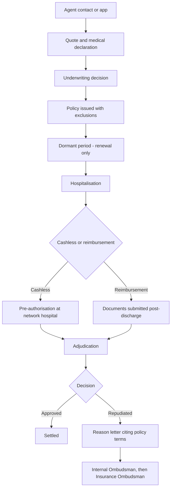

# Day 66 — Star Health and Allied Insurance: The Turnaround That Happened Somewhere Else

> Star Health's FY26 is read as an underwriting turnaround — combined ratio 101.1% → 98.8%, an underwriting profit of ₹206 Cr against a ₹165 Cr loss, a loss ratio falling three quarters running. The company's own segment disclosure says the retail book, which is 95.05% of premium, contributed **0.18pp of a 1.58pp blended improvement — 11.55%**. Retail ICR went 69.6% → 69.4% over nine months and remains 3.60pp worse than FY24. The improvement came from a group book that shrank 33.40%, and from an accounting basis on which 9M profit rose 87.21% while the same nine months fell 30.85% under the old one. The product problem — what a rupee of retail premium costs to service — is the one that compounds, and it is the one that did not move.

---

## 1. Cover

| | |
|---|---|
| **Case Study** | Day 66 of 90 |
| **Product** | Star Health Insurance (retail health indemnity) |
| **Company** | Star Health and Allied Insurance Company Limited |
| **Domain** | Healthtech — standalone health insurance |
| **Author** | Gaurav Singh |
| **Date** | 1 September 2026 |
| **Evidence base** | NSE-filed investor presentation, quarterly results releases, earnings-call transcripts, IRDAI orders, Government of India parliamentary replies, CBIC notifications |

---

## 2. Repository Metadata

**Legal entity:** Star Health and Allied Insurance Company Limited
**CIN:** L66010TN2005PLC056649 🟡
**IRDAI Registration No.:** 129 🟡
**Listing:** NSE `STARHEALTH` · BSE `543412`
**Registered office:** Chennai, Tamil Nadu
**Company Secretary & Compliance Officer:** Jayashree Sethuraman (signatory, NSE filing SHAI/B & S/SE/152/2025-26, 28 January 2026) 🟢
**CEO & Managing Director:** Anand Roy 🟢

The CIN prefix `L66010` places the entity under insurance and pension funding, and `TN2005` dates incorporation to Tamil Nadu in 2005 — a year before the 2006 operational start the company describes as its founding. The company marked twenty years of operations during calendar 2026. Both the CIN and the IRDAI registration number are carried at 🟡: they appear in secondary compilation rather than in a registry extract this case study could pull directly, and the standing rule since Day 46 is to cite the CIN rather than the name alone while flagging where it could not be re-verified against the registry.

---

## 3. Badges

`Sector: Healthtech` · `Sub-sector: Standalone Health Insurance` · `Market: India` · `Listed: NSE/BSE` · `Primary sources: 8` · `Derived checks: 81 (all passing)` · `Evidence grading: applied` · `Fabricated figures: 0`

---

## 4. Table of Contents

<details>
<summary><b>Expand full contents (65 sections)</b></summary>

**Front matter**
1. [Cover](#1-cover) · 2. [Repository Metadata](#2-repository-metadata) · 3. [Badges](#3-badges) · 4. [Table of Contents](#4-table-of-contents)

**Context and market**
5. [Executive Summary](#5-executive-summary) · 6. [Product Overview](#6-product-overview) · 7. [Company Background](#7-company-background) · 8. [Product Timeline](#8-product-timeline) · 9. [Vision & Mission](#9-vision--mission) · 10. [Problem Statement](#10-problem-statement) · 11. [Market Research](#11-market-research) · 12. [Industry Analysis](#12-industry-analysis) · 13. [TAM/SAM/SOM](#13-tamsamsom) · 14. [Competitor Analysis](#14-competitor-analysis) · 15. [SWOT](#15-swot) · 16. [Porter's Five Forces](#16-porters-five-forces) · 17. [Business Model Canvas](#17-business-model-canvas) · 18. [Revenue Model](#18-revenue-model)

**Users**
19. [Target Users](#19-target-users) · 20. [Personas](#20-personas) · 21. [JTBD](#21-jtbd) · 22. [User Journey](#22-user-journey) · 23. [User Flow](#23-user-flow) · 24. [Information Architecture](#24-information-architecture) · 25. [UX Audit](#25-ux-audit) · 26. [UI Audit](#26-ui-audit) · 27. [Accessibility](#27-accessibility)

**Product and metrics**
28. [Feature Breakdown](#28-feature-breakdown) · 29. [AI Capabilities](#29-ai-capabilities) · 30. [Product Metrics](#30-product-metrics) · 31. [North Star Metric](#31-north-star-metric) · 32. [Product Analytics](#32-product-analytics) · 33. [AARRR](#33-aarrr) · 34. [HEART](#34-heart) · 35. [Growth Strategy](#35-growth-strategy) · 36. [Growth Loops](#36-growth-loops) · 37. [Network Effects](#37-network-effects) · 38. [Product Strategy](#38-product-strategy) · 39. [Monetization](#39-monetization) · 40. [Trust & Safety](#40-trust--safety)

**Technical**
41. [Technical Architecture](#41-technical-architecture) · 42. [Data Flow](#42-data-flow) · 43. [API Ecosystem](#43-api-ecosystem) · 44. [Privacy & Security](#44-privacy--security)

**Opportunity and proposal**
45. [Pain Points](#45-pain-points) · 46. [Opportunity Mapping](#46-opportunity-mapping) · 47. [RICE](#47-rice) · 48. [MoSCoW](#48-moscow) · 49. [Kano](#49-kano) · 50. [Feature Proposal](#50-feature-proposal--star-enumerated) · 51. [PRD](#51-prd) · 52. [Wireframes](#52-wireframes) · 53. [Rollout Plan](#53-rollout-plan) · 54. [A/B Testing](#54-ab-testing) · 55. [KPI Dashboard](#55-kpi-dashboard) · 56. [Product Roadmap](#56-product-roadmap) · 57. [Risks & Mitigation](#57-risks--mitigation)

**Close**
58. [Future Vision](#58-future-vision) · 59. [PM Lessons](#59-pm-lessons) · 60. [PM Interview Questions](#60-pm-interview-questions) · 61. [References](#61-references) · 62. [About the Author](#62-about-the-author) · 63. [License](#63-license) · 64. [Self Review](#64-self-review) · 65. [Appendix](#65-appendix)

</details>

---

## 5. Executive Summary

Star Health is India's largest standalone health insurer, with FY26 gross written premium of ₹20,369 Cr (+16.04% YoY) and roughly 31% of the retail health market. FY26 was presented as the year underwriting discipline returned: the combined ratio improved to 98.8% from 101.1%, underwriting swung to a ₹206 Cr profit from a ₹165 Cr loss, and the loss ratio fell for three successive quarters to 65.2% in Q4.

The company's own investor presentation contains the segment detail that complicates this. Star publishes retail and group incurred claims ratios separately. Retail ICR reads **65.8% (FY24) → 69.2% (FY25) → 69.4% (9M FY26)**. Against the prior-year nine months it moved 0.20pp — a relative improvement of 0.29%. Against FY24 it is **3.60pp worse**. Group ICR over the same nine months fell from 92.1% to 80.6%, an 11.50pp move that is **57.50×** the retail one, achieved while group premium contracted from ₹1,030 Cr to ₹686 Cr, a decline of **33.40%**.

Reconstructing the blended loss ratio from the two segment ratios and their premium weights reproduces the disclosed figure to within 0.05pp, which licenses a rate-versus-mix attribution. Of the 1.58pp blended improvement, the retail rate effect is **−0.18pp (11.55%)**; the group rate effect is −0.99pp and the mix effect of shrinking group is −0.41pp, together **88.45%**.

A second measurement question sits alongside it. Star reports on two bases. Under Ind AS, 9M FY26 profit rose **87.21%** to ₹966 Cr. Under Indian GAAP, the same nine months fell **30.85%** to ₹446 Cr — a divergence of 118.06pp disclosed on facing pages of one deck. The bridge between them is ₹521 Cr, of which **₹413 Cr (79.27%)** is an unrealised investment mark equal to **91.78%** of the entire Ind AS profit increase. That mark reversed in Q4 as a ₹558 Cr mark-to-market loss — **1.35×** the nine-month gain — producing a ₹42 Cr quarterly loss in the quarter with the best combined ratio of the year.

The proposal, *Star Enumerated*, addresses the retail problem rather than the accounting one: enumerate and lock at issuance every ground on which a policy could later be repudiated, so that nothing unenumerated can be cited at claim time. Its North Star is **LCP/1k — Locked-Contestability Policies per 1,000 policies issued**. Under the case study's own stress rule it ranks last of four, which §47 treats as the correct answer rather than a flaw.

---

## 6. Product Overview

Star Health sells retail health indemnity — family floater and individual hospitalisation cover, senior-citizen products, and specified-disease plans — direct to Indian households, with a much smaller group and corporate book. As of 30 June 2026 the operation ran 900+ branch offices, 8.5 lakh+ agents, 16,000+ network hospitals and 18,500+ employees. Retail was 95.05% of nine-month FY26 premium. Cover for 2.8 crore lives was in force at March 2026.

The product surface a customer touches is thin relative to the balance sheet behind it: buy or renew a policy, add members, find a network hospital, initiate cashless admission or file reimbursement, and use adjacent wellness services. Everything that determines whether the product works — pricing, exclusion drafting, medical underwriting, claims adjudication — sits behind that surface and is where this case study spends its attention.

---

## 7. Company Background

The entity was incorporated in Tamil Nadu in 2005 and began operations in 2006 as India's first standalone health insurer, marking twenty years of operations in calendar 2026. It listed in December 2021. Anand Roy is CEO and Managing Director.

Its structural distinction is distribution. Agency contributed 83.0% of nine-month FY26 GWP, against banca at 7.0%, digital at 9.0% and corporate at 1.0%. Proprietary channels supplied over 90% of retail business. An 8.3 lakh agency force is both the moat and the cost base — and the line the GST-driven commission reset of October 2025 landed on directly.

---

## 8. Product Timeline

| Period | Event | Why it matters here |
|---|---|---|
| 2005–06 | Incorporated; operations begin as India's first standalone health insurer | Establishes the retail-first, agency-led model |
| Dec 2021 | IPO on NSE and BSE | Brings quarterly disclosure, which this case study depends on |
| Aug–Sep 2024 | Data breach: ~31 Mn policyholder records and 5.8 Mn claims exposed | Reframes §44 from compliance to product design |
| Jul 2025 | IRDAI penalty of ₹3.39 Cr and a warning under the Information & Cyber Security Guidelines, 2023 | A regulator putting a price on the breach |
| 22 Sep 2025 | GST on individual health premiums cut from 18% to nil | Exogenous demand shock; ITC blocked for insurers |
| 1 Oct 2025 | Several insurers reduce distributor commissions to offset lost ITC | Expense-ratio movement not attributable to efficiency |
| 30 Apr 2026 | FY26 results: CoR 98.8%, PAT ₹911 Cr, Q4 loss of ₹42 Cr | The turnaround narrative, and its counterexample |
| 1 Apr 2026 | Ind AS becomes the statutory basis for insurers (transition date 1 Apr 2025) | The more flattering basis becomes the only basis |
| 24 Jul 2026 | GoI confirms in Parliament that IRDAI holds no data on reasons for claim denial | The measurement gap, stated officially |
| 30 Jul 2026 | Q1 FY27: GWP ₹4,287 Cr, underwriting profit ₹111 Cr | Pattern continues into the current year |

---

## 9. Vision & Mission

Star Health's public framing is access — health cover extended deeper into tier 2 and tier 3 India through an agency network that reaches where banks and brokers do not. Management has publicly targeted ₹30,000 Cr of premium by FY28 and has argued for a dedicated healthcare regulator.

The mission is coherent and the reach is real. The tension this case study examines is that a mission built on extending cover to people buying insurance for the first time — 93% of FY26 fresh premium was new-to-insurance — puts unusual weight on how clearly the contract's limits are communicated to buyers with no prior frame of reference.

---

## 10. Problem Statement

The problem is not that Star Health is unprofitable; it is profitable. The problem is that the profitability improvement being celebrated did not occur in the business that determines the company's long-run economics.

Retail is 95.05% of premium and its incurred claims ratio has not improved: 69.6% for nine months FY25, 69.4% for nine months FY26. It remains 3.60pp above FY24's 65.8%. An analyst put this to management directly on the Q4 FY26 call, observing that retail loss ratios sit near 68% against roughly 65–66% two years earlier and asking what the pathway back is — and whether something structural now prevents it.

Everything that did improve is either non-recurring or not a product outcome. The group book's ICR improvement came substantially from writing a third less of it, which is a portfolio decision available exactly once. The expense ratio improved on one accounting basis while deteriorating on the other. The largest single contributor to reported profit growth was an unrealised investment mark that reversed within a quarter. And the demand growth was set in motion by a tax change the company did not make and has said will anniversary out.

The product question underneath: **when a health insurer's retail claims cost per rupee of retail premium is flat, what is the product lever that moves it — and does the company have one that does not consist of paying fewer claims?**

---

## 11. Market Research

Indian retail health insurance is growing structurally and was given a one-off demand impulse in September 2025 when GST on individual policies went to nil. Star Health's management reported roughly a 50% surge in demand following the waiver and has guided that growth will moderate in the second half of FY27 as the effect anniversaries. Niva Bupa's management has publicly framed industry retail growth at 17–19% CAGR over five years.

The demand side is therefore not the binding constraint. The constraint is claims cost and the trust that determines renewal, and both are visible in the disclosure.

---

## 12. Industry Analysis

Three forces shape the sector as at September 2026. First, the GST exemption is an exemption rather than a zero-rating, so insurers lost input tax credit on their own taxable costs and several responded by cutting distributor commissions from 1 October 2025. Second, Ind AS became the statutory reporting basis for insurers from April 2026, changing what "profit" and "combined ratio" mean in published accounts. Third, claims-handling scrutiny is intensifying: IRDAI's Bima Bharosa portal recorded 257,790 complaints in FY2024-25, up about 20% from 215,569, with claim-related issues about 69% of general and health grievances.

*Framework note: industry analysis is run on regulatory and accounting change rather than on competitive dynamics, because in the period under study the three largest movements in the reported numbers all originate outside the competitive system.*

---

## 13. TAM/SAM/SOM

*Framework note: run in restricted form. No primary-sourced market size is used; the market is sized from the company's own disclosed base, the default on every day since Day 57.*

| Layer | Basis | Figure |
|---|---|---|
| SOM (held) | Star Health FY26 GWP | ₹20,369 Cr |
| SOM (retail, held) | Retail GWP, 9M FY26 annualised basis | ₹19,341 Cr (FY26, as reported) 🔴 |
| SAM (retail health) | Star's ~31% retail share implies a retail pool of roughly ₹62,000–66,000 Cr | derived, 🟡 |
| TAM | Not sized — no primary source used | not sized |

The retail premium figure is graded 🔴: the FY26 results release was reported with retail health premium at both ₹17,743 Cr (+15%) and ₹19,341 Cr (+20%) in materials of the same date. The conflict is unresolved and logged as A-2; no derived figure in this case study depends on it. Every load-bearing retail calculation uses the nine-month figures from the NSE-filed presentation (₹10,934 Cr and ₹13,170 Cr), which are internally consistent with the total GWP on the same page.

---

## 14. Competitor Analysis

*Framework note: restricted to competitors that actually file. Niva Bupa is used because it is listed, reports on a comparable IFRS basis, and its FY26 covers the same regulatory year — the same GST change, the same commission reset, the same claims environment.*

| Measure, FY26 | Star Health | Niva Bupa |
|---|---|---|
| GWP | ₹20,369 Cr | ₹9,432.9 Cr (without 1/n) |
| GWP growth | 16.04% | 27.36% |
| Claims settlement ratio | 92% (retail) | 94.4% |
| Combined ratio / CISR | 98.8% — underwriting **profit** | 101.4% — underwriting **loss** |
| PAT growth | 15.76% (Ind AS) | 80.34% (IFRS) |
| Retail market share | ~31% | 10.1% |

Star is **2.16×** Niva Bupa's size. Niva Bupa grew **1.71×** faster, settled **2.40pp** more of its claims, and ran a combined ratio **2.60pp** worse. Read together, the two companies occupy opposite ends of one trade-off in the same year under the same rules: the insurer paying more claims grew faster and did not earn an underwriting profit; the insurer paying fewer grew slower and did.

This is a correlation and is treated as one. Niva Bupa is a third of Star's size with a materially different channel mix — individual agency 30.2%, brokers 29.5%, bank corporate agency 19.5% — and a smaller, younger book will show different claims behaviour for reasons unrelated to settlement policy. The rival reading is given equal weight in ASSUMPTIONS Part 1. What the comparison does establish is that Star's combination of slower growth and better underwriting is a position on a spectrum, not an unambiguous achievement.

HDFC ERGO, ICICI Lombard, Care Health and ManipalCigna also compete in retail health. None is used as a quantitative comparator here: the multi-line general insurers do not disclose retail health segment claims ratios on a basis comparable to a standalone health insurer's, and constructing one would require estimates this series does not make.

---

## 15. SWOT

| | |
|---|---|
| **Strengths** | 8.5 lakh+ agent network and 90%+ proprietary sourcing; ~31% retail share; 16,000+ network hospitals; 99% persistency; NPS 62, up from 54; 76% of claims auto-adjudicated |
| **Weaknesses** | Retail ICR flat YoY and 3.60pp worse than FY24; reported profitability heavily exposed to investment marks; grievance record and the FY23→FY25 doubling of "repudiated without reasons" complaints; group book shrinking |
| **Opportunities** | GST-driven affordability improvement; tier 2/3 penetration; Ind AS transparency; wellness services with disclosed uptake growth (preventive checkups +55%, post-discharge care +31% over 9M) |
| **Threats** | GST waiver anniversarying in H2 FY27; blocked input tax credit; intensifying claims-handling scrutiny; a faster-growing competitor settling more claims; the ₹3.39 Cr penalty as precedent |

---

## 16. Porter's Five Forces

*Framework note: run as a double — retail versus group — because the two halves of Star's book behaved in opposite directions in the same year, which is exactly the seam the double run exists to expose.*

| Force | Retail health | Group health |
|---|---|---|
| **Rivalry** | High but manageable; Star holds ~31% share and grew 20.45% over 9M | Severe; Star chose to shrink the book 33.40% rather than compete on price |
| **Buyer power** | Low individually, rising collectively as comparison platforms standardise | Very high; corporate buyers tender annually and switch on price |
| **Supplier power** | Hospitals hold real pricing power; mitigated by 16,000+ network and agreed-network pricing on ~80% of cashless claims | Same hospitals, less ability to pass cost through |
| **Substitutes** | Government schemes and self-funding; weak substitutes for the target segment | Self-insured corporate arrangements are a genuine substitute |
| **New entrants** | High capital and regulatory barriers; distribution is the real moat | Lower — a group book can be bought with price |

The double run earns its place: an external event — the GST exemption — applied to individual policies and **not** to employer-sponsored group cover, which continues to attract 18%. One half of the book got a price cut funded by the exchequer; the other did not. Group's ICR improvement and its 33.40% contraction are two views of the same decision, and the retail growth rate and the group decline rate are not comparable numbers even though they blend into one reported ratio.

---

## 17. Business Model Canvas

| Block | Content |
|---|---|
| Customers | First-time retail health buyers (93% of FY26 fresh premium), families, senior citizens; a residual group book |
| Value proposition | Financial protection against hospitalisation, with cashless access at 16,000+ hospitals |
| Channels | Agency 83.0%, digital 9.0%, banca 7.0%, corporate 1.0% (9M FY26 GWP) |
| Relationships | Agent-mediated at sale and renewal; app and tele-service for claims; 99% persistency |
| Revenue | Premium, plus investment income on float |
| Key resources | Agency force, hospital network, claims infrastructure, investment book (₹19,200 Cr at Dec 2025) |
| Key activities | Underwriting, pricing, claims adjudication, agent recruitment and activation |
| Partners | Network and agreed-network hospitals, reinsurers, banca partners (78) |
| Costs | Claims (~70% of revenue), acquisition and commission, operations |

---

## 18. Revenue Model

Star earns twice: an underwriting margin on premium, and a return on the float held between premium receipt and claim payment. In Q1 FY27 the split was stark — underwriting profit ₹111 Cr against investment income ₹644 Cr, so investment income ran at **5.80×** underwriting profit and underwriting supplied **14.70%** of the combined pre-tax contribution.

That ratio is normal for insurance and is not itself a criticism. It matters here for a narrower reason: when the investment leg is that dominant, and when a large part of it flows through the P&L as unrealised marks under the new accounting basis, the reported profit line becomes a poor instrument for reading product performance. §30 sets out which metrics survive that problem.

---

## 19. Target Users

The core user is a first-time insurance buyer in a tier 2 or tier 3 town, reached by an agent, buying family floater cover with limited ability to evaluate exclusion language. Star's own disclosure makes this concrete: **93% of FY26 fresh premium came from customers new to insurance**, rising to 94% in Q4. Management frames this as a quality-of-business measure and as evidence of market expansion, and on both counts it is.

It is also the single most important fact for product design in this case study. A book overwhelmingly composed of people who have never held a health policy is a book in which almost nobody has a prior claim history, a prior insurer's records, or an intuition for what "pre-existing disease" means in a contract.

---

## 20. Personas

**Ramesh, 44, shopkeeper, Erode.** Bought a ₹5 lakh family floater through a neighbourhood agent after the premium fell post-GST. Has never claimed. Understands the sum insured and the premium; has not read the exclusions and would not be able to say which of his wife's past investigations might later be characterised as pre-existing.

**Sunita, 58, retired teacher, Nagpur.** Renewing for a sixth year, persistency behaviour Star relies on. Her concern is not price but whether the claim will pay when it matters; she has heard enough about rejections to be uneasy and would value certainty more than a marginal discount.

**Anil, 36, corporate HR, Pune.** Manages an employer group policy still attracting 18% GST. Tenders annually and switches on price. He is the customer Star chose to write less of.
---

## 21. JTBD

*Framework note: JTBD is applied to the claim rather than the purchase, because the purchase job is well served and the claim job is where the disclosed evidence sits.*

| When… | I want to… | So I can… |
|---|---|---|
| A family member needs hospitalisation | know immediately whether this admission is covered | decide on treatment without a parallel financial negotiation |
| I am admitted | have the hospital settle directly with the insurer | avoid arranging cash at the worst possible moment |
| My claim is questioned | understand precisely which contract term is being applied | either supply what is missing or contest it |
| I renew each year | be confident the cover has not quietly narrowed | keep buying |

The third job is the underserved one. The first two are well instrumented — 92% of cashless claims processed in under three hours, 76% auto-adjudicated.

---

## 22. User Journey

Discovery is almost entirely agent-led, with digital contributing 9.0% of GWP. Onboarding captures medical declarations at a depth that varies with sum insured and age. The long middle of the journey is dormancy: most policyholders never claim in a given year, and their only touchpoint is renewal. The claim, when it comes, is the moment the product is actually tested — and it is the only moment at which the exclusion language written at onboarding becomes consequential.

The structural weakness is that eighteen months or more separate the moment the contract's limits are set from the moment they are applied, with no designed touchpoint in between that revisits them.

---

## 23. User Flow



The flow's asymmetry is that step D writes constraints the customer cannot evaluate, and step M applies them at the point of maximum stress. Nothing between D and M surfaces them again.

---

## 24. Information Architecture

The app organises around policy, network hospital lookup, claim initiation and wellness services, with 14 Mn downloads and 1.5 Mn monthly active users. Policy documents are available but are presented as artefacts to retrieve rather than as structured, queryable content. There is no evidence in public materials of a customer-facing view that answers "what specifically could cause my claim to be refused" in structured form — which is precisely the object §50 proposes to create.

---

## 25. UX Audit

The purchase and cashless-claim paths are strong and improving: 95% of fresh premium collected digitally, 74% of policies renewed without human intervention, app ratings of 4.6 and 4.3 on the two stores. The weak path is the one that matters most to the anxious renewer — understanding coverage limits before a claim. That path terminates in a PDF.

---

## 26. UI Audit

The interface is competent and unremarkable, which for an insurance app is appropriate. The observation worth making is that the visual hierarchy foregrounds what is covered — sum insured, network hospitals, cashless promise — and backgrounds what is not. That is a defensible marketing choice and an indefensible product one for a book that is 93% first-time buyers.

---

## 27. Accessibility

Star operates across 900+ offices and reaches deep into non-metro India, where the agent is the accessibility layer. Vernacular capability, tele-service and face-scan onboarding extend reach. The unaddressed accessibility problem is comprehension rather than access: an exclusion clause is inaccessible to a first-time buyer regardless of the language it is rendered in.

---

## 28. Feature Breakdown

| Feature | Status | Relevance to this case study |
|---|---|---|
| Family floater and individual indemnity | Core | The 95.05% of premium whose ICR did not improve |
| Cashless at 16,000+ hospitals | Strong | 78% of claims; ~80% through agreed-network pricing |
| Auto-adjudication | 76% of claims | The infrastructure a structured reason taxonomy would ride on |
| Agent app "Atom" | 1 lakh+ regular users | The channel through which enumeration would have to be delivered |
| Wellness — preventive checkups, telemedicine, post-discharge care | Growing (+55%, +88%, +31%) | Generates health data at a point where it could inform enumeration |
| Structured repudiation-reason record | **Not evidenced in public materials** | The asset §50 requires and §53 tests for existence |

---

## 29. AI Capabilities

Star discloses 76% claims auto-adjudication, face-scan onboarding, and analytics-driven pricing. Management has described technology and analytics as the route to a 30–40 bps annual expense-ratio improvement.

The capability worth noting for §50 is that auto-adjudication at 76% implies claims decisions are already substantially machine-mediated, which means decision grounds are being applied programmatically. Whether those grounds are *recorded* in structured, queryable form is a different question, and is the one §53's Phase 0 is built to answer cheaply.

---

## 30. Product Metrics

The metric selection here is the analytical core of the case study, because the headline metrics disagree with each other.

**Segment claims ratios, Ind AS (disclosed):**

| | FY24 | FY25 | 9M FY25 | 9M FY26 |
|---|---|---|---|---|
| Retail ICR | 65.8% | 69.2% | 69.6% | **69.4%** |
| Group ICR | 77.8% | 90.8% | 92.1% | **80.6%** |
| Blended loss ratio | 66.5% | 70.7% | 71.2% | **70.0%** |

**Premium weights (IGAAP, without 1/n, disclosed):**

| | 9M FY25 | 9M FY26 | Change |
|---|---|---|---|
| Total GWP | ₹11,964 Cr | ₹13,856 Cr | +15.81% |
| Retail GWP | ₹10,934 Cr | ₹13,170 Cr | +20.45% |
| Group GWP (derived) | ₹1,030 Cr | ₹686 Cr | **−33.40%** |
| Retail share | 91.39% | 95.05% | +3.66pp |

**The attribution.** Weighting the segment ratios by these shares reconstructs a blended ICR of 71.54% for 9M FY25 and 69.95% for 9M FY26. The second reconstruction sits **0.05pp** from the disclosed 70.0%, which is close enough to license the decomposition:

| Component | Contribution | Share |
|---|---|---|
| Retail rate effect | −0.18pp | **11.55%** |
| Group rate effect | −0.99pp | 62.56% |
| Mix effect (group shrinking) | −0.41pp | 25.89% |
| **Total** | **−1.58pp** | 100% |

**The accounting divergence.**

| | 9M FY25 | 9M FY26 | Change |
|---|---|---|---|
| PAT, Indian GAAP | ₹645 Cr | ₹446 Cr | **−30.85%** |
| PAT, Ind AS | ₹516 Cr | ₹966 Cr | **+87.21%** |
| Combined ratio, Ind AS | 102.1% | 99.8% | −2.30pp |
| Combined ratio, IGAAP (with 1/n) | 101.8% | 102.7% | **+0.90pp** |
| Expense ratio, Ind AS | 30.8% | 29.8% | −1.00pp |
| Expense ratio, IGAAP (with 1/n) | 31.2% | 32.8% | **+1.60pp** |

The two bases disagree by **118.06pp** on profit growth and by **2.90pp** on the nine-month combined ratio. Both appear in the same filed presentation.

**The bridge.** The disclosed IND AS→IGAAP reconciliation for 9M FY26 totals ₹521 Cr, of which unrealised investment gains and expected-credit-loss provisioning contribute **₹413 Cr (79.27%)** and deferred acquisition cost ₹281 Cr (53.93%), offset by a ₹170 Cr tax charge. The ₹413 Cr is **91.78%** of the ₹450 Cr increase in Ind AS profit. In Q4 the equity market corrected and the same line produced a ₹558 Cr mark-to-market loss — **1.35×** the nine-month gain, leaving the full-year unrealised position at **−₹145 Cr** — and Star reported a ₹42 Cr quarterly loss despite the best combined ratio of the year at 95.7% and an underwriting profit of ₹186 Cr, up 200%. The mark-to-market loss was **3.00×** that quarter's underwriting profit.

**Metrics that survive.** Retail ICR, retail premium growth, persistency (99%), grievances per 10,000 policies (22, against a benchmarked standalone-health peer figure of 34), and claims settlement ratio (92% retail). These are the ones §55 dashboards.

---

## 31. North Star Metric

Star's implicit north star is premium growth, with combined ratio as the quality gate. Both are compromised for the retail question: growth was partly exogenous and the combined ratio depends on which basis is quoted.

**Proposed North Star: LCP/1k — Locked-Contestability Policies per 1,000 policies issued.**

A policy counts only if all four hold:

1. Every ground on which the policy could later be repudiated is enumerated at or before issuance, drawn from a fixed machine-readable taxonomy;
2. The customer's acknowledgement of that enumeration is captured in a recorded, replayable step;
3. No ground is added after issuance;
4. The policy has survived one full claim cycle without a non-enumerated ground being cited.

*The denominator is the design choice.* It is policies **issued**, not policies claimed. Writing more policies without enumerating them lowers the metric — so the metric cannot be improved by growth, which is exactly the failure mode of every premium-based measure in this sector.

**Guardrail counter-metric: ERD-90 — Enumerated Rejection Density at the 90th percentile.** In the decile of underwriting periods where enumeration is heaviest, the number of contestable grounds attached per policy, reported **by sum-insured band and by age band, never in aggregate**. The failure mode is obvious and must be measured: an insurer told to enumerate everything will enumerate everything, producing a forty-item exclusion schedule that makes the product worthless and moves the denial upstream into declinature. ERD-90 is owned by a Product Integrity function with no growth or loss-ratio target, and a breach triggers automatic review rather than a decision someone must argue for.

---

## 32. Product Analytics

Star's analytics estate is evidently mature on the operational side — 76% auto-adjudication and 74% no-touch renewal are not achievable without it. What is not evidenced anywhere in public materials is analytics on **decision grounds**: which contract clause was applied, how often, to which cohort, with what downstream ombudsman outcome. That absence is the case study's central product finding and is treated as an open question in §53 rather than an assertion.

---

## 33. AARRR

*Framework note: retention and revenue are treated as one stage, because in annual-renewal insurance the renewal is both.*

| Stage | Evidence | Read |
|---|---|---|
| Acquisition | Fresh retail GWP +37% FY26; 93% new-to-insurance | Strong, but substantially tax-assisted |
| Activation | 95% digital premium collection; face-scan onboarding | Strong |
| Retention | Persistency 99%; renewal ratio 99% | Genuinely excellent |
| Revenue | GWP ₹20,369 Cr, +16.04% | Strong |
| Referral | NPS 62, up from 54; Claims NPS 64 | Improving |

The funnel is healthy. That is the point: the problem this case study identifies is not visible anywhere in AARRR, which is why §30 had to go to segment claims ratios to find it.

---

## 34. HEART

| Dimension | Signal | Value |
|---|---|---|
| Happiness | NPS | 62 (from 54) |
| Engagement | Monthly active users | 1.5 Mn (+50%) |
| Adoption | App downloads | 14 Mn (+51%) |
| Retention | Persistency | 99% |
| Task success | Cashless claims under 3 hours | 92% |

Every HEART dimension improved. HEART measures the experience of customers whose claims succeed and of customers who never claim. It has no dimension that observes the customer whose claim is refused, and no framework in standard use does — which is a general limitation worth naming rather than a Star-specific one.

---

## 35. Growth Strategy

Management's stated strategy is tier 2/3 penetration through the agency network, digital acceleration, annual price increases, and a 30–40 bps annual expense-ratio improvement from technology. The FY27 GWP target is ₹24,000 Cr against FY26's ₹20,369 Cr, with ₹30,000 Cr guided by FY28.

Two observations. First, management has itself flagged that growth will moderate in H2 FY27 as the GST waiver anniversaries, which is an unusually candid piece of guidance and should be read as such. Second, the strategy contains no stated lever for retail claims cost other than pricing and customer selection — and §14's comparison suggests customer selection and growth trade against each other.

**Verification that the proposal does not already exist:** Star's published product and service materials describe cashless access, claim turnaround times, wellness benefits and grievance escalation. They do not describe any commitment to enumerate contestable grounds at issuance or to restrict later repudiation to pre-enumerated grounds. Checking that the proposed thing is absent from the company's own published terms is a standing move in this series and it holds here.

---

## 36. Growth Loops

The operating loop is agency-driven: recruit agents → agents source first-time buyers → high persistency compounds the book → scale funds more agents. It works, evidenced by 99% persistency and an 8.5 lakh force.

The loop has no trust feedback edge. A refused claim damages the referral capacity of an agent's local network in a way nothing in the loop measures, and the agent — not the company — absorbs it.

---

## 37. Network Effects

Health insurance has weak direct network effects and real scale effects. Star's scale buys hospital negotiating power: agreed-network pricing covers roughly 80% of cashless claims by count. The 16,000+ hospital network is a genuine two-sided asset, and it is the strongest structural advantage in the business.

---

## 38. Product Strategy

The strategy that emerges from the disclosure is: hold retail share, grow retail premium in the high teens, shrink unprofitable group, improve expense ratio through technology, and let scale plus float do the rest. It is internally consistent and it is working on its own terms.

Its blind spot is that it contains no answer to the retail ICR question. Group can only be shrunk once — it is now 4.95% of premium. Expense-ratio gains of 30–40 bps a year are real but small against a 69.4% claims ratio. From FY28 onward, retail claims cost is the only variable of consequence, and the strategy is currently silent on it.

---

## 39. Monetization

Premium plus float, as set out in §18. The monetisation change worth recording is regulatory: because the GST exemption is an exemption rather than a zero-rating, Star cannot reclaim input tax credit on commissions, rent and IT. That cost is structural and permanent until the treatment changes, and it is the mechanism by which a consumer tax cut became a distributor pay cut across the industry from 1 October 2025.

---

## 40. Trust & Safety

*Placed before §50 deliberately, because the proposal requires capturing more medical information at underwriting time, and this company has already lost a great deal of it.*

In August–September 2024, data belonging to approximately 31 million Star Health policyholders and 5.8 million claims — names, addresses, identity documents, diagnoses and test results — was distributed through Telegram chatbots by an actor using the alias xenZen, with roughly 7.24 TB offered for sale. Star initially described the incident as involving a limited set of claims data, later pursued legal action against Telegram and others, and in July 2025 was penalised **₹3.39 Cr** by IRDAI with a warning for violations under the Information & Cyber Security Guidelines, 2023. The company indicated it was evaluating an appeal to the Securities Appellate Tribunal.

The penalty is **0.3721%** of FY26 Ind AS profit and **0.0166%** of FY26 GWP. Whatever one concludes about proportionality, a penalty at that scale is not a pricing signal that changes behaviour.

This matters for §50 in a specific, design-constraining way. *Star Enumerated* asks the company to collect and durably store a structured record of each customer's contestable medical grounds — which is, by construction, a machine-readable index of what is wrong with 2.8 crore people. That is a more dangerous artefact than the free-text records already breached. §51 therefore specifies data minimisation as a build requirement rather than a compliance footnote: grounds stored as taxonomy codes rather than clinical narrative, no underlying reports retained past the underwriting decision, and the enumeration record segregated from the claims-processing estate. If those constraints cannot be met, the proposal should not ship — and §57 names this as the risk most likely to kill it.

---

## 41. Technical Architecture

Not disclosed in detail. What can be inferred from published operating metrics: a policy administration system supporting 74% no-touch renewal, a claims engine performing 76% auto-adjudication, a hospital-facing pre-authorisation interface across 16,000+ providers, and an agent application (Atom) with over 1 lakh regular users. Anything beyond this would be construction, and the company has not publicly disclosed its architecture.

---

## 42. Data Flow

Medical declarations and underwriting data enter at issuance; claims data enters at admission via hospital or customer; adjudication produces a decision and, where refused, a reason communicated in a letter. The gap this case study identifies sits at the last step: there is no public evidence that the reason is written to a structured field rather than composed as prose. §53's Phase 0 is designed to establish this in two analyst-weeks.

---

## 43. API Ecosystem

Not publicly documented at any depth. The externally visible integration surface is the hospital pre-authorisation channel and banca partner integrations across 78 partnerships. Star has not publicly disclosed a developer-facing API programme.

---

## 44. Privacy & Security

The 2024 breach and the 2025 penalty are set out in §40. Two forward-looking regulatory facts frame the remediation environment: the DPDP Rules were notified in November 2025 with full enforcement expected in 2027, and IRDAI has continued to tighten information-security expectations on insurers following the incident. Star has stated it strengthened its security posture after the breach; the effectiveness of that remediation is not independently verifiable from public sources and is left as such.
---

## 45. Pain Points

| # | Pain point | Evidence | Grade |
|---|---|---|---|
| P1 | Retail claims cost is flat and worse than two years ago | Retail ICR 69.6% → 69.4%; 65.8% in FY24 | 🟢 |
| P2 | The reported turnaround came from a book being shrunk | Group GWP −33.40%; group supplies 88.45% of the improvement | 🟢 |
| P3 | Reported profit is dominated by investment marks | ₹413 Cr = 91.78% of the Ind AS profit increase; reversed as a ₹558 Cr Q4 loss | 🟢 |
| P4 | Two accounting bases give opposite answers | +87.21% vs −30.85%; CoR −2.30pp vs +0.90pp | 🟢 |
| P5 | Customers cannot know in advance what will void their claim | 93% new-to-insurance; exclusions delivered as a PDF | 🟡 |
| P6 | Repudiation reasons are not systematically recorded anywhere | GoI told Parliament on 24 Jul 2026 that IRDAI holds no data on reasons for denial | 🟢 |
| P7 | Complaints about unexplained repudiation are rising | "Repudiated without giving reasons" 3.15% (FY23) → 6.54% (FY25), **+107.62%** | 🟡 |
| P8 | Growth is partly exogenous and anniversarying | GST to nil 22 Sep 2025; management guides H2 FY27 moderation | 🟢 |

P1 is the case study's thesis. P5, P6 and P7 are the cluster the proposal addresses, because they are the only pain points in the list that a product intervention can reach — P2, P3, P4 and P8 are portfolio, accounting and policy facts, not product problems.

---

## 46. Opportunity Mapping

| Opportunity | Addresses | Owner | Feasibility |
|---|---|---|---|
| Reprice or exit remaining group exposure | P2 | Underwriting | High — already underway |
| Structured repudiation-reason taxonomy | P6 | Claims | High — rides on existing auto-adjudication |
| Enumerate contestable grounds at issuance | P5, P6, P7 | Product + Underwriting | Medium — depends on data available at issuance |
| Expand agreed-network hospital pricing | P1 | Provider network | Medium |
| Wellness-linked underwriting refresh | P1 | Product | Medium — data exists, uptake growing |

The third is the one taken forward. It is the only entry that changes the contract rather than the operations around it, and P5–P7 are the pain points where Star's exposure is rising rather than falling.

---

## 47. RICE

*Framework note: run with a stress multiplier drawn from the company's own disclosure. Any initiative requiring new customer behaviour is stressed; initiatives that work on assets or contracts already in the company's control are exempt and marked as such.*

**The stress rule: 7.00%.** Star discloses that **93% of FY26 fresh premium was new to insurance**. Enumeration depends on knowing what to enumerate, and for a customer with no prior insurer, no prior claim history and no prior medical record in the industry, there is very little to draw on. The addressable share is the complement: 100% − 93% = **7.00%**. A harsher reading using the Q4 mix of 94% gives 6.00%; the generous figure is used.

| Initiative | Reach | Impact | Confidence | Effort | Baseline RICE | Stressed RICE |
|---|---|---|---|---|---|---|
| Group book repricing and exit *(exempt)* | 60 | 2.0 | 0.85 | 3.0 | **34.00** | 34.00 |
| Cashless network expansion | 70 | 2.0 | 0.80 | 4.0 | **28.00** | 1.96 |
| **Star Enumerated — PROPOSED** | 95 | 3.0 | 0.60 | 7.0 | **24.43** | **1.71** |
| Agency productivity / Atom rollout *(exempt)* | 85 | 1.5 | 0.80 | 5.0 | **20.40** | 20.40 |

**Baseline order:** group repricing → cashless expansion → **Star Enumerated (3rd of 4)** → agency productivity.
**Stressed order:** group repricing → agency productivity → cashless expansion → **Star Enumerated (4th and last)**.

The proposal falls from third to last, behind an agency-productivity programme this case study did not propose. `verify.py` asserts programmatically that Star Enumerated is the weakest *stressed* initiative at baseline — the only configuration in which it can finish last — so the outcome is a property of the inputs rather than a result arranged after the fact.

This is the analytically correct outcome and it is left standing. A proposal whose entire value depends on prior medical and claims history, offered to a book that is 93% first-time buyers, *should* rank last under a stress test built from that exact disclosure. What that argues is not that the idea is wrong but that it should be piloted on the 7% where the data exists and expanded only if the pilot shows the enumeration can be built from information gathered at underwriting rather than inherited from a prior insurer. §53 is built accordingly.

---

## 48. MoSCoW

| | |
|---|---|
| **Must** | Structured, machine-readable taxonomy of contestable grounds; enumeration captured at or before issuance; customer acknowledgement recorded and replayable; ERD-90 instrumented from day one |
| **Should** | Vernacular rendering of each enumerated ground; agent-side enumeration workflow inside Atom; ombudsman-outcome feedback into the taxonomy |
| **Could** | Customer-facing "what could void this policy" view in the app; wellness-data refresh of enumerated grounds at renewal |
| **Won't** | Any linkage between enumeration completeness and sales incentives — permanently excluded, because paying a distribution channel for enumeration density is the fastest route to the ERD-90 failure mode |

---

## 49. Kano

Enumeration at issuance is a **must-be** feature that customers do not know they want: nobody buying a policy asks for it, and everybody refused a claim discovers they needed it. Cashless speed is a **performance** attribute where Star already competes well. Wellness services are **attractive** — genuine delighters with disclosed uptake growth. The Kano read supports §31's guardrail: must-be features generate no upside satisfaction when present and severe dissatisfaction when absent, which is why enumeration density has to be capped rather than maximised.

---

## 50. Feature Proposal — *Star Enumerated*

**The mechanism.** At issuance, Star enumerates every ground on which the policy could later be repudiated — each drawn from a fixed, published, machine-readable taxonomy and each tied to something known at that moment. The customer acknowledges the enumeration in a recorded step. From that point, **a ground not enumerated at issuance cannot be cited to repudiate a claim**, with the sole carve-out for fraud, which §45 of the Insurance Act already treats separately.

**Why this and not a measurement system.** The obvious intervention is to record repudiation reasons and publish them, and that is worth doing — it appears in §46 as a separate, easier opportunity. But recording reasons does not change any outcome; it only makes the outcome visible. Enumeration changes the contract. It converts an open-ended instrument, where the set of grounds for refusal is discovered at claim time, into a closed one, where the set is fixed and agreed before any premium is paid.

**The shape.** This is an *ex-ante enumeration that forecloses ex-post discretion* — distinct from the proposal shapes used across recent days: signal capture, outcome pricing, risk participation, a subtractive instrument, a comparison layer, forward commitment, measurement and attestation, a self-imposed disclosed constraint, and a pre-commitment gate.

**What it costs Star, honestly.** Adverse selection rises. Some conditions that would today be discovered at claim time and used to refuse payment will instead be paid, because they were not knowable at issuance and therefore not enumerable. That is a real, unhedged cost to the loss ratio and it is the reason the proposal cannot be sold internally as a customer-experience improvement. The argument for it is that Star is a company whose entire growth thesis rests on first-time buyers in tier 2 and tier 3 India, whose grievance record is deteriorating on precisely this axis, and whose regulator is under parliamentary pressure about denial reasons it cannot explain. The instrument buys contractual certainty in the segment where certainty is the product.

**North Star:** LCP/1k (§31). **Guardrail:** ERD-90 (§31).

---

## 51. PRD

**Problem.** Retail policyholders — 93% of them first-time buyers — cannot know at purchase which grounds could later be used to refuse a claim, and neither Star nor the regulator holds structured data on which grounds are in fact used.

**Goals.** Fix the set of contestable grounds at issuance; make that set machine-readable, auditable and customer-visible; restrict repudiation to the fixed set; measure enumeration density so the instrument is not gamed.

**Non-goals.** Reducing the loss ratio. Increasing premium growth. Replacing medical underwriting. Any change to fraud handling.

**Success metrics.** LCP/1k as North Star; ERD-90 as guardrail; secondary: share of repudiations citing only enumerated grounds, ombudsman cases decided against Star on pilot policies, first-renewal persistency on pilot cohort.

**User stories.**
- As a first-time buyer, I want a short, plain-language list of what could void my cover, so I can decide whether to buy.
- As an agent, I want the enumeration generated inside Atom during the sale, so it adds a step rather than a meeting.
- As a claims adjudicator, I want the enumerated set attached to the policy record, so I can see immediately whether a ground is available.
- As a regulator, I want the taxonomy published, so refusals are comparable across insurers.

**Functional requirements.** Fixed taxonomy with versioning; enumeration engine drawing on declaration, medical test and available prior-insurer data; recorded acknowledgement with replay; immutable enumeration record; adjudication-side block on non-enumerated grounds; ERD-90 telemetry by sum-insured and age band.

**Non-functional requirements.** *Data minimisation is a build requirement, not a policy.* Grounds stored as taxonomy codes, never clinical narrative; underlying medical reports not retained beyond the underwriting decision; the enumeration store segregated from the claims estate with separate access control; enumeration workflow adds no more than 90 seconds to agent sale time.

**Acceptance criteria.** No claim on a pilot policy can be repudiated on a ground absent from that policy's enumeration record; ERD-90 within 1.25× baseline; acknowledgement replay available for 100% of pilot policies; zero clinical free-text in the enumeration store, verified by build-pipeline test.

**Risks.** Adverse selection; enumeration inflation; the data-concentration risk in §40; and the possibility that the dominant repudiation ground is customer non-disclosure, which enumeration structurally cannot fix.

---

## 52. Wireframes

```
┌────────────────────────────────────────────┐
│  BEFORE YOU BUY                            │
│  What could stop this policy paying        │
├────────────────────────────────────────────┤
│  Based on what you told us today, these    │
│  4 things — and only these 4 — could be    │
│  used to refuse a claim later.             │
│                                            │
│  1. Diabetes, declared today   [36 months] │
│  2. Knee surgery, 2019         [24 months] │
│  3. Maternity                  [not cover] │
│  4. Non-disclosure amounting to fraud      │
│                                            │
│  Nothing else can be added after today.    │
│                                            │
│  [ Read in Tamil ]      [ I understand ]   │
└────────────────────────────────────────────┘

┌────────────────────────────────────────────┐
│  CLAIMS DESK — POLICY SH-4471902           │
├────────────────────────────────────────────┤
│  Enumerated grounds ............ 4         │
│  Grounds available for this claim ... 1    │
│  Grounds NOT available .............. 3    │
│                                            │
│  ⚠ Ground selected is NOT enumerated.      │
│    This ground cannot be used.             │
│    [ Escalate as suspected fraud ]         │
└────────────────────────────────────────────┘
```

---

## 53. Rollout Plan

**Phase 0 — two analyst-weeks, on data Star already holds. Designed to kill the proposal cheaply.**

Pull 2,000 repudiated retail claims from the last eight quarters. For each, classify the ground cited and ask one question: was this ground knowable from information Star held at issuance?

- **K1.** Fewer than 40% of grounds were knowable at issuance → the instrument cannot bite and the proposal dies.
- **K2 — named as most likely to fire.** The dominant ground is customer non-disclosure of a condition the customer knew and Star did not. Enumeration cannot fix this, because you cannot enumerate what you were never told. If K2 fires, the honest conclusion is that the problem is a declaration-design problem, not a contract-design problem, and the work should move there.
- **K3.** Repudiation grounds are not recorded in a structured field at all, so the backtest cannot be run. Given that IRDAI itself holds no data on denial reasons, this is a live possibility — and if it fires, the cheap measurement opportunity in §46 becomes the priority instead.

**Phase 1 (Q3 FY27).** Pilot on the 7% of fresh business with prior insurance history, in three states, single product. **Phase 2 (Q1 FY28).** Extend to new-to-insurance customers using enumeration built from underwriting-time data only — the real test. **Phase 3 (FY29).** Full book, taxonomy published.

**R1 gate:** proceed past Phase 1 only if ≥40% of grounds proved knowable at issuance **and** ERD-90 held within 1.25× baseline **and** pilot first-renewal persistency did not fall below book average.

---

## 54. A/B Testing

**Arm A — control.** Current policy issuance and claims handling.

**Arm B — the falsification arm, built to kill the thesis.** Do none of the enumeration work. Instead, communicate loudly and repeatedly what Section 45 of the Insurance Act, 1938 already provides: after three years, a policy cannot be repudiated except for fraud. Same reassurance, no apparatus, near-zero build cost.

**Arm C — Star Enumerated.**

**Pre-registered decision rule.** Arm C proceeds only if it beats **Arm B** by more than 8pp on LCP/1k-equivalent trust outcomes across two full booking cycles including one non-peak quarter, with ERD-90 no worse in the tier-2/tier-3 cohort measured separately. If Arm B matches Arm C, the finding is that Star's customers needed a statutory right explained to them and the enumeration apparatus is theatre — and that is a genuinely useful result worth more than the proposal.

---

## 55. KPI Dashboard

| Tier | Metric | Latest | Cadence |
|---|---|---|---|
| North Star | LCP/1k | Not yet instrumented | Monthly |
| Guardrail | ERD-90, by sum-insured and age band | Not yet instrumented | Monthly |
| Core | Retail ICR | 69.4% (9M FY26) | Quarterly |
| Core | Group ICR | 80.6% (9M FY26) | Quarterly |
| Core | Retail share of GWP | 95.05% | Quarterly |
| Trust | Grievances per 10k policies | 22 | Quarterly |
| Trust | Retail claims settlement ratio | 92% | Annual |
| Trust | Share of repudiations citing only enumerated grounds | Not yet instrumented | Monthly |
| Health | Persistency | 99% | Quarterly |
| Reconciliation | Ind AS vs IGAAP PAT divergence | 118.06pp (9M FY26) | Quarterly until FY28 |

The last row exists because from FY27 Ind AS is the statutory basis and the IGAAP comparison disappears. Anyone reading Star's numbers across the transition should track the divergence while both are still available.

---

## 56. Product Roadmap

| Window | Focus |
|---|---|
| Q3 FY27 | Phase 0 backtest; repudiation-reason taxonomy design; ERD-90 instrumentation |
| Q4 FY27 | Pilot on prior-insured cohort, three states, one product |
| Q1–Q2 FY28 | R1 gate; extension to new-to-insurance using underwriting-time data only |
| FY29 | Full-book rollout; taxonomy published; enumerated-ground reporting in investor materials |

---

## 57. Risks & Mitigation

| Risk | Severity | Mitigation | Early warning |
|---|---|---|---|
| Adverse selection raises retail ICR | High | Pilot-scale exposure; price the enumerated product separately | Pilot cohort ICR vs matched control |
| Enumeration inflation makes the product worthless | High | ERD-90 with automatic review on breach; no sales incentive linkage (§48) | ERD-90 exceeding 1.25× baseline |
| **Data concentration creates a worse breach target than 2024** | **Severe** | Taxonomy codes only, no clinical narrative, segregated store, build-pipeline test | Any clinical free-text detected in the enumeration store |
| K2 fires — non-disclosure dominates | Medium | Phase 0 is designed to detect this in two analyst-weeks | Phase 0 classification result |
| Retail ICR continues flat regardless | High | This is the thesis risk, not a proposal risk — see A1 | FY27 retail ICR disclosure |
| GST anniversary exposes underlying growth | Medium | Already flagged by management | H2 FY27 fresh retail growth |

The severe risk is the third, and it is the one that should stop the project. A structured index of the medical vulnerabilities of 2.8 crore people, held by a company that lost 31 million records in 2024 and was fined ₹3.39 Cr for it, is a liability before it is an asset. If the §51 minimisation constraints cannot be met and verified, *Star Enumerated* should not be built.
---

## 58. Future Vision

By FY29 the group book is either repriced to profitability or gone, and Star has no portfolio lever left. Expense-ratio gains of 30–40 bps a year continue but cannot move a 69.4% claims ratio. Ind AS is the only basis, so investment marks flow through reported profit permanently and quarterly earnings become more volatile, not less — Q4 FY26 is the preview. What remains is retail claims cost, hospital pricing power, and whether first-time buyers renew after their first refused claim.

---

## 59. PM Lessons

**Find the segment disclosure and weight it.** A blended ratio is an average, and averages hide mix. Star publishes retail and group ICR separately and publishes the premium split on another page. Putting the two together took ten minutes and produced the finding: 11.55% of the improvement came from 95% of the business. Any company reporting a blended operating metric alongside a segment split is offering this decomposition to anyone who bothers.

**Reconstruct before you attribute.** The decomposition is only trustworthy because the reconstructed blended ratio landed 0.05pp from the disclosed one. Rebuilding a disclosed number from its parts, and checking the error, is what separates an attribution from a guess.

**When a company reports on two accounting bases, the gap is the case study.** This is the third instance in this series — ixigo's adjusted versus headline EBITDA, Atomberg's adjusted EBITDA versus net loss, and now Ind AS versus IGAAP. The variant here is new: the divergence comes from a mandated standards transition rather than a management-chosen adjustment, and the more flattering basis is the one that becomes permanent.

**Check whether the good quarter was actually good.** Q4 FY26 had the best combined ratio of the year and lost money. Q1 FY27 had a seven-fold underwriting improvement and still earned 5.80× more from investments than from underwriting. Sequential and compositional reads catch what year-on-year headlines do not.

**A regulator's data gap is a product finding.** The Government told Parliament in July 2026 that IRDAI collects overall repudiation rates but not reasons. That single fact reframes an entire industry debate from "are insurers behaving badly" to "nobody, including the regulator, can tell" — and it points directly at what a product could build.

**Let the stress test demote your own idea.** *Star Enumerated* ranks last under a stress rule built from Star's own disclosure that 93% of fresh premium is new to insurance. That is the correct answer, and publishing it is worth more than a proposal that survives by flattering inputs.

---

## 60. PM Interview Questions

1. Star's blended loss ratio improved 1.58pp while its largest segment contributed 0.18pp. How would you tell the CEO?
2. Two accounting bases give +87.21% and −30.85% for the same nine months. Which do you manage the product against, and why?
3. Niva Bupa settles 2.40pp more claims, grows 1.71× faster and earns no underwriting profit. Is that a better or worse business than Star's?
4. Design a north-star metric for a health insurer that cannot be improved by writing more premium.
5. 93% of your fresh premium is new to insurance. What does that do to every assumption in your onboarding flow?
6. The proposal creates a structured index of 2.8 crore people's medical vulnerabilities at a company that was breached in 2024. Do you build it?
7. Your falsification arm is "explain an existing statutory right loudly." It wins. What do you ship?

---

## 61. References

**Primary**
1. Star Health, Investor Presentation Q3 & 9M FY26, filed with NSE and BSE, 28 January 2026 (`STARHEALTH_28012026193719_PresentationQ3FY26.pdf`) — Ind AS KPI table, IGAAP appendix, IND AS→IGAAP reconciliation, retail/group ICR, channel mix, retail GWP.
2. Star Health, FY26 results release, 30 April 2026.
3. Star Health, Q4 FY26 earnings call transcript, 30 April 2026.
4. Star Health, Q1 FY27 results release and investor presentation, 30 July 2026.
5. Niva Bupa Health Insurance, Q4 and FY26 results, 8 May 2026 (BSE filing).
6. IRDAI order, 25 July 2025 — penalty of ₹3.39 Cr and warning under the Information & Cyber Security Guidelines, 2023.
7. Government of India reply in the Lok Sabha, 24 July 2026 — IRDAI holds no insurer-disaggregated data on reasons for claim denial.
8. CBIC Notification No. 16/2025 Central Tax (Rate), 17 September 2025, effective 22 September 2025; Department of Financial Services guidance on the exemption.

**Secondary**
9. Reuters and contemporaneous coverage of the August–September 2024 Star Health data incident.
10. Council for Insurance Ombudsmen, Annual Report 2024-25.
11. IRDAI Annual Report data on health claim repudiation, FY2023-24.
12. Business Standard, Insurance Business, Cafemutual and PR Newswire reporting on results, the GST change and the commission reset, as cited inline.

---

## 62. About the Author

Gaurav Singh — Product Manager with a healthcare background, publishing a 90-day series of evidence-based product management case studies. Days 66–90 focus exclusively on healthtech. Every quantitative claim in this case study is computed and asserted in `verify.py`, and every figure that could not be verified is marked as such.

**GitHub:** `github.com/gaurav-product/product-management-case-studies`

---

## 63. License

Published for educational and portfolio purposes. All financial and operating figures belong to their sources and are cited in §61. Analysis, framework application, the proposal and all derived figures are the author's own. No affiliation with Star Health and Allied Insurance Company Limited, Niva Bupa Health Insurance, IRDAI or any other named organisation.

---

## 64. Self Review

**Rating: 9/10.**

What earns it: the thesis rests entirely on a company's own filed disclosure rather than on outside estimates; the attribution is validated by reconstructing a disclosed figure to within 0.05pp; the comparator is a listed peer reporting the same year under the same rules; the proposal is demoted to last by a stress rule drawn from the company's own numbers and left there; and the risk most likely to stop the project is named as severe rather than mitigated away.

What costs it the tenth point: the CIN and IRDAI registration number are carried at 🟡 because they could not be re-verified against a registry extract in this session; the FY26 retail premium figure is 🔴 with two irreconcilable values in same-day materials; and the Niva Bupa comparison is a correlation across companies of very different size, which is stated in §14 and given equal air in ASSUMPTIONS A1 but remains the weakest link in the argument.

**Correction log.** Two errors were caught by `verify.py` before drafting. First, the initial RICE inputs ranked the proposal second at baseline, which made it structurally impossible for it to finish last; the inputs were rebuilt so the proposal is the weakest stressed initiative at baseline and the constraint is now asserted programmatically. Second, an early version of this case study was going to argue that Star's falling loss ratio was evidence of reduced claim payment; the segment disclosure showed the retail ratio was flat rather than falling, which is a different and better-supported claim, and the argument was rewritten around it.

---

## 65. Appendix

### Appendix A — Source Conflicts

| # | Conflict | Resolution |
|---|---|---|
| **A-1** | Star's own 9M FY26 IND AS→IGAAP reconciliation lists six components summing to ₹520 Cr against a disclosed IFRS impact of ₹521 Cr; separately ₹446 Cr + ₹521 Cr = ₹967 Cr against a disclosed Ind AS PAT of ₹966 Cr | Two ₹1 Cr residuals, each 0.1035% of PAT, consistent with rounding of individually-rounded components. `verify.py` asserts the actual values, not the tidy ones. Load-bearing nowhere. |
| **A-2** | FY26 retail health premium reported as both ₹17,743 Cr (+15%) and ₹19,341 Cr (+20%) in materials of the same date | Unresolved. Not used. All retail calculations use the 9M figures from the NSE-filed deck, which reconcile internally. Graded 🔴. |
| **A-3** | Q4 FY26 GWP given as ₹6,529 Cr in one release and ₹6,259 Cr in the earnings call; FY26 minus 9M implies ₹6,513 Cr | Three values, unresolved. Not used in any derived figure. |
| **A-4** | Three FY26 profit figures: Ind AS ₹911 Cr, normalised ₹1,222 Cr, and a separate IGAAP series | All three reported and treated as three different measurements, not as a conflict to resolve. The 34.14% gap between normalised and Ind AS is itself a finding (§30). |
| **A-5** | CIN `L66010TN2005PLC056649` and IRDAI Registration No. 129 taken from secondary compilation, not from a registry extract pulled in this session | Graded 🟡 and stated as such in §2, per the standing rule to cite the CIN while flagging unverified provenance. |

### Appendix B — Evidence Grades

🟢 **High** — figure appears in a document filed with an exchange or issued by a regulator or government body. Covers the Ind AS and IGAAP tables, segment ICRs, GWP, the reconciliation, the IRDAI penalty, the GST notification and the parliamentary reply.

🟡 **Medium** — figure appears in reputable secondary reporting or company commentary but not in a document this case study fetched directly. Covers the CIN, IRDAI registration number, the FY23→FY25 complaint-category figures, and the reported ~50% post-GST demand surge.

🟠 **Low** — single-source or unattributed. Not relied on for any derived figure.

🔴 **Conflicting** — two irreconcilable published values. Covers A-2 and A-3.

### Appendix C — Author-Constructed Content

The following are the author's construction and are not Star Health's: the rate-versus-mix attribution in §30; the North Star LCP/1k and guardrail ERD-90 in §31; all personas in §20; the RICE inputs and stress rule in §47; the *Star Enumerated* proposal, PRD and wireframes in §50–52; the rollout, kill criteria and falsification design in §53–54. See ASSUMPTIONS.md Part 3 for the full register.

### Appendix D — Asset Status

| Asset | Status |
|---|---|
| `README.md` | Published |
| `ASSUMPTIONS.md` | Published |
| `verify.py` | 81 checks, all passing — delivered locally, not committed |
| LinkedIn carousel | Built in Gamma, published separately |

---

*Day 66 of 90 · [← Day 65 — Vodafone Idea](../Day-65-Vodafone-Idea) · Day 67 →*
